cola Report for recount2:SRP050992
==================

**Date**: 2019-12-26 00:39:04 CET, **cola version**: 1.3.2

----------------------------------------------------------------

<style type='text/css'>

body, td, th {
   font-family: Arial,Helvetica,sans-serif;
   background-color: white;
   font-size: 13px;
  max-width: 800px;
  margin: auto;
  margin-left:210px;
  padding: 0px 10px 0px 10px;
  border-left: 1px solid #EEEEEE;
  line-height: 150%;
}

tt, code, pre {
   font-family: 'DejaVu Sans Mono', 'Droid Sans Mono', 'Lucida Console', Consolas, Monaco, 

monospace;
}

h1 {
   font-size:2.2em;
}

h2 {
   font-size:1.8em;
}

h3 {
   font-size:1.4em;
}

h4 {
   font-size:1.0em;
}

h5 {
   font-size:0.9em;
}

h6 {
   font-size:0.8em;
}

a {
  text-decoration: none;
  color: #0366d6;
}

a:hover {
  text-decoration: underline;
}

a:visited {
   color: #0366d6;
}

pre, img {
  max-width: 100%;
}
pre {
  overflow-x: auto;
}
pre code {
   display: block; padding: 0.5em;
}

code {
  font-size: 92%;
  border: 1px solid #ccc;
}

code[class] {
  background-color: #F8F8F8;
}

table, td, th {
  border: 1px solid #ccc;
}

blockquote {
   color:#666666;
   margin:0;
   padding-left: 1em;
   border-left: 0.5em #EEE solid;
}

hr {
   height: 0px;
   border-bottom: none;
   border-top-width: thin;
   border-top-style: dotted;
   border-top-color: #999999;
}

@media print {
   * {
      background: transparent !important;
      color: black !important;
      filter:none !important;
      -ms-filter: none !important;
   }

   body {
      font-size:12pt;
      max-width:100%;
   }

   a, a:visited {
      text-decoration: underline;
   }

   hr {
      visibility: hidden;
      page-break-before: always;
   }

   pre, blockquote {
      padding-right: 1em;
      page-break-inside: avoid;
   }

   tr, img {
      page-break-inside: avoid;
   }

   img {
      max-width: 100% !important;
   }

   @page :left {
      margin: 15mm 20mm 15mm 10mm;
   }

   @page :right {
      margin: 15mm 10mm 15mm 20mm;
   }

   p, h2, h3 {
      orphans: 3; widows: 3;
   }

   h2, h3 {
      page-break-after: avoid;
   }
}
</style>


## Summary


All available functions which can be applied to this `res_list` object:


```r
res_list
```

```
#> A 'ConsensusPartitionList' object with 24 methods.
#>   On a matrix with 10169 rows and 459 columns.
#>   Top rows are extracted by 'SD, CV, MAD, ATC' methods.
#>   Subgroups are detected by 'hclust, kmeans, skmeans, pam, mclust, NMF' method.
#>   Number of partitions are tried for k = 2, 3, 4, 5, 6.
#>   Performed in total 30000 partitions by row resampling.
#> 
#> Following methods can be applied to this 'ConsensusPartitionList' object:
#>  [1] "cola_report"           "collect_classes"       "collect_plots"         "collect_stats"        
#>  [5] "colnames"              "functional_enrichment" "get_anno_col"          "get_anno"             
#>  [9] "get_classes"           "get_matrix"            "get_membership"        "get_stats"            
#> [13] "is_best_k"             "is_stable_k"           "ncol"                  "nrow"                 
#> [17] "rownames"              "show"                  "suggest_best_k"        "test_to_known_factors"
#> [21] "top_rows_heatmap"      "top_rows_overlap"     
#> 
#> You can get result for a single method by, e.g. object["SD", "hclust"] or object["SD:hclust"]
#> or a subset of methods by object[c("SD", "CV")], c("hclust", "kmeans")]
```

The call of `run_all_consensus_partition_methods()` was:


```
#> run_all_consensus_partition_methods(data = mat, mc.cores = 4)
```

Dimension of the input matrix:


```r
mat = get_matrix(res_list)
dim(mat)
```

```
#> [1] 10169   459
```

### Density distribution

The density distribution for each sample is visualized as in one column in the
following heatmap. The clustering is based on the distance which is the
Kolmogorov-Smirnov statistic between two distributions.


```r
library(ComplexHeatmap)
densityHeatmap(mat, ylab = "value", cluster_columns = TRUE, show_column_names = FALSE,
    mc.cores = 4)
```


### Suggest the best k


Folowing table shows the best `k` (number of partitions) for each combination
of top-value methods and partition methods. Clicking on the method name in
the table goes to the section for a single combination of methods.

[The cola vignette](http://bioconductor.org/packages/devel/bioc/vignettes/cola/inst/doc/cola.html#toc_13)
explains the definition of the metrics used for determining the best
number of partitions.


```r
suggest_best_k(res_list)
```


|                            | The best k| 1-PAC| Mean silhouette| Concordance|   |
|:---------------------------|----------:|-----:|---------------:|-----------:|:--|
|[MAD:mclust](#MAD-mclust)   |          2| 1.000|           0.989|       0.995|** |
|[ATC:hclust](#ATC-hclust)   |          2| 1.000|           0.979|       0.990|** |
|[ATC:mclust](#ATC-mclust)   |          2| 1.000|           0.989|       0.995|** |
|[SD:hclust](#SD-hclust)     |          2| 0.995|           0.961|       0.983|** |
|[SD:mclust](#SD-mclust)     |          2| 0.988|           0.953|       0.965|** |
|[MAD:hclust](#MAD-hclust)   |          2| 0.951|           0.945|       0.974|** |
|[MAD:skmeans](#MAD-skmeans) |          2| 0.895|           0.929|       0.969|   |
|[MAD:kmeans](#MAD-kmeans)   |          3| 0.876|           0.901|       0.964|   |
|[SD:kmeans](#SD-kmeans)     |          3| 0.864|           0.901|       0.960|   |
|[ATC:NMF](#ATC-NMF)         |          2| 0.839|           0.903|       0.958|   |
|[ATC:kmeans](#ATC-kmeans)   |          3| 0.838|           0.898|       0.959|   |
|[SD:skmeans](#SD-skmeans)   |          2| 0.835|           0.907|       0.960|   |
|[CV:kmeans](#CV-kmeans)     |          2| 0.827|           0.916|       0.962|   |
|[CV:skmeans](#CV-skmeans)   |          2| 0.813|           0.908|       0.959|   |
|[ATC:skmeans](#ATC-skmeans) |          2| 0.805|           0.894|       0.955|   |
|[ATC:pam](#ATC-pam)         |          2| 0.519|           0.798|       0.906|   |
|[MAD:NMF](#MAD-NMF)         |          3| 0.489|           0.714|       0.856|   |
|[CV:NMF](#CV-NMF)           |          2| 0.313|           0.740|       0.863|   |
|[SD:NMF](#SD-NMF)           |          2| 0.229|           0.637|       0.815|   |
|[SD:pam](#SD-pam)           |          3| 0.197|           0.643|       0.814|   |
|[MAD:pam](#MAD-pam)         |          3| 0.131|           0.629|       0.795|   |
|[CV:pam](#CV-pam)           |          3| 0.121|           0.441|       0.687|   |
|[CV:mclust](#CV-mclust)     |          3| 0.081|           0.461|       0.665|   |
|[CV:hclust](#CV-hclust)     |          5| 0.022|           0.487|       0.550|   |

\*\*: 1-PAC > 0.95, \*: 1-PAC > 0.9


### CDF of consensus matrices

Cumulative distribution function curves of consensus matrix for all methods.


```r
collect_plots(res_list, fun = plot_ecdf)
```


### Consensus heatmap

Consensus heatmaps for all methods. ([What is a consensus heatmap?](http://bioconductor.org/packages/devel/bioc/vignettes/cola/inst/doc/cola.html#toc_9))


<style type='text/css'>


.ui-helper-hidden {
	display: none;
}
.ui-helper-hidden-accessible {
	border: 0;
	clip: rect(0 0 0 0);
	height: 1px;
	margin: -1px;
	overflow: hidden;
	padding: 0;
	position: absolute;
	width: 1px;
}
.ui-helper-reset {
	margin: 0;
	padding: 0;
	border: 0;
	outline: 0;
	line-height: 1.3;
	text-decoration: none;
	font-size: 100%;
	list-style: none;
}
.ui-helper-clearfix:before,
.ui-helper-clearfix:after {
	content: "";
	display: table;
	border-collapse: collapse;
}
.ui-helper-clearfix:after {
	clear: both;
}
.ui-helper-zfix {
	width: 100%;
	height: 100%;
	top: 0;
	left: 0;
	position: absolute;
	opacity: 0;
	filter:Alpha(Opacity=0); 
}

.ui-front {
	z-index: 100;
}


.ui-state-disabled {
	cursor: default !important;
	pointer-events: none;
}


.ui-icon {
	display: inline-block;
	vertical-align: middle;
	margin-top: -.25em;
	position: relative;
	text-indent: -99999px;
	overflow: hidden;
	background-repeat: no-repeat;
}

.ui-widget-icon-block {
	left: 50%;
	margin-left: -8px;
	display: block;
}


.ui-widget-overlay {
	position: fixed;
	top: 0;
	left: 0;
	width: 100%;
	height: 100%;
}
.ui-accordion .ui-accordion-header {
	display: block;
	cursor: pointer;
	position: relative;
	margin: 2px 0 0 0;
	padding: .5em .5em .5em .7em;
	font-size: 100%;
}
.ui-accordion .ui-accordion-content {
	padding: 1em 2.2em;
	border-top: 0;
	overflow: auto;
}
.ui-autocomplete {
	position: absolute;
	top: 0;
	left: 0;
	cursor: default;
}
.ui-menu {
	list-style: none;
	padding: 0;
	margin: 0;
	display: block;
	outline: 0;
}
.ui-menu .ui-menu {
	position: absolute;
}
.ui-menu .ui-menu-item {
	margin: 0;
	cursor: pointer;
	
	list-style-image: url("data:image/gif;base64,R0lGODlhAQABAIAAAAAAAP///yH5BAEAAAAALAAAAAABAAEAAAIBRAA7");
}
.ui-menu .ui-menu-item-wrapper {
	position: relative;
	padding: 3px 1em 3px .4em;
}
.ui-menu .ui-menu-divider {
	margin: 5px 0;
	height: 0;
	font-size: 0;
	line-height: 0;
	border-width: 1px 0 0 0;
}
.ui-menu .ui-state-focus,
.ui-menu .ui-state-active {
	margin: -1px;
}


.ui-menu-icons {
	position: relative;
}
.ui-menu-icons .ui-menu-item-wrapper {
	padding-left: 2em;
}


.ui-menu .ui-icon {
	position: absolute;
	top: 0;
	bottom: 0;
	left: .2em;
	margin: auto 0;
}


.ui-menu .ui-menu-icon {
	left: auto;
	right: 0;
}
.ui-button {
	padding: .4em 1em;
	display: inline-block;
	position: relative;
	line-height: normal;
	margin-right: .1em;
	cursor: pointer;
	vertical-align: middle;
	text-align: center;
	-webkit-user-select: none;
	-moz-user-select: none;
	-ms-user-select: none;
	user-select: none;

	
	overflow: visible;
}

.ui-button,
.ui-button:link,
.ui-button:visited,
.ui-button:hover,
.ui-button:active {
	text-decoration: none;
}


.ui-button-icon-only {
	width: 2em;
	box-sizing: border-box;
	text-indent: -9999px;
	white-space: nowrap;
}


input.ui-button.ui-button-icon-only {
	text-indent: 0;
}


.ui-button-icon-only .ui-icon {
	position: absolute;
	top: 50%;
	left: 50%;
	margin-top: -8px;
	margin-left: -8px;
}

.ui-button.ui-icon-notext .ui-icon {
	padding: 0;
	width: 2.1em;
	height: 2.1em;
	text-indent: -9999px;
	white-space: nowrap;

}

input.ui-button.ui-icon-notext .ui-icon {
	width: auto;
	height: auto;
	text-indent: 0;
	white-space: normal;
	padding: .4em 1em;
}


input.ui-button::-moz-focus-inner,
button.ui-button::-moz-focus-inner {
	border: 0;
	padding: 0;
}
.ui-controlgroup {
	vertical-align: middle;
	display: inline-block;
}
.ui-controlgroup > .ui-controlgroup-item {
	float: left;
	margin-left: 0;
	margin-right: 0;
}
.ui-controlgroup > .ui-controlgroup-item:focus,
.ui-controlgroup > .ui-controlgroup-item.ui-visual-focus {
	z-index: 9999;
}
.ui-controlgroup-vertical > .ui-controlgroup-item {
	display: block;
	float: none;
	width: 100%;
	margin-top: 0;
	margin-bottom: 0;
	text-align: left;
}
.ui-controlgroup-vertical .ui-controlgroup-item {
	box-sizing: border-box;
}
.ui-controlgroup .ui-controlgroup-label {
	padding: .4em 1em;
}
.ui-controlgroup .ui-controlgroup-label span {
	font-size: 80%;
}
.ui-controlgroup-horizontal .ui-controlgroup-label + .ui-controlgroup-item {
	border-left: none;
}
.ui-controlgroup-vertical .ui-controlgroup-label + .ui-controlgroup-item {
	border-top: none;
}
.ui-controlgroup-horizontal .ui-controlgroup-label.ui-widget-content {
	border-right: none;
}
.ui-controlgroup-vertical .ui-controlgroup-label.ui-widget-content {
	border-bottom: none;
}


.ui-controlgroup-vertical .ui-spinner-input {

	
	width: 75%;
	width: calc( 100% - 2.4em );
}
.ui-controlgroup-vertical .ui-spinner .ui-spinner-up {
	border-top-style: solid;
}

.ui-checkboxradio-label .ui-icon-background {
	box-shadow: inset 1px 1px 1px #ccc;
	border-radius: .12em;
	border: none;
}
.ui-checkboxradio-radio-label .ui-icon-background {
	width: 16px;
	height: 16px;
	border-radius: 1em;
	overflow: visible;
	border: none;
}
.ui-checkboxradio-radio-label.ui-checkboxradio-checked .ui-icon,
.ui-checkboxradio-radio-label.ui-checkboxradio-checked:hover .ui-icon {
	background-image: none;
	width: 8px;
	height: 8px;
	border-width: 4px;
	border-style: solid;
}
.ui-checkboxradio-disabled {
	pointer-events: none;
}
.ui-datepicker {
	width: 17em;
	padding: .2em .2em 0;
	display: none;
}
.ui-datepicker .ui-datepicker-header {
	position: relative;
	padding: .2em 0;
}
.ui-datepicker .ui-datepicker-prev,
.ui-datepicker .ui-datepicker-next {
	position: absolute;
	top: 2px;
	width: 1.8em;
	height: 1.8em;
}
.ui-datepicker .ui-datepicker-prev-hover,
.ui-datepicker .ui-datepicker-next-hover {
	top: 1px;
}
.ui-datepicker .ui-datepicker-prev {
	left: 2px;
}
.ui-datepicker .ui-datepicker-next {
	right: 2px;
}
.ui-datepicker .ui-datepicker-prev-hover {
	left: 1px;
}
.ui-datepicker .ui-datepicker-next-hover {
	right: 1px;
}
.ui-datepicker .ui-datepicker-prev span,
.ui-datepicker .ui-datepicker-next span {
	display: block;
	position: absolute;
	left: 50%;
	margin-left: -8px;
	top: 50%;
	margin-top: -8px;
}
.ui-datepicker .ui-datepicker-title {
	margin: 0 2.3em;
	line-height: 1.8em;
	text-align: center;
}
.ui-datepicker .ui-datepicker-title select {
	font-size: 1em;
	margin: 1px 0;
}
.ui-datepicker select.ui-datepicker-month,
.ui-datepicker select.ui-datepicker-year {
	width: 45%;
}
.ui-datepicker table {
	width: 100%;
	font-size: .9em;
	border-collapse: collapse;
	margin: 0 0 .4em;
}
.ui-datepicker th {
	padding: .7em .3em;
	text-align: center;
	font-weight: bold;
	border: 0;
}
.ui-datepicker td {
	border: 0;
	padding: 1px;
}
.ui-datepicker td span,
.ui-datepicker td a {
	display: block;
	padding: .2em;
	text-align: right;
	text-decoration: none;
}
.ui-datepicker .ui-datepicker-buttonpane {
	background-image: none;
	margin: .7em 0 0 0;
	padding: 0 .2em;
	border-left: 0;
	border-right: 0;
	border-bottom: 0;
}
.ui-datepicker .ui-datepicker-buttonpane button {
	float: right;
	margin: .5em .2em .4em;
	cursor: pointer;
	padding: .2em .6em .3em .6em;
	width: auto;
	overflow: visible;
}
.ui-datepicker .ui-datepicker-buttonpane button.ui-datepicker-current {
	float: left;
}


.ui-datepicker.ui-datepicker-multi {
	width: auto;
}
.ui-datepicker-multi .ui-datepicker-group {
	float: left;
}
.ui-datepicker-multi .ui-datepicker-group table {
	width: 95%;
	margin: 0 auto .4em;
}
.ui-datepicker-multi-2 .ui-datepicker-group {
	width: 50%;
}
.ui-datepicker-multi-3 .ui-datepicker-group {
	width: 33.3%;
}
.ui-datepicker-multi-4 .ui-datepicker-group {
	width: 25%;
}
.ui-datepicker-multi .ui-datepicker-group-last .ui-datepicker-header,
.ui-datepicker-multi .ui-datepicker-group-middle .ui-datepicker-header {
	border-left-width: 0;
}
.ui-datepicker-multi .ui-datepicker-buttonpane {
	clear: left;
}
.ui-datepicker-row-break {
	clear: both;
	width: 100%;
	font-size: 0;
}


.ui-datepicker-rtl {
	direction: rtl;
}
.ui-datepicker-rtl .ui-datepicker-prev {
	right: 2px;
	left: auto;
}
.ui-datepicker-rtl .ui-datepicker-next {
	left: 2px;
	right: auto;
}
.ui-datepicker-rtl .ui-datepicker-prev:hover {
	right: 1px;
	left: auto;
}
.ui-datepicker-rtl .ui-datepicker-next:hover {
	left: 1px;
	right: auto;
}
.ui-datepicker-rtl .ui-datepicker-buttonpane {
	clear: right;
}
.ui-datepicker-rtl .ui-datepicker-buttonpane button {
	float: left;
}
.ui-datepicker-rtl .ui-datepicker-buttonpane button.ui-datepicker-current,
.ui-datepicker-rtl .ui-datepicker-group {
	float: right;
}
.ui-datepicker-rtl .ui-datepicker-group-last .ui-datepicker-header,
.ui-datepicker-rtl .ui-datepicker-group-middle .ui-datepicker-header {
	border-right-width: 0;
	border-left-width: 1px;
}


.ui-datepicker .ui-icon {
	display: block;
	text-indent: -99999px;
	overflow: hidden;
	background-repeat: no-repeat;
	left: .5em;
	top: .3em;
}
.ui-dialog {
	position: absolute;
	top: 0;
	left: 0;
	padding: .2em;
	outline: 0;
}
.ui-dialog .ui-dialog-titlebar {
	padding: .4em 1em;
	position: relative;
}
.ui-dialog .ui-dialog-title {
	float: left;
	margin: .1em 0;
	white-space: nowrap;
	width: 90%;
	overflow: hidden;
	text-overflow: ellipsis;
}
.ui-dialog .ui-dialog-titlebar-close {
	position: absolute;
	right: .3em;
	top: 50%;
	width: 20px;
	margin: -10px 0 0 0;
	padding: 1px;
	height: 20px;
}
.ui-dialog .ui-dialog-content {
	position: relative;
	border: 0;
	padding: .5em 1em;
	background: none;
	overflow: auto;
}
.ui-dialog .ui-dialog-buttonpane {
	text-align: left;
	border-width: 1px 0 0 0;
	background-image: none;
	margin-top: .5em;
	padding: .3em 1em .5em .4em;
}
.ui-dialog .ui-dialog-buttonpane .ui-dialog-buttonset {
	float: right;
}
.ui-dialog .ui-dialog-buttonpane button {
	margin: .5em .4em .5em 0;
	cursor: pointer;
}
.ui-dialog .ui-resizable-n {
	height: 2px;
	top: 0;
}
.ui-dialog .ui-resizable-e {
	width: 2px;
	right: 0;
}
.ui-dialog .ui-resizable-s {
	height: 2px;
	bottom: 0;
}
.ui-dialog .ui-resizable-w {
	width: 2px;
	left: 0;
}
.ui-dialog .ui-resizable-se,
.ui-dialog .ui-resizable-sw,
.ui-dialog .ui-resizable-ne,
.ui-dialog .ui-resizable-nw {
	width: 7px;
	height: 7px;
}
.ui-dialog .ui-resizable-se {
	right: 0;
	bottom: 0;
}
.ui-dialog .ui-resizable-sw {
	left: 0;
	bottom: 0;
}
.ui-dialog .ui-resizable-ne {
	right: 0;
	top: 0;
}
.ui-dialog .ui-resizable-nw {
	left: 0;
	top: 0;
}
.ui-draggable .ui-dialog-titlebar {
	cursor: move;
}
.ui-draggable-handle {
	-ms-touch-action: none;
	touch-action: none;
}
.ui-resizable {
	position: relative;
}
.ui-resizable-handle {
	position: absolute;
	font-size: 0.1px;
	display: block;
	-ms-touch-action: none;
	touch-action: none;
}
.ui-resizable-disabled .ui-resizable-handle,
.ui-resizable-autohide .ui-resizable-handle {
	display: none;
}
.ui-resizable-n {
	cursor: n-resize;
	height: 7px;
	width: 100%;
	top: -5px;
	left: 0;
}
.ui-resizable-s {
	cursor: s-resize;
	height: 7px;
	width: 100%;
	bottom: -5px;
	left: 0;
}
.ui-resizable-e {
	cursor: e-resize;
	width: 7px;
	right: -5px;
	top: 0;
	height: 100%;
}
.ui-resizable-w {
	cursor: w-resize;
	width: 7px;
	left: -5px;
	top: 0;
	height: 100%;
}
.ui-resizable-se {
	cursor: se-resize;
	width: 12px;
	height: 12px;
	right: 1px;
	bottom: 1px;
}
.ui-resizable-sw {
	cursor: sw-resize;
	width: 9px;
	height: 9px;
	left: -5px;
	bottom: -5px;
}
.ui-resizable-nw {
	cursor: nw-resize;
	width: 9px;
	height: 9px;
	left: -5px;
	top: -5px;
}
.ui-resizable-ne {
	cursor: ne-resize;
	width: 9px;
	height: 9px;
	right: -5px;
	top: -5px;
}
.ui-progressbar {
	height: 2em;
	text-align: left;
	overflow: hidden;
}
.ui-progressbar .ui-progressbar-value {
	margin: -1px;
	height: 100%;
}
.ui-progressbar .ui-progressbar-overlay {
	background: url("data:image/gif;base64,R0lGODlhKAAoAIABAAAAAP///yH/C05FVFNDQVBFMi4wAwEAAAAh+QQJAQABACwAAAAAKAAoAAACkYwNqXrdC52DS06a7MFZI+4FHBCKoDeWKXqymPqGqxvJrXZbMx7Ttc+w9XgU2FB3lOyQRWET2IFGiU9m1frDVpxZZc6bfHwv4c1YXP6k1Vdy292Fb6UkuvFtXpvWSzA+HycXJHUXiGYIiMg2R6W459gnWGfHNdjIqDWVqemH2ekpObkpOlppWUqZiqr6edqqWQAAIfkECQEAAQAsAAAAACgAKAAAApSMgZnGfaqcg1E2uuzDmmHUBR8Qil95hiPKqWn3aqtLsS18y7G1SzNeowWBENtQd+T1JktP05nzPTdJZlR6vUxNWWjV+vUWhWNkWFwxl9VpZRedYcflIOLafaa28XdsH/ynlcc1uPVDZxQIR0K25+cICCmoqCe5mGhZOfeYSUh5yJcJyrkZWWpaR8doJ2o4NYq62lAAACH5BAkBAAEALAAAAAAoACgAAAKVDI4Yy22ZnINRNqosw0Bv7i1gyHUkFj7oSaWlu3ovC8GxNso5fluz3qLVhBVeT/Lz7ZTHyxL5dDalQWPVOsQWtRnuwXaFTj9jVVh8pma9JjZ4zYSj5ZOyma7uuolffh+IR5aW97cHuBUXKGKXlKjn+DiHWMcYJah4N0lYCMlJOXipGRr5qdgoSTrqWSq6WFl2ypoaUAAAIfkECQEAAQAsAAAAACgAKAAAApaEb6HLgd/iO7FNWtcFWe+ufODGjRfoiJ2akShbueb0wtI50zm02pbvwfWEMWBQ1zKGlLIhskiEPm9R6vRXxV4ZzWT2yHOGpWMyorblKlNp8HmHEb/lCXjcW7bmtXP8Xt229OVWR1fod2eWqNfHuMjXCPkIGNileOiImVmCOEmoSfn3yXlJWmoHGhqp6ilYuWYpmTqKUgAAIfkECQEAAQAsAAAAACgAKAAAApiEH6kb58biQ3FNWtMFWW3eNVcojuFGfqnZqSebuS06w5V80/X02pKe8zFwP6EFWOT1lDFk8rGERh1TTNOocQ61Hm4Xm2VexUHpzjymViHrFbiELsefVrn6XKfnt2Q9G/+Xdie499XHd2g4h7ioOGhXGJboGAnXSBnoBwKYyfioubZJ2Hn0RuRZaflZOil56Zp6iioKSXpUAAAh+QQJAQABACwAAAAAKAAoAAACkoQRqRvnxuI7kU1a1UU5bd5tnSeOZXhmn5lWK3qNTWvRdQxP8qvaC+/yaYQzXO7BMvaUEmJRd3TsiMAgswmNYrSgZdYrTX6tSHGZO73ezuAw2uxuQ+BbeZfMxsexY35+/Qe4J1inV0g4x3WHuMhIl2jXOKT2Q+VU5fgoSUI52VfZyfkJGkha6jmY+aaYdirq+lQAACH5BAkBAAEALAAAAAAoACgAAAKWBIKpYe0L3YNKToqswUlvznigd4wiR4KhZrKt9Upqip61i9E3vMvxRdHlbEFiEXfk9YARYxOZZD6VQ2pUunBmtRXo1Lf8hMVVcNl8JafV38aM2/Fu5V16Bn63r6xt97j09+MXSFi4BniGFae3hzbH9+hYBzkpuUh5aZmHuanZOZgIuvbGiNeomCnaxxap2upaCZsq+1kAACH5BAkBAAEALAAAAAAoACgAAAKXjI8By5zf4kOxTVrXNVlv1X0d8IGZGKLnNpYtm8Lr9cqVeuOSvfOW79D9aDHizNhDJidFZhNydEahOaDH6nomtJjp1tutKoNWkvA6JqfRVLHU/QUfau9l2x7G54d1fl995xcIGAdXqMfBNadoYrhH+Mg2KBlpVpbluCiXmMnZ2Sh4GBqJ+ckIOqqJ6LmKSllZmsoq6wpQAAAh+QQJAQABACwAAAAAKAAoAAAClYx/oLvoxuJDkU1a1YUZbJ59nSd2ZXhWqbRa2/gF8Gu2DY3iqs7yrq+xBYEkYvFSM8aSSObE+ZgRl1BHFZNr7pRCavZ5BW2142hY3AN/zWtsmf12p9XxxFl2lpLn1rseztfXZjdIWIf2s5dItwjYKBgo9yg5pHgzJXTEeGlZuenpyPmpGQoKOWkYmSpaSnqKileI2FAAACH5BAkBAAEALAAAAAAoACgAAAKVjB+gu+jG4kORTVrVhRlsnn2dJ3ZleFaptFrb+CXmO9OozeL5VfP99HvAWhpiUdcwkpBH3825AwYdU8xTqlLGhtCosArKMpvfa1mMRae9VvWZfeB2XfPkeLmm18lUcBj+p5dnN8jXZ3YIGEhYuOUn45aoCDkp16hl5IjYJvjWKcnoGQpqyPlpOhr3aElaqrq56Bq7VAAAOw==");
	height: 100%;
	filter: alpha(opacity=25); 
	opacity: 0.25;
}
.ui-progressbar-indeterminate .ui-progressbar-value {
	background-image: none;
}
.ui-selectable {
	-ms-touch-action: none;
	touch-action: none;
}
.ui-selectable-helper {
	position: absolute;
	z-index: 100;
	border: 1px dotted black;
}
.ui-selectmenu-menu {
	padding: 0;
	margin: 0;
	position: absolute;
	top: 0;
	left: 0;
	display: none;
}
.ui-selectmenu-menu .ui-menu {
	overflow: auto;
	overflow-x: hidden;
	padding-bottom: 1px;
}
.ui-selectmenu-menu .ui-menu .ui-selectmenu-optgroup {
	font-size: 1em;
	font-weight: bold;
	line-height: 1.5;
	padding: 2px 0.4em;
	margin: 0.5em 0 0 0;
	height: auto;
	border: 0;
}
.ui-selectmenu-open {
	display: block;
}
.ui-selectmenu-text {
	display: block;
	margin-right: 20px;
	overflow: hidden;
	text-overflow: ellipsis;
}
.ui-selectmenu-button.ui-button {
	text-align: left;
	white-space: nowrap;
	width: 14em;
}
.ui-selectmenu-icon.ui-icon {
	float: right;
	margin-top: 0;
}
.ui-slider {
	position: relative;
	text-align: left;
}
.ui-slider .ui-slider-handle {
	position: absolute;
	z-index: 2;
	width: 1.2em;
	height: 1.2em;
	cursor: default;
	-ms-touch-action: none;
	touch-action: none;
}
.ui-slider .ui-slider-range {
	position: absolute;
	z-index: 1;
	font-size: .7em;
	display: block;
	border: 0;
	background-position: 0 0;
}


.ui-slider.ui-state-disabled .ui-slider-handle,
.ui-slider.ui-state-disabled .ui-slider-range {
	filter: inherit;
}

.ui-slider-horizontal {
	height: .8em;
}
.ui-slider-horizontal .ui-slider-handle {
	top: -.3em;
	margin-left: -.6em;
}
.ui-slider-horizontal .ui-slider-range {
	top: 0;
	height: 100%;
}
.ui-slider-horizontal .ui-slider-range-min {
	left: 0;
}
.ui-slider-horizontal .ui-slider-range-max {
	right: 0;
}

.ui-slider-vertical {
	width: .8em;
	height: 100px;
}
.ui-slider-vertical .ui-slider-handle {
	left: -.3em;
	margin-left: 0;
	margin-bottom: -.6em;
}
.ui-slider-vertical .ui-slider-range {
	left: 0;
	width: 100%;
}
.ui-slider-vertical .ui-slider-range-min {
	bottom: 0;
}
.ui-slider-vertical .ui-slider-range-max {
	top: 0;
}
.ui-sortable-handle {
	-ms-touch-action: none;
	touch-action: none;
}
.ui-spinner {
	position: relative;
	display: inline-block;
	overflow: hidden;
	padding: 0;
	vertical-align: middle;
}
.ui-spinner-input {
	border: none;
	background: none;
	color: inherit;
	padding: .222em 0;
	margin: .2em 0;
	vertical-align: middle;
	margin-left: .4em;
	margin-right: 2em;
}
.ui-spinner-button {
	width: 1.6em;
	height: 50%;
	font-size: .5em;
	padding: 0;
	margin: 0;
	text-align: center;
	position: absolute;
	cursor: default;
	display: block;
	overflow: hidden;
	right: 0;
}

.ui-spinner a.ui-spinner-button {
	border-top-style: none;
	border-bottom-style: none;
	border-right-style: none;
}
.ui-spinner-up {
	top: 0;
}
.ui-spinner-down {
	bottom: 0;
}
.ui-tabs {
	position: relative;
	padding: .2em;
}
.ui-tabs .ui-tabs-nav {
	margin: 0;
	padding: .2em .2em 0;
}
.ui-tabs .ui-tabs-nav li {
	list-style: none;
	float: left;
	position: relative;
	top: 0;
	margin: 1px .2em 0 0;
	border-bottom-width: 0;
	padding: 0;
	white-space: nowrap;
}
.ui-tabs .ui-tabs-nav .ui-tabs-anchor {
	float: left;
	padding: .5em 1em;
	text-decoration: none;
}
.ui-tabs .ui-tabs-nav li.ui-tabs-active {
	margin-bottom: -1px;
	padding-bottom: 1px;
}
.ui-tabs .ui-tabs-nav li.ui-tabs-active .ui-tabs-anchor,
.ui-tabs .ui-tabs-nav li.ui-state-disabled .ui-tabs-anchor,
.ui-tabs .ui-tabs-nav li.ui-tabs-loading .ui-tabs-anchor {
	cursor: text;
}
.ui-tabs-collapsible .ui-tabs-nav li.ui-tabs-active .ui-tabs-anchor {
	cursor: pointer;
}
.ui-tabs .ui-tabs-panel {
	display: block;
	border-width: 0;
	padding: 1em 1.4em;
	background: none;
}
.ui-tooltip {
	padding: 8px;
	position: absolute;
	z-index: 9999;
	max-width: 300px;
}
body .ui-tooltip {
	border-width: 2px;
}

.ui-widget {
	font-family: Arial,Helvetica,sans-serif;
	font-size: 1em;
}
.ui-widget .ui-widget {
	font-size: 1em;
}
.ui-widget input,
.ui-widget select,
.ui-widget textarea,
.ui-widget button {
	font-family: Arial,Helvetica,sans-serif;
	font-size: 1em;
}
.ui-widget.ui-widget-content {
	border: 1px solid #c5c5c5;
}
.ui-widget-content {
	border: 1px solid #dddddd;
	background: #ffffff;
	color: #333333;
}
.ui-widget-content a {
	color: #333333;
}
.ui-widget-header {
	border: 1px solid #dddddd;
	background: #e9e9e9;
	color: #333333;
	font-weight: bold;
}
.ui-widget-header a {
	color: #333333;
}


.ui-state-default,
.ui-widget-content .ui-state-default,
.ui-widget-header .ui-state-default,
.ui-button,


html .ui-button.ui-state-disabled:hover,
html .ui-button.ui-state-disabled:active {
	border: 1px solid #c5c5c5;
	background: #f6f6f6;
	font-weight: normal;
	color: #454545;
}
.ui-state-default a,
.ui-state-default a:link,
.ui-state-default a:visited,
a.ui-button,
a:link.ui-button,
a:visited.ui-button,
.ui-button {
	color: #454545;
	text-decoration: none;
}
.ui-state-hover,
.ui-widget-content .ui-state-hover,
.ui-widget-header .ui-state-hover,
.ui-state-focus,
.ui-widget-content .ui-state-focus,
.ui-widget-header .ui-state-focus,
.ui-button:hover,
.ui-button:focus {
	border: 1px solid #cccccc;
	background: #ededed;
	font-weight: normal;
	color: #2b2b2b;
}
.ui-state-hover a,
.ui-state-hover a:hover,
.ui-state-hover a:link,
.ui-state-hover a:visited,
.ui-state-focus a,
.ui-state-focus a:hover,
.ui-state-focus a:link,
.ui-state-focus a:visited,
a.ui-button:hover,
a.ui-button:focus {
	color: #2b2b2b;
	text-decoration: none;
}

.ui-visual-focus {
	box-shadow: 0 0 3px 1px rgb(94, 158, 214);
}
.ui-state-active,
.ui-widget-content .ui-state-active,
.ui-widget-header .ui-state-active,
a.ui-button:active,
.ui-button:active,
.ui-button.ui-state-active:hover {
	border: 1px solid #003eff;
	background: #007fff;
	font-weight: normal;
	color: #ffffff;
}
.ui-icon-background,
.ui-state-active .ui-icon-background {
	border: #003eff;
	background-color: #ffffff;
}
.ui-state-active a,
.ui-state-active a:link,
.ui-state-active a:visited {
	color: #ffffff;
	text-decoration: none;
}


.ui-state-highlight,
.ui-widget-content .ui-state-highlight,
.ui-widget-header .ui-state-highlight {
	border: 1px solid #dad55e;
	background: #fffa90;
	color: #777620;
}
.ui-state-checked {
	border: 1px solid #dad55e;
	background: #fffa90;
}
.ui-state-highlight a,
.ui-widget-content .ui-state-highlight a,
.ui-widget-header .ui-state-highlight a {
	color: #777620;
}
.ui-state-error,
.ui-widget-content .ui-state-error,
.ui-widget-header .ui-state-error {
	border: 1px solid #f1a899;
	background: #fddfdf;
	color: #5f3f3f;
}
.ui-state-error a,
.ui-widget-content .ui-state-error a,
.ui-widget-header .ui-state-error a {
	color: #5f3f3f;
}
.ui-state-error-text,
.ui-widget-content .ui-state-error-text,
.ui-widget-header .ui-state-error-text {
	color: #5f3f3f;
}
.ui-priority-primary,
.ui-widget-content .ui-priority-primary,
.ui-widget-header .ui-priority-primary {
	font-weight: bold;
}
.ui-priority-secondary,
.ui-widget-content .ui-priority-secondary,
.ui-widget-header .ui-priority-secondary {
	opacity: .7;
	filter:Alpha(Opacity=70); 
	font-weight: normal;
}
.ui-state-disabled,
.ui-widget-content .ui-state-disabled,
.ui-widget-header .ui-state-disabled {
	opacity: .35;
	filter:Alpha(Opacity=35); 
	background-image: none;
}
.ui-state-disabled .ui-icon {
	filter:Alpha(Opacity=35); 
}


.ui-icon {
	width: 16px;
	height: 16px;
}
.ui-icon,
.ui-widget-content .ui-icon {
	background-image: url("images/ui-icons_444444_256x240.png");
}
.ui-widget-header .ui-icon {
	background-image: url("images/ui-icons_444444_256x240.png");
}
.ui-state-hover .ui-icon,
.ui-state-focus .ui-icon,
.ui-button:hover .ui-icon,
.ui-button:focus .ui-icon {
	background-image: url("images/ui-icons_555555_256x240.png");
}
.ui-state-active .ui-icon,
.ui-button:active .ui-icon {
	background-image: url("images/ui-icons_ffffff_256x240.png");
}
.ui-state-highlight .ui-icon,
.ui-button .ui-state-highlight.ui-icon {
	background-image: url("images/ui-icons_777620_256x240.png");
}
.ui-state-error .ui-icon,
.ui-state-error-text .ui-icon {
	background-image: url("images/ui-icons_cc0000_256x240.png");
}
.ui-button .ui-icon {
	background-image: url("images/ui-icons_777777_256x240.png");
}


.ui-icon-blank { background-position: 16px 16px; }
.ui-icon-caret-1-n { background-position: 0 0; }
.ui-icon-caret-1-ne { background-position: -16px 0; }
.ui-icon-caret-1-e { background-position: -32px 0; }
.ui-icon-caret-1-se { background-position: -48px 0; }
.ui-icon-caret-1-s { background-position: -65px 0; }
.ui-icon-caret-1-sw { background-position: -80px 0; }
.ui-icon-caret-1-w { background-position: -96px 0; }
.ui-icon-caret-1-nw { background-position: -112px 0; }
.ui-icon-caret-2-n-s { background-position: -128px 0; }
.ui-icon-caret-2-e-w { background-position: -144px 0; }
.ui-icon-triangle-1-n { background-position: 0 -16px; }
.ui-icon-triangle-1-ne { background-position: -16px -16px; }
.ui-icon-triangle-1-e { background-position: -32px -16px; }
.ui-icon-triangle-1-se { background-position: -48px -16px; }
.ui-icon-triangle-1-s { background-position: -65px -16px; }
.ui-icon-triangle-1-sw { background-position: -80px -16px; }
.ui-icon-triangle-1-w { background-position: -96px -16px; }
.ui-icon-triangle-1-nw { background-position: -112px -16px; }
.ui-icon-triangle-2-n-s { background-position: -128px -16px; }
.ui-icon-triangle-2-e-w { background-position: -144px -16px; }
.ui-icon-arrow-1-n { background-position: 0 -32px; }
.ui-icon-arrow-1-ne { background-position: -16px -32px; }
.ui-icon-arrow-1-e { background-position: -32px -32px; }
.ui-icon-arrow-1-se { background-position: -48px -32px; }
.ui-icon-arrow-1-s { background-position: -65px -32px; }
.ui-icon-arrow-1-sw { background-position: -80px -32px; }
.ui-icon-arrow-1-w { background-position: -96px -32px; }
.ui-icon-arrow-1-nw { background-position: -112px -32px; }
.ui-icon-arrow-2-n-s { background-position: -128px -32px; }
.ui-icon-arrow-2-ne-sw { background-position: -144px -32px; }
.ui-icon-arrow-2-e-w { background-position: -160px -32px; }
.ui-icon-arrow-2-se-nw { background-position: -176px -32px; }
.ui-icon-arrowstop-1-n { background-position: -192px -32px; }
.ui-icon-arrowstop-1-e { background-position: -208px -32px; }
.ui-icon-arrowstop-1-s { background-position: -224px -32px; }
.ui-icon-arrowstop-1-w { background-position: -240px -32px; }
.ui-icon-arrowthick-1-n { background-position: 1px -48px; }
.ui-icon-arrowthick-1-ne { background-position: -16px -48px; }
.ui-icon-arrowthick-1-e { background-position: -32px -48px; }
.ui-icon-arrowthick-1-se { background-position: -48px -48px; }
.ui-icon-arrowthick-1-s { background-position: -64px -48px; }
.ui-icon-arrowthick-1-sw { background-position: -80px -48px; }
.ui-icon-arrowthick-1-w { background-position: -96px -48px; }
.ui-icon-arrowthick-1-nw { background-position: -112px -48px; }
.ui-icon-arrowthick-2-n-s { background-position: -128px -48px; }
.ui-icon-arrowthick-2-ne-sw { background-position: -144px -48px; }
.ui-icon-arrowthick-2-e-w { background-position: -160px -48px; }
.ui-icon-arrowthick-2-se-nw { background-position: -176px -48px; }
.ui-icon-arrowthickstop-1-n { background-position: -192px -48px; }
.ui-icon-arrowthickstop-1-e { background-position: -208px -48px; }
.ui-icon-arrowthickstop-1-s { background-position: -224px -48px; }
.ui-icon-arrowthickstop-1-w { background-position: -240px -48px; }
.ui-icon-arrowreturnthick-1-w { background-position: 0 -64px; }
.ui-icon-arrowreturnthick-1-n { background-position: -16px -64px; }
.ui-icon-arrowreturnthick-1-e { background-position: -32px -64px; }
.ui-icon-arrowreturnthick-1-s { background-position: -48px -64px; }
.ui-icon-arrowreturn-1-w { background-position: -64px -64px; }
.ui-icon-arrowreturn-1-n { background-position: -80px -64px; }
.ui-icon-arrowreturn-1-e { background-position: -96px -64px; }
.ui-icon-arrowreturn-1-s { background-position: -112px -64px; }
.ui-icon-arrowrefresh-1-w { background-position: -128px -64px; }
.ui-icon-arrowrefresh-1-n { background-position: -144px -64px; }
.ui-icon-arrowrefresh-1-e { background-position: -160px -64px; }
.ui-icon-arrowrefresh-1-s { background-position: -176px -64px; }
.ui-icon-arrow-4 { background-position: 0 -80px; }
.ui-icon-arrow-4-diag { background-position: -16px -80px; }
.ui-icon-extlink { background-position: -32px -80px; }
.ui-icon-newwin { background-position: -48px -80px; }
.ui-icon-refresh { background-position: -64px -80px; }
.ui-icon-shuffle { background-position: -80px -80px; }
.ui-icon-transfer-e-w { background-position: -96px -80px; }
.ui-icon-transferthick-e-w { background-position: -112px -80px; }
.ui-icon-folder-collapsed { background-position: 0 -96px; }
.ui-icon-folder-open { background-position: -16px -96px; }
.ui-icon-document { background-position: -32px -96px; }
.ui-icon-document-b { background-position: -48px -96px; }
.ui-icon-note { background-position: -64px -96px; }
.ui-icon-mail-closed { background-position: -80px -96px; }
.ui-icon-mail-open { background-position: -96px -96px; }
.ui-icon-suitcase { background-position: -112px -96px; }
.ui-icon-comment { background-position: -128px -96px; }
.ui-icon-person { background-position: -144px -96px; }
.ui-icon-print { background-position: -160px -96px; }
.ui-icon-trash { background-position: -176px -96px; }
.ui-icon-locked { background-position: -192px -96px; }
.ui-icon-unlocked { background-position: -208px -96px; }
.ui-icon-bookmark { background-position: -224px -96px; }
.ui-icon-tag { background-position: -240px -96px; }
.ui-icon-home { background-position: 0 -112px; }
.ui-icon-flag { background-position: -16px -112px; }
.ui-icon-calendar { background-position: -32px -112px; }
.ui-icon-cart { background-position: -48px -112px; }
.ui-icon-pencil { background-position: -64px -112px; }
.ui-icon-clock { background-position: -80px -112px; }
.ui-icon-disk { background-position: -96px -112px; }
.ui-icon-calculator { background-position: -112px -112px; }
.ui-icon-zoomin { background-position: -128px -112px; }
.ui-icon-zoomout { background-position: -144px -112px; }
.ui-icon-search { background-position: -160px -112px; }
.ui-icon-wrench { background-position: -176px -112px; }
.ui-icon-gear { background-position: -192px -112px; }
.ui-icon-heart { background-position: -208px -112px; }
.ui-icon-star { background-position: -224px -112px; }
.ui-icon-link { background-position: -240px -112px; }
.ui-icon-cancel { background-position: 0 -128px; }
.ui-icon-plus { background-position: -16px -128px; }
.ui-icon-plusthick { background-position: -32px -128px; }
.ui-icon-minus { background-position: -48px -128px; }
.ui-icon-minusthick { background-position: -64px -128px; }
.ui-icon-close { background-position: -80px -128px; }
.ui-icon-closethick { background-position: -96px -128px; }
.ui-icon-key { background-position: -112px -128px; }
.ui-icon-lightbulb { background-position: -128px -128px; }
.ui-icon-scissors { background-position: -144px -128px; }
.ui-icon-clipboard { background-position: -160px -128px; }
.ui-icon-copy { background-position: -176px -128px; }
.ui-icon-contact { background-position: -192px -128px; }
.ui-icon-image { background-position: -208px -128px; }
.ui-icon-video { background-position: -224px -128px; }
.ui-icon-script { background-position: -240px -128px; }
.ui-icon-alert { background-position: 0 -144px; }
.ui-icon-info { background-position: -16px -144px; }
.ui-icon-notice { background-position: -32px -144px; }
.ui-icon-help { background-position: -48px -144px; }
.ui-icon-check { background-position: -64px -144px; }
.ui-icon-bullet { background-position: -80px -144px; }
.ui-icon-radio-on { background-position: -96px -144px; }
.ui-icon-radio-off { background-position: -112px -144px; }
.ui-icon-pin-w { background-position: -128px -144px; }
.ui-icon-pin-s { background-position: -144px -144px; }
.ui-icon-play { background-position: 0 -160px; }
.ui-icon-pause { background-position: -16px -160px; }
.ui-icon-seek-next { background-position: -32px -160px; }
.ui-icon-seek-prev { background-position: -48px -160px; }
.ui-icon-seek-end { background-position: -64px -160px; }
.ui-icon-seek-start { background-position: -80px -160px; }

.ui-icon-seek-first { background-position: -80px -160px; }
.ui-icon-stop { background-position: -96px -160px; }
.ui-icon-eject { background-position: -112px -160px; }
.ui-icon-volume-off { background-position: -128px -160px; }
.ui-icon-volume-on { background-position: -144px -160px; }
.ui-icon-power { background-position: 0 -176px; }
.ui-icon-signal-diag { background-position: -16px -176px; }
.ui-icon-signal { background-position: -32px -176px; }
.ui-icon-battery-0 { background-position: -48px -176px; }
.ui-icon-battery-1 { background-position: -64px -176px; }
.ui-icon-battery-2 { background-position: -80px -176px; }
.ui-icon-battery-3 { background-position: -96px -176px; }
.ui-icon-circle-plus { background-position: 0 -192px; }
.ui-icon-circle-minus { background-position: -16px -192px; }
.ui-icon-circle-close { background-position: -32px -192px; }
.ui-icon-circle-triangle-e { background-position: -48px -192px; }
.ui-icon-circle-triangle-s { background-position: -64px -192px; }
.ui-icon-circle-triangle-w { background-position: -80px -192px; }
.ui-icon-circle-triangle-n { background-position: -96px -192px; }
.ui-icon-circle-arrow-e { background-position: -112px -192px; }
.ui-icon-circle-arrow-s { background-position: -128px -192px; }
.ui-icon-circle-arrow-w { background-position: -144px -192px; }
.ui-icon-circle-arrow-n { background-position: -160px -192px; }
.ui-icon-circle-zoomin { background-position: -176px -192px; }
.ui-icon-circle-zoomout { background-position: -192px -192px; }
.ui-icon-circle-check { background-position: -208px -192px; }
.ui-icon-circlesmall-plus { background-position: 0 -208px; }
.ui-icon-circlesmall-minus { background-position: -16px -208px; }
.ui-icon-circlesmall-close { background-position: -32px -208px; }
.ui-icon-squaresmall-plus { background-position: -48px -208px; }
.ui-icon-squaresmall-minus { background-position: -64px -208px; }
.ui-icon-squaresmall-close { background-position: -80px -208px; }
.ui-icon-grip-dotted-vertical { background-position: 0 -224px; }
.ui-icon-grip-dotted-horizontal { background-position: -16px -224px; }
.ui-icon-grip-solid-vertical { background-position: -32px -224px; }
.ui-icon-grip-solid-horizontal { background-position: -48px -224px; }
.ui-icon-gripsmall-diagonal-se { background-position: -64px -224px; }
.ui-icon-grip-diagonal-se { background-position: -80px -224px; }


.ui-corner-all,
.ui-corner-top,
.ui-corner-left,
.ui-corner-tl {
	border-top-left-radius: 3px;
}
.ui-corner-all,
.ui-corner-top,
.ui-corner-right,
.ui-corner-tr {
	border-top-right-radius: 3px;
}
.ui-corner-all,
.ui-corner-bottom,
.ui-corner-left,
.ui-corner-bl {
	border-bottom-left-radius: 3px;
}
.ui-corner-all,
.ui-corner-bottom,
.ui-corner-right,
.ui-corner-br {
	border-bottom-right-radius: 3px;
}


.ui-widget-overlay {
	background: #aaaaaa;
	opacity: .3;
	filter: Alpha(Opacity=30); 
}
.ui-widget-shadow {
	-webkit-box-shadow: 0px 0px 5px #666666;
	box-shadow: 0px 0px 5px #666666;
} 
</style>
<script src='js/jquery-1.12.4.js'></script>
<script src='js/jquery-ui.js'></script>

<script>
$( function() {
	$( '#tabs-collect-consensus-heatmap' ).tabs();
} );
</script>
<div id='tabs-collect-consensus-heatmap'>
<ul>
<li><a href='#tab-collect-consensus-heatmap-1'>k = 2</a></li>
<li><a href='#tab-collect-consensus-heatmap-2'>k = 3</a></li>
<li><a href='#tab-collect-consensus-heatmap-3'>k = 4</a></li>
<li><a href='#tab-collect-consensus-heatmap-4'>k = 5</a></li>
<li><a href='#tab-collect-consensus-heatmap-5'>k = 6</a></li>
</ul>
<div id='tab-collect-consensus-heatmap-1'>
<pre><code class="r">collect_plots(res_list, k = 2, fun = consensus_heatmap, mc.cores = 4)
</code></pre>

<p></p>

</div>
<div id='tab-collect-consensus-heatmap-2'>
<pre><code class="r">collect_plots(res_list, k = 3, fun = consensus_heatmap, mc.cores = 4)
</code></pre>

<p></p>

</div>
<div id='tab-collect-consensus-heatmap-3'>
<pre><code class="r">collect_plots(res_list, k = 4, fun = consensus_heatmap, mc.cores = 4)
</code></pre>

<p></p>

</div>
<div id='tab-collect-consensus-heatmap-4'>
<pre><code class="r">collect_plots(res_list, k = 5, fun = consensus_heatmap, mc.cores = 4)
</code></pre>

<p></p>

</div>
<div id='tab-collect-consensus-heatmap-5'>
<pre><code class="r">collect_plots(res_list, k = 6, fun = consensus_heatmap, mc.cores = 4)
</code></pre>

<p></p>

</div>
</div>


### Membership heatmap

Membership heatmaps for all methods. ([What is a membership heatmap?](http://bioconductor.org/packages/devel/bioc/vignettes/cola/inst/doc/cola.html#toc_12))


<script>
$( function() {
	$( '#tabs-collect-membership-heatmap' ).tabs();
} );
</script>
<div id='tabs-collect-membership-heatmap'>
<ul>
<li><a href='#tab-collect-membership-heatmap-1'>k = 2</a></li>
<li><a href='#tab-collect-membership-heatmap-2'>k = 3</a></li>
<li><a href='#tab-collect-membership-heatmap-3'>k = 4</a></li>
<li><a href='#tab-collect-membership-heatmap-4'>k = 5</a></li>
<li><a href='#tab-collect-membership-heatmap-5'>k = 6</a></li>
</ul>
<div id='tab-collect-membership-heatmap-1'>
<pre><code class="r">collect_plots(res_list, k = 2, fun = membership_heatmap, mc.cores = 4)
</code></pre>

<p></p>

</div>
<div id='tab-collect-membership-heatmap-2'>
<pre><code class="r">collect_plots(res_list, k = 3, fun = membership_heatmap, mc.cores = 4)
</code></pre>

<p></p>

</div>
<div id='tab-collect-membership-heatmap-3'>
<pre><code class="r">collect_plots(res_list, k = 4, fun = membership_heatmap, mc.cores = 4)
</code></pre>

<p></p>

</div>
<div id='tab-collect-membership-heatmap-4'>
<pre><code class="r">collect_plots(res_list, k = 5, fun = membership_heatmap, mc.cores = 4)
</code></pre>

<p></p>

</div>
<div id='tab-collect-membership-heatmap-5'>
<pre><code class="r">collect_plots(res_list, k = 6, fun = membership_heatmap, mc.cores = 4)
</code></pre>

<p></p>

</div>
</div>


### Signature heatmap

Signature heatmaps for all methods. ([What is a signature heatmap?](http://bioconductor.org/packages/devel/bioc/vignettes/cola/inst/doc/cola.html#toc_22))


Note in following heatmaps, rows are scaled.


<script>
$( function() {
	$( '#tabs-collect-get-signatures' ).tabs();
} );
</script>
<div id='tabs-collect-get-signatures'>
<ul>
<li><a href='#tab-collect-get-signatures-1'>k = 2</a></li>
<li><a href='#tab-collect-get-signatures-2'>k = 3</a></li>
<li><a href='#tab-collect-get-signatures-3'>k = 4</a></li>
<li><a href='#tab-collect-get-signatures-4'>k = 5</a></li>
<li><a href='#tab-collect-get-signatures-5'>k = 6</a></li>
</ul>
<div id='tab-collect-get-signatures-1'>
<pre><code class="r">collect_plots(res_list, k = 2, fun = get_signatures, mc.cores = 4)
</code></pre>

<p></p>

</div>
<div id='tab-collect-get-signatures-2'>
<pre><code class="r">collect_plots(res_list, k = 3, fun = get_signatures, mc.cores = 4)
</code></pre>

<p></p>

</div>
<div id='tab-collect-get-signatures-3'>
<pre><code class="r">collect_plots(res_list, k = 4, fun = get_signatures, mc.cores = 4)
</code></pre>

<p></p>

</div>
<div id='tab-collect-get-signatures-4'>
<pre><code class="r">collect_plots(res_list, k = 5, fun = get_signatures, mc.cores = 4)
</code></pre>

<p></p>

</div>
<div id='tab-collect-get-signatures-5'>
<pre><code class="r">collect_plots(res_list, k = 6, fun = get_signatures, mc.cores = 4)
</code></pre>

<p></p>

</div>
</div>


### Statistics table

The statistics used for measuring the stability of consensus partitioning.
([How are they
defined?](http://bioconductor.org/packages/devel/bioc/vignettes/cola/inst/doc/cola.html#toc_13))


<script>
$( function() {
	$( '#tabs-get-stats-from-consensus-partition-list' ).tabs();
} );
</script>
<div id='tabs-get-stats-from-consensus-partition-list'>
<ul>
<li><a href='#tab-get-stats-from-consensus-partition-list-1'>k = 2</a></li>
<li><a href='#tab-get-stats-from-consensus-partition-list-2'>k = 3</a></li>
<li><a href='#tab-get-stats-from-consensus-partition-list-3'>k = 4</a></li>
<li><a href='#tab-get-stats-from-consensus-partition-list-4'>k = 5</a></li>
<li><a href='#tab-get-stats-from-consensus-partition-list-5'>k = 6</a></li>
</ul>
<div id='tab-get-stats-from-consensus-partition-list-1'>
<pre><code class="r">get_stats(res_list, k = 2)
</code></pre>

<pre><code>#&gt;             k   1-PAC mean_silhouette concordance area_increased  Rand Jaccard
#&gt; SD:NMF      2 0.22931           0.637       0.815         0.4380 0.558   0.558
#&gt; CV:NMF      2 0.31309           0.740       0.863         0.4741 0.515   0.515
#&gt; MAD:NMF     2 0.20335           0.645       0.818         0.4020 0.639   0.639
#&gt; ATC:NMF     2 0.83946           0.903       0.958         0.4881 0.508   0.508
#&gt; SD:skmeans  2 0.83485           0.907       0.960         0.4928 0.506   0.506
#&gt; CV:skmeans  2 0.81339           0.908       0.959         0.5010 0.499   0.499
#&gt; MAD:skmeans 2 0.89522           0.929       0.969         0.4963 0.505   0.505
#&gt; ATC:skmeans 2 0.80531           0.894       0.955         0.5001 0.500   0.500
#&gt; SD:mclust   2 0.98816           0.953       0.965         0.1550 0.878   0.878
#&gt; CV:mclust   2 0.07202           0.477       0.693         0.3367 0.881   0.881
#&gt; MAD:mclust  2 1.00000           0.989       0.995         0.1155 0.889   0.889
#&gt; ATC:mclust  2 1.00000           0.989       0.995         0.1510 0.851   0.851
#&gt; SD:kmeans   2 0.70097           0.871       0.939         0.2772 0.712   0.712
#&gt; CV:kmeans   2 0.82673           0.916       0.962         0.4983 0.501   0.501
#&gt; MAD:kmeans  2 0.63422           0.916       0.943         0.3760 0.586   0.586
#&gt; ATC:kmeans  2 0.43236           0.744       0.854         0.2530 0.909   0.909
#&gt; SD:pam      2 0.16987           0.663       0.764         0.2770 0.916   0.916
#&gt; CV:pam      2 0.15911           0.546       0.751         0.3731 0.540   0.540
#&gt; MAD:pam     2 0.12254           0.616       0.728         0.3914 0.511   0.511
#&gt; ATC:pam     2 0.51913           0.798       0.906         0.4753 0.517   0.517
#&gt; SD:hclust   2 0.99502           0.961       0.983         0.0966 0.912   0.912
#&gt; CV:hclust   2 0.00102           0.449       0.732         0.3312 0.941   0.941
#&gt; MAD:hclust  2 0.95148           0.945       0.974         0.1029 0.916   0.916
#&gt; ATC:hclust  2 1.00000           0.979       0.990         0.0715 0.924   0.924
</code></pre>

</div>
<div id='tab-get-stats-from-consensus-partition-list-2'>
<pre><code class="r">get_stats(res_list, k = 3)
</code></pre>

<pre><code>#&gt;             k    1-PAC mean_silhouette concordance area_increased  Rand Jaccard
#&gt; SD:NMF      3 0.373510           0.660       0.796         0.3864 0.713   0.542
#&gt; CV:NMF      3 0.242191           0.477       0.705         0.3441 0.730   0.538
#&gt; MAD:NMF     3 0.489149           0.714       0.856         0.4978 0.641   0.491
#&gt; ATC:NMF     3 0.506970           0.682       0.839         0.3045 0.784   0.605
#&gt; SD:skmeans  3 0.576727           0.752       0.871         0.3432 0.740   0.527
#&gt; CV:skmeans  3 0.423684           0.595       0.766         0.2956 0.838   0.686
#&gt; MAD:skmeans 3 0.655352           0.778       0.890         0.3353 0.764   0.562
#&gt; ATC:skmeans 3 0.666150           0.680       0.834         0.3055 0.763   0.564
#&gt; SD:mclust   3 0.279954           0.607       0.783         2.5506 0.564   0.503
#&gt; CV:mclust   3 0.081282           0.461       0.665         0.6909 0.541   0.487
#&gt; MAD:mclust  3 0.296056           0.590       0.776         3.6685 0.566   0.513
#&gt; ATC:mclust  3 0.404682           0.728       0.862         2.5512 0.570   0.497
#&gt; SD:kmeans   3 0.863545           0.901       0.960         0.9767 0.599   0.487
#&gt; CV:kmeans   3 0.492682           0.743       0.831         0.2565 0.723   0.518
#&gt; MAD:kmeans  3 0.875693           0.901       0.964         0.4503 0.697   0.549
#&gt; ATC:kmeans  3 0.837657           0.898       0.959         1.1560 0.546   0.500
#&gt; SD:pam      3 0.197195           0.643       0.814         0.8737 0.536   0.500
#&gt; CV:pam      3 0.120763           0.441       0.687         0.4416 0.562   0.396
#&gt; MAD:pam     3 0.130855           0.629       0.795         0.3121 0.798   0.658
#&gt; ATC:pam     3 0.446409           0.730       0.878         0.0499 0.952   0.910
#&gt; SD:hclust   3 0.918275           0.882       0.956         0.4949 0.983   0.982
#&gt; CV:hclust   3 0.000316           0.424       0.593         0.4321 0.642   0.625
#&gt; MAD:hclust  3 0.756976           0.861       0.934         0.6633 0.971   0.968
#&gt; ATC:hclust  3 0.920605           0.937       0.949         1.0232 0.978   0.977
</code></pre>

</div>
<div id='tab-get-stats-from-consensus-partition-list-3'>
<pre><code class="r">get_stats(res_list, k = 4)
</code></pre>

<pre><code>#&gt;             k   1-PAC mean_silhouette concordance area_increased  Rand Jaccard
#&gt; SD:NMF      4 0.35514           0.307       0.609         0.1837 0.679   0.370
#&gt; CV:NMF      4 0.36929           0.440       0.678         0.1474 0.775   0.490
#&gt; MAD:NMF     4 0.35965           0.404       0.641         0.1927 0.809   0.566
#&gt; ATC:NMF     4 0.45926           0.604       0.783         0.0997 0.746   0.448
#&gt; SD:skmeans  4 0.64956           0.729       0.853         0.1211 0.869   0.636
#&gt; CV:skmeans  4 0.41281           0.472       0.695         0.1307 0.854   0.635
#&gt; MAD:skmeans 4 0.63518           0.714       0.845         0.1174 0.872   0.647
#&gt; ATC:skmeans 4 0.68975           0.743       0.849         0.1132 0.826   0.563
#&gt; SD:mclust   4 0.33784           0.575       0.746         0.2163 0.780   0.549
#&gt; CV:mclust   4 0.25526           0.364       0.643         0.2068 0.719   0.459
#&gt; MAD:mclust  4 0.37671           0.547       0.769         0.2621 0.703   0.438
#&gt; ATC:mclust  4 0.34683           0.499       0.722         0.1622 0.834   0.656
#&gt; SD:kmeans   4 0.61000           0.776       0.873         0.2317 0.811   0.609
#&gt; CV:kmeans   4 0.47902           0.498       0.707         0.1428 0.807   0.547
#&gt; MAD:kmeans  4 0.56396           0.678       0.827         0.2326 0.809   0.607
#&gt; ATC:kmeans  4 0.62705           0.783       0.867         0.2549 0.762   0.525
#&gt; SD:pam      4 0.18111           0.510       0.716         0.2139 0.886   0.768
#&gt; CV:pam      4 0.17054           0.376       0.651         0.1203 0.801   0.615
#&gt; MAD:pam     4 0.16119           0.494       0.696         0.2098 0.908   0.810
#&gt; ATC:pam     4 0.43343           0.637       0.810         0.3291 0.743   0.525
#&gt; SD:hclust   4 0.84935           0.878       0.939         0.2014 0.979   0.977
#&gt; CV:hclust   4 0.00285           0.485       0.580         0.1710 0.724   0.594
#&gt; MAD:hclust  4 0.64492           0.850       0.915         0.1968 0.992   0.991
#&gt; ATC:hclust  4 0.21051           0.464       0.800         1.1981 0.979   0.977
</code></pre>

</div>
<div id='tab-get-stats-from-consensus-partition-list-4'>
<pre><code class="r">get_stats(res_list, k = 5)
</code></pre>

<pre><code>#&gt;             k  1-PAC mean_silhouette concordance area_increased  Rand Jaccard
#&gt; SD:NMF      5 0.4926           0.586       0.723         0.0848 0.788   0.415
#&gt; CV:NMF      5 0.4412           0.417       0.628         0.0761 0.845   0.521
#&gt; MAD:NMF     5 0.4750           0.559       0.703         0.0884 0.824   0.477
#&gt; ATC:NMF     5 0.4679           0.367       0.584         0.0910 0.800   0.446
#&gt; SD:skmeans  5 0.6002           0.590       0.770         0.0584 0.962   0.856
#&gt; CV:skmeans  5 0.4163           0.361       0.610         0.0688 0.945   0.814
#&gt; MAD:skmeans 5 0.5920           0.595       0.768         0.0595 0.959   0.846
#&gt; ATC:skmeans 5 0.6982           0.709       0.844         0.0756 0.840   0.508
#&gt; SD:mclust   5 0.3708           0.414       0.639         0.1009 0.855   0.600
#&gt; CV:mclust   5 0.3242           0.370       0.639         0.0804 0.807   0.495
#&gt; MAD:mclust  5 0.3769           0.506       0.627         0.0743 0.868   0.603
#&gt; ATC:mclust  5 0.4327           0.437       0.672         0.1187 0.844   0.629
#&gt; SD:kmeans   5 0.6411           0.557       0.752         0.0879 0.869   0.645
#&gt; CV:kmeans   5 0.5422           0.580       0.725         0.0872 0.818   0.467
#&gt; MAD:kmeans  5 0.5652           0.654       0.735         0.1008 0.836   0.545
#&gt; ATC:kmeans  5 0.6172           0.579       0.736         0.0927 0.911   0.731
#&gt; SD:pam      5 0.2776           0.445       0.686         0.1204 0.875   0.696
#&gt; CV:pam      5 0.1953           0.365       0.637         0.0543 0.973   0.929
#&gt; MAD:pam     5 0.2332           0.406       0.679         0.0976 0.861   0.675
#&gt; ATC:pam     5 0.4799           0.550       0.770         0.0671 0.954   0.861
#&gt; SD:hclust   5 0.7992           0.870       0.932         0.1049 0.991   0.990
#&gt; CV:hclust   5 0.0218           0.487       0.550         0.1050 0.952   0.902
#&gt; MAD:hclust  5 0.5437           0.817       0.900         0.1129 0.991   0.990
#&gt; ATC:hclust  5 0.1912           0.442       0.775         0.0870 0.975   0.972
</code></pre>

</div>
<div id='tab-get-stats-from-consensus-partition-list-5'>
<pre><code class="r">get_stats(res_list, k = 6)
</code></pre>

<pre><code>#&gt;             k  1-PAC mean_silhouette concordance area_increased  Rand Jaccard
#&gt; SD:NMF      6 0.5321           0.467       0.662         0.0424 0.965   0.853
#&gt; CV:NMF      6 0.5197           0.474       0.636         0.0441 0.876   0.525
#&gt; MAD:NMF     6 0.5314           0.449       0.657         0.0437 0.969   0.864
#&gt; ATC:NMF     6 0.4944           0.443       0.647         0.0514 0.823   0.400
#&gt; SD:skmeans  6 0.5892           0.452       0.695         0.0380 0.970   0.873
#&gt; CV:skmeans  6 0.4281           0.258       0.533         0.0432 0.937   0.774
#&gt; MAD:skmeans 6 0.5861           0.466       0.692         0.0382 0.981   0.922
#&gt; ATC:skmeans 6 0.7001           0.605       0.781         0.0534 0.886   0.551
#&gt; SD:mclust   6 0.4653           0.409       0.642         0.0638 0.858   0.530
#&gt; CV:mclust   6 0.3817           0.328       0.563         0.0498 0.902   0.665
#&gt; MAD:mclust  6 0.4102           0.293       0.586         0.0491 0.812   0.429
#&gt; ATC:mclust  6 0.5195           0.639       0.743         0.0971 0.780   0.412
#&gt; SD:kmeans   6 0.6567           0.657       0.783         0.0512 0.838   0.500
#&gt; CV:kmeans   6 0.6255           0.565       0.728         0.0514 0.941   0.743
#&gt; MAD:kmeans  6 0.6378           0.643       0.770         0.0542 0.930   0.725
#&gt; ATC:kmeans  6 0.6531           0.619       0.746         0.0581 0.837   0.472
#&gt; SD:pam      6 0.3105           0.352       0.666         0.0394 0.964   0.887
#&gt; CV:pam      6 0.2080           0.333       0.629         0.0242 0.976   0.934
#&gt; MAD:pam     6 0.2519           0.400       0.662         0.0236 0.987   0.960
#&gt; ATC:pam     6 0.5151           0.565       0.737         0.0766 0.930   0.774
#&gt; SD:hclust   6 0.7295           0.862       0.922         0.1240 0.992   0.990
#&gt; CV:hclust   6 0.0454           0.456       0.543         0.0721 0.949   0.894
#&gt; MAD:hclust  6 0.4458           0.806       0.886         0.1205 0.995   0.995
#&gt; ATC:hclust  6 0.1560           0.403       0.736         0.1356 0.924   0.912
</code></pre>

</div>
</div>

Following heatmap plots the partition for each combination of methods and the
lightness correspond to the silhouette scores for samples in each method. On
top the consensus subgroup is inferred from all methods by taking the mean
silhouette scores as weight.


<script>
$( function() {
	$( '#tabs-collect-stats-from-consensus-partition-list' ).tabs();
} );
</script>
<div id='tabs-collect-stats-from-consensus-partition-list'>
<ul>
<li><a href='#tab-collect-stats-from-consensus-partition-list-1'>k = 2</a></li>
<li><a href='#tab-collect-stats-from-consensus-partition-list-2'>k = 3</a></li>
<li><a href='#tab-collect-stats-from-consensus-partition-list-3'>k = 4</a></li>
<li><a href='#tab-collect-stats-from-consensus-partition-list-4'>k = 5</a></li>
<li><a href='#tab-collect-stats-from-consensus-partition-list-5'>k = 6</a></li>
</ul>
<div id='tab-collect-stats-from-consensus-partition-list-1'>
<pre><code class="r">collect_stats(res_list, k = 2)
</code></pre>

<p></p>

</div>
<div id='tab-collect-stats-from-consensus-partition-list-2'>
<pre><code class="r">collect_stats(res_list, k = 3)
</code></pre>

<p></p>

</div>
<div id='tab-collect-stats-from-consensus-partition-list-3'>
<pre><code class="r">collect_stats(res_list, k = 4)
</code></pre>

<p></p>

</div>
<div id='tab-collect-stats-from-consensus-partition-list-4'>
<pre><code class="r">collect_stats(res_list, k = 5)
</code></pre>

<p></p>

</div>
<div id='tab-collect-stats-from-consensus-partition-list-5'>
<pre><code class="r">collect_stats(res_list, k = 6)
</code></pre>

<p></p>

</div>
</div>

### Partition from all methods


Collect partitions from all methods:


<script>
$( function() {
	$( '#tabs-collect-classes-from-consensus-partition-list' ).tabs();
} );
</script>
<div id='tabs-collect-classes-from-consensus-partition-list'>
<ul>
<li><a href='#tab-collect-classes-from-consensus-partition-list-1'>k = 2</a></li>
<li><a href='#tab-collect-classes-from-consensus-partition-list-2'>k = 3</a></li>
<li><a href='#tab-collect-classes-from-consensus-partition-list-3'>k = 4</a></li>
<li><a href='#tab-collect-classes-from-consensus-partition-list-4'>k = 5</a></li>
<li><a href='#tab-collect-classes-from-consensus-partition-list-5'>k = 6</a></li>
</ul>
<div id='tab-collect-classes-from-consensus-partition-list-1'>
<pre><code class="r">collect_classes(res_list, k = 2)
</code></pre>

<p></p>

</div>
<div id='tab-collect-classes-from-consensus-partition-list-2'>
<pre><code class="r">collect_classes(res_list, k = 3)
</code></pre>

<p></p>

</div>
<div id='tab-collect-classes-from-consensus-partition-list-3'>
<pre><code class="r">collect_classes(res_list, k = 4)
</code></pre>

<p></p>

</div>
<div id='tab-collect-classes-from-consensus-partition-list-4'>
<pre><code class="r">collect_classes(res_list, k = 5)
</code></pre>

<p></p>

</div>
<div id='tab-collect-classes-from-consensus-partition-list-5'>
<pre><code class="r">collect_classes(res_list, k = 6)
</code></pre>

<p></p>

</div>
</div>


### Top rows overlap


Overlap of top rows from different top-row methods:


<script>
$( function() {
	$( '#tabs-top-rows-overlap-by-euler' ).tabs();
} );
</script>
<div id='tabs-top-rows-overlap-by-euler'>
<ul>
<li><a href='#tab-top-rows-overlap-by-euler-1'>top_n = 1000</a></li>
<li><a href='#tab-top-rows-overlap-by-euler-2'>top_n = 2000</a></li>
<li><a href='#tab-top-rows-overlap-by-euler-3'>top_n = 3000</a></li>
<li><a href='#tab-top-rows-overlap-by-euler-4'>top_n = 4000</a></li>
<li><a href='#tab-top-rows-overlap-by-euler-5'>top_n = 5000</a></li>
</ul>
<div id='tab-top-rows-overlap-by-euler-1'>
<pre><code class="r">top_rows_overlap(res_list, top_n = 1000, method = &quot;euler&quot;)
</code></pre>

<p></p>

</div>
<div id='tab-top-rows-overlap-by-euler-2'>
<pre><code class="r">top_rows_overlap(res_list, top_n = 2000, method = &quot;euler&quot;)
</code></pre>

<p></p>

</div>
<div id='tab-top-rows-overlap-by-euler-3'>
<pre><code class="r">top_rows_overlap(res_list, top_n = 3000, method = &quot;euler&quot;)
</code></pre>

<p></p>

</div>
<div id='tab-top-rows-overlap-by-euler-4'>
<pre><code class="r">top_rows_overlap(res_list, top_n = 4000, method = &quot;euler&quot;)
</code></pre>

<p></p>

</div>
<div id='tab-top-rows-overlap-by-euler-5'>
<pre><code class="r">top_rows_overlap(res_list, top_n = 5000, method = &quot;euler&quot;)
</code></pre>

<p></p>

</div>
</div>

Also visualize the correspondance of rankings between different top-row methods:


<script>
$( function() {
	$( '#tabs-top-rows-overlap-by-correspondance' ).tabs();
} );
</script>
<div id='tabs-top-rows-overlap-by-correspondance'>
<ul>
<li><a href='#tab-top-rows-overlap-by-correspondance-1'>top_n = 1000</a></li>
<li><a href='#tab-top-rows-overlap-by-correspondance-2'>top_n = 2000</a></li>
<li><a href='#tab-top-rows-overlap-by-correspondance-3'>top_n = 3000</a></li>
<li><a href='#tab-top-rows-overlap-by-correspondance-4'>top_n = 4000</a></li>
<li><a href='#tab-top-rows-overlap-by-correspondance-5'>top_n = 5000</a></li>
</ul>
<div id='tab-top-rows-overlap-by-correspondance-1'>
<pre><code class="r">top_rows_overlap(res_list, top_n = 1000, method = &quot;correspondance&quot;)
</code></pre>

<p></p>

</div>
<div id='tab-top-rows-overlap-by-correspondance-2'>
<pre><code class="r">top_rows_overlap(res_list, top_n = 2000, method = &quot;correspondance&quot;)
</code></pre>

<p></p>

</div>
<div id='tab-top-rows-overlap-by-correspondance-3'>
<pre><code class="r">top_rows_overlap(res_list, top_n = 3000, method = &quot;correspondance&quot;)
</code></pre>

<p></p>

</div>
<div id='tab-top-rows-overlap-by-correspondance-4'>
<pre><code class="r">top_rows_overlap(res_list, top_n = 4000, method = &quot;correspondance&quot;)
</code></pre>

<p></p>

</div>
<div id='tab-top-rows-overlap-by-correspondance-5'>
<pre><code class="r">top_rows_overlap(res_list, top_n = 5000, method = &quot;correspondance&quot;)
</code></pre>

<p></p>

</div>
</div>


Heatmaps of the top rows:


<script>
$( function() {
	$( '#tabs-top-rows-heatmap' ).tabs();
} );
</script>
<div id='tabs-top-rows-heatmap'>
<ul>
<li><a href='#tab-top-rows-heatmap-1'>top_n = 1000</a></li>
<li><a href='#tab-top-rows-heatmap-2'>top_n = 2000</a></li>
<li><a href='#tab-top-rows-heatmap-3'>top_n = 3000</a></li>
<li><a href='#tab-top-rows-heatmap-4'>top_n = 4000</a></li>
<li><a href='#tab-top-rows-heatmap-5'>top_n = 5000</a></li>
</ul>
<div id='tab-top-rows-heatmap-1'>
<pre><code class="r">top_rows_heatmap(res_list, top_n = 1000)
</code></pre>

<p></p>

</div>
<div id='tab-top-rows-heatmap-2'>
<pre><code class="r">top_rows_heatmap(res_list, top_n = 2000)
</code></pre>

<p></p>

</div>
<div id='tab-top-rows-heatmap-3'>
<pre><code class="r">top_rows_heatmap(res_list, top_n = 3000)
</code></pre>

<p></p>

</div>
<div id='tab-top-rows-heatmap-4'>
<pre><code class="r">top_rows_heatmap(res_list, top_n = 4000)
</code></pre>

<p></p>

</div>
<div id='tab-top-rows-heatmap-5'>
<pre><code class="r">top_rows_heatmap(res_list, top_n = 5000)
</code></pre>

<p></p>

</div>
</div>


 
## Results for each method


---------------------------------------------------


### SD:hclust**


The object with results only for a single top-value method and a single partition method 
can be extracted as:

```r
res = res_list["SD", "hclust"]
# you can also extract it by
# res = res_list["SD:hclust"]
```

A summary of `res` and all the functions that can be applied to it:

```r
res
```

```
#> A 'ConsensusPartition' object with k = 2, 3, 4, 5, 6.
#>   On a matrix with 10169 rows and 459 columns.
#>   Top rows (1000, 2000, 3000, 4000, 5000) are extracted by 'SD' method.
#>   Subgroups are detected by 'hclust' method.
#>   Performed in total 1250 partitions by row resampling.
#>   Best k for subgroups seems to be 2.
#> 
#> Following methods can be applied to this 'ConsensusPartition' object:
#>  [1] "cola_report"             "collect_classes"         "collect_plots"          
#>  [4] "collect_stats"           "colnames"                "compare_signatures"     
#>  [7] "consensus_heatmap"       "dimension_reduction"     "functional_enrichment"  
#> [10] "get_anno_col"            "get_anno"                "get_classes"            
#> [13] "get_consensus"           "get_matrix"              "get_membership"         
#> [16] "get_param"               "get_signatures"          "get_stats"              
#> [19] "is_best_k"               "is_stable_k"             "membership_heatmap"     
#> [22] "ncol"                    "nrow"                    "plot_ecdf"              
#> [25] "rownames"                "select_partition_number" "show"                   
#> [28] "suggest_best_k"          "test_to_known_factors"
```

`collect_plots()` function collects all the plots made from `res` for all `k` (number of partitions)
into one single page to provide an easy and fast comparison between different `k`.

```r
collect_plots(res)
```


The plots are:

- The first row: a plot of the ECDF (empirical cumulative distribution
  function) curves of the consensus matrix for each `k` and the heatmap of
  predicted classes for each `k`.
- The second row: heatmaps of the consensus matrix for each `k`.
- The third row: heatmaps of the membership matrix for each `k`.
- The fouth row: heatmaps of the signatures for each `k`.

All the plots in panels can be made by individual functions and they are
plotted later in this section.

`select_partition_number()` produces several plots showing different
statistics for choosing "optimized" `k`. There are following statistics:

- ECDF curves of the consensus matrix for each `k`;
- 1-PAC. [The PAC
  score](https://en.wikipedia.org/wiki/Consensus_clustering#Over-interpretation_potential_of_consensus_clustering)
  measures the proportion of the ambiguous subgrouping.
- Mean silhouette score.
- Concordance. The mean probability of fiting the consensus class ids in all
  partitions.
- Area increased. Denote $A_k$ as the area under the ECDF curve for current
  `k`, the area increased is defined as $A_k - A_{k-1}$.
- Rand index. The percent of pairs of samples that are both in a same cluster
  or both are not in a same cluster in the partition of k and k-1.
- Jaccard index. The ratio of pairs of samples are both in a same cluster in
  the partition of k and k-1 and the pairs of samples are both in a same
  cluster in the partition k or k-1.

The detailed explanations of these statistics can be found in [the _cola_
vignette](http://bioconductor.org/packages/devel/bioc/vignettes/cola/inst/doc/cola.html#toc_13).

Generally speaking, lower PAC score, higher mean silhouette score or higher
concordance corresponds to better partition. Rand index and Jaccard index
measure how similar the current partition is compared to partition with `k-1`.
If they are too similar, we won't accept `k` is better than `k-1`.

```r
select_partition_number(res)
```


The numeric values for all these statistics can be obtained by `get_stats()`.

```r
get_stats(res)
```

```
#>   k 1-PAC mean_silhouette concordance area_increased  Rand Jaccard
#> 2 2 0.995           0.961       0.983         0.0966 0.912   0.912
#> 3 3 0.918           0.882       0.956         0.4949 0.983   0.982
#> 4 4 0.849           0.878       0.939         0.2014 0.979   0.977
#> 5 5 0.799           0.870       0.932         0.1049 0.991   0.990
#> 6 6 0.729           0.862       0.922         0.1240 0.992   0.990
```

`suggest_best_k()` suggests the best $k$ based on these statistics. The rules are as follows:

- All $k$ with Jaccard index larger than 0.95 are removed because increasing
  $k$ does not provide enough extra information. If all $k$ are removed, it is
  marked as no subgroup is detected.
- For all $k$ with 1-PAC score larger than 0.9, the maximal $k$ is taken as
  the best $k$, and other $k$ are marked as optional $k$.
- If it does not fit the second rule. The $k$ with the maximal vote of the
  highest 1-PAC score, highest mean silhouette, and highest concordance is
  taken as the best $k$.

```r
suggest_best_k(res)
```

```
#> [1] 2
```


Following shows the table of the partitions (You need to click the **show/hide
code output** link to see it). The membership matrix (columns with name `p*`)
is inferred by
[`clue::cl_consensus()`](https://www.rdocumentation.org/link/cl_consensus?package=clue)
function with the `SE` method. Basically the value in the membership matrix
represents the probability to belong to a certain group. The finall class
label for an item is determined with the group with highest probability it
belongs to.

In `get_classes()` function, the entropy is calculated from the membership
matrix and the silhouette score is calculated from the consensus matrix.


<script>
$( function() {
	$( '#tabs-SD-hclust-get-classes' ).tabs();
} );
</script>
<div id='tabs-SD-hclust-get-classes'>
<ul>
<li><a href='#tab-SD-hclust-get-classes-1'>k = 2</a></li>
<li><a href='#tab-SD-hclust-get-classes-2'>k = 3</a></li>
<li><a href='#tab-SD-hclust-get-classes-3'>k = 4</a></li>
<li><a href='#tab-SD-hclust-get-classes-4'>k = 5</a></li>
<li><a href='#tab-SD-hclust-get-classes-5'>k = 6</a></li>
</ul>

<div id='tab-SD-hclust-get-classes-1'>
<p><a id='tab-SD-hclust-get-classes-1-a' style='color:#0366d6' href='#'>show/hide code output</a></p>
<pre><code class="r">cbind(get_classes(res, k = 2), get_membership(res, k = 2))
</code></pre>

<pre><code>#&gt;            class entropy silhouette    p1    p2
#&gt; SRR1699874     2  0.0000     0.9868 0.000 1.000
#&gt; SRR1699875     2  0.0000     0.9868 0.000 1.000
#&gt; SRR1699876     2  0.0000     0.9868 0.000 1.000
#&gt; SRR1699877     2  0.0000     0.9868 0.000 1.000
#&gt; SRR1699879     2  0.0000     0.9868 0.000 1.000
#&gt; SRR1699878     2  0.0000     0.9868 0.000 1.000
#&gt; SRR1699880     2  0.0376     0.9838 0.004 0.996
#&gt; SRR1699881     2  0.0000     0.9868 0.000 1.000
#&gt; SRR1699882     2  0.0000     0.9868 0.000 1.000
#&gt; SRR1699883     2  0.0000     0.9868 0.000 1.000
#&gt; SRR1699884     2  0.0000     0.9868 0.000 1.000
#&gt; SRR1699885     2  0.0000     0.9868 0.000 1.000
#&gt; SRR1699886     2  0.0000     0.9868 0.000 1.000
#&gt; SRR1699888     2  0.0000     0.9868 0.000 1.000
#&gt; SRR1699889     2  0.0000     0.9868 0.000 1.000
#&gt; SRR1699890     2  0.0000     0.9868 0.000 1.000
#&gt; SRR1699887     2  0.0000     0.9868 0.000 1.000
#&gt; SRR1699891     2  0.0000     0.9868 0.000 1.000
#&gt; SRR1699892     2  0.0376     0.9838 0.004 0.996
#&gt; SRR1699893     2  0.0376     0.9838 0.004 0.996
#&gt; SRR1699894     2  0.0000     0.9868 0.000 1.000
#&gt; SRR1699895     2  0.0000     0.9868 0.000 1.000
#&gt; SRR1699896     2  0.0000     0.9868 0.000 1.000
#&gt; SRR1699897     2  0.0000     0.9868 0.000 1.000
#&gt; SRR1699898     2  0.1184     0.9732 0.016 0.984
#&gt; SRR1699900     2  0.0000     0.9868 0.000 1.000
#&gt; SRR1699899     2  0.0000     0.9868 0.000 1.000
#&gt; SRR1699902     2  0.0672     0.9805 0.008 0.992
#&gt; SRR1699901     2  0.0000     0.9868 0.000 1.000
#&gt; SRR1699903     2  0.0000     0.9868 0.000 1.000
#&gt; SRR1699904     2  0.0000     0.9868 0.000 1.000
#&gt; SRR1699905     2  0.0938     0.9764 0.012 0.988
#&gt; SRR1699906     2  0.0000     0.9868 0.000 1.000
#&gt; SRR1699907     2  0.0000     0.9868 0.000 1.000
#&gt; SRR1699908     2  0.0000     0.9868 0.000 1.000
#&gt; SRR1699909     2  0.0000     0.9868 0.000 1.000
#&gt; SRR1699910     2  0.0000     0.9868 0.000 1.000
#&gt; SRR1699911     2  0.0000     0.9868 0.000 1.000
#&gt; SRR1699912     2  0.0000     0.9868 0.000 1.000
#&gt; SRR1699913     2  0.0000     0.9868 0.000 1.000
#&gt; SRR1699914     2  0.0000     0.9868 0.000 1.000
#&gt; SRR1699915     2  0.0000     0.9868 0.000 1.000
#&gt; SRR1699916     2  0.0000     0.9868 0.000 1.000
#&gt; SRR1699917     2  0.0000     0.9868 0.000 1.000
#&gt; SRR1699918     2  0.0000     0.9868 0.000 1.000
#&gt; SRR1699919     2  0.0000     0.9868 0.000 1.000
#&gt; SRR1699920     2  0.0000     0.9868 0.000 1.000
#&gt; SRR1699921     2  0.0000     0.9868 0.000 1.000
#&gt; SRR1699922     2  0.0000     0.9868 0.000 1.000
#&gt; SRR1699923     2  0.0000     0.9868 0.000 1.000
#&gt; SRR1699924     2  0.0000     0.9868 0.000 1.000
#&gt; SRR1699925     1  0.0000     0.8603 1.000 0.000
#&gt; SRR1699926     2  0.0000     0.9868 0.000 1.000
#&gt; SRR1699927     2  0.0000     0.9868 0.000 1.000
#&gt; SRR1699929     2  0.0000     0.9868 0.000 1.000
#&gt; SRR1699928     2  0.0000     0.9868 0.000 1.000
#&gt; SRR1699930     2  0.0000     0.9868 0.000 1.000
#&gt; SRR1699931     2  0.0376     0.9838 0.004 0.996
#&gt; SRR1699933     2  0.0000     0.9868 0.000 1.000
#&gt; SRR1699932     2  0.0000     0.9868 0.000 1.000
#&gt; SRR1699934     1  0.0000     0.8603 1.000 0.000
#&gt; SRR1699935     2  0.0000     0.9868 0.000 1.000
#&gt; SRR1699936     2  0.0000     0.9868 0.000 1.000
#&gt; SRR1699937     2  0.0000     0.9868 0.000 1.000
#&gt; SRR1699938     2  0.0000     0.9868 0.000 1.000
#&gt; SRR1699940     2  0.0672     0.9806 0.008 0.992
#&gt; SRR1699939     2  0.0000     0.9868 0.000 1.000
#&gt; SRR1699941     2  0.0000     0.9868 0.000 1.000
#&gt; SRR1699942     2  0.0000     0.9868 0.000 1.000
#&gt; SRR1699943     2  0.0000     0.9868 0.000 1.000
#&gt; SRR1699944     2  0.0000     0.9868 0.000 1.000
#&gt; SRR1699945     2  0.2948     0.9336 0.052 0.948
#&gt; SRR1699946     2  0.0000     0.9868 0.000 1.000
#&gt; SRR1699947     2  0.0376     0.9838 0.004 0.996
#&gt; SRR1699948     2  0.0000     0.9868 0.000 1.000
#&gt; SRR1699949     2  0.0000     0.9868 0.000 1.000
#&gt; SRR1699950     2  0.0000     0.9868 0.000 1.000
#&gt; SRR1699951     2  0.0000     0.9868 0.000 1.000
#&gt; SRR1699952     2  0.0000     0.9868 0.000 1.000
#&gt; SRR1699953     2  0.0000     0.9868 0.000 1.000
#&gt; SRR1699954     2  0.0376     0.9838 0.004 0.996
#&gt; SRR1699955     2  0.0000     0.9868 0.000 1.000
#&gt; SRR1699956     2  0.4298     0.8874 0.088 0.912
#&gt; SRR1699957     2  0.0000     0.9868 0.000 1.000
#&gt; SRR1699959     2  0.0376     0.9838 0.004 0.996
#&gt; SRR1699958     2  0.0000     0.9868 0.000 1.000
#&gt; SRR1699960     2  0.0000     0.9868 0.000 1.000
#&gt; SRR1699961     2  0.0000     0.9868 0.000 1.000
#&gt; SRR1699962     2  0.0000     0.9868 0.000 1.000
#&gt; SRR1699963     2  0.0376     0.9838 0.004 0.996
#&gt; SRR1699964     2  0.0000     0.9868 0.000 1.000
#&gt; SRR1699965     2  0.0000     0.9868 0.000 1.000
#&gt; SRR1699966     2  0.0000     0.9868 0.000 1.000
#&gt; SRR1699967     2  0.0000     0.9868 0.000 1.000
#&gt; SRR1699968     2  0.0000     0.9868 0.000 1.000
#&gt; SRR1699969     2  0.0672     0.9802 0.008 0.992
#&gt; SRR1699971     2  0.0672     0.9805 0.008 0.992
#&gt; SRR1699970     2  0.0000     0.9868 0.000 1.000
#&gt; SRR1699972     2  0.0000     0.9868 0.000 1.000
#&gt; SRR1699973     2  0.0000     0.9868 0.000 1.000
#&gt; SRR1699974     2  0.2778     0.9380 0.048 0.952
#&gt; SRR1699975     2  0.0000     0.9868 0.000 1.000
#&gt; SRR1699976     2  0.0000     0.9868 0.000 1.000
#&gt; SRR1699977     2  0.0000     0.9868 0.000 1.000
#&gt; SRR1699978     2  0.3584     0.9150 0.068 0.932
#&gt; SRR1699979     2  0.0000     0.9868 0.000 1.000
#&gt; SRR1699980     2  0.0000     0.9868 0.000 1.000
#&gt; SRR1699981     2  0.0000     0.9868 0.000 1.000
#&gt; SRR1699982     2  0.0000     0.9868 0.000 1.000
#&gt; SRR1699983     2  0.0000     0.9868 0.000 1.000
#&gt; SRR1699984     1  0.1843     0.8633 0.972 0.028
#&gt; SRR1699985     2  0.0000     0.9868 0.000 1.000
#&gt; SRR1699986     2  0.0938     0.9769 0.012 0.988
#&gt; SRR1699988     2  0.0000     0.9868 0.000 1.000
#&gt; SRR1699987     2  0.0000     0.9868 0.000 1.000
#&gt; SRR1699989     2  0.0000     0.9868 0.000 1.000
#&gt; SRR1699990     2  0.0000     0.9868 0.000 1.000
#&gt; SRR1699992     2  0.0000     0.9868 0.000 1.000
#&gt; SRR1699991     2  0.0672     0.9806 0.008 0.992
#&gt; SRR1699993     2  0.2043     0.9557 0.032 0.968
#&gt; SRR1699994     2  0.1414     0.9682 0.020 0.980
#&gt; SRR1699995     1  0.9833     0.4457 0.576 0.424
#&gt; SRR1699996     2  0.0000     0.9868 0.000 1.000
#&gt; SRR1699997     2  0.0000     0.9868 0.000 1.000
#&gt; SRR1699998     2  0.0000     0.9868 0.000 1.000
#&gt; SRR1699999     2  0.8608     0.5321 0.284 0.716
#&gt; SRR1700000     2  0.0000     0.9868 0.000 1.000
#&gt; SRR1700002     2  0.0000     0.9868 0.000 1.000
#&gt; SRR1700001     2  0.0376     0.9838 0.004 0.996
#&gt; SRR1700003     2  0.0000     0.9868 0.000 1.000
#&gt; SRR1700004     2  0.0376     0.9838 0.004 0.996
#&gt; SRR1700005     1  0.0672     0.8624 0.992 0.008
#&gt; SRR1700006     2  0.0000     0.9868 0.000 1.000
#&gt; SRR1700007     2  0.0000     0.9868 0.000 1.000
#&gt; SRR1700008     2  0.0938     0.9771 0.012 0.988
#&gt; SRR1700009     1  0.6623     0.8123 0.828 0.172
#&gt; SRR1700010     2  0.4690     0.8711 0.100 0.900
#&gt; SRR1700011     2  0.0000     0.9868 0.000 1.000
#&gt; SRR1700013     2  0.0000     0.9868 0.000 1.000
#&gt; SRR1700012     2  0.0000     0.9868 0.000 1.000
#&gt; SRR1700014     2  0.0000     0.9868 0.000 1.000
#&gt; SRR1700015     2  0.0000     0.9868 0.000 1.000
#&gt; SRR1700016     1  0.9522     0.5751 0.628 0.372
#&gt; SRR1700018     2  0.0376     0.9838 0.004 0.996
#&gt; SRR1700017     2  0.1184     0.9730 0.016 0.984
#&gt; SRR1700019     2  0.0000     0.9868 0.000 1.000
#&gt; SRR1700020     2  0.6623     0.7626 0.172 0.828
#&gt; SRR1700021     2  0.0000     0.9868 0.000 1.000
#&gt; SRR1700023     2  0.0000     0.9868 0.000 1.000
#&gt; SRR1700022     2  0.0672     0.9805 0.008 0.992
#&gt; SRR1700024     2  0.0000     0.9868 0.000 1.000
#&gt; SRR1700025     2  0.0000     0.9868 0.000 1.000
#&gt; SRR1700026     2  0.0000     0.9868 0.000 1.000
#&gt; SRR1700027     2  0.0672     0.9806 0.008 0.992
#&gt; SRR1700028     2  0.0000     0.9868 0.000 1.000
#&gt; SRR1700029     2  0.1184     0.9729 0.016 0.984
#&gt; SRR1700030     2  0.0000     0.9868 0.000 1.000
#&gt; SRR1700031     2  0.3733     0.9088 0.072 0.928
#&gt; SRR1700032     2  0.0000     0.9868 0.000 1.000
#&gt; SRR1700034     2  0.9833     0.0778 0.424 0.576
#&gt; SRR1700035     2  0.0000     0.9868 0.000 1.000
#&gt; SRR1700033     2  0.0000     0.9868 0.000 1.000
#&gt; SRR1700036     2  0.0000     0.9868 0.000 1.000
#&gt; SRR1700037     2  0.0000     0.9868 0.000 1.000
#&gt; SRR1700038     2  0.0376     0.9838 0.004 0.996
#&gt; SRR1700039     2  0.5408     0.8390 0.124 0.876
#&gt; SRR1700040     2  0.0000     0.9868 0.000 1.000
#&gt; SRR1700041     2  0.0000     0.9868 0.000 1.000
#&gt; SRR1700042     2  0.0376     0.9838 0.004 0.996
#&gt; SRR1700043     2  0.0672     0.9805 0.008 0.992
#&gt; SRR1700045     2  0.0000     0.9868 0.000 1.000
#&gt; SRR1700044     2  0.0000     0.9868 0.000 1.000
#&gt; SRR1700046     2  0.0376     0.9838 0.004 0.996
#&gt; SRR1700047     2  0.0000     0.9868 0.000 1.000
#&gt; SRR1700048     2  0.0000     0.9868 0.000 1.000
#&gt; SRR1700049     2  0.7602     0.6736 0.220 0.780
#&gt; SRR1700050     2  0.4431     0.8834 0.092 0.908
#&gt; SRR1700051     2  0.3879     0.9048 0.076 0.924
#&gt; SRR1700052     2  0.2948     0.9345 0.052 0.948
#&gt; SRR1700053     2  0.0000     0.9868 0.000 1.000
#&gt; SRR1700054     2  0.0000     0.9868 0.000 1.000
#&gt; SRR1700055     1  0.8327     0.7425 0.736 0.264
#&gt; SRR1700056     2  0.0376     0.9838 0.004 0.996
#&gt; SRR1700057     2  0.1414     0.9689 0.020 0.980
#&gt; SRR1700058     2  0.0672     0.9804 0.008 0.992
#&gt; SRR1700059     2  0.0938     0.9771 0.012 0.988
#&gt; SRR1700060     2  0.0672     0.9806 0.008 0.992
#&gt; SRR1700061     2  0.0376     0.9838 0.004 0.996
#&gt; SRR1700062     2  0.1414     0.9694 0.020 0.980
#&gt; SRR1700063     2  0.0376     0.9838 0.004 0.996
#&gt; SRR1700064     2  0.0376     0.9838 0.004 0.996
#&gt; SRR1700065     2  0.0000     0.9868 0.000 1.000
#&gt; SRR1700066     2  0.1184     0.9727 0.016 0.984
#&gt; SRR1700067     2  0.0376     0.9838 0.004 0.996
#&gt; SRR1700068     2  0.0672     0.9807 0.008 0.992
#&gt; SRR1700069     2  0.0376     0.9838 0.004 0.996
#&gt; SRR1700070     2  0.0000     0.9868 0.000 1.000
#&gt; SRR1700071     2  0.0000     0.9868 0.000 1.000
#&gt; SRR1700072     2  0.0376     0.9838 0.004 0.996
#&gt; SRR1700073     2  0.0000     0.9868 0.000 1.000
#&gt; SRR1700075     2  0.0000     0.9868 0.000 1.000
#&gt; SRR1700074     2  0.0376     0.9838 0.004 0.996
#&gt; SRR1700076     2  0.0000     0.9868 0.000 1.000
#&gt; SRR1700077     2  0.0000     0.9868 0.000 1.000
#&gt; SRR1700078     2  0.0376     0.9838 0.004 0.996
#&gt; SRR1700080     2  0.0000     0.9868 0.000 1.000
#&gt; SRR1700079     2  0.2423     0.9472 0.040 0.960
#&gt; SRR1700081     2  0.0938     0.9770 0.012 0.988
#&gt; SRR1700082     2  0.1184     0.9733 0.016 0.984
#&gt; SRR1700083     2  0.3431     0.9198 0.064 0.936
#&gt; SRR1700084     2  0.2603     0.9426 0.044 0.956
#&gt; SRR1700085     2  0.0000     0.9868 0.000 1.000
#&gt; SRR1700086     2  0.0376     0.9838 0.004 0.996
#&gt; SRR1700087     2  0.0000     0.9868 0.000 1.000
#&gt; SRR1700088     2  0.0000     0.9868 0.000 1.000
#&gt; SRR1700089     2  0.0376     0.9838 0.004 0.996
#&gt; SRR1700091     2  0.0000     0.9868 0.000 1.000
#&gt; SRR1700090     2  0.0000     0.9868 0.000 1.000
#&gt; SRR1700092     2  0.0000     0.9868 0.000 1.000
#&gt; SRR1700094     2  0.0000     0.9868 0.000 1.000
#&gt; SRR1700093     2  0.0000     0.9868 0.000 1.000
#&gt; SRR1700095     2  0.0376     0.9838 0.004 0.996
#&gt; SRR1700096     2  0.0000     0.9868 0.000 1.000
#&gt; SRR1700097     2  0.1843     0.9604 0.028 0.972
#&gt; SRR1700098     2  0.0000     0.9868 0.000 1.000
#&gt; SRR1700099     2  0.0000     0.9868 0.000 1.000
#&gt; SRR1700100     2  0.0000     0.9868 0.000 1.000
#&gt; SRR1700101     2  0.0000     0.9868 0.000 1.000
#&gt; SRR1700102     2  0.0000     0.9868 0.000 1.000
#&gt; SRR1700104     2  0.0000     0.9868 0.000 1.000
#&gt; SRR1700103     2  0.0000     0.9868 0.000 1.000
#&gt; SRR1700105     2  0.0000     0.9868 0.000 1.000
#&gt; SRR1700106     2  0.0376     0.9838 0.004 0.996
#&gt; SRR1700107     2  0.0000     0.9868 0.000 1.000
#&gt; SRR1700108     2  0.0000     0.9868 0.000 1.000
#&gt; SRR1700109     2  0.0000     0.9868 0.000 1.000
#&gt; SRR1700110     2  0.0000     0.9868 0.000 1.000
#&gt; SRR1700112     2  0.0000     0.9868 0.000 1.000
#&gt; SRR1700111     2  0.0000     0.9868 0.000 1.000
#&gt; SRR1700113     2  0.0000     0.9868 0.000 1.000
#&gt; SRR1700114     2  0.0000     0.9868 0.000 1.000
#&gt; SRR1700115     2  0.0000     0.9868 0.000 1.000
#&gt; SRR1700116     2  0.0000     0.9868 0.000 1.000
#&gt; SRR1700117     2  0.0376     0.9838 0.004 0.996
#&gt; SRR1700119     2  0.0000     0.9868 0.000 1.000
#&gt; SRR1700118     2  0.0000     0.9868 0.000 1.000
#&gt; SRR1700120     2  0.0000     0.9868 0.000 1.000
#&gt; SRR1700121     2  0.0000     0.9868 0.000 1.000
#&gt; SRR1700122     2  0.0000     0.9868 0.000 1.000
#&gt; SRR1700123     2  0.0376     0.9838 0.004 0.996
#&gt; SRR1700125     2  0.0000     0.9868 0.000 1.000
#&gt; SRR1700126     2  0.0000     0.9868 0.000 1.000
#&gt; SRR1700127     2  0.0000     0.9868 0.000 1.000
#&gt; SRR1700124     2  0.0376     0.9838 0.004 0.996
#&gt; SRR1700128     2  0.0000     0.9868 0.000 1.000
#&gt; SRR1700129     2  0.0000     0.9868 0.000 1.000
#&gt; SRR1700130     2  0.0000     0.9868 0.000 1.000
#&gt; SRR1700132     2  0.0000     0.9868 0.000 1.000
#&gt; SRR1700131     2  0.0000     0.9868 0.000 1.000
#&gt; SRR1700133     2  0.0000     0.9868 0.000 1.000
#&gt; SRR1700134     2  0.0000     0.9868 0.000 1.000
#&gt; SRR1700135     2  0.0000     0.9868 0.000 1.000
#&gt; SRR1700136     2  0.0000     0.9868 0.000 1.000
#&gt; SRR1700137     2  0.0000     0.9868 0.000 1.000
#&gt; SRR1700138     2  0.0000     0.9868 0.000 1.000
#&gt; SRR1700140     2  0.0000     0.9868 0.000 1.000
#&gt; SRR1700139     2  0.0000     0.9868 0.000 1.000
#&gt; SRR1700141     2  0.0000     0.9868 0.000 1.000
#&gt; SRR1700142     2  0.0000     0.9868 0.000 1.000
#&gt; SRR1700143     2  0.0000     0.9868 0.000 1.000
#&gt; SRR1700144     2  0.0672     0.9807 0.008 0.992
#&gt; SRR1700145     2  0.0000     0.9868 0.000 1.000
#&gt; SRR1700146     2  0.0000     0.9868 0.000 1.000
#&gt; SRR1700147     2  0.0000     0.9868 0.000 1.000
#&gt; SRR1700149     2  0.0938     0.9770 0.012 0.988
#&gt; SRR1700148     2  0.0000     0.9868 0.000 1.000
#&gt; SRR1700150     2  0.0000     0.9868 0.000 1.000
#&gt; SRR1700152     2  0.0000     0.9868 0.000 1.000
#&gt; SRR1700151     2  0.0376     0.9838 0.004 0.996
#&gt; SRR1700153     2  0.0000     0.9868 0.000 1.000
#&gt; SRR1700154     2  0.0000     0.9868 0.000 1.000
#&gt; SRR1700155     2  0.0000     0.9868 0.000 1.000
#&gt; SRR1700156     2  0.0000     0.9868 0.000 1.000
#&gt; SRR1700158     2  0.0938     0.9765 0.012 0.988
#&gt; SRR1700159     2  0.0000     0.9868 0.000 1.000
#&gt; SRR1700157     2  0.0000     0.9868 0.000 1.000
#&gt; SRR1700160     2  0.0000     0.9868 0.000 1.000
#&gt; SRR1700161     2  0.0000     0.9868 0.000 1.000
#&gt; SRR1700162     2  0.0000     0.9868 0.000 1.000
#&gt; SRR1700164     2  0.0000     0.9868 0.000 1.000
#&gt; SRR1700163     2  0.0672     0.9805 0.008 0.992
#&gt; SRR1700165     2  0.0376     0.9838 0.004 0.996
#&gt; SRR1700166     2  0.0000     0.9868 0.000 1.000
#&gt; SRR1700168     2  0.0000     0.9868 0.000 1.000
#&gt; SRR1700167     2  0.0000     0.9868 0.000 1.000
#&gt; SRR1700170     2  0.0000     0.9868 0.000 1.000
#&gt; SRR1700169     2  0.0000     0.9868 0.000 1.000
#&gt; SRR1700171     2  0.0938     0.9766 0.012 0.988
#&gt; SRR1700172     2  0.0000     0.9868 0.000 1.000
#&gt; SRR1700174     2  0.0000     0.9868 0.000 1.000
#&gt; SRR1700173     2  0.0000     0.9868 0.000 1.000
#&gt; SRR1700175     2  0.0000     0.9868 0.000 1.000
#&gt; SRR1700176     2  0.0000     0.9868 0.000 1.000
#&gt; SRR1700178     2  0.0000     0.9868 0.000 1.000
#&gt; SRR1700177     2  0.0000     0.9868 0.000 1.000
#&gt; SRR1700180     2  0.0000     0.9868 0.000 1.000
#&gt; SRR1700179     2  0.0000     0.9868 0.000 1.000
#&gt; SRR1700181     2  0.0000     0.9868 0.000 1.000
#&gt; SRR1700183     1  0.0000     0.8603 1.000 0.000
#&gt; SRR1700182     2  0.0000     0.9868 0.000 1.000
#&gt; SRR1700184     2  0.0000     0.9868 0.000 1.000
#&gt; SRR1700186     2  0.0000     0.9868 0.000 1.000
#&gt; SRR1700187     1  0.7528     0.7878 0.784 0.216
#&gt; SRR1700185     1  0.1184     0.8633 0.984 0.016
#&gt; SRR1700188     2  0.0000     0.9868 0.000 1.000
#&gt; SRR1700192     2  0.9000     0.4463 0.316 0.684
#&gt; SRR1700190     2  0.9815     0.0923 0.420 0.580
#&gt; SRR1700191     1  0.0000     0.8603 1.000 0.000
#&gt; SRR1700189     2  0.9833     0.0733 0.424 0.576
#&gt; SRR1700193     2  0.0000     0.9868 0.000 1.000
#&gt; SRR1700195     2  0.0000     0.9868 0.000 1.000
#&gt; SRR1700194     1  0.0000     0.8603 1.000 0.000
#&gt; SRR1700196     2  0.0000     0.9868 0.000 1.000
#&gt; SRR1700197     2  0.9323     0.3540 0.348 0.652
#&gt; SRR1700198     2  0.0000     0.9868 0.000 1.000
#&gt; SRR1700199     2  0.0000     0.9868 0.000 1.000
#&gt; SRR1700200     2  0.0000     0.9868 0.000 1.000
#&gt; SRR1700201     2  0.0000     0.9868 0.000 1.000
#&gt; SRR1700202     2  0.0000     0.9868 0.000 1.000
#&gt; SRR1700203     2  0.0000     0.9868 0.000 1.000
#&gt; SRR1700204     2  0.0000     0.9868 0.000 1.000
#&gt; SRR1700206     2  0.0000     0.9868 0.000 1.000
#&gt; SRR1700207     2  0.0000     0.9868 0.000 1.000
#&gt; SRR1700208     2  0.7950     0.6329 0.240 0.760
#&gt; SRR1700205     2  0.0000     0.9868 0.000 1.000
#&gt; SRR1700209     2  0.0000     0.9868 0.000 1.000
#&gt; SRR1700210     2  0.0000     0.9868 0.000 1.000
#&gt; SRR1700211     2  0.0000     0.9868 0.000 1.000
#&gt; SRR1700212     2  0.0000     0.9868 0.000 1.000
#&gt; SRR1700213     2  0.0000     0.9868 0.000 1.000
#&gt; SRR1700214     2  0.0000     0.9868 0.000 1.000
#&gt; SRR1700215     1  0.0376     0.8616 0.996 0.004
#&gt; SRR1700217     2  0.0000     0.9868 0.000 1.000
#&gt; SRR1700216     1  0.0000     0.8603 1.000 0.000
#&gt; SRR1700218     2  0.0000     0.9868 0.000 1.000
#&gt; SRR1700219     2  0.0000     0.9868 0.000 1.000
#&gt; SRR1700222     1  0.8144     0.7593 0.748 0.252
#&gt; SRR1700220     2  0.0000     0.9868 0.000 1.000
#&gt; SRR1700221     2  0.0000     0.9868 0.000 1.000
#&gt; SRR1700223     2  0.0000     0.9868 0.000 1.000
#&gt; SRR1700224     2  0.0000     0.9868 0.000 1.000
#&gt; SRR1700226     2  0.0000     0.9868 0.000 1.000
#&gt; SRR1700229     2  0.0000     0.9868 0.000 1.000
#&gt; SRR1700225     2  0.0000     0.9868 0.000 1.000
#&gt; SRR1700227     2  0.0000     0.9868 0.000 1.000
#&gt; SRR1700230     2  0.9209     0.3881 0.336 0.664
#&gt; SRR1700231     2  0.0000     0.9868 0.000 1.000
#&gt; SRR1700228     2  0.0000     0.9868 0.000 1.000
#&gt; SRR1700232     2  0.0000     0.9868 0.000 1.000
#&gt; SRR1700233     2  0.0000     0.9868 0.000 1.000
#&gt; SRR1700234     2  0.0000     0.9868 0.000 1.000
#&gt; SRR1700235     2  0.0000     0.9868 0.000 1.000
#&gt; SRR1700237     2  0.0000     0.9868 0.000 1.000
#&gt; SRR1700236     2  0.0000     0.9868 0.000 1.000
#&gt; SRR1700238     2  0.0000     0.9868 0.000 1.000
#&gt; SRR1700239     1  0.9491     0.5831 0.632 0.368
#&gt; SRR1700240     1  0.2423     0.8614 0.960 0.040
#&gt; SRR1700241     2  0.0000     0.9868 0.000 1.000
#&gt; SRR1700243     2  0.0000     0.9868 0.000 1.000
#&gt; SRR1700244     2  0.0000     0.9868 0.000 1.000
#&gt; SRR1700242     2  0.6531     0.7637 0.168 0.832
#&gt; SRR1700246     2  0.0000     0.9868 0.000 1.000
#&gt; SRR1700245     2  0.0000     0.9868 0.000 1.000
#&gt; SRR1700247     1  0.8555     0.7273 0.720 0.280
#&gt; SRR1700249     1  0.2043     0.8630 0.968 0.032
#&gt; SRR1700250     2  0.0000     0.9868 0.000 1.000
#&gt; SRR1700248     2  0.0000     0.9868 0.000 1.000
#&gt; SRR1700251     2  0.0000     0.9868 0.000 1.000
#&gt; SRR1700252     2  0.0000     0.9868 0.000 1.000
#&gt; SRR1700253     2  0.0000     0.9868 0.000 1.000
#&gt; SRR1700256     2  0.0000     0.9868 0.000 1.000
#&gt; SRR1700254     1  0.8267     0.7510 0.740 0.260
#&gt; SRR1700255     2  0.0000     0.9868 0.000 1.000
#&gt; SRR1700257     2  0.0000     0.9868 0.000 1.000
#&gt; SRR1700258     2  0.0000     0.9868 0.000 1.000
#&gt; SRR1700259     2  0.0000     0.9868 0.000 1.000
#&gt; SRR1700260     2  0.0000     0.9868 0.000 1.000
#&gt; SRR1700261     2  0.0000     0.9868 0.000 1.000
#&gt; SRR1700262     2  0.0000     0.9868 0.000 1.000
#&gt; SRR1700263     2  0.0000     0.9868 0.000 1.000
#&gt; SRR1700264     2  0.0000     0.9868 0.000 1.000
#&gt; SRR1700265     2  0.0000     0.9868 0.000 1.000
#&gt; SRR1700266     2  0.0000     0.9868 0.000 1.000
#&gt; SRR1700268     2  0.0376     0.9838 0.004 0.996
#&gt; SRR1700270     2  0.0000     0.9868 0.000 1.000
#&gt; SRR1700267     2  0.0000     0.9868 0.000 1.000
#&gt; SRR1700271     2  0.0000     0.9868 0.000 1.000
#&gt; SRR1700272     2  0.0000     0.9868 0.000 1.000
#&gt; SRR1700273     2  0.0000     0.9868 0.000 1.000
#&gt; SRR1700274     2  0.0000     0.9868 0.000 1.000
#&gt; SRR1700277     2  0.6438     0.7745 0.164 0.836
#&gt; SRR1700275     2  0.0000     0.9868 0.000 1.000
#&gt; SRR1700276     2  0.0000     0.9868 0.000 1.000
#&gt; SRR1700278     2  0.0000     0.9868 0.000 1.000
#&gt; SRR1700279     2  0.0000     0.9868 0.000 1.000
#&gt; SRR1700280     2  0.0000     0.9868 0.000 1.000
#&gt; SRR1700281     2  0.0000     0.9868 0.000 1.000
#&gt; SRR1700283     2  0.0000     0.9868 0.000 1.000
#&gt; SRR1700282     2  0.0000     0.9868 0.000 1.000
#&gt; SRR1700284     2  0.0000     0.9868 0.000 1.000
#&gt; SRR1700285     2  0.0000     0.9868 0.000 1.000
#&gt; SRR1700286     2  0.0000     0.9868 0.000 1.000
#&gt; SRR1700287     2  0.0000     0.9868 0.000 1.000
#&gt; SRR1700290     2  0.2236     0.9523 0.036 0.964
#&gt; SRR1700289     2  0.0000     0.9868 0.000 1.000
#&gt; SRR1700288     2  0.0000     0.9868 0.000 1.000
#&gt; SRR1700292     2  0.0000     0.9868 0.000 1.000
#&gt; SRR1700291     2  0.0000     0.9868 0.000 1.000
#&gt; SRR1700293     2  0.0000     0.9868 0.000 1.000
#&gt; SRR1700294     2  0.0000     0.9868 0.000 1.000
#&gt; SRR1700295     2  0.0672     0.9804 0.008 0.992
#&gt; SRR1700297     2  0.0000     0.9868 0.000 1.000
#&gt; SRR1700296     2  0.0000     0.9868 0.000 1.000
#&gt; SRR1700298     2  0.0000     0.9868 0.000 1.000
#&gt; SRR1700299     2  0.0000     0.9868 0.000 1.000
#&gt; SRR1700300     2  0.0000     0.9868 0.000 1.000
#&gt; SRR1700302     2  0.0000     0.9868 0.000 1.000
#&gt; SRR1700301     2  0.0000     0.9868 0.000 1.000
#&gt; SRR1700303     2  0.0000     0.9868 0.000 1.000
#&gt; SRR1700304     2  0.0000     0.9868 0.000 1.000
#&gt; SRR1700305     2  0.0000     0.9868 0.000 1.000
#&gt; SRR1700306     2  0.0376     0.9838 0.004 0.996
#&gt; SRR1700308     2  0.0000     0.9868 0.000 1.000
#&gt; SRR1700307     2  0.0000     0.9868 0.000 1.000
#&gt; SRR1700309     2  0.0000     0.9868 0.000 1.000
#&gt; SRR1700310     2  0.0000     0.9868 0.000 1.000
#&gt; SRR1700311     2  0.0000     0.9868 0.000 1.000
#&gt; SRR1700312     2  0.0000     0.9868 0.000 1.000
#&gt; SRR1700313     2  0.0000     0.9868 0.000 1.000
#&gt; SRR1700314     2  0.0000     0.9868 0.000 1.000
#&gt; SRR1700315     2  0.0000     0.9868 0.000 1.000
#&gt; SRR1700316     2  0.0000     0.9868 0.000 1.000
#&gt; SRR1700317     2  0.0000     0.9868 0.000 1.000
#&gt; SRR1700318     2  0.0000     0.9868 0.000 1.000
#&gt; SRR1700319     2  0.0000     0.9868 0.000 1.000
#&gt; SRR1700320     2  0.0000     0.9868 0.000 1.000
#&gt; SRR1700322     2  0.0000     0.9868 0.000 1.000
#&gt; SRR1700321     2  0.0000     0.9868 0.000 1.000
#&gt; SRR1700323     2  0.0000     0.9868 0.000 1.000
#&gt; SRR1700324     2  0.0000     0.9868 0.000 1.000
#&gt; SRR1700325     2  0.0000     0.9868 0.000 1.000
#&gt; SRR1700326     2  0.0376     0.9838 0.004 0.996
#&gt; SRR1700327     2  0.0000     0.9868 0.000 1.000
#&gt; SRR1700329     2  0.0000     0.9868 0.000 1.000
#&gt; SRR1700328     2  0.0376     0.9838 0.004 0.996
#&gt; SRR1700330     2  0.0000     0.9868 0.000 1.000
#&gt; SRR1700331     2  0.0000     0.9868 0.000 1.000
#&gt; SRR1700332     2  0.0000     0.9868 0.000 1.000
#&gt; SRR1700333     2  0.0000     0.9868 0.000 1.000
</code></pre>

<script>
$('#tab-SD-hclust-get-classes-1-a').parent().next().next().hide();
$('#tab-SD-hclust-get-classes-1-a').click(function(){
  $('#tab-SD-hclust-get-classes-1-a').parent().next().next().toggle();
  return(false);
});
</script>
</div>

<div id='tab-SD-hclust-get-classes-2'>
<p><a id='tab-SD-hclust-get-classes-2-a' style='color:#0366d6' href='#'>show/hide code output</a></p>
<pre><code class="r">cbind(get_classes(res, k = 3), get_membership(res, k = 3))
</code></pre>

<pre><code>#&gt;            class entropy silhouette    p1    p2    p3
#&gt; SRR1699874     2  0.0237     0.9514 0.000 0.996 0.004
#&gt; SRR1699875     2  0.0592     0.9522 0.000 0.988 0.012
#&gt; SRR1699876     2  0.0237     0.9514 0.000 0.996 0.004
#&gt; SRR1699877     2  0.0237     0.9514 0.000 0.996 0.004
#&gt; SRR1699879     2  0.0237     0.9514 0.000 0.996 0.004
#&gt; SRR1699878     2  0.0424     0.9515 0.000 0.992 0.008
#&gt; SRR1699880     2  0.1989     0.9206 0.004 0.948 0.048
#&gt; SRR1699881     2  0.0592     0.9509 0.000 0.988 0.012
#&gt; SRR1699882     2  0.0237     0.9514 0.000 0.996 0.004
#&gt; SRR1699883     2  0.0237     0.9514 0.000 0.996 0.004
#&gt; SRR1699884     2  0.0237     0.9514 0.000 0.996 0.004
#&gt; SRR1699885     2  0.0237     0.9514 0.000 0.996 0.004
#&gt; SRR1699886     2  0.0424     0.9513 0.000 0.992 0.008
#&gt; SRR1699888     2  0.0237     0.9514 0.000 0.996 0.004
#&gt; SRR1699889     2  0.0424     0.9517 0.000 0.992 0.008
#&gt; SRR1699890     2  0.0237     0.9514 0.000 0.996 0.004
#&gt; SRR1699887     2  0.0237     0.9514 0.000 0.996 0.004
#&gt; SRR1699891     2  0.0424     0.9513 0.000 0.992 0.008
#&gt; SRR1699892     2  0.0237     0.9524 0.000 0.996 0.004
#&gt; SRR1699893     2  0.0592     0.9515 0.000 0.988 0.012
#&gt; SRR1699894     2  0.0237     0.9514 0.000 0.996 0.004
#&gt; SRR1699895     2  0.0237     0.9514 0.000 0.996 0.004
#&gt; SRR1699896     2  0.0237     0.9504 0.000 0.996 0.004
#&gt; SRR1699897     2  0.0424     0.9515 0.000 0.992 0.008
#&gt; SRR1699898     2  0.2796     0.8723 0.000 0.908 0.092
#&gt; SRR1699900     2  0.0424     0.9513 0.000 0.992 0.008
#&gt; SRR1699899     2  0.0000     0.9511 0.000 1.000 0.000
#&gt; SRR1699902     2  0.1643     0.9265 0.000 0.956 0.044
#&gt; SRR1699901     2  0.1031     0.9474 0.000 0.976 0.024
#&gt; SRR1699903     2  0.0000     0.9511 0.000 1.000 0.000
#&gt; SRR1699904     2  0.0237     0.9514 0.000 0.996 0.004
#&gt; SRR1699905     2  0.1711     0.9340 0.008 0.960 0.032
#&gt; SRR1699906     2  0.0237     0.9514 0.000 0.996 0.004
#&gt; SRR1699907     2  0.0237     0.9514 0.000 0.996 0.004
#&gt; SRR1699908     2  0.0424     0.9513 0.000 0.992 0.008
#&gt; SRR1699909     2  0.0237     0.9514 0.000 0.996 0.004
#&gt; SRR1699910     2  0.0592     0.9505 0.000 0.988 0.012
#&gt; SRR1699911     2  0.0000     0.9511 0.000 1.000 0.000
#&gt; SRR1699912     2  0.0424     0.9513 0.000 0.992 0.008
#&gt; SRR1699913     2  0.0237     0.9514 0.000 0.996 0.004
#&gt; SRR1699914     2  0.0424     0.9513 0.000 0.992 0.008
#&gt; SRR1699915     2  0.0237     0.9504 0.000 0.996 0.004
#&gt; SRR1699916     2  0.0237     0.9514 0.000 0.996 0.004
#&gt; SRR1699917     2  0.0424     0.9505 0.000 0.992 0.008
#&gt; SRR1699918     2  0.0424     0.9517 0.000 0.992 0.008
#&gt; SRR1699919     2  0.0424     0.9513 0.000 0.992 0.008
#&gt; SRR1699920     2  0.0424     0.9519 0.000 0.992 0.008
#&gt; SRR1699921     2  0.0424     0.9507 0.000 0.992 0.008
#&gt; SRR1699922     2  0.0424     0.9513 0.000 0.992 0.008
#&gt; SRR1699923     2  0.0892     0.9485 0.000 0.980 0.020
#&gt; SRR1699924     2  0.1289     0.9402 0.000 0.968 0.032
#&gt; SRR1699925     1  0.0000     0.7468 1.000 0.000 0.000
#&gt; SRR1699926     2  0.0237     0.9522 0.000 0.996 0.004
#&gt; SRR1699927     2  0.0237     0.9514 0.000 0.996 0.004
#&gt; SRR1699929     2  0.0000     0.9511 0.000 1.000 0.000
#&gt; SRR1699928     2  0.0237     0.9514 0.000 0.996 0.004
#&gt; SRR1699930     2  0.0237     0.9514 0.000 0.996 0.004
#&gt; SRR1699931     2  0.0892     0.9509 0.000 0.980 0.020
#&gt; SRR1699933     2  0.0237     0.9504 0.000 0.996 0.004
#&gt; SRR1699932     2  0.0237     0.9514 0.000 0.996 0.004
#&gt; SRR1699934     1  0.0000     0.7468 1.000 0.000 0.000
#&gt; SRR1699935     2  0.0747     0.9499 0.000 0.984 0.016
#&gt; SRR1699936     2  0.0424     0.9513 0.000 0.992 0.008
#&gt; SRR1699937     2  0.1031     0.9481 0.000 0.976 0.024
#&gt; SRR1699938     2  0.0424     0.9513 0.000 0.992 0.008
#&gt; SRR1699940     2  0.2625     0.8819 0.000 0.916 0.084
#&gt; SRR1699939     2  0.0592     0.9517 0.000 0.988 0.012
#&gt; SRR1699941     2  0.1411     0.9392 0.000 0.964 0.036
#&gt; SRR1699942     2  0.0592     0.9512 0.000 0.988 0.012
#&gt; SRR1699943     2  0.0424     0.9515 0.000 0.992 0.008
#&gt; SRR1699944     2  0.0592     0.9515 0.000 0.988 0.012
#&gt; SRR1699945     2  0.6473    -0.0507 0.016 0.652 0.332
#&gt; SRR1699946     2  0.0592     0.9514 0.000 0.988 0.012
#&gt; SRR1699947     2  0.0747     0.9518 0.000 0.984 0.016
#&gt; SRR1699948     2  0.0747     0.9512 0.000 0.984 0.016
#&gt; SRR1699949     2  0.0237     0.9514 0.000 0.996 0.004
#&gt; SRR1699950     2  0.0592     0.9517 0.000 0.988 0.012
#&gt; SRR1699951     2  0.0592     0.9509 0.000 0.988 0.012
#&gt; SRR1699952     2  0.0424     0.9513 0.000 0.992 0.008
#&gt; SRR1699953     2  0.0237     0.9514 0.000 0.996 0.004
#&gt; SRR1699954     2  0.1529     0.9351 0.000 0.960 0.040
#&gt; SRR1699955     2  0.0237     0.9514 0.000 0.996 0.004
#&gt; SRR1699956     2  0.6518    -0.6535 0.004 0.512 0.484
#&gt; SRR1699957     2  0.0592     0.9511 0.000 0.988 0.012
#&gt; SRR1699959     2  0.1529     0.9343 0.000 0.960 0.040
#&gt; SRR1699958     2  0.0892     0.9488 0.000 0.980 0.020
#&gt; SRR1699960     2  0.0237     0.9514 0.000 0.996 0.004
#&gt; SRR1699961     2  0.0892     0.9471 0.000 0.980 0.020
#&gt; SRR1699962     2  0.0237     0.9514 0.000 0.996 0.004
#&gt; SRR1699963     2  0.0747     0.9506 0.000 0.984 0.016
#&gt; SRR1699964     2  0.0892     0.9494 0.000 0.980 0.020
#&gt; SRR1699965     2  0.0237     0.9514 0.000 0.996 0.004
#&gt; SRR1699966     2  0.0747     0.9506 0.000 0.984 0.016
#&gt; SRR1699967     2  0.0592     0.9511 0.000 0.988 0.012
#&gt; SRR1699968     2  0.0237     0.9514 0.000 0.996 0.004
#&gt; SRR1699969     2  0.3340     0.8164 0.000 0.880 0.120
#&gt; SRR1699971     2  0.1753     0.9212 0.000 0.952 0.048
#&gt; SRR1699970     2  0.0237     0.9514 0.000 0.996 0.004
#&gt; SRR1699972     2  0.1411     0.9357 0.000 0.964 0.036
#&gt; SRR1699973     2  0.0892     0.9493 0.000 0.980 0.020
#&gt; SRR1699974     2  0.3481     0.8547 0.044 0.904 0.052
#&gt; SRR1699975     2  0.0424     0.9513 0.000 0.992 0.008
#&gt; SRR1699976     2  0.0747     0.9509 0.000 0.984 0.016
#&gt; SRR1699977     2  0.0424     0.9519 0.000 0.992 0.008
#&gt; SRR1699978     2  0.4526     0.7650 0.040 0.856 0.104
#&gt; SRR1699979     2  0.0747     0.9499 0.000 0.984 0.016
#&gt; SRR1699980     2  0.0237     0.9504 0.000 0.996 0.004
#&gt; SRR1699981     2  0.1964     0.9188 0.000 0.944 0.056
#&gt; SRR1699982     2  0.0237     0.9514 0.000 0.996 0.004
#&gt; SRR1699983     2  0.0424     0.9507 0.000 0.992 0.008
#&gt; SRR1699984     1  0.1491     0.7475 0.968 0.016 0.016
#&gt; SRR1699985     2  0.0237     0.9514 0.000 0.996 0.004
#&gt; SRR1699986     2  0.3030     0.8645 0.004 0.904 0.092
#&gt; SRR1699988     2  0.0424     0.9513 0.000 0.992 0.008
#&gt; SRR1699987     2  0.1529     0.9364 0.000 0.960 0.040
#&gt; SRR1699989     2  0.0237     0.9514 0.000 0.996 0.004
#&gt; SRR1699990     2  0.0237     0.9514 0.000 0.996 0.004
#&gt; SRR1699992     2  0.1031     0.9472 0.000 0.976 0.024
#&gt; SRR1699991     2  0.2165     0.9059 0.000 0.936 0.064
#&gt; SRR1699993     2  0.4994     0.6763 0.024 0.816 0.160
#&gt; SRR1699994     2  0.2636     0.9022 0.020 0.932 0.048
#&gt; SRR1699995     1  0.9695    -0.2352 0.452 0.304 0.244
#&gt; SRR1699996     2  0.0237     0.9522 0.000 0.996 0.004
#&gt; SRR1699997     2  0.0747     0.9497 0.000 0.984 0.016
#&gt; SRR1699998     2  0.0892     0.9483 0.000 0.980 0.020
#&gt; SRR1699999     2  0.8666    -0.3520 0.264 0.584 0.152
#&gt; SRR1700000     2  0.0747     0.9508 0.000 0.984 0.016
#&gt; SRR1700002     2  0.0747     0.9519 0.000 0.984 0.016
#&gt; SRR1700001     2  0.2796     0.8694 0.000 0.908 0.092
#&gt; SRR1700003     2  0.1031     0.9476 0.000 0.976 0.024
#&gt; SRR1700004     2  0.2625     0.8846 0.000 0.916 0.084
#&gt; SRR1700005     1  0.0424     0.7490 0.992 0.008 0.000
#&gt; SRR1700006     2  0.1411     0.9381 0.000 0.964 0.036
#&gt; SRR1700007     2  0.0237     0.9514 0.000 0.996 0.004
#&gt; SRR1700008     2  0.2711     0.8792 0.000 0.912 0.088
#&gt; SRR1700009     1  0.5656     0.5966 0.804 0.128 0.068
#&gt; SRR1700010     3  0.6669     0.6462 0.008 0.468 0.524
#&gt; SRR1700011     2  0.0237     0.9514 0.000 0.996 0.004
#&gt; SRR1700013     2  0.0892     0.9493 0.000 0.980 0.020
#&gt; SRR1700012     2  0.0892     0.9482 0.000 0.980 0.020
#&gt; SRR1700014     2  0.0892     0.9490 0.000 0.980 0.020
#&gt; SRR1700015     2  0.0747     0.9487 0.000 0.984 0.016
#&gt; SRR1700016     1  0.8378    -0.0140 0.596 0.284 0.120
#&gt; SRR1700018     2  0.2356     0.8973 0.000 0.928 0.072
#&gt; SRR1700017     2  0.2860     0.8724 0.004 0.912 0.084
#&gt; SRR1700019     2  0.0237     0.9514 0.000 0.996 0.004
#&gt; SRR1700020     2  0.7622    -0.0560 0.080 0.648 0.272
#&gt; SRR1700021     2  0.0237     0.9511 0.000 0.996 0.004
#&gt; SRR1700023     2  0.1529     0.9361 0.000 0.960 0.040
#&gt; SRR1700022     2  0.2066     0.9100 0.000 0.940 0.060
#&gt; SRR1700024     2  0.0424     0.9519 0.000 0.992 0.008
#&gt; SRR1700025     2  0.1031     0.9463 0.000 0.976 0.024
#&gt; SRR1700026     2  0.1411     0.9383 0.000 0.964 0.036
#&gt; SRR1700027     2  0.1529     0.9306 0.000 0.960 0.040
#&gt; SRR1700028     2  0.0747     0.9502 0.000 0.984 0.016
#&gt; SRR1700029     2  0.2584     0.8985 0.008 0.928 0.064
#&gt; SRR1700030     2  0.0000     0.9511 0.000 1.000 0.000
#&gt; SRR1700031     2  0.5159     0.6683 0.040 0.820 0.140
#&gt; SRR1700032     2  0.0592     0.9519 0.000 0.988 0.012
#&gt; SRR1700034     2  0.9252    -0.6504 0.372 0.468 0.160
#&gt; SRR1700035     2  0.0424     0.9507 0.000 0.992 0.008
#&gt; SRR1700033     2  0.1753     0.9284 0.000 0.952 0.048
#&gt; SRR1700036     2  0.0592     0.9512 0.000 0.988 0.012
#&gt; SRR1700037     2  0.0237     0.9514 0.000 0.996 0.004
#&gt; SRR1700038     2  0.1411     0.9388 0.000 0.964 0.036
#&gt; SRR1700039     2  0.7091     0.1141 0.056 0.676 0.268
#&gt; SRR1700040     2  0.1753     0.9282 0.000 0.952 0.048
#&gt; SRR1700041     2  0.1643     0.9313 0.000 0.956 0.044
#&gt; SRR1700042     2  0.1643     0.9273 0.000 0.956 0.044
#&gt; SRR1700043     2  0.1643     0.9296 0.000 0.956 0.044
#&gt; SRR1700045     2  0.0747     0.9499 0.000 0.984 0.016
#&gt; SRR1700044     2  0.0892     0.9488 0.000 0.980 0.020
#&gt; SRR1700046     2  0.0892     0.9469 0.000 0.980 0.020
#&gt; SRR1700047     2  0.2261     0.9057 0.000 0.932 0.068
#&gt; SRR1700048     2  0.0747     0.9505 0.000 0.984 0.016
#&gt; SRR1700049     2  0.8291    -0.2663 0.116 0.604 0.280
#&gt; SRR1700050     2  0.5330     0.6507 0.044 0.812 0.144
#&gt; SRR1700051     2  0.5222     0.6547 0.040 0.816 0.144
#&gt; SRR1700052     2  0.3889     0.8258 0.032 0.884 0.084
#&gt; SRR1700053     2  0.0592     0.9507 0.000 0.988 0.012
#&gt; SRR1700054     2  0.1289     0.9409 0.000 0.968 0.032
#&gt; SRR1700055     1  0.8282     0.4626 0.632 0.160 0.208
#&gt; SRR1700056     2  0.1753     0.9283 0.000 0.952 0.048
#&gt; SRR1700057     2  0.2772     0.8818 0.004 0.916 0.080
#&gt; SRR1700058     2  0.2590     0.8939 0.004 0.924 0.072
#&gt; SRR1700059     2  0.2796     0.8699 0.000 0.908 0.092
#&gt; SRR1700060     2  0.2261     0.9035 0.000 0.932 0.068
#&gt; SRR1700061     2  0.0747     0.9491 0.000 0.984 0.016
#&gt; SRR1700062     2  0.2945     0.8693 0.004 0.908 0.088
#&gt; SRR1700063     2  0.2400     0.8994 0.004 0.932 0.064
#&gt; SRR1700064     2  0.1031     0.9479 0.000 0.976 0.024
#&gt; SRR1700065     2  0.1964     0.9180 0.000 0.944 0.056
#&gt; SRR1700066     2  0.3120     0.8715 0.012 0.908 0.080
#&gt; SRR1700067     2  0.0424     0.9521 0.000 0.992 0.008
#&gt; SRR1700068     2  0.2356     0.9042 0.000 0.928 0.072
#&gt; SRR1700069     2  0.1031     0.9469 0.000 0.976 0.024
#&gt; SRR1700070     2  0.0424     0.9513 0.000 0.992 0.008
#&gt; SRR1700071     2  0.1643     0.9330 0.000 0.956 0.044
#&gt; SRR1700072     2  0.1964     0.9175 0.000 0.944 0.056
#&gt; SRR1700073     2  0.0237     0.9518 0.000 0.996 0.004
#&gt; SRR1700075     2  0.2165     0.9121 0.000 0.936 0.064
#&gt; SRR1700074     2  0.1643     0.9309 0.000 0.956 0.044
#&gt; SRR1700076     2  0.0892     0.9496 0.000 0.980 0.020
#&gt; SRR1700077     2  0.1860     0.9236 0.000 0.948 0.052
#&gt; SRR1700078     2  0.1289     0.9416 0.000 0.968 0.032
#&gt; SRR1700080     2  0.1643     0.9326 0.000 0.956 0.044
#&gt; SRR1700079     2  0.3213     0.8538 0.008 0.900 0.092
#&gt; SRR1700081     2  0.1964     0.9176 0.000 0.944 0.056
#&gt; SRR1700082     2  0.3482     0.7890 0.000 0.872 0.128
#&gt; SRR1700083     2  0.4217     0.7788 0.032 0.868 0.100
#&gt; SRR1700084     2  0.4137     0.7939 0.032 0.872 0.096
#&gt; SRR1700085     2  0.0592     0.9517 0.000 0.988 0.012
#&gt; SRR1700086     2  0.1163     0.9447 0.000 0.972 0.028
#&gt; SRR1700087     2  0.1411     0.9396 0.000 0.964 0.036
#&gt; SRR1700088     2  0.0592     0.9512 0.000 0.988 0.012
#&gt; SRR1700089     2  0.1031     0.9470 0.000 0.976 0.024
#&gt; SRR1700091     2  0.1031     0.9475 0.000 0.976 0.024
#&gt; SRR1700090     2  0.0892     0.9482 0.000 0.980 0.020
#&gt; SRR1700092     2  0.0747     0.9513 0.000 0.984 0.016
#&gt; SRR1700094     2  0.0424     0.9519 0.000 0.992 0.008
#&gt; SRR1700093     2  0.0747     0.9502 0.000 0.984 0.016
#&gt; SRR1700095     2  0.2448     0.8952 0.000 0.924 0.076
#&gt; SRR1700096     2  0.0747     0.9506 0.000 0.984 0.016
#&gt; SRR1700097     2  0.3769     0.8233 0.016 0.880 0.104
#&gt; SRR1700098     2  0.0892     0.9487 0.000 0.980 0.020
#&gt; SRR1700099     2  0.0747     0.9490 0.000 0.984 0.016
#&gt; SRR1700100     2  0.0592     0.9510 0.000 0.988 0.012
#&gt; SRR1700101     2  0.0747     0.9499 0.000 0.984 0.016
#&gt; SRR1700102     2  0.0892     0.9494 0.000 0.980 0.020
#&gt; SRR1700104     2  0.0892     0.9491 0.000 0.980 0.020
#&gt; SRR1700103     2  0.1643     0.9343 0.000 0.956 0.044
#&gt; SRR1700105     2  0.0892     0.9491 0.000 0.980 0.020
#&gt; SRR1700106     2  0.1529     0.9371 0.000 0.960 0.040
#&gt; SRR1700107     2  0.0892     0.9492 0.000 0.980 0.020
#&gt; SRR1700108     2  0.0592     0.9510 0.000 0.988 0.012
#&gt; SRR1700109     2  0.0237     0.9514 0.000 0.996 0.004
#&gt; SRR1700110     2  0.0237     0.9514 0.000 0.996 0.004
#&gt; SRR1700112     2  0.0237     0.9514 0.000 0.996 0.004
#&gt; SRR1700111     2  0.1289     0.9423 0.000 0.968 0.032
#&gt; SRR1700113     2  0.0747     0.9499 0.000 0.984 0.016
#&gt; SRR1700114     2  0.0747     0.9499 0.000 0.984 0.016
#&gt; SRR1700115     2  0.0747     0.9500 0.000 0.984 0.016
#&gt; SRR1700116     2  0.0747     0.9504 0.000 0.984 0.016
#&gt; SRR1700117     2  0.2537     0.8891 0.000 0.920 0.080
#&gt; SRR1700119     2  0.0592     0.9507 0.000 0.988 0.012
#&gt; SRR1700118     2  0.0592     0.9510 0.000 0.988 0.012
#&gt; SRR1700120     2  0.1753     0.9306 0.000 0.952 0.048
#&gt; SRR1700121     2  0.0592     0.9505 0.000 0.988 0.012
#&gt; SRR1700122     2  0.0237     0.9514 0.000 0.996 0.004
#&gt; SRR1700123     2  0.2356     0.9036 0.000 0.928 0.072
#&gt; SRR1700125     2  0.0237     0.9514 0.000 0.996 0.004
#&gt; SRR1700126     2  0.1529     0.9370 0.000 0.960 0.040
#&gt; SRR1700127     2  0.1289     0.9428 0.000 0.968 0.032
#&gt; SRR1700124     2  0.1643     0.9336 0.000 0.956 0.044
#&gt; SRR1700128     2  0.1411     0.9403 0.000 0.964 0.036
#&gt; SRR1700129     2  0.0424     0.9517 0.000 0.992 0.008
#&gt; SRR1700130     2  0.1031     0.9473 0.000 0.976 0.024
#&gt; SRR1700132     2  0.0892     0.9491 0.000 0.980 0.020
#&gt; SRR1700131     2  0.1031     0.9470 0.000 0.976 0.024
#&gt; SRR1700133     2  0.0892     0.9482 0.000 0.980 0.020
#&gt; SRR1700134     2  0.0237     0.9514 0.000 0.996 0.004
#&gt; SRR1700135     2  0.1289     0.9429 0.000 0.968 0.032
#&gt; SRR1700136     2  0.1163     0.9451 0.000 0.972 0.028
#&gt; SRR1700137     2  0.1411     0.9404 0.000 0.964 0.036
#&gt; SRR1700138     2  0.0747     0.9506 0.000 0.984 0.016
#&gt; SRR1700140     2  0.1289     0.9432 0.000 0.968 0.032
#&gt; SRR1700139     2  0.0747     0.9496 0.000 0.984 0.016
#&gt; SRR1700141     2  0.0424     0.9513 0.000 0.992 0.008
#&gt; SRR1700142     2  0.1411     0.9385 0.000 0.964 0.036
#&gt; SRR1700143     2  0.1529     0.9373 0.000 0.960 0.040
#&gt; SRR1700144     2  0.1964     0.9217 0.000 0.944 0.056
#&gt; SRR1700145     2  0.1163     0.9452 0.000 0.972 0.028
#&gt; SRR1700146     2  0.0237     0.9514 0.000 0.996 0.004
#&gt; SRR1700147     2  0.1411     0.9410 0.000 0.964 0.036
#&gt; SRR1700149     2  0.2625     0.8819 0.000 0.916 0.084
#&gt; SRR1700148     2  0.1411     0.9404 0.000 0.964 0.036
#&gt; SRR1700150     2  0.0747     0.9499 0.000 0.984 0.016
#&gt; SRR1700152     2  0.0747     0.9499 0.000 0.984 0.016
#&gt; SRR1700151     2  0.1643     0.9338 0.000 0.956 0.044
#&gt; SRR1700153     2  0.1860     0.9247 0.000 0.948 0.052
#&gt; SRR1700154     2  0.1289     0.9431 0.000 0.968 0.032
#&gt; SRR1700155     2  0.0424     0.9510 0.000 0.992 0.008
#&gt; SRR1700156     2  0.1753     0.9306 0.000 0.952 0.048
#&gt; SRR1700158     2  0.2845     0.8895 0.012 0.920 0.068
#&gt; SRR1700159     2  0.0237     0.9514 0.000 0.996 0.004
#&gt; SRR1700157     2  0.1031     0.9472 0.000 0.976 0.024
#&gt; SRR1700160     2  0.0892     0.9495 0.000 0.980 0.020
#&gt; SRR1700161     2  0.1031     0.9475 0.000 0.976 0.024
#&gt; SRR1700162     2  0.0237     0.9514 0.000 0.996 0.004
#&gt; SRR1700164     2  0.0892     0.9489 0.000 0.980 0.020
#&gt; SRR1700163     2  0.2356     0.9047 0.000 0.928 0.072
#&gt; SRR1700165     2  0.1031     0.9477 0.000 0.976 0.024
#&gt; SRR1700166     2  0.0747     0.9493 0.000 0.984 0.016
#&gt; SRR1700168     2  0.0237     0.9514 0.000 0.996 0.004
#&gt; SRR1700167     2  0.1031     0.9470 0.000 0.976 0.024
#&gt; SRR1700170     2  0.1031     0.9470 0.000 0.976 0.024
#&gt; SRR1700169     2  0.0592     0.9512 0.000 0.988 0.012
#&gt; SRR1700171     2  0.3532     0.8267 0.008 0.884 0.108
#&gt; SRR1700172     2  0.1031     0.9470 0.000 0.976 0.024
#&gt; SRR1700174     2  0.1031     0.9472 0.000 0.976 0.024
#&gt; SRR1700173     2  0.0892     0.9481 0.000 0.980 0.020
#&gt; SRR1700175     2  0.0747     0.9490 0.000 0.984 0.016
#&gt; SRR1700176     2  0.1964     0.9219 0.000 0.944 0.056
#&gt; SRR1700178     2  0.0237     0.9514 0.000 0.996 0.004
#&gt; SRR1700177     2  0.0892     0.9487 0.000 0.980 0.020
#&gt; SRR1700180     2  0.0237     0.9514 0.000 0.996 0.004
#&gt; SRR1700179     2  0.0237     0.9514 0.000 0.996 0.004
#&gt; SRR1700181     2  0.0237     0.9514 0.000 0.996 0.004
#&gt; SRR1700183     1  0.0000     0.7468 1.000 0.000 0.000
#&gt; SRR1700182     2  0.0237     0.9514 0.000 0.996 0.004
#&gt; SRR1700184     2  0.0424     0.9513 0.000 0.992 0.008
#&gt; SRR1700186     2  0.0424     0.9514 0.000 0.992 0.008
#&gt; SRR1700187     1  0.6324     0.5412 0.764 0.160 0.076
#&gt; SRR1700185     1  0.0983     0.7484 0.980 0.016 0.004
#&gt; SRR1700188     2  0.0424     0.9515 0.000 0.992 0.008
#&gt; SRR1700192     2  0.9198    -0.5234 0.280 0.528 0.192
#&gt; SRR1700190     3  0.8670    -0.2758 0.240 0.168 0.592
#&gt; SRR1700191     1  0.0000     0.7468 1.000 0.000 0.000
#&gt; SRR1700189     2  0.8652    -0.5892 0.404 0.492 0.104
#&gt; SRR1700193     2  0.0592     0.9516 0.000 0.988 0.012
#&gt; SRR1700195     2  0.0424     0.9514 0.000 0.992 0.008
#&gt; SRR1700194     1  0.0000     0.7468 1.000 0.000 0.000
#&gt; SRR1700196     2  0.0237     0.9514 0.000 0.996 0.004
#&gt; SRR1700197     2  0.9865    -0.7550 0.292 0.416 0.292
#&gt; SRR1700198     2  0.0237     0.9514 0.000 0.996 0.004
#&gt; SRR1700199     2  0.0237     0.9514 0.000 0.996 0.004
#&gt; SRR1700200     2  0.0424     0.9513 0.000 0.992 0.008
#&gt; SRR1700201     2  0.0237     0.9514 0.000 0.996 0.004
#&gt; SRR1700202     2  0.0892     0.9495 0.000 0.980 0.020
#&gt; SRR1700203     2  0.0237     0.9514 0.000 0.996 0.004
#&gt; SRR1700204     2  0.0237     0.9522 0.000 0.996 0.004
#&gt; SRR1700206     2  0.1031     0.9497 0.000 0.976 0.024
#&gt; SRR1700207     2  0.0237     0.9514 0.000 0.996 0.004
#&gt; SRR1700208     3  0.8561     0.5922 0.104 0.368 0.528
#&gt; SRR1700205     2  0.0000     0.9511 0.000 1.000 0.000
#&gt; SRR1700209     2  0.0237     0.9514 0.000 0.996 0.004
#&gt; SRR1700210     2  0.0592     0.9515 0.000 0.988 0.012
#&gt; SRR1700211     2  0.1289     0.9391 0.000 0.968 0.032
#&gt; SRR1700212     2  0.0424     0.9520 0.000 0.992 0.008
#&gt; SRR1700213     2  0.1411     0.9436 0.000 0.964 0.036
#&gt; SRR1700214     2  0.0237     0.9514 0.000 0.996 0.004
#&gt; SRR1700215     1  0.0237     0.7464 0.996 0.000 0.004
#&gt; SRR1700217     2  0.0237     0.9514 0.000 0.996 0.004
#&gt; SRR1700216     1  0.0000     0.7468 1.000 0.000 0.000
#&gt; SRR1700218     2  0.0424     0.9513 0.000 0.992 0.008
#&gt; SRR1700219     2  0.0237     0.9514 0.000 0.996 0.004
#&gt; SRR1700222     1  0.6986     0.4787 0.724 0.180 0.096
#&gt; SRR1700220     2  0.0237     0.9514 0.000 0.996 0.004
#&gt; SRR1700221     2  0.0424     0.9513 0.000 0.992 0.008
#&gt; SRR1700223     2  0.0237     0.9514 0.000 0.996 0.004
#&gt; SRR1700224     2  0.0592     0.9522 0.000 0.988 0.012
#&gt; SRR1700226     2  0.0237     0.9514 0.000 0.996 0.004
#&gt; SRR1700229     2  0.0424     0.9514 0.000 0.992 0.008
#&gt; SRR1700225     2  0.1289     0.9410 0.000 0.968 0.032
#&gt; SRR1700227     2  0.0237     0.9514 0.000 0.996 0.004
#&gt; SRR1700230     2  0.8503    -0.3924 0.304 0.576 0.120
#&gt; SRR1700231     2  0.0592     0.9520 0.000 0.988 0.012
#&gt; SRR1700228     2  0.0747     0.9518 0.000 0.984 0.016
#&gt; SRR1700232     2  0.0237     0.9514 0.000 0.996 0.004
#&gt; SRR1700233     2  0.0237     0.9504 0.000 0.996 0.004
#&gt; SRR1700234     2  0.0237     0.9514 0.000 0.996 0.004
#&gt; SRR1700235     2  0.0237     0.9514 0.000 0.996 0.004
#&gt; SRR1700237     2  0.0237     0.9514 0.000 0.996 0.004
#&gt; SRR1700236     2  0.0237     0.9514 0.000 0.996 0.004
#&gt; SRR1700238     2  0.0237     0.9514 0.000 0.996 0.004
#&gt; SRR1700239     1  0.8345    -0.0515 0.596 0.288 0.116
#&gt; SRR1700240     1  0.1905     0.7407 0.956 0.028 0.016
#&gt; SRR1700241     2  0.0892     0.9493 0.000 0.980 0.020
#&gt; SRR1700243     2  0.0237     0.9514 0.000 0.996 0.004
#&gt; SRR1700244     2  0.0592     0.9519 0.000 0.988 0.012
#&gt; SRR1700242     2  0.6546     0.4386 0.148 0.756 0.096
#&gt; SRR1700246     2  0.0237     0.9514 0.000 0.996 0.004
#&gt; SRR1700245     2  0.0237     0.9514 0.000 0.996 0.004
#&gt; SRR1700247     1  0.7330     0.3441 0.692 0.216 0.092
#&gt; SRR1700249     1  0.1636     0.7474 0.964 0.016 0.020
#&gt; SRR1700250     2  0.0237     0.9514 0.000 0.996 0.004
#&gt; SRR1700248     2  0.0424     0.9514 0.000 0.992 0.008
#&gt; SRR1700251     2  0.0424     0.9515 0.000 0.992 0.008
#&gt; SRR1700252     2  0.1289     0.9455 0.000 0.968 0.032
#&gt; SRR1700253     2  0.0237     0.9514 0.000 0.996 0.004
#&gt; SRR1700256     2  0.0237     0.9514 0.000 0.996 0.004
#&gt; SRR1700254     1  0.7205     0.4402 0.708 0.192 0.100
#&gt; SRR1700255     2  0.0237     0.9514 0.000 0.996 0.004
#&gt; SRR1700257     2  0.0237     0.9514 0.000 0.996 0.004
#&gt; SRR1700258     2  0.0237     0.9514 0.000 0.996 0.004
#&gt; SRR1700259     2  0.0237     0.9514 0.000 0.996 0.004
#&gt; SRR1700260     2  0.0237     0.9514 0.000 0.996 0.004
#&gt; SRR1700261     2  0.0237     0.9514 0.000 0.996 0.004
#&gt; SRR1700262     2  0.0237     0.9514 0.000 0.996 0.004
#&gt; SRR1700263     2  0.0592     0.9516 0.000 0.988 0.012
#&gt; SRR1700264     2  0.0747     0.9508 0.000 0.984 0.016
#&gt; SRR1700265     2  0.0747     0.9509 0.000 0.984 0.016
#&gt; SRR1700266     2  0.0424     0.9515 0.000 0.992 0.008
#&gt; SRR1700268     2  0.2096     0.9155 0.004 0.944 0.052
#&gt; SRR1700270     2  0.0424     0.9515 0.000 0.992 0.008
#&gt; SRR1700267     2  0.0237     0.9514 0.000 0.996 0.004
#&gt; SRR1700271     2  0.0237     0.9514 0.000 0.996 0.004
#&gt; SRR1700272     2  0.0237     0.9514 0.000 0.996 0.004
#&gt; SRR1700273     2  0.0237     0.9514 0.000 0.996 0.004
#&gt; SRR1700274     2  0.0424     0.9515 0.000 0.992 0.008
#&gt; SRR1700277     3  0.7575     0.6636 0.040 0.456 0.504
#&gt; SRR1700275     2  0.0424     0.9515 0.000 0.992 0.008
#&gt; SRR1700276     2  0.0237     0.9514 0.000 0.996 0.004
#&gt; SRR1700278     2  0.0424     0.9518 0.000 0.992 0.008
#&gt; SRR1700279     2  0.0237     0.9514 0.000 0.996 0.004
#&gt; SRR1700280     2  0.0237     0.9514 0.000 0.996 0.004
#&gt; SRR1700281     2  0.0424     0.9515 0.000 0.992 0.008
#&gt; SRR1700283     2  0.0237     0.9514 0.000 0.996 0.004
#&gt; SRR1700282     2  0.1411     0.9402 0.000 0.964 0.036
#&gt; SRR1700284     2  0.0424     0.9515 0.000 0.992 0.008
#&gt; SRR1700285     2  0.0237     0.9514 0.000 0.996 0.004
#&gt; SRR1700286     2  0.0424     0.9513 0.000 0.992 0.008
#&gt; SRR1700287     2  0.0237     0.9514 0.000 0.996 0.004
#&gt; SRR1700290     2  0.5053     0.6537 0.024 0.812 0.164
#&gt; SRR1700289     2  0.0424     0.9513 0.000 0.992 0.008
#&gt; SRR1700288     2  0.0592     0.9521 0.000 0.988 0.012
#&gt; SRR1700292     2  0.0237     0.9514 0.000 0.996 0.004
#&gt; SRR1700291     2  0.0592     0.9503 0.000 0.988 0.012
#&gt; SRR1700293     2  0.0237     0.9514 0.000 0.996 0.004
#&gt; SRR1700294     2  0.0237     0.9514 0.000 0.996 0.004
#&gt; SRR1700295     2  0.3816     0.7604 0.000 0.852 0.148
#&gt; SRR1700297     2  0.0237     0.9514 0.000 0.996 0.004
#&gt; SRR1700296     2  0.0237     0.9514 0.000 0.996 0.004
#&gt; SRR1700298     2  0.0237     0.9514 0.000 0.996 0.004
#&gt; SRR1700299     2  0.0237     0.9523 0.000 0.996 0.004
#&gt; SRR1700300     2  0.1289     0.9427 0.000 0.968 0.032
#&gt; SRR1700302     2  0.0237     0.9514 0.000 0.996 0.004
#&gt; SRR1700301     2  0.0237     0.9514 0.000 0.996 0.004
#&gt; SRR1700303     2  0.0237     0.9514 0.000 0.996 0.004
#&gt; SRR1700304     2  0.0000     0.9511 0.000 1.000 0.000
#&gt; SRR1700305     2  0.0424     0.9515 0.000 0.992 0.008
#&gt; SRR1700306     2  0.2448     0.8946 0.000 0.924 0.076
#&gt; SRR1700308     2  0.0237     0.9518 0.000 0.996 0.004
#&gt; SRR1700307     2  0.0592     0.9510 0.000 0.988 0.012
#&gt; SRR1700309     2  0.1753     0.9286 0.000 0.952 0.048
#&gt; SRR1700310     2  0.0237     0.9514 0.000 0.996 0.004
#&gt; SRR1700311     2  0.1163     0.9459 0.000 0.972 0.028
#&gt; SRR1700312     2  0.0237     0.9514 0.000 0.996 0.004
#&gt; SRR1700313     2  0.0747     0.9499 0.000 0.984 0.016
#&gt; SRR1700314     2  0.0424     0.9518 0.000 0.992 0.008
#&gt; SRR1700315     2  0.0424     0.9519 0.000 0.992 0.008
#&gt; SRR1700316     2  0.0424     0.9517 0.000 0.992 0.008
#&gt; SRR1700317     2  0.0237     0.9514 0.000 0.996 0.004
#&gt; SRR1700318     2  0.0892     0.9490 0.000 0.980 0.020
#&gt; SRR1700319     2  0.1529     0.9348 0.000 0.960 0.040
#&gt; SRR1700320     2  0.0424     0.9513 0.000 0.992 0.008
#&gt; SRR1700322     2  0.0000     0.9511 0.000 1.000 0.000
#&gt; SRR1700321     2  0.0237     0.9514 0.000 0.996 0.004
#&gt; SRR1700323     2  0.0237     0.9504 0.000 0.996 0.004
#&gt; SRR1700324     2  0.0237     0.9514 0.000 0.996 0.004
#&gt; SRR1700325     2  0.0424     0.9518 0.000 0.992 0.008
#&gt; SRR1700326     2  0.1525     0.9371 0.004 0.964 0.032
#&gt; SRR1700327     2  0.0592     0.9517 0.000 0.988 0.012
#&gt; SRR1700329     2  0.0424     0.9515 0.000 0.992 0.008
#&gt; SRR1700328     2  0.1163     0.9453 0.000 0.972 0.028
#&gt; SRR1700330     2  0.0592     0.9509 0.000 0.988 0.012
#&gt; SRR1700331     2  0.0237     0.9514 0.000 0.996 0.004
#&gt; SRR1700332     2  0.0424     0.9515 0.000 0.992 0.008
#&gt; SRR1700333     2  0.0424     0.9516 0.000 0.992 0.008
</code></pre>

<script>
$('#tab-SD-hclust-get-classes-2-a').parent().next().next().hide();
$('#tab-SD-hclust-get-classes-2-a').click(function(){
  $('#tab-SD-hclust-get-classes-2-a').parent().next().next().toggle();
  return(false);
});
</script>
</div>

<div id='tab-SD-hclust-get-classes-3'>
<p><a id='tab-SD-hclust-get-classes-3-a' style='color:#0366d6' href='#'>show/hide code output</a></p>
<pre><code class="r">cbind(get_classes(res, k = 4), get_membership(res, k = 4))
</code></pre>

<pre><code>#&gt;            class entropy silhouette    p1    p2    p3    p4
#&gt; SRR1699874     3  0.0376    0.94909 0.000 0.004 0.992 0.004
#&gt; SRR1699875     3  0.0592    0.95091 0.000 0.016 0.984 0.000
#&gt; SRR1699876     3  0.0336    0.94921 0.000 0.008 0.992 0.000
#&gt; SRR1699877     3  0.0188    0.94911 0.000 0.004 0.996 0.000
#&gt; SRR1699879     3  0.0336    0.95029 0.000 0.008 0.992 0.000
#&gt; SRR1699878     3  0.0779    0.95060 0.000 0.016 0.980 0.004
#&gt; SRR1699880     3  0.2255    0.90284 0.000 0.068 0.920 0.012
#&gt; SRR1699881     3  0.0707    0.94955 0.000 0.020 0.980 0.000
#&gt; SRR1699882     3  0.0657    0.95023 0.000 0.012 0.984 0.004
#&gt; SRR1699883     3  0.0657    0.95019 0.000 0.012 0.984 0.004
#&gt; SRR1699884     3  0.0376    0.94909 0.000 0.004 0.992 0.004
#&gt; SRR1699885     3  0.0376    0.94909 0.000 0.004 0.992 0.004
#&gt; SRR1699886     3  0.0469    0.94940 0.000 0.012 0.988 0.000
#&gt; SRR1699888     3  0.0376    0.94909 0.000 0.004 0.992 0.004
#&gt; SRR1699889     3  0.0469    0.95018 0.000 0.012 0.988 0.000
#&gt; SRR1699890     3  0.0376    0.94909 0.000 0.004 0.992 0.004
#&gt; SRR1699887     3  0.0524    0.94936 0.000 0.008 0.988 0.004
#&gt; SRR1699891     3  0.0469    0.94940 0.000 0.012 0.988 0.000
#&gt; SRR1699892     3  0.0524    0.95113 0.000 0.008 0.988 0.004
#&gt; SRR1699893     3  0.0592    0.95070 0.000 0.016 0.984 0.000
#&gt; SRR1699894     3  0.0524    0.94936 0.000 0.008 0.988 0.004
#&gt; SRR1699895     3  0.0524    0.94936 0.000 0.008 0.988 0.004
#&gt; SRR1699896     3  0.0895    0.95041 0.000 0.020 0.976 0.004
#&gt; SRR1699897     3  0.0817    0.95062 0.000 0.024 0.976 0.000
#&gt; SRR1699898     3  0.2987    0.85566 0.000 0.104 0.880 0.016
#&gt; SRR1699900     3  0.1151    0.94806 0.000 0.024 0.968 0.008
#&gt; SRR1699899     3  0.0188    0.94932 0.000 0.004 0.996 0.000
#&gt; SRR1699902     3  0.1888    0.92295 0.000 0.044 0.940 0.016
#&gt; SRR1699901     3  0.1118    0.94497 0.000 0.036 0.964 0.000
#&gt; SRR1699903     3  0.0188    0.94932 0.000 0.004 0.996 0.000
#&gt; SRR1699904     3  0.0376    0.94909 0.000 0.004 0.992 0.004
#&gt; SRR1699905     3  0.1786    0.93387 0.008 0.036 0.948 0.008
#&gt; SRR1699906     3  0.0524    0.94936 0.000 0.008 0.988 0.004
#&gt; SRR1699907     3  0.0592    0.95071 0.000 0.016 0.984 0.000
#&gt; SRR1699908     3  0.0657    0.94986 0.000 0.012 0.984 0.004
#&gt; SRR1699909     3  0.0524    0.94936 0.000 0.008 0.988 0.004
#&gt; SRR1699910     3  0.0817    0.94971 0.000 0.024 0.976 0.000
#&gt; SRR1699911     3  0.0336    0.95015 0.000 0.008 0.992 0.000
#&gt; SRR1699912     3  0.0707    0.95074 0.000 0.020 0.980 0.000
#&gt; SRR1699913     3  0.0524    0.94936 0.000 0.008 0.988 0.004
#&gt; SRR1699914     3  0.0817    0.95002 0.000 0.024 0.976 0.000
#&gt; SRR1699915     3  0.0592    0.94975 0.000 0.016 0.984 0.000
#&gt; SRR1699916     3  0.0376    0.94909 0.000 0.004 0.992 0.004
#&gt; SRR1699917     3  0.0817    0.94998 0.000 0.024 0.976 0.000
#&gt; SRR1699918     3  0.0592    0.95149 0.000 0.016 0.984 0.000
#&gt; SRR1699919     3  0.0707    0.95074 0.000 0.020 0.980 0.000
#&gt; SRR1699920     3  0.0707    0.95113 0.000 0.020 0.980 0.000
#&gt; SRR1699921     3  0.0895    0.95043 0.000 0.020 0.976 0.004
#&gt; SRR1699922     3  0.0524    0.94975 0.000 0.008 0.988 0.004
#&gt; SRR1699923     3  0.1256    0.94704 0.000 0.028 0.964 0.008
#&gt; SRR1699924     3  0.1489    0.93488 0.000 0.044 0.952 0.004
#&gt; SRR1699925     1  0.0188    0.82920 0.996 0.000 0.000 0.004
#&gt; SRR1699926     3  0.0524    0.95115 0.000 0.008 0.988 0.004
#&gt; SRR1699927     3  0.0336    0.94921 0.000 0.008 0.992 0.000
#&gt; SRR1699929     3  0.0524    0.95070 0.000 0.008 0.988 0.004
#&gt; SRR1699928     3  0.0524    0.94936 0.000 0.008 0.988 0.004
#&gt; SRR1699930     3  0.0524    0.94936 0.000 0.008 0.988 0.004
#&gt; SRR1699931     3  0.1452    0.94653 0.000 0.036 0.956 0.008
#&gt; SRR1699933     3  0.0779    0.95092 0.000 0.016 0.980 0.004
#&gt; SRR1699932     3  0.0592    0.95093 0.000 0.016 0.984 0.000
#&gt; SRR1699934     1  0.0188    0.82920 0.996 0.000 0.000 0.004
#&gt; SRR1699935     3  0.0817    0.94950 0.000 0.024 0.976 0.000
#&gt; SRR1699936     3  0.0657    0.94986 0.000 0.012 0.984 0.004
#&gt; SRR1699937     3  0.1042    0.94919 0.000 0.020 0.972 0.008
#&gt; SRR1699938     3  0.0469    0.94940 0.000 0.012 0.988 0.000
#&gt; SRR1699940     3  0.2861    0.87069 0.000 0.096 0.888 0.016
#&gt; SRR1699939     3  0.0895    0.95110 0.000 0.020 0.976 0.004
#&gt; SRR1699941     3  0.1824    0.92712 0.000 0.060 0.936 0.004
#&gt; SRR1699942     3  0.0779    0.95034 0.000 0.016 0.980 0.004
#&gt; SRR1699943     3  0.0469    0.95092 0.000 0.012 0.988 0.000
#&gt; SRR1699944     3  0.1004    0.95042 0.000 0.024 0.972 0.004
#&gt; SRR1699945     3  0.6989   -0.36850 0.004 0.348 0.536 0.112
#&gt; SRR1699946     3  0.0895    0.95010 0.000 0.020 0.976 0.004
#&gt; SRR1699947     3  0.0817    0.95113 0.000 0.024 0.976 0.000
#&gt; SRR1699948     3  0.0707    0.95086 0.000 0.020 0.980 0.000
#&gt; SRR1699949     3  0.0336    0.94921 0.000 0.008 0.992 0.000
#&gt; SRR1699950     3  0.0895    0.95110 0.000 0.020 0.976 0.004
#&gt; SRR1699951     3  0.0707    0.95019 0.000 0.020 0.980 0.000
#&gt; SRR1699952     3  0.0469    0.94940 0.000 0.012 0.988 0.000
#&gt; SRR1699953     3  0.0376    0.94909 0.000 0.004 0.992 0.004
#&gt; SRR1699954     3  0.1557    0.92998 0.000 0.056 0.944 0.000
#&gt; SRR1699955     3  0.0376    0.94909 0.000 0.004 0.992 0.004
#&gt; SRR1699956     2  0.6262    0.14590 0.000 0.540 0.400 0.060
#&gt; SRR1699957     3  0.1004    0.94930 0.000 0.024 0.972 0.004
#&gt; SRR1699959     3  0.1635    0.93529 0.000 0.044 0.948 0.008
#&gt; SRR1699958     3  0.1022    0.94770 0.000 0.032 0.968 0.000
#&gt; SRR1699960     3  0.0376    0.94909 0.000 0.004 0.992 0.004
#&gt; SRR1699961     3  0.1109    0.94653 0.000 0.028 0.968 0.004
#&gt; SRR1699962     3  0.0376    0.94909 0.000 0.004 0.992 0.004
#&gt; SRR1699963     3  0.1004    0.94873 0.000 0.024 0.972 0.004
#&gt; SRR1699964     3  0.1109    0.94826 0.000 0.028 0.968 0.004
#&gt; SRR1699965     3  0.0376    0.94909 0.000 0.004 0.992 0.004
#&gt; SRR1699966     3  0.0921    0.94919 0.000 0.028 0.972 0.000
#&gt; SRR1699967     3  0.0657    0.95027 0.000 0.012 0.984 0.004
#&gt; SRR1699968     3  0.0524    0.95054 0.000 0.008 0.988 0.004
#&gt; SRR1699969     3  0.3377    0.80187 0.000 0.140 0.848 0.012
#&gt; SRR1699971     3  0.1975    0.91802 0.000 0.048 0.936 0.016
#&gt; SRR1699970     3  0.0336    0.94921 0.000 0.008 0.992 0.000
#&gt; SRR1699972     3  0.1356    0.93928 0.000 0.032 0.960 0.008
#&gt; SRR1699973     3  0.0817    0.94948 0.000 0.024 0.976 0.000
#&gt; SRR1699974     3  0.3633    0.83686 0.032 0.076 0.872 0.020
#&gt; SRR1699975     3  0.0817    0.95119 0.000 0.024 0.976 0.000
#&gt; SRR1699976     3  0.1004    0.94970 0.000 0.024 0.972 0.004
#&gt; SRR1699977     3  0.0895    0.95044 0.000 0.020 0.976 0.004
#&gt; SRR1699978     3  0.5103    0.67016 0.020 0.096 0.792 0.092
#&gt; SRR1699979     3  0.0895    0.94867 0.000 0.020 0.976 0.004
#&gt; SRR1699980     3  0.0469    0.94956 0.000 0.012 0.988 0.000
#&gt; SRR1699981     3  0.1867    0.91550 0.000 0.072 0.928 0.000
#&gt; SRR1699982     3  0.0524    0.94936 0.000 0.008 0.988 0.004
#&gt; SRR1699983     3  0.0592    0.94988 0.000 0.016 0.984 0.000
#&gt; SRR1699984     1  0.1474    0.82311 0.948 0.000 0.000 0.052
#&gt; SRR1699985     3  0.0376    0.94909 0.000 0.004 0.992 0.004
#&gt; SRR1699986     3  0.3450    0.83471 0.004 0.108 0.864 0.024
#&gt; SRR1699988     3  0.0524    0.94975 0.000 0.008 0.988 0.004
#&gt; SRR1699987     3  0.1557    0.93305 0.000 0.056 0.944 0.000
#&gt; SRR1699989     3  0.0469    0.95113 0.000 0.012 0.988 0.000
#&gt; SRR1699990     3  0.0336    0.94921 0.000 0.008 0.992 0.000
#&gt; SRR1699992     3  0.1109    0.94711 0.000 0.028 0.968 0.004
#&gt; SRR1699991     3  0.2174    0.91128 0.000 0.052 0.928 0.020
#&gt; SRR1699993     3  0.5393    0.58033 0.016 0.176 0.752 0.056
#&gt; SRR1699994     3  0.3540    0.84183 0.012 0.084 0.872 0.032
#&gt; SRR1699995     4  0.7447   -0.37204 0.356 0.016 0.120 0.508
#&gt; SRR1699996     3  0.0779    0.95096 0.000 0.016 0.980 0.004
#&gt; SRR1699997     3  0.0817    0.94948 0.000 0.024 0.976 0.000
#&gt; SRR1699998     3  0.1004    0.94776 0.000 0.024 0.972 0.004
#&gt; SRR1699999     3  0.9198   -0.59901 0.228 0.136 0.456 0.180
#&gt; SRR1700000     3  0.0895    0.95036 0.000 0.020 0.976 0.004
#&gt; SRR1700002     3  0.0895    0.95152 0.000 0.020 0.976 0.004
#&gt; SRR1700001     3  0.3224    0.82985 0.000 0.120 0.864 0.016
#&gt; SRR1700003     3  0.1004    0.94862 0.000 0.024 0.972 0.004
#&gt; SRR1700004     3  0.2654    0.87099 0.000 0.108 0.888 0.004
#&gt; SRR1700005     1  0.0469    0.82915 0.988 0.000 0.000 0.012
#&gt; SRR1700006     3  0.1452    0.93865 0.000 0.036 0.956 0.008
#&gt; SRR1700007     3  0.0376    0.94909 0.000 0.004 0.992 0.004
#&gt; SRR1700008     3  0.3245    0.83785 0.000 0.100 0.872 0.028
#&gt; SRR1700009     1  0.5120    0.72296 0.752 0.008 0.044 0.196
#&gt; SRR1700010     2  0.6234    0.23594 0.000 0.584 0.348 0.068
#&gt; SRR1700011     3  0.0376    0.94909 0.000 0.004 0.992 0.004
#&gt; SRR1700013     3  0.0921    0.94879 0.000 0.028 0.972 0.000
#&gt; SRR1700012     3  0.1022    0.94565 0.000 0.032 0.968 0.000
#&gt; SRR1700014     3  0.0921    0.94861 0.000 0.028 0.972 0.000
#&gt; SRR1700015     3  0.0937    0.94880 0.000 0.012 0.976 0.012
#&gt; SRR1700016     1  0.7407    0.22781 0.556 0.012 0.160 0.272
#&gt; SRR1700018     3  0.2563    0.88660 0.000 0.072 0.908 0.020
#&gt; SRR1700017     3  0.3333    0.83965 0.004 0.088 0.876 0.032
#&gt; SRR1700019     3  0.0376    0.94909 0.000 0.004 0.992 0.004
#&gt; SRR1700020     4  0.7569   -0.00421 0.020 0.132 0.324 0.524
#&gt; SRR1700021     3  0.0524    0.95027 0.000 0.008 0.988 0.004
#&gt; SRR1700023     3  0.1824    0.92630 0.000 0.060 0.936 0.004
#&gt; SRR1700022     3  0.2179    0.90571 0.000 0.064 0.924 0.012
#&gt; SRR1700024     3  0.0779    0.95128 0.000 0.016 0.980 0.004
#&gt; SRR1700025     3  0.1174    0.94850 0.000 0.020 0.968 0.012
#&gt; SRR1700026     3  0.1398    0.94006 0.000 0.040 0.956 0.004
#&gt; SRR1700027     3  0.1706    0.93189 0.000 0.036 0.948 0.016
#&gt; SRR1700028     3  0.1004    0.94834 0.000 0.024 0.972 0.004
#&gt; SRR1700029     3  0.2708    0.88230 0.004 0.076 0.904 0.016
#&gt; SRR1700030     3  0.0524    0.94993 0.000 0.008 0.988 0.004
#&gt; SRR1700031     3  0.5998    0.37742 0.004 0.108 0.696 0.192
#&gt; SRR1700032     3  0.0469    0.95080 0.000 0.012 0.988 0.000
#&gt; SRR1700034     4  0.9368    0.04476 0.308 0.088 0.284 0.320
#&gt; SRR1700035     3  0.0657    0.95021 0.000 0.012 0.984 0.004
#&gt; SRR1700033     3  0.1890    0.92193 0.000 0.056 0.936 0.008
#&gt; SRR1700036     3  0.0895    0.94990 0.000 0.020 0.976 0.004
#&gt; SRR1700037     3  0.0376    0.94909 0.000 0.004 0.992 0.004
#&gt; SRR1700038     3  0.1256    0.94353 0.000 0.028 0.964 0.008
#&gt; SRR1700039     3  0.7462   -0.43562 0.008 0.156 0.516 0.320
#&gt; SRR1700040     3  0.2060    0.91716 0.000 0.052 0.932 0.016
#&gt; SRR1700041     3  0.1635    0.93300 0.000 0.044 0.948 0.008
#&gt; SRR1700042     3  0.1635    0.93141 0.000 0.044 0.948 0.008
#&gt; SRR1700043     3  0.1820    0.92767 0.000 0.036 0.944 0.020
#&gt; SRR1700045     3  0.1151    0.94742 0.000 0.024 0.968 0.008
#&gt; SRR1700044     3  0.1004    0.94954 0.000 0.024 0.972 0.004
#&gt; SRR1700046     3  0.1209    0.94500 0.000 0.032 0.964 0.004
#&gt; SRR1700047     3  0.2402    0.90163 0.000 0.076 0.912 0.012
#&gt; SRR1700048     3  0.0921    0.94902 0.000 0.028 0.972 0.000
#&gt; SRR1700049     4  0.7787   -0.10876 0.048 0.088 0.384 0.480
#&gt; SRR1700050     3  0.5612    0.53952 0.008 0.100 0.740 0.152
#&gt; SRR1700051     3  0.6680    0.24960 0.024 0.108 0.664 0.204
#&gt; SRR1700052     3  0.4226    0.78240 0.016 0.092 0.840 0.052
#&gt; SRR1700053     3  0.0895    0.94958 0.000 0.020 0.976 0.004
#&gt; SRR1700054     3  0.1635    0.93587 0.000 0.044 0.948 0.008
#&gt; SRR1700055     1  0.5990    0.61760 0.524 0.012 0.020 0.444
#&gt; SRR1700056     3  0.1940    0.91262 0.000 0.076 0.924 0.000
#&gt; SRR1700057     3  0.2871    0.87125 0.000 0.072 0.896 0.032
#&gt; SRR1700058     3  0.2843    0.87535 0.000 0.088 0.892 0.020
#&gt; SRR1700059     3  0.2730    0.86991 0.000 0.088 0.896 0.016
#&gt; SRR1700060     3  0.2662    0.88463 0.000 0.084 0.900 0.016
#&gt; SRR1700061     3  0.1151    0.94519 0.000 0.024 0.968 0.008
#&gt; SRR1700062     3  0.3399    0.83120 0.000 0.092 0.868 0.040
#&gt; SRR1700063     3  0.2450    0.89559 0.000 0.072 0.912 0.016
#&gt; SRR1700064     3  0.1109    0.94785 0.000 0.028 0.968 0.004
#&gt; SRR1700065     3  0.1938    0.91955 0.000 0.052 0.936 0.012
#&gt; SRR1700066     3  0.3135    0.86242 0.012 0.092 0.884 0.012
#&gt; SRR1700067     3  0.0779    0.95129 0.000 0.016 0.980 0.004
#&gt; SRR1700068     3  0.2342    0.90081 0.000 0.080 0.912 0.008
#&gt; SRR1700069     3  0.1452    0.94428 0.000 0.036 0.956 0.008
#&gt; SRR1700070     3  0.0336    0.94944 0.000 0.008 0.992 0.000
#&gt; SRR1700071     3  0.1743    0.92730 0.000 0.056 0.940 0.004
#&gt; SRR1700072     3  0.1970    0.91742 0.000 0.060 0.932 0.008
#&gt; SRR1700073     3  0.0336    0.95084 0.000 0.008 0.992 0.000
#&gt; SRR1700075     3  0.2198    0.91043 0.000 0.072 0.920 0.008
#&gt; SRR1700074     3  0.1722    0.92965 0.000 0.048 0.944 0.008
#&gt; SRR1700076     3  0.1004    0.94889 0.000 0.024 0.972 0.004
#&gt; SRR1700077     3  0.1938    0.92468 0.000 0.052 0.936 0.012
#&gt; SRR1700078     3  0.1398    0.93934 0.000 0.040 0.956 0.004
#&gt; SRR1700080     3  0.1576    0.93441 0.000 0.048 0.948 0.004
#&gt; SRR1700079     3  0.3870    0.79925 0.004 0.080 0.852 0.064
#&gt; SRR1700081     3  0.2706    0.88269 0.000 0.080 0.900 0.020
#&gt; SRR1700082     3  0.3743    0.74473 0.000 0.160 0.824 0.016
#&gt; SRR1700083     3  0.5341    0.62905 0.020 0.096 0.776 0.108
#&gt; SRR1700084     3  0.5013    0.69501 0.028 0.108 0.800 0.064
#&gt; SRR1700085     3  0.0779    0.95060 0.000 0.016 0.980 0.004
#&gt; SRR1700086     3  0.1305    0.94394 0.000 0.036 0.960 0.004
#&gt; SRR1700087     3  0.1716    0.92754 0.000 0.064 0.936 0.000
#&gt; SRR1700088     3  0.0592    0.95018 0.000 0.016 0.984 0.000
#&gt; SRR1700089     3  0.1398    0.94040 0.000 0.040 0.956 0.004
#&gt; SRR1700091     3  0.1022    0.94666 0.000 0.032 0.968 0.000
#&gt; SRR1700090     3  0.1022    0.94617 0.000 0.032 0.968 0.000
#&gt; SRR1700092     3  0.0817    0.95093 0.000 0.024 0.976 0.000
#&gt; SRR1700094     3  0.0524    0.95169 0.000 0.008 0.988 0.004
#&gt; SRR1700093     3  0.0817    0.94932 0.000 0.024 0.976 0.000
#&gt; SRR1700095     3  0.2334    0.89148 0.000 0.088 0.908 0.004
#&gt; SRR1700096     3  0.0921    0.94845 0.000 0.028 0.972 0.000
#&gt; SRR1700097     3  0.3820    0.82187 0.016 0.100 0.856 0.028
#&gt; SRR1700098     3  0.0921    0.94758 0.000 0.028 0.972 0.000
#&gt; SRR1700099     3  0.0817    0.94834 0.000 0.024 0.976 0.000
#&gt; SRR1700100     3  0.0469    0.95046 0.000 0.012 0.988 0.000
#&gt; SRR1700101     3  0.0921    0.94804 0.000 0.028 0.972 0.000
#&gt; SRR1700102     3  0.0921    0.94878 0.000 0.028 0.972 0.000
#&gt; SRR1700104     3  0.1118    0.94595 0.000 0.036 0.964 0.000
#&gt; SRR1700103     3  0.1474    0.93607 0.000 0.052 0.948 0.000
#&gt; SRR1700105     3  0.0921    0.94837 0.000 0.028 0.972 0.000
#&gt; SRR1700106     3  0.1807    0.92953 0.000 0.052 0.940 0.008
#&gt; SRR1700107     3  0.0817    0.94944 0.000 0.024 0.976 0.000
#&gt; SRR1700108     3  0.0592    0.95003 0.000 0.016 0.984 0.000
#&gt; SRR1700109     3  0.0376    0.94909 0.000 0.004 0.992 0.004
#&gt; SRR1700110     3  0.0376    0.94909 0.000 0.004 0.992 0.004
#&gt; SRR1700112     3  0.0376    0.94909 0.000 0.004 0.992 0.004
#&gt; SRR1700111     3  0.1211    0.94359 0.000 0.040 0.960 0.000
#&gt; SRR1700113     3  0.1022    0.94761 0.000 0.032 0.968 0.000
#&gt; SRR1700114     3  0.0921    0.94804 0.000 0.028 0.972 0.000
#&gt; SRR1700115     3  0.0921    0.94890 0.000 0.028 0.972 0.000
#&gt; SRR1700116     3  0.0707    0.95027 0.000 0.020 0.980 0.000
#&gt; SRR1700117     3  0.3037    0.86203 0.000 0.100 0.880 0.020
#&gt; SRR1700119     3  0.0592    0.95017 0.000 0.016 0.984 0.000
#&gt; SRR1700118     3  0.0707    0.95002 0.000 0.020 0.980 0.000
#&gt; SRR1700120     3  0.1743    0.93026 0.000 0.056 0.940 0.004
#&gt; SRR1700121     3  0.0707    0.94936 0.000 0.020 0.980 0.000
#&gt; SRR1700122     3  0.0188    0.94911 0.000 0.004 0.996 0.000
#&gt; SRR1700123     3  0.2149    0.89916 0.000 0.088 0.912 0.000
#&gt; SRR1700125     3  0.0188    0.94911 0.000 0.004 0.996 0.000
#&gt; SRR1700126     3  0.1489    0.93720 0.000 0.044 0.952 0.004
#&gt; SRR1700127     3  0.1118    0.94450 0.000 0.036 0.964 0.000
#&gt; SRR1700124     3  0.1902    0.92430 0.000 0.064 0.932 0.004
#&gt; SRR1700128     3  0.1474    0.93562 0.000 0.052 0.948 0.000
#&gt; SRR1700129     3  0.0524    0.95032 0.000 0.008 0.988 0.004
#&gt; SRR1700130     3  0.1118    0.94603 0.000 0.036 0.964 0.000
#&gt; SRR1700132     3  0.0817    0.94931 0.000 0.024 0.976 0.000
#&gt; SRR1700131     3  0.1211    0.94340 0.000 0.040 0.960 0.000
#&gt; SRR1700133     3  0.0921    0.94758 0.000 0.028 0.972 0.000
#&gt; SRR1700134     3  0.0188    0.94911 0.000 0.004 0.996 0.000
#&gt; SRR1700135     3  0.1211    0.94301 0.000 0.040 0.960 0.000
#&gt; SRR1700136     3  0.1389    0.93791 0.000 0.048 0.952 0.000
#&gt; SRR1700137     3  0.1211    0.94297 0.000 0.040 0.960 0.000
#&gt; SRR1700138     3  0.1118    0.94531 0.000 0.036 0.964 0.000
#&gt; SRR1700140     3  0.1211    0.94316 0.000 0.040 0.960 0.000
#&gt; SRR1700139     3  0.0817    0.94827 0.000 0.024 0.976 0.000
#&gt; SRR1700141     3  0.0779    0.95054 0.000 0.016 0.980 0.004
#&gt; SRR1700142     3  0.1722    0.93121 0.000 0.048 0.944 0.008
#&gt; SRR1700143     3  0.1824    0.92619 0.000 0.060 0.936 0.004
#&gt; SRR1700144     3  0.1970    0.92385 0.000 0.060 0.932 0.008
#&gt; SRR1700145     3  0.1302    0.94080 0.000 0.044 0.956 0.000
#&gt; SRR1700146     3  0.0188    0.94911 0.000 0.004 0.996 0.000
#&gt; SRR1700147     3  0.1576    0.93692 0.000 0.048 0.948 0.004
#&gt; SRR1700149     3  0.3117    0.85831 0.000 0.092 0.880 0.028
#&gt; SRR1700148     3  0.1474    0.93558 0.000 0.052 0.948 0.000
#&gt; SRR1700150     3  0.0592    0.95024 0.000 0.016 0.984 0.000
#&gt; SRR1700152     3  0.0817    0.94943 0.000 0.024 0.976 0.000
#&gt; SRR1700151     3  0.1661    0.93211 0.000 0.052 0.944 0.004
#&gt; SRR1700153     3  0.1902    0.92161 0.000 0.064 0.932 0.004
#&gt; SRR1700154     3  0.1474    0.93736 0.000 0.052 0.948 0.000
#&gt; SRR1700155     3  0.0469    0.94999 0.000 0.012 0.988 0.000
#&gt; SRR1700156     3  0.1824    0.92461 0.000 0.060 0.936 0.004
#&gt; SRR1700158     3  0.2727    0.88800 0.012 0.084 0.900 0.004
#&gt; SRR1700159     3  0.0376    0.94909 0.000 0.004 0.992 0.004
#&gt; SRR1700157     3  0.1022    0.94622 0.000 0.032 0.968 0.000
#&gt; SRR1700160     3  0.1209    0.94639 0.000 0.032 0.964 0.004
#&gt; SRR1700161     3  0.1211    0.94310 0.000 0.040 0.960 0.000
#&gt; SRR1700162     3  0.0188    0.94911 0.000 0.004 0.996 0.000
#&gt; SRR1700164     3  0.0921    0.94826 0.000 0.028 0.972 0.000
#&gt; SRR1700163     3  0.2843    0.87637 0.000 0.088 0.892 0.020
#&gt; SRR1700165     3  0.1398    0.94088 0.000 0.040 0.956 0.004
#&gt; SRR1700166     3  0.0895    0.94979 0.000 0.020 0.976 0.004
#&gt; SRR1700168     3  0.0376    0.94909 0.000 0.004 0.992 0.004
#&gt; SRR1700167     3  0.1209    0.94451 0.000 0.032 0.964 0.004
#&gt; SRR1700170     3  0.1211    0.94341 0.000 0.040 0.960 0.000
#&gt; SRR1700169     3  0.0657    0.95149 0.000 0.012 0.984 0.004
#&gt; SRR1700171     3  0.3389    0.82867 0.004 0.104 0.868 0.024
#&gt; SRR1700172     3  0.1022    0.94680 0.000 0.032 0.968 0.000
#&gt; SRR1700174     3  0.1211    0.94378 0.000 0.040 0.960 0.000
#&gt; SRR1700173     3  0.1022    0.94601 0.000 0.032 0.968 0.000
#&gt; SRR1700175     3  0.0707    0.94861 0.000 0.020 0.980 0.000
#&gt; SRR1700176     3  0.2048    0.92251 0.000 0.064 0.928 0.008
#&gt; SRR1700178     3  0.0524    0.94965 0.000 0.008 0.988 0.004
#&gt; SRR1700177     3  0.1118    0.94598 0.000 0.036 0.964 0.000
#&gt; SRR1700180     3  0.0188    0.94911 0.000 0.004 0.996 0.000
#&gt; SRR1700179     3  0.0336    0.94992 0.000 0.008 0.992 0.000
#&gt; SRR1700181     3  0.0336    0.94992 0.000 0.008 0.992 0.000
#&gt; SRR1700183     1  0.0188    0.82920 0.996 0.000 0.000 0.004
#&gt; SRR1700182     3  0.0376    0.94909 0.000 0.004 0.992 0.004
#&gt; SRR1700184     3  0.0524    0.94975 0.000 0.008 0.988 0.004
#&gt; SRR1700186     3  0.0336    0.95037 0.000 0.008 0.992 0.000
#&gt; SRR1700187     1  0.5784    0.67234 0.728 0.016 0.076 0.180
#&gt; SRR1700185     1  0.0817    0.82723 0.976 0.000 0.000 0.024
#&gt; SRR1700188     3  0.0524    0.94989 0.000 0.008 0.988 0.004
#&gt; SRR1700192     3  0.9535   -0.71119 0.224 0.144 0.396 0.236
#&gt; SRR1700190     2  0.6077   -0.29580 0.136 0.736 0.084 0.044
#&gt; SRR1700191     1  0.0000    0.82922 1.000 0.000 0.000 0.000
#&gt; SRR1700189     3  0.9031   -0.73745 0.364 0.080 0.368 0.188
#&gt; SRR1700193     3  0.0657    0.95051 0.000 0.012 0.984 0.004
#&gt; SRR1700195     3  0.0657    0.95024 0.000 0.012 0.984 0.004
#&gt; SRR1700194     1  0.0000    0.82922 1.000 0.000 0.000 0.000
#&gt; SRR1700196     3  0.0376    0.94909 0.000 0.004 0.992 0.004
#&gt; SRR1700197     2  0.9745   -0.10870 0.240 0.328 0.280 0.152
#&gt; SRR1700198     3  0.0336    0.94992 0.000 0.008 0.992 0.000
#&gt; SRR1700199     3  0.0336    0.94992 0.000 0.008 0.992 0.000
#&gt; SRR1700200     3  0.0524    0.94975 0.000 0.008 0.988 0.004
#&gt; SRR1700201     3  0.0376    0.94909 0.000 0.004 0.992 0.004
#&gt; SRR1700202     3  0.1004    0.94891 0.000 0.024 0.972 0.004
#&gt; SRR1700203     3  0.0188    0.94911 0.000 0.004 0.996 0.000
#&gt; SRR1700204     3  0.0779    0.95031 0.000 0.016 0.980 0.004
#&gt; SRR1700206     3  0.1042    0.95057 0.000 0.020 0.972 0.008
#&gt; SRR1700207     3  0.0376    0.94909 0.000 0.004 0.992 0.004
#&gt; SRR1700208     2  0.6826    0.14572 0.076 0.632 0.260 0.032
#&gt; SRR1700205     3  0.0376    0.95013 0.000 0.004 0.992 0.004
#&gt; SRR1700209     3  0.0188    0.94911 0.000 0.004 0.996 0.000
#&gt; SRR1700210     3  0.0592    0.95118 0.000 0.016 0.984 0.000
#&gt; SRR1700211     3  0.1388    0.94080 0.000 0.028 0.960 0.012
#&gt; SRR1700212     3  0.0657    0.95136 0.000 0.012 0.984 0.004
#&gt; SRR1700213     3  0.1545    0.94381 0.000 0.040 0.952 0.008
#&gt; SRR1700214     3  0.0336    0.94992 0.000 0.008 0.992 0.000
#&gt; SRR1700215     1  0.0336    0.82934 0.992 0.000 0.000 0.008
#&gt; SRR1700217     3  0.0188    0.94911 0.000 0.004 0.996 0.000
#&gt; SRR1700216     1  0.0188    0.82920 0.996 0.000 0.000 0.004
#&gt; SRR1700218     3  0.0524    0.94975 0.000 0.008 0.988 0.004
#&gt; SRR1700219     3  0.0376    0.94909 0.000 0.004 0.992 0.004
#&gt; SRR1700222     1  0.6625    0.58513 0.684 0.036 0.100 0.180
#&gt; SRR1700220     3  0.0188    0.94911 0.000 0.004 0.996 0.000
#&gt; SRR1700221     3  0.0524    0.94975 0.000 0.008 0.988 0.004
#&gt; SRR1700223     3  0.0188    0.94911 0.000 0.004 0.996 0.000
#&gt; SRR1700224     3  0.0895    0.95099 0.000 0.020 0.976 0.004
#&gt; SRR1700226     3  0.0524    0.94965 0.000 0.008 0.988 0.004
#&gt; SRR1700229     3  0.0657    0.95050 0.000 0.012 0.984 0.004
#&gt; SRR1700225     3  0.1489    0.93796 0.000 0.044 0.952 0.004
#&gt; SRR1700227     3  0.0188    0.94911 0.000 0.004 0.996 0.000
#&gt; SRR1700230     3  0.8691   -0.51988 0.288 0.116 0.484 0.112
#&gt; SRR1700231     3  0.0592    0.95080 0.000 0.016 0.984 0.000
#&gt; SRR1700228     3  0.0779    0.95117 0.000 0.016 0.980 0.004
#&gt; SRR1700232     3  0.0469    0.95030 0.000 0.012 0.988 0.000
#&gt; SRR1700233     3  0.0376    0.94962 0.000 0.004 0.992 0.004
#&gt; SRR1700234     3  0.0336    0.94921 0.000 0.008 0.992 0.000
#&gt; SRR1700235     3  0.0336    0.95029 0.000 0.008 0.992 0.000
#&gt; SRR1700237     3  0.0524    0.94996 0.000 0.008 0.988 0.004
#&gt; SRR1700236     3  0.0469    0.95030 0.000 0.012 0.988 0.000
#&gt; SRR1700238     3  0.0188    0.94911 0.000 0.004 0.996 0.000
#&gt; SRR1700239     1  0.8025    0.15601 0.544 0.044 0.168 0.244
#&gt; SRR1700240     1  0.1545    0.82369 0.952 0.000 0.008 0.040
#&gt; SRR1700241     3  0.0921    0.94842 0.000 0.028 0.972 0.000
#&gt; SRR1700243     3  0.0376    0.94909 0.000 0.004 0.992 0.004
#&gt; SRR1700244     3  0.0657    0.95076 0.000 0.012 0.984 0.004
#&gt; SRR1700242     3  0.7067    0.19251 0.116 0.056 0.664 0.164
#&gt; SRR1700246     3  0.0469    0.95063 0.000 0.012 0.988 0.000
#&gt; SRR1700245     3  0.0188    0.94911 0.000 0.004 0.996 0.000
#&gt; SRR1700247     1  0.6905    0.46981 0.652 0.028 0.124 0.196
#&gt; SRR1700249     1  0.1452    0.82450 0.956 0.000 0.008 0.036
#&gt; SRR1700250     3  0.0376    0.94909 0.000 0.004 0.992 0.004
#&gt; SRR1700248     3  0.0524    0.94999 0.000 0.008 0.988 0.004
#&gt; SRR1700251     3  0.0469    0.95062 0.000 0.012 0.988 0.000
#&gt; SRR1700252     3  0.1398    0.94463 0.000 0.040 0.956 0.004
#&gt; SRR1700253     3  0.0376    0.94909 0.000 0.004 0.992 0.004
#&gt; SRR1700256     3  0.0376    0.94909 0.000 0.004 0.992 0.004
#&gt; SRR1700254     1  0.6734    0.57943 0.660 0.028 0.100 0.212
#&gt; SRR1700255     3  0.0376    0.94909 0.000 0.004 0.992 0.004
#&gt; SRR1700257     3  0.0188    0.94911 0.000 0.004 0.996 0.000
#&gt; SRR1700258     3  0.0336    0.95029 0.000 0.008 0.992 0.000
#&gt; SRR1700259     3  0.0376    0.94909 0.000 0.004 0.992 0.004
#&gt; SRR1700260     3  0.0524    0.94936 0.000 0.008 0.988 0.004
#&gt; SRR1700261     3  0.0524    0.94936 0.000 0.008 0.988 0.004
#&gt; SRR1700262     3  0.0524    0.94936 0.000 0.008 0.988 0.004
#&gt; SRR1700263     3  0.0657    0.95065 0.000 0.012 0.984 0.004
#&gt; SRR1700264     3  0.1004    0.94950 0.000 0.024 0.972 0.004
#&gt; SRR1700265     3  0.0921    0.94877 0.000 0.028 0.972 0.000
#&gt; SRR1700266     3  0.0657    0.95023 0.000 0.012 0.984 0.004
#&gt; SRR1700268     3  0.2234    0.90694 0.004 0.064 0.924 0.008
#&gt; SRR1700270     3  0.0657    0.95019 0.000 0.012 0.984 0.004
#&gt; SRR1700267     3  0.0188    0.94911 0.000 0.004 0.996 0.000
#&gt; SRR1700271     3  0.0524    0.94936 0.000 0.008 0.988 0.004
#&gt; SRR1700272     3  0.0524    0.94936 0.000 0.008 0.988 0.004
#&gt; SRR1700273     3  0.0336    0.94992 0.000 0.008 0.992 0.000
#&gt; SRR1700274     3  0.0336    0.95003 0.000 0.008 0.992 0.000
#&gt; SRR1700277     2  0.5847    0.24113 0.024 0.612 0.352 0.012
#&gt; SRR1700275     3  0.0524    0.94989 0.000 0.008 0.988 0.004
#&gt; SRR1700276     3  0.0376    0.94909 0.000 0.004 0.992 0.004
#&gt; SRR1700278     3  0.0336    0.95072 0.000 0.008 0.992 0.000
#&gt; SRR1700279     3  0.0376    0.94909 0.000 0.004 0.992 0.004
#&gt; SRR1700280     3  0.0376    0.94909 0.000 0.004 0.992 0.004
#&gt; SRR1700281     3  0.0524    0.94989 0.000 0.008 0.988 0.004
#&gt; SRR1700283     3  0.0188    0.94911 0.000 0.004 0.996 0.000
#&gt; SRR1700282     3  0.1398    0.94401 0.000 0.040 0.956 0.004
#&gt; SRR1700284     3  0.0336    0.95003 0.000 0.008 0.992 0.000
#&gt; SRR1700285     3  0.0336    0.94921 0.000 0.008 0.992 0.000
#&gt; SRR1700286     3  0.0657    0.94986 0.000 0.012 0.984 0.004
#&gt; SRR1700287     3  0.0376    0.94909 0.000 0.004 0.992 0.004
#&gt; SRR1700290     3  0.6090    0.43841 0.016 0.180 0.708 0.096
#&gt; SRR1700289     3  0.0469    0.94940 0.000 0.012 0.988 0.000
#&gt; SRR1700288     3  0.0707    0.95083 0.000 0.020 0.980 0.000
#&gt; SRR1700292     3  0.0376    0.94909 0.000 0.004 0.992 0.004
#&gt; SRR1700291     3  0.0779    0.95048 0.000 0.016 0.980 0.004
#&gt; SRR1700293     3  0.0188    0.94911 0.000 0.004 0.996 0.000
#&gt; SRR1700294     3  0.0376    0.94909 0.000 0.004 0.992 0.004
#&gt; SRR1700295     3  0.4379    0.68563 0.000 0.172 0.792 0.036
#&gt; SRR1700297     3  0.0376    0.94909 0.000 0.004 0.992 0.004
#&gt; SRR1700296     3  0.0188    0.94911 0.000 0.004 0.996 0.000
#&gt; SRR1700298     3  0.0336    0.95034 0.000 0.008 0.992 0.000
#&gt; SRR1700299     3  0.0336    0.95153 0.000 0.008 0.992 0.000
#&gt; SRR1700300     3  0.1209    0.94542 0.000 0.032 0.964 0.004
#&gt; SRR1700302     3  0.0188    0.94911 0.000 0.004 0.996 0.000
#&gt; SRR1700301     3  0.0524    0.94936 0.000 0.008 0.988 0.004
#&gt; SRR1700303     3  0.0376    0.94909 0.000 0.004 0.992 0.004
#&gt; SRR1700304     3  0.0188    0.95136 0.000 0.000 0.996 0.004
#&gt; SRR1700305     3  0.0336    0.95003 0.000 0.008 0.992 0.000
#&gt; SRR1700306     3  0.2563    0.89615 0.000 0.072 0.908 0.020
#&gt; SRR1700308     3  0.0524    0.95084 0.000 0.008 0.988 0.004
#&gt; SRR1700307     3  0.0779    0.95075 0.000 0.016 0.980 0.004
#&gt; SRR1700309     3  0.1970    0.92167 0.000 0.060 0.932 0.008
#&gt; SRR1700310     3  0.0376    0.94909 0.000 0.004 0.992 0.004
#&gt; SRR1700311     3  0.1305    0.94415 0.000 0.036 0.960 0.004
#&gt; SRR1700312     3  0.0524    0.95010 0.000 0.008 0.988 0.004
#&gt; SRR1700313     3  0.1109    0.94929 0.000 0.028 0.968 0.004
#&gt; SRR1700314     3  0.0817    0.95012 0.000 0.024 0.976 0.000
#&gt; SRR1700315     3  0.0672    0.95126 0.000 0.008 0.984 0.008
#&gt; SRR1700316     3  0.0895    0.95103 0.000 0.020 0.976 0.004
#&gt; SRR1700317     3  0.0336    0.94921 0.000 0.008 0.992 0.000
#&gt; SRR1700318     3  0.1004    0.94832 0.000 0.024 0.972 0.004
#&gt; SRR1700319     3  0.1743    0.92798 0.000 0.056 0.940 0.004
#&gt; SRR1700320     3  0.0592    0.95013 0.000 0.016 0.984 0.000
#&gt; SRR1700322     3  0.0188    0.94932 0.000 0.004 0.996 0.000
#&gt; SRR1700321     3  0.0188    0.94911 0.000 0.004 0.996 0.000
#&gt; SRR1700323     3  0.0188    0.94892 0.000 0.004 0.996 0.000
#&gt; SRR1700324     3  0.0376    0.94909 0.000 0.004 0.992 0.004
#&gt; SRR1700325     3  0.0469    0.95084 0.000 0.012 0.988 0.000
#&gt; SRR1700326     3  0.1639    0.93604 0.004 0.036 0.952 0.008
#&gt; SRR1700327     3  0.0469    0.95025 0.000 0.012 0.988 0.000
#&gt; SRR1700329     3  0.0336    0.95003 0.000 0.008 0.992 0.000
#&gt; SRR1700328     3  0.1356    0.94555 0.000 0.032 0.960 0.008
#&gt; SRR1700330     3  0.0592    0.95064 0.000 0.016 0.984 0.000
#&gt; SRR1700331     3  0.0524    0.95057 0.000 0.008 0.988 0.004
#&gt; SRR1700332     3  0.0336    0.95003 0.000 0.008 0.992 0.000
#&gt; SRR1700333     3  0.0657    0.95049 0.000 0.012 0.984 0.004
</code></pre>

<script>
$('#tab-SD-hclust-get-classes-3-a').parent().next().next().hide();
$('#tab-SD-hclust-get-classes-3-a').click(function(){
  $('#tab-SD-hclust-get-classes-3-a').parent().next().next().toggle();
  return(false);
});
</script>
</div>

<div id='tab-SD-hclust-get-classes-4'>
<p><a id='tab-SD-hclust-get-classes-4-a' style='color:#0366d6' href='#'>show/hide code output</a></p>
<pre><code class="r">cbind(get_classes(res, k = 5), get_membership(res, k = 5))
</code></pre>

<pre><code>#&gt;            class entropy silhouette    p1    p2    p3    p4    p5
#&gt; SRR1699874     2  0.0290     0.9486 0.000 0.992 0.008 0.000 0.000
#&gt; SRR1699875     2  0.0671     0.9511 0.000 0.980 0.016 0.004 0.000
#&gt; SRR1699876     2  0.0290     0.9487 0.000 0.992 0.008 0.000 0.000
#&gt; SRR1699877     2  0.0162     0.9486 0.000 0.996 0.004 0.000 0.000
#&gt; SRR1699879     2  0.0324     0.9499 0.000 0.992 0.004 0.004 0.000
#&gt; SRR1699878     2  0.0771     0.9507 0.000 0.976 0.020 0.004 0.000
#&gt; SRR1699880     2  0.2666     0.8866 0.000 0.892 0.076 0.020 0.012
#&gt; SRR1699881     2  0.0955     0.9489 0.000 0.968 0.028 0.004 0.000
#&gt; SRR1699882     2  0.0566     0.9499 0.000 0.984 0.012 0.004 0.000
#&gt; SRR1699883     2  0.0671     0.9504 0.000 0.980 0.016 0.004 0.000
#&gt; SRR1699884     2  0.0290     0.9486 0.000 0.992 0.008 0.000 0.000
#&gt; SRR1699885     2  0.0290     0.9486 0.000 0.992 0.008 0.000 0.000
#&gt; SRR1699886     2  0.0451     0.9495 0.000 0.988 0.008 0.004 0.000
#&gt; SRR1699888     2  0.0290     0.9486 0.000 0.992 0.008 0.000 0.000
#&gt; SRR1699889     2  0.0404     0.9498 0.000 0.988 0.012 0.000 0.000
#&gt; SRR1699890     2  0.0290     0.9486 0.000 0.992 0.008 0.000 0.000
#&gt; SRR1699887     2  0.0404     0.9489 0.000 0.988 0.012 0.000 0.000
#&gt; SRR1699891     2  0.0451     0.9495 0.000 0.988 0.008 0.004 0.000
#&gt; SRR1699892     2  0.0671     0.9510 0.000 0.980 0.016 0.004 0.000
#&gt; SRR1699893     2  0.0798     0.9503 0.000 0.976 0.016 0.008 0.000
#&gt; SRR1699894     2  0.0404     0.9489 0.000 0.988 0.012 0.000 0.000
#&gt; SRR1699895     2  0.0404     0.9489 0.000 0.988 0.012 0.000 0.000
#&gt; SRR1699896     2  0.1041     0.9497 0.000 0.964 0.032 0.004 0.000
#&gt; SRR1699897     2  0.0771     0.9508 0.000 0.976 0.020 0.004 0.000
#&gt; SRR1699898     2  0.3448     0.8435 0.000 0.856 0.080 0.028 0.036
#&gt; SRR1699900     2  0.1280     0.9479 0.000 0.960 0.024 0.008 0.008
#&gt; SRR1699899     2  0.0162     0.9489 0.000 0.996 0.004 0.000 0.000
#&gt; SRR1699902     2  0.2321     0.9106 0.000 0.916 0.044 0.024 0.016
#&gt; SRR1699901     2  0.1525     0.9385 0.000 0.948 0.036 0.004 0.012
#&gt; SRR1699903     2  0.0162     0.9489 0.000 0.996 0.004 0.000 0.000
#&gt; SRR1699904     2  0.0290     0.9486 0.000 0.992 0.008 0.000 0.000
#&gt; SRR1699905     2  0.1996     0.9253 0.008 0.932 0.040 0.004 0.016
#&gt; SRR1699906     2  0.0404     0.9489 0.000 0.988 0.012 0.000 0.000
#&gt; SRR1699907     2  0.0510     0.9503 0.000 0.984 0.016 0.000 0.000
#&gt; SRR1699908     2  0.0510     0.9497 0.000 0.984 0.016 0.000 0.000
#&gt; SRR1699909     2  0.0404     0.9489 0.000 0.988 0.012 0.000 0.000
#&gt; SRR1699910     2  0.0794     0.9498 0.000 0.972 0.028 0.000 0.000
#&gt; SRR1699911     2  0.0290     0.9498 0.000 0.992 0.008 0.000 0.000
#&gt; SRR1699912     2  0.0671     0.9508 0.000 0.980 0.016 0.004 0.000
#&gt; SRR1699913     2  0.0404     0.9489 0.000 0.988 0.012 0.000 0.000
#&gt; SRR1699914     2  0.0794     0.9499 0.000 0.972 0.028 0.000 0.000
#&gt; SRR1699915     2  0.0671     0.9499 0.000 0.980 0.016 0.004 0.000
#&gt; SRR1699916     2  0.0290     0.9486 0.000 0.992 0.008 0.000 0.000
#&gt; SRR1699917     2  0.0865     0.9500 0.000 0.972 0.024 0.004 0.000
#&gt; SRR1699918     2  0.0609     0.9514 0.000 0.980 0.020 0.000 0.000
#&gt; SRR1699919     2  0.0671     0.9508 0.000 0.980 0.016 0.004 0.000
#&gt; SRR1699920     2  0.0771     0.9510 0.000 0.976 0.020 0.000 0.004
#&gt; SRR1699921     2  0.0865     0.9504 0.000 0.972 0.024 0.000 0.004
#&gt; SRR1699922     2  0.0510     0.9502 0.000 0.984 0.016 0.000 0.000
#&gt; SRR1699923     2  0.1357     0.9434 0.000 0.948 0.048 0.000 0.004
#&gt; SRR1699924     2  0.1673     0.9358 0.000 0.944 0.032 0.016 0.008
#&gt; SRR1699925     1  0.0162     0.7200 0.996 0.000 0.000 0.000 0.004
#&gt; SRR1699926     2  0.0404     0.9509 0.000 0.988 0.012 0.000 0.000
#&gt; SRR1699927     2  0.0290     0.9487 0.000 0.992 0.008 0.000 0.000
#&gt; SRR1699929     2  0.0451     0.9505 0.000 0.988 0.008 0.004 0.000
#&gt; SRR1699928     2  0.0404     0.9489 0.000 0.988 0.012 0.000 0.000
#&gt; SRR1699930     2  0.0404     0.9489 0.000 0.988 0.012 0.000 0.000
#&gt; SRR1699931     2  0.1364     0.9462 0.000 0.952 0.036 0.012 0.000
#&gt; SRR1699933     2  0.0771     0.9508 0.000 0.976 0.020 0.000 0.004
#&gt; SRR1699932     2  0.0566     0.9506 0.000 0.984 0.012 0.004 0.000
#&gt; SRR1699934     1  0.0162     0.7200 0.996 0.000 0.000 0.000 0.004
#&gt; SRR1699935     2  0.0955     0.9489 0.000 0.968 0.028 0.004 0.000
#&gt; SRR1699936     2  0.0566     0.9498 0.000 0.984 0.012 0.004 0.000
#&gt; SRR1699937     2  0.1082     0.9499 0.000 0.964 0.028 0.008 0.000
#&gt; SRR1699938     2  0.0451     0.9495 0.000 0.988 0.008 0.004 0.000
#&gt; SRR1699940     2  0.2914     0.8677 0.000 0.872 0.100 0.016 0.012
#&gt; SRR1699939     2  0.0798     0.9509 0.000 0.976 0.016 0.008 0.000
#&gt; SRR1699941     2  0.2006     0.9167 0.000 0.916 0.072 0.012 0.000
#&gt; SRR1699942     2  0.0865     0.9499 0.000 0.972 0.024 0.004 0.000
#&gt; SRR1699943     2  0.0451     0.9506 0.000 0.988 0.008 0.004 0.000
#&gt; SRR1699944     2  0.1041     0.9501 0.000 0.964 0.032 0.004 0.000
#&gt; SRR1699945     2  0.7369    -0.5223 0.004 0.440 0.368 0.064 0.124
#&gt; SRR1699946     2  0.1041     0.9489 0.000 0.964 0.032 0.000 0.004
#&gt; SRR1699947     2  0.0771     0.9512 0.000 0.976 0.020 0.004 0.000
#&gt; SRR1699948     2  0.0771     0.9510 0.000 0.976 0.020 0.004 0.000
#&gt; SRR1699949     2  0.0290     0.9487 0.000 0.992 0.008 0.000 0.000
#&gt; SRR1699950     2  0.0898     0.9511 0.000 0.972 0.020 0.008 0.000
#&gt; SRR1699951     2  0.0880     0.9496 0.000 0.968 0.032 0.000 0.000
#&gt; SRR1699952     2  0.0404     0.9495 0.000 0.988 0.012 0.000 0.000
#&gt; SRR1699953     2  0.0290     0.9486 0.000 0.992 0.008 0.000 0.000
#&gt; SRR1699954     2  0.1956     0.9224 0.000 0.928 0.052 0.008 0.012
#&gt; SRR1699955     2  0.0290     0.9486 0.000 0.992 0.008 0.000 0.000
#&gt; SRR1699956     3  0.6402     0.3705 0.000 0.300 0.572 0.076 0.052
#&gt; SRR1699957     2  0.0955     0.9498 0.000 0.968 0.028 0.004 0.000
#&gt; SRR1699959     2  0.1731     0.9368 0.000 0.940 0.040 0.012 0.008
#&gt; SRR1699958     2  0.0880     0.9492 0.000 0.968 0.032 0.000 0.000
#&gt; SRR1699960     2  0.0290     0.9486 0.000 0.992 0.008 0.000 0.000
#&gt; SRR1699961     2  0.1281     0.9441 0.000 0.956 0.032 0.012 0.000
#&gt; SRR1699962     2  0.0290     0.9486 0.000 0.992 0.008 0.000 0.000
#&gt; SRR1699963     2  0.1116     0.9484 0.000 0.964 0.028 0.004 0.004
#&gt; SRR1699964     2  0.0992     0.9496 0.000 0.968 0.024 0.008 0.000
#&gt; SRR1699965     2  0.0290     0.9486 0.000 0.992 0.008 0.000 0.000
#&gt; SRR1699966     2  0.1043     0.9474 0.000 0.960 0.040 0.000 0.000
#&gt; SRR1699967     2  0.0609     0.9506 0.000 0.980 0.020 0.000 0.000
#&gt; SRR1699968     2  0.0404     0.9502 0.000 0.988 0.012 0.000 0.000
#&gt; SRR1699969     2  0.3403     0.7853 0.000 0.820 0.160 0.008 0.012
#&gt; SRR1699971     2  0.2011     0.9214 0.000 0.928 0.044 0.020 0.008
#&gt; SRR1699970     2  0.0404     0.9493 0.000 0.988 0.012 0.000 0.000
#&gt; SRR1699972     2  0.1525     0.9384 0.000 0.948 0.036 0.012 0.004
#&gt; SRR1699973     2  0.0794     0.9498 0.000 0.972 0.028 0.000 0.000
#&gt; SRR1699974     2  0.3920     0.8165 0.028 0.840 0.084 0.016 0.032
#&gt; SRR1699975     2  0.0771     0.9512 0.000 0.976 0.020 0.000 0.004
#&gt; SRR1699976     2  0.1124     0.9468 0.000 0.960 0.036 0.000 0.004
#&gt; SRR1699977     2  0.0865     0.9505 0.000 0.972 0.024 0.004 0.000
#&gt; SRR1699978     2  0.5120     0.6496 0.008 0.760 0.044 0.116 0.072
#&gt; SRR1699979     2  0.0798     0.9500 0.000 0.976 0.016 0.008 0.000
#&gt; SRR1699980     2  0.0566     0.9500 0.000 0.984 0.012 0.004 0.000
#&gt; SRR1699981     2  0.1892     0.9143 0.000 0.916 0.080 0.004 0.000
#&gt; SRR1699982     2  0.0404     0.9489 0.000 0.988 0.012 0.000 0.000
#&gt; SRR1699983     2  0.0566     0.9504 0.000 0.984 0.012 0.004 0.000
#&gt; SRR1699984     1  0.1502     0.7062 0.940 0.000 0.000 0.004 0.056
#&gt; SRR1699985     2  0.0290     0.9486 0.000 0.992 0.008 0.000 0.000
#&gt; SRR1699986     2  0.3793     0.8127 0.004 0.832 0.108 0.016 0.040
#&gt; SRR1699988     2  0.0609     0.9506 0.000 0.980 0.020 0.000 0.000
#&gt; SRR1699987     2  0.1502     0.9363 0.000 0.940 0.056 0.004 0.000
#&gt; SRR1699989     2  0.0451     0.9510 0.000 0.988 0.008 0.000 0.004
#&gt; SRR1699990     2  0.0404     0.9496 0.000 0.988 0.012 0.000 0.000
#&gt; SRR1699992     2  0.1243     0.9459 0.000 0.960 0.028 0.008 0.004
#&gt; SRR1699991     2  0.2270     0.9110 0.000 0.916 0.052 0.020 0.012
#&gt; SRR1699993     2  0.5896     0.4986 0.016 0.696 0.168 0.040 0.080
#&gt; SRR1699994     2  0.3875     0.8196 0.012 0.840 0.088 0.028 0.032
#&gt; SRR1699995     5  0.6996    -0.4187 0.280 0.068 0.016 0.076 0.560
#&gt; SRR1699996     2  0.0703     0.9511 0.000 0.976 0.024 0.000 0.000
#&gt; SRR1699997     2  0.0963     0.9477 0.000 0.964 0.036 0.000 0.000
#&gt; SRR1699998     2  0.0992     0.9487 0.000 0.968 0.024 0.008 0.000
#&gt; SRR1699999     2  0.8981    -0.6001 0.188 0.404 0.128 0.060 0.220
#&gt; SRR1700000     2  0.0865     0.9504 0.000 0.972 0.024 0.004 0.000
#&gt; SRR1700002     2  0.0932     0.9515 0.000 0.972 0.020 0.004 0.004
#&gt; SRR1700001     2  0.3368     0.8273 0.000 0.844 0.120 0.016 0.020
#&gt; SRR1700003     2  0.0992     0.9491 0.000 0.968 0.024 0.008 0.000
#&gt; SRR1700004     2  0.2741     0.8533 0.000 0.860 0.132 0.004 0.004
#&gt; SRR1700005     1  0.0771     0.7194 0.976 0.000 0.000 0.004 0.020
#&gt; SRR1700006     2  0.1883     0.9285 0.000 0.932 0.048 0.012 0.008
#&gt; SRR1700007     2  0.0290     0.9486 0.000 0.992 0.008 0.000 0.000
#&gt; SRR1700008     2  0.3531     0.8329 0.000 0.852 0.080 0.036 0.032
#&gt; SRR1700009     1  0.4512     0.5079 0.688 0.004 0.004 0.016 0.288
#&gt; SRR1700010     3  0.6251     0.4387 0.000 0.248 0.616 0.084 0.052
#&gt; SRR1700011     2  0.0290     0.9486 0.000 0.992 0.008 0.000 0.000
#&gt; SRR1700013     2  0.0963     0.9482 0.000 0.964 0.036 0.000 0.000
#&gt; SRR1700012     2  0.1251     0.9433 0.000 0.956 0.036 0.008 0.000
#&gt; SRR1700014     2  0.1195     0.9472 0.000 0.960 0.028 0.012 0.000
#&gt; SRR1700015     2  0.1173     0.9461 0.000 0.964 0.020 0.012 0.004
#&gt; SRR1700016     1  0.6916     0.1899 0.516 0.100 0.004 0.052 0.328
#&gt; SRR1700018     2  0.3046     0.8617 0.000 0.876 0.076 0.020 0.028
#&gt; SRR1700017     2  0.3671     0.8175 0.000 0.844 0.060 0.072 0.024
#&gt; SRR1700019     2  0.0290     0.9486 0.000 0.992 0.008 0.000 0.000
#&gt; SRR1700020     4  0.4948     0.0000 0.008 0.092 0.028 0.768 0.104
#&gt; SRR1700021     2  0.0510     0.9501 0.000 0.984 0.016 0.000 0.000
#&gt; SRR1700023     2  0.2006     0.9164 0.000 0.916 0.072 0.012 0.000
#&gt; SRR1700022     2  0.2390     0.9004 0.000 0.908 0.060 0.024 0.008
#&gt; SRR1700024     2  0.0865     0.9512 0.000 0.972 0.024 0.004 0.000
#&gt; SRR1700025     2  0.1331     0.9450 0.000 0.952 0.040 0.008 0.000
#&gt; SRR1700026     2  0.1695     0.9362 0.000 0.940 0.044 0.008 0.008
#&gt; SRR1700027     2  0.1646     0.9359 0.000 0.944 0.032 0.020 0.004
#&gt; SRR1700028     2  0.1116     0.9484 0.000 0.964 0.028 0.004 0.004
#&gt; SRR1700029     2  0.2846     0.8754 0.000 0.888 0.052 0.048 0.012
#&gt; SRR1700030     2  0.0510     0.9505 0.000 0.984 0.016 0.000 0.000
#&gt; SRR1700031     2  0.6883     0.0855 0.004 0.588 0.100 0.084 0.224
#&gt; SRR1700032     2  0.0566     0.9509 0.000 0.984 0.012 0.004 0.000
#&gt; SRR1700034     5  0.8806    -0.1514 0.260 0.176 0.092 0.064 0.408
#&gt; SRR1700035     2  0.0510     0.9504 0.000 0.984 0.016 0.000 0.000
#&gt; SRR1700033     2  0.2378     0.9056 0.000 0.908 0.064 0.016 0.012
#&gt; SRR1700036     2  0.0865     0.9501 0.000 0.972 0.024 0.000 0.004
#&gt; SRR1700037     2  0.0290     0.9486 0.000 0.992 0.008 0.000 0.000
#&gt; SRR1700038     2  0.1356     0.9431 0.000 0.956 0.028 0.012 0.004
#&gt; SRR1700039     2  0.7885    -0.5948 0.004 0.408 0.156 0.096 0.336
#&gt; SRR1700040     2  0.2416     0.9058 0.000 0.908 0.060 0.016 0.016
#&gt; SRR1700041     2  0.1670     0.9301 0.000 0.936 0.052 0.012 0.000
#&gt; SRR1700042     2  0.2100     0.9204 0.000 0.924 0.048 0.016 0.012
#&gt; SRR1700043     2  0.2032     0.9209 0.000 0.924 0.052 0.004 0.020
#&gt; SRR1700045     2  0.1124     0.9465 0.000 0.960 0.036 0.004 0.000
#&gt; SRR1700044     2  0.0794     0.9506 0.000 0.972 0.028 0.000 0.000
#&gt; SRR1700046     2  0.1329     0.9449 0.000 0.956 0.032 0.008 0.004
#&gt; SRR1700047     2  0.2420     0.8998 0.000 0.896 0.088 0.008 0.008
#&gt; SRR1700048     2  0.1153     0.9485 0.000 0.964 0.024 0.008 0.004
#&gt; SRR1700049     5  0.7975    -0.3286 0.016 0.272 0.120 0.120 0.472
#&gt; SRR1700050     2  0.6050     0.4431 0.008 0.676 0.100 0.044 0.172
#&gt; SRR1700051     2  0.7016     0.0293 0.004 0.576 0.064 0.164 0.192
#&gt; SRR1700052     2  0.4723     0.7313 0.016 0.792 0.100 0.032 0.060
#&gt; SRR1700053     2  0.0771     0.9502 0.000 0.976 0.020 0.004 0.000
#&gt; SRR1700054     2  0.1591     0.9359 0.000 0.940 0.052 0.004 0.004
#&gt; SRR1700055     5  0.5551    -0.4514 0.432 0.004 0.008 0.040 0.516
#&gt; SRR1700056     2  0.2474     0.8963 0.000 0.896 0.084 0.008 0.012
#&gt; SRR1700057     2  0.3213     0.8616 0.000 0.872 0.060 0.040 0.028
#&gt; SRR1700058     2  0.2859     0.8707 0.000 0.876 0.096 0.012 0.016
#&gt; SRR1700059     2  0.3191     0.8547 0.000 0.868 0.076 0.040 0.016
#&gt; SRR1700060     2  0.2758     0.8879 0.000 0.888 0.076 0.024 0.012
#&gt; SRR1700061     2  0.1356     0.9424 0.000 0.956 0.028 0.004 0.012
#&gt; SRR1700062     2  0.3893     0.8047 0.000 0.832 0.084 0.048 0.036
#&gt; SRR1700063     2  0.2367     0.8992 0.000 0.904 0.072 0.020 0.004
#&gt; SRR1700064     2  0.1369     0.9452 0.000 0.956 0.028 0.008 0.008
#&gt; SRR1700065     2  0.2266     0.9093 0.000 0.912 0.064 0.016 0.008
#&gt; SRR1700066     2  0.3183     0.8580 0.008 0.868 0.092 0.012 0.020
#&gt; SRR1700067     2  0.0794     0.9508 0.000 0.972 0.028 0.000 0.000
#&gt; SRR1700068     2  0.2490     0.8966 0.000 0.896 0.080 0.020 0.004
#&gt; SRR1700069     2  0.1251     0.9466 0.000 0.956 0.036 0.008 0.000
#&gt; SRR1700070     2  0.0290     0.9495 0.000 0.992 0.008 0.000 0.000
#&gt; SRR1700071     2  0.2060     0.9226 0.000 0.924 0.052 0.016 0.008
#&gt; SRR1700072     2  0.1934     0.9237 0.000 0.928 0.052 0.016 0.004
#&gt; SRR1700073     2  0.0404     0.9503 0.000 0.988 0.012 0.000 0.000
#&gt; SRR1700075     2  0.2228     0.9086 0.000 0.908 0.076 0.004 0.012
#&gt; SRR1700074     2  0.1808     0.9299 0.000 0.936 0.044 0.012 0.008
#&gt; SRR1700076     2  0.1026     0.9491 0.000 0.968 0.024 0.004 0.004
#&gt; SRR1700077     2  0.2199     0.9143 0.000 0.916 0.060 0.016 0.008
#&gt; SRR1700078     2  0.1644     0.9349 0.000 0.940 0.048 0.008 0.004
#&gt; SRR1700080     2  0.1662     0.9319 0.000 0.936 0.056 0.004 0.004
#&gt; SRR1700079     2  0.3892     0.8030 0.000 0.836 0.052 0.056 0.056
#&gt; SRR1700081     2  0.3113     0.8702 0.000 0.876 0.064 0.036 0.024
#&gt; SRR1700082     2  0.4206     0.7300 0.000 0.796 0.136 0.048 0.020
#&gt; SRR1700083     2  0.5344     0.6085 0.004 0.740 0.048 0.116 0.092
#&gt; SRR1700084     2  0.5641     0.6189 0.028 0.740 0.104 0.052 0.076
#&gt; SRR1700085     2  0.0609     0.9505 0.000 0.980 0.020 0.000 0.000
#&gt; SRR1700086     2  0.1412     0.9432 0.000 0.952 0.036 0.008 0.004
#&gt; SRR1700087     2  0.1662     0.9339 0.000 0.936 0.056 0.004 0.004
#&gt; SRR1700088     2  0.0671     0.9504 0.000 0.980 0.016 0.004 0.000
#&gt; SRR1700089     2  0.1569     0.9392 0.000 0.944 0.044 0.008 0.004
#&gt; SRR1700091     2  0.1124     0.9464 0.000 0.960 0.036 0.004 0.000
#&gt; SRR1700090     2  0.1124     0.9458 0.000 0.960 0.036 0.004 0.000
#&gt; SRR1700092     2  0.0794     0.9510 0.000 0.972 0.028 0.000 0.000
#&gt; SRR1700094     2  0.0833     0.9507 0.000 0.976 0.016 0.004 0.004
#&gt; SRR1700093     2  0.1012     0.9488 0.000 0.968 0.020 0.012 0.000
#&gt; SRR1700095     2  0.2474     0.8910 0.000 0.896 0.084 0.008 0.012
#&gt; SRR1700096     2  0.1285     0.9449 0.000 0.956 0.036 0.004 0.004
#&gt; SRR1700097     2  0.3835     0.8179 0.012 0.836 0.104 0.024 0.024
#&gt; SRR1700098     2  0.0955     0.9481 0.000 0.968 0.028 0.004 0.000
#&gt; SRR1700099     2  0.0992     0.9482 0.000 0.968 0.024 0.008 0.000
#&gt; SRR1700100     2  0.0609     0.9501 0.000 0.980 0.020 0.000 0.000
#&gt; SRR1700101     2  0.0955     0.9485 0.000 0.968 0.028 0.004 0.000
#&gt; SRR1700102     2  0.1251     0.9458 0.000 0.956 0.036 0.008 0.000
#&gt; SRR1700104     2  0.1043     0.9472 0.000 0.960 0.040 0.000 0.000
#&gt; SRR1700103     2  0.1569     0.9377 0.000 0.944 0.044 0.008 0.004
#&gt; SRR1700105     2  0.1195     0.9465 0.000 0.960 0.028 0.012 0.000
#&gt; SRR1700106     2  0.1913     0.9303 0.000 0.932 0.044 0.016 0.008
#&gt; SRR1700107     2  0.0963     0.9481 0.000 0.964 0.036 0.000 0.000
#&gt; SRR1700108     2  0.0794     0.9496 0.000 0.972 0.028 0.000 0.000
#&gt; SRR1700109     2  0.0290     0.9486 0.000 0.992 0.008 0.000 0.000
#&gt; SRR1700110     2  0.0290     0.9486 0.000 0.992 0.008 0.000 0.000
#&gt; SRR1700112     2  0.0290     0.9486 0.000 0.992 0.008 0.000 0.000
#&gt; SRR1700111     2  0.1202     0.9461 0.000 0.960 0.032 0.004 0.004
#&gt; SRR1700113     2  0.1168     0.9472 0.000 0.960 0.032 0.008 0.000
#&gt; SRR1700114     2  0.1041     0.9475 0.000 0.964 0.032 0.004 0.000
#&gt; SRR1700115     2  0.1082     0.9484 0.000 0.964 0.028 0.008 0.000
#&gt; SRR1700116     2  0.0771     0.9502 0.000 0.976 0.020 0.004 0.000
#&gt; SRR1700117     2  0.3166     0.8539 0.000 0.860 0.104 0.016 0.020
#&gt; SRR1700119     2  0.0671     0.9507 0.000 0.980 0.016 0.004 0.000
#&gt; SRR1700118     2  0.0798     0.9501 0.000 0.976 0.016 0.008 0.000
#&gt; SRR1700120     2  0.1830     0.9257 0.000 0.924 0.068 0.008 0.000
#&gt; SRR1700121     2  0.0992     0.9484 0.000 0.968 0.024 0.008 0.000
#&gt; SRR1700122     2  0.0162     0.9486 0.000 0.996 0.004 0.000 0.000
#&gt; SRR1700123     2  0.2295     0.8998 0.000 0.900 0.088 0.008 0.004
#&gt; SRR1700125     2  0.0162     0.9486 0.000 0.996 0.004 0.000 0.000
#&gt; SRR1700126     2  0.1443     0.9387 0.000 0.948 0.044 0.004 0.004
#&gt; SRR1700127     2  0.1043     0.9459 0.000 0.960 0.040 0.000 0.000
#&gt; SRR1700124     2  0.1857     0.9291 0.000 0.928 0.060 0.004 0.008
#&gt; SRR1700128     2  0.1341     0.9387 0.000 0.944 0.056 0.000 0.000
#&gt; SRR1700129     2  0.0510     0.9505 0.000 0.984 0.016 0.000 0.000
#&gt; SRR1700130     2  0.1251     0.9460 0.000 0.956 0.036 0.008 0.000
#&gt; SRR1700132     2  0.0794     0.9496 0.000 0.972 0.028 0.000 0.000
#&gt; SRR1700131     2  0.1331     0.9426 0.000 0.952 0.040 0.008 0.000
#&gt; SRR1700133     2  0.1041     0.9471 0.000 0.964 0.032 0.004 0.000
#&gt; SRR1700134     2  0.0162     0.9486 0.000 0.996 0.004 0.000 0.000
#&gt; SRR1700135     2  0.1121     0.9447 0.000 0.956 0.044 0.000 0.000
#&gt; SRR1700136     2  0.1788     0.9294 0.000 0.932 0.056 0.004 0.008
#&gt; SRR1700137     2  0.1630     0.9385 0.000 0.944 0.036 0.016 0.004
#&gt; SRR1700138     2  0.1412     0.9438 0.000 0.952 0.036 0.004 0.008
#&gt; SRR1700140     2  0.1522     0.9389 0.000 0.944 0.044 0.012 0.000
#&gt; SRR1700139     2  0.1168     0.9459 0.000 0.960 0.032 0.008 0.000
#&gt; SRR1700141     2  0.0771     0.9508 0.000 0.976 0.020 0.004 0.000
#&gt; SRR1700142     2  0.2060     0.9211 0.000 0.924 0.052 0.016 0.008
#&gt; SRR1700143     2  0.2131     0.9207 0.000 0.920 0.056 0.016 0.008
#&gt; SRR1700144     2  0.1990     0.9291 0.000 0.928 0.040 0.028 0.004
#&gt; SRR1700145     2  0.1695     0.9366 0.000 0.940 0.044 0.008 0.008
#&gt; SRR1700146     2  0.0162     0.9486 0.000 0.996 0.004 0.000 0.000
#&gt; SRR1700147     2  0.1934     0.9298 0.000 0.928 0.052 0.016 0.004
#&gt; SRR1700149     2  0.3237     0.8496 0.000 0.860 0.096 0.016 0.028
#&gt; SRR1700148     2  0.1410     0.9363 0.000 0.940 0.060 0.000 0.000
#&gt; SRR1700150     2  0.0703     0.9497 0.000 0.976 0.024 0.000 0.000
#&gt; SRR1700152     2  0.0865     0.9496 0.000 0.972 0.024 0.000 0.004
#&gt; SRR1700151     2  0.1798     0.9267 0.000 0.928 0.064 0.004 0.004
#&gt; SRR1700153     2  0.2166     0.9110 0.000 0.912 0.072 0.004 0.012
#&gt; SRR1700154     2  0.1644     0.9374 0.000 0.940 0.048 0.008 0.004
#&gt; SRR1700155     2  0.0609     0.9492 0.000 0.980 0.020 0.000 0.000
#&gt; SRR1700156     2  0.1877     0.9243 0.000 0.924 0.064 0.012 0.000
#&gt; SRR1700158     2  0.3113     0.8765 0.008 0.876 0.080 0.020 0.016
#&gt; SRR1700159     2  0.0290     0.9486 0.000 0.992 0.008 0.000 0.000
#&gt; SRR1700157     2  0.1106     0.9468 0.000 0.964 0.024 0.012 0.000
#&gt; SRR1700160     2  0.1205     0.9462 0.000 0.956 0.040 0.004 0.000
#&gt; SRR1700161     2  0.1644     0.9364 0.000 0.940 0.048 0.008 0.004
#&gt; SRR1700162     2  0.0290     0.9492 0.000 0.992 0.008 0.000 0.000
#&gt; SRR1700164     2  0.1043     0.9470 0.000 0.960 0.040 0.000 0.000
#&gt; SRR1700163     2  0.2833     0.8873 0.000 0.888 0.068 0.024 0.020
#&gt; SRR1700165     2  0.1430     0.9379 0.000 0.944 0.052 0.000 0.004
#&gt; SRR1700166     2  0.1041     0.9489 0.000 0.964 0.032 0.004 0.000
#&gt; SRR1700168     2  0.0404     0.9494 0.000 0.988 0.012 0.000 0.000
#&gt; SRR1700167     2  0.1243     0.9457 0.000 0.960 0.028 0.008 0.004
#&gt; SRR1700170     2  0.1412     0.9436 0.000 0.952 0.036 0.008 0.004
#&gt; SRR1700169     2  0.0771     0.9509 0.000 0.976 0.020 0.004 0.000
#&gt; SRR1700171     2  0.3837     0.7999 0.004 0.832 0.104 0.020 0.040
#&gt; SRR1700172     2  0.1124     0.9463 0.000 0.960 0.036 0.004 0.000
#&gt; SRR1700174     2  0.1357     0.9417 0.000 0.948 0.048 0.004 0.000
#&gt; SRR1700173     2  0.1331     0.9426 0.000 0.952 0.040 0.008 0.000
#&gt; SRR1700175     2  0.0955     0.9482 0.000 0.968 0.028 0.004 0.000
#&gt; SRR1700176     2  0.2374     0.9147 0.000 0.912 0.052 0.016 0.020
#&gt; SRR1700178     2  0.0404     0.9493 0.000 0.988 0.012 0.000 0.000
#&gt; SRR1700177     2  0.1168     0.9470 0.000 0.960 0.032 0.008 0.000
#&gt; SRR1700180     2  0.0162     0.9486 0.000 0.996 0.004 0.000 0.000
#&gt; SRR1700179     2  0.0290     0.9494 0.000 0.992 0.008 0.000 0.000
#&gt; SRR1700181     2  0.0290     0.9494 0.000 0.992 0.008 0.000 0.000
#&gt; SRR1700183     1  0.0162     0.7200 0.996 0.000 0.000 0.000 0.004
#&gt; SRR1700182     2  0.0290     0.9486 0.000 0.992 0.008 0.000 0.000
#&gt; SRR1700184     2  0.0451     0.9497 0.000 0.988 0.008 0.004 0.000
#&gt; SRR1700186     2  0.0290     0.9499 0.000 0.992 0.008 0.000 0.000
#&gt; SRR1700187     1  0.4946     0.5425 0.688 0.048 0.004 0.004 0.256
#&gt; SRR1700185     1  0.0880     0.7177 0.968 0.000 0.000 0.000 0.032
#&gt; SRR1700188     2  0.0404     0.9495 0.000 0.988 0.012 0.000 0.000
#&gt; SRR1700192     5  0.8710    -0.2936 0.168 0.320 0.160 0.020 0.332
#&gt; SRR1700190     3  0.5964    -0.5170 0.080 0.056 0.728 0.072 0.064
#&gt; SRR1700191     1  0.0000     0.7204 1.000 0.000 0.000 0.000 0.000
#&gt; SRR1700189     1  0.8189    -0.4596 0.328 0.312 0.088 0.004 0.268
#&gt; SRR1700193     2  0.0510     0.9503 0.000 0.984 0.016 0.000 0.000
#&gt; SRR1700195     2  0.0510     0.9500 0.000 0.984 0.016 0.000 0.000
#&gt; SRR1700194     1  0.0000     0.7204 1.000 0.000 0.000 0.000 0.000
#&gt; SRR1700196     2  0.0290     0.9486 0.000 0.992 0.008 0.000 0.000
#&gt; SRR1700197     3  0.9181     0.1093 0.200 0.184 0.352 0.048 0.216
#&gt; SRR1700198     2  0.0290     0.9494 0.000 0.992 0.008 0.000 0.000
#&gt; SRR1700199     2  0.0290     0.9494 0.000 0.992 0.008 0.000 0.000
#&gt; SRR1700200     2  0.0566     0.9502 0.000 0.984 0.012 0.004 0.000
#&gt; SRR1700201     2  0.0290     0.9486 0.000 0.992 0.008 0.000 0.000
#&gt; SRR1700202     2  0.1041     0.9484 0.000 0.964 0.032 0.004 0.000
#&gt; SRR1700203     2  0.0290     0.9492 0.000 0.992 0.008 0.000 0.000
#&gt; SRR1700204     2  0.0703     0.9505 0.000 0.976 0.024 0.000 0.000
#&gt; SRR1700206     2  0.0955     0.9505 0.000 0.968 0.028 0.004 0.000
#&gt; SRR1700207     2  0.0290     0.9486 0.000 0.992 0.008 0.000 0.000
#&gt; SRR1700208     3  0.6088     0.3579 0.056 0.204 0.672 0.044 0.024
#&gt; SRR1700205     2  0.0404     0.9500 0.000 0.988 0.012 0.000 0.000
#&gt; SRR1700209     2  0.0162     0.9486 0.000 0.996 0.004 0.000 0.000
#&gt; SRR1700210     2  0.0566     0.9510 0.000 0.984 0.012 0.004 0.000
#&gt; SRR1700211     2  0.1538     0.9376 0.000 0.948 0.036 0.008 0.008
#&gt; SRR1700212     2  0.0510     0.9513 0.000 0.984 0.016 0.000 0.000
#&gt; SRR1700213     2  0.1357     0.9451 0.000 0.948 0.048 0.004 0.000
#&gt; SRR1700214     2  0.0404     0.9499 0.000 0.988 0.012 0.000 0.000
#&gt; SRR1700215     1  0.0290     0.7209 0.992 0.000 0.000 0.000 0.008
#&gt; SRR1700217     2  0.0162     0.9486 0.000 0.996 0.004 0.000 0.000
#&gt; SRR1700216     1  0.0290     0.7208 0.992 0.000 0.000 0.000 0.008
#&gt; SRR1700218     2  0.0566     0.9502 0.000 0.984 0.012 0.004 0.000
#&gt; SRR1700219     2  0.0290     0.9486 0.000 0.992 0.008 0.000 0.000
#&gt; SRR1700222     1  0.5913     0.4781 0.632 0.060 0.028 0.008 0.272
#&gt; SRR1700220     2  0.0162     0.9486 0.000 0.996 0.004 0.000 0.000
#&gt; SRR1700221     2  0.0566     0.9502 0.000 0.984 0.012 0.004 0.000
#&gt; SRR1700223     2  0.0162     0.9486 0.000 0.996 0.004 0.000 0.000
#&gt; SRR1700224     2  0.0794     0.9510 0.000 0.972 0.028 0.000 0.000
#&gt; SRR1700226     2  0.0404     0.9493 0.000 0.988 0.012 0.000 0.000
#&gt; SRR1700229     2  0.0671     0.9506 0.000 0.980 0.016 0.004 0.000
#&gt; SRR1700225     2  0.1644     0.9359 0.000 0.940 0.048 0.008 0.004
#&gt; SRR1700227     2  0.0162     0.9486 0.000 0.996 0.004 0.000 0.000
#&gt; SRR1700230     2  0.8375    -0.5015 0.264 0.440 0.112 0.028 0.156
#&gt; SRR1700231     2  0.0579     0.9509 0.000 0.984 0.008 0.008 0.000
#&gt; SRR1700228     2  0.0865     0.9513 0.000 0.972 0.024 0.004 0.000
#&gt; SRR1700232     2  0.0404     0.9498 0.000 0.988 0.012 0.000 0.000
#&gt; SRR1700233     2  0.0290     0.9498 0.000 0.992 0.008 0.000 0.000
#&gt; SRR1700234     2  0.0290     0.9487 0.000 0.992 0.008 0.000 0.000
#&gt; SRR1700235     2  0.0324     0.9499 0.000 0.992 0.004 0.004 0.000
#&gt; SRR1700237     2  0.0451     0.9496 0.000 0.988 0.008 0.004 0.000
#&gt; SRR1700236     2  0.0404     0.9498 0.000 0.988 0.012 0.000 0.000
#&gt; SRR1700238     2  0.0162     0.9486 0.000 0.996 0.004 0.000 0.000
#&gt; SRR1700239     1  0.7501     0.1550 0.492 0.112 0.040 0.036 0.320
#&gt; SRR1700240     1  0.1430     0.7123 0.944 0.004 0.000 0.000 0.052
#&gt; SRR1700241     2  0.0880     0.9489 0.000 0.968 0.032 0.000 0.000
#&gt; SRR1700243     2  0.0290     0.9486 0.000 0.992 0.008 0.000 0.000
#&gt; SRR1700244     2  0.0566     0.9505 0.000 0.984 0.012 0.004 0.000
#&gt; SRR1700242     2  0.6242     0.1778 0.080 0.628 0.048 0.004 0.240
#&gt; SRR1700246     2  0.0451     0.9503 0.000 0.988 0.008 0.004 0.000
#&gt; SRR1700245     2  0.0290     0.9492 0.000 0.992 0.008 0.000 0.000
#&gt; SRR1700247     1  0.6129     0.3693 0.604 0.088 0.024 0.004 0.280
#&gt; SRR1700249     1  0.1357     0.7139 0.948 0.004 0.000 0.000 0.048
#&gt; SRR1700250     2  0.0290     0.9486 0.000 0.992 0.008 0.000 0.000
#&gt; SRR1700248     2  0.0404     0.9497 0.000 0.988 0.012 0.000 0.000
#&gt; SRR1700251     2  0.0404     0.9502 0.000 0.988 0.012 0.000 0.000
#&gt; SRR1700252     2  0.1443     0.9438 0.000 0.948 0.044 0.004 0.004
#&gt; SRR1700253     2  0.0290     0.9486 0.000 0.992 0.008 0.000 0.000
#&gt; SRR1700256     2  0.0290     0.9486 0.000 0.992 0.008 0.000 0.000
#&gt; SRR1700254     1  0.5919     0.4404 0.608 0.068 0.012 0.012 0.300
#&gt; SRR1700255     2  0.0404     0.9494 0.000 0.988 0.012 0.000 0.000
#&gt; SRR1700257     2  0.0162     0.9486 0.000 0.996 0.004 0.000 0.000
#&gt; SRR1700258     2  0.0324     0.9499 0.000 0.992 0.004 0.004 0.000
#&gt; SRR1700259     2  0.0290     0.9486 0.000 0.992 0.008 0.000 0.000
#&gt; SRR1700260     2  0.0404     0.9489 0.000 0.988 0.012 0.000 0.000
#&gt; SRR1700261     2  0.0404     0.9489 0.000 0.988 0.012 0.000 0.000
#&gt; SRR1700262     2  0.0404     0.9489 0.000 0.988 0.012 0.000 0.000
#&gt; SRR1700263     2  0.0510     0.9503 0.000 0.984 0.016 0.000 0.000
#&gt; SRR1700264     2  0.0955     0.9500 0.000 0.968 0.028 0.004 0.000
#&gt; SRR1700265     2  0.0880     0.9490 0.000 0.968 0.032 0.000 0.000
#&gt; SRR1700266     2  0.0510     0.9499 0.000 0.984 0.016 0.000 0.000
#&gt; SRR1700268     2  0.2276     0.9033 0.004 0.908 0.076 0.004 0.008
#&gt; SRR1700270     2  0.0510     0.9499 0.000 0.984 0.016 0.000 0.000
#&gt; SRR1700267     2  0.0162     0.9486 0.000 0.996 0.004 0.000 0.000
#&gt; SRR1700271     2  0.0404     0.9489 0.000 0.988 0.012 0.000 0.000
#&gt; SRR1700272     2  0.0404     0.9489 0.000 0.988 0.012 0.000 0.000
#&gt; SRR1700273     2  0.0290     0.9494 0.000 0.992 0.008 0.000 0.000
#&gt; SRR1700274     2  0.0290     0.9496 0.000 0.992 0.008 0.000 0.000
#&gt; SRR1700277     3  0.5249     0.4086 0.012 0.292 0.656 0.024 0.016
#&gt; SRR1700275     2  0.0404     0.9495 0.000 0.988 0.012 0.000 0.000
#&gt; SRR1700276     2  0.0404     0.9494 0.000 0.988 0.012 0.000 0.000
#&gt; SRR1700278     2  0.0290     0.9503 0.000 0.992 0.008 0.000 0.000
#&gt; SRR1700279     2  0.0290     0.9486 0.000 0.992 0.008 0.000 0.000
#&gt; SRR1700280     2  0.0290     0.9486 0.000 0.992 0.008 0.000 0.000
#&gt; SRR1700281     2  0.0510     0.9502 0.000 0.984 0.016 0.000 0.000
#&gt; SRR1700283     2  0.0162     0.9486 0.000 0.996 0.004 0.000 0.000
#&gt; SRR1700282     2  0.1502     0.9383 0.000 0.940 0.056 0.004 0.000
#&gt; SRR1700284     2  0.0290     0.9496 0.000 0.992 0.008 0.000 0.000
#&gt; SRR1700285     2  0.0290     0.9487 0.000 0.992 0.008 0.000 0.000
#&gt; SRR1700286     2  0.0510     0.9497 0.000 0.984 0.016 0.000 0.000
#&gt; SRR1700287     2  0.0290     0.9486 0.000 0.992 0.008 0.000 0.000
#&gt; SRR1700290     2  0.6485     0.3249 0.016 0.644 0.184 0.044 0.112
#&gt; SRR1700289     2  0.0404     0.9495 0.000 0.988 0.012 0.000 0.000
#&gt; SRR1700288     2  0.0609     0.9508 0.000 0.980 0.020 0.000 0.000
#&gt; SRR1700292     2  0.0290     0.9486 0.000 0.992 0.008 0.000 0.000
#&gt; SRR1700291     2  0.0703     0.9504 0.000 0.976 0.024 0.000 0.000
#&gt; SRR1700293     2  0.0162     0.9486 0.000 0.996 0.004 0.000 0.000
#&gt; SRR1700294     2  0.0290     0.9486 0.000 0.992 0.008 0.000 0.000
#&gt; SRR1700295     2  0.4681     0.6304 0.000 0.744 0.184 0.012 0.060
#&gt; SRR1700297     2  0.0290     0.9486 0.000 0.992 0.008 0.000 0.000
#&gt; SRR1700296     2  0.0162     0.9486 0.000 0.996 0.004 0.000 0.000
#&gt; SRR1700298     2  0.0404     0.9500 0.000 0.988 0.012 0.000 0.000
#&gt; SRR1700299     2  0.0404     0.9512 0.000 0.988 0.012 0.000 0.000
#&gt; SRR1700300     2  0.1412     0.9424 0.000 0.952 0.036 0.004 0.008
#&gt; SRR1700302     2  0.0162     0.9486 0.000 0.996 0.004 0.000 0.000
#&gt; SRR1700301     2  0.0510     0.9496 0.000 0.984 0.016 0.000 0.000
#&gt; SRR1700303     2  0.0290     0.9486 0.000 0.992 0.008 0.000 0.000
#&gt; SRR1700304     2  0.0324     0.9511 0.000 0.992 0.004 0.000 0.004
#&gt; SRR1700305     2  0.0290     0.9496 0.000 0.992 0.008 0.000 0.000
#&gt; SRR1700306     2  0.2689     0.8871 0.000 0.888 0.084 0.012 0.016
#&gt; SRR1700308     2  0.0404     0.9505 0.000 0.988 0.012 0.000 0.000
#&gt; SRR1700307     2  0.0609     0.9510 0.000 0.980 0.020 0.000 0.000
#&gt; SRR1700309     2  0.2050     0.9219 0.000 0.920 0.064 0.008 0.008
#&gt; SRR1700310     2  0.0290     0.9486 0.000 0.992 0.008 0.000 0.000
#&gt; SRR1700311     2  0.1205     0.9456 0.000 0.956 0.040 0.000 0.004
#&gt; SRR1700312     2  0.0404     0.9497 0.000 0.988 0.012 0.000 0.000
#&gt; SRR1700313     2  0.0963     0.9496 0.000 0.964 0.036 0.000 0.000
#&gt; SRR1700314     2  0.0703     0.9508 0.000 0.976 0.024 0.000 0.000
#&gt; SRR1700315     2  0.0771     0.9508 0.000 0.976 0.020 0.004 0.000
#&gt; SRR1700316     2  0.0703     0.9510 0.000 0.976 0.024 0.000 0.000
#&gt; SRR1700317     2  0.0290     0.9487 0.000 0.992 0.008 0.000 0.000
#&gt; SRR1700318     2  0.0865     0.9494 0.000 0.972 0.024 0.000 0.004
#&gt; SRR1700319     2  0.1770     0.9325 0.000 0.936 0.048 0.008 0.008
#&gt; SRR1700320     2  0.0510     0.9502 0.000 0.984 0.016 0.000 0.000
#&gt; SRR1700322     2  0.0290     0.9490 0.000 0.992 0.008 0.000 0.000
#&gt; SRR1700321     2  0.0162     0.9486 0.000 0.996 0.004 0.000 0.000
#&gt; SRR1700323     2  0.0290     0.9492 0.000 0.992 0.008 0.000 0.000
#&gt; SRR1700324     2  0.0290     0.9486 0.000 0.992 0.008 0.000 0.000
#&gt; SRR1700325     2  0.0510     0.9508 0.000 0.984 0.016 0.000 0.000
#&gt; SRR1700326     2  0.1721     0.9337 0.004 0.944 0.028 0.004 0.020
#&gt; SRR1700327     2  0.0404     0.9502 0.000 0.988 0.012 0.000 0.000
#&gt; SRR1700329     2  0.0290     0.9496 0.000 0.992 0.008 0.000 0.000
#&gt; SRR1700328     2  0.1408     0.9425 0.000 0.948 0.044 0.008 0.000
#&gt; SRR1700330     2  0.0609     0.9505 0.000 0.980 0.020 0.000 0.000
#&gt; SRR1700331     2  0.0404     0.9502 0.000 0.988 0.012 0.000 0.000
#&gt; SRR1700332     2  0.0290     0.9496 0.000 0.992 0.008 0.000 0.000
#&gt; SRR1700333     2  0.0510     0.9502 0.000 0.984 0.016 0.000 0.000
</code></pre>

<script>
$('#tab-SD-hclust-get-classes-4-a').parent().next().next().hide();
$('#tab-SD-hclust-get-classes-4-a').click(function(){
  $('#tab-SD-hclust-get-classes-4-a').parent().next().next().toggle();
  return(false);
});
</script>
</div>

<div id='tab-SD-hclust-get-classes-5'>
<p><a id='tab-SD-hclust-get-classes-5-a' style='color:#0366d6' href='#'>show/hide code output</a></p>
<pre><code class="r">cbind(get_classes(res, k = 6), get_membership(res, k = 6))
</code></pre>

<pre><code>#&gt;            class entropy silhouette    p1    p2    p3    p4    p5    p6
#&gt; SRR1699874     2  0.0260     0.9401 0.000 0.992 0.000 0.000 0.008 0.000
#&gt; SRR1699875     2  0.0777     0.9439 0.000 0.972 0.000 0.000 0.024 0.004
#&gt; SRR1699876     2  0.0363     0.9413 0.000 0.988 0.000 0.000 0.012 0.000
#&gt; SRR1699877     2  0.0146     0.9401 0.000 0.996 0.000 0.000 0.004 0.000
#&gt; SRR1699879     2  0.0260     0.9416 0.000 0.992 0.000 0.000 0.008 0.000
#&gt; SRR1699878     2  0.0790     0.9424 0.000 0.968 0.000 0.000 0.032 0.000
#&gt; SRR1699880     2  0.3214     0.8186 0.000 0.832 0.008 0.008 0.132 0.020
#&gt; SRR1699881     2  0.1152     0.9402 0.000 0.952 0.000 0.000 0.044 0.004
#&gt; SRR1699882     2  0.0458     0.9417 0.000 0.984 0.000 0.000 0.016 0.000
#&gt; SRR1699883     2  0.0713     0.9427 0.000 0.972 0.000 0.000 0.028 0.000
#&gt; SRR1699884     2  0.0260     0.9401 0.000 0.992 0.000 0.000 0.008 0.000
#&gt; SRR1699885     2  0.0260     0.9401 0.000 0.992 0.000 0.000 0.008 0.000
#&gt; SRR1699886     2  0.0405     0.9413 0.000 0.988 0.000 0.000 0.008 0.004
#&gt; SRR1699888     2  0.0260     0.9401 0.000 0.992 0.000 0.000 0.008 0.000
#&gt; SRR1699889     2  0.0363     0.9418 0.000 0.988 0.000 0.000 0.012 0.000
#&gt; SRR1699890     2  0.0260     0.9401 0.000 0.992 0.000 0.000 0.008 0.000
#&gt; SRR1699887     2  0.0363     0.9405 0.000 0.988 0.000 0.000 0.012 0.000
#&gt; SRR1699891     2  0.0405     0.9413 0.000 0.988 0.000 0.000 0.008 0.004
#&gt; SRR1699892     2  0.0692     0.9432 0.000 0.976 0.000 0.004 0.020 0.000
#&gt; SRR1699893     2  0.0922     0.9422 0.000 0.968 0.000 0.004 0.024 0.004
#&gt; SRR1699894     2  0.0363     0.9405 0.000 0.988 0.000 0.000 0.012 0.000
#&gt; SRR1699895     2  0.0363     0.9405 0.000 0.988 0.000 0.000 0.012 0.000
#&gt; SRR1699896     2  0.1007     0.9413 0.000 0.956 0.000 0.000 0.044 0.000
#&gt; SRR1699897     2  0.0713     0.9431 0.000 0.972 0.000 0.000 0.028 0.000
#&gt; SRR1699898     2  0.3353     0.8111 0.000 0.824 0.020 0.008 0.136 0.012
#&gt; SRR1699900     2  0.1196     0.9405 0.000 0.952 0.008 0.000 0.040 0.000
#&gt; SRR1699899     2  0.0260     0.9415 0.000 0.992 0.000 0.000 0.008 0.000
#&gt; SRR1699902     2  0.2466     0.8703 0.000 0.872 0.008 0.008 0.112 0.000
#&gt; SRR1699901     2  0.1644     0.9159 0.000 0.920 0.000 0.000 0.076 0.004
#&gt; SRR1699903     2  0.0363     0.9408 0.000 0.988 0.000 0.000 0.012 0.000
#&gt; SRR1699904     2  0.0260     0.9401 0.000 0.992 0.000 0.000 0.008 0.000
#&gt; SRR1699905     2  0.2169     0.8958 0.008 0.900 0.000 0.000 0.080 0.012
#&gt; SRR1699906     2  0.0363     0.9405 0.000 0.988 0.000 0.000 0.012 0.000
#&gt; SRR1699907     2  0.0547     0.9427 0.000 0.980 0.000 0.000 0.020 0.000
#&gt; SRR1699908     2  0.0458     0.9415 0.000 0.984 0.000 0.000 0.016 0.000
#&gt; SRR1699909     2  0.0363     0.9405 0.000 0.988 0.000 0.000 0.012 0.000
#&gt; SRR1699910     2  0.0865     0.9418 0.000 0.964 0.000 0.000 0.036 0.000
#&gt; SRR1699911     2  0.0260     0.9419 0.000 0.992 0.000 0.000 0.008 0.000
#&gt; SRR1699912     2  0.0692     0.9430 0.000 0.976 0.000 0.000 0.020 0.004
#&gt; SRR1699913     2  0.0363     0.9405 0.000 0.988 0.000 0.000 0.012 0.000
#&gt; SRR1699914     2  0.1007     0.9417 0.000 0.956 0.000 0.000 0.044 0.000
#&gt; SRR1699915     2  0.0692     0.9419 0.000 0.976 0.000 0.000 0.020 0.004
#&gt; SRR1699916     2  0.0260     0.9401 0.000 0.992 0.000 0.000 0.008 0.000
#&gt; SRR1699917     2  0.0858     0.9429 0.000 0.968 0.000 0.000 0.028 0.004
#&gt; SRR1699918     2  0.0632     0.9437 0.000 0.976 0.000 0.000 0.024 0.000
#&gt; SRR1699919     2  0.0603     0.9429 0.000 0.980 0.000 0.000 0.016 0.004
#&gt; SRR1699920     2  0.0837     0.9434 0.000 0.972 0.004 0.000 0.020 0.004
#&gt; SRR1699921     2  0.0790     0.9427 0.000 0.968 0.000 0.000 0.032 0.000
#&gt; SRR1699922     2  0.0458     0.9420 0.000 0.984 0.000 0.000 0.016 0.000
#&gt; SRR1699923     2  0.1644     0.9255 0.000 0.920 0.004 0.000 0.076 0.000
#&gt; SRR1699924     2  0.1674     0.9242 0.000 0.924 0.004 0.004 0.068 0.000
#&gt; SRR1699925     1  0.0146     0.8090 0.996 0.000 0.004 0.000 0.000 0.000
#&gt; SRR1699926     2  0.0603     0.9431 0.000 0.980 0.000 0.000 0.016 0.004
#&gt; SRR1699927     2  0.0363     0.9413 0.000 0.988 0.000 0.000 0.012 0.000
#&gt; SRR1699929     2  0.0547     0.9429 0.000 0.980 0.000 0.000 0.020 0.000
#&gt; SRR1699928     2  0.0458     0.9412 0.000 0.984 0.000 0.000 0.016 0.000
#&gt; SRR1699930     2  0.0363     0.9405 0.000 0.988 0.000 0.000 0.012 0.000
#&gt; SRR1699931     2  0.1219     0.9389 0.000 0.948 0.000 0.004 0.048 0.000
#&gt; SRR1699933     2  0.1082     0.9421 0.000 0.956 0.004 0.000 0.040 0.000
#&gt; SRR1699932     2  0.0458     0.9426 0.000 0.984 0.000 0.000 0.016 0.000
#&gt; SRR1699934     1  0.0146     0.8090 0.996 0.000 0.004 0.000 0.000 0.000
#&gt; SRR1699935     2  0.1049     0.9412 0.000 0.960 0.000 0.000 0.032 0.008
#&gt; SRR1699936     2  0.0508     0.9415 0.000 0.984 0.000 0.000 0.012 0.004
#&gt; SRR1699937     2  0.0937     0.9431 0.000 0.960 0.000 0.000 0.040 0.000
#&gt; SRR1699938     2  0.0405     0.9413 0.000 0.988 0.000 0.000 0.008 0.004
#&gt; SRR1699940     2  0.2971     0.8573 0.000 0.860 0.016 0.012 0.100 0.012
#&gt; SRR1699939     2  0.0692     0.9430 0.000 0.976 0.000 0.000 0.020 0.004
#&gt; SRR1699941     2  0.2102     0.9082 0.000 0.908 0.000 0.012 0.068 0.012
#&gt; SRR1699942     2  0.0935     0.9422 0.000 0.964 0.000 0.000 0.032 0.004
#&gt; SRR1699943     2  0.0458     0.9427 0.000 0.984 0.000 0.000 0.016 0.000
#&gt; SRR1699944     2  0.0937     0.9433 0.000 0.960 0.000 0.000 0.040 0.000
#&gt; SRR1699945     2  0.7910    -0.7453 0.004 0.324 0.092 0.028 0.284 0.268
#&gt; SRR1699946     2  0.1082     0.9401 0.000 0.956 0.004 0.000 0.040 0.000
#&gt; SRR1699947     2  0.0692     0.9437 0.000 0.976 0.000 0.004 0.020 0.000
#&gt; SRR1699948     2  0.0713     0.9435 0.000 0.972 0.000 0.000 0.028 0.000
#&gt; SRR1699949     2  0.0260     0.9405 0.000 0.992 0.000 0.000 0.008 0.000
#&gt; SRR1699950     2  0.0777     0.9434 0.000 0.972 0.000 0.000 0.024 0.004
#&gt; SRR1699951     2  0.0865     0.9423 0.000 0.964 0.000 0.000 0.036 0.000
#&gt; SRR1699952     2  0.0632     0.9422 0.000 0.976 0.000 0.000 0.024 0.000
#&gt; SRR1699953     2  0.0363     0.9404 0.000 0.988 0.000 0.000 0.012 0.000
#&gt; SRR1699954     2  0.2202     0.9066 0.000 0.904 0.008 0.012 0.072 0.004
#&gt; SRR1699955     2  0.0260     0.9401 0.000 0.992 0.000 0.000 0.008 0.000
#&gt; SRR1699956     6  0.7378     0.4097 0.000 0.148 0.100 0.028 0.264 0.460
#&gt; SRR1699957     2  0.0937     0.9424 0.000 0.960 0.000 0.000 0.040 0.000
#&gt; SRR1699959     2  0.1901     0.9250 0.000 0.924 0.004 0.008 0.052 0.012
#&gt; SRR1699958     2  0.1007     0.9404 0.000 0.956 0.000 0.000 0.044 0.000
#&gt; SRR1699960     2  0.0260     0.9401 0.000 0.992 0.000 0.000 0.008 0.000
#&gt; SRR1699961     2  0.1296     0.9369 0.000 0.948 0.004 0.000 0.044 0.004
#&gt; SRR1699962     2  0.0363     0.9407 0.000 0.988 0.000 0.000 0.012 0.000
#&gt; SRR1699963     2  0.1080     0.9416 0.000 0.960 0.004 0.000 0.032 0.004
#&gt; SRR1699964     2  0.1007     0.9419 0.000 0.956 0.000 0.000 0.044 0.000
#&gt; SRR1699965     2  0.0260     0.9401 0.000 0.992 0.000 0.000 0.008 0.000
#&gt; SRR1699966     2  0.1007     0.9403 0.000 0.956 0.000 0.000 0.044 0.000
#&gt; SRR1699967     2  0.0547     0.9427 0.000 0.980 0.000 0.000 0.020 0.000
#&gt; SRR1699968     2  0.0458     0.9424 0.000 0.984 0.000 0.000 0.016 0.000
#&gt; SRR1699969     2  0.3934     0.7516 0.000 0.792 0.016 0.004 0.128 0.060
#&gt; SRR1699971     2  0.2312     0.8916 0.000 0.896 0.004 0.008 0.080 0.012
#&gt; SRR1699970     2  0.0547     0.9414 0.000 0.980 0.000 0.000 0.020 0.000
#&gt; SRR1699972     2  0.1267     0.9296 0.000 0.940 0.000 0.000 0.060 0.000
#&gt; SRR1699973     2  0.0865     0.9422 0.000 0.964 0.000 0.000 0.036 0.000
#&gt; SRR1699974     2  0.4062     0.7721 0.020 0.808 0.024 0.012 0.112 0.024
#&gt; SRR1699975     2  0.0777     0.9434 0.000 0.972 0.004 0.000 0.024 0.000
#&gt; SRR1699976     2  0.1226     0.9377 0.000 0.952 0.004 0.004 0.040 0.000
#&gt; SRR1699977     2  0.0865     0.9430 0.000 0.964 0.000 0.000 0.036 0.000
#&gt; SRR1699978     2  0.5496     0.4948 0.004 0.692 0.036 0.128 0.124 0.016
#&gt; SRR1699979     2  0.1010     0.9406 0.000 0.960 0.000 0.000 0.036 0.004
#&gt; SRR1699980     2  0.0603     0.9424 0.000 0.980 0.000 0.000 0.016 0.004
#&gt; SRR1699981     2  0.2182     0.9070 0.000 0.904 0.000 0.008 0.068 0.020
#&gt; SRR1699982     2  0.0458     0.9413 0.000 0.984 0.000 0.000 0.016 0.000
#&gt; SRR1699983     2  0.0508     0.9428 0.000 0.984 0.000 0.000 0.012 0.004
#&gt; SRR1699984     1  0.1976     0.7922 0.924 0.000 0.032 0.004 0.032 0.008
#&gt; SRR1699985     2  0.0260     0.9401 0.000 0.992 0.000 0.000 0.008 0.000
#&gt; SRR1699986     2  0.3686     0.7648 0.004 0.800 0.020 0.008 0.156 0.012
#&gt; SRR1699988     2  0.0547     0.9426 0.000 0.980 0.000 0.000 0.020 0.000
#&gt; SRR1699987     2  0.1946     0.9175 0.000 0.912 0.004 0.000 0.072 0.012
#&gt; SRR1699989     2  0.0405     0.9432 0.000 0.988 0.004 0.000 0.008 0.000
#&gt; SRR1699990     2  0.0363     0.9415 0.000 0.988 0.000 0.000 0.012 0.000
#&gt; SRR1699992     2  0.1141     0.9382 0.000 0.948 0.000 0.000 0.052 0.000
#&gt; SRR1699991     2  0.2308     0.8808 0.000 0.880 0.008 0.004 0.108 0.000
#&gt; SRR1699993     2  0.6471     0.2162 0.016 0.600 0.044 0.032 0.228 0.080
#&gt; SRR1699994     2  0.3958     0.7707 0.008 0.804 0.024 0.024 0.128 0.012
#&gt; SRR1699995     3  0.5921    -0.2501 0.196 0.040 0.640 0.012 0.104 0.008
#&gt; SRR1699996     2  0.0865     0.9432 0.000 0.964 0.000 0.000 0.036 0.000
#&gt; SRR1699997     2  0.1204     0.9367 0.000 0.944 0.000 0.000 0.056 0.000
#&gt; SRR1699998     2  0.0865     0.9416 0.000 0.964 0.000 0.000 0.036 0.000
#&gt; SRR1699999     5  0.8646     0.3631 0.160 0.292 0.088 0.056 0.352 0.052
#&gt; SRR1700000     2  0.0935     0.9427 0.000 0.964 0.000 0.004 0.032 0.000
#&gt; SRR1700002     2  0.1003     0.9439 0.000 0.964 0.004 0.000 0.028 0.004
#&gt; SRR1700001     2  0.3632     0.7657 0.000 0.800 0.004 0.008 0.148 0.040
#&gt; SRR1700003     2  0.0937     0.9412 0.000 0.960 0.000 0.000 0.040 0.000
#&gt; SRR1700004     2  0.2933     0.8431 0.000 0.848 0.004 0.008 0.124 0.016
#&gt; SRR1700005     1  0.0922     0.8094 0.968 0.000 0.004 0.004 0.024 0.000
#&gt; SRR1700006     2  0.1901     0.9127 0.000 0.912 0.008 0.004 0.076 0.000
#&gt; SRR1700007     2  0.0260     0.9401 0.000 0.992 0.000 0.000 0.008 0.000
#&gt; SRR1700008     2  0.3602     0.7916 0.000 0.820 0.024 0.028 0.120 0.008
#&gt; SRR1700009     1  0.5086     0.5006 0.616 0.000 0.276 0.004 0.104 0.000
#&gt; SRR1700010     6  0.6931     0.3681 0.000 0.096 0.104 0.028 0.244 0.528
#&gt; SRR1700011     2  0.0260     0.9401 0.000 0.992 0.000 0.000 0.008 0.000
#&gt; SRR1700013     2  0.1010     0.9418 0.000 0.960 0.000 0.000 0.036 0.004
#&gt; SRR1700012     2  0.1204     0.9346 0.000 0.944 0.000 0.000 0.056 0.000
#&gt; SRR1700014     2  0.1364     0.9384 0.000 0.944 0.000 0.004 0.048 0.004
#&gt; SRR1700015     2  0.1010     0.9386 0.000 0.960 0.004 0.000 0.036 0.000
#&gt; SRR1700016     1  0.7092     0.4228 0.492 0.036 0.112 0.040 0.304 0.016
#&gt; SRR1700018     2  0.3247     0.8127 0.000 0.840 0.012 0.016 0.116 0.016
#&gt; SRR1700017     2  0.3997     0.7485 0.000 0.800 0.008 0.052 0.112 0.028
#&gt; SRR1700019     2  0.0260     0.9401 0.000 0.992 0.000 0.000 0.008 0.000
#&gt; SRR1700020     4  0.2632     0.0000 0.000 0.028 0.020 0.896 0.040 0.016
#&gt; SRR1700021     2  0.0713     0.9433 0.000 0.972 0.000 0.000 0.028 0.000
#&gt; SRR1700023     2  0.2151     0.9041 0.000 0.904 0.000 0.008 0.072 0.016
#&gt; SRR1700022     2  0.2538     0.8785 0.000 0.888 0.004 0.012 0.076 0.020
#&gt; SRR1700024     2  0.0935     0.9434 0.000 0.964 0.000 0.000 0.032 0.004
#&gt; SRR1700025     2  0.1267     0.9376 0.000 0.940 0.000 0.000 0.060 0.000
#&gt; SRR1700026     2  0.1606     0.9278 0.000 0.932 0.008 0.004 0.056 0.000
#&gt; SRR1700027     2  0.1643     0.9232 0.000 0.924 0.000 0.008 0.068 0.000
#&gt; SRR1700028     2  0.1349     0.9352 0.000 0.940 0.004 0.000 0.056 0.000
#&gt; SRR1700029     2  0.2818     0.8592 0.000 0.872 0.008 0.028 0.084 0.008
#&gt; SRR1700030     2  0.0713     0.9425 0.000 0.972 0.000 0.000 0.028 0.000
#&gt; SRR1700031     2  0.7473    -0.3577 0.004 0.484 0.188 0.060 0.212 0.052
#&gt; SRR1700032     2  0.0508     0.9430 0.000 0.984 0.000 0.000 0.012 0.004
#&gt; SRR1700034     3  0.8518    -0.0737 0.184 0.088 0.404 0.048 0.224 0.052
#&gt; SRR1700035     2  0.0713     0.9429 0.000 0.972 0.000 0.000 0.028 0.000
#&gt; SRR1700033     2  0.2377     0.8865 0.000 0.892 0.008 0.008 0.084 0.008
#&gt; SRR1700036     2  0.1010     0.9412 0.000 0.960 0.004 0.000 0.036 0.000
#&gt; SRR1700037     2  0.0363     0.9407 0.000 0.988 0.000 0.000 0.012 0.000
#&gt; SRR1700038     2  0.1411     0.9286 0.000 0.936 0.004 0.000 0.060 0.000
#&gt; SRR1700039     3  0.8041    -0.4160 0.004 0.280 0.364 0.044 0.208 0.100
#&gt; SRR1700040     2  0.2763     0.8723 0.000 0.876 0.016 0.008 0.084 0.016
#&gt; SRR1700041     2  0.1686     0.9257 0.000 0.932 0.004 0.004 0.052 0.008
#&gt; SRR1700042     2  0.2164     0.9066 0.000 0.908 0.020 0.012 0.060 0.000
#&gt; SRR1700043     2  0.2122     0.8979 0.000 0.900 0.008 0.000 0.084 0.008
#&gt; SRR1700045     2  0.1411     0.9335 0.000 0.936 0.000 0.004 0.060 0.000
#&gt; SRR1700044     2  0.0937     0.9421 0.000 0.960 0.000 0.000 0.040 0.000
#&gt; SRR1700046     2  0.1364     0.9358 0.000 0.944 0.004 0.004 0.048 0.000
#&gt; SRR1700047     2  0.2368     0.8927 0.000 0.888 0.008 0.004 0.092 0.008
#&gt; SRR1700048     2  0.1371     0.9392 0.000 0.948 0.004 0.004 0.040 0.004
#&gt; SRR1700049     3  0.6019    -0.1736 0.000 0.128 0.612 0.012 0.204 0.044
#&gt; SRR1700050     2  0.6222     0.2708 0.000 0.620 0.172 0.040 0.132 0.036
#&gt; SRR1700051     2  0.7304    -0.3781 0.000 0.476 0.164 0.196 0.152 0.012
#&gt; SRR1700052     2  0.4742     0.6570 0.016 0.748 0.040 0.020 0.160 0.016
#&gt; SRR1700053     2  0.0790     0.9422 0.000 0.968 0.000 0.000 0.032 0.000
#&gt; SRR1700054     2  0.1956     0.9075 0.000 0.908 0.008 0.000 0.080 0.004
#&gt; SRR1700055     3  0.4952    -0.3137 0.320 0.000 0.608 0.004 0.064 0.004
#&gt; SRR1700056     2  0.2586     0.8807 0.000 0.880 0.008 0.000 0.080 0.032
#&gt; SRR1700057     2  0.3352     0.8337 0.000 0.848 0.032 0.024 0.084 0.012
#&gt; SRR1700058     2  0.3182     0.8093 0.000 0.828 0.012 0.000 0.136 0.024
#&gt; SRR1700059     2  0.3756     0.7700 0.000 0.808 0.028 0.036 0.124 0.004
#&gt; SRR1700060     2  0.2952     0.8545 0.000 0.864 0.020 0.016 0.092 0.008
#&gt; SRR1700061     2  0.1536     0.9304 0.000 0.940 0.016 0.004 0.040 0.000
#&gt; SRR1700062     2  0.4123     0.7259 0.000 0.784 0.056 0.016 0.132 0.012
#&gt; SRR1700063     2  0.2753     0.8644 0.000 0.872 0.016 0.016 0.092 0.004
#&gt; SRR1700064     2  0.1440     0.9359 0.000 0.944 0.004 0.004 0.044 0.004
#&gt; SRR1700065     2  0.2261     0.8774 0.000 0.884 0.008 0.004 0.104 0.000
#&gt; SRR1700066     2  0.3277     0.8049 0.004 0.832 0.012 0.008 0.132 0.012
#&gt; SRR1700067     2  0.0865     0.9434 0.000 0.964 0.000 0.000 0.036 0.000
#&gt; SRR1700068     2  0.2529     0.8881 0.000 0.884 0.008 0.012 0.088 0.008
#&gt; SRR1700069     2  0.1333     0.9375 0.000 0.944 0.000 0.008 0.048 0.000
#&gt; SRR1700070     2  0.0260     0.9412 0.000 0.992 0.000 0.000 0.008 0.000
#&gt; SRR1700071     2  0.2056     0.9065 0.000 0.904 0.004 0.000 0.080 0.012
#&gt; SRR1700072     2  0.2062     0.8963 0.000 0.900 0.004 0.008 0.088 0.000
#&gt; SRR1700073     2  0.0547     0.9425 0.000 0.980 0.000 0.000 0.020 0.000
#&gt; SRR1700075     2  0.2326     0.8938 0.000 0.888 0.008 0.000 0.092 0.012
#&gt; SRR1700074     2  0.2044     0.9061 0.000 0.908 0.004 0.008 0.076 0.004
#&gt; SRR1700076     2  0.1010     0.9414 0.000 0.960 0.004 0.000 0.036 0.000
#&gt; SRR1700077     2  0.2313     0.8766 0.000 0.884 0.012 0.004 0.100 0.000
#&gt; SRR1700078     2  0.1945     0.9194 0.000 0.920 0.004 0.016 0.056 0.004
#&gt; SRR1700080     2  0.1700     0.9193 0.000 0.916 0.000 0.004 0.080 0.000
#&gt; SRR1700079     2  0.3916     0.7763 0.000 0.816 0.056 0.028 0.084 0.016
#&gt; SRR1700081     2  0.3247     0.8194 0.000 0.840 0.016 0.016 0.116 0.012
#&gt; SRR1700082     2  0.4838     0.6188 0.000 0.736 0.024 0.024 0.152 0.064
#&gt; SRR1700083     2  0.5887     0.3568 0.000 0.652 0.072 0.144 0.120 0.012
#&gt; SRR1700084     2  0.5993     0.4513 0.024 0.668 0.052 0.060 0.172 0.024
#&gt; SRR1700085     2  0.0790     0.9435 0.000 0.968 0.000 0.000 0.032 0.000
#&gt; SRR1700086     2  0.1578     0.9314 0.000 0.936 0.000 0.012 0.048 0.004
#&gt; SRR1700087     2  0.1956     0.9150 0.000 0.908 0.004 0.000 0.080 0.008
#&gt; SRR1700088     2  0.0858     0.9421 0.000 0.968 0.000 0.000 0.028 0.004
#&gt; SRR1700089     2  0.1493     0.9331 0.000 0.936 0.004 0.000 0.056 0.004
#&gt; SRR1700091     2  0.1152     0.9390 0.000 0.952 0.000 0.000 0.044 0.004
#&gt; SRR1700090     2  0.1219     0.9370 0.000 0.948 0.000 0.000 0.048 0.004
#&gt; SRR1700092     2  0.0937     0.9432 0.000 0.960 0.000 0.000 0.040 0.000
#&gt; SRR1700094     2  0.0777     0.9432 0.000 0.972 0.004 0.000 0.024 0.000
#&gt; SRR1700093     2  0.1082     0.9409 0.000 0.956 0.000 0.000 0.040 0.004
#&gt; SRR1700095     2  0.2745     0.8534 0.000 0.860 0.008 0.000 0.112 0.020
#&gt; SRR1700096     2  0.1327     0.9317 0.000 0.936 0.000 0.000 0.064 0.000
#&gt; SRR1700097     2  0.3872     0.7774 0.012 0.800 0.016 0.020 0.144 0.008
#&gt; SRR1700098     2  0.1152     0.9387 0.000 0.952 0.000 0.000 0.044 0.004
#&gt; SRR1700099     2  0.1082     0.9388 0.000 0.956 0.000 0.000 0.040 0.004
#&gt; SRR1700100     2  0.0790     0.9417 0.000 0.968 0.000 0.000 0.032 0.000
#&gt; SRR1700101     2  0.1152     0.9392 0.000 0.952 0.000 0.000 0.044 0.004
#&gt; SRR1700102     2  0.1285     0.9370 0.000 0.944 0.000 0.000 0.052 0.004
#&gt; SRR1700104     2  0.1141     0.9383 0.000 0.948 0.000 0.000 0.052 0.000
#&gt; SRR1700103     2  0.1411     0.9301 0.000 0.936 0.000 0.000 0.060 0.004
#&gt; SRR1700105     2  0.1219     0.9377 0.000 0.948 0.000 0.000 0.048 0.004
#&gt; SRR1700106     2  0.1988     0.9158 0.000 0.912 0.008 0.004 0.072 0.004
#&gt; SRR1700107     2  0.1141     0.9387 0.000 0.948 0.000 0.000 0.052 0.000
#&gt; SRR1700108     2  0.0937     0.9418 0.000 0.960 0.000 0.000 0.040 0.000
#&gt; SRR1700109     2  0.0260     0.9401 0.000 0.992 0.000 0.000 0.008 0.000
#&gt; SRR1700110     2  0.0363     0.9407 0.000 0.988 0.000 0.000 0.012 0.000
#&gt; SRR1700112     2  0.0363     0.9407 0.000 0.988 0.000 0.000 0.012 0.000
#&gt; SRR1700111     2  0.1265     0.9380 0.000 0.948 0.008 0.000 0.044 0.000
#&gt; SRR1700113     2  0.1265     0.9375 0.000 0.948 0.000 0.000 0.044 0.008
#&gt; SRR1700114     2  0.1152     0.9385 0.000 0.952 0.000 0.000 0.044 0.004
#&gt; SRR1700115     2  0.1152     0.9395 0.000 0.952 0.000 0.000 0.044 0.004
#&gt; SRR1700116     2  0.0972     0.9421 0.000 0.964 0.000 0.000 0.028 0.008
#&gt; SRR1700117     2  0.3583     0.7946 0.000 0.816 0.024 0.012 0.132 0.016
#&gt; SRR1700119     2  0.0935     0.9412 0.000 0.964 0.000 0.000 0.032 0.004
#&gt; SRR1700118     2  0.1010     0.9412 0.000 0.960 0.000 0.000 0.036 0.004
#&gt; SRR1700120     2  0.2095     0.9113 0.000 0.904 0.000 0.004 0.076 0.016
#&gt; SRR1700121     2  0.0935     0.9410 0.000 0.964 0.000 0.000 0.032 0.004
#&gt; SRR1700122     2  0.0260     0.9410 0.000 0.992 0.000 0.000 0.008 0.000
#&gt; SRR1700123     2  0.2357     0.8904 0.000 0.888 0.004 0.004 0.092 0.012
#&gt; SRR1700125     2  0.0260     0.9410 0.000 0.992 0.000 0.000 0.008 0.000
#&gt; SRR1700126     2  0.1555     0.9260 0.000 0.932 0.004 0.000 0.060 0.004
#&gt; SRR1700127     2  0.1349     0.9329 0.000 0.940 0.000 0.000 0.056 0.004
#&gt; SRR1700124     2  0.1897     0.9147 0.000 0.908 0.004 0.000 0.084 0.004
#&gt; SRR1700128     2  0.1531     0.9275 0.000 0.928 0.000 0.000 0.068 0.004
#&gt; SRR1700129     2  0.0547     0.9428 0.000 0.980 0.000 0.000 0.020 0.000
#&gt; SRR1700130     2  0.1398     0.9366 0.000 0.940 0.000 0.000 0.052 0.008
#&gt; SRR1700132     2  0.1007     0.9397 0.000 0.956 0.000 0.000 0.044 0.000
#&gt; SRR1700131     2  0.1411     0.9300 0.000 0.936 0.000 0.000 0.060 0.004
#&gt; SRR1700133     2  0.1152     0.9386 0.000 0.952 0.000 0.000 0.044 0.004
#&gt; SRR1700134     2  0.0260     0.9410 0.000 0.992 0.000 0.000 0.008 0.000
#&gt; SRR1700135     2  0.1411     0.9317 0.000 0.936 0.000 0.000 0.060 0.004
#&gt; SRR1700136     2  0.1753     0.9127 0.000 0.912 0.004 0.000 0.084 0.000
#&gt; SRR1700137     2  0.1728     0.9244 0.000 0.924 0.004 0.000 0.064 0.008
#&gt; SRR1700138     2  0.1411     0.9329 0.000 0.936 0.004 0.000 0.060 0.000
#&gt; SRR1700140     2  0.1588     0.9249 0.000 0.924 0.000 0.000 0.072 0.004
#&gt; SRR1700139     2  0.1285     0.9351 0.000 0.944 0.000 0.000 0.052 0.004
#&gt; SRR1700141     2  0.0777     0.9430 0.000 0.972 0.000 0.000 0.024 0.004
#&gt; SRR1700142     2  0.2077     0.9143 0.000 0.916 0.008 0.008 0.056 0.012
#&gt; SRR1700143     2  0.1987     0.9109 0.000 0.908 0.004 0.004 0.080 0.004
#&gt; SRR1700144     2  0.1918     0.9134 0.000 0.904 0.000 0.008 0.088 0.000
#&gt; SRR1700145     2  0.1674     0.9236 0.000 0.924 0.000 0.004 0.068 0.004
#&gt; SRR1700146     2  0.0260     0.9410 0.000 0.992 0.000 0.000 0.008 0.000
#&gt; SRR1700147     2  0.1897     0.9155 0.000 0.908 0.000 0.004 0.084 0.004
#&gt; SRR1700149     2  0.3561     0.8102 0.000 0.828 0.032 0.012 0.108 0.020
#&gt; SRR1700148     2  0.1644     0.9220 0.000 0.920 0.000 0.000 0.076 0.004
#&gt; SRR1700150     2  0.0858     0.9423 0.000 0.968 0.000 0.000 0.028 0.004
#&gt; SRR1700152     2  0.1155     0.9396 0.000 0.956 0.004 0.000 0.036 0.004
#&gt; SRR1700151     2  0.1932     0.9134 0.000 0.912 0.004 0.004 0.076 0.004
#&gt; SRR1700153     2  0.2203     0.8976 0.000 0.896 0.000 0.004 0.084 0.016
#&gt; SRR1700154     2  0.1556     0.9235 0.000 0.920 0.000 0.000 0.080 0.000
#&gt; SRR1700155     2  0.0790     0.9410 0.000 0.968 0.000 0.000 0.032 0.000
#&gt; SRR1700156     2  0.2044     0.9106 0.000 0.908 0.004 0.004 0.076 0.008
#&gt; SRR1700158     2  0.3100     0.8568 0.004 0.856 0.008 0.012 0.100 0.020
#&gt; SRR1700159     2  0.0363     0.9407 0.000 0.988 0.000 0.000 0.012 0.000
#&gt; SRR1700157     2  0.1333     0.9341 0.000 0.944 0.000 0.000 0.048 0.008
#&gt; SRR1700160     2  0.1411     0.9337 0.000 0.936 0.000 0.000 0.060 0.004
#&gt; SRR1700161     2  0.1644     0.9223 0.000 0.920 0.000 0.000 0.076 0.004
#&gt; SRR1700162     2  0.0363     0.9417 0.000 0.988 0.000 0.000 0.012 0.000
#&gt; SRR1700164     2  0.1349     0.9356 0.000 0.940 0.000 0.000 0.056 0.004
#&gt; SRR1700163     2  0.3041     0.8620 0.000 0.864 0.016 0.020 0.084 0.016
#&gt; SRR1700165     2  0.1471     0.9282 0.000 0.932 0.004 0.000 0.064 0.000
#&gt; SRR1700166     2  0.1204     0.9382 0.000 0.944 0.000 0.000 0.056 0.000
#&gt; SRR1700168     2  0.0363     0.9410 0.000 0.988 0.000 0.000 0.012 0.000
#&gt; SRR1700167     2  0.1364     0.9333 0.000 0.944 0.004 0.000 0.048 0.004
#&gt; SRR1700170     2  0.1542     0.9324 0.000 0.936 0.004 0.000 0.052 0.008
#&gt; SRR1700169     2  0.0935     0.9426 0.000 0.964 0.000 0.000 0.032 0.004
#&gt; SRR1700171     2  0.4112     0.6902 0.004 0.764 0.020 0.004 0.180 0.028
#&gt; SRR1700172     2  0.1333     0.9359 0.000 0.944 0.000 0.000 0.048 0.008
#&gt; SRR1700174     2  0.1531     0.9297 0.000 0.928 0.000 0.000 0.068 0.004
#&gt; SRR1700173     2  0.1471     0.9292 0.000 0.932 0.000 0.000 0.064 0.004
#&gt; SRR1700175     2  0.1007     0.9390 0.000 0.956 0.000 0.000 0.044 0.000
#&gt; SRR1700176     2  0.2122     0.9045 0.000 0.900 0.008 0.008 0.084 0.000
#&gt; SRR1700178     2  0.0547     0.9420 0.000 0.980 0.000 0.000 0.020 0.000
#&gt; SRR1700177     2  0.1265     0.9381 0.000 0.948 0.000 0.000 0.044 0.008
#&gt; SRR1700180     2  0.0260     0.9404 0.000 0.992 0.000 0.000 0.008 0.000
#&gt; SRR1700179     2  0.0363     0.9415 0.000 0.988 0.000 0.000 0.012 0.000
#&gt; SRR1700181     2  0.0363     0.9415 0.000 0.988 0.000 0.000 0.012 0.000
#&gt; SRR1700183     1  0.0146     0.8090 0.996 0.000 0.004 0.000 0.000 0.000
#&gt; SRR1700182     2  0.0363     0.9404 0.000 0.988 0.000 0.000 0.012 0.000
#&gt; SRR1700184     2  0.0603     0.9421 0.000 0.980 0.000 0.000 0.016 0.004
#&gt; SRR1700186     2  0.0458     0.9423 0.000 0.984 0.000 0.000 0.016 0.000
#&gt; SRR1700187     1  0.4363     0.6583 0.660 0.008 0.012 0.012 0.308 0.000
#&gt; SRR1700185     1  0.1080     0.8088 0.960 0.000 0.004 0.004 0.032 0.000
#&gt; SRR1700188     2  0.0547     0.9421 0.000 0.980 0.000 0.000 0.020 0.000
#&gt; SRR1700192     5  0.7696     0.3777 0.136 0.224 0.028 0.040 0.496 0.076
#&gt; SRR1700190     6  0.4073    -0.3629 0.060 0.020 0.036 0.016 0.044 0.824
#&gt; SRR1700191     1  0.0000     0.8094 1.000 0.000 0.000 0.000 0.000 0.000
#&gt; SRR1700189     5  0.6826     0.4270 0.300 0.240 0.008 0.008 0.424 0.020
#&gt; SRR1700193     2  0.0632     0.9429 0.000 0.976 0.000 0.000 0.024 0.000
#&gt; SRR1700195     2  0.0632     0.9428 0.000 0.976 0.000 0.000 0.024 0.000
#&gt; SRR1700194     1  0.0000     0.8094 1.000 0.000 0.000 0.000 0.000 0.000
#&gt; SRR1700196     2  0.0363     0.9404 0.000 0.988 0.000 0.000 0.012 0.000
#&gt; SRR1700197     5  0.9120    -0.4807 0.140 0.080 0.144 0.056 0.312 0.268
#&gt; SRR1700198     2  0.0363     0.9415 0.000 0.988 0.000 0.000 0.012 0.000
#&gt; SRR1700199     2  0.0458     0.9418 0.000 0.984 0.000 0.000 0.016 0.000
#&gt; SRR1700200     2  0.0603     0.9423 0.000 0.980 0.000 0.000 0.016 0.004
#&gt; SRR1700201     2  0.0260     0.9401 0.000 0.992 0.000 0.000 0.008 0.000
#&gt; SRR1700202     2  0.1010     0.9415 0.000 0.960 0.004 0.000 0.036 0.000
#&gt; SRR1700203     2  0.0458     0.9413 0.000 0.984 0.000 0.000 0.016 0.000
#&gt; SRR1700204     2  0.0713     0.9433 0.000 0.972 0.000 0.000 0.028 0.000
#&gt; SRR1700206     2  0.1010     0.9429 0.000 0.960 0.004 0.000 0.036 0.000
#&gt; SRR1700207     2  0.0260     0.9401 0.000 0.992 0.000 0.000 0.008 0.000
#&gt; SRR1700208     6  0.6504     0.4102 0.052 0.108 0.016 0.036 0.160 0.628
#&gt; SRR1700205     2  0.0458     0.9423 0.000 0.984 0.000 0.000 0.016 0.000
#&gt; SRR1700209     2  0.0146     0.9401 0.000 0.996 0.000 0.000 0.004 0.000
#&gt; SRR1700210     2  0.0547     0.9432 0.000 0.980 0.000 0.000 0.020 0.000
#&gt; SRR1700211     2  0.1429     0.9316 0.000 0.940 0.004 0.000 0.052 0.004
#&gt; SRR1700212     2  0.0692     0.9437 0.000 0.976 0.004 0.000 0.020 0.000
#&gt; SRR1700213     2  0.1493     0.9371 0.000 0.936 0.004 0.004 0.056 0.000
#&gt; SRR1700214     2  0.0458     0.9420 0.000 0.984 0.000 0.000 0.016 0.000
#&gt; SRR1700215     1  0.0260     0.8107 0.992 0.000 0.000 0.000 0.008 0.000
#&gt; SRR1700217     2  0.0146     0.9401 0.000 0.996 0.000 0.000 0.004 0.000
#&gt; SRR1700216     1  0.0405     0.8100 0.988 0.000 0.004 0.000 0.008 0.000
#&gt; SRR1700218     2  0.0508     0.9419 0.000 0.984 0.000 0.000 0.012 0.004
#&gt; SRR1700219     2  0.0260     0.9401 0.000 0.992 0.000 0.000 0.008 0.000
#&gt; SRR1700222     1  0.5042     0.6029 0.592 0.012 0.016 0.012 0.356 0.012
#&gt; SRR1700220     2  0.0260     0.9404 0.000 0.992 0.000 0.000 0.008 0.000
#&gt; SRR1700221     2  0.0603     0.9422 0.000 0.980 0.000 0.000 0.016 0.004
#&gt; SRR1700223     2  0.0146     0.9401 0.000 0.996 0.000 0.000 0.004 0.000
#&gt; SRR1700224     2  0.0777     0.9435 0.000 0.972 0.004 0.000 0.024 0.000
#&gt; SRR1700226     2  0.0458     0.9414 0.000 0.984 0.000 0.000 0.016 0.000
#&gt; SRR1700229     2  0.0547     0.9429 0.000 0.980 0.000 0.000 0.020 0.000
#&gt; SRR1700225     2  0.1728     0.9268 0.000 0.924 0.008 0.004 0.064 0.000
#&gt; SRR1700227     2  0.0363     0.9409 0.000 0.988 0.000 0.000 0.012 0.000
#&gt; SRR1700230     2  0.8071    -0.7205 0.244 0.356 0.012 0.032 0.264 0.092
#&gt; SRR1700231     2  0.0603     0.9433 0.000 0.980 0.000 0.000 0.016 0.004
#&gt; SRR1700228     2  0.0777     0.9436 0.000 0.972 0.000 0.000 0.024 0.004
#&gt; SRR1700232     2  0.0458     0.9419 0.000 0.984 0.000 0.000 0.016 0.000
#&gt; SRR1700233     2  0.0363     0.9421 0.000 0.988 0.000 0.000 0.012 0.000
#&gt; SRR1700234     2  0.0458     0.9411 0.000 0.984 0.000 0.000 0.016 0.000
#&gt; SRR1700235     2  0.0363     0.9418 0.000 0.988 0.000 0.000 0.012 0.000
#&gt; SRR1700237     2  0.0547     0.9424 0.000 0.980 0.000 0.000 0.020 0.000
#&gt; SRR1700236     2  0.0458     0.9419 0.000 0.984 0.000 0.000 0.016 0.000
#&gt; SRR1700238     2  0.0363     0.9409 0.000 0.988 0.000 0.000 0.012 0.000
#&gt; SRR1700239     1  0.6243     0.3986 0.460 0.044 0.020 0.040 0.424 0.012
#&gt; SRR1700240     1  0.1484     0.8049 0.944 0.004 0.004 0.008 0.040 0.000
#&gt; SRR1700241     2  0.1010     0.9411 0.000 0.960 0.000 0.000 0.036 0.004
#&gt; SRR1700243     2  0.0363     0.9404 0.000 0.988 0.000 0.000 0.012 0.000
#&gt; SRR1700244     2  0.0603     0.9428 0.000 0.980 0.000 0.000 0.016 0.004
#&gt; SRR1700242     2  0.5318    -0.0815 0.060 0.572 0.004 0.004 0.348 0.012
#&gt; SRR1700246     2  0.0363     0.9423 0.000 0.988 0.000 0.000 0.012 0.000
#&gt; SRR1700245     2  0.0260     0.9410 0.000 0.992 0.000 0.000 0.008 0.000
#&gt; SRR1700247     1  0.5282     0.5500 0.576 0.036 0.016 0.012 0.356 0.004
#&gt; SRR1700249     1  0.1340     0.8059 0.948 0.004 0.008 0.000 0.040 0.000
#&gt; SRR1700250     2  0.0363     0.9404 0.000 0.988 0.000 0.000 0.012 0.000
#&gt; SRR1700248     2  0.0458     0.9417 0.000 0.984 0.000 0.000 0.016 0.000
#&gt; SRR1700251     2  0.0458     0.9423 0.000 0.984 0.000 0.000 0.016 0.000
#&gt; SRR1700252     2  0.1542     0.9347 0.000 0.936 0.004 0.000 0.052 0.008
#&gt; SRR1700253     2  0.0363     0.9404 0.000 0.988 0.000 0.000 0.012 0.000
#&gt; SRR1700256     2  0.0260     0.9401 0.000 0.992 0.000 0.000 0.008 0.000
#&gt; SRR1700254     1  0.5395     0.5927 0.584 0.016 0.016 0.028 0.344 0.012
#&gt; SRR1700255     2  0.0547     0.9417 0.000 0.980 0.000 0.000 0.020 0.000
#&gt; SRR1700257     2  0.0260     0.9404 0.000 0.992 0.000 0.000 0.008 0.000
#&gt; SRR1700258     2  0.0260     0.9416 0.000 0.992 0.000 0.000 0.008 0.000
#&gt; SRR1700259     2  0.0260     0.9401 0.000 0.992 0.000 0.000 0.008 0.000
#&gt; SRR1700260     2  0.0363     0.9405 0.000 0.988 0.000 0.000 0.012 0.000
#&gt; SRR1700261     2  0.0363     0.9405 0.000 0.988 0.000 0.000 0.012 0.000
#&gt; SRR1700262     2  0.0363     0.9405 0.000 0.988 0.000 0.000 0.012 0.000
#&gt; SRR1700263     2  0.0547     0.9425 0.000 0.980 0.000 0.000 0.020 0.000
#&gt; SRR1700264     2  0.0790     0.9428 0.000 0.968 0.000 0.000 0.032 0.000
#&gt; SRR1700265     2  0.1007     0.9405 0.000 0.956 0.000 0.000 0.044 0.000
#&gt; SRR1700266     2  0.0458     0.9416 0.000 0.984 0.000 0.000 0.016 0.000
#&gt; SRR1700268     2  0.2174     0.8951 0.000 0.896 0.008 0.000 0.088 0.008
#&gt; SRR1700270     2  0.0547     0.9420 0.000 0.980 0.000 0.000 0.020 0.000
#&gt; SRR1700267     2  0.0260     0.9404 0.000 0.992 0.000 0.000 0.008 0.000
#&gt; SRR1700271     2  0.0363     0.9405 0.000 0.988 0.000 0.000 0.012 0.000
#&gt; SRR1700272     2  0.0363     0.9405 0.000 0.988 0.000 0.000 0.012 0.000
#&gt; SRR1700273     2  0.0363     0.9415 0.000 0.988 0.000 0.000 0.012 0.000
#&gt; SRR1700274     2  0.0260     0.9413 0.000 0.992 0.000 0.000 0.008 0.000
#&gt; SRR1700277     6  0.5904     0.1343 0.008 0.196 0.012 0.012 0.160 0.612
#&gt; SRR1700275     2  0.0363     0.9411 0.000 0.988 0.000 0.000 0.012 0.000
#&gt; SRR1700276     2  0.0363     0.9410 0.000 0.988 0.000 0.000 0.012 0.000
#&gt; SRR1700278     2  0.0260     0.9419 0.000 0.992 0.000 0.000 0.008 0.000
#&gt; SRR1700279     2  0.0260     0.9401 0.000 0.992 0.000 0.000 0.008 0.000
#&gt; SRR1700280     2  0.0260     0.9401 0.000 0.992 0.000 0.000 0.008 0.000
#&gt; SRR1700281     2  0.0547     0.9423 0.000 0.980 0.000 0.000 0.020 0.000
#&gt; SRR1700283     2  0.0146     0.9401 0.000 0.996 0.000 0.000 0.004 0.000
#&gt; SRR1700282     2  0.1759     0.9291 0.000 0.924 0.004 0.004 0.064 0.004
#&gt; SRR1700284     2  0.0363     0.9416 0.000 0.988 0.000 0.000 0.012 0.000
#&gt; SRR1700285     2  0.0363     0.9407 0.000 0.988 0.000 0.000 0.012 0.000
#&gt; SRR1700286     2  0.0547     0.9420 0.000 0.980 0.000 0.000 0.020 0.000
#&gt; SRR1700287     2  0.0260     0.9401 0.000 0.992 0.000 0.000 0.008 0.000
#&gt; SRR1700290     2  0.7010    -0.0280 0.016 0.556 0.104 0.032 0.224 0.068
#&gt; SRR1700289     2  0.0363     0.9413 0.000 0.988 0.000 0.000 0.012 0.000
#&gt; SRR1700288     2  0.0692     0.9430 0.000 0.976 0.004 0.000 0.020 0.000
#&gt; SRR1700292     2  0.0260     0.9401 0.000 0.992 0.000 0.000 0.008 0.000
#&gt; SRR1700291     2  0.0865     0.9424 0.000 0.964 0.000 0.000 0.036 0.000
#&gt; SRR1700293     2  0.0260     0.9404 0.000 0.992 0.000 0.000 0.008 0.000
#&gt; SRR1700294     2  0.0260     0.9401 0.000 0.992 0.000 0.000 0.008 0.000
#&gt; SRR1700295     2  0.5318     0.4905 0.000 0.680 0.048 0.008 0.192 0.072
#&gt; SRR1700297     2  0.0260     0.9401 0.000 0.992 0.000 0.000 0.008 0.000
#&gt; SRR1700296     2  0.0146     0.9401 0.000 0.996 0.000 0.000 0.004 0.000
#&gt; SRR1700298     2  0.0458     0.9424 0.000 0.984 0.000 0.000 0.016 0.000
#&gt; SRR1700299     2  0.0458     0.9435 0.000 0.984 0.000 0.000 0.016 0.000
#&gt; SRR1700300     2  0.1542     0.9299 0.000 0.936 0.008 0.000 0.052 0.004
#&gt; SRR1700302     2  0.0260     0.9407 0.000 0.992 0.000 0.000 0.008 0.000
#&gt; SRR1700301     2  0.0547     0.9420 0.000 0.980 0.000 0.000 0.020 0.000
#&gt; SRR1700303     2  0.0260     0.9401 0.000 0.992 0.000 0.000 0.008 0.000
#&gt; SRR1700304     2  0.0260     0.9432 0.000 0.992 0.000 0.000 0.008 0.000
#&gt; SRR1700305     2  0.0363     0.9416 0.000 0.988 0.000 0.000 0.012 0.000
#&gt; SRR1700306     2  0.2567     0.8798 0.000 0.876 0.012 0.004 0.100 0.008
#&gt; SRR1700308     2  0.0363     0.9425 0.000 0.988 0.000 0.000 0.012 0.000
#&gt; SRR1700307     2  0.0777     0.9431 0.000 0.972 0.000 0.000 0.024 0.004
#&gt; SRR1700309     2  0.1931     0.9189 0.000 0.916 0.008 0.004 0.068 0.004
#&gt; SRR1700310     2  0.0260     0.9401 0.000 0.992 0.000 0.000 0.008 0.000
#&gt; SRR1700311     2  0.1219     0.9387 0.000 0.948 0.000 0.000 0.048 0.004
#&gt; SRR1700312     2  0.0458     0.9417 0.000 0.984 0.000 0.000 0.016 0.000
#&gt; SRR1700313     2  0.0937     0.9421 0.000 0.960 0.000 0.000 0.040 0.000
#&gt; SRR1700314     2  0.0858     0.9431 0.000 0.968 0.000 0.000 0.028 0.004
#&gt; SRR1700315     2  0.0713     0.9432 0.000 0.972 0.000 0.000 0.028 0.000
#&gt; SRR1700316     2  0.0713     0.9433 0.000 0.972 0.000 0.000 0.028 0.000
#&gt; SRR1700317     2  0.0260     0.9405 0.000 0.992 0.000 0.000 0.008 0.000
#&gt; SRR1700318     2  0.1080     0.9415 0.000 0.960 0.004 0.000 0.032 0.004
#&gt; SRR1700319     2  0.1836     0.9255 0.000 0.928 0.008 0.004 0.048 0.012
#&gt; SRR1700320     2  0.0458     0.9423 0.000 0.984 0.000 0.000 0.016 0.000
#&gt; SRR1700322     2  0.0363     0.9413 0.000 0.988 0.000 0.000 0.012 0.000
#&gt; SRR1700321     2  0.0146     0.9401 0.000 0.996 0.000 0.000 0.004 0.000
#&gt; SRR1700323     2  0.0458     0.9415 0.000 0.984 0.000 0.000 0.016 0.000
#&gt; SRR1700324     2  0.0260     0.9401 0.000 0.992 0.000 0.000 0.008 0.000
#&gt; SRR1700325     2  0.0547     0.9429 0.000 0.980 0.000 0.000 0.020 0.000
#&gt; SRR1700326     2  0.1555     0.9230 0.004 0.932 0.000 0.000 0.060 0.004
#&gt; SRR1700327     2  0.0363     0.9421 0.000 0.988 0.000 0.000 0.012 0.000
#&gt; SRR1700329     2  0.0260     0.9413 0.000 0.992 0.000 0.000 0.008 0.000
#&gt; SRR1700328     2  0.1615     0.9310 0.000 0.928 0.004 0.004 0.064 0.000
#&gt; SRR1700330     2  0.0777     0.9422 0.000 0.972 0.000 0.000 0.024 0.004
#&gt; SRR1700331     2  0.0363     0.9422 0.000 0.988 0.000 0.000 0.012 0.000
#&gt; SRR1700332     2  0.0363     0.9416 0.000 0.988 0.000 0.000 0.012 0.000
#&gt; SRR1700333     2  0.0692     0.9426 0.000 0.976 0.000 0.000 0.020 0.004
</code></pre>

<script>
$('#tab-SD-hclust-get-classes-5-a').parent().next().next().hide();
$('#tab-SD-hclust-get-classes-5-a').click(function(){
  $('#tab-SD-hclust-get-classes-5-a').parent().next().next().toggle();
  return(false);
});
</script>
</div>
</div>

Heatmaps for the consensus matrix. It visualizes the probability of two
samples to be in a same group.


<script>
$( function() {
	$( '#tabs-SD-hclust-consensus-heatmap' ).tabs();
} );
</script>
<div id='tabs-SD-hclust-consensus-heatmap'>
<ul>
<li><a href='#tab-SD-hclust-consensus-heatmap-1'>k = 2</a></li>
<li><a href='#tab-SD-hclust-consensus-heatmap-2'>k = 3</a></li>
<li><a href='#tab-SD-hclust-consensus-heatmap-3'>k = 4</a></li>
<li><a href='#tab-SD-hclust-consensus-heatmap-4'>k = 5</a></li>
<li><a href='#tab-SD-hclust-consensus-heatmap-5'>k = 6</a></li>
</ul>
<div id='tab-SD-hclust-consensus-heatmap-1'>
<pre><code class="r">consensus_heatmap(res, k = 2)
</code></pre>

<p></p>

</div>
<div id='tab-SD-hclust-consensus-heatmap-2'>
<pre><code class="r">consensus_heatmap(res, k = 3)
</code></pre>

<p></p>

</div>
<div id='tab-SD-hclust-consensus-heatmap-3'>
<pre><code class="r">consensus_heatmap(res, k = 4)
</code></pre>

<p></p>

</div>
<div id='tab-SD-hclust-consensus-heatmap-4'>
<pre><code class="r">consensus_heatmap(res, k = 5)
</code></pre>

<p></p>

</div>
<div id='tab-SD-hclust-consensus-heatmap-5'>
<pre><code class="r">consensus_heatmap(res, k = 6)
</code></pre>

<p></p>

</div>
</div>

Heatmaps for the membership of samples in all partitions to see how consistent they are:


<script>
$( function() {
	$( '#tabs-SD-hclust-membership-heatmap' ).tabs();
} );
</script>
<div id='tabs-SD-hclust-membership-heatmap'>
<ul>
<li><a href='#tab-SD-hclust-membership-heatmap-1'>k = 2</a></li>
<li><a href='#tab-SD-hclust-membership-heatmap-2'>k = 3</a></li>
<li><a href='#tab-SD-hclust-membership-heatmap-3'>k = 4</a></li>
<li><a href='#tab-SD-hclust-membership-heatmap-4'>k = 5</a></li>
<li><a href='#tab-SD-hclust-membership-heatmap-5'>k = 6</a></li>
</ul>
<div id='tab-SD-hclust-membership-heatmap-1'>
<pre><code class="r">membership_heatmap(res, k = 2)
</code></pre>

<p></p>

</div>
<div id='tab-SD-hclust-membership-heatmap-2'>
<pre><code class="r">membership_heatmap(res, k = 3)
</code></pre>

<p></p>

</div>
<div id='tab-SD-hclust-membership-heatmap-3'>
<pre><code class="r">membership_heatmap(res, k = 4)
</code></pre>

<p></p>

</div>
<div id='tab-SD-hclust-membership-heatmap-4'>
<pre><code class="r">membership_heatmap(res, k = 5)
</code></pre>

<p></p>

</div>
<div id='tab-SD-hclust-membership-heatmap-5'>
<pre><code class="r">membership_heatmap(res, k = 6)
</code></pre>

<p></p>

</div>
</div>

As soon as we have had the classes for columns, we can look for signatures
which are significantly different between classes which can be candidate marks
for certain classes. Following are the heatmaps for signatures.


Signature heatmaps where rows are scaled:


<script>
$( function() {
	$( '#tabs-SD-hclust-get-signatures' ).tabs();
} );
</script>
<div id='tabs-SD-hclust-get-signatures'>
<ul>
<li><a href='#tab-SD-hclust-get-signatures-1'>k = 2</a></li>
<li><a href='#tab-SD-hclust-get-signatures-2'>k = 3</a></li>
<li><a href='#tab-SD-hclust-get-signatures-3'>k = 4</a></li>
<li><a href='#tab-SD-hclust-get-signatures-4'>k = 5</a></li>
<li><a href='#tab-SD-hclust-get-signatures-5'>k = 6</a></li>
</ul>
<div id='tab-SD-hclust-get-signatures-1'>
<pre><code class="r">get_signatures(res, k = 2)
</code></pre>

<p></p>

</div>
<div id='tab-SD-hclust-get-signatures-2'>
<pre><code class="r">get_signatures(res, k = 3)
</code></pre>

<p></p>

</div>
<div id='tab-SD-hclust-get-signatures-3'>
<pre><code class="r">get_signatures(res, k = 4)
</code></pre>

<p></p>

</div>
<div id='tab-SD-hclust-get-signatures-4'>
<pre><code class="r">get_signatures(res, k = 5)
</code></pre>

<p></p>

</div>
<div id='tab-SD-hclust-get-signatures-5'>
<pre><code class="r">get_signatures(res, k = 6)
</code></pre>

<p></p>

</div>
</div>


Signature heatmaps where rows are not scaled:


<script>
$( function() {
	$( '#tabs-SD-hclust-get-signatures-no-scale' ).tabs();
} );
</script>
<div id='tabs-SD-hclust-get-signatures-no-scale'>
<ul>
<li><a href='#tab-SD-hclust-get-signatures-no-scale-1'>k = 2</a></li>
<li><a href='#tab-SD-hclust-get-signatures-no-scale-2'>k = 3</a></li>
<li><a href='#tab-SD-hclust-get-signatures-no-scale-3'>k = 4</a></li>
<li><a href='#tab-SD-hclust-get-signatures-no-scale-4'>k = 5</a></li>
<li><a href='#tab-SD-hclust-get-signatures-no-scale-5'>k = 6</a></li>
</ul>
<div id='tab-SD-hclust-get-signatures-no-scale-1'>
<pre><code class="r">get_signatures(res, k = 2, scale_rows = FALSE)
</code></pre>

<p></p>

</div>
<div id='tab-SD-hclust-get-signatures-no-scale-2'>
<pre><code class="r">get_signatures(res, k = 3, scale_rows = FALSE)
</code></pre>

<p></p>

</div>
<div id='tab-SD-hclust-get-signatures-no-scale-3'>
<pre><code class="r">get_signatures(res, k = 4, scale_rows = FALSE)
</code></pre>

<p></p>

</div>
<div id='tab-SD-hclust-get-signatures-no-scale-4'>
<pre><code class="r">get_signatures(res, k = 5, scale_rows = FALSE)
</code></pre>

<p></p>

</div>
<div id='tab-SD-hclust-get-signatures-no-scale-5'>
<pre><code class="r">get_signatures(res, k = 6, scale_rows = FALSE)
</code></pre>

<p></p>

</div>
</div>


Compare the overlap of signatures from different k:

```r
compare_signatures(res)
```


`get_signature()` returns a data frame invisibly. TO get the list of signatures, the function
call should be assigned to a variable explicitly. In following code, if `plot` argument is set
to `FALSE`, no heatmap is plotted while only the differential analysis is performed.

```r
# code only for demonstration
tb = get_signature(res, k = ..., plot = FALSE)
```

An example of the output of `tb` is:

```
#>   which_row         fdr    mean_1    mean_2 scaled_mean_1 scaled_mean_2 km
#> 1        38 0.042760348  8.373488  9.131774    -0.5533452     0.5164555  1
#> 2        40 0.018707592  7.106213  8.469186    -0.6173731     0.5762149  1
#> 3        55 0.019134737 10.221463 11.207825    -0.6159697     0.5749050  1
#> 4        59 0.006059896  5.921854  7.869574    -0.6899429     0.6439467  1
#> 5        60 0.018055526  8.928898 10.211722    -0.6204761     0.5791110  1
#> 6        98 0.009384629 15.714769 14.887706     0.6635654    -0.6193277  2
...
```

The columns in `tb` are:

1. `which_row`: row indices corresponding to the input matrix.
2. `fdr`: FDR for the differential test. 
3. `mean_x`: The mean value in group x.
4. `scaled_mean_x`: The mean value in group x after rows are scaled.
5. `km`: Row groups if k-means clustering is applied to rows.


UMAP plot which shows how samples are separated.


<script>
$( function() {
	$( '#tabs-SD-hclust-dimension-reduction' ).tabs();
} );
</script>
<div id='tabs-SD-hclust-dimension-reduction'>
<ul>
<li><a href='#tab-SD-hclust-dimension-reduction-1'>k = 2</a></li>
<li><a href='#tab-SD-hclust-dimension-reduction-2'>k = 3</a></li>
<li><a href='#tab-SD-hclust-dimension-reduction-3'>k = 4</a></li>
<li><a href='#tab-SD-hclust-dimension-reduction-4'>k = 5</a></li>
<li><a href='#tab-SD-hclust-dimension-reduction-5'>k = 6</a></li>
</ul>
<div id='tab-SD-hclust-dimension-reduction-1'>
<pre><code class="r">dimension_reduction(res, k = 2, method = &quot;UMAP&quot;)
</code></pre>

<p></p>

</div>
<div id='tab-SD-hclust-dimension-reduction-2'>
<pre><code class="r">dimension_reduction(res, k = 3, method = &quot;UMAP&quot;)
</code></pre>

<p></p>

</div>
<div id='tab-SD-hclust-dimension-reduction-3'>
<pre><code class="r">dimension_reduction(res, k = 4, method = &quot;UMAP&quot;)
</code></pre>

<p></p>

</div>
<div id='tab-SD-hclust-dimension-reduction-4'>
<pre><code class="r">dimension_reduction(res, k = 5, method = &quot;UMAP&quot;)
</code></pre>

<p></p>

</div>
<div id='tab-SD-hclust-dimension-reduction-5'>
<pre><code class="r">dimension_reduction(res, k = 6, method = &quot;UMAP&quot;)
</code></pre>

<p></p>

</div>
</div>


Following heatmap shows how subgroups are split when increasing `k`:

```r
collect_classes(res)
```


If matrix rows can be associated to genes, consider to use `functional_enrichment(res,
...)` to perform function enrichment for the signature genes. See [this vignette](http://bioconductor.org/packages/devel/bioc/vignettes/cola/inst/doc/functional_enrichment.html) for more detailed explanations.


 

---------------------------------------------------


### SD:kmeans


The object with results only for a single top-value method and a single partition method 
can be extracted as:

```r
res = res_list["SD", "kmeans"]
# you can also extract it by
# res = res_list["SD:kmeans"]
```

A summary of `res` and all the functions that can be applied to it:

```r
res
```

```
#> A 'ConsensusPartition' object with k = 2, 3, 4, 5, 6.
#>   On a matrix with 10169 rows and 459 columns.
#>   Top rows (1000, 2000, 3000, 4000, 5000) are extracted by 'SD' method.
#>   Subgroups are detected by 'kmeans' method.
#>   Performed in total 1250 partitions by row resampling.
#>   Best k for subgroups seems to be 3.
#> 
#> Following methods can be applied to this 'ConsensusPartition' object:
#>  [1] "cola_report"             "collect_classes"         "collect_plots"          
#>  [4] "collect_stats"           "colnames"                "compare_signatures"     
#>  [7] "consensus_heatmap"       "dimension_reduction"     "functional_enrichment"  
#> [10] "get_anno_col"            "get_anno"                "get_classes"            
#> [13] "get_consensus"           "get_matrix"              "get_membership"         
#> [16] "get_param"               "get_signatures"          "get_stats"              
#> [19] "is_best_k"               "is_stable_k"             "membership_heatmap"     
#> [22] "ncol"                    "nrow"                    "plot_ecdf"              
#> [25] "rownames"                "select_partition_number" "show"                   
#> [28] "suggest_best_k"          "test_to_known_factors"
```

`collect_plots()` function collects all the plots made from `res` for all `k` (number of partitions)
into one single page to provide an easy and fast comparison between different `k`.

```r
collect_plots(res)
```


The plots are:

- The first row: a plot of the ECDF (empirical cumulative distribution
  function) curves of the consensus matrix for each `k` and the heatmap of
  predicted classes for each `k`.
- The second row: heatmaps of the consensus matrix for each `k`.
- The third row: heatmaps of the membership matrix for each `k`.
- The fouth row: heatmaps of the signatures for each `k`.

All the plots in panels can be made by individual functions and they are
plotted later in this section.

`select_partition_number()` produces several plots showing different
statistics for choosing "optimized" `k`. There are following statistics:

- ECDF curves of the consensus matrix for each `k`;
- 1-PAC. [The PAC
  score](https://en.wikipedia.org/wiki/Consensus_clustering#Over-interpretation_potential_of_consensus_clustering)
  measures the proportion of the ambiguous subgrouping.
- Mean silhouette score.
- Concordance. The mean probability of fiting the consensus class ids in all
  partitions.
- Area increased. Denote $A_k$ as the area under the ECDF curve for current
  `k`, the area increased is defined as $A_k - A_{k-1}$.
- Rand index. The percent of pairs of samples that are both in a same cluster
  or both are not in a same cluster in the partition of k and k-1.
- Jaccard index. The ratio of pairs of samples are both in a same cluster in
  the partition of k and k-1 and the pairs of samples are both in a same
  cluster in the partition k or k-1.

The detailed explanations of these statistics can be found in [the _cola_
vignette](http://bioconductor.org/packages/devel/bioc/vignettes/cola/inst/doc/cola.html#toc_13).

Generally speaking, lower PAC score, higher mean silhouette score or higher
concordance corresponds to better partition. Rand index and Jaccard index
measure how similar the current partition is compared to partition with `k-1`.
If they are too similar, we won't accept `k` is better than `k-1`.

```r
select_partition_number(res)
```


The numeric values for all these statistics can be obtained by `get_stats()`.

```r
get_stats(res)
```

```
#>   k 1-PAC mean_silhouette concordance area_increased  Rand Jaccard
#> 2 2 0.701           0.871       0.939         0.2772 0.712   0.712
#> 3 3 0.864           0.901       0.960         0.9767 0.599   0.487
#> 4 4 0.610           0.776       0.873         0.2317 0.811   0.609
#> 5 5 0.641           0.557       0.752         0.0879 0.869   0.645
#> 6 6 0.657           0.657       0.783         0.0512 0.838   0.500
```

`suggest_best_k()` suggests the best $k$ based on these statistics. The rules are as follows:

- All $k$ with Jaccard index larger than 0.95 are removed because increasing
  $k$ does not provide enough extra information. If all $k$ are removed, it is
  marked as no subgroup is detected.
- For all $k$ with 1-PAC score larger than 0.9, the maximal $k$ is taken as
  the best $k$, and other $k$ are marked as optional $k$.
- If it does not fit the second rule. The $k$ with the maximal vote of the
  highest 1-PAC score, highest mean silhouette, and highest concordance is
  taken as the best $k$.

```r
suggest_best_k(res)
```

```
#> [1] 3
```


Following shows the table of the partitions (You need to click the **show/hide
code output** link to see it). The membership matrix (columns with name `p*`)
is inferred by
[`clue::cl_consensus()`](https://www.rdocumentation.org/link/cl_consensus?package=clue)
function with the `SE` method. Basically the value in the membership matrix
represents the probability to belong to a certain group. The finall class
label for an item is determined with the group with highest probability it
belongs to.

In `get_classes()` function, the entropy is calculated from the membership
matrix and the silhouette score is calculated from the consensus matrix.


<script>
$( function() {
	$( '#tabs-SD-kmeans-get-classes' ).tabs();
} );
</script>
<div id='tabs-SD-kmeans-get-classes'>
<ul>
<li><a href='#tab-SD-kmeans-get-classes-1'>k = 2</a></li>
<li><a href='#tab-SD-kmeans-get-classes-2'>k = 3</a></li>
<li><a href='#tab-SD-kmeans-get-classes-3'>k = 4</a></li>
<li><a href='#tab-SD-kmeans-get-classes-4'>k = 5</a></li>
<li><a href='#tab-SD-kmeans-get-classes-5'>k = 6</a></li>
</ul>

<div id='tab-SD-kmeans-get-classes-1'>
<p><a id='tab-SD-kmeans-get-classes-1-a' style='color:#0366d6' href='#'>show/hide code output</a></p>
<pre><code class="r">cbind(get_classes(res, k = 2), get_membership(res, k = 2))
</code></pre>

<pre><code>#&gt;            class entropy silhouette    p1    p2
#&gt; SRR1699874     2  0.0000      0.954 0.000 1.000
#&gt; SRR1699875     2  0.0000      0.954 0.000 1.000
#&gt; SRR1699876     2  0.0000      0.954 0.000 1.000
#&gt; SRR1699877     2  0.0000      0.954 0.000 1.000
#&gt; SRR1699879     2  0.0000      0.954 0.000 1.000
#&gt; SRR1699878     2  0.0000      0.954 0.000 1.000
#&gt; SRR1699880     1  0.8909      0.756 0.692 0.308
#&gt; SRR1699881     2  0.6247      0.768 0.156 0.844
#&gt; SRR1699882     2  0.0000      0.954 0.000 1.000
#&gt; SRR1699883     2  0.0000      0.954 0.000 1.000
#&gt; SRR1699884     2  0.0000      0.954 0.000 1.000
#&gt; SRR1699885     2  0.0000      0.954 0.000 1.000
#&gt; SRR1699886     2  0.0000      0.954 0.000 1.000
#&gt; SRR1699888     2  0.0000      0.954 0.000 1.000
#&gt; SRR1699889     2  0.0000      0.954 0.000 1.000
#&gt; SRR1699890     2  0.0000      0.954 0.000 1.000
#&gt; SRR1699887     2  0.0000      0.954 0.000 1.000
#&gt; SRR1699891     2  0.0000      0.954 0.000 1.000
#&gt; SRR1699892     2  0.0000      0.954 0.000 1.000
#&gt; SRR1699893     2  0.0000      0.954 0.000 1.000
#&gt; SRR1699894     2  0.0000      0.954 0.000 1.000
#&gt; SRR1699895     2  0.0000      0.954 0.000 1.000
#&gt; SRR1699896     2  0.0000      0.954 0.000 1.000
#&gt; SRR1699897     2  0.0000      0.954 0.000 1.000
#&gt; SRR1699898     1  0.9170      0.721 0.668 0.332
#&gt; SRR1699900     2  0.2603      0.913 0.044 0.956
#&gt; SRR1699899     2  0.0000      0.954 0.000 1.000
#&gt; SRR1699902     1  0.9963      0.420 0.536 0.464
#&gt; SRR1699901     1  0.8955      0.751 0.688 0.312
#&gt; SRR1699903     2  0.0000      0.954 0.000 1.000
#&gt; SRR1699904     2  0.0000      0.954 0.000 1.000
#&gt; SRR1699905     1  0.8713      0.775 0.708 0.292
#&gt; SRR1699906     2  0.0000      0.954 0.000 1.000
#&gt; SRR1699907     2  0.0000      0.954 0.000 1.000
#&gt; SRR1699908     2  0.0000      0.954 0.000 1.000
#&gt; SRR1699909     2  0.0000      0.954 0.000 1.000
#&gt; SRR1699910     2  0.0000      0.954 0.000 1.000
#&gt; SRR1699911     2  0.0000      0.954 0.000 1.000
#&gt; SRR1699912     2  0.0000      0.954 0.000 1.000
#&gt; SRR1699913     2  0.0000      0.954 0.000 1.000
#&gt; SRR1699914     2  0.6973      0.715 0.188 0.812
#&gt; SRR1699915     2  0.0000      0.954 0.000 1.000
#&gt; SRR1699916     2  0.0000      0.954 0.000 1.000
#&gt; SRR1699917     2  0.0000      0.954 0.000 1.000
#&gt; SRR1699918     2  0.0000      0.954 0.000 1.000
#&gt; SRR1699919     2  0.0000      0.954 0.000 1.000
#&gt; SRR1699920     2  0.0000      0.954 0.000 1.000
#&gt; SRR1699921     2  0.0000      0.954 0.000 1.000
#&gt; SRR1699922     2  0.0000      0.954 0.000 1.000
#&gt; SRR1699923     2  0.9661      0.159 0.392 0.608
#&gt; SRR1699924     2  0.5408      0.814 0.124 0.876
#&gt; SRR1699925     1  0.0000      0.797 1.000 0.000
#&gt; SRR1699926     2  0.0000      0.954 0.000 1.000
#&gt; SRR1699927     2  0.0000      0.954 0.000 1.000
#&gt; SRR1699929     2  0.0000      0.954 0.000 1.000
#&gt; SRR1699928     2  0.0000      0.954 0.000 1.000
#&gt; SRR1699930     2  0.0000      0.954 0.000 1.000
#&gt; SRR1699931     2  0.0000      0.954 0.000 1.000
#&gt; SRR1699933     2  0.0000      0.954 0.000 1.000
#&gt; SRR1699932     2  0.0000      0.954 0.000 1.000
#&gt; SRR1699934     1  0.0000      0.797 1.000 0.000
#&gt; SRR1699935     2  0.0000      0.954 0.000 1.000
#&gt; SRR1699936     2  0.0000      0.954 0.000 1.000
#&gt; SRR1699937     2  0.0000      0.954 0.000 1.000
#&gt; SRR1699938     2  0.0000      0.954 0.000 1.000
#&gt; SRR1699940     2  0.4431      0.854 0.092 0.908
#&gt; SRR1699939     2  0.0000      0.954 0.000 1.000
#&gt; SRR1699941     2  0.9000      0.429 0.316 0.684
#&gt; SRR1699942     2  0.0000      0.954 0.000 1.000
#&gt; SRR1699943     2  0.0000      0.954 0.000 1.000
#&gt; SRR1699944     2  0.0000      0.954 0.000 1.000
#&gt; SRR1699945     1  0.6712      0.804 0.824 0.176
#&gt; SRR1699946     2  0.0000      0.954 0.000 1.000
#&gt; SRR1699947     2  0.0000      0.954 0.000 1.000
#&gt; SRR1699948     2  0.0000      0.954 0.000 1.000
#&gt; SRR1699949     2  0.0000      0.954 0.000 1.000
#&gt; SRR1699950     2  0.0000      0.954 0.000 1.000
#&gt; SRR1699951     2  0.0000      0.954 0.000 1.000
#&gt; SRR1699952     2  0.0000      0.954 0.000 1.000
#&gt; SRR1699953     2  0.0000      0.954 0.000 1.000
#&gt; SRR1699954     2  0.8813      0.463 0.300 0.700
#&gt; SRR1699955     2  0.0000      0.954 0.000 1.000
#&gt; SRR1699956     1  0.8555      0.786 0.720 0.280
#&gt; SRR1699957     2  0.0000      0.954 0.000 1.000
#&gt; SRR1699959     2  0.1843      0.928 0.028 0.972
#&gt; SRR1699958     2  0.0000      0.954 0.000 1.000
#&gt; SRR1699960     2  0.0000      0.954 0.000 1.000
#&gt; SRR1699961     2  0.0000      0.954 0.000 1.000
#&gt; SRR1699962     2  0.0000      0.954 0.000 1.000
#&gt; SRR1699963     2  0.0000      0.954 0.000 1.000
#&gt; SRR1699964     2  0.0000      0.954 0.000 1.000
#&gt; SRR1699965     2  0.0000      0.954 0.000 1.000
#&gt; SRR1699966     2  0.0000      0.954 0.000 1.000
#&gt; SRR1699967     2  0.0000      0.954 0.000 1.000
#&gt; SRR1699968     2  0.0000      0.954 0.000 1.000
#&gt; SRR1699969     2  0.9460      0.271 0.364 0.636
#&gt; SRR1699971     2  0.6973      0.715 0.188 0.812
#&gt; SRR1699970     2  0.0000      0.954 0.000 1.000
#&gt; SRR1699972     2  0.3733      0.881 0.072 0.928
#&gt; SRR1699973     2  0.0000      0.954 0.000 1.000
#&gt; SRR1699974     1  0.8016      0.803 0.756 0.244
#&gt; SRR1699975     2  0.0000      0.954 0.000 1.000
#&gt; SRR1699976     2  0.0000      0.954 0.000 1.000
#&gt; SRR1699977     2  0.0000      0.954 0.000 1.000
#&gt; SRR1699978     1  0.8016      0.803 0.756 0.244
#&gt; SRR1699979     2  0.0000      0.954 0.000 1.000
#&gt; SRR1699980     2  0.0000      0.954 0.000 1.000
#&gt; SRR1699981     2  0.4815      0.841 0.104 0.896
#&gt; SRR1699982     2  0.0000      0.954 0.000 1.000
#&gt; SRR1699983     2  0.0000      0.954 0.000 1.000
#&gt; SRR1699984     1  0.0000      0.797 1.000 0.000
#&gt; SRR1699985     2  0.0000      0.954 0.000 1.000
#&gt; SRR1699986     1  0.7950      0.803 0.760 0.240
#&gt; SRR1699988     2  0.0000      0.954 0.000 1.000
#&gt; SRR1699987     2  0.0000      0.954 0.000 1.000
#&gt; SRR1699989     2  0.0000      0.954 0.000 1.000
#&gt; SRR1699990     2  0.0000      0.954 0.000 1.000
#&gt; SRR1699992     2  0.2043      0.925 0.032 0.968
#&gt; SRR1699991     2  0.9358      0.313 0.352 0.648
#&gt; SRR1699993     1  0.8267      0.799 0.740 0.260
#&gt; SRR1699994     1  0.8386      0.795 0.732 0.268
#&gt; SRR1699995     1  0.0000      0.797 1.000 0.000
#&gt; SRR1699996     2  0.0000      0.954 0.000 1.000
#&gt; SRR1699997     2  0.0000      0.954 0.000 1.000
#&gt; SRR1699998     2  0.0000      0.954 0.000 1.000
#&gt; SRR1699999     1  0.0000      0.797 1.000 0.000
#&gt; SRR1700000     2  0.5629      0.805 0.132 0.868
#&gt; SRR1700002     2  0.0000      0.954 0.000 1.000
#&gt; SRR1700001     2  0.9460      0.271 0.364 0.636
#&gt; SRR1700003     2  0.0000      0.954 0.000 1.000
#&gt; SRR1700004     2  0.9896     -0.050 0.440 0.560
#&gt; SRR1700005     1  0.0000      0.797 1.000 0.000
#&gt; SRR1700006     2  0.0000      0.954 0.000 1.000
#&gt; SRR1700007     2  0.0000      0.954 0.000 1.000
#&gt; SRR1700008     1  0.9358      0.687 0.648 0.352
#&gt; SRR1700009     1  0.0000      0.797 1.000 0.000
#&gt; SRR1700010     1  0.8327      0.797 0.736 0.264
#&gt; SRR1700011     2  0.0000      0.954 0.000 1.000
#&gt; SRR1700013     2  0.0376      0.950 0.004 0.996
#&gt; SRR1700012     2  0.0000      0.954 0.000 1.000
#&gt; SRR1700014     2  0.0000      0.954 0.000 1.000
#&gt; SRR1700015     2  0.0672      0.947 0.008 0.992
#&gt; SRR1700016     1  0.0000      0.797 1.000 0.000
#&gt; SRR1700018     2  0.8909      0.454 0.308 0.692
#&gt; SRR1700017     2  0.9977     -0.193 0.472 0.528
#&gt; SRR1700019     2  0.0000      0.954 0.000 1.000
#&gt; SRR1700020     1  0.0000      0.797 1.000 0.000
#&gt; SRR1700021     2  0.0000      0.954 0.000 1.000
#&gt; SRR1700023     2  0.1184      0.940 0.016 0.984
#&gt; SRR1700022     1  0.9881      0.502 0.564 0.436
#&gt; SRR1700024     2  0.0000      0.954 0.000 1.000
#&gt; SRR1700025     2  0.0000      0.954 0.000 1.000
#&gt; SRR1700026     2  0.3274      0.895 0.060 0.940
#&gt; SRR1700027     2  0.1843      0.929 0.028 0.972
#&gt; SRR1700028     2  0.0000      0.954 0.000 1.000
#&gt; SRR1700029     2  0.7674      0.652 0.224 0.776
#&gt; SRR1700030     2  0.0000      0.954 0.000 1.000
#&gt; SRR1700031     1  0.8016      0.803 0.756 0.244
#&gt; SRR1700032     2  0.0000      0.954 0.000 1.000
#&gt; SRR1700034     1  0.0000      0.797 1.000 0.000
#&gt; SRR1700035     2  0.0000      0.954 0.000 1.000
#&gt; SRR1700033     1  0.8661      0.779 0.712 0.288
#&gt; SRR1700036     2  0.0000      0.954 0.000 1.000
#&gt; SRR1700037     2  0.0000      0.954 0.000 1.000
#&gt; SRR1700038     2  0.2236      0.921 0.036 0.964
#&gt; SRR1700039     1  0.8267      0.799 0.740 0.260
#&gt; SRR1700040     2  0.9944     -0.129 0.456 0.544
#&gt; SRR1700041     2  0.5178      0.825 0.116 0.884
#&gt; SRR1700042     1  0.9427      0.673 0.640 0.360
#&gt; SRR1700043     2  0.9944     -0.127 0.456 0.544
#&gt; SRR1700045     2  0.4690      0.846 0.100 0.900
#&gt; SRR1700044     2  0.0000      0.954 0.000 1.000
#&gt; SRR1700046     2  0.2948      0.903 0.052 0.948
#&gt; SRR1700047     2  0.9209      0.369 0.336 0.664
#&gt; SRR1700048     2  0.0000      0.954 0.000 1.000
#&gt; SRR1700049     1  0.0000      0.797 1.000 0.000
#&gt; SRR1700050     1  0.7950      0.804 0.760 0.240
#&gt; SRR1700051     1  0.0000      0.797 1.000 0.000
#&gt; SRR1700052     1  0.8207      0.800 0.744 0.256
#&gt; SRR1700053     2  0.0000      0.954 0.000 1.000
#&gt; SRR1700054     2  0.7219      0.695 0.200 0.800
#&gt; SRR1700055     1  0.0000      0.797 1.000 0.000
#&gt; SRR1700056     2  0.9970     -0.181 0.468 0.532
#&gt; SRR1700057     1  0.9044      0.739 0.680 0.320
#&gt; SRR1700058     1  0.8267      0.799 0.740 0.260
#&gt; SRR1700059     2  0.7950      0.616 0.240 0.760
#&gt; SRR1700060     1  0.8763      0.770 0.704 0.296
#&gt; SRR1700061     2  0.7528      0.664 0.216 0.784
#&gt; SRR1700062     1  0.8861      0.761 0.696 0.304
#&gt; SRR1700063     1  0.9686      0.598 0.604 0.396
#&gt; SRR1700064     2  0.0000      0.954 0.000 1.000
#&gt; SRR1700065     1  0.8661      0.779 0.712 0.288
#&gt; SRR1700066     1  0.8267      0.799 0.740 0.260
#&gt; SRR1700067     2  0.0000      0.954 0.000 1.000
#&gt; SRR1700068     2  0.6247      0.768 0.156 0.844
#&gt; SRR1700069     2  0.0000      0.954 0.000 1.000
#&gt; SRR1700070     2  0.0000      0.954 0.000 1.000
#&gt; SRR1700071     2  0.6247      0.767 0.156 0.844
#&gt; SRR1700072     1  0.8661      0.779 0.712 0.288
#&gt; SRR1700073     2  0.0000      0.954 0.000 1.000
#&gt; SRR1700075     2  0.5519      0.808 0.128 0.872
#&gt; SRR1700074     2  0.8763      0.487 0.296 0.704
#&gt; SRR1700076     2  0.0000      0.954 0.000 1.000
#&gt; SRR1700077     2  0.8713      0.497 0.292 0.708
#&gt; SRR1700078     2  0.9248      0.359 0.340 0.660
#&gt; SRR1700080     2  0.0000      0.954 0.000 1.000
#&gt; SRR1700079     1  0.9286      0.701 0.656 0.344
#&gt; SRR1700081     1  0.9170      0.722 0.668 0.332
#&gt; SRR1700082     2  0.9248      0.354 0.340 0.660
#&gt; SRR1700083     1  0.8267      0.799 0.740 0.260
#&gt; SRR1700084     1  0.1414      0.799 0.980 0.020
#&gt; SRR1700085     2  0.0000      0.954 0.000 1.000
#&gt; SRR1700086     2  0.0376      0.950 0.004 0.996
#&gt; SRR1700087     2  0.0000      0.954 0.000 1.000
#&gt; SRR1700088     2  0.0000      0.954 0.000 1.000
#&gt; SRR1700089     2  0.0376      0.950 0.004 0.996
#&gt; SRR1700091     2  0.0000      0.954 0.000 1.000
#&gt; SRR1700090     2  0.0000      0.954 0.000 1.000
#&gt; SRR1700092     2  0.0000      0.954 0.000 1.000
#&gt; SRR1700094     2  0.0000      0.954 0.000 1.000
#&gt; SRR1700093     2  0.0000      0.954 0.000 1.000
#&gt; SRR1700095     2  0.9732      0.118 0.404 0.596
#&gt; SRR1700096     2  0.0000      0.954 0.000 1.000
#&gt; SRR1700097     1  0.8386      0.795 0.732 0.268
#&gt; SRR1700098     2  0.0000      0.954 0.000 1.000
#&gt; SRR1700099     2  0.0000      0.954 0.000 1.000
#&gt; SRR1700100     2  0.0000      0.954 0.000 1.000
#&gt; SRR1700101     2  0.0000      0.954 0.000 1.000
#&gt; SRR1700102     2  0.0000      0.954 0.000 1.000
#&gt; SRR1700104     2  0.0000      0.954 0.000 1.000
#&gt; SRR1700103     2  0.1414      0.936 0.020 0.980
#&gt; SRR1700105     2  0.0000      0.954 0.000 1.000
#&gt; SRR1700106     2  0.1414      0.936 0.020 0.980
#&gt; SRR1700107     2  0.0000      0.954 0.000 1.000
#&gt; SRR1700108     2  0.0000      0.954 0.000 1.000
#&gt; SRR1700109     2  0.0000      0.954 0.000 1.000
#&gt; SRR1700110     2  0.0000      0.954 0.000 1.000
#&gt; SRR1700112     2  0.0000      0.954 0.000 1.000
#&gt; SRR1700111     2  0.0000      0.954 0.000 1.000
#&gt; SRR1700113     2  0.0000      0.954 0.000 1.000
#&gt; SRR1700114     2  0.0000      0.954 0.000 1.000
#&gt; SRR1700115     2  0.0000      0.954 0.000 1.000
#&gt; SRR1700116     2  0.0000      0.954 0.000 1.000
#&gt; SRR1700117     1  0.8386      0.795 0.732 0.268
#&gt; SRR1700119     2  0.0000      0.954 0.000 1.000
#&gt; SRR1700118     2  0.0000      0.954 0.000 1.000
#&gt; SRR1700120     1  0.8763      0.771 0.704 0.296
#&gt; SRR1700121     2  0.0000      0.954 0.000 1.000
#&gt; SRR1700122     2  0.0000      0.954 0.000 1.000
#&gt; SRR1700123     2  0.2778      0.908 0.048 0.952
#&gt; SRR1700125     2  0.0000      0.954 0.000 1.000
#&gt; SRR1700126     1  0.8909      0.756 0.692 0.308
#&gt; SRR1700127     2  0.4939      0.836 0.108 0.892
#&gt; SRR1700124     2  0.0000      0.954 0.000 1.000
#&gt; SRR1700128     2  0.4161      0.867 0.084 0.916
#&gt; SRR1700129     2  0.0000      0.954 0.000 1.000
#&gt; SRR1700130     2  0.0000      0.954 0.000 1.000
#&gt; SRR1700132     2  0.6438      0.755 0.164 0.836
#&gt; SRR1700131     2  0.9710      0.131 0.400 0.600
#&gt; SRR1700133     2  0.0000      0.954 0.000 1.000
#&gt; SRR1700134     2  0.0000      0.954 0.000 1.000
#&gt; SRR1700135     2  0.3584      0.885 0.068 0.932
#&gt; SRR1700136     2  0.9393      0.300 0.356 0.644
#&gt; SRR1700137     2  0.0000      0.954 0.000 1.000
#&gt; SRR1700138     2  0.0000      0.954 0.000 1.000
#&gt; SRR1700140     2  0.0000      0.954 0.000 1.000
#&gt; SRR1700139     2  0.0000      0.954 0.000 1.000
#&gt; SRR1700141     2  0.0000      0.954 0.000 1.000
#&gt; SRR1700142     1  0.9775      0.562 0.588 0.412
#&gt; SRR1700143     2  0.9635      0.178 0.388 0.612
#&gt; SRR1700144     2  0.8081      0.598 0.248 0.752
#&gt; SRR1700145     2  0.8861      0.465 0.304 0.696
#&gt; SRR1700146     2  0.0000      0.954 0.000 1.000
#&gt; SRR1700147     2  0.6247      0.768 0.156 0.844
#&gt; SRR1700149     1  0.8608      0.782 0.716 0.284
#&gt; SRR1700148     2  0.7883      0.626 0.236 0.764
#&gt; SRR1700150     2  0.0000      0.954 0.000 1.000
#&gt; SRR1700152     2  0.0000      0.954 0.000 1.000
#&gt; SRR1700151     2  0.6247      0.768 0.156 0.844
#&gt; SRR1700153     2  0.7453      0.674 0.212 0.788
#&gt; SRR1700154     2  0.3733      0.880 0.072 0.928
#&gt; SRR1700155     2  0.0000      0.954 0.000 1.000
#&gt; SRR1700156     2  0.8499      0.535 0.276 0.724
#&gt; SRR1700158     1  0.8386      0.795 0.732 0.268
#&gt; SRR1700159     2  0.0000      0.954 0.000 1.000
#&gt; SRR1700157     2  0.8207      0.582 0.256 0.744
#&gt; SRR1700160     2  0.0000      0.954 0.000 1.000
#&gt; SRR1700161     2  0.2236      0.920 0.036 0.964
#&gt; SRR1700162     2  0.0000      0.954 0.000 1.000
#&gt; SRR1700164     1  0.8713      0.775 0.708 0.292
#&gt; SRR1700163     1  0.8499      0.789 0.724 0.276
#&gt; SRR1700165     2  0.6247      0.769 0.156 0.844
#&gt; SRR1700166     2  0.0000      0.954 0.000 1.000
#&gt; SRR1700168     2  0.0000      0.954 0.000 1.000
#&gt; SRR1700167     1  0.9922      0.467 0.552 0.448
#&gt; SRR1700170     2  0.0376      0.950 0.004 0.996
#&gt; SRR1700169     2  0.0000      0.954 0.000 1.000
#&gt; SRR1700171     1  0.8207      0.800 0.744 0.256
#&gt; SRR1700172     2  0.0000      0.954 0.000 1.000
#&gt; SRR1700174     2  0.0000      0.954 0.000 1.000
#&gt; SRR1700173     2  0.0000      0.954 0.000 1.000
#&gt; SRR1700175     2  0.0000      0.954 0.000 1.000
#&gt; SRR1700176     1  0.9170      0.722 0.668 0.332
#&gt; SRR1700178     2  0.0000      0.954 0.000 1.000
#&gt; SRR1700177     2  0.0000      0.954 0.000 1.000
#&gt; SRR1700180     2  0.0000      0.954 0.000 1.000
#&gt; SRR1700179     2  0.0000      0.954 0.000 1.000
#&gt; SRR1700181     2  0.0000      0.954 0.000 1.000
#&gt; SRR1700183     1  0.0000      0.797 1.000 0.000
#&gt; SRR1700182     2  0.0000      0.954 0.000 1.000
#&gt; SRR1700184     2  0.0000      0.954 0.000 1.000
#&gt; SRR1700186     2  0.0000      0.954 0.000 1.000
#&gt; SRR1700187     1  0.0000      0.797 1.000 0.000
#&gt; SRR1700185     1  0.0000      0.797 1.000 0.000
#&gt; SRR1700188     2  0.0000      0.954 0.000 1.000
#&gt; SRR1700192     1  0.7528      0.804 0.784 0.216
#&gt; SRR1700190     1  0.0000      0.797 1.000 0.000
#&gt; SRR1700191     1  0.0000      0.797 1.000 0.000
#&gt; SRR1700189     1  0.0000      0.797 1.000 0.000
#&gt; SRR1700193     2  0.0000      0.954 0.000 1.000
#&gt; SRR1700195     2  0.0000      0.954 0.000 1.000
#&gt; SRR1700194     1  0.0000      0.797 1.000 0.000
#&gt; SRR1700196     2  0.0000      0.954 0.000 1.000
#&gt; SRR1700197     1  0.0000      0.797 1.000 0.000
#&gt; SRR1700198     2  0.0000      0.954 0.000 1.000
#&gt; SRR1700199     2  0.0000      0.954 0.000 1.000
#&gt; SRR1700200     2  0.0000      0.954 0.000 1.000
#&gt; SRR1700201     2  0.0000      0.954 0.000 1.000
#&gt; SRR1700202     2  0.0000      0.954 0.000 1.000
#&gt; SRR1700203     2  0.0000      0.954 0.000 1.000
#&gt; SRR1700204     2  0.0000      0.954 0.000 1.000
#&gt; SRR1700206     2  0.0000      0.954 0.000 1.000
#&gt; SRR1700207     2  0.0000      0.954 0.000 1.000
#&gt; SRR1700208     1  0.8267      0.799 0.740 0.260
#&gt; SRR1700205     2  0.0000      0.954 0.000 1.000
#&gt; SRR1700209     2  0.0000      0.954 0.000 1.000
#&gt; SRR1700210     2  0.0000      0.954 0.000 1.000
#&gt; SRR1700211     2  0.0000      0.954 0.000 1.000
#&gt; SRR1700212     2  0.0000      0.954 0.000 1.000
#&gt; SRR1700213     2  0.0000      0.954 0.000 1.000
#&gt; SRR1700214     2  0.0000      0.954 0.000 1.000
#&gt; SRR1700215     1  0.0000      0.797 1.000 0.000
#&gt; SRR1700217     2  0.0000      0.954 0.000 1.000
#&gt; SRR1700216     1  0.0000      0.797 1.000 0.000
#&gt; SRR1700218     2  0.0000      0.954 0.000 1.000
#&gt; SRR1700219     2  0.0000      0.954 0.000 1.000
#&gt; SRR1700222     1  0.0000      0.797 1.000 0.000
#&gt; SRR1700220     2  0.0000      0.954 0.000 1.000
#&gt; SRR1700221     2  0.0000      0.954 0.000 1.000
#&gt; SRR1700223     2  0.0000      0.954 0.000 1.000
#&gt; SRR1700224     2  0.0000      0.954 0.000 1.000
#&gt; SRR1700226     2  0.0000      0.954 0.000 1.000
#&gt; SRR1700229     2  0.0000      0.954 0.000 1.000
#&gt; SRR1700225     2  0.0000      0.954 0.000 1.000
#&gt; SRR1700227     2  0.0000      0.954 0.000 1.000
#&gt; SRR1700230     1  0.0000      0.797 1.000 0.000
#&gt; SRR1700231     2  0.0000      0.954 0.000 1.000
#&gt; SRR1700228     2  0.0000      0.954 0.000 1.000
#&gt; SRR1700232     2  0.0000      0.954 0.000 1.000
#&gt; SRR1700233     2  0.0000      0.954 0.000 1.000
#&gt; SRR1700234     2  0.0000      0.954 0.000 1.000
#&gt; SRR1700235     2  0.0000      0.954 0.000 1.000
#&gt; SRR1700237     2  0.0000      0.954 0.000 1.000
#&gt; SRR1700236     2  0.0000      0.954 0.000 1.000
#&gt; SRR1700238     2  0.0000      0.954 0.000 1.000
#&gt; SRR1700239     1  0.0000      0.797 1.000 0.000
#&gt; SRR1700240     1  0.0000      0.797 1.000 0.000
#&gt; SRR1700241     2  0.0000      0.954 0.000 1.000
#&gt; SRR1700243     2  0.0000      0.954 0.000 1.000
#&gt; SRR1700244     2  0.0000      0.954 0.000 1.000
#&gt; SRR1700242     1  0.8267      0.799 0.740 0.260
#&gt; SRR1700246     2  0.0376      0.950 0.004 0.996
#&gt; SRR1700245     2  0.0000      0.954 0.000 1.000
#&gt; SRR1700247     1  0.0000      0.797 1.000 0.000
#&gt; SRR1700249     1  0.0000      0.797 1.000 0.000
#&gt; SRR1700250     2  0.0000      0.954 0.000 1.000
#&gt; SRR1700248     2  0.0000      0.954 0.000 1.000
#&gt; SRR1700251     2  0.0000      0.954 0.000 1.000
#&gt; SRR1700252     2  0.0000      0.954 0.000 1.000
#&gt; SRR1700253     2  0.0000      0.954 0.000 1.000
#&gt; SRR1700256     2  0.0000      0.954 0.000 1.000
#&gt; SRR1700254     1  0.0000      0.797 1.000 0.000
#&gt; SRR1700255     2  0.0000      0.954 0.000 1.000
#&gt; SRR1700257     2  0.0000      0.954 0.000 1.000
#&gt; SRR1700258     2  0.0000      0.954 0.000 1.000
#&gt; SRR1700259     2  0.0000      0.954 0.000 1.000
#&gt; SRR1700260     2  0.0000      0.954 0.000 1.000
#&gt; SRR1700261     2  0.0000      0.954 0.000 1.000
#&gt; SRR1700262     2  0.0000      0.954 0.000 1.000
#&gt; SRR1700263     2  0.0000      0.954 0.000 1.000
#&gt; SRR1700264     2  0.0000      0.954 0.000 1.000
#&gt; SRR1700265     2  0.0000      0.954 0.000 1.000
#&gt; SRR1700266     2  0.0000      0.954 0.000 1.000
#&gt; SRR1700268     2  0.1184      0.940 0.016 0.984
#&gt; SRR1700270     2  0.0000      0.954 0.000 1.000
#&gt; SRR1700267     2  0.0000      0.954 0.000 1.000
#&gt; SRR1700271     2  0.0000      0.954 0.000 1.000
#&gt; SRR1700272     2  0.0000      0.954 0.000 1.000
#&gt; SRR1700273     2  0.0000      0.954 0.000 1.000
#&gt; SRR1700274     2  0.0000      0.954 0.000 1.000
#&gt; SRR1700277     1  0.9775      0.561 0.588 0.412
#&gt; SRR1700275     2  0.0000      0.954 0.000 1.000
#&gt; SRR1700276     2  0.0000      0.954 0.000 1.000
#&gt; SRR1700278     2  0.0000      0.954 0.000 1.000
#&gt; SRR1700279     2  0.0000      0.954 0.000 1.000
#&gt; SRR1700280     2  0.0000      0.954 0.000 1.000
#&gt; SRR1700281     2  0.0000      0.954 0.000 1.000
#&gt; SRR1700283     2  0.0000      0.954 0.000 1.000
#&gt; SRR1700282     2  0.0000      0.954 0.000 1.000
#&gt; SRR1700284     2  0.0000      0.954 0.000 1.000
#&gt; SRR1700285     2  0.0000      0.954 0.000 1.000
#&gt; SRR1700286     2  0.0000      0.954 0.000 1.000
#&gt; SRR1700287     2  0.0000      0.954 0.000 1.000
#&gt; SRR1700290     1  0.0376      0.798 0.996 0.004
#&gt; SRR1700289     2  0.0000      0.954 0.000 1.000
#&gt; SRR1700288     2  0.0000      0.954 0.000 1.000
#&gt; SRR1700292     2  0.0000      0.954 0.000 1.000
#&gt; SRR1700291     2  0.0000      0.954 0.000 1.000
#&gt; SRR1700293     2  0.0000      0.954 0.000 1.000
#&gt; SRR1700294     2  0.0000      0.954 0.000 1.000
#&gt; SRR1700295     2  0.7219      0.696 0.200 0.800
#&gt; SRR1700297     2  0.0000      0.954 0.000 1.000
#&gt; SRR1700296     2  0.0000      0.954 0.000 1.000
#&gt; SRR1700298     2  0.0000      0.954 0.000 1.000
#&gt; SRR1700299     2  0.0000      0.954 0.000 1.000
#&gt; SRR1700300     2  0.0000      0.954 0.000 1.000
#&gt; SRR1700302     2  0.0000      0.954 0.000 1.000
#&gt; SRR1700301     2  0.0000      0.954 0.000 1.000
#&gt; SRR1700303     2  0.0000      0.954 0.000 1.000
#&gt; SRR1700304     2  0.0000      0.954 0.000 1.000
#&gt; SRR1700305     2  0.0000      0.954 0.000 1.000
#&gt; SRR1700306     2  0.3274      0.896 0.060 0.940
#&gt; SRR1700308     2  0.0000      0.954 0.000 1.000
#&gt; SRR1700307     2  0.0000      0.954 0.000 1.000
#&gt; SRR1700309     2  0.1414      0.936 0.020 0.980
#&gt; SRR1700310     2  0.0000      0.954 0.000 1.000
#&gt; SRR1700311     2  0.0000      0.954 0.000 1.000
#&gt; SRR1700312     2  0.0000      0.954 0.000 1.000
#&gt; SRR1700313     2  0.0000      0.954 0.000 1.000
#&gt; SRR1700314     2  0.0000      0.954 0.000 1.000
#&gt; SRR1700315     2  0.0000      0.954 0.000 1.000
#&gt; SRR1700316     2  0.0000      0.954 0.000 1.000
#&gt; SRR1700317     2  0.0000      0.954 0.000 1.000
#&gt; SRR1700318     2  0.0000      0.954 0.000 1.000
#&gt; SRR1700319     2  0.0000      0.954 0.000 1.000
#&gt; SRR1700320     2  0.0000      0.954 0.000 1.000
#&gt; SRR1700322     2  0.0000      0.954 0.000 1.000
#&gt; SRR1700321     2  0.0000      0.954 0.000 1.000
#&gt; SRR1700323     2  0.0000      0.954 0.000 1.000
#&gt; SRR1700324     2  0.0000      0.954 0.000 1.000
#&gt; SRR1700325     2  0.0000      0.954 0.000 1.000
#&gt; SRR1700326     2  0.6973      0.712 0.188 0.812
#&gt; SRR1700327     2  0.0000      0.954 0.000 1.000
#&gt; SRR1700329     2  0.0000      0.954 0.000 1.000
#&gt; SRR1700328     2  0.0376      0.950 0.004 0.996
#&gt; SRR1700330     2  0.0000      0.954 0.000 1.000
#&gt; SRR1700331     2  0.0000      0.954 0.000 1.000
#&gt; SRR1700332     2  0.0000      0.954 0.000 1.000
#&gt; SRR1700333     2  0.0000      0.954 0.000 1.000
</code></pre>

<script>
$('#tab-SD-kmeans-get-classes-1-a').parent().next().next().hide();
$('#tab-SD-kmeans-get-classes-1-a').click(function(){
  $('#tab-SD-kmeans-get-classes-1-a').parent().next().next().toggle();
  return(false);
});
</script>
</div>

<div id='tab-SD-kmeans-get-classes-2'>
<p><a id='tab-SD-kmeans-get-classes-2-a' style='color:#0366d6' href='#'>show/hide code output</a></p>
<pre><code class="r">cbind(get_classes(res, k = 3), get_membership(res, k = 3))
</code></pre>

<pre><code>#&gt;            class entropy silhouette    p1    p2    p3
#&gt; SRR1699874     2  0.0000     0.9604 0.000 1.000 0.000
#&gt; SRR1699875     2  0.0000     0.9604 0.000 1.000 0.000
#&gt; SRR1699876     2  0.0424     0.9599 0.000 0.992 0.008
#&gt; SRR1699877     2  0.0000     0.9604 0.000 1.000 0.000
#&gt; SRR1699879     2  0.0000     0.9604 0.000 1.000 0.000
#&gt; SRR1699878     2  0.0000     0.9604 0.000 1.000 0.000
#&gt; SRR1699880     3  0.0475     0.9303 0.004 0.004 0.992
#&gt; SRR1699881     3  0.0424     0.9302 0.000 0.008 0.992
#&gt; SRR1699882     2  0.0000     0.9604 0.000 1.000 0.000
#&gt; SRR1699883     2  0.0000     0.9604 0.000 1.000 0.000
#&gt; SRR1699884     2  0.0000     0.9604 0.000 1.000 0.000
#&gt; SRR1699885     2  0.0000     0.9604 0.000 1.000 0.000
#&gt; SRR1699886     2  0.0424     0.9599 0.000 0.992 0.008
#&gt; SRR1699888     2  0.0000     0.9604 0.000 1.000 0.000
#&gt; SRR1699889     2  0.0424     0.9599 0.000 0.992 0.008
#&gt; SRR1699890     2  0.0000     0.9604 0.000 1.000 0.000
#&gt; SRR1699887     2  0.0424     0.9599 0.000 0.992 0.008
#&gt; SRR1699891     2  0.0424     0.9599 0.000 0.992 0.008
#&gt; SRR1699892     2  0.0424     0.9559 0.000 0.992 0.008
#&gt; SRR1699893     3  0.6225     0.2829 0.000 0.432 0.568
#&gt; SRR1699894     2  0.0424     0.9599 0.000 0.992 0.008
#&gt; SRR1699895     2  0.0424     0.9599 0.000 0.992 0.008
#&gt; SRR1699896     2  0.6008     0.4129 0.000 0.628 0.372
#&gt; SRR1699897     2  0.0000     0.9604 0.000 1.000 0.000
#&gt; SRR1699898     3  0.0237     0.9306 0.004 0.000 0.996
#&gt; SRR1699900     3  0.0424     0.9302 0.000 0.008 0.992
#&gt; SRR1699899     2  0.0424     0.9599 0.000 0.992 0.008
#&gt; SRR1699902     3  0.0424     0.9302 0.000 0.008 0.992
#&gt; SRR1699901     3  0.0475     0.9303 0.004 0.004 0.992
#&gt; SRR1699903     2  0.0424     0.9599 0.000 0.992 0.008
#&gt; SRR1699904     2  0.0424     0.9599 0.000 0.992 0.008
#&gt; SRR1699905     3  0.0475     0.9303 0.004 0.004 0.992
#&gt; SRR1699906     2  0.0424     0.9599 0.000 0.992 0.008
#&gt; SRR1699907     2  0.0424     0.9599 0.000 0.992 0.008
#&gt; SRR1699908     2  0.0424     0.9599 0.000 0.992 0.008
#&gt; SRR1699909     2  0.0000     0.9604 0.000 1.000 0.000
#&gt; SRR1699910     3  0.0000     0.9308 0.000 0.000 1.000
#&gt; SRR1699911     2  0.0000     0.9604 0.000 1.000 0.000
#&gt; SRR1699912     2  0.0424     0.9599 0.000 0.992 0.008
#&gt; SRR1699913     2  0.0424     0.9599 0.000 0.992 0.008
#&gt; SRR1699914     3  0.0424     0.9302 0.000 0.008 0.992
#&gt; SRR1699915     3  0.2261     0.8751 0.000 0.068 0.932
#&gt; SRR1699916     2  0.0000     0.9604 0.000 1.000 0.000
#&gt; SRR1699917     2  0.0892     0.9524 0.000 0.980 0.020
#&gt; SRR1699918     2  0.0000     0.9604 0.000 1.000 0.000
#&gt; SRR1699919     2  0.0424     0.9599 0.000 0.992 0.008
#&gt; SRR1699920     3  0.4235     0.7360 0.000 0.176 0.824
#&gt; SRR1699921     2  0.2625     0.8884 0.000 0.916 0.084
#&gt; SRR1699922     2  0.0000     0.9604 0.000 1.000 0.000
#&gt; SRR1699923     3  0.0424     0.9302 0.000 0.008 0.992
#&gt; SRR1699924     3  0.0000     0.9308 0.000 0.000 1.000
#&gt; SRR1699925     1  0.0000     0.9614 1.000 0.000 0.000
#&gt; SRR1699926     3  0.6280     0.1663 0.000 0.460 0.540
#&gt; SRR1699927     2  0.0424     0.9599 0.000 0.992 0.008
#&gt; SRR1699929     2  0.4504     0.7300 0.000 0.804 0.196
#&gt; SRR1699928     2  0.0424     0.9599 0.000 0.992 0.008
#&gt; SRR1699930     2  0.0424     0.9599 0.000 0.992 0.008
#&gt; SRR1699931     2  0.3192     0.8455 0.000 0.888 0.112
#&gt; SRR1699933     3  0.0892     0.9242 0.000 0.020 0.980
#&gt; SRR1699932     2  0.0424     0.9599 0.000 0.992 0.008
#&gt; SRR1699934     1  0.0000     0.9614 1.000 0.000 0.000
#&gt; SRR1699935     2  0.2066     0.9141 0.000 0.940 0.060
#&gt; SRR1699936     2  0.0237     0.9602 0.000 0.996 0.004
#&gt; SRR1699937     2  0.0000     0.9604 0.000 1.000 0.000
#&gt; SRR1699938     2  0.0000     0.9604 0.000 1.000 0.000
#&gt; SRR1699940     3  0.0000     0.9308 0.000 0.000 1.000
#&gt; SRR1699939     2  0.0424     0.9599 0.000 0.992 0.008
#&gt; SRR1699941     3  0.0424     0.9302 0.000 0.008 0.992
#&gt; SRR1699942     2  0.5016     0.6640 0.000 0.760 0.240
#&gt; SRR1699943     2  0.0000     0.9604 0.000 1.000 0.000
#&gt; SRR1699944     2  0.0000     0.9604 0.000 1.000 0.000
#&gt; SRR1699945     3  0.0424     0.9295 0.008 0.000 0.992
#&gt; SRR1699946     2  0.1643     0.9226 0.000 0.956 0.044
#&gt; SRR1699947     2  0.1964     0.9103 0.000 0.944 0.056
#&gt; SRR1699948     2  0.0000     0.9604 0.000 1.000 0.000
#&gt; SRR1699949     2  0.0424     0.9599 0.000 0.992 0.008
#&gt; SRR1699950     2  0.0424     0.9599 0.000 0.992 0.008
#&gt; SRR1699951     2  0.0747     0.9555 0.000 0.984 0.016
#&gt; SRR1699952     2  0.0000     0.9604 0.000 1.000 0.000
#&gt; SRR1699953     2  0.0000     0.9604 0.000 1.000 0.000
#&gt; SRR1699954     3  0.0475     0.9303 0.004 0.004 0.992
#&gt; SRR1699955     2  0.0000     0.9604 0.000 1.000 0.000
#&gt; SRR1699956     3  0.0237     0.9306 0.004 0.000 0.996
#&gt; SRR1699957     2  0.0000     0.9604 0.000 1.000 0.000
#&gt; SRR1699959     3  0.0000     0.9308 0.000 0.000 1.000
#&gt; SRR1699958     2  0.0424     0.9599 0.000 0.992 0.008
#&gt; SRR1699960     2  0.0424     0.9599 0.000 0.992 0.008
#&gt; SRR1699961     3  0.2537     0.8678 0.000 0.080 0.920
#&gt; SRR1699962     2  0.0000     0.9604 0.000 1.000 0.000
#&gt; SRR1699963     2  0.6274     0.1570 0.000 0.544 0.456
#&gt; SRR1699964     2  0.2711     0.8734 0.000 0.912 0.088
#&gt; SRR1699965     2  0.0000     0.9604 0.000 1.000 0.000
#&gt; SRR1699966     3  0.5948     0.4369 0.000 0.360 0.640
#&gt; SRR1699967     2  0.0000     0.9604 0.000 1.000 0.000
#&gt; SRR1699968     2  0.2448     0.8971 0.000 0.924 0.076
#&gt; SRR1699969     3  0.0000     0.9308 0.000 0.000 1.000
#&gt; SRR1699971     3  0.0424     0.9302 0.000 0.008 0.992
#&gt; SRR1699970     2  0.0000     0.9604 0.000 1.000 0.000
#&gt; SRR1699972     3  0.0424     0.9302 0.000 0.008 0.992
#&gt; SRR1699973     2  0.0424     0.9599 0.000 0.992 0.008
#&gt; SRR1699974     3  0.0424     0.9295 0.008 0.000 0.992
#&gt; SRR1699975     2  0.0892     0.9519 0.000 0.980 0.020
#&gt; SRR1699976     3  0.6309     0.0833 0.000 0.496 0.504
#&gt; SRR1699977     3  0.3267     0.8281 0.000 0.116 0.884
#&gt; SRR1699978     3  0.0424     0.9295 0.008 0.000 0.992
#&gt; SRR1699979     3  0.2261     0.8747 0.000 0.068 0.932
#&gt; SRR1699980     2  0.1753     0.9265 0.000 0.952 0.048
#&gt; SRR1699981     3  0.2165     0.8789 0.000 0.064 0.936
#&gt; SRR1699982     2  0.0424     0.9599 0.000 0.992 0.008
#&gt; SRR1699983     2  0.0424     0.9599 0.000 0.992 0.008
#&gt; SRR1699984     1  0.0000     0.9614 1.000 0.000 0.000
#&gt; SRR1699985     2  0.0000     0.9604 0.000 1.000 0.000
#&gt; SRR1699986     3  0.0424     0.9295 0.008 0.000 0.992
#&gt; SRR1699988     2  0.0237     0.9584 0.000 0.996 0.004
#&gt; SRR1699987     3  0.0237     0.9298 0.000 0.004 0.996
#&gt; SRR1699989     2  0.0424     0.9599 0.000 0.992 0.008
#&gt; SRR1699990     2  0.5988     0.4061 0.000 0.632 0.368
#&gt; SRR1699992     3  0.0424     0.9302 0.000 0.008 0.992
#&gt; SRR1699991     3  0.0424     0.9302 0.000 0.008 0.992
#&gt; SRR1699993     3  0.0424     0.9295 0.008 0.000 0.992
#&gt; SRR1699994     3  0.0475     0.9303 0.004 0.004 0.992
#&gt; SRR1699995     1  0.0000     0.9614 1.000 0.000 0.000
#&gt; SRR1699996     2  0.0000     0.9604 0.000 1.000 0.000
#&gt; SRR1699997     3  0.5591     0.5330 0.000 0.304 0.696
#&gt; SRR1699998     2  0.0000     0.9604 0.000 1.000 0.000
#&gt; SRR1699999     1  0.0892     0.9468 0.980 0.000 0.020
#&gt; SRR1700000     3  0.0424     0.9302 0.000 0.008 0.992
#&gt; SRR1700002     3  0.4555     0.7121 0.000 0.200 0.800
#&gt; SRR1700001     3  0.0424     0.9302 0.000 0.008 0.992
#&gt; SRR1700003     3  0.0747     0.9273 0.000 0.016 0.984
#&gt; SRR1700004     3  0.0475     0.9303 0.004 0.004 0.992
#&gt; SRR1700005     1  0.0000     0.9614 1.000 0.000 0.000
#&gt; SRR1700006     3  0.0892     0.9246 0.000 0.020 0.980
#&gt; SRR1700007     2  0.0424     0.9599 0.000 0.992 0.008
#&gt; SRR1700008     3  0.0000     0.9308 0.000 0.000 1.000
#&gt; SRR1700009     1  0.0000     0.9614 1.000 0.000 0.000
#&gt; SRR1700010     3  0.0424     0.9295 0.008 0.000 0.992
#&gt; SRR1700011     2  0.0424     0.9599 0.000 0.992 0.008
#&gt; SRR1700013     3  0.0000     0.9308 0.000 0.000 1.000
#&gt; SRR1700012     3  0.2959     0.8444 0.000 0.100 0.900
#&gt; SRR1700014     3  0.2356     0.8705 0.000 0.072 0.928
#&gt; SRR1700015     3  0.0592     0.9293 0.000 0.012 0.988
#&gt; SRR1700016     1  0.0000     0.9614 1.000 0.000 0.000
#&gt; SRR1700018     3  0.0424     0.9302 0.000 0.008 0.992
#&gt; SRR1700017     3  0.0475     0.9303 0.004 0.004 0.992
#&gt; SRR1700019     2  0.0424     0.9599 0.000 0.992 0.008
#&gt; SRR1700020     3  0.0747     0.9262 0.016 0.000 0.984
#&gt; SRR1700021     2  0.0892     0.9525 0.000 0.980 0.020
#&gt; SRR1700023     3  0.0000     0.9308 0.000 0.000 1.000
#&gt; SRR1700022     3  0.0424     0.9302 0.000 0.008 0.992
#&gt; SRR1700024     2  0.1964     0.9174 0.000 0.944 0.056
#&gt; SRR1700025     2  0.4504     0.7305 0.000 0.804 0.196
#&gt; SRR1700026     3  0.0424     0.9302 0.000 0.008 0.992
#&gt; SRR1700027     3  0.0424     0.9302 0.000 0.008 0.992
#&gt; SRR1700028     3  0.2537     0.8601 0.000 0.080 0.920
#&gt; SRR1700029     3  0.0000     0.9308 0.000 0.000 1.000
#&gt; SRR1700030     2  0.0424     0.9599 0.000 0.992 0.008
#&gt; SRR1700031     3  0.0424     0.9295 0.008 0.000 0.992
#&gt; SRR1700032     2  0.0592     0.9524 0.000 0.988 0.012
#&gt; SRR1700034     1  0.0000     0.9614 1.000 0.000 0.000
#&gt; SRR1700035     2  0.0424     0.9599 0.000 0.992 0.008
#&gt; SRR1700033     3  0.0475     0.9303 0.004 0.004 0.992
#&gt; SRR1700036     2  0.2878     0.8700 0.000 0.904 0.096
#&gt; SRR1700037     2  0.0424     0.9599 0.000 0.992 0.008
#&gt; SRR1700038     3  0.0424     0.9302 0.000 0.008 0.992
#&gt; SRR1700039     3  0.0237     0.9306 0.004 0.000 0.996
#&gt; SRR1700040     3  0.0424     0.9302 0.000 0.008 0.992
#&gt; SRR1700041     3  0.0424     0.9302 0.000 0.008 0.992
#&gt; SRR1700042     3  0.0424     0.9302 0.000 0.008 0.992
#&gt; SRR1700043     3  0.0424     0.9302 0.000 0.008 0.992
#&gt; SRR1700045     3  0.0424     0.9302 0.000 0.008 0.992
#&gt; SRR1700044     3  0.6235     0.2838 0.000 0.436 0.564
#&gt; SRR1700046     3  0.0424     0.9302 0.000 0.008 0.992
#&gt; SRR1700047     3  0.0424     0.9302 0.000 0.008 0.992
#&gt; SRR1700048     3  0.0424     0.9277 0.000 0.008 0.992
#&gt; SRR1700049     3  0.0747     0.9259 0.016 0.000 0.984
#&gt; SRR1700050     3  0.0424     0.9295 0.008 0.000 0.992
#&gt; SRR1700051     3  0.0592     0.9281 0.012 0.000 0.988
#&gt; SRR1700052     3  0.0424     0.9295 0.008 0.000 0.992
#&gt; SRR1700053     3  0.4121     0.7514 0.000 0.168 0.832
#&gt; SRR1700054     3  0.0424     0.9302 0.000 0.008 0.992
#&gt; SRR1700055     1  0.0000     0.9614 1.000 0.000 0.000
#&gt; SRR1700056     3  0.0000     0.9308 0.000 0.000 1.000
#&gt; SRR1700057     3  0.0000     0.9308 0.000 0.000 1.000
#&gt; SRR1700058     3  0.0424     0.9295 0.008 0.000 0.992
#&gt; SRR1700059     3  0.0000     0.9308 0.000 0.000 1.000
#&gt; SRR1700060     3  0.0424     0.9295 0.008 0.000 0.992
#&gt; SRR1700061     3  0.0424     0.9302 0.000 0.008 0.992
#&gt; SRR1700062     3  0.0424     0.9295 0.008 0.000 0.992
#&gt; SRR1700063     3  0.0475     0.9303 0.004 0.004 0.992
#&gt; SRR1700064     3  0.2066     0.8829 0.000 0.060 0.940
#&gt; SRR1700065     3  0.0475     0.9303 0.004 0.004 0.992
#&gt; SRR1700066     3  0.0424     0.9295 0.008 0.000 0.992
#&gt; SRR1700067     2  0.6215     0.2344 0.000 0.572 0.428
#&gt; SRR1700068     3  0.0000     0.9308 0.000 0.000 1.000
#&gt; SRR1700069     3  0.2711     0.8523 0.000 0.088 0.912
#&gt; SRR1700070     2  0.0000     0.9604 0.000 1.000 0.000
#&gt; SRR1700071     3  0.0424     0.9302 0.000 0.008 0.992
#&gt; SRR1700072     3  0.0424     0.9295 0.008 0.000 0.992
#&gt; SRR1700073     2  0.0424     0.9599 0.000 0.992 0.008
#&gt; SRR1700075     3  0.0424     0.9302 0.000 0.008 0.992
#&gt; SRR1700074     3  0.0424     0.9302 0.000 0.008 0.992
#&gt; SRR1700076     3  0.0424     0.9302 0.000 0.008 0.992
#&gt; SRR1700077     3  0.0424     0.9302 0.000 0.008 0.992
#&gt; SRR1700078     3  0.0000     0.9308 0.000 0.000 1.000
#&gt; SRR1700080     3  0.2356     0.8701 0.000 0.072 0.928
#&gt; SRR1700079     3  0.0237     0.9306 0.004 0.000 0.996
#&gt; SRR1700081     3  0.0237     0.9306 0.004 0.000 0.996
#&gt; SRR1700082     3  0.0424     0.9302 0.000 0.008 0.992
#&gt; SRR1700083     3  0.0424     0.9295 0.008 0.000 0.992
#&gt; SRR1700084     3  0.0424     0.9295 0.008 0.000 0.992
#&gt; SRR1700085     2  0.0424     0.9599 0.000 0.992 0.008
#&gt; SRR1700086     3  0.0424     0.9302 0.000 0.008 0.992
#&gt; SRR1700087     3  0.0237     0.9299 0.000 0.004 0.996
#&gt; SRR1700088     3  0.4887     0.6467 0.000 0.228 0.772
#&gt; SRR1700089     3  0.0000     0.9308 0.000 0.000 1.000
#&gt; SRR1700091     2  0.3482     0.8292 0.000 0.872 0.128
#&gt; SRR1700090     3  0.0000     0.9308 0.000 0.000 1.000
#&gt; SRR1700092     2  0.2959     0.8699 0.000 0.900 0.100
#&gt; SRR1700094     3  0.3192     0.8258 0.000 0.112 0.888
#&gt; SRR1700093     3  0.5529     0.5393 0.000 0.296 0.704
#&gt; SRR1700095     3  0.0000     0.9308 0.000 0.000 1.000
#&gt; SRR1700096     3  0.0000     0.9308 0.000 0.000 1.000
#&gt; SRR1700097     3  0.0424     0.9295 0.008 0.000 0.992
#&gt; SRR1700098     2  0.0424     0.9599 0.000 0.992 0.008
#&gt; SRR1700099     2  0.1289     0.9408 0.000 0.968 0.032
#&gt; SRR1700100     3  0.6305     0.1043 0.000 0.484 0.516
#&gt; SRR1700101     2  0.0424     0.9599 0.000 0.992 0.008
#&gt; SRR1700102     2  0.0592     0.9580 0.000 0.988 0.012
#&gt; SRR1700104     3  0.4291     0.7315 0.000 0.180 0.820
#&gt; SRR1700103     3  0.0747     0.9221 0.000 0.016 0.984
#&gt; SRR1700105     3  0.3267     0.8177 0.000 0.116 0.884
#&gt; SRR1700106     3  0.0237     0.9298 0.000 0.004 0.996
#&gt; SRR1700107     2  0.3816     0.8032 0.000 0.852 0.148
#&gt; SRR1700108     2  0.2066     0.9141 0.000 0.940 0.060
#&gt; SRR1700109     2  0.0424     0.9599 0.000 0.992 0.008
#&gt; SRR1700110     2  0.0424     0.9599 0.000 0.992 0.008
#&gt; SRR1700112     2  0.0424     0.9599 0.000 0.992 0.008
#&gt; SRR1700111     3  0.0000     0.9308 0.000 0.000 1.000
#&gt; SRR1700113     2  0.0424     0.9599 0.000 0.992 0.008
#&gt; SRR1700114     2  0.6008     0.3973 0.000 0.628 0.372
#&gt; SRR1700115     2  0.0424     0.9599 0.000 0.992 0.008
#&gt; SRR1700116     3  0.0000     0.9308 0.000 0.000 1.000
#&gt; SRR1700117     3  0.0424     0.9295 0.008 0.000 0.992
#&gt; SRR1700119     3  0.3752     0.7812 0.000 0.144 0.856
#&gt; SRR1700118     3  0.1411     0.9058 0.000 0.036 0.964
#&gt; SRR1700120     3  0.0000     0.9308 0.000 0.000 1.000
#&gt; SRR1700121     2  0.5138     0.6567 0.000 0.748 0.252
#&gt; SRR1700122     2  0.0424     0.9599 0.000 0.992 0.008
#&gt; SRR1700123     3  0.0000     0.9308 0.000 0.000 1.000
#&gt; SRR1700125     2  0.0424     0.9599 0.000 0.992 0.008
#&gt; SRR1700126     3  0.0237     0.9306 0.004 0.000 0.996
#&gt; SRR1700127     3  0.0000     0.9308 0.000 0.000 1.000
#&gt; SRR1700124     3  0.0000     0.9308 0.000 0.000 1.000
#&gt; SRR1700128     3  0.0000     0.9308 0.000 0.000 1.000
#&gt; SRR1700129     2  0.0424     0.9599 0.000 0.992 0.008
#&gt; SRR1700130     3  0.6095     0.3771 0.000 0.392 0.608
#&gt; SRR1700132     3  0.0000     0.9308 0.000 0.000 1.000
#&gt; SRR1700131     3  0.0000     0.9308 0.000 0.000 1.000
#&gt; SRR1700133     3  0.4605     0.6944 0.000 0.204 0.796
#&gt; SRR1700134     2  0.0424     0.9599 0.000 0.992 0.008
#&gt; SRR1700135     3  0.0000     0.9308 0.000 0.000 1.000
#&gt; SRR1700136     3  0.0000     0.9308 0.000 0.000 1.000
#&gt; SRR1700137     3  0.3752     0.7812 0.000 0.144 0.856
#&gt; SRR1700138     3  0.2066     0.8829 0.000 0.060 0.940
#&gt; SRR1700140     3  0.0000     0.9308 0.000 0.000 1.000
#&gt; SRR1700139     3  0.0592     0.9250 0.000 0.012 0.988
#&gt; SRR1700141     2  0.0424     0.9599 0.000 0.992 0.008
#&gt; SRR1700142     3  0.0237     0.9306 0.004 0.000 0.996
#&gt; SRR1700143     3  0.0000     0.9308 0.000 0.000 1.000
#&gt; SRR1700144     3  0.0237     0.9311 0.000 0.004 0.996
#&gt; SRR1700145     3  0.0000     0.9308 0.000 0.000 1.000
#&gt; SRR1700146     2  0.0424     0.9599 0.000 0.992 0.008
#&gt; SRR1700147     3  0.0000     0.9308 0.000 0.000 1.000
#&gt; SRR1700149     3  0.0424     0.9295 0.008 0.000 0.992
#&gt; SRR1700148     3  0.0000     0.9308 0.000 0.000 1.000
#&gt; SRR1700150     2  0.1031     0.9487 0.000 0.976 0.024
#&gt; SRR1700152     3  0.0747     0.9220 0.000 0.016 0.984
#&gt; SRR1700151     3  0.0000     0.9308 0.000 0.000 1.000
#&gt; SRR1700153     3  0.0000     0.9308 0.000 0.000 1.000
#&gt; SRR1700154     3  0.0000     0.9308 0.000 0.000 1.000
#&gt; SRR1700155     3  0.4235     0.7364 0.000 0.176 0.824
#&gt; SRR1700156     3  0.0000     0.9308 0.000 0.000 1.000
#&gt; SRR1700158     3  0.0424     0.9295 0.008 0.000 0.992
#&gt; SRR1700159     2  0.0424     0.9599 0.000 0.992 0.008
#&gt; SRR1700157     3  0.0000     0.9308 0.000 0.000 1.000
#&gt; SRR1700160     3  0.0000     0.9308 0.000 0.000 1.000
#&gt; SRR1700161     3  0.0000     0.9308 0.000 0.000 1.000
#&gt; SRR1700162     2  0.0424     0.9599 0.000 0.992 0.008
#&gt; SRR1700164     3  0.0237     0.9306 0.004 0.000 0.996
#&gt; SRR1700163     3  0.0424     0.9295 0.008 0.000 0.992
#&gt; SRR1700165     3  0.0000     0.9308 0.000 0.000 1.000
#&gt; SRR1700166     3  0.0424     0.9276 0.000 0.008 0.992
#&gt; SRR1700168     2  0.0424     0.9599 0.000 0.992 0.008
#&gt; SRR1700167     3  0.0000     0.9308 0.000 0.000 1.000
#&gt; SRR1700170     3  0.0000     0.9308 0.000 0.000 1.000
#&gt; SRR1700169     3  0.2261     0.8747 0.000 0.068 0.932
#&gt; SRR1700171     3  0.0424     0.9295 0.008 0.000 0.992
#&gt; SRR1700172     2  0.4702     0.7109 0.000 0.788 0.212
#&gt; SRR1700174     3  0.0237     0.9299 0.000 0.004 0.996
#&gt; SRR1700173     3  0.0237     0.9297 0.000 0.004 0.996
#&gt; SRR1700175     2  0.4235     0.7663 0.000 0.824 0.176
#&gt; SRR1700176     3  0.0475     0.9303 0.004 0.004 0.992
#&gt; SRR1700178     2  0.0000     0.9604 0.000 1.000 0.000
#&gt; SRR1700177     3  0.5178     0.6131 0.000 0.256 0.744
#&gt; SRR1700180     2  0.0000     0.9604 0.000 1.000 0.000
#&gt; SRR1700179     2  0.0000     0.9604 0.000 1.000 0.000
#&gt; SRR1700181     2  0.0000     0.9604 0.000 1.000 0.000
#&gt; SRR1700183     1  0.0000     0.9614 1.000 0.000 0.000
#&gt; SRR1700182     2  0.0000     0.9604 0.000 1.000 0.000
#&gt; SRR1700184     2  0.0000     0.9604 0.000 1.000 0.000
#&gt; SRR1700186     2  0.0237     0.9584 0.000 0.996 0.004
#&gt; SRR1700187     1  0.0000     0.9614 1.000 0.000 0.000
#&gt; SRR1700185     1  0.0000     0.9614 1.000 0.000 0.000
#&gt; SRR1700188     2  0.0000     0.9604 0.000 1.000 0.000
#&gt; SRR1700192     3  0.3267     0.8371 0.116 0.000 0.884
#&gt; SRR1700190     1  0.6260     0.1867 0.552 0.000 0.448
#&gt; SRR1700191     1  0.0000     0.9614 1.000 0.000 0.000
#&gt; SRR1700189     1  0.3038     0.8636 0.896 0.000 0.104
#&gt; SRR1700193     2  0.0000     0.9604 0.000 1.000 0.000
#&gt; SRR1700195     2  0.0000     0.9604 0.000 1.000 0.000
#&gt; SRR1700194     1  0.0000     0.9614 1.000 0.000 0.000
#&gt; SRR1700196     2  0.0000     0.9604 0.000 1.000 0.000
#&gt; SRR1700197     1  0.1529     0.9295 0.960 0.000 0.040
#&gt; SRR1700198     2  0.0000     0.9604 0.000 1.000 0.000
#&gt; SRR1700199     2  0.0000     0.9604 0.000 1.000 0.000
#&gt; SRR1700200     2  0.0000     0.9604 0.000 1.000 0.000
#&gt; SRR1700201     2  0.0000     0.9604 0.000 1.000 0.000
#&gt; SRR1700202     2  0.6079     0.3677 0.000 0.612 0.388
#&gt; SRR1700203     2  0.0000     0.9604 0.000 1.000 0.000
#&gt; SRR1700204     2  0.0000     0.9604 0.000 1.000 0.000
#&gt; SRR1700206     2  0.0000     0.9604 0.000 1.000 0.000
#&gt; SRR1700207     2  0.0000     0.9604 0.000 1.000 0.000
#&gt; SRR1700208     3  0.1031     0.9212 0.024 0.000 0.976
#&gt; SRR1700205     2  0.0000     0.9604 0.000 1.000 0.000
#&gt; SRR1700209     2  0.0000     0.9604 0.000 1.000 0.000
#&gt; SRR1700210     2  0.0000     0.9604 0.000 1.000 0.000
#&gt; SRR1700211     2  0.4504     0.7298 0.000 0.804 0.196
#&gt; SRR1700212     2  0.0000     0.9604 0.000 1.000 0.000
#&gt; SRR1700213     2  0.3482     0.8257 0.000 0.872 0.128
#&gt; SRR1700214     2  0.0000     0.9604 0.000 1.000 0.000
#&gt; SRR1700215     1  0.0000     0.9614 1.000 0.000 0.000
#&gt; SRR1700217     2  0.0000     0.9604 0.000 1.000 0.000
#&gt; SRR1700216     1  0.0000     0.9614 1.000 0.000 0.000
#&gt; SRR1700218     2  0.0000     0.9604 0.000 1.000 0.000
#&gt; SRR1700219     2  0.0000     0.9604 0.000 1.000 0.000
#&gt; SRR1700222     1  0.0000     0.9614 1.000 0.000 0.000
#&gt; SRR1700220     2  0.0000     0.9604 0.000 1.000 0.000
#&gt; SRR1700221     2  0.0000     0.9604 0.000 1.000 0.000
#&gt; SRR1700223     2  0.0000     0.9604 0.000 1.000 0.000
#&gt; SRR1700224     2  0.0000     0.9604 0.000 1.000 0.000
#&gt; SRR1700226     2  0.0000     0.9604 0.000 1.000 0.000
#&gt; SRR1700229     2  0.0000     0.9604 0.000 1.000 0.000
#&gt; SRR1700225     2  0.4842     0.6872 0.000 0.776 0.224
#&gt; SRR1700227     2  0.0000     0.9604 0.000 1.000 0.000
#&gt; SRR1700230     1  0.5905     0.4624 0.648 0.000 0.352
#&gt; SRR1700231     2  0.0000     0.9604 0.000 1.000 0.000
#&gt; SRR1700228     2  0.0000     0.9604 0.000 1.000 0.000
#&gt; SRR1700232     2  0.0000     0.9604 0.000 1.000 0.000
#&gt; SRR1700233     2  0.0000     0.9604 0.000 1.000 0.000
#&gt; SRR1700234     2  0.0000     0.9604 0.000 1.000 0.000
#&gt; SRR1700235     2  0.0000     0.9604 0.000 1.000 0.000
#&gt; SRR1700237     2  0.0000     0.9604 0.000 1.000 0.000
#&gt; SRR1700236     2  0.0000     0.9604 0.000 1.000 0.000
#&gt; SRR1700238     2  0.0000     0.9604 0.000 1.000 0.000
#&gt; SRR1700239     1  0.0000     0.9614 1.000 0.000 0.000
#&gt; SRR1700240     1  0.0000     0.9614 1.000 0.000 0.000
#&gt; SRR1700241     3  0.0592     0.9292 0.000 0.012 0.988
#&gt; SRR1700243     2  0.0000     0.9604 0.000 1.000 0.000
#&gt; SRR1700244     2  0.0000     0.9604 0.000 1.000 0.000
#&gt; SRR1700242     3  0.0424     0.9295 0.008 0.000 0.992
#&gt; SRR1700246     2  0.6307     0.0363 0.000 0.512 0.488
#&gt; SRR1700245     2  0.0000     0.9604 0.000 1.000 0.000
#&gt; SRR1700247     1  0.0000     0.9614 1.000 0.000 0.000
#&gt; SRR1700249     1  0.0000     0.9614 1.000 0.000 0.000
#&gt; SRR1700250     2  0.0000     0.9604 0.000 1.000 0.000
#&gt; SRR1700248     2  0.0000     0.9604 0.000 1.000 0.000
#&gt; SRR1700251     2  0.0000     0.9604 0.000 1.000 0.000
#&gt; SRR1700252     3  0.2537     0.8662 0.000 0.080 0.920
#&gt; SRR1700253     2  0.0000     0.9604 0.000 1.000 0.000
#&gt; SRR1700256     2  0.0000     0.9604 0.000 1.000 0.000
#&gt; SRR1700254     1  0.0000     0.9614 1.000 0.000 0.000
#&gt; SRR1700255     2  0.0000     0.9604 0.000 1.000 0.000
#&gt; SRR1700257     2  0.0000     0.9604 0.000 1.000 0.000
#&gt; SRR1700258     2  0.0000     0.9604 0.000 1.000 0.000
#&gt; SRR1700259     2  0.0424     0.9599 0.000 0.992 0.008
#&gt; SRR1700260     2  0.0424     0.9599 0.000 0.992 0.008
#&gt; SRR1700261     2  0.0424     0.9599 0.000 0.992 0.008
#&gt; SRR1700262     2  0.0424     0.9599 0.000 0.992 0.008
#&gt; SRR1700263     2  0.0000     0.9604 0.000 1.000 0.000
#&gt; SRR1700264     2  0.0000     0.9604 0.000 1.000 0.000
#&gt; SRR1700265     2  0.4887     0.6828 0.000 0.772 0.228
#&gt; SRR1700266     2  0.0424     0.9599 0.000 0.992 0.008
#&gt; SRR1700268     3  0.3412     0.8087 0.000 0.124 0.876
#&gt; SRR1700270     2  0.0000     0.9604 0.000 1.000 0.000
#&gt; SRR1700267     2  0.0000     0.9604 0.000 1.000 0.000
#&gt; SRR1700271     2  0.0424     0.9599 0.000 0.992 0.008
#&gt; SRR1700272     2  0.0424     0.9599 0.000 0.992 0.008
#&gt; SRR1700273     2  0.0000     0.9604 0.000 1.000 0.000
#&gt; SRR1700274     2  0.0424     0.9599 0.000 0.992 0.008
#&gt; SRR1700277     3  0.0475     0.9303 0.004 0.004 0.992
#&gt; SRR1700275     2  0.0424     0.9599 0.000 0.992 0.008
#&gt; SRR1700276     2  0.0424     0.9599 0.000 0.992 0.008
#&gt; SRR1700278     2  0.0000     0.9604 0.000 1.000 0.000
#&gt; SRR1700279     2  0.0424     0.9599 0.000 0.992 0.008
#&gt; SRR1700280     2  0.0424     0.9599 0.000 0.992 0.008
#&gt; SRR1700281     2  0.0000     0.9604 0.000 1.000 0.000
#&gt; SRR1700283     2  0.0424     0.9599 0.000 0.992 0.008
#&gt; SRR1700282     3  0.5178     0.5913 0.000 0.256 0.744
#&gt; SRR1700284     2  0.0424     0.9599 0.000 0.992 0.008
#&gt; SRR1700285     2  0.0424     0.9599 0.000 0.992 0.008
#&gt; SRR1700286     2  0.0424     0.9599 0.000 0.992 0.008
#&gt; SRR1700287     2  0.0424     0.9599 0.000 0.992 0.008
#&gt; SRR1700290     3  0.0424     0.9295 0.008 0.000 0.992
#&gt; SRR1700289     2  0.0424     0.9599 0.000 0.992 0.008
#&gt; SRR1700288     2  0.0000     0.9604 0.000 1.000 0.000
#&gt; SRR1700292     2  0.0424     0.9599 0.000 0.992 0.008
#&gt; SRR1700291     2  0.0424     0.9599 0.000 0.992 0.008
#&gt; SRR1700293     2  0.0000     0.9604 0.000 1.000 0.000
#&gt; SRR1700294     2  0.0424     0.9599 0.000 0.992 0.008
#&gt; SRR1700295     3  0.0000     0.9308 0.000 0.000 1.000
#&gt; SRR1700297     2  0.0424     0.9599 0.000 0.992 0.008
#&gt; SRR1700296     2  0.0424     0.9599 0.000 0.992 0.008
#&gt; SRR1700298     2  0.0592     0.9528 0.000 0.988 0.012
#&gt; SRR1700299     3  0.5560     0.5380 0.000 0.300 0.700
#&gt; SRR1700300     3  0.4654     0.6858 0.000 0.208 0.792
#&gt; SRR1700302     2  0.0424     0.9599 0.000 0.992 0.008
#&gt; SRR1700301     2  0.0424     0.9599 0.000 0.992 0.008
#&gt; SRR1700303     2  0.0424     0.9599 0.000 0.992 0.008
#&gt; SRR1700304     2  0.0000     0.9604 0.000 1.000 0.000
#&gt; SRR1700305     2  0.0000     0.9604 0.000 1.000 0.000
#&gt; SRR1700306     3  0.0000     0.9308 0.000 0.000 1.000
#&gt; SRR1700308     2  0.0000     0.9604 0.000 1.000 0.000
#&gt; SRR1700307     3  0.0424     0.9302 0.000 0.008 0.992
#&gt; SRR1700309     3  0.1529     0.9090 0.000 0.040 0.960
#&gt; SRR1700310     2  0.0424     0.9599 0.000 0.992 0.008
#&gt; SRR1700311     2  0.4399     0.7488 0.000 0.812 0.188
#&gt; SRR1700312     2  0.0000     0.9604 0.000 1.000 0.000
#&gt; SRR1700313     3  0.3267     0.8298 0.000 0.116 0.884
#&gt; SRR1700314     3  0.1163     0.9128 0.000 0.028 0.972
#&gt; SRR1700315     2  0.6126     0.3040 0.000 0.600 0.400
#&gt; SRR1700316     2  0.4654     0.7259 0.000 0.792 0.208
#&gt; SRR1700317     2  0.0000     0.9604 0.000 1.000 0.000
#&gt; SRR1700318     2  0.1411     0.9375 0.000 0.964 0.036
#&gt; SRR1700319     3  0.1289     0.9096 0.000 0.032 0.968
#&gt; SRR1700320     2  0.0424     0.9599 0.000 0.992 0.008
#&gt; SRR1700322     2  0.0000     0.9604 0.000 1.000 0.000
#&gt; SRR1700321     2  0.0424     0.9599 0.000 0.992 0.008
#&gt; SRR1700323     2  0.0592     0.9580 0.000 0.988 0.012
#&gt; SRR1700324     2  0.0424     0.9599 0.000 0.992 0.008
#&gt; SRR1700325     2  0.0237     0.9602 0.000 0.996 0.004
#&gt; SRR1700326     3  0.0237     0.9306 0.004 0.000 0.996
#&gt; SRR1700327     2  0.0424     0.9599 0.000 0.992 0.008
#&gt; SRR1700329     2  0.0424     0.9599 0.000 0.992 0.008
#&gt; SRR1700328     3  0.2625     0.8607 0.000 0.084 0.916
#&gt; SRR1700330     3  0.6111     0.3730 0.000 0.396 0.604
#&gt; SRR1700331     2  0.0424     0.9599 0.000 0.992 0.008
#&gt; SRR1700332     2  0.0424     0.9599 0.000 0.992 0.008
#&gt; SRR1700333     2  0.0000     0.9604 0.000 1.000 0.000
</code></pre>

<script>
$('#tab-SD-kmeans-get-classes-2-a').parent().next().next().hide();
$('#tab-SD-kmeans-get-classes-2-a').click(function(){
  $('#tab-SD-kmeans-get-classes-2-a').parent().next().next().toggle();
  return(false);
});
</script>
</div>

<div id='tab-SD-kmeans-get-classes-3'>
<p><a id='tab-SD-kmeans-get-classes-3-a' style='color:#0366d6' href='#'>show/hide code output</a></p>
<pre><code class="r">cbind(get_classes(res, k = 4), get_membership(res, k = 4))
</code></pre>

<pre><code>#&gt;            class entropy silhouette    p1    p2    p3    p4
#&gt; SRR1699874     2  0.0707     0.8809 0.000 0.980 0.000 0.020
#&gt; SRR1699875     2  0.1109     0.8672 0.000 0.968 0.028 0.004
#&gt; SRR1699876     2  0.3311     0.8469 0.000 0.828 0.000 0.172
#&gt; SRR1699877     2  0.0376     0.8783 0.000 0.992 0.004 0.004
#&gt; SRR1699879     2  0.0469     0.8810 0.000 0.988 0.000 0.012
#&gt; SRR1699878     2  0.0657     0.8750 0.000 0.984 0.012 0.004
#&gt; SRR1699880     3  0.0592     0.8713 0.000 0.000 0.984 0.016
#&gt; SRR1699881     3  0.2408     0.8472 0.000 0.000 0.896 0.104
#&gt; SRR1699882     2  0.0592     0.8809 0.000 0.984 0.000 0.016
#&gt; SRR1699883     2  0.0376     0.8785 0.000 0.992 0.004 0.004
#&gt; SRR1699884     2  0.0804     0.8743 0.000 0.980 0.012 0.008
#&gt; SRR1699885     2  0.0188     0.8795 0.000 0.996 0.000 0.004
#&gt; SRR1699886     2  0.2973     0.8581 0.000 0.856 0.000 0.144
#&gt; SRR1699888     2  0.0188     0.8795 0.000 0.996 0.000 0.004
#&gt; SRR1699889     2  0.3688     0.8269 0.000 0.792 0.000 0.208
#&gt; SRR1699890     2  0.1940     0.8778 0.000 0.924 0.000 0.076
#&gt; SRR1699887     2  0.2589     0.8669 0.000 0.884 0.000 0.116
#&gt; SRR1699891     2  0.3610     0.8322 0.000 0.800 0.000 0.200
#&gt; SRR1699892     2  0.2546     0.8652 0.000 0.912 0.028 0.060
#&gt; SRR1699893     4  0.0657     0.7714 0.000 0.012 0.004 0.984
#&gt; SRR1699894     2  0.3649     0.8296 0.000 0.796 0.000 0.204
#&gt; SRR1699895     2  0.3649     0.8296 0.000 0.796 0.000 0.204
#&gt; SRR1699896     2  0.6363     0.6616 0.000 0.656 0.172 0.172
#&gt; SRR1699897     2  0.0376     0.8807 0.000 0.992 0.004 0.004
#&gt; SRR1699898     3  0.2589     0.8363 0.000 0.000 0.884 0.116
#&gt; SRR1699900     3  0.1389     0.8745 0.000 0.000 0.952 0.048
#&gt; SRR1699899     2  0.3649     0.8296 0.000 0.796 0.000 0.204
#&gt; SRR1699902     3  0.1302     0.8761 0.000 0.000 0.956 0.044
#&gt; SRR1699901     3  0.1211     0.8745 0.000 0.000 0.960 0.040
#&gt; SRR1699903     2  0.3873     0.8123 0.000 0.772 0.000 0.228
#&gt; SRR1699904     2  0.3726     0.8238 0.000 0.788 0.000 0.212
#&gt; SRR1699905     3  0.1118     0.8744 0.000 0.000 0.964 0.036
#&gt; SRR1699906     2  0.3528     0.8369 0.000 0.808 0.000 0.192
#&gt; SRR1699907     2  0.3688     0.8269 0.000 0.792 0.000 0.208
#&gt; SRR1699908     2  0.3688     0.8269 0.000 0.792 0.000 0.208
#&gt; SRR1699909     2  0.4088     0.7849 0.000 0.764 0.004 0.232
#&gt; SRR1699910     4  0.1305     0.7777 0.000 0.004 0.036 0.960
#&gt; SRR1699911     2  0.3668     0.8323 0.000 0.808 0.004 0.188
#&gt; SRR1699912     2  0.3688     0.8269 0.000 0.792 0.000 0.208
#&gt; SRR1699913     2  0.3610     0.8322 0.000 0.800 0.000 0.200
#&gt; SRR1699914     3  0.2149     0.8584 0.000 0.000 0.912 0.088
#&gt; SRR1699915     4  0.1256     0.7751 0.000 0.008 0.028 0.964
#&gt; SRR1699916     2  0.2281     0.8709 0.000 0.904 0.000 0.096
#&gt; SRR1699917     4  0.4053     0.5914 0.000 0.228 0.004 0.768
#&gt; SRR1699918     2  0.4304     0.7225 0.000 0.716 0.000 0.284
#&gt; SRR1699919     2  0.4585     0.6722 0.000 0.668 0.000 0.332
#&gt; SRR1699920     4  0.2861     0.7315 0.000 0.096 0.016 0.888
#&gt; SRR1699921     4  0.5558    -0.0379 0.000 0.432 0.020 0.548
#&gt; SRR1699922     2  0.3024     0.8531 0.000 0.852 0.000 0.148
#&gt; SRR1699923     3  0.1576     0.8753 0.000 0.004 0.948 0.048
#&gt; SRR1699924     3  0.4103     0.6768 0.000 0.000 0.744 0.256
#&gt; SRR1699925     1  0.0000     0.9388 1.000 0.000 0.000 0.000
#&gt; SRR1699926     4  0.5109     0.6065 0.000 0.212 0.052 0.736
#&gt; SRR1699927     2  0.3688     0.8269 0.000 0.792 0.000 0.208
#&gt; SRR1699929     2  0.5700     0.7433 0.000 0.716 0.120 0.164
#&gt; SRR1699928     2  0.3688     0.8269 0.000 0.792 0.000 0.208
#&gt; SRR1699930     2  0.3649     0.8296 0.000 0.796 0.000 0.204
#&gt; SRR1699931     2  0.5011     0.7960 0.000 0.764 0.076 0.160
#&gt; SRR1699933     3  0.4852     0.7466 0.000 0.072 0.776 0.152
#&gt; SRR1699932     2  0.3688     0.8269 0.000 0.792 0.000 0.208
#&gt; SRR1699934     1  0.0000     0.9388 1.000 0.000 0.000 0.000
#&gt; SRR1699935     4  0.1792     0.7505 0.000 0.068 0.000 0.932
#&gt; SRR1699936     2  0.1389     0.8774 0.000 0.952 0.000 0.048
#&gt; SRR1699937     2  0.1610     0.8595 0.000 0.952 0.032 0.016
#&gt; SRR1699938     2  0.0000     0.8800 0.000 1.000 0.000 0.000
#&gt; SRR1699940     3  0.1474     0.8746 0.000 0.000 0.948 0.052
#&gt; SRR1699939     2  0.1389     0.8774 0.000 0.952 0.000 0.048
#&gt; SRR1699941     3  0.1022     0.8746 0.000 0.000 0.968 0.032
#&gt; SRR1699942     2  0.5610     0.6041 0.000 0.720 0.104 0.176
#&gt; SRR1699943     2  0.0779     0.8736 0.000 0.980 0.016 0.004
#&gt; SRR1699944     2  0.0336     0.8785 0.000 0.992 0.008 0.000
#&gt; SRR1699945     3  0.0592     0.8654 0.000 0.000 0.984 0.016
#&gt; SRR1699946     2  0.2413     0.8333 0.000 0.916 0.064 0.020
#&gt; SRR1699947     2  0.3271     0.7686 0.000 0.856 0.132 0.012
#&gt; SRR1699948     2  0.0376     0.8785 0.000 0.992 0.004 0.004
#&gt; SRR1699949     2  0.2011     0.8737 0.000 0.920 0.000 0.080
#&gt; SRR1699950     2  0.1389     0.8774 0.000 0.952 0.000 0.048
#&gt; SRR1699951     2  0.3725     0.7907 0.000 0.812 0.008 0.180
#&gt; SRR1699952     2  0.1256     0.8657 0.000 0.964 0.028 0.008
#&gt; SRR1699953     2  0.0000     0.8800 0.000 1.000 0.000 0.000
#&gt; SRR1699954     3  0.0817     0.8743 0.000 0.000 0.976 0.024
#&gt; SRR1699955     2  0.0000     0.8800 0.000 1.000 0.000 0.000
#&gt; SRR1699956     3  0.0592     0.8654 0.000 0.000 0.984 0.016
#&gt; SRR1699957     2  0.1109     0.8672 0.000 0.968 0.028 0.004
#&gt; SRR1699959     3  0.3837     0.7326 0.000 0.000 0.776 0.224
#&gt; SRR1699958     4  0.3636     0.7093 0.000 0.172 0.008 0.820
#&gt; SRR1699960     2  0.1389     0.8774 0.000 0.952 0.000 0.048
#&gt; SRR1699961     3  0.4285     0.7062 0.000 0.156 0.804 0.040
#&gt; SRR1699962     2  0.0336     0.8810 0.000 0.992 0.000 0.008
#&gt; SRR1699963     2  0.7338    -0.2247 0.000 0.440 0.156 0.404
#&gt; SRR1699964     2  0.2489     0.8292 0.000 0.912 0.068 0.020
#&gt; SRR1699965     2  0.0000     0.8800 0.000 1.000 0.000 0.000
#&gt; SRR1699966     4  0.4022     0.7513 0.000 0.096 0.068 0.836
#&gt; SRR1699967     2  0.0376     0.8786 0.000 0.992 0.004 0.004
#&gt; SRR1699968     2  0.5170     0.7852 0.000 0.724 0.048 0.228
#&gt; SRR1699969     3  0.2469     0.8485 0.000 0.000 0.892 0.108
#&gt; SRR1699971     3  0.2722     0.8519 0.000 0.032 0.904 0.064
#&gt; SRR1699970     2  0.0779     0.8736 0.000 0.980 0.016 0.004
#&gt; SRR1699972     3  0.2174     0.8624 0.000 0.020 0.928 0.052
#&gt; SRR1699973     4  0.5263     0.1012 0.000 0.448 0.008 0.544
#&gt; SRR1699974     3  0.0469     0.8656 0.000 0.000 0.988 0.012
#&gt; SRR1699975     2  0.4319     0.8090 0.000 0.760 0.012 0.228
#&gt; SRR1699976     3  0.5915     0.3264 0.000 0.400 0.560 0.040
#&gt; SRR1699977     3  0.6548     0.4376 0.000 0.104 0.592 0.304
#&gt; SRR1699978     3  0.1211     0.8695 0.000 0.000 0.960 0.040
#&gt; SRR1699979     4  0.3751     0.7305 0.000 0.004 0.196 0.800
#&gt; SRR1699980     2  0.5277     0.7074 0.000 0.668 0.028 0.304
#&gt; SRR1699981     3  0.5814     0.5756 0.000 0.056 0.644 0.300
#&gt; SRR1699982     2  0.3688     0.8269 0.000 0.792 0.000 0.208
#&gt; SRR1699983     2  0.3942     0.8054 0.000 0.764 0.000 0.236
#&gt; SRR1699984     1  0.0000     0.9388 1.000 0.000 0.000 0.000
#&gt; SRR1699985     2  0.2149     0.8715 0.000 0.912 0.000 0.088
#&gt; SRR1699986     3  0.0817     0.8661 0.000 0.000 0.976 0.024
#&gt; SRR1699988     2  0.3377     0.8604 0.000 0.848 0.012 0.140
#&gt; SRR1699987     4  0.3444     0.7321 0.000 0.000 0.184 0.816
#&gt; SRR1699989     2  0.3764     0.8231 0.000 0.784 0.000 0.216
#&gt; SRR1699990     2  0.5708     0.4462 0.000 0.556 0.028 0.416
#&gt; SRR1699992     3  0.1584     0.8714 0.000 0.012 0.952 0.036
#&gt; SRR1699991     3  0.1716     0.8717 0.000 0.000 0.936 0.064
#&gt; SRR1699993     3  0.1474     0.8697 0.000 0.000 0.948 0.052
#&gt; SRR1699994     3  0.0469     0.8686 0.000 0.000 0.988 0.012
#&gt; SRR1699995     1  0.2408     0.8766 0.896 0.000 0.104 0.000
#&gt; SRR1699996     2  0.0937     0.8781 0.000 0.976 0.012 0.012
#&gt; SRR1699997     4  0.1174     0.7761 0.000 0.020 0.012 0.968
#&gt; SRR1699998     2  0.1042     0.8708 0.000 0.972 0.020 0.008
#&gt; SRR1699999     1  0.4761     0.4960 0.628 0.000 0.372 0.000
#&gt; SRR1700000     3  0.1807     0.8742 0.000 0.008 0.940 0.052
#&gt; SRR1700002     3  0.6439     0.5881 0.000 0.180 0.648 0.172
#&gt; SRR1700001     3  0.1118     0.8764 0.000 0.000 0.964 0.036
#&gt; SRR1700003     4  0.6071     0.4983 0.000 0.064 0.324 0.612
#&gt; SRR1700004     3  0.1474     0.8753 0.000 0.000 0.948 0.052
#&gt; SRR1700005     1  0.0000     0.9388 1.000 0.000 0.000 0.000
#&gt; SRR1700006     3  0.3245     0.8234 0.000 0.064 0.880 0.056
#&gt; SRR1700007     2  0.3311     0.8471 0.000 0.828 0.000 0.172
#&gt; SRR1700008     4  0.4994     0.1252 0.000 0.000 0.480 0.520
#&gt; SRR1700009     1  0.0336     0.9381 0.992 0.000 0.008 0.000
#&gt; SRR1700010     3  0.0707     0.8652 0.000 0.000 0.980 0.020
#&gt; SRR1700011     2  0.1389     0.8774 0.000 0.952 0.000 0.048
#&gt; SRR1700013     4  0.5256     0.3700 0.000 0.012 0.392 0.596
#&gt; SRR1700012     3  0.5272     0.7036 0.000 0.136 0.752 0.112
#&gt; SRR1700014     3  0.5596     0.4970 0.000 0.036 0.632 0.332
#&gt; SRR1700015     3  0.3245     0.8224 0.000 0.064 0.880 0.056
#&gt; SRR1700016     1  0.1940     0.9000 0.924 0.000 0.076 0.000
#&gt; SRR1700018     3  0.0817     0.8738 0.000 0.000 0.976 0.024
#&gt; SRR1700017     3  0.0817     0.8740 0.000 0.000 0.976 0.024
#&gt; SRR1700019     2  0.3486     0.8392 0.000 0.812 0.000 0.188
#&gt; SRR1700020     3  0.1109     0.8640 0.004 0.000 0.968 0.028
#&gt; SRR1700021     2  0.4916     0.4773 0.000 0.576 0.000 0.424
#&gt; SRR1700023     3  0.1716     0.8737 0.000 0.000 0.936 0.064
#&gt; SRR1700022     3  0.0817     0.8737 0.000 0.000 0.976 0.024
#&gt; SRR1700024     4  0.4212     0.6047 0.000 0.216 0.012 0.772
#&gt; SRR1700025     2  0.4927     0.5496 0.000 0.712 0.264 0.024
#&gt; SRR1700026     3  0.1743     0.8712 0.000 0.004 0.940 0.056
#&gt; SRR1700027     3  0.1389     0.8721 0.000 0.000 0.952 0.048
#&gt; SRR1700028     4  0.1211     0.7822 0.000 0.000 0.040 0.960
#&gt; SRR1700029     3  0.2921     0.8273 0.000 0.000 0.860 0.140
#&gt; SRR1700030     2  0.4088     0.8061 0.000 0.764 0.004 0.232
#&gt; SRR1700031     3  0.0336     0.8645 0.000 0.000 0.992 0.008
#&gt; SRR1700032     2  0.1635     0.8554 0.000 0.948 0.044 0.008
#&gt; SRR1700034     1  0.1474     0.9160 0.948 0.000 0.052 0.000
#&gt; SRR1700035     2  0.4103     0.7802 0.000 0.744 0.000 0.256
#&gt; SRR1700033     3  0.0707     0.8713 0.000 0.000 0.980 0.020
#&gt; SRR1700036     2  0.5025     0.7620 0.000 0.716 0.032 0.252
#&gt; SRR1700037     2  0.3688     0.8269 0.000 0.792 0.000 0.208
#&gt; SRR1700038     3  0.1389     0.8739 0.000 0.000 0.952 0.048
#&gt; SRR1700039     3  0.0817     0.8661 0.000 0.000 0.976 0.024
#&gt; SRR1700040     3  0.0921     0.8743 0.000 0.000 0.972 0.028
#&gt; SRR1700041     3  0.2300     0.8667 0.000 0.016 0.920 0.064
#&gt; SRR1700042     3  0.0921     0.8736 0.000 0.000 0.972 0.028
#&gt; SRR1700043     3  0.1118     0.8754 0.000 0.000 0.964 0.036
#&gt; SRR1700045     3  0.4011     0.7397 0.000 0.008 0.784 0.208
#&gt; SRR1700044     3  0.7426     0.2751 0.000 0.324 0.488 0.188
#&gt; SRR1700046     3  0.1557     0.8733 0.000 0.000 0.944 0.056
#&gt; SRR1700047     3  0.1389     0.8748 0.000 0.000 0.952 0.048
#&gt; SRR1700048     4  0.3306     0.7473 0.000 0.004 0.156 0.840
#&gt; SRR1700049     3  0.0921     0.8656 0.000 0.000 0.972 0.028
#&gt; SRR1700050     3  0.1118     0.8690 0.000 0.000 0.964 0.036
#&gt; SRR1700051     3  0.0921     0.8656 0.000 0.000 0.972 0.028
#&gt; SRR1700052     3  0.0707     0.8700 0.000 0.000 0.980 0.020
#&gt; SRR1700053     3  0.6627     0.4263 0.000 0.112 0.588 0.300
#&gt; SRR1700054     3  0.1661     0.8739 0.000 0.004 0.944 0.052
#&gt; SRR1700055     1  0.0336     0.9381 0.992 0.000 0.008 0.000
#&gt; SRR1700056     3  0.2704     0.8312 0.000 0.000 0.876 0.124
#&gt; SRR1700057     3  0.3726     0.7318 0.000 0.000 0.788 0.212
#&gt; SRR1700058     3  0.0707     0.8710 0.000 0.000 0.980 0.020
#&gt; SRR1700059     4  0.3610     0.7011 0.000 0.000 0.200 0.800
#&gt; SRR1700060     3  0.1022     0.8729 0.000 0.000 0.968 0.032
#&gt; SRR1700061     3  0.1474     0.8744 0.000 0.000 0.948 0.052
#&gt; SRR1700062     3  0.2216     0.8501 0.000 0.000 0.908 0.092
#&gt; SRR1700063     3  0.1389     0.8745 0.000 0.000 0.952 0.048
#&gt; SRR1700064     4  0.5546     0.5009 0.000 0.044 0.292 0.664
#&gt; SRR1700065     3  0.0817     0.8724 0.000 0.000 0.976 0.024
#&gt; SRR1700066     3  0.0817     0.8715 0.000 0.000 0.976 0.024
#&gt; SRR1700067     4  0.1118     0.7657 0.000 0.036 0.000 0.964
#&gt; SRR1700068     3  0.4356     0.6293 0.000 0.000 0.708 0.292
#&gt; SRR1700069     3  0.5906     0.5363 0.000 0.064 0.644 0.292
#&gt; SRR1700070     2  0.1118     0.8817 0.000 0.964 0.000 0.036
#&gt; SRR1700071     3  0.1557     0.8737 0.000 0.000 0.944 0.056
#&gt; SRR1700072     3  0.0921     0.8717 0.000 0.000 0.972 0.028
#&gt; SRR1700073     4  0.4967    -0.0537 0.000 0.452 0.000 0.548
#&gt; SRR1700075     3  0.2021     0.8709 0.000 0.012 0.932 0.056
#&gt; SRR1700074     3  0.1022     0.8756 0.000 0.000 0.968 0.032
#&gt; SRR1700076     3  0.2623     0.8565 0.000 0.028 0.908 0.064
#&gt; SRR1700077     3  0.1118     0.8751 0.000 0.000 0.964 0.036
#&gt; SRR1700078     3  0.1302     0.8750 0.000 0.000 0.956 0.044
#&gt; SRR1700080     3  0.4008     0.7637 0.000 0.032 0.820 0.148
#&gt; SRR1700079     3  0.1302     0.8733 0.000 0.000 0.956 0.044
#&gt; SRR1700081     3  0.1389     0.8765 0.000 0.000 0.952 0.048
#&gt; SRR1700082     3  0.1302     0.8751 0.000 0.000 0.956 0.044
#&gt; SRR1700083     3  0.1211     0.8700 0.000 0.000 0.960 0.040
#&gt; SRR1700084     3  0.0336     0.8645 0.000 0.000 0.992 0.008
#&gt; SRR1700085     2  0.3688     0.8269 0.000 0.792 0.000 0.208
#&gt; SRR1700086     3  0.3219     0.7646 0.000 0.000 0.836 0.164
#&gt; SRR1700087     4  0.4244     0.7249 0.000 0.032 0.168 0.800
#&gt; SRR1700088     4  0.6770     0.5321 0.000 0.160 0.236 0.604
#&gt; SRR1700089     4  0.3791     0.7094 0.000 0.004 0.200 0.796
#&gt; SRR1700091     4  0.3032     0.7444 0.000 0.124 0.008 0.868
#&gt; SRR1700090     4  0.2868     0.7575 0.000 0.000 0.136 0.864
#&gt; SRR1700092     4  0.3591     0.7166 0.000 0.168 0.008 0.824
#&gt; SRR1700094     4  0.3734     0.7614 0.000 0.044 0.108 0.848
#&gt; SRR1700093     4  0.0804     0.7797 0.000 0.008 0.012 0.980
#&gt; SRR1700095     4  0.3688     0.6917 0.000 0.000 0.208 0.792
#&gt; SRR1700096     4  0.3356     0.7321 0.000 0.000 0.176 0.824
#&gt; SRR1700097     3  0.2281     0.8424 0.000 0.000 0.904 0.096
#&gt; SRR1700098     2  0.3569     0.7704 0.000 0.804 0.000 0.196
#&gt; SRR1700099     4  0.2868     0.7335 0.000 0.136 0.000 0.864
#&gt; SRR1700100     4  0.1411     0.7802 0.000 0.020 0.020 0.960
#&gt; SRR1700101     4  0.2976     0.7421 0.000 0.120 0.008 0.872
#&gt; SRR1700102     4  0.3300     0.7305 0.000 0.144 0.008 0.848
#&gt; SRR1700104     4  0.3435     0.7766 0.000 0.036 0.100 0.864
#&gt; SRR1700103     4  0.3257     0.7461 0.000 0.004 0.152 0.844
#&gt; SRR1700105     4  0.0779     0.7799 0.000 0.004 0.016 0.980
#&gt; SRR1700106     4  0.2281     0.7772 0.000 0.000 0.096 0.904
#&gt; SRR1700107     4  0.1635     0.7703 0.000 0.044 0.008 0.948
#&gt; SRR1700108     4  0.2814     0.7387 0.000 0.132 0.000 0.868
#&gt; SRR1700109     2  0.1867     0.8746 0.000 0.928 0.000 0.072
#&gt; SRR1700110     2  0.2011     0.8736 0.000 0.920 0.000 0.080
#&gt; SRR1700112     2  0.4713     0.6053 0.000 0.640 0.000 0.360
#&gt; SRR1700111     4  0.2760     0.7625 0.000 0.000 0.128 0.872
#&gt; SRR1700113     4  0.2589     0.7150 0.000 0.116 0.000 0.884
#&gt; SRR1700114     4  0.2021     0.7725 0.000 0.056 0.012 0.932
#&gt; SRR1700115     4  0.3528     0.6415 0.000 0.192 0.000 0.808
#&gt; SRR1700116     4  0.2814     0.7585 0.000 0.000 0.132 0.868
#&gt; SRR1700117     3  0.4994    -0.0261 0.000 0.000 0.520 0.480
#&gt; SRR1700119     4  0.1022     0.7835 0.000 0.000 0.032 0.968
#&gt; SRR1700118     4  0.2345     0.7746 0.000 0.000 0.100 0.900
#&gt; SRR1700120     3  0.5000    -0.0126 0.000 0.000 0.504 0.496
#&gt; SRR1700121     4  0.0336     0.7721 0.000 0.008 0.000 0.992
#&gt; SRR1700122     4  0.3837     0.6053 0.000 0.224 0.000 0.776
#&gt; SRR1700123     4  0.3266     0.7333 0.000 0.000 0.168 0.832
#&gt; SRR1700125     2  0.4730     0.6119 0.000 0.636 0.000 0.364
#&gt; SRR1700126     3  0.4356     0.6050 0.000 0.000 0.708 0.292
#&gt; SRR1700127     4  0.3569     0.7059 0.000 0.000 0.196 0.804
#&gt; SRR1700124     4  0.3172     0.7396 0.000 0.000 0.160 0.840
#&gt; SRR1700128     4  0.2647     0.7662 0.000 0.000 0.120 0.880
#&gt; SRR1700129     4  0.2011     0.7408 0.000 0.080 0.000 0.920
#&gt; SRR1700130     4  0.0657     0.7787 0.000 0.004 0.012 0.984
#&gt; SRR1700132     4  0.3486     0.7143 0.000 0.000 0.188 0.812
#&gt; SRR1700131     4  0.3764     0.6860 0.000 0.000 0.216 0.784
#&gt; SRR1700133     4  0.0817     0.7684 0.000 0.024 0.000 0.976
#&gt; SRR1700134     4  0.3400     0.6544 0.000 0.180 0.000 0.820
#&gt; SRR1700135     4  0.1211     0.7831 0.000 0.000 0.040 0.960
#&gt; SRR1700136     4  0.3726     0.6869 0.000 0.000 0.212 0.788
#&gt; SRR1700137     4  0.0000     0.7733 0.000 0.000 0.000 1.000
#&gt; SRR1700138     4  0.0657     0.7775 0.000 0.004 0.012 0.984
#&gt; SRR1700140     4  0.0921     0.7815 0.000 0.000 0.028 0.972
#&gt; SRR1700139     4  0.1474     0.7839 0.000 0.000 0.052 0.948
#&gt; SRR1700141     4  0.2973     0.6892 0.000 0.144 0.000 0.856
#&gt; SRR1700142     3  0.3266     0.8005 0.000 0.000 0.832 0.168
#&gt; SRR1700143     4  0.3801     0.6789 0.000 0.000 0.220 0.780
#&gt; SRR1700144     3  0.1474     0.8736 0.000 0.000 0.948 0.052
#&gt; SRR1700145     4  0.3726     0.6932 0.000 0.000 0.212 0.788
#&gt; SRR1700146     4  0.2081     0.7361 0.000 0.084 0.000 0.916
#&gt; SRR1700147     4  0.3400     0.7225 0.000 0.000 0.180 0.820
#&gt; SRR1700149     4  0.4222     0.6299 0.000 0.000 0.272 0.728
#&gt; SRR1700148     4  0.3649     0.6969 0.000 0.000 0.204 0.796
#&gt; SRR1700150     4  0.1022     0.7646 0.000 0.032 0.000 0.968
#&gt; SRR1700152     4  0.1209     0.7832 0.000 0.004 0.032 0.964
#&gt; SRR1700151     4  0.3444     0.7183 0.000 0.000 0.184 0.816
#&gt; SRR1700153     4  0.3569     0.7054 0.000 0.000 0.196 0.804
#&gt; SRR1700154     4  0.2647     0.7661 0.000 0.000 0.120 0.880
#&gt; SRR1700155     4  0.0336     0.7721 0.000 0.008 0.000 0.992
#&gt; SRR1700156     4  0.3649     0.6969 0.000 0.000 0.204 0.796
#&gt; SRR1700158     4  0.4193     0.6389 0.000 0.000 0.268 0.732
#&gt; SRR1700159     4  0.4999    -0.2238 0.000 0.492 0.000 0.508
#&gt; SRR1700157     4  0.3837     0.6758 0.000 0.000 0.224 0.776
#&gt; SRR1700160     4  0.2149     0.7795 0.000 0.000 0.088 0.912
#&gt; SRR1700161     4  0.2921     0.7547 0.000 0.000 0.140 0.860
#&gt; SRR1700162     4  0.3400     0.6539 0.000 0.180 0.000 0.820
#&gt; SRR1700164     4  0.3801     0.6865 0.000 0.000 0.220 0.780
#&gt; SRR1700163     4  0.3873     0.6776 0.000 0.000 0.228 0.772
#&gt; SRR1700165     4  0.3610     0.7012 0.000 0.000 0.200 0.800
#&gt; SRR1700166     4  0.0921     0.7824 0.000 0.000 0.028 0.972
#&gt; SRR1700168     4  0.4907     0.0598 0.000 0.420 0.000 0.580
#&gt; SRR1700167     4  0.4817     0.3714 0.000 0.000 0.388 0.612
#&gt; SRR1700170     4  0.1637     0.7805 0.000 0.000 0.060 0.940
#&gt; SRR1700169     4  0.0921     0.7824 0.000 0.000 0.028 0.972
#&gt; SRR1700171     4  0.4679     0.5024 0.000 0.000 0.352 0.648
#&gt; SRR1700172     4  0.0336     0.7719 0.000 0.008 0.000 0.992
#&gt; SRR1700174     4  0.1637     0.7830 0.000 0.000 0.060 0.940
#&gt; SRR1700173     4  0.1118     0.7837 0.000 0.000 0.036 0.964
#&gt; SRR1700175     4  0.0817     0.7681 0.000 0.024 0.000 0.976
#&gt; SRR1700176     3  0.4250     0.6349 0.000 0.000 0.724 0.276
#&gt; SRR1700178     2  0.0188     0.8795 0.000 0.996 0.000 0.004
#&gt; SRR1700177     4  0.0469     0.7715 0.000 0.012 0.000 0.988
#&gt; SRR1700180     2  0.0188     0.8795 0.000 0.996 0.000 0.004
#&gt; SRR1700179     2  0.0188     0.8795 0.000 0.996 0.000 0.004
#&gt; SRR1700181     2  0.0188     0.8795 0.000 0.996 0.000 0.004
#&gt; SRR1700183     1  0.0000     0.9388 1.000 0.000 0.000 0.000
#&gt; SRR1700182     2  0.0188     0.8795 0.000 0.996 0.000 0.004
#&gt; SRR1700184     2  0.0188     0.8795 0.000 0.996 0.000 0.004
#&gt; SRR1700186     2  0.0895     0.8720 0.000 0.976 0.020 0.004
#&gt; SRR1700187     1  0.0592     0.9364 0.984 0.000 0.016 0.000
#&gt; SRR1700185     1  0.0000     0.9388 1.000 0.000 0.000 0.000
#&gt; SRR1700188     2  0.0188     0.8795 0.000 0.996 0.000 0.004
#&gt; SRR1700192     3  0.1722     0.8389 0.048 0.000 0.944 0.008
#&gt; SRR1700190     3  0.3870     0.6524 0.208 0.000 0.788 0.004
#&gt; SRR1700191     1  0.0000     0.9388 1.000 0.000 0.000 0.000
#&gt; SRR1700189     1  0.5138     0.4160 0.600 0.000 0.392 0.008
#&gt; SRR1700193     2  0.0188     0.8795 0.000 0.996 0.000 0.004
#&gt; SRR1700195     2  0.0376     0.8785 0.000 0.992 0.004 0.004
#&gt; SRR1700194     1  0.0000     0.9388 1.000 0.000 0.000 0.000
#&gt; SRR1700196     2  0.0188     0.8795 0.000 0.996 0.000 0.004
#&gt; SRR1700197     1  0.5088     0.3484 0.572 0.000 0.424 0.004
#&gt; SRR1700198     2  0.0188     0.8795 0.000 0.996 0.000 0.004
#&gt; SRR1700199     2  0.0524     0.8769 0.000 0.988 0.008 0.004
#&gt; SRR1700200     2  0.0188     0.8795 0.000 0.996 0.000 0.004
#&gt; SRR1700201     2  0.0000     0.8800 0.000 1.000 0.000 0.000
#&gt; SRR1700202     4  0.6393     0.2458 0.000 0.456 0.064 0.480
#&gt; SRR1700203     2  0.0188     0.8795 0.000 0.996 0.000 0.004
#&gt; SRR1700204     2  0.0524     0.8779 0.000 0.988 0.004 0.008
#&gt; SRR1700206     2  0.0672     0.8764 0.000 0.984 0.008 0.008
#&gt; SRR1700207     2  0.0000     0.8800 0.000 1.000 0.000 0.000
#&gt; SRR1700208     3  0.1004     0.8642 0.004 0.000 0.972 0.024
#&gt; SRR1700205     2  0.0592     0.8818 0.000 0.984 0.000 0.016
#&gt; SRR1700209     2  0.0000     0.8800 0.000 1.000 0.000 0.000
#&gt; SRR1700210     2  0.0672     0.8761 0.000 0.984 0.008 0.008
#&gt; SRR1700211     2  0.3978     0.7589 0.000 0.836 0.108 0.056
#&gt; SRR1700212     2  0.0000     0.8800 0.000 1.000 0.000 0.000
#&gt; SRR1700213     2  0.2670     0.8319 0.000 0.908 0.040 0.052
#&gt; SRR1700214     2  0.0188     0.8795 0.000 0.996 0.000 0.004
#&gt; SRR1700215     1  0.0000     0.9388 1.000 0.000 0.000 0.000
#&gt; SRR1700217     2  0.0000     0.8800 0.000 1.000 0.000 0.000
#&gt; SRR1700216     1  0.0000     0.9388 1.000 0.000 0.000 0.000
#&gt; SRR1700218     2  0.0188     0.8795 0.000 0.996 0.000 0.004
#&gt; SRR1700219     2  0.0000     0.8800 0.000 1.000 0.000 0.000
#&gt; SRR1700222     1  0.0592     0.9364 0.984 0.000 0.016 0.000
#&gt; SRR1700220     2  0.0000     0.8800 0.000 1.000 0.000 0.000
#&gt; SRR1700221     2  0.0188     0.8795 0.000 0.996 0.000 0.004
#&gt; SRR1700223     2  0.0188     0.8795 0.000 0.996 0.000 0.004
#&gt; SRR1700224     2  0.1635     0.8812 0.000 0.948 0.008 0.044
#&gt; SRR1700226     2  0.0000     0.8800 0.000 1.000 0.000 0.000
#&gt; SRR1700229     2  0.0376     0.8785 0.000 0.992 0.004 0.004
#&gt; SRR1700225     2  0.4332     0.7449 0.000 0.816 0.072 0.112
#&gt; SRR1700227     2  0.0188     0.8795 0.000 0.996 0.000 0.004
#&gt; SRR1700230     3  0.4468     0.6161 0.232 0.000 0.752 0.016
#&gt; SRR1700231     2  0.0188     0.8795 0.000 0.996 0.000 0.004
#&gt; SRR1700228     2  0.0524     0.8769 0.000 0.988 0.008 0.004
#&gt; SRR1700232     2  0.0000     0.8800 0.000 1.000 0.000 0.000
#&gt; SRR1700233     2  0.0376     0.8785 0.000 0.992 0.004 0.004
#&gt; SRR1700234     2  0.0336     0.8807 0.000 0.992 0.000 0.008
#&gt; SRR1700235     2  0.0376     0.8785 0.000 0.992 0.004 0.004
#&gt; SRR1700237     2  0.0188     0.8795 0.000 0.996 0.000 0.004
#&gt; SRR1700236     2  0.0000     0.8800 0.000 1.000 0.000 0.000
#&gt; SRR1700238     2  0.0188     0.8795 0.000 0.996 0.000 0.004
#&gt; SRR1700239     1  0.0817     0.9339 0.976 0.000 0.024 0.000
#&gt; SRR1700240     1  0.0000     0.9388 1.000 0.000 0.000 0.000
#&gt; SRR1700241     4  0.4285     0.7269 0.000 0.040 0.156 0.804
#&gt; SRR1700243     2  0.0188     0.8795 0.000 0.996 0.000 0.004
#&gt; SRR1700244     2  0.0000     0.8800 0.000 1.000 0.000 0.000
#&gt; SRR1700242     3  0.0921     0.8656 0.000 0.000 0.972 0.028
#&gt; SRR1700246     2  0.6796     0.3581 0.000 0.596 0.152 0.252
#&gt; SRR1700245     2  0.0000     0.8800 0.000 1.000 0.000 0.000
#&gt; SRR1700247     1  0.0817     0.9339 0.976 0.000 0.024 0.000
#&gt; SRR1700249     1  0.0000     0.9388 1.000 0.000 0.000 0.000
#&gt; SRR1700250     2  0.0000     0.8800 0.000 1.000 0.000 0.000
#&gt; SRR1700248     2  0.0188     0.8795 0.000 0.996 0.000 0.004
#&gt; SRR1700251     2  0.0188     0.8795 0.000 0.996 0.000 0.004
#&gt; SRR1700252     3  0.7164     0.4018 0.000 0.204 0.556 0.240
#&gt; SRR1700253     2  0.0000     0.8800 0.000 1.000 0.000 0.000
#&gt; SRR1700256     2  0.0000     0.8800 0.000 1.000 0.000 0.000
#&gt; SRR1700254     1  0.0336     0.9381 0.992 0.000 0.008 0.000
#&gt; SRR1700255     2  0.0188     0.8795 0.000 0.996 0.000 0.004
#&gt; SRR1700257     2  0.0000     0.8800 0.000 1.000 0.000 0.000
#&gt; SRR1700258     2  0.0188     0.8806 0.000 0.996 0.000 0.004
#&gt; SRR1700259     2  0.1389     0.8774 0.000 0.952 0.000 0.048
#&gt; SRR1700260     2  0.2216     0.8715 0.000 0.908 0.000 0.092
#&gt; SRR1700261     2  0.2868     0.8610 0.000 0.864 0.000 0.136
#&gt; SRR1700262     2  0.2647     0.8657 0.000 0.880 0.000 0.120
#&gt; SRR1700263     2  0.0000     0.8800 0.000 1.000 0.000 0.000
#&gt; SRR1700264     2  0.0895     0.8714 0.000 0.976 0.020 0.004
#&gt; SRR1700265     2  0.4933     0.5265 0.000 0.688 0.296 0.016
#&gt; SRR1700266     2  0.1302     0.8781 0.000 0.956 0.000 0.044
#&gt; SRR1700268     3  0.5771     0.6243 0.000 0.144 0.712 0.144
#&gt; SRR1700270     2  0.0188     0.8795 0.000 0.996 0.000 0.004
#&gt; SRR1700267     2  0.0000     0.8800 0.000 1.000 0.000 0.000
#&gt; SRR1700271     2  0.1389     0.8774 0.000 0.952 0.000 0.048
#&gt; SRR1700272     2  0.1637     0.8762 0.000 0.940 0.000 0.060
#&gt; SRR1700273     2  0.0000     0.8800 0.000 1.000 0.000 0.000
#&gt; SRR1700274     2  0.1474     0.8771 0.000 0.948 0.000 0.052
#&gt; SRR1700277     3  0.0921     0.8724 0.000 0.000 0.972 0.028
#&gt; SRR1700275     2  0.3569     0.8346 0.000 0.804 0.000 0.196
#&gt; SRR1700276     2  0.3219     0.8512 0.000 0.836 0.000 0.164
#&gt; SRR1700278     2  0.2647     0.8635 0.000 0.880 0.000 0.120
#&gt; SRR1700279     2  0.3649     0.8296 0.000 0.796 0.000 0.204
#&gt; SRR1700280     2  0.3528     0.8369 0.000 0.808 0.000 0.192
#&gt; SRR1700281     2  0.0000     0.8800 0.000 1.000 0.000 0.000
#&gt; SRR1700283     2  0.3219     0.8510 0.000 0.836 0.000 0.164
#&gt; SRR1700282     4  0.3471     0.7643 0.000 0.072 0.060 0.868
#&gt; SRR1700284     2  0.3649     0.8296 0.000 0.796 0.000 0.204
#&gt; SRR1700285     2  0.3649     0.8299 0.000 0.796 0.000 0.204
#&gt; SRR1700286     2  0.2408     0.8704 0.000 0.896 0.000 0.104
#&gt; SRR1700287     2  0.3486     0.8391 0.000 0.812 0.000 0.188
#&gt; SRR1700290     3  0.0921     0.8656 0.000 0.000 0.972 0.028
#&gt; SRR1700289     2  0.3528     0.8369 0.000 0.808 0.000 0.192
#&gt; SRR1700288     2  0.0188     0.8795 0.000 0.996 0.000 0.004
#&gt; SRR1700292     2  0.3528     0.8369 0.000 0.808 0.000 0.192
#&gt; SRR1700291     2  0.4877     0.5149 0.000 0.592 0.000 0.408
#&gt; SRR1700293     2  0.1557     0.8782 0.000 0.944 0.000 0.056
#&gt; SRR1700294     2  0.3688     0.8269 0.000 0.792 0.000 0.208
#&gt; SRR1700295     4  0.2469     0.7758 0.000 0.000 0.108 0.892
#&gt; SRR1700297     2  0.3688     0.8269 0.000 0.792 0.000 0.208
#&gt; SRR1700296     2  0.3528     0.8369 0.000 0.808 0.000 0.192
#&gt; SRR1700298     4  0.4730     0.3191 0.000 0.364 0.000 0.636
#&gt; SRR1700299     4  0.2610     0.7417 0.000 0.088 0.012 0.900
#&gt; SRR1700300     4  0.4775     0.7133 0.000 0.076 0.140 0.784
#&gt; SRR1700302     2  0.3764     0.8207 0.000 0.784 0.000 0.216
#&gt; SRR1700301     2  0.3688     0.8269 0.000 0.792 0.000 0.208
#&gt; SRR1700303     2  0.3688     0.8269 0.000 0.792 0.000 0.208
#&gt; SRR1700304     2  0.3172     0.8456 0.000 0.840 0.000 0.160
#&gt; SRR1700305     2  0.3311     0.8433 0.000 0.828 0.000 0.172
#&gt; SRR1700306     4  0.4164     0.6336 0.000 0.000 0.264 0.736
#&gt; SRR1700308     2  0.3172     0.8456 0.000 0.840 0.000 0.160
#&gt; SRR1700307     4  0.5600     0.0775 0.000 0.020 0.468 0.512
#&gt; SRR1700309     4  0.6133     0.5314 0.000 0.088 0.268 0.644
#&gt; SRR1700310     2  0.3649     0.8296 0.000 0.796 0.000 0.204
#&gt; SRR1700311     4  0.3074     0.6882 0.000 0.152 0.000 0.848
#&gt; SRR1700312     2  0.3172     0.8466 0.000 0.840 0.000 0.160
#&gt; SRR1700313     4  0.6102     0.6014 0.000 0.116 0.212 0.672
#&gt; SRR1700314     4  0.2256     0.7831 0.000 0.020 0.056 0.924
#&gt; SRR1700315     4  0.5026     0.4932 0.000 0.312 0.016 0.672
#&gt; SRR1700316     4  0.4175     0.6577 0.000 0.200 0.016 0.784
#&gt; SRR1700317     2  0.1716     0.8784 0.000 0.936 0.000 0.064
#&gt; SRR1700318     2  0.4730     0.6171 0.000 0.636 0.000 0.364
#&gt; SRR1700319     4  0.1151     0.7791 0.000 0.008 0.024 0.968
#&gt; SRR1700320     2  0.3688     0.8269 0.000 0.792 0.000 0.208
#&gt; SRR1700322     2  0.4999     0.1658 0.000 0.508 0.000 0.492
#&gt; SRR1700321     2  0.3649     0.8296 0.000 0.796 0.000 0.204
#&gt; SRR1700323     4  0.4431     0.4321 0.000 0.304 0.000 0.696
#&gt; SRR1700324     2  0.3610     0.8323 0.000 0.800 0.000 0.200
#&gt; SRR1700325     2  0.2081     0.8765 0.000 0.916 0.000 0.084
#&gt; SRR1700326     4  0.3649     0.7118 0.000 0.000 0.204 0.796
#&gt; SRR1700327     2  0.3610     0.8327 0.000 0.800 0.000 0.200
#&gt; SRR1700329     2  0.3688     0.8269 0.000 0.792 0.000 0.208
#&gt; SRR1700328     3  0.7293     0.1086 0.000 0.156 0.476 0.368
#&gt; SRR1700330     4  0.3978     0.7400 0.000 0.108 0.056 0.836
#&gt; SRR1700331     2  0.3688     0.8269 0.000 0.792 0.000 0.208
#&gt; SRR1700332     2  0.3688     0.8269 0.000 0.792 0.000 0.208
#&gt; SRR1700333     2  0.3528     0.8325 0.000 0.808 0.000 0.192
</code></pre>

<script>
$('#tab-SD-kmeans-get-classes-3-a').parent().next().next().hide();
$('#tab-SD-kmeans-get-classes-3-a').click(function(){
  $('#tab-SD-kmeans-get-classes-3-a').parent().next().next().toggle();
  return(false);
});
</script>
</div>

<div id='tab-SD-kmeans-get-classes-4'>
<p><a id='tab-SD-kmeans-get-classes-4-a' style='color:#0366d6' href='#'>show/hide code output</a></p>
<pre><code class="r">cbind(get_classes(res, k = 5), get_membership(res, k = 5))
</code></pre>

<pre><code>#&gt;            class entropy silhouette    p1    p2    p3    p4    p5
#&gt; SRR1699874     2  0.3932    0.72606 0.000 0.672 0.328 0.000 0.000
#&gt; SRR1699875     3  0.4135   -0.28270 0.000 0.340 0.656 0.000 0.004
#&gt; SRR1699876     2  0.0451    0.70203 0.000 0.988 0.008 0.004 0.000
#&gt; SRR1699877     2  0.4101    0.71674 0.000 0.628 0.372 0.000 0.000
#&gt; SRR1699879     2  0.3895    0.72648 0.000 0.680 0.320 0.000 0.000
#&gt; SRR1699878     2  0.4300    0.61916 0.000 0.524 0.476 0.000 0.000
#&gt; SRR1699880     5  0.5211    0.22769 0.000 0.000 0.432 0.044 0.524
#&gt; SRR1699881     3  0.5480    0.30013 0.000 0.000 0.616 0.096 0.288
#&gt; SRR1699882     2  0.3999    0.72495 0.000 0.656 0.344 0.000 0.000
#&gt; SRR1699883     2  0.4219    0.68420 0.000 0.584 0.416 0.000 0.000
#&gt; SRR1699884     2  0.4278    0.65094 0.000 0.548 0.452 0.000 0.000
#&gt; SRR1699885     2  0.4074    0.72123 0.000 0.636 0.364 0.000 0.000
#&gt; SRR1699886     2  0.0703    0.70742 0.000 0.976 0.024 0.000 0.000
#&gt; SRR1699888     2  0.4074    0.72123 0.000 0.636 0.364 0.000 0.000
#&gt; SRR1699889     2  0.1012    0.68966 0.000 0.968 0.012 0.020 0.000
#&gt; SRR1699890     2  0.1851    0.72178 0.000 0.912 0.088 0.000 0.000
#&gt; SRR1699887     2  0.1410    0.71524 0.000 0.940 0.060 0.000 0.000
#&gt; SRR1699891     2  0.0671    0.69615 0.000 0.980 0.004 0.016 0.000
#&gt; SRR1699892     3  0.4853   -0.13423 0.000 0.312 0.652 0.028 0.008
#&gt; SRR1699893     4  0.3455    0.69204 0.000 0.208 0.008 0.784 0.000
#&gt; SRR1699894     2  0.0566    0.69789 0.000 0.984 0.004 0.012 0.000
#&gt; SRR1699895     2  0.0671    0.69615 0.000 0.980 0.004 0.016 0.000
#&gt; SRR1699896     3  0.5701    0.30118 0.000 0.324 0.600 0.028 0.048
#&gt; SRR1699897     2  0.4138    0.68823 0.000 0.616 0.384 0.000 0.000
#&gt; SRR1699898     5  0.5983    0.54662 0.000 0.000 0.252 0.168 0.580
#&gt; SRR1699900     3  0.4957    0.29605 0.000 0.000 0.624 0.044 0.332
#&gt; SRR1699899     2  0.0671    0.69615 0.000 0.980 0.004 0.016 0.000
#&gt; SRR1699902     3  0.4934    0.24963 0.000 0.000 0.600 0.036 0.364
#&gt; SRR1699901     5  0.5052    0.49131 0.000 0.000 0.340 0.048 0.612
#&gt; SRR1699903     2  0.1018    0.68974 0.000 0.968 0.016 0.016 0.000
#&gt; SRR1699904     2  0.0771    0.69380 0.000 0.976 0.004 0.020 0.000
#&gt; SRR1699905     5  0.4908    0.52292 0.000 0.000 0.320 0.044 0.636
#&gt; SRR1699906     2  0.0451    0.69947 0.000 0.988 0.004 0.008 0.000
#&gt; SRR1699907     2  0.0671    0.69615 0.000 0.980 0.004 0.016 0.000
#&gt; SRR1699908     2  0.0771    0.69380 0.000 0.976 0.004 0.020 0.000
#&gt; SRR1699909     2  0.3359    0.66438 0.000 0.840 0.108 0.052 0.000
#&gt; SRR1699910     4  0.6244    0.45208 0.000 0.364 0.120 0.508 0.008
#&gt; SRR1699911     2  0.3264    0.66524 0.000 0.836 0.140 0.020 0.004
#&gt; SRR1699912     2  0.0671    0.69615 0.000 0.980 0.004 0.016 0.000
#&gt; SRR1699913     2  0.0566    0.69789 0.000 0.984 0.004 0.012 0.000
#&gt; SRR1699914     3  0.5099    0.29163 0.000 0.004 0.608 0.040 0.348
#&gt; SRR1699915     4  0.5966    0.48097 0.000 0.364 0.092 0.536 0.008
#&gt; SRR1699916     2  0.3231    0.72590 0.000 0.800 0.196 0.004 0.000
#&gt; SRR1699917     4  0.4907    0.33778 0.000 0.484 0.024 0.492 0.000
#&gt; SRR1699918     2  0.4197    0.63739 0.000 0.776 0.148 0.076 0.000
#&gt; SRR1699919     2  0.3064    0.58875 0.000 0.856 0.036 0.108 0.000
#&gt; SRR1699920     2  0.6688   -0.35717 0.000 0.404 0.240 0.356 0.000
#&gt; SRR1699921     2  0.5253    0.32246 0.000 0.684 0.088 0.220 0.008
#&gt; SRR1699922     2  0.1408    0.70680 0.000 0.948 0.044 0.008 0.000
#&gt; SRR1699923     3  0.4946    0.26479 0.000 0.000 0.596 0.036 0.368
#&gt; SRR1699924     3  0.5962    0.22294 0.000 0.000 0.584 0.168 0.248
#&gt; SRR1699925     1  0.0000    0.92202 1.000 0.000 0.000 0.000 0.000
#&gt; SRR1699926     2  0.6987   -0.16655 0.000 0.460 0.248 0.276 0.016
#&gt; SRR1699927     2  0.0671    0.69615 0.000 0.980 0.004 0.016 0.000
#&gt; SRR1699929     3  0.5225    0.26699 0.000 0.424 0.540 0.016 0.020
#&gt; SRR1699928     2  0.0671    0.69615 0.000 0.980 0.004 0.016 0.000
#&gt; SRR1699930     2  0.0671    0.69615 0.000 0.980 0.004 0.016 0.000
#&gt; SRR1699931     3  0.5114    0.21731 0.000 0.412 0.556 0.020 0.012
#&gt; SRR1699933     3  0.5661    0.33818 0.000 0.028 0.644 0.064 0.264
#&gt; SRR1699932     2  0.0671    0.69615 0.000 0.980 0.004 0.016 0.000
#&gt; SRR1699934     1  0.0000    0.92202 1.000 0.000 0.000 0.000 0.000
#&gt; SRR1699935     4  0.4329    0.59483 0.000 0.312 0.016 0.672 0.000
#&gt; SRR1699936     2  0.3837    0.72635 0.000 0.692 0.308 0.000 0.000
#&gt; SRR1699937     3  0.4497   -0.29772 0.000 0.352 0.632 0.016 0.000
#&gt; SRR1699938     2  0.4074    0.72123 0.000 0.636 0.364 0.000 0.000
#&gt; SRR1699940     3  0.5396   -0.00913 0.000 0.000 0.500 0.056 0.444
#&gt; SRR1699939     2  0.3730    0.72868 0.000 0.712 0.288 0.000 0.000
#&gt; SRR1699941     3  0.5272    0.18634 0.000 0.000 0.552 0.052 0.396
#&gt; SRR1699942     3  0.4513    0.28968 0.000 0.128 0.764 0.104 0.004
#&gt; SRR1699943     2  0.4171    0.70181 0.000 0.604 0.396 0.000 0.000
#&gt; SRR1699944     2  0.4150    0.71092 0.000 0.612 0.388 0.000 0.000
#&gt; SRR1699945     5  0.2054    0.69883 0.000 0.000 0.052 0.028 0.920
#&gt; SRR1699946     3  0.4003    0.00276 0.000 0.244 0.740 0.008 0.008
#&gt; SRR1699947     3  0.4275   -0.11784 0.000 0.284 0.696 0.000 0.020
#&gt; SRR1699948     2  0.4126    0.71286 0.000 0.620 0.380 0.000 0.000
#&gt; SRR1699949     2  0.3366    0.72807 0.000 0.768 0.232 0.000 0.000
#&gt; SRR1699950     2  0.3586    0.72862 0.000 0.736 0.264 0.000 0.000
#&gt; SRR1699951     2  0.5882    0.62090 0.000 0.588 0.264 0.148 0.000
#&gt; SRR1699952     3  0.3837   -0.19799 0.000 0.308 0.692 0.000 0.000
#&gt; SRR1699953     2  0.4074    0.72123 0.000 0.636 0.364 0.000 0.000
#&gt; SRR1699954     3  0.5236    0.21764 0.000 0.000 0.568 0.052 0.380
#&gt; SRR1699955     2  0.4074    0.72123 0.000 0.636 0.364 0.000 0.000
#&gt; SRR1699956     5  0.3289    0.71008 0.000 0.000 0.108 0.048 0.844
#&gt; SRR1699957     3  0.4449   -0.57418 0.000 0.484 0.512 0.000 0.004
#&gt; SRR1699959     3  0.6517    0.05880 0.000 0.000 0.480 0.292 0.228
#&gt; SRR1699958     4  0.2067    0.78701 0.000 0.048 0.032 0.920 0.000
#&gt; SRR1699960     2  0.3990    0.72587 0.000 0.688 0.308 0.004 0.000
#&gt; SRR1699961     3  0.4689    0.32913 0.000 0.000 0.688 0.048 0.264
#&gt; SRR1699962     2  0.4045    0.72306 0.000 0.644 0.356 0.000 0.000
#&gt; SRR1699963     3  0.4892    0.25888 0.000 0.044 0.724 0.208 0.024
#&gt; SRR1699964     3  0.4576   -0.51776 0.000 0.456 0.536 0.004 0.004
#&gt; SRR1699965     2  0.4030    0.72338 0.000 0.648 0.352 0.000 0.000
#&gt; SRR1699966     4  0.5370    0.60236 0.000 0.136 0.180 0.680 0.004
#&gt; SRR1699967     2  0.4192    0.69599 0.000 0.596 0.404 0.000 0.000
#&gt; SRR1699968     2  0.4402    0.13633 0.000 0.636 0.352 0.012 0.000
#&gt; SRR1699969     5  0.6191    0.16337 0.000 0.000 0.428 0.136 0.436
#&gt; SRR1699971     3  0.4901    0.33223 0.000 0.000 0.672 0.060 0.268
#&gt; SRR1699970     2  0.4273    0.65437 0.000 0.552 0.448 0.000 0.000
#&gt; SRR1699972     3  0.5156    0.30549 0.000 0.000 0.620 0.060 0.320
#&gt; SRR1699973     4  0.6124    0.20434 0.000 0.336 0.144 0.520 0.000
#&gt; SRR1699974     5  0.2625    0.71496 0.000 0.000 0.108 0.016 0.876
#&gt; SRR1699975     2  0.3495    0.53214 0.000 0.812 0.160 0.028 0.000
#&gt; SRR1699976     3  0.4118    0.33002 0.000 0.012 0.788 0.040 0.160
#&gt; SRR1699977     3  0.5271    0.31185 0.000 0.000 0.680 0.152 0.168
#&gt; SRR1699978     5  0.3752    0.70501 0.000 0.000 0.148 0.048 0.804
#&gt; SRR1699979     3  0.4882    0.12606 0.000 0.012 0.540 0.440 0.008
#&gt; SRR1699980     2  0.4671    0.17663 0.000 0.640 0.332 0.028 0.000
#&gt; SRR1699981     3  0.8059    0.11416 0.000 0.156 0.440 0.196 0.208
#&gt; SRR1699982     2  0.0671    0.69615 0.000 0.980 0.004 0.016 0.000
#&gt; SRR1699983     2  0.1493    0.67494 0.000 0.948 0.024 0.028 0.000
#&gt; SRR1699984     1  0.0000    0.92202 1.000 0.000 0.000 0.000 0.000
#&gt; SRR1699985     2  0.2848    0.72326 0.000 0.840 0.156 0.004 0.000
#&gt; SRR1699986     5  0.2300    0.71603 0.000 0.000 0.072 0.024 0.904
#&gt; SRR1699988     2  0.4089    0.55190 0.000 0.736 0.244 0.016 0.004
#&gt; SRR1699987     4  0.2956    0.69909 0.000 0.004 0.140 0.848 0.008
#&gt; SRR1699989     2  0.0671    0.69615 0.000 0.980 0.004 0.016 0.000
#&gt; SRR1699990     2  0.5808    0.00422 0.000 0.568 0.340 0.084 0.008
#&gt; SRR1699992     3  0.5129    0.30186 0.000 0.000 0.616 0.056 0.328
#&gt; SRR1699991     3  0.5252    0.22073 0.000 0.000 0.580 0.056 0.364
#&gt; SRR1699993     5  0.2359    0.71153 0.000 0.000 0.060 0.036 0.904
#&gt; SRR1699994     5  0.4551    0.44568 0.000 0.000 0.368 0.016 0.616
#&gt; SRR1699995     5  0.4114   -0.25546 0.376 0.000 0.000 0.000 0.624
#&gt; SRR1699996     3  0.4306   -0.58321 0.000 0.492 0.508 0.000 0.000
#&gt; SRR1699997     4  0.1571    0.79906 0.000 0.060 0.004 0.936 0.000
#&gt; SRR1699998     3  0.4655   -0.38277 0.000 0.384 0.600 0.012 0.004
#&gt; SRR1699999     5  0.3010    0.38890 0.172 0.000 0.000 0.004 0.824
#&gt; SRR1700000     3  0.5203    0.29266 0.000 0.000 0.608 0.060 0.332
#&gt; SRR1700002     3  0.4577    0.33506 0.000 0.000 0.740 0.084 0.176
#&gt; SRR1700001     5  0.5215    0.39434 0.000 0.000 0.372 0.052 0.576
#&gt; SRR1700003     3  0.5004    0.25102 0.000 0.000 0.672 0.256 0.072
#&gt; SRR1700004     3  0.5399   -0.01652 0.000 0.000 0.496 0.056 0.448
#&gt; SRR1700005     1  0.0609    0.92260 0.980 0.000 0.000 0.000 0.020
#&gt; SRR1700006     3  0.4817    0.33472 0.000 0.000 0.680 0.056 0.264
#&gt; SRR1700007     2  0.0290    0.70056 0.000 0.992 0.000 0.008 0.000
#&gt; SRR1700008     4  0.4380    0.37926 0.000 0.000 0.008 0.616 0.376
#&gt; SRR1700009     1  0.1544    0.91331 0.932 0.000 0.000 0.000 0.068
#&gt; SRR1700010     5  0.2927    0.70995 0.000 0.000 0.092 0.040 0.868
#&gt; SRR1700011     2  0.3796    0.72718 0.000 0.700 0.300 0.000 0.000
#&gt; SRR1700013     4  0.4920    0.20022 0.000 0.000 0.384 0.584 0.032
#&gt; SRR1700012     3  0.5115    0.34536 0.000 0.012 0.700 0.072 0.216
#&gt; SRR1700014     3  0.6363    0.31983 0.000 0.124 0.636 0.060 0.180
#&gt; SRR1700015     3  0.4754    0.33264 0.000 0.000 0.684 0.052 0.264
#&gt; SRR1700016     1  0.4304    0.49602 0.516 0.000 0.000 0.000 0.484
#&gt; SRR1700018     3  0.5236    0.19145 0.000 0.000 0.568 0.052 0.380
#&gt; SRR1700017     3  0.5329    0.03387 0.000 0.000 0.516 0.052 0.432
#&gt; SRR1700019     2  0.0451    0.69947 0.000 0.988 0.004 0.008 0.000
#&gt; SRR1700020     5  0.2189    0.71334 0.000 0.000 0.084 0.012 0.904
#&gt; SRR1700021     2  0.3438    0.52488 0.000 0.808 0.020 0.172 0.000
#&gt; SRR1700023     3  0.5617    0.20155 0.000 0.004 0.560 0.072 0.364
#&gt; SRR1700022     3  0.5341   -0.01807 0.000 0.000 0.504 0.052 0.444
#&gt; SRR1700024     2  0.6394   -0.19175 0.000 0.476 0.180 0.344 0.000
#&gt; SRR1700025     3  0.2165    0.30581 0.000 0.036 0.924 0.024 0.016
#&gt; SRR1700026     3  0.5080    0.30539 0.000 0.000 0.628 0.056 0.316
#&gt; SRR1700027     3  0.5122    0.30606 0.000 0.000 0.628 0.060 0.312
#&gt; SRR1700028     4  0.0703    0.80999 0.000 0.024 0.000 0.976 0.000
#&gt; SRR1700029     3  0.6269    0.06998 0.000 0.000 0.508 0.168 0.324
#&gt; SRR1700030     2  0.2964    0.58190 0.000 0.856 0.120 0.024 0.000
#&gt; SRR1700031     5  0.2909    0.70994 0.000 0.000 0.140 0.012 0.848
#&gt; SRR1700032     3  0.4483   -0.16896 0.000 0.308 0.672 0.012 0.008
#&gt; SRR1700034     1  0.4242    0.59836 0.572 0.000 0.000 0.000 0.428
#&gt; SRR1700035     2  0.1907    0.65862 0.000 0.928 0.028 0.044 0.000
#&gt; SRR1700033     5  0.4380    0.58060 0.000 0.000 0.304 0.020 0.676
#&gt; SRR1700036     2  0.4249    0.25865 0.000 0.688 0.296 0.016 0.000
#&gt; SRR1700037     2  0.0671    0.69615 0.000 0.980 0.004 0.016 0.000
#&gt; SRR1700038     3  0.4957    0.29517 0.000 0.000 0.624 0.044 0.332
#&gt; SRR1700039     5  0.2077    0.71484 0.000 0.000 0.084 0.008 0.908
#&gt; SRR1700040     3  0.4855    0.10390 0.000 0.000 0.552 0.024 0.424
#&gt; SRR1700041     3  0.4905    0.29266 0.000 0.000 0.624 0.040 0.336
#&gt; SRR1700042     3  0.5047   -0.08274 0.000 0.000 0.496 0.032 0.472
#&gt; SRR1700043     3  0.4898    0.24417 0.000 0.000 0.592 0.032 0.376
#&gt; SRR1700045     3  0.5618    0.27852 0.000 0.000 0.608 0.112 0.280
#&gt; SRR1700044     3  0.5390    0.35057 0.000 0.096 0.724 0.044 0.136
#&gt; SRR1700046     3  0.4905    0.29266 0.000 0.000 0.624 0.040 0.336
#&gt; SRR1700047     3  0.4969    0.23540 0.000 0.000 0.588 0.036 0.376
#&gt; SRR1700048     3  0.7086    0.18309 0.000 0.168 0.488 0.304 0.040
#&gt; SRR1700049     5  0.2270    0.71505 0.000 0.000 0.076 0.020 0.904
#&gt; SRR1700050     5  0.2969    0.71320 0.000 0.000 0.128 0.020 0.852
#&gt; SRR1700051     5  0.2305    0.71555 0.000 0.000 0.092 0.012 0.896
#&gt; SRR1700052     5  0.4184    0.60554 0.000 0.000 0.284 0.016 0.700
#&gt; SRR1700053     3  0.5466    0.25799 0.000 0.312 0.620 0.016 0.052
#&gt; SRR1700054     3  0.4950    0.27675 0.000 0.000 0.612 0.040 0.348
#&gt; SRR1700055     1  0.1121    0.91948 0.956 0.000 0.000 0.000 0.044
#&gt; SRR1700056     5  0.6195    0.50479 0.000 0.000 0.240 0.208 0.552
#&gt; SRR1700057     5  0.6022    0.44956 0.000 0.000 0.136 0.324 0.540
#&gt; SRR1700058     5  0.4418    0.53222 0.000 0.000 0.332 0.016 0.652
#&gt; SRR1700059     4  0.1281    0.80329 0.000 0.000 0.012 0.956 0.032
#&gt; SRR1700060     5  0.4404    0.58971 0.000 0.000 0.292 0.024 0.684
#&gt; SRR1700061     3  0.4977    0.27142 0.000 0.000 0.604 0.040 0.356
#&gt; SRR1700062     5  0.5039    0.64630 0.000 0.000 0.184 0.116 0.700
#&gt; SRR1700063     3  0.5118    0.13061 0.000 0.000 0.548 0.040 0.412
#&gt; SRR1700064     3  0.5692    0.22490 0.000 0.352 0.572 0.064 0.012
#&gt; SRR1700065     5  0.4974    0.34891 0.000 0.000 0.408 0.032 0.560
#&gt; SRR1700066     5  0.3849    0.64767 0.000 0.000 0.232 0.016 0.752
#&gt; SRR1700067     4  0.4630    0.51014 0.000 0.396 0.016 0.588 0.000
#&gt; SRR1700068     4  0.6590   -0.20195 0.000 0.000 0.320 0.452 0.228
#&gt; SRR1700069     3  0.5809    0.26875 0.000 0.276 0.624 0.024 0.076
#&gt; SRR1700070     2  0.4410    0.54002 0.000 0.556 0.440 0.004 0.000
#&gt; SRR1700071     3  0.4950    0.27651 0.000 0.000 0.612 0.040 0.348
#&gt; SRR1700072     5  0.4747    0.53418 0.000 0.000 0.332 0.032 0.636
#&gt; SRR1700073     2  0.4161    0.42867 0.000 0.752 0.040 0.208 0.000
#&gt; SRR1700075     3  0.4950    0.28789 0.000 0.000 0.612 0.040 0.348
#&gt; SRR1700074     3  0.5176    0.19880 0.000 0.000 0.572 0.048 0.380
#&gt; SRR1700076     3  0.5019    0.30823 0.000 0.000 0.632 0.052 0.316
#&gt; SRR1700077     3  0.4874    0.24560 0.000 0.000 0.600 0.032 0.368
#&gt; SRR1700078     3  0.5293   -0.05856 0.000 0.000 0.492 0.048 0.460
#&gt; SRR1700080     3  0.6511    0.28470 0.000 0.164 0.608 0.044 0.184
#&gt; SRR1700079     5  0.4716    0.56662 0.000 0.000 0.308 0.036 0.656
#&gt; SRR1700081     5  0.4697    0.54471 0.000 0.000 0.320 0.032 0.648
#&gt; SRR1700082     3  0.5080    0.27219 0.000 0.000 0.604 0.048 0.348
#&gt; SRR1700083     5  0.3197    0.71059 0.000 0.000 0.140 0.024 0.836
#&gt; SRR1700084     5  0.2843    0.70983 0.000 0.000 0.144 0.008 0.848
#&gt; SRR1700085     2  0.0798    0.69369 0.000 0.976 0.008 0.016 0.000
#&gt; SRR1700086     3  0.6225    0.30893 0.000 0.124 0.632 0.040 0.204
#&gt; SRR1700087     4  0.0771    0.79968 0.000 0.000 0.020 0.976 0.004
#&gt; SRR1700088     4  0.4992    0.10770 0.000 0.008 0.460 0.516 0.016
#&gt; SRR1700089     4  0.0963    0.79534 0.000 0.000 0.036 0.964 0.000
#&gt; SRR1700091     4  0.1626    0.79901 0.000 0.044 0.016 0.940 0.000
#&gt; SRR1700090     4  0.0486    0.80946 0.000 0.004 0.004 0.988 0.004
#&gt; SRR1700092     4  0.2450    0.75568 0.000 0.028 0.076 0.896 0.000
#&gt; SRR1700094     4  0.0703    0.80008 0.000 0.000 0.024 0.976 0.000
#&gt; SRR1700093     4  0.0671    0.81037 0.000 0.016 0.000 0.980 0.004
#&gt; SRR1700095     4  0.0671    0.80289 0.000 0.000 0.004 0.980 0.016
#&gt; SRR1700096     4  0.0566    0.80282 0.000 0.000 0.012 0.984 0.004
#&gt; SRR1700097     5  0.3812    0.68976 0.000 0.000 0.096 0.092 0.812
#&gt; SRR1700098     2  0.5983    0.62910 0.000 0.580 0.252 0.168 0.000
#&gt; SRR1700099     4  0.2362    0.77157 0.000 0.076 0.024 0.900 0.000
#&gt; SRR1700100     4  0.0510    0.81038 0.000 0.016 0.000 0.984 0.000
#&gt; SRR1700101     4  0.1211    0.80349 0.000 0.024 0.016 0.960 0.000
#&gt; SRR1700102     4  0.2505    0.77082 0.000 0.092 0.020 0.888 0.000
#&gt; SRR1700104     4  0.0671    0.81058 0.000 0.016 0.004 0.980 0.000
#&gt; SRR1700103     4  0.0671    0.80463 0.000 0.004 0.016 0.980 0.000
#&gt; SRR1700105     4  0.0963    0.80817 0.000 0.036 0.000 0.964 0.000
#&gt; SRR1700106     4  0.1124    0.80841 0.000 0.036 0.004 0.960 0.000
#&gt; SRR1700107     4  0.1041    0.80779 0.000 0.032 0.004 0.964 0.000
#&gt; SRR1700108     4  0.1568    0.79856 0.000 0.020 0.036 0.944 0.000
#&gt; SRR1700109     2  0.3949    0.72680 0.000 0.696 0.300 0.004 0.000
#&gt; SRR1700110     2  0.4138    0.72727 0.000 0.708 0.276 0.016 0.000
#&gt; SRR1700112     2  0.4355    0.61680 0.000 0.760 0.076 0.164 0.000
#&gt; SRR1700111     4  0.0290    0.80913 0.000 0.000 0.000 0.992 0.008
#&gt; SRR1700113     4  0.4196    0.56183 0.000 0.356 0.004 0.640 0.000
#&gt; SRR1700114     4  0.0807    0.80822 0.000 0.012 0.012 0.976 0.000
#&gt; SRR1700115     4  0.3838    0.61417 0.000 0.280 0.004 0.716 0.000
#&gt; SRR1700116     4  0.0162    0.80912 0.000 0.004 0.000 0.996 0.000
#&gt; SRR1700117     5  0.4455    0.17877 0.000 0.000 0.008 0.404 0.588
#&gt; SRR1700119     4  0.0771    0.81088 0.000 0.020 0.004 0.976 0.000
#&gt; SRR1700118     4  0.1393    0.81062 0.000 0.012 0.008 0.956 0.024
#&gt; SRR1700120     4  0.3970    0.60812 0.000 0.000 0.024 0.752 0.224
#&gt; SRR1700121     4  0.1270    0.80419 0.000 0.052 0.000 0.948 0.000
#&gt; SRR1700122     4  0.4452    0.36887 0.000 0.496 0.004 0.500 0.000
#&gt; SRR1700123     4  0.0771    0.80986 0.000 0.004 0.000 0.976 0.020
#&gt; SRR1700125     2  0.2230    0.61519 0.000 0.884 0.000 0.116 0.000
#&gt; SRR1700126     4  0.5885    0.21447 0.000 0.000 0.132 0.572 0.296
#&gt; SRR1700127     4  0.0992    0.80436 0.000 0.000 0.008 0.968 0.024
#&gt; SRR1700124     4  0.0992    0.80707 0.000 0.000 0.008 0.968 0.024
#&gt; SRR1700128     4  0.1059    0.81057 0.000 0.008 0.004 0.968 0.020
#&gt; SRR1700129     4  0.3048    0.72671 0.000 0.176 0.004 0.820 0.000
#&gt; SRR1700130     4  0.1197    0.80505 0.000 0.048 0.000 0.952 0.000
#&gt; SRR1700132     4  0.0992    0.80548 0.000 0.000 0.008 0.968 0.024
#&gt; SRR1700131     4  0.1251    0.80108 0.000 0.000 0.008 0.956 0.036
#&gt; SRR1700133     4  0.1792    0.79145 0.000 0.084 0.000 0.916 0.000
#&gt; SRR1700134     4  0.4273    0.46097 0.000 0.448 0.000 0.552 0.000
#&gt; SRR1700135     4  0.1173    0.81135 0.000 0.012 0.004 0.964 0.020
#&gt; SRR1700136     4  0.1331    0.79868 0.000 0.000 0.008 0.952 0.040
#&gt; SRR1700137     4  0.1270    0.80435 0.000 0.052 0.000 0.948 0.000
#&gt; SRR1700138     4  0.1074    0.81207 0.000 0.016 0.004 0.968 0.012
#&gt; SRR1700140     4  0.1012    0.81193 0.000 0.020 0.000 0.968 0.012
#&gt; SRR1700139     4  0.0898    0.81065 0.000 0.008 0.000 0.972 0.020
#&gt; SRR1700141     4  0.4235    0.48808 0.000 0.424 0.000 0.576 0.000
#&gt; SRR1700142     5  0.6808    0.28603 0.000 0.000 0.300 0.340 0.360
#&gt; SRR1700143     4  0.1522    0.79560 0.000 0.000 0.012 0.944 0.044
#&gt; SRR1700144     3  0.5026    0.23636 0.000 0.000 0.588 0.040 0.372
#&gt; SRR1700145     4  0.1251    0.80091 0.000 0.000 0.008 0.956 0.036
#&gt; SRR1700146     4  0.3949    0.58873 0.000 0.332 0.000 0.668 0.000
#&gt; SRR1700147     4  0.1082    0.80365 0.000 0.000 0.008 0.964 0.028
#&gt; SRR1700149     4  0.3579    0.61233 0.000 0.000 0.004 0.756 0.240
#&gt; SRR1700148     4  0.1251    0.80196 0.000 0.000 0.008 0.956 0.036
#&gt; SRR1700150     4  0.2011    0.78794 0.000 0.088 0.004 0.908 0.000
#&gt; SRR1700152     4  0.1278    0.81200 0.000 0.016 0.004 0.960 0.020
#&gt; SRR1700151     4  0.1082    0.80365 0.000 0.000 0.008 0.964 0.028
#&gt; SRR1700153     4  0.1082    0.80365 0.000 0.000 0.008 0.964 0.028
#&gt; SRR1700154     4  0.0771    0.80981 0.000 0.004 0.000 0.976 0.020
#&gt; SRR1700155     4  0.1341    0.80345 0.000 0.056 0.000 0.944 0.000
#&gt; SRR1700156     4  0.1082    0.80365 0.000 0.000 0.008 0.964 0.028
#&gt; SRR1700158     4  0.3231    0.68061 0.000 0.000 0.004 0.800 0.196
#&gt; SRR1700159     2  0.3582    0.44740 0.000 0.768 0.008 0.224 0.000
#&gt; SRR1700157     4  0.1845    0.79275 0.000 0.000 0.016 0.928 0.056
#&gt; SRR1700160     4  0.1074    0.81209 0.000 0.016 0.004 0.968 0.012
#&gt; SRR1700161     4  0.0771    0.80839 0.000 0.000 0.004 0.976 0.020
#&gt; SRR1700162     4  0.4307    0.38280 0.000 0.496 0.000 0.504 0.000
#&gt; SRR1700164     4  0.1430    0.79637 0.000 0.000 0.004 0.944 0.052
#&gt; SRR1700163     4  0.2763    0.72074 0.000 0.000 0.004 0.848 0.148
#&gt; SRR1700165     4  0.1168    0.80320 0.000 0.000 0.008 0.960 0.032
#&gt; SRR1700166     4  0.1043    0.80741 0.000 0.040 0.000 0.960 0.000
#&gt; SRR1700168     2  0.4101    0.21636 0.000 0.664 0.004 0.332 0.000
#&gt; SRR1700167     4  0.3574    0.67410 0.000 0.000 0.028 0.804 0.168
#&gt; SRR1700170     4  0.1153    0.81107 0.000 0.024 0.004 0.964 0.008
#&gt; SRR1700169     4  0.0992    0.81097 0.000 0.008 0.000 0.968 0.024
#&gt; SRR1700171     4  0.4420    0.23822 0.000 0.000 0.004 0.548 0.448
#&gt; SRR1700172     4  0.1478    0.80052 0.000 0.064 0.000 0.936 0.000
#&gt; SRR1700174     4  0.0566    0.81102 0.000 0.012 0.000 0.984 0.004
#&gt; SRR1700173     4  0.0290    0.80969 0.000 0.008 0.000 0.992 0.000
#&gt; SRR1700175     4  0.1544    0.79805 0.000 0.068 0.000 0.932 0.000
#&gt; SRR1700176     4  0.5921    0.19521 0.000 0.000 0.136 0.568 0.296
#&gt; SRR1700178     2  0.4074    0.72123 0.000 0.636 0.364 0.000 0.000
#&gt; SRR1700177     4  0.1341    0.80351 0.000 0.056 0.000 0.944 0.000
#&gt; SRR1700180     2  0.4074    0.72123 0.000 0.636 0.364 0.000 0.000
#&gt; SRR1700179     2  0.4074    0.72123 0.000 0.636 0.364 0.000 0.000
#&gt; SRR1700181     2  0.4074    0.72123 0.000 0.636 0.364 0.000 0.000
#&gt; SRR1700183     1  0.0000    0.92202 1.000 0.000 0.000 0.000 0.000
#&gt; SRR1700182     2  0.4074    0.72123 0.000 0.636 0.364 0.000 0.000
#&gt; SRR1700184     2  0.4074    0.72123 0.000 0.636 0.364 0.000 0.000
#&gt; SRR1700186     2  0.4278    0.64778 0.000 0.548 0.452 0.000 0.000
#&gt; SRR1700187     1  0.2377    0.89390 0.872 0.000 0.000 0.000 0.128
#&gt; SRR1700185     1  0.0609    0.92260 0.980 0.000 0.000 0.000 0.020
#&gt; SRR1700188     2  0.4074    0.72123 0.000 0.636 0.364 0.000 0.000
#&gt; SRR1700192     5  0.1082    0.66088 0.008 0.000 0.000 0.028 0.964
#&gt; SRR1700190     5  0.1934    0.61683 0.052 0.000 0.004 0.016 0.928
#&gt; SRR1700191     1  0.0000    0.92202 1.000 0.000 0.000 0.000 0.000
#&gt; SRR1700189     5  0.2966    0.36591 0.184 0.000 0.000 0.000 0.816
#&gt; SRR1700193     2  0.4088    0.71940 0.000 0.632 0.368 0.000 0.000
#&gt; SRR1700195     2  0.4192    0.69508 0.000 0.596 0.404 0.000 0.000
#&gt; SRR1700194     1  0.0162    0.92229 0.996 0.000 0.000 0.000 0.004
#&gt; SRR1700196     2  0.4074    0.72123 0.000 0.636 0.364 0.000 0.000
#&gt; SRR1700197     5  0.3160    0.35169 0.188 0.000 0.000 0.004 0.808
#&gt; SRR1700198     2  0.4074    0.72123 0.000 0.636 0.364 0.000 0.000
#&gt; SRR1700199     2  0.4249    0.66772 0.000 0.568 0.432 0.000 0.000
#&gt; SRR1700200     2  0.4074    0.72123 0.000 0.636 0.364 0.000 0.000
#&gt; SRR1700201     2  0.4074    0.72123 0.000 0.636 0.364 0.000 0.000
#&gt; SRR1700202     3  0.6892   -0.13787 0.000 0.228 0.408 0.356 0.008
#&gt; SRR1700203     2  0.4074    0.72123 0.000 0.636 0.364 0.000 0.000
#&gt; SRR1700204     2  0.4219    0.68404 0.000 0.584 0.416 0.000 0.000
#&gt; SRR1700206     2  0.4273    0.65236 0.000 0.552 0.448 0.000 0.000
#&gt; SRR1700207     2  0.4074    0.72123 0.000 0.636 0.364 0.000 0.000
#&gt; SRR1700208     5  0.1753    0.68937 0.000 0.000 0.032 0.032 0.936
#&gt; SRR1700205     2  0.3857    0.72973 0.000 0.688 0.312 0.000 0.000
#&gt; SRR1700209     2  0.4074    0.72123 0.000 0.636 0.364 0.000 0.000
#&gt; SRR1700210     2  0.4256    0.66368 0.000 0.564 0.436 0.000 0.000
#&gt; SRR1700211     3  0.4751   -0.45348 0.000 0.420 0.564 0.008 0.008
#&gt; SRR1700212     2  0.4074    0.72123 0.000 0.636 0.364 0.000 0.000
#&gt; SRR1700213     3  0.4146   -0.06678 0.000 0.268 0.716 0.012 0.004
#&gt; SRR1700214     2  0.4101    0.71679 0.000 0.628 0.372 0.000 0.000
#&gt; SRR1700215     1  0.0000    0.92202 1.000 0.000 0.000 0.000 0.000
#&gt; SRR1700217     2  0.4074    0.72123 0.000 0.636 0.364 0.000 0.000
#&gt; SRR1700216     1  0.0000    0.92202 1.000 0.000 0.000 0.000 0.000
#&gt; SRR1700218     2  0.4074    0.72123 0.000 0.636 0.364 0.000 0.000
#&gt; SRR1700219     2  0.4074    0.72123 0.000 0.636 0.364 0.000 0.000
#&gt; SRR1700222     1  0.2424    0.89212 0.868 0.000 0.000 0.000 0.132
#&gt; SRR1700220     2  0.4060    0.72210 0.000 0.640 0.360 0.000 0.000
#&gt; SRR1700221     2  0.4074    0.72123 0.000 0.636 0.364 0.000 0.000
#&gt; SRR1700223     2  0.4074    0.72123 0.000 0.636 0.364 0.000 0.000
#&gt; SRR1700224     2  0.4047    0.70399 0.000 0.676 0.320 0.000 0.004
#&gt; SRR1700226     2  0.4074    0.72123 0.000 0.636 0.364 0.000 0.000
#&gt; SRR1700229     2  0.4201    0.69048 0.000 0.592 0.408 0.000 0.000
#&gt; SRR1700225     3  0.4332    0.05402 0.000 0.236 0.732 0.024 0.008
#&gt; SRR1700227     2  0.4074    0.72123 0.000 0.636 0.364 0.000 0.000
#&gt; SRR1700230     5  0.1768    0.58087 0.072 0.000 0.000 0.004 0.924
#&gt; SRR1700231     2  0.4171    0.70108 0.000 0.604 0.396 0.000 0.000
#&gt; SRR1700228     2  0.4249    0.66870 0.000 0.568 0.432 0.000 0.000
#&gt; SRR1700232     2  0.4074    0.72123 0.000 0.636 0.364 0.000 0.000
#&gt; SRR1700233     2  0.4138    0.70926 0.000 0.616 0.384 0.000 0.000
#&gt; SRR1700234     2  0.4264    0.71653 0.000 0.620 0.376 0.004 0.000
#&gt; SRR1700235     2  0.4182    0.69775 0.000 0.600 0.400 0.000 0.000
#&gt; SRR1700237     2  0.4074    0.72123 0.000 0.636 0.364 0.000 0.000
#&gt; SRR1700236     2  0.4074    0.72123 0.000 0.636 0.364 0.000 0.000
#&gt; SRR1700238     2  0.4088    0.71902 0.000 0.632 0.368 0.000 0.000
#&gt; SRR1700239     1  0.3274    0.83389 0.780 0.000 0.000 0.000 0.220
#&gt; SRR1700240     1  0.0609    0.92260 0.980 0.000 0.000 0.000 0.020
#&gt; SRR1700241     4  0.2068    0.76995 0.000 0.000 0.092 0.904 0.004
#&gt; SRR1700243     2  0.4074    0.72123 0.000 0.636 0.364 0.000 0.000
#&gt; SRR1700244     2  0.4074    0.72123 0.000 0.636 0.364 0.000 0.000
#&gt; SRR1700242     5  0.0807    0.68657 0.000 0.000 0.012 0.012 0.976
#&gt; SRR1700246     3  0.6703   -0.17164 0.000 0.312 0.520 0.140 0.028
#&gt; SRR1700245     2  0.4074    0.72123 0.000 0.636 0.364 0.000 0.000
#&gt; SRR1700247     1  0.3857    0.74563 0.688 0.000 0.000 0.000 0.312
#&gt; SRR1700249     1  0.0510    0.92270 0.984 0.000 0.000 0.000 0.016
#&gt; SRR1700250     2  0.4074    0.72123 0.000 0.636 0.364 0.000 0.000
#&gt; SRR1700248     2  0.4074    0.72123 0.000 0.636 0.364 0.000 0.000
#&gt; SRR1700251     2  0.4088    0.71902 0.000 0.632 0.368 0.000 0.000
#&gt; SRR1700252     3  0.6663    0.26680 0.000 0.060 0.604 0.160 0.176
#&gt; SRR1700253     2  0.4074    0.72123 0.000 0.636 0.364 0.000 0.000
#&gt; SRR1700256     2  0.4074    0.72123 0.000 0.636 0.364 0.000 0.000
#&gt; SRR1700254     1  0.2377    0.89380 0.872 0.000 0.000 0.000 0.128
#&gt; SRR1700255     2  0.4074    0.72123 0.000 0.636 0.364 0.000 0.000
#&gt; SRR1700257     2  0.4074    0.72123 0.000 0.636 0.364 0.000 0.000
#&gt; SRR1700258     2  0.3983    0.72568 0.000 0.660 0.340 0.000 0.000
#&gt; SRR1700259     2  0.3752    0.72734 0.000 0.708 0.292 0.000 0.000
#&gt; SRR1700260     2  0.2605    0.72467 0.000 0.852 0.148 0.000 0.000
#&gt; SRR1700261     2  0.0671    0.70439 0.000 0.980 0.016 0.004 0.000
#&gt; SRR1700262     2  0.0794    0.71041 0.000 0.972 0.028 0.000 0.000
#&gt; SRR1700263     2  0.4060    0.72210 0.000 0.640 0.360 0.000 0.000
#&gt; SRR1700264     2  0.4304    0.60943 0.000 0.516 0.484 0.000 0.000
#&gt; SRR1700265     3  0.5426    0.29893 0.000 0.144 0.716 0.036 0.104
#&gt; SRR1700266     2  0.3508    0.72860 0.000 0.748 0.252 0.000 0.000
#&gt; SRR1700268     3  0.7825    0.13837 0.000 0.152 0.404 0.108 0.336
#&gt; SRR1700270     2  0.4074    0.72123 0.000 0.636 0.364 0.000 0.000
#&gt; SRR1700267     2  0.4074    0.72123 0.000 0.636 0.364 0.000 0.000
#&gt; SRR1700271     2  0.3684    0.72802 0.000 0.720 0.280 0.000 0.000
#&gt; SRR1700272     2  0.3636    0.72840 0.000 0.728 0.272 0.000 0.000
#&gt; SRR1700273     2  0.4060    0.72210 0.000 0.640 0.360 0.000 0.000
#&gt; SRR1700274     2  0.3636    0.72954 0.000 0.728 0.272 0.000 0.000
#&gt; SRR1700277     5  0.4681    0.58493 0.000 0.000 0.252 0.052 0.696
#&gt; SRR1700275     2  0.0510    0.69744 0.000 0.984 0.000 0.016 0.000
#&gt; SRR1700276     2  0.1956    0.71411 0.000 0.916 0.076 0.008 0.000
#&gt; SRR1700278     2  0.1557    0.70663 0.000 0.940 0.052 0.008 0.000
#&gt; SRR1700279     2  0.0404    0.69913 0.000 0.988 0.000 0.012 0.000
#&gt; SRR1700280     2  0.0290    0.70056 0.000 0.992 0.000 0.008 0.000
#&gt; SRR1700281     2  0.4074    0.72123 0.000 0.636 0.364 0.000 0.000
#&gt; SRR1700283     2  0.0693    0.70461 0.000 0.980 0.012 0.008 0.000
#&gt; SRR1700282     4  0.5020    0.57080 0.000 0.316 0.036 0.640 0.008
#&gt; SRR1700284     2  0.0510    0.69744 0.000 0.984 0.000 0.016 0.000
#&gt; SRR1700285     2  0.0798    0.69770 0.000 0.976 0.008 0.016 0.000
#&gt; SRR1700286     2  0.1124    0.71065 0.000 0.960 0.036 0.004 0.000
#&gt; SRR1700287     2  0.0290    0.70056 0.000 0.992 0.000 0.008 0.000
#&gt; SRR1700290     5  0.0898    0.68711 0.000 0.000 0.020 0.008 0.972
#&gt; SRR1700289     2  0.0566    0.69789 0.000 0.984 0.004 0.012 0.000
#&gt; SRR1700288     2  0.4074    0.72123 0.000 0.636 0.364 0.000 0.000
#&gt; SRR1700292     2  0.0404    0.69913 0.000 0.988 0.000 0.012 0.000
#&gt; SRR1700291     2  0.3745    0.47809 0.000 0.780 0.024 0.196 0.000
#&gt; SRR1700293     2  0.3662    0.72976 0.000 0.744 0.252 0.004 0.000
#&gt; SRR1700294     2  0.0671    0.69615 0.000 0.980 0.004 0.016 0.000
#&gt; SRR1700295     4  0.4690    0.71383 0.000 0.120 0.020 0.768 0.092
#&gt; SRR1700297     2  0.0510    0.69744 0.000 0.984 0.000 0.016 0.000
#&gt; SRR1700296     2  0.0451    0.69947 0.000 0.988 0.004 0.008 0.000
#&gt; SRR1700298     2  0.5099    0.06936 0.000 0.612 0.052 0.336 0.000
#&gt; SRR1700299     4  0.5811    0.45534 0.000 0.404 0.064 0.520 0.012
#&gt; SRR1700300     4  0.7159    0.41583 0.000 0.308 0.144 0.492 0.056
#&gt; SRR1700302     2  0.0771    0.69393 0.000 0.976 0.004 0.020 0.000
#&gt; SRR1700301     2  0.0566    0.69789 0.000 0.984 0.004 0.012 0.000
#&gt; SRR1700303     2  0.0404    0.69913 0.000 0.988 0.000 0.012 0.000
#&gt; SRR1700304     2  0.1701    0.70547 0.000 0.936 0.048 0.016 0.000
#&gt; SRR1700305     2  0.1211    0.70390 0.000 0.960 0.024 0.016 0.000
#&gt; SRR1700306     4  0.6836    0.51432 0.000 0.256 0.052 0.556 0.136
#&gt; SRR1700308     2  0.2189    0.69458 0.000 0.904 0.084 0.012 0.000
#&gt; SRR1700307     3  0.7751    0.20453 0.000 0.156 0.484 0.224 0.136
#&gt; SRR1700309     3  0.7857    0.15756 0.000 0.240 0.408 0.272 0.080
#&gt; SRR1700310     2  0.0404    0.69913 0.000 0.988 0.000 0.012 0.000
#&gt; SRR1700311     2  0.5557   -0.37829 0.000 0.468 0.068 0.464 0.000
#&gt; SRR1700312     2  0.1281    0.70597 0.000 0.956 0.032 0.012 0.000
#&gt; SRR1700313     3  0.7395    0.20281 0.000 0.272 0.460 0.220 0.048
#&gt; SRR1700314     4  0.5793    0.54248 0.000 0.308 0.084 0.596 0.012
#&gt; SRR1700315     2  0.6841   -0.14993 0.000 0.456 0.204 0.328 0.012
#&gt; SRR1700316     4  0.5824    0.44207 0.000 0.392 0.084 0.520 0.004
#&gt; SRR1700317     2  0.2011    0.72072 0.000 0.908 0.088 0.004 0.000
#&gt; SRR1700318     2  0.3090    0.59447 0.000 0.860 0.052 0.088 0.000
#&gt; SRR1700319     4  0.5379    0.54952 0.000 0.324 0.056 0.612 0.008
#&gt; SRR1700320     2  0.0671    0.69615 0.000 0.980 0.004 0.016 0.000
#&gt; SRR1700322     2  0.5124    0.33340 0.000 0.644 0.068 0.288 0.000
#&gt; SRR1700321     2  0.0404    0.69913 0.000 0.988 0.000 0.012 0.000
#&gt; SRR1700323     2  0.4718   -0.21110 0.000 0.540 0.016 0.444 0.000
#&gt; SRR1700324     2  0.0404    0.69913 0.000 0.988 0.000 0.012 0.000
#&gt; SRR1700325     2  0.2011    0.72137 0.000 0.908 0.088 0.004 0.000
#&gt; SRR1700326     4  0.2585    0.79041 0.000 0.072 0.008 0.896 0.024
#&gt; SRR1700327     2  0.0566    0.69820 0.000 0.984 0.004 0.012 0.000
#&gt; SRR1700329     2  0.0510    0.69744 0.000 0.984 0.000 0.016 0.000
#&gt; SRR1700328     3  0.7689    0.23687 0.000 0.252 0.480 0.144 0.124
#&gt; SRR1700330     4  0.6768    0.46446 0.000 0.276 0.176 0.524 0.024
#&gt; SRR1700331     2  0.0671    0.69615 0.000 0.980 0.004 0.016 0.000
#&gt; SRR1700332     2  0.0510    0.69744 0.000 0.984 0.000 0.016 0.000
#&gt; SRR1700333     2  0.1661    0.69749 0.000 0.940 0.036 0.024 0.000
</code></pre>

<script>
$('#tab-SD-kmeans-get-classes-4-a').parent().next().next().hide();
$('#tab-SD-kmeans-get-classes-4-a').click(function(){
  $('#tab-SD-kmeans-get-classes-4-a').parent().next().next().toggle();
  return(false);
});
</script>
</div>

<div id='tab-SD-kmeans-get-classes-5'>
<p><a id='tab-SD-kmeans-get-classes-5-a' style='color:#0366d6' href='#'>show/hide code output</a></p>
<pre><code class="r">cbind(get_classes(res, k = 6), get_membership(res, k = 6))
</code></pre>

<pre><code>#&gt;            class entropy silhouette    p1    p2    p3    p4    p5    p6
#&gt; SRR1699874     2  0.1610   0.768481 0.000 0.916 0.000 0.000 0.084 0.000
#&gt; SRR1699875     2  0.3740   0.617517 0.000 0.740 0.228 0.000 0.032 0.000
#&gt; SRR1699876     5  0.3862   0.746462 0.000 0.388 0.000 0.000 0.608 0.004
#&gt; SRR1699877     2  0.0820   0.823023 0.000 0.972 0.016 0.000 0.012 0.000
#&gt; SRR1699879     2  0.1814   0.742474 0.000 0.900 0.000 0.000 0.100 0.000
#&gt; SRR1699878     2  0.1951   0.788616 0.000 0.908 0.076 0.000 0.016 0.000
#&gt; SRR1699880     3  0.4482   0.569024 0.000 0.000 0.688 0.008 0.056 0.248
#&gt; SRR1699881     3  0.2851   0.708689 0.000 0.000 0.876 0.044 0.040 0.040
#&gt; SRR1699882     2  0.1501   0.772623 0.000 0.924 0.000 0.000 0.076 0.000
#&gt; SRR1699883     2  0.1461   0.808050 0.000 0.940 0.044 0.000 0.016 0.000
#&gt; SRR1699884     2  0.2006   0.782293 0.000 0.904 0.080 0.000 0.016 0.000
#&gt; SRR1699885     2  0.0000   0.829996 0.000 1.000 0.000 0.000 0.000 0.000
#&gt; SRR1699886     5  0.3872   0.740387 0.000 0.392 0.000 0.000 0.604 0.004
#&gt; SRR1699888     2  0.0000   0.829996 0.000 1.000 0.000 0.000 0.000 0.000
#&gt; SRR1699889     5  0.4150   0.746188 0.000 0.372 0.012 0.000 0.612 0.004
#&gt; SRR1699890     2  0.3975  -0.408493 0.000 0.544 0.000 0.000 0.452 0.004
#&gt; SRR1699887     5  0.3950   0.682594 0.000 0.432 0.000 0.000 0.564 0.004
#&gt; SRR1699891     5  0.3862   0.746462 0.000 0.388 0.000 0.000 0.608 0.004
#&gt; SRR1699892     2  0.4906   0.311616 0.000 0.568 0.376 0.004 0.048 0.004
#&gt; SRR1699893     4  0.3833   0.564698 0.000 0.000 0.016 0.708 0.272 0.004
#&gt; SRR1699894     5  0.3862   0.746462 0.000 0.388 0.000 0.000 0.608 0.004
#&gt; SRR1699895     5  0.3862   0.746462 0.000 0.388 0.000 0.000 0.608 0.004
#&gt; SRR1699896     3  0.3765   0.611655 0.000 0.048 0.780 0.000 0.164 0.008
#&gt; SRR1699897     2  0.3785   0.693788 0.000 0.780 0.064 0.000 0.152 0.004
#&gt; SRR1699898     3  0.6917  -0.128090 0.000 0.000 0.384 0.144 0.096 0.376
#&gt; SRR1699900     3  0.0993   0.721002 0.000 0.000 0.964 0.000 0.024 0.012
#&gt; SRR1699899     5  0.3852   0.746929 0.000 0.384 0.000 0.000 0.612 0.004
#&gt; SRR1699902     3  0.2009   0.712470 0.000 0.000 0.908 0.000 0.024 0.068
#&gt; SRR1699901     3  0.4739   0.470458 0.000 0.000 0.636 0.008 0.056 0.300
#&gt; SRR1699903     5  0.4273   0.746875 0.000 0.368 0.012 0.004 0.612 0.004
#&gt; SRR1699904     5  0.3862   0.746462 0.000 0.388 0.000 0.000 0.608 0.004
#&gt; SRR1699905     3  0.4765   0.351781 0.000 0.000 0.592 0.004 0.052 0.352
#&gt; SRR1699906     5  0.3862   0.746462 0.000 0.388 0.000 0.000 0.608 0.004
#&gt; SRR1699907     5  0.3862   0.746462 0.000 0.388 0.000 0.000 0.608 0.004
#&gt; SRR1699908     5  0.4100   0.748233 0.000 0.376 0.004 0.004 0.612 0.004
#&gt; SRR1699909     5  0.5295   0.620344 0.000 0.412 0.052 0.016 0.516 0.004
#&gt; SRR1699910     5  0.4837   0.418854 0.000 0.000 0.068 0.312 0.616 0.004
#&gt; SRR1699911     5  0.5217   0.591289 0.000 0.412 0.080 0.000 0.504 0.004
#&gt; SRR1699912     5  0.3852   0.746929 0.000 0.384 0.000 0.000 0.612 0.004
#&gt; SRR1699913     5  0.3862   0.746462 0.000 0.388 0.000 0.000 0.608 0.004
#&gt; SRR1699914     3  0.1515   0.724666 0.000 0.000 0.944 0.008 0.020 0.028
#&gt; SRR1699915     5  0.4628   0.428479 0.000 0.000 0.052 0.312 0.632 0.004
#&gt; SRR1699916     2  0.3240   0.356731 0.000 0.752 0.000 0.000 0.244 0.004
#&gt; SRR1699917     5  0.5735   0.402369 0.000 0.084 0.024 0.368 0.520 0.004
#&gt; SRR1699918     2  0.5902  -0.461613 0.000 0.452 0.060 0.048 0.436 0.004
#&gt; SRR1699919     5  0.5341   0.726259 0.000 0.284 0.036 0.056 0.620 0.004
#&gt; SRR1699920     5  0.5874   0.461261 0.000 0.024 0.200 0.180 0.592 0.004
#&gt; SRR1699921     5  0.5886   0.687176 0.000 0.200 0.064 0.108 0.624 0.004
#&gt; SRR1699922     5  0.4195   0.665243 0.000 0.440 0.008 0.000 0.548 0.004
#&gt; SRR1699923     3  0.1320   0.723974 0.000 0.000 0.948 0.000 0.016 0.036
#&gt; SRR1699924     3  0.2842   0.704554 0.000 0.000 0.872 0.068 0.020 0.040
#&gt; SRR1699925     1  0.0363   0.885388 0.988 0.000 0.000 0.000 0.012 0.000
#&gt; SRR1699926     5  0.6066   0.481206 0.000 0.044 0.212 0.152 0.588 0.004
#&gt; SRR1699927     5  0.3862   0.746462 0.000 0.388 0.000 0.000 0.608 0.004
#&gt; SRR1699929     3  0.5252   0.430193 0.000 0.132 0.624 0.000 0.236 0.008
#&gt; SRR1699928     5  0.3862   0.746462 0.000 0.388 0.000 0.000 0.608 0.004
#&gt; SRR1699930     5  0.3862   0.746462 0.000 0.388 0.000 0.000 0.608 0.004
#&gt; SRR1699931     3  0.5604   0.346443 0.000 0.172 0.556 0.000 0.268 0.004
#&gt; SRR1699933     3  0.2583   0.710715 0.000 0.020 0.896 0.032 0.044 0.008
#&gt; SRR1699932     5  0.3862   0.746462 0.000 0.388 0.000 0.000 0.608 0.004
#&gt; SRR1699934     1  0.0363   0.885388 0.988 0.000 0.000 0.000 0.012 0.000
#&gt; SRR1699935     4  0.4729   0.093539 0.000 0.040 0.000 0.544 0.412 0.004
#&gt; SRR1699936     2  0.2003   0.722913 0.000 0.884 0.000 0.000 0.116 0.000
#&gt; SRR1699937     2  0.3839   0.613590 0.000 0.748 0.212 0.004 0.036 0.000
#&gt; SRR1699938     2  0.0146   0.829574 0.000 0.996 0.000 0.000 0.004 0.000
#&gt; SRR1699940     3  0.3944   0.643796 0.000 0.000 0.768 0.008 0.060 0.164
#&gt; SRR1699939     2  0.2416   0.673317 0.000 0.844 0.000 0.000 0.156 0.000
#&gt; SRR1699941     3  0.3579   0.679708 0.000 0.000 0.808 0.008 0.064 0.120
#&gt; SRR1699942     3  0.5202   0.248497 0.000 0.400 0.532 0.036 0.032 0.000
#&gt; SRR1699943     2  0.1480   0.805783 0.000 0.940 0.040 0.000 0.020 0.000
#&gt; SRR1699944     2  0.0993   0.820374 0.000 0.964 0.012 0.000 0.024 0.000
#&gt; SRR1699945     6  0.3261   0.702314 0.000 0.000 0.072 0.000 0.104 0.824
#&gt; SRR1699946     2  0.4384   0.478757 0.000 0.660 0.296 0.004 0.040 0.000
#&gt; SRR1699947     2  0.4433   0.415936 0.000 0.616 0.344 0.000 0.040 0.000
#&gt; SRR1699948     2  0.0547   0.824720 0.000 0.980 0.000 0.000 0.020 0.000
#&gt; SRR1699949     2  0.3351   0.331847 0.000 0.712 0.000 0.000 0.288 0.000
#&gt; SRR1699950     2  0.2664   0.623249 0.000 0.816 0.000 0.000 0.184 0.000
#&gt; SRR1699951     2  0.4772   0.559810 0.000 0.700 0.016 0.096 0.188 0.000
#&gt; SRR1699952     2  0.3808   0.602125 0.000 0.736 0.228 0.000 0.036 0.000
#&gt; SRR1699953     2  0.0458   0.826100 0.000 0.984 0.000 0.000 0.016 0.000
#&gt; SRR1699954     3  0.2009   0.719749 0.000 0.000 0.916 0.004 0.040 0.040
#&gt; SRR1699955     2  0.0000   0.829996 0.000 1.000 0.000 0.000 0.000 0.000
#&gt; SRR1699956     6  0.4224   0.686902 0.000 0.000 0.156 0.004 0.096 0.744
#&gt; SRR1699957     2  0.3041   0.725619 0.000 0.832 0.128 0.000 0.040 0.000
#&gt; SRR1699959     3  0.4809   0.489852 0.000 0.000 0.668 0.256 0.052 0.024
#&gt; SRR1699958     4  0.1562   0.857041 0.000 0.024 0.004 0.940 0.032 0.000
#&gt; SRR1699960     2  0.1910   0.738316 0.000 0.892 0.000 0.000 0.108 0.000
#&gt; SRR1699961     3  0.1931   0.712932 0.000 0.028 0.924 0.004 0.040 0.004
#&gt; SRR1699962     2  0.0790   0.810782 0.000 0.968 0.000 0.000 0.032 0.000
#&gt; SRR1699963     3  0.5491   0.403670 0.000 0.276 0.604 0.088 0.032 0.000
#&gt; SRR1699964     2  0.3210   0.699556 0.000 0.812 0.152 0.000 0.036 0.000
#&gt; SRR1699965     2  0.0632   0.815948 0.000 0.976 0.000 0.000 0.024 0.000
#&gt; SRR1699966     4  0.6306   0.375573 0.000 0.036 0.212 0.540 0.208 0.004
#&gt; SRR1699967     2  0.1341   0.811768 0.000 0.948 0.024 0.000 0.028 0.000
#&gt; SRR1699968     5  0.5543   0.502508 0.000 0.148 0.296 0.000 0.552 0.004
#&gt; SRR1699969     3  0.5683   0.427565 0.000 0.000 0.592 0.040 0.096 0.272
#&gt; SRR1699971     3  0.1911   0.717015 0.000 0.020 0.928 0.004 0.036 0.012
#&gt; SRR1699970     2  0.2201   0.774420 0.000 0.896 0.076 0.000 0.028 0.000
#&gt; SRR1699972     3  0.1299   0.716213 0.000 0.004 0.952 0.004 0.036 0.004
#&gt; SRR1699973     4  0.5579   0.251387 0.000 0.336 0.008 0.532 0.124 0.000
#&gt; SRR1699974     6  0.2706   0.711613 0.000 0.000 0.124 0.000 0.024 0.852
#&gt; SRR1699975     5  0.5224   0.659401 0.000 0.244 0.136 0.000 0.616 0.004
#&gt; SRR1699976     3  0.3106   0.662654 0.000 0.108 0.844 0.004 0.040 0.004
#&gt; SRR1699977     3  0.2857   0.695412 0.000 0.064 0.876 0.020 0.036 0.004
#&gt; SRR1699978     6  0.5791   0.507474 0.000 0.000 0.280 0.048 0.092 0.580
#&gt; SRR1699979     3  0.4172   0.549259 0.000 0.004 0.720 0.224 0.052 0.000
#&gt; SRR1699980     5  0.5365   0.596985 0.000 0.132 0.216 0.012 0.636 0.004
#&gt; SRR1699981     3  0.5699   0.492494 0.000 0.008 0.628 0.088 0.232 0.044
#&gt; SRR1699982     5  0.3862   0.746462 0.000 0.388 0.000 0.000 0.608 0.004
#&gt; SRR1699983     5  0.4578   0.744603 0.000 0.348 0.016 0.016 0.616 0.004
#&gt; SRR1699984     1  0.0363   0.885388 0.988 0.000 0.000 0.000 0.012 0.000
#&gt; SRR1699985     2  0.3446   0.112435 0.000 0.692 0.000 0.000 0.308 0.000
#&gt; SRR1699986     6  0.2923   0.714731 0.000 0.000 0.100 0.000 0.052 0.848
#&gt; SRR1699988     5  0.5757   0.489933 0.000 0.352 0.180 0.000 0.468 0.000
#&gt; SRR1699987     4  0.2963   0.734624 0.000 0.000 0.152 0.828 0.016 0.004
#&gt; SRR1699989     5  0.3986   0.747418 0.000 0.384 0.004 0.000 0.608 0.004
#&gt; SRR1699990     5  0.5707   0.127969 0.000 0.108 0.420 0.008 0.460 0.004
#&gt; SRR1699992     3  0.1484   0.714887 0.000 0.008 0.944 0.004 0.040 0.004
#&gt; SRR1699991     3  0.2491   0.683908 0.000 0.000 0.868 0.000 0.020 0.112
#&gt; SRR1699993     6  0.3668   0.704309 0.000 0.000 0.088 0.016 0.084 0.812
#&gt; SRR1699994     3  0.4034   0.465360 0.000 0.000 0.652 0.000 0.020 0.328
#&gt; SRR1699995     6  0.4253   0.546178 0.108 0.000 0.000 0.000 0.160 0.732
#&gt; SRR1699996     2  0.2531   0.742768 0.000 0.856 0.132 0.000 0.012 0.000
#&gt; SRR1699997     4  0.1007   0.859516 0.000 0.000 0.000 0.956 0.044 0.000
#&gt; SRR1699998     2  0.4216   0.531894 0.000 0.676 0.288 0.004 0.032 0.000
#&gt; SRR1699999     6  0.3504   0.596017 0.024 0.000 0.004 0.000 0.196 0.776
#&gt; SRR1700000     3  0.2613   0.715437 0.000 0.012 0.892 0.008 0.040 0.048
#&gt; SRR1700002     3  0.3101   0.667187 0.000 0.104 0.848 0.008 0.036 0.004
#&gt; SRR1700001     3  0.5014   0.256027 0.000 0.000 0.544 0.008 0.056 0.392
#&gt; SRR1700003     3  0.3821   0.663211 0.000 0.068 0.808 0.092 0.032 0.000
#&gt; SRR1700004     3  0.4227   0.579457 0.000 0.000 0.724 0.012 0.044 0.220
#&gt; SRR1700005     1  0.1088   0.886331 0.960 0.000 0.000 0.000 0.024 0.016
#&gt; SRR1700006     3  0.2153   0.706822 0.000 0.040 0.912 0.004 0.040 0.004
#&gt; SRR1700007     5  0.3737   0.743034 0.000 0.392 0.000 0.000 0.608 0.000
#&gt; SRR1700008     4  0.5267   0.191420 0.000 0.000 0.020 0.528 0.056 0.396
#&gt; SRR1700009     1  0.2794   0.852478 0.860 0.000 0.000 0.000 0.080 0.060
#&gt; SRR1700010     6  0.3698   0.698224 0.000 0.000 0.116 0.000 0.096 0.788
#&gt; SRR1700011     2  0.2135   0.712678 0.000 0.872 0.000 0.000 0.128 0.000
#&gt; SRR1700013     4  0.4760  -0.025551 0.000 0.000 0.464 0.496 0.032 0.008
#&gt; SRR1700012     3  0.1570   0.717698 0.000 0.016 0.944 0.008 0.028 0.004
#&gt; SRR1700014     3  0.0935   0.723427 0.000 0.000 0.964 0.004 0.032 0.000
#&gt; SRR1700015     3  0.1629   0.716955 0.000 0.024 0.940 0.004 0.028 0.004
#&gt; SRR1700016     6  0.5602   0.180383 0.276 0.000 0.000 0.000 0.188 0.536
#&gt; SRR1700018     3  0.2272   0.715753 0.000 0.000 0.900 0.004 0.056 0.040
#&gt; SRR1700017     3  0.2905   0.691043 0.000 0.000 0.856 0.004 0.048 0.092
#&gt; SRR1700019     5  0.3727   0.746700 0.000 0.388 0.000 0.000 0.612 0.000
#&gt; SRR1700020     6  0.3466   0.703208 0.000 0.000 0.084 0.004 0.096 0.816
#&gt; SRR1700021     5  0.5291   0.710392 0.000 0.252 0.020 0.100 0.628 0.000
#&gt; SRR1700023     3  0.3296   0.698238 0.000 0.000 0.840 0.016 0.064 0.080
#&gt; SRR1700022     3  0.3031   0.675575 0.000 0.000 0.844 0.004 0.044 0.108
#&gt; SRR1700024     5  0.6836   0.470922 0.000 0.096 0.208 0.204 0.492 0.000
#&gt; SRR1700025     3  0.4066   0.476629 0.000 0.272 0.696 0.004 0.028 0.000
#&gt; SRR1700026     3  0.0748   0.722048 0.000 0.000 0.976 0.004 0.004 0.016
#&gt; SRR1700027     3  0.0862   0.722195 0.000 0.000 0.972 0.004 0.016 0.008
#&gt; SRR1700028     4  0.0363   0.876767 0.000 0.000 0.000 0.988 0.012 0.000
#&gt; SRR1700029     3  0.4316   0.635170 0.000 0.000 0.776 0.096 0.060 0.068
#&gt; SRR1700030     5  0.4937   0.711295 0.000 0.280 0.088 0.004 0.628 0.000
#&gt; SRR1700031     6  0.4762   0.584899 0.000 0.000 0.272 0.004 0.076 0.648
#&gt; SRR1700032     2  0.4319   0.417108 0.000 0.620 0.348 0.000 0.032 0.000
#&gt; SRR1700034     6  0.5554   0.159914 0.276 0.000 0.000 0.000 0.180 0.544
#&gt; SRR1700035     5  0.4596   0.741143 0.000 0.332 0.012 0.032 0.624 0.000
#&gt; SRR1700033     3  0.4834   0.315975 0.000 0.000 0.596 0.004 0.060 0.340
#&gt; SRR1700036     5  0.5506   0.614743 0.000 0.172 0.220 0.004 0.600 0.004
#&gt; SRR1700037     5  0.3727   0.746700 0.000 0.388 0.000 0.000 0.612 0.000
#&gt; SRR1700038     3  0.0622   0.722530 0.000 0.000 0.980 0.000 0.008 0.012
#&gt; SRR1700039     6  0.3068   0.709829 0.000 0.000 0.088 0.000 0.072 0.840
#&gt; SRR1700040     3  0.2526   0.697300 0.000 0.000 0.876 0.004 0.024 0.096
#&gt; SRR1700041     3  0.0972   0.723938 0.000 0.000 0.964 0.000 0.028 0.008
#&gt; SRR1700042     3  0.3800   0.613035 0.000 0.000 0.776 0.004 0.060 0.160
#&gt; SRR1700043     3  0.1391   0.722182 0.000 0.000 0.944 0.000 0.016 0.040
#&gt; SRR1700045     3  0.1321   0.725455 0.000 0.000 0.952 0.020 0.024 0.004
#&gt; SRR1700044     3  0.1807   0.707387 0.000 0.060 0.920 0.000 0.020 0.000
#&gt; SRR1700046     3  0.0653   0.722659 0.000 0.000 0.980 0.004 0.004 0.012
#&gt; SRR1700047     3  0.2854   0.691638 0.000 0.000 0.860 0.004 0.048 0.088
#&gt; SRR1700048     3  0.3272   0.655023 0.000 0.000 0.824 0.124 0.048 0.004
#&gt; SRR1700049     6  0.3210   0.705027 0.000 0.000 0.088 0.004 0.072 0.836
#&gt; SRR1700050     6  0.4486   0.645855 0.000 0.000 0.208 0.004 0.084 0.704
#&gt; SRR1700051     6  0.3975   0.697675 0.000 0.000 0.112 0.004 0.112 0.772
#&gt; SRR1700052     3  0.4802   0.183329 0.000 0.000 0.540 0.000 0.056 0.404
#&gt; SRR1700053     3  0.3410   0.574131 0.000 0.008 0.768 0.000 0.216 0.008
#&gt; SRR1700054     3  0.1408   0.717937 0.000 0.000 0.944 0.000 0.020 0.036
#&gt; SRR1700055     1  0.2263   0.873082 0.896 0.000 0.000 0.000 0.056 0.048
#&gt; SRR1700056     3  0.6892  -0.065333 0.000 0.000 0.404 0.176 0.076 0.344
#&gt; SRR1700057     6  0.6938   0.390035 0.000 0.000 0.168 0.304 0.092 0.436
#&gt; SRR1700058     3  0.4049   0.438702 0.000 0.000 0.648 0.000 0.020 0.332
#&gt; SRR1700059     4  0.2240   0.836082 0.000 0.000 0.016 0.908 0.032 0.044
#&gt; SRR1700060     3  0.4834   0.346772 0.000 0.000 0.596 0.004 0.060 0.340
#&gt; SRR1700061     3  0.1088   0.721825 0.000 0.000 0.960 0.000 0.016 0.024
#&gt; SRR1700062     6  0.6003   0.445190 0.000 0.000 0.304 0.064 0.084 0.548
#&gt; SRR1700063     3  0.3083   0.658049 0.000 0.000 0.828 0.000 0.040 0.132
#&gt; SRR1700064     3  0.5007   0.183271 0.000 0.000 0.504 0.044 0.440 0.012
#&gt; SRR1700065     3  0.3587   0.605101 0.000 0.000 0.772 0.000 0.040 0.188
#&gt; SRR1700066     6  0.4473  -0.047673 0.000 0.000 0.484 0.000 0.028 0.488
#&gt; SRR1700067     5  0.4267   0.259780 0.000 0.008 0.008 0.420 0.564 0.000
#&gt; SRR1700068     3  0.6157   0.360017 0.000 0.000 0.576 0.228 0.072 0.124
#&gt; SRR1700069     3  0.3357   0.569481 0.000 0.004 0.764 0.000 0.224 0.008
#&gt; SRR1700070     2  0.5150   0.402780 0.000 0.608 0.256 0.000 0.136 0.000
#&gt; SRR1700071     3  0.1616   0.714169 0.000 0.000 0.932 0.000 0.020 0.048
#&gt; SRR1700072     3  0.4599   0.443010 0.000 0.000 0.648 0.004 0.056 0.292
#&gt; SRR1700073     5  0.5608   0.699398 0.000 0.248 0.028 0.120 0.604 0.000
#&gt; SRR1700075     3  0.0914   0.722904 0.000 0.000 0.968 0.000 0.016 0.016
#&gt; SRR1700074     3  0.2179   0.704000 0.000 0.000 0.900 0.000 0.036 0.064
#&gt; SRR1700076     3  0.0810   0.722745 0.000 0.004 0.976 0.004 0.008 0.008
#&gt; SRR1700077     3  0.1616   0.715198 0.000 0.000 0.932 0.000 0.020 0.048
#&gt; SRR1700078     3  0.3976   0.595521 0.000 0.000 0.748 0.004 0.052 0.196
#&gt; SRR1700080     3  0.3250   0.617045 0.000 0.004 0.788 0.000 0.196 0.012
#&gt; SRR1700079     3  0.5842   0.099608 0.000 0.000 0.504 0.036 0.088 0.372
#&gt; SRR1700081     3  0.4603   0.391009 0.000 0.000 0.628 0.008 0.040 0.324
#&gt; SRR1700082     3  0.0858   0.720646 0.000 0.000 0.968 0.000 0.004 0.028
#&gt; SRR1700083     6  0.4314   0.631719 0.000 0.000 0.220 0.004 0.064 0.712
#&gt; SRR1700084     6  0.4252   0.528792 0.000 0.000 0.312 0.000 0.036 0.652
#&gt; SRR1700085     5  0.3852   0.747624 0.000 0.384 0.004 0.000 0.612 0.000
#&gt; SRR1700086     3  0.1918   0.708592 0.000 0.000 0.904 0.000 0.088 0.008
#&gt; SRR1700087     4  0.1313   0.864737 0.000 0.000 0.016 0.952 0.028 0.004
#&gt; SRR1700088     4  0.5281   0.000690 0.000 0.048 0.436 0.492 0.024 0.000
#&gt; SRR1700089     4  0.1341   0.857685 0.000 0.000 0.028 0.948 0.024 0.000
#&gt; SRR1700091     4  0.0767   0.874931 0.000 0.008 0.000 0.976 0.012 0.004
#&gt; SRR1700090     4  0.0146   0.876652 0.000 0.000 0.004 0.996 0.000 0.000
#&gt; SRR1700092     4  0.1829   0.827798 0.000 0.064 0.004 0.920 0.012 0.000
#&gt; SRR1700094     4  0.1151   0.863607 0.000 0.000 0.012 0.956 0.032 0.000
#&gt; SRR1700093     4  0.0405   0.875886 0.000 0.000 0.004 0.988 0.008 0.000
#&gt; SRR1700095     4  0.0909   0.871256 0.000 0.000 0.000 0.968 0.012 0.020
#&gt; SRR1700096     4  0.0622   0.875024 0.000 0.000 0.012 0.980 0.008 0.000
#&gt; SRR1700097     6  0.4434   0.660659 0.000 0.000 0.072 0.092 0.068 0.768
#&gt; SRR1700098     2  0.4704   0.436578 0.000 0.664 0.000 0.236 0.100 0.000
#&gt; SRR1700099     4  0.1151   0.859804 0.000 0.032 0.000 0.956 0.012 0.000
#&gt; SRR1700100     4  0.0551   0.876139 0.000 0.000 0.004 0.984 0.008 0.004
#&gt; SRR1700101     4  0.0508   0.875583 0.000 0.000 0.004 0.984 0.012 0.000
#&gt; SRR1700102     4  0.2581   0.769385 0.000 0.016 0.000 0.856 0.128 0.000
#&gt; SRR1700104     4  0.0405   0.875886 0.000 0.000 0.004 0.988 0.008 0.000
#&gt; SRR1700103     4  0.0622   0.875923 0.000 0.000 0.000 0.980 0.012 0.008
#&gt; SRR1700105     4  0.0405   0.875886 0.000 0.000 0.004 0.988 0.008 0.000
#&gt; SRR1700106     4  0.0508   0.877045 0.000 0.000 0.000 0.984 0.012 0.004
#&gt; SRR1700107     4  0.0405   0.875886 0.000 0.000 0.004 0.988 0.008 0.000
#&gt; SRR1700108     4  0.0665   0.875005 0.000 0.008 0.004 0.980 0.008 0.000
#&gt; SRR1700109     2  0.2489   0.710960 0.000 0.860 0.000 0.012 0.128 0.000
#&gt; SRR1700110     2  0.3071   0.623938 0.000 0.804 0.000 0.016 0.180 0.000
#&gt; SRR1700112     5  0.5696   0.528632 0.000 0.396 0.000 0.160 0.444 0.000
#&gt; SRR1700111     4  0.0436   0.876732 0.000 0.000 0.004 0.988 0.004 0.004
#&gt; SRR1700113     5  0.4463   0.177685 0.000 0.028 0.000 0.456 0.516 0.000
#&gt; SRR1700114     4  0.0405   0.875886 0.000 0.000 0.004 0.988 0.008 0.000
#&gt; SRR1700115     4  0.3837   0.633240 0.000 0.052 0.000 0.752 0.196 0.000
#&gt; SRR1700116     4  0.0291   0.876380 0.000 0.000 0.004 0.992 0.004 0.000
#&gt; SRR1700117     6  0.5032   0.397226 0.000 0.000 0.016 0.316 0.060 0.608
#&gt; SRR1700119     4  0.0405   0.876939 0.000 0.000 0.000 0.988 0.008 0.004
#&gt; SRR1700118     4  0.0806   0.874957 0.000 0.000 0.020 0.972 0.008 0.000
#&gt; SRR1700120     4  0.3912   0.655603 0.000 0.000 0.004 0.748 0.044 0.204
#&gt; SRR1700121     4  0.0458   0.875357 0.000 0.000 0.000 0.984 0.016 0.000
#&gt; SRR1700122     5  0.4779   0.404313 0.000 0.060 0.000 0.368 0.572 0.000
#&gt; SRR1700123     4  0.0405   0.875175 0.000 0.000 0.004 0.988 0.008 0.000
#&gt; SRR1700125     5  0.4904   0.722046 0.000 0.316 0.000 0.084 0.600 0.000
#&gt; SRR1700126     4  0.5564   0.448922 0.000 0.000 0.100 0.628 0.044 0.228
#&gt; SRR1700127     4  0.0551   0.876805 0.000 0.000 0.008 0.984 0.004 0.004
#&gt; SRR1700124     4  0.0260   0.876657 0.000 0.000 0.008 0.992 0.000 0.000
#&gt; SRR1700128     4  0.0508   0.876044 0.000 0.000 0.004 0.984 0.012 0.000
#&gt; SRR1700129     4  0.2704   0.750400 0.000 0.016 0.000 0.844 0.140 0.000
#&gt; SRR1700130     4  0.0508   0.876078 0.000 0.000 0.004 0.984 0.012 0.000
#&gt; SRR1700132     4  0.0767   0.875531 0.000 0.000 0.008 0.976 0.012 0.004
#&gt; SRR1700131     4  0.1065   0.871449 0.000 0.000 0.008 0.964 0.008 0.020
#&gt; SRR1700133     4  0.0713   0.871667 0.000 0.000 0.000 0.972 0.028 0.000
#&gt; SRR1700134     5  0.4774   0.285472 0.000 0.052 0.000 0.420 0.528 0.000
#&gt; SRR1700135     4  0.0508   0.876307 0.000 0.000 0.004 0.984 0.012 0.000
#&gt; SRR1700136     4  0.1857   0.840738 0.000 0.000 0.004 0.924 0.028 0.044
#&gt; SRR1700137     4  0.0363   0.876103 0.000 0.000 0.000 0.988 0.012 0.000
#&gt; SRR1700138     4  0.0405   0.876189 0.000 0.000 0.008 0.988 0.004 0.000
#&gt; SRR1700140     4  0.0520   0.876721 0.000 0.000 0.008 0.984 0.008 0.000
#&gt; SRR1700139     4  0.0520   0.876721 0.000 0.000 0.008 0.984 0.008 0.000
#&gt; SRR1700141     5  0.4591   0.160921 0.000 0.036 0.000 0.464 0.500 0.000
#&gt; SRR1700142     3  0.7051  -0.000672 0.000 0.000 0.416 0.276 0.084 0.224
#&gt; SRR1700143     4  0.2036   0.832624 0.000 0.000 0.008 0.916 0.028 0.048
#&gt; SRR1700144     3  0.3141   0.671746 0.000 0.000 0.836 0.004 0.048 0.112
#&gt; SRR1700145     4  0.1003   0.869345 0.000 0.000 0.004 0.964 0.028 0.004
#&gt; SRR1700146     4  0.4183  -0.017720 0.000 0.012 0.000 0.508 0.480 0.000
#&gt; SRR1700147     4  0.0767   0.873045 0.000 0.000 0.004 0.976 0.012 0.008
#&gt; SRR1700149     4  0.4064   0.608681 0.000 0.000 0.004 0.720 0.040 0.236
#&gt; SRR1700148     4  0.0976   0.871420 0.000 0.000 0.008 0.968 0.016 0.008
#&gt; SRR1700150     4  0.1327   0.843892 0.000 0.000 0.000 0.936 0.064 0.000
#&gt; SRR1700152     4  0.0508   0.876848 0.000 0.000 0.004 0.984 0.012 0.000
#&gt; SRR1700151     4  0.0837   0.873132 0.000 0.000 0.004 0.972 0.020 0.004
#&gt; SRR1700153     4  0.0665   0.874149 0.000 0.000 0.004 0.980 0.008 0.008
#&gt; SRR1700154     4  0.0405   0.876189 0.000 0.000 0.008 0.988 0.004 0.000
#&gt; SRR1700155     4  0.0458   0.875406 0.000 0.000 0.000 0.984 0.016 0.000
#&gt; SRR1700156     4  0.1138   0.866500 0.000 0.000 0.004 0.960 0.024 0.012
#&gt; SRR1700158     4  0.3424   0.727416 0.000 0.000 0.004 0.800 0.036 0.160
#&gt; SRR1700159     5  0.5186   0.685382 0.000 0.232 0.000 0.156 0.612 0.000
#&gt; SRR1700157     4  0.1700   0.851943 0.000 0.000 0.012 0.936 0.028 0.024
#&gt; SRR1700160     4  0.0725   0.875571 0.000 0.000 0.012 0.976 0.012 0.000
#&gt; SRR1700161     4  0.0767   0.874944 0.000 0.000 0.008 0.976 0.012 0.004
#&gt; SRR1700162     5  0.4724   0.438350 0.000 0.060 0.000 0.348 0.592 0.000
#&gt; SRR1700164     4  0.1232   0.865253 0.000 0.000 0.004 0.956 0.016 0.024
#&gt; SRR1700163     4  0.3275   0.736254 0.000 0.000 0.004 0.816 0.036 0.144
#&gt; SRR1700165     4  0.0767   0.874060 0.000 0.000 0.008 0.976 0.012 0.004
#&gt; SRR1700166     4  0.0405   0.875886 0.000 0.000 0.004 0.988 0.008 0.000
#&gt; SRR1700168     5  0.5644   0.594538 0.000 0.188 0.000 0.288 0.524 0.000
#&gt; SRR1700167     4  0.3595   0.690491 0.000 0.000 0.004 0.780 0.036 0.180
#&gt; SRR1700170     4  0.0146   0.876899 0.000 0.000 0.000 0.996 0.004 0.000
#&gt; SRR1700169     4  0.0520   0.876372 0.000 0.000 0.008 0.984 0.008 0.000
#&gt; SRR1700171     4  0.5259   0.227052 0.000 0.000 0.000 0.536 0.108 0.356
#&gt; SRR1700172     4  0.0713   0.870288 0.000 0.000 0.000 0.972 0.028 0.000
#&gt; SRR1700174     4  0.0405   0.876791 0.000 0.000 0.004 0.988 0.008 0.000
#&gt; SRR1700173     4  0.0405   0.875886 0.000 0.000 0.004 0.988 0.008 0.000
#&gt; SRR1700175     4  0.0458   0.875406 0.000 0.000 0.000 0.984 0.016 0.000
#&gt; SRR1700176     4  0.5381   0.436971 0.000 0.000 0.064 0.628 0.048 0.260
#&gt; SRR1700178     2  0.0000   0.829996 0.000 1.000 0.000 0.000 0.000 0.000
#&gt; SRR1700177     4  0.0458   0.875406 0.000 0.000 0.000 0.984 0.016 0.000
#&gt; SRR1700180     2  0.0146   0.829574 0.000 0.996 0.000 0.000 0.004 0.000
#&gt; SRR1700179     2  0.0000   0.829996 0.000 1.000 0.000 0.000 0.000 0.000
#&gt; SRR1700181     2  0.0000   0.829996 0.000 1.000 0.000 0.000 0.000 0.000
#&gt; SRR1700183     1  0.0260   0.885816 0.992 0.000 0.000 0.000 0.008 0.000
#&gt; SRR1700182     2  0.0000   0.829996 0.000 1.000 0.000 0.000 0.000 0.000
#&gt; SRR1700184     2  0.0146   0.829574 0.000 0.996 0.000 0.000 0.004 0.000
#&gt; SRR1700186     2  0.2046   0.782429 0.000 0.908 0.060 0.000 0.032 0.000
#&gt; SRR1700187     1  0.4273   0.775009 0.732 0.000 0.000 0.000 0.148 0.120
#&gt; SRR1700185     1  0.1088   0.886497 0.960 0.000 0.000 0.000 0.024 0.016
#&gt; SRR1700188     2  0.0508   0.827259 0.000 0.984 0.004 0.000 0.012 0.000
#&gt; SRR1700192     6  0.3361   0.628672 0.004 0.000 0.020 0.000 0.188 0.788
#&gt; SRR1700190     6  0.3568   0.625040 0.012 0.000 0.020 0.000 0.188 0.780
#&gt; SRR1700191     1  0.0363   0.885388 0.988 0.000 0.000 0.000 0.012 0.000
#&gt; SRR1700189     6  0.4117   0.555937 0.064 0.000 0.004 0.000 0.192 0.740
#&gt; SRR1700193     2  0.0260   0.828703 0.000 0.992 0.000 0.000 0.008 0.000
#&gt; SRR1700195     2  0.1049   0.816862 0.000 0.960 0.032 0.000 0.008 0.000
#&gt; SRR1700194     1  0.0260   0.886825 0.992 0.000 0.000 0.000 0.000 0.008
#&gt; SRR1700196     2  0.0000   0.829996 0.000 1.000 0.000 0.000 0.000 0.000
#&gt; SRR1700197     6  0.3661   0.597069 0.020 0.000 0.012 0.000 0.200 0.768
#&gt; SRR1700198     2  0.0000   0.829996 0.000 1.000 0.000 0.000 0.000 0.000
#&gt; SRR1700199     2  0.1196   0.812540 0.000 0.952 0.040 0.000 0.008 0.000
#&gt; SRR1700200     2  0.0000   0.829996 0.000 1.000 0.000 0.000 0.000 0.000
#&gt; SRR1700201     2  0.0000   0.829996 0.000 1.000 0.000 0.000 0.000 0.000
#&gt; SRR1700202     2  0.5143   0.450191 0.000 0.640 0.108 0.240 0.012 0.000
#&gt; SRR1700203     2  0.0000   0.829996 0.000 1.000 0.000 0.000 0.000 0.000
#&gt; SRR1700204     2  0.0891   0.820523 0.000 0.968 0.024 0.000 0.008 0.000
#&gt; SRR1700206     2  0.2019   0.774400 0.000 0.900 0.088 0.000 0.012 0.000
#&gt; SRR1700207     2  0.0000   0.829996 0.000 1.000 0.000 0.000 0.000 0.000
#&gt; SRR1700208     6  0.3717   0.663526 0.000 0.000 0.072 0.000 0.148 0.780
#&gt; SRR1700205     2  0.2118   0.735120 0.000 0.888 0.008 0.000 0.104 0.000
#&gt; SRR1700209     2  0.0000   0.829996 0.000 1.000 0.000 0.000 0.000 0.000
#&gt; SRR1700210     2  0.1225   0.812438 0.000 0.952 0.036 0.000 0.012 0.000
#&gt; SRR1700211     2  0.3017   0.700934 0.000 0.816 0.164 0.000 0.020 0.000
#&gt; SRR1700212     2  0.0000   0.829996 0.000 1.000 0.000 0.000 0.000 0.000
#&gt; SRR1700213     2  0.4269   0.455023 0.000 0.648 0.316 0.000 0.036 0.000
#&gt; SRR1700214     2  0.0717   0.824554 0.000 0.976 0.016 0.000 0.008 0.000
#&gt; SRR1700215     1  0.0260   0.885816 0.992 0.000 0.000 0.000 0.008 0.000
#&gt; SRR1700217     2  0.0000   0.829996 0.000 1.000 0.000 0.000 0.000 0.000
#&gt; SRR1700216     1  0.0363   0.885388 0.988 0.000 0.000 0.000 0.012 0.000
#&gt; SRR1700218     2  0.0260   0.828703 0.000 0.992 0.000 0.000 0.008 0.000
#&gt; SRR1700219     2  0.0000   0.829996 0.000 1.000 0.000 0.000 0.000 0.000
#&gt; SRR1700222     1  0.4736   0.731608 0.680 0.000 0.000 0.000 0.164 0.156
#&gt; SRR1700220     2  0.0547   0.818947 0.000 0.980 0.000 0.000 0.020 0.000
#&gt; SRR1700221     2  0.0146   0.829374 0.000 0.996 0.000 0.000 0.004 0.000
#&gt; SRR1700223     2  0.0000   0.829996 0.000 1.000 0.000 0.000 0.000 0.000
#&gt; SRR1700224     2  0.3455   0.672145 0.000 0.800 0.056 0.000 0.144 0.000
#&gt; SRR1700226     2  0.0000   0.829996 0.000 1.000 0.000 0.000 0.000 0.000
#&gt; SRR1700229     2  0.0972   0.818650 0.000 0.964 0.028 0.000 0.008 0.000
#&gt; SRR1700225     2  0.4808   0.285246 0.000 0.568 0.384 0.012 0.036 0.000
#&gt; SRR1700227     2  0.0000   0.829996 0.000 1.000 0.000 0.000 0.000 0.000
#&gt; SRR1700230     6  0.3401   0.613020 0.004 0.000 0.016 0.000 0.204 0.776
#&gt; SRR1700231     2  0.0891   0.820737 0.000 0.968 0.024 0.000 0.008 0.000
#&gt; SRR1700228     2  0.1584   0.795734 0.000 0.928 0.064 0.000 0.008 0.000
#&gt; SRR1700232     2  0.0000   0.829996 0.000 1.000 0.000 0.000 0.000 0.000
#&gt; SRR1700233     2  0.0891   0.820523 0.000 0.968 0.024 0.000 0.008 0.000
#&gt; SRR1700234     2  0.0717   0.824802 0.000 0.976 0.016 0.000 0.008 0.000
#&gt; SRR1700235     2  0.1225   0.813275 0.000 0.952 0.036 0.000 0.012 0.000
#&gt; SRR1700237     2  0.0000   0.829996 0.000 1.000 0.000 0.000 0.000 0.000
#&gt; SRR1700236     2  0.0260   0.829150 0.000 0.992 0.000 0.000 0.008 0.000
#&gt; SRR1700238     2  0.0520   0.826566 0.000 0.984 0.008 0.000 0.008 0.000
#&gt; SRR1700239     1  0.5464   0.577769 0.564 0.000 0.000 0.000 0.176 0.260
#&gt; SRR1700240     1  0.1492   0.882866 0.940 0.000 0.000 0.000 0.036 0.024
#&gt; SRR1700241     4  0.4064   0.672442 0.000 0.044 0.168 0.768 0.016 0.004
#&gt; SRR1700243     2  0.0000   0.829996 0.000 1.000 0.000 0.000 0.000 0.000
#&gt; SRR1700244     2  0.0000   0.829996 0.000 1.000 0.000 0.000 0.000 0.000
#&gt; SRR1700242     6  0.3453   0.660133 0.000 0.000 0.044 0.000 0.164 0.792
#&gt; SRR1700246     2  0.4980   0.520477 0.000 0.648 0.268 0.060 0.024 0.000
#&gt; SRR1700245     2  0.0000   0.829996 0.000 1.000 0.000 0.000 0.000 0.000
#&gt; SRR1700247     1  0.5759   0.286493 0.436 0.000 0.000 0.000 0.172 0.392
#&gt; SRR1700249     1  0.0914   0.886847 0.968 0.000 0.000 0.000 0.016 0.016
#&gt; SRR1700250     2  0.0000   0.829996 0.000 1.000 0.000 0.000 0.000 0.000
#&gt; SRR1700248     2  0.0000   0.829996 0.000 1.000 0.000 0.000 0.000 0.000
#&gt; SRR1700251     2  0.0000   0.829996 0.000 1.000 0.000 0.000 0.000 0.000
#&gt; SRR1700252     3  0.6334   0.345951 0.000 0.296 0.552 0.072 0.044 0.036
#&gt; SRR1700253     2  0.0000   0.829996 0.000 1.000 0.000 0.000 0.000 0.000
#&gt; SRR1700256     2  0.0000   0.829996 0.000 1.000 0.000 0.000 0.000 0.000
#&gt; SRR1700254     1  0.4589   0.747244 0.696 0.000 0.000 0.000 0.172 0.132
#&gt; SRR1700255     2  0.0146   0.829374 0.000 0.996 0.000 0.000 0.004 0.000
#&gt; SRR1700257     2  0.0000   0.829996 0.000 1.000 0.000 0.000 0.000 0.000
#&gt; SRR1700258     2  0.0632   0.815737 0.000 0.976 0.000 0.000 0.024 0.000
#&gt; SRR1700259     2  0.2135   0.706241 0.000 0.872 0.000 0.000 0.128 0.000
#&gt; SRR1700260     2  0.3843  -0.382585 0.000 0.548 0.000 0.000 0.452 0.000
#&gt; SRR1700261     5  0.3737   0.742837 0.000 0.392 0.000 0.000 0.608 0.000
#&gt; SRR1700262     5  0.3747   0.738334 0.000 0.396 0.000 0.000 0.604 0.000
#&gt; SRR1700263     2  0.0146   0.828218 0.000 0.996 0.000 0.000 0.004 0.000
#&gt; SRR1700264     2  0.2163   0.778595 0.000 0.892 0.092 0.000 0.016 0.000
#&gt; SRR1700265     3  0.4088   0.502855 0.000 0.240 0.716 0.000 0.040 0.004
#&gt; SRR1700266     2  0.2912   0.543711 0.000 0.784 0.000 0.000 0.216 0.000
#&gt; SRR1700268     3  0.7481   0.202144 0.000 0.080 0.444 0.032 0.232 0.212
#&gt; SRR1700270     2  0.0000   0.829996 0.000 1.000 0.000 0.000 0.000 0.000
#&gt; SRR1700267     2  0.0146   0.828232 0.000 0.996 0.000 0.000 0.004 0.000
#&gt; SRR1700271     2  0.2300   0.682836 0.000 0.856 0.000 0.000 0.144 0.000
#&gt; SRR1700272     2  0.2454   0.656430 0.000 0.840 0.000 0.000 0.160 0.000
#&gt; SRR1700273     2  0.0260   0.826332 0.000 0.992 0.000 0.000 0.008 0.000
#&gt; SRR1700274     2  0.2883   0.553386 0.000 0.788 0.000 0.000 0.212 0.000
#&gt; SRR1700277     6  0.5289   0.378548 0.000 0.000 0.360 0.004 0.096 0.540
#&gt; SRR1700275     5  0.3727   0.744464 0.000 0.388 0.000 0.000 0.612 0.000
#&gt; SRR1700276     2  0.3854  -0.497107 0.000 0.536 0.000 0.000 0.464 0.000
#&gt; SRR1700278     5  0.3993   0.603845 0.000 0.476 0.004 0.000 0.520 0.000
#&gt; SRR1700279     5  0.3727   0.746700 0.000 0.388 0.000 0.000 0.612 0.000
#&gt; SRR1700280     5  0.3727   0.746700 0.000 0.388 0.000 0.000 0.612 0.000
#&gt; SRR1700281     2  0.0000   0.829996 0.000 1.000 0.000 0.000 0.000 0.000
#&gt; SRR1700283     5  0.3804   0.704291 0.000 0.424 0.000 0.000 0.576 0.000
#&gt; SRR1700282     4  0.5956   0.190916 0.000 0.040 0.052 0.524 0.364 0.020
#&gt; SRR1700284     5  0.3727   0.746700 0.000 0.388 0.000 0.000 0.612 0.000
#&gt; SRR1700285     5  0.3986   0.739141 0.000 0.384 0.004 0.004 0.608 0.000
#&gt; SRR1700286     5  0.3823   0.676787 0.000 0.436 0.000 0.000 0.564 0.000
#&gt; SRR1700287     5  0.3727   0.746700 0.000 0.388 0.000 0.000 0.612 0.000
#&gt; SRR1700290     6  0.2145   0.687108 0.000 0.000 0.028 0.000 0.072 0.900
#&gt; SRR1700289     5  0.3727   0.746700 0.000 0.388 0.000 0.000 0.612 0.000
#&gt; SRR1700288     2  0.0260   0.829026 0.000 0.992 0.000 0.000 0.008 0.000
#&gt; SRR1700292     5  0.3727   0.746700 0.000 0.388 0.000 0.000 0.612 0.000
#&gt; SRR1700291     5  0.5483   0.710053 0.000 0.276 0.020 0.108 0.596 0.000
#&gt; SRR1700293     2  0.2883   0.485311 0.000 0.788 0.000 0.000 0.212 0.000
#&gt; SRR1700294     5  0.3727   0.746700 0.000 0.388 0.000 0.000 0.612 0.000
#&gt; SRR1700295     4  0.5439   0.527445 0.000 0.000 0.024 0.636 0.200 0.140
#&gt; SRR1700297     5  0.3727   0.746700 0.000 0.388 0.000 0.000 0.612 0.000
#&gt; SRR1700296     5  0.3727   0.746700 0.000 0.388 0.000 0.000 0.612 0.000
#&gt; SRR1700298     5  0.5729   0.662063 0.000 0.180 0.036 0.168 0.616 0.000
#&gt; SRR1700299     5  0.5157   0.412504 0.000 0.032 0.044 0.332 0.592 0.000
#&gt; SRR1700300     5  0.6987   0.361685 0.000 0.052 0.176 0.264 0.484 0.024
#&gt; SRR1700302     5  0.3852   0.747744 0.000 0.384 0.000 0.004 0.612 0.000
#&gt; SRR1700301     5  0.3727   0.746700 0.000 0.388 0.000 0.000 0.612 0.000
#&gt; SRR1700303     5  0.3727   0.746700 0.000 0.388 0.000 0.000 0.612 0.000
#&gt; SRR1700304     5  0.3991   0.625607 0.000 0.472 0.000 0.004 0.524 0.000
#&gt; SRR1700305     5  0.3789   0.718490 0.000 0.416 0.000 0.000 0.584 0.000
#&gt; SRR1700306     5  0.6676   0.105937 0.000 0.000 0.056 0.336 0.432 0.176
#&gt; SRR1700308     5  0.4385   0.652445 0.000 0.444 0.024 0.000 0.532 0.000
#&gt; SRR1700307     3  0.4981   0.578934 0.000 0.024 0.720 0.124 0.120 0.012
#&gt; SRR1700309     3  0.6191   0.275602 0.000 0.020 0.496 0.128 0.344 0.012
#&gt; SRR1700310     5  0.3727   0.746700 0.000 0.388 0.000 0.000 0.612 0.000
#&gt; SRR1700311     5  0.5415   0.519036 0.000 0.064 0.044 0.280 0.612 0.000
#&gt; SRR1700312     5  0.3833   0.679864 0.000 0.444 0.000 0.000 0.556 0.000
#&gt; SRR1700313     3  0.6142   0.324711 0.000 0.044 0.536 0.136 0.284 0.000
#&gt; SRR1700314     5  0.5253   0.170478 0.000 0.004 0.084 0.408 0.504 0.000
#&gt; SRR1700315     5  0.6751   0.546620 0.000 0.152 0.152 0.168 0.528 0.000
#&gt; SRR1700316     5  0.6118   0.283349 0.000 0.048 0.100 0.372 0.480 0.000
#&gt; SRR1700317     2  0.3862  -0.489594 0.000 0.524 0.000 0.000 0.476 0.000
#&gt; SRR1700318     5  0.5454   0.720542 0.000 0.272 0.040 0.064 0.620 0.004
#&gt; SRR1700319     5  0.4873   0.180331 0.000 0.000 0.060 0.420 0.520 0.000
#&gt; SRR1700320     5  0.3727   0.746700 0.000 0.388 0.000 0.000 0.612 0.000
#&gt; SRR1700322     5  0.5941   0.579472 0.000 0.340 0.008 0.176 0.476 0.000
#&gt; SRR1700321     5  0.3727   0.746700 0.000 0.388 0.000 0.000 0.612 0.000
#&gt; SRR1700323     5  0.5641   0.556733 0.000 0.120 0.020 0.288 0.572 0.000
#&gt; SRR1700324     5  0.3737   0.744050 0.000 0.392 0.000 0.000 0.608 0.000
#&gt; SRR1700325     2  0.3817  -0.372418 0.000 0.568 0.000 0.000 0.432 0.000
#&gt; SRR1700326     4  0.3671   0.737201 0.000 0.000 0.028 0.800 0.144 0.028
#&gt; SRR1700327     5  0.3841   0.747625 0.000 0.380 0.004 0.000 0.616 0.000
#&gt; SRR1700329     5  0.3727   0.746700 0.000 0.388 0.000 0.000 0.612 0.000
#&gt; SRR1700328     3  0.5601   0.371349 0.000 0.024 0.592 0.072 0.300 0.012
#&gt; SRR1700330     5  0.6807   0.217647 0.000 0.060 0.168 0.336 0.432 0.004
#&gt; SRR1700331     5  0.4079   0.747518 0.000 0.380 0.008 0.000 0.608 0.004
#&gt; SRR1700332     5  0.3727   0.746700 0.000 0.388 0.000 0.000 0.612 0.000
#&gt; SRR1700333     5  0.4268   0.689959 0.000 0.428 0.004 0.012 0.556 0.000
</code></pre>

<script>
$('#tab-SD-kmeans-get-classes-5-a').parent().next().next().hide();
$('#tab-SD-kmeans-get-classes-5-a').click(function(){
  $('#tab-SD-kmeans-get-classes-5-a').parent().next().next().toggle();
  return(false);
});
</script>
</div>
</div>

Heatmaps for the consensus matrix. It visualizes the probability of two
samples to be in a same group.


<script>
$( function() {
	$( '#tabs-SD-kmeans-consensus-heatmap' ).tabs();
} );
</script>
<div id='tabs-SD-kmeans-consensus-heatmap'>
<ul>
<li><a href='#tab-SD-kmeans-consensus-heatmap-1'>k = 2</a></li>
<li><a href='#tab-SD-kmeans-consensus-heatmap-2'>k = 3</a></li>
<li><a href='#tab-SD-kmeans-consensus-heatmap-3'>k = 4</a></li>
<li><a href='#tab-SD-kmeans-consensus-heatmap-4'>k = 5</a></li>
<li><a href='#tab-SD-kmeans-consensus-heatmap-5'>k = 6</a></li>
</ul>
<div id='tab-SD-kmeans-consensus-heatmap-1'>
<pre><code class="r">consensus_heatmap(res, k = 2)
</code></pre>

<p></p>

</div>
<div id='tab-SD-kmeans-consensus-heatmap-2'>
<pre><code class="r">consensus_heatmap(res, k = 3)
</code></pre>

<p></p>

</div>
<div id='tab-SD-kmeans-consensus-heatmap-3'>
<pre><code class="r">consensus_heatmap(res, k = 4)
</code></pre>

<p></p>

</div>
<div id='tab-SD-kmeans-consensus-heatmap-4'>
<pre><code class="r">consensus_heatmap(res, k = 5)
</code></pre>

<p></p>

</div>
<div id='tab-SD-kmeans-consensus-heatmap-5'>
<pre><code class="r">consensus_heatmap(res, k = 6)
</code></pre>

<p></p>

</div>
</div>

Heatmaps for the membership of samples in all partitions to see how consistent they are:


<script>
$( function() {
	$( '#tabs-SD-kmeans-membership-heatmap' ).tabs();
} );
</script>
<div id='tabs-SD-kmeans-membership-heatmap'>
<ul>
<li><a href='#tab-SD-kmeans-membership-heatmap-1'>k = 2</a></li>
<li><a href='#tab-SD-kmeans-membership-heatmap-2'>k = 3</a></li>
<li><a href='#tab-SD-kmeans-membership-heatmap-3'>k = 4</a></li>
<li><a href='#tab-SD-kmeans-membership-heatmap-4'>k = 5</a></li>
<li><a href='#tab-SD-kmeans-membership-heatmap-5'>k = 6</a></li>
</ul>
<div id='tab-SD-kmeans-membership-heatmap-1'>
<pre><code class="r">membership_heatmap(res, k = 2)
</code></pre>

<p></p>

</div>
<div id='tab-SD-kmeans-membership-heatmap-2'>
<pre><code class="r">membership_heatmap(res, k = 3)
</code></pre>

<p></p>

</div>
<div id='tab-SD-kmeans-membership-heatmap-3'>
<pre><code class="r">membership_heatmap(res, k = 4)
</code></pre>

<p></p>

</div>
<div id='tab-SD-kmeans-membership-heatmap-4'>
<pre><code class="r">membership_heatmap(res, k = 5)
</code></pre>

<p></p>

</div>
<div id='tab-SD-kmeans-membership-heatmap-5'>
<pre><code class="r">membership_heatmap(res, k = 6)
</code></pre>

<p></p>

</div>
</div>

As soon as we have had the classes for columns, we can look for signatures
which are significantly different between classes which can be candidate marks
for certain classes. Following are the heatmaps for signatures.


Signature heatmaps where rows are scaled:


<script>
$( function() {
	$( '#tabs-SD-kmeans-get-signatures' ).tabs();
} );
</script>
<div id='tabs-SD-kmeans-get-signatures'>
<ul>
<li><a href='#tab-SD-kmeans-get-signatures-1'>k = 2</a></li>
<li><a href='#tab-SD-kmeans-get-signatures-2'>k = 3</a></li>
<li><a href='#tab-SD-kmeans-get-signatures-3'>k = 4</a></li>
<li><a href='#tab-SD-kmeans-get-signatures-4'>k = 5</a></li>
<li><a href='#tab-SD-kmeans-get-signatures-5'>k = 6</a></li>
</ul>
<div id='tab-SD-kmeans-get-signatures-1'>
<pre><code class="r">get_signatures(res, k = 2)
</code></pre>

<p></p>

</div>
<div id='tab-SD-kmeans-get-signatures-2'>
<pre><code class="r">get_signatures(res, k = 3)
</code></pre>

<p></p>

</div>
<div id='tab-SD-kmeans-get-signatures-3'>
<pre><code class="r">get_signatures(res, k = 4)
</code></pre>

<p></p>

</div>
<div id='tab-SD-kmeans-get-signatures-4'>
<pre><code class="r">get_signatures(res, k = 5)
</code></pre>

<p></p>

</div>
<div id='tab-SD-kmeans-get-signatures-5'>
<pre><code class="r">get_signatures(res, k = 6)
</code></pre>

<p></p>

</div>
</div>


Signature heatmaps where rows are not scaled:


<script>
$( function() {
	$( '#tabs-SD-kmeans-get-signatures-no-scale' ).tabs();
} );
</script>
<div id='tabs-SD-kmeans-get-signatures-no-scale'>
<ul>
<li><a href='#tab-SD-kmeans-get-signatures-no-scale-1'>k = 2</a></li>
<li><a href='#tab-SD-kmeans-get-signatures-no-scale-2'>k = 3</a></li>
<li><a href='#tab-SD-kmeans-get-signatures-no-scale-3'>k = 4</a></li>
<li><a href='#tab-SD-kmeans-get-signatures-no-scale-4'>k = 5</a></li>
<li><a href='#tab-SD-kmeans-get-signatures-no-scale-5'>k = 6</a></li>
</ul>
<div id='tab-SD-kmeans-get-signatures-no-scale-1'>
<pre><code class="r">get_signatures(res, k = 2, scale_rows = FALSE)
</code></pre>

<p></p>

</div>
<div id='tab-SD-kmeans-get-signatures-no-scale-2'>
<pre><code class="r">get_signatures(res, k = 3, scale_rows = FALSE)
</code></pre>

<p></p>

</div>
<div id='tab-SD-kmeans-get-signatures-no-scale-3'>
<pre><code class="r">get_signatures(res, k = 4, scale_rows = FALSE)
</code></pre>

<p></p>

</div>
<div id='tab-SD-kmeans-get-signatures-no-scale-4'>
<pre><code class="r">get_signatures(res, k = 5, scale_rows = FALSE)
</code></pre>

<p></p>

</div>
<div id='tab-SD-kmeans-get-signatures-no-scale-5'>
<pre><code class="r">get_signatures(res, k = 6, scale_rows = FALSE)
</code></pre>

<p></p>

</div>
</div>


Compare the overlap of signatures from different k:

```r
compare_signatures(res)
```


`get_signature()` returns a data frame invisibly. TO get the list of signatures, the function
call should be assigned to a variable explicitly. In following code, if `plot` argument is set
to `FALSE`, no heatmap is plotted while only the differential analysis is performed.

```r
# code only for demonstration
tb = get_signature(res, k = ..., plot = FALSE)
```

An example of the output of `tb` is:

```
#>   which_row         fdr    mean_1    mean_2 scaled_mean_1 scaled_mean_2 km
#> 1        38 0.042760348  8.373488  9.131774    -0.5533452     0.5164555  1
#> 2        40 0.018707592  7.106213  8.469186    -0.6173731     0.5762149  1
#> 3        55 0.019134737 10.221463 11.207825    -0.6159697     0.5749050  1
#> 4        59 0.006059896  5.921854  7.869574    -0.6899429     0.6439467  1
#> 5        60 0.018055526  8.928898 10.211722    -0.6204761     0.5791110  1
#> 6        98 0.009384629 15.714769 14.887706     0.6635654    -0.6193277  2
...
```

The columns in `tb` are:

1. `which_row`: row indices corresponding to the input matrix.
2. `fdr`: FDR for the differential test. 
3. `mean_x`: The mean value in group x.
4. `scaled_mean_x`: The mean value in group x after rows are scaled.
5. `km`: Row groups if k-means clustering is applied to rows.


UMAP plot which shows how samples are separated.


<script>
$( function() {
	$( '#tabs-SD-kmeans-dimension-reduction' ).tabs();
} );
</script>
<div id='tabs-SD-kmeans-dimension-reduction'>
<ul>
<li><a href='#tab-SD-kmeans-dimension-reduction-1'>k = 2</a></li>
<li><a href='#tab-SD-kmeans-dimension-reduction-2'>k = 3</a></li>
<li><a href='#tab-SD-kmeans-dimension-reduction-3'>k = 4</a></li>
<li><a href='#tab-SD-kmeans-dimension-reduction-4'>k = 5</a></li>
<li><a href='#tab-SD-kmeans-dimension-reduction-5'>k = 6</a></li>
</ul>
<div id='tab-SD-kmeans-dimension-reduction-1'>
<pre><code class="r">dimension_reduction(res, k = 2, method = &quot;UMAP&quot;)
</code></pre>

<p></p>

</div>
<div id='tab-SD-kmeans-dimension-reduction-2'>
<pre><code class="r">dimension_reduction(res, k = 3, method = &quot;UMAP&quot;)
</code></pre>

<p></p>

</div>
<div id='tab-SD-kmeans-dimension-reduction-3'>
<pre><code class="r">dimension_reduction(res, k = 4, method = &quot;UMAP&quot;)
</code></pre>

<p></p>

</div>
<div id='tab-SD-kmeans-dimension-reduction-4'>
<pre><code class="r">dimension_reduction(res, k = 5, method = &quot;UMAP&quot;)
</code></pre>

<p></p>

</div>
<div id='tab-SD-kmeans-dimension-reduction-5'>
<pre><code class="r">dimension_reduction(res, k = 6, method = &quot;UMAP&quot;)
</code></pre>

<p></p>

</div>
</div>


Following heatmap shows how subgroups are split when increasing `k`:

```r
collect_classes(res)
```


If matrix rows can be associated to genes, consider to use `functional_enrichment(res,
...)` to perform function enrichment for the signature genes. See [this vignette](http://bioconductor.org/packages/devel/bioc/vignettes/cola/inst/doc/functional_enrichment.html) for more detailed explanations.


 

---------------------------------------------------


### SD:skmeans


The object with results only for a single top-value method and a single partition method 
can be extracted as:

```r
res = res_list["SD", "skmeans"]
# you can also extract it by
# res = res_list["SD:skmeans"]
```

A summary of `res` and all the functions that can be applied to it:

```r
res
```

```
#> A 'ConsensusPartition' object with k = 2, 3, 4, 5, 6.
#>   On a matrix with 10169 rows and 459 columns.
#>   Top rows (1000, 2000, 3000, 4000, 5000) are extracted by 'SD' method.
#>   Subgroups are detected by 'skmeans' method.
#>   Performed in total 1250 partitions by row resampling.
#>   Best k for subgroups seems to be 2.
#> 
#> Following methods can be applied to this 'ConsensusPartition' object:
#>  [1] "cola_report"             "collect_classes"         "collect_plots"          
#>  [4] "collect_stats"           "colnames"                "compare_signatures"     
#>  [7] "consensus_heatmap"       "dimension_reduction"     "functional_enrichment"  
#> [10] "get_anno_col"            "get_anno"                "get_classes"            
#> [13] "get_consensus"           "get_matrix"              "get_membership"         
#> [16] "get_param"               "get_signatures"          "get_stats"              
#> [19] "is_best_k"               "is_stable_k"             "membership_heatmap"     
#> [22] "ncol"                    "nrow"                    "plot_ecdf"              
#> [25] "rownames"                "select_partition_number" "show"                   
#> [28] "suggest_best_k"          "test_to_known_factors"
```

`collect_plots()` function collects all the plots made from `res` for all `k` (number of partitions)
into one single page to provide an easy and fast comparison between different `k`.

```r
collect_plots(res)
```


The plots are:

- The first row: a plot of the ECDF (empirical cumulative distribution
  function) curves of the consensus matrix for each `k` and the heatmap of
  predicted classes for each `k`.
- The second row: heatmaps of the consensus matrix for each `k`.
- The third row: heatmaps of the membership matrix for each `k`.
- The fouth row: heatmaps of the signatures for each `k`.

All the plots in panels can be made by individual functions and they are
plotted later in this section.

`select_partition_number()` produces several plots showing different
statistics for choosing "optimized" `k`. There are following statistics:

- ECDF curves of the consensus matrix for each `k`;
- 1-PAC. [The PAC
  score](https://en.wikipedia.org/wiki/Consensus_clustering#Over-interpretation_potential_of_consensus_clustering)
  measures the proportion of the ambiguous subgrouping.
- Mean silhouette score.
- Concordance. The mean probability of fiting the consensus class ids in all
  partitions.
- Area increased. Denote $A_k$ as the area under the ECDF curve for current
  `k`, the area increased is defined as $A_k - A_{k-1}$.
- Rand index. The percent of pairs of samples that are both in a same cluster
  or both are not in a same cluster in the partition of k and k-1.
- Jaccard index. The ratio of pairs of samples are both in a same cluster in
  the partition of k and k-1 and the pairs of samples are both in a same
  cluster in the partition k or k-1.

The detailed explanations of these statistics can be found in [the _cola_
vignette](http://bioconductor.org/packages/devel/bioc/vignettes/cola/inst/doc/cola.html#toc_13).

Generally speaking, lower PAC score, higher mean silhouette score or higher
concordance corresponds to better partition. Rand index and Jaccard index
measure how similar the current partition is compared to partition with `k-1`.
If they are too similar, we won't accept `k` is better than `k-1`.

```r
select_partition_number(res)
```


The numeric values for all these statistics can be obtained by `get_stats()`.

```r
get_stats(res)
```

```
#>   k 1-PAC mean_silhouette concordance area_increased  Rand Jaccard
#> 2 2 0.835           0.907       0.960         0.4928 0.506   0.506
#> 3 3 0.577           0.752       0.871         0.3432 0.740   0.527
#> 4 4 0.650           0.729       0.853         0.1211 0.869   0.636
#> 5 5 0.600           0.590       0.770         0.0584 0.962   0.856
#> 6 6 0.589           0.452       0.695         0.0380 0.970   0.873
```

`suggest_best_k()` suggests the best $k$ based on these statistics. The rules are as follows:

- All $k$ with Jaccard index larger than 0.95 are removed because increasing
  $k$ does not provide enough extra information. If all $k$ are removed, it is
  marked as no subgroup is detected.
- For all $k$ with 1-PAC score larger than 0.9, the maximal $k$ is taken as
  the best $k$, and other $k$ are marked as optional $k$.
- If it does not fit the second rule. The $k$ with the maximal vote of the
  highest 1-PAC score, highest mean silhouette, and highest concordance is
  taken as the best $k$.

```r
suggest_best_k(res)
```

```
#> [1] 2
```


Following shows the table of the partitions (You need to click the **show/hide
code output** link to see it). The membership matrix (columns with name `p*`)
is inferred by
[`clue::cl_consensus()`](https://www.rdocumentation.org/link/cl_consensus?package=clue)
function with the `SE` method. Basically the value in the membership matrix
represents the probability to belong to a certain group. The finall class
label for an item is determined with the group with highest probability it
belongs to.

In `get_classes()` function, the entropy is calculated from the membership
matrix and the silhouette score is calculated from the consensus matrix.


<script>
$( function() {
	$( '#tabs-SD-skmeans-get-classes' ).tabs();
} );
</script>
<div id='tabs-SD-skmeans-get-classes'>
<ul>
<li><a href='#tab-SD-skmeans-get-classes-1'>k = 2</a></li>
<li><a href='#tab-SD-skmeans-get-classes-2'>k = 3</a></li>
<li><a href='#tab-SD-skmeans-get-classes-3'>k = 4</a></li>
<li><a href='#tab-SD-skmeans-get-classes-4'>k = 5</a></li>
<li><a href='#tab-SD-skmeans-get-classes-5'>k = 6</a></li>
</ul>

<div id='tab-SD-skmeans-get-classes-1'>
<p><a id='tab-SD-skmeans-get-classes-1-a' style='color:#0366d6' href='#'>show/hide code output</a></p>
<pre><code class="r">cbind(get_classes(res, k = 2), get_membership(res, k = 2))
</code></pre>

<pre><code>#&gt;            class entropy silhouette    p1    p2
#&gt; SRR1699874     2  0.0000     0.9674 0.000 1.000
#&gt; SRR1699875     2  0.0000     0.9674 0.000 1.000
#&gt; SRR1699876     2  0.0000     0.9674 0.000 1.000
#&gt; SRR1699877     2  0.0000     0.9674 0.000 1.000
#&gt; SRR1699879     2  0.0000     0.9674 0.000 1.000
#&gt; SRR1699878     2  0.0000     0.9674 0.000 1.000
#&gt; SRR1699880     1  0.0000     0.9459 1.000 0.000
#&gt; SRR1699881     1  0.0000     0.9459 1.000 0.000
#&gt; SRR1699882     2  0.0000     0.9674 0.000 1.000
#&gt; SRR1699883     2  0.0000     0.9674 0.000 1.000
#&gt; SRR1699884     2  0.0000     0.9674 0.000 1.000
#&gt; SRR1699885     2  0.0000     0.9674 0.000 1.000
#&gt; SRR1699886     2  0.0000     0.9674 0.000 1.000
#&gt; SRR1699888     2  0.0000     0.9674 0.000 1.000
#&gt; SRR1699889     2  0.0000     0.9674 0.000 1.000
#&gt; SRR1699890     2  0.0000     0.9674 0.000 1.000
#&gt; SRR1699887     2  0.0000     0.9674 0.000 1.000
#&gt; SRR1699891     2  0.0000     0.9674 0.000 1.000
#&gt; SRR1699892     2  0.0000     0.9674 0.000 1.000
#&gt; SRR1699893     2  0.4939     0.8637 0.108 0.892
#&gt; SRR1699894     2  0.0000     0.9674 0.000 1.000
#&gt; SRR1699895     2  0.0000     0.9674 0.000 1.000
#&gt; SRR1699896     2  0.8555     0.6119 0.280 0.720
#&gt; SRR1699897     2  0.0000     0.9674 0.000 1.000
#&gt; SRR1699898     1  0.0000     0.9459 1.000 0.000
#&gt; SRR1699900     1  0.0000     0.9459 1.000 0.000
#&gt; SRR1699899     2  0.0000     0.9674 0.000 1.000
#&gt; SRR1699902     1  0.0000     0.9459 1.000 0.000
#&gt; SRR1699901     1  0.0000     0.9459 1.000 0.000
#&gt; SRR1699903     2  0.0000     0.9674 0.000 1.000
#&gt; SRR1699904     2  0.0000     0.9674 0.000 1.000
#&gt; SRR1699905     1  0.0000     0.9459 1.000 0.000
#&gt; SRR1699906     2  0.0000     0.9674 0.000 1.000
#&gt; SRR1699907     2  0.0000     0.9674 0.000 1.000
#&gt; SRR1699908     2  0.0000     0.9674 0.000 1.000
#&gt; SRR1699909     2  0.0000     0.9674 0.000 1.000
#&gt; SRR1699910     1  0.0938     0.9392 0.988 0.012
#&gt; SRR1699911     2  0.0000     0.9674 0.000 1.000
#&gt; SRR1699912     2  0.0000     0.9674 0.000 1.000
#&gt; SRR1699913     2  0.0000     0.9674 0.000 1.000
#&gt; SRR1699914     1  0.0000     0.9459 1.000 0.000
#&gt; SRR1699915     1  0.9795     0.3316 0.584 0.416
#&gt; SRR1699916     2  0.0000     0.9674 0.000 1.000
#&gt; SRR1699917     2  0.0000     0.9674 0.000 1.000
#&gt; SRR1699918     2  0.0000     0.9674 0.000 1.000
#&gt; SRR1699919     2  0.0000     0.9674 0.000 1.000
#&gt; SRR1699920     1  0.7674     0.7292 0.776 0.224
#&gt; SRR1699921     2  0.1414     0.9517 0.020 0.980
#&gt; SRR1699922     2  0.0000     0.9674 0.000 1.000
#&gt; SRR1699923     1  0.0000     0.9459 1.000 0.000
#&gt; SRR1699924     1  0.0000     0.9459 1.000 0.000
#&gt; SRR1699925     1  0.0000     0.9459 1.000 0.000
#&gt; SRR1699926     2  0.8763     0.5754 0.296 0.704
#&gt; SRR1699927     2  0.0000     0.9674 0.000 1.000
#&gt; SRR1699929     2  0.6048     0.8178 0.148 0.852
#&gt; SRR1699928     2  0.0000     0.9674 0.000 1.000
#&gt; SRR1699930     2  0.0000     0.9674 0.000 1.000
#&gt; SRR1699931     2  0.1184     0.9549 0.016 0.984
#&gt; SRR1699933     1  0.4022     0.8899 0.920 0.080
#&gt; SRR1699932     2  0.0000     0.9674 0.000 1.000
#&gt; SRR1699934     1  0.0000     0.9459 1.000 0.000
#&gt; SRR1699935     2  0.0000     0.9674 0.000 1.000
#&gt; SRR1699936     2  0.0000     0.9674 0.000 1.000
#&gt; SRR1699937     2  0.0000     0.9674 0.000 1.000
#&gt; SRR1699938     2  0.0000     0.9674 0.000 1.000
#&gt; SRR1699940     1  0.0672     0.9415 0.992 0.008
#&gt; SRR1699939     2  0.0000     0.9674 0.000 1.000
#&gt; SRR1699941     1  0.0000     0.9459 1.000 0.000
#&gt; SRR1699942     2  0.4431     0.8823 0.092 0.908
#&gt; SRR1699943     2  0.0000     0.9674 0.000 1.000
#&gt; SRR1699944     2  0.0000     0.9674 0.000 1.000
#&gt; SRR1699945     1  0.0000     0.9459 1.000 0.000
#&gt; SRR1699946     2  0.3274     0.9149 0.060 0.940
#&gt; SRR1699947     2  0.3114     0.9186 0.056 0.944
#&gt; SRR1699948     2  0.0000     0.9674 0.000 1.000
#&gt; SRR1699949     2  0.0000     0.9674 0.000 1.000
#&gt; SRR1699950     2  0.0000     0.9674 0.000 1.000
#&gt; SRR1699951     2  0.0000     0.9674 0.000 1.000
#&gt; SRR1699952     2  0.0000     0.9674 0.000 1.000
#&gt; SRR1699953     2  0.0000     0.9674 0.000 1.000
#&gt; SRR1699954     1  0.0000     0.9459 1.000 0.000
#&gt; SRR1699955     2  0.0000     0.9674 0.000 1.000
#&gt; SRR1699956     1  0.0000     0.9459 1.000 0.000
#&gt; SRR1699957     2  0.0000     0.9674 0.000 1.000
#&gt; SRR1699959     1  0.0000     0.9459 1.000 0.000
#&gt; SRR1699958     2  0.0000     0.9674 0.000 1.000
#&gt; SRR1699960     2  0.0000     0.9674 0.000 1.000
#&gt; SRR1699961     1  0.7139     0.7653 0.804 0.196
#&gt; SRR1699962     2  0.0000     0.9674 0.000 1.000
#&gt; SRR1699963     2  0.7602     0.7131 0.220 0.780
#&gt; SRR1699964     2  0.1184     0.9547 0.016 0.984
#&gt; SRR1699965     2  0.0000     0.9674 0.000 1.000
#&gt; SRR1699966     2  0.8144     0.6574 0.252 0.748
#&gt; SRR1699967     2  0.0000     0.9674 0.000 1.000
#&gt; SRR1699968     2  0.0672     0.9611 0.008 0.992
#&gt; SRR1699969     1  0.0000     0.9459 1.000 0.000
#&gt; SRR1699971     1  0.0000     0.9459 1.000 0.000
#&gt; SRR1699970     2  0.0000     0.9674 0.000 1.000
#&gt; SRR1699972     1  0.0000     0.9459 1.000 0.000
#&gt; SRR1699973     2  0.0000     0.9674 0.000 1.000
#&gt; SRR1699974     1  0.0000     0.9459 1.000 0.000
#&gt; SRR1699975     2  0.0000     0.9674 0.000 1.000
#&gt; SRR1699976     2  0.8813     0.5598 0.300 0.700
#&gt; SRR1699977     1  0.8207     0.6828 0.744 0.256
#&gt; SRR1699978     1  0.0000     0.9459 1.000 0.000
#&gt; SRR1699979     1  0.9209     0.5349 0.664 0.336
#&gt; SRR1699980     2  0.0000     0.9674 0.000 1.000
#&gt; SRR1699981     1  0.4022     0.8890 0.920 0.080
#&gt; SRR1699982     2  0.0000     0.9674 0.000 1.000
#&gt; SRR1699983     2  0.0000     0.9674 0.000 1.000
#&gt; SRR1699984     1  0.0000     0.9459 1.000 0.000
#&gt; SRR1699985     2  0.0000     0.9674 0.000 1.000
#&gt; SRR1699986     1  0.0000     0.9459 1.000 0.000
#&gt; SRR1699988     2  0.0000     0.9674 0.000 1.000
#&gt; SRR1699987     1  0.1184     0.9367 0.984 0.016
#&gt; SRR1699989     2  0.0000     0.9674 0.000 1.000
#&gt; SRR1699990     2  0.4022     0.8938 0.080 0.920
#&gt; SRR1699992     1  0.0000     0.9459 1.000 0.000
#&gt; SRR1699991     1  0.0000     0.9459 1.000 0.000
#&gt; SRR1699993     1  0.0000     0.9459 1.000 0.000
#&gt; SRR1699994     1  0.0000     0.9459 1.000 0.000
#&gt; SRR1699995     1  0.0000     0.9459 1.000 0.000
#&gt; SRR1699996     2  0.0000     0.9674 0.000 1.000
#&gt; SRR1699997     2  0.4939     0.8627 0.108 0.892
#&gt; SRR1699998     2  0.0000     0.9674 0.000 1.000
#&gt; SRR1699999     1  0.0000     0.9459 1.000 0.000
#&gt; SRR1700000     1  0.0000     0.9459 1.000 0.000
#&gt; SRR1700002     1  0.9850     0.3054 0.572 0.428
#&gt; SRR1700001     1  0.0000     0.9459 1.000 0.000
#&gt; SRR1700003     1  0.9833     0.3055 0.576 0.424
#&gt; SRR1700004     1  0.0000     0.9459 1.000 0.000
#&gt; SRR1700005     1  0.0000     0.9459 1.000 0.000
#&gt; SRR1700006     1  0.1633     0.9318 0.976 0.024
#&gt; SRR1700007     2  0.0000     0.9674 0.000 1.000
#&gt; SRR1700008     1  0.0000     0.9459 1.000 0.000
#&gt; SRR1700009     1  0.0000     0.9459 1.000 0.000
#&gt; SRR1700010     1  0.0000     0.9459 1.000 0.000
#&gt; SRR1700011     2  0.0000     0.9674 0.000 1.000
#&gt; SRR1700013     1  0.2778     0.9140 0.952 0.048
#&gt; SRR1700012     1  0.9850     0.2971 0.572 0.428
#&gt; SRR1700014     2  0.9970     0.0752 0.468 0.532
#&gt; SRR1700015     1  0.1633     0.9319 0.976 0.024
#&gt; SRR1700016     1  0.0000     0.9459 1.000 0.000
#&gt; SRR1700018     1  0.0000     0.9459 1.000 0.000
#&gt; SRR1700017     1  0.0000     0.9459 1.000 0.000
#&gt; SRR1700019     2  0.0000     0.9674 0.000 1.000
#&gt; SRR1700020     1  0.0000     0.9459 1.000 0.000
#&gt; SRR1700021     2  0.0000     0.9674 0.000 1.000
#&gt; SRR1700023     1  0.0376     0.9438 0.996 0.004
#&gt; SRR1700022     1  0.0000     0.9459 1.000 0.000
#&gt; SRR1700024     2  0.0000     0.9674 0.000 1.000
#&gt; SRR1700025     2  0.1633     0.9485 0.024 0.976
#&gt; SRR1700026     1  0.0000     0.9459 1.000 0.000
#&gt; SRR1700027     1  0.0376     0.9438 0.996 0.004
#&gt; SRR1700028     2  0.9754     0.2986 0.408 0.592
#&gt; SRR1700029     1  0.0000     0.9459 1.000 0.000
#&gt; SRR1700030     2  0.0000     0.9674 0.000 1.000
#&gt; SRR1700031     1  0.0000     0.9459 1.000 0.000
#&gt; SRR1700032     2  0.0000     0.9674 0.000 1.000
#&gt; SRR1700034     1  0.0000     0.9459 1.000 0.000
#&gt; SRR1700035     2  0.0000     0.9674 0.000 1.000
#&gt; SRR1700033     1  0.0000     0.9459 1.000 0.000
#&gt; SRR1700036     2  0.0376     0.9643 0.004 0.996
#&gt; SRR1700037     2  0.0000     0.9674 0.000 1.000
#&gt; SRR1700038     1  0.0000     0.9459 1.000 0.000
#&gt; SRR1700039     1  0.0000     0.9459 1.000 0.000
#&gt; SRR1700040     1  0.0000     0.9459 1.000 0.000
#&gt; SRR1700041     1  0.0376     0.9438 0.996 0.004
#&gt; SRR1700042     1  0.0000     0.9459 1.000 0.000
#&gt; SRR1700043     1  0.0000     0.9459 1.000 0.000
#&gt; SRR1700045     1  0.0000     0.9459 1.000 0.000
#&gt; SRR1700044     2  0.8909     0.5441 0.308 0.692
#&gt; SRR1700046     1  0.0000     0.9459 1.000 0.000
#&gt; SRR1700047     1  0.0000     0.9459 1.000 0.000
#&gt; SRR1700048     1  0.7299     0.7580 0.796 0.204
#&gt; SRR1700049     1  0.0000     0.9459 1.000 0.000
#&gt; SRR1700050     1  0.0000     0.9459 1.000 0.000
#&gt; SRR1700051     1  0.0000     0.9459 1.000 0.000
#&gt; SRR1700052     1  0.0000     0.9459 1.000 0.000
#&gt; SRR1700053     1  0.9896     0.2672 0.560 0.440
#&gt; SRR1700054     1  0.0000     0.9459 1.000 0.000
#&gt; SRR1700055     1  0.0000     0.9459 1.000 0.000
#&gt; SRR1700056     1  0.0000     0.9459 1.000 0.000
#&gt; SRR1700057     1  0.0000     0.9459 1.000 0.000
#&gt; SRR1700058     1  0.0000     0.9459 1.000 0.000
#&gt; SRR1700059     1  0.0000     0.9459 1.000 0.000
#&gt; SRR1700060     1  0.0000     0.9459 1.000 0.000
#&gt; SRR1700061     1  0.0000     0.9459 1.000 0.000
#&gt; SRR1700062     1  0.0000     0.9459 1.000 0.000
#&gt; SRR1700063     1  0.0000     0.9459 1.000 0.000
#&gt; SRR1700064     1  0.8608     0.6360 0.716 0.284
#&gt; SRR1700065     1  0.0000     0.9459 1.000 0.000
#&gt; SRR1700066     1  0.0000     0.9459 1.000 0.000
#&gt; SRR1700067     2  0.3879     0.8991 0.076 0.924
#&gt; SRR1700068     1  0.0000     0.9459 1.000 0.000
#&gt; SRR1700069     1  0.7376     0.7520 0.792 0.208
#&gt; SRR1700070     2  0.0000     0.9674 0.000 1.000
#&gt; SRR1700071     1  0.0000     0.9459 1.000 0.000
#&gt; SRR1700072     1  0.0000     0.9459 1.000 0.000
#&gt; SRR1700073     2  0.0000     0.9674 0.000 1.000
#&gt; SRR1700075     1  0.0000     0.9459 1.000 0.000
#&gt; SRR1700074     1  0.0000     0.9459 1.000 0.000
#&gt; SRR1700076     1  0.0000     0.9459 1.000 0.000
#&gt; SRR1700077     1  0.0000     0.9459 1.000 0.000
#&gt; SRR1700078     1  0.0000     0.9459 1.000 0.000
#&gt; SRR1700080     1  0.7528     0.7410 0.784 0.216
#&gt; SRR1700079     1  0.0000     0.9459 1.000 0.000
#&gt; SRR1700081     1  0.0000     0.9459 1.000 0.000
#&gt; SRR1700082     1  0.0000     0.9459 1.000 0.000
#&gt; SRR1700083     1  0.0000     0.9459 1.000 0.000
#&gt; SRR1700084     1  0.0000     0.9459 1.000 0.000
#&gt; SRR1700085     2  0.0000     0.9674 0.000 1.000
#&gt; SRR1700086     1  0.4562     0.8750 0.904 0.096
#&gt; SRR1700087     1  0.4431     0.8788 0.908 0.092
#&gt; SRR1700088     2  0.9393     0.4428 0.356 0.644
#&gt; SRR1700089     1  0.0938     0.9392 0.988 0.012
#&gt; SRR1700091     2  0.0000     0.9674 0.000 1.000
#&gt; SRR1700090     1  0.1184     0.9369 0.984 0.016
#&gt; SRR1700092     2  0.0376     0.9643 0.004 0.996
#&gt; SRR1700094     1  0.9988     0.1216 0.520 0.480
#&gt; SRR1700093     2  0.6531     0.7905 0.168 0.832
#&gt; SRR1700095     1  0.0000     0.9459 1.000 0.000
#&gt; SRR1700096     1  0.5178     0.8575 0.884 0.116
#&gt; SRR1700097     1  0.0000     0.9459 1.000 0.000
#&gt; SRR1700098     2  0.0000     0.9674 0.000 1.000
#&gt; SRR1700099     2  0.0000     0.9674 0.000 1.000
#&gt; SRR1700100     2  0.3114     0.9185 0.056 0.944
#&gt; SRR1700101     2  0.0000     0.9674 0.000 1.000
#&gt; SRR1700102     2  0.0000     0.9674 0.000 1.000
#&gt; SRR1700104     2  0.9732     0.2965 0.404 0.596
#&gt; SRR1700103     1  0.4161     0.8859 0.916 0.084
#&gt; SRR1700105     2  0.9866     0.2150 0.432 0.568
#&gt; SRR1700106     1  0.4815     0.8660 0.896 0.104
#&gt; SRR1700107     2  0.0000     0.9674 0.000 1.000
#&gt; SRR1700108     2  0.0000     0.9674 0.000 1.000
#&gt; SRR1700109     2  0.0000     0.9674 0.000 1.000
#&gt; SRR1700110     2  0.0000     0.9674 0.000 1.000
#&gt; SRR1700112     2  0.0000     0.9674 0.000 1.000
#&gt; SRR1700111     1  0.0376     0.9437 0.996 0.004
#&gt; SRR1700113     2  0.0000     0.9674 0.000 1.000
#&gt; SRR1700114     2  0.1184     0.9546 0.016 0.984
#&gt; SRR1700115     2  0.0000     0.9674 0.000 1.000
#&gt; SRR1700116     1  0.0376     0.9438 0.996 0.004
#&gt; SRR1700117     1  0.0000     0.9459 1.000 0.000
#&gt; SRR1700119     1  0.7219     0.7611 0.800 0.200
#&gt; SRR1700118     1  0.5842     0.8322 0.860 0.140
#&gt; SRR1700120     1  0.0000     0.9459 1.000 0.000
#&gt; SRR1700121     2  0.4022     0.8945 0.080 0.920
#&gt; SRR1700122     2  0.0000     0.9674 0.000 1.000
#&gt; SRR1700123     1  0.0000     0.9459 1.000 0.000
#&gt; SRR1700125     2  0.0000     0.9674 0.000 1.000
#&gt; SRR1700126     1  0.0000     0.9459 1.000 0.000
#&gt; SRR1700127     1  0.0000     0.9459 1.000 0.000
#&gt; SRR1700124     1  0.0000     0.9459 1.000 0.000
#&gt; SRR1700128     1  0.0000     0.9459 1.000 0.000
#&gt; SRR1700129     2  0.0000     0.9674 0.000 1.000
#&gt; SRR1700130     2  0.5737     0.8317 0.136 0.864
#&gt; SRR1700132     1  0.0000     0.9459 1.000 0.000
#&gt; SRR1700131     1  0.0000     0.9459 1.000 0.000
#&gt; SRR1700133     2  0.9686     0.3179 0.396 0.604
#&gt; SRR1700134     2  0.0000     0.9674 0.000 1.000
#&gt; SRR1700135     1  0.0938     0.9392 0.988 0.012
#&gt; SRR1700136     1  0.0000     0.9459 1.000 0.000
#&gt; SRR1700137     1  0.9866     0.2916 0.568 0.432
#&gt; SRR1700138     1  0.7674     0.7301 0.776 0.224
#&gt; SRR1700140     1  0.6247     0.8158 0.844 0.156
#&gt; SRR1700139     1  0.3431     0.9031 0.936 0.064
#&gt; SRR1700141     2  0.0000     0.9674 0.000 1.000
#&gt; SRR1700142     1  0.0000     0.9459 1.000 0.000
#&gt; SRR1700143     1  0.0000     0.9459 1.000 0.000
#&gt; SRR1700144     1  0.0000     0.9459 1.000 0.000
#&gt; SRR1700145     1  0.0000     0.9459 1.000 0.000
#&gt; SRR1700146     2  0.0000     0.9674 0.000 1.000
#&gt; SRR1700147     1  0.0000     0.9459 1.000 0.000
#&gt; SRR1700149     1  0.0000     0.9459 1.000 0.000
#&gt; SRR1700148     1  0.0000     0.9459 1.000 0.000
#&gt; SRR1700150     2  0.0000     0.9674 0.000 1.000
#&gt; SRR1700152     1  0.5059     0.8605 0.888 0.112
#&gt; SRR1700151     1  0.0000     0.9459 1.000 0.000
#&gt; SRR1700153     1  0.0000     0.9459 1.000 0.000
#&gt; SRR1700154     1  0.0672     0.9415 0.992 0.008
#&gt; SRR1700155     2  0.9522     0.3848 0.372 0.628
#&gt; SRR1700156     1  0.0000     0.9459 1.000 0.000
#&gt; SRR1700158     1  0.0000     0.9459 1.000 0.000
#&gt; SRR1700159     2  0.0000     0.9674 0.000 1.000
#&gt; SRR1700157     1  0.0000     0.9459 1.000 0.000
#&gt; SRR1700160     1  0.1414     0.9344 0.980 0.020
#&gt; SRR1700161     1  0.0000     0.9459 1.000 0.000
#&gt; SRR1700162     2  0.0000     0.9674 0.000 1.000
#&gt; SRR1700164     1  0.0000     0.9459 1.000 0.000
#&gt; SRR1700163     1  0.0000     0.9459 1.000 0.000
#&gt; SRR1700165     1  0.0000     0.9459 1.000 0.000
#&gt; SRR1700166     1  0.7674     0.7309 0.776 0.224
#&gt; SRR1700168     2  0.0000     0.9674 0.000 1.000
#&gt; SRR1700167     1  0.0000     0.9459 1.000 0.000
#&gt; SRR1700170     1  0.3879     0.8929 0.924 0.076
#&gt; SRR1700169     1  0.9087     0.5602 0.676 0.324
#&gt; SRR1700171     1  0.0000     0.9459 1.000 0.000
#&gt; SRR1700172     2  0.0938     0.9579 0.012 0.988
#&gt; SRR1700174     1  0.8144     0.6847 0.748 0.252
#&gt; SRR1700173     1  0.5737     0.8379 0.864 0.136
#&gt; SRR1700175     2  0.0000     0.9674 0.000 1.000
#&gt; SRR1700176     1  0.0000     0.9459 1.000 0.000
#&gt; SRR1700178     2  0.0000     0.9674 0.000 1.000
#&gt; SRR1700177     2  0.7453     0.7215 0.212 0.788
#&gt; SRR1700180     2  0.0000     0.9674 0.000 1.000
#&gt; SRR1700179     2  0.0000     0.9674 0.000 1.000
#&gt; SRR1700181     2  0.0000     0.9674 0.000 1.000
#&gt; SRR1700183     1  0.0000     0.9459 1.000 0.000
#&gt; SRR1700182     2  0.0000     0.9674 0.000 1.000
#&gt; SRR1700184     2  0.0000     0.9674 0.000 1.000
#&gt; SRR1700186     2  0.0000     0.9674 0.000 1.000
#&gt; SRR1700187     1  0.0000     0.9459 1.000 0.000
#&gt; SRR1700185     1  0.0000     0.9459 1.000 0.000
#&gt; SRR1700188     2  0.0000     0.9674 0.000 1.000
#&gt; SRR1700192     1  0.0000     0.9459 1.000 0.000
#&gt; SRR1700190     1  0.0000     0.9459 1.000 0.000
#&gt; SRR1700191     1  0.0000     0.9459 1.000 0.000
#&gt; SRR1700189     1  0.0000     0.9459 1.000 0.000
#&gt; SRR1700193     2  0.0000     0.9674 0.000 1.000
#&gt; SRR1700195     2  0.0000     0.9674 0.000 1.000
#&gt; SRR1700194     1  0.0000     0.9459 1.000 0.000
#&gt; SRR1700196     2  0.0000     0.9674 0.000 1.000
#&gt; SRR1700197     1  0.0000     0.9459 1.000 0.000
#&gt; SRR1700198     2  0.0000     0.9674 0.000 1.000
#&gt; SRR1700199     2  0.0000     0.9674 0.000 1.000
#&gt; SRR1700200     2  0.0000     0.9674 0.000 1.000
#&gt; SRR1700201     2  0.0000     0.9674 0.000 1.000
#&gt; SRR1700202     2  0.9996     0.0223 0.488 0.512
#&gt; SRR1700203     2  0.0000     0.9674 0.000 1.000
#&gt; SRR1700204     2  0.0000     0.9674 0.000 1.000
#&gt; SRR1700206     2  0.0000     0.9674 0.000 1.000
#&gt; SRR1700207     2  0.0000     0.9674 0.000 1.000
#&gt; SRR1700208     1  0.0000     0.9459 1.000 0.000
#&gt; SRR1700205     2  0.0000     0.9674 0.000 1.000
#&gt; SRR1700209     2  0.0000     0.9674 0.000 1.000
#&gt; SRR1700210     2  0.0000     0.9674 0.000 1.000
#&gt; SRR1700211     2  0.8661     0.5947 0.288 0.712
#&gt; SRR1700212     2  0.0000     0.9674 0.000 1.000
#&gt; SRR1700213     2  0.5059     0.8603 0.112 0.888
#&gt; SRR1700214     2  0.0000     0.9674 0.000 1.000
#&gt; SRR1700215     1  0.0000     0.9459 1.000 0.000
#&gt; SRR1700217     2  0.0000     0.9674 0.000 1.000
#&gt; SRR1700216     1  0.0000     0.9459 1.000 0.000
#&gt; SRR1700218     2  0.0000     0.9674 0.000 1.000
#&gt; SRR1700219     2  0.0000     0.9674 0.000 1.000
#&gt; SRR1700222     1  0.0000     0.9459 1.000 0.000
#&gt; SRR1700220     2  0.0000     0.9674 0.000 1.000
#&gt; SRR1700221     2  0.0000     0.9674 0.000 1.000
#&gt; SRR1700223     2  0.0000     0.9674 0.000 1.000
#&gt; SRR1700224     2  0.0000     0.9674 0.000 1.000
#&gt; SRR1700226     2  0.0000     0.9674 0.000 1.000
#&gt; SRR1700229     2  0.0000     0.9674 0.000 1.000
#&gt; SRR1700225     2  0.6148     0.8098 0.152 0.848
#&gt; SRR1700227     2  0.0000     0.9674 0.000 1.000
#&gt; SRR1700230     1  0.0000     0.9459 1.000 0.000
#&gt; SRR1700231     2  0.0000     0.9674 0.000 1.000
#&gt; SRR1700228     2  0.0000     0.9674 0.000 1.000
#&gt; SRR1700232     2  0.0000     0.9674 0.000 1.000
#&gt; SRR1700233     2  0.0000     0.9674 0.000 1.000
#&gt; SRR1700234     2  0.0000     0.9674 0.000 1.000
#&gt; SRR1700235     2  0.0000     0.9674 0.000 1.000
#&gt; SRR1700237     2  0.0000     0.9674 0.000 1.000
#&gt; SRR1700236     2  0.0000     0.9674 0.000 1.000
#&gt; SRR1700238     2  0.0000     0.9674 0.000 1.000
#&gt; SRR1700239     1  0.0000     0.9459 1.000 0.000
#&gt; SRR1700240     1  0.0000     0.9459 1.000 0.000
#&gt; SRR1700241     1  0.0000     0.9459 1.000 0.000
#&gt; SRR1700243     2  0.0000     0.9674 0.000 1.000
#&gt; SRR1700244     2  0.0000     0.9674 0.000 1.000
#&gt; SRR1700242     1  0.0000     0.9459 1.000 0.000
#&gt; SRR1700246     1  0.9661     0.3809 0.608 0.392
#&gt; SRR1700245     2  0.0000     0.9674 0.000 1.000
#&gt; SRR1700247     1  0.0000     0.9459 1.000 0.000
#&gt; SRR1700249     1  0.0000     0.9459 1.000 0.000
#&gt; SRR1700250     2  0.0000     0.9674 0.000 1.000
#&gt; SRR1700248     2  0.0000     0.9674 0.000 1.000
#&gt; SRR1700251     2  0.0000     0.9674 0.000 1.000
#&gt; SRR1700252     1  0.5629     0.8400 0.868 0.132
#&gt; SRR1700253     2  0.0000     0.9674 0.000 1.000
#&gt; SRR1700256     2  0.0000     0.9674 0.000 1.000
#&gt; SRR1700254     1  0.0000     0.9459 1.000 0.000
#&gt; SRR1700255     2  0.0000     0.9674 0.000 1.000
#&gt; SRR1700257     2  0.0000     0.9674 0.000 1.000
#&gt; SRR1700258     2  0.0000     0.9674 0.000 1.000
#&gt; SRR1700259     2  0.0000     0.9674 0.000 1.000
#&gt; SRR1700260     2  0.0000     0.9674 0.000 1.000
#&gt; SRR1700261     2  0.0000     0.9674 0.000 1.000
#&gt; SRR1700262     2  0.0000     0.9674 0.000 1.000
#&gt; SRR1700263     2  0.0000     0.9674 0.000 1.000
#&gt; SRR1700264     2  0.0000     0.9674 0.000 1.000
#&gt; SRR1700265     2  0.8861     0.5631 0.304 0.696
#&gt; SRR1700266     2  0.0000     0.9674 0.000 1.000
#&gt; SRR1700268     1  0.6048     0.8193 0.852 0.148
#&gt; SRR1700270     2  0.0000     0.9674 0.000 1.000
#&gt; SRR1700267     2  0.0000     0.9674 0.000 1.000
#&gt; SRR1700271     2  0.0000     0.9674 0.000 1.000
#&gt; SRR1700272     2  0.0000     0.9674 0.000 1.000
#&gt; SRR1700273     2  0.0000     0.9674 0.000 1.000
#&gt; SRR1700274     2  0.0000     0.9674 0.000 1.000
#&gt; SRR1700277     1  0.0000     0.9459 1.000 0.000
#&gt; SRR1700275     2  0.0000     0.9674 0.000 1.000
#&gt; SRR1700276     2  0.0000     0.9674 0.000 1.000
#&gt; SRR1700278     2  0.0000     0.9674 0.000 1.000
#&gt; SRR1700279     2  0.0000     0.9674 0.000 1.000
#&gt; SRR1700280     2  0.0000     0.9674 0.000 1.000
#&gt; SRR1700281     2  0.0000     0.9674 0.000 1.000
#&gt; SRR1700283     2  0.0000     0.9674 0.000 1.000
#&gt; SRR1700282     1  0.8144     0.6778 0.748 0.252
#&gt; SRR1700284     2  0.0000     0.9674 0.000 1.000
#&gt; SRR1700285     2  0.0000     0.9674 0.000 1.000
#&gt; SRR1700286     2  0.0000     0.9674 0.000 1.000
#&gt; SRR1700287     2  0.0000     0.9674 0.000 1.000
#&gt; SRR1700290     1  0.0000     0.9459 1.000 0.000
#&gt; SRR1700289     2  0.0000     0.9674 0.000 1.000
#&gt; SRR1700288     2  0.0000     0.9674 0.000 1.000
#&gt; SRR1700292     2  0.0000     0.9674 0.000 1.000
#&gt; SRR1700291     2  0.0000     0.9674 0.000 1.000
#&gt; SRR1700293     2  0.0000     0.9674 0.000 1.000
#&gt; SRR1700294     2  0.0000     0.9674 0.000 1.000
#&gt; SRR1700295     1  0.0000     0.9459 1.000 0.000
#&gt; SRR1700297     2  0.0000     0.9674 0.000 1.000
#&gt; SRR1700296     2  0.0000     0.9674 0.000 1.000
#&gt; SRR1700298     2  0.0000     0.9674 0.000 1.000
#&gt; SRR1700299     2  0.9323     0.4575 0.348 0.652
#&gt; SRR1700300     1  0.9580     0.4240 0.620 0.380
#&gt; SRR1700302     2  0.0000     0.9674 0.000 1.000
#&gt; SRR1700301     2  0.0000     0.9674 0.000 1.000
#&gt; SRR1700303     2  0.0000     0.9674 0.000 1.000
#&gt; SRR1700304     2  0.0000     0.9674 0.000 1.000
#&gt; SRR1700305     2  0.0000     0.9674 0.000 1.000
#&gt; SRR1700306     1  0.0000     0.9459 1.000 0.000
#&gt; SRR1700308     2  0.0000     0.9674 0.000 1.000
#&gt; SRR1700307     1  0.0000     0.9459 1.000 0.000
#&gt; SRR1700309     1  0.2043     0.9260 0.968 0.032
#&gt; SRR1700310     2  0.0000     0.9674 0.000 1.000
#&gt; SRR1700311     2  0.2603     0.9301 0.044 0.956
#&gt; SRR1700312     2  0.0000     0.9674 0.000 1.000
#&gt; SRR1700313     1  0.7815     0.7194 0.768 0.232
#&gt; SRR1700314     1  0.9129     0.5502 0.672 0.328
#&gt; SRR1700315     2  0.4431     0.8817 0.092 0.908
#&gt; SRR1700316     2  0.1184     0.9547 0.016 0.984
#&gt; SRR1700317     2  0.0000     0.9674 0.000 1.000
#&gt; SRR1700318     2  0.0376     0.9643 0.004 0.996
#&gt; SRR1700319     1  0.8207     0.6815 0.744 0.256
#&gt; SRR1700320     2  0.0000     0.9674 0.000 1.000
#&gt; SRR1700322     2  0.0000     0.9674 0.000 1.000
#&gt; SRR1700321     2  0.0000     0.9674 0.000 1.000
#&gt; SRR1700323     2  0.0000     0.9674 0.000 1.000
#&gt; SRR1700324     2  0.0000     0.9674 0.000 1.000
#&gt; SRR1700325     2  0.0000     0.9674 0.000 1.000
#&gt; SRR1700326     1  0.0000     0.9459 1.000 0.000
#&gt; SRR1700327     2  0.0000     0.9674 0.000 1.000
#&gt; SRR1700329     2  0.0000     0.9674 0.000 1.000
#&gt; SRR1700328     1  0.4298     0.8816 0.912 0.088
#&gt; SRR1700330     1  0.9983     0.1234 0.524 0.476
#&gt; SRR1700331     2  0.0000     0.9674 0.000 1.000
#&gt; SRR1700332     2  0.0000     0.9674 0.000 1.000
#&gt; SRR1700333     2  0.0000     0.9674 0.000 1.000
</code></pre>

<script>
$('#tab-SD-skmeans-get-classes-1-a').parent().next().next().hide();
$('#tab-SD-skmeans-get-classes-1-a').click(function(){
  $('#tab-SD-skmeans-get-classes-1-a').parent().next().next().toggle();
  return(false);
});
</script>
</div>

<div id='tab-SD-skmeans-get-classes-2'>
<p><a id='tab-SD-skmeans-get-classes-2-a' style='color:#0366d6' href='#'>show/hide code output</a></p>
<pre><code class="r">cbind(get_classes(res, k = 3), get_membership(res, k = 3))
</code></pre>

<pre><code>#&gt;            class entropy silhouette    p1    p2    p3
#&gt; SRR1699874     2  0.1163     0.8522 0.028 0.972 0.000
#&gt; SRR1699875     2  0.0000     0.8638 0.000 1.000 0.000
#&gt; SRR1699876     1  0.5016     0.7354 0.760 0.240 0.000
#&gt; SRR1699877     2  0.0237     0.8625 0.004 0.996 0.000
#&gt; SRR1699879     2  0.2448     0.8167 0.076 0.924 0.000
#&gt; SRR1699878     2  0.0000     0.8638 0.000 1.000 0.000
#&gt; SRR1699880     3  0.0000     0.9231 0.000 0.000 1.000
#&gt; SRR1699881     3  0.0592     0.9185 0.000 0.012 0.988
#&gt; SRR1699882     2  0.2356     0.8229 0.072 0.928 0.000
#&gt; SRR1699883     2  0.0000     0.8638 0.000 1.000 0.000
#&gt; SRR1699884     2  0.0000     0.8638 0.000 1.000 0.000
#&gt; SRR1699885     2  0.0000     0.8638 0.000 1.000 0.000
#&gt; SRR1699886     1  0.6126     0.4876 0.600 0.400 0.000
#&gt; SRR1699888     2  0.1643     0.8407 0.044 0.956 0.000
#&gt; SRR1699889     1  0.4062     0.7840 0.836 0.164 0.000
#&gt; SRR1699890     1  0.6309     0.2169 0.504 0.496 0.000
#&gt; SRR1699887     1  0.6180     0.4484 0.584 0.416 0.000
#&gt; SRR1699891     1  0.4121     0.7824 0.832 0.168 0.000
#&gt; SRR1699892     2  0.0983     0.8571 0.016 0.980 0.004
#&gt; SRR1699893     1  0.0237     0.7554 0.996 0.004 0.000
#&gt; SRR1699894     1  0.4062     0.7837 0.836 0.164 0.000
#&gt; SRR1699895     1  0.3941     0.7858 0.844 0.156 0.000
#&gt; SRR1699896     2  0.8340     0.4271 0.236 0.620 0.144
#&gt; SRR1699897     2  0.1289     0.8500 0.032 0.968 0.000
#&gt; SRR1699898     3  0.0000     0.9231 0.000 0.000 1.000
#&gt; SRR1699900     3  0.0237     0.9218 0.000 0.004 0.996
#&gt; SRR1699899     1  0.4062     0.7843 0.836 0.164 0.000
#&gt; SRR1699902     3  0.0000     0.9231 0.000 0.000 1.000
#&gt; SRR1699901     3  0.0000     0.9231 0.000 0.000 1.000
#&gt; SRR1699903     1  0.3879     0.7867 0.848 0.152 0.000
#&gt; SRR1699904     1  0.3879     0.7867 0.848 0.152 0.000
#&gt; SRR1699905     3  0.0000     0.9231 0.000 0.000 1.000
#&gt; SRR1699906     1  0.4121     0.7827 0.832 0.168 0.000
#&gt; SRR1699907     1  0.3941     0.7858 0.844 0.156 0.000
#&gt; SRR1699908     1  0.3941     0.7858 0.844 0.156 0.000
#&gt; SRR1699909     1  0.5733     0.6316 0.676 0.324 0.000
#&gt; SRR1699910     1  0.2165     0.7520 0.936 0.000 0.064
#&gt; SRR1699911     1  0.5591     0.6614 0.696 0.304 0.000
#&gt; SRR1699912     1  0.3941     0.7858 0.844 0.156 0.000
#&gt; SRR1699913     1  0.4002     0.7855 0.840 0.160 0.000
#&gt; SRR1699914     3  0.1163     0.9141 0.028 0.000 0.972
#&gt; SRR1699915     1  0.0829     0.7624 0.984 0.012 0.004
#&gt; SRR1699916     2  0.5706     0.3952 0.320 0.680 0.000
#&gt; SRR1699917     1  0.2165     0.7799 0.936 0.064 0.000
#&gt; SRR1699918     1  0.6291     0.3179 0.532 0.468 0.000
#&gt; SRR1699919     1  0.3412     0.7889 0.876 0.124 0.000
#&gt; SRR1699920     1  0.2703     0.7640 0.928 0.016 0.056
#&gt; SRR1699921     1  0.3340     0.7890 0.880 0.120 0.000
#&gt; SRR1699922     1  0.6126     0.5123 0.600 0.400 0.000
#&gt; SRR1699923     3  0.0237     0.9218 0.000 0.004 0.996
#&gt; SRR1699924     3  0.2448     0.8909 0.076 0.000 0.924
#&gt; SRR1699925     3  0.0000     0.9231 0.000 0.000 1.000
#&gt; SRR1699926     1  0.3921     0.7853 0.884 0.080 0.036
#&gt; SRR1699927     1  0.3879     0.7867 0.848 0.152 0.000
#&gt; SRR1699929     2  0.7948     0.4111 0.268 0.632 0.100
#&gt; SRR1699928     1  0.3941     0.7858 0.844 0.156 0.000
#&gt; SRR1699930     1  0.3941     0.7858 0.844 0.156 0.000
#&gt; SRR1699931     2  0.5269     0.6551 0.200 0.784 0.016
#&gt; SRR1699933     3  0.6601     0.5424 0.028 0.296 0.676
#&gt; SRR1699932     1  0.3941     0.7858 0.844 0.156 0.000
#&gt; SRR1699934     3  0.0000     0.9231 0.000 0.000 1.000
#&gt; SRR1699935     1  0.2959     0.7703 0.900 0.100 0.000
#&gt; SRR1699936     2  0.3686     0.7526 0.140 0.860 0.000
#&gt; SRR1699937     2  0.0000     0.8638 0.000 1.000 0.000
#&gt; SRR1699938     2  0.0000     0.8638 0.000 1.000 0.000
#&gt; SRR1699940     3  0.4291     0.7618 0.000 0.180 0.820
#&gt; SRR1699939     2  0.4178     0.7169 0.172 0.828 0.000
#&gt; SRR1699941     3  0.0000     0.9231 0.000 0.000 1.000
#&gt; SRR1699942     2  0.2446     0.8271 0.052 0.936 0.012
#&gt; SRR1699943     2  0.0000     0.8638 0.000 1.000 0.000
#&gt; SRR1699944     2  0.0000     0.8638 0.000 1.000 0.000
#&gt; SRR1699945     3  0.0000     0.9231 0.000 0.000 1.000
#&gt; SRR1699946     2  0.0592     0.8569 0.000 0.988 0.012
#&gt; SRR1699947     2  0.1129     0.8523 0.004 0.976 0.020
#&gt; SRR1699948     2  0.0000     0.8638 0.000 1.000 0.000
#&gt; SRR1699949     2  0.5968     0.3281 0.364 0.636 0.000
#&gt; SRR1699950     2  0.4796     0.6499 0.220 0.780 0.000
#&gt; SRR1699951     2  0.5178     0.6101 0.256 0.744 0.000
#&gt; SRR1699952     2  0.0000     0.8638 0.000 1.000 0.000
#&gt; SRR1699953     2  0.1031     0.8535 0.024 0.976 0.000
#&gt; SRR1699954     3  0.1163     0.9092 0.000 0.028 0.972
#&gt; SRR1699955     2  0.0000     0.8638 0.000 1.000 0.000
#&gt; SRR1699956     3  0.0000     0.9231 0.000 0.000 1.000
#&gt; SRR1699957     2  0.0237     0.8622 0.004 0.996 0.000
#&gt; SRR1699959     3  0.1482     0.9145 0.020 0.012 0.968
#&gt; SRR1699958     2  0.5810     0.5472 0.336 0.664 0.000
#&gt; SRR1699960     2  0.3752     0.7497 0.144 0.856 0.000
#&gt; SRR1699961     2  0.5098     0.6205 0.000 0.752 0.248
#&gt; SRR1699962     2  0.0892     0.8559 0.020 0.980 0.000
#&gt; SRR1699963     2  0.4206     0.7741 0.088 0.872 0.040
#&gt; SRR1699964     2  0.0424     0.8593 0.000 0.992 0.008
#&gt; SRR1699965     2  0.0592     0.8596 0.012 0.988 0.000
#&gt; SRR1699966     1  0.8220     0.1879 0.516 0.408 0.076
#&gt; SRR1699967     2  0.0000     0.8638 0.000 1.000 0.000
#&gt; SRR1699968     1  0.6247     0.5372 0.620 0.376 0.004
#&gt; SRR1699969     3  0.0424     0.9203 0.008 0.000 0.992
#&gt; SRR1699971     3  0.2537     0.8720 0.000 0.080 0.920
#&gt; SRR1699970     2  0.0000     0.8638 0.000 1.000 0.000
#&gt; SRR1699972     3  0.2878     0.8589 0.000 0.096 0.904
#&gt; SRR1699973     2  0.5968     0.4619 0.364 0.636 0.000
#&gt; SRR1699974     3  0.0000     0.9231 0.000 0.000 1.000
#&gt; SRR1699975     1  0.5397     0.6941 0.720 0.280 0.000
#&gt; SRR1699976     2  0.2625     0.7966 0.000 0.916 0.084
#&gt; SRR1699977     2  0.8972     0.0667 0.128 0.460 0.412
#&gt; SRR1699978     3  0.0000     0.9231 0.000 0.000 1.000
#&gt; SRR1699979     1  0.9924     0.0839 0.392 0.320 0.288
#&gt; SRR1699980     1  0.3941     0.7879 0.844 0.156 0.000
#&gt; SRR1699981     3  0.4589     0.7643 0.172 0.008 0.820
#&gt; SRR1699982     1  0.3941     0.7858 0.844 0.156 0.000
#&gt; SRR1699983     1  0.3941     0.7868 0.844 0.156 0.000
#&gt; SRR1699984     3  0.0000     0.9231 0.000 0.000 1.000
#&gt; SRR1699985     2  0.5016     0.5877 0.240 0.760 0.000
#&gt; SRR1699986     3  0.0000     0.9231 0.000 0.000 1.000
#&gt; SRR1699988     2  0.5591     0.4844 0.304 0.696 0.000
#&gt; SRR1699987     3  0.5656     0.6677 0.284 0.004 0.712
#&gt; SRR1699989     1  0.4399     0.7738 0.812 0.188 0.000
#&gt; SRR1699990     1  0.7533     0.4387 0.564 0.392 0.044
#&gt; SRR1699992     3  0.1163     0.9099 0.000 0.028 0.972
#&gt; SRR1699991     3  0.0237     0.9221 0.004 0.000 0.996
#&gt; SRR1699993     3  0.0000     0.9231 0.000 0.000 1.000
#&gt; SRR1699994     3  0.0000     0.9231 0.000 0.000 1.000
#&gt; SRR1699995     3  0.0000     0.9231 0.000 0.000 1.000
#&gt; SRR1699996     2  0.0747     0.8574 0.016 0.984 0.000
#&gt; SRR1699997     1  0.2339     0.7520 0.940 0.048 0.012
#&gt; SRR1699998     2  0.0747     0.8573 0.016 0.984 0.000
#&gt; SRR1699999     3  0.0000     0.9231 0.000 0.000 1.000
#&gt; SRR1700000     3  0.0424     0.9203 0.000 0.008 0.992
#&gt; SRR1700002     2  0.5466     0.6887 0.040 0.800 0.160
#&gt; SRR1700001     3  0.0000     0.9231 0.000 0.000 1.000
#&gt; SRR1700003     2  0.6644     0.6592 0.108 0.752 0.140
#&gt; SRR1700004     3  0.0000     0.9231 0.000 0.000 1.000
#&gt; SRR1700005     3  0.0000     0.9231 0.000 0.000 1.000
#&gt; SRR1700006     3  0.6169     0.4503 0.004 0.360 0.636
#&gt; SRR1700007     1  0.4605     0.7640 0.796 0.204 0.000
#&gt; SRR1700008     3  0.0747     0.9189 0.016 0.000 0.984
#&gt; SRR1700009     3  0.0000     0.9231 0.000 0.000 1.000
#&gt; SRR1700010     3  0.0000     0.9231 0.000 0.000 1.000
#&gt; SRR1700011     2  0.4121     0.7183 0.168 0.832 0.000
#&gt; SRR1700013     3  0.6927     0.6359 0.060 0.240 0.700
#&gt; SRR1700012     2  0.7037     0.4563 0.036 0.636 0.328
#&gt; SRR1700014     1  0.8568     0.5510 0.604 0.168 0.228
#&gt; SRR1700015     3  0.6386     0.2971 0.004 0.412 0.584
#&gt; SRR1700016     3  0.0000     0.9231 0.000 0.000 1.000
#&gt; SRR1700018     3  0.0237     0.9218 0.000 0.004 0.996
#&gt; SRR1700017     3  0.0000     0.9231 0.000 0.000 1.000
#&gt; SRR1700019     1  0.5560     0.6679 0.700 0.300 0.000
#&gt; SRR1700020     3  0.0000     0.9231 0.000 0.000 1.000
#&gt; SRR1700021     1  0.3267     0.7888 0.884 0.116 0.000
#&gt; SRR1700023     3  0.5060     0.8071 0.064 0.100 0.836
#&gt; SRR1700022     3  0.0000     0.9231 0.000 0.000 1.000
#&gt; SRR1700024     1  0.4605     0.7257 0.796 0.204 0.000
#&gt; SRR1700025     2  0.1129     0.8493 0.004 0.976 0.020
#&gt; SRR1700026     3  0.1031     0.9122 0.000 0.024 0.976
#&gt; SRR1700027     3  0.2796     0.8595 0.000 0.092 0.908
#&gt; SRR1700028     1  0.4399     0.7156 0.864 0.044 0.092
#&gt; SRR1700029     3  0.1289     0.9131 0.032 0.000 0.968
#&gt; SRR1700030     1  0.4452     0.7727 0.808 0.192 0.000
#&gt; SRR1700031     3  0.0000     0.9231 0.000 0.000 1.000
#&gt; SRR1700032     2  0.0237     0.8626 0.004 0.996 0.000
#&gt; SRR1700034     3  0.0000     0.9231 0.000 0.000 1.000
#&gt; SRR1700035     1  0.3752     0.7878 0.856 0.144 0.000
#&gt; SRR1700033     3  0.0000     0.9231 0.000 0.000 1.000
#&gt; SRR1700036     1  0.3879     0.7882 0.848 0.152 0.000
#&gt; SRR1700037     1  0.3879     0.7867 0.848 0.152 0.000
#&gt; SRR1700038     3  0.0424     0.9203 0.000 0.008 0.992
#&gt; SRR1700039     3  0.0000     0.9231 0.000 0.000 1.000
#&gt; SRR1700040     3  0.0000     0.9231 0.000 0.000 1.000
#&gt; SRR1700041     3  0.3780     0.8670 0.044 0.064 0.892
#&gt; SRR1700042     3  0.0000     0.9231 0.000 0.000 1.000
#&gt; SRR1700043     3  0.0000     0.9231 0.000 0.000 1.000
#&gt; SRR1700045     3  0.1399     0.9140 0.028 0.004 0.968
#&gt; SRR1700044     2  0.8212     0.4845 0.192 0.640 0.168
#&gt; SRR1700046     3  0.0848     0.9194 0.008 0.008 0.984
#&gt; SRR1700047     3  0.0000     0.9231 0.000 0.000 1.000
#&gt; SRR1700048     1  0.6262     0.5412 0.696 0.020 0.284
#&gt; SRR1700049     3  0.0000     0.9231 0.000 0.000 1.000
#&gt; SRR1700050     3  0.0000     0.9231 0.000 0.000 1.000
#&gt; SRR1700051     3  0.0000     0.9231 0.000 0.000 1.000
#&gt; SRR1700052     3  0.0000     0.9231 0.000 0.000 1.000
#&gt; SRR1700053     1  0.5852     0.7332 0.788 0.060 0.152
#&gt; SRR1700054     3  0.0592     0.9187 0.000 0.012 0.988
#&gt; SRR1700055     3  0.0000     0.9231 0.000 0.000 1.000
#&gt; SRR1700056     3  0.0424     0.9212 0.008 0.000 0.992
#&gt; SRR1700057     3  0.1411     0.9110 0.036 0.000 0.964
#&gt; SRR1700058     3  0.0000     0.9231 0.000 0.000 1.000
#&gt; SRR1700059     3  0.3752     0.8445 0.144 0.000 0.856
#&gt; SRR1700060     3  0.0000     0.9231 0.000 0.000 1.000
#&gt; SRR1700061     3  0.0000     0.9231 0.000 0.000 1.000
#&gt; SRR1700062     3  0.0000     0.9231 0.000 0.000 1.000
#&gt; SRR1700063     3  0.0000     0.9231 0.000 0.000 1.000
#&gt; SRR1700064     1  0.4676     0.7561 0.848 0.040 0.112
#&gt; SRR1700065     3  0.0000     0.9231 0.000 0.000 1.000
#&gt; SRR1700066     3  0.0000     0.9231 0.000 0.000 1.000
#&gt; SRR1700067     1  0.0424     0.7598 0.992 0.008 0.000
#&gt; SRR1700068     3  0.2066     0.8994 0.060 0.000 0.940
#&gt; SRR1700069     1  0.6193     0.5903 0.692 0.016 0.292
#&gt; SRR1700070     2  0.3340     0.7679 0.120 0.880 0.000
#&gt; SRR1700071     3  0.0000     0.9231 0.000 0.000 1.000
#&gt; SRR1700072     3  0.0000     0.9231 0.000 0.000 1.000
#&gt; SRR1700073     1  0.3752     0.7883 0.856 0.144 0.000
#&gt; SRR1700075     3  0.1289     0.9074 0.000 0.032 0.968
#&gt; SRR1700074     3  0.0000     0.9231 0.000 0.000 1.000
#&gt; SRR1700076     3  0.3896     0.8249 0.008 0.128 0.864
#&gt; SRR1700077     3  0.0000     0.9231 0.000 0.000 1.000
#&gt; SRR1700078     3  0.0000     0.9231 0.000 0.000 1.000
#&gt; SRR1700080     1  0.7292     0.1576 0.500 0.028 0.472
#&gt; SRR1700079     3  0.0000     0.9231 0.000 0.000 1.000
#&gt; SRR1700081     3  0.0000     0.9231 0.000 0.000 1.000
#&gt; SRR1700082     3  0.0000     0.9231 0.000 0.000 1.000
#&gt; SRR1700083     3  0.0000     0.9231 0.000 0.000 1.000
#&gt; SRR1700084     3  0.0000     0.9231 0.000 0.000 1.000
#&gt; SRR1700085     1  0.4062     0.7838 0.836 0.164 0.000
#&gt; SRR1700086     3  0.6973     0.1857 0.416 0.020 0.564
#&gt; SRR1700087     3  0.9151     0.0429 0.144 0.420 0.436
#&gt; SRR1700088     2  0.7160     0.6348 0.132 0.720 0.148
#&gt; SRR1700089     3  0.7413     0.6385 0.092 0.224 0.684
#&gt; SRR1700091     2  0.6225     0.3529 0.432 0.568 0.000
#&gt; SRR1700090     3  0.7504     0.5721 0.312 0.060 0.628
#&gt; SRR1700092     2  0.5244     0.6753 0.240 0.756 0.004
#&gt; SRR1700094     2  0.8659     0.4717 0.228 0.596 0.176
#&gt; SRR1700093     1  0.7065     0.3928 0.644 0.316 0.040
#&gt; SRR1700095     3  0.2796     0.8811 0.092 0.000 0.908
#&gt; SRR1700096     3  0.9547     0.2524 0.212 0.320 0.468
#&gt; SRR1700097     3  0.0000     0.9231 0.000 0.000 1.000
#&gt; SRR1700098     2  0.4974     0.6799 0.236 0.764 0.000
#&gt; SRR1700099     2  0.6267     0.2972 0.452 0.548 0.000
#&gt; SRR1700100     1  0.6879     0.0825 0.556 0.428 0.016
#&gt; SRR1700101     2  0.6180     0.3948 0.416 0.584 0.000
#&gt; SRR1700102     1  0.6302    -0.0302 0.520 0.480 0.000
#&gt; SRR1700104     1  0.9428    -0.0341 0.428 0.396 0.176
#&gt; SRR1700103     3  0.5845     0.6225 0.308 0.004 0.688
#&gt; SRR1700105     1  0.6653     0.6312 0.752 0.112 0.136
#&gt; SRR1700106     1  0.6299    -0.1142 0.524 0.000 0.476
#&gt; SRR1700107     1  0.6026     0.2808 0.624 0.376 0.000
#&gt; SRR1700108     2  0.6180     0.3979 0.416 0.584 0.000
#&gt; SRR1700109     2  0.5591     0.5158 0.304 0.696 0.000
#&gt; SRR1700110     2  0.5905     0.3986 0.352 0.648 0.000
#&gt; SRR1700112     1  0.5706     0.6011 0.680 0.320 0.000
#&gt; SRR1700111     3  0.6192     0.4127 0.420 0.000 0.580
#&gt; SRR1700113     1  0.1964     0.7748 0.944 0.056 0.000
#&gt; SRR1700114     2  0.6244     0.3433 0.440 0.560 0.000
#&gt; SRR1700115     1  0.4178     0.6983 0.828 0.172 0.000
#&gt; SRR1700116     3  0.5497     0.6828 0.292 0.000 0.708
#&gt; SRR1700117     3  0.0592     0.9202 0.012 0.000 0.988
#&gt; SRR1700119     1  0.6209     0.2812 0.628 0.004 0.368
#&gt; SRR1700118     1  0.6661     0.1790 0.588 0.012 0.400
#&gt; SRR1700120     3  0.0892     0.9176 0.020 0.000 0.980
#&gt; SRR1700121     1  0.1964     0.7548 0.944 0.056 0.000
#&gt; SRR1700122     1  0.1031     0.7654 0.976 0.024 0.000
#&gt; SRR1700123     3  0.4235     0.8185 0.176 0.000 0.824
#&gt; SRR1700125     1  0.2537     0.7842 0.920 0.080 0.000
#&gt; SRR1700126     3  0.0424     0.9212 0.008 0.000 0.992
#&gt; SRR1700127     3  0.4062     0.8278 0.164 0.000 0.836
#&gt; SRR1700124     3  0.4974     0.7571 0.236 0.000 0.764
#&gt; SRR1700128     3  0.5810     0.5971 0.336 0.000 0.664
#&gt; SRR1700129     1  0.0237     0.7554 0.996 0.004 0.000
#&gt; SRR1700130     1  0.2636     0.7530 0.932 0.048 0.020
#&gt; SRR1700132     3  0.3482     0.8583 0.128 0.000 0.872
#&gt; SRR1700131     3  0.3192     0.8681 0.112 0.000 0.888
#&gt; SRR1700133     1  0.0592     0.7542 0.988 0.000 0.012
#&gt; SRR1700134     1  0.0424     0.7595 0.992 0.008 0.000
#&gt; SRR1700135     1  0.5968     0.2976 0.636 0.000 0.364
#&gt; SRR1700136     3  0.3340     0.8624 0.120 0.000 0.880
#&gt; SRR1700137     1  0.0983     0.7534 0.980 0.004 0.016
#&gt; SRR1700138     1  0.3551     0.6960 0.868 0.000 0.132
#&gt; SRR1700140     1  0.3482     0.7000 0.872 0.000 0.128
#&gt; SRR1700139     1  0.5810     0.3756 0.664 0.000 0.336
#&gt; SRR1700141     1  0.0592     0.7598 0.988 0.012 0.000
#&gt; SRR1700142     3  0.1031     0.9160 0.024 0.000 0.976
#&gt; SRR1700143     3  0.2959     0.8762 0.100 0.000 0.900
#&gt; SRR1700144     3  0.0237     0.9222 0.004 0.000 0.996
#&gt; SRR1700145     3  0.3752     0.8439 0.144 0.000 0.856
#&gt; SRR1700146     1  0.0237     0.7554 0.996 0.004 0.000
#&gt; SRR1700147     3  0.4178     0.8214 0.172 0.000 0.828
#&gt; SRR1700149     3  0.2356     0.8928 0.072 0.000 0.928
#&gt; SRR1700148     3  0.3816     0.8407 0.148 0.000 0.852
#&gt; SRR1700150     1  0.0237     0.7554 0.996 0.004 0.000
#&gt; SRR1700152     1  0.5529     0.4638 0.704 0.000 0.296
#&gt; SRR1700151     3  0.4931     0.7596 0.232 0.000 0.768
#&gt; SRR1700153     3  0.4002     0.8314 0.160 0.000 0.840
#&gt; SRR1700154     3  0.5859     0.5795 0.344 0.000 0.656
#&gt; SRR1700155     1  0.0000     0.7550 1.000 0.000 0.000
#&gt; SRR1700156     3  0.3816     0.8407 0.148 0.000 0.852
#&gt; SRR1700158     3  0.3116     0.8708 0.108 0.000 0.892
#&gt; SRR1700159     1  0.2796     0.7861 0.908 0.092 0.000
#&gt; SRR1700157     3  0.3340     0.8619 0.120 0.000 0.880
#&gt; SRR1700160     1  0.6468     0.0258 0.552 0.004 0.444
#&gt; SRR1700161     3  0.5591     0.6586 0.304 0.000 0.696
#&gt; SRR1700162     1  0.0747     0.7632 0.984 0.016 0.000
#&gt; SRR1700164     3  0.2959     0.8761 0.100 0.000 0.900
#&gt; SRR1700163     3  0.1529     0.9094 0.040 0.000 0.960
#&gt; SRR1700165     3  0.3752     0.8439 0.144 0.000 0.856
#&gt; SRR1700166     1  0.3846     0.7127 0.876 0.016 0.108
#&gt; SRR1700168     1  0.2537     0.7839 0.920 0.080 0.000
#&gt; SRR1700167     3  0.2066     0.8996 0.060 0.000 0.940
#&gt; SRR1700170     1  0.5968     0.2913 0.636 0.000 0.364
#&gt; SRR1700169     1  0.5167     0.6369 0.792 0.016 0.192
#&gt; SRR1700171     3  0.0592     0.9200 0.012 0.000 0.988
#&gt; SRR1700172     1  0.0424     0.7570 0.992 0.008 0.000
#&gt; SRR1700174     1  0.6758     0.6047 0.728 0.072 0.200
#&gt; SRR1700173     1  0.5848     0.5153 0.720 0.012 0.268
#&gt; SRR1700175     1  0.1411     0.7569 0.964 0.036 0.000
#&gt; SRR1700176     3  0.0747     0.9190 0.016 0.000 0.984
#&gt; SRR1700178     2  0.0000     0.8638 0.000 1.000 0.000
#&gt; SRR1700177     1  0.0237     0.7554 0.996 0.004 0.000
#&gt; SRR1700180     2  0.0000     0.8638 0.000 1.000 0.000
#&gt; SRR1700179     2  0.0000     0.8638 0.000 1.000 0.000
#&gt; SRR1700181     2  0.0000     0.8638 0.000 1.000 0.000
#&gt; SRR1700183     3  0.0000     0.9231 0.000 0.000 1.000
#&gt; SRR1700182     2  0.0000     0.8638 0.000 1.000 0.000
#&gt; SRR1700184     2  0.0000     0.8638 0.000 1.000 0.000
#&gt; SRR1700186     2  0.0000     0.8638 0.000 1.000 0.000
#&gt; SRR1700187     3  0.0000     0.9231 0.000 0.000 1.000
#&gt; SRR1700185     3  0.0000     0.9231 0.000 0.000 1.000
#&gt; SRR1700188     2  0.0000     0.8638 0.000 1.000 0.000
#&gt; SRR1700192     3  0.0000     0.9231 0.000 0.000 1.000
#&gt; SRR1700190     3  0.0000     0.9231 0.000 0.000 1.000
#&gt; SRR1700191     3  0.0000     0.9231 0.000 0.000 1.000
#&gt; SRR1700189     3  0.0000     0.9231 0.000 0.000 1.000
#&gt; SRR1700193     2  0.0000     0.8638 0.000 1.000 0.000
#&gt; SRR1700195     2  0.0000     0.8638 0.000 1.000 0.000
#&gt; SRR1700194     3  0.0000     0.9231 0.000 0.000 1.000
#&gt; SRR1700196     2  0.0000     0.8638 0.000 1.000 0.000
#&gt; SRR1700197     3  0.0000     0.9231 0.000 0.000 1.000
#&gt; SRR1700198     2  0.0000     0.8638 0.000 1.000 0.000
#&gt; SRR1700199     2  0.0000     0.8638 0.000 1.000 0.000
#&gt; SRR1700200     2  0.0000     0.8638 0.000 1.000 0.000
#&gt; SRR1700201     2  0.0000     0.8638 0.000 1.000 0.000
#&gt; SRR1700202     2  0.7876     0.4566 0.080 0.612 0.308
#&gt; SRR1700203     2  0.0000     0.8638 0.000 1.000 0.000
#&gt; SRR1700204     2  0.0000     0.8638 0.000 1.000 0.000
#&gt; SRR1700206     2  0.0000     0.8638 0.000 1.000 0.000
#&gt; SRR1700207     2  0.0000     0.8638 0.000 1.000 0.000
#&gt; SRR1700208     3  0.0000     0.9231 0.000 0.000 1.000
#&gt; SRR1700205     2  0.3267     0.7743 0.116 0.884 0.000
#&gt; SRR1700209     2  0.0424     0.8608 0.008 0.992 0.000
#&gt; SRR1700210     2  0.0000     0.8638 0.000 1.000 0.000
#&gt; SRR1700211     2  0.2796     0.7967 0.000 0.908 0.092
#&gt; SRR1700212     2  0.0000     0.8638 0.000 1.000 0.000
#&gt; SRR1700213     2  0.1525     0.8429 0.004 0.964 0.032
#&gt; SRR1700214     2  0.0000     0.8638 0.000 1.000 0.000
#&gt; SRR1700215     3  0.0000     0.9231 0.000 0.000 1.000
#&gt; SRR1700217     2  0.0237     0.8626 0.004 0.996 0.000
#&gt; SRR1700216     3  0.0000     0.9231 0.000 0.000 1.000
#&gt; SRR1700218     2  0.0237     0.8627 0.004 0.996 0.000
#&gt; SRR1700219     2  0.0000     0.8638 0.000 1.000 0.000
#&gt; SRR1700222     3  0.0000     0.9231 0.000 0.000 1.000
#&gt; SRR1700220     2  0.3551     0.7655 0.132 0.868 0.000
#&gt; SRR1700221     2  0.0000     0.8638 0.000 1.000 0.000
#&gt; SRR1700223     2  0.0000     0.8638 0.000 1.000 0.000
#&gt; SRR1700224     2  0.2448     0.8157 0.076 0.924 0.000
#&gt; SRR1700226     2  0.0000     0.8638 0.000 1.000 0.000
#&gt; SRR1700229     2  0.0000     0.8638 0.000 1.000 0.000
#&gt; SRR1700225     2  0.1015     0.8558 0.012 0.980 0.008
#&gt; SRR1700227     2  0.0000     0.8638 0.000 1.000 0.000
#&gt; SRR1700230     3  0.0000     0.9231 0.000 0.000 1.000
#&gt; SRR1700231     2  0.0000     0.8638 0.000 1.000 0.000
#&gt; SRR1700228     2  0.0000     0.8638 0.000 1.000 0.000
#&gt; SRR1700232     2  0.0000     0.8638 0.000 1.000 0.000
#&gt; SRR1700233     2  0.0000     0.8638 0.000 1.000 0.000
#&gt; SRR1700234     2  0.0592     0.8592 0.012 0.988 0.000
#&gt; SRR1700235     2  0.0000     0.8638 0.000 1.000 0.000
#&gt; SRR1700237     2  0.0000     0.8638 0.000 1.000 0.000
#&gt; SRR1700236     2  0.0424     0.8613 0.008 0.992 0.000
#&gt; SRR1700238     2  0.0000     0.8638 0.000 1.000 0.000
#&gt; SRR1700239     3  0.0000     0.9231 0.000 0.000 1.000
#&gt; SRR1700240     3  0.0000     0.9231 0.000 0.000 1.000
#&gt; SRR1700241     3  0.2773     0.8977 0.048 0.024 0.928
#&gt; SRR1700243     2  0.0000     0.8638 0.000 1.000 0.000
#&gt; SRR1700244     2  0.0000     0.8638 0.000 1.000 0.000
#&gt; SRR1700242     3  0.0000     0.9231 0.000 0.000 1.000
#&gt; SRR1700246     2  0.6305     0.0774 0.000 0.516 0.484
#&gt; SRR1700245     2  0.0000     0.8638 0.000 1.000 0.000
#&gt; SRR1700247     3  0.0000     0.9231 0.000 0.000 1.000
#&gt; SRR1700249     3  0.0000     0.9231 0.000 0.000 1.000
#&gt; SRR1700250     2  0.0000     0.8638 0.000 1.000 0.000
#&gt; SRR1700248     2  0.0000     0.8638 0.000 1.000 0.000
#&gt; SRR1700251     2  0.0000     0.8638 0.000 1.000 0.000
#&gt; SRR1700252     2  0.6944     0.1053 0.016 0.516 0.468
#&gt; SRR1700253     2  0.0000     0.8638 0.000 1.000 0.000
#&gt; SRR1700256     2  0.0000     0.8638 0.000 1.000 0.000
#&gt; SRR1700254     3  0.0000     0.9231 0.000 0.000 1.000
#&gt; SRR1700255     2  0.0000     0.8638 0.000 1.000 0.000
#&gt; SRR1700257     2  0.0000     0.8638 0.000 1.000 0.000
#&gt; SRR1700258     2  0.1643     0.8411 0.044 0.956 0.000
#&gt; SRR1700259     2  0.4504     0.6825 0.196 0.804 0.000
#&gt; SRR1700260     1  0.6260     0.3630 0.552 0.448 0.000
#&gt; SRR1700261     1  0.5706     0.6395 0.680 0.320 0.000
#&gt; SRR1700262     1  0.5621     0.6566 0.692 0.308 0.000
#&gt; SRR1700263     2  0.0747     0.8583 0.016 0.984 0.000
#&gt; SRR1700264     2  0.0000     0.8638 0.000 1.000 0.000
#&gt; SRR1700265     2  0.4465     0.7076 0.004 0.820 0.176
#&gt; SRR1700266     2  0.4796     0.6527 0.220 0.780 0.000
#&gt; SRR1700268     3  0.5823     0.7564 0.064 0.144 0.792
#&gt; SRR1700270     2  0.0000     0.8638 0.000 1.000 0.000
#&gt; SRR1700267     2  0.0000     0.8638 0.000 1.000 0.000
#&gt; SRR1700271     2  0.4452     0.6900 0.192 0.808 0.000
#&gt; SRR1700272     2  0.5327     0.5580 0.272 0.728 0.000
#&gt; SRR1700273     2  0.0747     0.8585 0.016 0.984 0.000
#&gt; SRR1700274     2  0.5560     0.5044 0.300 0.700 0.000
#&gt; SRR1700277     3  0.0000     0.9231 0.000 0.000 1.000
#&gt; SRR1700275     1  0.4750     0.7559 0.784 0.216 0.000
#&gt; SRR1700276     1  0.6215     0.4519 0.572 0.428 0.000
#&gt; SRR1700278     2  0.6260    -0.0484 0.448 0.552 0.000
#&gt; SRR1700279     1  0.4002     0.7848 0.840 0.160 0.000
#&gt; SRR1700280     1  0.4842     0.7500 0.776 0.224 0.000
#&gt; SRR1700281     2  0.0000     0.8638 0.000 1.000 0.000
#&gt; SRR1700283     1  0.5785     0.6359 0.668 0.332 0.000
#&gt; SRR1700282     3  0.8054     0.3167 0.356 0.076 0.568
#&gt; SRR1700284     1  0.3941     0.7858 0.844 0.156 0.000
#&gt; SRR1700285     1  0.4346     0.7776 0.816 0.184 0.000
#&gt; SRR1700286     2  0.6274    -0.0156 0.456 0.544 0.000
#&gt; SRR1700287     1  0.4291     0.7770 0.820 0.180 0.000
#&gt; SRR1700290     3  0.0000     0.9231 0.000 0.000 1.000
#&gt; SRR1700289     1  0.4062     0.7838 0.836 0.164 0.000
#&gt; SRR1700288     2  0.0592     0.8593 0.012 0.988 0.000
#&gt; SRR1700292     1  0.4346     0.7762 0.816 0.184 0.000
#&gt; SRR1700291     1  0.3192     0.7878 0.888 0.112 0.000
#&gt; SRR1700293     2  0.4002     0.7206 0.160 0.840 0.000
#&gt; SRR1700294     1  0.3941     0.7858 0.844 0.156 0.000
#&gt; SRR1700295     3  0.4399     0.7861 0.188 0.000 0.812
#&gt; SRR1700297     1  0.3941     0.7858 0.844 0.156 0.000
#&gt; SRR1700296     1  0.4235     0.7793 0.824 0.176 0.000
#&gt; SRR1700298     1  0.3816     0.7803 0.852 0.148 0.000
#&gt; SRR1700299     1  0.3083     0.7801 0.916 0.060 0.024
#&gt; SRR1700300     1  0.6970     0.5734 0.676 0.048 0.276
#&gt; SRR1700302     1  0.3879     0.7867 0.848 0.152 0.000
#&gt; SRR1700301     1  0.3941     0.7858 0.844 0.156 0.000
#&gt; SRR1700303     1  0.3941     0.7858 0.844 0.156 0.000
#&gt; SRR1700304     1  0.5497     0.6779 0.708 0.292 0.000
#&gt; SRR1700305     1  0.5291     0.7103 0.732 0.268 0.000
#&gt; SRR1700306     3  0.5465     0.5864 0.288 0.000 0.712
#&gt; SRR1700308     1  0.6079     0.5345 0.612 0.388 0.000
#&gt; SRR1700307     3  0.5921     0.6980 0.212 0.032 0.756
#&gt; SRR1700309     3  0.6906     0.6692 0.192 0.084 0.724
#&gt; SRR1700310     1  0.4062     0.7842 0.836 0.164 0.000
#&gt; SRR1700311     1  0.1860     0.7738 0.948 0.052 0.000
#&gt; SRR1700312     1  0.5760     0.6375 0.672 0.328 0.000
#&gt; SRR1700313     1  0.9497     0.3227 0.468 0.200 0.332
#&gt; SRR1700314     1  0.2550     0.7594 0.936 0.024 0.040
#&gt; SRR1700315     1  0.5894     0.7191 0.752 0.220 0.028
#&gt; SRR1700316     1  0.6104     0.5504 0.648 0.348 0.004
#&gt; SRR1700317     2  0.6215     0.0576 0.428 0.572 0.000
#&gt; SRR1700318     1  0.3941     0.7876 0.844 0.156 0.000
#&gt; SRR1700319     1  0.2261     0.7459 0.932 0.000 0.068
#&gt; SRR1700320     1  0.3941     0.7858 0.844 0.156 0.000
#&gt; SRR1700322     1  0.5431     0.6750 0.716 0.284 0.000
#&gt; SRR1700321     1  0.4178     0.7811 0.828 0.172 0.000
#&gt; SRR1700323     1  0.2448     0.7838 0.924 0.076 0.000
#&gt; SRR1700324     1  0.4121     0.7828 0.832 0.168 0.000
#&gt; SRR1700325     2  0.6140     0.1838 0.404 0.596 0.000
#&gt; SRR1700326     3  0.1753     0.9068 0.048 0.000 0.952
#&gt; SRR1700327     1  0.5785     0.6184 0.668 0.332 0.000
#&gt; SRR1700329     1  0.3941     0.7858 0.844 0.156 0.000
#&gt; SRR1700328     3  0.6336     0.7064 0.180 0.064 0.756
#&gt; SRR1700330     1  0.7548     0.6276 0.684 0.112 0.204
#&gt; SRR1700331     1  0.3941     0.7858 0.844 0.156 0.000
#&gt; SRR1700332     1  0.3941     0.7858 0.844 0.156 0.000
#&gt; SRR1700333     1  0.5988     0.5758 0.632 0.368 0.000
</code></pre>

<script>
$('#tab-SD-skmeans-get-classes-2-a').parent().next().next().hide();
$('#tab-SD-skmeans-get-classes-2-a').click(function(){
  $('#tab-SD-skmeans-get-classes-2-a').parent().next().next().toggle();
  return(false);
});
</script>
</div>

<div id='tab-SD-skmeans-get-classes-3'>
<p><a id='tab-SD-skmeans-get-classes-3-a' style='color:#0366d6' href='#'>show/hide code output</a></p>
<pre><code class="r">cbind(get_classes(res, k = 4), get_membership(res, k = 4))
</code></pre>

<pre><code>#&gt;            class entropy silhouette    p1    p2    p3    p4
#&gt; SRR1699874     2  0.2589    0.82471 0.000 0.884 0.116 0.000
#&gt; SRR1699875     2  0.2256    0.85989 0.000 0.924 0.056 0.020
#&gt; SRR1699876     3  0.2408    0.80679 0.000 0.104 0.896 0.000
#&gt; SRR1699877     2  0.0336    0.87786 0.000 0.992 0.008 0.000
#&gt; SRR1699879     2  0.3219    0.77816 0.000 0.836 0.164 0.000
#&gt; SRR1699878     2  0.0817    0.87110 0.000 0.976 0.024 0.000
#&gt; SRR1699880     1  0.1489    0.87754 0.952 0.000 0.004 0.044
#&gt; SRR1699881     1  0.1661    0.87726 0.944 0.000 0.004 0.052
#&gt; SRR1699882     2  0.4624    0.50150 0.000 0.660 0.340 0.000
#&gt; SRR1699883     2  0.1109    0.87315 0.000 0.968 0.028 0.004
#&gt; SRR1699884     2  0.1042    0.87494 0.000 0.972 0.020 0.008
#&gt; SRR1699885     2  0.0188    0.87840 0.000 0.996 0.004 0.000
#&gt; SRR1699886     3  0.3801    0.71572 0.000 0.220 0.780 0.000
#&gt; SRR1699888     2  0.1792    0.85626 0.000 0.932 0.068 0.000
#&gt; SRR1699889     3  0.0921    0.81718 0.000 0.028 0.972 0.000
#&gt; SRR1699890     3  0.4817    0.41967 0.000 0.388 0.612 0.000
#&gt; SRR1699887     3  0.4431    0.58059 0.000 0.304 0.696 0.000
#&gt; SRR1699891     3  0.1211    0.81993 0.000 0.040 0.960 0.000
#&gt; SRR1699892     2  0.3619    0.81923 0.004 0.860 0.100 0.036
#&gt; SRR1699893     4  0.4972    0.18446 0.000 0.000 0.456 0.544
#&gt; SRR1699894     3  0.1305    0.81930 0.000 0.036 0.960 0.004
#&gt; SRR1699895     3  0.1118    0.81843 0.000 0.036 0.964 0.000
#&gt; SRR1699896     3  0.8622    0.13199 0.160 0.368 0.412 0.060
#&gt; SRR1699897     2  0.4585    0.53629 0.000 0.668 0.332 0.000
#&gt; SRR1699898     1  0.2281    0.84169 0.904 0.000 0.000 0.096
#&gt; SRR1699900     1  0.1909    0.87656 0.940 0.004 0.008 0.048
#&gt; SRR1699899     3  0.1302    0.81915 0.000 0.044 0.956 0.000
#&gt; SRR1699902     1  0.1911    0.87511 0.944 0.004 0.020 0.032
#&gt; SRR1699901     1  0.0469    0.88045 0.988 0.000 0.000 0.012
#&gt; SRR1699903     3  0.1004    0.81662 0.000 0.024 0.972 0.004
#&gt; SRR1699904     3  0.0895    0.81482 0.000 0.020 0.976 0.004
#&gt; SRR1699905     1  0.0336    0.87996 0.992 0.000 0.000 0.008
#&gt; SRR1699906     3  0.1211    0.81901 0.000 0.040 0.960 0.000
#&gt; SRR1699907     3  0.0895    0.81482 0.000 0.020 0.976 0.004
#&gt; SRR1699908     3  0.0895    0.81482 0.000 0.020 0.976 0.004
#&gt; SRR1699909     3  0.3450    0.77031 0.000 0.156 0.836 0.008
#&gt; SRR1699910     3  0.3046    0.76864 0.016 0.004 0.884 0.096
#&gt; SRR1699911     3  0.2737    0.79902 0.000 0.104 0.888 0.008
#&gt; SRR1699912     3  0.0895    0.81482 0.000 0.020 0.976 0.004
#&gt; SRR1699913     3  0.1867    0.81871 0.000 0.072 0.928 0.000
#&gt; SRR1699914     1  0.4425    0.81082 0.824 0.008 0.076 0.092
#&gt; SRR1699915     3  0.1109    0.80703 0.000 0.004 0.968 0.028
#&gt; SRR1699916     2  0.4679    0.41131 0.000 0.648 0.352 0.000
#&gt; SRR1699917     3  0.5530    0.42702 0.000 0.032 0.632 0.336
#&gt; SRR1699918     3  0.7365    0.17654 0.000 0.400 0.440 0.160
#&gt; SRR1699919     3  0.0927    0.81341 0.000 0.016 0.976 0.008
#&gt; SRR1699920     3  0.3765    0.74900 0.032 0.004 0.848 0.116
#&gt; SRR1699921     3  0.0657    0.81283 0.000 0.012 0.984 0.004
#&gt; SRR1699922     3  0.3444    0.76500 0.000 0.184 0.816 0.000
#&gt; SRR1699923     1  0.1892    0.87571 0.944 0.004 0.016 0.036
#&gt; SRR1699924     1  0.5560    0.52057 0.628 0.004 0.024 0.344
#&gt; SRR1699925     1  0.0188    0.88025 0.996 0.000 0.000 0.004
#&gt; SRR1699926     3  0.1362    0.80838 0.004 0.012 0.964 0.020
#&gt; SRR1699927     3  0.0895    0.81482 0.000 0.020 0.976 0.004
#&gt; SRR1699929     3  0.6935    0.34273 0.052 0.368 0.548 0.032
#&gt; SRR1699928     3  0.0895    0.81482 0.000 0.020 0.976 0.004
#&gt; SRR1699930     3  0.0921    0.81679 0.000 0.028 0.972 0.000
#&gt; SRR1699931     2  0.6752    0.14949 0.028 0.512 0.420 0.040
#&gt; SRR1699933     1  0.8396    0.43143 0.548 0.212 0.140 0.100
#&gt; SRR1699932     3  0.0921    0.81718 0.000 0.028 0.972 0.000
#&gt; SRR1699934     1  0.0188    0.88025 0.996 0.000 0.000 0.004
#&gt; SRR1699935     3  0.6610    0.00444 0.000 0.080 0.468 0.452
#&gt; SRR1699936     2  0.2814    0.80450 0.000 0.868 0.132 0.000
#&gt; SRR1699937     2  0.1174    0.86495 0.000 0.968 0.020 0.012
#&gt; SRR1699938     2  0.0469    0.87747 0.000 0.988 0.012 0.000
#&gt; SRR1699940     1  0.4581    0.74429 0.804 0.140 0.008 0.048
#&gt; SRR1699939     2  0.4188    0.67937 0.000 0.752 0.244 0.004
#&gt; SRR1699941     1  0.1151    0.87958 0.968 0.000 0.008 0.024
#&gt; SRR1699942     2  0.4020    0.76047 0.008 0.820 0.016 0.156
#&gt; SRR1699943     2  0.0657    0.87533 0.000 0.984 0.012 0.004
#&gt; SRR1699944     2  0.1356    0.87442 0.000 0.960 0.032 0.008
#&gt; SRR1699945     1  0.0188    0.88025 0.996 0.000 0.000 0.004
#&gt; SRR1699946     2  0.1629    0.86016 0.000 0.952 0.024 0.024
#&gt; SRR1699947     2  0.2392    0.85368 0.024 0.928 0.036 0.012
#&gt; SRR1699948     2  0.0188    0.87840 0.000 0.996 0.004 0.000
#&gt; SRR1699949     2  0.4933    0.25952 0.000 0.568 0.432 0.000
#&gt; SRR1699950     2  0.4431    0.57273 0.000 0.696 0.304 0.000
#&gt; SRR1699951     2  0.5619    0.67883 0.000 0.724 0.152 0.124
#&gt; SRR1699952     2  0.1174    0.86711 0.000 0.968 0.020 0.012
#&gt; SRR1699953     2  0.1716    0.85903 0.000 0.936 0.064 0.000
#&gt; SRR1699954     1  0.2039    0.87467 0.940 0.016 0.008 0.036
#&gt; SRR1699955     2  0.0469    0.87731 0.000 0.988 0.012 0.000
#&gt; SRR1699956     1  0.0188    0.88075 0.996 0.000 0.000 0.004
#&gt; SRR1699957     2  0.2401    0.84298 0.000 0.904 0.092 0.004
#&gt; SRR1699959     1  0.4267    0.74177 0.772 0.008 0.004 0.216
#&gt; SRR1699958     4  0.5762    0.42218 0.000 0.352 0.040 0.608
#&gt; SRR1699960     2  0.3367    0.81306 0.000 0.864 0.108 0.028
#&gt; SRR1699961     2  0.6243    0.55382 0.240 0.676 0.024 0.060
#&gt; SRR1699962     2  0.0921    0.87434 0.000 0.972 0.028 0.000
#&gt; SRR1699963     2  0.5275    0.64200 0.024 0.732 0.020 0.224
#&gt; SRR1699964     2  0.1247    0.86696 0.004 0.968 0.012 0.016
#&gt; SRR1699965     2  0.1557    0.86083 0.000 0.944 0.056 0.000
#&gt; SRR1699966     4  0.9021    0.14944 0.068 0.224 0.324 0.384
#&gt; SRR1699967     2  0.0188    0.87840 0.000 0.996 0.004 0.000
#&gt; SRR1699968     3  0.3390    0.79020 0.000 0.132 0.852 0.016
#&gt; SRR1699969     1  0.2494    0.85885 0.916 0.000 0.036 0.048
#&gt; SRR1699971     1  0.4293    0.81857 0.844 0.064 0.028 0.064
#&gt; SRR1699970     2  0.1042    0.87111 0.000 0.972 0.020 0.008
#&gt; SRR1699972     1  0.3857    0.83161 0.864 0.056 0.020 0.060
#&gt; SRR1699973     4  0.7279    0.13851 0.000 0.408 0.148 0.444
#&gt; SRR1699974     1  0.0336    0.88037 0.992 0.000 0.000 0.008
#&gt; SRR1699975     3  0.3015    0.80636 0.000 0.092 0.884 0.024
#&gt; SRR1699976     2  0.4369    0.77296 0.080 0.840 0.036 0.044
#&gt; SRR1699977     4  0.8711    0.36976 0.220 0.272 0.056 0.452
#&gt; SRR1699978     1  0.0336    0.88036 0.992 0.000 0.000 0.008
#&gt; SRR1699979     4  0.5664    0.71388 0.064 0.112 0.056 0.768
#&gt; SRR1699980     3  0.1305    0.80812 0.000 0.004 0.960 0.036
#&gt; SRR1699981     1  0.7084    0.39736 0.572 0.004 0.272 0.152
#&gt; SRR1699982     3  0.0817    0.81599 0.000 0.024 0.976 0.000
#&gt; SRR1699983     3  0.0779    0.81467 0.000 0.016 0.980 0.004
#&gt; SRR1699984     1  0.0188    0.88025 0.996 0.000 0.000 0.004
#&gt; SRR1699985     2  0.5482    0.35753 0.000 0.608 0.368 0.024
#&gt; SRR1699986     1  0.0188    0.88025 0.996 0.000 0.000 0.004
#&gt; SRR1699988     2  0.5594    0.12830 0.000 0.520 0.460 0.020
#&gt; SRR1699987     4  0.4579    0.68238 0.200 0.000 0.032 0.768
#&gt; SRR1699989     3  0.2101    0.81771 0.000 0.060 0.928 0.012
#&gt; SRR1699990     3  0.7356    0.55392 0.032 0.168 0.616 0.184
#&gt; SRR1699992     1  0.2864    0.86190 0.908 0.024 0.016 0.052
#&gt; SRR1699991     1  0.3108    0.84678 0.872 0.000 0.016 0.112
#&gt; SRR1699993     1  0.0336    0.87996 0.992 0.000 0.000 0.008
#&gt; SRR1699994     1  0.0779    0.88033 0.980 0.000 0.004 0.016
#&gt; SRR1699995     1  0.0188    0.88025 0.996 0.000 0.000 0.004
#&gt; SRR1699996     2  0.1398    0.86749 0.000 0.956 0.040 0.004
#&gt; SRR1699997     4  0.2839    0.76154 0.004 0.004 0.108 0.884
#&gt; SRR1699998     2  0.2101    0.86187 0.000 0.928 0.060 0.012
#&gt; SRR1699999     1  0.0188    0.88025 0.996 0.000 0.000 0.004
#&gt; SRR1700000     1  0.0921    0.88051 0.972 0.000 0.000 0.028
#&gt; SRR1700002     2  0.6348    0.59134 0.116 0.696 0.020 0.168
#&gt; SRR1700001     1  0.0817    0.88139 0.976 0.000 0.000 0.024
#&gt; SRR1700003     2  0.7174    0.29891 0.064 0.544 0.036 0.356
#&gt; SRR1700004     1  0.0895    0.87972 0.976 0.000 0.004 0.020
#&gt; SRR1700005     1  0.0188    0.88025 0.996 0.000 0.000 0.004
#&gt; SRR1700006     1  0.6999    0.53320 0.620 0.256 0.028 0.096
#&gt; SRR1700007     3  0.3266    0.77429 0.000 0.168 0.832 0.000
#&gt; SRR1700008     1  0.3400    0.76132 0.820 0.000 0.000 0.180
#&gt; SRR1700009     1  0.0188    0.88025 0.996 0.000 0.000 0.004
#&gt; SRR1700010     1  0.0000    0.88014 1.000 0.000 0.000 0.000
#&gt; SRR1700011     2  0.3485    0.80257 0.000 0.856 0.116 0.028
#&gt; SRR1700013     1  0.7369    0.15698 0.496 0.132 0.008 0.364
#&gt; SRR1700012     2  0.8659    0.29842 0.212 0.508 0.084 0.196
#&gt; SRR1700014     3  0.8912    0.11767 0.208 0.072 0.436 0.284
#&gt; SRR1700015     1  0.7249    0.48310 0.592 0.272 0.028 0.108
#&gt; SRR1700016     1  0.0000    0.88014 1.000 0.000 0.000 0.000
#&gt; SRR1700018     1  0.2450    0.86258 0.912 0.000 0.016 0.072
#&gt; SRR1700017     1  0.2101    0.86815 0.928 0.000 0.012 0.060
#&gt; SRR1700019     3  0.3837    0.71651 0.000 0.224 0.776 0.000
#&gt; SRR1700020     1  0.0000    0.88014 1.000 0.000 0.000 0.000
#&gt; SRR1700021     3  0.1297    0.81423 0.000 0.020 0.964 0.016
#&gt; SRR1700023     1  0.6665    0.67441 0.692 0.048 0.100 0.160
#&gt; SRR1700022     1  0.1863    0.87440 0.944 0.004 0.012 0.040
#&gt; SRR1700024     3  0.6374    0.40792 0.000 0.084 0.592 0.324
#&gt; SRR1700025     2  0.2441    0.84400 0.004 0.920 0.020 0.056
#&gt; SRR1700026     1  0.2402    0.86809 0.924 0.012 0.012 0.052
#&gt; SRR1700027     1  0.4157    0.82154 0.848 0.060 0.020 0.072
#&gt; SRR1700028     4  0.3694    0.77523 0.028 0.016 0.092 0.864
#&gt; SRR1700029     1  0.4400    0.70277 0.744 0.004 0.004 0.248
#&gt; SRR1700030     3  0.1975    0.82011 0.000 0.048 0.936 0.016
#&gt; SRR1700031     1  0.0921    0.87809 0.972 0.000 0.000 0.028
#&gt; SRR1700032     2  0.1888    0.86274 0.000 0.940 0.044 0.016
#&gt; SRR1700034     1  0.0188    0.88025 0.996 0.000 0.000 0.004
#&gt; SRR1700035     3  0.1042    0.81476 0.000 0.020 0.972 0.008
#&gt; SRR1700033     1  0.1209    0.87712 0.964 0.000 0.004 0.032
#&gt; SRR1700036     3  0.1059    0.81475 0.000 0.016 0.972 0.012
#&gt; SRR1700037     3  0.1209    0.81698 0.000 0.032 0.964 0.004
#&gt; SRR1700038     1  0.1706    0.87529 0.948 0.000 0.016 0.036
#&gt; SRR1700039     1  0.0000    0.88014 1.000 0.000 0.000 0.000
#&gt; SRR1700040     1  0.1452    0.87851 0.956 0.000 0.008 0.036
#&gt; SRR1700041     1  0.6045    0.71960 0.728 0.048 0.056 0.168
#&gt; SRR1700042     1  0.1584    0.87511 0.952 0.000 0.012 0.036
#&gt; SRR1700043     1  0.1545    0.87614 0.952 0.000 0.008 0.040
#&gt; SRR1700045     1  0.4894    0.69644 0.720 0.008 0.012 0.260
#&gt; SRR1700044     2  0.8643    0.30495 0.160 0.504 0.248 0.088
#&gt; SRR1700046     1  0.3979    0.82546 0.836 0.008 0.028 0.128
#&gt; SRR1700047     1  0.0895    0.88072 0.976 0.000 0.004 0.020
#&gt; SRR1700048     4  0.8020    0.19184 0.208 0.012 0.360 0.420
#&gt; SRR1700049     1  0.0188    0.88025 0.996 0.000 0.000 0.004
#&gt; SRR1700050     1  0.0707    0.88012 0.980 0.000 0.000 0.020
#&gt; SRR1700051     1  0.0592    0.87962 0.984 0.000 0.000 0.016
#&gt; SRR1700052     1  0.0707    0.88020 0.980 0.000 0.000 0.020
#&gt; SRR1700053     3  0.4148    0.74180 0.072 0.012 0.844 0.072
#&gt; SRR1700054     1  0.2727    0.86264 0.900 0.004 0.012 0.084
#&gt; SRR1700055     1  0.0188    0.88025 0.996 0.000 0.000 0.004
#&gt; SRR1700056     1  0.3306    0.79581 0.840 0.000 0.004 0.156
#&gt; SRR1700057     1  0.3569    0.74557 0.804 0.000 0.000 0.196
#&gt; SRR1700058     1  0.0657    0.88019 0.984 0.000 0.004 0.012
#&gt; SRR1700059     4  0.3726    0.69111 0.212 0.000 0.000 0.788
#&gt; SRR1700060     1  0.1118    0.87703 0.964 0.000 0.000 0.036
#&gt; SRR1700061     1  0.1847    0.87250 0.940 0.004 0.004 0.052
#&gt; SRR1700062     1  0.1940    0.86708 0.924 0.000 0.000 0.076
#&gt; SRR1700063     1  0.2234    0.86999 0.924 0.004 0.008 0.064
#&gt; SRR1700064     3  0.4043    0.74973 0.052 0.008 0.844 0.096
#&gt; SRR1700065     1  0.1492    0.87617 0.956 0.004 0.004 0.036
#&gt; SRR1700066     1  0.0817    0.87974 0.976 0.000 0.000 0.024
#&gt; SRR1700067     3  0.4946    0.51437 0.004 0.008 0.680 0.308
#&gt; SRR1700068     1  0.5155    0.21725 0.528 0.000 0.004 0.468
#&gt; SRR1700069     3  0.4500    0.69324 0.116 0.004 0.812 0.068
#&gt; SRR1700070     2  0.3390    0.79427 0.000 0.852 0.132 0.016
#&gt; SRR1700071     1  0.3464    0.83742 0.856 0.004 0.016 0.124
#&gt; SRR1700072     1  0.1022    0.87874 0.968 0.000 0.000 0.032
#&gt; SRR1700073     3  0.2943    0.80826 0.000 0.076 0.892 0.032
#&gt; SRR1700075     1  0.3321    0.85288 0.888 0.024 0.024 0.064
#&gt; SRR1700074     1  0.1807    0.87339 0.940 0.000 0.008 0.052
#&gt; SRR1700076     1  0.5267    0.77730 0.788 0.080 0.032 0.100
#&gt; SRR1700077     1  0.2629    0.86174 0.912 0.004 0.024 0.060
#&gt; SRR1700078     1  0.0592    0.88122 0.984 0.000 0.000 0.016
#&gt; SRR1700080     3  0.6180    0.42177 0.296 0.000 0.624 0.080
#&gt; SRR1700079     1  0.0817    0.88016 0.976 0.000 0.000 0.024
#&gt; SRR1700081     1  0.1722    0.87690 0.944 0.000 0.008 0.048
#&gt; SRR1700082     1  0.2408    0.86590 0.920 0.004 0.016 0.060
#&gt; SRR1700083     1  0.0817    0.88038 0.976 0.000 0.000 0.024
#&gt; SRR1700084     1  0.0707    0.87928 0.980 0.000 0.000 0.020
#&gt; SRR1700085     3  0.1398    0.81966 0.000 0.040 0.956 0.004
#&gt; SRR1700086     3  0.6307    0.26509 0.376 0.004 0.564 0.056
#&gt; SRR1700087     4  0.4922    0.75532 0.112 0.088 0.008 0.792
#&gt; SRR1700088     4  0.6342    0.26870 0.040 0.404 0.012 0.544
#&gt; SRR1700089     4  0.5847    0.53706 0.320 0.052 0.000 0.628
#&gt; SRR1700091     4  0.5172    0.67725 0.000 0.188 0.068 0.744
#&gt; SRR1700090     4  0.1821    0.78923 0.032 0.008 0.012 0.948
#&gt; SRR1700092     4  0.5018    0.49147 0.000 0.332 0.012 0.656
#&gt; SRR1700094     4  0.4897    0.72260 0.040 0.160 0.016 0.784
#&gt; SRR1700093     4  0.2392    0.78465 0.012 0.024 0.036 0.928
#&gt; SRR1700095     4  0.4454    0.57968 0.308 0.000 0.000 0.692
#&gt; SRR1700096     4  0.1821    0.78393 0.008 0.032 0.012 0.948
#&gt; SRR1700097     1  0.0707    0.87778 0.980 0.000 0.000 0.020
#&gt; SRR1700098     2  0.6566    0.43046 0.000 0.600 0.112 0.288
#&gt; SRR1700099     4  0.4514    0.72000 0.000 0.148 0.056 0.796
#&gt; SRR1700100     4  0.2699    0.77409 0.000 0.068 0.028 0.904
#&gt; SRR1700101     4  0.3836    0.72003 0.000 0.168 0.016 0.816
#&gt; SRR1700102     4  0.6118    0.60830 0.000 0.208 0.120 0.672
#&gt; SRR1700104     4  0.2928    0.78446 0.028 0.056 0.012 0.904
#&gt; SRR1700103     4  0.4516    0.65616 0.252 0.000 0.012 0.736
#&gt; SRR1700105     4  0.2269    0.78800 0.028 0.008 0.032 0.932
#&gt; SRR1700106     4  0.3548    0.78465 0.068 0.000 0.068 0.864
#&gt; SRR1700107     4  0.3471    0.76563 0.000 0.060 0.072 0.868
#&gt; SRR1700108     4  0.4459    0.69657 0.000 0.188 0.032 0.780
#&gt; SRR1700109     2  0.6429    0.56690 0.000 0.648 0.160 0.192
#&gt; SRR1700110     2  0.6822    0.49584 0.000 0.604 0.204 0.192
#&gt; SRR1700112     4  0.7906   -0.02030 0.000 0.300 0.348 0.352
#&gt; SRR1700111     4  0.2611    0.78569 0.096 0.000 0.008 0.896
#&gt; SRR1700113     4  0.6337    0.01630 0.000 0.060 0.464 0.476
#&gt; SRR1700114     4  0.2796    0.76502 0.000 0.092 0.016 0.892
#&gt; SRR1700115     4  0.6238    0.55800 0.000 0.112 0.236 0.652
#&gt; SRR1700116     4  0.1584    0.78905 0.036 0.000 0.012 0.952
#&gt; SRR1700117     1  0.2921    0.80298 0.860 0.000 0.000 0.140
#&gt; SRR1700119     4  0.2197    0.78869 0.048 0.000 0.024 0.928
#&gt; SRR1700118     4  0.1920    0.78977 0.024 0.004 0.028 0.944
#&gt; SRR1700120     1  0.3528    0.74167 0.808 0.000 0.000 0.192
#&gt; SRR1700121     4  0.3978    0.69829 0.000 0.012 0.192 0.796
#&gt; SRR1700122     3  0.5427    0.24719 0.000 0.016 0.568 0.416
#&gt; SRR1700123     4  0.2281    0.78491 0.096 0.000 0.000 0.904
#&gt; SRR1700125     3  0.5466    0.52338 0.000 0.040 0.668 0.292
#&gt; SRR1700126     1  0.3172    0.78877 0.840 0.000 0.000 0.160
#&gt; SRR1700127     4  0.2081    0.78664 0.084 0.000 0.000 0.916
#&gt; SRR1700124     4  0.1356    0.78756 0.032 0.000 0.008 0.960
#&gt; SRR1700128     4  0.2675    0.78418 0.100 0.000 0.008 0.892
#&gt; SRR1700129     4  0.4814    0.50790 0.000 0.008 0.316 0.676
#&gt; SRR1700130     4  0.2675    0.76530 0.000 0.008 0.100 0.892
#&gt; SRR1700132     4  0.4991    0.39406 0.388 0.000 0.004 0.608
#&gt; SRR1700131     4  0.4697    0.48284 0.356 0.000 0.000 0.644
#&gt; SRR1700133     4  0.3606    0.74586 0.020 0.000 0.140 0.840
#&gt; SRR1700134     3  0.5250    0.16674 0.000 0.008 0.552 0.440
#&gt; SRR1700135     4  0.3533    0.78124 0.056 0.000 0.080 0.864
#&gt; SRR1700136     4  0.4382    0.58088 0.296 0.000 0.000 0.704
#&gt; SRR1700137     4  0.2480    0.77132 0.008 0.000 0.088 0.904
#&gt; SRR1700138     4  0.3485    0.76413 0.028 0.000 0.116 0.856
#&gt; SRR1700140     4  0.1888    0.78391 0.016 0.000 0.044 0.940
#&gt; SRR1700139     4  0.1820    0.78873 0.036 0.000 0.020 0.944
#&gt; SRR1700141     4  0.5383    0.16029 0.000 0.012 0.452 0.536
#&gt; SRR1700142     1  0.3105    0.81228 0.856 0.000 0.004 0.140
#&gt; SRR1700143     4  0.4843    0.37113 0.396 0.000 0.000 0.604
#&gt; SRR1700144     1  0.2530    0.85830 0.896 0.000 0.004 0.100
#&gt; SRR1700145     4  0.4643    0.47670 0.344 0.000 0.000 0.656
#&gt; SRR1700146     4  0.5290    0.09345 0.000 0.008 0.476 0.516
#&gt; SRR1700147     4  0.2868    0.76774 0.136 0.000 0.000 0.864
#&gt; SRR1700149     1  0.4713    0.43919 0.640 0.000 0.000 0.360
#&gt; SRR1700148     4  0.4040    0.65533 0.248 0.000 0.000 0.752
#&gt; SRR1700150     4  0.4040    0.62967 0.000 0.000 0.248 0.752
#&gt; SRR1700152     4  0.2466    0.78599 0.028 0.000 0.056 0.916
#&gt; SRR1700151     4  0.2216    0.78636 0.092 0.000 0.000 0.908
#&gt; SRR1700153     4  0.2868    0.76858 0.136 0.000 0.000 0.864
#&gt; SRR1700154     4  0.2124    0.78899 0.068 0.000 0.008 0.924
#&gt; SRR1700155     4  0.2149    0.76887 0.000 0.000 0.088 0.912
#&gt; SRR1700156     4  0.4008    0.66133 0.244 0.000 0.000 0.756
#&gt; SRR1700158     1  0.4981    0.10786 0.536 0.000 0.000 0.464
#&gt; SRR1700159     3  0.5817    0.57756 0.000 0.076 0.676 0.248
#&gt; SRR1700157     4  0.4866    0.31792 0.404 0.000 0.000 0.596
#&gt; SRR1700160     4  0.2101    0.78951 0.060 0.000 0.012 0.928
#&gt; SRR1700161     4  0.1970    0.78639 0.060 0.000 0.008 0.932
#&gt; SRR1700162     3  0.4744    0.55410 0.000 0.012 0.704 0.284
#&gt; SRR1700164     1  0.5000   -0.02113 0.504 0.000 0.000 0.496
#&gt; SRR1700163     1  0.4431    0.55638 0.696 0.000 0.000 0.304
#&gt; SRR1700165     4  0.3486    0.72712 0.188 0.000 0.000 0.812
#&gt; SRR1700166     4  0.1820    0.78488 0.020 0.000 0.036 0.944
#&gt; SRR1700168     3  0.6249    0.39125 0.000 0.072 0.592 0.336
#&gt; SRR1700167     1  0.4543    0.51879 0.676 0.000 0.000 0.324
#&gt; SRR1700170     4  0.3399    0.78447 0.092 0.000 0.040 0.868
#&gt; SRR1700169     4  0.1629    0.78660 0.024 0.000 0.024 0.952
#&gt; SRR1700171     1  0.2345    0.83446 0.900 0.000 0.000 0.100
#&gt; SRR1700172     4  0.3626    0.70273 0.000 0.004 0.184 0.812
#&gt; SRR1700174     4  0.1724    0.78712 0.020 0.000 0.032 0.948
#&gt; SRR1700173     4  0.1724    0.78606 0.020 0.000 0.032 0.948
#&gt; SRR1700175     4  0.3450    0.72974 0.000 0.008 0.156 0.836
#&gt; SRR1700176     1  0.2921    0.80259 0.860 0.000 0.000 0.140
#&gt; SRR1700178     2  0.0188    0.87840 0.000 0.996 0.004 0.000
#&gt; SRR1700177     4  0.2334    0.76943 0.004 0.000 0.088 0.908
#&gt; SRR1700180     2  0.0188    0.87840 0.000 0.996 0.004 0.000
#&gt; SRR1700179     2  0.0188    0.87840 0.000 0.996 0.004 0.000
#&gt; SRR1700181     2  0.0188    0.87840 0.000 0.996 0.004 0.000
#&gt; SRR1700183     1  0.0188    0.88025 0.996 0.000 0.000 0.004
#&gt; SRR1700182     2  0.0188    0.87840 0.000 0.996 0.004 0.000
#&gt; SRR1700184     2  0.0188    0.87840 0.000 0.996 0.004 0.000
#&gt; SRR1700186     2  0.0524    0.87672 0.000 0.988 0.008 0.004
#&gt; SRR1700187     1  0.0188    0.88025 0.996 0.000 0.000 0.004
#&gt; SRR1700185     1  0.0188    0.88025 0.996 0.000 0.000 0.004
#&gt; SRR1700188     2  0.0188    0.87840 0.000 0.996 0.004 0.000
#&gt; SRR1700192     1  0.0336    0.88033 0.992 0.000 0.000 0.008
#&gt; SRR1700190     1  0.0188    0.88025 0.996 0.000 0.000 0.004
#&gt; SRR1700191     1  0.0188    0.88025 0.996 0.000 0.000 0.004
#&gt; SRR1700189     1  0.0188    0.88025 0.996 0.000 0.000 0.004
#&gt; SRR1700193     2  0.0188    0.87840 0.000 0.996 0.004 0.000
#&gt; SRR1700195     2  0.0336    0.87729 0.000 0.992 0.008 0.000
#&gt; SRR1700194     1  0.0188    0.88025 0.996 0.000 0.000 0.004
#&gt; SRR1700196     2  0.0188    0.87840 0.000 0.996 0.004 0.000
#&gt; SRR1700197     1  0.0188    0.88025 0.996 0.000 0.000 0.004
#&gt; SRR1700198     2  0.0188    0.87840 0.000 0.996 0.004 0.000
#&gt; SRR1700199     2  0.0188    0.87588 0.000 0.996 0.004 0.000
#&gt; SRR1700200     2  0.0188    0.87840 0.000 0.996 0.004 0.000
#&gt; SRR1700201     2  0.0188    0.87840 0.000 0.996 0.004 0.000
#&gt; SRR1700202     2  0.7383    0.41908 0.288 0.584 0.056 0.072
#&gt; SRR1700203     2  0.0336    0.87810 0.000 0.992 0.008 0.000
#&gt; SRR1700204     2  0.0188    0.87840 0.000 0.996 0.004 0.000
#&gt; SRR1700206     2  0.0469    0.87625 0.000 0.988 0.012 0.000
#&gt; SRR1700207     2  0.0188    0.87840 0.000 0.996 0.004 0.000
#&gt; SRR1700208     1  0.0188    0.88025 0.996 0.000 0.000 0.004
#&gt; SRR1700205     2  0.3266    0.75619 0.000 0.832 0.168 0.000
#&gt; SRR1700209     2  0.0707    0.87624 0.000 0.980 0.020 0.000
#&gt; SRR1700210     2  0.0188    0.87840 0.000 0.996 0.004 0.000
#&gt; SRR1700211     2  0.2329    0.82875 0.072 0.916 0.012 0.000
#&gt; SRR1700212     2  0.0188    0.87840 0.000 0.996 0.004 0.000
#&gt; SRR1700213     2  0.2405    0.85655 0.020 0.928 0.016 0.036
#&gt; SRR1700214     2  0.0188    0.87840 0.000 0.996 0.004 0.000
#&gt; SRR1700215     1  0.0188    0.88025 0.996 0.000 0.000 0.004
#&gt; SRR1700217     2  0.0707    0.87626 0.000 0.980 0.020 0.000
#&gt; SRR1700216     1  0.0188    0.88025 0.996 0.000 0.000 0.004
#&gt; SRR1700218     2  0.0336    0.87844 0.000 0.992 0.008 0.000
#&gt; SRR1700219     2  0.0336    0.87795 0.000 0.992 0.008 0.000
#&gt; SRR1700222     1  0.0188    0.88025 0.996 0.000 0.000 0.004
#&gt; SRR1700220     2  0.2921    0.79739 0.000 0.860 0.140 0.000
#&gt; SRR1700221     2  0.0188    0.87840 0.000 0.996 0.004 0.000
#&gt; SRR1700223     2  0.0188    0.87840 0.000 0.996 0.004 0.000
#&gt; SRR1700224     2  0.3311    0.76712 0.000 0.828 0.172 0.000
#&gt; SRR1700226     2  0.0707    0.87544 0.000 0.980 0.020 0.000
#&gt; SRR1700229     2  0.0469    0.87755 0.000 0.988 0.012 0.000
#&gt; SRR1700225     2  0.2676    0.85254 0.012 0.916 0.044 0.028
#&gt; SRR1700227     2  0.0188    0.87840 0.000 0.996 0.004 0.000
#&gt; SRR1700230     1  0.0188    0.88025 0.996 0.000 0.000 0.004
#&gt; SRR1700231     2  0.0188    0.87840 0.000 0.996 0.004 0.000
#&gt; SRR1700228     2  0.0469    0.87618 0.000 0.988 0.012 0.000
#&gt; SRR1700232     2  0.0188    0.87840 0.000 0.996 0.004 0.000
#&gt; SRR1700233     2  0.0376    0.87793 0.000 0.992 0.004 0.004
#&gt; SRR1700234     2  0.0804    0.87713 0.000 0.980 0.012 0.008
#&gt; SRR1700235     2  0.0188    0.87840 0.000 0.996 0.004 0.000
#&gt; SRR1700237     2  0.0188    0.87840 0.000 0.996 0.004 0.000
#&gt; SRR1700236     2  0.0469    0.87790 0.000 0.988 0.012 0.000
#&gt; SRR1700238     2  0.0188    0.87840 0.000 0.996 0.004 0.000
#&gt; SRR1700239     1  0.0188    0.88025 0.996 0.000 0.000 0.004
#&gt; SRR1700240     1  0.0188    0.88025 0.996 0.000 0.000 0.004
#&gt; SRR1700241     1  0.4759    0.71615 0.764 0.032 0.004 0.200
#&gt; SRR1700243     2  0.0188    0.87840 0.000 0.996 0.004 0.000
#&gt; SRR1700244     2  0.0188    0.87840 0.000 0.996 0.004 0.000
#&gt; SRR1700242     1  0.0188    0.88025 0.996 0.000 0.000 0.004
#&gt; SRR1700246     1  0.6384    0.01638 0.480 0.472 0.020 0.028
#&gt; SRR1700245     2  0.0188    0.87840 0.000 0.996 0.004 0.000
#&gt; SRR1700247     1  0.0188    0.88025 0.996 0.000 0.000 0.004
#&gt; SRR1700249     1  0.0188    0.88025 0.996 0.000 0.000 0.004
#&gt; SRR1700250     2  0.0188    0.87840 0.000 0.996 0.004 0.000
#&gt; SRR1700248     2  0.0188    0.87840 0.000 0.996 0.004 0.000
#&gt; SRR1700251     2  0.0188    0.87840 0.000 0.996 0.004 0.000
#&gt; SRR1700252     1  0.7429    0.21016 0.484 0.388 0.016 0.112
#&gt; SRR1700253     2  0.0188    0.87840 0.000 0.996 0.004 0.000
#&gt; SRR1700256     2  0.0707    0.87621 0.000 0.980 0.020 0.000
#&gt; SRR1700254     1  0.0188    0.88025 0.996 0.000 0.000 0.004
#&gt; SRR1700255     2  0.0336    0.87810 0.000 0.992 0.008 0.000
#&gt; SRR1700257     2  0.0188    0.87840 0.000 0.996 0.004 0.000
#&gt; SRR1700258     2  0.2469    0.82690 0.000 0.892 0.108 0.000
#&gt; SRR1700259     2  0.3569    0.73629 0.000 0.804 0.196 0.000
#&gt; SRR1700260     3  0.4761    0.43280 0.000 0.372 0.628 0.000
#&gt; SRR1700261     3  0.3528    0.75288 0.000 0.192 0.808 0.000
#&gt; SRR1700262     3  0.3764    0.72967 0.000 0.216 0.784 0.000
#&gt; SRR1700263     2  0.2589    0.82190 0.000 0.884 0.116 0.000
#&gt; SRR1700264     2  0.1940    0.85651 0.000 0.924 0.076 0.000
#&gt; SRR1700265     2  0.7644    0.43069 0.272 0.556 0.144 0.028
#&gt; SRR1700266     2  0.4804    0.39526 0.000 0.616 0.384 0.000
#&gt; SRR1700268     1  0.5936    0.70059 0.752 0.104 0.092 0.052
#&gt; SRR1700270     2  0.0188    0.87840 0.000 0.996 0.004 0.000
#&gt; SRR1700267     2  0.0817    0.87417 0.000 0.976 0.024 0.000
#&gt; SRR1700271     2  0.3907    0.68699 0.000 0.768 0.232 0.000
#&gt; SRR1700272     2  0.4647    0.58905 0.000 0.704 0.288 0.008
#&gt; SRR1700273     2  0.2401    0.83967 0.000 0.904 0.092 0.004
#&gt; SRR1700274     2  0.4925    0.24955 0.000 0.572 0.428 0.000
#&gt; SRR1700277     1  0.0779    0.88067 0.980 0.000 0.004 0.016
#&gt; SRR1700275     3  0.3351    0.78751 0.000 0.148 0.844 0.008
#&gt; SRR1700276     2  0.5833    0.08022 0.000 0.528 0.440 0.032
#&gt; SRR1700278     3  0.4830    0.42662 0.000 0.392 0.608 0.000
#&gt; SRR1700279     3  0.1557    0.81906 0.000 0.056 0.944 0.000
#&gt; SRR1700280     3  0.2973    0.79100 0.000 0.144 0.856 0.000
#&gt; SRR1700281     2  0.0336    0.87837 0.000 0.992 0.008 0.000
#&gt; SRR1700283     3  0.4222    0.66329 0.000 0.272 0.728 0.000
#&gt; SRR1700282     1  0.8749    0.11112 0.448 0.064 0.296 0.192
#&gt; SRR1700284     3  0.1022    0.81809 0.000 0.032 0.968 0.000
#&gt; SRR1700285     3  0.2530    0.80544 0.000 0.112 0.888 0.000
#&gt; SRR1700286     3  0.4967    0.19841 0.000 0.452 0.548 0.000
#&gt; SRR1700287     3  0.2081    0.81468 0.000 0.084 0.916 0.000
#&gt; SRR1700290     1  0.0188    0.88025 0.996 0.000 0.000 0.004
#&gt; SRR1700289     3  0.1557    0.81988 0.000 0.056 0.944 0.000
#&gt; SRR1700288     2  0.1716    0.85718 0.000 0.936 0.064 0.000
#&gt; SRR1700292     3  0.1792    0.81814 0.000 0.068 0.932 0.000
#&gt; SRR1700291     3  0.4171    0.77833 0.000 0.084 0.828 0.088
#&gt; SRR1700293     2  0.4054    0.72186 0.000 0.796 0.188 0.016
#&gt; SRR1700294     3  0.1004    0.81575 0.000 0.024 0.972 0.004
#&gt; SRR1700295     1  0.6620    0.48810 0.628 0.000 0.180 0.192
#&gt; SRR1700297     3  0.1302    0.81883 0.000 0.044 0.956 0.000
#&gt; SRR1700296     3  0.1637    0.81927 0.000 0.060 0.940 0.000
#&gt; SRR1700298     3  0.2797    0.80412 0.000 0.032 0.900 0.068
#&gt; SRR1700299     3  0.3439    0.77582 0.016 0.016 0.872 0.096
#&gt; SRR1700300     3  0.6213    0.60050 0.180 0.028 0.708 0.084
#&gt; SRR1700302     3  0.1042    0.81476 0.000 0.020 0.972 0.008
#&gt; SRR1700301     3  0.1022    0.81782 0.000 0.032 0.968 0.000
#&gt; SRR1700303     3  0.1109    0.81656 0.000 0.028 0.968 0.004
#&gt; SRR1700304     3  0.3494    0.77172 0.000 0.172 0.824 0.004
#&gt; SRR1700305     3  0.3591    0.77425 0.000 0.168 0.824 0.008
#&gt; SRR1700306     1  0.6337    0.34216 0.568 0.000 0.360 0.072
#&gt; SRR1700308     3  0.4049    0.73762 0.000 0.212 0.780 0.008
#&gt; SRR1700307     1  0.7417    0.44092 0.580 0.020 0.244 0.156
#&gt; SRR1700309     1  0.7179    0.47677 0.604 0.028 0.260 0.108
#&gt; SRR1700310     3  0.1398    0.81891 0.000 0.040 0.956 0.004
#&gt; SRR1700311     3  0.1677    0.80650 0.000 0.012 0.948 0.040
#&gt; SRR1700312     3  0.2868    0.79605 0.000 0.136 0.864 0.000
#&gt; SRR1700313     3  0.9717    0.03961 0.300 0.208 0.332 0.160
#&gt; SRR1700314     3  0.4218    0.68960 0.012 0.008 0.796 0.184
#&gt; SRR1700315     3  0.3941    0.78379 0.004 0.104 0.844 0.048
#&gt; SRR1700316     3  0.7761    0.32200 0.004 0.256 0.476 0.264
#&gt; SRR1700317     3  0.4697    0.50404 0.000 0.356 0.644 0.000
#&gt; SRR1700318     3  0.1339    0.81688 0.004 0.024 0.964 0.008
#&gt; SRR1700319     3  0.4500    0.67084 0.032 0.000 0.776 0.192
#&gt; SRR1700320     3  0.1118    0.81778 0.000 0.036 0.964 0.000
#&gt; SRR1700322     3  0.5766    0.67672 0.000 0.192 0.704 0.104
#&gt; SRR1700321     3  0.1902    0.81889 0.000 0.064 0.932 0.004
#&gt; SRR1700323     3  0.3982    0.65381 0.000 0.004 0.776 0.220
#&gt; SRR1700324     3  0.2530    0.80720 0.000 0.112 0.888 0.000
#&gt; SRR1700325     2  0.5165   -0.00379 0.000 0.512 0.484 0.004
#&gt; SRR1700326     1  0.4015    0.78859 0.832 0.000 0.052 0.116
#&gt; SRR1700327     3  0.3791    0.74113 0.000 0.200 0.796 0.004
#&gt; SRR1700329     3  0.1211    0.81855 0.000 0.040 0.960 0.000
#&gt; SRR1700328     1  0.6805    0.57954 0.656 0.064 0.228 0.052
#&gt; SRR1700330     3  0.7883    0.43410 0.180 0.056 0.584 0.180
#&gt; SRR1700331     3  0.0817    0.81599 0.000 0.024 0.976 0.000
#&gt; SRR1700332     3  0.1118    0.81778 0.000 0.036 0.964 0.000
#&gt; SRR1700333     3  0.5471    0.64729 0.000 0.268 0.684 0.048
</code></pre>

<script>
$('#tab-SD-skmeans-get-classes-3-a').parent().next().next().hide();
$('#tab-SD-skmeans-get-classes-3-a').click(function(){
  $('#tab-SD-skmeans-get-classes-3-a').parent().next().next().toggle();
  return(false);
});
</script>
</div>

<div id='tab-SD-skmeans-get-classes-4'>
<p><a id='tab-SD-skmeans-get-classes-4-a' style='color:#0366d6' href='#'>show/hide code output</a></p>
<pre><code class="r">cbind(get_classes(res, k = 5), get_membership(res, k = 5))
</code></pre>

<pre><code>#&gt;            class entropy silhouette    p1    p2    p3    p4    p5
#&gt; SRR1699874     2  0.3863     0.7491 0.052 0.796 0.000 0.000 0.152
#&gt; SRR1699875     2  0.4141     0.6744 0.248 0.728 0.000 0.000 0.024
#&gt; SRR1699876     5  0.3058     0.7419 0.044 0.096 0.000 0.000 0.860
#&gt; SRR1699877     2  0.2388     0.8103 0.072 0.900 0.000 0.000 0.028
#&gt; SRR1699879     2  0.4378     0.6595 0.036 0.716 0.000 0.000 0.248
#&gt; SRR1699878     2  0.3002     0.7846 0.116 0.856 0.000 0.000 0.028
#&gt; SRR1699880     3  0.2773     0.7257 0.164 0.000 0.836 0.000 0.000
#&gt; SRR1699881     3  0.4374     0.6026 0.272 0.000 0.700 0.028 0.000
#&gt; SRR1699882     2  0.5002     0.4702 0.044 0.612 0.000 0.000 0.344
#&gt; SRR1699883     2  0.2344     0.8084 0.064 0.904 0.000 0.000 0.032
#&gt; SRR1699884     2  0.2669     0.7941 0.104 0.876 0.000 0.000 0.020
#&gt; SRR1699885     2  0.0693     0.8148 0.012 0.980 0.000 0.000 0.008
#&gt; SRR1699886     5  0.4496     0.6463 0.056 0.216 0.000 0.000 0.728
#&gt; SRR1699888     2  0.2886     0.7783 0.016 0.864 0.000 0.004 0.116
#&gt; SRR1699889     5  0.1638     0.7466 0.064 0.004 0.000 0.000 0.932
#&gt; SRR1699890     5  0.4898     0.3986 0.032 0.376 0.000 0.000 0.592
#&gt; SRR1699887     5  0.4728     0.5409 0.040 0.296 0.000 0.000 0.664
#&gt; SRR1699891     5  0.1357     0.7480 0.048 0.004 0.000 0.000 0.948
#&gt; SRR1699892     2  0.6050     0.4324 0.284 0.592 0.004 0.008 0.112
#&gt; SRR1699893     4  0.6273     0.2751 0.164 0.000 0.000 0.500 0.336
#&gt; SRR1699894     5  0.2075     0.7566 0.040 0.032 0.000 0.004 0.924
#&gt; SRR1699895     5  0.1074     0.7514 0.016 0.012 0.000 0.004 0.968
#&gt; SRR1699896     1  0.7826     0.2771 0.460 0.200 0.056 0.016 0.268
#&gt; SRR1699897     2  0.6300     0.3080 0.168 0.496 0.000 0.000 0.336
#&gt; SRR1699898     3  0.4098     0.7012 0.156 0.000 0.780 0.064 0.000
#&gt; SRR1699900     3  0.4299     0.5541 0.316 0.000 0.672 0.004 0.008
#&gt; SRR1699899     5  0.2012     0.7541 0.060 0.020 0.000 0.000 0.920
#&gt; SRR1699902     3  0.3534     0.6627 0.256 0.000 0.744 0.000 0.000
#&gt; SRR1699901     3  0.1831     0.7507 0.076 0.000 0.920 0.004 0.000
#&gt; SRR1699903     5  0.1864     0.7447 0.068 0.004 0.000 0.004 0.924
#&gt; SRR1699904     5  0.1405     0.7516 0.020 0.016 0.000 0.008 0.956
#&gt; SRR1699905     3  0.0880     0.7498 0.032 0.000 0.968 0.000 0.000
#&gt; SRR1699906     5  0.1725     0.7521 0.044 0.020 0.000 0.000 0.936
#&gt; SRR1699907     5  0.1168     0.7452 0.032 0.000 0.000 0.008 0.960
#&gt; SRR1699908     5  0.1365     0.7453 0.040 0.004 0.000 0.004 0.952
#&gt; SRR1699909     5  0.4408     0.7087 0.100 0.104 0.000 0.012 0.784
#&gt; SRR1699910     5  0.4661     0.6656 0.156 0.000 0.012 0.076 0.756
#&gt; SRR1699911     5  0.4185     0.7162 0.112 0.084 0.000 0.008 0.796
#&gt; SRR1699912     5  0.1168     0.7473 0.032 0.008 0.000 0.000 0.960
#&gt; SRR1699913     5  0.2519     0.7598 0.036 0.060 0.000 0.004 0.900
#&gt; SRR1699914     3  0.6103     0.3073 0.364 0.000 0.544 0.044 0.048
#&gt; SRR1699915     5  0.3115     0.7247 0.112 0.000 0.000 0.036 0.852
#&gt; SRR1699916     2  0.5059     0.4546 0.044 0.632 0.000 0.004 0.320
#&gt; SRR1699917     5  0.6830     0.2878 0.140 0.032 0.000 0.332 0.496
#&gt; SRR1699918     5  0.7919     0.0996 0.180 0.356 0.000 0.100 0.364
#&gt; SRR1699919     5  0.1901     0.7427 0.056 0.004 0.000 0.012 0.928
#&gt; SRR1699920     5  0.5967     0.5503 0.204 0.000 0.024 0.128 0.644
#&gt; SRR1699921     5  0.2110     0.7379 0.072 0.000 0.000 0.016 0.912
#&gt; SRR1699922     5  0.4558     0.6737 0.080 0.180 0.000 0.000 0.740
#&gt; SRR1699923     3  0.3395     0.6721 0.236 0.000 0.764 0.000 0.000
#&gt; SRR1699924     3  0.6871    -0.0667 0.384 0.000 0.408 0.196 0.012
#&gt; SRR1699925     3  0.0000     0.7457 0.000 0.000 1.000 0.000 0.000
#&gt; SRR1699926     5  0.3966     0.6878 0.176 0.000 0.004 0.036 0.784
#&gt; SRR1699927     5  0.1243     0.7465 0.028 0.004 0.000 0.008 0.960
#&gt; SRR1699929     1  0.7619     0.0854 0.412 0.184 0.040 0.012 0.352
#&gt; SRR1699928     5  0.0794     0.7460 0.028 0.000 0.000 0.000 0.972
#&gt; SRR1699930     5  0.1442     0.7494 0.032 0.012 0.000 0.004 0.952
#&gt; SRR1699931     2  0.7783    -0.1686 0.328 0.348 0.012 0.032 0.280
#&gt; SRR1699933     1  0.8150     0.4172 0.448 0.108 0.312 0.040 0.092
#&gt; SRR1699932     5  0.1830     0.7500 0.052 0.012 0.000 0.004 0.932
#&gt; SRR1699934     3  0.0000     0.7457 0.000 0.000 1.000 0.000 0.000
#&gt; SRR1699935     5  0.6961     0.0784 0.120 0.044 0.000 0.400 0.436
#&gt; SRR1699936     2  0.3565     0.7279 0.024 0.800 0.000 0.000 0.176
#&gt; SRR1699937     2  0.2548     0.7809 0.116 0.876 0.000 0.004 0.004
#&gt; SRR1699938     2  0.0865     0.8136 0.024 0.972 0.000 0.000 0.004
#&gt; SRR1699940     3  0.6055     0.1963 0.380 0.080 0.524 0.016 0.000
#&gt; SRR1699939     2  0.5140     0.6121 0.084 0.664 0.000 0.000 0.252
#&gt; SRR1699941     3  0.3838     0.6296 0.280 0.004 0.716 0.000 0.000
#&gt; SRR1699942     2  0.5926     0.3867 0.312 0.580 0.004 0.100 0.004
#&gt; SRR1699943     2  0.1282     0.8115 0.044 0.952 0.000 0.000 0.004
#&gt; SRR1699944     2  0.2426     0.8112 0.064 0.900 0.000 0.000 0.036
#&gt; SRR1699945     3  0.0703     0.7479 0.024 0.000 0.976 0.000 0.000
#&gt; SRR1699946     2  0.3992     0.6371 0.280 0.712 0.004 0.000 0.004
#&gt; SRR1699947     2  0.3797     0.6896 0.232 0.756 0.008 0.000 0.004
#&gt; SRR1699948     2  0.0880     0.8130 0.032 0.968 0.000 0.000 0.000
#&gt; SRR1699949     2  0.4740     0.1303 0.016 0.516 0.000 0.000 0.468
#&gt; SRR1699950     2  0.4938     0.5382 0.048 0.640 0.000 0.000 0.312
#&gt; SRR1699951     2  0.7047     0.5002 0.124 0.584 0.000 0.136 0.156
#&gt; SRR1699952     2  0.3489     0.7063 0.208 0.784 0.000 0.004 0.004
#&gt; SRR1699953     2  0.3019     0.7937 0.048 0.864 0.000 0.000 0.088
#&gt; SRR1699954     3  0.3300     0.6904 0.204 0.004 0.792 0.000 0.000
#&gt; SRR1699955     2  0.1386     0.8143 0.016 0.952 0.000 0.000 0.032
#&gt; SRR1699956     3  0.1671     0.7493 0.076 0.000 0.924 0.000 0.000
#&gt; SRR1699957     2  0.4869     0.6819 0.192 0.712 0.000 0.000 0.096
#&gt; SRR1699959     3  0.6722    -0.0245 0.356 0.000 0.428 0.212 0.004
#&gt; SRR1699958     4  0.6344     0.3237 0.120 0.284 0.000 0.572 0.024
#&gt; SRR1699960     2  0.4897     0.6935 0.036 0.744 0.000 0.048 0.172
#&gt; SRR1699961     1  0.6325     0.2589 0.480 0.392 0.120 0.004 0.004
#&gt; SRR1699962     2  0.1836     0.8173 0.032 0.932 0.000 0.000 0.036
#&gt; SRR1699963     2  0.6431     0.2736 0.280 0.536 0.008 0.176 0.000
#&gt; SRR1699964     2  0.3067     0.7721 0.140 0.844 0.000 0.012 0.004
#&gt; SRR1699965     2  0.2519     0.7881 0.016 0.884 0.000 0.000 0.100
#&gt; SRR1699966     4  0.9503    -0.1209 0.244 0.140 0.084 0.292 0.240
#&gt; SRR1699967     2  0.1831     0.8056 0.076 0.920 0.000 0.000 0.004
#&gt; SRR1699968     5  0.5509     0.5856 0.248 0.104 0.000 0.004 0.644
#&gt; SRR1699969     3  0.4676     0.6826 0.156 0.000 0.764 0.044 0.036
#&gt; SRR1699971     3  0.5581     0.1544 0.428 0.060 0.508 0.004 0.000
#&gt; SRR1699970     2  0.2124     0.7991 0.096 0.900 0.000 0.000 0.004
#&gt; SRR1699972     1  0.5234    -0.0908 0.496 0.044 0.460 0.000 0.000
#&gt; SRR1699973     4  0.7913     0.1087 0.148 0.308 0.000 0.416 0.128
#&gt; SRR1699974     3  0.1544     0.7466 0.068 0.000 0.932 0.000 0.000
#&gt; SRR1699975     5  0.5417     0.6295 0.220 0.072 0.000 0.024 0.684
#&gt; SRR1699976     1  0.5033     0.0317 0.524 0.448 0.024 0.000 0.004
#&gt; SRR1699977     1  0.7374     0.3222 0.548 0.124 0.064 0.244 0.020
#&gt; SRR1699978     3  0.0807     0.7476 0.012 0.000 0.976 0.012 0.000
#&gt; SRR1699979     1  0.6926     0.0237 0.520 0.048 0.028 0.348 0.056
#&gt; SRR1699980     5  0.3266     0.6948 0.200 0.000 0.000 0.004 0.796
#&gt; SRR1699981     3  0.7962    -0.2160 0.268 0.000 0.400 0.092 0.240
#&gt; SRR1699982     5  0.1173     0.7509 0.020 0.012 0.000 0.004 0.964
#&gt; SRR1699983     5  0.2052     0.7473 0.080 0.004 0.000 0.004 0.912
#&gt; SRR1699984     3  0.0000     0.7457 0.000 0.000 1.000 0.000 0.000
#&gt; SRR1699985     2  0.6251     0.2450 0.112 0.520 0.000 0.012 0.356
#&gt; SRR1699986     3  0.0510     0.7472 0.016 0.000 0.984 0.000 0.000
#&gt; SRR1699988     5  0.6960     0.1533 0.220 0.364 0.000 0.012 0.404
#&gt; SRR1699987     4  0.7167     0.2976 0.272 0.000 0.188 0.496 0.044
#&gt; SRR1699989     5  0.2824     0.7501 0.096 0.032 0.000 0.000 0.872
#&gt; SRR1699990     5  0.7420     0.2832 0.324 0.128 0.004 0.072 0.472
#&gt; SRR1699992     3  0.4499     0.5720 0.292 0.016 0.684 0.008 0.000
#&gt; SRR1699991     3  0.5576     0.3453 0.388 0.000 0.536 0.076 0.000
#&gt; SRR1699993     3  0.0613     0.7471 0.008 0.000 0.984 0.004 0.004
#&gt; SRR1699994     3  0.2763     0.7332 0.148 0.000 0.848 0.000 0.004
#&gt; SRR1699995     3  0.0290     0.7452 0.008 0.000 0.992 0.000 0.000
#&gt; SRR1699996     2  0.4284     0.6872 0.204 0.752 0.000 0.004 0.040
#&gt; SRR1699997     4  0.2903     0.7042 0.080 0.000 0.000 0.872 0.048
#&gt; SRR1699998     2  0.4855     0.6626 0.204 0.716 0.000 0.004 0.076
#&gt; SRR1699999     3  0.0000     0.7457 0.000 0.000 1.000 0.000 0.000
#&gt; SRR1700000     3  0.2605     0.7277 0.148 0.000 0.852 0.000 0.000
#&gt; SRR1700002     1  0.6992     0.2807 0.452 0.388 0.060 0.100 0.000
#&gt; SRR1700001     3  0.3562     0.7096 0.196 0.000 0.788 0.016 0.000
#&gt; SRR1700003     1  0.7811     0.2332 0.380 0.364 0.032 0.200 0.024
#&gt; SRR1700004     3  0.3527     0.7161 0.148 0.000 0.820 0.028 0.004
#&gt; SRR1700005     3  0.0000     0.7457 0.000 0.000 1.000 0.000 0.000
#&gt; SRR1700006     1  0.6800     0.4696 0.536 0.188 0.248 0.028 0.000
#&gt; SRR1700007     5  0.3812     0.6804 0.020 0.196 0.000 0.004 0.780
#&gt; SRR1700008     3  0.4595     0.6138 0.088 0.000 0.740 0.172 0.000
#&gt; SRR1700009     3  0.0000     0.7457 0.000 0.000 1.000 0.000 0.000
#&gt; SRR1700010     3  0.1341     0.7504 0.056 0.000 0.944 0.000 0.000
#&gt; SRR1700011     2  0.4443     0.7160 0.020 0.776 0.000 0.052 0.152
#&gt; SRR1700013     3  0.8068    -0.1871 0.244 0.104 0.388 0.264 0.000
#&gt; SRR1700012     1  0.7224     0.5240 0.584 0.204 0.124 0.064 0.024
#&gt; SRR1700014     1  0.6560     0.4083 0.652 0.024 0.048 0.112 0.164
#&gt; SRR1700015     1  0.7074     0.4402 0.500 0.196 0.268 0.036 0.000
#&gt; SRR1700016     3  0.0000     0.7457 0.000 0.000 1.000 0.000 0.000
#&gt; SRR1700018     3  0.4597     0.3980 0.424 0.000 0.564 0.012 0.000
#&gt; SRR1700017     3  0.4029     0.5935 0.316 0.000 0.680 0.004 0.000
#&gt; SRR1700019     5  0.3988     0.6737 0.036 0.196 0.000 0.000 0.768
#&gt; SRR1700020     3  0.1197     0.7467 0.048 0.000 0.952 0.000 0.000
#&gt; SRR1700021     5  0.3256     0.7536 0.084 0.028 0.000 0.024 0.864
#&gt; SRR1700023     1  0.6716     0.2330 0.524 0.012 0.352 0.064 0.048
#&gt; SRR1700022     3  0.3661     0.6449 0.276 0.000 0.724 0.000 0.000
#&gt; SRR1700024     1  0.8160     0.0116 0.312 0.100 0.000 0.288 0.300
#&gt; SRR1700025     2  0.4418     0.5043 0.332 0.652 0.000 0.016 0.000
#&gt; SRR1700026     3  0.4928     0.3738 0.408 0.012 0.568 0.012 0.000
#&gt; SRR1700027     1  0.5629     0.1188 0.548 0.036 0.392 0.024 0.000
#&gt; SRR1700028     4  0.5115     0.6459 0.152 0.012 0.008 0.736 0.092
#&gt; SRR1700029     3  0.6102     0.3685 0.264 0.000 0.560 0.176 0.000
#&gt; SRR1700030     5  0.4687     0.6952 0.200 0.052 0.000 0.012 0.736
#&gt; SRR1700031     3  0.2813     0.7198 0.168 0.000 0.832 0.000 0.000
#&gt; SRR1700032     2  0.4428     0.6166 0.284 0.692 0.000 0.004 0.020
#&gt; SRR1700034     3  0.0290     0.7453 0.008 0.000 0.992 0.000 0.000
#&gt; SRR1700035     5  0.1928     0.7464 0.072 0.004 0.000 0.004 0.920
#&gt; SRR1700033     3  0.2424     0.7349 0.132 0.000 0.868 0.000 0.000
#&gt; SRR1700036     5  0.3558     0.7232 0.156 0.008 0.000 0.020 0.816
#&gt; SRR1700037     5  0.1893     0.7537 0.024 0.028 0.000 0.012 0.936
#&gt; SRR1700038     3  0.4626     0.5392 0.332 0.004 0.648 0.012 0.004
#&gt; SRR1700039     3  0.1544     0.7498 0.068 0.000 0.932 0.000 0.000
#&gt; SRR1700040     3  0.3210     0.7046 0.212 0.000 0.788 0.000 0.000
#&gt; SRR1700041     1  0.6839     0.1163 0.476 0.016 0.384 0.104 0.020
#&gt; SRR1700042     3  0.3707     0.6331 0.284 0.000 0.716 0.000 0.000
#&gt; SRR1700043     3  0.3210     0.6882 0.212 0.000 0.788 0.000 0.000
#&gt; SRR1700045     1  0.6844     0.0714 0.412 0.008 0.396 0.180 0.004
#&gt; SRR1700044     1  0.7795     0.5052 0.548 0.220 0.088 0.064 0.080
#&gt; SRR1700046     1  0.5991     0.0271 0.512 0.016 0.416 0.044 0.012
#&gt; SRR1700047     3  0.3790     0.6682 0.248 0.000 0.744 0.004 0.004
#&gt; SRR1700048     1  0.7961     0.2874 0.460 0.008 0.092 0.228 0.212
#&gt; SRR1700049     3  0.1043     0.7468 0.040 0.000 0.960 0.000 0.000
#&gt; SRR1700050     3  0.1877     0.7484 0.064 0.000 0.924 0.012 0.000
#&gt; SRR1700051     3  0.1544     0.7463 0.068 0.000 0.932 0.000 0.000
#&gt; SRR1700052     3  0.2179     0.7412 0.112 0.000 0.888 0.000 0.000
#&gt; SRR1700053     5  0.5831     0.4311 0.320 0.000 0.048 0.036 0.596
#&gt; SRR1700054     3  0.4759     0.4577 0.388 0.000 0.592 0.016 0.004
#&gt; SRR1700055     3  0.0404     0.7450 0.012 0.000 0.988 0.000 0.000
#&gt; SRR1700056     3  0.5399     0.5567 0.188 0.000 0.664 0.148 0.000
#&gt; SRR1700057     3  0.5352     0.5803 0.152 0.000 0.684 0.160 0.004
#&gt; SRR1700058     3  0.2516     0.7343 0.140 0.000 0.860 0.000 0.000
#&gt; SRR1700059     4  0.6035     0.4025 0.216 0.000 0.204 0.580 0.000
#&gt; SRR1700060     3  0.3123     0.7175 0.184 0.000 0.812 0.004 0.000
#&gt; SRR1700061     3  0.4003     0.6194 0.288 0.000 0.704 0.008 0.000
#&gt; SRR1700062     3  0.3507     0.7295 0.120 0.000 0.828 0.052 0.000
#&gt; SRR1700063     3  0.3715     0.6627 0.260 0.000 0.736 0.004 0.000
#&gt; SRR1700064     5  0.6129     0.3898 0.328 0.000 0.032 0.072 0.568
#&gt; SRR1700065     3  0.3039     0.7093 0.192 0.000 0.808 0.000 0.000
#&gt; SRR1700066     3  0.2280     0.7368 0.120 0.000 0.880 0.000 0.000
#&gt; SRR1700067     5  0.6476     0.4685 0.188 0.016 0.000 0.232 0.564
#&gt; SRR1700068     3  0.6995    -0.0779 0.356 0.000 0.372 0.264 0.008
#&gt; SRR1700069     5  0.6429     0.0661 0.444 0.000 0.060 0.048 0.448
#&gt; SRR1700070     2  0.5624     0.5374 0.208 0.648 0.000 0.004 0.140
#&gt; SRR1700071     1  0.5396    -0.1248 0.500 0.000 0.444 0.056 0.000
#&gt; SRR1700072     3  0.2605     0.7313 0.148 0.000 0.852 0.000 0.000
#&gt; SRR1700073     5  0.5605     0.6672 0.172 0.052 0.000 0.076 0.700
#&gt; SRR1700075     3  0.5163     0.3613 0.408 0.008 0.556 0.028 0.000
#&gt; SRR1700074     3  0.4365     0.5956 0.308 0.004 0.676 0.012 0.000
#&gt; SRR1700076     1  0.6492     0.3429 0.580 0.048 0.300 0.060 0.012
#&gt; SRR1700077     3  0.4101     0.5057 0.372 0.000 0.628 0.000 0.000
#&gt; SRR1700078     3  0.3883     0.6610 0.244 0.000 0.744 0.008 0.004
#&gt; SRR1700080     1  0.6948     0.2461 0.440 0.000 0.168 0.024 0.368
#&gt; SRR1700079     3  0.3803     0.7200 0.140 0.000 0.804 0.056 0.000
#&gt; SRR1700081     3  0.3630     0.7026 0.204 0.000 0.780 0.016 0.000
#&gt; SRR1700082     3  0.4894     0.3081 0.456 0.000 0.520 0.024 0.000
#&gt; SRR1700083     3  0.2127     0.7425 0.108 0.000 0.892 0.000 0.000
#&gt; SRR1700084     3  0.1908     0.7432 0.092 0.000 0.908 0.000 0.000
#&gt; SRR1700085     5  0.2976     0.7574 0.064 0.044 0.000 0.012 0.880
#&gt; SRR1700086     1  0.6611     0.3904 0.524 0.000 0.168 0.016 0.292
#&gt; SRR1700087     4  0.5951     0.5947 0.156 0.048 0.108 0.684 0.004
#&gt; SRR1700088     4  0.7319    -0.0323 0.340 0.264 0.012 0.376 0.008
#&gt; SRR1700089     4  0.7319     0.2897 0.192 0.060 0.248 0.500 0.000
#&gt; SRR1700091     4  0.5511     0.6108 0.088 0.116 0.000 0.724 0.072
#&gt; SRR1700090     4  0.2563     0.7070 0.120 0.000 0.008 0.872 0.000
#&gt; SRR1700092     4  0.6014     0.3810 0.096 0.268 0.000 0.612 0.024
#&gt; SRR1700094     4  0.5961     0.4968 0.184 0.152 0.020 0.644 0.000
#&gt; SRR1700093     4  0.1885     0.7026 0.032 0.020 0.000 0.936 0.012
#&gt; SRR1700095     4  0.5658     0.2100 0.080 0.000 0.408 0.512 0.000
#&gt; SRR1700096     4  0.3437     0.6902 0.176 0.004 0.000 0.808 0.012
#&gt; SRR1700097     3  0.1661     0.7474 0.036 0.000 0.940 0.024 0.000
#&gt; SRR1700098     2  0.7105     0.3115 0.068 0.520 0.000 0.284 0.128
#&gt; SRR1700099     4  0.4843     0.6202 0.072 0.136 0.000 0.760 0.032
#&gt; SRR1700100     4  0.2916     0.6997 0.072 0.040 0.000 0.880 0.008
#&gt; SRR1700101     4  0.4497     0.6323 0.092 0.120 0.000 0.776 0.012
#&gt; SRR1700102     4  0.7048     0.4165 0.108 0.172 0.000 0.580 0.140
#&gt; SRR1700104     4  0.3987     0.6954 0.108 0.036 0.004 0.824 0.028
#&gt; SRR1700103     4  0.5878     0.4863 0.152 0.000 0.212 0.628 0.008
#&gt; SRR1700105     4  0.2074     0.7086 0.056 0.008 0.004 0.924 0.008
#&gt; SRR1700106     4  0.3935     0.6946 0.060 0.000 0.084 0.828 0.028
#&gt; SRR1700107     4  0.3426     0.6989 0.084 0.028 0.000 0.856 0.032
#&gt; SRR1700108     4  0.3966     0.6359 0.048 0.132 0.000 0.808 0.012
#&gt; SRR1700109     2  0.6589     0.4423 0.028 0.572 0.000 0.176 0.224
#&gt; SRR1700110     2  0.6739     0.3691 0.020 0.528 0.000 0.200 0.252
#&gt; SRR1700112     4  0.7612    -0.0269 0.044 0.280 0.000 0.364 0.312
#&gt; SRR1700111     4  0.4733     0.6532 0.152 0.000 0.092 0.748 0.008
#&gt; SRR1700113     5  0.6274     0.2577 0.040 0.060 0.000 0.396 0.504
#&gt; SRR1700114     4  0.3573     0.6834 0.072 0.072 0.000 0.844 0.012
#&gt; SRR1700115     4  0.5947     0.4907 0.052 0.072 0.000 0.652 0.224
#&gt; SRR1700116     4  0.1408     0.7085 0.044 0.000 0.008 0.948 0.000
#&gt; SRR1700117     3  0.3309     0.6866 0.036 0.000 0.836 0.128 0.000
#&gt; SRR1700119     4  0.1788     0.7104 0.056 0.000 0.004 0.932 0.008
#&gt; SRR1700118     4  0.3380     0.7050 0.124 0.000 0.008 0.840 0.028
#&gt; SRR1700120     3  0.4203     0.6021 0.052 0.000 0.760 0.188 0.000
#&gt; SRR1700121     4  0.4487     0.6505 0.096 0.008 0.000 0.772 0.124
#&gt; SRR1700122     5  0.5717     0.4262 0.040 0.032 0.000 0.344 0.584
#&gt; SRR1700123     4  0.3176     0.6974 0.080 0.000 0.064 0.856 0.000
#&gt; SRR1700125     5  0.6028     0.4603 0.028 0.072 0.000 0.320 0.580
#&gt; SRR1700126     3  0.3967     0.6891 0.092 0.000 0.800 0.108 0.000
#&gt; SRR1700127     4  0.3962     0.6656 0.112 0.000 0.088 0.800 0.000
#&gt; SRR1700124     4  0.2464     0.7088 0.096 0.000 0.016 0.888 0.000
#&gt; SRR1700128     4  0.3390     0.6885 0.100 0.000 0.060 0.840 0.000
#&gt; SRR1700129     4  0.5081     0.4752 0.032 0.020 0.000 0.664 0.284
#&gt; SRR1700130     4  0.3191     0.6917 0.052 0.004 0.000 0.860 0.084
#&gt; SRR1700132     4  0.6132     0.2707 0.124 0.000 0.348 0.524 0.004
#&gt; SRR1700131     4  0.5406     0.2939 0.068 0.000 0.360 0.572 0.000
#&gt; SRR1700133     4  0.3210     0.6891 0.040 0.008 0.000 0.860 0.092
#&gt; SRR1700134     5  0.5156     0.1539 0.024 0.008 0.000 0.464 0.504
#&gt; SRR1700135     4  0.4666     0.6802 0.096 0.000 0.048 0.784 0.072
#&gt; SRR1700136     4  0.5889     0.2739 0.116 0.000 0.340 0.544 0.000
#&gt; SRR1700137     4  0.2228     0.7121 0.048 0.000 0.000 0.912 0.040
#&gt; SRR1700138     4  0.3151     0.7061 0.064 0.000 0.004 0.864 0.068
#&gt; SRR1700140     4  0.2208     0.7116 0.072 0.000 0.000 0.908 0.020
#&gt; SRR1700139     4  0.1830     0.7108 0.068 0.000 0.008 0.924 0.000
#&gt; SRR1700141     4  0.5665     0.1052 0.032 0.028 0.000 0.532 0.408
#&gt; SRR1700142     3  0.4690     0.6677 0.140 0.000 0.748 0.108 0.004
#&gt; SRR1700143     4  0.5867     0.1497 0.100 0.000 0.404 0.496 0.000
#&gt; SRR1700144     3  0.5751     0.3850 0.372 0.000 0.548 0.072 0.008
#&gt; SRR1700145     4  0.5764     0.2854 0.084 0.000 0.364 0.548 0.004
#&gt; SRR1700146     4  0.5356     0.0469 0.036 0.008 0.000 0.508 0.448
#&gt; SRR1700147     4  0.4761     0.6099 0.124 0.000 0.144 0.732 0.000
#&gt; SRR1700149     3  0.5063     0.4056 0.056 0.000 0.632 0.312 0.000
#&gt; SRR1700148     4  0.5475     0.4679 0.124 0.000 0.232 0.644 0.000
#&gt; SRR1700150     4  0.4607     0.5663 0.048 0.004 0.000 0.720 0.228
#&gt; SRR1700152     4  0.3257     0.7096 0.104 0.000 0.016 0.856 0.024
#&gt; SRR1700151     4  0.3339     0.6940 0.112 0.000 0.048 0.840 0.000
#&gt; SRR1700153     4  0.3390     0.6781 0.060 0.000 0.100 0.840 0.000
#&gt; SRR1700154     4  0.2928     0.7011 0.064 0.000 0.064 0.872 0.000
#&gt; SRR1700155     4  0.1469     0.7051 0.036 0.000 0.000 0.948 0.016
#&gt; SRR1700156     4  0.5013     0.5064 0.084 0.000 0.232 0.684 0.000
#&gt; SRR1700158     3  0.5066     0.3520 0.048 0.000 0.608 0.344 0.000
#&gt; SRR1700159     5  0.6084     0.5660 0.036 0.092 0.000 0.248 0.624
#&gt; SRR1700157     4  0.6347     0.2928 0.156 0.000 0.296 0.540 0.008
#&gt; SRR1700160     4  0.2608     0.7130 0.088 0.000 0.020 0.888 0.004
#&gt; SRR1700161     4  0.2569     0.7066 0.068 0.000 0.032 0.896 0.004
#&gt; SRR1700162     5  0.4789     0.4999 0.028 0.004 0.000 0.324 0.644
#&gt; SRR1700164     3  0.5014     0.2971 0.040 0.000 0.592 0.368 0.000
#&gt; SRR1700163     3  0.4914     0.4820 0.064 0.000 0.676 0.260 0.000
#&gt; SRR1700165     4  0.5177     0.5479 0.132 0.000 0.180 0.688 0.000
#&gt; SRR1700166     4  0.1492     0.7059 0.040 0.000 0.004 0.948 0.008
#&gt; SRR1700168     5  0.6447     0.3927 0.032 0.096 0.000 0.340 0.532
#&gt; SRR1700167     3  0.5238     0.4294 0.064 0.000 0.640 0.292 0.004
#&gt; SRR1700170     4  0.3812     0.6863 0.080 0.000 0.080 0.828 0.012
#&gt; SRR1700169     4  0.2445     0.7118 0.108 0.000 0.004 0.884 0.004
#&gt; SRR1700171     3  0.2464     0.7134 0.016 0.000 0.888 0.096 0.000
#&gt; SRR1700172     4  0.4531     0.6347 0.092 0.004 0.000 0.760 0.144
#&gt; SRR1700174     4  0.2361     0.7125 0.096 0.000 0.000 0.892 0.012
#&gt; SRR1700173     4  0.1697     0.7067 0.060 0.000 0.000 0.932 0.008
#&gt; SRR1700175     4  0.3339     0.6930 0.068 0.008 0.000 0.856 0.068
#&gt; SRR1700176     3  0.4364     0.6359 0.088 0.000 0.764 0.148 0.000
#&gt; SRR1700178     2  0.0451     0.8157 0.008 0.988 0.000 0.000 0.004
#&gt; SRR1700177     4  0.2067     0.7087 0.048 0.000 0.000 0.920 0.032
#&gt; SRR1700180     2  0.0290     0.8156 0.008 0.992 0.000 0.000 0.000
#&gt; SRR1700179     2  0.0566     0.8145 0.012 0.984 0.000 0.000 0.004
#&gt; SRR1700181     2  0.0451     0.8142 0.008 0.988 0.000 0.000 0.004
#&gt; SRR1700183     3  0.0000     0.7457 0.000 0.000 1.000 0.000 0.000
#&gt; SRR1700182     2  0.0162     0.8143 0.000 0.996 0.000 0.000 0.004
#&gt; SRR1700184     2  0.0404     0.8150 0.012 0.988 0.000 0.000 0.000
#&gt; SRR1700186     2  0.1591     0.8072 0.052 0.940 0.000 0.004 0.004
#&gt; SRR1700187     3  0.0000     0.7457 0.000 0.000 1.000 0.000 0.000
#&gt; SRR1700185     3  0.0000     0.7457 0.000 0.000 1.000 0.000 0.000
#&gt; SRR1700188     2  0.0404     0.8131 0.012 0.988 0.000 0.000 0.000
#&gt; SRR1700192     3  0.0000     0.7457 0.000 0.000 1.000 0.000 0.000
#&gt; SRR1700190     3  0.0162     0.7454 0.004 0.000 0.996 0.000 0.000
#&gt; SRR1700191     3  0.0000     0.7457 0.000 0.000 1.000 0.000 0.000
#&gt; SRR1700189     3  0.0000     0.7457 0.000 0.000 1.000 0.000 0.000
#&gt; SRR1700193     2  0.0693     0.8182 0.012 0.980 0.000 0.000 0.008
#&gt; SRR1700195     2  0.0865     0.8177 0.024 0.972 0.000 0.000 0.004
#&gt; SRR1700194     3  0.0000     0.7457 0.000 0.000 1.000 0.000 0.000
#&gt; SRR1700196     2  0.0324     0.8146 0.004 0.992 0.000 0.000 0.004
#&gt; SRR1700197     3  0.0000     0.7457 0.000 0.000 1.000 0.000 0.000
#&gt; SRR1700198     2  0.0162     0.8143 0.000 0.996 0.000 0.000 0.004
#&gt; SRR1700199     2  0.0865     0.8157 0.024 0.972 0.000 0.000 0.004
#&gt; SRR1700200     2  0.0566     0.8154 0.012 0.984 0.000 0.000 0.004
#&gt; SRR1700201     2  0.0807     0.8163 0.012 0.976 0.000 0.000 0.012
#&gt; SRR1700202     2  0.8061    -0.1346 0.108 0.464 0.296 0.100 0.032
#&gt; SRR1700203     2  0.0566     0.8172 0.004 0.984 0.000 0.000 0.012
#&gt; SRR1700204     2  0.1644     0.8161 0.048 0.940 0.000 0.004 0.008
#&gt; SRR1700206     2  0.1502     0.8122 0.056 0.940 0.000 0.000 0.004
#&gt; SRR1700207     2  0.0324     0.8150 0.004 0.992 0.000 0.000 0.004
#&gt; SRR1700208     3  0.0794     0.7473 0.028 0.000 0.972 0.000 0.000
#&gt; SRR1700205     2  0.3706     0.7043 0.020 0.792 0.000 0.004 0.184
#&gt; SRR1700209     2  0.1522     0.8170 0.012 0.944 0.000 0.000 0.044
#&gt; SRR1700210     2  0.1981     0.8106 0.064 0.920 0.000 0.000 0.016
#&gt; SRR1700211     2  0.4304     0.6977 0.092 0.800 0.092 0.012 0.004
#&gt; SRR1700212     2  0.1117     0.8193 0.020 0.964 0.000 0.000 0.016
#&gt; SRR1700213     2  0.4896     0.6294 0.228 0.716 0.004 0.028 0.024
#&gt; SRR1700214     2  0.0451     0.8156 0.008 0.988 0.000 0.000 0.004
#&gt; SRR1700215     3  0.0000     0.7457 0.000 0.000 1.000 0.000 0.000
#&gt; SRR1700217     2  0.1670     0.8141 0.012 0.936 0.000 0.000 0.052
#&gt; SRR1700216     3  0.0000     0.7457 0.000 0.000 1.000 0.000 0.000
#&gt; SRR1700218     2  0.1682     0.8165 0.044 0.940 0.000 0.004 0.012
#&gt; SRR1700219     2  0.0898     0.8165 0.008 0.972 0.000 0.000 0.020
#&gt; SRR1700222     3  0.0000     0.7457 0.000 0.000 1.000 0.000 0.000
#&gt; SRR1700220     2  0.3224     0.7432 0.016 0.824 0.000 0.000 0.160
#&gt; SRR1700221     2  0.0703     0.8174 0.024 0.976 0.000 0.000 0.000
#&gt; SRR1700223     2  0.0693     0.8181 0.012 0.980 0.000 0.000 0.008
#&gt; SRR1700224     2  0.5296     0.6358 0.100 0.696 0.000 0.012 0.192
#&gt; SRR1700226     2  0.0898     0.8193 0.008 0.972 0.000 0.000 0.020
#&gt; SRR1700229     2  0.1211     0.8196 0.024 0.960 0.000 0.000 0.016
#&gt; SRR1700225     2  0.5089     0.6512 0.212 0.716 0.004 0.028 0.040
#&gt; SRR1700227     2  0.0451     0.8144 0.008 0.988 0.000 0.000 0.004
#&gt; SRR1700230     3  0.0000     0.7457 0.000 0.000 1.000 0.000 0.000
#&gt; SRR1700231     2  0.1430     0.8127 0.052 0.944 0.000 0.004 0.000
#&gt; SRR1700228     2  0.1990     0.8045 0.068 0.920 0.000 0.008 0.004
#&gt; SRR1700232     2  0.0693     0.8171 0.012 0.980 0.000 0.000 0.008
#&gt; SRR1700233     2  0.0955     0.8171 0.028 0.968 0.000 0.000 0.004
#&gt; SRR1700234     2  0.2433     0.8071 0.056 0.908 0.000 0.012 0.024
#&gt; SRR1700235     2  0.1430     0.8138 0.052 0.944 0.000 0.004 0.000
#&gt; SRR1700237     2  0.1243     0.8185 0.028 0.960 0.000 0.004 0.008
#&gt; SRR1700236     2  0.1943     0.8164 0.020 0.924 0.000 0.000 0.056
#&gt; SRR1700238     2  0.0451     0.8144 0.008 0.988 0.000 0.000 0.004
#&gt; SRR1700239     3  0.0000     0.7457 0.000 0.000 1.000 0.000 0.000
#&gt; SRR1700240     3  0.0000     0.7457 0.000 0.000 1.000 0.000 0.000
#&gt; SRR1700241     3  0.6562     0.3545 0.180 0.028 0.596 0.192 0.004
#&gt; SRR1700243     2  0.0451     0.8166 0.008 0.988 0.000 0.000 0.004
#&gt; SRR1700244     2  0.0693     0.8190 0.008 0.980 0.000 0.000 0.012
#&gt; SRR1700242     3  0.0162     0.7460 0.004 0.000 0.996 0.000 0.000
#&gt; SRR1700246     3  0.7196    -0.1734 0.116 0.352 0.480 0.020 0.032
#&gt; SRR1700245     2  0.0579     0.8167 0.008 0.984 0.000 0.000 0.008
#&gt; SRR1700247     3  0.0000     0.7457 0.000 0.000 1.000 0.000 0.000
#&gt; SRR1700249     3  0.0000     0.7457 0.000 0.000 1.000 0.000 0.000
#&gt; SRR1700250     2  0.0771     0.8167 0.020 0.976 0.000 0.000 0.004
#&gt; SRR1700248     2  0.0324     0.8138 0.004 0.992 0.000 0.000 0.004
#&gt; SRR1700251     2  0.0566     0.8164 0.012 0.984 0.000 0.000 0.004
#&gt; SRR1700252     3  0.7913    -0.1715 0.136 0.280 0.460 0.116 0.008
#&gt; SRR1700253     2  0.0324     0.8146 0.004 0.992 0.000 0.000 0.004
#&gt; SRR1700256     2  0.1845     0.8129 0.016 0.928 0.000 0.000 0.056
#&gt; SRR1700254     3  0.0000     0.7457 0.000 0.000 1.000 0.000 0.000
#&gt; SRR1700255     2  0.0290     0.8154 0.000 0.992 0.000 0.000 0.008
#&gt; SRR1700257     2  0.0162     0.8143 0.000 0.996 0.000 0.000 0.004
#&gt; SRR1700258     2  0.2777     0.7759 0.016 0.864 0.000 0.000 0.120
#&gt; SRR1700259     2  0.4206     0.6162 0.020 0.708 0.000 0.000 0.272
#&gt; SRR1700260     5  0.4654     0.4386 0.024 0.348 0.000 0.000 0.628
#&gt; SRR1700261     5  0.3563     0.6682 0.012 0.208 0.000 0.000 0.780
#&gt; SRR1700262     5  0.4067     0.6486 0.020 0.228 0.000 0.004 0.748
#&gt; SRR1700263     2  0.3291     0.7712 0.040 0.840 0.000 0.000 0.120
#&gt; SRR1700264     2  0.3736     0.7637 0.140 0.808 0.000 0.000 0.052
#&gt; SRR1700265     2  0.7849    -0.1061 0.312 0.432 0.172 0.008 0.076
#&gt; SRR1700266     2  0.4946     0.4076 0.036 0.596 0.000 0.000 0.368
#&gt; SRR1700268     3  0.6599     0.4452 0.164 0.084 0.660 0.044 0.048
#&gt; SRR1700270     2  0.1310     0.8204 0.024 0.956 0.000 0.000 0.020
#&gt; SRR1700267     2  0.2079     0.8044 0.020 0.916 0.000 0.000 0.064
#&gt; SRR1700271     2  0.4610     0.5780 0.020 0.676 0.000 0.008 0.296
#&gt; SRR1700272     2  0.4636     0.5419 0.024 0.664 0.000 0.004 0.308
#&gt; SRR1700273     2  0.3863     0.7448 0.052 0.796 0.000 0.000 0.152
#&gt; SRR1700274     2  0.4855     0.2700 0.024 0.552 0.000 0.000 0.424
#&gt; SRR1700277     3  0.2284     0.7453 0.096 0.004 0.896 0.004 0.000
#&gt; SRR1700275     5  0.4452     0.7068 0.036 0.156 0.000 0.032 0.776
#&gt; SRR1700276     5  0.5890     0.1939 0.028 0.432 0.000 0.044 0.496
#&gt; SRR1700278     5  0.5569     0.4813 0.092 0.320 0.000 0.000 0.588
#&gt; SRR1700279     5  0.2270     0.7506 0.016 0.072 0.000 0.004 0.908
#&gt; SRR1700280     5  0.3639     0.7073 0.020 0.164 0.000 0.008 0.808
#&gt; SRR1700281     2  0.1444     0.8172 0.012 0.948 0.000 0.000 0.040
#&gt; SRR1700283     5  0.4832     0.5755 0.032 0.292 0.000 0.008 0.668
#&gt; SRR1700282     3  0.8447    -0.0534 0.124 0.056 0.488 0.132 0.200
#&gt; SRR1700284     5  0.2027     0.7560 0.024 0.040 0.000 0.008 0.928
#&gt; SRR1700285     5  0.3959     0.7420 0.068 0.104 0.000 0.012 0.816
#&gt; SRR1700286     5  0.5458     0.3073 0.068 0.380 0.000 0.000 0.552
#&gt; SRR1700287     5  0.2429     0.7479 0.020 0.076 0.000 0.004 0.900
#&gt; SRR1700290     3  0.0162     0.7457 0.004 0.000 0.996 0.000 0.000
#&gt; SRR1700289     5  0.2278     0.7533 0.032 0.060 0.000 0.000 0.908
#&gt; SRR1700288     2  0.2419     0.8075 0.028 0.904 0.000 0.004 0.064
#&gt; SRR1700292     5  0.1701     0.7541 0.016 0.048 0.000 0.000 0.936
#&gt; SRR1700291     5  0.6219     0.6341 0.120 0.072 0.000 0.148 0.660
#&gt; SRR1700293     2  0.5125     0.6400 0.068 0.712 0.000 0.020 0.200
#&gt; SRR1700294     5  0.1405     0.7489 0.020 0.008 0.000 0.016 0.956
#&gt; SRR1700295     3  0.6569     0.3760 0.108 0.000 0.624 0.180 0.088
#&gt; SRR1700297     5  0.2072     0.7528 0.020 0.036 0.000 0.016 0.928
#&gt; SRR1700296     5  0.2670     0.7486 0.028 0.080 0.000 0.004 0.888
#&gt; SRR1700298     5  0.4982     0.7080 0.100 0.036 0.000 0.108 0.756
#&gt; SRR1700299     5  0.5530     0.6474 0.116 0.012 0.016 0.144 0.712
#&gt; SRR1700300     5  0.7996     0.2876 0.184 0.032 0.152 0.108 0.524
#&gt; SRR1700302     5  0.1200     0.7500 0.016 0.012 0.000 0.008 0.964
#&gt; SRR1700301     5  0.1493     0.7537 0.024 0.028 0.000 0.000 0.948
#&gt; SRR1700303     5  0.2234     0.7536 0.036 0.032 0.000 0.012 0.920
#&gt; SRR1700304     5  0.4481     0.6996 0.052 0.176 0.000 0.012 0.760
#&gt; SRR1700305     5  0.4002     0.7172 0.044 0.152 0.000 0.008 0.796
#&gt; SRR1700306     3  0.6769     0.2500 0.120 0.000 0.592 0.076 0.212
#&gt; SRR1700308     5  0.5913     0.5663 0.136 0.224 0.000 0.012 0.628
#&gt; SRR1700307     3  0.8198    -0.2296 0.340 0.016 0.392 0.144 0.108
#&gt; SRR1700309     3  0.8177    -0.2168 0.308 0.020 0.404 0.072 0.196
#&gt; SRR1700310     5  0.2228     0.7525 0.020 0.056 0.000 0.008 0.916
#&gt; SRR1700311     5  0.3689     0.7229 0.092 0.004 0.000 0.076 0.828
#&gt; SRR1700312     5  0.3695     0.7119 0.036 0.164 0.000 0.000 0.800
#&gt; SRR1700313     1  0.9748     0.4221 0.308 0.156 0.192 0.140 0.204
#&gt; SRR1700314     5  0.6110     0.4468 0.160 0.000 0.004 0.260 0.576
#&gt; SRR1700315     5  0.5519     0.6687 0.156 0.068 0.012 0.040 0.724
#&gt; SRR1700316     5  0.8399     0.0427 0.228 0.172 0.000 0.244 0.356
#&gt; SRR1700317     5  0.4838     0.4959 0.028 0.336 0.000 0.004 0.632
#&gt; SRR1700318     5  0.2520     0.7492 0.096 0.012 0.000 0.004 0.888
#&gt; SRR1700319     5  0.6544     0.4685 0.192 0.004 0.020 0.200 0.584
#&gt; SRR1700320     5  0.1471     0.7525 0.020 0.024 0.000 0.004 0.952
#&gt; SRR1700322     5  0.6432     0.5991 0.096 0.168 0.000 0.096 0.640
#&gt; SRR1700321     5  0.2629     0.7566 0.032 0.064 0.000 0.008 0.896
#&gt; SRR1700323     5  0.4964     0.6307 0.084 0.004 0.000 0.204 0.708
#&gt; SRR1700324     5  0.3241     0.7447 0.036 0.100 0.000 0.008 0.856
#&gt; SRR1700325     2  0.5735     0.1141 0.056 0.504 0.000 0.012 0.428
#&gt; SRR1700326     3  0.4633     0.6128 0.072 0.000 0.768 0.140 0.020
#&gt; SRR1700327     5  0.5257     0.5962 0.080 0.236 0.000 0.008 0.676
#&gt; SRR1700329     5  0.1997     0.7546 0.024 0.028 0.000 0.016 0.932
#&gt; SRR1700328     3  0.7969     0.1372 0.200 0.052 0.536 0.088 0.124
#&gt; SRR1700330     5  0.8843    -0.0178 0.228 0.044 0.196 0.128 0.404
#&gt; SRR1700331     5  0.0955     0.7472 0.028 0.004 0.000 0.000 0.968
#&gt; SRR1700332     5  0.1954     0.7562 0.028 0.032 0.000 0.008 0.932
#&gt; SRR1700333     5  0.6975     0.5591 0.124 0.188 0.000 0.104 0.584
</code></pre>

<script>
$('#tab-SD-skmeans-get-classes-4-a').parent().next().next().hide();
$('#tab-SD-skmeans-get-classes-4-a').click(function(){
  $('#tab-SD-skmeans-get-classes-4-a').parent().next().next().toggle();
  return(false);
});
</script>
</div>

<div id='tab-SD-skmeans-get-classes-5'>
<p><a id='tab-SD-skmeans-get-classes-5-a' style='color:#0366d6' href='#'>show/hide code output</a></p>
<pre><code class="r">cbind(get_classes(res, k = 6), get_membership(res, k = 6))
</code></pre>

<pre><code>#&gt;            class entropy silhouette    p1    p2    p3    p4    p5    p6
#&gt; SRR1699874     2  0.4404     0.6991 0.088 0.752 0.000 0.000 0.136 0.024
#&gt; SRR1699875     2  0.5575     0.5668 0.136 0.620 0.000 0.000 0.028 0.216
#&gt; SRR1699876     5  0.3577     0.6262 0.088 0.084 0.000 0.000 0.816 0.012
#&gt; SRR1699877     2  0.3203     0.7580 0.080 0.848 0.000 0.000 0.020 0.052
#&gt; SRR1699879     2  0.4937     0.6041 0.096 0.676 0.000 0.000 0.212 0.016
#&gt; SRR1699878     2  0.3754     0.7298 0.112 0.800 0.000 0.000 0.012 0.076
#&gt; SRR1699880     3  0.4482     0.5105 0.048 0.000 0.628 0.000 0.000 0.324
#&gt; SRR1699881     3  0.6031     0.3313 0.144 0.000 0.556 0.028 0.004 0.268
#&gt; SRR1699882     2  0.5613     0.2877 0.092 0.520 0.000 0.000 0.368 0.020
#&gt; SRR1699883     2  0.4843     0.6967 0.136 0.728 0.000 0.000 0.064 0.072
#&gt; SRR1699884     2  0.4740     0.6902 0.132 0.732 0.000 0.000 0.040 0.096
#&gt; SRR1699885     2  0.1780     0.7650 0.048 0.924 0.000 0.000 0.000 0.028
#&gt; SRR1699886     5  0.4694     0.5508 0.080 0.184 0.000 0.004 0.716 0.016
#&gt; SRR1699888     2  0.3281     0.7325 0.036 0.832 0.000 0.008 0.120 0.004
#&gt; SRR1699889     5  0.2773     0.6264 0.152 0.000 0.000 0.004 0.836 0.008
#&gt; SRR1699890     5  0.4863     0.3754 0.056 0.324 0.000 0.004 0.612 0.004
#&gt; SRR1699887     5  0.4727     0.4754 0.100 0.240 0.000 0.000 0.660 0.000
#&gt; SRR1699891     5  0.2908     0.6305 0.140 0.008 0.000 0.008 0.840 0.004
#&gt; SRR1699892     2  0.7645     0.0926 0.220 0.428 0.000 0.032 0.100 0.220
#&gt; SRR1699893     4  0.6881    -0.0254 0.236 0.000 0.000 0.416 0.288 0.060
#&gt; SRR1699894     5  0.2728     0.6472 0.084 0.024 0.000 0.004 0.876 0.012
#&gt; SRR1699895     5  0.1364     0.6406 0.048 0.004 0.000 0.000 0.944 0.004
#&gt; SRR1699896     1  0.8508     0.2908 0.304 0.124 0.048 0.016 0.220 0.288
#&gt; SRR1699897     2  0.7100     0.0875 0.184 0.416 0.000 0.000 0.296 0.104
#&gt; SRR1699898     3  0.5892     0.5079 0.080 0.000 0.620 0.108 0.000 0.192
#&gt; SRR1699900     3  0.6216     0.1201 0.168 0.000 0.500 0.016 0.008 0.308
#&gt; SRR1699899     5  0.2809     0.6377 0.128 0.004 0.000 0.000 0.848 0.020
#&gt; SRR1699902     3  0.4937     0.4850 0.088 0.000 0.628 0.004 0.000 0.280
#&gt; SRR1699901     3  0.2474     0.6876 0.040 0.000 0.880 0.000 0.000 0.080
#&gt; SRR1699903     5  0.2768     0.6219 0.156 0.000 0.000 0.000 0.832 0.012
#&gt; SRR1699904     5  0.1901     0.6429 0.076 0.004 0.000 0.008 0.912 0.000
#&gt; SRR1699905     3  0.1989     0.6900 0.028 0.000 0.916 0.004 0.000 0.052
#&gt; SRR1699906     5  0.2699     0.6383 0.108 0.020 0.000 0.000 0.864 0.008
#&gt; SRR1699907     5  0.2101     0.6349 0.100 0.000 0.000 0.004 0.892 0.004
#&gt; SRR1699908     5  0.2944     0.6307 0.148 0.000 0.000 0.008 0.832 0.012
#&gt; SRR1699909     5  0.5939     0.4820 0.236 0.068 0.000 0.016 0.616 0.064
#&gt; SRR1699910     5  0.6468     0.2544 0.284 0.000 0.008 0.096 0.532 0.080
#&gt; SRR1699911     5  0.5919     0.4978 0.176 0.064 0.000 0.020 0.648 0.092
#&gt; SRR1699912     5  0.2257     0.6273 0.116 0.000 0.000 0.000 0.876 0.008
#&gt; SRR1699913     5  0.3116     0.6477 0.096 0.036 0.000 0.008 0.852 0.008
#&gt; SRR1699914     3  0.7068    -0.1883 0.184 0.000 0.388 0.036 0.028 0.364
#&gt; SRR1699915     5  0.4771     0.5029 0.256 0.000 0.000 0.032 0.672 0.040
#&gt; SRR1699916     2  0.5787     0.2939 0.092 0.548 0.000 0.028 0.328 0.004
#&gt; SRR1699917     5  0.7481    -0.0250 0.196 0.040 0.000 0.288 0.416 0.060
#&gt; SRR1699918     2  0.8538    -0.3684 0.188 0.312 0.000 0.124 0.268 0.108
#&gt; SRR1699919     5  0.3035     0.6187 0.148 0.000 0.000 0.008 0.828 0.016
#&gt; SRR1699920     5  0.7213     0.0848 0.288 0.000 0.024 0.084 0.460 0.144
#&gt; SRR1699921     5  0.3230     0.5936 0.212 0.000 0.000 0.000 0.776 0.012
#&gt; SRR1699922     5  0.5506     0.5164 0.164 0.120 0.000 0.000 0.660 0.056
#&gt; SRR1699923     3  0.5219     0.4055 0.124 0.000 0.608 0.004 0.000 0.264
#&gt; SRR1699924     6  0.7640     0.2000 0.172 0.000 0.284 0.196 0.004 0.344
#&gt; SRR1699925     3  0.0000     0.6880 0.000 0.000 1.000 0.000 0.000 0.000
#&gt; SRR1699926     5  0.5271     0.4432 0.264 0.000 0.000 0.016 0.620 0.100
#&gt; SRR1699927     5  0.1908     0.6327 0.096 0.000 0.000 0.000 0.900 0.004
#&gt; SRR1699929     6  0.7704    -0.3845 0.328 0.108 0.008 0.008 0.216 0.332
#&gt; SRR1699928     5  0.2165     0.6317 0.108 0.000 0.000 0.000 0.884 0.008
#&gt; SRR1699930     5  0.1908     0.6365 0.096 0.000 0.000 0.000 0.900 0.004
#&gt; SRR1699931     6  0.8356    -0.3401 0.220 0.228 0.008 0.024 0.240 0.280
#&gt; SRR1699933     6  0.8933    -0.0764 0.220 0.100 0.244 0.032 0.092 0.312
#&gt; SRR1699932     5  0.2445     0.6357 0.120 0.000 0.000 0.004 0.868 0.008
#&gt; SRR1699934     3  0.0000     0.6880 0.000 0.000 1.000 0.000 0.000 0.000
#&gt; SRR1699935     4  0.7394    -0.1257 0.276 0.024 0.000 0.360 0.288 0.052
#&gt; SRR1699936     2  0.4084     0.6612 0.052 0.744 0.000 0.008 0.196 0.000
#&gt; SRR1699937     2  0.3893     0.6945 0.092 0.768 0.000 0.000 0.000 0.140
#&gt; SRR1699938     2  0.1861     0.7688 0.036 0.928 0.000 0.000 0.020 0.016
#&gt; SRR1699940     3  0.7077     0.0449 0.160 0.052 0.456 0.020 0.004 0.308
#&gt; SRR1699939     2  0.5314     0.5116 0.088 0.608 0.000 0.000 0.284 0.020
#&gt; SRR1699941     3  0.5016     0.4434 0.096 0.000 0.592 0.000 0.000 0.312
#&gt; SRR1699942     2  0.6792     0.1420 0.128 0.452 0.000 0.100 0.000 0.320
#&gt; SRR1699943     2  0.2389     0.7592 0.060 0.888 0.000 0.000 0.000 0.052
#&gt; SRR1699944     2  0.3916     0.7372 0.100 0.800 0.000 0.000 0.032 0.068
#&gt; SRR1699945     3  0.1285     0.6899 0.004 0.000 0.944 0.000 0.000 0.052
#&gt; SRR1699946     2  0.5418     0.5320 0.164 0.608 0.000 0.008 0.000 0.220
#&gt; SRR1699947     2  0.4999     0.5717 0.128 0.632 0.000 0.000 0.000 0.240
#&gt; SRR1699948     2  0.1320     0.7676 0.036 0.948 0.000 0.000 0.000 0.016
#&gt; SRR1699949     5  0.4741     0.1298 0.040 0.420 0.000 0.000 0.536 0.004
#&gt; SRR1699950     2  0.4885     0.4492 0.056 0.596 0.000 0.000 0.340 0.008
#&gt; SRR1699951     2  0.7529     0.3726 0.116 0.524 0.000 0.136 0.124 0.100
#&gt; SRR1699952     2  0.4282     0.6617 0.088 0.720 0.000 0.000 0.000 0.192
#&gt; SRR1699953     2  0.3977     0.7157 0.056 0.780 0.000 0.000 0.144 0.020
#&gt; SRR1699954     3  0.5083     0.4766 0.088 0.016 0.644 0.000 0.000 0.252
#&gt; SRR1699955     2  0.1511     0.7662 0.012 0.940 0.000 0.000 0.044 0.004
#&gt; SRR1699956     3  0.3065     0.6732 0.028 0.000 0.820 0.000 0.000 0.152
#&gt; SRR1699957     2  0.5845     0.5966 0.160 0.628 0.000 0.000 0.068 0.144
#&gt; SRR1699959     3  0.7298    -0.1964 0.172 0.000 0.364 0.136 0.000 0.328
#&gt; SRR1699958     4  0.7186     0.1729 0.144 0.252 0.000 0.496 0.044 0.064
#&gt; SRR1699960     2  0.5474     0.6278 0.096 0.692 0.000 0.084 0.120 0.008
#&gt; SRR1699961     6  0.6454     0.0272 0.156 0.252 0.056 0.004 0.000 0.532
#&gt; SRR1699962     2  0.3111     0.7548 0.032 0.856 0.000 0.004 0.088 0.020
#&gt; SRR1699963     2  0.7479    -0.0411 0.124 0.412 0.004 0.204 0.004 0.252
#&gt; SRR1699964     2  0.4429     0.6862 0.076 0.740 0.000 0.012 0.004 0.168
#&gt; SRR1699965     2  0.2491     0.7368 0.020 0.868 0.000 0.000 0.112 0.000
#&gt; SRR1699966     1  0.9575     0.3243 0.244 0.104 0.076 0.244 0.172 0.160
#&gt; SRR1699967     2  0.2278     0.7635 0.044 0.900 0.000 0.000 0.004 0.052
#&gt; SRR1699968     5  0.6377     0.3872 0.204 0.068 0.000 0.008 0.576 0.144
#&gt; SRR1699969     3  0.5836     0.5034 0.116 0.000 0.624 0.036 0.012 0.212
#&gt; SRR1699971     6  0.6086     0.1816 0.088 0.024 0.400 0.016 0.000 0.472
#&gt; SRR1699970     2  0.2776     0.7520 0.032 0.860 0.000 0.000 0.004 0.104
#&gt; SRR1699972     6  0.5756     0.2559 0.104 0.016 0.356 0.004 0.000 0.520
#&gt; SRR1699973     4  0.8463    -0.1050 0.140 0.268 0.000 0.336 0.152 0.104
#&gt; SRR1699974     3  0.1556     0.6862 0.000 0.000 0.920 0.000 0.000 0.080
#&gt; SRR1699975     5  0.6361     0.3965 0.216 0.048 0.000 0.016 0.576 0.144
#&gt; SRR1699976     6  0.6804    -0.0452 0.188 0.332 0.032 0.016 0.000 0.432
#&gt; SRR1699977     6  0.7932    -0.1117 0.184 0.104 0.024 0.172 0.040 0.476
#&gt; SRR1699978     3  0.2045     0.6924 0.016 0.000 0.916 0.016 0.000 0.052
#&gt; SRR1699979     6  0.7464    -0.1290 0.252 0.016 0.032 0.256 0.028 0.416
#&gt; SRR1699980     5  0.5051     0.4908 0.220 0.000 0.000 0.008 0.652 0.120
#&gt; SRR1699981     3  0.8570    -0.3952 0.252 0.000 0.296 0.092 0.140 0.220
#&gt; SRR1699982     5  0.1429     0.6417 0.052 0.004 0.000 0.000 0.940 0.004
#&gt; SRR1699983     5  0.2536     0.6315 0.116 0.000 0.000 0.000 0.864 0.020
#&gt; SRR1699984     3  0.0000     0.6880 0.000 0.000 1.000 0.000 0.000 0.000
#&gt; SRR1699985     2  0.6808     0.0598 0.120 0.432 0.000 0.016 0.372 0.060
#&gt; SRR1699986     3  0.0713     0.6904 0.000 0.000 0.972 0.000 0.000 0.028
#&gt; SRR1699988     2  0.7872    -0.2425 0.208 0.340 0.000 0.024 0.296 0.132
#&gt; SRR1699987     4  0.7842     0.1211 0.204 0.000 0.124 0.420 0.040 0.212
#&gt; SRR1699989     5  0.3987     0.6309 0.136 0.036 0.000 0.008 0.792 0.028
#&gt; SRR1699990     5  0.8502    -0.3043 0.248 0.136 0.004 0.076 0.336 0.200
#&gt; SRR1699992     3  0.6198     0.0492 0.120 0.016 0.464 0.016 0.000 0.384
#&gt; SRR1699991     3  0.6727    -0.1194 0.140 0.000 0.396 0.076 0.000 0.388
#&gt; SRR1699993     3  0.1572     0.6907 0.036 0.000 0.936 0.000 0.000 0.028
#&gt; SRR1699994     3  0.4117     0.5973 0.036 0.000 0.704 0.004 0.000 0.256
#&gt; SRR1699995     3  0.0713     0.6875 0.000 0.000 0.972 0.000 0.000 0.028
#&gt; SRR1699996     2  0.5399     0.6154 0.120 0.688 0.000 0.008 0.048 0.136
#&gt; SRR1699997     4  0.3951     0.5811 0.112 0.000 0.000 0.796 0.056 0.036
#&gt; SRR1699998     2  0.7074     0.3460 0.204 0.508 0.000 0.016 0.100 0.172
#&gt; SRR1699999     3  0.0363     0.6882 0.000 0.000 0.988 0.000 0.000 0.012
#&gt; SRR1700000     3  0.4633     0.5804 0.100 0.008 0.704 0.000 0.000 0.188
#&gt; SRR1700002     6  0.7219    -0.0414 0.132 0.340 0.020 0.076 0.004 0.428
#&gt; SRR1700001     3  0.4726     0.6079 0.076 0.000 0.708 0.024 0.000 0.192
#&gt; SRR1700003     6  0.8376    -0.1335 0.248 0.236 0.032 0.152 0.012 0.320
#&gt; SRR1700004     3  0.4615     0.6217 0.068 0.000 0.728 0.032 0.000 0.172
#&gt; SRR1700005     3  0.0000     0.6880 0.000 0.000 1.000 0.000 0.000 0.000
#&gt; SRR1700006     6  0.6986     0.1750 0.144 0.116 0.152 0.032 0.000 0.556
#&gt; SRR1700007     5  0.4148     0.5484 0.048 0.188 0.000 0.016 0.748 0.000
#&gt; SRR1700008     3  0.5034     0.5813 0.048 0.000 0.708 0.136 0.000 0.108
#&gt; SRR1700009     3  0.0000     0.6880 0.000 0.000 1.000 0.000 0.000 0.000
#&gt; SRR1700010     3  0.3268     0.6690 0.044 0.000 0.812 0.000 0.000 0.144
#&gt; SRR1700011     2  0.4909     0.6529 0.064 0.724 0.000 0.056 0.152 0.004
#&gt; SRR1700013     3  0.8718    -0.3686 0.136 0.100 0.276 0.272 0.004 0.212
#&gt; SRR1700012     6  0.7603    -0.0345 0.208 0.132 0.044 0.072 0.028 0.516
#&gt; SRR1700014     6  0.7109    -0.0939 0.220 0.004 0.036 0.112 0.092 0.536
#&gt; SRR1700015     6  0.7154     0.2484 0.112 0.116 0.224 0.032 0.000 0.516
#&gt; SRR1700016     3  0.0260     0.6883 0.000 0.000 0.992 0.000 0.000 0.008
#&gt; SRR1700018     6  0.4989     0.0601 0.060 0.000 0.408 0.004 0.000 0.528
#&gt; SRR1700017     3  0.5334     0.4018 0.072 0.000 0.568 0.020 0.000 0.340
#&gt; SRR1700019     5  0.4429     0.5539 0.076 0.180 0.000 0.004 0.732 0.008
#&gt; SRR1700020     3  0.2326     0.6879 0.008 0.000 0.888 0.012 0.000 0.092
#&gt; SRR1700021     5  0.4490     0.6032 0.136 0.012 0.000 0.048 0.764 0.040
#&gt; SRR1700023     6  0.7308     0.2014 0.160 0.000 0.260 0.068 0.040 0.472
#&gt; SRR1700022     3  0.4616     0.4083 0.036 0.000 0.576 0.004 0.000 0.384
#&gt; SRR1700024     4  0.8639    -0.2904 0.212 0.080 0.000 0.260 0.252 0.196
#&gt; SRR1700025     2  0.5685     0.3628 0.144 0.540 0.004 0.004 0.000 0.308
#&gt; SRR1700026     6  0.6045     0.0940 0.080 0.008 0.424 0.036 0.000 0.452
#&gt; SRR1700027     6  0.5681     0.3303 0.100 0.020 0.232 0.020 0.000 0.628
#&gt; SRR1700028     4  0.6648     0.4389 0.176 0.012 0.004 0.580 0.104 0.124
#&gt; SRR1700029     3  0.6538     0.2041 0.084 0.000 0.496 0.120 0.000 0.300
#&gt; SRR1700030     5  0.5385     0.5334 0.180 0.032 0.000 0.008 0.672 0.108
#&gt; SRR1700031     3  0.3445     0.6227 0.012 0.000 0.744 0.000 0.000 0.244
#&gt; SRR1700032     2  0.5668     0.5530 0.148 0.616 0.000 0.000 0.032 0.204
#&gt; SRR1700034     3  0.0260     0.6876 0.000 0.000 0.992 0.000 0.000 0.008
#&gt; SRR1700035     5  0.3239     0.6278 0.120 0.004 0.000 0.004 0.832 0.040
#&gt; SRR1700033     3  0.3955     0.6178 0.032 0.000 0.724 0.004 0.000 0.240
#&gt; SRR1700036     5  0.5372     0.4580 0.236 0.004 0.000 0.012 0.628 0.120
#&gt; SRR1700037     5  0.2169     0.6436 0.080 0.012 0.000 0.000 0.900 0.008
#&gt; SRR1700038     3  0.5650     0.3870 0.108 0.008 0.584 0.008 0.004 0.288
#&gt; SRR1700039     3  0.2357     0.6811 0.012 0.000 0.872 0.000 0.000 0.116
#&gt; SRR1700040     3  0.4644     0.5456 0.068 0.000 0.660 0.004 0.000 0.268
#&gt; SRR1700041     6  0.7203     0.2548 0.180 0.008 0.224 0.092 0.008 0.488
#&gt; SRR1700042     3  0.4809     0.4237 0.044 0.000 0.576 0.008 0.000 0.372
#&gt; SRR1700043     3  0.4167     0.5962 0.056 0.000 0.708 0.000 0.000 0.236
#&gt; SRR1700045     6  0.7415     0.2021 0.216 0.000 0.252 0.148 0.000 0.384
#&gt; SRR1700044     6  0.7971    -0.1614 0.232 0.144 0.028 0.048 0.084 0.464
#&gt; SRR1700046     6  0.6064     0.3246 0.104 0.000 0.256 0.068 0.000 0.572
#&gt; SRR1700047     3  0.5495     0.4506 0.100 0.000 0.596 0.024 0.000 0.280
#&gt; SRR1700048     6  0.8197    -0.2243 0.208 0.000 0.072 0.224 0.116 0.380
#&gt; SRR1700049     3  0.1765     0.6849 0.000 0.000 0.904 0.000 0.000 0.096
#&gt; SRR1700050     3  0.3627     0.6717 0.028 0.000 0.808 0.032 0.000 0.132
#&gt; SRR1700051     3  0.2264     0.6853 0.012 0.000 0.888 0.004 0.000 0.096
#&gt; SRR1700052     3  0.2945     0.6696 0.020 0.000 0.824 0.000 0.000 0.156
#&gt; SRR1700053     5  0.7151    -0.2169 0.240 0.000 0.016 0.048 0.400 0.296
#&gt; SRR1700054     6  0.5738     0.0838 0.108 0.000 0.412 0.016 0.000 0.464
#&gt; SRR1700055     3  0.0363     0.6877 0.000 0.000 0.988 0.000 0.000 0.012
#&gt; SRR1700056     3  0.5933     0.4986 0.096 0.000 0.628 0.128 0.000 0.148
#&gt; SRR1700057     3  0.6384     0.3923 0.076 0.000 0.556 0.168 0.000 0.200
#&gt; SRR1700058     3  0.3619     0.6307 0.024 0.000 0.744 0.000 0.000 0.232
#&gt; SRR1700059     4  0.7103     0.2218 0.164 0.000 0.204 0.468 0.000 0.164
#&gt; SRR1700060     3  0.4476     0.5597 0.044 0.000 0.668 0.008 0.000 0.280
#&gt; SRR1700061     3  0.5961     0.3041 0.124 0.000 0.532 0.032 0.000 0.312
#&gt; SRR1700062     3  0.5033     0.6010 0.052 0.000 0.688 0.060 0.000 0.200
#&gt; SRR1700063     3  0.4994     0.3984 0.060 0.000 0.572 0.008 0.000 0.360
#&gt; SRR1700064     5  0.7266    -0.2185 0.312 0.000 0.012 0.068 0.384 0.224
#&gt; SRR1700065     3  0.4172     0.5646 0.040 0.000 0.680 0.000 0.000 0.280
#&gt; SRR1700066     3  0.2912     0.6661 0.012 0.000 0.816 0.000 0.000 0.172
#&gt; SRR1700067     5  0.7522    -0.1240 0.232 0.012 0.000 0.268 0.384 0.104
#&gt; SRR1700068     6  0.7486     0.1955 0.172 0.000 0.256 0.200 0.000 0.372
#&gt; SRR1700069     5  0.7454    -0.3086 0.256 0.000 0.048 0.032 0.352 0.312
#&gt; SRR1700070     2  0.6819     0.3327 0.108 0.536 0.000 0.008 0.176 0.172
#&gt; SRR1700071     6  0.5988     0.3330 0.108 0.000 0.264 0.056 0.000 0.572
#&gt; SRR1700072     3  0.3588     0.6513 0.044 0.000 0.776 0.000 0.000 0.180
#&gt; SRR1700073     5  0.6271     0.4784 0.192 0.068 0.000 0.052 0.624 0.064
#&gt; SRR1700075     6  0.5991     0.0609 0.124 0.004 0.424 0.016 0.000 0.432
#&gt; SRR1700074     3  0.5464     0.3104 0.092 0.000 0.524 0.012 0.000 0.372
#&gt; SRR1700076     6  0.6995     0.2609 0.164 0.028 0.188 0.056 0.012 0.552
#&gt; SRR1700077     3  0.4937     0.1027 0.052 0.000 0.476 0.004 0.000 0.468
#&gt; SRR1700078     3  0.5052     0.5225 0.064 0.000 0.640 0.004 0.016 0.276
#&gt; SRR1700080     6  0.7689    -0.3386 0.244 0.000 0.060 0.044 0.292 0.360
#&gt; SRR1700079     3  0.4986     0.6028 0.080 0.000 0.692 0.036 0.000 0.192
#&gt; SRR1700081     3  0.4434     0.5849 0.048 0.000 0.684 0.008 0.000 0.260
#&gt; SRR1700082     6  0.5479     0.1653 0.056 0.000 0.368 0.036 0.000 0.540
#&gt; SRR1700083     3  0.3438     0.6602 0.020 0.000 0.788 0.008 0.000 0.184
#&gt; SRR1700084     3  0.2260     0.6760 0.000 0.000 0.860 0.000 0.000 0.140
#&gt; SRR1700085     5  0.3612     0.6325 0.148 0.016 0.000 0.000 0.800 0.036
#&gt; SRR1700086     6  0.7276    -0.1781 0.268 0.000 0.096 0.012 0.184 0.440
#&gt; SRR1700087     4  0.7203     0.4021 0.132 0.060 0.096 0.560 0.004 0.148
#&gt; SRR1700088     6  0.7910    -0.1334 0.156 0.240 0.016 0.276 0.000 0.312
#&gt; SRR1700089     4  0.8181     0.1354 0.176 0.068 0.184 0.404 0.000 0.168
#&gt; SRR1700091     4  0.7171     0.3241 0.144 0.172 0.000 0.544 0.064 0.076
#&gt; SRR1700090     4  0.4063     0.5941 0.144 0.000 0.004 0.768 0.004 0.080
#&gt; SRR1700092     4  0.7044     0.1304 0.128 0.296 0.000 0.476 0.024 0.076
#&gt; SRR1700094     4  0.7285     0.3889 0.168 0.076 0.036 0.536 0.012 0.172
#&gt; SRR1700093     4  0.3488     0.5856 0.104 0.008 0.000 0.832 0.020 0.036
#&gt; SRR1700095     4  0.6356     0.0616 0.088 0.000 0.412 0.424 0.000 0.076
#&gt; SRR1700096     4  0.4926     0.5705 0.120 0.012 0.008 0.716 0.004 0.140
#&gt; SRR1700097     3  0.2341     0.6856 0.012 0.000 0.900 0.032 0.000 0.056
#&gt; SRR1700098     2  0.7466    -0.0270 0.128 0.412 0.000 0.296 0.148 0.016
#&gt; SRR1700099     4  0.6369     0.4441 0.128 0.136 0.000 0.628 0.048 0.060
#&gt; SRR1700100     4  0.5511     0.5459 0.128 0.060 0.000 0.696 0.020 0.096
#&gt; SRR1700101     4  0.5691     0.4846 0.124 0.112 0.000 0.684 0.032 0.048
#&gt; SRR1700102     4  0.7509     0.2205 0.132 0.156 0.000 0.508 0.148 0.056
#&gt; SRR1700104     4  0.4678     0.5878 0.128 0.008 0.000 0.740 0.020 0.104
#&gt; SRR1700103     4  0.6602     0.3474 0.124 0.000 0.232 0.540 0.004 0.100
#&gt; SRR1700105     4  0.3340     0.5923 0.100 0.004 0.000 0.840 0.032 0.024
#&gt; SRR1700106     4  0.5827     0.5605 0.188 0.000 0.072 0.656 0.032 0.052
#&gt; SRR1700107     4  0.4887     0.5618 0.140 0.012 0.000 0.736 0.064 0.048
#&gt; SRR1700108     4  0.5658     0.4804 0.108 0.112 0.000 0.692 0.036 0.052
#&gt; SRR1700109     2  0.6983     0.2107 0.068 0.484 0.000 0.216 0.220 0.012
#&gt; SRR1700110     2  0.7061     0.0854 0.076 0.436 0.000 0.224 0.260 0.004
#&gt; SRR1700112     5  0.7686    -0.0796 0.108 0.240 0.000 0.304 0.332 0.016
#&gt; SRR1700111     4  0.5698     0.5343 0.136 0.000 0.056 0.660 0.008 0.140
#&gt; SRR1700113     5  0.6403     0.0504 0.120 0.024 0.000 0.376 0.460 0.020
#&gt; SRR1700114     4  0.5400     0.5386 0.136 0.068 0.000 0.708 0.028 0.060
#&gt; SRR1700115     4  0.6748     0.3176 0.120 0.084 0.000 0.572 0.192 0.032
#&gt; SRR1700116     4  0.3521     0.6019 0.120 0.000 0.000 0.812 0.008 0.060
#&gt; SRR1700117     3  0.3784     0.6414 0.048 0.000 0.808 0.108 0.000 0.036
#&gt; SRR1700119     4  0.3334     0.5987 0.132 0.000 0.008 0.820 0.000 0.040
#&gt; SRR1700118     4  0.5547     0.5420 0.140 0.000 0.016 0.672 0.032 0.140
#&gt; SRR1700120     3  0.5157     0.5293 0.056 0.000 0.692 0.168 0.000 0.084
#&gt; SRR1700121     4  0.5788     0.4467 0.144 0.008 0.000 0.636 0.172 0.040
#&gt; SRR1700122     5  0.6605     0.1324 0.148 0.048 0.000 0.316 0.480 0.008
#&gt; SRR1700123     4  0.5105     0.5471 0.124 0.000 0.104 0.708 0.000 0.064
#&gt; SRR1700125     5  0.6138     0.3120 0.112 0.052 0.000 0.272 0.560 0.004
#&gt; SRR1700126     3  0.4766     0.6069 0.056 0.000 0.736 0.124 0.000 0.084
#&gt; SRR1700127     4  0.5834     0.5123 0.128 0.000 0.084 0.636 0.000 0.152
#&gt; SRR1700124     4  0.3862     0.5909 0.104 0.000 0.008 0.788 0.000 0.100
#&gt; SRR1700128     4  0.6231     0.4809 0.144 0.000 0.128 0.624 0.016 0.088
#&gt; SRR1700129     4  0.5986     0.3383 0.136 0.024 0.000 0.596 0.228 0.016
#&gt; SRR1700130     4  0.4664     0.5692 0.136 0.000 0.000 0.740 0.076 0.048
#&gt; SRR1700132     4  0.6814     0.1429 0.144 0.000 0.332 0.436 0.000 0.088
#&gt; SRR1700131     4  0.6246     0.0497 0.072 0.000 0.420 0.428 0.000 0.080
#&gt; SRR1700133     4  0.4625     0.5620 0.144 0.000 0.000 0.736 0.088 0.032
#&gt; SRR1700134     4  0.6025    -0.0430 0.088 0.024 0.000 0.440 0.436 0.012
#&gt; SRR1700135     4  0.5816     0.5205 0.172 0.000 0.032 0.664 0.056 0.076
#&gt; SRR1700136     4  0.6419     0.2592 0.120 0.000 0.288 0.516 0.000 0.076
#&gt; SRR1700137     4  0.4491     0.5847 0.120 0.004 0.000 0.764 0.060 0.052
#&gt; SRR1700138     4  0.5346     0.5506 0.180 0.000 0.004 0.676 0.044 0.096
#&gt; SRR1700140     4  0.3744     0.5979 0.132 0.000 0.000 0.796 0.012 0.060
#&gt; SRR1700139     4  0.3416     0.5951 0.120 0.000 0.004 0.824 0.008 0.044
#&gt; SRR1700141     4  0.6284     0.0902 0.096 0.040 0.000 0.484 0.368 0.012
#&gt; SRR1700142     3  0.6221     0.4074 0.088 0.000 0.576 0.116 0.000 0.220
#&gt; SRR1700143     4  0.6846     0.1926 0.128 0.000 0.300 0.460 0.000 0.112
#&gt; SRR1700144     6  0.6544     0.0947 0.112 0.000 0.392 0.076 0.000 0.420
#&gt; SRR1700145     4  0.6678     0.2175 0.148 0.000 0.292 0.480 0.000 0.080
#&gt; SRR1700146     4  0.6220     0.0671 0.120 0.028 0.000 0.476 0.368 0.008
#&gt; SRR1700147     4  0.6247     0.4323 0.176 0.000 0.164 0.588 0.004 0.068
#&gt; SRR1700149     3  0.5614     0.4046 0.072 0.000 0.620 0.244 0.000 0.064
#&gt; SRR1700148     4  0.6635     0.3548 0.172 0.000 0.184 0.536 0.000 0.108
#&gt; SRR1700150     4  0.5775     0.3244 0.156 0.004 0.000 0.584 0.240 0.016
#&gt; SRR1700152     4  0.3113     0.5958 0.116 0.000 0.004 0.844 0.012 0.024
#&gt; SRR1700151     4  0.5640     0.5178 0.156 0.000 0.088 0.656 0.000 0.100
#&gt; SRR1700153     4  0.5328     0.5099 0.132 0.000 0.136 0.680 0.000 0.052
#&gt; SRR1700154     4  0.4635     0.5737 0.144 0.000 0.068 0.740 0.000 0.048
#&gt; SRR1700155     4  0.3177     0.5963 0.076 0.004 0.000 0.856 0.024 0.040
#&gt; SRR1700156     4  0.6355     0.3787 0.148 0.000 0.184 0.572 0.000 0.096
#&gt; SRR1700158     3  0.5271     0.2419 0.060 0.000 0.548 0.372 0.000 0.020
#&gt; SRR1700159     5  0.6170     0.3867 0.084 0.108 0.000 0.208 0.596 0.004
#&gt; SRR1700157     4  0.7078     0.2180 0.140 0.000 0.240 0.460 0.000 0.160
#&gt; SRR1700160     4  0.4561     0.5812 0.160 0.000 0.024 0.744 0.008 0.064
#&gt; SRR1700161     4  0.3927     0.5782 0.164 0.000 0.032 0.776 0.000 0.028
#&gt; SRR1700162     5  0.5507     0.2751 0.084 0.012 0.000 0.328 0.568 0.008
#&gt; SRR1700164     3  0.5512     0.2338 0.096 0.000 0.548 0.340 0.000 0.016
#&gt; SRR1700163     3  0.5319     0.4271 0.064 0.000 0.640 0.248 0.000 0.048
#&gt; SRR1700165     4  0.5954     0.4528 0.120 0.000 0.160 0.624 0.000 0.096
#&gt; SRR1700166     4  0.2415     0.5940 0.084 0.000 0.000 0.888 0.012 0.016
#&gt; SRR1700168     5  0.6630     0.1805 0.104 0.072 0.000 0.312 0.500 0.012
#&gt; SRR1700167     3  0.6127     0.2730 0.076 0.000 0.540 0.300 0.000 0.084
#&gt; SRR1700170     4  0.5283     0.5595 0.168 0.000 0.076 0.696 0.012 0.048
#&gt; SRR1700169     4  0.3701     0.5994 0.112 0.000 0.000 0.804 0.012 0.072
#&gt; SRR1700171     3  0.2655     0.6616 0.020 0.000 0.872 0.096 0.000 0.012
#&gt; SRR1700172     4  0.5704     0.4400 0.160 0.000 0.000 0.624 0.176 0.040
#&gt; SRR1700174     4  0.3453     0.5986 0.144 0.000 0.000 0.808 0.008 0.040
#&gt; SRR1700173     4  0.2425     0.5932 0.088 0.000 0.000 0.884 0.004 0.024
#&gt; SRR1700175     4  0.4527     0.5607 0.116 0.008 0.000 0.760 0.088 0.028
#&gt; SRR1700176     3  0.5184     0.5637 0.068 0.000 0.700 0.136 0.000 0.096
#&gt; SRR1700178     2  0.0508     0.7621 0.012 0.984 0.000 0.000 0.000 0.004
#&gt; SRR1700177     4  0.3893     0.5909 0.120 0.000 0.000 0.796 0.056 0.028
#&gt; SRR1700180     2  0.1218     0.7647 0.028 0.956 0.000 0.000 0.004 0.012
#&gt; SRR1700179     2  0.0806     0.7644 0.020 0.972 0.000 0.000 0.000 0.008
#&gt; SRR1700181     2  0.0551     0.7620 0.008 0.984 0.000 0.000 0.004 0.004
#&gt; SRR1700183     3  0.0000     0.6880 0.000 0.000 1.000 0.000 0.000 0.000
#&gt; SRR1700182     2  0.0000     0.7596 0.000 1.000 0.000 0.000 0.000 0.000
#&gt; SRR1700184     2  0.0914     0.7645 0.016 0.968 0.000 0.000 0.000 0.016
#&gt; SRR1700186     2  0.2144     0.7633 0.048 0.908 0.000 0.004 0.000 0.040
#&gt; SRR1700187     3  0.0000     0.6880 0.000 0.000 1.000 0.000 0.000 0.000
#&gt; SRR1700185     3  0.0000     0.6880 0.000 0.000 1.000 0.000 0.000 0.000
#&gt; SRR1700188     2  0.1053     0.7650 0.012 0.964 0.000 0.000 0.004 0.020
#&gt; SRR1700192     3  0.0291     0.6888 0.004 0.000 0.992 0.000 0.000 0.004
#&gt; SRR1700190     3  0.0000     0.6880 0.000 0.000 1.000 0.000 0.000 0.000
#&gt; SRR1700191     3  0.0000     0.6880 0.000 0.000 1.000 0.000 0.000 0.000
#&gt; SRR1700189     3  0.0000     0.6880 0.000 0.000 1.000 0.000 0.000 0.000
#&gt; SRR1700193     2  0.0951     0.7661 0.020 0.968 0.000 0.000 0.004 0.008
#&gt; SRR1700195     2  0.1700     0.7657 0.048 0.928 0.000 0.000 0.000 0.024
#&gt; SRR1700194     3  0.0000     0.6880 0.000 0.000 1.000 0.000 0.000 0.000
#&gt; SRR1700196     2  0.0363     0.7610 0.012 0.988 0.000 0.000 0.000 0.000
#&gt; SRR1700197     3  0.0000     0.6880 0.000 0.000 1.000 0.000 0.000 0.000
#&gt; SRR1700198     2  0.0692     0.7633 0.020 0.976 0.000 0.000 0.000 0.004
#&gt; SRR1700199     2  0.1341     0.7673 0.024 0.948 0.000 0.000 0.000 0.028
#&gt; SRR1700200     2  0.1138     0.7680 0.024 0.960 0.000 0.000 0.004 0.012
#&gt; SRR1700201     2  0.0260     0.7606 0.000 0.992 0.000 0.000 0.008 0.000
#&gt; SRR1700202     2  0.8315    -0.3269 0.116 0.368 0.324 0.104 0.032 0.056
#&gt; SRR1700203     2  0.1148     0.7687 0.016 0.960 0.000 0.000 0.020 0.004
#&gt; SRR1700204     2  0.2318     0.7689 0.048 0.904 0.000 0.000 0.020 0.028
#&gt; SRR1700206     2  0.2594     0.7623 0.056 0.880 0.000 0.000 0.004 0.060
#&gt; SRR1700207     2  0.0547     0.7624 0.000 0.980 0.000 0.000 0.020 0.000
#&gt; SRR1700208     3  0.1321     0.6910 0.024 0.000 0.952 0.004 0.000 0.020
#&gt; SRR1700205     2  0.4199     0.6334 0.052 0.728 0.000 0.000 0.212 0.008
#&gt; SRR1700209     2  0.2474     0.7572 0.032 0.884 0.000 0.000 0.080 0.004
#&gt; SRR1700210     2  0.3417     0.7525 0.092 0.832 0.000 0.000 0.020 0.056
#&gt; SRR1700211     2  0.6116     0.5526 0.116 0.660 0.104 0.008 0.020 0.092
#&gt; SRR1700212     2  0.2239     0.7698 0.048 0.908 0.000 0.000 0.020 0.024
#&gt; SRR1700213     2  0.6333     0.4830 0.168 0.592 0.016 0.020 0.016 0.188
#&gt; SRR1700214     2  0.1333     0.7669 0.048 0.944 0.000 0.000 0.000 0.008
#&gt; SRR1700215     3  0.0000     0.6880 0.000 0.000 1.000 0.000 0.000 0.000
#&gt; SRR1700217     2  0.2373     0.7560 0.024 0.888 0.000 0.000 0.084 0.004
#&gt; SRR1700216     3  0.0000     0.6880 0.000 0.000 1.000 0.000 0.000 0.000
#&gt; SRR1700218     2  0.3212     0.7544 0.100 0.840 0.000 0.000 0.012 0.048
#&gt; SRR1700219     2  0.1007     0.7620 0.000 0.956 0.000 0.000 0.044 0.000
#&gt; SRR1700222     3  0.0000     0.6880 0.000 0.000 1.000 0.000 0.000 0.000
#&gt; SRR1700220     2  0.3274     0.6997 0.024 0.804 0.000 0.000 0.168 0.004
#&gt; SRR1700221     2  0.1750     0.7703 0.040 0.932 0.000 0.000 0.012 0.016
#&gt; SRR1700223     2  0.1237     0.7677 0.020 0.956 0.000 0.000 0.020 0.004
#&gt; SRR1700224     2  0.6681     0.3773 0.184 0.544 0.000 0.016 0.196 0.060
#&gt; SRR1700226     2  0.1421     0.7712 0.028 0.944 0.000 0.000 0.028 0.000
#&gt; SRR1700229     2  0.3335     0.7613 0.068 0.844 0.000 0.000 0.056 0.032
#&gt; SRR1700225     2  0.6509     0.4604 0.176 0.576 0.004 0.036 0.024 0.184
#&gt; SRR1700227     2  0.0405     0.7609 0.008 0.988 0.000 0.000 0.000 0.004
#&gt; SRR1700230     3  0.0000     0.6880 0.000 0.000 1.000 0.000 0.000 0.000
#&gt; SRR1700231     2  0.2594     0.7647 0.068 0.884 0.000 0.004 0.004 0.040
#&gt; SRR1700228     2  0.3109     0.7475 0.076 0.848 0.000 0.000 0.008 0.068
#&gt; SRR1700232     2  0.1405     0.7708 0.024 0.948 0.000 0.000 0.024 0.004
#&gt; SRR1700233     2  0.1498     0.7694 0.032 0.940 0.000 0.000 0.000 0.028
#&gt; SRR1700234     2  0.3925     0.7371 0.076 0.824 0.004 0.020 0.032 0.044
#&gt; SRR1700235     2  0.2527     0.7620 0.084 0.880 0.000 0.004 0.000 0.032
#&gt; SRR1700237     2  0.1785     0.7721 0.048 0.928 0.000 0.000 0.008 0.016
#&gt; SRR1700236     2  0.3238     0.7541 0.060 0.844 0.000 0.000 0.080 0.016
#&gt; SRR1700238     2  0.0717     0.7654 0.016 0.976 0.000 0.000 0.008 0.000
#&gt; SRR1700239     3  0.0000     0.6880 0.000 0.000 1.000 0.000 0.000 0.000
#&gt; SRR1700240     3  0.0000     0.6880 0.000 0.000 1.000 0.000 0.000 0.000
#&gt; SRR1700241     3  0.7582     0.1302 0.124 0.048 0.504 0.160 0.004 0.160
#&gt; SRR1700243     2  0.0692     0.7642 0.020 0.976 0.000 0.000 0.000 0.004
#&gt; SRR1700244     2  0.1930     0.7728 0.036 0.924 0.000 0.000 0.028 0.012
#&gt; SRR1700242     3  0.0622     0.6884 0.012 0.000 0.980 0.000 0.000 0.008
#&gt; SRR1700246     3  0.7954    -0.1852 0.124 0.284 0.428 0.028 0.032 0.104
#&gt; SRR1700245     2  0.0881     0.7646 0.012 0.972 0.000 0.000 0.008 0.008
#&gt; SRR1700247     3  0.0000     0.6880 0.000 0.000 1.000 0.000 0.000 0.000
#&gt; SRR1700249     3  0.0000     0.6880 0.000 0.000 1.000 0.000 0.000 0.000
#&gt; SRR1700250     2  0.1148     0.7672 0.020 0.960 0.000 0.000 0.004 0.016
#&gt; SRR1700248     2  0.0862     0.7648 0.016 0.972 0.000 0.000 0.004 0.008
#&gt; SRR1700251     2  0.0508     0.7638 0.000 0.984 0.000 0.000 0.004 0.012
#&gt; SRR1700252     3  0.8097    -0.2248 0.124 0.208 0.400 0.048 0.004 0.216
#&gt; SRR1700253     2  0.0653     0.7638 0.004 0.980 0.000 0.000 0.012 0.004
#&gt; SRR1700256     2  0.2452     0.7706 0.056 0.892 0.000 0.000 0.044 0.008
#&gt; SRR1700254     3  0.0000     0.6880 0.000 0.000 1.000 0.000 0.000 0.000
#&gt; SRR1700255     2  0.1168     0.7679 0.028 0.956 0.000 0.000 0.016 0.000
#&gt; SRR1700257     2  0.0520     0.7619 0.008 0.984 0.000 0.000 0.008 0.000
#&gt; SRR1700258     2  0.3091     0.7230 0.024 0.824 0.000 0.000 0.148 0.004
#&gt; SRR1700259     2  0.3907     0.5917 0.028 0.704 0.000 0.000 0.268 0.000
#&gt; SRR1700260     5  0.4442     0.4035 0.032 0.308 0.000 0.004 0.652 0.004
#&gt; SRR1700261     5  0.4095     0.5260 0.060 0.216 0.000 0.000 0.724 0.000
#&gt; SRR1700262     5  0.3488     0.5668 0.036 0.184 0.000 0.000 0.780 0.000
#&gt; SRR1700263     2  0.4030     0.7153 0.068 0.780 0.000 0.000 0.132 0.020
#&gt; SRR1700264     2  0.5491     0.6544 0.120 0.676 0.000 0.000 0.092 0.112
#&gt; SRR1700265     2  0.8584    -0.3079 0.168 0.332 0.124 0.008 0.092 0.276
#&gt; SRR1700266     2  0.4995     0.2641 0.052 0.528 0.000 0.000 0.412 0.008
#&gt; SRR1700268     3  0.7367     0.2051 0.160 0.048 0.552 0.016 0.092 0.132
#&gt; SRR1700270     2  0.2274     0.7728 0.028 0.908 0.000 0.000 0.036 0.028
#&gt; SRR1700267     2  0.2011     0.7632 0.020 0.912 0.000 0.000 0.064 0.004
#&gt; SRR1700271     2  0.4453     0.4811 0.044 0.624 0.000 0.000 0.332 0.000
#&gt; SRR1700272     2  0.5244     0.3714 0.048 0.568 0.000 0.016 0.360 0.008
#&gt; SRR1700273     2  0.4303     0.6884 0.064 0.748 0.000 0.000 0.168 0.020
#&gt; SRR1700274     2  0.5035     0.0332 0.052 0.472 0.000 0.000 0.468 0.008
#&gt; SRR1700277     3  0.3770     0.6580 0.044 0.004 0.800 0.016 0.000 0.136
#&gt; SRR1700275     5  0.4182     0.5818 0.052 0.148 0.000 0.032 0.768 0.000
#&gt; SRR1700276     5  0.6132     0.1097 0.068 0.424 0.000 0.052 0.448 0.008
#&gt; SRR1700278     5  0.6594     0.2025 0.140 0.296 0.000 0.004 0.496 0.064
#&gt; SRR1700279     5  0.2164     0.6413 0.068 0.032 0.000 0.000 0.900 0.000
#&gt; SRR1700280     5  0.3633     0.6125 0.076 0.120 0.000 0.000 0.800 0.004
#&gt; SRR1700281     2  0.2074     0.7716 0.048 0.912 0.000 0.000 0.036 0.004
#&gt; SRR1700283     5  0.4378     0.3951 0.040 0.328 0.000 0.000 0.632 0.000
#&gt; SRR1700282     3  0.9081    -0.4462 0.192 0.040 0.344 0.140 0.188 0.096
#&gt; SRR1700284     5  0.2145     0.6487 0.056 0.020 0.000 0.004 0.912 0.008
#&gt; SRR1700285     5  0.5054     0.5974 0.128 0.100 0.000 0.020 0.724 0.028
#&gt; SRR1700286     5  0.5753     0.2585 0.112 0.348 0.000 0.000 0.520 0.020
#&gt; SRR1700287     5  0.2263     0.6393 0.036 0.060 0.000 0.004 0.900 0.000
#&gt; SRR1700290     3  0.0146     0.6877 0.000 0.000 0.996 0.000 0.000 0.004
#&gt; SRR1700289     5  0.2501     0.6495 0.072 0.028 0.000 0.000 0.888 0.012
#&gt; SRR1700288     2  0.4711     0.6859 0.104 0.736 0.000 0.000 0.120 0.040
#&gt; SRR1700292     5  0.1821     0.6438 0.040 0.024 0.000 0.000 0.928 0.008
#&gt; SRR1700291     5  0.7336     0.2737 0.196 0.080 0.000 0.148 0.516 0.060
#&gt; SRR1700293     2  0.5421     0.5483 0.092 0.664 0.000 0.024 0.204 0.016
#&gt; SRR1700294     5  0.1471     0.6382 0.064 0.004 0.000 0.000 0.932 0.000
#&gt; SRR1700295     3  0.6969     0.2719 0.184 0.000 0.552 0.152 0.056 0.056
#&gt; SRR1700297     5  0.2209     0.6383 0.072 0.024 0.000 0.000 0.900 0.004
#&gt; SRR1700296     5  0.2519     0.6396 0.048 0.056 0.000 0.000 0.888 0.008
#&gt; SRR1700298     5  0.5977     0.4830 0.184 0.036 0.000 0.068 0.648 0.064
#&gt; SRR1700299     5  0.7018     0.1312 0.256 0.008 0.020 0.152 0.508 0.056
#&gt; SRR1700300     5  0.8846    -0.4483 0.236 0.020 0.176 0.100 0.340 0.128
#&gt; SRR1700302     5  0.1411     0.6399 0.060 0.000 0.000 0.000 0.936 0.004
#&gt; SRR1700301     5  0.1578     0.6405 0.048 0.012 0.000 0.000 0.936 0.004
#&gt; SRR1700303     5  0.1801     0.6374 0.056 0.016 0.000 0.000 0.924 0.004
#&gt; SRR1700304     5  0.4902     0.5092 0.152 0.172 0.000 0.000 0.672 0.004
#&gt; SRR1700305     5  0.5317     0.5476 0.108 0.156 0.000 0.020 0.692 0.024
#&gt; SRR1700306     3  0.7645     0.0843 0.180 0.000 0.488 0.060 0.144 0.128
#&gt; SRR1700308     5  0.7157     0.2497 0.172 0.192 0.000 0.020 0.508 0.108
#&gt; SRR1700307     1  0.8632     0.1340 0.312 0.004 0.228 0.088 0.136 0.232
#&gt; SRR1700309     3  0.8473    -0.3290 0.212 0.000 0.344 0.100 0.124 0.220
#&gt; SRR1700310     5  0.1780     0.6384 0.048 0.028 0.000 0.000 0.924 0.000
#&gt; SRR1700311     5  0.5219     0.4920 0.268 0.004 0.000 0.040 0.640 0.048
#&gt; SRR1700312     5  0.4957     0.5636 0.120 0.152 0.000 0.004 0.704 0.020
#&gt; SRR1700313     1  0.9619     0.2919 0.264 0.112 0.124 0.128 0.124 0.248
#&gt; SRR1700314     5  0.7559    -0.1537 0.240 0.000 0.016 0.168 0.428 0.148
#&gt; SRR1700315     5  0.7576     0.1087 0.284 0.072 0.004 0.064 0.456 0.120
#&gt; SRR1700316     5  0.8725    -0.4184 0.256 0.156 0.000 0.208 0.268 0.112
#&gt; SRR1700317     5  0.5528     0.3457 0.108 0.308 0.000 0.000 0.568 0.016
#&gt; SRR1700318     5  0.4211     0.5871 0.192 0.008 0.000 0.012 0.748 0.040
#&gt; SRR1700319     5  0.6722     0.0123 0.332 0.000 0.012 0.156 0.456 0.044
#&gt; SRR1700320     5  0.1668     0.6412 0.060 0.008 0.000 0.000 0.928 0.004
#&gt; SRR1700322     5  0.6862     0.3058 0.152 0.180 0.000 0.084 0.556 0.028
#&gt; SRR1700321     5  0.3136     0.6383 0.080 0.064 0.000 0.004 0.848 0.004
#&gt; SRR1700323     5  0.6458     0.3001 0.236 0.008 0.000 0.196 0.524 0.036
#&gt; SRR1700324     5  0.4154     0.6005 0.084 0.132 0.000 0.016 0.768 0.000
#&gt; SRR1700325     2  0.5334     0.1341 0.060 0.504 0.000 0.008 0.420 0.008
#&gt; SRR1700326     3  0.5737     0.5155 0.144 0.000 0.676 0.100 0.028 0.052
#&gt; SRR1700327     5  0.5756     0.4776 0.160 0.184 0.000 0.016 0.624 0.016
#&gt; SRR1700329     5  0.2207     0.6464 0.076 0.016 0.000 0.000 0.900 0.008
#&gt; SRR1700328     3  0.8864    -0.2471 0.136 0.048 0.372 0.088 0.112 0.244
#&gt; SRR1700330     1  0.9080     0.4214 0.296 0.028 0.140 0.128 0.268 0.140
#&gt; SRR1700331     5  0.1588     0.6392 0.072 0.000 0.000 0.000 0.924 0.004
#&gt; SRR1700332     5  0.2730     0.6442 0.092 0.024 0.000 0.004 0.872 0.008
#&gt; SRR1700333     5  0.7617     0.1801 0.188 0.196 0.000 0.084 0.472 0.060
</code></pre>

<script>
$('#tab-SD-skmeans-get-classes-5-a').parent().next().next().hide();
$('#tab-SD-skmeans-get-classes-5-a').click(function(){
  $('#tab-SD-skmeans-get-classes-5-a').parent().next().next().toggle();
  return(false);
});
</script>
</div>
</div>

Heatmaps for the consensus matrix. It visualizes the probability of two
samples to be in a same group.


<script>
$( function() {
	$( '#tabs-SD-skmeans-consensus-heatmap' ).tabs();
} );
</script>
<div id='tabs-SD-skmeans-consensus-heatmap'>
<ul>
<li><a href='#tab-SD-skmeans-consensus-heatmap-1'>k = 2</a></li>
<li><a href='#tab-SD-skmeans-consensus-heatmap-2'>k = 3</a></li>
<li><a href='#tab-SD-skmeans-consensus-heatmap-3'>k = 4</a></li>
<li><a href='#tab-SD-skmeans-consensus-heatmap-4'>k = 5</a></li>
<li><a href='#tab-SD-skmeans-consensus-heatmap-5'>k = 6</a></li>
</ul>
<div id='tab-SD-skmeans-consensus-heatmap-1'>
<pre><code class="r">consensus_heatmap(res, k = 2)
</code></pre>

<p></p>

</div>
<div id='tab-SD-skmeans-consensus-heatmap-2'>
<pre><code class="r">consensus_heatmap(res, k = 3)
</code></pre>

<p></p>

</div>
<div id='tab-SD-skmeans-consensus-heatmap-3'>
<pre><code class="r">consensus_heatmap(res, k = 4)
</code></pre>

<p></p>

</div>
<div id='tab-SD-skmeans-consensus-heatmap-4'>
<pre><code class="r">consensus_heatmap(res, k = 5)
</code></pre>

<p></p>

</div>
<div id='tab-SD-skmeans-consensus-heatmap-5'>
<pre><code class="r">consensus_heatmap(res, k = 6)
</code></pre>

<p></p>

</div>
</div>

Heatmaps for the membership of samples in all partitions to see how consistent they are:


<script>
$( function() {
	$( '#tabs-SD-skmeans-membership-heatmap' ).tabs();
} );
</script>
<div id='tabs-SD-skmeans-membership-heatmap'>
<ul>
<li><a href='#tab-SD-skmeans-membership-heatmap-1'>k = 2</a></li>
<li><a href='#tab-SD-skmeans-membership-heatmap-2'>k = 3</a></li>
<li><a href='#tab-SD-skmeans-membership-heatmap-3'>k = 4</a></li>
<li><a href='#tab-SD-skmeans-membership-heatmap-4'>k = 5</a></li>
<li><a href='#tab-SD-skmeans-membership-heatmap-5'>k = 6</a></li>
</ul>
<div id='tab-SD-skmeans-membership-heatmap-1'>
<pre><code class="r">membership_heatmap(res, k = 2)
</code></pre>

<p></p>

</div>
<div id='tab-SD-skmeans-membership-heatmap-2'>
<pre><code class="r">membership_heatmap(res, k = 3)
</code></pre>

<p></p>

</div>
<div id='tab-SD-skmeans-membership-heatmap-3'>
<pre><code class="r">membership_heatmap(res, k = 4)
</code></pre>

<p></p>

</div>
<div id='tab-SD-skmeans-membership-heatmap-4'>
<pre><code class="r">membership_heatmap(res, k = 5)
</code></pre>

<p></p>

</div>
<div id='tab-SD-skmeans-membership-heatmap-5'>
<pre><code class="r">membership_heatmap(res, k = 6)
</code></pre>

<p></p>

</div>
</div>

As soon as we have had the classes for columns, we can look for signatures
which are significantly different between classes which can be candidate marks
for certain classes. Following are the heatmaps for signatures.


Signature heatmaps where rows are scaled:


<script>
$( function() {
	$( '#tabs-SD-skmeans-get-signatures' ).tabs();
} );
</script>
<div id='tabs-SD-skmeans-get-signatures'>
<ul>
<li><a href='#tab-SD-skmeans-get-signatures-1'>k = 2</a></li>
<li><a href='#tab-SD-skmeans-get-signatures-2'>k = 3</a></li>
<li><a href='#tab-SD-skmeans-get-signatures-3'>k = 4</a></li>
<li><a href='#tab-SD-skmeans-get-signatures-4'>k = 5</a></li>
<li><a href='#tab-SD-skmeans-get-signatures-5'>k = 6</a></li>
</ul>
<div id='tab-SD-skmeans-get-signatures-1'>
<pre><code class="r">get_signatures(res, k = 2)
</code></pre>

<p></p>

</div>
<div id='tab-SD-skmeans-get-signatures-2'>
<pre><code class="r">get_signatures(res, k = 3)
</code></pre>

<p></p>

</div>
<div id='tab-SD-skmeans-get-signatures-3'>
<pre><code class="r">get_signatures(res, k = 4)
</code></pre>

<p></p>

</div>
<div id='tab-SD-skmeans-get-signatures-4'>
<pre><code class="r">get_signatures(res, k = 5)
</code></pre>

<p></p>

</div>
<div id='tab-SD-skmeans-get-signatures-5'>
<pre><code class="r">get_signatures(res, k = 6)
</code></pre>

<p></p>

</div>
</div>


Signature heatmaps where rows are not scaled:


<script>
$( function() {
	$( '#tabs-SD-skmeans-get-signatures-no-scale' ).tabs();
} );
</script>
<div id='tabs-SD-skmeans-get-signatures-no-scale'>
<ul>
<li><a href='#tab-SD-skmeans-get-signatures-no-scale-1'>k = 2</a></li>
<li><a href='#tab-SD-skmeans-get-signatures-no-scale-2'>k = 3</a></li>
<li><a href='#tab-SD-skmeans-get-signatures-no-scale-3'>k = 4</a></li>
<li><a href='#tab-SD-skmeans-get-signatures-no-scale-4'>k = 5</a></li>
<li><a href='#tab-SD-skmeans-get-signatures-no-scale-5'>k = 6</a></li>
</ul>
<div id='tab-SD-skmeans-get-signatures-no-scale-1'>
<pre><code class="r">get_signatures(res, k = 2, scale_rows = FALSE)
</code></pre>

<p></p>

</div>
<div id='tab-SD-skmeans-get-signatures-no-scale-2'>
<pre><code class="r">get_signatures(res, k = 3, scale_rows = FALSE)
</code></pre>

<p></p>

</div>
<div id='tab-SD-skmeans-get-signatures-no-scale-3'>
<pre><code class="r">get_signatures(res, k = 4, scale_rows = FALSE)
</code></pre>

<p></p>

</div>
<div id='tab-SD-skmeans-get-signatures-no-scale-4'>
<pre><code class="r">get_signatures(res, k = 5, scale_rows = FALSE)
</code></pre>

<p></p>

</div>
<div id='tab-SD-skmeans-get-signatures-no-scale-5'>
<pre><code class="r">get_signatures(res, k = 6, scale_rows = FALSE)
</code></pre>

<p></p>

</div>
</div>


Compare the overlap of signatures from different k:

```r
compare_signatures(res)
```


`get_signature()` returns a data frame invisibly. TO get the list of signatures, the function
call should be assigned to a variable explicitly. In following code, if `plot` argument is set
to `FALSE`, no heatmap is plotted while only the differential analysis is performed.

```r
# code only for demonstration
tb = get_signature(res, k = ..., plot = FALSE)
```

An example of the output of `tb` is:

```
#>   which_row         fdr    mean_1    mean_2 scaled_mean_1 scaled_mean_2 km
#> 1        38 0.042760348  8.373488  9.131774    -0.5533452     0.5164555  1
#> 2        40 0.018707592  7.106213  8.469186    -0.6173731     0.5762149  1
#> 3        55 0.019134737 10.221463 11.207825    -0.6159697     0.5749050  1
#> 4        59 0.006059896  5.921854  7.869574    -0.6899429     0.6439467  1
#> 5        60 0.018055526  8.928898 10.211722    -0.6204761     0.5791110  1
#> 6        98 0.009384629 15.714769 14.887706     0.6635654    -0.6193277  2
...
```

The columns in `tb` are:

1. `which_row`: row indices corresponding to the input matrix.
2. `fdr`: FDR for the differential test. 
3. `mean_x`: The mean value in group x.
4. `scaled_mean_x`: The mean value in group x after rows are scaled.
5. `km`: Row groups if k-means clustering is applied to rows.


UMAP plot which shows how samples are separated.


<script>
$( function() {
	$( '#tabs-SD-skmeans-dimension-reduction' ).tabs();
} );
</script>
<div id='tabs-SD-skmeans-dimension-reduction'>
<ul>
<li><a href='#tab-SD-skmeans-dimension-reduction-1'>k = 2</a></li>
<li><a href='#tab-SD-skmeans-dimension-reduction-2'>k = 3</a></li>
<li><a href='#tab-SD-skmeans-dimension-reduction-3'>k = 4</a></li>
<li><a href='#tab-SD-skmeans-dimension-reduction-4'>k = 5</a></li>
<li><a href='#tab-SD-skmeans-dimension-reduction-5'>k = 6</a></li>
</ul>
<div id='tab-SD-skmeans-dimension-reduction-1'>
<pre><code class="r">dimension_reduction(res, k = 2, method = &quot;UMAP&quot;)
</code></pre>

<p></p>

</div>
<div id='tab-SD-skmeans-dimension-reduction-2'>
<pre><code class="r">dimension_reduction(res, k = 3, method = &quot;UMAP&quot;)
</code></pre>

<p></p>

</div>
<div id='tab-SD-skmeans-dimension-reduction-3'>
<pre><code class="r">dimension_reduction(res, k = 4, method = &quot;UMAP&quot;)
</code></pre>

<p></p>

</div>
<div id='tab-SD-skmeans-dimension-reduction-4'>
<pre><code class="r">dimension_reduction(res, k = 5, method = &quot;UMAP&quot;)
</code></pre>

<p></p>

</div>
<div id='tab-SD-skmeans-dimension-reduction-5'>
<pre><code class="r">dimension_reduction(res, k = 6, method = &quot;UMAP&quot;)
</code></pre>

<p></p>

</div>
</div>


Following heatmap shows how subgroups are split when increasing `k`:

```r
collect_classes(res)
```


If matrix rows can be associated to genes, consider to use `functional_enrichment(res,
...)` to perform function enrichment for the signature genes. See [this vignette](http://bioconductor.org/packages/devel/bioc/vignettes/cola/inst/doc/functional_enrichment.html) for more detailed explanations.


 

---------------------------------------------------


### SD:pam


The object with results only for a single top-value method and a single partition method 
can be extracted as:

```r
res = res_list["SD", "pam"]
# you can also extract it by
# res = res_list["SD:pam"]
```

A summary of `res` and all the functions that can be applied to it:

```r
res
```

```
#> A 'ConsensusPartition' object with k = 2, 3, 4, 5, 6.
#>   On a matrix with 10169 rows and 459 columns.
#>   Top rows (1000, 2000, 3000, 4000, 5000) are extracted by 'SD' method.
#>   Subgroups are detected by 'pam' method.
#>   Performed in total 1250 partitions by row resampling.
#>   Best k for subgroups seems to be 3.
#> 
#> Following methods can be applied to this 'ConsensusPartition' object:
#>  [1] "cola_report"             "collect_classes"         "collect_plots"          
#>  [4] "collect_stats"           "colnames"                "compare_signatures"     
#>  [7] "consensus_heatmap"       "dimension_reduction"     "functional_enrichment"  
#> [10] "get_anno_col"            "get_anno"                "get_classes"            
#> [13] "get_consensus"           "get_matrix"              "get_membership"         
#> [16] "get_param"               "get_signatures"          "get_stats"              
#> [19] "is_best_k"               "is_stable_k"             "membership_heatmap"     
#> [22] "ncol"                    "nrow"                    "plot_ecdf"              
#> [25] "rownames"                "select_partition_number" "show"                   
#> [28] "suggest_best_k"          "test_to_known_factors"
```

`collect_plots()` function collects all the plots made from `res` for all `k` (number of partitions)
into one single page to provide an easy and fast comparison between different `k`.

```r
collect_plots(res)
```


The plots are:

- The first row: a plot of the ECDF (empirical cumulative distribution
  function) curves of the consensus matrix for each `k` and the heatmap of
  predicted classes for each `k`.
- The second row: heatmaps of the consensus matrix for each `k`.
- The third row: heatmaps of the membership matrix for each `k`.
- The fouth row: heatmaps of the signatures for each `k`.

All the plots in panels can be made by individual functions and they are
plotted later in this section.

`select_partition_number()` produces several plots showing different
statistics for choosing "optimized" `k`. There are following statistics:

- ECDF curves of the consensus matrix for each `k`;
- 1-PAC. [The PAC
  score](https://en.wikipedia.org/wiki/Consensus_clustering#Over-interpretation_potential_of_consensus_clustering)
  measures the proportion of the ambiguous subgrouping.
- Mean silhouette score.
- Concordance. The mean probability of fiting the consensus class ids in all
  partitions.
- Area increased. Denote $A_k$ as the area under the ECDF curve for current
  `k`, the area increased is defined as $A_k - A_{k-1}$.
- Rand index. The percent of pairs of samples that are both in a same cluster
  or both are not in a same cluster in the partition of k and k-1.
- Jaccard index. The ratio of pairs of samples are both in a same cluster in
  the partition of k and k-1 and the pairs of samples are both in a same
  cluster in the partition k or k-1.

The detailed explanations of these statistics can be found in [the _cola_
vignette](http://bioconductor.org/packages/devel/bioc/vignettes/cola/inst/doc/cola.html#toc_13).

Generally speaking, lower PAC score, higher mean silhouette score or higher
concordance corresponds to better partition. Rand index and Jaccard index
measure how similar the current partition is compared to partition with `k-1`.
If they are too similar, we won't accept `k` is better than `k-1`.

```r
select_partition_number(res)
```


The numeric values for all these statistics can be obtained by `get_stats()`.

```r
get_stats(res)
```

```
#>   k 1-PAC mean_silhouette concordance area_increased  Rand Jaccard
#> 2 2 0.170           0.663       0.764         0.2770 0.916   0.916
#> 3 3 0.197           0.643       0.814         0.8737 0.536   0.500
#> 4 4 0.181           0.510       0.716         0.2139 0.886   0.768
#> 5 5 0.278           0.445       0.686         0.1204 0.875   0.696
#> 6 6 0.311           0.352       0.666         0.0394 0.964   0.887
```

`suggest_best_k()` suggests the best $k$ based on these statistics. The rules are as follows:

- All $k$ with Jaccard index larger than 0.95 are removed because increasing
  $k$ does not provide enough extra information. If all $k$ are removed, it is
  marked as no subgroup is detected.
- For all $k$ with 1-PAC score larger than 0.9, the maximal $k$ is taken as
  the best $k$, and other $k$ are marked as optional $k$.
- If it does not fit the second rule. The $k$ with the maximal vote of the
  highest 1-PAC score, highest mean silhouette, and highest concordance is
  taken as the best $k$.

```r
suggest_best_k(res)
```

```
#> [1] 3
```


Following shows the table of the partitions (You need to click the **show/hide
code output** link to see it). The membership matrix (columns with name `p*`)
is inferred by
[`clue::cl_consensus()`](https://www.rdocumentation.org/link/cl_consensus?package=clue)
function with the `SE` method. Basically the value in the membership matrix
represents the probability to belong to a certain group. The finall class
label for an item is determined with the group with highest probability it
belongs to.

In `get_classes()` function, the entropy is calculated from the membership
matrix and the silhouette score is calculated from the consensus matrix.


<script>
$( function() {
	$( '#tabs-SD-pam-get-classes' ).tabs();
} );
</script>
<div id='tabs-SD-pam-get-classes'>
<ul>
<li><a href='#tab-SD-pam-get-classes-1'>k = 2</a></li>
<li><a href='#tab-SD-pam-get-classes-2'>k = 3</a></li>
<li><a href='#tab-SD-pam-get-classes-3'>k = 4</a></li>
<li><a href='#tab-SD-pam-get-classes-4'>k = 5</a></li>
<li><a href='#tab-SD-pam-get-classes-5'>k = 6</a></li>
</ul>

<div id='tab-SD-pam-get-classes-1'>
<p><a id='tab-SD-pam-get-classes-1-a' style='color:#0366d6' href='#'>show/hide code output</a></p>
<pre><code class="r">cbind(get_classes(res, k = 2), get_membership(res, k = 2))
</code></pre>

<pre><code>#&gt;            class entropy silhouette    p1    p2
#&gt; SRR1699874     2  0.9522      0.682 0.372 0.628
#&gt; SRR1699875     2  0.9393      0.692 0.356 0.644
#&gt; SRR1699876     2  0.9881      0.637 0.436 0.564
#&gt; SRR1699877     2  0.6438      0.708 0.164 0.836
#&gt; SRR1699879     2  0.9000      0.707 0.316 0.684
#&gt; SRR1699878     2  0.1184      0.657 0.016 0.984
#&gt; SRR1699880     2  0.7528      0.718 0.216 0.784
#&gt; SRR1699881     2  0.7950      0.711 0.240 0.760
#&gt; SRR1699882     2  0.6887      0.718 0.184 0.816
#&gt; SRR1699883     2  0.6623      0.715 0.172 0.828
#&gt; SRR1699884     2  0.4690      0.685 0.100 0.900
#&gt; SRR1699885     2  0.2423      0.668 0.040 0.960
#&gt; SRR1699886     2  0.7376      0.713 0.208 0.792
#&gt; SRR1699888     2  0.4939      0.700 0.108 0.892
#&gt; SRR1699889     2  0.9970      0.610 0.468 0.532
#&gt; SRR1699890     2  0.9460      0.683 0.364 0.636
#&gt; SRR1699887     2  0.0938      0.662 0.012 0.988
#&gt; SRR1699891     2  0.9954      0.621 0.460 0.540
#&gt; SRR1699892     2  0.9044      0.708 0.320 0.680
#&gt; SRR1699893     2  0.8813      0.719 0.300 0.700
#&gt; SRR1699894     2  0.8267      0.721 0.260 0.740
#&gt; SRR1699895     2  0.9170      0.706 0.332 0.668
#&gt; SRR1699896     2  0.5842      0.709 0.140 0.860
#&gt; SRR1699897     2  0.1184      0.660 0.016 0.984
#&gt; SRR1699898     2  0.9608      0.678 0.384 0.616
#&gt; SRR1699900     2  0.5737      0.709 0.136 0.864
#&gt; SRR1699899     2  0.9933      0.625 0.452 0.548
#&gt; SRR1699902     2  0.4298      0.689 0.088 0.912
#&gt; SRR1699901     2  0.6973      0.709 0.188 0.812
#&gt; SRR1699903     2  0.9881      0.638 0.436 0.564
#&gt; SRR1699904     2  0.1633      0.668 0.024 0.976
#&gt; SRR1699905     2  0.9970      0.613 0.468 0.532
#&gt; SRR1699906     2  0.8081      0.722 0.248 0.752
#&gt; SRR1699907     2  0.8661      0.720 0.288 0.712
#&gt; SRR1699908     2  0.4431      0.680 0.092 0.908
#&gt; SRR1699909     2  0.9896      0.643 0.440 0.560
#&gt; SRR1699910     2  0.7299      0.718 0.204 0.796
#&gt; SRR1699911     2  0.9963      0.620 0.464 0.536
#&gt; SRR1699912     2  0.9963      0.612 0.464 0.536
#&gt; SRR1699913     2  0.7139      0.720 0.196 0.804
#&gt; SRR1699914     2  0.9983      0.610 0.476 0.524
#&gt; SRR1699915     2  0.9970      0.610 0.468 0.532
#&gt; SRR1699916     2  0.7602      0.723 0.220 0.780
#&gt; SRR1699917     2  0.9922      0.638 0.448 0.552
#&gt; SRR1699918     2  0.7219      0.708 0.200 0.800
#&gt; SRR1699919     2  0.9795      0.646 0.416 0.584
#&gt; SRR1699920     2  0.9909      0.628 0.444 0.556
#&gt; SRR1699921     2  0.9866      0.645 0.432 0.568
#&gt; SRR1699922     2  0.2423      0.667 0.040 0.960
#&gt; SRR1699923     2  0.6887      0.699 0.184 0.816
#&gt; SRR1699924     2  0.7376      0.710 0.208 0.792
#&gt; SRR1699925     1  0.0000      0.795 1.000 0.000
#&gt; SRR1699926     2  0.9850      0.653 0.428 0.572
#&gt; SRR1699927     2  0.9460      0.692 0.364 0.636
#&gt; SRR1699929     2  0.9248      0.702 0.340 0.660
#&gt; SRR1699928     2  0.9963      0.612 0.464 0.536
#&gt; SRR1699930     2  0.8207      0.709 0.256 0.744
#&gt; SRR1699931     2  0.9460      0.694 0.364 0.636
#&gt; SRR1699933     2  0.6343      0.698 0.160 0.840
#&gt; SRR1699932     2  0.8813      0.717 0.300 0.700
#&gt; SRR1699934     1  0.0000      0.795 1.000 0.000
#&gt; SRR1699935     2  0.9896      0.630 0.440 0.560
#&gt; SRR1699936     2  0.2423      0.678 0.040 0.960
#&gt; SRR1699937     2  0.1414      0.659 0.020 0.980
#&gt; SRR1699938     2  0.0376      0.651 0.004 0.996
#&gt; SRR1699940     2  0.9996      0.596 0.488 0.512
#&gt; SRR1699939     2  0.8909      0.712 0.308 0.692
#&gt; SRR1699941     2  0.9944      0.627 0.456 0.544
#&gt; SRR1699942     2  0.8555      0.713 0.280 0.720
#&gt; SRR1699943     2  0.9129      0.701 0.328 0.672
#&gt; SRR1699944     2  0.7219      0.723 0.200 0.800
#&gt; SRR1699945     2  0.9970      0.611 0.468 0.532
#&gt; SRR1699946     2  0.9954      0.621 0.460 0.540
#&gt; SRR1699947     2  0.8813      0.717 0.300 0.700
#&gt; SRR1699948     2  0.0672      0.652 0.008 0.992
#&gt; SRR1699949     2  0.9922      0.625 0.448 0.552
#&gt; SRR1699950     2  0.9944      0.622 0.456 0.544
#&gt; SRR1699951     2  0.8608      0.696 0.284 0.716
#&gt; SRR1699952     2  0.0938      0.657 0.012 0.988
#&gt; SRR1699953     2  0.6623      0.719 0.172 0.828
#&gt; SRR1699954     2  0.9988      0.602 0.480 0.520
#&gt; SRR1699955     2  0.2043      0.669 0.032 0.968
#&gt; SRR1699956     2  0.9988      0.598 0.480 0.520
#&gt; SRR1699957     2  0.1414      0.665 0.020 0.980
#&gt; SRR1699959     2  0.9580      0.676 0.380 0.620
#&gt; SRR1699958     2  0.9491      0.687 0.368 0.632
#&gt; SRR1699960     2  0.9775      0.654 0.412 0.588
#&gt; SRR1699961     2  0.3584      0.678 0.068 0.932
#&gt; SRR1699962     2  0.0938      0.659 0.012 0.988
#&gt; SRR1699963     2  0.7219      0.709 0.200 0.800
#&gt; SRR1699964     2  0.2043      0.674 0.032 0.968
#&gt; SRR1699965     2  0.0376      0.654 0.004 0.996
#&gt; SRR1699966     2  0.9608      0.684 0.384 0.616
#&gt; SRR1699967     2  0.1184      0.658 0.016 0.984
#&gt; SRR1699968     2  0.5059      0.706 0.112 0.888
#&gt; SRR1699969     2  0.9866      0.642 0.432 0.568
#&gt; SRR1699971     2  0.7299      0.719 0.204 0.796
#&gt; SRR1699970     2  0.2423      0.666 0.040 0.960
#&gt; SRR1699972     2  0.8713      0.714 0.292 0.708
#&gt; SRR1699973     2  0.9963      0.613 0.464 0.536
#&gt; SRR1699974     2  0.5737      0.692 0.136 0.864
#&gt; SRR1699975     2  0.7376      0.710 0.208 0.792
#&gt; SRR1699976     2  0.9393      0.698 0.356 0.644
#&gt; SRR1699977     2  0.9815      0.653 0.420 0.580
#&gt; SRR1699978     2  0.9881      0.647 0.436 0.564
#&gt; SRR1699979     2  0.7950      0.708 0.240 0.760
#&gt; SRR1699980     2  0.9970      0.615 0.468 0.532
#&gt; SRR1699981     2  0.9954      0.616 0.460 0.540
#&gt; SRR1699982     2  0.9933      0.628 0.452 0.548
#&gt; SRR1699983     2  0.9661      0.662 0.392 0.608
#&gt; SRR1699984     1  0.1843      0.782 0.972 0.028
#&gt; SRR1699985     2  0.9933      0.622 0.452 0.548
#&gt; SRR1699986     2  0.3431      0.664 0.064 0.936
#&gt; SRR1699988     2  0.6801      0.719 0.180 0.820
#&gt; SRR1699987     2  0.9954      0.618 0.460 0.540
#&gt; SRR1699989     2  0.8499      0.717 0.276 0.724
#&gt; SRR1699990     2  0.7815      0.714 0.232 0.768
#&gt; SRR1699992     2  0.5519      0.700 0.128 0.872
#&gt; SRR1699991     2  0.8813      0.712 0.300 0.700
#&gt; SRR1699993     2  0.9988      0.601 0.480 0.520
#&gt; SRR1699994     2  0.8207      0.718 0.256 0.744
#&gt; SRR1699995     1  0.8661      0.237 0.712 0.288
#&gt; SRR1699996     2  0.1184      0.656 0.016 0.984
#&gt; SRR1699997     2  0.9954      0.618 0.460 0.540
#&gt; SRR1699998     2  0.5294      0.684 0.120 0.880
#&gt; SRR1699999     1  0.9358     -0.101 0.648 0.352
#&gt; SRR1700000     2  0.9963      0.615 0.464 0.536
#&gt; SRR1700002     2  0.4939      0.695 0.108 0.892
#&gt; SRR1700001     2  0.7602      0.710 0.220 0.780
#&gt; SRR1700003     2  0.6801      0.718 0.180 0.820
#&gt; SRR1700004     2  0.9896      0.637 0.440 0.560
#&gt; SRR1700005     1  0.1633      0.786 0.976 0.024
#&gt; SRR1700006     2  0.0938      0.658 0.012 0.988
#&gt; SRR1700007     2  0.9963      0.612 0.464 0.536
#&gt; SRR1700008     2  0.9775      0.662 0.412 0.588
#&gt; SRR1700009     1  0.0672      0.794 0.992 0.008
#&gt; SRR1700010     2  0.9963      0.611 0.464 0.536
#&gt; SRR1700011     2  0.9393      0.696 0.356 0.644
#&gt; SRR1700013     2  0.2423      0.673 0.040 0.960
#&gt; SRR1700012     2  0.9944      0.622 0.456 0.544
#&gt; SRR1700014     2  0.9850      0.639 0.428 0.572
#&gt; SRR1700015     2  0.9522      0.677 0.372 0.628
#&gt; SRR1700016     1  0.9983     -0.419 0.524 0.476
#&gt; SRR1700018     2  0.1633      0.654 0.024 0.976
#&gt; SRR1700017     2  0.9170      0.706 0.332 0.668
#&gt; SRR1700019     2  0.9954      0.619 0.460 0.540
#&gt; SRR1700020     2  0.9970      0.617 0.468 0.532
#&gt; SRR1700021     2  0.9732      0.658 0.404 0.596
#&gt; SRR1700023     2  0.9922      0.626 0.448 0.552
#&gt; SRR1700022     2  0.9909      0.629 0.444 0.556
#&gt; SRR1700024     2  0.9686      0.675 0.396 0.604
#&gt; SRR1700025     2  0.2603      0.673 0.044 0.956
#&gt; SRR1700026     2  0.6973      0.717 0.188 0.812
#&gt; SRR1700027     2  0.7219      0.715 0.200 0.800
#&gt; SRR1700028     2  0.9710      0.670 0.400 0.600
#&gt; SRR1700029     2  0.9732      0.656 0.404 0.596
#&gt; SRR1700030     2  0.9460      0.691 0.364 0.636
#&gt; SRR1700031     2  0.9922      0.623 0.448 0.552
#&gt; SRR1700032     2  0.8713      0.718 0.292 0.708
#&gt; SRR1700034     1  0.7950      0.540 0.760 0.240
#&gt; SRR1700035     2  0.9850      0.636 0.428 0.572
#&gt; SRR1700033     2  0.9129      0.706 0.328 0.672
#&gt; SRR1700036     2  0.8608      0.721 0.284 0.716
#&gt; SRR1700037     2  0.9933      0.624 0.452 0.548
#&gt; SRR1700038     2  0.0376      0.651 0.004 0.996
#&gt; SRR1700039     2  0.9909      0.643 0.444 0.556
#&gt; SRR1700040     2  0.8555      0.718 0.280 0.720
#&gt; SRR1700041     2  0.8813      0.715 0.300 0.700
#&gt; SRR1700042     2  0.9795      0.651 0.416 0.584
#&gt; SRR1700043     2  0.9044      0.714 0.320 0.680
#&gt; SRR1700045     2  0.0938      0.655 0.012 0.988
#&gt; SRR1700044     2  0.1633      0.665 0.024 0.976
#&gt; SRR1700046     2  0.5842      0.711 0.140 0.860
#&gt; SRR1700047     2  0.9993      0.599 0.484 0.516
#&gt; SRR1700048     2  0.7815      0.718 0.232 0.768
#&gt; SRR1700049     2  1.0000      0.571 0.496 0.504
#&gt; SRR1700050     2  0.9996      0.591 0.488 0.512
#&gt; SRR1700051     2  0.9795      0.665 0.416 0.584
#&gt; SRR1700052     2  0.8016      0.717 0.244 0.756
#&gt; SRR1700053     2  0.8813      0.700 0.300 0.700
#&gt; SRR1700054     2  0.1633      0.647 0.024 0.976
#&gt; SRR1700055     1  0.0376      0.795 0.996 0.004
#&gt; SRR1700056     2  0.9983      0.607 0.476 0.524
#&gt; SRR1700057     2  0.9988      0.599 0.480 0.520
#&gt; SRR1700058     2  0.4939      0.674 0.108 0.892
#&gt; SRR1700059     2  0.9922      0.630 0.448 0.552
#&gt; SRR1700060     2  0.9977      0.608 0.472 0.528
#&gt; SRR1700061     2  0.2423      0.674 0.040 0.960
#&gt; SRR1700062     2  0.9635      0.671 0.388 0.612
#&gt; SRR1700063     2  0.1843      0.664 0.028 0.972
#&gt; SRR1700064     2  0.9815      0.651 0.420 0.580
#&gt; SRR1700065     2  0.7950      0.695 0.240 0.760
#&gt; SRR1700066     2  0.9522      0.686 0.372 0.628
#&gt; SRR1700067     2  0.8713      0.709 0.292 0.708
#&gt; SRR1700068     2  0.6343      0.716 0.160 0.840
#&gt; SRR1700069     2  0.9635      0.677 0.388 0.612
#&gt; SRR1700070     2  0.5178      0.695 0.116 0.884
#&gt; SRR1700071     2  0.3879      0.685 0.076 0.924
#&gt; SRR1700072     2  0.8555      0.701 0.280 0.720
#&gt; SRR1700073     2  0.9963      0.615 0.464 0.536
#&gt; SRR1700075     2  0.8443      0.719 0.272 0.728
#&gt; SRR1700074     2  0.2043      0.651 0.032 0.968
#&gt; SRR1700076     2  0.0938      0.655 0.012 0.988
#&gt; SRR1700077     2  0.2778      0.672 0.048 0.952
#&gt; SRR1700078     2  0.9977      0.607 0.472 0.528
#&gt; SRR1700080     2  0.9954      0.619 0.460 0.540
#&gt; SRR1700079     2  0.9983      0.602 0.476 0.524
#&gt; SRR1700081     2  0.9170      0.700 0.332 0.668
#&gt; SRR1700082     2  0.7815      0.703 0.232 0.768
#&gt; SRR1700083     2  0.9775      0.663 0.412 0.588
#&gt; SRR1700084     2  0.9933      0.627 0.452 0.548
#&gt; SRR1700085     2  0.8327      0.720 0.264 0.736
#&gt; SRR1700086     2  0.9922      0.631 0.448 0.552
#&gt; SRR1700087     2  0.6973      0.716 0.188 0.812
#&gt; SRR1700088     2  0.7139      0.715 0.196 0.804
#&gt; SRR1700089     2  0.9248      0.692 0.340 0.660
#&gt; SRR1700091     2  0.9661      0.677 0.392 0.608
#&gt; SRR1700090     2  0.8909      0.699 0.308 0.692
#&gt; SRR1700092     2  0.4161      0.691 0.084 0.916
#&gt; SRR1700094     2  0.9044      0.703 0.320 0.680
#&gt; SRR1700093     2  0.8555      0.712 0.280 0.720
#&gt; SRR1700095     2  0.9983      0.603 0.476 0.524
#&gt; SRR1700096     2  0.9866      0.644 0.432 0.568
#&gt; SRR1700097     2  0.8081      0.717 0.248 0.752
#&gt; SRR1700098     2  0.9795      0.648 0.416 0.584
#&gt; SRR1700099     2  0.8555      0.721 0.280 0.720
#&gt; SRR1700100     2  0.6712      0.712 0.176 0.824
#&gt; SRR1700101     2  0.8909      0.716 0.308 0.692
#&gt; SRR1700102     2  0.7056      0.720 0.192 0.808
#&gt; SRR1700104     2  0.9970      0.610 0.468 0.532
#&gt; SRR1700103     2  0.9922      0.631 0.448 0.552
#&gt; SRR1700105     2  0.8555      0.712 0.280 0.720
#&gt; SRR1700106     2  0.9993      0.595 0.484 0.516
#&gt; SRR1700107     2  0.9427      0.697 0.360 0.640
#&gt; SRR1700108     2  0.9358      0.690 0.352 0.648
#&gt; SRR1700109     2  0.8763      0.721 0.296 0.704
#&gt; SRR1700110     2  0.9710      0.658 0.400 0.600
#&gt; SRR1700112     2  0.3879      0.690 0.076 0.924
#&gt; SRR1700111     2  0.9944      0.621 0.456 0.544
#&gt; SRR1700113     2  0.9129      0.706 0.328 0.672
#&gt; SRR1700114     2  0.7745      0.723 0.228 0.772
#&gt; SRR1700115     2  0.9944      0.619 0.456 0.544
#&gt; SRR1700116     2  0.9775      0.653 0.412 0.588
#&gt; SRR1700117     2  0.5294      0.692 0.120 0.880
#&gt; SRR1700119     2  0.9522      0.689 0.372 0.628
#&gt; SRR1700118     2  0.8443      0.722 0.272 0.728
#&gt; SRR1700120     2  0.9970      0.611 0.468 0.532
#&gt; SRR1700121     2  0.9970      0.610 0.468 0.532
#&gt; SRR1700122     2  0.9833      0.651 0.424 0.576
#&gt; SRR1700123     2  0.9358      0.696 0.352 0.648
#&gt; SRR1700125     2  0.9963      0.612 0.464 0.536
#&gt; SRR1700126     2  0.7883      0.714 0.236 0.764
#&gt; SRR1700127     2  0.6531      0.708 0.168 0.832
#&gt; SRR1700124     2  0.9580      0.670 0.380 0.620
#&gt; SRR1700128     2  0.9815      0.652 0.420 0.580
#&gt; SRR1700129     2  0.8861      0.709 0.304 0.696
#&gt; SRR1700130     2  0.9393      0.693 0.356 0.644
#&gt; SRR1700132     2  0.9963      0.615 0.464 0.536
#&gt; SRR1700131     2  0.9993      0.595 0.484 0.516
#&gt; SRR1700133     2  0.9732      0.661 0.404 0.596
#&gt; SRR1700134     2  0.9393      0.701 0.356 0.644
#&gt; SRR1700135     2  0.9661      0.667 0.392 0.608
#&gt; SRR1700136     2  0.9944      0.627 0.456 0.544
#&gt; SRR1700137     2  0.9963      0.614 0.464 0.536
#&gt; SRR1700138     2  0.9754      0.667 0.408 0.592
#&gt; SRR1700140     2  0.9866      0.644 0.432 0.568
#&gt; SRR1700139     2  0.7883      0.723 0.236 0.764
#&gt; SRR1700141     2  0.9732      0.658 0.404 0.596
#&gt; SRR1700142     2  0.9909      0.628 0.444 0.556
#&gt; SRR1700143     2  0.9922      0.622 0.448 0.552
#&gt; SRR1700144     2  0.4022      0.691 0.080 0.920
#&gt; SRR1700145     2  0.9993      0.595 0.484 0.516
#&gt; SRR1700146     2  0.9635      0.683 0.388 0.612
#&gt; SRR1700147     2  0.9129      0.714 0.328 0.672
#&gt; SRR1700149     2  0.6247      0.704 0.156 0.844
#&gt; SRR1700148     2  0.9248      0.693 0.340 0.660
#&gt; SRR1700150     2  0.6973      0.709 0.188 0.812
#&gt; SRR1700152     2  0.9833      0.648 0.424 0.576
#&gt; SRR1700151     2  0.9963      0.612 0.464 0.536
#&gt; SRR1700153     2  0.9909      0.640 0.444 0.556
#&gt; SRR1700154     2  0.6973      0.717 0.188 0.812
#&gt; SRR1700155     2  0.1843      0.666 0.028 0.972
#&gt; SRR1700156     2  0.9977      0.609 0.472 0.528
#&gt; SRR1700158     2  0.9358      0.689 0.352 0.648
#&gt; SRR1700159     2  0.3584      0.686 0.068 0.932
#&gt; SRR1700157     2  0.9209      0.704 0.336 0.664
#&gt; SRR1700160     2  0.9775      0.653 0.412 0.588
#&gt; SRR1700161     2  0.9427      0.690 0.360 0.640
#&gt; SRR1700162     2  0.9850      0.646 0.428 0.572
#&gt; SRR1700164     2  0.9983      0.603 0.476 0.524
#&gt; SRR1700163     2  0.4298      0.673 0.088 0.912
#&gt; SRR1700165     2  0.4939      0.696 0.108 0.892
#&gt; SRR1700166     2  0.9427      0.681 0.360 0.640
#&gt; SRR1700168     2  0.9044      0.703 0.320 0.680
#&gt; SRR1700167     2  0.9993      0.595 0.484 0.516
#&gt; SRR1700170     2  0.1184      0.652 0.016 0.984
#&gt; SRR1700169     2  0.0672      0.658 0.008 0.992
#&gt; SRR1700171     2  0.9998      0.590 0.492 0.508
#&gt; SRR1700172     2  0.9775      0.656 0.412 0.588
#&gt; SRR1700174     2  0.5294      0.705 0.120 0.880
#&gt; SRR1700173     2  0.9988      0.599 0.480 0.520
#&gt; SRR1700175     2  0.1843      0.669 0.028 0.972
#&gt; SRR1700176     2  0.9775      0.645 0.412 0.588
#&gt; SRR1700178     2  0.0672      0.659 0.008 0.992
#&gt; SRR1700177     2  0.9963      0.612 0.464 0.536
#&gt; SRR1700180     2  0.0672      0.656 0.008 0.992
#&gt; SRR1700179     2  0.0376      0.651 0.004 0.996
#&gt; SRR1700181     2  0.2948      0.675 0.052 0.948
#&gt; SRR1700183     1  0.1184      0.790 0.984 0.016
#&gt; SRR1700182     2  0.0376      0.656 0.004 0.996
#&gt; SRR1700184     2  0.0672      0.652 0.008 0.992
#&gt; SRR1700186     2  0.0672      0.650 0.008 0.992
#&gt; SRR1700187     1  0.8267      0.355 0.740 0.260
#&gt; SRR1700185     1  0.1633      0.787 0.976 0.024
#&gt; SRR1700188     2  0.3431      0.683 0.064 0.936
#&gt; SRR1700192     2  0.2236      0.648 0.036 0.964
#&gt; SRR1700190     2  0.8608      0.713 0.284 0.716
#&gt; SRR1700191     1  0.0000      0.795 1.000 0.000
#&gt; SRR1700189     2  0.3274      0.661 0.060 0.940
#&gt; SRR1700193     2  0.2948      0.681 0.052 0.948
#&gt; SRR1700195     2  0.1414      0.662 0.020 0.980
#&gt; SRR1700194     1  0.6148      0.670 0.848 0.152
#&gt; SRR1700196     2  0.0376      0.651 0.004 0.996
#&gt; SRR1700197     2  0.9866      0.550 0.432 0.568
#&gt; SRR1700198     2  0.0376      0.651 0.004 0.996
#&gt; SRR1700199     2  0.0376      0.651 0.004 0.996
#&gt; SRR1700200     2  0.2778      0.670 0.048 0.952
#&gt; SRR1700201     2  0.0376      0.654 0.004 0.996
#&gt; SRR1700202     2  0.2948      0.673 0.052 0.948
#&gt; SRR1700203     2  0.0000      0.652 0.000 1.000
#&gt; SRR1700204     2  0.0376      0.651 0.004 0.996
#&gt; SRR1700206     2  0.8327      0.718 0.264 0.736
#&gt; SRR1700207     2  0.0376      0.651 0.004 0.996
#&gt; SRR1700208     2  0.4431      0.678 0.092 0.908
#&gt; SRR1700205     2  0.5842      0.704 0.140 0.860
#&gt; SRR1700209     2  0.0672      0.653 0.008 0.992
#&gt; SRR1700210     2  0.2603      0.668 0.044 0.956
#&gt; SRR1700211     2  0.0938      0.650 0.012 0.988
#&gt; SRR1700212     2  0.0376      0.651 0.004 0.996
#&gt; SRR1700213     2  0.0672      0.653 0.008 0.992
#&gt; SRR1700214     2  0.0376      0.651 0.004 0.996
#&gt; SRR1700215     1  0.3879      0.737 0.924 0.076
#&gt; SRR1700217     2  0.0376      0.655 0.004 0.996
#&gt; SRR1700216     1  0.0000      0.795 1.000 0.000
#&gt; SRR1700218     2  0.0376      0.655 0.004 0.996
#&gt; SRR1700219     2  0.0000      0.652 0.000 1.000
#&gt; SRR1700222     2  0.8955      0.581 0.312 0.688
#&gt; SRR1700220     2  0.1633      0.660 0.024 0.976
#&gt; SRR1700221     2  0.1184      0.660 0.016 0.984
#&gt; SRR1700223     2  0.0376      0.651 0.004 0.996
#&gt; SRR1700224     2  0.0672      0.652 0.008 0.992
#&gt; SRR1700226     2  0.0376      0.655 0.004 0.996
#&gt; SRR1700229     2  0.3431      0.676 0.064 0.936
#&gt; SRR1700225     2  0.3431      0.683 0.064 0.936
#&gt; SRR1700227     2  0.0376      0.651 0.004 0.996
#&gt; SRR1700230     2  0.3584      0.664 0.068 0.932
#&gt; SRR1700231     2  0.4022      0.687 0.080 0.920
#&gt; SRR1700228     2  0.0376      0.651 0.004 0.996
#&gt; SRR1700232     2  0.2423      0.668 0.040 0.960
#&gt; SRR1700233     2  0.5629      0.691 0.132 0.868
#&gt; SRR1700234     2  0.2948      0.677 0.052 0.948
#&gt; SRR1700235     2  0.1414      0.659 0.020 0.980
#&gt; SRR1700237     2  0.1633      0.664 0.024 0.976
#&gt; SRR1700236     2  0.2043      0.666 0.032 0.968
#&gt; SRR1700238     2  0.0376      0.651 0.004 0.996
#&gt; SRR1700239     2  0.3879      0.623 0.076 0.924
#&gt; SRR1700240     1  0.0938      0.795 0.988 0.012
#&gt; SRR1700241     2  0.2423      0.662 0.040 0.960
#&gt; SRR1700243     2  0.0000      0.652 0.000 1.000
#&gt; SRR1700244     2  0.3733      0.690 0.072 0.928
#&gt; SRR1700242     2  0.2778      0.659 0.048 0.952
#&gt; SRR1700246     2  0.3584      0.659 0.068 0.932
#&gt; SRR1700245     2  0.0376      0.651 0.004 0.996
#&gt; SRR1700247     1  0.9775     -0.351 0.588 0.412
#&gt; SRR1700249     1  0.0000      0.795 1.000 0.000
#&gt; SRR1700250     2  0.0376      0.655 0.004 0.996
#&gt; SRR1700248     2  0.0672      0.656 0.008 0.992
#&gt; SRR1700251     2  0.3431      0.673 0.064 0.936
#&gt; SRR1700252     2  0.8763      0.712 0.296 0.704
#&gt; SRR1700253     2  0.0376      0.651 0.004 0.996
#&gt; SRR1700256     2  0.0376      0.651 0.004 0.996
#&gt; SRR1700254     2  0.9993      0.225 0.484 0.516
#&gt; SRR1700255     2  0.2778      0.672 0.048 0.952
#&gt; SRR1700257     2  0.0938      0.658 0.012 0.988
#&gt; SRR1700258     2  0.4815      0.702 0.104 0.896
#&gt; SRR1700259     2  0.8327      0.722 0.264 0.736
#&gt; SRR1700260     2  0.9970      0.610 0.468 0.532
#&gt; SRR1700261     2  0.4690      0.699 0.100 0.900
#&gt; SRR1700262     2  0.9954      0.616 0.460 0.540
#&gt; SRR1700263     2  0.3879      0.676 0.076 0.924
#&gt; SRR1700264     2  0.1414      0.662 0.020 0.980
#&gt; SRR1700265     2  0.9358      0.698 0.352 0.648
#&gt; SRR1700266     2  0.9323      0.701 0.348 0.652
#&gt; SRR1700268     2  0.9209      0.704 0.336 0.664
#&gt; SRR1700270     2  0.1843      0.667 0.028 0.972
#&gt; SRR1700267     2  0.2603      0.670 0.044 0.956
#&gt; SRR1700271     2  0.7602      0.714 0.220 0.780
#&gt; SRR1700272     2  0.9909      0.633 0.444 0.556
#&gt; SRR1700273     2  0.0672      0.656 0.008 0.992
#&gt; SRR1700274     2  0.9732      0.669 0.404 0.596
#&gt; SRR1700277     2  0.2948      0.657 0.052 0.948
#&gt; SRR1700275     2  0.9087      0.714 0.324 0.676
#&gt; SRR1700276     2  0.7950      0.718 0.240 0.760
#&gt; SRR1700278     2  0.4815      0.688 0.104 0.896
#&gt; SRR1700279     2  0.9833      0.646 0.424 0.576
#&gt; SRR1700280     2  0.8144      0.725 0.252 0.748
#&gt; SRR1700281     2  0.8861      0.708 0.304 0.696
#&gt; SRR1700283     2  0.6438      0.699 0.164 0.836
#&gt; SRR1700282     2  0.7815      0.718 0.232 0.768
#&gt; SRR1700284     2  0.9170      0.704 0.332 0.668
#&gt; SRR1700285     2  0.8608      0.713 0.284 0.716
#&gt; SRR1700286     2  0.8608      0.713 0.284 0.716
#&gt; SRR1700287     2  0.9963      0.612 0.464 0.536
#&gt; SRR1700290     2  0.9996      0.594 0.488 0.512
#&gt; SRR1700289     2  0.9922      0.628 0.448 0.552
#&gt; SRR1700288     2  0.1633      0.670 0.024 0.976
#&gt; SRR1700292     2  0.9460      0.692 0.364 0.636
#&gt; SRR1700291     2  0.9686      0.658 0.396 0.604
#&gt; SRR1700293     2  0.0672      0.653 0.008 0.992
#&gt; SRR1700294     2  0.5629      0.706 0.132 0.868
#&gt; SRR1700295     2  0.4431      0.676 0.092 0.908
#&gt; SRR1700297     2  0.7745      0.726 0.228 0.772
#&gt; SRR1700296     2  0.9815      0.650 0.420 0.580
#&gt; SRR1700298     2  0.2603      0.663 0.044 0.956
#&gt; SRR1700299     2  0.8608      0.715 0.284 0.716
#&gt; SRR1700300     2  0.8909      0.714 0.308 0.692
#&gt; SRR1700302     2  0.9710      0.675 0.400 0.600
#&gt; SRR1700301     2  0.8555      0.714 0.280 0.720
#&gt; SRR1700303     2  0.6623      0.710 0.172 0.828
#&gt; SRR1700304     2  0.4939      0.698 0.108 0.892
#&gt; SRR1700305     2  0.2423      0.672 0.040 0.960
#&gt; SRR1700306     2  0.9922      0.632 0.448 0.552
#&gt; SRR1700308     2  0.8608      0.711 0.284 0.716
#&gt; SRR1700307     2  0.9775      0.663 0.412 0.588
#&gt; SRR1700309     2  0.9686      0.661 0.396 0.604
#&gt; SRR1700310     2  0.4298      0.687 0.088 0.912
#&gt; SRR1700311     2  0.9833      0.644 0.424 0.576
#&gt; SRR1700312     2  0.8267      0.717 0.260 0.740
#&gt; SRR1700313     2  0.7602      0.709 0.220 0.780
#&gt; SRR1700314     2  0.9732      0.658 0.404 0.596
#&gt; SRR1700315     2  0.9909      0.639 0.444 0.556
#&gt; SRR1700316     2  0.6712      0.721 0.176 0.824
#&gt; SRR1700317     2  0.7883      0.724 0.236 0.764
#&gt; SRR1700318     2  0.9850      0.654 0.428 0.572
#&gt; SRR1700319     2  0.9460      0.679 0.364 0.636
#&gt; SRR1700320     2  0.9608      0.670 0.384 0.616
#&gt; SRR1700322     2  0.1633      0.659 0.024 0.976
#&gt; SRR1700321     2  0.1633      0.664 0.024 0.976
#&gt; SRR1700323     2  0.9970      0.610 0.468 0.532
#&gt; SRR1700324     2  0.7376      0.723 0.208 0.792
#&gt; SRR1700325     2  0.9087      0.703 0.324 0.676
#&gt; SRR1700326     2  0.9286      0.693 0.344 0.656
#&gt; SRR1700327     2  0.2423      0.670 0.040 0.960
#&gt; SRR1700329     2  0.9661      0.677 0.392 0.608
#&gt; SRR1700328     2  0.9944      0.622 0.456 0.544
#&gt; SRR1700330     2  0.9996      0.591 0.488 0.512
#&gt; SRR1700331     2  0.8661      0.720 0.288 0.712
#&gt; SRR1700332     2  0.9944      0.623 0.456 0.544
#&gt; SRR1700333     2  0.0376      0.655 0.004 0.996
</code></pre>

<script>
$('#tab-SD-pam-get-classes-1-a').parent().next().next().hide();
$('#tab-SD-pam-get-classes-1-a').click(function(){
  $('#tab-SD-pam-get-classes-1-a').parent().next().next().toggle();
  return(false);
});
</script>
</div>

<div id='tab-SD-pam-get-classes-2'>
<p><a id='tab-SD-pam-get-classes-2-a' style='color:#0366d6' href='#'>show/hide code output</a></p>
<pre><code class="r">cbind(get_classes(res, k = 3), get_membership(res, k = 3))
</code></pre>

<pre><code>#&gt;            class entropy silhouette    p1    p2    p3
#&gt; SRR1699874     3  0.4121    0.73920 0.000 0.168 0.832
#&gt; SRR1699875     3  0.4555    0.70216 0.000 0.200 0.800
#&gt; SRR1699876     3  0.2066    0.77013 0.000 0.060 0.940
#&gt; SRR1699877     2  0.6295    0.20224 0.000 0.528 0.472
#&gt; SRR1699879     3  0.5810    0.57553 0.000 0.336 0.664
#&gt; SRR1699878     2  0.1860    0.78139 0.000 0.948 0.052
#&gt; SRR1699880     2  0.5968    0.37570 0.000 0.636 0.364
#&gt; SRR1699881     2  0.6140    0.24124 0.000 0.596 0.404
#&gt; SRR1699882     2  0.6140    0.35641 0.000 0.596 0.404
#&gt; SRR1699883     2  0.5785    0.49426 0.000 0.668 0.332
#&gt; SRR1699884     2  0.5678    0.56659 0.000 0.684 0.316
#&gt; SRR1699885     2  0.2959    0.76807 0.000 0.900 0.100
#&gt; SRR1699886     3  0.6302    0.03045 0.000 0.480 0.520
#&gt; SRR1699888     2  0.5254    0.63186 0.000 0.736 0.264
#&gt; SRR1699889     3  0.0592    0.76545 0.000 0.012 0.988
#&gt; SRR1699890     3  0.5760    0.57077 0.000 0.328 0.672
#&gt; SRR1699887     2  0.1289    0.77942 0.000 0.968 0.032
#&gt; SRR1699891     3  0.0592    0.76478 0.000 0.012 0.988
#&gt; SRR1699892     3  0.6008    0.50937 0.000 0.372 0.628
#&gt; SRR1699893     3  0.5591    0.57689 0.000 0.304 0.696
#&gt; SRR1699894     3  0.6280    0.17761 0.000 0.460 0.540
#&gt; SRR1699895     3  0.5835    0.56095 0.000 0.340 0.660
#&gt; SRR1699896     2  0.5138    0.63135 0.000 0.748 0.252
#&gt; SRR1699897     2  0.1031    0.77716 0.000 0.976 0.024
#&gt; SRR1699898     3  0.5254    0.69360 0.000 0.264 0.736
#&gt; SRR1699900     2  0.5948    0.51880 0.000 0.640 0.360
#&gt; SRR1699899     3  0.2261    0.77781 0.000 0.068 0.932
#&gt; SRR1699902     2  0.4452    0.73989 0.000 0.808 0.192
#&gt; SRR1699901     2  0.6260    0.30823 0.000 0.552 0.448
#&gt; SRR1699903     3  0.2165    0.77489 0.000 0.064 0.936
#&gt; SRR1699904     2  0.2878    0.77749 0.000 0.904 0.096
#&gt; SRR1699905     3  0.1289    0.77010 0.000 0.032 0.968
#&gt; SRR1699906     3  0.6267    0.33162 0.000 0.452 0.548
#&gt; SRR1699907     3  0.5988    0.47351 0.000 0.368 0.632
#&gt; SRR1699908     2  0.5216    0.65150 0.000 0.740 0.260
#&gt; SRR1699909     3  0.2165    0.77869 0.000 0.064 0.936
#&gt; SRR1699910     2  0.6192    0.32977 0.000 0.580 0.420
#&gt; SRR1699911     3  0.2165    0.77664 0.000 0.064 0.936
#&gt; SRR1699912     3  0.0424    0.76308 0.000 0.008 0.992
#&gt; SRR1699913     2  0.6235    0.18026 0.000 0.564 0.436
#&gt; SRR1699914     3  0.1163    0.77135 0.000 0.028 0.972
#&gt; SRR1699915     3  0.0237    0.76097 0.000 0.004 0.996
#&gt; SRR1699916     3  0.6307    0.07098 0.000 0.488 0.512
#&gt; SRR1699917     3  0.3116    0.77819 0.000 0.108 0.892
#&gt; SRR1699918     2  0.5678    0.47338 0.000 0.684 0.316
#&gt; SRR1699919     3  0.3879    0.75303 0.000 0.152 0.848
#&gt; SRR1699920     3  0.2711    0.76130 0.000 0.088 0.912
#&gt; SRR1699921     3  0.4346    0.73394 0.000 0.184 0.816
#&gt; SRR1699922     2  0.3340    0.76641 0.000 0.880 0.120
#&gt; SRR1699923     2  0.6307    0.11834 0.000 0.512 0.488
#&gt; SRR1699924     3  0.6215    0.25709 0.000 0.428 0.572
#&gt; SRR1699925     1  0.0000    0.93947 1.000 0.000 0.000
#&gt; SRR1699926     3  0.3116    0.77396 0.000 0.108 0.892
#&gt; SRR1699927     3  0.5098    0.70504 0.000 0.248 0.752
#&gt; SRR1699929     3  0.5882    0.55403 0.000 0.348 0.652
#&gt; SRR1699928     3  0.1031    0.76765 0.000 0.024 0.976
#&gt; SRR1699930     2  0.6244    0.05950 0.000 0.560 0.440
#&gt; SRR1699931     3  0.3752    0.74993 0.000 0.144 0.856
#&gt; SRR1699933     2  0.6192    0.35992 0.000 0.580 0.420
#&gt; SRR1699932     3  0.6111    0.41360 0.000 0.396 0.604
#&gt; SRR1699934     1  0.0000    0.93947 1.000 0.000 0.000
#&gt; SRR1699935     3  0.2165    0.76257 0.000 0.064 0.936
#&gt; SRR1699936     2  0.2165    0.77705 0.000 0.936 0.064
#&gt; SRR1699937     2  0.1411    0.77973 0.000 0.964 0.036
#&gt; SRR1699938     2  0.0892    0.77569 0.000 0.980 0.020
#&gt; SRR1699940     3  0.0747    0.76716 0.000 0.016 0.984
#&gt; SRR1699939     3  0.6260    0.29361 0.000 0.448 0.552
#&gt; SRR1699941     3  0.2625    0.78002 0.000 0.084 0.916
#&gt; SRR1699942     3  0.5591    0.62239 0.000 0.304 0.696
#&gt; SRR1699943     3  0.5431    0.66836 0.000 0.284 0.716
#&gt; SRR1699944     2  0.6126    0.33518 0.000 0.600 0.400
#&gt; SRR1699945     3  0.0424    0.76265 0.000 0.008 0.992
#&gt; SRR1699946     3  0.1411    0.77403 0.000 0.036 0.964
#&gt; SRR1699947     3  0.6062    0.49042 0.000 0.384 0.616
#&gt; SRR1699948     2  0.0237    0.76896 0.000 0.996 0.004
#&gt; SRR1699949     3  0.1411    0.76678 0.000 0.036 0.964
#&gt; SRR1699950     3  0.0892    0.76765 0.000 0.020 0.980
#&gt; SRR1699951     3  0.5327    0.54715 0.000 0.272 0.728
#&gt; SRR1699952     2  0.1753    0.78023 0.000 0.952 0.048
#&gt; SRR1699953     2  0.6095    0.39381 0.000 0.608 0.392
#&gt; SRR1699954     3  0.0747    0.76785 0.000 0.016 0.984
#&gt; SRR1699955     2  0.3752    0.76931 0.000 0.856 0.144
#&gt; SRR1699956     3  0.0237    0.76097 0.000 0.004 0.996
#&gt; SRR1699957     2  0.2959    0.77856 0.000 0.900 0.100
#&gt; SRR1699959     3  0.5327    0.65258 0.000 0.272 0.728
#&gt; SRR1699958     3  0.3551    0.75662 0.000 0.132 0.868
#&gt; SRR1699960     3  0.4399    0.74844 0.000 0.188 0.812
#&gt; SRR1699961     2  0.3482    0.77184 0.000 0.872 0.128
#&gt; SRR1699962     2  0.1643    0.77917 0.000 0.956 0.044
#&gt; SRR1699963     2  0.5882    0.45431 0.000 0.652 0.348
#&gt; SRR1699964     2  0.3116    0.77453 0.000 0.892 0.108
#&gt; SRR1699965     2  0.0592    0.77107 0.000 0.988 0.012
#&gt; SRR1699966     3  0.3267    0.76335 0.000 0.116 0.884
#&gt; SRR1699967     2  0.1643    0.77898 0.000 0.956 0.044
#&gt; SRR1699968     2  0.5431    0.62389 0.000 0.716 0.284
#&gt; SRR1699969     3  0.2959    0.77527 0.000 0.100 0.900
#&gt; SRR1699971     2  0.6260    0.08333 0.000 0.552 0.448
#&gt; SRR1699970     2  0.2448    0.76689 0.000 0.924 0.076
#&gt; SRR1699972     3  0.6252    0.25596 0.000 0.444 0.556
#&gt; SRR1699973     3  0.1289    0.77090 0.000 0.032 0.968
#&gt; SRR1699974     2  0.5397    0.65804 0.000 0.720 0.280
#&gt; SRR1699975     2  0.6307    0.14964 0.000 0.512 0.488
#&gt; SRR1699976     3  0.5465    0.66028 0.000 0.288 0.712
#&gt; SRR1699977     3  0.4235    0.75707 0.000 0.176 0.824
#&gt; SRR1699978     3  0.1529    0.76972 0.000 0.040 0.960
#&gt; SRR1699979     3  0.6267    0.13799 0.000 0.452 0.548
#&gt; SRR1699980     3  0.1860    0.77596 0.000 0.052 0.948
#&gt; SRR1699981     3  0.0424    0.76255 0.000 0.008 0.992
#&gt; SRR1699982     3  0.1031    0.77033 0.000 0.024 0.976
#&gt; SRR1699983     3  0.4974    0.69090 0.000 0.236 0.764
#&gt; SRR1699984     1  0.0000    0.93947 1.000 0.000 0.000
#&gt; SRR1699985     3  0.1163    0.76977 0.000 0.028 0.972
#&gt; SRR1699986     2  0.4291    0.74462 0.000 0.820 0.180
#&gt; SRR1699988     2  0.6168    0.38133 0.000 0.588 0.412
#&gt; SRR1699987     3  0.0747    0.76698 0.000 0.016 0.984
#&gt; SRR1699989     3  0.6260    0.26937 0.000 0.448 0.552
#&gt; SRR1699990     3  0.5988    0.37872 0.000 0.368 0.632
#&gt; SRR1699992     2  0.4654    0.70424 0.000 0.792 0.208
#&gt; SRR1699991     3  0.6079    0.51628 0.000 0.388 0.612
#&gt; SRR1699993     3  0.0424    0.76310 0.000 0.008 0.992
#&gt; SRR1699994     2  0.6295    0.00509 0.000 0.528 0.472
#&gt; SRR1699995     3  0.5156    0.66040 0.216 0.008 0.776
#&gt; SRR1699996     2  0.0892    0.77395 0.000 0.980 0.020
#&gt; SRR1699997     3  0.0424    0.76319 0.000 0.008 0.992
#&gt; SRR1699998     2  0.5291    0.64287 0.000 0.732 0.268
#&gt; SRR1699999     3  0.2400    0.75795 0.064 0.004 0.932
#&gt; SRR1700000     3  0.2165    0.77400 0.000 0.064 0.936
#&gt; SRR1700002     2  0.4887    0.70173 0.000 0.772 0.228
#&gt; SRR1700001     3  0.6260    0.18824 0.000 0.448 0.552
#&gt; SRR1700003     2  0.6280    0.23795 0.000 0.540 0.460
#&gt; SRR1700004     3  0.2878    0.76761 0.000 0.096 0.904
#&gt; SRR1700005     1  0.0000    0.93947 1.000 0.000 0.000
#&gt; SRR1700006     2  0.1529    0.77798 0.000 0.960 0.040
#&gt; SRR1700007     3  0.0237    0.76097 0.000 0.004 0.996
#&gt; SRR1700008     3  0.3267    0.77392 0.000 0.116 0.884
#&gt; SRR1700009     1  0.2448    0.88231 0.924 0.000 0.076
#&gt; SRR1700010     3  0.1529    0.77232 0.000 0.040 0.960
#&gt; SRR1700011     3  0.5216    0.67156 0.000 0.260 0.740
#&gt; SRR1700013     2  0.3412    0.77263 0.000 0.876 0.124
#&gt; SRR1700012     3  0.1529    0.77511 0.000 0.040 0.960
#&gt; SRR1700014     3  0.3267    0.74854 0.000 0.116 0.884
#&gt; SRR1700015     3  0.5216    0.69500 0.000 0.260 0.740
#&gt; SRR1700016     3  0.7345    0.65507 0.192 0.108 0.700
#&gt; SRR1700018     2  0.0892    0.77456 0.000 0.980 0.020
#&gt; SRR1700017     3  0.5431    0.60792 0.000 0.284 0.716
#&gt; SRR1700019     3  0.2066    0.77751 0.000 0.060 0.940
#&gt; SRR1700020     3  0.2356    0.77878 0.000 0.072 0.928
#&gt; SRR1700021     3  0.5216    0.67804 0.000 0.260 0.740
#&gt; SRR1700023     3  0.1163    0.76622 0.000 0.028 0.972
#&gt; SRR1700022     3  0.2448    0.76868 0.000 0.076 0.924
#&gt; SRR1700024     3  0.4555    0.74088 0.000 0.200 0.800
#&gt; SRR1700025     2  0.3551    0.75444 0.000 0.868 0.132
#&gt; SRR1700026     2  0.5733    0.51787 0.000 0.676 0.324
#&gt; SRR1700027     2  0.6291    0.07440 0.000 0.532 0.468
#&gt; SRR1700028     3  0.2625    0.76775 0.000 0.084 0.916
#&gt; SRR1700029     3  0.4842    0.72433 0.000 0.224 0.776
#&gt; SRR1700030     3  0.5178    0.67797 0.000 0.256 0.744
#&gt; SRR1700031     3  0.3038    0.75385 0.000 0.104 0.896
#&gt; SRR1700032     3  0.6140    0.30491 0.000 0.404 0.596
#&gt; SRR1700034     1  0.7481    0.28401 0.596 0.048 0.356
#&gt; SRR1700035     3  0.2878    0.76561 0.000 0.096 0.904
#&gt; SRR1700033     3  0.6062    0.40525 0.000 0.384 0.616
#&gt; SRR1700036     3  0.6286    0.27865 0.000 0.464 0.536
#&gt; SRR1700037     3  0.1031    0.77035 0.000 0.024 0.976
#&gt; SRR1700038     2  0.0424    0.77103 0.000 0.992 0.008
#&gt; SRR1700039     3  0.2878    0.77733 0.000 0.096 0.904
#&gt; SRR1700040     3  0.5733    0.56860 0.000 0.324 0.676
#&gt; SRR1700041     3  0.6079    0.48851 0.000 0.388 0.612
#&gt; SRR1700042     3  0.4002    0.75488 0.000 0.160 0.840
#&gt; SRR1700043     3  0.5431    0.63601 0.000 0.284 0.716
#&gt; SRR1700045     2  0.1163    0.77719 0.000 0.972 0.028
#&gt; SRR1700044     2  0.2448    0.78208 0.000 0.924 0.076
#&gt; SRR1700046     2  0.5397    0.59082 0.000 0.720 0.280
#&gt; SRR1700047     3  0.0747    0.76622 0.000 0.016 0.984
#&gt; SRR1700048     2  0.6260    0.15799 0.000 0.552 0.448
#&gt; SRR1700049     3  0.1753    0.77454 0.000 0.048 0.952
#&gt; SRR1700050     3  0.0424    0.76412 0.000 0.008 0.992
#&gt; SRR1700051     3  0.4002    0.74694 0.000 0.160 0.840
#&gt; SRR1700052     2  0.6291    0.10476 0.000 0.532 0.468
#&gt; SRR1700053     3  0.5058    0.63614 0.000 0.244 0.756
#&gt; SRR1700054     2  0.1289    0.77722 0.000 0.968 0.032
#&gt; SRR1700055     1  0.0424    0.93626 0.992 0.000 0.008
#&gt; SRR1700056     3  0.1529    0.77153 0.000 0.040 0.960
#&gt; SRR1700057     3  0.0592    0.76373 0.000 0.012 0.988
#&gt; SRR1700058     2  0.4974    0.68023 0.000 0.764 0.236
#&gt; SRR1700059     3  0.1031    0.76786 0.000 0.024 0.976
#&gt; SRR1700060     3  0.1411    0.77163 0.000 0.036 0.964
#&gt; SRR1700061     2  0.3267    0.77172 0.000 0.884 0.116
#&gt; SRR1700062     3  0.4702    0.72084 0.000 0.212 0.788
#&gt; SRR1700063     2  0.2261    0.78259 0.000 0.932 0.068
#&gt; SRR1700064     3  0.4002    0.76287 0.000 0.160 0.840
#&gt; SRR1700065     3  0.6062    0.34254 0.000 0.384 0.616
#&gt; SRR1700066     3  0.5327    0.66399 0.000 0.272 0.728
#&gt; SRR1700067     3  0.5465    0.63152 0.000 0.288 0.712
#&gt; SRR1700068     2  0.6026    0.40821 0.000 0.624 0.376
#&gt; SRR1700069     3  0.4178    0.75116 0.000 0.172 0.828
#&gt; SRR1700070     2  0.5591    0.62402 0.000 0.696 0.304
#&gt; SRR1700071     2  0.4121    0.74044 0.000 0.832 0.168
#&gt; SRR1700072     3  0.5948    0.48109 0.000 0.360 0.640
#&gt; SRR1700073     3  0.0592    0.76545 0.000 0.012 0.988
#&gt; SRR1700075     3  0.6305    0.04831 0.000 0.484 0.516
#&gt; SRR1700074     2  0.1163    0.77831 0.000 0.972 0.028
#&gt; SRR1700076     2  0.0424    0.76892 0.000 0.992 0.008
#&gt; SRR1700077     2  0.2711    0.77524 0.000 0.912 0.088
#&gt; SRR1700078     3  0.0000    0.75965 0.000 0.000 1.000
#&gt; SRR1700080     3  0.2537    0.77922 0.000 0.080 0.920
#&gt; SRR1700079     3  0.0000    0.75965 0.000 0.000 1.000
#&gt; SRR1700081     3  0.5678    0.57451 0.000 0.316 0.684
#&gt; SRR1700082     3  0.6267    0.21104 0.000 0.452 0.548
#&gt; SRR1700083     3  0.4796    0.72390 0.000 0.220 0.780
#&gt; SRR1700084     3  0.3192    0.77558 0.000 0.112 0.888
#&gt; SRR1700085     3  0.6168    0.34354 0.000 0.412 0.588
#&gt; SRR1700086     3  0.2165    0.76898 0.000 0.064 0.936
#&gt; SRR1700087     2  0.6215    0.20739 0.000 0.572 0.428
#&gt; SRR1700088     2  0.6244    0.29291 0.000 0.560 0.440
#&gt; SRR1700089     3  0.6062    0.48381 0.000 0.384 0.616
#&gt; SRR1700091     3  0.3482    0.77185 0.000 0.128 0.872
#&gt; SRR1700090     3  0.6286    0.30318 0.000 0.464 0.536
#&gt; SRR1700092     2  0.4796    0.69986 0.000 0.780 0.220
#&gt; SRR1700094     3  0.6062    0.48751 0.000 0.384 0.616
#&gt; SRR1700093     2  0.6307   -0.13796 0.000 0.512 0.488
#&gt; SRR1700095     3  0.0000    0.75965 0.000 0.000 1.000
#&gt; SRR1700096     3  0.3412    0.76318 0.000 0.124 0.876
#&gt; SRR1700097     2  0.6244    0.18389 0.000 0.560 0.440
#&gt; SRR1700098     3  0.3752    0.74558 0.000 0.144 0.856
#&gt; SRR1700099     3  0.6235    0.37853 0.000 0.436 0.564
#&gt; SRR1700100     2  0.5560    0.53545 0.000 0.700 0.300
#&gt; SRR1700101     3  0.6008    0.48035 0.000 0.372 0.628
#&gt; SRR1700102     2  0.6180    0.33308 0.000 0.584 0.416
#&gt; SRR1700104     3  0.0424    0.76455 0.000 0.008 0.992
#&gt; SRR1700103     3  0.2448    0.77840 0.000 0.076 0.924
#&gt; SRR1700105     3  0.6267    0.24700 0.000 0.452 0.548
#&gt; SRR1700106     3  0.0237    0.76097 0.000 0.004 0.996
#&gt; SRR1700107     3  0.5254    0.64728 0.000 0.264 0.736
#&gt; SRR1700108     3  0.5650    0.60948 0.000 0.312 0.688
#&gt; SRR1700109     3  0.5988    0.45824 0.000 0.368 0.632
#&gt; SRR1700110     3  0.4235    0.75010 0.000 0.176 0.824
#&gt; SRR1700112     2  0.4452    0.73266 0.000 0.808 0.192
#&gt; SRR1700111     3  0.1031    0.76943 0.000 0.024 0.976
#&gt; SRR1700113     3  0.5650    0.58373 0.000 0.312 0.688
#&gt; SRR1700114     3  0.6308    0.18710 0.000 0.492 0.508
#&gt; SRR1700115     3  0.0747    0.76484 0.000 0.016 0.984
#&gt; SRR1700116     3  0.4654    0.71500 0.000 0.208 0.792
#&gt; SRR1700117     2  0.5397    0.64661 0.000 0.720 0.280
#&gt; SRR1700119     3  0.5465    0.65749 0.000 0.288 0.712
#&gt; SRR1700118     3  0.5988    0.51074 0.000 0.368 0.632
#&gt; SRR1700120     3  0.1163    0.76899 0.000 0.028 0.972
#&gt; SRR1700121     3  0.0000    0.75965 0.000 0.000 1.000
#&gt; SRR1700122     3  0.3192    0.77530 0.000 0.112 0.888
#&gt; SRR1700123     3  0.4399    0.74028 0.000 0.188 0.812
#&gt; SRR1700125     3  0.0237    0.76097 0.000 0.004 0.996
#&gt; SRR1700126     2  0.6204    0.20915 0.000 0.576 0.424
#&gt; SRR1700127     2  0.6154    0.30865 0.000 0.592 0.408
#&gt; SRR1700124     3  0.4178    0.75070 0.000 0.172 0.828
#&gt; SRR1700128     3  0.4062    0.75793 0.000 0.164 0.836
#&gt; SRR1700129     3  0.6225    0.33388 0.000 0.432 0.568
#&gt; SRR1700130     3  0.5591    0.63994 0.000 0.304 0.696
#&gt; SRR1700132     3  0.2796    0.77143 0.000 0.092 0.908
#&gt; SRR1700131     3  0.0237    0.76097 0.000 0.004 0.996
#&gt; SRR1700133     3  0.3686    0.77266 0.000 0.140 0.860
#&gt; SRR1700134     3  0.4399    0.73190 0.000 0.188 0.812
#&gt; SRR1700135     3  0.4291    0.74776 0.000 0.180 0.820
#&gt; SRR1700136     3  0.0892    0.76794 0.000 0.020 0.980
#&gt; SRR1700137     3  0.0747    0.76541 0.000 0.016 0.984
#&gt; SRR1700138     3  0.3340    0.76163 0.000 0.120 0.880
#&gt; SRR1700140     3  0.3816    0.75841 0.000 0.148 0.852
#&gt; SRR1700139     2  0.6274    0.17430 0.000 0.544 0.456
#&gt; SRR1700141     3  0.4291    0.75291 0.000 0.180 0.820
#&gt; SRR1700142     3  0.2796    0.77068 0.000 0.092 0.908
#&gt; SRR1700143     3  0.2165    0.76249 0.000 0.064 0.936
#&gt; SRR1700144     2  0.3816    0.76146 0.000 0.852 0.148
#&gt; SRR1700145     3  0.0592    0.76678 0.000 0.012 0.988
#&gt; SRR1700146     3  0.3619    0.75843 0.000 0.136 0.864
#&gt; SRR1700147     3  0.5859    0.52746 0.000 0.344 0.656
#&gt; SRR1700149     2  0.5560    0.57317 0.000 0.700 0.300
#&gt; SRR1700148     3  0.6095    0.44489 0.000 0.392 0.608
#&gt; SRR1700150     2  0.6286    0.14818 0.000 0.536 0.464
#&gt; SRR1700152     3  0.4178    0.74617 0.000 0.172 0.828
#&gt; SRR1700151     3  0.0237    0.76097 0.000 0.004 0.996
#&gt; SRR1700153     3  0.1753    0.77188 0.000 0.048 0.952
#&gt; SRR1700154     2  0.5882    0.48926 0.000 0.652 0.348
#&gt; SRR1700155     2  0.2878    0.77754 0.000 0.904 0.096
#&gt; SRR1700156     3  0.1860    0.77133 0.000 0.052 0.948
#&gt; SRR1700158     3  0.5905    0.51540 0.000 0.352 0.648
#&gt; SRR1700159     2  0.3879    0.75244 0.000 0.848 0.152
#&gt; SRR1700157     3  0.5178    0.65698 0.000 0.256 0.744
#&gt; SRR1700160     3  0.3551    0.76037 0.000 0.132 0.868
#&gt; SRR1700161     3  0.5465    0.63843 0.000 0.288 0.712
#&gt; SRR1700162     3  0.2711    0.77712 0.000 0.088 0.912
#&gt; SRR1700164     3  0.0424    0.76450 0.000 0.008 0.992
#&gt; SRR1700163     2  0.4235    0.74241 0.000 0.824 0.176
#&gt; SRR1700165     2  0.5560    0.62631 0.000 0.700 0.300
#&gt; SRR1700166     3  0.5988    0.48649 0.000 0.368 0.632
#&gt; SRR1700168     3  0.6192    0.34296 0.000 0.420 0.580
#&gt; SRR1700167     3  0.0592    0.76558 0.000 0.012 0.988
#&gt; SRR1700170     2  0.1163    0.77691 0.000 0.972 0.028
#&gt; SRR1700169     2  0.0592    0.77299 0.000 0.988 0.012
#&gt; SRR1700171     3  0.0424    0.76371 0.000 0.008 0.992
#&gt; SRR1700172     3  0.3551    0.76935 0.000 0.132 0.868
#&gt; SRR1700174     2  0.5497    0.62504 0.000 0.708 0.292
#&gt; SRR1700173     3  0.0000    0.75965 0.000 0.000 1.000
#&gt; SRR1700175     2  0.3879    0.76205 0.000 0.848 0.152
#&gt; SRR1700176     3  0.5058    0.68382 0.000 0.244 0.756
#&gt; SRR1700178     2  0.1289    0.77846 0.000 0.968 0.032
#&gt; SRR1700177     3  0.0592    0.76518 0.000 0.012 0.988
#&gt; SRR1700180     2  0.0747    0.77189 0.000 0.984 0.016
#&gt; SRR1700179     2  0.0000    0.76688 0.000 1.000 0.000
#&gt; SRR1700181     2  0.3619    0.76403 0.000 0.864 0.136
#&gt; SRR1700183     1  0.0000    0.93947 1.000 0.000 0.000
#&gt; SRR1700182     2  0.0424    0.77125 0.000 0.992 0.008
#&gt; SRR1700184     2  0.0000    0.76688 0.000 1.000 0.000
#&gt; SRR1700186     2  0.1031    0.77695 0.000 0.976 0.024
#&gt; SRR1700187     3  0.6126    0.39170 0.400 0.000 0.600
#&gt; SRR1700185     1  0.4121    0.76535 0.832 0.000 0.168
#&gt; SRR1700188     2  0.5397    0.63644 0.000 0.720 0.280
#&gt; SRR1700192     2  0.1964    0.77917 0.000 0.944 0.056
#&gt; SRR1700190     2  0.6302    0.02646 0.000 0.520 0.480
#&gt; SRR1700191     1  0.0000    0.93947 1.000 0.000 0.000
#&gt; SRR1700189     2  0.2625    0.78042 0.000 0.916 0.084
#&gt; SRR1700193     2  0.3340    0.76993 0.000 0.880 0.120
#&gt; SRR1700195     2  0.2066    0.77733 0.000 0.940 0.060
#&gt; SRR1700194     1  0.0000    0.93947 1.000 0.000 0.000
#&gt; SRR1700196     2  0.0000    0.76688 0.000 1.000 0.000
#&gt; SRR1700197     3  0.7493    0.64076 0.092 0.232 0.676
#&gt; SRR1700198     2  0.0000    0.76688 0.000 1.000 0.000
#&gt; SRR1700199     2  0.0424    0.77086 0.000 0.992 0.008
#&gt; SRR1700200     2  0.3482    0.76609 0.000 0.872 0.128
#&gt; SRR1700201     2  0.0424    0.77015 0.000 0.992 0.008
#&gt; SRR1700202     2  0.3686    0.76029 0.000 0.860 0.140
#&gt; SRR1700203     2  0.0000    0.76688 0.000 1.000 0.000
#&gt; SRR1700204     2  0.0000    0.76688 0.000 1.000 0.000
#&gt; SRR1700206     2  0.6280    0.02107 0.000 0.540 0.460
#&gt; SRR1700207     2  0.0000    0.76688 0.000 1.000 0.000
#&gt; SRR1700208     2  0.4002    0.75076 0.000 0.840 0.160
#&gt; SRR1700205     2  0.5948    0.53103 0.000 0.640 0.360
#&gt; SRR1700209     2  0.0592    0.77231 0.000 0.988 0.012
#&gt; SRR1700210     2  0.3340    0.76255 0.000 0.880 0.120
#&gt; SRR1700211     2  0.0237    0.76875 0.000 0.996 0.004
#&gt; SRR1700212     2  0.0000    0.76688 0.000 1.000 0.000
#&gt; SRR1700213     2  0.0237    0.76852 0.000 0.996 0.004
#&gt; SRR1700214     2  0.0237    0.76911 0.000 0.996 0.004
#&gt; SRR1700215     1  0.0000    0.93947 1.000 0.000 0.000
#&gt; SRR1700217     2  0.1411    0.77730 0.000 0.964 0.036
#&gt; SRR1700216     1  0.0000    0.93947 1.000 0.000 0.000
#&gt; SRR1700218     2  0.0747    0.77375 0.000 0.984 0.016
#&gt; SRR1700219     2  0.0000    0.76688 0.000 1.000 0.000
#&gt; SRR1700222     2  0.9289    0.15802 0.160 0.444 0.396
#&gt; SRR1700220     2  0.2261    0.77149 0.000 0.932 0.068
#&gt; SRR1700221     2  0.1643    0.77905 0.000 0.956 0.044
#&gt; SRR1700223     2  0.0000    0.76688 0.000 1.000 0.000
#&gt; SRR1700224     2  0.0424    0.77096 0.000 0.992 0.008
#&gt; SRR1700226     2  0.0747    0.77457 0.000 0.984 0.016
#&gt; SRR1700229     2  0.4235    0.73141 0.000 0.824 0.176
#&gt; SRR1700225     2  0.4654    0.71286 0.000 0.792 0.208
#&gt; SRR1700227     2  0.0000    0.76688 0.000 1.000 0.000
#&gt; SRR1700230     2  0.3752    0.75993 0.000 0.856 0.144
#&gt; SRR1700231     2  0.5098    0.68398 0.000 0.752 0.248
#&gt; SRR1700228     2  0.0237    0.76911 0.000 0.996 0.004
#&gt; SRR1700232     2  0.3752    0.75707 0.000 0.856 0.144
#&gt; SRR1700233     2  0.5882    0.53445 0.000 0.652 0.348
#&gt; SRR1700234     2  0.4178    0.75285 0.000 0.828 0.172
#&gt; SRR1700235     2  0.2625    0.77615 0.000 0.916 0.084
#&gt; SRR1700237     2  0.2356    0.78011 0.000 0.928 0.072
#&gt; SRR1700236     2  0.2711    0.77309 0.000 0.912 0.088
#&gt; SRR1700238     2  0.0237    0.76857 0.000 0.996 0.004
#&gt; SRR1700239     2  0.4056    0.77471 0.032 0.876 0.092
#&gt; SRR1700240     1  0.1031    0.92792 0.976 0.000 0.024
#&gt; SRR1700241     2  0.2796    0.77221 0.000 0.908 0.092
#&gt; SRR1700243     2  0.1163    0.77827 0.000 0.972 0.028
#&gt; SRR1700244     2  0.4842    0.69905 0.000 0.776 0.224
#&gt; SRR1700242     2  0.2165    0.77761 0.000 0.936 0.064
#&gt; SRR1700246     2  0.3038    0.76697 0.000 0.896 0.104
#&gt; SRR1700245     2  0.0000    0.76688 0.000 1.000 0.000
#&gt; SRR1700247     3  0.3989    0.73006 0.124 0.012 0.864
#&gt; SRR1700249     1  0.1031    0.92777 0.976 0.000 0.024
#&gt; SRR1700250     2  0.0424    0.77048 0.000 0.992 0.008
#&gt; SRR1700248     2  0.1163    0.77262 0.000 0.972 0.028
#&gt; SRR1700251     2  0.4178    0.72372 0.000 0.828 0.172
#&gt; SRR1700252     3  0.5431    0.64468 0.000 0.284 0.716
#&gt; SRR1700253     2  0.0592    0.77335 0.000 0.988 0.012
#&gt; SRR1700256     2  0.0000    0.76688 0.000 1.000 0.000
#&gt; SRR1700254     3  0.9131    0.43095 0.312 0.168 0.520
#&gt; SRR1700255     2  0.3619    0.75894 0.000 0.864 0.136
#&gt; SRR1700257     2  0.1163    0.77398 0.000 0.972 0.028
#&gt; SRR1700258     2  0.5363    0.61111 0.000 0.724 0.276
#&gt; SRR1700259     3  0.6062    0.45218 0.000 0.384 0.616
#&gt; SRR1700260     3  0.0237    0.76097 0.000 0.004 0.996
#&gt; SRR1700261     2  0.4887    0.69433 0.000 0.772 0.228
#&gt; SRR1700262     3  0.0747    0.76541 0.000 0.016 0.984
#&gt; SRR1700263     2  0.4178    0.71307 0.000 0.828 0.172
#&gt; SRR1700264     2  0.2356    0.78134 0.000 0.928 0.072
#&gt; SRR1700265     3  0.5785    0.59173 0.000 0.332 0.668
#&gt; SRR1700266     3  0.5706    0.60078 0.000 0.320 0.680
#&gt; SRR1700268     3  0.5431    0.62148 0.000 0.284 0.716
#&gt; SRR1700270     2  0.2625    0.77560 0.000 0.916 0.084
#&gt; SRR1700267     2  0.3551    0.76331 0.000 0.868 0.132
#&gt; SRR1700271     3  0.6299    0.14172 0.000 0.476 0.524
#&gt; SRR1700272     3  0.3941    0.75905 0.000 0.156 0.844
#&gt; SRR1700273     2  0.1529    0.77680 0.000 0.960 0.040
#&gt; SRR1700274     3  0.4178    0.74920 0.000 0.172 0.828
#&gt; SRR1700277     2  0.2537    0.77470 0.000 0.920 0.080
#&gt; SRR1700275     3  0.5621    0.60347 0.000 0.308 0.692
#&gt; SRR1700276     2  0.6154    0.26758 0.000 0.592 0.408
#&gt; SRR1700278     2  0.5431    0.66050 0.000 0.716 0.284
#&gt; SRR1700279     3  0.3038    0.77490 0.000 0.104 0.896
#&gt; SRR1700280     3  0.6192    0.35913 0.000 0.420 0.580
#&gt; SRR1700281     3  0.6295    0.26000 0.000 0.472 0.528
#&gt; SRR1700283     2  0.6286    0.28340 0.000 0.536 0.464
#&gt; SRR1700282     2  0.6305    0.04143 0.000 0.516 0.484
#&gt; SRR1700284     3  0.5760    0.58035 0.000 0.328 0.672
#&gt; SRR1700285     3  0.6286    0.18864 0.000 0.464 0.536
#&gt; SRR1700286     3  0.6062    0.42717 0.000 0.384 0.616
#&gt; SRR1700287     3  0.0237    0.76097 0.000 0.004 0.996
#&gt; SRR1700290     3  0.0892    0.76842 0.000 0.020 0.980
#&gt; SRR1700289     3  0.1289    0.77191 0.000 0.032 0.968
#&gt; SRR1700288     2  0.2066    0.77801 0.000 0.940 0.060
#&gt; SRR1700292     3  0.5397    0.62906 0.000 0.280 0.720
#&gt; SRR1700291     3  0.4002    0.74655 0.000 0.160 0.840
#&gt; SRR1700293     2  0.0592    0.77113 0.000 0.988 0.012
#&gt; SRR1700294     2  0.5882    0.52020 0.000 0.652 0.348
#&gt; SRR1700295     2  0.5016    0.70077 0.000 0.760 0.240
#&gt; SRR1700297     2  0.6225    0.15345 0.000 0.568 0.432
#&gt; SRR1700296     3  0.4555    0.73514 0.000 0.200 0.800
#&gt; SRR1700298     2  0.2448    0.78158 0.000 0.924 0.076
#&gt; SRR1700299     3  0.5650    0.62666 0.000 0.312 0.688
#&gt; SRR1700300     3  0.6062    0.46334 0.000 0.384 0.616
#&gt; SRR1700302     3  0.3619    0.74986 0.000 0.136 0.864
#&gt; SRR1700301     3  0.6252    0.23697 0.000 0.444 0.556
#&gt; SRR1700303     2  0.6225    0.34908 0.000 0.568 0.432
#&gt; SRR1700304     2  0.4842    0.70084 0.000 0.776 0.224
#&gt; SRR1700305     2  0.2878    0.78088 0.000 0.904 0.096
#&gt; SRR1700306     3  0.3752    0.75912 0.000 0.144 0.856
#&gt; SRR1700308     3  0.6302    0.17137 0.000 0.480 0.520
#&gt; SRR1700307     3  0.4235    0.75788 0.000 0.176 0.824
#&gt; SRR1700309     3  0.4555    0.73535 0.000 0.200 0.800
#&gt; SRR1700310     2  0.4605    0.73234 0.000 0.796 0.204
#&gt; SRR1700311     3  0.2796    0.77125 0.000 0.092 0.908
#&gt; SRR1700312     3  0.6307    0.15044 0.000 0.488 0.512
#&gt; SRR1700313     3  0.6045    0.37195 0.000 0.380 0.620
#&gt; SRR1700314     3  0.3752    0.77230 0.000 0.144 0.856
#&gt; SRR1700315     3  0.1964    0.77713 0.000 0.056 0.944
#&gt; SRR1700316     2  0.6180    0.30024 0.000 0.584 0.416
#&gt; SRR1700317     3  0.6235    0.27741 0.000 0.436 0.564
#&gt; SRR1700318     3  0.3116    0.77267 0.000 0.108 0.892
#&gt; SRR1700319     3  0.5591    0.62824 0.000 0.304 0.696
#&gt; SRR1700320     3  0.4842    0.69949 0.000 0.224 0.776
#&gt; SRR1700322     2  0.1529    0.78063 0.000 0.960 0.040
#&gt; SRR1700321     2  0.3116    0.77452 0.000 0.892 0.108
#&gt; SRR1700323     3  0.0237    0.76097 0.000 0.004 0.996
#&gt; SRR1700324     2  0.6267    0.27287 0.000 0.548 0.452
#&gt; SRR1700325     3  0.6095    0.47734 0.000 0.392 0.608
#&gt; SRR1700326     3  0.6154    0.45358 0.000 0.408 0.592
#&gt; SRR1700327     2  0.3752    0.75641 0.000 0.856 0.144
#&gt; SRR1700329     3  0.4346    0.74426 0.000 0.184 0.816
#&gt; SRR1700328     3  0.2448    0.77530 0.000 0.076 0.924
#&gt; SRR1700330     3  0.0237    0.76097 0.000 0.004 0.996
#&gt; SRR1700331     3  0.6026    0.39582 0.000 0.376 0.624
#&gt; SRR1700332     3  0.0747    0.76694 0.000 0.016 0.984
#&gt; SRR1700333     2  0.1031    0.77508 0.000 0.976 0.024
</code></pre>

<script>
$('#tab-SD-pam-get-classes-2-a').parent().next().next().hide();
$('#tab-SD-pam-get-classes-2-a').click(function(){
  $('#tab-SD-pam-get-classes-2-a').parent().next().next().toggle();
  return(false);
});
</script>
</div>

<div id='tab-SD-pam-get-classes-3'>
<p><a id='tab-SD-pam-get-classes-3-a' style='color:#0366d6' href='#'>show/hide code output</a></p>
<pre><code class="r">cbind(get_classes(res, k = 4), get_membership(res, k = 4))
</code></pre>

<pre><code>#&gt;            class entropy silhouette    p1    p2    p3    p4
#&gt; SRR1699874     3  0.4804   0.641149 0.000 0.148 0.780 0.072
#&gt; SRR1699875     3  0.4713   0.612474 0.000 0.172 0.776 0.052
#&gt; SRR1699876     3  0.2675   0.671648 0.000 0.048 0.908 0.044
#&gt; SRR1699877     2  0.7026   0.227787 0.000 0.476 0.404 0.120
#&gt; SRR1699879     3  0.5614   0.523155 0.000 0.336 0.628 0.036
#&gt; SRR1699878     2  0.4508   0.643801 0.000 0.780 0.036 0.184
#&gt; SRR1699880     2  0.7011   0.307033 0.000 0.552 0.300 0.148
#&gt; SRR1699881     2  0.7884   0.077522 0.000 0.384 0.304 0.312
#&gt; SRR1699882     2  0.6941   0.272863 0.000 0.520 0.360 0.120
#&gt; SRR1699883     2  0.7099   0.410928 0.000 0.552 0.280 0.168
#&gt; SRR1699884     2  0.7331   0.422974 0.000 0.528 0.260 0.212
#&gt; SRR1699885     2  0.3333   0.668051 0.000 0.872 0.088 0.040
#&gt; SRR1699886     3  0.6445   0.061535 0.000 0.444 0.488 0.068
#&gt; SRR1699888     2  0.7044   0.347474 0.000 0.452 0.120 0.428
#&gt; SRR1699889     3  0.0336   0.660538 0.000 0.008 0.992 0.000
#&gt; SRR1699890     3  0.4781   0.543920 0.000 0.336 0.660 0.004
#&gt; SRR1699887     2  0.4387   0.640255 0.000 0.776 0.024 0.200
#&gt; SRR1699891     3  0.0524   0.661394 0.000 0.008 0.988 0.004
#&gt; SRR1699892     3  0.6883   0.506178 0.000 0.260 0.584 0.156
#&gt; SRR1699893     3  0.5062   0.545809 0.000 0.284 0.692 0.024
#&gt; SRR1699894     3  0.5780   0.181302 0.000 0.476 0.496 0.028
#&gt; SRR1699895     3  0.6828   0.472828 0.000 0.264 0.588 0.148
#&gt; SRR1699896     2  0.6689   0.492544 0.000 0.620 0.184 0.196
#&gt; SRR1699897     2  0.4284   0.638791 0.000 0.764 0.012 0.224
#&gt; SRR1699898     3  0.7138   0.405879 0.000 0.164 0.540 0.296
#&gt; SRR1699900     2  0.5903   0.462913 0.000 0.616 0.332 0.052
#&gt; SRR1699899     3  0.3850   0.679865 0.000 0.044 0.840 0.116
#&gt; SRR1699902     2  0.5556   0.539616 0.000 0.720 0.092 0.188
#&gt; SRR1699901     4  0.7317   0.439937 0.000 0.268 0.204 0.528
#&gt; SRR1699903     3  0.1792   0.682328 0.000 0.068 0.932 0.000
#&gt; SRR1699904     2  0.3959   0.667663 0.000 0.840 0.092 0.068
#&gt; SRR1699905     3  0.3224   0.665901 0.000 0.016 0.864 0.120
#&gt; SRR1699906     3  0.7349   0.271353 0.000 0.364 0.472 0.164
#&gt; SRR1699907     3  0.6014   0.411658 0.000 0.360 0.588 0.052
#&gt; SRR1699908     2  0.4103   0.560586 0.000 0.744 0.256 0.000
#&gt; SRR1699909     3  0.2300   0.687638 0.000 0.064 0.920 0.016
#&gt; SRR1699910     2  0.6147   0.235919 0.000 0.564 0.380 0.056
#&gt; SRR1699911     3  0.3128   0.678906 0.000 0.040 0.884 0.076
#&gt; SRR1699912     3  0.0376   0.659560 0.000 0.004 0.992 0.004
#&gt; SRR1699913     2  0.7037   0.040463 0.000 0.464 0.416 0.120
#&gt; SRR1699914     3  0.3325   0.651641 0.000 0.024 0.864 0.112
#&gt; SRR1699915     3  0.0336   0.657529 0.000 0.000 0.992 0.008
#&gt; SRR1699916     3  0.7253   0.000887 0.000 0.428 0.428 0.144
#&gt; SRR1699917     3  0.4155   0.688432 0.000 0.072 0.828 0.100
#&gt; SRR1699918     2  0.7746   0.252206 0.000 0.440 0.272 0.288
#&gt; SRR1699919     3  0.5820   0.574275 0.000 0.108 0.700 0.192
#&gt; SRR1699920     3  0.5035   0.608886 0.000 0.052 0.744 0.204
#&gt; SRR1699921     3  0.3937   0.662106 0.000 0.188 0.800 0.012
#&gt; SRR1699922     2  0.2530   0.646537 0.000 0.896 0.100 0.004
#&gt; SRR1699923     4  0.6852   0.435977 0.000 0.208 0.192 0.600
#&gt; SRR1699924     3  0.7449   0.260961 0.000 0.332 0.480 0.188
#&gt; SRR1699925     1  0.0000   0.860445 1.000 0.000 0.000 0.000
#&gt; SRR1699926     3  0.2861   0.689539 0.000 0.096 0.888 0.016
#&gt; SRR1699927     3  0.6068   0.585260 0.000 0.208 0.676 0.116
#&gt; SRR1699929     3  0.6542   0.541739 0.000 0.252 0.620 0.128
#&gt; SRR1699928     3  0.1256   0.670057 0.000 0.008 0.964 0.028
#&gt; SRR1699930     3  0.7823   0.034974 0.000 0.368 0.376 0.256
#&gt; SRR1699931     3  0.4389   0.658133 0.000 0.116 0.812 0.072
#&gt; SRR1699933     2  0.6726   0.312195 0.000 0.536 0.364 0.100
#&gt; SRR1699932     3  0.6549   0.351931 0.000 0.356 0.556 0.088
#&gt; SRR1699934     1  0.0000   0.860445 1.000 0.000 0.000 0.000
#&gt; SRR1699935     3  0.3383   0.652312 0.000 0.052 0.872 0.076
#&gt; SRR1699936     2  0.5279   0.614167 0.000 0.716 0.052 0.232
#&gt; SRR1699937     2  0.2413   0.668994 0.000 0.916 0.020 0.064
#&gt; SRR1699938     2  0.4434   0.633127 0.000 0.756 0.016 0.228
#&gt; SRR1699940     3  0.2473   0.669905 0.000 0.012 0.908 0.080
#&gt; SRR1699939     3  0.7026   0.204481 0.000 0.404 0.476 0.120
#&gt; SRR1699941     3  0.3877   0.678601 0.000 0.048 0.840 0.112
#&gt; SRR1699942     3  0.7392   0.376062 0.000 0.232 0.520 0.248
#&gt; SRR1699943     3  0.7135   0.441521 0.000 0.200 0.560 0.240
#&gt; SRR1699944     2  0.7756   0.284579 0.000 0.436 0.296 0.268
#&gt; SRR1699945     3  0.1489   0.665972 0.000 0.004 0.952 0.044
#&gt; SRR1699946     3  0.1209   0.674950 0.000 0.032 0.964 0.004
#&gt; SRR1699947     3  0.7449   0.336474 0.000 0.188 0.480 0.332
#&gt; SRR1699948     2  0.4624   0.553756 0.000 0.660 0.000 0.340
#&gt; SRR1699949     3  0.1929   0.668353 0.000 0.024 0.940 0.036
#&gt; SRR1699950     3  0.1042   0.668227 0.000 0.008 0.972 0.020
#&gt; SRR1699951     3  0.4401   0.486562 0.000 0.272 0.724 0.004
#&gt; SRR1699952     2  0.5736   0.541601 0.000 0.628 0.044 0.328
#&gt; SRR1699953     2  0.6055   0.325993 0.000 0.576 0.372 0.052
#&gt; SRR1699954     3  0.2988   0.672194 0.000 0.012 0.876 0.112
#&gt; SRR1699955     2  0.3821   0.672538 0.000 0.840 0.120 0.040
#&gt; SRR1699956     3  0.0000   0.655217 0.000 0.000 1.000 0.000
#&gt; SRR1699957     2  0.4274   0.673163 0.000 0.820 0.072 0.108
#&gt; SRR1699959     3  0.5788   0.606523 0.000 0.228 0.688 0.084
#&gt; SRR1699958     3  0.3796   0.673521 0.000 0.096 0.848 0.056
#&gt; SRR1699960     3  0.5167   0.666328 0.000 0.132 0.760 0.108
#&gt; SRR1699961     2  0.5351   0.650363 0.000 0.744 0.104 0.152
#&gt; SRR1699962     2  0.1929   0.661396 0.000 0.940 0.036 0.024
#&gt; SRR1699963     2  0.7458   0.317523 0.000 0.508 0.240 0.252
#&gt; SRR1699964     2  0.4419   0.665804 0.000 0.812 0.104 0.084
#&gt; SRR1699965     2  0.3768   0.633468 0.000 0.808 0.008 0.184
#&gt; SRR1699966     3  0.2918   0.679185 0.000 0.116 0.876 0.008
#&gt; SRR1699967     2  0.2813   0.669069 0.000 0.896 0.024 0.080
#&gt; SRR1699968     2  0.4776   0.525526 0.000 0.712 0.272 0.016
#&gt; SRR1699969     3  0.2949   0.688871 0.000 0.088 0.888 0.024
#&gt; SRR1699971     2  0.7914  -0.013212 0.000 0.352 0.340 0.308
#&gt; SRR1699970     2  0.4980   0.572011 0.000 0.680 0.016 0.304
#&gt; SRR1699972     3  0.7563   0.148033 0.000 0.364 0.440 0.196
#&gt; SRR1699973     3  0.1938   0.673633 0.000 0.012 0.936 0.052
#&gt; SRR1699974     4  0.6863   0.397648 0.000 0.348 0.116 0.536
#&gt; SRR1699975     2  0.5506   0.102950 0.000 0.512 0.472 0.016
#&gt; SRR1699976     3  0.6640   0.539762 0.000 0.208 0.624 0.168
#&gt; SRR1699977     3  0.6338   0.596374 0.000 0.120 0.644 0.236
#&gt; SRR1699978     3  0.5388  -0.201801 0.000 0.012 0.532 0.456
#&gt; SRR1699979     3  0.6471   0.230929 0.000 0.416 0.512 0.072
#&gt; SRR1699980     3  0.4010   0.669807 0.000 0.028 0.816 0.156
#&gt; SRR1699981     3  0.0376   0.659409 0.000 0.004 0.992 0.004
#&gt; SRR1699982     3  0.0927   0.669294 0.000 0.016 0.976 0.008
#&gt; SRR1699983     3  0.4262   0.632683 0.000 0.236 0.756 0.008
#&gt; SRR1699984     1  0.0000   0.860445 1.000 0.000 0.000 0.000
#&gt; SRR1699985     3  0.2928   0.666945 0.000 0.012 0.880 0.108
#&gt; SRR1699986     4  0.5696   0.118864 0.000 0.480 0.024 0.496
#&gt; SRR1699988     2  0.5231   0.328623 0.000 0.604 0.384 0.012
#&gt; SRR1699987     3  0.2124   0.669123 0.000 0.008 0.924 0.068
#&gt; SRR1699989     3  0.6187   0.288831 0.000 0.432 0.516 0.052
#&gt; SRR1699990     3  0.4920   0.377446 0.000 0.368 0.628 0.004
#&gt; SRR1699992     2  0.7001   0.328154 0.000 0.464 0.116 0.420
#&gt; SRR1699991     4  0.5834   0.415774 0.000 0.124 0.172 0.704
#&gt; SRR1699993     3  0.2125   0.654513 0.000 0.004 0.920 0.076
#&gt; SRR1699994     2  0.7923  -0.114570 0.000 0.340 0.324 0.336
#&gt; SRR1699995     4  0.6931   0.131237 0.184 0.000 0.228 0.588
#&gt; SRR1699996     2  0.4599   0.599535 0.000 0.736 0.016 0.248
#&gt; SRR1699997     3  0.0376   0.659305 0.000 0.004 0.992 0.004
#&gt; SRR1699998     2  0.5494   0.573128 0.000 0.716 0.208 0.076
#&gt; SRR1699999     4  0.5632   0.349699 0.036 0.000 0.340 0.624
#&gt; SRR1700000     3  0.5144   0.445959 0.000 0.052 0.732 0.216
#&gt; SRR1700002     2  0.7048   0.449322 0.000 0.556 0.160 0.284
#&gt; SRR1700001     2  0.7188  -0.018417 0.000 0.436 0.428 0.136
#&gt; SRR1700003     2  0.7619   0.153258 0.000 0.436 0.356 0.208
#&gt; SRR1700004     3  0.2987   0.680765 0.000 0.104 0.880 0.016
#&gt; SRR1700005     1  0.3219   0.836268 0.836 0.000 0.000 0.164
#&gt; SRR1700006     2  0.2413   0.664076 0.000 0.916 0.020 0.064
#&gt; SRR1700007     3  0.0000   0.655217 0.000 0.000 1.000 0.000
#&gt; SRR1700008     3  0.4727   0.668500 0.000 0.108 0.792 0.100
#&gt; SRR1700009     1  0.5678   0.567894 0.524 0.000 0.024 0.452
#&gt; SRR1700010     3  0.3196   0.673564 0.000 0.008 0.856 0.136
#&gt; SRR1700011     3  0.6058   0.601202 0.000 0.136 0.684 0.180
#&gt; SRR1700013     2  0.4039   0.648958 0.000 0.836 0.084 0.080
#&gt; SRR1700012     3  0.1584   0.677763 0.000 0.036 0.952 0.012
#&gt; SRR1700014     3  0.6362   0.487789 0.000 0.096 0.616 0.288
#&gt; SRR1700015     3  0.6719   0.536475 0.000 0.152 0.608 0.240
#&gt; SRR1700016     4  0.5620   0.200308 0.120 0.012 0.120 0.748
#&gt; SRR1700018     2  0.4920   0.533163 0.000 0.628 0.004 0.368
#&gt; SRR1700017     3  0.7036   0.439880 0.000 0.208 0.576 0.216
#&gt; SRR1700019     3  0.2578   0.689096 0.000 0.052 0.912 0.036
#&gt; SRR1700020     4  0.5606   0.261076 0.000 0.020 0.480 0.500
#&gt; SRR1700021     3  0.5855   0.626123 0.000 0.136 0.704 0.160
#&gt; SRR1700023     3  0.2363   0.678013 0.000 0.024 0.920 0.056
#&gt; SRR1700022     3  0.5512   0.557591 0.000 0.040 0.660 0.300
#&gt; SRR1700024     3  0.5905   0.649821 0.000 0.144 0.700 0.156
#&gt; SRR1700025     2  0.5416   0.580486 0.000 0.692 0.048 0.260
#&gt; SRR1700026     4  0.7782  -0.124654 0.000 0.360 0.244 0.396
#&gt; SRR1700027     4  0.7778  -0.072462 0.000 0.324 0.256 0.420
#&gt; SRR1700028     3  0.3548   0.674874 0.000 0.068 0.864 0.068
#&gt; SRR1700029     3  0.6308   0.599579 0.000 0.136 0.656 0.208
#&gt; SRR1700030     3  0.4343   0.621367 0.000 0.264 0.732 0.004
#&gt; SRR1700031     4  0.5712   0.381460 0.000 0.032 0.384 0.584
#&gt; SRR1700032     3  0.5984   0.321306 0.000 0.372 0.580 0.048
#&gt; SRR1700034     4  0.6653  -0.301943 0.356 0.000 0.096 0.548
#&gt; SRR1700035     3  0.5021   0.620322 0.000 0.064 0.756 0.180
#&gt; SRR1700033     4  0.5655   0.455583 0.000 0.084 0.212 0.704
#&gt; SRR1700036     4  0.7824  -0.043482 0.000 0.260 0.348 0.392
#&gt; SRR1700037     3  0.0817   0.669291 0.000 0.024 0.976 0.000
#&gt; SRR1700038     2  0.1576   0.656390 0.000 0.948 0.004 0.048
#&gt; SRR1700039     3  0.4100   0.683090 0.000 0.076 0.832 0.092
#&gt; SRR1700040     3  0.6948   0.417187 0.000 0.204 0.588 0.208
#&gt; SRR1700041     3  0.7777   0.165276 0.000 0.260 0.424 0.316
#&gt; SRR1700042     4  0.5890   0.401549 0.000 0.072 0.268 0.660
#&gt; SRR1700043     4  0.7019   0.460431 0.000 0.132 0.344 0.524
#&gt; SRR1700045     2  0.2563   0.668320 0.000 0.908 0.020 0.072
#&gt; SRR1700044     2  0.1743   0.662338 0.000 0.940 0.056 0.004
#&gt; SRR1700046     2  0.7545   0.248957 0.000 0.416 0.188 0.396
#&gt; SRR1700047     3  0.1389   0.672326 0.000 0.000 0.952 0.048
#&gt; SRR1700048     2  0.7662   0.152726 0.000 0.436 0.344 0.220
#&gt; SRR1700049     4  0.5673   0.323056 0.000 0.024 0.448 0.528
#&gt; SRR1700050     3  0.3494   0.627678 0.000 0.004 0.824 0.172
#&gt; SRR1700051     4  0.5343   0.397315 0.000 0.028 0.316 0.656
#&gt; SRR1700052     4  0.7873   0.245647 0.000 0.320 0.292 0.388
#&gt; SRR1700053     3  0.4675   0.560258 0.000 0.244 0.736 0.020
#&gt; SRR1700054     2  0.3863   0.654841 0.000 0.828 0.028 0.144
#&gt; SRR1700055     1  0.4053   0.804226 0.768 0.000 0.004 0.228
#&gt; SRR1700056     3  0.4323   0.632203 0.000 0.028 0.788 0.184
#&gt; SRR1700057     3  0.1792   0.668559 0.000 0.000 0.932 0.068
#&gt; SRR1700058     2  0.6916   0.229952 0.000 0.572 0.148 0.280
#&gt; SRR1700059     3  0.3160   0.668013 0.000 0.020 0.872 0.108
#&gt; SRR1700060     4  0.5097   0.291990 0.000 0.004 0.428 0.568
#&gt; SRR1700061     2  0.3758   0.649973 0.000 0.848 0.104 0.048
#&gt; SRR1700062     3  0.4426   0.652797 0.000 0.204 0.772 0.024
#&gt; SRR1700063     2  0.4957   0.649378 0.000 0.748 0.048 0.204
#&gt; SRR1700064     3  0.5160   0.659413 0.000 0.136 0.760 0.104
#&gt; SRR1700065     3  0.7485   0.063193 0.000 0.336 0.472 0.192
#&gt; SRR1700066     4  0.5940   0.428960 0.000 0.088 0.240 0.672
#&gt; SRR1700067     3  0.6278   0.558048 0.000 0.228 0.652 0.120
#&gt; SRR1700068     2  0.7352   0.308029 0.000 0.496 0.328 0.176
#&gt; SRR1700069     3  0.3591   0.675083 0.000 0.168 0.824 0.008
#&gt; SRR1700070     2  0.5256   0.549179 0.000 0.692 0.272 0.036
#&gt; SRR1700071     2  0.6064   0.600772 0.000 0.672 0.108 0.220
#&gt; SRR1700072     4  0.7490   0.432233 0.000 0.196 0.328 0.476
#&gt; SRR1700073     3  0.0672   0.663357 0.000 0.008 0.984 0.008
#&gt; SRR1700075     3  0.6792   0.148996 0.000 0.428 0.476 0.096
#&gt; SRR1700074     2  0.4720   0.586232 0.000 0.720 0.016 0.264
#&gt; SRR1700076     2  0.4950   0.519720 0.000 0.620 0.004 0.376
#&gt; SRR1700077     2  0.5596   0.536596 0.000 0.632 0.036 0.332
#&gt; SRR1700078     3  0.0188   0.657273 0.000 0.000 0.996 0.004
#&gt; SRR1700080     3  0.3533   0.690431 0.000 0.056 0.864 0.080
#&gt; SRR1700079     3  0.1474   0.665979 0.000 0.000 0.948 0.052
#&gt; SRR1700081     4  0.6362   0.473771 0.000 0.096 0.288 0.616
#&gt; SRR1700082     4  0.7843   0.048223 0.000 0.268 0.344 0.388
#&gt; SRR1700083     3  0.6215   0.493195 0.000 0.072 0.600 0.328
#&gt; SRR1700084     4  0.4900   0.398914 0.000 0.032 0.236 0.732
#&gt; SRR1700085     3  0.6979   0.301038 0.000 0.344 0.528 0.128
#&gt; SRR1700086     3  0.3550   0.666728 0.000 0.044 0.860 0.096
#&gt; SRR1700087     4  0.7724  -0.008521 0.000 0.328 0.240 0.432
#&gt; SRR1700088     2  0.7540   0.169011 0.000 0.444 0.364 0.192
#&gt; SRR1700089     3  0.7434   0.450538 0.000 0.256 0.512 0.232
#&gt; SRR1700091     3  0.5006   0.672234 0.000 0.104 0.772 0.124
#&gt; SRR1700090     3  0.7612   0.351459 0.000 0.264 0.476 0.260
#&gt; SRR1700092     2  0.7327   0.372636 0.000 0.504 0.176 0.320
#&gt; SRR1700094     3  0.7045   0.446106 0.000 0.328 0.532 0.140
#&gt; SRR1700093     4  0.7758  -0.157014 0.000 0.236 0.368 0.396
#&gt; SRR1700095     3  0.0000   0.655217 0.000 0.000 1.000 0.000
#&gt; SRR1700096     3  0.4801   0.648407 0.000 0.048 0.764 0.188
#&gt; SRR1700097     2  0.7740   0.009120 0.000 0.432 0.320 0.248
#&gt; SRR1700098     3  0.5911   0.568924 0.000 0.112 0.692 0.196
#&gt; SRR1700099     3  0.7790   0.184031 0.000 0.252 0.408 0.340
#&gt; SRR1700100     2  0.7573   0.255432 0.000 0.460 0.208 0.332
#&gt; SRR1700101     3  0.7121   0.390266 0.000 0.292 0.544 0.164
#&gt; SRR1700102     2  0.7832   0.125885 0.000 0.380 0.360 0.260
#&gt; SRR1700104     3  0.1722   0.662955 0.000 0.008 0.944 0.048
#&gt; SRR1700103     3  0.3547   0.684517 0.000 0.064 0.864 0.072
#&gt; SRR1700105     3  0.7598   0.306826 0.000 0.324 0.460 0.216
#&gt; SRR1700106     3  0.0817   0.663174 0.000 0.000 0.976 0.024
#&gt; SRR1700107     3  0.5716   0.600225 0.000 0.212 0.700 0.088
#&gt; SRR1700108     3  0.6954   0.483848 0.000 0.152 0.568 0.280
#&gt; SRR1700109     3  0.7220   0.383517 0.000 0.240 0.548 0.212
#&gt; SRR1700110     3  0.6357   0.541918 0.000 0.124 0.644 0.232
#&gt; SRR1700112     2  0.5477   0.588349 0.000 0.728 0.180 0.092
#&gt; SRR1700111     3  0.2773   0.672382 0.000 0.028 0.900 0.072
#&gt; SRR1700113     3  0.6124   0.494411 0.000 0.276 0.640 0.084
#&gt; SRR1700114     4  0.7717   0.032943 0.000 0.264 0.288 0.448
#&gt; SRR1700115     3  0.2988   0.664419 0.000 0.012 0.876 0.112
#&gt; SRR1700116     3  0.5657   0.640429 0.000 0.160 0.720 0.120
#&gt; SRR1700117     2  0.7159   0.262777 0.000 0.552 0.188 0.260
#&gt; SRR1700119     3  0.6452   0.553722 0.000 0.260 0.624 0.116
#&gt; SRR1700118     3  0.7193   0.481502 0.000 0.240 0.552 0.208
#&gt; SRR1700120     3  0.2593   0.678222 0.000 0.016 0.904 0.080
#&gt; SRR1700121     3  0.1118   0.659546 0.000 0.000 0.964 0.036
#&gt; SRR1700122     3  0.4590   0.654555 0.000 0.060 0.792 0.148
#&gt; SRR1700123     3  0.4931   0.668095 0.000 0.132 0.776 0.092
#&gt; SRR1700125     3  0.0188   0.656366 0.000 0.000 0.996 0.004
#&gt; SRR1700126     4  0.5649   0.362630 0.000 0.284 0.052 0.664
#&gt; SRR1700127     4  0.7464   0.093052 0.000 0.296 0.208 0.496
#&gt; SRR1700124     3  0.5877   0.597982 0.000 0.068 0.656 0.276
#&gt; SRR1700128     3  0.5454   0.661858 0.000 0.096 0.732 0.172
#&gt; SRR1700129     3  0.6465   0.353980 0.000 0.412 0.516 0.072
#&gt; SRR1700130     3  0.7028   0.483464 0.000 0.228 0.576 0.196
#&gt; SRR1700132     3  0.3601   0.685715 0.000 0.084 0.860 0.056
#&gt; SRR1700131     3  0.1302   0.662563 0.000 0.000 0.956 0.044
#&gt; SRR1700133     3  0.5292   0.653706 0.000 0.088 0.744 0.168
#&gt; SRR1700134     3  0.4332   0.662025 0.000 0.160 0.800 0.040
#&gt; SRR1700135     3  0.6733   0.447638 0.000 0.112 0.564 0.324
#&gt; SRR1700136     3  0.2376   0.666692 0.000 0.016 0.916 0.068
#&gt; SRR1700137     3  0.1256   0.668039 0.000 0.008 0.964 0.028
#&gt; SRR1700138     3  0.4599   0.665095 0.000 0.088 0.800 0.112
#&gt; SRR1700140     3  0.3123   0.677750 0.000 0.156 0.844 0.000
#&gt; SRR1700139     2  0.5950   0.059864 0.000 0.544 0.416 0.040
#&gt; SRR1700141     3  0.5719   0.661136 0.000 0.132 0.716 0.152
#&gt; SRR1700142     3  0.6087   0.392982 0.000 0.048 0.540 0.412
#&gt; SRR1700143     3  0.5942   0.157128 0.000 0.040 0.548 0.412
#&gt; SRR1700144     4  0.6834  -0.163153 0.000 0.424 0.100 0.476
#&gt; SRR1700145     3  0.3300   0.638895 0.000 0.008 0.848 0.144
#&gt; SRR1700146     3  0.3978   0.676858 0.000 0.108 0.836 0.056
#&gt; SRR1700147     3  0.6071   0.517406 0.000 0.324 0.612 0.064
#&gt; SRR1700149     4  0.6036   0.409408 0.000 0.292 0.072 0.636
#&gt; SRR1700148     3  0.6163   0.469969 0.000 0.364 0.576 0.060
#&gt; SRR1700150     4  0.7902  -0.110459 0.000 0.352 0.296 0.352
#&gt; SRR1700152     3  0.5018   0.663452 0.000 0.144 0.768 0.088
#&gt; SRR1700151     3  0.0000   0.655217 0.000 0.000 1.000 0.000
#&gt; SRR1700153     3  0.1722   0.678420 0.000 0.048 0.944 0.008
#&gt; SRR1700154     2  0.5614   0.390498 0.000 0.628 0.336 0.036
#&gt; SRR1700155     2  0.4841   0.647669 0.000 0.780 0.080 0.140
#&gt; SRR1700156     3  0.5090   0.569860 0.000 0.016 0.660 0.324
#&gt; SRR1700158     3  0.6733   0.478011 0.000 0.324 0.564 0.112
#&gt; SRR1700159     2  0.4735   0.642550 0.000 0.784 0.148 0.068
#&gt; SRR1700157     3  0.5448   0.598516 0.000 0.196 0.724 0.080
#&gt; SRR1700160     3  0.5102   0.666064 0.000 0.100 0.764 0.136
#&gt; SRR1700161     3  0.6428   0.569045 0.000 0.264 0.624 0.112
#&gt; SRR1700162     3  0.2281   0.686626 0.000 0.096 0.904 0.000
#&gt; SRR1700164     3  0.1389   0.663239 0.000 0.000 0.952 0.048
#&gt; SRR1700163     4  0.6337   0.178991 0.000 0.468 0.060 0.472
#&gt; SRR1700165     2  0.6771   0.451279 0.000 0.600 0.248 0.152
#&gt; SRR1700166     3  0.6264   0.456551 0.000 0.376 0.560 0.064
#&gt; SRR1700168     3  0.6770   0.318280 0.000 0.408 0.496 0.096
#&gt; SRR1700167     3  0.2255   0.668086 0.000 0.012 0.920 0.068
#&gt; SRR1700170     2  0.4267   0.629096 0.000 0.788 0.024 0.188
#&gt; SRR1700169     2  0.3448   0.638106 0.000 0.828 0.004 0.168
#&gt; SRR1700171     3  0.4647   0.384004 0.000 0.008 0.704 0.288
#&gt; SRR1700172     3  0.4724   0.681790 0.000 0.112 0.792 0.096
#&gt; SRR1700174     2  0.6552   0.506207 0.000 0.628 0.228 0.144
#&gt; SRR1700173     3  0.2081   0.667633 0.000 0.000 0.916 0.084
#&gt; SRR1700175     2  0.5066   0.651735 0.000 0.768 0.120 0.112
#&gt; SRR1700176     3  0.6567   0.527182 0.000 0.128 0.616 0.256
#&gt; SRR1700178     2  0.4675   0.609556 0.000 0.736 0.020 0.244
#&gt; SRR1700177     3  0.0895   0.666425 0.000 0.004 0.976 0.020
#&gt; SRR1700180     2  0.1305   0.655491 0.000 0.960 0.004 0.036
#&gt; SRR1700179     2  0.4040   0.606418 0.000 0.752 0.000 0.248
#&gt; SRR1700181     2  0.3463   0.659320 0.000 0.864 0.096 0.040
#&gt; SRR1700183     1  0.0000   0.860445 1.000 0.000 0.000 0.000
#&gt; SRR1700182     2  0.3351   0.658757 0.000 0.844 0.008 0.148
#&gt; SRR1700184     2  0.3528   0.637275 0.000 0.808 0.000 0.192
#&gt; SRR1700186     2  0.4095   0.634607 0.000 0.804 0.024 0.172
#&gt; SRR1700187     4  0.7058  -0.244611 0.344 0.000 0.136 0.520
#&gt; SRR1700185     1  0.5672   0.714725 0.668 0.000 0.056 0.276
#&gt; SRR1700188     2  0.7238   0.476387 0.000 0.524 0.172 0.304
#&gt; SRR1700192     2  0.4630   0.564088 0.000 0.732 0.016 0.252
#&gt; SRR1700190     4  0.5624   0.404521 0.000 0.172 0.108 0.720
#&gt; SRR1700191     1  0.0000   0.860445 1.000 0.000 0.000 0.000
#&gt; SRR1700189     4  0.4999   0.326930 0.000 0.328 0.012 0.660
#&gt; SRR1700193     2  0.5646   0.634033 0.000 0.708 0.088 0.204
#&gt; SRR1700195     2  0.1398   0.662215 0.000 0.956 0.040 0.004
#&gt; SRR1700194     1  0.2530   0.848967 0.888 0.000 0.000 0.112
#&gt; SRR1700196     2  0.3074   0.627739 0.000 0.848 0.000 0.152
#&gt; SRR1700197     4  0.5334   0.293099 0.052 0.040 0.128 0.780
#&gt; SRR1700198     2  0.0469   0.647235 0.000 0.988 0.000 0.012
#&gt; SRR1700199     2  0.1356   0.657208 0.000 0.960 0.008 0.032
#&gt; SRR1700200     2  0.4667   0.656786 0.000 0.796 0.108 0.096
#&gt; SRR1700201     2  0.1302   0.654654 0.000 0.956 0.000 0.044
#&gt; SRR1700202     2  0.2589   0.638210 0.000 0.884 0.116 0.000
#&gt; SRR1700203     2  0.1474   0.657674 0.000 0.948 0.000 0.052
#&gt; SRR1700204     2  0.1940   0.658149 0.000 0.924 0.000 0.076
#&gt; SRR1700206     3  0.7714   0.128606 0.000 0.376 0.400 0.224
#&gt; SRR1700207     2  0.3219   0.619375 0.000 0.836 0.000 0.164
#&gt; SRR1700208     4  0.6020   0.285431 0.000 0.384 0.048 0.568
#&gt; SRR1700205     2  0.5018   0.476924 0.000 0.656 0.332 0.012
#&gt; SRR1700209     2  0.2266   0.660674 0.000 0.912 0.004 0.084
#&gt; SRR1700210     2  0.2266   0.642952 0.000 0.912 0.084 0.004
#&gt; SRR1700211     2  0.2760   0.651239 0.000 0.872 0.000 0.128
#&gt; SRR1700212     2  0.1022   0.651668 0.000 0.968 0.000 0.032
#&gt; SRR1700213     2  0.3801   0.612031 0.000 0.780 0.000 0.220
#&gt; SRR1700214     2  0.3257   0.642301 0.000 0.844 0.004 0.152
#&gt; SRR1700215     1  0.0000   0.860445 1.000 0.000 0.000 0.000
#&gt; SRR1700217     2  0.4149   0.665707 0.000 0.812 0.036 0.152
#&gt; SRR1700216     1  0.0000   0.860445 1.000 0.000 0.000 0.000
#&gt; SRR1700218     2  0.2542   0.663633 0.000 0.904 0.012 0.084
#&gt; SRR1700219     2  0.0188   0.645264 0.000 0.996 0.000 0.004
#&gt; SRR1700222     4  0.7920   0.249487 0.124 0.192 0.088 0.596
#&gt; SRR1700220     2  0.1557   0.648710 0.000 0.944 0.056 0.000
#&gt; SRR1700221     2  0.1256   0.652911 0.000 0.964 0.028 0.008
#&gt; SRR1700223     2  0.1389   0.656088 0.000 0.952 0.000 0.048
#&gt; SRR1700224     2  0.4175   0.608812 0.000 0.776 0.012 0.212
#&gt; SRR1700226     2  0.3529   0.660029 0.000 0.836 0.012 0.152
#&gt; SRR1700229     2  0.6033   0.600804 0.000 0.680 0.116 0.204
#&gt; SRR1700225     2  0.4800   0.598945 0.000 0.760 0.196 0.044
#&gt; SRR1700227     2  0.3942   0.624461 0.000 0.764 0.000 0.236
#&gt; SRR1700230     2  0.5331   0.202102 0.000 0.644 0.024 0.332
#&gt; SRR1700231     2  0.6534   0.542003 0.000 0.632 0.220 0.148
#&gt; SRR1700228     2  0.0895   0.653307 0.000 0.976 0.004 0.020
#&gt; SRR1700232     2  0.5116   0.639083 0.000 0.764 0.128 0.108
#&gt; SRR1700233     2  0.6280   0.458824 0.000 0.612 0.304 0.084
#&gt; SRR1700234     2  0.3123   0.638006 0.000 0.844 0.156 0.000
#&gt; SRR1700235     2  0.5118   0.624180 0.000 0.752 0.072 0.176
#&gt; SRR1700237     2  0.1576   0.658356 0.000 0.948 0.048 0.004
#&gt; SRR1700236     2  0.2965   0.657589 0.000 0.892 0.072 0.036
#&gt; SRR1700238     2  0.1305   0.654496 0.000 0.960 0.004 0.036
#&gt; SRR1700239     4  0.5864   0.306046 0.020 0.384 0.012 0.584
#&gt; SRR1700240     1  0.5004   0.662196 0.604 0.000 0.004 0.392
#&gt; SRR1700241     2  0.2563   0.648396 0.000 0.908 0.072 0.020
#&gt; SRR1700243     2  0.3245   0.670485 0.000 0.872 0.028 0.100
#&gt; SRR1700244     2  0.4959   0.591798 0.000 0.752 0.196 0.052
#&gt; SRR1700242     2  0.4375   0.521002 0.000 0.788 0.032 0.180
#&gt; SRR1700246     4  0.5097   0.304851 0.000 0.428 0.004 0.568
#&gt; SRR1700245     2  0.2149   0.653770 0.000 0.912 0.000 0.088
#&gt; SRR1700247     4  0.6448   0.268790 0.108 0.004 0.248 0.640
#&gt; SRR1700249     1  0.3908   0.814243 0.784 0.000 0.004 0.212
#&gt; SRR1700250     2  0.2999   0.660279 0.000 0.864 0.004 0.132
#&gt; SRR1700248     2  0.0707   0.650948 0.000 0.980 0.000 0.020
#&gt; SRR1700251     2  0.5866   0.532269 0.000 0.624 0.052 0.324
#&gt; SRR1700252     3  0.7224   0.373769 0.000 0.216 0.548 0.236
#&gt; SRR1700253     2  0.4049   0.634723 0.000 0.780 0.008 0.212
#&gt; SRR1700256     2  0.3486   0.639187 0.000 0.812 0.000 0.188
#&gt; SRR1700254     4  0.8071  -0.075573 0.276 0.080 0.100 0.544
#&gt; SRR1700255     2  0.5119   0.642990 0.000 0.764 0.112 0.124
#&gt; SRR1700257     2  0.2918   0.646070 0.000 0.876 0.008 0.116
#&gt; SRR1700258     2  0.5787   0.515466 0.000 0.680 0.244 0.076
#&gt; SRR1700259     3  0.7583   0.285276 0.000 0.280 0.480 0.240
#&gt; SRR1700260     3  0.0336   0.658424 0.000 0.000 0.992 0.008
#&gt; SRR1700261     2  0.4956   0.589697 0.000 0.756 0.188 0.056
#&gt; SRR1700262     3  0.1398   0.671019 0.000 0.004 0.956 0.040
#&gt; SRR1700263     2  0.6142   0.561714 0.000 0.676 0.140 0.184
#&gt; SRR1700264     2  0.3962   0.669586 0.000 0.832 0.044 0.124
#&gt; SRR1700265     3  0.7171   0.467460 0.000 0.232 0.556 0.212
#&gt; SRR1700266     3  0.6189   0.529327 0.000 0.268 0.640 0.092
#&gt; SRR1700268     3  0.4509   0.576602 0.000 0.288 0.708 0.004
#&gt; SRR1700270     2  0.5062   0.631993 0.000 0.752 0.064 0.184
#&gt; SRR1700267     2  0.2149   0.647614 0.000 0.912 0.088 0.000
#&gt; SRR1700271     2  0.7861   0.091342 0.000 0.368 0.360 0.272
#&gt; SRR1700272     3  0.5051   0.664884 0.000 0.132 0.768 0.100
#&gt; SRR1700273     2  0.1724   0.661912 0.000 0.948 0.020 0.032
#&gt; SRR1700274     3  0.3583   0.674902 0.000 0.180 0.816 0.004
#&gt; SRR1700277     4  0.5018   0.215777 0.000 0.332 0.012 0.656
#&gt; SRR1700275     3  0.4655   0.563827 0.000 0.312 0.684 0.004
#&gt; SRR1700276     2  0.7404   0.246801 0.000 0.484 0.336 0.180
#&gt; SRR1700278     2  0.4452   0.569908 0.000 0.732 0.260 0.008
#&gt; SRR1700279     3  0.3015   0.688179 0.000 0.092 0.884 0.024
#&gt; SRR1700280     3  0.7540   0.259421 0.000 0.304 0.480 0.216
#&gt; SRR1700281     3  0.7852   0.078754 0.000 0.268 0.372 0.360
#&gt; SRR1700283     2  0.5143   0.268102 0.000 0.540 0.456 0.004
#&gt; SRR1700282     3  0.7860  -0.024229 0.000 0.340 0.384 0.276
#&gt; SRR1700284     3  0.5311   0.547597 0.000 0.328 0.648 0.024
#&gt; SRR1700285     3  0.6376   0.264055 0.000 0.432 0.504 0.064
#&gt; SRR1700286     3  0.6939   0.333745 0.000 0.332 0.540 0.128
#&gt; SRR1700287     3  0.0000   0.655217 0.000 0.000 1.000 0.000
#&gt; SRR1700290     4  0.5167   0.274357 0.000 0.004 0.488 0.508
#&gt; SRR1700289     3  0.1629   0.676258 0.000 0.024 0.952 0.024
#&gt; SRR1700288     2  0.5673   0.575045 0.000 0.660 0.052 0.288
#&gt; SRR1700292     3  0.5472   0.574951 0.000 0.280 0.676 0.044
#&gt; SRR1700291     3  0.4292   0.666915 0.000 0.100 0.820 0.080
#&gt; SRR1700293     2  0.0779   0.649060 0.000 0.980 0.004 0.016
#&gt; SRR1700294     2  0.5830   0.441636 0.000 0.620 0.332 0.048
#&gt; SRR1700295     2  0.6497   0.577597 0.000 0.640 0.160 0.200
#&gt; SRR1700297     2  0.7674   0.166937 0.000 0.436 0.340 0.224
#&gt; SRR1700296     3  0.3870   0.661287 0.000 0.208 0.788 0.004
#&gt; SRR1700298     2  0.2759   0.667729 0.000 0.904 0.052 0.044
#&gt; SRR1700299     3  0.6352   0.538380 0.000 0.260 0.632 0.108
#&gt; SRR1700300     3  0.6249   0.437754 0.000 0.352 0.580 0.068
#&gt; SRR1700302     3  0.2868   0.663092 0.000 0.136 0.864 0.000
#&gt; SRR1700301     3  0.5383   0.255708 0.000 0.452 0.536 0.012
#&gt; SRR1700303     2  0.5894   0.271290 0.000 0.536 0.428 0.036
#&gt; SRR1700304     2  0.4245   0.600160 0.000 0.784 0.196 0.020
#&gt; SRR1700305     2  0.4724   0.665469 0.000 0.788 0.076 0.136
#&gt; SRR1700306     3  0.3172   0.676883 0.000 0.160 0.840 0.000
#&gt; SRR1700308     3  0.6419   0.278441 0.000 0.420 0.512 0.068
#&gt; SRR1700307     3  0.5900   0.612066 0.000 0.096 0.684 0.220
#&gt; SRR1700309     3  0.5395   0.633480 0.000 0.084 0.732 0.184
#&gt; SRR1700310     2  0.4375   0.628782 0.000 0.788 0.180 0.032
#&gt; SRR1700311     3  0.2610   0.682910 0.000 0.088 0.900 0.012
#&gt; SRR1700312     3  0.6842   0.190608 0.000 0.436 0.464 0.100
#&gt; SRR1700313     3  0.6508   0.310589 0.000 0.344 0.568 0.088
#&gt; SRR1700314     3  0.5375   0.654949 0.000 0.116 0.744 0.140
#&gt; SRR1700315     3  0.1890   0.683953 0.000 0.056 0.936 0.008
#&gt; SRR1700316     2  0.6626   0.286988 0.000 0.544 0.364 0.092
#&gt; SRR1700317     3  0.7648   0.050822 0.000 0.348 0.436 0.216
#&gt; SRR1700318     3  0.3634   0.688432 0.000 0.096 0.856 0.048
#&gt; SRR1700319     3  0.5767   0.586612 0.000 0.280 0.660 0.060
#&gt; SRR1700320     3  0.4008   0.628378 0.000 0.244 0.756 0.000
#&gt; SRR1700322     2  0.4237   0.669759 0.000 0.808 0.040 0.152
#&gt; SRR1700321     2  0.2401   0.652356 0.000 0.904 0.092 0.004
#&gt; SRR1700323     3  0.0000   0.655217 0.000 0.000 1.000 0.000
#&gt; SRR1700324     2  0.5236   0.220590 0.000 0.560 0.432 0.008
#&gt; SRR1700325     3  0.7456   0.366169 0.000 0.256 0.508 0.236
#&gt; SRR1700326     4  0.3820   0.355904 0.000 0.064 0.088 0.848
#&gt; SRR1700327     2  0.3659   0.657991 0.000 0.840 0.136 0.024
#&gt; SRR1700329     3  0.4731   0.669171 0.000 0.160 0.780 0.060
#&gt; SRR1700328     3  0.5207   0.570711 0.000 0.028 0.680 0.292
#&gt; SRR1700330     3  0.0592   0.659479 0.000 0.000 0.984 0.016
#&gt; SRR1700331     3  0.4936   0.404065 0.000 0.372 0.624 0.004
#&gt; SRR1700332     3  0.0469   0.663399 0.000 0.012 0.988 0.000
#&gt; SRR1700333     2  0.2670   0.664905 0.000 0.904 0.024 0.072
</code></pre>

<script>
$('#tab-SD-pam-get-classes-3-a').parent().next().next().hide();
$('#tab-SD-pam-get-classes-3-a').click(function(){
  $('#tab-SD-pam-get-classes-3-a').parent().next().next().toggle();
  return(false);
});
</script>
</div>

<div id='tab-SD-pam-get-classes-4'>
<p><a id='tab-SD-pam-get-classes-4-a' style='color:#0366d6' href='#'>show/hide code output</a></p>
<pre><code class="r">cbind(get_classes(res, k = 5), get_membership(res, k = 5))
</code></pre>

<pre><code>#&gt;            class entropy silhouette    p1    p2    p3    p4    p5
#&gt; SRR1699874     5  0.5183    0.52753 0.000 0.072 0.016 0.212 0.700
#&gt; SRR1699875     5  0.4897    0.54426 0.000 0.112 0.004 0.156 0.728
#&gt; SRR1699876     5  0.3123    0.62542 0.000 0.012 0.000 0.160 0.828
#&gt; SRR1699877     2  0.6817    0.13815 0.000 0.476 0.048 0.100 0.376
#&gt; SRR1699879     5  0.5827    0.41429 0.000 0.300 0.000 0.124 0.576
#&gt; SRR1699878     2  0.5030    0.36123 0.000 0.624 0.032 0.336 0.008
#&gt; SRR1699880     2  0.7224   -0.06660 0.000 0.440 0.044 0.352 0.164
#&gt; SRR1699881     4  0.8080    0.35298 0.000 0.264 0.124 0.408 0.204
#&gt; SRR1699882     2  0.6831    0.04675 0.000 0.448 0.008 0.228 0.316
#&gt; SRR1699883     2  0.6845   -0.07348 0.000 0.424 0.012 0.372 0.192
#&gt; SRR1699884     4  0.6560    0.38146 0.000 0.268 0.008 0.520 0.204
#&gt; SRR1699885     2  0.3517    0.59904 0.000 0.840 0.004 0.072 0.084
#&gt; SRR1699886     5  0.6126    0.02630 0.000 0.444 0.016 0.080 0.460
#&gt; SRR1699888     4  0.4233    0.49476 0.000 0.108 0.064 0.804 0.024
#&gt; SRR1699889     5  0.0290    0.66072 0.000 0.008 0.000 0.000 0.992
#&gt; SRR1699890     5  0.4451    0.50435 0.000 0.340 0.000 0.016 0.644
#&gt; SRR1699887     2  0.4858    0.25580 0.000 0.556 0.008 0.424 0.012
#&gt; SRR1699891     5  0.0290    0.66041 0.000 0.008 0.000 0.000 0.992
#&gt; SRR1699892     5  0.6321    0.43786 0.000 0.236 0.012 0.176 0.576
#&gt; SRR1699893     5  0.4637    0.50769 0.000 0.292 0.000 0.036 0.672
#&gt; SRR1699894     5  0.5178    0.16772 0.000 0.476 0.000 0.040 0.484
#&gt; SRR1699895     5  0.6518    0.21810 0.000 0.172 0.012 0.284 0.532
#&gt; SRR1699896     4  0.6224    0.20901 0.000 0.376 0.016 0.512 0.096
#&gt; SRR1699897     4  0.4858    0.06946 0.000 0.424 0.012 0.556 0.008
#&gt; SRR1699898     5  0.7470    0.06599 0.000 0.100 0.108 0.368 0.424
#&gt; SRR1699900     2  0.5964    0.34699 0.000 0.588 0.016 0.092 0.304
#&gt; SRR1699899     5  0.3704    0.66842 0.000 0.036 0.020 0.112 0.832
#&gt; SRR1699902     2  0.5715    0.50585 0.000 0.688 0.180 0.048 0.084
#&gt; SRR1699901     3  0.4662    0.56773 0.000 0.096 0.756 0.008 0.140
#&gt; SRR1699903     5  0.1638    0.67732 0.000 0.064 0.004 0.000 0.932
#&gt; SRR1699904     2  0.3691    0.59189 0.000 0.820 0.000 0.104 0.076
#&gt; SRR1699905     5  0.3359    0.66704 0.000 0.016 0.060 0.064 0.860
#&gt; SRR1699906     4  0.6884    0.30628 0.000 0.228 0.008 0.416 0.348
#&gt; SRR1699907     5  0.6274    0.25129 0.000 0.276 0.004 0.172 0.548
#&gt; SRR1699908     2  0.4342    0.49335 0.000 0.728 0.000 0.040 0.232
#&gt; SRR1699909     5  0.2095    0.68339 0.000 0.060 0.008 0.012 0.920
#&gt; SRR1699910     2  0.5537    0.20560 0.000 0.560 0.048 0.012 0.380
#&gt; SRR1699911     5  0.3068    0.67812 0.000 0.036 0.056 0.028 0.880
#&gt; SRR1699912     5  0.0451    0.66098 0.000 0.004 0.000 0.008 0.988
#&gt; SRR1699913     2  0.6533   -0.00470 0.000 0.428 0.004 0.168 0.400
#&gt; SRR1699914     5  0.3379    0.65813 0.000 0.016 0.148 0.008 0.828
#&gt; SRR1699915     5  0.0579    0.66110 0.000 0.000 0.008 0.008 0.984
#&gt; SRR1699916     2  0.7059   -0.17666 0.000 0.340 0.008 0.320 0.332
#&gt; SRR1699917     5  0.4330    0.67934 0.000 0.072 0.048 0.072 0.808
#&gt; SRR1699918     4  0.6543    0.44395 0.000 0.208 0.036 0.592 0.164
#&gt; SRR1699919     5  0.5543    0.05894 0.000 0.036 0.016 0.448 0.500
#&gt; SRR1699920     5  0.5091    0.40981 0.000 0.004 0.044 0.328 0.624
#&gt; SRR1699921     5  0.3391    0.64402 0.000 0.188 0.000 0.012 0.800
#&gt; SRR1699922     2  0.1894    0.59556 0.000 0.920 0.000 0.008 0.072
#&gt; SRR1699923     3  0.3755    0.62041 0.000 0.048 0.840 0.032 0.080
#&gt; SRR1699924     5  0.7326    0.17965 0.000 0.240 0.036 0.280 0.444
#&gt; SRR1699925     1  0.0000    0.85570 1.000 0.000 0.000 0.000 0.000
#&gt; SRR1699926     5  0.2464    0.67893 0.000 0.096 0.000 0.016 0.888
#&gt; SRR1699927     5  0.5717    0.34334 0.000 0.096 0.004 0.308 0.592
#&gt; SRR1699929     5  0.6345    0.45487 0.000 0.224 0.016 0.176 0.584
#&gt; SRR1699928     5  0.1168    0.66864 0.000 0.008 0.000 0.032 0.960
#&gt; SRR1699930     4  0.5713    0.50541 0.000 0.156 0.004 0.640 0.200
#&gt; SRR1699931     5  0.4983    0.48416 0.000 0.060 0.004 0.256 0.680
#&gt; SRR1699933     2  0.6538    0.22342 0.000 0.536 0.060 0.068 0.336
#&gt; SRR1699932     5  0.6622    0.03068 0.000 0.228 0.004 0.280 0.488
#&gt; SRR1699934     1  0.0000    0.85570 1.000 0.000 0.000 0.000 0.000
#&gt; SRR1699935     5  0.3177    0.56782 0.000 0.000 0.000 0.208 0.792
#&gt; SRR1699936     4  0.4981    0.21645 0.000 0.360 0.012 0.608 0.020
#&gt; SRR1699937     2  0.4124    0.51877 0.000 0.744 0.016 0.232 0.008
#&gt; SRR1699938     4  0.4688    0.02993 0.000 0.456 0.004 0.532 0.008
#&gt; SRR1699940     5  0.3188    0.67391 0.000 0.012 0.100 0.028 0.860
#&gt; SRR1699939     5  0.7034   -0.26746 0.000 0.288 0.008 0.348 0.356
#&gt; SRR1699941     5  0.3834    0.64758 0.000 0.036 0.012 0.140 0.812
#&gt; SRR1699942     4  0.6685    0.20160 0.000 0.068 0.068 0.512 0.352
#&gt; SRR1699943     4  0.6347    0.14692 0.000 0.124 0.008 0.448 0.420
#&gt; SRR1699944     4  0.6141    0.47993 0.000 0.200 0.008 0.596 0.196
#&gt; SRR1699945     5  0.2359    0.67405 0.000 0.000 0.060 0.036 0.904
#&gt; SRR1699946     5  0.1579    0.67634 0.000 0.032 0.000 0.024 0.944
#&gt; SRR1699947     4  0.7114    0.29768 0.000 0.120 0.060 0.472 0.348
#&gt; SRR1699948     4  0.4309    0.29404 0.000 0.308 0.016 0.676 0.000
#&gt; SRR1699949     5  0.2329    0.64133 0.000 0.000 0.000 0.124 0.876
#&gt; SRR1699950     5  0.1082    0.66843 0.000 0.008 0.000 0.028 0.964
#&gt; SRR1699951     5  0.3928    0.46476 0.000 0.296 0.000 0.004 0.700
#&gt; SRR1699952     4  0.4445    0.37839 0.000 0.272 0.004 0.700 0.024
#&gt; SRR1699953     2  0.6636   -0.01944 0.000 0.432 0.000 0.232 0.336
#&gt; SRR1699954     5  0.4272    0.64668 0.000 0.008 0.152 0.060 0.780
#&gt; SRR1699955     2  0.4279    0.59318 0.000 0.784 0.004 0.108 0.104
#&gt; SRR1699956     5  0.0162    0.65782 0.000 0.000 0.004 0.000 0.996
#&gt; SRR1699957     2  0.4858    0.50895 0.000 0.688 0.004 0.256 0.052
#&gt; SRR1699959     5  0.6569    0.50333 0.000 0.212 0.064 0.116 0.608
#&gt; SRR1699958     5  0.3516    0.66719 0.000 0.052 0.004 0.108 0.836
#&gt; SRR1699960     5  0.4949    0.62490 0.000 0.100 0.008 0.164 0.728
#&gt; SRR1699961     2  0.6259    0.37622 0.000 0.592 0.044 0.284 0.080
#&gt; SRR1699962     2  0.1809    0.59901 0.000 0.928 0.000 0.060 0.012
#&gt; SRR1699963     4  0.6184    0.44733 0.000 0.216 0.068 0.640 0.076
#&gt; SRR1699964     2  0.4747    0.56524 0.000 0.752 0.012 0.148 0.088
#&gt; SRR1699965     4  0.4559    0.00159 0.000 0.480 0.008 0.512 0.000
#&gt; SRR1699966     5  0.3058    0.66712 0.000 0.096 0.000 0.044 0.860
#&gt; SRR1699967     2  0.3722    0.59579 0.000 0.824 0.032 0.128 0.016
#&gt; SRR1699968     2  0.4552    0.42387 0.000 0.696 0.000 0.040 0.264
#&gt; SRR1699969     5  0.3003    0.68336 0.000 0.064 0.016 0.040 0.880
#&gt; SRR1699971     4  0.6567    0.49503 0.000 0.180 0.056 0.612 0.152
#&gt; SRR1699970     2  0.4451    0.17204 0.000 0.504 0.004 0.492 0.000
#&gt; SRR1699972     5  0.7919   -0.25579 0.000 0.276 0.072 0.308 0.344
#&gt; SRR1699973     5  0.1956    0.67193 0.000 0.012 0.008 0.052 0.928
#&gt; SRR1699974     3  0.2830    0.61741 0.000 0.080 0.876 0.000 0.044
#&gt; SRR1699975     2  0.5140    0.14658 0.000 0.524 0.008 0.024 0.444
#&gt; SRR1699976     5  0.6347    0.26001 0.000 0.156 0.008 0.296 0.540
#&gt; SRR1699977     5  0.6668    0.24315 0.000 0.068 0.060 0.404 0.468
#&gt; SRR1699978     3  0.4161    0.36124 0.000 0.000 0.608 0.000 0.392
#&gt; SRR1699979     5  0.6874    0.21015 0.000 0.372 0.040 0.120 0.468
#&gt; SRR1699980     5  0.4110    0.63477 0.000 0.012 0.028 0.184 0.776
#&gt; SRR1699981     5  0.0703    0.66252 0.000 0.000 0.000 0.024 0.976
#&gt; SRR1699982     5  0.0798    0.66763 0.000 0.016 0.000 0.008 0.976
#&gt; SRR1699983     5  0.3671    0.61821 0.000 0.236 0.000 0.008 0.756
#&gt; SRR1699984     1  0.0000    0.85570 1.000 0.000 0.000 0.000 0.000
#&gt; SRR1699985     5  0.2771    0.64858 0.000 0.012 0.000 0.128 0.860
#&gt; SRR1699986     3  0.5234    0.44601 0.000 0.260 0.660 0.076 0.004
#&gt; SRR1699988     2  0.4710    0.30272 0.000 0.616 0.012 0.008 0.364
#&gt; SRR1699987     5  0.2408    0.66390 0.000 0.008 0.004 0.096 0.892
#&gt; SRR1699989     5  0.6226    0.21821 0.000 0.412 0.012 0.100 0.476
#&gt; SRR1699990     5  0.4482    0.33872 0.000 0.376 0.000 0.012 0.612
#&gt; SRR1699992     4  0.5283    0.46606 0.000 0.180 0.068 0.716 0.036
#&gt; SRR1699991     4  0.5410    0.43428 0.000 0.020 0.240 0.672 0.068
#&gt; SRR1699993     5  0.3128    0.64419 0.000 0.004 0.168 0.004 0.824
#&gt; SRR1699994     4  0.8164    0.34139 0.000 0.152 0.296 0.384 0.168
#&gt; SRR1699995     3  0.2674    0.53379 0.120 0.000 0.868 0.000 0.012
#&gt; SRR1699996     4  0.4138    0.24253 0.000 0.384 0.000 0.616 0.000
#&gt; SRR1699997     5  0.0324    0.65976 0.000 0.004 0.000 0.004 0.992
#&gt; SRR1699998     2  0.6363    0.47775 0.000 0.644 0.076 0.112 0.168
#&gt; SRR1699999     3  0.1074    0.61005 0.004 0.000 0.968 0.012 0.016
#&gt; SRR1700000     5  0.4891    0.41910 0.000 0.044 0.316 0.000 0.640
#&gt; SRR1700002     2  0.6878    0.13271 0.000 0.504 0.048 0.332 0.116
#&gt; SRR1700001     2  0.6884   -0.02757 0.000 0.376 0.260 0.004 0.360
#&gt; SRR1700003     2  0.7575   -0.02841 0.000 0.428 0.056 0.224 0.292
#&gt; SRR1700004     5  0.2699    0.67572 0.000 0.100 0.008 0.012 0.880
#&gt; SRR1700005     1  0.3366    0.74492 0.768 0.000 0.232 0.000 0.000
#&gt; SRR1700006     2  0.2445    0.57836 0.000 0.884 0.004 0.108 0.004
#&gt; SRR1700007     5  0.0000    0.65607 0.000 0.000 0.000 0.000 1.000
#&gt; SRR1700008     5  0.5267    0.65340 0.000 0.100 0.084 0.072 0.744
#&gt; SRR1700009     3  0.4249   -0.11889 0.432 0.000 0.568 0.000 0.000
#&gt; SRR1700010     5  0.4797    0.61406 0.000 0.000 0.172 0.104 0.724
#&gt; SRR1700011     5  0.6112    0.27277 0.000 0.116 0.008 0.328 0.548
#&gt; SRR1700013     2  0.4737    0.49593 0.000 0.712 0.004 0.228 0.056
#&gt; SRR1700012     5  0.1329    0.67350 0.000 0.032 0.004 0.008 0.956
#&gt; SRR1700014     4  0.5480    0.22763 0.000 0.036 0.016 0.548 0.400
#&gt; SRR1700015     5  0.6457    0.13344 0.000 0.092 0.028 0.404 0.476
#&gt; SRR1700016     3  0.0671    0.60026 0.016 0.000 0.980 0.004 0.000
#&gt; SRR1700018     4  0.4584    0.39659 0.000 0.228 0.056 0.716 0.000
#&gt; SRR1700017     5  0.6926    0.27497 0.000 0.188 0.032 0.260 0.520
#&gt; SRR1700019     5  0.2359    0.68146 0.000 0.036 0.000 0.060 0.904
#&gt; SRR1700020     3  0.4273    0.53066 0.000 0.004 0.748 0.036 0.212
#&gt; SRR1700021     5  0.5441    0.57382 0.000 0.080 0.020 0.220 0.680
#&gt; SRR1700023     5  0.2513    0.66800 0.000 0.000 0.008 0.116 0.876
#&gt; SRR1700022     4  0.6635   -0.02737 0.000 0.060 0.064 0.440 0.436
#&gt; SRR1700024     5  0.6246    0.50677 0.000 0.124 0.020 0.272 0.584
#&gt; SRR1700025     4  0.4618    0.29370 0.000 0.344 0.004 0.636 0.016
#&gt; SRR1700026     4  0.6824    0.42416 0.000 0.200 0.064 0.584 0.152
#&gt; SRR1700027     4  0.4712    0.52169 0.000 0.080 0.068 0.784 0.068
#&gt; SRR1700028     5  0.3321    0.65855 0.000 0.032 0.000 0.136 0.832
#&gt; SRR1700029     5  0.6361    0.35087 0.000 0.104 0.024 0.332 0.540
#&gt; SRR1700030     5  0.3989    0.59678 0.000 0.260 0.004 0.008 0.728
#&gt; SRR1700031     3  0.5408    0.49065 0.000 0.000 0.664 0.180 0.156
#&gt; SRR1700032     5  0.5354    0.32199 0.000 0.372 0.008 0.044 0.576
#&gt; SRR1700034     3  0.3160    0.44840 0.188 0.000 0.808 0.000 0.004
#&gt; SRR1700035     5  0.4623    0.43878 0.000 0.008 0.012 0.340 0.640
#&gt; SRR1700033     3  0.6421    0.44267 0.000 0.048 0.600 0.248 0.104
#&gt; SRR1700036     4  0.5156    0.53261 0.000 0.080 0.028 0.728 0.164
#&gt; SRR1700037     5  0.0703    0.66741 0.000 0.024 0.000 0.000 0.976
#&gt; SRR1700038     2  0.2605    0.57551 0.000 0.852 0.000 0.148 0.000
#&gt; SRR1700039     5  0.4608    0.66893 0.000 0.076 0.104 0.036 0.784
#&gt; SRR1700040     5  0.7175    0.31625 0.000 0.144 0.068 0.268 0.520
#&gt; SRR1700041     4  0.5630    0.53011 0.000 0.116 0.012 0.660 0.212
#&gt; SRR1700042     4  0.6458    0.24372 0.000 0.012 0.308 0.528 0.152
#&gt; SRR1700043     3  0.5035    0.53650 0.000 0.036 0.724 0.044 0.196
#&gt; SRR1700045     2  0.3513    0.58946 0.000 0.828 0.036 0.132 0.004
#&gt; SRR1700044     2  0.2214    0.60396 0.000 0.916 0.004 0.052 0.028
#&gt; SRR1700046     4  0.4136    0.50554 0.000 0.132 0.016 0.800 0.052
#&gt; SRR1700047     5  0.1774    0.67309 0.000 0.000 0.016 0.052 0.932
#&gt; SRR1700048     4  0.6960    0.18797 0.000 0.372 0.008 0.372 0.248
#&gt; SRR1700049     3  0.3461    0.57896 0.000 0.004 0.812 0.016 0.168
#&gt; SRR1700050     5  0.5018    0.53426 0.000 0.000 0.268 0.068 0.664
#&gt; SRR1700051     3  0.0960    0.61539 0.000 0.004 0.972 0.008 0.016
#&gt; SRR1700052     3  0.8033   -0.01043 0.000 0.240 0.408 0.108 0.244
#&gt; SRR1700053     5  0.4514    0.55537 0.000 0.228 0.008 0.036 0.728
#&gt; SRR1700054     2  0.4673    0.51396 0.000 0.732 0.040 0.212 0.016
#&gt; SRR1700055     1  0.4503    0.64268 0.664 0.000 0.312 0.024 0.000
#&gt; SRR1700056     5  0.5670    0.51741 0.000 0.000 0.192 0.176 0.632
#&gt; SRR1700057     5  0.2813    0.66696 0.000 0.000 0.108 0.024 0.868
#&gt; SRR1700058     2  0.6889    0.21289 0.000 0.488 0.360 0.084 0.068
#&gt; SRR1700059     5  0.4058    0.60046 0.000 0.000 0.024 0.236 0.740
#&gt; SRR1700060     3  0.5731    0.45422 0.000 0.004 0.628 0.132 0.236
#&gt; SRR1700061     2  0.3985    0.56710 0.000 0.804 0.004 0.120 0.072
#&gt; SRR1700062     5  0.4702    0.64599 0.000 0.172 0.056 0.020 0.752
#&gt; SRR1700063     2  0.5715    0.34930 0.000 0.564 0.040 0.368 0.028
#&gt; SRR1700064     5  0.5656    0.34237 0.000 0.088 0.004 0.316 0.592
#&gt; SRR1700065     5  0.7884   -0.04611 0.000 0.316 0.224 0.080 0.380
#&gt; SRR1700066     3  0.2364    0.62702 0.000 0.008 0.908 0.020 0.064
#&gt; SRR1700067     5  0.5980    0.48645 0.000 0.212 0.008 0.164 0.616
#&gt; SRR1700068     2  0.7338   -0.03567 0.000 0.404 0.028 0.276 0.292
#&gt; SRR1700069     5  0.3716    0.66851 0.000 0.152 0.012 0.024 0.812
#&gt; SRR1700070     2  0.4431    0.50867 0.000 0.732 0.000 0.052 0.216
#&gt; SRR1700071     2  0.5097    0.28357 0.000 0.568 0.004 0.396 0.032
#&gt; SRR1700072     3  0.5685    0.50253 0.000 0.076 0.664 0.032 0.228
#&gt; SRR1700073     5  0.0854    0.66537 0.000 0.008 0.004 0.012 0.976
#&gt; SRR1700075     5  0.6484    0.12189 0.000 0.432 0.056 0.056 0.456
#&gt; SRR1700074     2  0.5895    0.27198 0.000 0.536 0.084 0.372 0.008
#&gt; SRR1700076     4  0.4224    0.41705 0.000 0.216 0.040 0.744 0.000
#&gt; SRR1700077     4  0.5215   -0.01191 0.000 0.444 0.028 0.520 0.008
#&gt; SRR1700078     5  0.0324    0.65886 0.000 0.000 0.004 0.004 0.992
#&gt; SRR1700080     5  0.3822    0.66413 0.000 0.040 0.012 0.132 0.816
#&gt; SRR1700079     5  0.1725    0.67283 0.000 0.000 0.044 0.020 0.936
#&gt; SRR1700081     3  0.6164    0.49505 0.000 0.056 0.652 0.108 0.184
#&gt; SRR1700082     4  0.6026    0.51479 0.000 0.092 0.076 0.676 0.156
#&gt; SRR1700083     5  0.6752    0.36899 0.000 0.032 0.296 0.144 0.528
#&gt; SRR1700084     3  0.1943    0.61533 0.000 0.000 0.924 0.056 0.020
#&gt; SRR1700085     5  0.6612    0.13158 0.000 0.328 0.008 0.180 0.484
#&gt; SRR1700086     5  0.3840    0.59200 0.000 0.008 0.016 0.196 0.780
#&gt; SRR1700087     4  0.7145    0.43614 0.000 0.184 0.132 0.568 0.116
#&gt; SRR1700088     2  0.7463   -0.12616 0.000 0.364 0.032 0.296 0.308
#&gt; SRR1700089     5  0.7577    0.15741 0.000 0.208 0.056 0.328 0.408
#&gt; SRR1700091     5  0.5196    0.60702 0.000 0.080 0.012 0.212 0.696
#&gt; SRR1700090     4  0.6764    0.12958 0.000 0.160 0.016 0.436 0.388
#&gt; SRR1700092     4  0.5200    0.48816 0.000 0.172 0.024 0.720 0.084
#&gt; SRR1700094     5  0.6846    0.26867 0.000 0.280 0.012 0.232 0.476
#&gt; SRR1700093     4  0.5167    0.51529 0.000 0.124 0.036 0.740 0.100
#&gt; SRR1700095     5  0.0324    0.65853 0.000 0.000 0.004 0.004 0.992
#&gt; SRR1700096     5  0.4902    0.56341 0.000 0.032 0.016 0.268 0.684
#&gt; SRR1700097     2  0.8559   -0.17941 0.000 0.296 0.208 0.232 0.264
#&gt; SRR1700098     4  0.5254    0.04994 0.000 0.016 0.020 0.516 0.448
#&gt; SRR1700099     4  0.6732    0.35808 0.000 0.164 0.020 0.504 0.312
#&gt; SRR1700100     4  0.5568    0.48480 0.000 0.188 0.064 0.696 0.052
#&gt; SRR1700101     5  0.6799    0.11038 0.000 0.232 0.008 0.296 0.464
#&gt; SRR1700102     4  0.4941    0.51123 0.000 0.080 0.004 0.708 0.208
#&gt; SRR1700104     5  0.2054    0.66148 0.000 0.008 0.004 0.072 0.916
#&gt; SRR1700103     5  0.3999    0.66038 0.000 0.068 0.008 0.116 0.808
#&gt; SRR1700105     4  0.7013    0.10381 0.000 0.236 0.012 0.392 0.360
#&gt; SRR1700106     5  0.0794    0.66425 0.000 0.000 0.000 0.028 0.972
#&gt; SRR1700107     5  0.5466    0.52083 0.000 0.192 0.000 0.152 0.656
#&gt; SRR1700108     5  0.7066    0.08766 0.000 0.120 0.052 0.392 0.436
#&gt; SRR1700109     4  0.6786    0.16593 0.000 0.164 0.016 0.436 0.384
#&gt; SRR1700110     4  0.5255    0.31279 0.000 0.052 0.000 0.560 0.388
#&gt; SRR1700112     2  0.5315    0.48306 0.000 0.700 0.012 0.172 0.116
#&gt; SRR1700111     5  0.3582    0.65773 0.000 0.024 0.028 0.108 0.840
#&gt; SRR1700113     5  0.6247    0.32345 0.000 0.204 0.008 0.208 0.580
#&gt; SRR1700114     4  0.2599    0.51058 0.000 0.028 0.024 0.904 0.044
#&gt; SRR1700115     5  0.3612    0.62412 0.000 0.016 0.004 0.184 0.796
#&gt; SRR1700116     5  0.6222    0.58682 0.000 0.156 0.056 0.136 0.652
#&gt; SRR1700117     3  0.7709    0.02091 0.000 0.372 0.388 0.100 0.140
#&gt; SRR1700119     5  0.6887    0.25140 0.000 0.212 0.024 0.252 0.512
#&gt; SRR1700118     5  0.7427    0.34735 0.000 0.196 0.064 0.256 0.484
#&gt; SRR1700120     5  0.3359    0.67586 0.000 0.004 0.052 0.096 0.848
#&gt; SRR1700121     5  0.1478    0.66070 0.000 0.000 0.000 0.064 0.936
#&gt; SRR1700122     5  0.4615    0.55644 0.000 0.052 0.004 0.220 0.724
#&gt; SRR1700123     5  0.5279    0.62653 0.000 0.124 0.016 0.148 0.712
#&gt; SRR1700125     5  0.0162    0.65735 0.000 0.000 0.000 0.004 0.996
#&gt; SRR1700126     3  0.3567    0.57990 0.000 0.052 0.832 0.112 0.004
#&gt; SRR1700127     4  0.4353    0.46412 0.000 0.028 0.140 0.788 0.044
#&gt; SRR1700124     5  0.6148    0.31711 0.000 0.060 0.032 0.400 0.508
#&gt; SRR1700128     5  0.5748    0.51855 0.000 0.048 0.036 0.300 0.616
#&gt; SRR1700129     5  0.6575    0.26055 0.000 0.392 0.012 0.144 0.452
#&gt; SRR1700130     4  0.6852    0.01692 0.000 0.100 0.048 0.436 0.416
#&gt; SRR1700132     5  0.4007    0.67315 0.000 0.056 0.088 0.032 0.824
#&gt; SRR1700131     5  0.2338    0.66706 0.000 0.000 0.112 0.004 0.884
#&gt; SRR1700133     5  0.5194    0.55432 0.000 0.068 0.008 0.252 0.672
#&gt; SRR1700134     5  0.4017    0.64542 0.000 0.148 0.000 0.064 0.788
#&gt; SRR1700135     4  0.5045    0.36000 0.000 0.032 0.008 0.620 0.340
#&gt; SRR1700136     5  0.2748    0.65947 0.000 0.008 0.016 0.096 0.880
#&gt; SRR1700137     5  0.1412    0.66924 0.000 0.004 0.008 0.036 0.952
#&gt; SRR1700138     5  0.4746    0.65300 0.000 0.084 0.040 0.100 0.776
#&gt; SRR1700140     5  0.2690    0.66613 0.000 0.156 0.000 0.000 0.844
#&gt; SRR1700139     2  0.5864    0.03437 0.000 0.528 0.020 0.056 0.396
#&gt; SRR1700141     5  0.5755    0.57145 0.000 0.100 0.016 0.244 0.640
#&gt; SRR1700142     4  0.6966   -0.03003 0.000 0.028 0.156 0.420 0.396
#&gt; SRR1700143     5  0.6754    0.01255 0.000 0.000 0.332 0.272 0.396
#&gt; SRR1700144     4  0.7444    0.19720 0.000 0.304 0.200 0.444 0.052
#&gt; SRR1700145     5  0.4335    0.62826 0.000 0.008 0.088 0.120 0.784
#&gt; SRR1700146     5  0.4123    0.65152 0.000 0.092 0.004 0.108 0.796
#&gt; SRR1700147     5  0.6359    0.42524 0.000 0.308 0.020 0.120 0.552
#&gt; SRR1700149     3  0.5908    0.48039 0.000 0.176 0.656 0.144 0.024
#&gt; SRR1700148     5  0.5576    0.43215 0.000 0.360 0.016 0.048 0.576
#&gt; SRR1700150     4  0.7513    0.24103 0.000 0.312 0.048 0.416 0.224
#&gt; SRR1700152     5  0.5364    0.64645 0.000 0.128 0.064 0.076 0.732
#&gt; SRR1700151     5  0.0000    0.65607 0.000 0.000 0.000 0.000 1.000
#&gt; SRR1700153     5  0.2086    0.67969 0.000 0.048 0.008 0.020 0.924
#&gt; SRR1700154     2  0.5059    0.32170 0.000 0.632 0.004 0.044 0.320
#&gt; SRR1700155     2  0.4542    0.49546 0.000 0.724 0.008 0.232 0.036
#&gt; SRR1700156     5  0.5750    0.35986 0.000 0.008 0.068 0.396 0.528
#&gt; SRR1700158     5  0.7570    0.41319 0.000 0.232 0.140 0.124 0.504
#&gt; SRR1700159     2  0.4013    0.58846 0.000 0.804 0.004 0.084 0.108
#&gt; SRR1700157     5  0.5566    0.53250 0.000 0.140 0.012 0.172 0.676
#&gt; SRR1700160     5  0.5908    0.57980 0.000 0.080 0.040 0.232 0.648
#&gt; SRR1700161     5  0.6635    0.40609 0.000 0.252 0.012 0.212 0.524
#&gt; SRR1700162     5  0.1965    0.67927 0.000 0.096 0.000 0.000 0.904
#&gt; SRR1700164     5  0.1668    0.66916 0.000 0.000 0.028 0.032 0.940
#&gt; SRR1700163     3  0.5940    0.48181 0.000 0.208 0.652 0.108 0.032
#&gt; SRR1700165     2  0.6707    0.30928 0.000 0.576 0.040 0.204 0.180
#&gt; SRR1700166     5  0.6653    0.35783 0.000 0.364 0.036 0.104 0.496
#&gt; SRR1700168     5  0.6636    0.21565 0.000 0.396 0.016 0.140 0.448
#&gt; SRR1700167     5  0.3243    0.66180 0.000 0.012 0.036 0.092 0.860
#&gt; SRR1700170     4  0.4892    0.14487 0.000 0.408 0.020 0.568 0.004
#&gt; SRR1700169     2  0.4341    0.30782 0.000 0.628 0.008 0.364 0.000
#&gt; SRR1700171     3  0.4302   -0.01109 0.000 0.000 0.520 0.000 0.480
#&gt; SRR1700172     5  0.4826    0.64646 0.000 0.088 0.012 0.156 0.744
#&gt; SRR1700174     2  0.6105    0.32797 0.000 0.588 0.004 0.212 0.196
#&gt; SRR1700173     5  0.2561    0.66390 0.000 0.000 0.020 0.096 0.884
#&gt; SRR1700175     2  0.5281    0.51808 0.000 0.680 0.008 0.224 0.088
#&gt; SRR1700176     5  0.6839    0.46151 0.000 0.056 0.252 0.132 0.560
#&gt; SRR1700178     4  0.4142    0.32762 0.000 0.308 0.004 0.684 0.004
#&gt; SRR1700177     5  0.0833    0.66544 0.000 0.004 0.004 0.016 0.976
#&gt; SRR1700180     2  0.2286    0.58949 0.000 0.888 0.000 0.108 0.004
#&gt; SRR1700179     4  0.4449   -0.03164 0.000 0.484 0.004 0.512 0.000
#&gt; SRR1700181     2  0.2511    0.59515 0.000 0.892 0.000 0.080 0.028
#&gt; SRR1700183     1  0.0000    0.85570 1.000 0.000 0.000 0.000 0.000
#&gt; SRR1700182     2  0.4299    0.42467 0.000 0.672 0.008 0.316 0.004
#&gt; SRR1700184     2  0.4448    0.08721 0.000 0.516 0.004 0.480 0.000
#&gt; SRR1700186     2  0.4037    0.41179 0.000 0.704 0.004 0.288 0.004
#&gt; SRR1700187     3  0.2286    0.53712 0.108 0.000 0.888 0.000 0.004
#&gt; SRR1700185     1  0.4321    0.50246 0.600 0.000 0.396 0.000 0.004
#&gt; SRR1700188     4  0.6040    0.22944 0.000 0.356 0.004 0.528 0.112
#&gt; SRR1700192     2  0.5206    0.42574 0.000 0.672 0.256 0.060 0.012
#&gt; SRR1700190     3  0.2100    0.62004 0.000 0.012 0.924 0.048 0.016
#&gt; SRR1700191     1  0.0000    0.85570 1.000 0.000 0.000 0.000 0.000
#&gt; SRR1700189     3  0.1195    0.61162 0.000 0.028 0.960 0.012 0.000
#&gt; SRR1700193     2  0.5099    0.36077 0.000 0.608 0.004 0.348 0.040
#&gt; SRR1700195     2  0.2074    0.60537 0.000 0.920 0.000 0.044 0.036
#&gt; SRR1700194     1  0.2732    0.79434 0.840 0.000 0.160 0.000 0.000
#&gt; SRR1700196     2  0.4025    0.39443 0.000 0.700 0.008 0.292 0.000
#&gt; SRR1700197     3  0.0798    0.60795 0.000 0.000 0.976 0.016 0.008
#&gt; SRR1700198     2  0.1270    0.59050 0.000 0.948 0.000 0.052 0.000
#&gt; SRR1700199     2  0.2648    0.56860 0.000 0.848 0.000 0.152 0.000
#&gt; SRR1700200     2  0.3844    0.56406 0.000 0.808 0.008 0.144 0.040
#&gt; SRR1700201     2  0.1965    0.58136 0.000 0.904 0.000 0.096 0.000
#&gt; SRR1700202     2  0.1197    0.60001 0.000 0.952 0.000 0.000 0.048
#&gt; SRR1700203     2  0.2707    0.59380 0.000 0.860 0.008 0.132 0.000
#&gt; SRR1700204     2  0.2971    0.56134 0.000 0.836 0.008 0.156 0.000
#&gt; SRR1700206     4  0.6504    0.40203 0.000 0.220 0.004 0.516 0.260
#&gt; SRR1700207     2  0.4009    0.36111 0.000 0.684 0.004 0.312 0.000
#&gt; SRR1700208     3  0.5146    0.48354 0.000 0.192 0.708 0.088 0.012
#&gt; SRR1700205     2  0.4442    0.43328 0.000 0.688 0.000 0.028 0.284
#&gt; SRR1700209     2  0.3398    0.54583 0.000 0.780 0.000 0.216 0.004
#&gt; SRR1700210     2  0.0771    0.59453 0.000 0.976 0.000 0.004 0.020
#&gt; SRR1700211     2  0.3521    0.54196 0.000 0.820 0.040 0.140 0.000
#&gt; SRR1700212     2  0.1892    0.58340 0.000 0.916 0.004 0.080 0.000
#&gt; SRR1700213     4  0.4655   -0.05547 0.000 0.476 0.012 0.512 0.000
#&gt; SRR1700214     2  0.3491    0.49258 0.000 0.768 0.004 0.228 0.000
#&gt; SRR1700215     1  0.0000    0.85570 1.000 0.000 0.000 0.000 0.000
#&gt; SRR1700217     2  0.3809    0.50820 0.000 0.736 0.000 0.256 0.008
#&gt; SRR1700216     1  0.0000    0.85570 1.000 0.000 0.000 0.000 0.000
#&gt; SRR1700218     2  0.3861    0.47729 0.000 0.728 0.000 0.264 0.008
#&gt; SRR1700219     2  0.0963    0.59056 0.000 0.964 0.000 0.036 0.000
#&gt; SRR1700222     3  0.1106    0.59891 0.024 0.012 0.964 0.000 0.000
#&gt; SRR1700220     2  0.0162    0.58705 0.000 0.996 0.000 0.004 0.000
#&gt; SRR1700221     2  0.1168    0.59272 0.000 0.960 0.000 0.032 0.008
#&gt; SRR1700223     2  0.2516    0.57576 0.000 0.860 0.000 0.140 0.000
#&gt; SRR1700224     2  0.4243    0.40725 0.000 0.712 0.024 0.264 0.000
#&gt; SRR1700226     2  0.3635    0.51364 0.000 0.748 0.004 0.248 0.000
#&gt; SRR1700229     2  0.6461    0.00513 0.000 0.444 0.032 0.440 0.084
#&gt; SRR1700225     2  0.4231    0.53798 0.000 0.776 0.004 0.060 0.160
#&gt; SRR1700227     2  0.4323    0.40143 0.000 0.656 0.012 0.332 0.000
#&gt; SRR1700230     3  0.5268    0.02963 0.000 0.476 0.488 0.016 0.020
#&gt; SRR1700231     2  0.6301    0.33424 0.000 0.592 0.016 0.212 0.180
#&gt; SRR1700228     2  0.0703    0.58996 0.000 0.976 0.000 0.024 0.000
#&gt; SRR1700232     2  0.4238    0.58184 0.000 0.800 0.016 0.104 0.080
#&gt; SRR1700233     2  0.5355    0.39370 0.000 0.660 0.000 0.120 0.220
#&gt; SRR1700234     2  0.2825    0.58780 0.000 0.860 0.000 0.016 0.124
#&gt; SRR1700235     2  0.4401    0.37470 0.000 0.684 0.004 0.296 0.016
#&gt; SRR1700237     2  0.1106    0.59860 0.000 0.964 0.000 0.012 0.024
#&gt; SRR1700236     2  0.2426    0.60256 0.000 0.900 0.000 0.064 0.036
#&gt; SRR1700238     2  0.1544    0.59665 0.000 0.932 0.000 0.068 0.000
#&gt; SRR1700239     3  0.1831    0.60541 0.004 0.076 0.920 0.000 0.000
#&gt; SRR1700240     3  0.4304   -0.26469 0.484 0.000 0.516 0.000 0.000
#&gt; SRR1700241     2  0.1588    0.60043 0.000 0.948 0.008 0.016 0.028
#&gt; SRR1700243     2  0.3874    0.54649 0.000 0.776 0.008 0.200 0.016
#&gt; SRR1700244     2  0.5602    0.39510 0.000 0.636 0.000 0.216 0.148
#&gt; SRR1700242     2  0.4161    0.44550 0.000 0.704 0.280 0.000 0.016
#&gt; SRR1700246     3  0.1197    0.60936 0.000 0.048 0.952 0.000 0.000
#&gt; SRR1700245     2  0.3949    0.36813 0.000 0.668 0.000 0.332 0.000
#&gt; SRR1700247     3  0.1710    0.59478 0.040 0.000 0.940 0.004 0.016
#&gt; SRR1700249     1  0.3837    0.66195 0.692 0.000 0.308 0.000 0.000
#&gt; SRR1700250     2  0.3895    0.43460 0.000 0.680 0.000 0.320 0.000
#&gt; SRR1700248     2  0.1671    0.59588 0.000 0.924 0.000 0.076 0.000
#&gt; SRR1700251     2  0.5122    0.09589 0.000 0.496 0.028 0.472 0.004
#&gt; SRR1700252     4  0.5925    0.48158 0.000 0.128 0.000 0.556 0.316
#&gt; SRR1700253     2  0.4305    0.01900 0.000 0.512 0.000 0.488 0.000
#&gt; SRR1700256     2  0.4288    0.33875 0.000 0.612 0.004 0.384 0.000
#&gt; SRR1700254     3  0.2833    0.50940 0.140 0.004 0.852 0.004 0.000
#&gt; SRR1700255     2  0.4822    0.49073 0.000 0.728 0.008 0.192 0.072
#&gt; SRR1700257     2  0.3611    0.51682 0.000 0.780 0.004 0.208 0.008
#&gt; SRR1700258     2  0.6120    0.22981 0.000 0.556 0.000 0.268 0.176
#&gt; SRR1700259     4  0.6598    0.39181 0.000 0.172 0.008 0.476 0.344
#&gt; SRR1700260     5  0.0880    0.66401 0.000 0.000 0.000 0.032 0.968
#&gt; SRR1700261     2  0.5513    0.36986 0.000 0.632 0.000 0.252 0.116
#&gt; SRR1700262     5  0.2471    0.65017 0.000 0.000 0.000 0.136 0.864
#&gt; SRR1700263     4  0.6188    0.17206 0.000 0.396 0.008 0.488 0.108
#&gt; SRR1700264     2  0.4481    0.41706 0.000 0.668 0.004 0.312 0.016
#&gt; SRR1700265     5  0.6598    0.14588 0.000 0.172 0.008 0.344 0.476
#&gt; SRR1700266     5  0.6350    0.33139 0.000 0.180 0.012 0.236 0.572
#&gt; SRR1700268     5  0.3969    0.53541 0.000 0.304 0.000 0.004 0.692
#&gt; SRR1700270     4  0.5359    0.03599 0.000 0.452 0.008 0.504 0.036
#&gt; SRR1700267     2  0.1740    0.59580 0.000 0.932 0.000 0.012 0.056
#&gt; SRR1700271     4  0.5894    0.50306 0.000 0.148 0.020 0.652 0.180
#&gt; SRR1700272     5  0.4911    0.62596 0.000 0.124 0.008 0.132 0.736
#&gt; SRR1700273     2  0.2997    0.57310 0.000 0.840 0.000 0.148 0.012
#&gt; SRR1700274     5  0.3205    0.66139 0.000 0.176 0.004 0.004 0.816
#&gt; SRR1700277     4  0.5726    0.20317 0.000 0.092 0.372 0.536 0.000
#&gt; SRR1700275     5  0.4127    0.53464 0.000 0.312 0.000 0.008 0.680
#&gt; SRR1700276     4  0.6962    0.17420 0.000 0.336 0.008 0.400 0.256
#&gt; SRR1700278     2  0.3728    0.51080 0.000 0.748 0.000 0.008 0.244
#&gt; SRR1700279     5  0.3062    0.68147 0.000 0.080 0.004 0.048 0.868
#&gt; SRR1700280     5  0.7075   -0.19557 0.000 0.232 0.016 0.348 0.404
#&gt; SRR1700281     4  0.4205    0.52433 0.000 0.056 0.004 0.776 0.164
#&gt; SRR1700283     2  0.4489    0.25756 0.000 0.572 0.000 0.008 0.420
#&gt; SRR1700282     4  0.7678    0.39189 0.000 0.212 0.068 0.424 0.296
#&gt; SRR1700284     5  0.4956    0.52684 0.000 0.312 0.004 0.040 0.644
#&gt; SRR1700285     5  0.6632    0.16166 0.000 0.392 0.016 0.140 0.452
#&gt; SRR1700286     5  0.6831   -0.08075 0.000 0.228 0.008 0.316 0.448
#&gt; SRR1700287     5  0.0000    0.65607 0.000 0.000 0.000 0.000 1.000
#&gt; SRR1700290     3  0.2690    0.59169 0.000 0.000 0.844 0.000 0.156
#&gt; SRR1700289     5  0.2046    0.67352 0.000 0.016 0.000 0.068 0.916
#&gt; SRR1700288     4  0.4553    0.31268 0.000 0.328 0.004 0.652 0.016
#&gt; SRR1700292     5  0.5193    0.52639 0.000 0.272 0.008 0.060 0.660
#&gt; SRR1700291     5  0.4326    0.64678 0.000 0.084 0.008 0.124 0.784
#&gt; SRR1700293     2  0.1571    0.59216 0.000 0.936 0.000 0.060 0.004
#&gt; SRR1700294     2  0.5186    0.33766 0.000 0.624 0.004 0.052 0.320
#&gt; SRR1700295     2  0.6495    0.48763 0.000 0.636 0.128 0.084 0.152
#&gt; SRR1700297     4  0.6182    0.39009 0.000 0.256 0.004 0.568 0.172
#&gt; SRR1700296     5  0.3496    0.64675 0.000 0.200 0.000 0.012 0.788
#&gt; SRR1700298     2  0.4121    0.52263 0.000 0.760 0.008 0.208 0.024
#&gt; SRR1700299     5  0.6375    0.34336 0.000 0.192 0.008 0.244 0.556
#&gt; SRR1700300     5  0.6363    0.27913 0.000 0.292 0.008 0.160 0.540
#&gt; SRR1700302     5  0.2516    0.65683 0.000 0.140 0.000 0.000 0.860
#&gt; SRR1700301     5  0.4886    0.24931 0.000 0.448 0.000 0.024 0.528
#&gt; SRR1700303     2  0.5446    0.27984 0.000 0.576 0.004 0.060 0.360
#&gt; SRR1700304     2  0.3772    0.53869 0.000 0.792 0.000 0.036 0.172
#&gt; SRR1700305     2  0.5279    0.44057 0.000 0.644 0.012 0.292 0.052
#&gt; SRR1700306     5  0.2848    0.66392 0.000 0.156 0.000 0.004 0.840
#&gt; SRR1700308     5  0.5981    0.28949 0.000 0.384 0.004 0.100 0.512
#&gt; SRR1700307     5  0.6432    0.52494 0.000 0.068 0.096 0.216 0.620
#&gt; SRR1700309     5  0.5192    0.55235 0.000 0.056 0.016 0.248 0.680
#&gt; SRR1700310     2  0.3646    0.58302 0.000 0.816 0.004 0.036 0.144
#&gt; SRR1700311     5  0.2248    0.67851 0.000 0.088 0.000 0.012 0.900
#&gt; SRR1700312     5  0.7013    0.03639 0.000 0.332 0.012 0.244 0.412
#&gt; SRR1700313     5  0.6112    0.13287 0.000 0.344 0.000 0.140 0.516
#&gt; SRR1700314     5  0.5519    0.18394 0.000 0.048 0.008 0.424 0.520
#&gt; SRR1700315     5  0.1697    0.67981 0.000 0.060 0.000 0.008 0.932
#&gt; SRR1700316     2  0.6738   -0.08888 0.000 0.412 0.000 0.308 0.280
#&gt; SRR1700317     4  0.6704    0.41841 0.000 0.196 0.008 0.468 0.328
#&gt; SRR1700318     5  0.3664    0.67958 0.000 0.096 0.024 0.040 0.840
#&gt; SRR1700319     5  0.5684    0.54749 0.000 0.240 0.016 0.096 0.648
#&gt; SRR1700320     5  0.3452    0.61482 0.000 0.244 0.000 0.000 0.756
#&gt; SRR1700322     2  0.4142    0.55575 0.000 0.752 0.012 0.220 0.016
#&gt; SRR1700321     2  0.2278    0.60108 0.000 0.908 0.000 0.032 0.060
#&gt; SRR1700323     5  0.0162    0.65717 0.000 0.000 0.004 0.000 0.996
#&gt; SRR1700324     2  0.5028    0.18530 0.000 0.552 0.008 0.020 0.420
#&gt; SRR1700325     4  0.6738    0.25188 0.000 0.144 0.020 0.448 0.388
#&gt; SRR1700326     3  0.3595    0.58962 0.000 0.024 0.836 0.116 0.024
#&gt; SRR1700327     2  0.4171    0.58099 0.000 0.784 0.000 0.104 0.112
#&gt; SRR1700329     5  0.4744    0.63483 0.000 0.148 0.008 0.096 0.748
#&gt; SRR1700328     5  0.5473    0.47199 0.000 0.016 0.056 0.300 0.628
#&gt; SRR1700330     5  0.1764    0.66930 0.000 0.000 0.064 0.008 0.928
#&gt; SRR1700331     5  0.4276    0.38448 0.000 0.380 0.000 0.004 0.616
#&gt; SRR1700332     5  0.0566    0.66403 0.000 0.012 0.000 0.004 0.984
#&gt; SRR1700333     2  0.2672    0.59074 0.000 0.872 0.008 0.116 0.004
</code></pre>

<script>
$('#tab-SD-pam-get-classes-4-a').parent().next().next().hide();
$('#tab-SD-pam-get-classes-4-a').click(function(){
  $('#tab-SD-pam-get-classes-4-a').parent().next().next().toggle();
  return(false);
});
</script>
</div>

<div id='tab-SD-pam-get-classes-5'>
<p><a id='tab-SD-pam-get-classes-5-a' style='color:#0366d6' href='#'>show/hide code output</a></p>
<pre><code class="r">cbind(get_classes(res, k = 6), get_membership(res, k = 6))
</code></pre>

<pre><code>#&gt;            class entropy silhouette    p1    p2    p3    p4    p5    p6
#&gt; SRR1699874     5  0.4527   0.459175 0.000 0.048 0.004 0.252 0.688 0.008
#&gt; SRR1699875     5  0.4655   0.438866 0.000 0.104 0.000 0.200 0.692 0.004
#&gt; SRR1699876     5  0.2948   0.549938 0.000 0.008 0.000 0.188 0.804 0.000
#&gt; SRR1699877     2  0.6606   0.097747 0.000 0.464 0.012 0.056 0.356 0.112
#&gt; SRR1699879     5  0.5510   0.331328 0.000 0.304 0.000 0.140 0.552 0.004
#&gt; SRR1699878     2  0.4705   0.173709 0.000 0.520 0.000 0.440 0.004 0.036
#&gt; SRR1699880     2  0.6448  -0.110840 0.000 0.436 0.012 0.392 0.128 0.032
#&gt; SRR1699881     4  0.8013   0.300921 0.000 0.232 0.076 0.424 0.148 0.120
#&gt; SRR1699882     2  0.6235  -0.073308 0.000 0.368 0.000 0.324 0.304 0.004
#&gt; SRR1699883     2  0.7058  -0.154705 0.000 0.376 0.000 0.364 0.144 0.116
#&gt; SRR1699884     4  0.5929   0.363580 0.000 0.196 0.000 0.580 0.192 0.032
#&gt; SRR1699885     2  0.3364   0.586159 0.000 0.832 0.000 0.088 0.068 0.012
#&gt; SRR1699886     5  0.6042   0.002841 0.000 0.428 0.004 0.112 0.432 0.024
#&gt; SRR1699888     4  0.4191   0.359916 0.000 0.060 0.020 0.788 0.016 0.116
#&gt; SRR1699889     5  0.0260   0.586065 0.000 0.008 0.000 0.000 0.992 0.000
#&gt; SRR1699890     5  0.4318   0.422980 0.000 0.340 0.000 0.020 0.632 0.008
#&gt; SRR1699887     4  0.4300   0.010730 0.000 0.444 0.000 0.540 0.008 0.008
#&gt; SRR1699891     5  0.0405   0.587106 0.000 0.008 0.000 0.000 0.988 0.004
#&gt; SRR1699892     5  0.6092   0.351537 0.000 0.220 0.000 0.168 0.568 0.044
#&gt; SRR1699893     5  0.4712   0.403546 0.000 0.284 0.000 0.032 0.656 0.028
#&gt; SRR1699894     2  0.5149  -0.167181 0.000 0.468 0.000 0.048 0.468 0.016
#&gt; SRR1699895     5  0.6524   0.126251 0.000 0.160 0.000 0.304 0.480 0.056
#&gt; SRR1699896     4  0.4772   0.402613 0.000 0.248 0.000 0.672 0.064 0.016
#&gt; SRR1699897     4  0.5300   0.256214 0.000 0.340 0.000 0.560 0.008 0.092
#&gt; SRR1699898     5  0.8149  -0.282804 0.000 0.092 0.088 0.240 0.388 0.192
#&gt; SRR1699900     2  0.5865   0.363433 0.000 0.576 0.004 0.068 0.292 0.060
#&gt; SRR1699899     5  0.3958   0.567252 0.000 0.028 0.000 0.196 0.756 0.020
#&gt; SRR1699902     2  0.5675   0.510278 0.000 0.684 0.148 0.044 0.084 0.040
#&gt; SRR1699901     3  0.4438   0.548182 0.000 0.088 0.752 0.008 0.140 0.012
#&gt; SRR1699903     5  0.1745   0.604541 0.000 0.068 0.000 0.000 0.920 0.012
#&gt; SRR1699904     2  0.4295   0.568876 0.000 0.772 0.000 0.112 0.076 0.040
#&gt; SRR1699905     5  0.3515   0.585209 0.000 0.008 0.024 0.028 0.828 0.112
#&gt; SRR1699906     4  0.6107   0.254720 0.000 0.176 0.000 0.516 0.284 0.024
#&gt; SRR1699907     5  0.6072   0.190292 0.000 0.268 0.000 0.192 0.520 0.020
#&gt; SRR1699908     2  0.3986   0.502626 0.000 0.732 0.000 0.032 0.228 0.008
#&gt; SRR1699909     5  0.2146   0.608873 0.000 0.060 0.000 0.008 0.908 0.024
#&gt; SRR1699910     2  0.5527   0.155463 0.000 0.540 0.020 0.004 0.364 0.072
#&gt; SRR1699911     5  0.3615   0.599642 0.000 0.036 0.016 0.032 0.836 0.080
#&gt; SRR1699912     5  0.0436   0.586797 0.000 0.004 0.000 0.004 0.988 0.004
#&gt; SRR1699913     5  0.6777  -0.089462 0.000 0.392 0.000 0.116 0.392 0.100
#&gt; SRR1699914     5  0.3518   0.581344 0.000 0.016 0.112 0.004 0.824 0.044
#&gt; SRR1699915     5  0.1285   0.595409 0.000 0.004 0.000 0.000 0.944 0.052
#&gt; SRR1699916     4  0.6717   0.102543 0.000 0.308 0.000 0.348 0.312 0.032
#&gt; SRR1699917     5  0.4508   0.595072 0.000 0.064 0.016 0.076 0.780 0.064
#&gt; SRR1699918     4  0.5215   0.401630 0.000 0.164 0.000 0.676 0.128 0.032
#&gt; SRR1699919     4  0.4758   0.182896 0.000 0.016 0.000 0.596 0.356 0.032
#&gt; SRR1699920     5  0.5124   0.186143 0.000 0.000 0.008 0.444 0.488 0.060
#&gt; SRR1699921     5  0.3419   0.573725 0.000 0.180 0.000 0.016 0.792 0.012
#&gt; SRR1699922     2  0.1444   0.580362 0.000 0.928 0.000 0.000 0.072 0.000
#&gt; SRR1699923     3  0.4307   0.597586 0.000 0.048 0.800 0.032 0.064 0.056
#&gt; SRR1699924     5  0.7524  -0.233622 0.000 0.200 0.000 0.232 0.372 0.196
#&gt; SRR1699925     1  0.0000   0.857926 1.000 0.000 0.000 0.000 0.000 0.000
#&gt; SRR1699926     5  0.2766   0.605878 0.000 0.092 0.000 0.012 0.868 0.028
#&gt; SRR1699927     5  0.5341   0.185030 0.000 0.068 0.000 0.400 0.516 0.016
#&gt; SRR1699929     5  0.6026   0.341828 0.000 0.180 0.000 0.256 0.540 0.024
#&gt; SRR1699928     5  0.1411   0.599388 0.000 0.004 0.000 0.060 0.936 0.000
#&gt; SRR1699930     4  0.5956   0.361960 0.000 0.116 0.000 0.628 0.140 0.116
#&gt; SRR1699931     5  0.4460   0.402957 0.000 0.036 0.000 0.304 0.652 0.008
#&gt; SRR1699933     2  0.6464   0.198205 0.000 0.524 0.020 0.064 0.312 0.080
#&gt; SRR1699932     5  0.6139  -0.022235 0.000 0.208 0.000 0.316 0.464 0.012
#&gt; SRR1699934     1  0.0000   0.857926 1.000 0.000 0.000 0.000 0.000 0.000
#&gt; SRR1699935     5  0.3076   0.487588 0.000 0.000 0.000 0.240 0.760 0.000
#&gt; SRR1699936     4  0.3740   0.397203 0.000 0.252 0.000 0.728 0.008 0.012
#&gt; SRR1699937     2  0.3888   0.493316 0.000 0.740 0.000 0.224 0.008 0.028
#&gt; SRR1699938     4  0.5092   0.305689 0.000 0.328 0.000 0.588 0.008 0.076
#&gt; SRR1699940     5  0.4129   0.591648 0.000 0.012 0.048 0.044 0.800 0.096
#&gt; SRR1699939     4  0.6407   0.223960 0.000 0.272 0.000 0.408 0.304 0.016
#&gt; SRR1699941     5  0.4124   0.561107 0.000 0.032 0.012 0.108 0.796 0.052
#&gt; SRR1699942     4  0.7219  -0.177912 0.000 0.048 0.024 0.424 0.244 0.260
#&gt; SRR1699943     4  0.5543   0.116781 0.000 0.076 0.000 0.520 0.380 0.024
#&gt; SRR1699944     4  0.5479   0.395892 0.000 0.172 0.000 0.640 0.160 0.028
#&gt; SRR1699945     5  0.2515   0.602761 0.000 0.000 0.040 0.052 0.892 0.016
#&gt; SRR1699946     5  0.1720   0.606019 0.000 0.032 0.000 0.040 0.928 0.000
#&gt; SRR1699947     4  0.6885   0.052752 0.000 0.084 0.016 0.472 0.320 0.108
#&gt; SRR1699948     4  0.5296   0.363046 0.000 0.260 0.000 0.588 0.000 0.152
#&gt; SRR1699949     5  0.2597   0.553820 0.000 0.000 0.000 0.176 0.824 0.000
#&gt; SRR1699950     5  0.1889   0.603270 0.000 0.004 0.000 0.056 0.920 0.020
#&gt; SRR1699951     5  0.3547   0.374189 0.000 0.300 0.000 0.000 0.696 0.004
#&gt; SRR1699952     4  0.5316   0.344510 0.000 0.192 0.000 0.652 0.024 0.132
#&gt; SRR1699953     2  0.6040  -0.045308 0.000 0.420 0.000 0.288 0.292 0.000
#&gt; SRR1699954     5  0.4422   0.545182 0.000 0.004 0.148 0.028 0.756 0.064
#&gt; SRR1699955     2  0.4839   0.566616 0.000 0.736 0.000 0.084 0.088 0.092
#&gt; SRR1699956     5  0.0146   0.583224 0.000 0.000 0.004 0.000 0.996 0.000
#&gt; SRR1699957     2  0.4720   0.440379 0.000 0.640 0.000 0.300 0.048 0.012
#&gt; SRR1699959     5  0.6489   0.411924 0.000 0.204 0.024 0.124 0.584 0.064
#&gt; SRR1699958     5  0.3821   0.579829 0.000 0.052 0.000 0.084 0.812 0.052
#&gt; SRR1699960     5  0.5182   0.522823 0.000 0.080 0.000 0.120 0.704 0.096
#&gt; SRR1699961     2  0.6166   0.216530 0.000 0.512 0.040 0.360 0.064 0.024
#&gt; SRR1699962     2  0.1625   0.582993 0.000 0.928 0.000 0.060 0.012 0.000
#&gt; SRR1699963     4  0.6527   0.303855 0.000 0.184 0.084 0.604 0.044 0.084
#&gt; SRR1699964     2  0.4543   0.514891 0.000 0.692 0.000 0.224 0.080 0.004
#&gt; SRR1699965     4  0.3636   0.314221 0.000 0.320 0.000 0.676 0.000 0.004
#&gt; SRR1699966     5  0.3455   0.590798 0.000 0.088 0.000 0.068 0.828 0.016
#&gt; SRR1699967     2  0.3659   0.576151 0.000 0.804 0.016 0.148 0.012 0.020
#&gt; SRR1699968     2  0.4421   0.428611 0.000 0.684 0.000 0.056 0.256 0.004
#&gt; SRR1699969     5  0.3409   0.607890 0.000 0.060 0.000 0.036 0.840 0.064
#&gt; SRR1699971     4  0.6218   0.416062 0.000 0.132 0.040 0.644 0.112 0.072
#&gt; SRR1699970     2  0.5186   0.142758 0.000 0.476 0.000 0.436 0.000 0.088
#&gt; SRR1699972     5  0.7859  -0.261380 0.000 0.268 0.028 0.272 0.328 0.104
#&gt; SRR1699973     5  0.1781   0.599424 0.000 0.008 0.000 0.060 0.924 0.008
#&gt; SRR1699974     3  0.1528   0.617553 0.000 0.048 0.936 0.000 0.016 0.000
#&gt; SRR1699975     2  0.4779   0.138308 0.000 0.524 0.000 0.024 0.436 0.016
#&gt; SRR1699976     5  0.6910  -0.006502 0.000 0.132 0.000 0.208 0.496 0.164
#&gt; SRR1699977     5  0.6655  -0.092067 0.000 0.024 0.016 0.392 0.396 0.172
#&gt; SRR1699978     3  0.4037   0.317037 0.000 0.000 0.608 0.000 0.380 0.012
#&gt; SRR1699979     5  0.7134  -0.113981 0.000 0.300 0.020 0.052 0.428 0.200
#&gt; SRR1699980     5  0.4460   0.546559 0.000 0.008 0.004 0.160 0.736 0.092
#&gt; SRR1699981     5  0.0713   0.590388 0.000 0.000 0.000 0.028 0.972 0.000
#&gt; SRR1699982     5  0.0914   0.596140 0.000 0.016 0.000 0.016 0.968 0.000
#&gt; SRR1699983     5  0.3507   0.546563 0.000 0.232 0.000 0.012 0.752 0.004
#&gt; SRR1699984     1  0.0000   0.857926 1.000 0.000 0.000 0.000 0.000 0.000
#&gt; SRR1699985     5  0.2954   0.567347 0.000 0.004 0.000 0.096 0.852 0.048
#&gt; SRR1699986     3  0.5089   0.464922 0.000 0.200 0.680 0.036 0.000 0.084
#&gt; SRR1699988     2  0.4518   0.278819 0.000 0.612 0.004 0.012 0.356 0.016
#&gt; SRR1699987     5  0.3029   0.567748 0.000 0.008 0.000 0.052 0.852 0.088
#&gt; SRR1699989     5  0.6013   0.132499 0.000 0.400 0.000 0.148 0.436 0.016
#&gt; SRR1699990     5  0.4274   0.237926 0.000 0.380 0.000 0.012 0.600 0.008
#&gt; SRR1699992     4  0.6003   0.194321 0.000 0.164 0.012 0.600 0.028 0.196
#&gt; SRR1699991     4  0.5606   0.327977 0.000 0.012 0.120 0.680 0.064 0.124
#&gt; SRR1699993     5  0.3469   0.547491 0.000 0.004 0.184 0.004 0.788 0.020
#&gt; SRR1699994     4  0.7427   0.192595 0.000 0.096 0.324 0.412 0.140 0.028
#&gt; SRR1699995     3  0.2355   0.553176 0.112 0.000 0.876 0.000 0.004 0.008
#&gt; SRR1699996     4  0.5458   0.282926 0.000 0.320 0.000 0.536 0.000 0.144
#&gt; SRR1699997     5  0.0436   0.585921 0.000 0.004 0.000 0.004 0.988 0.004
#&gt; SRR1699998     2  0.5883   0.488235 0.000 0.648 0.032 0.116 0.172 0.032
#&gt; SRR1699999     3  0.0458   0.615650 0.000 0.000 0.984 0.000 0.000 0.016
#&gt; SRR1700000     5  0.4406   0.291668 0.000 0.040 0.336 0.000 0.624 0.000
#&gt; SRR1700002     2  0.7306  -0.113716 0.000 0.408 0.012 0.296 0.084 0.200
#&gt; SRR1700001     2  0.6198  -0.137134 0.000 0.372 0.268 0.004 0.356 0.000
#&gt; SRR1700003     2  0.7649  -0.317041 0.000 0.392 0.016 0.124 0.252 0.216
#&gt; SRR1700004     5  0.3052   0.601730 0.000 0.076 0.000 0.008 0.852 0.064
#&gt; SRR1700005     1  0.3050   0.725252 0.764 0.000 0.236 0.000 0.000 0.000
#&gt; SRR1700006     2  0.2794   0.563330 0.000 0.860 0.000 0.060 0.000 0.080
#&gt; SRR1700007     5  0.0000   0.581521 0.000 0.000 0.000 0.000 1.000 0.000
#&gt; SRR1700008     5  0.5797   0.488857 0.000 0.080 0.068 0.032 0.676 0.144
#&gt; SRR1700009     3  0.3810  -0.061782 0.428 0.000 0.572 0.000 0.000 0.000
#&gt; SRR1700010     5  0.5046   0.500588 0.000 0.000 0.188 0.048 0.692 0.072
#&gt; SRR1700011     5  0.6587  -0.011469 0.000 0.096 0.000 0.232 0.528 0.144
#&gt; SRR1700013     2  0.5155   0.437136 0.000 0.684 0.000 0.152 0.032 0.132
#&gt; SRR1700012     5  0.1409   0.601212 0.000 0.032 0.000 0.008 0.948 0.012
#&gt; SRR1700014     4  0.6358  -0.037357 0.000 0.028 0.000 0.464 0.312 0.196
#&gt; SRR1700015     4  0.5997  -0.049336 0.000 0.068 0.000 0.456 0.416 0.060
#&gt; SRR1700016     3  0.0000   0.614128 0.000 0.000 1.000 0.000 0.000 0.000
#&gt; SRR1700018     4  0.3370   0.420454 0.000 0.140 0.004 0.812 0.000 0.044
#&gt; SRR1700017     5  0.7354  -0.291630 0.000 0.176 0.012 0.108 0.428 0.276
#&gt; SRR1700019     5  0.2520   0.610532 0.000 0.032 0.000 0.068 0.888 0.012
#&gt; SRR1700020     3  0.5891   0.451032 0.000 0.004 0.608 0.036 0.168 0.184
#&gt; SRR1700021     5  0.5114   0.493272 0.000 0.048 0.000 0.240 0.660 0.052
#&gt; SRR1700023     5  0.2972   0.589114 0.000 0.000 0.000 0.128 0.836 0.036
#&gt; SRR1700022     5  0.7145  -0.335070 0.000 0.048 0.016 0.328 0.384 0.224
#&gt; SRR1700024     5  0.7002  -0.030933 0.000 0.112 0.000 0.160 0.448 0.280
#&gt; SRR1700025     4  0.5547   0.325592 0.000 0.244 0.000 0.592 0.012 0.152
#&gt; SRR1700026     6  0.7450   0.325838 0.000 0.144 0.016 0.348 0.120 0.372
#&gt; SRR1700027     4  0.5168   0.322089 0.000 0.048 0.016 0.692 0.044 0.200
#&gt; SRR1700028     5  0.3468   0.577531 0.000 0.028 0.000 0.148 0.808 0.016
#&gt; SRR1700029     5  0.5795   0.217855 0.000 0.044 0.016 0.416 0.488 0.036
#&gt; SRR1700030     5  0.3691   0.520657 0.000 0.260 0.000 0.008 0.724 0.008
#&gt; SRR1700031     3  0.4924   0.469143 0.000 0.000 0.668 0.212 0.112 0.008
#&gt; SRR1700032     5  0.5010   0.237293 0.000 0.368 0.000 0.028 0.572 0.032
#&gt; SRR1700034     3  0.2527   0.493165 0.168 0.000 0.832 0.000 0.000 0.000
#&gt; SRR1700035     5  0.4474   0.302408 0.000 0.004 0.000 0.412 0.560 0.024
#&gt; SRR1700033     3  0.6939   0.213054 0.000 0.032 0.468 0.124 0.052 0.324
#&gt; SRR1700036     4  0.4576   0.378863 0.000 0.040 0.000 0.748 0.120 0.092
#&gt; SRR1700037     5  0.0806   0.592965 0.000 0.020 0.000 0.000 0.972 0.008
#&gt; SRR1700038     2  0.2743   0.549881 0.000 0.828 0.000 0.164 0.000 0.008
#&gt; SRR1700039     5  0.5164   0.573851 0.000 0.072 0.080 0.028 0.736 0.084
#&gt; SRR1700040     5  0.7721  -0.043280 0.000 0.136 0.048 0.160 0.464 0.192
#&gt; SRR1700041     4  0.6115   0.290609 0.000 0.072 0.000 0.592 0.144 0.192
#&gt; SRR1700042     4  0.6729   0.033508 0.000 0.004 0.204 0.532 0.100 0.160
#&gt; SRR1700043     3  0.4924   0.522688 0.000 0.032 0.720 0.024 0.180 0.044
#&gt; SRR1700045     2  0.3826   0.564658 0.000 0.796 0.012 0.132 0.004 0.056
#&gt; SRR1700044     2  0.1913   0.587136 0.000 0.924 0.000 0.044 0.016 0.016
#&gt; SRR1700046     4  0.5162   0.333718 0.000 0.116 0.000 0.692 0.044 0.148
#&gt; SRR1700047     5  0.2095   0.600592 0.000 0.000 0.016 0.040 0.916 0.028
#&gt; SRR1700048     2  0.7715  -0.436849 0.000 0.332 0.004 0.268 0.200 0.196
#&gt; SRR1700049     3  0.2830   0.578716 0.000 0.000 0.836 0.000 0.144 0.020
#&gt; SRR1700050     5  0.5582   0.330257 0.000 0.000 0.228 0.012 0.592 0.168
#&gt; SRR1700051     3  0.1155   0.616452 0.000 0.000 0.956 0.004 0.004 0.036
#&gt; SRR1700052     3  0.8526  -0.234841 0.000 0.220 0.320 0.124 0.236 0.100
#&gt; SRR1700053     5  0.4583   0.469086 0.000 0.224 0.000 0.040 0.704 0.032
#&gt; SRR1700054     2  0.5556   0.383180 0.000 0.628 0.012 0.112 0.016 0.232
#&gt; SRR1700055     1  0.5502   0.658870 0.500 0.000 0.136 0.000 0.000 0.364
#&gt; SRR1700056     5  0.6661   0.144026 0.000 0.000 0.144 0.104 0.520 0.232
#&gt; SRR1700057     5  0.3058   0.586454 0.000 0.000 0.108 0.024 0.848 0.020
#&gt; SRR1700058     2  0.6308   0.205160 0.000 0.472 0.396 0.056 0.032 0.044
#&gt; SRR1700059     5  0.5301   0.241109 0.000 0.000 0.000 0.132 0.568 0.300
#&gt; SRR1700060     3  0.6167   0.368612 0.000 0.000 0.584 0.092 0.216 0.108
#&gt; SRR1700061     2  0.4323   0.548549 0.000 0.776 0.000 0.072 0.060 0.092
#&gt; SRR1700062     5  0.4415   0.569506 0.000 0.156 0.076 0.016 0.748 0.004
#&gt; SRR1700063     2  0.6312   0.188393 0.000 0.480 0.020 0.360 0.020 0.120
#&gt; SRR1700064     5  0.5583   0.129345 0.000 0.064 0.000 0.412 0.492 0.032
#&gt; SRR1700065     5  0.7905  -0.245214 0.000 0.308 0.172 0.040 0.360 0.120
#&gt; SRR1700066     3  0.1844   0.626637 0.000 0.000 0.924 0.004 0.048 0.024
#&gt; SRR1700067     5  0.6522   0.308484 0.000 0.180 0.000 0.120 0.556 0.144
#&gt; SRR1700068     2  0.7078  -0.078394 0.000 0.352 0.000 0.292 0.288 0.068
#&gt; SRR1700069     5  0.3818   0.597944 0.000 0.132 0.012 0.020 0.804 0.032
#&gt; SRR1700070     2  0.4293   0.516306 0.000 0.728 0.000 0.024 0.212 0.036
#&gt; SRR1700071     2  0.6156   0.222698 0.000 0.504 0.000 0.292 0.024 0.180
#&gt; SRR1700072     3  0.5333   0.464360 0.000 0.064 0.676 0.032 0.208 0.020
#&gt; SRR1700073     5  0.0767   0.590070 0.000 0.008 0.000 0.004 0.976 0.012
#&gt; SRR1700075     5  0.6235   0.081777 0.000 0.412 0.020 0.036 0.456 0.076
#&gt; SRR1700074     2  0.6527   0.254239 0.000 0.496 0.044 0.280 0.004 0.176
#&gt; SRR1700076     4  0.3546   0.398288 0.000 0.128 0.008 0.808 0.000 0.056
#&gt; SRR1700077     4  0.6128   0.054292 0.000 0.392 0.004 0.420 0.008 0.176
#&gt; SRR1700078     5  0.0820   0.590229 0.000 0.000 0.000 0.012 0.972 0.016
#&gt; SRR1700080     5  0.4323   0.566071 0.000 0.028 0.004 0.196 0.740 0.032
#&gt; SRR1700079     5  0.2575   0.596963 0.000 0.000 0.024 0.004 0.872 0.100
#&gt; SRR1700081     3  0.6697   0.371167 0.000 0.040 0.576 0.056 0.176 0.152
#&gt; SRR1700082     4  0.7199  -0.306463 0.000 0.076 0.024 0.448 0.148 0.304
#&gt; SRR1700083     5  0.6968   0.211197 0.000 0.028 0.260 0.136 0.508 0.068
#&gt; SRR1700084     3  0.1871   0.620977 0.000 0.000 0.928 0.024 0.016 0.032
#&gt; SRR1700085     5  0.6852  -0.048412 0.000 0.328 0.000 0.096 0.436 0.140
#&gt; SRR1700086     5  0.4049   0.482207 0.000 0.004 0.000 0.256 0.708 0.032
#&gt; SRR1700087     4  0.8025  -0.385517 0.000 0.148 0.092 0.340 0.080 0.340
#&gt; SRR1700088     2  0.7781  -0.373608 0.000 0.324 0.008 0.180 0.284 0.204
#&gt; SRR1700089     5  0.7404  -0.190607 0.000 0.124 0.004 0.340 0.348 0.184
#&gt; SRR1700091     5  0.5615   0.469231 0.000 0.064 0.000 0.180 0.648 0.108
#&gt; SRR1700090     5  0.7272  -0.313439 0.000 0.096 0.004 0.316 0.380 0.204
#&gt; SRR1700092     4  0.6595  -0.080247 0.000 0.132 0.012 0.540 0.068 0.248
#&gt; SRR1700094     5  0.7298  -0.122345 0.000 0.248 0.000 0.148 0.416 0.188
#&gt; SRR1700093     4  0.6282  -0.159983 0.000 0.104 0.000 0.532 0.076 0.288
#&gt; SRR1700095     5  0.0458   0.585566 0.000 0.000 0.000 0.000 0.984 0.016
#&gt; SRR1700096     5  0.5662   0.242626 0.000 0.020 0.000 0.128 0.576 0.276
#&gt; SRR1700097     2  0.8918  -0.460839 0.000 0.244 0.160 0.172 0.212 0.212
#&gt; SRR1700098     4  0.6196  -0.234140 0.000 0.012 0.000 0.416 0.368 0.204
#&gt; SRR1700099     4  0.7415  -0.178516 0.000 0.128 0.000 0.356 0.276 0.240
#&gt; SRR1700100     4  0.5741   0.354491 0.000 0.168 0.020 0.656 0.036 0.120
#&gt; SRR1700101     5  0.7591  -0.422057 0.000 0.212 0.000 0.208 0.352 0.228
#&gt; SRR1700102     4  0.5780   0.187127 0.000 0.060 0.000 0.628 0.184 0.128
#&gt; SRR1700104     5  0.2510   0.568096 0.000 0.008 0.000 0.028 0.884 0.080
#&gt; SRR1700103     5  0.4569   0.522374 0.000 0.060 0.000 0.056 0.748 0.136
#&gt; SRR1700105     6  0.7657   0.469474 0.000 0.184 0.000 0.248 0.276 0.292
#&gt; SRR1700106     5  0.0914   0.589385 0.000 0.000 0.000 0.016 0.968 0.016
#&gt; SRR1700107     5  0.5482   0.425281 0.000 0.184 0.000 0.120 0.652 0.044
#&gt; SRR1700108     5  0.7200  -0.450285 0.000 0.068 0.008 0.224 0.372 0.328
#&gt; SRR1700109     6  0.7470   0.509756 0.000 0.140 0.000 0.224 0.304 0.332
#&gt; SRR1700110     4  0.5580   0.129050 0.000 0.040 0.000 0.552 0.344 0.064
#&gt; SRR1700112     2  0.5980   0.337946 0.000 0.620 0.000 0.112 0.100 0.168
#&gt; SRR1700111     5  0.4453   0.471391 0.000 0.012 0.004 0.048 0.712 0.224
#&gt; SRR1700113     5  0.6307   0.207461 0.000 0.188 0.000 0.216 0.544 0.052
#&gt; SRR1700114     4  0.4074   0.153537 0.000 0.020 0.000 0.756 0.040 0.184
#&gt; SRR1700115     5  0.4816   0.397854 0.000 0.016 0.000 0.100 0.696 0.188
#&gt; SRR1700116     5  0.6581   0.275551 0.000 0.148 0.008 0.072 0.544 0.228
#&gt; SRR1700117     3  0.7689  -0.070285 0.000 0.304 0.408 0.044 0.112 0.132
#&gt; SRR1700119     5  0.6406   0.121397 0.000 0.192 0.008 0.336 0.448 0.016
#&gt; SRR1700118     5  0.6935  -0.076482 0.000 0.108 0.000 0.136 0.420 0.336
#&gt; SRR1700120     5  0.3559   0.600648 0.000 0.004 0.020 0.108 0.824 0.044
#&gt; SRR1700121     5  0.2030   0.572534 0.000 0.000 0.000 0.028 0.908 0.064
#&gt; SRR1700122     5  0.5019   0.433348 0.000 0.044 0.000 0.156 0.704 0.096
#&gt; SRR1700123     5  0.5589   0.490286 0.000 0.088 0.000 0.108 0.664 0.140
#&gt; SRR1700125     5  0.0146   0.582452 0.000 0.000 0.000 0.004 0.996 0.000
#&gt; SRR1700126     3  0.3916   0.543377 0.000 0.016 0.792 0.056 0.004 0.132
#&gt; SRR1700127     4  0.5760   0.008134 0.000 0.012 0.084 0.588 0.028 0.288
#&gt; SRR1700124     5  0.6881  -0.287634 0.000 0.040 0.004 0.276 0.388 0.292
#&gt; SRR1700128     5  0.6483   0.153244 0.000 0.036 0.008 0.204 0.520 0.232
#&gt; SRR1700129     5  0.6868  -0.053890 0.000 0.368 0.000 0.072 0.384 0.176
#&gt; SRR1700130     5  0.7382  -0.365379 0.000 0.072 0.012 0.320 0.340 0.256
#&gt; SRR1700132     5  0.4476   0.586149 0.000 0.048 0.092 0.028 0.784 0.048
#&gt; SRR1700131     5  0.2402   0.587643 0.000 0.000 0.120 0.000 0.868 0.012
#&gt; SRR1700133     5  0.5697   0.444434 0.000 0.056 0.000 0.196 0.632 0.116
#&gt; SRR1700134     5  0.3872   0.567181 0.000 0.144 0.000 0.076 0.776 0.004
#&gt; SRR1700135     4  0.6001   0.006469 0.000 0.016 0.004 0.524 0.304 0.152
#&gt; SRR1700136     5  0.3459   0.542924 0.000 0.008 0.004 0.044 0.820 0.124
#&gt; SRR1700137     5  0.2182   0.596004 0.000 0.004 0.004 0.016 0.904 0.072
#&gt; SRR1700138     5  0.4737   0.558852 0.000 0.080 0.000 0.132 0.736 0.052
#&gt; SRR1700140     5  0.2416   0.592060 0.000 0.156 0.000 0.000 0.844 0.000
#&gt; SRR1700139     2  0.6056  -0.079602 0.000 0.484 0.004 0.024 0.368 0.120
#&gt; SRR1700141     5  0.5988   0.422892 0.000 0.068 0.000 0.248 0.584 0.100
#&gt; SRR1700142     6  0.7482   0.388502 0.000 0.020 0.072 0.236 0.320 0.352
#&gt; SRR1700143     5  0.7410  -0.250465 0.000 0.000 0.264 0.220 0.376 0.140
#&gt; SRR1700144     6  0.7900   0.214448 0.000 0.224 0.120 0.232 0.036 0.388
#&gt; SRR1700145     5  0.5067   0.413697 0.000 0.008 0.044 0.048 0.688 0.212
#&gt; SRR1700146     5  0.4564   0.510719 0.000 0.076 0.000 0.044 0.748 0.132
#&gt; SRR1700147     5  0.6619   0.100294 0.000 0.260 0.000 0.060 0.488 0.192
#&gt; SRR1700149     3  0.6911   0.292232 0.000 0.168 0.496 0.064 0.016 0.256
#&gt; SRR1700148     5  0.5446   0.373030 0.000 0.332 0.000 0.056 0.572 0.040
#&gt; SRR1700150     4  0.7644  -0.289615 0.000 0.244 0.000 0.328 0.216 0.212
#&gt; SRR1700152     5  0.5717   0.526872 0.000 0.108 0.036 0.048 0.684 0.124
#&gt; SRR1700151     5  0.0000   0.581521 0.000 0.000 0.000 0.000 1.000 0.000
#&gt; SRR1700153     5  0.1948   0.603038 0.000 0.048 0.008 0.012 0.924 0.008
#&gt; SRR1700154     2  0.4980   0.295096 0.000 0.616 0.000 0.036 0.316 0.032
#&gt; SRR1700155     2  0.5456   0.409446 0.000 0.648 0.000 0.156 0.032 0.164
#&gt; SRR1700156     5  0.6241  -0.226512 0.000 0.000 0.016 0.196 0.416 0.372
#&gt; SRR1700158     5  0.7921   0.014398 0.000 0.172 0.136 0.048 0.420 0.224
#&gt; SRR1700159     2  0.4050   0.569360 0.000 0.776 0.000 0.104 0.108 0.012
#&gt; SRR1700157     5  0.5974   0.389671 0.000 0.120 0.004 0.168 0.628 0.080
#&gt; SRR1700160     5  0.6695   0.150209 0.000 0.052 0.008 0.168 0.488 0.284
#&gt; SRR1700161     5  0.7137   0.075022 0.000 0.192 0.000 0.148 0.460 0.200
#&gt; SRR1700162     5  0.1765   0.605033 0.000 0.096 0.000 0.000 0.904 0.000
#&gt; SRR1700164     5  0.1769   0.589833 0.000 0.000 0.012 0.004 0.924 0.060
#&gt; SRR1700163     3  0.6364   0.413461 0.000 0.144 0.604 0.052 0.028 0.172
#&gt; SRR1700165     2  0.7074  -0.026818 0.000 0.488 0.008 0.112 0.164 0.228
#&gt; SRR1700166     5  0.6724   0.098392 0.000 0.372 0.016 0.048 0.436 0.128
#&gt; SRR1700168     5  0.6888  -0.131141 0.000 0.340 0.000 0.064 0.392 0.204
#&gt; SRR1700167     5  0.4113   0.528888 0.000 0.012 0.020 0.028 0.768 0.172
#&gt; SRR1700170     4  0.6021   0.082113 0.000 0.332 0.004 0.448 0.000 0.216
#&gt; SRR1700169     2  0.5699   0.092725 0.000 0.524 0.000 0.252 0.000 0.224
#&gt; SRR1700171     3  0.4992  -0.062161 0.000 0.000 0.468 0.000 0.464 0.068
#&gt; SRR1700172     5  0.5289   0.533056 0.000 0.072 0.000 0.128 0.692 0.108
#&gt; SRR1700174     2  0.6402   0.301930 0.000 0.572 0.000 0.148 0.168 0.112
#&gt; SRR1700173     5  0.3163   0.553159 0.000 0.000 0.000 0.040 0.820 0.140
#&gt; SRR1700175     2  0.6019   0.461292 0.000 0.612 0.000 0.160 0.080 0.148
#&gt; SRR1700176     5  0.7096   0.195175 0.000 0.048 0.176 0.044 0.504 0.228
#&gt; SRR1700178     4  0.4771   0.391485 0.000 0.188 0.000 0.684 0.004 0.124
#&gt; SRR1700177     5  0.0777   0.592038 0.000 0.004 0.000 0.024 0.972 0.000
#&gt; SRR1700180     2  0.2135   0.566890 0.000 0.872 0.000 0.128 0.000 0.000
#&gt; SRR1700179     4  0.5645   0.093073 0.000 0.392 0.000 0.456 0.000 0.152
#&gt; SRR1700181     2  0.2954   0.582721 0.000 0.868 0.000 0.060 0.028 0.044
#&gt; SRR1700183     1  0.0000   0.857926 1.000 0.000 0.000 0.000 0.000 0.000
#&gt; SRR1700182     2  0.5254   0.366095 0.000 0.604 0.000 0.264 0.004 0.128
#&gt; SRR1700184     4  0.5392   0.026182 0.000 0.440 0.000 0.448 0.000 0.112
#&gt; SRR1700186     2  0.5013   0.386337 0.000 0.656 0.000 0.192 0.004 0.148
#&gt; SRR1700187     3  0.1267   0.588827 0.060 0.000 0.940 0.000 0.000 0.000
#&gt; SRR1700185     1  0.3756   0.464060 0.600 0.000 0.400 0.000 0.000 0.000
#&gt; SRR1700188     4  0.6938   0.222826 0.000 0.296 0.000 0.448 0.108 0.148
#&gt; SRR1700192     2  0.5530   0.435467 0.000 0.656 0.216 0.060 0.012 0.056
#&gt; SRR1700190     3  0.1471   0.610611 0.000 0.000 0.932 0.064 0.000 0.004
#&gt; SRR1700191     1  0.0000   0.857926 1.000 0.000 0.000 0.000 0.000 0.000
#&gt; SRR1700189     3  0.0146   0.613840 0.000 0.000 0.996 0.000 0.000 0.004
#&gt; SRR1700193     2  0.5684   0.323241 0.000 0.560 0.000 0.316 0.032 0.092
#&gt; SRR1700195     2  0.2100   0.590742 0.000 0.916 0.000 0.036 0.032 0.016
#&gt; SRR1700194     1  0.2491   0.784858 0.836 0.000 0.164 0.000 0.000 0.000
#&gt; SRR1700196     2  0.5126   0.345596 0.000 0.624 0.000 0.216 0.000 0.160
#&gt; SRR1700197     3  0.0000   0.614128 0.000 0.000 1.000 0.000 0.000 0.000
#&gt; SRR1700198     2  0.1141   0.577097 0.000 0.948 0.000 0.052 0.000 0.000
#&gt; SRR1700199     2  0.2562   0.539219 0.000 0.828 0.000 0.172 0.000 0.000
#&gt; SRR1700200     2  0.4360   0.540999 0.000 0.768 0.000 0.092 0.040 0.100
#&gt; SRR1700201     2  0.2488   0.568104 0.000 0.880 0.000 0.076 0.000 0.044
#&gt; SRR1700202     2  0.0865   0.585670 0.000 0.964 0.000 0.000 0.036 0.000
#&gt; SRR1700203     2  0.2805   0.574155 0.000 0.828 0.000 0.160 0.000 0.012
#&gt; SRR1700204     2  0.2972   0.556641 0.000 0.836 0.000 0.128 0.000 0.036
#&gt; SRR1700206     4  0.5935   0.290079 0.000 0.148 0.004 0.580 0.240 0.028
#&gt; SRR1700207     2  0.5156   0.318457 0.000 0.616 0.000 0.232 0.000 0.152
#&gt; SRR1700208     3  0.4934   0.476634 0.000 0.184 0.708 0.072 0.008 0.028
#&gt; SRR1700205     2  0.4215   0.429311 0.000 0.688 0.000 0.024 0.276 0.012
#&gt; SRR1700209     2  0.3904   0.503577 0.000 0.732 0.000 0.232 0.004 0.032
#&gt; SRR1700210     2  0.0458   0.579926 0.000 0.984 0.000 0.000 0.016 0.000
#&gt; SRR1700211     2  0.3829   0.530116 0.000 0.792 0.012 0.124 0.000 0.072
#&gt; SRR1700212     2  0.2376   0.569178 0.000 0.888 0.000 0.068 0.000 0.044
#&gt; SRR1700213     4  0.5677   0.046912 0.000 0.404 0.000 0.440 0.000 0.156
#&gt; SRR1700214     2  0.4352   0.471620 0.000 0.724 0.000 0.148 0.000 0.128
#&gt; SRR1700215     1  0.0000   0.857926 1.000 0.000 0.000 0.000 0.000 0.000
#&gt; SRR1700217     2  0.4394   0.502586 0.000 0.716 0.000 0.208 0.008 0.068
#&gt; SRR1700216     1  0.0000   0.857926 1.000 0.000 0.000 0.000 0.000 0.000
#&gt; SRR1700218     2  0.3955   0.363722 0.000 0.648 0.000 0.340 0.008 0.004
#&gt; SRR1700219     2  0.0865   0.575325 0.000 0.964 0.000 0.036 0.000 0.000
#&gt; SRR1700222     3  0.0146   0.612641 0.004 0.000 0.996 0.000 0.000 0.000
#&gt; SRR1700220     2  0.0146   0.573733 0.000 0.996 0.000 0.004 0.000 0.000
#&gt; SRR1700221     2  0.0692   0.576122 0.000 0.976 0.000 0.020 0.000 0.004
#&gt; SRR1700223     2  0.2632   0.544283 0.000 0.832 0.000 0.164 0.000 0.004
#&gt; SRR1700224     2  0.5156   0.368461 0.000 0.648 0.008 0.188 0.000 0.156
#&gt; SRR1700226     2  0.4264   0.498581 0.000 0.720 0.000 0.196 0.000 0.084
#&gt; SRR1700229     4  0.5392   0.178510 0.000 0.380 0.004 0.536 0.064 0.016
#&gt; SRR1700225     2  0.3821   0.533698 0.000 0.776 0.000 0.064 0.156 0.004
#&gt; SRR1700227     2  0.4640   0.290597 0.000 0.576 0.000 0.376 0.000 0.048
#&gt; SRR1700230     3  0.5077   0.118074 0.000 0.428 0.520 0.008 0.020 0.024
#&gt; SRR1700231     2  0.6709   0.296372 0.000 0.544 0.004 0.160 0.176 0.116
#&gt; SRR1700228     2  0.0717   0.577970 0.000 0.976 0.000 0.016 0.000 0.008
#&gt; SRR1700232     2  0.4352   0.549272 0.000 0.752 0.000 0.144 0.084 0.020
#&gt; SRR1700233     2  0.5505   0.406858 0.000 0.640 0.000 0.088 0.220 0.052
#&gt; SRR1700234     2  0.2357   0.578243 0.000 0.872 0.000 0.012 0.116 0.000
#&gt; SRR1700235     2  0.5167   0.339391 0.000 0.632 0.000 0.216 0.004 0.148
#&gt; SRR1700237     2  0.0820   0.582812 0.000 0.972 0.000 0.012 0.016 0.000
#&gt; SRR1700236     2  0.2249   0.589636 0.000 0.900 0.000 0.064 0.032 0.004
#&gt; SRR1700238     2  0.1588   0.583034 0.000 0.924 0.000 0.072 0.000 0.004
#&gt; SRR1700239     3  0.0891   0.616841 0.000 0.024 0.968 0.008 0.000 0.000
#&gt; SRR1700240     3  0.3864  -0.213219 0.480 0.000 0.520 0.000 0.000 0.000
#&gt; SRR1700241     2  0.1230   0.586400 0.000 0.956 0.000 0.008 0.028 0.008
#&gt; SRR1700243     2  0.4626   0.518403 0.000 0.724 0.000 0.144 0.016 0.116
#&gt; SRR1700244     2  0.5068   0.360996 0.000 0.624 0.000 0.240 0.136 0.000
#&gt; SRR1700242     2  0.3601   0.432523 0.000 0.684 0.312 0.000 0.004 0.000
#&gt; SRR1700246     3  0.0000   0.614128 0.000 0.000 1.000 0.000 0.000 0.000
#&gt; SRR1700245     2  0.3756   0.219113 0.000 0.600 0.000 0.400 0.000 0.000
#&gt; SRR1700247     3  0.0653   0.611944 0.012 0.000 0.980 0.000 0.004 0.004
#&gt; SRR1700249     1  0.3464   0.627530 0.688 0.000 0.312 0.000 0.000 0.000
#&gt; SRR1700250     2  0.5063   0.360924 0.000 0.604 0.000 0.284 0.000 0.112
#&gt; SRR1700248     2  0.1779   0.581711 0.000 0.920 0.000 0.064 0.000 0.016
#&gt; SRR1700251     2  0.5942   0.042926 0.000 0.424 0.000 0.356 0.000 0.220
#&gt; SRR1700252     4  0.6337   0.185334 0.000 0.100 0.000 0.540 0.268 0.092
#&gt; SRR1700253     2  0.5296  -0.077453 0.000 0.456 0.000 0.444 0.000 0.100
#&gt; SRR1700256     2  0.5155   0.275779 0.000 0.556 0.000 0.344 0.000 0.100
#&gt; SRR1700254     3  0.2219   0.531136 0.136 0.000 0.864 0.000 0.000 0.000
#&gt; SRR1700255     2  0.5290   0.470260 0.000 0.688 0.000 0.132 0.060 0.120
#&gt; SRR1700257     2  0.4297   0.502815 0.000 0.744 0.000 0.152 0.008 0.096
#&gt; SRR1700258     2  0.5958   0.185325 0.000 0.536 0.000 0.276 0.168 0.020
#&gt; SRR1700259     4  0.6436   0.211273 0.000 0.112 0.000 0.516 0.288 0.084
#&gt; SRR1700260     5  0.1152   0.593255 0.000 0.000 0.000 0.044 0.952 0.004
#&gt; SRR1700261     2  0.5232   0.279559 0.000 0.596 0.000 0.304 0.088 0.012
#&gt; SRR1700262     5  0.2416   0.577377 0.000 0.000 0.000 0.156 0.844 0.000
#&gt; SRR1700263     4  0.6680   0.243231 0.000 0.336 0.000 0.436 0.060 0.168
#&gt; SRR1700264     2  0.4610   0.263970 0.000 0.580 0.000 0.384 0.012 0.024
#&gt; SRR1700265     5  0.7038   0.052340 0.000 0.148 0.000 0.300 0.432 0.120
#&gt; SRR1700266     5  0.6262   0.238218 0.000 0.160 0.000 0.256 0.536 0.048
#&gt; SRR1700268     5  0.3766   0.452915 0.000 0.304 0.000 0.012 0.684 0.000
#&gt; SRR1700270     4  0.4321   0.312516 0.000 0.316 0.000 0.652 0.020 0.012
#&gt; SRR1700267     2  0.1297   0.581297 0.000 0.948 0.000 0.012 0.040 0.000
#&gt; SRR1700271     4  0.4223   0.415838 0.000 0.092 0.000 0.776 0.100 0.032
#&gt; SRR1700272     5  0.5011   0.523856 0.000 0.108 0.000 0.204 0.672 0.016
#&gt; SRR1700273     2  0.2558   0.551005 0.000 0.840 0.000 0.156 0.004 0.000
#&gt; SRR1700274     5  0.3424   0.586990 0.000 0.168 0.000 0.004 0.796 0.032
#&gt; SRR1700277     4  0.5271   0.304960 0.000 0.076 0.272 0.624 0.000 0.028
#&gt; SRR1700275     5  0.3802   0.456817 0.000 0.312 0.000 0.012 0.676 0.000
#&gt; SRR1700276     4  0.6594   0.189957 0.000 0.280 0.000 0.440 0.244 0.036
#&gt; SRR1700278     2  0.3394   0.518815 0.000 0.752 0.000 0.000 0.236 0.012
#&gt; SRR1700279     5  0.2822   0.610715 0.000 0.076 0.000 0.056 0.864 0.004
#&gt; SRR1700280     4  0.7118   0.081193 0.000 0.184 0.000 0.384 0.332 0.100
#&gt; SRR1700281     4  0.5041   0.334308 0.000 0.032 0.000 0.696 0.120 0.152
#&gt; SRR1700283     2  0.4032   0.247596 0.000 0.572 0.000 0.008 0.420 0.000
#&gt; SRR1700282     4  0.7719   0.127503 0.000 0.200 0.068 0.412 0.264 0.056
#&gt; SRR1700284     5  0.5071   0.470790 0.000 0.272 0.000 0.028 0.640 0.060
#&gt; SRR1700285     5  0.6690   0.124033 0.000 0.332 0.000 0.180 0.432 0.056
#&gt; SRR1700286     5  0.6380  -0.169209 0.000 0.196 0.000 0.380 0.400 0.024
#&gt; SRR1700287     5  0.0000   0.581521 0.000 0.000 0.000 0.000 1.000 0.000
#&gt; SRR1700290     3  0.2489   0.594484 0.000 0.000 0.860 0.000 0.128 0.012
#&gt; SRR1700289     5  0.2170   0.603600 0.000 0.012 0.000 0.100 0.888 0.000
#&gt; SRR1700288     4  0.5341   0.364056 0.000 0.228 0.000 0.616 0.008 0.148
#&gt; SRR1700292     5  0.5457   0.406004 0.000 0.264 0.000 0.036 0.616 0.084
#&gt; SRR1700291     5  0.4473   0.564982 0.000 0.060 0.000 0.168 0.740 0.032
#&gt; SRR1700293     2  0.1219   0.576507 0.000 0.948 0.000 0.048 0.000 0.004
#&gt; SRR1700294     2  0.5038   0.313685 0.000 0.596 0.000 0.084 0.316 0.004
#&gt; SRR1700295     2  0.6529   0.476109 0.000 0.612 0.056 0.056 0.140 0.136
#&gt; SRR1700297     4  0.5823   0.399258 0.000 0.204 0.000 0.608 0.144 0.044
#&gt; SRR1700296     5  0.3340   0.571258 0.000 0.196 0.000 0.016 0.784 0.004
#&gt; SRR1700298     2  0.3627   0.492660 0.000 0.752 0.004 0.224 0.020 0.000
#&gt; SRR1700299     5  0.5421   0.281620 0.000 0.132 0.000 0.340 0.528 0.000
#&gt; SRR1700300     5  0.5888   0.205901 0.000 0.292 0.000 0.188 0.512 0.008
#&gt; SRR1700302     5  0.2402   0.575445 0.000 0.140 0.000 0.000 0.856 0.004
#&gt; SRR1700301     5  0.4396   0.209948 0.000 0.456 0.000 0.024 0.520 0.000
#&gt; SRR1700303     2  0.5381   0.267355 0.000 0.568 0.000 0.064 0.340 0.028
#&gt; SRR1700304     2  0.3657   0.537724 0.000 0.788 0.000 0.020 0.168 0.024
#&gt; SRR1700305     2  0.4845   0.333462 0.000 0.580 0.000 0.364 0.048 0.008
#&gt; SRR1700306     5  0.2872   0.591051 0.000 0.152 0.000 0.004 0.832 0.012
#&gt; SRR1700308     5  0.5868   0.209841 0.000 0.368 0.000 0.080 0.508 0.044
#&gt; SRR1700307     5  0.6808   0.382111 0.000 0.060 0.088 0.152 0.592 0.108
#&gt; SRR1700309     5  0.5149   0.475699 0.000 0.032 0.008 0.220 0.676 0.064
#&gt; SRR1700310     2  0.3465   0.577840 0.000 0.812 0.000 0.048 0.132 0.008
#&gt; SRR1700311     5  0.2306   0.604785 0.000 0.092 0.000 0.016 0.888 0.004
#&gt; SRR1700312     5  0.6988   0.062523 0.000 0.244 0.000 0.288 0.400 0.068
#&gt; SRR1700313     5  0.6085   0.047197 0.000 0.336 0.000 0.124 0.504 0.036
#&gt; SRR1700314     5  0.6079   0.010930 0.000 0.024 0.000 0.408 0.432 0.136
#&gt; SRR1700315     5  0.1668   0.605663 0.000 0.060 0.000 0.008 0.928 0.004
#&gt; SRR1700316     2  0.6242  -0.181714 0.000 0.376 0.000 0.372 0.244 0.008
#&gt; SRR1700317     4  0.7142   0.103417 0.000 0.148 0.000 0.432 0.276 0.144
#&gt; SRR1700318     5  0.3914   0.598925 0.000 0.088 0.012 0.016 0.808 0.076
#&gt; SRR1700319     5  0.5977   0.469674 0.000 0.184 0.000 0.128 0.612 0.076
#&gt; SRR1700320     5  0.3265   0.537797 0.000 0.248 0.000 0.004 0.748 0.000
#&gt; SRR1700322     2  0.4450   0.507881 0.000 0.700 0.000 0.236 0.012 0.052
#&gt; SRR1700321     2  0.2541   0.588272 0.000 0.892 0.000 0.024 0.052 0.032
#&gt; SRR1700323     5  0.0146   0.582546 0.000 0.000 0.000 0.000 0.996 0.004
#&gt; SRR1700324     2  0.4957   0.191722 0.000 0.544 0.000 0.012 0.400 0.044
#&gt; SRR1700325     4  0.6988   0.000161 0.000 0.108 0.008 0.416 0.360 0.108
#&gt; SRR1700326     3  0.3638   0.584203 0.000 0.016 0.824 0.108 0.016 0.036
#&gt; SRR1700327     2  0.4139   0.569035 0.000 0.772 0.000 0.104 0.108 0.016
#&gt; SRR1700329     5  0.5080   0.540150 0.000 0.144 0.000 0.100 0.704 0.052
#&gt; SRR1700328     5  0.5592   0.393629 0.000 0.004 0.016 0.212 0.616 0.152
#&gt; SRR1700330     5  0.1908   0.589553 0.000 0.000 0.096 0.004 0.900 0.000
#&gt; SRR1700331     5  0.3852   0.297520 0.000 0.384 0.000 0.004 0.612 0.000
#&gt; SRR1700332     5  0.0508   0.589055 0.000 0.012 0.000 0.004 0.984 0.000
#&gt; SRR1700333     2  0.2300   0.569893 0.000 0.856 0.000 0.144 0.000 0.000
</code></pre>

<script>
$('#tab-SD-pam-get-classes-5-a').parent().next().next().hide();
$('#tab-SD-pam-get-classes-5-a').click(function(){
  $('#tab-SD-pam-get-classes-5-a').parent().next().next().toggle();
  return(false);
});
</script>
</div>
</div>

Heatmaps for the consensus matrix. It visualizes the probability of two
samples to be in a same group.


<script>
$( function() {
	$( '#tabs-SD-pam-consensus-heatmap' ).tabs();
} );
</script>
<div id='tabs-SD-pam-consensus-heatmap'>
<ul>
<li><a href='#tab-SD-pam-consensus-heatmap-1'>k = 2</a></li>
<li><a href='#tab-SD-pam-consensus-heatmap-2'>k = 3</a></li>
<li><a href='#tab-SD-pam-consensus-heatmap-3'>k = 4</a></li>
<li><a href='#tab-SD-pam-consensus-heatmap-4'>k = 5</a></li>
<li><a href='#tab-SD-pam-consensus-heatmap-5'>k = 6</a></li>
</ul>
<div id='tab-SD-pam-consensus-heatmap-1'>
<pre><code class="r">consensus_heatmap(res, k = 2)
</code></pre>

<p></p>

</div>
<div id='tab-SD-pam-consensus-heatmap-2'>
<pre><code class="r">consensus_heatmap(res, k = 3)
</code></pre>

<p></p>

</div>
<div id='tab-SD-pam-consensus-heatmap-3'>
<pre><code class="r">consensus_heatmap(res, k = 4)
</code></pre>

<p>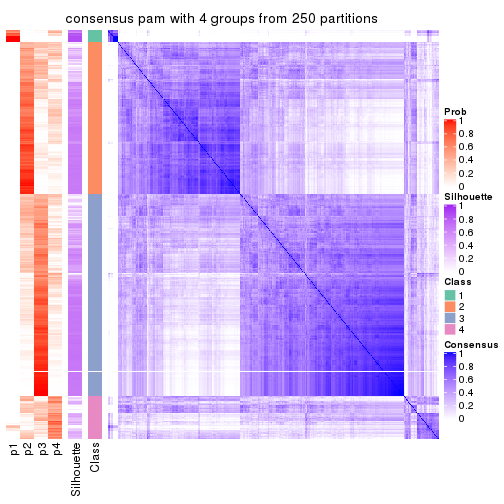</p>

</div>
<div id='tab-SD-pam-consensus-heatmap-4'>
<pre><code class="r">consensus_heatmap(res, k = 5)
</code></pre>

<p></p>

</div>
<div id='tab-SD-pam-consensus-heatmap-5'>
<pre><code class="r">consensus_heatmap(res, k = 6)
</code></pre>

<p></p>

</div>
</div>

Heatmaps for the membership of samples in all partitions to see how consistent they are:


<script>
$( function() {
	$( '#tabs-SD-pam-membership-heatmap' ).tabs();
} );
</script>
<div id='tabs-SD-pam-membership-heatmap'>
<ul>
<li><a href='#tab-SD-pam-membership-heatmap-1'>k = 2</a></li>
<li><a href='#tab-SD-pam-membership-heatmap-2'>k = 3</a></li>
<li><a href='#tab-SD-pam-membership-heatmap-3'>k = 4</a></li>
<li><a href='#tab-SD-pam-membership-heatmap-4'>k = 5</a></li>
<li><a href='#tab-SD-pam-membership-heatmap-5'>k = 6</a></li>
</ul>
<div id='tab-SD-pam-membership-heatmap-1'>
<pre><code class="r">membership_heatmap(res, k = 2)
</code></pre>

<p></p>

</div>
<div id='tab-SD-pam-membership-heatmap-2'>
<pre><code class="r">membership_heatmap(res, k = 3)
</code></pre>

<p></p>

</div>
<div id='tab-SD-pam-membership-heatmap-3'>
<pre><code class="r">membership_heatmap(res, k = 4)
</code></pre>

<p></p>

</div>
<div id='tab-SD-pam-membership-heatmap-4'>
<pre><code class="r">membership_heatmap(res, k = 5)
</code></pre>

<p></p>

</div>
<div id='tab-SD-pam-membership-heatmap-5'>
<pre><code class="r">membership_heatmap(res, k = 6)
</code></pre>

<p></p>

</div>
</div>

As soon as we have had the classes for columns, we can look for signatures
which are significantly different between classes which can be candidate marks
for certain classes. Following are the heatmaps for signatures.


Signature heatmaps where rows are scaled:


<script>
$( function() {
	$( '#tabs-SD-pam-get-signatures' ).tabs();
} );
</script>
<div id='tabs-SD-pam-get-signatures'>
<ul>
<li><a href='#tab-SD-pam-get-signatures-1'>k = 2</a></li>
<li><a href='#tab-SD-pam-get-signatures-2'>k = 3</a></li>
<li><a href='#tab-SD-pam-get-signatures-3'>k = 4</a></li>
<li><a href='#tab-SD-pam-get-signatures-4'>k = 5</a></li>
<li><a href='#tab-SD-pam-get-signatures-5'>k = 6</a></li>
</ul>
<div id='tab-SD-pam-get-signatures-1'>
<pre><code class="r">get_signatures(res, k = 2)
</code></pre>

<p></p>

</div>
<div id='tab-SD-pam-get-signatures-2'>
<pre><code class="r">get_signatures(res, k = 3)
</code></pre>

<p></p>

</div>
<div id='tab-SD-pam-get-signatures-3'>
<pre><code class="r">get_signatures(res, k = 4)
</code></pre>

<p></p>

</div>
<div id='tab-SD-pam-get-signatures-4'>
<pre><code class="r">get_signatures(res, k = 5)
</code></pre>

<p></p>

</div>
<div id='tab-SD-pam-get-signatures-5'>
<pre><code class="r">get_signatures(res, k = 6)
</code></pre>

<p></p>

</div>
</div>


Signature heatmaps where rows are not scaled:


<script>
$( function() {
	$( '#tabs-SD-pam-get-signatures-no-scale' ).tabs();
} );
</script>
<div id='tabs-SD-pam-get-signatures-no-scale'>
<ul>
<li><a href='#tab-SD-pam-get-signatures-no-scale-1'>k = 2</a></li>
<li><a href='#tab-SD-pam-get-signatures-no-scale-2'>k = 3</a></li>
<li><a href='#tab-SD-pam-get-signatures-no-scale-3'>k = 4</a></li>
<li><a href='#tab-SD-pam-get-signatures-no-scale-4'>k = 5</a></li>
<li><a href='#tab-SD-pam-get-signatures-no-scale-5'>k = 6</a></li>
</ul>
<div id='tab-SD-pam-get-signatures-no-scale-1'>
<pre><code class="r">get_signatures(res, k = 2, scale_rows = FALSE)
</code></pre>

<p></p>

</div>
<div id='tab-SD-pam-get-signatures-no-scale-2'>
<pre><code class="r">get_signatures(res, k = 3, scale_rows = FALSE)
</code></pre>

<p></p>

</div>
<div id='tab-SD-pam-get-signatures-no-scale-3'>
<pre><code class="r">get_signatures(res, k = 4, scale_rows = FALSE)
</code></pre>

<p></p>

</div>
<div id='tab-SD-pam-get-signatures-no-scale-4'>
<pre><code class="r">get_signatures(res, k = 5, scale_rows = FALSE)
</code></pre>

<p></p>

</div>
<div id='tab-SD-pam-get-signatures-no-scale-5'>
<pre><code class="r">get_signatures(res, k = 6, scale_rows = FALSE)
</code></pre>

<p></p>

</div>
</div>


Compare the overlap of signatures from different k:

```r
compare_signatures(res)
```


`get_signature()` returns a data frame invisibly. TO get the list of signatures, the function
call should be assigned to a variable explicitly. In following code, if `plot` argument is set
to `FALSE`, no heatmap is plotted while only the differential analysis is performed.

```r
# code only for demonstration
tb = get_signature(res, k = ..., plot = FALSE)
```

An example of the output of `tb` is:

```
#>   which_row         fdr    mean_1    mean_2 scaled_mean_1 scaled_mean_2 km
#> 1        38 0.042760348  8.373488  9.131774    -0.5533452     0.5164555  1
#> 2        40 0.018707592  7.106213  8.469186    -0.6173731     0.5762149  1
#> 3        55 0.019134737 10.221463 11.207825    -0.6159697     0.5749050  1
#> 4        59 0.006059896  5.921854  7.869574    -0.6899429     0.6439467  1
#> 5        60 0.018055526  8.928898 10.211722    -0.6204761     0.5791110  1
#> 6        98 0.009384629 15.714769 14.887706     0.6635654    -0.6193277  2
...
```

The columns in `tb` are:

1. `which_row`: row indices corresponding to the input matrix.
2. `fdr`: FDR for the differential test. 
3. `mean_x`: The mean value in group x.
4. `scaled_mean_x`: The mean value in group x after rows are scaled.
5. `km`: Row groups if k-means clustering is applied to rows.


UMAP plot which shows how samples are separated.


<script>
$( function() {
	$( '#tabs-SD-pam-dimension-reduction' ).tabs();
} );
</script>
<div id='tabs-SD-pam-dimension-reduction'>
<ul>
<li><a href='#tab-SD-pam-dimension-reduction-1'>k = 2</a></li>
<li><a href='#tab-SD-pam-dimension-reduction-2'>k = 3</a></li>
<li><a href='#tab-SD-pam-dimension-reduction-3'>k = 4</a></li>
<li><a href='#tab-SD-pam-dimension-reduction-4'>k = 5</a></li>
<li><a href='#tab-SD-pam-dimension-reduction-5'>k = 6</a></li>
</ul>
<div id='tab-SD-pam-dimension-reduction-1'>
<pre><code class="r">dimension_reduction(res, k = 2, method = &quot;UMAP&quot;)
</code></pre>

<p></p>

</div>
<div id='tab-SD-pam-dimension-reduction-2'>
<pre><code class="r">dimension_reduction(res, k = 3, method = &quot;UMAP&quot;)
</code></pre>

<p>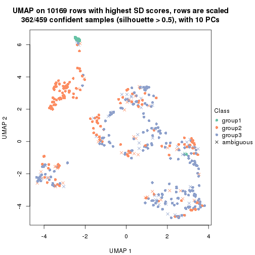</p>

</div>
<div id='tab-SD-pam-dimension-reduction-3'>
<pre><code class="r">dimension_reduction(res, k = 4, method = &quot;UMAP&quot;)
</code></pre>

<p></p>

</div>
<div id='tab-SD-pam-dimension-reduction-4'>
<pre><code class="r">dimension_reduction(res, k = 5, method = &quot;UMAP&quot;)
</code></pre>

<p></p>

</div>
<div id='tab-SD-pam-dimension-reduction-5'>
<pre><code class="r">dimension_reduction(res, k = 6, method = &quot;UMAP&quot;)
</code></pre>

<p></p>

</div>
</div>


Following heatmap shows how subgroups are split when increasing `k`:

```r
collect_classes(res)
```


If matrix rows can be associated to genes, consider to use `functional_enrichment(res,
...)` to perform function enrichment for the signature genes. See [this vignette](http://bioconductor.org/packages/devel/bioc/vignettes/cola/inst/doc/functional_enrichment.html) for more detailed explanations.


 

---------------------------------------------------


### SD:mclust**


The object with results only for a single top-value method and a single partition method 
can be extracted as:

```r
res = res_list["SD", "mclust"]
# you can also extract it by
# res = res_list["SD:mclust"]
```

A summary of `res` and all the functions that can be applied to it:

```r
res
```

```
#> A 'ConsensusPartition' object with k = 2, 3, 4, 5, 6.
#>   On a matrix with 10169 rows and 459 columns.
#>   Top rows (1000, 2000, 3000, 4000, 5000) are extracted by 'SD' method.
#>   Subgroups are detected by 'mclust' method.
#>   Performed in total 1250 partitions by row resampling.
#>   Best k for subgroups seems to be 2.
#> 
#> Following methods can be applied to this 'ConsensusPartition' object:
#>  [1] "cola_report"             "collect_classes"         "collect_plots"          
#>  [4] "collect_stats"           "colnames"                "compare_signatures"     
#>  [7] "consensus_heatmap"       "dimension_reduction"     "functional_enrichment"  
#> [10] "get_anno_col"            "get_anno"                "get_classes"            
#> [13] "get_consensus"           "get_matrix"              "get_membership"         
#> [16] "get_param"               "get_signatures"          "get_stats"              
#> [19] "is_best_k"               "is_stable_k"             "membership_heatmap"     
#> [22] "ncol"                    "nrow"                    "plot_ecdf"              
#> [25] "rownames"                "select_partition_number" "show"                   
#> [28] "suggest_best_k"          "test_to_known_factors"
```

`collect_plots()` function collects all the plots made from `res` for all `k` (number of partitions)
into one single page to provide an easy and fast comparison between different `k`.

```r
collect_plots(res)
```


The plots are:

- The first row: a plot of the ECDF (empirical cumulative distribution
  function) curves of the consensus matrix for each `k` and the heatmap of
  predicted classes for each `k`.
- The second row: heatmaps of the consensus matrix for each `k`.
- The third row: heatmaps of the membership matrix for each `k`.
- The fouth row: heatmaps of the signatures for each `k`.

All the plots in panels can be made by individual functions and they are
plotted later in this section.

`select_partition_number()` produces several plots showing different
statistics for choosing "optimized" `k`. There are following statistics:

- ECDF curves of the consensus matrix for each `k`;
- 1-PAC. [The PAC
  score](https://en.wikipedia.org/wiki/Consensus_clustering#Over-interpretation_potential_of_consensus_clustering)
  measures the proportion of the ambiguous subgrouping.
- Mean silhouette score.
- Concordance. The mean probability of fiting the consensus class ids in all
  partitions.
- Area increased. Denote $A_k$ as the area under the ECDF curve for current
  `k`, the area increased is defined as $A_k - A_{k-1}$.
- Rand index. The percent of pairs of samples that are both in a same cluster
  or both are not in a same cluster in the partition of k and k-1.
- Jaccard index. The ratio of pairs of samples are both in a same cluster in
  the partition of k and k-1 and the pairs of samples are both in a same
  cluster in the partition k or k-1.

The detailed explanations of these statistics can be found in [the _cola_
vignette](http://bioconductor.org/packages/devel/bioc/vignettes/cola/inst/doc/cola.html#toc_13).

Generally speaking, lower PAC score, higher mean silhouette score or higher
concordance corresponds to better partition. Rand index and Jaccard index
measure how similar the current partition is compared to partition with `k-1`.
If they are too similar, we won't accept `k` is better than `k-1`.

```r
select_partition_number(res)
```


The numeric values for all these statistics can be obtained by `get_stats()`.

```r
get_stats(res)
```

```
#>   k 1-PAC mean_silhouette concordance area_increased  Rand Jaccard
#> 2 2 0.988           0.953       0.965         0.1550 0.878   0.878
#> 3 3 0.280           0.607       0.783         2.5506 0.564   0.503
#> 4 4 0.338           0.575       0.746         0.2163 0.780   0.549
#> 5 5 0.371           0.414       0.639         0.1009 0.855   0.600
#> 6 6 0.465           0.409       0.642         0.0638 0.858   0.530
```

`suggest_best_k()` suggests the best $k$ based on these statistics. The rules are as follows:

- All $k$ with Jaccard index larger than 0.95 are removed because increasing
  $k$ does not provide enough extra information. If all $k$ are removed, it is
  marked as no subgroup is detected.
- For all $k$ with 1-PAC score larger than 0.9, the maximal $k$ is taken as
  the best $k$, and other $k$ are marked as optional $k$.
- If it does not fit the second rule. The $k$ with the maximal vote of the
  highest 1-PAC score, highest mean silhouette, and highest concordance is
  taken as the best $k$.

```r
suggest_best_k(res)
```

```
#> [1] 2
```


Following shows the table of the partitions (You need to click the **show/hide
code output** link to see it). The membership matrix (columns with name `p*`)
is inferred by
[`clue::cl_consensus()`](https://www.rdocumentation.org/link/cl_consensus?package=clue)
function with the `SE` method. Basically the value in the membership matrix
represents the probability to belong to a certain group. The finall class
label for an item is determined with the group with highest probability it
belongs to.

In `get_classes()` function, the entropy is calculated from the membership
matrix and the silhouette score is calculated from the consensus matrix.


<script>
$( function() {
	$( '#tabs-SD-mclust-get-classes' ).tabs();
} );
</script>
<div id='tabs-SD-mclust-get-classes'>
<ul>
<li><a href='#tab-SD-mclust-get-classes-1'>k = 2</a></li>
<li><a href='#tab-SD-mclust-get-classes-2'>k = 3</a></li>
<li><a href='#tab-SD-mclust-get-classes-3'>k = 4</a></li>
<li><a href='#tab-SD-mclust-get-classes-4'>k = 5</a></li>
<li><a href='#tab-SD-mclust-get-classes-5'>k = 6</a></li>
</ul>

<div id='tab-SD-mclust-get-classes-1'>
<p><a id='tab-SD-mclust-get-classes-1-a' style='color:#0366d6' href='#'>show/hide code output</a></p>
<pre><code class="r">cbind(get_classes(res, k = 2), get_membership(res, k = 2))
</code></pre>

<pre><code>#&gt;            class entropy silhouette    p1    p2
#&gt; SRR1699874     2  0.0376      0.966 0.004 0.996
#&gt; SRR1699875     2  0.0000      0.966 0.000 1.000
#&gt; SRR1699876     2  0.0000      0.966 0.000 1.000
#&gt; SRR1699877     2  0.0376      0.966 0.004 0.996
#&gt; SRR1699879     2  0.0000      0.966 0.000 1.000
#&gt; SRR1699878     2  0.0376      0.966 0.004 0.996
#&gt; SRR1699880     2  0.2423      0.964 0.040 0.960
#&gt; SRR1699881     2  0.0938      0.967 0.012 0.988
#&gt; SRR1699882     2  0.0000      0.966 0.000 1.000
#&gt; SRR1699883     2  0.0376      0.966 0.004 0.996
#&gt; SRR1699884     2  0.0376      0.966 0.004 0.996
#&gt; SRR1699885     2  0.0672      0.965 0.008 0.992
#&gt; SRR1699886     2  0.0000      0.966 0.000 1.000
#&gt; SRR1699888     2  0.0000      0.966 0.000 1.000
#&gt; SRR1699889     2  0.0000      0.966 0.000 1.000
#&gt; SRR1699890     2  0.0000      0.966 0.000 1.000
#&gt; SRR1699887     2  0.0000      0.966 0.000 1.000
#&gt; SRR1699891     2  0.0000      0.966 0.000 1.000
#&gt; SRR1699892     2  0.0000      0.966 0.000 1.000
#&gt; SRR1699893     2  0.2948      0.961 0.052 0.948
#&gt; SRR1699894     2  0.0000      0.966 0.000 1.000
#&gt; SRR1699895     2  0.0000      0.966 0.000 1.000
#&gt; SRR1699896     2  0.0000      0.966 0.000 1.000
#&gt; SRR1699897     2  0.0000      0.966 0.000 1.000
#&gt; SRR1699898     2  0.3274      0.957 0.060 0.940
#&gt; SRR1699900     2  0.0376      0.966 0.004 0.996
#&gt; SRR1699899     2  0.0000      0.966 0.000 1.000
#&gt; SRR1699902     2  0.2778      0.962 0.048 0.952
#&gt; SRR1699901     2  0.3274      0.959 0.060 0.940
#&gt; SRR1699903     2  0.0000      0.966 0.000 1.000
#&gt; SRR1699904     2  0.0672      0.967 0.008 0.992
#&gt; SRR1699905     2  0.2603      0.962 0.044 0.956
#&gt; SRR1699906     2  0.0000      0.966 0.000 1.000
#&gt; SRR1699907     2  0.0000      0.966 0.000 1.000
#&gt; SRR1699908     2  0.0000      0.966 0.000 1.000
#&gt; SRR1699909     2  0.0672      0.967 0.008 0.992
#&gt; SRR1699910     2  0.0000      0.966 0.000 1.000
#&gt; SRR1699911     2  0.0000      0.966 0.000 1.000
#&gt; SRR1699912     2  0.0000      0.966 0.000 1.000
#&gt; SRR1699913     2  0.0000      0.966 0.000 1.000
#&gt; SRR1699914     2  0.2043      0.965 0.032 0.968
#&gt; SRR1699915     2  0.0000      0.966 0.000 1.000
#&gt; SRR1699916     2  0.2603      0.962 0.044 0.956
#&gt; SRR1699917     2  0.3274      0.957 0.060 0.940
#&gt; SRR1699918     2  0.2948      0.960 0.052 0.948
#&gt; SRR1699919     2  0.0000      0.966 0.000 1.000
#&gt; SRR1699920     2  0.0000      0.966 0.000 1.000
#&gt; SRR1699921     2  0.0000      0.966 0.000 1.000
#&gt; SRR1699922     2  0.0000      0.966 0.000 1.000
#&gt; SRR1699923     2  0.1843      0.966 0.028 0.972
#&gt; SRR1699924     2  0.2948      0.960 0.052 0.948
#&gt; SRR1699925     1  0.0672      0.962 0.992 0.008
#&gt; SRR1699926     2  0.0000      0.966 0.000 1.000
#&gt; SRR1699927     2  0.0000      0.966 0.000 1.000
#&gt; SRR1699929     2  0.0000      0.966 0.000 1.000
#&gt; SRR1699928     2  0.0000      0.966 0.000 1.000
#&gt; SRR1699930     2  0.0000      0.966 0.000 1.000
#&gt; SRR1699931     2  0.0000      0.966 0.000 1.000
#&gt; SRR1699933     2  0.1184      0.967 0.016 0.984
#&gt; SRR1699932     2  0.0000      0.966 0.000 1.000
#&gt; SRR1699934     1  0.0672      0.962 0.992 0.008
#&gt; SRR1699935     2  0.3431      0.956 0.064 0.936
#&gt; SRR1699936     2  0.0938      0.967 0.012 0.988
#&gt; SRR1699937     2  0.0938      0.963 0.012 0.988
#&gt; SRR1699938     2  0.0376      0.966 0.004 0.996
#&gt; SRR1699940     2  0.0376      0.966 0.004 0.996
#&gt; SRR1699939     2  0.0000      0.966 0.000 1.000
#&gt; SRR1699941     2  0.1414      0.967 0.020 0.980
#&gt; SRR1699942     2  0.2236      0.964 0.036 0.964
#&gt; SRR1699943     2  0.1414      0.960 0.020 0.980
#&gt; SRR1699944     2  0.0376      0.966 0.004 0.996
#&gt; SRR1699945     2  0.3274      0.959 0.060 0.940
#&gt; SRR1699946     2  0.0672      0.965 0.008 0.992
#&gt; SRR1699947     2  0.0000      0.966 0.000 1.000
#&gt; SRR1699948     2  0.2236      0.950 0.036 0.964
#&gt; SRR1699949     2  0.0000      0.966 0.000 1.000
#&gt; SRR1699950     2  0.0000      0.966 0.000 1.000
#&gt; SRR1699951     2  0.1633      0.966 0.024 0.976
#&gt; SRR1699952     2  0.0376      0.966 0.004 0.996
#&gt; SRR1699953     2  0.0000      0.966 0.000 1.000
#&gt; SRR1699954     2  0.1843      0.966 0.028 0.972
#&gt; SRR1699955     2  0.0376      0.966 0.004 0.996
#&gt; SRR1699956     2  0.2423      0.965 0.040 0.960
#&gt; SRR1699957     2  0.0000      0.966 0.000 1.000
#&gt; SRR1699959     2  0.3274      0.957 0.060 0.940
#&gt; SRR1699958     2  0.3431      0.956 0.064 0.936
#&gt; SRR1699960     2  0.2603      0.962 0.044 0.956
#&gt; SRR1699961     2  0.0376      0.966 0.004 0.996
#&gt; SRR1699962     2  0.0376      0.966 0.004 0.996
#&gt; SRR1699963     2  0.3114      0.959 0.056 0.944
#&gt; SRR1699964     2  0.0672      0.967 0.008 0.992
#&gt; SRR1699965     2  0.0376      0.966 0.004 0.996
#&gt; SRR1699966     2  0.1414      0.967 0.020 0.980
#&gt; SRR1699967     2  0.1184      0.962 0.016 0.984
#&gt; SRR1699968     2  0.0000      0.966 0.000 1.000
#&gt; SRR1699969     2  0.1184      0.967 0.016 0.984
#&gt; SRR1699971     2  0.2778      0.962 0.048 0.952
#&gt; SRR1699970     2  0.0376      0.966 0.004 0.996
#&gt; SRR1699972     2  0.2043      0.965 0.032 0.968
#&gt; SRR1699973     2  0.3431      0.956 0.064 0.936
#&gt; SRR1699974     2  0.5737      0.894 0.136 0.864
#&gt; SRR1699975     2  0.0000      0.966 0.000 1.000
#&gt; SRR1699976     2  0.0000      0.966 0.000 1.000
#&gt; SRR1699977     2  0.2948      0.960 0.052 0.948
#&gt; SRR1699978     2  0.3431      0.956 0.064 0.936
#&gt; SRR1699979     2  0.2948      0.960 0.052 0.948
#&gt; SRR1699980     2  0.0000      0.966 0.000 1.000
#&gt; SRR1699981     2  0.0000      0.966 0.000 1.000
#&gt; SRR1699982     2  0.0000      0.966 0.000 1.000
#&gt; SRR1699983     2  0.0000      0.966 0.000 1.000
#&gt; SRR1699984     1  0.0672      0.962 0.992 0.008
#&gt; SRR1699985     2  0.1184      0.967 0.016 0.984
#&gt; SRR1699986     2  0.7376      0.795 0.208 0.792
#&gt; SRR1699988     2  0.0000      0.966 0.000 1.000
#&gt; SRR1699987     2  0.3274      0.957 0.060 0.940
#&gt; SRR1699989     2  0.0000      0.966 0.000 1.000
#&gt; SRR1699990     2  0.0000      0.966 0.000 1.000
#&gt; SRR1699992     2  0.0938      0.966 0.012 0.988
#&gt; SRR1699991     2  0.3114      0.959 0.056 0.944
#&gt; SRR1699993     2  0.5842      0.880 0.140 0.860
#&gt; SRR1699994     2  0.2778      0.962 0.048 0.952
#&gt; SRR1699995     1  0.9815      0.249 0.580 0.420
#&gt; SRR1699996     2  0.1633      0.957 0.024 0.976
#&gt; SRR1699997     2  0.3431      0.956 0.064 0.936
#&gt; SRR1699998     2  0.0376      0.966 0.004 0.996
#&gt; SRR1699999     1  0.2043      0.949 0.968 0.032
#&gt; SRR1700000     2  0.2043      0.965 0.032 0.968
#&gt; SRR1700002     2  0.2778      0.963 0.048 0.952
#&gt; SRR1700001     2  0.2778      0.962 0.048 0.952
#&gt; SRR1700003     2  0.2948      0.960 0.052 0.948
#&gt; SRR1700004     2  0.0000      0.966 0.000 1.000
#&gt; SRR1700005     1  0.0672      0.962 0.992 0.008
#&gt; SRR1700006     2  0.2236      0.965 0.036 0.964
#&gt; SRR1700007     2  0.0000      0.966 0.000 1.000
#&gt; SRR1700008     2  0.3431      0.956 0.064 0.936
#&gt; SRR1700009     1  0.4022      0.910 0.920 0.080
#&gt; SRR1700010     2  0.3114      0.960 0.056 0.944
#&gt; SRR1700011     2  0.2603      0.962 0.044 0.956
#&gt; SRR1700013     2  0.3431      0.956 0.064 0.936
#&gt; SRR1700012     2  0.1843      0.965 0.028 0.972
#&gt; SRR1700014     2  0.2603      0.962 0.044 0.956
#&gt; SRR1700015     2  0.2236      0.964 0.036 0.964
#&gt; SRR1700016     1  0.2043      0.949 0.968 0.032
#&gt; SRR1700018     2  0.2043      0.965 0.032 0.968
#&gt; SRR1700017     2  0.3114      0.960 0.056 0.944
#&gt; SRR1700019     2  0.0000      0.966 0.000 1.000
#&gt; SRR1700020     2  0.4022      0.949 0.080 0.920
#&gt; SRR1700021     2  0.0000      0.966 0.000 1.000
#&gt; SRR1700023     2  0.0376      0.967 0.004 0.996
#&gt; SRR1700022     2  0.3114      0.960 0.056 0.944
#&gt; SRR1700024     2  0.2948      0.960 0.052 0.948
#&gt; SRR1700025     2  0.0938      0.966 0.012 0.988
#&gt; SRR1700026     2  0.2948      0.961 0.052 0.948
#&gt; SRR1700027     2  0.2236      0.964 0.036 0.964
#&gt; SRR1700028     2  0.3431      0.956 0.064 0.936
#&gt; SRR1700029     2  0.3274      0.957 0.060 0.940
#&gt; SRR1700030     2  0.0000      0.966 0.000 1.000
#&gt; SRR1700031     2  0.3584      0.956 0.068 0.932
#&gt; SRR1700032     2  0.0376      0.966 0.004 0.996
#&gt; SRR1700034     1  0.0938      0.960 0.988 0.012
#&gt; SRR1700035     2  0.0000      0.966 0.000 1.000
#&gt; SRR1700033     2  0.3274      0.959 0.060 0.940
#&gt; SRR1700036     2  0.0000      0.966 0.000 1.000
#&gt; SRR1700037     2  0.0000      0.966 0.000 1.000
#&gt; SRR1700038     2  0.2043      0.966 0.032 0.968
#&gt; SRR1700039     2  0.2948      0.961 0.052 0.948
#&gt; SRR1700040     2  0.2423      0.964 0.040 0.960
#&gt; SRR1700041     2  0.2043      0.964 0.032 0.968
#&gt; SRR1700042     2  0.2948      0.961 0.052 0.948
#&gt; SRR1700043     2  0.1184      0.967 0.016 0.984
#&gt; SRR1700045     2  0.2603      0.962 0.044 0.956
#&gt; SRR1700044     2  0.1414      0.966 0.020 0.980
#&gt; SRR1700046     2  0.2236      0.964 0.036 0.964
#&gt; SRR1700047     2  0.0376      0.967 0.004 0.996
#&gt; SRR1700048     2  0.3114      0.959 0.056 0.944
#&gt; SRR1700049     2  0.3431      0.957 0.064 0.936
#&gt; SRR1700050     2  0.3274      0.957 0.060 0.940
#&gt; SRR1700051     2  0.3431      0.956 0.064 0.936
#&gt; SRR1700052     2  0.3274      0.959 0.060 0.940
#&gt; SRR1700053     2  0.0000      0.966 0.000 1.000
#&gt; SRR1700054     2  0.2948      0.962 0.052 0.948
#&gt; SRR1700055     1  0.0672      0.962 0.992 0.008
#&gt; SRR1700056     2  0.3431      0.956 0.064 0.936
#&gt; SRR1700057     2  0.3274      0.957 0.060 0.940
#&gt; SRR1700058     2  0.2948      0.961 0.052 0.948
#&gt; SRR1700059     2  0.3274      0.957 0.060 0.940
#&gt; SRR1700060     2  0.3114      0.958 0.056 0.944
#&gt; SRR1700061     2  0.2236      0.965 0.036 0.964
#&gt; SRR1700062     2  0.3431      0.956 0.064 0.936
#&gt; SRR1700063     2  0.2948      0.960 0.052 0.948
#&gt; SRR1700064     2  0.0000      0.966 0.000 1.000
#&gt; SRR1700065     2  0.3431      0.958 0.064 0.936
#&gt; SRR1700066     2  0.2948      0.961 0.052 0.948
#&gt; SRR1700067     2  0.3114      0.959 0.056 0.944
#&gt; SRR1700068     2  0.3431      0.956 0.064 0.936
#&gt; SRR1700069     2  0.0000      0.966 0.000 1.000
#&gt; SRR1700070     2  0.0000      0.966 0.000 1.000
#&gt; SRR1700071     2  0.2778      0.961 0.048 0.952
#&gt; SRR1700072     2  0.2778      0.961 0.048 0.952
#&gt; SRR1700073     2  0.2236      0.964 0.036 0.964
#&gt; SRR1700075     2  0.0938      0.967 0.012 0.988
#&gt; SRR1700074     2  0.2948      0.962 0.052 0.948
#&gt; SRR1700076     2  0.1633      0.966 0.024 0.976
#&gt; SRR1700077     2  0.2423      0.964 0.040 0.960
#&gt; SRR1700078     2  0.0000      0.966 0.000 1.000
#&gt; SRR1700080     2  0.0000      0.966 0.000 1.000
#&gt; SRR1700079     2  0.3114      0.958 0.056 0.944
#&gt; SRR1700081     2  0.3114      0.958 0.056 0.944
#&gt; SRR1700082     2  0.2423      0.963 0.040 0.960
#&gt; SRR1700083     2  0.3274      0.957 0.060 0.940
#&gt; SRR1700084     2  0.5178      0.907 0.116 0.884
#&gt; SRR1700085     2  0.0000      0.966 0.000 1.000
#&gt; SRR1700086     2  0.0000      0.966 0.000 1.000
#&gt; SRR1700087     2  0.3431      0.956 0.064 0.936
#&gt; SRR1700088     2  0.3274      0.957 0.060 0.940
#&gt; SRR1700089     2  0.3274      0.957 0.060 0.940
#&gt; SRR1700091     2  0.3431      0.956 0.064 0.936
#&gt; SRR1700090     2  0.3431      0.956 0.064 0.936
#&gt; SRR1700092     2  0.3431      0.956 0.064 0.936
#&gt; SRR1700094     2  0.3431      0.956 0.064 0.936
#&gt; SRR1700093     2  0.3431      0.956 0.064 0.936
#&gt; SRR1700095     2  0.3431      0.956 0.064 0.936
#&gt; SRR1700096     2  0.3431      0.956 0.064 0.936
#&gt; SRR1700097     2  0.3431      0.956 0.064 0.936
#&gt; SRR1700098     2  0.2948      0.960 0.052 0.948
#&gt; SRR1700099     2  0.3431      0.956 0.064 0.936
#&gt; SRR1700100     2  0.3431      0.956 0.064 0.936
#&gt; SRR1700101     2  0.3431      0.956 0.064 0.936
#&gt; SRR1700102     2  0.3431      0.956 0.064 0.936
#&gt; SRR1700104     2  0.3431      0.956 0.064 0.936
#&gt; SRR1700103     2  0.3431      0.956 0.064 0.936
#&gt; SRR1700105     2  0.3431      0.956 0.064 0.936
#&gt; SRR1700106     2  0.3431      0.956 0.064 0.936
#&gt; SRR1700107     2  0.3431      0.956 0.064 0.936
#&gt; SRR1700108     2  0.3431      0.956 0.064 0.936
#&gt; SRR1700109     2  0.3274      0.957 0.060 0.940
#&gt; SRR1700110     2  0.3431      0.956 0.064 0.936
#&gt; SRR1700112     2  0.3431      0.956 0.064 0.936
#&gt; SRR1700111     2  0.3431      0.956 0.064 0.936
#&gt; SRR1700113     2  0.3431      0.956 0.064 0.936
#&gt; SRR1700114     2  0.3431      0.956 0.064 0.936
#&gt; SRR1700115     2  0.3431      0.956 0.064 0.936
#&gt; SRR1700116     2  0.3431      0.956 0.064 0.936
#&gt; SRR1700117     2  0.3431      0.956 0.064 0.936
#&gt; SRR1700119     2  0.3431      0.956 0.064 0.936
#&gt; SRR1700118     2  0.3431      0.956 0.064 0.936
#&gt; SRR1700120     2  0.3431      0.956 0.064 0.936
#&gt; SRR1700121     2  0.3431      0.956 0.064 0.936
#&gt; SRR1700122     2  0.3431      0.956 0.064 0.936
#&gt; SRR1700123     2  0.3431      0.956 0.064 0.936
#&gt; SRR1700125     2  0.3431      0.956 0.064 0.936
#&gt; SRR1700126     2  0.3431      0.956 0.064 0.936
#&gt; SRR1700127     2  0.3431      0.956 0.064 0.936
#&gt; SRR1700124     2  0.3431      0.956 0.064 0.936
#&gt; SRR1700128     2  0.3431      0.956 0.064 0.936
#&gt; SRR1700129     2  0.3431      0.956 0.064 0.936
#&gt; SRR1700130     2  0.3431      0.956 0.064 0.936
#&gt; SRR1700132     2  0.3431      0.956 0.064 0.936
#&gt; SRR1700131     2  0.3431      0.956 0.064 0.936
#&gt; SRR1700133     2  0.3431      0.956 0.064 0.936
#&gt; SRR1700134     2  0.3431      0.956 0.064 0.936
#&gt; SRR1700135     2  0.3431      0.956 0.064 0.936
#&gt; SRR1700136     2  0.3431      0.956 0.064 0.936
#&gt; SRR1700137     2  0.3431      0.956 0.064 0.936
#&gt; SRR1700138     2  0.3431      0.956 0.064 0.936
#&gt; SRR1700140     2  0.3431      0.956 0.064 0.936
#&gt; SRR1700139     2  0.3431      0.956 0.064 0.936
#&gt; SRR1700141     2  0.3431      0.956 0.064 0.936
#&gt; SRR1700142     2  0.3431      0.956 0.064 0.936
#&gt; SRR1700143     2  0.3431      0.956 0.064 0.936
#&gt; SRR1700144     2  0.2948      0.960 0.052 0.948
#&gt; SRR1700145     2  0.3431      0.956 0.064 0.936
#&gt; SRR1700146     2  0.3431      0.956 0.064 0.936
#&gt; SRR1700147     2  0.3431      0.956 0.064 0.936
#&gt; SRR1700149     2  0.3431      0.956 0.064 0.936
#&gt; SRR1700148     2  0.3431      0.956 0.064 0.936
#&gt; SRR1700150     2  0.3431      0.956 0.064 0.936
#&gt; SRR1700152     2  0.3431      0.956 0.064 0.936
#&gt; SRR1700151     2  0.3431      0.956 0.064 0.936
#&gt; SRR1700153     2  0.3431      0.956 0.064 0.936
#&gt; SRR1700154     2  0.3431      0.956 0.064 0.936
#&gt; SRR1700155     2  0.3431      0.956 0.064 0.936
#&gt; SRR1700156     2  0.3431      0.956 0.064 0.936
#&gt; SRR1700158     2  0.3431      0.956 0.064 0.936
#&gt; SRR1700159     2  0.3431      0.956 0.064 0.936
#&gt; SRR1700157     2  0.3431      0.956 0.064 0.936
#&gt; SRR1700160     2  0.3431      0.956 0.064 0.936
#&gt; SRR1700161     2  0.3431      0.956 0.064 0.936
#&gt; SRR1700162     2  0.3431      0.956 0.064 0.936
#&gt; SRR1700164     2  0.3431      0.956 0.064 0.936
#&gt; SRR1700163     2  0.3431      0.956 0.064 0.936
#&gt; SRR1700165     2  0.3431      0.956 0.064 0.936
#&gt; SRR1700166     2  0.3431      0.956 0.064 0.936
#&gt; SRR1700168     2  0.3431      0.956 0.064 0.936
#&gt; SRR1700167     2  0.3431      0.956 0.064 0.936
#&gt; SRR1700170     2  0.3431      0.956 0.064 0.936
#&gt; SRR1700169     2  0.3431      0.956 0.064 0.936
#&gt; SRR1700171     2  0.6048      0.875 0.148 0.852
#&gt; SRR1700172     2  0.3431      0.956 0.064 0.936
#&gt; SRR1700174     2  0.3431      0.956 0.064 0.936
#&gt; SRR1700173     2  0.3431      0.956 0.064 0.936
#&gt; SRR1700175     2  0.3431      0.956 0.064 0.936
#&gt; SRR1700176     2  0.3431      0.956 0.064 0.936
#&gt; SRR1700178     2  0.2603      0.944 0.044 0.956
#&gt; SRR1700177     2  0.3431      0.956 0.064 0.936
#&gt; SRR1700180     2  0.2603      0.944 0.044 0.956
#&gt; SRR1700179     2  0.3274      0.930 0.060 0.940
#&gt; SRR1700181     2  0.3274      0.930 0.060 0.940
#&gt; SRR1700183     1  0.0672      0.962 0.992 0.008
#&gt; SRR1700182     2  0.3274      0.929 0.060 0.940
#&gt; SRR1700184     2  0.2423      0.947 0.040 0.960
#&gt; SRR1700186     2  0.2043      0.953 0.032 0.968
#&gt; SRR1700187     1  0.0672      0.962 0.992 0.008
#&gt; SRR1700185     1  0.0672      0.962 0.992 0.008
#&gt; SRR1700188     2  0.2423      0.947 0.040 0.960
#&gt; SRR1700192     1  0.2948      0.933 0.948 0.052
#&gt; SRR1700190     1  0.6148      0.830 0.848 0.152
#&gt; SRR1700191     1  0.0672      0.962 0.992 0.008
#&gt; SRR1700189     1  0.0672      0.962 0.992 0.008
#&gt; SRR1700193     2  0.1184      0.962 0.016 0.984
#&gt; SRR1700195     2  0.1843      0.955 0.028 0.972
#&gt; SRR1700194     1  0.0672      0.962 0.992 0.008
#&gt; SRR1700196     2  0.2423      0.947 0.040 0.960
#&gt; SRR1700197     1  0.0672      0.962 0.992 0.008
#&gt; SRR1700198     2  0.2778      0.940 0.048 0.952
#&gt; SRR1700199     2  0.1843      0.955 0.028 0.972
#&gt; SRR1700200     2  0.2043      0.952 0.032 0.968
#&gt; SRR1700201     2  0.0938      0.963 0.012 0.988
#&gt; SRR1700202     2  0.9954      0.153 0.460 0.540
#&gt; SRR1700203     2  0.2603      0.944 0.044 0.956
#&gt; SRR1700204     2  0.0376      0.966 0.004 0.996
#&gt; SRR1700206     2  0.1414      0.960 0.020 0.980
#&gt; SRR1700207     2  0.2603      0.944 0.044 0.956
#&gt; SRR1700208     1  0.6973      0.775 0.812 0.188
#&gt; SRR1700205     2  0.2043      0.952 0.032 0.968
#&gt; SRR1700209     2  0.0376      0.966 0.004 0.996
#&gt; SRR1700210     2  0.1633      0.958 0.024 0.976
#&gt; SRR1700211     2  0.9323      0.423 0.348 0.652
#&gt; SRR1700212     2  0.1843      0.956 0.028 0.972
#&gt; SRR1700213     2  0.1184      0.967 0.016 0.984
#&gt; SRR1700214     2  0.2423      0.947 0.040 0.960
#&gt; SRR1700215     1  0.0672      0.962 0.992 0.008
#&gt; SRR1700217     2  0.0376      0.966 0.004 0.996
#&gt; SRR1700216     1  0.0672      0.962 0.992 0.008
#&gt; SRR1700218     2  0.0938      0.963 0.012 0.988
#&gt; SRR1700219     2  0.0938      0.963 0.012 0.988
#&gt; SRR1700222     1  0.0672      0.962 0.992 0.008
#&gt; SRR1700220     2  0.0000      0.966 0.000 1.000
#&gt; SRR1700221     2  0.1633      0.957 0.024 0.976
#&gt; SRR1700223     2  0.1184      0.961 0.016 0.984
#&gt; SRR1700224     2  0.0000      0.966 0.000 1.000
#&gt; SRR1700226     2  0.0376      0.966 0.004 0.996
#&gt; SRR1700229     2  0.0672      0.965 0.008 0.992
#&gt; SRR1700225     2  0.2423      0.964 0.040 0.960
#&gt; SRR1700227     2  0.2948      0.937 0.052 0.948
#&gt; SRR1700230     1  0.0672      0.962 0.992 0.008
#&gt; SRR1700231     2  0.1843      0.955 0.028 0.972
#&gt; SRR1700228     2  0.1843      0.955 0.028 0.972
#&gt; SRR1700232     2  0.1184      0.961 0.016 0.984
#&gt; SRR1700233     2  0.0672      0.965 0.008 0.992
#&gt; SRR1700234     2  0.1184      0.961 0.016 0.984
#&gt; SRR1700235     2  0.0938      0.963 0.012 0.988
#&gt; SRR1700237     2  0.0376      0.966 0.004 0.996
#&gt; SRR1700236     2  0.0376      0.966 0.004 0.996
#&gt; SRR1700238     2  0.2603      0.944 0.044 0.956
#&gt; SRR1700239     1  0.0672      0.962 0.992 0.008
#&gt; SRR1700240     1  0.0672      0.962 0.992 0.008
#&gt; SRR1700241     2  0.2603      0.964 0.044 0.956
#&gt; SRR1700243     2  0.2043      0.952 0.032 0.968
#&gt; SRR1700244     2  0.0672      0.965 0.008 0.992
#&gt; SRR1700242     1  0.5408      0.862 0.876 0.124
#&gt; SRR1700246     2  0.7815      0.687 0.232 0.768
#&gt; SRR1700245     2  0.1414      0.959 0.020 0.980
#&gt; SRR1700247     1  0.0672      0.962 0.992 0.008
#&gt; SRR1700249     1  0.0672      0.962 0.992 0.008
#&gt; SRR1700250     2  0.0376      0.966 0.004 0.996
#&gt; SRR1700248     2  0.1633      0.957 0.024 0.976
#&gt; SRR1700251     2  0.2236      0.954 0.036 0.964
#&gt; SRR1700252     2  0.0938      0.963 0.012 0.988
#&gt; SRR1700253     2  0.2423      0.947 0.040 0.960
#&gt; SRR1700256     2  0.0938      0.963 0.012 0.988
#&gt; SRR1700254     1  0.0672      0.962 0.992 0.008
#&gt; SRR1700255     2  0.2043      0.953 0.032 0.968
#&gt; SRR1700257     2  0.2603      0.944 0.044 0.956
#&gt; SRR1700258     2  0.0376      0.966 0.004 0.996
#&gt; SRR1700259     2  0.0376      0.966 0.004 0.996
#&gt; SRR1700260     2  0.0000      0.966 0.000 1.000
#&gt; SRR1700261     2  0.0000      0.966 0.000 1.000
#&gt; SRR1700262     2  0.0000      0.966 0.000 1.000
#&gt; SRR1700263     2  0.0376      0.966 0.004 0.996
#&gt; SRR1700264     2  0.0000      0.966 0.000 1.000
#&gt; SRR1700265     2  0.0376      0.966 0.004 0.996
#&gt; SRR1700266     2  0.0000      0.966 0.000 1.000
#&gt; SRR1700268     2  0.1184      0.962 0.016 0.984
#&gt; SRR1700270     2  0.0376      0.966 0.004 0.996
#&gt; SRR1700267     2  0.0376      0.966 0.004 0.996
#&gt; SRR1700271     2  0.0376      0.966 0.004 0.996
#&gt; SRR1700272     2  0.0672      0.967 0.008 0.992
#&gt; SRR1700273     2  0.0376      0.966 0.004 0.996
#&gt; SRR1700274     2  0.0000      0.966 0.000 1.000
#&gt; SRR1700277     2  0.6048      0.863 0.148 0.852
#&gt; SRR1700275     2  0.0376      0.967 0.004 0.996
#&gt; SRR1700276     2  0.1184      0.966 0.016 0.984
#&gt; SRR1700278     2  0.0000      0.966 0.000 1.000
#&gt; SRR1700279     2  0.0000      0.966 0.000 1.000
#&gt; SRR1700280     2  0.0000      0.966 0.000 1.000
#&gt; SRR1700281     2  0.0376      0.966 0.004 0.996
#&gt; SRR1700283     2  0.0000      0.966 0.000 1.000
#&gt; SRR1700282     2  0.1184      0.966 0.016 0.984
#&gt; SRR1700284     2  0.0000      0.966 0.000 1.000
#&gt; SRR1700285     2  0.0000      0.966 0.000 1.000
#&gt; SRR1700286     2  0.0000      0.966 0.000 1.000
#&gt; SRR1700287     2  0.0000      0.966 0.000 1.000
#&gt; SRR1700290     2  0.9323      0.510 0.348 0.652
#&gt; SRR1700289     2  0.0000      0.966 0.000 1.000
#&gt; SRR1700288     2  0.0672      0.965 0.008 0.992
#&gt; SRR1700292     2  0.0000      0.966 0.000 1.000
#&gt; SRR1700291     2  0.0000      0.966 0.000 1.000
#&gt; SRR1700293     2  0.0000      0.966 0.000 1.000
#&gt; SRR1700294     2  0.0000      0.966 0.000 1.000
#&gt; SRR1700295     2  0.1414      0.967 0.020 0.980
#&gt; SRR1700297     2  0.0376      0.967 0.004 0.996
#&gt; SRR1700296     2  0.0000      0.966 0.000 1.000
#&gt; SRR1700298     2  0.0000      0.966 0.000 1.000
#&gt; SRR1700299     2  0.0000      0.966 0.000 1.000
#&gt; SRR1700300     2  0.0000      0.966 0.000 1.000
#&gt; SRR1700302     2  0.0000      0.966 0.000 1.000
#&gt; SRR1700301     2  0.0000      0.966 0.000 1.000
#&gt; SRR1700303     2  0.0000      0.966 0.000 1.000
#&gt; SRR1700304     2  0.0000      0.966 0.000 1.000
#&gt; SRR1700305     2  0.0000      0.966 0.000 1.000
#&gt; SRR1700306     2  0.0376      0.967 0.004 0.996
#&gt; SRR1700308     2  0.0000      0.966 0.000 1.000
#&gt; SRR1700307     2  0.0376      0.967 0.004 0.996
#&gt; SRR1700309     2  0.0000      0.966 0.000 1.000
#&gt; SRR1700310     2  0.0000      0.966 0.000 1.000
#&gt; SRR1700311     2  0.0672      0.967 0.008 0.992
#&gt; SRR1700312     2  0.0000      0.966 0.000 1.000
#&gt; SRR1700313     2  0.0000      0.966 0.000 1.000
#&gt; SRR1700314     2  0.0376      0.967 0.004 0.996
#&gt; SRR1700315     2  0.0000      0.966 0.000 1.000
#&gt; SRR1700316     2  0.0376      0.967 0.004 0.996
#&gt; SRR1700317     2  0.0000      0.966 0.000 1.000
#&gt; SRR1700318     2  0.0000      0.966 0.000 1.000
#&gt; SRR1700319     2  0.0000      0.966 0.000 1.000
#&gt; SRR1700320     2  0.0000      0.966 0.000 1.000
#&gt; SRR1700322     2  0.0938      0.967 0.012 0.988
#&gt; SRR1700321     2  0.0000      0.966 0.000 1.000
#&gt; SRR1700323     2  0.0938      0.967 0.012 0.988
#&gt; SRR1700324     2  0.0000      0.966 0.000 1.000
#&gt; SRR1700325     2  0.0000      0.966 0.000 1.000
#&gt; SRR1700326     2  0.3114      0.951 0.056 0.944
#&gt; SRR1700327     2  0.0000      0.966 0.000 1.000
#&gt; SRR1700329     2  0.0000      0.966 0.000 1.000
#&gt; SRR1700328     2  0.0000      0.966 0.000 1.000
#&gt; SRR1700330     2  0.0672      0.967 0.008 0.992
#&gt; SRR1700331     2  0.0000      0.966 0.000 1.000
#&gt; SRR1700332     2  0.0000      0.966 0.000 1.000
#&gt; SRR1700333     2  0.0000      0.966 0.000 1.000
</code></pre>

<script>
$('#tab-SD-mclust-get-classes-1-a').parent().next().next().hide();
$('#tab-SD-mclust-get-classes-1-a').click(function(){
  $('#tab-SD-mclust-get-classes-1-a').parent().next().next().toggle();
  return(false);
});
</script>
</div>

<div id='tab-SD-mclust-get-classes-2'>
<p><a id='tab-SD-mclust-get-classes-2-a' style='color:#0366d6' href='#'>show/hide code output</a></p>
<pre><code class="r">cbind(get_classes(res, k = 3), get_membership(res, k = 3))
</code></pre>

<pre><code>#&gt;            class entropy silhouette    p1    p2    p3
#&gt; SRR1699874     2  0.0747     0.7108 0.000 0.984 0.016
#&gt; SRR1699875     2  0.5036     0.7165 0.020 0.808 0.172
#&gt; SRR1699876     3  0.5785     0.5976 0.000 0.332 0.668
#&gt; SRR1699877     2  0.1529     0.7126 0.000 0.960 0.040
#&gt; SRR1699879     2  0.2537     0.7024 0.000 0.920 0.080
#&gt; SRR1699878     2  0.2550     0.7179 0.012 0.932 0.056
#&gt; SRR1699880     2  0.6894     0.6767 0.052 0.692 0.256
#&gt; SRR1699881     2  0.6105     0.6881 0.024 0.724 0.252
#&gt; SRR1699882     2  0.1529     0.7086 0.000 0.960 0.040
#&gt; SRR1699883     2  0.0892     0.7108 0.000 0.980 0.020
#&gt; SRR1699884     2  0.1529     0.7140 0.000 0.960 0.040
#&gt; SRR1699885     2  0.1289     0.7117 0.000 0.968 0.032
#&gt; SRR1699886     2  0.6111     0.0246 0.000 0.604 0.396
#&gt; SRR1699888     2  0.4178     0.5551 0.000 0.828 0.172
#&gt; SRR1699889     3  0.5678     0.6120 0.000 0.316 0.684
#&gt; SRR1699890     2  0.5835     0.2359 0.000 0.660 0.340
#&gt; SRR1699887     2  0.6215    -0.1077 0.000 0.572 0.428
#&gt; SRR1699891     3  0.5810     0.5946 0.000 0.336 0.664
#&gt; SRR1699892     2  0.5016     0.6954 0.000 0.760 0.240
#&gt; SRR1699893     3  0.1643     0.7280 0.000 0.044 0.956
#&gt; SRR1699894     3  0.5835     0.5914 0.000 0.340 0.660
#&gt; SRR1699895     3  0.5785     0.5973 0.000 0.332 0.668
#&gt; SRR1699896     2  0.5763     0.6936 0.016 0.740 0.244
#&gt; SRR1699897     2  0.3129     0.7189 0.008 0.904 0.088
#&gt; SRR1699898     2  0.8880     0.4068 0.120 0.464 0.416
#&gt; SRR1699900     2  0.6105     0.6889 0.024 0.724 0.252
#&gt; SRR1699899     3  0.6081     0.5883 0.004 0.344 0.652
#&gt; SRR1699902     2  0.6999     0.6677 0.052 0.680 0.268
#&gt; SRR1699901     2  0.8616     0.6204 0.148 0.588 0.264
#&gt; SRR1699903     3  0.4346     0.6907 0.000 0.184 0.816
#&gt; SRR1699904     3  0.5706     0.6074 0.000 0.320 0.680
#&gt; SRR1699905     2  0.8685     0.6188 0.156 0.584 0.260
#&gt; SRR1699906     3  0.5785     0.5976 0.000 0.332 0.668
#&gt; SRR1699907     3  0.5810     0.5948 0.000 0.336 0.664
#&gt; SRR1699908     3  0.5016     0.6654 0.000 0.240 0.760
#&gt; SRR1699909     3  0.5591     0.5560 0.000 0.304 0.696
#&gt; SRR1699910     3  0.4540     0.7002 0.028 0.124 0.848
#&gt; SRR1699911     3  0.6244     0.3744 0.000 0.440 0.560
#&gt; SRR1699912     3  0.6677     0.5984 0.024 0.324 0.652
#&gt; SRR1699913     3  0.5810     0.5946 0.000 0.336 0.664
#&gt; SRR1699914     2  0.6359     0.5796 0.008 0.628 0.364
#&gt; SRR1699915     3  0.4349     0.7006 0.020 0.128 0.852
#&gt; SRR1699916     3  0.6244     0.4330 0.000 0.440 0.560
#&gt; SRR1699917     3  0.1289     0.7310 0.000 0.032 0.968
#&gt; SRR1699918     3  0.5138     0.5743 0.000 0.252 0.748
#&gt; SRR1699919     3  0.4840     0.6958 0.016 0.168 0.816
#&gt; SRR1699920     3  0.3941     0.6872 0.000 0.156 0.844
#&gt; SRR1699921     3  0.5408     0.6926 0.052 0.136 0.812
#&gt; SRR1699922     2  0.2261     0.6999 0.000 0.932 0.068
#&gt; SRR1699923     2  0.6303     0.6903 0.032 0.720 0.248
#&gt; SRR1699924     3  0.7424     0.1456 0.044 0.364 0.592
#&gt; SRR1699925     1  0.0000     0.9562 1.000 0.000 0.000
#&gt; SRR1699926     3  0.5461     0.6323 0.016 0.216 0.768
#&gt; SRR1699927     3  0.6255     0.6065 0.012 0.320 0.668
#&gt; SRR1699929     2  0.5858     0.6956 0.020 0.740 0.240
#&gt; SRR1699928     3  0.5810     0.5946 0.000 0.336 0.664
#&gt; SRR1699930     3  0.5835     0.5914 0.000 0.340 0.660
#&gt; SRR1699931     2  0.5578     0.6955 0.012 0.748 0.240
#&gt; SRR1699933     2  0.5138     0.6898 0.000 0.748 0.252
#&gt; SRR1699932     3  0.5835     0.5914 0.000 0.340 0.660
#&gt; SRR1699934     1  0.0000     0.9562 1.000 0.000 0.000
#&gt; SRR1699935     3  0.0747     0.7302 0.000 0.016 0.984
#&gt; SRR1699936     2  0.6282     0.1165 0.004 0.612 0.384
#&gt; SRR1699937     2  0.4887     0.7002 0.000 0.772 0.228
#&gt; SRR1699938     2  0.1753     0.7128 0.000 0.952 0.048
#&gt; SRR1699940     2  0.7091     0.6726 0.056 0.676 0.268
#&gt; SRR1699939     2  0.4796     0.5520 0.000 0.780 0.220
#&gt; SRR1699941     2  0.6226     0.6887 0.028 0.720 0.252
#&gt; SRR1699942     2  0.5896     0.6680 0.008 0.700 0.292
#&gt; SRR1699943     2  0.1643     0.7148 0.000 0.956 0.044
#&gt; SRR1699944     2  0.2301     0.7177 0.004 0.936 0.060
#&gt; SRR1699945     2  0.9315     0.5589 0.220 0.520 0.260
#&gt; SRR1699946     2  0.4887     0.7005 0.000 0.772 0.228
#&gt; SRR1699947     2  0.3213     0.7193 0.028 0.912 0.060
#&gt; SRR1699948     2  0.1525     0.7155 0.004 0.964 0.032
#&gt; SRR1699949     3  0.6235     0.4631 0.000 0.436 0.564
#&gt; SRR1699950     2  0.5678     0.3378 0.000 0.684 0.316
#&gt; SRR1699951     2  0.6280     0.3999 0.000 0.540 0.460
#&gt; SRR1699952     2  0.4978     0.7050 0.004 0.780 0.216
#&gt; SRR1699953     2  0.1643     0.7126 0.000 0.956 0.044
#&gt; SRR1699954     2  0.6875     0.6864 0.056 0.700 0.244
#&gt; SRR1699955     2  0.4235     0.5777 0.000 0.824 0.176
#&gt; SRR1699956     2  0.8803     0.5572 0.136 0.544 0.320
#&gt; SRR1699957     2  0.3846     0.7213 0.016 0.876 0.108
#&gt; SRR1699959     2  0.6955     0.3697 0.016 0.496 0.488
#&gt; SRR1699958     3  0.4504     0.5485 0.000 0.196 0.804
#&gt; SRR1699960     2  0.6476    -0.0556 0.004 0.548 0.448
#&gt; SRR1699961     2  0.5938     0.6893 0.020 0.732 0.248
#&gt; SRR1699962     2  0.4702     0.5460 0.000 0.788 0.212
#&gt; SRR1699963     2  0.6129     0.6383 0.008 0.668 0.324
#&gt; SRR1699964     2  0.1753     0.7163 0.000 0.952 0.048
#&gt; SRR1699965     2  0.4887     0.4830 0.000 0.772 0.228
#&gt; SRR1699966     3  0.6180     0.0571 0.000 0.416 0.584
#&gt; SRR1699967     2  0.1411     0.7139 0.000 0.964 0.036
#&gt; SRR1699968     2  0.7665     0.3210 0.044 0.500 0.456
#&gt; SRR1699969     2  0.7570     0.4837 0.044 0.552 0.404
#&gt; SRR1699971     2  0.6301     0.6835 0.028 0.712 0.260
#&gt; SRR1699970     2  0.3412     0.7200 0.000 0.876 0.124
#&gt; SRR1699972     2  0.6341     0.6863 0.032 0.716 0.252
#&gt; SRR1699973     3  0.3412     0.6765 0.000 0.124 0.876
#&gt; SRR1699974     2  0.9271     0.5598 0.228 0.528 0.244
#&gt; SRR1699975     3  0.5480     0.5610 0.004 0.264 0.732
#&gt; SRR1699976     2  0.5938     0.6893 0.020 0.732 0.248
#&gt; SRR1699977     2  0.6307     0.3532 0.000 0.512 0.488
#&gt; SRR1699978     2  0.8939     0.3571 0.124 0.440 0.436
#&gt; SRR1699979     3  0.6286    -0.1895 0.000 0.464 0.536
#&gt; SRR1699980     3  0.7106     0.5712 0.076 0.224 0.700
#&gt; SRR1699981     3  0.5968     0.3194 0.000 0.364 0.636
#&gt; SRR1699982     3  0.5810     0.5946 0.000 0.336 0.664
#&gt; SRR1699983     3  0.5371     0.6939 0.048 0.140 0.812
#&gt; SRR1699984     1  0.0000     0.9562 1.000 0.000 0.000
#&gt; SRR1699985     3  0.5678     0.4941 0.000 0.316 0.684
#&gt; SRR1699986     2  0.9581     0.5038 0.288 0.476 0.236
#&gt; SRR1699988     2  0.4842     0.7019 0.000 0.776 0.224
#&gt; SRR1699987     3  0.3267     0.6803 0.000 0.116 0.884
#&gt; SRR1699989     3  0.5431     0.6389 0.000 0.284 0.716
#&gt; SRR1699990     3  0.6111     0.1906 0.000 0.396 0.604
#&gt; SRR1699992     2  0.6226     0.6887 0.028 0.720 0.252
#&gt; SRR1699991     2  0.6750     0.6191 0.024 0.640 0.336
#&gt; SRR1699993     2  0.9489     0.5090 0.228 0.492 0.280
#&gt; SRR1699994     2  0.7176     0.6750 0.068 0.684 0.248
#&gt; SRR1699995     1  0.7624     0.1330 0.560 0.392 0.048
#&gt; SRR1699996     2  0.2066     0.7212 0.000 0.940 0.060
#&gt; SRR1699997     3  0.0000     0.7296 0.000 0.000 1.000
#&gt; SRR1699998     2  0.5058     0.6936 0.000 0.756 0.244
#&gt; SRR1699999     1  0.1289     0.9349 0.968 0.032 0.000
#&gt; SRR1700000     2  0.6452     0.6878 0.036 0.712 0.252
#&gt; SRR1700002     2  0.5986     0.6751 0.012 0.704 0.284
#&gt; SRR1700001     2  0.6834     0.6819 0.048 0.692 0.260
#&gt; SRR1700003     2  0.6330     0.5615 0.004 0.600 0.396
#&gt; SRR1700004     2  0.8109     0.6419 0.108 0.620 0.272
#&gt; SRR1700005     1  0.0000     0.9562 1.000 0.000 0.000
#&gt; SRR1700006     2  0.6180     0.6842 0.024 0.716 0.260
#&gt; SRR1700007     3  0.5835     0.5914 0.000 0.340 0.660
#&gt; SRR1700008     3  0.0892     0.7250 0.000 0.020 0.980
#&gt; SRR1700009     1  0.0000     0.9562 1.000 0.000 0.000
#&gt; SRR1700010     2  0.9072     0.5855 0.192 0.548 0.260
#&gt; SRR1700011     2  0.6521    -0.2212 0.004 0.504 0.492
#&gt; SRR1700013     2  0.6521     0.3687 0.004 0.504 0.492
#&gt; SRR1700012     2  0.5919     0.6779 0.012 0.712 0.276
#&gt; SRR1700014     3  0.6786    -0.1074 0.012 0.448 0.540
#&gt; SRR1700015     2  0.5737     0.6882 0.012 0.732 0.256
#&gt; SRR1700016     1  0.4521     0.7296 0.816 0.180 0.004
#&gt; SRR1700018     2  0.6668     0.6764 0.040 0.696 0.264
#&gt; SRR1700017     2  0.7027     0.6484 0.044 0.660 0.296
#&gt; SRR1700019     3  0.6079     0.5404 0.000 0.388 0.612
#&gt; SRR1700020     2  0.9339     0.5031 0.188 0.496 0.316
#&gt; SRR1700021     3  0.4974     0.6686 0.000 0.236 0.764
#&gt; SRR1700023     2  0.7591     0.6314 0.068 0.632 0.300
#&gt; SRR1700022     2  0.6730     0.6626 0.036 0.680 0.284
#&gt; SRR1700024     3  0.4110     0.6736 0.004 0.152 0.844
#&gt; SRR1700025     2  0.5502     0.6909 0.008 0.744 0.248
#&gt; SRR1700026     2  0.6105     0.6887 0.024 0.724 0.252
#&gt; SRR1700027     2  0.6217     0.6819 0.024 0.712 0.264
#&gt; SRR1700028     3  0.0000     0.7296 0.000 0.000 1.000
#&gt; SRR1700029     3  0.7764     0.1816 0.068 0.328 0.604
#&gt; SRR1700030     3  0.6307     0.4149 0.012 0.328 0.660
#&gt; SRR1700031     2  0.8464     0.6110 0.128 0.592 0.280
#&gt; SRR1700032     2  0.5619     0.6934 0.012 0.744 0.244
#&gt; SRR1700034     1  0.1525     0.9326 0.964 0.032 0.004
#&gt; SRR1700035     3  0.4485     0.7001 0.020 0.136 0.844
#&gt; SRR1700033     2  0.7394     0.6485 0.064 0.652 0.284
#&gt; SRR1700036     3  0.6287     0.5356 0.024 0.272 0.704
#&gt; SRR1700037     3  0.5810     0.5946 0.000 0.336 0.664
#&gt; SRR1700038     2  0.6105     0.6893 0.024 0.724 0.252
#&gt; SRR1700039     2  0.8790     0.6001 0.160 0.572 0.268
#&gt; SRR1700040     2  0.6964     0.6709 0.052 0.684 0.264
#&gt; SRR1700041     2  0.6825     0.2494 0.012 0.496 0.492
#&gt; SRR1700042     2  0.6880     0.6489 0.036 0.660 0.304
#&gt; SRR1700043     2  0.6452     0.6880 0.036 0.712 0.252
#&gt; SRR1700045     2  0.6944     0.3587 0.016 0.516 0.468
#&gt; SRR1700044     2  0.5178     0.6890 0.000 0.744 0.256
#&gt; SRR1700046     2  0.6651     0.6413 0.024 0.656 0.320
#&gt; SRR1700047     2  0.6890     0.6007 0.028 0.632 0.340
#&gt; SRR1700048     3  0.4033     0.6884 0.008 0.136 0.856
#&gt; SRR1700049     2  0.9480     0.5108 0.236 0.496 0.268
#&gt; SRR1700050     3  0.7451     0.4975 0.156 0.144 0.700
#&gt; SRR1700051     2  0.9405     0.4792 0.192 0.484 0.324
#&gt; SRR1700052     2  0.8938     0.5743 0.164 0.552 0.284
#&gt; SRR1700053     3  0.5945     0.5926 0.024 0.236 0.740
#&gt; SRR1700054     2  0.6539     0.6626 0.028 0.684 0.288
#&gt; SRR1700055     1  0.0424     0.9522 0.992 0.008 0.000
#&gt; SRR1700056     3  0.1399     0.7247 0.004 0.028 0.968
#&gt; SRR1700057     3  0.5603     0.6272 0.136 0.060 0.804
#&gt; SRR1700058     2  0.7057     0.6690 0.056 0.680 0.264
#&gt; SRR1700059     3  0.4558     0.6768 0.100 0.044 0.856
#&gt; SRR1700060     2  0.8716     0.5306 0.120 0.532 0.348
#&gt; SRR1700061     2  0.6490     0.6853 0.036 0.708 0.256
#&gt; SRR1700062     3  0.7564     0.2290 0.068 0.296 0.636
#&gt; SRR1700063     2  0.6630     0.6519 0.028 0.672 0.300
#&gt; SRR1700064     3  0.6142     0.6087 0.040 0.212 0.748
#&gt; SRR1700065     2  0.7558     0.6433 0.072 0.644 0.284
#&gt; SRR1700066     2  0.7782     0.6595 0.100 0.652 0.248
#&gt; SRR1700067     3  0.1411     0.7298 0.000 0.036 0.964
#&gt; SRR1700068     3  0.2173     0.7159 0.008 0.048 0.944
#&gt; SRR1700069     3  0.7884     0.4755 0.104 0.252 0.644
#&gt; SRR1700070     2  0.6140     0.4680 0.000 0.596 0.404
#&gt; SRR1700071     2  0.6724     0.4953 0.012 0.568 0.420
#&gt; SRR1700072     2  0.8455     0.5997 0.120 0.584 0.296
#&gt; SRR1700073     3  0.4887     0.6440 0.000 0.228 0.772
#&gt; SRR1700075     2  0.5843     0.6893 0.016 0.732 0.252
#&gt; SRR1700074     2  0.6904     0.6703 0.048 0.684 0.268
#&gt; SRR1700076     2  0.5404     0.6887 0.004 0.740 0.256
#&gt; SRR1700077     2  0.6834     0.6757 0.048 0.692 0.260
#&gt; SRR1700078     2  0.8160     0.6235 0.104 0.608 0.288
#&gt; SRR1700080     3  0.7424     0.2489 0.044 0.364 0.592
#&gt; SRR1700079     3  0.8676    -0.0821 0.112 0.368 0.520
#&gt; SRR1700081     2  0.8700     0.5358 0.120 0.536 0.344
#&gt; SRR1700082     2  0.6737     0.6705 0.040 0.688 0.272
#&gt; SRR1700083     2  0.9074     0.5202 0.156 0.516 0.328
#&gt; SRR1700084     2  0.8355     0.6382 0.140 0.616 0.244
#&gt; SRR1700085     3  0.3686     0.7021 0.000 0.140 0.860
#&gt; SRR1700086     3  0.7748    -0.1442 0.048 0.452 0.500
#&gt; SRR1700087     3  0.7466    -0.2780 0.036 0.444 0.520
#&gt; SRR1700088     2  0.6126     0.5499 0.000 0.600 0.400
#&gt; SRR1700089     3  0.6682    -0.3505 0.008 0.488 0.504
#&gt; SRR1700091     3  0.1964     0.7082 0.000 0.056 0.944
#&gt; SRR1700090     3  0.0000     0.7296 0.000 0.000 1.000
#&gt; SRR1700092     3  0.3816     0.6228 0.000 0.148 0.852
#&gt; SRR1700094     3  0.6252    -0.2269 0.000 0.444 0.556
#&gt; SRR1700093     3  0.0424     0.7286 0.000 0.008 0.992
#&gt; SRR1700095     3  0.6062    -0.0122 0.000 0.384 0.616
#&gt; SRR1700096     3  0.4887     0.4808 0.000 0.228 0.772
#&gt; SRR1700097     3  0.8892    -0.3690 0.120 0.440 0.440
#&gt; SRR1700098     3  0.6204     0.3740 0.000 0.424 0.576
#&gt; SRR1700099     3  0.1289     0.7240 0.000 0.032 0.968
#&gt; SRR1700100     3  0.0747     0.7267 0.000 0.016 0.984
#&gt; SRR1700101     3  0.0892     0.7280 0.000 0.020 0.980
#&gt; SRR1700102     3  0.0747     0.7290 0.000 0.016 0.984
#&gt; SRR1700104     3  0.5397     0.3518 0.000 0.280 0.720
#&gt; SRR1700103     3  0.4654     0.5239 0.000 0.208 0.792
#&gt; SRR1700105     3  0.0592     0.7299 0.000 0.012 0.988
#&gt; SRR1700106     3  0.0000     0.7296 0.000 0.000 1.000
#&gt; SRR1700107     3  0.0000     0.7296 0.000 0.000 1.000
#&gt; SRR1700108     3  0.3267     0.7134 0.000 0.116 0.884
#&gt; SRR1700109     3  0.4605     0.6467 0.000 0.204 0.796
#&gt; SRR1700110     3  0.4452     0.6514 0.000 0.192 0.808
#&gt; SRR1700112     3  0.4555     0.6491 0.000 0.200 0.800
#&gt; SRR1700111     3  0.0237     0.7291 0.000 0.004 0.996
#&gt; SRR1700113     3  0.0237     0.7299 0.000 0.004 0.996
#&gt; SRR1700114     3  0.1411     0.7190 0.000 0.036 0.964
#&gt; SRR1700115     3  0.0237     0.7299 0.000 0.004 0.996
#&gt; SRR1700116     3  0.0000     0.7296 0.000 0.000 1.000
#&gt; SRR1700117     3  0.7340     0.3402 0.076 0.248 0.676
#&gt; SRR1700119     3  0.0000     0.7296 0.000 0.000 1.000
#&gt; SRR1700118     3  0.0000     0.7296 0.000 0.000 1.000
#&gt; SRR1700120     3  0.6111    -0.0629 0.000 0.396 0.604
#&gt; SRR1700121     3  0.0000     0.7296 0.000 0.000 1.000
#&gt; SRR1700122     3  0.2356     0.7192 0.000 0.072 0.928
#&gt; SRR1700123     3  0.0000     0.7296 0.000 0.000 1.000
#&gt; SRR1700125     3  0.4555     0.6463 0.000 0.200 0.800
#&gt; SRR1700126     3  0.7979    -0.2981 0.060 0.440 0.500
#&gt; SRR1700127     3  0.0000     0.7296 0.000 0.000 1.000
#&gt; SRR1700124     3  0.0000     0.7296 0.000 0.000 1.000
#&gt; SRR1700128     3  0.0000     0.7296 0.000 0.000 1.000
#&gt; SRR1700129     3  0.0592     0.7300 0.000 0.012 0.988
#&gt; SRR1700130     3  0.0424     0.7300 0.000 0.008 0.992
#&gt; SRR1700132     3  0.0000     0.7296 0.000 0.000 1.000
#&gt; SRR1700131     3  0.0592     0.7276 0.000 0.012 0.988
#&gt; SRR1700133     3  0.0000     0.7296 0.000 0.000 1.000
#&gt; SRR1700134     3  0.1529     0.7276 0.000 0.040 0.960
#&gt; SRR1700135     3  0.0000     0.7296 0.000 0.000 1.000
#&gt; SRR1700136     3  0.0000     0.7296 0.000 0.000 1.000
#&gt; SRR1700137     3  0.0000     0.7296 0.000 0.000 1.000
#&gt; SRR1700138     3  0.0000     0.7296 0.000 0.000 1.000
#&gt; SRR1700140     3  0.0000     0.7296 0.000 0.000 1.000
#&gt; SRR1700139     3  0.0000     0.7296 0.000 0.000 1.000
#&gt; SRR1700141     3  0.1529     0.7274 0.000 0.040 0.960
#&gt; SRR1700142     3  0.4249     0.6638 0.028 0.108 0.864
#&gt; SRR1700143     3  0.0424     0.7286 0.000 0.008 0.992
#&gt; SRR1700144     3  0.6964     0.4403 0.052 0.264 0.684
#&gt; SRR1700145     3  0.0000     0.7296 0.000 0.000 1.000
#&gt; SRR1700146     3  0.0237     0.7300 0.000 0.004 0.996
#&gt; SRR1700147     3  0.0000     0.7296 0.000 0.000 1.000
#&gt; SRR1700149     3  0.2066     0.7038 0.000 0.060 0.940
#&gt; SRR1700148     3  0.0000     0.7296 0.000 0.000 1.000
#&gt; SRR1700150     3  0.0000     0.7296 0.000 0.000 1.000
#&gt; SRR1700152     3  0.0000     0.7296 0.000 0.000 1.000
#&gt; SRR1700151     3  0.0000     0.7296 0.000 0.000 1.000
#&gt; SRR1700153     3  0.0000     0.7296 0.000 0.000 1.000
#&gt; SRR1700154     3  0.0000     0.7296 0.000 0.000 1.000
#&gt; SRR1700155     3  0.0000     0.7296 0.000 0.000 1.000
#&gt; SRR1700156     3  0.0000     0.7296 0.000 0.000 1.000
#&gt; SRR1700158     3  0.2625     0.6845 0.000 0.084 0.916
#&gt; SRR1700159     3  0.4555     0.6463 0.000 0.200 0.800
#&gt; SRR1700157     3  0.0000     0.7296 0.000 0.000 1.000
#&gt; SRR1700160     3  0.0000     0.7296 0.000 0.000 1.000
#&gt; SRR1700161     3  0.0000     0.7296 0.000 0.000 1.000
#&gt; SRR1700162     3  0.3340     0.6993 0.000 0.120 0.880
#&gt; SRR1700164     3  0.4796     0.4905 0.000 0.220 0.780
#&gt; SRR1700163     3  0.2537     0.6884 0.000 0.080 0.920
#&gt; SRR1700165     3  0.0000     0.7296 0.000 0.000 1.000
#&gt; SRR1700166     3  0.0000     0.7296 0.000 0.000 1.000
#&gt; SRR1700168     3  0.4555     0.6463 0.000 0.200 0.800
#&gt; SRR1700167     3  0.0000     0.7296 0.000 0.000 1.000
#&gt; SRR1700170     3  0.0000     0.7296 0.000 0.000 1.000
#&gt; SRR1700169     3  0.0000     0.7296 0.000 0.000 1.000
#&gt; SRR1700171     3  0.8280    -0.1866 0.080 0.404 0.516
#&gt; SRR1700172     3  0.0000     0.7296 0.000 0.000 1.000
#&gt; SRR1700174     3  0.0000     0.7296 0.000 0.000 1.000
#&gt; SRR1700173     3  0.0000     0.7296 0.000 0.000 1.000
#&gt; SRR1700175     3  0.0237     0.7300 0.000 0.004 0.996
#&gt; SRR1700176     3  0.6984    -0.1820 0.020 0.420 0.560
#&gt; SRR1700178     2  0.0237     0.7079 0.000 0.996 0.004
#&gt; SRR1700177     3  0.0000     0.7296 0.000 0.000 1.000
#&gt; SRR1700180     2  0.0237     0.7079 0.000 0.996 0.004
#&gt; SRR1700179     2  0.0237     0.7079 0.000 0.996 0.004
#&gt; SRR1700181     2  0.0237     0.7079 0.000 0.996 0.004
#&gt; SRR1700183     1  0.0000     0.9562 1.000 0.000 0.000
#&gt; SRR1700182     2  0.0237     0.7079 0.000 0.996 0.004
#&gt; SRR1700184     2  0.0237     0.7079 0.000 0.996 0.004
#&gt; SRR1700186     2  0.1267     0.7141 0.004 0.972 0.024
#&gt; SRR1700187     1  0.0000     0.9562 1.000 0.000 0.000
#&gt; SRR1700185     1  0.0000     0.9562 1.000 0.000 0.000
#&gt; SRR1700188     2  0.0237     0.7079 0.000 0.996 0.004
#&gt; SRR1700192     1  0.0000     0.9562 1.000 0.000 0.000
#&gt; SRR1700190     1  0.3619     0.7907 0.864 0.000 0.136
#&gt; SRR1700191     1  0.0000     0.9562 1.000 0.000 0.000
#&gt; SRR1700189     1  0.0000     0.9562 1.000 0.000 0.000
#&gt; SRR1700193     2  0.0237     0.7079 0.000 0.996 0.004
#&gt; SRR1700195     2  0.0237     0.7079 0.000 0.996 0.004
#&gt; SRR1700194     1  0.0000     0.9562 1.000 0.000 0.000
#&gt; SRR1700196     2  0.0237     0.7079 0.000 0.996 0.004
#&gt; SRR1700197     1  0.0000     0.9562 1.000 0.000 0.000
#&gt; SRR1700198     2  0.0237     0.7079 0.000 0.996 0.004
#&gt; SRR1700199     2  0.0237     0.7079 0.000 0.996 0.004
#&gt; SRR1700200     2  0.0237     0.7079 0.000 0.996 0.004
#&gt; SRR1700201     2  0.0237     0.7079 0.000 0.996 0.004
#&gt; SRR1700202     2  0.7627     0.3088 0.428 0.528 0.044
#&gt; SRR1700203     2  0.0237     0.7079 0.000 0.996 0.004
#&gt; SRR1700204     2  0.0237     0.7079 0.000 0.996 0.004
#&gt; SRR1700206     2  0.0237     0.7079 0.000 0.996 0.004
#&gt; SRR1700207     2  0.0661     0.7096 0.004 0.988 0.008
#&gt; SRR1700208     1  0.5276     0.7518 0.820 0.052 0.128
#&gt; SRR1700205     2  0.0424     0.7095 0.000 0.992 0.008
#&gt; SRR1700209     2  0.3941     0.5796 0.000 0.844 0.156
#&gt; SRR1700210     2  0.0237     0.7079 0.000 0.996 0.004
#&gt; SRR1700211     2  0.5506     0.6150 0.220 0.764 0.016
#&gt; SRR1700212     2  0.0237     0.7079 0.000 0.996 0.004
#&gt; SRR1700213     2  0.4504     0.7097 0.000 0.804 0.196
#&gt; SRR1700214     2  0.0237     0.7079 0.000 0.996 0.004
#&gt; SRR1700215     1  0.0000     0.9562 1.000 0.000 0.000
#&gt; SRR1700217     2  0.0237     0.7079 0.000 0.996 0.004
#&gt; SRR1700216     1  0.0000     0.9562 1.000 0.000 0.000
#&gt; SRR1700218     2  0.1031     0.7128 0.000 0.976 0.024
#&gt; SRR1700219     2  0.1289     0.7061 0.000 0.968 0.032
#&gt; SRR1700222     1  0.0000     0.9562 1.000 0.000 0.000
#&gt; SRR1700220     2  0.6215    -0.1282 0.000 0.572 0.428
#&gt; SRR1700221     2  0.0237     0.7079 0.000 0.996 0.004
#&gt; SRR1700223     2  0.0237     0.7079 0.000 0.996 0.004
#&gt; SRR1700224     2  0.1643     0.7115 0.000 0.956 0.044
#&gt; SRR1700226     2  0.0424     0.7073 0.000 0.992 0.008
#&gt; SRR1700229     2  0.0424     0.7089 0.000 0.992 0.008
#&gt; SRR1700225     2  0.5012     0.7130 0.008 0.788 0.204
#&gt; SRR1700227     2  0.0237     0.7079 0.000 0.996 0.004
#&gt; SRR1700230     1  0.0000     0.9562 1.000 0.000 0.000
#&gt; SRR1700231     2  0.0237     0.7079 0.000 0.996 0.004
#&gt; SRR1700228     2  0.0237     0.7079 0.000 0.996 0.004
#&gt; SRR1700232     2  0.0237     0.7079 0.000 0.996 0.004
#&gt; SRR1700233     2  0.0237     0.7079 0.000 0.996 0.004
#&gt; SRR1700234     2  0.0747     0.7118 0.000 0.984 0.016
#&gt; SRR1700235     2  0.1411     0.7175 0.000 0.964 0.036
#&gt; SRR1700237     2  0.0237     0.7079 0.000 0.996 0.004
#&gt; SRR1700236     2  0.0747     0.7077 0.000 0.984 0.016
#&gt; SRR1700238     2  0.0237     0.7079 0.000 0.996 0.004
#&gt; SRR1700239     1  0.0000     0.9562 1.000 0.000 0.000
#&gt; SRR1700240     1  0.0000     0.9562 1.000 0.000 0.000
#&gt; SRR1700241     2  0.8843     0.5899 0.160 0.564 0.276
#&gt; SRR1700243     2  0.0237     0.7079 0.000 0.996 0.004
#&gt; SRR1700244     2  0.0237     0.7079 0.000 0.996 0.004
#&gt; SRR1700242     1  0.1765     0.9208 0.956 0.040 0.004
#&gt; SRR1700246     2  0.6449     0.6657 0.204 0.740 0.056
#&gt; SRR1700245     2  0.0424     0.7092 0.000 0.992 0.008
#&gt; SRR1700247     1  0.0000     0.9562 1.000 0.000 0.000
#&gt; SRR1700249     1  0.0000     0.9562 1.000 0.000 0.000
#&gt; SRR1700250     2  0.0592     0.7108 0.000 0.988 0.012
#&gt; SRR1700248     2  0.0237     0.7079 0.000 0.996 0.004
#&gt; SRR1700251     2  0.0475     0.7076 0.004 0.992 0.004
#&gt; SRR1700252     2  0.5115     0.7010 0.004 0.768 0.228
#&gt; SRR1700253     2  0.0237     0.7079 0.000 0.996 0.004
#&gt; SRR1700256     2  0.0237     0.7079 0.000 0.996 0.004
#&gt; SRR1700254     1  0.0000     0.9562 1.000 0.000 0.000
#&gt; SRR1700255     2  0.0237     0.7079 0.000 0.996 0.004
#&gt; SRR1700257     2  0.0424     0.7095 0.000 0.992 0.008
#&gt; SRR1700258     2  0.0237     0.7079 0.000 0.996 0.004
#&gt; SRR1700259     2  0.6180    -0.0349 0.000 0.584 0.416
#&gt; SRR1700260     3  0.5905     0.5826 0.000 0.352 0.648
#&gt; SRR1700261     3  0.5785     0.5976 0.000 0.332 0.668
#&gt; SRR1700262     3  0.5785     0.5970 0.000 0.332 0.668
#&gt; SRR1700263     2  0.1289     0.7117 0.000 0.968 0.032
#&gt; SRR1700264     2  0.2651     0.7172 0.012 0.928 0.060
#&gt; SRR1700265     2  0.5292     0.7014 0.008 0.764 0.228
#&gt; SRR1700266     2  0.3500     0.6753 0.004 0.880 0.116
#&gt; SRR1700268     2  0.6049     0.7086 0.040 0.756 0.204
#&gt; SRR1700270     2  0.0237     0.7079 0.000 0.996 0.004
#&gt; SRR1700267     2  0.2261     0.6757 0.000 0.932 0.068
#&gt; SRR1700271     2  0.5560     0.3443 0.000 0.700 0.300
#&gt; SRR1700272     3  0.6274     0.4132 0.000 0.456 0.544
#&gt; SRR1700273     2  0.1031     0.7124 0.000 0.976 0.024
#&gt; SRR1700274     2  0.4702     0.5245 0.000 0.788 0.212
#&gt; SRR1700277     2  0.9045     0.5925 0.208 0.556 0.236
#&gt; SRR1700275     3  0.5621     0.6107 0.000 0.308 0.692
#&gt; SRR1700276     2  0.5926     0.2332 0.000 0.644 0.356
#&gt; SRR1700278     2  0.3038     0.6816 0.000 0.896 0.104
#&gt; SRR1700279     2  0.6244    -0.1335 0.000 0.560 0.440
#&gt; SRR1700280     2  0.4178     0.6024 0.000 0.828 0.172
#&gt; SRR1700281     2  0.0592     0.7080 0.000 0.988 0.012
#&gt; SRR1700283     3  0.6168     0.5091 0.000 0.412 0.588
#&gt; SRR1700282     2  0.6460     0.3778 0.004 0.556 0.440
#&gt; SRR1700284     3  0.5835     0.5914 0.000 0.340 0.660
#&gt; SRR1700285     3  0.6154     0.5118 0.000 0.408 0.592
#&gt; SRR1700286     2  0.6252    -0.1365 0.000 0.556 0.444
#&gt; SRR1700287     3  0.5835     0.5914 0.000 0.340 0.660
#&gt; SRR1700290     2  0.9274     0.3872 0.384 0.456 0.160
#&gt; SRR1700289     3  0.5835     0.5914 0.000 0.340 0.660
#&gt; SRR1700288     2  0.0237     0.7079 0.000 0.996 0.004
#&gt; SRR1700292     3  0.5835     0.5914 0.000 0.340 0.660
#&gt; SRR1700291     3  0.3619     0.6995 0.000 0.136 0.864
#&gt; SRR1700293     2  0.3752     0.6218 0.000 0.856 0.144
#&gt; SRR1700294     3  0.5760     0.6019 0.000 0.328 0.672
#&gt; SRR1700295     3  0.6096     0.4879 0.016 0.280 0.704
#&gt; SRR1700297     3  0.5650     0.6102 0.000 0.312 0.688
#&gt; SRR1700296     3  0.6095     0.5412 0.000 0.392 0.608
#&gt; SRR1700298     3  0.6286     0.2289 0.000 0.464 0.536
#&gt; SRR1700299     3  0.5291     0.5817 0.000 0.268 0.732
#&gt; SRR1700300     2  0.6168     0.4432 0.000 0.588 0.412
#&gt; SRR1700302     3  0.5706     0.6087 0.000 0.320 0.680
#&gt; SRR1700301     3  0.5810     0.5946 0.000 0.336 0.664
#&gt; SRR1700303     3  0.5678     0.6099 0.000 0.316 0.684
#&gt; SRR1700304     2  0.4164     0.6463 0.008 0.848 0.144
#&gt; SRR1700305     2  0.5785     0.2464 0.000 0.668 0.332
#&gt; SRR1700306     3  0.6507     0.4749 0.028 0.284 0.688
#&gt; SRR1700308     3  0.6305     0.2043 0.000 0.484 0.516
#&gt; SRR1700307     2  0.6540     0.4948 0.008 0.584 0.408
#&gt; SRR1700309     2  0.6297     0.5912 0.008 0.640 0.352
#&gt; SRR1700310     3  0.5905     0.5800 0.000 0.352 0.648
#&gt; SRR1700311     3  0.4399     0.6832 0.000 0.188 0.812
#&gt; SRR1700312     2  0.6309    -0.3482 0.000 0.500 0.500
#&gt; SRR1700313     2  0.5291     0.6835 0.000 0.732 0.268
#&gt; SRR1700314     3  0.3619     0.6980 0.000 0.136 0.864
#&gt; SRR1700315     3  0.5882     0.4212 0.000 0.348 0.652
#&gt; SRR1700316     3  0.4399     0.6652 0.000 0.188 0.812
#&gt; SRR1700317     2  0.5058     0.4258 0.000 0.756 0.244
#&gt; SRR1700318     2  0.5905     0.3279 0.000 0.648 0.352
#&gt; SRR1700319     3  0.3412     0.7045 0.000 0.124 0.876
#&gt; SRR1700320     3  0.5810     0.5953 0.000 0.336 0.664
#&gt; SRR1700322     2  0.6297     0.3402 0.008 0.640 0.352
#&gt; SRR1700321     3  0.6235     0.4644 0.000 0.436 0.564
#&gt; SRR1700323     3  0.3816     0.7096 0.000 0.148 0.852
#&gt; SRR1700324     3  0.5948     0.5757 0.000 0.360 0.640
#&gt; SRR1700325     2  0.4235     0.5834 0.000 0.824 0.176
#&gt; SRR1700326     3  0.7566    -0.1875 0.040 0.448 0.512
#&gt; SRR1700327     3  0.5650     0.6176 0.000 0.312 0.688
#&gt; SRR1700329     3  0.5785     0.5988 0.000 0.332 0.668
#&gt; SRR1700328     2  0.5597     0.7063 0.020 0.764 0.216
#&gt; SRR1700330     2  0.5618     0.6692 0.008 0.732 0.260
#&gt; SRR1700331     3  0.5835     0.5914 0.000 0.340 0.660
#&gt; SRR1700332     3  0.5785     0.5983 0.000 0.332 0.668
#&gt; SRR1700333     2  0.4842     0.5498 0.000 0.776 0.224
</code></pre>

<script>
$('#tab-SD-mclust-get-classes-2-a').parent().next().next().hide();
$('#tab-SD-mclust-get-classes-2-a').click(function(){
  $('#tab-SD-mclust-get-classes-2-a').parent().next().next().toggle();
  return(false);
});
</script>
</div>

<div id='tab-SD-mclust-get-classes-3'>
<p><a id='tab-SD-mclust-get-classes-3-a' style='color:#0366d6' href='#'>show/hide code output</a></p>
<pre><code class="r">cbind(get_classes(res, k = 4), get_membership(res, k = 4))
</code></pre>

<pre><code>#&gt;            class entropy silhouette    p1    p2    p3    p4
#&gt; SRR1699874     2  0.4697     0.5337 0.000 0.644 0.356 0.000
#&gt; SRR1699875     3  0.2271     0.7091 0.000 0.076 0.916 0.008
#&gt; SRR1699876     4  0.7286     0.4136 0.000 0.364 0.156 0.480
#&gt; SRR1699877     2  0.4843     0.4578 0.000 0.604 0.396 0.000
#&gt; SRR1699879     3  0.5775     0.1013 0.000 0.408 0.560 0.032
#&gt; SRR1699878     3  0.4304     0.4399 0.000 0.284 0.716 0.000
#&gt; SRR1699880     3  0.1739     0.7285 0.008 0.024 0.952 0.016
#&gt; SRR1699881     3  0.1833     0.7315 0.000 0.032 0.944 0.024
#&gt; SRR1699882     2  0.5431     0.6251 0.000 0.712 0.224 0.064
#&gt; SRR1699883     2  0.4776     0.5047 0.000 0.624 0.376 0.000
#&gt; SRR1699884     2  0.4877     0.4384 0.000 0.592 0.408 0.000
#&gt; SRR1699885     2  0.4679     0.5314 0.000 0.648 0.352 0.000
#&gt; SRR1699886     2  0.7277     0.1863 0.000 0.536 0.204 0.260
#&gt; SRR1699888     2  0.6362     0.5858 0.000 0.656 0.168 0.176
#&gt; SRR1699889     4  0.6075     0.6462 0.000 0.168 0.148 0.684
#&gt; SRR1699890     2  0.7815     0.1965 0.000 0.392 0.352 0.256
#&gt; SRR1699887     2  0.7129     0.2374 0.000 0.560 0.196 0.244
#&gt; SRR1699891     4  0.6943     0.5660 0.000 0.264 0.160 0.576
#&gt; SRR1699892     3  0.3852     0.5935 0.000 0.192 0.800 0.008
#&gt; SRR1699893     4  0.3447     0.7156 0.000 0.020 0.128 0.852
#&gt; SRR1699894     4  0.6876     0.5475 0.000 0.288 0.140 0.572
#&gt; SRR1699895     4  0.6673     0.5884 0.000 0.252 0.140 0.608
#&gt; SRR1699896     3  0.1489     0.7166 0.000 0.044 0.952 0.004
#&gt; SRR1699897     3  0.3937     0.5660 0.000 0.188 0.800 0.012
#&gt; SRR1699898     3  0.3528     0.6792 0.000 0.000 0.808 0.192
#&gt; SRR1699900     3  0.1471     0.7276 0.004 0.024 0.960 0.012
#&gt; SRR1699899     4  0.6822     0.6090 0.000 0.192 0.204 0.604
#&gt; SRR1699902     3  0.1674     0.7321 0.004 0.012 0.952 0.032
#&gt; SRR1699901     3  0.2297     0.7318 0.024 0.012 0.932 0.032
#&gt; SRR1699903     4  0.5690     0.6642 0.000 0.116 0.168 0.716
#&gt; SRR1699904     4  0.6435     0.6135 0.000 0.224 0.136 0.640
#&gt; SRR1699905     3  0.4599     0.6535 0.036 0.012 0.800 0.152
#&gt; SRR1699906     4  0.6907     0.5902 0.000 0.240 0.172 0.588
#&gt; SRR1699907     4  0.6810     0.5821 0.000 0.248 0.156 0.596
#&gt; SRR1699908     4  0.5678     0.6654 0.000 0.112 0.172 0.716
#&gt; SRR1699909     4  0.5783     0.6453 0.000 0.088 0.220 0.692
#&gt; SRR1699910     4  0.5608     0.6464 0.000 0.060 0.256 0.684
#&gt; SRR1699911     4  0.6996     0.5427 0.000 0.192 0.228 0.580
#&gt; SRR1699912     4  0.6739     0.6085 0.000 0.216 0.172 0.612
#&gt; SRR1699913     4  0.6552     0.6062 0.000 0.228 0.144 0.628
#&gt; SRR1699914     3  0.3836     0.6632 0.000 0.016 0.816 0.168
#&gt; SRR1699915     4  0.5817     0.6470 0.000 0.076 0.248 0.676
#&gt; SRR1699916     4  0.6930     0.3281 0.000 0.356 0.120 0.524
#&gt; SRR1699917     4  0.3647     0.7133 0.000 0.040 0.108 0.852
#&gt; SRR1699918     4  0.6163     0.6282 0.000 0.164 0.160 0.676
#&gt; SRR1699919     4  0.5728     0.6634 0.000 0.104 0.188 0.708
#&gt; SRR1699920     4  0.5772     0.6401 0.000 0.068 0.260 0.672
#&gt; SRR1699921     4  0.5528     0.6498 0.000 0.064 0.236 0.700
#&gt; SRR1699922     2  0.7410     0.4007 0.000 0.488 0.328 0.184
#&gt; SRR1699923     3  0.2329     0.7192 0.020 0.024 0.932 0.024
#&gt; SRR1699924     3  0.5105     0.5057 0.000 0.028 0.696 0.276
#&gt; SRR1699925     1  0.0000     0.9408 1.000 0.000 0.000 0.000
#&gt; SRR1699926     4  0.5890     0.6278 0.000 0.072 0.268 0.660
#&gt; SRR1699927     4  0.6784     0.5871 0.000 0.244 0.156 0.600
#&gt; SRR1699929     3  0.2976     0.6605 0.000 0.120 0.872 0.008
#&gt; SRR1699928     4  0.6397     0.6334 0.000 0.184 0.164 0.652
#&gt; SRR1699930     4  0.6814     0.5606 0.000 0.276 0.140 0.584
#&gt; SRR1699931     3  0.2741     0.6951 0.000 0.096 0.892 0.012
#&gt; SRR1699933     3  0.1510     0.7293 0.000 0.028 0.956 0.016
#&gt; SRR1699932     4  0.6581     0.6040 0.000 0.232 0.144 0.624
#&gt; SRR1699934     1  0.0000     0.9408 1.000 0.000 0.000 0.000
#&gt; SRR1699935     4  0.2450     0.7175 0.000 0.016 0.072 0.912
#&gt; SRR1699936     2  0.7947     0.1134 0.004 0.384 0.368 0.244
#&gt; SRR1699937     3  0.4511     0.5135 0.000 0.268 0.724 0.008
#&gt; SRR1699938     3  0.5172     0.1450 0.000 0.404 0.588 0.008
#&gt; SRR1699940     3  0.1920     0.7306 0.004 0.028 0.944 0.024
#&gt; SRR1699939     3  0.6572     0.3732 0.000 0.272 0.608 0.120
#&gt; SRR1699941     3  0.1739     0.7285 0.008 0.024 0.952 0.016
#&gt; SRR1699942     3  0.2483     0.7330 0.000 0.032 0.916 0.052
#&gt; SRR1699943     3  0.5183     0.1657 0.000 0.408 0.584 0.008
#&gt; SRR1699944     3  0.4814     0.3794 0.000 0.316 0.676 0.008
#&gt; SRR1699945     3  0.1985     0.7311 0.040 0.004 0.940 0.016
#&gt; SRR1699946     3  0.4086     0.5761 0.000 0.216 0.776 0.008
#&gt; SRR1699947     3  0.3764     0.5465 0.000 0.216 0.784 0.000
#&gt; SRR1699948     3  0.5212     0.1255 0.000 0.420 0.572 0.008
#&gt; SRR1699949     2  0.7520    -0.0999 0.000 0.456 0.192 0.352
#&gt; SRR1699950     3  0.7501    -0.0119 0.000 0.372 0.444 0.184
#&gt; SRR1699951     3  0.6800     0.5235 0.004 0.160 0.620 0.216
#&gt; SRR1699952     3  0.3300     0.6608 0.000 0.144 0.848 0.008
#&gt; SRR1699953     3  0.5478    -0.0234 0.000 0.444 0.540 0.016
#&gt; SRR1699954     3  0.1837     0.7231 0.028 0.028 0.944 0.000
#&gt; SRR1699955     2  0.5713     0.5081 0.000 0.620 0.340 0.040
#&gt; SRR1699956     3  0.3026     0.7193 0.012 0.032 0.900 0.056
#&gt; SRR1699957     3  0.3402     0.6194 0.000 0.164 0.832 0.004
#&gt; SRR1699959     3  0.3908     0.6553 0.000 0.004 0.784 0.212
#&gt; SRR1699958     4  0.5594     0.5651 0.000 0.100 0.180 0.720
#&gt; SRR1699960     4  0.7717     0.2834 0.000 0.304 0.252 0.444
#&gt; SRR1699961     3  0.1584     0.7256 0.000 0.036 0.952 0.012
#&gt; SRR1699962     2  0.7396     0.1824 0.000 0.432 0.404 0.164
#&gt; SRR1699963     3  0.4036     0.7058 0.000 0.076 0.836 0.088
#&gt; SRR1699964     2  0.5292     0.2049 0.000 0.512 0.480 0.008
#&gt; SRR1699965     2  0.7137     0.4652 0.000 0.536 0.304 0.160
#&gt; SRR1699966     3  0.5530     0.3927 0.000 0.032 0.632 0.336
#&gt; SRR1699967     3  0.4992    -0.0796 0.000 0.476 0.524 0.000
#&gt; SRR1699968     3  0.4951     0.5345 0.000 0.044 0.744 0.212
#&gt; SRR1699969     3  0.4046     0.6698 0.000 0.048 0.828 0.124
#&gt; SRR1699971     3  0.1920     0.7306 0.004 0.024 0.944 0.028
#&gt; SRR1699970     3  0.4360     0.5113 0.000 0.248 0.744 0.008
#&gt; SRR1699972     3  0.1707     0.7307 0.004 0.020 0.952 0.024
#&gt; SRR1699973     4  0.6429     0.5848 0.000 0.144 0.212 0.644
#&gt; SRR1699974     3  0.2074     0.7302 0.032 0.012 0.940 0.016
#&gt; SRR1699975     4  0.6506     0.3194 0.000 0.072 0.460 0.468
#&gt; SRR1699976     3  0.1584     0.7256 0.000 0.036 0.952 0.012
#&gt; SRR1699977     3  0.5339     0.5280 0.000 0.040 0.688 0.272
#&gt; SRR1699978     3  0.4661     0.5031 0.000 0.000 0.652 0.348
#&gt; SRR1699979     3  0.5231     0.4709 0.000 0.028 0.676 0.296
#&gt; SRR1699980     3  0.6336    -0.2922 0.000 0.060 0.480 0.460
#&gt; SRR1699981     3  0.6432     0.0307 0.000 0.076 0.552 0.372
#&gt; SRR1699982     4  0.6623     0.6040 0.000 0.232 0.148 0.620
#&gt; SRR1699983     4  0.6258     0.5643 0.000 0.076 0.324 0.600
#&gt; SRR1699984     1  0.0188     0.9390 0.996 0.000 0.004 0.000
#&gt; SRR1699985     4  0.7607     0.4390 0.004 0.204 0.296 0.496
#&gt; SRR1699986     3  0.4456     0.6590 0.148 0.004 0.804 0.044
#&gt; SRR1699988     3  0.6095     0.4674 0.000 0.224 0.668 0.108
#&gt; SRR1699987     4  0.4776     0.3266 0.000 0.000 0.376 0.624
#&gt; SRR1699989     4  0.7138     0.5427 0.000 0.268 0.180 0.552
#&gt; SRR1699990     3  0.6919    -0.0292 0.000 0.116 0.516 0.368
#&gt; SRR1699992     3  0.1821     0.7284 0.008 0.032 0.948 0.012
#&gt; SRR1699991     3  0.2011     0.7263 0.000 0.000 0.920 0.080
#&gt; SRR1699993     3  0.5567     0.6301 0.068 0.016 0.744 0.172
#&gt; SRR1699994     3  0.1648     0.7289 0.016 0.016 0.956 0.012
#&gt; SRR1699995     3  0.4767     0.5276 0.256 0.000 0.724 0.020
#&gt; SRR1699996     2  0.4277     0.5962 0.000 0.720 0.280 0.000
#&gt; SRR1699997     4  0.1716     0.7051 0.000 0.000 0.064 0.936
#&gt; SRR1699998     3  0.4485     0.5207 0.000 0.248 0.740 0.012
#&gt; SRR1699999     1  0.3494     0.7724 0.824 0.004 0.172 0.000
#&gt; SRR1700000     3  0.1953     0.7226 0.012 0.044 0.940 0.004
#&gt; SRR1700002     3  0.3525     0.7001 0.000 0.100 0.860 0.040
#&gt; SRR1700001     3  0.1762     0.7303 0.012 0.020 0.952 0.016
#&gt; SRR1700003     3  0.4332     0.6873 0.000 0.040 0.800 0.160
#&gt; SRR1700004     3  0.2363     0.7203 0.000 0.024 0.920 0.056
#&gt; SRR1700005     1  0.0000     0.9408 1.000 0.000 0.000 0.000
#&gt; SRR1700006     3  0.1811     0.7289 0.004 0.028 0.948 0.020
#&gt; SRR1700007     4  0.7133     0.4794 0.000 0.344 0.144 0.512
#&gt; SRR1700008     4  0.2589     0.6807 0.000 0.000 0.116 0.884
#&gt; SRR1700009     1  0.0469     0.9329 0.988 0.000 0.000 0.012
#&gt; SRR1700010     3  0.2486     0.7327 0.048 0.004 0.920 0.028
#&gt; SRR1700011     4  0.7723     0.1995 0.000 0.348 0.232 0.420
#&gt; SRR1700013     3  0.4453     0.6265 0.000 0.012 0.744 0.244
#&gt; SRR1700012     3  0.1677     0.7326 0.000 0.012 0.948 0.040
#&gt; SRR1700014     3  0.5254     0.4291 0.000 0.028 0.672 0.300
#&gt; SRR1700015     3  0.1816     0.7313 0.004 0.024 0.948 0.024
#&gt; SRR1700016     1  0.4456     0.5909 0.716 0.004 0.280 0.000
#&gt; SRR1700018     3  0.1697     0.7316 0.004 0.016 0.952 0.028
#&gt; SRR1700017     3  0.1743     0.7318 0.000 0.004 0.940 0.056
#&gt; SRR1700019     2  0.7314    -0.2714 0.000 0.428 0.152 0.420
#&gt; SRR1700020     3  0.3570     0.7063 0.048 0.000 0.860 0.092
#&gt; SRR1700021     4  0.6650     0.6204 0.000 0.176 0.200 0.624
#&gt; SRR1700023     3  0.2586     0.7137 0.000 0.048 0.912 0.040
#&gt; SRR1700022     3  0.1576     0.7324 0.000 0.004 0.948 0.048
#&gt; SRR1700024     4  0.6130     0.3851 0.000 0.052 0.400 0.548
#&gt; SRR1700025     3  0.2179     0.7191 0.000 0.064 0.924 0.012
#&gt; SRR1700026     3  0.1598     0.7305 0.004 0.020 0.956 0.020
#&gt; SRR1700027     3  0.1707     0.7307 0.004 0.020 0.952 0.024
#&gt; SRR1700028     4  0.1557     0.7054 0.000 0.000 0.056 0.944
#&gt; SRR1700029     3  0.4697     0.5042 0.000 0.008 0.696 0.296
#&gt; SRR1700030     3  0.6209    -0.2090 0.000 0.052 0.492 0.456
#&gt; SRR1700031     3  0.1854     0.7331 0.012 0.000 0.940 0.048
#&gt; SRR1700032     3  0.3047     0.6860 0.000 0.116 0.872 0.012
#&gt; SRR1700034     1  0.1902     0.8955 0.932 0.004 0.064 0.000
#&gt; SRR1700035     4  0.5727     0.6477 0.000 0.076 0.236 0.688
#&gt; SRR1700033     3  0.1675     0.7326 0.004 0.004 0.948 0.044
#&gt; SRR1700036     4  0.6265     0.3883 0.000 0.056 0.444 0.500
#&gt; SRR1700037     4  0.6320     0.6284 0.000 0.204 0.140 0.656
#&gt; SRR1700038     3  0.1854     0.7288 0.008 0.024 0.948 0.020
#&gt; SRR1700039     3  0.2495     0.7338 0.012 0.028 0.924 0.036
#&gt; SRR1700040     3  0.1707     0.7309 0.004 0.020 0.952 0.024
#&gt; SRR1700041     3  0.4831     0.4861 0.000 0.016 0.704 0.280
#&gt; SRR1700042     3  0.2334     0.7270 0.000 0.004 0.908 0.088
#&gt; SRR1700043     3  0.1124     0.7276 0.012 0.012 0.972 0.004
#&gt; SRR1700045     3  0.4516     0.5568 0.000 0.012 0.736 0.252
#&gt; SRR1700044     3  0.2089     0.7261 0.000 0.048 0.932 0.020
#&gt; SRR1700046     3  0.3484     0.6936 0.004 0.008 0.844 0.144
#&gt; SRR1700047     3  0.2174     0.7219 0.000 0.020 0.928 0.052
#&gt; SRR1700048     4  0.5638     0.4481 0.000 0.028 0.388 0.584
#&gt; SRR1700049     3  0.3410     0.7249 0.040 0.016 0.884 0.060
#&gt; SRR1700050     3  0.4955     0.4211 0.000 0.008 0.648 0.344
#&gt; SRR1700051     3  0.3047     0.7130 0.012 0.000 0.872 0.116
#&gt; SRR1700052     3  0.1377     0.7325 0.008 0.008 0.964 0.020
#&gt; SRR1700053     4  0.6206     0.4615 0.000 0.056 0.404 0.540
#&gt; SRR1700054     3  0.1743     0.7333 0.000 0.004 0.940 0.056
#&gt; SRR1700055     1  0.1118     0.9200 0.964 0.000 0.036 0.000
#&gt; SRR1700056     4  0.3610     0.6455 0.000 0.000 0.200 0.800
#&gt; SRR1700057     4  0.5143     0.2363 0.000 0.004 0.456 0.540
#&gt; SRR1700058     3  0.1739     0.7314 0.008 0.016 0.952 0.024
#&gt; SRR1700059     4  0.4713     0.4802 0.000 0.000 0.360 0.640
#&gt; SRR1700060     3  0.3280     0.7098 0.000 0.016 0.860 0.124
#&gt; SRR1700061     3  0.1593     0.7290 0.004 0.024 0.956 0.016
#&gt; SRR1700062     3  0.4730     0.4309 0.000 0.000 0.636 0.364
#&gt; SRR1700063     3  0.2125     0.7307 0.000 0.004 0.920 0.076
#&gt; SRR1700064     4  0.6054     0.5445 0.000 0.056 0.352 0.592
#&gt; SRR1700065     3  0.1639     0.7341 0.004 0.008 0.952 0.036
#&gt; SRR1700066     3  0.1617     0.7292 0.024 0.008 0.956 0.012
#&gt; SRR1700067     4  0.3082     0.7165 0.000 0.032 0.084 0.884
#&gt; SRR1700068     4  0.5150     0.3873 0.000 0.008 0.396 0.596
#&gt; SRR1700069     3  0.6079    -0.0835 0.000 0.048 0.544 0.408
#&gt; SRR1700070     3  0.6704     0.4395 0.000 0.136 0.600 0.264
#&gt; SRR1700071     3  0.3791     0.6454 0.000 0.004 0.796 0.200
#&gt; SRR1700072     3  0.1732     0.7354 0.004 0.008 0.948 0.040
#&gt; SRR1700073     4  0.5551     0.6694 0.000 0.112 0.160 0.728
#&gt; SRR1700075     3  0.2111     0.7347 0.000 0.024 0.932 0.044
#&gt; SRR1700074     3  0.1674     0.7321 0.004 0.012 0.952 0.032
#&gt; SRR1700076     3  0.1406     0.7295 0.000 0.024 0.960 0.016
#&gt; SRR1700077     3  0.1707     0.7307 0.004 0.020 0.952 0.024
#&gt; SRR1700078     3  0.2494     0.7075 0.000 0.048 0.916 0.036
#&gt; SRR1700080     3  0.5903     0.2083 0.000 0.052 0.616 0.332
#&gt; SRR1700079     3  0.4434     0.6320 0.004 0.016 0.772 0.208
#&gt; SRR1700081     3  0.2861     0.7203 0.000 0.016 0.888 0.096
#&gt; SRR1700082     3  0.1863     0.7336 0.004 0.012 0.944 0.040
#&gt; SRR1700083     3  0.2466     0.7221 0.000 0.004 0.900 0.096
#&gt; SRR1700084     3  0.1486     0.7282 0.024 0.008 0.960 0.008
#&gt; SRR1700085     4  0.6684     0.5495 0.000 0.104 0.336 0.560
#&gt; SRR1700086     3  0.5141     0.4304 0.000 0.032 0.700 0.268
#&gt; SRR1700087     3  0.7000     0.4425 0.008 0.104 0.548 0.340
#&gt; SRR1700088     3  0.3616     0.7158 0.000 0.036 0.852 0.112
#&gt; SRR1700089     3  0.5791     0.5570 0.000 0.060 0.656 0.284
#&gt; SRR1700091     4  0.3991     0.6712 0.000 0.048 0.120 0.832
#&gt; SRR1700090     4  0.1867     0.7010 0.000 0.000 0.072 0.928
#&gt; SRR1700092     4  0.5647     0.5995 0.000 0.116 0.164 0.720
#&gt; SRR1700094     3  0.7082     0.3713 0.000 0.132 0.500 0.368
#&gt; SRR1700093     4  0.1557     0.7082 0.000 0.000 0.056 0.944
#&gt; SRR1700095     4  0.4996    -0.1394 0.000 0.000 0.484 0.516
#&gt; SRR1700096     4  0.5699     0.2977 0.000 0.032 0.380 0.588
#&gt; SRR1700097     3  0.5311     0.5143 0.024 0.000 0.648 0.328
#&gt; SRR1700098     4  0.7299     0.3830 0.000 0.296 0.184 0.520
#&gt; SRR1700099     4  0.3398     0.7016 0.000 0.060 0.068 0.872
#&gt; SRR1700100     4  0.3219     0.6870 0.000 0.020 0.112 0.868
#&gt; SRR1700101     4  0.3307     0.6853 0.000 0.028 0.104 0.868
#&gt; SRR1700102     4  0.4827     0.6705 0.000 0.092 0.124 0.784
#&gt; SRR1700104     4  0.5695     0.2882 0.000 0.040 0.336 0.624
#&gt; SRR1700103     4  0.4624     0.3469 0.000 0.000 0.340 0.660
#&gt; SRR1700105     4  0.0336     0.7037 0.000 0.000 0.008 0.992
#&gt; SRR1700106     4  0.0469     0.7043 0.000 0.000 0.012 0.988
#&gt; SRR1700107     4  0.2142     0.7103 0.000 0.016 0.056 0.928
#&gt; SRR1700108     4  0.3099     0.6837 0.000 0.104 0.020 0.876
#&gt; SRR1700109     4  0.4936     0.5594 0.000 0.280 0.020 0.700
#&gt; SRR1700110     4  0.4284     0.5920 0.000 0.224 0.012 0.764
#&gt; SRR1700112     4  0.2867     0.6927 0.000 0.104 0.012 0.884
#&gt; SRR1700111     4  0.1302     0.7143 0.000 0.000 0.044 0.956
#&gt; SRR1700113     4  0.0188     0.7038 0.000 0.000 0.004 0.996
#&gt; SRR1700114     4  0.3958     0.6792 0.000 0.052 0.112 0.836
#&gt; SRR1700115     4  0.1724     0.7139 0.000 0.020 0.032 0.948
#&gt; SRR1700116     4  0.1557     0.7046 0.000 0.000 0.056 0.944
#&gt; SRR1700117     4  0.4866     0.1436 0.000 0.000 0.404 0.596
#&gt; SRR1700119     4  0.1389     0.7063 0.000 0.000 0.048 0.952
#&gt; SRR1700118     4  0.2329     0.7164 0.000 0.012 0.072 0.916
#&gt; SRR1700120     3  0.4977     0.2965 0.000 0.000 0.540 0.460
#&gt; SRR1700121     4  0.0921     0.7090 0.000 0.000 0.028 0.972
#&gt; SRR1700122     4  0.1489     0.7034 0.000 0.044 0.004 0.952
#&gt; SRR1700123     4  0.1211     0.7073 0.000 0.000 0.040 0.960
#&gt; SRR1700125     4  0.2704     0.6675 0.000 0.124 0.000 0.876
#&gt; SRR1700126     3  0.5244     0.4362 0.012 0.000 0.600 0.388
#&gt; SRR1700127     4  0.2216     0.6918 0.000 0.000 0.092 0.908
#&gt; SRR1700124     4  0.2868     0.6650 0.000 0.000 0.136 0.864
#&gt; SRR1700128     4  0.1211     0.7073 0.000 0.000 0.040 0.960
#&gt; SRR1700129     4  0.0336     0.7027 0.000 0.008 0.000 0.992
#&gt; SRR1700130     4  0.0672     0.7000 0.000 0.008 0.008 0.984
#&gt; SRR1700132     4  0.1474     0.7107 0.000 0.000 0.052 0.948
#&gt; SRR1700131     4  0.2589     0.6779 0.000 0.000 0.116 0.884
#&gt; SRR1700133     4  0.0336     0.7032 0.000 0.000 0.008 0.992
#&gt; SRR1700134     4  0.1637     0.6908 0.000 0.060 0.000 0.940
#&gt; SRR1700135     4  0.1557     0.7144 0.000 0.000 0.056 0.944
#&gt; SRR1700136     4  0.1716     0.7021 0.000 0.000 0.064 0.936
#&gt; SRR1700137     4  0.0921     0.7082 0.000 0.000 0.028 0.972
#&gt; SRR1700138     4  0.1389     0.7088 0.000 0.000 0.048 0.952
#&gt; SRR1700140     4  0.1637     0.7064 0.000 0.000 0.060 0.940
#&gt; SRR1700139     4  0.1474     0.7058 0.000 0.000 0.052 0.948
#&gt; SRR1700141     4  0.0592     0.7027 0.000 0.016 0.000 0.984
#&gt; SRR1700142     4  0.4999     0.0658 0.000 0.000 0.492 0.508
#&gt; SRR1700143     4  0.2216     0.6913 0.000 0.000 0.092 0.908
#&gt; SRR1700144     3  0.5386     0.2826 0.000 0.020 0.612 0.368
#&gt; SRR1700145     4  0.1637     0.7110 0.000 0.000 0.060 0.940
#&gt; SRR1700146     4  0.0804     0.7076 0.000 0.012 0.008 0.980
#&gt; SRR1700147     4  0.1389     0.7062 0.000 0.000 0.048 0.952
#&gt; SRR1700149     4  0.3266     0.6276 0.000 0.000 0.168 0.832
#&gt; SRR1700148     4  0.1302     0.7068 0.000 0.000 0.044 0.956
#&gt; SRR1700150     4  0.0000     0.7024 0.000 0.000 0.000 1.000
#&gt; SRR1700152     4  0.1118     0.7080 0.000 0.000 0.036 0.964
#&gt; SRR1700151     4  0.1867     0.7067 0.000 0.000 0.072 0.928
#&gt; SRR1700153     4  0.1557     0.7046 0.000 0.000 0.056 0.944
#&gt; SRR1700154     4  0.1211     0.7073 0.000 0.000 0.040 0.960
#&gt; SRR1700155     4  0.0921     0.7082 0.000 0.000 0.028 0.972
#&gt; SRR1700156     4  0.1716     0.7047 0.000 0.000 0.064 0.936
#&gt; SRR1700158     4  0.4098     0.5756 0.012 0.000 0.204 0.784
#&gt; SRR1700159     4  0.3074     0.6520 0.000 0.152 0.000 0.848
#&gt; SRR1700157     4  0.2814     0.6922 0.000 0.000 0.132 0.868
#&gt; SRR1700160     4  0.1398     0.7154 0.000 0.004 0.040 0.956
#&gt; SRR1700161     4  0.1557     0.7046 0.000 0.000 0.056 0.944
#&gt; SRR1700162     4  0.2704     0.6628 0.000 0.124 0.000 0.876
#&gt; SRR1700164     4  0.5759     0.2445 0.016 0.016 0.352 0.616
#&gt; SRR1700163     4  0.3893     0.6007 0.008 0.000 0.196 0.796
#&gt; SRR1700165     4  0.1940     0.6983 0.000 0.000 0.076 0.924
#&gt; SRR1700166     4  0.0188     0.7037 0.000 0.000 0.004 0.996
#&gt; SRR1700168     4  0.1940     0.6868 0.000 0.076 0.000 0.924
#&gt; SRR1700167     4  0.2345     0.6882 0.000 0.000 0.100 0.900
#&gt; SRR1700170     4  0.0469     0.7063 0.000 0.000 0.012 0.988
#&gt; SRR1700169     4  0.1489     0.7092 0.000 0.004 0.044 0.952
#&gt; SRR1700171     4  0.6826    -0.1921 0.084 0.004 0.456 0.456
#&gt; SRR1700172     4  0.1118     0.7093 0.000 0.000 0.036 0.964
#&gt; SRR1700174     4  0.0921     0.7082 0.000 0.000 0.028 0.972
#&gt; SRR1700173     4  0.1389     0.7066 0.000 0.000 0.048 0.952
#&gt; SRR1700175     4  0.0188     0.7020 0.000 0.004 0.000 0.996
#&gt; SRR1700176     3  0.4804     0.4454 0.000 0.000 0.616 0.384
#&gt; SRR1700178     2  0.1716     0.7096 0.000 0.936 0.064 0.000
#&gt; SRR1700177     4  0.0921     0.7082 0.000 0.000 0.028 0.972
#&gt; SRR1700180     2  0.1637     0.7073 0.000 0.940 0.060 0.000
#&gt; SRR1700179     2  0.2011     0.7145 0.000 0.920 0.080 0.000
#&gt; SRR1700181     2  0.2342     0.7125 0.008 0.912 0.080 0.000
#&gt; SRR1700183     1  0.0000     0.9408 1.000 0.000 0.000 0.000
#&gt; SRR1700182     2  0.2281     0.7177 0.000 0.904 0.096 0.000
#&gt; SRR1700184     2  0.3123     0.7100 0.000 0.844 0.156 0.000
#&gt; SRR1700186     3  0.4996    -0.0943 0.000 0.484 0.516 0.000
#&gt; SRR1700187     1  0.0000     0.9408 1.000 0.000 0.000 0.000
#&gt; SRR1700185     1  0.0000     0.9408 1.000 0.000 0.000 0.000
#&gt; SRR1700188     2  0.3649     0.6841 0.000 0.796 0.204 0.000
#&gt; SRR1700192     1  0.1004     0.9221 0.972 0.004 0.024 0.000
#&gt; SRR1700190     1  0.2081     0.8775 0.916 0.000 0.084 0.000
#&gt; SRR1700191     1  0.0000     0.9408 1.000 0.000 0.000 0.000
#&gt; SRR1700189     1  0.0336     0.9355 0.992 0.000 0.008 0.000
#&gt; SRR1700193     2  0.1637     0.7073 0.000 0.940 0.060 0.000
#&gt; SRR1700195     2  0.1792     0.7116 0.000 0.932 0.068 0.000
#&gt; SRR1700194     1  0.0000     0.9408 1.000 0.000 0.000 0.000
#&gt; SRR1700196     2  0.2647     0.7133 0.000 0.880 0.120 0.000
#&gt; SRR1700197     1  0.0188     0.9397 0.996 0.000 0.004 0.000
#&gt; SRR1700198     2  0.1637     0.7073 0.000 0.940 0.060 0.000
#&gt; SRR1700199     2  0.1637     0.7073 0.000 0.940 0.060 0.000
#&gt; SRR1700200     2  0.1637     0.7073 0.000 0.940 0.060 0.000
#&gt; SRR1700201     2  0.3486     0.6856 0.000 0.812 0.188 0.000
#&gt; SRR1700202     1  0.8427     0.0277 0.408 0.260 0.308 0.024
#&gt; SRR1700203     2  0.3486     0.6809 0.000 0.812 0.188 0.000
#&gt; SRR1700204     2  0.2345     0.7165 0.000 0.900 0.100 0.000
#&gt; SRR1700206     2  0.1557     0.7045 0.000 0.944 0.056 0.000
#&gt; SRR1700207     2  0.4406     0.5774 0.000 0.700 0.300 0.000
#&gt; SRR1700208     1  0.2611     0.8609 0.896 0.008 0.096 0.000
#&gt; SRR1700205     2  0.5269     0.4709 0.000 0.620 0.364 0.016
#&gt; SRR1700209     2  0.5558     0.6492 0.000 0.712 0.208 0.080
#&gt; SRR1700210     2  0.2345     0.7215 0.000 0.900 0.100 0.000
#&gt; SRR1700211     2  0.7344     0.4631 0.208 0.524 0.268 0.000
#&gt; SRR1700212     2  0.3074     0.7164 0.000 0.848 0.152 0.000
#&gt; SRR1700213     3  0.5119     0.0204 0.000 0.440 0.556 0.004
#&gt; SRR1700214     2  0.1557     0.7045 0.000 0.944 0.056 0.000
#&gt; SRR1700215     1  0.0000     0.9408 1.000 0.000 0.000 0.000
#&gt; SRR1700217     2  0.2530     0.7242 0.000 0.888 0.112 0.000
#&gt; SRR1700216     1  0.0000     0.9408 1.000 0.000 0.000 0.000
#&gt; SRR1700218     2  0.4522     0.5702 0.000 0.680 0.320 0.000
#&gt; SRR1700219     2  0.5018     0.5361 0.000 0.656 0.332 0.012
#&gt; SRR1700222     1  0.0000     0.9408 1.000 0.000 0.000 0.000
#&gt; SRR1700220     4  0.7226     0.1803 0.000 0.388 0.144 0.468
#&gt; SRR1700221     2  0.2342     0.7126 0.008 0.912 0.080 0.000
#&gt; SRR1700223     2  0.1557     0.7045 0.000 0.944 0.056 0.000
#&gt; SRR1700224     2  0.4964     0.6661 0.000 0.716 0.256 0.028
#&gt; SRR1700226     2  0.2973     0.7128 0.000 0.856 0.144 0.000
#&gt; SRR1700229     2  0.2944     0.7199 0.000 0.868 0.128 0.004
#&gt; SRR1700225     3  0.5286     0.2162 0.004 0.384 0.604 0.008
#&gt; SRR1700227     2  0.2469     0.7158 0.000 0.892 0.108 0.000
#&gt; SRR1700230     1  0.0188     0.9397 0.996 0.000 0.004 0.000
#&gt; SRR1700231     2  0.3942     0.6361 0.000 0.764 0.236 0.000
#&gt; SRR1700228     2  0.2973     0.7040 0.000 0.856 0.144 0.000
#&gt; SRR1700232     2  0.1557     0.7045 0.000 0.944 0.056 0.000
#&gt; SRR1700233     2  0.1792     0.7117 0.000 0.932 0.068 0.000
#&gt; SRR1700234     2  0.4011     0.6817 0.000 0.784 0.208 0.008
#&gt; SRR1700235     2  0.5189     0.4398 0.000 0.616 0.372 0.012
#&gt; SRR1700237     2  0.2401     0.7245 0.000 0.904 0.092 0.004
#&gt; SRR1700236     2  0.3895     0.6965 0.000 0.804 0.184 0.012
#&gt; SRR1700238     2  0.1557     0.7045 0.000 0.944 0.056 0.000
#&gt; SRR1700239     1  0.0000     0.9408 1.000 0.000 0.000 0.000
#&gt; SRR1700240     1  0.0000     0.9408 1.000 0.000 0.000 0.000
#&gt; SRR1700241     3  0.8599     0.2772 0.120 0.220 0.528 0.132
#&gt; SRR1700243     2  0.1557     0.7045 0.000 0.944 0.056 0.000
#&gt; SRR1700244     2  0.1940     0.7097 0.000 0.924 0.076 0.000
#&gt; SRR1700242     1  0.3052     0.8287 0.880 0.012 0.104 0.004
#&gt; SRR1700246     3  0.7782    -0.2021 0.180 0.392 0.420 0.008
#&gt; SRR1700245     2  0.2647     0.7279 0.000 0.880 0.120 0.000
#&gt; SRR1700247     1  0.0000     0.9408 1.000 0.000 0.000 0.000
#&gt; SRR1700249     1  0.0000     0.9408 1.000 0.000 0.000 0.000
#&gt; SRR1700250     2  0.3975     0.6548 0.000 0.760 0.240 0.000
#&gt; SRR1700248     2  0.1637     0.7073 0.000 0.940 0.060 0.000
#&gt; SRR1700251     2  0.1557     0.7045 0.000 0.944 0.056 0.000
#&gt; SRR1700252     3  0.5018     0.3422 0.012 0.332 0.656 0.000
#&gt; SRR1700253     2  0.1867     0.7125 0.000 0.928 0.072 0.000
#&gt; SRR1700256     2  0.1867     0.7128 0.000 0.928 0.072 0.000
#&gt; SRR1700254     1  0.0000     0.9408 1.000 0.000 0.000 0.000
#&gt; SRR1700255     2  0.2011     0.7143 0.000 0.920 0.080 0.000
#&gt; SRR1700257     2  0.4164     0.5996 0.000 0.736 0.264 0.000
#&gt; SRR1700258     2  0.3873     0.6715 0.000 0.772 0.228 0.000
#&gt; SRR1700259     2  0.7432     0.0403 0.000 0.480 0.184 0.336
#&gt; SRR1700260     2  0.7332    -0.2206 0.000 0.448 0.156 0.396
#&gt; SRR1700261     4  0.7231     0.3742 0.000 0.392 0.144 0.464
#&gt; SRR1700262     4  0.6932     0.3852 0.000 0.396 0.112 0.492
#&gt; SRR1700263     2  0.4950     0.5206 0.000 0.620 0.376 0.004
#&gt; SRR1700264     3  0.4624     0.3023 0.000 0.340 0.660 0.000
#&gt; SRR1700265     3  0.2216     0.6976 0.000 0.092 0.908 0.000
#&gt; SRR1700266     2  0.5971     0.3260 0.000 0.532 0.428 0.040
#&gt; SRR1700268     3  0.6674     0.3424 0.044 0.272 0.636 0.048
#&gt; SRR1700270     2  0.2281     0.7192 0.000 0.904 0.096 0.000
#&gt; SRR1700267     2  0.4737     0.6468 0.000 0.728 0.252 0.020
#&gt; SRR1700271     2  0.7105     0.4259 0.000 0.564 0.240 0.196
#&gt; SRR1700272     2  0.6974     0.0513 0.000 0.488 0.116 0.396
#&gt; SRR1700273     2  0.4713     0.5253 0.000 0.640 0.360 0.000
#&gt; SRR1700274     2  0.6948     0.3803 0.000 0.588 0.204 0.208
#&gt; SRR1700277     3  0.4553     0.6236 0.180 0.040 0.780 0.000
#&gt; SRR1700275     4  0.6574     0.4267 0.000 0.364 0.088 0.548
#&gt; SRR1700276     2  0.7523     0.0593 0.000 0.416 0.184 0.400
#&gt; SRR1700278     2  0.7236     0.4377 0.000 0.520 0.312 0.168
#&gt; SRR1700279     4  0.7882    -0.0007 0.000 0.284 0.348 0.368
#&gt; SRR1700280     3  0.7608    -0.2324 0.000 0.392 0.408 0.200
#&gt; SRR1700281     2  0.4134     0.6553 0.000 0.740 0.260 0.000
#&gt; SRR1700283     4  0.7287     0.3239 0.000 0.384 0.152 0.464
#&gt; SRR1700282     3  0.6881     0.1152 0.000 0.104 0.468 0.428
#&gt; SRR1700284     4  0.6788     0.5734 0.000 0.264 0.144 0.592
#&gt; SRR1700285     4  0.7333     0.4359 0.000 0.332 0.172 0.496
#&gt; SRR1700286     4  0.7520     0.3506 0.000 0.352 0.192 0.456
#&gt; SRR1700287     4  0.6945     0.5201 0.000 0.312 0.136 0.552
#&gt; SRR1700290     3  0.5651     0.6234 0.128 0.008 0.740 0.124
#&gt; SRR1700289     4  0.7192     0.4160 0.000 0.368 0.144 0.488
#&gt; SRR1700288     2  0.2408     0.7140 0.000 0.896 0.104 0.000
#&gt; SRR1700292     4  0.6966     0.4789 0.000 0.340 0.128 0.532
#&gt; SRR1700291     4  0.5515     0.6724 0.000 0.116 0.152 0.732
#&gt; SRR1700293     2  0.6429     0.5526 0.000 0.644 0.144 0.212
#&gt; SRR1700294     4  0.6353     0.6261 0.000 0.208 0.140 0.652
#&gt; SRR1700295     4  0.6286     0.3314 0.000 0.064 0.384 0.552
#&gt; SRR1700297     4  0.5783     0.6330 0.000 0.220 0.088 0.692
#&gt; SRR1700296     4  0.7335     0.3167 0.000 0.400 0.156 0.444
#&gt; SRR1700298     4  0.7353     0.4404 0.000 0.196 0.288 0.516
#&gt; SRR1700299     4  0.6542     0.5993 0.000 0.128 0.252 0.620
#&gt; SRR1700300     3  0.7243    -0.0393 0.000 0.144 0.452 0.404
#&gt; SRR1700302     4  0.6181     0.6332 0.000 0.204 0.128 0.668
#&gt; SRR1700301     4  0.6609     0.6016 0.000 0.236 0.144 0.620
#&gt; SRR1700303     4  0.6184     0.6305 0.000 0.216 0.120 0.664
#&gt; SRR1700304     3  0.8356    -0.0674 0.032 0.308 0.452 0.208
#&gt; SRR1700305     2  0.7660     0.0814 0.000 0.428 0.216 0.356
#&gt; SRR1700306     4  0.6575     0.3076 0.000 0.080 0.412 0.508
#&gt; SRR1700308     4  0.7193     0.4711 0.000 0.208 0.240 0.552
#&gt; SRR1700307     3  0.6061     0.0940 0.000 0.048 0.552 0.400
#&gt; SRR1700309     3  0.5599     0.3627 0.000 0.040 0.644 0.316
#&gt; SRR1700310     4  0.6429     0.6205 0.000 0.212 0.144 0.644
#&gt; SRR1700311     4  0.6204     0.6461 0.000 0.168 0.160 0.672
#&gt; SRR1700312     4  0.7463     0.2279 0.000 0.384 0.176 0.440
#&gt; SRR1700313     3  0.5900     0.4883 0.000 0.096 0.684 0.220
#&gt; SRR1700314     4  0.4919     0.6858 0.000 0.076 0.152 0.772
#&gt; SRR1700315     4  0.6663     0.5591 0.000 0.124 0.280 0.596
#&gt; SRR1700316     4  0.5690     0.6704 0.000 0.096 0.196 0.708
#&gt; SRR1700317     2  0.7117     0.3930 0.000 0.564 0.208 0.228
#&gt; SRR1700318     4  0.7731     0.1778 0.000 0.228 0.376 0.396
#&gt; SRR1700319     4  0.5132     0.6810 0.000 0.068 0.184 0.748
#&gt; SRR1700320     4  0.6637     0.5974 0.000 0.240 0.144 0.616
#&gt; SRR1700322     4  0.7842     0.1217 0.004 0.248 0.296 0.452
#&gt; SRR1700321     4  0.6545     0.6028 0.000 0.216 0.152 0.632
#&gt; SRR1700323     4  0.4655     0.6941 0.000 0.088 0.116 0.796
#&gt; SRR1700324     4  0.7020     0.4029 0.000 0.376 0.124 0.500
#&gt; SRR1700325     2  0.6690     0.5157 0.000 0.620 0.192 0.188
#&gt; SRR1700326     4  0.6024     0.0201 0.004 0.032 0.464 0.500
#&gt; SRR1700327     4  0.6957     0.5775 0.000 0.248 0.172 0.580
#&gt; SRR1700329     4  0.6420     0.6160 0.000 0.228 0.132 0.640
#&gt; SRR1700328     3  0.5628     0.5160 0.000 0.132 0.724 0.144
#&gt; SRR1700330     3  0.7450     0.1326 0.000 0.216 0.504 0.280
#&gt; SRR1700331     4  0.6490     0.6212 0.000 0.204 0.156 0.640
#&gt; SRR1700332     4  0.6426     0.5960 0.000 0.256 0.116 0.628
#&gt; SRR1700333     2  0.7853     0.2102 0.000 0.400 0.292 0.308
</code></pre>

<script>
$('#tab-SD-mclust-get-classes-3-a').parent().next().next().hide();
$('#tab-SD-mclust-get-classes-3-a').click(function(){
  $('#tab-SD-mclust-get-classes-3-a').parent().next().next().toggle();
  return(false);
});
</script>
</div>

<div id='tab-SD-mclust-get-classes-4'>
<p><a id='tab-SD-mclust-get-classes-4-a' style='color:#0366d6' href='#'>show/hide code output</a></p>
<pre><code class="r">cbind(get_classes(res, k = 5), get_membership(res, k = 5))
</code></pre>

<pre><code>#&gt;            class entropy silhouette    p1    p2    p3    p4    p5
#&gt; SRR1699874     2  0.4824    0.71365 0.000 0.740 0.188 0.036 0.036
#&gt; SRR1699875     3  0.4517    0.60831 0.000 0.124 0.764 0.108 0.004
#&gt; SRR1699876     5  0.4927    0.39878 0.000 0.248 0.052 0.008 0.692
#&gt; SRR1699877     2  0.5161    0.65618 0.000 0.676 0.260 0.044 0.020
#&gt; SRR1699879     2  0.7369    0.37735 0.000 0.456 0.332 0.068 0.144
#&gt; SRR1699878     3  0.5757   -0.15399 0.000 0.416 0.496 0.088 0.000
#&gt; SRR1699880     3  0.1864    0.69123 0.000 0.004 0.924 0.068 0.004
#&gt; SRR1699881     3  0.4067    0.70219 0.000 0.024 0.816 0.100 0.060
#&gt; SRR1699882     2  0.6313    0.62406 0.000 0.636 0.148 0.048 0.168
#&gt; SRR1699883     2  0.4941    0.66803 0.000 0.696 0.244 0.048 0.012
#&gt; SRR1699884     2  0.5031    0.67058 0.000 0.692 0.248 0.036 0.024
#&gt; SRR1699885     2  0.4368    0.71632 0.000 0.764 0.184 0.036 0.016
#&gt; SRR1699886     5  0.6330    0.12462 0.000 0.364 0.080 0.032 0.524
#&gt; SRR1699888     2  0.6142    0.62626 0.000 0.644 0.148 0.036 0.172
#&gt; SRR1699889     5  0.2707    0.40063 0.000 0.080 0.008 0.024 0.888
#&gt; SRR1699890     5  0.7387   -0.04161 0.000 0.364 0.112 0.088 0.436
#&gt; SRR1699887     5  0.6780   -0.10981 0.000 0.408 0.112 0.036 0.444
#&gt; SRR1699891     5  0.4892    0.43300 0.000 0.124 0.016 0.112 0.748
#&gt; SRR1699892     3  0.6057    0.42636 0.000 0.228 0.636 0.100 0.036
#&gt; SRR1699893     5  0.5156   -0.18906 0.000 0.004 0.072 0.256 0.668
#&gt; SRR1699894     5  0.4593    0.42666 0.000 0.128 0.000 0.124 0.748
#&gt; SRR1699895     5  0.4394    0.42241 0.000 0.100 0.000 0.136 0.764
#&gt; SRR1699896     3  0.5248    0.62532 0.000 0.068 0.740 0.128 0.064
#&gt; SRR1699897     3  0.5903    0.44759 0.000 0.216 0.660 0.060 0.064
#&gt; SRR1699898     3  0.4845    0.62347 0.000 0.000 0.724 0.148 0.128
#&gt; SRR1699900     3  0.4287    0.64549 0.000 0.024 0.780 0.164 0.032
#&gt; SRR1699899     5  0.4933    0.40331 0.000 0.128 0.104 0.020 0.748
#&gt; SRR1699902     3  0.1569    0.70052 0.000 0.004 0.944 0.044 0.008
#&gt; SRR1699901     3  0.5211    0.65014 0.012 0.004 0.724 0.140 0.120
#&gt; SRR1699903     5  0.2228    0.34557 0.000 0.020 0.016 0.044 0.920
#&gt; SRR1699904     5  0.4268    0.41230 0.000 0.084 0.000 0.144 0.772
#&gt; SRR1699905     3  0.6065    0.52979 0.012 0.000 0.616 0.172 0.200
#&gt; SRR1699906     5  0.4615    0.42362 0.000 0.144 0.052 0.032 0.772
#&gt; SRR1699907     5  0.4507    0.43462 0.000 0.112 0.012 0.100 0.776
#&gt; SRR1699908     5  0.2701    0.37879 0.000 0.032 0.036 0.032 0.900
#&gt; SRR1699909     5  0.3996    0.32815 0.000 0.020 0.112 0.052 0.816
#&gt; SRR1699910     5  0.5187    0.15356 0.000 0.000 0.084 0.260 0.656
#&gt; SRR1699911     5  0.5866    0.36636 0.000 0.048 0.132 0.136 0.684
#&gt; SRR1699912     5  0.4969    0.39025 0.000 0.048 0.044 0.164 0.744
#&gt; SRR1699913     5  0.3924    0.42607 0.000 0.080 0.008 0.096 0.816
#&gt; SRR1699914     3  0.5556    0.54854 0.000 0.000 0.616 0.108 0.276
#&gt; SRR1699915     5  0.5342    0.19066 0.000 0.008 0.072 0.268 0.652
#&gt; SRR1699916     5  0.7029    0.31758 0.000 0.296 0.080 0.100 0.524
#&gt; SRR1699917     5  0.4519    0.05434 0.000 0.012 0.048 0.188 0.752
#&gt; SRR1699918     5  0.6599    0.31106 0.000 0.120 0.124 0.124 0.632
#&gt; SRR1699919     5  0.3850    0.31693 0.000 0.012 0.044 0.128 0.816
#&gt; SRR1699920     5  0.5192    0.10810 0.000 0.004 0.132 0.164 0.700
#&gt; SRR1699921     5  0.4837    0.23459 0.000 0.004 0.092 0.176 0.728
#&gt; SRR1699922     2  0.8137    0.12942 0.000 0.336 0.228 0.108 0.328
#&gt; SRR1699923     3  0.5067    0.61615 0.012 0.000 0.724 0.160 0.104
#&gt; SRR1699924     3  0.5408    0.56549 0.000 0.000 0.652 0.120 0.228
#&gt; SRR1699925     1  0.0162    0.94684 0.996 0.000 0.000 0.004 0.000
#&gt; SRR1699926     5  0.4648    0.29067 0.000 0.000 0.104 0.156 0.740
#&gt; SRR1699927     5  0.4506    0.40001 0.000 0.052 0.016 0.168 0.764
#&gt; SRR1699929     3  0.6026    0.56000 0.000 0.100 0.672 0.164 0.064
#&gt; SRR1699928     5  0.3967    0.41311 0.000 0.060 0.008 0.124 0.808
#&gt; SRR1699930     5  0.4593    0.42627 0.000 0.128 0.000 0.124 0.748
#&gt; SRR1699931     3  0.5327    0.59779 0.000 0.100 0.728 0.132 0.040
#&gt; SRR1699933     3  0.3729    0.70049 0.000 0.036 0.844 0.064 0.056
#&gt; SRR1699932     5  0.3969    0.42928 0.000 0.096 0.004 0.092 0.808
#&gt; SRR1699934     1  0.0162    0.94684 0.996 0.000 0.000 0.004 0.000
#&gt; SRR1699935     5  0.6202   -0.29440 0.000 0.008 0.144 0.284 0.564
#&gt; SRR1699936     2  0.7858    0.08067 0.000 0.324 0.324 0.064 0.288
#&gt; SRR1699937     3  0.6104    0.30634 0.000 0.304 0.564 0.124 0.008
#&gt; SRR1699938     2  0.6192    0.33595 0.000 0.508 0.392 0.076 0.024
#&gt; SRR1699940     3  0.4028    0.70673 0.000 0.016 0.816 0.084 0.084
#&gt; SRR1699939     3  0.7797    0.20852 0.000 0.236 0.428 0.080 0.256
#&gt; SRR1699941     3  0.2165    0.69423 0.004 0.016 0.920 0.056 0.004
#&gt; SRR1699942     3  0.4973    0.68218 0.000 0.048 0.756 0.132 0.064
#&gt; SRR1699943     2  0.6144    0.16131 0.000 0.452 0.432 0.112 0.004
#&gt; SRR1699944     3  0.6600    0.24618 0.000 0.296 0.552 0.112 0.040
#&gt; SRR1699945     3  0.4203    0.70105 0.032 0.000 0.808 0.108 0.052
#&gt; SRR1699946     3  0.5600    0.40158 0.000 0.256 0.632 0.108 0.004
#&gt; SRR1699947     3  0.5554    0.36105 0.000 0.248 0.640 0.108 0.004
#&gt; SRR1699948     2  0.6372    0.22523 0.000 0.460 0.412 0.116 0.012
#&gt; SRR1699949     5  0.6527    0.16155 0.000 0.336 0.112 0.028 0.524
#&gt; SRR1699950     5  0.7974   -0.18131 0.000 0.292 0.316 0.076 0.316
#&gt; SRR1699951     3  0.7404    0.47771 0.000 0.112 0.532 0.152 0.204
#&gt; SRR1699952     3  0.5226    0.54019 0.000 0.164 0.704 0.124 0.008
#&gt; SRR1699953     2  0.6987    0.33618 0.000 0.472 0.368 0.068 0.092
#&gt; SRR1699954     3  0.4680    0.62806 0.008 0.036 0.744 0.200 0.012
#&gt; SRR1699955     2  0.6131    0.56280 0.000 0.612 0.268 0.044 0.076
#&gt; SRR1699956     3  0.4894    0.70021 0.016 0.000 0.748 0.116 0.120
#&gt; SRR1699957     3  0.5393    0.47253 0.000 0.200 0.680 0.112 0.008
#&gt; SRR1699959     3  0.4277    0.64477 0.000 0.000 0.768 0.156 0.076
#&gt; SRR1699958     3  0.7739   -0.37998 0.000 0.052 0.328 0.312 0.308
#&gt; SRR1699960     5  0.7776   -0.04531 0.000 0.240 0.324 0.064 0.372
#&gt; SRR1699961     3  0.2740    0.68017 0.000 0.028 0.876 0.096 0.000
#&gt; SRR1699962     2  0.7533    0.32965 0.000 0.428 0.296 0.052 0.224
#&gt; SRR1699963     3  0.5759    0.63250 0.000 0.120 0.688 0.152 0.040
#&gt; SRR1699964     2  0.5437    0.55276 0.000 0.608 0.328 0.052 0.012
#&gt; SRR1699965     2  0.6657    0.55924 0.000 0.572 0.232 0.036 0.160
#&gt; SRR1699966     3  0.6406    0.31035 0.000 0.004 0.512 0.172 0.312
#&gt; SRR1699967     2  0.5747    0.45433 0.000 0.576 0.336 0.080 0.008
#&gt; SRR1699968     3  0.4777    0.58959 0.000 0.000 0.680 0.052 0.268
#&gt; SRR1699969     3  0.4676    0.64075 0.000 0.000 0.720 0.072 0.208
#&gt; SRR1699971     3  0.2740    0.68295 0.000 0.028 0.876 0.096 0.000
#&gt; SRR1699970     3  0.5925    0.35504 0.000 0.264 0.604 0.124 0.008
#&gt; SRR1699972     3  0.2136    0.68739 0.000 0.008 0.904 0.088 0.000
#&gt; SRR1699973     5  0.7371   -0.08022 0.000 0.036 0.372 0.216 0.376
#&gt; SRR1699974     3  0.2854    0.69669 0.028 0.000 0.880 0.084 0.008
#&gt; SRR1699975     3  0.5767    0.32047 0.000 0.004 0.504 0.076 0.416
#&gt; SRR1699976     3  0.3267    0.67356 0.000 0.044 0.844 0.112 0.000
#&gt; SRR1699977     3  0.5651    0.57825 0.000 0.020 0.656 0.088 0.236
#&gt; SRR1699978     3  0.6442    0.28676 0.000 0.000 0.480 0.324 0.196
#&gt; SRR1699979     3  0.5511    0.57557 0.000 0.012 0.664 0.096 0.228
#&gt; SRR1699980     3  0.5510    0.37262 0.000 0.000 0.548 0.072 0.380
#&gt; SRR1699981     3  0.5652    0.14786 0.000 0.004 0.472 0.064 0.460
#&gt; SRR1699982     5  0.3802    0.42400 0.000 0.080 0.004 0.096 0.820
#&gt; SRR1699983     5  0.5767    0.15575 0.000 0.016 0.292 0.080 0.612
#&gt; SRR1699984     1  0.0771    0.94371 0.976 0.000 0.004 0.020 0.000
#&gt; SRR1699985     3  0.6903    0.14363 0.000 0.084 0.432 0.064 0.420
#&gt; SRR1699986     3  0.6411    0.54144 0.132 0.000 0.632 0.176 0.060
#&gt; SRR1699988     3  0.7872    0.31451 0.000 0.176 0.456 0.124 0.244
#&gt; SRR1699987     3  0.6616   -0.09453 0.000 0.000 0.456 0.292 0.252
#&gt; SRR1699989     5  0.5462    0.36107 0.000 0.132 0.140 0.024 0.704
#&gt; SRR1699990     3  0.6011    0.33470 0.000 0.020 0.488 0.064 0.428
#&gt; SRR1699992     3  0.2964    0.68472 0.000 0.024 0.856 0.120 0.000
#&gt; SRR1699991     3  0.3051    0.70197 0.000 0.000 0.864 0.076 0.060
#&gt; SRR1699993     3  0.6912    0.49289 0.040 0.000 0.544 0.196 0.220
#&gt; SRR1699994     3  0.1883    0.69929 0.008 0.000 0.932 0.048 0.012
#&gt; SRR1699995     3  0.5671    0.37696 0.348 0.000 0.568 0.080 0.004
#&gt; SRR1699996     2  0.4442    0.71741 0.000 0.784 0.128 0.068 0.020
#&gt; SRR1699997     5  0.6158   -0.50574 0.000 0.000 0.136 0.384 0.480
#&gt; SRR1699998     3  0.5645    0.30828 0.000 0.300 0.620 0.056 0.024
#&gt; SRR1699999     1  0.3885    0.77769 0.784 0.000 0.176 0.040 0.000
#&gt; SRR1700000     3  0.5777    0.62613 0.004 0.068 0.684 0.196 0.048
#&gt; SRR1700002     3  0.5164    0.62061 0.000 0.120 0.732 0.124 0.024
#&gt; SRR1700001     3  0.3427    0.70901 0.004 0.004 0.852 0.080 0.060
#&gt; SRR1700003     3  0.5359    0.66109 0.000 0.028 0.716 0.108 0.148
#&gt; SRR1700004     3  0.4412    0.67431 0.000 0.000 0.756 0.080 0.164
#&gt; SRR1700005     1  0.0000    0.94750 1.000 0.000 0.000 0.000 0.000
#&gt; SRR1700006     3  0.2812    0.68486 0.000 0.024 0.876 0.096 0.004
#&gt; SRR1700007     5  0.4678    0.41740 0.000 0.224 0.000 0.064 0.712
#&gt; SRR1700008     4  0.6021    0.63954 0.000 0.000 0.116 0.476 0.408
#&gt; SRR1700009     1  0.0609    0.94400 0.980 0.000 0.000 0.020 0.000
#&gt; SRR1700010     3  0.3404    0.71153 0.024 0.000 0.860 0.068 0.048
#&gt; SRR1700011     5  0.7912    0.03277 0.000 0.260 0.292 0.076 0.372
#&gt; SRR1700013     3  0.5573    0.58945 0.000 0.024 0.676 0.212 0.088
#&gt; SRR1700012     3  0.2069    0.70088 0.000 0.012 0.924 0.052 0.012
#&gt; SRR1700014     3  0.4933    0.59076 0.000 0.000 0.692 0.080 0.228
#&gt; SRR1700015     3  0.3183    0.68336 0.000 0.028 0.856 0.108 0.008
#&gt; SRR1700016     1  0.4656    0.64022 0.700 0.000 0.256 0.040 0.004
#&gt; SRR1700018     3  0.1990    0.69152 0.000 0.008 0.920 0.068 0.004
#&gt; SRR1700017     3  0.2464    0.70424 0.000 0.004 0.892 0.092 0.012
#&gt; SRR1700019     5  0.5189    0.33999 0.000 0.300 0.044 0.012 0.644
#&gt; SRR1700020     3  0.4086    0.69694 0.056 0.000 0.820 0.088 0.036
#&gt; SRR1700021     5  0.4254    0.35688 0.000 0.020 0.024 0.188 0.768
#&gt; SRR1700023     3  0.3914    0.68029 0.000 0.000 0.788 0.048 0.164
#&gt; SRR1700022     3  0.2393    0.70403 0.000 0.004 0.900 0.080 0.016
#&gt; SRR1700024     3  0.6557    0.15364 0.000 0.012 0.440 0.140 0.408
#&gt; SRR1700025     3  0.4361    0.62886 0.000 0.108 0.768 0.124 0.000
#&gt; SRR1700026     3  0.2886    0.68904 0.000 0.016 0.864 0.116 0.004
#&gt; SRR1700027     3  0.1764    0.69350 0.000 0.008 0.928 0.064 0.000
#&gt; SRR1700028     5  0.6121   -0.49754 0.000 0.000 0.132 0.380 0.488
#&gt; SRR1700029     3  0.5405    0.55079 0.000 0.000 0.660 0.136 0.204
#&gt; SRR1700030     3  0.5813    0.28533 0.000 0.004 0.500 0.080 0.416
#&gt; SRR1700031     3  0.2685    0.70868 0.000 0.000 0.880 0.092 0.028
#&gt; SRR1700032     3  0.4360    0.60984 0.000 0.132 0.780 0.080 0.008
#&gt; SRR1700034     1  0.3003    0.87656 0.864 0.000 0.092 0.044 0.000
#&gt; SRR1700035     5  0.4832    0.20091 0.000 0.008 0.180 0.080 0.732
#&gt; SRR1700033     3  0.1788    0.70256 0.000 0.004 0.932 0.056 0.008
#&gt; SRR1700036     3  0.5893    0.18189 0.000 0.000 0.464 0.100 0.436
#&gt; SRR1700037     5  0.3586    0.42044 0.000 0.076 0.000 0.096 0.828
#&gt; SRR1700038     3  0.4901    0.63549 0.004 0.032 0.752 0.164 0.048
#&gt; SRR1700039     3  0.3142    0.70807 0.008 0.000 0.868 0.056 0.068
#&gt; SRR1700040     3  0.1430    0.69740 0.000 0.000 0.944 0.052 0.004
#&gt; SRR1700041     3  0.3779    0.65762 0.000 0.004 0.816 0.056 0.124
#&gt; SRR1700042     3  0.2955    0.70034 0.000 0.004 0.876 0.060 0.060
#&gt; SRR1700043     3  0.3393    0.67716 0.008 0.000 0.848 0.100 0.044
#&gt; SRR1700045     3  0.3978    0.64886 0.000 0.004 0.796 0.052 0.148
#&gt; SRR1700044     3  0.3354    0.69782 0.000 0.028 0.864 0.064 0.044
#&gt; SRR1700046     3  0.3065    0.70131 0.000 0.008 0.872 0.048 0.072
#&gt; SRR1700047     3  0.2946    0.70993 0.000 0.000 0.868 0.044 0.088
#&gt; SRR1700048     5  0.6415   -0.12335 0.000 0.004 0.424 0.148 0.424
#&gt; SRR1700049     3  0.4629    0.68814 0.032 0.000 0.780 0.076 0.112
#&gt; SRR1700050     3  0.5792    0.48060 0.000 0.000 0.612 0.164 0.224
#&gt; SRR1700051     3  0.4478    0.67461 0.004 0.000 0.764 0.144 0.088
#&gt; SRR1700052     3  0.2871    0.70055 0.000 0.004 0.876 0.088 0.032
#&gt; SRR1700053     5  0.5904    0.02324 0.000 0.000 0.360 0.112 0.528
#&gt; SRR1700054     3  0.2396    0.70975 0.000 0.004 0.904 0.068 0.024
#&gt; SRR1700055     1  0.1918    0.92613 0.928 0.000 0.036 0.036 0.000
#&gt; SRR1700056     4  0.6652    0.49134 0.000 0.000 0.232 0.420 0.348
#&gt; SRR1700057     3  0.6540    0.16236 0.000 0.000 0.472 0.228 0.300
#&gt; SRR1700058     3  0.1990    0.70049 0.004 0.004 0.928 0.052 0.012
#&gt; SRR1700059     5  0.6784   -0.18014 0.000 0.000 0.352 0.280 0.368
#&gt; SRR1700060     3  0.4316    0.66451 0.000 0.000 0.772 0.108 0.120
#&gt; SRR1700061     3  0.1682    0.70513 0.004 0.000 0.940 0.044 0.012
#&gt; SRR1700062     3  0.5434    0.50267 0.000 0.000 0.656 0.208 0.136
#&gt; SRR1700063     3  0.2437    0.70709 0.000 0.004 0.904 0.060 0.032
#&gt; SRR1700064     5  0.5595    0.06506 0.000 0.000 0.252 0.124 0.624
#&gt; SRR1700065     3  0.1970    0.70152 0.000 0.004 0.924 0.060 0.012
#&gt; SRR1700066     3  0.2100    0.70391 0.016 0.000 0.924 0.048 0.012
#&gt; SRR1700067     5  0.4000   -0.04876 0.000 0.000 0.024 0.228 0.748
#&gt; SRR1700068     3  0.6569    0.11028 0.000 0.000 0.468 0.240 0.292
#&gt; SRR1700069     3  0.5672    0.46134 0.000 0.000 0.584 0.104 0.312
#&gt; SRR1700070     3  0.5972    0.61285 0.000 0.112 0.676 0.056 0.156
#&gt; SRR1700071     3  0.3688    0.66563 0.000 0.000 0.816 0.060 0.124
#&gt; SRR1700072     3  0.4057    0.68374 0.000 0.000 0.792 0.120 0.088
#&gt; SRR1700073     5  0.4288    0.33946 0.000 0.016 0.080 0.108 0.796
#&gt; SRR1700075     3  0.3056    0.71489 0.000 0.000 0.864 0.068 0.068
#&gt; SRR1700074     3  0.2173    0.70338 0.000 0.012 0.920 0.052 0.016
#&gt; SRR1700076     3  0.2606    0.70394 0.000 0.012 0.900 0.056 0.032
#&gt; SRR1700077     3  0.1877    0.69675 0.004 0.004 0.932 0.052 0.008
#&gt; SRR1700078     3  0.4832    0.66118 0.000 0.000 0.720 0.104 0.176
#&gt; SRR1700080     3  0.5104    0.55252 0.000 0.000 0.648 0.068 0.284
#&gt; SRR1700079     3  0.4734    0.62917 0.000 0.000 0.732 0.108 0.160
#&gt; SRR1700081     3  0.4069    0.68768 0.000 0.000 0.792 0.112 0.096
#&gt; SRR1700082     3  0.1704    0.69673 0.000 0.004 0.928 0.068 0.000
#&gt; SRR1700083     3  0.3758    0.69218 0.000 0.000 0.816 0.096 0.088
#&gt; SRR1700084     3  0.2952    0.68928 0.020 0.000 0.868 0.104 0.008
#&gt; SRR1700085     5  0.5880    0.22216 0.000 0.040 0.264 0.064 0.632
#&gt; SRR1700086     3  0.4402    0.62909 0.000 0.000 0.740 0.056 0.204
#&gt; SRR1700087     3  0.6593    0.33491 0.004 0.068 0.548 0.324 0.056
#&gt; SRR1700088     3  0.5231    0.69362 0.000 0.028 0.728 0.140 0.104
#&gt; SRR1700089     3  0.5960    0.53299 0.000 0.040 0.644 0.232 0.084
#&gt; SRR1700091     5  0.7148   -0.31350 0.000 0.016 0.264 0.328 0.392
#&gt; SRR1700090     5  0.6350   -0.57347 0.000 0.000 0.160 0.420 0.420
#&gt; SRR1700092     3  0.7619   -0.32720 0.000 0.044 0.344 0.276 0.336
#&gt; SRR1700094     3  0.7119    0.24248 0.000 0.112 0.484 0.336 0.068
#&gt; SRR1700093     5  0.5675   -0.43317 0.000 0.000 0.092 0.352 0.556
#&gt; SRR1700095     3  0.6368   -0.18203 0.000 0.000 0.436 0.400 0.164
#&gt; SRR1700096     3  0.6491    0.16648 0.000 0.000 0.492 0.244 0.264
#&gt; SRR1700097     3  0.6190    0.25759 0.008 0.000 0.520 0.356 0.116
#&gt; SRR1700098     5  0.8064    0.19357 0.000 0.300 0.196 0.116 0.388
#&gt; SRR1700099     5  0.7120   -0.34803 0.000 0.028 0.204 0.312 0.456
#&gt; SRR1700100     5  0.6853   -0.35345 0.000 0.004 0.252 0.344 0.400
#&gt; SRR1700101     5  0.7043   -0.32034 0.000 0.016 0.236 0.316 0.432
#&gt; SRR1700102     5  0.7165   -0.21480 0.000 0.020 0.264 0.292 0.424
#&gt; SRR1700104     3  0.7016   -0.37209 0.000 0.008 0.368 0.348 0.276
#&gt; SRR1700103     4  0.6746    0.34283 0.000 0.000 0.360 0.380 0.260
#&gt; SRR1700105     5  0.4425   -0.34454 0.000 0.000 0.008 0.392 0.600
#&gt; SRR1700106     5  0.4430   -0.48652 0.000 0.000 0.004 0.456 0.540
#&gt; SRR1700107     5  0.5975   -0.42359 0.000 0.000 0.124 0.344 0.532
#&gt; SRR1700108     5  0.7420   -0.20836 0.000 0.104 0.108 0.316 0.472
#&gt; SRR1700109     5  0.6998    0.17222 0.000 0.224 0.024 0.264 0.488
#&gt; SRR1700110     5  0.7878    0.00935 0.000 0.176 0.108 0.288 0.428
#&gt; SRR1700112     5  0.5294    0.03015 0.000 0.044 0.008 0.352 0.596
#&gt; SRR1700111     5  0.5137   -0.55436 0.000 0.000 0.040 0.424 0.536
#&gt; SRR1700113     5  0.5717   -0.32300 0.000 0.016 0.060 0.348 0.576
#&gt; SRR1700114     5  0.7102   -0.32502 0.000 0.012 0.276 0.340 0.372
#&gt; SRR1700115     5  0.5583   -0.37467 0.000 0.004 0.076 0.336 0.584
#&gt; SRR1700116     4  0.5818    0.62616 0.000 0.000 0.092 0.460 0.448
#&gt; SRR1700117     4  0.6441    0.35731 0.000 0.000 0.240 0.504 0.256
#&gt; SRR1700119     5  0.5454   -0.61399 0.000 0.000 0.060 0.452 0.488
#&gt; SRR1700118     5  0.5375   -0.48438 0.000 0.000 0.064 0.368 0.568
#&gt; SRR1700120     3  0.6373   -0.16754 0.000 0.000 0.424 0.412 0.164
#&gt; SRR1700121     5  0.5353   -0.42654 0.000 0.000 0.064 0.360 0.576
#&gt; SRR1700122     5  0.4936   -0.13623 0.000 0.012 0.012 0.412 0.564
#&gt; SRR1700123     4  0.4906    0.59710 0.000 0.000 0.024 0.496 0.480
#&gt; SRR1700125     5  0.5206   -0.00302 0.000 0.044 0.000 0.428 0.528
#&gt; SRR1700126     3  0.6096    0.23210 0.008 0.000 0.560 0.312 0.120
#&gt; SRR1700127     4  0.6504    0.56522 0.000 0.000 0.196 0.448 0.356
#&gt; SRR1700124     4  0.6356    0.57636 0.000 0.000 0.168 0.468 0.364
#&gt; SRR1700128     4  0.5047    0.60925 0.000 0.000 0.032 0.496 0.472
#&gt; SRR1700129     5  0.4936   -0.26345 0.000 0.008 0.016 0.416 0.560
#&gt; SRR1700130     5  0.4235   -0.30548 0.000 0.000 0.000 0.424 0.576
#&gt; SRR1700132     4  0.4976    0.60256 0.000 0.000 0.028 0.504 0.468
#&gt; SRR1700131     4  0.6464    0.56545 0.000 0.000 0.200 0.476 0.324
#&gt; SRR1700133     5  0.4256   -0.42854 0.000 0.000 0.000 0.436 0.564
#&gt; SRR1700134     5  0.5055   -0.17263 0.000 0.012 0.016 0.428 0.544
#&gt; SRR1700135     4  0.4821    0.56766 0.000 0.000 0.020 0.516 0.464
#&gt; SRR1700136     4  0.5927    0.63457 0.000 0.000 0.104 0.468 0.428
#&gt; SRR1700137     5  0.5047   -0.58992 0.000 0.000 0.032 0.472 0.496
#&gt; SRR1700138     4  0.5293    0.62500 0.000 0.000 0.048 0.492 0.460
#&gt; SRR1700140     4  0.5736    0.62339 0.000 0.000 0.084 0.468 0.448
#&gt; SRR1700139     4  0.5351    0.62451 0.000 0.000 0.052 0.484 0.464
#&gt; SRR1700141     5  0.5253   -0.19870 0.000 0.016 0.024 0.396 0.564
#&gt; SRR1700142     3  0.6442    0.18167 0.000 0.000 0.504 0.252 0.244
#&gt; SRR1700143     4  0.6336    0.60812 0.000 0.000 0.164 0.468 0.368
#&gt; SRR1700144     3  0.5644    0.52458 0.000 0.000 0.628 0.144 0.228
#&gt; SRR1700145     5  0.4659   -0.57333 0.000 0.000 0.012 0.492 0.496
#&gt; SRR1700146     5  0.4980   -0.23291 0.000 0.008 0.020 0.396 0.576
#&gt; SRR1700147     4  0.5175    0.62138 0.000 0.000 0.040 0.496 0.464
#&gt; SRR1700149     4  0.5907    0.58500 0.004 0.000 0.096 0.532 0.368
#&gt; SRR1700148     4  0.5111    0.61732 0.000 0.000 0.036 0.500 0.464
#&gt; SRR1700150     5  0.4630   -0.36063 0.000 0.000 0.016 0.396 0.588
#&gt; SRR1700152     4  0.4829    0.58214 0.000 0.000 0.020 0.496 0.484
#&gt; SRR1700151     4  0.5604    0.63059 0.000 0.000 0.072 0.468 0.460
#&gt; SRR1700153     4  0.5175    0.62138 0.000 0.000 0.040 0.496 0.464
#&gt; SRR1700154     4  0.5114    0.61010 0.000 0.000 0.036 0.492 0.472
#&gt; SRR1700155     5  0.5009   -0.50779 0.000 0.000 0.032 0.428 0.540
#&gt; SRR1700156     4  0.6017    0.63061 0.000 0.000 0.116 0.480 0.404
#&gt; SRR1700158     4  0.5964    0.53200 0.008 0.000 0.104 0.568 0.320
#&gt; SRR1700159     5  0.5092   -0.03722 0.000 0.036 0.000 0.440 0.524
#&gt; SRR1700157     5  0.5773   -0.60535 0.000 0.000 0.088 0.436 0.476
#&gt; SRR1700160     5  0.4953   -0.53455 0.000 0.000 0.028 0.440 0.532
#&gt; SRR1700161     4  0.5508    0.62990 0.000 0.000 0.064 0.476 0.460
#&gt; SRR1700162     5  0.5858   -0.15131 0.000 0.052 0.020 0.436 0.492
#&gt; SRR1700164     4  0.6864    0.36017 0.028 0.000 0.208 0.528 0.236
#&gt; SRR1700163     4  0.6134    0.48663 0.008 0.000 0.124 0.556 0.312
#&gt; SRR1700165     4  0.6229    0.61563 0.000 0.000 0.144 0.464 0.392
#&gt; SRR1700166     5  0.4617   -0.48118 0.000 0.000 0.012 0.436 0.552
#&gt; SRR1700168     5  0.5250    0.00529 0.000 0.048 0.000 0.416 0.536
#&gt; SRR1700167     4  0.5861    0.64141 0.000 0.000 0.100 0.500 0.400
#&gt; SRR1700170     5  0.4473   -0.39282 0.000 0.000 0.008 0.412 0.580
#&gt; SRR1700169     5  0.5467   -0.55612 0.000 0.000 0.064 0.412 0.524
#&gt; SRR1700171     4  0.7189    0.15464 0.052 0.000 0.344 0.460 0.144
#&gt; SRR1700172     5  0.5285   -0.42226 0.000 0.000 0.060 0.356 0.584
#&gt; SRR1700174     5  0.5331   -0.46404 0.000 0.000 0.060 0.372 0.568
#&gt; SRR1700173     5  0.5443   -0.58723 0.000 0.000 0.060 0.436 0.504
#&gt; SRR1700175     5  0.4354   -0.29920 0.000 0.000 0.008 0.368 0.624
#&gt; SRR1700176     3  0.5862    0.19393 0.000 0.000 0.544 0.344 0.112
#&gt; SRR1700178     2  0.1124    0.74916 0.000 0.960 0.036 0.004 0.000
#&gt; SRR1700177     5  0.4953   -0.51401 0.000 0.000 0.028 0.440 0.532
#&gt; SRR1700180     2  0.1082    0.74587 0.000 0.964 0.028 0.008 0.000
#&gt; SRR1700179     2  0.1638    0.75153 0.000 0.932 0.064 0.004 0.000
#&gt; SRR1700181     2  0.1408    0.75009 0.000 0.948 0.044 0.008 0.000
#&gt; SRR1700183     1  0.0000    0.94750 1.000 0.000 0.000 0.000 0.000
#&gt; SRR1700182     2  0.1768    0.75316 0.000 0.924 0.072 0.004 0.000
#&gt; SRR1700184     2  0.2012    0.75850 0.000 0.920 0.060 0.020 0.000
#&gt; SRR1700186     2  0.5385    0.55159 0.000 0.616 0.312 0.068 0.004
#&gt; SRR1700187     1  0.0000    0.94750 1.000 0.000 0.000 0.000 0.000
#&gt; SRR1700185     1  0.0000    0.94750 1.000 0.000 0.000 0.000 0.000
#&gt; SRR1700188     2  0.2464    0.75853 0.000 0.888 0.096 0.016 0.000
#&gt; SRR1700192     1  0.2308    0.91677 0.912 0.004 0.048 0.036 0.000
#&gt; SRR1700190     1  0.3857    0.85014 0.812 0.000 0.048 0.132 0.008
#&gt; SRR1700191     1  0.0000    0.94750 1.000 0.000 0.000 0.000 0.000
#&gt; SRR1700189     1  0.0963    0.93274 0.964 0.000 0.036 0.000 0.000
#&gt; SRR1700193     2  0.0771    0.73805 0.000 0.976 0.020 0.004 0.000
#&gt; SRR1700195     2  0.0290    0.73293 0.000 0.992 0.008 0.000 0.000
#&gt; SRR1700194     1  0.0000    0.94750 1.000 0.000 0.000 0.000 0.000
#&gt; SRR1700196     2  0.1484    0.74840 0.000 0.944 0.048 0.008 0.000
#&gt; SRR1700197     1  0.1444    0.93671 0.948 0.000 0.012 0.040 0.000
#&gt; SRR1700198     2  0.0693    0.73629 0.000 0.980 0.012 0.008 0.000
#&gt; SRR1700199     2  0.0740    0.73535 0.000 0.980 0.004 0.008 0.008
#&gt; SRR1700200     2  0.0324    0.72965 0.000 0.992 0.004 0.004 0.000
#&gt; SRR1700201     2  0.2824    0.75602 0.000 0.864 0.116 0.020 0.000
#&gt; SRR1700202     2  0.9107    0.14689 0.240 0.300 0.220 0.212 0.028
#&gt; SRR1700203     2  0.2332    0.75550 0.000 0.904 0.076 0.016 0.004
#&gt; SRR1700204     2  0.1644    0.75695 0.000 0.940 0.048 0.008 0.004
#&gt; SRR1700206     2  0.0981    0.73803 0.000 0.972 0.012 0.008 0.008
#&gt; SRR1700207     2  0.3061    0.75006 0.000 0.844 0.136 0.020 0.000
#&gt; SRR1700208     1  0.5394    0.72645 0.708 0.008 0.132 0.144 0.008
#&gt; SRR1700205     2  0.4851    0.70108 0.000 0.744 0.168 0.068 0.020
#&gt; SRR1700209     2  0.5350    0.71263 0.000 0.732 0.128 0.056 0.084
#&gt; SRR1700210     2  0.2074    0.75909 0.000 0.920 0.060 0.016 0.004
#&gt; SRR1700211     2  0.7872    0.48023 0.136 0.520 0.188 0.140 0.016
#&gt; SRR1700212     2  0.2234    0.74985 0.000 0.916 0.044 0.036 0.004
#&gt; SRR1700213     2  0.6792    0.36668 0.000 0.484 0.360 0.120 0.036
#&gt; SRR1700214     2  0.0324    0.72965 0.000 0.992 0.004 0.004 0.000
#&gt; SRR1700215     1  0.0000    0.94750 1.000 0.000 0.000 0.000 0.000
#&gt; SRR1700217     2  0.3013    0.75728 0.000 0.880 0.068 0.028 0.024
#&gt; SRR1700216     1  0.0000    0.94750 1.000 0.000 0.000 0.000 0.000
#&gt; SRR1700218     2  0.4206    0.73595 0.000 0.784 0.164 0.028 0.024
#&gt; SRR1700219     2  0.3937    0.73005 0.000 0.784 0.184 0.020 0.012
#&gt; SRR1700222     1  0.0162    0.94665 0.996 0.000 0.004 0.000 0.000
#&gt; SRR1700220     2  0.6382    0.24072 0.000 0.496 0.080 0.032 0.392
#&gt; SRR1700221     2  0.1211    0.74510 0.000 0.960 0.024 0.016 0.000
#&gt; SRR1700223     2  0.1485    0.75074 0.000 0.948 0.032 0.020 0.000
#&gt; SRR1700224     2  0.5294    0.69876 0.000 0.712 0.164 0.020 0.104
#&gt; SRR1700226     2  0.2795    0.75602 0.000 0.892 0.060 0.024 0.024
#&gt; SRR1700229     2  0.3227    0.75499 0.000 0.868 0.072 0.020 0.040
#&gt; SRR1700225     2  0.6669    0.26591 0.000 0.460 0.404 0.100 0.036
#&gt; SRR1700227     2  0.1331    0.74940 0.000 0.952 0.040 0.008 0.000
#&gt; SRR1700230     1  0.1579    0.93225 0.944 0.000 0.032 0.024 0.000
#&gt; SRR1700231     2  0.2112    0.75353 0.000 0.908 0.084 0.004 0.004
#&gt; SRR1700228     2  0.1443    0.74912 0.000 0.948 0.044 0.004 0.004
#&gt; SRR1700232     2  0.1211    0.74101 0.000 0.960 0.016 0.024 0.000
#&gt; SRR1700233     2  0.1041    0.74771 0.000 0.964 0.032 0.000 0.004
#&gt; SRR1700234     2  0.5130    0.68124 0.000 0.732 0.148 0.096 0.024
#&gt; SRR1700235     2  0.3967    0.64567 0.000 0.724 0.264 0.000 0.012
#&gt; SRR1700237     2  0.1412    0.74948 0.000 0.952 0.036 0.004 0.008
#&gt; SRR1700236     2  0.3442    0.75732 0.000 0.852 0.088 0.016 0.044
#&gt; SRR1700238     2  0.0451    0.73100 0.000 0.988 0.004 0.008 0.000
#&gt; SRR1700239     1  0.0000    0.94750 1.000 0.000 0.000 0.000 0.000
#&gt; SRR1700240     1  0.0000    0.94750 1.000 0.000 0.000 0.000 0.000
#&gt; SRR1700241     3  0.8785    0.28249 0.068 0.180 0.420 0.244 0.088
#&gt; SRR1700243     2  0.0162    0.72986 0.000 0.996 0.004 0.000 0.000
#&gt; SRR1700244     2  0.1153    0.74523 0.000 0.964 0.024 0.008 0.004
#&gt; SRR1700242     1  0.3170    0.86235 0.856 0.004 0.104 0.036 0.000
#&gt; SRR1700246     2  0.8793    0.27551 0.096 0.396 0.260 0.196 0.052
#&gt; SRR1700245     2  0.2340    0.76217 0.000 0.908 0.068 0.012 0.012
#&gt; SRR1700247     1  0.0000    0.94750 1.000 0.000 0.000 0.000 0.000
#&gt; SRR1700249     1  0.0000    0.94750 1.000 0.000 0.000 0.000 0.000
#&gt; SRR1700250     2  0.2984    0.75552 0.000 0.856 0.124 0.016 0.004
#&gt; SRR1700248     2  0.0290    0.73140 0.000 0.992 0.008 0.000 0.000
#&gt; SRR1700251     2  0.1168    0.74195 0.000 0.960 0.032 0.008 0.000
#&gt; SRR1700252     2  0.7478    0.18110 0.028 0.416 0.392 0.136 0.028
#&gt; SRR1700253     2  0.1661    0.75062 0.000 0.940 0.036 0.024 0.000
#&gt; SRR1700256     2  0.1243    0.74736 0.000 0.960 0.028 0.004 0.008
#&gt; SRR1700254     1  0.0000    0.94750 1.000 0.000 0.000 0.000 0.000
#&gt; SRR1700255     2  0.1741    0.74974 0.000 0.936 0.040 0.024 0.000
#&gt; SRR1700257     2  0.2522    0.75089 0.000 0.880 0.108 0.012 0.000
#&gt; SRR1700258     2  0.3219    0.75361 0.000 0.840 0.136 0.020 0.004
#&gt; SRR1700259     2  0.7031    0.19767 0.000 0.416 0.156 0.032 0.396
#&gt; SRR1700260     5  0.5340    0.30828 0.000 0.324 0.036 0.020 0.620
#&gt; SRR1700261     5  0.4990    0.39992 0.000 0.232 0.056 0.012 0.700
#&gt; SRR1700262     5  0.6110    0.38040 0.000 0.264 0.008 0.144 0.584
#&gt; SRR1700263     2  0.5777    0.64340 0.000 0.644 0.256 0.040 0.060
#&gt; SRR1700264     2  0.5891    0.31982 0.000 0.476 0.448 0.060 0.016
#&gt; SRR1700265     3  0.5605    0.57363 0.004 0.128 0.696 0.152 0.020
#&gt; SRR1700266     2  0.6977    0.53359 0.000 0.552 0.204 0.052 0.192
#&gt; SRR1700268     3  0.8220    0.18086 0.036 0.268 0.456 0.164 0.076
#&gt; SRR1700270     2  0.2150    0.75478 0.004 0.916 0.068 0.004 0.008
#&gt; SRR1700267     2  0.4329    0.72344 0.000 0.776 0.168 0.028 0.028
#&gt; SRR1700271     2  0.7095    0.45409 0.000 0.504 0.172 0.044 0.280
#&gt; SRR1700272     2  0.7611   -0.14899 0.000 0.392 0.064 0.188 0.356
#&gt; SRR1700273     2  0.4747    0.71220 0.000 0.744 0.188 0.032 0.036
#&gt; SRR1700274     2  0.6578    0.32535 0.000 0.516 0.100 0.036 0.348
#&gt; SRR1700277     3  0.7227    0.51369 0.148 0.084 0.572 0.188 0.008
#&gt; SRR1700275     5  0.6746    0.34458 0.000 0.220 0.012 0.268 0.500
#&gt; SRR1700276     2  0.8185   -0.21829 0.000 0.316 0.104 0.288 0.292
#&gt; SRR1700278     2  0.7998    0.29516 0.000 0.420 0.180 0.124 0.276
#&gt; SRR1700279     5  0.8133    0.19565 0.000 0.148 0.168 0.292 0.392
#&gt; SRR1700280     2  0.8256    0.21105 0.000 0.368 0.204 0.144 0.284
#&gt; SRR1700281     2  0.3870    0.74369 0.000 0.808 0.148 0.024 0.020
#&gt; SRR1700283     5  0.6973    0.28963 0.000 0.296 0.060 0.120 0.524
#&gt; SRR1700282     4  0.7734    0.06385 0.000 0.052 0.300 0.336 0.312
#&gt; SRR1700284     5  0.3980    0.41929 0.000 0.076 0.000 0.128 0.796
#&gt; SRR1700285     5  0.5783    0.41458 0.000 0.192 0.068 0.060 0.680
#&gt; SRR1700286     5  0.6771    0.18414 0.000 0.292 0.132 0.040 0.536
#&gt; SRR1700287     5  0.5474    0.41562 0.000 0.188 0.004 0.140 0.668
#&gt; SRR1700290     3  0.6891    0.54154 0.088 0.000 0.592 0.176 0.144
#&gt; SRR1700289     5  0.4906    0.42546 0.000 0.184 0.004 0.092 0.720
#&gt; SRR1700288     2  0.2400    0.75334 0.000 0.912 0.048 0.020 0.020
#&gt; SRR1700292     5  0.5677    0.41355 0.000 0.200 0.004 0.152 0.644
#&gt; SRR1700291     5  0.3968    0.30399 0.000 0.012 0.100 0.072 0.816
#&gt; SRR1700293     2  0.5710    0.54419 0.000 0.652 0.076 0.028 0.244
#&gt; SRR1700294     5  0.4220    0.43099 0.000 0.116 0.004 0.092 0.788
#&gt; SRR1700295     4  0.6776    0.11830 0.000 0.008 0.196 0.416 0.380
#&gt; SRR1700297     5  0.5904    0.36233 0.000 0.124 0.008 0.260 0.608
#&gt; SRR1700296     5  0.6126    0.38993 0.000 0.228 0.028 0.120 0.624
#&gt; SRR1700298     5  0.6344    0.30561 0.000 0.048 0.120 0.208 0.624
#&gt; SRR1700299     5  0.5824    0.26081 0.000 0.016 0.100 0.256 0.628
#&gt; SRR1700300     5  0.7209    0.15387 0.000 0.040 0.192 0.296 0.472
#&gt; SRR1700302     5  0.4782    0.35075 0.000 0.048 0.008 0.236 0.708
#&gt; SRR1700301     5  0.4473    0.42899 0.000 0.116 0.004 0.112 0.768
#&gt; SRR1700303     5  0.4902    0.41355 0.000 0.100 0.004 0.172 0.724
#&gt; SRR1700304     5  0.9349   -0.04315 0.044 0.240 0.224 0.236 0.256
#&gt; SRR1700305     5  0.7663    0.28457 0.000 0.264 0.088 0.184 0.464
#&gt; SRR1700306     5  0.6640    0.04939 0.000 0.004 0.208 0.320 0.468
#&gt; SRR1700308     5  0.6351    0.36906 0.000 0.156 0.164 0.048 0.632
#&gt; SRR1700307     5  0.7189    0.03425 0.000 0.044 0.364 0.156 0.436
#&gt; SRR1700309     3  0.6422    0.36236 0.000 0.008 0.532 0.168 0.292
#&gt; SRR1700310     5  0.4539    0.43229 0.000 0.124 0.008 0.100 0.768
#&gt; SRR1700311     5  0.5444    0.26088 0.000 0.020 0.052 0.288 0.640
#&gt; SRR1700312     5  0.6090    0.40221 0.000 0.236 0.068 0.060 0.636
#&gt; SRR1700313     3  0.6653    0.43048 0.000 0.024 0.548 0.172 0.256
#&gt; SRR1700314     5  0.3851    0.18582 0.000 0.004 0.036 0.164 0.796
#&gt; SRR1700315     5  0.6416    0.28632 0.000 0.040 0.176 0.168 0.616
#&gt; SRR1700316     5  0.4295    0.31063 0.000 0.016 0.084 0.104 0.796
#&gt; SRR1700317     2  0.6928    0.41776 0.000 0.512 0.120 0.052 0.316
#&gt; SRR1700318     5  0.7651    0.19171 0.000 0.080 0.212 0.244 0.464
#&gt; SRR1700319     5  0.4163    0.23249 0.000 0.000 0.032 0.228 0.740
#&gt; SRR1700320     5  0.4493    0.42445 0.000 0.108 0.000 0.136 0.756
#&gt; SRR1700322     5  0.8049    0.08734 0.000 0.136 0.156 0.336 0.372
#&gt; SRR1700321     5  0.4814    0.42392 0.000 0.196 0.036 0.032 0.736
#&gt; SRR1700323     5  0.2951    0.29113 0.000 0.028 0.000 0.112 0.860
#&gt; SRR1700324     5  0.6206    0.41692 0.000 0.200 0.036 0.132 0.632
#&gt; SRR1700325     2  0.7269    0.45763 0.000 0.544 0.132 0.108 0.216
#&gt; SRR1700326     4  0.7264    0.15012 0.000 0.020 0.296 0.376 0.308
#&gt; SRR1700327     5  0.5571    0.35413 0.000 0.120 0.156 0.028 0.696
#&gt; SRR1700329     5  0.4229    0.42480 0.000 0.104 0.004 0.104 0.788
#&gt; SRR1700328     3  0.7608    0.41083 0.004 0.116 0.524 0.168 0.188
#&gt; SRR1700330     5  0.8120    0.09515 0.000 0.104 0.292 0.244 0.360
#&gt; SRR1700331     5  0.3869    0.42808 0.000 0.080 0.012 0.084 0.824
#&gt; SRR1700332     5  0.4535    0.41150 0.000 0.088 0.012 0.128 0.772
#&gt; SRR1700333     5  0.8351    0.19808 0.000 0.232 0.164 0.236 0.368
</code></pre>

<script>
$('#tab-SD-mclust-get-classes-4-a').parent().next().next().hide();
$('#tab-SD-mclust-get-classes-4-a').click(function(){
  $('#tab-SD-mclust-get-classes-4-a').parent().next().next().toggle();
  return(false);
});
</script>
</div>

<div id='tab-SD-mclust-get-classes-5'>
<p><a id='tab-SD-mclust-get-classes-5-a' style='color:#0366d6' href='#'>show/hide code output</a></p>
<pre><code class="r">cbind(get_classes(res, k = 6), get_membership(res, k = 6))
</code></pre>

<pre><code>#&gt;            class entropy silhouette    p1    p2    p3    p4    p5    p6
#&gt; SRR1699874     2  0.5033    0.61540 0.000 0.688 0.052 0.000 0.060 0.200
#&gt; SRR1699875     6  0.5285    0.56165 0.000 0.108 0.368 0.000 0.000 0.524
#&gt; SRR1699876     5  0.6799    0.51021 0.000 0.128 0.116 0.136 0.584 0.036
#&gt; SRR1699877     2  0.5229    0.54991 0.000 0.644 0.060 0.000 0.044 0.252
#&gt; SRR1699879     2  0.7123    0.32041 0.000 0.448 0.124 0.000 0.236 0.192
#&gt; SRR1699878     6  0.6056    0.22016 0.000 0.392 0.156 0.000 0.016 0.436
#&gt; SRR1699880     3  0.4267   -0.22343 0.000 0.008 0.564 0.008 0.000 0.420
#&gt; SRR1699881     3  0.5292   -0.34784 0.000 0.032 0.488 0.024 0.008 0.448
#&gt; SRR1699882     2  0.6464    0.46004 0.000 0.532 0.056 0.004 0.248 0.160
#&gt; SRR1699883     2  0.5037    0.55174 0.000 0.652 0.052 0.000 0.036 0.260
#&gt; SRR1699884     2  0.4629    0.60777 0.000 0.708 0.060 0.000 0.024 0.208
#&gt; SRR1699885     2  0.4942    0.62454 0.000 0.704 0.064 0.000 0.052 0.180
#&gt; SRR1699886     5  0.6745    0.34856 0.000 0.280 0.128 0.044 0.516 0.032
#&gt; SRR1699888     2  0.6671    0.39547 0.000 0.520 0.084 0.032 0.300 0.064
#&gt; SRR1699889     5  0.5377    0.50252 0.000 0.060 0.020 0.248 0.648 0.024
#&gt; SRR1699890     5  0.6718    0.38337 0.000 0.268 0.060 0.072 0.544 0.056
#&gt; SRR1699887     5  0.6569    0.15032 0.000 0.324 0.088 0.028 0.508 0.052
#&gt; SRR1699891     5  0.5966    0.50419 0.000 0.060 0.076 0.176 0.652 0.036
#&gt; SRR1699892     6  0.7244    0.42980 0.000 0.236 0.280 0.016 0.060 0.408
#&gt; SRR1699893     4  0.5055    0.43680 0.000 0.000 0.068 0.620 0.296 0.016
#&gt; SRR1699894     5  0.4292    0.52542 0.000 0.060 0.008 0.176 0.748 0.008
#&gt; SRR1699895     5  0.4891    0.51091 0.000 0.056 0.028 0.208 0.700 0.008
#&gt; SRR1699896     3  0.6658   -0.26858 0.000 0.108 0.420 0.008 0.068 0.396
#&gt; SRR1699897     3  0.7350   -0.40255 0.000 0.252 0.324 0.000 0.108 0.316
#&gt; SRR1699898     3  0.2373    0.45241 0.000 0.000 0.888 0.084 0.004 0.024
#&gt; SRR1699900     3  0.5292   -0.03736 0.000 0.016 0.516 0.016 0.032 0.420
#&gt; SRR1699899     5  0.6872    0.50379 0.000 0.080 0.160 0.144 0.572 0.044
#&gt; SRR1699902     3  0.3487    0.29883 0.000 0.000 0.756 0.020 0.000 0.224
#&gt; SRR1699901     3  0.4781    0.29238 0.004 0.008 0.704 0.020 0.044 0.220
#&gt; SRR1699903     5  0.6434    0.29130 0.000 0.012 0.112 0.344 0.488 0.044
#&gt; SRR1699904     5  0.4837    0.44029 0.000 0.032 0.016 0.288 0.652 0.012
#&gt; SRR1699905     3  0.6164    0.23737 0.008 0.008 0.592 0.056 0.084 0.252
#&gt; SRR1699906     5  0.6523    0.50441 0.000 0.072 0.096 0.204 0.592 0.036
#&gt; SRR1699907     5  0.6357    0.49276 0.000 0.056 0.060 0.232 0.596 0.056
#&gt; SRR1699908     5  0.6282    0.40069 0.000 0.024 0.108 0.284 0.552 0.032
#&gt; SRR1699909     5  0.6345    0.38937 0.000 0.012 0.044 0.320 0.516 0.108
#&gt; SRR1699910     4  0.6520    0.19257 0.000 0.000 0.204 0.544 0.160 0.092
#&gt; SRR1699911     5  0.6576    0.47605 0.000 0.040 0.032 0.208 0.564 0.156
#&gt; SRR1699912     5  0.7009    0.30635 0.000 0.036 0.164 0.284 0.476 0.040
#&gt; SRR1699913     5  0.4640    0.52152 0.000 0.048 0.016 0.196 0.724 0.016
#&gt; SRR1699914     3  0.5593    0.41275 0.000 0.000 0.660 0.128 0.072 0.140
#&gt; SRR1699915     4  0.7124    0.10235 0.000 0.008 0.188 0.480 0.216 0.108
#&gt; SRR1699916     5  0.6741    0.49776 0.000 0.188 0.056 0.140 0.572 0.044
#&gt; SRR1699917     4  0.5173    0.13407 0.000 0.000 0.064 0.476 0.452 0.008
#&gt; SRR1699918     5  0.7067    0.39898 0.000 0.044 0.116 0.208 0.540 0.092
#&gt; SRR1699919     4  0.6770   -0.07938 0.000 0.008 0.164 0.420 0.360 0.048
#&gt; SRR1699920     4  0.5916    0.24280 0.000 0.000 0.220 0.592 0.144 0.044
#&gt; SRR1699921     4  0.7007    0.05575 0.000 0.008 0.192 0.468 0.256 0.076
#&gt; SRR1699922     5  0.8163    0.07059 0.000 0.212 0.164 0.036 0.320 0.268
#&gt; SRR1699923     3  0.5368    0.14374 0.004 0.008 0.572 0.008 0.064 0.344
#&gt; SRR1699924     3  0.4068    0.45310 0.000 0.000 0.788 0.116 0.052 0.044
#&gt; SRR1699925     1  0.0508    0.94060 0.984 0.000 0.000 0.000 0.004 0.012
#&gt; SRR1699926     5  0.7381    0.18785 0.000 0.008 0.220 0.312 0.368 0.092
#&gt; SRR1699927     5  0.6556    0.33448 0.000 0.028 0.120 0.296 0.520 0.036
#&gt; SRR1699929     6  0.7135    0.33086 0.000 0.144 0.340 0.016 0.080 0.420
#&gt; SRR1699928     5  0.6377    0.42867 0.000 0.040 0.100 0.236 0.584 0.040
#&gt; SRR1699930     5  0.4560    0.52247 0.000 0.060 0.020 0.176 0.736 0.008
#&gt; SRR1699931     6  0.7073    0.32479 0.000 0.132 0.356 0.012 0.088 0.412
#&gt; SRR1699933     3  0.5617    0.05003 0.000 0.024 0.568 0.028 0.040 0.340
#&gt; SRR1699932     5  0.5511    0.50929 0.000 0.056 0.036 0.208 0.668 0.032
#&gt; SRR1699934     1  0.0508    0.94060 0.984 0.000 0.000 0.000 0.004 0.012
#&gt; SRR1699935     4  0.5952    0.37526 0.000 0.000 0.120 0.528 0.320 0.032
#&gt; SRR1699936     5  0.7832   -0.07891 0.000 0.248 0.248 0.024 0.360 0.120
#&gt; SRR1699937     6  0.6213    0.49755 0.000 0.296 0.264 0.008 0.000 0.432
#&gt; SRR1699938     2  0.6892   -0.07180 0.000 0.420 0.224 0.000 0.064 0.292
#&gt; SRR1699940     3  0.4245   -0.01502 0.000 0.004 0.648 0.008 0.012 0.328
#&gt; SRR1699939     5  0.7905   -0.29811 0.000 0.188 0.276 0.012 0.308 0.216
#&gt; SRR1699941     3  0.4523   -0.19595 0.000 0.012 0.556 0.016 0.000 0.416
#&gt; SRR1699942     6  0.6198    0.48915 0.000 0.072 0.404 0.024 0.032 0.468
#&gt; SRR1699943     2  0.6081   -0.24475 0.000 0.400 0.220 0.000 0.004 0.376
#&gt; SRR1699944     6  0.6768    0.49710 0.000 0.248 0.248 0.000 0.056 0.448
#&gt; SRR1699945     3  0.4493    0.17469 0.020 0.000 0.656 0.004 0.016 0.304
#&gt; SRR1699946     6  0.5961    0.57514 0.000 0.212 0.276 0.008 0.000 0.504
#&gt; SRR1699947     6  0.5762    0.58253 0.000 0.176 0.276 0.000 0.008 0.540
#&gt; SRR1699948     2  0.6125   -0.12686 0.000 0.432 0.212 0.000 0.008 0.348
#&gt; SRR1699949     5  0.6905    0.33267 0.000 0.240 0.136 0.064 0.528 0.032
#&gt; SRR1699950     5  0.7949   -0.06081 0.000 0.208 0.236 0.032 0.380 0.144
#&gt; SRR1699951     3  0.8468   -0.09972 0.000 0.112 0.372 0.144 0.176 0.196
#&gt; SRR1699952     6  0.5724    0.57913 0.000 0.152 0.312 0.008 0.000 0.528
#&gt; SRR1699953     2  0.7468    0.03811 0.000 0.384 0.212 0.000 0.172 0.232
#&gt; SRR1699954     6  0.5046    0.43317 0.008 0.040 0.332 0.000 0.016 0.604
#&gt; SRR1699955     2  0.6856    0.40027 0.000 0.544 0.196 0.016 0.136 0.108
#&gt; SRR1699956     3  0.4679    0.18296 0.004 0.004 0.688 0.024 0.028 0.252
#&gt; SRR1699957     6  0.5451    0.58794 0.000 0.148 0.308 0.000 0.000 0.544
#&gt; SRR1699959     3  0.5178    0.29019 0.000 0.004 0.644 0.212 0.004 0.136
#&gt; SRR1699958     4  0.7580    0.25416 0.000 0.016 0.260 0.388 0.232 0.104
#&gt; SRR1699960     5  0.8122    0.07472 0.000 0.212 0.244 0.072 0.376 0.096
#&gt; SRR1699961     6  0.4805    0.45493 0.000 0.036 0.440 0.008 0.000 0.516
#&gt; SRR1699962     2  0.7809    0.14214 0.000 0.356 0.188 0.028 0.308 0.120
#&gt; SRR1699963     3  0.7170   -0.41862 0.000 0.136 0.400 0.060 0.032 0.372
#&gt; SRR1699964     2  0.4885    0.58471 0.000 0.700 0.100 0.000 0.024 0.176
#&gt; SRR1699965     2  0.7228    0.38947 0.000 0.488 0.148 0.024 0.240 0.100
#&gt; SRR1699966     3  0.6702    0.32047 0.000 0.000 0.508 0.228 0.176 0.088
#&gt; SRR1699967     2  0.5659    0.25257 0.000 0.548 0.152 0.000 0.008 0.292
#&gt; SRR1699968     3  0.5100    0.39393 0.000 0.008 0.716 0.044 0.104 0.128
#&gt; SRR1699969     3  0.2831    0.44250 0.000 0.000 0.876 0.044 0.052 0.028
#&gt; SRR1699971     6  0.4784    0.42950 0.000 0.028 0.464 0.012 0.000 0.496
#&gt; SRR1699970     6  0.6144    0.56246 0.000 0.224 0.248 0.008 0.008 0.512
#&gt; SRR1699972     6  0.4650    0.39554 0.000 0.016 0.456 0.016 0.000 0.512
#&gt; SRR1699973     3  0.7768   -0.09241 0.000 0.020 0.300 0.292 0.284 0.104
#&gt; SRR1699974     3  0.4588    0.14464 0.028 0.004 0.644 0.012 0.000 0.312
#&gt; SRR1699975     3  0.6368    0.32369 0.000 0.000 0.548 0.104 0.248 0.100
#&gt; SRR1699976     6  0.4916    0.50278 0.000 0.048 0.396 0.008 0.000 0.548
#&gt; SRR1699977     3  0.6207    0.31425 0.000 0.008 0.600 0.068 0.192 0.132
#&gt; SRR1699978     3  0.6247    0.32474 0.004 0.004 0.564 0.252 0.044 0.132
#&gt; SRR1699979     3  0.5554    0.40773 0.000 0.000 0.668 0.088 0.136 0.108
#&gt; SRR1699980     3  0.6098    0.35281 0.000 0.000 0.604 0.096 0.180 0.120
#&gt; SRR1699981     3  0.6370    0.36055 0.000 0.000 0.556 0.180 0.192 0.072
#&gt; SRR1699982     5  0.5508    0.50212 0.000 0.048 0.044 0.196 0.676 0.036
#&gt; SRR1699983     3  0.6898   -0.22899 0.000 0.000 0.380 0.272 0.296 0.052
#&gt; SRR1699984     1  0.0547    0.93798 0.980 0.000 0.000 0.000 0.020 0.000
#&gt; SRR1699985     5  0.7474    0.16256 0.000 0.048 0.292 0.080 0.444 0.136
#&gt; SRR1699986     3  0.6538    0.18910 0.112 0.004 0.568 0.016 0.064 0.236
#&gt; SRR1699988     5  0.8115   -0.24232 0.000 0.164 0.256 0.028 0.300 0.252
#&gt; SRR1699987     3  0.6262    0.10255 0.000 0.000 0.448 0.396 0.064 0.092
#&gt; SRR1699989     5  0.6316    0.46628 0.000 0.056 0.136 0.128 0.632 0.048
#&gt; SRR1699990     3  0.6967    0.18860 0.000 0.004 0.404 0.096 0.364 0.132
#&gt; SRR1699992     6  0.4719    0.32631 0.000 0.016 0.448 0.020 0.000 0.516
#&gt; SRR1699991     3  0.3536    0.42112 0.000 0.000 0.812 0.064 0.008 0.116
#&gt; SRR1699993     3  0.5821    0.29698 0.012 0.004 0.660 0.068 0.084 0.172
#&gt; SRR1699994     3  0.4013    0.18303 0.004 0.004 0.696 0.016 0.000 0.280
#&gt; SRR1699995     3  0.5747    0.20349 0.296 0.000 0.584 0.012 0.028 0.080
#&gt; SRR1699996     2  0.3492    0.69059 0.000 0.828 0.048 0.004 0.016 0.104
#&gt; SRR1699997     4  0.5250    0.55352 0.000 0.000 0.128 0.676 0.160 0.036
#&gt; SRR1699998     6  0.7205    0.45699 0.000 0.276 0.328 0.016 0.044 0.336
#&gt; SRR1699999     1  0.3395    0.80822 0.812 0.000 0.148 0.000 0.020 0.020
#&gt; SRR1700000     6  0.6266    0.38779 0.004 0.096 0.392 0.012 0.028 0.468
#&gt; SRR1700002     6  0.5826    0.48451 0.000 0.112 0.424 0.012 0.004 0.448
#&gt; SRR1700001     3  0.4327    0.30917 0.000 0.008 0.724 0.024 0.020 0.224
#&gt; SRR1700003     3  0.6389    0.26058 0.000 0.012 0.592 0.076 0.172 0.148
#&gt; SRR1700004     3  0.4206    0.42418 0.000 0.000 0.780 0.048 0.060 0.112
#&gt; SRR1700005     1  0.0146    0.94028 0.996 0.000 0.000 0.000 0.004 0.000
#&gt; SRR1700006     6  0.4964    0.42421 0.000 0.040 0.464 0.012 0.000 0.484
#&gt; SRR1700007     5  0.5044    0.53601 0.000 0.104 0.008 0.192 0.684 0.012
#&gt; SRR1700008     4  0.2703    0.60642 0.000 0.000 0.116 0.860 0.016 0.008
#&gt; SRR1700009     1  0.0508    0.93883 0.984 0.000 0.000 0.000 0.012 0.004
#&gt; SRR1700010     3  0.4748    0.05839 0.008 0.004 0.640 0.036 0.004 0.308
#&gt; SRR1700011     5  0.8095    0.07485 0.000 0.224 0.244 0.072 0.372 0.088
#&gt; SRR1700013     3  0.6325    0.28294 0.000 0.020 0.564 0.256 0.040 0.120
#&gt; SRR1700012     3  0.4666   -0.12144 0.000 0.012 0.592 0.016 0.008 0.372
#&gt; SRR1700014     3  0.5044    0.41380 0.000 0.000 0.716 0.080 0.084 0.120
#&gt; SRR1700015     6  0.5116    0.45434 0.000 0.052 0.448 0.012 0.000 0.488
#&gt; SRR1700016     1  0.4384    0.65232 0.708 0.000 0.236 0.000 0.028 0.028
#&gt; SRR1700018     3  0.4296   -0.27506 0.000 0.008 0.544 0.008 0.000 0.440
#&gt; SRR1700017     3  0.4199   -0.11734 0.000 0.000 0.600 0.020 0.000 0.380
#&gt; SRR1700019     5  0.5879    0.51257 0.000 0.192 0.076 0.080 0.640 0.012
#&gt; SRR1700020     3  0.3101    0.42495 0.056 0.000 0.864 0.048 0.004 0.028
#&gt; SRR1700021     5  0.5953    0.35959 0.000 0.020 0.032 0.316 0.560 0.072
#&gt; SRR1700023     3  0.3222    0.38175 0.000 0.004 0.844 0.012 0.040 0.100
#&gt; SRR1700022     3  0.4115   -0.06415 0.000 0.000 0.624 0.012 0.004 0.360
#&gt; SRR1700024     3  0.6786    0.15816 0.000 0.000 0.424 0.172 0.336 0.068
#&gt; SRR1700025     6  0.5623    0.55964 0.000 0.112 0.360 0.012 0.000 0.516
#&gt; SRR1700026     3  0.4853   -0.24921 0.000 0.016 0.508 0.020 0.004 0.452
#&gt; SRR1700027     3  0.4634   -0.37746 0.000 0.024 0.496 0.008 0.000 0.472
#&gt; SRR1700028     4  0.5323    0.54805 0.000 0.000 0.104 0.668 0.184 0.044
#&gt; SRR1700029     3  0.4139    0.45683 0.000 0.000 0.776 0.136 0.036 0.052
#&gt; SRR1700030     3  0.6203    0.24775 0.000 0.000 0.536 0.116 0.288 0.060
#&gt; SRR1700031     3  0.3271    0.19066 0.000 0.000 0.760 0.008 0.000 0.232
#&gt; SRR1700032     6  0.6328    0.54272 0.000 0.116 0.352 0.016 0.028 0.488
#&gt; SRR1700034     1  0.3191    0.82568 0.832 0.000 0.128 0.000 0.016 0.024
#&gt; SRR1700035     4  0.6878   -0.01635 0.000 0.000 0.272 0.360 0.320 0.048
#&gt; SRR1700033     3  0.3231    0.29013 0.000 0.000 0.784 0.016 0.000 0.200
#&gt; SRR1700036     3  0.6425    0.28801 0.000 0.000 0.548 0.152 0.220 0.080
#&gt; SRR1700037     5  0.4349    0.51597 0.000 0.052 0.012 0.200 0.732 0.004
#&gt; SRR1700038     3  0.5668   -0.08391 0.000 0.044 0.500 0.016 0.028 0.412
#&gt; SRR1700039     3  0.2203    0.40830 0.004 0.000 0.896 0.016 0.000 0.084
#&gt; SRR1700040     3  0.4060    0.11775 0.000 0.008 0.680 0.016 0.000 0.296
#&gt; SRR1700041     3  0.5177    0.37897 0.000 0.000 0.660 0.084 0.032 0.224
#&gt; SRR1700042     3  0.2398    0.42008 0.000 0.000 0.888 0.028 0.004 0.080
#&gt; SRR1700043     3  0.4240    0.24425 0.004 0.008 0.680 0.008 0.008 0.292
#&gt; SRR1700045     3  0.5413    0.37927 0.000 0.000 0.644 0.088 0.044 0.224
#&gt; SRR1700044     3  0.5993    0.05036 0.000 0.024 0.536 0.028 0.068 0.344
#&gt; SRR1700046     3  0.4616    0.32418 0.000 0.000 0.692 0.036 0.032 0.240
#&gt; SRR1700047     3  0.3665    0.44302 0.000 0.000 0.820 0.040 0.048 0.092
#&gt; SRR1700048     3  0.6271    0.37851 0.000 0.000 0.560 0.228 0.144 0.068
#&gt; SRR1700049     3  0.2373    0.42757 0.016 0.000 0.908 0.024 0.012 0.040
#&gt; SRR1700050     3  0.4705    0.38639 0.004 0.000 0.632 0.320 0.028 0.016
#&gt; SRR1700051     3  0.2817    0.45074 0.004 0.000 0.872 0.076 0.008 0.040
#&gt; SRR1700052     3  0.2673    0.38987 0.000 0.000 0.852 0.012 0.004 0.132
#&gt; SRR1700053     3  0.6404    0.05561 0.000 0.000 0.472 0.320 0.168 0.040
#&gt; SRR1700054     3  0.3905    0.24508 0.000 0.000 0.716 0.024 0.004 0.256
#&gt; SRR1700055     1  0.1434    0.92865 0.948 0.000 0.020 0.000 0.024 0.008
#&gt; SRR1700056     4  0.4084    0.50263 0.000 0.000 0.252 0.712 0.024 0.012
#&gt; SRR1700057     3  0.5000    0.29356 0.000 0.000 0.576 0.364 0.032 0.028
#&gt; SRR1700058     3  0.3705    0.26889 0.000 0.004 0.740 0.020 0.000 0.236
#&gt; SRR1700059     4  0.5108    0.09841 0.000 0.000 0.428 0.512 0.036 0.024
#&gt; SRR1700060     3  0.1972    0.44672 0.000 0.000 0.916 0.056 0.004 0.024
#&gt; SRR1700061     3  0.4364    0.23312 0.000 0.008 0.684 0.024 0.008 0.276
#&gt; SRR1700062     3  0.3362    0.44745 0.000 0.000 0.792 0.184 0.012 0.012
#&gt; SRR1700063     3  0.3330    0.43129 0.000 0.000 0.828 0.056 0.008 0.108
#&gt; SRR1700064     4  0.6628    0.13327 0.000 0.000 0.360 0.412 0.180 0.048
#&gt; SRR1700065     3  0.3348    0.30930 0.000 0.000 0.768 0.016 0.000 0.216
#&gt; SRR1700066     3  0.3033    0.38499 0.004 0.004 0.836 0.020 0.000 0.136
#&gt; SRR1700067     4  0.4586    0.39090 0.000 0.000 0.036 0.640 0.312 0.012
#&gt; SRR1700068     3  0.4989    0.21539 0.000 0.000 0.540 0.404 0.040 0.016
#&gt; SRR1700069     3  0.5399    0.40495 0.000 0.000 0.680 0.140 0.108 0.072
#&gt; SRR1700070     3  0.7696   -0.10790 0.000 0.072 0.380 0.064 0.144 0.340
#&gt; SRR1700071     3  0.3564    0.42912 0.000 0.000 0.816 0.040 0.024 0.120
#&gt; SRR1700072     3  0.3095    0.37576 0.000 0.000 0.828 0.012 0.016 0.144
#&gt; SRR1700073     5  0.5591    0.37022 0.000 0.004 0.040 0.336 0.564 0.056
#&gt; SRR1700075     3  0.5032    0.26584 0.000 0.008 0.636 0.044 0.020 0.292
#&gt; SRR1700074     3  0.4199   -0.03429 0.000 0.004 0.620 0.016 0.000 0.360
#&gt; SRR1700076     3  0.5196    0.17774 0.000 0.020 0.628 0.028 0.028 0.296
#&gt; SRR1700077     3  0.4378   -0.09445 0.000 0.008 0.588 0.016 0.000 0.388
#&gt; SRR1700078     3  0.3878    0.40650 0.000 0.000 0.800 0.028 0.064 0.108
#&gt; SRR1700080     3  0.4815    0.42361 0.000 0.000 0.736 0.068 0.088 0.108
#&gt; SRR1700079     3  0.2998    0.45960 0.000 0.000 0.856 0.096 0.024 0.024
#&gt; SRR1700081     3  0.1801    0.44067 0.000 0.000 0.924 0.056 0.004 0.016
#&gt; SRR1700082     3  0.3861   -0.02515 0.000 0.000 0.640 0.008 0.000 0.352
#&gt; SRR1700083     3  0.1904    0.43951 0.004 0.000 0.924 0.048 0.004 0.020
#&gt; SRR1700084     3  0.4155    0.19784 0.012 0.000 0.660 0.012 0.000 0.316
#&gt; SRR1700085     5  0.7377    0.25501 0.000 0.028 0.296 0.188 0.420 0.068
#&gt; SRR1700086     3  0.4774    0.42599 0.000 0.000 0.736 0.060 0.080 0.124
#&gt; SRR1700087     3  0.7416    0.18369 0.000 0.048 0.428 0.328 0.088 0.108
#&gt; SRR1700088     3  0.6902   -0.10695 0.000 0.028 0.496 0.084 0.092 0.300
#&gt; SRR1700089     3  0.6899    0.26342 0.004 0.036 0.536 0.256 0.064 0.104
#&gt; SRR1700091     4  0.7055    0.32514 0.000 0.000 0.236 0.440 0.228 0.096
#&gt; SRR1700090     4  0.5469    0.53111 0.000 0.000 0.188 0.656 0.104 0.052
#&gt; SRR1700092     4  0.7667    0.22541 0.000 0.024 0.280 0.376 0.224 0.096
#&gt; SRR1700094     3  0.7801    0.15387 0.000 0.096 0.380 0.340 0.084 0.100
#&gt; SRR1700093     4  0.5610    0.47812 0.000 0.000 0.080 0.604 0.268 0.048
#&gt; SRR1700095     3  0.5631    0.09289 0.000 0.000 0.460 0.444 0.044 0.052
#&gt; SRR1700096     3  0.6898    0.21505 0.000 0.000 0.440 0.312 0.152 0.096
#&gt; SRR1700097     3  0.5872    0.31519 0.004 0.004 0.580 0.288 0.036 0.088
#&gt; SRR1700098     5  0.8199    0.22445 0.000 0.248 0.204 0.240 0.280 0.028
#&gt; SRR1700099     4  0.6890    0.33515 0.000 0.004 0.172 0.464 0.284 0.076
#&gt; SRR1700100     4  0.6945    0.35438 0.000 0.000 0.224 0.468 0.212 0.096
#&gt; SRR1700101     4  0.6927    0.37721 0.000 0.004 0.212 0.484 0.216 0.084
#&gt; SRR1700102     4  0.7124    0.27682 0.000 0.004 0.236 0.416 0.268 0.076
#&gt; SRR1700104     4  0.6845    0.19190 0.000 0.000 0.336 0.416 0.176 0.072
#&gt; SRR1700103     4  0.5938    0.09643 0.000 0.000 0.396 0.480 0.064 0.060
#&gt; SRR1700105     4  0.4927    0.47249 0.000 0.000 0.020 0.640 0.284 0.056
#&gt; SRR1700106     4  0.2527    0.59426 0.000 0.000 0.000 0.868 0.108 0.024
#&gt; SRR1700107     4  0.5837    0.45488 0.000 0.000 0.104 0.576 0.276 0.044
#&gt; SRR1700108     4  0.6722    0.26398 0.000 0.040 0.096 0.472 0.352 0.040
#&gt; SRR1700109     4  0.6330   -0.03363 0.000 0.100 0.052 0.428 0.416 0.004
#&gt; SRR1700110     4  0.7004    0.15553 0.000 0.084 0.116 0.428 0.356 0.016
#&gt; SRR1700112     4  0.4860    0.17054 0.000 0.040 0.008 0.516 0.436 0.000
#&gt; SRR1700111     4  0.3125    0.61644 0.000 0.000 0.056 0.856 0.064 0.024
#&gt; SRR1700113     4  0.4892    0.47576 0.000 0.004 0.064 0.644 0.280 0.008
#&gt; SRR1700114     4  0.7054    0.32700 0.000 0.000 0.240 0.440 0.224 0.096
#&gt; SRR1700115     4  0.4702    0.48196 0.000 0.000 0.068 0.648 0.280 0.004
#&gt; SRR1700116     4  0.2872    0.62295 0.000 0.000 0.076 0.864 0.052 0.008
#&gt; SRR1700117     4  0.5410    0.45054 0.000 0.000 0.188 0.656 0.040 0.116
#&gt; SRR1700119     4  0.2074    0.62205 0.000 0.000 0.036 0.912 0.048 0.004
#&gt; SRR1700118     4  0.3512    0.60362 0.000 0.000 0.040 0.808 0.140 0.012
#&gt; SRR1700120     3  0.5856    0.12941 0.000 0.000 0.460 0.420 0.036 0.084
#&gt; SRR1700121     4  0.4465    0.52952 0.000 0.000 0.044 0.696 0.244 0.016
#&gt; SRR1700122     4  0.3805    0.44835 0.000 0.004 0.004 0.664 0.328 0.000
#&gt; SRR1700123     4  0.0551    0.60822 0.000 0.000 0.008 0.984 0.004 0.004
#&gt; SRR1700125     4  0.4333    0.33905 0.000 0.028 0.000 0.596 0.376 0.000
#&gt; SRR1700126     3  0.5049    0.34179 0.000 0.000 0.596 0.336 0.032 0.036
#&gt; SRR1700127     4  0.4176    0.51405 0.000 0.000 0.232 0.720 0.036 0.012
#&gt; SRR1700124     4  0.3316    0.57560 0.000 0.000 0.152 0.812 0.028 0.008
#&gt; SRR1700128     4  0.0508    0.60960 0.000 0.000 0.012 0.984 0.000 0.004
#&gt; SRR1700129     4  0.3937    0.49313 0.000 0.008 0.008 0.700 0.280 0.004
#&gt; SRR1700130     4  0.4200    0.48733 0.000 0.008 0.000 0.696 0.264 0.032
#&gt; SRR1700132     4  0.0862    0.60797 0.000 0.000 0.008 0.972 0.004 0.016
#&gt; SRR1700131     4  0.3852    0.55120 0.000 0.000 0.192 0.764 0.024 0.020
#&gt; SRR1700133     4  0.2709    0.58941 0.000 0.000 0.000 0.848 0.132 0.020
#&gt; SRR1700134     4  0.4031    0.45550 0.000 0.004 0.008 0.660 0.324 0.004
#&gt; SRR1700135     4  0.2627    0.60277 0.000 0.000 0.016 0.884 0.036 0.064
#&gt; SRR1700136     4  0.2207    0.60713 0.000 0.000 0.076 0.900 0.016 0.008
#&gt; SRR1700137     4  0.0725    0.61207 0.000 0.000 0.012 0.976 0.012 0.000
#&gt; SRR1700138     4  0.0692    0.61003 0.000 0.000 0.020 0.976 0.000 0.004
#&gt; SRR1700140     4  0.1606    0.61630 0.000 0.000 0.056 0.932 0.004 0.008
#&gt; SRR1700139     4  0.0458    0.61018 0.000 0.000 0.016 0.984 0.000 0.000
#&gt; SRR1700141     4  0.4128    0.47500 0.000 0.008 0.012 0.676 0.300 0.004
#&gt; SRR1700142     3  0.4798    0.24667 0.000 0.000 0.544 0.412 0.032 0.012
#&gt; SRR1700143     4  0.3201    0.57990 0.000 0.000 0.148 0.820 0.024 0.008
#&gt; SRR1700144     3  0.4882    0.42980 0.000 0.000 0.692 0.212 0.044 0.052
#&gt; SRR1700145     4  0.0748    0.60809 0.000 0.000 0.016 0.976 0.004 0.004
#&gt; SRR1700146     4  0.3803    0.48071 0.000 0.004 0.004 0.692 0.296 0.004
#&gt; SRR1700147     4  0.0508    0.60844 0.000 0.000 0.012 0.984 0.000 0.004
#&gt; SRR1700149     4  0.3833    0.57059 0.004 0.000 0.092 0.812 0.028 0.064
#&gt; SRR1700148     4  0.0551    0.60858 0.000 0.000 0.008 0.984 0.004 0.004
#&gt; SRR1700150     4  0.3437    0.52622 0.000 0.000 0.008 0.752 0.236 0.004
#&gt; SRR1700152     4  0.0665    0.60718 0.000 0.000 0.008 0.980 0.008 0.004
#&gt; SRR1700151     4  0.1082    0.61120 0.000 0.000 0.040 0.956 0.000 0.004
#&gt; SRR1700153     4  0.0748    0.60953 0.000 0.000 0.016 0.976 0.004 0.004
#&gt; SRR1700154     4  0.0363    0.60890 0.000 0.000 0.012 0.988 0.000 0.000
#&gt; SRR1700155     4  0.2234    0.59943 0.000 0.000 0.004 0.872 0.124 0.000
#&gt; SRR1700156     4  0.1980    0.61182 0.000 0.000 0.048 0.920 0.016 0.016
#&gt; SRR1700158     4  0.4023    0.55115 0.004 0.000 0.080 0.800 0.032 0.084
#&gt; SRR1700159     4  0.4312    0.35245 0.000 0.028 0.000 0.604 0.368 0.000
#&gt; SRR1700157     4  0.2402    0.60021 0.000 0.000 0.084 0.888 0.020 0.008
#&gt; SRR1700160     4  0.1643    0.61419 0.000 0.000 0.008 0.924 0.068 0.000
#&gt; SRR1700161     4  0.0972    0.61302 0.000 0.000 0.028 0.964 0.000 0.008
#&gt; SRR1700162     4  0.5211    0.40193 0.000 0.036 0.004 0.612 0.308 0.040
#&gt; SRR1700164     4  0.6885    0.39284 0.036 0.008 0.144 0.584 0.076 0.152
#&gt; SRR1700163     4  0.4743    0.51494 0.004 0.000 0.104 0.740 0.036 0.116
#&gt; SRR1700165     4  0.3084    0.58922 0.000 0.000 0.132 0.832 0.032 0.004
#&gt; SRR1700166     4  0.2615    0.59457 0.000 0.000 0.008 0.852 0.136 0.004
#&gt; SRR1700168     4  0.4343    0.33444 0.000 0.028 0.000 0.592 0.380 0.000
#&gt; SRR1700167     4  0.2373    0.60244 0.000 0.000 0.084 0.888 0.024 0.004
#&gt; SRR1700170     4  0.3269    0.56093 0.000 0.000 0.000 0.792 0.184 0.024
#&gt; SRR1700169     4  0.2863    0.61622 0.000 0.000 0.036 0.860 0.096 0.008
#&gt; SRR1700171     4  0.7971   -0.06346 0.076 0.004 0.340 0.356 0.072 0.152
#&gt; SRR1700172     4  0.3839    0.55235 0.000 0.000 0.036 0.748 0.212 0.004
#&gt; SRR1700174     4  0.3878    0.56723 0.000 0.000 0.032 0.748 0.212 0.008
#&gt; SRR1700173     4  0.3693    0.60504 0.000 0.000 0.048 0.800 0.136 0.016
#&gt; SRR1700175     4  0.3699    0.50500 0.000 0.004 0.004 0.728 0.256 0.008
#&gt; SRR1700176     3  0.4658    0.31116 0.000 0.000 0.580 0.376 0.004 0.040
#&gt; SRR1700178     2  0.1333    0.73787 0.000 0.944 0.000 0.000 0.008 0.048
#&gt; SRR1700177     4  0.2400    0.60183 0.000 0.000 0.008 0.872 0.116 0.004
#&gt; SRR1700180     2  0.1230    0.73835 0.000 0.956 0.008 0.000 0.008 0.028
#&gt; SRR1700179     2  0.1049    0.73738 0.000 0.960 0.000 0.000 0.008 0.032
#&gt; SRR1700181     2  0.0717    0.73738 0.000 0.976 0.000 0.000 0.008 0.016
#&gt; SRR1700183     1  0.0260    0.94101 0.992 0.000 0.000 0.000 0.000 0.008
#&gt; SRR1700182     2  0.1410    0.73755 0.000 0.944 0.004 0.000 0.008 0.044
#&gt; SRR1700184     2  0.2445    0.71796 0.000 0.892 0.040 0.000 0.008 0.060
#&gt; SRR1700186     2  0.5505    0.28530 0.000 0.572 0.160 0.000 0.004 0.264
#&gt; SRR1700187     1  0.0458    0.94098 0.984 0.000 0.000 0.000 0.000 0.016
#&gt; SRR1700185     1  0.0363    0.94092 0.988 0.000 0.000 0.000 0.000 0.012
#&gt; SRR1700188     2  0.3065    0.70067 0.000 0.848 0.048 0.000 0.008 0.096
#&gt; SRR1700192     1  0.2287    0.90521 0.904 0.000 0.036 0.000 0.012 0.048
#&gt; SRR1700190     1  0.3698    0.82148 0.804 0.000 0.048 0.000 0.020 0.128
#&gt; SRR1700191     1  0.0363    0.94092 0.988 0.000 0.000 0.000 0.000 0.012
#&gt; SRR1700189     1  0.1176    0.92559 0.956 0.000 0.024 0.000 0.000 0.020
#&gt; SRR1700193     2  0.0692    0.74005 0.000 0.976 0.004 0.000 0.000 0.020
#&gt; SRR1700195     2  0.1003    0.73754 0.000 0.964 0.004 0.000 0.004 0.028
#&gt; SRR1700194     1  0.0363    0.94092 0.988 0.000 0.000 0.000 0.000 0.012
#&gt; SRR1700196     2  0.0622    0.73744 0.000 0.980 0.000 0.000 0.008 0.012
#&gt; SRR1700197     1  0.1787    0.92525 0.932 0.000 0.016 0.000 0.020 0.032
#&gt; SRR1700198     2  0.1049    0.73849 0.000 0.960 0.000 0.000 0.008 0.032
#&gt; SRR1700199     2  0.0935    0.73691 0.000 0.964 0.000 0.000 0.004 0.032
#&gt; SRR1700200     2  0.0748    0.73340 0.000 0.976 0.004 0.000 0.004 0.016
#&gt; SRR1700201     2  0.1767    0.74040 0.000 0.932 0.012 0.000 0.020 0.036
#&gt; SRR1700202     2  0.9039    0.05065 0.144 0.352 0.200 0.040 0.092 0.172
#&gt; SRR1700203     2  0.1536    0.73925 0.000 0.940 0.004 0.000 0.016 0.040
#&gt; SRR1700204     2  0.0922    0.74082 0.000 0.968 0.004 0.000 0.004 0.024
#&gt; SRR1700206     2  0.0858    0.73482 0.000 0.968 0.000 0.000 0.004 0.028
#&gt; SRR1700207     2  0.2122    0.73975 0.000 0.912 0.008 0.000 0.040 0.040
#&gt; SRR1700208     1  0.5218    0.60680 0.668 0.000 0.148 0.000 0.024 0.160
#&gt; SRR1700205     2  0.5693    0.51966 0.000 0.648 0.116 0.000 0.076 0.160
#&gt; SRR1700209     2  0.5963    0.60196 0.000 0.648 0.076 0.016 0.156 0.104
#&gt; SRR1700210     2  0.2532    0.72924 0.000 0.884 0.024 0.000 0.012 0.080
#&gt; SRR1700211     2  0.6915    0.40047 0.060 0.568 0.132 0.000 0.064 0.176
#&gt; SRR1700212     2  0.3293    0.70386 0.000 0.844 0.040 0.000 0.032 0.084
#&gt; SRR1700213     2  0.5857    0.43394 0.000 0.600 0.164 0.004 0.028 0.204
#&gt; SRR1700214     2  0.0603    0.73115 0.000 0.980 0.000 0.000 0.004 0.016
#&gt; SRR1700215     1  0.0363    0.94092 0.988 0.000 0.000 0.000 0.000 0.012
#&gt; SRR1700217     2  0.3231    0.72722 0.000 0.852 0.036 0.000 0.056 0.056
#&gt; SRR1700216     1  0.0508    0.94060 0.984 0.000 0.000 0.000 0.004 0.012
#&gt; SRR1700218     2  0.3739    0.71224 0.000 0.812 0.048 0.000 0.036 0.104
#&gt; SRR1700219     2  0.3989    0.71208 0.000 0.808 0.060 0.004 0.068 0.060
#&gt; SRR1700222     1  0.0260    0.93990 0.992 0.000 0.000 0.000 0.000 0.008
#&gt; SRR1700220     2  0.7112   -0.01030 0.000 0.452 0.048 0.116 0.332 0.052
#&gt; SRR1700221     2  0.2165    0.73281 0.004 0.912 0.008 0.000 0.024 0.052
#&gt; SRR1700223     2  0.1138    0.74069 0.000 0.960 0.004 0.000 0.024 0.012
#&gt; SRR1700224     2  0.5859    0.57066 0.000 0.656 0.124 0.008 0.108 0.104
#&gt; SRR1700226     2  0.2703    0.73303 0.000 0.876 0.016 0.000 0.028 0.080
#&gt; SRR1700229     2  0.3316    0.72474 0.000 0.840 0.020 0.000 0.056 0.084
#&gt; SRR1700225     2  0.6389    0.40225 0.000 0.564 0.156 0.012 0.048 0.220
#&gt; SRR1700227     2  0.1167    0.74061 0.000 0.960 0.008 0.000 0.012 0.020
#&gt; SRR1700230     1  0.1959    0.91865 0.924 0.000 0.032 0.000 0.024 0.020
#&gt; SRR1700231     2  0.1265    0.73654 0.000 0.948 0.008 0.000 0.000 0.044
#&gt; SRR1700228     2  0.0891    0.73747 0.000 0.968 0.008 0.000 0.000 0.024
#&gt; SRR1700232     2  0.0622    0.73786 0.000 0.980 0.000 0.000 0.012 0.008
#&gt; SRR1700233     2  0.1370    0.73886 0.000 0.948 0.012 0.000 0.004 0.036
#&gt; SRR1700234     2  0.4300    0.62719 0.000 0.772 0.088 0.004 0.024 0.112
#&gt; SRR1700235     2  0.4557    0.64239 0.000 0.764 0.124 0.012 0.044 0.056
#&gt; SRR1700237     2  0.1649    0.73906 0.000 0.936 0.016 0.000 0.008 0.040
#&gt; SRR1700236     2  0.4521    0.68380 0.000 0.752 0.040 0.000 0.124 0.084
#&gt; SRR1700238     2  0.0603    0.73115 0.000 0.980 0.000 0.000 0.004 0.016
#&gt; SRR1700239     1  0.0260    0.93990 0.992 0.000 0.000 0.000 0.000 0.008
#&gt; SRR1700240     1  0.0508    0.94060 0.984 0.000 0.000 0.000 0.004 0.012
#&gt; SRR1700241     3  0.9243   -0.11870 0.044 0.228 0.288 0.124 0.104 0.212
#&gt; SRR1700243     2  0.0777    0.73074 0.000 0.972 0.000 0.000 0.004 0.024
#&gt; SRR1700244     2  0.1974    0.73516 0.000 0.920 0.012 0.000 0.020 0.048
#&gt; SRR1700242     1  0.3022    0.86457 0.864 0.004 0.072 0.000 0.016 0.044
#&gt; SRR1700246     2  0.8288    0.15621 0.048 0.416 0.188 0.028 0.096 0.224
#&gt; SRR1700245     2  0.2772    0.73136 0.000 0.876 0.016 0.000 0.048 0.060
#&gt; SRR1700247     1  0.0405    0.93945 0.988 0.000 0.004 0.000 0.000 0.008
#&gt; SRR1700249     1  0.0363    0.94092 0.988 0.000 0.000 0.000 0.000 0.012
#&gt; SRR1700250     2  0.3338    0.71934 0.000 0.844 0.048 0.000 0.036 0.072
#&gt; SRR1700248     2  0.0405    0.73566 0.000 0.988 0.000 0.000 0.008 0.004
#&gt; SRR1700251     2  0.0976    0.73919 0.000 0.968 0.016 0.000 0.008 0.008
#&gt; SRR1700252     2  0.6873    0.16611 0.008 0.484 0.184 0.008 0.044 0.272
#&gt; SRR1700253     2  0.1003    0.73831 0.000 0.964 0.000 0.000 0.020 0.016
#&gt; SRR1700256     2  0.1707    0.73704 0.000 0.928 0.012 0.000 0.004 0.056
#&gt; SRR1700254     1  0.0547    0.94073 0.980 0.000 0.000 0.000 0.000 0.020
#&gt; SRR1700255     2  0.1410    0.73934 0.000 0.944 0.004 0.000 0.008 0.044
#&gt; SRR1700257     2  0.1434    0.73815 0.000 0.948 0.008 0.000 0.020 0.024
#&gt; SRR1700258     2  0.2358    0.74034 0.000 0.900 0.016 0.000 0.028 0.056
#&gt; SRR1700259     5  0.7426    0.03691 0.000 0.320 0.140 0.044 0.424 0.072
#&gt; SRR1700260     5  0.6492    0.50369 0.000 0.188 0.096 0.104 0.592 0.020
#&gt; SRR1700261     5  0.6165    0.51558 0.000 0.116 0.092 0.144 0.632 0.016
#&gt; SRR1700262     5  0.6041    0.45549 0.000 0.164 0.016 0.264 0.548 0.008
#&gt; SRR1700263     2  0.6203    0.51375 0.000 0.584 0.084 0.000 0.132 0.200
#&gt; SRR1700264     2  0.6198    0.13293 0.000 0.468 0.116 0.000 0.044 0.372
#&gt; SRR1700265     6  0.5718    0.54903 0.000 0.128 0.276 0.004 0.016 0.576
#&gt; SRR1700266     2  0.6817    0.38213 0.000 0.476 0.108 0.000 0.280 0.136
#&gt; SRR1700268     2  0.7890   -0.09350 0.004 0.352 0.240 0.028 0.096 0.280
#&gt; SRR1700270     2  0.2231    0.73351 0.000 0.900 0.028 0.000 0.004 0.068
#&gt; SRR1700267     2  0.5472    0.62024 0.000 0.680 0.088 0.004 0.152 0.076
#&gt; SRR1700271     5  0.7223   -0.14718 0.000 0.364 0.104 0.028 0.408 0.096
#&gt; SRR1700272     2  0.7688   -0.26512 0.000 0.328 0.068 0.244 0.324 0.036
#&gt; SRR1700273     2  0.5350    0.62600 0.000 0.684 0.084 0.000 0.084 0.148
#&gt; SRR1700274     2  0.6967    0.12273 0.000 0.448 0.064 0.064 0.364 0.060
#&gt; SRR1700277     6  0.7675    0.34394 0.120 0.152 0.336 0.000 0.028 0.364
#&gt; SRR1700275     5  0.5463    0.30103 0.000 0.080 0.008 0.328 0.572 0.012
#&gt; SRR1700276     5  0.8304    0.29097 0.000 0.204 0.112 0.240 0.360 0.084
#&gt; SRR1700278     5  0.8512    0.11430 0.000 0.276 0.148 0.080 0.288 0.208
#&gt; SRR1700279     5  0.8242    0.27185 0.000 0.104 0.108 0.236 0.392 0.160
#&gt; SRR1700280     5  0.8552    0.20142 0.000 0.248 0.148 0.096 0.320 0.188
#&gt; SRR1700281     2  0.3597    0.72050 0.000 0.828 0.056 0.000 0.044 0.072
#&gt; SRR1700283     5  0.5985    0.52415 0.000 0.176 0.024 0.148 0.624 0.028
#&gt; SRR1700282     4  0.8661   -0.05036 0.000 0.084 0.212 0.272 0.232 0.200
#&gt; SRR1700284     5  0.4841    0.50727 0.000 0.044 0.016 0.200 0.712 0.028
#&gt; SRR1700285     5  0.6261    0.53666 0.000 0.108 0.044 0.192 0.616 0.040
#&gt; SRR1700286     5  0.7113    0.39099 0.000 0.188 0.148 0.060 0.540 0.064
#&gt; SRR1700287     5  0.4044    0.52603 0.000 0.060 0.000 0.176 0.756 0.008
#&gt; SRR1700290     3  0.6116    0.27004 0.060 0.004 0.640 0.036 0.068 0.192
#&gt; SRR1700289     5  0.4867    0.54007 0.000 0.076 0.020 0.176 0.716 0.012
#&gt; SRR1700288     2  0.2283    0.73588 0.000 0.904 0.020 0.000 0.020 0.056
#&gt; SRR1700292     5  0.4236    0.52316 0.000 0.060 0.000 0.188 0.740 0.012
#&gt; SRR1700291     5  0.5631    0.36515 0.000 0.000 0.092 0.284 0.588 0.036
#&gt; SRR1700293     2  0.7116    0.08589 0.000 0.456 0.088 0.052 0.336 0.068
#&gt; SRR1700294     5  0.4949    0.48416 0.000 0.048 0.004 0.268 0.656 0.024
#&gt; SRR1700295     4  0.7038    0.27589 0.000 0.016 0.168 0.528 0.140 0.148
#&gt; SRR1700297     5  0.5196    0.29097 0.000 0.060 0.004 0.352 0.572 0.012
#&gt; SRR1700296     5  0.5058    0.54627 0.000 0.076 0.012 0.172 0.708 0.032
#&gt; SRR1700298     5  0.7172    0.39458 0.000 0.040 0.088 0.236 0.512 0.124
#&gt; SRR1700299     5  0.6926    0.12386 0.000 0.012 0.076 0.376 0.412 0.124
#&gt; SRR1700300     5  0.8271    0.19645 0.000 0.056 0.160 0.220 0.356 0.208
#&gt; SRR1700302     5  0.6186    0.10938 0.000 0.024 0.076 0.416 0.456 0.028
#&gt; SRR1700301     5  0.4445    0.52612 0.000 0.060 0.016 0.172 0.744 0.008
#&gt; SRR1700303     5  0.5031    0.45660 0.000 0.056 0.016 0.272 0.648 0.008
#&gt; SRR1700304     5  0.8963    0.20284 0.008 0.232 0.148 0.132 0.280 0.200
#&gt; SRR1700305     5  0.7561    0.46394 0.000 0.152 0.060 0.144 0.504 0.140
#&gt; SRR1700306     4  0.7548    0.09753 0.000 0.016 0.260 0.420 0.164 0.140
#&gt; SRR1700308     5  0.6809    0.50668 0.000 0.088 0.064 0.132 0.596 0.120
#&gt; SRR1700307     3  0.8423   -0.00465 0.000 0.052 0.288 0.224 0.240 0.196
#&gt; SRR1700309     3  0.7751    0.04555 0.000 0.012 0.328 0.156 0.192 0.312
#&gt; SRR1700310     5  0.4139    0.52595 0.000 0.060 0.000 0.188 0.744 0.008
#&gt; SRR1700311     5  0.6716    0.19174 0.000 0.016 0.052 0.372 0.440 0.120
#&gt; SRR1700312     5  0.6410    0.54242 0.000 0.140 0.032 0.140 0.616 0.072
#&gt; SRR1700313     6  0.8016    0.05521 0.000 0.052 0.252 0.096 0.240 0.360
#&gt; SRR1700314     4  0.5047    0.17577 0.000 0.000 0.056 0.592 0.336 0.016
#&gt; SRR1700315     5  0.7335    0.38660 0.000 0.032 0.072 0.256 0.460 0.180
#&gt; SRR1700316     5  0.6173    0.30584 0.000 0.000 0.088 0.316 0.524 0.072
#&gt; SRR1700317     5  0.7097    0.00675 0.000 0.372 0.072 0.036 0.420 0.100
#&gt; SRR1700318     5  0.8186    0.33076 0.000 0.092 0.148 0.140 0.416 0.204
#&gt; SRR1700319     4  0.6174    0.12608 0.000 0.000 0.104 0.524 0.312 0.060
#&gt; SRR1700320     5  0.4788    0.50580 0.000 0.052 0.008 0.212 0.704 0.024
#&gt; SRR1700322     5  0.8802    0.21610 0.000 0.184 0.144 0.208 0.296 0.168
#&gt; SRR1700321     5  0.5415    0.54282 0.000 0.112 0.004 0.184 0.664 0.036
#&gt; SRR1700323     5  0.5252    0.06883 0.000 0.012 0.028 0.464 0.476 0.020
#&gt; SRR1700324     5  0.5916    0.50145 0.000 0.108 0.016 0.236 0.608 0.032
#&gt; SRR1700325     2  0.7977    0.13941 0.000 0.424 0.128 0.120 0.248 0.080
#&gt; SRR1700326     4  0.8058    0.10329 0.000 0.036 0.272 0.352 0.172 0.168
#&gt; SRR1700327     5  0.6638    0.45485 0.000 0.072 0.172 0.156 0.576 0.024
#&gt; SRR1700329     5  0.4800    0.48917 0.000 0.056 0.004 0.264 0.664 0.012
#&gt; SRR1700328     6  0.8182    0.16379 0.000 0.152 0.272 0.056 0.164 0.356
#&gt; SRR1700330     5  0.8738    0.17315 0.000 0.128 0.184 0.156 0.296 0.236
#&gt; SRR1700331     5  0.5924    0.47094 0.000 0.040 0.060 0.248 0.616 0.036
#&gt; SRR1700332     5  0.5096    0.40672 0.000 0.060 0.004 0.320 0.604 0.012
#&gt; SRR1700333     5  0.8579    0.30169 0.000 0.208 0.144 0.112 0.340 0.196
</code></pre>

<script>
$('#tab-SD-mclust-get-classes-5-a').parent().next().next().hide();
$('#tab-SD-mclust-get-classes-5-a').click(function(){
  $('#tab-SD-mclust-get-classes-5-a').parent().next().next().toggle();
  return(false);
});
</script>
</div>
</div>

Heatmaps for the consensus matrix. It visualizes the probability of two
samples to be in a same group.


<script>
$( function() {
	$( '#tabs-SD-mclust-consensus-heatmap' ).tabs();
} );
</script>
<div id='tabs-SD-mclust-consensus-heatmap'>
<ul>
<li><a href='#tab-SD-mclust-consensus-heatmap-1'>k = 2</a></li>
<li><a href='#tab-SD-mclust-consensus-heatmap-2'>k = 3</a></li>
<li><a href='#tab-SD-mclust-consensus-heatmap-3'>k = 4</a></li>
<li><a href='#tab-SD-mclust-consensus-heatmap-4'>k = 5</a></li>
<li><a href='#tab-SD-mclust-consensus-heatmap-5'>k = 6</a></li>
</ul>
<div id='tab-SD-mclust-consensus-heatmap-1'>
<pre><code class="r">consensus_heatmap(res, k = 2)
</code></pre>

<p></p>

</div>
<div id='tab-SD-mclust-consensus-heatmap-2'>
<pre><code class="r">consensus_heatmap(res, k = 3)
</code></pre>

<p></p>

</div>
<div id='tab-SD-mclust-consensus-heatmap-3'>
<pre><code class="r">consensus_heatmap(res, k = 4)
</code></pre>

<p></p>

</div>
<div id='tab-SD-mclust-consensus-heatmap-4'>
<pre><code class="r">consensus_heatmap(res, k = 5)
</code></pre>

<p></p>

</div>
<div id='tab-SD-mclust-consensus-heatmap-5'>
<pre><code class="r">consensus_heatmap(res, k = 6)
</code></pre>

<p></p>

</div>
</div>

Heatmaps for the membership of samples in all partitions to see how consistent they are:


<script>
$( function() {
	$( '#tabs-SD-mclust-membership-heatmap' ).tabs();
} );
</script>
<div id='tabs-SD-mclust-membership-heatmap'>
<ul>
<li><a href='#tab-SD-mclust-membership-heatmap-1'>k = 2</a></li>
<li><a href='#tab-SD-mclust-membership-heatmap-2'>k = 3</a></li>
<li><a href='#tab-SD-mclust-membership-heatmap-3'>k = 4</a></li>
<li><a href='#tab-SD-mclust-membership-heatmap-4'>k = 5</a></li>
<li><a href='#tab-SD-mclust-membership-heatmap-5'>k = 6</a></li>
</ul>
<div id='tab-SD-mclust-membership-heatmap-1'>
<pre><code class="r">membership_heatmap(res, k = 2)
</code></pre>

<p></p>

</div>
<div id='tab-SD-mclust-membership-heatmap-2'>
<pre><code class="r">membership_heatmap(res, k = 3)
</code></pre>

<p></p>

</div>
<div id='tab-SD-mclust-membership-heatmap-3'>
<pre><code class="r">membership_heatmap(res, k = 4)
</code></pre>

<p></p>

</div>
<div id='tab-SD-mclust-membership-heatmap-4'>
<pre><code class="r">membership_heatmap(res, k = 5)
</code></pre>

<p></p>

</div>
<div id='tab-SD-mclust-membership-heatmap-5'>
<pre><code class="r">membership_heatmap(res, k = 6)
</code></pre>

<p></p>

</div>
</div>

As soon as we have had the classes for columns, we can look for signatures
which are significantly different between classes which can be candidate marks
for certain classes. Following are the heatmaps for signatures.


Signature heatmaps where rows are scaled:


<script>
$( function() {
	$( '#tabs-SD-mclust-get-signatures' ).tabs();
} );
</script>
<div id='tabs-SD-mclust-get-signatures'>
<ul>
<li><a href='#tab-SD-mclust-get-signatures-1'>k = 2</a></li>
<li><a href='#tab-SD-mclust-get-signatures-2'>k = 3</a></li>
<li><a href='#tab-SD-mclust-get-signatures-3'>k = 4</a></li>
<li><a href='#tab-SD-mclust-get-signatures-4'>k = 5</a></li>
<li><a href='#tab-SD-mclust-get-signatures-5'>k = 6</a></li>
</ul>
<div id='tab-SD-mclust-get-signatures-1'>
<pre><code class="r">get_signatures(res, k = 2)
</code></pre>

<p></p>

</div>
<div id='tab-SD-mclust-get-signatures-2'>
<pre><code class="r">get_signatures(res, k = 3)
</code></pre>

<p></p>

</div>
<div id='tab-SD-mclust-get-signatures-3'>
<pre><code class="r">get_signatures(res, k = 4)
</code></pre>

<p></p>

</div>
<div id='tab-SD-mclust-get-signatures-4'>
<pre><code class="r">get_signatures(res, k = 5)
</code></pre>

<p></p>

</div>
<div id='tab-SD-mclust-get-signatures-5'>
<pre><code class="r">get_signatures(res, k = 6)
</code></pre>

<p>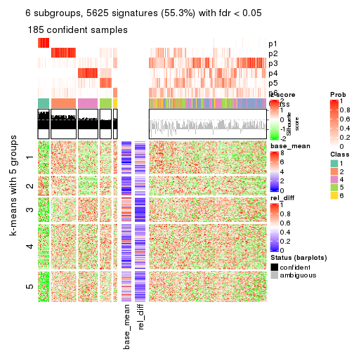</p>

</div>
</div>


Signature heatmaps where rows are not scaled:


<script>
$( function() {
	$( '#tabs-SD-mclust-get-signatures-no-scale' ).tabs();
} );
</script>
<div id='tabs-SD-mclust-get-signatures-no-scale'>
<ul>
<li><a href='#tab-SD-mclust-get-signatures-no-scale-1'>k = 2</a></li>
<li><a href='#tab-SD-mclust-get-signatures-no-scale-2'>k = 3</a></li>
<li><a href='#tab-SD-mclust-get-signatures-no-scale-3'>k = 4</a></li>
<li><a href='#tab-SD-mclust-get-signatures-no-scale-4'>k = 5</a></li>
<li><a href='#tab-SD-mclust-get-signatures-no-scale-5'>k = 6</a></li>
</ul>
<div id='tab-SD-mclust-get-signatures-no-scale-1'>
<pre><code class="r">get_signatures(res, k = 2, scale_rows = FALSE)
</code></pre>

<p></p>

</div>
<div id='tab-SD-mclust-get-signatures-no-scale-2'>
<pre><code class="r">get_signatures(res, k = 3, scale_rows = FALSE)
</code></pre>

<p></p>

</div>
<div id='tab-SD-mclust-get-signatures-no-scale-3'>
<pre><code class="r">get_signatures(res, k = 4, scale_rows = FALSE)
</code></pre>

<p></p>

</div>
<div id='tab-SD-mclust-get-signatures-no-scale-4'>
<pre><code class="r">get_signatures(res, k = 5, scale_rows = FALSE)
</code></pre>

<p></p>

</div>
<div id='tab-SD-mclust-get-signatures-no-scale-5'>
<pre><code class="r">get_signatures(res, k = 6, scale_rows = FALSE)
</code></pre>

<p></p>

</div>
</div>


Compare the overlap of signatures from different k:

```r
compare_signatures(res)
```


`get_signature()` returns a data frame invisibly. TO get the list of signatures, the function
call should be assigned to a variable explicitly. In following code, if `plot` argument is set
to `FALSE`, no heatmap is plotted while only the differential analysis is performed.

```r
# code only for demonstration
tb = get_signature(res, k = ..., plot = FALSE)
```

An example of the output of `tb` is:

```
#>   which_row         fdr    mean_1    mean_2 scaled_mean_1 scaled_mean_2 km
#> 1        38 0.042760348  8.373488  9.131774    -0.5533452     0.5164555  1
#> 2        40 0.018707592  7.106213  8.469186    -0.6173731     0.5762149  1
#> 3        55 0.019134737 10.221463 11.207825    -0.6159697     0.5749050  1
#> 4        59 0.006059896  5.921854  7.869574    -0.6899429     0.6439467  1
#> 5        60 0.018055526  8.928898 10.211722    -0.6204761     0.5791110  1
#> 6        98 0.009384629 15.714769 14.887706     0.6635654    -0.6193277  2
...
```

The columns in `tb` are:

1. `which_row`: row indices corresponding to the input matrix.
2. `fdr`: FDR for the differential test. 
3. `mean_x`: The mean value in group x.
4. `scaled_mean_x`: The mean value in group x after rows are scaled.
5. `km`: Row groups if k-means clustering is applied to rows.


UMAP plot which shows how samples are separated.


<script>
$( function() {
	$( '#tabs-SD-mclust-dimension-reduction' ).tabs();
} );
</script>
<div id='tabs-SD-mclust-dimension-reduction'>
<ul>
<li><a href='#tab-SD-mclust-dimension-reduction-1'>k = 2</a></li>
<li><a href='#tab-SD-mclust-dimension-reduction-2'>k = 3</a></li>
<li><a href='#tab-SD-mclust-dimension-reduction-3'>k = 4</a></li>
<li><a href='#tab-SD-mclust-dimension-reduction-4'>k = 5</a></li>
<li><a href='#tab-SD-mclust-dimension-reduction-5'>k = 6</a></li>
</ul>
<div id='tab-SD-mclust-dimension-reduction-1'>
<pre><code class="r">dimension_reduction(res, k = 2, method = &quot;UMAP&quot;)
</code></pre>

<p></p>

</div>
<div id='tab-SD-mclust-dimension-reduction-2'>
<pre><code class="r">dimension_reduction(res, k = 3, method = &quot;UMAP&quot;)
</code></pre>

<p></p>

</div>
<div id='tab-SD-mclust-dimension-reduction-3'>
<pre><code class="r">dimension_reduction(res, k = 4, method = &quot;UMAP&quot;)
</code></pre>

<p></p>

</div>
<div id='tab-SD-mclust-dimension-reduction-4'>
<pre><code class="r">dimension_reduction(res, k = 5, method = &quot;UMAP&quot;)
</code></pre>

<p></p>

</div>
<div id='tab-SD-mclust-dimension-reduction-5'>
<pre><code class="r">dimension_reduction(res, k = 6, method = &quot;UMAP&quot;)
</code></pre>

<p></p>

</div>
</div>


Following heatmap shows how subgroups are split when increasing `k`:

```r
collect_classes(res)
```


If matrix rows can be associated to genes, consider to use `functional_enrichment(res,
...)` to perform function enrichment for the signature genes. See [this vignette](http://bioconductor.org/packages/devel/bioc/vignettes/cola/inst/doc/functional_enrichment.html) for more detailed explanations.


 

---------------------------------------------------


### SD:NMF


The object with results only for a single top-value method and a single partition method 
can be extracted as:

```r
res = res_list["SD", "NMF"]
# you can also extract it by
# res = res_list["SD:NMF"]
```

A summary of `res` and all the functions that can be applied to it:

```r
res
```

```
#> A 'ConsensusPartition' object with k = 2, 3, 4, 5, 6.
#>   On a matrix with 10169 rows and 459 columns.
#>   Top rows (1000, 2000, 3000, 4000, 5000) are extracted by 'SD' method.
#>   Subgroups are detected by 'NMF' method.
#>   Performed in total 1250 partitions by row resampling.
#>   Best k for subgroups seems to be 2.
#> 
#> Following methods can be applied to this 'ConsensusPartition' object:
#>  [1] "cola_report"             "collect_classes"         "collect_plots"          
#>  [4] "collect_stats"           "colnames"                "compare_signatures"     
#>  [7] "consensus_heatmap"       "dimension_reduction"     "functional_enrichment"  
#> [10] "get_anno_col"            "get_anno"                "get_classes"            
#> [13] "get_consensus"           "get_matrix"              "get_membership"         
#> [16] "get_param"               "get_signatures"          "get_stats"              
#> [19] "is_best_k"               "is_stable_k"             "membership_heatmap"     
#> [22] "ncol"                    "nrow"                    "plot_ecdf"              
#> [25] "rownames"                "select_partition_number" "show"                   
#> [28] "suggest_best_k"          "test_to_known_factors"
```

`collect_plots()` function collects all the plots made from `res` for all `k` (number of partitions)
into one single page to provide an easy and fast comparison between different `k`.

```r
collect_plots(res)
```


The plots are:

- The first row: a plot of the ECDF (empirical cumulative distribution
  function) curves of the consensus matrix for each `k` and the heatmap of
  predicted classes for each `k`.
- The second row: heatmaps of the consensus matrix for each `k`.
- The third row: heatmaps of the membership matrix for each `k`.
- The fouth row: heatmaps of the signatures for each `k`.

All the plots in panels can be made by individual functions and they are
plotted later in this section.

`select_partition_number()` produces several plots showing different
statistics for choosing "optimized" `k`. There are following statistics:

- ECDF curves of the consensus matrix for each `k`;
- 1-PAC. [The PAC
  score](https://en.wikipedia.org/wiki/Consensus_clustering#Over-interpretation_potential_of_consensus_clustering)
  measures the proportion of the ambiguous subgrouping.
- Mean silhouette score.
- Concordance. The mean probability of fiting the consensus class ids in all
  partitions.
- Area increased. Denote $A_k$ as the area under the ECDF curve for current
  `k`, the area increased is defined as $A_k - A_{k-1}$.
- Rand index. The percent of pairs of samples that are both in a same cluster
  or both are not in a same cluster in the partition of k and k-1.
- Jaccard index. The ratio of pairs of samples are both in a same cluster in
  the partition of k and k-1 and the pairs of samples are both in a same
  cluster in the partition k or k-1.

The detailed explanations of these statistics can be found in [the _cola_
vignette](http://bioconductor.org/packages/devel/bioc/vignettes/cola/inst/doc/cola.html#toc_13).

Generally speaking, lower PAC score, higher mean silhouette score or higher
concordance corresponds to better partition. Rand index and Jaccard index
measure how similar the current partition is compared to partition with `k-1`.
If they are too similar, we won't accept `k` is better than `k-1`.

```r
select_partition_number(res)
```


The numeric values for all these statistics can be obtained by `get_stats()`.

```r
get_stats(res)
```

```
#>   k 1-PAC mean_silhouette concordance area_increased  Rand Jaccard
#> 2 2 0.229           0.637       0.815         0.4380 0.558   0.558
#> 3 3 0.374           0.660       0.796         0.3864 0.713   0.542
#> 4 4 0.355           0.307       0.609         0.1837 0.679   0.370
#> 5 5 0.493           0.586       0.723         0.0848 0.788   0.415
#> 6 6 0.532           0.467       0.662         0.0424 0.965   0.853
```

`suggest_best_k()` suggests the best $k$ based on these statistics. The rules are as follows:

- All $k$ with Jaccard index larger than 0.95 are removed because increasing
  $k$ does not provide enough extra information. If all $k$ are removed, it is
  marked as no subgroup is detected.
- For all $k$ with 1-PAC score larger than 0.9, the maximal $k$ is taken as
  the best $k$, and other $k$ are marked as optional $k$.
- If it does not fit the second rule. The $k$ with the maximal vote of the
  highest 1-PAC score, highest mean silhouette, and highest concordance is
  taken as the best $k$.

```r
suggest_best_k(res)
```

```
#> [1] 2
```


Following shows the table of the partitions (You need to click the **show/hide
code output** link to see it). The membership matrix (columns with name `p*`)
is inferred by
[`clue::cl_consensus()`](https://www.rdocumentation.org/link/cl_consensus?package=clue)
function with the `SE` method. Basically the value in the membership matrix
represents the probability to belong to a certain group. The finall class
label for an item is determined with the group with highest probability it
belongs to.

In `get_classes()` function, the entropy is calculated from the membership
matrix and the silhouette score is calculated from the consensus matrix.


<script>
$( function() {
	$( '#tabs-SD-NMF-get-classes' ).tabs();
} );
</script>
<div id='tabs-SD-NMF-get-classes'>
<ul>
<li><a href='#tab-SD-NMF-get-classes-1'>k = 2</a></li>
<li><a href='#tab-SD-NMF-get-classes-2'>k = 3</a></li>
<li><a href='#tab-SD-NMF-get-classes-3'>k = 4</a></li>
<li><a href='#tab-SD-NMF-get-classes-4'>k = 5</a></li>
<li><a href='#tab-SD-NMF-get-classes-5'>k = 6</a></li>
</ul>

<div id='tab-SD-NMF-get-classes-1'>
<p><a id='tab-SD-NMF-get-classes-1-a' style='color:#0366d6' href='#'>show/hide code output</a></p>
<pre><code class="r">cbind(get_classes(res, k = 2), get_membership(res, k = 2))
</code></pre>

<pre><code>#&gt;            class entropy silhouette    p1    p2
#&gt; SRR1699874     1  0.9522    0.56226 0.628 0.372
#&gt; SRR1699875     1  1.0000    0.24349 0.504 0.496
#&gt; SRR1699876     2  0.4815    0.77345 0.104 0.896
#&gt; SRR1699877     1  0.8955    0.63602 0.688 0.312
#&gt; SRR1699879     2  0.9248    0.38342 0.340 0.660
#&gt; SRR1699878     1  0.9933    0.38667 0.548 0.452
#&gt; SRR1699880     2  0.9833    0.08630 0.424 0.576
#&gt; SRR1699881     2  0.9998   -0.20617 0.492 0.508
#&gt; SRR1699882     2  0.9996   -0.18849 0.488 0.512
#&gt; SRR1699883     1  0.9833    0.44620 0.576 0.424
#&gt; SRR1699884     1  0.8327    0.67797 0.736 0.264
#&gt; SRR1699885     1  0.9129    0.61512 0.672 0.328
#&gt; SRR1699886     2  0.7219    0.68023 0.200 0.800
#&gt; SRR1699888     2  0.8861    0.45010 0.304 0.696
#&gt; SRR1699889     2  0.1184    0.80648 0.016 0.984
#&gt; SRR1699890     1  0.9954    0.17987 0.540 0.460
#&gt; SRR1699887     2  0.7745    0.63345 0.228 0.772
#&gt; SRR1699891     2  0.2236    0.80098 0.036 0.964
#&gt; SRR1699892     2  0.9881    0.04486 0.436 0.564
#&gt; SRR1699893     2  0.1843    0.80580 0.028 0.972
#&gt; SRR1699894     2  0.1633    0.80655 0.024 0.976
#&gt; SRR1699895     2  0.1843    0.80317 0.028 0.972
#&gt; SRR1699896     2  0.9833    0.10462 0.424 0.576
#&gt; SRR1699897     2  0.9522    0.28788 0.372 0.628
#&gt; SRR1699898     2  0.3584    0.78811 0.068 0.932
#&gt; SRR1699900     1  0.9996    0.28388 0.512 0.488
#&gt; SRR1699899     2  0.4161    0.78756 0.084 0.916
#&gt; SRR1699902     2  0.8386    0.56906 0.268 0.732
#&gt; SRR1699901     2  0.4939    0.76701 0.108 0.892
#&gt; SRR1699903     2  0.1414    0.80418 0.020 0.980
#&gt; SRR1699904     2  0.5408    0.73013 0.124 0.876
#&gt; SRR1699905     2  0.9815    0.22599 0.420 0.580
#&gt; SRR1699906     2  0.2423    0.80099 0.040 0.960
#&gt; SRR1699907     2  0.8207    0.54567 0.256 0.744
#&gt; SRR1699908     2  0.1414    0.80482 0.020 0.980
#&gt; SRR1699909     2  0.1414    0.80745 0.020 0.980
#&gt; SRR1699910     2  0.3584    0.77948 0.068 0.932
#&gt; SRR1699911     2  0.8267    0.57880 0.260 0.740
#&gt; SRR1699912     2  0.0672    0.80595 0.008 0.992
#&gt; SRR1699913     2  0.1843    0.80340 0.028 0.972
#&gt; SRR1699914     2  0.2043    0.80619 0.032 0.968
#&gt; SRR1699915     2  0.4562    0.75552 0.096 0.904
#&gt; SRR1699916     2  0.2603    0.80863 0.044 0.956
#&gt; SRR1699917     2  0.0672    0.80630 0.008 0.992
#&gt; SRR1699918     2  0.1633    0.80545 0.024 0.976
#&gt; SRR1699919     2  0.1843    0.80225 0.028 0.972
#&gt; SRR1699920     2  0.1414    0.80594 0.020 0.980
#&gt; SRR1699921     2  0.3114    0.78871 0.056 0.944
#&gt; SRR1699922     1  0.9754    0.35928 0.592 0.408
#&gt; SRR1699923     1  0.9286    0.50429 0.656 0.344
#&gt; SRR1699924     2  0.2423    0.79972 0.040 0.960
#&gt; SRR1699925     1  0.6712    0.64191 0.824 0.176
#&gt; SRR1699926     2  0.6343    0.68659 0.160 0.840
#&gt; SRR1699927     2  0.0672    0.80592 0.008 0.992
#&gt; SRR1699929     1  1.0000    0.22351 0.500 0.500
#&gt; SRR1699928     2  0.1843    0.80333 0.028 0.972
#&gt; SRR1699930     2  0.3584    0.78135 0.068 0.932
#&gt; SRR1699931     2  0.9998   -0.19441 0.492 0.508
#&gt; SRR1699933     2  0.7815    0.64126 0.232 0.768
#&gt; SRR1699932     2  0.0376    0.80614 0.004 0.996
#&gt; SRR1699934     1  0.6048    0.65286 0.852 0.148
#&gt; SRR1699935     2  0.1843    0.80767 0.028 0.972
#&gt; SRR1699936     2  0.6148    0.72642 0.152 0.848
#&gt; SRR1699937     1  0.9358    0.58141 0.648 0.352
#&gt; SRR1699938     2  0.9988   -0.15975 0.480 0.520
#&gt; SRR1699940     2  0.8608    0.52708 0.284 0.716
#&gt; SRR1699939     2  0.8955    0.45335 0.312 0.688
#&gt; SRR1699941     1  0.9922    0.39195 0.552 0.448
#&gt; SRR1699942     2  0.9686    0.22827 0.396 0.604
#&gt; SRR1699943     1  0.8861    0.63712 0.696 0.304
#&gt; SRR1699944     2  0.9954   -0.07437 0.460 0.540
#&gt; SRR1699945     2  0.9795    0.12766 0.416 0.584
#&gt; SRR1699946     1  0.9000    0.62728 0.684 0.316
#&gt; SRR1699947     1  0.9044    0.62852 0.680 0.320
#&gt; SRR1699948     1  0.9522    0.55636 0.628 0.372
#&gt; SRR1699949     2  0.6438    0.72311 0.164 0.836
#&gt; SRR1699950     2  0.8499    0.54668 0.276 0.724
#&gt; SRR1699951     2  0.7602    0.64782 0.220 0.780
#&gt; SRR1699952     1  0.9323    0.58573 0.652 0.348
#&gt; SRR1699953     2  0.9996   -0.20011 0.488 0.512
#&gt; SRR1699954     1  0.4815    0.72180 0.896 0.104
#&gt; SRR1699955     2  0.9815    0.10858 0.420 0.580
#&gt; SRR1699956     2  0.9323    0.37600 0.348 0.652
#&gt; SRR1699957     1  0.9909    0.40680 0.556 0.444
#&gt; SRR1699959     2  0.7950    0.60788 0.240 0.760
#&gt; SRR1699958     2  0.4690    0.78463 0.100 0.900
#&gt; SRR1699960     2  0.5178    0.76031 0.116 0.884
#&gt; SRR1699961     1  0.9635    0.52622 0.612 0.388
#&gt; SRR1699962     2  0.9922   -0.03029 0.448 0.552
#&gt; SRR1699963     2  0.9427    0.33759 0.360 0.640
#&gt; SRR1699964     1  0.9635    0.53146 0.612 0.388
#&gt; SRR1699965     2  0.9552    0.27238 0.376 0.624
#&gt; SRR1699966     2  0.5408    0.75774 0.124 0.876
#&gt; SRR1699967     1  0.8813    0.63941 0.700 0.300
#&gt; SRR1699968     2  0.6712    0.70177 0.176 0.824
#&gt; SRR1699969     2  0.5294    0.75977 0.120 0.880
#&gt; SRR1699971     1  0.9580    0.53884 0.620 0.380
#&gt; SRR1699970     1  0.9661    0.52009 0.608 0.392
#&gt; SRR1699972     1  0.9710    0.50758 0.600 0.400
#&gt; SRR1699973     2  0.4431    0.77510 0.092 0.908
#&gt; SRR1699974     1  0.9686    0.50385 0.604 0.396
#&gt; SRR1699975     2  0.4815    0.76671 0.104 0.896
#&gt; SRR1699976     1  0.9944    0.37254 0.544 0.456
#&gt; SRR1699977     2  0.5294    0.75784 0.120 0.880
#&gt; SRR1699978     2  0.7745    0.59936 0.228 0.772
#&gt; SRR1699979     2  0.4690    0.76994 0.100 0.900
#&gt; SRR1699980     2  0.4022    0.78292 0.080 0.920
#&gt; SRR1699981     2  0.2948    0.80064 0.052 0.948
#&gt; SRR1699982     2  0.0672    0.80595 0.008 0.992
#&gt; SRR1699983     2  0.2236    0.80006 0.036 0.964
#&gt; SRR1699984     1  0.6048    0.65616 0.852 0.148
#&gt; SRR1699985     2  0.4562    0.77674 0.096 0.904
#&gt; SRR1699986     1  0.9795    0.41385 0.584 0.416
#&gt; SRR1699988     2  0.7139    0.67744 0.196 0.804
#&gt; SRR1699987     2  0.3584    0.79142 0.068 0.932
#&gt; SRR1699989     2  0.4298    0.78429 0.088 0.912
#&gt; SRR1699990     2  0.4939    0.76677 0.108 0.892
#&gt; SRR1699992     1  0.9393    0.57669 0.644 0.356
#&gt; SRR1699991     2  0.6438    0.72723 0.164 0.836
#&gt; SRR1699993     2  0.7602    0.61628 0.220 0.780
#&gt; SRR1699994     2  1.0000   -0.19734 0.496 0.504
#&gt; SRR1699995     2  0.1843    0.80686 0.028 0.972
#&gt; SRR1699996     1  0.6801    0.71558 0.820 0.180
#&gt; SRR1699997     2  0.1843    0.80234 0.028 0.972
#&gt; SRR1699998     1  0.9754    0.48645 0.592 0.408
#&gt; SRR1699999     1  0.6048    0.70072 0.852 0.148
#&gt; SRR1700000     1  0.7815    0.70052 0.768 0.232
#&gt; SRR1700002     1  0.9998    0.24624 0.508 0.492
#&gt; SRR1700001     2  0.7602    0.65071 0.220 0.780
#&gt; SRR1700003     2  0.4939    0.77378 0.108 0.892
#&gt; SRR1700004     2  0.5842    0.74474 0.140 0.860
#&gt; SRR1700005     1  0.5178    0.67349 0.884 0.116
#&gt; SRR1700006     1  0.9850    0.43979 0.572 0.428
#&gt; SRR1700007     2  0.2043    0.80095 0.032 0.968
#&gt; SRR1700008     2  0.2603    0.79814 0.044 0.956
#&gt; SRR1700009     2  0.9850    0.19365 0.428 0.572
#&gt; SRR1700010     2  0.9754    0.15810 0.408 0.592
#&gt; SRR1700011     2  0.5519    0.75034 0.128 0.872
#&gt; SRR1700013     2  0.9323    0.36971 0.348 0.652
#&gt; SRR1700012     2  0.9661    0.22572 0.392 0.608
#&gt; SRR1700014     2  0.4690    0.77128 0.100 0.900
#&gt; SRR1700015     1  0.9954    0.35753 0.540 0.460
#&gt; SRR1700016     1  0.8443    0.58597 0.728 0.272
#&gt; SRR1700018     2  0.9977   -0.12315 0.472 0.528
#&gt; SRR1700017     2  0.9358    0.36341 0.352 0.648
#&gt; SRR1700019     2  0.4690    0.77533 0.100 0.900
#&gt; SRR1700020     2  0.4022    0.78969 0.080 0.920
#&gt; SRR1700021     2  0.6148    0.70385 0.152 0.848
#&gt; SRR1700023     2  0.6247    0.72384 0.156 0.844
#&gt; SRR1700022     2  0.8909    0.48060 0.308 0.692
#&gt; SRR1700024     2  0.1843    0.80392 0.028 0.972
#&gt; SRR1700025     1  0.9686    0.50743 0.604 0.396
#&gt; SRR1700026     1  0.9732    0.49379 0.596 0.404
#&gt; SRR1700027     1  0.9909    0.39730 0.556 0.444
#&gt; SRR1700028     2  0.1843    0.80754 0.028 0.972
#&gt; SRR1700029     2  0.2423    0.80265 0.040 0.960
#&gt; SRR1700030     2  0.3879    0.78807 0.076 0.924
#&gt; SRR1700031     2  0.8713    0.51186 0.292 0.708
#&gt; SRR1700032     1  0.9866    0.42684 0.568 0.432
#&gt; SRR1700034     1  0.9710    0.51329 0.600 0.400
#&gt; SRR1700035     2  0.1843    0.80354 0.028 0.972
#&gt; SRR1700033     2  0.7674    0.64438 0.224 0.776
#&gt; SRR1700036     2  0.4815    0.77123 0.104 0.896
#&gt; SRR1700037     2  0.2236    0.80329 0.036 0.964
#&gt; SRR1700038     1  0.9427    0.58549 0.640 0.360
#&gt; SRR1700039     2  0.5842    0.74826 0.140 0.860
#&gt; SRR1700040     2  0.8267    0.58291 0.260 0.740
#&gt; SRR1700041     2  0.5059    0.76998 0.112 0.888
#&gt; SRR1700042     2  0.5294    0.76163 0.120 0.880
#&gt; SRR1700043     1  1.0000    0.23277 0.504 0.496
#&gt; SRR1700045     2  0.4298    0.78715 0.088 0.912
#&gt; SRR1700044     2  1.0000   -0.19459 0.496 0.504
#&gt; SRR1700046     2  0.8267    0.58296 0.260 0.740
#&gt; SRR1700047     2  0.5842    0.74944 0.140 0.860
#&gt; SRR1700048     2  0.0938    0.80632 0.012 0.988
#&gt; SRR1700049     2  0.3733    0.78680 0.072 0.928
#&gt; SRR1700050     2  0.0672    0.80630 0.008 0.992
#&gt; SRR1700051     2  0.2043    0.80213 0.032 0.968
#&gt; SRR1700052     2  0.6712    0.68584 0.176 0.824
#&gt; SRR1700053     2  0.1414    0.80495 0.020 0.980
#&gt; SRR1700054     2  0.9775    0.11097 0.412 0.588
#&gt; SRR1700055     2  0.9850    0.07589 0.428 0.572
#&gt; SRR1700056     2  0.1184    0.80739 0.016 0.984
#&gt; SRR1700057     2  0.1414    0.80483 0.020 0.980
#&gt; SRR1700058     2  0.8909    0.48674 0.308 0.692
#&gt; SRR1700059     2  0.1633    0.80335 0.024 0.976
#&gt; SRR1700060     2  0.2948    0.79627 0.052 0.948
#&gt; SRR1700061     2  0.9881    0.03670 0.436 0.564
#&gt; SRR1700062     2  0.2043    0.80108 0.032 0.968
#&gt; SRR1700063     2  0.5294    0.76749 0.120 0.880
#&gt; SRR1700064     2  0.1414    0.80495 0.020 0.980
#&gt; SRR1700065     2  0.8763    0.45502 0.296 0.704
#&gt; SRR1700066     2  0.9710    0.17635 0.400 0.600
#&gt; SRR1700067     2  0.2423    0.80044 0.040 0.960
#&gt; SRR1700068     2  0.2236    0.80073 0.036 0.964
#&gt; SRR1700069     2  0.3274    0.79344 0.060 0.940
#&gt; SRR1700070     2  0.9552    0.27747 0.376 0.624
#&gt; SRR1700071     2  0.5059    0.76865 0.112 0.888
#&gt; SRR1700072     2  0.3584    0.79199 0.068 0.932
#&gt; SRR1700073     2  0.5737    0.73660 0.136 0.864
#&gt; SRR1700075     2  0.9393    0.24501 0.356 0.644
#&gt; SRR1700074     2  0.9963   -0.08264 0.464 0.536
#&gt; SRR1700076     2  0.9998   -0.21339 0.492 0.508
#&gt; SRR1700077     1  0.9909    0.39622 0.556 0.444
#&gt; SRR1700078     2  0.5737    0.74541 0.136 0.864
#&gt; SRR1700080     2  0.4690    0.77157 0.100 0.900
#&gt; SRR1700079     2  0.2778    0.79779 0.048 0.952
#&gt; SRR1700081     2  0.5059    0.76724 0.112 0.888
#&gt; SRR1700082     2  0.8499    0.55100 0.276 0.724
#&gt; SRR1700083     2  0.4161    0.78259 0.084 0.916
#&gt; SRR1700084     1  0.9580    0.54242 0.620 0.380
#&gt; SRR1700085     2  0.2948    0.79579 0.052 0.948
#&gt; SRR1700086     2  0.4939    0.76732 0.108 0.892
#&gt; SRR1700087     2  0.8081    0.66451 0.248 0.752
#&gt; SRR1700088     2  0.8386    0.56621 0.268 0.732
#&gt; SRR1700089     2  0.6973    0.70883 0.188 0.812
#&gt; SRR1700091     2  0.4022    0.79533 0.080 0.920
#&gt; SRR1700090     2  0.2236    0.80462 0.036 0.964
#&gt; SRR1700092     2  0.4298    0.78772 0.088 0.912
#&gt; SRR1700094     2  0.6973    0.71722 0.188 0.812
#&gt; SRR1700093     2  0.1633    0.80769 0.024 0.976
#&gt; SRR1700095     2  0.3114    0.79618 0.056 0.944
#&gt; SRR1700096     2  0.3431    0.79035 0.064 0.936
#&gt; SRR1700097     2  0.3431    0.79605 0.064 0.936
#&gt; SRR1700098     2  0.7950    0.65568 0.240 0.760
#&gt; SRR1700099     2  0.2778    0.80712 0.048 0.952
#&gt; SRR1700100     2  0.3879    0.79852 0.076 0.924
#&gt; SRR1700101     2  0.4161    0.79709 0.084 0.916
#&gt; SRR1700102     2  0.3431    0.79091 0.064 0.936
#&gt; SRR1700104     2  0.4298    0.80108 0.088 0.912
#&gt; SRR1700103     2  0.3431    0.79629 0.064 0.936
#&gt; SRR1700105     2  0.2603    0.79828 0.044 0.956
#&gt; SRR1700106     2  0.4815    0.75653 0.104 0.896
#&gt; SRR1700107     2  0.3431    0.80599 0.064 0.936
#&gt; SRR1700108     2  0.2603    0.80452 0.044 0.956
#&gt; SRR1700109     2  0.2043    0.80808 0.032 0.968
#&gt; SRR1700110     2  0.3114    0.80522 0.056 0.944
#&gt; SRR1700112     2  0.1633    0.80456 0.024 0.976
#&gt; SRR1700111     2  0.1184    0.80557 0.016 0.984
#&gt; SRR1700113     2  0.1843    0.80580 0.028 0.972
#&gt; SRR1700114     2  0.3733    0.79694 0.072 0.928
#&gt; SRR1700115     2  0.2236    0.80764 0.036 0.964
#&gt; SRR1700116     2  0.2778    0.79849 0.048 0.952
#&gt; SRR1700117     2  0.6048    0.71676 0.148 0.852
#&gt; SRR1700119     2  0.2236    0.80259 0.036 0.964
#&gt; SRR1700118     2  0.1414    0.80568 0.020 0.980
#&gt; SRR1700120     2  0.2043    0.80342 0.032 0.968
#&gt; SRR1700121     2  0.0938    0.80583 0.012 0.988
#&gt; SRR1700122     2  0.2236    0.79913 0.036 0.964
#&gt; SRR1700123     2  0.3733    0.78304 0.072 0.928
#&gt; SRR1700125     2  0.3733    0.78322 0.072 0.928
#&gt; SRR1700126     2  0.3431    0.80480 0.064 0.936
#&gt; SRR1700127     2  0.2778    0.80739 0.048 0.952
#&gt; SRR1700124     2  0.1184    0.80644 0.016 0.984
#&gt; SRR1700128     2  0.3431    0.78782 0.064 0.936
#&gt; SRR1700129     2  0.3114    0.79294 0.056 0.944
#&gt; SRR1700130     2  0.6343    0.69641 0.160 0.840
#&gt; SRR1700132     2  0.2778    0.79426 0.048 0.952
#&gt; SRR1700131     2  0.2603    0.80786 0.044 0.956
#&gt; SRR1700133     2  0.3274    0.79039 0.060 0.940
#&gt; SRR1700134     2  0.1843    0.80218 0.028 0.972
#&gt; SRR1700135     2  0.5408    0.72676 0.124 0.876
#&gt; SRR1700136     2  0.2043    0.80712 0.032 0.968
#&gt; SRR1700137     2  0.1414    0.80553 0.020 0.980
#&gt; SRR1700138     2  0.1414    0.80673 0.020 0.980
#&gt; SRR1700140     2  0.0376    0.80581 0.004 0.996
#&gt; SRR1700139     2  0.2236    0.80334 0.036 0.964
#&gt; SRR1700141     2  0.2043    0.80317 0.032 0.968
#&gt; SRR1700142     2  0.1184    0.80590 0.016 0.984
#&gt; SRR1700143     2  0.1843    0.80647 0.028 0.972
#&gt; SRR1700144     2  0.1633    0.80461 0.024 0.976
#&gt; SRR1700145     2  0.3114    0.79235 0.056 0.944
#&gt; SRR1700146     2  0.0672    0.80575 0.008 0.992
#&gt; SRR1700147     2  0.2603    0.79819 0.044 0.956
#&gt; SRR1700149     2  0.3733    0.78324 0.072 0.928
#&gt; SRR1700148     2  0.2948    0.79470 0.052 0.948
#&gt; SRR1700150     2  0.2603    0.79681 0.044 0.956
#&gt; SRR1700152     2  0.3879    0.77692 0.076 0.924
#&gt; SRR1700151     2  0.1184    0.80590 0.016 0.984
#&gt; SRR1700153     2  0.1414    0.80434 0.020 0.980
#&gt; SRR1700154     2  0.3431    0.78876 0.064 0.936
#&gt; SRR1700155     2  0.2778    0.79613 0.048 0.952
#&gt; SRR1700156     2  0.0672    0.80575 0.008 0.992
#&gt; SRR1700158     2  0.5059    0.75259 0.112 0.888
#&gt; SRR1700159     2  0.2236    0.80139 0.036 0.964
#&gt; SRR1700157     2  0.1633    0.80314 0.024 0.976
#&gt; SRR1700160     2  0.1633    0.80465 0.024 0.976
#&gt; SRR1700161     2  0.2236    0.80233 0.036 0.964
#&gt; SRR1700162     2  0.3879    0.77790 0.076 0.924
#&gt; SRR1700164     2  0.8499    0.52087 0.276 0.724
#&gt; SRR1700163     2  0.6343    0.69453 0.160 0.840
#&gt; SRR1700165     2  0.2043    0.80857 0.032 0.968
#&gt; SRR1700166     2  0.4431    0.77114 0.092 0.908
#&gt; SRR1700168     2  0.4562    0.76178 0.096 0.904
#&gt; SRR1700167     2  0.1633    0.80485 0.024 0.976
#&gt; SRR1700170     2  0.5737    0.72238 0.136 0.864
#&gt; SRR1700169     2  0.2043    0.80554 0.032 0.968
#&gt; SRR1700171     2  0.9044    0.43929 0.320 0.680
#&gt; SRR1700172     2  0.1633    0.80741 0.024 0.976
#&gt; SRR1700174     2  0.1633    0.80756 0.024 0.976
#&gt; SRR1700173     2  0.1184    0.80596 0.016 0.984
#&gt; SRR1700175     2  0.1843    0.80358 0.028 0.972
#&gt; SRR1700176     2  0.1633    0.80772 0.024 0.976
#&gt; SRR1700178     1  0.6623    0.71489 0.828 0.172
#&gt; SRR1700177     2  0.2236    0.80136 0.036 0.964
#&gt; SRR1700180     1  0.4562    0.72224 0.904 0.096
#&gt; SRR1700179     1  0.7453    0.69940 0.788 0.212
#&gt; SRR1700181     1  0.5294    0.72495 0.880 0.120
#&gt; SRR1700183     1  0.3879    0.69052 0.924 0.076
#&gt; SRR1700182     1  0.7299    0.70543 0.796 0.204
#&gt; SRR1700184     1  0.6887    0.71393 0.816 0.184
#&gt; SRR1700186     1  0.7453    0.69974 0.788 0.212
#&gt; SRR1700187     1  0.4022    0.68925 0.920 0.080
#&gt; SRR1700185     1  0.5519    0.66699 0.872 0.128
#&gt; SRR1700188     1  0.6973    0.70990 0.812 0.188
#&gt; SRR1700192     1  0.3114    0.69645 0.944 0.056
#&gt; SRR1700190     1  0.5178    0.72345 0.884 0.116
#&gt; SRR1700191     1  0.4431    0.68599 0.908 0.092
#&gt; SRR1700189     1  0.4431    0.68510 0.908 0.092
#&gt; SRR1700193     1  0.3431    0.71790 0.936 0.064
#&gt; SRR1700195     1  0.1843    0.70435 0.972 0.028
#&gt; SRR1700194     1  0.4298    0.68682 0.912 0.088
#&gt; SRR1700196     1  0.6247    0.71899 0.844 0.156
#&gt; SRR1700197     1  0.1843    0.70144 0.972 0.028
#&gt; SRR1700198     1  0.4939    0.72185 0.892 0.108
#&gt; SRR1700199     1  0.4022    0.71896 0.920 0.080
#&gt; SRR1700200     1  0.2948    0.71395 0.948 0.052
#&gt; SRR1700201     1  0.9323    0.58813 0.652 0.348
#&gt; SRR1700202     1  0.4690    0.68283 0.900 0.100
#&gt; SRR1700203     1  0.2236    0.70091 0.964 0.036
#&gt; SRR1700204     1  0.4431    0.72456 0.908 0.092
#&gt; SRR1700206     1  0.1843    0.70586 0.972 0.028
#&gt; SRR1700207     1  0.7602    0.69783 0.780 0.220
#&gt; SRR1700208     1  0.1184    0.70644 0.984 0.016
#&gt; SRR1700205     1  0.4431    0.68590 0.908 0.092
#&gt; SRR1700209     1  0.9988    0.30396 0.520 0.480
#&gt; SRR1700210     1  0.2603    0.70452 0.956 0.044
#&gt; SRR1700211     1  0.2948    0.69754 0.948 0.052
#&gt; SRR1700212     1  0.2236    0.70079 0.964 0.036
#&gt; SRR1700213     1  0.7815    0.69694 0.768 0.232
#&gt; SRR1700214     1  0.1843    0.71254 0.972 0.028
#&gt; SRR1700215     1  0.5059    0.67999 0.888 0.112
#&gt; SRR1700217     1  0.8861    0.63667 0.696 0.304
#&gt; SRR1700216     1  0.5059    0.67570 0.888 0.112
#&gt; SRR1700218     1  0.8813    0.64314 0.700 0.300
#&gt; SRR1700219     1  0.7602    0.70279 0.780 0.220
#&gt; SRR1700222     1  0.4298    0.68758 0.912 0.088
#&gt; SRR1700220     2  0.5059    0.77487 0.112 0.888
#&gt; SRR1700221     1  0.1843    0.70789 0.972 0.028
#&gt; SRR1700223     1  0.6531    0.71722 0.832 0.168
#&gt; SRR1700224     1  0.6343    0.69638 0.840 0.160
#&gt; SRR1700226     1  0.6048    0.72491 0.852 0.148
#&gt; SRR1700229     1  0.6438    0.72605 0.836 0.164
#&gt; SRR1700225     1  0.9608    0.50939 0.616 0.384
#&gt; SRR1700227     1  0.8081    0.67755 0.752 0.248
#&gt; SRR1700230     1  0.4431    0.68674 0.908 0.092
#&gt; SRR1700231     1  0.7056    0.71204 0.808 0.192
#&gt; SRR1700228     1  0.3114    0.71234 0.944 0.056
#&gt; SRR1700232     1  0.8499    0.66927 0.724 0.276
#&gt; SRR1700233     1  0.3274    0.72044 0.940 0.060
#&gt; SRR1700234     1  0.3431    0.70791 0.936 0.064
#&gt; SRR1700235     1  0.9881    0.41535 0.564 0.436
#&gt; SRR1700237     1  0.7056    0.71392 0.808 0.192
#&gt; SRR1700236     1  0.9775    0.47790 0.588 0.412
#&gt; SRR1700238     1  0.1843    0.71141 0.972 0.028
#&gt; SRR1700239     1  0.4161    0.68816 0.916 0.084
#&gt; SRR1700240     1  0.6531    0.63766 0.832 0.168
#&gt; SRR1700241     1  0.5294    0.67681 0.880 0.120
#&gt; SRR1700243     1  0.5629    0.72274 0.868 0.132
#&gt; SRR1700244     1  0.3584    0.71582 0.932 0.068
#&gt; SRR1700242     1  0.4562    0.68510 0.904 0.096
#&gt; SRR1700246     1  0.4161    0.68908 0.916 0.084
#&gt; SRR1700245     1  0.9896    0.41267 0.560 0.440
#&gt; SRR1700247     1  0.4815    0.68117 0.896 0.104
#&gt; SRR1700249     1  0.6048    0.65755 0.852 0.148
#&gt; SRR1700250     1  0.9922    0.39679 0.552 0.448
#&gt; SRR1700248     1  0.6247    0.72189 0.844 0.156
#&gt; SRR1700251     1  0.3431    0.71994 0.936 0.064
#&gt; SRR1700252     1  0.5842    0.72369 0.860 0.140
#&gt; SRR1700253     1  0.7453    0.70329 0.788 0.212
#&gt; SRR1700256     1  0.3431    0.71953 0.936 0.064
#&gt; SRR1700254     1  0.4815    0.67991 0.896 0.104
#&gt; SRR1700255     1  0.2603    0.71028 0.956 0.044
#&gt; SRR1700257     1  0.1184    0.70839 0.984 0.016
#&gt; SRR1700258     1  0.7745    0.68966 0.772 0.228
#&gt; SRR1700259     2  0.8555    0.53517 0.280 0.720
#&gt; SRR1700260     2  0.4431    0.78231 0.092 0.908
#&gt; SRR1700261     2  0.4022    0.78652 0.080 0.920
#&gt; SRR1700262     2  0.3431    0.80284 0.064 0.936
#&gt; SRR1700263     1  0.9580    0.54801 0.620 0.380
#&gt; SRR1700264     1  0.9775    0.48231 0.588 0.412
#&gt; SRR1700265     1  0.6801    0.71633 0.820 0.180
#&gt; SRR1700266     2  0.9850    0.06904 0.428 0.572
#&gt; SRR1700268     1  0.2603    0.70663 0.956 0.044
#&gt; SRR1700270     1  0.6712    0.71435 0.824 0.176
#&gt; SRR1700267     2  0.9970   -0.09848 0.468 0.532
#&gt; SRR1700271     2  0.8555    0.53902 0.280 0.720
#&gt; SRR1700272     2  0.6801    0.72514 0.180 0.820
#&gt; SRR1700273     1  0.9129    0.61859 0.672 0.328
#&gt; SRR1700274     2  0.8267    0.58346 0.260 0.740
#&gt; SRR1700277     1  0.8144    0.67450 0.748 0.252
#&gt; SRR1700275     2  0.3431    0.79412 0.064 0.936
#&gt; SRR1700276     2  0.9866    0.17960 0.432 0.568
#&gt; SRR1700278     1  0.8327    0.58308 0.736 0.264
#&gt; SRR1700279     2  0.9998   -0.00512 0.492 0.508
#&gt; SRR1700280     1  0.9044    0.48823 0.680 0.320
#&gt; SRR1700281     1  0.9358    0.58191 0.648 0.352
#&gt; SRR1700283     2  0.4690    0.78596 0.100 0.900
#&gt; SRR1700282     1  0.9491    0.41236 0.632 0.368
#&gt; SRR1700284     2  0.0672    0.80623 0.008 0.992
#&gt; SRR1700285     2  0.4690    0.77909 0.100 0.900
#&gt; SRR1700286     2  0.7299    0.66387 0.204 0.796
#&gt; SRR1700287     2  0.5629    0.72561 0.132 0.868
#&gt; SRR1700290     2  0.9909    0.13873 0.444 0.556
#&gt; SRR1700289     2  0.3114    0.79482 0.056 0.944
#&gt; SRR1700288     1  0.3879    0.71993 0.924 0.076
#&gt; SRR1700292     2  0.7219    0.65242 0.200 0.800
#&gt; SRR1700291     2  0.1843    0.80278 0.028 0.972
#&gt; SRR1700293     1  0.7950    0.65731 0.760 0.240
#&gt; SRR1700294     2  0.7745    0.59636 0.228 0.772
#&gt; SRR1700295     2  0.6712    0.66663 0.176 0.824
#&gt; SRR1700297     2  0.5059    0.74252 0.112 0.888
#&gt; SRR1700296     2  0.8207    0.56339 0.256 0.744
#&gt; SRR1700298     2  0.6801    0.67434 0.180 0.820
#&gt; SRR1700299     2  0.6623    0.68181 0.172 0.828
#&gt; SRR1700300     2  0.9522    0.33137 0.372 0.628
#&gt; SRR1700302     2  0.1633    0.80324 0.024 0.976
#&gt; SRR1700301     2  0.3584    0.78144 0.068 0.932
#&gt; SRR1700303     2  0.2236    0.80049 0.036 0.964
#&gt; SRR1700304     1  0.5737    0.66229 0.864 0.136
#&gt; SRR1700305     2  0.9970    0.05646 0.468 0.532
#&gt; SRR1700306     2  0.6801    0.66436 0.180 0.820
#&gt; SRR1700308     2  0.5737    0.74935 0.136 0.864
#&gt; SRR1700307     2  0.5059    0.77815 0.112 0.888
#&gt; SRR1700309     2  0.6801    0.69733 0.180 0.820
#&gt; SRR1700310     2  0.5842    0.71341 0.140 0.860
#&gt; SRR1700311     2  0.7056    0.64536 0.192 0.808
#&gt; SRR1700312     2  0.2948    0.80245 0.052 0.948
#&gt; SRR1700313     2  0.8909    0.47514 0.308 0.692
#&gt; SRR1700314     2  0.1184    0.80590 0.016 0.984
#&gt; SRR1700315     2  0.7219    0.66658 0.200 0.800
#&gt; SRR1700316     2  0.1633    0.80717 0.024 0.976
#&gt; SRR1700317     2  0.9833    0.03462 0.424 0.576
#&gt; SRR1700318     1  0.9998    0.05627 0.508 0.492
#&gt; SRR1700319     2  0.3274    0.78753 0.060 0.940
#&gt; SRR1700320     2  0.2948    0.79292 0.052 0.948
#&gt; SRR1700322     2  0.9970    0.07986 0.468 0.532
#&gt; SRR1700321     2  0.3879    0.79627 0.076 0.924
#&gt; SRR1700323     2  0.0672    0.80639 0.008 0.992
#&gt; SRR1700324     2  0.4690    0.76637 0.100 0.900
#&gt; SRR1700325     1  1.0000    0.20709 0.504 0.496
#&gt; SRR1700326     2  0.9323    0.39201 0.348 0.652
#&gt; SRR1700327     2  0.4562    0.77767 0.096 0.904
#&gt; SRR1700329     2  0.2423    0.79778 0.040 0.960
#&gt; SRR1700328     1  0.5059    0.69136 0.888 0.112
#&gt; SRR1700330     1  0.9996    0.08757 0.512 0.488
#&gt; SRR1700331     2  0.1633    0.80359 0.024 0.976
#&gt; SRR1700332     2  0.1184    0.80491 0.016 0.984
#&gt; SRR1700333     1  0.9775    0.31561 0.588 0.412
</code></pre>

<script>
$('#tab-SD-NMF-get-classes-1-a').parent().next().next().hide();
$('#tab-SD-NMF-get-classes-1-a').click(function(){
  $('#tab-SD-NMF-get-classes-1-a').parent().next().next().toggle();
  return(false);
});
</script>
</div>

<div id='tab-SD-NMF-get-classes-2'>
<p><a id='tab-SD-NMF-get-classes-2-a' style='color:#0366d6' href='#'>show/hide code output</a></p>
<pre><code class="r">cbind(get_classes(res, k = 3), get_membership(res, k = 3))
</code></pre>

<pre><code>#&gt;            class entropy silhouette    p1    p2    p3
#&gt; SRR1699874     2  0.3797    0.74297 0.056 0.892 0.052
#&gt; SRR1699875     2  0.1453    0.74304 0.024 0.968 0.008
#&gt; SRR1699876     3  0.6373    0.39908 0.004 0.408 0.588
#&gt; SRR1699877     2  0.2448    0.73566 0.076 0.924 0.000
#&gt; SRR1699879     2  0.3272    0.70926 0.004 0.892 0.104
#&gt; SRR1699878     2  0.1337    0.74197 0.016 0.972 0.012
#&gt; SRR1699880     2  0.0661    0.74168 0.004 0.988 0.008
#&gt; SRR1699881     2  0.4206    0.71907 0.040 0.872 0.088
#&gt; SRR1699882     2  0.4418    0.69590 0.020 0.848 0.132
#&gt; SRR1699883     2  0.2564    0.74606 0.028 0.936 0.036
#&gt; SRR1699884     2  0.4228    0.71326 0.148 0.844 0.008
#&gt; SRR1699885     2  0.2625    0.73536 0.084 0.916 0.000
#&gt; SRR1699886     2  0.5815    0.50940 0.004 0.692 0.304
#&gt; SRR1699888     2  0.7828    0.36101 0.068 0.592 0.340
#&gt; SRR1699889     3  0.3573    0.80886 0.004 0.120 0.876
#&gt; SRR1699890     1  0.9125    0.47170 0.540 0.192 0.268
#&gt; SRR1699887     2  0.5244    0.57227 0.004 0.756 0.240
#&gt; SRR1699891     3  0.3539    0.81506 0.012 0.100 0.888
#&gt; SRR1699892     2  0.2116    0.73741 0.012 0.948 0.040
#&gt; SRR1699893     3  0.1999    0.82678 0.012 0.036 0.952
#&gt; SRR1699894     3  0.3043    0.82021 0.008 0.084 0.908
#&gt; SRR1699895     3  0.2096    0.82502 0.004 0.052 0.944
#&gt; SRR1699896     2  0.3045    0.73367 0.020 0.916 0.064
#&gt; SRR1699897     2  0.2496    0.73041 0.004 0.928 0.068
#&gt; SRR1699898     3  0.3965    0.80594 0.008 0.132 0.860
#&gt; SRR1699900     2  0.2806    0.74295 0.032 0.928 0.040
#&gt; SRR1699899     3  0.6359    0.45095 0.004 0.404 0.592
#&gt; SRR1699902     2  0.6287    0.49588 0.024 0.704 0.272
#&gt; SRR1699901     3  0.5408    0.77915 0.136 0.052 0.812
#&gt; SRR1699903     3  0.2301    0.82369 0.004 0.060 0.936
#&gt; SRR1699904     3  0.3356    0.82191 0.056 0.036 0.908
#&gt; SRR1699905     3  0.7979    0.12028 0.440 0.060 0.500
#&gt; SRR1699906     3  0.4521    0.77656 0.004 0.180 0.816
#&gt; SRR1699907     3  0.7283    0.57231 0.260 0.068 0.672
#&gt; SRR1699908     3  0.3112    0.81701 0.004 0.096 0.900
#&gt; SRR1699909     3  0.4521    0.77754 0.004 0.180 0.816
#&gt; SRR1699910     3  0.3112    0.82384 0.028 0.056 0.916
#&gt; SRR1699911     3  0.8433    0.52796 0.204 0.176 0.620
#&gt; SRR1699912     3  0.2301    0.82296 0.004 0.060 0.936
#&gt; SRR1699913     3  0.2636    0.82591 0.020 0.048 0.932
#&gt; SRR1699914     3  0.4883    0.76358 0.004 0.208 0.788
#&gt; SRR1699915     3  0.3797    0.81751 0.052 0.056 0.892
#&gt; SRR1699916     3  0.3791    0.82963 0.048 0.060 0.892
#&gt; SRR1699917     3  0.1765    0.82805 0.004 0.040 0.956
#&gt; SRR1699918     3  0.3155    0.82980 0.040 0.044 0.916
#&gt; SRR1699919     3  0.2749    0.82221 0.012 0.064 0.924
#&gt; SRR1699920     3  0.3500    0.80926 0.004 0.116 0.880
#&gt; SRR1699921     3  0.3502    0.81770 0.020 0.084 0.896
#&gt; SRR1699922     1  0.8976    0.48181 0.552 0.276 0.172
#&gt; SRR1699923     1  0.8963    0.25771 0.468 0.404 0.128
#&gt; SRR1699924     3  0.3532    0.81982 0.008 0.108 0.884
#&gt; SRR1699925     1  0.4821    0.69971 0.840 0.120 0.040
#&gt; SRR1699926     3  0.5961    0.76965 0.096 0.112 0.792
#&gt; SRR1699927     3  0.2400    0.82093 0.004 0.064 0.932
#&gt; SRR1699929     2  0.2703    0.73304 0.016 0.928 0.056
#&gt; SRR1699928     3  0.3112    0.81579 0.004 0.096 0.900
#&gt; SRR1699930     3  0.3129    0.81838 0.008 0.088 0.904
#&gt; SRR1699931     2  0.3791    0.73854 0.048 0.892 0.060
#&gt; SRR1699933     2  0.4645    0.65952 0.008 0.816 0.176
#&gt; SRR1699932     3  0.3715    0.80598 0.004 0.128 0.868
#&gt; SRR1699934     1  0.2806    0.71739 0.928 0.040 0.032
#&gt; SRR1699935     3  0.2313    0.82834 0.024 0.032 0.944
#&gt; SRR1699936     2  0.5958    0.51172 0.008 0.692 0.300
#&gt; SRR1699937     2  0.2711    0.73375 0.088 0.912 0.000
#&gt; SRR1699938     2  0.1453    0.74025 0.008 0.968 0.024
#&gt; SRR1699940     2  0.3918    0.68510 0.004 0.856 0.140
#&gt; SRR1699939     2  0.3784    0.69028 0.004 0.864 0.132
#&gt; SRR1699941     2  0.2297    0.74540 0.036 0.944 0.020
#&gt; SRR1699942     2  0.2651    0.73524 0.012 0.928 0.060
#&gt; SRR1699943     2  0.2959    0.72767 0.100 0.900 0.000
#&gt; SRR1699944     2  0.3207    0.72418 0.012 0.904 0.084
#&gt; SRR1699945     2  0.3461    0.73495 0.024 0.900 0.076
#&gt; SRR1699946     2  0.3112    0.73711 0.096 0.900 0.004
#&gt; SRR1699947     2  0.1529    0.74260 0.040 0.960 0.000
#&gt; SRR1699948     2  0.2339    0.74232 0.048 0.940 0.012
#&gt; SRR1699949     2  0.6314    0.34357 0.004 0.604 0.392
#&gt; SRR1699950     2  0.4978    0.61766 0.004 0.780 0.216
#&gt; SRR1699951     2  0.5690    0.55202 0.004 0.708 0.288
#&gt; SRR1699952     2  0.2711    0.73087 0.088 0.912 0.000
#&gt; SRR1699953     2  0.1585    0.73986 0.008 0.964 0.028
#&gt; SRR1699954     2  0.4750    0.65453 0.216 0.784 0.000
#&gt; SRR1699955     2  0.3112    0.71950 0.004 0.900 0.096
#&gt; SRR1699956     2  0.3896    0.69614 0.008 0.864 0.128
#&gt; SRR1699957     2  0.1182    0.73956 0.012 0.976 0.012
#&gt; SRR1699959     2  0.5541    0.59357 0.008 0.740 0.252
#&gt; SRR1699958     3  0.6083    0.73177 0.060 0.168 0.772
#&gt; SRR1699960     3  0.6518    0.09186 0.004 0.484 0.512
#&gt; SRR1699961     2  0.1878    0.74226 0.044 0.952 0.004
#&gt; SRR1699962     2  0.2866    0.73537 0.008 0.916 0.076
#&gt; SRR1699963     2  0.4068    0.71292 0.016 0.864 0.120
#&gt; SRR1699964     2  0.2400    0.74270 0.064 0.932 0.004
#&gt; SRR1699965     2  0.2584    0.72710 0.008 0.928 0.064
#&gt; SRR1699966     3  0.6676    0.06625 0.008 0.476 0.516
#&gt; SRR1699967     2  0.3769    0.72951 0.104 0.880 0.016
#&gt; SRR1699968     2  0.5244    0.57394 0.004 0.756 0.240
#&gt; SRR1699969     2  0.6521   -0.05836 0.004 0.500 0.496
#&gt; SRR1699971     2  0.3030    0.73397 0.092 0.904 0.004
#&gt; SRR1699970     2  0.1529    0.74166 0.040 0.960 0.000
#&gt; SRR1699972     2  0.1989    0.74219 0.048 0.948 0.004
#&gt; SRR1699973     3  0.5785    0.61008 0.004 0.300 0.696
#&gt; SRR1699974     2  0.3995    0.73247 0.116 0.868 0.016
#&gt; SRR1699975     3  0.6509    0.21702 0.004 0.472 0.524
#&gt; SRR1699976     2  0.1585    0.74441 0.028 0.964 0.008
#&gt; SRR1699977     2  0.6540    0.25574 0.008 0.584 0.408
#&gt; SRR1699978     3  0.5062    0.72434 0.184 0.016 0.800
#&gt; SRR1699979     3  0.6228    0.50916 0.004 0.372 0.624
#&gt; SRR1699980     3  0.5365    0.71754 0.004 0.252 0.744
#&gt; SRR1699981     3  0.3539    0.82090 0.012 0.100 0.888
#&gt; SRR1699982     3  0.2590    0.82129 0.004 0.072 0.924
#&gt; SRR1699983     3  0.3918    0.80197 0.004 0.140 0.856
#&gt; SRR1699984     1  0.4731    0.69258 0.840 0.128 0.032
#&gt; SRR1699985     3  0.6275    0.58840 0.008 0.348 0.644
#&gt; SRR1699986     1  0.9402    0.39371 0.472 0.184 0.344
#&gt; SRR1699988     2  0.6978    0.42203 0.032 0.632 0.336
#&gt; SRR1699987     3  0.3987    0.80968 0.020 0.108 0.872
#&gt; SRR1699989     3  0.6057    0.53229 0.004 0.340 0.656
#&gt; SRR1699990     3  0.6521    0.11768 0.004 0.496 0.500
#&gt; SRR1699992     2  0.2711    0.73260 0.088 0.912 0.000
#&gt; SRR1699991     3  0.6859    0.42546 0.016 0.420 0.564
#&gt; SRR1699993     3  0.6562    0.70720 0.184 0.072 0.744
#&gt; SRR1699994     2  0.3213    0.74765 0.060 0.912 0.028
#&gt; SRR1699995     3  0.3349    0.81463 0.004 0.108 0.888
#&gt; SRR1699996     2  0.4750    0.65714 0.216 0.784 0.000
#&gt; SRR1699997     3  0.1482    0.82512 0.020 0.012 0.968
#&gt; SRR1699998     2  0.2599    0.74925 0.052 0.932 0.016
#&gt; SRR1699999     1  0.6825    0.07176 0.500 0.488 0.012
#&gt; SRR1700000     2  0.3826    0.72460 0.124 0.868 0.008
#&gt; SRR1700002     2  0.2280    0.74366 0.052 0.940 0.008
#&gt; SRR1700001     2  0.4784    0.63551 0.004 0.796 0.200
#&gt; SRR1700003     3  0.6357    0.57604 0.020 0.296 0.684
#&gt; SRR1700004     2  0.6434    0.26176 0.008 0.612 0.380
#&gt; SRR1700005     1  0.3713    0.71358 0.892 0.076 0.032
#&gt; SRR1700006     2  0.2400    0.74314 0.064 0.932 0.004
#&gt; SRR1700007     3  0.2945    0.81952 0.004 0.088 0.908
#&gt; SRR1700008     3  0.1647    0.82290 0.036 0.004 0.960
#&gt; SRR1700009     1  0.6451    0.21164 0.560 0.004 0.436
#&gt; SRR1700010     2  0.3295    0.72060 0.008 0.896 0.096
#&gt; SRR1700011     2  0.6451    0.18481 0.004 0.560 0.436
#&gt; SRR1700013     2  0.7065    0.53122 0.052 0.672 0.276
#&gt; SRR1700012     2  0.2384    0.72954 0.008 0.936 0.056
#&gt; SRR1700014     3  0.6057    0.59992 0.004 0.340 0.656
#&gt; SRR1700015     2  0.2173    0.74403 0.048 0.944 0.008
#&gt; SRR1700016     1  0.8170    0.54600 0.624 0.256 0.120
#&gt; SRR1700018     2  0.1620    0.74002 0.012 0.964 0.024
#&gt; SRR1700017     2  0.3183    0.73017 0.016 0.908 0.076
#&gt; SRR1700019     3  0.6498    0.45930 0.008 0.396 0.596
#&gt; SRR1700020     3  0.5292    0.73022 0.008 0.228 0.764
#&gt; SRR1700021     3  0.4477    0.81363 0.068 0.068 0.864
#&gt; SRR1700023     2  0.5247    0.58723 0.008 0.768 0.224
#&gt; SRR1700022     2  0.3030    0.71332 0.004 0.904 0.092
#&gt; SRR1700024     3  0.4110    0.79612 0.004 0.152 0.844
#&gt; SRR1700025     2  0.2448    0.73638 0.076 0.924 0.000
#&gt; SRR1700026     2  0.4092    0.73995 0.088 0.876 0.036
#&gt; SRR1700027     2  0.2383    0.74203 0.044 0.940 0.016
#&gt; SRR1700028     3  0.1877    0.82554 0.032 0.012 0.956
#&gt; SRR1700029     3  0.3532    0.81696 0.008 0.108 0.884
#&gt; SRR1700030     3  0.6129    0.62574 0.008 0.324 0.668
#&gt; SRR1700031     2  0.3375    0.71005 0.008 0.892 0.100
#&gt; SRR1700032     2  0.1411    0.74301 0.036 0.964 0.000
#&gt; SRR1700034     2  0.3263    0.74238 0.040 0.912 0.048
#&gt; SRR1700035     3  0.3784    0.80796 0.004 0.132 0.864
#&gt; SRR1700033     2  0.4808    0.63060 0.008 0.804 0.188
#&gt; SRR1700036     3  0.6189    0.57217 0.004 0.364 0.632
#&gt; SRR1700037     3  0.2400    0.82304 0.004 0.064 0.932
#&gt; SRR1700038     2  0.4742    0.73826 0.104 0.848 0.048
#&gt; SRR1700039     3  0.6298    0.52059 0.004 0.388 0.608
#&gt; SRR1700040     2  0.4575    0.61837 0.004 0.812 0.184
#&gt; SRR1700041     3  0.6169    0.58720 0.004 0.360 0.636
#&gt; SRR1700042     3  0.6476    0.37050 0.004 0.448 0.548
#&gt; SRR1700043     2  0.4748    0.66056 0.024 0.832 0.144
#&gt; SRR1700045     3  0.5201    0.73688 0.004 0.236 0.760
#&gt; SRR1700044     2  0.6208    0.67267 0.088 0.776 0.136
#&gt; SRR1700046     2  0.6888    0.04313 0.016 0.552 0.432
#&gt; SRR1700047     3  0.6143    0.66467 0.012 0.304 0.684
#&gt; SRR1700048     3  0.2945    0.82196 0.004 0.088 0.908
#&gt; SRR1700049     3  0.4521    0.77916 0.004 0.180 0.816
#&gt; SRR1700050     3  0.2866    0.82383 0.008 0.076 0.916
#&gt; SRR1700051     3  0.3272    0.81695 0.004 0.104 0.892
#&gt; SRR1700052     3  0.6724    0.41853 0.012 0.420 0.568
#&gt; SRR1700053     3  0.4172    0.79512 0.004 0.156 0.840
#&gt; SRR1700054     2  0.8100    0.10185 0.068 0.512 0.420
#&gt; SRR1700055     2  0.9224    0.15041 0.160 0.480 0.360
#&gt; SRR1700056     3  0.1774    0.82722 0.024 0.016 0.960
#&gt; SRR1700057     3  0.2590    0.82480 0.004 0.072 0.924
#&gt; SRR1700058     2  0.6936    0.48135 0.044 0.672 0.284
#&gt; SRR1700059     3  0.2173    0.82756 0.008 0.048 0.944
#&gt; SRR1700060     3  0.4733    0.76614 0.004 0.196 0.800
#&gt; SRR1700061     2  0.7534    0.27828 0.048 0.584 0.368
#&gt; SRR1700062     3  0.2339    0.82662 0.012 0.048 0.940
#&gt; SRR1700063     3  0.6104    0.59879 0.004 0.348 0.648
#&gt; SRR1700064     3  0.4047    0.79886 0.004 0.148 0.848
#&gt; SRR1700065     3  0.7174    0.27862 0.024 0.460 0.516
#&gt; SRR1700066     2  0.7546    0.18117 0.044 0.560 0.396
#&gt; SRR1700067     3  0.1919    0.82722 0.024 0.020 0.956
#&gt; SRR1700068     3  0.1989    0.82658 0.004 0.048 0.948
#&gt; SRR1700069     3  0.5502    0.72166 0.008 0.248 0.744
#&gt; SRR1700070     2  0.5012    0.58531 0.008 0.788 0.204
#&gt; SRR1700071     3  0.6386    0.46882 0.004 0.412 0.584
#&gt; SRR1700072     3  0.5905    0.75190 0.044 0.184 0.772
#&gt; SRR1700073     3  0.5730    0.77370 0.060 0.144 0.796
#&gt; SRR1700075     2  0.7665   -0.06452 0.044 0.500 0.456
#&gt; SRR1700074     2  0.3649    0.73101 0.036 0.896 0.068
#&gt; SRR1700076     2  0.6337    0.56957 0.044 0.736 0.220
#&gt; SRR1700077     2  0.4586    0.73753 0.096 0.856 0.048
#&gt; SRR1700078     2  0.6664   -0.04238 0.008 0.528 0.464
#&gt; SRR1700080     3  0.6467    0.51798 0.008 0.388 0.604
#&gt; SRR1700079     3  0.4047    0.80253 0.004 0.148 0.848
#&gt; SRR1700081     3  0.6104    0.56648 0.004 0.348 0.648
#&gt; SRR1700082     2  0.3755    0.68733 0.008 0.872 0.120
#&gt; SRR1700083     3  0.5763    0.68125 0.008 0.276 0.716
#&gt; SRR1700084     2  0.3742    0.74125 0.072 0.892 0.036
#&gt; SRR1700085     3  0.3826    0.80891 0.008 0.124 0.868
#&gt; SRR1700086     3  0.6553    0.47275 0.008 0.412 0.580
#&gt; SRR1700087     3  0.9256    0.03699 0.156 0.400 0.444
#&gt; SRR1700088     2  0.3771    0.70333 0.012 0.876 0.112
#&gt; SRR1700089     2  0.7339    0.36468 0.036 0.572 0.392
#&gt; SRR1700091     3  0.3998    0.82033 0.056 0.060 0.884
#&gt; SRR1700090     3  0.2584    0.81557 0.064 0.008 0.928
#&gt; SRR1700092     3  0.6096    0.71376 0.040 0.208 0.752
#&gt; SRR1700094     3  0.8228    0.32274 0.084 0.364 0.552
#&gt; SRR1700093     3  0.2446    0.82323 0.052 0.012 0.936
#&gt; SRR1700095     3  0.3293    0.80898 0.088 0.012 0.900
#&gt; SRR1700096     3  0.4045    0.81359 0.024 0.104 0.872
#&gt; SRR1700097     3  0.3295    0.80295 0.096 0.008 0.896
#&gt; SRR1700098     3  0.8887    0.10393 0.120 0.424 0.456
#&gt; SRR1700099     3  0.3237    0.82616 0.056 0.032 0.912
#&gt; SRR1700100     3  0.3780    0.82273 0.064 0.044 0.892
#&gt; SRR1700101     3  0.5260    0.79285 0.080 0.092 0.828
#&gt; SRR1700102     3  0.3695    0.81111 0.012 0.108 0.880
#&gt; SRR1700104     3  0.3896    0.82128 0.060 0.052 0.888
#&gt; SRR1700103     3  0.2749    0.82847 0.012 0.064 0.924
#&gt; SRR1700105     3  0.2651    0.82084 0.060 0.012 0.928
#&gt; SRR1700106     3  0.3784    0.77083 0.132 0.004 0.864
#&gt; SRR1700107     3  0.3415    0.81867 0.080 0.020 0.900
#&gt; SRR1700108     3  0.3415    0.81505 0.080 0.020 0.900
#&gt; SRR1700109     3  0.3456    0.82099 0.060 0.036 0.904
#&gt; SRR1700110     3  0.3472    0.82465 0.056 0.040 0.904
#&gt; SRR1700112     3  0.1525    0.82208 0.032 0.004 0.964
#&gt; SRR1700111     3  0.1647    0.82383 0.036 0.004 0.960
#&gt; SRR1700113     3  0.1636    0.82468 0.020 0.016 0.964
#&gt; SRR1700114     3  0.4357    0.81902 0.052 0.080 0.868
#&gt; SRR1700115     3  0.1950    0.82010 0.040 0.008 0.952
#&gt; SRR1700116     3  0.2866    0.81032 0.076 0.008 0.916
#&gt; SRR1700117     3  0.3851    0.77226 0.136 0.004 0.860
#&gt; SRR1700119     3  0.2486    0.81550 0.060 0.008 0.932
#&gt; SRR1700118     3  0.2050    0.82544 0.028 0.020 0.952
#&gt; SRR1700120     3  0.2446    0.82063 0.052 0.012 0.936
#&gt; SRR1700121     3  0.2031    0.82321 0.032 0.016 0.952
#&gt; SRR1700122     3  0.1643    0.81970 0.044 0.000 0.956
#&gt; SRR1700123     3  0.3193    0.79311 0.100 0.004 0.896
#&gt; SRR1700125     3  0.2590    0.80934 0.072 0.004 0.924
#&gt; SRR1700126     3  0.3690    0.80263 0.100 0.016 0.884
#&gt; SRR1700127     3  0.1832    0.82086 0.036 0.008 0.956
#&gt; SRR1700124     3  0.1905    0.82466 0.028 0.016 0.956
#&gt; SRR1700128     3  0.2096    0.81606 0.052 0.004 0.944
#&gt; SRR1700129     3  0.2066    0.81552 0.060 0.000 0.940
#&gt; SRR1700130     3  0.4033    0.76927 0.136 0.008 0.856
#&gt; SRR1700132     3  0.2165    0.81138 0.064 0.000 0.936
#&gt; SRR1700131     3  0.2339    0.82199 0.048 0.012 0.940
#&gt; SRR1700133     3  0.2496    0.81017 0.068 0.004 0.928
#&gt; SRR1700134     3  0.1878    0.81867 0.044 0.004 0.952
#&gt; SRR1700135     3  0.2165    0.81441 0.064 0.000 0.936
#&gt; SRR1700136     3  0.1878    0.81963 0.044 0.004 0.952
#&gt; SRR1700137     3  0.1832    0.82011 0.036 0.008 0.956
#&gt; SRR1700138     3  0.1647    0.82025 0.036 0.004 0.960
#&gt; SRR1700140     3  0.1315    0.82554 0.020 0.008 0.972
#&gt; SRR1700139     3  0.2165    0.81227 0.064 0.000 0.936
#&gt; SRR1700141     3  0.2096    0.81775 0.052 0.004 0.944
#&gt; SRR1700142     3  0.1999    0.82695 0.012 0.036 0.952
#&gt; SRR1700143     3  0.1878    0.81821 0.044 0.004 0.952
#&gt; SRR1700144     3  0.4409    0.78357 0.004 0.172 0.824
#&gt; SRR1700145     3  0.1989    0.81647 0.048 0.004 0.948
#&gt; SRR1700146     3  0.1751    0.82352 0.028 0.012 0.960
#&gt; SRR1700147     3  0.1643    0.81759 0.044 0.000 0.956
#&gt; SRR1700149     3  0.2772    0.80532 0.080 0.004 0.916
#&gt; SRR1700148     3  0.2772    0.80773 0.080 0.004 0.916
#&gt; SRR1700150     3  0.1989    0.81884 0.048 0.004 0.948
#&gt; SRR1700152     3  0.3375    0.79619 0.100 0.008 0.892
#&gt; SRR1700151     3  0.1878    0.81830 0.044 0.004 0.952
#&gt; SRR1700153     3  0.1711    0.82078 0.032 0.008 0.960
#&gt; SRR1700154     3  0.2625    0.80407 0.084 0.000 0.916
#&gt; SRR1700155     3  0.1964    0.81463 0.056 0.000 0.944
#&gt; SRR1700156     3  0.1877    0.82330 0.032 0.012 0.956
#&gt; SRR1700158     3  0.3983    0.76136 0.144 0.004 0.852
#&gt; SRR1700159     3  0.1647    0.82132 0.036 0.004 0.960
#&gt; SRR1700157     3  0.1832    0.82156 0.036 0.008 0.956
#&gt; SRR1700160     3  0.2096    0.81915 0.052 0.004 0.944
#&gt; SRR1700161     3  0.2096    0.81656 0.052 0.004 0.944
#&gt; SRR1700162     3  0.2590    0.80849 0.072 0.004 0.924
#&gt; SRR1700164     3  0.5873    0.52342 0.312 0.004 0.684
#&gt; SRR1700163     3  0.3816    0.75812 0.148 0.000 0.852
#&gt; SRR1700165     3  0.3009    0.82259 0.052 0.028 0.920
#&gt; SRR1700166     3  0.3412    0.77998 0.124 0.000 0.876
#&gt; SRR1700168     3  0.3112    0.79593 0.096 0.004 0.900
#&gt; SRR1700167     3  0.2301    0.81368 0.060 0.004 0.936
#&gt; SRR1700170     3  0.3193    0.79746 0.100 0.004 0.896
#&gt; SRR1700169     3  0.2879    0.81986 0.052 0.024 0.924
#&gt; SRR1700171     3  0.6205    0.47257 0.336 0.008 0.656
#&gt; SRR1700172     3  0.1774    0.82516 0.024 0.016 0.960
#&gt; SRR1700174     3  0.2651    0.82026 0.060 0.012 0.928
#&gt; SRR1700173     3  0.2063    0.81994 0.044 0.008 0.948
#&gt; SRR1700175     3  0.1765    0.81927 0.040 0.004 0.956
#&gt; SRR1700176     3  0.2383    0.82301 0.044 0.016 0.940
#&gt; SRR1700178     2  0.4702    0.66224 0.212 0.788 0.000
#&gt; SRR1700177     3  0.1411    0.82008 0.036 0.000 0.964
#&gt; SRR1700180     2  0.5327    0.60395 0.272 0.728 0.000
#&gt; SRR1700179     2  0.4605    0.67444 0.204 0.796 0.000
#&gt; SRR1700181     2  0.6673    0.49611 0.344 0.636 0.020
#&gt; SRR1700183     1  0.1529    0.70852 0.960 0.040 0.000
#&gt; SRR1700182     2  0.4750    0.66703 0.216 0.784 0.000
#&gt; SRR1700184     2  0.4702    0.66432 0.212 0.788 0.000
#&gt; SRR1700186     2  0.4465    0.69680 0.176 0.820 0.004
#&gt; SRR1700187     1  0.1411    0.70978 0.964 0.036 0.000
#&gt; SRR1700185     1  0.1315    0.71478 0.972 0.008 0.020
#&gt; SRR1700188     2  0.4235    0.68773 0.176 0.824 0.000
#&gt; SRR1700192     1  0.4521    0.61316 0.816 0.180 0.004
#&gt; SRR1700190     2  0.5158    0.64266 0.232 0.764 0.004
#&gt; SRR1700191     1  0.0892    0.71297 0.980 0.020 0.000
#&gt; SRR1700189     1  0.1647    0.71469 0.960 0.036 0.004
#&gt; SRR1700193     2  0.5327    0.60125 0.272 0.728 0.000
#&gt; SRR1700195     2  0.5621    0.53691 0.308 0.692 0.000
#&gt; SRR1700194     1  0.1643    0.70762 0.956 0.044 0.000
#&gt; SRR1700196     2  0.4291    0.68509 0.180 0.820 0.000
#&gt; SRR1700197     1  0.6140    0.23551 0.596 0.404 0.000
#&gt; SRR1700198     2  0.5058    0.63105 0.244 0.756 0.000
#&gt; SRR1700199     2  0.5016    0.63028 0.240 0.760 0.000
#&gt; SRR1700200     2  0.5560    0.55740 0.300 0.700 0.000
#&gt; SRR1700201     2  0.6936    0.65743 0.160 0.732 0.108
#&gt; SRR1700202     1  0.1337    0.71512 0.972 0.016 0.012
#&gt; SRR1700203     2  0.6299    0.17636 0.476 0.524 0.000
#&gt; SRR1700204     2  0.6849    0.40517 0.380 0.600 0.020
#&gt; SRR1700206     2  0.6140    0.35663 0.404 0.596 0.000
#&gt; SRR1700207     2  0.4291    0.68645 0.180 0.820 0.000
#&gt; SRR1700208     2  0.6505    0.23452 0.468 0.528 0.004
#&gt; SRR1700205     1  0.3918    0.66472 0.856 0.140 0.004
#&gt; SRR1700209     2  0.3356    0.74655 0.036 0.908 0.056
#&gt; SRR1700210     2  0.7083    0.39004 0.380 0.592 0.028
#&gt; SRR1700211     1  0.4887    0.56833 0.772 0.228 0.000
#&gt; SRR1700212     1  0.6566    0.25889 0.612 0.376 0.012
#&gt; SRR1700213     2  0.4615    0.71649 0.144 0.836 0.020
#&gt; SRR1700214     2  0.5591    0.55062 0.304 0.696 0.000
#&gt; SRR1700215     1  0.1999    0.71199 0.952 0.012 0.036
#&gt; SRR1700217     2  0.6537    0.63707 0.196 0.740 0.064
#&gt; SRR1700216     1  0.3193    0.69338 0.896 0.100 0.004
#&gt; SRR1700218     2  0.3896    0.72727 0.128 0.864 0.008
#&gt; SRR1700219     2  0.6810    0.63074 0.212 0.720 0.068
#&gt; SRR1700222     1  0.2261    0.69837 0.932 0.068 0.000
#&gt; SRR1700220     3  0.7114    0.44430 0.028 0.388 0.584
#&gt; SRR1700221     1  0.6204    0.08308 0.576 0.424 0.000
#&gt; SRR1700223     2  0.4978    0.66275 0.216 0.780 0.004
#&gt; SRR1700224     1  0.7824    0.33314 0.580 0.356 0.064
#&gt; SRR1700226     2  0.5285    0.63730 0.244 0.752 0.004
#&gt; SRR1700229     2  0.4521    0.69453 0.180 0.816 0.004
#&gt; SRR1700225     2  0.5815    0.70177 0.104 0.800 0.096
#&gt; SRR1700227     2  0.4605    0.67826 0.204 0.796 0.000
#&gt; SRR1700230     1  0.2749    0.70781 0.924 0.064 0.012
#&gt; SRR1700231     2  0.4555    0.67380 0.200 0.800 0.000
#&gt; SRR1700228     2  0.6654    0.24757 0.456 0.536 0.008
#&gt; SRR1700232     2  0.4810    0.71832 0.140 0.832 0.028
#&gt; SRR1700233     2  0.5678    0.53901 0.316 0.684 0.000
#&gt; SRR1700234     1  0.6647    0.05415 0.540 0.452 0.008
#&gt; SRR1700235     2  0.3120    0.74253 0.080 0.908 0.012
#&gt; SRR1700237     2  0.5987    0.66435 0.208 0.756 0.036
#&gt; SRR1700236     2  0.3554    0.74594 0.064 0.900 0.036
#&gt; SRR1700238     2  0.5882    0.48307 0.348 0.652 0.000
#&gt; SRR1700239     1  0.2356    0.70121 0.928 0.072 0.000
#&gt; SRR1700240     1  0.1129    0.71371 0.976 0.004 0.020
#&gt; SRR1700241     1  0.3765    0.70174 0.888 0.028 0.084
#&gt; SRR1700243     2  0.5692    0.60624 0.268 0.724 0.008
#&gt; SRR1700244     1  0.7674   -0.05958 0.480 0.476 0.044
#&gt; SRR1700242     1  0.1267    0.71547 0.972 0.024 0.004
#&gt; SRR1700246     1  0.2400    0.70592 0.932 0.064 0.004
#&gt; SRR1700245     2  0.3267    0.74833 0.044 0.912 0.044
#&gt; SRR1700247     1  0.1170    0.71409 0.976 0.008 0.016
#&gt; SRR1700249     1  0.2496    0.70208 0.928 0.004 0.068
#&gt; SRR1700250     2  0.3155    0.74699 0.044 0.916 0.040
#&gt; SRR1700248     2  0.5929    0.55151 0.320 0.676 0.004
#&gt; SRR1700251     2  0.6204    0.33311 0.424 0.576 0.000
#&gt; SRR1700252     2  0.5254    0.61471 0.264 0.736 0.000
#&gt; SRR1700253     2  0.4235    0.69063 0.176 0.824 0.000
#&gt; SRR1700256     2  0.6026    0.44378 0.376 0.624 0.000
#&gt; SRR1700254     1  0.1129    0.71406 0.976 0.020 0.004
#&gt; SRR1700255     1  0.6299   -0.06242 0.524 0.476 0.000
#&gt; SRR1700257     2  0.5988    0.44999 0.368 0.632 0.000
#&gt; SRR1700258     2  0.6351    0.67438 0.168 0.760 0.072
#&gt; SRR1700259     2  0.4861    0.63229 0.008 0.800 0.192
#&gt; SRR1700260     3  0.6398    0.38674 0.004 0.416 0.580
#&gt; SRR1700261     3  0.5404    0.70419 0.004 0.256 0.740
#&gt; SRR1700262     3  0.4479    0.81688 0.044 0.096 0.860
#&gt; SRR1700263     2  0.2550    0.74870 0.040 0.936 0.024
#&gt; SRR1700264     2  0.1399    0.74262 0.028 0.968 0.004
#&gt; SRR1700265     2  0.4399    0.68285 0.188 0.812 0.000
#&gt; SRR1700266     2  0.2939    0.72718 0.012 0.916 0.072
#&gt; SRR1700268     2  0.6235    0.28604 0.436 0.564 0.000
#&gt; SRR1700270     2  0.4750    0.66441 0.216 0.784 0.000
#&gt; SRR1700267     2  0.3481    0.74874 0.044 0.904 0.052
#&gt; SRR1700271     2  0.5061    0.62331 0.008 0.784 0.208
#&gt; SRR1700272     3  0.8066    0.23787 0.068 0.404 0.528
#&gt; SRR1700273     2  0.3713    0.74734 0.076 0.892 0.032
#&gt; SRR1700274     3  0.9674    0.00892 0.212 0.392 0.396
#&gt; SRR1700277     2  0.4121    0.70092 0.168 0.832 0.000
#&gt; SRR1700275     3  0.3742    0.82124 0.072 0.036 0.892
#&gt; SRR1700276     1  0.6180    0.28037 0.584 0.000 0.416
#&gt; SRR1700278     1  0.7085    0.62429 0.716 0.188 0.096
#&gt; SRR1700279     1  0.6507    0.53612 0.688 0.028 0.284
#&gt; SRR1700280     1  0.6001    0.65208 0.772 0.052 0.176
#&gt; SRR1700281     2  0.2959    0.72783 0.100 0.900 0.000
#&gt; SRR1700283     3  0.6148    0.76499 0.076 0.148 0.776
#&gt; SRR1700282     1  0.6491    0.62567 0.732 0.052 0.216
#&gt; SRR1700284     3  0.2860    0.81868 0.004 0.084 0.912
#&gt; SRR1700285     3  0.4256    0.81810 0.036 0.096 0.868
#&gt; SRR1700286     2  0.5873    0.48933 0.004 0.684 0.312
#&gt; SRR1700287     3  0.5153    0.79616 0.068 0.100 0.832
#&gt; SRR1700290     3  0.8973    0.17354 0.364 0.136 0.500
#&gt; SRR1700289     3  0.5442    0.79107 0.056 0.132 0.812
#&gt; SRR1700288     2  0.6111    0.40426 0.396 0.604 0.000
#&gt; SRR1700292     3  0.7388    0.61969 0.208 0.100 0.692
#&gt; SRR1700291     3  0.2356    0.82691 0.000 0.072 0.928
#&gt; SRR1700293     1  0.7479    0.56535 0.660 0.076 0.264
#&gt; SRR1700294     3  0.5911    0.73832 0.156 0.060 0.784
#&gt; SRR1700295     3  0.4749    0.78693 0.116 0.040 0.844
#&gt; SRR1700297     3  0.3310    0.81769 0.064 0.028 0.908
#&gt; SRR1700296     3  0.7222    0.63882 0.220 0.084 0.696
#&gt; SRR1700298     3  0.5757    0.77333 0.056 0.152 0.792
#&gt; SRR1700299     3  0.5554    0.79245 0.076 0.112 0.812
#&gt; SRR1700300     3  0.8056    0.20395 0.400 0.068 0.532
#&gt; SRR1700302     3  0.1711    0.82507 0.008 0.032 0.960
#&gt; SRR1700301     3  0.2774    0.82172 0.008 0.072 0.920
#&gt; SRR1700303     3  0.2313    0.82669 0.024 0.032 0.944
#&gt; SRR1700304     1  0.3528    0.70239 0.892 0.016 0.092
#&gt; SRR1700305     1  0.8482    0.18848 0.500 0.092 0.408
#&gt; SRR1700306     3  0.4887    0.78876 0.096 0.060 0.844
#&gt; SRR1700308     2  0.6410    0.15748 0.004 0.576 0.420
#&gt; SRR1700307     3  0.5307    0.77177 0.048 0.136 0.816
#&gt; SRR1700309     3  0.6756    0.68769 0.056 0.232 0.712
#&gt; SRR1700310     3  0.4370    0.81206 0.076 0.056 0.868
#&gt; SRR1700311     3  0.5581    0.73371 0.168 0.040 0.792
#&gt; SRR1700312     3  0.4679    0.80320 0.020 0.148 0.832
#&gt; SRR1700313     3  0.7412    0.63538 0.112 0.192 0.696
#&gt; SRR1700314     3  0.2774    0.82263 0.008 0.072 0.920
#&gt; SRR1700315     3  0.5760    0.76747 0.064 0.140 0.796
#&gt; SRR1700316     3  0.3030    0.81941 0.004 0.092 0.904
#&gt; SRR1700317     2  0.6375    0.54942 0.036 0.720 0.244
#&gt; SRR1700318     1  0.8747    0.24150 0.492 0.112 0.396
#&gt; SRR1700319     3  0.3589    0.82141 0.048 0.052 0.900
#&gt; SRR1700320     3  0.3293    0.81849 0.012 0.088 0.900
#&gt; SRR1700322     1  0.6467    0.32602 0.604 0.008 0.388
#&gt; SRR1700321     3  0.4953    0.78093 0.016 0.176 0.808
#&gt; SRR1700323     3  0.2301    0.82540 0.004 0.060 0.936
#&gt; SRR1700324     3  0.3967    0.82449 0.072 0.044 0.884
#&gt; SRR1700325     1  0.9991    0.19032 0.352 0.316 0.332
#&gt; SRR1700326     3  0.7029    0.16896 0.440 0.020 0.540
#&gt; SRR1700327     3  0.6057    0.55155 0.004 0.340 0.656
#&gt; SRR1700329     3  0.3272    0.82189 0.016 0.080 0.904
#&gt; SRR1700328     1  0.5945    0.61331 0.740 0.236 0.024
#&gt; SRR1700330     1  0.7983    0.54191 0.636 0.108 0.256
#&gt; SRR1700331     3  0.4810    0.79561 0.028 0.140 0.832
#&gt; SRR1700332     3  0.2229    0.82640 0.012 0.044 0.944
#&gt; SRR1700333     1  0.7932    0.28393 0.552 0.064 0.384
</code></pre>

<script>
$('#tab-SD-NMF-get-classes-2-a').parent().next().next().hide();
$('#tab-SD-NMF-get-classes-2-a').click(function(){
  $('#tab-SD-NMF-get-classes-2-a').parent().next().next().toggle();
  return(false);
});
</script>
</div>

<div id='tab-SD-NMF-get-classes-3'>
<p><a id='tab-SD-NMF-get-classes-3-a' style='color:#0366d6' href='#'>show/hide code output</a></p>
<pre><code class="r">cbind(get_classes(res, k = 4), get_membership(res, k = 4))
</code></pre>

<pre><code>#&gt;            class entropy silhouette    p1    p2    p3    p4
#&gt; SRR1699874     2  0.5904   0.146654 0.044 0.648 0.300 0.008
#&gt; SRR1699875     3  0.5292   0.140010 0.008 0.480 0.512 0.000
#&gt; SRR1699876     2  0.6311   0.270821 0.004 0.664 0.116 0.216
#&gt; SRR1699877     3  0.6800   0.124470 0.096 0.444 0.460 0.000
#&gt; SRR1699879     2  0.4599   0.206734 0.000 0.736 0.248 0.016
#&gt; SRR1699878     2  0.5151  -0.086034 0.004 0.532 0.464 0.000
#&gt; SRR1699880     2  0.5332  -0.127150 0.004 0.512 0.480 0.004
#&gt; SRR1699881     2  0.6491   0.122884 0.048 0.612 0.316 0.024
#&gt; SRR1699882     2  0.4067   0.273540 0.016 0.828 0.140 0.016
#&gt; SRR1699883     2  0.5652   0.100267 0.028 0.624 0.344 0.004
#&gt; SRR1699884     2  0.7500  -0.064756 0.140 0.448 0.404 0.008
#&gt; SRR1699885     3  0.5833   0.176954 0.032 0.440 0.528 0.000
#&gt; SRR1699886     2  0.5280   0.297999 0.004 0.752 0.168 0.076
#&gt; SRR1699888     2  0.9141  -0.033008 0.068 0.356 0.296 0.280
#&gt; SRR1699889     2  0.7459  -0.034917 0.004 0.484 0.160 0.352
#&gt; SRR1699890     2  0.7924   0.097645 0.280 0.536 0.040 0.144
#&gt; SRR1699887     2  0.4817   0.271663 0.004 0.768 0.188 0.040
#&gt; SRR1699891     2  0.8028  -0.010985 0.028 0.484 0.164 0.324
#&gt; SRR1699892     2  0.4917   0.212866 0.008 0.728 0.248 0.016
#&gt; SRR1699893     4  0.6023   0.428706 0.000 0.344 0.056 0.600
#&gt; SRR1699894     2  0.6908  -0.133239 0.004 0.480 0.092 0.424
#&gt; SRR1699895     2  0.7200  -0.125600 0.008 0.476 0.108 0.408
#&gt; SRR1699896     2  0.5767   0.121994 0.020 0.612 0.356 0.012
#&gt; SRR1699897     2  0.4795   0.183118 0.012 0.696 0.292 0.000
#&gt; SRR1699898     4  0.5944   0.645277 0.000 0.164 0.140 0.696
#&gt; SRR1699900     3  0.5851   0.331518 0.068 0.272 0.660 0.000
#&gt; SRR1699899     2  0.7149   0.195941 0.004 0.576 0.180 0.240
#&gt; SRR1699902     3  0.4923   0.479512 0.028 0.080 0.808 0.084
#&gt; SRR1699901     4  0.8759   0.323267 0.048 0.244 0.292 0.416
#&gt; SRR1699903     2  0.7253  -0.059715 0.000 0.484 0.152 0.364
#&gt; SRR1699904     4  0.6966   0.387167 0.016 0.340 0.084 0.560
#&gt; SRR1699905     1  0.9330   0.157191 0.412 0.208 0.116 0.264
#&gt; SRR1699906     2  0.7098   0.059068 0.000 0.536 0.152 0.312
#&gt; SRR1699907     2  0.8154   0.015651 0.104 0.500 0.068 0.328
#&gt; SRR1699908     2  0.6834  -0.135786 0.000 0.476 0.100 0.424
#&gt; SRR1699909     2  0.7935  -0.128812 0.004 0.384 0.240 0.372
#&gt; SRR1699910     2  0.7281  -0.163680 0.000 0.440 0.148 0.412
#&gt; SRR1699911     2  0.9656   0.081537 0.180 0.340 0.312 0.168
#&gt; SRR1699912     2  0.7313  -0.165799 0.000 0.432 0.152 0.416
#&gt; SRR1699913     4  0.6628   0.357375 0.008 0.376 0.068 0.548
#&gt; SRR1699914     2  0.8060  -0.051491 0.004 0.368 0.316 0.312
#&gt; SRR1699915     4  0.7713   0.279023 0.008 0.356 0.176 0.460
#&gt; SRR1699916     4  0.6627   0.586952 0.032 0.072 0.240 0.656
#&gt; SRR1699917     4  0.5184   0.642781 0.000 0.060 0.204 0.736
#&gt; SRR1699918     4  0.5658   0.551528 0.012 0.032 0.280 0.676
#&gt; SRR1699919     2  0.7387  -0.100157 0.004 0.468 0.144 0.384
#&gt; SRR1699920     2  0.7469  -0.041134 0.000 0.472 0.188 0.340
#&gt; SRR1699921     2  0.7591  -0.064029 0.000 0.452 0.208 0.340
#&gt; SRR1699922     2  0.8363   0.061318 0.296 0.508 0.104 0.092
#&gt; SRR1699923     3  0.8189   0.020581 0.280 0.296 0.412 0.012
#&gt; SRR1699924     4  0.5643   0.301064 0.000 0.024 0.428 0.548
#&gt; SRR1699925     1  0.4716   0.648469 0.820 0.084 0.068 0.028
#&gt; SRR1699926     2  0.8263   0.027815 0.060 0.492 0.128 0.320
#&gt; SRR1699927     2  0.7251  -0.157044 0.000 0.440 0.144 0.416
#&gt; SRR1699929     2  0.5771   0.223709 0.044 0.696 0.244 0.016
#&gt; SRR1699928     2  0.7436  -0.074779 0.000 0.460 0.176 0.364
#&gt; SRR1699930     2  0.7361  -0.036835 0.020 0.508 0.100 0.372
#&gt; SRR1699931     2  0.6265   0.077987 0.040 0.600 0.344 0.016
#&gt; SRR1699933     2  0.6006  -0.025644 0.020 0.508 0.460 0.012
#&gt; SRR1699932     2  0.6944  -0.053453 0.004 0.512 0.100 0.384
#&gt; SRR1699934     1  0.3410   0.674529 0.888 0.036 0.032 0.044
#&gt; SRR1699935     4  0.4283   0.705924 0.004 0.128 0.048 0.820
#&gt; SRR1699936     2  0.6607   0.102571 0.000 0.592 0.296 0.112
#&gt; SRR1699937     3  0.6145   0.145349 0.048 0.460 0.492 0.000
#&gt; SRR1699938     2  0.5193  -0.003396 0.008 0.580 0.412 0.000
#&gt; SRR1699940     2  0.5722   0.153081 0.004 0.660 0.292 0.044
#&gt; SRR1699939     2  0.4307   0.247671 0.000 0.784 0.192 0.024
#&gt; SRR1699941     3  0.5716   0.203797 0.028 0.420 0.552 0.000
#&gt; SRR1699942     3  0.6221   0.345186 0.000 0.316 0.608 0.076
#&gt; SRR1699943     3  0.6452   0.121755 0.068 0.464 0.468 0.000
#&gt; SRR1699944     2  0.5112   0.106374 0.004 0.648 0.340 0.008
#&gt; SRR1699945     2  0.4607   0.173277 0.004 0.716 0.276 0.004
#&gt; SRR1699946     2  0.6471  -0.042531 0.072 0.512 0.416 0.000
#&gt; SRR1699947     3  0.5570   0.185704 0.020 0.440 0.540 0.000
#&gt; SRR1699948     3  0.5812   0.281319 0.020 0.368 0.600 0.012
#&gt; SRR1699949     2  0.4920   0.332977 0.000 0.768 0.068 0.164
#&gt; SRR1699950     2  0.4188   0.278774 0.000 0.812 0.148 0.040
#&gt; SRR1699951     2  0.6663   0.086962 0.000 0.596 0.280 0.124
#&gt; SRR1699952     3  0.5847   0.221927 0.036 0.404 0.560 0.000
#&gt; SRR1699953     2  0.5038   0.104093 0.012 0.652 0.336 0.000
#&gt; SRR1699954     3  0.7270   0.213812 0.176 0.304 0.520 0.000
#&gt; SRR1699955     2  0.6198  -0.006157 0.008 0.560 0.392 0.040
#&gt; SRR1699956     2  0.4136   0.244922 0.000 0.788 0.196 0.016
#&gt; SRR1699957     2  0.5110   0.084809 0.012 0.636 0.352 0.000
#&gt; SRR1699959     3  0.7550   0.241124 0.000 0.332 0.464 0.204
#&gt; SRR1699958     4  0.5060   0.623532 0.008 0.228 0.028 0.736
#&gt; SRR1699960     4  0.7660  -0.052357 0.000 0.232 0.316 0.452
#&gt; SRR1699961     3  0.5525   0.255859 0.016 0.388 0.592 0.004
#&gt; SRR1699962     3  0.5852   0.200107 0.008 0.428 0.544 0.020
#&gt; SRR1699963     3  0.7317   0.382294 0.000 0.268 0.528 0.204
#&gt; SRR1699964     3  0.6919   0.199491 0.076 0.404 0.508 0.012
#&gt; SRR1699965     2  0.5486   0.032558 0.004 0.604 0.376 0.016
#&gt; SRR1699966     2  0.6140   0.291392 0.000 0.652 0.096 0.252
#&gt; SRR1699967     3  0.7152   0.199518 0.080 0.392 0.508 0.020
#&gt; SRR1699968     2  0.5604   0.002977 0.000 0.504 0.476 0.020
#&gt; SRR1699969     2  0.6011   0.313484 0.000 0.688 0.180 0.132
#&gt; SRR1699971     3  0.6658   0.180261 0.056 0.428 0.504 0.012
#&gt; SRR1699970     3  0.5701   0.274369 0.028 0.356 0.612 0.004
#&gt; SRR1699972     3  0.5473   0.303028 0.032 0.324 0.644 0.000
#&gt; SRR1699973     4  0.6811   0.421824 0.000 0.180 0.216 0.604
#&gt; SRR1699974     3  0.6691   0.364415 0.104 0.224 0.652 0.020
#&gt; SRR1699975     2  0.6745   0.280209 0.004 0.628 0.204 0.164
#&gt; SRR1699976     3  0.5193   0.226701 0.008 0.412 0.580 0.000
#&gt; SRR1699977     3  0.6371   0.392427 0.000 0.092 0.608 0.300
#&gt; SRR1699978     4  0.5998   0.546811 0.108 0.004 0.192 0.696
#&gt; SRR1699979     4  0.7282   0.135612 0.000 0.160 0.348 0.492
#&gt; SRR1699980     2  0.7714   0.030257 0.000 0.400 0.376 0.224
#&gt; SRR1699981     2  0.7343  -0.083795 0.008 0.476 0.124 0.392
#&gt; SRR1699982     2  0.7626  -0.156500 0.000 0.412 0.204 0.384
#&gt; SRR1699983     2  0.7654  -0.106329 0.000 0.432 0.216 0.352
#&gt; SRR1699984     1  0.5911   0.396254 0.624 0.044 0.328 0.004
#&gt; SRR1699985     3  0.6793   0.267831 0.000 0.132 0.580 0.288
#&gt; SRR1699986     1  0.9126   0.244705 0.416 0.164 0.312 0.108
#&gt; SRR1699988     2  0.7595   0.220585 0.052 0.580 0.268 0.100
#&gt; SRR1699987     4  0.5726   0.572395 0.004 0.280 0.048 0.668
#&gt; SRR1699989     2  0.6912   0.207347 0.000 0.592 0.192 0.216
#&gt; SRR1699990     2  0.6683   0.269717 0.000 0.620 0.176 0.204
#&gt; SRR1699992     3  0.6426   0.205123 0.072 0.392 0.536 0.000
#&gt; SRR1699991     3  0.4936   0.331937 0.000 0.012 0.672 0.316
#&gt; SRR1699993     2  0.7533  -0.057683 0.108 0.500 0.024 0.368
#&gt; SRR1699994     3  0.4609   0.419471 0.056 0.156 0.788 0.000
#&gt; SRR1699995     3  0.5800   0.017294 0.000 0.032 0.548 0.420
#&gt; SRR1699996     3  0.7512   0.200191 0.236 0.268 0.496 0.000
#&gt; SRR1699997     4  0.4070   0.706537 0.000 0.132 0.044 0.824
#&gt; SRR1699998     2  0.6354  -0.031233 0.064 0.520 0.416 0.000
#&gt; SRR1699999     3  0.7077   0.076167 0.368 0.072 0.536 0.024
#&gt; SRR1700000     3  0.7463   0.132868 0.180 0.364 0.456 0.000
#&gt; SRR1700002     3  0.6483   0.214232 0.040 0.424 0.520 0.016
#&gt; SRR1700001     2  0.6052   0.264857 0.004 0.680 0.224 0.092
#&gt; SRR1700003     4  0.6740   0.360916 0.004 0.104 0.308 0.584
#&gt; SRR1700004     2  0.6891   0.283545 0.012 0.628 0.216 0.144
#&gt; SRR1700005     1  0.4102   0.633260 0.840 0.012 0.108 0.040
#&gt; SRR1700006     3  0.5894   0.236607 0.040 0.392 0.568 0.000
#&gt; SRR1700007     2  0.6103  -0.192782 0.004 0.492 0.036 0.468
#&gt; SRR1700008     4  0.3648   0.729531 0.004 0.056 0.076 0.864
#&gt; SRR1700009     1  0.6944   0.123276 0.512 0.100 0.004 0.384
#&gt; SRR1700010     2  0.4664   0.202155 0.004 0.736 0.248 0.012
#&gt; SRR1700011     3  0.7876   0.199158 0.000 0.352 0.368 0.280
#&gt; SRR1700013     4  0.8989  -0.206694 0.056 0.268 0.316 0.360
#&gt; SRR1700012     3  0.3380   0.479146 0.008 0.088 0.876 0.028
#&gt; SRR1700014     3  0.5088   0.354109 0.000 0.024 0.688 0.288
#&gt; SRR1700015     3  0.4854   0.384954 0.020 0.244 0.732 0.004
#&gt; SRR1700016     3  0.7676  -0.053511 0.404 0.088 0.468 0.040
#&gt; SRR1700018     3  0.4979   0.404266 0.004 0.224 0.740 0.032
#&gt; SRR1700017     3  0.4362   0.493166 0.000 0.096 0.816 0.088
#&gt; SRR1700019     2  0.6879   0.210644 0.000 0.596 0.188 0.216
#&gt; SRR1700020     3  0.5396  -0.027703 0.000 0.012 0.524 0.464
#&gt; SRR1700021     4  0.8473   0.420492 0.048 0.212 0.256 0.484
#&gt; SRR1700023     3  0.5954   0.252373 0.000 0.344 0.604 0.052
#&gt; SRR1700022     3  0.5759   0.465872 0.000 0.180 0.708 0.112
#&gt; SRR1700024     3  0.5478  -0.016545 0.000 0.016 0.540 0.444
#&gt; SRR1700025     3  0.5498   0.345930 0.048 0.272 0.680 0.000
#&gt; SRR1700026     3  0.4740   0.497617 0.048 0.064 0.824 0.064
#&gt; SRR1700027     3  0.4195   0.501428 0.016 0.068 0.844 0.072
#&gt; SRR1700028     4  0.3606   0.700463 0.000 0.024 0.132 0.844
#&gt; SRR1700029     4  0.5483   0.243871 0.000 0.016 0.448 0.536
#&gt; SRR1700030     3  0.7016   0.251875 0.000 0.252 0.572 0.176
#&gt; SRR1700031     3  0.3958   0.505338 0.000 0.052 0.836 0.112
#&gt; SRR1700032     3  0.5411   0.308386 0.032 0.312 0.656 0.000
#&gt; SRR1700034     3  0.4440   0.495565 0.068 0.028 0.836 0.068
#&gt; SRR1700035     4  0.7792   0.292557 0.000 0.260 0.324 0.416
#&gt; SRR1700033     3  0.3573   0.499955 0.004 0.016 0.848 0.132
#&gt; SRR1700036     3  0.6917   0.210884 0.000 0.288 0.568 0.144
#&gt; SRR1700037     4  0.7369   0.207189 0.000 0.408 0.160 0.432
#&gt; SRR1700038     3  0.5493   0.418801 0.144 0.108 0.744 0.004
#&gt; SRR1700039     3  0.5337   0.380301 0.000 0.044 0.696 0.260
#&gt; SRR1700040     3  0.3658   0.499083 0.004 0.064 0.864 0.068
#&gt; SRR1700041     3  0.5472   0.343363 0.000 0.044 0.676 0.280
#&gt; SRR1700042     3  0.4323   0.459696 0.000 0.020 0.776 0.204
#&gt; SRR1700043     3  0.5142   0.425793 0.052 0.160 0.772 0.016
#&gt; SRR1700045     4  0.6241   0.322376 0.004 0.048 0.404 0.544
#&gt; SRR1700044     3  0.4511   0.494924 0.068 0.028 0.832 0.072
#&gt; SRR1700046     3  0.4449   0.484880 0.016 0.016 0.796 0.172
#&gt; SRR1700047     3  0.7330   0.218519 0.004 0.260 0.548 0.188
#&gt; SRR1700048     4  0.6395   0.181393 0.000 0.064 0.460 0.476
#&gt; SRR1700049     3  0.7723  -0.130891 0.000 0.232 0.420 0.348
#&gt; SRR1700050     4  0.5364   0.374881 0.000 0.016 0.392 0.592
#&gt; SRR1700051     3  0.5558   0.020170 0.000 0.020 0.548 0.432
#&gt; SRR1700052     3  0.5301   0.477787 0.032 0.040 0.768 0.160
#&gt; SRR1700053     3  0.7725   0.047336 0.004 0.224 0.476 0.296
#&gt; SRR1700054     3  0.5325   0.465620 0.048 0.012 0.744 0.196
#&gt; SRR1700055     3  0.6342   0.426782 0.084 0.024 0.688 0.204
#&gt; SRR1700056     4  0.4932   0.600670 0.000 0.032 0.240 0.728
#&gt; SRR1700057     4  0.5573   0.555758 0.000 0.052 0.272 0.676
#&gt; SRR1700058     3  0.4473   0.495243 0.044 0.032 0.832 0.092
#&gt; SRR1700059     4  0.4964   0.595978 0.000 0.032 0.244 0.724
#&gt; SRR1700060     3  0.5615   0.197159 0.000 0.032 0.612 0.356
#&gt; SRR1700061     3  0.5137   0.495813 0.036 0.044 0.788 0.132
#&gt; SRR1700062     4  0.4228   0.606602 0.000 0.008 0.232 0.760
#&gt; SRR1700063     3  0.4647   0.342557 0.000 0.008 0.704 0.288
#&gt; SRR1700064     3  0.7696   0.018296 0.004 0.224 0.484 0.288
#&gt; SRR1700065     3  0.4652   0.479545 0.012 0.020 0.776 0.192
#&gt; SRR1700066     3  0.5539   0.480214 0.040 0.072 0.772 0.116
#&gt; SRR1700067     4  0.5866   0.505683 0.004 0.048 0.304 0.644
#&gt; SRR1700068     4  0.5016   0.371215 0.000 0.004 0.396 0.600
#&gt; SRR1700069     3  0.7410   0.122804 0.000 0.256 0.516 0.228
#&gt; SRR1700070     3  0.3024   0.499460 0.012 0.020 0.896 0.072
#&gt; SRR1700071     3  0.4988   0.414432 0.000 0.036 0.728 0.236
#&gt; SRR1700072     3  0.7041   0.261338 0.028 0.084 0.596 0.292
#&gt; SRR1700073     3  0.7971   0.034278 0.060 0.092 0.492 0.356
#&gt; SRR1700075     3  0.6258   0.467807 0.052 0.092 0.728 0.128
#&gt; SRR1700074     3  0.4441   0.477441 0.020 0.104 0.828 0.048
#&gt; SRR1700076     3  0.3510   0.501391 0.028 0.008 0.868 0.096
#&gt; SRR1700077     3  0.4474   0.495605 0.072 0.036 0.836 0.056
#&gt; SRR1700078     3  0.6227   0.321452 0.004 0.232 0.664 0.100
#&gt; SRR1700080     3  0.7250   0.136490 0.000 0.336 0.504 0.160
#&gt; SRR1700079     3  0.5693  -0.112753 0.000 0.024 0.504 0.472
#&gt; SRR1700081     3  0.5143   0.225076 0.000 0.012 0.628 0.360
#&gt; SRR1700082     3  0.4163   0.495970 0.000 0.096 0.828 0.076
#&gt; SRR1700083     3  0.4872   0.240457 0.000 0.004 0.640 0.356
#&gt; SRR1700084     3  0.3697   0.489172 0.068 0.028 0.872 0.032
#&gt; SRR1700085     4  0.7907   0.229743 0.000 0.308 0.328 0.364
#&gt; SRR1700086     3  0.6637   0.262935 0.000 0.260 0.608 0.132
#&gt; SRR1700087     4  0.8159   0.328630 0.080 0.228 0.132 0.560
#&gt; SRR1700088     3  0.6910   0.345295 0.000 0.324 0.548 0.128
#&gt; SRR1700089     4  0.7803   0.012787 0.008 0.348 0.192 0.452
#&gt; SRR1700091     4  0.5053   0.680455 0.028 0.140 0.044 0.788
#&gt; SRR1700090     4  0.2522   0.716854 0.012 0.016 0.052 0.920
#&gt; SRR1700092     4  0.5757   0.582664 0.004 0.128 0.144 0.724
#&gt; SRR1700094     4  0.7059   0.489198 0.048 0.168 0.124 0.660
#&gt; SRR1700093     4  0.4191   0.717031 0.020 0.088 0.048 0.844
#&gt; SRR1700095     4  0.4461   0.704001 0.048 0.092 0.028 0.832
#&gt; SRR1700096     4  0.4541   0.647767 0.000 0.060 0.144 0.796
#&gt; SRR1700097     4  0.3749   0.722919 0.032 0.056 0.040 0.872
#&gt; SRR1700098     4  0.7748   0.390607 0.044 0.248 0.136 0.572
#&gt; SRR1700099     4  0.3634   0.709883 0.008 0.104 0.028 0.860
#&gt; SRR1700100     4  0.4502   0.685526 0.028 0.044 0.100 0.828
#&gt; SRR1700101     4  0.4491   0.689208 0.028 0.084 0.056 0.832
#&gt; SRR1700102     4  0.5001   0.687048 0.004 0.168 0.060 0.768
#&gt; SRR1700104     4  0.4522   0.694492 0.024 0.108 0.044 0.824
#&gt; SRR1700103     4  0.4283   0.624290 0.000 0.256 0.004 0.740
#&gt; SRR1700105     4  0.3442   0.714308 0.028 0.084 0.012 0.876
#&gt; SRR1700106     4  0.3485   0.714768 0.048 0.076 0.004 0.872
#&gt; SRR1700107     4  0.4555   0.696231 0.064 0.068 0.036 0.832
#&gt; SRR1700108     4  0.4813   0.691243 0.048 0.068 0.064 0.820
#&gt; SRR1700109     4  0.3791   0.688131 0.008 0.032 0.108 0.852
#&gt; SRR1700110     4  0.4211   0.709329 0.016 0.120 0.032 0.832
#&gt; SRR1700112     4  0.1824   0.719938 0.000 0.004 0.060 0.936
#&gt; SRR1700111     4  0.2611   0.709800 0.000 0.008 0.096 0.896
#&gt; SRR1700113     4  0.4018   0.624429 0.004 0.224 0.000 0.772
#&gt; SRR1700114     4  0.4949   0.656365 0.012 0.072 0.124 0.792
#&gt; SRR1700115     4  0.2165   0.728208 0.008 0.032 0.024 0.936
#&gt; SRR1700116     4  0.2165   0.730557 0.032 0.008 0.024 0.936
#&gt; SRR1700117     4  0.2650   0.731125 0.040 0.008 0.036 0.916
#&gt; SRR1700119     4  0.3479   0.687085 0.012 0.148 0.000 0.840
#&gt; SRR1700118     4  0.3257   0.670266 0.000 0.004 0.152 0.844
#&gt; SRR1700120     4  0.3200   0.718462 0.012 0.096 0.012 0.880
#&gt; SRR1700121     4  0.4098   0.658954 0.012 0.204 0.000 0.784
#&gt; SRR1700122     4  0.3182   0.731658 0.012 0.064 0.032 0.892
#&gt; SRR1700123     4  0.1510   0.729071 0.016 0.028 0.000 0.956
#&gt; SRR1700125     4  0.2949   0.715300 0.024 0.088 0.000 0.888
#&gt; SRR1700126     4  0.4225   0.667601 0.028 0.016 0.128 0.828
#&gt; SRR1700127     4  0.1584   0.729725 0.000 0.012 0.036 0.952
#&gt; SRR1700124     4  0.2737   0.704056 0.000 0.008 0.104 0.888
#&gt; SRR1700128     4  0.3668   0.728699 0.016 0.056 0.056 0.872
#&gt; SRR1700129     4  0.1590   0.731012 0.008 0.008 0.028 0.956
#&gt; SRR1700130     4  0.2757   0.724418 0.052 0.020 0.016 0.912
#&gt; SRR1700132     4  0.3845   0.696642 0.016 0.132 0.012 0.840
#&gt; SRR1700131     4  0.2809   0.734887 0.004 0.064 0.028 0.904
#&gt; SRR1700133     4  0.2635   0.722234 0.016 0.072 0.004 0.908
#&gt; SRR1700134     4  0.2665   0.714987 0.008 0.088 0.004 0.900
#&gt; SRR1700135     4  0.4019   0.720186 0.008 0.068 0.076 0.848
#&gt; SRR1700136     4  0.1994   0.732118 0.004 0.052 0.008 0.936
#&gt; SRR1700137     4  0.3377   0.688212 0.012 0.140 0.000 0.848
#&gt; SRR1700138     4  0.2856   0.724214 0.004 0.072 0.024 0.900
#&gt; SRR1700140     4  0.3525   0.716897 0.000 0.100 0.040 0.860
#&gt; SRR1700139     4  0.2382   0.722705 0.004 0.080 0.004 0.912
#&gt; SRR1700141     4  0.1114   0.730951 0.008 0.016 0.004 0.972
#&gt; SRR1700142     4  0.5400   0.395842 0.000 0.020 0.372 0.608
#&gt; SRR1700143     4  0.1471   0.731815 0.004 0.024 0.012 0.960
#&gt; SRR1700144     3  0.6421   0.099882 0.000 0.076 0.556 0.368
#&gt; SRR1700145     4  0.2023   0.734289 0.004 0.028 0.028 0.940
#&gt; SRR1700146     4  0.2021   0.729473 0.000 0.012 0.056 0.932
#&gt; SRR1700147     4  0.2443   0.729882 0.000 0.060 0.024 0.916
#&gt; SRR1700149     4  0.1509   0.732439 0.020 0.012 0.008 0.960
#&gt; SRR1700148     4  0.2587   0.720842 0.012 0.004 0.076 0.908
#&gt; SRR1700150     4  0.2923   0.719788 0.016 0.080 0.008 0.896
#&gt; SRR1700152     4  0.4136   0.643991 0.016 0.196 0.000 0.788
#&gt; SRR1700151     4  0.2266   0.713868 0.000 0.004 0.084 0.912
#&gt; SRR1700153     4  0.2401   0.714516 0.004 0.092 0.000 0.904
#&gt; SRR1700154     4  0.1970   0.726922 0.008 0.060 0.000 0.932
#&gt; SRR1700155     4  0.1798   0.727450 0.016 0.040 0.000 0.944
#&gt; SRR1700156     4  0.2255   0.723866 0.000 0.012 0.068 0.920
#&gt; SRR1700158     4  0.2716   0.724966 0.052 0.028 0.008 0.912
#&gt; SRR1700159     4  0.3105   0.700462 0.012 0.120 0.000 0.868
#&gt; SRR1700157     4  0.3636   0.654967 0.000 0.008 0.172 0.820
#&gt; SRR1700160     4  0.1824   0.730212 0.004 0.060 0.000 0.936
#&gt; SRR1700161     4  0.2179   0.729187 0.000 0.064 0.012 0.924
#&gt; SRR1700162     4  0.3547   0.687383 0.016 0.144 0.000 0.840
#&gt; SRR1700164     4  0.5202   0.578433 0.228 0.016 0.024 0.732
#&gt; SRR1700163     4  0.2400   0.731727 0.044 0.004 0.028 0.924
#&gt; SRR1700165     4  0.2731   0.707325 0.004 0.008 0.092 0.896
#&gt; SRR1700166     4  0.3414   0.715030 0.072 0.048 0.004 0.876
#&gt; SRR1700168     4  0.1617   0.731933 0.024 0.008 0.012 0.956
#&gt; SRR1700167     4  0.2631   0.729278 0.008 0.016 0.064 0.912
#&gt; SRR1700170     4  0.1174   0.732164 0.020 0.012 0.000 0.968
#&gt; SRR1700169     4  0.2704   0.688948 0.000 0.000 0.124 0.876
#&gt; SRR1700171     4  0.5595   0.551209 0.240 0.056 0.004 0.700
#&gt; SRR1700172     4  0.3688   0.645622 0.000 0.208 0.000 0.792
#&gt; SRR1700174     4  0.2485   0.724277 0.016 0.064 0.004 0.916
#&gt; SRR1700173     4  0.2474   0.726604 0.008 0.056 0.016 0.920
#&gt; SRR1700175     4  0.1256   0.730181 0.000 0.008 0.028 0.964
#&gt; SRR1700176     4  0.2706   0.715409 0.000 0.020 0.080 0.900
#&gt; SRR1700178     2  0.7544  -0.022096 0.200 0.460 0.340 0.000
#&gt; SRR1700177     4  0.1661   0.726969 0.004 0.052 0.000 0.944
#&gt; SRR1700180     2  0.7554   0.048700 0.244 0.488 0.268 0.000
#&gt; SRR1700179     2  0.7474   0.028944 0.212 0.496 0.292 0.000
#&gt; SRR1700181     2  0.8590   0.039520 0.268 0.468 0.212 0.052
#&gt; SRR1700183     1  0.0859   0.683087 0.980 0.008 0.008 0.004
#&gt; SRR1700182     2  0.7477   0.048070 0.192 0.520 0.284 0.004
#&gt; SRR1700184     2  0.7006   0.027443 0.136 0.536 0.328 0.000
#&gt; SRR1700186     2  0.7638  -0.117064 0.096 0.444 0.428 0.032
#&gt; SRR1700187     1  0.0376   0.682684 0.992 0.004 0.004 0.000
#&gt; SRR1700185     1  0.0992   0.682492 0.976 0.008 0.004 0.012
#&gt; SRR1700188     2  0.7030  -0.078301 0.120 0.472 0.408 0.000
#&gt; SRR1700192     1  0.3279   0.655823 0.880 0.088 0.024 0.008
#&gt; SRR1700190     2  0.7720   0.003691 0.216 0.472 0.308 0.004
#&gt; SRR1700191     1  0.0592   0.680474 0.984 0.000 0.016 0.000
#&gt; SRR1700189     1  0.1007   0.683810 0.976 0.008 0.008 0.008
#&gt; SRR1700193     2  0.7715  -0.009595 0.240 0.436 0.324 0.000
#&gt; SRR1700195     2  0.7880  -0.033560 0.284 0.372 0.344 0.000
#&gt; SRR1700194     1  0.0657   0.681025 0.984 0.004 0.012 0.000
#&gt; SRR1700196     2  0.7246  -0.070638 0.144 0.448 0.408 0.000
#&gt; SRR1700197     1  0.6674   0.461170 0.648 0.176 0.168 0.008
#&gt; SRR1700198     2  0.7516  -0.008082 0.200 0.472 0.328 0.000
#&gt; SRR1700199     3  0.7586   0.089198 0.196 0.388 0.416 0.000
#&gt; SRR1700200     2  0.7640   0.057733 0.252 0.468 0.280 0.000
#&gt; SRR1700201     2  0.8397   0.049702 0.168 0.508 0.264 0.060
#&gt; SRR1700202     1  0.1639   0.681556 0.952 0.008 0.004 0.036
#&gt; SRR1700203     1  0.8008   0.150754 0.420 0.400 0.156 0.024
#&gt; SRR1700204     1  0.8354   0.133419 0.412 0.296 0.272 0.020
#&gt; SRR1700206     1  0.7876   0.033229 0.368 0.352 0.280 0.000
#&gt; SRR1700207     2  0.7253  -0.117616 0.144 0.428 0.428 0.000
#&gt; SRR1700208     2  0.7829  -0.071393 0.368 0.456 0.160 0.016
#&gt; SRR1700205     1  0.2594   0.673196 0.916 0.036 0.044 0.004
#&gt; SRR1700209     2  0.6152   0.254719 0.032 0.712 0.184 0.072
#&gt; SRR1700210     2  0.8088  -0.031500 0.352 0.428 0.204 0.016
#&gt; SRR1700211     1  0.4117   0.618953 0.832 0.116 0.048 0.004
#&gt; SRR1700212     1  0.7309   0.324557 0.528 0.360 0.084 0.028
#&gt; SRR1700213     2  0.7393   0.016676 0.152 0.492 0.352 0.004
#&gt; SRR1700214     2  0.8068   0.002554 0.264 0.416 0.312 0.008
#&gt; SRR1700215     1  0.1824   0.669576 0.936 0.000 0.004 0.060
#&gt; SRR1700217     2  0.6385   0.252103 0.124 0.704 0.144 0.028
#&gt; SRR1700216     1  0.3323   0.662918 0.876 0.064 0.060 0.000
#&gt; SRR1700218     2  0.6492   0.137913 0.088 0.628 0.276 0.008
#&gt; SRR1700219     2  0.6777   0.196883 0.140 0.664 0.172 0.024
#&gt; SRR1700222     1  0.0469   0.680891 0.988 0.000 0.012 0.000
#&gt; SRR1700220     2  0.5910   0.144340 0.008 0.636 0.040 0.316
#&gt; SRR1700221     1  0.7661   0.247958 0.480 0.392 0.088 0.040
#&gt; SRR1700223     2  0.7669  -0.013884 0.228 0.444 0.328 0.000
#&gt; SRR1700224     2  0.7741  -0.114865 0.368 0.500 0.064 0.068
#&gt; SRR1700226     2  0.7211   0.122603 0.204 0.548 0.248 0.000
#&gt; SRR1700229     2  0.7188   0.074931 0.172 0.536 0.292 0.000
#&gt; SRR1700225     3  0.8545   0.202199 0.064 0.356 0.436 0.144
#&gt; SRR1700227     2  0.7665  -0.052922 0.152 0.468 0.368 0.012
#&gt; SRR1700230     1  0.2023   0.685124 0.940 0.028 0.004 0.028
#&gt; SRR1700231     2  0.7608  -0.006163 0.184 0.472 0.340 0.004
#&gt; SRR1700228     1  0.7955   0.108817 0.412 0.384 0.192 0.012
#&gt; SRR1700232     2  0.7407   0.037133 0.136 0.528 0.324 0.012
#&gt; SRR1700233     2  0.7824   0.010571 0.328 0.404 0.268 0.000
#&gt; SRR1700234     1  0.8676   0.318633 0.472 0.300 0.144 0.084
#&gt; SRR1700235     2  0.6648   0.002331 0.064 0.560 0.364 0.012
#&gt; SRR1700237     2  0.7150   0.170496 0.168 0.620 0.192 0.020
#&gt; SRR1700236     2  0.5073   0.219715 0.056 0.744 0.200 0.000
#&gt; SRR1700238     2  0.7787  -0.044176 0.372 0.384 0.244 0.000
#&gt; SRR1700239     1  0.1377   0.683082 0.964 0.008 0.020 0.008
#&gt; SRR1700240     1  0.1174   0.682583 0.968 0.012 0.000 0.020
#&gt; SRR1700241     1  0.6509   0.355828 0.584 0.068 0.008 0.340
#&gt; SRR1700243     2  0.7417   0.126669 0.228 0.568 0.192 0.012
#&gt; SRR1700244     2  0.6984   0.038717 0.292 0.600 0.080 0.028
#&gt; SRR1700242     1  0.1151   0.684834 0.968 0.008 0.000 0.024
#&gt; SRR1700246     1  0.1953   0.683100 0.940 0.044 0.012 0.004
#&gt; SRR1700245     2  0.6076   0.067828 0.036 0.608 0.344 0.012
#&gt; SRR1700247     1  0.2489   0.665491 0.912 0.000 0.020 0.068
#&gt; SRR1700249     1  0.2839   0.645557 0.884 0.004 0.004 0.108
#&gt; SRR1700250     2  0.5606   0.163255 0.032 0.684 0.272 0.012
#&gt; SRR1700248     2  0.8393   0.029911 0.256 0.460 0.252 0.032
#&gt; SRR1700251     1  0.8556   0.126861 0.404 0.316 0.248 0.032
#&gt; SRR1700252     2  0.7632   0.047802 0.244 0.468 0.288 0.000
#&gt; SRR1700253     2  0.8304  -0.078954 0.156 0.408 0.396 0.040
#&gt; SRR1700256     2  0.7517  -0.061692 0.388 0.428 0.184 0.000
#&gt; SRR1700254     1  0.0524   0.682089 0.988 0.000 0.004 0.008
#&gt; SRR1700255     1  0.8353   0.240700 0.472 0.320 0.160 0.048
#&gt; SRR1700257     2  0.8017   0.000304 0.332 0.440 0.216 0.012
#&gt; SRR1700258     2  0.6277   0.178165 0.096 0.668 0.228 0.008
#&gt; SRR1700259     2  0.5755   0.112096 0.000 0.624 0.332 0.044
#&gt; SRR1700260     2  0.5859   0.285681 0.004 0.700 0.088 0.208
#&gt; SRR1700261     2  0.6951   0.092485 0.000 0.556 0.140 0.304
#&gt; SRR1700262     2  0.6946  -0.016339 0.036 0.548 0.048 0.368
#&gt; SRR1700263     3  0.6498   0.129678 0.072 0.440 0.488 0.000
#&gt; SRR1700264     3  0.5827   0.184230 0.032 0.436 0.532 0.000
#&gt; SRR1700265     3  0.7146   0.270746 0.212 0.228 0.560 0.000
#&gt; SRR1700266     2  0.4517   0.270761 0.004 0.792 0.168 0.036
#&gt; SRR1700268     2  0.8090  -0.168425 0.404 0.404 0.168 0.024
#&gt; SRR1700270     2  0.7588   0.024563 0.220 0.468 0.312 0.000
#&gt; SRR1700267     2  0.6127   0.043215 0.040 0.584 0.368 0.008
#&gt; SRR1700271     2  0.5935  -0.104418 0.000 0.496 0.468 0.036
#&gt; SRR1700272     2  0.6898   0.046282 0.016 0.540 0.072 0.372
#&gt; SRR1700273     2  0.5877   0.151104 0.068 0.656 0.276 0.000
#&gt; SRR1700274     2  0.5840   0.271168 0.052 0.708 0.020 0.220
#&gt; SRR1700277     2  0.7609   0.004604 0.192 0.484 0.320 0.004
#&gt; SRR1700275     4  0.6140   0.293973 0.032 0.448 0.008 0.512
#&gt; SRR1700276     4  0.6852   0.328307 0.320 0.124 0.000 0.556
#&gt; SRR1700278     1  0.8160   0.228078 0.460 0.376 0.064 0.100
#&gt; SRR1700279     2  0.7581  -0.057239 0.380 0.424 0.000 0.196
#&gt; SRR1700280     2  0.7860  -0.084769 0.372 0.424 0.008 0.196
#&gt; SRR1700281     3  0.6549   0.233607 0.088 0.356 0.556 0.000
#&gt; SRR1700283     2  0.6665  -0.041542 0.032 0.556 0.036 0.376
#&gt; SRR1700282     2  0.7638  -0.171305 0.404 0.416 0.004 0.176
#&gt; SRR1700284     2  0.6885  -0.164924 0.000 0.460 0.104 0.436
#&gt; SRR1700285     2  0.7057  -0.127064 0.016 0.472 0.076 0.436
#&gt; SRR1700286     2  0.5369   0.310912 0.000 0.744 0.144 0.112
#&gt; SRR1700287     2  0.7488  -0.026957 0.056 0.520 0.060 0.364
#&gt; SRR1700290     1  0.9491   0.093610 0.356 0.328 0.168 0.148
#&gt; SRR1700289     2  0.7577   0.032716 0.028 0.524 0.112 0.336
#&gt; SRR1700288     2  0.7773  -0.031527 0.344 0.512 0.100 0.044
#&gt; SRR1700292     2  0.8337   0.115537 0.152 0.532 0.072 0.244
#&gt; SRR1700291     4  0.6084   0.574820 0.000 0.204 0.120 0.676
#&gt; SRR1700293     1  0.6528   0.505239 0.652 0.120 0.008 0.220
#&gt; SRR1700294     4  0.8300   0.296466 0.092 0.356 0.084 0.468
#&gt; SRR1700295     4  0.6899   0.310197 0.024 0.396 0.056 0.524
#&gt; SRR1700297     4  0.6753   0.257102 0.024 0.432 0.044 0.500
#&gt; SRR1700296     2  0.8364  -0.033377 0.132 0.464 0.060 0.344
#&gt; SRR1700298     4  0.7479   0.142433 0.020 0.436 0.104 0.440
#&gt; SRR1700299     2  0.7253  -0.140099 0.036 0.472 0.060 0.432
#&gt; SRR1700300     2  0.8682  -0.054220 0.220 0.400 0.044 0.336
#&gt; SRR1700302     4  0.6588   0.265560 0.004 0.420 0.068 0.508
#&gt; SRR1700301     2  0.7087  -0.143662 0.008 0.464 0.096 0.432
#&gt; SRR1700303     4  0.6450   0.342702 0.012 0.388 0.048 0.552
#&gt; SRR1700304     1  0.4215   0.631108 0.824 0.104 0.000 0.072
#&gt; SRR1700305     1  0.8753   0.085680 0.396 0.248 0.044 0.312
#&gt; SRR1700306     2  0.8510  -0.071463 0.084 0.452 0.112 0.352
#&gt; SRR1700308     2  0.7170   0.251133 0.012 0.584 0.264 0.140
#&gt; SRR1700307     4  0.8929   0.252276 0.076 0.280 0.204 0.440
#&gt; SRR1700309     2  0.8927   0.122987 0.064 0.412 0.300 0.224
#&gt; SRR1700310     4  0.7622   0.265011 0.028 0.396 0.104 0.472
#&gt; SRR1700311     4  0.8488   0.283459 0.076 0.352 0.120 0.452
#&gt; SRR1700312     2  0.7460  -0.060466 0.024 0.500 0.100 0.376
#&gt; SRR1700313     4  0.8811   0.307782 0.128 0.104 0.316 0.452
#&gt; SRR1700314     4  0.6678   0.264605 0.000 0.412 0.088 0.500
#&gt; SRR1700315     2  0.8905  -0.097613 0.056 0.392 0.240 0.312
#&gt; SRR1700316     2  0.6452  -0.208206 0.000 0.468 0.068 0.464
#&gt; SRR1700317     2  0.7268   0.220193 0.072 0.612 0.256 0.060
#&gt; SRR1700318     2  0.8549   0.030448 0.320 0.404 0.032 0.244
#&gt; SRR1700319     4  0.6756   0.300957 0.008 0.408 0.072 0.512
#&gt; SRR1700320     2  0.7404  -0.137204 0.008 0.448 0.128 0.416
#&gt; SRR1700322     4  0.7597   0.243174 0.308 0.224 0.000 0.468
#&gt; SRR1700321     2  0.6873  -0.016178 0.008 0.524 0.084 0.384
#&gt; SRR1700323     4  0.6703   0.519723 0.000 0.232 0.156 0.612
#&gt; SRR1700324     4  0.7664   0.398681 0.064 0.308 0.076 0.552
#&gt; SRR1700325     2  0.7293   0.198692 0.136 0.608 0.028 0.228
#&gt; SRR1700326     4  0.7590   0.344273 0.272 0.248 0.000 0.480
#&gt; SRR1700327     2  0.6674   0.203677 0.004 0.616 0.120 0.260
#&gt; SRR1700329     2  0.6768  -0.111362 0.008 0.504 0.072 0.416
#&gt; SRR1700328     1  0.6564   0.518409 0.648 0.192 0.156 0.004
#&gt; SRR1700330     1  0.8147   0.124558 0.400 0.348 0.012 0.240
#&gt; SRR1700331     2  0.7857   0.085782 0.020 0.516 0.188 0.276
#&gt; SRR1700332     4  0.6618   0.183301 0.004 0.460 0.068 0.468
#&gt; SRR1700333     1  0.8305   0.223412 0.480 0.200 0.036 0.284
</code></pre>

<script>
$('#tab-SD-NMF-get-classes-3-a').parent().next().next().hide();
$('#tab-SD-NMF-get-classes-3-a').click(function(){
  $('#tab-SD-NMF-get-classes-3-a').parent().next().next().toggle();
  return(false);
});
</script>
</div>

<div id='tab-SD-NMF-get-classes-4'>
<p><a id='tab-SD-NMF-get-classes-4-a' style='color:#0366d6' href='#'>show/hide code output</a></p>
<pre><code class="r">cbind(get_classes(res, k = 5), get_membership(res, k = 5))
</code></pre>

<pre><code>#&gt;            class entropy silhouette    p1    p2    p3    p4    p5
#&gt; SRR1699874     2   0.471     0.6868 0.032 0.768 0.044 0.004 0.152
#&gt; SRR1699875     2   0.447     0.6684 0.008 0.756 0.180 0.000 0.056
#&gt; SRR1699876     5   0.310     0.7185 0.000 0.100 0.012 0.024 0.864
#&gt; SRR1699877     2   0.543     0.6822 0.060 0.720 0.152 0.000 0.068
#&gt; SRR1699879     2   0.499     0.5217 0.000 0.648 0.044 0.004 0.304
#&gt; SRR1699878     2   0.593     0.6141 0.020 0.648 0.156 0.000 0.176
#&gt; SRR1699880     2   0.397     0.7064 0.004 0.820 0.120 0.024 0.032
#&gt; SRR1699881     2   0.475     0.7075 0.008 0.780 0.052 0.036 0.124
#&gt; SRR1699882     5   0.579     0.2318 0.028 0.404 0.020 0.012 0.536
#&gt; SRR1699883     2   0.526     0.6277 0.024 0.708 0.048 0.008 0.212
#&gt; SRR1699884     2   0.560     0.7079 0.108 0.724 0.120 0.012 0.036
#&gt; SRR1699885     2   0.388     0.7004 0.012 0.824 0.124 0.012 0.028
#&gt; SRR1699886     5   0.476     0.6544 0.036 0.164 0.036 0.004 0.760
#&gt; SRR1699888     2   0.727     0.2634 0.036 0.488 0.076 0.356 0.044
#&gt; SRR1699889     5   0.273     0.7360 0.000 0.048 0.016 0.040 0.896
#&gt; SRR1699890     5   0.545     0.6149 0.172 0.104 0.012 0.008 0.704
#&gt; SRR1699887     5   0.471     0.6547 0.016 0.160 0.060 0.004 0.760
#&gt; SRR1699891     5   0.303     0.7346 0.020 0.032 0.020 0.036 0.892
#&gt; SRR1699892     5   0.578     0.0283 0.020 0.460 0.036 0.004 0.480
#&gt; SRR1699893     5   0.468     0.5666 0.000 0.020 0.016 0.272 0.692
#&gt; SRR1699894     5   0.331     0.7307 0.012 0.024 0.004 0.104 0.856
#&gt; SRR1699895     5   0.381     0.7260 0.012 0.040 0.008 0.108 0.832
#&gt; SRR1699896     5   0.686     0.3397 0.040 0.316 0.116 0.004 0.524
#&gt; SRR1699897     5   0.571     0.5244 0.016 0.236 0.088 0.004 0.656
#&gt; SRR1699898     4   0.613     0.6657 0.004 0.056 0.080 0.656 0.204
#&gt; SRR1699900     3   0.776     0.1360 0.056 0.280 0.344 0.000 0.320
#&gt; SRR1699899     5   0.259     0.7148 0.004 0.076 0.020 0.004 0.896
#&gt; SRR1699902     3   0.498     0.6428 0.020 0.104 0.760 0.008 0.108
#&gt; SRR1699901     5   0.904    -0.0532 0.060 0.088 0.280 0.280 0.292
#&gt; SRR1699903     5   0.258     0.7330 0.016 0.024 0.016 0.032 0.912
#&gt; SRR1699904     5   0.464     0.6840 0.028 0.004 0.036 0.168 0.764
#&gt; SRR1699905     5   0.744     0.0546 0.408 0.020 0.064 0.088 0.420
#&gt; SRR1699906     5   0.267     0.7255 0.004 0.060 0.020 0.016 0.900
#&gt; SRR1699907     5   0.250     0.7190 0.056 0.012 0.004 0.020 0.908
#&gt; SRR1699908     5   0.246     0.7309 0.004 0.008 0.008 0.080 0.900
#&gt; SRR1699909     5   0.565     0.6893 0.008 0.076 0.104 0.084 0.728
#&gt; SRR1699910     5   0.270     0.7271 0.004 0.008 0.028 0.064 0.896
#&gt; SRR1699911     5   0.601     0.5874 0.148 0.032 0.136 0.008 0.676
#&gt; SRR1699912     5   0.280     0.7251 0.004 0.004 0.024 0.084 0.884
#&gt; SRR1699913     5   0.441     0.6940 0.004 0.032 0.016 0.180 0.768
#&gt; SRR1699914     5   0.541     0.6992 0.020 0.040 0.112 0.080 0.748
#&gt; SRR1699915     5   0.429     0.7035 0.016 0.004 0.092 0.084 0.804
#&gt; SRR1699916     4   0.787     0.4468 0.024 0.072 0.180 0.504 0.220
#&gt; SRR1699917     4   0.661     0.4036 0.004 0.000 0.288 0.488 0.220
#&gt; SRR1699918     4   0.697     0.3889 0.040 0.008 0.276 0.544 0.132
#&gt; SRR1699919     5   0.221     0.7275 0.004 0.004 0.024 0.048 0.920
#&gt; SRR1699920     5   0.250     0.7293 0.008 0.012 0.024 0.044 0.912
#&gt; SRR1699921     5   0.287     0.7234 0.008 0.004 0.064 0.036 0.888
#&gt; SRR1699922     5   0.480     0.6712 0.120 0.056 0.032 0.012 0.780
#&gt; SRR1699923     5   0.797     0.2677 0.184 0.108 0.256 0.004 0.448
#&gt; SRR1699924     3   0.628     0.3104 0.004 0.032 0.536 0.364 0.064
#&gt; SRR1699925     1   0.450     0.7236 0.796 0.044 0.044 0.004 0.112
#&gt; SRR1699926     5   0.313     0.7320 0.032 0.020 0.024 0.036 0.888
#&gt; SRR1699927     5   0.242     0.7275 0.000 0.004 0.028 0.064 0.904
#&gt; SRR1699929     5   0.589     0.5864 0.044 0.220 0.068 0.004 0.664
#&gt; SRR1699928     5   0.211     0.7268 0.008 0.004 0.028 0.032 0.928
#&gt; SRR1699930     5   0.220     0.7282 0.020 0.020 0.008 0.024 0.928
#&gt; SRR1699931     5   0.676     0.2316 0.044 0.364 0.088 0.004 0.500
#&gt; SRR1699933     5   0.766     0.1856 0.028 0.232 0.276 0.020 0.444
#&gt; SRR1699932     5   0.215     0.7313 0.000 0.028 0.012 0.036 0.924
#&gt; SRR1699934     1   0.325     0.7649 0.876 0.008 0.028 0.028 0.060
#&gt; SRR1699935     4   0.571     0.6666 0.008 0.048 0.040 0.672 0.232
#&gt; SRR1699936     2   0.621     0.5730 0.004 0.652 0.048 0.192 0.104
#&gt; SRR1699937     2   0.336     0.7063 0.016 0.856 0.100 0.024 0.004
#&gt; SRR1699938     2   0.333     0.7194 0.012 0.876 0.036 0.032 0.044
#&gt; SRR1699940     2   0.619     0.6175 0.008 0.656 0.088 0.048 0.200
#&gt; SRR1699939     2   0.504     0.4768 0.004 0.640 0.028 0.008 0.320
#&gt; SRR1699941     2   0.464     0.6775 0.012 0.756 0.160 0.000 0.072
#&gt; SRR1699942     2   0.581     0.1637 0.008 0.476 0.448 0.068 0.000
#&gt; SRR1699943     2   0.305     0.7128 0.020 0.876 0.076 0.028 0.000
#&gt; SRR1699944     2   0.401     0.7044 0.004 0.816 0.044 0.016 0.120
#&gt; SRR1699945     2   0.527     0.5648 0.004 0.660 0.040 0.016 0.280
#&gt; SRR1699946     2   0.354     0.7218 0.016 0.860 0.068 0.012 0.044
#&gt; SRR1699947     2   0.469     0.6544 0.016 0.744 0.188 0.000 0.052
#&gt; SRR1699948     2   0.495     0.5867 0.016 0.692 0.252 0.040 0.000
#&gt; SRR1699949     5   0.626     0.3200 0.004 0.356 0.024 0.076 0.540
#&gt; SRR1699950     2   0.528     0.3297 0.004 0.580 0.020 0.016 0.380
#&gt; SRR1699951     2   0.646     0.5305 0.000 0.612 0.052 0.216 0.120
#&gt; SRR1699952     2   0.412     0.6611 0.016 0.780 0.184 0.012 0.008
#&gt; SRR1699953     2   0.434     0.6927 0.004 0.796 0.044 0.024 0.132
#&gt; SRR1699954     2   0.631     0.4080 0.152 0.516 0.328 0.000 0.004
#&gt; SRR1699955     2   0.342     0.7072 0.000 0.856 0.024 0.084 0.036
#&gt; SRR1699956     2   0.520     0.4026 0.000 0.600 0.032 0.012 0.356
#&gt; SRR1699957     2   0.531     0.6208 0.008 0.676 0.088 0.000 0.228
#&gt; SRR1699959     2   0.701     0.3238 0.004 0.516 0.268 0.184 0.028
#&gt; SRR1699958     4   0.427     0.6902 0.016 0.168 0.012 0.784 0.020
#&gt; SRR1699960     4   0.666     0.2751 0.008 0.320 0.168 0.500 0.004
#&gt; SRR1699961     2   0.450     0.5891 0.004 0.712 0.256 0.024 0.004
#&gt; SRR1699962     2   0.588     0.5766 0.012 0.648 0.256 0.032 0.052
#&gt; SRR1699963     3   0.695     0.1715 0.004 0.340 0.356 0.300 0.000
#&gt; SRR1699964     2   0.517     0.6551 0.032 0.724 0.200 0.028 0.016
#&gt; SRR1699965     2   0.374     0.7199 0.008 0.852 0.044 0.040 0.056
#&gt; SRR1699966     2   0.748    -0.0488 0.012 0.400 0.032 0.176 0.380
#&gt; SRR1699967     2   0.446     0.6820 0.020 0.780 0.160 0.028 0.012
#&gt; SRR1699968     5   0.603     0.5218 0.004 0.192 0.184 0.004 0.616
#&gt; SRR1699969     5   0.441     0.6789 0.000 0.160 0.032 0.032 0.776
#&gt; SRR1699971     2   0.418     0.6949 0.016 0.800 0.124 0.060 0.000
#&gt; SRR1699970     2   0.481     0.4904 0.016 0.636 0.336 0.000 0.012
#&gt; SRR1699972     2   0.491     0.3945 0.012 0.596 0.380 0.004 0.008
#&gt; SRR1699973     4   0.657     0.4795 0.008 0.224 0.160 0.588 0.020
#&gt; SRR1699974     3   0.657     0.0499 0.076 0.412 0.476 0.012 0.024
#&gt; SRR1699975     5   0.290     0.7088 0.000 0.096 0.028 0.004 0.872
#&gt; SRR1699976     2   0.502     0.6013 0.012 0.696 0.236 0.000 0.056
#&gt; SRR1699977     3   0.725     0.4744 0.004 0.188 0.496 0.272 0.040
#&gt; SRR1699978     4   0.559     0.5207 0.060 0.012 0.276 0.644 0.008
#&gt; SRR1699979     4   0.732     0.3622 0.000 0.164 0.256 0.508 0.072
#&gt; SRR1699980     5   0.493     0.6444 0.004 0.048 0.176 0.028 0.744
#&gt; SRR1699981     5   0.307     0.7350 0.004 0.016 0.016 0.092 0.872
#&gt; SRR1699982     5   0.300     0.7217 0.004 0.000 0.076 0.048 0.872
#&gt; SRR1699983     5   0.291     0.7280 0.000 0.012 0.060 0.044 0.884
#&gt; SRR1699984     1   0.651     0.0883 0.452 0.024 0.432 0.004 0.088
#&gt; SRR1699985     3   0.737     0.4448 0.004 0.112 0.512 0.092 0.280
#&gt; SRR1699986     1   0.848     0.1819 0.364 0.096 0.216 0.020 0.304
#&gt; SRR1699988     5   0.619     0.6026 0.032 0.208 0.076 0.024 0.660
#&gt; SRR1699987     4   0.653     0.4491 0.008 0.132 0.016 0.564 0.280
#&gt; SRR1699989     5   0.362     0.7244 0.000 0.092 0.028 0.036 0.844
#&gt; SRR1699990     5   0.429     0.6930 0.004 0.152 0.016 0.040 0.788
#&gt; SRR1699992     2   0.502     0.6276 0.040 0.708 0.224 0.000 0.028
#&gt; SRR1699991     3   0.471     0.5893 0.004 0.040 0.712 0.240 0.004
#&gt; SRR1699993     5   0.541     0.6646 0.076 0.028 0.012 0.156 0.728
#&gt; SRR1699994     3   0.650     0.4976 0.044 0.236 0.596 0.000 0.124
#&gt; SRR1699995     3   0.421     0.6428 0.004 0.012 0.800 0.128 0.056
#&gt; SRR1699996     2   0.711     0.3923 0.200 0.492 0.272 0.000 0.036
#&gt; SRR1699997     4   0.410     0.7743 0.000 0.016 0.032 0.788 0.164
#&gt; SRR1699998     2   0.628     0.6099 0.032 0.636 0.184 0.004 0.144
#&gt; SRR1699999     3   0.658     0.4308 0.232 0.124 0.604 0.020 0.020
#&gt; SRR1700000     2   0.706     0.5380 0.136 0.564 0.228 0.004 0.068
#&gt; SRR1700002     2   0.548     0.6480 0.028 0.704 0.156 0.112 0.000
#&gt; SRR1700001     2   0.640     0.1992 0.020 0.500 0.036 0.036 0.408
#&gt; SRR1700003     4   0.630     0.4710 0.012 0.116 0.244 0.612 0.016
#&gt; SRR1700004     5   0.390     0.6957 0.008 0.124 0.040 0.008 0.820
#&gt; SRR1700005     1   0.557     0.6204 0.700 0.020 0.196 0.068 0.016
#&gt; SRR1700006     2   0.497     0.5845 0.016 0.696 0.256 0.016 0.016
#&gt; SRR1700007     5   0.462     0.6923 0.008 0.044 0.020 0.156 0.772
#&gt; SRR1700008     4   0.496     0.7390 0.012 0.000 0.144 0.736 0.108
#&gt; SRR1700009     1   0.726     0.2349 0.484 0.016 0.032 0.328 0.140
#&gt; SRR1700010     2   0.484     0.6243 0.000 0.712 0.036 0.020 0.232
#&gt; SRR1700011     2   0.734     0.0703 0.004 0.400 0.176 0.384 0.036
#&gt; SRR1700013     4   0.703     0.2945 0.040 0.208 0.228 0.524 0.000
#&gt; SRR1700012     3   0.454     0.6156 0.012 0.184 0.760 0.008 0.036
#&gt; SRR1700014     3   0.380     0.6807 0.000 0.028 0.836 0.084 0.052
#&gt; SRR1700015     3   0.524     0.0196 0.012 0.460 0.508 0.016 0.004
#&gt; SRR1700016     3   0.608     0.3430 0.260 0.004 0.580 0.000 0.156
#&gt; SRR1700018     3   0.490     0.3890 0.004 0.316 0.644 0.036 0.000
#&gt; SRR1700017     3   0.417     0.6442 0.004 0.160 0.780 0.056 0.000
#&gt; SRR1700019     5   0.327     0.7155 0.012 0.080 0.032 0.008 0.868
#&gt; SRR1700020     3   0.504     0.4122 0.000 0.012 0.628 0.332 0.028
#&gt; SRR1700021     5   0.772     0.1096 0.064 0.008 0.344 0.164 0.420
#&gt; SRR1700023     3   0.734     0.1504 0.008 0.292 0.380 0.012 0.308
#&gt; SRR1700022     3   0.527     0.5427 0.004 0.232 0.672 0.092 0.000
#&gt; SRR1700024     3   0.415     0.6171 0.004 0.004 0.772 0.188 0.032
#&gt; SRR1700025     3   0.540    -0.0714 0.036 0.468 0.488 0.004 0.004
#&gt; SRR1700026     3   0.438     0.6088 0.024 0.192 0.760 0.024 0.000
#&gt; SRR1700027     3   0.456     0.6006 0.012 0.200 0.748 0.036 0.004
#&gt; SRR1700028     4   0.593     0.6879 0.016 0.016 0.188 0.672 0.108
#&gt; SRR1700029     3   0.511     0.3910 0.004 0.024 0.628 0.332 0.012
#&gt; SRR1700030     3   0.543     0.1919 0.004 0.024 0.544 0.016 0.412
#&gt; SRR1700031     3   0.377     0.6733 0.000 0.108 0.824 0.060 0.008
#&gt; SRR1700032     2   0.574     0.3514 0.020 0.560 0.368 0.000 0.052
#&gt; SRR1700034     3   0.369     0.6716 0.020 0.092 0.848 0.020 0.020
#&gt; SRR1700035     5   0.575     0.4969 0.008 0.008 0.284 0.076 0.624
#&gt; SRR1700033     3   0.405     0.6726 0.004 0.128 0.804 0.060 0.004
#&gt; SRR1700036     5   0.563     0.0643 0.008 0.044 0.468 0.004 0.476
#&gt; SRR1700037     5   0.385     0.7215 0.012 0.008 0.064 0.080 0.836
#&gt; SRR1700038     3   0.729     0.3737 0.096 0.276 0.512 0.000 0.116
#&gt; SRR1700039     3   0.405     0.6652 0.004 0.024 0.824 0.092 0.056
#&gt; SRR1700040     3   0.450     0.6381 0.004 0.180 0.764 0.020 0.032
#&gt; SRR1700041     3   0.556     0.6637 0.008 0.076 0.732 0.068 0.116
#&gt; SRR1700042     3   0.361     0.6843 0.004 0.056 0.856 0.052 0.032
#&gt; SRR1700043     3   0.578     0.5649 0.032 0.104 0.672 0.000 0.192
#&gt; SRR1700045     3   0.768    -0.0187 0.012 0.088 0.400 0.396 0.104
#&gt; SRR1700044     3   0.358     0.6640 0.040 0.060 0.860 0.008 0.032
#&gt; SRR1700046     3   0.343     0.6803 0.008 0.064 0.864 0.048 0.016
#&gt; SRR1700047     5   0.580     0.1856 0.016 0.032 0.420 0.012 0.520
#&gt; SRR1700048     3   0.615     0.5149 0.012 0.000 0.604 0.212 0.172
#&gt; SRR1700049     5   0.656     0.0895 0.004 0.024 0.400 0.096 0.476
#&gt; SRR1700050     3   0.567     0.2093 0.004 0.004 0.540 0.392 0.060
#&gt; SRR1700051     3   0.360     0.6258 0.000 0.000 0.796 0.180 0.024
#&gt; SRR1700052     3   0.374     0.6738 0.016 0.040 0.856 0.040 0.048
#&gt; SRR1700053     3   0.567     0.1444 0.004 0.016 0.520 0.036 0.424
#&gt; SRR1700054     3   0.366     0.6713 0.020 0.052 0.848 0.076 0.004
#&gt; SRR1700055     3   0.336     0.6591 0.020 0.016 0.868 0.076 0.020
#&gt; SRR1700056     4   0.598     0.4120 0.000 0.008 0.352 0.544 0.096
#&gt; SRR1700057     4   0.680     0.1700 0.000 0.004 0.372 0.396 0.228
#&gt; SRR1700058     3   0.443     0.6600 0.032 0.132 0.796 0.012 0.028
#&gt; SRR1700059     4   0.618     0.3970 0.000 0.000 0.332 0.516 0.152
#&gt; SRR1700060     3   0.358     0.6702 0.000 0.016 0.844 0.088 0.052
#&gt; SRR1700061     3   0.466     0.6584 0.020 0.160 0.772 0.028 0.020
#&gt; SRR1700062     4   0.546     0.5399 0.008 0.008 0.296 0.636 0.052
#&gt; SRR1700063     3   0.381     0.6703 0.000 0.056 0.820 0.116 0.008
#&gt; SRR1700064     3   0.550     0.1108 0.012 0.000 0.520 0.040 0.428
#&gt; SRR1700065     3   0.347     0.6807 0.004 0.084 0.852 0.052 0.008
#&gt; SRR1700066     3   0.479     0.6334 0.032 0.064 0.772 0.004 0.128
#&gt; SRR1700067     3   0.684     0.0882 0.020 0.000 0.452 0.364 0.164
#&gt; SRR1700068     3   0.530     0.1930 0.000 0.004 0.556 0.396 0.044
#&gt; SRR1700069     5   0.533     0.1476 0.000 0.016 0.448 0.024 0.512
#&gt; SRR1700070     3   0.329     0.6722 0.000 0.104 0.852 0.008 0.036
#&gt; SRR1700071     3   0.354     0.6808 0.000 0.040 0.856 0.052 0.052
#&gt; SRR1700072     3   0.385     0.6487 0.012 0.000 0.824 0.068 0.096
#&gt; SRR1700073     3   0.544     0.5579 0.044 0.000 0.700 0.060 0.196
#&gt; SRR1700075     3   0.495     0.6529 0.024 0.120 0.764 0.008 0.084
#&gt; SRR1700074     3   0.603     0.4404 0.020 0.304 0.608 0.044 0.024
#&gt; SRR1700076     3   0.290     0.6734 0.012 0.072 0.888 0.016 0.012
#&gt; SRR1700077     3   0.424     0.6515 0.044 0.128 0.804 0.012 0.012
#&gt; SRR1700078     3   0.576     0.4369 0.008 0.064 0.616 0.012 0.300
#&gt; SRR1700080     5   0.575     0.2122 0.004 0.048 0.412 0.012 0.524
#&gt; SRR1700079     3   0.499     0.5233 0.004 0.000 0.684 0.248 0.064
#&gt; SRR1700081     3   0.486     0.6168 0.004 0.040 0.724 0.216 0.016
#&gt; SRR1700082     3   0.491     0.5835 0.000 0.236 0.700 0.056 0.008
#&gt; SRR1700083     3   0.395     0.6394 0.000 0.008 0.780 0.188 0.024
#&gt; SRR1700084     3   0.410     0.6463 0.048 0.112 0.812 0.000 0.028
#&gt; SRR1700085     5   0.543     0.4511 0.004 0.008 0.300 0.056 0.632
#&gt; SRR1700086     3   0.529     0.2139 0.000 0.036 0.556 0.008 0.400
#&gt; SRR1700087     4   0.479     0.6469 0.028 0.184 0.036 0.748 0.004
#&gt; SRR1700088     2   0.646     0.0595 0.004 0.444 0.396 0.156 0.000
#&gt; SRR1700089     4   0.598     0.2797 0.012 0.376 0.048 0.548 0.016
#&gt; SRR1700091     4   0.420     0.7264 0.036 0.112 0.016 0.816 0.020
#&gt; SRR1700090     4   0.248     0.7839 0.008 0.012 0.048 0.912 0.020
#&gt; SRR1700092     4   0.422     0.7055 0.008 0.120 0.080 0.792 0.000
#&gt; SRR1700094     4   0.418     0.7003 0.020 0.140 0.044 0.796 0.000
#&gt; SRR1700093     4   0.294     0.7493 0.004 0.116 0.012 0.864 0.004
#&gt; SRR1700095     4   0.316     0.7599 0.032 0.072 0.024 0.872 0.000
#&gt; SRR1700096     4   0.425     0.7147 0.008 0.088 0.100 0.800 0.004
#&gt; SRR1700097     4   0.334     0.7813 0.032 0.048 0.016 0.876 0.028
#&gt; SRR1700098     4   0.567     0.5800 0.032 0.232 0.048 0.676 0.012
#&gt; SRR1700099     4   0.298     0.7536 0.012 0.092 0.012 0.876 0.008
#&gt; SRR1700100     4   0.379     0.7479 0.020 0.052 0.096 0.832 0.000
#&gt; SRR1700101     4   0.294     0.7540 0.012 0.072 0.028 0.884 0.004
#&gt; SRR1700102     4   0.472     0.7511 0.008 0.088 0.052 0.792 0.060
#&gt; SRR1700104     4   0.313     0.7550 0.016 0.080 0.016 0.876 0.012
#&gt; SRR1700103     4   0.575     0.6564 0.008 0.084 0.028 0.684 0.196
#&gt; SRR1700105     4   0.338     0.7574 0.028 0.072 0.016 0.868 0.016
#&gt; SRR1700106     4   0.351     0.7918 0.036 0.016 0.012 0.860 0.076
#&gt; SRR1700107     4   0.305     0.7671 0.028 0.052 0.020 0.888 0.012
#&gt; SRR1700108     4   0.300     0.7624 0.032 0.048 0.028 0.888 0.004
#&gt; SRR1700109     4   0.340     0.7420 0.008 0.036 0.112 0.844 0.000
#&gt; SRR1700110     4   0.269     0.7643 0.020 0.060 0.012 0.900 0.008
#&gt; SRR1700112     4   0.251     0.7791 0.008 0.004 0.076 0.900 0.012
#&gt; SRR1700111     4   0.439     0.7547 0.008 0.000 0.140 0.776 0.076
#&gt; SRR1700113     4   0.538     0.6225 0.012 0.028 0.024 0.668 0.268
#&gt; SRR1700114     4   0.424     0.7217 0.016 0.060 0.116 0.804 0.004
#&gt; SRR1700115     4   0.205     0.7830 0.004 0.032 0.020 0.932 0.012
#&gt; SRR1700116     4   0.283     0.7919 0.012 0.008 0.020 0.892 0.068
#&gt; SRR1700117     4   0.382     0.7829 0.040 0.004 0.068 0.844 0.044
#&gt; SRR1700119     4   0.445     0.7608 0.012 0.040 0.020 0.792 0.136
#&gt; SRR1700118     4   0.373     0.7167 0.000 0.000 0.176 0.792 0.032
#&gt; SRR1700120     4   0.321     0.7838 0.020 0.036 0.024 0.884 0.036
#&gt; SRR1700121     4   0.480     0.7252 0.012 0.032 0.020 0.748 0.188
#&gt; SRR1700122     4   0.406     0.7683 0.008 0.000 0.052 0.796 0.144
#&gt; SRR1700123     4   0.295     0.7957 0.016 0.012 0.028 0.892 0.052
#&gt; SRR1700125     4   0.362     0.7789 0.020 0.008 0.008 0.828 0.136
#&gt; SRR1700126     4   0.357     0.7259 0.016 0.016 0.132 0.832 0.004
#&gt; SRR1700127     4   0.296     0.7871 0.008 0.012 0.060 0.888 0.032
#&gt; SRR1700124     4   0.380     0.7657 0.000 0.012 0.112 0.824 0.052
#&gt; SRR1700128     4   0.533     0.7301 0.016 0.000 0.112 0.704 0.168
#&gt; SRR1700129     4   0.275     0.7862 0.004 0.000 0.048 0.888 0.060
#&gt; SRR1700130     4   0.230     0.7866 0.012 0.004 0.040 0.920 0.024
#&gt; SRR1700132     4   0.529     0.5932 0.016 0.000 0.048 0.648 0.288
#&gt; SRR1700131     4   0.326     0.7986 0.024 0.004 0.032 0.872 0.068
#&gt; SRR1700133     4   0.333     0.7861 0.016 0.004 0.016 0.852 0.112
#&gt; SRR1700134     4   0.399     0.7485 0.012 0.000 0.024 0.784 0.180
#&gt; SRR1700135     4   0.567     0.6832 0.020 0.000 0.116 0.672 0.192
#&gt; SRR1700136     4   0.282     0.7946 0.000 0.024 0.012 0.884 0.080
#&gt; SRR1700137     4   0.469     0.7043 0.004 0.016 0.028 0.728 0.224
#&gt; SRR1700138     4   0.442     0.6758 0.000 0.000 0.040 0.716 0.244
#&gt; SRR1700140     4   0.449     0.7372 0.000 0.004 0.056 0.744 0.196
#&gt; SRR1700139     4   0.381     0.7662 0.012 0.004 0.016 0.804 0.164
#&gt; SRR1700141     4   0.265     0.7903 0.004 0.004 0.020 0.892 0.080
#&gt; SRR1700142     3   0.491     0.2756 0.000 0.000 0.588 0.380 0.032
#&gt; SRR1700143     4   0.268     0.7953 0.004 0.008 0.024 0.896 0.068
#&gt; SRR1700144     3   0.576     0.6059 0.008 0.024 0.684 0.096 0.188
#&gt; SRR1700145     4   0.374     0.7854 0.008 0.004 0.080 0.836 0.072
#&gt; SRR1700146     4   0.407     0.7754 0.004 0.000 0.096 0.800 0.100
#&gt; SRR1700147     4   0.430     0.7683 0.020 0.000 0.044 0.784 0.152
#&gt; SRR1700149     4   0.259     0.7931 0.008 0.004 0.020 0.900 0.068
#&gt; SRR1700148     4   0.467     0.7425 0.008 0.000 0.136 0.756 0.100
#&gt; SRR1700150     4   0.393     0.7582 0.012 0.008 0.016 0.800 0.164
#&gt; SRR1700152     4   0.448     0.7060 0.008 0.020 0.012 0.744 0.216
#&gt; SRR1700151     4   0.454     0.7447 0.004 0.000 0.140 0.760 0.096
#&gt; SRR1700153     4   0.343     0.7711 0.000 0.012 0.012 0.824 0.152
#&gt; SRR1700154     4   0.264     0.7956 0.008 0.008 0.012 0.896 0.076
#&gt; SRR1700155     4   0.313     0.7902 0.008 0.008 0.020 0.868 0.096
#&gt; SRR1700156     4   0.380     0.7765 0.008 0.000 0.100 0.824 0.068
#&gt; SRR1700158     4   0.254     0.7927 0.024 0.000 0.016 0.904 0.056
#&gt; SRR1700159     4   0.395     0.7532 0.008 0.012 0.012 0.792 0.176
#&gt; SRR1700157     4   0.513     0.6222 0.000 0.004 0.252 0.672 0.072
#&gt; SRR1700160     4   0.313     0.7987 0.008 0.016 0.016 0.872 0.088
#&gt; SRR1700161     4   0.315     0.7862 0.000 0.008 0.020 0.852 0.120
#&gt; SRR1700162     4   0.459     0.6776 0.016 0.000 0.024 0.716 0.244
#&gt; SRR1700164     4   0.428     0.7426 0.140 0.004 0.032 0.796 0.028
#&gt; SRR1700163     4   0.325     0.7909 0.012 0.000 0.052 0.864 0.072
#&gt; SRR1700165     4   0.318     0.7577 0.008 0.028 0.096 0.864 0.004
#&gt; SRR1700166     4   0.282     0.7908 0.036 0.012 0.016 0.900 0.036
#&gt; SRR1700168     4   0.324     0.7898 0.032 0.000 0.044 0.872 0.052
#&gt; SRR1700167     4   0.464     0.7509 0.008 0.000 0.112 0.760 0.120
#&gt; SRR1700170     4   0.330     0.7951 0.016 0.004 0.044 0.868 0.068
#&gt; SRR1700169     4   0.364     0.7356 0.004 0.004 0.152 0.816 0.024
#&gt; SRR1700171     4   0.509     0.6877 0.176 0.028 0.012 0.740 0.044
#&gt; SRR1700172     4   0.560     0.5809 0.016 0.036 0.020 0.648 0.280
#&gt; SRR1700174     4   0.287     0.7892 0.008 0.048 0.008 0.892 0.044
#&gt; SRR1700173     4   0.195     0.7859 0.004 0.032 0.012 0.936 0.016
#&gt; SRR1700175     4   0.268     0.7922 0.004 0.004 0.036 0.896 0.060
#&gt; SRR1700176     4   0.321     0.7696 0.000 0.036 0.076 0.868 0.020
#&gt; SRR1700178     2   0.393     0.7030 0.092 0.828 0.036 0.044 0.000
#&gt; SRR1700177     4   0.303     0.7812 0.000 0.008 0.008 0.848 0.136
#&gt; SRR1700180     2   0.381     0.7030 0.120 0.828 0.008 0.032 0.012
#&gt; SRR1700179     2   0.280     0.7055 0.060 0.888 0.008 0.044 0.000
#&gt; SRR1700181     2   0.538     0.5998 0.132 0.696 0.012 0.160 0.000
#&gt; SRR1700183     1   0.224     0.7777 0.924 0.028 0.008 0.032 0.008
#&gt; SRR1700182     2   0.345     0.6970 0.084 0.848 0.000 0.060 0.008
#&gt; SRR1700184     2   0.262     0.7078 0.052 0.900 0.004 0.040 0.004
#&gt; SRR1700186     2   0.436     0.6985 0.040 0.804 0.072 0.084 0.000
#&gt; SRR1700187     1   0.203     0.7788 0.932 0.028 0.008 0.028 0.004
#&gt; SRR1700185     1   0.231     0.7710 0.920 0.004 0.032 0.012 0.032
#&gt; SRR1700188     2   0.323     0.7113 0.056 0.868 0.060 0.016 0.000
#&gt; SRR1700192     1   0.450     0.6310 0.760 0.180 0.008 0.048 0.004
#&gt; SRR1700190     2   0.390     0.7126 0.084 0.832 0.040 0.044 0.000
#&gt; SRR1700191     1   0.170     0.7778 0.948 0.012 0.020 0.012 0.008
#&gt; SRR1700189     1   0.206     0.7787 0.932 0.016 0.020 0.028 0.004
#&gt; SRR1700193     2   0.451     0.6827 0.184 0.760 0.040 0.008 0.008
#&gt; SRR1700195     2   0.481     0.6425 0.228 0.716 0.044 0.008 0.004
#&gt; SRR1700194     1   0.242     0.7800 0.916 0.020 0.024 0.036 0.004
#&gt; SRR1700196     2   0.362     0.7082 0.072 0.844 0.072 0.008 0.004
#&gt; SRR1700197     1   0.582     0.3251 0.600 0.316 0.040 0.044 0.000
#&gt; SRR1700198     2   0.391     0.7028 0.108 0.824 0.032 0.036 0.000
#&gt; SRR1700199     2   0.548     0.6692 0.156 0.692 0.136 0.000 0.016
#&gt; SRR1700200     2   0.468     0.6880 0.148 0.776 0.016 0.040 0.020
#&gt; SRR1700201     2   0.405     0.6742 0.072 0.808 0.004 0.112 0.004
#&gt; SRR1700202     1   0.353     0.7592 0.844 0.028 0.024 0.104 0.000
#&gt; SRR1700203     2   0.585     0.5411 0.268 0.628 0.016 0.084 0.004
#&gt; SRR1700204     2   0.644     0.4144 0.380 0.516 0.068 0.020 0.016
#&gt; SRR1700206     2   0.505     0.5863 0.284 0.668 0.032 0.012 0.004
#&gt; SRR1700207     2   0.514     0.6889 0.104 0.752 0.084 0.060 0.000
#&gt; SRR1700208     2   0.550     0.5930 0.232 0.676 0.008 0.072 0.012
#&gt; SRR1700205     1   0.395     0.7244 0.820 0.128 0.020 0.016 0.016
#&gt; SRR1700209     2   0.651     0.3741 0.040 0.560 0.040 0.028 0.332
#&gt; SRR1700210     2   0.638     0.4886 0.312 0.576 0.012 0.032 0.068
#&gt; SRR1700211     1   0.460     0.5473 0.716 0.240 0.008 0.036 0.000
#&gt; SRR1700212     2   0.608     0.3456 0.384 0.536 0.008 0.044 0.028
#&gt; SRR1700213     2   0.504     0.7234 0.076 0.784 0.064 0.040 0.036
#&gt; SRR1700214     2   0.483     0.6641 0.192 0.740 0.044 0.020 0.004
#&gt; SRR1700215     1   0.313     0.7572 0.868 0.020 0.008 0.096 0.008
#&gt; SRR1700217     2   0.635     0.5360 0.148 0.620 0.012 0.016 0.204
#&gt; SRR1700216     1   0.358     0.7507 0.852 0.032 0.056 0.000 0.060
#&gt; SRR1700218     2   0.419     0.7045 0.024 0.824 0.024 0.032 0.096
#&gt; SRR1700219     2   0.516     0.6771 0.068 0.768 0.012 0.080 0.072
#&gt; SRR1700222     1   0.198     0.7760 0.936 0.024 0.016 0.004 0.020
#&gt; SRR1700220     5   0.767     0.4269 0.028 0.252 0.028 0.220 0.472
#&gt; SRR1700221     2   0.646     0.3544 0.348 0.516 0.008 0.120 0.008
#&gt; SRR1700223     2   0.449     0.7039 0.124 0.788 0.064 0.004 0.020
#&gt; SRR1700224     5   0.725     0.0569 0.328 0.244 0.012 0.008 0.408
#&gt; SRR1700226     2   0.550     0.6378 0.156 0.696 0.012 0.004 0.132
#&gt; SRR1700229     2   0.752     0.4163 0.156 0.500 0.068 0.008 0.268
#&gt; SRR1700225     2   0.672     0.5764 0.036 0.612 0.192 0.144 0.016
#&gt; SRR1700227     2   0.412     0.6918 0.052 0.812 0.028 0.108 0.000
#&gt; SRR1700230     1   0.442     0.7291 0.796 0.100 0.008 0.084 0.012
#&gt; SRR1700231     2   0.373     0.7116 0.092 0.844 0.024 0.032 0.008
#&gt; SRR1700228     2   0.532     0.4664 0.360 0.592 0.000 0.028 0.020
#&gt; SRR1700232     2   0.397     0.7180 0.036 0.844 0.020 0.040 0.060
#&gt; SRR1700233     2   0.514     0.6224 0.260 0.680 0.044 0.008 0.008
#&gt; SRR1700234     2   0.664     0.2483 0.344 0.496 0.012 0.144 0.004
#&gt; SRR1700235     2   0.315     0.7058 0.008 0.868 0.032 0.088 0.004
#&gt; SRR1700237     2   0.474     0.6893 0.064 0.796 0.016 0.080 0.044
#&gt; SRR1700236     2   0.551     0.5933 0.064 0.660 0.024 0.000 0.252
#&gt; SRR1700238     2   0.555     0.5790 0.296 0.636 0.040 0.020 0.008
#&gt; SRR1700239     1   0.228     0.7759 0.916 0.040 0.008 0.036 0.000
#&gt; SRR1700240     1   0.189     0.7786 0.936 0.004 0.004 0.036 0.020
#&gt; SRR1700241     4   0.659     0.2491 0.312 0.124 0.012 0.540 0.012
#&gt; SRR1700243     2   0.513     0.6657 0.124 0.756 0.012 0.080 0.028
#&gt; SRR1700244     2   0.722     0.3515 0.316 0.492 0.016 0.028 0.148
#&gt; SRR1700242     1   0.296     0.7790 0.888 0.024 0.008 0.064 0.016
#&gt; SRR1700246     1   0.246     0.7729 0.912 0.048 0.008 0.008 0.024
#&gt; SRR1700245     2   0.293     0.7176 0.020 0.896 0.016 0.040 0.028
#&gt; SRR1700247     1   0.259     0.7727 0.904 0.008 0.036 0.048 0.004
#&gt; SRR1700249     1   0.345     0.7250 0.828 0.012 0.016 0.144 0.000
#&gt; SRR1700250     2   0.384     0.7017 0.012 0.840 0.012 0.072 0.064
#&gt; SRR1700248     2   0.578     0.6191 0.132 0.692 0.032 0.140 0.004
#&gt; SRR1700251     2   0.731     0.3143 0.312 0.468 0.056 0.164 0.000
#&gt; SRR1700252     2   0.451     0.6901 0.176 0.768 0.020 0.008 0.028
#&gt; SRR1700253     2   0.548     0.6813 0.084 0.728 0.080 0.108 0.000
#&gt; SRR1700256     2   0.586     0.5484 0.300 0.612 0.012 0.012 0.064
#&gt; SRR1700254     1   0.186     0.7794 0.940 0.012 0.016 0.028 0.004
#&gt; SRR1700255     2   0.599     0.2077 0.428 0.488 0.004 0.072 0.008
#&gt; SRR1700257     2   0.504     0.6021 0.252 0.688 0.004 0.048 0.008
#&gt; SRR1700258     2   0.447     0.6917 0.076 0.796 0.012 0.012 0.104
#&gt; SRR1700259     2   0.521     0.6706 0.004 0.748 0.052 0.068 0.128
#&gt; SRR1700260     5   0.416     0.6964 0.008 0.152 0.012 0.032 0.796
#&gt; SRR1700261     5   0.343     0.7204 0.000 0.100 0.012 0.040 0.848
#&gt; SRR1700262     5   0.410     0.7195 0.016 0.048 0.020 0.088 0.828
#&gt; SRR1700263     2   0.696     0.5122 0.052 0.552 0.224 0.000 0.172
#&gt; SRR1700264     2   0.538     0.6260 0.020 0.688 0.212 0.000 0.080
#&gt; SRR1700265     3   0.750     0.0439 0.232 0.320 0.404 0.000 0.044
#&gt; SRR1700266     5   0.503     0.1990 0.008 0.424 0.020 0.000 0.548
#&gt; SRR1700268     1   0.730    -0.0235 0.400 0.360 0.024 0.004 0.212
#&gt; SRR1700270     2   0.516     0.6806 0.176 0.732 0.048 0.004 0.040
#&gt; SRR1700267     2   0.419     0.7222 0.020 0.828 0.044 0.028 0.080
#&gt; SRR1700271     2   0.661     0.5303 0.004 0.592 0.248 0.048 0.108
#&gt; SRR1700272     4   0.808    -0.0194 0.044 0.348 0.024 0.352 0.232
#&gt; SRR1700273     2   0.475     0.6783 0.044 0.756 0.036 0.000 0.164
#&gt; SRR1700274     5   0.720     0.5237 0.056 0.260 0.032 0.088 0.564
#&gt; SRR1700277     2   0.407     0.7026 0.088 0.820 0.032 0.060 0.000
#&gt; SRR1700275     5   0.716     0.2648 0.040 0.100 0.020 0.344 0.496
#&gt; SRR1700276     4   0.702     0.4288 0.268 0.040 0.024 0.564 0.104
#&gt; SRR1700278     5   0.656     0.1871 0.392 0.084 0.016 0.016 0.492
#&gt; SRR1700279     5   0.594     0.4392 0.324 0.028 0.012 0.040 0.596
#&gt; SRR1700280     5   0.730     0.2865 0.340 0.104 0.012 0.060 0.484
#&gt; SRR1700281     2   0.529     0.5853 0.064 0.656 0.272 0.004 0.004
#&gt; SRR1700283     5   0.649     0.6134 0.040 0.172 0.016 0.128 0.644
#&gt; SRR1700282     1   0.819     0.0647 0.392 0.128 0.016 0.120 0.344
#&gt; SRR1700284     5   0.278     0.7299 0.000 0.016 0.004 0.108 0.872
#&gt; SRR1700285     5   0.457     0.7185 0.020 0.064 0.008 0.120 0.788
#&gt; SRR1700286     5   0.484     0.5802 0.000 0.256 0.028 0.020 0.696
#&gt; SRR1700287     5   0.393     0.7293 0.044 0.052 0.012 0.048 0.844
#&gt; SRR1700290     5   0.692     0.3621 0.272 0.028 0.168 0.004 0.528
#&gt; SRR1700289     5   0.243     0.7203 0.028 0.036 0.008 0.012 0.916
#&gt; SRR1700288     2   0.688     0.4495 0.256 0.540 0.012 0.016 0.176
#&gt; SRR1700292     5   0.367     0.7207 0.052 0.060 0.000 0.040 0.848
#&gt; SRR1700291     5   0.634     0.3347 0.004 0.040 0.064 0.336 0.556
#&gt; SRR1700293     1   0.670     0.5739 0.608 0.084 0.012 0.232 0.064
#&gt; SRR1700294     5   0.543     0.6828 0.080 0.004 0.092 0.084 0.740
#&gt; SRR1700295     5   0.424     0.6549 0.016 0.000 0.020 0.208 0.756
#&gt; SRR1700297     5   0.445     0.6754 0.020 0.016 0.016 0.176 0.772
#&gt; SRR1700296     5   0.402     0.7068 0.112 0.024 0.000 0.048 0.816
#&gt; SRR1700298     5   0.468     0.7233 0.028 0.040 0.024 0.116 0.792
#&gt; SRR1700299     5   0.355     0.7247 0.036 0.020 0.000 0.100 0.844
#&gt; SRR1700300     5   0.623     0.6228 0.168 0.064 0.016 0.076 0.676
#&gt; SRR1700302     5   0.244     0.7171 0.000 0.000 0.004 0.120 0.876
#&gt; SRR1700301     5   0.240     0.7264 0.016 0.004 0.012 0.056 0.912
#&gt; SRR1700303     5   0.451     0.6286 0.012 0.004 0.024 0.224 0.736
#&gt; SRR1700304     1   0.446     0.7126 0.792 0.020 0.008 0.052 0.128
#&gt; SRR1700305     5   0.754     0.2140 0.348 0.052 0.016 0.132 0.452
#&gt; SRR1700306     5   0.315     0.7252 0.028 0.000 0.048 0.048 0.876
#&gt; SRR1700308     5   0.470     0.6838 0.004 0.152 0.064 0.016 0.764
#&gt; SRR1700307     5   0.739     0.5937 0.060 0.104 0.064 0.172 0.600
#&gt; SRR1700309     5   0.448     0.7024 0.036 0.068 0.068 0.016 0.812
#&gt; SRR1700310     5   0.406     0.7118 0.044 0.000 0.032 0.108 0.816
#&gt; SRR1700311     5   0.527     0.6885 0.068 0.004 0.064 0.116 0.748
#&gt; SRR1700312     5   0.350     0.7363 0.004 0.044 0.008 0.096 0.848
#&gt; SRR1700313     5   0.960     0.0687 0.156 0.104 0.212 0.208 0.320
#&gt; SRR1700314     5   0.369     0.7165 0.000 0.024 0.020 0.132 0.824
#&gt; SRR1700315     5   0.507     0.6972 0.052 0.016 0.104 0.056 0.772
#&gt; SRR1700316     5   0.537     0.6168 0.008 0.052 0.016 0.244 0.680
#&gt; SRR1700317     5   0.525     0.6297 0.076 0.156 0.040 0.000 0.728
#&gt; SRR1700318     5   0.448     0.6181 0.216 0.012 0.008 0.020 0.744
#&gt; SRR1700319     5   0.387     0.7052 0.016 0.008 0.016 0.148 0.812
#&gt; SRR1700320     5   0.266     0.7306 0.016 0.008 0.020 0.052 0.904
#&gt; SRR1700322     5   0.798     0.0778 0.304 0.036 0.020 0.280 0.360
#&gt; SRR1700321     5   0.363     0.7302 0.016 0.080 0.004 0.052 0.848
#&gt; SRR1700323     5   0.563     0.3682 0.000 0.000 0.096 0.324 0.580
#&gt; SRR1700324     5   0.676     0.6077 0.100 0.040 0.044 0.176 0.640
#&gt; SRR1700325     5   0.881     0.1675 0.152 0.252 0.020 0.232 0.344
#&gt; SRR1700326     5   0.757     0.0320 0.360 0.012 0.024 0.236 0.368
#&gt; SRR1700327     5   0.375     0.7227 0.000 0.104 0.020 0.044 0.832
#&gt; SRR1700329     5   0.269     0.7290 0.012 0.012 0.004 0.080 0.892
#&gt; SRR1700328     1   0.682     0.5159 0.596 0.100 0.068 0.008 0.228
#&gt; SRR1700330     5   0.700     0.1359 0.408 0.032 0.016 0.096 0.448
#&gt; SRR1700331     5   0.312     0.7173 0.028 0.020 0.056 0.012 0.884
#&gt; SRR1700332     5   0.344     0.7203 0.008 0.028 0.004 0.116 0.844
#&gt; SRR1700333     1   0.682    -0.0180 0.448 0.028 0.016 0.084 0.424
</code></pre>

<script>
$('#tab-SD-NMF-get-classes-4-a').parent().next().next().hide();
$('#tab-SD-NMF-get-classes-4-a').click(function(){
  $('#tab-SD-NMF-get-classes-4-a').parent().next().next().toggle();
  return(false);
});
</script>
</div>

<div id='tab-SD-NMF-get-classes-5'>
<p><a id='tab-SD-NMF-get-classes-5-a' style='color:#0366d6' href='#'>show/hide code output</a></p>
<pre><code class="r">cbind(get_classes(res, k = 6), get_membership(res, k = 6))
</code></pre>

<pre><code>#&gt;            class entropy silhouette    p1    p2    p3    p4    p5    p6
#&gt; SRR1699874     2   0.549    0.47755 0.004 0.644 0.024 0.000 0.140 0.188
#&gt; SRR1699875     2   0.586    0.47600 0.000 0.624 0.152 0.000 0.064 0.160
#&gt; SRR1699876     5   0.530    0.48707 0.000 0.088 0.008 0.040 0.684 0.180
#&gt; SRR1699877     2   0.672    0.47747 0.056 0.592 0.132 0.000 0.064 0.156
#&gt; SRR1699879     2   0.545    0.37916 0.004 0.616 0.012 0.000 0.244 0.124
#&gt; SRR1699878     2   0.639    0.27906 0.000 0.544 0.072 0.000 0.148 0.236
#&gt; SRR1699880     2   0.530    0.57963 0.000 0.708 0.092 0.028 0.032 0.140
#&gt; SRR1699881     2   0.675    0.41541 0.020 0.572 0.036 0.028 0.124 0.220
#&gt; SRR1699882     5   0.647   -0.06216 0.008 0.344 0.016 0.000 0.428 0.204
#&gt; SRR1699883     2   0.631    0.29229 0.016 0.568 0.032 0.000 0.196 0.188
#&gt; SRR1699884     2   0.688    0.48811 0.096 0.576 0.080 0.012 0.032 0.204
#&gt; SRR1699885     2   0.480    0.58135 0.000 0.740 0.080 0.012 0.032 0.136
#&gt; SRR1699886     5   0.614    0.20246 0.008 0.136 0.032 0.000 0.556 0.268
#&gt; SRR1699888     2   0.819    0.02113 0.048 0.384 0.064 0.272 0.028 0.204
#&gt; SRR1699889     5   0.477    0.48661 0.004 0.024 0.012 0.020 0.680 0.260
#&gt; SRR1699890     5   0.657    0.29103 0.080 0.072 0.008 0.020 0.568 0.252
#&gt; SRR1699887     5   0.551    0.40614 0.000 0.136 0.044 0.000 0.652 0.168
#&gt; SRR1699891     5   0.500    0.43589 0.004 0.020 0.012 0.032 0.656 0.276
#&gt; SRR1699892     2   0.699   -0.13893 0.000 0.424 0.040 0.016 0.300 0.220
#&gt; SRR1699893     5   0.599    0.38727 0.004 0.012 0.012 0.208 0.588 0.176
#&gt; SRR1699894     5   0.451    0.53930 0.000 0.024 0.004 0.052 0.732 0.188
#&gt; SRR1699895     5   0.318    0.58333 0.000 0.020 0.000 0.028 0.840 0.112
#&gt; SRR1699896     5   0.752   -0.32529 0.016 0.252 0.084 0.000 0.360 0.288
#&gt; SRR1699897     5   0.689   -0.17135 0.000 0.252 0.064 0.000 0.428 0.256
#&gt; SRR1699898     4   0.684    0.54516 0.000 0.060 0.096 0.592 0.124 0.128
#&gt; SRR1699900     6   0.815    0.47378 0.028 0.232 0.240 0.000 0.192 0.308
#&gt; SRR1699899     5   0.408    0.53809 0.000 0.064 0.020 0.004 0.784 0.128
#&gt; SRR1699902     3   0.664    0.10263 0.008 0.084 0.532 0.012 0.076 0.288
#&gt; SRR1699901     6   0.885    0.54336 0.068 0.064 0.140 0.156 0.164 0.408
#&gt; SRR1699903     5   0.497    0.43769 0.008 0.008 0.012 0.036 0.648 0.288
#&gt; SRR1699904     5   0.577    0.42884 0.012 0.000 0.024 0.160 0.628 0.176
#&gt; SRR1699905     6   0.862    0.43463 0.216 0.016 0.084 0.120 0.192 0.372
#&gt; SRR1699906     5   0.547    0.40187 0.004 0.044 0.020 0.032 0.644 0.256
#&gt; SRR1699907     5   0.372    0.54803 0.016 0.016 0.004 0.012 0.804 0.148
#&gt; SRR1699908     5   0.456    0.53341 0.000 0.008 0.016 0.064 0.732 0.180
#&gt; SRR1699909     5   0.783   -0.27425 0.004 0.080 0.100 0.088 0.388 0.340
#&gt; SRR1699910     5   0.518    0.42739 0.004 0.000 0.036 0.060 0.660 0.240
#&gt; SRR1699911     5   0.769   -0.06245 0.120 0.060 0.080 0.008 0.456 0.276
#&gt; SRR1699912     5   0.481    0.46585 0.000 0.000 0.028 0.060 0.688 0.224
#&gt; SRR1699913     5   0.663    0.11047 0.004 0.012 0.020 0.192 0.468 0.304
#&gt; SRR1699914     5   0.782   -0.41924 0.000 0.048 0.140 0.112 0.352 0.348
#&gt; SRR1699915     5   0.577    0.45235 0.024 0.000 0.072 0.052 0.652 0.200
#&gt; SRR1699916     4   0.782   -0.01287 0.004 0.032 0.152 0.392 0.120 0.300
#&gt; SRR1699917     4   0.707    0.36020 0.000 0.000 0.260 0.452 0.140 0.148
#&gt; SRR1699918     4   0.771   -0.05293 0.024 0.020 0.212 0.384 0.052 0.308
#&gt; SRR1699919     5   0.368    0.52970 0.008 0.004 0.016 0.008 0.788 0.176
#&gt; SRR1699920     5   0.525    0.41304 0.000 0.020 0.040 0.032 0.656 0.252
#&gt; SRR1699921     5   0.409    0.52813 0.012 0.004 0.040 0.008 0.776 0.160
#&gt; SRR1699922     5   0.635    0.25033 0.060 0.036 0.036 0.008 0.552 0.308
#&gt; SRR1699923     6   0.860    0.60557 0.088 0.108 0.188 0.016 0.232 0.368
#&gt; SRR1699924     4   0.745   -0.04130 0.004 0.020 0.304 0.356 0.052 0.264
#&gt; SRR1699925     1   0.568    0.46009 0.628 0.016 0.036 0.000 0.076 0.244
#&gt; SRR1699926     5   0.525    0.44426 0.008 0.020 0.012 0.044 0.648 0.268
#&gt; SRR1699927     5   0.404    0.53678 0.000 0.000 0.020 0.044 0.764 0.172
#&gt; SRR1699929     5   0.703   -0.22349 0.016 0.204 0.044 0.000 0.408 0.328
#&gt; SRR1699928     5   0.318    0.54629 0.000 0.004 0.024 0.008 0.832 0.132
#&gt; SRR1699930     5   0.337    0.56213 0.004 0.028 0.000 0.016 0.828 0.124
#&gt; SRR1699931     5   0.750   -0.35697 0.004 0.304 0.084 0.008 0.352 0.248
#&gt; SRR1699933     6   0.782    0.61692 0.016 0.152 0.128 0.028 0.212 0.464
#&gt; SRR1699932     5   0.388    0.54146 0.000 0.032 0.004 0.024 0.788 0.152
#&gt; SRR1699934     1   0.481    0.56349 0.692 0.000 0.028 0.008 0.040 0.232
#&gt; SRR1699935     4   0.674    0.41552 0.004 0.036 0.032 0.544 0.152 0.232
#&gt; SRR1699936     2   0.664    0.46440 0.000 0.588 0.032 0.144 0.076 0.160
#&gt; SRR1699937     2   0.330    0.62559 0.004 0.848 0.064 0.020 0.000 0.064
#&gt; SRR1699938     2   0.322    0.63203 0.000 0.864 0.028 0.024 0.028 0.056
#&gt; SRR1699940     2   0.690    0.32062 0.000 0.508 0.052 0.024 0.240 0.176
#&gt; SRR1699939     2   0.557    0.35182 0.000 0.584 0.008 0.008 0.284 0.116
#&gt; SRR1699941     2   0.559    0.56377 0.004 0.660 0.160 0.000 0.052 0.124
#&gt; SRR1699942     2   0.643    0.24266 0.000 0.480 0.352 0.080 0.004 0.084
#&gt; SRR1699943     2   0.312    0.62987 0.004 0.864 0.060 0.016 0.004 0.052
#&gt; SRR1699944     2   0.434    0.60285 0.000 0.768 0.016 0.008 0.104 0.104
#&gt; SRR1699945     2   0.619    0.28862 0.000 0.520 0.024 0.008 0.304 0.144
#&gt; SRR1699946     2   0.304    0.62999 0.008 0.864 0.016 0.004 0.020 0.088
#&gt; SRR1699947     2   0.471    0.58474 0.004 0.732 0.160 0.000 0.032 0.072
#&gt; SRR1699948     2   0.451    0.55774 0.000 0.696 0.236 0.012 0.000 0.056
#&gt; SRR1699949     5   0.618    0.33204 0.004 0.260 0.000 0.056 0.564 0.116
#&gt; SRR1699950     2   0.587    0.18476 0.000 0.492 0.000 0.024 0.372 0.112
#&gt; SRR1699951     2   0.717    0.38944 0.004 0.536 0.028 0.148 0.108 0.176
#&gt; SRR1699952     2   0.399    0.60164 0.004 0.784 0.144 0.004 0.008 0.056
#&gt; SRR1699953     2   0.404    0.61349 0.000 0.804 0.020 0.016 0.084 0.076
#&gt; SRR1699954     2   0.648    0.38306 0.152 0.500 0.288 0.000 0.000 0.060
#&gt; SRR1699955     2   0.414    0.61714 0.000 0.796 0.020 0.080 0.016 0.088
#&gt; SRR1699956     2   0.638    0.12532 0.004 0.424 0.016 0.008 0.396 0.152
#&gt; SRR1699957     2   0.562    0.47332 0.000 0.636 0.044 0.000 0.188 0.132
#&gt; SRR1699959     2   0.778    0.26515 0.000 0.436 0.212 0.164 0.036 0.152
#&gt; SRR1699958     4   0.480    0.67335 0.012 0.132 0.000 0.736 0.024 0.096
#&gt; SRR1699960     4   0.680    0.32381 0.000 0.292 0.124 0.472 0.000 0.112
#&gt; SRR1699961     2   0.454    0.54966 0.004 0.708 0.220 0.004 0.004 0.060
#&gt; SRR1699962     2   0.632    0.46559 0.004 0.584 0.224 0.024 0.028 0.136
#&gt; SRR1699963     2   0.720   -0.05628 0.008 0.360 0.308 0.264 0.000 0.060
#&gt; SRR1699964     2   0.553    0.61934 0.040 0.708 0.136 0.020 0.016 0.080
#&gt; SRR1699965     2   0.393    0.63681 0.000 0.820 0.040 0.020 0.048 0.072
#&gt; SRR1699966     5   0.720    0.14257 0.000 0.308 0.004 0.108 0.412 0.168
#&gt; SRR1699967     2   0.501    0.61465 0.012 0.744 0.104 0.044 0.008 0.088
#&gt; SRR1699968     5   0.669    0.19312 0.000 0.156 0.140 0.000 0.536 0.168
#&gt; SRR1699969     5   0.500    0.54906 0.000 0.096 0.008 0.036 0.720 0.140
#&gt; SRR1699971     2   0.491    0.59126 0.008 0.736 0.084 0.052 0.000 0.120
#&gt; SRR1699970     2   0.462    0.47770 0.004 0.652 0.292 0.000 0.004 0.048
#&gt; SRR1699972     2   0.527    0.34781 0.004 0.560 0.348 0.000 0.004 0.084
#&gt; SRR1699973     4   0.728    0.46598 0.000 0.196 0.112 0.508 0.032 0.152
#&gt; SRR1699974     3   0.730    0.14669 0.076 0.336 0.448 0.020 0.020 0.100
#&gt; SRR1699975     5   0.507    0.46948 0.000 0.100 0.020 0.016 0.708 0.156
#&gt; SRR1699976     2   0.595    0.41845 0.004 0.572 0.256 0.000 0.028 0.140
#&gt; SRR1699977     3   0.794    0.08884 0.004 0.168 0.368 0.268 0.020 0.172
#&gt; SRR1699978     4   0.670    0.48362 0.052 0.004 0.200 0.528 0.008 0.208
#&gt; SRR1699979     4   0.769    0.24918 0.000 0.156 0.164 0.464 0.040 0.176
#&gt; SRR1699980     5   0.529    0.43754 0.000 0.024 0.144 0.004 0.672 0.156
#&gt; SRR1699981     5   0.346    0.59567 0.004 0.004 0.012 0.052 0.836 0.092
#&gt; SRR1699982     5   0.313    0.58377 0.004 0.000 0.032 0.012 0.848 0.104
#&gt; SRR1699983     5   0.274    0.58521 0.000 0.000 0.024 0.024 0.876 0.076
#&gt; SRR1699984     3   0.769   -0.12673 0.324 0.020 0.324 0.004 0.080 0.248
#&gt; SRR1699985     3   0.838   -0.22202 0.000 0.160 0.380 0.096 0.152 0.212
#&gt; SRR1699986     5   0.896   -0.16987 0.156 0.068 0.240 0.028 0.292 0.216
#&gt; SRR1699988     5   0.753    0.03713 0.016 0.204 0.084 0.020 0.480 0.196
#&gt; SRR1699987     4   0.667    0.44840 0.004 0.088 0.012 0.556 0.232 0.108
#&gt; SRR1699989     5   0.497    0.52306 0.004 0.064 0.020 0.024 0.728 0.160
#&gt; SRR1699990     5   0.628    0.40356 0.004 0.160 0.020 0.040 0.608 0.168
#&gt; SRR1699992     2   0.550    0.51183 0.016 0.636 0.236 0.000 0.016 0.096
#&gt; SRR1699991     3   0.542    0.44959 0.000 0.048 0.648 0.216 0.000 0.088
#&gt; SRR1699993     5   0.569    0.55121 0.076 0.028 0.008 0.100 0.704 0.084
#&gt; SRR1699994     3   0.649    0.26722 0.012 0.192 0.576 0.000 0.076 0.144
#&gt; SRR1699995     3   0.539    0.48097 0.004 0.000 0.676 0.092 0.052 0.176
#&gt; SRR1699996     2   0.735    0.31158 0.132 0.436 0.256 0.000 0.008 0.168
#&gt; SRR1699997     4   0.422    0.75536 0.000 0.008 0.056 0.788 0.108 0.040
#&gt; SRR1699998     2   0.720    0.26876 0.020 0.504 0.124 0.004 0.112 0.236
#&gt; SRR1699999     3   0.765    0.20934 0.228 0.156 0.468 0.024 0.012 0.112
#&gt; SRR1700000     2   0.800    0.28562 0.132 0.436 0.160 0.000 0.072 0.200
#&gt; SRR1700002     2   0.533    0.57470 0.004 0.684 0.172 0.060 0.000 0.080
#&gt; SRR1700001     2   0.776    0.04907 0.016 0.388 0.048 0.044 0.324 0.180
#&gt; SRR1700003     4   0.657    0.44337 0.004 0.104 0.184 0.560 0.000 0.148
#&gt; SRR1700004     5   0.465    0.54639 0.004 0.088 0.020 0.012 0.756 0.120
#&gt; SRR1700005     1   0.575    0.49967 0.612 0.008 0.132 0.024 0.000 0.224
#&gt; SRR1700006     2   0.624    0.37886 0.004 0.552 0.236 0.012 0.016 0.180
#&gt; SRR1700007     5   0.393    0.58534 0.000 0.036 0.004 0.084 0.808 0.068
#&gt; SRR1700008     4   0.565    0.69006 0.000 0.000 0.128 0.660 0.096 0.116
#&gt; SRR1700009     1   0.820    0.06102 0.308 0.008 0.016 0.244 0.200 0.224
#&gt; SRR1700010     2   0.639    0.39643 0.004 0.548 0.028 0.016 0.264 0.140
#&gt; SRR1700011     4   0.733    0.09786 0.000 0.344 0.128 0.396 0.016 0.116
#&gt; SRR1700013     4   0.825    0.32563 0.064 0.160 0.148 0.444 0.016 0.168
#&gt; SRR1700012     3   0.536    0.42076 0.000 0.168 0.644 0.012 0.004 0.172
#&gt; SRR1700014     3   0.422    0.56901 0.000 0.048 0.796 0.088 0.012 0.056
#&gt; SRR1700015     3   0.519    0.10806 0.004 0.432 0.496 0.004 0.000 0.064
#&gt; SRR1700016     3   0.737    0.04462 0.176 0.004 0.412 0.004 0.112 0.292
#&gt; SRR1700018     3   0.463    0.42302 0.000 0.288 0.656 0.016 0.000 0.040
#&gt; SRR1700017     3   0.538    0.54325 0.000 0.120 0.688 0.036 0.012 0.144
#&gt; SRR1700019     5   0.421    0.56184 0.008 0.032 0.028 0.004 0.776 0.152
#&gt; SRR1700020     3   0.691    0.37865 0.004 0.044 0.512 0.244 0.024 0.172
#&gt; SRR1700021     5   0.820    0.00332 0.068 0.000 0.264 0.108 0.352 0.208
#&gt; SRR1700023     5   0.761   -0.13817 0.000 0.168 0.320 0.008 0.344 0.160
#&gt; SRR1700022     3   0.594    0.45751 0.000 0.232 0.604 0.100 0.004 0.060
#&gt; SRR1700024     3   0.497    0.51104 0.000 0.012 0.708 0.164 0.016 0.100
#&gt; SRR1700025     3   0.530    0.06711 0.020 0.424 0.500 0.000 0.000 0.056
#&gt; SRR1700026     3   0.426    0.53803 0.012 0.148 0.764 0.008 0.000 0.068
#&gt; SRR1700027     3   0.416    0.56059 0.000 0.120 0.780 0.040 0.000 0.060
#&gt; SRR1700028     4   0.689    0.58401 0.008 0.016 0.168 0.568 0.120 0.120
#&gt; SRR1700029     3   0.595    0.36118 0.008 0.020 0.560 0.300 0.004 0.108
#&gt; SRR1700030     3   0.605    0.10866 0.004 0.016 0.512 0.000 0.312 0.156
#&gt; SRR1700031     3   0.345    0.57244 0.000 0.044 0.844 0.052 0.004 0.056
#&gt; SRR1700032     3   0.609   -0.04330 0.004 0.428 0.436 0.000 0.036 0.096
#&gt; SRR1700034     3   0.453    0.55789 0.008 0.076 0.772 0.016 0.016 0.112
#&gt; SRR1700035     5   0.628    0.36291 0.004 0.004 0.204 0.060 0.588 0.140
#&gt; SRR1700033     3   0.386    0.57326 0.004 0.076 0.816 0.056 0.000 0.048
#&gt; SRR1700036     5   0.582   -0.05522 0.000 0.020 0.432 0.000 0.440 0.108
#&gt; SRR1700037     5   0.349    0.58965 0.008 0.000 0.016 0.044 0.832 0.100
#&gt; SRR1700038     3   0.720    0.12808 0.048 0.220 0.468 0.000 0.036 0.228
#&gt; SRR1700039     3   0.558    0.48061 0.004 0.012 0.684 0.060 0.080 0.160
#&gt; SRR1700040     3   0.480    0.50765 0.000 0.160 0.720 0.004 0.024 0.092
#&gt; SRR1700041     3   0.523    0.53489 0.000 0.072 0.736 0.044 0.072 0.076
#&gt; SRR1700042     3   0.383    0.55905 0.000 0.056 0.816 0.028 0.008 0.092
#&gt; SRR1700043     3   0.615    0.38752 0.008 0.104 0.624 0.000 0.140 0.124
#&gt; SRR1700045     4   0.786   -0.08732 0.000 0.092 0.336 0.356 0.056 0.160
#&gt; SRR1700044     3   0.397    0.53384 0.036 0.060 0.804 0.000 0.004 0.096
#&gt; SRR1700046     3   0.365    0.56020 0.012 0.072 0.832 0.024 0.000 0.060
#&gt; SRR1700047     5   0.620    0.05871 0.008 0.028 0.380 0.004 0.480 0.100
#&gt; SRR1700048     3   0.746    0.11462 0.012 0.012 0.440 0.208 0.076 0.252
#&gt; SRR1700049     5   0.676    0.03984 0.000 0.008 0.352 0.060 0.440 0.140
#&gt; SRR1700050     3   0.574   -0.00568 0.000 0.000 0.472 0.420 0.036 0.072
#&gt; SRR1700051     3   0.428    0.50447 0.004 0.000 0.748 0.168 0.008 0.072
#&gt; SRR1700052     3   0.377    0.52905 0.008 0.024 0.800 0.024 0.000 0.144
#&gt; SRR1700053     3   0.638   -0.11585 0.004 0.004 0.464 0.012 0.308 0.208
#&gt; SRR1700054     3   0.344    0.57407 0.012 0.064 0.848 0.044 0.000 0.032
#&gt; SRR1700055     3   0.391    0.55374 0.016 0.008 0.808 0.056 0.004 0.108
#&gt; SRR1700056     4   0.604    0.48423 0.004 0.004 0.292 0.568 0.076 0.056
#&gt; SRR1700057     4   0.721    0.25924 0.004 0.000 0.296 0.412 0.188 0.100
#&gt; SRR1700058     3   0.460    0.52619 0.016 0.128 0.752 0.008 0.004 0.092
#&gt; SRR1700059     4   0.647    0.50478 0.000 0.008 0.248 0.548 0.128 0.068
#&gt; SRR1700060     3   0.369    0.55381 0.000 0.024 0.832 0.068 0.016 0.060
#&gt; SRR1700061     3   0.455    0.54010 0.032 0.116 0.764 0.012 0.000 0.076
#&gt; SRR1700062     4   0.539    0.57484 0.000 0.000 0.276 0.616 0.068 0.040
#&gt; SRR1700063     3   0.473    0.53581 0.004 0.056 0.744 0.132 0.000 0.064
#&gt; SRR1700064     3   0.620    0.02866 0.000 0.004 0.460 0.012 0.340 0.184
#&gt; SRR1700065     3   0.431    0.55306 0.008 0.056 0.788 0.072 0.000 0.076
#&gt; SRR1700066     3   0.482    0.50748 0.004 0.084 0.748 0.004 0.052 0.108
#&gt; SRR1700067     3   0.707    0.07989 0.016 0.000 0.428 0.340 0.076 0.140
#&gt; SRR1700068     3   0.556   -0.04102 0.000 0.004 0.464 0.448 0.024 0.060
#&gt; SRR1700069     3   0.618   -0.07020 0.000 0.016 0.436 0.004 0.388 0.156
#&gt; SRR1700070     3   0.290    0.55637 0.004 0.080 0.868 0.004 0.004 0.040
#&gt; SRR1700071     3   0.332    0.56674 0.000 0.028 0.852 0.044 0.008 0.068
#&gt; SRR1700072     3   0.413    0.51115 0.016 0.000 0.792 0.020 0.056 0.116
#&gt; SRR1700073     3   0.604    0.39874 0.040 0.004 0.660 0.044 0.108 0.144
#&gt; SRR1700075     3   0.491    0.50283 0.004 0.148 0.724 0.008 0.020 0.096
#&gt; SRR1700074     3   0.613    0.36390 0.008 0.272 0.576 0.036 0.008 0.100
#&gt; SRR1700076     3   0.326    0.56282 0.028 0.056 0.864 0.008 0.008 0.036
#&gt; SRR1700077     3   0.354    0.54967 0.016 0.088 0.828 0.000 0.004 0.064
#&gt; SRR1700078     3   0.688    0.16962 0.012 0.044 0.484 0.008 0.292 0.160
#&gt; SRR1700080     5   0.613   -0.00837 0.000 0.016 0.388 0.004 0.444 0.148
#&gt; SRR1700079     3   0.637    0.38254 0.000 0.000 0.556 0.188 0.072 0.184
#&gt; SRR1700081     3   0.617    0.38018 0.000 0.044 0.568 0.256 0.008 0.124
#&gt; SRR1700082     3   0.498    0.50298 0.000 0.184 0.696 0.036 0.000 0.084
#&gt; SRR1700083     3   0.492    0.49132 0.004 0.016 0.704 0.204 0.012 0.060
#&gt; SRR1700084     3   0.425    0.53897 0.032 0.104 0.788 0.000 0.012 0.064
#&gt; SRR1700085     5   0.613    0.27875 0.004 0.008 0.260 0.024 0.564 0.140
#&gt; SRR1700086     3   0.586    0.09945 0.000 0.012 0.500 0.000 0.340 0.148
#&gt; SRR1700087     4   0.553    0.55939 0.020 0.200 0.008 0.640 0.000 0.132
#&gt; SRR1700088     2   0.703    0.16822 0.000 0.444 0.252 0.208 0.000 0.096
#&gt; SRR1700089     4   0.609    0.32113 0.004 0.336 0.020 0.512 0.004 0.124
#&gt; SRR1700091     4   0.471    0.69341 0.012 0.084 0.004 0.744 0.016 0.140
#&gt; SRR1700090     4   0.301    0.75719 0.004 0.008 0.060 0.872 0.012 0.044
#&gt; SRR1700092     4   0.503    0.66383 0.000 0.128 0.040 0.704 0.000 0.128
#&gt; SRR1700094     4   0.505    0.67724 0.016 0.128 0.032 0.736 0.008 0.080
#&gt; SRR1700093     4   0.443    0.73151 0.012 0.056 0.020 0.780 0.012 0.120
#&gt; SRR1700095     4   0.513    0.67906 0.028 0.072 0.004 0.712 0.016 0.168
#&gt; SRR1700096     4   0.430    0.71667 0.000 0.048 0.092 0.776 0.000 0.084
#&gt; SRR1700097     4   0.342    0.74946 0.012 0.036 0.012 0.848 0.008 0.084
#&gt; SRR1700098     4   0.660    0.47368 0.016 0.224 0.028 0.552 0.012 0.168
#&gt; SRR1700099     4   0.411    0.72243 0.004 0.060 0.012 0.792 0.012 0.120
#&gt; SRR1700100     4   0.392    0.74487 0.016 0.012 0.084 0.808 0.000 0.080
#&gt; SRR1700101     4   0.349    0.73382 0.004 0.064 0.016 0.832 0.000 0.084
#&gt; SRR1700102     4   0.571    0.66477 0.004 0.072 0.024 0.688 0.072 0.140
#&gt; SRR1700104     4   0.376    0.73083 0.012 0.064 0.008 0.824 0.008 0.084
#&gt; SRR1700103     4   0.626    0.57581 0.004 0.088 0.008 0.616 0.172 0.112
#&gt; SRR1700105     4   0.496    0.72742 0.028 0.052 0.012 0.760 0.044 0.104
#&gt; SRR1700106     4   0.472    0.72419 0.020 0.008 0.004 0.740 0.080 0.148
#&gt; SRR1700107     4   0.387    0.74984 0.028 0.028 0.016 0.832 0.020 0.076
#&gt; SRR1700108     4   0.314    0.74763 0.004 0.028 0.028 0.856 0.000 0.084
#&gt; SRR1700109     4   0.357    0.73902 0.004 0.012 0.080 0.824 0.000 0.080
#&gt; SRR1700110     4   0.328    0.73746 0.008 0.044 0.004 0.844 0.004 0.096
#&gt; SRR1700112     4   0.302    0.75206 0.008 0.000 0.088 0.860 0.008 0.036
#&gt; SRR1700111     4   0.459    0.72469 0.000 0.000 0.128 0.748 0.048 0.076
#&gt; SRR1700113     4   0.591    0.48916 0.004 0.028 0.000 0.556 0.296 0.116
#&gt; SRR1700114     4   0.567    0.68477 0.012 0.048 0.104 0.672 0.004 0.160
#&gt; SRR1700115     4   0.276    0.75794 0.004 0.016 0.032 0.892 0.016 0.040
#&gt; SRR1700116     4   0.240    0.76257 0.004 0.004 0.032 0.908 0.032 0.020
#&gt; SRR1700117     4   0.378    0.74968 0.012 0.000 0.084 0.824 0.036 0.044
#&gt; SRR1700119     4   0.419    0.72934 0.000 0.048 0.000 0.780 0.116 0.056
#&gt; SRR1700118     4   0.412    0.71029 0.000 0.000 0.160 0.760 0.012 0.068
#&gt; SRR1700120     4   0.455    0.73424 0.008 0.028 0.016 0.776 0.060 0.112
#&gt; SRR1700121     4   0.495    0.70044 0.004 0.036 0.000 0.720 0.120 0.120
#&gt; SRR1700122     4   0.415    0.74555 0.000 0.000 0.040 0.784 0.108 0.068
#&gt; SRR1700123     4   0.279    0.76290 0.008 0.000 0.020 0.884 0.048 0.040
#&gt; SRR1700125     4   0.325    0.75280 0.004 0.000 0.004 0.836 0.104 0.052
#&gt; SRR1700126     4   0.433    0.72310 0.004 0.012 0.136 0.764 0.004 0.080
#&gt; SRR1700127     4   0.257    0.75935 0.000 0.000 0.064 0.888 0.020 0.028
#&gt; SRR1700124     4   0.365    0.74997 0.000 0.008 0.108 0.820 0.016 0.048
#&gt; SRR1700128     4   0.462    0.73346 0.008 0.000 0.056 0.760 0.116 0.060
#&gt; SRR1700129     4   0.330    0.75866 0.004 0.000 0.064 0.852 0.040 0.040
#&gt; SRR1700130     4   0.373    0.76408 0.008 0.016 0.044 0.840 0.032 0.060
#&gt; SRR1700132     4   0.555    0.53581 0.004 0.000 0.024 0.604 0.272 0.096
#&gt; SRR1700131     4   0.372    0.76462 0.004 0.012 0.036 0.832 0.084 0.032
#&gt; SRR1700133     4   0.372    0.75300 0.004 0.000 0.020 0.816 0.096 0.064
#&gt; SRR1700134     4   0.402    0.70073 0.000 0.000 0.016 0.760 0.180 0.044
#&gt; SRR1700135     4   0.568    0.66969 0.008 0.000 0.096 0.664 0.160 0.072
#&gt; SRR1700136     4   0.254    0.75838 0.000 0.004 0.020 0.896 0.048 0.032
#&gt; SRR1700137     4   0.621    0.59350 0.004 0.020 0.024 0.592 0.212 0.148
#&gt; SRR1700138     4   0.457    0.67630 0.000 0.000 0.032 0.716 0.204 0.048
#&gt; SRR1700140     4   0.453    0.72392 0.000 0.000 0.060 0.752 0.132 0.056
#&gt; SRR1700139     4   0.388    0.74972 0.004 0.000 0.028 0.808 0.096 0.064
#&gt; SRR1700141     4   0.305    0.76349 0.000 0.004 0.036 0.868 0.052 0.040
#&gt; SRR1700142     3   0.556    0.18252 0.000 0.000 0.540 0.356 0.028 0.076
#&gt; SRR1700143     4   0.282    0.76349 0.000 0.004 0.036 0.880 0.056 0.024
#&gt; SRR1700144     3   0.645    0.33867 0.004 0.012 0.592 0.120 0.076 0.196
#&gt; SRR1700145     4   0.399    0.76202 0.012 0.000 0.068 0.812 0.036 0.072
#&gt; SRR1700146     4   0.358    0.75345 0.004 0.000 0.068 0.832 0.068 0.028
#&gt; SRR1700147     4   0.476    0.72740 0.004 0.004 0.036 0.740 0.148 0.068
#&gt; SRR1700149     4   0.299    0.75598 0.004 0.000 0.048 0.872 0.044 0.032
#&gt; SRR1700148     4   0.516    0.70163 0.004 0.000 0.124 0.712 0.064 0.096
#&gt; SRR1700150     4   0.409    0.73167 0.000 0.008 0.008 0.780 0.124 0.080
#&gt; SRR1700152     4   0.425    0.67873 0.004 0.000 0.000 0.736 0.176 0.084
#&gt; SRR1700151     4   0.455    0.72972 0.000 0.000 0.112 0.756 0.072 0.060
#&gt; SRR1700153     4   0.385    0.70931 0.000 0.008 0.004 0.776 0.172 0.040
#&gt; SRR1700154     4   0.340    0.76281 0.000 0.008 0.020 0.844 0.052 0.076
#&gt; SRR1700155     4   0.337    0.75853 0.004 0.008 0.020 0.852 0.068 0.048
#&gt; SRR1700156     4   0.383    0.75094 0.004 0.000 0.112 0.808 0.044 0.032
#&gt; SRR1700158     4   0.307    0.76360 0.024 0.000 0.016 0.872 0.044 0.044
#&gt; SRR1700159     4   0.409    0.71556 0.000 0.000 0.008 0.760 0.156 0.076
#&gt; SRR1700157     4   0.481    0.67264 0.000 0.000 0.204 0.700 0.060 0.036
#&gt; SRR1700160     4   0.290    0.76423 0.000 0.008 0.016 0.876 0.056 0.044
#&gt; SRR1700161     4   0.382    0.74835 0.000 0.004 0.036 0.816 0.084 0.060
#&gt; SRR1700162     4   0.443    0.68095 0.004 0.000 0.012 0.728 0.196 0.060
#&gt; SRR1700164     4   0.418    0.71365 0.136 0.000 0.020 0.768 0.000 0.076
#&gt; SRR1700163     4   0.412    0.75626 0.020 0.000 0.056 0.808 0.044 0.072
#&gt; SRR1700165     4   0.397    0.73782 0.004 0.036 0.112 0.800 0.000 0.048
#&gt; SRR1700166     4   0.253    0.76227 0.020 0.004 0.012 0.904 0.024 0.036
#&gt; SRR1700168     4   0.424    0.75998 0.008 0.000 0.068 0.792 0.048 0.084
#&gt; SRR1700167     4   0.493    0.74370 0.012 0.000 0.092 0.744 0.084 0.068
#&gt; SRR1700170     4   0.333    0.76045 0.008 0.000 0.048 0.852 0.064 0.028
#&gt; SRR1700169     4   0.417    0.70448 0.008 0.000 0.168 0.756 0.004 0.064
#&gt; SRR1700171     4   0.563    0.66079 0.108 0.020 0.004 0.684 0.040 0.144
#&gt; SRR1700172     4   0.536    0.45887 0.004 0.016 0.000 0.588 0.316 0.076
#&gt; SRR1700174     4   0.268    0.75597 0.000 0.024 0.012 0.892 0.024 0.048
#&gt; SRR1700173     4   0.270    0.75166 0.004 0.020 0.016 0.892 0.012 0.056
#&gt; SRR1700175     4   0.302    0.76042 0.004 0.004 0.052 0.872 0.020 0.048
#&gt; SRR1700176     4   0.374    0.75270 0.000 0.028 0.068 0.824 0.008 0.072
#&gt; SRR1700178     2   0.398    0.63414 0.076 0.816 0.028 0.024 0.000 0.056
#&gt; SRR1700177     4   0.333    0.74496 0.000 0.000 0.016 0.828 0.120 0.036
#&gt; SRR1700180     2   0.331    0.63470 0.104 0.840 0.004 0.024 0.000 0.028
#&gt; SRR1700179     2   0.354    0.63046 0.032 0.844 0.004 0.044 0.008 0.068
#&gt; SRR1700181     2   0.499    0.59080 0.116 0.720 0.000 0.096 0.000 0.068
#&gt; SRR1700183     1   0.160    0.72275 0.940 0.024 0.000 0.008 0.000 0.028
#&gt; SRR1700182     2   0.333    0.63161 0.036 0.856 0.004 0.052 0.004 0.048
#&gt; SRR1700184     2   0.361    0.63961 0.044 0.844 0.016 0.020 0.008 0.068
#&gt; SRR1700186     2   0.454    0.61763 0.024 0.780 0.052 0.060 0.000 0.084
#&gt; SRR1700187     1   0.127    0.71994 0.960 0.008 0.004 0.008 0.004 0.016
#&gt; SRR1700185     1   0.348    0.67584 0.816 0.000 0.008 0.016 0.020 0.140
#&gt; SRR1700188     2   0.339    0.63567 0.036 0.852 0.060 0.004 0.004 0.044
#&gt; SRR1700192     1   0.373    0.63436 0.784 0.164 0.000 0.012 0.000 0.040
#&gt; SRR1700190     2   0.560    0.63347 0.128 0.704 0.032 0.032 0.012 0.092
#&gt; SRR1700191     1   0.267    0.70800 0.880 0.012 0.004 0.008 0.008 0.088
#&gt; SRR1700189     1   0.177    0.72062 0.932 0.008 0.004 0.012 0.000 0.044
#&gt; SRR1700193     2   0.507    0.57130 0.244 0.660 0.040 0.000 0.000 0.056
#&gt; SRR1700195     2   0.422    0.59491 0.228 0.724 0.012 0.000 0.004 0.032
#&gt; SRR1700194     1   0.196    0.72332 0.924 0.012 0.004 0.016 0.000 0.044
#&gt; SRR1700196     2   0.333    0.63652 0.052 0.856 0.036 0.004 0.004 0.048
#&gt; SRR1700197     1   0.625    0.36888 0.568 0.284 0.056 0.032 0.000 0.060
#&gt; SRR1700198     2   0.364    0.63666 0.088 0.832 0.016 0.024 0.000 0.040
#&gt; SRR1700199     2   0.523    0.60684 0.132 0.696 0.104 0.000 0.000 0.068
#&gt; SRR1700200     2   0.456    0.62064 0.176 0.740 0.008 0.016 0.004 0.056
#&gt; SRR1700201     2   0.487    0.59432 0.060 0.748 0.008 0.116 0.004 0.064
#&gt; SRR1700202     1   0.244    0.72175 0.904 0.020 0.008 0.040 0.000 0.028
#&gt; SRR1700203     2   0.620    0.45300 0.272 0.572 0.008 0.060 0.004 0.084
#&gt; SRR1700204     2   0.671    0.29281 0.368 0.460 0.044 0.016 0.008 0.104
#&gt; SRR1700206     2   0.552    0.46036 0.316 0.592 0.036 0.016 0.000 0.040
#&gt; SRR1700207     2   0.493    0.63329 0.112 0.744 0.064 0.016 0.000 0.064
#&gt; SRR1700208     2   0.595    0.47673 0.272 0.592 0.008 0.032 0.008 0.088
#&gt; SRR1700205     1   0.484    0.64604 0.740 0.120 0.016 0.004 0.016 0.104
#&gt; SRR1700209     2   0.703    0.18135 0.024 0.492 0.028 0.012 0.236 0.208
#&gt; SRR1700210     2   0.629    0.49436 0.280 0.560 0.008 0.016 0.028 0.108
#&gt; SRR1700211     1   0.454    0.58177 0.732 0.192 0.020 0.012 0.000 0.044
#&gt; SRR1700212     2   0.626    0.18628 0.408 0.456 0.000 0.040 0.016 0.080
#&gt; SRR1700213     2   0.667    0.51110 0.076 0.608 0.044 0.028 0.044 0.200
#&gt; SRR1700214     2   0.487    0.56402 0.248 0.672 0.012 0.008 0.000 0.060
#&gt; SRR1700215     1   0.243    0.72242 0.900 0.012 0.000 0.036 0.004 0.048
#&gt; SRR1700217     2   0.722    0.43981 0.160 0.524 0.004 0.020 0.140 0.152
#&gt; SRR1700216     1   0.492    0.63118 0.732 0.024 0.048 0.000 0.040 0.156
#&gt; SRR1700218     2   0.432    0.61885 0.024 0.780 0.004 0.008 0.064 0.120
#&gt; SRR1700219     2   0.569    0.60256 0.072 0.692 0.004 0.044 0.044 0.144
#&gt; SRR1700222     1   0.158    0.71810 0.944 0.024 0.000 0.004 0.008 0.020
#&gt; SRR1700220     5   0.718    0.28614 0.008 0.232 0.004 0.116 0.488 0.152
#&gt; SRR1700221     1   0.638   -0.04500 0.452 0.408 0.004 0.052 0.012 0.072
#&gt; SRR1700223     2   0.572    0.60650 0.180 0.660 0.056 0.004 0.008 0.092
#&gt; SRR1700224     5   0.757   -0.09074 0.320 0.204 0.000 0.004 0.328 0.144
#&gt; SRR1700226     2   0.650    0.54037 0.136 0.600 0.012 0.004 0.096 0.152
#&gt; SRR1700229     2   0.781    0.21428 0.068 0.464 0.060 0.012 0.224 0.172
#&gt; SRR1700225     2   0.770    0.35979 0.056 0.504 0.144 0.124 0.008 0.164
#&gt; SRR1700227     2   0.457    0.63609 0.044 0.780 0.032 0.060 0.000 0.084
#&gt; SRR1700230     1   0.463    0.67427 0.772 0.084 0.016 0.036 0.004 0.088
#&gt; SRR1700231     2   0.425    0.63658 0.124 0.780 0.016 0.016 0.000 0.064
#&gt; SRR1700228     2   0.660    0.25389 0.380 0.448 0.028 0.020 0.004 0.120
#&gt; SRR1700232     2   0.544    0.62687 0.040 0.732 0.036 0.032 0.044 0.116
#&gt; SRR1700233     2   0.570    0.46657 0.312 0.568 0.056 0.000 0.000 0.064
#&gt; SRR1700234     2   0.716    0.09131 0.388 0.404 0.020 0.084 0.008 0.096
#&gt; SRR1700235     2   0.412    0.63487 0.012 0.808 0.024 0.068 0.008 0.080
#&gt; SRR1700237     2   0.456    0.63321 0.056 0.788 0.004 0.048 0.032 0.072
#&gt; SRR1700236     2   0.672    0.44207 0.056 0.560 0.020 0.004 0.188 0.172
#&gt; SRR1700238     2   0.556    0.47407 0.328 0.572 0.036 0.004 0.000 0.060
#&gt; SRR1700239     1   0.282    0.72238 0.880 0.036 0.008 0.016 0.000 0.060
#&gt; SRR1700240     1   0.364    0.68793 0.812 0.000 0.012 0.032 0.012 0.132
#&gt; SRR1700241     4   0.638   -0.03250 0.420 0.072 0.004 0.440 0.012 0.052
#&gt; SRR1700243     2   0.489    0.62223 0.116 0.748 0.004 0.044 0.012 0.076
#&gt; SRR1700244     2   0.738    0.23693 0.308 0.432 0.000 0.032 0.144 0.084
#&gt; SRR1700242     1   0.227    0.72327 0.912 0.024 0.004 0.028 0.000 0.032
#&gt; SRR1700246     1   0.390    0.69300 0.808 0.040 0.008 0.008 0.016 0.120
#&gt; SRR1700245     2   0.364    0.63649 0.008 0.840 0.016 0.024 0.032 0.080
#&gt; SRR1700247     1   0.260    0.71311 0.888 0.004 0.008 0.044 0.000 0.056
#&gt; SRR1700249     1   0.342    0.67642 0.820 0.004 0.000 0.092 0.000 0.084
#&gt; SRR1700250     2   0.361    0.62905 0.008 0.836 0.000 0.044 0.044 0.068
#&gt; SRR1700248     2   0.551    0.58129 0.104 0.692 0.012 0.120 0.000 0.072
#&gt; SRR1700251     2   0.712    0.20123 0.340 0.436 0.024 0.116 0.000 0.084
#&gt; SRR1700252     2   0.626    0.53761 0.236 0.600 0.032 0.008 0.028 0.096
#&gt; SRR1700253     2   0.568    0.62964 0.108 0.700 0.064 0.032 0.004 0.092
#&gt; SRR1700256     2   0.635    0.43698 0.320 0.516 0.012 0.000 0.044 0.108
#&gt; SRR1700254     1   0.229    0.71937 0.904 0.008 0.004 0.024 0.000 0.060
#&gt; SRR1700255     1   0.624    0.05176 0.480 0.388 0.004 0.056 0.008 0.064
#&gt; SRR1700257     2   0.494    0.51241 0.288 0.644 0.004 0.012 0.004 0.048
#&gt; SRR1700258     2   0.557    0.59001 0.072 0.700 0.004 0.016 0.100 0.108
#&gt; SRR1700259     2   0.709    0.43728 0.008 0.556 0.044 0.064 0.160 0.168
#&gt; SRR1700260     5   0.429    0.55583 0.000 0.088 0.004 0.012 0.760 0.136
#&gt; SRR1700261     5   0.347    0.58381 0.000 0.076 0.000 0.024 0.832 0.068
#&gt; SRR1700262     5   0.343    0.59183 0.000 0.032 0.000 0.048 0.836 0.084
#&gt; SRR1700263     2   0.793    0.10857 0.020 0.356 0.244 0.000 0.204 0.176
#&gt; SRR1700264     2   0.562    0.55799 0.004 0.648 0.192 0.000 0.048 0.108
#&gt; SRR1700265     3   0.781    0.17144 0.232 0.208 0.412 0.000 0.040 0.108
#&gt; SRR1700266     5   0.536    0.30783 0.004 0.300 0.004 0.000 0.584 0.108
#&gt; SRR1700268     2   0.802    0.01365 0.272 0.320 0.024 0.008 0.272 0.104
#&gt; SRR1700270     2   0.566    0.61114 0.176 0.672 0.020 0.008 0.028 0.096
#&gt; SRR1700267     2   0.465    0.60956 0.004 0.756 0.056 0.012 0.032 0.140
#&gt; SRR1700271     2   0.725    0.36269 0.000 0.492 0.232 0.028 0.152 0.096
#&gt; SRR1700272     2   0.840   -0.05428 0.040 0.284 0.004 0.196 0.276 0.200
#&gt; SRR1700273     2   0.534    0.52513 0.020 0.676 0.016 0.000 0.184 0.104
#&gt; SRR1700274     5   0.602    0.44541 0.016 0.180 0.000 0.044 0.624 0.136
#&gt; SRR1700277     2   0.578    0.62459 0.076 0.696 0.044 0.024 0.024 0.136
#&gt; SRR1700275     5   0.697    0.34327 0.020 0.088 0.000 0.228 0.520 0.144
#&gt; SRR1700276     4   0.774    0.25362 0.240 0.036 0.000 0.432 0.140 0.152
#&gt; SRR1700278     5   0.677    0.26244 0.308 0.052 0.024 0.008 0.512 0.096
#&gt; SRR1700279     5   0.492    0.49285 0.200 0.008 0.000 0.012 0.692 0.088
#&gt; SRR1700280     5   0.644    0.38145 0.248 0.068 0.000 0.020 0.568 0.096
#&gt; SRR1700281     2   0.648    0.37640 0.084 0.504 0.328 0.000 0.012 0.072
#&gt; SRR1700283     5   0.621    0.47674 0.016 0.132 0.000 0.080 0.624 0.148
#&gt; SRR1700282     5   0.768    0.03373 0.356 0.068 0.000 0.068 0.368 0.140
#&gt; SRR1700284     5   0.280    0.58857 0.004 0.004 0.004 0.068 0.876 0.044
#&gt; SRR1700285     5   0.502    0.58141 0.036 0.044 0.000 0.068 0.744 0.108
#&gt; SRR1700286     5   0.512    0.48463 0.000 0.180 0.008 0.012 0.680 0.120
#&gt; SRR1700287     5   0.299    0.59166 0.000 0.036 0.000 0.020 0.860 0.084
#&gt; SRR1700290     5   0.736    0.29136 0.180 0.028 0.108 0.012 0.528 0.144
#&gt; SRR1700289     5   0.306    0.58642 0.004 0.024 0.016 0.004 0.860 0.092
#&gt; SRR1700288     2   0.707    0.37860 0.244 0.492 0.000 0.020 0.168 0.076
#&gt; SRR1700292     5   0.320    0.58956 0.032 0.036 0.000 0.008 0.860 0.064
#&gt; SRR1700291     5   0.674    0.33720 0.000 0.028 0.048 0.256 0.528 0.140
#&gt; SRR1700293     1   0.624    0.54616 0.660 0.068 0.016 0.124 0.028 0.104
#&gt; SRR1700294     5   0.615    0.50575 0.072 0.004 0.064 0.064 0.664 0.132
#&gt; SRR1700295     5   0.516    0.53012 0.016 0.008 0.008 0.128 0.704 0.136
#&gt; SRR1700297     5   0.443    0.55216 0.008 0.020 0.000 0.108 0.764 0.100
#&gt; SRR1700296     5   0.422    0.58013 0.088 0.016 0.000 0.024 0.792 0.080
#&gt; SRR1700298     5   0.496    0.56939 0.048 0.020 0.000 0.092 0.744 0.096
#&gt; SRR1700299     5   0.377    0.58784 0.008 0.016 0.000 0.076 0.816 0.084
#&gt; SRR1700300     5   0.658    0.47046 0.116 0.056 0.008 0.040 0.612 0.168
#&gt; SRR1700302     5   0.286    0.58382 0.004 0.000 0.004 0.060 0.868 0.064
#&gt; SRR1700301     5   0.241    0.58653 0.000 0.004 0.004 0.024 0.892 0.076
#&gt; SRR1700303     5   0.506    0.52108 0.008 0.004 0.016 0.136 0.708 0.128
#&gt; SRR1700304     1   0.476    0.63358 0.764 0.008 0.012 0.040 0.100 0.076
#&gt; SRR1700305     5   0.762    0.17573 0.312 0.040 0.008 0.084 0.428 0.128
#&gt; SRR1700306     5   0.324    0.58269 0.020 0.000 0.016 0.012 0.844 0.108
#&gt; SRR1700308     5   0.575    0.46086 0.008 0.128 0.048 0.016 0.680 0.120
#&gt; SRR1700307     5   0.824    0.20432 0.080 0.116 0.048 0.156 0.492 0.108
#&gt; SRR1700309     5   0.599    0.41030 0.020 0.088 0.044 0.012 0.652 0.184
#&gt; SRR1700310     5   0.440    0.57750 0.024 0.004 0.016 0.072 0.784 0.100
#&gt; SRR1700311     5   0.583    0.52159 0.072 0.000 0.036 0.092 0.680 0.120
#&gt; SRR1700312     5   0.414    0.58040 0.008 0.016 0.004 0.072 0.792 0.108
#&gt; SRR1700313     3   0.987   -0.33411 0.188 0.112 0.224 0.148 0.144 0.184
#&gt; SRR1700314     5   0.387    0.57438 0.000 0.000 0.012 0.104 0.792 0.092
#&gt; SRR1700315     5   0.632    0.44730 0.040 0.032 0.056 0.028 0.620 0.224
#&gt; SRR1700316     5   0.639    0.29832 0.000 0.036 0.012 0.264 0.536 0.152
#&gt; SRR1700317     5   0.505    0.51733 0.040 0.112 0.020 0.000 0.732 0.096
#&gt; SRR1700318     5   0.526    0.47569 0.204 0.012 0.008 0.004 0.668 0.104
#&gt; SRR1700319     5   0.392    0.54156 0.000 0.000 0.000 0.148 0.764 0.088
#&gt; SRR1700320     5   0.276    0.58693 0.008 0.004 0.020 0.024 0.888 0.056
#&gt; SRR1700322     5   0.778    0.17623 0.192 0.032 0.000 0.240 0.412 0.124
#&gt; SRR1700321     5   0.336    0.58787 0.000 0.028 0.008 0.028 0.844 0.092
#&gt; SRR1700323     5   0.599    0.32427 0.000 0.000 0.052 0.288 0.556 0.104
#&gt; SRR1700324     5   0.742    0.43056 0.124 0.036 0.032 0.108 0.560 0.140
#&gt; SRR1700325     5   0.832    0.13139 0.108 0.216 0.000 0.116 0.388 0.172
#&gt; SRR1700326     5   0.775    0.16340 0.272 0.016 0.008 0.160 0.408 0.136
#&gt; SRR1700327     5   0.395    0.58216 0.000 0.048 0.004 0.040 0.804 0.104
#&gt; SRR1700329     5   0.333    0.59068 0.008 0.008 0.004 0.060 0.848 0.072
#&gt; SRR1700328     1   0.797    0.00571 0.424 0.104 0.060 0.004 0.252 0.156
#&gt; SRR1700330     1   0.719   -0.11154 0.400 0.044 0.004 0.064 0.396 0.092
#&gt; SRR1700331     5   0.308    0.57341 0.008 0.008 0.024 0.004 0.856 0.100
#&gt; SRR1700332     5   0.360    0.58317 0.004 0.012 0.004 0.084 0.828 0.068
#&gt; SRR1700333     1   0.687    0.07175 0.444 0.024 0.004 0.048 0.368 0.112
</code></pre>

<script>
$('#tab-SD-NMF-get-classes-5-a').parent().next().next().hide();
$('#tab-SD-NMF-get-classes-5-a').click(function(){
  $('#tab-SD-NMF-get-classes-5-a').parent().next().next().toggle();
  return(false);
});
</script>
</div>
</div>

Heatmaps for the consensus matrix. It visualizes the probability of two
samples to be in a same group.


<script>
$( function() {
	$( '#tabs-SD-NMF-consensus-heatmap' ).tabs();
} );
</script>
<div id='tabs-SD-NMF-consensus-heatmap'>
<ul>
<li><a href='#tab-SD-NMF-consensus-heatmap-1'>k = 2</a></li>
<li><a href='#tab-SD-NMF-consensus-heatmap-2'>k = 3</a></li>
<li><a href='#tab-SD-NMF-consensus-heatmap-3'>k = 4</a></li>
<li><a href='#tab-SD-NMF-consensus-heatmap-4'>k = 5</a></li>
<li><a href='#tab-SD-NMF-consensus-heatmap-5'>k = 6</a></li>
</ul>
<div id='tab-SD-NMF-consensus-heatmap-1'>
<pre><code class="r">consensus_heatmap(res, k = 2)
</code></pre>

<p></p>

</div>
<div id='tab-SD-NMF-consensus-heatmap-2'>
<pre><code class="r">consensus_heatmap(res, k = 3)
</code></pre>

<p></p>

</div>
<div id='tab-SD-NMF-consensus-heatmap-3'>
<pre><code class="r">consensus_heatmap(res, k = 4)
</code></pre>

<p></p>

</div>
<div id='tab-SD-NMF-consensus-heatmap-4'>
<pre><code class="r">consensus_heatmap(res, k = 5)
</code></pre>

<p></p>

</div>
<div id='tab-SD-NMF-consensus-heatmap-5'>
<pre><code class="r">consensus_heatmap(res, k = 6)
</code></pre>

<p></p>

</div>
</div>

Heatmaps for the membership of samples in all partitions to see how consistent they are:


<script>
$( function() {
	$( '#tabs-SD-NMF-membership-heatmap' ).tabs();
} );
</script>
<div id='tabs-SD-NMF-membership-heatmap'>
<ul>
<li><a href='#tab-SD-NMF-membership-heatmap-1'>k = 2</a></li>
<li><a href='#tab-SD-NMF-membership-heatmap-2'>k = 3</a></li>
<li><a href='#tab-SD-NMF-membership-heatmap-3'>k = 4</a></li>
<li><a href='#tab-SD-NMF-membership-heatmap-4'>k = 5</a></li>
<li><a href='#tab-SD-NMF-membership-heatmap-5'>k = 6</a></li>
</ul>
<div id='tab-SD-NMF-membership-heatmap-1'>
<pre><code class="r">membership_heatmap(res, k = 2)
</code></pre>

<p></p>

</div>
<div id='tab-SD-NMF-membership-heatmap-2'>
<pre><code class="r">membership_heatmap(res, k = 3)
</code></pre>

<p></p>

</div>
<div id='tab-SD-NMF-membership-heatmap-3'>
<pre><code class="r">membership_heatmap(res, k = 4)
</code></pre>

<p></p>

</div>
<div id='tab-SD-NMF-membership-heatmap-4'>
<pre><code class="r">membership_heatmap(res, k = 5)
</code></pre>

<p>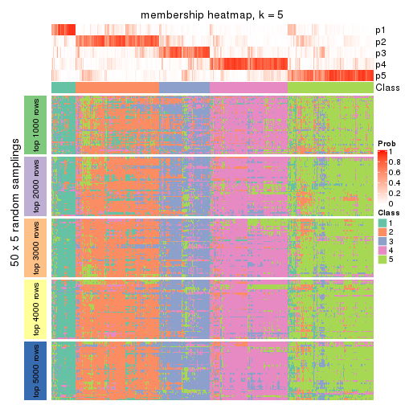</p>

</div>
<div id='tab-SD-NMF-membership-heatmap-5'>
<pre><code class="r">membership_heatmap(res, k = 6)
</code></pre>

<p></p>

</div>
</div>

As soon as we have had the classes for columns, we can look for signatures
which are significantly different between classes which can be candidate marks
for certain classes. Following are the heatmaps for signatures.


Signature heatmaps where rows are scaled:


<script>
$( function() {
	$( '#tabs-SD-NMF-get-signatures' ).tabs();
} );
</script>
<div id='tabs-SD-NMF-get-signatures'>
<ul>
<li><a href='#tab-SD-NMF-get-signatures-1'>k = 2</a></li>
<li><a href='#tab-SD-NMF-get-signatures-2'>k = 3</a></li>
<li><a href='#tab-SD-NMF-get-signatures-3'>k = 4</a></li>
<li><a href='#tab-SD-NMF-get-signatures-4'>k = 5</a></li>
<li><a href='#tab-SD-NMF-get-signatures-5'>k = 6</a></li>
</ul>
<div id='tab-SD-NMF-get-signatures-1'>
<pre><code class="r">get_signatures(res, k = 2)
</code></pre>

<p></p>

</div>
<div id='tab-SD-NMF-get-signatures-2'>
<pre><code class="r">get_signatures(res, k = 3)
</code></pre>

<p></p>

</div>
<div id='tab-SD-NMF-get-signatures-3'>
<pre><code class="r">get_signatures(res, k = 4)
</code></pre>

<p>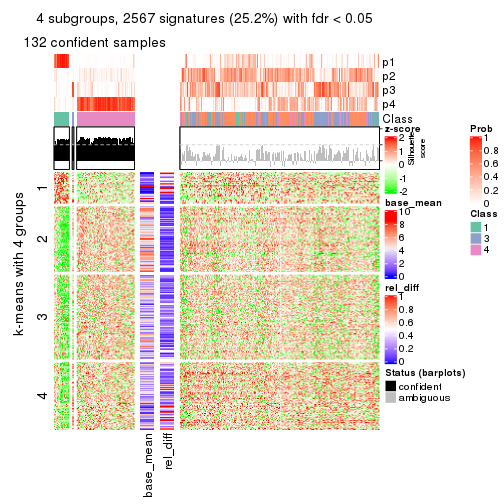</p>

</div>
<div id='tab-SD-NMF-get-signatures-4'>
<pre><code class="r">get_signatures(res, k = 5)
</code></pre>

<p></p>

</div>
<div id='tab-SD-NMF-get-signatures-5'>
<pre><code class="r">get_signatures(res, k = 6)
</code></pre>

<p></p>

</div>
</div>


Signature heatmaps where rows are not scaled:


<script>
$( function() {
	$( '#tabs-SD-NMF-get-signatures-no-scale' ).tabs();
} );
</script>
<div id='tabs-SD-NMF-get-signatures-no-scale'>
<ul>
<li><a href='#tab-SD-NMF-get-signatures-no-scale-1'>k = 2</a></li>
<li><a href='#tab-SD-NMF-get-signatures-no-scale-2'>k = 3</a></li>
<li><a href='#tab-SD-NMF-get-signatures-no-scale-3'>k = 4</a></li>
<li><a href='#tab-SD-NMF-get-signatures-no-scale-4'>k = 5</a></li>
<li><a href='#tab-SD-NMF-get-signatures-no-scale-5'>k = 6</a></li>
</ul>
<div id='tab-SD-NMF-get-signatures-no-scale-1'>
<pre><code class="r">get_signatures(res, k = 2, scale_rows = FALSE)
</code></pre>

<p></p>

</div>
<div id='tab-SD-NMF-get-signatures-no-scale-2'>
<pre><code class="r">get_signatures(res, k = 3, scale_rows = FALSE)
</code></pre>

<p></p>

</div>
<div id='tab-SD-NMF-get-signatures-no-scale-3'>
<pre><code class="r">get_signatures(res, k = 4, scale_rows = FALSE)
</code></pre>

<p></p>

</div>
<div id='tab-SD-NMF-get-signatures-no-scale-4'>
<pre><code class="r">get_signatures(res, k = 5, scale_rows = FALSE)
</code></pre>

<p>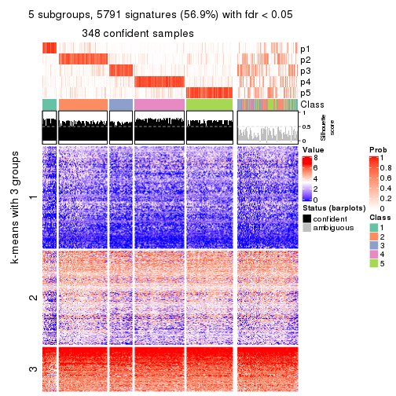</p>

</div>
<div id='tab-SD-NMF-get-signatures-no-scale-5'>
<pre><code class="r">get_signatures(res, k = 6, scale_rows = FALSE)
</code></pre>

<p></p>

</div>
</div>


Compare the overlap of signatures from different k:

```r
compare_signatures(res)
```


`get_signature()` returns a data frame invisibly. TO get the list of signatures, the function
call should be assigned to a variable explicitly. In following code, if `plot` argument is set
to `FALSE`, no heatmap is plotted while only the differential analysis is performed.

```r
# code only for demonstration
tb = get_signature(res, k = ..., plot = FALSE)
```

An example of the output of `tb` is:

```
#>   which_row         fdr    mean_1    mean_2 scaled_mean_1 scaled_mean_2 km
#> 1        38 0.042760348  8.373488  9.131774    -0.5533452     0.5164555  1
#> 2        40 0.018707592  7.106213  8.469186    -0.6173731     0.5762149  1
#> 3        55 0.019134737 10.221463 11.207825    -0.6159697     0.5749050  1
#> 4        59 0.006059896  5.921854  7.869574    -0.6899429     0.6439467  1
#> 5        60 0.018055526  8.928898 10.211722    -0.6204761     0.5791110  1
#> 6        98 0.009384629 15.714769 14.887706     0.6635654    -0.6193277  2
...
```

The columns in `tb` are:

1. `which_row`: row indices corresponding to the input matrix.
2. `fdr`: FDR for the differential test. 
3. `mean_x`: The mean value in group x.
4. `scaled_mean_x`: The mean value in group x after rows are scaled.
5. `km`: Row groups if k-means clustering is applied to rows.


UMAP plot which shows how samples are separated.


<script>
$( function() {
	$( '#tabs-SD-NMF-dimension-reduction' ).tabs();
} );
</script>
<div id='tabs-SD-NMF-dimension-reduction'>
<ul>
<li><a href='#tab-SD-NMF-dimension-reduction-1'>k = 2</a></li>
<li><a href='#tab-SD-NMF-dimension-reduction-2'>k = 3</a></li>
<li><a href='#tab-SD-NMF-dimension-reduction-3'>k = 4</a></li>
<li><a href='#tab-SD-NMF-dimension-reduction-4'>k = 5</a></li>
<li><a href='#tab-SD-NMF-dimension-reduction-5'>k = 6</a></li>
</ul>
<div id='tab-SD-NMF-dimension-reduction-1'>
<pre><code class="r">dimension_reduction(res, k = 2, method = &quot;UMAP&quot;)
</code></pre>

<p></p>

</div>
<div id='tab-SD-NMF-dimension-reduction-2'>
<pre><code class="r">dimension_reduction(res, k = 3, method = &quot;UMAP&quot;)
</code></pre>

<p></p>

</div>
<div id='tab-SD-NMF-dimension-reduction-3'>
<pre><code class="r">dimension_reduction(res, k = 4, method = &quot;UMAP&quot;)
</code></pre>

<p></p>

</div>
<div id='tab-SD-NMF-dimension-reduction-4'>
<pre><code class="r">dimension_reduction(res, k = 5, method = &quot;UMAP&quot;)
</code></pre>

<p></p>

</div>
<div id='tab-SD-NMF-dimension-reduction-5'>
<pre><code class="r">dimension_reduction(res, k = 6, method = &quot;UMAP&quot;)
</code></pre>

<p></p>

</div>
</div>


Following heatmap shows how subgroups are split when increasing `k`:

```r
collect_classes(res)
```


If matrix rows can be associated to genes, consider to use `functional_enrichment(res,
...)` to perform function enrichment for the signature genes. See [this vignette](http://bioconductor.org/packages/devel/bioc/vignettes/cola/inst/doc/functional_enrichment.html) for more detailed explanations.


 

---------------------------------------------------


### CV:hclust


The object with results only for a single top-value method and a single partition method 
can be extracted as:

```r
res = res_list["CV", "hclust"]
# you can also extract it by
# res = res_list["CV:hclust"]
```

A summary of `res` and all the functions that can be applied to it:

```r
res
```

```
#> A 'ConsensusPartition' object with k = 2, 3, 4, 5, 6.
#>   On a matrix with 10169 rows and 459 columns.
#>   Top rows (1000, 2000, 3000, 4000, 5000) are extracted by 'CV' method.
#>   Subgroups are detected by 'hclust' method.
#>   Performed in total 1250 partitions by row resampling.
#>   Best k for subgroups seems to be 5.
#> 
#> Following methods can be applied to this 'ConsensusPartition' object:
#>  [1] "cola_report"             "collect_classes"         "collect_plots"          
#>  [4] "collect_stats"           "colnames"                "compare_signatures"     
#>  [7] "consensus_heatmap"       "dimension_reduction"     "functional_enrichment"  
#> [10] "get_anno_col"            "get_anno"                "get_classes"            
#> [13] "get_consensus"           "get_matrix"              "get_membership"         
#> [16] "get_param"               "get_signatures"          "get_stats"              
#> [19] "is_best_k"               "is_stable_k"             "membership_heatmap"     
#> [22] "ncol"                    "nrow"                    "plot_ecdf"              
#> [25] "rownames"                "select_partition_number" "show"                   
#> [28] "suggest_best_k"          "test_to_known_factors"
```

`collect_plots()` function collects all the plots made from `res` for all `k` (number of partitions)
into one single page to provide an easy and fast comparison between different `k`.

```r
collect_plots(res)
```


The plots are:

- The first row: a plot of the ECDF (empirical cumulative distribution
  function) curves of the consensus matrix for each `k` and the heatmap of
  predicted classes for each `k`.
- The second row: heatmaps of the consensus matrix for each `k`.
- The third row: heatmaps of the membership matrix for each `k`.
- The fouth row: heatmaps of the signatures for each `k`.

All the plots in panels can be made by individual functions and they are
plotted later in this section.

`select_partition_number()` produces several plots showing different
statistics for choosing "optimized" `k`. There are following statistics:

- ECDF curves of the consensus matrix for each `k`;
- 1-PAC. [The PAC
  score](https://en.wikipedia.org/wiki/Consensus_clustering#Over-interpretation_potential_of_consensus_clustering)
  measures the proportion of the ambiguous subgrouping.
- Mean silhouette score.
- Concordance. The mean probability of fiting the consensus class ids in all
  partitions.
- Area increased. Denote $A_k$ as the area under the ECDF curve for current
  `k`, the area increased is defined as $A_k - A_{k-1}$.
- Rand index. The percent of pairs of samples that are both in a same cluster
  or both are not in a same cluster in the partition of k and k-1.
- Jaccard index. The ratio of pairs of samples are both in a same cluster in
  the partition of k and k-1 and the pairs of samples are both in a same
  cluster in the partition k or k-1.

The detailed explanations of these statistics can be found in [the _cola_
vignette](http://bioconductor.org/packages/devel/bioc/vignettes/cola/inst/doc/cola.html#toc_13).

Generally speaking, lower PAC score, higher mean silhouette score or higher
concordance corresponds to better partition. Rand index and Jaccard index
measure how similar the current partition is compared to partition with `k-1`.
If they are too similar, we won't accept `k` is better than `k-1`.

```r
select_partition_number(res)
```


The numeric values for all these statistics can be obtained by `get_stats()`.

```r
get_stats(res)
```

```
#>   k    1-PAC mean_silhouette concordance area_increased  Rand Jaccard
#> 2 2 0.001023           0.449       0.732         0.3312 0.941   0.941
#> 3 3 0.000316           0.424       0.593         0.4321 0.642   0.625
#> 4 4 0.002847           0.485       0.580         0.1710 0.724   0.594
#> 5 5 0.021829           0.487       0.550         0.1050 0.952   0.902
#> 6 6 0.045439           0.456       0.543         0.0721 0.949   0.894
```

`suggest_best_k()` suggests the best $k$ based on these statistics. The rules are as follows:

- All $k$ with Jaccard index larger than 0.95 are removed because increasing
  $k$ does not provide enough extra information. If all $k$ are removed, it is
  marked as no subgroup is detected.
- For all $k$ with 1-PAC score larger than 0.9, the maximal $k$ is taken as
  the best $k$, and other $k$ are marked as optional $k$.
- If it does not fit the second rule. The $k$ with the maximal vote of the
  highest 1-PAC score, highest mean silhouette, and highest concordance is
  taken as the best $k$.

```r
suggest_best_k(res)
```

```
#> [1] 5
```


Following shows the table of the partitions (You need to click the **show/hide
code output** link to see it). The membership matrix (columns with name `p*`)
is inferred by
[`clue::cl_consensus()`](https://www.rdocumentation.org/link/cl_consensus?package=clue)
function with the `SE` method. Basically the value in the membership matrix
represents the probability to belong to a certain group. The finall class
label for an item is determined with the group with highest probability it
belongs to.

In `get_classes()` function, the entropy is calculated from the membership
matrix and the silhouette score is calculated from the consensus matrix.


<script>
$( function() {
	$( '#tabs-CV-hclust-get-classes' ).tabs();
} );
</script>
<div id='tabs-CV-hclust-get-classes'>
<ul>
<li><a href='#tab-CV-hclust-get-classes-1'>k = 2</a></li>
<li><a href='#tab-CV-hclust-get-classes-2'>k = 3</a></li>
<li><a href='#tab-CV-hclust-get-classes-3'>k = 4</a></li>
<li><a href='#tab-CV-hclust-get-classes-4'>k = 5</a></li>
<li><a href='#tab-CV-hclust-get-classes-5'>k = 6</a></li>
</ul>

<div id='tab-CV-hclust-get-classes-1'>
<p><a id='tab-CV-hclust-get-classes-1-a' style='color:#0366d6' href='#'>show/hide code output</a></p>
<pre><code class="r">cbind(get_classes(res, k = 2), get_membership(res, k = 2))
</code></pre>

<pre><code>#&gt;            class entropy silhouette    p1    p2
#&gt; SRR1699874     2   0.680    0.62219 0.180 0.820
#&gt; SRR1699875     2   0.680    0.60590 0.180 0.820
#&gt; SRR1699876     2   0.689    0.61435 0.184 0.816
#&gt; SRR1699877     2   0.730    0.61545 0.204 0.796
#&gt; SRR1699879     2   0.634    0.62632 0.160 0.840
#&gt; SRR1699878     2   0.839    0.51894 0.268 0.732
#&gt; SRR1699880     2   0.904    0.24122 0.320 0.680
#&gt; SRR1699881     2   0.913    0.33118 0.328 0.672
#&gt; SRR1699882     2   0.722    0.61145 0.200 0.800
#&gt; SRR1699883     2   0.844    0.59670 0.272 0.728
#&gt; SRR1699884     2   0.689    0.62713 0.184 0.816
#&gt; SRR1699885     2   0.745    0.58007 0.212 0.788
#&gt; SRR1699886     2   0.634    0.62950 0.160 0.840
#&gt; SRR1699888     2   0.615    0.60751 0.152 0.848
#&gt; SRR1699889     2   0.714    0.62575 0.196 0.804
#&gt; SRR1699890     2   0.634    0.60270 0.160 0.840
#&gt; SRR1699887     2   0.671    0.62165 0.176 0.824
#&gt; SRR1699891     2   0.662    0.62465 0.172 0.828
#&gt; SRR1699892     2   0.795    0.55570 0.240 0.760
#&gt; SRR1699893     2   0.833    0.53682 0.264 0.736
#&gt; SRR1699894     2   0.595    0.62082 0.144 0.856
#&gt; SRR1699895     2   0.662    0.62281 0.172 0.828
#&gt; SRR1699896     2   0.775    0.60910 0.228 0.772
#&gt; SRR1699897     2   0.722    0.61679 0.200 0.800
#&gt; SRR1699898     2   0.913    0.25929 0.328 0.672
#&gt; SRR1699900     2   0.697    0.60859 0.188 0.812
#&gt; SRR1699899     2   0.706    0.63581 0.192 0.808
#&gt; SRR1699902     2   0.895    0.42325 0.312 0.688
#&gt; SRR1699901     2   0.929    0.31359 0.344 0.656
#&gt; SRR1699903     2   0.689    0.63460 0.184 0.816
#&gt; SRR1699904     2   0.584    0.62235 0.140 0.860
#&gt; SRR1699905     2   0.876    0.44751 0.296 0.704
#&gt; SRR1699906     2   0.714    0.60752 0.196 0.804
#&gt; SRR1699907     2   0.730    0.62296 0.204 0.796
#&gt; SRR1699908     2   0.615    0.63317 0.152 0.848
#&gt; SRR1699909     2   0.605    0.63408 0.148 0.852
#&gt; SRR1699910     2   0.839    0.50138 0.268 0.732
#&gt; SRR1699911     2   0.714    0.63346 0.196 0.804
#&gt; SRR1699912     2   0.680    0.63325 0.180 0.820
#&gt; SRR1699913     2   0.730    0.63065 0.204 0.796
#&gt; SRR1699914     2   0.886    0.39524 0.304 0.696
#&gt; SRR1699915     2   0.767    0.60723 0.224 0.776
#&gt; SRR1699916     2   0.605    0.61161 0.148 0.852
#&gt; SRR1699917     2   0.775    0.59985 0.228 0.772
#&gt; SRR1699918     2   0.689    0.63464 0.184 0.816
#&gt; SRR1699919     2   0.697    0.62926 0.188 0.812
#&gt; SRR1699920     2   0.839    0.51068 0.268 0.732
#&gt; SRR1699921     2   0.714    0.63375 0.196 0.804
#&gt; SRR1699922     2   0.605    0.63294 0.148 0.852
#&gt; SRR1699923     2   0.808    0.56688 0.248 0.752
#&gt; SRR1699924     2   0.969    0.03277 0.396 0.604
#&gt; SRR1699925     2   0.998   -0.77156 0.476 0.524
#&gt; SRR1699926     2   0.802    0.58639 0.244 0.756
#&gt; SRR1699927     2   0.653    0.63317 0.168 0.832
#&gt; SRR1699929     2   0.808    0.53321 0.248 0.752
#&gt; SRR1699928     2   0.697    0.61294 0.188 0.812
#&gt; SRR1699930     2   0.680    0.61905 0.180 0.820
#&gt; SRR1699931     2   0.767    0.59458 0.224 0.776
#&gt; SRR1699933     2   0.904    0.39258 0.320 0.680
#&gt; SRR1699932     2   0.714    0.63377 0.196 0.804
#&gt; SRR1699934     2   0.998   -0.77156 0.476 0.524
#&gt; SRR1699935     2   0.775    0.59606 0.228 0.772
#&gt; SRR1699936     2   0.680    0.59084 0.180 0.820
#&gt; SRR1699937     2   0.788    0.61146 0.236 0.764
#&gt; SRR1699938     2   0.680    0.60928 0.180 0.820
#&gt; SRR1699940     2   0.833    0.58417 0.264 0.736
#&gt; SRR1699939     2   0.714    0.57723 0.196 0.804
#&gt; SRR1699941     2   0.913    0.27127 0.328 0.672
#&gt; SRR1699942     2   0.949    0.25483 0.368 0.632
#&gt; SRR1699943     2   0.760    0.58231 0.220 0.780
#&gt; SRR1699944     2   0.781    0.59361 0.232 0.768
#&gt; SRR1699945     2   0.985   -0.44196 0.428 0.572
#&gt; SRR1699946     2   0.808    0.60370 0.248 0.752
#&gt; SRR1699947     2   0.738    0.62462 0.208 0.792
#&gt; SRR1699948     2   0.680    0.57658 0.180 0.820
#&gt; SRR1699949     2   0.671    0.60546 0.176 0.824
#&gt; SRR1699950     2   0.689    0.57467 0.184 0.816
#&gt; SRR1699951     2   0.866    0.56305 0.288 0.712
#&gt; SRR1699952     2   0.833    0.59039 0.264 0.736
#&gt; SRR1699953     2   0.680    0.60184 0.180 0.820
#&gt; SRR1699954     2   0.844    0.53789 0.272 0.728
#&gt; SRR1699955     2   0.634    0.58800 0.160 0.840
#&gt; SRR1699956     2   0.971   -0.32884 0.400 0.600
#&gt; SRR1699957     2   0.760    0.60472 0.220 0.780
#&gt; SRR1699959     2   0.855    0.53671 0.280 0.720
#&gt; SRR1699958     2   0.753    0.62015 0.216 0.784
#&gt; SRR1699960     2   0.625    0.60869 0.156 0.844
#&gt; SRR1699961     2   0.876    0.45328 0.296 0.704
#&gt; SRR1699962     2   0.541    0.62100 0.124 0.876
#&gt; SRR1699963     2   0.781    0.62443 0.232 0.768
#&gt; SRR1699964     2   0.760    0.61637 0.220 0.780
#&gt; SRR1699965     2   0.662    0.59154 0.172 0.828
#&gt; SRR1699966     2   0.881    0.51915 0.300 0.700
#&gt; SRR1699967     2   0.781    0.61290 0.232 0.768
#&gt; SRR1699968     2   0.730    0.62778 0.204 0.796
#&gt; SRR1699969     2   0.952   -0.03215 0.372 0.628
#&gt; SRR1699971     2   0.839    0.52071 0.268 0.732
#&gt; SRR1699970     2   0.738    0.58654 0.208 0.792
#&gt; SRR1699972     2   0.833    0.52097 0.264 0.736
#&gt; SRR1699973     2   0.827    0.59045 0.260 0.740
#&gt; SRR1699974     2   0.939   -0.00735 0.356 0.644
#&gt; SRR1699975     2   0.730    0.62735 0.204 0.796
#&gt; SRR1699976     2   0.891    0.40377 0.308 0.692
#&gt; SRR1699977     2   0.850    0.53336 0.276 0.724
#&gt; SRR1699978     2   0.952   -0.04953 0.372 0.628
#&gt; SRR1699979     2   0.886    0.39929 0.304 0.696
#&gt; SRR1699980     2   0.788    0.61939 0.236 0.764
#&gt; SRR1699981     2   0.866    0.46045 0.288 0.712
#&gt; SRR1699982     2   0.644    0.63119 0.164 0.836
#&gt; SRR1699983     2   0.714    0.62895 0.196 0.804
#&gt; SRR1699984     2   0.997   -0.76460 0.468 0.532
#&gt; SRR1699985     2   0.584    0.62922 0.140 0.860
#&gt; SRR1699986     2   0.900    0.26571 0.316 0.684
#&gt; SRR1699988     2   0.738    0.61836 0.208 0.792
#&gt; SRR1699987     2   0.904    0.38869 0.320 0.680
#&gt; SRR1699989     2   0.808    0.60203 0.248 0.752
#&gt; SRR1699990     2   0.861    0.44781 0.284 0.716
#&gt; SRR1699992     2   0.839    0.55180 0.268 0.732
#&gt; SRR1699991     2   0.917    0.26187 0.332 0.668
#&gt; SRR1699993     2   0.913    0.17551 0.328 0.672
#&gt; SRR1699994     2   0.936    0.02664 0.352 0.648
#&gt; SRR1699995     2   0.980   -0.47888 0.416 0.584
#&gt; SRR1699996     2   0.730    0.62702 0.204 0.796
#&gt; SRR1699997     2   0.855    0.51013 0.280 0.720
#&gt; SRR1699998     2   0.671    0.63257 0.176 0.824
#&gt; SRR1699999     2   0.971   -0.27918 0.400 0.600
#&gt; SRR1700000     2   0.767    0.61854 0.224 0.776
#&gt; SRR1700002     2   0.814    0.50829 0.252 0.748
#&gt; SRR1700001     2   0.909    0.32047 0.324 0.676
#&gt; SRR1700003     2   0.808    0.60906 0.248 0.752
#&gt; SRR1700004     2   0.925    0.21359 0.340 0.660
#&gt; SRR1700005     1   1.000    0.87526 0.500 0.500
#&gt; SRR1700006     2   0.913    0.31752 0.328 0.672
#&gt; SRR1700007     2   0.574    0.60767 0.136 0.864
#&gt; SRR1700008     2   0.917    0.24833 0.332 0.668
#&gt; SRR1700009     2   0.991   -0.69847 0.444 0.556
#&gt; SRR1700010     2   0.975   -0.31923 0.408 0.592
#&gt; SRR1700011     2   0.595    0.62152 0.144 0.856
#&gt; SRR1700013     2   0.850    0.50290 0.276 0.724
#&gt; SRR1700012     2   0.795    0.60664 0.240 0.760
#&gt; SRR1700014     2   0.866    0.43473 0.288 0.712
#&gt; SRR1700015     2   0.844    0.49553 0.272 0.728
#&gt; SRR1700016     2   0.993   -0.55905 0.452 0.548
#&gt; SRR1700018     2   0.917    0.38316 0.332 0.668
#&gt; SRR1700017     2   0.921    0.37648 0.336 0.664
#&gt; SRR1700019     2   0.595    0.61563 0.144 0.856
#&gt; SRR1700020     2   1.000   -0.47436 0.488 0.512
#&gt; SRR1700021     2   0.827    0.60196 0.260 0.740
#&gt; SRR1700023     2   0.850    0.50025 0.276 0.724
#&gt; SRR1700022     2   0.946    0.08075 0.364 0.636
#&gt; SRR1700024     2   0.767    0.62098 0.224 0.776
#&gt; SRR1700025     2   0.900    0.46320 0.316 0.684
#&gt; SRR1700026     2   0.861    0.49364 0.284 0.716
#&gt; SRR1700027     2   0.844    0.48700 0.272 0.728
#&gt; SRR1700028     2   0.814    0.54924 0.252 0.748
#&gt; SRR1700029     2   0.943    0.22363 0.360 0.640
#&gt; SRR1700030     2   0.745    0.62267 0.212 0.788
#&gt; SRR1700031     2   0.973   -0.16297 0.404 0.596
#&gt; SRR1700032     2   0.850    0.55906 0.276 0.724
#&gt; SRR1700034     2   0.963   -0.22599 0.388 0.612
#&gt; SRR1700035     2   0.738    0.60536 0.208 0.792
#&gt; SRR1700033     2   0.925    0.20766 0.340 0.660
#&gt; SRR1700036     2   0.904    0.47869 0.320 0.680
#&gt; SRR1700037     2   0.644    0.63205 0.164 0.836
#&gt; SRR1700038     2   0.881    0.37449 0.300 0.700
#&gt; SRR1700039     2   0.981   -0.28895 0.420 0.580
#&gt; SRR1700040     2   0.925    0.14017 0.340 0.660
#&gt; SRR1700041     2   0.955    0.14208 0.376 0.624
#&gt; SRR1700042     2   0.952    0.01263 0.372 0.628
#&gt; SRR1700043     2   0.904    0.30889 0.320 0.680
#&gt; SRR1700045     2   0.900    0.35598 0.316 0.684
#&gt; SRR1700044     2   0.861    0.51874 0.284 0.716
#&gt; SRR1700046     2   0.913    0.34356 0.328 0.672
#&gt; SRR1700047     2   0.966   -0.04404 0.392 0.608
#&gt; SRR1700048     2   0.900    0.35255 0.316 0.684
#&gt; SRR1700049     2   0.949   -0.15781 0.368 0.632
#&gt; SRR1700050     2   0.985   -0.34758 0.428 0.572
#&gt; SRR1700051     2   0.973   -0.18230 0.404 0.596
#&gt; SRR1700052     2   0.929    0.14972 0.344 0.656
#&gt; SRR1700053     2   0.932    0.23444 0.348 0.652
#&gt; SRR1700054     2   0.939    0.16969 0.356 0.644
#&gt; SRR1700055     2   0.971   -0.32715 0.400 0.600
#&gt; SRR1700056     2   0.949    0.09248 0.368 0.632
#&gt; SRR1700057     2   0.978   -0.03359 0.412 0.588
#&gt; SRR1700058     2   0.961   -0.09154 0.384 0.616
#&gt; SRR1700059     2   0.973   -0.03361 0.404 0.596
#&gt; SRR1700060     2   0.932    0.11316 0.348 0.652
#&gt; SRR1700061     2   0.913    0.24469 0.328 0.672
#&gt; SRR1700062     2   0.961   -0.07840 0.384 0.616
#&gt; SRR1700063     2   0.961   -0.04606 0.384 0.616
#&gt; SRR1700064     2   0.904    0.41704 0.320 0.680
#&gt; SRR1700065     2   0.871    0.35948 0.292 0.708
#&gt; SRR1700066     2   0.929    0.19008 0.344 0.656
#&gt; SRR1700067     2   0.844    0.55592 0.272 0.728
#&gt; SRR1700068     2   0.939    0.13491 0.356 0.644
#&gt; SRR1700069     2   0.855    0.51393 0.280 0.720
#&gt; SRR1700070     2   0.634    0.62676 0.160 0.840
#&gt; SRR1700071     2   0.932    0.19996 0.348 0.652
#&gt; SRR1700072     2   0.929    0.25453 0.344 0.656
#&gt; SRR1700073     2   0.697    0.62521 0.188 0.812
#&gt; SRR1700075     2   0.929    0.36472 0.344 0.656
#&gt; SRR1700074     2   0.936    0.26020 0.352 0.648
#&gt; SRR1700076     2   0.881    0.45860 0.300 0.700
#&gt; SRR1700077     2   0.921    0.31718 0.336 0.664
#&gt; SRR1700078     2   0.871    0.42869 0.292 0.708
#&gt; SRR1700080     2   0.844    0.51549 0.272 0.728
#&gt; SRR1700079     2   0.949    0.10411 0.368 0.632
#&gt; SRR1700081     2   0.925    0.12948 0.340 0.660
#&gt; SRR1700082     2   0.904    0.41051 0.320 0.680
#&gt; SRR1700083     2   0.966    0.00580 0.392 0.608
#&gt; SRR1700084     2   0.949    0.05247 0.368 0.632
#&gt; SRR1700085     2   0.722    0.63179 0.200 0.800
#&gt; SRR1700086     2   0.844    0.55783 0.272 0.728
#&gt; SRR1700087     2   0.844    0.57070 0.272 0.728
#&gt; SRR1700088     2   0.781    0.58051 0.232 0.768
#&gt; SRR1700089     2   0.839    0.52646 0.268 0.732
#&gt; SRR1700091     2   0.871    0.49361 0.292 0.708
#&gt; SRR1700090     2   0.866    0.46367 0.288 0.712
#&gt; SRR1700092     2   0.827    0.53394 0.260 0.740
#&gt; SRR1700094     2   0.876    0.39210 0.296 0.704
#&gt; SRR1700093     2   0.855    0.52063 0.280 0.720
#&gt; SRR1700095     2   0.925    0.37046 0.340 0.660
#&gt; SRR1700096     2   0.891    0.35290 0.308 0.692
#&gt; SRR1700097     2   0.943    0.17692 0.360 0.640
#&gt; SRR1700098     2   0.760    0.61074 0.220 0.780
#&gt; SRR1700099     2   0.866    0.49405 0.288 0.712
#&gt; SRR1700100     2   0.844    0.54779 0.272 0.728
#&gt; SRR1700101     2   0.821    0.53389 0.256 0.744
#&gt; SRR1700102     2   0.913    0.45956 0.328 0.672
#&gt; SRR1700104     2   0.876    0.45434 0.296 0.704
#&gt; SRR1700103     2   0.839    0.47958 0.268 0.732
#&gt; SRR1700105     2   0.833    0.53207 0.264 0.736
#&gt; SRR1700106     2   0.861    0.53848 0.284 0.716
#&gt; SRR1700107     2   0.827    0.56550 0.260 0.740
#&gt; SRR1700108     2   0.827    0.55369 0.260 0.740
#&gt; SRR1700109     2   0.552    0.61701 0.128 0.872
#&gt; SRR1700110     2   0.644    0.62027 0.164 0.836
#&gt; SRR1700112     2   0.552    0.61698 0.128 0.872
#&gt; SRR1700111     2   0.921    0.35427 0.336 0.664
#&gt; SRR1700113     2   0.760    0.61739 0.220 0.780
#&gt; SRR1700114     2   0.839    0.52070 0.268 0.732
#&gt; SRR1700115     2   0.913    0.42719 0.328 0.672
#&gt; SRR1700116     2   0.855    0.51551 0.280 0.720
#&gt; SRR1700117     2   0.981   -0.27502 0.420 0.580
#&gt; SRR1700119     2   0.844    0.46919 0.272 0.728
#&gt; SRR1700118     2   0.844    0.51435 0.272 0.728
#&gt; SRR1700120     2   0.839    0.43980 0.268 0.732
#&gt; SRR1700121     2   0.895    0.47595 0.312 0.688
#&gt; SRR1700122     2   0.680    0.63537 0.180 0.820
#&gt; SRR1700123     2   0.917    0.32002 0.332 0.668
#&gt; SRR1700125     2   0.625    0.62115 0.156 0.844
#&gt; SRR1700126     2   0.932    0.19037 0.348 0.652
#&gt; SRR1700127     2   0.895    0.38169 0.312 0.688
#&gt; SRR1700124     2   0.876    0.41976 0.296 0.704
#&gt; SRR1700128     2   0.909    0.34914 0.324 0.676
#&gt; SRR1700129     2   0.689    0.63102 0.184 0.816
#&gt; SRR1700130     2   0.821    0.57806 0.256 0.744
#&gt; SRR1700132     2   0.844    0.47005 0.272 0.728
#&gt; SRR1700131     2   0.925    0.30861 0.340 0.660
#&gt; SRR1700133     2   0.839    0.50921 0.268 0.732
#&gt; SRR1700134     2   0.584    0.63097 0.140 0.860
#&gt; SRR1700135     2   0.913    0.26656 0.328 0.672
#&gt; SRR1700136     2   0.917    0.21021 0.332 0.668
#&gt; SRR1700137     2   0.855    0.52579 0.280 0.720
#&gt; SRR1700138     2   0.833    0.42966 0.264 0.736
#&gt; SRR1700140     2   0.891    0.38073 0.308 0.692
#&gt; SRR1700139     2   0.891    0.41833 0.308 0.692
#&gt; SRR1700141     2   0.671    0.63443 0.176 0.824
#&gt; SRR1700142     2   0.973   -0.03336 0.404 0.596
#&gt; SRR1700143     2   0.939    0.26362 0.356 0.644
#&gt; SRR1700144     2   0.929    0.14785 0.344 0.656
#&gt; SRR1700145     2   0.871    0.47040 0.292 0.708
#&gt; SRR1700146     2   0.680    0.63086 0.180 0.820
#&gt; SRR1700147     2   0.925    0.31941 0.340 0.660
#&gt; SRR1700149     2   0.827    0.47959 0.260 0.740
#&gt; SRR1700148     2   0.925    0.27880 0.340 0.660
#&gt; SRR1700150     2   0.753    0.59427 0.216 0.784
#&gt; SRR1700152     2   0.895    0.39962 0.312 0.688
#&gt; SRR1700151     2   0.909    0.28667 0.324 0.676
#&gt; SRR1700153     2   0.833    0.51562 0.264 0.736
#&gt; SRR1700154     2   0.866    0.44896 0.288 0.712
#&gt; SRR1700155     2   0.855    0.49869 0.280 0.720
#&gt; SRR1700156     2   0.913    0.30202 0.328 0.672
#&gt; SRR1700158     2   0.876    0.32392 0.296 0.704
#&gt; SRR1700159     2   0.574    0.62944 0.136 0.864
#&gt; SRR1700157     2   0.876    0.42700 0.296 0.704
#&gt; SRR1700160     2   0.909    0.35283 0.324 0.676
#&gt; SRR1700161     2   0.932    0.25226 0.348 0.652
#&gt; SRR1700162     2   0.574    0.62935 0.136 0.864
#&gt; SRR1700164     2   0.925    0.34137 0.340 0.660
#&gt; SRR1700163     2   0.932    0.20084 0.348 0.652
#&gt; SRR1700165     2   0.936    0.22704 0.352 0.648
#&gt; SRR1700166     2   0.886    0.42442 0.304 0.696
#&gt; SRR1700168     2   0.689    0.63155 0.184 0.816
#&gt; SRR1700167     2   0.891    0.40497 0.308 0.692
#&gt; SRR1700170     2   0.861    0.51567 0.284 0.716
#&gt; SRR1700169     2   0.921    0.31144 0.336 0.664
#&gt; SRR1700171     2   0.932    0.16316 0.348 0.652
#&gt; SRR1700172     2   0.781    0.56374 0.232 0.768
#&gt; SRR1700174     2   0.827    0.48754 0.260 0.740
#&gt; SRR1700173     2   0.850    0.46755 0.276 0.724
#&gt; SRR1700175     2   0.861    0.48349 0.284 0.716
#&gt; SRR1700176     2   0.936    0.23129 0.352 0.648
#&gt; SRR1700178     2   0.714    0.54340 0.196 0.804
#&gt; SRR1700177     2   0.861    0.49978 0.284 0.716
#&gt; SRR1700180     2   0.714    0.55250 0.196 0.804
#&gt; SRR1700179     2   0.808    0.51994 0.248 0.752
#&gt; SRR1700181     2   0.680    0.55945 0.180 0.820
#&gt; SRR1700183     1   0.999    0.90586 0.516 0.484
#&gt; SRR1700182     2   0.788    0.51969 0.236 0.764
#&gt; SRR1700184     2   0.714    0.56358 0.196 0.804
#&gt; SRR1700186     2   0.745    0.55809 0.212 0.788
#&gt; SRR1700187     1   1.000    0.89300 0.512 0.488
#&gt; SRR1700185     1   1.000    0.90510 0.512 0.488
#&gt; SRR1700188     2   0.730    0.56454 0.204 0.796
#&gt; SRR1700192     2   0.987   -0.60454 0.432 0.568
#&gt; SRR1700190     1   1.000    0.84642 0.512 0.488
#&gt; SRR1700191     1   0.998    0.90394 0.524 0.476
#&gt; SRR1700189     2   0.992   -0.64332 0.448 0.552
#&gt; SRR1700193     2   0.680    0.58284 0.180 0.820
#&gt; SRR1700195     2   0.680    0.59007 0.180 0.820
#&gt; SRR1700194     1   0.999    0.90379 0.516 0.484
#&gt; SRR1700196     2   0.680    0.58236 0.180 0.820
#&gt; SRR1700197     2   0.998   -0.66383 0.476 0.524
#&gt; SRR1700198     2   0.689    0.57565 0.184 0.816
#&gt; SRR1700199     2   0.662    0.57427 0.172 0.828
#&gt; SRR1700200     2   0.605    0.58739 0.148 0.852
#&gt; SRR1700201     2   0.662    0.57702 0.172 0.828
#&gt; SRR1700202     2   0.671    0.63685 0.176 0.824
#&gt; SRR1700203     2   0.745    0.55916 0.212 0.788
#&gt; SRR1700204     2   0.745    0.60324 0.212 0.788
#&gt; SRR1700206     2   0.689    0.63588 0.184 0.816
#&gt; SRR1700207     2   0.662    0.58396 0.172 0.828
#&gt; SRR1700208     1   1.000    0.83887 0.508 0.492
#&gt; SRR1700205     2   0.722    0.58282 0.200 0.800
#&gt; SRR1700209     2   0.563    0.60114 0.132 0.868
#&gt; SRR1700210     2   0.730    0.55693 0.204 0.796
#&gt; SRR1700211     2   0.625    0.59821 0.156 0.844
#&gt; SRR1700212     2   0.653    0.57871 0.168 0.832
#&gt; SRR1700213     2   0.891    0.50615 0.308 0.692
#&gt; SRR1700214     2   0.644    0.57982 0.164 0.836
#&gt; SRR1700215     1   1.000    0.88623 0.508 0.492
#&gt; SRR1700217     2   0.552    0.60494 0.128 0.872
#&gt; SRR1700216     2   1.000   -0.89336 0.500 0.500
#&gt; SRR1700218     2   0.689    0.62232 0.184 0.816
#&gt; SRR1700219     2   0.653    0.59015 0.168 0.832
#&gt; SRR1700222     2   0.999   -0.88086 0.484 0.516
#&gt; SRR1700220     2   0.615    0.58292 0.152 0.848
#&gt; SRR1700221     2   0.680    0.58820 0.180 0.820
#&gt; SRR1700223     2   0.634    0.59853 0.160 0.840
#&gt; SRR1700224     2   0.595    0.63597 0.144 0.856
#&gt; SRR1700226     2   0.722    0.58343 0.200 0.800
#&gt; SRR1700229     2   0.706    0.57958 0.192 0.808
#&gt; SRR1700225     2   0.952    0.26983 0.372 0.628
#&gt; SRR1700227     2   0.706    0.59705 0.192 0.808
#&gt; SRR1700230     2   0.996   -0.78930 0.464 0.536
#&gt; SRR1700231     2   0.689    0.57864 0.184 0.816
#&gt; SRR1700228     2   0.625    0.61354 0.156 0.844
#&gt; SRR1700232     2   0.706    0.58578 0.192 0.808
#&gt; SRR1700233     2   0.662    0.61125 0.172 0.828
#&gt; SRR1700234     2   0.595    0.61657 0.144 0.856
#&gt; SRR1700235     2   0.722    0.62918 0.200 0.800
#&gt; SRR1700237     2   0.689    0.57520 0.184 0.816
#&gt; SRR1700236     2   0.722    0.57520 0.200 0.800
#&gt; SRR1700238     2   0.625    0.59574 0.156 0.844
#&gt; SRR1700239     1   1.000    0.88925 0.500 0.500
#&gt; SRR1700240     1   0.998    0.90242 0.528 0.472
#&gt; SRR1700241     2   0.814    0.54276 0.252 0.748
#&gt; SRR1700243     2   0.605    0.59416 0.148 0.852
#&gt; SRR1700244     2   0.730    0.60880 0.204 0.796
#&gt; SRR1700242     2   0.987   -0.48192 0.432 0.568
#&gt; SRR1700246     2   0.605    0.61167 0.148 0.852
#&gt; SRR1700245     2   0.706    0.56762 0.192 0.808
#&gt; SRR1700247     1   0.998    0.81876 0.528 0.472
#&gt; SRR1700249     1   0.999    0.90763 0.516 0.484
#&gt; SRR1700250     2   0.802    0.51490 0.244 0.756
#&gt; SRR1700248     2   0.714    0.59321 0.196 0.804
#&gt; SRR1700251     2   0.753    0.58032 0.216 0.784
#&gt; SRR1700252     2   0.943    0.08062 0.360 0.640
#&gt; SRR1700253     2   0.697    0.56680 0.188 0.812
#&gt; SRR1700256     2   0.615    0.59361 0.152 0.848
#&gt; SRR1700254     1   0.999    0.89585 0.520 0.480
#&gt; SRR1700255     2   0.605    0.59553 0.148 0.852
#&gt; SRR1700257     2   0.738    0.54445 0.208 0.792
#&gt; SRR1700258     2   0.662    0.59942 0.172 0.828
#&gt; SRR1700259     2   0.615    0.61186 0.152 0.848
#&gt; SRR1700260     2   0.541    0.61290 0.124 0.876
#&gt; SRR1700261     2   0.563    0.61547 0.132 0.868
#&gt; SRR1700262     2   0.482    0.61878 0.104 0.896
#&gt; SRR1700263     2   0.625    0.61687 0.156 0.844
#&gt; SRR1700264     2   0.781    0.61743 0.232 0.768
#&gt; SRR1700265     2   0.760    0.62251 0.220 0.780
#&gt; SRR1700266     2   0.745    0.54929 0.212 0.788
#&gt; SRR1700268     2   0.814    0.45354 0.252 0.748
#&gt; SRR1700270     2   0.653    0.61348 0.168 0.832
#&gt; SRR1700267     2   0.595    0.60231 0.144 0.856
#&gt; SRR1700271     2   0.662    0.60054 0.172 0.828
#&gt; SRR1700272     2   0.574    0.62685 0.136 0.864
#&gt; SRR1700273     2   0.644    0.60136 0.164 0.836
#&gt; SRR1700274     2   0.662    0.61892 0.172 0.828
#&gt; SRR1700277     2   0.991   -0.50375 0.444 0.556
#&gt; SRR1700275     2   0.574    0.62950 0.136 0.864
#&gt; SRR1700276     2   0.706    0.58909 0.192 0.808
#&gt; SRR1700278     2   0.689    0.63192 0.184 0.816
#&gt; SRR1700279     2   0.697    0.59563 0.188 0.812
#&gt; SRR1700280     2   0.697    0.58327 0.188 0.812
#&gt; SRR1700281     2   0.671    0.60201 0.176 0.824
#&gt; SRR1700283     2   0.689    0.59532 0.184 0.816
#&gt; SRR1700282     2   0.808    0.58698 0.248 0.752
#&gt; SRR1700284     2   0.653    0.63235 0.168 0.832
#&gt; SRR1700285     2   0.697    0.63259 0.188 0.812
#&gt; SRR1700286     2   0.722    0.61298 0.200 0.800
#&gt; SRR1700287     2   0.605    0.62768 0.148 0.852
#&gt; SRR1700290     2   0.985   -0.46563 0.428 0.572
#&gt; SRR1700289     2   0.644    0.62911 0.164 0.836
#&gt; SRR1700288     2   0.722    0.63240 0.200 0.800
#&gt; SRR1700292     2   0.662    0.61074 0.172 0.828
#&gt; SRR1700291     2   0.808    0.60603 0.248 0.752
#&gt; SRR1700293     2   0.760    0.58629 0.220 0.780
#&gt; SRR1700294     2   0.563    0.63199 0.132 0.868
#&gt; SRR1700295     2   0.913    0.36727 0.328 0.672
#&gt; SRR1700297     2   0.671    0.60868 0.176 0.824
#&gt; SRR1700296     2   0.662    0.60794 0.172 0.828
#&gt; SRR1700298     2   0.738    0.59490 0.208 0.792
#&gt; SRR1700299     2   0.689    0.62676 0.184 0.816
#&gt; SRR1700300     2   0.714    0.61662 0.196 0.804
#&gt; SRR1700302     2   0.605    0.63374 0.148 0.852
#&gt; SRR1700301     2   0.584    0.61836 0.140 0.860
#&gt; SRR1700303     2   0.541    0.62270 0.124 0.876
#&gt; SRR1700304     2   0.680    0.62631 0.180 0.820
#&gt; SRR1700305     2   0.644    0.63361 0.164 0.836
#&gt; SRR1700306     2   0.821    0.53812 0.256 0.744
#&gt; SRR1700308     2   0.745    0.62947 0.212 0.788
#&gt; SRR1700307     2   0.827    0.51072 0.260 0.740
#&gt; SRR1700309     2   0.827    0.53339 0.260 0.740
#&gt; SRR1700310     2   0.634    0.60054 0.160 0.840
#&gt; SRR1700311     2   0.814    0.55940 0.252 0.748
#&gt; SRR1700312     2   0.738    0.61985 0.208 0.792
#&gt; SRR1700313     2   0.738    0.57418 0.208 0.792
#&gt; SRR1700314     2   0.706    0.59669 0.192 0.808
#&gt; SRR1700315     2   0.697    0.62066 0.188 0.812
#&gt; SRR1700316     2   0.753    0.58967 0.216 0.784
#&gt; SRR1700317     2   0.563    0.62293 0.132 0.868
#&gt; SRR1700318     2   0.827    0.55321 0.260 0.740
#&gt; SRR1700319     2   0.855    0.46440 0.280 0.720
#&gt; SRR1700320     2   0.644    0.62679 0.164 0.836
#&gt; SRR1700322     2   0.706    0.62453 0.192 0.808
#&gt; SRR1700321     2   0.529    0.62237 0.120 0.880
#&gt; SRR1700323     2   0.671    0.63036 0.176 0.824
#&gt; SRR1700324     2   0.615    0.63002 0.152 0.848
#&gt; SRR1700325     2   0.753    0.62280 0.216 0.784
#&gt; SRR1700326     2   0.788    0.58248 0.236 0.764
#&gt; SRR1700327     2   0.680    0.62147 0.180 0.820
#&gt; SRR1700329     2   0.662    0.63433 0.172 0.828
#&gt; SRR1700328     2   0.753    0.61646 0.216 0.784
#&gt; SRR1700330     2   0.802    0.55872 0.244 0.756
#&gt; SRR1700331     2   0.706    0.62949 0.192 0.808
#&gt; SRR1700332     2   0.730    0.62842 0.204 0.796
#&gt; SRR1700333     2   0.753    0.63064 0.216 0.784
</code></pre>

<script>
$('#tab-CV-hclust-get-classes-1-a').parent().next().next().hide();
$('#tab-CV-hclust-get-classes-1-a').click(function(){
  $('#tab-CV-hclust-get-classes-1-a').parent().next().next().toggle();
  return(false);
});
</script>
</div>

<div id='tab-CV-hclust-get-classes-2'>
<p><a id='tab-CV-hclust-get-classes-2-a' style='color:#0366d6' href='#'>show/hide code output</a></p>
<pre><code class="r">cbind(get_classes(res, k = 3), get_membership(res, k = 3))
</code></pre>

<pre><code>#&gt;            class entropy silhouette p1    p2    p3
#&gt; SRR1699874     2   0.637    0.63410 NA 0.756 0.176
#&gt; SRR1699875     2   0.626    0.62447 NA 0.776 0.112
#&gt; SRR1699876     2   0.583    0.63353 NA 0.784 0.164
#&gt; SRR1699877     2   0.728    0.61263 NA 0.704 0.192
#&gt; SRR1699879     2   0.612    0.63337 NA 0.772 0.164
#&gt; SRR1699878     2   0.728    0.52563 NA 0.704 0.104
#&gt; SRR1699880     3   0.821    0.51239 NA 0.404 0.520
#&gt; SRR1699881     3   0.847    0.32390 NA 0.456 0.456
#&gt; SRR1699882     2   0.645    0.63446 NA 0.760 0.152
#&gt; SRR1699883     2   0.806    0.54885 NA 0.640 0.236
#&gt; SRR1699884     2   0.678    0.60788 NA 0.736 0.176
#&gt; SRR1699885     2   0.685    0.61345 NA 0.740 0.136
#&gt; SRR1699886     2   0.600    0.63129 NA 0.780 0.156
#&gt; SRR1699888     2   0.499    0.62094 NA 0.836 0.112
#&gt; SRR1699889     2   0.725    0.58684 NA 0.676 0.256
#&gt; SRR1699890     2   0.566    0.62489 NA 0.804 0.128
#&gt; SRR1699887     2   0.684    0.63426 NA 0.732 0.180
#&gt; SRR1699891     2   0.706    0.62576 NA 0.720 0.180
#&gt; SRR1699892     2   0.759    0.30353 NA 0.588 0.360
#&gt; SRR1699893     2   0.827    0.15237 NA 0.520 0.400
#&gt; SRR1699894     2   0.551    0.62731 NA 0.800 0.156
#&gt; SRR1699895     2   0.679    0.62931 NA 0.740 0.160
#&gt; SRR1699896     2   0.731    0.47191 NA 0.656 0.284
#&gt; SRR1699897     2   0.706    0.53568 NA 0.680 0.264
#&gt; SRR1699898     3   0.819    0.51031 NA 0.396 0.528
#&gt; SRR1699900     2   0.738    0.40225 NA 0.628 0.320
#&gt; SRR1699899     2   0.727    0.59575 NA 0.688 0.232
#&gt; SRR1699902     3   0.852    0.26389 NA 0.444 0.464
#&gt; SRR1699901     3   0.807    0.39848 NA 0.456 0.480
#&gt; SRR1699903     2   0.746    0.60090 NA 0.688 0.208
#&gt; SRR1699904     2   0.585    0.62930 NA 0.792 0.140
#&gt; SRR1699905     2   0.798    0.05834 NA 0.536 0.400
#&gt; SRR1699906     2   0.624    0.62412 NA 0.768 0.160
#&gt; SRR1699907     2   0.745    0.56938 NA 0.664 0.260
#&gt; SRR1699908     2   0.645    0.61518 NA 0.744 0.196
#&gt; SRR1699909     2   0.601    0.61842 NA 0.764 0.192
#&gt; SRR1699910     2   0.854    0.11246 NA 0.520 0.380
#&gt; SRR1699911     2   0.734    0.58200 NA 0.684 0.232
#&gt; SRR1699912     2   0.723    0.60751 NA 0.692 0.228
#&gt; SRR1699913     2   0.738    0.61597 NA 0.684 0.228
#&gt; SRR1699914     2   0.819   -0.20529 NA 0.496 0.432
#&gt; SRR1699915     2   0.802    0.50632 NA 0.604 0.308
#&gt; SRR1699916     2   0.461    0.62222 NA 0.844 0.128
#&gt; SRR1699917     2   0.804    0.43078 NA 0.600 0.312
#&gt; SRR1699918     2   0.611    0.61866 NA 0.764 0.184
#&gt; SRR1699919     2   0.737    0.57995 NA 0.668 0.260
#&gt; SRR1699920     2   0.848    0.24784 NA 0.568 0.320
#&gt; SRR1699921     2   0.698    0.59668 NA 0.704 0.228
#&gt; SRR1699922     2   0.630    0.63005 NA 0.764 0.164
#&gt; SRR1699923     2   0.783    0.29582 NA 0.592 0.340
#&gt; SRR1699924     3   0.813    0.57301 NA 0.328 0.584
#&gt; SRR1699925     3   0.949    0.47714 NA 0.256 0.496
#&gt; SRR1699926     2   0.818    0.39096 NA 0.564 0.352
#&gt; SRR1699927     2   0.701    0.62194 NA 0.712 0.208
#&gt; SRR1699929     2   0.796    0.29082 NA 0.576 0.352
#&gt; SRR1699928     2   0.668    0.62867 NA 0.748 0.152
#&gt; SRR1699930     2   0.649    0.62532 NA 0.752 0.172
#&gt; SRR1699931     2   0.742    0.43035 NA 0.632 0.312
#&gt; SRR1699933     2   0.872   -0.04490 NA 0.504 0.384
#&gt; SRR1699932     2   0.674    0.58841 NA 0.708 0.240
#&gt; SRR1699934     3   0.949    0.47714 NA 0.256 0.496
#&gt; SRR1699935     2   0.771    0.39266 NA 0.604 0.332
#&gt; SRR1699936     2   0.580    0.62205 NA 0.800 0.112
#&gt; SRR1699937     2   0.711    0.55748 NA 0.696 0.232
#&gt; SRR1699938     2   0.596    0.62519 NA 0.792 0.108
#&gt; SRR1699940     2   0.851    0.34684 NA 0.580 0.296
#&gt; SRR1699939     2   0.618    0.61227 NA 0.780 0.104
#&gt; SRR1699941     3   0.814    0.32853 NA 0.460 0.472
#&gt; SRR1699942     2   0.868    0.18850 NA 0.548 0.124
#&gt; SRR1699943     2   0.704    0.59898 NA 0.728 0.132
#&gt; SRR1699944     2   0.696    0.61218 NA 0.724 0.184
#&gt; SRR1699945     3   0.820    0.57838 NA 0.276 0.612
#&gt; SRR1699946     2   0.760    0.58254 NA 0.672 0.228
#&gt; SRR1699947     2   0.680    0.61290 NA 0.724 0.204
#&gt; SRR1699948     2   0.571    0.60430 NA 0.804 0.080
#&gt; SRR1699949     2   0.592    0.62904 NA 0.792 0.128
#&gt; SRR1699950     2   0.581    0.61460 NA 0.800 0.092
#&gt; SRR1699951     2   0.850    0.38141 NA 0.564 0.324
#&gt; SRR1699952     2   0.832    0.50068 NA 0.600 0.284
#&gt; SRR1699953     2   0.604    0.62282 NA 0.788 0.108
#&gt; SRR1699954     2   0.855    0.31274 NA 0.560 0.324
#&gt; SRR1699955     2   0.524    0.61805 NA 0.828 0.100
#&gt; SRR1699956     3   0.851    0.58305 NA 0.316 0.568
#&gt; SRR1699957     2   0.715    0.60155 NA 0.720 0.156
#&gt; SRR1699959     2   0.825    0.17046 NA 0.528 0.392
#&gt; SRR1699958     2   0.767    0.52587 NA 0.652 0.260
#&gt; SRR1699960     2   0.570    0.62870 NA 0.800 0.136
#&gt; SRR1699961     2   0.797   -0.05730 NA 0.504 0.436
#&gt; SRR1699962     2   0.479    0.62894 NA 0.844 0.112
#&gt; SRR1699963     2   0.733    0.55089 NA 0.672 0.256
#&gt; SRR1699964     2   0.756    0.55788 NA 0.636 0.296
#&gt; SRR1699965     2   0.536    0.61578 NA 0.820 0.116
#&gt; SRR1699966     2   0.817    0.18803 NA 0.508 0.420
#&gt; SRR1699967     2   0.757    0.57011 NA 0.668 0.240
#&gt; SRR1699968     2   0.708    0.55310 NA 0.684 0.256
#&gt; SRR1699969     3   0.830    0.58804 NA 0.348 0.560
#&gt; SRR1699971     2   0.836    0.13242 NA 0.528 0.384
#&gt; SRR1699970     2   0.662    0.60896 NA 0.752 0.148
#&gt; SRR1699972     2   0.787    0.19114 NA 0.568 0.368
#&gt; SRR1699973     2   0.787    0.44940 NA 0.604 0.320
#&gt; SRR1699974     3   0.863    0.57506 NA 0.356 0.532
#&gt; SRR1699975     2   0.736    0.58226 NA 0.692 0.212
#&gt; SRR1699976     2   0.825    0.00152 NA 0.528 0.392
#&gt; SRR1699977     2   0.798    0.24605 NA 0.584 0.340
#&gt; SRR1699978     3   0.856    0.58694 NA 0.352 0.540
#&gt; SRR1699979     2   0.791   -0.22299 NA 0.492 0.452
#&gt; SRR1699980     2   0.794    0.54786 NA 0.644 0.244
#&gt; SRR1699981     2   0.807   -0.25166 NA 0.476 0.460
#&gt; SRR1699982     2   0.646    0.63403 NA 0.752 0.176
#&gt; SRR1699983     2   0.792    0.59254 NA 0.652 0.228
#&gt; SRR1699984     3   0.954    0.47414 NA 0.256 0.488
#&gt; SRR1699985     2   0.612    0.62771 NA 0.776 0.152
#&gt; SRR1699986     3   0.870    0.52430 NA 0.400 0.492
#&gt; SRR1699988     2   0.727    0.60081 NA 0.700 0.204
#&gt; SRR1699987     3   0.846    0.23576 NA 0.436 0.476
#&gt; SRR1699989     2   0.789    0.40664 NA 0.580 0.352
#&gt; SRR1699990     2   0.836    0.06388 NA 0.544 0.364
#&gt; SRR1699992     2   0.863    0.26622 NA 0.532 0.356
#&gt; SRR1699991     3   0.816    0.50089 NA 0.412 0.516
#&gt; SRR1699993     3   0.862    0.46689 NA 0.420 0.480
#&gt; SRR1699994     3   0.794    0.58102 NA 0.348 0.580
#&gt; SRR1699995     3   0.814    0.56301 NA 0.260 0.624
#&gt; SRR1699996     2   0.724    0.60177 NA 0.700 0.208
#&gt; SRR1699997     2   0.805    0.09353 NA 0.536 0.396
#&gt; SRR1699998     2   0.706    0.60446 NA 0.704 0.220
#&gt; SRR1699999     3   0.825    0.59197 NA 0.324 0.580
#&gt; SRR1700000     2   0.804    0.50317 NA 0.620 0.280
#&gt; SRR1700002     2   0.776    0.10603 NA 0.564 0.380
#&gt; SRR1700001     3   0.840    0.44265 NA 0.436 0.480
#&gt; SRR1700003     2   0.793    0.48931 NA 0.624 0.284
#&gt; SRR1700004     3   0.850    0.49066 NA 0.420 0.488
#&gt; SRR1700005     3   0.940    0.43461 NA 0.208 0.500
#&gt; SRR1700006     2   0.847   -0.32937 NA 0.456 0.456
#&gt; SRR1700007     2   0.474    0.62281 NA 0.848 0.104
#&gt; SRR1700008     3   0.841    0.48810 NA 0.404 0.508
#&gt; SRR1700009     3   0.889    0.51793 NA 0.236 0.572
#&gt; SRR1700010     3   0.857    0.58618 NA 0.296 0.576
#&gt; SRR1700011     2   0.533    0.63396 NA 0.812 0.144
#&gt; SRR1700013     2   0.791   -0.09954 NA 0.496 0.448
#&gt; SRR1700012     2   0.872    0.42693 NA 0.576 0.272
#&gt; SRR1700014     2   0.840   -0.28338 NA 0.464 0.452
#&gt; SRR1700015     2   0.795    0.10379 NA 0.520 0.420
#&gt; SRR1700016     3   0.864    0.56286 NA 0.260 0.588
#&gt; SRR1700018     2   0.889   -0.18360 NA 0.444 0.436
#&gt; SRR1700017     2   0.935   -0.14249 NA 0.464 0.364
#&gt; SRR1700019     2   0.566    0.63184 NA 0.804 0.128
#&gt; SRR1700020     3   0.784    0.52868 NA 0.208 0.664
#&gt; SRR1700021     2   0.800    0.46525 NA 0.620 0.284
#&gt; SRR1700023     2   0.808   -0.04662 NA 0.524 0.408
#&gt; SRR1700022     3   0.790    0.54103 NA 0.376 0.560
#&gt; SRR1700024     2   0.794    0.53546 NA 0.628 0.276
#&gt; SRR1700025     2   0.803   -0.02848 NA 0.516 0.420
#&gt; SRR1700026     2   0.864    0.04476 NA 0.516 0.376
#&gt; SRR1700027     2   0.833   -0.12919 NA 0.488 0.432
#&gt; SRR1700028     2   0.848    0.18270 NA 0.560 0.332
#&gt; SRR1700029     3   0.850    0.51795 NA 0.388 0.516
#&gt; SRR1700030     2   0.840    0.49191 NA 0.592 0.288
#&gt; SRR1700031     3   0.809    0.58752 NA 0.288 0.612
#&gt; SRR1700032     2   0.870    0.28740 NA 0.536 0.344
#&gt; SRR1700034     3   0.808    0.58618 NA 0.268 0.624
#&gt; SRR1700035     2   0.835    0.40382 NA 0.568 0.332
#&gt; SRR1700033     3   0.811    0.54157 NA 0.392 0.536
#&gt; SRR1700036     2   0.930   -0.04193 NA 0.428 0.412
#&gt; SRR1700037     2   0.608    0.63259 NA 0.772 0.168
#&gt; SRR1700038     3   0.845    0.31088 NA 0.428 0.484
#&gt; SRR1700039     3   0.796    0.59279 NA 0.288 0.620
#&gt; SRR1700040     3   0.823    0.56389 NA 0.364 0.552
#&gt; SRR1700041     3   0.812    0.52922 NA 0.372 0.552
#&gt; SRR1700042     3   0.850    0.57840 NA 0.368 0.532
#&gt; SRR1700043     3   0.845    0.43546 NA 0.424 0.488
#&gt; SRR1700045     2   0.807   -0.27764 NA 0.472 0.464
#&gt; SRR1700044     2   0.810    0.14937 NA 0.540 0.388
#&gt; SRR1700046     3   0.825    0.43165 NA 0.428 0.496
#&gt; SRR1700047     3   0.814    0.58425 NA 0.360 0.560
#&gt; SRR1700048     2   0.864   -0.29552 NA 0.452 0.448
#&gt; SRR1700049     3   0.804    0.59276 NA 0.312 0.600
#&gt; SRR1700050     3   0.846    0.58826 NA 0.272 0.596
#&gt; SRR1700051     3   0.754    0.59105 NA 0.304 0.632
#&gt; SRR1700052     3   0.825    0.56933 NA 0.352 0.560
#&gt; SRR1700053     3   0.841    0.51478 NA 0.360 0.544
#&gt; SRR1700054     3   0.868    0.52789 NA 0.352 0.532
#&gt; SRR1700055     3   0.820    0.58224 NA 0.276 0.612
#&gt; SRR1700056     3   0.783    0.58232 NA 0.340 0.592
#&gt; SRR1700057     3   0.796    0.55771 NA 0.288 0.620
#&gt; SRR1700058     3   0.762    0.57760 NA 0.348 0.596
#&gt; SRR1700059     3   0.804    0.57786 NA 0.312 0.600
#&gt; SRR1700060     3   0.749    0.54496 NA 0.380 0.576
#&gt; SRR1700061     3   0.811    0.43913 NA 0.424 0.508
#&gt; SRR1700062     3   0.792    0.58808 NA 0.316 0.604
#&gt; SRR1700063     3   0.806    0.57975 NA 0.304 0.604
#&gt; SRR1700064     2   0.893   -0.11442 NA 0.452 0.424
#&gt; SRR1700065     3   0.820    0.41206 NA 0.444 0.484
#&gt; SRR1700066     3   0.825    0.53179 NA 0.392 0.528
#&gt; SRR1700067     2   0.881    0.17666 NA 0.516 0.360
#&gt; SRR1700068     3   0.797    0.53871 NA 0.372 0.560
#&gt; SRR1700069     2   0.918   -0.03533 NA 0.452 0.400
#&gt; SRR1700070     2   0.620    0.63018 NA 0.760 0.184
#&gt; SRR1700071     3   0.881    0.51735 NA 0.360 0.516
#&gt; SRR1700072     3   0.825    0.43339 NA 0.424 0.500
#&gt; SRR1700073     2   0.742    0.51532 NA 0.648 0.288
#&gt; SRR1700075     3   0.892    0.28782 NA 0.412 0.464
#&gt; SRR1700074     3   0.824    0.45038 NA 0.416 0.508
#&gt; SRR1700076     2   0.834   -0.07147 NA 0.516 0.400
#&gt; SRR1700077     2   0.873   -0.24120 NA 0.476 0.416
#&gt; SRR1700078     2   0.821   -0.22625 NA 0.468 0.460
#&gt; SRR1700080     2   0.871   -0.02219 NA 0.488 0.404
#&gt; SRR1700079     3   0.809    0.56154 NA 0.332 0.584
#&gt; SRR1700081     3   0.803    0.57394 NA 0.368 0.560
#&gt; SRR1700082     2   0.834   -0.28754 NA 0.468 0.452
#&gt; SRR1700083     3   0.833    0.57889 NA 0.328 0.572
#&gt; SRR1700084     3   0.791    0.58550 NA 0.340 0.588
#&gt; SRR1700085     2   0.764    0.56168 NA 0.656 0.256
#&gt; SRR1700086     2   0.936    0.31311 NA 0.496 0.312
#&gt; SRR1700087     2   0.843    0.30635 NA 0.552 0.348
#&gt; SRR1700088     2   0.801    0.30250 NA 0.564 0.364
#&gt; SRR1700089     2   0.849    0.06353 NA 0.496 0.412
#&gt; SRR1700091     2   0.876   -0.00756 NA 0.504 0.380
#&gt; SRR1700090     2   0.806   -0.13878 NA 0.492 0.444
#&gt; SRR1700092     2   0.832    0.13282 NA 0.524 0.392
#&gt; SRR1700094     2   0.846   -0.24263 NA 0.476 0.436
#&gt; SRR1700093     2   0.845    0.14173 NA 0.532 0.372
#&gt; SRR1700095     2   0.807   -0.24244 NA 0.480 0.456
#&gt; SRR1700096     3   0.813    0.36432 NA 0.440 0.492
#&gt; SRR1700097     3   0.828    0.48241 NA 0.404 0.516
#&gt; SRR1700098     2   0.790    0.50573 NA 0.628 0.280
#&gt; SRR1700099     2   0.841    0.06038 NA 0.508 0.404
#&gt; SRR1700100     2   0.776    0.26361 NA 0.580 0.360
#&gt; SRR1700101     2   0.833    0.19393 NA 0.564 0.340
#&gt; SRR1700102     2   0.884    0.36638 NA 0.580 0.204
#&gt; SRR1700104     2   0.810   -0.07342 NA 0.512 0.420
#&gt; SRR1700103     2   0.813   -0.07885 NA 0.492 0.440
#&gt; SRR1700105     2   0.824    0.15847 NA 0.548 0.368
#&gt; SRR1700106     2   0.857    0.23630 NA 0.524 0.372
#&gt; SRR1700107     2   0.766    0.32283 NA 0.588 0.356
#&gt; SRR1700108     2   0.838    0.28652 NA 0.552 0.352
#&gt; SRR1700109     2   0.547    0.62705 NA 0.808 0.140
#&gt; SRR1700110     2   0.631    0.63340 NA 0.768 0.148
#&gt; SRR1700112     2   0.554    0.62909 NA 0.804 0.144
#&gt; SRR1700111     2   0.862   -0.21554 NA 0.476 0.424
#&gt; SRR1700113     2   0.764    0.57093 NA 0.656 0.256
#&gt; SRR1700114     2   0.808   -0.06455 NA 0.520 0.412
#&gt; SRR1700115     2   0.833   -0.16492 NA 0.480 0.440
#&gt; SRR1700116     2   0.798    0.18470 NA 0.556 0.376
#&gt; SRR1700117     3   0.850    0.58552 NA 0.304 0.576
#&gt; SRR1700119     2   0.806   -0.10792 NA 0.492 0.444
#&gt; SRR1700118     2   0.797    0.18976 NA 0.560 0.372
#&gt; SRR1700120     2   0.807   -0.28693 NA 0.480 0.456
#&gt; SRR1700121     2   0.811    0.10469 NA 0.504 0.428
#&gt; SRR1700122     2   0.679    0.61946 NA 0.728 0.196
#&gt; SRR1700123     3   0.788    0.41436 NA 0.428 0.516
#&gt; SRR1700125     2   0.530    0.62585 NA 0.808 0.156
#&gt; SRR1700126     3   0.793    0.49310 NA 0.412 0.528
#&gt; SRR1700127     3   0.846    0.31816 NA 0.436 0.476
#&gt; SRR1700124     3   0.784    0.26001 NA 0.464 0.484
#&gt; SRR1700128     2   0.799   -0.27509 NA 0.484 0.456
#&gt; SRR1700129     2   0.659    0.56648 NA 0.712 0.244
#&gt; SRR1700130     2   0.802    0.41953 NA 0.604 0.308
#&gt; SRR1700132     2   0.804   -0.11103 NA 0.508 0.428
#&gt; SRR1700131     3   0.856    0.43953 NA 0.416 0.488
#&gt; SRR1700133     2   0.768    0.05991 NA 0.540 0.412
#&gt; SRR1700134     2   0.595    0.60602 NA 0.764 0.196
#&gt; SRR1700135     3   0.853    0.51170 NA 0.400 0.504
#&gt; SRR1700136     3   0.770    0.48412 NA 0.420 0.532
#&gt; SRR1700137     2   0.791   -0.02530 NA 0.492 0.452
#&gt; SRR1700138     2   0.814   -0.27844 NA 0.480 0.452
#&gt; SRR1700140     3   0.821    0.31511 NA 0.456 0.472
#&gt; SRR1700139     2   0.784   -0.21529 NA 0.484 0.464
#&gt; SRR1700141     2   0.668    0.62286 NA 0.728 0.208
#&gt; SRR1700142     3   0.805    0.57842 NA 0.292 0.612
#&gt; SRR1700143     3   0.841    0.48629 NA 0.404 0.508
#&gt; SRR1700144     3   0.830    0.52325 NA 0.384 0.532
#&gt; SRR1700145     2   0.786   -0.07036 NA 0.528 0.416
#&gt; SRR1700146     2   0.640    0.62539 NA 0.744 0.200
#&gt; SRR1700147     3   0.784    0.36683 NA 0.460 0.488
#&gt; SRR1700149     2   0.819   -0.16372 NA 0.496 0.432
#&gt; SRR1700148     3   0.800    0.31675 NA 0.464 0.476
#&gt; SRR1700150     2   0.724    0.40849 NA 0.628 0.328
#&gt; SRR1700152     3   0.814    0.26430 NA 0.464 0.468
#&gt; SRR1700151     3   0.759    0.44736 NA 0.412 0.544
#&gt; SRR1700153     2   0.798    0.00427 NA 0.536 0.400
#&gt; SRR1700154     2   0.776   -0.23081 NA 0.480 0.472
#&gt; SRR1700155     2   0.801    0.00261 NA 0.524 0.412
#&gt; SRR1700156     3   0.825    0.42160 NA 0.424 0.500
#&gt; SRR1700158     3   0.790    0.39878 NA 0.436 0.508
#&gt; SRR1700159     2   0.625    0.62340 NA 0.756 0.188
#&gt; SRR1700157     2   0.796   -0.13826 NA 0.516 0.424
#&gt; SRR1700160     3   0.846    0.36146 NA 0.440 0.472
#&gt; SRR1700161     3   0.810    0.37036 NA 0.420 0.512
#&gt; SRR1700162     2   0.553    0.62187 NA 0.792 0.172
#&gt; SRR1700164     3   0.821    0.29818 NA 0.456 0.472
#&gt; SRR1700163     3   0.800    0.50243 NA 0.380 0.552
#&gt; SRR1700165     3   0.759    0.46644 NA 0.412 0.544
#&gt; SRR1700166     2   0.788   -0.14962 NA 0.516 0.428
#&gt; SRR1700168     2   0.685    0.61270 NA 0.716 0.216
#&gt; SRR1700167     3   0.789    0.39995 NA 0.432 0.512
#&gt; SRR1700170     2   0.796    0.02130 NA 0.512 0.428
#&gt; SRR1700169     3   0.759    0.46136 NA 0.412 0.544
#&gt; SRR1700171     3   0.879    0.41167 NA 0.428 0.460
#&gt; SRR1700172     2   0.777    0.15113 NA 0.536 0.412
#&gt; SRR1700174     2   0.796   -0.03332 NA 0.516 0.424
#&gt; SRR1700173     2   0.820   -0.17292 NA 0.484 0.444
#&gt; SRR1700175     2   0.800    0.00784 NA 0.528 0.408
#&gt; SRR1700176     3   0.813    0.50908 NA 0.376 0.548
#&gt; SRR1700178     2   0.570    0.56722 NA 0.804 0.076
#&gt; SRR1700177     2   0.812    0.03525 NA 0.532 0.396
#&gt; SRR1700180     2   0.559    0.58348 NA 0.808 0.068
#&gt; SRR1700179     2   0.621    0.55097 NA 0.772 0.076
#&gt; SRR1700181     2   0.540    0.58047 NA 0.816 0.060
#&gt; SRR1700183     3   0.945    0.41444 NA 0.208 0.488
#&gt; SRR1700182     2   0.629    0.53811 NA 0.768 0.080
#&gt; SRR1700184     2   0.574    0.58790 NA 0.804 0.100
#&gt; SRR1700186     2   0.639    0.58587 NA 0.768 0.112
#&gt; SRR1700187     3   0.972    0.37211 NA 0.228 0.428
#&gt; SRR1700185     3   0.951    0.40637 NA 0.220 0.484
#&gt; SRR1700188     2   0.596    0.58695 NA 0.792 0.096
#&gt; SRR1700192     3   0.988    0.36551 NA 0.360 0.380
#&gt; SRR1700190     3   0.963    0.41769 NA 0.220 0.452
#&gt; SRR1700191     3   0.959    0.39921 NA 0.220 0.464
#&gt; SRR1700189     3   0.981    0.39870 NA 0.332 0.416
#&gt; SRR1700193     2   0.617    0.59200 NA 0.780 0.096
#&gt; SRR1700195     2   0.557    0.61196 NA 0.812 0.080
#&gt; SRR1700194     3   0.967    0.39906 NA 0.232 0.452
#&gt; SRR1700196     2   0.564    0.59684 NA 0.808 0.080
#&gt; SRR1700197     3   0.892    0.53422 NA 0.256 0.564
#&gt; SRR1700198     2   0.665    0.61214 NA 0.752 0.136
#&gt; SRR1700199     2   0.492    0.59630 NA 0.844 0.080
#&gt; SRR1700200     2   0.504    0.59353 NA 0.836 0.060
#&gt; SRR1700201     2   0.610    0.61086 NA 0.784 0.096
#&gt; SRR1700202     2   0.654    0.61691 NA 0.736 0.204
#&gt; SRR1700203     2   0.572    0.57677 NA 0.804 0.084
#&gt; SRR1700204     2   0.665    0.62740 NA 0.752 0.136
#&gt; SRR1700206     2   0.640    0.61036 NA 0.744 0.200
#&gt; SRR1700207     2   0.534    0.60735 NA 0.824 0.096
#&gt; SRR1700208     3   0.995    0.35996 NA 0.288 0.372
#&gt; SRR1700205     2   0.566    0.59364 NA 0.808 0.100
#&gt; SRR1700209     2   0.501    0.61382 NA 0.840 0.076
#&gt; SRR1700210     2   0.538    0.57817 NA 0.820 0.068
#&gt; SRR1700211     2   0.516    0.61395 NA 0.832 0.096
#&gt; SRR1700212     2   0.526    0.59752 NA 0.828 0.092
#&gt; SRR1700213     2   0.817    0.49300 NA 0.644 0.168
#&gt; SRR1700214     2   0.566    0.60597 NA 0.808 0.100
#&gt; SRR1700215     3   0.934    0.43491 NA 0.208 0.512
#&gt; SRR1700217     2   0.466    0.62490 NA 0.852 0.100
#&gt; SRR1700216     3   0.947    0.43062 NA 0.220 0.492
#&gt; SRR1700218     2   0.649    0.62959 NA 0.752 0.172
#&gt; SRR1700219     2   0.578    0.61291 NA 0.800 0.120
#&gt; SRR1700222     3   0.972    0.42108 NA 0.272 0.452
#&gt; SRR1700220     2   0.515    0.59635 NA 0.832 0.068
#&gt; SRR1700221     2   0.551    0.59941 NA 0.816 0.092
#&gt; SRR1700223     2   0.534    0.61307 NA 0.824 0.096
#&gt; SRR1700224     2   0.632    0.63109 NA 0.764 0.160
#&gt; SRR1700226     2   0.566    0.61462 NA 0.808 0.104
#&gt; SRR1700229     2   0.585    0.59237 NA 0.796 0.124
#&gt; SRR1700225     2   0.878    0.26299 NA 0.564 0.148
#&gt; SRR1700227     2   0.600    0.60577 NA 0.788 0.128
#&gt; SRR1700230     3   0.983    0.42234 NA 0.304 0.424
#&gt; SRR1700231     2   0.574    0.60790 NA 0.804 0.104
#&gt; SRR1700228     2   0.545    0.62753 NA 0.816 0.116
#&gt; SRR1700232     2   0.611    0.60694 NA 0.784 0.108
#&gt; SRR1700233     2   0.636    0.62624 NA 0.768 0.136
#&gt; SRR1700234     2   0.570    0.62911 NA 0.804 0.120
#&gt; SRR1700235     2   0.686    0.57672 NA 0.696 0.252
#&gt; SRR1700237     2   0.639    0.61102 NA 0.768 0.116
#&gt; SRR1700236     2   0.550    0.58730 NA 0.816 0.088
#&gt; SRR1700238     2   0.526    0.61494 NA 0.828 0.092
#&gt; SRR1700239     3   0.962    0.41448 NA 0.240 0.468
#&gt; SRR1700240     3   0.950    0.40705 NA 0.204 0.472
#&gt; SRR1700241     2   0.771    0.20577 NA 0.556 0.392
#&gt; SRR1700243     2   0.517    0.60462 NA 0.832 0.092
#&gt; SRR1700244     2   0.606    0.61820 NA 0.784 0.132
#&gt; SRR1700242     2   0.997   -0.29666 NA 0.372 0.312
#&gt; SRR1700246     2   0.565    0.62941 NA 0.808 0.108
#&gt; SRR1700245     2   0.514    0.58895 NA 0.832 0.064
#&gt; SRR1700247     3   0.977    0.37161 NA 0.244 0.428
#&gt; SRR1700249     3   0.960    0.39835 NA 0.216 0.456
#&gt; SRR1700250     2   0.702    0.52569 NA 0.728 0.116
#&gt; SRR1700248     2   0.558    0.61458 NA 0.812 0.088
#&gt; SRR1700251     2   0.639    0.58864 NA 0.768 0.108
#&gt; SRR1700252     3   0.940    0.33894 NA 0.408 0.420
#&gt; SRR1700253     2   0.530    0.60275 NA 0.824 0.068
#&gt; SRR1700256     2   0.561    0.60293 NA 0.808 0.120
#&gt; SRR1700254     3   0.971    0.37861 NA 0.232 0.436
#&gt; SRR1700255     2   0.533    0.61050 NA 0.824 0.100
#&gt; SRR1700257     2   0.609    0.56838 NA 0.780 0.076
#&gt; SRR1700258     2   0.479    0.61713 NA 0.848 0.096
#&gt; SRR1700259     2   0.568    0.62831 NA 0.804 0.124
#&gt; SRR1700260     2   0.552    0.62945 NA 0.812 0.120
#&gt; SRR1700261     2   0.556    0.62616 NA 0.808 0.128
#&gt; SRR1700262     2   0.592    0.62913 NA 0.792 0.128
#&gt; SRR1700263     2   0.648    0.63129 NA 0.748 0.184
#&gt; SRR1700264     2   0.721    0.61230 NA 0.708 0.192
#&gt; SRR1700265     2   0.765    0.58789 NA 0.672 0.220
#&gt; SRR1700266     2   0.710    0.55885 NA 0.724 0.132
#&gt; SRR1700268     2   0.889   -0.08132 NA 0.516 0.352
#&gt; SRR1700270     2   0.576    0.62555 NA 0.792 0.152
#&gt; SRR1700267     2   0.519    0.62596 NA 0.828 0.112
#&gt; SRR1700271     2   0.536    0.61853 NA 0.820 0.116
#&gt; SRR1700272     2   0.557    0.63262 NA 0.804 0.140
#&gt; SRR1700273     2   0.625    0.61648 NA 0.772 0.144
#&gt; SRR1700274     2   0.599    0.63121 NA 0.776 0.168
#&gt; SRR1700277     3   0.947    0.47893 NA 0.344 0.464
#&gt; SRR1700275     2   0.587    0.63005 NA 0.784 0.160
#&gt; SRR1700276     2   0.589    0.61849 NA 0.796 0.104
#&gt; SRR1700278     2   0.695    0.60014 NA 0.692 0.252
#&gt; SRR1700279     2   0.631    0.60832 NA 0.772 0.128
#&gt; SRR1700280     2   0.550    0.61641 NA 0.816 0.088
#&gt; SRR1700281     2   0.586    0.61260 NA 0.796 0.120
#&gt; SRR1700283     2   0.692    0.60358 NA 0.736 0.136
#&gt; SRR1700282     2   0.833    0.37063 NA 0.564 0.340
#&gt; SRR1700284     2   0.641    0.63075 NA 0.756 0.172
#&gt; SRR1700285     2   0.635    0.62790 NA 0.752 0.188
#&gt; SRR1700286     2   0.646    0.62858 NA 0.756 0.164
#&gt; SRR1700287     2   0.530    0.63188 NA 0.808 0.156
#&gt; SRR1700290     3   0.878    0.55178 NA 0.260 0.576
#&gt; SRR1700289     2   0.673    0.63247 NA 0.740 0.172
#&gt; SRR1700288     2   0.665    0.63057 NA 0.744 0.172
#&gt; SRR1700292     2   0.638    0.62167 NA 0.768 0.104
#&gt; SRR1700291     2   0.731    0.44318 NA 0.628 0.324
#&gt; SRR1700293     2   0.764    0.41246 NA 0.624 0.308
#&gt; SRR1700294     2   0.582    0.63473 NA 0.800 0.104
#&gt; SRR1700295     3   0.898    0.34003 NA 0.420 0.452
#&gt; SRR1700297     2   0.600    0.62381 NA 0.788 0.128
#&gt; SRR1700296     2   0.515    0.62719 NA 0.832 0.100
#&gt; SRR1700298     2   0.767    0.38622 NA 0.600 0.340
#&gt; SRR1700299     2   0.702    0.58549 NA 0.704 0.224
#&gt; SRR1700300     2   0.733    0.47688 NA 0.636 0.312
#&gt; SRR1700302     2   0.671    0.62975 NA 0.732 0.196
#&gt; SRR1700301     2   0.563    0.63066 NA 0.804 0.132
#&gt; SRR1700303     2   0.539    0.62942 NA 0.820 0.108
#&gt; SRR1700304     2   0.630    0.63214 NA 0.772 0.132
#&gt; SRR1700305     2   0.645    0.60780 NA 0.740 0.204
#&gt; SRR1700306     2   0.846    0.28074 NA 0.544 0.356
#&gt; SRR1700308     2   0.706    0.58436 NA 0.704 0.220
#&gt; SRR1700307     2   0.761    0.02475 NA 0.536 0.420
#&gt; SRR1700309     2   0.784    0.18546 NA 0.560 0.380
#&gt; SRR1700310     2   0.560    0.62440 NA 0.804 0.136
#&gt; SRR1700311     2   0.802    0.34295 NA 0.576 0.348
#&gt; SRR1700312     2   0.771    0.53581 NA 0.636 0.284
#&gt; SRR1700313     2   0.727    0.32977 NA 0.608 0.352
#&gt; SRR1700314     2   0.723    0.35509 NA 0.616 0.344
#&gt; SRR1700315     2   0.759    0.50372 NA 0.632 0.300
#&gt; SRR1700316     2   0.744    0.36605 NA 0.604 0.348
#&gt; SRR1700317     2   0.585    0.63417 NA 0.796 0.124
#&gt; SRR1700318     2   0.879    0.43386 NA 0.572 0.268
#&gt; SRR1700319     2   0.835   -0.04793 NA 0.508 0.408
#&gt; SRR1700320     2   0.591    0.62877 NA 0.784 0.156
#&gt; SRR1700322     2   0.782    0.56973 NA 0.648 0.252
#&gt; SRR1700321     2   0.517    0.62995 NA 0.828 0.116
#&gt; SRR1700323     2   0.728    0.53716 NA 0.660 0.280
#&gt; SRR1700324     2   0.630    0.63302 NA 0.756 0.184
#&gt; SRR1700325     2   0.696    0.59596 NA 0.684 0.264
#&gt; SRR1700326     2   0.864    0.30275 NA 0.564 0.308
#&gt; SRR1700327     2   0.687    0.63120 NA 0.724 0.196
#&gt; SRR1700329     2   0.733    0.60619 NA 0.692 0.216
#&gt; SRR1700328     2   0.742    0.48727 NA 0.640 0.300
#&gt; SRR1700330     2   0.733    0.21297 NA 0.576 0.388
#&gt; SRR1700331     2   0.744    0.61103 NA 0.684 0.220
#&gt; SRR1700332     2   0.744    0.59181 NA 0.684 0.220
#&gt; SRR1700333     2   0.706    0.61862 NA 0.704 0.220
</code></pre>

<script>
$('#tab-CV-hclust-get-classes-2-a').parent().next().next().hide();
$('#tab-CV-hclust-get-classes-2-a').click(function(){
  $('#tab-CV-hclust-get-classes-2-a').parent().next().next().toggle();
  return(false);
});
</script>
</div>

<div id='tab-CV-hclust-get-classes-3'>
<p><a id='tab-CV-hclust-get-classes-3-a' style='color:#0366d6' href='#'>show/hide code output</a></p>
<pre><code class="r">cbind(get_classes(res, k = 4), get_membership(res, k = 4))
</code></pre>

<pre><code>#&gt;            class entropy silhouette    p1    p2    p3    p4
#&gt; SRR1699874     2   0.651   0.653447 0.060 0.692 0.192 0.056
#&gt; SRR1699875     2   0.654   0.654675 0.072 0.712 0.132 0.084
#&gt; SRR1699876     2   0.613   0.658903 0.056 0.720 0.176 0.048
#&gt; SRR1699877     2   0.765   0.600543 0.092 0.624 0.176 0.108
#&gt; SRR1699879     2   0.576   0.652843 0.052 0.740 0.172 0.036
#&gt; SRR1699878     2   0.729   0.440875 0.100 0.644 0.068 0.188
#&gt; SRR1699880     3   0.727   0.668537 0.132 0.260 0.588 0.020
#&gt; SRR1699881     3   0.774   0.625652 0.108 0.328 0.524 0.040
#&gt; SRR1699882     2   0.638   0.665215 0.060 0.716 0.152 0.072
#&gt; SRR1699883     2   0.770   0.522424 0.096 0.608 0.208 0.088
#&gt; SRR1699884     2   0.691   0.579008 0.056 0.648 0.232 0.064
#&gt; SRR1699885     2   0.626   0.658109 0.068 0.728 0.136 0.068
#&gt; SRR1699886     2   0.589   0.644468 0.052 0.736 0.168 0.044
#&gt; SRR1699888     2   0.493   0.650189 0.036 0.796 0.136 0.032
#&gt; SRR1699889     2   0.694   0.526944 0.084 0.624 0.260 0.032
#&gt; SRR1699890     2   0.550   0.656585 0.048 0.764 0.148 0.040
#&gt; SRR1699887     2   0.635   0.665732 0.068 0.716 0.156 0.060
#&gt; SRR1699891     2   0.667   0.638686 0.072 0.688 0.180 0.060
#&gt; SRR1699892     2   0.734  -0.137032 0.084 0.464 0.428 0.024
#&gt; SRR1699893     2   0.790  -0.374775 0.084 0.432 0.428 0.056
#&gt; SRR1699894     2   0.624   0.646470 0.052 0.712 0.180 0.056
#&gt; SRR1699895     2   0.679   0.640794 0.064 0.672 0.200 0.064
#&gt; SRR1699896     2   0.786   0.313178 0.072 0.544 0.300 0.084
#&gt; SRR1699897     2   0.734   0.440523 0.084 0.584 0.288 0.044
#&gt; SRR1699898     3   0.722   0.661134 0.128 0.244 0.604 0.024
#&gt; SRR1699900     2   0.768   0.009642 0.080 0.516 0.352 0.052
#&gt; SRR1699899     2   0.726   0.544570 0.076 0.612 0.256 0.056
#&gt; SRR1699902     3   0.792   0.580397 0.128 0.316 0.516 0.040
#&gt; SRR1699901     3   0.710   0.627325 0.104 0.336 0.548 0.012
#&gt; SRR1699903     2   0.798   0.539719 0.072 0.572 0.232 0.124
#&gt; SRR1699904     2   0.581   0.648336 0.052 0.740 0.168 0.040
#&gt; SRR1699905     3   0.807   0.460358 0.120 0.388 0.448 0.044
#&gt; SRR1699906     2   0.620   0.651854 0.056 0.720 0.168 0.056
#&gt; SRR1699907     2   0.769   0.497062 0.108 0.572 0.268 0.052
#&gt; SRR1699908     2   0.623   0.623676 0.056 0.700 0.204 0.040
#&gt; SRR1699909     2   0.624   0.608059 0.060 0.676 0.240 0.024
#&gt; SRR1699910     3   0.777   0.359761 0.084 0.412 0.456 0.048
#&gt; SRR1699911     2   0.739   0.536184 0.080 0.604 0.256 0.060
#&gt; SRR1699912     2   0.771   0.532434 0.092 0.600 0.224 0.084
#&gt; SRR1699913     2   0.724   0.601111 0.080 0.620 0.244 0.056
#&gt; SRR1699914     3   0.711   0.577957 0.088 0.368 0.528 0.016
#&gt; SRR1699915     2   0.787   0.361305 0.084 0.552 0.288 0.076
#&gt; SRR1699916     2   0.473   0.654623 0.048 0.808 0.124 0.020
#&gt; SRR1699917     2   0.836   0.258582 0.104 0.508 0.296 0.092
#&gt; SRR1699918     2   0.686   0.613224 0.072 0.652 0.228 0.048
#&gt; SRR1699919     2   0.730   0.542842 0.092 0.604 0.260 0.044
#&gt; SRR1699920     2   0.846  -0.154666 0.132 0.440 0.364 0.064
#&gt; SRR1699921     2   0.773   0.544654 0.076 0.584 0.252 0.088
#&gt; SRR1699922     2   0.724   0.594484 0.064 0.632 0.224 0.080
#&gt; SRR1699923     2   0.784  -0.280690 0.084 0.448 0.416 0.052
#&gt; SRR1699924     3   0.709   0.596976 0.132 0.196 0.640 0.032
#&gt; SRR1699925     1   0.708   0.630190 0.448 0.124 0.428 0.000
#&gt; SRR1699926     2   0.801   0.103465 0.104 0.476 0.368 0.052
#&gt; SRR1699927     2   0.685   0.621786 0.068 0.664 0.208 0.060
#&gt; SRR1699929     2   0.793  -0.156940 0.104 0.448 0.404 0.044
#&gt; SRR1699928     2   0.669   0.656126 0.060 0.696 0.152 0.092
#&gt; SRR1699930     2   0.633   0.639863 0.040 0.700 0.192 0.068
#&gt; SRR1699931     2   0.729   0.158716 0.080 0.520 0.372 0.028
#&gt; SRR1699933     3   0.845   0.417166 0.124 0.372 0.436 0.068
#&gt; SRR1699932     2   0.693   0.531475 0.064 0.624 0.268 0.044
#&gt; SRR1699934     1   0.708   0.630190 0.448 0.124 0.428 0.000
#&gt; SRR1699935     2   0.797   0.056213 0.100 0.476 0.372 0.052
#&gt; SRR1699936     2   0.544   0.663714 0.052 0.780 0.112 0.056
#&gt; SRR1699937     2   0.719   0.486803 0.064 0.612 0.264 0.060
#&gt; SRR1699938     2   0.635   0.660189 0.072 0.724 0.132 0.072
#&gt; SRR1699940     2   0.847  -0.072337 0.128 0.468 0.332 0.072
#&gt; SRR1699939     2   0.586   0.646313 0.068 0.760 0.092 0.080
#&gt; SRR1699941     3   0.761   0.602996 0.112 0.348 0.512 0.028
#&gt; SRR1699942     4   0.770   0.000000 0.060 0.352 0.072 0.516
#&gt; SRR1699943     2   0.648   0.637755 0.080 0.720 0.108 0.092
#&gt; SRR1699944     2   0.683   0.641663 0.060 0.684 0.160 0.096
#&gt; SRR1699945     3   0.749   0.280740 0.204 0.148 0.608 0.040
#&gt; SRR1699946     2   0.739   0.556417 0.068 0.616 0.236 0.080
#&gt; SRR1699947     2   0.685   0.616559 0.096 0.676 0.176 0.052
#&gt; SRR1699948     2   0.622   0.636277 0.064 0.736 0.096 0.104
#&gt; SRR1699949     2   0.595   0.667567 0.076 0.752 0.112 0.060
#&gt; SRR1699950     2   0.603   0.656883 0.048 0.744 0.112 0.096
#&gt; SRR1699951     2   0.845   0.205957 0.112 0.460 0.348 0.080
#&gt; SRR1699952     2   0.839   0.369282 0.140 0.520 0.264 0.076
#&gt; SRR1699953     2   0.653   0.657539 0.088 0.716 0.116 0.080
#&gt; SRR1699954     2   0.810  -0.006032 0.144 0.488 0.328 0.040
#&gt; SRR1699955     2   0.534   0.655295 0.060 0.788 0.100 0.052
#&gt; SRR1699956     3   0.801   0.407301 0.192 0.184 0.568 0.056
#&gt; SRR1699957     2   0.745   0.614319 0.100 0.648 0.136 0.116
#&gt; SRR1699959     3   0.812   0.350001 0.076 0.404 0.440 0.080
#&gt; SRR1699958     2   0.835   0.265668 0.104 0.512 0.292 0.092
#&gt; SRR1699960     2   0.607   0.655971 0.064 0.728 0.164 0.044
#&gt; SRR1699961     3   0.736   0.508524 0.088 0.360 0.524 0.028
#&gt; SRR1699962     2   0.594   0.660464 0.064 0.736 0.160 0.040
#&gt; SRR1699963     2   0.801   0.354906 0.092 0.524 0.312 0.072
#&gt; SRR1699964     2   0.780   0.461126 0.116 0.552 0.284 0.048
#&gt; SRR1699965     2   0.476   0.653895 0.048 0.812 0.112 0.028
#&gt; SRR1699966     3   0.854   0.248740 0.128 0.376 0.424 0.072
#&gt; SRR1699967     2   0.745   0.541273 0.100 0.604 0.244 0.052
#&gt; SRR1699968     2   0.686   0.479716 0.068 0.624 0.272 0.036
#&gt; SRR1699969     3   0.749   0.539192 0.168 0.200 0.600 0.032
#&gt; SRR1699971     2   0.840  -0.311271 0.124 0.436 0.376 0.064
#&gt; SRR1699970     2   0.663   0.653899 0.076 0.708 0.124 0.092
#&gt; SRR1699972     3   0.801   0.358868 0.136 0.404 0.428 0.032
#&gt; SRR1699973     2   0.808   0.181819 0.108 0.484 0.352 0.056
#&gt; SRR1699974     3   0.739   0.566865 0.188 0.228 0.572 0.012
#&gt; SRR1699975     2   0.769   0.504834 0.100 0.592 0.240 0.068
#&gt; SRR1699976     3   0.797   0.432947 0.096 0.416 0.436 0.052
#&gt; SRR1699977     2   0.791  -0.311659 0.124 0.436 0.408 0.032
#&gt; SRR1699978     3   0.708   0.565438 0.152 0.216 0.616 0.016
#&gt; SRR1699979     3   0.744   0.557453 0.080 0.368 0.516 0.036
#&gt; SRR1699980     2   0.811   0.436509 0.080 0.520 0.308 0.092
#&gt; SRR1699981     3   0.789   0.604160 0.132 0.320 0.512 0.036
#&gt; SRR1699982     2   0.653   0.654907 0.068 0.696 0.180 0.056
#&gt; SRR1699983     2   0.827   0.552646 0.076 0.544 0.236 0.144
#&gt; SRR1699984     1   0.708   0.638527 0.456 0.124 0.420 0.000
#&gt; SRR1699985     2   0.653   0.637941 0.080 0.696 0.176 0.048
#&gt; SRR1699986     3   0.756   0.627771 0.156 0.252 0.568 0.024
#&gt; SRR1699988     2   0.789   0.520805 0.080 0.592 0.208 0.120
#&gt; SRR1699987     3   0.744   0.607556 0.124 0.312 0.544 0.020
#&gt; SRR1699989     2   0.769   0.205040 0.092 0.516 0.348 0.044
#&gt; SRR1699990     3   0.762   0.407658 0.088 0.420 0.456 0.036
#&gt; SRR1699992     2   0.820  -0.108808 0.100 0.464 0.368 0.068
#&gt; SRR1699991     3   0.716   0.666243 0.112 0.264 0.600 0.024
#&gt; SRR1699993     3   0.803   0.620710 0.156 0.296 0.512 0.036
#&gt; SRR1699994     3   0.735   0.579389 0.156 0.220 0.600 0.024
#&gt; SRR1699995     3   0.703  -0.010555 0.236 0.124 0.620 0.020
#&gt; SRR1699996     2   0.766   0.585252 0.116 0.608 0.208 0.068
#&gt; SRR1699997     2   0.776  -0.345824 0.108 0.436 0.424 0.032
#&gt; SRR1699998     2   0.787   0.543419 0.112 0.580 0.236 0.072
#&gt; SRR1699999     3   0.711   0.461745 0.200 0.180 0.608 0.012
#&gt; SRR1700000     2   0.801   0.315029 0.112 0.532 0.296 0.060
#&gt; SRR1700002     3   0.779   0.379150 0.080 0.428 0.440 0.052
#&gt; SRR1700001     3   0.731   0.653530 0.104 0.312 0.560 0.024
#&gt; SRR1700003     2   0.832   0.186052 0.100 0.476 0.344 0.080
#&gt; SRR1700004     3   0.736   0.642365 0.112 0.268 0.588 0.032
#&gt; SRR1700005     1   0.699   0.769840 0.508 0.092 0.392 0.008
#&gt; SRR1700006     3   0.772   0.620043 0.116 0.340 0.512 0.032
#&gt; SRR1700007     2   0.491   0.651461 0.052 0.800 0.124 0.024
#&gt; SRR1700008     3   0.765   0.666260 0.132 0.264 0.568 0.036
#&gt; SRR1700009     3   0.712  -0.358195 0.328 0.108 0.552 0.012
#&gt; SRR1700010     3   0.783   0.345858 0.208 0.164 0.580 0.048
#&gt; SRR1700011     2   0.632   0.654832 0.072 0.704 0.184 0.040
#&gt; SRR1700013     3   0.802   0.474911 0.120 0.408 0.432 0.040
#&gt; SRR1700012     2   0.888   0.172493 0.136 0.456 0.300 0.108
#&gt; SRR1700014     3   0.801   0.617956 0.112 0.312 0.520 0.056
#&gt; SRR1700015     3   0.794   0.358884 0.112 0.416 0.432 0.040
#&gt; SRR1700016     3   0.773  -0.078872 0.280 0.140 0.548 0.032
#&gt; SRR1700018     3   0.887   0.444870 0.144 0.344 0.420 0.092
#&gt; SRR1700017     3   0.944   0.244414 0.148 0.324 0.368 0.160
#&gt; SRR1700019     2   0.593   0.666595 0.044 0.732 0.172 0.052
#&gt; SRR1700020     3   0.681   0.075860 0.156 0.088 0.688 0.068
#&gt; SRR1700021     2   0.831   0.281970 0.108 0.520 0.284 0.088
#&gt; SRR1700023     3   0.779   0.472039 0.092 0.404 0.460 0.044
#&gt; SRR1700022     3   0.706   0.647912 0.096 0.252 0.620 0.032
#&gt; SRR1700024     2   0.784   0.420409 0.108 0.552 0.284 0.056
#&gt; SRR1700025     3   0.802   0.442653 0.100 0.424 0.424 0.052
#&gt; SRR1700026     2   0.816  -0.363352 0.092 0.420 0.420 0.068
#&gt; SRR1700027     3   0.793   0.511068 0.096 0.372 0.480 0.052
#&gt; SRR1700028     2   0.848  -0.278308 0.120 0.420 0.388 0.072
#&gt; SRR1700029     3   0.778   0.655082 0.128 0.268 0.560 0.044
#&gt; SRR1700030     2   0.886   0.201457 0.168 0.476 0.260 0.096
#&gt; SRR1700031     3   0.670   0.408044 0.140 0.164 0.672 0.024
#&gt; SRR1700032     2   0.825  -0.071130 0.120 0.448 0.376 0.056
#&gt; SRR1700034     3   0.654   0.323383 0.172 0.128 0.680 0.020
#&gt; SRR1700035     2   0.865   0.160007 0.124 0.464 0.320 0.092
#&gt; SRR1700033     3   0.695   0.646022 0.092 0.272 0.612 0.024
#&gt; SRR1700036     3   0.913   0.316853 0.156 0.364 0.372 0.108
#&gt; SRR1700037     2   0.690   0.646611 0.060 0.668 0.192 0.080
#&gt; SRR1700038     3   0.827   0.576360 0.156 0.324 0.476 0.044
#&gt; SRR1700039     3   0.679   0.342192 0.168 0.136 0.668 0.028
#&gt; SRR1700040     3   0.706   0.632624 0.116 0.240 0.620 0.024
#&gt; SRR1700041     3   0.770   0.627151 0.136 0.240 0.580 0.044
#&gt; SRR1700042     3   0.693   0.626039 0.108 0.236 0.632 0.024
#&gt; SRR1700043     3   0.812   0.610356 0.156 0.300 0.504 0.040
#&gt; SRR1700045     3   0.732   0.579316 0.104 0.376 0.504 0.016
#&gt; SRR1700044     2   0.794  -0.315019 0.128 0.448 0.392 0.032
#&gt; SRR1700046     3   0.760   0.651380 0.108 0.292 0.560 0.040
#&gt; SRR1700047     3   0.783   0.594653 0.152 0.236 0.568 0.044
#&gt; SRR1700048     3   0.783   0.595076 0.116 0.328 0.516 0.040
#&gt; SRR1700049     3   0.667   0.389827 0.152 0.168 0.664 0.016
#&gt; SRR1700050     3   0.713   0.382125 0.164 0.140 0.652 0.044
#&gt; SRR1700051     3   0.607   0.471084 0.116 0.152 0.716 0.016
#&gt; SRR1700052     3   0.722   0.556427 0.152 0.208 0.616 0.024
#&gt; SRR1700053     3   0.758   0.634365 0.104 0.256 0.588 0.052
#&gt; SRR1700054     3   0.796   0.617491 0.116 0.252 0.564 0.068
#&gt; SRR1700055     3   0.671   0.258628 0.180 0.136 0.664 0.020
#&gt; SRR1700056     3   0.707   0.577585 0.132 0.204 0.636 0.028
#&gt; SRR1700057     3   0.700   0.382170 0.124 0.148 0.672 0.056
#&gt; SRR1700058     3   0.635   0.602823 0.096 0.208 0.680 0.016
#&gt; SRR1700059     3   0.672   0.514102 0.080 0.172 0.688 0.060
#&gt; SRR1700060     3   0.616   0.631836 0.072 0.216 0.692 0.020
#&gt; SRR1700061     3   0.763   0.651725 0.092 0.296 0.560 0.052
#&gt; SRR1700062     3   0.624   0.515139 0.104 0.184 0.696 0.016
#&gt; SRR1700063     3   0.741   0.480251 0.156 0.204 0.608 0.032
#&gt; SRR1700064     2   0.852  -0.363917 0.144 0.400 0.396 0.060
#&gt; SRR1700065     3   0.785   0.638640 0.132 0.308 0.524 0.036
#&gt; SRR1700066     3   0.733   0.628024 0.132 0.240 0.600 0.028
#&gt; SRR1700067     2   0.879  -0.231698 0.108 0.412 0.368 0.112
#&gt; SRR1700068     3   0.727   0.656342 0.100 0.264 0.600 0.036
#&gt; SRR1700069     3   0.895   0.334418 0.152 0.360 0.396 0.092
#&gt; SRR1700070     2   0.646   0.643861 0.068 0.680 0.216 0.036
#&gt; SRR1700071     3   0.805   0.546406 0.136 0.252 0.552 0.060
#&gt; SRR1700072     3   0.816   0.627381 0.172 0.296 0.496 0.036
#&gt; SRR1700073     2   0.756   0.419655 0.100 0.556 0.304 0.040
#&gt; SRR1700075     3   0.840   0.551761 0.136 0.320 0.480 0.064
#&gt; SRR1700074     3   0.738   0.653269 0.100 0.284 0.580 0.036
#&gt; SRR1700076     3   0.786   0.474292 0.076 0.416 0.448 0.060
#&gt; SRR1700077     3   0.814   0.543519 0.140 0.356 0.464 0.040
#&gt; SRR1700078     3   0.784   0.555671 0.096 0.364 0.492 0.048
#&gt; SRR1700080     3   0.831   0.412631 0.148 0.384 0.424 0.044
#&gt; SRR1700079     3   0.660   0.503163 0.116 0.184 0.676 0.024
#&gt; SRR1700081     3   0.679   0.603863 0.128 0.212 0.644 0.016
#&gt; SRR1700082     3   0.795   0.569271 0.116 0.344 0.496 0.044
#&gt; SRR1700083     3   0.672   0.528615 0.120 0.172 0.676 0.032
#&gt; SRR1700084     3   0.645   0.577550 0.120 0.196 0.672 0.012
#&gt; SRR1700085     2   0.801   0.467030 0.080 0.544 0.284 0.092
#&gt; SRR1700086     2   0.925  -0.027494 0.164 0.412 0.300 0.124
#&gt; SRR1700087     2   0.840  -0.068888 0.124 0.440 0.372 0.064
#&gt; SRR1700088     2   0.801  -0.051577 0.120 0.484 0.352 0.044
#&gt; SRR1700089     3   0.790   0.409375 0.136 0.372 0.464 0.028
#&gt; SRR1700091     3   0.823   0.403903 0.104 0.408 0.424 0.064
#&gt; SRR1700090     3   0.779   0.582723 0.124 0.336 0.508 0.032
#&gt; SRR1700092     3   0.816   0.272176 0.108 0.412 0.424 0.056
#&gt; SRR1700094     3   0.784   0.566303 0.116 0.360 0.488 0.036
#&gt; SRR1700093     3   0.821   0.354706 0.108 0.408 0.424 0.060
#&gt; SRR1700095     3   0.849   0.544323 0.164 0.336 0.448 0.052
#&gt; SRR1700096     3   0.701   0.630555 0.100 0.300 0.584 0.016
#&gt; SRR1700097     3   0.740   0.666713 0.108 0.256 0.596 0.040
#&gt; SRR1700098     2   0.796   0.376776 0.112 0.552 0.272 0.064
#&gt; SRR1700099     3   0.787   0.390230 0.128 0.412 0.432 0.028
#&gt; SRR1700100     2   0.805  -0.295712 0.116 0.424 0.416 0.044
#&gt; SRR1700101     2   0.797  -0.298640 0.108 0.428 0.420 0.044
#&gt; SRR1700102     2   0.869   0.193850 0.088 0.484 0.148 0.280
#&gt; SRR1700104     3   0.797   0.518493 0.120 0.364 0.476 0.040
#&gt; SRR1700103     3   0.776   0.482800 0.128 0.380 0.468 0.024
#&gt; SRR1700105     2   0.783  -0.287755 0.100 0.432 0.428 0.040
#&gt; SRR1700106     2   0.864  -0.086499 0.144 0.436 0.348 0.072
#&gt; SRR1700107     2   0.776  -0.086159 0.088 0.496 0.368 0.048
#&gt; SRR1700108     2   0.806  -0.174166 0.120 0.456 0.380 0.044
#&gt; SRR1700109     2   0.570   0.651213 0.048 0.760 0.132 0.060
#&gt; SRR1700110     2   0.550   0.658063 0.048 0.764 0.148 0.040
#&gt; SRR1700112     2   0.567   0.654160 0.048 0.756 0.148 0.048
#&gt; SRR1700111     3   0.834   0.525357 0.112 0.372 0.448 0.068
#&gt; SRR1700113     2   0.804   0.472515 0.068 0.544 0.276 0.112
#&gt; SRR1700114     3   0.729   0.527112 0.072 0.388 0.508 0.032
#&gt; SRR1700115     3   0.795   0.564056 0.100 0.336 0.508 0.056
#&gt; SRR1700116     3   0.798   0.400409 0.132 0.408 0.428 0.032
#&gt; SRR1700117     3   0.745   0.477141 0.192 0.180 0.600 0.028
#&gt; SRR1700119     3   0.801   0.557929 0.124 0.336 0.496 0.044
#&gt; SRR1700118     2   0.794  -0.282717 0.112 0.448 0.400 0.040
#&gt; SRR1700120     3   0.780   0.621590 0.104 0.336 0.516 0.044
#&gt; SRR1700121     3   0.798   0.321915 0.116 0.404 0.440 0.040
#&gt; SRR1700122     2   0.702   0.603831 0.092 0.644 0.220 0.044
#&gt; SRR1700123     3   0.771   0.643575 0.104 0.312 0.540 0.044
#&gt; SRR1700125     2   0.548   0.644587 0.052 0.752 0.172 0.024
#&gt; SRR1700126     3   0.736   0.667069 0.112 0.268 0.588 0.032
#&gt; SRR1700127     3   0.735   0.630046 0.092 0.316 0.560 0.032
#&gt; SRR1700124     3   0.781   0.603321 0.092 0.324 0.528 0.056
#&gt; SRR1700128     3   0.729   0.606037 0.104 0.332 0.544 0.020
#&gt; SRR1700129     2   0.713   0.470062 0.076 0.600 0.284 0.040
#&gt; SRR1700130     2   0.839   0.049938 0.152 0.460 0.336 0.052
#&gt; SRR1700132     3   0.786   0.540140 0.108 0.372 0.480 0.040
#&gt; SRR1700131     3   0.775   0.664440 0.140 0.284 0.544 0.032
#&gt; SRR1700133     3   0.698   0.415615 0.072 0.416 0.496 0.016
#&gt; SRR1700134     2   0.624   0.587765 0.060 0.676 0.240 0.024
#&gt; SRR1700135     3   0.790   0.662146 0.148 0.268 0.544 0.040
#&gt; SRR1700136     3   0.691   0.655805 0.100 0.280 0.604 0.016
#&gt; SRR1700137     3   0.795   0.462457 0.124 0.376 0.464 0.036
#&gt; SRR1700138     3   0.745   0.594692 0.112 0.352 0.516 0.020
#&gt; SRR1700140     3   0.772   0.606182 0.120 0.328 0.520 0.032
#&gt; SRR1700139     3   0.772   0.568370 0.116 0.340 0.512 0.032
#&gt; SRR1700141     2   0.586   0.613066 0.040 0.712 0.216 0.032
#&gt; SRR1700142     3   0.770   0.498473 0.168 0.188 0.596 0.048
#&gt; SRR1700143     3   0.773   0.661577 0.124 0.268 0.564 0.044
#&gt; SRR1700144     3   0.781   0.657756 0.112 0.256 0.572 0.060
#&gt; SRR1700145     3   0.793   0.478974 0.104 0.404 0.448 0.044
#&gt; SRR1700146     2   0.625   0.633610 0.072 0.696 0.204 0.028
#&gt; SRR1700147     3   0.725   0.648166 0.116 0.288 0.576 0.020
#&gt; SRR1700149     3   0.759   0.567772 0.108 0.356 0.508 0.028
#&gt; SRR1700148     3   0.712   0.628401 0.076 0.336 0.560 0.028
#&gt; SRR1700150     2   0.778   0.036797 0.116 0.488 0.364 0.032
#&gt; SRR1700152     3   0.810   0.597224 0.120 0.336 0.492 0.052
#&gt; SRR1700151     3   0.685   0.656071 0.088 0.280 0.612 0.020
#&gt; SRR1700153     3   0.772   0.489412 0.116 0.376 0.480 0.028
#&gt; SRR1700154     3   0.754   0.590607 0.104 0.328 0.536 0.032
#&gt; SRR1700155     3   0.783   0.511722 0.096 0.356 0.500 0.048
#&gt; SRR1700156     3   0.752   0.639358 0.120 0.280 0.568 0.032
#&gt; SRR1700158     3   0.726   0.649436 0.108 0.292 0.576 0.024
#&gt; SRR1700159     2   0.569   0.623799 0.048 0.728 0.200 0.024
#&gt; SRR1700157     3   0.755   0.576195 0.116 0.380 0.484 0.020
#&gt; SRR1700160     3   0.743   0.640710 0.100 0.312 0.556 0.032
#&gt; SRR1700161     3   0.715   0.626067 0.084 0.316 0.572 0.028
#&gt; SRR1700162     2   0.570   0.622903 0.040 0.716 0.220 0.024
#&gt; SRR1700164     3   0.737   0.608509 0.108 0.340 0.532 0.020
#&gt; SRR1700163     3   0.741   0.662002 0.120 0.260 0.588 0.032
#&gt; SRR1700165     3   0.734   0.658858 0.112 0.280 0.580 0.028
#&gt; SRR1700166     3   0.778   0.546961 0.100 0.376 0.484 0.040
#&gt; SRR1700168     2   0.691   0.592566 0.080 0.648 0.228 0.044
#&gt; SRR1700167     3   0.754   0.649064 0.128 0.284 0.560 0.028
#&gt; SRR1700170     3   0.816   0.486990 0.116 0.384 0.448 0.052
#&gt; SRR1700169     3   0.752   0.663893 0.108 0.292 0.564 0.036
#&gt; SRR1700171     3   0.867   0.501867 0.224 0.316 0.416 0.044
#&gt; SRR1700172     3   0.775   0.343060 0.088 0.404 0.464 0.044
#&gt; SRR1700174     3   0.765   0.467404 0.080 0.412 0.464 0.044
#&gt; SRR1700173     3   0.793   0.533383 0.120 0.348 0.492 0.040
#&gt; SRR1700175     3   0.828   0.477164 0.148 0.360 0.448 0.044
#&gt; SRR1700176     3   0.726   0.663746 0.116 0.232 0.616 0.036
#&gt; SRR1700178     2   0.588   0.578176 0.100 0.756 0.052 0.092
#&gt; SRR1700177     3   0.749   0.500040 0.108 0.396 0.476 0.020
#&gt; SRR1700180     2   0.560   0.608376 0.052 0.772 0.068 0.108
#&gt; SRR1700179     2   0.550   0.557045 0.072 0.780 0.052 0.096
#&gt; SRR1700181     2   0.504   0.619347 0.076 0.808 0.060 0.056
#&gt; SRR1700183     1   0.655   0.792022 0.556 0.088 0.356 0.000
#&gt; SRR1700182     2   0.571   0.551266 0.056 0.760 0.052 0.132
#&gt; SRR1700184     2   0.572   0.627293 0.072 0.768 0.096 0.064
#&gt; SRR1700186     2   0.600   0.616090 0.072 0.752 0.088 0.088
#&gt; SRR1700187     1   0.653   0.711784 0.636 0.100 0.256 0.008
#&gt; SRR1700185     1   0.675   0.790434 0.560 0.112 0.328 0.000
#&gt; SRR1700188     2   0.498   0.617178 0.060 0.812 0.064 0.064
#&gt; SRR1700192     1   0.831   0.534976 0.464 0.252 0.256 0.028
#&gt; SRR1700190     1   0.872   0.622250 0.432 0.092 0.352 0.124
#&gt; SRR1700191     1   0.654   0.785390 0.580 0.096 0.324 0.000
#&gt; SRR1700189     1   0.806   0.625522 0.444 0.204 0.336 0.016
#&gt; SRR1700193     2   0.578   0.629970 0.100 0.764 0.064 0.072
#&gt; SRR1700195     2   0.554   0.656774 0.068 0.780 0.084 0.068
#&gt; SRR1700194     1   0.670   0.783417 0.584 0.120 0.296 0.000
#&gt; SRR1700196     2   0.546   0.638757 0.084 0.784 0.068 0.064
#&gt; SRR1700197     3   0.785  -0.235606 0.300 0.128 0.532 0.040
#&gt; SRR1700198     2   0.587   0.652781 0.068 0.752 0.128 0.052
#&gt; SRR1700199     2   0.489   0.650660 0.060 0.816 0.072 0.052
#&gt; SRR1700200     2   0.508   0.640989 0.076 0.804 0.076 0.044
#&gt; SRR1700201     2   0.559   0.648641 0.108 0.772 0.072 0.048
#&gt; SRR1700202     2   0.702   0.632544 0.112 0.664 0.172 0.052
#&gt; SRR1700203     2   0.556   0.598395 0.076 0.776 0.052 0.096
#&gt; SRR1700204     2   0.637   0.659726 0.056 0.716 0.152 0.076
#&gt; SRR1700206     2   0.727   0.580538 0.112 0.620 0.228 0.040
#&gt; SRR1700207     2   0.505   0.649971 0.064 0.804 0.092 0.040
#&gt; SRR1700208     1   0.906   0.482299 0.480 0.152 0.216 0.152
#&gt; SRR1700205     2   0.600   0.617719 0.092 0.752 0.072 0.084
#&gt; SRR1700209     2   0.516   0.657133 0.064 0.792 0.112 0.032
#&gt; SRR1700210     2   0.577   0.597813 0.084 0.764 0.056 0.096
#&gt; SRR1700211     2   0.534   0.656216 0.048 0.788 0.100 0.064
#&gt; SRR1700212     2   0.560   0.648880 0.060 0.776 0.080 0.084
#&gt; SRR1700213     2   0.871   0.193972 0.120 0.516 0.144 0.220
#&gt; SRR1700214     2   0.525   0.653836 0.060 0.796 0.080 0.064
#&gt; SRR1700215     1   0.683   0.767435 0.504 0.088 0.404 0.004
#&gt; SRR1700217     2   0.459   0.657391 0.040 0.820 0.112 0.028
#&gt; SRR1700216     1   0.690   0.775264 0.512 0.096 0.388 0.004
#&gt; SRR1700218     2   0.637   0.653257 0.072 0.708 0.172 0.048
#&gt; SRR1700219     2   0.559   0.656536 0.072 0.772 0.108 0.048
#&gt; SRR1700222     1   0.707   0.773616 0.524 0.140 0.336 0.000
#&gt; SRR1700220     2   0.497   0.649637 0.068 0.812 0.064 0.056
#&gt; SRR1700221     2   0.521   0.650086 0.064 0.796 0.092 0.048
#&gt; SRR1700223     2   0.485   0.656458 0.056 0.816 0.084 0.044
#&gt; SRR1700224     2   0.685   0.641414 0.096 0.672 0.184 0.048
#&gt; SRR1700226     2   0.548   0.661791 0.060 0.780 0.104 0.056
#&gt; SRR1700229     2   0.580   0.644255 0.088 0.764 0.084 0.064
#&gt; SRR1700225     2   0.934  -0.506928 0.152 0.408 0.148 0.292
#&gt; SRR1700227     2   0.592   0.639763 0.076 0.756 0.100 0.068
#&gt; SRR1700230     1   0.794   0.709275 0.492 0.184 0.304 0.020
#&gt; SRR1700231     2   0.536   0.654435 0.040 0.784 0.108 0.068
#&gt; SRR1700228     2   0.547   0.666239 0.044 0.772 0.132 0.052
#&gt; SRR1700232     2   0.619   0.652006 0.092 0.740 0.092 0.076
#&gt; SRR1700233     2   0.621   0.663347 0.092 0.732 0.124 0.052
#&gt; SRR1700234     2   0.559   0.662897 0.080 0.768 0.116 0.036
#&gt; SRR1700235     2   0.721   0.502013 0.100 0.600 0.268 0.032
#&gt; SRR1700237     2   0.633   0.657041 0.072 0.728 0.120 0.080
#&gt; SRR1700236     2   0.525   0.644756 0.072 0.796 0.076 0.056
#&gt; SRR1700238     2   0.502   0.655159 0.076 0.804 0.088 0.032
#&gt; SRR1700239     1   0.722   0.778625 0.544 0.132 0.316 0.008
#&gt; SRR1700240     1   0.660   0.782248 0.576 0.084 0.336 0.004
#&gt; SRR1700241     2   0.746  -0.289431 0.088 0.472 0.412 0.028
#&gt; SRR1700243     2   0.501   0.653897 0.068 0.808 0.080 0.044
#&gt; SRR1700244     2   0.668   0.651012 0.104 0.704 0.120 0.072
#&gt; SRR1700242     1   0.858   0.325923 0.432 0.300 0.228 0.040
#&gt; SRR1700246     2   0.565   0.662999 0.068 0.752 0.152 0.028
#&gt; SRR1700245     2   0.474   0.639312 0.048 0.824 0.068 0.060
#&gt; SRR1700247     1   0.786   0.683555 0.548 0.132 0.276 0.044
#&gt; SRR1700249     1   0.643   0.786301 0.588 0.088 0.324 0.000
#&gt; SRR1700250     2   0.660   0.504068 0.072 0.700 0.068 0.160
#&gt; SRR1700248     2   0.607   0.651135 0.088 0.748 0.084 0.080
#&gt; SRR1700251     2   0.619   0.624185 0.092 0.740 0.076 0.092
#&gt; SRR1700252     3   0.888   0.368668 0.240 0.336 0.372 0.052
#&gt; SRR1700253     2   0.567   0.653379 0.068 0.772 0.072 0.088
#&gt; SRR1700256     2   0.574   0.636130 0.084 0.768 0.080 0.068
#&gt; SRR1700254     1   0.690   0.720694 0.616 0.124 0.248 0.012
#&gt; SRR1700255     2   0.509   0.652867 0.060 0.804 0.084 0.052
#&gt; SRR1700257     2   0.518   0.609229 0.068 0.800 0.056 0.076
#&gt; SRR1700258     2   0.523   0.661795 0.052 0.788 0.120 0.040
#&gt; SRR1700259     2   0.614   0.663802 0.096 0.736 0.120 0.048
#&gt; SRR1700260     2   0.574   0.659145 0.064 0.756 0.136 0.044
#&gt; SRR1700261     2   0.496   0.655957 0.040 0.796 0.132 0.032
#&gt; SRR1700262     2   0.610   0.656573 0.068 0.724 0.168 0.040
#&gt; SRR1700263     2   0.622   0.665311 0.080 0.728 0.140 0.052
#&gt; SRR1700264     2   0.716   0.627357 0.104 0.660 0.168 0.068
#&gt; SRR1700265     2   0.821   0.520653 0.100 0.564 0.216 0.120
#&gt; SRR1700266     2   0.696   0.527314 0.072 0.672 0.080 0.176
#&gt; SRR1700268     2   0.872  -0.439177 0.176 0.400 0.364 0.060
#&gt; SRR1700270     2   0.584   0.665661 0.068 0.752 0.132 0.048
#&gt; SRR1700267     2   0.519   0.662356 0.056 0.792 0.112 0.040
#&gt; SRR1700271     2   0.522   0.655896 0.040 0.784 0.132 0.044
#&gt; SRR1700272     2   0.590   0.655309 0.072 0.736 0.160 0.032
#&gt; SRR1700273     2   0.595   0.661092 0.064 0.752 0.112 0.072
#&gt; SRR1700274     2   0.695   0.652750 0.096 0.656 0.204 0.044
#&gt; SRR1700277     3   0.939  -0.000849 0.292 0.244 0.364 0.100
#&gt; SRR1700275     2   0.597   0.656900 0.056 0.728 0.176 0.040
#&gt; SRR1700276     2   0.587   0.662222 0.076 0.756 0.112 0.056
#&gt; SRR1700278     2   0.659   0.553581 0.052 0.640 0.272 0.036
#&gt; SRR1700279     2   0.654   0.644256 0.084 0.716 0.092 0.108
#&gt; SRR1700280     2   0.607   0.648253 0.040 0.736 0.092 0.132
#&gt; SRR1700281     2   0.618   0.653778 0.076 0.740 0.100 0.084
#&gt; SRR1700283     2   0.688   0.631995 0.084 0.692 0.112 0.112
#&gt; SRR1700282     2   0.784   0.057282 0.088 0.484 0.376 0.052
#&gt; SRR1700284     2   0.699   0.644066 0.092 0.648 0.216 0.044
#&gt; SRR1700285     2   0.622   0.643749 0.076 0.696 0.204 0.024
#&gt; SRR1700286     2   0.695   0.637288 0.088 0.664 0.192 0.056
#&gt; SRR1700287     2   0.538   0.660168 0.032 0.764 0.160 0.044
#&gt; SRR1700290     3   0.788  -0.078115 0.288 0.136 0.536 0.040
#&gt; SRR1700289     2   0.720   0.644649 0.132 0.664 0.128 0.076
#&gt; SRR1700288     2   0.676   0.644755 0.080 0.680 0.184 0.056
#&gt; SRR1700292     2   0.676   0.655145 0.088 0.700 0.120 0.092
#&gt; SRR1700291     2   0.747   0.200494 0.100 0.496 0.380 0.024
#&gt; SRR1700293     2   0.746   0.175039 0.096 0.540 0.332 0.032
#&gt; SRR1700294     2   0.597   0.667430 0.096 0.744 0.120 0.040
#&gt; SRR1700295     3   0.885   0.512203 0.164 0.324 0.432 0.080
#&gt; SRR1700297     2   0.608   0.663635 0.092 0.724 0.156 0.028
#&gt; SRR1700296     2   0.535   0.664887 0.060 0.784 0.112 0.044
#&gt; SRR1700298     2   0.741   0.103930 0.096 0.504 0.376 0.024
#&gt; SRR1700299     2   0.741   0.542746 0.084 0.612 0.240 0.064
#&gt; SRR1700300     2   0.759   0.232423 0.088 0.536 0.332 0.044
#&gt; SRR1700302     2   0.667   0.643771 0.080 0.672 0.208 0.040
#&gt; SRR1700301     2   0.570   0.657907 0.052 0.756 0.144 0.048
#&gt; SRR1700303     2   0.533   0.654202 0.072 0.772 0.136 0.020
#&gt; SRR1700304     2   0.708   0.645780 0.088 0.672 0.152 0.088
#&gt; SRR1700305     2   0.641   0.583721 0.068 0.680 0.220 0.032
#&gt; SRR1700306     3   0.848   0.165724 0.120 0.404 0.404 0.072
#&gt; SRR1700308     2   0.744   0.503380 0.092 0.604 0.248 0.056
#&gt; SRR1700307     3   0.748   0.441616 0.092 0.392 0.488 0.028
#&gt; SRR1700309     3   0.804   0.376991 0.092 0.404 0.444 0.060
#&gt; SRR1700310     2   0.529   0.662751 0.064 0.780 0.128 0.028
#&gt; SRR1700311     2   0.832  -0.047919 0.136 0.444 0.368 0.052
#&gt; SRR1700312     2   0.749   0.450126 0.112 0.564 0.292 0.032
#&gt; SRR1700313     2   0.735  -0.093709 0.096 0.492 0.392 0.020
#&gt; SRR1700314     2   0.718  -0.125371 0.060 0.472 0.436 0.032
#&gt; SRR1700315     2   0.769   0.339671 0.092 0.548 0.308 0.052
#&gt; SRR1700316     2   0.751   0.026328 0.104 0.492 0.380 0.024
#&gt; SRR1700317     2   0.610   0.668365 0.060 0.736 0.140 0.064
#&gt; SRR1700318     2   0.888   0.279447 0.112 0.476 0.268 0.144
#&gt; SRR1700319     3   0.783   0.509535 0.120 0.372 0.476 0.032
#&gt; SRR1700320     2   0.595   0.649510 0.068 0.724 0.180 0.028
#&gt; SRR1700322     2   0.774   0.481012 0.096 0.572 0.268 0.064
#&gt; SRR1700321     2   0.560   0.665508 0.048 0.764 0.136 0.052
#&gt; SRR1700323     2   0.706   0.414432 0.088 0.568 0.324 0.020
#&gt; SRR1700324     2   0.601   0.653816 0.076 0.732 0.156 0.036
#&gt; SRR1700325     2   0.679   0.579135 0.076 0.628 0.268 0.028
#&gt; SRR1700326     2   0.833  -0.029709 0.116 0.472 0.344 0.068
#&gt; SRR1700327     2   0.749   0.633825 0.104 0.632 0.184 0.080
#&gt; SRR1700329     2   0.749   0.594811 0.100 0.620 0.212 0.068
#&gt; SRR1700328     2   0.795   0.262023 0.116 0.516 0.320 0.048
#&gt; SRR1700330     3   0.734   0.266407 0.084 0.444 0.448 0.024
#&gt; SRR1700331     2   0.774   0.592689 0.080 0.592 0.236 0.092
#&gt; SRR1700332     2   0.767   0.531193 0.088 0.588 0.252 0.072
#&gt; SRR1700333     2   0.724   0.594996 0.056 0.636 0.212 0.096
</code></pre>

<script>
$('#tab-CV-hclust-get-classes-3-a').parent().next().next().hide();
$('#tab-CV-hclust-get-classes-3-a').click(function(){
  $('#tab-CV-hclust-get-classes-3-a').parent().next().next().toggle();
  return(false);
});
</script>
</div>

<div id='tab-CV-hclust-get-classes-4'>
<p><a id='tab-CV-hclust-get-classes-4-a' style='color:#0366d6' href='#'>show/hide code output</a></p>
<pre><code class="r">cbind(get_classes(res, k = 5), get_membership(res, k = 5))
</code></pre>

<pre><code>#&gt;            class entropy silhouette    p1    p2    p3 p4    p5
#&gt; SRR1699874     2   0.613     0.6533 0.032 0.676 0.180 NA 0.024
#&gt; SRR1699875     2   0.648     0.6545 0.044 0.660 0.124 NA 0.024
#&gt; SRR1699876     2   0.563     0.6628 0.012 0.696 0.160 NA 0.012
#&gt; SRR1699877     2   0.748     0.6025 0.068 0.584 0.132 NA 0.044
#&gt; SRR1699879     2   0.587     0.6612 0.028 0.696 0.152 NA 0.016
#&gt; SRR1699878     2   0.691     0.5224 0.032 0.576 0.048 NA 0.068
#&gt; SRR1699880     3   0.749     0.6115 0.116 0.204 0.564 NA 0.024
#&gt; SRR1699881     3   0.772     0.6149 0.096 0.284 0.492 NA 0.016
#&gt; SRR1699882     2   0.619     0.6632 0.032 0.664 0.148 NA 0.012
#&gt; SRR1699883     2   0.780     0.5358 0.072 0.532 0.184 NA 0.032
#&gt; SRR1699884     2   0.703     0.5656 0.036 0.572 0.244 NA 0.024
#&gt; SRR1699885     2   0.580     0.6661 0.028 0.704 0.108 NA 0.016
#&gt; SRR1699886     2   0.594     0.6510 0.032 0.688 0.152 NA 0.012
#&gt; SRR1699888     2   0.442     0.6547 0.020 0.804 0.104 NA 0.012
#&gt; SRR1699889     2   0.717     0.5259 0.056 0.572 0.240 NA 0.024
#&gt; SRR1699890     2   0.483     0.6603 0.020 0.776 0.104 NA 0.012
#&gt; SRR1699887     2   0.599     0.6725 0.036 0.696 0.144 NA 0.020
#&gt; SRR1699891     2   0.652     0.6428 0.044 0.656 0.144 NA 0.024
#&gt; SRR1699892     2   0.750    -0.1520 0.076 0.412 0.408 NA 0.016
#&gt; SRR1699893     3   0.797     0.3332 0.064 0.392 0.396 NA 0.044
#&gt; SRR1699894     2   0.582     0.6505 0.024 0.700 0.168 NA 0.024
#&gt; SRR1699895     2   0.642     0.6477 0.048 0.660 0.168 NA 0.020
#&gt; SRR1699896     2   0.765     0.2903 0.052 0.484 0.300 NA 0.024
#&gt; SRR1699897     2   0.714     0.4480 0.052 0.548 0.272 NA 0.016
#&gt; SRR1699898     3   0.678     0.6254 0.108 0.208 0.608 NA 0.008
#&gt; SRR1699900     2   0.769    -0.1285 0.044 0.440 0.344 NA 0.024
#&gt; SRR1699899     2   0.742     0.4987 0.048 0.548 0.232 NA 0.028
#&gt; SRR1699902     3   0.809     0.5761 0.104 0.264 0.488 NA 0.040
#&gt; SRR1699901     3   0.716     0.6385 0.112 0.260 0.552 NA 0.012
#&gt; SRR1699903     2   0.770     0.5277 0.036 0.540 0.204 NA 0.060
#&gt; SRR1699904     2   0.510     0.6559 0.024 0.752 0.148 NA 0.016
#&gt; SRR1699905     3   0.797     0.4920 0.084 0.320 0.440 NA 0.020
#&gt; SRR1699906     2   0.551     0.6575 0.032 0.720 0.148 NA 0.008
#&gt; SRR1699907     2   0.709     0.4882 0.068 0.552 0.264 NA 0.008
#&gt; SRR1699908     2   0.634     0.6247 0.036 0.644 0.196 NA 0.012
#&gt; SRR1699909     2   0.578     0.6159 0.060 0.668 0.216 NA 0.000
#&gt; SRR1699910     3   0.777     0.3972 0.080 0.360 0.432 NA 0.020
#&gt; SRR1699911     2   0.728     0.5353 0.060 0.560 0.236 NA 0.020
#&gt; SRR1699912     2   0.704     0.5420 0.040 0.580 0.216 NA 0.020
#&gt; SRR1699913     2   0.676     0.6013 0.044 0.612 0.204 NA 0.016
#&gt; SRR1699914     3   0.692     0.5864 0.092 0.292 0.556 NA 0.024
#&gt; SRR1699915     2   0.771     0.2924 0.052 0.476 0.308 NA 0.028
#&gt; SRR1699916     2   0.434     0.6570 0.040 0.812 0.096 NA 0.008
#&gt; SRR1699917     2   0.799     0.2878 0.056 0.464 0.288 NA 0.036
#&gt; SRR1699918     2   0.604     0.6185 0.044 0.648 0.212 NA 0.000
#&gt; SRR1699919     2   0.723     0.5316 0.064 0.560 0.256 NA 0.024
#&gt; SRR1699920     2   0.804    -0.1555 0.120 0.420 0.340 NA 0.020
#&gt; SRR1699921     2   0.718     0.5349 0.028 0.564 0.244 NA 0.040
#&gt; SRR1699922     2   0.719     0.5712 0.028 0.572 0.200 NA 0.036
#&gt; SRR1699923     3   0.796     0.3310 0.088 0.372 0.400 NA 0.020
#&gt; SRR1699924     3   0.751     0.5717 0.116 0.168 0.584 NA 0.036
#&gt; SRR1699925     1   0.589     0.6757 0.520 0.064 0.400 NA 0.000
#&gt; SRR1699926     2   0.772     0.1002 0.088 0.428 0.352 NA 0.008
#&gt; SRR1699927     2   0.667     0.6299 0.044 0.636 0.180 NA 0.024
#&gt; SRR1699929     2   0.749    -0.1260 0.068 0.424 0.400 NA 0.020
#&gt; SRR1699928     2   0.606     0.6615 0.028 0.692 0.140 NA 0.028
#&gt; SRR1699930     2   0.610     0.6393 0.028 0.672 0.172 NA 0.016
#&gt; SRR1699931     2   0.728     0.1405 0.068 0.480 0.356 NA 0.016
#&gt; SRR1699933     3   0.863     0.4315 0.112 0.288 0.408 NA 0.044
#&gt; SRR1699932     2   0.654     0.5313 0.052 0.604 0.252 NA 0.008
#&gt; SRR1699934     1   0.589     0.6757 0.520 0.064 0.400 NA 0.000
#&gt; SRR1699935     2   0.761     0.0411 0.048 0.436 0.380 NA 0.036
#&gt; SRR1699936     2   0.532     0.6704 0.028 0.756 0.088 NA 0.028
#&gt; SRR1699937     2   0.745     0.4608 0.060 0.544 0.240 NA 0.024
#&gt; SRR1699938     2   0.606     0.6660 0.040 0.700 0.096 NA 0.028
#&gt; SRR1699940     2   0.854    -0.1373 0.100 0.416 0.284 NA 0.040
#&gt; SRR1699939     2   0.598     0.6582 0.036 0.704 0.080 NA 0.032
#&gt; SRR1699941     3   0.769     0.5892 0.128 0.296 0.480 NA 0.012
#&gt; SRR1699942     5   0.768     0.0000 0.044 0.204 0.052 NA 0.544
#&gt; SRR1699943     2   0.643     0.6432 0.044 0.668 0.084 NA 0.036
#&gt; SRR1699944     2   0.687     0.6397 0.040 0.624 0.144 NA 0.032
#&gt; SRR1699945     3   0.703     0.1556 0.232 0.092 0.588 NA 0.020
#&gt; SRR1699946     2   0.739     0.5535 0.056 0.576 0.196 NA 0.036
#&gt; SRR1699947     2   0.696     0.6146 0.056 0.620 0.168 NA 0.028
#&gt; SRR1699948     2   0.618     0.6402 0.032 0.688 0.084 NA 0.040
#&gt; SRR1699949     2   0.573     0.6720 0.036 0.728 0.080 NA 0.032
#&gt; SRR1699950     2   0.593     0.6627 0.032 0.712 0.092 NA 0.036
#&gt; SRR1699951     2   0.851     0.1940 0.096 0.424 0.292 NA 0.048
#&gt; SRR1699952     2   0.811     0.3856 0.092 0.492 0.228 NA 0.032
#&gt; SRR1699953     2   0.606     0.6663 0.040 0.700 0.096 NA 0.028
#&gt; SRR1699954     2   0.827    -0.0129 0.124 0.440 0.284 NA 0.024
#&gt; SRR1699955     2   0.477     0.6591 0.028 0.788 0.072 NA 0.016
#&gt; SRR1699956     3   0.716     0.3594 0.164 0.124 0.600 NA 0.016
#&gt; SRR1699957     2   0.698     0.5968 0.048 0.600 0.108 NA 0.028
#&gt; SRR1699959     3   0.826     0.3931 0.092 0.344 0.396 NA 0.028
#&gt; SRR1699958     2   0.833     0.1998 0.076 0.464 0.232 NA 0.044
#&gt; SRR1699960     2   0.537     0.6639 0.028 0.744 0.128 NA 0.020
#&gt; SRR1699961     3   0.754     0.5196 0.080 0.316 0.492 NA 0.020
#&gt; SRR1699962     2   0.563     0.6720 0.040 0.724 0.120 NA 0.012
#&gt; SRR1699963     2   0.777     0.3127 0.048 0.492 0.252 NA 0.028
#&gt; SRR1699964     2   0.784     0.4619 0.076 0.508 0.268 NA 0.040
#&gt; SRR1699965     2   0.496     0.6580 0.020 0.776 0.096 NA 0.024
#&gt; SRR1699966     3   0.864     0.3234 0.100 0.320 0.380 NA 0.044
#&gt; SRR1699967     2   0.719     0.5546 0.052 0.576 0.220 NA 0.024
#&gt; SRR1699968     2   0.690     0.4877 0.052 0.556 0.280 NA 0.008
#&gt; SRR1699969     3   0.704     0.5199 0.156 0.164 0.580 NA 0.000
#&gt; SRR1699971     2   0.831    -0.3633 0.092 0.384 0.360 NA 0.036
#&gt; SRR1699970     2   0.648     0.6639 0.024 0.660 0.108 NA 0.048
#&gt; SRR1699972     3   0.746     0.4177 0.092 0.340 0.448 NA 0.000
#&gt; SRR1699973     2   0.818     0.0596 0.080 0.424 0.316 NA 0.028
#&gt; SRR1699974     3   0.682     0.5248 0.180 0.180 0.588 NA 0.004
#&gt; SRR1699975     2   0.765     0.4604 0.060 0.516 0.260 NA 0.028
#&gt; SRR1699976     3   0.814     0.4506 0.100 0.368 0.392 NA 0.028
#&gt; SRR1699977     3   0.786     0.3747 0.068 0.380 0.404 NA 0.024
#&gt; SRR1699978     3   0.682     0.5184 0.172 0.168 0.604 NA 0.012
#&gt; SRR1699979     3   0.754     0.5612 0.084 0.312 0.500 NA 0.028
#&gt; SRR1699980     2   0.788     0.4176 0.052 0.508 0.240 NA 0.044
#&gt; SRR1699981     3   0.770     0.6086 0.084 0.280 0.500 NA 0.020
#&gt; SRR1699982     2   0.623     0.6564 0.036 0.664 0.144 NA 0.012
#&gt; SRR1699983     2   0.792     0.5255 0.028 0.504 0.212 NA 0.072
#&gt; SRR1699984     1   0.583     0.6853 0.532 0.060 0.392 NA 0.000
#&gt; SRR1699985     2   0.594     0.6534 0.056 0.704 0.144 NA 0.016
#&gt; SRR1699986     3   0.711     0.6001 0.136 0.204 0.584 NA 0.016
#&gt; SRR1699988     2   0.801     0.4497 0.056 0.512 0.196 NA 0.052
#&gt; SRR1699987     3   0.784     0.5917 0.092 0.264 0.504 NA 0.028
#&gt; SRR1699989     2   0.760     0.1651 0.056 0.460 0.340 NA 0.020
#&gt; SRR1699990     3   0.714     0.4308 0.080 0.364 0.472 NA 0.004
#&gt; SRR1699992     2   0.794    -0.1292 0.088 0.420 0.352 NA 0.020
#&gt; SRR1699991     3   0.684     0.6386 0.116 0.216 0.604 NA 0.020
#&gt; SRR1699993     3   0.785     0.6136 0.152 0.244 0.500 NA 0.020
#&gt; SRR1699994     3   0.748     0.5363 0.148 0.180 0.572 NA 0.032
#&gt; SRR1699995     3   0.665    -0.1385 0.240 0.068 0.608 NA 0.012
#&gt; SRR1699996     2   0.742     0.5876 0.076 0.580 0.172 NA 0.028
#&gt; SRR1699997     2   0.771    -0.3567 0.100 0.416 0.392 NA 0.032
#&gt; SRR1699998     2   0.756     0.4962 0.040 0.520 0.228 NA 0.028
#&gt; SRR1699999     3   0.668     0.4313 0.196 0.136 0.612 NA 0.008
#&gt; SRR1700000     2   0.819     0.1905 0.088 0.452 0.276 NA 0.028
#&gt; SRR1700002     3   0.715     0.3698 0.056 0.384 0.456 NA 0.008
#&gt; SRR1700001     3   0.690     0.6369 0.100 0.264 0.568 NA 0.008
#&gt; SRR1700003     2   0.833     0.1534 0.080 0.440 0.296 NA 0.048
#&gt; SRR1700004     3   0.690     0.6168 0.096 0.212 0.592 NA 0.004
#&gt; SRR1700005     1   0.555     0.7643 0.572 0.048 0.368 NA 0.004
#&gt; SRR1700006     3   0.765     0.5844 0.068 0.300 0.500 NA 0.032
#&gt; SRR1700007     2   0.448     0.6564 0.040 0.804 0.096 NA 0.008
#&gt; SRR1700008     3   0.768     0.6508 0.132 0.236 0.528 NA 0.024
#&gt; SRR1700009     3   0.661    -0.4072 0.348 0.064 0.532 NA 0.008
#&gt; SRR1700010     3   0.724     0.3101 0.188 0.128 0.584 NA 0.016
#&gt; SRR1700011     2   0.603     0.6689 0.036 0.684 0.136 NA 0.012
#&gt; SRR1700013     3   0.773     0.4723 0.104 0.356 0.440 NA 0.020
#&gt; SRR1700012     2   0.859     0.0794 0.064 0.396 0.264 NA 0.052
#&gt; SRR1700014     3   0.774     0.6043 0.080 0.272 0.508 NA 0.028
#&gt; SRR1700015     3   0.817     0.3893 0.092 0.344 0.408 NA 0.028
#&gt; SRR1700016     3   0.763    -0.2296 0.296 0.084 0.508 NA 0.036
#&gt; SRR1700018     3   0.916     0.4303 0.108 0.288 0.356 NA 0.088
#&gt; SRR1700017     3   0.971    -0.1163 0.116 0.208 0.304 NA 0.168
#&gt; SRR1700019     2   0.529     0.6732 0.028 0.736 0.144 NA 0.008
#&gt; SRR1700020     3   0.780    -0.2227 0.192 0.024 0.524 NA 0.080
#&gt; SRR1700021     2   0.791     0.2712 0.064 0.476 0.264 NA 0.024
#&gt; SRR1700023     3   0.774     0.4895 0.076 0.360 0.448 NA 0.036
#&gt; SRR1700022     3   0.731     0.5966 0.132 0.208 0.576 NA 0.036
#&gt; SRR1700024     2   0.762     0.4119 0.056 0.508 0.268 NA 0.024
#&gt; SRR1700025     3   0.775     0.4395 0.072 0.372 0.416 NA 0.016
#&gt; SRR1700026     2   0.835    -0.3835 0.124 0.368 0.364 NA 0.028
#&gt; SRR1700027     3   0.785     0.5269 0.092 0.304 0.464 NA 0.016
#&gt; SRR1700028     2   0.834    -0.2784 0.076 0.384 0.352 NA 0.040
#&gt; SRR1700029     3   0.775     0.6259 0.108 0.212 0.548 NA 0.040
#&gt; SRR1700030     2   0.881     0.1038 0.092 0.404 0.224 NA 0.056
#&gt; SRR1700031     3   0.716     0.2519 0.164 0.100 0.612 NA 0.028
#&gt; SRR1700032     2   0.844    -0.0567 0.092 0.404 0.312 NA 0.036
#&gt; SRR1700034     3   0.644     0.1608 0.176 0.068 0.660 NA 0.020
#&gt; SRR1700035     2   0.851     0.1129 0.064 0.408 0.304 NA 0.060
#&gt; SRR1700033     3   0.690     0.5695 0.104 0.188 0.612 NA 0.012
#&gt; SRR1700036     3   0.924     0.3322 0.124 0.312 0.328 NA 0.092
#&gt; SRR1700037     2   0.591     0.6520 0.016 0.684 0.164 NA 0.020
#&gt; SRR1700038     3   0.802     0.5786 0.092 0.272 0.468 NA 0.020
#&gt; SRR1700039     3   0.738     0.2692 0.200 0.100 0.580 NA 0.028
#&gt; SRR1700040     3   0.670     0.5692 0.120 0.188 0.616 NA 0.004
#&gt; SRR1700041     3   0.794     0.5770 0.100 0.216 0.516 NA 0.028
#&gt; SRR1700042     3   0.689     0.5792 0.108 0.180 0.616 NA 0.012
#&gt; SRR1700043     3   0.815     0.6038 0.140 0.252 0.472 NA 0.024
#&gt; SRR1700045     3   0.725     0.5783 0.112 0.320 0.504 NA 0.016
#&gt; SRR1700044     2   0.806    -0.2706 0.112 0.412 0.352 NA 0.024
#&gt; SRR1700046     3   0.767     0.6232 0.108 0.268 0.512 NA 0.020
#&gt; SRR1700047     3   0.752     0.5794 0.156 0.200 0.544 NA 0.012
#&gt; SRR1700048     3   0.775     0.5878 0.112 0.280 0.496 NA 0.020
#&gt; SRR1700049     3   0.664     0.2917 0.152 0.104 0.652 NA 0.020
#&gt; SRR1700050     3   0.726     0.3561 0.148 0.108 0.612 NA 0.036
#&gt; SRR1700051     3   0.649     0.3799 0.124 0.096 0.668 NA 0.016
#&gt; SRR1700052     3   0.714     0.5096 0.124 0.152 0.612 NA 0.024
#&gt; SRR1700053     3   0.798     0.6007 0.104 0.208 0.532 NA 0.048
#&gt; SRR1700054     3   0.802     0.5874 0.116 0.196 0.524 NA 0.036
#&gt; SRR1700055     3   0.651     0.0824 0.212 0.068 0.636 NA 0.016
#&gt; SRR1700056     3   0.722     0.5275 0.136 0.164 0.596 NA 0.020
#&gt; SRR1700057     3   0.719     0.3040 0.116 0.100 0.624 NA 0.040
#&gt; SRR1700058     3   0.633     0.5751 0.088 0.168 0.668 NA 0.016
#&gt; SRR1700059     3   0.723     0.4060 0.084 0.116 0.616 NA 0.040
#&gt; SRR1700060     3   0.604     0.6019 0.080 0.184 0.672 NA 0.004
#&gt; SRR1700061     3   0.758     0.6410 0.092 0.240 0.540 NA 0.024
#&gt; SRR1700062     3   0.669     0.4591 0.140 0.128 0.644 NA 0.016
#&gt; SRR1700063     3   0.767     0.3692 0.156 0.140 0.560 NA 0.024
#&gt; SRR1700064     3   0.846     0.4070 0.116 0.336 0.388 NA 0.036
#&gt; SRR1700065     3   0.773     0.6427 0.124 0.232 0.520 NA 0.016
#&gt; SRR1700066     3   0.773     0.5588 0.120 0.180 0.556 NA 0.032
#&gt; SRR1700067     2   0.871    -0.2103 0.064 0.364 0.328 NA 0.072
#&gt; SRR1700068     3   0.732     0.6025 0.104 0.200 0.588 NA 0.036
#&gt; SRR1700069     2   0.909    -0.3282 0.120 0.324 0.320 NA 0.064
#&gt; SRR1700070     2   0.607     0.6510 0.040 0.672 0.188 NA 0.012
#&gt; SRR1700071     3   0.844     0.4405 0.132 0.192 0.496 NA 0.064
#&gt; SRR1700072     3   0.832     0.6010 0.180 0.252 0.448 NA 0.032
#&gt; SRR1700073     2   0.728     0.4293 0.096 0.524 0.276 NA 0.004
#&gt; SRR1700075     3   0.861     0.5226 0.112 0.268 0.424 NA 0.044
#&gt; SRR1700074     3   0.750     0.6328 0.100 0.256 0.540 NA 0.028
#&gt; SRR1700076     3   0.782     0.4900 0.076 0.348 0.436 NA 0.020
#&gt; SRR1700077     3   0.842     0.5350 0.116 0.284 0.440 NA 0.044
#&gt; SRR1700078     3   0.795     0.5545 0.116 0.296 0.460 NA 0.016
#&gt; SRR1700080     3   0.860     0.4220 0.116 0.332 0.384 NA 0.048
#&gt; SRR1700079     3   0.681     0.3992 0.108 0.124 0.644 NA 0.020
#&gt; SRR1700081     3   0.666     0.5601 0.112 0.168 0.640 NA 0.016
#&gt; SRR1700082     3   0.837     0.5871 0.104 0.280 0.448 NA 0.044
#&gt; SRR1700083     3   0.677     0.4371 0.124 0.108 0.644 NA 0.016
#&gt; SRR1700084     3   0.658     0.5477 0.108 0.144 0.652 NA 0.012
#&gt; SRR1700085     2   0.784     0.4618 0.072 0.512 0.244 NA 0.032
#&gt; SRR1700086     2   0.929    -0.0831 0.124 0.360 0.260 NA 0.096
#&gt; SRR1700087     2   0.807    -0.2393 0.064 0.372 0.348 NA 0.016
#&gt; SRR1700088     2   0.755    -0.1681 0.072 0.424 0.364 NA 0.004
#&gt; SRR1700089     3   0.805     0.4432 0.128 0.312 0.444 NA 0.024
#&gt; SRR1700091     3   0.807     0.3718 0.076 0.372 0.404 NA 0.040
#&gt; SRR1700090     3   0.759     0.5723 0.088 0.284 0.492 NA 0.008
#&gt; SRR1700092     3   0.793     0.2650 0.096 0.384 0.388 NA 0.016
#&gt; SRR1700094     3   0.792     0.5573 0.116 0.312 0.460 NA 0.024
#&gt; SRR1700093     3   0.820     0.3926 0.100 0.360 0.400 NA 0.036
#&gt; SRR1700095     3   0.811     0.5420 0.164 0.296 0.432 NA 0.016
#&gt; SRR1700096     3   0.691     0.6262 0.112 0.256 0.572 NA 0.012
#&gt; SRR1700097     3   0.699     0.6481 0.100 0.208 0.592 NA 0.008
#&gt; SRR1700098     2   0.764     0.3597 0.072 0.504 0.248 NA 0.012
#&gt; SRR1700099     3   0.778     0.3921 0.128 0.372 0.408 NA 0.012
#&gt; SRR1700100     3   0.783     0.3812 0.096 0.360 0.396 NA 0.004
#&gt; SRR1700101     3   0.796     0.3365 0.120 0.384 0.392 NA 0.024
#&gt; SRR1700102     2   0.867     0.1976 0.036 0.416 0.128 NA 0.252
#&gt; SRR1700104     3   0.755     0.5260 0.096 0.300 0.480 NA 0.004
#&gt; SRR1700103     3   0.784     0.4357 0.132 0.360 0.416 NA 0.016
#&gt; SRR1700105     3   0.798     0.3260 0.104 0.384 0.388 NA 0.020
#&gt; SRR1700106     2   0.837    -0.1174 0.108 0.384 0.324 NA 0.020
#&gt; SRR1700107     2   0.766    -0.1713 0.064 0.424 0.352 NA 0.008
#&gt; SRR1700108     2   0.797    -0.2209 0.096 0.408 0.356 NA 0.016
#&gt; SRR1700109     2   0.482     0.6586 0.020 0.776 0.112 NA 0.012
#&gt; SRR1700110     2   0.530     0.6662 0.040 0.752 0.120 NA 0.016
#&gt; SRR1700112     2   0.506     0.6635 0.032 0.760 0.132 NA 0.012
#&gt; SRR1700111     3   0.842     0.5056 0.100 0.300 0.420 NA 0.036
#&gt; SRR1700113     2   0.785     0.4447 0.036 0.488 0.264 NA 0.048
#&gt; SRR1700114     3   0.766     0.5427 0.096 0.332 0.464 NA 0.016
#&gt; SRR1700115     3   0.782     0.5402 0.120 0.324 0.456 NA 0.020
#&gt; SRR1700116     3   0.796     0.4569 0.084 0.340 0.432 NA 0.024
#&gt; SRR1700117     3   0.739     0.4435 0.192 0.136 0.576 NA 0.028
#&gt; SRR1700119     3   0.757     0.5330 0.112 0.300 0.500 NA 0.024
#&gt; SRR1700118     3   0.813     0.3644 0.108 0.360 0.392 NA 0.020
#&gt; SRR1700120     3   0.759     0.6236 0.116 0.264 0.520 NA 0.020
#&gt; SRR1700121     3   0.796     0.3563 0.104 0.348 0.428 NA 0.024
#&gt; SRR1700122     2   0.705     0.6133 0.056 0.596 0.196 NA 0.020
#&gt; SRR1700123     3   0.764     0.6245 0.136 0.264 0.508 NA 0.016
#&gt; SRR1700125     2   0.495     0.6467 0.028 0.748 0.148 NA 0.000
#&gt; SRR1700126     3   0.749     0.6473 0.116 0.216 0.552 NA 0.016
#&gt; SRR1700127     3   0.731     0.6072 0.100 0.264 0.540 NA 0.012
#&gt; SRR1700124     3   0.786     0.5882 0.088 0.280 0.492 NA 0.028
#&gt; SRR1700128     3   0.731     0.5948 0.092 0.284 0.536 NA 0.024
#&gt; SRR1700129     2   0.702     0.4654 0.076 0.560 0.272 NA 0.012
#&gt; SRR1700130     2   0.819    -0.0563 0.076 0.400 0.332 NA 0.024
#&gt; SRR1700132     3   0.773     0.5400 0.084 0.328 0.468 NA 0.024
#&gt; SRR1700131     3   0.736     0.6464 0.144 0.232 0.544 NA 0.012
#&gt; SRR1700133     3   0.678     0.4249 0.084 0.368 0.496 NA 0.004
#&gt; SRR1700134     2   0.586     0.6018 0.036 0.668 0.220 NA 0.008
#&gt; SRR1700135     3   0.783     0.6472 0.132 0.236 0.520 NA 0.032
#&gt; SRR1700136     3   0.703     0.6348 0.112 0.224 0.588 NA 0.020
#&gt; SRR1700137     3   0.794     0.4720 0.116 0.344 0.432 NA 0.024
#&gt; SRR1700138     3   0.722     0.5642 0.108 0.304 0.520 NA 0.016
#&gt; SRR1700140     3   0.768     0.5858 0.128 0.280 0.492 NA 0.012
#&gt; SRR1700139     3   0.754     0.5726 0.104 0.284 0.492 NA 0.004
#&gt; SRR1700141     2   0.572     0.6158 0.044 0.696 0.192 NA 0.012
#&gt; SRR1700142     3   0.777     0.4436 0.164 0.132 0.556 NA 0.032
#&gt; SRR1700143     3   0.765     0.6494 0.136 0.220 0.532 NA 0.016
#&gt; SRR1700144     3   0.741     0.6134 0.112 0.196 0.572 NA 0.020
#&gt; SRR1700145     3   0.780     0.5320 0.096 0.332 0.436 NA 0.008
#&gt; SRR1700146     2   0.631     0.6350 0.056 0.652 0.192 NA 0.008
#&gt; SRR1700147     3   0.728     0.6364 0.108 0.252 0.552 NA 0.016
#&gt; SRR1700149     3   0.758     0.5911 0.112 0.280 0.504 NA 0.012
#&gt; SRR1700148     3   0.728     0.6078 0.100 0.284 0.532 NA 0.016
#&gt; SRR1700150     2   0.763    -0.0303 0.088 0.428 0.372 NA 0.012
#&gt; SRR1700152     3   0.788     0.5976 0.116 0.276 0.480 NA 0.016
#&gt; SRR1700151     3   0.689     0.6458 0.104 0.228 0.596 NA 0.016
#&gt; SRR1700153     3   0.768     0.5507 0.112 0.300 0.480 NA 0.012
#&gt; SRR1700154     3   0.731     0.5760 0.108 0.280 0.524 NA 0.008
#&gt; SRR1700155     3   0.773     0.5023 0.104 0.332 0.452 NA 0.012
#&gt; SRR1700156     3   0.724     0.6250 0.112 0.228 0.568 NA 0.016
#&gt; SRR1700158     3   0.705     0.6320 0.136 0.236 0.560 NA 0.004
#&gt; SRR1700159     2   0.564     0.6371 0.040 0.700 0.188 NA 0.008
#&gt; SRR1700157     3   0.773     0.5926 0.124 0.300 0.468 NA 0.008
#&gt; SRR1700160     3   0.722     0.6141 0.092 0.276 0.544 NA 0.016
#&gt; SRR1700161     3   0.697     0.5878 0.096 0.272 0.564 NA 0.016
#&gt; SRR1700162     2   0.590     0.6231 0.028 0.660 0.212 NA 0.004
#&gt; SRR1700164     3   0.749     0.6129 0.108 0.292 0.508 NA 0.016
#&gt; SRR1700163     3   0.723     0.6428 0.120 0.228 0.560 NA 0.008
#&gt; SRR1700165     3   0.743     0.6364 0.128 0.248 0.540 NA 0.020
#&gt; SRR1700166     3   0.774     0.5785 0.120 0.300 0.468 NA 0.008
#&gt; SRR1700168     2   0.672     0.5888 0.068 0.620 0.204 NA 0.012
#&gt; SRR1700167     3   0.700     0.6406 0.108 0.216 0.572 NA 0.000
#&gt; SRR1700170     3   0.793     0.5144 0.100 0.316 0.452 NA 0.020
#&gt; SRR1700169     3   0.718     0.6438 0.116 0.236 0.564 NA 0.012
#&gt; SRR1700171     3   0.821     0.4359 0.268 0.236 0.400 NA 0.012
#&gt; SRR1700172     3   0.780     0.3456 0.072 0.368 0.424 NA 0.024
#&gt; SRR1700174     3   0.752     0.5008 0.080 0.332 0.472 NA 0.012
#&gt; SRR1700173     3   0.771     0.5392 0.116 0.304 0.468 NA 0.008
#&gt; SRR1700175     3   0.809     0.4933 0.156 0.316 0.416 NA 0.012
#&gt; SRR1700176     3   0.728     0.6158 0.116 0.184 0.596 NA 0.036
#&gt; SRR1700178     2   0.582     0.6170 0.036 0.696 0.040 NA 0.036
#&gt; SRR1700177     3   0.769     0.5273 0.100 0.324 0.456 NA 0.008
#&gt; SRR1700180     2   0.527     0.6306 0.020 0.732 0.048 NA 0.024
#&gt; SRR1700179     2   0.558     0.6098 0.040 0.728 0.036 NA 0.040
#&gt; SRR1700181     2   0.495     0.6357 0.024 0.760 0.048 NA 0.016
#&gt; SRR1700183     1   0.508     0.7774 0.628 0.044 0.324 NA 0.000
#&gt; SRR1700182     2   0.580     0.6123 0.032 0.716 0.040 NA 0.060
#&gt; SRR1700184     2   0.578     0.6369 0.040 0.712 0.076 NA 0.020
#&gt; SRR1700186     2   0.603     0.6290 0.044 0.696 0.080 NA 0.024
#&gt; SRR1700187     1   0.535     0.7075 0.680 0.052 0.244 NA 0.004
#&gt; SRR1700185     1   0.546     0.7709 0.624 0.060 0.304 NA 0.000
#&gt; SRR1700188     2   0.529     0.6257 0.032 0.744 0.048 NA 0.024
#&gt; SRR1700192     1   0.771     0.5240 0.488 0.196 0.240 NA 0.012
#&gt; SRR1700190     1   0.878     0.4707 0.420 0.064 0.264 NA 0.116
#&gt; SRR1700191     1   0.493     0.7646 0.660 0.044 0.292 NA 0.000
#&gt; SRR1700189     1   0.752     0.5713 0.456 0.148 0.324 NA 0.004
#&gt; SRR1700193     2   0.570     0.6452 0.048 0.704 0.068 NA 0.008
#&gt; SRR1700195     2   0.560     0.6632 0.028 0.716 0.080 NA 0.016
#&gt; SRR1700194     1   0.526     0.7583 0.656 0.056 0.276 NA 0.000
#&gt; SRR1700196     2   0.533     0.6537 0.044 0.752 0.052 NA 0.024
#&gt; SRR1700197     3   0.763    -0.3069 0.336 0.080 0.476 NA 0.032
#&gt; SRR1700198     2   0.555     0.6610 0.032 0.716 0.092 NA 0.008
#&gt; SRR1700199     2   0.431     0.6590 0.024 0.796 0.060 NA 0.000
#&gt; SRR1700200     2   0.503     0.6526 0.032 0.772 0.064 NA 0.020
#&gt; SRR1700201     2   0.548     0.6565 0.036 0.736 0.068 NA 0.020
#&gt; SRR1700202     2   0.670     0.6360 0.064 0.624 0.176 NA 0.008
#&gt; SRR1700203     2   0.512     0.6283 0.024 0.732 0.024 NA 0.028
#&gt; SRR1700204     2   0.619     0.6642 0.032 0.680 0.132 NA 0.024
#&gt; SRR1700206     2   0.695     0.5481 0.060 0.572 0.248 NA 0.008
#&gt; SRR1700207     2   0.478     0.6545 0.024 0.792 0.064 NA 0.028
#&gt; SRR1700208     1   0.887     0.2712 0.460 0.112 0.144 NA 0.108
#&gt; SRR1700205     2   0.543     0.6474 0.028 0.712 0.048 NA 0.016
#&gt; SRR1700209     2   0.469     0.6624 0.024 0.772 0.096 NA 0.000
#&gt; SRR1700210     2   0.536     0.6253 0.020 0.700 0.032 NA 0.024
#&gt; SRR1700211     2   0.523     0.6658 0.032 0.748 0.072 NA 0.012
#&gt; SRR1700212     2   0.585     0.6489 0.020 0.696 0.056 NA 0.044
#&gt; SRR1700213     2   0.880     0.2454 0.068 0.440 0.124 NA 0.144
#&gt; SRR1700214     2   0.520     0.6630 0.020 0.756 0.084 NA 0.024
#&gt; SRR1700215     1   0.552     0.7646 0.564 0.044 0.380 NA 0.004
#&gt; SRR1700217     2   0.451     0.6610 0.024 0.800 0.112 NA 0.016
#&gt; SRR1700216     1   0.529     0.7698 0.592 0.040 0.360 NA 0.004
#&gt; SRR1700218     2   0.598     0.6608 0.052 0.684 0.152 NA 0.004
#&gt; SRR1700219     2   0.535     0.6617 0.040 0.756 0.076 NA 0.024
#&gt; SRR1700222     1   0.582     0.7638 0.592 0.076 0.316 NA 0.000
#&gt; SRR1700220     2   0.470     0.6615 0.032 0.764 0.052 NA 0.000
#&gt; SRR1700221     2   0.506     0.6541 0.036 0.768 0.064 NA 0.016
#&gt; SRR1700223     2   0.434     0.6612 0.024 0.812 0.056 NA 0.012
#&gt; SRR1700224     2   0.658     0.6388 0.048 0.628 0.160 NA 0.008
#&gt; SRR1700226     2   0.528     0.6708 0.024 0.748 0.080 NA 0.020
#&gt; SRR1700229     2   0.565     0.6540 0.020 0.708 0.084 NA 0.020
#&gt; SRR1700225     2   0.930    -0.4541 0.076 0.312 0.116 NA 0.220
#&gt; SRR1700227     2   0.590     0.6533 0.040 0.696 0.080 NA 0.016
#&gt; SRR1700230     1   0.715     0.6786 0.504 0.124 0.312 NA 0.004
#&gt; SRR1700231     2   0.554     0.6624 0.040 0.720 0.080 NA 0.008
#&gt; SRR1700228     2   0.568     0.6734 0.028 0.716 0.116 NA 0.016
#&gt; SRR1700232     2   0.620     0.6585 0.048 0.676 0.072 NA 0.024
#&gt; SRR1700233     2   0.573     0.6717 0.044 0.712 0.108 NA 0.008
#&gt; SRR1700234     2   0.540     0.6672 0.044 0.740 0.108 NA 0.008
#&gt; SRR1700235     2   0.702     0.5066 0.100 0.580 0.228 NA 0.008
#&gt; SRR1700237     2   0.594     0.6626 0.032 0.692 0.104 NA 0.016
#&gt; SRR1700236     2   0.549     0.6596 0.020 0.728 0.080 NA 0.024
#&gt; SRR1700238     2   0.488     0.6623 0.052 0.776 0.068 NA 0.004
#&gt; SRR1700239     1   0.616     0.7589 0.588 0.072 0.300 NA 0.000
#&gt; SRR1700240     1   0.524     0.7635 0.644 0.044 0.300 NA 0.004
#&gt; SRR1700241     3   0.719     0.3321 0.084 0.400 0.440 NA 0.008
#&gt; SRR1700243     2   0.484     0.6631 0.032 0.776 0.068 NA 0.008
#&gt; SRR1700244     2   0.638     0.6725 0.064 0.680 0.088 NA 0.028
#&gt; SRR1700242     1   0.845     0.2903 0.416 0.248 0.200 NA 0.020
#&gt; SRR1700246     2   0.544     0.6648 0.040 0.740 0.104 NA 0.012
#&gt; SRR1700245     2   0.484     0.6465 0.020 0.784 0.060 NA 0.028
#&gt; SRR1700247     1   0.681     0.6505 0.600 0.068 0.248 NA 0.028
#&gt; SRR1700249     1   0.479     0.7646 0.668 0.036 0.292 NA 0.000
#&gt; SRR1700250     2   0.638     0.6024 0.024 0.648 0.044 NA 0.072
#&gt; SRR1700248     2   0.575     0.6630 0.040 0.720 0.076 NA 0.024
#&gt; SRR1700251     2   0.602     0.6385 0.052 0.704 0.052 NA 0.040
#&gt; SRR1700252     3   0.857     0.3098 0.264 0.272 0.340 NA 0.016
#&gt; SRR1700253     2   0.513     0.6587 0.028 0.760 0.048 NA 0.028
#&gt; SRR1700256     2   0.562     0.6517 0.040 0.708 0.060 NA 0.012
#&gt; SRR1700254     1   0.585     0.6920 0.660 0.060 0.232 NA 0.004
#&gt; SRR1700255     2   0.495     0.6600 0.020 0.768 0.076 NA 0.016
#&gt; SRR1700257     2   0.510     0.6328 0.032 0.756 0.044 NA 0.020
#&gt; SRR1700258     2   0.486     0.6671 0.012 0.760 0.088 NA 0.008
#&gt; SRR1700259     2   0.575     0.6689 0.040 0.720 0.076 NA 0.024
#&gt; SRR1700260     2   0.558     0.6632 0.032 0.732 0.112 NA 0.020
#&gt; SRR1700261     2   0.496     0.6640 0.020 0.776 0.096 NA 0.024
#&gt; SRR1700262     2   0.529     0.6640 0.024 0.748 0.124 NA 0.020
#&gt; SRR1700263     2   0.608     0.6711 0.048 0.692 0.108 NA 0.016
#&gt; SRR1700264     2   0.705     0.6107 0.060 0.604 0.160 NA 0.020
#&gt; SRR1700265     2   0.801     0.4928 0.064 0.520 0.180 NA 0.052
#&gt; SRR1700266     2   0.673     0.5852 0.020 0.624 0.056 NA 0.096
#&gt; SRR1700268     3   0.857     0.4207 0.152 0.348 0.348 NA 0.028
#&gt; SRR1700270     2   0.558     0.6731 0.032 0.732 0.108 NA 0.020
#&gt; SRR1700267     2   0.499     0.6692 0.020 0.768 0.096 NA 0.016
#&gt; SRR1700271     2   0.469     0.6573 0.028 0.800 0.084 NA 0.028
#&gt; SRR1700272     2   0.546     0.6694 0.040 0.732 0.128 NA 0.008
#&gt; SRR1700273     2   0.610     0.6682 0.036 0.692 0.096 NA 0.028
#&gt; SRR1700274     2   0.681     0.6633 0.064 0.620 0.168 NA 0.012
#&gt; SRR1700277     3   0.889    -0.0734 0.312 0.188 0.332 NA 0.036
#&gt; SRR1700275     2   0.566     0.6663 0.036 0.704 0.152 NA 0.004
#&gt; SRR1700276     2   0.573     0.6704 0.036 0.716 0.080 NA 0.020
#&gt; SRR1700278     2   0.679     0.5714 0.064 0.596 0.252 NA 0.020
#&gt; SRR1700279     2   0.599     0.6623 0.020 0.684 0.092 NA 0.028
#&gt; SRR1700280     2   0.564     0.6591 0.020 0.728 0.052 NA 0.060
#&gt; SRR1700281     2   0.589     0.6643 0.040 0.692 0.084 NA 0.012
#&gt; SRR1700283     2   0.637     0.6386 0.024 0.644 0.096 NA 0.028
#&gt; SRR1700282     2   0.773     0.0461 0.088 0.448 0.348 NA 0.020
#&gt; SRR1700284     2   0.655     0.6418 0.040 0.620 0.196 NA 0.008
#&gt; SRR1700285     2   0.639     0.6441 0.052 0.644 0.192 NA 0.008
#&gt; SRR1700286     2   0.660     0.6304 0.056 0.644 0.164 NA 0.016
#&gt; SRR1700287     2   0.529     0.6674 0.020 0.732 0.140 NA 0.008
#&gt; SRR1700290     3   0.754    -0.0992 0.356 0.084 0.460 NA 0.020
#&gt; SRR1700289     2   0.619     0.6531 0.032 0.656 0.108 NA 0.012
#&gt; SRR1700288     2   0.663     0.6452 0.088 0.636 0.136 NA 0.004
#&gt; SRR1700292     2   0.620     0.6600 0.024 0.652 0.096 NA 0.020
#&gt; SRR1700291     2   0.771     0.1002 0.068 0.448 0.328 NA 0.012
#&gt; SRR1700293     2   0.757     0.1683 0.084 0.488 0.312 NA 0.016
#&gt; SRR1700294     2   0.579     0.6741 0.044 0.712 0.112 NA 0.012
#&gt; SRR1700295     3   0.899     0.5209 0.152 0.276 0.376 NA 0.056
#&gt; SRR1700297     2   0.580     0.6689 0.044 0.716 0.108 NA 0.016
#&gt; SRR1700296     2   0.462     0.6659 0.036 0.800 0.080 NA 0.012
#&gt; SRR1700298     2   0.733     0.0812 0.096 0.456 0.368 NA 0.008
#&gt; SRR1700299     2   0.729     0.5263 0.072 0.564 0.224 NA 0.016
#&gt; SRR1700300     2   0.753     0.1686 0.088 0.472 0.324 NA 0.008
#&gt; SRR1700302     2   0.649     0.6504 0.056 0.656 0.172 NA 0.020
#&gt; SRR1700301     2   0.547     0.6645 0.032 0.740 0.116 NA 0.020
#&gt; SRR1700303     2   0.534     0.6616 0.028 0.736 0.116 NA 0.008
#&gt; SRR1700304     2   0.665     0.6546 0.040 0.644 0.112 NA 0.032
#&gt; SRR1700305     2   0.635     0.5804 0.052 0.632 0.240 NA 0.016
#&gt; SRR1700306     3   0.852     0.2304 0.092 0.364 0.368 NA 0.056
#&gt; SRR1700308     2   0.724     0.4671 0.072 0.540 0.240 NA 0.004
#&gt; SRR1700307     3   0.737     0.4833 0.096 0.328 0.496 NA 0.020
#&gt; SRR1700309     3   0.803     0.4500 0.100 0.344 0.392 NA 0.008
#&gt; SRR1700310     2   0.530     0.6682 0.036 0.756 0.104 NA 0.020
#&gt; SRR1700311     2   0.819    -0.0916 0.100 0.384 0.348 NA 0.016
#&gt; SRR1700312     2   0.758     0.4125 0.104 0.516 0.260 NA 0.012
#&gt; SRR1700313     2   0.717    -0.0930 0.092 0.448 0.392 NA 0.008
#&gt; SRR1700314     3   0.736     0.2181 0.060 0.408 0.424 NA 0.016
#&gt; SRR1700315     2   0.759     0.2931 0.096 0.484 0.308 NA 0.012
#&gt; SRR1700316     2   0.754     0.0218 0.080 0.444 0.364 NA 0.012
#&gt; SRR1700317     2   0.602     0.6735 0.020 0.680 0.128 NA 0.020
#&gt; SRR1700318     2   0.867     0.2332 0.088 0.432 0.244 NA 0.060
#&gt; SRR1700319     3   0.766     0.5041 0.092 0.308 0.460 NA 0.004
#&gt; SRR1700320     2   0.579     0.6595 0.040 0.700 0.156 NA 0.008
#&gt; SRR1700322     2   0.749     0.4896 0.080 0.532 0.240 NA 0.012
#&gt; SRR1700321     2   0.539     0.6733 0.036 0.736 0.124 NA 0.008
#&gt; SRR1700323     2   0.738     0.3841 0.100 0.516 0.296 NA 0.016
#&gt; SRR1700324     2   0.553     0.6556 0.036 0.720 0.152 NA 0.008
#&gt; SRR1700325     2   0.687     0.5799 0.064 0.592 0.236 NA 0.012
#&gt; SRR1700326     2   0.821    -0.1691 0.104 0.408 0.316 NA 0.016
#&gt; SRR1700327     2   0.684     0.6380 0.036 0.616 0.184 NA 0.028
#&gt; SRR1700329     2   0.717     0.6022 0.064 0.592 0.160 NA 0.020
#&gt; SRR1700328     2   0.795     0.1223 0.100 0.448 0.300 NA 0.012
#&gt; SRR1700330     3   0.704     0.2749 0.076 0.384 0.468 NA 0.008
#&gt; SRR1700331     2   0.721     0.5801 0.024 0.548 0.220 NA 0.028
#&gt; SRR1700332     2   0.711     0.5417 0.048 0.576 0.224 NA 0.020
#&gt; SRR1700333     2   0.714     0.5994 0.044 0.584 0.172 NA 0.024
</code></pre>

<script>
$('#tab-CV-hclust-get-classes-4-a').parent().next().next().hide();
$('#tab-CV-hclust-get-classes-4-a').click(function(){
  $('#tab-CV-hclust-get-classes-4-a').parent().next().next().toggle();
  return(false);
});
</script>
</div>

<div id='tab-CV-hclust-get-classes-5'>
<p><a id='tab-CV-hclust-get-classes-5-a' style='color:#0366d6' href='#'>show/hide code output</a></p>
<pre><code class="r">cbind(get_classes(res, k = 6), get_membership(res, k = 6))
</code></pre>

<pre><code>#&gt;            class entropy silhouette    p1    p2    p3    p4 p5    p6
#&gt; SRR1699874     2   0.606     0.6577 0.020 0.640 0.036 0.168 NA 0.008
#&gt; SRR1699875     2   0.612     0.6612 0.024 0.660 0.060 0.084 NA 0.016
#&gt; SRR1699876     2   0.569     0.6595 0.008 0.636 0.028 0.160 NA 0.000
#&gt; SRR1699877     2   0.710     0.5967 0.040 0.564 0.048 0.116 NA 0.028
#&gt; SRR1699879     2   0.561     0.6720 0.028 0.672 0.016 0.140 NA 0.004
#&gt; SRR1699878     2   0.708     0.5158 0.028 0.520 0.060 0.048 NA 0.052
#&gt; SRR1699880     4   0.724     0.4408 0.084 0.156 0.152 0.556 NA 0.016
#&gt; SRR1699881     4   0.713     0.5920 0.076 0.252 0.112 0.512 NA 0.000
#&gt; SRR1699882     2   0.607     0.6705 0.016 0.628 0.040 0.140 NA 0.004
#&gt; SRR1699883     2   0.756     0.5453 0.060 0.500 0.068 0.164 NA 0.008
#&gt; SRR1699884     2   0.679     0.5530 0.032 0.552 0.040 0.232 NA 0.008
#&gt; SRR1699885     2   0.535     0.6743 0.024 0.684 0.012 0.096 NA 0.004
#&gt; SRR1699886     2   0.587     0.6519 0.024 0.620 0.008 0.164 NA 0.004
#&gt; SRR1699888     2   0.389     0.6584 0.008 0.792 0.000 0.116 NA 0.004
#&gt; SRR1699889     2   0.716     0.5054 0.060 0.520 0.056 0.220 NA 0.000
#&gt; SRR1699890     2   0.476     0.6641 0.016 0.748 0.016 0.104 NA 0.004
#&gt; SRR1699887     2   0.564     0.6817 0.028 0.688 0.016 0.136 NA 0.016
#&gt; SRR1699891     2   0.638     0.6462 0.048 0.620 0.036 0.124 NA 0.004
#&gt; SRR1699892     4   0.732     0.1244 0.040 0.376 0.084 0.404 NA 0.004
#&gt; SRR1699893     4   0.812     0.3860 0.060 0.316 0.096 0.396 NA 0.024
#&gt; SRR1699894     2   0.581     0.6522 0.024 0.656 0.020 0.168 NA 0.008
#&gt; SRR1699895     2   0.621     0.6484 0.020 0.640 0.040 0.144 NA 0.016
#&gt; SRR1699896     2   0.745     0.2559 0.048 0.448 0.068 0.304 NA 0.004
#&gt; SRR1699897     2   0.697     0.4425 0.032 0.528 0.076 0.256 NA 0.004
#&gt; SRR1699898     4   0.603     0.5046 0.060 0.156 0.108 0.648 NA 0.000
#&gt; SRR1699900     2   0.753    -0.2667 0.036 0.376 0.100 0.360 NA 0.000
#&gt; SRR1699899     2   0.737     0.4517 0.036 0.500 0.064 0.240 NA 0.012
#&gt; SRR1699902     4   0.785     0.4029 0.052 0.220 0.200 0.452 NA 0.020
#&gt; SRR1699901     4   0.683     0.5287 0.096 0.204 0.088 0.572 NA 0.004
#&gt; SRR1699903     2   0.768     0.5088 0.040 0.504 0.072 0.160 NA 0.028
#&gt; SRR1699904     2   0.514     0.6580 0.020 0.712 0.012 0.156 NA 0.008
#&gt; SRR1699905     4   0.814     0.5120 0.072 0.272 0.136 0.412 NA 0.012
#&gt; SRR1699906     2   0.549     0.6622 0.032 0.672 0.012 0.132 NA 0.000
#&gt; SRR1699907     2   0.715     0.4660 0.036 0.512 0.060 0.256 NA 0.008
#&gt; SRR1699908     2   0.584     0.6376 0.028 0.648 0.032 0.176 NA 0.000
#&gt; SRR1699909     2   0.579     0.6190 0.040 0.656 0.032 0.188 NA 0.000
#&gt; SRR1699910     4   0.759     0.3855 0.068 0.328 0.072 0.424 NA 0.004
#&gt; SRR1699911     2   0.719     0.5305 0.036 0.520 0.060 0.244 NA 0.012
#&gt; SRR1699912     2   0.736     0.5400 0.032 0.544 0.064 0.180 NA 0.032
#&gt; SRR1699913     2   0.653     0.6022 0.040 0.568 0.028 0.188 NA 0.000
#&gt; SRR1699914     4   0.657     0.5900 0.060 0.232 0.076 0.584 NA 0.004
#&gt; SRR1699915     2   0.764     0.2957 0.036 0.440 0.064 0.292 NA 0.016
#&gt; SRR1699916     2   0.424     0.6599 0.020 0.788 0.020 0.108 NA 0.000
#&gt; SRR1699917     2   0.814     0.2262 0.064 0.404 0.088 0.268 NA 0.012
#&gt; SRR1699918     2   0.613     0.6109 0.036 0.616 0.032 0.204 NA 0.000
#&gt; SRR1699919     2   0.701     0.5287 0.048 0.536 0.032 0.236 NA 0.012
#&gt; SRR1699920     2   0.799    -0.2238 0.068 0.368 0.092 0.352 NA 0.012
#&gt; SRR1699921     2   0.714     0.5348 0.024 0.552 0.084 0.212 NA 0.024
#&gt; SRR1699922     2   0.716     0.5410 0.044 0.524 0.036 0.196 NA 0.012
#&gt; SRR1699923     4   0.765     0.4051 0.044 0.308 0.092 0.432 NA 0.008
#&gt; SRR1699924     4   0.726     0.3315 0.056 0.112 0.200 0.548 NA 0.012
#&gt; SRR1699925     1   0.536     0.5671 0.504 0.032 0.036 0.424 NA 0.000
#&gt; SRR1699926     2   0.763     0.0936 0.060 0.388 0.072 0.340 NA 0.000
#&gt; SRR1699927     2   0.665     0.6331 0.032 0.600 0.040 0.152 NA 0.016
#&gt; SRR1699929     2   0.745    -0.1382 0.052 0.388 0.068 0.388 NA 0.008
#&gt; SRR1699928     2   0.604     0.6628 0.024 0.648 0.036 0.128 NA 0.008
#&gt; SRR1699930     2   0.608     0.6409 0.036 0.644 0.024 0.144 NA 0.008
#&gt; SRR1699931     2   0.730     0.0586 0.048 0.428 0.072 0.356 NA 0.004
#&gt; SRR1699933     4   0.868     0.4068 0.064 0.256 0.184 0.344 NA 0.024
#&gt; SRR1699932     2   0.668     0.4959 0.028 0.548 0.052 0.260 NA 0.004
#&gt; SRR1699934     1   0.536     0.5671 0.504 0.032 0.036 0.424 NA 0.000
#&gt; SRR1699935     2   0.754     0.0389 0.036 0.408 0.080 0.360 NA 0.016
#&gt; SRR1699936     2   0.512     0.6755 0.020 0.732 0.020 0.064 NA 0.020
#&gt; SRR1699937     2   0.713     0.4247 0.028 0.508 0.076 0.252 NA 0.004
#&gt; SRR1699938     2   0.562     0.6745 0.016 0.684 0.032 0.080 NA 0.016
#&gt; SRR1699940     2   0.858    -0.2089 0.048 0.344 0.140 0.292 NA 0.032
#&gt; SRR1699939     2   0.585     0.6646 0.036 0.680 0.036 0.060 NA 0.020
#&gt; SRR1699941     4   0.730     0.5450 0.112 0.240 0.088 0.504 NA 0.000
#&gt; SRR1699942     6   0.808     0.0000 0.024 0.136 0.080 0.052 NA 0.392
#&gt; SRR1699943     2   0.630     0.6459 0.044 0.652 0.044 0.072 NA 0.024
#&gt; SRR1699944     2   0.686     0.6376 0.040 0.600 0.048 0.112 NA 0.028
#&gt; SRR1699945     4   0.683     0.0688 0.192 0.060 0.148 0.564 NA 0.032
#&gt; SRR1699946     2   0.744     0.5286 0.044 0.540 0.068 0.192 NA 0.028
#&gt; SRR1699947     2   0.697     0.6154 0.064 0.588 0.056 0.164 NA 0.012
#&gt; SRR1699948     2   0.594     0.6420 0.040 0.672 0.044 0.056 NA 0.016
#&gt; SRR1699949     2   0.560     0.6804 0.028 0.704 0.032 0.084 NA 0.016
#&gt; SRR1699950     2   0.576     0.6654 0.028 0.688 0.036 0.080 NA 0.016
#&gt; SRR1699951     2   0.861     0.1155 0.052 0.384 0.140 0.260 NA 0.048
#&gt; SRR1699952     2   0.807     0.3283 0.068 0.440 0.104 0.240 NA 0.012
#&gt; SRR1699953     2   0.577     0.6720 0.028 0.680 0.036 0.080 NA 0.012
#&gt; SRR1699954     2   0.835    -0.0853 0.100 0.388 0.116 0.276 NA 0.012
#&gt; SRR1699955     2   0.448     0.6666 0.016 0.768 0.024 0.072 NA 0.000
#&gt; SRR1699956     4   0.764     0.1559 0.116 0.104 0.152 0.544 NA 0.044
#&gt; SRR1699957     2   0.704     0.5948 0.040 0.564 0.060 0.116 NA 0.016
#&gt; SRR1699959     4   0.796     0.4301 0.048 0.288 0.120 0.408 NA 0.008
#&gt; SRR1699958     2   0.818     0.0258 0.052 0.396 0.092 0.264 NA 0.016
#&gt; SRR1699960     2   0.521     0.6738 0.024 0.712 0.028 0.132 NA 0.000
#&gt; SRR1699961     4   0.757     0.5567 0.052 0.268 0.168 0.448 NA 0.004
#&gt; SRR1699962     2   0.571     0.6784 0.028 0.684 0.040 0.112 NA 0.004
#&gt; SRR1699963     2   0.777     0.2507 0.032 0.440 0.092 0.256 NA 0.012
#&gt; SRR1699964     2   0.798     0.4362 0.072 0.460 0.100 0.228 NA 0.012
#&gt; SRR1699965     2   0.469     0.6620 0.016 0.760 0.016 0.100 NA 0.008
#&gt; SRR1699966     4   0.845     0.3747 0.044 0.272 0.148 0.372 NA 0.028
#&gt; SRR1699967     2   0.726     0.5527 0.048 0.540 0.076 0.192 NA 0.008
#&gt; SRR1699968     2   0.696     0.4828 0.028 0.520 0.056 0.280 NA 0.012
#&gt; SRR1699969     4   0.715     0.3922 0.120 0.128 0.124 0.572 NA 0.008
#&gt; SRR1699971     4   0.803     0.4165 0.064 0.340 0.132 0.368 NA 0.012
#&gt; SRR1699970     2   0.639     0.6624 0.028 0.632 0.040 0.100 NA 0.024
#&gt; SRR1699972     4   0.749     0.4974 0.060 0.284 0.084 0.456 NA 0.000
#&gt; SRR1699973     2   0.808    -0.1049 0.028 0.368 0.136 0.308 NA 0.016
#&gt; SRR1699974     4   0.649     0.4260 0.156 0.144 0.072 0.604 NA 0.004
#&gt; SRR1699975     2   0.753     0.4488 0.044 0.484 0.048 0.244 NA 0.020
#&gt; SRR1699976     4   0.795     0.5044 0.064 0.312 0.148 0.396 NA 0.012
#&gt; SRR1699977     4   0.796     0.4525 0.052 0.312 0.112 0.400 NA 0.012
#&gt; SRR1699978     4   0.699     0.3220 0.136 0.112 0.124 0.584 NA 0.012
#&gt; SRR1699979     4   0.758     0.5793 0.056 0.260 0.124 0.476 NA 0.008
#&gt; SRR1699980     2   0.801     0.3532 0.032 0.436 0.108 0.220 NA 0.020
#&gt; SRR1699981     4   0.736     0.5528 0.056 0.236 0.120 0.508 NA 0.004
#&gt; SRR1699982     2   0.625     0.6626 0.024 0.620 0.044 0.140 NA 0.004
#&gt; SRR1699983     2   0.790     0.4882 0.040 0.456 0.060 0.192 NA 0.032
#&gt; SRR1699984     1   0.529     0.5759 0.516 0.028 0.036 0.416 NA 0.000
#&gt; SRR1699985     2   0.604     0.6589 0.044 0.664 0.044 0.132 NA 0.004
#&gt; SRR1699986     4   0.690     0.4816 0.112 0.168 0.112 0.576 NA 0.008
#&gt; SRR1699988     2   0.813     0.3827 0.056 0.472 0.096 0.172 NA 0.032
#&gt; SRR1699987     4   0.815     0.5427 0.076 0.220 0.140 0.448 NA 0.016
#&gt; SRR1699989     2   0.756     0.1445 0.028 0.428 0.080 0.316 NA 0.012
#&gt; SRR1699990     4   0.698     0.4155 0.052 0.324 0.068 0.488 NA 0.004
#&gt; SRR1699992     2   0.801    -0.2457 0.060 0.380 0.108 0.344 NA 0.020
#&gt; SRR1699991     4   0.697     0.4553 0.076 0.132 0.184 0.568 NA 0.012
#&gt; SRR1699993     4   0.777     0.5344 0.144 0.220 0.108 0.460 NA 0.000
#&gt; SRR1699994     4   0.745     0.3203 0.108 0.132 0.176 0.528 NA 0.008
#&gt; SRR1699995     4   0.601    -0.1948 0.228 0.036 0.136 0.592 NA 0.000
#&gt; SRR1699996     2   0.710     0.5913 0.052 0.544 0.044 0.188 NA 0.008
#&gt; SRR1699997     4   0.786     0.4447 0.044 0.324 0.120 0.412 NA 0.024
#&gt; SRR1699998     2   0.816     0.4099 0.064 0.460 0.084 0.188 NA 0.028
#&gt; SRR1699999     4   0.622     0.3240 0.156 0.104 0.092 0.628 NA 0.000
#&gt; SRR1700000     2   0.804     0.0552 0.032 0.384 0.120 0.288 NA 0.012
#&gt; SRR1700002     4   0.689     0.3862 0.028 0.328 0.092 0.476 NA 0.000
#&gt; SRR1700001     4   0.634     0.5608 0.060 0.216 0.080 0.608 NA 0.004
#&gt; SRR1700003     2   0.810     0.0584 0.052 0.404 0.096 0.304 NA 0.024
#&gt; SRR1700004     4   0.730     0.5001 0.080 0.192 0.128 0.536 NA 0.004
#&gt; SRR1700005     1   0.536     0.6382 0.544 0.032 0.040 0.380 NA 0.004
#&gt; SRR1700006     4   0.735     0.5702 0.060 0.232 0.132 0.500 NA 0.000
#&gt; SRR1700007     2   0.428     0.6591 0.024 0.784 0.012 0.092 NA 0.000
#&gt; SRR1700008     4   0.769     0.5270 0.060 0.196 0.160 0.504 NA 0.024
#&gt; SRR1700009     4   0.612    -0.4398 0.332 0.036 0.088 0.532 NA 0.008
#&gt; SRR1700010     4   0.733     0.1378 0.140 0.092 0.144 0.560 NA 0.044
#&gt; SRR1700011     2   0.582     0.6759 0.032 0.652 0.016 0.144 NA 0.004
#&gt; SRR1700013     4   0.773     0.5165 0.072 0.316 0.132 0.416 NA 0.008
#&gt; SRR1700012     2   0.878    -0.1099 0.052 0.320 0.172 0.224 NA 0.024
#&gt; SRR1700014     4   0.728     0.5756 0.052 0.236 0.120 0.520 NA 0.008
#&gt; SRR1700015     4   0.795     0.4500 0.072 0.280 0.148 0.412 NA 0.004
#&gt; SRR1700016     4   0.719    -0.2387 0.256 0.052 0.176 0.484 NA 0.008
#&gt; SRR1700018     4   0.895    -0.2784 0.080 0.176 0.268 0.320 NA 0.040
#&gt; SRR1700017     3   0.949     0.3060 0.120 0.144 0.260 0.224 NA 0.056
#&gt; SRR1700019     2   0.540     0.6822 0.016 0.704 0.024 0.136 NA 0.012
#&gt; SRR1700020     3   0.742     0.3822 0.108 0.016 0.404 0.376 NA 0.036
#&gt; SRR1700021     2   0.808     0.1576 0.044 0.412 0.076 0.280 NA 0.028
#&gt; SRR1700023     4   0.769     0.5218 0.036 0.296 0.172 0.424 NA 0.020
#&gt; SRR1700022     4   0.706     0.4155 0.076 0.168 0.176 0.544 NA 0.004
#&gt; SRR1700024     2   0.798     0.4041 0.060 0.460 0.092 0.224 NA 0.016
#&gt; SRR1700025     4   0.744     0.4139 0.032 0.336 0.132 0.416 NA 0.004
#&gt; SRR1700026     4   0.845     0.4190 0.080 0.316 0.144 0.352 NA 0.028
#&gt; SRR1700027     4   0.790     0.5198 0.060 0.264 0.180 0.424 NA 0.012
#&gt; SRR1700028     4   0.814     0.3407 0.040 0.304 0.124 0.352 NA 0.008
#&gt; SRR1700029     4   0.754     0.4635 0.080 0.164 0.152 0.528 NA 0.012
#&gt; SRR1700030     2   0.888    -0.0210 0.072 0.344 0.172 0.212 NA 0.028
#&gt; SRR1700031     4   0.663    -0.1164 0.116 0.052 0.248 0.556 NA 0.004
#&gt; SRR1700032     2   0.857    -0.1920 0.064 0.348 0.152 0.296 NA 0.028
#&gt; SRR1700034     4   0.617    -0.0530 0.144 0.036 0.180 0.616 NA 0.004
#&gt; SRR1700035     2   0.862     0.0403 0.076 0.364 0.164 0.260 NA 0.024
#&gt; SRR1700033     4   0.674     0.3167 0.056 0.116 0.192 0.588 NA 0.008
#&gt; SRR1700036     4   0.929     0.2250 0.080 0.236 0.212 0.292 NA 0.088
#&gt; SRR1700037     2   0.600     0.6575 0.020 0.644 0.032 0.160 NA 0.008
#&gt; SRR1700038     4   0.809     0.4877 0.068 0.244 0.136 0.428 NA 0.008
#&gt; SRR1700039     4   0.712    -0.0790 0.124 0.056 0.232 0.536 NA 0.012
#&gt; SRR1700040     4   0.616     0.3956 0.064 0.140 0.132 0.640 NA 0.004
#&gt; SRR1700041     4   0.747     0.3498 0.052 0.168 0.228 0.492 NA 0.012
#&gt; SRR1700042     4   0.670     0.4433 0.080 0.124 0.136 0.612 NA 0.008
#&gt; SRR1700043     4   0.818     0.4930 0.112 0.204 0.120 0.464 NA 0.024
#&gt; SRR1700045     4   0.719     0.5969 0.064 0.260 0.104 0.520 NA 0.016
#&gt; SRR1700044     2   0.791    -0.2973 0.072 0.372 0.116 0.356 NA 0.012
#&gt; SRR1700046     4   0.746     0.5157 0.076 0.212 0.140 0.500 NA 0.000
#&gt; SRR1700047     4   0.722     0.4211 0.124 0.136 0.128 0.560 NA 0.008
#&gt; SRR1700048     4   0.741     0.5638 0.068 0.260 0.088 0.500 NA 0.008
#&gt; SRR1700049     4   0.654     0.0683 0.112 0.076 0.160 0.616 NA 0.008
#&gt; SRR1700050     4   0.670     0.0438 0.128 0.060 0.200 0.580 NA 0.012
#&gt; SRR1700051     4   0.623     0.0156 0.088 0.028 0.208 0.624 NA 0.012
#&gt; SRR1700052     4   0.715     0.2676 0.120 0.112 0.172 0.552 NA 0.004
#&gt; SRR1700053     4   0.777     0.3893 0.068 0.168 0.208 0.484 NA 0.020
#&gt; SRR1700054     4   0.759     0.3637 0.068 0.152 0.192 0.516 NA 0.020
#&gt; SRR1700055     4   0.602    -0.0782 0.164 0.036 0.160 0.624 NA 0.004
#&gt; SRR1700056     4   0.683     0.3158 0.068 0.120 0.204 0.568 NA 0.004
#&gt; SRR1700057     4   0.691    -0.1897 0.080 0.052 0.280 0.532 NA 0.012
#&gt; SRR1700058     4   0.584     0.4429 0.072 0.112 0.120 0.672 NA 0.000
#&gt; SRR1700059     4   0.728     0.0158 0.028 0.096 0.228 0.536 NA 0.028
#&gt; SRR1700060     4   0.570     0.4900 0.044 0.136 0.108 0.684 NA 0.004
#&gt; SRR1700061     4   0.709     0.5628 0.052 0.196 0.156 0.544 NA 0.008
#&gt; SRR1700062     4   0.595     0.2305 0.060 0.080 0.196 0.644 NA 0.008
#&gt; SRR1700063     4   0.726    -0.0501 0.108 0.080 0.240 0.520 NA 0.008
#&gt; SRR1700064     4   0.866     0.3830 0.080 0.248 0.212 0.348 NA 0.028
#&gt; SRR1700065     4   0.742     0.4970 0.088 0.160 0.160 0.520 NA 0.000
#&gt; SRR1700066     4   0.729     0.3602 0.072 0.136 0.216 0.524 NA 0.008
#&gt; SRR1700067     2   0.892    -0.2862 0.084 0.300 0.164 0.284 NA 0.028
#&gt; SRR1700068     4   0.709     0.3565 0.084 0.128 0.232 0.520 NA 0.000
#&gt; SRR1700069     4   0.899     0.3130 0.068 0.232 0.228 0.300 NA 0.036
#&gt; SRR1700070     2   0.625     0.6467 0.040 0.640 0.044 0.168 NA 0.008
#&gt; SRR1700071     4   0.840    -0.0862 0.096 0.136 0.280 0.392 NA 0.032
#&gt; SRR1700072     4   0.807     0.4897 0.136 0.204 0.172 0.432 NA 0.008
#&gt; SRR1700073     2   0.729     0.3958 0.052 0.484 0.068 0.296 NA 0.008
#&gt; SRR1700075     4   0.847     0.4054 0.072 0.204 0.188 0.404 NA 0.020
#&gt; SRR1700074     4   0.743     0.4773 0.068 0.196 0.160 0.520 NA 0.016
#&gt; SRR1700076     4   0.787     0.5166 0.052 0.288 0.152 0.416 NA 0.008
#&gt; SRR1700077     4   0.822     0.4281 0.076 0.224 0.212 0.408 NA 0.020
#&gt; SRR1700078     4   0.786     0.5449 0.068 0.256 0.160 0.440 NA 0.008
#&gt; SRR1700080     4   0.827     0.4209 0.084 0.260 0.220 0.364 NA 0.012
#&gt; SRR1700079     4   0.652     0.1013 0.048 0.096 0.248 0.572 NA 0.004
#&gt; SRR1700081     4   0.661     0.4026 0.096 0.128 0.136 0.608 NA 0.004
#&gt; SRR1700082     4   0.784     0.3913 0.044 0.220 0.216 0.432 NA 0.008
#&gt; SRR1700083     4   0.615     0.1514 0.056 0.060 0.228 0.620 NA 0.008
#&gt; SRR1700084     4   0.631     0.3631 0.064 0.100 0.180 0.620 NA 0.000
#&gt; SRR1700085     2   0.765     0.4395 0.052 0.504 0.116 0.216 NA 0.016
#&gt; SRR1700086     2   0.938    -0.2251 0.104 0.284 0.196 0.212 NA 0.052
#&gt; SRR1700087     4   0.802     0.3064 0.044 0.332 0.100 0.352 NA 0.008
#&gt; SRR1700088     4   0.727     0.2515 0.052 0.380 0.092 0.400 NA 0.000
#&gt; SRR1700089     4   0.777     0.4753 0.088 0.260 0.080 0.456 NA 0.004
#&gt; SRR1700091     4   0.784     0.4072 0.052 0.312 0.072 0.428 NA 0.024
#&gt; SRR1700090     4   0.724     0.5764 0.048 0.244 0.100 0.516 NA 0.004
#&gt; SRR1700092     4   0.799     0.2959 0.052 0.336 0.108 0.376 NA 0.012
#&gt; SRR1700094     4   0.765     0.5481 0.076 0.284 0.108 0.452 NA 0.004
#&gt; SRR1700093     4   0.788     0.4254 0.064 0.308 0.100 0.424 NA 0.016
#&gt; SRR1700095     4   0.815     0.5012 0.120 0.248 0.148 0.408 NA 0.004
#&gt; SRR1700096     4   0.646     0.5841 0.068 0.192 0.096 0.604 NA 0.000
#&gt; SRR1700097     4   0.674     0.5200 0.064 0.152 0.116 0.604 NA 0.004
#&gt; SRR1700098     2   0.759     0.3368 0.048 0.472 0.084 0.240 NA 0.004
#&gt; SRR1700099     4   0.771     0.4316 0.088 0.296 0.092 0.428 NA 0.000
#&gt; SRR1700100     4   0.777     0.4439 0.056 0.312 0.104 0.412 NA 0.004
#&gt; SRR1700101     4   0.783     0.3866 0.072 0.336 0.080 0.408 NA 0.016
#&gt; SRR1700102     2   0.891     0.0678 0.024 0.344 0.108 0.120 NA 0.216
#&gt; SRR1700104     4   0.751     0.5237 0.068 0.272 0.092 0.476 NA 0.004
#&gt; SRR1700103     4   0.798     0.4955 0.096 0.300 0.100 0.416 NA 0.012
#&gt; SRR1700105     4   0.787     0.3131 0.064 0.348 0.092 0.392 NA 0.016
#&gt; SRR1700106     4   0.816     0.1890 0.052 0.332 0.104 0.348 NA 0.012
#&gt; SRR1700107     2   0.744    -0.2745 0.028 0.372 0.088 0.364 NA 0.000
#&gt; SRR1700108     4   0.744     0.2415 0.032 0.356 0.076 0.396 NA 0.004
#&gt; SRR1700109     2   0.503     0.6632 0.016 0.732 0.028 0.124 NA 0.004
#&gt; SRR1700110     2   0.554     0.6779 0.032 0.700 0.024 0.120 NA 0.008
#&gt; SRR1700112     2   0.530     0.6688 0.020 0.712 0.036 0.144 NA 0.004
#&gt; SRR1700111     4   0.802     0.4559 0.052 0.264 0.144 0.416 NA 0.008
#&gt; SRR1700113     2   0.795     0.4360 0.040 0.464 0.076 0.216 NA 0.032
#&gt; SRR1700114     4   0.750     0.5439 0.040 0.292 0.140 0.452 NA 0.008
#&gt; SRR1700115     4   0.764     0.5210 0.052 0.272 0.108 0.464 NA 0.008
#&gt; SRR1700116     4   0.803     0.5103 0.072 0.280 0.108 0.424 NA 0.012
#&gt; SRR1700117     4   0.714     0.2184 0.112 0.100 0.188 0.556 NA 0.012
#&gt; SRR1700119     4   0.709     0.5359 0.064 0.260 0.088 0.524 NA 0.004
#&gt; SRR1700118     4   0.814     0.4126 0.064 0.292 0.148 0.392 NA 0.012
#&gt; SRR1700120     4   0.757     0.5818 0.064 0.224 0.140 0.496 NA 0.008
#&gt; SRR1700121     4   0.788     0.3662 0.064 0.304 0.108 0.416 NA 0.008
#&gt; SRR1700122     2   0.676     0.6110 0.036 0.572 0.040 0.188 NA 0.008
#&gt; SRR1700123     4   0.733     0.5788 0.056 0.212 0.148 0.520 NA 0.008
#&gt; SRR1700125     2   0.518     0.6512 0.020 0.716 0.036 0.136 NA 0.000
#&gt; SRR1700126     4   0.677     0.5139 0.060 0.156 0.124 0.604 NA 0.012
#&gt; SRR1700127     4   0.692     0.5872 0.056 0.236 0.100 0.544 NA 0.000
#&gt; SRR1700124     4   0.750     0.5836 0.076 0.228 0.104 0.516 NA 0.016
#&gt; SRR1700128     4   0.678     0.5951 0.060 0.224 0.076 0.580 NA 0.012
#&gt; SRR1700129     2   0.687     0.4240 0.052 0.512 0.044 0.300 NA 0.004
#&gt; SRR1700130     2   0.789    -0.1306 0.060 0.364 0.080 0.340 NA 0.004
#&gt; SRR1700132     4   0.728     0.5594 0.056 0.272 0.084 0.488 NA 0.000
#&gt; SRR1700131     4   0.682     0.5619 0.060 0.208 0.116 0.564 NA 0.000
#&gt; SRR1700133     4   0.678     0.4285 0.044 0.324 0.076 0.496 NA 0.000
#&gt; SRR1700134     2   0.580     0.6048 0.028 0.640 0.036 0.216 NA 0.000
#&gt; SRR1700135     4   0.713     0.5411 0.088 0.188 0.128 0.552 NA 0.008
#&gt; SRR1700136     4   0.663     0.5459 0.068 0.168 0.104 0.608 NA 0.004
#&gt; SRR1700137     4   0.783     0.4858 0.072 0.288 0.112 0.440 NA 0.012
#&gt; SRR1700138     4   0.696     0.5831 0.072 0.252 0.088 0.532 NA 0.000
#&gt; SRR1700140     4   0.699     0.5804 0.064 0.220 0.108 0.552 NA 0.004
#&gt; SRR1700139     4   0.750     0.5746 0.068 0.248 0.104 0.492 NA 0.004
#&gt; SRR1700141     2   0.623     0.6146 0.052 0.640 0.032 0.184 NA 0.012
#&gt; SRR1700142     4   0.743     0.1174 0.136 0.072 0.196 0.528 NA 0.012
#&gt; SRR1700143     4   0.701     0.5277 0.064 0.152 0.148 0.576 NA 0.008
#&gt; SRR1700144     4   0.703     0.4745 0.060 0.156 0.168 0.560 NA 0.004
#&gt; SRR1700145     4   0.773     0.5443 0.056 0.260 0.104 0.468 NA 0.012
#&gt; SRR1700146     2   0.643     0.6298 0.040 0.612 0.052 0.192 NA 0.004
#&gt; SRR1700147     4   0.706     0.5779 0.068 0.224 0.092 0.548 NA 0.004
#&gt; SRR1700149     4   0.734     0.5628 0.056 0.216 0.128 0.524 NA 0.008
#&gt; SRR1700148     4   0.697     0.5934 0.056 0.224 0.092 0.560 NA 0.008
#&gt; SRR1700150     2   0.766    -0.1309 0.068 0.392 0.084 0.356 NA 0.004
#&gt; SRR1700152     4   0.776     0.5850 0.076 0.240 0.104 0.476 NA 0.008
#&gt; SRR1700151     4   0.690     0.5704 0.064 0.216 0.112 0.560 NA 0.004
#&gt; SRR1700153     4   0.772     0.5516 0.060 0.256 0.116 0.476 NA 0.016
#&gt; SRR1700154     4   0.679     0.5802 0.056 0.228 0.096 0.560 NA 0.000
#&gt; SRR1700155     4   0.759     0.5032 0.048 0.284 0.096 0.460 NA 0.008
#&gt; SRR1700156     4   0.631     0.5760 0.048 0.176 0.104 0.628 NA 0.004
#&gt; SRR1700158     4   0.653     0.5681 0.068 0.184 0.108 0.600 NA 0.000
#&gt; SRR1700159     2   0.562     0.6386 0.028 0.672 0.040 0.180 NA 0.000
#&gt; SRR1700157     4   0.753     0.5747 0.076 0.264 0.116 0.476 NA 0.004
#&gt; SRR1700160     4   0.649     0.5836 0.040 0.208 0.104 0.592 NA 0.000
#&gt; SRR1700161     4   0.637     0.5797 0.052 0.200 0.072 0.612 NA 0.000
#&gt; SRR1700162     2   0.593     0.6230 0.020 0.624 0.024 0.212 NA 0.004
#&gt; SRR1700164     4   0.724     0.5869 0.072 0.228 0.128 0.520 NA 0.004
#&gt; SRR1700163     4   0.665     0.5475 0.064 0.176 0.124 0.596 NA 0.004
#&gt; SRR1700165     4   0.647     0.5604 0.080 0.192 0.096 0.604 NA 0.004
#&gt; SRR1700166     4   0.712     0.5833 0.060 0.256 0.084 0.524 NA 0.004
#&gt; SRR1700168     2   0.682     0.5786 0.056 0.572 0.064 0.196 NA 0.000
#&gt; SRR1700167     4   0.661     0.5544 0.064 0.184 0.096 0.604 NA 0.004
#&gt; SRR1700170     4   0.768     0.5078 0.048 0.292 0.116 0.448 NA 0.012
#&gt; SRR1700169     4   0.711     0.5735 0.060 0.204 0.100 0.564 NA 0.016
#&gt; SRR1700171     4   0.831     0.3557 0.208 0.204 0.104 0.392 NA 0.004
#&gt; SRR1700172     4   0.752     0.3817 0.028 0.328 0.104 0.428 NA 0.012
#&gt; SRR1700174     4   0.674     0.5137 0.048 0.288 0.064 0.528 NA 0.000
#&gt; SRR1700173     4   0.755     0.5303 0.064 0.272 0.104 0.460 NA 0.000
#&gt; SRR1700175     4   0.768     0.4780 0.092 0.296 0.084 0.432 NA 0.000
#&gt; SRR1700176     4   0.677     0.5066 0.072 0.148 0.128 0.604 NA 0.012
#&gt; SRR1700178     2   0.559     0.6189 0.048 0.692 0.016 0.036 NA 0.032
#&gt; SRR1700177     4   0.745     0.5386 0.064 0.280 0.084 0.476 NA 0.004
#&gt; SRR1700180     2   0.500     0.6325 0.028 0.724 0.012 0.032 NA 0.024
#&gt; SRR1700179     2   0.560     0.6178 0.048 0.680 0.016 0.036 NA 0.024
#&gt; SRR1700181     2   0.483     0.6438 0.028 0.744 0.008 0.052 NA 0.016
#&gt; SRR1700183     1   0.457     0.6754 0.628 0.028 0.008 0.332 NA 0.000
#&gt; SRR1700182     2   0.559     0.6112 0.044 0.688 0.016 0.028 NA 0.040
#&gt; SRR1700184     2   0.529     0.6415 0.028 0.700 0.012 0.068 NA 0.012
#&gt; SRR1700186     2   0.552     0.6341 0.028 0.704 0.044 0.056 NA 0.012
#&gt; SRR1700187     1   0.531     0.6101 0.660 0.056 0.016 0.244 NA 0.016
#&gt; SRR1700185     1   0.514     0.6748 0.604 0.044 0.008 0.328 NA 0.004
#&gt; SRR1700188     2   0.492     0.6286 0.024 0.728 0.020 0.044 NA 0.008
#&gt; SRR1700192     1   0.748     0.3118 0.488 0.172 0.072 0.224 NA 0.012
#&gt; SRR1700190     1   0.859     0.0320 0.284 0.052 0.144 0.252 NA 0.256
#&gt; SRR1700191     1   0.458     0.6758 0.648 0.032 0.004 0.308 NA 0.004
#&gt; SRR1700189     1   0.744     0.4084 0.448 0.144 0.048 0.308 NA 0.016
#&gt; SRR1700193     2   0.524     0.6507 0.036 0.692 0.020 0.060 NA 0.000
#&gt; SRR1700195     2   0.507     0.6683 0.028 0.712 0.016 0.060 NA 0.004
#&gt; SRR1700194     1   0.508     0.6644 0.640 0.044 0.012 0.288 NA 0.004
#&gt; SRR1700196     2   0.518     0.6604 0.028 0.732 0.032 0.040 NA 0.020
#&gt; SRR1700197     4   0.791    -0.2505 0.252 0.068 0.124 0.464 NA 0.068
#&gt; SRR1700198     2   0.537     0.6665 0.024 0.688 0.016 0.096 NA 0.004
#&gt; SRR1700199     2   0.411     0.6680 0.028 0.780 0.004 0.048 NA 0.000
#&gt; SRR1700200     2   0.463     0.6594 0.028 0.768 0.012 0.056 NA 0.012
#&gt; SRR1700201     2   0.519     0.6654 0.028 0.720 0.024 0.064 NA 0.008
#&gt; SRR1700202     2   0.673     0.6299 0.048 0.588 0.032 0.172 NA 0.012
#&gt; SRR1700203     2   0.518     0.6479 0.028 0.692 0.020 0.032 NA 0.012
#&gt; SRR1700204     2   0.610     0.6668 0.016 0.640 0.048 0.132 NA 0.008
#&gt; SRR1700206     2   0.686     0.5305 0.032 0.548 0.052 0.252 NA 0.012
#&gt; SRR1700207     2   0.473     0.6641 0.020 0.764 0.024 0.072 NA 0.008
#&gt; SRR1700208     1   0.869     0.0641 0.340 0.084 0.068 0.160 NA 0.300
#&gt; SRR1700205     2   0.518     0.6645 0.036 0.692 0.028 0.040 NA 0.000
#&gt; SRR1700209     2   0.472     0.6688 0.016 0.740 0.016 0.092 NA 0.000
#&gt; SRR1700210     2   0.534     0.6387 0.032 0.676 0.016 0.028 NA 0.020
#&gt; SRR1700211     2   0.526     0.6718 0.040 0.728 0.024 0.060 NA 0.012
#&gt; SRR1700212     2   0.556     0.6536 0.024 0.680 0.028 0.036 NA 0.028
#&gt; SRR1700213     2   0.895     0.2528 0.080 0.388 0.072 0.112 NA 0.136
#&gt; SRR1700214     2   0.486     0.6680 0.028 0.740 0.008 0.076 NA 0.008
#&gt; SRR1700215     1   0.490     0.6398 0.564 0.028 0.016 0.388 NA 0.004
#&gt; SRR1700217     2   0.413     0.6683 0.016 0.792 0.008 0.112 NA 0.004
#&gt; SRR1700216     1   0.473     0.6513 0.580 0.024 0.012 0.380 NA 0.004
#&gt; SRR1700218     2   0.575     0.6671 0.048 0.672 0.028 0.152 NA 0.000
#&gt; SRR1700219     2   0.522     0.6685 0.024 0.728 0.040 0.088 NA 0.004
#&gt; SRR1700222     1   0.582     0.6383 0.560 0.064 0.032 0.328 NA 0.000
#&gt; SRR1700220     2   0.504     0.6701 0.028 0.724 0.020 0.064 NA 0.004
#&gt; SRR1700221     2   0.469     0.6604 0.016 0.764 0.024 0.048 NA 0.016
#&gt; SRR1700223     2   0.459     0.6692 0.020 0.764 0.008 0.068 NA 0.012
#&gt; SRR1700224     2   0.645     0.6403 0.032 0.628 0.052 0.136 NA 0.012
#&gt; SRR1700226     2   0.521     0.6771 0.020 0.724 0.028 0.072 NA 0.012
#&gt; SRR1700229     2   0.568     0.6684 0.020 0.664 0.024 0.096 NA 0.008
#&gt; SRR1700225     2   0.950    -0.4556 0.100 0.260 0.108 0.088 NA 0.208
#&gt; SRR1700227     2   0.575     0.6574 0.020 0.680 0.036 0.072 NA 0.020
#&gt; SRR1700230     1   0.704     0.5117 0.500 0.108 0.044 0.300 NA 0.016
#&gt; SRR1700231     2   0.535     0.6679 0.028 0.708 0.020 0.088 NA 0.008
#&gt; SRR1700228     2   0.565     0.6806 0.024 0.696 0.044 0.112 NA 0.008
#&gt; SRR1700232     2   0.651     0.6661 0.060 0.624 0.048 0.076 NA 0.012
#&gt; SRR1700233     2   0.566     0.6777 0.028 0.696 0.032 0.104 NA 0.012
#&gt; SRR1700234     2   0.524     0.6783 0.020 0.716 0.020 0.112 NA 0.008
#&gt; SRR1700235     2   0.720     0.5143 0.084 0.552 0.072 0.192 NA 0.004
#&gt; SRR1700237     2   0.569     0.6677 0.024 0.668 0.028 0.104 NA 0.004
#&gt; SRR1700236     2   0.550     0.6718 0.020 0.696 0.020 0.080 NA 0.020
#&gt; SRR1700238     2   0.480     0.6669 0.044 0.756 0.020 0.084 NA 0.000
#&gt; SRR1700239     1   0.591     0.6357 0.580 0.052 0.032 0.308 NA 0.008
#&gt; SRR1700240     1   0.512     0.6649 0.608 0.028 0.032 0.324 NA 0.008
#&gt; SRR1700241     4   0.672     0.3565 0.064 0.360 0.060 0.472 NA 0.000
#&gt; SRR1700243     2   0.460     0.6699 0.024 0.752 0.012 0.076 NA 0.000
#&gt; SRR1700244     2   0.624     0.6798 0.044 0.656 0.048 0.100 NA 0.012
#&gt; SRR1700242     1   0.834     0.1189 0.412 0.224 0.064 0.188 NA 0.024
#&gt; SRR1700246     2   0.506     0.6663 0.024 0.716 0.008 0.120 NA 0.004
#&gt; SRR1700245     2   0.468     0.6539 0.020 0.768 0.032 0.052 NA 0.008
#&gt; SRR1700247     1   0.679     0.5126 0.572 0.052 0.072 0.244 NA 0.024
#&gt; SRR1700249     1   0.444     0.6747 0.656 0.024 0.004 0.308 NA 0.004
#&gt; SRR1700250     2   0.638     0.6131 0.028 0.628 0.040 0.040 NA 0.060
#&gt; SRR1700248     2   0.597     0.6650 0.036 0.668 0.040 0.080 NA 0.012
#&gt; SRR1700251     2   0.593     0.6470 0.060 0.676 0.036 0.032 NA 0.028
#&gt; SRR1700252     4   0.894     0.1438 0.220 0.256 0.120 0.296 NA 0.032
#&gt; SRR1700253     2   0.507     0.6680 0.024 0.724 0.016 0.052 NA 0.016
#&gt; SRR1700256     2   0.543     0.6644 0.032 0.696 0.024 0.064 NA 0.008
#&gt; SRR1700254     1   0.567     0.5552 0.660 0.052 0.052 0.212 NA 0.008
#&gt; SRR1700255     2   0.468     0.6677 0.024 0.756 0.016 0.068 NA 0.004
#&gt; SRR1700257     2   0.503     0.6415 0.032 0.732 0.016 0.044 NA 0.016
#&gt; SRR1700258     2   0.484     0.6755 0.004 0.736 0.032 0.096 NA 0.004
#&gt; SRR1700259     2   0.562     0.6774 0.024 0.704 0.048 0.084 NA 0.012
#&gt; SRR1700260     2   0.561     0.6695 0.020 0.692 0.024 0.112 NA 0.016
#&gt; SRR1700261     2   0.469     0.6707 0.016 0.760 0.012 0.092 NA 0.012
#&gt; SRR1700262     2   0.503     0.6711 0.012 0.728 0.016 0.132 NA 0.012
#&gt; SRR1700263     2   0.600     0.6781 0.040 0.656 0.040 0.092 NA 0.004
#&gt; SRR1700264     2   0.697     0.6083 0.048 0.588 0.096 0.112 NA 0.008
#&gt; SRR1700265     2   0.815     0.4246 0.040 0.472 0.108 0.136 NA 0.048
#&gt; SRR1700266     2   0.673     0.5948 0.040 0.588 0.028 0.048 NA 0.068
#&gt; SRR1700268     4   0.854     0.4226 0.128 0.304 0.148 0.332 NA 0.016
#&gt; SRR1700270     2   0.520     0.6800 0.028 0.720 0.020 0.104 NA 0.004
#&gt; SRR1700267     2   0.474     0.6775 0.012 0.728 0.008 0.084 NA 0.004
#&gt; SRR1700271     2   0.443     0.6637 0.012 0.784 0.024 0.088 NA 0.008
#&gt; SRR1700272     2   0.544     0.6763 0.020 0.708 0.036 0.128 NA 0.008
#&gt; SRR1700273     2   0.590     0.6718 0.036 0.664 0.012 0.108 NA 0.020
#&gt; SRR1700274     2   0.650     0.6695 0.028 0.620 0.056 0.136 NA 0.012
#&gt; SRR1700277     4   0.924    -0.2971 0.224 0.128 0.120 0.344 NA 0.108
#&gt; SRR1700275     2   0.540     0.6734 0.028 0.696 0.028 0.140 NA 0.000
#&gt; SRR1700276     2   0.547     0.6773 0.024 0.712 0.028 0.076 NA 0.020
#&gt; SRR1700278     2   0.634     0.5693 0.028 0.596 0.044 0.240 NA 0.008
#&gt; SRR1700279     2   0.592     0.6709 0.032 0.656 0.024 0.092 NA 0.012
#&gt; SRR1700280     2   0.585     0.6677 0.036 0.684 0.032 0.056 NA 0.028
#&gt; SRR1700281     2   0.556     0.6724 0.016 0.652 0.020 0.092 NA 0.004
#&gt; SRR1700283     2   0.625     0.6565 0.012 0.624 0.040 0.092 NA 0.028
#&gt; SRR1700282     2   0.757     0.0645 0.072 0.420 0.084 0.344 NA 0.008
#&gt; SRR1700284     2   0.656     0.6476 0.028 0.596 0.056 0.160 NA 0.004
#&gt; SRR1700285     2   0.613     0.6458 0.036 0.624 0.036 0.188 NA 0.000
#&gt; SRR1700286     2   0.652     0.6298 0.028 0.620 0.052 0.160 NA 0.016
#&gt; SRR1700287     2   0.530     0.6751 0.012 0.700 0.020 0.132 NA 0.008
#&gt; SRR1700290     4   0.772    -0.1338 0.256 0.068 0.152 0.464 NA 0.024
#&gt; SRR1700289     2   0.641     0.6546 0.044 0.616 0.036 0.108 NA 0.008
#&gt; SRR1700288     2   0.663     0.6473 0.052 0.616 0.068 0.128 NA 0.004
#&gt; SRR1700292     2   0.567     0.6702 0.020 0.636 0.020 0.072 NA 0.008
#&gt; SRR1700291     2   0.727     0.1093 0.044 0.440 0.080 0.332 NA 0.000
#&gt; SRR1700293     2   0.748     0.1395 0.052 0.440 0.072 0.316 NA 0.004
#&gt; SRR1700294     2   0.568     0.6791 0.040 0.680 0.032 0.116 NA 0.000
#&gt; SRR1700295     4   0.904     0.2776 0.116 0.216 0.160 0.348 NA 0.036
#&gt; SRR1700297     2   0.573     0.6719 0.028 0.676 0.024 0.124 NA 0.008
#&gt; SRR1700296     2   0.507     0.6750 0.028 0.732 0.032 0.096 NA 0.000
#&gt; SRR1700298     2   0.719     0.0891 0.056 0.432 0.056 0.372 NA 0.008
#&gt; SRR1700299     2   0.697     0.5028 0.024 0.524 0.084 0.228 NA 0.000
#&gt; SRR1700300     2   0.782     0.0850 0.056 0.404 0.076 0.328 NA 0.012
#&gt; SRR1700302     2   0.663     0.6501 0.040 0.620 0.056 0.156 NA 0.016
#&gt; SRR1700301     2   0.550     0.6727 0.016 0.688 0.020 0.112 NA 0.012
#&gt; SRR1700303     2   0.550     0.6703 0.028 0.696 0.028 0.104 NA 0.004
#&gt; SRR1700304     2   0.651     0.6564 0.052 0.620 0.036 0.108 NA 0.012
#&gt; SRR1700305     2   0.643     0.5743 0.040 0.592 0.044 0.232 NA 0.004
#&gt; SRR1700306     4   0.848     0.2363 0.064 0.328 0.116 0.344 NA 0.032
#&gt; SRR1700308     2   0.729     0.4577 0.040 0.476 0.052 0.264 NA 0.004
#&gt; SRR1700307     4   0.697     0.4973 0.076 0.276 0.064 0.528 NA 0.008
#&gt; SRR1700309     4   0.820     0.4780 0.084 0.296 0.104 0.384 NA 0.008
#&gt; SRR1700310     2   0.525     0.6727 0.012 0.716 0.032 0.124 NA 0.008
#&gt; SRR1700311     4   0.801     0.1010 0.076 0.352 0.080 0.356 NA 0.008
#&gt; SRR1700312     2   0.720     0.3800 0.052 0.480 0.072 0.292 NA 0.000
#&gt; SRR1700313     4   0.704     0.1331 0.044 0.388 0.076 0.416 NA 0.000
#&gt; SRR1700314     4   0.728     0.2545 0.036 0.376 0.100 0.416 NA 0.012
#&gt; SRR1700315     2   0.742     0.2618 0.060 0.444 0.080 0.312 NA 0.000
#&gt; SRR1700316     2   0.729    -0.0582 0.040 0.400 0.080 0.372 NA 0.000
#&gt; SRR1700317     2   0.570     0.6800 0.012 0.672 0.036 0.096 NA 0.012
#&gt; SRR1700318     2   0.883     0.2074 0.084 0.376 0.088 0.208 NA 0.048
#&gt; SRR1700319     4   0.756     0.5101 0.056 0.288 0.108 0.456 NA 0.004
#&gt; SRR1700320     2   0.576     0.6669 0.032 0.672 0.028 0.148 NA 0.004
#&gt; SRR1700322     2   0.718     0.4908 0.056 0.508 0.056 0.236 NA 0.000
#&gt; SRR1700321     2   0.567     0.6832 0.032 0.688 0.020 0.116 NA 0.012
#&gt; SRR1700323     2   0.694     0.3733 0.052 0.500 0.088 0.300 NA 0.000
#&gt; SRR1700324     2   0.523     0.6564 0.016 0.696 0.024 0.160 NA 0.000
#&gt; SRR1700325     2   0.682     0.5760 0.040 0.556 0.052 0.244 NA 0.008
#&gt; SRR1700326     2   0.823    -0.1941 0.076 0.368 0.104 0.304 NA 0.008
#&gt; SRR1700327     2   0.710     0.6379 0.032 0.564 0.048 0.168 NA 0.028
#&gt; SRR1700329     2   0.683     0.5945 0.044 0.560 0.040 0.172 NA 0.004
#&gt; SRR1700328     2   0.761    -0.0632 0.076 0.404 0.072 0.336 NA 0.000
#&gt; SRR1700330     4   0.681     0.2778 0.056 0.348 0.036 0.484 NA 0.008
#&gt; SRR1700331     2   0.756     0.5465 0.036 0.496 0.056 0.184 NA 0.024
#&gt; SRR1700332     2   0.720     0.5376 0.044 0.536 0.052 0.200 NA 0.012
#&gt; SRR1700333     2   0.694     0.5927 0.020 0.552 0.052 0.168 NA 0.016
</code></pre>

<script>
$('#tab-CV-hclust-get-classes-5-a').parent().next().next().hide();
$('#tab-CV-hclust-get-classes-5-a').click(function(){
  $('#tab-CV-hclust-get-classes-5-a').parent().next().next().toggle();
  return(false);
});
</script>
</div>
</div>

Heatmaps for the consensus matrix. It visualizes the probability of two
samples to be in a same group.


<script>
$( function() {
	$( '#tabs-CV-hclust-consensus-heatmap' ).tabs();
} );
</script>
<div id='tabs-CV-hclust-consensus-heatmap'>
<ul>
<li><a href='#tab-CV-hclust-consensus-heatmap-1'>k = 2</a></li>
<li><a href='#tab-CV-hclust-consensus-heatmap-2'>k = 3</a></li>
<li><a href='#tab-CV-hclust-consensus-heatmap-3'>k = 4</a></li>
<li><a href='#tab-CV-hclust-consensus-heatmap-4'>k = 5</a></li>
<li><a href='#tab-CV-hclust-consensus-heatmap-5'>k = 6</a></li>
</ul>
<div id='tab-CV-hclust-consensus-heatmap-1'>
<pre><code class="r">consensus_heatmap(res, k = 2)
</code></pre>

<p></p>

</div>
<div id='tab-CV-hclust-consensus-heatmap-2'>
<pre><code class="r">consensus_heatmap(res, k = 3)
</code></pre>

<p></p>

</div>
<div id='tab-CV-hclust-consensus-heatmap-3'>
<pre><code class="r">consensus_heatmap(res, k = 4)
</code></pre>

<p>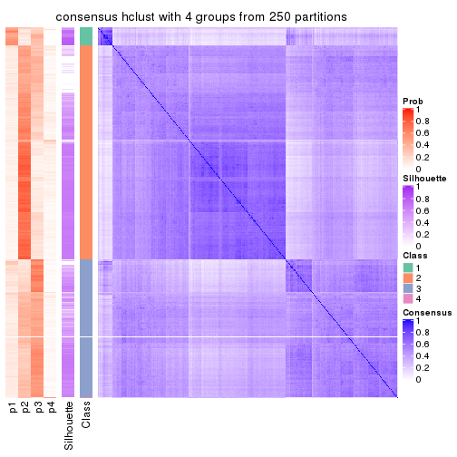</p>

</div>
<div id='tab-CV-hclust-consensus-heatmap-4'>
<pre><code class="r">consensus_heatmap(res, k = 5)
</code></pre>

<p></p>

</div>
<div id='tab-CV-hclust-consensus-heatmap-5'>
<pre><code class="r">consensus_heatmap(res, k = 6)
</code></pre>

<p></p>

</div>
</div>

Heatmaps for the membership of samples in all partitions to see how consistent they are:


<script>
$( function() {
	$( '#tabs-CV-hclust-membership-heatmap' ).tabs();
} );
</script>
<div id='tabs-CV-hclust-membership-heatmap'>
<ul>
<li><a href='#tab-CV-hclust-membership-heatmap-1'>k = 2</a></li>
<li><a href='#tab-CV-hclust-membership-heatmap-2'>k = 3</a></li>
<li><a href='#tab-CV-hclust-membership-heatmap-3'>k = 4</a></li>
<li><a href='#tab-CV-hclust-membership-heatmap-4'>k = 5</a></li>
<li><a href='#tab-CV-hclust-membership-heatmap-5'>k = 6</a></li>
</ul>
<div id='tab-CV-hclust-membership-heatmap-1'>
<pre><code class="r">membership_heatmap(res, k = 2)
</code></pre>

<p></p>

</div>
<div id='tab-CV-hclust-membership-heatmap-2'>
<pre><code class="r">membership_heatmap(res, k = 3)
</code></pre>

<p></p>

</div>
<div id='tab-CV-hclust-membership-heatmap-3'>
<pre><code class="r">membership_heatmap(res, k = 4)
</code></pre>

<p></p>

</div>
<div id='tab-CV-hclust-membership-heatmap-4'>
<pre><code class="r">membership_heatmap(res, k = 5)
</code></pre>

<p></p>

</div>
<div id='tab-CV-hclust-membership-heatmap-5'>
<pre><code class="r">membership_heatmap(res, k = 6)
</code></pre>

<p></p>

</div>
</div>

As soon as we have had the classes for columns, we can look for signatures
which are significantly different between classes which can be candidate marks
for certain classes. Following are the heatmaps for signatures.


Signature heatmaps where rows are scaled:


<script>
$( function() {
	$( '#tabs-CV-hclust-get-signatures' ).tabs();
} );
</script>
<div id='tabs-CV-hclust-get-signatures'>
<ul>
<li><a href='#tab-CV-hclust-get-signatures-1'>k = 2</a></li>
<li><a href='#tab-CV-hclust-get-signatures-2'>k = 3</a></li>
<li><a href='#tab-CV-hclust-get-signatures-3'>k = 4</a></li>
<li><a href='#tab-CV-hclust-get-signatures-4'>k = 5</a></li>
<li><a href='#tab-CV-hclust-get-signatures-5'>k = 6</a></li>
</ul>
<div id='tab-CV-hclust-get-signatures-1'>
<pre><code class="r">get_signatures(res, k = 2)
</code></pre>

<p></p>

</div>
<div id='tab-CV-hclust-get-signatures-2'>
<pre><code class="r">get_signatures(res, k = 3)
</code></pre>

<p></p>

</div>
<div id='tab-CV-hclust-get-signatures-3'>
<pre><code class="r">get_signatures(res, k = 4)
</code></pre>

<p></p>

</div>
<div id='tab-CV-hclust-get-signatures-4'>
<pre><code class="r">get_signatures(res, k = 5)
</code></pre>

<p></p>

</div>
<div id='tab-CV-hclust-get-signatures-5'>
<pre><code class="r">get_signatures(res, k = 6)
</code></pre>

<p></p>

</div>
</div>


Signature heatmaps where rows are not scaled:


<script>
$( function() {
	$( '#tabs-CV-hclust-get-signatures-no-scale' ).tabs();
} );
</script>
<div id='tabs-CV-hclust-get-signatures-no-scale'>
<ul>
<li><a href='#tab-CV-hclust-get-signatures-no-scale-1'>k = 2</a></li>
<li><a href='#tab-CV-hclust-get-signatures-no-scale-2'>k = 3</a></li>
<li><a href='#tab-CV-hclust-get-signatures-no-scale-3'>k = 4</a></li>
<li><a href='#tab-CV-hclust-get-signatures-no-scale-4'>k = 5</a></li>
<li><a href='#tab-CV-hclust-get-signatures-no-scale-5'>k = 6</a></li>
</ul>
<div id='tab-CV-hclust-get-signatures-no-scale-1'>
<pre><code class="r">get_signatures(res, k = 2, scale_rows = FALSE)
</code></pre>

<p>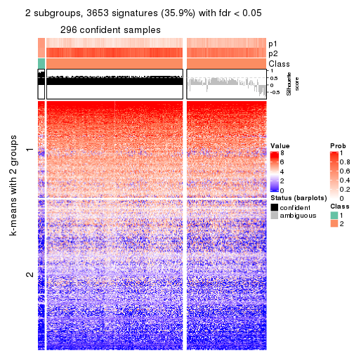</p>

</div>
<div id='tab-CV-hclust-get-signatures-no-scale-2'>
<pre><code class="r">get_signatures(res, k = 3, scale_rows = FALSE)
</code></pre>

<p>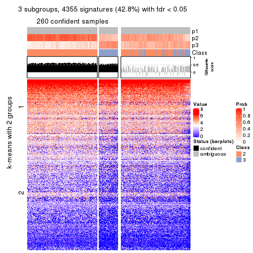</p>

</div>
<div id='tab-CV-hclust-get-signatures-no-scale-3'>
<pre><code class="r">get_signatures(res, k = 4, scale_rows = FALSE)
</code></pre>

<p></p>

</div>
<div id='tab-CV-hclust-get-signatures-no-scale-4'>
<pre><code class="r">get_signatures(res, k = 5, scale_rows = FALSE)
</code></pre>

<p></p>

</div>
<div id='tab-CV-hclust-get-signatures-no-scale-5'>
<pre><code class="r">get_signatures(res, k = 6, scale_rows = FALSE)
</code></pre>

<p></p>

</div>
</div>


Compare the overlap of signatures from different k:

```r
compare_signatures(res)
```


`get_signature()` returns a data frame invisibly. TO get the list of signatures, the function
call should be assigned to a variable explicitly. In following code, if `plot` argument is set
to `FALSE`, no heatmap is plotted while only the differential analysis is performed.

```r
# code only for demonstration
tb = get_signature(res, k = ..., plot = FALSE)
```

An example of the output of `tb` is:

```
#>   which_row         fdr    mean_1    mean_2 scaled_mean_1 scaled_mean_2 km
#> 1        38 0.042760348  8.373488  9.131774    -0.5533452     0.5164555  1
#> 2        40 0.018707592  7.106213  8.469186    -0.6173731     0.5762149  1
#> 3        55 0.019134737 10.221463 11.207825    -0.6159697     0.5749050  1
#> 4        59 0.006059896  5.921854  7.869574    -0.6899429     0.6439467  1
#> 5        60 0.018055526  8.928898 10.211722    -0.6204761     0.5791110  1
#> 6        98 0.009384629 15.714769 14.887706     0.6635654    -0.6193277  2
...
```

The columns in `tb` are:

1. `which_row`: row indices corresponding to the input matrix.
2. `fdr`: FDR for the differential test. 
3. `mean_x`: The mean value in group x.
4. `scaled_mean_x`: The mean value in group x after rows are scaled.
5. `km`: Row groups if k-means clustering is applied to rows.


UMAP plot which shows how samples are separated.


<script>
$( function() {
	$( '#tabs-CV-hclust-dimension-reduction' ).tabs();
} );
</script>
<div id='tabs-CV-hclust-dimension-reduction'>
<ul>
<li><a href='#tab-CV-hclust-dimension-reduction-1'>k = 2</a></li>
<li><a href='#tab-CV-hclust-dimension-reduction-2'>k = 3</a></li>
<li><a href='#tab-CV-hclust-dimension-reduction-3'>k = 4</a></li>
<li><a href='#tab-CV-hclust-dimension-reduction-4'>k = 5</a></li>
<li><a href='#tab-CV-hclust-dimension-reduction-5'>k = 6</a></li>
</ul>
<div id='tab-CV-hclust-dimension-reduction-1'>
<pre><code class="r">dimension_reduction(res, k = 2, method = &quot;UMAP&quot;)
</code></pre>

<p></p>

</div>
<div id='tab-CV-hclust-dimension-reduction-2'>
<pre><code class="r">dimension_reduction(res, k = 3, method = &quot;UMAP&quot;)
</code></pre>

<p></p>

</div>
<div id='tab-CV-hclust-dimension-reduction-3'>
<pre><code class="r">dimension_reduction(res, k = 4, method = &quot;UMAP&quot;)
</code></pre>

<p>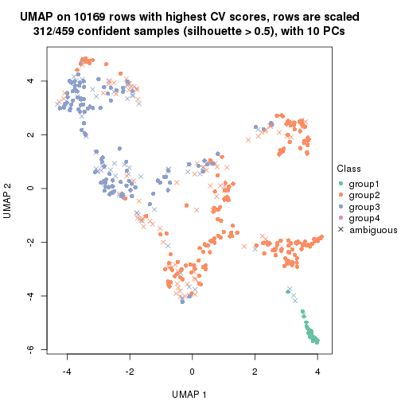</p>

</div>
<div id='tab-CV-hclust-dimension-reduction-4'>
<pre><code class="r">dimension_reduction(res, k = 5, method = &quot;UMAP&quot;)
</code></pre>

<p></p>

</div>
<div id='tab-CV-hclust-dimension-reduction-5'>
<pre><code class="r">dimension_reduction(res, k = 6, method = &quot;UMAP&quot;)
</code></pre>

<p></p>

</div>
</div>


Following heatmap shows how subgroups are split when increasing `k`:

```r
collect_classes(res)
```


If matrix rows can be associated to genes, consider to use `functional_enrichment(res,
...)` to perform function enrichment for the signature genes. See [this vignette](http://bioconductor.org/packages/devel/bioc/vignettes/cola/inst/doc/functional_enrichment.html) for more detailed explanations.


 

---------------------------------------------------


### CV:kmeans


The object with results only for a single top-value method and a single partition method 
can be extracted as:

```r
res = res_list["CV", "kmeans"]
# you can also extract it by
# res = res_list["CV:kmeans"]
```

A summary of `res` and all the functions that can be applied to it:

```r
res
```

```
#> A 'ConsensusPartition' object with k = 2, 3, 4, 5, 6.
#>   On a matrix with 10169 rows and 459 columns.
#>   Top rows (1000, 2000, 3000, 4000, 5000) are extracted by 'CV' method.
#>   Subgroups are detected by 'kmeans' method.
#>   Performed in total 1250 partitions by row resampling.
#>   Best k for subgroups seems to be 2.
#> 
#> Following methods can be applied to this 'ConsensusPartition' object:
#>  [1] "cola_report"             "collect_classes"         "collect_plots"          
#>  [4] "collect_stats"           "colnames"                "compare_signatures"     
#>  [7] "consensus_heatmap"       "dimension_reduction"     "functional_enrichment"  
#> [10] "get_anno_col"            "get_anno"                "get_classes"            
#> [13] "get_consensus"           "get_matrix"              "get_membership"         
#> [16] "get_param"               "get_signatures"          "get_stats"              
#> [19] "is_best_k"               "is_stable_k"             "membership_heatmap"     
#> [22] "ncol"                    "nrow"                    "plot_ecdf"              
#> [25] "rownames"                "select_partition_number" "show"                   
#> [28] "suggest_best_k"          "test_to_known_factors"
```

`collect_plots()` function collects all the plots made from `res` for all `k` (number of partitions)
into one single page to provide an easy and fast comparison between different `k`.

```r
collect_plots(res)
```


The plots are:

- The first row: a plot of the ECDF (empirical cumulative distribution
  function) curves of the consensus matrix for each `k` and the heatmap of
  predicted classes for each `k`.
- The second row: heatmaps of the consensus matrix for each `k`.
- The third row: heatmaps of the membership matrix for each `k`.
- The fouth row: heatmaps of the signatures for each `k`.

All the plots in panels can be made by individual functions and they are
plotted later in this section.

`select_partition_number()` produces several plots showing different
statistics for choosing "optimized" `k`. There are following statistics:

- ECDF curves of the consensus matrix for each `k`;
- 1-PAC. [The PAC
  score](https://en.wikipedia.org/wiki/Consensus_clustering#Over-interpretation_potential_of_consensus_clustering)
  measures the proportion of the ambiguous subgrouping.
- Mean silhouette score.
- Concordance. The mean probability of fiting the consensus class ids in all
  partitions.
- Area increased. Denote $A_k$ as the area under the ECDF curve for current
  `k`, the area increased is defined as $A_k - A_{k-1}$.
- Rand index. The percent of pairs of samples that are both in a same cluster
  or both are not in a same cluster in the partition of k and k-1.
- Jaccard index. The ratio of pairs of samples are both in a same cluster in
  the partition of k and k-1 and the pairs of samples are both in a same
  cluster in the partition k or k-1.

The detailed explanations of these statistics can be found in [the _cola_
vignette](http://bioconductor.org/packages/devel/bioc/vignettes/cola/inst/doc/cola.html#toc_13).

Generally speaking, lower PAC score, higher mean silhouette score or higher
concordance corresponds to better partition. Rand index and Jaccard index
measure how similar the current partition is compared to partition with `k-1`.
If they are too similar, we won't accept `k` is better than `k-1`.

```r
select_partition_number(res)
```


The numeric values for all these statistics can be obtained by `get_stats()`.

```r
get_stats(res)
```

```
#>   k 1-PAC mean_silhouette concordance area_increased  Rand Jaccard
#> 2 2 0.827           0.916       0.962         0.4983 0.501   0.501
#> 3 3 0.493           0.743       0.831         0.2565 0.723   0.518
#> 4 4 0.479           0.498       0.707         0.1428 0.807   0.547
#> 5 5 0.542           0.580       0.725         0.0872 0.818   0.467
#> 6 6 0.625           0.565       0.728         0.0514 0.941   0.743
```

`suggest_best_k()` suggests the best $k$ based on these statistics. The rules are as follows:

- All $k$ with Jaccard index larger than 0.95 are removed because increasing
  $k$ does not provide enough extra information. If all $k$ are removed, it is
  marked as no subgroup is detected.
- For all $k$ with 1-PAC score larger than 0.9, the maximal $k$ is taken as
  the best $k$, and other $k$ are marked as optional $k$.
- If it does not fit the second rule. The $k$ with the maximal vote of the
  highest 1-PAC score, highest mean silhouette, and highest concordance is
  taken as the best $k$.

```r
suggest_best_k(res)
```

```
#> [1] 2
```


Following shows the table of the partitions (You need to click the **show/hide
code output** link to see it). The membership matrix (columns with name `p*`)
is inferred by
[`clue::cl_consensus()`](https://www.rdocumentation.org/link/cl_consensus?package=clue)
function with the `SE` method. Basically the value in the membership matrix
represents the probability to belong to a certain group. The finall class
label for an item is determined with the group with highest probability it
belongs to.

In `get_classes()` function, the entropy is calculated from the membership
matrix and the silhouette score is calculated from the consensus matrix.


<script>
$( function() {
	$( '#tabs-CV-kmeans-get-classes' ).tabs();
} );
</script>
<div id='tabs-CV-kmeans-get-classes'>
<ul>
<li><a href='#tab-CV-kmeans-get-classes-1'>k = 2</a></li>
<li><a href='#tab-CV-kmeans-get-classes-2'>k = 3</a></li>
<li><a href='#tab-CV-kmeans-get-classes-3'>k = 4</a></li>
<li><a href='#tab-CV-kmeans-get-classes-4'>k = 5</a></li>
<li><a href='#tab-CV-kmeans-get-classes-5'>k = 6</a></li>
</ul>

<div id='tab-CV-kmeans-get-classes-1'>
<p><a id='tab-CV-kmeans-get-classes-1-a' style='color:#0366d6' href='#'>show/hide code output</a></p>
<pre><code class="r">cbind(get_classes(res, k = 2), get_membership(res, k = 2))
</code></pre>

<pre><code>#&gt;            class entropy silhouette    p1    p2
#&gt; SRR1699874     2  0.0000     0.9661 0.000 1.000
#&gt; SRR1699875     2  0.0000     0.9661 0.000 1.000
#&gt; SRR1699876     2  0.0000     0.9661 0.000 1.000
#&gt; SRR1699877     2  0.0000     0.9661 0.000 1.000
#&gt; SRR1699879     2  0.0000     0.9661 0.000 1.000
#&gt; SRR1699878     2  0.0000     0.9661 0.000 1.000
#&gt; SRR1699880     1  0.0000     0.9541 1.000 0.000
#&gt; SRR1699881     1  0.0000     0.9541 1.000 0.000
#&gt; SRR1699882     2  0.0000     0.9661 0.000 1.000
#&gt; SRR1699883     2  0.0000     0.9661 0.000 1.000
#&gt; SRR1699884     2  0.0000     0.9661 0.000 1.000
#&gt; SRR1699885     2  0.0000     0.9661 0.000 1.000
#&gt; SRR1699886     2  0.0000     0.9661 0.000 1.000
#&gt; SRR1699888     2  0.0000     0.9661 0.000 1.000
#&gt; SRR1699889     2  0.0000     0.9661 0.000 1.000
#&gt; SRR1699890     2  0.0000     0.9661 0.000 1.000
#&gt; SRR1699887     2  0.0000     0.9661 0.000 1.000
#&gt; SRR1699891     2  0.0000     0.9661 0.000 1.000
#&gt; SRR1699892     2  0.7950     0.7002 0.240 0.760
#&gt; SRR1699893     1  0.9427     0.4858 0.640 0.360
#&gt; SRR1699894     2  0.0000     0.9661 0.000 1.000
#&gt; SRR1699895     2  0.0000     0.9661 0.000 1.000
#&gt; SRR1699896     1  0.9988     0.1095 0.520 0.480
#&gt; SRR1699897     2  0.0000     0.9661 0.000 1.000
#&gt; SRR1699898     1  0.0000     0.9541 1.000 0.000
#&gt; SRR1699900     1  0.4562     0.8815 0.904 0.096
#&gt; SRR1699899     2  0.0376     0.9636 0.004 0.996
#&gt; SRR1699902     1  0.0000     0.9541 1.000 0.000
#&gt; SRR1699901     1  0.0000     0.9541 1.000 0.000
#&gt; SRR1699903     2  0.0000     0.9661 0.000 1.000
#&gt; SRR1699904     2  0.0000     0.9661 0.000 1.000
#&gt; SRR1699905     1  0.0000     0.9541 1.000 0.000
#&gt; SRR1699906     2  0.0000     0.9661 0.000 1.000
#&gt; SRR1699907     2  0.0000     0.9661 0.000 1.000
#&gt; SRR1699908     2  0.0000     0.9661 0.000 1.000
#&gt; SRR1699909     2  0.0000     0.9661 0.000 1.000
#&gt; SRR1699910     1  0.3584     0.9079 0.932 0.068
#&gt; SRR1699911     2  0.0000     0.9661 0.000 1.000
#&gt; SRR1699912     2  0.0000     0.9661 0.000 1.000
#&gt; SRR1699913     2  0.0000     0.9661 0.000 1.000
#&gt; SRR1699914     1  0.0000     0.9541 1.000 0.000
#&gt; SRR1699915     2  0.7299     0.7406 0.204 0.796
#&gt; SRR1699916     2  0.0000     0.9661 0.000 1.000
#&gt; SRR1699917     2  0.0000     0.9661 0.000 1.000
#&gt; SRR1699918     2  0.0000     0.9661 0.000 1.000
#&gt; SRR1699919     2  0.0000     0.9661 0.000 1.000
#&gt; SRR1699920     1  0.8555     0.6389 0.720 0.280
#&gt; SRR1699921     2  0.0376     0.9636 0.004 0.996
#&gt; SRR1699922     2  0.0000     0.9661 0.000 1.000
#&gt; SRR1699923     1  0.0000     0.9541 1.000 0.000
#&gt; SRR1699924     1  0.0000     0.9541 1.000 0.000
#&gt; SRR1699925     1  0.0000     0.9541 1.000 0.000
#&gt; SRR1699926     1  0.8499     0.6404 0.724 0.276
#&gt; SRR1699927     2  0.0000     0.9661 0.000 1.000
#&gt; SRR1699929     2  0.7219     0.7578 0.200 0.800
#&gt; SRR1699928     2  0.0000     0.9661 0.000 1.000
#&gt; SRR1699930     2  0.0000     0.9661 0.000 1.000
#&gt; SRR1699931     2  0.6801     0.7890 0.180 0.820
#&gt; SRR1699933     1  0.2603     0.9263 0.956 0.044
#&gt; SRR1699932     2  0.0000     0.9661 0.000 1.000
#&gt; SRR1699934     1  0.0000     0.9541 1.000 0.000
#&gt; SRR1699935     2  0.0938     0.9584 0.012 0.988
#&gt; SRR1699936     2  0.0000     0.9661 0.000 1.000
#&gt; SRR1699937     2  0.7219     0.7616 0.200 0.800
#&gt; SRR1699938     2  0.0000     0.9661 0.000 1.000
#&gt; SRR1699940     1  0.2948     0.9199 0.948 0.052
#&gt; SRR1699939     2  0.0000     0.9661 0.000 1.000
#&gt; SRR1699941     1  0.0000     0.9541 1.000 0.000
#&gt; SRR1699942     2  0.2603     0.9340 0.044 0.956
#&gt; SRR1699943     2  0.0000     0.9661 0.000 1.000
#&gt; SRR1699944     2  0.0000     0.9661 0.000 1.000
#&gt; SRR1699945     1  0.0000     0.9541 1.000 0.000
#&gt; SRR1699946     2  0.2043     0.9439 0.032 0.968
#&gt; SRR1699947     2  0.4815     0.8785 0.104 0.896
#&gt; SRR1699948     2  0.0000     0.9661 0.000 1.000
#&gt; SRR1699949     2  0.0000     0.9661 0.000 1.000
#&gt; SRR1699950     2  0.0000     0.9661 0.000 1.000
#&gt; SRR1699951     2  0.0000     0.9661 0.000 1.000
#&gt; SRR1699952     2  0.0376     0.9636 0.004 0.996
#&gt; SRR1699953     2  0.0000     0.9661 0.000 1.000
#&gt; SRR1699954     1  0.9044     0.5475 0.680 0.320
#&gt; SRR1699955     2  0.0000     0.9661 0.000 1.000
#&gt; SRR1699956     1  0.0000     0.9541 1.000 0.000
#&gt; SRR1699957     2  0.0000     0.9661 0.000 1.000
#&gt; SRR1699959     1  0.0672     0.9501 0.992 0.008
#&gt; SRR1699958     2  0.1414     0.9528 0.020 0.980
#&gt; SRR1699960     2  0.0000     0.9661 0.000 1.000
#&gt; SRR1699961     1  0.0000     0.9541 1.000 0.000
#&gt; SRR1699962     2  0.0000     0.9661 0.000 1.000
#&gt; SRR1699963     2  0.3114     0.9243 0.056 0.944
#&gt; SRR1699964     2  0.4939     0.8746 0.108 0.892
#&gt; SRR1699965     2  0.0000     0.9661 0.000 1.000
#&gt; SRR1699966     1  0.7745     0.7252 0.772 0.228
#&gt; SRR1699967     2  0.0000     0.9661 0.000 1.000
#&gt; SRR1699968     2  0.0000     0.9661 0.000 1.000
#&gt; SRR1699969     1  0.0000     0.9541 1.000 0.000
#&gt; SRR1699971     1  0.0000     0.9541 1.000 0.000
#&gt; SRR1699970     2  0.0000     0.9661 0.000 1.000
#&gt; SRR1699972     1  0.0000     0.9541 1.000 0.000
#&gt; SRR1699973     2  0.2603     0.9344 0.044 0.956
#&gt; SRR1699974     1  0.0000     0.9541 1.000 0.000
#&gt; SRR1699975     2  0.4022     0.9025 0.080 0.920
#&gt; SRR1699976     1  0.7376     0.7529 0.792 0.208
#&gt; SRR1699977     1  0.0000     0.9541 1.000 0.000
#&gt; SRR1699978     1  0.0000     0.9541 1.000 0.000
#&gt; SRR1699979     1  0.0376     0.9521 0.996 0.004
#&gt; SRR1699980     2  0.0000     0.9661 0.000 1.000
#&gt; SRR1699981     1  0.0000     0.9541 1.000 0.000
#&gt; SRR1699982     2  0.0000     0.9661 0.000 1.000
#&gt; SRR1699983     2  0.0000     0.9661 0.000 1.000
#&gt; SRR1699984     1  0.0000     0.9541 1.000 0.000
#&gt; SRR1699985     2  0.0000     0.9661 0.000 1.000
#&gt; SRR1699986     1  0.0000     0.9541 1.000 0.000
#&gt; SRR1699988     2  0.0000     0.9661 0.000 1.000
#&gt; SRR1699987     1  0.0938     0.9478 0.988 0.012
#&gt; SRR1699989     2  0.0000     0.9661 0.000 1.000
#&gt; SRR1699990     1  0.2043     0.9355 0.968 0.032
#&gt; SRR1699992     1  0.5629     0.8460 0.868 0.132
#&gt; SRR1699991     1  0.0000     0.9541 1.000 0.000
#&gt; SRR1699993     1  0.0000     0.9541 1.000 0.000
#&gt; SRR1699994     1  0.0000     0.9541 1.000 0.000
#&gt; SRR1699995     1  0.0000     0.9541 1.000 0.000
#&gt; SRR1699996     2  0.0938     0.9585 0.012 0.988
#&gt; SRR1699997     1  0.7883     0.7160 0.764 0.236
#&gt; SRR1699998     2  0.6247     0.8190 0.156 0.844
#&gt; SRR1699999     1  0.0000     0.9541 1.000 0.000
#&gt; SRR1700000     1  0.9170     0.5308 0.668 0.332
#&gt; SRR1700002     1  0.0376     0.9521 0.996 0.004
#&gt; SRR1700001     1  0.0000     0.9541 1.000 0.000
#&gt; SRR1700003     1  0.9608     0.4071 0.616 0.384
#&gt; SRR1700004     1  0.0000     0.9541 1.000 0.000
#&gt; SRR1700005     1  0.0000     0.9541 1.000 0.000
#&gt; SRR1700006     1  0.0000     0.9541 1.000 0.000
#&gt; SRR1700007     2  0.0000     0.9661 0.000 1.000
#&gt; SRR1700008     1  0.0000     0.9541 1.000 0.000
#&gt; SRR1700009     1  0.0000     0.9541 1.000 0.000
#&gt; SRR1700010     1  0.0000     0.9541 1.000 0.000
#&gt; SRR1700011     2  0.0000     0.9661 0.000 1.000
#&gt; SRR1700013     1  0.3879     0.9023 0.924 0.076
#&gt; SRR1700012     2  0.8861     0.5837 0.304 0.696
#&gt; SRR1700014     1  0.1414     0.9432 0.980 0.020
#&gt; SRR1700015     1  0.0938     0.9479 0.988 0.012
#&gt; SRR1700016     1  0.0000     0.9541 1.000 0.000
#&gt; SRR1700018     1  0.0000     0.9541 1.000 0.000
#&gt; SRR1700017     1  0.0000     0.9541 1.000 0.000
#&gt; SRR1700019     2  0.0000     0.9661 0.000 1.000
#&gt; SRR1700020     1  0.0000     0.9541 1.000 0.000
#&gt; SRR1700021     2  0.0000     0.9661 0.000 1.000
#&gt; SRR1700023     1  0.2948     0.9213 0.948 0.052
#&gt; SRR1700022     1  0.0000     0.9541 1.000 0.000
#&gt; SRR1700024     2  0.0000     0.9661 0.000 1.000
#&gt; SRR1700025     1  0.4161     0.8926 0.916 0.084
#&gt; SRR1700026     1  0.1843     0.9381 0.972 0.028
#&gt; SRR1700027     1  0.0000     0.9541 1.000 0.000
#&gt; SRR1700028     2  0.7056     0.7709 0.192 0.808
#&gt; SRR1700029     1  0.3733     0.9045 0.928 0.072
#&gt; SRR1700030     2  0.1184     0.9557 0.016 0.984
#&gt; SRR1700031     1  0.0000     0.9541 1.000 0.000
#&gt; SRR1700032     2  0.0000     0.9661 0.000 1.000
#&gt; SRR1700034     1  0.0000     0.9541 1.000 0.000
#&gt; SRR1700035     2  0.0000     0.9661 0.000 1.000
#&gt; SRR1700033     1  0.0000     0.9541 1.000 0.000
#&gt; SRR1700036     2  0.0376     0.9636 0.004 0.996
#&gt; SRR1700037     2  0.0000     0.9661 0.000 1.000
#&gt; SRR1700038     1  0.5519     0.8490 0.872 0.128
#&gt; SRR1700039     1  0.0000     0.9541 1.000 0.000
#&gt; SRR1700040     1  0.0000     0.9541 1.000 0.000
#&gt; SRR1700041     1  0.0938     0.9479 0.988 0.012
#&gt; SRR1700042     1  0.0000     0.9541 1.000 0.000
#&gt; SRR1700043     1  0.0000     0.9541 1.000 0.000
#&gt; SRR1700045     1  0.0000     0.9541 1.000 0.000
#&gt; SRR1700044     2  0.5408     0.8514 0.124 0.876
#&gt; SRR1700046     1  0.0000     0.9541 1.000 0.000
#&gt; SRR1700047     1  0.0000     0.9541 1.000 0.000
#&gt; SRR1700048     1  0.4690     0.8799 0.900 0.100
#&gt; SRR1700049     1  0.0000     0.9541 1.000 0.000
#&gt; SRR1700050     1  0.0000     0.9541 1.000 0.000
#&gt; SRR1700051     1  0.0000     0.9541 1.000 0.000
#&gt; SRR1700052     1  0.0000     0.9541 1.000 0.000
#&gt; SRR1700053     1  0.3114     0.9178 0.944 0.056
#&gt; SRR1700054     1  0.0000     0.9541 1.000 0.000
#&gt; SRR1700055     1  0.0000     0.9541 1.000 0.000
#&gt; SRR1700056     1  0.0000     0.9541 1.000 0.000
#&gt; SRR1700057     1  0.0000     0.9541 1.000 0.000
#&gt; SRR1700058     1  0.0000     0.9541 1.000 0.000
#&gt; SRR1700059     1  0.1184     0.9456 0.984 0.016
#&gt; SRR1700060     1  0.0000     0.9541 1.000 0.000
#&gt; SRR1700061     1  0.0000     0.9541 1.000 0.000
#&gt; SRR1700062     1  0.0000     0.9541 1.000 0.000
#&gt; SRR1700063     1  0.0000     0.9541 1.000 0.000
#&gt; SRR1700064     1  0.7883     0.7153 0.764 0.236
#&gt; SRR1700065     1  0.0000     0.9541 1.000 0.000
#&gt; SRR1700066     1  0.0000     0.9541 1.000 0.000
#&gt; SRR1700067     2  0.0000     0.9661 0.000 1.000
#&gt; SRR1700068     1  0.0000     0.9541 1.000 0.000
#&gt; SRR1700069     2  0.2948     0.9262 0.052 0.948
#&gt; SRR1700070     2  0.0000     0.9661 0.000 1.000
#&gt; SRR1700071     1  0.0000     0.9541 1.000 0.000
#&gt; SRR1700072     1  0.0000     0.9541 1.000 0.000
#&gt; SRR1700073     2  0.0000     0.9661 0.000 1.000
#&gt; SRR1700075     1  0.0000     0.9541 1.000 0.000
#&gt; SRR1700074     1  0.0000     0.9541 1.000 0.000
#&gt; SRR1700076     1  0.2948     0.9214 0.948 0.052
#&gt; SRR1700077     1  0.3584     0.9082 0.932 0.068
#&gt; SRR1700078     1  0.0000     0.9541 1.000 0.000
#&gt; SRR1700080     1  0.4815     0.8762 0.896 0.104
#&gt; SRR1700079     1  0.0000     0.9541 1.000 0.000
#&gt; SRR1700081     1  0.0000     0.9541 1.000 0.000
#&gt; SRR1700082     1  0.0000     0.9541 1.000 0.000
#&gt; SRR1700083     1  0.0000     0.9541 1.000 0.000
#&gt; SRR1700084     1  0.0000     0.9541 1.000 0.000
#&gt; SRR1700085     2  0.0000     0.9661 0.000 1.000
#&gt; SRR1700086     2  0.6973     0.7647 0.188 0.812
#&gt; SRR1700087     1  0.1633     0.9409 0.976 0.024
#&gt; SRR1700088     1  0.5519     0.8518 0.872 0.128
#&gt; SRR1700089     1  0.6438     0.8066 0.836 0.164
#&gt; SRR1700091     2  0.2423     0.9368 0.040 0.960
#&gt; SRR1700090     1  0.0000     0.9541 1.000 0.000
#&gt; SRR1700092     2  0.1414     0.9530 0.020 0.980
#&gt; SRR1700094     1  0.0672     0.9500 0.992 0.008
#&gt; SRR1700093     1  0.6148     0.8236 0.848 0.152
#&gt; SRR1700095     1  0.0000     0.9541 1.000 0.000
#&gt; SRR1700096     1  0.0000     0.9541 1.000 0.000
#&gt; SRR1700097     1  0.0000     0.9541 1.000 0.000
#&gt; SRR1700098     2  0.0000     0.9661 0.000 1.000
#&gt; SRR1700099     2  0.4690     0.8833 0.100 0.900
#&gt; SRR1700100     1  0.2778     0.9228 0.952 0.048
#&gt; SRR1700101     1  0.9993     0.0984 0.516 0.484
#&gt; SRR1700102     2  0.2603     0.9341 0.044 0.956
#&gt; SRR1700104     1  0.0672     0.9500 0.992 0.008
#&gt; SRR1700103     1  0.0376     0.9521 0.996 0.004
#&gt; SRR1700105     2  0.9686     0.3300 0.396 0.604
#&gt; SRR1700106     2  0.9000     0.5288 0.316 0.684
#&gt; SRR1700107     2  0.4815     0.8793 0.104 0.896
#&gt; SRR1700108     2  0.0000     0.9661 0.000 1.000
#&gt; SRR1700109     2  0.0000     0.9661 0.000 1.000
#&gt; SRR1700110     2  0.0000     0.9661 0.000 1.000
#&gt; SRR1700112     2  0.0000     0.9661 0.000 1.000
#&gt; SRR1700111     1  0.2043     0.9352 0.968 0.032
#&gt; SRR1700113     2  0.0000     0.9661 0.000 1.000
#&gt; SRR1700114     1  0.0000     0.9541 1.000 0.000
#&gt; SRR1700115     2  0.1184     0.9556 0.016 0.984
#&gt; SRR1700116     1  0.0000     0.9541 1.000 0.000
#&gt; SRR1700117     1  0.0000     0.9541 1.000 0.000
#&gt; SRR1700119     1  0.0000     0.9541 1.000 0.000
#&gt; SRR1700118     1  0.1843     0.9381 0.972 0.028
#&gt; SRR1700120     1  0.0000     0.9541 1.000 0.000
#&gt; SRR1700121     2  0.9286     0.4776 0.344 0.656
#&gt; SRR1700122     2  0.0000     0.9661 0.000 1.000
#&gt; SRR1700123     1  0.0000     0.9541 1.000 0.000
#&gt; SRR1700125     2  0.0000     0.9661 0.000 1.000
#&gt; SRR1700126     1  0.0000     0.9541 1.000 0.000
#&gt; SRR1700127     1  0.0000     0.9541 1.000 0.000
#&gt; SRR1700124     1  0.0000     0.9541 1.000 0.000
#&gt; SRR1700128     1  0.0000     0.9541 1.000 0.000
#&gt; SRR1700129     2  0.4815     0.8790 0.104 0.896
#&gt; SRR1700130     2  0.5629     0.8484 0.132 0.868
#&gt; SRR1700132     1  0.0000     0.9541 1.000 0.000
#&gt; SRR1700131     1  0.0000     0.9541 1.000 0.000
#&gt; SRR1700133     1  0.1414     0.9432 0.980 0.020
#&gt; SRR1700134     2  0.0000     0.9661 0.000 1.000
#&gt; SRR1700135     1  0.0000     0.9541 1.000 0.000
#&gt; SRR1700136     1  0.0000     0.9541 1.000 0.000
#&gt; SRR1700137     1  0.9000     0.5775 0.684 0.316
#&gt; SRR1700138     1  0.0000     0.9541 1.000 0.000
#&gt; SRR1700140     1  0.0000     0.9541 1.000 0.000
#&gt; SRR1700139     1  0.0000     0.9541 1.000 0.000
#&gt; SRR1700141     2  0.0000     0.9661 0.000 1.000
#&gt; SRR1700142     1  0.0000     0.9541 1.000 0.000
#&gt; SRR1700143     1  0.0000     0.9541 1.000 0.000
#&gt; SRR1700144     1  0.0000     0.9541 1.000 0.000
#&gt; SRR1700145     1  0.0000     0.9541 1.000 0.000
#&gt; SRR1700146     2  0.0000     0.9661 0.000 1.000
#&gt; SRR1700147     1  0.0000     0.9541 1.000 0.000
#&gt; SRR1700149     1  0.0000     0.9541 1.000 0.000
#&gt; SRR1700148     1  0.0000     0.9541 1.000 0.000
#&gt; SRR1700150     2  0.9248     0.4982 0.340 0.660
#&gt; SRR1700152     1  0.2043     0.9353 0.968 0.032
#&gt; SRR1700151     1  0.0000     0.9541 1.000 0.000
#&gt; SRR1700153     1  0.0000     0.9541 1.000 0.000
#&gt; SRR1700154     1  0.0000     0.9541 1.000 0.000
#&gt; SRR1700155     1  0.7219     0.7667 0.800 0.200
#&gt; SRR1700156     1  0.0000     0.9541 1.000 0.000
#&gt; SRR1700158     1  0.0000     0.9541 1.000 0.000
#&gt; SRR1700159     2  0.0000     0.9661 0.000 1.000
#&gt; SRR1700157     1  0.0000     0.9541 1.000 0.000
#&gt; SRR1700160     1  0.0000     0.9541 1.000 0.000
#&gt; SRR1700161     1  0.0000     0.9541 1.000 0.000
#&gt; SRR1700162     2  0.0000     0.9661 0.000 1.000
#&gt; SRR1700164     1  0.0000     0.9541 1.000 0.000
#&gt; SRR1700163     1  0.0000     0.9541 1.000 0.000
#&gt; SRR1700165     1  0.0000     0.9541 1.000 0.000
#&gt; SRR1700166     1  0.2778     0.9239 0.952 0.048
#&gt; SRR1700168     2  0.0000     0.9661 0.000 1.000
#&gt; SRR1700167     1  0.0000     0.9541 1.000 0.000
#&gt; SRR1700170     1  0.0376     0.9521 0.996 0.004
#&gt; SRR1700169     1  0.0000     0.9541 1.000 0.000
#&gt; SRR1700171     1  0.0000     0.9541 1.000 0.000
#&gt; SRR1700172     1  0.7219     0.7647 0.800 0.200
#&gt; SRR1700174     1  0.0376     0.9521 0.996 0.004
#&gt; SRR1700173     1  0.0376     0.9521 0.996 0.004
#&gt; SRR1700175     1  0.9909     0.2058 0.556 0.444
#&gt; SRR1700176     1  0.0000     0.9541 1.000 0.000
#&gt; SRR1700178     2  0.0000     0.9661 0.000 1.000
#&gt; SRR1700177     1  0.0000     0.9541 1.000 0.000
#&gt; SRR1700180     2  0.0000     0.9661 0.000 1.000
#&gt; SRR1700179     2  0.0000     0.9661 0.000 1.000
#&gt; SRR1700181     2  0.0000     0.9661 0.000 1.000
#&gt; SRR1700183     1  0.0000     0.9541 1.000 0.000
#&gt; SRR1700182     2  0.0000     0.9661 0.000 1.000
#&gt; SRR1700184     2  0.0000     0.9661 0.000 1.000
#&gt; SRR1700186     2  0.0672     0.9611 0.008 0.992
#&gt; SRR1700187     1  0.0000     0.9541 1.000 0.000
#&gt; SRR1700185     1  0.0000     0.9541 1.000 0.000
#&gt; SRR1700188     2  0.0000     0.9661 0.000 1.000
#&gt; SRR1700192     1  0.9248     0.4965 0.660 0.340
#&gt; SRR1700190     1  0.0000     0.9541 1.000 0.000
#&gt; SRR1700191     1  0.0000     0.9541 1.000 0.000
#&gt; SRR1700189     1  0.0000     0.9541 1.000 0.000
#&gt; SRR1700193     2  0.0000     0.9661 0.000 1.000
#&gt; SRR1700195     2  0.0000     0.9661 0.000 1.000
#&gt; SRR1700194     1  0.0000     0.9541 1.000 0.000
#&gt; SRR1700196     2  0.0000     0.9661 0.000 1.000
#&gt; SRR1700197     1  0.0000     0.9541 1.000 0.000
#&gt; SRR1700198     2  0.0000     0.9661 0.000 1.000
#&gt; SRR1700199     2  0.0000     0.9661 0.000 1.000
#&gt; SRR1700200     2  0.0000     0.9661 0.000 1.000
#&gt; SRR1700201     2  0.0000     0.9661 0.000 1.000
#&gt; SRR1700202     2  0.0000     0.9661 0.000 1.000
#&gt; SRR1700203     2  0.0000     0.9661 0.000 1.000
#&gt; SRR1700204     2  0.0000     0.9661 0.000 1.000
#&gt; SRR1700206     2  0.5408     0.8570 0.124 0.876
#&gt; SRR1700207     2  0.0000     0.9661 0.000 1.000
#&gt; SRR1700208     1  0.0376     0.9521 0.996 0.004
#&gt; SRR1700205     2  0.0000     0.9661 0.000 1.000
#&gt; SRR1700209     2  0.0000     0.9661 0.000 1.000
#&gt; SRR1700210     2  0.0000     0.9661 0.000 1.000
#&gt; SRR1700211     2  0.0000     0.9661 0.000 1.000
#&gt; SRR1700212     2  0.0000     0.9661 0.000 1.000
#&gt; SRR1700213     2  0.0000     0.9661 0.000 1.000
#&gt; SRR1700214     2  0.0000     0.9661 0.000 1.000
#&gt; SRR1700215     1  0.0000     0.9541 1.000 0.000
#&gt; SRR1700217     2  0.0000     0.9661 0.000 1.000
#&gt; SRR1700216     1  0.0000     0.9541 1.000 0.000
#&gt; SRR1700218     2  0.0672     0.9611 0.008 0.992
#&gt; SRR1700219     2  0.0000     0.9661 0.000 1.000
#&gt; SRR1700222     1  0.0000     0.9541 1.000 0.000
#&gt; SRR1700220     2  0.0000     0.9661 0.000 1.000
#&gt; SRR1700221     2  0.0000     0.9661 0.000 1.000
#&gt; SRR1700223     2  0.0000     0.9661 0.000 1.000
#&gt; SRR1700224     2  0.0000     0.9661 0.000 1.000
#&gt; SRR1700226     2  0.0000     0.9661 0.000 1.000
#&gt; SRR1700229     2  0.0000     0.9661 0.000 1.000
#&gt; SRR1700225     2  0.4022     0.9021 0.080 0.920
#&gt; SRR1700227     2  0.0000     0.9661 0.000 1.000
#&gt; SRR1700230     1  0.0000     0.9541 1.000 0.000
#&gt; SRR1700231     2  0.0000     0.9661 0.000 1.000
#&gt; SRR1700228     2  0.0376     0.9636 0.004 0.996
#&gt; SRR1700232     2  0.0000     0.9661 0.000 1.000
#&gt; SRR1700233     2  0.0000     0.9661 0.000 1.000
#&gt; SRR1700234     2  0.0000     0.9661 0.000 1.000
#&gt; SRR1700235     2  0.0938     0.9586 0.012 0.988
#&gt; SRR1700237     2  0.0000     0.9661 0.000 1.000
#&gt; SRR1700236     2  0.0000     0.9661 0.000 1.000
#&gt; SRR1700238     2  0.0000     0.9661 0.000 1.000
#&gt; SRR1700239     1  0.0000     0.9541 1.000 0.000
#&gt; SRR1700240     1  0.0000     0.9541 1.000 0.000
#&gt; SRR1700241     1  0.0000     0.9541 1.000 0.000
#&gt; SRR1700243     2  0.0000     0.9661 0.000 1.000
#&gt; SRR1700244     2  0.0000     0.9661 0.000 1.000
#&gt; SRR1700242     2  0.5629     0.8439 0.132 0.868
#&gt; SRR1700246     2  0.0000     0.9661 0.000 1.000
#&gt; SRR1700245     2  0.0000     0.9661 0.000 1.000
#&gt; SRR1700247     1  0.0000     0.9541 1.000 0.000
#&gt; SRR1700249     1  0.0000     0.9541 1.000 0.000
#&gt; SRR1700250     2  0.0000     0.9661 0.000 1.000
#&gt; SRR1700248     2  0.0000     0.9661 0.000 1.000
#&gt; SRR1700251     2  0.0000     0.9661 0.000 1.000
#&gt; SRR1700252     1  0.8713     0.6026 0.708 0.292
#&gt; SRR1700253     2  0.0000     0.9661 0.000 1.000
#&gt; SRR1700256     2  0.0000     0.9661 0.000 1.000
#&gt; SRR1700254     1  0.0000     0.9541 1.000 0.000
#&gt; SRR1700255     2  0.0000     0.9661 0.000 1.000
#&gt; SRR1700257     2  0.0000     0.9661 0.000 1.000
#&gt; SRR1700258     2  0.0000     0.9661 0.000 1.000
#&gt; SRR1700259     2  0.0000     0.9661 0.000 1.000
#&gt; SRR1700260     2  0.0000     0.9661 0.000 1.000
#&gt; SRR1700261     2  0.0000     0.9661 0.000 1.000
#&gt; SRR1700262     2  0.0000     0.9661 0.000 1.000
#&gt; SRR1700263     2  0.0000     0.9661 0.000 1.000
#&gt; SRR1700264     2  0.0000     0.9661 0.000 1.000
#&gt; SRR1700265     2  0.6343     0.8139 0.160 0.840
#&gt; SRR1700266     2  0.0000     0.9661 0.000 1.000
#&gt; SRR1700268     1  0.4562     0.8797 0.904 0.096
#&gt; SRR1700270     2  0.0000     0.9661 0.000 1.000
#&gt; SRR1700267     2  0.0000     0.9661 0.000 1.000
#&gt; SRR1700271     2  0.0000     0.9661 0.000 1.000
#&gt; SRR1700272     2  0.0000     0.9661 0.000 1.000
#&gt; SRR1700273     2  0.0000     0.9661 0.000 1.000
#&gt; SRR1700274     2  0.0000     0.9661 0.000 1.000
#&gt; SRR1700277     1  0.0000     0.9541 1.000 0.000
#&gt; SRR1700275     2  0.0000     0.9661 0.000 1.000
#&gt; SRR1700276     2  0.0000     0.9661 0.000 1.000
#&gt; SRR1700278     2  0.2043     0.9438 0.032 0.968
#&gt; SRR1700279     2  0.0000     0.9661 0.000 1.000
#&gt; SRR1700280     2  0.0000     0.9661 0.000 1.000
#&gt; SRR1700281     2  0.0000     0.9661 0.000 1.000
#&gt; SRR1700283     2  0.0000     0.9661 0.000 1.000
#&gt; SRR1700282     1  0.8327     0.6601 0.736 0.264
#&gt; SRR1700284     2  0.0000     0.9661 0.000 1.000
#&gt; SRR1700285     2  0.1843     0.9471 0.028 0.972
#&gt; SRR1700286     2  0.0000     0.9661 0.000 1.000
#&gt; SRR1700287     2  0.0000     0.9661 0.000 1.000
#&gt; SRR1700290     1  0.0000     0.9541 1.000 0.000
#&gt; SRR1700289     2  0.0000     0.9661 0.000 1.000
#&gt; SRR1700288     2  0.0000     0.9661 0.000 1.000
#&gt; SRR1700292     2  0.0000     0.9661 0.000 1.000
#&gt; SRR1700291     2  0.7056     0.7666 0.192 0.808
#&gt; SRR1700293     2  0.2423     0.9378 0.040 0.960
#&gt; SRR1700294     2  0.0000     0.9661 0.000 1.000
#&gt; SRR1700295     1  0.9635     0.4175 0.612 0.388
#&gt; SRR1700297     2  0.0000     0.9661 0.000 1.000
#&gt; SRR1700296     2  0.0000     0.9661 0.000 1.000
#&gt; SRR1700298     2  0.6343     0.8152 0.160 0.840
#&gt; SRR1700299     2  0.9686     0.3534 0.396 0.604
#&gt; SRR1700300     2  0.8327     0.6597 0.264 0.736
#&gt; SRR1700302     2  0.0000     0.9661 0.000 1.000
#&gt; SRR1700301     2  0.0000     0.9661 0.000 1.000
#&gt; SRR1700303     2  0.0000     0.9661 0.000 1.000
#&gt; SRR1700304     2  0.0000     0.9661 0.000 1.000
#&gt; SRR1700305     2  0.0000     0.9661 0.000 1.000
#&gt; SRR1700306     1  0.8144     0.6916 0.748 0.252
#&gt; SRR1700308     2  0.0672     0.9611 0.008 0.992
#&gt; SRR1700307     1  0.0000     0.9541 1.000 0.000
#&gt; SRR1700309     1  0.0000     0.9541 1.000 0.000
#&gt; SRR1700310     2  0.0000     0.9661 0.000 1.000
#&gt; SRR1700311     2  0.8955     0.5593 0.312 0.688
#&gt; SRR1700312     2  0.2043     0.9439 0.032 0.968
#&gt; SRR1700313     1  0.3274     0.9140 0.940 0.060
#&gt; SRR1700314     1  0.2043     0.9359 0.968 0.032
#&gt; SRR1700315     2  0.9954     0.1522 0.460 0.540
#&gt; SRR1700316     1  0.9881     0.2774 0.564 0.436
#&gt; SRR1700317     2  0.0000     0.9661 0.000 1.000
#&gt; SRR1700318     2  0.0000     0.9661 0.000 1.000
#&gt; SRR1700319     1  0.0000     0.9541 1.000 0.000
#&gt; SRR1700320     2  0.0000     0.9661 0.000 1.000
#&gt; SRR1700322     2  0.5059     0.8702 0.112 0.888
#&gt; SRR1700321     2  0.0000     0.9661 0.000 1.000
#&gt; SRR1700323     2  0.8713     0.6060 0.292 0.708
#&gt; SRR1700324     2  0.0000     0.9661 0.000 1.000
#&gt; SRR1700325     2  0.1633     0.9501 0.024 0.976
#&gt; SRR1700326     2  0.9983     0.0587 0.476 0.524
#&gt; SRR1700327     2  0.0000     0.9661 0.000 1.000
#&gt; SRR1700329     2  0.0000     0.9661 0.000 1.000
#&gt; SRR1700328     1  0.8144     0.6752 0.748 0.252
#&gt; SRR1700330     1  0.0938     0.9478 0.988 0.012
#&gt; SRR1700331     2  0.0000     0.9661 0.000 1.000
#&gt; SRR1700332     2  0.0000     0.9661 0.000 1.000
#&gt; SRR1700333     2  0.0000     0.9661 0.000 1.000
</code></pre>

<script>
$('#tab-CV-kmeans-get-classes-1-a').parent().next().next().hide();
$('#tab-CV-kmeans-get-classes-1-a').click(function(){
  $('#tab-CV-kmeans-get-classes-1-a').parent().next().next().toggle();
  return(false);
});
</script>
</div>

<div id='tab-CV-kmeans-get-classes-2'>
<p><a id='tab-CV-kmeans-get-classes-2-a' style='color:#0366d6' href='#'>show/hide code output</a></p>
<pre><code class="r">cbind(get_classes(res, k = 3), get_membership(res, k = 3))
</code></pre>

<pre><code>#&gt;            class entropy silhouette    p1    p2    p3
#&gt; SRR1699874     2  0.3879    0.86434 0.000 0.848 0.152
#&gt; SRR1699875     2  0.2711    0.89166 0.000 0.912 0.088
#&gt; SRR1699876     2  0.2796    0.89759 0.000 0.908 0.092
#&gt; SRR1699877     2  0.4974    0.78823 0.000 0.764 0.236
#&gt; SRR1699879     2  0.1411    0.90625 0.000 0.964 0.036
#&gt; SRR1699878     2  0.3686    0.87289 0.000 0.860 0.140
#&gt; SRR1699880     1  0.2356    0.82789 0.928 0.000 0.072
#&gt; SRR1699881     1  0.6274   -0.00404 0.544 0.000 0.456
#&gt; SRR1699882     2  0.0892    0.90558 0.000 0.980 0.020
#&gt; SRR1699883     2  0.3752    0.87211 0.000 0.856 0.144
#&gt; SRR1699884     2  0.1289    0.90689 0.000 0.968 0.032
#&gt; SRR1699885     2  0.0592    0.90291 0.000 0.988 0.012
#&gt; SRR1699886     2  0.4002    0.87994 0.000 0.840 0.160
#&gt; SRR1699888     2  0.3192    0.86212 0.000 0.888 0.112
#&gt; SRR1699889     2  0.6126    0.58231 0.000 0.600 0.400
#&gt; SRR1699890     2  0.1411    0.90461 0.000 0.964 0.036
#&gt; SRR1699887     2  0.0592    0.90429 0.000 0.988 0.012
#&gt; SRR1699891     2  0.3941    0.87317 0.000 0.844 0.156
#&gt; SRR1699892     3  0.2947    0.72823 0.020 0.060 0.920
#&gt; SRR1699893     3  0.2569    0.73244 0.032 0.032 0.936
#&gt; SRR1699894     2  0.3879    0.87566 0.000 0.848 0.152
#&gt; SRR1699895     2  0.3879    0.87551 0.000 0.848 0.152
#&gt; SRR1699896     3  0.4056    0.75527 0.092 0.032 0.876
#&gt; SRR1699897     2  0.4399    0.82561 0.000 0.812 0.188
#&gt; SRR1699898     1  0.3192    0.81152 0.888 0.000 0.112
#&gt; SRR1699900     3  0.1860    0.73584 0.052 0.000 0.948
#&gt; SRR1699899     2  0.5216    0.81192 0.000 0.740 0.260
#&gt; SRR1699902     3  0.4555    0.74520 0.200 0.000 0.800
#&gt; SRR1699901     1  0.2878    0.82061 0.904 0.000 0.096
#&gt; SRR1699903     2  0.5529    0.76959 0.000 0.704 0.296
#&gt; SRR1699904     2  0.3116    0.89007 0.000 0.892 0.108
#&gt; SRR1699905     1  0.6299    0.22721 0.524 0.000 0.476
#&gt; SRR1699906     2  0.3482    0.88751 0.000 0.872 0.128
#&gt; SRR1699907     2  0.4702    0.84358 0.000 0.788 0.212
#&gt; SRR1699908     2  0.3686    0.88289 0.000 0.860 0.140
#&gt; SRR1699909     3  0.4452    0.62879 0.000 0.192 0.808
#&gt; SRR1699910     3  0.2749    0.74312 0.064 0.012 0.924
#&gt; SRR1699911     3  0.6244   -0.08617 0.000 0.440 0.560
#&gt; SRR1699912     2  0.5016    0.82632 0.000 0.760 0.240
#&gt; SRR1699913     2  0.4346    0.86249 0.000 0.816 0.184
#&gt; SRR1699914     1  0.5397    0.60036 0.720 0.000 0.280
#&gt; SRR1699915     3  0.3941    0.63583 0.000 0.156 0.844
#&gt; SRR1699916     2  0.3941    0.87426 0.000 0.844 0.156
#&gt; SRR1699917     3  0.6192    0.09403 0.000 0.420 0.580
#&gt; SRR1699918     3  0.4346    0.60579 0.000 0.184 0.816
#&gt; SRR1699919     2  0.5098    0.78443 0.000 0.752 0.248
#&gt; SRR1699920     3  0.3805    0.75466 0.092 0.024 0.884
#&gt; SRR1699921     2  0.6062    0.56622 0.000 0.616 0.384
#&gt; SRR1699922     2  0.4178    0.87305 0.000 0.828 0.172
#&gt; SRR1699923     3  0.5465    0.64661 0.288 0.000 0.712
#&gt; SRR1699924     3  0.5016    0.73170 0.240 0.000 0.760
#&gt; SRR1699925     1  0.0000    0.82026 1.000 0.000 0.000
#&gt; SRR1699926     3  0.2492    0.73714 0.048 0.016 0.936
#&gt; SRR1699927     2  0.3551    0.88230 0.000 0.868 0.132
#&gt; SRR1699929     3  0.2031    0.72497 0.016 0.032 0.952
#&gt; SRR1699928     2  0.4002    0.87490 0.000 0.840 0.160
#&gt; SRR1699930     2  0.4062    0.86972 0.000 0.836 0.164
#&gt; SRR1699931     3  0.4618    0.68946 0.024 0.136 0.840
#&gt; SRR1699933     3  0.3377    0.73825 0.092 0.012 0.896
#&gt; SRR1699932     2  0.2959    0.89518 0.000 0.900 0.100
#&gt; SRR1699934     1  0.0000    0.82026 1.000 0.000 0.000
#&gt; SRR1699935     3  0.5560    0.48475 0.000 0.300 0.700
#&gt; SRR1699936     2  0.0424    0.90323 0.000 0.992 0.008
#&gt; SRR1699937     2  0.7567    0.27099 0.048 0.576 0.376
#&gt; SRR1699938     2  0.0424    0.90201 0.000 0.992 0.008
#&gt; SRR1699940     3  0.4931    0.64841 0.212 0.004 0.784
#&gt; SRR1699939     2  0.0592    0.90379 0.000 0.988 0.012
#&gt; SRR1699941     1  0.5621    0.52803 0.692 0.000 0.308
#&gt; SRR1699942     2  0.5859    0.66614 0.000 0.656 0.344
#&gt; SRR1699943     2  0.0747    0.90244 0.000 0.984 0.016
#&gt; SRR1699944     2  0.1411    0.90625 0.000 0.964 0.036
#&gt; SRR1699945     1  0.1964    0.82997 0.944 0.000 0.056
#&gt; SRR1699946     2  0.3879    0.82049 0.000 0.848 0.152
#&gt; SRR1699947     2  0.5503    0.79360 0.020 0.772 0.208
#&gt; SRR1699948     2  0.0424    0.90264 0.000 0.992 0.008
#&gt; SRR1699949     2  0.0424    0.90373 0.000 0.992 0.008
#&gt; SRR1699950     2  0.0424    0.90323 0.000 0.992 0.008
#&gt; SRR1699951     2  0.2796    0.88615 0.000 0.908 0.092
#&gt; SRR1699952     2  0.5529    0.69528 0.000 0.704 0.296
#&gt; SRR1699953     2  0.1163    0.90371 0.000 0.972 0.028
#&gt; SRR1699954     3  0.9017    0.50516 0.228 0.212 0.560
#&gt; SRR1699955     2  0.0000    0.90255 0.000 1.000 0.000
#&gt; SRR1699956     1  0.2711    0.82332 0.912 0.000 0.088
#&gt; SRR1699957     2  0.1964    0.90596 0.000 0.944 0.056
#&gt; SRR1699959     3  0.5138    0.71642 0.252 0.000 0.748
#&gt; SRR1699958     3  0.4209    0.69844 0.020 0.120 0.860
#&gt; SRR1699960     2  0.1163    0.90540 0.000 0.972 0.028
#&gt; SRR1699961     3  0.5327    0.70827 0.272 0.000 0.728
#&gt; SRR1699962     2  0.0000    0.90255 0.000 1.000 0.000
#&gt; SRR1699963     3  0.4345    0.70245 0.016 0.136 0.848
#&gt; SRR1699964     3  0.6189    0.21510 0.004 0.364 0.632
#&gt; SRR1699965     2  0.0000    0.90255 0.000 1.000 0.000
#&gt; SRR1699966     3  0.4563    0.76025 0.112 0.036 0.852
#&gt; SRR1699967     2  0.2356    0.88586 0.000 0.928 0.072
#&gt; SRR1699968     2  0.5497    0.72578 0.000 0.708 0.292
#&gt; SRR1699969     1  0.4291    0.75119 0.820 0.000 0.180
#&gt; SRR1699971     3  0.5024    0.73428 0.220 0.004 0.776
#&gt; SRR1699970     2  0.1529    0.89710 0.000 0.960 0.040
#&gt; SRR1699972     3  0.5098    0.71471 0.248 0.000 0.752
#&gt; SRR1699973     3  0.1753    0.71132 0.000 0.048 0.952
#&gt; SRR1699974     1  0.1964    0.82997 0.944 0.000 0.056
#&gt; SRR1699975     3  0.1267    0.71399 0.004 0.024 0.972
#&gt; SRR1699976     3  0.5637    0.75864 0.172 0.040 0.788
#&gt; SRR1699977     3  0.4002    0.75082 0.160 0.000 0.840
#&gt; SRR1699978     1  0.1860    0.82992 0.948 0.000 0.052
#&gt; SRR1699979     3  0.5201    0.73437 0.236 0.004 0.760
#&gt; SRR1699980     2  0.6225    0.49582 0.000 0.568 0.432
#&gt; SRR1699981     3  0.5254    0.69555 0.264 0.000 0.736
#&gt; SRR1699982     2  0.4291    0.86158 0.000 0.820 0.180
#&gt; SRR1699983     2  0.4399    0.86081 0.000 0.812 0.188
#&gt; SRR1699984     1  0.0000    0.82026 1.000 0.000 0.000
#&gt; SRR1699985     2  0.4002    0.87514 0.000 0.840 0.160
#&gt; SRR1699986     1  0.1964    0.82997 0.944 0.000 0.056
#&gt; SRR1699988     2  0.4346    0.86122 0.000 0.816 0.184
#&gt; SRR1699987     3  0.4750    0.74478 0.216 0.000 0.784
#&gt; SRR1699989     3  0.6180    0.09154 0.000 0.416 0.584
#&gt; SRR1699990     3  0.4750    0.74497 0.216 0.000 0.784
#&gt; SRR1699992     3  0.7330    0.70884 0.216 0.092 0.692
#&gt; SRR1699991     3  0.5431    0.69614 0.284 0.000 0.716
#&gt; SRR1699993     1  0.6307   -0.12813 0.512 0.000 0.488
#&gt; SRR1699994     1  0.4842    0.70003 0.776 0.000 0.224
#&gt; SRR1699995     1  0.0000    0.82026 1.000 0.000 0.000
#&gt; SRR1699996     3  0.6008    0.30921 0.000 0.372 0.628
#&gt; SRR1699997     3  0.2749    0.75057 0.064 0.012 0.924
#&gt; SRR1699998     2  0.6682    0.38120 0.008 0.504 0.488
#&gt; SRR1699999     1  0.0000    0.82026 1.000 0.000 0.000
#&gt; SRR1700000     3  0.2339    0.73875 0.048 0.012 0.940
#&gt; SRR1700002     3  0.4887    0.73494 0.228 0.000 0.772
#&gt; SRR1700001     1  0.6192    0.14666 0.580 0.000 0.420
#&gt; SRR1700003     3  0.2152    0.73983 0.036 0.016 0.948
#&gt; SRR1700004     1  0.6140    0.25346 0.596 0.000 0.404
#&gt; SRR1700005     1  0.0000    0.82026 1.000 0.000 0.000
#&gt; SRR1700006     3  0.5363    0.70391 0.276 0.000 0.724
#&gt; SRR1700007     2  0.2356    0.90120 0.000 0.928 0.072
#&gt; SRR1700008     3  0.5397    0.69945 0.280 0.000 0.720
#&gt; SRR1700009     1  0.0000    0.82026 1.000 0.000 0.000
#&gt; SRR1700010     1  0.1964    0.82997 0.944 0.000 0.056
#&gt; SRR1700011     2  0.1529    0.90236 0.000 0.960 0.040
#&gt; SRR1700013     3  0.6067    0.73449 0.236 0.028 0.736
#&gt; SRR1700012     3  0.1781    0.72440 0.020 0.020 0.960
#&gt; SRR1700014     3  0.4796    0.74170 0.220 0.000 0.780
#&gt; SRR1700015     3  0.6079    0.54035 0.388 0.000 0.612
#&gt; SRR1700016     1  0.0892    0.80761 0.980 0.000 0.020
#&gt; SRR1700018     3  0.5098    0.72465 0.248 0.000 0.752
#&gt; SRR1700017     3  0.5882    0.61239 0.348 0.000 0.652
#&gt; SRR1700019     2  0.2537    0.89951 0.000 0.920 0.080
#&gt; SRR1700020     1  0.3340    0.80677 0.880 0.000 0.120
#&gt; SRR1700021     2  0.6260    0.34365 0.000 0.552 0.448
#&gt; SRR1700023     3  0.4931    0.74736 0.212 0.004 0.784
#&gt; SRR1700022     1  0.5760    0.49468 0.672 0.000 0.328
#&gt; SRR1700024     3  0.5216    0.51285 0.000 0.260 0.740
#&gt; SRR1700025     3  0.5597    0.74791 0.216 0.020 0.764
#&gt; SRR1700026     3  0.5070    0.74017 0.224 0.004 0.772
#&gt; SRR1700027     3  0.4842    0.74008 0.224 0.000 0.776
#&gt; SRR1700028     3  0.2443    0.73635 0.028 0.032 0.940
#&gt; SRR1700029     3  0.4887    0.73793 0.228 0.000 0.772
#&gt; SRR1700030     3  0.4172    0.62362 0.004 0.156 0.840
#&gt; SRR1700031     1  0.2448    0.82672 0.924 0.000 0.076
#&gt; SRR1700032     2  0.5591    0.61282 0.000 0.696 0.304
#&gt; SRR1700034     1  0.0000    0.82026 1.000 0.000 0.000
#&gt; SRR1700035     3  0.5254    0.54616 0.000 0.264 0.736
#&gt; SRR1700033     1  0.5397    0.61267 0.720 0.000 0.280
#&gt; SRR1700036     3  0.5835    0.46291 0.000 0.340 0.660
#&gt; SRR1700037     2  0.3482    0.88608 0.000 0.872 0.128
#&gt; SRR1700038     3  0.4874    0.75100 0.144 0.028 0.828
#&gt; SRR1700039     1  0.2537    0.82672 0.920 0.000 0.080
#&gt; SRR1700040     1  0.5178    0.66217 0.744 0.000 0.256
#&gt; SRR1700041     3  0.4887    0.73727 0.228 0.000 0.772
#&gt; SRR1700042     1  0.5178    0.65453 0.744 0.000 0.256
#&gt; SRR1700043     3  0.6215    0.41558 0.428 0.000 0.572
#&gt; SRR1700045     3  0.5254    0.71565 0.264 0.000 0.736
#&gt; SRR1700044     3  0.3030    0.69225 0.004 0.092 0.904
#&gt; SRR1700046     3  0.4974    0.73303 0.236 0.000 0.764
#&gt; SRR1700047     1  0.3551    0.79662 0.868 0.000 0.132
#&gt; SRR1700048     3  0.2860    0.75037 0.084 0.004 0.912
#&gt; SRR1700049     1  0.0747    0.82427 0.984 0.000 0.016
#&gt; SRR1700050     1  0.2959    0.82366 0.900 0.000 0.100
#&gt; SRR1700051     1  0.2066    0.82953 0.940 0.000 0.060
#&gt; SRR1700052     1  0.2537    0.82730 0.920 0.000 0.080
#&gt; SRR1700053     3  0.4110    0.76059 0.152 0.004 0.844
#&gt; SRR1700054     3  0.4931    0.73665 0.232 0.000 0.768
#&gt; SRR1700055     1  0.0000    0.82026 1.000 0.000 0.000
#&gt; SRR1700056     3  0.5650    0.66473 0.312 0.000 0.688
#&gt; SRR1700057     3  0.5178    0.71843 0.256 0.000 0.744
#&gt; SRR1700058     1  0.2537    0.82559 0.920 0.000 0.080
#&gt; SRR1700059     3  0.4834    0.74958 0.204 0.004 0.792
#&gt; SRR1700060     1  0.2959    0.81771 0.900 0.000 0.100
#&gt; SRR1700061     3  0.5058    0.72863 0.244 0.000 0.756
#&gt; SRR1700062     1  0.2796    0.82184 0.908 0.000 0.092
#&gt; SRR1700063     3  0.6291    0.28998 0.468 0.000 0.532
#&gt; SRR1700064     3  0.2116    0.73462 0.040 0.012 0.948
#&gt; SRR1700065     1  0.6095    0.44585 0.608 0.000 0.392
#&gt; SRR1700066     1  0.4555    0.73036 0.800 0.000 0.200
#&gt; SRR1700067     3  0.5016    0.53633 0.000 0.240 0.760
#&gt; SRR1700068     3  0.5497    0.68790 0.292 0.000 0.708
#&gt; SRR1700069     3  0.4551    0.68993 0.024 0.132 0.844
#&gt; SRR1700070     2  0.4235    0.84459 0.000 0.824 0.176
#&gt; SRR1700071     3  0.4931    0.73486 0.232 0.000 0.768
#&gt; SRR1700072     3  0.4121    0.74801 0.168 0.000 0.832
#&gt; SRR1700073     3  0.2537    0.69439 0.000 0.080 0.920
#&gt; SRR1700075     3  0.3918    0.75585 0.140 0.004 0.856
#&gt; SRR1700074     3  0.5178    0.72217 0.256 0.000 0.744
#&gt; SRR1700076     3  0.5728    0.75289 0.196 0.032 0.772
#&gt; SRR1700077     3  0.4861    0.75423 0.192 0.008 0.800
#&gt; SRR1700078     3  0.4842    0.74194 0.224 0.000 0.776
#&gt; SRR1700080     3  0.4164    0.75961 0.144 0.008 0.848
#&gt; SRR1700079     3  0.4842    0.73411 0.224 0.000 0.776
#&gt; SRR1700081     1  0.2261    0.82879 0.932 0.000 0.068
#&gt; SRR1700082     3  0.6026    0.50848 0.376 0.000 0.624
#&gt; SRR1700083     1  0.5560    0.56517 0.700 0.000 0.300
#&gt; SRR1700084     1  0.2066    0.83028 0.940 0.000 0.060
#&gt; SRR1700085     2  0.4605    0.82724 0.000 0.796 0.204
#&gt; SRR1700086     3  0.2711    0.69652 0.000 0.088 0.912
#&gt; SRR1700087     3  0.2625    0.74581 0.084 0.000 0.916
#&gt; SRR1700088     3  0.3846    0.75808 0.108 0.016 0.876
#&gt; SRR1700089     3  0.3886    0.75481 0.096 0.024 0.880
#&gt; SRR1700091     3  0.6079    0.49092 0.000 0.388 0.612
#&gt; SRR1700090     3  0.4654    0.74373 0.208 0.000 0.792
#&gt; SRR1700092     3  0.5254    0.59839 0.000 0.264 0.736
#&gt; SRR1700094     3  0.5138    0.72413 0.252 0.000 0.748
#&gt; SRR1700093     3  0.4912    0.75300 0.196 0.008 0.796
#&gt; SRR1700095     3  0.5859    0.61608 0.344 0.000 0.656
#&gt; SRR1700096     3  0.6026    0.56458 0.376 0.000 0.624
#&gt; SRR1700097     1  0.4399    0.74568 0.812 0.000 0.188
#&gt; SRR1700098     3  0.6280    0.28988 0.000 0.460 0.540
#&gt; SRR1700099     3  0.6287    0.59138 0.024 0.272 0.704
#&gt; SRR1700100     3  0.4178    0.75275 0.172 0.000 0.828
#&gt; SRR1700101     3  0.5883    0.74920 0.112 0.092 0.796
#&gt; SRR1700102     3  0.5053    0.67876 0.024 0.164 0.812
#&gt; SRR1700104     3  0.4842    0.74128 0.224 0.000 0.776
#&gt; SRR1700103     3  0.5404    0.72156 0.256 0.004 0.740
#&gt; SRR1700105     3  0.4836    0.74466 0.072 0.080 0.848
#&gt; SRR1700106     3  0.2486    0.71414 0.008 0.060 0.932
#&gt; SRR1700107     3  0.3295    0.72043 0.008 0.096 0.896
#&gt; SRR1700108     2  0.6235    0.20946 0.000 0.564 0.436
#&gt; SRR1700109     2  0.2537    0.89410 0.000 0.920 0.080
#&gt; SRR1700110     2  0.1031    0.90608 0.000 0.976 0.024
#&gt; SRR1700112     2  0.5706    0.61196 0.000 0.680 0.320
#&gt; SRR1700111     3  0.2711    0.72781 0.088 0.000 0.912
#&gt; SRR1700113     2  0.3192    0.88974 0.000 0.888 0.112
#&gt; SRR1700114     3  0.5058    0.72754 0.244 0.000 0.756
#&gt; SRR1700115     3  0.4861    0.67110 0.012 0.180 0.808
#&gt; SRR1700116     3  0.3816    0.75249 0.148 0.000 0.852
#&gt; SRR1700117     3  0.5650    0.64198 0.312 0.000 0.688
#&gt; SRR1700119     3  0.5291    0.71093 0.268 0.000 0.732
#&gt; SRR1700118     3  0.1753    0.73769 0.048 0.000 0.952
#&gt; SRR1700120     1  0.6180    0.18688 0.584 0.000 0.416
#&gt; SRR1700121     3  0.3377    0.71398 0.012 0.092 0.896
#&gt; SRR1700122     3  0.6154    0.01985 0.000 0.408 0.592
#&gt; SRR1700123     3  0.4931    0.73617 0.232 0.000 0.768
#&gt; SRR1700125     2  0.2796    0.89483 0.000 0.908 0.092
#&gt; SRR1700126     1  0.3116    0.81295 0.892 0.000 0.108
#&gt; SRR1700127     3  0.6215    0.43128 0.428 0.000 0.572
#&gt; SRR1700124     3  0.4750    0.74540 0.216 0.000 0.784
#&gt; SRR1700128     3  0.4702    0.73785 0.212 0.000 0.788
#&gt; SRR1700129     3  0.0848    0.72196 0.008 0.008 0.984
#&gt; SRR1700130     3  0.1453    0.71542 0.008 0.024 0.968
#&gt; SRR1700132     3  0.3752    0.75420 0.144 0.000 0.856
#&gt; SRR1700131     1  0.5431    0.58800 0.716 0.000 0.284
#&gt; SRR1700133     3  0.4099    0.76049 0.140 0.008 0.852
#&gt; SRR1700134     3  0.4346    0.65408 0.000 0.184 0.816
#&gt; SRR1700135     3  0.6274    0.26080 0.456 0.000 0.544
#&gt; SRR1700136     1  0.5497    0.59698 0.708 0.000 0.292
#&gt; SRR1700137     3  0.5153    0.75330 0.100 0.068 0.832
#&gt; SRR1700138     3  0.4974    0.73838 0.236 0.000 0.764
#&gt; SRR1700140     3  0.4555    0.74454 0.200 0.000 0.800
#&gt; SRR1700139     3  0.4399    0.74772 0.188 0.000 0.812
#&gt; SRR1700141     3  0.5706    0.31613 0.000 0.320 0.680
#&gt; SRR1700142     1  0.5678    0.56336 0.684 0.000 0.316
#&gt; SRR1700143     3  0.5138    0.72125 0.252 0.000 0.748
#&gt; SRR1700144     3  0.5810    0.57206 0.336 0.000 0.664
#&gt; SRR1700145     3  0.4555    0.74609 0.200 0.000 0.800
#&gt; SRR1700146     3  0.5678    0.53270 0.000 0.316 0.684
#&gt; SRR1700147     3  0.5968    0.57737 0.364 0.000 0.636
#&gt; SRR1700149     3  0.5905    0.55432 0.352 0.000 0.648
#&gt; SRR1700148     3  0.5254    0.71358 0.264 0.000 0.736
#&gt; SRR1700150     3  0.1647    0.72080 0.004 0.036 0.960
#&gt; SRR1700152     3  0.4293    0.75631 0.164 0.004 0.832
#&gt; SRR1700151     3  0.5138    0.72059 0.252 0.000 0.748
#&gt; SRR1700153     3  0.4842    0.73288 0.224 0.000 0.776
#&gt; SRR1700154     3  0.4931    0.73631 0.232 0.000 0.768
#&gt; SRR1700155     3  0.4665    0.75918 0.100 0.048 0.852
#&gt; SRR1700156     3  0.5678    0.65855 0.316 0.000 0.684
#&gt; SRR1700158     1  0.3686    0.79096 0.860 0.000 0.140
#&gt; SRR1700159     2  0.2796    0.89538 0.000 0.908 0.092
#&gt; SRR1700157     3  0.6302    0.08282 0.480 0.000 0.520
#&gt; SRR1700160     3  0.5178    0.71897 0.256 0.000 0.744
#&gt; SRR1700161     3  0.5948    0.59085 0.360 0.000 0.640
#&gt; SRR1700162     2  0.6225    0.31876 0.000 0.568 0.432
#&gt; SRR1700164     3  0.5138    0.72441 0.252 0.000 0.748
#&gt; SRR1700163     1  0.4931    0.69772 0.768 0.000 0.232
#&gt; SRR1700165     3  0.6140    0.49836 0.404 0.000 0.596
#&gt; SRR1700166     3  0.4883    0.75019 0.208 0.004 0.788
#&gt; SRR1700168     2  0.5650    0.70333 0.000 0.688 0.312
#&gt; SRR1700167     1  0.5835    0.51496 0.660 0.000 0.340
#&gt; SRR1700170     3  0.1860    0.73953 0.052 0.000 0.948
#&gt; SRR1700169     3  0.5098    0.72357 0.248 0.000 0.752
#&gt; SRR1700171     3  0.5882    0.60337 0.348 0.000 0.652
#&gt; SRR1700172     3  0.5174    0.76087 0.128 0.048 0.824
#&gt; SRR1700174     3  0.5115    0.74107 0.228 0.004 0.768
#&gt; SRR1700173     3  0.4682    0.75570 0.192 0.004 0.804
#&gt; SRR1700175     3  0.3965    0.76102 0.132 0.008 0.860
#&gt; SRR1700176     1  0.2537    0.82623 0.920 0.000 0.080
#&gt; SRR1700178     2  0.0424    0.90201 0.000 0.992 0.008
#&gt; SRR1700177     3  0.4047    0.75847 0.148 0.004 0.848
#&gt; SRR1700180     2  0.0592    0.90218 0.000 0.988 0.012
#&gt; SRR1700179     2  0.0424    0.90201 0.000 0.992 0.008
#&gt; SRR1700181     2  0.0237    0.90221 0.000 0.996 0.004
#&gt; SRR1700183     1  0.0000    0.82026 1.000 0.000 0.000
#&gt; SRR1700182     2  0.0000    0.90255 0.000 1.000 0.000
#&gt; SRR1700184     2  0.0592    0.90218 0.000 0.988 0.012
#&gt; SRR1700186     2  0.2448    0.88900 0.000 0.924 0.076
#&gt; SRR1700187     1  0.0000    0.82026 1.000 0.000 0.000
#&gt; SRR1700185     1  0.0000    0.82026 1.000 0.000 0.000
#&gt; SRR1700188     2  0.0424    0.90201 0.000 0.992 0.008
#&gt; SRR1700192     1  0.9852    0.01263 0.416 0.272 0.312
#&gt; SRR1700190     1  0.1411    0.82793 0.964 0.000 0.036
#&gt; SRR1700191     1  0.0000    0.82026 1.000 0.000 0.000
#&gt; SRR1700189     1  0.0237    0.82086 0.996 0.000 0.004
#&gt; SRR1700193     2  0.0424    0.90201 0.000 0.992 0.008
#&gt; SRR1700195     2  0.0592    0.90291 0.000 0.988 0.012
#&gt; SRR1700194     1  0.0000    0.82026 1.000 0.000 0.000
#&gt; SRR1700196     2  0.0237    0.90221 0.000 0.996 0.004
#&gt; SRR1700197     1  0.0000    0.82026 1.000 0.000 0.000
#&gt; SRR1700198     2  0.0747    0.90257 0.000 0.984 0.016
#&gt; SRR1700199     2  0.1031    0.90333 0.000 0.976 0.024
#&gt; SRR1700200     2  0.0424    0.90201 0.000 0.992 0.008
#&gt; SRR1700201     2  0.0000    0.90255 0.000 1.000 0.000
#&gt; SRR1700202     2  0.2796    0.89505 0.000 0.908 0.092
#&gt; SRR1700203     2  0.1411    0.90261 0.000 0.964 0.036
#&gt; SRR1700204     2  0.1289    0.90605 0.000 0.968 0.032
#&gt; SRR1700206     2  0.5945    0.69819 0.024 0.740 0.236
#&gt; SRR1700207     2  0.0000    0.90255 0.000 1.000 0.000
#&gt; SRR1700208     1  0.6432    0.14264 0.568 0.004 0.428
#&gt; SRR1700205     2  0.2711    0.89160 0.000 0.912 0.088
#&gt; SRR1700209     2  0.0237    0.90221 0.000 0.996 0.004
#&gt; SRR1700210     2  0.1643    0.90252 0.000 0.956 0.044
#&gt; SRR1700211     2  0.0747    0.90233 0.000 0.984 0.016
#&gt; SRR1700212     2  0.1860    0.89971 0.000 0.948 0.052
#&gt; SRR1700213     2  0.2878    0.88320 0.000 0.904 0.096
#&gt; SRR1700214     2  0.0592    0.90310 0.000 0.988 0.012
#&gt; SRR1700215     1  0.0000    0.82026 1.000 0.000 0.000
#&gt; SRR1700217     2  0.0592    0.90218 0.000 0.988 0.012
#&gt; SRR1700216     1  0.0000    0.82026 1.000 0.000 0.000
#&gt; SRR1700218     2  0.3412    0.84996 0.000 0.876 0.124
#&gt; SRR1700219     2  0.0000    0.90255 0.000 1.000 0.000
#&gt; SRR1700222     1  0.0000    0.82026 1.000 0.000 0.000
#&gt; SRR1700220     2  0.0000    0.90255 0.000 1.000 0.000
#&gt; SRR1700221     2  0.0424    0.90201 0.000 0.992 0.008
#&gt; SRR1700223     2  0.0237    0.90221 0.000 0.996 0.004
#&gt; SRR1700224     2  0.2796    0.90099 0.000 0.908 0.092
#&gt; SRR1700226     2  0.0000    0.90255 0.000 1.000 0.000
#&gt; SRR1700229     2  0.3551    0.87841 0.000 0.868 0.132
#&gt; SRR1700225     2  0.5621    0.71140 0.000 0.692 0.308
#&gt; SRR1700227     2  0.0747    0.90233 0.000 0.984 0.016
#&gt; SRR1700230     1  0.0000    0.82026 1.000 0.000 0.000
#&gt; SRR1700231     2  0.0892    0.90296 0.000 0.980 0.020
#&gt; SRR1700228     2  0.3482    0.86102 0.000 0.872 0.128
#&gt; SRR1700232     2  0.0892    0.90377 0.000 0.980 0.020
#&gt; SRR1700233     2  0.0747    0.90341 0.000 0.984 0.016
#&gt; SRR1700234     2  0.0592    0.90218 0.000 0.988 0.012
#&gt; SRR1700235     2  0.5650    0.51213 0.000 0.688 0.312
#&gt; SRR1700237     2  0.0747    0.90244 0.000 0.984 0.016
#&gt; SRR1700236     2  0.1163    0.90440 0.000 0.972 0.028
#&gt; SRR1700238     2  0.0000    0.90255 0.000 1.000 0.000
#&gt; SRR1700239     1  0.0000    0.82026 1.000 0.000 0.000
#&gt; SRR1700240     1  0.0747    0.81046 0.984 0.000 0.016
#&gt; SRR1700241     3  0.5285    0.73000 0.244 0.004 0.752
#&gt; SRR1700243     2  0.0747    0.90244 0.000 0.984 0.016
#&gt; SRR1700244     2  0.0592    0.90218 0.000 0.988 0.012
#&gt; SRR1700242     2  0.7551    0.31227 0.048 0.580 0.372
#&gt; SRR1700246     2  0.3340    0.88471 0.000 0.880 0.120
#&gt; SRR1700245     2  0.0592    0.90247 0.000 0.988 0.012
#&gt; SRR1700247     1  0.2165    0.77733 0.936 0.000 0.064
#&gt; SRR1700249     1  0.0000    0.82026 1.000 0.000 0.000
#&gt; SRR1700250     2  0.0747    0.90296 0.000 0.984 0.016
#&gt; SRR1700248     2  0.0424    0.90201 0.000 0.992 0.008
#&gt; SRR1700251     2  0.0237    0.90337 0.000 0.996 0.004
#&gt; SRR1700252     3  0.8482    0.61078 0.200 0.184 0.616
#&gt; SRR1700253     2  0.0000    0.90255 0.000 1.000 0.000
#&gt; SRR1700256     2  0.1411    0.90321 0.000 0.964 0.036
#&gt; SRR1700254     1  0.0892    0.80761 0.980 0.000 0.020
#&gt; SRR1700255     2  0.0237    0.90221 0.000 0.996 0.004
#&gt; SRR1700257     2  0.0000    0.90255 0.000 1.000 0.000
#&gt; SRR1700258     2  0.0424    0.90201 0.000 0.992 0.008
#&gt; SRR1700259     2  0.0000    0.90255 0.000 1.000 0.000
#&gt; SRR1700260     2  0.3192    0.89233 0.000 0.888 0.112
#&gt; SRR1700261     2  0.1411    0.90503 0.000 0.964 0.036
#&gt; SRR1700262     2  0.1411    0.90495 0.000 0.964 0.036
#&gt; SRR1700263     2  0.4346    0.86375 0.000 0.816 0.184
#&gt; SRR1700264     2  0.0424    0.90331 0.000 0.992 0.008
#&gt; SRR1700265     2  0.5618    0.72404 0.008 0.732 0.260
#&gt; SRR1700266     2  0.0424    0.90323 0.000 0.992 0.008
#&gt; SRR1700268     3  0.6066    0.72633 0.248 0.024 0.728
#&gt; SRR1700270     2  0.0000    0.90255 0.000 1.000 0.000
#&gt; SRR1700267     2  0.0000    0.90255 0.000 1.000 0.000
#&gt; SRR1700271     2  0.0000    0.90255 0.000 1.000 0.000
#&gt; SRR1700272     2  0.0592    0.90483 0.000 0.988 0.012
#&gt; SRR1700273     2  0.1411    0.90422 0.000 0.964 0.036
#&gt; SRR1700274     2  0.4291    0.86692 0.000 0.820 0.180
#&gt; SRR1700277     1  0.4887    0.69802 0.772 0.000 0.228
#&gt; SRR1700275     2  0.1643    0.90489 0.000 0.956 0.044
#&gt; SRR1700276     2  0.0747    0.90491 0.000 0.984 0.016
#&gt; SRR1700278     2  0.4589    0.83856 0.008 0.820 0.172
#&gt; SRR1700279     2  0.3038    0.89472 0.000 0.896 0.104
#&gt; SRR1700280     2  0.1289    0.90587 0.000 0.968 0.032
#&gt; SRR1700281     2  0.0747    0.90384 0.000 0.984 0.016
#&gt; SRR1700283     2  0.4178    0.86664 0.000 0.828 0.172
#&gt; SRR1700282     3  0.6447    0.70719 0.196 0.060 0.744
#&gt; SRR1700284     2  0.2796    0.89469 0.000 0.908 0.092
#&gt; SRR1700285     2  0.4346    0.83889 0.000 0.816 0.184
#&gt; SRR1700286     2  0.3752    0.88520 0.000 0.856 0.144
#&gt; SRR1700287     2  0.3038    0.89538 0.000 0.896 0.104
#&gt; SRR1700290     1  0.2878    0.82012 0.904 0.000 0.096
#&gt; SRR1700289     2  0.4654    0.84839 0.000 0.792 0.208
#&gt; SRR1700288     2  0.0424    0.90444 0.000 0.992 0.008
#&gt; SRR1700292     2  0.4178    0.86371 0.000 0.828 0.172
#&gt; SRR1700291     3  0.5442    0.70458 0.056 0.132 0.812
#&gt; SRR1700293     3  0.5982    0.50725 0.004 0.328 0.668
#&gt; SRR1700294     2  0.3879    0.87268 0.000 0.848 0.152
#&gt; SRR1700295     3  0.4558    0.75381 0.100 0.044 0.856
#&gt; SRR1700297     2  0.4504    0.85601 0.000 0.804 0.196
#&gt; SRR1700296     2  0.2878    0.89546 0.000 0.904 0.096
#&gt; SRR1700298     3  0.4485    0.69567 0.020 0.136 0.844
#&gt; SRR1700299     3  0.0892    0.72653 0.020 0.000 0.980
#&gt; SRR1700300     3  0.2689    0.72156 0.036 0.032 0.932
#&gt; SRR1700302     2  0.3116    0.89249 0.000 0.892 0.108
#&gt; SRR1700301     2  0.2625    0.89597 0.000 0.916 0.084
#&gt; SRR1700303     2  0.2537    0.89695 0.000 0.920 0.080
#&gt; SRR1700304     2  0.1643    0.90259 0.000 0.956 0.044
#&gt; SRR1700305     2  0.2711    0.89508 0.000 0.912 0.088
#&gt; SRR1700306     3  0.2096    0.73916 0.052 0.004 0.944
#&gt; SRR1700308     3  0.5859    0.31657 0.000 0.344 0.656
#&gt; SRR1700307     3  0.5098    0.72858 0.248 0.000 0.752
#&gt; SRR1700309     3  0.5882    0.40895 0.348 0.000 0.652
#&gt; SRR1700310     2  0.2711    0.89562 0.000 0.912 0.088
#&gt; SRR1700311     3  0.3213    0.71408 0.028 0.060 0.912
#&gt; SRR1700312     3  0.6330    0.10726 0.004 0.396 0.600
#&gt; SRR1700313     3  0.4399    0.75628 0.188 0.000 0.812
#&gt; SRR1700314     3  0.3267    0.75847 0.116 0.000 0.884
#&gt; SRR1700315     3  0.2152    0.73402 0.036 0.016 0.948
#&gt; SRR1700316     3  0.2599    0.74312 0.052 0.016 0.932
#&gt; SRR1700317     2  0.2711    0.89637 0.000 0.912 0.088
#&gt; SRR1700318     2  0.3619    0.88472 0.000 0.864 0.136
#&gt; SRR1700319     3  0.4887    0.74470 0.228 0.000 0.772
#&gt; SRR1700320     2  0.2711    0.89542 0.000 0.912 0.088
#&gt; SRR1700322     3  0.6126    0.25858 0.004 0.352 0.644
#&gt; SRR1700321     2  0.2537    0.89703 0.000 0.920 0.080
#&gt; SRR1700323     3  0.6764    0.59110 0.060 0.224 0.716
#&gt; SRR1700324     2  0.2261    0.89962 0.000 0.932 0.068
#&gt; SRR1700325     2  0.5678    0.64697 0.000 0.684 0.316
#&gt; SRR1700326     3  0.4477    0.73405 0.068 0.068 0.864
#&gt; SRR1700327     2  0.2537    0.90056 0.000 0.920 0.080
#&gt; SRR1700329     3  0.6095    0.12158 0.000 0.392 0.608
#&gt; SRR1700328     3  0.4002    0.66436 0.160 0.000 0.840
#&gt; SRR1700330     3  0.4555    0.75297 0.200 0.000 0.800
#&gt; SRR1700331     2  0.4555    0.85310 0.000 0.800 0.200
#&gt; SRR1700332     2  0.6180    0.46465 0.000 0.584 0.416
#&gt; SRR1700333     2  0.3752    0.87992 0.000 0.856 0.144
</code></pre>

<script>
$('#tab-CV-kmeans-get-classes-2-a').parent().next().next().hide();
$('#tab-CV-kmeans-get-classes-2-a').click(function(){
  $('#tab-CV-kmeans-get-classes-2-a').parent().next().next().toggle();
  return(false);
});
</script>
</div>

<div id='tab-CV-kmeans-get-classes-3'>
<p><a id='tab-CV-kmeans-get-classes-3-a' style='color:#0366d6' href='#'>show/hide code output</a></p>
<pre><code class="r">cbind(get_classes(res, k = 4), get_membership(res, k = 4))
</code></pre>

<pre><code>#&gt;            class entropy silhouette    p1    p2    p3    p4
#&gt; SRR1699874     2  0.4614    0.56538 0.004 0.752 0.016 0.228
#&gt; SRR1699875     2  0.2266    0.71298 0.004 0.912 0.000 0.084
#&gt; SRR1699876     2  0.4941    0.26523 0.000 0.564 0.000 0.436
#&gt; SRR1699877     2  0.5976    0.53237 0.024 0.688 0.044 0.244
#&gt; SRR1699879     2  0.3257    0.67834 0.000 0.844 0.004 0.152
#&gt; SRR1699878     2  0.4511    0.52327 0.008 0.724 0.000 0.268
#&gt; SRR1699880     1  0.4978    0.68263 0.664 0.000 0.324 0.012
#&gt; SRR1699881     3  0.6646    0.25632 0.304 0.000 0.584 0.112
#&gt; SRR1699882     2  0.2125    0.73145 0.000 0.920 0.004 0.076
#&gt; SRR1699883     2  0.5060    0.47127 0.016 0.692 0.004 0.288
#&gt; SRR1699884     2  0.3032    0.70624 0.000 0.868 0.008 0.124
#&gt; SRR1699885     2  0.0000    0.74236 0.000 1.000 0.000 0.000
#&gt; SRR1699886     2  0.4978    0.40030 0.004 0.612 0.000 0.384
#&gt; SRR1699888     2  0.2830    0.70939 0.000 0.900 0.060 0.040
#&gt; SRR1699889     4  0.5198    0.43726 0.000 0.252 0.040 0.708
#&gt; SRR1699890     2  0.4277    0.54007 0.000 0.720 0.000 0.280
#&gt; SRR1699887     2  0.2216    0.71131 0.000 0.908 0.000 0.092
#&gt; SRR1699891     4  0.4898    0.11975 0.000 0.416 0.000 0.584
#&gt; SRR1699892     3  0.5378    0.33745 0.000 0.012 0.540 0.448
#&gt; SRR1699893     4  0.5688   -0.15881 0.000 0.024 0.464 0.512
#&gt; SRR1699894     4  0.4907    0.10896 0.000 0.420 0.000 0.580
#&gt; SRR1699895     4  0.4925    0.07577 0.000 0.428 0.000 0.572
#&gt; SRR1699896     3  0.6431    0.54011 0.016 0.048 0.588 0.348
#&gt; SRR1699897     4  0.6795    0.18069 0.000 0.432 0.096 0.472
#&gt; SRR1699898     3  0.5682   -0.21422 0.456 0.000 0.520 0.024
#&gt; SRR1699900     4  0.6149   -0.38903 0.048 0.000 0.476 0.476
#&gt; SRR1699899     4  0.5858    0.30901 0.020 0.328 0.020 0.632
#&gt; SRR1699902     3  0.4964    0.62972 0.032 0.000 0.724 0.244
#&gt; SRR1699901     1  0.5792    0.64004 0.648 0.000 0.296 0.056
#&gt; SRR1699903     4  0.4682    0.46568 0.024 0.212 0.004 0.760
#&gt; SRR1699904     2  0.4925    0.27516 0.000 0.572 0.000 0.428
#&gt; SRR1699905     3  0.7315    0.27853 0.300 0.000 0.516 0.184
#&gt; SRR1699906     2  0.5143    0.21743 0.000 0.540 0.004 0.456
#&gt; SRR1699907     4  0.4820    0.36908 0.012 0.296 0.000 0.692
#&gt; SRR1699908     4  0.4998   -0.08589 0.000 0.488 0.000 0.512
#&gt; SRR1699909     4  0.5540    0.54231 0.000 0.108 0.164 0.728
#&gt; SRR1699910     4  0.4035    0.42171 0.020 0.000 0.176 0.804
#&gt; SRR1699911     4  0.4943    0.55230 0.016 0.164 0.040 0.780
#&gt; SRR1699912     4  0.4631    0.40862 0.008 0.260 0.004 0.728
#&gt; SRR1699913     4  0.5427    0.03391 0.004 0.444 0.008 0.544
#&gt; SRR1699914     3  0.6546   -0.02657 0.396 0.000 0.524 0.080
#&gt; SRR1699915     4  0.4100    0.54220 0.016 0.040 0.100 0.844
#&gt; SRR1699916     4  0.5000   -0.12443 0.000 0.500 0.000 0.500
#&gt; SRR1699917     4  0.6065    0.53145 0.016 0.196 0.084 0.704
#&gt; SRR1699918     4  0.5414    0.55510 0.016 0.072 0.152 0.760
#&gt; SRR1699919     4  0.5793    0.28541 0.000 0.360 0.040 0.600
#&gt; SRR1699920     4  0.4746    0.25823 0.000 0.000 0.368 0.632
#&gt; SRR1699921     4  0.6164    0.45892 0.000 0.264 0.092 0.644
#&gt; SRR1699922     2  0.5016    0.32336 0.000 0.600 0.004 0.396
#&gt; SRR1699923     3  0.6595    0.57181 0.120 0.000 0.604 0.276
#&gt; SRR1699924     3  0.3577    0.66715 0.012 0.000 0.832 0.156
#&gt; SRR1699925     1  0.1211    0.78056 0.960 0.000 0.040 0.000
#&gt; SRR1699926     4  0.4807    0.38615 0.024 0.000 0.248 0.728
#&gt; SRR1699927     2  0.4996    0.15650 0.000 0.516 0.000 0.484
#&gt; SRR1699929     4  0.4434    0.43487 0.016 0.000 0.228 0.756
#&gt; SRR1699928     4  0.5669   -0.03654 0.016 0.464 0.004 0.516
#&gt; SRR1699930     4  0.4941    0.06842 0.000 0.436 0.000 0.564
#&gt; SRR1699931     4  0.6261    0.04957 0.000 0.056 0.440 0.504
#&gt; SRR1699933     3  0.6068    0.34755 0.044 0.000 0.508 0.448
#&gt; SRR1699932     2  0.4855    0.32434 0.000 0.600 0.000 0.400
#&gt; SRR1699934     1  0.1211    0.78056 0.960 0.000 0.040 0.000
#&gt; SRR1699935     4  0.6451    0.12204 0.000 0.068 0.456 0.476
#&gt; SRR1699936     2  0.2081    0.72425 0.000 0.916 0.000 0.084
#&gt; SRR1699937     2  0.6929    0.20309 0.008 0.608 0.244 0.140
#&gt; SRR1699938     2  0.0000    0.74236 0.000 1.000 0.000 0.000
#&gt; SRR1699940     3  0.7081    0.43584 0.128 0.000 0.484 0.388
#&gt; SRR1699939     2  0.1302    0.74052 0.000 0.956 0.000 0.044
#&gt; SRR1699941     1  0.6580    0.36766 0.504 0.000 0.416 0.080
#&gt; SRR1699942     2  0.8160    0.07244 0.032 0.496 0.192 0.280
#&gt; SRR1699943     2  0.0376    0.74190 0.000 0.992 0.004 0.004
#&gt; SRR1699944     2  0.2053    0.73118 0.000 0.924 0.004 0.072
#&gt; SRR1699945     1  0.4509    0.71649 0.708 0.000 0.288 0.004
#&gt; SRR1699946     2  0.4206    0.59928 0.000 0.816 0.048 0.136
#&gt; SRR1699947     2  0.5684    0.48646 0.020 0.716 0.044 0.220
#&gt; SRR1699948     2  0.0000    0.74236 0.000 1.000 0.000 0.000
#&gt; SRR1699949     2  0.1792    0.73296 0.000 0.932 0.000 0.068
#&gt; SRR1699950     2  0.1978    0.73081 0.000 0.928 0.004 0.068
#&gt; SRR1699951     2  0.4801    0.62349 0.000 0.764 0.048 0.188
#&gt; SRR1699952     2  0.7255    0.10641 0.016 0.540 0.108 0.336
#&gt; SRR1699953     2  0.1118    0.73985 0.000 0.964 0.000 0.036
#&gt; SRR1699954     3  0.8978    0.01584 0.072 0.364 0.368 0.196
#&gt; SRR1699955     2  0.0707    0.74325 0.000 0.980 0.000 0.020
#&gt; SRR1699956     1  0.4936    0.66695 0.652 0.000 0.340 0.008
#&gt; SRR1699957     2  0.3402    0.68652 0.000 0.832 0.004 0.164
#&gt; SRR1699959     3  0.4720    0.65335 0.044 0.000 0.768 0.188
#&gt; SRR1699958     3  0.6872    0.47627 0.024 0.072 0.592 0.312
#&gt; SRR1699960     2  0.2714    0.71120 0.000 0.884 0.004 0.112
#&gt; SRR1699961     3  0.4237    0.64150 0.040 0.000 0.808 0.152
#&gt; SRR1699962     2  0.0336    0.74332 0.000 0.992 0.000 0.008
#&gt; SRR1699963     3  0.7254    0.49996 0.024 0.104 0.572 0.300
#&gt; SRR1699964     4  0.7726    0.29472 0.016 0.348 0.152 0.484
#&gt; SRR1699965     2  0.0000    0.74236 0.000 1.000 0.000 0.000
#&gt; SRR1699966     3  0.4547    0.67719 0.024 0.008 0.784 0.184
#&gt; SRR1699967     2  0.2002    0.72082 0.000 0.936 0.020 0.044
#&gt; SRR1699968     4  0.6265    0.31240 0.000 0.340 0.072 0.588
#&gt; SRR1699969     3  0.5285   -0.24786 0.468 0.000 0.524 0.008
#&gt; SRR1699971     3  0.5583    0.62295 0.048 0.008 0.704 0.240
#&gt; SRR1699970     2  0.1902    0.72725 0.004 0.932 0.000 0.064
#&gt; SRR1699972     3  0.5851    0.60119 0.084 0.000 0.680 0.236
#&gt; SRR1699973     4  0.6936   -0.33336 0.040 0.036 0.448 0.476
#&gt; SRR1699974     1  0.4535    0.71417 0.704 0.000 0.292 0.004
#&gt; SRR1699975     4  0.3450    0.47419 0.040 0.004 0.084 0.872
#&gt; SRR1699976     3  0.5478    0.62786 0.016 0.048 0.736 0.200
#&gt; SRR1699977     3  0.5673    0.62164 0.052 0.000 0.660 0.288
#&gt; SRR1699978     1  0.4867    0.72470 0.736 0.000 0.232 0.032
#&gt; SRR1699979     3  0.3074    0.69567 0.000 0.000 0.848 0.152
#&gt; SRR1699980     4  0.5569    0.49954 0.024 0.196 0.044 0.736
#&gt; SRR1699981     3  0.4387    0.64986 0.052 0.000 0.804 0.144
#&gt; SRR1699982     4  0.5339    0.20041 0.016 0.384 0.000 0.600
#&gt; SRR1699983     4  0.5189    0.25065 0.012 0.372 0.000 0.616
#&gt; SRR1699984     1  0.1211    0.78056 0.960 0.000 0.040 0.000
#&gt; SRR1699985     4  0.5478    0.15018 0.008 0.404 0.008 0.580
#&gt; SRR1699986     1  0.4509    0.71649 0.708 0.000 0.288 0.004
#&gt; SRR1699988     4  0.6374    0.07202 0.024 0.444 0.024 0.508
#&gt; SRR1699987     3  0.3355    0.67405 0.004 0.000 0.836 0.160
#&gt; SRR1699989     4  0.5851    0.51922 0.012 0.192 0.080 0.716
#&gt; SRR1699990     3  0.3945    0.64114 0.004 0.000 0.780 0.216
#&gt; SRR1699992     3  0.6117    0.59036 0.012 0.144 0.708 0.136
#&gt; SRR1699991     3  0.3999    0.64097 0.036 0.000 0.824 0.140
#&gt; SRR1699993     3  0.5812    0.62468 0.156 0.000 0.708 0.136
#&gt; SRR1699994     3  0.6508    0.12900 0.344 0.000 0.568 0.088
#&gt; SRR1699995     1  0.1389    0.78018 0.952 0.000 0.048 0.000
#&gt; SRR1699996     4  0.7553    0.45445 0.016 0.296 0.152 0.536
#&gt; SRR1699997     3  0.4838    0.63413 0.024 0.000 0.724 0.252
#&gt; SRR1699998     4  0.7722    0.21238 0.040 0.372 0.096 0.492
#&gt; SRR1699999     1  0.1389    0.78035 0.952 0.000 0.048 0.000
#&gt; SRR1700000     3  0.6324    0.39338 0.044 0.008 0.532 0.416
#&gt; SRR1700002     3  0.4552    0.66135 0.044 0.000 0.784 0.172
#&gt; SRR1700001     3  0.6698    0.05591 0.372 0.000 0.532 0.096
#&gt; SRR1700003     3  0.5277    0.64057 0.028 0.000 0.668 0.304
#&gt; SRR1700004     3  0.6086    0.49367 0.188 0.000 0.680 0.132
#&gt; SRR1700005     1  0.1211    0.78056 0.960 0.000 0.040 0.000
#&gt; SRR1700006     3  0.4387    0.64844 0.052 0.000 0.804 0.144
#&gt; SRR1700007     2  0.4843    0.34838 0.000 0.604 0.000 0.396
#&gt; SRR1700008     3  0.3335    0.67940 0.020 0.000 0.860 0.120
#&gt; SRR1700009     1  0.1211    0.78056 0.960 0.000 0.040 0.000
#&gt; SRR1700010     1  0.4584    0.70780 0.696 0.000 0.300 0.004
#&gt; SRR1700011     2  0.3306    0.68915 0.004 0.840 0.000 0.156
#&gt; SRR1700013     3  0.4833    0.68801 0.008 0.040 0.776 0.176
#&gt; SRR1700012     4  0.5986   -0.00603 0.040 0.008 0.332 0.620
#&gt; SRR1700014     3  0.3668    0.65034 0.004 0.000 0.808 0.188
#&gt; SRR1700015     3  0.6284    0.53598 0.164 0.000 0.664 0.172
#&gt; SRR1700016     1  0.0817    0.76793 0.976 0.000 0.024 0.000
#&gt; SRR1700018     3  0.3925    0.65894 0.016 0.000 0.808 0.176
#&gt; SRR1700017     3  0.5647    0.58818 0.116 0.000 0.720 0.164
#&gt; SRR1700019     2  0.4916    0.30151 0.000 0.576 0.000 0.424
#&gt; SRR1700020     3  0.5143   -0.22627 0.456 0.000 0.540 0.004
#&gt; SRR1700021     4  0.5876    0.31888 0.016 0.356 0.020 0.608
#&gt; SRR1700023     3  0.4123    0.64774 0.008 0.000 0.772 0.220
#&gt; SRR1700022     3  0.6136    0.14417 0.356 0.000 0.584 0.060
#&gt; SRR1700024     4  0.4639    0.56990 0.016 0.132 0.044 0.808
#&gt; SRR1700025     3  0.4680    0.63942 0.032 0.004 0.772 0.192
#&gt; SRR1700026     3  0.3982    0.64610 0.004 0.000 0.776 0.220
#&gt; SRR1700027     3  0.4214    0.64359 0.016 0.000 0.780 0.204
#&gt; SRR1700028     3  0.5368    0.53876 0.024 0.000 0.636 0.340
#&gt; SRR1700029     3  0.3105    0.68957 0.004 0.000 0.856 0.140
#&gt; SRR1700030     4  0.6539    0.41805 0.024 0.084 0.228 0.664
#&gt; SRR1700031     1  0.5143    0.63556 0.628 0.000 0.360 0.012
#&gt; SRR1700032     2  0.7345    0.02796 0.000 0.508 0.184 0.308
#&gt; SRR1700034     1  0.1211    0.78056 0.960 0.000 0.040 0.000
#&gt; SRR1700035     4  0.5309    0.54559 0.000 0.092 0.164 0.744
#&gt; SRR1700033     3  0.6221    0.25367 0.316 0.000 0.608 0.076
#&gt; SRR1700036     4  0.6445    0.42111 0.000 0.096 0.304 0.600
#&gt; SRR1700037     2  0.4981    0.20529 0.000 0.536 0.000 0.464
#&gt; SRR1700038     3  0.5803    0.47365 0.024 0.008 0.596 0.372
#&gt; SRR1700039     1  0.5400    0.60891 0.608 0.000 0.372 0.020
#&gt; SRR1700040     3  0.5599    0.17567 0.352 0.000 0.616 0.032
#&gt; SRR1700041     3  0.2401    0.67611 0.004 0.000 0.904 0.092
#&gt; SRR1700042     3  0.6543    0.01182 0.372 0.000 0.544 0.084
#&gt; SRR1700043     3  0.5531    0.57762 0.140 0.000 0.732 0.128
#&gt; SRR1700045     3  0.3803    0.66500 0.032 0.000 0.836 0.132
#&gt; SRR1700044     4  0.5859   -0.31258 0.024 0.004 0.468 0.504
#&gt; SRR1700046     3  0.3910    0.64861 0.024 0.000 0.820 0.156
#&gt; SRR1700047     1  0.5688    0.37795 0.512 0.000 0.464 0.024
#&gt; SRR1700048     3  0.5600    0.35092 0.020 0.000 0.512 0.468
#&gt; SRR1700049     1  0.3982    0.74883 0.776 0.000 0.220 0.004
#&gt; SRR1700050     1  0.4814    0.67805 0.676 0.000 0.316 0.008
#&gt; SRR1700051     1  0.4792    0.69797 0.680 0.000 0.312 0.008
#&gt; SRR1700052     1  0.5423    0.66632 0.640 0.000 0.332 0.028
#&gt; SRR1700053     3  0.4632    0.57532 0.004 0.000 0.688 0.308
#&gt; SRR1700054     3  0.3895    0.64713 0.012 0.000 0.804 0.184
#&gt; SRR1700055     1  0.1211    0.78056 0.960 0.000 0.040 0.000
#&gt; SRR1700056     3  0.1724    0.67051 0.032 0.000 0.948 0.020
#&gt; SRR1700057     3  0.2300    0.68525 0.016 0.000 0.920 0.064
#&gt; SRR1700058     1  0.5159    0.63471 0.624 0.000 0.364 0.012
#&gt; SRR1700059     3  0.2266    0.68987 0.004 0.000 0.912 0.084
#&gt; SRR1700060     1  0.5428    0.59310 0.600 0.000 0.380 0.020
#&gt; SRR1700061     3  0.4149    0.64409 0.028 0.000 0.804 0.168
#&gt; SRR1700062     1  0.5132    0.47213 0.548 0.000 0.448 0.004
#&gt; SRR1700063     3  0.4300    0.62715 0.092 0.000 0.820 0.088
#&gt; SRR1700064     4  0.5186    0.20202 0.016 0.000 0.344 0.640
#&gt; SRR1700065     1  0.7630    0.18956 0.428 0.000 0.364 0.208
#&gt; SRR1700066     3  0.6614    0.08646 0.360 0.000 0.548 0.092
#&gt; SRR1700067     4  0.4162    0.55473 0.016 0.052 0.088 0.844
#&gt; SRR1700068     3  0.2282    0.67546 0.024 0.000 0.924 0.052
#&gt; SRR1700069     4  0.4855    0.29375 0.000 0.004 0.352 0.644
#&gt; SRR1700070     4  0.5938   -0.01363 0.000 0.476 0.036 0.488
#&gt; SRR1700071     3  0.3808    0.64498 0.012 0.000 0.812 0.176
#&gt; SRR1700072     3  0.5883    0.46591 0.040 0.000 0.572 0.388
#&gt; SRR1700073     4  0.3016    0.50118 0.004 0.004 0.120 0.872
#&gt; SRR1700075     3  0.5626    0.47373 0.028 0.000 0.588 0.384
#&gt; SRR1700074     3  0.3910    0.64761 0.024 0.000 0.820 0.156
#&gt; SRR1700076     3  0.4776    0.63782 0.040 0.004 0.772 0.184
#&gt; SRR1700077     3  0.4700    0.63682 0.016 0.012 0.764 0.208
#&gt; SRR1700078     3  0.3908    0.64660 0.004 0.000 0.784 0.212
#&gt; SRR1700080     3  0.4585    0.53512 0.000 0.000 0.668 0.332
#&gt; SRR1700079     3  0.4332    0.64864 0.032 0.000 0.792 0.176
#&gt; SRR1700081     1  0.4699    0.69270 0.676 0.000 0.320 0.004
#&gt; SRR1700082     3  0.6931    0.47218 0.184 0.000 0.588 0.228
#&gt; SRR1700083     3  0.5431    0.47640 0.224 0.000 0.712 0.064
#&gt; SRR1700084     1  0.5823    0.63064 0.608 0.000 0.348 0.044
#&gt; SRR1700085     4  0.5606   -0.07674 0.000 0.480 0.020 0.500
#&gt; SRR1700086     4  0.5188    0.28908 0.024 0.004 0.276 0.696
#&gt; SRR1700087     3  0.6042    0.48688 0.048 0.000 0.560 0.392
#&gt; SRR1700088     3  0.4675    0.62962 0.020 0.000 0.736 0.244
#&gt; SRR1700089     3  0.5321    0.57071 0.032 0.000 0.672 0.296
#&gt; SRR1700091     3  0.7216    0.30973 0.000 0.284 0.536 0.180
#&gt; SRR1700090     3  0.4636    0.66056 0.040 0.000 0.772 0.188
#&gt; SRR1700092     3  0.7146    0.39736 0.000 0.212 0.560 0.228
#&gt; SRR1700094     3  0.4104    0.69352 0.028 0.000 0.808 0.164
#&gt; SRR1700093     3  0.3266    0.66714 0.000 0.000 0.832 0.168
#&gt; SRR1700095     3  0.4127    0.67644 0.052 0.000 0.824 0.124
#&gt; SRR1700096     3  0.3621    0.67326 0.068 0.000 0.860 0.072
#&gt; SRR1700097     3  0.6648    0.13759 0.372 0.000 0.536 0.092
#&gt; SRR1700098     2  0.7273   -0.15281 0.000 0.452 0.400 0.148
#&gt; SRR1700099     3  0.6026    0.50815 0.004 0.080 0.672 0.244
#&gt; SRR1700100     3  0.4888    0.64419 0.036 0.000 0.740 0.224
#&gt; SRR1700101     3  0.3901    0.65973 0.004 0.012 0.816 0.168
#&gt; SRR1700102     3  0.7293    0.48964 0.024 0.132 0.596 0.248
#&gt; SRR1700104     3  0.3443    0.67802 0.016 0.000 0.848 0.136
#&gt; SRR1700103     3  0.3335    0.68140 0.020 0.000 0.860 0.120
#&gt; SRR1700105     3  0.4431    0.58781 0.004 0.004 0.740 0.252
#&gt; SRR1700106     4  0.5352    0.20529 0.016 0.000 0.388 0.596
#&gt; SRR1700107     3  0.5364    0.62659 0.028 0.016 0.720 0.236
#&gt; SRR1700108     3  0.7775   -0.08964 0.000 0.352 0.404 0.244
#&gt; SRR1700109     2  0.2546    0.72861 0.000 0.912 0.028 0.060
#&gt; SRR1700110     2  0.3377    0.69378 0.000 0.848 0.012 0.140
#&gt; SRR1700112     2  0.7892   -0.30224 0.000 0.368 0.292 0.340
#&gt; SRR1700111     4  0.6327   -0.34775 0.060 0.000 0.444 0.496
#&gt; SRR1700113     2  0.5151    0.20442 0.000 0.532 0.004 0.464
#&gt; SRR1700114     3  0.3278    0.68422 0.020 0.000 0.864 0.116
#&gt; SRR1700115     3  0.5228    0.44766 0.000 0.024 0.664 0.312
#&gt; SRR1700116     3  0.5354    0.63147 0.056 0.000 0.712 0.232
#&gt; SRR1700117     3  0.4663    0.66851 0.064 0.000 0.788 0.148
#&gt; SRR1700119     3  0.3441    0.68073 0.024 0.000 0.856 0.120
#&gt; SRR1700118     3  0.5987    0.43085 0.040 0.000 0.520 0.440
#&gt; SRR1700120     3  0.6681    0.37764 0.292 0.000 0.588 0.120
#&gt; SRR1700121     3  0.4576    0.58376 0.000 0.012 0.728 0.260
#&gt; SRR1700122     4  0.4117    0.53925 0.004 0.116 0.048 0.832
#&gt; SRR1700123     3  0.3108    0.68520 0.016 0.000 0.872 0.112
#&gt; SRR1700125     2  0.5277    0.18952 0.000 0.532 0.008 0.460
#&gt; SRR1700126     1  0.5543    0.59534 0.612 0.000 0.360 0.028
#&gt; SRR1700127     3  0.5102    0.64283 0.100 0.000 0.764 0.136
#&gt; SRR1700124     3  0.3142    0.67954 0.008 0.000 0.860 0.132
#&gt; SRR1700128     3  0.5056    0.65680 0.044 0.000 0.732 0.224
#&gt; SRR1700129     4  0.5833   -0.09464 0.032 0.000 0.440 0.528
#&gt; SRR1700130     4  0.5522    0.28506 0.044 0.000 0.288 0.668
#&gt; SRR1700132     3  0.5231    0.55804 0.028 0.000 0.676 0.296
#&gt; SRR1700131     3  0.6217    0.40899 0.292 0.000 0.624 0.084
#&gt; SRR1700133     3  0.4482    0.56216 0.008 0.000 0.728 0.264
#&gt; SRR1700134     4  0.5693    0.07000 0.000 0.024 0.472 0.504
#&gt; SRR1700135     3  0.7079    0.40296 0.276 0.000 0.556 0.168
#&gt; SRR1700136     3  0.6133    0.42940 0.268 0.000 0.644 0.088
#&gt; SRR1700137     3  0.3751    0.64934 0.000 0.004 0.800 0.196
#&gt; SRR1700138     3  0.3495    0.67624 0.016 0.000 0.844 0.140
#&gt; SRR1700140     3  0.4831    0.64886 0.040 0.000 0.752 0.208
#&gt; SRR1700139     3  0.4818    0.64538 0.036 0.000 0.748 0.216
#&gt; SRR1700141     4  0.5646    0.51337 0.000 0.088 0.204 0.708
#&gt; SRR1700142     1  0.6332    0.24379 0.488 0.000 0.452 0.060
#&gt; SRR1700143     3  0.3166    0.67864 0.016 0.000 0.868 0.116
#&gt; SRR1700144     3  0.6695    0.48333 0.164 0.000 0.616 0.220
#&gt; SRR1700145     3  0.4868    0.64492 0.040 0.000 0.748 0.212
#&gt; SRR1700146     4  0.7297    0.28147 0.000 0.152 0.392 0.456
#&gt; SRR1700147     3  0.5850    0.57987 0.184 0.000 0.700 0.116
#&gt; SRR1700149     3  0.5839    0.62434 0.104 0.000 0.696 0.200
#&gt; SRR1700148     3  0.3266    0.68316 0.024 0.000 0.868 0.108
#&gt; SRR1700150     4  0.5466    0.06551 0.016 0.000 0.436 0.548
#&gt; SRR1700152     3  0.4781    0.64376 0.036 0.000 0.752 0.212
#&gt; SRR1700151     3  0.3219    0.67928 0.020 0.000 0.868 0.112
#&gt; SRR1700153     3  0.4994    0.65015 0.048 0.000 0.744 0.208
#&gt; SRR1700154     3  0.3335    0.67870 0.016 0.000 0.856 0.128
#&gt; SRR1700155     3  0.4886    0.58766 0.008 0.016 0.732 0.244
#&gt; SRR1700156     3  0.3037    0.67843 0.020 0.000 0.880 0.100
#&gt; SRR1700158     3  0.6592    0.12667 0.392 0.000 0.524 0.084
#&gt; SRR1700159     2  0.5337    0.24208 0.000 0.564 0.012 0.424
#&gt; SRR1700157     3  0.7630    0.16977 0.364 0.000 0.428 0.208
#&gt; SRR1700160     3  0.3219    0.67761 0.020 0.000 0.868 0.112
#&gt; SRR1700161     3  0.3858    0.67024 0.056 0.000 0.844 0.100
#&gt; SRR1700162     4  0.6936    0.40301 0.000 0.284 0.148 0.568
#&gt; SRR1700164     3  0.4237    0.67323 0.040 0.000 0.808 0.152
#&gt; SRR1700163     3  0.5968    0.49205 0.236 0.000 0.672 0.092
#&gt; SRR1700165     3  0.4236    0.65777 0.088 0.000 0.824 0.088
#&gt; SRR1700166     3  0.3529    0.66845 0.012 0.000 0.836 0.152
#&gt; SRR1700168     4  0.6334    0.46598 0.016 0.244 0.076 0.664
#&gt; SRR1700167     3  0.7186    0.07058 0.384 0.000 0.476 0.140
#&gt; SRR1700170     3  0.5420    0.60388 0.044 0.000 0.684 0.272
#&gt; SRR1700169     3  0.3278    0.68537 0.020 0.000 0.864 0.116
#&gt; SRR1700171     3  0.5330    0.63449 0.132 0.000 0.748 0.120
#&gt; SRR1700172     3  0.4268    0.60520 0.004 0.004 0.760 0.232
#&gt; SRR1700174     3  0.3547    0.67306 0.016 0.000 0.840 0.144
#&gt; SRR1700173     3  0.3479    0.67160 0.012 0.000 0.840 0.148
#&gt; SRR1700175     3  0.4621    0.53423 0.008 0.000 0.708 0.284
#&gt; SRR1700176     1  0.4737    0.71833 0.728 0.000 0.252 0.020
#&gt; SRR1700178     2  0.0000    0.74236 0.000 1.000 0.000 0.000
#&gt; SRR1700177     3  0.4831    0.64776 0.040 0.000 0.752 0.208
#&gt; SRR1700180     2  0.0000    0.74236 0.000 1.000 0.000 0.000
#&gt; SRR1700179     2  0.0188    0.74191 0.000 0.996 0.000 0.004
#&gt; SRR1700181     2  0.0188    0.74191 0.000 0.996 0.000 0.004
#&gt; SRR1700183     1  0.1211    0.78056 0.960 0.000 0.040 0.000
#&gt; SRR1700182     2  0.0000    0.74236 0.000 1.000 0.000 0.000
#&gt; SRR1700184     2  0.0000    0.74236 0.000 1.000 0.000 0.000
#&gt; SRR1700186     2  0.1629    0.73131 0.000 0.952 0.024 0.024
#&gt; SRR1700187     1  0.1211    0.78056 0.960 0.000 0.040 0.000
#&gt; SRR1700185     1  0.1211    0.78056 0.960 0.000 0.040 0.000
#&gt; SRR1700188     2  0.0000    0.74236 0.000 1.000 0.000 0.000
#&gt; SRR1700192     2  0.9387   -0.19874 0.272 0.336 0.300 0.092
#&gt; SRR1700190     1  0.4155    0.74053 0.756 0.000 0.240 0.004
#&gt; SRR1700191     1  0.1211    0.78056 0.960 0.000 0.040 0.000
#&gt; SRR1700189     1  0.2402    0.76031 0.912 0.000 0.076 0.012
#&gt; SRR1700193     2  0.0336    0.74275 0.000 0.992 0.000 0.008
#&gt; SRR1700195     2  0.0469    0.74130 0.000 0.988 0.000 0.012
#&gt; SRR1700194     1  0.1211    0.78056 0.960 0.000 0.040 0.000
#&gt; SRR1700196     2  0.0000    0.74236 0.000 1.000 0.000 0.000
#&gt; SRR1700197     1  0.1211    0.78056 0.960 0.000 0.040 0.000
#&gt; SRR1700198     2  0.0804    0.73860 0.000 0.980 0.008 0.012
#&gt; SRR1700199     2  0.1637    0.71743 0.000 0.940 0.000 0.060
#&gt; SRR1700200     2  0.0188    0.74301 0.000 0.996 0.000 0.004
#&gt; SRR1700201     2  0.0000    0.74236 0.000 1.000 0.000 0.000
#&gt; SRR1700202     2  0.3161    0.68722 0.012 0.864 0.000 0.124
#&gt; SRR1700203     2  0.1389    0.72734 0.000 0.952 0.000 0.048
#&gt; SRR1700204     2  0.2266    0.72682 0.000 0.912 0.004 0.084
#&gt; SRR1700206     2  0.6083    0.41906 0.016 0.688 0.228 0.068
#&gt; SRR1700207     2  0.0000    0.74236 0.000 1.000 0.000 0.000
#&gt; SRR1700208     3  0.8345   -0.07378 0.400 0.052 0.412 0.136
#&gt; SRR1700205     2  0.3257    0.65535 0.004 0.844 0.000 0.152
#&gt; SRR1700209     2  0.0000    0.74236 0.000 1.000 0.000 0.000
#&gt; SRR1700210     2  0.1557    0.72228 0.000 0.944 0.000 0.056
#&gt; SRR1700211     2  0.0000    0.74236 0.000 1.000 0.000 0.000
#&gt; SRR1700212     2  0.1677    0.72903 0.000 0.948 0.012 0.040
#&gt; SRR1700213     2  0.3853    0.64754 0.000 0.820 0.020 0.160
#&gt; SRR1700214     2  0.0469    0.74349 0.000 0.988 0.000 0.012
#&gt; SRR1700215     1  0.1211    0.78056 0.960 0.000 0.040 0.000
#&gt; SRR1700217     2  0.0336    0.74149 0.000 0.992 0.000 0.008
#&gt; SRR1700216     1  0.1211    0.78056 0.960 0.000 0.040 0.000
#&gt; SRR1700218     2  0.3486    0.64767 0.000 0.864 0.044 0.092
#&gt; SRR1700219     2  0.0000    0.74236 0.000 1.000 0.000 0.000
#&gt; SRR1700222     1  0.1211    0.78056 0.960 0.000 0.040 0.000
#&gt; SRR1700220     2  0.0188    0.74191 0.000 0.996 0.000 0.004
#&gt; SRR1700221     2  0.0188    0.74173 0.000 0.996 0.000 0.004
#&gt; SRR1700223     2  0.0188    0.74300 0.000 0.996 0.000 0.004
#&gt; SRR1700224     2  0.4454    0.52832 0.000 0.692 0.000 0.308
#&gt; SRR1700226     2  0.0188    0.74331 0.000 0.996 0.000 0.004
#&gt; SRR1700229     2  0.4579    0.56500 0.016 0.756 0.004 0.224
#&gt; SRR1700225     2  0.6933    0.17187 0.016 0.544 0.076 0.364
#&gt; SRR1700227     2  0.0000    0.74236 0.000 1.000 0.000 0.000
#&gt; SRR1700230     1  0.1302    0.78057 0.956 0.000 0.044 0.000
#&gt; SRR1700231     2  0.0336    0.74181 0.000 0.992 0.000 0.008
#&gt; SRR1700228     2  0.3517    0.69645 0.004 0.868 0.040 0.088
#&gt; SRR1700232     2  0.0469    0.74184 0.000 0.988 0.000 0.012
#&gt; SRR1700233     2  0.0469    0.74350 0.000 0.988 0.000 0.012
#&gt; SRR1700234     2  0.0188    0.74173 0.000 0.996 0.000 0.004
#&gt; SRR1700235     2  0.4168    0.58634 0.000 0.828 0.092 0.080
#&gt; SRR1700237     2  0.0817    0.74329 0.000 0.976 0.000 0.024
#&gt; SRR1700236     2  0.0657    0.74311 0.000 0.984 0.004 0.012
#&gt; SRR1700238     2  0.0000    0.74236 0.000 1.000 0.000 0.000
#&gt; SRR1700239     1  0.1211    0.78056 0.960 0.000 0.040 0.000
#&gt; SRR1700240     1  0.0921    0.77133 0.972 0.000 0.028 0.000
#&gt; SRR1700241     3  0.4077    0.68014 0.012 0.004 0.800 0.184
#&gt; SRR1700243     2  0.0188    0.74310 0.000 0.996 0.000 0.004
#&gt; SRR1700244     2  0.0524    0.74228 0.000 0.988 0.004 0.008
#&gt; SRR1700242     2  0.6301    0.33344 0.008 0.668 0.224 0.100
#&gt; SRR1700246     2  0.3768    0.62953 0.008 0.808 0.000 0.184
#&gt; SRR1700245     2  0.0000    0.74236 0.000 1.000 0.000 0.000
#&gt; SRR1700247     1  0.0376    0.74420 0.992 0.000 0.004 0.004
#&gt; SRR1700249     1  0.1211    0.78056 0.960 0.000 0.040 0.000
#&gt; SRR1700250     2  0.0188    0.74191 0.000 0.996 0.000 0.004
#&gt; SRR1700248     2  0.0336    0.74149 0.000 0.992 0.000 0.008
#&gt; SRR1700251     2  0.0188    0.74252 0.000 0.996 0.000 0.004
#&gt; SRR1700252     3  0.8146    0.38998 0.048 0.212 0.540 0.200
#&gt; SRR1700253     2  0.0336    0.74335 0.000 0.992 0.000 0.008
#&gt; SRR1700256     2  0.2101    0.71689 0.000 0.928 0.012 0.060
#&gt; SRR1700254     1  0.0817    0.76793 0.976 0.000 0.024 0.000
#&gt; SRR1700255     2  0.0188    0.74308 0.000 0.996 0.000 0.004
#&gt; SRR1700257     2  0.0188    0.74191 0.000 0.996 0.000 0.004
#&gt; SRR1700258     2  0.1398    0.74027 0.000 0.956 0.004 0.040
#&gt; SRR1700259     2  0.0921    0.74147 0.000 0.972 0.000 0.028
#&gt; SRR1700260     2  0.4776    0.40699 0.000 0.624 0.000 0.376
#&gt; SRR1700261     2  0.4790    0.38855 0.000 0.620 0.000 0.380
#&gt; SRR1700262     2  0.4872    0.41582 0.000 0.640 0.004 0.356
#&gt; SRR1700263     2  0.6099    0.26057 0.016 0.564 0.024 0.396
#&gt; SRR1700264     2  0.1118    0.74212 0.000 0.964 0.000 0.036
#&gt; SRR1700265     2  0.7122    0.27824 0.016 0.600 0.132 0.252
#&gt; SRR1700266     2  0.1302    0.73820 0.000 0.956 0.000 0.044
#&gt; SRR1700268     3  0.6500    0.63638 0.036 0.056 0.660 0.248
#&gt; SRR1700270     2  0.0188    0.74341 0.000 0.996 0.000 0.004
#&gt; SRR1700267     2  0.0469    0.74354 0.000 0.988 0.000 0.012
#&gt; SRR1700271     2  0.0000    0.74236 0.000 1.000 0.000 0.000
#&gt; SRR1700272     2  0.2216    0.72354 0.000 0.908 0.000 0.092
#&gt; SRR1700273     2  0.1743    0.73305 0.000 0.940 0.004 0.056
#&gt; SRR1700274     4  0.5088    0.08713 0.000 0.424 0.004 0.572
#&gt; SRR1700277     3  0.5838   -0.18908 0.444 0.000 0.524 0.032
#&gt; SRR1700275     2  0.4304    0.50677 0.000 0.716 0.000 0.284
#&gt; SRR1700276     2  0.3074    0.66718 0.000 0.848 0.000 0.152
#&gt; SRR1700278     2  0.6309    0.28621 0.000 0.588 0.076 0.336
#&gt; SRR1700279     2  0.4916    0.29181 0.000 0.576 0.000 0.424
#&gt; SRR1700280     2  0.4382    0.50063 0.000 0.704 0.000 0.296
#&gt; SRR1700281     2  0.2053    0.73129 0.000 0.924 0.004 0.072
#&gt; SRR1700283     4  0.4933    0.07972 0.000 0.432 0.000 0.568
#&gt; SRR1700282     3  0.5806    0.55187 0.036 0.004 0.620 0.340
#&gt; SRR1700284     2  0.4888    0.31086 0.000 0.588 0.000 0.412
#&gt; SRR1700285     2  0.6416    0.12148 0.004 0.512 0.056 0.428
#&gt; SRR1700286     2  0.5125    0.34742 0.000 0.604 0.008 0.388
#&gt; SRR1700287     2  0.5295    0.12339 0.000 0.504 0.008 0.488
#&gt; SRR1700290     1  0.5220    0.65030 0.632 0.000 0.352 0.016
#&gt; SRR1700289     4  0.4889    0.25353 0.004 0.360 0.000 0.636
#&gt; SRR1700288     2  0.2216    0.71777 0.000 0.908 0.000 0.092
#&gt; SRR1700292     4  0.5576   -0.02823 0.012 0.488 0.004 0.496
#&gt; SRR1700291     3  0.5678    0.16694 0.000 0.024 0.524 0.452
#&gt; SRR1700293     3  0.7249   -0.13870 0.000 0.144 0.444 0.412
#&gt; SRR1700294     4  0.5294   -0.02977 0.008 0.484 0.000 0.508
#&gt; SRR1700295     4  0.5132    0.09432 0.000 0.004 0.448 0.548
#&gt; SRR1700297     4  0.5482    0.13732 0.004 0.412 0.012 0.572
#&gt; SRR1700296     2  0.4961    0.24618 0.000 0.552 0.000 0.448
#&gt; SRR1700298     3  0.5864    0.04902 0.004 0.024 0.492 0.480
#&gt; SRR1700299     4  0.5090    0.32936 0.044 0.000 0.228 0.728
#&gt; SRR1700300     4  0.4190    0.43191 0.032 0.004 0.148 0.816
#&gt; SRR1700302     2  0.4981    0.21300 0.000 0.536 0.000 0.464
#&gt; SRR1700301     2  0.4888    0.31250 0.000 0.588 0.000 0.412
#&gt; SRR1700303     2  0.4925    0.28775 0.000 0.572 0.000 0.428
#&gt; SRR1700304     2  0.4406    0.47670 0.000 0.700 0.000 0.300
#&gt; SRR1700305     2  0.5138    0.32795 0.000 0.600 0.008 0.392
#&gt; SRR1700306     4  0.4434    0.42923 0.016 0.004 0.208 0.772
#&gt; SRR1700308     4  0.3946    0.56467 0.016 0.080 0.048 0.856
#&gt; SRR1700307     3  0.3447    0.67808 0.020 0.000 0.852 0.128
#&gt; SRR1700309     1  0.7900   -0.13465 0.360 0.000 0.296 0.344
#&gt; SRR1700310     2  0.4907    0.29650 0.000 0.580 0.000 0.420
#&gt; SRR1700311     4  0.5308    0.41488 0.024 0.012 0.256 0.708
#&gt; SRR1700312     4  0.6993    0.47878 0.000 0.132 0.336 0.532
#&gt; SRR1700313     3  0.5244    0.52089 0.012 0.000 0.600 0.388
#&gt; SRR1700314     3  0.5130    0.64575 0.016 0.000 0.652 0.332
#&gt; SRR1700315     4  0.4163    0.42455 0.020 0.000 0.188 0.792
#&gt; SRR1700316     3  0.6413    0.38270 0.016 0.036 0.520 0.428
#&gt; SRR1700317     2  0.4948    0.25511 0.000 0.560 0.000 0.440
#&gt; SRR1700318     2  0.5158    0.18105 0.000 0.524 0.004 0.472
#&gt; SRR1700319     3  0.5897    0.49793 0.044 0.000 0.588 0.368
#&gt; SRR1700320     2  0.4977    0.22227 0.000 0.540 0.000 0.460
#&gt; SRR1700322     4  0.6615    0.53175 0.020 0.116 0.196 0.668
#&gt; SRR1700321     2  0.4933    0.28119 0.000 0.568 0.000 0.432
#&gt; SRR1700323     4  0.7051    0.15723 0.004 0.104 0.436 0.456
#&gt; SRR1700324     2  0.4713    0.40811 0.000 0.640 0.000 0.360
#&gt; SRR1700325     2  0.7808   -0.18435 0.000 0.416 0.272 0.312
#&gt; SRR1700326     4  0.5562    0.06398 0.024 0.008 0.316 0.652
#&gt; SRR1700327     2  0.4800    0.42028 0.000 0.656 0.004 0.340
#&gt; SRR1700329     4  0.3781    0.55137 0.004 0.124 0.028 0.844
#&gt; SRR1700328     4  0.6116    0.20502 0.136 0.004 0.168 0.692
#&gt; SRR1700330     3  0.5252    0.60284 0.020 0.000 0.644 0.336
#&gt; SRR1700331     4  0.5443    0.25611 0.016 0.364 0.004 0.616
#&gt; SRR1700332     4  0.6373    0.48769 0.000 0.248 0.116 0.636
#&gt; SRR1700333     2  0.5402    0.14999 0.000 0.516 0.012 0.472
</code></pre>

<script>
$('#tab-CV-kmeans-get-classes-3-a').parent().next().next().hide();
$('#tab-CV-kmeans-get-classes-3-a').click(function(){
  $('#tab-CV-kmeans-get-classes-3-a').parent().next().next().toggle();
  return(false);
});
</script>
</div>

<div id='tab-CV-kmeans-get-classes-4'>
<p><a id='tab-CV-kmeans-get-classes-4-a' style='color:#0366d6' href='#'>show/hide code output</a></p>
<pre><code class="r">cbind(get_classes(res, k = 5), get_membership(res, k = 5))
</code></pre>

<pre><code>#&gt;            class entropy silhouette    p1    p2    p3    p4    p5
#&gt; SRR1699874     2  0.4594    0.72664 0.000 0.764 0.116 0.008 0.112
#&gt; SRR1699875     2  0.2959    0.81295 0.000 0.864 0.036 0.000 0.100
#&gt; SRR1699876     5  0.3621    0.73055 0.000 0.192 0.020 0.000 0.788
#&gt; SRR1699877     2  0.6428    0.46990 0.000 0.560 0.140 0.020 0.280
#&gt; SRR1699879     2  0.4535    0.46462 0.000 0.684 0.024 0.004 0.288
#&gt; SRR1699878     2  0.5110    0.61909 0.000 0.680 0.096 0.000 0.224
#&gt; SRR1699880     1  0.6699    0.08646 0.464 0.000 0.336 0.192 0.008
#&gt; SRR1699881     3  0.6483    0.51091 0.220 0.000 0.540 0.232 0.008
#&gt; SRR1699882     2  0.3663    0.72358 0.000 0.776 0.016 0.000 0.208
#&gt; SRR1699883     2  0.5733    0.48815 0.000 0.608 0.136 0.000 0.256
#&gt; SRR1699884     2  0.4125    0.74225 0.000 0.772 0.056 0.000 0.172
#&gt; SRR1699885     2  0.0898    0.85440 0.000 0.972 0.008 0.000 0.020
#&gt; SRR1699886     5  0.5708    0.31588 0.000 0.408 0.072 0.004 0.516
#&gt; SRR1699888     2  0.2710    0.82793 0.000 0.896 0.016 0.056 0.032
#&gt; SRR1699889     5  0.3831    0.75968 0.000 0.072 0.076 0.020 0.832
#&gt; SRR1699890     5  0.4576    0.50509 0.000 0.376 0.016 0.000 0.608
#&gt; SRR1699887     2  0.4497    0.22577 0.000 0.632 0.016 0.000 0.352
#&gt; SRR1699891     5  0.2825    0.74996 0.000 0.124 0.016 0.000 0.860
#&gt; SRR1699892     3  0.6823    0.37712 0.000 0.008 0.464 0.260 0.268
#&gt; SRR1699893     4  0.5584    0.24008 0.000 0.000 0.076 0.532 0.392
#&gt; SRR1699894     5  0.2873    0.75065 0.000 0.128 0.016 0.000 0.856
#&gt; SRR1699895     5  0.2771    0.75026 0.000 0.128 0.012 0.000 0.860
#&gt; SRR1699896     3  0.6608    0.50125 0.012 0.040 0.616 0.212 0.120
#&gt; SRR1699897     5  0.7406    0.49894 0.000 0.320 0.168 0.060 0.452
#&gt; SRR1699898     4  0.7026   -0.11786 0.284 0.000 0.252 0.448 0.016
#&gt; SRR1699900     3  0.4023    0.44586 0.004 0.004 0.800 0.048 0.144
#&gt; SRR1699899     5  0.3828    0.74187 0.000 0.072 0.120 0.000 0.808
#&gt; SRR1699902     3  0.4149    0.54515 0.004 0.000 0.768 0.188 0.040
#&gt; SRR1699901     1  0.6131    0.37952 0.532 0.000 0.376 0.048 0.044
#&gt; SRR1699903     5  0.2511    0.72525 0.000 0.028 0.080 0.000 0.892
#&gt; SRR1699904     5  0.3421    0.72972 0.000 0.204 0.008 0.000 0.788
#&gt; SRR1699905     3  0.7568    0.03331 0.168 0.000 0.448 0.308 0.076
#&gt; SRR1699906     5  0.3399    0.73878 0.000 0.168 0.020 0.000 0.812
#&gt; SRR1699907     5  0.3924    0.73470 0.000 0.068 0.120 0.004 0.808
#&gt; SRR1699908     5  0.3241    0.74917 0.000 0.144 0.024 0.000 0.832
#&gt; SRR1699909     5  0.4806    0.74227 0.000 0.068 0.048 0.112 0.772
#&gt; SRR1699910     5  0.5928    0.41364 0.000 0.000 0.328 0.124 0.548
#&gt; SRR1699911     5  0.5350    0.63370 0.000 0.044 0.264 0.028 0.664
#&gt; SRR1699912     5  0.2569    0.74142 0.000 0.040 0.068 0.000 0.892
#&gt; SRR1699913     5  0.3433    0.74844 0.000 0.132 0.032 0.004 0.832
#&gt; SRR1699914     3  0.6827    0.28760 0.332 0.000 0.416 0.248 0.004
#&gt; SRR1699915     5  0.4483    0.69328 0.000 0.012 0.156 0.064 0.768
#&gt; SRR1699916     5  0.3563    0.73340 0.000 0.208 0.012 0.000 0.780
#&gt; SRR1699917     5  0.5346    0.72712 0.000 0.080 0.116 0.068 0.736
#&gt; SRR1699918     5  0.5028    0.70302 0.000 0.028 0.140 0.088 0.744
#&gt; SRR1699919     5  0.4138    0.75369 0.000 0.120 0.036 0.036 0.808
#&gt; SRR1699920     5  0.5037    0.60725 0.000 0.000 0.088 0.228 0.684
#&gt; SRR1699921     5  0.4302    0.75773 0.000 0.088 0.044 0.060 0.808
#&gt; SRR1699922     5  0.4451    0.71338 0.000 0.248 0.040 0.000 0.712
#&gt; SRR1699923     3  0.5849    0.49669 0.072 0.000 0.684 0.172 0.072
#&gt; SRR1699924     4  0.4816   -0.45329 0.008 0.000 0.488 0.496 0.008
#&gt; SRR1699925     1  0.0000    0.75402 1.000 0.000 0.000 0.000 0.000
#&gt; SRR1699926     5  0.5510    0.60250 0.000 0.000 0.184 0.164 0.652
#&gt; SRR1699927     5  0.3343    0.73965 0.000 0.172 0.016 0.000 0.812
#&gt; SRR1699929     3  0.5657   -0.22574 0.000 0.008 0.480 0.056 0.456
#&gt; SRR1699928     5  0.3507    0.74376 0.000 0.120 0.052 0.000 0.828
#&gt; SRR1699930     5  0.2921    0.74901 0.000 0.124 0.020 0.000 0.856
#&gt; SRR1699931     3  0.7233   -0.01906 0.000 0.032 0.396 0.196 0.376
#&gt; SRR1699933     3  0.5288    0.55496 0.008 0.000 0.696 0.176 0.120
#&gt; SRR1699932     5  0.4454    0.71065 0.000 0.268 0.020 0.008 0.704
#&gt; SRR1699934     1  0.0000    0.75402 1.000 0.000 0.000 0.000 0.000
#&gt; SRR1699935     5  0.5448    0.42983 0.000 0.016 0.040 0.360 0.584
#&gt; SRR1699936     2  0.3274    0.72117 0.000 0.780 0.000 0.000 0.220
#&gt; SRR1699937     2  0.5294    0.43025 0.000 0.608 0.332 0.056 0.004
#&gt; SRR1699938     2  0.0162    0.85184 0.000 0.996 0.004 0.000 0.000
#&gt; SRR1699940     3  0.6330    0.32957 0.056 0.000 0.640 0.164 0.140
#&gt; SRR1699939     2  0.1830    0.84504 0.000 0.924 0.008 0.000 0.068
#&gt; SRR1699941     3  0.6417    0.26003 0.348 0.000 0.488 0.160 0.004
#&gt; SRR1699942     2  0.8159    0.24084 0.000 0.408 0.256 0.156 0.180
#&gt; SRR1699943     2  0.0794    0.85079 0.000 0.972 0.028 0.000 0.000
#&gt; SRR1699944     2  0.2390    0.83460 0.000 0.896 0.020 0.000 0.084
#&gt; SRR1699945     1  0.5925    0.48781 0.628 0.000 0.236 0.120 0.016
#&gt; SRR1699946     2  0.3437    0.74938 0.000 0.808 0.176 0.012 0.004
#&gt; SRR1699947     2  0.5191    0.62314 0.000 0.672 0.244 0.004 0.080
#&gt; SRR1699948     2  0.0579    0.85288 0.000 0.984 0.008 0.000 0.008
#&gt; SRR1699949     2  0.3010    0.77014 0.000 0.824 0.000 0.004 0.172
#&gt; SRR1699950     2  0.3010    0.76568 0.000 0.824 0.004 0.000 0.172
#&gt; SRR1699951     2  0.5834    0.55269 0.000 0.636 0.052 0.048 0.264
#&gt; SRR1699952     2  0.6674    0.30455 0.000 0.484 0.376 0.036 0.104
#&gt; SRR1699953     2  0.1386    0.85481 0.000 0.952 0.016 0.000 0.032
#&gt; SRR1699954     3  0.6479    0.20462 0.020 0.384 0.512 0.064 0.020
#&gt; SRR1699955     2  0.0880    0.85234 0.000 0.968 0.000 0.000 0.032
#&gt; SRR1699956     1  0.6323    0.39237 0.572 0.000 0.268 0.144 0.016
#&gt; SRR1699957     2  0.4276    0.74470 0.000 0.764 0.068 0.000 0.168
#&gt; SRR1699959     3  0.4846    0.59280 0.020 0.000 0.644 0.324 0.012
#&gt; SRR1699958     4  0.5566    0.56857 0.000 0.020 0.216 0.672 0.092
#&gt; SRR1699960     2  0.3550    0.69254 0.000 0.760 0.000 0.004 0.236
#&gt; SRR1699961     3  0.4642    0.61272 0.020 0.000 0.648 0.328 0.004
#&gt; SRR1699962     2  0.1662    0.84914 0.000 0.936 0.004 0.004 0.056
#&gt; SRR1699963     3  0.6210    0.41683 0.000 0.060 0.656 0.136 0.148
#&gt; SRR1699964     3  0.7539   -0.16651 0.000 0.348 0.372 0.044 0.236
#&gt; SRR1699965     2  0.0510    0.85273 0.000 0.984 0.000 0.000 0.016
#&gt; SRR1699966     3  0.5002    0.39174 0.000 0.000 0.612 0.344 0.044
#&gt; SRR1699967     2  0.2502    0.83808 0.000 0.904 0.060 0.012 0.024
#&gt; SRR1699968     5  0.5175    0.74622 0.000 0.156 0.108 0.016 0.720
#&gt; SRR1699969     3  0.7037    0.29327 0.316 0.000 0.372 0.304 0.008
#&gt; SRR1699971     3  0.4009    0.53408 0.004 0.008 0.800 0.152 0.036
#&gt; SRR1699970     2  0.2773    0.82671 0.000 0.868 0.020 0.000 0.112
#&gt; SRR1699972     3  0.4706    0.51789 0.028 0.000 0.764 0.148 0.060
#&gt; SRR1699973     3  0.6814   -0.06198 0.000 0.016 0.500 0.268 0.216
#&gt; SRR1699974     1  0.6011    0.45987 0.612 0.000 0.240 0.136 0.012
#&gt; SRR1699975     5  0.4936    0.40962 0.000 0.008 0.416 0.016 0.560
#&gt; SRR1699976     3  0.5197    0.61508 0.004 0.044 0.652 0.292 0.008
#&gt; SRR1699977     3  0.3839    0.50180 0.004 0.000 0.816 0.108 0.072
#&gt; SRR1699978     1  0.4830    0.57212 0.700 0.000 0.040 0.248 0.012
#&gt; SRR1699979     4  0.4607    0.03368 0.008 0.000 0.364 0.620 0.008
#&gt; SRR1699980     5  0.3801    0.70111 0.000 0.040 0.140 0.008 0.812
#&gt; SRR1699981     3  0.5832    0.08752 0.012 0.000 0.504 0.420 0.064
#&gt; SRR1699982     5  0.3912    0.73726 0.000 0.088 0.108 0.000 0.804
#&gt; SRR1699983     5  0.4411    0.73978 0.000 0.120 0.116 0.000 0.764
#&gt; SRR1699984     1  0.0000    0.75402 1.000 0.000 0.000 0.000 0.000
#&gt; SRR1699985     5  0.3991    0.74424 0.000 0.156 0.048 0.004 0.792
#&gt; SRR1699986     1  0.5687    0.47907 0.620 0.000 0.264 0.112 0.004
#&gt; SRR1699988     5  0.6166    0.50725 0.000 0.244 0.200 0.000 0.556
#&gt; SRR1699987     3  0.5029    0.49299 0.004 0.000 0.528 0.444 0.024
#&gt; SRR1699989     5  0.4471    0.72879 0.000 0.056 0.132 0.028 0.784
#&gt; SRR1699990     3  0.4882    0.61209 0.004 0.000 0.636 0.328 0.032
#&gt; SRR1699992     3  0.6653    0.54135 0.012 0.144 0.528 0.308 0.008
#&gt; SRR1699991     3  0.4467    0.60578 0.016 0.000 0.640 0.344 0.000
#&gt; SRR1699993     4  0.5801   -0.44320 0.060 0.000 0.444 0.484 0.012
#&gt; SRR1699994     3  0.5997    0.61516 0.108 0.000 0.588 0.292 0.012
#&gt; SRR1699995     1  0.0451    0.75216 0.988 0.000 0.000 0.008 0.004
#&gt; SRR1699996     5  0.8024    0.32003 0.000 0.256 0.276 0.092 0.376
#&gt; SRR1699997     4  0.4325    0.61110 0.000 0.000 0.220 0.736 0.044
#&gt; SRR1699998     3  0.7202   -0.00833 0.004 0.252 0.472 0.024 0.248
#&gt; SRR1699999     1  0.0740    0.75155 0.980 0.000 0.008 0.008 0.004
#&gt; SRR1700000     3  0.5461    0.27751 0.000 0.004 0.672 0.164 0.160
#&gt; SRR1700002     3  0.4502    0.61044 0.012 0.000 0.668 0.312 0.008
#&gt; SRR1700001     3  0.7195    0.30007 0.324 0.000 0.420 0.232 0.024
#&gt; SRR1700003     3  0.5874   -0.14276 0.000 0.004 0.476 0.436 0.084
#&gt; SRR1700004     3  0.5808    0.61529 0.100 0.000 0.600 0.292 0.008
#&gt; SRR1700005     1  0.0000    0.75402 1.000 0.000 0.000 0.000 0.000
#&gt; SRR1700006     3  0.5166    0.58240 0.028 0.000 0.592 0.368 0.012
#&gt; SRR1700007     5  0.3491    0.71027 0.000 0.228 0.004 0.000 0.768
#&gt; SRR1700008     4  0.3966    0.62784 0.004 0.000 0.176 0.784 0.036
#&gt; SRR1700009     1  0.0000    0.75402 1.000 0.000 0.000 0.000 0.000
#&gt; SRR1700010     1  0.5958    0.46416 0.616 0.000 0.244 0.128 0.012
#&gt; SRR1700011     2  0.4297    0.63495 0.000 0.692 0.020 0.000 0.288
#&gt; SRR1700013     4  0.5443    0.20084 0.008 0.052 0.292 0.640 0.008
#&gt; SRR1700012     3  0.3391    0.41515 0.000 0.000 0.800 0.012 0.188
#&gt; SRR1700014     3  0.4299    0.60896 0.004 0.000 0.672 0.316 0.008
#&gt; SRR1700015     3  0.5292    0.63048 0.084 0.000 0.660 0.252 0.004
#&gt; SRR1700016     1  0.1205    0.73458 0.956 0.000 0.040 0.004 0.000
#&gt; SRR1700018     3  0.4777    0.59745 0.008 0.000 0.620 0.356 0.016
#&gt; SRR1700017     3  0.5140    0.62957 0.060 0.004 0.652 0.284 0.000
#&gt; SRR1700019     5  0.3585    0.72033 0.000 0.220 0.004 0.004 0.772
#&gt; SRR1700020     4  0.6340    0.03225 0.260 0.000 0.192 0.544 0.004
#&gt; SRR1700021     5  0.4826    0.71079 0.000 0.144 0.116 0.004 0.736
#&gt; SRR1700023     3  0.4522    0.60826 0.000 0.000 0.660 0.316 0.024
#&gt; SRR1700022     3  0.6740    0.47142 0.236 0.000 0.484 0.272 0.008
#&gt; SRR1700024     5  0.5321    0.70253 0.000 0.068 0.168 0.044 0.720
#&gt; SRR1700025     3  0.4560    0.61261 0.008 0.000 0.672 0.304 0.016
#&gt; SRR1700026     3  0.4401    0.60731 0.000 0.000 0.656 0.328 0.016
#&gt; SRR1700027     3  0.4142    0.60885 0.004 0.000 0.684 0.308 0.004
#&gt; SRR1700028     4  0.5957    0.51942 0.000 0.004 0.232 0.604 0.160
#&gt; SRR1700029     4  0.4814   -0.23150 0.004 0.000 0.412 0.568 0.016
#&gt; SRR1700030     5  0.5920    0.32012 0.000 0.008 0.384 0.084 0.524
#&gt; SRR1700031     1  0.6798   -0.11699 0.400 0.000 0.392 0.200 0.008
#&gt; SRR1700032     3  0.7136    0.37525 0.000 0.300 0.512 0.092 0.096
#&gt; SRR1700034     1  0.0000    0.75402 1.000 0.000 0.000 0.000 0.000
#&gt; SRR1700035     5  0.3878    0.71648 0.000 0.020 0.120 0.040 0.820
#&gt; SRR1700033     3  0.5767    0.61070 0.112 0.000 0.604 0.280 0.004
#&gt; SRR1700036     5  0.6162    0.22828 0.000 0.024 0.376 0.076 0.524
#&gt; SRR1700037     5  0.3352    0.73216 0.000 0.192 0.004 0.004 0.800
#&gt; SRR1700038     3  0.5433    0.56822 0.004 0.008 0.676 0.224 0.088
#&gt; SRR1700039     3  0.6789    0.21253 0.360 0.000 0.408 0.228 0.004
#&gt; SRR1700040     3  0.6808    0.44319 0.248 0.000 0.428 0.320 0.004
#&gt; SRR1700041     3  0.4803    0.44853 0.004 0.000 0.492 0.492 0.012
#&gt; SRR1700042     3  0.6268    0.58956 0.140 0.000 0.564 0.284 0.012
#&gt; SRR1700043     3  0.5328    0.58848 0.064 0.000 0.584 0.352 0.000
#&gt; SRR1700045     3  0.5343    0.45890 0.024 0.000 0.492 0.468 0.016
#&gt; SRR1700044     3  0.4390    0.49978 0.000 0.008 0.776 0.076 0.140
#&gt; SRR1700046     3  0.4580    0.60287 0.008 0.000 0.628 0.356 0.008
#&gt; SRR1700047     3  0.6919    0.22389 0.356 0.000 0.400 0.236 0.008
#&gt; SRR1700048     3  0.5450    0.56083 0.000 0.000 0.648 0.228 0.124
#&gt; SRR1700049     1  0.4424    0.63321 0.768 0.000 0.144 0.084 0.004
#&gt; SRR1700050     1  0.6250    0.37499 0.540 0.000 0.300 0.156 0.004
#&gt; SRR1700051     1  0.6146    0.31680 0.528 0.000 0.340 0.128 0.004
#&gt; SRR1700052     1  0.6599   -0.05664 0.416 0.000 0.400 0.180 0.004
#&gt; SRR1700053     3  0.6164    0.56459 0.000 0.000 0.520 0.328 0.152
#&gt; SRR1700054     3  0.4552    0.60300 0.004 0.000 0.632 0.352 0.012
#&gt; SRR1700055     1  0.0000    0.75402 1.000 0.000 0.000 0.000 0.000
#&gt; SRR1700056     4  0.4070    0.27746 0.012 0.000 0.256 0.728 0.004
#&gt; SRR1700057     4  0.2177    0.61619 0.004 0.000 0.080 0.908 0.008
#&gt; SRR1700058     3  0.6860    0.15587 0.380 0.000 0.396 0.216 0.008
#&gt; SRR1700059     4  0.1697    0.64075 0.000 0.000 0.060 0.932 0.008
#&gt; SRR1700060     3  0.6778    0.25272 0.348 0.000 0.420 0.228 0.004
#&gt; SRR1700061     3  0.4748    0.58419 0.016 0.000 0.596 0.384 0.004
#&gt; SRR1700062     1  0.6908   -0.08481 0.380 0.000 0.276 0.340 0.004
#&gt; SRR1700063     3  0.5143    0.55310 0.032 0.000 0.544 0.420 0.004
#&gt; SRR1700064     3  0.5459    0.46973 0.000 0.000 0.644 0.120 0.236
#&gt; SRR1700065     3  0.6131    0.11170 0.288 0.000 0.600 0.064 0.048
#&gt; SRR1700066     3  0.6449    0.52172 0.204 0.000 0.524 0.268 0.004
#&gt; SRR1700067     5  0.4713    0.67311 0.000 0.016 0.208 0.044 0.732
#&gt; SRR1700068     4  0.4769   -0.21581 0.016 0.000 0.392 0.588 0.004
#&gt; SRR1700069     5  0.4805    0.52016 0.000 0.000 0.312 0.040 0.648
#&gt; SRR1700070     5  0.7003    0.46973 0.000 0.240 0.292 0.016 0.452
#&gt; SRR1700071     3  0.4403    0.60607 0.004 0.000 0.648 0.340 0.008
#&gt; SRR1700072     3  0.5388    0.57869 0.012 0.000 0.672 0.232 0.084
#&gt; SRR1700073     5  0.4915    0.64254 0.000 0.012 0.240 0.048 0.700
#&gt; SRR1700075     3  0.4150    0.60424 0.000 0.000 0.748 0.216 0.036
#&gt; SRR1700074     3  0.4299    0.60934 0.004 0.000 0.672 0.316 0.008
#&gt; SRR1700076     3  0.4932    0.61460 0.004 0.016 0.656 0.308 0.016
#&gt; SRR1700077     3  0.4425    0.61917 0.000 0.000 0.680 0.296 0.024
#&gt; SRR1700078     3  0.4703    0.60850 0.008 0.000 0.640 0.336 0.016
#&gt; SRR1700080     3  0.4584    0.61181 0.000 0.000 0.660 0.312 0.028
#&gt; SRR1700079     3  0.4658    0.51509 0.008 0.000 0.720 0.228 0.044
#&gt; SRR1700081     1  0.6067    0.40609 0.588 0.000 0.240 0.168 0.004
#&gt; SRR1700082     3  0.5494    0.51913 0.108 0.000 0.716 0.132 0.044
#&gt; SRR1700083     3  0.5986    0.59396 0.112 0.000 0.548 0.336 0.004
#&gt; SRR1700084     3  0.6524    0.29622 0.324 0.000 0.500 0.168 0.008
#&gt; SRR1700085     5  0.4761    0.74381 0.000 0.172 0.080 0.008 0.740
#&gt; SRR1700086     3  0.4588    0.19974 0.000 0.000 0.604 0.016 0.380
#&gt; SRR1700087     4  0.6099    0.42559 0.000 0.000 0.352 0.512 0.136
#&gt; SRR1700088     3  0.4067    0.60899 0.000 0.004 0.748 0.228 0.020
#&gt; SRR1700089     4  0.4177    0.56142 0.000 0.000 0.164 0.772 0.064
#&gt; SRR1700091     4  0.4541    0.53784 0.000 0.192 0.032 0.752 0.024
#&gt; SRR1700090     4  0.3373    0.63829 0.008 0.000 0.168 0.816 0.008
#&gt; SRR1700092     4  0.6232    0.41028 0.000 0.212 0.096 0.636 0.056
#&gt; SRR1700094     4  0.3022    0.58065 0.012 0.000 0.136 0.848 0.004
#&gt; SRR1700093     4  0.1787    0.66159 0.000 0.004 0.044 0.936 0.016
#&gt; SRR1700095     4  0.1579    0.66161 0.032 0.000 0.024 0.944 0.000
#&gt; SRR1700096     4  0.2153    0.65396 0.040 0.000 0.044 0.916 0.000
#&gt; SRR1700097     4  0.5505    0.53139 0.184 0.000 0.100 0.692 0.024
#&gt; SRR1700098     4  0.5813    0.34031 0.000 0.352 0.036 0.572 0.040
#&gt; SRR1700099     4  0.3255    0.65302 0.000 0.024 0.040 0.868 0.068
#&gt; SRR1700100     4  0.4649    0.58864 0.000 0.000 0.220 0.716 0.064
#&gt; SRR1700101     4  0.1630    0.66056 0.000 0.004 0.036 0.944 0.016
#&gt; SRR1700102     4  0.5469    0.57813 0.000 0.020 0.224 0.676 0.080
#&gt; SRR1700104     4  0.1412    0.65822 0.004 0.000 0.036 0.952 0.008
#&gt; SRR1700103     4  0.1843    0.66084 0.004 0.004 0.044 0.936 0.012
#&gt; SRR1700105     4  0.2426    0.65700 0.000 0.000 0.036 0.900 0.064
#&gt; SRR1700106     4  0.6383    0.35563 0.000 0.012 0.148 0.544 0.296
#&gt; SRR1700107     4  0.4890    0.58919 0.000 0.004 0.216 0.708 0.072
#&gt; SRR1700108     4  0.5712    0.49789 0.000 0.188 0.028 0.676 0.108
#&gt; SRR1700109     2  0.3817    0.76375 0.000 0.808 0.016 0.024 0.152
#&gt; SRR1700110     2  0.4404    0.61525 0.000 0.712 0.000 0.036 0.252
#&gt; SRR1700112     5  0.6765    0.43861 0.000 0.156 0.020 0.348 0.476
#&gt; SRR1700111     4  0.6886    0.36450 0.020 0.000 0.344 0.460 0.176
#&gt; SRR1700113     5  0.3705    0.73357 0.000 0.192 0.008 0.012 0.788
#&gt; SRR1700114     4  0.1285    0.65730 0.004 0.000 0.036 0.956 0.004
#&gt; SRR1700115     4  0.2871    0.64851 0.000 0.004 0.032 0.876 0.088
#&gt; SRR1700116     4  0.4369    0.59515 0.000 0.000 0.208 0.740 0.052
#&gt; SRR1700117     4  0.2694    0.63399 0.008 0.000 0.108 0.876 0.008
#&gt; SRR1700119     4  0.1059    0.66126 0.004 0.000 0.020 0.968 0.008
#&gt; SRR1700118     4  0.6172    0.39880 0.000 0.000 0.356 0.500 0.144
#&gt; SRR1700120     4  0.4574    0.56470 0.184 0.000 0.060 0.748 0.008
#&gt; SRR1700121     4  0.3344    0.63907 0.000 0.012 0.028 0.848 0.112
#&gt; SRR1700122     5  0.2492    0.73745 0.000 0.024 0.048 0.020 0.908
#&gt; SRR1700123     4  0.1502    0.64305 0.004 0.000 0.056 0.940 0.000
#&gt; SRR1700125     5  0.4773    0.73060 0.000 0.216 0.004 0.064 0.716
#&gt; SRR1700126     1  0.6326    0.19973 0.452 0.000 0.136 0.408 0.004
#&gt; SRR1700127     4  0.3869    0.64357 0.080 0.000 0.084 0.824 0.012
#&gt; SRR1700124     4  0.0898    0.66071 0.000 0.000 0.020 0.972 0.008
#&gt; SRR1700128     4  0.4318    0.60110 0.004 0.000 0.228 0.736 0.032
#&gt; SRR1700129     4  0.5447    0.53600 0.000 0.000 0.248 0.640 0.112
#&gt; SRR1700130     4  0.6557    0.37612 0.000 0.000 0.288 0.472 0.240
#&gt; SRR1700132     4  0.3780    0.58372 0.000 0.000 0.132 0.808 0.060
#&gt; SRR1700131     4  0.3686    0.51840 0.204 0.000 0.012 0.780 0.004
#&gt; SRR1700133     4  0.2130    0.65490 0.000 0.000 0.012 0.908 0.080
#&gt; SRR1700134     4  0.4359    0.46808 0.000 0.004 0.016 0.692 0.288
#&gt; SRR1700135     4  0.4799    0.55675 0.112 0.000 0.108 0.760 0.020
#&gt; SRR1700136     4  0.3154    0.59214 0.148 0.000 0.012 0.836 0.004
#&gt; SRR1700137     4  0.2054    0.66265 0.000 0.000 0.028 0.920 0.052
#&gt; SRR1700138     4  0.0693    0.66276 0.000 0.000 0.012 0.980 0.008
#&gt; SRR1700140     4  0.3759    0.62136 0.004 0.000 0.180 0.792 0.024
#&gt; SRR1700139     4  0.4149    0.60939 0.004 0.000 0.188 0.768 0.040
#&gt; SRR1700141     5  0.5381    0.66527 0.000 0.048 0.052 0.196 0.704
#&gt; SRR1700142     4  0.6976   -0.14733 0.340 0.000 0.260 0.392 0.008
#&gt; SRR1700143     4  0.0451    0.65855 0.004 0.000 0.008 0.988 0.000
#&gt; SRR1700144     3  0.6094    0.58070 0.080 0.000 0.616 0.264 0.040
#&gt; SRR1700145     4  0.4186    0.60821 0.004 0.000 0.184 0.768 0.044
#&gt; SRR1700146     5  0.5392    0.22772 0.000 0.032 0.012 0.456 0.500
#&gt; SRR1700147     4  0.2644    0.65036 0.060 0.000 0.036 0.896 0.008
#&gt; SRR1700149     4  0.5079    0.59961 0.044 0.000 0.184 0.728 0.044
#&gt; SRR1700148     4  0.0960    0.65761 0.004 0.000 0.016 0.972 0.008
#&gt; SRR1700150     4  0.6022    0.29007 0.000 0.000 0.136 0.540 0.324
#&gt; SRR1700152     4  0.4028    0.61218 0.000 0.000 0.176 0.776 0.048
#&gt; SRR1700151     4  0.0613    0.65905 0.004 0.000 0.008 0.984 0.004
#&gt; SRR1700153     4  0.4114    0.61044 0.004 0.000 0.176 0.776 0.044
#&gt; SRR1700154     4  0.1026    0.66608 0.004 0.004 0.024 0.968 0.000
#&gt; SRR1700155     4  0.2060    0.66522 0.000 0.008 0.016 0.924 0.052
#&gt; SRR1700156     4  0.0613    0.65804 0.004 0.000 0.008 0.984 0.004
#&gt; SRR1700158     4  0.3920    0.45857 0.268 0.000 0.004 0.724 0.004
#&gt; SRR1700159     5  0.5309    0.68958 0.000 0.272 0.008 0.068 0.652
#&gt; SRR1700157     4  0.7687    0.30728 0.212 0.000 0.300 0.420 0.068
#&gt; SRR1700160     4  0.0671    0.65711 0.004 0.000 0.016 0.980 0.000
#&gt; SRR1700161     4  0.0955    0.65734 0.028 0.000 0.004 0.968 0.000
#&gt; SRR1700162     5  0.4580    0.68139 0.000 0.052 0.008 0.200 0.740
#&gt; SRR1700164     4  0.3381    0.63635 0.004 0.000 0.160 0.820 0.016
#&gt; SRR1700163     4  0.2228    0.63855 0.092 0.000 0.004 0.900 0.004
#&gt; SRR1700165     4  0.1569    0.65067 0.044 0.000 0.008 0.944 0.004
#&gt; SRR1700166     4  0.1828    0.66538 0.004 0.000 0.028 0.936 0.032
#&gt; SRR1700168     5  0.6463    0.66357 0.000 0.092 0.112 0.156 0.640
#&gt; SRR1700167     4  0.7231    0.28512 0.304 0.000 0.172 0.476 0.048
#&gt; SRR1700170     4  0.4302    0.60447 0.000 0.000 0.208 0.744 0.048
#&gt; SRR1700169     4  0.2179    0.62316 0.008 0.000 0.072 0.912 0.008
#&gt; SRR1700171     4  0.1461    0.66602 0.028 0.000 0.016 0.952 0.004
#&gt; SRR1700172     4  0.2264    0.65954 0.004 0.000 0.024 0.912 0.060
#&gt; SRR1700174     4  0.0955    0.66204 0.000 0.000 0.028 0.968 0.004
#&gt; SRR1700173     4  0.1168    0.66165 0.000 0.000 0.032 0.960 0.008
#&gt; SRR1700175     4  0.3160    0.63595 0.004 0.000 0.028 0.852 0.116
#&gt; SRR1700176     1  0.5790    0.48630 0.604 0.000 0.116 0.276 0.004
#&gt; SRR1700178     2  0.0290    0.85237 0.000 0.992 0.000 0.000 0.008
#&gt; SRR1700177     4  0.4150    0.61190 0.004 0.000 0.180 0.772 0.044
#&gt; SRR1700180     2  0.0162    0.85184 0.000 0.996 0.004 0.000 0.000
#&gt; SRR1700179     2  0.0324    0.85189 0.000 0.992 0.004 0.000 0.004
#&gt; SRR1700181     2  0.0703    0.85219 0.000 0.976 0.000 0.000 0.024
#&gt; SRR1700183     1  0.0000    0.75402 1.000 0.000 0.000 0.000 0.000
#&gt; SRR1700182     2  0.0703    0.85293 0.000 0.976 0.000 0.000 0.024
#&gt; SRR1700184     2  0.0510    0.85110 0.000 0.984 0.016 0.000 0.000
#&gt; SRR1700186     2  0.2180    0.84313 0.000 0.924 0.032 0.024 0.020
#&gt; SRR1700187     1  0.0290    0.75298 0.992 0.000 0.000 0.000 0.008
#&gt; SRR1700185     1  0.0000    0.75402 1.000 0.000 0.000 0.000 0.000
#&gt; SRR1700188     2  0.0451    0.85254 0.000 0.988 0.004 0.000 0.008
#&gt; SRR1700192     2  0.8910   -0.14613 0.248 0.324 0.136 0.264 0.028
#&gt; SRR1700190     1  0.5224    0.57130 0.704 0.000 0.196 0.084 0.016
#&gt; SRR1700191     1  0.0000    0.75402 1.000 0.000 0.000 0.000 0.000
#&gt; SRR1700189     1  0.1612    0.73175 0.948 0.000 0.016 0.024 0.012
#&gt; SRR1700193     2  0.0798    0.85426 0.000 0.976 0.008 0.000 0.016
#&gt; SRR1700195     2  0.0771    0.85369 0.000 0.976 0.004 0.000 0.020
#&gt; SRR1700194     1  0.0000    0.75402 1.000 0.000 0.000 0.000 0.000
#&gt; SRR1700196     2  0.0290    0.85284 0.000 0.992 0.000 0.000 0.008
#&gt; SRR1700197     1  0.0566    0.75238 0.984 0.000 0.004 0.000 0.012
#&gt; SRR1700198     2  0.0865    0.85016 0.000 0.972 0.024 0.004 0.000
#&gt; SRR1700199     2  0.1830    0.83593 0.000 0.932 0.028 0.000 0.040
#&gt; SRR1700200     2  0.0992    0.85532 0.000 0.968 0.008 0.000 0.024
#&gt; SRR1700201     2  0.0671    0.85292 0.000 0.980 0.004 0.000 0.016
#&gt; SRR1700202     2  0.3401    0.79126 0.000 0.840 0.096 0.000 0.064
#&gt; SRR1700203     2  0.1952    0.82968 0.000 0.912 0.004 0.000 0.084
#&gt; SRR1700204     2  0.2411    0.82750 0.000 0.884 0.008 0.000 0.108
#&gt; SRR1700206     2  0.4767    0.69219 0.008 0.760 0.032 0.168 0.032
#&gt; SRR1700207     2  0.0609    0.85239 0.000 0.980 0.000 0.000 0.020
#&gt; SRR1700208     1  0.7953   -0.02584 0.396 0.068 0.356 0.164 0.016
#&gt; SRR1700205     2  0.3688    0.76940 0.000 0.816 0.060 0.000 0.124
#&gt; SRR1700209     2  0.0771    0.85352 0.000 0.976 0.004 0.000 0.020
#&gt; SRR1700210     2  0.2305    0.82067 0.000 0.896 0.012 0.000 0.092
#&gt; SRR1700211     2  0.0671    0.85449 0.000 0.980 0.004 0.000 0.016
#&gt; SRR1700212     2  0.2424    0.83699 0.000 0.908 0.032 0.008 0.052
#&gt; SRR1700213     2  0.3622    0.79891 0.000 0.832 0.096 0.004 0.068
#&gt; SRR1700214     2  0.0771    0.85480 0.000 0.976 0.004 0.000 0.020
#&gt; SRR1700215     1  0.0000    0.75402 1.000 0.000 0.000 0.000 0.000
#&gt; SRR1700217     2  0.0693    0.85243 0.000 0.980 0.012 0.000 0.008
#&gt; SRR1700216     1  0.0000    0.75402 1.000 0.000 0.000 0.000 0.000
#&gt; SRR1700218     2  0.2736    0.82421 0.000 0.892 0.068 0.016 0.024
#&gt; SRR1700219     2  0.0703    0.85219 0.000 0.976 0.000 0.000 0.024
#&gt; SRR1700222     1  0.0162    0.75356 0.996 0.000 0.000 0.000 0.004
#&gt; SRR1700220     2  0.0510    0.85267 0.000 0.984 0.000 0.000 0.016
#&gt; SRR1700221     2  0.0693    0.85341 0.000 0.980 0.008 0.000 0.012
#&gt; SRR1700223     2  0.1341    0.84573 0.000 0.944 0.000 0.000 0.056
#&gt; SRR1700224     2  0.5330    0.25228 0.000 0.564 0.024 0.020 0.392
#&gt; SRR1700226     2  0.1041    0.85500 0.000 0.964 0.004 0.000 0.032
#&gt; SRR1700229     2  0.5032    0.64761 0.000 0.704 0.128 0.000 0.168
#&gt; SRR1700225     2  0.6366    0.40431 0.000 0.524 0.320 0.008 0.148
#&gt; SRR1700227     2  0.0693    0.85382 0.000 0.980 0.008 0.000 0.012
#&gt; SRR1700230     1  0.1095    0.74833 0.968 0.000 0.008 0.012 0.012
#&gt; SRR1700231     2  0.0798    0.85318 0.000 0.976 0.016 0.000 0.008
#&gt; SRR1700228     2  0.4261    0.78452 0.000 0.804 0.076 0.024 0.096
#&gt; SRR1700232     2  0.0771    0.85405 0.000 0.976 0.004 0.000 0.020
#&gt; SRR1700233     2  0.0912    0.85444 0.000 0.972 0.012 0.000 0.016
#&gt; SRR1700234     2  0.0798    0.85539 0.000 0.976 0.008 0.000 0.016
#&gt; SRR1700235     2  0.2742    0.81729 0.000 0.892 0.068 0.020 0.020
#&gt; SRR1700237     2  0.1564    0.85033 0.000 0.948 0.024 0.004 0.024
#&gt; SRR1700236     2  0.1430    0.85143 0.000 0.944 0.004 0.000 0.052
#&gt; SRR1700238     2  0.0404    0.85288 0.000 0.988 0.000 0.000 0.012
#&gt; SRR1700239     1  0.0290    0.75298 0.992 0.000 0.000 0.000 0.008
#&gt; SRR1700240     1  0.0162    0.75109 0.996 0.000 0.004 0.000 0.000
#&gt; SRR1700241     4  0.2143    0.65188 0.008 0.004 0.060 0.920 0.008
#&gt; SRR1700243     2  0.1195    0.85126 0.000 0.960 0.028 0.000 0.012
#&gt; SRR1700244     2  0.0671    0.85287 0.000 0.980 0.016 0.000 0.004
#&gt; SRR1700242     2  0.5106    0.68657 0.012 0.752 0.032 0.148 0.056
#&gt; SRR1700246     2  0.4199    0.73849 0.000 0.764 0.056 0.000 0.180
#&gt; SRR1700245     2  0.0865    0.85386 0.000 0.972 0.004 0.000 0.024
#&gt; SRR1700247     1  0.1168    0.73707 0.960 0.000 0.032 0.000 0.008
#&gt; SRR1700249     1  0.0000    0.75402 1.000 0.000 0.000 0.000 0.000
#&gt; SRR1700250     2  0.0992    0.85348 0.000 0.968 0.008 0.000 0.024
#&gt; SRR1700248     2  0.0566    0.85215 0.000 0.984 0.012 0.000 0.004
#&gt; SRR1700251     2  0.0794    0.85338 0.000 0.972 0.000 0.000 0.028
#&gt; SRR1700252     3  0.7215    0.49331 0.024 0.164 0.552 0.228 0.032
#&gt; SRR1700253     2  0.1341    0.84853 0.000 0.944 0.000 0.000 0.056
#&gt; SRR1700256     2  0.3400    0.80325 0.000 0.840 0.116 0.004 0.040
#&gt; SRR1700254     1  0.0992    0.74169 0.968 0.000 0.024 0.000 0.008
#&gt; SRR1700255     2  0.0510    0.85259 0.000 0.984 0.000 0.000 0.016
#&gt; SRR1700257     2  0.0404    0.85303 0.000 0.988 0.000 0.000 0.012
#&gt; SRR1700258     2  0.2424    0.80394 0.000 0.868 0.000 0.000 0.132
#&gt; SRR1700259     2  0.1478    0.84425 0.000 0.936 0.000 0.000 0.064
#&gt; SRR1700260     5  0.4861    0.22757 0.000 0.428 0.024 0.000 0.548
#&gt; SRR1700261     5  0.3790    0.70081 0.000 0.248 0.004 0.004 0.744
#&gt; SRR1700262     5  0.3790    0.68144 0.000 0.272 0.000 0.004 0.724
#&gt; SRR1700263     2  0.6608    0.18829 0.000 0.488 0.132 0.020 0.360
#&gt; SRR1700264     2  0.1364    0.85472 0.000 0.952 0.012 0.000 0.036
#&gt; SRR1700265     2  0.6494    0.32074 0.000 0.496 0.380 0.032 0.092
#&gt; SRR1700266     2  0.2929    0.76361 0.000 0.820 0.000 0.000 0.180
#&gt; SRR1700268     3  0.7053    0.48332 0.008 0.068 0.488 0.360 0.076
#&gt; SRR1700270     2  0.0771    0.85567 0.000 0.976 0.004 0.000 0.020
#&gt; SRR1700267     2  0.1331    0.85246 0.000 0.952 0.008 0.000 0.040
#&gt; SRR1700271     2  0.0609    0.85239 0.000 0.980 0.000 0.000 0.020
#&gt; SRR1700272     2  0.3544    0.72833 0.000 0.788 0.004 0.008 0.200
#&gt; SRR1700273     2  0.2451    0.83950 0.000 0.904 0.056 0.004 0.036
#&gt; SRR1700274     5  0.3925    0.73349 0.000 0.180 0.032 0.004 0.784
#&gt; SRR1700277     3  0.7070    0.26271 0.332 0.000 0.416 0.236 0.016
#&gt; SRR1700275     5  0.4637    0.51590 0.000 0.420 0.008 0.004 0.568
#&gt; SRR1700276     2  0.4310    0.12639 0.000 0.604 0.000 0.004 0.392
#&gt; SRR1700278     5  0.7025    0.63356 0.000 0.284 0.104 0.080 0.532
#&gt; SRR1700279     5  0.3618    0.72802 0.000 0.196 0.012 0.004 0.788
#&gt; SRR1700280     5  0.4236    0.62614 0.000 0.328 0.004 0.004 0.664
#&gt; SRR1700281     2  0.2672    0.82145 0.000 0.872 0.008 0.004 0.116
#&gt; SRR1700283     5  0.3291    0.74754 0.000 0.120 0.040 0.000 0.840
#&gt; SRR1700282     4  0.7578    0.10787 0.044 0.020 0.212 0.508 0.216
#&gt; SRR1700284     5  0.4460    0.70621 0.000 0.252 0.020 0.012 0.716
#&gt; SRR1700285     5  0.5861    0.70877 0.000 0.228 0.096 0.028 0.648
#&gt; SRR1700286     5  0.5302    0.59750 0.000 0.320 0.052 0.008 0.620
#&gt; SRR1700287     5  0.3300    0.73526 0.000 0.204 0.000 0.004 0.792
#&gt; SRR1700290     1  0.6645    0.35502 0.536 0.000 0.240 0.208 0.016
#&gt; SRR1700289     5  0.3523    0.75062 0.000 0.076 0.072 0.008 0.844
#&gt; SRR1700288     2  0.2921    0.76368 0.000 0.844 0.004 0.004 0.148
#&gt; SRR1700292     5  0.4337    0.72134 0.000 0.196 0.056 0.000 0.748
#&gt; SRR1700291     5  0.6915    0.15291 0.000 0.020 0.172 0.392 0.416
#&gt; SRR1700293     5  0.7794    0.46037 0.000 0.172 0.100 0.292 0.436
#&gt; SRR1700294     5  0.3769    0.73725 0.000 0.180 0.032 0.000 0.788
#&gt; SRR1700295     5  0.5111    0.23297 0.000 0.004 0.028 0.452 0.516
#&gt; SRR1700297     5  0.4062    0.75278 0.000 0.136 0.040 0.020 0.804
#&gt; SRR1700296     5  0.3489    0.72458 0.000 0.208 0.004 0.004 0.784
#&gt; SRR1700298     5  0.5903    0.22471 0.000 0.028 0.044 0.460 0.468
#&gt; SRR1700299     5  0.6594    0.30843 0.000 0.008 0.312 0.184 0.496
#&gt; SRR1700300     5  0.5709    0.56049 0.000 0.008 0.240 0.116 0.636
#&gt; SRR1700302     5  0.3899    0.73619 0.000 0.192 0.020 0.008 0.780
#&gt; SRR1700301     5  0.3607    0.70784 0.000 0.244 0.000 0.004 0.752
#&gt; SRR1700303     5  0.4234    0.69826 0.000 0.252 0.020 0.004 0.724
#&gt; SRR1700304     5  0.4211    0.60323 0.000 0.360 0.000 0.004 0.636
#&gt; SRR1700305     5  0.4766    0.70007 0.000 0.272 0.016 0.024 0.688
#&gt; SRR1700306     5  0.5811    0.54326 0.000 0.000 0.264 0.140 0.596
#&gt; SRR1700308     5  0.4674    0.57512 0.000 0.024 0.316 0.004 0.656
#&gt; SRR1700307     4  0.4446   -0.42692 0.004 0.000 0.476 0.520 0.000
#&gt; SRR1700309     3  0.6634    0.15935 0.244 0.000 0.588 0.064 0.104
#&gt; SRR1700310     5  0.3989    0.69732 0.000 0.260 0.008 0.004 0.728
#&gt; SRR1700311     5  0.6190    0.54078 0.000 0.008 0.172 0.236 0.584
#&gt; SRR1700312     5  0.6112    0.55552 0.000 0.048 0.064 0.284 0.604
#&gt; SRR1700313     4  0.6928    0.00643 0.004 0.004 0.260 0.440 0.292
#&gt; SRR1700314     4  0.6576    0.11352 0.004 0.000 0.352 0.460 0.184
#&gt; SRR1700315     5  0.5390    0.52314 0.000 0.000 0.324 0.076 0.600
#&gt; SRR1700316     4  0.7747   -0.14237 0.000 0.056 0.300 0.364 0.280
#&gt; SRR1700317     5  0.3579    0.71641 0.000 0.240 0.000 0.004 0.756
#&gt; SRR1700318     5  0.4107    0.74422 0.000 0.192 0.020 0.016 0.772
#&gt; SRR1700319     4  0.5953    0.36818 0.020 0.000 0.124 0.636 0.220
#&gt; SRR1700320     5  0.3578    0.72616 0.000 0.204 0.008 0.004 0.784
#&gt; SRR1700322     5  0.6381    0.60411 0.000 0.044 0.136 0.200 0.620
#&gt; SRR1700321     5  0.3790    0.70261 0.000 0.248 0.004 0.004 0.744
#&gt; SRR1700323     5  0.7108    0.26135 0.000 0.020 0.256 0.280 0.444
#&gt; SRR1700324     5  0.4283    0.67039 0.000 0.292 0.004 0.012 0.692
#&gt; SRR1700325     5  0.7124    0.59372 0.000 0.208 0.040 0.248 0.504
#&gt; SRR1700326     5  0.6710    0.28877 0.000 0.008 0.264 0.236 0.492
#&gt; SRR1700327     5  0.4620    0.60106 0.000 0.372 0.004 0.012 0.612
#&gt; SRR1700329     5  0.3830    0.72706 0.000 0.028 0.108 0.036 0.828
#&gt; SRR1700328     3  0.6025    0.04550 0.068 0.000 0.548 0.024 0.360
#&gt; SRR1700330     4  0.6415    0.17670 0.004 0.004 0.256 0.552 0.184
#&gt; SRR1700331     5  0.4677    0.73608 0.000 0.104 0.132 0.008 0.756
#&gt; SRR1700332     5  0.4494    0.75539 0.000 0.088 0.020 0.108 0.784
#&gt; SRR1700333     5  0.4583    0.74333 0.000 0.204 0.044 0.012 0.740
</code></pre>

<script>
$('#tab-CV-kmeans-get-classes-4-a').parent().next().next().hide();
$('#tab-CV-kmeans-get-classes-4-a').click(function(){
  $('#tab-CV-kmeans-get-classes-4-a').parent().next().next().toggle();
  return(false);
});
</script>
</div>

<div id='tab-CV-kmeans-get-classes-5'>
<p><a id='tab-CV-kmeans-get-classes-5-a' style='color:#0366d6' href='#'>show/hide code output</a></p>
<pre><code class="r">cbind(get_classes(res, k = 6), get_membership(res, k = 6))
</code></pre>

<pre><code>#&gt;            class entropy silhouette    p1    p2    p3    p4    p5    p6
#&gt; SRR1699874     2  0.4999   7.19e-01 0.000 0.728 0.068 0.008 0.064 0.132
#&gt; SRR1699875     2  0.4021   7.72e-01 0.000 0.796 0.028 0.008 0.048 0.120
#&gt; SRR1699876     5  0.3124   7.30e-01 0.000 0.040 0.016 0.000 0.848 0.096
#&gt; SRR1699877     2  0.7148   3.08e-01 0.000 0.432 0.044 0.024 0.228 0.272
#&gt; SRR1699879     2  0.6047   6.02e-02 0.000 0.456 0.012 0.016 0.408 0.108
#&gt; SRR1699878     2  0.5729   5.55e-01 0.000 0.604 0.024 0.004 0.136 0.232
#&gt; SRR1699880     3  0.4810   8.88e-02 0.400 0.000 0.552 0.008 0.000 0.040
#&gt; SRR1699881     3  0.4936   5.98e-01 0.116 0.004 0.724 0.040 0.000 0.116
#&gt; SRR1699882     2  0.5410   5.75e-01 0.000 0.612 0.020 0.000 0.260 0.108
#&gt; SRR1699883     2  0.5931   3.09e-01 0.000 0.496 0.016 0.004 0.124 0.360
#&gt; SRR1699884     2  0.5369   6.67e-01 0.000 0.668 0.056 0.000 0.184 0.092
#&gt; SRR1699885     2  0.0665   8.40e-01 0.000 0.980 0.008 0.004 0.000 0.008
#&gt; SRR1699886     5  0.6445   5.04e-01 0.000 0.232 0.052 0.004 0.536 0.176
#&gt; SRR1699888     2  0.3249   8.19e-01 0.000 0.860 0.016 0.032 0.064 0.028
#&gt; SRR1699889     5  0.3411   7.24e-01 0.000 0.008 0.052 0.004 0.828 0.108
#&gt; SRR1699890     5  0.4975   6.38e-01 0.000 0.192 0.020 0.004 0.692 0.092
#&gt; SRR1699887     5  0.5258   1.85e-01 0.000 0.464 0.008 0.004 0.464 0.060
#&gt; SRR1699891     5  0.3387   7.26e-01 0.000 0.032 0.024 0.004 0.836 0.104
#&gt; SRR1699892     3  0.7546   6.12e-02 0.000 0.012 0.408 0.128 0.204 0.248
#&gt; SRR1699893     4  0.6516   2.82e-01 0.000 0.000 0.076 0.520 0.256 0.148
#&gt; SRR1699894     5  0.3315   7.31e-01 0.000 0.036 0.024 0.004 0.844 0.092
#&gt; SRR1699895     5  0.2658   7.31e-01 0.000 0.024 0.016 0.004 0.884 0.072
#&gt; SRR1699896     3  0.6549   1.81e-01 0.004 0.040 0.440 0.076 0.028 0.412
#&gt; SRR1699897     5  0.7875   2.65e-01 0.000 0.124 0.184 0.040 0.404 0.248
#&gt; SRR1699898     3  0.7191   1.24e-01 0.180 0.000 0.368 0.340 0.000 0.112
#&gt; SRR1699900     6  0.5495   4.10e-01 0.000 0.004 0.284 0.068 0.036 0.608
#&gt; SRR1699899     5  0.3976   6.86e-01 0.000 0.008 0.044 0.004 0.764 0.180
#&gt; SRR1699902     3  0.5016   2.21e-01 0.000 0.000 0.592 0.096 0.000 0.312
#&gt; SRR1699901     1  0.6944   2.04e-01 0.428 0.000 0.208 0.076 0.000 0.288
#&gt; SRR1699903     5  0.3543   6.91e-01 0.000 0.000 0.020 0.004 0.764 0.212
#&gt; SRR1699904     5  0.3017   7.32e-01 0.000 0.064 0.016 0.000 0.860 0.060
#&gt; SRR1699905     6  0.6606   3.68e-01 0.088 0.000 0.112 0.288 0.004 0.508
#&gt; SRR1699906     5  0.3774   7.19e-01 0.000 0.052 0.020 0.004 0.808 0.116
#&gt; SRR1699907     5  0.3512   6.75e-01 0.000 0.000 0.008 0.004 0.740 0.248
#&gt; SRR1699908     5  0.3196   7.29e-01 0.000 0.036 0.016 0.004 0.848 0.096
#&gt; SRR1699909     5  0.4604   7.12e-01 0.000 0.008 0.052 0.052 0.756 0.132
#&gt; SRR1699910     5  0.6338   2.76e-01 0.000 0.000 0.216 0.020 0.440 0.324
#&gt; SRR1699911     5  0.5871   4.84e-01 0.000 0.020 0.140 0.000 0.532 0.308
#&gt; SRR1699912     5  0.3733   6.96e-01 0.000 0.004 0.024 0.004 0.760 0.208
#&gt; SRR1699913     5  0.3801   7.16e-01 0.000 0.036 0.024 0.004 0.800 0.136
#&gt; SRR1699914     3  0.4158   4.65e-01 0.236 0.000 0.720 0.020 0.000 0.024
#&gt; SRR1699915     5  0.4002   6.11e-01 0.000 0.000 0.020 0.000 0.660 0.320
#&gt; SRR1699916     5  0.3066   7.36e-01 0.000 0.060 0.024 0.000 0.860 0.056
#&gt; SRR1699917     5  0.5032   6.28e-01 0.000 0.052 0.008 0.016 0.640 0.284
#&gt; SRR1699918     5  0.5064   6.01e-01 0.000 0.004 0.032 0.040 0.636 0.288
#&gt; SRR1699919     5  0.2978   7.29e-01 0.000 0.016 0.032 0.008 0.868 0.076
#&gt; SRR1699920     5  0.5534   6.31e-01 0.000 0.000 0.100 0.104 0.672 0.124
#&gt; SRR1699921     5  0.2918   7.28e-01 0.000 0.020 0.032 0.000 0.864 0.084
#&gt; SRR1699922     5  0.4980   7.08e-01 0.000 0.096 0.044 0.004 0.720 0.136
#&gt; SRR1699923     6  0.6669   2.00e-01 0.068 0.000 0.328 0.120 0.008 0.476
#&gt; SRR1699924     3  0.4342   4.75e-01 0.004 0.000 0.692 0.252 0.000 0.052
#&gt; SRR1699925     1  0.0000   7.99e-01 1.000 0.000 0.000 0.000 0.000 0.000
#&gt; SRR1699926     5  0.5530   5.31e-01 0.000 0.000 0.028 0.080 0.564 0.328
#&gt; SRR1699927     5  0.2542   7.28e-01 0.000 0.020 0.016 0.000 0.884 0.080
#&gt; SRR1699929     6  0.6655   1.56e-01 0.000 0.004 0.272 0.028 0.268 0.428
#&gt; SRR1699928     5  0.3754   7.03e-01 0.000 0.028 0.016 0.004 0.788 0.164
#&gt; SRR1699930     5  0.3399   7.27e-01 0.000 0.040 0.020 0.004 0.836 0.100
#&gt; SRR1699931     3  0.7602   1.54e-03 0.000 0.020 0.388 0.096 0.248 0.248
#&gt; SRR1699933     3  0.5554   2.02e-01 0.012 0.000 0.492 0.032 0.036 0.428
#&gt; SRR1699932     5  0.4174   7.37e-01 0.000 0.088 0.020 0.020 0.796 0.076
#&gt; SRR1699934     1  0.0000   7.99e-01 1.000 0.000 0.000 0.000 0.000 0.000
#&gt; SRR1699935     5  0.6355   4.86e-01 0.000 0.008 0.076 0.248 0.564 0.104
#&gt; SRR1699936     2  0.4310   6.74e-01 0.000 0.684 0.008 0.000 0.272 0.036
#&gt; SRR1699937     2  0.6585   1.96e-01 0.000 0.480 0.292 0.044 0.004 0.180
#&gt; SRR1699938     2  0.1196   8.40e-01 0.000 0.952 0.008 0.000 0.000 0.040
#&gt; SRR1699940     6  0.5736   4.48e-01 0.028 0.000 0.140 0.152 0.024 0.656
#&gt; SRR1699939     2  0.3355   8.02e-01 0.000 0.828 0.008 0.000 0.100 0.064
#&gt; SRR1699941     3  0.5514   5.32e-01 0.232 0.000 0.624 0.020 0.004 0.120
#&gt; SRR1699942     6  0.7288   9.91e-02 0.000 0.360 0.060 0.148 0.036 0.396
#&gt; SRR1699943     2  0.1674   8.36e-01 0.000 0.924 0.004 0.000 0.004 0.068
#&gt; SRR1699944     2  0.4380   7.84e-01 0.000 0.776 0.048 0.008 0.052 0.116
#&gt; SRR1699945     1  0.4597   4.25e-01 0.584 0.000 0.376 0.004 0.000 0.036
#&gt; SRR1699946     2  0.5212   6.32e-01 0.000 0.684 0.100 0.016 0.016 0.184
#&gt; SRR1699947     2  0.5614   5.55e-01 0.000 0.620 0.092 0.012 0.024 0.252
#&gt; SRR1699948     2  0.1390   8.41e-01 0.000 0.948 0.004 0.000 0.016 0.032
#&gt; SRR1699949     2  0.4469   6.70e-01 0.000 0.668 0.000 0.004 0.276 0.052
#&gt; SRR1699950     2  0.4091   7.33e-01 0.000 0.732 0.004 0.000 0.212 0.052
#&gt; SRR1699951     2  0.6310   5.38e-01 0.000 0.560 0.032 0.064 0.288 0.056
#&gt; SRR1699952     6  0.7333   1.65e-01 0.000 0.324 0.224 0.028 0.048 0.376
#&gt; SRR1699953     2  0.1933   8.42e-01 0.000 0.924 0.012 0.000 0.032 0.032
#&gt; SRR1699954     3  0.6957   4.44e-02 0.008 0.344 0.408 0.028 0.012 0.200
#&gt; SRR1699955     2  0.1168   8.40e-01 0.000 0.956 0.000 0.000 0.028 0.016
#&gt; SRR1699956     1  0.5068   1.93e-01 0.484 0.000 0.460 0.024 0.000 0.032
#&gt; SRR1699957     2  0.5898   6.24e-01 0.000 0.612 0.032 0.008 0.160 0.188
#&gt; SRR1699959     3  0.5649   5.37e-01 0.016 0.008 0.636 0.116 0.008 0.216
#&gt; SRR1699958     4  0.4608   3.83e-01 0.000 0.008 0.012 0.632 0.020 0.328
#&gt; SRR1699960     2  0.4268   6.84e-01 0.000 0.696 0.008 0.004 0.264 0.028
#&gt; SRR1699961     3  0.3852   5.95e-01 0.008 0.000 0.784 0.072 0.000 0.136
#&gt; SRR1699962     2  0.1826   8.42e-01 0.000 0.924 0.004 0.000 0.052 0.020
#&gt; SRR1699963     6  0.6910   3.27e-01 0.000 0.036 0.288 0.080 0.088 0.508
#&gt; SRR1699964     6  0.7699   2.80e-01 0.000 0.240 0.164 0.036 0.124 0.436
#&gt; SRR1699965     2  0.0692   8.38e-01 0.000 0.976 0.000 0.000 0.020 0.004
#&gt; SRR1699966     6  0.6656  -7.94e-03 0.000 0.004 0.360 0.224 0.028 0.384
#&gt; SRR1699967     2  0.3166   8.07e-01 0.000 0.852 0.036 0.008 0.012 0.092
#&gt; SRR1699968     5  0.4762   7.03e-01 0.000 0.028 0.056 0.032 0.752 0.132
#&gt; SRR1699969     3  0.4931   4.86e-01 0.208 0.000 0.688 0.072 0.000 0.032
#&gt; SRR1699971     3  0.6103   9.59e-03 0.004 0.028 0.440 0.112 0.000 0.416
#&gt; SRR1699970     2  0.3366   8.03e-01 0.000 0.824 0.004 0.000 0.092 0.080
#&gt; SRR1699972     6  0.5912   2.76e-02 0.024 0.004 0.424 0.096 0.000 0.452
#&gt; SRR1699973     6  0.5860   4.96e-01 0.000 0.012 0.116 0.216 0.036 0.620
#&gt; SRR1699974     1  0.4606   3.53e-01 0.548 0.000 0.420 0.012 0.000 0.020
#&gt; SRR1699975     6  0.4859   4.01e-01 0.000 0.000 0.080 0.024 0.204 0.692
#&gt; SRR1699976     3  0.4962   5.51e-01 0.000 0.028 0.708 0.056 0.016 0.192
#&gt; SRR1699977     6  0.5343   1.45e-01 0.000 0.000 0.408 0.108 0.000 0.484
#&gt; SRR1699978     1  0.4977   6.08e-01 0.684 0.000 0.172 0.128 0.000 0.016
#&gt; SRR1699979     3  0.5450   1.15e-01 0.000 0.000 0.452 0.428 0.000 0.120
#&gt; SRR1699980     5  0.4268   6.38e-01 0.000 0.004 0.036 0.008 0.712 0.240
#&gt; SRR1699981     3  0.6239  -1.79e-01 0.004 0.000 0.364 0.308 0.000 0.324
#&gt; SRR1699982     5  0.3735   6.71e-01 0.000 0.004 0.016 0.004 0.744 0.232
#&gt; SRR1699983     5  0.3812   6.82e-01 0.000 0.000 0.016 0.004 0.712 0.268
#&gt; SRR1699984     1  0.0000   7.99e-01 1.000 0.000 0.000 0.000 0.000 0.000
#&gt; SRR1699985     5  0.3733   7.06e-01 0.000 0.028 0.020 0.000 0.784 0.168
#&gt; SRR1699986     1  0.4869   4.49e-01 0.584 0.000 0.360 0.012 0.000 0.044
#&gt; SRR1699988     6  0.6693  -3.33e-02 0.000 0.116 0.024 0.040 0.404 0.416
#&gt; SRR1699987     3  0.5772   4.23e-01 0.000 0.000 0.548 0.292 0.016 0.144
#&gt; SRR1699989     5  0.4448   6.40e-01 0.000 0.008 0.020 0.016 0.684 0.272
#&gt; SRR1699990     3  0.4619   5.85e-01 0.000 0.000 0.716 0.060 0.028 0.196
#&gt; SRR1699992     3  0.5764   5.31e-01 0.000 0.108 0.648 0.072 0.004 0.168
#&gt; SRR1699991     3  0.3405   6.01e-01 0.000 0.000 0.812 0.076 0.000 0.112
#&gt; SRR1699993     3  0.5526   4.98e-01 0.044 0.000 0.636 0.236 0.004 0.080
#&gt; SRR1699994     3  0.3552   5.95e-01 0.088 0.000 0.828 0.044 0.000 0.040
#&gt; SRR1699995     1  0.2146   7.56e-01 0.880 0.000 0.116 0.000 0.000 0.004
#&gt; SRR1699996     6  0.7992   2.06e-01 0.000 0.220 0.148 0.036 0.212 0.384
#&gt; SRR1699997     4  0.4034   5.25e-01 0.000 0.000 0.024 0.708 0.008 0.260
#&gt; SRR1699998     6  0.5943   4.86e-01 0.000 0.068 0.156 0.044 0.068 0.664
#&gt; SRR1699999     1  0.1644   7.79e-01 0.920 0.000 0.076 0.000 0.000 0.004
#&gt; SRR1700000     6  0.5124   5.03e-01 0.000 0.000 0.116 0.176 0.028 0.680
#&gt; SRR1700002     3  0.4541   5.54e-01 0.000 0.000 0.704 0.096 0.004 0.196
#&gt; SRR1700001     3  0.6601   4.36e-01 0.236 0.000 0.528 0.072 0.004 0.160
#&gt; SRR1700003     6  0.5716   2.72e-01 0.000 0.000 0.136 0.356 0.008 0.500
#&gt; SRR1700004     3  0.3308   6.11e-01 0.044 0.000 0.844 0.032 0.000 0.080
#&gt; SRR1700005     1  0.0000   7.99e-01 1.000 0.000 0.000 0.000 0.000 0.000
#&gt; SRR1700006     3  0.5024   5.63e-01 0.016 0.000 0.680 0.140 0.000 0.164
#&gt; SRR1700007     5  0.2985   7.34e-01 0.000 0.068 0.020 0.004 0.868 0.040
#&gt; SRR1700008     4  0.4809   5.03e-01 0.000 0.000 0.128 0.664 0.000 0.208
#&gt; SRR1700009     1  0.0000   7.99e-01 1.000 0.000 0.000 0.000 0.000 0.000
#&gt; SRR1700010     1  0.4697   3.92e-01 0.568 0.000 0.392 0.012 0.000 0.028
#&gt; SRR1700011     2  0.5687   5.87e-01 0.000 0.596 0.028 0.004 0.268 0.104
#&gt; SRR1700013     4  0.5900   2.61e-01 0.000 0.008 0.292 0.528 0.004 0.168
#&gt; SRR1700012     6  0.5328   4.27e-01 0.000 0.004 0.244 0.056 0.048 0.648
#&gt; SRR1700014     3  0.3017   6.00e-01 0.000 0.000 0.840 0.052 0.000 0.108
#&gt; SRR1700015     3  0.5017   5.89e-01 0.048 0.008 0.724 0.060 0.004 0.156
#&gt; SRR1700016     1  0.1865   7.73e-01 0.920 0.000 0.040 0.000 0.000 0.040
#&gt; SRR1700018     3  0.4280   5.75e-01 0.000 0.000 0.736 0.092 0.004 0.168
#&gt; SRR1700017     3  0.3603   6.04e-01 0.012 0.000 0.808 0.056 0.000 0.124
#&gt; SRR1700019     5  0.1938   7.36e-01 0.000 0.052 0.008 0.000 0.920 0.020
#&gt; SRR1700020     4  0.6101   1.02e-05 0.140 0.000 0.400 0.436 0.000 0.024
#&gt; SRR1700021     5  0.5005   6.10e-01 0.000 0.064 0.020 0.016 0.696 0.204
#&gt; SRR1700023     3  0.4702   5.80e-01 0.004 0.000 0.720 0.068 0.024 0.184
#&gt; SRR1700022     3  0.4159   5.86e-01 0.124 0.000 0.776 0.072 0.000 0.028
#&gt; SRR1700024     5  0.6245   5.44e-01 0.000 0.052 0.080 0.024 0.572 0.272
#&gt; SRR1700025     3  0.4281   5.65e-01 0.000 0.004 0.748 0.072 0.008 0.168
#&gt; SRR1700026     3  0.3852   5.75e-01 0.000 0.000 0.784 0.072 0.008 0.136
#&gt; SRR1700027     3  0.3821   5.74e-01 0.000 0.000 0.776 0.064 0.004 0.156
#&gt; SRR1700028     4  0.5360   3.41e-01 0.000 0.000 0.036 0.584 0.056 0.324
#&gt; SRR1700029     3  0.4947   3.01e-01 0.000 0.000 0.552 0.384 0.004 0.060
#&gt; SRR1700030     5  0.6900  -1.67e-01 0.000 0.004 0.220 0.048 0.376 0.352
#&gt; SRR1700031     3  0.4173   4.08e-01 0.268 0.000 0.696 0.024 0.000 0.012
#&gt; SRR1700032     3  0.6792   3.56e-01 0.000 0.132 0.568 0.040 0.068 0.192
#&gt; SRR1700034     1  0.1644   7.78e-01 0.920 0.000 0.076 0.000 0.000 0.004
#&gt; SRR1700035     5  0.2209   7.30e-01 0.000 0.004 0.040 0.000 0.904 0.052
#&gt; SRR1700033     3  0.2781   6.01e-01 0.040 0.000 0.880 0.036 0.000 0.044
#&gt; SRR1700036     3  0.6489   1.24e-01 0.000 0.008 0.440 0.024 0.352 0.176
#&gt; SRR1700037     5  0.1649   7.36e-01 0.000 0.036 0.000 0.000 0.932 0.032
#&gt; SRR1700038     3  0.5537   2.81e-01 0.000 0.016 0.544 0.044 0.024 0.372
#&gt; SRR1700039     3  0.4429   4.49e-01 0.244 0.000 0.700 0.032 0.000 0.024
#&gt; SRR1700040     3  0.4344   5.50e-01 0.168 0.000 0.748 0.056 0.000 0.028
#&gt; SRR1700041     3  0.3312   5.53e-01 0.000 0.000 0.792 0.180 0.000 0.028
#&gt; SRR1700042     3  0.2889   5.98e-01 0.048 0.000 0.868 0.068 0.000 0.016
#&gt; SRR1700043     3  0.3620   6.03e-01 0.028 0.000 0.816 0.112 0.000 0.044
#&gt; SRR1700045     3  0.5156   4.94e-01 0.000 0.000 0.644 0.208 0.008 0.140
#&gt; SRR1700044     3  0.5657  -3.07e-02 0.000 0.000 0.468 0.064 0.036 0.432
#&gt; SRR1700046     3  0.3096   6.02e-01 0.004 0.000 0.848 0.048 0.004 0.096
#&gt; SRR1700047     3  0.4269   4.85e-01 0.220 0.000 0.724 0.036 0.000 0.020
#&gt; SRR1700048     3  0.5522   2.62e-01 0.000 0.000 0.524 0.048 0.044 0.384
#&gt; SRR1700049     1  0.4455   4.93e-01 0.616 0.000 0.352 0.016 0.000 0.016
#&gt; SRR1700050     1  0.6477   2.32e-01 0.436 0.000 0.384 0.048 0.004 0.128
#&gt; SRR1700051     3  0.5270  -2.88e-02 0.412 0.000 0.516 0.028 0.000 0.044
#&gt; SRR1700052     3  0.4365   3.63e-01 0.292 0.000 0.668 0.012 0.000 0.028
#&gt; SRR1700053     3  0.4820   5.74e-01 0.000 0.000 0.728 0.056 0.076 0.140
#&gt; SRR1700054     3  0.2886   6.06e-01 0.000 0.000 0.860 0.064 0.004 0.072
#&gt; SRR1700055     1  0.0508   7.98e-01 0.984 0.000 0.012 0.000 0.000 0.004
#&gt; SRR1700056     3  0.4439   1.18e-01 0.000 0.000 0.540 0.432 0.000 0.028
#&gt; SRR1700057     4  0.4011   5.68e-01 0.000 0.000 0.304 0.672 0.000 0.024
#&gt; SRR1700058     3  0.4228   4.39e-01 0.252 0.000 0.704 0.032 0.000 0.012
#&gt; SRR1700059     4  0.3686   6.52e-01 0.000 0.000 0.220 0.748 0.000 0.032
#&gt; SRR1700060     3  0.4149   4.47e-01 0.248 0.000 0.712 0.024 0.000 0.016
#&gt; SRR1700061     3  0.3883   5.99e-01 0.004 0.000 0.788 0.116 0.004 0.088
#&gt; SRR1700062     3  0.5945   3.60e-01 0.224 0.000 0.568 0.180 0.000 0.028
#&gt; SRR1700063     3  0.2633   5.91e-01 0.004 0.000 0.864 0.112 0.000 0.020
#&gt; SRR1700064     3  0.5521   2.06e-01 0.000 0.000 0.516 0.020 0.080 0.384
#&gt; SRR1700065     6  0.6836   1.83e-01 0.216 0.000 0.284 0.052 0.004 0.444
#&gt; SRR1700066     3  0.3281   5.88e-01 0.124 0.000 0.828 0.036 0.000 0.012
#&gt; SRR1700067     5  0.5319   5.41e-01 0.000 0.008 0.084 0.008 0.600 0.300
#&gt; SRR1700068     3  0.4371   2.20e-01 0.000 0.000 0.580 0.392 0.000 0.028
#&gt; SRR1700069     5  0.5521   4.46e-01 0.000 0.004 0.272 0.016 0.600 0.108
#&gt; SRR1700070     5  0.7600  -9.22e-03 0.000 0.140 0.308 0.016 0.380 0.156
#&gt; SRR1700071     3  0.2776   6.02e-01 0.000 0.000 0.860 0.052 0.000 0.088
#&gt; SRR1700072     3  0.4885   3.15e-01 0.000 0.000 0.576 0.028 0.024 0.372
#&gt; SRR1700073     5  0.5050   5.68e-01 0.000 0.000 0.108 0.004 0.628 0.260
#&gt; SRR1700075     3  0.4502   4.56e-01 0.004 0.000 0.664 0.028 0.012 0.292
#&gt; SRR1700074     3  0.3475   5.94e-01 0.000 0.000 0.800 0.060 0.000 0.140
#&gt; SRR1700076     3  0.3743   5.79e-01 0.000 0.000 0.792 0.064 0.008 0.136
#&gt; SRR1700077     3  0.3573   5.91e-01 0.000 0.000 0.796 0.052 0.004 0.148
#&gt; SRR1700078     3  0.3783   5.89e-01 0.000 0.000 0.792 0.060 0.012 0.136
#&gt; SRR1700080     3  0.4152   5.80e-01 0.000 0.000 0.772 0.060 0.028 0.140
#&gt; SRR1700079     3  0.5204   1.38e-01 0.000 0.000 0.584 0.124 0.000 0.292
#&gt; SRR1700081     1  0.4867   2.45e-01 0.504 0.000 0.452 0.024 0.000 0.020
#&gt; SRR1700082     3  0.5869   6.04e-02 0.044 0.000 0.536 0.088 0.000 0.332
#&gt; SRR1700083     3  0.3535   5.96e-01 0.068 0.000 0.832 0.060 0.000 0.040
#&gt; SRR1700084     3  0.3056   5.73e-01 0.140 0.000 0.832 0.012 0.000 0.016
#&gt; SRR1700085     5  0.3702   7.27e-01 0.000 0.032 0.072 0.008 0.828 0.060
#&gt; SRR1700086     6  0.6635   3.42e-01 0.000 0.000 0.264 0.048 0.224 0.464
#&gt; SRR1700087     6  0.4217   1.01e-01 0.000 0.000 0.004 0.464 0.008 0.524
#&gt; SRR1700088     3  0.4963   4.67e-01 0.000 0.008 0.640 0.060 0.008 0.284
#&gt; SRR1700089     4  0.5007   4.55e-01 0.000 0.000 0.080 0.636 0.012 0.272
#&gt; SRR1700091     4  0.5302   5.68e-01 0.000 0.148 0.056 0.712 0.052 0.032
#&gt; SRR1700090     4  0.1594   6.93e-01 0.000 0.000 0.016 0.932 0.000 0.052
#&gt; SRR1700092     4  0.7217   3.44e-01 0.000 0.192 0.104 0.536 0.056 0.112
#&gt; SRR1700094     4  0.3394   6.68e-01 0.000 0.000 0.200 0.776 0.000 0.024
#&gt; SRR1700093     4  0.2452   7.19e-01 0.000 0.000 0.084 0.884 0.004 0.028
#&gt; SRR1700095     4  0.2222   7.23e-01 0.008 0.000 0.084 0.896 0.000 0.012
#&gt; SRR1700096     4  0.3148   7.20e-01 0.024 0.000 0.116 0.840 0.000 0.020
#&gt; SRR1700097     4  0.5860   5.13e-01 0.092 0.000 0.132 0.636 0.000 0.140
#&gt; SRR1700098     4  0.6017   4.36e-01 0.000 0.220 0.048 0.628 0.048 0.056
#&gt; SRR1700099     4  0.2927   7.08e-01 0.000 0.004 0.064 0.872 0.040 0.020
#&gt; SRR1700100     4  0.4219   4.18e-01 0.000 0.000 0.032 0.648 0.000 0.320
#&gt; SRR1700101     4  0.2207   7.18e-01 0.000 0.000 0.076 0.900 0.008 0.016
#&gt; SRR1700102     4  0.4652   4.31e-01 0.000 0.016 0.032 0.628 0.000 0.324
#&gt; SRR1700104     4  0.2006   7.19e-01 0.000 0.000 0.080 0.904 0.000 0.016
#&gt; SRR1700103     4  0.2609   7.19e-01 0.000 0.000 0.096 0.868 0.000 0.036
#&gt; SRR1700105     4  0.3217   7.07e-01 0.000 0.000 0.068 0.852 0.044 0.036
#&gt; SRR1700106     4  0.5693   2.96e-01 0.000 0.000 0.016 0.572 0.148 0.264
#&gt; SRR1700107     4  0.3833   4.93e-01 0.000 0.000 0.016 0.708 0.004 0.272
#&gt; SRR1700108     4  0.4768   6.15e-01 0.000 0.120 0.044 0.756 0.056 0.024
#&gt; SRR1700109     2  0.5687   6.02e-01 0.000 0.628 0.016 0.032 0.240 0.084
#&gt; SRR1700110     2  0.5241   5.60e-01 0.000 0.608 0.000 0.040 0.304 0.048
#&gt; SRR1700112     5  0.6303   3.63e-01 0.000 0.064 0.024 0.348 0.512 0.052
#&gt; SRR1700111     6  0.6089   7.25e-02 0.004 0.000 0.084 0.412 0.044 0.456
#&gt; SRR1700113     5  0.2094   7.36e-01 0.000 0.028 0.004 0.016 0.920 0.032
#&gt; SRR1700114     4  0.2404   7.19e-01 0.000 0.000 0.112 0.872 0.000 0.016
#&gt; SRR1700115     4  0.3029   7.04e-01 0.000 0.004 0.060 0.868 0.040 0.028
#&gt; SRR1700116     4  0.3835   4.53e-01 0.000 0.000 0.016 0.684 0.000 0.300
#&gt; SRR1700117     4  0.4338   6.38e-01 0.004 0.000 0.100 0.744 0.004 0.148
#&gt; SRR1700119     4  0.1866   7.20e-01 0.000 0.000 0.084 0.908 0.000 0.008
#&gt; SRR1700118     6  0.4921   2.30e-01 0.000 0.000 0.036 0.364 0.020 0.580
#&gt; SRR1700120     4  0.4394   6.40e-01 0.128 0.000 0.076 0.760 0.000 0.036
#&gt; SRR1700121     4  0.3724   6.96e-01 0.000 0.000 0.068 0.820 0.064 0.048
#&gt; SRR1700122     5  0.3667   7.19e-01 0.000 0.020 0.016 0.004 0.788 0.172
#&gt; SRR1700123     4  0.3130   7.09e-01 0.000 0.000 0.144 0.824 0.004 0.028
#&gt; SRR1700125     5  0.3490   7.23e-01 0.000 0.068 0.000 0.072 0.832 0.028
#&gt; SRR1700126     3  0.6942  -1.89e-02 0.308 0.000 0.344 0.296 0.000 0.052
#&gt; SRR1700127     4  0.3692   7.02e-01 0.028 0.000 0.092 0.816 0.000 0.064
#&gt; SRR1700124     4  0.2121   7.21e-01 0.000 0.000 0.096 0.892 0.000 0.012
#&gt; SRR1700128     4  0.4348   5.10e-01 0.000 0.000 0.064 0.688 0.000 0.248
#&gt; SRR1700129     4  0.3998   5.67e-01 0.000 0.000 0.016 0.736 0.024 0.224
#&gt; SRR1700130     6  0.4898   1.34e-01 0.000 0.000 0.008 0.420 0.044 0.528
#&gt; SRR1700132     4  0.4400   5.26e-01 0.000 0.000 0.052 0.708 0.012 0.228
#&gt; SRR1700131     4  0.4517   6.41e-01 0.120 0.000 0.128 0.736 0.000 0.016
#&gt; SRR1700133     4  0.2541   7.17e-01 0.000 0.000 0.052 0.892 0.032 0.024
#&gt; SRR1700134     4  0.4472   5.32e-01 0.000 0.000 0.028 0.708 0.228 0.036
#&gt; SRR1700135     4  0.5114   5.73e-01 0.044 0.000 0.076 0.696 0.004 0.180
#&gt; SRR1700136     4  0.3507   6.99e-01 0.044 0.000 0.116 0.820 0.000 0.020
#&gt; SRR1700137     4  0.3158   7.07e-01 0.000 0.000 0.052 0.856 0.032 0.060
#&gt; SRR1700138     4  0.2290   7.23e-01 0.000 0.000 0.084 0.892 0.004 0.020
#&gt; SRR1700140     4  0.3104   6.00e-01 0.000 0.000 0.016 0.800 0.000 0.184
#&gt; SRR1700139     4  0.3555   4.95e-01 0.000 0.000 0.008 0.712 0.000 0.280
#&gt; SRR1700141     5  0.4518   6.30e-01 0.000 0.008 0.000 0.204 0.708 0.080
#&gt; SRR1700142     3  0.7636   9.98e-02 0.204 0.000 0.368 0.240 0.004 0.184
#&gt; SRR1700143     4  0.2214   7.18e-01 0.000 0.000 0.096 0.888 0.000 0.016
#&gt; SRR1700144     3  0.5243   4.12e-01 0.076 0.000 0.660 0.032 0.004 0.228
#&gt; SRR1700145     4  0.3595   4.78e-01 0.000 0.000 0.008 0.704 0.000 0.288
#&gt; SRR1700146     4  0.5762  -7.21e-02 0.000 0.012 0.028 0.456 0.448 0.056
#&gt; SRR1700147     4  0.3383   7.12e-01 0.012 0.000 0.104 0.828 0.000 0.056
#&gt; SRR1700149     4  0.4403   4.86e-01 0.016 0.000 0.032 0.684 0.000 0.268
#&gt; SRR1700148     4  0.2971   7.11e-01 0.004 0.000 0.144 0.832 0.000 0.020
#&gt; SRR1700150     4  0.5360   3.16e-01 0.000 0.000 0.012 0.604 0.116 0.268
#&gt; SRR1700152     4  0.3767   5.25e-01 0.000 0.000 0.016 0.720 0.004 0.260
#&gt; SRR1700151     4  0.1970   7.21e-01 0.000 0.000 0.092 0.900 0.000 0.008
#&gt; SRR1700153     4  0.3834   4.97e-01 0.000 0.000 0.024 0.708 0.000 0.268
#&gt; SRR1700154     4  0.2066   7.25e-01 0.000 0.000 0.072 0.904 0.000 0.024
#&gt; SRR1700155     4  0.2693   7.16e-01 0.000 0.000 0.052 0.884 0.036 0.028
#&gt; SRR1700156     4  0.2494   7.15e-01 0.000 0.000 0.120 0.864 0.000 0.016
#&gt; SRR1700158     4  0.4565   6.18e-01 0.152 0.000 0.096 0.732 0.000 0.020
#&gt; SRR1700159     5  0.3890   6.99e-01 0.000 0.152 0.000 0.036 0.784 0.028
#&gt; SRR1700157     6  0.6861   2.24e-01 0.144 0.000 0.080 0.328 0.004 0.444
#&gt; SRR1700160     4  0.2118   7.21e-01 0.000 0.000 0.104 0.888 0.000 0.008
#&gt; SRR1700161     4  0.2803   7.13e-01 0.012 0.000 0.116 0.856 0.000 0.016
#&gt; SRR1700162     5  0.4489   5.51e-01 0.000 0.012 0.000 0.264 0.680 0.044
#&gt; SRR1700164     4  0.2604   6.72e-01 0.004 0.000 0.028 0.872 0.000 0.096
#&gt; SRR1700163     4  0.3301   7.03e-01 0.032 0.000 0.124 0.828 0.000 0.016
#&gt; SRR1700165     4  0.3142   7.10e-01 0.024 0.000 0.132 0.832 0.000 0.012
#&gt; SRR1700166     4  0.1923   7.21e-01 0.000 0.000 0.064 0.916 0.004 0.016
#&gt; SRR1700168     5  0.5281   5.95e-01 0.000 0.016 0.008 0.088 0.644 0.244
#&gt; SRR1700167     4  0.6419   2.27e-01 0.180 0.000 0.048 0.508 0.000 0.264
#&gt; SRR1700170     4  0.3541   5.26e-01 0.000 0.000 0.012 0.728 0.000 0.260
#&gt; SRR1700169     4  0.3731   6.44e-01 0.000 0.000 0.240 0.736 0.004 0.020
#&gt; SRR1700171     4  0.2377   7.24e-01 0.008 0.000 0.076 0.892 0.000 0.024
#&gt; SRR1700172     4  0.2345   7.17e-01 0.000 0.000 0.060 0.900 0.020 0.020
#&gt; SRR1700174     4  0.1858   7.20e-01 0.000 0.000 0.076 0.912 0.000 0.012
#&gt; SRR1700173     4  0.2039   7.21e-01 0.000 0.000 0.072 0.908 0.004 0.016
#&gt; SRR1700175     4  0.2896   7.17e-01 0.000 0.000 0.076 0.868 0.028 0.028
#&gt; SRR1700176     1  0.7084   3.75e-01 0.472 0.000 0.244 0.156 0.004 0.124
#&gt; SRR1700178     2  0.0653   8.38e-01 0.000 0.980 0.004 0.000 0.012 0.004
#&gt; SRR1700177     4  0.4061   5.19e-01 0.000 0.000 0.044 0.708 0.000 0.248
#&gt; SRR1700180     2  0.0837   8.39e-01 0.000 0.972 0.004 0.000 0.004 0.020
#&gt; SRR1700179     2  0.1148   8.40e-01 0.000 0.960 0.004 0.000 0.016 0.020
#&gt; SRR1700181     2  0.0767   8.38e-01 0.000 0.976 0.008 0.000 0.012 0.004
#&gt; SRR1700183     1  0.0000   7.99e-01 1.000 0.000 0.000 0.000 0.000 0.000
#&gt; SRR1700182     2  0.0653   8.38e-01 0.000 0.980 0.004 0.000 0.012 0.004
#&gt; SRR1700184     2  0.0881   8.39e-01 0.000 0.972 0.008 0.000 0.008 0.012
#&gt; SRR1700186     2  0.2572   8.29e-01 0.000 0.892 0.016 0.020 0.008 0.064
#&gt; SRR1700187     1  0.0260   7.99e-01 0.992 0.000 0.000 0.000 0.000 0.008
#&gt; SRR1700185     1  0.0260   7.99e-01 0.992 0.000 0.000 0.000 0.000 0.008
#&gt; SRR1700188     2  0.0779   8.38e-01 0.000 0.976 0.008 0.000 0.008 0.008
#&gt; SRR1700192     2  0.8726  -1.46e-01 0.244 0.304 0.180 0.188 0.008 0.076
#&gt; SRR1700190     1  0.4701   4.70e-01 0.608 0.000 0.344 0.012 0.000 0.036
#&gt; SRR1700191     1  0.0260   7.99e-01 0.992 0.000 0.000 0.000 0.000 0.008
#&gt; SRR1700189     1  0.2019   7.55e-01 0.924 0.004 0.020 0.020 0.000 0.032
#&gt; SRR1700193     2  0.1577   8.41e-01 0.000 0.940 0.008 0.000 0.016 0.036
#&gt; SRR1700195     2  0.1116   8.38e-01 0.000 0.960 0.008 0.000 0.004 0.028
#&gt; SRR1700194     1  0.0260   7.99e-01 0.992 0.000 0.000 0.000 0.000 0.008
#&gt; SRR1700196     2  0.0725   8.39e-01 0.000 0.976 0.000 0.000 0.012 0.012
#&gt; SRR1700197     1  0.0508   7.99e-01 0.984 0.000 0.004 0.000 0.000 0.012
#&gt; SRR1700198     2  0.0984   8.37e-01 0.000 0.968 0.012 0.000 0.008 0.012
#&gt; SRR1700199     2  0.1511   8.40e-01 0.000 0.944 0.012 0.000 0.012 0.032
#&gt; SRR1700200     2  0.1218   8.41e-01 0.000 0.956 0.004 0.000 0.012 0.028
#&gt; SRR1700201     2  0.0508   8.37e-01 0.000 0.984 0.000 0.000 0.012 0.004
#&gt; SRR1700202     2  0.4170   7.83e-01 0.000 0.776 0.020 0.004 0.068 0.132
#&gt; SRR1700203     2  0.2263   8.29e-01 0.000 0.908 0.008 0.004 0.036 0.044
#&gt; SRR1700204     2  0.2762   8.29e-01 0.000 0.880 0.012 0.004 0.056 0.048
#&gt; SRR1700206     2  0.5770   6.44e-01 0.012 0.680 0.024 0.156 0.036 0.092
#&gt; SRR1700207     2  0.0972   8.39e-01 0.000 0.964 0.000 0.000 0.028 0.008
#&gt; SRR1700208     1  0.7816  -9.34e-02 0.384 0.052 0.308 0.068 0.004 0.184
#&gt; SRR1700205     2  0.3927   7.87e-01 0.000 0.800 0.020 0.004 0.072 0.104
#&gt; SRR1700209     2  0.1321   8.40e-01 0.000 0.952 0.004 0.000 0.024 0.020
#&gt; SRR1700210     2  0.2527   8.21e-01 0.000 0.892 0.008 0.004 0.040 0.056
#&gt; SRR1700211     2  0.1167   8.40e-01 0.000 0.960 0.008 0.000 0.012 0.020
#&gt; SRR1700212     2  0.2519   8.30e-01 0.000 0.888 0.020 0.000 0.020 0.072
#&gt; SRR1700213     2  0.4982   7.03e-01 0.000 0.724 0.064 0.004 0.072 0.136
#&gt; SRR1700214     2  0.1908   8.43e-01 0.000 0.924 0.012 0.000 0.044 0.020
#&gt; SRR1700215     1  0.0000   7.99e-01 1.000 0.000 0.000 0.000 0.000 0.000
#&gt; SRR1700217     2  0.2118   8.40e-01 0.000 0.916 0.012 0.004 0.020 0.048
#&gt; SRR1700216     1  0.0000   7.99e-01 1.000 0.000 0.000 0.000 0.000 0.000
#&gt; SRR1700218     2  0.3822   7.69e-01 0.000 0.812 0.032 0.024 0.016 0.116
#&gt; SRR1700219     2  0.0806   8.40e-01 0.000 0.972 0.000 0.000 0.020 0.008
#&gt; SRR1700222     1  0.0260   7.99e-01 0.992 0.000 0.000 0.000 0.000 0.008
#&gt; SRR1700220     2  0.1138   8.40e-01 0.000 0.960 0.012 0.000 0.024 0.004
#&gt; SRR1700221     2  0.1149   8.39e-01 0.000 0.960 0.008 0.000 0.008 0.024
#&gt; SRR1700223     2  0.1633   8.39e-01 0.000 0.932 0.000 0.000 0.044 0.024
#&gt; SRR1700224     5  0.5709   3.21e-02 0.000 0.412 0.000 0.020 0.472 0.096
#&gt; SRR1700226     2  0.1426   8.43e-01 0.000 0.948 0.008 0.000 0.028 0.016
#&gt; SRR1700229     2  0.5523   5.82e-01 0.000 0.608 0.008 0.012 0.112 0.260
#&gt; SRR1700225     2  0.7258   8.10e-02 0.000 0.416 0.148 0.032 0.064 0.340
#&gt; SRR1700227     2  0.0984   8.39e-01 0.000 0.968 0.008 0.000 0.012 0.012
#&gt; SRR1700230     1  0.1088   7.94e-01 0.960 0.000 0.016 0.000 0.000 0.024
#&gt; SRR1700231     2  0.0820   8.37e-01 0.000 0.972 0.012 0.000 0.000 0.016
#&gt; SRR1700228     2  0.5129   7.51e-01 0.000 0.728 0.064 0.016 0.116 0.076
#&gt; SRR1700232     2  0.0862   8.40e-01 0.000 0.972 0.008 0.000 0.016 0.004
#&gt; SRR1700233     2  0.1053   8.38e-01 0.000 0.964 0.012 0.000 0.004 0.020
#&gt; SRR1700234     2  0.1700   8.42e-01 0.000 0.936 0.012 0.000 0.024 0.028
#&gt; SRR1700235     2  0.3717   7.55e-01 0.000 0.824 0.040 0.036 0.008 0.092
#&gt; SRR1700237     2  0.2574   8.30e-01 0.000 0.884 0.008 0.004 0.024 0.080
#&gt; SRR1700236     2  0.2918   8.31e-01 0.000 0.872 0.016 0.004 0.052 0.056
#&gt; SRR1700238     2  0.0870   8.38e-01 0.000 0.972 0.004 0.000 0.012 0.012
#&gt; SRR1700239     1  0.0260   7.99e-01 0.992 0.000 0.000 0.000 0.000 0.008
#&gt; SRR1700240     1  0.0260   7.99e-01 0.992 0.000 0.000 0.000 0.000 0.008
#&gt; SRR1700241     4  0.4471   6.17e-01 0.000 0.004 0.128 0.740 0.008 0.120
#&gt; SRR1700243     2  0.1864   8.40e-01 0.000 0.924 0.004 0.000 0.032 0.040
#&gt; SRR1700244     2  0.1820   8.40e-01 0.000 0.928 0.012 0.000 0.016 0.044
#&gt; SRR1700242     2  0.6051   6.62e-01 0.016 0.684 0.044 0.080 0.060 0.116
#&gt; SRR1700246     2  0.4610   7.20e-01 0.000 0.724 0.008 0.004 0.112 0.152
#&gt; SRR1700245     2  0.0520   8.40e-01 0.000 0.984 0.000 0.000 0.008 0.008
#&gt; SRR1700247     1  0.0713   7.88e-01 0.972 0.000 0.000 0.000 0.000 0.028
#&gt; SRR1700249     1  0.0260   7.99e-01 0.992 0.000 0.000 0.000 0.000 0.008
#&gt; SRR1700250     2  0.1059   8.41e-01 0.000 0.964 0.004 0.000 0.016 0.016
#&gt; SRR1700248     2  0.1265   8.39e-01 0.000 0.948 0.008 0.000 0.000 0.044
#&gt; SRR1700251     2  0.1059   8.40e-01 0.000 0.964 0.004 0.000 0.016 0.016
#&gt; SRR1700252     3  0.6629   4.38e-01 0.008 0.120 0.588 0.080 0.016 0.188
#&gt; SRR1700253     2  0.1320   8.41e-01 0.000 0.948 0.000 0.000 0.036 0.016
#&gt; SRR1700256     2  0.3666   8.12e-01 0.000 0.824 0.060 0.000 0.068 0.048
#&gt; SRR1700254     1  0.0858   7.86e-01 0.968 0.000 0.000 0.004 0.000 0.028
#&gt; SRR1700255     2  0.1232   8.41e-01 0.000 0.956 0.004 0.000 0.024 0.016
#&gt; SRR1700257     2  0.0976   8.38e-01 0.000 0.968 0.008 0.000 0.016 0.008
#&gt; SRR1700258     2  0.3969   7.39e-01 0.000 0.740 0.000 0.004 0.212 0.044
#&gt; SRR1700259     2  0.1563   8.37e-01 0.000 0.932 0.000 0.000 0.056 0.012
#&gt; SRR1700260     5  0.4741   5.51e-01 0.000 0.232 0.008 0.008 0.688 0.064
#&gt; SRR1700261     5  0.1838   7.35e-01 0.000 0.068 0.000 0.000 0.916 0.016
#&gt; SRR1700262     5  0.2683   7.29e-01 0.000 0.104 0.004 0.004 0.868 0.020
#&gt; SRR1700263     2  0.6888   1.78e-01 0.000 0.408 0.012 0.032 0.240 0.308
#&gt; SRR1700264     2  0.2573   8.35e-01 0.000 0.884 0.008 0.000 0.064 0.044
#&gt; SRR1700265     2  0.7609  -2.35e-01 0.000 0.320 0.300 0.032 0.060 0.288
#&gt; SRR1700266     2  0.4361   7.00e-01 0.000 0.700 0.004 0.000 0.236 0.060
#&gt; SRR1700268     3  0.7349   4.06e-01 0.008 0.048 0.516 0.172 0.060 0.196
#&gt; SRR1700270     2  0.1679   8.44e-01 0.000 0.936 0.008 0.000 0.028 0.028
#&gt; SRR1700267     2  0.1757   8.36e-01 0.000 0.916 0.000 0.000 0.076 0.008
#&gt; SRR1700271     2  0.1074   8.39e-01 0.000 0.960 0.000 0.000 0.028 0.012
#&gt; SRR1700272     2  0.4452   6.36e-01 0.000 0.664 0.000 0.008 0.288 0.040
#&gt; SRR1700273     2  0.3266   8.16e-01 0.000 0.840 0.016 0.004 0.032 0.108
#&gt; SRR1700274     5  0.3428   7.42e-01 0.000 0.052 0.008 0.008 0.832 0.100
#&gt; SRR1700277     3  0.5176   4.27e-01 0.252 0.000 0.648 0.044 0.000 0.056
#&gt; SRR1700275     5  0.4792   5.64e-01 0.000 0.320 0.008 0.012 0.628 0.032
#&gt; SRR1700276     5  0.4300   2.22e-01 0.000 0.456 0.004 0.000 0.528 0.012
#&gt; SRR1700278     5  0.6380   6.19e-01 0.000 0.152 0.080 0.076 0.632 0.060
#&gt; SRR1700279     5  0.2744   7.36e-01 0.000 0.072 0.000 0.000 0.864 0.064
#&gt; SRR1700280     5  0.3725   7.00e-01 0.000 0.172 0.004 0.000 0.776 0.048
#&gt; SRR1700281     2  0.3977   7.89e-01 0.000 0.792 0.020 0.004 0.124 0.060
#&gt; SRR1700283     5  0.3555   7.22e-01 0.000 0.040 0.004 0.008 0.808 0.140
#&gt; SRR1700282     4  0.7592   3.51e-02 0.012 0.000 0.256 0.396 0.204 0.132
#&gt; SRR1700284     5  0.3162   7.29e-01 0.000 0.080 0.000 0.008 0.844 0.068
#&gt; SRR1700285     5  0.5353   6.87e-01 0.000 0.096 0.072 0.028 0.720 0.084
#&gt; SRR1700286     5  0.5552   6.14e-01 0.000 0.212 0.016 0.012 0.636 0.124
#&gt; SRR1700287     5  0.2960   7.39e-01 0.000 0.056 0.008 0.008 0.868 0.060
#&gt; SRR1700290     3  0.6021  -1.48e-01 0.424 0.000 0.440 0.096 0.000 0.040
#&gt; SRR1700289     5  0.3809   7.05e-01 0.000 0.020 0.000 0.016 0.756 0.208
#&gt; SRR1700288     2  0.3892   6.97e-01 0.000 0.744 0.004 0.004 0.220 0.028
#&gt; SRR1700292     5  0.4207   7.09e-01 0.000 0.064 0.008 0.004 0.752 0.172
#&gt; SRR1700291     5  0.6943   3.00e-01 0.000 0.000 0.204 0.216 0.476 0.104
#&gt; SRR1700293     5  0.7988   3.28e-01 0.000 0.128 0.104 0.184 0.456 0.128
#&gt; SRR1700294     5  0.3844   7.23e-01 0.000 0.092 0.004 0.004 0.792 0.108
#&gt; SRR1700295     5  0.5978   3.51e-01 0.000 0.000 0.064 0.324 0.536 0.076
#&gt; SRR1700297     5  0.3252   7.29e-01 0.000 0.020 0.004 0.020 0.836 0.120
#&gt; SRR1700296     5  0.1984   7.34e-01 0.000 0.056 0.000 0.000 0.912 0.032
#&gt; SRR1700298     5  0.6043   3.26e-01 0.000 0.008 0.032 0.368 0.500 0.092
#&gt; SRR1700299     6  0.5615   3.79e-01 0.000 0.004 0.012 0.160 0.220 0.604
#&gt; SRR1700300     5  0.6364   2.98e-01 0.004 0.000 0.076 0.076 0.448 0.396
#&gt; SRR1700302     5  0.2291   7.35e-01 0.000 0.044 0.000 0.012 0.904 0.040
#&gt; SRR1700301     5  0.1471   7.33e-01 0.000 0.064 0.000 0.000 0.932 0.004
#&gt; SRR1700303     5  0.2737   7.28e-01 0.000 0.084 0.004 0.000 0.868 0.044
#&gt; SRR1700304     5  0.3976   6.79e-01 0.000 0.196 0.004 0.000 0.748 0.052
#&gt; SRR1700305     5  0.3867   7.23e-01 0.000 0.072 0.004 0.032 0.812 0.080
#&gt; SRR1700306     5  0.6190   4.88e-01 0.000 0.000 0.096 0.072 0.536 0.296
#&gt; SRR1700308     5  0.5662   2.89e-01 0.000 0.000 0.120 0.008 0.468 0.404
#&gt; SRR1700307     3  0.5007   5.34e-01 0.000 0.000 0.652 0.212 0.004 0.132
#&gt; SRR1700309     6  0.6006   3.97e-01 0.188 0.000 0.104 0.084 0.004 0.620
#&gt; SRR1700310     5  0.2333   7.32e-01 0.000 0.092 0.000 0.000 0.884 0.024
#&gt; SRR1700311     5  0.6250   5.21e-01 0.000 0.012 0.040 0.128 0.560 0.260
#&gt; SRR1700312     5  0.5495   5.94e-01 0.000 0.008 0.044 0.180 0.668 0.100
#&gt; SRR1700313     3  0.7567   5.42e-02 0.000 0.004 0.360 0.288 0.188 0.160
#&gt; SRR1700314     4  0.7418  -6.95e-02 0.000 0.000 0.208 0.360 0.140 0.292
#&gt; SRR1700315     5  0.6000   3.95e-01 0.000 0.000 0.176 0.016 0.512 0.296
#&gt; SRR1700316     6  0.7890   8.98e-02 0.000 0.020 0.260 0.224 0.148 0.348
#&gt; SRR1700317     5  0.2173   7.38e-01 0.000 0.064 0.000 0.004 0.904 0.028
#&gt; SRR1700318     5  0.2954   7.41e-01 0.000 0.032 0.020 0.008 0.872 0.068
#&gt; SRR1700319     4  0.6773   2.77e-01 0.008 0.000 0.188 0.512 0.224 0.068
#&gt; SRR1700320     5  0.2077   7.35e-01 0.000 0.044 0.004 0.004 0.916 0.032
#&gt; SRR1700322     5  0.5455   5.25e-01 0.000 0.004 0.004 0.124 0.580 0.288
#&gt; SRR1700321     5  0.2320   7.31e-01 0.000 0.080 0.000 0.004 0.892 0.024
#&gt; SRR1700323     5  0.6529   2.68e-01 0.000 0.000 0.284 0.188 0.480 0.048
#&gt; SRR1700324     5  0.3589   7.09e-01 0.000 0.148 0.000 0.012 0.800 0.040
#&gt; SRR1700325     5  0.6071   6.05e-01 0.000 0.060 0.044 0.180 0.644 0.072
#&gt; SRR1700326     5  0.7385  -8.11e-02 0.000 0.000 0.136 0.208 0.372 0.284
#&gt; SRR1700327     5  0.4073   7.09e-01 0.000 0.128 0.000 0.012 0.772 0.088
#&gt; SRR1700329     5  0.3716   6.77e-01 0.000 0.000 0.008 0.012 0.732 0.248
#&gt; SRR1700328     6  0.6038   4.78e-01 0.052 0.004 0.136 0.048 0.092 0.668
#&gt; SRR1700330     4  0.7044   7.51e-02 0.000 0.004 0.324 0.428 0.108 0.136
#&gt; SRR1700331     5  0.4109   6.45e-01 0.000 0.004 0.016 0.004 0.676 0.300
#&gt; SRR1700332     5  0.3346   7.16e-01 0.000 0.012 0.004 0.080 0.840 0.064
#&gt; SRR1700333     5  0.4572   7.29e-01 0.000 0.080 0.044 0.008 0.764 0.104
</code></pre>

<script>
$('#tab-CV-kmeans-get-classes-5-a').parent().next().next().hide();
$('#tab-CV-kmeans-get-classes-5-a').click(function(){
  $('#tab-CV-kmeans-get-classes-5-a').parent().next().next().toggle();
  return(false);
});
</script>
</div>
</div>

Heatmaps for the consensus matrix. It visualizes the probability of two
samples to be in a same group.


<script>
$( function() {
	$( '#tabs-CV-kmeans-consensus-heatmap' ).tabs();
} );
</script>
<div id='tabs-CV-kmeans-consensus-heatmap'>
<ul>
<li><a href='#tab-CV-kmeans-consensus-heatmap-1'>k = 2</a></li>
<li><a href='#tab-CV-kmeans-consensus-heatmap-2'>k = 3</a></li>
<li><a href='#tab-CV-kmeans-consensus-heatmap-3'>k = 4</a></li>
<li><a href='#tab-CV-kmeans-consensus-heatmap-4'>k = 5</a></li>
<li><a href='#tab-CV-kmeans-consensus-heatmap-5'>k = 6</a></li>
</ul>
<div id='tab-CV-kmeans-consensus-heatmap-1'>
<pre><code class="r">consensus_heatmap(res, k = 2)
</code></pre>

<p></p>

</div>
<div id='tab-CV-kmeans-consensus-heatmap-2'>
<pre><code class="r">consensus_heatmap(res, k = 3)
</code></pre>

<p></p>

</div>
<div id='tab-CV-kmeans-consensus-heatmap-3'>
<pre><code class="r">consensus_heatmap(res, k = 4)
</code></pre>

<p></p>

</div>
<div id='tab-CV-kmeans-consensus-heatmap-4'>
<pre><code class="r">consensus_heatmap(res, k = 5)
</code></pre>

<p></p>

</div>
<div id='tab-CV-kmeans-consensus-heatmap-5'>
<pre><code class="r">consensus_heatmap(res, k = 6)
</code></pre>

<p></p>

</div>
</div>

Heatmaps for the membership of samples in all partitions to see how consistent they are:


<script>
$( function() {
	$( '#tabs-CV-kmeans-membership-heatmap' ).tabs();
} );
</script>
<div id='tabs-CV-kmeans-membership-heatmap'>
<ul>
<li><a href='#tab-CV-kmeans-membership-heatmap-1'>k = 2</a></li>
<li><a href='#tab-CV-kmeans-membership-heatmap-2'>k = 3</a></li>
<li><a href='#tab-CV-kmeans-membership-heatmap-3'>k = 4</a></li>
<li><a href='#tab-CV-kmeans-membership-heatmap-4'>k = 5</a></li>
<li><a href='#tab-CV-kmeans-membership-heatmap-5'>k = 6</a></li>
</ul>
<div id='tab-CV-kmeans-membership-heatmap-1'>
<pre><code class="r">membership_heatmap(res, k = 2)
</code></pre>

<p></p>

</div>
<div id='tab-CV-kmeans-membership-heatmap-2'>
<pre><code class="r">membership_heatmap(res, k = 3)
</code></pre>

<p></p>

</div>
<div id='tab-CV-kmeans-membership-heatmap-3'>
<pre><code class="r">membership_heatmap(res, k = 4)
</code></pre>

<p></p>

</div>
<div id='tab-CV-kmeans-membership-heatmap-4'>
<pre><code class="r">membership_heatmap(res, k = 5)
</code></pre>

<p></p>

</div>
<div id='tab-CV-kmeans-membership-heatmap-5'>
<pre><code class="r">membership_heatmap(res, k = 6)
</code></pre>

<p></p>

</div>
</div>

As soon as we have had the classes for columns, we can look for signatures
which are significantly different between classes which can be candidate marks
for certain classes. Following are the heatmaps for signatures.


Signature heatmaps where rows are scaled:


<script>
$( function() {
	$( '#tabs-CV-kmeans-get-signatures' ).tabs();
} );
</script>
<div id='tabs-CV-kmeans-get-signatures'>
<ul>
<li><a href='#tab-CV-kmeans-get-signatures-1'>k = 2</a></li>
<li><a href='#tab-CV-kmeans-get-signatures-2'>k = 3</a></li>
<li><a href='#tab-CV-kmeans-get-signatures-3'>k = 4</a></li>
<li><a href='#tab-CV-kmeans-get-signatures-4'>k = 5</a></li>
<li><a href='#tab-CV-kmeans-get-signatures-5'>k = 6</a></li>
</ul>
<div id='tab-CV-kmeans-get-signatures-1'>
<pre><code class="r">get_signatures(res, k = 2)
</code></pre>

<p></p>

</div>
<div id='tab-CV-kmeans-get-signatures-2'>
<pre><code class="r">get_signatures(res, k = 3)
</code></pre>

<p></p>

</div>
<div id='tab-CV-kmeans-get-signatures-3'>
<pre><code class="r">get_signatures(res, k = 4)
</code></pre>

<p></p>

</div>
<div id='tab-CV-kmeans-get-signatures-4'>
<pre><code class="r">get_signatures(res, k = 5)
</code></pre>

<p></p>

</div>
<div id='tab-CV-kmeans-get-signatures-5'>
<pre><code class="r">get_signatures(res, k = 6)
</code></pre>

<p></p>

</div>
</div>


Signature heatmaps where rows are not scaled:


<script>
$( function() {
	$( '#tabs-CV-kmeans-get-signatures-no-scale' ).tabs();
} );
</script>
<div id='tabs-CV-kmeans-get-signatures-no-scale'>
<ul>
<li><a href='#tab-CV-kmeans-get-signatures-no-scale-1'>k = 2</a></li>
<li><a href='#tab-CV-kmeans-get-signatures-no-scale-2'>k = 3</a></li>
<li><a href='#tab-CV-kmeans-get-signatures-no-scale-3'>k = 4</a></li>
<li><a href='#tab-CV-kmeans-get-signatures-no-scale-4'>k = 5</a></li>
<li><a href='#tab-CV-kmeans-get-signatures-no-scale-5'>k = 6</a></li>
</ul>
<div id='tab-CV-kmeans-get-signatures-no-scale-1'>
<pre><code class="r">get_signatures(res, k = 2, scale_rows = FALSE)
</code></pre>

<p></p>

</div>
<div id='tab-CV-kmeans-get-signatures-no-scale-2'>
<pre><code class="r">get_signatures(res, k = 3, scale_rows = FALSE)
</code></pre>

<p></p>

</div>
<div id='tab-CV-kmeans-get-signatures-no-scale-3'>
<pre><code class="r">get_signatures(res, k = 4, scale_rows = FALSE)
</code></pre>

<p></p>

</div>
<div id='tab-CV-kmeans-get-signatures-no-scale-4'>
<pre><code class="r">get_signatures(res, k = 5, scale_rows = FALSE)
</code></pre>

<p></p>

</div>
<div id='tab-CV-kmeans-get-signatures-no-scale-5'>
<pre><code class="r">get_signatures(res, k = 6, scale_rows = FALSE)
</code></pre>

<p></p>

</div>
</div>


Compare the overlap of signatures from different k:

```r
compare_signatures(res)
```


`get_signature()` returns a data frame invisibly. TO get the list of signatures, the function
call should be assigned to a variable explicitly. In following code, if `plot` argument is set
to `FALSE`, no heatmap is plotted while only the differential analysis is performed.

```r
# code only for demonstration
tb = get_signature(res, k = ..., plot = FALSE)
```

An example of the output of `tb` is:

```
#>   which_row         fdr    mean_1    mean_2 scaled_mean_1 scaled_mean_2 km
#> 1        38 0.042760348  8.373488  9.131774    -0.5533452     0.5164555  1
#> 2        40 0.018707592  7.106213  8.469186    -0.6173731     0.5762149  1
#> 3        55 0.019134737 10.221463 11.207825    -0.6159697     0.5749050  1
#> 4        59 0.006059896  5.921854  7.869574    -0.6899429     0.6439467  1
#> 5        60 0.018055526  8.928898 10.211722    -0.6204761     0.5791110  1
#> 6        98 0.009384629 15.714769 14.887706     0.6635654    -0.6193277  2
...
```

The columns in `tb` are:

1. `which_row`: row indices corresponding to the input matrix.
2. `fdr`: FDR for the differential test. 
3. `mean_x`: The mean value in group x.
4. `scaled_mean_x`: The mean value in group x after rows are scaled.
5. `km`: Row groups if k-means clustering is applied to rows.


UMAP plot which shows how samples are separated.


<script>
$( function() {
	$( '#tabs-CV-kmeans-dimension-reduction' ).tabs();
} );
</script>
<div id='tabs-CV-kmeans-dimension-reduction'>
<ul>
<li><a href='#tab-CV-kmeans-dimension-reduction-1'>k = 2</a></li>
<li><a href='#tab-CV-kmeans-dimension-reduction-2'>k = 3</a></li>
<li><a href='#tab-CV-kmeans-dimension-reduction-3'>k = 4</a></li>
<li><a href='#tab-CV-kmeans-dimension-reduction-4'>k = 5</a></li>
<li><a href='#tab-CV-kmeans-dimension-reduction-5'>k = 6</a></li>
</ul>
<div id='tab-CV-kmeans-dimension-reduction-1'>
<pre><code class="r">dimension_reduction(res, k = 2, method = &quot;UMAP&quot;)
</code></pre>

<p></p>

</div>
<div id='tab-CV-kmeans-dimension-reduction-2'>
<pre><code class="r">dimension_reduction(res, k = 3, method = &quot;UMAP&quot;)
</code></pre>

<p></p>

</div>
<div id='tab-CV-kmeans-dimension-reduction-3'>
<pre><code class="r">dimension_reduction(res, k = 4, method = &quot;UMAP&quot;)
</code></pre>

<p></p>

</div>
<div id='tab-CV-kmeans-dimension-reduction-4'>
<pre><code class="r">dimension_reduction(res, k = 5, method = &quot;UMAP&quot;)
</code></pre>

<p></p>

</div>
<div id='tab-CV-kmeans-dimension-reduction-5'>
<pre><code class="r">dimension_reduction(res, k = 6, method = &quot;UMAP&quot;)
</code></pre>

<p></p>

</div>
</div>


Following heatmap shows how subgroups are split when increasing `k`:

```r
collect_classes(res)
```


If matrix rows can be associated to genes, consider to use `functional_enrichment(res,
...)` to perform function enrichment for the signature genes. See [this vignette](http://bioconductor.org/packages/devel/bioc/vignettes/cola/inst/doc/functional_enrichment.html) for more detailed explanations.


 

---------------------------------------------------


### CV:skmeans


The object with results only for a single top-value method and a single partition method 
can be extracted as:

```r
res = res_list["CV", "skmeans"]
# you can also extract it by
# res = res_list["CV:skmeans"]
```

A summary of `res` and all the functions that can be applied to it:

```r
res
```

```
#> A 'ConsensusPartition' object with k = 2, 3, 4, 5, 6.
#>   On a matrix with 10169 rows and 459 columns.
#>   Top rows (1000, 2000, 3000, 4000, 5000) are extracted by 'CV' method.
#>   Subgroups are detected by 'skmeans' method.
#>   Performed in total 1250 partitions by row resampling.
#>   Best k for subgroups seems to be 2.
#> 
#> Following methods can be applied to this 'ConsensusPartition' object:
#>  [1] "cola_report"             "collect_classes"         "collect_plots"          
#>  [4] "collect_stats"           "colnames"                "compare_signatures"     
#>  [7] "consensus_heatmap"       "dimension_reduction"     "functional_enrichment"  
#> [10] "get_anno_col"            "get_anno"                "get_classes"            
#> [13] "get_consensus"           "get_matrix"              "get_membership"         
#> [16] "get_param"               "get_signatures"          "get_stats"              
#> [19] "is_best_k"               "is_stable_k"             "membership_heatmap"     
#> [22] "ncol"                    "nrow"                    "plot_ecdf"              
#> [25] "rownames"                "select_partition_number" "show"                   
#> [28] "suggest_best_k"          "test_to_known_factors"
```

`collect_plots()` function collects all the plots made from `res` for all `k` (number of partitions)
into one single page to provide an easy and fast comparison between different `k`.

```r
collect_plots(res)
```


The plots are:

- The first row: a plot of the ECDF (empirical cumulative distribution
  function) curves of the consensus matrix for each `k` and the heatmap of
  predicted classes for each `k`.
- The second row: heatmaps of the consensus matrix for each `k`.
- The third row: heatmaps of the membership matrix for each `k`.
- The fouth row: heatmaps of the signatures for each `k`.

All the plots in panels can be made by individual functions and they are
plotted later in this section.

`select_partition_number()` produces several plots showing different
statistics for choosing "optimized" `k`. There are following statistics:

- ECDF curves of the consensus matrix for each `k`;
- 1-PAC. [The PAC
  score](https://en.wikipedia.org/wiki/Consensus_clustering#Over-interpretation_potential_of_consensus_clustering)
  measures the proportion of the ambiguous subgrouping.
- Mean silhouette score.
- Concordance. The mean probability of fiting the consensus class ids in all
  partitions.
- Area increased. Denote $A_k$ as the area under the ECDF curve for current
  `k`, the area increased is defined as $A_k - A_{k-1}$.
- Rand index. The percent of pairs of samples that are both in a same cluster
  or both are not in a same cluster in the partition of k and k-1.
- Jaccard index. The ratio of pairs of samples are both in a same cluster in
  the partition of k and k-1 and the pairs of samples are both in a same
  cluster in the partition k or k-1.

The detailed explanations of these statistics can be found in [the _cola_
vignette](http://bioconductor.org/packages/devel/bioc/vignettes/cola/inst/doc/cola.html#toc_13).

Generally speaking, lower PAC score, higher mean silhouette score or higher
concordance corresponds to better partition. Rand index and Jaccard index
measure how similar the current partition is compared to partition with `k-1`.
If they are too similar, we won't accept `k` is better than `k-1`.

```r
select_partition_number(res)
```


The numeric values for all these statistics can be obtained by `get_stats()`.

```r
get_stats(res)
```

```
#>   k 1-PAC mean_silhouette concordance area_increased  Rand Jaccard
#> 2 2 0.813           0.908       0.959         0.5010 0.499   0.499
#> 3 3 0.424           0.595       0.766         0.2956 0.838   0.686
#> 4 4 0.413           0.472       0.695         0.1307 0.854   0.635
#> 5 5 0.416           0.361       0.610         0.0688 0.945   0.814
#> 6 6 0.428           0.258       0.533         0.0432 0.937   0.774
```

`suggest_best_k()` suggests the best $k$ based on these statistics. The rules are as follows:

- All $k$ with Jaccard index larger than 0.95 are removed because increasing
  $k$ does not provide enough extra information. If all $k$ are removed, it is
  marked as no subgroup is detected.
- For all $k$ with 1-PAC score larger than 0.9, the maximal $k$ is taken as
  the best $k$, and other $k$ are marked as optional $k$.
- If it does not fit the second rule. The $k$ with the maximal vote of the
  highest 1-PAC score, highest mean silhouette, and highest concordance is
  taken as the best $k$.

```r
suggest_best_k(res)
```

```
#> [1] 2
```


Following shows the table of the partitions (You need to click the **show/hide
code output** link to see it). The membership matrix (columns with name `p*`)
is inferred by
[`clue::cl_consensus()`](https://www.rdocumentation.org/link/cl_consensus?package=clue)
function with the `SE` method. Basically the value in the membership matrix
represents the probability to belong to a certain group. The finall class
label for an item is determined with the group with highest probability it
belongs to.

In `get_classes()` function, the entropy is calculated from the membership
matrix and the silhouette score is calculated from the consensus matrix.


<script>
$( function() {
	$( '#tabs-CV-skmeans-get-classes' ).tabs();
} );
</script>
<div id='tabs-CV-skmeans-get-classes'>
<ul>
<li><a href='#tab-CV-skmeans-get-classes-1'>k = 2</a></li>
<li><a href='#tab-CV-skmeans-get-classes-2'>k = 3</a></li>
<li><a href='#tab-CV-skmeans-get-classes-3'>k = 4</a></li>
<li><a href='#tab-CV-skmeans-get-classes-4'>k = 5</a></li>
<li><a href='#tab-CV-skmeans-get-classes-5'>k = 6</a></li>
</ul>

<div id='tab-CV-skmeans-get-classes-1'>
<p><a id='tab-CV-skmeans-get-classes-1-a' style='color:#0366d6' href='#'>show/hide code output</a></p>
<pre><code class="r">cbind(get_classes(res, k = 2), get_membership(res, k = 2))
</code></pre>

<pre><code>#&gt;            class entropy silhouette    p1    p2
#&gt; SRR1699874     2  0.0000     0.9576 0.000 1.000
#&gt; SRR1699875     2  0.0000     0.9576 0.000 1.000
#&gt; SRR1699876     2  0.0000     0.9576 0.000 1.000
#&gt; SRR1699877     2  0.0000     0.9576 0.000 1.000
#&gt; SRR1699879     2  0.0000     0.9576 0.000 1.000
#&gt; SRR1699878     2  0.0000     0.9576 0.000 1.000
#&gt; SRR1699880     1  0.0000     0.9568 1.000 0.000
#&gt; SRR1699881     1  0.0000     0.9568 1.000 0.000
#&gt; SRR1699882     2  0.0000     0.9576 0.000 1.000
#&gt; SRR1699883     2  0.0000     0.9576 0.000 1.000
#&gt; SRR1699884     2  0.0000     0.9576 0.000 1.000
#&gt; SRR1699885     2  0.0000     0.9576 0.000 1.000
#&gt; SRR1699886     2  0.0000     0.9576 0.000 1.000
#&gt; SRR1699888     2  0.0000     0.9576 0.000 1.000
#&gt; SRR1699889     2  0.1184     0.9480 0.016 0.984
#&gt; SRR1699890     2  0.0000     0.9576 0.000 1.000
#&gt; SRR1699887     2  0.0000     0.9576 0.000 1.000
#&gt; SRR1699891     2  0.0000     0.9576 0.000 1.000
#&gt; SRR1699892     1  0.9996     0.0293 0.512 0.488
#&gt; SRR1699893     1  0.9170     0.5361 0.668 0.332
#&gt; SRR1699894     2  0.0000     0.9576 0.000 1.000
#&gt; SRR1699895     2  0.0000     0.9576 0.000 1.000
#&gt; SRR1699896     1  0.8763     0.6050 0.704 0.296
#&gt; SRR1699897     2  0.0376     0.9553 0.004 0.996
#&gt; SRR1699898     1  0.0000     0.9568 1.000 0.000
#&gt; SRR1699900     1  0.2603     0.9286 0.956 0.044
#&gt; SRR1699899     2  0.0672     0.9529 0.008 0.992
#&gt; SRR1699902     1  0.0000     0.9568 1.000 0.000
#&gt; SRR1699901     1  0.0000     0.9568 1.000 0.000
#&gt; SRR1699903     2  0.0000     0.9576 0.000 1.000
#&gt; SRR1699904     2  0.0000     0.9576 0.000 1.000
#&gt; SRR1699905     1  0.0000     0.9568 1.000 0.000
#&gt; SRR1699906     2  0.0000     0.9576 0.000 1.000
#&gt; SRR1699907     2  0.0000     0.9576 0.000 1.000
#&gt; SRR1699908     2  0.0000     0.9576 0.000 1.000
#&gt; SRR1699909     2  0.0938     0.9504 0.012 0.988
#&gt; SRR1699910     1  0.3274     0.9163 0.940 0.060
#&gt; SRR1699911     2  0.0938     0.9504 0.012 0.988
#&gt; SRR1699912     2  0.0000     0.9576 0.000 1.000
#&gt; SRR1699913     2  0.0000     0.9576 0.000 1.000
#&gt; SRR1699914     1  0.0000     0.9568 1.000 0.000
#&gt; SRR1699915     2  0.8955     0.5467 0.312 0.688
#&gt; SRR1699916     2  0.0000     0.9576 0.000 1.000
#&gt; SRR1699917     2  0.0000     0.9576 0.000 1.000
#&gt; SRR1699918     2  0.1184     0.9476 0.016 0.984
#&gt; SRR1699919     2  0.0000     0.9576 0.000 1.000
#&gt; SRR1699920     1  0.6531     0.8051 0.832 0.168
#&gt; SRR1699921     2  0.1414     0.9455 0.020 0.980
#&gt; SRR1699922     2  0.0000     0.9576 0.000 1.000
#&gt; SRR1699923     1  0.0000     0.9568 1.000 0.000
#&gt; SRR1699924     1  0.0000     0.9568 1.000 0.000
#&gt; SRR1699925     1  0.0000     0.9568 1.000 0.000
#&gt; SRR1699926     1  0.5842     0.8367 0.860 0.140
#&gt; SRR1699927     2  0.0000     0.9576 0.000 1.000
#&gt; SRR1699929     2  0.9998     0.0231 0.492 0.508
#&gt; SRR1699928     2  0.0000     0.9576 0.000 1.000
#&gt; SRR1699930     2  0.0000     0.9576 0.000 1.000
#&gt; SRR1699931     2  0.9944     0.1843 0.456 0.544
#&gt; SRR1699933     1  0.1633     0.9431 0.976 0.024
#&gt; SRR1699932     2  0.0000     0.9576 0.000 1.000
#&gt; SRR1699934     1  0.0000     0.9568 1.000 0.000
#&gt; SRR1699935     2  0.3431     0.9099 0.064 0.936
#&gt; SRR1699936     2  0.0000     0.9576 0.000 1.000
#&gt; SRR1699937     2  0.9608     0.4052 0.384 0.616
#&gt; SRR1699938     2  0.0000     0.9576 0.000 1.000
#&gt; SRR1699940     1  0.1184     0.9480 0.984 0.016
#&gt; SRR1699939     2  0.0000     0.9576 0.000 1.000
#&gt; SRR1699941     1  0.0000     0.9568 1.000 0.000
#&gt; SRR1699942     2  0.2603     0.9278 0.044 0.956
#&gt; SRR1699943     2  0.0000     0.9576 0.000 1.000
#&gt; SRR1699944     2  0.0000     0.9576 0.000 1.000
#&gt; SRR1699945     1  0.0000     0.9568 1.000 0.000
#&gt; SRR1699946     2  0.3431     0.9109 0.064 0.936
#&gt; SRR1699947     2  0.5737     0.8392 0.136 0.864
#&gt; SRR1699948     2  0.0000     0.9576 0.000 1.000
#&gt; SRR1699949     2  0.0000     0.9576 0.000 1.000
#&gt; SRR1699950     2  0.0000     0.9576 0.000 1.000
#&gt; SRR1699951     2  0.0000     0.9576 0.000 1.000
#&gt; SRR1699952     2  0.1414     0.9454 0.020 0.980
#&gt; SRR1699953     2  0.0000     0.9576 0.000 1.000
#&gt; SRR1699954     1  0.7219     0.7554 0.800 0.200
#&gt; SRR1699955     2  0.0000     0.9576 0.000 1.000
#&gt; SRR1699956     1  0.0000     0.9568 1.000 0.000
#&gt; SRR1699957     2  0.0000     0.9576 0.000 1.000
#&gt; SRR1699959     1  0.0938     0.9505 0.988 0.012
#&gt; SRR1699958     2  0.2603     0.9278 0.044 0.956
#&gt; SRR1699960     2  0.0000     0.9576 0.000 1.000
#&gt; SRR1699961     1  0.0000     0.9568 1.000 0.000
#&gt; SRR1699962     2  0.0000     0.9576 0.000 1.000
#&gt; SRR1699963     2  0.5059     0.8658 0.112 0.888
#&gt; SRR1699964     2  0.6048     0.8262 0.148 0.852
#&gt; SRR1699965     2  0.0000     0.9576 0.000 1.000
#&gt; SRR1699966     1  0.4939     0.8733 0.892 0.108
#&gt; SRR1699967     2  0.0000     0.9576 0.000 1.000
#&gt; SRR1699968     2  0.0000     0.9576 0.000 1.000
#&gt; SRR1699969     1  0.0000     0.9568 1.000 0.000
#&gt; SRR1699971     1  0.0000     0.9568 1.000 0.000
#&gt; SRR1699970     2  0.0000     0.9576 0.000 1.000
#&gt; SRR1699972     1  0.0000     0.9568 1.000 0.000
#&gt; SRR1699973     2  0.4431     0.8859 0.092 0.908
#&gt; SRR1699974     1  0.0000     0.9568 1.000 0.000
#&gt; SRR1699975     2  0.6801     0.7859 0.180 0.820
#&gt; SRR1699976     1  0.4939     0.8730 0.892 0.108
#&gt; SRR1699977     1  0.0000     0.9568 1.000 0.000
#&gt; SRR1699978     1  0.0000     0.9568 1.000 0.000
#&gt; SRR1699979     1  0.0376     0.9548 0.996 0.004
#&gt; SRR1699980     2  0.0000     0.9576 0.000 1.000
#&gt; SRR1699981     1  0.0000     0.9568 1.000 0.000
#&gt; SRR1699982     2  0.0000     0.9576 0.000 1.000
#&gt; SRR1699983     2  0.0000     0.9576 0.000 1.000
#&gt; SRR1699984     1  0.0000     0.9568 1.000 0.000
#&gt; SRR1699985     2  0.0000     0.9576 0.000 1.000
#&gt; SRR1699986     1  0.0000     0.9568 1.000 0.000
#&gt; SRR1699988     2  0.0000     0.9576 0.000 1.000
#&gt; SRR1699987     1  0.1184     0.9481 0.984 0.016
#&gt; SRR1699989     2  0.0000     0.9576 0.000 1.000
#&gt; SRR1699990     1  0.0672     0.9528 0.992 0.008
#&gt; SRR1699992     1  0.4431     0.8879 0.908 0.092
#&gt; SRR1699991     1  0.0000     0.9568 1.000 0.000
#&gt; SRR1699993     1  0.0000     0.9568 1.000 0.000
#&gt; SRR1699994     1  0.0000     0.9568 1.000 0.000
#&gt; SRR1699995     1  0.0000     0.9568 1.000 0.000
#&gt; SRR1699996     2  0.4690     0.8763 0.100 0.900
#&gt; SRR1699997     1  0.6712     0.7961 0.824 0.176
#&gt; SRR1699998     2  0.6247     0.8160 0.156 0.844
#&gt; SRR1699999     1  0.0000     0.9568 1.000 0.000
#&gt; SRR1700000     1  0.6438     0.8085 0.836 0.164
#&gt; SRR1700002     1  0.0000     0.9568 1.000 0.000
#&gt; SRR1700001     1  0.0000     0.9568 1.000 0.000
#&gt; SRR1700003     1  0.8661     0.6121 0.712 0.288
#&gt; SRR1700004     1  0.0000     0.9568 1.000 0.000
#&gt; SRR1700005     1  0.0000     0.9568 1.000 0.000
#&gt; SRR1700006     1  0.0000     0.9568 1.000 0.000
#&gt; SRR1700007     2  0.0000     0.9576 0.000 1.000
#&gt; SRR1700008     1  0.0000     0.9568 1.000 0.000
#&gt; SRR1700009     1  0.0000     0.9568 1.000 0.000
#&gt; SRR1700010     1  0.0000     0.9568 1.000 0.000
#&gt; SRR1700011     2  0.0000     0.9576 0.000 1.000
#&gt; SRR1700013     1  0.2948     0.9234 0.948 0.052
#&gt; SRR1700012     2  0.9775     0.3312 0.412 0.588
#&gt; SRR1700014     1  0.0672     0.9528 0.992 0.008
#&gt; SRR1700015     1  0.0000     0.9568 1.000 0.000
#&gt; SRR1700016     1  0.0000     0.9568 1.000 0.000
#&gt; SRR1700018     1  0.0000     0.9568 1.000 0.000
#&gt; SRR1700017     1  0.0000     0.9568 1.000 0.000
#&gt; SRR1700019     2  0.0000     0.9576 0.000 1.000
#&gt; SRR1700020     1  0.0000     0.9568 1.000 0.000
#&gt; SRR1700021     2  0.0000     0.9576 0.000 1.000
#&gt; SRR1700023     1  0.0938     0.9505 0.988 0.012
#&gt; SRR1700022     1  0.0000     0.9568 1.000 0.000
#&gt; SRR1700024     2  0.0000     0.9576 0.000 1.000
#&gt; SRR1700025     1  0.2043     0.9371 0.968 0.032
#&gt; SRR1700026     1  0.1184     0.9482 0.984 0.016
#&gt; SRR1700027     1  0.0000     0.9568 1.000 0.000
#&gt; SRR1700028     2  0.9922     0.2026 0.448 0.552
#&gt; SRR1700029     1  0.4022     0.8992 0.920 0.080
#&gt; SRR1700030     2  0.1633     0.9425 0.024 0.976
#&gt; SRR1700031     1  0.0000     0.9568 1.000 0.000
#&gt; SRR1700032     2  0.1184     0.9481 0.016 0.984
#&gt; SRR1700034     1  0.0000     0.9568 1.000 0.000
#&gt; SRR1700035     2  0.0000     0.9576 0.000 1.000
#&gt; SRR1700033     1  0.0000     0.9568 1.000 0.000
#&gt; SRR1700036     2  0.2236     0.9331 0.036 0.964
#&gt; SRR1700037     2  0.0000     0.9576 0.000 1.000
#&gt; SRR1700038     1  0.3431     0.9135 0.936 0.064
#&gt; SRR1700039     1  0.0000     0.9568 1.000 0.000
#&gt; SRR1700040     1  0.0000     0.9568 1.000 0.000
#&gt; SRR1700041     1  0.0376     0.9548 0.996 0.004
#&gt; SRR1700042     1  0.0000     0.9568 1.000 0.000
#&gt; SRR1700043     1  0.0000     0.9568 1.000 0.000
#&gt; SRR1700045     1  0.0000     0.9568 1.000 0.000
#&gt; SRR1700044     2  0.9358     0.4591 0.352 0.648
#&gt; SRR1700046     1  0.0000     0.9568 1.000 0.000
#&gt; SRR1700047     1  0.0000     0.9568 1.000 0.000
#&gt; SRR1700048     1  0.3879     0.9030 0.924 0.076
#&gt; SRR1700049     1  0.0000     0.9568 1.000 0.000
#&gt; SRR1700050     1  0.0000     0.9568 1.000 0.000
#&gt; SRR1700051     1  0.0000     0.9568 1.000 0.000
#&gt; SRR1700052     1  0.0000     0.9568 1.000 0.000
#&gt; SRR1700053     1  0.2043     0.9375 0.968 0.032
#&gt; SRR1700054     1  0.0000     0.9568 1.000 0.000
#&gt; SRR1700055     1  0.0000     0.9568 1.000 0.000
#&gt; SRR1700056     1  0.0000     0.9568 1.000 0.000
#&gt; SRR1700057     1  0.0000     0.9568 1.000 0.000
#&gt; SRR1700058     1  0.0000     0.9568 1.000 0.000
#&gt; SRR1700059     1  0.0376     0.9548 0.996 0.004
#&gt; SRR1700060     1  0.0000     0.9568 1.000 0.000
#&gt; SRR1700061     1  0.0000     0.9568 1.000 0.000
#&gt; SRR1700062     1  0.0000     0.9568 1.000 0.000
#&gt; SRR1700063     1  0.0000     0.9568 1.000 0.000
#&gt; SRR1700064     1  0.6343     0.8157 0.840 0.160
#&gt; SRR1700065     1  0.0000     0.9568 1.000 0.000
#&gt; SRR1700066     1  0.0000     0.9568 1.000 0.000
#&gt; SRR1700067     2  0.0000     0.9576 0.000 1.000
#&gt; SRR1700068     1  0.0000     0.9568 1.000 0.000
#&gt; SRR1700069     2  0.8144     0.6681 0.252 0.748
#&gt; SRR1700070     2  0.0000     0.9576 0.000 1.000
#&gt; SRR1700071     1  0.0000     0.9568 1.000 0.000
#&gt; SRR1700072     1  0.0000     0.9568 1.000 0.000
#&gt; SRR1700073     2  0.2603     0.9275 0.044 0.956
#&gt; SRR1700075     1  0.0000     0.9568 1.000 0.000
#&gt; SRR1700074     1  0.0000     0.9568 1.000 0.000
#&gt; SRR1700076     1  0.2043     0.9379 0.968 0.032
#&gt; SRR1700077     1  0.2948     0.9225 0.948 0.052
#&gt; SRR1700078     1  0.0000     0.9568 1.000 0.000
#&gt; SRR1700080     1  0.3584     0.9105 0.932 0.068
#&gt; SRR1700079     1  0.0000     0.9568 1.000 0.000
#&gt; SRR1700081     1  0.0000     0.9568 1.000 0.000
#&gt; SRR1700082     1  0.0000     0.9568 1.000 0.000
#&gt; SRR1700083     1  0.0000     0.9568 1.000 0.000
#&gt; SRR1700084     1  0.0000     0.9568 1.000 0.000
#&gt; SRR1700085     2  0.0000     0.9576 0.000 1.000
#&gt; SRR1700086     2  0.9522     0.4054 0.372 0.628
#&gt; SRR1700087     1  0.0672     0.9528 0.992 0.008
#&gt; SRR1700088     1  0.3879     0.9039 0.924 0.076
#&gt; SRR1700089     1  0.4022     0.8979 0.920 0.080
#&gt; SRR1700091     2  0.7299     0.7451 0.204 0.796
#&gt; SRR1700090     1  0.0000     0.9568 1.000 0.000
#&gt; SRR1700092     2  0.4690     0.8748 0.100 0.900
#&gt; SRR1700094     1  0.0376     0.9548 0.996 0.004
#&gt; SRR1700093     1  0.4939     0.8720 0.892 0.108
#&gt; SRR1700095     1  0.0000     0.9568 1.000 0.000
#&gt; SRR1700096     1  0.0000     0.9568 1.000 0.000
#&gt; SRR1700097     1  0.0000     0.9568 1.000 0.000
#&gt; SRR1700098     2  0.1414     0.9451 0.020 0.980
#&gt; SRR1700099     2  0.6048     0.8262 0.148 0.852
#&gt; SRR1700100     1  0.0938     0.9504 0.988 0.012
#&gt; SRR1700101     1  0.9170     0.5278 0.668 0.332
#&gt; SRR1700102     2  0.6531     0.7988 0.168 0.832
#&gt; SRR1700104     1  0.0672     0.9529 0.992 0.008
#&gt; SRR1700103     1  0.0376     0.9548 0.996 0.004
#&gt; SRR1700105     1  0.9944     0.1900 0.544 0.456
#&gt; SRR1700106     1  0.9909     0.2354 0.556 0.444
#&gt; SRR1700107     2  0.7528     0.7367 0.216 0.784
#&gt; SRR1700108     2  0.0376     0.9552 0.004 0.996
#&gt; SRR1700109     2  0.0000     0.9576 0.000 1.000
#&gt; SRR1700110     2  0.0000     0.9576 0.000 1.000
#&gt; SRR1700112     2  0.0000     0.9576 0.000 1.000
#&gt; SRR1700111     1  0.1414     0.9455 0.980 0.020
#&gt; SRR1700113     2  0.0000     0.9576 0.000 1.000
#&gt; SRR1700114     1  0.0000     0.9568 1.000 0.000
#&gt; SRR1700115     2  0.3879     0.8994 0.076 0.924
#&gt; SRR1700116     1  0.0000     0.9568 1.000 0.000
#&gt; SRR1700117     1  0.0000     0.9568 1.000 0.000
#&gt; SRR1700119     1  0.0000     0.9568 1.000 0.000
#&gt; SRR1700118     1  0.0672     0.9527 0.992 0.008
#&gt; SRR1700120     1  0.0000     0.9568 1.000 0.000
#&gt; SRR1700121     1  0.9732     0.3489 0.596 0.404
#&gt; SRR1700122     2  0.0000     0.9576 0.000 1.000
#&gt; SRR1700123     1  0.0000     0.9568 1.000 0.000
#&gt; SRR1700125     2  0.0000     0.9576 0.000 1.000
#&gt; SRR1700126     1  0.0000     0.9568 1.000 0.000
#&gt; SRR1700127     1  0.0000     0.9568 1.000 0.000
#&gt; SRR1700124     1  0.0000     0.9568 1.000 0.000
#&gt; SRR1700128     1  0.0000     0.9568 1.000 0.000
#&gt; SRR1700129     2  0.7815     0.7121 0.232 0.768
#&gt; SRR1700130     2  0.7139     0.7660 0.196 0.804
#&gt; SRR1700132     1  0.0000     0.9568 1.000 0.000
#&gt; SRR1700131     1  0.0000     0.9568 1.000 0.000
#&gt; SRR1700133     1  0.0376     0.9549 0.996 0.004
#&gt; SRR1700134     2  0.0376     0.9552 0.004 0.996
#&gt; SRR1700135     1  0.0000     0.9568 1.000 0.000
#&gt; SRR1700136     1  0.0000     0.9568 1.000 0.000
#&gt; SRR1700137     1  0.8661     0.6221 0.712 0.288
#&gt; SRR1700138     1  0.0000     0.9568 1.000 0.000
#&gt; SRR1700140     1  0.0000     0.9568 1.000 0.000
#&gt; SRR1700139     1  0.0000     0.9568 1.000 0.000
#&gt; SRR1700141     2  0.0000     0.9576 0.000 1.000
#&gt; SRR1700142     1  0.0000     0.9568 1.000 0.000
#&gt; SRR1700143     1  0.0000     0.9568 1.000 0.000
#&gt; SRR1700144     1  0.0000     0.9568 1.000 0.000
#&gt; SRR1700145     1  0.0000     0.9568 1.000 0.000
#&gt; SRR1700146     2  0.0000     0.9576 0.000 1.000
#&gt; SRR1700147     1  0.0000     0.9568 1.000 0.000
#&gt; SRR1700149     1  0.0000     0.9568 1.000 0.000
#&gt; SRR1700148     1  0.0000     0.9568 1.000 0.000
#&gt; SRR1700150     1  0.9710     0.3473 0.600 0.400
#&gt; SRR1700152     1  0.1414     0.9456 0.980 0.020
#&gt; SRR1700151     1  0.0000     0.9568 1.000 0.000
#&gt; SRR1700153     1  0.0000     0.9568 1.000 0.000
#&gt; SRR1700154     1  0.0000     0.9568 1.000 0.000
#&gt; SRR1700155     1  0.5519     0.8518 0.872 0.128
#&gt; SRR1700156     1  0.0000     0.9568 1.000 0.000
#&gt; SRR1700158     1  0.0000     0.9568 1.000 0.000
#&gt; SRR1700159     2  0.0000     0.9576 0.000 1.000
#&gt; SRR1700157     1  0.0000     0.9568 1.000 0.000
#&gt; SRR1700160     1  0.0000     0.9568 1.000 0.000
#&gt; SRR1700161     1  0.0000     0.9568 1.000 0.000
#&gt; SRR1700162     2  0.0000     0.9576 0.000 1.000
#&gt; SRR1700164     1  0.0000     0.9568 1.000 0.000
#&gt; SRR1700163     1  0.0000     0.9568 1.000 0.000
#&gt; SRR1700165     1  0.0000     0.9568 1.000 0.000
#&gt; SRR1700166     1  0.1843     0.9403 0.972 0.028
#&gt; SRR1700168     2  0.0000     0.9576 0.000 1.000
#&gt; SRR1700167     1  0.0000     0.9568 1.000 0.000
#&gt; SRR1700170     1  0.0000     0.9568 1.000 0.000
#&gt; SRR1700169     1  0.0000     0.9568 1.000 0.000
#&gt; SRR1700171     1  0.0000     0.9568 1.000 0.000
#&gt; SRR1700172     1  0.5629     0.8472 0.868 0.132
#&gt; SRR1700174     1  0.0000     0.9568 1.000 0.000
#&gt; SRR1700173     1  0.0000     0.9568 1.000 0.000
#&gt; SRR1700175     1  0.9393     0.4521 0.644 0.356
#&gt; SRR1700176     1  0.0000     0.9568 1.000 0.000
#&gt; SRR1700178     2  0.0000     0.9576 0.000 1.000
#&gt; SRR1700177     1  0.0000     0.9568 1.000 0.000
#&gt; SRR1700180     2  0.0000     0.9576 0.000 1.000
#&gt; SRR1700179     2  0.0000     0.9576 0.000 1.000
#&gt; SRR1700181     2  0.0000     0.9576 0.000 1.000
#&gt; SRR1700183     1  0.0000     0.9568 1.000 0.000
#&gt; SRR1700182     2  0.0000     0.9576 0.000 1.000
#&gt; SRR1700184     2  0.0000     0.9576 0.000 1.000
#&gt; SRR1700186     2  0.0672     0.9528 0.008 0.992
#&gt; SRR1700187     1  0.0000     0.9568 1.000 0.000
#&gt; SRR1700185     1  0.0000     0.9568 1.000 0.000
#&gt; SRR1700188     2  0.0000     0.9576 0.000 1.000
#&gt; SRR1700192     1  0.7453     0.7340 0.788 0.212
#&gt; SRR1700190     1  0.0000     0.9568 1.000 0.000
#&gt; SRR1700191     1  0.0000     0.9568 1.000 0.000
#&gt; SRR1700189     1  0.0000     0.9568 1.000 0.000
#&gt; SRR1700193     2  0.0000     0.9576 0.000 1.000
#&gt; SRR1700195     2  0.0000     0.9576 0.000 1.000
#&gt; SRR1700194     1  0.0000     0.9568 1.000 0.000
#&gt; SRR1700196     2  0.0000     0.9576 0.000 1.000
#&gt; SRR1700197     1  0.0000     0.9568 1.000 0.000
#&gt; SRR1700198     2  0.0000     0.9576 0.000 1.000
#&gt; SRR1700199     2  0.0000     0.9576 0.000 1.000
#&gt; SRR1700200     2  0.0000     0.9576 0.000 1.000
#&gt; SRR1700201     2  0.0000     0.9576 0.000 1.000
#&gt; SRR1700202     2  0.0000     0.9576 0.000 1.000
#&gt; SRR1700203     2  0.0000     0.9576 0.000 1.000
#&gt; SRR1700204     2  0.0000     0.9576 0.000 1.000
#&gt; SRR1700206     2  0.6531     0.8025 0.168 0.832
#&gt; SRR1700207     2  0.0000     0.9576 0.000 1.000
#&gt; SRR1700208     1  0.0000     0.9568 1.000 0.000
#&gt; SRR1700205     2  0.0000     0.9576 0.000 1.000
#&gt; SRR1700209     2  0.0000     0.9576 0.000 1.000
#&gt; SRR1700210     2  0.0000     0.9576 0.000 1.000
#&gt; SRR1700211     2  0.0000     0.9576 0.000 1.000
#&gt; SRR1700212     2  0.0000     0.9576 0.000 1.000
#&gt; SRR1700213     2  0.0376     0.9553 0.004 0.996
#&gt; SRR1700214     2  0.0000     0.9576 0.000 1.000
#&gt; SRR1700215     1  0.0000     0.9568 1.000 0.000
#&gt; SRR1700217     2  0.0000     0.9576 0.000 1.000
#&gt; SRR1700216     1  0.0000     0.9568 1.000 0.000
#&gt; SRR1700218     2  0.1843     0.9399 0.028 0.972
#&gt; SRR1700219     2  0.0000     0.9576 0.000 1.000
#&gt; SRR1700222     1  0.0000     0.9568 1.000 0.000
#&gt; SRR1700220     2  0.0000     0.9576 0.000 1.000
#&gt; SRR1700221     2  0.0000     0.9576 0.000 1.000
#&gt; SRR1700223     2  0.0000     0.9576 0.000 1.000
#&gt; SRR1700224     2  0.0000     0.9576 0.000 1.000
#&gt; SRR1700226     2  0.0000     0.9576 0.000 1.000
#&gt; SRR1700229     2  0.0000     0.9576 0.000 1.000
#&gt; SRR1700225     2  0.3584     0.9078 0.068 0.932
#&gt; SRR1700227     2  0.0000     0.9576 0.000 1.000
#&gt; SRR1700230     1  0.0000     0.9568 1.000 0.000
#&gt; SRR1700231     2  0.0000     0.9576 0.000 1.000
#&gt; SRR1700228     2  0.1843     0.9398 0.028 0.972
#&gt; SRR1700232     2  0.0000     0.9576 0.000 1.000
#&gt; SRR1700233     2  0.0000     0.9576 0.000 1.000
#&gt; SRR1700234     2  0.0000     0.9576 0.000 1.000
#&gt; SRR1700235     2  0.2423     0.9313 0.040 0.960
#&gt; SRR1700237     2  0.0000     0.9576 0.000 1.000
#&gt; SRR1700236     2  0.0000     0.9576 0.000 1.000
#&gt; SRR1700238     2  0.0000     0.9576 0.000 1.000
#&gt; SRR1700239     1  0.0000     0.9568 1.000 0.000
#&gt; SRR1700240     1  0.0000     0.9568 1.000 0.000
#&gt; SRR1700241     1  0.0000     0.9568 1.000 0.000
#&gt; SRR1700243     2  0.0000     0.9576 0.000 1.000
#&gt; SRR1700244     2  0.0000     0.9576 0.000 1.000
#&gt; SRR1700242     2  0.9286     0.4908 0.344 0.656
#&gt; SRR1700246     2  0.0000     0.9576 0.000 1.000
#&gt; SRR1700245     2  0.0000     0.9576 0.000 1.000
#&gt; SRR1700247     1  0.0000     0.9568 1.000 0.000
#&gt; SRR1700249     1  0.0000     0.9568 1.000 0.000
#&gt; SRR1700250     2  0.0000     0.9576 0.000 1.000
#&gt; SRR1700248     2  0.0000     0.9576 0.000 1.000
#&gt; SRR1700251     2  0.0000     0.9576 0.000 1.000
#&gt; SRR1700252     1  0.6048     0.8235 0.852 0.148
#&gt; SRR1700253     2  0.0000     0.9576 0.000 1.000
#&gt; SRR1700256     2  0.0000     0.9576 0.000 1.000
#&gt; SRR1700254     1  0.0000     0.9568 1.000 0.000
#&gt; SRR1700255     2  0.0000     0.9576 0.000 1.000
#&gt; SRR1700257     2  0.0000     0.9576 0.000 1.000
#&gt; SRR1700258     2  0.0000     0.9576 0.000 1.000
#&gt; SRR1700259     2  0.0000     0.9576 0.000 1.000
#&gt; SRR1700260     2  0.0000     0.9576 0.000 1.000
#&gt; SRR1700261     2  0.0000     0.9576 0.000 1.000
#&gt; SRR1700262     2  0.0000     0.9576 0.000 1.000
#&gt; SRR1700263     2  0.0000     0.9576 0.000 1.000
#&gt; SRR1700264     2  0.0000     0.9576 0.000 1.000
#&gt; SRR1700265     2  0.7139     0.7651 0.196 0.804
#&gt; SRR1700266     2  0.0000     0.9576 0.000 1.000
#&gt; SRR1700268     1  0.3733     0.9057 0.928 0.072
#&gt; SRR1700270     2  0.0000     0.9576 0.000 1.000
#&gt; SRR1700267     2  0.0000     0.9576 0.000 1.000
#&gt; SRR1700271     2  0.0000     0.9576 0.000 1.000
#&gt; SRR1700272     2  0.0000     0.9576 0.000 1.000
#&gt; SRR1700273     2  0.0000     0.9576 0.000 1.000
#&gt; SRR1700274     2  0.0000     0.9576 0.000 1.000
#&gt; SRR1700277     1  0.0000     0.9568 1.000 0.000
#&gt; SRR1700275     2  0.0000     0.9576 0.000 1.000
#&gt; SRR1700276     2  0.0000     0.9576 0.000 1.000
#&gt; SRR1700278     2  0.4815     0.8741 0.104 0.896
#&gt; SRR1700279     2  0.0000     0.9576 0.000 1.000
#&gt; SRR1700280     2  0.0000     0.9576 0.000 1.000
#&gt; SRR1700281     2  0.0000     0.9576 0.000 1.000
#&gt; SRR1700283     2  0.0000     0.9576 0.000 1.000
#&gt; SRR1700282     1  0.5842     0.8358 0.860 0.140
#&gt; SRR1700284     2  0.0000     0.9576 0.000 1.000
#&gt; SRR1700285     2  0.2778     0.9246 0.048 0.952
#&gt; SRR1700286     2  0.0000     0.9576 0.000 1.000
#&gt; SRR1700287     2  0.0000     0.9576 0.000 1.000
#&gt; SRR1700290     1  0.0000     0.9568 1.000 0.000
#&gt; SRR1700289     2  0.0000     0.9576 0.000 1.000
#&gt; SRR1700288     2  0.0000     0.9576 0.000 1.000
#&gt; SRR1700292     2  0.0000     0.9576 0.000 1.000
#&gt; SRR1700291     2  0.8763     0.5955 0.296 0.704
#&gt; SRR1700293     2  0.3431     0.9118 0.064 0.936
#&gt; SRR1700294     2  0.0000     0.9576 0.000 1.000
#&gt; SRR1700295     1  0.9000     0.5694 0.684 0.316
#&gt; SRR1700297     2  0.0000     0.9576 0.000 1.000
#&gt; SRR1700296     2  0.0000     0.9576 0.000 1.000
#&gt; SRR1700298     2  0.9209     0.5190 0.336 0.664
#&gt; SRR1700299     1  0.8267     0.6655 0.740 0.260
#&gt; SRR1700300     2  0.9866     0.2721 0.432 0.568
#&gt; SRR1700302     2  0.0000     0.9576 0.000 1.000
#&gt; SRR1700301     2  0.0000     0.9576 0.000 1.000
#&gt; SRR1700303     2  0.0000     0.9576 0.000 1.000
#&gt; SRR1700304     2  0.0000     0.9576 0.000 1.000
#&gt; SRR1700305     2  0.0000     0.9576 0.000 1.000
#&gt; SRR1700306     1  0.6148     0.8254 0.848 0.152
#&gt; SRR1700308     2  0.2423     0.9311 0.040 0.960
#&gt; SRR1700307     1  0.0000     0.9568 1.000 0.000
#&gt; SRR1700309     1  0.0000     0.9568 1.000 0.000
#&gt; SRR1700310     2  0.0000     0.9576 0.000 1.000
#&gt; SRR1700311     2  0.9970     0.1282 0.468 0.532
#&gt; SRR1700312     2  0.5519     0.8483 0.128 0.872
#&gt; SRR1700313     1  0.2603     0.9279 0.956 0.044
#&gt; SRR1700314     1  0.1414     0.9456 0.980 0.020
#&gt; SRR1700315     1  0.8763     0.5918 0.704 0.296
#&gt; SRR1700316     1  0.7883     0.7108 0.764 0.236
#&gt; SRR1700317     2  0.0000     0.9576 0.000 1.000
#&gt; SRR1700318     2  0.0000     0.9576 0.000 1.000
#&gt; SRR1700319     1  0.0000     0.9568 1.000 0.000
#&gt; SRR1700320     2  0.0000     0.9576 0.000 1.000
#&gt; SRR1700322     2  0.6148     0.8213 0.152 0.848
#&gt; SRR1700321     2  0.0000     0.9576 0.000 1.000
#&gt; SRR1700323     2  0.9358     0.4823 0.352 0.648
#&gt; SRR1700324     2  0.0000     0.9576 0.000 1.000
#&gt; SRR1700325     2  0.3431     0.9119 0.064 0.936
#&gt; SRR1700326     1  0.9522     0.4342 0.628 0.372
#&gt; SRR1700327     2  0.0000     0.9576 0.000 1.000
#&gt; SRR1700329     2  0.0000     0.9576 0.000 1.000
#&gt; SRR1700328     1  0.5178     0.8607 0.884 0.116
#&gt; SRR1700330     1  0.0376     0.9549 0.996 0.004
#&gt; SRR1700331     2  0.0000     0.9576 0.000 1.000
#&gt; SRR1700332     2  0.0000     0.9576 0.000 1.000
#&gt; SRR1700333     2  0.0000     0.9576 0.000 1.000
</code></pre>

<script>
$('#tab-CV-skmeans-get-classes-1-a').parent().next().next().hide();
$('#tab-CV-skmeans-get-classes-1-a').click(function(){
  $('#tab-CV-skmeans-get-classes-1-a').parent().next().next().toggle();
  return(false);
});
</script>
</div>

<div id='tab-CV-skmeans-get-classes-2'>
<p><a id='tab-CV-skmeans-get-classes-2-a' style='color:#0366d6' href='#'>show/hide code output</a></p>
<pre><code class="r">cbind(get_classes(res, k = 3), get_membership(res, k = 3))
</code></pre>

<pre><code>#&gt;            class entropy silhouette    p1    p2    p3
#&gt; SRR1699874     2  0.4121    0.68305 0.168 0.832 0.000
#&gt; SRR1699875     2  0.3816    0.69128 0.148 0.852 0.000
#&gt; SRR1699876     2  0.5431    0.60714 0.284 0.716 0.000
#&gt; SRR1699877     2  0.5443    0.60872 0.260 0.736 0.004
#&gt; SRR1699879     2  0.2796    0.73767 0.092 0.908 0.000
#&gt; SRR1699878     2  0.5291    0.57944 0.268 0.732 0.000
#&gt; SRR1699880     3  0.0592    0.82845 0.012 0.000 0.988
#&gt; SRR1699881     3  0.0661    0.82937 0.008 0.004 0.988
#&gt; SRR1699882     2  0.2959    0.73675 0.100 0.900 0.000
#&gt; SRR1699883     2  0.5733    0.50150 0.324 0.676 0.000
#&gt; SRR1699884     2  0.1964    0.74167 0.056 0.944 0.000
#&gt; SRR1699885     2  0.1031    0.73921 0.024 0.976 0.000
#&gt; SRR1699886     2  0.5785    0.54466 0.332 0.668 0.000
#&gt; SRR1699888     2  0.2711    0.73153 0.088 0.912 0.000
#&gt; SRR1699889     1  0.6598    0.07463 0.564 0.428 0.008
#&gt; SRR1699890     2  0.5529    0.58704 0.296 0.704 0.000
#&gt; SRR1699887     2  0.3267    0.72078 0.116 0.884 0.000
#&gt; SRR1699891     2  0.6215    0.35384 0.428 0.572 0.000
#&gt; SRR1699892     1  0.9901    0.41362 0.392 0.336 0.272
#&gt; SRR1699893     1  0.7454    0.45235 0.668 0.080 0.252
#&gt; SRR1699894     2  0.6225    0.35725 0.432 0.568 0.000
#&gt; SRR1699895     2  0.6260    0.31484 0.448 0.552 0.000
#&gt; SRR1699896     3  0.9517   -0.06809 0.280 0.232 0.488
#&gt; SRR1699897     2  0.5178    0.69491 0.164 0.808 0.028
#&gt; SRR1699898     3  0.1529    0.83470 0.040 0.000 0.960
#&gt; SRR1699900     3  0.7030    0.36724 0.396 0.024 0.580
#&gt; SRR1699899     1  0.6509   -0.09059 0.524 0.472 0.004
#&gt; SRR1699902     3  0.2959    0.82640 0.100 0.000 0.900
#&gt; SRR1699901     3  0.1529    0.83174 0.040 0.000 0.960
#&gt; SRR1699903     1  0.5882    0.22595 0.652 0.348 0.000
#&gt; SRR1699904     2  0.6079    0.42658 0.388 0.612 0.000
#&gt; SRR1699905     3  0.4555    0.77324 0.200 0.000 0.800
#&gt; SRR1699906     2  0.6215    0.37296 0.428 0.572 0.000
#&gt; SRR1699907     1  0.5988    0.19172 0.632 0.368 0.000
#&gt; SRR1699908     2  0.6260    0.29451 0.448 0.552 0.000
#&gt; SRR1699909     1  0.6632    0.22311 0.596 0.392 0.012
#&gt; SRR1699910     3  0.7069    0.14420 0.472 0.020 0.508
#&gt; SRR1699911     1  0.6625    0.32398 0.660 0.316 0.024
#&gt; SRR1699912     1  0.5926    0.20778 0.644 0.356 0.000
#&gt; SRR1699913     1  0.6308   -0.17514 0.508 0.492 0.000
#&gt; SRR1699914     3  0.0000    0.82872 0.000 0.000 1.000
#&gt; SRR1699915     1  0.7113    0.50737 0.720 0.168 0.112
#&gt; SRR1699916     2  0.6045    0.44379 0.380 0.620 0.000
#&gt; SRR1699917     1  0.6079    0.21489 0.612 0.388 0.000
#&gt; SRR1699918     1  0.6865    0.24958 0.596 0.384 0.020
#&gt; SRR1699919     2  0.6286    0.25138 0.464 0.536 0.000
#&gt; SRR1699920     1  0.8731    0.37853 0.516 0.116 0.368
#&gt; SRR1699921     1  0.6252    0.02884 0.556 0.444 0.000
#&gt; SRR1699922     2  0.6235    0.34158 0.436 0.564 0.000
#&gt; SRR1699923     3  0.4452    0.76699 0.192 0.000 0.808
#&gt; SRR1699924     3  0.3116    0.83335 0.108 0.000 0.892
#&gt; SRR1699925     3  0.0000    0.82872 0.000 0.000 1.000
#&gt; SRR1699926     1  0.7246    0.48090 0.648 0.052 0.300
#&gt; SRR1699927     2  0.6204    0.36064 0.424 0.576 0.000
#&gt; SRR1699929     1  0.9559    0.47016 0.472 0.220 0.308
#&gt; SRR1699928     2  0.6286    0.27170 0.464 0.536 0.000
#&gt; SRR1699930     2  0.6309    0.19340 0.496 0.504 0.000
#&gt; SRR1699931     1  0.9880    0.42704 0.404 0.324 0.272
#&gt; SRR1699933     3  0.6677    0.47867 0.324 0.024 0.652
#&gt; SRR1699932     2  0.5529    0.55351 0.296 0.704 0.000
#&gt; SRR1699934     3  0.0000    0.82872 0.000 0.000 1.000
#&gt; SRR1699935     1  0.8203    0.14932 0.484 0.444 0.072
#&gt; SRR1699936     2  0.1643    0.74216 0.044 0.956 0.000
#&gt; SRR1699937     2  0.6475    0.23377 0.028 0.692 0.280
#&gt; SRR1699938     2  0.0237    0.73422 0.004 0.996 0.000
#&gt; SRR1699940     3  0.8091    0.41202 0.320 0.088 0.592
#&gt; SRR1699939     2  0.0892    0.73870 0.020 0.980 0.000
#&gt; SRR1699941     3  0.1411    0.82886 0.036 0.000 0.964
#&gt; SRR1699942     2  0.6737    0.29439 0.384 0.600 0.016
#&gt; SRR1699943     2  0.0747    0.73533 0.016 0.984 0.000
#&gt; SRR1699944     2  0.2625    0.73540 0.084 0.916 0.000
#&gt; SRR1699945     3  0.0000    0.82872 0.000 0.000 1.000
#&gt; SRR1699946     2  0.4423    0.66515 0.088 0.864 0.048
#&gt; SRR1699947     2  0.7391    0.43811 0.196 0.696 0.108
#&gt; SRR1699948     2  0.0424    0.73526 0.008 0.992 0.000
#&gt; SRR1699949     2  0.2261    0.74184 0.068 0.932 0.000
#&gt; SRR1699950     2  0.0892    0.73840 0.020 0.980 0.000
#&gt; SRR1699951     2  0.2261    0.73624 0.068 0.932 0.000
#&gt; SRR1699952     2  0.5726    0.58567 0.216 0.760 0.024
#&gt; SRR1699953     2  0.1529    0.73897 0.040 0.960 0.000
#&gt; SRR1699954     3  0.7742    0.18025 0.060 0.356 0.584
#&gt; SRR1699955     2  0.0747    0.73753 0.016 0.984 0.000
#&gt; SRR1699956     3  0.0000    0.82872 0.000 0.000 1.000
#&gt; SRR1699957     2  0.3551    0.72844 0.132 0.868 0.000
#&gt; SRR1699959     3  0.4921    0.79154 0.164 0.020 0.816
#&gt; SRR1699958     1  0.7013    0.20205 0.548 0.432 0.020
#&gt; SRR1699960     2  0.2261    0.74195 0.068 0.932 0.000
#&gt; SRR1699961     3  0.2339    0.83372 0.048 0.012 0.940
#&gt; SRR1699962     2  0.0592    0.73820 0.012 0.988 0.000
#&gt; SRR1699963     2  0.8179    0.16120 0.352 0.564 0.084
#&gt; SRR1699964     2  0.8837   -0.11538 0.424 0.460 0.116
#&gt; SRR1699965     2  0.0892    0.73941 0.020 0.980 0.000
#&gt; SRR1699966     3  0.9615    0.08360 0.324 0.220 0.456
#&gt; SRR1699967     2  0.1289    0.73998 0.032 0.968 0.000
#&gt; SRR1699968     2  0.5580    0.62807 0.256 0.736 0.008
#&gt; SRR1699969     3  0.0424    0.83009 0.008 0.000 0.992
#&gt; SRR1699971     3  0.2772    0.82524 0.080 0.004 0.916
#&gt; SRR1699970     2  0.2625    0.72380 0.084 0.916 0.000
#&gt; SRR1699972     3  0.3879    0.79894 0.152 0.000 0.848
#&gt; SRR1699973     1  0.7699    0.22550 0.532 0.420 0.048
#&gt; SRR1699974     3  0.0000    0.82872 0.000 0.000 1.000
#&gt; SRR1699975     1  0.6062    0.50293 0.776 0.160 0.064
#&gt; SRR1699976     3  0.7624    0.48718 0.104 0.224 0.672
#&gt; SRR1699977     3  0.5690    0.68077 0.288 0.004 0.708
#&gt; SRR1699978     3  0.0592    0.83142 0.012 0.000 0.988
#&gt; SRR1699979     3  0.4453    0.81918 0.152 0.012 0.836
#&gt; SRR1699980     1  0.6140    0.13348 0.596 0.404 0.000
#&gt; SRR1699981     3  0.4702    0.78231 0.212 0.000 0.788
#&gt; SRR1699982     1  0.6295   -0.11137 0.528 0.472 0.000
#&gt; SRR1699983     1  0.6252   -0.00632 0.556 0.444 0.000
#&gt; SRR1699984     3  0.0000    0.82872 0.000 0.000 1.000
#&gt; SRR1699985     2  0.5948    0.51242 0.360 0.640 0.000
#&gt; SRR1699986     3  0.0424    0.83002 0.008 0.000 0.992
#&gt; SRR1699988     2  0.6095    0.40380 0.392 0.608 0.000
#&gt; SRR1699987     3  0.5881    0.74470 0.256 0.016 0.728
#&gt; SRR1699989     1  0.6421    0.10606 0.572 0.424 0.004
#&gt; SRR1699990     3  0.4755    0.79073 0.184 0.008 0.808
#&gt; SRR1699992     3  0.5371    0.72962 0.048 0.140 0.812
#&gt; SRR1699991     3  0.2261    0.83533 0.068 0.000 0.932
#&gt; SRR1699993     3  0.1860    0.83652 0.052 0.000 0.948
#&gt; SRR1699994     3  0.0747    0.82941 0.016 0.000 0.984
#&gt; SRR1699995     3  0.0000    0.82872 0.000 0.000 1.000
#&gt; SRR1699996     2  0.8906   -0.00569 0.344 0.520 0.136
#&gt; SRR1699997     1  0.8394    0.22058 0.576 0.108 0.316
#&gt; SRR1699998     2  0.8633   -0.09489 0.436 0.464 0.100
#&gt; SRR1699999     3  0.0000    0.82872 0.000 0.000 1.000
#&gt; SRR1700000     1  0.9185    0.18213 0.444 0.148 0.408
#&gt; SRR1700002     3  0.5334    0.79525 0.120 0.060 0.820
#&gt; SRR1700001     3  0.1163    0.83353 0.028 0.000 0.972
#&gt; SRR1700003     1  0.8404    0.35343 0.592 0.120 0.288
#&gt; SRR1700004     3  0.1031    0.83025 0.024 0.000 0.976
#&gt; SRR1700005     3  0.0237    0.82890 0.004 0.000 0.996
#&gt; SRR1700006     3  0.3192    0.83383 0.112 0.000 0.888
#&gt; SRR1700007     2  0.5560    0.57471 0.300 0.700 0.000
#&gt; SRR1700008     3  0.4291    0.80730 0.180 0.000 0.820
#&gt; SRR1700009     3  0.0000    0.82872 0.000 0.000 1.000
#&gt; SRR1700010     3  0.0237    0.82852 0.004 0.000 0.996
#&gt; SRR1700011     2  0.3619    0.72102 0.136 0.864 0.000
#&gt; SRR1700013     3  0.6792    0.70413 0.124 0.132 0.744
#&gt; SRR1700012     1  0.9380    0.47168 0.512 0.232 0.256
#&gt; SRR1700014     3  0.4551    0.81281 0.140 0.020 0.840
#&gt; SRR1700015     3  0.3987    0.76599 0.020 0.108 0.872
#&gt; SRR1700016     3  0.1643    0.82383 0.044 0.000 0.956
#&gt; SRR1700018     3  0.6191    0.76350 0.140 0.084 0.776
#&gt; SRR1700017     3  0.1643    0.83450 0.044 0.000 0.956
#&gt; SRR1700019     2  0.4654    0.67216 0.208 0.792 0.000
#&gt; SRR1700020     3  0.1643    0.83405 0.044 0.000 0.956
#&gt; SRR1700021     2  0.6235    0.32512 0.436 0.564 0.000
#&gt; SRR1700023     3  0.4748    0.80174 0.144 0.024 0.832
#&gt; SRR1700022     3  0.0592    0.83175 0.012 0.000 0.988
#&gt; SRR1700024     1  0.6483    0.20956 0.600 0.392 0.008
#&gt; SRR1700025     3  0.6585    0.59482 0.064 0.200 0.736
#&gt; SRR1700026     3  0.4779    0.80082 0.124 0.036 0.840
#&gt; SRR1700027     3  0.4179    0.80095 0.072 0.052 0.876
#&gt; SRR1700028     1  0.8527    0.52534 0.612 0.192 0.196
#&gt; SRR1700029     3  0.5506    0.77554 0.220 0.016 0.764
#&gt; SRR1700030     1  0.6507    0.40079 0.688 0.284 0.028
#&gt; SRR1700031     3  0.0237    0.82912 0.004 0.000 0.996
#&gt; SRR1700032     2  0.4591    0.70742 0.120 0.848 0.032
#&gt; SRR1700034     3  0.0000    0.82872 0.000 0.000 1.000
#&gt; SRR1700035     1  0.6724    0.10104 0.568 0.420 0.012
#&gt; SRR1700033     3  0.1411    0.82917 0.036 0.000 0.964
#&gt; SRR1700036     2  0.8619    0.06429 0.368 0.524 0.108
#&gt; SRR1700037     2  0.6154    0.38880 0.408 0.592 0.000
#&gt; SRR1700038     3  0.6400    0.65895 0.208 0.052 0.740
#&gt; SRR1700039     3  0.0892    0.83284 0.020 0.000 0.980
#&gt; SRR1700040     3  0.0424    0.83030 0.008 0.000 0.992
#&gt; SRR1700041     3  0.5020    0.79869 0.192 0.012 0.796
#&gt; SRR1700042     3  0.1289    0.83351 0.032 0.000 0.968
#&gt; SRR1700043     3  0.1964    0.83570 0.056 0.000 0.944
#&gt; SRR1700045     3  0.2796    0.83619 0.092 0.000 0.908
#&gt; SRR1700044     1  0.9645    0.34408 0.412 0.380 0.208
#&gt; SRR1700046     3  0.3038    0.83270 0.104 0.000 0.896
#&gt; SRR1700047     3  0.0592    0.82976 0.012 0.000 0.988
#&gt; SRR1700048     3  0.6839    0.53866 0.352 0.024 0.624
#&gt; SRR1700049     3  0.0237    0.82953 0.004 0.000 0.996
#&gt; SRR1700050     3  0.1964    0.82325 0.056 0.000 0.944
#&gt; SRR1700051     3  0.0237    0.82943 0.004 0.000 0.996
#&gt; SRR1700052     3  0.1289    0.82968 0.032 0.000 0.968
#&gt; SRR1700053     3  0.5831    0.68681 0.284 0.008 0.708
#&gt; SRR1700054     3  0.3267    0.83149 0.116 0.000 0.884
#&gt; SRR1700055     3  0.0000    0.82872 0.000 0.000 1.000
#&gt; SRR1700056     3  0.2878    0.83236 0.096 0.000 0.904
#&gt; SRR1700057     3  0.4605    0.79193 0.204 0.000 0.796
#&gt; SRR1700058     3  0.0424    0.82856 0.008 0.000 0.992
#&gt; SRR1700059     3  0.5929    0.70044 0.320 0.004 0.676
#&gt; SRR1700060     3  0.0237    0.82903 0.004 0.000 0.996
#&gt; SRR1700061     3  0.2066    0.83631 0.060 0.000 0.940
#&gt; SRR1700062     3  0.0892    0.83220 0.020 0.000 0.980
#&gt; SRR1700063     3  0.1964    0.83585 0.056 0.000 0.944
#&gt; SRR1700064     3  0.7835    0.01757 0.456 0.052 0.492
#&gt; SRR1700065     3  0.3192    0.80301 0.112 0.000 0.888
#&gt; SRR1700066     3  0.0892    0.82884 0.020 0.000 0.980
#&gt; SRR1700067     1  0.5760    0.32433 0.672 0.328 0.000
#&gt; SRR1700068     3  0.2796    0.83280 0.092 0.000 0.908
#&gt; SRR1700069     1  0.9111    0.43879 0.532 0.292 0.176
#&gt; SRR1700070     2  0.4452    0.70299 0.192 0.808 0.000
#&gt; SRR1700071     3  0.3482    0.82593 0.128 0.000 0.872
#&gt; SRR1700072     3  0.4346    0.75669 0.184 0.000 0.816
#&gt; SRR1700073     1  0.5536    0.42176 0.752 0.236 0.012
#&gt; SRR1700075     3  0.4733    0.76372 0.196 0.004 0.800
#&gt; SRR1700074     3  0.1860    0.83217 0.052 0.000 0.948
#&gt; SRR1700076     3  0.4569    0.79035 0.072 0.068 0.860
#&gt; SRR1700077     3  0.4931    0.79128 0.140 0.032 0.828
#&gt; SRR1700078     3  0.3752    0.81145 0.144 0.000 0.856
#&gt; SRR1700080     3  0.7259    0.58096 0.248 0.072 0.680
#&gt; SRR1700079     3  0.4062    0.81736 0.164 0.000 0.836
#&gt; SRR1700081     3  0.0000    0.82872 0.000 0.000 1.000
#&gt; SRR1700082     3  0.3116    0.82372 0.108 0.000 0.892
#&gt; SRR1700083     3  0.1411    0.83353 0.036 0.000 0.964
#&gt; SRR1700084     3  0.0000    0.82872 0.000 0.000 1.000
#&gt; SRR1700085     2  0.5706    0.56717 0.320 0.680 0.000
#&gt; SRR1700086     1  0.8095    0.52049 0.648 0.200 0.152
#&gt; SRR1700087     1  0.6816   -0.31496 0.516 0.012 0.472
#&gt; SRR1700088     3  0.9006    0.32483 0.256 0.188 0.556
#&gt; SRR1700089     3  0.9030    0.25510 0.368 0.140 0.492
#&gt; SRR1700091     2  0.7331    0.28532 0.256 0.672 0.072
#&gt; SRR1700090     3  0.5968    0.64109 0.364 0.000 0.636
#&gt; SRR1700092     2  0.7076    0.40295 0.256 0.684 0.060
#&gt; SRR1700094     3  0.6318    0.75767 0.172 0.068 0.760
#&gt; SRR1700093     3  0.7760    0.55179 0.360 0.060 0.580
#&gt; SRR1700095     3  0.4504    0.78809 0.196 0.000 0.804
#&gt; SRR1700096     3  0.3752    0.81387 0.144 0.000 0.856
#&gt; SRR1700097     3  0.3192    0.82857 0.112 0.000 0.888
#&gt; SRR1700098     2  0.4629    0.54409 0.188 0.808 0.004
#&gt; SRR1700099     2  0.7940   -0.03772 0.416 0.524 0.060
#&gt; SRR1700100     3  0.8009    0.44100 0.412 0.064 0.524
#&gt; SRR1700101     2  0.9982   -0.36227 0.332 0.360 0.308
#&gt; SRR1700102     2  0.8157   -0.08546 0.412 0.516 0.072
#&gt; SRR1700104     3  0.7140    0.64038 0.328 0.040 0.632
#&gt; SRR1700103     3  0.5024    0.78456 0.220 0.004 0.776
#&gt; SRR1700105     1  0.9929    0.33290 0.392 0.296 0.312
#&gt; SRR1700106     1  0.7412    0.54303 0.696 0.112 0.192
#&gt; SRR1700107     1  0.8465    0.33642 0.528 0.376 0.096
#&gt; SRR1700108     2  0.5588    0.46235 0.276 0.720 0.004
#&gt; SRR1700109     2  0.4121    0.70523 0.168 0.832 0.000
#&gt; SRR1700110     2  0.4002    0.70588 0.160 0.840 0.000
#&gt; SRR1700112     2  0.5216    0.58679 0.260 0.740 0.000
#&gt; SRR1700111     1  0.6215   -0.08683 0.572 0.000 0.428
#&gt; SRR1700113     2  0.5835    0.52311 0.340 0.660 0.000
#&gt; SRR1700114     3  0.5024    0.77254 0.220 0.004 0.776
#&gt; SRR1700115     1  0.7188    0.09443 0.488 0.488 0.024
#&gt; SRR1700116     3  0.6295    0.46510 0.472 0.000 0.528
#&gt; SRR1700117     3  0.4887    0.77610 0.228 0.000 0.772
#&gt; SRR1700119     3  0.4931    0.76021 0.232 0.000 0.768
#&gt; SRR1700118     1  0.6777    0.02975 0.616 0.020 0.364
#&gt; SRR1700120     3  0.3340    0.82388 0.120 0.000 0.880
#&gt; SRR1700121     1  0.9429    0.46675 0.504 0.232 0.264
#&gt; SRR1700122     1  0.5178    0.40412 0.744 0.256 0.000
#&gt; SRR1700123     3  0.5254    0.75418 0.264 0.000 0.736
#&gt; SRR1700125     2  0.5859    0.50367 0.344 0.656 0.000
#&gt; SRR1700126     3  0.1529    0.83398 0.040 0.000 0.960
#&gt; SRR1700127     3  0.3551    0.82099 0.132 0.000 0.868
#&gt; SRR1700124     3  0.5591    0.71003 0.304 0.000 0.696
#&gt; SRR1700128     3  0.5216    0.74957 0.260 0.000 0.740
#&gt; SRR1700129     1  0.2383    0.51425 0.940 0.044 0.016
#&gt; SRR1700130     1  0.3481    0.52686 0.904 0.044 0.052
#&gt; SRR1700132     3  0.5968    0.62882 0.364 0.000 0.636
#&gt; SRR1700131     3  0.3192    0.82424 0.112 0.000 0.888
#&gt; SRR1700133     1  0.6735   -0.10293 0.564 0.012 0.424
#&gt; SRR1700134     1  0.5591    0.37697 0.696 0.304 0.000
#&gt; SRR1700135     3  0.5016    0.76492 0.240 0.000 0.760
#&gt; SRR1700136     3  0.3686    0.81477 0.140 0.000 0.860
#&gt; SRR1700137     1  0.9460    0.01254 0.424 0.180 0.396
#&gt; SRR1700138     3  0.5178    0.74531 0.256 0.000 0.744
#&gt; SRR1700140     3  0.5968    0.64341 0.364 0.000 0.636
#&gt; SRR1700139     3  0.6286    0.48996 0.464 0.000 0.536
#&gt; SRR1700141     1  0.5178    0.42882 0.744 0.256 0.000
#&gt; SRR1700142     3  0.2878    0.82735 0.096 0.000 0.904
#&gt; SRR1700143     3  0.5431    0.72265 0.284 0.000 0.716
#&gt; SRR1700144     3  0.3816    0.80063 0.148 0.000 0.852
#&gt; SRR1700145     3  0.5968    0.63927 0.364 0.000 0.636
#&gt; SRR1700146     1  0.6192    0.17628 0.580 0.420 0.000
#&gt; SRR1700147     3  0.4452    0.78973 0.192 0.000 0.808
#&gt; SRR1700149     3  0.4931    0.76780 0.232 0.000 0.768
#&gt; SRR1700148     3  0.3941    0.81354 0.156 0.000 0.844
#&gt; SRR1700150     1  0.5791    0.54652 0.792 0.060 0.148
#&gt; SRR1700152     3  0.6565    0.55887 0.416 0.008 0.576
#&gt; SRR1700151     3  0.5529    0.70727 0.296 0.000 0.704
#&gt; SRR1700153     3  0.5760    0.68155 0.328 0.000 0.672
#&gt; SRR1700154     3  0.5621    0.70393 0.308 0.000 0.692
#&gt; SRR1700155     1  0.7777   -0.07843 0.532 0.052 0.416
#&gt; SRR1700156     3  0.4750    0.77321 0.216 0.000 0.784
#&gt; SRR1700158     3  0.3482    0.81939 0.128 0.000 0.872
#&gt; SRR1700159     2  0.6140    0.38624 0.404 0.596 0.000
#&gt; SRR1700157     3  0.4605    0.77390 0.204 0.000 0.796
#&gt; SRR1700160     3  0.5098    0.75157 0.248 0.000 0.752
#&gt; SRR1700161     3  0.4291    0.79389 0.180 0.000 0.820
#&gt; SRR1700162     1  0.6286    0.04712 0.536 0.464 0.000
#&gt; SRR1700164     3  0.5016    0.76271 0.240 0.000 0.760
#&gt; SRR1700163     3  0.3941    0.80676 0.156 0.000 0.844
#&gt; SRR1700165     3  0.3879    0.80925 0.152 0.000 0.848
#&gt; SRR1700166     3  0.6881    0.64099 0.320 0.032 0.648
#&gt; SRR1700168     1  0.5882    0.30666 0.652 0.348 0.000
#&gt; SRR1700167     3  0.3686    0.81928 0.140 0.000 0.860
#&gt; SRR1700170     1  0.5926    0.05769 0.644 0.000 0.356
#&gt; SRR1700169     3  0.4654    0.78783 0.208 0.000 0.792
#&gt; SRR1700171     3  0.5058    0.76369 0.244 0.000 0.756
#&gt; SRR1700172     1  0.8794   -0.12782 0.448 0.112 0.440
#&gt; SRR1700174     3  0.6129    0.67208 0.324 0.008 0.668
#&gt; SRR1700173     3  0.7378    0.50258 0.404 0.036 0.560
#&gt; SRR1700175     1  0.8073    0.20727 0.576 0.080 0.344
#&gt; SRR1700176     3  0.2711    0.82884 0.088 0.000 0.912
#&gt; SRR1700178     2  0.0000    0.73373 0.000 1.000 0.000
#&gt; SRR1700177     3  0.6302    0.44799 0.480 0.000 0.520
#&gt; SRR1700180     2  0.0000    0.73373 0.000 1.000 0.000
#&gt; SRR1700179     2  0.0000    0.73373 0.000 1.000 0.000
#&gt; SRR1700181     2  0.0237    0.73484 0.004 0.996 0.000
#&gt; SRR1700183     3  0.0000    0.82872 0.000 0.000 1.000
#&gt; SRR1700182     2  0.0000    0.73373 0.000 1.000 0.000
#&gt; SRR1700184     2  0.0000    0.73373 0.000 1.000 0.000
#&gt; SRR1700186     2  0.2229    0.72002 0.044 0.944 0.012
#&gt; SRR1700187     3  0.0000    0.82872 0.000 0.000 1.000
#&gt; SRR1700185     3  0.0237    0.82852 0.004 0.000 0.996
#&gt; SRR1700188     2  0.0000    0.73373 0.000 1.000 0.000
#&gt; SRR1700192     3  0.6355    0.45856 0.024 0.280 0.696
#&gt; SRR1700190     3  0.0000    0.82872 0.000 0.000 1.000
#&gt; SRR1700191     3  0.0237    0.82890 0.004 0.000 0.996
#&gt; SRR1700189     3  0.0237    0.82890 0.004 0.000 0.996
#&gt; SRR1700193     2  0.0000    0.73373 0.000 1.000 0.000
#&gt; SRR1700195     2  0.1643    0.73725 0.044 0.956 0.000
#&gt; SRR1700194     3  0.0000    0.82872 0.000 0.000 1.000
#&gt; SRR1700196     2  0.0000    0.73373 0.000 1.000 0.000
#&gt; SRR1700197     3  0.0000    0.82872 0.000 0.000 1.000
#&gt; SRR1700198     2  0.0237    0.73378 0.004 0.996 0.000
#&gt; SRR1700199     2  0.2261    0.73063 0.068 0.932 0.000
#&gt; SRR1700200     2  0.0424    0.73640 0.008 0.992 0.000
#&gt; SRR1700201     2  0.0000    0.73373 0.000 1.000 0.000
#&gt; SRR1700202     2  0.4195    0.69964 0.136 0.852 0.012
#&gt; SRR1700203     2  0.3412    0.72330 0.124 0.876 0.000
#&gt; SRR1700204     2  0.2959    0.73579 0.100 0.900 0.000
#&gt; SRR1700206     2  0.6325    0.53563 0.116 0.772 0.112
#&gt; SRR1700207     2  0.0592    0.73688 0.012 0.988 0.000
#&gt; SRR1700208     3  0.3618    0.77432 0.012 0.104 0.884
#&gt; SRR1700205     2  0.5016    0.63724 0.240 0.760 0.000
#&gt; SRR1700209     2  0.0892    0.73886 0.020 0.980 0.000
#&gt; SRR1700210     2  0.3879    0.71136 0.152 0.848 0.000
#&gt; SRR1700211     2  0.0747    0.73595 0.016 0.984 0.000
#&gt; SRR1700212     2  0.3340    0.71543 0.120 0.880 0.000
#&gt; SRR1700213     2  0.2860    0.73878 0.084 0.912 0.004
#&gt; SRR1700214     2  0.0000    0.73373 0.000 1.000 0.000
#&gt; SRR1700215     3  0.0000    0.82872 0.000 0.000 1.000
#&gt; SRR1700217     2  0.0892    0.74007 0.020 0.980 0.000
#&gt; SRR1700216     3  0.0237    0.82890 0.004 0.000 0.996
#&gt; SRR1700218     2  0.3009    0.69280 0.028 0.920 0.052
#&gt; SRR1700219     2  0.0000    0.73373 0.000 1.000 0.000
#&gt; SRR1700222     3  0.0000    0.82872 0.000 0.000 1.000
#&gt; SRR1700220     2  0.0892    0.73916 0.020 0.980 0.000
#&gt; SRR1700221     2  0.0000    0.73373 0.000 1.000 0.000
#&gt; SRR1700223     2  0.0747    0.73887 0.016 0.984 0.000
#&gt; SRR1700224     2  0.5016    0.66186 0.240 0.760 0.000
#&gt; SRR1700226     2  0.1860    0.74336 0.052 0.948 0.000
#&gt; SRR1700229     2  0.5431    0.59206 0.284 0.716 0.000
#&gt; SRR1700225     2  0.6335    0.54509 0.240 0.724 0.036
#&gt; SRR1700227     2  0.1163    0.73426 0.028 0.972 0.000
#&gt; SRR1700230     3  0.0000    0.82872 0.000 0.000 1.000
#&gt; SRR1700231     2  0.1289    0.73446 0.032 0.968 0.000
#&gt; SRR1700228     2  0.3995    0.70869 0.116 0.868 0.016
#&gt; SRR1700232     2  0.1860    0.73731 0.052 0.948 0.000
#&gt; SRR1700233     2  0.0237    0.73454 0.004 0.996 0.000
#&gt; SRR1700234     2  0.0592    0.73711 0.012 0.988 0.000
#&gt; SRR1700235     2  0.4165    0.66142 0.076 0.876 0.048
#&gt; SRR1700237     2  0.0892    0.73809 0.020 0.980 0.000
#&gt; SRR1700236     2  0.3116    0.72272 0.108 0.892 0.000
#&gt; SRR1700238     2  0.0424    0.73565 0.008 0.992 0.000
#&gt; SRR1700239     3  0.0237    0.82890 0.004 0.000 0.996
#&gt; SRR1700240     3  0.1163    0.82782 0.028 0.000 0.972
#&gt; SRR1700241     3  0.4615    0.81617 0.144 0.020 0.836
#&gt; SRR1700243     2  0.0592    0.73671 0.012 0.988 0.000
#&gt; SRR1700244     2  0.1411    0.74190 0.036 0.964 0.000
#&gt; SRR1700242     2  0.8013    0.13589 0.112 0.636 0.252
#&gt; SRR1700246     2  0.4750    0.64873 0.216 0.784 0.000
#&gt; SRR1700245     2  0.0747    0.73727 0.016 0.984 0.000
#&gt; SRR1700247     3  0.2356    0.82104 0.072 0.000 0.928
#&gt; SRR1700249     3  0.0000    0.82872 0.000 0.000 1.000
#&gt; SRR1700250     2  0.2066    0.72809 0.060 0.940 0.000
#&gt; SRR1700248     2  0.0237    0.73390 0.004 0.996 0.000
#&gt; SRR1700251     2  0.1031    0.74004 0.024 0.976 0.000
#&gt; SRR1700252     3  0.7562    0.32041 0.064 0.308 0.628
#&gt; SRR1700253     2  0.1031    0.74034 0.024 0.976 0.000
#&gt; SRR1700256     2  0.3038    0.73876 0.104 0.896 0.000
#&gt; SRR1700254     3  0.1753    0.82522 0.048 0.000 0.952
#&gt; SRR1700255     2  0.0237    0.73503 0.004 0.996 0.000
#&gt; SRR1700257     2  0.0000    0.73373 0.000 1.000 0.000
#&gt; SRR1700258     2  0.0592    0.73755 0.012 0.988 0.000
#&gt; SRR1700259     2  0.0892    0.73879 0.020 0.980 0.000
#&gt; SRR1700260     2  0.4931    0.66764 0.232 0.768 0.000
#&gt; SRR1700261     2  0.4654    0.67045 0.208 0.792 0.000
#&gt; SRR1700262     2  0.5178    0.61794 0.256 0.744 0.000
#&gt; SRR1700263     2  0.6008    0.44237 0.372 0.628 0.000
#&gt; SRR1700264     2  0.1289    0.73874 0.032 0.968 0.000
#&gt; SRR1700265     2  0.8061    0.33877 0.192 0.652 0.156
#&gt; SRR1700266     2  0.1031    0.73924 0.024 0.976 0.000
#&gt; SRR1700268     3  0.6511    0.67409 0.104 0.136 0.760
#&gt; SRR1700270     2  0.0892    0.73975 0.020 0.980 0.000
#&gt; SRR1700267     2  0.0892    0.73848 0.020 0.980 0.000
#&gt; SRR1700271     2  0.1289    0.74002 0.032 0.968 0.000
#&gt; SRR1700272     2  0.2796    0.73789 0.092 0.908 0.000
#&gt; SRR1700273     2  0.2796    0.72177 0.092 0.908 0.000
#&gt; SRR1700274     2  0.5905    0.52458 0.352 0.648 0.000
#&gt; SRR1700277     3  0.0892    0.83338 0.020 0.000 0.980
#&gt; SRR1700275     2  0.4399    0.67744 0.188 0.812 0.000
#&gt; SRR1700276     2  0.3340    0.71682 0.120 0.880 0.000
#&gt; SRR1700278     2  0.7184    0.53679 0.240 0.688 0.072
#&gt; SRR1700279     2  0.6154    0.39846 0.408 0.592 0.000
#&gt; SRR1700280     2  0.4796    0.66165 0.220 0.780 0.000
#&gt; SRR1700281     2  0.2796    0.73575 0.092 0.908 0.000
#&gt; SRR1700283     2  0.6260    0.33026 0.448 0.552 0.000
#&gt; SRR1700282     3  0.8331    0.45700 0.208 0.164 0.628
#&gt; SRR1700284     2  0.5859    0.49407 0.344 0.656 0.000
#&gt; SRR1700285     2  0.6937    0.56223 0.272 0.680 0.048
#&gt; SRR1700286     2  0.4346    0.69952 0.184 0.816 0.000
#&gt; SRR1700287     2  0.5706    0.54463 0.320 0.680 0.000
#&gt; SRR1700290     3  0.0592    0.83133 0.012 0.000 0.988
#&gt; SRR1700289     1  0.6225    0.01321 0.568 0.432 0.000
#&gt; SRR1700288     2  0.2878    0.73333 0.096 0.904 0.000
#&gt; SRR1700292     2  0.6295    0.23314 0.472 0.528 0.000
#&gt; SRR1700291     1  0.9151    0.46787 0.528 0.292 0.180
#&gt; SRR1700293     2  0.6407    0.52673 0.272 0.700 0.028
#&gt; SRR1700294     2  0.6252    0.30066 0.444 0.556 0.000
#&gt; SRR1700295     1  0.8491    0.39993 0.572 0.116 0.312
#&gt; SRR1700297     2  0.6260    0.33078 0.448 0.552 0.000
#&gt; SRR1700296     2  0.6045    0.45493 0.380 0.620 0.000
#&gt; SRR1700298     1  0.8170    0.49549 0.624 0.256 0.120
#&gt; SRR1700299     1  0.5514    0.55020 0.800 0.044 0.156
#&gt; SRR1700300     1  0.6673    0.55219 0.732 0.068 0.200
#&gt; SRR1700302     2  0.6154    0.39009 0.408 0.592 0.000
#&gt; SRR1700301     2  0.5905    0.47311 0.352 0.648 0.000
#&gt; SRR1700303     2  0.5785    0.50489 0.332 0.668 0.000
#&gt; SRR1700304     2  0.4931    0.62429 0.232 0.768 0.000
#&gt; SRR1700305     2  0.5560    0.56359 0.300 0.700 0.000
#&gt; SRR1700306     1  0.6906    0.39453 0.644 0.032 0.324
#&gt; SRR1700308     1  0.7181    0.37037 0.648 0.304 0.048
#&gt; SRR1700307     3  0.3267    0.83328 0.116 0.000 0.884
#&gt; SRR1700309     3  0.5733    0.58521 0.324 0.000 0.676
#&gt; SRR1700310     2  0.5859    0.49200 0.344 0.656 0.000
#&gt; SRR1700311     1  0.7244    0.55885 0.700 0.092 0.208
#&gt; SRR1700312     1  0.7773    0.39395 0.612 0.316 0.072
#&gt; SRR1700313     3  0.6847    0.63611 0.232 0.060 0.708
#&gt; SRR1700314     3  0.6931    0.34652 0.456 0.016 0.528
#&gt; SRR1700315     1  0.7180    0.51044 0.672 0.060 0.268
#&gt; SRR1700316     1  0.8972    0.13471 0.460 0.128 0.412
#&gt; SRR1700317     2  0.5678    0.54452 0.316 0.684 0.000
#&gt; SRR1700318     2  0.6111    0.40709 0.396 0.604 0.000
#&gt; SRR1700319     3  0.5678    0.63212 0.316 0.000 0.684
#&gt; SRR1700320     2  0.5760    0.51239 0.328 0.672 0.000
#&gt; SRR1700322     1  0.7353    0.38704 0.632 0.316 0.052
#&gt; SRR1700321     2  0.5706    0.52520 0.320 0.680 0.000
#&gt; SRR1700323     1  0.9787    0.41778 0.424 0.328 0.248
#&gt; SRR1700324     2  0.5058    0.62117 0.244 0.756 0.000
#&gt; SRR1700325     2  0.6437    0.55186 0.220 0.732 0.048
#&gt; SRR1700326     1  0.9042    0.52809 0.544 0.176 0.280
#&gt; SRR1700327     2  0.4235    0.69302 0.176 0.824 0.000
#&gt; SRR1700329     1  0.5553    0.37319 0.724 0.272 0.004
#&gt; SRR1700328     1  0.7491    0.03118 0.492 0.036 0.472
#&gt; SRR1700330     3  0.5627    0.74880 0.188 0.032 0.780
#&gt; SRR1700331     1  0.6299   -0.09527 0.524 0.476 0.000
#&gt; SRR1700332     1  0.6495    0.00516 0.536 0.460 0.004
#&gt; SRR1700333     2  0.5873    0.56396 0.312 0.684 0.004
</code></pre>

<script>
$('#tab-CV-skmeans-get-classes-2-a').parent().next().next().hide();
$('#tab-CV-skmeans-get-classes-2-a').click(function(){
  $('#tab-CV-skmeans-get-classes-2-a').parent().next().next().toggle();
  return(false);
});
</script>
</div>

<div id='tab-CV-skmeans-get-classes-3'>
<p><a id='tab-CV-skmeans-get-classes-3-a' style='color:#0366d6' href='#'>show/hide code output</a></p>
<pre><code class="r">cbind(get_classes(res, k = 4), get_membership(res, k = 4))
</code></pre>

<pre><code>#&gt;            class entropy silhouette    p1    p2    p3    p4
#&gt; SRR1699874     2  0.4988    0.60980 0.236 0.728 0.000 0.036
#&gt; SRR1699875     2  0.4881    0.63424 0.196 0.756 0.000 0.048
#&gt; SRR1699876     2  0.5273    0.15930 0.456 0.536 0.000 0.008
#&gt; SRR1699877     2  0.6701    0.36850 0.328 0.564 0.000 0.108
#&gt; SRR1699879     2  0.3937    0.68661 0.188 0.800 0.000 0.012
#&gt; SRR1699878     2  0.5821    0.34945 0.368 0.592 0.000 0.040
#&gt; SRR1699880     3  0.1406    0.70986 0.016 0.000 0.960 0.024
#&gt; SRR1699881     3  0.2797    0.71287 0.032 0.000 0.900 0.068
#&gt; SRR1699882     2  0.4567    0.63977 0.244 0.740 0.000 0.016
#&gt; SRR1699883     2  0.6024    0.18814 0.416 0.540 0.000 0.044
#&gt; SRR1699884     2  0.4008    0.69088 0.148 0.820 0.000 0.032
#&gt; SRR1699885     2  0.2197    0.71414 0.080 0.916 0.000 0.004
#&gt; SRR1699886     2  0.6114    0.22553 0.428 0.524 0.000 0.048
#&gt; SRR1699888     2  0.4719    0.67754 0.180 0.772 0.000 0.048
#&gt; SRR1699889     1  0.6113    0.56346 0.688 0.208 0.008 0.096
#&gt; SRR1699890     2  0.5099    0.35195 0.380 0.612 0.000 0.008
#&gt; SRR1699887     2  0.4019    0.66938 0.196 0.792 0.000 0.012
#&gt; SRR1699891     1  0.4730    0.36987 0.636 0.364 0.000 0.000
#&gt; SRR1699892     1  0.9727    0.08639 0.348 0.240 0.156 0.256
#&gt; SRR1699893     4  0.7360    0.29693 0.416 0.012 0.112 0.460
#&gt; SRR1699894     1  0.4804    0.32792 0.616 0.384 0.000 0.000
#&gt; SRR1699895     1  0.5127    0.37803 0.632 0.356 0.000 0.012
#&gt; SRR1699896     3  0.9662   -0.24378 0.272 0.160 0.364 0.204
#&gt; SRR1699897     2  0.7292    0.22959 0.332 0.544 0.020 0.104
#&gt; SRR1699898     3  0.2999    0.70041 0.004 0.000 0.864 0.132
#&gt; SRR1699900     3  0.8628   -0.18266 0.304 0.032 0.384 0.280
#&gt; SRR1699899     1  0.5900    0.53401 0.684 0.220 0.000 0.096
#&gt; SRR1699902     3  0.5781    0.60610 0.072 0.000 0.676 0.252
#&gt; SRR1699901     3  0.1902    0.70778 0.004 0.000 0.932 0.064
#&gt; SRR1699903     1  0.4215    0.57339 0.824 0.104 0.000 0.072
#&gt; SRR1699904     1  0.5756    0.30568 0.568 0.400 0.000 0.032
#&gt; SRR1699905     3  0.5932    0.55359 0.096 0.000 0.680 0.224
#&gt; SRR1699906     1  0.5526    0.23355 0.564 0.416 0.000 0.020
#&gt; SRR1699907     1  0.4282    0.57540 0.816 0.124 0.000 0.060
#&gt; SRR1699908     1  0.6543    0.36536 0.544 0.372 0.000 0.084
#&gt; SRR1699909     1  0.7183    0.55687 0.616 0.168 0.020 0.196
#&gt; SRR1699910     1  0.7916   -0.32486 0.412 0.016 0.404 0.168
#&gt; SRR1699911     1  0.5159    0.58531 0.772 0.152 0.012 0.064
#&gt; SRR1699912     1  0.3667    0.57456 0.856 0.088 0.000 0.056
#&gt; SRR1699913     1  0.6052    0.50547 0.640 0.284 0.000 0.076
#&gt; SRR1699914     3  0.1661    0.71471 0.004 0.000 0.944 0.052
#&gt; SRR1699915     1  0.4076    0.48874 0.836 0.020 0.020 0.124
#&gt; SRR1699916     1  0.5404    0.10688 0.512 0.476 0.000 0.012
#&gt; SRR1699917     1  0.6440    0.57741 0.644 0.208 0.000 0.148
#&gt; SRR1699918     1  0.6500    0.58745 0.664 0.184 0.008 0.144
#&gt; SRR1699919     1  0.5877    0.49505 0.656 0.276 0.000 0.068
#&gt; SRR1699920     1  0.8394   -0.19689 0.452 0.032 0.224 0.292
#&gt; SRR1699921     1  0.5352    0.57034 0.740 0.188 0.004 0.068
#&gt; SRR1699922     1  0.6140    0.12855 0.500 0.452 0.000 0.048
#&gt; SRR1699923     3  0.5956    0.53593 0.100 0.000 0.680 0.220
#&gt; SRR1699924     3  0.5446    0.59738 0.044 0.000 0.680 0.276
#&gt; SRR1699925     3  0.0188    0.70249 0.000 0.000 0.996 0.004
#&gt; SRR1699926     1  0.6907    0.21311 0.632 0.012 0.180 0.176
#&gt; SRR1699927     1  0.5152    0.43574 0.664 0.316 0.000 0.020
#&gt; SRR1699929     1  0.7934    0.23232 0.600 0.100 0.180 0.120
#&gt; SRR1699928     1  0.5497    0.48556 0.672 0.284 0.000 0.044
#&gt; SRR1699930     1  0.4500    0.43900 0.684 0.316 0.000 0.000
#&gt; SRR1699931     1  0.9888    0.03249 0.328 0.232 0.224 0.216
#&gt; SRR1699933     3  0.7351    0.25428 0.292 0.008 0.544 0.156
#&gt; SRR1699932     2  0.5755    0.07646 0.444 0.528 0.000 0.028
#&gt; SRR1699934     3  0.0188    0.70249 0.000 0.000 0.996 0.004
#&gt; SRR1699935     1  0.8997    0.34539 0.360 0.308 0.056 0.276
#&gt; SRR1699936     2  0.3636    0.69836 0.172 0.820 0.000 0.008
#&gt; SRR1699937     2  0.7086    0.39853 0.072 0.672 0.136 0.120
#&gt; SRR1699938     2  0.1452    0.70611 0.036 0.956 0.000 0.008
#&gt; SRR1699940     3  0.8568    0.09163 0.244 0.056 0.484 0.216
#&gt; SRR1699939     2  0.2924    0.71361 0.100 0.884 0.000 0.016
#&gt; SRR1699941     3  0.1256    0.71030 0.008 0.000 0.964 0.028
#&gt; SRR1699942     2  0.7502    0.26053 0.268 0.536 0.008 0.188
#&gt; SRR1699943     2  0.2376    0.70512 0.068 0.916 0.000 0.016
#&gt; SRR1699944     2  0.3910    0.68605 0.156 0.820 0.000 0.024
#&gt; SRR1699945     3  0.0469    0.70522 0.000 0.000 0.988 0.012
#&gt; SRR1699946     2  0.5851    0.59044 0.124 0.748 0.032 0.096
#&gt; SRR1699947     2  0.7236    0.43636 0.208 0.640 0.084 0.068
#&gt; SRR1699948     2  0.1722    0.70855 0.048 0.944 0.000 0.008
#&gt; SRR1699949     2  0.4019    0.67716 0.196 0.792 0.000 0.012
#&gt; SRR1699950     2  0.3249    0.70575 0.140 0.852 0.000 0.008
#&gt; SRR1699951     2  0.5476    0.63648 0.144 0.736 0.000 0.120
#&gt; SRR1699952     2  0.6762    0.42479 0.248 0.632 0.016 0.104
#&gt; SRR1699953     2  0.2861    0.71452 0.096 0.888 0.000 0.016
#&gt; SRR1699954     3  0.8316    0.08642 0.100 0.296 0.512 0.092
#&gt; SRR1699955     2  0.1867    0.70804 0.072 0.928 0.000 0.000
#&gt; SRR1699956     3  0.1109    0.70966 0.004 0.000 0.968 0.028
#&gt; SRR1699957     2  0.4964    0.63506 0.244 0.724 0.000 0.032
#&gt; SRR1699959     3  0.6879    0.49146 0.092 0.020 0.612 0.276
#&gt; SRR1699958     4  0.7281    0.25626 0.240 0.180 0.008 0.572
#&gt; SRR1699960     2  0.4630    0.68135 0.196 0.768 0.000 0.036
#&gt; SRR1699961     3  0.4692    0.67461 0.040 0.004 0.780 0.176
#&gt; SRR1699962     2  0.2300    0.71726 0.064 0.920 0.000 0.016
#&gt; SRR1699963     4  0.8975   -0.12449 0.256 0.336 0.056 0.352
#&gt; SRR1699964     1  0.8465    0.28929 0.448 0.340 0.052 0.160
#&gt; SRR1699965     2  0.2081    0.70747 0.084 0.916 0.000 0.000
#&gt; SRR1699966     4  0.9330    0.45174 0.136 0.184 0.252 0.428
#&gt; SRR1699967     2  0.3691    0.69619 0.068 0.856 0.000 0.076
#&gt; SRR1699968     2  0.6889    0.15033 0.396 0.496 0.000 0.108
#&gt; SRR1699969     3  0.2011    0.71555 0.000 0.000 0.920 0.080
#&gt; SRR1699971     3  0.6373    0.54265 0.072 0.012 0.640 0.276
#&gt; SRR1699970     2  0.4234    0.67907 0.132 0.816 0.000 0.052
#&gt; SRR1699972     3  0.6080    0.55213 0.100 0.000 0.664 0.236
#&gt; SRR1699973     4  0.8143   -0.11086 0.324 0.248 0.012 0.416
#&gt; SRR1699974     3  0.0895    0.70590 0.004 0.000 0.976 0.020
#&gt; SRR1699975     1  0.5515    0.43708 0.732 0.048 0.016 0.204
#&gt; SRR1699976     3  0.9151    0.04578 0.124 0.196 0.460 0.220
#&gt; SRR1699977     3  0.7239    0.22831 0.156 0.000 0.500 0.344
#&gt; SRR1699978     3  0.1211    0.71094 0.000 0.000 0.960 0.040
#&gt; SRR1699979     3  0.6574    0.28459 0.040 0.020 0.520 0.420
#&gt; SRR1699980     1  0.5551    0.58034 0.728 0.160 0.000 0.112
#&gt; SRR1699981     3  0.5830    0.50248 0.048 0.000 0.620 0.332
#&gt; SRR1699982     1  0.4826    0.51378 0.716 0.264 0.000 0.020
#&gt; SRR1699983     1  0.4867    0.55488 0.736 0.232 0.000 0.032
#&gt; SRR1699984     3  0.0188    0.70249 0.000 0.000 0.996 0.004
#&gt; SRR1699985     1  0.6660   -0.00834 0.464 0.452 0.000 0.084
#&gt; SRR1699986     3  0.0779    0.70611 0.004 0.000 0.980 0.016
#&gt; SRR1699988     2  0.7003   -0.02667 0.424 0.460 0.000 0.116
#&gt; SRR1699987     3  0.7006    0.35611 0.092 0.012 0.544 0.352
#&gt; SRR1699989     1  0.6570    0.51790 0.604 0.280 0.000 0.116
#&gt; SRR1699990     3  0.7156    0.42679 0.148 0.008 0.576 0.268
#&gt; SRR1699992     3  0.7431    0.43271 0.036 0.144 0.608 0.212
#&gt; SRR1699991     3  0.4253    0.68270 0.016 0.000 0.776 0.208
#&gt; SRR1699993     3  0.3447    0.70590 0.020 0.000 0.852 0.128
#&gt; SRR1699994     3  0.1938    0.71075 0.012 0.000 0.936 0.052
#&gt; SRR1699995     3  0.0817    0.70721 0.000 0.000 0.976 0.024
#&gt; SRR1699996     1  0.9351    0.30903 0.356 0.352 0.136 0.156
#&gt; SRR1699997     4  0.6477    0.58535 0.148 0.048 0.096 0.708
#&gt; SRR1699998     1  0.9014    0.30471 0.396 0.336 0.080 0.188
#&gt; SRR1699999     3  0.0000    0.70283 0.000 0.000 1.000 0.000
#&gt; SRR1700000     1  0.9591   -0.27281 0.332 0.120 0.264 0.284
#&gt; SRR1700002     3  0.7608    0.40591 0.068 0.068 0.556 0.308
#&gt; SRR1700001     3  0.2867    0.71129 0.012 0.000 0.884 0.104
#&gt; SRR1700003     4  0.8482    0.48425 0.256 0.064 0.176 0.504
#&gt; SRR1700004     3  0.2124    0.71412 0.008 0.000 0.924 0.068
#&gt; SRR1700005     3  0.0336    0.70285 0.000 0.000 0.992 0.008
#&gt; SRR1700006     3  0.5256    0.62793 0.040 0.000 0.700 0.260
#&gt; SRR1700007     2  0.4761    0.40029 0.372 0.628 0.000 0.000
#&gt; SRR1700008     3  0.5322    0.55896 0.028 0.000 0.660 0.312
#&gt; SRR1700009     3  0.0336    0.70285 0.000 0.000 0.992 0.008
#&gt; SRR1700010     3  0.1042    0.70767 0.008 0.000 0.972 0.020
#&gt; SRR1700011     2  0.5235    0.61855 0.236 0.716 0.000 0.048
#&gt; SRR1700013     3  0.8014    0.18868 0.040 0.148 0.520 0.292
#&gt; SRR1700012     1  0.9276    0.03554 0.432 0.140 0.164 0.264
#&gt; SRR1700014     3  0.6728    0.43981 0.084 0.008 0.572 0.336
#&gt; SRR1700015     3  0.6578    0.56982 0.036 0.084 0.680 0.200
#&gt; SRR1700016     3  0.1411    0.70770 0.020 0.000 0.960 0.020
#&gt; SRR1700018     3  0.7902    0.25555 0.068 0.076 0.492 0.364
#&gt; SRR1700017     3  0.4378    0.68892 0.040 0.000 0.796 0.164
#&gt; SRR1700019     2  0.4905    0.45518 0.364 0.632 0.000 0.004
#&gt; SRR1700020     3  0.3074    0.69787 0.000 0.000 0.848 0.152
#&gt; SRR1700021     1  0.7403    0.37141 0.488 0.356 0.004 0.152
#&gt; SRR1700023     3  0.7300    0.45256 0.140 0.016 0.576 0.268
#&gt; SRR1700022     3  0.3428    0.70619 0.012 0.000 0.844 0.144
#&gt; SRR1700024     1  0.6931    0.54966 0.608 0.192 0.004 0.196
#&gt; SRR1700025     3  0.8526    0.22735 0.076 0.160 0.508 0.256
#&gt; SRR1700026     3  0.7648    0.45336 0.108 0.052 0.580 0.260
#&gt; SRR1700027     3  0.7007    0.54875 0.096 0.036 0.636 0.232
#&gt; SRR1700028     4  0.8090    0.28714 0.332 0.084 0.080 0.504
#&gt; SRR1700029     3  0.6822    0.33154 0.072 0.012 0.532 0.384
#&gt; SRR1700030     1  0.6864    0.40593 0.616 0.104 0.016 0.264
#&gt; SRR1700031     3  0.1978    0.71118 0.004 0.000 0.928 0.068
#&gt; SRR1700032     2  0.7113    0.43459 0.220 0.612 0.016 0.152
#&gt; SRR1700034     3  0.0188    0.70249 0.000 0.000 0.996 0.004
#&gt; SRR1700035     1  0.5719    0.58688 0.716 0.132 0.000 0.152
#&gt; SRR1700033     3  0.2928    0.71083 0.012 0.000 0.880 0.108
#&gt; SRR1700036     1  0.8456    0.39334 0.456 0.300 0.040 0.204
#&gt; SRR1700037     1  0.5398    0.28197 0.580 0.404 0.000 0.016
#&gt; SRR1700038     3  0.7693    0.34864 0.232 0.040 0.580 0.148
#&gt; SRR1700039     3  0.2329    0.71164 0.012 0.000 0.916 0.072
#&gt; SRR1700040     3  0.2021    0.71355 0.012 0.000 0.932 0.056
#&gt; SRR1700041     3  0.6423    0.35086 0.060 0.004 0.540 0.396
#&gt; SRR1700042     3  0.2610    0.71348 0.012 0.000 0.900 0.088
#&gt; SRR1700043     3  0.4485    0.69205 0.052 0.000 0.796 0.152
#&gt; SRR1700045     3  0.4988    0.65364 0.036 0.000 0.728 0.236
#&gt; SRR1700044     1  0.9606    0.01603 0.372 0.188 0.160 0.280
#&gt; SRR1700046     3  0.5917    0.53691 0.056 0.000 0.624 0.320
#&gt; SRR1700047     3  0.2021    0.71406 0.012 0.000 0.932 0.056
#&gt; SRR1700048     3  0.8044   -0.13335 0.352 0.008 0.400 0.240
#&gt; SRR1700049     3  0.0592    0.70652 0.000 0.000 0.984 0.016
#&gt; SRR1700050     3  0.2335    0.71335 0.020 0.000 0.920 0.060
#&gt; SRR1700051     3  0.1677    0.71238 0.012 0.000 0.948 0.040
#&gt; SRR1700052     3  0.2021    0.71465 0.012 0.000 0.932 0.056
#&gt; SRR1700053     3  0.7995    0.05892 0.248 0.012 0.468 0.272
#&gt; SRR1700054     3  0.5815    0.58568 0.060 0.000 0.652 0.288
#&gt; SRR1700055     3  0.0188    0.70249 0.000 0.000 0.996 0.004
#&gt; SRR1700056     3  0.4452    0.63496 0.008 0.000 0.732 0.260
#&gt; SRR1700057     3  0.5560    0.38250 0.024 0.000 0.584 0.392
#&gt; SRR1700058     3  0.1452    0.71099 0.008 0.000 0.956 0.036
#&gt; SRR1700059     4  0.5900    0.48313 0.076 0.000 0.260 0.664
#&gt; SRR1700060     3  0.1474    0.71169 0.000 0.000 0.948 0.052
#&gt; SRR1700061     3  0.5358    0.62876 0.048 0.000 0.700 0.252
#&gt; SRR1700062     3  0.2466    0.71061 0.004 0.000 0.900 0.096
#&gt; SRR1700063     3  0.3763    0.70331 0.024 0.000 0.832 0.144
#&gt; SRR1700064     1  0.7970   -0.21203 0.464 0.016 0.328 0.192
#&gt; SRR1700065     3  0.4094    0.68325 0.056 0.000 0.828 0.116
#&gt; SRR1700066     3  0.2706    0.71334 0.020 0.000 0.900 0.080
#&gt; SRR1700067     1  0.6537    0.55175 0.636 0.164 0.000 0.200
#&gt; SRR1700068     3  0.4737    0.64308 0.020 0.000 0.728 0.252
#&gt; SRR1700069     1  0.8122    0.35564 0.572 0.112 0.100 0.216
#&gt; SRR1700070     2  0.6391    0.42489 0.328 0.588 0.000 0.084
#&gt; SRR1700071     3  0.6026    0.59507 0.080 0.004 0.672 0.244
#&gt; SRR1700072     3  0.6110    0.55994 0.176 0.000 0.680 0.144
#&gt; SRR1700073     1  0.4726    0.49338 0.784 0.048 0.004 0.164
#&gt; SRR1700075     3  0.5428    0.65010 0.088 0.004 0.744 0.164
#&gt; SRR1700074     3  0.5337    0.63208 0.044 0.000 0.696 0.260
#&gt; SRR1700076     3  0.7535    0.48580 0.072 0.084 0.604 0.240
#&gt; SRR1700077     3  0.7102    0.54227 0.112 0.032 0.628 0.228
#&gt; SRR1700078     3  0.6474    0.53363 0.120 0.000 0.624 0.256
#&gt; SRR1700080     3  0.8424   -0.01526 0.264 0.028 0.436 0.272
#&gt; SRR1700079     3  0.5453    0.57378 0.036 0.000 0.660 0.304
#&gt; SRR1700081     3  0.1743    0.71362 0.004 0.000 0.940 0.056
#&gt; SRR1700082     3  0.4511    0.67606 0.040 0.000 0.784 0.176
#&gt; SRR1700083     3  0.3479    0.70795 0.012 0.000 0.840 0.148
#&gt; SRR1700084     3  0.1584    0.70949 0.012 0.000 0.952 0.036
#&gt; SRR1700085     2  0.6337    0.02269 0.468 0.472 0.000 0.060
#&gt; SRR1700086     1  0.7542    0.24401 0.596 0.064 0.088 0.252
#&gt; SRR1700087     4  0.7760    0.51007 0.208 0.016 0.248 0.528
#&gt; SRR1700088     4  0.9524    0.27692 0.136 0.192 0.320 0.352
#&gt; SRR1700089     4  0.8731    0.51373 0.136 0.112 0.252 0.500
#&gt; SRR1700091     2  0.7273    0.17081 0.068 0.548 0.040 0.344
#&gt; SRR1700090     4  0.5498    0.51222 0.048 0.000 0.272 0.680
#&gt; SRR1700092     2  0.8546    0.01240 0.172 0.460 0.056 0.312
#&gt; SRR1700094     3  0.6171    0.21723 0.020 0.020 0.532 0.428
#&gt; SRR1700093     4  0.6353    0.54161 0.056 0.028 0.252 0.664
#&gt; SRR1700095     3  0.5613    0.35555 0.028 0.000 0.592 0.380
#&gt; SRR1700096     3  0.4955    0.51709 0.008 0.000 0.648 0.344
#&gt; SRR1700097     3  0.3801    0.65464 0.000 0.000 0.780 0.220
#&gt; SRR1700098     2  0.6392    0.24385 0.068 0.584 0.004 0.344
#&gt; SRR1700099     4  0.7214    0.27127 0.100 0.284 0.028 0.588
#&gt; SRR1700100     4  0.6399    0.56638 0.116 0.012 0.196 0.676
#&gt; SRR1700101     4  0.7350    0.54822 0.064 0.164 0.128 0.644
#&gt; SRR1700102     4  0.8007    0.13730 0.152 0.300 0.036 0.512
#&gt; SRR1700104     4  0.5795    0.53879 0.040 0.020 0.244 0.696
#&gt; SRR1700103     3  0.6015    0.11398 0.032 0.004 0.512 0.452
#&gt; SRR1700105     4  0.8101    0.54774 0.128 0.128 0.152 0.592
#&gt; SRR1700106     4  0.7971    0.13256 0.424 0.068 0.076 0.432
#&gt; SRR1700107     4  0.6472    0.44106 0.156 0.128 0.024 0.692
#&gt; SRR1700108     2  0.7012    0.04383 0.104 0.496 0.004 0.396
#&gt; SRR1700109     2  0.5631    0.59329 0.232 0.696 0.000 0.072
#&gt; SRR1700110     2  0.5102    0.64020 0.188 0.748 0.000 0.064
#&gt; SRR1700112     2  0.7387    0.17486 0.256 0.520 0.000 0.224
#&gt; SRR1700111     4  0.8038    0.41658 0.304 0.004 0.308 0.384
#&gt; SRR1700113     1  0.6969    0.16498 0.452 0.436 0.000 0.112
#&gt; SRR1700114     4  0.5560    0.23530 0.024 0.000 0.392 0.584
#&gt; SRR1700115     4  0.6739    0.33881 0.120 0.232 0.012 0.636
#&gt; SRR1700116     4  0.6147    0.55387 0.112 0.000 0.224 0.664
#&gt; SRR1700117     3  0.6121    0.44319 0.072 0.000 0.620 0.308
#&gt; SRR1700119     4  0.5611    0.25719 0.024 0.000 0.412 0.564
#&gt; SRR1700118     4  0.7082    0.48264 0.304 0.004 0.136 0.556
#&gt; SRR1700120     3  0.3975    0.62016 0.000 0.000 0.760 0.240
#&gt; SRR1700121     4  0.8710    0.41283 0.208 0.152 0.120 0.520
#&gt; SRR1700122     1  0.5932    0.55969 0.696 0.132 0.000 0.172
#&gt; SRR1700123     4  0.5586    0.10717 0.020 0.000 0.452 0.528
#&gt; SRR1700125     2  0.7052    0.03667 0.372 0.500 0.000 0.128
#&gt; SRR1700126     3  0.1890    0.71390 0.008 0.000 0.936 0.056
#&gt; SRR1700127     3  0.5024    0.44723 0.008 0.000 0.632 0.360
#&gt; SRR1700124     4  0.5444    0.49241 0.048 0.000 0.264 0.688
#&gt; SRR1700128     4  0.5842    0.09845 0.032 0.000 0.448 0.520
#&gt; SRR1700129     4  0.5210    0.34478 0.332 0.008 0.008 0.652
#&gt; SRR1700130     1  0.6473   -0.05713 0.476 0.028 0.024 0.472
#&gt; SRR1700132     3  0.6752   -0.06276 0.092 0.000 0.468 0.440
#&gt; SRR1700131     3  0.4222    0.58918 0.000 0.000 0.728 0.272
#&gt; SRR1700133     4  0.6462    0.59777 0.140 0.004 0.200 0.656
#&gt; SRR1700134     4  0.6792    0.11457 0.340 0.112 0.000 0.548
#&gt; SRR1700135     3  0.6027    0.53767 0.088 0.000 0.660 0.252
#&gt; SRR1700136     3  0.4677    0.50837 0.004 0.000 0.680 0.316
#&gt; SRR1700137     4  0.7634    0.58632 0.144 0.084 0.144 0.628
#&gt; SRR1700138     4  0.5604    0.01102 0.020 0.000 0.476 0.504
#&gt; SRR1700140     4  0.5282    0.50231 0.036 0.000 0.276 0.688
#&gt; SRR1700139     4  0.5394    0.54542 0.060 0.000 0.228 0.712
#&gt; SRR1700141     1  0.6794    0.48211 0.584 0.136 0.000 0.280
#&gt; SRR1700142     3  0.4088    0.69378 0.040 0.000 0.820 0.140
#&gt; SRR1700143     4  0.5329    0.22908 0.012 0.000 0.420 0.568
#&gt; SRR1700144     3  0.4820    0.67911 0.060 0.000 0.772 0.168
#&gt; SRR1700145     4  0.6007    0.41428 0.056 0.000 0.340 0.604
#&gt; SRR1700146     4  0.7852   -0.34800 0.360 0.268 0.000 0.372
#&gt; SRR1700147     3  0.5233    0.50015 0.020 0.000 0.648 0.332
#&gt; SRR1700149     3  0.5582    0.29499 0.024 0.000 0.576 0.400
#&gt; SRR1700148     3  0.5152    0.51074 0.020 0.000 0.664 0.316
#&gt; SRR1700150     4  0.6950    0.22798 0.404 0.032 0.048 0.516
#&gt; SRR1700152     4  0.6422    0.51919 0.080 0.008 0.284 0.628
#&gt; SRR1700151     4  0.5311    0.42362 0.024 0.000 0.328 0.648
#&gt; SRR1700153     4  0.6031    0.22929 0.044 0.000 0.420 0.536
#&gt; SRR1700154     4  0.5498    0.27189 0.020 0.000 0.404 0.576
#&gt; SRR1700155     4  0.6835    0.60432 0.136 0.040 0.148 0.676
#&gt; SRR1700156     3  0.5183    0.32908 0.008 0.000 0.584 0.408
#&gt; SRR1700158     3  0.3837    0.63858 0.000 0.000 0.776 0.224
#&gt; SRR1700159     2  0.6586   -0.00789 0.420 0.500 0.000 0.080
#&gt; SRR1700157     3  0.5235    0.59013 0.048 0.000 0.716 0.236
#&gt; SRR1700160     4  0.5466    0.17176 0.016 0.000 0.436 0.548
#&gt; SRR1700161     3  0.5273    0.18245 0.008 0.000 0.536 0.456
#&gt; SRR1700162     1  0.7674    0.46118 0.460 0.280 0.000 0.260
#&gt; SRR1700164     3  0.5564    0.23381 0.020 0.000 0.544 0.436
#&gt; SRR1700163     3  0.4283    0.59127 0.004 0.000 0.740 0.256
#&gt; SRR1700165     3  0.4957    0.53622 0.012 0.000 0.668 0.320
#&gt; SRR1700166     4  0.6730    0.48415 0.072 0.016 0.324 0.588
#&gt; SRR1700168     1  0.6942    0.54861 0.584 0.240 0.000 0.176
#&gt; SRR1700167     3  0.4690    0.59185 0.016 0.000 0.724 0.260
#&gt; SRR1700170     4  0.6798    0.58768 0.224 0.000 0.172 0.604
#&gt; SRR1700169     3  0.5851    0.23894 0.024 0.004 0.516 0.456
#&gt; SRR1700171     3  0.5150    0.31029 0.008 0.000 0.596 0.396
#&gt; SRR1700172     4  0.8248    0.58319 0.132 0.104 0.196 0.568
#&gt; SRR1700174     4  0.5338    0.55096 0.036 0.008 0.240 0.716
#&gt; SRR1700173     4  0.5864    0.56758 0.048 0.024 0.220 0.708
#&gt; SRR1700175     4  0.6724    0.59183 0.176 0.024 0.132 0.668
#&gt; SRR1700176     3  0.2563    0.70989 0.020 0.000 0.908 0.072
#&gt; SRR1700178     2  0.0707    0.70212 0.020 0.980 0.000 0.000
#&gt; SRR1700177     4  0.5672    0.58602 0.100 0.000 0.188 0.712
#&gt; SRR1700180     2  0.0707    0.70102 0.020 0.980 0.000 0.000
#&gt; SRR1700179     2  0.0469    0.70045 0.012 0.988 0.000 0.000
#&gt; SRR1700181     2  0.1022    0.70354 0.032 0.968 0.000 0.000
#&gt; SRR1700183     3  0.0336    0.70285 0.000 0.000 0.992 0.008
#&gt; SRR1700182     2  0.0592    0.70017 0.016 0.984 0.000 0.000
#&gt; SRR1700184     2  0.0817    0.70368 0.024 0.976 0.000 0.000
#&gt; SRR1700186     2  0.3211    0.68350 0.056 0.892 0.012 0.040
#&gt; SRR1700187     3  0.0469    0.70411 0.000 0.000 0.988 0.012
#&gt; SRR1700185     3  0.0336    0.70285 0.000 0.000 0.992 0.008
#&gt; SRR1700188     2  0.0672    0.70050 0.008 0.984 0.000 0.008
#&gt; SRR1700192     3  0.7178    0.29121 0.024 0.244 0.608 0.124
#&gt; SRR1700190     3  0.1118    0.70907 0.000 0.000 0.964 0.036
#&gt; SRR1700191     3  0.0336    0.70285 0.000 0.000 0.992 0.008
#&gt; SRR1700189     3  0.1743    0.71299 0.004 0.000 0.940 0.056
#&gt; SRR1700193     2  0.1151    0.70612 0.024 0.968 0.000 0.008
#&gt; SRR1700195     2  0.2466    0.71129 0.096 0.900 0.000 0.004
#&gt; SRR1700194     3  0.0336    0.70285 0.000 0.000 0.992 0.008
#&gt; SRR1700196     2  0.1211    0.70713 0.040 0.960 0.000 0.000
#&gt; SRR1700197     3  0.0657    0.70471 0.004 0.000 0.984 0.012
#&gt; SRR1700198     2  0.0927    0.70412 0.016 0.976 0.000 0.008
#&gt; SRR1700199     2  0.2714    0.71042 0.112 0.884 0.000 0.004
#&gt; SRR1700200     2  0.1209    0.70762 0.032 0.964 0.000 0.004
#&gt; SRR1700201     2  0.0817    0.70111 0.024 0.976 0.000 0.000
#&gt; SRR1700202     2  0.5023    0.65680 0.164 0.772 0.008 0.056
#&gt; SRR1700203     2  0.4204    0.66538 0.192 0.788 0.000 0.020
#&gt; SRR1700204     2  0.4387    0.65333 0.236 0.752 0.000 0.012
#&gt; SRR1700206     2  0.7496    0.42183 0.116 0.640 0.088 0.156
#&gt; SRR1700207     2  0.1389    0.70607 0.048 0.952 0.000 0.000
#&gt; SRR1700208     3  0.4815    0.66638 0.032 0.080 0.816 0.072
#&gt; SRR1700205     2  0.5036    0.57381 0.280 0.696 0.000 0.024
#&gt; SRR1700209     2  0.2376    0.71692 0.068 0.916 0.000 0.016
#&gt; SRR1700210     2  0.3982    0.66255 0.220 0.776 0.000 0.004
#&gt; SRR1700211     2  0.2522    0.71589 0.076 0.908 0.000 0.016
#&gt; SRR1700212     2  0.4517    0.67444 0.168 0.792 0.004 0.036
#&gt; SRR1700213     2  0.5626    0.59860 0.244 0.696 0.004 0.056
#&gt; SRR1700214     2  0.1635    0.71133 0.044 0.948 0.000 0.008
#&gt; SRR1700215     3  0.0336    0.70285 0.000 0.000 0.992 0.008
#&gt; SRR1700217     2  0.1867    0.71325 0.072 0.928 0.000 0.000
#&gt; SRR1700216     3  0.0336    0.70285 0.000 0.000 0.992 0.008
#&gt; SRR1700218     2  0.4245    0.65884 0.104 0.832 0.008 0.056
#&gt; SRR1700219     2  0.1302    0.70636 0.044 0.956 0.000 0.000
#&gt; SRR1700222     3  0.0336    0.70285 0.000 0.000 0.992 0.008
#&gt; SRR1700220     2  0.2081    0.70616 0.084 0.916 0.000 0.000
#&gt; SRR1700221     2  0.0469    0.69954 0.012 0.988 0.000 0.000
#&gt; SRR1700223     2  0.2081    0.70985 0.084 0.916 0.000 0.000
#&gt; SRR1700224     2  0.6212    0.40241 0.348 0.592 0.004 0.056
#&gt; SRR1700226     2  0.3172    0.69113 0.160 0.840 0.000 0.000
#&gt; SRR1700229     2  0.5298    0.40485 0.372 0.612 0.000 0.016
#&gt; SRR1700225     2  0.7521    0.19818 0.336 0.532 0.032 0.100
#&gt; SRR1700227     2  0.1584    0.70737 0.036 0.952 0.000 0.012
#&gt; SRR1700230     3  0.0336    0.70411 0.000 0.000 0.992 0.008
#&gt; SRR1700231     2  0.2174    0.70883 0.052 0.928 0.000 0.020
#&gt; SRR1700228     2  0.5914    0.61567 0.220 0.696 0.008 0.076
#&gt; SRR1700232     2  0.2408    0.71542 0.104 0.896 0.000 0.000
#&gt; SRR1700233     2  0.1824    0.71426 0.060 0.936 0.000 0.004
#&gt; SRR1700234     2  0.2329    0.71673 0.072 0.916 0.000 0.012
#&gt; SRR1700235     2  0.5561    0.60540 0.108 0.752 0.012 0.128
#&gt; SRR1700237     2  0.2450    0.71096 0.072 0.912 0.000 0.016
#&gt; SRR1700236     2  0.3695    0.69834 0.156 0.828 0.000 0.016
#&gt; SRR1700238     2  0.0817    0.70250 0.024 0.976 0.000 0.000
#&gt; SRR1700239     3  0.0336    0.70285 0.000 0.000 0.992 0.008
#&gt; SRR1700240     3  0.1042    0.70573 0.008 0.000 0.972 0.020
#&gt; SRR1700241     3  0.5858    0.55224 0.028 0.024 0.672 0.276
#&gt; SRR1700243     2  0.1022    0.70502 0.032 0.968 0.000 0.000
#&gt; SRR1700244     2  0.2480    0.71698 0.088 0.904 0.000 0.008
#&gt; SRR1700242     2  0.8817   -0.00535 0.124 0.488 0.260 0.128
#&gt; SRR1700246     2  0.5366    0.56247 0.276 0.684 0.000 0.040
#&gt; SRR1700245     2  0.1661    0.70912 0.052 0.944 0.000 0.004
#&gt; SRR1700247     3  0.2722    0.70136 0.032 0.000 0.904 0.064
#&gt; SRR1700249     3  0.0336    0.70285 0.000 0.000 0.992 0.008
#&gt; SRR1700250     2  0.2871    0.70918 0.072 0.896 0.000 0.032
#&gt; SRR1700248     2  0.1211    0.70864 0.040 0.960 0.000 0.000
#&gt; SRR1700251     2  0.2081    0.71286 0.084 0.916 0.000 0.000
#&gt; SRR1700252     3  0.8029    0.11053 0.044 0.296 0.520 0.140
#&gt; SRR1700253     2  0.2081    0.70950 0.084 0.916 0.000 0.000
#&gt; SRR1700256     2  0.4399    0.67612 0.212 0.768 0.000 0.020
#&gt; SRR1700254     3  0.1820    0.70945 0.020 0.000 0.944 0.036
#&gt; SRR1700255     2  0.1305    0.70757 0.036 0.960 0.000 0.004
#&gt; SRR1700257     2  0.0921    0.70266 0.028 0.972 0.000 0.000
#&gt; SRR1700258     2  0.2704    0.70889 0.124 0.876 0.000 0.000
#&gt; SRR1700259     2  0.2011    0.71147 0.080 0.920 0.000 0.000
#&gt; SRR1700260     2  0.4907    0.33050 0.420 0.580 0.000 0.000
#&gt; SRR1700261     2  0.4720    0.51601 0.324 0.672 0.000 0.004
#&gt; SRR1700262     2  0.4804    0.36918 0.384 0.616 0.000 0.000
#&gt; SRR1700263     2  0.6500    0.05726 0.444 0.484 0.000 0.072
#&gt; SRR1700264     2  0.2342    0.71724 0.080 0.912 0.000 0.008
#&gt; SRR1700265     2  0.8432    0.24958 0.216 0.544 0.104 0.136
#&gt; SRR1700266     2  0.3402    0.69980 0.164 0.832 0.000 0.004
#&gt; SRR1700268     3  0.7930    0.36270 0.084 0.136 0.596 0.184
#&gt; SRR1700270     2  0.2376    0.71602 0.068 0.916 0.000 0.016
#&gt; SRR1700267     2  0.2266    0.71467 0.084 0.912 0.000 0.004
#&gt; SRR1700271     2  0.2647    0.70729 0.120 0.880 0.000 0.000
#&gt; SRR1700272     2  0.4212    0.66003 0.216 0.772 0.000 0.012
#&gt; SRR1700273     2  0.4020    0.69325 0.156 0.820 0.008 0.016
#&gt; SRR1700274     1  0.5550    0.14648 0.552 0.428 0.000 0.020
#&gt; SRR1700277     3  0.2342    0.71606 0.008 0.000 0.912 0.080
#&gt; SRR1700275     2  0.4606    0.57946 0.264 0.724 0.000 0.012
#&gt; SRR1700276     2  0.4072    0.57963 0.252 0.748 0.000 0.000
#&gt; SRR1700278     2  0.7549    0.32377 0.276 0.580 0.056 0.088
#&gt; SRR1700279     1  0.5780    0.06181 0.496 0.476 0.000 0.028
#&gt; SRR1700280     2  0.5003    0.51011 0.308 0.676 0.000 0.016
#&gt; SRR1700281     2  0.3653    0.70635 0.128 0.844 0.000 0.028
#&gt; SRR1700283     1  0.5127    0.38457 0.632 0.356 0.000 0.012
#&gt; SRR1700282     3  0.8765    0.09123 0.144 0.116 0.504 0.236
#&gt; SRR1700284     1  0.5560    0.32930 0.584 0.392 0.000 0.024
#&gt; SRR1700285     2  0.7568    0.19976 0.336 0.528 0.032 0.104
#&gt; SRR1700286     2  0.5323    0.46686 0.352 0.628 0.000 0.020
#&gt; SRR1700287     2  0.5143    0.15273 0.456 0.540 0.000 0.004
#&gt; SRR1700290     3  0.1474    0.71208 0.000 0.000 0.948 0.052
#&gt; SRR1700289     1  0.5111    0.55273 0.740 0.204 0.000 0.056
#&gt; SRR1700288     2  0.4636    0.65518 0.188 0.772 0.000 0.040
#&gt; SRR1700292     1  0.5452    0.39196 0.616 0.360 0.000 0.024
#&gt; SRR1700291     4  0.9088    0.02810 0.280 0.216 0.084 0.420
#&gt; SRR1700293     2  0.7886   -0.00620 0.268 0.472 0.008 0.252
#&gt; SRR1700294     1  0.4957    0.46263 0.668 0.320 0.000 0.012
#&gt; SRR1700295     1  0.9146   -0.26730 0.376 0.088 0.196 0.340
#&gt; SRR1700297     1  0.5453    0.32874 0.592 0.388 0.000 0.020
#&gt; SRR1700296     1  0.5097    0.23100 0.568 0.428 0.000 0.004
#&gt; SRR1700298     4  0.9040    0.00186 0.356 0.160 0.096 0.388
#&gt; SRR1700299     1  0.7429    0.01152 0.532 0.020 0.116 0.332
#&gt; SRR1700300     1  0.7621    0.20021 0.592 0.040 0.152 0.216
#&gt; SRR1700302     1  0.6009    0.36186 0.572 0.380 0.000 0.048
#&gt; SRR1700301     2  0.5137    0.10330 0.452 0.544 0.000 0.004
#&gt; SRR1700303     1  0.5778    0.10627 0.500 0.472 0.000 0.028
#&gt; SRR1700304     2  0.4814    0.44503 0.316 0.676 0.000 0.008
#&gt; SRR1700305     2  0.6020    0.23148 0.384 0.568 0.000 0.048
#&gt; SRR1700306     1  0.8029   -0.19048 0.476 0.016 0.228 0.280
#&gt; SRR1700308     1  0.7094    0.54737 0.636 0.208 0.032 0.124
#&gt; SRR1700307     3  0.5558    0.52359 0.036 0.000 0.640 0.324
#&gt; SRR1700309     3  0.6946    0.35918 0.200 0.000 0.588 0.212
#&gt; SRR1700310     1  0.5151    0.14152 0.532 0.464 0.000 0.004
#&gt; SRR1700311     1  0.7798    0.11816 0.572 0.040 0.168 0.220
#&gt; SRR1700312     1  0.7975    0.51943 0.524 0.252 0.028 0.196
#&gt; SRR1700313     3  0.8468    0.07796 0.168 0.060 0.492 0.280
#&gt; SRR1700314     4  0.7989    0.46705 0.300 0.004 0.288 0.408
#&gt; SRR1700315     1  0.6872    0.17249 0.624 0.008 0.160 0.208
#&gt; SRR1700316     4  0.9723    0.36249 0.244 0.152 0.260 0.344
#&gt; SRR1700317     2  0.4999    0.01987 0.492 0.508 0.000 0.000
#&gt; SRR1700318     1  0.6454    0.41411 0.572 0.344 0.000 0.084
#&gt; SRR1700319     3  0.6951    0.32977 0.140 0.000 0.556 0.304
#&gt; SRR1700320     1  0.5506    0.09859 0.512 0.472 0.000 0.016
#&gt; SRR1700322     1  0.7950    0.48287 0.580 0.180 0.060 0.180
#&gt; SRR1700321     2  0.5636    0.17771 0.424 0.552 0.000 0.024
#&gt; SRR1700323     1  0.9552    0.11112 0.348 0.216 0.128 0.308
#&gt; SRR1700324     2  0.5420    0.38461 0.352 0.624 0.000 0.024
#&gt; SRR1700325     2  0.8007    0.27332 0.220 0.552 0.044 0.184
#&gt; SRR1700326     4  0.9740    0.28858 0.284 0.152 0.236 0.328
#&gt; SRR1700327     2  0.5383    0.52315 0.292 0.672 0.000 0.036
#&gt; SRR1700329     1  0.5770    0.58891 0.712 0.148 0.000 0.140
#&gt; SRR1700328     3  0.8175   -0.08783 0.336 0.020 0.436 0.208
#&gt; SRR1700330     3  0.7630    0.36551 0.132 0.040 0.580 0.248
#&gt; SRR1700331     1  0.4939    0.54590 0.740 0.220 0.000 0.040
#&gt; SRR1700332     1  0.7243    0.52556 0.556 0.268 0.004 0.172
#&gt; SRR1700333     2  0.6659   -0.11028 0.448 0.468 0.000 0.084
</code></pre>

<script>
$('#tab-CV-skmeans-get-classes-3-a').parent().next().next().hide();
$('#tab-CV-skmeans-get-classes-3-a').click(function(){
  $('#tab-CV-skmeans-get-classes-3-a').parent().next().next().toggle();
  return(false);
});
</script>
</div>

<div id='tab-CV-skmeans-get-classes-4'>
<p><a id='tab-CV-skmeans-get-classes-4-a' style='color:#0366d6' href='#'>show/hide code output</a></p>
<pre><code class="r">cbind(get_classes(res, k = 5), get_membership(res, k = 5))
</code></pre>

<pre><code>#&gt;            class entropy silhouette    p1    p2    p3    p4    p5
#&gt; SRR1699874     2  0.5782    0.56993 0.104 0.648 0.004 0.012 0.232
#&gt; SRR1699875     2  0.5430    0.60255 0.124 0.680 0.000 0.008 0.188
#&gt; SRR1699876     5  0.6011    0.06273 0.100 0.404 0.000 0.004 0.492
#&gt; SRR1699877     2  0.7280    0.27323 0.196 0.468 0.000 0.044 0.292
#&gt; SRR1699879     2  0.5911    0.58837 0.108 0.656 0.000 0.032 0.204
#&gt; SRR1699878     2  0.6024    0.15842 0.116 0.472 0.000 0.000 0.412
#&gt; SRR1699880     3  0.2797    0.66054 0.060 0.000 0.880 0.060 0.000
#&gt; SRR1699881     3  0.4868    0.63121 0.140 0.004 0.748 0.100 0.008
#&gt; SRR1699882     2  0.5590    0.51628 0.088 0.608 0.000 0.004 0.300
#&gt; SRR1699883     5  0.6837    0.13022 0.172 0.392 0.000 0.016 0.420
#&gt; SRR1699884     2  0.5588    0.61286 0.168 0.680 0.000 0.016 0.136
#&gt; SRR1699885     2  0.3485    0.66183 0.048 0.828 0.000 0.000 0.124
#&gt; SRR1699886     2  0.7092    0.06215 0.124 0.440 0.000 0.052 0.384
#&gt; SRR1699888     2  0.5524    0.61231 0.120 0.684 0.000 0.016 0.180
#&gt; SRR1699889     5  0.6635    0.44993 0.156 0.124 0.000 0.096 0.624
#&gt; SRR1699890     2  0.5562    0.22661 0.072 0.520 0.000 0.000 0.408
#&gt; SRR1699887     2  0.5532    0.52678 0.092 0.644 0.000 0.008 0.256
#&gt; SRR1699891     5  0.4794    0.46084 0.044 0.248 0.000 0.008 0.700
#&gt; SRR1699892     5  0.9721   -0.39901 0.256 0.128 0.132 0.224 0.260
#&gt; SRR1699893     4  0.8276   -0.06952 0.248 0.020 0.064 0.348 0.320
#&gt; SRR1699894     5  0.5217    0.41732 0.056 0.288 0.000 0.008 0.648
#&gt; SRR1699895     5  0.5036    0.49963 0.060 0.216 0.000 0.016 0.708
#&gt; SRR1699896     1  0.9712    0.31496 0.276 0.108 0.252 0.184 0.180
#&gt; SRR1699897     2  0.8670   -0.01694 0.228 0.368 0.032 0.096 0.276
#&gt; SRR1699898     3  0.4129    0.63788 0.040 0.000 0.756 0.204 0.000
#&gt; SRR1699900     1  0.9236    0.18682 0.292 0.044 0.268 0.228 0.168
#&gt; SRR1699899     5  0.7077    0.46300 0.188 0.168 0.000 0.080 0.564
#&gt; SRR1699902     3  0.7007    0.43309 0.216 0.000 0.520 0.228 0.036
#&gt; SRR1699901     3  0.3446    0.65110 0.048 0.000 0.840 0.108 0.004
#&gt; SRR1699903     5  0.4337    0.43984 0.124 0.040 0.000 0.040 0.796
#&gt; SRR1699904     5  0.6164    0.44765 0.112 0.280 0.000 0.020 0.588
#&gt; SRR1699905     3  0.6240    0.48978 0.152 0.000 0.604 0.224 0.020
#&gt; SRR1699906     5  0.5602    0.37189 0.092 0.292 0.000 0.004 0.612
#&gt; SRR1699907     5  0.4294    0.47818 0.112 0.084 0.000 0.012 0.792
#&gt; SRR1699908     5  0.7463    0.44545 0.164 0.256 0.000 0.084 0.496
#&gt; SRR1699909     5  0.7507    0.32305 0.212 0.100 0.004 0.156 0.528
#&gt; SRR1699910     5  0.8311   -0.41761 0.200 0.004 0.288 0.132 0.376
#&gt; SRR1699911     5  0.6090    0.40448 0.208 0.076 0.016 0.036 0.664
#&gt; SRR1699912     5  0.3759    0.48003 0.084 0.080 0.000 0.008 0.828
#&gt; SRR1699913     5  0.6366    0.52622 0.140 0.184 0.000 0.048 0.628
#&gt; SRR1699914     3  0.3815    0.66456 0.080 0.000 0.824 0.088 0.008
#&gt; SRR1699915     5  0.6022    0.34211 0.176 0.028 0.032 0.076 0.688
#&gt; SRR1699916     2  0.6721   -0.06970 0.112 0.432 0.000 0.032 0.424
#&gt; SRR1699917     5  0.7551    0.46793 0.224 0.180 0.000 0.096 0.500
#&gt; SRR1699918     5  0.7227    0.29497 0.280 0.108 0.000 0.096 0.516
#&gt; SRR1699919     5  0.6508    0.48813 0.172 0.128 0.000 0.072 0.628
#&gt; SRR1699920     5  0.8855   -0.38580 0.220 0.020 0.204 0.200 0.356
#&gt; SRR1699921     5  0.6674    0.47592 0.180 0.112 0.008 0.072 0.628
#&gt; SRR1699922     5  0.6264    0.40843 0.116 0.316 0.000 0.016 0.552
#&gt; SRR1699923     3  0.7036    0.39487 0.176 0.000 0.564 0.188 0.072
#&gt; SRR1699924     3  0.6946    0.39968 0.172 0.004 0.508 0.292 0.024
#&gt; SRR1699925     3  0.0290    0.64241 0.000 0.000 0.992 0.008 0.000
#&gt; SRR1699926     5  0.7366   -0.01849 0.180 0.004 0.164 0.100 0.552
#&gt; SRR1699927     5  0.4765    0.53103 0.092 0.168 0.000 0.004 0.736
#&gt; SRR1699929     5  0.8889   -0.25786 0.312 0.100 0.160 0.064 0.364
#&gt; SRR1699928     5  0.5901    0.49449 0.104 0.220 0.000 0.028 0.648
#&gt; SRR1699930     5  0.3829    0.50776 0.028 0.196 0.000 0.000 0.776
#&gt; SRR1699931     1  0.9681    0.32986 0.316 0.160 0.144 0.148 0.232
#&gt; SRR1699933     3  0.8209   -0.23986 0.236 0.008 0.400 0.096 0.260
#&gt; SRR1699932     5  0.7134    0.20525 0.132 0.396 0.004 0.040 0.428
#&gt; SRR1699934     3  0.0290    0.64241 0.000 0.000 0.992 0.008 0.000
#&gt; SRR1699935     5  0.8889    0.17611 0.228 0.212 0.020 0.196 0.344
#&gt; SRR1699936     2  0.4289    0.64531 0.064 0.760 0.000 0.000 0.176
#&gt; SRR1699937     2  0.7898    0.26253 0.236 0.520 0.100 0.108 0.036
#&gt; SRR1699938     2  0.2740    0.65659 0.064 0.888 0.000 0.004 0.044
#&gt; SRR1699940     3  0.9314   -0.39776 0.252 0.060 0.328 0.180 0.180
#&gt; SRR1699939     2  0.4833    0.65179 0.124 0.736 0.000 0.004 0.136
#&gt; SRR1699941     3  0.3496    0.65611 0.124 0.000 0.832 0.040 0.004
#&gt; SRR1699942     2  0.8282    0.18078 0.172 0.448 0.012 0.152 0.216
#&gt; SRR1699943     2  0.3617    0.65566 0.128 0.824 0.000 0.004 0.044
#&gt; SRR1699944     2  0.4833    0.63547 0.136 0.736 0.000 0.004 0.124
#&gt; SRR1699945     3  0.1399    0.65437 0.020 0.000 0.952 0.028 0.000
#&gt; SRR1699946     2  0.6823    0.47292 0.236 0.584 0.008 0.048 0.124
#&gt; SRR1699947     2  0.7446    0.41563 0.180 0.576 0.068 0.032 0.144
#&gt; SRR1699948     2  0.2853    0.65967 0.076 0.880 0.000 0.004 0.040
#&gt; SRR1699949     2  0.4930    0.57339 0.072 0.684 0.000 0.000 0.244
#&gt; SRR1699950     2  0.3995    0.65732 0.060 0.788 0.000 0.000 0.152
#&gt; SRR1699951     2  0.6836    0.50164 0.164 0.588 0.000 0.068 0.180
#&gt; SRR1699952     2  0.7843    0.17464 0.252 0.456 0.008 0.072 0.212
#&gt; SRR1699953     2  0.4548    0.66435 0.092 0.780 0.000 0.020 0.108
#&gt; SRR1699954     3  0.8715   -0.28065 0.176 0.268 0.412 0.076 0.068
#&gt; SRR1699955     2  0.2946    0.65876 0.044 0.868 0.000 0.000 0.088
#&gt; SRR1699956     3  0.2228    0.65912 0.040 0.000 0.912 0.048 0.000
#&gt; SRR1699957     2  0.6397    0.46650 0.168 0.572 0.000 0.016 0.244
#&gt; SRR1699959     3  0.8508   -0.04619 0.228 0.028 0.416 0.228 0.100
#&gt; SRR1699958     4  0.8094    0.00219 0.224 0.152 0.008 0.464 0.152
#&gt; SRR1699960     2  0.5388    0.59962 0.080 0.668 0.000 0.012 0.240
#&gt; SRR1699961     3  0.6491    0.46368 0.264 0.004 0.560 0.160 0.012
#&gt; SRR1699962     2  0.4078    0.66879 0.072 0.796 0.000 0.004 0.128
#&gt; SRR1699963     1  0.8905    0.13488 0.340 0.252 0.024 0.220 0.164
#&gt; SRR1699964     1  0.8994   -0.08500 0.288 0.280 0.036 0.124 0.272
#&gt; SRR1699965     2  0.2722    0.65643 0.020 0.872 0.000 0.000 0.108
#&gt; SRR1699966     4  0.9484   -0.20849 0.276 0.116 0.172 0.316 0.120
#&gt; SRR1699967     2  0.6253    0.57039 0.192 0.644 0.000 0.064 0.100
#&gt; SRR1699968     5  0.8138    0.34156 0.272 0.252 0.000 0.108 0.368
#&gt; SRR1699969     3  0.3888    0.66308 0.064 0.000 0.800 0.136 0.000
#&gt; SRR1699971     3  0.7263    0.29170 0.260 0.012 0.468 0.244 0.016
#&gt; SRR1699970     2  0.5407    0.62704 0.092 0.700 0.000 0.024 0.184
#&gt; SRR1699972     3  0.7490    0.20174 0.256 0.012 0.440 0.268 0.024
#&gt; SRR1699973     4  0.8722   -0.24201 0.280 0.240 0.008 0.296 0.176
#&gt; SRR1699974     3  0.1211    0.65132 0.024 0.000 0.960 0.016 0.000
#&gt; SRR1699975     5  0.6898    0.11440 0.280 0.024 0.008 0.156 0.532
#&gt; SRR1699976     1  0.9273    0.23231 0.304 0.140 0.284 0.212 0.060
#&gt; SRR1699977     3  0.7901   -0.08084 0.280 0.004 0.376 0.280 0.060
#&gt; SRR1699978     3  0.2069    0.65566 0.012 0.000 0.912 0.076 0.000
#&gt; SRR1699979     3  0.7680   -0.08741 0.228 0.012 0.368 0.360 0.032
#&gt; SRR1699980     5  0.6714    0.42042 0.216 0.112 0.000 0.076 0.596
#&gt; SRR1699981     3  0.6380    0.33061 0.136 0.000 0.528 0.324 0.012
#&gt; SRR1699982     5  0.5368    0.50218 0.092 0.248 0.000 0.004 0.656
#&gt; SRR1699983     5  0.5309    0.51787 0.144 0.140 0.000 0.012 0.704
#&gt; SRR1699984     3  0.0324    0.64293 0.004 0.000 0.992 0.004 0.000
#&gt; SRR1699985     5  0.7247    0.24268 0.172 0.336 0.000 0.044 0.448
#&gt; SRR1699986     3  0.2054    0.66141 0.028 0.000 0.920 0.052 0.000
#&gt; SRR1699988     2  0.7997   -0.21967 0.200 0.352 0.000 0.100 0.348
#&gt; SRR1699987     4  0.7830    0.12555 0.216 0.000 0.328 0.380 0.076
#&gt; SRR1699989     5  0.7958    0.40502 0.228 0.220 0.008 0.088 0.456
#&gt; SRR1699990     3  0.8492   -0.17419 0.288 0.020 0.348 0.256 0.088
#&gt; SRR1699992     3  0.7984    0.24670 0.180 0.124 0.512 0.164 0.020
#&gt; SRR1699991     3  0.5619    0.57788 0.156 0.000 0.636 0.208 0.000
#&gt; SRR1699993     3  0.4436    0.64431 0.088 0.000 0.768 0.140 0.004
#&gt; SRR1699994     3  0.4128    0.65578 0.112 0.000 0.800 0.080 0.008
#&gt; SRR1699995     3  0.1041    0.64982 0.004 0.000 0.964 0.032 0.000
#&gt; SRR1699996     2  0.9455   -0.30185 0.204 0.308 0.104 0.112 0.272
#&gt; SRR1699997     4  0.7208    0.28035 0.200 0.020 0.060 0.580 0.140
#&gt; SRR1699998     5  0.9427   -0.00871 0.212 0.264 0.060 0.184 0.280
#&gt; SRR1699999     3  0.0798    0.64629 0.008 0.000 0.976 0.016 0.000
#&gt; SRR1700000     1  0.9487    0.25864 0.292 0.072 0.168 0.216 0.252
#&gt; SRR1700002     3  0.8042   -0.07141 0.272 0.048 0.368 0.296 0.016
#&gt; SRR1700001     3  0.4455    0.65572 0.096 0.000 0.768 0.132 0.004
#&gt; SRR1700003     4  0.8872   -0.08189 0.276 0.072 0.100 0.400 0.152
#&gt; SRR1700004     3  0.4237    0.64771 0.152 0.000 0.772 0.076 0.000
#&gt; SRR1700005     3  0.0162    0.64251 0.004 0.000 0.996 0.000 0.000
#&gt; SRR1700006     3  0.6858    0.36078 0.216 0.000 0.488 0.280 0.016
#&gt; SRR1700007     5  0.5280    0.02826 0.048 0.440 0.000 0.000 0.512
#&gt; SRR1700008     3  0.6150    0.39161 0.120 0.000 0.544 0.328 0.008
#&gt; SRR1700009     3  0.0451    0.64310 0.004 0.000 0.988 0.008 0.000
#&gt; SRR1700010     3  0.2304    0.65426 0.044 0.000 0.908 0.048 0.000
#&gt; SRR1700011     2  0.5781    0.53193 0.112 0.620 0.000 0.008 0.260
#&gt; SRR1700013     3  0.8672   -0.13542 0.220 0.128 0.404 0.220 0.028
#&gt; SRR1700012     1  0.9442    0.27721 0.320 0.100 0.112 0.228 0.240
#&gt; SRR1700014     3  0.8208   -0.01922 0.244 0.020 0.372 0.304 0.060
#&gt; SRR1700015     3  0.7180    0.39270 0.232 0.044 0.548 0.164 0.012
#&gt; SRR1700016     3  0.1195    0.65259 0.028 0.000 0.960 0.012 0.000
#&gt; SRR1700018     3  0.8104   -0.15044 0.292 0.044 0.336 0.308 0.020
#&gt; SRR1700017     3  0.5847    0.55553 0.204 0.000 0.608 0.188 0.000
#&gt; SRR1700019     2  0.5733    0.15640 0.084 0.476 0.000 0.000 0.440
#&gt; SRR1700020     3  0.4431    0.63186 0.052 0.000 0.732 0.216 0.000
#&gt; SRR1700021     5  0.8371    0.39389 0.196 0.260 0.012 0.124 0.408
#&gt; SRR1700023     3  0.8154    0.03008 0.268 0.016 0.392 0.260 0.064
#&gt; SRR1700022     3  0.4417    0.65220 0.092 0.000 0.760 0.148 0.000
#&gt; SRR1700024     5  0.8126    0.30945 0.272 0.164 0.004 0.136 0.424
#&gt; SRR1700025     1  0.8587    0.19182 0.356 0.092 0.336 0.180 0.036
#&gt; SRR1700026     3  0.8455   -0.10018 0.284 0.068 0.376 0.240 0.032
#&gt; SRR1700027     3  0.7963    0.08787 0.316 0.020 0.396 0.224 0.044
#&gt; SRR1700028     4  0.8697   -0.07932 0.236 0.080 0.052 0.404 0.228
#&gt; SRR1700029     3  0.7636    0.27105 0.196 0.012 0.468 0.276 0.048
#&gt; SRR1700030     5  0.8185    0.10022 0.264 0.092 0.012 0.212 0.420
#&gt; SRR1700031     3  0.3420    0.65734 0.076 0.000 0.840 0.084 0.000
#&gt; SRR1700032     2  0.7969    0.04708 0.332 0.408 0.016 0.064 0.180
#&gt; SRR1700034     3  0.0771    0.64529 0.004 0.000 0.976 0.020 0.000
#&gt; SRR1700035     5  0.6701    0.44581 0.180 0.092 0.000 0.116 0.612
#&gt; SRR1700033     3  0.4316    0.65471 0.108 0.000 0.772 0.120 0.000
#&gt; SRR1700036     5  0.9190    0.11981 0.256 0.252 0.048 0.140 0.304
#&gt; SRR1700037     5  0.5955    0.41741 0.080 0.316 0.000 0.020 0.584
#&gt; SRR1700038     3  0.8657   -0.23531 0.236 0.032 0.404 0.112 0.216
#&gt; SRR1700039     3  0.3303    0.66519 0.076 0.000 0.848 0.076 0.000
#&gt; SRR1700040     3  0.3517    0.66722 0.068 0.000 0.832 0.100 0.000
#&gt; SRR1700041     3  0.7436    0.17494 0.188 0.012 0.432 0.340 0.028
#&gt; SRR1700042     3  0.5015    0.63717 0.120 0.000 0.732 0.136 0.012
#&gt; SRR1700043     3  0.5286    0.62571 0.136 0.000 0.712 0.136 0.016
#&gt; SRR1700045     3  0.5436    0.58908 0.092 0.000 0.660 0.240 0.008
#&gt; SRR1700044     1  0.9290    0.30102 0.348 0.156 0.064 0.216 0.216
#&gt; SRR1700046     3  0.6611    0.42687 0.264 0.000 0.512 0.216 0.008
#&gt; SRR1700047     3  0.3479    0.66681 0.080 0.000 0.836 0.084 0.000
#&gt; SRR1700048     1  0.8807    0.20973 0.308 0.012 0.256 0.180 0.244
#&gt; SRR1700049     3  0.1485    0.65167 0.020 0.000 0.948 0.032 0.000
#&gt; SRR1700050     3  0.3143    0.66195 0.044 0.000 0.872 0.068 0.016
#&gt; SRR1700051     3  0.2592    0.66241 0.052 0.000 0.892 0.056 0.000
#&gt; SRR1700052     3  0.3272    0.66570 0.072 0.000 0.860 0.060 0.008
#&gt; SRR1700053     1  0.8842    0.16328 0.284 0.012 0.284 0.220 0.200
#&gt; SRR1700054     3  0.6889    0.43142 0.232 0.000 0.524 0.216 0.028
#&gt; SRR1700055     3  0.0404    0.64268 0.000 0.000 0.988 0.012 0.000
#&gt; SRR1700056     3  0.5373    0.56233 0.092 0.000 0.632 0.276 0.000
#&gt; SRR1700057     3  0.6599    0.20227 0.148 0.000 0.452 0.388 0.012
#&gt; SRR1700058     3  0.3075    0.65830 0.048 0.000 0.860 0.092 0.000
#&gt; SRR1700059     4  0.6394    0.34461 0.192 0.000 0.188 0.596 0.024
#&gt; SRR1700060     3  0.3169    0.66643 0.060 0.000 0.856 0.084 0.000
#&gt; SRR1700061     3  0.6215    0.53537 0.192 0.000 0.596 0.200 0.012
#&gt; SRR1700062     3  0.3622    0.66273 0.048 0.000 0.816 0.136 0.000
#&gt; SRR1700063     3  0.5165    0.63224 0.088 0.000 0.696 0.208 0.008
#&gt; SRR1700064     5  0.8458   -0.39893 0.328 0.020 0.196 0.100 0.356
#&gt; SRR1700065     3  0.4961    0.62828 0.140 0.000 0.744 0.096 0.020
#&gt; SRR1700066     3  0.3977    0.66024 0.100 0.000 0.812 0.080 0.008
#&gt; SRR1700067     5  0.7186    0.37294 0.228 0.120 0.000 0.104 0.548
#&gt; SRR1700068     3  0.5606    0.52018 0.104 0.000 0.600 0.296 0.000
#&gt; SRR1700069     5  0.8914   -0.03461 0.284 0.092 0.092 0.136 0.396
#&gt; SRR1700070     2  0.7789   -0.03532 0.212 0.404 0.000 0.076 0.308
#&gt; SRR1700071     3  0.7822    0.16603 0.292 0.008 0.420 0.224 0.056
#&gt; SRR1700072     3  0.6864    0.43998 0.168 0.000 0.600 0.104 0.128
#&gt; SRR1700073     5  0.6983    0.25095 0.252 0.048 0.000 0.164 0.536
#&gt; SRR1700075     3  0.7227    0.42248 0.192 0.000 0.548 0.172 0.088
#&gt; SRR1700074     3  0.6312    0.50724 0.236 0.004 0.572 0.184 0.004
#&gt; SRR1700076     3  0.8125    0.20931 0.256 0.068 0.480 0.152 0.044
#&gt; SRR1700077     3  0.8030    0.21394 0.272 0.044 0.468 0.168 0.048
#&gt; SRR1700078     3  0.7486    0.19737 0.284 0.000 0.444 0.220 0.052
#&gt; SRR1700080     1  0.8854    0.23926 0.368 0.032 0.272 0.168 0.160
#&gt; SRR1700079     3  0.6755    0.40216 0.208 0.000 0.512 0.264 0.016
#&gt; SRR1700081     3  0.2669    0.66665 0.020 0.000 0.876 0.104 0.000
#&gt; SRR1700082     3  0.6151    0.53417 0.176 0.000 0.604 0.208 0.012
#&gt; SRR1700083     3  0.4366    0.65789 0.096 0.000 0.776 0.124 0.004
#&gt; SRR1700084     3  0.2922    0.66009 0.072 0.000 0.872 0.056 0.000
#&gt; SRR1700085     2  0.7469   -0.05443 0.168 0.408 0.000 0.060 0.364
#&gt; SRR1700086     1  0.8714    0.22769 0.380 0.076 0.064 0.168 0.312
#&gt; SRR1700087     4  0.8531    0.16052 0.212 0.028 0.216 0.428 0.116
#&gt; SRR1700088     1  0.9658    0.25928 0.288 0.128 0.196 0.260 0.128
#&gt; SRR1700089     4  0.9515   -0.07249 0.220 0.100 0.236 0.316 0.128
#&gt; SRR1700091     2  0.7615    0.03081 0.156 0.436 0.012 0.344 0.052
#&gt; SRR1700090     4  0.5601    0.41565 0.100 0.000 0.196 0.680 0.024
#&gt; SRR1700092     2  0.8833   -0.17648 0.176 0.332 0.028 0.312 0.152
#&gt; SRR1700094     3  0.7339    0.07830 0.192 0.016 0.420 0.356 0.016
#&gt; SRR1700093     4  0.6878    0.37476 0.172 0.016 0.156 0.608 0.048
#&gt; SRR1700095     3  0.6075    0.37649 0.100 0.000 0.552 0.336 0.012
#&gt; SRR1700096     3  0.5736    0.32155 0.088 0.000 0.512 0.400 0.000
#&gt; SRR1700097     3  0.4509    0.59729 0.048 0.000 0.716 0.236 0.000
#&gt; SRR1700098     2  0.7324    0.22447 0.168 0.508 0.004 0.264 0.056
#&gt; SRR1700099     4  0.7794    0.07765 0.136 0.180 0.012 0.524 0.148
#&gt; SRR1700100     4  0.7235    0.31114 0.220 0.016 0.168 0.552 0.044
#&gt; SRR1700101     4  0.7797    0.12375 0.172 0.176 0.056 0.544 0.052
#&gt; SRR1700102     4  0.8702   -0.16371 0.204 0.312 0.032 0.348 0.104
#&gt; SRR1700104     4  0.5509    0.40696 0.112 0.008 0.148 0.712 0.020
#&gt; SRR1700103     4  0.7277    0.27086 0.148 0.016 0.340 0.468 0.028
#&gt; SRR1700105     4  0.8638    0.11365 0.148 0.148 0.104 0.492 0.108
#&gt; SRR1700106     5  0.9022   -0.16802 0.244 0.076 0.076 0.256 0.348
#&gt; SRR1700107     4  0.7500    0.13373 0.240 0.120 0.024 0.544 0.072
#&gt; SRR1700108     2  0.7204    0.09967 0.124 0.460 0.000 0.352 0.064
#&gt; SRR1700109     2  0.7326    0.32955 0.108 0.520 0.000 0.116 0.256
#&gt; SRR1700110     2  0.6139    0.57547 0.088 0.652 0.000 0.064 0.196
#&gt; SRR1700112     2  0.8102    0.04274 0.176 0.436 0.000 0.192 0.196
#&gt; SRR1700111     4  0.8508    0.01104 0.188 0.000 0.236 0.316 0.260
#&gt; SRR1700113     5  0.7987    0.33511 0.180 0.284 0.000 0.120 0.416
#&gt; SRR1700114     4  0.6517    0.27529 0.148 0.000 0.308 0.528 0.016
#&gt; SRR1700115     4  0.7029    0.18401 0.192 0.116 0.004 0.588 0.100
#&gt; SRR1700116     4  0.6503    0.35389 0.192 0.000 0.156 0.608 0.044
#&gt; SRR1700117     3  0.5978    0.46224 0.080 0.000 0.608 0.284 0.028
#&gt; SRR1700119     4  0.6527    0.31929 0.112 0.000 0.336 0.524 0.028
#&gt; SRR1700118     4  0.8104    0.13458 0.260 0.000 0.152 0.416 0.172
#&gt; SRR1700120     3  0.4355    0.59516 0.044 0.000 0.732 0.224 0.000
#&gt; SRR1700121     4  0.9212    0.00872 0.224 0.104 0.096 0.380 0.196
#&gt; SRR1700122     5  0.7126    0.42272 0.192 0.116 0.000 0.124 0.568
#&gt; SRR1700123     4  0.7117    0.27349 0.156 0.004 0.344 0.464 0.032
#&gt; SRR1700125     5  0.7667    0.22829 0.112 0.368 0.000 0.120 0.400
#&gt; SRR1700126     3  0.3400    0.65780 0.036 0.000 0.828 0.136 0.000
#&gt; SRR1700127     3  0.5439    0.39436 0.068 0.000 0.560 0.372 0.000
#&gt; SRR1700124     4  0.6117    0.38634 0.160 0.000 0.208 0.616 0.016
#&gt; SRR1700128     4  0.6519    0.09122 0.124 0.000 0.404 0.456 0.016
#&gt; SRR1700129     4  0.6748    0.12903 0.204 0.016 0.000 0.512 0.268
#&gt; SRR1700130     4  0.7666   -0.03513 0.280 0.020 0.016 0.360 0.324
#&gt; SRR1700132     3  0.7500   -0.10118 0.100 0.000 0.424 0.364 0.112
#&gt; SRR1700131     3  0.4114    0.59959 0.024 0.000 0.732 0.244 0.000
#&gt; SRR1700133     4  0.7276    0.33015 0.176 0.004 0.128 0.568 0.124
#&gt; SRR1700134     4  0.7546    0.03480 0.144 0.088 0.000 0.456 0.312
#&gt; SRR1700135     3  0.6371    0.45116 0.100 0.000 0.588 0.272 0.040
#&gt; SRR1700136     3  0.4527    0.55743 0.040 0.000 0.700 0.260 0.000
#&gt; SRR1700137     4  0.7059    0.36595 0.188 0.036 0.108 0.612 0.056
#&gt; SRR1700138     4  0.7331    0.28689 0.176 0.004 0.324 0.456 0.040
#&gt; SRR1700140     4  0.5877    0.40367 0.156 0.000 0.180 0.648 0.016
#&gt; SRR1700139     4  0.5495    0.40293 0.120 0.000 0.148 0.704 0.028
#&gt; SRR1700141     5  0.7930    0.27185 0.196 0.116 0.000 0.248 0.440
#&gt; SRR1700142     3  0.4512    0.64794 0.080 0.000 0.772 0.136 0.012
#&gt; SRR1700143     4  0.6159    0.32901 0.096 0.000 0.348 0.540 0.016
#&gt; SRR1700144     3  0.6249    0.57180 0.144 0.000 0.652 0.144 0.060
#&gt; SRR1700145     4  0.6353    0.37124 0.136 0.000 0.240 0.596 0.028
#&gt; SRR1700146     5  0.8306    0.23057 0.152 0.200 0.000 0.300 0.348
#&gt; SRR1700147     3  0.5908    0.47870 0.068 0.000 0.624 0.272 0.036
#&gt; SRR1700149     3  0.5850    0.14810 0.096 0.000 0.476 0.428 0.000
#&gt; SRR1700148     3  0.6227    0.38426 0.092 0.004 0.552 0.336 0.016
#&gt; SRR1700150     4  0.8085    0.01711 0.208 0.016 0.064 0.388 0.324
#&gt; SRR1700152     4  0.6889    0.37818 0.136 0.000 0.224 0.572 0.068
#&gt; SRR1700151     4  0.6361    0.38998 0.124 0.000 0.236 0.604 0.036
#&gt; SRR1700153     4  0.6224    0.31736 0.128 0.000 0.328 0.536 0.008
#&gt; SRR1700154     4  0.6184    0.35455 0.108 0.000 0.316 0.560 0.016
#&gt; SRR1700155     4  0.7937    0.33177 0.172 0.032 0.136 0.536 0.124
#&gt; SRR1700156     3  0.6038    0.05129 0.100 0.000 0.452 0.444 0.004
#&gt; SRR1700158     3  0.3675    0.61883 0.024 0.000 0.788 0.188 0.000
#&gt; SRR1700159     2  0.7445   -0.16774 0.108 0.412 0.000 0.096 0.384
#&gt; SRR1700157     3  0.6006    0.46472 0.116 0.000 0.596 0.276 0.012
#&gt; SRR1700160     4  0.5789    0.28004 0.088 0.000 0.356 0.552 0.004
#&gt; SRR1700161     3  0.5646    0.27717 0.080 0.000 0.520 0.400 0.000
#&gt; SRR1700162     5  0.8191    0.39563 0.152 0.224 0.000 0.216 0.408
#&gt; SRR1700164     3  0.5365    0.21421 0.044 0.000 0.512 0.440 0.004
#&gt; SRR1700163     3  0.4817    0.51581 0.044 0.000 0.656 0.300 0.000
#&gt; SRR1700165     3  0.5470    0.38552 0.072 0.000 0.564 0.364 0.000
#&gt; SRR1700166     4  0.7101    0.34086 0.112 0.008 0.296 0.528 0.056
#&gt; SRR1700168     5  0.7498    0.45887 0.124 0.196 0.000 0.156 0.524
#&gt; SRR1700167     3  0.5126    0.51475 0.064 0.000 0.636 0.300 0.000
#&gt; SRR1700170     4  0.6767    0.37239 0.176 0.004 0.148 0.608 0.064
#&gt; SRR1700169     4  0.6826   -0.05062 0.156 0.000 0.404 0.420 0.020
#&gt; SRR1700171     3  0.5606    0.33686 0.084 0.000 0.556 0.360 0.000
#&gt; SRR1700172     4  0.8528    0.23364 0.212 0.064 0.144 0.476 0.104
#&gt; SRR1700174     4  0.6339    0.40720 0.144 0.004 0.192 0.628 0.032
#&gt; SRR1700173     4  0.6150    0.39419 0.164 0.016 0.116 0.672 0.032
#&gt; SRR1700175     4  0.7194    0.31269 0.164 0.052 0.060 0.616 0.108
#&gt; SRR1700176     3  0.3298    0.65211 0.036 0.000 0.856 0.096 0.012
#&gt; SRR1700178     2  0.1211    0.64538 0.024 0.960 0.000 0.000 0.016
#&gt; SRR1700177     4  0.6605    0.36297 0.192 0.004 0.124 0.620 0.060
#&gt; SRR1700180     2  0.2149    0.65236 0.048 0.916 0.000 0.000 0.036
#&gt; SRR1700179     2  0.1364    0.64602 0.036 0.952 0.000 0.000 0.012
#&gt; SRR1700181     2  0.1485    0.64915 0.020 0.948 0.000 0.000 0.032
#&gt; SRR1700183     3  0.0290    0.64269 0.008 0.000 0.992 0.000 0.000
#&gt; SRR1700182     2  0.1568    0.64777 0.020 0.944 0.000 0.000 0.036
#&gt; SRR1700184     2  0.2086    0.65600 0.048 0.924 0.000 0.008 0.020
#&gt; SRR1700186     2  0.4612    0.63612 0.128 0.784 0.004 0.044 0.040
#&gt; SRR1700187     3  0.0865    0.64799 0.024 0.000 0.972 0.004 0.000
#&gt; SRR1700185     3  0.0451    0.64345 0.008 0.000 0.988 0.004 0.000
#&gt; SRR1700188     2  0.1818    0.64997 0.044 0.932 0.000 0.000 0.024
#&gt; SRR1700192     3  0.7108    0.37711 0.120 0.136 0.624 0.088 0.032
#&gt; SRR1700190     3  0.2077    0.65763 0.040 0.000 0.920 0.040 0.000
#&gt; SRR1700191     3  0.0693    0.64406 0.012 0.000 0.980 0.008 0.000
#&gt; SRR1700189     3  0.2740    0.66056 0.064 0.000 0.888 0.044 0.004
#&gt; SRR1700193     2  0.2729    0.66271 0.056 0.884 0.000 0.000 0.060
#&gt; SRR1700195     2  0.3517    0.66851 0.068 0.832 0.000 0.000 0.100
#&gt; SRR1700194     3  0.0404    0.64332 0.012 0.000 0.988 0.000 0.000
#&gt; SRR1700196     2  0.1661    0.65146 0.024 0.940 0.000 0.000 0.036
#&gt; SRR1700197     3  0.1195    0.64927 0.028 0.000 0.960 0.012 0.000
#&gt; SRR1700198     2  0.2026    0.65032 0.044 0.928 0.000 0.012 0.016
#&gt; SRR1700199     2  0.3934    0.65457 0.076 0.800 0.000 0.000 0.124
#&gt; SRR1700200     2  0.3169    0.66647 0.060 0.856 0.000 0.000 0.084
#&gt; SRR1700201     2  0.1403    0.64494 0.024 0.952 0.000 0.000 0.024
#&gt; SRR1700202     2  0.6822    0.54555 0.120 0.644 0.036 0.056 0.144
#&gt; SRR1700203     2  0.3883    0.63442 0.036 0.780 0.000 0.000 0.184
#&gt; SRR1700204     2  0.4753    0.63525 0.100 0.740 0.000 0.004 0.156
#&gt; SRR1700206     2  0.8438    0.25754 0.184 0.500 0.068 0.132 0.116
#&gt; SRR1700207     2  0.2511    0.64973 0.028 0.892 0.000 0.000 0.080
#&gt; SRR1700208     3  0.5546    0.60166 0.136 0.036 0.716 0.108 0.004
#&gt; SRR1700205     2  0.5263    0.44817 0.056 0.616 0.000 0.004 0.324
#&gt; SRR1700209     2  0.3301    0.66583 0.048 0.856 0.000 0.008 0.088
#&gt; SRR1700210     2  0.4923    0.55539 0.068 0.680 0.000 0.000 0.252
#&gt; SRR1700211     2  0.3333    0.66910 0.076 0.856 0.000 0.008 0.060
#&gt; SRR1700212     2  0.5839    0.58988 0.132 0.668 0.000 0.028 0.172
#&gt; SRR1700213     2  0.6277    0.53735 0.180 0.628 0.000 0.036 0.156
#&gt; SRR1700214     2  0.3096    0.66144 0.040 0.868 0.000 0.008 0.084
#&gt; SRR1700215     3  0.0579    0.64342 0.008 0.000 0.984 0.008 0.000
#&gt; SRR1700217     2  0.3916    0.65952 0.056 0.804 0.000 0.004 0.136
#&gt; SRR1700216     3  0.0451    0.64345 0.008 0.000 0.988 0.004 0.000
#&gt; SRR1700218     2  0.6104    0.51480 0.220 0.636 0.004 0.024 0.116
#&gt; SRR1700219     2  0.1670    0.65024 0.012 0.936 0.000 0.000 0.052
#&gt; SRR1700222     3  0.0510    0.64460 0.016 0.000 0.984 0.000 0.000
#&gt; SRR1700220     2  0.2511    0.65801 0.016 0.892 0.000 0.004 0.088
#&gt; SRR1700221     2  0.2554    0.65676 0.072 0.892 0.000 0.000 0.036
#&gt; SRR1700223     2  0.3164    0.66751 0.044 0.852 0.000 0.000 0.104
#&gt; SRR1700224     2  0.7550    0.19599 0.180 0.468 0.000 0.076 0.276
#&gt; SRR1700226     2  0.4168    0.64697 0.052 0.764 0.000 0.000 0.184
#&gt; SRR1700229     2  0.6288    0.31777 0.116 0.516 0.000 0.012 0.356
#&gt; SRR1700225     2  0.7969    0.00645 0.240 0.416 0.016 0.052 0.276
#&gt; SRR1700227     2  0.2790    0.66169 0.068 0.880 0.000 0.000 0.052
#&gt; SRR1700230     3  0.1300    0.65028 0.028 0.000 0.956 0.016 0.000
#&gt; SRR1700231     2  0.3946    0.65922 0.100 0.820 0.000 0.016 0.064
#&gt; SRR1700228     2  0.5942    0.58768 0.124 0.668 0.004 0.028 0.176
#&gt; SRR1700232     2  0.3214    0.66271 0.036 0.844 0.000 0.000 0.120
#&gt; SRR1700233     2  0.3055    0.66858 0.064 0.864 0.000 0.000 0.072
#&gt; SRR1700234     2  0.3865    0.66359 0.092 0.808 0.000 0.000 0.100
#&gt; SRR1700235     2  0.6987    0.46796 0.192 0.608 0.016 0.092 0.092
#&gt; SRR1700237     2  0.4353    0.66405 0.100 0.792 0.004 0.008 0.096
#&gt; SRR1700236     2  0.4606    0.65691 0.112 0.768 0.000 0.012 0.108
#&gt; SRR1700238     2  0.2438    0.65585 0.060 0.900 0.000 0.000 0.040
#&gt; SRR1700239     3  0.0912    0.64731 0.016 0.000 0.972 0.012 0.000
#&gt; SRR1700240     3  0.0798    0.64489 0.016 0.000 0.976 0.008 0.000
#&gt; SRR1700241     3  0.7370    0.21651 0.192 0.028 0.492 0.272 0.016
#&gt; SRR1700243     2  0.2859    0.66340 0.056 0.876 0.000 0.000 0.068
#&gt; SRR1700244     2  0.4069    0.66731 0.096 0.792 0.000 0.000 0.112
#&gt; SRR1700242     2  0.9140   -0.30072 0.184 0.388 0.232 0.112 0.084
#&gt; SRR1700246     2  0.5656    0.45504 0.088 0.592 0.000 0.004 0.316
#&gt; SRR1700245     2  0.3043    0.66325 0.080 0.864 0.000 0.000 0.056
#&gt; SRR1700247     3  0.2747    0.65399 0.060 0.000 0.888 0.048 0.004
#&gt; SRR1700249     3  0.0566    0.64369 0.012 0.000 0.984 0.004 0.000
#&gt; SRR1700250     2  0.3649    0.66785 0.088 0.824 0.000 0.000 0.088
#&gt; SRR1700248     2  0.2885    0.66307 0.064 0.880 0.000 0.004 0.052
#&gt; SRR1700251     2  0.3216    0.66312 0.044 0.848 0.000 0.000 0.108
#&gt; SRR1700252     3  0.8883   -0.27167 0.200 0.220 0.396 0.144 0.040
#&gt; SRR1700253     2  0.3192    0.66038 0.040 0.848 0.000 0.000 0.112
#&gt; SRR1700256     2  0.5411    0.59381 0.092 0.664 0.000 0.008 0.236
#&gt; SRR1700254     3  0.1710    0.65447 0.040 0.000 0.940 0.016 0.004
#&gt; SRR1700255     2  0.2388    0.65849 0.028 0.900 0.000 0.000 0.072
#&gt; SRR1700257     2  0.1331    0.64541 0.008 0.952 0.000 0.000 0.040
#&gt; SRR1700258     2  0.3355    0.65955 0.036 0.832 0.000 0.000 0.132
#&gt; SRR1700259     2  0.3214    0.65031 0.036 0.844 0.000 0.000 0.120
#&gt; SRR1700260     5  0.5862    0.01830 0.084 0.420 0.000 0.004 0.492
#&gt; SRR1700261     2  0.5808    0.23085 0.080 0.504 0.000 0.004 0.412
#&gt; SRR1700262     2  0.5643    0.13183 0.064 0.492 0.000 0.004 0.440
#&gt; SRR1700263     2  0.7349   -0.10088 0.172 0.400 0.000 0.048 0.380
#&gt; SRR1700264     2  0.3956    0.66750 0.108 0.808 0.000 0.004 0.080
#&gt; SRR1700265     2  0.8878    0.09952 0.232 0.408 0.092 0.068 0.200
#&gt; SRR1700266     2  0.4429    0.63140 0.064 0.744 0.000 0.000 0.192
#&gt; SRR1700268     3  0.8609    0.09054 0.180 0.096 0.476 0.172 0.076
#&gt; SRR1700270     2  0.4299    0.66686 0.088 0.796 0.000 0.016 0.100
#&gt; SRR1700267     2  0.3051    0.65483 0.028 0.852 0.000 0.000 0.120
#&gt; SRR1700271     2  0.3192    0.65638 0.040 0.848 0.000 0.000 0.112
#&gt; SRR1700272     2  0.4701    0.58473 0.052 0.712 0.000 0.004 0.232
#&gt; SRR1700273     2  0.5665    0.60944 0.120 0.688 0.004 0.020 0.168
#&gt; SRR1700274     5  0.6515    0.25791 0.124 0.348 0.000 0.020 0.508
#&gt; SRR1700277     3  0.4505    0.65520 0.088 0.004 0.772 0.132 0.004
#&gt; SRR1700275     2  0.6232    0.41654 0.104 0.576 0.000 0.024 0.296
#&gt; SRR1700276     2  0.4948    0.52353 0.036 0.672 0.000 0.012 0.280
#&gt; SRR1700278     2  0.8612   -0.09482 0.188 0.400 0.048 0.080 0.284
#&gt; SRR1700279     5  0.6019    0.25407 0.084 0.384 0.000 0.012 0.520
#&gt; SRR1700280     2  0.5256    0.27625 0.048 0.532 0.000 0.000 0.420
#&gt; SRR1700281     2  0.5795    0.58133 0.124 0.640 0.000 0.012 0.224
#&gt; SRR1700283     5  0.5580    0.42933 0.064 0.320 0.000 0.012 0.604
#&gt; SRR1700282     3  0.9389   -0.37222 0.232 0.116 0.368 0.140 0.144
#&gt; SRR1700284     5  0.6260    0.35609 0.108 0.340 0.000 0.016 0.536
#&gt; SRR1700285     2  0.8608   -0.25416 0.212 0.336 0.032 0.088 0.332
#&gt; SRR1700286     2  0.6857    0.20463 0.148 0.476 0.000 0.028 0.348
#&gt; SRR1700287     5  0.5606    0.29630 0.072 0.360 0.000 0.004 0.564
#&gt; SRR1700290     3  0.3634    0.66481 0.076 0.000 0.832 0.088 0.004
#&gt; SRR1700289     5  0.5104    0.52469 0.104 0.164 0.000 0.012 0.720
#&gt; SRR1700288     2  0.6054    0.56767 0.124 0.644 0.000 0.032 0.200
#&gt; SRR1700292     5  0.5583    0.41305 0.092 0.288 0.000 0.004 0.616
#&gt; SRR1700291     4  0.8931   -0.16500 0.264 0.108 0.040 0.324 0.264
#&gt; SRR1700293     2  0.8505   -0.01369 0.208 0.404 0.012 0.220 0.156
#&gt; SRR1700294     5  0.5112    0.46616 0.064 0.268 0.000 0.004 0.664
#&gt; SRR1700295     5  0.9093   -0.39848 0.224 0.028 0.192 0.268 0.288
#&gt; SRR1700297     5  0.6237    0.47503 0.108 0.256 0.000 0.032 0.604
#&gt; SRR1700296     5  0.5548    0.29710 0.060 0.356 0.000 0.008 0.576
#&gt; SRR1700298     4  0.8896   -0.13431 0.268 0.116 0.032 0.296 0.288
#&gt; SRR1700299     5  0.8501   -0.25002 0.252 0.016 0.120 0.220 0.392
#&gt; SRR1700300     5  0.8738   -0.20177 0.248 0.032 0.140 0.180 0.400
#&gt; SRR1700302     5  0.6341    0.48105 0.116 0.260 0.000 0.032 0.592
#&gt; SRR1700301     5  0.5302    0.14043 0.052 0.412 0.000 0.000 0.536
#&gt; SRR1700303     5  0.6377    0.25706 0.120 0.384 0.000 0.012 0.484
#&gt; SRR1700304     2  0.5606    0.36884 0.068 0.584 0.000 0.008 0.340
#&gt; SRR1700305     2  0.7334    0.06063 0.132 0.460 0.000 0.072 0.336
#&gt; SRR1700306     5  0.8637   -0.40514 0.228 0.008 0.224 0.184 0.356
#&gt; SRR1700308     5  0.8170    0.32022 0.248 0.164 0.032 0.084 0.472
#&gt; SRR1700307     3  0.7254    0.16230 0.176 0.004 0.436 0.352 0.032
#&gt; SRR1700309     3  0.7219    0.34954 0.164 0.000 0.548 0.200 0.088
#&gt; SRR1700310     5  0.5619    0.21847 0.064 0.416 0.000 0.004 0.516
#&gt; SRR1700311     5  0.8692   -0.08263 0.220 0.044 0.108 0.204 0.424
#&gt; SRR1700312     5  0.8429    0.30532 0.196 0.140 0.032 0.164 0.468
#&gt; SRR1700313     3  0.9015   -0.22060 0.228 0.048 0.384 0.188 0.152
#&gt; SRR1700314     4  0.8733    0.01984 0.284 0.016 0.220 0.332 0.148
#&gt; SRR1700315     5  0.8405   -0.26177 0.268 0.020 0.172 0.120 0.420
#&gt; SRR1700316     1  0.9823    0.26228 0.272 0.124 0.200 0.208 0.196
#&gt; SRR1700317     5  0.6205    0.21120 0.108 0.412 0.000 0.008 0.472
#&gt; SRR1700318     5  0.7321    0.33215 0.144 0.332 0.000 0.064 0.460
#&gt; SRR1700319     3  0.7837   -0.01533 0.164 0.000 0.428 0.300 0.108
#&gt; SRR1700320     5  0.6308    0.22565 0.124 0.380 0.000 0.008 0.488
#&gt; SRR1700322     5  0.8259    0.20803 0.220 0.076 0.052 0.164 0.488
#&gt; SRR1700321     5  0.6394    0.21337 0.088 0.388 0.000 0.028 0.496
#&gt; SRR1700323     5  0.9759   -0.15518 0.236 0.180 0.112 0.200 0.272
#&gt; SRR1700324     2  0.6732    0.14715 0.116 0.500 0.000 0.036 0.348
#&gt; SRR1700325     2  0.8285    0.20368 0.188 0.460 0.016 0.144 0.192
#&gt; SRR1700326     5  0.9811   -0.43056 0.216 0.116 0.184 0.240 0.244
#&gt; SRR1700327     2  0.6942    0.20662 0.168 0.480 0.000 0.028 0.324
#&gt; SRR1700329     5  0.6267    0.44626 0.184 0.088 0.000 0.080 0.648
#&gt; SRR1700328     3  0.8851   -0.30251 0.244 0.036 0.388 0.144 0.188
#&gt; SRR1700330     3  0.8428    0.01719 0.224 0.024 0.428 0.220 0.104
#&gt; SRR1700331     5  0.5282    0.48198 0.168 0.100 0.000 0.020 0.712
#&gt; SRR1700332     5  0.7779    0.43581 0.180 0.188 0.000 0.144 0.488
#&gt; SRR1700333     2  0.7807   -0.01242 0.172 0.420 0.004 0.080 0.324
</code></pre>

<script>
$('#tab-CV-skmeans-get-classes-4-a').parent().next().next().hide();
$('#tab-CV-skmeans-get-classes-4-a').click(function(){
  $('#tab-CV-skmeans-get-classes-4-a').parent().next().next().toggle();
  return(false);
});
</script>
</div>

<div id='tab-CV-skmeans-get-classes-5'>
<p><a id='tab-CV-skmeans-get-classes-5-a' style='color:#0366d6' href='#'>show/hide code output</a></p>
<pre><code class="r">cbind(get_classes(res, k = 6), get_membership(res, k = 6))
</code></pre>

<pre><code>#&gt;            class entropy silhouette    p1    p2    p3    p4    p5    p6
#&gt; SRR1699874     2  0.6656   0.471556 0.156 0.560 0.000 0.028 0.204 0.052
#&gt; SRR1699875     2  0.6571   0.464074 0.196 0.564 0.000 0.024 0.168 0.048
#&gt; SRR1699876     5  0.6232   0.080729 0.136 0.400 0.000 0.008 0.436 0.020
#&gt; SRR1699877     2  0.7742   0.185576 0.196 0.424 0.000 0.060 0.248 0.072
#&gt; SRR1699879     2  0.6303   0.368203 0.136 0.536 0.000 0.028 0.284 0.016
#&gt; SRR1699878     2  0.6410   0.130308 0.144 0.452 0.000 0.012 0.368 0.024
#&gt; SRR1699880     3  0.3160   0.574799 0.008 0.000 0.840 0.048 0.000 0.104
#&gt; SRR1699881     3  0.5424   0.499661 0.052 0.004 0.648 0.064 0.000 0.232
#&gt; SRR1699882     2  0.6057   0.459254 0.136 0.556 0.000 0.016 0.276 0.016
#&gt; SRR1699883     2  0.7259   0.070237 0.172 0.420 0.000 0.028 0.320 0.060
#&gt; SRR1699884     2  0.6722   0.465999 0.176 0.564 0.000 0.028 0.168 0.064
#&gt; SRR1699885     2  0.3826   0.620774 0.088 0.784 0.000 0.000 0.124 0.004
#&gt; SRR1699886     5  0.7455   0.128783 0.212 0.344 0.000 0.024 0.352 0.068
#&gt; SRR1699888     2  0.6390   0.523394 0.096 0.604 0.000 0.052 0.204 0.044
#&gt; SRR1699889     5  0.7543   0.205000 0.260 0.088 0.000 0.084 0.472 0.096
#&gt; SRR1699890     2  0.5477   0.132524 0.096 0.476 0.000 0.000 0.420 0.008
#&gt; SRR1699887     2  0.5817   0.446022 0.132 0.580 0.000 0.000 0.256 0.032
#&gt; SRR1699891     5  0.4969   0.419191 0.092 0.256 0.000 0.000 0.644 0.008
#&gt; SRR1699892     6  0.9751  -0.245265 0.180 0.116 0.108 0.144 0.200 0.252
#&gt; SRR1699893     4  0.9013  -0.182434 0.216 0.032 0.056 0.256 0.244 0.196
#&gt; SRR1699894     5  0.5241   0.376570 0.072 0.276 0.000 0.000 0.624 0.028
#&gt; SRR1699895     5  0.5499   0.433303 0.116 0.236 0.000 0.004 0.624 0.020
#&gt; SRR1699896     6  0.9859   0.005518 0.208 0.128 0.176 0.144 0.124 0.220
#&gt; SRR1699897     2  0.8621  -0.089984 0.228 0.348 0.020 0.052 0.200 0.152
#&gt; SRR1699898     3  0.5127   0.531113 0.024 0.000 0.668 0.204 0.000 0.104
#&gt; SRR1699900     3  0.9261  -0.437862 0.192 0.020 0.228 0.216 0.132 0.212
#&gt; SRR1699899     5  0.7873   0.218156 0.208 0.128 0.004 0.096 0.472 0.092
#&gt; SRR1699902     3  0.7362   0.114900 0.076 0.000 0.436 0.172 0.028 0.288
#&gt; SRR1699901     3  0.3387   0.571933 0.020 0.000 0.836 0.072 0.000 0.072
#&gt; SRR1699903     5  0.5948   0.276846 0.212 0.040 0.000 0.044 0.636 0.068
#&gt; SRR1699904     5  0.6118   0.428524 0.152 0.232 0.000 0.012 0.576 0.028
#&gt; SRR1699905     3  0.6951   0.320900 0.080 0.000 0.520 0.240 0.024 0.136
#&gt; SRR1699906     5  0.5639   0.350489 0.132 0.292 0.000 0.004 0.564 0.008
#&gt; SRR1699907     5  0.5479   0.338944 0.160 0.056 0.000 0.044 0.696 0.044
#&gt; SRR1699908     5  0.7944   0.280112 0.184 0.200 0.000 0.112 0.436 0.068
#&gt; SRR1699909     5  0.8082  -0.041838 0.264 0.060 0.008 0.088 0.400 0.180
#&gt; SRR1699910     3  0.9023  -0.450364 0.156 0.008 0.256 0.136 0.228 0.216
#&gt; SRR1699911     5  0.7139   0.200871 0.240 0.080 0.000 0.032 0.504 0.144
#&gt; SRR1699912     5  0.5490   0.330504 0.144 0.064 0.000 0.032 0.700 0.060
#&gt; SRR1699913     5  0.6733   0.381579 0.164 0.160 0.000 0.056 0.576 0.044
#&gt; SRR1699914     3  0.4206   0.575209 0.036 0.000 0.784 0.064 0.004 0.112
#&gt; SRR1699915     5  0.6942   0.202937 0.188 0.044 0.012 0.068 0.580 0.108
#&gt; SRR1699916     5  0.7217   0.356201 0.148 0.288 0.000 0.036 0.464 0.064
#&gt; SRR1699917     5  0.7762   0.222114 0.232 0.128 0.004 0.104 0.468 0.064
#&gt; SRR1699918     5  0.8570   0.037803 0.184 0.136 0.012 0.120 0.404 0.144
#&gt; SRR1699919     5  0.6798   0.319705 0.216 0.104 0.000 0.048 0.564 0.068
#&gt; SRR1699920     5  0.9084  -0.337917 0.168 0.024 0.104 0.184 0.308 0.212
#&gt; SRR1699921     5  0.7290   0.228347 0.204 0.056 0.012 0.076 0.544 0.108
#&gt; SRR1699922     5  0.7200   0.312279 0.176 0.320 0.000 0.032 0.424 0.048
#&gt; SRR1699923     3  0.7198   0.287606 0.088 0.000 0.512 0.184 0.032 0.184
#&gt; SRR1699924     3  0.7319   0.261191 0.096 0.000 0.488 0.192 0.028 0.196
#&gt; SRR1699925     3  0.0000   0.552707 0.000 0.000 1.000 0.000 0.000 0.000
#&gt; SRR1699926     5  0.8457  -0.255597 0.208 0.008 0.132 0.112 0.404 0.136
#&gt; SRR1699927     5  0.5665   0.408227 0.184 0.140 0.000 0.012 0.640 0.024
#&gt; SRR1699929     5  0.9127  -0.308151 0.280 0.100 0.076 0.064 0.284 0.196
#&gt; SRR1699928     5  0.5776   0.405402 0.136 0.144 0.000 0.028 0.660 0.032
#&gt; SRR1699930     5  0.4094   0.428220 0.040 0.224 0.000 0.000 0.728 0.008
#&gt; SRR1699931     1  0.9689   0.232094 0.260 0.136 0.108 0.108 0.172 0.216
#&gt; SRR1699933     3  0.8814  -0.412191 0.204 0.020 0.296 0.056 0.188 0.236
#&gt; SRR1699932     5  0.7137   0.328582 0.184 0.320 0.000 0.040 0.424 0.032
#&gt; SRR1699934     3  0.0000   0.552707 0.000 0.000 1.000 0.000 0.000 0.000
#&gt; SRR1699935     1  0.9294   0.306401 0.268 0.116 0.036 0.144 0.228 0.208
#&gt; SRR1699936     2  0.4586   0.587406 0.068 0.704 0.000 0.004 0.216 0.008
#&gt; SRR1699937     2  0.8155   0.080660 0.152 0.460 0.068 0.076 0.032 0.212
#&gt; SRR1699938     2  0.2781   0.609855 0.048 0.876 0.000 0.008 0.064 0.004
#&gt; SRR1699940     3  0.9290  -0.308115 0.164 0.080 0.352 0.120 0.104 0.180
#&gt; SRR1699939     2  0.5349   0.586225 0.112 0.668 0.000 0.004 0.184 0.032
#&gt; SRR1699941     3  0.4791   0.549816 0.064 0.000 0.732 0.048 0.004 0.152
#&gt; SRR1699942     2  0.8418  -0.022984 0.216 0.364 0.004 0.136 0.208 0.072
#&gt; SRR1699943     2  0.3958   0.613267 0.096 0.808 0.000 0.008 0.052 0.036
#&gt; SRR1699944     2  0.6031   0.561996 0.116 0.632 0.000 0.020 0.180 0.052
#&gt; SRR1699945     3  0.2425   0.570693 0.008 0.000 0.880 0.012 0.000 0.100
#&gt; SRR1699946     2  0.6947   0.488148 0.136 0.592 0.012 0.040 0.088 0.132
#&gt; SRR1699947     2  0.7642   0.392968 0.160 0.524 0.044 0.020 0.132 0.120
#&gt; SRR1699948     2  0.3517   0.621762 0.080 0.836 0.000 0.008 0.056 0.020
#&gt; SRR1699949     2  0.5260   0.518824 0.096 0.628 0.000 0.004 0.260 0.012
#&gt; SRR1699950     2  0.4335   0.619666 0.096 0.764 0.000 0.008 0.120 0.012
#&gt; SRR1699951     2  0.7936   0.279282 0.192 0.452 0.000 0.076 0.144 0.136
#&gt; SRR1699952     2  0.8365   0.056687 0.176 0.388 0.008 0.056 0.188 0.184
#&gt; SRR1699953     2  0.4797   0.623118 0.100 0.748 0.000 0.012 0.100 0.040
#&gt; SRR1699954     3  0.9094  -0.371711 0.124 0.232 0.324 0.076 0.052 0.192
#&gt; SRR1699955     2  0.3354   0.612236 0.060 0.812 0.000 0.000 0.128 0.000
#&gt; SRR1699956     3  0.3139   0.577141 0.020 0.000 0.852 0.048 0.000 0.080
#&gt; SRR1699957     2  0.7397   0.126151 0.184 0.404 0.000 0.016 0.304 0.092
#&gt; SRR1699959     3  0.8522  -0.203312 0.148 0.032 0.372 0.176 0.036 0.236
#&gt; SRR1699958     4  0.8573  -0.164404 0.192 0.120 0.012 0.400 0.152 0.124
#&gt; SRR1699960     2  0.6006   0.507307 0.092 0.584 0.000 0.032 0.272 0.020
#&gt; SRR1699961     3  0.7241   0.104436 0.096 0.016 0.440 0.108 0.008 0.332
#&gt; SRR1699962     2  0.5286   0.583369 0.108 0.680 0.000 0.008 0.176 0.028
#&gt; SRR1699963     6  0.9242  -0.290439 0.180 0.212 0.024 0.204 0.120 0.260
#&gt; SRR1699964     1  0.9130   0.115187 0.264 0.220 0.032 0.080 0.240 0.164
#&gt; SRR1699965     2  0.3054   0.612691 0.040 0.840 0.000 0.000 0.116 0.004
#&gt; SRR1699966     6  0.9552  -0.053312 0.180 0.120 0.108 0.240 0.088 0.264
#&gt; SRR1699967     2  0.6990   0.440499 0.208 0.552 0.000 0.052 0.100 0.088
#&gt; SRR1699968     5  0.8655   0.068576 0.200 0.240 0.000 0.104 0.300 0.156
#&gt; SRR1699969     3  0.5427   0.529811 0.028 0.000 0.660 0.148 0.004 0.160
#&gt; SRR1699971     3  0.7574   0.128248 0.084 0.016 0.440 0.204 0.012 0.244
#&gt; SRR1699970     2  0.6156   0.549540 0.132 0.612 0.000 0.024 0.192 0.040
#&gt; SRR1699972     3  0.7244   0.102642 0.092 0.000 0.436 0.232 0.008 0.232
#&gt; SRR1699973     6  0.9143  -0.367025 0.236 0.168 0.012 0.188 0.152 0.244
#&gt; SRR1699974     3  0.1863   0.566796 0.004 0.000 0.920 0.016 0.000 0.060
#&gt; SRR1699975     5  0.7752  -0.118912 0.248 0.016 0.008 0.136 0.420 0.172
#&gt; SRR1699976     6  0.9374   0.248813 0.132 0.120 0.240 0.116 0.080 0.312
#&gt; SRR1699977     3  0.7932  -0.223222 0.116 0.000 0.312 0.284 0.028 0.260
#&gt; SRR1699978     3  0.3093   0.577568 0.012 0.000 0.852 0.076 0.000 0.060
#&gt; SRR1699979     3  0.8193  -0.285097 0.152 0.012 0.292 0.272 0.016 0.256
#&gt; SRR1699980     5  0.7735   0.209172 0.228 0.092 0.000 0.092 0.468 0.120
#&gt; SRR1699981     3  0.7021   0.202375 0.072 0.000 0.464 0.280 0.012 0.172
#&gt; SRR1699982     5  0.6250   0.405340 0.160 0.196 0.000 0.016 0.588 0.040
#&gt; SRR1699983     5  0.6743   0.327654 0.232 0.108 0.000 0.036 0.556 0.068
#&gt; SRR1699984     3  0.0146   0.552489 0.000 0.000 0.996 0.000 0.000 0.004
#&gt; SRR1699985     5  0.8221   0.179484 0.252 0.244 0.000 0.056 0.328 0.120
#&gt; SRR1699986     3  0.1970   0.570684 0.008 0.000 0.920 0.028 0.000 0.044
#&gt; SRR1699988     5  0.8453   0.073607 0.208 0.256 0.000 0.092 0.324 0.120
#&gt; SRR1699987     6  0.8275   0.009720 0.124 0.004 0.252 0.284 0.044 0.292
#&gt; SRR1699989     5  0.7985   0.145573 0.188 0.120 0.000 0.112 0.456 0.124
#&gt; SRR1699990     6  0.8455   0.203968 0.132 0.008 0.296 0.160 0.072 0.332
#&gt; SRR1699992     3  0.8712  -0.251153 0.096 0.124 0.368 0.124 0.028 0.260
#&gt; SRR1699991     3  0.6481   0.309017 0.036 0.000 0.504 0.228 0.004 0.228
#&gt; SRR1699993     3  0.6498   0.404323 0.076 0.000 0.568 0.176 0.008 0.172
#&gt; SRR1699994     3  0.4900   0.537841 0.040 0.000 0.712 0.044 0.012 0.192
#&gt; SRR1699995     3  0.1719   0.566769 0.000 0.000 0.924 0.016 0.000 0.060
#&gt; SRR1699996     5  0.9563  -0.241337 0.160 0.244 0.080 0.100 0.252 0.164
#&gt; SRR1699997     4  0.7750   0.255442 0.140 0.032 0.032 0.508 0.108 0.180
#&gt; SRR1699998     1  0.9392   0.238921 0.236 0.200 0.036 0.124 0.232 0.172
#&gt; SRR1699999     3  0.0777   0.557148 0.000 0.000 0.972 0.004 0.000 0.024
#&gt; SRR1700000     1  0.9629   0.130943 0.224 0.060 0.128 0.196 0.200 0.192
#&gt; SRR1700002     6  0.8559   0.167350 0.124 0.064 0.228 0.240 0.012 0.332
#&gt; SRR1700001     3  0.5701   0.501658 0.064 0.000 0.652 0.088 0.008 0.188
#&gt; SRR1700003     4  0.8856   0.023669 0.232 0.048 0.060 0.340 0.104 0.216
#&gt; SRR1700004     3  0.4867   0.542239 0.028 0.000 0.700 0.064 0.004 0.204
#&gt; SRR1700005     3  0.0405   0.554871 0.004 0.000 0.988 0.000 0.000 0.008
#&gt; SRR1700006     3  0.7411  -0.020266 0.096 0.004 0.392 0.224 0.004 0.280
#&gt; SRR1700007     5  0.5276   0.090349 0.068 0.412 0.000 0.000 0.508 0.012
#&gt; SRR1700008     3  0.7279   0.120961 0.092 0.000 0.420 0.268 0.008 0.212
#&gt; SRR1700009     3  0.0291   0.553480 0.004 0.000 0.992 0.000 0.000 0.004
#&gt; SRR1700010     3  0.2669   0.569426 0.004 0.000 0.864 0.024 0.000 0.108
#&gt; SRR1700011     2  0.6004   0.418006 0.112 0.572 0.000 0.016 0.276 0.024
#&gt; SRR1700013     3  0.9376  -0.432327 0.140 0.124 0.276 0.212 0.044 0.204
#&gt; SRR1700012     6  0.9624  -0.230427 0.192 0.080 0.092 0.204 0.208 0.224
#&gt; SRR1700014     6  0.8129   0.205556 0.148 0.016 0.300 0.188 0.016 0.332
#&gt; SRR1700015     3  0.7936  -0.029207 0.096 0.060 0.428 0.120 0.012 0.284
#&gt; SRR1700016     3  0.2432   0.570111 0.016 0.000 0.892 0.020 0.000 0.072
#&gt; SRR1700018     6  0.7995   0.226020 0.068 0.040 0.272 0.220 0.016 0.384
#&gt; SRR1700017     3  0.6674   0.279284 0.076 0.000 0.500 0.120 0.008 0.296
#&gt; SRR1700019     5  0.5959  -0.042185 0.120 0.412 0.000 0.004 0.448 0.016
#&gt; SRR1700020     3  0.4996   0.541321 0.024 0.000 0.692 0.164 0.000 0.120
#&gt; SRR1700021     5  0.8543   0.151524 0.248 0.172 0.008 0.108 0.360 0.104
#&gt; SRR1700023     6  0.8342   0.251938 0.160 0.020 0.268 0.148 0.036 0.368
#&gt; SRR1700022     3  0.5369   0.504792 0.032 0.000 0.644 0.104 0.000 0.220
#&gt; SRR1700024     5  0.8525   0.041525 0.224 0.160 0.000 0.104 0.348 0.164
#&gt; SRR1700025     6  0.8940   0.296127 0.128 0.084 0.256 0.112 0.060 0.360
#&gt; SRR1700026     6  0.8026   0.274423 0.112 0.028 0.308 0.128 0.028 0.396
#&gt; SRR1700027     6  0.8071   0.288093 0.112 0.032 0.280 0.144 0.024 0.408
#&gt; SRR1700028     4  0.9257  -0.245211 0.184 0.096 0.036 0.280 0.196 0.208
#&gt; SRR1700029     3  0.8083  -0.131762 0.112 0.016 0.380 0.236 0.024 0.232
#&gt; SRR1700030     5  0.8563  -0.217915 0.248 0.064 0.004 0.168 0.304 0.212
#&gt; SRR1700031     3  0.3691   0.566372 0.004 0.000 0.780 0.048 0.000 0.168
#&gt; SRR1700032     6  0.8725  -0.291964 0.148 0.308 0.040 0.052 0.136 0.316
#&gt; SRR1700034     3  0.0865   0.557127 0.000 0.000 0.964 0.000 0.000 0.036
#&gt; SRR1700035     5  0.7626   0.214614 0.220 0.072 0.004 0.088 0.492 0.124
#&gt; SRR1700033     3  0.4701   0.533874 0.028 0.000 0.700 0.056 0.000 0.216
#&gt; SRR1700036     6  0.9499  -0.313582 0.188 0.176 0.052 0.116 0.216 0.252
#&gt; SRR1700037     5  0.6489   0.433364 0.124 0.256 0.000 0.024 0.552 0.044
#&gt; SRR1700038     3  0.9036  -0.287771 0.176 0.044 0.348 0.100 0.112 0.220
#&gt; SRR1700039     3  0.4142   0.567271 0.024 0.000 0.764 0.052 0.000 0.160
#&gt; SRR1700040     3  0.5117   0.542263 0.040 0.000 0.688 0.096 0.000 0.176
#&gt; SRR1700041     3  0.8006  -0.142664 0.088 0.012 0.352 0.248 0.028 0.272
#&gt; SRR1700042     3  0.4772   0.547557 0.016 0.000 0.708 0.084 0.004 0.188
#&gt; SRR1700043     3  0.6687   0.297031 0.072 0.000 0.512 0.168 0.004 0.244
#&gt; SRR1700045     3  0.6916   0.234656 0.076 0.000 0.476 0.212 0.004 0.232
#&gt; SRR1700044     6  0.9391  -0.195420 0.156 0.100 0.072 0.184 0.164 0.324
#&gt; SRR1700046     3  0.7810  -0.168208 0.128 0.004 0.344 0.172 0.020 0.332
#&gt; SRR1700047     3  0.4917   0.549143 0.040 0.000 0.708 0.084 0.000 0.168
#&gt; SRR1700048     6  0.8998   0.157227 0.176 0.008 0.220 0.156 0.152 0.288
#&gt; SRR1700049     3  0.1124   0.560673 0.000 0.000 0.956 0.008 0.000 0.036
#&gt; SRR1700050     3  0.4185   0.572120 0.012 0.000 0.772 0.096 0.004 0.116
#&gt; SRR1700051     3  0.2872   0.576105 0.008 0.000 0.864 0.052 0.000 0.076
#&gt; SRR1700052     3  0.3946   0.570285 0.040 0.000 0.792 0.028 0.004 0.136
#&gt; SRR1700053     6  0.8997   0.189483 0.188 0.016 0.228 0.148 0.116 0.304
#&gt; SRR1700054     6  0.7562   0.186229 0.108 0.000 0.344 0.188 0.016 0.344
#&gt; SRR1700055     3  0.0000   0.552707 0.000 0.000 1.000 0.000 0.000 0.000
#&gt; SRR1700056     3  0.6075   0.387841 0.020 0.000 0.524 0.252 0.000 0.204
#&gt; SRR1700057     3  0.7221   0.050004 0.060 0.000 0.380 0.356 0.020 0.184
#&gt; SRR1700058     3  0.3088   0.573954 0.000 0.000 0.832 0.048 0.000 0.120
#&gt; SRR1700059     4  0.7434   0.221890 0.104 0.000 0.148 0.464 0.032 0.252
#&gt; SRR1700060     3  0.3054   0.577068 0.004 0.000 0.840 0.040 0.000 0.116
#&gt; SRR1700061     3  0.7001   0.216470 0.104 0.000 0.480 0.140 0.008 0.268
#&gt; SRR1700062     3  0.4574   0.558268 0.008 0.000 0.716 0.164 0.000 0.112
#&gt; SRR1700063     3  0.6230   0.413410 0.040 0.000 0.552 0.160 0.004 0.244
#&gt; SRR1700064     6  0.9111   0.138002 0.208 0.020 0.244 0.096 0.188 0.244
#&gt; SRR1700065     3  0.5185   0.538749 0.048 0.000 0.708 0.096 0.008 0.140
#&gt; SRR1700066     3  0.4645   0.555214 0.024 0.000 0.732 0.076 0.004 0.164
#&gt; SRR1700067     5  0.7695   0.101703 0.216 0.068 0.000 0.104 0.472 0.140
#&gt; SRR1700068     3  0.7238   0.142406 0.084 0.000 0.416 0.280 0.008 0.212
#&gt; SRR1700069     5  0.8935  -0.239416 0.220 0.064 0.060 0.096 0.344 0.216
#&gt; SRR1700070     2  0.8497  -0.152134 0.180 0.320 0.000 0.072 0.208 0.220
#&gt; SRR1700071     6  0.7799   0.268966 0.140 0.008 0.304 0.112 0.032 0.404
#&gt; SRR1700072     3  0.8003  -0.080641 0.164 0.000 0.420 0.100 0.080 0.236
#&gt; SRR1700073     5  0.8067  -0.102241 0.212 0.036 0.012 0.136 0.424 0.180
#&gt; SRR1700075     3  0.7499   0.138887 0.108 0.000 0.464 0.108 0.052 0.268
#&gt; SRR1700074     3  0.6798   0.089931 0.056 0.000 0.424 0.152 0.008 0.360
#&gt; SRR1700076     6  0.8535   0.291496 0.112 0.064 0.284 0.128 0.036 0.376
#&gt; SRR1700077     6  0.8156   0.283688 0.120 0.016 0.316 0.136 0.044 0.368
#&gt; SRR1700078     6  0.8245   0.273358 0.104 0.000 0.308 0.160 0.092 0.336
#&gt; SRR1700080     6  0.8934   0.231201 0.164 0.020 0.204 0.128 0.136 0.348
#&gt; SRR1700079     3  0.7156   0.101733 0.064 0.000 0.404 0.272 0.008 0.252
#&gt; SRR1700081     3  0.3577   0.579438 0.012 0.000 0.812 0.060 0.000 0.116
#&gt; SRR1700082     3  0.6093   0.435472 0.048 0.000 0.588 0.148 0.004 0.212
#&gt; SRR1700083     3  0.5706   0.482894 0.024 0.000 0.600 0.168 0.000 0.208
#&gt; SRR1700084     3  0.3084   0.570613 0.004 0.000 0.832 0.032 0.000 0.132
#&gt; SRR1700085     2  0.8146  -0.260587 0.224 0.308 0.000 0.060 0.308 0.100
#&gt; SRR1700086     5  0.9043  -0.324392 0.248 0.048 0.048 0.156 0.252 0.248
#&gt; SRR1700087     4  0.8324   0.188516 0.176 0.008 0.168 0.408 0.064 0.176
#&gt; SRR1700088     6  0.9491   0.105809 0.172 0.116 0.144 0.172 0.080 0.316
#&gt; SRR1700089     4  0.9591  -0.017390 0.128 0.140 0.196 0.292 0.084 0.160
#&gt; SRR1700091     2  0.8750  -0.199873 0.152 0.364 0.020 0.224 0.088 0.152
#&gt; SRR1700090     4  0.5949   0.324653 0.072 0.000 0.172 0.616 0.000 0.140
#&gt; SRR1700092     1  0.9067   0.243840 0.248 0.232 0.008 0.200 0.148 0.164
#&gt; SRR1700094     3  0.8176  -0.210718 0.068 0.036 0.328 0.288 0.024 0.256
#&gt; SRR1700093     4  0.7804   0.279165 0.136 0.016 0.124 0.484 0.040 0.200
#&gt; SRR1700095     3  0.6994   0.052025 0.100 0.000 0.408 0.356 0.004 0.132
#&gt; SRR1700096     3  0.6423   0.332553 0.056 0.000 0.488 0.316 0.000 0.140
#&gt; SRR1700097     3  0.5063   0.522753 0.016 0.000 0.664 0.232 0.004 0.084
#&gt; SRR1700098     2  0.8376  -0.040269 0.128 0.420 0.020 0.220 0.068 0.144
#&gt; SRR1700099     4  0.8659  -0.217062 0.108 0.216 0.024 0.392 0.160 0.100
#&gt; SRR1700100     4  0.8032   0.224464 0.144 0.008 0.196 0.412 0.032 0.208
#&gt; SRR1700101     4  0.8510   0.143534 0.144 0.116 0.060 0.436 0.048 0.196
#&gt; SRR1700102     4  0.9118  -0.249729 0.200 0.196 0.032 0.324 0.116 0.132
#&gt; SRR1700104     4  0.6739   0.341276 0.132 0.008 0.100 0.592 0.020 0.148
#&gt; SRR1700103     3  0.7730  -0.060410 0.104 0.004 0.372 0.304 0.020 0.196
#&gt; SRR1700105     4  0.9422   0.039053 0.232 0.092 0.108 0.308 0.108 0.152
#&gt; SRR1700106     5  0.9203  -0.351516 0.160 0.044 0.104 0.272 0.284 0.136
#&gt; SRR1700107     4  0.7936  -0.048892 0.168 0.120 0.000 0.468 0.112 0.132
#&gt; SRR1700108     2  0.8538  -0.341807 0.152 0.300 0.000 0.296 0.128 0.124
#&gt; SRR1700109     2  0.7116   0.348116 0.184 0.508 0.000 0.084 0.200 0.024
#&gt; SRR1700110     2  0.6547   0.424928 0.100 0.568 0.000 0.060 0.240 0.032
#&gt; SRR1700112     2  0.8376  -0.102772 0.144 0.352 0.000 0.196 0.232 0.076
#&gt; SRR1700111     4  0.8602   0.115808 0.132 0.000 0.212 0.344 0.140 0.172
#&gt; SRR1700113     5  0.7963   0.275658 0.228 0.208 0.000 0.124 0.396 0.044
#&gt; SRR1700114     4  0.7255   0.100504 0.072 0.000 0.268 0.432 0.016 0.212
#&gt; SRR1700115     4  0.7974   0.042944 0.192 0.128 0.012 0.480 0.084 0.104
#&gt; SRR1700116     4  0.7193   0.303803 0.132 0.000 0.136 0.528 0.032 0.172
#&gt; SRR1700117     3  0.6481   0.399685 0.056 0.000 0.556 0.244 0.016 0.128
#&gt; SRR1700119     4  0.7131   0.148613 0.112 0.000 0.320 0.452 0.024 0.092
#&gt; SRR1700118     4  0.8455   0.173625 0.204 0.000 0.128 0.348 0.096 0.224
#&gt; SRR1700120     3  0.5591   0.466737 0.040 0.000 0.596 0.280 0.000 0.084
#&gt; SRR1700121     4  0.9021   0.000121 0.172 0.064 0.076 0.380 0.136 0.172
#&gt; SRR1700122     5  0.6764   0.265005 0.176 0.060 0.000 0.120 0.584 0.060
#&gt; SRR1700123     4  0.7036   0.112917 0.068 0.000 0.336 0.432 0.016 0.148
#&gt; SRR1700125     5  0.7693   0.323524 0.160 0.292 0.000 0.124 0.396 0.028
#&gt; SRR1700126     3  0.4267   0.571616 0.016 0.000 0.760 0.120 0.000 0.104
#&gt; SRR1700127     3  0.6251   0.273127 0.028 0.000 0.464 0.344 0.000 0.164
#&gt; SRR1700124     4  0.6978   0.268881 0.124 0.000 0.172 0.516 0.008 0.180
#&gt; SRR1700128     4  0.7164   0.143100 0.080 0.000 0.280 0.444 0.012 0.184
#&gt; SRR1700129     4  0.7988  -0.049185 0.188 0.036 0.008 0.428 0.204 0.136
#&gt; SRR1700130     4  0.8347  -0.156038 0.204 0.024 0.036 0.356 0.272 0.108
#&gt; SRR1700132     3  0.7709  -0.066748 0.100 0.000 0.372 0.300 0.028 0.200
#&gt; SRR1700131     3  0.5218   0.507419 0.024 0.000 0.644 0.240 0.000 0.092
#&gt; SRR1700133     4  0.8299   0.244935 0.168 0.008 0.144 0.432 0.088 0.160
#&gt; SRR1700134     4  0.7639  -0.126996 0.232 0.040 0.000 0.408 0.248 0.072
#&gt; SRR1700135     3  0.6627   0.385723 0.084 0.000 0.552 0.224 0.012 0.128
#&gt; SRR1700136     3  0.5358   0.452515 0.028 0.000 0.604 0.292 0.000 0.076
#&gt; SRR1700137     4  0.8587   0.246043 0.140 0.052 0.084 0.452 0.132 0.140
#&gt; SRR1700138     4  0.7772   0.158041 0.136 0.000 0.292 0.396 0.036 0.140
#&gt; SRR1700140     4  0.6800   0.298239 0.112 0.000 0.160 0.540 0.008 0.180
#&gt; SRR1700139     4  0.6139   0.356973 0.092 0.000 0.136 0.640 0.020 0.112
#&gt; SRR1700141     5  0.8148   0.133730 0.220 0.120 0.000 0.160 0.412 0.088
#&gt; SRR1700142     3  0.5670   0.514100 0.052 0.000 0.652 0.156 0.004 0.136
#&gt; SRR1700143     4  0.5951   0.236494 0.072 0.000 0.276 0.572 0.000 0.080
#&gt; SRR1700144     3  0.6933   0.343313 0.080 0.000 0.528 0.172 0.020 0.200
#&gt; SRR1700145     4  0.6690   0.258220 0.076 0.000 0.260 0.540 0.024 0.100
#&gt; SRR1700146     4  0.8619  -0.336585 0.156 0.184 0.000 0.284 0.276 0.100
#&gt; SRR1700147     3  0.6197   0.377390 0.032 0.000 0.524 0.296 0.004 0.144
#&gt; SRR1700149     3  0.6150   0.098103 0.024 0.000 0.428 0.400 0.000 0.148
#&gt; SRR1700148     3  0.6412   0.277382 0.028 0.000 0.476 0.344 0.012 0.140
#&gt; SRR1700150     4  0.8441  -0.051654 0.292 0.016 0.044 0.324 0.192 0.132
#&gt; SRR1700152     4  0.7926   0.276837 0.140 0.008 0.212 0.460 0.056 0.124
#&gt; SRR1700151     4  0.6822   0.282529 0.084 0.000 0.192 0.532 0.012 0.180
#&gt; SRR1700153     4  0.7022   0.136007 0.084 0.000 0.324 0.444 0.012 0.136
#&gt; SRR1700154     4  0.6987   0.180365 0.056 0.000 0.288 0.460 0.016 0.180
#&gt; SRR1700155     4  0.8523   0.279095 0.196 0.040 0.120 0.432 0.068 0.144
#&gt; SRR1700156     3  0.6197   0.194332 0.036 0.000 0.444 0.392 0.000 0.128
#&gt; SRR1700158     3  0.4673   0.525909 0.016 0.000 0.684 0.240 0.000 0.060
#&gt; SRR1700159     5  0.7828   0.322769 0.180 0.280 0.000 0.096 0.396 0.048
#&gt; SRR1700157     3  0.6571   0.296897 0.040 0.000 0.496 0.280 0.008 0.176
#&gt; SRR1700160     4  0.6520   0.247081 0.056 0.000 0.232 0.540 0.008 0.164
#&gt; SRR1700161     3  0.6335   0.117969 0.040 0.000 0.416 0.404 0.000 0.140
#&gt; SRR1700162     5  0.8402   0.036024 0.192 0.172 0.000 0.244 0.328 0.064
#&gt; SRR1700164     3  0.6269   0.280315 0.032 0.000 0.480 0.360 0.008 0.120
#&gt; SRR1700163     3  0.5642   0.441905 0.024 0.000 0.576 0.288 0.000 0.112
#&gt; SRR1700165     3  0.6241   0.365780 0.048 0.000 0.524 0.288 0.000 0.140
#&gt; SRR1700166     4  0.7940   0.280114 0.128 0.008 0.176 0.476 0.068 0.144
#&gt; SRR1700168     5  0.7992   0.254770 0.168 0.180 0.000 0.132 0.444 0.076
#&gt; SRR1700167     3  0.5320   0.448255 0.020 0.000 0.600 0.296 0.000 0.084
#&gt; SRR1700170     4  0.7302   0.325819 0.116 0.000 0.100 0.540 0.076 0.168
#&gt; SRR1700169     3  0.7467   0.039194 0.100 0.000 0.384 0.296 0.012 0.208
#&gt; SRR1700171     3  0.6732   0.230511 0.080 0.000 0.472 0.336 0.012 0.100
#&gt; SRR1700172     4  0.8968   0.167148 0.176 0.052 0.100 0.392 0.132 0.148
#&gt; SRR1700174     4  0.7222   0.343787 0.104 0.016 0.152 0.560 0.032 0.136
#&gt; SRR1700173     4  0.6646   0.349668 0.120 0.004 0.092 0.616 0.044 0.124
#&gt; SRR1700175     4  0.8179   0.271035 0.168 0.008 0.092 0.448 0.112 0.172
#&gt; SRR1700176     3  0.3710   0.573021 0.016 0.000 0.804 0.120 0.000 0.060
#&gt; SRR1700178     2  0.1644   0.597746 0.028 0.932 0.000 0.000 0.040 0.000
#&gt; SRR1700177     4  0.6816   0.331186 0.108 0.000 0.128 0.576 0.032 0.156
#&gt; SRR1700180     2  0.2100   0.603078 0.036 0.916 0.000 0.000 0.032 0.016
#&gt; SRR1700179     2  0.2144   0.604779 0.032 0.912 0.000 0.004 0.048 0.004
#&gt; SRR1700181     2  0.2134   0.602110 0.044 0.904 0.000 0.000 0.052 0.000
#&gt; SRR1700183     3  0.0405   0.554137 0.004 0.000 0.988 0.000 0.000 0.008
#&gt; SRR1700182     2  0.1908   0.600136 0.056 0.916 0.000 0.000 0.028 0.000
#&gt; SRR1700184     2  0.2979   0.615199 0.036 0.876 0.000 0.016 0.052 0.020
#&gt; SRR1700186     2  0.5102   0.591353 0.096 0.748 0.008 0.028 0.044 0.076
#&gt; SRR1700187     3  0.1952   0.566137 0.012 0.000 0.920 0.016 0.000 0.052
#&gt; SRR1700185     3  0.0603   0.554789 0.004 0.000 0.980 0.000 0.000 0.016
#&gt; SRR1700188     2  0.2088   0.604938 0.068 0.904 0.000 0.000 0.028 0.000
#&gt; SRR1700192     3  0.8195   0.035924 0.132 0.128 0.492 0.080 0.036 0.132
#&gt; SRR1700190     3  0.3048   0.572155 0.008 0.000 0.848 0.044 0.000 0.100
#&gt; SRR1700191     3  0.0405   0.554276 0.004 0.000 0.988 0.000 0.000 0.008
#&gt; SRR1700189     3  0.3938   0.565937 0.036 0.000 0.808 0.072 0.004 0.080
#&gt; SRR1700193     2  0.4037   0.623611 0.072 0.796 0.000 0.008 0.104 0.020
#&gt; SRR1700195     2  0.4212   0.621264 0.096 0.772 0.000 0.000 0.108 0.024
#&gt; SRR1700194     3  0.1036   0.559793 0.004 0.000 0.964 0.008 0.000 0.024
#&gt; SRR1700196     2  0.3029   0.620938 0.088 0.852 0.000 0.000 0.052 0.008
#&gt; SRR1700197     3  0.1578   0.562758 0.012 0.000 0.936 0.004 0.000 0.048
#&gt; SRR1700198     2  0.2476   0.611319 0.072 0.888 0.000 0.000 0.032 0.008
#&gt; SRR1700199     2  0.4999   0.589513 0.108 0.696 0.000 0.004 0.172 0.020
#&gt; SRR1700200     2  0.3942   0.617628 0.092 0.780 0.000 0.000 0.120 0.008
#&gt; SRR1700201     2  0.1049   0.591728 0.008 0.960 0.000 0.000 0.032 0.000
#&gt; SRR1700202     2  0.8119   0.274153 0.148 0.500 0.052 0.076 0.152 0.072
#&gt; SRR1700203     2  0.4818   0.576980 0.092 0.700 0.000 0.008 0.192 0.008
#&gt; SRR1700204     2  0.5916   0.555629 0.156 0.628 0.000 0.020 0.168 0.028
#&gt; SRR1700206     2  0.8723   0.130969 0.188 0.428 0.056 0.108 0.096 0.124
#&gt; SRR1700207     2  0.2457   0.606498 0.036 0.880 0.000 0.000 0.084 0.000
#&gt; SRR1700208     3  0.6951   0.344162 0.076 0.052 0.584 0.108 0.008 0.172
#&gt; SRR1700205     2  0.5910   0.452412 0.112 0.564 0.000 0.012 0.292 0.020
#&gt; SRR1700209     2  0.4505   0.612745 0.072 0.764 0.000 0.012 0.124 0.028
#&gt; SRR1700210     2  0.5299   0.486252 0.116 0.608 0.000 0.004 0.268 0.004
#&gt; SRR1700211     2  0.5533   0.594064 0.164 0.664 0.000 0.016 0.132 0.024
#&gt; SRR1700212     2  0.6394   0.509293 0.188 0.584 0.000 0.016 0.156 0.056
#&gt; SRR1700213     2  0.8084   0.177393 0.232 0.420 0.004 0.060 0.140 0.144
#&gt; SRR1700214     2  0.4295   0.623734 0.104 0.780 0.000 0.016 0.084 0.016
#&gt; SRR1700215     3  0.0000   0.552707 0.000 0.000 1.000 0.000 0.000 0.000
#&gt; SRR1700217     2  0.3471   0.622788 0.056 0.824 0.000 0.008 0.108 0.004
#&gt; SRR1700216     3  0.0260   0.554354 0.000 0.000 0.992 0.000 0.000 0.008
#&gt; SRR1700218     2  0.7482   0.415208 0.204 0.544 0.036 0.060 0.068 0.088
#&gt; SRR1700219     2  0.2412   0.602174 0.028 0.880 0.000 0.000 0.092 0.000
#&gt; SRR1700222     3  0.1757   0.565349 0.008 0.000 0.928 0.012 0.000 0.052
#&gt; SRR1700220     2  0.4151   0.605963 0.084 0.748 0.000 0.000 0.164 0.004
#&gt; SRR1700221     2  0.3063   0.620395 0.064 0.860 0.000 0.000 0.052 0.024
#&gt; SRR1700223     2  0.3983   0.610090 0.056 0.768 0.000 0.000 0.164 0.012
#&gt; SRR1700224     2  0.8026   0.118481 0.220 0.400 0.008 0.056 0.240 0.076
#&gt; SRR1700226     2  0.5310   0.522075 0.112 0.624 0.000 0.000 0.248 0.016
#&gt; SRR1700229     2  0.6720   0.184240 0.184 0.432 0.000 0.012 0.340 0.032
#&gt; SRR1700225     2  0.8359  -0.079600 0.164 0.356 0.012 0.036 0.200 0.232
#&gt; SRR1700227     2  0.3502   0.624887 0.108 0.812 0.000 0.000 0.076 0.004
#&gt; SRR1700230     3  0.2043   0.567964 0.012 0.000 0.912 0.012 0.000 0.064
#&gt; SRR1700231     2  0.4446   0.615491 0.112 0.776 0.000 0.016 0.060 0.036
#&gt; SRR1700228     2  0.7735   0.340457 0.176 0.476 0.004 0.072 0.196 0.076
#&gt; SRR1700232     2  0.4289   0.620007 0.096 0.756 0.000 0.004 0.136 0.008
#&gt; SRR1700233     2  0.4765   0.618841 0.116 0.748 0.000 0.012 0.088 0.036
#&gt; SRR1700234     2  0.4319   0.624238 0.116 0.772 0.000 0.004 0.080 0.028
#&gt; SRR1700235     2  0.8074   0.233583 0.176 0.488 0.028 0.092 0.076 0.140
#&gt; SRR1700237     2  0.5698   0.588986 0.152 0.664 0.000 0.024 0.128 0.032
#&gt; SRR1700236     2  0.6220   0.545780 0.148 0.604 0.000 0.020 0.184 0.044
#&gt; SRR1700238     2  0.2928   0.617794 0.084 0.856 0.000 0.004 0.056 0.000
#&gt; SRR1700239     3  0.1194   0.560938 0.004 0.000 0.956 0.008 0.000 0.032
#&gt; SRR1700240     3  0.1138   0.560046 0.004 0.000 0.960 0.012 0.000 0.024
#&gt; SRR1700241     3  0.8312   0.029049 0.164 0.040 0.436 0.196 0.036 0.128
#&gt; SRR1700243     2  0.3632   0.622396 0.088 0.828 0.000 0.012 0.056 0.016
#&gt; SRR1700244     2  0.4678   0.619486 0.104 0.740 0.000 0.008 0.128 0.020
#&gt; SRR1700242     2  0.9700  -0.478449 0.208 0.248 0.196 0.116 0.096 0.136
#&gt; SRR1700246     2  0.6047   0.373323 0.156 0.520 0.000 0.008 0.304 0.012
#&gt; SRR1700245     2  0.3260   0.620443 0.072 0.832 0.000 0.000 0.092 0.004
#&gt; SRR1700247     3  0.4151   0.557937 0.056 0.000 0.796 0.068 0.004 0.076
#&gt; SRR1700249     3  0.0862   0.557506 0.004 0.000 0.972 0.008 0.000 0.016
#&gt; SRR1700250     2  0.4350   0.623017 0.108 0.768 0.000 0.012 0.100 0.012
#&gt; SRR1700248     2  0.3414   0.620806 0.068 0.844 0.000 0.008 0.060 0.020
#&gt; SRR1700251     2  0.3907   0.617428 0.100 0.784 0.000 0.000 0.108 0.008
#&gt; SRR1700252     3  0.8867  -0.271237 0.172 0.168 0.396 0.068 0.056 0.140
#&gt; SRR1700253     2  0.3596   0.623264 0.072 0.820 0.000 0.000 0.088 0.020
#&gt; SRR1700256     2  0.5935   0.531952 0.148 0.620 0.000 0.012 0.184 0.036
#&gt; SRR1700254     3  0.3170   0.571234 0.036 0.000 0.856 0.052 0.000 0.056
#&gt; SRR1700255     2  0.2630   0.608080 0.032 0.872 0.000 0.004 0.092 0.000
#&gt; SRR1700257     2  0.1970   0.601158 0.060 0.912 0.000 0.000 0.028 0.000
#&gt; SRR1700258     2  0.4580   0.579316 0.068 0.692 0.000 0.004 0.232 0.004
#&gt; SRR1700259     2  0.3419   0.605822 0.040 0.804 0.000 0.000 0.152 0.004
#&gt; SRR1700260     5  0.6236  -0.046904 0.136 0.412 0.000 0.008 0.424 0.020
#&gt; SRR1700261     2  0.5802   0.124726 0.120 0.440 0.000 0.008 0.428 0.004
#&gt; SRR1700262     5  0.5361   0.038113 0.084 0.416 0.000 0.000 0.492 0.008
#&gt; SRR1700263     5  0.7686   0.110288 0.236 0.324 0.000 0.040 0.336 0.064
#&gt; SRR1700264     2  0.5449   0.587274 0.144 0.684 0.000 0.004 0.092 0.076
#&gt; SRR1700265     2  0.9152  -0.345246 0.248 0.264 0.040 0.072 0.160 0.216
#&gt; SRR1700266     2  0.4877   0.571987 0.096 0.676 0.000 0.000 0.216 0.012
#&gt; SRR1700268     3  0.9422  -0.373812 0.144 0.136 0.328 0.136 0.072 0.184
#&gt; SRR1700270     2  0.4781   0.623561 0.116 0.744 0.000 0.020 0.100 0.020
#&gt; SRR1700267     2  0.4189   0.607936 0.096 0.748 0.000 0.000 0.152 0.004
#&gt; SRR1700271     2  0.3891   0.602635 0.064 0.768 0.000 0.000 0.164 0.004
#&gt; SRR1700272     2  0.5730   0.460156 0.104 0.580 0.000 0.008 0.288 0.020
#&gt; SRR1700273     2  0.5864   0.568365 0.156 0.640 0.000 0.008 0.140 0.056
#&gt; SRR1700274     5  0.6754   0.179282 0.176 0.336 0.000 0.008 0.436 0.044
#&gt; SRR1700277     3  0.5331   0.538356 0.052 0.000 0.696 0.104 0.008 0.140
#&gt; SRR1700275     2  0.6725   0.255835 0.172 0.480 0.000 0.028 0.296 0.024
#&gt; SRR1700276     2  0.5517   0.417555 0.096 0.584 0.000 0.004 0.300 0.016
#&gt; SRR1700278     2  0.8917  -0.228399 0.236 0.292 0.016 0.104 0.228 0.124
#&gt; SRR1700279     5  0.5749   0.157284 0.096 0.396 0.000 0.004 0.488 0.016
#&gt; SRR1700280     2  0.5646   0.053980 0.112 0.448 0.000 0.004 0.432 0.004
#&gt; SRR1700281     2  0.6562   0.507536 0.148 0.576 0.000 0.032 0.196 0.048
#&gt; SRR1700283     5  0.6036   0.408339 0.108 0.276 0.000 0.016 0.572 0.028
#&gt; SRR1700282     3  0.9338  -0.408829 0.200 0.076 0.296 0.168 0.064 0.196
#&gt; SRR1700284     5  0.7315   0.375247 0.220 0.260 0.000 0.036 0.436 0.048
#&gt; SRR1700285     5  0.8687   0.133088 0.188 0.248 0.012 0.088 0.336 0.128
#&gt; SRR1700286     2  0.7809  -0.140518 0.216 0.340 0.000 0.040 0.320 0.084
#&gt; SRR1700287     5  0.5463   0.267373 0.084 0.344 0.000 0.008 0.556 0.008
#&gt; SRR1700290     3  0.3747   0.577770 0.024 0.000 0.816 0.060 0.004 0.096
#&gt; SRR1700289     5  0.5689   0.380437 0.188 0.096 0.000 0.016 0.656 0.044
#&gt; SRR1700288     2  0.7315   0.368491 0.152 0.480 0.000 0.040 0.252 0.076
#&gt; SRR1700292     5  0.5521   0.402469 0.112 0.280 0.000 0.008 0.592 0.008
#&gt; SRR1700291     6  0.9245  -0.301393 0.156 0.104 0.032 0.228 0.224 0.256
#&gt; SRR1700293     2  0.9255  -0.319839 0.196 0.296 0.028 0.176 0.148 0.156
#&gt; SRR1700294     5  0.5873   0.430311 0.124 0.240 0.000 0.016 0.600 0.020
#&gt; SRR1700295     1  0.9426   0.093084 0.256 0.040 0.132 0.208 0.204 0.160
#&gt; SRR1700297     5  0.5973   0.417972 0.152 0.216 0.000 0.016 0.596 0.020
#&gt; SRR1700296     5  0.5904   0.401648 0.156 0.264 0.000 0.008 0.560 0.012
#&gt; SRR1700298     5  0.9225  -0.294021 0.208 0.084 0.040 0.184 0.288 0.196
#&gt; SRR1700299     5  0.8982  -0.334293 0.232 0.028 0.076 0.236 0.288 0.140
#&gt; SRR1700300     1  0.9241   0.270011 0.284 0.048 0.124 0.140 0.276 0.128
#&gt; SRR1700302     5  0.6361   0.418410 0.152 0.188 0.000 0.040 0.592 0.028
#&gt; SRR1700301     5  0.5662   0.309995 0.128 0.308 0.000 0.008 0.552 0.004
#&gt; SRR1700303     5  0.6679   0.362646 0.188 0.284 0.000 0.012 0.480 0.036
#&gt; SRR1700304     2  0.6226   0.135577 0.116 0.468 0.000 0.012 0.380 0.024
#&gt; SRR1700305     2  0.7713  -0.185308 0.160 0.352 0.000 0.096 0.352 0.040
#&gt; SRR1700306     5  0.8940  -0.354256 0.216 0.008 0.148 0.136 0.300 0.192
#&gt; SRR1700308     5  0.9036  -0.183181 0.236 0.120 0.040 0.112 0.344 0.148
#&gt; SRR1700307     3  0.7490   0.020090 0.100 0.000 0.392 0.248 0.012 0.248
#&gt; SRR1700309     3  0.7646   0.159015 0.084 0.000 0.476 0.184 0.068 0.188
#&gt; SRR1700310     5  0.5783   0.219650 0.092 0.376 0.000 0.008 0.508 0.016
#&gt; SRR1700311     5  0.9330  -0.351920 0.200 0.040 0.136 0.148 0.300 0.176
#&gt; SRR1700312     5  0.8662  -0.064757 0.184 0.088 0.016 0.164 0.384 0.164
#&gt; SRR1700313     3  0.9264  -0.388074 0.164 0.056 0.304 0.172 0.080 0.224
#&gt; SRR1700314     4  0.8844   0.051337 0.188 0.000 0.164 0.272 0.148 0.228
#&gt; SRR1700315     5  0.8836  -0.321066 0.224 0.012 0.144 0.116 0.336 0.168
#&gt; SRR1700316     1  0.9760   0.088793 0.240 0.104 0.140 0.216 0.124 0.176
#&gt; SRR1700317     5  0.6571   0.301609 0.172 0.328 0.000 0.004 0.456 0.040
#&gt; SRR1700318     5  0.7489   0.327849 0.220 0.192 0.000 0.052 0.468 0.068
#&gt; SRR1700319     3  0.8382  -0.214892 0.164 0.000 0.356 0.212 0.072 0.196
#&gt; SRR1700320     5  0.6620   0.410837 0.168 0.240 0.000 0.012 0.528 0.052
#&gt; SRR1700322     5  0.8650  -0.037419 0.200 0.120 0.032 0.128 0.416 0.104
#&gt; SRR1700321     5  0.6674   0.148796 0.132 0.368 0.000 0.028 0.444 0.028
#&gt; SRR1700323     5  0.9460  -0.307228 0.176 0.104 0.060 0.160 0.268 0.232
#&gt; SRR1700324     2  0.6911  -0.013013 0.164 0.416 0.000 0.036 0.360 0.024
#&gt; SRR1700325     2  0.8846  -0.032749 0.200 0.340 0.016 0.108 0.208 0.128
#&gt; SRR1700326     5  0.9733  -0.418045 0.156 0.076 0.176 0.200 0.236 0.156
#&gt; SRR1700327     2  0.7667  -0.076268 0.204 0.372 0.000 0.040 0.312 0.072
#&gt; SRR1700329     5  0.7404   0.203139 0.240 0.064 0.000 0.096 0.496 0.104
#&gt; SRR1700328     3  0.9289  -0.355867 0.192 0.036 0.308 0.148 0.148 0.168
#&gt; SRR1700330     3  0.8926  -0.270384 0.124 0.024 0.340 0.224 0.108 0.180
#&gt; SRR1700331     5  0.6129   0.364225 0.192 0.124 0.000 0.012 0.612 0.060
#&gt; SRR1700332     5  0.8742  -0.020822 0.204 0.156 0.004 0.196 0.328 0.112
#&gt; SRR1700333     5  0.7968   0.224481 0.244 0.228 0.000 0.072 0.384 0.072
</code></pre>

<script>
$('#tab-CV-skmeans-get-classes-5-a').parent().next().next().hide();
$('#tab-CV-skmeans-get-classes-5-a').click(function(){
  $('#tab-CV-skmeans-get-classes-5-a').parent().next().next().toggle();
  return(false);
});
</script>
</div>
</div>

Heatmaps for the consensus matrix. It visualizes the probability of two
samples to be in a same group.


<script>
$( function() {
	$( '#tabs-CV-skmeans-consensus-heatmap' ).tabs();
} );
</script>
<div id='tabs-CV-skmeans-consensus-heatmap'>
<ul>
<li><a href='#tab-CV-skmeans-consensus-heatmap-1'>k = 2</a></li>
<li><a href='#tab-CV-skmeans-consensus-heatmap-2'>k = 3</a></li>
<li><a href='#tab-CV-skmeans-consensus-heatmap-3'>k = 4</a></li>
<li><a href='#tab-CV-skmeans-consensus-heatmap-4'>k = 5</a></li>
<li><a href='#tab-CV-skmeans-consensus-heatmap-5'>k = 6</a></li>
</ul>
<div id='tab-CV-skmeans-consensus-heatmap-1'>
<pre><code class="r">consensus_heatmap(res, k = 2)
</code></pre>

<p></p>

</div>
<div id='tab-CV-skmeans-consensus-heatmap-2'>
<pre><code class="r">consensus_heatmap(res, k = 3)
</code></pre>

<p></p>

</div>
<div id='tab-CV-skmeans-consensus-heatmap-3'>
<pre><code class="r">consensus_heatmap(res, k = 4)
</code></pre>

<p></p>

</div>
<div id='tab-CV-skmeans-consensus-heatmap-4'>
<pre><code class="r">consensus_heatmap(res, k = 5)
</code></pre>

<p></p>

</div>
<div id='tab-CV-skmeans-consensus-heatmap-5'>
<pre><code class="r">consensus_heatmap(res, k = 6)
</code></pre>

<p></p>

</div>
</div>

Heatmaps for the membership of samples in all partitions to see how consistent they are:


<script>
$( function() {
	$( '#tabs-CV-skmeans-membership-heatmap' ).tabs();
} );
</script>
<div id='tabs-CV-skmeans-membership-heatmap'>
<ul>
<li><a href='#tab-CV-skmeans-membership-heatmap-1'>k = 2</a></li>
<li><a href='#tab-CV-skmeans-membership-heatmap-2'>k = 3</a></li>
<li><a href='#tab-CV-skmeans-membership-heatmap-3'>k = 4</a></li>
<li><a href='#tab-CV-skmeans-membership-heatmap-4'>k = 5</a></li>
<li><a href='#tab-CV-skmeans-membership-heatmap-5'>k = 6</a></li>
</ul>
<div id='tab-CV-skmeans-membership-heatmap-1'>
<pre><code class="r">membership_heatmap(res, k = 2)
</code></pre>

<p></p>

</div>
<div id='tab-CV-skmeans-membership-heatmap-2'>
<pre><code class="r">membership_heatmap(res, k = 3)
</code></pre>

<p></p>

</div>
<div id='tab-CV-skmeans-membership-heatmap-3'>
<pre><code class="r">membership_heatmap(res, k = 4)
</code></pre>

<p></p>

</div>
<div id='tab-CV-skmeans-membership-heatmap-4'>
<pre><code class="r">membership_heatmap(res, k = 5)
</code></pre>

<p></p>

</div>
<div id='tab-CV-skmeans-membership-heatmap-5'>
<pre><code class="r">membership_heatmap(res, k = 6)
</code></pre>

<p></p>

</div>
</div>

As soon as we have had the classes for columns, we can look for signatures
which are significantly different between classes which can be candidate marks
for certain classes. Following are the heatmaps for signatures.


Signature heatmaps where rows are scaled:


<script>
$( function() {
	$( '#tabs-CV-skmeans-get-signatures' ).tabs();
} );
</script>
<div id='tabs-CV-skmeans-get-signatures'>
<ul>
<li><a href='#tab-CV-skmeans-get-signatures-1'>k = 2</a></li>
<li><a href='#tab-CV-skmeans-get-signatures-2'>k = 3</a></li>
<li><a href='#tab-CV-skmeans-get-signatures-3'>k = 4</a></li>
<li><a href='#tab-CV-skmeans-get-signatures-4'>k = 5</a></li>
<li><a href='#tab-CV-skmeans-get-signatures-5'>k = 6</a></li>
</ul>
<div id='tab-CV-skmeans-get-signatures-1'>
<pre><code class="r">get_signatures(res, k = 2)
</code></pre>

<p></p>

</div>
<div id='tab-CV-skmeans-get-signatures-2'>
<pre><code class="r">get_signatures(res, k = 3)
</code></pre>

<p></p>

</div>
<div id='tab-CV-skmeans-get-signatures-3'>
<pre><code class="r">get_signatures(res, k = 4)
</code></pre>

<p></p>

</div>
<div id='tab-CV-skmeans-get-signatures-4'>
<pre><code class="r">get_signatures(res, k = 5)
</code></pre>

<p></p>

</div>
<div id='tab-CV-skmeans-get-signatures-5'>
<pre><code class="r">get_signatures(res, k = 6)
</code></pre>

<p></p>

</div>
</div>


Signature heatmaps where rows are not scaled:


<script>
$( function() {
	$( '#tabs-CV-skmeans-get-signatures-no-scale' ).tabs();
} );
</script>
<div id='tabs-CV-skmeans-get-signatures-no-scale'>
<ul>
<li><a href='#tab-CV-skmeans-get-signatures-no-scale-1'>k = 2</a></li>
<li><a href='#tab-CV-skmeans-get-signatures-no-scale-2'>k = 3</a></li>
<li><a href='#tab-CV-skmeans-get-signatures-no-scale-3'>k = 4</a></li>
<li><a href='#tab-CV-skmeans-get-signatures-no-scale-4'>k = 5</a></li>
<li><a href='#tab-CV-skmeans-get-signatures-no-scale-5'>k = 6</a></li>
</ul>
<div id='tab-CV-skmeans-get-signatures-no-scale-1'>
<pre><code class="r">get_signatures(res, k = 2, scale_rows = FALSE)
</code></pre>

<p></p>

</div>
<div id='tab-CV-skmeans-get-signatures-no-scale-2'>
<pre><code class="r">get_signatures(res, k = 3, scale_rows = FALSE)
</code></pre>

<p></p>

</div>
<div id='tab-CV-skmeans-get-signatures-no-scale-3'>
<pre><code class="r">get_signatures(res, k = 4, scale_rows = FALSE)
</code></pre>

<p></p>

</div>
<div id='tab-CV-skmeans-get-signatures-no-scale-4'>
<pre><code class="r">get_signatures(res, k = 5, scale_rows = FALSE)
</code></pre>

<p></p>

</div>
<div id='tab-CV-skmeans-get-signatures-no-scale-5'>
<pre><code class="r">get_signatures(res, k = 6, scale_rows = FALSE)
</code></pre>

<p>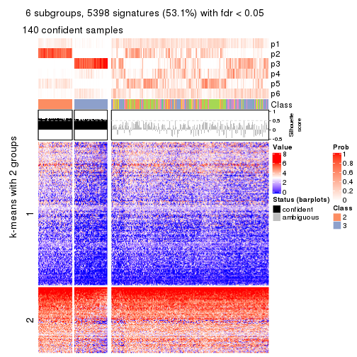</p>

</div>
</div>


Compare the overlap of signatures from different k:

```r
compare_signatures(res)
```


`get_signature()` returns a data frame invisibly. TO get the list of signatures, the function
call should be assigned to a variable explicitly. In following code, if `plot` argument is set
to `FALSE`, no heatmap is plotted while only the differential analysis is performed.

```r
# code only for demonstration
tb = get_signature(res, k = ..., plot = FALSE)
```

An example of the output of `tb` is:

```
#>   which_row         fdr    mean_1    mean_2 scaled_mean_1 scaled_mean_2 km
#> 1        38 0.042760348  8.373488  9.131774    -0.5533452     0.5164555  1
#> 2        40 0.018707592  7.106213  8.469186    -0.6173731     0.5762149  1
#> 3        55 0.019134737 10.221463 11.207825    -0.6159697     0.5749050  1
#> 4        59 0.006059896  5.921854  7.869574    -0.6899429     0.6439467  1
#> 5        60 0.018055526  8.928898 10.211722    -0.6204761     0.5791110  1
#> 6        98 0.009384629 15.714769 14.887706     0.6635654    -0.6193277  2
...
```

The columns in `tb` are:

1. `which_row`: row indices corresponding to the input matrix.
2. `fdr`: FDR for the differential test. 
3. `mean_x`: The mean value in group x.
4. `scaled_mean_x`: The mean value in group x after rows are scaled.
5. `km`: Row groups if k-means clustering is applied to rows.


UMAP plot which shows how samples are separated.


<script>
$( function() {
	$( '#tabs-CV-skmeans-dimension-reduction' ).tabs();
} );
</script>
<div id='tabs-CV-skmeans-dimension-reduction'>
<ul>
<li><a href='#tab-CV-skmeans-dimension-reduction-1'>k = 2</a></li>
<li><a href='#tab-CV-skmeans-dimension-reduction-2'>k = 3</a></li>
<li><a href='#tab-CV-skmeans-dimension-reduction-3'>k = 4</a></li>
<li><a href='#tab-CV-skmeans-dimension-reduction-4'>k = 5</a></li>
<li><a href='#tab-CV-skmeans-dimension-reduction-5'>k = 6</a></li>
</ul>
<div id='tab-CV-skmeans-dimension-reduction-1'>
<pre><code class="r">dimension_reduction(res, k = 2, method = &quot;UMAP&quot;)
</code></pre>

<p></p>

</div>
<div id='tab-CV-skmeans-dimension-reduction-2'>
<pre><code class="r">dimension_reduction(res, k = 3, method = &quot;UMAP&quot;)
</code></pre>

<p></p>

</div>
<div id='tab-CV-skmeans-dimension-reduction-3'>
<pre><code class="r">dimension_reduction(res, k = 4, method = &quot;UMAP&quot;)
</code></pre>

<p></p>

</div>
<div id='tab-CV-skmeans-dimension-reduction-4'>
<pre><code class="r">dimension_reduction(res, k = 5, method = &quot;UMAP&quot;)
</code></pre>

<p></p>

</div>
<div id='tab-CV-skmeans-dimension-reduction-5'>
<pre><code class="r">dimension_reduction(res, k = 6, method = &quot;UMAP&quot;)
</code></pre>

<p></p>

</div>
</div>


Following heatmap shows how subgroups are split when increasing `k`:

```r
collect_classes(res)
```


If matrix rows can be associated to genes, consider to use `functional_enrichment(res,
...)` to perform function enrichment for the signature genes. See [this vignette](http://bioconductor.org/packages/devel/bioc/vignettes/cola/inst/doc/functional_enrichment.html) for more detailed explanations.


 

---------------------------------------------------


### CV:pam


The object with results only for a single top-value method and a single partition method 
can be extracted as:

```r
res = res_list["CV", "pam"]
# you can also extract it by
# res = res_list["CV:pam"]
```

A summary of `res` and all the functions that can be applied to it:

```r
res
```

```
#> A 'ConsensusPartition' object with k = 2, 3, 4, 5, 6.
#>   On a matrix with 10169 rows and 459 columns.
#>   Top rows (1000, 2000, 3000, 4000, 5000) are extracted by 'CV' method.
#>   Subgroups are detected by 'pam' method.
#>   Performed in total 1250 partitions by row resampling.
#>   Best k for subgroups seems to be 3.
#> 
#> Following methods can be applied to this 'ConsensusPartition' object:
#>  [1] "cola_report"             "collect_classes"         "collect_plots"          
#>  [4] "collect_stats"           "colnames"                "compare_signatures"     
#>  [7] "consensus_heatmap"       "dimension_reduction"     "functional_enrichment"  
#> [10] "get_anno_col"            "get_anno"                "get_classes"            
#> [13] "get_consensus"           "get_matrix"              "get_membership"         
#> [16] "get_param"               "get_signatures"          "get_stats"              
#> [19] "is_best_k"               "is_stable_k"             "membership_heatmap"     
#> [22] "ncol"                    "nrow"                    "plot_ecdf"              
#> [25] "rownames"                "select_partition_number" "show"                   
#> [28] "suggest_best_k"          "test_to_known_factors"
```

`collect_plots()` function collects all the plots made from `res` for all `k` (number of partitions)
into one single page to provide an easy and fast comparison between different `k`.

```r
collect_plots(res)
```


The plots are:

- The first row: a plot of the ECDF (empirical cumulative distribution
  function) curves of the consensus matrix for each `k` and the heatmap of
  predicted classes for each `k`.
- The second row: heatmaps of the consensus matrix for each `k`.
- The third row: heatmaps of the membership matrix for each `k`.
- The fouth row: heatmaps of the signatures for each `k`.

All the plots in panels can be made by individual functions and they are
plotted later in this section.

`select_partition_number()` produces several plots showing different
statistics for choosing "optimized" `k`. There are following statistics:

- ECDF curves of the consensus matrix for each `k`;
- 1-PAC. [The PAC
  score](https://en.wikipedia.org/wiki/Consensus_clustering#Over-interpretation_potential_of_consensus_clustering)
  measures the proportion of the ambiguous subgrouping.
- Mean silhouette score.
- Concordance. The mean probability of fiting the consensus class ids in all
  partitions.
- Area increased. Denote $A_k$ as the area under the ECDF curve for current
  `k`, the area increased is defined as $A_k - A_{k-1}$.
- Rand index. The percent of pairs of samples that are both in a same cluster
  or both are not in a same cluster in the partition of k and k-1.
- Jaccard index. The ratio of pairs of samples are both in a same cluster in
  the partition of k and k-1 and the pairs of samples are both in a same
  cluster in the partition k or k-1.

The detailed explanations of these statistics can be found in [the _cola_
vignette](http://bioconductor.org/packages/devel/bioc/vignettes/cola/inst/doc/cola.html#toc_13).

Generally speaking, lower PAC score, higher mean silhouette score or higher
concordance corresponds to better partition. Rand index and Jaccard index
measure how similar the current partition is compared to partition with `k-1`.
If they are too similar, we won't accept `k` is better than `k-1`.

```r
select_partition_number(res)
```


The numeric values for all these statistics can be obtained by `get_stats()`.

```r
get_stats(res)
```

```
#>   k 1-PAC mean_silhouette concordance area_increased  Rand Jaccard
#> 2 2 0.159           0.546       0.751         0.3731 0.540   0.540
#> 3 3 0.121           0.441       0.687         0.4416 0.562   0.396
#> 4 4 0.171           0.376       0.651         0.1203 0.801   0.615
#> 5 5 0.195           0.365       0.637         0.0543 0.973   0.929
#> 6 6 0.208           0.333       0.629         0.0242 0.976   0.934
```

`suggest_best_k()` suggests the best $k$ based on these statistics. The rules are as follows:

- All $k$ with Jaccard index larger than 0.95 are removed because increasing
  $k$ does not provide enough extra information. If all $k$ are removed, it is
  marked as no subgroup is detected.
- For all $k$ with 1-PAC score larger than 0.9, the maximal $k$ is taken as
  the best $k$, and other $k$ are marked as optional $k$.
- If it does not fit the second rule. The $k$ with the maximal vote of the
  highest 1-PAC score, highest mean silhouette, and highest concordance is
  taken as the best $k$.

```r
suggest_best_k(res)
```

```
#> [1] 3
```


Following shows the table of the partitions (You need to click the **show/hide
code output** link to see it). The membership matrix (columns with name `p*`)
is inferred by
[`clue::cl_consensus()`](https://www.rdocumentation.org/link/cl_consensus?package=clue)
function with the `SE` method. Basically the value in the membership matrix
represents the probability to belong to a certain group. The finall class
label for an item is determined with the group with highest probability it
belongs to.

In `get_classes()` function, the entropy is calculated from the membership
matrix and the silhouette score is calculated from the consensus matrix.


<script>
$( function() {
	$( '#tabs-CV-pam-get-classes' ).tabs();
} );
</script>
<div id='tabs-CV-pam-get-classes'>
<ul>
<li><a href='#tab-CV-pam-get-classes-1'>k = 2</a></li>
<li><a href='#tab-CV-pam-get-classes-2'>k = 3</a></li>
<li><a href='#tab-CV-pam-get-classes-3'>k = 4</a></li>
<li><a href='#tab-CV-pam-get-classes-4'>k = 5</a></li>
<li><a href='#tab-CV-pam-get-classes-5'>k = 6</a></li>
</ul>

<div id='tab-CV-pam-get-classes-1'>
<p><a id='tab-CV-pam-get-classes-1-a' style='color:#0366d6' href='#'>show/hide code output</a></p>
<pre><code class="r">cbind(get_classes(res, k = 2), get_membership(res, k = 2))
</code></pre>

<pre><code>#&gt;            class entropy silhouette    p1    p2
#&gt; SRR1699874     2  0.4431    0.65357 0.092 0.908
#&gt; SRR1699875     2  0.6887    0.61181 0.184 0.816
#&gt; SRR1699876     2  0.2423    0.63668 0.040 0.960
#&gt; SRR1699877     2  0.7299    0.63494 0.204 0.796
#&gt; SRR1699879     2  0.4431    0.65235 0.092 0.908
#&gt; SRR1699878     2  0.0672    0.64765 0.008 0.992
#&gt; SRR1699880     1  0.6887    0.77347 0.816 0.184
#&gt; SRR1699881     1  0.9491    0.72529 0.632 0.368
#&gt; SRR1699882     2  0.2778    0.65561 0.048 0.952
#&gt; SRR1699883     2  0.7139    0.60585 0.196 0.804
#&gt; SRR1699884     2  0.7376    0.59733 0.208 0.792
#&gt; SRR1699885     2  0.4562    0.61161 0.096 0.904
#&gt; SRR1699886     2  0.6973    0.61110 0.188 0.812
#&gt; SRR1699888     2  0.2043    0.64896 0.032 0.968
#&gt; SRR1699889     2  0.8207    0.53176 0.256 0.744
#&gt; SRR1699890     2  0.6887    0.53049 0.184 0.816
#&gt; SRR1699887     2  0.6048    0.56328 0.148 0.852
#&gt; SRR1699891     2  0.3879    0.62865 0.076 0.924
#&gt; SRR1699892     2  0.9754    0.14495 0.408 0.592
#&gt; SRR1699893     2  0.9580    0.24060 0.380 0.620
#&gt; SRR1699894     2  0.5059    0.59683 0.112 0.888
#&gt; SRR1699895     2  0.2948    0.63826 0.052 0.948
#&gt; SRR1699896     2  0.9460    0.28228 0.364 0.636
#&gt; SRR1699897     2  0.9608    0.22203 0.384 0.616
#&gt; SRR1699898     1  0.6973    0.77340 0.812 0.188
#&gt; SRR1699900     1  0.9754    0.65630 0.592 0.408
#&gt; SRR1699899     2  0.7745    0.57396 0.228 0.772
#&gt; SRR1699902     1  0.8661    0.76884 0.712 0.288
#&gt; SRR1699901     1  0.6887    0.77347 0.816 0.184
#&gt; SRR1699903     2  0.9635    0.19563 0.388 0.612
#&gt; SRR1699904     2  0.2778    0.63910 0.048 0.952
#&gt; SRR1699905     1  0.6973    0.77366 0.812 0.188
#&gt; SRR1699906     2  0.5629    0.57982 0.132 0.868
#&gt; SRR1699907     2  0.7602    0.57922 0.220 0.780
#&gt; SRR1699908     2  0.8144    0.53776 0.252 0.748
#&gt; SRR1699909     2  0.9608    0.22677 0.384 0.616
#&gt; SRR1699910     1  0.9922    0.55820 0.552 0.448
#&gt; SRR1699911     2  0.7219    0.60256 0.200 0.800
#&gt; SRR1699912     2  0.4022    0.65473 0.080 0.920
#&gt; SRR1699913     2  0.5519    0.58924 0.128 0.872
#&gt; SRR1699914     1  0.7056    0.77356 0.808 0.192
#&gt; SRR1699915     2  0.9635    0.18720 0.388 0.612
#&gt; SRR1699916     2  0.4431    0.65407 0.092 0.908
#&gt; SRR1699917     2  0.6887    0.64625 0.184 0.816
#&gt; SRR1699918     2  0.7745    0.57026 0.228 0.772
#&gt; SRR1699919     2  0.7376    0.60234 0.208 0.792
#&gt; SRR1699920     1  0.9977    0.46132 0.528 0.472
#&gt; SRR1699921     2  0.9427    0.29368 0.360 0.640
#&gt; SRR1699922     2  0.6438    0.62544 0.164 0.836
#&gt; SRR1699923     1  0.8499    0.77191 0.724 0.276
#&gt; SRR1699924     1  0.9608    0.69722 0.616 0.384
#&gt; SRR1699925     1  0.6887    0.77347 0.816 0.184
#&gt; SRR1699926     2  1.0000   -0.35563 0.496 0.504
#&gt; SRR1699927     2  0.4022    0.63613 0.080 0.920
#&gt; SRR1699929     2  0.9983   -0.22291 0.476 0.524
#&gt; SRR1699928     2  0.3733    0.65500 0.072 0.928
#&gt; SRR1699930     2  0.6531    0.55254 0.168 0.832
#&gt; SRR1699931     2  0.9775    0.12699 0.412 0.588
#&gt; SRR1699933     1  0.9815    0.64626 0.580 0.420
#&gt; SRR1699932     2  0.7602    0.58354 0.220 0.780
#&gt; SRR1699934     1  0.7056    0.77356 0.808 0.192
#&gt; SRR1699935     2  0.8327    0.52953 0.264 0.736
#&gt; SRR1699936     2  0.6973    0.53420 0.188 0.812
#&gt; SRR1699937     2  0.7674    0.58195 0.224 0.776
#&gt; SRR1699938     2  0.4815    0.60210 0.104 0.896
#&gt; SRR1699940     1  0.9795    0.65531 0.584 0.416
#&gt; SRR1699939     2  0.2948    0.64449 0.052 0.948
#&gt; SRR1699941     1  0.9491    0.72462 0.632 0.368
#&gt; SRR1699942     2  0.5519    0.64152 0.128 0.872
#&gt; SRR1699943     2  0.6438    0.62738 0.164 0.836
#&gt; SRR1699944     2  0.6623    0.61986 0.172 0.828
#&gt; SRR1699945     1  0.7219    0.77832 0.800 0.200
#&gt; SRR1699946     2  0.8861    0.45828 0.304 0.696
#&gt; SRR1699947     2  0.7883    0.56928 0.236 0.764
#&gt; SRR1699948     2  0.1843    0.65111 0.028 0.972
#&gt; SRR1699949     2  0.5408    0.58253 0.124 0.876
#&gt; SRR1699950     2  0.3114    0.62580 0.056 0.944
#&gt; SRR1699951     2  0.7883    0.60751 0.236 0.764
#&gt; SRR1699952     2  0.8763    0.46437 0.296 0.704
#&gt; SRR1699953     2  0.2423    0.63295 0.040 0.960
#&gt; SRR1699954     2  0.9963   -0.19843 0.464 0.536
#&gt; SRR1699955     2  0.7056    0.53027 0.192 0.808
#&gt; SRR1699956     1  0.6887    0.77347 0.816 0.184
#&gt; SRR1699957     2  0.3274    0.65560 0.060 0.940
#&gt; SRR1699959     2  0.9909   -0.06158 0.444 0.556
#&gt; SRR1699958     2  0.7453    0.58736 0.212 0.788
#&gt; SRR1699960     2  0.6438    0.54910 0.164 0.836
#&gt; SRR1699961     1  0.8955    0.75838 0.688 0.312
#&gt; SRR1699962     2  0.2236    0.64930 0.036 0.964
#&gt; SRR1699963     2  0.7528    0.58353 0.216 0.784
#&gt; SRR1699964     2  0.7602    0.58635 0.220 0.780
#&gt; SRR1699965     2  0.6887    0.53423 0.184 0.816
#&gt; SRR1699966     2  0.9909   -0.03764 0.444 0.556
#&gt; SRR1699967     2  0.6801    0.62019 0.180 0.820
#&gt; SRR1699968     2  0.7139    0.60815 0.196 0.804
#&gt; SRR1699969     1  0.6973    0.77340 0.812 0.188
#&gt; SRR1699971     1  0.9661    0.69653 0.608 0.392
#&gt; SRR1699970     2  0.5294    0.58564 0.120 0.880
#&gt; SRR1699972     1  0.9795    0.64701 0.584 0.416
#&gt; SRR1699973     2  0.8144    0.54836 0.252 0.748
#&gt; SRR1699974     1  0.6887    0.77347 0.816 0.184
#&gt; SRR1699975     2  0.9754    0.11229 0.408 0.592
#&gt; SRR1699976     2  0.9866   -0.01058 0.432 0.568
#&gt; SRR1699977     2  0.9983   -0.27054 0.476 0.524
#&gt; SRR1699978     1  0.7056    0.77356 0.808 0.192
#&gt; SRR1699979     1  0.9815    0.64603 0.580 0.420
#&gt; SRR1699980     2  0.6801    0.61675 0.180 0.820
#&gt; SRR1699981     1  0.9323    0.73676 0.652 0.348
#&gt; SRR1699982     2  0.1414    0.64565 0.020 0.980
#&gt; SRR1699983     2  0.2603    0.65471 0.044 0.956
#&gt; SRR1699984     1  0.7056    0.77356 0.808 0.192
#&gt; SRR1699985     2  0.5946    0.64443 0.144 0.856
#&gt; SRR1699986     1  0.7056    0.77356 0.808 0.192
#&gt; SRR1699988     2  0.7883    0.55971 0.236 0.764
#&gt; SRR1699987     1  0.9686    0.69079 0.604 0.396
#&gt; SRR1699989     2  0.8813    0.44620 0.300 0.700
#&gt; SRR1699990     1  0.9775    0.65575 0.588 0.412
#&gt; SRR1699992     1  0.9993    0.44319 0.516 0.484
#&gt; SRR1699991     1  0.9754    0.66455 0.592 0.408
#&gt; SRR1699993     1  0.9635    0.70241 0.612 0.388
#&gt; SRR1699994     1  0.6887    0.77347 0.816 0.184
#&gt; SRR1699995     1  0.7056    0.77356 0.808 0.192
#&gt; SRR1699996     2  0.9129    0.38560 0.328 0.672
#&gt; SRR1699997     2  0.9580    0.23881 0.380 0.620
#&gt; SRR1699998     2  0.8499    0.49633 0.276 0.724
#&gt; SRR1699999     1  0.6887    0.77347 0.816 0.184
#&gt; SRR1700000     1  0.9998    0.40840 0.508 0.492
#&gt; SRR1700002     2  0.9732    0.12947 0.404 0.596
#&gt; SRR1700001     1  0.9129    0.75363 0.672 0.328
#&gt; SRR1700003     2  0.9460    0.26436 0.364 0.636
#&gt; SRR1700004     1  0.9393    0.73621 0.644 0.356
#&gt; SRR1700005     1  0.6887    0.77347 0.816 0.184
#&gt; SRR1700006     1  0.9815    0.63797 0.580 0.420
#&gt; SRR1700007     2  0.6712    0.54532 0.176 0.824
#&gt; SRR1700008     1  0.9552    0.71799 0.624 0.376
#&gt; SRR1700009     1  0.7056    0.77356 0.808 0.192
#&gt; SRR1700010     1  0.6887    0.77347 0.816 0.184
#&gt; SRR1700011     2  0.4298    0.61364 0.088 0.912
#&gt; SRR1700013     2  0.9580    0.22557 0.380 0.620
#&gt; SRR1700012     2  0.9608    0.21187 0.384 0.616
#&gt; SRR1700014     1  0.9866    0.59749 0.568 0.432
#&gt; SRR1700015     2  0.9850    0.03014 0.428 0.572
#&gt; SRR1700016     1  0.7056    0.77356 0.808 0.192
#&gt; SRR1700018     2  0.9996   -0.28616 0.488 0.512
#&gt; SRR1700017     1  0.9754    0.65555 0.592 0.408
#&gt; SRR1700019     2  0.4022    0.65618 0.080 0.920
#&gt; SRR1700020     1  0.6887    0.77347 0.816 0.184
#&gt; SRR1700021     2  0.6973    0.61641 0.188 0.812
#&gt; SRR1700023     2  0.9815    0.05230 0.420 0.580
#&gt; SRR1700022     1  0.9248    0.74563 0.660 0.340
#&gt; SRR1700024     2  0.6438    0.62463 0.164 0.836
#&gt; SRR1700025     2  0.9850    0.04839 0.428 0.572
#&gt; SRR1700026     2  0.9795    0.07323 0.416 0.584
#&gt; SRR1700027     2  0.9933   -0.09001 0.452 0.548
#&gt; SRR1700028     2  0.9635    0.22486 0.388 0.612
#&gt; SRR1700029     1  0.9933    0.53534 0.548 0.452
#&gt; SRR1700030     2  0.7815    0.56982 0.232 0.768
#&gt; SRR1700031     1  0.6887    0.77347 0.816 0.184
#&gt; SRR1700032     2  0.7815    0.56507 0.232 0.768
#&gt; SRR1700034     1  0.7056    0.77356 0.808 0.192
#&gt; SRR1700035     2  0.7056    0.63604 0.192 0.808
#&gt; SRR1700033     1  0.6973    0.77562 0.812 0.188
#&gt; SRR1700036     2  0.9000    0.43687 0.316 0.684
#&gt; SRR1700037     2  0.3114    0.62910 0.056 0.944
#&gt; SRR1700038     2  0.9983   -0.26403 0.476 0.524
#&gt; SRR1700039     1  0.6973    0.77565 0.812 0.188
#&gt; SRR1700040     1  0.7528    0.77994 0.784 0.216
#&gt; SRR1700041     1  0.9522    0.71304 0.628 0.372
#&gt; SRR1700042     1  0.6887    0.77347 0.816 0.184
#&gt; SRR1700043     1  0.9129    0.75558 0.672 0.328
#&gt; SRR1700045     1  0.9635    0.69823 0.612 0.388
#&gt; SRR1700044     2  0.7950    0.55503 0.240 0.760
#&gt; SRR1700046     1  0.9850    0.60816 0.572 0.428
#&gt; SRR1700047     1  0.7219    0.77705 0.800 0.200
#&gt; SRR1700048     1  0.9909    0.56123 0.556 0.444
#&gt; SRR1700049     1  0.6887    0.77347 0.816 0.184
#&gt; SRR1700050     1  0.6887    0.77347 0.816 0.184
#&gt; SRR1700051     1  0.6887    0.77347 0.816 0.184
#&gt; SRR1700052     1  0.6973    0.77366 0.812 0.188
#&gt; SRR1700053     2  0.9933   -0.08582 0.452 0.548
#&gt; SRR1700054     1  0.9881    0.58526 0.564 0.436
#&gt; SRR1700055     1  0.6887    0.77347 0.816 0.184
#&gt; SRR1700056     1  0.9087    0.75745 0.676 0.324
#&gt; SRR1700057     1  0.8713    0.76749 0.708 0.292
#&gt; SRR1700058     1  0.7056    0.77356 0.808 0.192
#&gt; SRR1700059     1  0.9866    0.59962 0.568 0.432
#&gt; SRR1700060     1  0.7056    0.77356 0.808 0.192
#&gt; SRR1700061     1  0.9635    0.69801 0.612 0.388
#&gt; SRR1700062     1  0.7056    0.77356 0.808 0.192
#&gt; SRR1700063     1  0.7745    0.77872 0.772 0.228
#&gt; SRR1700064     2  0.9998   -0.31839 0.492 0.508
#&gt; SRR1700065     1  0.8443    0.77258 0.728 0.272
#&gt; SRR1700066     1  0.6887    0.77347 0.816 0.184
#&gt; SRR1700067     2  0.3733    0.65584 0.072 0.928
#&gt; SRR1700068     1  0.9522    0.71799 0.628 0.372
#&gt; SRR1700069     2  0.9209    0.43977 0.336 0.664
#&gt; SRR1700070     2  0.5294    0.64778 0.120 0.880
#&gt; SRR1700071     2  0.9775    0.11131 0.412 0.588
#&gt; SRR1700072     1  0.9993    0.41027 0.516 0.484
#&gt; SRR1700073     2  0.7453    0.59472 0.212 0.788
#&gt; SRR1700075     1  0.9732    0.67854 0.596 0.404
#&gt; SRR1700074     1  0.9635    0.69169 0.612 0.388
#&gt; SRR1700076     2  0.9087    0.39180 0.324 0.676
#&gt; SRR1700077     1  0.9732    0.67819 0.596 0.404
#&gt; SRR1700078     1  0.9996    0.39418 0.512 0.488
#&gt; SRR1700080     2  0.9815    0.07193 0.420 0.580
#&gt; SRR1700079     1  0.7139    0.77803 0.804 0.196
#&gt; SRR1700081     1  0.7056    0.77356 0.808 0.192
#&gt; SRR1700082     1  0.8499    0.77155 0.724 0.276
#&gt; SRR1700083     1  0.7139    0.77562 0.804 0.196
#&gt; SRR1700084     1  0.6887    0.77347 0.816 0.184
#&gt; SRR1700085     2  0.1633    0.65182 0.024 0.976
#&gt; SRR1700086     2  0.8499    0.49645 0.276 0.724
#&gt; SRR1700087     1  0.9909    0.57265 0.556 0.444
#&gt; SRR1700088     2  0.9775    0.11131 0.412 0.588
#&gt; SRR1700089     2  0.9944   -0.15415 0.456 0.544
#&gt; SRR1700091     2  0.9491    0.29189 0.368 0.632
#&gt; SRR1700090     1  0.9970    0.47898 0.532 0.468
#&gt; SRR1700092     2  0.7674    0.58231 0.224 0.776
#&gt; SRR1700094     2  0.9850    0.04909 0.428 0.572
#&gt; SRR1700093     2  1.0000   -0.36042 0.496 0.504
#&gt; SRR1700095     1  0.9635    0.69738 0.612 0.388
#&gt; SRR1700096     1  0.9732    0.66360 0.596 0.404
#&gt; SRR1700097     1  0.7528    0.77976 0.784 0.216
#&gt; SRR1700098     2  0.9552    0.25200 0.376 0.624
#&gt; SRR1700099     2  0.9460    0.29799 0.364 0.636
#&gt; SRR1700100     2  0.9970   -0.23492 0.468 0.532
#&gt; SRR1700101     2  0.9635    0.21188 0.388 0.612
#&gt; SRR1700102     2  0.8955    0.44081 0.312 0.688
#&gt; SRR1700104     2  0.9833    0.07013 0.424 0.576
#&gt; SRR1700103     1  0.9754    0.65604 0.592 0.408
#&gt; SRR1700105     2  0.9710    0.14793 0.400 0.600
#&gt; SRR1700106     2  0.9754    0.14463 0.408 0.592
#&gt; SRR1700107     2  0.9170    0.38964 0.332 0.668
#&gt; SRR1700108     2  0.9248    0.36892 0.340 0.660
#&gt; SRR1700109     2  0.2603    0.64374 0.044 0.956
#&gt; SRR1700110     2  0.3114    0.63916 0.056 0.944
#&gt; SRR1700112     2  0.6438    0.63942 0.164 0.836
#&gt; SRR1700111     2  0.9732    0.13833 0.404 0.596
#&gt; SRR1700113     2  0.6887    0.63061 0.184 0.816
#&gt; SRR1700114     2  0.9954   -0.13612 0.460 0.540
#&gt; SRR1700115     2  0.7602    0.60756 0.220 0.780
#&gt; SRR1700116     1  0.9795    0.65421 0.584 0.416
#&gt; SRR1700117     1  0.7376    0.77877 0.792 0.208
#&gt; SRR1700119     1  0.9998    0.37566 0.508 0.492
#&gt; SRR1700118     2  0.9635    0.19619 0.388 0.612
#&gt; SRR1700120     1  0.7745    0.77995 0.772 0.228
#&gt; SRR1700121     2  0.9522    0.26607 0.372 0.628
#&gt; SRR1700122     2  0.6712    0.64508 0.176 0.824
#&gt; SRR1700123     1  0.9866    0.59778 0.568 0.432
#&gt; SRR1700125     2  0.4161    0.65456 0.084 0.916
#&gt; SRR1700126     1  0.7674    0.77987 0.776 0.224
#&gt; SRR1700127     1  0.9129    0.75362 0.672 0.328
#&gt; SRR1700124     1  0.9881    0.58571 0.564 0.436
#&gt; SRR1700128     1  0.9661    0.68537 0.608 0.392
#&gt; SRR1700129     2  0.7602    0.57918 0.220 0.780
#&gt; SRR1700130     2  0.9393    0.32194 0.356 0.644
#&gt; SRR1700132     1  0.9129    0.75373 0.672 0.328
#&gt; SRR1700131     1  0.6887    0.77347 0.816 0.184
#&gt; SRR1700133     2  0.9850    0.04852 0.428 0.572
#&gt; SRR1700134     2  0.7674    0.58229 0.224 0.776
#&gt; SRR1700135     1  0.9460    0.72193 0.636 0.364
#&gt; SRR1700136     1  0.7056    0.77356 0.808 0.192
#&gt; SRR1700137     1  0.9993    0.44371 0.516 0.484
#&gt; SRR1700138     1  0.9661    0.69653 0.608 0.392
#&gt; SRR1700140     1  0.9795    0.64784 0.584 0.416
#&gt; SRR1700139     1  0.9944    0.53758 0.544 0.456
#&gt; SRR1700141     2  0.5519    0.65306 0.128 0.872
#&gt; SRR1700142     1  0.7602    0.77996 0.780 0.220
#&gt; SRR1700143     1  0.9044    0.75933 0.680 0.320
#&gt; SRR1700144     1  0.9580    0.71372 0.620 0.380
#&gt; SRR1700145     1  0.9608    0.69847 0.616 0.384
#&gt; SRR1700146     2  0.3733    0.61705 0.072 0.928
#&gt; SRR1700147     1  0.9170    0.74846 0.668 0.332
#&gt; SRR1700149     1  0.6887    0.77347 0.816 0.184
#&gt; SRR1700148     1  0.9358    0.73688 0.648 0.352
#&gt; SRR1700150     2  0.9635    0.22370 0.388 0.612
#&gt; SRR1700152     1  0.9754    0.65555 0.592 0.408
#&gt; SRR1700151     1  0.9044    0.75564 0.680 0.320
#&gt; SRR1700153     1  0.8813    0.76557 0.700 0.300
#&gt; SRR1700154     1  0.9686    0.69081 0.604 0.396
#&gt; SRR1700155     2  0.9909   -0.06336 0.444 0.556
#&gt; SRR1700156     1  0.7674    0.78017 0.776 0.224
#&gt; SRR1700158     1  0.7056    0.77356 0.808 0.192
#&gt; SRR1700159     2  0.2236    0.64117 0.036 0.964
#&gt; SRR1700157     1  0.7674    0.77983 0.776 0.224
#&gt; SRR1700160     1  0.9522    0.71309 0.628 0.372
#&gt; SRR1700161     1  0.9427    0.72592 0.640 0.360
#&gt; SRR1700162     2  0.2778    0.65065 0.048 0.952
#&gt; SRR1700164     1  0.8144    0.77733 0.748 0.252
#&gt; SRR1700163     1  0.7056    0.77356 0.808 0.192
#&gt; SRR1700165     1  0.8386    0.77336 0.732 0.268
#&gt; SRR1700166     2  0.9909   -0.08962 0.444 0.556
#&gt; SRR1700168     2  0.4939    0.63893 0.108 0.892
#&gt; SRR1700167     1  0.7528    0.77973 0.784 0.216
#&gt; SRR1700170     2  0.9661    0.19562 0.392 0.608
#&gt; SRR1700169     1  0.9608    0.69798 0.616 0.384
#&gt; SRR1700171     1  0.9427    0.73025 0.640 0.360
#&gt; SRR1700172     2  0.9896   -0.01980 0.440 0.560
#&gt; SRR1700174     2  0.9881    0.00446 0.436 0.564
#&gt; SRR1700173     2  0.9732    0.13042 0.404 0.596
#&gt; SRR1700175     2  0.9661    0.18109 0.392 0.608
#&gt; SRR1700176     1  0.7056    0.77356 0.808 0.192
#&gt; SRR1700178     2  0.3114    0.63435 0.056 0.944
#&gt; SRR1700177     1  0.9970    0.47655 0.532 0.468
#&gt; SRR1700180     2  0.5178    0.58849 0.116 0.884
#&gt; SRR1700179     2  0.5294    0.59153 0.120 0.880
#&gt; SRR1700181     2  0.6247    0.56328 0.156 0.844
#&gt; SRR1700183     1  0.6887    0.77347 0.816 0.184
#&gt; SRR1700182     2  0.6343    0.55295 0.160 0.840
#&gt; SRR1700184     2  0.2423    0.65347 0.040 0.960
#&gt; SRR1700186     2  0.7528    0.58799 0.216 0.784
#&gt; SRR1700187     1  0.7056    0.77356 0.808 0.192
#&gt; SRR1700185     1  0.7056    0.77356 0.808 0.192
#&gt; SRR1700188     2  0.1633    0.64494 0.024 0.976
#&gt; SRR1700192     2  0.9795    0.07390 0.416 0.584
#&gt; SRR1700190     1  0.6887    0.77347 0.816 0.184
#&gt; SRR1700191     1  0.6887    0.77347 0.816 0.184
#&gt; SRR1700189     1  0.9635    0.69842 0.612 0.388
#&gt; SRR1700193     2  0.2603    0.65436 0.044 0.956
#&gt; SRR1700195     2  0.5629    0.64149 0.132 0.868
#&gt; SRR1700194     1  0.7056    0.77356 0.808 0.192
#&gt; SRR1700196     2  0.3114    0.62552 0.056 0.944
#&gt; SRR1700197     1  0.6887    0.77347 0.816 0.184
#&gt; SRR1700198     2  0.3733    0.65498 0.072 0.928
#&gt; SRR1700199     2  0.4298    0.65355 0.088 0.912
#&gt; SRR1700200     2  0.1414    0.64712 0.020 0.980
#&gt; SRR1700201     2  0.6973    0.53057 0.188 0.812
#&gt; SRR1700202     2  0.7602    0.58706 0.220 0.780
#&gt; SRR1700203     2  0.5408    0.59425 0.124 0.876
#&gt; SRR1700204     2  0.5294    0.64666 0.120 0.880
#&gt; SRR1700206     2  0.8207    0.53183 0.256 0.744
#&gt; SRR1700207     2  0.6887    0.53447 0.184 0.816
#&gt; SRR1700208     1  0.9988    0.42612 0.520 0.480
#&gt; SRR1700205     2  0.1184    0.64644 0.016 0.984
#&gt; SRR1700209     2  0.4939    0.60501 0.108 0.892
#&gt; SRR1700210     2  0.4298    0.63306 0.088 0.912
#&gt; SRR1700211     2  0.5629    0.64636 0.132 0.868
#&gt; SRR1700212     2  0.6148    0.63499 0.152 0.848
#&gt; SRR1700213     2  0.7528    0.59458 0.216 0.784
#&gt; SRR1700214     2  0.2948    0.65026 0.052 0.948
#&gt; SRR1700215     1  0.7056    0.77356 0.808 0.192
#&gt; SRR1700217     2  0.3114    0.65501 0.056 0.944
#&gt; SRR1700216     1  0.6973    0.77340 0.812 0.188
#&gt; SRR1700218     2  0.8499    0.50515 0.276 0.724
#&gt; SRR1700219     2  0.7056    0.53027 0.192 0.808
#&gt; SRR1700222     1  0.6973    0.77366 0.812 0.188
#&gt; SRR1700220     2  0.6712    0.54543 0.176 0.824
#&gt; SRR1700221     2  0.2603    0.65278 0.044 0.956
#&gt; SRR1700223     2  0.5059    0.60236 0.112 0.888
#&gt; SRR1700224     2  0.6887    0.61214 0.184 0.816
#&gt; SRR1700226     2  0.3733    0.62138 0.072 0.928
#&gt; SRR1700229     2  0.2236    0.65282 0.036 0.964
#&gt; SRR1700225     2  0.6712    0.62326 0.176 0.824
#&gt; SRR1700227     2  0.3431    0.64840 0.064 0.936
#&gt; SRR1700230     1  0.7056    0.77616 0.808 0.192
#&gt; SRR1700231     2  0.4562    0.65120 0.096 0.904
#&gt; SRR1700228     2  0.8267    0.52828 0.260 0.740
#&gt; SRR1700232     2  0.4939    0.59979 0.108 0.892
#&gt; SRR1700233     2  0.4939    0.65309 0.108 0.892
#&gt; SRR1700234     2  0.3431    0.65462 0.064 0.936
#&gt; SRR1700235     2  0.9286    0.36010 0.344 0.656
#&gt; SRR1700237     2  0.4690    0.65214 0.100 0.900
#&gt; SRR1700236     2  0.1633    0.64623 0.024 0.976
#&gt; SRR1700238     2  0.4431    0.60753 0.092 0.908
#&gt; SRR1700239     1  0.7056    0.77356 0.808 0.192
#&gt; SRR1700240     1  0.6973    0.77366 0.812 0.188
#&gt; SRR1700241     1  0.9686    0.69113 0.604 0.396
#&gt; SRR1700243     2  0.6048    0.63762 0.148 0.852
#&gt; SRR1700244     2  0.6531    0.63105 0.168 0.832
#&gt; SRR1700242     2  0.9775    0.11131 0.412 0.588
#&gt; SRR1700246     2  0.5842    0.64044 0.140 0.860
#&gt; SRR1700245     2  0.6148    0.56653 0.152 0.848
#&gt; SRR1700247     1  0.7056    0.77356 0.808 0.192
#&gt; SRR1700249     1  0.6887    0.77347 0.816 0.184
#&gt; SRR1700250     2  0.4431    0.64566 0.092 0.908
#&gt; SRR1700248     2  0.5946    0.63621 0.144 0.856
#&gt; SRR1700251     2  0.6148    0.56321 0.152 0.848
#&gt; SRR1700252     1  0.9983    0.44381 0.524 0.476
#&gt; SRR1700253     2  0.6623    0.54550 0.172 0.828
#&gt; SRR1700256     2  0.4815    0.65268 0.104 0.896
#&gt; SRR1700254     1  0.7453    0.77936 0.788 0.212
#&gt; SRR1700255     2  0.6801    0.53807 0.180 0.820
#&gt; SRR1700257     2  0.4562    0.60723 0.096 0.904
#&gt; SRR1700258     2  0.4815    0.60154 0.104 0.896
#&gt; SRR1700259     2  0.6973    0.53418 0.188 0.812
#&gt; SRR1700260     2  0.3431    0.64612 0.064 0.936
#&gt; SRR1700261     2  0.5946    0.57515 0.144 0.856
#&gt; SRR1700262     2  0.5737    0.57949 0.136 0.864
#&gt; SRR1700263     2  0.6148    0.63247 0.152 0.848
#&gt; SRR1700264     2  0.4690    0.61379 0.100 0.900
#&gt; SRR1700265     2  0.9552    0.24108 0.376 0.624
#&gt; SRR1700266     2  0.4562    0.60507 0.096 0.904
#&gt; SRR1700268     1  0.9977    0.47515 0.528 0.472
#&gt; SRR1700270     2  0.3584    0.65452 0.068 0.932
#&gt; SRR1700267     2  0.6247    0.55591 0.156 0.844
#&gt; SRR1700271     2  0.5294    0.59669 0.120 0.880
#&gt; SRR1700272     2  0.6887    0.53790 0.184 0.816
#&gt; SRR1700273     2  0.5178    0.65100 0.116 0.884
#&gt; SRR1700274     2  0.1414    0.65130 0.020 0.980
#&gt; SRR1700277     1  0.8955    0.75873 0.688 0.312
#&gt; SRR1700275     2  0.5519    0.62849 0.128 0.872
#&gt; SRR1700276     2  0.4690    0.60999 0.100 0.900
#&gt; SRR1700278     2  0.9044    0.41207 0.320 0.680
#&gt; SRR1700279     2  0.4298    0.62433 0.088 0.912
#&gt; SRR1700280     2  0.3733    0.65547 0.072 0.928
#&gt; SRR1700281     2  0.4022    0.65565 0.080 0.920
#&gt; SRR1700283     2  0.5629    0.57580 0.132 0.868
#&gt; SRR1700282     2  0.9993   -0.30061 0.484 0.516
#&gt; SRR1700284     2  0.6247    0.61012 0.156 0.844
#&gt; SRR1700285     2  0.9286    0.35924 0.344 0.656
#&gt; SRR1700286     2  0.2043    0.65371 0.032 0.968
#&gt; SRR1700287     2  0.6048    0.57797 0.148 0.852
#&gt; SRR1700290     1  0.7056    0.77356 0.808 0.192
#&gt; SRR1700289     2  0.3879    0.65477 0.076 0.924
#&gt; SRR1700288     2  0.5519    0.64946 0.128 0.872
#&gt; SRR1700292     2  0.6048    0.56907 0.148 0.852
#&gt; SRR1700291     2  0.8955    0.44112 0.312 0.688
#&gt; SRR1700293     2  0.7056    0.60672 0.192 0.808
#&gt; SRR1700294     2  0.4815    0.59722 0.104 0.896
#&gt; SRR1700295     2  0.9850    0.00847 0.428 0.572
#&gt; SRR1700297     2  0.7453    0.62485 0.212 0.788
#&gt; SRR1700296     2  0.6247    0.55651 0.156 0.844
#&gt; SRR1700298     2  0.8608    0.48986 0.284 0.716
#&gt; SRR1700299     2  0.9393    0.31458 0.356 0.644
#&gt; SRR1700300     2  0.9775    0.12721 0.412 0.588
#&gt; SRR1700302     2  0.6712    0.59728 0.176 0.824
#&gt; SRR1700301     2  0.5946    0.56941 0.144 0.856
#&gt; SRR1700303     2  0.6148    0.55941 0.152 0.848
#&gt; SRR1700304     2  0.5737    0.57246 0.136 0.864
#&gt; SRR1700305     2  0.4815    0.65123 0.104 0.896
#&gt; SRR1700306     2  0.9970   -0.17258 0.468 0.532
#&gt; SRR1700308     2  0.9427    0.31417 0.360 0.640
#&gt; SRR1700307     1  0.9881    0.60622 0.564 0.436
#&gt; SRR1700309     1  0.9608    0.69722 0.616 0.384
#&gt; SRR1700310     2  0.5737    0.57228 0.136 0.864
#&gt; SRR1700311     2  0.9710    0.14761 0.400 0.600
#&gt; SRR1700312     2  0.8909    0.43255 0.308 0.692
#&gt; SRR1700313     2  0.9710    0.14806 0.400 0.600
#&gt; SRR1700314     2  0.9977   -0.20232 0.472 0.528
#&gt; SRR1700315     2  0.9608    0.21205 0.384 0.616
#&gt; SRR1700316     2  0.9754    0.11229 0.408 0.592
#&gt; SRR1700317     2  0.4161    0.62288 0.084 0.916
#&gt; SRR1700318     2  0.6801    0.61397 0.180 0.820
#&gt; SRR1700319     1  0.9963    0.51962 0.536 0.464
#&gt; SRR1700320     2  0.4298    0.65201 0.088 0.912
#&gt; SRR1700322     2  0.7219    0.59880 0.200 0.800
#&gt; SRR1700321     2  0.6438    0.56705 0.164 0.836
#&gt; SRR1700323     2  0.9087    0.41398 0.324 0.676
#&gt; SRR1700324     2  0.2603    0.64290 0.044 0.956
#&gt; SRR1700325     2  0.8081    0.55311 0.248 0.752
#&gt; SRR1700326     2  0.9963   -0.17665 0.464 0.536
#&gt; SRR1700327     2  0.6973    0.64350 0.188 0.812
#&gt; SRR1700329     2  0.8144    0.55332 0.252 0.748
#&gt; SRR1700328     2  0.9866    0.00474 0.432 0.568
#&gt; SRR1700330     1  0.9833    0.61846 0.576 0.424
#&gt; SRR1700331     2  0.5519    0.65344 0.128 0.872
#&gt; SRR1700332     2  0.8081    0.54389 0.248 0.752
#&gt; SRR1700333     2  0.6148    0.63186 0.152 0.848
</code></pre>

<script>
$('#tab-CV-pam-get-classes-1-a').parent().next().next().hide();
$('#tab-CV-pam-get-classes-1-a').click(function(){
  $('#tab-CV-pam-get-classes-1-a').parent().next().next().toggle();
  return(false);
});
</script>
</div>

<div id='tab-CV-pam-get-classes-2'>
<p><a id='tab-CV-pam-get-classes-2-a' style='color:#0366d6' href='#'>show/hide code output</a></p>
<pre><code class="r">cbind(get_classes(res, k = 3), get_membership(res, k = 3))
</code></pre>

<pre><code>#&gt;            class entropy silhouette    p1    p2    p3
#&gt; SRR1699874     2   0.829   0.456668 0.124 0.612 0.264
#&gt; SRR1699875     2   0.760   0.408775 0.056 0.600 0.344
#&gt; SRR1699876     2   0.756   0.469217 0.188 0.688 0.124
#&gt; SRR1699877     1   0.977  -0.033070 0.420 0.340 0.240
#&gt; SRR1699879     2   0.804   0.508077 0.116 0.636 0.248
#&gt; SRR1699878     1   0.992   0.253798 0.384 0.340 0.276
#&gt; SRR1699880     3   0.429   0.630564 0.180 0.000 0.820
#&gt; SRR1699881     3   0.459   0.657085 0.032 0.120 0.848
#&gt; SRR1699882     2   0.851   0.499615 0.212 0.612 0.176
#&gt; SRR1699883     2   0.874   0.290682 0.108 0.464 0.428
#&gt; SRR1699884     3   0.946   0.073661 0.264 0.236 0.500
#&gt; SRR1699885     2   0.649   0.461556 0.192 0.744 0.064
#&gt; SRR1699886     3   0.991  -0.230481 0.276 0.332 0.392
#&gt; SRR1699888     2   0.811   0.388056 0.116 0.628 0.256
#&gt; SRR1699889     3   0.881   0.151193 0.128 0.344 0.528
#&gt; SRR1699890     2   0.629   0.263501 0.288 0.692 0.020
#&gt; SRR1699887     2   0.579   0.388107 0.192 0.772 0.036
#&gt; SRR1699891     2   0.464   0.441947 0.104 0.852 0.044
#&gt; SRR1699892     3   0.697   0.370282 0.028 0.356 0.616
#&gt; SRR1699893     3   0.852   0.498841 0.180 0.208 0.612
#&gt; SRR1699894     2   0.698   0.450671 0.220 0.708 0.072
#&gt; SRR1699895     2   0.653   0.509819 0.152 0.756 0.092
#&gt; SRR1699896     3   0.754   0.169380 0.040 0.432 0.528
#&gt; SRR1699897     3   0.684   0.257090 0.016 0.412 0.572
#&gt; SRR1699898     3   0.455   0.627293 0.200 0.000 0.800
#&gt; SRR1699900     3   0.516   0.592369 0.008 0.216 0.776
#&gt; SRR1699899     3   0.911  -0.051080 0.144 0.384 0.472
#&gt; SRR1699902     3   0.362   0.666320 0.072 0.032 0.896
#&gt; SRR1699901     3   0.429   0.630564 0.180 0.000 0.820
#&gt; SRR1699903     3   0.786   0.462615 0.204 0.132 0.664
#&gt; SRR1699904     2   0.941  -0.068910 0.276 0.504 0.220
#&gt; SRR1699905     3   0.440   0.630437 0.188 0.000 0.812
#&gt; SRR1699906     2   0.851   0.011750 0.296 0.580 0.124
#&gt; SRR1699907     2   0.888   0.288806 0.120 0.460 0.420
#&gt; SRR1699908     3   0.844  -0.071906 0.388 0.092 0.520
#&gt; SRR1699909     3   0.772   0.401695 0.068 0.320 0.612
#&gt; SRR1699910     3   0.506   0.634788 0.032 0.148 0.820
#&gt; SRR1699911     3   0.803  -0.120611 0.420 0.064 0.516
#&gt; SRR1699912     2   0.822   0.499691 0.212 0.636 0.152
#&gt; SRR1699913     2   0.874  -0.030658 0.392 0.496 0.112
#&gt; SRR1699914     3   0.450   0.629119 0.196 0.000 0.804
#&gt; SRR1699915     3   0.783   0.508301 0.136 0.196 0.668
#&gt; SRR1699916     2   0.829   0.386448 0.236 0.624 0.140
#&gt; SRR1699917     2   0.999  -0.271842 0.320 0.356 0.324
#&gt; SRR1699918     2   0.798   0.358333 0.068 0.556 0.376
#&gt; SRR1699919     2   0.889   0.204539 0.120 0.456 0.424
#&gt; SRR1699920     3   0.499   0.642945 0.024 0.160 0.816
#&gt; SRR1699921     3   0.842   0.233025 0.096 0.364 0.540
#&gt; SRR1699922     2   0.886   0.369528 0.132 0.524 0.344
#&gt; SRR1699923     3   0.296   0.663698 0.080 0.008 0.912
#&gt; SRR1699924     3   0.216   0.670407 0.000 0.064 0.936
#&gt; SRR1699925     3   0.429   0.630564 0.180 0.000 0.820
#&gt; SRR1699926     3   0.676   0.548956 0.056 0.232 0.712
#&gt; SRR1699927     2   0.715   0.477545 0.200 0.708 0.092
#&gt; SRR1699929     3   0.649   0.584973 0.172 0.076 0.752
#&gt; SRR1699928     1   0.920   0.451452 0.460 0.152 0.388
#&gt; SRR1699930     2   0.552   0.388451 0.164 0.796 0.040
#&gt; SRR1699931     3   0.740   0.366115 0.048 0.340 0.612
#&gt; SRR1699933     3   0.413   0.636443 0.132 0.012 0.856
#&gt; SRR1699932     2   0.710   0.387249 0.028 0.588 0.384
#&gt; SRR1699934     3   0.470   0.623083 0.212 0.000 0.788
#&gt; SRR1699935     2   0.747   0.240200 0.036 0.520 0.444
#&gt; SRR1699936     2   0.635   0.216849 0.204 0.744 0.052
#&gt; SRR1699937     3   0.957   0.064236 0.212 0.328 0.460
#&gt; SRR1699938     2   0.555   0.485562 0.112 0.812 0.076
#&gt; SRR1699940     3   0.509   0.665044 0.072 0.092 0.836
#&gt; SRR1699939     1   0.992   0.328314 0.376 0.352 0.272
#&gt; SRR1699941     3   0.541   0.623096 0.032 0.172 0.796
#&gt; SRR1699942     1   0.811   0.394204 0.508 0.068 0.424
#&gt; SRR1699943     2   0.957   0.174048 0.196 0.416 0.388
#&gt; SRR1699944     2   0.967   0.156161 0.212 0.412 0.376
#&gt; SRR1699945     3   0.472   0.637254 0.160 0.016 0.824
#&gt; SRR1699946     2   0.749   0.146799 0.036 0.492 0.472
#&gt; SRR1699947     2   0.796   0.303369 0.060 0.516 0.424
#&gt; SRR1699948     2   0.709   0.522975 0.084 0.708 0.208
#&gt; SRR1699949     2   0.603   0.395821 0.152 0.780 0.068
#&gt; SRR1699950     2   0.688   0.506742 0.172 0.732 0.096
#&gt; SRR1699951     3   0.972  -0.215758 0.300 0.252 0.448
#&gt; SRR1699952     2   0.874   0.170432 0.108 0.452 0.440
#&gt; SRR1699953     2   0.692   0.519589 0.140 0.736 0.124
#&gt; SRR1699954     3   0.712   0.577538 0.204 0.088 0.708
#&gt; SRR1699955     2   0.746  -0.085488 0.400 0.560 0.040
#&gt; SRR1699956     3   0.429   0.630564 0.180 0.000 0.820
#&gt; SRR1699957     2   0.630   0.521765 0.048 0.744 0.208
#&gt; SRR1699959     3   0.638   0.546495 0.032 0.256 0.712
#&gt; SRR1699958     3   0.950  -0.031356 0.308 0.212 0.480
#&gt; SRR1699960     1   0.882   0.431453 0.552 0.304 0.144
#&gt; SRR1699961     3   0.606   0.605239 0.048 0.188 0.764
#&gt; SRR1699962     2   0.904   0.374520 0.280 0.544 0.176
#&gt; SRR1699963     3   0.735  -0.003820 0.436 0.032 0.532
#&gt; SRR1699964     3   0.919   0.063901 0.364 0.156 0.480
#&gt; SRR1699965     2   0.199   0.392022 0.048 0.948 0.004
#&gt; SRR1699966     3   0.670   0.385482 0.020 0.348 0.632
#&gt; SRR1699967     2   0.850   0.371127 0.100 0.532 0.368
#&gt; SRR1699968     2   0.769   0.409997 0.056 0.580 0.364
#&gt; SRR1699969     3   0.435   0.630832 0.184 0.000 0.816
#&gt; SRR1699971     3   0.385   0.662856 0.016 0.108 0.876
#&gt; SRR1699970     2   0.602   0.233440 0.256 0.724 0.020
#&gt; SRR1699972     3   0.377   0.653501 0.084 0.028 0.888
#&gt; SRR1699973     3   0.898   0.140770 0.316 0.152 0.532
#&gt; SRR1699974     3   0.429   0.630564 0.180 0.000 0.820
#&gt; SRR1699975     3   0.792   0.506976 0.120 0.228 0.652
#&gt; SRR1699976     3   0.726   0.442023 0.048 0.316 0.636
#&gt; SRR1699977     3   0.630   0.534707 0.248 0.032 0.720
#&gt; SRR1699978     3   0.460   0.626420 0.204 0.000 0.796
#&gt; SRR1699979     3   0.460   0.588018 0.204 0.000 0.796
#&gt; SRR1699980     3   0.954  -0.093555 0.364 0.196 0.440
#&gt; SRR1699981     3   0.164   0.666534 0.020 0.016 0.964
#&gt; SRR1699982     1   0.990   0.208097 0.400 0.320 0.280
#&gt; SRR1699983     2   0.877   0.471973 0.204 0.588 0.208
#&gt; SRR1699984     3   0.445   0.630189 0.192 0.000 0.808
#&gt; SRR1699985     3   0.979  -0.406608 0.348 0.240 0.412
#&gt; SRR1699986     3   0.440   0.631045 0.188 0.000 0.812
#&gt; SRR1699988     3   0.940   0.105951 0.292 0.208 0.500
#&gt; SRR1699987     3   0.389   0.670155 0.032 0.084 0.884
#&gt; SRR1699989     2   0.888   0.258869 0.120 0.464 0.416
#&gt; SRR1699990     3   0.475   0.637794 0.012 0.172 0.816
#&gt; SRR1699992     3   0.635   0.613460 0.156 0.080 0.764
#&gt; SRR1699991     3   0.411   0.648649 0.004 0.152 0.844
#&gt; SRR1699993     3   0.269   0.668587 0.032 0.036 0.932
#&gt; SRR1699994     3   0.429   0.630564 0.180 0.000 0.820
#&gt; SRR1699995     3   0.460   0.626560 0.204 0.000 0.796
#&gt; SRR1699996     3   0.779   0.132653 0.052 0.424 0.524
#&gt; SRR1699997     3   0.672   0.259856 0.380 0.016 0.604
#&gt; SRR1699998     3   0.735  -0.046831 0.432 0.032 0.536
#&gt; SRR1699999     3   0.429   0.630564 0.180 0.000 0.820
#&gt; SRR1700000     3   0.654   0.605108 0.084 0.164 0.752
#&gt; SRR1700002     3   0.658   0.531241 0.224 0.052 0.724
#&gt; SRR1700001     3   0.140   0.661360 0.028 0.004 0.968
#&gt; SRR1700003     3   0.671   0.164803 0.416 0.012 0.572
#&gt; SRR1700004     3   0.199   0.657415 0.048 0.004 0.948
#&gt; SRR1700005     3   0.429   0.630564 0.180 0.000 0.820
#&gt; SRR1700006     3   0.501   0.608378 0.180 0.016 0.804
#&gt; SRR1700007     1   0.775   0.150851 0.492 0.460 0.048
#&gt; SRR1700008     3   0.207   0.655112 0.060 0.000 0.940
#&gt; SRR1700009     3   0.440   0.631045 0.188 0.000 0.812
#&gt; SRR1700010     3   0.429   0.630564 0.180 0.000 0.820
#&gt; SRR1700011     1   0.938   0.482183 0.504 0.288 0.208
#&gt; SRR1700013     3   0.634   0.358383 0.360 0.008 0.632
#&gt; SRR1700012     3   0.654   0.353702 0.344 0.016 0.640
#&gt; SRR1700014     3   0.478   0.574864 0.200 0.004 0.796
#&gt; SRR1700015     3   0.608   0.581804 0.168 0.060 0.772
#&gt; SRR1700016     3   0.450   0.629119 0.196 0.000 0.804
#&gt; SRR1700018     3   0.737   0.575350 0.104 0.200 0.696
#&gt; SRR1700017     3   0.450   0.579320 0.196 0.000 0.804
#&gt; SRR1700019     1   0.929   0.437721 0.516 0.200 0.284
#&gt; SRR1700020     3   0.429   0.630564 0.180 0.000 0.820
#&gt; SRR1700021     3   0.894  -0.311968 0.436 0.124 0.440
#&gt; SRR1700023     3   0.807   0.558747 0.164 0.184 0.652
#&gt; SRR1700022     3   0.353   0.671366 0.032 0.068 0.900
#&gt; SRR1700024     1   0.815   0.399379 0.520 0.072 0.408
#&gt; SRR1700025     3   0.671   0.589477 0.140 0.112 0.748
#&gt; SRR1700026     3   0.670   0.574232 0.188 0.076 0.736
#&gt; SRR1700027     3   0.595   0.587482 0.172 0.052 0.776
#&gt; SRR1700028     3   0.737   0.500655 0.200 0.104 0.696
#&gt; SRR1700029     3   0.550   0.630839 0.124 0.064 0.812
#&gt; SRR1700030     3   0.950   0.105741 0.236 0.272 0.492
#&gt; SRR1700031     3   0.429   0.630564 0.180 0.000 0.820
#&gt; SRR1700032     3   0.923   0.155543 0.316 0.176 0.508
#&gt; SRR1700034     3   0.440   0.631045 0.188 0.000 0.812
#&gt; SRR1700035     1   0.978   0.151275 0.384 0.384 0.232
#&gt; SRR1700033     3   0.418   0.634485 0.172 0.000 0.828
#&gt; SRR1700036     2   0.719   0.093528 0.024 0.496 0.480
#&gt; SRR1700037     1   0.968   0.101564 0.420 0.364 0.216
#&gt; SRR1700038     3   0.746   0.561216 0.088 0.236 0.676
#&gt; SRR1700039     3   0.418   0.634541 0.172 0.000 0.828
#&gt; SRR1700040     3   0.348   0.649237 0.128 0.000 0.872
#&gt; SRR1700041     3   0.245   0.671815 0.012 0.052 0.936
#&gt; SRR1700042     3   0.429   0.630564 0.180 0.000 0.820
#&gt; SRR1700043     3   0.250   0.659062 0.068 0.004 0.928
#&gt; SRR1700045     3   0.183   0.660013 0.036 0.008 0.956
#&gt; SRR1700044     3   0.933   0.030213 0.268 0.216 0.516
#&gt; SRR1700046     3   0.478   0.604654 0.164 0.016 0.820
#&gt; SRR1700047     3   0.450   0.631998 0.196 0.000 0.804
#&gt; SRR1700048     3   0.552   0.604835 0.164 0.040 0.796
#&gt; SRR1700049     3   0.429   0.630564 0.180 0.000 0.820
#&gt; SRR1700050     3   0.429   0.630564 0.180 0.000 0.820
#&gt; SRR1700051     3   0.429   0.630564 0.180 0.000 0.820
#&gt; SRR1700052     3   0.435   0.630911 0.184 0.000 0.816
#&gt; SRR1700053     3   0.670   0.437448 0.024 0.328 0.648
#&gt; SRR1700054     3   0.429   0.640909 0.092 0.040 0.868
#&gt; SRR1700055     3   0.435   0.630075 0.184 0.000 0.816
#&gt; SRR1700056     3   0.165   0.658480 0.036 0.004 0.960
#&gt; SRR1700057     3   0.341   0.668049 0.068 0.028 0.904
#&gt; SRR1700058     3   0.460   0.626962 0.204 0.000 0.796
#&gt; SRR1700059     3   0.488   0.572536 0.208 0.004 0.788
#&gt; SRR1700060     3   0.455   0.628082 0.200 0.000 0.800
#&gt; SRR1700061     3   0.231   0.667302 0.032 0.024 0.944
#&gt; SRR1700062     3   0.455   0.628234 0.200 0.000 0.800
#&gt; SRR1700063     3   0.585   0.637537 0.180 0.044 0.776
#&gt; SRR1700064     3   0.751   0.560314 0.144 0.160 0.696
#&gt; SRR1700065     3   0.186   0.661799 0.052 0.000 0.948
#&gt; SRR1700066     3   0.440   0.630140 0.188 0.000 0.812
#&gt; SRR1700067     1   0.816   0.550072 0.608 0.104 0.288
#&gt; SRR1700068     3   0.285   0.669273 0.012 0.068 0.920
#&gt; SRR1700069     3   0.937   0.096038 0.172 0.376 0.452
#&gt; SRR1700070     2   0.764   0.462432 0.076 0.640 0.284
#&gt; SRR1700071     3   0.715   0.568434 0.092 0.200 0.708
#&gt; SRR1700072     3   0.585   0.580209 0.028 0.216 0.756
#&gt; SRR1700073     3   0.782  -0.077348 0.440 0.052 0.508
#&gt; SRR1700075     3   0.505   0.639483 0.024 0.164 0.812
#&gt; SRR1700074     3   0.398   0.652312 0.004 0.144 0.852
#&gt; SRR1700076     3   0.837   0.351264 0.104 0.324 0.572
#&gt; SRR1700077     3   0.410   0.655850 0.008 0.140 0.852
#&gt; SRR1700078     3   0.568   0.634985 0.048 0.160 0.792
#&gt; SRR1700080     3   0.770   0.569911 0.140 0.180 0.680
#&gt; SRR1700079     3   0.423   0.639255 0.160 0.004 0.836
#&gt; SRR1700081     3   0.470   0.623083 0.212 0.000 0.788
#&gt; SRR1700082     3   0.164   0.660772 0.044 0.000 0.956
#&gt; SRR1700083     3   0.445   0.631714 0.192 0.000 0.808
#&gt; SRR1700084     3   0.429   0.630564 0.180 0.000 0.820
#&gt; SRR1700085     2   0.888   0.475252 0.220 0.576 0.204
#&gt; SRR1700086     3   0.917  -0.030442 0.148 0.396 0.456
#&gt; SRR1700087     3   0.527   0.583153 0.212 0.012 0.776
#&gt; SRR1700088     3   0.603   0.569092 0.212 0.036 0.752
#&gt; SRR1700089     3   0.777   0.566918 0.148 0.176 0.676
#&gt; SRR1700091     3   0.670   0.465007 0.256 0.044 0.700
#&gt; SRR1700090     3   0.455   0.576723 0.200 0.000 0.800
#&gt; SRR1700092     3   0.912   0.131069 0.232 0.220 0.548
#&gt; SRR1700094     3   0.558   0.569763 0.204 0.024 0.772
#&gt; SRR1700093     3   0.568   0.553047 0.236 0.016 0.748
#&gt; SRR1700095     3   0.249   0.671354 0.016 0.048 0.936
#&gt; SRR1700096     3   0.400   0.608664 0.160 0.000 0.840
#&gt; SRR1700097     3   0.400   0.644873 0.160 0.000 0.840
#&gt; SRR1700098     3   0.638   0.298470 0.368 0.008 0.624
#&gt; SRR1700099     3   0.711   0.371011 0.308 0.044 0.648
#&gt; SRR1700100     3   0.631   0.405117 0.328 0.012 0.660
#&gt; SRR1700101     3   0.653   0.389924 0.320 0.020 0.660
#&gt; SRR1700102     3   0.759   0.372140 0.268 0.080 0.652
#&gt; SRR1700104     3   0.546   0.568673 0.204 0.020 0.776
#&gt; SRR1700103     3   0.348   0.627676 0.128 0.000 0.872
#&gt; SRR1700105     3   0.704   0.561146 0.168 0.108 0.724
#&gt; SRR1700106     3   0.566   0.529403 0.248 0.012 0.740
#&gt; SRR1700107     3   0.728   0.205250 0.376 0.036 0.588
#&gt; SRR1700108     3   0.721   0.139500 0.384 0.032 0.584
#&gt; SRR1700109     1   0.913   0.536444 0.516 0.164 0.320
#&gt; SRR1700110     1   0.922   0.545155 0.524 0.192 0.284
#&gt; SRR1700112     1   0.907   0.450715 0.448 0.136 0.416
#&gt; SRR1700111     3   0.633   0.379790 0.332 0.012 0.656
#&gt; SRR1700113     2   0.835   0.382799 0.100 0.568 0.332
#&gt; SRR1700114     3   0.692   0.583517 0.132 0.132 0.736
#&gt; SRR1700115     1   0.792   0.221353 0.476 0.056 0.468
#&gt; SRR1700116     3   0.445   0.595109 0.192 0.000 0.808
#&gt; SRR1700117     3   0.440   0.635220 0.188 0.000 0.812
#&gt; SRR1700119     3   0.639   0.593125 0.048 0.216 0.736
#&gt; SRR1700118     3   0.642   0.475656 0.288 0.024 0.688
#&gt; SRR1700120     3   0.382   0.648805 0.148 0.000 0.852
#&gt; SRR1700121     3   0.678   0.279965 0.364 0.020 0.616
#&gt; SRR1700122     1   0.711   0.531244 0.624 0.036 0.340
#&gt; SRR1700123     3   0.429   0.611660 0.152 0.008 0.840
#&gt; SRR1700125     1   0.888   0.535558 0.540 0.144 0.316
#&gt; SRR1700126     3   0.334   0.652270 0.120 0.000 0.880
#&gt; SRR1700127     3   0.103   0.657822 0.024 0.000 0.976
#&gt; SRR1700124     3   0.455   0.576723 0.200 0.000 0.800
#&gt; SRR1700128     3   0.236   0.649180 0.072 0.000 0.928
#&gt; SRR1700129     3   0.744   0.054937 0.428 0.036 0.536
#&gt; SRR1700130     3   0.696   0.123940 0.412 0.020 0.568
#&gt; SRR1700132     3   0.200   0.664612 0.036 0.012 0.952
#&gt; SRR1700131     3   0.429   0.630564 0.180 0.000 0.820
#&gt; SRR1700133     3   0.601   0.577672 0.184 0.048 0.768
#&gt; SRR1700134     3   0.906   0.000994 0.152 0.336 0.512
#&gt; SRR1700135     3   0.230   0.671292 0.004 0.060 0.936
#&gt; SRR1700136     3   0.445   0.630207 0.192 0.000 0.808
#&gt; SRR1700137     3   0.524   0.622254 0.160 0.032 0.808
#&gt; SRR1700138     3   0.464   0.660473 0.036 0.116 0.848
#&gt; SRR1700140     3   0.318   0.669680 0.024 0.064 0.912
#&gt; SRR1700139     3   0.506   0.549655 0.244 0.000 0.756
#&gt; SRR1700141     3   0.989  -0.491948 0.264 0.356 0.380
#&gt; SRR1700142     3   0.375   0.648676 0.144 0.000 0.856
#&gt; SRR1700143     3   0.175   0.656320 0.048 0.000 0.952
#&gt; SRR1700144     3   0.288   0.647848 0.096 0.000 0.904
#&gt; SRR1700145     3   0.375   0.618165 0.144 0.000 0.856
#&gt; SRR1700146     1   0.902   0.547591 0.552 0.184 0.264
#&gt; SRR1700147     3   0.113   0.657588 0.020 0.004 0.976
#&gt; SRR1700149     3   0.429   0.630564 0.180 0.000 0.820
#&gt; SRR1700148     3   0.318   0.672872 0.024 0.064 0.912
#&gt; SRR1700150     3   0.748   0.409537 0.284 0.068 0.648
#&gt; SRR1700152     3   0.458   0.589478 0.184 0.004 0.812
#&gt; SRR1700151     3   0.205   0.665691 0.028 0.020 0.952
#&gt; SRR1700153     3   0.116   0.657795 0.028 0.000 0.972
#&gt; SRR1700154     3   0.397   0.667681 0.044 0.072 0.884
#&gt; SRR1700155     3   0.551   0.565604 0.220 0.016 0.764
#&gt; SRR1700156     3   0.362   0.649578 0.136 0.000 0.864
#&gt; SRR1700158     3   0.455   0.628504 0.200 0.000 0.800
#&gt; SRR1700159     2   0.574   0.523779 0.072 0.800 0.128
#&gt; SRR1700157     3   0.334   0.651919 0.120 0.000 0.880
#&gt; SRR1700160     3   0.101   0.660947 0.012 0.008 0.980
#&gt; SRR1700161     3   0.200   0.669862 0.012 0.036 0.952
#&gt; SRR1700162     1   0.970   0.478162 0.444 0.236 0.320
#&gt; SRR1700164     3   0.348   0.654633 0.128 0.000 0.872
#&gt; SRR1700163     3   0.450   0.629565 0.196 0.000 0.804
#&gt; SRR1700165     3   0.175   0.662536 0.048 0.000 0.952
#&gt; SRR1700166     3   0.596   0.520738 0.264 0.016 0.720
#&gt; SRR1700168     1   0.846   0.543249 0.592 0.128 0.280
#&gt; SRR1700167     3   0.388   0.645829 0.152 0.000 0.848
#&gt; SRR1700170     3   0.593   0.461279 0.296 0.008 0.696
#&gt; SRR1700169     3   0.116   0.657326 0.028 0.000 0.972
#&gt; SRR1700171     3   0.206   0.657797 0.044 0.008 0.948
#&gt; SRR1700172     3   0.745   0.580773 0.160 0.140 0.700
#&gt; SRR1700174     3   0.550   0.561278 0.208 0.020 0.772
#&gt; SRR1700173     3   0.554   0.550608 0.252 0.008 0.740
#&gt; SRR1700175     3   0.729   0.534390 0.092 0.212 0.696
#&gt; SRR1700176     3   0.455   0.628082 0.200 0.000 0.800
#&gt; SRR1700178     2   0.677   0.366401 0.144 0.744 0.112
#&gt; SRR1700177     3   0.541   0.613421 0.020 0.200 0.780
#&gt; SRR1700180     2   0.739   0.377134 0.308 0.636 0.056
#&gt; SRR1700179     2   0.368   0.434195 0.080 0.892 0.028
#&gt; SRR1700181     2   0.923  -0.383618 0.416 0.432 0.152
#&gt; SRR1700183     3   0.429   0.630564 0.180 0.000 0.820
#&gt; SRR1700182     2   0.338   0.392779 0.100 0.892 0.008
#&gt; SRR1700184     2   0.932   0.208560 0.296 0.508 0.196
#&gt; SRR1700186     2   0.894   0.366396 0.132 0.500 0.368
#&gt; SRR1700187     3   0.450   0.629885 0.196 0.000 0.804
#&gt; SRR1700185     3   0.450   0.629431 0.196 0.000 0.804
#&gt; SRR1700188     2   0.948  -0.059763 0.264 0.496 0.240
#&gt; SRR1700192     3   0.765   0.541922 0.124 0.196 0.680
#&gt; SRR1700190     3   0.435   0.630075 0.184 0.000 0.816
#&gt; SRR1700191     3   0.429   0.630564 0.180 0.000 0.820
#&gt; SRR1700189     3   0.480   0.639545 0.020 0.156 0.824
#&gt; SRR1700193     2   0.939   0.209166 0.248 0.512 0.240
#&gt; SRR1700195     2   0.865   0.447543 0.140 0.576 0.284
#&gt; SRR1700194     3   0.465   0.625032 0.208 0.000 0.792
#&gt; SRR1700196     2   0.808   0.445656 0.260 0.628 0.112
#&gt; SRR1700197     3   0.429   0.630564 0.180 0.000 0.820
#&gt; SRR1700198     2   0.738   0.518640 0.084 0.680 0.236
#&gt; SRR1700199     2   0.652   0.515786 0.040 0.712 0.248
#&gt; SRR1700200     2   0.965   0.106974 0.348 0.436 0.216
#&gt; SRR1700201     2   0.327   0.380248 0.116 0.884 0.000
#&gt; SRR1700202     2   0.963   0.228852 0.204 0.404 0.392
#&gt; SRR1700203     1   0.898   0.254601 0.452 0.420 0.128
#&gt; SRR1700204     2   0.788   0.505871 0.104 0.644 0.252
#&gt; SRR1700206     3   0.919  -0.127466 0.148 0.416 0.436
#&gt; SRR1700207     2   0.380   0.364305 0.092 0.884 0.024
#&gt; SRR1700208     3   0.680   0.499560 0.040 0.280 0.680
#&gt; SRR1700205     1   0.886   0.469647 0.576 0.192 0.232
#&gt; SRR1700209     2   0.509   0.437333 0.136 0.824 0.040
#&gt; SRR1700210     2   0.763   0.474470 0.200 0.680 0.120
#&gt; SRR1700211     2   0.927   0.337905 0.188 0.512 0.300
#&gt; SRR1700212     1   0.911   0.353970 0.432 0.140 0.428
#&gt; SRR1700213     2   0.863   0.401457 0.112 0.532 0.356
#&gt; SRR1700214     2   0.589   0.528156 0.052 0.780 0.168
#&gt; SRR1700215     3   0.440   0.631045 0.188 0.000 0.812
#&gt; SRR1700217     2   0.821   0.493602 0.148 0.636 0.216
#&gt; SRR1700216     3   0.435   0.630832 0.184 0.000 0.816
#&gt; SRR1700218     2   0.675   0.280578 0.012 0.556 0.432
#&gt; SRR1700219     2   0.388   0.380138 0.152 0.848 0.000
#&gt; SRR1700222     3   0.445   0.629948 0.192 0.000 0.808
#&gt; SRR1700220     2   0.775   0.151134 0.312 0.616 0.072
#&gt; SRR1700221     2   0.857   0.397195 0.168 0.604 0.228
#&gt; SRR1700223     2   0.582   0.459347 0.144 0.792 0.064
#&gt; SRR1700224     2   0.995   0.089993 0.284 0.364 0.352
#&gt; SRR1700226     2   0.559   0.494517 0.092 0.812 0.096
#&gt; SRR1700229     2   0.695   0.523645 0.084 0.720 0.196
#&gt; SRR1700225     2   0.882   0.390138 0.128 0.524 0.348
#&gt; SRR1700227     2   0.826   0.492435 0.196 0.636 0.168
#&gt; SRR1700230     3   0.429   0.633205 0.180 0.000 0.820
#&gt; SRR1700231     2   0.947   0.250326 0.272 0.496 0.232
#&gt; SRR1700228     3   0.986  -0.207036 0.264 0.328 0.408
#&gt; SRR1700232     2   0.767   0.332967 0.312 0.620 0.068
#&gt; SRR1700233     2   0.609   0.528546 0.076 0.780 0.144
#&gt; SRR1700234     2   0.748   0.519659 0.116 0.692 0.192
#&gt; SRR1700235     3   0.847   0.344834 0.116 0.308 0.576
#&gt; SRR1700237     2   0.844   0.481191 0.144 0.608 0.248
#&gt; SRR1700236     2   0.942   0.311222 0.328 0.480 0.192
#&gt; SRR1700238     2   0.551   0.466182 0.136 0.808 0.056
#&gt; SRR1700239     3   0.445   0.630189 0.192 0.000 0.808
#&gt; SRR1700240     3   0.440   0.630773 0.188 0.000 0.812
#&gt; SRR1700241     3   0.417   0.666924 0.048 0.076 0.876
#&gt; SRR1700243     2   0.911   0.412834 0.168 0.524 0.308
#&gt; SRR1700244     2   0.784   0.477725 0.084 0.624 0.292
#&gt; SRR1700242     3   0.668   0.419869 0.024 0.324 0.652
#&gt; SRR1700246     1   0.990   0.013659 0.392 0.336 0.272
#&gt; SRR1700245     2   0.437   0.432105 0.108 0.860 0.032
#&gt; SRR1700247     3   0.465   0.625032 0.208 0.000 0.792
#&gt; SRR1700249     3   0.429   0.630564 0.180 0.000 0.820
#&gt; SRR1700250     2   0.554   0.528982 0.052 0.804 0.144
#&gt; SRR1700248     2   0.780   0.453816 0.080 0.624 0.296
#&gt; SRR1700251     1   0.900   0.417566 0.468 0.400 0.132
#&gt; SRR1700252     3   0.605   0.506835 0.012 0.292 0.696
#&gt; SRR1700253     2   0.745   0.069899 0.396 0.564 0.040
#&gt; SRR1700256     1   0.942   0.407145 0.488 0.200 0.312
#&gt; SRR1700254     3   0.429   0.638133 0.180 0.000 0.820
#&gt; SRR1700255     2   0.550   0.352688 0.248 0.744 0.008
#&gt; SRR1700257     2   0.587   0.401305 0.160 0.784 0.056
#&gt; SRR1700258     2   0.751   0.434820 0.268 0.656 0.076
#&gt; SRR1700259     2   0.274   0.378107 0.052 0.928 0.020
#&gt; SRR1700260     1   0.776   0.553085 0.604 0.068 0.328
#&gt; SRR1700261     2   0.499   0.415881 0.160 0.816 0.024
#&gt; SRR1700262     2   0.658   0.346744 0.200 0.736 0.064
#&gt; SRR1700263     2   0.912   0.386575 0.160 0.512 0.328
#&gt; SRR1700264     2   0.680   0.469971 0.204 0.724 0.072
#&gt; SRR1700265     3   0.767   0.425878 0.300 0.072 0.628
#&gt; SRR1700266     2   0.720   0.311021 0.160 0.716 0.124
#&gt; SRR1700268     3   0.663   0.530126 0.036 0.272 0.692
#&gt; SRR1700270     2   0.619   0.528072 0.060 0.764 0.176
#&gt; SRR1700267     2   0.734   0.169313 0.300 0.644 0.056
#&gt; SRR1700271     2   0.694   0.323611 0.188 0.724 0.088
#&gt; SRR1700272     1   0.882   0.428334 0.552 0.304 0.144
#&gt; SRR1700273     2   0.788   0.498099 0.096 0.636 0.268
#&gt; SRR1700274     1   0.922   0.406302 0.532 0.208 0.260
#&gt; SRR1700277     3   0.468   0.654599 0.040 0.112 0.848
#&gt; SRR1700275     2   0.657   0.499174 0.160 0.752 0.088
#&gt; SRR1700276     2   0.635   0.464505 0.156 0.764 0.080
#&gt; SRR1700278     3   0.953  -0.000881 0.272 0.240 0.488
#&gt; SRR1700279     2   0.873   0.373961 0.288 0.568 0.144
#&gt; SRR1700280     2   0.760   0.505103 0.124 0.684 0.192
#&gt; SRR1700281     2   0.872   0.333835 0.188 0.592 0.220
#&gt; SRR1700283     1   0.849   0.333973 0.572 0.312 0.116
#&gt; SRR1700282     3   0.662   0.585425 0.196 0.068 0.736
#&gt; SRR1700284     2   0.928   0.007648 0.352 0.480 0.168
#&gt; SRR1700285     3   0.971  -0.012427 0.296 0.252 0.452
#&gt; SRR1700286     2   0.844   0.476312 0.160 0.616 0.224
#&gt; SRR1700287     1   0.808   0.527983 0.648 0.148 0.204
#&gt; SRR1700290     3   0.460   0.626844 0.204 0.000 0.796
#&gt; SRR1700289     2   0.990   0.060345 0.304 0.404 0.292
#&gt; SRR1700288     2   0.751   0.497156 0.156 0.696 0.148
#&gt; SRR1700292     1   0.769   0.500691 0.680 0.136 0.184
#&gt; SRR1700291     3   0.707  -0.052074 0.020 0.480 0.500
#&gt; SRR1700293     2   0.942   0.259884 0.180 0.456 0.364
#&gt; SRR1700294     1   0.910   0.352881 0.492 0.360 0.148
#&gt; SRR1700295     3   0.736   0.425529 0.048 0.332 0.620
#&gt; SRR1700297     2   0.766   0.448108 0.228 0.668 0.104
#&gt; SRR1700296     1   0.792   0.117210 0.484 0.460 0.056
#&gt; SRR1700298     3   0.859  -0.044250 0.100 0.400 0.500
#&gt; SRR1700299     3   0.745   0.310125 0.332 0.052 0.616
#&gt; SRR1700300     3   0.770   0.561871 0.140 0.180 0.680
#&gt; SRR1700302     1   0.854   0.356613 0.576 0.300 0.124
#&gt; SRR1700301     2   0.643   0.344963 0.348 0.640 0.012
#&gt; SRR1700303     1   0.783   0.492669 0.672 0.160 0.168
#&gt; SRR1700304     2   0.745   0.292886 0.332 0.616 0.052
#&gt; SRR1700305     2   0.649   0.502602 0.032 0.700 0.268
#&gt; SRR1700306     3   0.670   0.391572 0.020 0.348 0.632
#&gt; SRR1700308     3   0.726   0.087214 0.028 0.444 0.528
#&gt; SRR1700307     3   0.412   0.651318 0.084 0.040 0.876
#&gt; SRR1700309     3   0.327   0.667263 0.004 0.104 0.892
#&gt; SRR1700310     1   0.867   0.332235 0.544 0.336 0.120
#&gt; SRR1700311     3   0.819   0.457029 0.128 0.244 0.628
#&gt; SRR1700312     3   0.815   0.245739 0.332 0.088 0.580
#&gt; SRR1700313     3   0.737   0.296919 0.036 0.400 0.564
#&gt; SRR1700314     3   0.734   0.596818 0.148 0.144 0.708
#&gt; SRR1700315     3   0.792   0.494800 0.104 0.256 0.640
#&gt; SRR1700316     3   0.808   0.548705 0.148 0.204 0.648
#&gt; SRR1700317     2   0.874   0.056818 0.428 0.464 0.108
#&gt; SRR1700318     3   0.997  -0.179327 0.316 0.312 0.372
#&gt; SRR1700319     3   0.645   0.636505 0.104 0.132 0.764
#&gt; SRR1700320     1   0.994   0.291416 0.372 0.344 0.284
#&gt; SRR1700322     2   0.964   0.338430 0.228 0.456 0.316
#&gt; SRR1700321     1   0.788   0.127682 0.548 0.392 0.060
#&gt; SRR1700323     3   0.725   0.078091 0.028 0.436 0.536
#&gt; SRR1700324     2   0.823   0.432437 0.208 0.636 0.156
#&gt; SRR1700325     3   0.960   0.131044 0.292 0.236 0.472
#&gt; SRR1700326     3   0.691   0.600150 0.120 0.144 0.736
#&gt; SRR1700327     2   0.846   0.421911 0.124 0.588 0.288
#&gt; SRR1700329     2   0.969   0.254516 0.224 0.432 0.344
#&gt; SRR1700328     3   0.764   0.542832 0.096 0.240 0.664
#&gt; SRR1700330     3   0.536   0.596183 0.012 0.220 0.768
#&gt; SRR1700331     2   0.875   0.485643 0.244 0.584 0.172
#&gt; SRR1700332     2   0.741   0.313574 0.036 0.548 0.416
#&gt; SRR1700333     2   0.795   0.480672 0.100 0.632 0.268
</code></pre>

<script>
$('#tab-CV-pam-get-classes-2-a').parent().next().next().hide();
$('#tab-CV-pam-get-classes-2-a').click(function(){
  $('#tab-CV-pam-get-classes-2-a').parent().next().next().toggle();
  return(false);
});
</script>
</div>

<div id='tab-CV-pam-get-classes-3'>
<p><a id='tab-CV-pam-get-classes-3-a' style='color:#0366d6' href='#'>show/hide code output</a></p>
<pre><code class="r">cbind(get_classes(res, k = 4), get_membership(res, k = 4))
</code></pre>

<pre><code>#&gt;            class entropy silhouette    p1    p2    p3    p4
#&gt; SRR1699874     1  0.7945   0.369164 0.580 0.084 0.228 0.108
#&gt; SRR1699875     1  0.7118   0.330755 0.592 0.056 0.300 0.052
#&gt; SRR1699876     2  0.8076   0.381304 0.224 0.568 0.076 0.132
#&gt; SRR1699877     4  0.9949  -0.148413 0.240 0.264 0.208 0.288
#&gt; SRR1699879     2  0.8547   0.080697 0.340 0.392 0.236 0.032
#&gt; SRR1699878     2  0.8778   0.408869 0.080 0.452 0.160 0.308
#&gt; SRR1699880     3  0.0000   0.627748 0.000 0.000 1.000 0.000
#&gt; SRR1699881     3  0.4527   0.602263 0.192 0.008 0.780 0.020
#&gt; SRR1699882     2  0.8882  -0.084626 0.340 0.420 0.152 0.088
#&gt; SRR1699883     2  0.8987   0.143819 0.172 0.388 0.356 0.084
#&gt; SRR1699884     3  0.8756  -0.277449 0.172 0.064 0.388 0.376
#&gt; SRR1699885     2  0.8126   0.289291 0.352 0.480 0.056 0.112
#&gt; SRR1699886     2  0.8872   0.254758 0.060 0.412 0.308 0.220
#&gt; SRR1699888     1  0.5896   0.446440 0.728 0.016 0.156 0.100
#&gt; SRR1699889     3  0.9327   0.040559 0.292 0.164 0.408 0.136
#&gt; SRR1699890     2  0.7028   0.263269 0.304 0.548 0.000 0.148
#&gt; SRR1699887     1  0.4396   0.393068 0.824 0.104 0.008 0.064
#&gt; SRR1699891     1  0.7545  -0.038853 0.496 0.376 0.028 0.100
#&gt; SRR1699892     3  0.6813   0.367308 0.080 0.316 0.588 0.016
#&gt; SRR1699893     3  0.8072   0.289209 0.272 0.028 0.504 0.196
#&gt; SRR1699894     2  0.7889   0.334190 0.324 0.524 0.064 0.088
#&gt; SRR1699895     1  0.7195   0.382968 0.624 0.232 0.040 0.104
#&gt; SRR1699896     3  0.6403   0.275337 0.444 0.012 0.504 0.040
#&gt; SRR1699897     3  0.6759   0.360400 0.376 0.056 0.548 0.020
#&gt; SRR1699898     3  0.0921   0.620618 0.000 0.000 0.972 0.028
#&gt; SRR1699900     3  0.5652   0.599117 0.140 0.096 0.748 0.016
#&gt; SRR1699899     1  0.8165   0.071180 0.440 0.052 0.392 0.116
#&gt; SRR1699902     3  0.3672   0.642674 0.028 0.028 0.872 0.072
#&gt; SRR1699901     3  0.0000   0.627748 0.000 0.000 1.000 0.000
#&gt; SRR1699903     3  0.7988   0.102927 0.016 0.200 0.468 0.316
#&gt; SRR1699904     2  0.9562   0.206993 0.284 0.312 0.112 0.292
#&gt; SRR1699905     3  0.0336   0.627937 0.000 0.000 0.992 0.008
#&gt; SRR1699906     1  0.6722   0.359045 0.648 0.084 0.028 0.240
#&gt; SRR1699907     2  0.7370   0.236251 0.056 0.524 0.368 0.052
#&gt; SRR1699908     4  0.7415   0.494074 0.020 0.120 0.316 0.544
#&gt; SRR1699909     3  0.8005   0.377765 0.276 0.104 0.548 0.072
#&gt; SRR1699910     3  0.6019   0.535690 0.020 0.224 0.696 0.060
#&gt; SRR1699911     4  0.6536   0.503616 0.032 0.040 0.320 0.608
#&gt; SRR1699912     2  0.8318   0.303577 0.240 0.544 0.096 0.120
#&gt; SRR1699913     2  0.8412   0.082309 0.344 0.368 0.020 0.268
#&gt; SRR1699914     3  0.1749   0.628530 0.012 0.012 0.952 0.024
#&gt; SRR1699915     3  0.9015   0.194162 0.100 0.204 0.464 0.232
#&gt; SRR1699916     1  0.9111  -0.102055 0.348 0.296 0.064 0.292
#&gt; SRR1699917     2  0.9327   0.300834 0.140 0.368 0.148 0.344
#&gt; SRR1699918     1  0.6270   0.312870 0.608 0.028 0.336 0.028
#&gt; SRR1699919     1  0.6152   0.318770 0.616 0.020 0.332 0.032
#&gt; SRR1699920     3  0.6642   0.521910 0.256 0.020 0.640 0.084
#&gt; SRR1699921     3  0.8588   0.152390 0.104 0.340 0.456 0.100
#&gt; SRR1699922     1  0.9462   0.037381 0.328 0.280 0.292 0.100
#&gt; SRR1699923     3  0.3601   0.635651 0.012 0.024 0.864 0.100
#&gt; SRR1699924     3  0.4811   0.631255 0.100 0.008 0.800 0.092
#&gt; SRR1699925     3  0.0000   0.627748 0.000 0.000 1.000 0.000
#&gt; SRR1699926     3  0.6703   0.388878 0.024 0.332 0.588 0.056
#&gt; SRR1699927     1  0.7530   0.373517 0.620 0.204 0.068 0.108
#&gt; SRR1699929     3  0.7141   0.427274 0.088 0.032 0.596 0.284
#&gt; SRR1699928     4  0.7743   0.444985 0.136 0.076 0.176 0.612
#&gt; SRR1699930     1  0.4578   0.363438 0.788 0.160 0.000 0.052
#&gt; SRR1699931     3  0.6118   0.279249 0.024 0.404 0.556 0.016
#&gt; SRR1699933     3  0.5193   0.507691 0.020 0.000 0.656 0.324
#&gt; SRR1699932     3  0.7992  -0.293413 0.260 0.360 0.376 0.004
#&gt; SRR1699934     3  0.1389   0.609257 0.000 0.000 0.952 0.048
#&gt; SRR1699935     1  0.7091   0.124715 0.484 0.088 0.416 0.012
#&gt; SRR1699936     1  0.3286   0.392225 0.876 0.044 0.000 0.080
#&gt; SRR1699937     3  0.9469  -0.142842 0.244 0.136 0.404 0.216
#&gt; SRR1699938     1  0.5364   0.438909 0.788 0.084 0.048 0.080
#&gt; SRR1699940     3  0.6748   0.591847 0.100 0.048 0.684 0.168
#&gt; SRR1699939     1  0.8086   0.162995 0.448 0.028 0.160 0.364
#&gt; SRR1699941     3  0.4939   0.603433 0.180 0.016 0.772 0.032
#&gt; SRR1699942     4  0.5101   0.527816 0.036 0.008 0.212 0.744
#&gt; SRR1699943     3  0.9831  -0.321546 0.180 0.280 0.320 0.220
#&gt; SRR1699944     1  0.7848   0.349551 0.560 0.060 0.272 0.108
#&gt; SRR1699945     3  0.0817   0.633558 0.024 0.000 0.976 0.000
#&gt; SRR1699946     3  0.7984   0.044070 0.252 0.296 0.444 0.008
#&gt; SRR1699947     3  0.8673  -0.070530 0.292 0.256 0.412 0.040
#&gt; SRR1699948     2  0.8184   0.179715 0.356 0.420 0.204 0.020
#&gt; SRR1699949     1  0.6015   0.366029 0.676 0.252 0.012 0.060
#&gt; SRR1699950     1  0.7976   0.171944 0.468 0.376 0.044 0.112
#&gt; SRR1699951     3  0.9683  -0.338245 0.140 0.240 0.332 0.288
#&gt; SRR1699952     3  0.8637  -0.045884 0.164 0.356 0.420 0.060
#&gt; SRR1699953     1  0.8407   0.158327 0.496 0.308 0.104 0.092
#&gt; SRR1699954     3  0.6774   0.387142 0.120 0.000 0.568 0.312
#&gt; SRR1699955     2  0.6521   0.356701 0.124 0.620 0.000 0.256
#&gt; SRR1699956     3  0.0000   0.627748 0.000 0.000 1.000 0.000
#&gt; SRR1699957     1  0.5296   0.438375 0.760 0.028 0.176 0.036
#&gt; SRR1699959     3  0.6591   0.445415 0.336 0.016 0.588 0.060
#&gt; SRR1699958     4  0.9119   0.362680 0.244 0.072 0.308 0.376
#&gt; SRR1699960     4  0.7044  -0.009227 0.276 0.164 0.000 0.560
#&gt; SRR1699961     3  0.5283   0.581788 0.200 0.012 0.744 0.044
#&gt; SRR1699962     2  0.6358   0.484581 0.052 0.716 0.152 0.080
#&gt; SRR1699963     4  0.6074   0.460306 0.000 0.060 0.340 0.600
#&gt; SRR1699964     4  0.7916   0.320279 0.156 0.020 0.388 0.436
#&gt; SRR1699965     1  0.3279   0.384023 0.872 0.096 0.000 0.032
#&gt; SRR1699966     3  0.6490   0.385009 0.088 0.300 0.608 0.004
#&gt; SRR1699967     3  0.8963  -0.354182 0.284 0.316 0.348 0.052
#&gt; SRR1699968     2  0.7707   0.244880 0.180 0.472 0.340 0.008
#&gt; SRR1699969     3  0.0188   0.627980 0.000 0.000 0.996 0.004
#&gt; SRR1699971     3  0.4511   0.608794 0.176 0.000 0.784 0.040
#&gt; SRR1699970     1  0.8251  -0.198025 0.372 0.336 0.012 0.280
#&gt; SRR1699972     3  0.5344   0.560221 0.028 0.012 0.712 0.248
#&gt; SRR1699973     4  0.8355   0.298801 0.088 0.088 0.404 0.420
#&gt; SRR1699974     3  0.0000   0.627748 0.000 0.000 1.000 0.000
#&gt; SRR1699975     3  0.7728   0.352895 0.032 0.272 0.552 0.144
#&gt; SRR1699976     3  0.8036   0.417955 0.116 0.236 0.568 0.080
#&gt; SRR1699977     3  0.5833   0.249548 0.032 0.000 0.528 0.440
#&gt; SRR1699978     3  0.1211   0.613968 0.000 0.000 0.960 0.040
#&gt; SRR1699979     3  0.4877   0.371633 0.000 0.000 0.592 0.408
#&gt; SRR1699980     4  0.8590   0.198330 0.292 0.028 0.312 0.368
#&gt; SRR1699981     3  0.4004   0.617141 0.024 0.000 0.812 0.164
#&gt; SRR1699982     2  0.7671   0.456709 0.052 0.604 0.180 0.164
#&gt; SRR1699983     1  0.8220   0.392290 0.576 0.104 0.164 0.156
#&gt; SRR1699984     3  0.0469   0.627427 0.000 0.000 0.988 0.012
#&gt; SRR1699985     4  0.8445   0.388432 0.176 0.092 0.188 0.544
#&gt; SRR1699986     3  0.0336   0.628113 0.000 0.000 0.992 0.008
#&gt; SRR1699988     4  0.9097   0.290233 0.136 0.120 0.360 0.384
#&gt; SRR1699987     3  0.5397   0.629454 0.076 0.020 0.768 0.136
#&gt; SRR1699989     2  0.8908   0.074068 0.192 0.384 0.356 0.068
#&gt; SRR1699990     3  0.6066   0.611315 0.132 0.072 0.740 0.056
#&gt; SRR1699992     3  0.6984   0.460391 0.144 0.004 0.584 0.268
#&gt; SRR1699991     3  0.4959   0.581696 0.224 0.016 0.744 0.016
#&gt; SRR1699993     3  0.4821   0.620670 0.008 0.048 0.784 0.160
#&gt; SRR1699994     3  0.0000   0.627748 0.000 0.000 1.000 0.000
#&gt; SRR1699995     3  0.0817   0.624125 0.000 0.000 0.976 0.024
#&gt; SRR1699996     3  0.6779   0.194041 0.448 0.040 0.484 0.028
#&gt; SRR1699997     4  0.4804   0.368529 0.000 0.000 0.384 0.616
#&gt; SRR1699998     4  0.4832   0.516151 0.004 0.004 0.312 0.680
#&gt; SRR1699999     3  0.0000   0.627748 0.000 0.000 1.000 0.000
#&gt; SRR1700000     3  0.6812   0.469414 0.020 0.248 0.632 0.100
#&gt; SRR1700002     3  0.6754   0.253555 0.012 0.068 0.540 0.380
#&gt; SRR1700001     3  0.4249   0.611013 0.008 0.016 0.800 0.176
#&gt; SRR1700003     4  0.4643   0.449858 0.000 0.000 0.344 0.656
#&gt; SRR1700004     3  0.4604   0.595460 0.008 0.012 0.756 0.224
#&gt; SRR1700005     3  0.0000   0.627748 0.000 0.000 1.000 0.000
#&gt; SRR1700006     3  0.5159   0.433536 0.000 0.012 0.624 0.364
#&gt; SRR1700007     2  0.7247   0.242305 0.124 0.444 0.004 0.428
#&gt; SRR1700008     3  0.3975   0.584968 0.000 0.000 0.760 0.240
#&gt; SRR1700009     3  0.0336   0.628113 0.000 0.000 0.992 0.008
#&gt; SRR1700010     3  0.0000   0.627748 0.000 0.000 1.000 0.000
#&gt; SRR1700011     4  0.5283   0.199916 0.200 0.044 0.012 0.744
#&gt; SRR1700013     4  0.5080   0.217559 0.000 0.004 0.420 0.576
#&gt; SRR1700012     4  0.6343   0.248317 0.008 0.044 0.428 0.520
#&gt; SRR1700014     3  0.5244   0.358176 0.000 0.012 0.600 0.388
#&gt; SRR1700015     3  0.6589   0.393118 0.032 0.040 0.596 0.332
#&gt; SRR1700016     3  0.0707   0.624863 0.000 0.000 0.980 0.020
#&gt; SRR1700018     3  0.5937   0.431572 0.340 0.000 0.608 0.052
#&gt; SRR1700017     3  0.4830   0.357188 0.000 0.000 0.608 0.392
#&gt; SRR1700019     4  0.8181   0.266825 0.148 0.120 0.148 0.584
#&gt; SRR1700020     3  0.0000   0.627748 0.000 0.000 1.000 0.000
#&gt; SRR1700021     4  0.7088   0.527373 0.112 0.024 0.252 0.612
#&gt; SRR1700023     3  0.7827   0.409745 0.244 0.032 0.552 0.172
#&gt; SRR1700022     3  0.4362   0.637437 0.088 0.000 0.816 0.096
#&gt; SRR1700024     4  0.5837   0.501655 0.012 0.064 0.220 0.704
#&gt; SRR1700025     3  0.7064   0.432115 0.108 0.020 0.600 0.272
#&gt; SRR1700026     3  0.7048   0.379699 0.044 0.048 0.556 0.352
#&gt; SRR1700027     3  0.6185   0.395677 0.036 0.016 0.604 0.344
#&gt; SRR1700028     3  0.8290   0.138268 0.072 0.116 0.500 0.312
#&gt; SRR1700029     3  0.5953   0.499794 0.076 0.000 0.656 0.268
#&gt; SRR1700030     3  0.8940  -0.125826 0.364 0.072 0.376 0.188
#&gt; SRR1700031     3  0.0000   0.627748 0.000 0.000 1.000 0.000
#&gt; SRR1700032     4  0.8328   0.321128 0.200 0.028 0.356 0.416
#&gt; SRR1700034     3  0.0336   0.628113 0.000 0.000 0.992 0.008
#&gt; SRR1700035     1  0.8240   0.353188 0.552 0.132 0.084 0.232
#&gt; SRR1700033     3  0.0524   0.631405 0.004 0.000 0.988 0.008
#&gt; SRR1700036     1  0.7009  -0.045456 0.464 0.072 0.448 0.016
#&gt; SRR1700037     4  0.9554  -0.226007 0.272 0.224 0.132 0.372
#&gt; SRR1700038     3  0.6825   0.402378 0.348 0.008 0.556 0.088
#&gt; SRR1700039     3  0.0336   0.630485 0.000 0.000 0.992 0.008
#&gt; SRR1700040     3  0.1474   0.636453 0.000 0.000 0.948 0.052
#&gt; SRR1700041     3  0.4731   0.632162 0.096 0.004 0.800 0.100
#&gt; SRR1700042     3  0.0000   0.627748 0.000 0.000 1.000 0.000
#&gt; SRR1700043     3  0.3945   0.603213 0.000 0.004 0.780 0.216
#&gt; SRR1700045     3  0.4420   0.595198 0.008 0.012 0.776 0.204
#&gt; SRR1700044     4  0.8923   0.314300 0.128 0.108 0.356 0.408
#&gt; SRR1700046     3  0.5884   0.451464 0.032 0.012 0.636 0.320
#&gt; SRR1700047     3  0.2099   0.625921 0.012 0.008 0.936 0.044
#&gt; SRR1700048     3  0.5847   0.438456 0.052 0.000 0.628 0.320
#&gt; SRR1700049     3  0.0000   0.627748 0.000 0.000 1.000 0.000
#&gt; SRR1700050     3  0.0000   0.627748 0.000 0.000 1.000 0.000
#&gt; SRR1700051     3  0.0000   0.627748 0.000 0.000 1.000 0.000
#&gt; SRR1700052     3  0.0188   0.628041 0.000 0.000 0.996 0.004
#&gt; SRR1700053     3  0.7017   0.422442 0.112 0.256 0.612 0.020
#&gt; SRR1700054     3  0.5922   0.527975 0.060 0.008 0.676 0.256
#&gt; SRR1700055     3  0.0188   0.627567 0.000 0.000 0.996 0.004
#&gt; SRR1700056     3  0.4153   0.597884 0.004 0.008 0.784 0.204
#&gt; SRR1700057     3  0.4219   0.641991 0.072 0.012 0.840 0.076
#&gt; SRR1700058     3  0.1109   0.623857 0.004 0.000 0.968 0.028
#&gt; SRR1700059     3  0.5138   0.345907 0.008 0.000 0.600 0.392
#&gt; SRR1700060     3  0.1443   0.625011 0.008 0.004 0.960 0.028
#&gt; SRR1700061     3  0.4738   0.614897 0.032 0.012 0.784 0.172
#&gt; SRR1700062     3  0.0707   0.625741 0.000 0.000 0.980 0.020
#&gt; SRR1700063     3  0.2759   0.625328 0.052 0.000 0.904 0.044
#&gt; SRR1700064     3  0.6856   0.403723 0.284 0.000 0.576 0.140
#&gt; SRR1700065     3  0.3676   0.615782 0.004 0.004 0.820 0.172
#&gt; SRR1700066     3  0.0712   0.630029 0.004 0.004 0.984 0.008
#&gt; SRR1700067     4  0.7090   0.208755 0.036 0.252 0.092 0.620
#&gt; SRR1700068     3  0.4934   0.622492 0.012 0.104 0.796 0.088
#&gt; SRR1700069     3  0.8553  -0.000411 0.392 0.112 0.412 0.084
#&gt; SRR1700070     2  0.8910   0.241031 0.300 0.396 0.248 0.056
#&gt; SRR1700071     3  0.7939   0.446955 0.068 0.172 0.588 0.172
#&gt; SRR1700072     3  0.5889   0.447956 0.016 0.300 0.652 0.032
#&gt; SRR1700073     4  0.6267   0.503819 0.036 0.028 0.300 0.636
#&gt; SRR1700075     3  0.5797   0.588259 0.036 0.168 0.740 0.056
#&gt; SRR1700074     3  0.5299   0.617582 0.152 0.036 0.772 0.040
#&gt; SRR1700076     1  0.6504  -0.121989 0.484 0.008 0.456 0.052
#&gt; SRR1700077     3  0.5600   0.628684 0.088 0.068 0.776 0.068
#&gt; SRR1700078     3  0.6768   0.545818 0.212 0.032 0.660 0.096
#&gt; SRR1700080     3  0.6780   0.420853 0.296 0.004 0.588 0.112
#&gt; SRR1700079     3  0.0779   0.633914 0.004 0.000 0.980 0.016
#&gt; SRR1700081     3  0.1389   0.609257 0.000 0.000 0.952 0.048
#&gt; SRR1700082     3  0.3400   0.607930 0.000 0.000 0.820 0.180
#&gt; SRR1700083     3  0.0817   0.627178 0.000 0.000 0.976 0.024
#&gt; SRR1700084     3  0.0000   0.627748 0.000 0.000 1.000 0.000
#&gt; SRR1700085     2  0.6426   0.474581 0.064 0.700 0.184 0.052
#&gt; SRR1700086     1  0.7868   0.125863 0.484 0.064 0.376 0.076
#&gt; SRR1700087     3  0.5334   0.367104 0.008 0.004 0.588 0.400
#&gt; SRR1700088     3  0.6007   0.358421 0.040 0.004 0.584 0.372
#&gt; SRR1700089     3  0.6663   0.399239 0.344 0.000 0.556 0.100
#&gt; SRR1700091     3  0.6450   0.034394 0.032 0.020 0.504 0.444
#&gt; SRR1700090     3  0.4991   0.359962 0.004 0.000 0.608 0.388
#&gt; SRR1700092     3  0.9050  -0.259296 0.204 0.076 0.380 0.340
#&gt; SRR1700094     3  0.5525   0.359122 0.008 0.012 0.600 0.380
#&gt; SRR1700093     3  0.5756   0.320190 0.012 0.012 0.552 0.424
#&gt; SRR1700095     3  0.4656   0.628139 0.072 0.000 0.792 0.136
#&gt; SRR1700096     3  0.4781   0.455392 0.004 0.000 0.660 0.336
#&gt; SRR1700097     3  0.1474   0.636632 0.000 0.000 0.948 0.052
#&gt; SRR1700098     4  0.4866   0.330346 0.000 0.000 0.404 0.596
#&gt; SRR1700099     4  0.6280   0.184829 0.028 0.016 0.452 0.504
#&gt; SRR1700100     4  0.4992   0.045563 0.000 0.000 0.476 0.524
#&gt; SRR1700101     4  0.5503   0.112308 0.000 0.016 0.468 0.516
#&gt; SRR1700102     4  0.6851   0.144937 0.076 0.008 0.456 0.460
#&gt; SRR1700104     3  0.5643   0.354814 0.012 0.012 0.596 0.380
#&gt; SRR1700103     3  0.4500   0.488843 0.000 0.000 0.684 0.316
#&gt; SRR1700105     3  0.7720   0.356405 0.080 0.060 0.536 0.324
#&gt; SRR1700106     3  0.6461   0.218901 0.020 0.036 0.544 0.400
#&gt; SRR1700107     4  0.5916   0.352592 0.016 0.016 0.400 0.568
#&gt; SRR1700108     4  0.6167   0.388565 0.016 0.028 0.388 0.568
#&gt; SRR1700109     4  0.5720   0.367552 0.036 0.092 0.112 0.760
#&gt; SRR1700110     4  0.6060   0.354227 0.136 0.032 0.100 0.732
#&gt; SRR1700112     4  0.6552   0.393265 0.020 0.136 0.164 0.680
#&gt; SRR1700111     4  0.6150   0.150128 0.008 0.032 0.460 0.500
#&gt; SRR1700113     1  0.6376   0.355178 0.624 0.024 0.308 0.044
#&gt; SRR1700114     3  0.6823   0.447606 0.244 0.000 0.596 0.160
#&gt; SRR1700115     4  0.5368   0.546211 0.020 0.020 0.248 0.712
#&gt; SRR1700116     3  0.4978   0.400893 0.004 0.000 0.612 0.384
#&gt; SRR1700117     3  0.2124   0.619843 0.000 0.008 0.924 0.068
#&gt; SRR1700119     3  0.7208   0.517690 0.184 0.092 0.652 0.072
#&gt; SRR1700118     4  0.5864  -0.083106 0.024 0.004 0.484 0.488
#&gt; SRR1700120     3  0.2281   0.629503 0.000 0.000 0.904 0.096
#&gt; SRR1700121     4  0.5243   0.298043 0.004 0.004 0.416 0.576
#&gt; SRR1700122     4  0.6057   0.341499 0.044 0.120 0.096 0.740
#&gt; SRR1700123     3  0.5093   0.453176 0.004 0.008 0.652 0.336
#&gt; SRR1700125     4  0.7197   0.232655 0.028 0.204 0.144 0.624
#&gt; SRR1700126     3  0.1637   0.637464 0.000 0.000 0.940 0.060
#&gt; SRR1700127     3  0.3791   0.597665 0.000 0.004 0.796 0.200
#&gt; SRR1700124     3  0.4991   0.359962 0.004 0.000 0.608 0.388
#&gt; SRR1700128     3  0.4072   0.559579 0.000 0.000 0.748 0.252
#&gt; SRR1700129     4  0.5874   0.430249 0.008 0.032 0.344 0.616
#&gt; SRR1700130     4  0.5229   0.474653 0.008 0.008 0.336 0.648
#&gt; SRR1700132     3  0.4359   0.615132 0.020 0.008 0.796 0.176
#&gt; SRR1700131     3  0.0000   0.627748 0.000 0.000 1.000 0.000
#&gt; SRR1700133     3  0.6811   0.408521 0.068 0.024 0.596 0.312
#&gt; SRR1700134     3  0.9021  -0.102544 0.112 0.352 0.400 0.136
#&gt; SRR1700135     3  0.4791   0.631617 0.100 0.004 0.796 0.100
#&gt; SRR1700136     3  0.0657   0.629060 0.000 0.004 0.984 0.012
#&gt; SRR1700137     3  0.6236   0.476232 0.012 0.052 0.624 0.312
#&gt; SRR1700138     3  0.5727   0.616534 0.128 0.020 0.748 0.104
#&gt; SRR1700140     3  0.6125   0.607172 0.108 0.024 0.720 0.148
#&gt; SRR1700139     3  0.4948   0.279942 0.000 0.000 0.560 0.440
#&gt; SRR1700141     1  0.8142  -0.200524 0.404 0.020 0.192 0.384
#&gt; SRR1700142     3  0.1637   0.637486 0.000 0.000 0.940 0.060
#&gt; SRR1700143     3  0.4053   0.592973 0.000 0.004 0.768 0.228
#&gt; SRR1700144     3  0.4277   0.558596 0.000 0.000 0.720 0.280
#&gt; SRR1700145     3  0.5227   0.481183 0.012 0.008 0.668 0.312
#&gt; SRR1700146     4  0.6167   0.307200 0.104 0.088 0.068 0.740
#&gt; SRR1700147     3  0.4176   0.603452 0.008 0.012 0.800 0.180
#&gt; SRR1700149     3  0.0000   0.627748 0.000 0.000 1.000 0.000
#&gt; SRR1700148     3  0.4866   0.636849 0.044 0.036 0.808 0.112
#&gt; SRR1700150     3  0.7280  -0.062711 0.016 0.096 0.480 0.408
#&gt; SRR1700152     3  0.4776   0.388399 0.000 0.000 0.624 0.376
#&gt; SRR1700151     3  0.4605   0.624387 0.012 0.048 0.808 0.132
#&gt; SRR1700153     3  0.3933   0.599410 0.004 0.004 0.796 0.196
#&gt; SRR1700154     3  0.5731   0.612839 0.028 0.060 0.740 0.172
#&gt; SRR1700155     3  0.5846   0.370058 0.004 0.032 0.592 0.372
#&gt; SRR1700156     3  0.1902   0.638412 0.004 0.000 0.932 0.064
#&gt; SRR1700158     3  0.0707   0.625910 0.000 0.000 0.980 0.020
#&gt; SRR1700159     1  0.7751   0.127590 0.524 0.336 0.084 0.056
#&gt; SRR1700157     3  0.1930   0.637995 0.004 0.004 0.936 0.056
#&gt; SRR1700160     3  0.4508   0.613337 0.028 0.012 0.800 0.160
#&gt; SRR1700161     3  0.4626   0.630651 0.072 0.004 0.804 0.120
#&gt; SRR1700162     4  0.7375   0.080314 0.016 0.320 0.124 0.540
#&gt; SRR1700164     3  0.2921   0.624794 0.000 0.000 0.860 0.140
#&gt; SRR1700163     3  0.0592   0.626873 0.000 0.000 0.984 0.016
#&gt; SRR1700165     3  0.2921   0.624771 0.000 0.000 0.860 0.140
#&gt; SRR1700166     3  0.5288   0.212094 0.000 0.008 0.520 0.472
#&gt; SRR1700168     4  0.6545   0.288075 0.092 0.128 0.068 0.712
#&gt; SRR1700167     3  0.1302   0.637123 0.000 0.000 0.956 0.044
#&gt; SRR1700170     3  0.5292   0.063422 0.000 0.008 0.512 0.480
#&gt; SRR1700169     3  0.3688   0.591554 0.000 0.000 0.792 0.208
#&gt; SRR1700171     3  0.4053   0.593087 0.004 0.000 0.768 0.228
#&gt; SRR1700172     3  0.6996   0.438311 0.200 0.004 0.600 0.196
#&gt; SRR1700174     3  0.5658   0.336399 0.008 0.016 0.588 0.388
#&gt; SRR1700173     3  0.5516   0.309860 0.004 0.012 0.556 0.428
#&gt; SRR1700175     3  0.8614   0.390587 0.124 0.140 0.532 0.204
#&gt; SRR1700176     3  0.0817   0.623712 0.000 0.000 0.976 0.024
#&gt; SRR1700178     1  0.5241   0.445065 0.792 0.040 0.068 0.100
#&gt; SRR1700177     3  0.6585   0.541275 0.228 0.060 0.668 0.044
#&gt; SRR1700180     2  0.6410   0.348610 0.212 0.680 0.024 0.084
#&gt; SRR1700179     1  0.4184   0.398183 0.828 0.132 0.020 0.020
#&gt; SRR1700181     4  0.7385  -0.370739 0.116 0.400 0.012 0.472
#&gt; SRR1700183     3  0.0000   0.627748 0.000 0.000 1.000 0.000
#&gt; SRR1700182     1  0.6537  -0.045739 0.500 0.424 0.000 0.076
#&gt; SRR1700184     2  0.9012   0.424189 0.104 0.452 0.168 0.276
#&gt; SRR1700186     2  0.7569   0.306702 0.064 0.528 0.348 0.060
#&gt; SRR1700187     3  0.0592   0.627122 0.000 0.000 0.984 0.016
#&gt; SRR1700185     3  0.0592   0.626695 0.000 0.000 0.984 0.016
#&gt; SRR1700188     1  0.9379   0.013056 0.360 0.184 0.120 0.336
#&gt; SRR1700192     3  0.7050   0.359874 0.008 0.296 0.572 0.124
#&gt; SRR1700190     3  0.0188   0.627567 0.000 0.000 0.996 0.004
#&gt; SRR1700191     3  0.0000   0.627748 0.000 0.000 1.000 0.000
#&gt; SRR1700189     3  0.5564   0.618084 0.076 0.096 0.776 0.052
#&gt; SRR1700193     2  0.7925   0.473222 0.096 0.604 0.152 0.148
#&gt; SRR1700195     2  0.8326   0.354008 0.164 0.520 0.256 0.060
#&gt; SRR1700194     3  0.1118   0.617439 0.000 0.000 0.964 0.036
#&gt; SRR1700196     2  0.8681   0.337808 0.284 0.484 0.092 0.140
#&gt; SRR1700197     3  0.0000   0.627748 0.000 0.000 1.000 0.000
#&gt; SRR1700198     2  0.8287   0.161313 0.328 0.432 0.216 0.024
#&gt; SRR1700199     1  0.7656   0.306097 0.572 0.180 0.220 0.028
#&gt; SRR1700200     2  0.8760   0.446060 0.096 0.500 0.176 0.228
#&gt; SRR1700201     2  0.5182   0.336867 0.288 0.684 0.000 0.028
#&gt; SRR1700202     3  0.9461  -0.126253 0.288 0.208 0.380 0.124
#&gt; SRR1700203     2  0.6277   0.417134 0.092 0.700 0.024 0.184
#&gt; SRR1700204     2  0.7180   0.434573 0.116 0.620 0.232 0.032
#&gt; SRR1700206     1  0.8099   0.083715 0.448 0.048 0.388 0.116
#&gt; SRR1700207     2  0.5478   0.322359 0.344 0.628 0.000 0.028
#&gt; SRR1700208     3  0.5903   0.402585 0.032 0.324 0.632 0.012
#&gt; SRR1700205     2  0.7686   0.384408 0.028 0.440 0.108 0.424
#&gt; SRR1700209     1  0.6099   0.292157 0.688 0.220 0.012 0.080
#&gt; SRR1700210     2  0.6091   0.464726 0.136 0.732 0.096 0.036
#&gt; SRR1700211     2  0.9335   0.358236 0.196 0.428 0.244 0.132
#&gt; SRR1700212     4  0.7794   0.321845 0.012 0.220 0.260 0.508
#&gt; SRR1700213     2  0.6707   0.330515 0.060 0.580 0.340 0.020
#&gt; SRR1700214     1  0.6180   0.426656 0.716 0.112 0.148 0.024
#&gt; SRR1700215     3  0.0336   0.628113 0.000 0.000 0.992 0.008
#&gt; SRR1700217     2  0.7759   0.460900 0.136 0.600 0.200 0.064
#&gt; SRR1700216     3  0.0188   0.627980 0.000 0.000 0.996 0.004
#&gt; SRR1700218     3  0.7680  -0.087023 0.388 0.184 0.424 0.004
#&gt; SRR1700219     2  0.4678   0.342611 0.232 0.744 0.000 0.024
#&gt; SRR1700222     3  0.0469   0.627477 0.000 0.000 0.988 0.012
#&gt; SRR1700220     2  0.5562   0.387668 0.132 0.740 0.004 0.124
#&gt; SRR1700221     2  0.9493   0.201033 0.324 0.360 0.156 0.160
#&gt; SRR1700223     1  0.8145   0.016170 0.516 0.304 0.064 0.116
#&gt; SRR1700224     2  0.9219   0.265397 0.100 0.420 0.260 0.220
#&gt; SRR1700226     1  0.6777   0.314142 0.596 0.312 0.072 0.020
#&gt; SRR1700229     1  0.8631   0.162319 0.508 0.216 0.196 0.080
#&gt; SRR1700225     2  0.6366   0.357343 0.048 0.604 0.332 0.016
#&gt; SRR1700227     2  0.6920   0.478271 0.116 0.672 0.164 0.048
#&gt; SRR1700230     3  0.0336   0.629957 0.000 0.000 0.992 0.008
#&gt; SRR1700231     2  0.7947   0.461449 0.092 0.592 0.200 0.116
#&gt; SRR1700228     2  0.7457   0.240185 0.016 0.504 0.360 0.120
#&gt; SRR1700232     2  0.6168   0.447810 0.108 0.736 0.052 0.104
#&gt; SRR1700233     1  0.7683  -0.064641 0.492 0.360 0.124 0.024
#&gt; SRR1700234     2  0.8464   0.417011 0.184 0.544 0.176 0.096
#&gt; SRR1700235     3  0.8877   0.233846 0.196 0.172 0.504 0.128
#&gt; SRR1700237     2  0.7992   0.422447 0.148 0.568 0.224 0.060
#&gt; SRR1700236     2  0.7486   0.481365 0.048 0.620 0.176 0.156
#&gt; SRR1700238     2  0.7276   0.297726 0.340 0.548 0.032 0.080
#&gt; SRR1700239     3  0.0469   0.627427 0.000 0.000 0.988 0.012
#&gt; SRR1700240     3  0.0336   0.628085 0.000 0.000 0.992 0.008
#&gt; SRR1700241     3  0.5332   0.614600 0.008 0.076 0.756 0.160
#&gt; SRR1700243     2  0.8943   0.190871 0.240 0.416 0.280 0.064
#&gt; SRR1700244     2  0.8040   0.398972 0.176 0.552 0.224 0.048
#&gt; SRR1700242     3  0.5816   0.327594 0.024 0.376 0.592 0.008
#&gt; SRR1700246     2  0.7975   0.435237 0.044 0.556 0.180 0.220
#&gt; SRR1700245     1  0.5217   0.387834 0.720 0.244 0.024 0.012
#&gt; SRR1700247     3  0.1302   0.611885 0.000 0.000 0.956 0.044
#&gt; SRR1700249     3  0.0000   0.627748 0.000 0.000 1.000 0.000
#&gt; SRR1700250     1  0.6741   0.287000 0.620 0.236 0.140 0.004
#&gt; SRR1700248     1  0.7995   0.338283 0.560 0.088 0.260 0.092
#&gt; SRR1700251     4  0.6890  -0.077885 0.152 0.268 0.000 0.580
#&gt; SRR1700252     3  0.5339   0.449383 0.356 0.020 0.624 0.000
#&gt; SRR1700253     1  0.6760   0.312758 0.592 0.112 0.004 0.292
#&gt; SRR1700256     4  0.7966  -0.079306 0.024 0.332 0.164 0.480
#&gt; SRR1700254     3  0.1867   0.622894 0.000 0.000 0.928 0.072
#&gt; SRR1700255     2  0.5727   0.366647 0.200 0.712 0.004 0.084
#&gt; SRR1700257     2  0.6251   0.362154 0.248 0.664 0.012 0.076
#&gt; SRR1700258     2  0.6882   0.361142 0.176 0.672 0.048 0.104
#&gt; SRR1700259     1  0.4800   0.277398 0.760 0.196 0.000 0.044
#&gt; SRR1700260     4  0.5896   0.410302 0.024 0.092 0.148 0.736
#&gt; SRR1700261     1  0.3877   0.394537 0.840 0.124 0.004 0.032
#&gt; SRR1700262     1  0.4834   0.379254 0.784 0.120 0.000 0.096
#&gt; SRR1700263     2  0.9102   0.260060 0.184 0.432 0.284 0.100
#&gt; SRR1700264     2  0.7721   0.345376 0.284 0.564 0.064 0.088
#&gt; SRR1700265     3  0.8186  -0.076077 0.096 0.068 0.448 0.388
#&gt; SRR1700266     1  0.4923   0.431679 0.812 0.052 0.048 0.088
#&gt; SRR1700268     3  0.6999   0.531728 0.180 0.116 0.660 0.044
#&gt; SRR1700270     1  0.7295   0.402096 0.636 0.168 0.152 0.044
#&gt; SRR1700267     2  0.5480   0.381116 0.124 0.736 0.000 0.140
#&gt; SRR1700271     1  0.3841   0.422266 0.868 0.048 0.032 0.052
#&gt; SRR1700272     4  0.7098  -0.085551 0.312 0.152 0.000 0.536
#&gt; SRR1700273     1  0.8339   0.169106 0.440 0.280 0.256 0.024
#&gt; SRR1700274     2  0.7707   0.394731 0.016 0.444 0.140 0.400
#&gt; SRR1700277     3  0.3486   0.605295 0.188 0.000 0.812 0.000
#&gt; SRR1700275     1  0.6957   0.420199 0.680 0.144 0.068 0.108
#&gt; SRR1700276     1  0.6716   0.312738 0.644 0.256 0.044 0.056
#&gt; SRR1700278     2  0.6961   0.159772 0.000 0.496 0.388 0.116
#&gt; SRR1700279     2  0.9017  -0.104250 0.372 0.380 0.104 0.144
#&gt; SRR1700280     1  0.8338   0.064290 0.496 0.296 0.152 0.056
#&gt; SRR1700281     1  0.7053   0.418796 0.664 0.052 0.124 0.160
#&gt; SRR1700283     2  0.5882   0.383474 0.064 0.672 0.004 0.260
#&gt; SRR1700282     3  0.6896   0.386286 0.016 0.080 0.568 0.336
#&gt; SRR1700284     2  0.8376   0.232085 0.236 0.476 0.036 0.252
#&gt; SRR1700285     3  0.8205  -0.194333 0.016 0.356 0.400 0.228
#&gt; SRR1700286     1  0.8019   0.398126 0.592 0.120 0.184 0.104
#&gt; SRR1700287     4  0.6762   0.138964 0.132 0.180 0.024 0.664
#&gt; SRR1700290     3  0.1118   0.617065 0.000 0.000 0.964 0.036
#&gt; SRR1700289     1  0.8597   0.347993 0.524 0.092 0.192 0.192
#&gt; SRR1700288     1  0.7209   0.427913 0.668 0.100 0.112 0.120
#&gt; SRR1700292     4  0.6065   0.092572 0.080 0.276 0.000 0.644
#&gt; SRR1700291     1  0.5766  -0.041838 0.512 0.020 0.464 0.004
#&gt; SRR1700293     1  0.9576   0.107702 0.348 0.156 0.320 0.176
#&gt; SRR1700294     2  0.6510   0.376192 0.056 0.628 0.024 0.292
#&gt; SRR1700295     3  0.6922   0.394769 0.360 0.036 0.556 0.048
#&gt; SRR1700297     1  0.7785   0.345691 0.588 0.232 0.068 0.112
#&gt; SRR1700296     2  0.6500   0.375189 0.120 0.620 0.000 0.260
#&gt; SRR1700298     2  0.8270   0.008023 0.120 0.412 0.412 0.056
#&gt; SRR1700299     4  0.6044   0.296742 0.036 0.004 0.416 0.544
#&gt; SRR1700300     3  0.6538   0.413375 0.332 0.008 0.588 0.072
#&gt; SRR1700302     2  0.6259   0.374770 0.068 0.652 0.012 0.268
#&gt; SRR1700301     2  0.6879   0.348316 0.164 0.624 0.008 0.204
#&gt; SRR1700303     4  0.6275   0.037039 0.076 0.328 0.000 0.596
#&gt; SRR1700304     2  0.5981   0.371427 0.156 0.712 0.008 0.124
#&gt; SRR1700305     1  0.7908   0.131765 0.504 0.232 0.248 0.016
#&gt; SRR1700306     3  0.7009   0.436281 0.144 0.232 0.612 0.012
#&gt; SRR1700308     3  0.7563   0.247441 0.236 0.244 0.516 0.004
#&gt; SRR1700307     3  0.5732   0.551721 0.064 0.000 0.672 0.264
#&gt; SRR1700309     3  0.5010   0.632921 0.112 0.020 0.796 0.072
#&gt; SRR1700310     2  0.5184   0.393778 0.056 0.732 0.000 0.212
#&gt; SRR1700311     3  0.6305   0.232005 0.000 0.424 0.516 0.060
#&gt; SRR1700312     4  0.7704   0.285362 0.024 0.120 0.396 0.460
#&gt; SRR1700313     3  0.7865   0.378015 0.268 0.144 0.548 0.040
#&gt; SRR1700314     3  0.7292   0.458954 0.196 0.020 0.604 0.180
#&gt; SRR1700315     3  0.8359   0.395838 0.196 0.100 0.556 0.148
#&gt; SRR1700316     3  0.7100   0.387584 0.356 0.024 0.544 0.076
#&gt; SRR1700317     1  0.8404   0.312292 0.512 0.200 0.056 0.232
#&gt; SRR1700318     4  0.9569   0.195161 0.164 0.172 0.292 0.372
#&gt; SRR1700319     3  0.7126   0.551704 0.140 0.040 0.648 0.172
#&gt; SRR1700320     2  0.9251   0.203063 0.156 0.404 0.128 0.312
#&gt; SRR1700322     2  0.8378   0.360957 0.092 0.532 0.252 0.124
#&gt; SRR1700321     2  0.5926   0.389934 0.080 0.708 0.012 0.200
#&gt; SRR1700323     3  0.7491   0.131041 0.416 0.084 0.468 0.032
#&gt; SRR1700324     1  0.8846   0.063101 0.456 0.284 0.080 0.180
#&gt; SRR1700325     3  0.9024  -0.162934 0.296 0.064 0.388 0.252
#&gt; SRR1700326     3  0.6651   0.450957 0.300 0.004 0.596 0.100
#&gt; SRR1700327     2  0.8807   0.335141 0.224 0.460 0.248 0.068
#&gt; SRR1700329     1  0.8664   0.313622 0.496 0.124 0.272 0.108
#&gt; SRR1700328     3  0.5947   0.399617 0.376 0.020 0.588 0.016
#&gt; SRR1700330     3  0.5980   0.577263 0.116 0.144 0.724 0.016
#&gt; SRR1700331     2  0.9179   0.188658 0.280 0.436 0.148 0.136
#&gt; SRR1700332     3  0.8307  -0.137841 0.352 0.232 0.396 0.020
#&gt; SRR1700333     2  0.6980   0.435611 0.112 0.644 0.212 0.032
</code></pre>

<script>
$('#tab-CV-pam-get-classes-3-a').parent().next().next().hide();
$('#tab-CV-pam-get-classes-3-a').click(function(){
  $('#tab-CV-pam-get-classes-3-a').parent().next().next().toggle();
  return(false);
});
</script>
</div>

<div id='tab-CV-pam-get-classes-4'>
<p><a id='tab-CV-pam-get-classes-4-a' style='color:#0366d6' href='#'>show/hide code output</a></p>
<pre><code class="r">cbind(get_classes(res, k = 5), get_membership(res, k = 5))
</code></pre>

<pre><code>#&gt;            class entropy silhouette    p1    p2    p3    p4    p5
#&gt; SRR1699874     5  0.7211    0.33801 0.020 0.084 0.228 0.092 0.576
#&gt; SRR1699875     5  0.6581    0.25313 0.024 0.044 0.288 0.056 0.588
#&gt; SRR1699876     2  0.8277    0.34634 0.248 0.480 0.064 0.068 0.140
#&gt; SRR1699877     4  0.9943   -0.15729 0.156 0.196 0.192 0.228 0.228
#&gt; SRR1699879     2  0.8035    0.08426 0.040 0.400 0.224 0.028 0.308
#&gt; SRR1699878     2  0.7679    0.35036 0.020 0.464 0.140 0.320 0.056
#&gt; SRR1699880     3  0.0000    0.63870 0.000 0.000 1.000 0.000 0.000
#&gt; SRR1699881     3  0.4237    0.62161 0.032 0.000 0.780 0.020 0.168
#&gt; SRR1699882     2  0.9263   -0.09378 0.208 0.308 0.140 0.060 0.284
#&gt; SRR1699883     3  0.8769   -0.21549 0.108 0.344 0.356 0.060 0.132
#&gt; SRR1699884     3  0.8216   -0.20465 0.076 0.024 0.388 0.340 0.172
#&gt; SRR1699885     2  0.8188    0.31645 0.100 0.464 0.044 0.104 0.288
#&gt; SRR1699886     2  0.8865    0.22777 0.156 0.380 0.272 0.152 0.040
#&gt; SRR1699888     5  0.5171    0.43142 0.028 0.012 0.144 0.068 0.748
#&gt; SRR1699889     3  0.9315   -0.01530 0.184 0.100 0.372 0.120 0.224
#&gt; SRR1699890     2  0.8052    0.22772 0.244 0.408 0.000 0.112 0.236
#&gt; SRR1699887     5  0.3977    0.41451 0.040 0.092 0.008 0.028 0.832
#&gt; SRR1699891     1  0.7786   -0.14760 0.396 0.204 0.016 0.040 0.344
#&gt; SRR1699892     3  0.6789    0.44823 0.132 0.228 0.588 0.008 0.044
#&gt; SRR1699893     3  0.7862    0.35643 0.164 0.004 0.496 0.160 0.176
#&gt; SRR1699894     2  0.8106    0.36087 0.128 0.484 0.056 0.064 0.268
#&gt; SRR1699895     5  0.6558    0.37270 0.236 0.120 0.016 0.024 0.604
#&gt; SRR1699896     3  0.5956    0.27489 0.008 0.008 0.484 0.060 0.440
#&gt; SRR1699897     3  0.6734    0.43033 0.164 0.012 0.548 0.012 0.264
#&gt; SRR1699898     3  0.0794    0.63387 0.000 0.000 0.972 0.028 0.000
#&gt; SRR1699900     3  0.5135    0.60596 0.228 0.016 0.704 0.008 0.044
#&gt; SRR1699899     5  0.7974    0.02589 0.128 0.024 0.384 0.076 0.388
#&gt; SRR1699902     3  0.3362    0.63447 0.176 0.004 0.812 0.004 0.004
#&gt; SRR1699901     3  0.0000    0.63870 0.000 0.000 1.000 0.000 0.000
#&gt; SRR1699903     3  0.8387    0.00810 0.192 0.116 0.412 0.264 0.016
#&gt; SRR1699904     2  0.9546    0.16587 0.132 0.308 0.100 0.232 0.228
#&gt; SRR1699905     3  0.0451    0.64054 0.004 0.000 0.988 0.008 0.000
#&gt; SRR1699906     5  0.6460    0.36369 0.060 0.064 0.024 0.204 0.648
#&gt; SRR1699907     2  0.7112    0.13698 0.068 0.500 0.356 0.044 0.032
#&gt; SRR1699908     4  0.7536    0.37441 0.128 0.072 0.292 0.496 0.012
#&gt; SRR1699909     3  0.6321    0.41403 0.364 0.016 0.536 0.016 0.068
#&gt; SRR1699910     3  0.5312    0.52196 0.344 0.032 0.608 0.012 0.004
#&gt; SRR1699911     4  0.6151    0.45132 0.120 0.000 0.300 0.568 0.012
#&gt; SRR1699912     1  0.6177    0.06704 0.708 0.104 0.084 0.060 0.044
#&gt; SRR1699913     2  0.8818    0.09948 0.188 0.308 0.012 0.232 0.260
#&gt; SRR1699914     3  0.3495    0.63415 0.160 0.000 0.812 0.028 0.000
#&gt; SRR1699915     1  0.7268   -0.15296 0.432 0.056 0.408 0.088 0.016
#&gt; SRR1699916     5  0.9258   -0.14688 0.240 0.252 0.036 0.220 0.252
#&gt; SRR1699917     2  0.9424    0.08679 0.264 0.280 0.108 0.256 0.092
#&gt; SRR1699918     5  0.6511    0.17212 0.088 0.008 0.328 0.028 0.548
#&gt; SRR1699919     5  0.6812    0.15979 0.100 0.012 0.328 0.032 0.528
#&gt; SRR1699920     3  0.6173    0.53410 0.260 0.004 0.608 0.020 0.108
#&gt; SRR1699921     1  0.6677   -0.13035 0.476 0.036 0.408 0.068 0.012
#&gt; SRR1699922     1  0.9578    0.05448 0.264 0.188 0.256 0.076 0.216
#&gt; SRR1699923     3  0.3474    0.63159 0.192 0.004 0.796 0.008 0.000
#&gt; SRR1699924     3  0.4301    0.64707 0.116 0.000 0.800 0.052 0.032
#&gt; SRR1699925     3  0.0000    0.63870 0.000 0.000 1.000 0.000 0.000
#&gt; SRR1699926     3  0.6836    0.48510 0.244 0.140 0.568 0.044 0.004
#&gt; SRR1699927     1  0.8215   -0.16276 0.396 0.100 0.056 0.076 0.372
#&gt; SRR1699929     3  0.5858    0.50565 0.312 0.004 0.596 0.076 0.012
#&gt; SRR1699928     4  0.7688    0.32959 0.172 0.020 0.152 0.548 0.108
#&gt; SRR1699930     5  0.5048    0.39477 0.132 0.096 0.000 0.028 0.744
#&gt; SRR1699931     3  0.6574    0.35838 0.200 0.244 0.544 0.004 0.008
#&gt; SRR1699933     3  0.4910    0.50411 0.012 0.000 0.628 0.340 0.020
#&gt; SRR1699932     3  0.7475   -0.23491 0.032 0.368 0.372 0.004 0.224
#&gt; SRR1699934     3  0.1544    0.61002 0.000 0.000 0.932 0.068 0.000
#&gt; SRR1699935     5  0.6625    0.03606 0.056 0.068 0.416 0.000 0.460
#&gt; SRR1699936     5  0.2875    0.40655 0.020 0.032 0.000 0.060 0.888
#&gt; SRR1699937     3  0.8172   -0.09593 0.000 0.140 0.404 0.220 0.236
#&gt; SRR1699938     5  0.4376    0.44392 0.028 0.056 0.044 0.048 0.824
#&gt; SRR1699940     3  0.6524    0.50516 0.288 0.004 0.572 0.100 0.036
#&gt; SRR1699939     5  0.7667    0.13633 0.024 0.036 0.160 0.356 0.424
#&gt; SRR1699941     3  0.5025    0.62680 0.056 0.008 0.760 0.040 0.136
#&gt; SRR1699942     4  0.3753    0.45026 0.012 0.008 0.180 0.796 0.004
#&gt; SRR1699943     3  0.9318   -0.27864 0.060 0.268 0.316 0.188 0.168
#&gt; SRR1699944     5  0.7643    0.24776 0.120 0.024 0.260 0.076 0.520
#&gt; SRR1699945     3  0.0703    0.64445 0.000 0.000 0.976 0.000 0.024
#&gt; SRR1699946     3  0.7530    0.02778 0.052 0.288 0.432 0.000 0.228
#&gt; SRR1699947     3  0.8198   -0.03108 0.060 0.240 0.408 0.024 0.268
#&gt; SRR1699948     2  0.7280    0.22214 0.004 0.464 0.200 0.032 0.300
#&gt; SRR1699949     5  0.6000    0.38782 0.088 0.212 0.008 0.032 0.660
#&gt; SRR1699950     5  0.8354    0.10331 0.284 0.260 0.028 0.060 0.368
#&gt; SRR1699951     3  0.9378   -0.32692 0.076 0.204 0.324 0.256 0.140
#&gt; SRR1699952     3  0.8272   -0.03446 0.056 0.344 0.404 0.056 0.140
#&gt; SRR1699953     5  0.7592    0.15875 0.012 0.324 0.088 0.104 0.472
#&gt; SRR1699954     3  0.5811    0.42206 0.000 0.000 0.568 0.316 0.116
#&gt; SRR1699955     2  0.5657    0.36813 0.076 0.712 0.000 0.124 0.088
#&gt; SRR1699956     3  0.0000    0.63870 0.000 0.000 1.000 0.000 0.000
#&gt; SRR1699957     5  0.4166    0.42491 0.000 0.008 0.148 0.056 0.788
#&gt; SRR1699959     3  0.6769    0.49031 0.112 0.008 0.584 0.048 0.248
#&gt; SRR1699958     4  0.8596    0.29978 0.088 0.032 0.288 0.372 0.220
#&gt; SRR1699960     4  0.7526    0.00773 0.156 0.108 0.000 0.508 0.228
#&gt; SRR1699961     3  0.4588    0.58877 0.000 0.004 0.732 0.056 0.208
#&gt; SRR1699962     2  0.4151    0.46732 0.032 0.800 0.144 0.020 0.004
#&gt; SRR1699963     4  0.5963    0.41537 0.040 0.040 0.332 0.584 0.004
#&gt; SRR1699964     4  0.6934    0.26464 0.004 0.020 0.388 0.436 0.152
#&gt; SRR1699965     5  0.2770    0.40666 0.016 0.076 0.000 0.020 0.888
#&gt; SRR1699966     3  0.5964    0.41909 0.028 0.292 0.604 0.000 0.076
#&gt; SRR1699967     3  0.8254   -0.28394 0.032 0.320 0.348 0.044 0.256
#&gt; SRR1699968     2  0.6747    0.21115 0.012 0.512 0.328 0.012 0.136
#&gt; SRR1699969     3  0.0162    0.63886 0.000 0.000 0.996 0.004 0.000
#&gt; SRR1699971     3  0.3805    0.61773 0.000 0.000 0.784 0.032 0.184
#&gt; SRR1699970     5  0.7644   -0.19177 0.028 0.328 0.008 0.288 0.348
#&gt; SRR1699972     3  0.4929    0.57403 0.012 0.012 0.708 0.240 0.028
#&gt; SRR1699973     3  0.8388   -0.21900 0.096 0.072 0.404 0.348 0.080
#&gt; SRR1699974     3  0.0000    0.63870 0.000 0.000 1.000 0.000 0.000
#&gt; SRR1699975     3  0.7830    0.35275 0.116 0.220 0.520 0.124 0.020
#&gt; SRR1699976     3  0.7978    0.46160 0.176 0.140 0.544 0.076 0.064
#&gt; SRR1699977     3  0.4902    0.26188 0.000 0.000 0.508 0.468 0.024
#&gt; SRR1699978     3  0.1197    0.62353 0.000 0.000 0.952 0.048 0.000
#&gt; SRR1699979     3  0.4464    0.40084 0.008 0.000 0.584 0.408 0.000
#&gt; SRR1699980     4  0.8100    0.17695 0.096 0.000 0.288 0.348 0.268
#&gt; SRR1699981     3  0.3818    0.63216 0.016 0.000 0.812 0.144 0.028
#&gt; SRR1699982     2  0.7941    0.31493 0.280 0.444 0.180 0.088 0.008
#&gt; SRR1699983     5  0.8309    0.34381 0.160 0.064 0.152 0.108 0.516
#&gt; SRR1699984     3  0.0404    0.63852 0.000 0.000 0.988 0.012 0.000
#&gt; SRR1699985     4  0.8398    0.23518 0.212 0.048 0.136 0.484 0.120
#&gt; SRR1699986     3  0.0290    0.63896 0.000 0.000 0.992 0.008 0.000
#&gt; SRR1699988     4  0.8443    0.27181 0.048 0.096 0.340 0.396 0.120
#&gt; SRR1699987     3  0.4867    0.63767 0.008 0.020 0.764 0.136 0.072
#&gt; SRR1699989     3  0.9133   -0.23424 0.116 0.312 0.324 0.068 0.180
#&gt; SRR1699990     3  0.5185    0.59542 0.248 0.004 0.684 0.012 0.052
#&gt; SRR1699992     3  0.6253    0.45571 0.004 0.004 0.560 0.288 0.144
#&gt; SRR1699991     3  0.5058    0.59868 0.224 0.000 0.692 0.004 0.080
#&gt; SRR1699993     3  0.4320    0.63103 0.008 0.044 0.784 0.156 0.008
#&gt; SRR1699994     3  0.0000    0.63870 0.000 0.000 1.000 0.000 0.000
#&gt; SRR1699995     3  0.0703    0.63623 0.000 0.000 0.976 0.024 0.000
#&gt; SRR1699996     3  0.6768    0.26500 0.116 0.012 0.480 0.016 0.376
#&gt; SRR1699997     4  0.4238    0.33679 0.004 0.000 0.368 0.628 0.000
#&gt; SRR1699998     4  0.3944    0.47865 0.004 0.000 0.272 0.720 0.004
#&gt; SRR1699999     3  0.0000    0.63870 0.000 0.000 1.000 0.000 0.000
#&gt; SRR1700000     3  0.7031    0.48327 0.220 0.120 0.580 0.072 0.008
#&gt; SRR1700002     3  0.6161    0.31686 0.028 0.060 0.540 0.368 0.004
#&gt; SRR1700001     3  0.3904    0.64082 0.156 0.000 0.792 0.052 0.000
#&gt; SRR1700003     4  0.3895    0.43951 0.000 0.000 0.320 0.680 0.000
#&gt; SRR1700004     3  0.4522    0.61398 0.068 0.000 0.736 0.196 0.000
#&gt; SRR1700005     3  0.0000    0.63870 0.000 0.000 1.000 0.000 0.000
#&gt; SRR1700006     3  0.4683    0.46489 0.008 0.012 0.624 0.356 0.000
#&gt; SRR1700007     2  0.8302    0.17688 0.248 0.360 0.004 0.276 0.112
#&gt; SRR1700008     3  0.3452    0.59318 0.000 0.000 0.756 0.244 0.000
#&gt; SRR1700009     3  0.0290    0.63896 0.000 0.000 0.992 0.008 0.000
#&gt; SRR1700010     3  0.0000    0.63870 0.000 0.000 1.000 0.000 0.000
#&gt; SRR1700011     4  0.4479    0.19413 0.080 0.016 0.000 0.780 0.124
#&gt; SRR1700013     4  0.4299    0.21777 0.004 0.000 0.388 0.608 0.000
#&gt; SRR1700012     4  0.5972    0.17291 0.084 0.008 0.420 0.488 0.000
#&gt; SRR1700014     3  0.5274    0.43082 0.064 0.000 0.600 0.336 0.000
#&gt; SRR1700015     3  0.5871    0.42665 0.008 0.036 0.592 0.332 0.032
#&gt; SRR1700016     3  0.0609    0.63672 0.000 0.000 0.980 0.020 0.000
#&gt; SRR1700018     3  0.5099    0.45372 0.004 0.000 0.608 0.040 0.348
#&gt; SRR1700017     3  0.4182    0.38116 0.000 0.000 0.600 0.400 0.000
#&gt; SRR1700019     4  0.7838    0.20994 0.100 0.076 0.128 0.576 0.120
#&gt; SRR1700020     3  0.0000    0.63870 0.000 0.000 1.000 0.000 0.000
#&gt; SRR1700021     4  0.6669    0.44051 0.048 0.020 0.236 0.612 0.084
#&gt; SRR1700023     3  0.7045    0.42900 0.016 0.024 0.544 0.172 0.244
#&gt; SRR1700022     3  0.3759    0.64443 0.000 0.000 0.816 0.092 0.092
#&gt; SRR1700024     4  0.4958    0.44860 0.012 0.048 0.208 0.724 0.008
#&gt; SRR1700025     3  0.6706    0.47489 0.044 0.016 0.600 0.244 0.096
#&gt; SRR1700026     3  0.6814    0.47139 0.240 0.012 0.544 0.192 0.012
#&gt; SRR1700027     3  0.6019    0.44912 0.040 0.012 0.604 0.308 0.036
#&gt; SRR1700028     3  0.8006    0.13244 0.156 0.044 0.476 0.272 0.052
#&gt; SRR1700029     3  0.5374    0.51902 0.008 0.000 0.652 0.264 0.076
#&gt; SRR1700030     3  0.8603   -0.10210 0.160 0.024 0.372 0.136 0.308
#&gt; SRR1700031     3  0.0000    0.63870 0.000 0.000 1.000 0.000 0.000
#&gt; SRR1700032     4  0.8277    0.27621 0.104 0.012 0.348 0.356 0.180
#&gt; SRR1700034     3  0.0290    0.63896 0.000 0.000 0.992 0.008 0.000
#&gt; SRR1700035     5  0.8062    0.31896 0.192 0.056 0.068 0.164 0.520
#&gt; SRR1700033     3  0.0451    0.64231 0.004 0.000 0.988 0.008 0.000
#&gt; SRR1700036     3  0.7042    0.11624 0.096 0.040 0.440 0.012 0.412
#&gt; SRR1700037     4  0.9820   -0.20908 0.240 0.164 0.128 0.252 0.216
#&gt; SRR1700038     3  0.6300    0.40242 0.008 0.008 0.536 0.104 0.344
#&gt; SRR1700039     3  0.0290    0.64113 0.000 0.000 0.992 0.008 0.000
#&gt; SRR1700040     3  0.1670    0.64891 0.012 0.000 0.936 0.052 0.000
#&gt; SRR1700041     3  0.4394    0.64592 0.036 0.000 0.800 0.092 0.072
#&gt; SRR1700042     3  0.0000    0.63870 0.000 0.000 1.000 0.000 0.000
#&gt; SRR1700043     3  0.3550    0.60398 0.000 0.004 0.760 0.236 0.000
#&gt; SRR1700045     3  0.4237    0.62842 0.076 0.000 0.772 0.152 0.000
#&gt; SRR1700044     4  0.7967    0.28818 0.016 0.100 0.344 0.420 0.120
#&gt; SRR1700046     3  0.5714    0.51530 0.112 0.000 0.632 0.248 0.008
#&gt; SRR1700047     3  0.3090    0.63250 0.088 0.000 0.860 0.052 0.000
#&gt; SRR1700048     3  0.5286    0.46250 0.008 0.000 0.624 0.316 0.052
#&gt; SRR1700049     3  0.0000    0.63870 0.000 0.000 1.000 0.000 0.000
#&gt; SRR1700050     3  0.0000    0.63870 0.000 0.000 1.000 0.000 0.000
#&gt; SRR1700051     3  0.0000    0.63870 0.000 0.000 1.000 0.000 0.000
#&gt; SRR1700052     3  0.0162    0.63892 0.000 0.000 0.996 0.004 0.000
#&gt; SRR1700053     3  0.6773    0.47893 0.124 0.200 0.604 0.004 0.068
#&gt; SRR1700054     3  0.5475    0.54988 0.032 0.000 0.672 0.240 0.056
#&gt; SRR1700055     3  0.0162    0.63874 0.000 0.000 0.996 0.004 0.000
#&gt; SRR1700056     3  0.3652    0.60930 0.012 0.000 0.784 0.200 0.004
#&gt; SRR1700057     3  0.3612    0.63359 0.184 0.000 0.796 0.016 0.004
#&gt; SRR1700058     3  0.1082    0.63777 0.008 0.000 0.964 0.028 0.000
#&gt; SRR1700059     3  0.4446    0.37092 0.000 0.000 0.592 0.400 0.008
#&gt; SRR1700060     3  0.1668    0.64232 0.032 0.000 0.940 0.028 0.000
#&gt; SRR1700061     3  0.4652    0.64129 0.100 0.000 0.772 0.108 0.020
#&gt; SRR1700062     3  0.0794    0.63501 0.000 0.000 0.972 0.028 0.000
#&gt; SRR1700063     3  0.2726    0.62651 0.000 0.000 0.884 0.064 0.052
#&gt; SRR1700064     3  0.6000    0.43118 0.004 0.000 0.576 0.132 0.288
#&gt; SRR1700065     3  0.3489    0.63597 0.036 0.000 0.820 0.144 0.000
#&gt; SRR1700066     3  0.1894    0.64736 0.072 0.000 0.920 0.008 0.000
#&gt; SRR1700067     4  0.7556    0.11017 0.292 0.120 0.072 0.500 0.016
#&gt; SRR1700068     3  0.4407    0.64563 0.112 0.040 0.796 0.052 0.000
#&gt; SRR1700069     3  0.8294   -0.00883 0.076 0.076 0.388 0.084 0.376
#&gt; SRR1700070     2  0.8145    0.23766 0.020 0.416 0.232 0.064 0.268
#&gt; SRR1700071     3  0.7478    0.50715 0.172 0.100 0.580 0.120 0.028
#&gt; SRR1700072     3  0.5980    0.52714 0.200 0.156 0.632 0.008 0.004
#&gt; SRR1700073     4  0.6943    0.37802 0.188 0.004 0.284 0.504 0.020
#&gt; SRR1700075     3  0.5510    0.57516 0.264 0.032 0.660 0.040 0.004
#&gt; SRR1700074     3  0.4538    0.58548 0.280 0.012 0.692 0.000 0.016
#&gt; SRR1700076     5  0.5639   -0.15172 0.012 0.000 0.448 0.048 0.492
#&gt; SRR1700077     3  0.5153    0.64336 0.028 0.052 0.776 0.068 0.076
#&gt; SRR1700078     3  0.6252    0.56483 0.224 0.008 0.636 0.036 0.096
#&gt; SRR1700080     3  0.6314    0.44837 0.036 0.000 0.584 0.096 0.284
#&gt; SRR1700079     3  0.0671    0.64445 0.000 0.000 0.980 0.016 0.004
#&gt; SRR1700081     3  0.1544    0.61002 0.000 0.000 0.932 0.068 0.000
#&gt; SRR1700082     3  0.2929    0.61598 0.000 0.000 0.820 0.180 0.000
#&gt; SRR1700083     3  0.0955    0.63862 0.004 0.000 0.968 0.028 0.000
#&gt; SRR1700084     3  0.0000    0.63870 0.000 0.000 1.000 0.000 0.000
#&gt; SRR1700085     2  0.5682    0.44477 0.080 0.696 0.184 0.032 0.008
#&gt; SRR1700086     5  0.7930    0.07060 0.136 0.020 0.344 0.076 0.424
#&gt; SRR1700087     3  0.4516    0.38605 0.000 0.004 0.576 0.416 0.004
#&gt; SRR1700088     3  0.5118    0.39459 0.000 0.004 0.584 0.376 0.036
#&gt; SRR1700089     3  0.5884    0.39918 0.000 0.000 0.536 0.112 0.352
#&gt; SRR1700091     3  0.5559    0.10744 0.000 0.020 0.500 0.448 0.032
#&gt; SRR1700090     3  0.4564    0.38881 0.008 0.000 0.600 0.388 0.004
#&gt; SRR1700092     3  0.7991   -0.21466 0.008 0.076 0.380 0.344 0.192
#&gt; SRR1700094     3  0.4759    0.39475 0.000 0.012 0.600 0.380 0.008
#&gt; SRR1700093     3  0.5220    0.34728 0.024 0.000 0.536 0.428 0.012
#&gt; SRR1700095     3  0.4010    0.63479 0.000 0.000 0.792 0.136 0.072
#&gt; SRR1700096     3  0.4270    0.47737 0.004 0.000 0.656 0.336 0.004
#&gt; SRR1700097     3  0.1270    0.64732 0.000 0.000 0.948 0.052 0.000
#&gt; SRR1700098     4  0.4074    0.34509 0.000 0.000 0.364 0.636 0.000
#&gt; SRR1700099     4  0.6491    0.24422 0.104 0.004 0.408 0.468 0.016
#&gt; SRR1700100     4  0.4273    0.06279 0.000 0.000 0.448 0.552 0.000
#&gt; SRR1700101     4  0.5293    0.03859 0.048 0.000 0.460 0.492 0.000
#&gt; SRR1700102     4  0.5792    0.07085 0.004 0.000 0.452 0.468 0.076
#&gt; SRR1700104     3  0.5080    0.39913 0.016 0.004 0.596 0.372 0.012
#&gt; SRR1700103     3  0.3895    0.50625 0.000 0.000 0.680 0.320 0.000
#&gt; SRR1700105     3  0.7385    0.39778 0.100 0.036 0.520 0.300 0.044
#&gt; SRR1700106     3  0.6553    0.22061 0.120 0.012 0.516 0.344 0.008
#&gt; SRR1700107     4  0.5054    0.29930 0.008 0.012 0.392 0.580 0.008
#&gt; SRR1700108     4  0.6575    0.30063 0.104 0.012 0.380 0.492 0.012
#&gt; SRR1700109     4  0.4361    0.33958 0.020 0.060 0.092 0.812 0.016
#&gt; SRR1700110     4  0.5161    0.32799 0.020 0.024 0.088 0.760 0.108
#&gt; SRR1700112     4  0.5444    0.36405 0.012 0.112 0.140 0.720 0.016
#&gt; SRR1700111     4  0.5421    0.10002 0.040 0.008 0.448 0.504 0.000
#&gt; SRR1700113     5  0.5492    0.26471 0.040 0.004 0.308 0.020 0.628
#&gt; SRR1700114     3  0.5866    0.47233 0.000 0.000 0.596 0.156 0.248
#&gt; SRR1700115     4  0.4028    0.46810 0.012 0.004 0.212 0.764 0.008
#&gt; SRR1700116     3  0.4426    0.43066 0.004 0.000 0.612 0.380 0.004
#&gt; SRR1700117     3  0.2570    0.62318 0.028 0.000 0.888 0.084 0.000
#&gt; SRR1700119     3  0.6409    0.53757 0.008 0.084 0.648 0.072 0.188
#&gt; SRR1700118     4  0.5316   -0.08561 0.012 0.004 0.456 0.508 0.020
#&gt; SRR1700120     3  0.2179    0.63406 0.000 0.000 0.888 0.112 0.000
#&gt; SRR1700121     4  0.4806    0.24140 0.016 0.000 0.408 0.572 0.004
#&gt; SRR1700122     4  0.6945    0.14787 0.324 0.044 0.052 0.540 0.040
#&gt; SRR1700123     3  0.4989    0.50178 0.056 0.000 0.648 0.296 0.000
#&gt; SRR1700125     4  0.7708    0.23581 0.136 0.172 0.144 0.536 0.012
#&gt; SRR1700126     3  0.1410    0.64717 0.000 0.000 0.940 0.060 0.000
#&gt; SRR1700127     3  0.3353    0.60854 0.008 0.000 0.796 0.196 0.000
#&gt; SRR1700124     3  0.4321    0.38338 0.000 0.000 0.600 0.396 0.004
#&gt; SRR1700128     3  0.3508    0.57218 0.000 0.000 0.748 0.252 0.000
#&gt; SRR1700129     4  0.4487    0.39523 0.004 0.008 0.324 0.660 0.004
#&gt; SRR1700130     4  0.3857    0.46223 0.000 0.000 0.312 0.688 0.000
#&gt; SRR1700132     3  0.4288    0.64527 0.116 0.000 0.788 0.088 0.008
#&gt; SRR1700131     3  0.0000    0.63870 0.000 0.000 1.000 0.000 0.000
#&gt; SRR1700133     3  0.6186    0.50948 0.248 0.000 0.596 0.140 0.016
#&gt; SRR1700134     3  0.8978   -0.03459 0.196 0.240 0.396 0.084 0.084
#&gt; SRR1700135     3  0.4481    0.64893 0.096 0.000 0.796 0.060 0.048
#&gt; SRR1700136     3  0.0693    0.64155 0.008 0.000 0.980 0.012 0.000
#&gt; SRR1700137     3  0.6434    0.48037 0.056 0.048 0.584 0.300 0.012
#&gt; SRR1700138     3  0.5679    0.62410 0.076 0.008 0.724 0.116 0.076
#&gt; SRR1700140     3  0.5210    0.56873 0.292 0.000 0.652 0.028 0.028
#&gt; SRR1700139     3  0.4278    0.30261 0.000 0.000 0.548 0.452 0.000
#&gt; SRR1700141     5  0.8040   -0.22663 0.096 0.004 0.184 0.356 0.360
#&gt; SRR1700142     3  0.1571    0.64851 0.004 0.000 0.936 0.060 0.000
#&gt; SRR1700143     3  0.3521    0.60275 0.004 0.000 0.764 0.232 0.000
#&gt; SRR1700144     3  0.3707    0.56995 0.000 0.000 0.716 0.284 0.000
#&gt; SRR1700145     3  0.5191    0.53592 0.088 0.000 0.660 0.252 0.000
#&gt; SRR1700146     4  0.5681    0.29264 0.040 0.068 0.060 0.744 0.088
#&gt; SRR1700147     3  0.3971    0.63883 0.100 0.000 0.800 0.100 0.000
#&gt; SRR1700149     3  0.0000    0.63870 0.000 0.000 1.000 0.000 0.000
#&gt; SRR1700148     3  0.4347    0.64593 0.008 0.036 0.808 0.108 0.040
#&gt; SRR1700150     3  0.6807    0.02651 0.052 0.060 0.476 0.400 0.012
#&gt; SRR1700152     3  0.4126    0.41565 0.000 0.000 0.620 0.380 0.000
#&gt; SRR1700151     3  0.3933    0.62971 0.196 0.008 0.776 0.020 0.000
#&gt; SRR1700153     3  0.3734    0.62143 0.036 0.000 0.796 0.168 0.000
#&gt; SRR1700154     3  0.5750    0.59929 0.168 0.020 0.680 0.128 0.004
#&gt; SRR1700155     3  0.5815    0.45571 0.096 0.008 0.592 0.304 0.000
#&gt; SRR1700156     3  0.1877    0.65047 0.012 0.000 0.924 0.064 0.000
#&gt; SRR1700158     3  0.0794    0.63487 0.000 0.000 0.972 0.028 0.000
#&gt; SRR1700159     5  0.7010    0.17182 0.020 0.320 0.076 0.052 0.532
#&gt; SRR1700157     3  0.2153    0.65209 0.040 0.000 0.916 0.044 0.000
#&gt; SRR1700160     3  0.4075    0.64000 0.096 0.000 0.800 0.100 0.004
#&gt; SRR1700161     3  0.4193    0.64707 0.112 0.000 0.804 0.064 0.020
#&gt; SRR1700162     4  0.7934    0.05680 0.152 0.256 0.104 0.476 0.012
#&gt; SRR1700164     3  0.2648    0.63176 0.000 0.000 0.848 0.152 0.000
#&gt; SRR1700163     3  0.0510    0.63822 0.000 0.000 0.984 0.016 0.000
#&gt; SRR1700165     3  0.2516    0.63316 0.000 0.000 0.860 0.140 0.000
#&gt; SRR1700166     3  0.5112    0.23885 0.036 0.000 0.496 0.468 0.000
#&gt; SRR1700168     4  0.6651    0.20624 0.216 0.052 0.036 0.632 0.064
#&gt; SRR1700167     3  0.1121    0.64707 0.000 0.000 0.956 0.044 0.000
#&gt; SRR1700170     3  0.4305    0.14508 0.000 0.000 0.512 0.488 0.000
#&gt; SRR1700169     3  0.3177    0.60041 0.000 0.000 0.792 0.208 0.000
#&gt; SRR1700171     3  0.3612    0.60393 0.000 0.000 0.764 0.228 0.008
#&gt; SRR1700172     3  0.6025    0.46756 0.000 0.004 0.600 0.192 0.204
#&gt; SRR1700174     3  0.5687    0.41571 0.088 0.004 0.584 0.324 0.000
#&gt; SRR1700173     3  0.4905    0.34313 0.004 0.012 0.548 0.432 0.004
#&gt; SRR1700175     3  0.8139    0.42060 0.176 0.052 0.508 0.192 0.072
#&gt; SRR1700176     3  0.0880    0.63271 0.000 0.000 0.968 0.032 0.000
#&gt; SRR1700178     5  0.4354    0.44259 0.020 0.032 0.052 0.076 0.820
#&gt; SRR1700177     3  0.5683    0.53888 0.296 0.012 0.620 0.004 0.068
#&gt; SRR1700180     2  0.5894    0.38692 0.100 0.700 0.016 0.036 0.148
#&gt; SRR1700179     5  0.4025    0.42196 0.040 0.108 0.012 0.016 0.824
#&gt; SRR1700181     4  0.6948   -0.37334 0.044 0.388 0.008 0.468 0.092
#&gt; SRR1700183     3  0.0000    0.63870 0.000 0.000 1.000 0.000 0.000
#&gt; SRR1700182     5  0.6311   -0.07143 0.060 0.436 0.000 0.040 0.464
#&gt; SRR1700184     2  0.7373    0.38059 0.000 0.452 0.160 0.328 0.060
#&gt; SRR1700186     2  0.6669    0.20777 0.064 0.540 0.340 0.020 0.036
#&gt; SRR1700187     3  0.0510    0.63851 0.000 0.000 0.984 0.016 0.000
#&gt; SRR1700185     3  0.0510    0.63810 0.000 0.000 0.984 0.016 0.000
#&gt; SRR1700188     4  0.8353   -0.19572 0.012 0.192 0.108 0.348 0.340
#&gt; SRR1700192     3  0.5983    0.38651 0.000 0.312 0.564 0.120 0.004
#&gt; SRR1700190     3  0.0324    0.63980 0.004 0.000 0.992 0.004 0.000
#&gt; SRR1700191     3  0.0000    0.63870 0.000 0.000 1.000 0.000 0.000
#&gt; SRR1700189     3  0.4880    0.63166 0.004 0.096 0.776 0.048 0.076
#&gt; SRR1700193     2  0.5765    0.46750 0.016 0.704 0.116 0.140 0.024
#&gt; SRR1700195     2  0.7512    0.35803 0.068 0.556 0.236 0.040 0.100
#&gt; SRR1700194     3  0.1270    0.62162 0.000 0.000 0.948 0.052 0.000
#&gt; SRR1700196     2  0.8590    0.36230 0.104 0.460 0.076 0.116 0.244
#&gt; SRR1700197     3  0.0000    0.63870 0.000 0.000 1.000 0.000 0.000
#&gt; SRR1700198     2  0.6874    0.23995 0.008 0.520 0.212 0.012 0.248
#&gt; SRR1700199     5  0.7003    0.31657 0.036 0.184 0.216 0.008 0.556
#&gt; SRR1700200     2  0.8870    0.36621 0.256 0.400 0.168 0.124 0.052
#&gt; SRR1700201     2  0.3716    0.39330 0.024 0.812 0.000 0.012 0.152
#&gt; SRR1700202     3  0.9150   -0.11363 0.156 0.152 0.376 0.068 0.248
#&gt; SRR1700203     2  0.6287    0.37965 0.172 0.652 0.004 0.120 0.052
#&gt; SRR1700204     2  0.6338    0.42399 0.080 0.644 0.216 0.016 0.044
#&gt; SRR1700206     5  0.7379    0.07941 0.020 0.044 0.372 0.112 0.452
#&gt; SRR1700207     2  0.4386    0.38777 0.016 0.728 0.000 0.016 0.240
#&gt; SRR1700208     3  0.5014    0.42740 0.000 0.332 0.628 0.008 0.032
#&gt; SRR1700205     2  0.7961    0.31728 0.088 0.420 0.096 0.364 0.032
#&gt; SRR1700209     5  0.5883    0.31278 0.076 0.176 0.012 0.044 0.692
#&gt; SRR1700210     2  0.5634    0.45327 0.096 0.740 0.084 0.024 0.056
#&gt; SRR1700211     2  0.9029    0.33195 0.084 0.412 0.232 0.120 0.152
#&gt; SRR1700212     4  0.7781    0.28935 0.056 0.212 0.240 0.476 0.016
#&gt; SRR1700213     2  0.6352    0.23967 0.036 0.576 0.324 0.036 0.028
#&gt; SRR1700214     5  0.5755    0.43608 0.036 0.092 0.144 0.016 0.712
#&gt; SRR1700215     3  0.0290    0.63896 0.000 0.000 0.992 0.008 0.000
#&gt; SRR1700217     2  0.6207    0.45916 0.040 0.672 0.184 0.024 0.080
#&gt; SRR1700216     3  0.0162    0.63886 0.000 0.000 0.996 0.004 0.000
#&gt; SRR1700218     3  0.6617   -0.02604 0.000 0.184 0.420 0.004 0.392
#&gt; SRR1700219     2  0.3590    0.39151 0.092 0.828 0.000 0.000 0.080
#&gt; SRR1700222     3  0.0510    0.63794 0.000 0.000 0.984 0.016 0.000
#&gt; SRR1700220     2  0.3549    0.39598 0.040 0.852 0.000 0.032 0.076
#&gt; SRR1700221     2  0.8590    0.19646 0.016 0.356 0.140 0.184 0.304
#&gt; SRR1700223     5  0.7588    0.04677 0.028 0.324 0.052 0.116 0.480
#&gt; SRR1700224     2  0.9226    0.14951 0.172 0.352 0.232 0.188 0.056
#&gt; SRR1700226     5  0.6374    0.32258 0.048 0.296 0.060 0.008 0.588
#&gt; SRR1700229     5  0.7768    0.19246 0.012 0.204 0.196 0.084 0.504
#&gt; SRR1700225     2  0.5308    0.26218 0.024 0.624 0.328 0.008 0.016
#&gt; SRR1700227     2  0.5541    0.46900 0.028 0.720 0.160 0.016 0.076
#&gt; SRR1700230     3  0.0290    0.64067 0.000 0.000 0.992 0.008 0.000
#&gt; SRR1700231     2  0.5593    0.44340 0.012 0.708 0.184 0.052 0.044
#&gt; SRR1700228     2  0.6305    0.18198 0.020 0.524 0.356 0.100 0.000
#&gt; SRR1700232     2  0.5231    0.44315 0.040 0.772 0.048 0.052 0.088
#&gt; SRR1700233     5  0.7308   -0.07563 0.044 0.372 0.104 0.020 0.460
#&gt; SRR1700234     2  0.7974    0.44248 0.084 0.552 0.160 0.068 0.136
#&gt; SRR1700235     3  0.7956    0.28663 0.016 0.168 0.504 0.116 0.196
#&gt; SRR1700237     2  0.5649    0.43015 0.004 0.680 0.212 0.028 0.076
#&gt; SRR1700236     2  0.6973    0.45351 0.092 0.616 0.172 0.104 0.016
#&gt; SRR1700238     2  0.6669    0.32602 0.088 0.560 0.012 0.036 0.304
#&gt; SRR1700239     3  0.0404    0.63852 0.000 0.000 0.988 0.012 0.000
#&gt; SRR1700240     3  0.0290    0.63917 0.000 0.000 0.992 0.008 0.000
#&gt; SRR1700241     3  0.5022    0.63247 0.028 0.068 0.756 0.140 0.008
#&gt; SRR1700243     2  0.8679    0.16980 0.088 0.392 0.272 0.044 0.204
#&gt; SRR1700244     2  0.7818    0.39883 0.160 0.528 0.188 0.020 0.104
#&gt; SRR1700242     3  0.4585    0.35840 0.000 0.396 0.592 0.004 0.008
#&gt; SRR1700246     2  0.8078    0.35199 0.220 0.476 0.132 0.160 0.012
#&gt; SRR1700245     5  0.5345    0.40072 0.068 0.204 0.012 0.012 0.704
#&gt; SRR1700247     3  0.1270    0.62182 0.000 0.000 0.948 0.052 0.000
#&gt; SRR1700249     3  0.0000    0.63870 0.000 0.000 1.000 0.000 0.000
#&gt; SRR1700250     5  0.6497    0.30817 0.028 0.220 0.136 0.008 0.608
#&gt; SRR1700248     5  0.7329    0.30485 0.040 0.072 0.244 0.076 0.568
#&gt; SRR1700251     4  0.6221   -0.02947 0.028 0.276 0.000 0.592 0.104
#&gt; SRR1700252     3  0.4958    0.46665 0.032 0.004 0.616 0.000 0.348
#&gt; SRR1700253     5  0.7079    0.29967 0.136 0.076 0.000 0.240 0.548
#&gt; SRR1700256     4  0.7983   -0.09645 0.108 0.300 0.148 0.436 0.008
#&gt; SRR1700254     3  0.1851    0.62670 0.000 0.000 0.912 0.088 0.000
#&gt; SRR1700255     2  0.5826    0.37266 0.132 0.688 0.000 0.048 0.132
#&gt; SRR1700257     2  0.4582    0.40435 0.028 0.792 0.008 0.060 0.112
#&gt; SRR1700258     2  0.7445    0.30148 0.328 0.484 0.044 0.024 0.120
#&gt; SRR1700259     5  0.4600    0.31026 0.016 0.212 0.000 0.036 0.736
#&gt; SRR1700260     4  0.4778    0.38983 0.020 0.048 0.144 0.772 0.016
#&gt; SRR1700261     5  0.3948    0.41335 0.060 0.080 0.004 0.024 0.832
#&gt; SRR1700262     5  0.5022    0.34985 0.252 0.044 0.000 0.016 0.688
#&gt; SRR1700263     2  0.8975    0.17138 0.120 0.388 0.284 0.080 0.128
#&gt; SRR1700264     2  0.6839    0.40668 0.032 0.620 0.064 0.072 0.212
#&gt; SRR1700265     3  0.8137   -0.03216 0.132 0.028 0.428 0.324 0.088
#&gt; SRR1700266     5  0.4970    0.39750 0.168 0.028 0.036 0.016 0.752
#&gt; SRR1700268     3  0.6502    0.56200 0.032 0.096 0.660 0.044 0.168
#&gt; SRR1700270     5  0.6385    0.41382 0.000 0.168 0.136 0.060 0.636
#&gt; SRR1700267     2  0.3365    0.39838 0.036 0.864 0.000 0.064 0.036
#&gt; SRR1700271     5  0.3383    0.41397 0.052 0.040 0.012 0.024 0.872
#&gt; SRR1700272     4  0.7457   -0.05670 0.124 0.120 0.000 0.512 0.244
#&gt; SRR1700273     5  0.7664    0.17874 0.040 0.280 0.248 0.008 0.424
#&gt; SRR1700274     2  0.8430    0.29675 0.188 0.368 0.124 0.308 0.012
#&gt; SRR1700277     3  0.3160    0.61624 0.004 0.000 0.808 0.000 0.188
#&gt; SRR1700275     5  0.7002    0.41066 0.080 0.116 0.060 0.096 0.648
#&gt; SRR1700276     5  0.6851    0.31474 0.144 0.196 0.024 0.032 0.604
#&gt; SRR1700278     2  0.5449    0.14719 0.000 0.556 0.376 0.068 0.000
#&gt; SRR1700279     1  0.8598   -0.15306 0.396 0.192 0.088 0.040 0.284
#&gt; SRR1700280     5  0.7928    0.12102 0.056 0.268 0.148 0.040 0.488
#&gt; SRR1700281     5  0.6594    0.40847 0.044 0.044 0.104 0.144 0.664
#&gt; SRR1700283     2  0.6738    0.31316 0.324 0.528 0.004 0.108 0.036
#&gt; SRR1700282     3  0.6698    0.44852 0.108 0.052 0.556 0.284 0.000
#&gt; SRR1700284     2  0.8814    0.17637 0.256 0.376 0.028 0.180 0.160
#&gt; SRR1700285     3  0.7440   -0.13701 0.032 0.372 0.400 0.188 0.008
#&gt; SRR1700286     5  0.8005    0.35632 0.088 0.088 0.184 0.092 0.548
#&gt; SRR1700287     4  0.7405    0.06801 0.204 0.124 0.016 0.564 0.092
#&gt; SRR1700290     3  0.1502    0.61967 0.004 0.000 0.940 0.056 0.000
#&gt; SRR1700289     5  0.8558    0.21128 0.244 0.028 0.188 0.120 0.420
#&gt; SRR1700288     5  0.6302    0.43554 0.020 0.084 0.100 0.108 0.688
#&gt; SRR1700292     4  0.6971    0.06436 0.288 0.168 0.000 0.508 0.036
#&gt; SRR1700291     5  0.4695   -0.09918 0.004 0.008 0.464 0.000 0.524
#&gt; SRR1700293     5  0.8956    0.06074 0.040 0.136 0.296 0.188 0.340
#&gt; SRR1700294     2  0.6755    0.29417 0.136 0.572 0.000 0.240 0.052
#&gt; SRR1700295     3  0.6638    0.40566 0.024 0.032 0.540 0.060 0.344
#&gt; SRR1700297     5  0.8118    0.22579 0.288 0.140 0.036 0.076 0.460
#&gt; SRR1700296     1  0.6898   -0.33171 0.444 0.408 0.000 0.084 0.064
#&gt; SRR1700298     1  0.7591    0.01695 0.396 0.156 0.392 0.020 0.036
#&gt; SRR1700299     4  0.5033    0.26608 0.000 0.004 0.400 0.568 0.028
#&gt; SRR1700300     3  0.6117    0.42306 0.032 0.004 0.576 0.060 0.328
#&gt; SRR1700302     2  0.7061    0.25731 0.300 0.500 0.004 0.164 0.032
#&gt; SRR1700301     2  0.7447    0.32922 0.252 0.520 0.004 0.100 0.124
#&gt; SRR1700303     4  0.7293   -0.02860 0.312 0.200 0.000 0.448 0.040
#&gt; SRR1700304     2  0.6368    0.33362 0.228 0.620 0.000 0.080 0.072
#&gt; SRR1700305     5  0.6816    0.18191 0.000 0.220 0.244 0.020 0.516
#&gt; SRR1700306     3  0.6841    0.49309 0.188 0.124 0.596 0.000 0.092
#&gt; SRR1700308     3  0.7352    0.25999 0.064 0.212 0.504 0.000 0.220
#&gt; SRR1700307     3  0.5257    0.54786 0.008 0.000 0.648 0.284 0.060
#&gt; SRR1700309     3  0.4042    0.63449 0.196 0.000 0.772 0.012 0.020
#&gt; SRR1700310     2  0.5084    0.39027 0.128 0.744 0.000 0.096 0.032
#&gt; SRR1700311     3  0.6277    0.24160 0.028 0.400 0.496 0.076 0.000
#&gt; SRR1700312     3  0.7762   -0.18103 0.156 0.080 0.388 0.372 0.004
#&gt; SRR1700313     3  0.7401    0.39190 0.016 0.132 0.528 0.060 0.264
#&gt; SRR1700314     3  0.6939    0.50564 0.128 0.000 0.596 0.124 0.152
#&gt; SRR1700315     3  0.7689    0.43559 0.036 0.080 0.556 0.140 0.188
#&gt; SRR1700316     3  0.7160    0.44783 0.216 0.000 0.532 0.060 0.192
#&gt; SRR1700317     5  0.8613    0.21115 0.296 0.104 0.052 0.136 0.412
#&gt; SRR1700318     4  0.9251    0.15649 0.112 0.120 0.272 0.364 0.132
#&gt; SRR1700319     3  0.6176    0.55140 0.256 0.000 0.612 0.096 0.036
#&gt; SRR1700320     1  0.9489   -0.07389 0.324 0.228 0.120 0.224 0.104
#&gt; SRR1700322     2  0.8622    0.24431 0.204 0.440 0.212 0.092 0.052
#&gt; SRR1700321     2  0.6458    0.30538 0.276 0.572 0.000 0.120 0.032
#&gt; SRR1700323     3  0.7291    0.19074 0.084 0.064 0.468 0.016 0.368
#&gt; SRR1700324     5  0.8364    0.09991 0.088 0.260 0.048 0.144 0.460
#&gt; SRR1700325     3  0.8657   -0.10519 0.116 0.028 0.388 0.204 0.264
#&gt; SRR1700326     3  0.6425    0.47281 0.052 0.000 0.588 0.088 0.272
#&gt; SRR1700327     2  0.8146    0.30853 0.036 0.468 0.236 0.064 0.196
#&gt; SRR1700329     5  0.8651    0.16414 0.204 0.056 0.236 0.080 0.424
#&gt; SRR1700328     3  0.5802    0.43089 0.064 0.008 0.584 0.008 0.336
#&gt; SRR1700330     3  0.5433    0.58982 0.240 0.044 0.680 0.004 0.032
#&gt; SRR1700331     2  0.9417    0.19512 0.208 0.364 0.120 0.116 0.192
#&gt; SRR1700332     3  0.8255   -0.06617 0.112 0.196 0.396 0.008 0.288
#&gt; SRR1700333     2  0.4682    0.44598 0.000 0.756 0.172 0.036 0.036
</code></pre>

<script>
$('#tab-CV-pam-get-classes-4-a').parent().next().next().hide();
$('#tab-CV-pam-get-classes-4-a').click(function(){
  $('#tab-CV-pam-get-classes-4-a').parent().next().next().toggle();
  return(false);
});
</script>
</div>

<div id='tab-CV-pam-get-classes-5'>
<p><a id='tab-CV-pam-get-classes-5-a' style='color:#0366d6' href='#'>show/hide code output</a></p>
<pre><code class="r">cbind(get_classes(res, k = 6), get_membership(res, k = 6))
</code></pre>

<pre><code>#&gt;            class entropy silhouette    p1    p2    p3    p4    p5    p6
#&gt; SRR1699874     5  0.7162   0.346919 0.032 0.076 0.228 0.080 0.552 0.032
#&gt; SRR1699875     5  0.6320   0.304326 0.032 0.032 0.280 0.056 0.580 0.020
#&gt; SRR1699876     1  0.6936   0.470203 0.540 0.268 0.048 0.060 0.072 0.012
#&gt; SRR1699877     6  0.9246   0.032946 0.032 0.120 0.180 0.164 0.208 0.296
#&gt; SRR1699879     2  0.7572   0.075650 0.004 0.364 0.224 0.016 0.312 0.080
#&gt; SRR1699878     2  0.7011   0.296873 0.016 0.468 0.136 0.320 0.048 0.012
#&gt; SRR1699880     3  0.0000   0.634482 0.000 0.000 1.000 0.000 0.000 0.000
#&gt; SRR1699881     3  0.3985   0.622835 0.008 0.000 0.780 0.020 0.160 0.032
#&gt; SRR1699882     2  0.9374  -0.110782 0.208 0.272 0.132 0.068 0.236 0.084
#&gt; SRR1699883     3  0.8478  -0.207994 0.028 0.292 0.352 0.052 0.104 0.172
#&gt; SRR1699884     3  0.8243  -0.185414 0.072 0.028 0.384 0.300 0.156 0.060
#&gt; SRR1699885     2  0.8192   0.094335 0.060 0.452 0.044 0.068 0.228 0.148
#&gt; SRR1699886     2  0.7453   0.204512 0.332 0.340 0.244 0.060 0.024 0.000
#&gt; SRR1699888     5  0.5673   0.414898 0.048 0.032 0.136 0.064 0.704 0.016
#&gt; SRR1699889     3  0.9025  -0.079259 0.224 0.052 0.352 0.116 0.172 0.084
#&gt; SRR1699890     1  0.8010   0.392418 0.332 0.264 0.000 0.032 0.128 0.244
#&gt; SRR1699887     5  0.3932   0.300428 0.012 0.064 0.008 0.020 0.820 0.076
#&gt; SRR1699891     1  0.7306   0.475434 0.532 0.160 0.012 0.036 0.184 0.076
#&gt; SRR1699892     3  0.6499   0.450234 0.036 0.220 0.584 0.008 0.028 0.124
#&gt; SRR1699893     3  0.7626   0.334913 0.036 0.004 0.480 0.140 0.140 0.200
#&gt; SRR1699894     2  0.8117   0.041996 0.068 0.420 0.052 0.024 0.224 0.212
#&gt; SRR1699895     5  0.6202   0.135935 0.216 0.132 0.008 0.020 0.600 0.024
#&gt; SRR1699896     3  0.5119   0.264811 0.004 0.000 0.476 0.068 0.452 0.000
#&gt; SRR1699897     3  0.6427   0.441632 0.024 0.008 0.548 0.012 0.244 0.164
#&gt; SRR1699898     3  0.0790   0.628791 0.000 0.000 0.968 0.032 0.000 0.000
#&gt; SRR1699900     3  0.5207   0.593264 0.048 0.016 0.684 0.008 0.024 0.220
#&gt; SRR1699899     3  0.7493  -0.043378 0.248 0.016 0.384 0.044 0.292 0.016
#&gt; SRR1699902     3  0.3089   0.627552 0.008 0.000 0.800 0.000 0.004 0.188
#&gt; SRR1699901     3  0.0000   0.634482 0.000 0.000 1.000 0.000 0.000 0.000
#&gt; SRR1699903     3  0.8039  -0.032008 0.240 0.080 0.392 0.208 0.000 0.080
#&gt; SRR1699904     2  0.9091  -0.231257 0.208 0.296 0.084 0.192 0.192 0.028
#&gt; SRR1699905     3  0.0405   0.636413 0.000 0.000 0.988 0.008 0.000 0.004
#&gt; SRR1699906     5  0.6351   0.177588 0.068 0.044 0.016 0.200 0.628 0.044
#&gt; SRR1699907     2  0.6841   0.205251 0.012 0.464 0.352 0.044 0.016 0.112
#&gt; SRR1699908     4  0.7170   0.411255 0.024 0.068 0.280 0.488 0.008 0.132
#&gt; SRR1699909     3  0.6175   0.325956 0.128 0.004 0.496 0.012 0.012 0.348
#&gt; SRR1699910     3  0.5227   0.503805 0.060 0.008 0.592 0.012 0.000 0.328
#&gt; SRR1699911     4  0.6053   0.482662 0.036 0.000 0.292 0.556 0.008 0.108
#&gt; SRR1699912     6  0.7082  -0.177091 0.252 0.076 0.072 0.016 0.044 0.540
#&gt; SRR1699913     6  0.7965  -0.098091 0.020 0.192 0.012 0.156 0.204 0.416
#&gt; SRR1699914     3  0.3460   0.629467 0.008 0.000 0.796 0.028 0.000 0.168
#&gt; SRR1699915     6  0.6480  -0.134360 0.056 0.012 0.352 0.084 0.004 0.492
#&gt; SRR1699916     1  0.7975   0.453312 0.428 0.224 0.024 0.140 0.168 0.016
#&gt; SRR1699917     4  0.9259  -0.436573 0.188 0.260 0.080 0.260 0.048 0.164
#&gt; SRR1699918     5  0.6402   0.239547 0.024 0.004 0.324 0.028 0.520 0.100
#&gt; SRR1699919     5  0.6183   0.247576 0.008 0.000 0.320 0.028 0.516 0.128
#&gt; SRR1699920     3  0.5882   0.524375 0.040 0.004 0.600 0.012 0.072 0.272
#&gt; SRR1699921     3  0.7206  -0.000610 0.212 0.004 0.356 0.068 0.004 0.356
#&gt; SRR1699922     6  0.9425  -0.014258 0.072 0.160 0.240 0.080 0.180 0.268
#&gt; SRR1699923     3  0.3141   0.624585 0.012 0.000 0.788 0.000 0.000 0.200
#&gt; SRR1699924     3  0.3907   0.642056 0.008 0.000 0.800 0.036 0.028 0.128
#&gt; SRR1699925     3  0.0000   0.634482 0.000 0.000 1.000 0.000 0.000 0.000
#&gt; SRR1699926     3  0.6410   0.494595 0.040 0.092 0.568 0.040 0.000 0.260
#&gt; SRR1699927     6  0.7806  -0.058510 0.116 0.052 0.052 0.036 0.300 0.444
#&gt; SRR1699929     3  0.5206   0.488465 0.052 0.004 0.588 0.020 0.000 0.336
#&gt; SRR1699928     4  0.8273   0.170006 0.200 0.012 0.136 0.440 0.096 0.116
#&gt; SRR1699930     5  0.5043   0.237257 0.056 0.108 0.000 0.024 0.740 0.072
#&gt; SRR1699931     3  0.6583   0.360463 0.072 0.216 0.536 0.004 0.000 0.172
#&gt; SRR1699933     3  0.4689   0.488449 0.012 0.000 0.612 0.348 0.016 0.012
#&gt; SRR1699932     3  0.7637  -0.278761 0.072 0.352 0.356 0.004 0.184 0.032
#&gt; SRR1699934     3  0.1501   0.601912 0.000 0.000 0.924 0.076 0.000 0.000
#&gt; SRR1699935     5  0.6718   0.035080 0.044 0.064 0.408 0.000 0.428 0.056
#&gt; SRR1699936     5  0.3156   0.296916 0.044 0.024 0.000 0.020 0.868 0.044
#&gt; SRR1699937     3  0.7524  -0.079167 0.008 0.136 0.404 0.220 0.232 0.000
#&gt; SRR1699938     5  0.4134   0.372200 0.004 0.036 0.044 0.036 0.816 0.064
#&gt; SRR1699940     3  0.6925   0.473274 0.132 0.004 0.556 0.104 0.020 0.184
#&gt; SRR1699939     5  0.6979   0.139902 0.008 0.004 0.156 0.348 0.424 0.060
#&gt; SRR1699941     3  0.4745   0.626985 0.020 0.004 0.760 0.040 0.124 0.052
#&gt; SRR1699942     4  0.3457   0.425202 0.008 0.000 0.152 0.808 0.004 0.028
#&gt; SRR1699943     3  0.8739  -0.291557 0.096 0.260 0.312 0.176 0.148 0.008
#&gt; SRR1699944     5  0.7124   0.272289 0.036 0.000 0.256 0.056 0.488 0.164
#&gt; SRR1699945     3  0.0632   0.640288 0.000 0.000 0.976 0.000 0.024 0.000
#&gt; SRR1699946     3  0.7271   0.087644 0.036 0.280 0.432 0.000 0.208 0.044
#&gt; SRR1699947     3  0.8019   0.002057 0.116 0.204 0.404 0.024 0.236 0.016
#&gt; SRR1699948     2  0.6977   0.235920 0.024 0.468 0.200 0.024 0.276 0.008
#&gt; SRR1699949     5  0.5501   0.251867 0.036 0.180 0.008 0.032 0.692 0.052
#&gt; SRR1699950     1  0.7831   0.367833 0.376 0.224 0.028 0.056 0.296 0.020
#&gt; SRR1699951     3  0.8659  -0.303742 0.000 0.180 0.324 0.224 0.132 0.140
#&gt; SRR1699952     3  0.7962  -0.029298 0.040 0.332 0.396 0.060 0.132 0.040
#&gt; SRR1699953     5  0.7391   0.169192 0.000 0.312 0.080 0.100 0.448 0.060
#&gt; SRR1699954     3  0.5219   0.426738 0.000 0.000 0.568 0.316 0.116 0.000
#&gt; SRR1699955     2  0.5579  -0.076424 0.148 0.684 0.000 0.084 0.068 0.016
#&gt; SRR1699956     3  0.0000   0.634482 0.000 0.000 1.000 0.000 0.000 0.000
#&gt; SRR1699957     5  0.3475   0.419490 0.000 0.000 0.140 0.060 0.800 0.000
#&gt; SRR1699959     3  0.6637   0.494113 0.160 0.008 0.584 0.044 0.176 0.028
#&gt; SRR1699958     4  0.7629   0.355166 0.008 0.004 0.284 0.372 0.216 0.116
#&gt; SRR1699960     4  0.6499  -0.273967 0.036 0.000 0.000 0.428 0.188 0.348
#&gt; SRR1699961     3  0.4067   0.585398 0.000 0.000 0.728 0.060 0.212 0.000
#&gt; SRR1699962     2  0.3508   0.387456 0.016 0.820 0.136 0.012 0.004 0.012
#&gt; SRR1699963     4  0.5531   0.419337 0.064 0.032 0.324 0.576 0.004 0.000
#&gt; SRR1699964     4  0.6353   0.256419 0.004 0.020 0.384 0.436 0.152 0.004
#&gt; SRR1699965     5  0.2317   0.300748 0.000 0.020 0.000 0.016 0.900 0.064
#&gt; SRR1699966     3  0.5969   0.439519 0.060 0.260 0.604 0.000 0.048 0.028
#&gt; SRR1699967     3  0.8061  -0.273814 0.036 0.308 0.348 0.040 0.228 0.040
#&gt; SRR1699968     2  0.6247   0.285763 0.012 0.524 0.316 0.008 0.124 0.016
#&gt; SRR1699969     3  0.0146   0.634643 0.000 0.000 0.996 0.004 0.000 0.000
#&gt; SRR1699971     3  0.3418   0.616096 0.000 0.000 0.784 0.032 0.184 0.000
#&gt; SRR1699970     5  0.7222  -0.319300 0.032 0.316 0.008 0.316 0.316 0.012
#&gt; SRR1699972     3  0.4719   0.572279 0.020 0.012 0.704 0.232 0.024 0.008
#&gt; SRR1699973     3  0.7853  -0.183114 0.244 0.052 0.396 0.252 0.040 0.016
#&gt; SRR1699974     3  0.0000   0.634482 0.000 0.000 1.000 0.000 0.000 0.000
#&gt; SRR1699975     3  0.7814   0.291270 0.144 0.188 0.488 0.116 0.012 0.052
#&gt; SRR1699976     3  0.7539   0.457273 0.028 0.120 0.536 0.080 0.048 0.188
#&gt; SRR1699977     3  0.4406   0.254242 0.000 0.000 0.500 0.476 0.024 0.000
#&gt; SRR1699978     3  0.1075   0.620856 0.000 0.000 0.952 0.048 0.000 0.000
#&gt; SRR1699979     3  0.4010   0.403525 0.000 0.000 0.584 0.408 0.000 0.008
#&gt; SRR1699980     4  0.7820   0.109072 0.112 0.000 0.260 0.348 0.256 0.024
#&gt; SRR1699981     3  0.3833   0.634364 0.068 0.000 0.804 0.108 0.016 0.004
#&gt; SRR1699982     6  0.7559  -0.169065 0.068 0.340 0.168 0.044 0.000 0.380
#&gt; SRR1699983     5  0.8380   0.229664 0.116 0.032 0.132 0.072 0.444 0.204
#&gt; SRR1699984     3  0.0363   0.634396 0.000 0.000 0.988 0.012 0.000 0.000
#&gt; SRR1699985     1  0.7323   0.081111 0.432 0.044 0.120 0.340 0.060 0.004
#&gt; SRR1699986     3  0.0260   0.634743 0.000 0.000 0.992 0.008 0.000 0.000
#&gt; SRR1699988     4  0.8005   0.266646 0.024 0.084 0.332 0.392 0.116 0.052
#&gt; SRR1699987     3  0.4659   0.637953 0.060 0.016 0.764 0.108 0.052 0.000
#&gt; SRR1699989     3  0.8572  -0.243258 0.004 0.272 0.304 0.072 0.180 0.168
#&gt; SRR1699990     3  0.5236   0.582917 0.060 0.004 0.668 0.008 0.028 0.232
#&gt; SRR1699992     3  0.5734   0.451583 0.004 0.004 0.556 0.292 0.140 0.004
#&gt; SRR1699991     3  0.4904   0.581361 0.020 0.000 0.668 0.004 0.056 0.252
#&gt; SRR1699993     3  0.4198   0.633454 0.036 0.040 0.780 0.136 0.008 0.000
#&gt; SRR1699994     3  0.0000   0.634482 0.000 0.000 1.000 0.000 0.000 0.000
#&gt; SRR1699995     3  0.0632   0.632450 0.000 0.000 0.976 0.024 0.000 0.000
#&gt; SRR1699996     3  0.6470   0.261344 0.020 0.008 0.472 0.012 0.356 0.132
#&gt; SRR1699997     4  0.3807   0.322487 0.000 0.000 0.368 0.628 0.000 0.004
#&gt; SRR1699998     4  0.3606   0.490710 0.016 0.000 0.256 0.728 0.000 0.000
#&gt; SRR1699999     3  0.0000   0.634482 0.000 0.000 1.000 0.000 0.000 0.000
#&gt; SRR1700000     3  0.6886   0.463535 0.188 0.076 0.572 0.060 0.000 0.104
#&gt; SRR1700002     3  0.5534   0.324619 0.004 0.060 0.540 0.368 0.000 0.028
#&gt; SRR1700001     3  0.3610   0.637411 0.004 0.000 0.792 0.052 0.000 0.152
#&gt; SRR1700003     4  0.3464   0.444496 0.000 0.000 0.312 0.688 0.000 0.000
#&gt; SRR1700004     3  0.4120   0.606059 0.000 0.000 0.728 0.204 0.000 0.068
#&gt; SRR1700005     3  0.0000   0.634482 0.000 0.000 1.000 0.000 0.000 0.000
#&gt; SRR1700006     3  0.4219   0.463262 0.000 0.012 0.620 0.360 0.000 0.008
#&gt; SRR1700007     1  0.6567   0.514595 0.576 0.188 0.000 0.152 0.060 0.024
#&gt; SRR1700008     3  0.3215   0.591348 0.004 0.000 0.756 0.240 0.000 0.000
#&gt; SRR1700009     3  0.0260   0.634743 0.000 0.000 0.992 0.008 0.000 0.000
#&gt; SRR1700010     3  0.0000   0.634482 0.000 0.000 1.000 0.000 0.000 0.000
#&gt; SRR1700011     4  0.3957  -0.031301 0.080 0.028 0.000 0.808 0.076 0.008
#&gt; SRR1700013     4  0.3841   0.219212 0.000 0.000 0.380 0.616 0.000 0.004
#&gt; SRR1700012     4  0.5806   0.175440 0.028 0.000 0.412 0.468 0.000 0.092
#&gt; SRR1700014     3  0.4911   0.434119 0.008 0.000 0.600 0.332 0.000 0.060
#&gt; SRR1700015     3  0.5614   0.435196 0.020 0.032 0.592 0.320 0.024 0.012
#&gt; SRR1700016     3  0.0547   0.632851 0.000 0.000 0.980 0.020 0.000 0.000
#&gt; SRR1700018     3  0.4979   0.458076 0.020 0.000 0.604 0.024 0.340 0.012
#&gt; SRR1700017     3  0.3756   0.384941 0.000 0.000 0.600 0.400 0.000 0.000
#&gt; SRR1700019     4  0.8236   0.099101 0.080 0.056 0.124 0.500 0.104 0.136
#&gt; SRR1700020     3  0.0000   0.634482 0.000 0.000 1.000 0.000 0.000 0.000
#&gt; SRR1700021     4  0.6102   0.425884 0.040 0.020 0.204 0.636 0.084 0.016
#&gt; SRR1700023     3  0.6670   0.428907 0.016 0.024 0.540 0.168 0.236 0.016
#&gt; SRR1700022     3  0.3468   0.641067 0.004 0.000 0.816 0.092 0.088 0.000
#&gt; SRR1700024     4  0.4597   0.426747 0.012 0.052 0.176 0.740 0.004 0.016
#&gt; SRR1700025     3  0.6289   0.478204 0.016 0.016 0.600 0.240 0.084 0.044
#&gt; SRR1700026     3  0.6156   0.467231 0.028 0.004 0.540 0.164 0.000 0.264
#&gt; SRR1700027     3  0.5595   0.452441 0.012 0.012 0.604 0.304 0.032 0.036
#&gt; SRR1700028     3  0.7999   0.130580 0.164 0.024 0.464 0.192 0.036 0.120
#&gt; SRR1700029     3  0.4827   0.518345 0.000 0.000 0.652 0.264 0.076 0.008
#&gt; SRR1700030     3  0.8268  -0.098369 0.068 0.004 0.368 0.108 0.256 0.196
#&gt; SRR1700031     3  0.0000   0.634482 0.000 0.000 1.000 0.000 0.000 0.000
#&gt; SRR1700032     3  0.7912  -0.290626 0.220 0.012 0.336 0.304 0.116 0.012
#&gt; SRR1700034     3  0.0260   0.634743 0.000 0.000 0.992 0.008 0.000 0.000
#&gt; SRR1700035     5  0.7766   0.167528 0.072 0.032 0.056 0.152 0.516 0.172
#&gt; SRR1700033     3  0.0405   0.637954 0.000 0.000 0.988 0.008 0.000 0.004
#&gt; SRR1700036     3  0.7001   0.063682 0.032 0.032 0.420 0.020 0.400 0.096
#&gt; SRR1700037     1  0.9571   0.177307 0.280 0.084 0.120 0.168 0.128 0.220
#&gt; SRR1700038     3  0.5705   0.396630 0.000 0.008 0.528 0.108 0.348 0.008
#&gt; SRR1700039     3  0.0260   0.636776 0.000 0.000 0.992 0.008 0.000 0.000
#&gt; SRR1700040     3  0.1500   0.644547 0.000 0.000 0.936 0.052 0.000 0.012
#&gt; SRR1700041     3  0.3947   0.641659 0.000 0.000 0.800 0.092 0.072 0.036
#&gt; SRR1700042     3  0.0000   0.634482 0.000 0.000 1.000 0.000 0.000 0.000
#&gt; SRR1700043     3  0.3215   0.598503 0.000 0.004 0.756 0.240 0.000 0.000
#&gt; SRR1700045     3  0.3981   0.626791 0.008 0.000 0.772 0.144 0.000 0.076
#&gt; SRR1700044     4  0.7315   0.295778 0.004 0.100 0.336 0.424 0.116 0.020
#&gt; SRR1700046     3  0.5444   0.513872 0.020 0.000 0.628 0.240 0.004 0.108
#&gt; SRR1700047     3  0.2897   0.625628 0.000 0.000 0.852 0.060 0.000 0.088
#&gt; SRR1700048     3  0.4826   0.463841 0.004 0.000 0.624 0.316 0.048 0.008
#&gt; SRR1700049     3  0.0000   0.634482 0.000 0.000 1.000 0.000 0.000 0.000
#&gt; SRR1700050     3  0.0000   0.634482 0.000 0.000 1.000 0.000 0.000 0.000
#&gt; SRR1700051     3  0.0000   0.634482 0.000 0.000 1.000 0.000 0.000 0.000
#&gt; SRR1700052     3  0.0146   0.634690 0.000 0.000 0.996 0.004 0.000 0.000
#&gt; SRR1700053     3  0.6533   0.489115 0.032 0.172 0.600 0.004 0.052 0.140
#&gt; SRR1700054     3  0.4985   0.544891 0.000 0.000 0.668 0.240 0.056 0.036
#&gt; SRR1700055     3  0.0146   0.634586 0.000 0.000 0.996 0.004 0.000 0.000
#&gt; SRR1700056     3  0.3390   0.604253 0.008 0.000 0.780 0.200 0.000 0.012
#&gt; SRR1700057     3  0.3292   0.625819 0.008 0.000 0.784 0.008 0.000 0.200
#&gt; SRR1700058     3  0.0972   0.634188 0.000 0.000 0.964 0.028 0.000 0.008
#&gt; SRR1700059     3  0.4024   0.375374 0.004 0.000 0.592 0.400 0.004 0.000
#&gt; SRR1700060     3  0.1498   0.638986 0.000 0.000 0.940 0.028 0.000 0.032
#&gt; SRR1700061     3  0.4201   0.637114 0.008 0.000 0.772 0.104 0.008 0.108
#&gt; SRR1700062     3  0.0713   0.631540 0.000 0.000 0.972 0.028 0.000 0.000
#&gt; SRR1700063     3  0.2506   0.621310 0.000 0.000 0.880 0.068 0.052 0.000
#&gt; SRR1700064     3  0.5271   0.435603 0.000 0.000 0.576 0.132 0.292 0.000
#&gt; SRR1700065     3  0.3134   0.631438 0.000 0.000 0.820 0.144 0.000 0.036
#&gt; SRR1700066     3  0.1845   0.644248 0.004 0.000 0.916 0.008 0.000 0.072
#&gt; SRR1700067     4  0.7616  -0.085347 0.076 0.076 0.064 0.424 0.016 0.344
#&gt; SRR1700068     3  0.3959   0.642594 0.000 0.040 0.796 0.052 0.000 0.112
#&gt; SRR1700069     3  0.7577  -0.026627 0.000 0.052 0.376 0.088 0.364 0.120
#&gt; SRR1700070     2  0.7822   0.243692 0.028 0.404 0.232 0.068 0.252 0.016
#&gt; SRR1700071     3  0.6799   0.511769 0.008 0.092 0.580 0.108 0.024 0.188
#&gt; SRR1700072     3  0.5755   0.527445 0.020 0.136 0.624 0.008 0.004 0.208
#&gt; SRR1700073     4  0.7004   0.418476 0.072 0.004 0.264 0.492 0.012 0.156
#&gt; SRR1700075     3  0.5547   0.536607 0.036 0.024 0.616 0.040 0.000 0.284
#&gt; SRR1700074     3  0.4372   0.565254 0.032 0.004 0.668 0.000 0.004 0.292
#&gt; SRR1700076     5  0.5241  -0.163046 0.012 0.000 0.448 0.044 0.488 0.008
#&gt; SRR1700077     3  0.4649   0.640324 0.000 0.052 0.776 0.068 0.072 0.032
#&gt; SRR1700078     3  0.6275   0.554836 0.056 0.008 0.624 0.028 0.084 0.200
#&gt; SRR1700080     3  0.6217   0.456676 0.056 0.000 0.580 0.084 0.260 0.020
#&gt; SRR1700079     3  0.1442   0.644842 0.040 0.000 0.944 0.012 0.004 0.000
#&gt; SRR1700081     3  0.1501   0.601912 0.000 0.000 0.924 0.076 0.000 0.000
#&gt; SRR1700082     3  0.2631   0.611238 0.000 0.000 0.820 0.180 0.000 0.000
#&gt; SRR1700083     3  0.0858   0.634866 0.000 0.000 0.968 0.028 0.000 0.004
#&gt; SRR1700084     3  0.0000   0.634482 0.000 0.000 1.000 0.000 0.000 0.000
#&gt; SRR1700085     2  0.5088   0.406709 0.000 0.664 0.184 0.012 0.000 0.140
#&gt; SRR1700086     5  0.7504   0.131876 0.032 0.000 0.328 0.080 0.392 0.168
#&gt; SRR1700087     3  0.4292   0.379885 0.008 0.004 0.568 0.416 0.004 0.000
#&gt; SRR1700088     3  0.4597   0.398247 0.000 0.004 0.584 0.376 0.036 0.000
#&gt; SRR1700089     3  0.5277   0.391267 0.000 0.000 0.528 0.108 0.364 0.000
#&gt; SRR1700091     3  0.4993   0.123758 0.000 0.020 0.500 0.448 0.032 0.000
#&gt; SRR1700090     3  0.4100   0.392190 0.004 0.000 0.600 0.388 0.000 0.008
#&gt; SRR1700092     3  0.7773  -0.222162 0.032 0.064 0.372 0.340 0.176 0.016
#&gt; SRR1700094     3  0.4274   0.397934 0.000 0.012 0.600 0.380 0.008 0.000
#&gt; SRR1700093     3  0.4854   0.340153 0.012 0.000 0.528 0.432 0.008 0.020
#&gt; SRR1700095     3  0.3982   0.636224 0.032 0.000 0.792 0.116 0.060 0.000
#&gt; SRR1700096     3  0.3835   0.477281 0.000 0.000 0.656 0.336 0.004 0.004
#&gt; SRR1700097     3  0.1141   0.642894 0.000 0.000 0.948 0.052 0.000 0.000
#&gt; SRR1700098     4  0.3647   0.338403 0.000 0.000 0.360 0.640 0.000 0.000
#&gt; SRR1700099     4  0.6412   0.267913 0.216 0.004 0.384 0.384 0.008 0.004
#&gt; SRR1700100     4  0.3838   0.041848 0.000 0.000 0.448 0.552 0.000 0.000
#&gt; SRR1700101     4  0.5165   0.062792 0.056 0.000 0.448 0.484 0.000 0.012
#&gt; SRR1700102     4  0.5655   0.076263 0.012 0.000 0.444 0.460 0.072 0.012
#&gt; SRR1700104     3  0.4942   0.412876 0.032 0.004 0.596 0.352 0.008 0.008
#&gt; SRR1700103     3  0.3499   0.505314 0.000 0.000 0.680 0.320 0.000 0.000
#&gt; SRR1700105     3  0.6981   0.370598 0.020 0.036 0.504 0.304 0.032 0.104
#&gt; SRR1700106     3  0.6589   0.215038 0.072 0.008 0.504 0.304 0.000 0.112
#&gt; SRR1700107     4  0.4713   0.281796 0.016 0.012 0.392 0.572 0.008 0.000
#&gt; SRR1700108     4  0.6806   0.260934 0.064 0.012 0.376 0.424 0.000 0.124
#&gt; SRR1700109     4  0.3378   0.232218 0.056 0.016 0.076 0.844 0.008 0.000
#&gt; SRR1700110     4  0.4817   0.244184 0.016 0.032 0.084 0.772 0.072 0.024
#&gt; SRR1700112     4  0.4476   0.251007 0.020 0.092 0.104 0.768 0.016 0.000
#&gt; SRR1700111     4  0.4897   0.075476 0.000 0.000 0.448 0.492 0.000 0.060
#&gt; SRR1700113     5  0.5596   0.316347 0.072 0.000 0.296 0.016 0.596 0.020
#&gt; SRR1700114     3  0.5361   0.476334 0.004 0.000 0.596 0.148 0.252 0.000
#&gt; SRR1700115     4  0.3371   0.459931 0.000 0.008 0.180 0.796 0.012 0.004
#&gt; SRR1700116     3  0.3976   0.432271 0.004 0.000 0.612 0.380 0.000 0.004
#&gt; SRR1700117     3  0.2412   0.614669 0.000 0.000 0.880 0.092 0.000 0.028
#&gt; SRR1700119     3  0.5893   0.535946 0.004 0.084 0.644 0.072 0.188 0.008
#&gt; SRR1700118     4  0.5109  -0.073575 0.012 0.000 0.444 0.504 0.020 0.020
#&gt; SRR1700120     3  0.2003   0.629100 0.000 0.000 0.884 0.116 0.000 0.000
#&gt; SRR1700121     4  0.4652   0.231274 0.024 0.000 0.404 0.560 0.000 0.012
#&gt; SRR1700122     1  0.6715   0.281674 0.488 0.024 0.024 0.360 0.044 0.060
#&gt; SRR1700123     3  0.4653   0.500351 0.004 0.000 0.644 0.292 0.000 0.060
#&gt; SRR1700125     4  0.7971   0.095612 0.148 0.116 0.136 0.480 0.004 0.116
#&gt; SRR1700126     3  0.1267   0.642506 0.000 0.000 0.940 0.060 0.000 0.000
#&gt; SRR1700127     3  0.3012   0.603793 0.000 0.000 0.796 0.196 0.000 0.008
#&gt; SRR1700124     3  0.4209   0.389066 0.020 0.000 0.596 0.384 0.000 0.000
#&gt; SRR1700128     3  0.3151   0.568943 0.000 0.000 0.748 0.252 0.000 0.000
#&gt; SRR1700129     4  0.3998   0.393762 0.000 0.008 0.316 0.668 0.004 0.004
#&gt; SRR1700130     4  0.3390   0.477212 0.000 0.000 0.296 0.704 0.000 0.000
#&gt; SRR1700132     3  0.4303   0.642708 0.056 0.000 0.784 0.068 0.004 0.088
#&gt; SRR1700131     3  0.0000   0.634482 0.000 0.000 1.000 0.000 0.000 0.000
#&gt; SRR1700133     3  0.5397   0.514394 0.008 0.000 0.596 0.108 0.004 0.284
#&gt; SRR1700134     3  0.8592  -0.019542 0.052 0.208 0.388 0.064 0.068 0.220
#&gt; SRR1700135     3  0.4118   0.645479 0.004 0.000 0.796 0.060 0.048 0.092
#&gt; SRR1700136     3  0.0622   0.637457 0.000 0.000 0.980 0.012 0.000 0.008
#&gt; SRR1700137     3  0.6367   0.475141 0.052 0.040 0.572 0.276 0.004 0.056
#&gt; SRR1700138     3  0.5181   0.615954 0.000 0.008 0.716 0.124 0.076 0.076
#&gt; SRR1700140     3  0.4917   0.539045 0.056 0.000 0.628 0.016 0.000 0.300
#&gt; SRR1700139     3  0.3843   0.309982 0.000 0.000 0.548 0.452 0.000 0.000
#&gt; SRR1700141     4  0.7888   0.166934 0.200 0.008 0.180 0.328 0.280 0.004
#&gt; SRR1700142     3  0.1411   0.644144 0.000 0.000 0.936 0.060 0.000 0.004
#&gt; SRR1700143     3  0.3189   0.597868 0.000 0.000 0.760 0.236 0.000 0.004
#&gt; SRR1700144     3  0.3468   0.565741 0.004 0.000 0.712 0.284 0.000 0.000
#&gt; SRR1700145     3  0.5040   0.532907 0.016 0.000 0.652 0.244 0.000 0.088
#&gt; SRR1700146     4  0.5417   0.171727 0.028 0.044 0.056 0.744 0.068 0.060
#&gt; SRR1700147     3  0.3566   0.635369 0.000 0.000 0.800 0.096 0.000 0.104
#&gt; SRR1700149     3  0.0000   0.634482 0.000 0.000 1.000 0.000 0.000 0.000
#&gt; SRR1700148     3  0.3905   0.641387 0.000 0.036 0.808 0.108 0.040 0.008
#&gt; SRR1700150     3  0.6659  -0.006586 0.016 0.056 0.460 0.380 0.008 0.080
#&gt; SRR1700152     3  0.3706   0.417730 0.000 0.000 0.620 0.380 0.000 0.000
#&gt; SRR1700151     3  0.3521   0.622166 0.008 0.004 0.768 0.008 0.000 0.212
#&gt; SRR1700153     3  0.3354   0.616488 0.000 0.000 0.796 0.168 0.000 0.036
#&gt; SRR1700154     3  0.5428   0.584253 0.004 0.020 0.660 0.132 0.004 0.180
#&gt; SRR1700155     3  0.5455   0.462537 0.008 0.008 0.592 0.292 0.000 0.100
#&gt; SRR1700156     3  0.1686   0.646099 0.000 0.000 0.924 0.064 0.000 0.012
#&gt; SRR1700158     3  0.0713   0.631372 0.000 0.000 0.972 0.028 0.000 0.000
#&gt; SRR1700159     5  0.6650   0.144506 0.044 0.304 0.064 0.040 0.536 0.012
#&gt; SRR1700157     3  0.1934   0.647815 0.000 0.000 0.916 0.044 0.000 0.040
#&gt; SRR1700160     3  0.3660   0.636711 0.000 0.000 0.800 0.096 0.004 0.100
#&gt; SRR1700161     3  0.3862   0.643235 0.004 0.000 0.804 0.064 0.020 0.108
#&gt; SRR1700162     4  0.7294  -0.204571 0.324 0.176 0.100 0.392 0.000 0.008
#&gt; SRR1700164     3  0.2416   0.626373 0.000 0.000 0.844 0.156 0.000 0.000
#&gt; SRR1700163     3  0.0458   0.634199 0.000 0.000 0.984 0.016 0.000 0.000
#&gt; SRR1700165     3  0.2260   0.628033 0.000 0.000 0.860 0.140 0.000 0.000
#&gt; SRR1700166     3  0.4594   0.229182 0.000 0.000 0.488 0.476 0.000 0.036
#&gt; SRR1700168     4  0.6846   0.017517 0.040 0.056 0.032 0.592 0.072 0.208
#&gt; SRR1700167     3  0.1007   0.642646 0.000 0.000 0.956 0.044 0.000 0.000
#&gt; SRR1700170     3  0.3868   0.150642 0.000 0.000 0.508 0.492 0.000 0.000
#&gt; SRR1700169     3  0.2854   0.596060 0.000 0.000 0.792 0.208 0.000 0.000
#&gt; SRR1700171     3  0.3488   0.605635 0.016 0.000 0.764 0.216 0.004 0.000
#&gt; SRR1700172     3  0.5724   0.474886 0.016 0.004 0.600 0.184 0.196 0.000
#&gt; SRR1700174     3  0.5266   0.417101 0.008 0.000 0.580 0.316 0.000 0.096
#&gt; SRR1700173     3  0.4406   0.347655 0.000 0.012 0.548 0.432 0.004 0.004
#&gt; SRR1700175     3  0.7748   0.393663 0.048 0.036 0.492 0.196 0.048 0.180
#&gt; SRR1700176     3  0.0790   0.629339 0.000 0.000 0.968 0.032 0.000 0.000
#&gt; SRR1700178     5  0.4089   0.359968 0.068 0.024 0.044 0.052 0.812 0.000
#&gt; SRR1700177     3  0.5988   0.533716 0.112 0.008 0.616 0.004 0.044 0.216
#&gt; SRR1700180     2  0.5701   0.102142 0.004 0.640 0.012 0.020 0.128 0.196
#&gt; SRR1700179     5  0.3826   0.298189 0.016 0.092 0.004 0.040 0.824 0.024
#&gt; SRR1700181     4  0.6441  -0.448530 0.040 0.376 0.008 0.484 0.072 0.020
#&gt; SRR1700183     3  0.0000   0.634482 0.000 0.000 1.000 0.000 0.000 0.000
#&gt; SRR1700182     2  0.5883  -0.111850 0.100 0.444 0.000 0.028 0.428 0.000
#&gt; SRR1700184     2  0.6508   0.311901 0.000 0.432 0.156 0.364 0.048 0.000
#&gt; SRR1700186     2  0.6595   0.268622 0.040 0.516 0.336 0.016 0.032 0.060
#&gt; SRR1700187     3  0.0458   0.634482 0.000 0.000 0.984 0.016 0.000 0.000
#&gt; SRR1700185     3  0.0458   0.634077 0.000 0.000 0.984 0.016 0.000 0.000
#&gt; SRR1700188     4  0.7716  -0.220733 0.016 0.196 0.096 0.356 0.328 0.008
#&gt; SRR1700192     3  0.5374   0.393656 0.000 0.312 0.564 0.120 0.004 0.000
#&gt; SRR1700190     3  0.1843   0.643113 0.080 0.000 0.912 0.004 0.000 0.004
#&gt; SRR1700191     3  0.0000   0.634482 0.000 0.000 1.000 0.000 0.000 0.000
#&gt; SRR1700189     3  0.4445   0.628797 0.000 0.096 0.772 0.052 0.076 0.004
#&gt; SRR1700193     2  0.4957   0.328051 0.048 0.732 0.100 0.112 0.008 0.000
#&gt; SRR1700195     2  0.6795   0.369129 0.060 0.572 0.232 0.032 0.088 0.016
#&gt; SRR1700194     3  0.1141   0.619138 0.000 0.000 0.948 0.052 0.000 0.000
#&gt; SRR1700196     2  0.8513   0.129530 0.036 0.408 0.068 0.096 0.232 0.160
#&gt; SRR1700197     3  0.0000   0.634482 0.000 0.000 1.000 0.000 0.000 0.000
#&gt; SRR1700198     2  0.6003   0.263476 0.008 0.548 0.204 0.004 0.232 0.004
#&gt; SRR1700199     5  0.6695   0.316881 0.056 0.180 0.220 0.008 0.532 0.004
#&gt; SRR1700200     2  0.7942   0.093996 0.340 0.364 0.152 0.056 0.008 0.080
#&gt; SRR1700201     2  0.2965   0.168841 0.012 0.856 0.000 0.016 0.108 0.008
#&gt; SRR1700202     3  0.8759  -0.087407 0.196 0.120 0.372 0.056 0.212 0.044
#&gt; SRR1700203     2  0.6202   0.090188 0.028 0.644 0.004 0.120 0.064 0.140
#&gt; SRR1700204     2  0.6204   0.407623 0.116 0.608 0.216 0.008 0.028 0.024
#&gt; SRR1700206     5  0.6723   0.099396 0.000 0.028 0.360 0.116 0.456 0.040
#&gt; SRR1700207     2  0.3998   0.146587 0.016 0.768 0.000 0.028 0.180 0.008
#&gt; SRR1700208     3  0.5413   0.455689 0.064 0.276 0.624 0.004 0.028 0.004
#&gt; SRR1700205     2  0.7483   0.113975 0.036 0.412 0.088 0.368 0.020 0.076
#&gt; SRR1700209     5  0.5105   0.176113 0.040 0.204 0.012 0.052 0.692 0.000
#&gt; SRR1700210     2  0.5735   0.280129 0.020 0.676 0.072 0.008 0.052 0.172
#&gt; SRR1700211     2  0.8497   0.319658 0.016 0.408 0.216 0.128 0.136 0.096
#&gt; SRR1700212     4  0.7372   0.274982 0.064 0.192 0.228 0.480 0.008 0.028
#&gt; SRR1700213     2  0.6365   0.288662 0.008 0.536 0.316 0.024 0.028 0.088
#&gt; SRR1700214     5  0.5397   0.421509 0.056 0.084 0.140 0.012 0.704 0.004
#&gt; SRR1700215     3  0.0260   0.634743 0.000 0.000 0.992 0.008 0.000 0.000
#&gt; SRR1700217     2  0.5032   0.433214 0.016 0.712 0.184 0.012 0.064 0.012
#&gt; SRR1700216     3  0.0146   0.634643 0.000 0.000 0.996 0.004 0.000 0.000
#&gt; SRR1700218     3  0.6145   0.002281 0.000 0.180 0.420 0.004 0.388 0.008
#&gt; SRR1700219     2  0.1624   0.170743 0.008 0.936 0.000 0.000 0.044 0.012
#&gt; SRR1700222     3  0.0458   0.634054 0.000 0.000 0.984 0.016 0.000 0.000
#&gt; SRR1700220     2  0.2358   0.171994 0.016 0.908 0.000 0.020 0.044 0.012
#&gt; SRR1700221     2  0.8302   0.164094 0.040 0.356 0.124 0.180 0.284 0.016
#&gt; SRR1700223     5  0.7597  -0.018784 0.016 0.312 0.052 0.104 0.448 0.068
#&gt; SRR1700224     2  0.8812   0.126492 0.036 0.304 0.216 0.160 0.040 0.244
#&gt; SRR1700226     5  0.5905   0.253424 0.016 0.292 0.060 0.012 0.592 0.028
#&gt; SRR1700229     5  0.7196   0.178245 0.008 0.204 0.196 0.092 0.492 0.008
#&gt; SRR1700225     2  0.4890   0.312041 0.004 0.616 0.324 0.000 0.012 0.044
#&gt; SRR1700227     2  0.5310   0.421329 0.020 0.708 0.160 0.004 0.044 0.064
#&gt; SRR1700230     3  0.0260   0.636381 0.000 0.000 0.992 0.008 0.000 0.000
#&gt; SRR1700231     2  0.4678   0.429059 0.016 0.736 0.180 0.044 0.020 0.004
#&gt; SRR1700228     2  0.5735   0.226171 0.000 0.520 0.356 0.100 0.000 0.024
#&gt; SRR1700232     2  0.4998   0.260556 0.016 0.768 0.048 0.048 0.048 0.072
#&gt; SRR1700233     5  0.6787  -0.070470 0.000 0.364 0.104 0.028 0.452 0.052
#&gt; SRR1700234     2  0.7163   0.337184 0.116 0.560 0.144 0.072 0.108 0.000
#&gt; SRR1700235     3  0.7492   0.282270 0.012 0.164 0.496 0.116 0.192 0.020
#&gt; SRR1700237     2  0.4741   0.420635 0.004 0.708 0.212 0.020 0.052 0.004
#&gt; SRR1700236     2  0.6319   0.372805 0.152 0.600 0.172 0.064 0.008 0.004
#&gt; SRR1700238     2  0.5983   0.079448 0.044 0.580 0.012 0.044 0.304 0.016
#&gt; SRR1700239     3  0.0363   0.634396 0.000 0.000 0.988 0.012 0.000 0.000
#&gt; SRR1700240     3  0.0260   0.635027 0.000 0.000 0.992 0.008 0.000 0.000
#&gt; SRR1700241     3  0.4511   0.629247 0.000 0.068 0.756 0.140 0.008 0.028
#&gt; SRR1700243     2  0.7895   0.176828 0.000 0.352 0.268 0.020 0.196 0.164
#&gt; SRR1700244     2  0.7552   0.103749 0.332 0.392 0.176 0.020 0.068 0.012
#&gt; SRR1700242     3  0.4118   0.365802 0.000 0.396 0.592 0.004 0.008 0.000
#&gt; SRR1700246     2  0.7417   0.191262 0.044 0.416 0.108 0.092 0.000 0.340
#&gt; SRR1700245     5  0.5424   0.258827 0.024 0.168 0.012 0.004 0.680 0.112
#&gt; SRR1700247     3  0.1141   0.619311 0.000 0.000 0.948 0.052 0.000 0.000
#&gt; SRR1700249     3  0.0000   0.634482 0.000 0.000 1.000 0.000 0.000 0.000
#&gt; SRR1700250     5  0.6677   0.305781 0.028 0.204 0.112 0.012 0.588 0.056
#&gt; SRR1700248     5  0.6967   0.339573 0.056 0.076 0.232 0.080 0.552 0.004
#&gt; SRR1700251     4  0.5911  -0.244943 0.068 0.220 0.000 0.624 0.076 0.012
#&gt; SRR1700252     3  0.4554   0.469666 0.008 0.004 0.616 0.000 0.348 0.024
#&gt; SRR1700253     5  0.6716   0.071740 0.072 0.008 0.000 0.208 0.528 0.184
#&gt; SRR1700256     4  0.7668  -0.088889 0.008 0.256 0.148 0.412 0.008 0.168
#&gt; SRR1700254     3  0.2020   0.619197 0.008 0.000 0.896 0.096 0.000 0.000
#&gt; SRR1700255     2  0.5416   0.086441 0.008 0.572 0.000 0.008 0.084 0.328
#&gt; SRR1700257     2  0.3788   0.171490 0.032 0.828 0.004 0.060 0.068 0.008
#&gt; SRR1700258     1  0.7682   0.453641 0.424 0.284 0.044 0.004 0.076 0.168
#&gt; SRR1700259     5  0.4300   0.178400 0.012 0.200 0.000 0.036 0.740 0.012
#&gt; SRR1700260     4  0.4307   0.357369 0.008 0.032 0.140 0.776 0.004 0.040
#&gt; SRR1700261     5  0.3235   0.313696 0.020 0.016 0.004 0.016 0.856 0.088
#&gt; SRR1700262     5  0.6152  -0.008721 0.232 0.072 0.000 0.008 0.592 0.096
#&gt; SRR1700263     2  0.8413   0.199772 0.016 0.360 0.280 0.064 0.104 0.176
#&gt; SRR1700264     2  0.6624   0.226592 0.000 0.588 0.060 0.040 0.176 0.136
#&gt; SRR1700265     3  0.7926  -0.045588 0.072 0.004 0.412 0.272 0.072 0.168
#&gt; SRR1700266     5  0.5831   0.146364 0.220 0.024 0.024 0.028 0.652 0.052
#&gt; SRR1700268     3  0.6183   0.564735 0.020 0.088 0.656 0.048 0.160 0.028
#&gt; SRR1700270     5  0.5781   0.399689 0.000 0.168 0.124 0.072 0.636 0.000
#&gt; SRR1700267     2  0.3031   0.170832 0.016 0.864 0.000 0.024 0.012 0.084
#&gt; SRR1700271     5  0.2534   0.316450 0.016 0.044 0.012 0.012 0.904 0.012
#&gt; SRR1700272     4  0.6345  -0.273330 0.012 0.004 0.000 0.432 0.220 0.332
#&gt; SRR1700273     5  0.7478   0.159758 0.020 0.256 0.244 0.000 0.400 0.080
#&gt; SRR1700274     2  0.8604   0.087629 0.148 0.316 0.116 0.300 0.008 0.112
#&gt; SRR1700277     3  0.2871   0.613175 0.000 0.000 0.804 0.000 0.192 0.004
#&gt; SRR1700275     5  0.6575   0.334884 0.004 0.060 0.052 0.092 0.608 0.184
#&gt; SRR1700276     5  0.6731   0.137832 0.036 0.156 0.024 0.028 0.592 0.164
#&gt; SRR1700278     2  0.4747   0.205596 0.000 0.568 0.376 0.056 0.000 0.000
#&gt; SRR1700279     1  0.8148   0.366472 0.460 0.092 0.088 0.016 0.192 0.152
#&gt; SRR1700280     5  0.7701   0.122047 0.040 0.252 0.140 0.020 0.472 0.076
#&gt; SRR1700281     5  0.6562   0.364205 0.072 0.056 0.096 0.136 0.632 0.008
#&gt; SRR1700283     2  0.6497  -0.042869 0.056 0.480 0.000 0.040 0.052 0.372
#&gt; SRR1700282     3  0.6202   0.455069 0.008 0.048 0.556 0.276 0.000 0.112
#&gt; SRR1700284     6  0.7819  -0.039682 0.028 0.240 0.024 0.112 0.132 0.464
#&gt; SRR1700285     3  0.7126  -0.123214 0.088 0.328 0.400 0.180 0.004 0.000
#&gt; SRR1700286     5  0.7964   0.296975 0.172 0.092 0.184 0.088 0.460 0.004
#&gt; SRR1700287     4  0.6111  -0.229831 0.040 0.012 0.008 0.456 0.052 0.432
#&gt; SRR1700290     3  0.1471   0.611622 0.000 0.000 0.932 0.064 0.000 0.004
#&gt; SRR1700289     5  0.8589   0.108417 0.140 0.004 0.184 0.092 0.336 0.244
#&gt; SRR1700288     5  0.6475   0.386848 0.020 0.088 0.096 0.104 0.652 0.040
#&gt; SRR1700292     4  0.6148  -0.218635 0.096 0.040 0.000 0.432 0.004 0.428
#&gt; SRR1700291     5  0.4117  -0.117437 0.004 0.000 0.464 0.000 0.528 0.004
#&gt; SRR1700293     5  0.8708   0.075184 0.036 0.124 0.300 0.172 0.316 0.052
#&gt; SRR1700294     2  0.6842  -0.107065 0.036 0.528 0.000 0.184 0.040 0.212
#&gt; SRR1700295     3  0.6312   0.402795 0.020 0.024 0.532 0.068 0.336 0.020
#&gt; SRR1700297     6  0.4395  -0.001990 0.008 0.000 0.016 0.000 0.396 0.580
#&gt; SRR1700296     1  0.6909   0.454276 0.516 0.280 0.000 0.056 0.052 0.096
#&gt; SRR1700298     6  0.6199  -0.144346 0.020 0.076 0.388 0.012 0.016 0.488
#&gt; SRR1700299     4  0.4521   0.247858 0.000 0.004 0.400 0.568 0.028 0.000
#&gt; SRR1700300     3  0.5485   0.422369 0.000 0.000 0.572 0.060 0.328 0.040
#&gt; SRR1700302     6  0.5753  -0.100425 0.036 0.316 0.000 0.080 0.004 0.564
#&gt; SRR1700301     2  0.7595  -0.331796 0.368 0.388 0.004 0.064 0.084 0.092
#&gt; SRR1700303     6  0.5387  -0.054562 0.016 0.056 0.000 0.340 0.012 0.576
#&gt; SRR1700304     2  0.5410   0.016524 0.024 0.488 0.000 0.004 0.048 0.436
#&gt; SRR1700305     5  0.6480   0.169914 0.012 0.220 0.240 0.016 0.508 0.004
#&gt; SRR1700306     3  0.6686   0.490812 0.172 0.096 0.596 0.000 0.052 0.084
#&gt; SRR1700308     3  0.6814   0.266545 0.008 0.208 0.500 0.000 0.220 0.064
#&gt; SRR1700307     3  0.4804   0.546236 0.004 0.000 0.648 0.284 0.056 0.008
#&gt; SRR1700309     3  0.4138   0.632722 0.052 0.000 0.768 0.008 0.012 0.160
#&gt; SRR1700310     2  0.4439   0.138830 0.036 0.792 0.000 0.064 0.052 0.056
#&gt; SRR1700311     3  0.6446   0.246822 0.072 0.352 0.484 0.084 0.000 0.008
#&gt; SRR1700312     3  0.7416  -0.187878 0.028 0.048 0.376 0.336 0.004 0.208
#&gt; SRR1700313     3  0.6725   0.387399 0.000 0.128 0.520 0.068 0.268 0.016
#&gt; SRR1700314     3  0.6314   0.514352 0.004 0.000 0.596 0.104 0.144 0.152
#&gt; SRR1700315     3  0.7532   0.434133 0.084 0.072 0.548 0.120 0.156 0.020
#&gt; SRR1700316     3  0.6839   0.441773 0.020 0.000 0.524 0.060 0.180 0.216
#&gt; SRR1700317     6  0.6913   0.026099 0.056 0.020 0.044 0.048 0.340 0.492
#&gt; SRR1700318     4  0.8858   0.194508 0.120 0.116 0.248 0.368 0.108 0.040
#&gt; SRR1700319     3  0.6111   0.544366 0.048 0.000 0.604 0.080 0.028 0.240
#&gt; SRR1700320     6  0.9194  -0.060866 0.188 0.116 0.108 0.144 0.076 0.368
#&gt; SRR1700322     2  0.7918   0.145257 0.004 0.356 0.196 0.084 0.044 0.316
#&gt; SRR1700321     6  0.5259  -0.110842 0.024 0.396 0.000 0.028 0.012 0.540
#&gt; SRR1700323     3  0.7587   0.199755 0.124 0.052 0.468 0.016 0.280 0.060
#&gt; SRR1700324     5  0.7651  -0.056231 0.044 0.288 0.040 0.152 0.448 0.028
#&gt; SRR1700325     3  0.7630  -0.083455 0.008 0.000 0.388 0.188 0.244 0.172
#&gt; SRR1700326     3  0.6164   0.475050 0.020 0.000 0.584 0.084 0.260 0.052
#&gt; SRR1700327     2  0.7756   0.300353 0.004 0.440 0.236 0.044 0.188 0.088
#&gt; SRR1700329     5  0.7590   0.109155 0.040 0.000 0.228 0.056 0.352 0.324
#&gt; SRR1700328     3  0.6273   0.444445 0.120 0.008 0.576 0.008 0.248 0.040
#&gt; SRR1700330     3  0.5145   0.575139 0.024 0.036 0.660 0.004 0.016 0.260
#&gt; SRR1700331     6  0.8408   0.000377 0.008 0.264 0.116 0.076 0.172 0.364
#&gt; SRR1700332     3  0.8464   0.002757 0.124 0.132 0.396 0.008 0.224 0.116
#&gt; SRR1700333     2  0.3700   0.413806 0.000 0.800 0.140 0.036 0.024 0.000
</code></pre>

<script>
$('#tab-CV-pam-get-classes-5-a').parent().next().next().hide();
$('#tab-CV-pam-get-classes-5-a').click(function(){
  $('#tab-CV-pam-get-classes-5-a').parent().next().next().toggle();
  return(false);
});
</script>
</div>
</div>

Heatmaps for the consensus matrix. It visualizes the probability of two
samples to be in a same group.


<script>
$( function() {
	$( '#tabs-CV-pam-consensus-heatmap' ).tabs();
} );
</script>
<div id='tabs-CV-pam-consensus-heatmap'>
<ul>
<li><a href='#tab-CV-pam-consensus-heatmap-1'>k = 2</a></li>
<li><a href='#tab-CV-pam-consensus-heatmap-2'>k = 3</a></li>
<li><a href='#tab-CV-pam-consensus-heatmap-3'>k = 4</a></li>
<li><a href='#tab-CV-pam-consensus-heatmap-4'>k = 5</a></li>
<li><a href='#tab-CV-pam-consensus-heatmap-5'>k = 6</a></li>
</ul>
<div id='tab-CV-pam-consensus-heatmap-1'>
<pre><code class="r">consensus_heatmap(res, k = 2)
</code></pre>

<p></p>

</div>
<div id='tab-CV-pam-consensus-heatmap-2'>
<pre><code class="r">consensus_heatmap(res, k = 3)
</code></pre>

<p></p>

</div>
<div id='tab-CV-pam-consensus-heatmap-3'>
<pre><code class="r">consensus_heatmap(res, k = 4)
</code></pre>

<p></p>

</div>
<div id='tab-CV-pam-consensus-heatmap-4'>
<pre><code class="r">consensus_heatmap(res, k = 5)
</code></pre>

<p></p>

</div>
<div id='tab-CV-pam-consensus-heatmap-5'>
<pre><code class="r">consensus_heatmap(res, k = 6)
</code></pre>

<p></p>

</div>
</div>

Heatmaps for the membership of samples in all partitions to see how consistent they are:


<script>
$( function() {
	$( '#tabs-CV-pam-membership-heatmap' ).tabs();
} );
</script>
<div id='tabs-CV-pam-membership-heatmap'>
<ul>
<li><a href='#tab-CV-pam-membership-heatmap-1'>k = 2</a></li>
<li><a href='#tab-CV-pam-membership-heatmap-2'>k = 3</a></li>
<li><a href='#tab-CV-pam-membership-heatmap-3'>k = 4</a></li>
<li><a href='#tab-CV-pam-membership-heatmap-4'>k = 5</a></li>
<li><a href='#tab-CV-pam-membership-heatmap-5'>k = 6</a></li>
</ul>
<div id='tab-CV-pam-membership-heatmap-1'>
<pre><code class="r">membership_heatmap(res, k = 2)
</code></pre>

<p></p>

</div>
<div id='tab-CV-pam-membership-heatmap-2'>
<pre><code class="r">membership_heatmap(res, k = 3)
</code></pre>

<p></p>

</div>
<div id='tab-CV-pam-membership-heatmap-3'>
<pre><code class="r">membership_heatmap(res, k = 4)
</code></pre>

<p></p>

</div>
<div id='tab-CV-pam-membership-heatmap-4'>
<pre><code class="r">membership_heatmap(res, k = 5)
</code></pre>

<p></p>

</div>
<div id='tab-CV-pam-membership-heatmap-5'>
<pre><code class="r">membership_heatmap(res, k = 6)
</code></pre>

<p></p>

</div>
</div>

As soon as we have had the classes for columns, we can look for signatures
which are significantly different between classes which can be candidate marks
for certain classes. Following are the heatmaps for signatures.


Signature heatmaps where rows are scaled:


<script>
$( function() {
	$( '#tabs-CV-pam-get-signatures' ).tabs();
} );
</script>
<div id='tabs-CV-pam-get-signatures'>
<ul>
<li><a href='#tab-CV-pam-get-signatures-1'>k = 2</a></li>
<li><a href='#tab-CV-pam-get-signatures-2'>k = 3</a></li>
<li><a href='#tab-CV-pam-get-signatures-3'>k = 4</a></li>
<li><a href='#tab-CV-pam-get-signatures-4'>k = 5</a></li>
<li><a href='#tab-CV-pam-get-signatures-5'>k = 6</a></li>
</ul>
<div id='tab-CV-pam-get-signatures-1'>
<pre><code class="r">get_signatures(res, k = 2)
</code></pre>

<p></p>

</div>
<div id='tab-CV-pam-get-signatures-2'>
<pre><code class="r">get_signatures(res, k = 3)
</code></pre>

<p></p>

</div>
<div id='tab-CV-pam-get-signatures-3'>
<pre><code class="r">get_signatures(res, k = 4)
</code></pre>

<p></p>

</div>
<div id='tab-CV-pam-get-signatures-4'>
<pre><code class="r">get_signatures(res, k = 5)
</code></pre>

<p></p>

</div>
<div id='tab-CV-pam-get-signatures-5'>
<pre><code class="r">get_signatures(res, k = 6)
</code></pre>

<p></p>

</div>
</div>


Signature heatmaps where rows are not scaled:


<script>
$( function() {
	$( '#tabs-CV-pam-get-signatures-no-scale' ).tabs();
} );
</script>
<div id='tabs-CV-pam-get-signatures-no-scale'>
<ul>
<li><a href='#tab-CV-pam-get-signatures-no-scale-1'>k = 2</a></li>
<li><a href='#tab-CV-pam-get-signatures-no-scale-2'>k = 3</a></li>
<li><a href='#tab-CV-pam-get-signatures-no-scale-3'>k = 4</a></li>
<li><a href='#tab-CV-pam-get-signatures-no-scale-4'>k = 5</a></li>
<li><a href='#tab-CV-pam-get-signatures-no-scale-5'>k = 6</a></li>
</ul>
<div id='tab-CV-pam-get-signatures-no-scale-1'>
<pre><code class="r">get_signatures(res, k = 2, scale_rows = FALSE)
</code></pre>

<p></p>

</div>
<div id='tab-CV-pam-get-signatures-no-scale-2'>
<pre><code class="r">get_signatures(res, k = 3, scale_rows = FALSE)
</code></pre>

<p></p>

</div>
<div id='tab-CV-pam-get-signatures-no-scale-3'>
<pre><code class="r">get_signatures(res, k = 4, scale_rows = FALSE)
</code></pre>

<p></p>

</div>
<div id='tab-CV-pam-get-signatures-no-scale-4'>
<pre><code class="r">get_signatures(res, k = 5, scale_rows = FALSE)
</code></pre>

<p></p>

</div>
<div id='tab-CV-pam-get-signatures-no-scale-5'>
<pre><code class="r">get_signatures(res, k = 6, scale_rows = FALSE)
</code></pre>

<p></p>

</div>
</div>


Compare the overlap of signatures from different k:

```r
compare_signatures(res)
```


`get_signature()` returns a data frame invisibly. TO get the list of signatures, the function
call should be assigned to a variable explicitly. In following code, if `plot` argument is set
to `FALSE`, no heatmap is plotted while only the differential analysis is performed.

```r
# code only for demonstration
tb = get_signature(res, k = ..., plot = FALSE)
```

An example of the output of `tb` is:

```
#>   which_row         fdr    mean_1    mean_2 scaled_mean_1 scaled_mean_2 km
#> 1        38 0.042760348  8.373488  9.131774    -0.5533452     0.5164555  1
#> 2        40 0.018707592  7.106213  8.469186    -0.6173731     0.5762149  1
#> 3        55 0.019134737 10.221463 11.207825    -0.6159697     0.5749050  1
#> 4        59 0.006059896  5.921854  7.869574    -0.6899429     0.6439467  1
#> 5        60 0.018055526  8.928898 10.211722    -0.6204761     0.5791110  1
#> 6        98 0.009384629 15.714769 14.887706     0.6635654    -0.6193277  2
...
```

The columns in `tb` are:

1. `which_row`: row indices corresponding to the input matrix.
2. `fdr`: FDR for the differential test. 
3. `mean_x`: The mean value in group x.
4. `scaled_mean_x`: The mean value in group x after rows are scaled.
5. `km`: Row groups if k-means clustering is applied to rows.


UMAP plot which shows how samples are separated.


<script>
$( function() {
	$( '#tabs-CV-pam-dimension-reduction' ).tabs();
} );
</script>
<div id='tabs-CV-pam-dimension-reduction'>
<ul>
<li><a href='#tab-CV-pam-dimension-reduction-1'>k = 2</a></li>
<li><a href='#tab-CV-pam-dimension-reduction-2'>k = 3</a></li>
<li><a href='#tab-CV-pam-dimension-reduction-3'>k = 4</a></li>
<li><a href='#tab-CV-pam-dimension-reduction-4'>k = 5</a></li>
<li><a href='#tab-CV-pam-dimension-reduction-5'>k = 6</a></li>
</ul>
<div id='tab-CV-pam-dimension-reduction-1'>
<pre><code class="r">dimension_reduction(res, k = 2, method = &quot;UMAP&quot;)
</code></pre>

<p>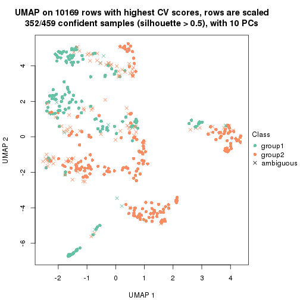</p>

</div>
<div id='tab-CV-pam-dimension-reduction-2'>
<pre><code class="r">dimension_reduction(res, k = 3, method = &quot;UMAP&quot;)
</code></pre>

<p></p>

</div>
<div id='tab-CV-pam-dimension-reduction-3'>
<pre><code class="r">dimension_reduction(res, k = 4, method = &quot;UMAP&quot;)
</code></pre>

<p></p>

</div>
<div id='tab-CV-pam-dimension-reduction-4'>
<pre><code class="r">dimension_reduction(res, k = 5, method = &quot;UMAP&quot;)
</code></pre>

<p></p>

</div>
<div id='tab-CV-pam-dimension-reduction-5'>
<pre><code class="r">dimension_reduction(res, k = 6, method = &quot;UMAP&quot;)
</code></pre>

<p></p>

</div>
</div>


Following heatmap shows how subgroups are split when increasing `k`:

```r
collect_classes(res)
```


If matrix rows can be associated to genes, consider to use `functional_enrichment(res,
...)` to perform function enrichment for the signature genes. See [this vignette](http://bioconductor.org/packages/devel/bioc/vignettes/cola/inst/doc/functional_enrichment.html) for more detailed explanations.


 

---------------------------------------------------


### CV:mclust


The object with results only for a single top-value method and a single partition method 
can be extracted as:

```r
res = res_list["CV", "mclust"]
# you can also extract it by
# res = res_list["CV:mclust"]
```

A summary of `res` and all the functions that can be applied to it:

```r
res
```

```
#> A 'ConsensusPartition' object with k = 2, 3, 4, 5, 6.
#>   On a matrix with 10169 rows and 459 columns.
#>   Top rows (1000, 2000, 3000, 4000, 5000) are extracted by 'CV' method.
#>   Subgroups are detected by 'mclust' method.
#>   Performed in total 1250 partitions by row resampling.
#>   Best k for subgroups seems to be 3.
#> 
#> Following methods can be applied to this 'ConsensusPartition' object:
#>  [1] "cola_report"             "collect_classes"         "collect_plots"          
#>  [4] "collect_stats"           "colnames"                "compare_signatures"     
#>  [7] "consensus_heatmap"       "dimension_reduction"     "functional_enrichment"  
#> [10] "get_anno_col"            "get_anno"                "get_classes"            
#> [13] "get_consensus"           "get_matrix"              "get_membership"         
#> [16] "get_param"               "get_signatures"          "get_stats"              
#> [19] "is_best_k"               "is_stable_k"             "membership_heatmap"     
#> [22] "ncol"                    "nrow"                    "plot_ecdf"              
#> [25] "rownames"                "select_partition_number" "show"                   
#> [28] "suggest_best_k"          "test_to_known_factors"
```

`collect_plots()` function collects all the plots made from `res` for all `k` (number of partitions)
into one single page to provide an easy and fast comparison between different `k`.

```r
collect_plots(res)
```


The plots are:

- The first row: a plot of the ECDF (empirical cumulative distribution
  function) curves of the consensus matrix for each `k` and the heatmap of
  predicted classes for each `k`.
- The second row: heatmaps of the consensus matrix for each `k`.
- The third row: heatmaps of the membership matrix for each `k`.
- The fouth row: heatmaps of the signatures for each `k`.

All the plots in panels can be made by individual functions and they are
plotted later in this section.

`select_partition_number()` produces several plots showing different
statistics for choosing "optimized" `k`. There are following statistics:

- ECDF curves of the consensus matrix for each `k`;
- 1-PAC. [The PAC
  score](https://en.wikipedia.org/wiki/Consensus_clustering#Over-interpretation_potential_of_consensus_clustering)
  measures the proportion of the ambiguous subgrouping.
- Mean silhouette score.
- Concordance. The mean probability of fiting the consensus class ids in all
  partitions.
- Area increased. Denote $A_k$ as the area under the ECDF curve for current
  `k`, the area increased is defined as $A_k - A_{k-1}$.
- Rand index. The percent of pairs of samples that are both in a same cluster
  or both are not in a same cluster in the partition of k and k-1.
- Jaccard index. The ratio of pairs of samples are both in a same cluster in
  the partition of k and k-1 and the pairs of samples are both in a same
  cluster in the partition k or k-1.

The detailed explanations of these statistics can be found in [the _cola_
vignette](http://bioconductor.org/packages/devel/bioc/vignettes/cola/inst/doc/cola.html#toc_13).

Generally speaking, lower PAC score, higher mean silhouette score or higher
concordance corresponds to better partition. Rand index and Jaccard index
measure how similar the current partition is compared to partition with `k-1`.
If they are too similar, we won't accept `k` is better than `k-1`.

```r
select_partition_number(res)
```


The numeric values for all these statistics can be obtained by `get_stats()`.

```r
get_stats(res)
```

```
#>   k  1-PAC mean_silhouette concordance area_increased  Rand Jaccard
#> 2 2 0.0720           0.477       0.693         0.3367 0.881   0.881
#> 3 3 0.0813           0.461       0.665         0.6909 0.541   0.487
#> 4 4 0.2553           0.364       0.643         0.2068 0.719   0.459
#> 5 5 0.3242           0.370       0.639         0.0804 0.807   0.495
#> 6 6 0.3817           0.328       0.563         0.0498 0.902   0.665
```

`suggest_best_k()` suggests the best $k$ based on these statistics. The rules are as follows:

- All $k$ with Jaccard index larger than 0.95 are removed because increasing
  $k$ does not provide enough extra information. If all $k$ are removed, it is
  marked as no subgroup is detected.
- For all $k$ with 1-PAC score larger than 0.9, the maximal $k$ is taken as
  the best $k$, and other $k$ are marked as optional $k$.
- If it does not fit the second rule. The $k$ with the maximal vote of the
  highest 1-PAC score, highest mean silhouette, and highest concordance is
  taken as the best $k$.

```r
suggest_best_k(res)
```

```
#> [1] 3
```


Following shows the table of the partitions (You need to click the **show/hide
code output** link to see it). The membership matrix (columns with name `p*`)
is inferred by
[`clue::cl_consensus()`](https://www.rdocumentation.org/link/cl_consensus?package=clue)
function with the `SE` method. Basically the value in the membership matrix
represents the probability to belong to a certain group. The finall class
label for an item is determined with the group with highest probability it
belongs to.

In `get_classes()` function, the entropy is calculated from the membership
matrix and the silhouette score is calculated from the consensus matrix.


<script>
$( function() {
	$( '#tabs-CV-mclust-get-classes' ).tabs();
} );
</script>
<div id='tabs-CV-mclust-get-classes'>
<ul>
<li><a href='#tab-CV-mclust-get-classes-1'>k = 2</a></li>
<li><a href='#tab-CV-mclust-get-classes-2'>k = 3</a></li>
<li><a href='#tab-CV-mclust-get-classes-3'>k = 4</a></li>
<li><a href='#tab-CV-mclust-get-classes-4'>k = 5</a></li>
<li><a href='#tab-CV-mclust-get-classes-5'>k = 6</a></li>
</ul>

<div id='tab-CV-mclust-get-classes-1'>
<p><a id='tab-CV-mclust-get-classes-1-a' style='color:#0366d6' href='#'>show/hide code output</a></p>
<pre><code class="r">cbind(get_classes(res, k = 2), get_membership(res, k = 2))
</code></pre>

<pre><code>#&gt;            class entropy silhouette    p1    p2
#&gt; SRR1699874     2   0.925      0.403 0.340 0.660
#&gt; SRR1699875     2   0.992      0.340 0.448 0.552
#&gt; SRR1699876     2   0.861      0.516 0.284 0.716
#&gt; SRR1699877     2   0.866      0.508 0.288 0.712
#&gt; SRR1699879     2   0.574      0.555 0.136 0.864
#&gt; SRR1699878     2   1.000      0.246 0.488 0.512
#&gt; SRR1699880     2   0.714      0.445 0.196 0.804
#&gt; SRR1699881     2   0.644      0.473 0.164 0.836
#&gt; SRR1699882     2   0.973      0.395 0.404 0.596
#&gt; SRR1699883     2   1.000      0.234 0.500 0.500
#&gt; SRR1699884     2   0.827      0.486 0.260 0.740
#&gt; SRR1699885     2   0.980      0.297 0.416 0.584
#&gt; SRR1699886     2   0.961      0.411 0.384 0.616
#&gt; SRR1699888     2   0.343      0.599 0.064 0.936
#&gt; SRR1699889     2   0.904      0.493 0.320 0.680
#&gt; SRR1699890     2   0.994      0.301 0.456 0.544
#&gt; SRR1699887     2   0.260      0.584 0.044 0.956
#&gt; SRR1699891     2   0.949      0.418 0.368 0.632
#&gt; SRR1699892     2   0.295      0.598 0.052 0.948
#&gt; SRR1699893     2   0.430      0.593 0.088 0.912
#&gt; SRR1699894     2   0.876      0.487 0.296 0.704
#&gt; SRR1699895     2   0.839      0.502 0.268 0.732
#&gt; SRR1699896     2   0.943      0.441 0.360 0.640
#&gt; SRR1699897     2   0.584      0.514 0.140 0.860
#&gt; SRR1699898     2   0.921      0.498 0.336 0.664
#&gt; SRR1699900     2   0.975      0.389 0.408 0.592
#&gt; SRR1699899     2   0.949      0.437 0.368 0.632
#&gt; SRR1699902     2   0.871      0.513 0.292 0.708
#&gt; SRR1699901     2   0.952      0.471 0.372 0.628
#&gt; SRR1699903     2   0.966      0.389 0.392 0.608
#&gt; SRR1699904     2   0.904      0.487 0.320 0.680
#&gt; SRR1699905     2   0.990      0.372 0.440 0.560
#&gt; SRR1699906     2   0.966      0.387 0.392 0.608
#&gt; SRR1699907     2   0.971      0.381 0.400 0.600
#&gt; SRR1699908     2   0.850      0.518 0.276 0.724
#&gt; SRR1699909     2   0.469      0.592 0.100 0.900
#&gt; SRR1699910     2   0.850      0.497 0.276 0.724
#&gt; SRR1699911     2   0.987      0.357 0.432 0.568
#&gt; SRR1699912     2   0.963      0.390 0.388 0.612
#&gt; SRR1699913     2   0.971      0.395 0.400 0.600
#&gt; SRR1699914     2   0.584      0.540 0.140 0.860
#&gt; SRR1699915     2   0.866      0.490 0.288 0.712
#&gt; SRR1699916     2   0.644      0.574 0.164 0.836
#&gt; SRR1699917     2   0.827      0.505 0.260 0.740
#&gt; SRR1699918     2   0.814      0.512 0.252 0.748
#&gt; SRR1699919     2   0.358      0.594 0.068 0.932
#&gt; SRR1699920     2   0.482      0.583 0.104 0.896
#&gt; SRR1699921     2   0.689      0.583 0.184 0.816
#&gt; SRR1699922     2   0.978      0.381 0.412 0.588
#&gt; SRR1699923     2   0.936      0.469 0.352 0.648
#&gt; SRR1699924     2   0.416      0.570 0.084 0.916
#&gt; SRR1699925     1   0.998      0.669 0.528 0.472
#&gt; SRR1699926     2   0.909      0.472 0.324 0.676
#&gt; SRR1699927     2   0.574      0.595 0.136 0.864
#&gt; SRR1699929     2   0.886      0.472 0.304 0.696
#&gt; SRR1699928     2   0.921      0.466 0.336 0.664
#&gt; SRR1699930     2   0.969      0.384 0.396 0.604
#&gt; SRR1699931     2   0.615      0.563 0.152 0.848
#&gt; SRR1699933     2   0.985      0.364 0.428 0.572
#&gt; SRR1699932     2   0.625      0.540 0.156 0.844
#&gt; SRR1699934     1   0.998      0.669 0.528 0.472
#&gt; SRR1699935     2   0.469      0.596 0.100 0.900
#&gt; SRR1699936     2   0.827      0.521 0.260 0.740
#&gt; SRR1699937     2   0.697      0.462 0.188 0.812
#&gt; SRR1699938     2   0.738      0.482 0.208 0.792
#&gt; SRR1699940     2   1.000      0.291 0.492 0.508
#&gt; SRR1699939     2   0.900      0.474 0.316 0.684
#&gt; SRR1699941     2   0.795      0.454 0.240 0.760
#&gt; SRR1699942     2   0.978      0.430 0.412 0.588
#&gt; SRR1699943     2   0.900      0.433 0.316 0.684
#&gt; SRR1699944     2   0.795      0.475 0.240 0.760
#&gt; SRR1699945     2   0.788      0.424 0.236 0.764
#&gt; SRR1699946     2   0.943      0.415 0.360 0.640
#&gt; SRR1699947     1   0.995     -0.199 0.540 0.460
#&gt; SRR1699948     2   0.697      0.503 0.188 0.812
#&gt; SRR1699949     2   0.886      0.496 0.304 0.696
#&gt; SRR1699950     2   0.518      0.556 0.116 0.884
#&gt; SRR1699951     2   0.260      0.576 0.044 0.956
#&gt; SRR1699952     2   0.936      0.333 0.352 0.648
#&gt; SRR1699953     2   0.552      0.564 0.128 0.872
#&gt; SRR1699954     2   0.802      0.424 0.244 0.756
#&gt; SRR1699955     2   0.917      0.477 0.332 0.668
#&gt; SRR1699956     2   0.689      0.458 0.184 0.816
#&gt; SRR1699957     2   0.738      0.502 0.208 0.792
#&gt; SRR1699959     2   0.541      0.596 0.124 0.876
#&gt; SRR1699958     2   0.952      0.451 0.372 0.628
#&gt; SRR1699960     2   0.634      0.605 0.160 0.840
#&gt; SRR1699961     2   0.416      0.558 0.084 0.916
#&gt; SRR1699962     2   0.644      0.479 0.164 0.836
#&gt; SRR1699963     2   0.844      0.514 0.272 0.728
#&gt; SRR1699964     2   0.958      0.407 0.380 0.620
#&gt; SRR1699965     2   0.634      0.502 0.160 0.840
#&gt; SRR1699966     2   0.881      0.516 0.300 0.700
#&gt; SRR1699967     2   0.541      0.517 0.124 0.876
#&gt; SRR1699968     2   0.295      0.595 0.052 0.948
#&gt; SRR1699969     2   0.518      0.558 0.116 0.884
#&gt; SRR1699971     2   0.966      0.397 0.392 0.608
#&gt; SRR1699970     2   0.932      0.456 0.348 0.652
#&gt; SRR1699972     2   0.958      0.442 0.380 0.620
#&gt; SRR1699973     2   0.936      0.484 0.352 0.648
#&gt; SRR1699974     2   0.781      0.434 0.232 0.768
#&gt; SRR1699975     2   0.969      0.387 0.396 0.604
#&gt; SRR1699976     2   0.634      0.466 0.160 0.840
#&gt; SRR1699977     2   0.971      0.428 0.400 0.600
#&gt; SRR1699978     2   0.760      0.521 0.220 0.780
#&gt; SRR1699979     2   0.430      0.569 0.088 0.912
#&gt; SRR1699980     2   0.891      0.506 0.308 0.692
#&gt; SRR1699981     2   0.925      0.491 0.340 0.660
#&gt; SRR1699982     2   0.966      0.393 0.392 0.608
#&gt; SRR1699983     2   0.996      0.305 0.464 0.536
#&gt; SRR1699984     1   0.998      0.669 0.528 0.472
#&gt; SRR1699985     2   0.844      0.519 0.272 0.728
#&gt; SRR1699986     1   1.000     -0.306 0.508 0.492
#&gt; SRR1699988     2   0.925      0.476 0.340 0.660
#&gt; SRR1699987     2   0.469      0.558 0.100 0.900
#&gt; SRR1699989     2   0.808      0.513 0.248 0.752
#&gt; SRR1699990     2   0.343      0.576 0.064 0.936
#&gt; SRR1699992     2   0.634      0.455 0.160 0.840
#&gt; SRR1699991     2   0.388      0.571 0.076 0.924
#&gt; SRR1699993     2   0.552      0.551 0.128 0.872
#&gt; SRR1699994     2   0.541      0.542 0.124 0.876
#&gt; SRR1699995     2   0.634      0.532 0.160 0.840
#&gt; SRR1699996     2   0.929      0.386 0.344 0.656
#&gt; SRR1699997     2   0.921      0.487 0.336 0.664
#&gt; SRR1699998     1   1.000     -0.278 0.500 0.500
#&gt; SRR1699999     2   0.991     -0.482 0.444 0.556
#&gt; SRR1700000     2   0.988      0.361 0.436 0.564
#&gt; SRR1700002     2   0.917      0.481 0.332 0.668
#&gt; SRR1700001     2   0.909      0.503 0.324 0.676
#&gt; SRR1700003     2   0.929      0.490 0.344 0.656
#&gt; SRR1700004     2   0.506      0.539 0.112 0.888
#&gt; SRR1700005     1   0.895      0.594 0.688 0.312
#&gt; SRR1700006     2   0.781      0.566 0.232 0.768
#&gt; SRR1700007     2   0.958      0.407 0.380 0.620
#&gt; SRR1700008     2   0.871      0.535 0.292 0.708
#&gt; SRR1700009     1   0.999      0.661 0.520 0.480
#&gt; SRR1700010     2   0.781      0.434 0.232 0.768
#&gt; SRR1700011     2   0.886      0.491 0.304 0.696
#&gt; SRR1700013     2   0.482      0.547 0.104 0.896
#&gt; SRR1700012     2   0.961      0.406 0.384 0.616
#&gt; SRR1700014     2   0.373      0.572 0.072 0.928
#&gt; SRR1700015     2   0.482      0.550 0.104 0.896
#&gt; SRR1700016     2   0.955      0.380 0.376 0.624
#&gt; SRR1700018     2   0.574      0.583 0.136 0.864
#&gt; SRR1700017     2   0.494      0.578 0.108 0.892
#&gt; SRR1700019     2   0.311      0.592 0.056 0.944
#&gt; SRR1700020     2   0.563      0.534 0.132 0.868
#&gt; SRR1700021     2   0.891      0.509 0.308 0.692
#&gt; SRR1700023     2   0.327      0.578 0.060 0.940
#&gt; SRR1700022     2   0.714      0.576 0.196 0.804
#&gt; SRR1700024     2   0.961      0.402 0.384 0.616
#&gt; SRR1700025     2   0.574      0.501 0.136 0.864
#&gt; SRR1700026     2   0.373      0.566 0.072 0.928
#&gt; SRR1700027     2   0.327      0.563 0.060 0.940
#&gt; SRR1700028     2   0.921      0.487 0.336 0.664
#&gt; SRR1700029     2   0.402      0.568 0.080 0.920
#&gt; SRR1700030     2   0.876      0.509 0.296 0.704
#&gt; SRR1700031     2   0.482      0.553 0.104 0.896
#&gt; SRR1700032     2   0.443      0.544 0.092 0.908
#&gt; SRR1700034     2   0.855      0.280 0.280 0.720
#&gt; SRR1700035     2   0.615      0.604 0.152 0.848
#&gt; SRR1700033     2   0.615      0.550 0.152 0.848
#&gt; SRR1700036     2   0.327      0.577 0.060 0.940
#&gt; SRR1700037     2   0.886      0.507 0.304 0.696
#&gt; SRR1700038     2   0.881      0.472 0.300 0.700
#&gt; SRR1700039     2   0.529      0.547 0.120 0.880
#&gt; SRR1700040     2   0.541      0.551 0.124 0.876
#&gt; SRR1700041     2   0.469      0.568 0.100 0.900
#&gt; SRR1700042     2   0.388      0.581 0.076 0.924
#&gt; SRR1700043     2   0.861      0.542 0.284 0.716
#&gt; SRR1700045     2   0.730      0.595 0.204 0.796
#&gt; SRR1700044     2   0.871      0.508 0.292 0.708
#&gt; SRR1700046     2   0.506      0.600 0.112 0.888
#&gt; SRR1700047     2   0.605      0.542 0.148 0.852
#&gt; SRR1700048     2   0.808      0.510 0.248 0.752
#&gt; SRR1700049     2   0.574      0.559 0.136 0.864
#&gt; SRR1700050     2   0.866      0.496 0.288 0.712
#&gt; SRR1700051     2   0.909      0.507 0.324 0.676
#&gt; SRR1700052     2   0.625      0.557 0.156 0.844
#&gt; SRR1700053     2   0.388      0.584 0.076 0.924
#&gt; SRR1700054     2   0.388      0.575 0.076 0.924
#&gt; SRR1700055     1   0.998      0.669 0.528 0.472
#&gt; SRR1700056     2   0.494      0.552 0.108 0.892
#&gt; SRR1700057     2   0.518      0.546 0.116 0.884
#&gt; SRR1700058     2   0.416      0.561 0.084 0.916
#&gt; SRR1700059     2   0.615      0.511 0.152 0.848
#&gt; SRR1700060     2   0.469      0.589 0.100 0.900
#&gt; SRR1700061     2   0.402      0.572 0.080 0.920
#&gt; SRR1700062     2   0.518      0.544 0.116 0.884
#&gt; SRR1700063     2   0.469      0.558 0.100 0.900
#&gt; SRR1700064     2   0.871      0.488 0.292 0.708
#&gt; SRR1700065     2   0.990      0.374 0.440 0.560
#&gt; SRR1700066     2   0.595      0.604 0.144 0.856
#&gt; SRR1700067     2   0.925      0.449 0.340 0.660
#&gt; SRR1700068     2   0.443      0.562 0.092 0.908
#&gt; SRR1700069     2   0.388      0.569 0.076 0.924
#&gt; SRR1700070     2   0.605      0.601 0.148 0.852
#&gt; SRR1700071     2   0.343      0.575 0.064 0.936
#&gt; SRR1700072     2   0.946      0.431 0.364 0.636
#&gt; SRR1700073     2   0.939      0.439 0.356 0.644
#&gt; SRR1700075     2   0.706      0.524 0.192 0.808
#&gt; SRR1700074     2   0.358      0.569 0.068 0.932
#&gt; SRR1700076     2   0.541      0.528 0.124 0.876
#&gt; SRR1700077     2   0.456      0.557 0.096 0.904
#&gt; SRR1700078     2   0.343      0.574 0.064 0.936
#&gt; SRR1700080     2   0.358      0.574 0.068 0.932
#&gt; SRR1700079     2   0.895      0.506 0.312 0.688
#&gt; SRR1700081     2   0.753      0.450 0.216 0.784
#&gt; SRR1700082     2   0.895      0.508 0.312 0.688
#&gt; SRR1700083     2   0.775      0.559 0.228 0.772
#&gt; SRR1700084     2   0.494      0.567 0.108 0.892
#&gt; SRR1700085     2   0.343      0.576 0.064 0.936
#&gt; SRR1700086     2   0.876      0.511 0.296 0.704
#&gt; SRR1700087     2   0.995      0.349 0.460 0.540
#&gt; SRR1700088     2   0.909      0.501 0.324 0.676
#&gt; SRR1700089     2   0.866      0.492 0.288 0.712
#&gt; SRR1700091     2   0.595      0.525 0.144 0.856
#&gt; SRR1700090     2   0.943      0.459 0.360 0.640
#&gt; SRR1700092     2   0.327      0.586 0.060 0.940
#&gt; SRR1700094     2   0.416      0.570 0.084 0.916
#&gt; SRR1700093     2   0.615      0.507 0.152 0.848
#&gt; SRR1700095     2   0.615      0.511 0.152 0.848
#&gt; SRR1700096     2   0.605      0.511 0.148 0.852
#&gt; SRR1700097     2   0.952      0.456 0.372 0.628
#&gt; SRR1700098     2   0.456      0.575 0.096 0.904
#&gt; SRR1700099     2   0.605      0.509 0.148 0.852
#&gt; SRR1700100     2   0.958      0.447 0.380 0.620
#&gt; SRR1700101     2   0.574      0.549 0.136 0.864
#&gt; SRR1700102     2   0.939      0.477 0.356 0.644
#&gt; SRR1700104     2   0.595      0.513 0.144 0.856
#&gt; SRR1700103     2   0.518      0.555 0.116 0.884
#&gt; SRR1700105     2   0.563      0.538 0.132 0.868
#&gt; SRR1700106     2   0.895      0.467 0.312 0.688
#&gt; SRR1700107     2   0.949      0.454 0.368 0.632
#&gt; SRR1700108     2   0.595      0.516 0.144 0.856
#&gt; SRR1700109     2   0.876      0.514 0.296 0.704
#&gt; SRR1700110     2   0.541      0.537 0.124 0.876
#&gt; SRR1700112     2   0.563      0.531 0.132 0.868
#&gt; SRR1700111     2   0.990      0.374 0.440 0.560
#&gt; SRR1700113     2   0.482      0.555 0.104 0.896
#&gt; SRR1700114     2   0.605      0.509 0.148 0.852
#&gt; SRR1700115     2   0.615      0.508 0.152 0.848
#&gt; SRR1700116     2   0.988      0.394 0.436 0.564
#&gt; SRR1700117     2   0.866      0.475 0.288 0.712
#&gt; SRR1700119     2   0.563      0.529 0.132 0.868
#&gt; SRR1700118     2   0.996      0.345 0.464 0.536
#&gt; SRR1700120     2   0.891      0.524 0.308 0.692
#&gt; SRR1700121     2   0.574      0.548 0.136 0.864
#&gt; SRR1700122     2   0.981      0.378 0.420 0.580
#&gt; SRR1700123     2   0.574      0.525 0.136 0.864
#&gt; SRR1700125     2   0.615      0.539 0.152 0.848
#&gt; SRR1700126     2   0.595      0.580 0.144 0.856
#&gt; SRR1700127     2   0.932      0.476 0.348 0.652
#&gt; SRR1700124     2   0.615      0.507 0.152 0.848
#&gt; SRR1700128     2   0.925      0.482 0.340 0.660
#&gt; SRR1700129     2   0.995      0.357 0.460 0.540
#&gt; SRR1700130     2   0.998      0.335 0.472 0.528
#&gt; SRR1700132     2   0.909      0.464 0.324 0.676
#&gt; SRR1700131     2   0.552      0.547 0.128 0.872
#&gt; SRR1700133     2   0.595      0.536 0.144 0.856
#&gt; SRR1700134     2   0.615      0.508 0.152 0.848
#&gt; SRR1700135     2   0.909      0.469 0.324 0.676
#&gt; SRR1700136     2   0.605      0.509 0.148 0.852
#&gt; SRR1700137     2   0.625      0.503 0.156 0.844
#&gt; SRR1700138     2   0.625      0.503 0.156 0.844
#&gt; SRR1700140     2   0.952      0.449 0.372 0.628
#&gt; SRR1700139     2   0.955      0.446 0.376 0.624
#&gt; SRR1700141     2   0.961      0.455 0.384 0.616
#&gt; SRR1700142     2   0.866      0.501 0.288 0.712
#&gt; SRR1700143     2   0.615      0.507 0.152 0.848
#&gt; SRR1700144     2   0.821      0.514 0.256 0.744
#&gt; SRR1700145     2   0.946      0.462 0.364 0.636
#&gt; SRR1700146     2   0.595      0.517 0.144 0.856
#&gt; SRR1700147     2   0.814      0.562 0.252 0.748
#&gt; SRR1700149     2   0.955      0.452 0.376 0.624
#&gt; SRR1700148     2   0.563      0.536 0.132 0.868
#&gt; SRR1700150     2   0.939      0.442 0.356 0.644
#&gt; SRR1700152     2   0.958      0.450 0.380 0.620
#&gt; SRR1700151     2   0.615      0.507 0.152 0.848
#&gt; SRR1700153     2   0.955      0.446 0.376 0.624
#&gt; SRR1700154     2   0.634      0.525 0.160 0.840
#&gt; SRR1700155     2   0.634      0.535 0.160 0.840
#&gt; SRR1700156     2   0.615      0.507 0.152 0.848
#&gt; SRR1700158     2   0.634      0.516 0.160 0.840
#&gt; SRR1700159     2   0.529      0.568 0.120 0.880
#&gt; SRR1700157     2   0.994      0.361 0.456 0.544
#&gt; SRR1700160     2   0.615      0.507 0.152 0.848
#&gt; SRR1700161     2   0.615      0.507 0.152 0.848
#&gt; SRR1700162     2   0.605      0.534 0.148 0.852
#&gt; SRR1700164     2   0.932      0.474 0.348 0.652
#&gt; SRR1700163     2   0.574      0.531 0.136 0.864
#&gt; SRR1700165     2   0.595      0.513 0.144 0.856
#&gt; SRR1700166     2   0.529      0.555 0.120 0.880
#&gt; SRR1700168     2   0.925      0.456 0.340 0.660
#&gt; SRR1700167     2   0.952      0.456 0.372 0.628
#&gt; SRR1700170     2   0.987      0.397 0.432 0.568
#&gt; SRR1700169     2   0.541      0.536 0.124 0.876
#&gt; SRR1700171     2   0.753      0.513 0.216 0.784
#&gt; SRR1700172     2   0.615      0.507 0.152 0.848
#&gt; SRR1700174     2   0.584      0.519 0.140 0.860
#&gt; SRR1700173     2   0.615      0.507 0.152 0.848
#&gt; SRR1700175     2   0.552      0.537 0.128 0.872
#&gt; SRR1700176     2   0.895      0.473 0.312 0.688
#&gt; SRR1700178     2   0.680      0.461 0.180 0.820
#&gt; SRR1700177     2   0.952      0.449 0.372 0.628
#&gt; SRR1700180     2   0.981      0.354 0.420 0.580
#&gt; SRR1700179     2   0.714      0.459 0.196 0.804
#&gt; SRR1700181     2   0.625      0.507 0.156 0.844
#&gt; SRR1700183     1   0.998      0.669 0.528 0.472
#&gt; SRR1700182     2   0.697      0.461 0.188 0.812
#&gt; SRR1700184     2   0.697      0.474 0.188 0.812
#&gt; SRR1700186     2   0.615      0.506 0.152 0.848
#&gt; SRR1700187     1   0.998      0.665 0.524 0.476
#&gt; SRR1700185     1   0.998      0.669 0.528 0.472
#&gt; SRR1700188     2   0.689      0.461 0.184 0.816
#&gt; SRR1700192     2   1.000     -0.635 0.492 0.508
#&gt; SRR1700190     2   0.802      0.400 0.244 0.756
#&gt; SRR1700191     1   0.939      0.618 0.644 0.356
#&gt; SRR1700189     1   0.999      0.629 0.516 0.484
#&gt; SRR1700193     2   0.671      0.460 0.176 0.824
#&gt; SRR1700195     2   0.998      0.259 0.476 0.524
#&gt; SRR1700194     1   0.988      0.648 0.564 0.436
#&gt; SRR1700196     2   0.745      0.464 0.212 0.788
#&gt; SRR1700197     1   1.000      0.656 0.512 0.488
#&gt; SRR1700198     2   0.671      0.460 0.176 0.824
#&gt; SRR1700199     2   0.983      0.305 0.424 0.576
#&gt; SRR1700200     2   0.949      0.413 0.368 0.632
#&gt; SRR1700201     2   0.680      0.461 0.180 0.820
#&gt; SRR1700202     1   0.943      0.544 0.640 0.360
#&gt; SRR1700203     1   1.000     -0.245 0.504 0.496
#&gt; SRR1700204     2   0.644      0.549 0.164 0.836
#&gt; SRR1700206     2   0.697      0.496 0.188 0.812
#&gt; SRR1700207     2   0.753      0.474 0.216 0.784
#&gt; SRR1700208     2   1.000     -0.630 0.488 0.512
#&gt; SRR1700205     2   0.994      0.303 0.456 0.544
#&gt; SRR1700209     2   0.574      0.516 0.136 0.864
#&gt; SRR1700210     1   1.000     -0.250 0.500 0.500
#&gt; SRR1700211     2   0.980      0.362 0.416 0.584
#&gt; SRR1700212     2   0.999      0.255 0.484 0.516
#&gt; SRR1700213     2   0.634      0.516 0.160 0.840
#&gt; SRR1700214     2   0.625      0.495 0.156 0.844
#&gt; SRR1700215     1   0.998      0.669 0.528 0.472
#&gt; SRR1700217     2   0.653      0.467 0.168 0.832
#&gt; SRR1700216     1   0.936      0.615 0.648 0.352
#&gt; SRR1700218     2   0.653      0.457 0.168 0.832
#&gt; SRR1700219     2   0.697      0.461 0.188 0.812
#&gt; SRR1700222     1   0.999      0.664 0.520 0.480
#&gt; SRR1700220     2   0.615      0.502 0.152 0.848
#&gt; SRR1700221     2   0.662      0.460 0.172 0.828
#&gt; SRR1700223     2   0.821      0.435 0.256 0.744
#&gt; SRR1700224     2   0.808      0.555 0.248 0.752
#&gt; SRR1700226     2   0.895      0.382 0.312 0.688
#&gt; SRR1700229     2   0.985      0.349 0.428 0.572
#&gt; SRR1700225     2   0.952      0.346 0.372 0.628
#&gt; SRR1700227     2   0.966      0.389 0.392 0.608
#&gt; SRR1700230     1   1.000      0.651 0.512 0.488
#&gt; SRR1700231     2   0.961      0.390 0.384 0.616
#&gt; SRR1700228     2   0.946      0.430 0.364 0.636
#&gt; SRR1700232     2   0.861      0.409 0.284 0.716
#&gt; SRR1700233     2   0.574      0.516 0.136 0.864
#&gt; SRR1700234     2   0.653      0.467 0.168 0.832
#&gt; SRR1700235     2   0.595      0.495 0.144 0.856
#&gt; SRR1700237     2   0.844      0.472 0.272 0.728
#&gt; SRR1700236     2   0.966      0.415 0.392 0.608
#&gt; SRR1700238     2   0.671      0.461 0.176 0.824
#&gt; SRR1700239     1   0.998      0.667 0.524 0.476
#&gt; SRR1700240     1   0.921      0.596 0.664 0.336
#&gt; SRR1700241     2   0.595      0.533 0.144 0.856
#&gt; SRR1700243     2   0.689      0.476 0.184 0.816
#&gt; SRR1700244     2   0.697      0.487 0.188 0.812
#&gt; SRR1700242     2   0.998     -0.620 0.472 0.528
#&gt; SRR1700246     2   1.000      0.226 0.496 0.504
#&gt; SRR1700245     2   0.978      0.381 0.412 0.588
#&gt; SRR1700247     1   0.714      0.362 0.804 0.196
#&gt; SRR1700249     1   0.998      0.669 0.528 0.472
#&gt; SRR1700250     2   0.939      0.438 0.356 0.644
#&gt; SRR1700248     2   0.671      0.460 0.176 0.824
#&gt; SRR1700251     2   0.881      0.364 0.300 0.700
#&gt; SRR1700252     2   0.662      0.481 0.172 0.828
#&gt; SRR1700253     2   0.943      0.461 0.360 0.640
#&gt; SRR1700256     2   0.990      0.350 0.440 0.560
#&gt; SRR1700254     1   0.943      0.609 0.640 0.360
#&gt; SRR1700255     2   0.653      0.467 0.168 0.832
#&gt; SRR1700257     2   0.680      0.461 0.180 0.820
#&gt; SRR1700258     2   0.753      0.463 0.216 0.784
#&gt; SRR1700259     2   0.443      0.568 0.092 0.908
#&gt; SRR1700260     2   0.971      0.392 0.400 0.600
#&gt; SRR1700261     2   0.242      0.585 0.040 0.960
#&gt; SRR1700262     2   0.895      0.481 0.312 0.688
#&gt; SRR1700263     2   0.978      0.374 0.412 0.588
#&gt; SRR1700264     2   0.584      0.544 0.140 0.860
#&gt; SRR1700265     2   0.929      0.462 0.344 0.656
#&gt; SRR1700266     2   0.900      0.485 0.316 0.684
#&gt; SRR1700268     2   0.680      0.448 0.180 0.820
#&gt; SRR1700270     2   0.653      0.467 0.168 0.832
#&gt; SRR1700267     2   0.714      0.510 0.196 0.804
#&gt; SRR1700271     2   0.595      0.549 0.144 0.856
#&gt; SRR1700272     2   0.833      0.520 0.264 0.736
#&gt; SRR1700273     2   0.855      0.390 0.280 0.720
#&gt; SRR1700274     2   0.833      0.505 0.264 0.736
#&gt; SRR1700277     2   0.615      0.524 0.152 0.848
#&gt; SRR1700275     2   0.456      0.570 0.096 0.904
#&gt; SRR1700276     2   0.595      0.607 0.144 0.856
#&gt; SRR1700278     2   0.518      0.533 0.116 0.884
#&gt; SRR1700279     2   0.955      0.425 0.376 0.624
#&gt; SRR1700280     2   0.958      0.420 0.380 0.620
#&gt; SRR1700281     2   0.855      0.512 0.280 0.720
#&gt; SRR1700283     2   0.963      0.389 0.388 0.612
#&gt; SRR1700282     2   0.595      0.516 0.144 0.856
#&gt; SRR1700284     2   0.430      0.598 0.088 0.912
#&gt; SRR1700285     2   0.518      0.590 0.116 0.884
#&gt; SRR1700286     2   0.788      0.505 0.236 0.764
#&gt; SRR1700287     2   0.827      0.511 0.260 0.740
#&gt; SRR1700290     2   0.552      0.563 0.128 0.872
#&gt; SRR1700289     2   0.966      0.386 0.392 0.608
#&gt; SRR1700288     2   0.574      0.517 0.136 0.864
#&gt; SRR1700292     2   0.998      0.281 0.472 0.528
#&gt; SRR1700291     2   0.469      0.558 0.100 0.900
#&gt; SRR1700293     2   0.506      0.554 0.112 0.888
#&gt; SRR1700294     2   0.943      0.431 0.360 0.640
#&gt; SRR1700295     2   0.482      0.561 0.104 0.896
#&gt; SRR1700297     2   0.946      0.434 0.364 0.636
#&gt; SRR1700296     2   0.904      0.478 0.320 0.680
#&gt; SRR1700298     2   0.494      0.552 0.108 0.892
#&gt; SRR1700299     2   0.990      0.346 0.440 0.560
#&gt; SRR1700300     2   0.980      0.380 0.416 0.584
#&gt; SRR1700302     2   0.662      0.596 0.172 0.828
#&gt; SRR1700301     2   0.680      0.534 0.180 0.820
#&gt; SRR1700303     2   0.278      0.588 0.048 0.952
#&gt; SRR1700304     2   0.563      0.543 0.132 0.868
#&gt; SRR1700305     2   0.260      0.587 0.044 0.956
#&gt; SRR1700306     2   0.767      0.518 0.224 0.776
#&gt; SRR1700308     2   0.991      0.339 0.444 0.556
#&gt; SRR1700307     2   0.781      0.570 0.232 0.768
#&gt; SRR1700309     1   1.000     -0.313 0.504 0.496
#&gt; SRR1700310     2   0.518      0.590 0.116 0.884
#&gt; SRR1700311     2   0.821      0.496 0.256 0.744
#&gt; SRR1700312     2   0.529      0.584 0.120 0.880
#&gt; SRR1700313     2   0.416      0.577 0.084 0.916
#&gt; SRR1700314     2   0.871      0.510 0.292 0.708
#&gt; SRR1700315     2   0.895      0.478 0.312 0.688
#&gt; SRR1700316     2   0.689      0.557 0.184 0.816
#&gt; SRR1700317     2   0.753      0.542 0.216 0.784
#&gt; SRR1700318     2   0.767      0.581 0.224 0.776
#&gt; SRR1700319     2   0.482      0.556 0.104 0.896
#&gt; SRR1700320     2   0.278      0.586 0.048 0.952
#&gt; SRR1700322     2   0.891      0.472 0.308 0.692
#&gt; SRR1700321     2   0.260      0.583 0.044 0.956
#&gt; SRR1700323     2   0.402      0.567 0.080 0.920
#&gt; SRR1700324     2   0.358      0.602 0.068 0.932
#&gt; SRR1700325     2   0.402      0.576 0.080 0.920
#&gt; SRR1700326     2   0.866      0.520 0.288 0.712
#&gt; SRR1700327     2   0.373      0.582 0.072 0.928
#&gt; SRR1700329     2   0.973      0.382 0.404 0.596
#&gt; SRR1700328     2   1.000      0.263 0.488 0.512
#&gt; SRR1700330     2   0.494      0.541 0.108 0.892
#&gt; SRR1700331     2   0.886      0.469 0.304 0.696
#&gt; SRR1700332     2   0.680      0.597 0.180 0.820
#&gt; SRR1700333     2   0.904      0.503 0.320 0.680
</code></pre>

<script>
$('#tab-CV-mclust-get-classes-1-a').parent().next().next().hide();
$('#tab-CV-mclust-get-classes-1-a').click(function(){
  $('#tab-CV-mclust-get-classes-1-a').parent().next().next().toggle();
  return(false);
});
</script>
</div>

<div id='tab-CV-mclust-get-classes-2'>
<p><a id='tab-CV-mclust-get-classes-2-a' style='color:#0366d6' href='#'>show/hide code output</a></p>
<pre><code class="r">cbind(get_classes(res, k = 3), get_membership(res, k = 3))
</code></pre>

<pre><code>#&gt;            class entropy silhouette    p1    p2    p3
#&gt; SRR1699874     2   0.803   0.520344 0.240 0.640 0.120
#&gt; SRR1699875     2   0.277   0.518924 0.072 0.920 0.008
#&gt; SRR1699876     2   0.427   0.529650 0.024 0.860 0.116
#&gt; SRR1699877     2   0.409   0.533723 0.068 0.880 0.052
#&gt; SRR1699879     2   0.736   0.529302 0.112 0.700 0.188
#&gt; SRR1699878     2   0.452   0.451874 0.180 0.816 0.004
#&gt; SRR1699880     3   0.921   0.307911 0.304 0.180 0.516
#&gt; SRR1699881     3   0.884   0.445471 0.208 0.212 0.580
#&gt; SRR1699882     2   0.218   0.540757 0.032 0.948 0.020
#&gt; SRR1699883     2   0.601   0.456676 0.184 0.768 0.048
#&gt; SRR1699884     2   0.639   0.560934 0.108 0.768 0.124
#&gt; SRR1699885     2   0.711   0.535585 0.196 0.712 0.092
#&gt; SRR1699886     2   0.398   0.531495 0.048 0.884 0.068
#&gt; SRR1699888     2   0.740   0.516152 0.052 0.624 0.324
#&gt; SRR1699889     3   0.821   0.345041 0.072 0.460 0.468
#&gt; SRR1699890     2   0.388   0.519090 0.068 0.888 0.044
#&gt; SRR1699887     2   0.788   0.512573 0.096 0.636 0.268
#&gt; SRR1699891     2   0.777   0.476677 0.172 0.676 0.152
#&gt; SRR1699892     3   0.804   0.556571 0.104 0.272 0.624
#&gt; SRR1699893     3   0.586   0.569890 0.020 0.240 0.740
#&gt; SRR1699894     2   0.849   0.497360 0.156 0.608 0.236
#&gt; SRR1699895     2   0.885   0.467067 0.152 0.556 0.292
#&gt; SRR1699896     3   0.889   0.373121 0.120 0.424 0.456
#&gt; SRR1699897     3   0.927   0.024674 0.156 0.420 0.424
#&gt; SRR1699898     3   0.700   0.553573 0.052 0.268 0.680
#&gt; SRR1699900     3   0.966   0.381480 0.212 0.372 0.416
#&gt; SRR1699899     2   0.783   0.069251 0.088 0.632 0.280
#&gt; SRR1699902     3   0.838   0.495027 0.092 0.368 0.540
#&gt; SRR1699901     2   0.960  -0.378980 0.200 0.404 0.396
#&gt; SRR1699903     2   0.947  -0.086634 0.212 0.488 0.300
#&gt; SRR1699904     2   0.563   0.556944 0.032 0.780 0.188
#&gt; SRR1699905     3   0.953   0.402216 0.216 0.308 0.476
#&gt; SRR1699906     2   0.627   0.469490 0.140 0.772 0.088
#&gt; SRR1699907     2   0.710   0.434275 0.172 0.720 0.108
#&gt; SRR1699908     2   0.717  -0.143104 0.028 0.568 0.404
#&gt; SRR1699909     3   0.679   0.443199 0.028 0.324 0.648
#&gt; SRR1699910     3   0.847   0.520008 0.208 0.176 0.616
#&gt; SRR1699911     2   0.950  -0.053344 0.200 0.468 0.332
#&gt; SRR1699912     2   0.802   0.363009 0.184 0.656 0.160
#&gt; SRR1699913     2   0.693   0.379120 0.076 0.716 0.208
#&gt; SRR1699914     3   0.825   0.532381 0.164 0.200 0.636
#&gt; SRR1699915     3   0.887   0.463790 0.200 0.224 0.576
#&gt; SRR1699916     2   0.711   0.496219 0.036 0.624 0.340
#&gt; SRR1699917     3   0.887   0.365507 0.160 0.280 0.560
#&gt; SRR1699918     3   0.875   0.447626 0.172 0.244 0.584
#&gt; SRR1699919     3   0.735   0.306710 0.040 0.368 0.592
#&gt; SRR1699920     3   0.429   0.642310 0.032 0.104 0.864
#&gt; SRR1699921     3   0.790   0.386996 0.068 0.356 0.576
#&gt; SRR1699922     2   0.409   0.528553 0.064 0.880 0.056
#&gt; SRR1699923     2   0.874  -0.403205 0.108 0.464 0.428
#&gt; SRR1699924     3   0.501   0.639905 0.076 0.084 0.840
#&gt; SRR1699925     1   0.630   0.793604 0.772 0.132 0.096
#&gt; SRR1699926     3   0.868   0.510055 0.188 0.216 0.596
#&gt; SRR1699927     2   0.740   0.318671 0.036 0.552 0.412
#&gt; SRR1699929     3   0.960   0.421039 0.276 0.248 0.476
#&gt; SRR1699928     2   0.621   0.451346 0.068 0.768 0.164
#&gt; SRR1699930     2   0.649   0.447405 0.160 0.756 0.084
#&gt; SRR1699931     3   0.896   0.427184 0.156 0.304 0.540
#&gt; SRR1699933     3   0.959   0.439291 0.240 0.284 0.476
#&gt; SRR1699932     2   0.725   0.296503 0.028 0.536 0.436
#&gt; SRR1699934     1   0.630   0.793604 0.772 0.132 0.096
#&gt; SRR1699935     3   0.610   0.596773 0.032 0.228 0.740
#&gt; SRR1699936     2   0.435   0.534677 0.020 0.852 0.128
#&gt; SRR1699937     2   0.927   0.281062 0.240 0.528 0.232
#&gt; SRR1699938     2   0.711   0.507471 0.184 0.716 0.100
#&gt; SRR1699940     3   0.979   0.337288 0.236 0.368 0.396
#&gt; SRR1699939     2   0.492   0.567874 0.072 0.844 0.084
#&gt; SRR1699941     3   0.927   0.410471 0.240 0.232 0.528
#&gt; SRR1699942     2   0.661   0.425229 0.072 0.740 0.188
#&gt; SRR1699943     2   0.604   0.548265 0.112 0.788 0.100
#&gt; SRR1699944     2   0.696   0.532832 0.152 0.732 0.116
#&gt; SRR1699945     3   0.930   0.158416 0.376 0.164 0.460
#&gt; SRR1699946     2   0.682   0.536677 0.108 0.740 0.152
#&gt; SRR1699947     2   0.764   0.500740 0.180 0.684 0.136
#&gt; SRR1699948     2   0.694   0.527311 0.160 0.732 0.108
#&gt; SRR1699949     2   0.380   0.563165 0.024 0.884 0.092
#&gt; SRR1699950     2   0.772   0.511637 0.164 0.680 0.156
#&gt; SRR1699951     3   0.892  -0.030163 0.124 0.412 0.464
#&gt; SRR1699952     2   0.946   0.399180 0.280 0.496 0.224
#&gt; SRR1699953     2   0.783   0.523597 0.168 0.672 0.160
#&gt; SRR1699954     2   0.971   0.111262 0.252 0.452 0.296
#&gt; SRR1699955     2   0.514   0.577425 0.064 0.832 0.104
#&gt; SRR1699956     3   0.925   0.320002 0.296 0.188 0.516
#&gt; SRR1699957     2   0.793   0.511401 0.168 0.664 0.168
#&gt; SRR1699959     3   0.832   0.561604 0.148 0.228 0.624
#&gt; SRR1699958     3   0.760   0.481389 0.060 0.328 0.612
#&gt; SRR1699960     2   0.718   0.557474 0.060 0.672 0.268
#&gt; SRR1699961     3   0.882   0.471335 0.232 0.188 0.580
#&gt; SRR1699962     2   0.781   0.498504 0.180 0.672 0.148
#&gt; SRR1699963     2   0.857  -0.378903 0.096 0.472 0.432
#&gt; SRR1699964     2   0.979  -0.071599 0.236 0.400 0.364
#&gt; SRR1699965     2   0.766   0.505747 0.144 0.684 0.172
#&gt; SRR1699966     3   0.725   0.584260 0.052 0.300 0.648
#&gt; SRR1699967     2   0.846   0.459023 0.168 0.616 0.216
#&gt; SRR1699968     3   0.798   0.429573 0.076 0.340 0.584
#&gt; SRR1699969     3   0.523   0.616341 0.104 0.068 0.828
#&gt; SRR1699971     2   0.909  -0.347712 0.140 0.464 0.396
#&gt; SRR1699970     2   0.290   0.520157 0.064 0.920 0.016
#&gt; SRR1699972     2   0.915  -0.382743 0.144 0.444 0.412
#&gt; SRR1699973     3   0.806   0.421067 0.064 0.444 0.492
#&gt; SRR1699974     3   0.933   0.010880 0.408 0.164 0.428
#&gt; SRR1699975     3   0.970   0.321926 0.216 0.388 0.396
#&gt; SRR1699976     3   0.919   0.398019 0.208 0.256 0.536
#&gt; SRR1699977     3   0.903   0.413086 0.132 0.428 0.440
#&gt; SRR1699978     3   0.874   0.497986 0.232 0.180 0.588
#&gt; SRR1699979     3   0.692   0.590538 0.124 0.140 0.736
#&gt; SRR1699980     2   0.762  -0.096951 0.056 0.596 0.348
#&gt; SRR1699981     3   0.725   0.527840 0.056 0.288 0.656
#&gt; SRR1699982     2   0.736   0.443058 0.172 0.704 0.124
#&gt; SRR1699983     2   0.909   0.114575 0.168 0.528 0.304
#&gt; SRR1699984     1   0.643   0.792456 0.764 0.140 0.096
#&gt; SRR1699985     2   0.716   0.005478 0.040 0.628 0.332
#&gt; SRR1699986     3   0.984   0.381572 0.248 0.360 0.392
#&gt; SRR1699988     2   0.700   0.200871 0.052 0.680 0.268
#&gt; SRR1699987     3   0.390   0.639966 0.056 0.056 0.888
#&gt; SRR1699989     3   0.949   0.361684 0.220 0.292 0.488
#&gt; SRR1699990     3   0.548   0.634482 0.076 0.108 0.816
#&gt; SRR1699992     3   0.961   0.273244 0.244 0.284 0.472
#&gt; SRR1699991     3   0.593   0.612499 0.124 0.084 0.792
#&gt; SRR1699993     3   0.625   0.604623 0.120 0.104 0.776
#&gt; SRR1699994     3   0.906   0.415149 0.248 0.200 0.552
#&gt; SRR1699995     3   0.901   0.341772 0.304 0.160 0.536
#&gt; SRR1699996     2   0.996   0.083321 0.292 0.372 0.336
#&gt; SRR1699997     3   0.681   0.542822 0.044 0.268 0.688
#&gt; SRR1699998     2   0.952  -0.160513 0.208 0.472 0.320
#&gt; SRR1699999     1   0.822   0.673768 0.636 0.152 0.212
#&gt; SRR1700000     3   0.972   0.351124 0.224 0.364 0.412
#&gt; SRR1700002     3   0.881   0.482102 0.124 0.360 0.516
#&gt; SRR1700001     3   0.892   0.503978 0.140 0.336 0.524
#&gt; SRR1700003     3   0.797   0.485149 0.064 0.396 0.540
#&gt; SRR1700004     3   0.740   0.574306 0.148 0.148 0.704
#&gt; SRR1700005     1   0.463   0.655512 0.856 0.088 0.056
#&gt; SRR1700006     3   0.693   0.615702 0.060 0.240 0.700
#&gt; SRR1700007     2   0.500   0.512302 0.072 0.840 0.088
#&gt; SRR1700008     3   0.595   0.618049 0.040 0.196 0.764
#&gt; SRR1700009     1   0.637   0.794058 0.768 0.132 0.100
#&gt; SRR1700010     1   0.930   0.049440 0.436 0.160 0.404
#&gt; SRR1700011     2   0.389   0.537323 0.032 0.884 0.084
#&gt; SRR1700013     3   0.804   0.522741 0.148 0.200 0.652
#&gt; SRR1700012     2   0.943  -0.362419 0.176 0.424 0.400
#&gt; SRR1700014     3   0.565   0.623773 0.108 0.084 0.808
#&gt; SRR1700015     3   0.867   0.488431 0.180 0.224 0.596
#&gt; SRR1700016     3   0.949   0.456483 0.352 0.192 0.456
#&gt; SRR1700018     3   0.651   0.635887 0.088 0.156 0.756
#&gt; SRR1700017     3   0.848   0.552522 0.152 0.240 0.608
#&gt; SRR1700019     2   0.728   0.503463 0.044 0.620 0.336
#&gt; SRR1700020     3   0.389   0.616371 0.084 0.032 0.884
#&gt; SRR1700021     2   0.750  -0.265359 0.040 0.548 0.412
#&gt; SRR1700023     3   0.684   0.603388 0.116 0.144 0.740
#&gt; SRR1700022     3   0.764   0.606629 0.092 0.248 0.660
#&gt; SRR1700024     2   0.884  -0.298866 0.116 0.452 0.432
#&gt; SRR1700025     3   0.899   0.429377 0.220 0.216 0.564
#&gt; SRR1700026     3   0.803   0.549653 0.176 0.168 0.656
#&gt; SRR1700027     3   0.844   0.505348 0.188 0.192 0.620
#&gt; SRR1700028     3   0.663   0.523798 0.036 0.272 0.692
#&gt; SRR1700029     3   0.464   0.635726 0.060 0.084 0.856
#&gt; SRR1700030     2   0.807  -0.385126 0.064 0.472 0.464
#&gt; SRR1700031     3   0.797   0.529605 0.220 0.128 0.652
#&gt; SRR1700032     3   0.924   0.322438 0.172 0.328 0.500
#&gt; SRR1700034     1   0.922   0.132624 0.468 0.156 0.376
#&gt; SRR1700035     3   0.731   0.471317 0.048 0.324 0.628
#&gt; SRR1700033     3   0.853   0.521765 0.192 0.196 0.612
#&gt; SRR1700036     3   0.721   0.567891 0.088 0.212 0.700
#&gt; SRR1700037     2   0.619   0.541210 0.040 0.744 0.216
#&gt; SRR1700038     3   0.932   0.478148 0.296 0.196 0.508
#&gt; SRR1700039     3   0.566   0.611809 0.128 0.068 0.804
#&gt; SRR1700040     3   0.550   0.621349 0.100 0.084 0.816
#&gt; SRR1700041     3   0.456   0.641033 0.064 0.076 0.860
#&gt; SRR1700042     3   0.718   0.585988 0.168 0.116 0.716
#&gt; SRR1700043     3   0.868   0.530629 0.124 0.328 0.548
#&gt; SRR1700045     3   0.706   0.624205 0.068 0.236 0.696
#&gt; SRR1700044     2   0.816  -0.269625 0.076 0.540 0.384
#&gt; SRR1700046     3   0.666   0.638687 0.072 0.192 0.736
#&gt; SRR1700047     3   0.603   0.603771 0.116 0.096 0.788
#&gt; SRR1700048     3   0.895   0.529089 0.260 0.180 0.560
#&gt; SRR1700049     3   0.819   0.532773 0.220 0.144 0.636
#&gt; SRR1700050     3   0.847   0.552196 0.228 0.160 0.612
#&gt; SRR1700051     3   0.857   0.481279 0.100 0.392 0.508
#&gt; SRR1700052     3   0.869   0.536168 0.196 0.208 0.596
#&gt; SRR1700053     3   0.563   0.614630 0.032 0.188 0.780
#&gt; SRR1700054     3   0.596   0.626366 0.112 0.096 0.792
#&gt; SRR1700055     1   0.643   0.792626 0.764 0.140 0.096
#&gt; SRR1700056     3   0.338   0.633166 0.048 0.044 0.908
#&gt; SRR1700057     3   0.219   0.625291 0.028 0.024 0.948
#&gt; SRR1700058     3   0.777   0.551752 0.196 0.132 0.672
#&gt; SRR1700059     3   0.192   0.615890 0.024 0.020 0.956
#&gt; SRR1700060     3   0.774   0.586782 0.136 0.188 0.676
#&gt; SRR1700061     3   0.533   0.620295 0.100 0.076 0.824
#&gt; SRR1700062     3   0.230   0.620048 0.036 0.020 0.944
#&gt; SRR1700063     3   0.486   0.618083 0.116 0.044 0.840
#&gt; SRR1700064     3   0.880   0.518398 0.220 0.196 0.584
#&gt; SRR1700065     3   0.982   0.368288 0.248 0.344 0.408
#&gt; SRR1700066     3   0.880   0.549556 0.156 0.276 0.568
#&gt; SRR1700067     3   0.941   0.266301 0.180 0.360 0.460
#&gt; SRR1700068     3   0.244   0.627893 0.032 0.028 0.940
#&gt; SRR1700069     3   0.517   0.619578 0.036 0.148 0.816
#&gt; SRR1700070     3   0.813   0.331578 0.068 0.444 0.488
#&gt; SRR1700071     3   0.692   0.610110 0.104 0.164 0.732
#&gt; SRR1700072     3   0.954   0.467372 0.252 0.260 0.488
#&gt; SRR1700073     3   0.918   0.377781 0.156 0.360 0.484
#&gt; SRR1700075     3   0.863   0.546186 0.280 0.140 0.580
#&gt; SRR1700074     3   0.840   0.515904 0.188 0.188 0.624
#&gt; SRR1700076     3   0.861   0.473085 0.200 0.196 0.604
#&gt; SRR1700077     3   0.872   0.482137 0.192 0.216 0.592
#&gt; SRR1700078     3   0.526   0.629647 0.088 0.084 0.828
#&gt; SRR1700080     3   0.539   0.637390 0.072 0.108 0.820
#&gt; SRR1700079     3   0.777   0.518768 0.072 0.316 0.612
#&gt; SRR1700081     3   0.913   0.295896 0.320 0.164 0.516
#&gt; SRR1700082     3   0.877   0.460456 0.112 0.408 0.480
#&gt; SRR1700083     3   0.668   0.614975 0.064 0.208 0.728
#&gt; SRR1700084     3   0.763   0.563235 0.200 0.120 0.680
#&gt; SRR1700085     3   0.687   0.392963 0.044 0.276 0.680
#&gt; SRR1700086     2   0.814  -0.371643 0.068 0.484 0.448
#&gt; SRR1700087     3   0.957   0.400707 0.212 0.328 0.460
#&gt; SRR1700088     3   0.818   0.433821 0.072 0.424 0.504
#&gt; SRR1700089     3   0.832   0.545055 0.268 0.124 0.608
#&gt; SRR1700091     3   0.618   0.615047 0.072 0.156 0.772
#&gt; SRR1700090     3   0.599   0.596131 0.056 0.168 0.776
#&gt; SRR1700092     3   0.670   0.554543 0.040 0.268 0.692
#&gt; SRR1700094     3   0.516   0.624635 0.072 0.096 0.832
#&gt; SRR1700093     3   0.171   0.605716 0.032 0.008 0.960
#&gt; SRR1700095     3   0.348   0.628415 0.044 0.052 0.904
#&gt; SRR1700096     3   0.341   0.605419 0.080 0.020 0.900
#&gt; SRR1700097     3   0.658   0.586441 0.068 0.192 0.740
#&gt; SRR1700098     3   0.728   0.497594 0.060 0.280 0.660
#&gt; SRR1700099     3   0.230   0.612410 0.036 0.020 0.944
#&gt; SRR1700100     3   0.720   0.516832 0.064 0.260 0.676
#&gt; SRR1700101     3   0.570   0.638328 0.064 0.136 0.800
#&gt; SRR1700102     3   0.764   0.478796 0.048 0.396 0.556
#&gt; SRR1700104     3   0.228   0.607367 0.052 0.008 0.940
#&gt; SRR1700103     3   0.358   0.628830 0.044 0.056 0.900
#&gt; SRR1700105     3   0.372   0.627189 0.024 0.088 0.888
#&gt; SRR1700106     3   0.762   0.537885 0.188 0.128 0.684
#&gt; SRR1700107     3   0.715   0.513117 0.048 0.300 0.652
#&gt; SRR1700108     3   0.557   0.548753 0.032 0.184 0.784
#&gt; SRR1700109     2   0.537   0.530453 0.016 0.776 0.208
#&gt; SRR1700110     3   0.748  -0.231192 0.036 0.460 0.504
#&gt; SRR1700112     3   0.498   0.516923 0.020 0.168 0.812
#&gt; SRR1700111     3   0.947   0.393550 0.200 0.324 0.476
#&gt; SRR1700113     3   0.625   0.439804 0.024 0.268 0.708
#&gt; SRR1700114     3   0.188   0.610483 0.032 0.012 0.956
#&gt; SRR1700115     3   0.321   0.609167 0.028 0.060 0.912
#&gt; SRR1700116     3   0.873   0.454321 0.112 0.388 0.500
#&gt; SRR1700117     3   0.695   0.566870 0.196 0.084 0.720
#&gt; SRR1700119     3   0.113   0.610694 0.020 0.004 0.976
#&gt; SRR1700118     3   0.949   0.402887 0.208 0.312 0.480
#&gt; SRR1700120     3   0.722   0.592661 0.056 0.284 0.660
#&gt; SRR1700121     3   0.399   0.640110 0.012 0.124 0.864
#&gt; SRR1700122     2   0.932  -0.114804 0.172 0.476 0.352
#&gt; SRR1700123     3   0.171   0.605716 0.032 0.008 0.960
#&gt; SRR1700125     3   0.711   0.117536 0.028 0.388 0.584
#&gt; SRR1700126     3   0.754   0.587548 0.120 0.192 0.688
#&gt; SRR1700127     3   0.557   0.607086 0.044 0.160 0.796
#&gt; SRR1700124     3   0.140   0.605505 0.028 0.004 0.968
#&gt; SRR1700128     3   0.677   0.526282 0.040 0.276 0.684
#&gt; SRR1700129     3   0.854   0.441427 0.096 0.408 0.496
#&gt; SRR1700130     3   0.958   0.355666 0.212 0.332 0.456
#&gt; SRR1700132     3   0.718   0.558557 0.196 0.096 0.708
#&gt; SRR1700131     3   0.232   0.620579 0.028 0.028 0.944
#&gt; SRR1700133     3   0.437   0.633488 0.032 0.108 0.860
#&gt; SRR1700134     3   0.429   0.593319 0.032 0.104 0.864
#&gt; SRR1700135     3   0.737   0.552634 0.200 0.104 0.696
#&gt; SRR1700136     3   0.153   0.602195 0.032 0.004 0.964
#&gt; SRR1700137     3   0.218   0.602927 0.032 0.020 0.948
#&gt; SRR1700138     3   0.129   0.599611 0.032 0.000 0.968
#&gt; SRR1700140     3   0.689   0.537578 0.060 0.236 0.704
#&gt; SRR1700139     3   0.711   0.514143 0.060 0.260 0.680
#&gt; SRR1700141     2   0.755  -0.134840 0.044 0.560 0.396
#&gt; SRR1700142     3   0.790   0.562867 0.208 0.132 0.660
#&gt; SRR1700143     3   0.153   0.602195 0.032 0.004 0.964
#&gt; SRR1700144     3   0.853   0.553024 0.224 0.168 0.608
#&gt; SRR1700145     3   0.759   0.513402 0.068 0.300 0.632
#&gt; SRR1700146     3   0.426   0.599126 0.036 0.096 0.868
#&gt; SRR1700147     3   0.719   0.605105 0.080 0.224 0.696
#&gt; SRR1700149     3   0.712   0.520549 0.056 0.272 0.672
#&gt; SRR1700148     3   0.232   0.626076 0.028 0.028 0.944
#&gt; SRR1700150     3   0.768   0.544880 0.188 0.132 0.680
#&gt; SRR1700152     3   0.756   0.514982 0.064 0.308 0.628
#&gt; SRR1700151     3   0.129   0.599611 0.032 0.000 0.968
#&gt; SRR1700153     3   0.711   0.514143 0.060 0.260 0.680
#&gt; SRR1700154     3   0.191   0.607475 0.028 0.016 0.956
#&gt; SRR1700155     3   0.518   0.621450 0.032 0.156 0.812
#&gt; SRR1700156     3   0.153   0.603402 0.032 0.004 0.964
#&gt; SRR1700158     3   0.244   0.616582 0.032 0.028 0.940
#&gt; SRR1700159     3   0.708  -0.233024 0.020 0.488 0.492
#&gt; SRR1700157     3   0.951   0.391335 0.196 0.348 0.456
#&gt; SRR1700160     3   0.153   0.602399 0.032 0.004 0.964
#&gt; SRR1700161     3   0.153   0.602195 0.032 0.004 0.964
#&gt; SRR1700162     3   0.673   0.423127 0.036 0.284 0.680
#&gt; SRR1700164     3   0.619   0.590605 0.060 0.176 0.764
#&gt; SRR1700163     3   0.203   0.608503 0.032 0.016 0.952
#&gt; SRR1700165     3   0.270   0.608258 0.056 0.016 0.928
#&gt; SRR1700166     3   0.275   0.632546 0.012 0.064 0.924
#&gt; SRR1700168     3   0.911   0.215904 0.172 0.300 0.528
#&gt; SRR1700167     3   0.700   0.521502 0.052 0.268 0.680
#&gt; SRR1700170     3   0.843   0.469064 0.092 0.384 0.524
#&gt; SRR1700169     3   0.230   0.619596 0.036 0.020 0.944
#&gt; SRR1700171     3   0.636   0.619771 0.096 0.136 0.768
#&gt; SRR1700172     3   0.218   0.608524 0.032 0.020 0.948
#&gt; SRR1700174     3   0.244   0.616956 0.032 0.028 0.940
#&gt; SRR1700173     3   0.171   0.605716 0.032 0.008 0.960
#&gt; SRR1700175     3   0.177   0.621382 0.016 0.024 0.960
#&gt; SRR1700176     3   0.823   0.565674 0.256 0.124 0.620
#&gt; SRR1700178     2   0.738   0.434669 0.252 0.672 0.076
#&gt; SRR1700177     3   0.702   0.516479 0.056 0.260 0.684
#&gt; SRR1700180     2   0.566   0.569922 0.092 0.808 0.100
#&gt; SRR1700179     2   0.727   0.458632 0.232 0.688 0.080
#&gt; SRR1700181     2   0.774   0.414752 0.268 0.644 0.088
#&gt; SRR1700183     1   0.636   0.792007 0.768 0.136 0.096
#&gt; SRR1700182     2   0.756   0.418397 0.264 0.656 0.080
#&gt; SRR1700184     2   0.734   0.449772 0.240 0.680 0.080
#&gt; SRR1700186     2   0.798   0.428834 0.256 0.636 0.108
#&gt; SRR1700187     1   0.692   0.789874 0.736 0.136 0.128
#&gt; SRR1700185     1   0.643   0.793945 0.764 0.140 0.096
#&gt; SRR1700188     2   0.730   0.442327 0.244 0.680 0.076
#&gt; SRR1700192     1   0.898   0.600096 0.564 0.232 0.204
#&gt; SRR1700190     3   0.933   0.000754 0.408 0.164 0.428
#&gt; SRR1700191     1   0.457   0.695910 0.860 0.072 0.068
#&gt; SRR1700189     1   0.848   0.688253 0.616 0.192 0.192
#&gt; SRR1700193     2   0.737   0.424170 0.260 0.668 0.072
#&gt; SRR1700195     2   0.635   0.558262 0.140 0.768 0.092
#&gt; SRR1700194     1   0.664   0.776858 0.748 0.160 0.092
#&gt; SRR1700196     2   0.717   0.484317 0.208 0.704 0.088
#&gt; SRR1700197     1   0.704   0.785715 0.728 0.140 0.132
#&gt; SRR1700198     2   0.762   0.409758 0.272 0.648 0.080
#&gt; SRR1700199     2   0.763   0.515683 0.232 0.668 0.100
#&gt; SRR1700200     2   0.589   0.557082 0.104 0.796 0.100
#&gt; SRR1700201     2   0.785   0.429436 0.248 0.648 0.104
#&gt; SRR1700202     1   0.851   0.082893 0.512 0.392 0.096
#&gt; SRR1700203     2   0.429   0.455184 0.180 0.820 0.000
#&gt; SRR1700204     2   0.778   0.521649 0.168 0.676 0.156
#&gt; SRR1700206     2   0.899   0.338934 0.216 0.564 0.220
#&gt; SRR1700207     2   0.757   0.496118 0.184 0.688 0.128
#&gt; SRR1700208     1   0.902   0.611372 0.556 0.252 0.192
#&gt; SRR1700205     2   0.507   0.454739 0.196 0.792 0.012
#&gt; SRR1700209     2   0.802   0.485126 0.184 0.656 0.160
#&gt; SRR1700210     2   0.547   0.499244 0.168 0.796 0.036
#&gt; SRR1700211     2   0.446   0.553876 0.080 0.864 0.056
#&gt; SRR1700212     2   0.357   0.495848 0.120 0.876 0.004
#&gt; SRR1700213     2   0.821   0.472054 0.192 0.640 0.168
#&gt; SRR1700214     2   0.746   0.445201 0.244 0.672 0.084
#&gt; SRR1700215     1   0.630   0.793604 0.772 0.132 0.096
#&gt; SRR1700217     2   0.787   0.462433 0.216 0.660 0.124
#&gt; SRR1700216     1   0.429   0.683913 0.872 0.060 0.068
#&gt; SRR1700218     2   0.869   0.392524 0.232 0.592 0.176
#&gt; SRR1700219     2   0.767   0.498337 0.164 0.684 0.152
#&gt; SRR1700222     1   0.740   0.776096 0.704 0.144 0.152
#&gt; SRR1700220     2   0.804   0.503779 0.128 0.644 0.228
#&gt; SRR1700221     2   0.718   0.416320 0.268 0.672 0.060
#&gt; SRR1700223     2   0.779   0.516511 0.192 0.672 0.136
#&gt; SRR1700224     2   0.624   0.583675 0.072 0.768 0.160
#&gt; SRR1700226     2   0.817   0.496986 0.236 0.632 0.132
#&gt; SRR1700229     2   0.585   0.485688 0.172 0.780 0.048
#&gt; SRR1700225     2   0.901   0.441241 0.296 0.540 0.164
#&gt; SRR1700227     2   0.397   0.525654 0.088 0.880 0.032
#&gt; SRR1700230     1   0.697   0.788245 0.732 0.148 0.120
#&gt; SRR1700231     2   0.473   0.545281 0.088 0.852 0.060
#&gt; SRR1700228     2   0.386   0.534372 0.072 0.888 0.040
#&gt; SRR1700232     2   0.819   0.495938 0.244 0.628 0.128
#&gt; SRR1700233     2   0.817   0.462424 0.212 0.640 0.148
#&gt; SRR1700234     2   0.778   0.458666 0.220 0.664 0.116
#&gt; SRR1700235     2   0.962   0.064114 0.204 0.416 0.380
#&gt; SRR1700237     2   0.682   0.534015 0.152 0.740 0.108
#&gt; SRR1700236     2   0.318   0.530426 0.064 0.912 0.024
#&gt; SRR1700238     2   0.753   0.433793 0.252 0.664 0.084
#&gt; SRR1700239     1   0.739   0.771992 0.704 0.140 0.156
#&gt; SRR1700240     1   0.456   0.659240 0.860 0.080 0.060
#&gt; SRR1700241     3   0.853   0.449931 0.188 0.200 0.612
#&gt; SRR1700243     2   0.753   0.478945 0.208 0.684 0.108
#&gt; SRR1700244     2   0.751   0.505454 0.184 0.692 0.124
#&gt; SRR1700242     1   0.870   0.549752 0.568 0.292 0.140
#&gt; SRR1700246     2   0.557   0.477969 0.184 0.784 0.032
#&gt; SRR1700245     2   0.280   0.529882 0.060 0.924 0.016
#&gt; SRR1700247     1   0.840   0.305021 0.592 0.288 0.120
#&gt; SRR1700249     1   0.636   0.792007 0.768 0.136 0.096
#&gt; SRR1700250     2   0.318   0.510644 0.076 0.908 0.016
#&gt; SRR1700248     2   0.753   0.434453 0.252 0.664 0.084
#&gt; SRR1700251     2   0.800   0.495388 0.236 0.644 0.120
#&gt; SRR1700252     2   0.986   0.014379 0.280 0.416 0.304
#&gt; SRR1700253     2   0.512   0.580025 0.060 0.832 0.108
#&gt; SRR1700256     2   0.304   0.551169 0.044 0.920 0.036
#&gt; SRR1700254     1   0.542   0.678487 0.820 0.080 0.100
#&gt; SRR1700255     2   0.754   0.470752 0.216 0.680 0.104
#&gt; SRR1700257     2   0.764   0.441529 0.240 0.664 0.096
#&gt; SRR1700258     2   0.728   0.521776 0.152 0.712 0.136
#&gt; SRR1700259     2   0.802   0.507282 0.160 0.656 0.184
#&gt; SRR1700260     2   0.587   0.541592 0.088 0.796 0.116
#&gt; SRR1700261     2   0.726   0.419171 0.032 0.568 0.400
#&gt; SRR1700262     2   0.653   0.562057 0.068 0.744 0.188
#&gt; SRR1700263     2   0.657   0.450623 0.172 0.748 0.080
#&gt; SRR1700264     2   0.770   0.512828 0.180 0.680 0.140
#&gt; SRR1700265     2   0.701   0.396328 0.092 0.720 0.188
#&gt; SRR1700266     2   0.484   0.569014 0.076 0.848 0.076
#&gt; SRR1700268     3   0.980   0.125978 0.268 0.300 0.432
#&gt; SRR1700270     2   0.776   0.486482 0.180 0.676 0.144
#&gt; SRR1700267     2   0.722   0.523670 0.132 0.716 0.152
#&gt; SRR1700271     2   0.733   0.531620 0.116 0.704 0.180
#&gt; SRR1700272     2   0.428   0.546995 0.020 0.856 0.124
#&gt; SRR1700273     2   0.774   0.507142 0.216 0.668 0.116
#&gt; SRR1700274     2   0.861   0.510232 0.160 0.596 0.244
#&gt; SRR1700277     3   0.901   0.387948 0.256 0.188 0.556
#&gt; SRR1700275     2   0.672   0.480922 0.016 0.604 0.380
#&gt; SRR1700276     2   0.616   0.550083 0.016 0.696 0.288
#&gt; SRR1700278     2   0.851   0.436154 0.116 0.568 0.316
#&gt; SRR1700279     2   0.378   0.526295 0.044 0.892 0.064
#&gt; SRR1700280     2   0.266   0.549804 0.024 0.932 0.044
#&gt; SRR1700281     2   0.438   0.538174 0.072 0.868 0.060
#&gt; SRR1700283     2   0.675   0.443288 0.168 0.740 0.092
#&gt; SRR1700282     3   0.846   0.500985 0.156 0.232 0.612
#&gt; SRR1700284     2   0.689   0.358887 0.016 0.552 0.432
#&gt; SRR1700285     2   0.784   0.339992 0.056 0.536 0.408
#&gt; SRR1700286     2   0.800   0.546120 0.148 0.656 0.196
#&gt; SRR1700287     2   0.870   0.476346 0.136 0.564 0.300
#&gt; SRR1700290     3   0.776   0.571662 0.144 0.180 0.676
#&gt; SRR1700289     2   0.681   0.440504 0.172 0.736 0.092
#&gt; SRR1700288     2   0.791   0.495238 0.148 0.664 0.188
#&gt; SRR1700292     2   0.556   0.449016 0.152 0.800 0.048
#&gt; SRR1700291     3   0.255   0.638997 0.012 0.056 0.932
#&gt; SRR1700293     3   0.863   0.254455 0.116 0.340 0.544
#&gt; SRR1700294     2   0.787   0.486748 0.152 0.668 0.180
#&gt; SRR1700295     3   0.385   0.639122 0.016 0.108 0.876
#&gt; SRR1700297     2   0.773   0.499982 0.132 0.676 0.192
#&gt; SRR1700296     2   0.479   0.531644 0.044 0.844 0.112
#&gt; SRR1700298     3   0.553   0.616262 0.036 0.172 0.792
#&gt; SRR1700299     2   0.960  -0.316727 0.200 0.400 0.400
#&gt; SRR1700300     3   0.959   0.333566 0.200 0.376 0.424
#&gt; SRR1700302     2   0.697   0.402701 0.020 0.564 0.416
#&gt; SRR1700301     2   0.782   0.509437 0.072 0.604 0.324
#&gt; SRR1700303     2   0.688   0.457754 0.020 0.592 0.388
#&gt; SRR1700304     2   0.686   0.529774 0.052 0.696 0.252
#&gt; SRR1700305     2   0.696   0.424055 0.020 0.568 0.412
#&gt; SRR1700306     3   0.806   0.529767 0.192 0.156 0.652
#&gt; SRR1700308     2   0.967  -0.169650 0.224 0.440 0.336
#&gt; SRR1700307     3   0.687   0.611460 0.048 0.264 0.688
#&gt; SRR1700309     3   0.992   0.332920 0.276 0.344 0.380
#&gt; SRR1700310     2   0.651   0.495334 0.012 0.624 0.364
#&gt; SRR1700311     3   0.826   0.425144 0.116 0.276 0.608
#&gt; SRR1700312     3   0.586   0.569100 0.020 0.240 0.740
#&gt; SRR1700313     3   0.503   0.642526 0.040 0.132 0.828
#&gt; SRR1700314     3   0.715   0.563782 0.060 0.264 0.676
#&gt; SRR1700315     3   0.864   0.517792 0.212 0.188 0.600
#&gt; SRR1700316     3   0.826   0.512578 0.120 0.268 0.612
#&gt; SRR1700317     2   0.708   0.534785 0.044 0.652 0.304
#&gt; SRR1700318     2   0.614   0.534944 0.012 0.684 0.304
#&gt; SRR1700319     3   0.321   0.639327 0.028 0.060 0.912
#&gt; SRR1700320     2   0.688   0.455688 0.020 0.592 0.388
#&gt; SRR1700322     3   0.930   0.068450 0.192 0.300 0.508
#&gt; SRR1700321     2   0.687   0.391874 0.016 0.560 0.424
#&gt; SRR1700323     3   0.414   0.641070 0.032 0.096 0.872
#&gt; SRR1700324     2   0.678   0.485822 0.020 0.616 0.364
#&gt; SRR1700325     3   0.826   0.050833 0.084 0.372 0.544
#&gt; SRR1700326     3   0.803   0.445788 0.064 0.420 0.516
#&gt; SRR1700327     2   0.767   0.143702 0.044 0.500 0.456
#&gt; SRR1700329     2   0.952  -0.207406 0.196 0.452 0.352
#&gt; SRR1700328     2   0.981  -0.222835 0.252 0.420 0.328
#&gt; SRR1700330     3   0.825   0.496256 0.128 0.252 0.620
#&gt; SRR1700331     2   0.907   0.448858 0.164 0.528 0.308
#&gt; SRR1700332     3   0.692   0.182126 0.016 0.448 0.536
#&gt; SRR1700333     2   0.512   0.587826 0.032 0.816 0.152
</code></pre>

<script>
$('#tab-CV-mclust-get-classes-2-a').parent().next().next().hide();
$('#tab-CV-mclust-get-classes-2-a').click(function(){
  $('#tab-CV-mclust-get-classes-2-a').parent().next().next().toggle();
  return(false);
});
</script>
</div>

<div id='tab-CV-mclust-get-classes-3'>
<p><a id='tab-CV-mclust-get-classes-3-a' style='color:#0366d6' href='#'>show/hide code output</a></p>
<pre><code class="r">cbind(get_classes(res, k = 4), get_membership(res, k = 4))
</code></pre>

<pre><code>#&gt;            class entropy silhouette    p1    p2    p3    p4
#&gt; SRR1699874     2  0.5897    0.62795 0.036 0.748 0.104 0.112
#&gt; SRR1699875     2  0.4463    0.62193 0.008 0.808 0.040 0.144
#&gt; SRR1699876     2  0.8275   -0.23057 0.016 0.400 0.256 0.328
#&gt; SRR1699877     2  0.7130    0.41846 0.008 0.596 0.196 0.200
#&gt; SRR1699879     2  0.4486    0.62825 0.020 0.784 0.188 0.008
#&gt; SRR1699878     2  0.6355    0.46145 0.036 0.632 0.032 0.300
#&gt; SRR1699880     1  0.6774    0.17320 0.472 0.080 0.444 0.004
#&gt; SRR1699881     3  0.6359    0.38443 0.132 0.220 0.648 0.000
#&gt; SRR1699882     2  0.3993    0.64526 0.004 0.844 0.060 0.092
#&gt; SRR1699883     2  0.7185    0.34098 0.036 0.520 0.060 0.384
#&gt; SRR1699884     2  0.4793    0.64098 0.040 0.756 0.204 0.000
#&gt; SRR1699885     2  0.3509    0.62230 0.028 0.872 0.012 0.088
#&gt; SRR1699886     4  0.7956    0.23702 0.012 0.360 0.196 0.432
#&gt; SRR1699888     2  0.7734    0.00669 0.012 0.456 0.372 0.160
#&gt; SRR1699889     3  0.7284   -0.15982 0.016 0.096 0.476 0.412
#&gt; SRR1699890     4  0.6942    0.26132 0.008 0.392 0.088 0.512
#&gt; SRR1699887     2  0.5760    0.43006 0.028 0.596 0.372 0.004
#&gt; SRR1699891     4  0.6864    0.47186 0.004 0.192 0.188 0.616
#&gt; SRR1699892     3  0.4377    0.46990 0.032 0.124 0.824 0.020
#&gt; SRR1699893     3  0.5784    0.42531 0.016 0.076 0.728 0.180
#&gt; SRR1699894     4  0.7219    0.43349 0.004 0.152 0.300 0.544
#&gt; SRR1699895     4  0.6881    0.40771 0.000 0.120 0.340 0.540
#&gt; SRR1699896     3  0.7999    0.25937 0.044 0.308 0.516 0.132
#&gt; SRR1699897     2  0.8160    0.13282 0.076 0.444 0.396 0.084
#&gt; SRR1699898     3  0.5607    0.15964 0.016 0.004 0.560 0.420
#&gt; SRR1699900     4  0.6557    0.40180 0.028 0.056 0.284 0.632
#&gt; SRR1699899     4  0.6373    0.44214 0.012 0.092 0.232 0.664
#&gt; SRR1699902     3  0.5799    0.15915 0.004 0.048 0.656 0.292
#&gt; SRR1699901     4  0.8633    0.07098 0.264 0.032 0.348 0.356
#&gt; SRR1699903     4  0.3933    0.46778 0.004 0.004 0.196 0.796
#&gt; SRR1699904     4  0.8243    0.38551 0.016 0.304 0.260 0.420
#&gt; SRR1699905     4  0.3662    0.45604 0.004 0.012 0.148 0.836
#&gt; SRR1699906     4  0.7215    0.45642 0.008 0.252 0.164 0.576
#&gt; SRR1699907     4  0.4717    0.49316 0.004 0.084 0.112 0.800
#&gt; SRR1699908     4  0.7579    0.33186 0.004 0.176 0.352 0.468
#&gt; SRR1699909     3  0.7221    0.01882 0.016 0.104 0.540 0.340
#&gt; SRR1699910     4  0.5284    0.31967 0.004 0.004 0.436 0.556
#&gt; SRR1699911     4  0.6360    0.46573 0.012 0.076 0.264 0.648
#&gt; SRR1699912     4  0.6451    0.47436 0.004 0.136 0.204 0.656
#&gt; SRR1699913     4  0.6174    0.49098 0.016 0.152 0.124 0.708
#&gt; SRR1699914     3  0.7073    0.40064 0.156 0.064 0.668 0.112
#&gt; SRR1699915     4  0.5016    0.35929 0.004 0.000 0.396 0.600
#&gt; SRR1699916     3  0.7805   -0.03657 0.020 0.148 0.476 0.356
#&gt; SRR1699917     4  0.5560    0.32173 0.004 0.024 0.344 0.628
#&gt; SRR1699918     4  0.5760    0.26789 0.000 0.028 0.448 0.524
#&gt; SRR1699919     3  0.7109    0.05361 0.016 0.108 0.576 0.300
#&gt; SRR1699920     3  0.5130    0.17664 0.000 0.016 0.652 0.332
#&gt; SRR1699921     3  0.7039   -0.10517 0.016 0.080 0.520 0.384
#&gt; SRR1699922     4  0.7413    0.37278 0.016 0.344 0.120 0.520
#&gt; SRR1699923     4  0.6878    0.41509 0.024 0.092 0.260 0.624
#&gt; SRR1699924     3  0.1943    0.50312 0.016 0.008 0.944 0.032
#&gt; SRR1699925     1  0.0927    0.75455 0.976 0.016 0.008 0.000
#&gt; SRR1699926     4  0.5497    0.35464 0.008 0.012 0.372 0.608
#&gt; SRR1699927     3  0.7371   -0.05099 0.016 0.116 0.524 0.344
#&gt; SRR1699929     4  0.7316    0.27392 0.060 0.040 0.420 0.480
#&gt; SRR1699928     4  0.7425    0.44940 0.012 0.200 0.220 0.568
#&gt; SRR1699930     4  0.6373    0.43783 0.000 0.248 0.116 0.636
#&gt; SRR1699931     3  0.8845    0.04863 0.052 0.320 0.392 0.236
#&gt; SRR1699933     3  0.7098   -0.01453 0.036 0.060 0.552 0.352
#&gt; SRR1699932     2  0.7896   -0.24908 0.000 0.360 0.348 0.292
#&gt; SRR1699934     1  0.0804    0.75314 0.980 0.012 0.008 0.000
#&gt; SRR1699935     3  0.7010    0.24714 0.012 0.112 0.584 0.292
#&gt; SRR1699936     2  0.7315    0.25277 0.004 0.556 0.232 0.208
#&gt; SRR1699937     2  0.6404    0.52755 0.220 0.644 0.136 0.000
#&gt; SRR1699938     2  0.2675    0.66878 0.048 0.908 0.044 0.000
#&gt; SRR1699940     4  0.8051    0.17058 0.040 0.156 0.284 0.520
#&gt; SRR1699939     2  0.4011    0.67185 0.024 0.844 0.112 0.020
#&gt; SRR1699941     3  0.7820    0.18007 0.296 0.172 0.512 0.020
#&gt; SRR1699942     4  0.6956   -0.16406 0.016 0.456 0.068 0.460
#&gt; SRR1699943     2  0.2307    0.65858 0.048 0.928 0.016 0.008
#&gt; SRR1699944     2  0.2847    0.68070 0.016 0.896 0.084 0.004
#&gt; SRR1699945     1  0.6071    0.44141 0.600 0.048 0.348 0.004
#&gt; SRR1699946     2  0.5527    0.64080 0.052 0.748 0.176 0.024
#&gt; SRR1699947     2  0.5335    0.59139 0.036 0.772 0.044 0.148
#&gt; SRR1699948     2  0.3144    0.67465 0.044 0.884 0.072 0.000
#&gt; SRR1699949     2  0.5591    0.55721 0.004 0.732 0.168 0.096
#&gt; SRR1699950     2  0.4726    0.66565 0.048 0.784 0.164 0.004
#&gt; SRR1699951     3  0.7423    0.14187 0.060 0.364 0.524 0.052
#&gt; SRR1699952     2  0.8561    0.47358 0.112 0.528 0.228 0.132
#&gt; SRR1699953     2  0.3725    0.64025 0.008 0.812 0.180 0.000
#&gt; SRR1699954     2  0.8113    0.32712 0.232 0.476 0.272 0.020
#&gt; SRR1699955     2  0.4419    0.66967 0.040 0.840 0.056 0.064
#&gt; SRR1699956     3  0.6912   -0.11929 0.428 0.092 0.476 0.004
#&gt; SRR1699957     2  0.5690    0.61935 0.096 0.708 0.196 0.000
#&gt; SRR1699959     3  0.6412    0.45134 0.064 0.168 0.708 0.060
#&gt; SRR1699958     4  0.5161   -0.09532 0.000 0.004 0.476 0.520
#&gt; SRR1699960     2  0.7739    0.23027 0.024 0.524 0.304 0.148
#&gt; SRR1699961     3  0.7274    0.24276 0.216 0.172 0.596 0.016
#&gt; SRR1699962     2  0.4374    0.67492 0.068 0.812 0.120 0.000
#&gt; SRR1699963     3  0.7794    0.08923 0.028 0.148 0.528 0.296
#&gt; SRR1699964     3  0.8587   -0.09204 0.040 0.260 0.440 0.260
#&gt; SRR1699965     2  0.3999    0.65612 0.036 0.824 0.140 0.000
#&gt; SRR1699966     3  0.6101    0.44445 0.012 0.076 0.684 0.228
#&gt; SRR1699967     2  0.6262    0.57922 0.132 0.660 0.208 0.000
#&gt; SRR1699968     3  0.4477    0.46267 0.016 0.140 0.812 0.032
#&gt; SRR1699969     3  0.2954    0.51201 0.064 0.008 0.900 0.028
#&gt; SRR1699971     2  0.8968    0.06571 0.056 0.364 0.324 0.256
#&gt; SRR1699970     2  0.5118    0.61941 0.012 0.784 0.100 0.104
#&gt; SRR1699972     3  0.8766    0.06053 0.068 0.184 0.448 0.300
#&gt; SRR1699973     4  0.7651   -0.07820 0.012 0.148 0.380 0.460
#&gt; SRR1699974     1  0.6290    0.40890 0.568 0.068 0.364 0.000
#&gt; SRR1699975     4  0.4632    0.39209 0.004 0.000 0.308 0.688
#&gt; SRR1699976     3  0.7569    0.10342 0.196 0.300 0.500 0.004
#&gt; SRR1699977     3  0.7675   -0.01577 0.040 0.096 0.512 0.352
#&gt; SRR1699978     3  0.8802    0.19025 0.292 0.048 0.404 0.256
#&gt; SRR1699979     3  0.3432    0.50864 0.036 0.060 0.884 0.020
#&gt; SRR1699980     4  0.7100    0.27894 0.016 0.084 0.388 0.512
#&gt; SRR1699981     3  0.4916    0.10810 0.000 0.000 0.576 0.424
#&gt; SRR1699982     4  0.6861    0.46849 0.004 0.180 0.200 0.616
#&gt; SRR1699983     4  0.6981    0.45486 0.004 0.236 0.164 0.596
#&gt; SRR1699984     1  0.0804    0.75314 0.980 0.012 0.008 0.000
#&gt; SRR1699985     3  0.7747   -0.12371 0.008 0.192 0.476 0.324
#&gt; SRR1699986     3  0.9039   -0.09642 0.264 0.060 0.352 0.324
#&gt; SRR1699988     4  0.7297    0.38846 0.008 0.260 0.168 0.564
#&gt; SRR1699987     3  0.2872    0.50888 0.012 0.008 0.896 0.084
#&gt; SRR1699989     4  0.6102    0.23834 0.012 0.024 0.472 0.492
#&gt; SRR1699990     3  0.1690    0.50195 0.008 0.032 0.952 0.008
#&gt; SRR1699992     2  0.7782    0.05140 0.244 0.396 0.360 0.000
#&gt; SRR1699991     3  0.1297    0.50138 0.020 0.016 0.964 0.000
#&gt; SRR1699993     3  0.6317    0.32298 0.080 0.020 0.680 0.220
#&gt; SRR1699994     3  0.6227    0.22170 0.284 0.076 0.636 0.004
#&gt; SRR1699995     3  0.7293    0.14501 0.388 0.032 0.508 0.072
#&gt; SRR1699996     4  0.8949    0.24067 0.064 0.288 0.236 0.412
#&gt; SRR1699997     3  0.5132    0.13720 0.000 0.004 0.548 0.448
#&gt; SRR1699998     4  0.7755    0.32164 0.036 0.220 0.172 0.572
#&gt; SRR1699999     1  0.3812    0.69796 0.832 0.028 0.140 0.000
#&gt; SRR1700000     4  0.7574    0.18695 0.036 0.108 0.304 0.552
#&gt; SRR1700002     3  0.7061    0.36300 0.060 0.244 0.632 0.064
#&gt; SRR1700001     3  0.7251    0.35913 0.096 0.128 0.664 0.112
#&gt; SRR1700003     4  0.6994   -0.05072 0.012 0.080 0.420 0.488
#&gt; SRR1700004     3  0.3648    0.48425 0.076 0.056 0.864 0.004
#&gt; SRR1700005     1  0.2737    0.69232 0.888 0.000 0.008 0.104
#&gt; SRR1700006     3  0.2917    0.49063 0.008 0.040 0.904 0.048
#&gt; SRR1700007     4  0.7481    0.45104 0.012 0.260 0.176 0.552
#&gt; SRR1700008     3  0.5067    0.45944 0.004 0.036 0.736 0.224
#&gt; SRR1700009     1  0.1584    0.75589 0.952 0.012 0.036 0.000
#&gt; SRR1700010     1  0.6127    0.45491 0.600 0.052 0.344 0.004
#&gt; SRR1700011     2  0.7524    0.29351 0.016 0.564 0.228 0.192
#&gt; SRR1700013     3  0.7542    0.37298 0.124 0.236 0.596 0.044
#&gt; SRR1700012     4  0.6993    0.14922 0.020 0.064 0.456 0.460
#&gt; SRR1700014     3  0.1297    0.50177 0.020 0.016 0.964 0.000
#&gt; SRR1700015     3  0.6941    0.33275 0.172 0.188 0.628 0.012
#&gt; SRR1700016     3  0.7634    0.06726 0.152 0.020 0.536 0.292
#&gt; SRR1700018     3  0.3841    0.50251 0.032 0.048 0.868 0.052
#&gt; SRR1700017     3  0.5565    0.43717 0.112 0.124 0.752 0.012
#&gt; SRR1700019     3  0.6612   -0.07412 0.012 0.448 0.488 0.052
#&gt; SRR1700020     3  0.3972    0.48281 0.016 0.004 0.816 0.164
#&gt; SRR1700021     4  0.6757    0.35733 0.000 0.120 0.308 0.572
#&gt; SRR1700023     3  0.3001    0.49435 0.036 0.064 0.896 0.004
#&gt; SRR1700022     3  0.5711    0.48832 0.068 0.064 0.768 0.100
#&gt; SRR1700024     4  0.6449    0.29238 0.008 0.056 0.380 0.556
#&gt; SRR1700025     3  0.7640    0.10331 0.220 0.252 0.520 0.008
#&gt; SRR1700026     3  0.5659    0.40540 0.140 0.124 0.732 0.004
#&gt; SRR1700027     3  0.5473    0.42031 0.100 0.152 0.744 0.004
#&gt; SRR1700028     3  0.5147    0.11520 0.000 0.004 0.536 0.460
#&gt; SRR1700029     3  0.2757    0.51246 0.016 0.020 0.912 0.052
#&gt; SRR1700030     4  0.6394    0.30905 0.004 0.060 0.384 0.552
#&gt; SRR1700031     3  0.6025    0.39491 0.228 0.048 0.696 0.028
#&gt; SRR1700032     3  0.6308    0.35346 0.088 0.268 0.640 0.004
#&gt; SRR1700034     1  0.5300    0.53392 0.664 0.028 0.308 0.000
#&gt; SRR1700035     3  0.6813    0.04877 0.016 0.080 0.588 0.316
#&gt; SRR1700033     3  0.5221    0.45173 0.120 0.092 0.776 0.012
#&gt; SRR1700036     3  0.3108    0.49593 0.020 0.064 0.896 0.020
#&gt; SRR1700037     4  0.8288    0.36344 0.016 0.264 0.320 0.400
#&gt; SRR1700038     3  0.7632   -0.18350 0.056 0.064 0.468 0.412
#&gt; SRR1700039     3  0.2660    0.50526 0.072 0.008 0.908 0.012
#&gt; SRR1700040     3  0.2594    0.51132 0.044 0.004 0.916 0.036
#&gt; SRR1700041     3  0.2392    0.50955 0.016 0.008 0.924 0.052
#&gt; SRR1700042     3  0.2353    0.50171 0.040 0.024 0.928 0.008
#&gt; SRR1700043     3  0.6533    0.40259 0.060 0.116 0.712 0.112
#&gt; SRR1700045     3  0.3954    0.50705 0.020 0.040 0.856 0.084
#&gt; SRR1700044     3  0.7479   -0.03118 0.008 0.144 0.484 0.364
#&gt; SRR1700046     3  0.2627    0.49567 0.020 0.036 0.920 0.024
#&gt; SRR1700047     3  0.3734    0.50218 0.116 0.020 0.852 0.012
#&gt; SRR1700048     3  0.5833    0.12322 0.016 0.024 0.636 0.324
#&gt; SRR1700049     3  0.5064    0.43946 0.208 0.036 0.748 0.008
#&gt; SRR1700050     3  0.6229    0.14387 0.036 0.008 0.492 0.464
#&gt; SRR1700051     3  0.6498    0.12555 0.056 0.020 0.616 0.308
#&gt; SRR1700052     3  0.5954    0.43782 0.120 0.084 0.748 0.048
#&gt; SRR1700053     3  0.5803    0.26670 0.012 0.064 0.708 0.216
#&gt; SRR1700054     3  0.1762    0.50032 0.020 0.016 0.952 0.012
#&gt; SRR1700055     1  0.2111    0.75312 0.932 0.024 0.044 0.000
#&gt; SRR1700056     3  0.3027    0.50711 0.020 0.004 0.888 0.088
#&gt; SRR1700057     3  0.2704    0.49494 0.000 0.000 0.876 0.124
#&gt; SRR1700058     3  0.3932    0.46489 0.128 0.032 0.836 0.004
#&gt; SRR1700059     3  0.3726    0.45884 0.000 0.000 0.788 0.212
#&gt; SRR1700060     3  0.4007    0.48738 0.068 0.056 0.856 0.020
#&gt; SRR1700061     3  0.1247    0.50142 0.016 0.012 0.968 0.004
#&gt; SRR1700062     3  0.3950    0.47064 0.004 0.008 0.804 0.184
#&gt; SRR1700063     3  0.1707    0.50569 0.020 0.004 0.952 0.024
#&gt; SRR1700064     4  0.5912    0.28110 0.012 0.016 0.464 0.508
#&gt; SRR1700065     4  0.6614    0.15191 0.052 0.012 0.452 0.484
#&gt; SRR1700066     3  0.5083    0.45815 0.088 0.080 0.800 0.032
#&gt; SRR1700067     4  0.5712    0.37733 0.000 0.032 0.384 0.584
#&gt; SRR1700068     3  0.1489    0.50404 0.004 0.000 0.952 0.044
#&gt; SRR1700069     3  0.3200    0.46290 0.004 0.024 0.880 0.092
#&gt; SRR1700070     3  0.4603    0.45351 0.012 0.160 0.796 0.032
#&gt; SRR1700071     3  0.2467    0.49901 0.024 0.052 0.920 0.004
#&gt; SRR1700072     4  0.6463    0.27829 0.028 0.024 0.448 0.500
#&gt; SRR1700073     4  0.6194    0.30721 0.008 0.036 0.428 0.528
#&gt; SRR1700075     3  0.6204    0.29590 0.060 0.032 0.696 0.212
#&gt; SRR1700074     3  0.4932    0.45974 0.104 0.096 0.792 0.008
#&gt; SRR1700076     3  0.7418    0.28722 0.152 0.268 0.564 0.016
#&gt; SRR1700077     3  0.6363    0.37012 0.144 0.184 0.668 0.004
#&gt; SRR1700078     3  0.1917    0.49468 0.008 0.012 0.944 0.036
#&gt; SRR1700080     3  0.1124    0.49938 0.012 0.012 0.972 0.004
#&gt; SRR1700079     3  0.4792    0.15363 0.000 0.008 0.680 0.312
#&gt; SRR1700081     1  0.6766    0.22212 0.484 0.080 0.432 0.004
#&gt; SRR1700082     3  0.7046    0.11974 0.048 0.056 0.596 0.300
#&gt; SRR1700083     3  0.2790    0.47966 0.012 0.012 0.904 0.072
#&gt; SRR1700084     3  0.4130    0.47260 0.136 0.036 0.824 0.004
#&gt; SRR1700085     3  0.5742    0.26774 0.004 0.076 0.704 0.216
#&gt; SRR1700086     3  0.6671    0.01181 0.012 0.064 0.552 0.372
#&gt; SRR1700087     4  0.5088    0.17825 0.004 0.020 0.276 0.700
#&gt; SRR1700088     3  0.7229    0.34025 0.036 0.296 0.584 0.084
#&gt; SRR1700089     3  0.8034    0.32871 0.068 0.096 0.516 0.320
#&gt; SRR1700091     3  0.5906    0.47338 0.024 0.064 0.720 0.192
#&gt; SRR1700090     3  0.4624    0.38508 0.000 0.000 0.660 0.340
#&gt; SRR1700092     3  0.6410    0.47082 0.024 0.192 0.688 0.096
#&gt; SRR1700094     3  0.4254    0.51516 0.024 0.040 0.840 0.096
#&gt; SRR1700093     3  0.3801    0.45212 0.000 0.000 0.780 0.220
#&gt; SRR1700095     3  0.4153    0.46284 0.004 0.008 0.784 0.204
#&gt; SRR1700096     3  0.4527    0.46696 0.020 0.008 0.780 0.192
#&gt; SRR1700097     3  0.5189    0.30401 0.000 0.012 0.616 0.372
#&gt; SRR1700098     3  0.6834    0.44055 0.028 0.232 0.644 0.096
#&gt; SRR1700099     3  0.4522    0.43724 0.004 0.004 0.728 0.264
#&gt; SRR1700100     4  0.4998   -0.10099 0.000 0.000 0.488 0.512
#&gt; SRR1700101     3  0.5881    0.47428 0.020 0.064 0.716 0.200
#&gt; SRR1700102     3  0.6607    0.21463 0.000 0.088 0.536 0.376
#&gt; SRR1700104     3  0.4201    0.46285 0.012 0.004 0.788 0.196
#&gt; SRR1700103     3  0.4247    0.50025 0.016 0.036 0.832 0.116
#&gt; SRR1700105     3  0.5896    0.28609 0.004 0.032 0.576 0.388
#&gt; SRR1700106     4  0.4483    0.25971 0.000 0.004 0.284 0.712
#&gt; SRR1700107     4  0.5296   -0.12587 0.000 0.008 0.492 0.500
#&gt; SRR1700108     3  0.6471    0.22732 0.000 0.072 0.512 0.416
#&gt; SRR1700109     4  0.7901    0.31479 0.016 0.344 0.176 0.464
#&gt; SRR1700110     3  0.8059    0.15317 0.008 0.352 0.396 0.244
#&gt; SRR1700112     3  0.6192    0.17478 0.000 0.052 0.512 0.436
#&gt; SRR1700111     4  0.3208    0.47927 0.004 0.000 0.148 0.848
#&gt; SRR1700113     3  0.6915    0.11263 0.000 0.108 0.476 0.416
#&gt; SRR1700114     3  0.3751    0.45956 0.004 0.000 0.800 0.196
#&gt; SRR1700115     3  0.4509    0.41680 0.000 0.004 0.708 0.288
#&gt; SRR1700116     4  0.5478    0.29647 0.016 0.048 0.200 0.736
#&gt; SRR1700117     4  0.4814    0.22107 0.008 0.000 0.316 0.676
#&gt; SRR1700119     3  0.4250    0.42510 0.000 0.000 0.724 0.276
#&gt; SRR1700118     4  0.2958    0.39449 0.004 0.004 0.116 0.876
#&gt; SRR1700120     3  0.6594    0.33153 0.016 0.052 0.556 0.376
#&gt; SRR1700121     3  0.6183    0.42778 0.016 0.060 0.664 0.260
#&gt; SRR1700122     4  0.3754    0.48867 0.004 0.048 0.092 0.856
#&gt; SRR1700123     3  0.4624    0.36024 0.000 0.000 0.660 0.340
#&gt; SRR1700125     4  0.7545   -0.04250 0.016 0.124 0.384 0.476
#&gt; SRR1700126     3  0.6941    0.48510 0.076 0.080 0.676 0.168
#&gt; SRR1700127     3  0.4799    0.41908 0.008 0.004 0.704 0.284
#&gt; SRR1700124     3  0.4313    0.43753 0.000 0.004 0.736 0.260
#&gt; SRR1700128     4  0.4948    0.10373 0.000 0.000 0.440 0.560
#&gt; SRR1700129     4  0.3974    0.41804 0.016 0.060 0.068 0.856
#&gt; SRR1700130     4  0.0779    0.44310 0.004 0.000 0.016 0.980
#&gt; SRR1700132     4  0.4634    0.27296 0.004 0.004 0.280 0.712
#&gt; SRR1700131     3  0.3958    0.47652 0.024 0.000 0.816 0.160
#&gt; SRR1700133     3  0.6506    0.14559 0.008 0.052 0.480 0.460
#&gt; SRR1700134     3  0.5597    0.17271 0.000 0.020 0.516 0.464
#&gt; SRR1700135     4  0.4828    0.30322 0.008 0.008 0.268 0.716
#&gt; SRR1700136     3  0.3801    0.45226 0.000 0.000 0.780 0.220
#&gt; SRR1700137     3  0.4898    0.26323 0.000 0.000 0.584 0.416
#&gt; SRR1700138     3  0.5105    0.23803 0.000 0.004 0.564 0.432
#&gt; SRR1700140     4  0.4989   -0.10280 0.000 0.000 0.472 0.528
#&gt; SRR1700139     4  0.4193    0.23718 0.000 0.000 0.268 0.732
#&gt; SRR1700141     4  0.6133    0.35098 0.016 0.128 0.144 0.712
#&gt; SRR1700142     3  0.5893    0.14632 0.016 0.012 0.528 0.444
#&gt; SRR1700143     3  0.4134    0.43580 0.000 0.000 0.740 0.260
#&gt; SRR1700144     3  0.5572    0.15881 0.024 0.012 0.668 0.296
#&gt; SRR1700145     4  0.4401    0.23373 0.004 0.000 0.272 0.724
#&gt; SRR1700146     3  0.6130    0.19258 0.000 0.048 0.512 0.440
#&gt; SRR1700147     4  0.6903    0.05817 0.016 0.068 0.400 0.516
#&gt; SRR1700149     4  0.4761    0.07215 0.000 0.000 0.372 0.628
#&gt; SRR1700148     3  0.4741    0.31393 0.000 0.004 0.668 0.328
#&gt; SRR1700150     4  0.4511    0.28104 0.000 0.008 0.268 0.724
#&gt; SRR1700152     4  0.4374    0.29125 0.004 0.008 0.228 0.760
#&gt; SRR1700151     3  0.4103    0.43722 0.000 0.000 0.744 0.256
#&gt; SRR1700153     4  0.4804    0.06446 0.000 0.000 0.384 0.616
#&gt; SRR1700154     3  0.4964    0.31700 0.000 0.004 0.616 0.380
#&gt; SRR1700155     4  0.7057   -0.11060 0.016 0.076 0.436 0.472
#&gt; SRR1700156     3  0.4018    0.45531 0.000 0.004 0.772 0.224
#&gt; SRR1700158     3  0.5112    0.36441 0.004 0.008 0.648 0.340
#&gt; SRR1700159     4  0.7614   -0.03875 0.016 0.132 0.380 0.472
#&gt; SRR1700157     4  0.5120    0.35566 0.044 0.008 0.196 0.752
#&gt; SRR1700160     3  0.4584    0.40786 0.000 0.004 0.696 0.300
#&gt; SRR1700161     3  0.4304    0.42014 0.000 0.000 0.716 0.284
#&gt; SRR1700162     4  0.7365   -0.06870 0.016 0.104 0.404 0.476
#&gt; SRR1700164     4  0.5039    0.02060 0.000 0.004 0.404 0.592
#&gt; SRR1700163     3  0.5112    0.23023 0.000 0.004 0.560 0.436
#&gt; SRR1700165     3  0.4255    0.46449 0.008 0.008 0.784 0.200
#&gt; SRR1700166     3  0.6024    0.21972 0.000 0.044 0.540 0.416
#&gt; SRR1700168     4  0.4522    0.28604 0.004 0.004 0.264 0.728
#&gt; SRR1700167     4  0.5163   -0.09271 0.000 0.004 0.480 0.516
#&gt; SRR1700170     4  0.3930    0.41561 0.016 0.044 0.084 0.856
#&gt; SRR1700169     3  0.3528    0.47195 0.000 0.000 0.808 0.192
#&gt; SRR1700171     4  0.6378    0.02374 0.012 0.044 0.388 0.556
#&gt; SRR1700172     3  0.4991    0.30585 0.000 0.004 0.608 0.388
#&gt; SRR1700174     3  0.4744    0.42483 0.000 0.012 0.704 0.284
#&gt; SRR1700173     3  0.4585    0.37636 0.000 0.000 0.668 0.332
#&gt; SRR1700175     3  0.5016    0.22651 0.000 0.004 0.600 0.396
#&gt; SRR1700176     4  0.5919   -0.15115 0.016 0.012 0.484 0.488
#&gt; SRR1700178     2  0.3978    0.60643 0.192 0.796 0.012 0.000
#&gt; SRR1700177     4  0.4916   -0.00027 0.000 0.000 0.424 0.576
#&gt; SRR1700180     2  0.1590    0.65931 0.008 0.956 0.008 0.028
#&gt; SRR1700179     2  0.3764    0.61824 0.172 0.816 0.012 0.000
#&gt; SRR1700181     2  0.4198    0.57827 0.224 0.768 0.004 0.004
#&gt; SRR1700183     1  0.0927    0.75455 0.976 0.016 0.008 0.000
#&gt; SRR1700182     2  0.4175    0.59072 0.212 0.776 0.012 0.000
#&gt; SRR1700184     2  0.3142    0.63823 0.132 0.860 0.008 0.000
#&gt; SRR1700186     2  0.4375    0.63769 0.156 0.808 0.020 0.016
#&gt; SRR1700187     1  0.1706    0.75267 0.948 0.036 0.016 0.000
#&gt; SRR1700185     1  0.0927    0.75455 0.976 0.016 0.008 0.000
#&gt; SRR1700188     2  0.2988    0.64820 0.112 0.876 0.012 0.000
#&gt; SRR1700192     1  0.6048    0.24066 0.588 0.368 0.036 0.008
#&gt; SRR1700190     1  0.6674    0.49010 0.584 0.096 0.316 0.004
#&gt; SRR1700191     1  0.2197    0.71065 0.916 0.004 0.000 0.080
#&gt; SRR1700189     1  0.4599    0.60337 0.780 0.184 0.032 0.004
#&gt; SRR1700193     2  0.3831    0.59236 0.204 0.792 0.004 0.000
#&gt; SRR1700195     2  0.2363    0.63701 0.024 0.920 0.000 0.056
#&gt; SRR1700194     1  0.1284    0.75352 0.964 0.012 0.024 0.000
#&gt; SRR1700196     2  0.3217    0.64103 0.128 0.860 0.012 0.000
#&gt; SRR1700197     1  0.2982    0.74051 0.896 0.032 0.068 0.004
#&gt; SRR1700198     2  0.3751    0.59904 0.196 0.800 0.004 0.000
#&gt; SRR1700199     2  0.4025    0.58645 0.036 0.832 0.004 0.128
#&gt; SRR1700200     2  0.1339    0.65840 0.024 0.964 0.008 0.004
#&gt; SRR1700201     2  0.4353    0.57357 0.232 0.756 0.012 0.000
#&gt; SRR1700202     2  0.8203    0.21483 0.372 0.456 0.056 0.116
#&gt; SRR1700203     2  0.5083    0.52043 0.036 0.716 0.000 0.248
#&gt; SRR1700204     2  0.6525    0.59795 0.120 0.672 0.192 0.016
#&gt; SRR1700206     2  0.6124    0.56011 0.228 0.692 0.036 0.044
#&gt; SRR1700207     2  0.4701    0.62648 0.164 0.780 0.056 0.000
#&gt; SRR1700208     1  0.6174    0.08144 0.540 0.416 0.036 0.008
#&gt; SRR1700205     2  0.5926    0.45456 0.028 0.648 0.020 0.304
#&gt; SRR1700209     2  0.3691    0.67066 0.076 0.856 0.068 0.000
#&gt; SRR1700210     2  0.5400    0.51849 0.036 0.708 0.008 0.248
#&gt; SRR1700211     2  0.2099    0.66152 0.012 0.936 0.008 0.044
#&gt; SRR1700212     2  0.3972    0.60866 0.016 0.824 0.008 0.152
#&gt; SRR1700213     2  0.6462    0.58757 0.140 0.656 0.200 0.004
#&gt; SRR1700214     2  0.3808    0.62320 0.176 0.812 0.012 0.000
#&gt; SRR1700215     1  0.1297    0.75699 0.964 0.016 0.020 0.000
#&gt; SRR1700217     2  0.4059    0.65606 0.124 0.832 0.040 0.004
#&gt; SRR1700216     1  0.2469    0.68920 0.892 0.000 0.000 0.108
#&gt; SRR1700218     2  0.5235    0.56672 0.236 0.716 0.048 0.000
#&gt; SRR1700219     2  0.5361    0.61733 0.148 0.744 0.108 0.000
#&gt; SRR1700222     1  0.1584    0.75339 0.952 0.036 0.012 0.000
#&gt; SRR1700220     2  0.4888    0.64341 0.072 0.784 0.140 0.004
#&gt; SRR1700221     2  0.3908    0.58686 0.212 0.784 0.004 0.000
#&gt; SRR1700223     2  0.3852    0.66807 0.048 0.868 0.036 0.048
#&gt; SRR1700224     2  0.7601    0.39384 0.028 0.564 0.264 0.144
#&gt; SRR1700226     2  0.5027    0.64215 0.052 0.804 0.044 0.100
#&gt; SRR1700229     2  0.7361    0.39256 0.036 0.584 0.100 0.280
#&gt; SRR1700225     2  0.8370    0.52929 0.120 0.564 0.152 0.164
#&gt; SRR1700227     2  0.1821    0.66124 0.008 0.948 0.012 0.032
#&gt; SRR1700230     1  0.2032    0.75144 0.936 0.036 0.028 0.000
#&gt; SRR1700231     2  0.3017    0.66764 0.044 0.904 0.028 0.024
#&gt; SRR1700228     2  0.3720    0.65555 0.016 0.860 0.024 0.100
#&gt; SRR1700232     2  0.5319    0.64706 0.096 0.788 0.040 0.076
#&gt; SRR1700233     2  0.5309    0.62481 0.164 0.756 0.072 0.008
#&gt; SRR1700234     2  0.4399    0.59434 0.212 0.768 0.020 0.000
#&gt; SRR1700235     2  0.7319    0.37140 0.224 0.556 0.216 0.004
#&gt; SRR1700237     2  0.1796    0.67616 0.016 0.948 0.032 0.004
#&gt; SRR1700236     2  0.3765    0.63328 0.004 0.848 0.032 0.116
#&gt; SRR1700238     2  0.3908    0.59228 0.212 0.784 0.004 0.000
#&gt; SRR1700239     1  0.1624    0.75678 0.952 0.028 0.020 0.000
#&gt; SRR1700240     1  0.3447    0.66833 0.852 0.000 0.020 0.128
#&gt; SRR1700241     3  0.9433    0.11490 0.100 0.252 0.332 0.316
#&gt; SRR1700243     2  0.2973    0.65476 0.096 0.884 0.020 0.000
#&gt; SRR1700244     2  0.3247    0.67521 0.060 0.880 0.060 0.000
#&gt; SRR1700242     1  0.5821    0.07297 0.536 0.432 0.032 0.000
#&gt; SRR1700246     2  0.5856    0.48591 0.036 0.668 0.016 0.280
#&gt; SRR1700245     2  0.1888    0.65947 0.000 0.940 0.016 0.044
#&gt; SRR1700247     1  0.6605    0.32593 0.556 0.008 0.068 0.368
#&gt; SRR1700249     1  0.1406    0.75580 0.960 0.024 0.016 0.000
#&gt; SRR1700250     2  0.3771    0.65276 0.048 0.868 0.020 0.064
#&gt; SRR1700248     2  0.4095    0.60852 0.192 0.792 0.016 0.000
#&gt; SRR1700251     2  0.4378    0.64694 0.072 0.836 0.020 0.072
#&gt; SRR1700252     2  0.7230    0.42527 0.308 0.548 0.136 0.008
#&gt; SRR1700253     2  0.2871    0.66993 0.000 0.896 0.072 0.032
#&gt; SRR1700256     2  0.3222    0.65567 0.004 0.884 0.036 0.076
#&gt; SRR1700254     1  0.4425    0.65439 0.800 0.036 0.004 0.160
#&gt; SRR1700255     2  0.3636    0.62433 0.172 0.820 0.008 0.000
#&gt; SRR1700257     2  0.4328    0.56386 0.244 0.748 0.008 0.000
#&gt; SRR1700258     2  0.3726    0.67716 0.060 0.864 0.068 0.008
#&gt; SRR1700259     2  0.6077    0.59291 0.076 0.660 0.260 0.004
#&gt; SRR1700260     2  0.7153    0.18091 0.008 0.520 0.112 0.360
#&gt; SRR1700261     3  0.6564    0.10093 0.000 0.380 0.536 0.084
#&gt; SRR1700262     4  0.6891    0.39419 0.008 0.324 0.100 0.568
#&gt; SRR1700263     4  0.6938    0.00582 0.000 0.400 0.112 0.488
#&gt; SRR1700264     2  0.5883    0.60403 0.128 0.700 0.172 0.000
#&gt; SRR1700265     2  0.8302    0.40125 0.048 0.516 0.228 0.208
#&gt; SRR1700266     2  0.4522    0.66428 0.020 0.824 0.104 0.052
#&gt; SRR1700268     2  0.8621    0.33169 0.268 0.496 0.152 0.084
#&gt; SRR1700270     2  0.4542    0.66283 0.088 0.804 0.108 0.000
#&gt; SRR1700267     2  0.4331    0.66465 0.028 0.800 0.168 0.004
#&gt; SRR1700271     2  0.4546    0.64443 0.028 0.780 0.188 0.004
#&gt; SRR1700272     2  0.7019    0.32406 0.004 0.596 0.184 0.216
#&gt; SRR1700273     2  0.5551    0.64776 0.132 0.768 0.048 0.052
#&gt; SRR1700274     3  0.8072   -0.21046 0.004 0.324 0.356 0.316
#&gt; SRR1700277     3  0.8908   -0.04860 0.292 0.224 0.420 0.064
#&gt; SRR1700275     2  0.7660   -0.07918 0.000 0.428 0.356 0.216
#&gt; SRR1700276     2  0.7921    0.10973 0.016 0.500 0.260 0.224
#&gt; SRR1700278     2  0.8575    0.07116 0.044 0.452 0.276 0.228
#&gt; SRR1700279     4  0.7355    0.32166 0.012 0.380 0.116 0.492
#&gt; SRR1700280     2  0.5750    0.39393 0.004 0.672 0.052 0.272
#&gt; SRR1700281     2  0.5971    0.59783 0.024 0.728 0.160 0.088
#&gt; SRR1700283     4  0.6546    0.47122 0.000 0.192 0.172 0.636
#&gt; SRR1700282     3  0.8690    0.14927 0.044 0.296 0.420 0.240
#&gt; SRR1700284     3  0.7963   -0.00337 0.016 0.180 0.440 0.364
#&gt; SRR1700285     3  0.8337    0.02954 0.020 0.312 0.412 0.256
#&gt; SRR1700286     2  0.7454    0.45938 0.032 0.584 0.260 0.124
#&gt; SRR1700287     4  0.6461    0.36567 0.000 0.144 0.216 0.640
#&gt; SRR1700290     3  0.6645    0.33281 0.080 0.044 0.680 0.196
#&gt; SRR1700289     4  0.5722    0.49182 0.000 0.148 0.136 0.716
#&gt; SRR1700288     2  0.5071    0.62798 0.036 0.764 0.184 0.016
#&gt; SRR1700292     4  0.5717    0.25681 0.004 0.360 0.028 0.608
#&gt; SRR1700291     3  0.5318    0.26544 0.004 0.012 0.624 0.360
#&gt; SRR1700293     2  0.8700   -0.14036 0.036 0.368 0.328 0.268
#&gt; SRR1700294     4  0.5878    0.35760 0.000 0.312 0.056 0.632
#&gt; SRR1700295     3  0.6098    0.15572 0.008 0.036 0.572 0.384
#&gt; SRR1700297     4  0.6140    0.47028 0.004 0.228 0.096 0.672
#&gt; SRR1700296     4  0.7935    0.42858 0.016 0.292 0.204 0.488
#&gt; SRR1700298     4  0.6845   -0.12739 0.000 0.100 0.448 0.452
#&gt; SRR1700299     4  0.4182    0.46960 0.004 0.140 0.036 0.820
#&gt; SRR1700300     4  0.4673    0.47439 0.008 0.012 0.232 0.748
#&gt; SRR1700302     4  0.7661    0.09845 0.016 0.136 0.388 0.460
#&gt; SRR1700301     4  0.8089    0.23282 0.012 0.260 0.284 0.444
#&gt; SRR1700303     3  0.7439    0.04631 0.008 0.164 0.532 0.296
#&gt; SRR1700304     2  0.5473    0.57517 0.012 0.728 0.212 0.048
#&gt; SRR1700305     3  0.7921   -0.00847 0.000 0.328 0.348 0.324
#&gt; SRR1700306     4  0.5677    0.24223 0.004 0.016 0.476 0.504
#&gt; SRR1700308     4  0.6751    0.44861 0.036 0.060 0.276 0.628
#&gt; SRR1700307     3  0.5637    0.44494 0.012 0.040 0.696 0.252
#&gt; SRR1700309     4  0.5701    0.43956 0.172 0.016 0.076 0.736
#&gt; SRR1700310     4  0.7886    0.08036 0.016 0.164 0.396 0.424
#&gt; SRR1700311     4  0.7679    0.24427 0.012 0.164 0.332 0.492
#&gt; SRR1700312     3  0.7426    0.06361 0.016 0.108 0.448 0.428
#&gt; SRR1700313     3  0.5982    0.24380 0.012 0.052 0.668 0.268
#&gt; SRR1700314     3  0.4955   -0.05826 0.000 0.000 0.556 0.444
#&gt; SRR1700315     4  0.5524    0.32128 0.004 0.012 0.432 0.552
#&gt; SRR1700316     3  0.8535    0.14360 0.032 0.260 0.420 0.288
#&gt; SRR1700317     3  0.7770   -0.17896 0.012 0.164 0.448 0.376
#&gt; SRR1700318     3  0.7811   -0.09841 0.000 0.260 0.404 0.336
#&gt; SRR1700319     3  0.4699    0.19965 0.000 0.004 0.676 0.320
#&gt; SRR1700320     3  0.7099    0.05409 0.000 0.168 0.552 0.280
#&gt; SRR1700322     4  0.5033    0.27086 0.004 0.020 0.268 0.708
#&gt; SRR1700321     3  0.7269    0.06444 0.000 0.180 0.524 0.296
#&gt; SRR1700323     3  0.4635    0.22841 0.000 0.012 0.720 0.268
#&gt; SRR1700324     3  0.7505    0.05923 0.004 0.196 0.516 0.284
#&gt; SRR1700325     3  0.7830    0.22528 0.020 0.352 0.476 0.152
#&gt; SRR1700326     4  0.7286    0.26015 0.004 0.132 0.388 0.476
#&gt; SRR1700327     2  0.7250    0.08603 0.016 0.500 0.388 0.096
#&gt; SRR1700329     4  0.4516    0.46680 0.000 0.012 0.252 0.736
#&gt; SRR1700328     4  0.6466    0.46583 0.064 0.076 0.148 0.712
#&gt; SRR1700330     3  0.8461    0.15608 0.052 0.212 0.496 0.240
#&gt; SRR1700331     4  0.7125    0.35324 0.008 0.116 0.336 0.540
#&gt; SRR1700332     3  0.8012   -0.07838 0.016 0.184 0.404 0.396
#&gt; SRR1700333     2  0.8214   -0.24871 0.012 0.400 0.280 0.308
</code></pre>

<script>
$('#tab-CV-mclust-get-classes-3-a').parent().next().next().hide();
$('#tab-CV-mclust-get-classes-3-a').click(function(){
  $('#tab-CV-mclust-get-classes-3-a').parent().next().next().toggle();
  return(false);
});
</script>
</div>

<div id='tab-CV-mclust-get-classes-4'>
<p><a id='tab-CV-mclust-get-classes-4-a' style='color:#0366d6' href='#'>show/hide code output</a></p>
<pre><code class="r">cbind(get_classes(res, k = 5), get_membership(res, k = 5))
</code></pre>

<pre><code>#&gt;            class entropy silhouette    p1    p2    p3    p4    p5
#&gt; SRR1699874     2  0.4639    0.69718 0.004 0.760 0.176 0.032 0.028
#&gt; SRR1699875     2  0.5124    0.61132 0.004 0.668 0.260 0.000 0.068
#&gt; SRR1699876     5  0.5948    0.42999 0.000 0.196 0.028 0.124 0.652
#&gt; SRR1699877     2  0.7526    0.37840 0.028 0.500 0.308 0.056 0.108
#&gt; SRR1699879     2  0.5717    0.56125 0.020 0.660 0.012 0.248 0.060
#&gt; SRR1699878     2  0.6245    0.42147 0.004 0.504 0.404 0.032 0.056
#&gt; SRR1699880     1  0.7590   -0.07950 0.380 0.044 0.300 0.276 0.000
#&gt; SRR1699881     4  0.7675   -0.07316 0.092 0.128 0.348 0.428 0.004
#&gt; SRR1699882     2  0.4981    0.67584 0.000 0.744 0.060 0.036 0.160
#&gt; SRR1699883     2  0.7080    0.41294 0.004 0.496 0.332 0.052 0.116
#&gt; SRR1699884     2  0.5282    0.70178 0.032 0.760 0.104 0.076 0.028
#&gt; SRR1699885     2  0.3523    0.70285 0.004 0.832 0.120 0.000 0.044
#&gt; SRR1699886     5  0.7894    0.22370 0.004 0.256 0.248 0.072 0.420
#&gt; SRR1699888     4  0.7126    0.05936 0.004 0.252 0.020 0.476 0.248
#&gt; SRR1699889     5  0.4610    0.55008 0.000 0.008 0.092 0.140 0.760
#&gt; SRR1699890     5  0.5942    0.37571 0.000 0.284 0.116 0.008 0.592
#&gt; SRR1699887     2  0.7866    0.32858 0.028 0.468 0.044 0.256 0.204
#&gt; SRR1699891     5  0.3627    0.56205 0.000 0.032 0.120 0.016 0.832
#&gt; SRR1699892     4  0.7654    0.17449 0.012 0.080 0.280 0.492 0.136
#&gt; SRR1699893     4  0.4341    0.23204 0.000 0.000 0.004 0.592 0.404
#&gt; SRR1699894     5  0.3666    0.57948 0.000 0.020 0.092 0.048 0.840
#&gt; SRR1699895     5  0.4301    0.58164 0.000 0.016 0.092 0.096 0.796
#&gt; SRR1699896     4  0.8731   -0.18395 0.044 0.264 0.188 0.400 0.104
#&gt; SRR1699897     2  0.7590    0.16312 0.036 0.456 0.100 0.360 0.048
#&gt; SRR1699898     4  0.6502    0.03207 0.012 0.004 0.340 0.516 0.128
#&gt; SRR1699900     3  0.6696    0.27404 0.008 0.016 0.560 0.240 0.176
#&gt; SRR1699899     5  0.6415    0.31745 0.000 0.024 0.352 0.104 0.520
#&gt; SRR1699902     4  0.7318   -0.13135 0.012 0.024 0.352 0.436 0.176
#&gt; SRR1699901     3  0.7475    0.31826 0.220 0.000 0.448 0.280 0.052
#&gt; SRR1699903     5  0.5066    0.44419 0.000 0.000 0.344 0.048 0.608
#&gt; SRR1699904     5  0.2649    0.57495 0.000 0.048 0.016 0.036 0.900
#&gt; SRR1699905     3  0.6035    0.18659 0.000 0.000 0.528 0.340 0.132
#&gt; SRR1699906     5  0.4596    0.54636 0.000 0.044 0.148 0.036 0.772
#&gt; SRR1699907     5  0.5158    0.54239 0.000 0.064 0.212 0.020 0.704
#&gt; SRR1699908     5  0.3972    0.52018 0.000 0.008 0.032 0.172 0.788
#&gt; SRR1699909     5  0.5025    0.43251 0.000 0.020 0.028 0.288 0.664
#&gt; SRR1699910     5  0.6778    0.27974 0.000 0.004 0.312 0.244 0.440
#&gt; SRR1699911     5  0.5945    0.42438 0.004 0.048 0.352 0.028 0.568
#&gt; SRR1699912     5  0.4514    0.53109 0.000 0.024 0.220 0.020 0.736
#&gt; SRR1699913     5  0.4960    0.54275 0.000 0.016 0.144 0.100 0.740
#&gt; SRR1699914     4  0.6769    0.16684 0.140 0.024 0.240 0.580 0.016
#&gt; SRR1699915     5  0.5386    0.54345 0.000 0.004 0.148 0.168 0.680
#&gt; SRR1699916     5  0.4618    0.49858 0.000 0.024 0.016 0.248 0.712
#&gt; SRR1699917     5  0.5624    0.56194 0.000 0.012 0.108 0.224 0.656
#&gt; SRR1699918     5  0.5205    0.55239 0.000 0.008 0.096 0.200 0.696
#&gt; SRR1699919     5  0.4758    0.40355 0.000 0.012 0.024 0.288 0.676
#&gt; SRR1699920     4  0.5102    0.26212 0.000 0.000 0.044 0.580 0.376
#&gt; SRR1699921     5  0.4776    0.53391 0.000 0.008 0.076 0.180 0.736
#&gt; SRR1699922     5  0.5916    0.47433 0.004 0.196 0.152 0.008 0.640
#&gt; SRR1699923     3  0.7304    0.25527 0.048 0.004 0.508 0.244 0.196
#&gt; SRR1699924     4  0.4861    0.36356 0.000 0.008 0.220 0.712 0.060
#&gt; SRR1699925     1  0.0290    0.74547 0.992 0.000 0.008 0.000 0.000
#&gt; SRR1699926     5  0.6701    0.39339 0.000 0.012 0.292 0.196 0.500
#&gt; SRR1699927     5  0.3656    0.52667 0.000 0.020 0.000 0.196 0.784
#&gt; SRR1699929     3  0.7686    0.09078 0.004 0.056 0.396 0.348 0.196
#&gt; SRR1699928     5  0.4930    0.49768 0.000 0.032 0.244 0.024 0.700
#&gt; SRR1699930     5  0.4339    0.55138 0.000 0.084 0.136 0.004 0.776
#&gt; SRR1699931     4  0.8791   -0.05816 0.044 0.304 0.120 0.372 0.160
#&gt; SRR1699933     3  0.6951    0.21997 0.012 0.024 0.500 0.336 0.128
#&gt; SRR1699932     5  0.6810    0.31040 0.000 0.296 0.004 0.264 0.436
#&gt; SRR1699934     1  0.0290    0.74547 0.992 0.000 0.008 0.000 0.000
#&gt; SRR1699935     4  0.5377    0.39473 0.000 0.024 0.052 0.664 0.260
#&gt; SRR1699936     5  0.7256    0.02530 0.000 0.348 0.088 0.100 0.464
#&gt; SRR1699937     2  0.7498    0.41234 0.140 0.504 0.248 0.108 0.000
#&gt; SRR1699938     2  0.3233    0.70184 0.028 0.852 0.112 0.000 0.008
#&gt; SRR1699940     3  0.6257    0.31089 0.004 0.148 0.664 0.120 0.064
#&gt; SRR1699939     2  0.5278    0.69872 0.028 0.760 0.112 0.036 0.064
#&gt; SRR1699941     3  0.8408    0.22530 0.176 0.088 0.416 0.288 0.032
#&gt; SRR1699942     2  0.8469    0.05392 0.008 0.336 0.316 0.208 0.132
#&gt; SRR1699943     2  0.3564    0.70171 0.028 0.844 0.100 0.000 0.028
#&gt; SRR1699944     2  0.3513    0.70154 0.004 0.828 0.132 0.000 0.036
#&gt; SRR1699945     1  0.6410    0.33174 0.556 0.016 0.280 0.148 0.000
#&gt; SRR1699946     2  0.6057    0.65876 0.036 0.704 0.136 0.084 0.040
#&gt; SRR1699947     2  0.5320    0.61815 0.008 0.656 0.264 0.000 0.072
#&gt; SRR1699948     2  0.4268    0.70801 0.024 0.812 0.116 0.028 0.020
#&gt; SRR1699949     2  0.7157    0.49860 0.016 0.556 0.068 0.096 0.264
#&gt; SRR1699950     2  0.6731    0.64515 0.032 0.660 0.096 0.120 0.092
#&gt; SRR1699951     4  0.8634    0.01551 0.020 0.236 0.156 0.400 0.188
#&gt; SRR1699952     2  0.7399    0.45055 0.036 0.496 0.284 0.168 0.016
#&gt; SRR1699953     2  0.5452    0.66856 0.000 0.720 0.128 0.044 0.108
#&gt; SRR1699954     2  0.8909    0.26634 0.180 0.380 0.268 0.124 0.048
#&gt; SRR1699955     2  0.6247    0.63424 0.028 0.656 0.080 0.028 0.208
#&gt; SRR1699956     3  0.7611    0.19083 0.300 0.044 0.368 0.288 0.000
#&gt; SRR1699957     2  0.6117    0.66892 0.024 0.692 0.152 0.084 0.048
#&gt; SRR1699959     4  0.8193   -0.05463 0.068 0.116 0.348 0.416 0.052
#&gt; SRR1699958     4  0.6148    0.06325 0.000 0.000 0.304 0.536 0.160
#&gt; SRR1699960     5  0.7755    0.11947 0.000 0.296 0.056 0.288 0.360
#&gt; SRR1699961     3  0.7871    0.22801 0.140 0.104 0.456 0.292 0.008
#&gt; SRR1699962     2  0.4856    0.68817 0.028 0.768 0.060 0.136 0.008
#&gt; SRR1699963     3  0.7954    0.35628 0.028 0.116 0.528 0.168 0.160
#&gt; SRR1699964     3  0.8346    0.21117 0.008 0.240 0.396 0.236 0.120
#&gt; SRR1699965     2  0.5606    0.64281 0.028 0.716 0.044 0.176 0.036
#&gt; SRR1699966     4  0.6963    0.14260 0.012 0.056 0.268 0.564 0.100
#&gt; SRR1699967     2  0.6709    0.55823 0.060 0.616 0.120 0.196 0.008
#&gt; SRR1699968     4  0.7161    0.28332 0.000 0.080 0.216 0.548 0.156
#&gt; SRR1699969     4  0.4859    0.30928 0.020 0.008 0.292 0.672 0.008
#&gt; SRR1699971     3  0.8388    0.17550 0.068 0.268 0.464 0.116 0.084
#&gt; SRR1699970     2  0.5196    0.64672 0.004 0.712 0.180 0.008 0.096
#&gt; SRR1699972     3  0.6238    0.37700 0.052 0.092 0.696 0.124 0.036
#&gt; SRR1699973     4  0.8129   -0.15107 0.004 0.084 0.284 0.360 0.268
#&gt; SRR1699974     1  0.7087    0.19863 0.504 0.036 0.220 0.240 0.000
#&gt; SRR1699975     3  0.6309   -0.08081 0.000 0.000 0.492 0.168 0.340
#&gt; SRR1699976     3  0.8067    0.18137 0.092 0.300 0.348 0.260 0.000
#&gt; SRR1699977     3  0.6666    0.37827 0.052 0.024 0.640 0.180 0.104
#&gt; SRR1699978     4  0.7171    0.11013 0.236 0.012 0.160 0.548 0.044
#&gt; SRR1699979     4  0.5359    0.26740 0.004 0.028 0.328 0.620 0.020
#&gt; SRR1699980     5  0.6191    0.28848 0.000 0.000 0.244 0.204 0.552
#&gt; SRR1699981     4  0.5476    0.00390 0.000 0.000 0.388 0.544 0.068
#&gt; SRR1699982     5  0.3310    0.55629 0.000 0.024 0.136 0.004 0.836
#&gt; SRR1699983     5  0.6384    0.50481 0.000 0.168 0.156 0.048 0.628
#&gt; SRR1699984     1  0.0290    0.74547 0.992 0.000 0.008 0.000 0.000
#&gt; SRR1699985     5  0.6680    0.22139 0.000 0.032 0.156 0.256 0.556
#&gt; SRR1699986     4  0.8587   -0.29863 0.232 0.008 0.304 0.312 0.144
#&gt; SRR1699988     3  0.8625   -0.06285 0.012 0.256 0.304 0.128 0.300
#&gt; SRR1699987     4  0.4651    0.41611 0.000 0.004 0.156 0.748 0.092
#&gt; SRR1699989     5  0.6856    0.22621 0.000 0.024 0.152 0.376 0.448
#&gt; SRR1699990     4  0.4916    0.38495 0.004 0.008 0.172 0.736 0.080
#&gt; SRR1699992     2  0.8494   -0.04114 0.196 0.332 0.236 0.236 0.000
#&gt; SRR1699991     4  0.5238    0.26170 0.004 0.016 0.340 0.616 0.024
#&gt; SRR1699993     4  0.5108    0.35585 0.024 0.016 0.224 0.712 0.024
#&gt; SRR1699994     3  0.7589    0.20695 0.228 0.040 0.392 0.336 0.004
#&gt; SRR1699995     4  0.7161   -0.10128 0.312 0.016 0.232 0.436 0.004
#&gt; SRR1699996     2  0.8538    0.12233 0.012 0.372 0.228 0.256 0.132
#&gt; SRR1699997     4  0.6005    0.17147 0.000 0.000 0.156 0.568 0.276
#&gt; SRR1699998     3  0.7988    0.17409 0.004 0.248 0.456 0.164 0.128
#&gt; SRR1699999     1  0.3792    0.65961 0.828 0.012 0.064 0.096 0.000
#&gt; SRR1700000     3  0.6650    0.30238 0.004 0.096 0.600 0.236 0.064
#&gt; SRR1700002     3  0.8374    0.25600 0.052 0.168 0.436 0.280 0.064
#&gt; SRR1700001     3  0.8082    0.13310 0.080 0.040 0.396 0.380 0.104
#&gt; SRR1700003     4  0.6587   -0.04588 0.000 0.008 0.352 0.472 0.168
#&gt; SRR1700004     4  0.5703    0.18636 0.020 0.032 0.376 0.564 0.008
#&gt; SRR1700005     1  0.2818    0.67657 0.856 0.000 0.132 0.012 0.000
#&gt; SRR1700006     3  0.6227   -0.05637 0.008 0.036 0.468 0.448 0.040
#&gt; SRR1700007     5  0.2701    0.56541 0.000 0.048 0.044 0.012 0.896
#&gt; SRR1700008     4  0.4023    0.38878 0.004 0.008 0.096 0.816 0.076
#&gt; SRR1700009     1  0.1329    0.74268 0.956 0.008 0.004 0.032 0.000
#&gt; SRR1700010     1  0.6601    0.37571 0.564 0.032 0.260 0.144 0.000
#&gt; SRR1700011     5  0.7680    0.11454 0.000 0.308 0.180 0.080 0.432
#&gt; SRR1700013     4  0.7307    0.00908 0.060 0.168 0.284 0.488 0.000
#&gt; SRR1700012     3  0.6271    0.30347 0.000 0.016 0.596 0.176 0.212
#&gt; SRR1700014     4  0.5577    0.30502 0.008 0.004 0.284 0.632 0.072
#&gt; SRR1700015     3  0.8168    0.23396 0.132 0.116 0.464 0.264 0.024
#&gt; SRR1700016     3  0.7522    0.15232 0.064 0.012 0.420 0.388 0.116
#&gt; SRR1700018     4  0.6591    0.15604 0.008 0.040 0.372 0.512 0.068
#&gt; SRR1700017     3  0.7906    0.12189 0.096 0.064 0.452 0.340 0.048
#&gt; SRR1700019     5  0.6946    0.26371 0.000 0.232 0.016 0.284 0.468
#&gt; SRR1700020     4  0.3474    0.40185 0.000 0.004 0.192 0.796 0.008
#&gt; SRR1700021     5  0.7084    0.32786 0.000 0.072 0.140 0.244 0.544
#&gt; SRR1700023     4  0.5916    0.16478 0.012 0.036 0.396 0.536 0.020
#&gt; SRR1700022     4  0.6881    0.00751 0.044 0.044 0.436 0.444 0.032
#&gt; SRR1700024     5  0.5752    0.42080 0.000 0.008 0.100 0.280 0.612
#&gt; SRR1700025     3  0.7916    0.26036 0.112 0.200 0.440 0.248 0.000
#&gt; SRR1700026     4  0.8014   -0.09292 0.084 0.080 0.392 0.396 0.048
#&gt; SRR1700027     3  0.7444    0.03162 0.072 0.072 0.420 0.412 0.024
#&gt; SRR1700028     4  0.5920    0.15619 0.000 0.004 0.108 0.560 0.328
#&gt; SRR1700029     4  0.4227    0.42910 0.008 0.004 0.112 0.800 0.076
#&gt; SRR1700030     5  0.6458    0.22383 0.000 0.000 0.240 0.260 0.500
#&gt; SRR1700031     3  0.7430    0.10883 0.164 0.028 0.412 0.380 0.016
#&gt; SRR1700032     3  0.8171    0.17093 0.040 0.280 0.344 0.308 0.028
#&gt; SRR1700034     1  0.5641    0.47099 0.660 0.008 0.180 0.152 0.000
#&gt; SRR1700035     5  0.4812    0.43831 0.000 0.008 0.032 0.288 0.672
#&gt; SRR1700033     4  0.7666   -0.00641 0.132 0.028 0.356 0.440 0.044
#&gt; SRR1700036     4  0.6176    0.32848 0.000 0.016 0.164 0.608 0.212
#&gt; SRR1700037     5  0.2151    0.56905 0.000 0.020 0.016 0.040 0.924
#&gt; SRR1700038     4  0.7077   -0.05397 0.004 0.052 0.400 0.440 0.104
#&gt; SRR1700039     4  0.5176    0.26054 0.020 0.012 0.340 0.620 0.008
#&gt; SRR1700040     4  0.4629    0.31140 0.008 0.008 0.304 0.672 0.008
#&gt; SRR1700041     4  0.5163    0.36008 0.004 0.008 0.224 0.696 0.068
#&gt; SRR1700042     4  0.6206    0.25980 0.032 0.012 0.296 0.600 0.060
#&gt; SRR1700043     4  0.8321   -0.08499 0.096 0.040 0.312 0.428 0.124
#&gt; SRR1700045     4  0.5268    0.32819 0.016 0.016 0.228 0.700 0.040
#&gt; SRR1700044     3  0.8265    0.24879 0.028 0.048 0.344 0.304 0.276
#&gt; SRR1700046     4  0.5865    0.24818 0.008 0.028 0.332 0.592 0.040
#&gt; SRR1700047     4  0.4579    0.34732 0.032 0.012 0.212 0.740 0.004
#&gt; SRR1700048     4  0.6820    0.07671 0.000 0.008 0.252 0.464 0.276
#&gt; SRR1700049     4  0.6900    0.05903 0.152 0.012 0.340 0.484 0.012
#&gt; SRR1700050     4  0.6106    0.16891 0.016 0.004 0.216 0.628 0.136
#&gt; SRR1700051     4  0.7275   -0.14747 0.048 0.004 0.396 0.416 0.136
#&gt; SRR1700052     4  0.7193    0.09611 0.116 0.016 0.308 0.516 0.044
#&gt; SRR1700053     4  0.4733    0.34697 0.000 0.000 0.028 0.624 0.348
#&gt; SRR1700054     4  0.5315    0.33290 0.008 0.012 0.240 0.684 0.056
#&gt; SRR1700055     1  0.1300    0.74435 0.956 0.000 0.028 0.016 0.000
#&gt; SRR1700056     4  0.3016    0.44010 0.000 0.000 0.132 0.848 0.020
#&gt; SRR1700057     4  0.3339    0.47178 0.000 0.000 0.048 0.840 0.112
#&gt; SRR1700058     4  0.6113    0.17112 0.060 0.016 0.360 0.552 0.012
#&gt; SRR1700059     4  0.2722    0.47563 0.000 0.000 0.020 0.872 0.108
#&gt; SRR1700060     4  0.6255    0.21941 0.096 0.008 0.280 0.596 0.020
#&gt; SRR1700061     4  0.4004    0.35730 0.000 0.004 0.232 0.748 0.016
#&gt; SRR1700062     4  0.2017    0.45373 0.000 0.000 0.080 0.912 0.008
#&gt; SRR1700063     4  0.4674    0.31977 0.000 0.008 0.292 0.676 0.024
#&gt; SRR1700064     4  0.6947   -0.01708 0.000 0.008 0.344 0.400 0.248
#&gt; SRR1700065     3  0.5334    0.34042 0.012 0.000 0.672 0.240 0.076
#&gt; SRR1700066     4  0.7333    0.02966 0.104 0.028 0.372 0.460 0.036
#&gt; SRR1700067     5  0.4347    0.56976 0.000 0.008 0.112 0.096 0.784
#&gt; SRR1700068     4  0.4203    0.43808 0.000 0.000 0.128 0.780 0.092
#&gt; SRR1700069     4  0.4602    0.41051 0.000 0.000 0.052 0.708 0.240
#&gt; SRR1700070     4  0.8396    0.13741 0.024 0.128 0.180 0.452 0.216
#&gt; SRR1700071     4  0.6231    0.28479 0.024 0.016 0.268 0.616 0.076
#&gt; SRR1700072     3  0.7217    0.16163 0.004 0.016 0.396 0.352 0.232
#&gt; SRR1700073     5  0.3805    0.56420 0.000 0.004 0.084 0.092 0.820
#&gt; SRR1700075     4  0.6931    0.12469 0.020 0.020 0.320 0.520 0.120
#&gt; SRR1700074     4  0.6569    0.09091 0.064 0.040 0.388 0.500 0.008
#&gt; SRR1700076     4  0.7544   -0.04585 0.080 0.216 0.216 0.488 0.000
#&gt; SRR1700077     3  0.7866    0.15331 0.080 0.112 0.436 0.348 0.024
#&gt; SRR1700078     4  0.4523    0.38898 0.004 0.004 0.144 0.768 0.080
#&gt; SRR1700080     4  0.5427    0.32551 0.004 0.012 0.268 0.656 0.060
#&gt; SRR1700079     3  0.6158    0.12762 0.000 0.000 0.480 0.384 0.136
#&gt; SRR1700081     1  0.7288   -0.21023 0.372 0.028 0.228 0.372 0.000
#&gt; SRR1700082     3  0.6292    0.29598 0.048 0.012 0.628 0.248 0.064
#&gt; SRR1700083     4  0.5991    0.16533 0.008 0.008 0.364 0.548 0.072
#&gt; SRR1700084     4  0.6265    0.14024 0.068 0.016 0.380 0.524 0.012
#&gt; SRR1700085     4  0.6220    0.17282 0.000 0.044 0.052 0.512 0.392
#&gt; SRR1700086     5  0.6785   -0.08372 0.000 0.000 0.340 0.284 0.376
#&gt; SRR1700087     3  0.5459    0.25415 0.000 0.000 0.600 0.316 0.084
#&gt; SRR1700088     3  0.8907    0.25463 0.048 0.268 0.368 0.208 0.108
#&gt; SRR1700089     4  0.7436    0.08964 0.020 0.100 0.320 0.496 0.064
#&gt; SRR1700091     4  0.5644    0.36102 0.008 0.060 0.172 0.708 0.052
#&gt; SRR1700090     4  0.3700    0.34550 0.000 0.000 0.008 0.752 0.240
#&gt; SRR1700092     4  0.6349    0.31662 0.008 0.128 0.156 0.656 0.052
#&gt; SRR1700094     4  0.4337    0.33583 0.000 0.016 0.284 0.696 0.004
#&gt; SRR1700093     4  0.1750    0.46630 0.000 0.000 0.036 0.936 0.028
#&gt; SRR1700095     4  0.1740    0.45995 0.000 0.000 0.056 0.932 0.012
#&gt; SRR1700096     4  0.3160    0.39582 0.000 0.004 0.188 0.808 0.000
#&gt; SRR1700097     4  0.5070    0.27226 0.000 0.004 0.160 0.712 0.124
#&gt; SRR1700098     4  0.6473    0.18382 0.012 0.232 0.152 0.592 0.012
#&gt; SRR1700099     4  0.2929    0.47322 0.000 0.004 0.044 0.876 0.076
#&gt; SRR1700100     4  0.5369    0.03753 0.000 0.000 0.388 0.552 0.060
#&gt; SRR1700101     4  0.4972    0.39062 0.000 0.028 0.176 0.736 0.060
#&gt; SRR1700102     4  0.7492   -0.00219 0.000 0.104 0.272 0.492 0.132
#&gt; SRR1700104     4  0.2660    0.43245 0.000 0.000 0.128 0.864 0.008
#&gt; SRR1700103     4  0.3966    0.40896 0.000 0.036 0.176 0.784 0.004
#&gt; SRR1700105     4  0.3224    0.47299 0.000 0.044 0.012 0.864 0.080
#&gt; SRR1700106     4  0.6132   -0.08870 0.000 0.004 0.124 0.524 0.348
#&gt; SRR1700107     4  0.6084    0.13104 0.000 0.000 0.208 0.572 0.220
#&gt; SRR1700108     4  0.3675    0.44480 0.000 0.024 0.000 0.788 0.188
#&gt; SRR1700109     5  0.5588    0.50554 0.000 0.096 0.012 0.240 0.652
#&gt; SRR1700110     4  0.6387    0.16613 0.000 0.164 0.016 0.572 0.248
#&gt; SRR1700112     4  0.4570    0.20837 0.000 0.020 0.000 0.632 0.348
#&gt; SRR1700111     5  0.6638    0.27555 0.000 0.000 0.328 0.236 0.436
#&gt; SRR1700113     4  0.4659   -0.07992 0.000 0.012 0.000 0.496 0.492
#&gt; SRR1700114     4  0.1990    0.45440 0.000 0.004 0.068 0.920 0.008
#&gt; SRR1700115     4  0.3213    0.47003 0.000 0.004 0.016 0.836 0.144
#&gt; SRR1700116     4  0.6706   -0.12150 0.000 0.000 0.288 0.428 0.284
#&gt; SRR1700117     4  0.5912    0.19522 0.004 0.000 0.196 0.616 0.184
#&gt; SRR1700119     4  0.1914    0.47086 0.000 0.000 0.016 0.924 0.060
#&gt; SRR1700118     3  0.6480    0.03402 0.000 0.000 0.412 0.404 0.184
#&gt; SRR1700120     4  0.5345    0.31016 0.032 0.004 0.112 0.732 0.120
#&gt; SRR1700121     4  0.3197    0.46479 0.000 0.004 0.012 0.832 0.152
#&gt; SRR1700122     5  0.4339    0.55471 0.000 0.004 0.136 0.084 0.776
#&gt; SRR1700123     4  0.2248    0.46981 0.000 0.000 0.012 0.900 0.088
#&gt; SRR1700125     5  0.4718    0.27044 0.000 0.016 0.000 0.444 0.540
#&gt; SRR1700126     4  0.5414    0.36733 0.092 0.008 0.124 0.736 0.040
#&gt; SRR1700127     4  0.4786    0.33586 0.008 0.004 0.076 0.748 0.164
#&gt; SRR1700124     4  0.1608    0.46897 0.000 0.000 0.000 0.928 0.072
#&gt; SRR1700128     4  0.6054    0.14204 0.000 0.000 0.148 0.548 0.304
#&gt; SRR1700129     5  0.4969    0.45853 0.000 0.000 0.056 0.292 0.652
#&gt; SRR1700130     5  0.6562    0.37595 0.000 0.000 0.308 0.228 0.464
#&gt; SRR1700132     4  0.6268    0.06125 0.004 0.000 0.184 0.556 0.256
#&gt; SRR1700131     4  0.2243    0.46044 0.016 0.000 0.056 0.916 0.012
#&gt; SRR1700133     4  0.3766    0.36144 0.000 0.000 0.004 0.728 0.268
#&gt; SRR1700134     4  0.4151    0.21217 0.000 0.004 0.000 0.652 0.344
#&gt; SRR1700135     4  0.6576   -0.03053 0.004 0.000 0.216 0.496 0.284
#&gt; SRR1700136     4  0.1331    0.46686 0.000 0.000 0.008 0.952 0.040
#&gt; SRR1700137     4  0.2074    0.46456 0.000 0.000 0.000 0.896 0.104
#&gt; SRR1700138     4  0.2230    0.46256 0.000 0.000 0.000 0.884 0.116
#&gt; SRR1700140     4  0.5452    0.18825 0.000 0.000 0.092 0.616 0.292
#&gt; SRR1700139     4  0.6067    0.12227 0.000 0.000 0.164 0.560 0.276
#&gt; SRR1700141     5  0.4527    0.48542 0.000 0.004 0.028 0.272 0.696
#&gt; SRR1700142     4  0.6074    0.16951 0.004 0.004 0.244 0.600 0.148
#&gt; SRR1700143     4  0.1544    0.46699 0.000 0.000 0.000 0.932 0.068
#&gt; SRR1700144     4  0.6422    0.05700 0.004 0.004 0.352 0.500 0.140
#&gt; SRR1700145     4  0.6003    0.12483 0.000 0.000 0.224 0.584 0.192
#&gt; SRR1700146     4  0.4127    0.28288 0.000 0.008 0.000 0.680 0.312
#&gt; SRR1700147     4  0.5722    0.19745 0.000 0.008 0.088 0.600 0.304
#&gt; SRR1700149     4  0.5666    0.12841 0.000 0.000 0.244 0.620 0.136
#&gt; SRR1700148     4  0.3336    0.47091 0.000 0.000 0.060 0.844 0.096
#&gt; SRR1700150     5  0.5874    0.29854 0.000 0.004 0.084 0.436 0.476
#&gt; SRR1700152     4  0.5802    0.01362 0.000 0.000 0.096 0.516 0.388
#&gt; SRR1700151     4  0.1768    0.46814 0.000 0.000 0.004 0.924 0.072
#&gt; SRR1700153     4  0.5775    0.16753 0.000 0.000 0.148 0.608 0.244
#&gt; SRR1700154     4  0.2068    0.46593 0.000 0.000 0.004 0.904 0.092
#&gt; SRR1700155     4  0.4101    0.22809 0.000 0.004 0.000 0.664 0.332
#&gt; SRR1700156     4  0.1571    0.46766 0.000 0.000 0.004 0.936 0.060
#&gt; SRR1700158     4  0.2149    0.46718 0.012 0.000 0.036 0.924 0.028
#&gt; SRR1700159     5  0.5137    0.28319 0.000 0.040 0.000 0.424 0.536
#&gt; SRR1700157     3  0.6530    0.16407 0.020 0.000 0.512 0.340 0.128
#&gt; SRR1700160     4  0.1608    0.46783 0.000 0.000 0.000 0.928 0.072
#&gt; SRR1700161     4  0.1478    0.46733 0.000 0.000 0.000 0.936 0.064
#&gt; SRR1700162     4  0.4727   -0.06137 0.000 0.016 0.000 0.532 0.452
#&gt; SRR1700164     4  0.5140    0.28080 0.000 0.004 0.060 0.652 0.284
#&gt; SRR1700163     4  0.2416    0.46579 0.000 0.000 0.012 0.888 0.100
#&gt; SRR1700165     4  0.0955    0.45603 0.000 0.004 0.028 0.968 0.000
#&gt; SRR1700166     4  0.3689    0.45938 0.000 0.032 0.008 0.816 0.144
#&gt; SRR1700168     5  0.5849    0.45836 0.000 0.004 0.100 0.332 0.564
#&gt; SRR1700167     4  0.5441    0.12283 0.000 0.000 0.280 0.624 0.096
#&gt; SRR1700170     5  0.5068    0.44887 0.000 0.000 0.060 0.300 0.640
#&gt; SRR1700169     4  0.2511    0.47501 0.000 0.000 0.028 0.892 0.080
#&gt; SRR1700171     4  0.4823    0.32973 0.000 0.000 0.072 0.700 0.228
#&gt; SRR1700172     4  0.1478    0.47275 0.000 0.000 0.000 0.936 0.064
#&gt; SRR1700174     4  0.1892    0.46748 0.000 0.000 0.004 0.916 0.080
#&gt; SRR1700173     4  0.1732    0.46839 0.000 0.000 0.000 0.920 0.080
#&gt; SRR1700175     4  0.3607    0.41639 0.000 0.000 0.004 0.752 0.244
#&gt; SRR1700176     4  0.5588    0.18138 0.004 0.004 0.216 0.660 0.116
#&gt; SRR1700178     2  0.3900    0.68097 0.108 0.816 0.068 0.008 0.000
#&gt; SRR1700177     4  0.5737    0.16767 0.000 0.000 0.120 0.592 0.288
#&gt; SRR1700180     2  0.3579    0.70244 0.000 0.828 0.100 0.000 0.072
#&gt; SRR1700179     2  0.4472    0.68668 0.088 0.796 0.092 0.008 0.016
#&gt; SRR1700181     2  0.3867    0.66468 0.144 0.804 0.048 0.004 0.000
#&gt; SRR1700183     1  0.0000    0.74471 1.000 0.000 0.000 0.000 0.000
#&gt; SRR1700182     2  0.4595    0.67129 0.124 0.768 0.096 0.012 0.000
#&gt; SRR1700184     2  0.4365    0.68737 0.100 0.800 0.080 0.008 0.012
#&gt; SRR1700186     2  0.4447    0.68619 0.100 0.788 0.092 0.020 0.000
#&gt; SRR1700187     1  0.1356    0.74418 0.956 0.012 0.004 0.028 0.000
#&gt; SRR1700185     1  0.0162    0.74525 0.996 0.000 0.004 0.000 0.000
#&gt; SRR1700188     2  0.3983    0.68785 0.092 0.812 0.088 0.008 0.000
#&gt; SRR1700192     1  0.6354    0.20894 0.532 0.344 0.024 0.100 0.000
#&gt; SRR1700190     1  0.6873    0.37412 0.556 0.048 0.236 0.160 0.000
#&gt; SRR1700191     1  0.1478    0.72701 0.936 0.000 0.064 0.000 0.000
#&gt; SRR1700189     1  0.4207    0.67688 0.824 0.088 0.016 0.044 0.028
#&gt; SRR1700193     2  0.3446    0.67960 0.116 0.840 0.036 0.008 0.000
#&gt; SRR1700195     2  0.3222    0.69518 0.004 0.852 0.036 0.000 0.108
#&gt; SRR1700194     1  0.1082    0.73745 0.964 0.000 0.008 0.028 0.000
#&gt; SRR1700196     2  0.2724    0.70729 0.052 0.900 0.020 0.004 0.024
#&gt; SRR1700197     1  0.2151    0.73512 0.924 0.016 0.020 0.040 0.000
#&gt; SRR1700198     2  0.3197    0.68121 0.116 0.852 0.024 0.008 0.000
#&gt; SRR1700199     2  0.3773    0.67117 0.008 0.824 0.108 0.000 0.060
#&gt; SRR1700200     2  0.2359    0.70332 0.004 0.912 0.016 0.008 0.060
#&gt; SRR1700201     2  0.4179    0.67166 0.140 0.796 0.044 0.020 0.000
#&gt; SRR1700202     2  0.8018    0.39149 0.288 0.484 0.096 0.080 0.052
#&gt; SRR1700203     2  0.5678    0.56706 0.008 0.680 0.208 0.020 0.084
#&gt; SRR1700204     2  0.6153    0.65128 0.016 0.696 0.088 0.084 0.116
#&gt; SRR1700206     2  0.6479    0.64026 0.144 0.660 0.016 0.120 0.060
#&gt; SRR1700207     2  0.4755    0.71502 0.064 0.796 0.024 0.084 0.032
#&gt; SRR1700208     1  0.6237    0.22958 0.560 0.336 0.020 0.076 0.008
#&gt; SRR1700205     2  0.6702    0.41501 0.004 0.560 0.248 0.024 0.164
#&gt; SRR1700209     2  0.4556    0.68181 0.032 0.784 0.012 0.144 0.028
#&gt; SRR1700210     2  0.5639    0.57139 0.008 0.692 0.172 0.016 0.112
#&gt; SRR1700211     2  0.2935    0.69271 0.000 0.860 0.016 0.004 0.120
#&gt; SRR1700212     2  0.4676    0.64858 0.004 0.760 0.116 0.004 0.116
#&gt; SRR1700213     2  0.6001    0.63522 0.052 0.708 0.060 0.144 0.036
#&gt; SRR1700214     2  0.3296    0.70005 0.076 0.868 0.028 0.004 0.024
#&gt; SRR1700215     1  0.0324    0.74658 0.992 0.000 0.004 0.004 0.000
#&gt; SRR1700217     2  0.3990    0.70894 0.040 0.836 0.016 0.084 0.024
#&gt; SRR1700216     1  0.2424    0.67868 0.868 0.000 0.132 0.000 0.000
#&gt; SRR1700218     2  0.5859    0.64653 0.120 0.704 0.020 0.128 0.028
#&gt; SRR1700219     2  0.4871    0.68211 0.052 0.772 0.012 0.132 0.032
#&gt; SRR1700222     1  0.0960    0.74800 0.972 0.004 0.008 0.016 0.000
#&gt; SRR1700220     2  0.5212    0.63891 0.028 0.728 0.004 0.172 0.068
#&gt; SRR1700221     2  0.3549    0.68778 0.100 0.848 0.024 0.004 0.024
#&gt; SRR1700223     2  0.4152    0.70684 0.004 0.820 0.032 0.092 0.052
#&gt; SRR1700224     2  0.7624    0.39468 0.016 0.508 0.056 0.212 0.208
#&gt; SRR1700226     2  0.4899    0.69680 0.008 0.780 0.052 0.092 0.068
#&gt; SRR1700229     2  0.6796    0.43869 0.004 0.556 0.240 0.028 0.172
#&gt; SRR1700225     2  0.7198    0.48614 0.028 0.556 0.256 0.120 0.040
#&gt; SRR1700227     2  0.3018    0.70108 0.004 0.872 0.056 0.000 0.068
#&gt; SRR1700230     1  0.1836    0.73767 0.936 0.016 0.008 0.040 0.000
#&gt; SRR1700231     2  0.3584    0.70764 0.028 0.848 0.040 0.000 0.084
#&gt; SRR1700228     2  0.4397    0.69769 0.020 0.804 0.032 0.024 0.120
#&gt; SRR1700232     2  0.4668    0.71098 0.020 0.804 0.048 0.064 0.064
#&gt; SRR1700233     2  0.4510    0.70137 0.056 0.808 0.020 0.088 0.028
#&gt; SRR1700234     2  0.4357    0.69897 0.088 0.816 0.020 0.052 0.024
#&gt; SRR1700235     2  0.7102    0.51928 0.088 0.580 0.096 0.224 0.012
#&gt; SRR1700237     2  0.2597    0.71118 0.008 0.904 0.012 0.016 0.060
#&gt; SRR1700236     2  0.5108    0.66719 0.000 0.744 0.080 0.040 0.136
#&gt; SRR1700238     2  0.3646    0.68519 0.112 0.840 0.020 0.008 0.020
#&gt; SRR1700239     1  0.0854    0.74744 0.976 0.004 0.012 0.008 0.000
#&gt; SRR1700240     1  0.3808    0.64677 0.808 0.004 0.152 0.032 0.004
#&gt; SRR1700241     4  0.7320    0.12050 0.088 0.272 0.024 0.544 0.072
#&gt; SRR1700243     2  0.2555    0.70808 0.032 0.912 0.020 0.008 0.028
#&gt; SRR1700244     2  0.3816    0.70837 0.024 0.840 0.012 0.096 0.028
#&gt; SRR1700242     1  0.5805   -0.09095 0.480 0.444 0.008 0.068 0.000
#&gt; SRR1700246     2  0.6232    0.50009 0.004 0.608 0.248 0.020 0.120
#&gt; SRR1700245     2  0.3931    0.69429 0.004 0.820 0.060 0.008 0.108
#&gt; SRR1700247     1  0.6146    0.31087 0.496 0.000 0.412 0.064 0.028
#&gt; SRR1700249     1  0.0000    0.74471 1.000 0.000 0.000 0.000 0.000
#&gt; SRR1700250     2  0.4738    0.69254 0.028 0.784 0.096 0.008 0.084
#&gt; SRR1700248     2  0.3867    0.68990 0.088 0.824 0.076 0.012 0.000
#&gt; SRR1700251     2  0.3824    0.71022 0.008 0.848 0.044 0.048 0.052
#&gt; SRR1700252     2  0.8562    0.26533 0.228 0.412 0.224 0.108 0.028
#&gt; SRR1700253     2  0.4692    0.67175 0.000 0.744 0.024 0.040 0.192
#&gt; SRR1700256     2  0.4311    0.67869 0.000 0.788 0.044 0.024 0.144
#&gt; SRR1700254     1  0.3430    0.66162 0.824 0.012 0.152 0.012 0.000
#&gt; SRR1700255     2  0.3350    0.71138 0.060 0.872 0.020 0.036 0.012
#&gt; SRR1700257     2  0.3737    0.66854 0.144 0.816 0.020 0.020 0.000
#&gt; SRR1700258     2  0.3861    0.70617 0.004 0.828 0.020 0.112 0.036
#&gt; SRR1700259     2  0.7746    0.49781 0.032 0.540 0.072 0.176 0.180
#&gt; SRR1700260     5  0.6741    0.28626 0.000 0.292 0.072 0.084 0.552
#&gt; SRR1700261     5  0.6862    0.17090 0.000 0.156 0.024 0.360 0.460
#&gt; SRR1700262     5  0.4462    0.57614 0.000 0.096 0.040 0.068 0.796
#&gt; SRR1700263     2  0.8029    0.01607 0.000 0.356 0.296 0.088 0.260
#&gt; SRR1700264     2  0.5978    0.65973 0.020 0.696 0.164 0.048 0.072
#&gt; SRR1700265     2  0.7469    0.36069 0.032 0.492 0.324 0.044 0.108
#&gt; SRR1700266     2  0.5959    0.66500 0.024 0.700 0.088 0.036 0.152
#&gt; SRR1700268     2  0.7946    0.38811 0.184 0.496 0.040 0.228 0.052
#&gt; SRR1700270     2  0.4259    0.70250 0.028 0.816 0.024 0.108 0.024
#&gt; SRR1700267     2  0.6030    0.65147 0.004 0.684 0.068 0.152 0.092
#&gt; SRR1700271     2  0.6779    0.60004 0.020 0.624 0.060 0.196 0.100
#&gt; SRR1700272     5  0.7297   -0.01985 0.004 0.388 0.044 0.148 0.416
#&gt; SRR1700273     2  0.4809    0.71540 0.024 0.796 0.064 0.072 0.044
#&gt; SRR1700274     5  0.7704    0.39171 0.000 0.212 0.108 0.196 0.484
#&gt; SRR1700277     3  0.8357    0.22341 0.232 0.132 0.376 0.256 0.004
#&gt; SRR1700275     4  0.7059   -0.12555 0.004 0.328 0.004 0.376 0.288
#&gt; SRR1700276     5  0.6608    0.35673 0.000 0.256 0.000 0.284 0.460
#&gt; SRR1700278     2  0.7832    0.18316 0.028 0.436 0.032 0.292 0.212
#&gt; SRR1700279     5  0.4879    0.52441 0.000 0.156 0.124 0.000 0.720
#&gt; SRR1700280     2  0.5959    0.16096 0.008 0.480 0.024 0.036 0.452
#&gt; SRR1700281     2  0.6709    0.60550 0.028 0.632 0.064 0.072 0.204
#&gt; SRR1700283     5  0.3810    0.54486 0.000 0.036 0.176 0.000 0.788
#&gt; SRR1700282     4  0.7388    0.07954 0.032 0.304 0.060 0.520 0.084
#&gt; SRR1700284     5  0.5475    0.42729 0.000 0.076 0.004 0.308 0.612
#&gt; SRR1700285     4  0.8464   -0.00371 0.028 0.324 0.072 0.340 0.236
#&gt; SRR1700286     2  0.7168    0.40643 0.004 0.528 0.048 0.248 0.172
#&gt; SRR1700287     5  0.6150    0.54903 0.000 0.044 0.092 0.236 0.628
#&gt; SRR1700290     4  0.5983    0.29757 0.092 0.012 0.236 0.644 0.016
#&gt; SRR1700289     5  0.4378    0.54872 0.000 0.040 0.188 0.012 0.760
#&gt; SRR1700288     2  0.5475    0.59554 0.028 0.696 0.008 0.212 0.056
#&gt; SRR1700292     5  0.6059    0.46207 0.000 0.204 0.220 0.000 0.576
#&gt; SRR1700291     4  0.3327    0.47558 0.000 0.000 0.028 0.828 0.144
#&gt; SRR1700293     4  0.7243    0.04137 0.028 0.368 0.008 0.432 0.164
#&gt; SRR1700294     5  0.5377    0.53279 0.000 0.136 0.136 0.020 0.708
#&gt; SRR1700295     4  0.4438    0.21419 0.000 0.004 0.004 0.608 0.384
#&gt; SRR1700297     5  0.5137    0.56948 0.000 0.048 0.088 0.116 0.748
#&gt; SRR1700296     5  0.2204    0.56393 0.000 0.036 0.036 0.008 0.920
#&gt; SRR1700298     4  0.5353    0.27962 0.020 0.028 0.008 0.644 0.300
#&gt; SRR1700299     5  0.7074    0.38928 0.000 0.136 0.344 0.048 0.472
#&gt; SRR1700300     5  0.5256    0.41356 0.000 0.004 0.356 0.048 0.592
#&gt; SRR1700302     5  0.3961    0.51604 0.000 0.016 0.000 0.248 0.736
#&gt; SRR1700301     5  0.6487    0.49336 0.000 0.148 0.036 0.220 0.596
#&gt; SRR1700303     5  0.5115    0.42045 0.000 0.040 0.016 0.280 0.664
#&gt; SRR1700304     2  0.7654    0.28850 0.060 0.480 0.008 0.224 0.228
#&gt; SRR1700305     4  0.7398   -0.12422 0.020 0.288 0.004 0.372 0.316
#&gt; SRR1700306     5  0.6432    0.37406 0.000 0.004 0.204 0.264 0.528
#&gt; SRR1700308     5  0.7074    0.28085 0.004 0.064 0.396 0.088 0.448
#&gt; SRR1700307     4  0.5020    0.38617 0.020 0.012 0.152 0.752 0.064
#&gt; SRR1700309     3  0.6896    0.11475 0.080 0.000 0.588 0.156 0.176
#&gt; SRR1700310     5  0.4603    0.49736 0.000 0.028 0.012 0.248 0.712
#&gt; SRR1700311     5  0.7788    0.36080 0.000 0.116 0.152 0.284 0.448
#&gt; SRR1700312     4  0.4969   -0.09771 0.000 0.020 0.004 0.508 0.468
#&gt; SRR1700313     4  0.5903    0.38879 0.000 0.024 0.180 0.656 0.140
#&gt; SRR1700314     4  0.6495    0.08487 0.000 0.000 0.188 0.424 0.388
#&gt; SRR1700315     5  0.6495    0.34853 0.000 0.004 0.316 0.184 0.496
#&gt; SRR1700316     4  0.7194    0.20197 0.012 0.196 0.064 0.572 0.156
#&gt; SRR1700317     5  0.7069    0.46974 0.000 0.120 0.104 0.208 0.568
#&gt; SRR1700318     5  0.6589    0.44581 0.000 0.224 0.028 0.176 0.572
#&gt; SRR1700319     4  0.5565    0.40358 0.000 0.000 0.144 0.640 0.216
#&gt; SRR1700320     5  0.6046    0.37095 0.000 0.060 0.044 0.296 0.600
#&gt; SRR1700322     4  0.7282   -0.23314 0.004 0.028 0.196 0.428 0.344
#&gt; SRR1700321     5  0.5379    0.39194 0.000 0.056 0.012 0.300 0.632
#&gt; SRR1700323     4  0.6252    0.36421 0.000 0.012 0.156 0.580 0.252
#&gt; SRR1700324     5  0.6169    0.37549 0.004 0.104 0.012 0.308 0.572
#&gt; SRR1700325     4  0.6117    0.26564 0.016 0.228 0.012 0.636 0.108
#&gt; SRR1700326     5  0.8163    0.11649 0.012 0.096 0.184 0.292 0.416
#&gt; SRR1700327     4  0.7001    0.01935 0.000 0.364 0.020 0.424 0.192
#&gt; SRR1700329     5  0.3615    0.55629 0.000 0.000 0.156 0.036 0.808
#&gt; SRR1700328     3  0.6306    0.10433 0.008 0.052 0.648 0.092 0.200
#&gt; SRR1700330     4  0.8588    0.11158 0.040 0.160 0.196 0.456 0.148
#&gt; SRR1700331     5  0.7643    0.46146 0.000 0.148 0.192 0.152 0.508
#&gt; SRR1700332     5  0.6318    0.42037 0.000 0.128 0.016 0.300 0.556
#&gt; SRR1700333     5  0.7754    0.07295 0.020 0.368 0.052 0.148 0.412
</code></pre>

<script>
$('#tab-CV-mclust-get-classes-4-a').parent().next().next().hide();
$('#tab-CV-mclust-get-classes-4-a').click(function(){
  $('#tab-CV-mclust-get-classes-4-a').parent().next().next().toggle();
  return(false);
});
</script>
</div>

<div id='tab-CV-mclust-get-classes-5'>
<p><a id='tab-CV-mclust-get-classes-5-a' style='color:#0366d6' href='#'>show/hide code output</a></p>
<pre><code class="r">cbind(get_classes(res, k = 6), get_membership(res, k = 6))
</code></pre>

<pre><code>#&gt;            class entropy silhouette    p1    p2    p3    p4    p5    p6
#&gt; SRR1699874     2  0.5841    0.54484 0.000 0.600 0.048 0.004 0.096 0.252
#&gt; SRR1699875     2  0.5729    0.44472 0.000 0.508 0.032 0.004 0.068 0.388
#&gt; SRR1699876     5  0.7121    0.32709 0.000 0.120 0.040 0.172 0.544 0.124
#&gt; SRR1699877     2  0.6879    0.29335 0.004 0.512 0.100 0.024 0.072 0.288
#&gt; SRR1699879     2  0.5456    0.55731 0.000 0.672 0.032 0.204 0.028 0.064
#&gt; SRR1699878     2  0.6799    0.25469 0.000 0.464 0.056 0.012 0.148 0.320
#&gt; SRR1699880     1  0.7616   -0.08592 0.364 0.040 0.356 0.152 0.000 0.088
#&gt; SRR1699881     3  0.7390    0.43834 0.068 0.104 0.496 0.244 0.000 0.088
#&gt; SRR1699882     2  0.5523    0.55161 0.000 0.656 0.028 0.012 0.108 0.196
#&gt; SRR1699883     2  0.7490    0.18102 0.000 0.444 0.072 0.048 0.156 0.280
#&gt; SRR1699884     2  0.4524    0.63563 0.008 0.756 0.036 0.016 0.020 0.164
#&gt; SRR1699885     2  0.5023    0.57289 0.000 0.656 0.028 0.000 0.064 0.252
#&gt; SRR1699886     5  0.7776   -0.02365 0.000 0.224 0.060 0.084 0.436 0.196
#&gt; SRR1699888     4  0.7856    0.08415 0.004 0.216 0.048 0.436 0.200 0.096
#&gt; SRR1699889     5  0.6059    0.48696 0.000 0.004 0.072 0.144 0.616 0.164
#&gt; SRR1699890     5  0.5685    0.37449 0.000 0.184 0.020 0.020 0.644 0.132
#&gt; SRR1699887     2  0.7440    0.28912 0.008 0.444 0.024 0.288 0.164 0.072
#&gt; SRR1699891     5  0.3424    0.52495 0.000 0.008 0.060 0.044 0.848 0.040
#&gt; SRR1699892     4  0.7711   -0.16656 0.004 0.060 0.328 0.404 0.076 0.128
#&gt; SRR1699893     4  0.5014    0.38034 0.000 0.000 0.008 0.660 0.208 0.124
#&gt; SRR1699894     5  0.4247    0.54864 0.000 0.008 0.052 0.084 0.792 0.064
#&gt; SRR1699895     5  0.4244    0.55114 0.000 0.004 0.048 0.108 0.784 0.056
#&gt; SRR1699896     3  0.7971    0.06519 0.016 0.252 0.424 0.184 0.044 0.080
#&gt; SRR1699897     2  0.7055    0.33541 0.012 0.520 0.128 0.248 0.016 0.076
#&gt; SRR1699898     4  0.6438   -0.05903 0.004 0.000 0.396 0.440 0.088 0.072
#&gt; SRR1699900     6  0.7794    0.44085 0.000 0.020 0.276 0.180 0.152 0.372
#&gt; SRR1699899     5  0.6975    0.23096 0.000 0.012 0.096 0.124 0.476 0.292
#&gt; SRR1699902     3  0.7670   -0.00172 0.004 0.020 0.400 0.276 0.100 0.200
#&gt; SRR1699901     3  0.8388   -0.24004 0.164 0.004 0.336 0.192 0.052 0.252
#&gt; SRR1699903     5  0.5590    0.33583 0.000 0.000 0.072 0.056 0.612 0.260
#&gt; SRR1699904     5  0.4426    0.52810 0.000 0.016 0.020 0.068 0.768 0.128
#&gt; SRR1699905     4  0.7662   -0.41495 0.000 0.000 0.244 0.296 0.188 0.272
#&gt; SRR1699906     5  0.3684    0.49686 0.000 0.012 0.008 0.040 0.808 0.132
#&gt; SRR1699907     5  0.4177    0.49483 0.000 0.048 0.056 0.028 0.808 0.060
#&gt; SRR1699908     5  0.5151    0.44535 0.000 0.000 0.024 0.244 0.648 0.084
#&gt; SRR1699909     5  0.6108    0.37837 0.000 0.000 0.040 0.300 0.528 0.132
#&gt; SRR1699910     5  0.6607    0.33858 0.000 0.000 0.224 0.200 0.508 0.068
#&gt; SRR1699911     5  0.6169    0.37513 0.000 0.032 0.192 0.052 0.624 0.100
#&gt; SRR1699912     5  0.4748    0.45941 0.000 0.004 0.068 0.044 0.736 0.148
#&gt; SRR1699913     5  0.4033    0.50610 0.000 0.000 0.004 0.080 0.760 0.156
#&gt; SRR1699914     3  0.6313    0.40136 0.104 0.016 0.488 0.364 0.004 0.024
#&gt; SRR1699915     5  0.5540    0.51747 0.000 0.000 0.084 0.160 0.664 0.092
#&gt; SRR1699916     5  0.5861    0.46107 0.000 0.016 0.020 0.252 0.596 0.116
#&gt; SRR1699917     5  0.4662    0.55028 0.000 0.012 0.056 0.184 0.728 0.020
#&gt; SRR1699918     5  0.4678    0.54052 0.000 0.000 0.056 0.184 0.720 0.040
#&gt; SRR1699919     5  0.6308    0.20181 0.000 0.000 0.032 0.380 0.432 0.156
#&gt; SRR1699920     4  0.5592    0.21622 0.000 0.000 0.044 0.564 0.328 0.064
#&gt; SRR1699921     5  0.5835    0.53252 0.000 0.000 0.056 0.144 0.620 0.180
#&gt; SRR1699922     5  0.6266    0.33881 0.000 0.212 0.044 0.028 0.600 0.116
#&gt; SRR1699923     6  0.7966    0.31377 0.012 0.008 0.292 0.236 0.136 0.316
#&gt; SRR1699924     4  0.5299   -0.07702 0.000 0.000 0.404 0.520 0.024 0.052
#&gt; SRR1699925     1  0.0767    0.76006 0.976 0.000 0.008 0.000 0.004 0.012
#&gt; SRR1699926     5  0.5997    0.40844 0.000 0.008 0.232 0.148 0.584 0.028
#&gt; SRR1699927     5  0.5656    0.49520 0.000 0.000 0.024 0.220 0.604 0.152
#&gt; SRR1699929     3  0.7936   -0.13529 0.000 0.028 0.380 0.200 0.232 0.160
#&gt; SRR1699928     5  0.5444    0.45016 0.000 0.020 0.024 0.052 0.620 0.284
#&gt; SRR1699930     5  0.3453    0.50771 0.000 0.032 0.052 0.024 0.852 0.040
#&gt; SRR1699931     4  0.8945   -0.14807 0.016 0.224 0.228 0.296 0.112 0.124
#&gt; SRR1699933     3  0.7061   -0.10735 0.004 0.012 0.532 0.164 0.136 0.152
#&gt; SRR1699932     4  0.7690   -0.19170 0.000 0.272 0.024 0.312 0.308 0.084
#&gt; SRR1699934     1  0.0767    0.76006 0.976 0.000 0.008 0.000 0.004 0.012
#&gt; SRR1699935     4  0.6192    0.36808 0.004 0.016 0.120 0.640 0.132 0.088
#&gt; SRR1699936     5  0.7881   -0.01435 0.004 0.208 0.024 0.112 0.352 0.300
#&gt; SRR1699937     2  0.7420    0.49424 0.084 0.480 0.056 0.124 0.000 0.256
#&gt; SRR1699938     2  0.3817    0.61006 0.004 0.744 0.008 0.000 0.016 0.228
#&gt; SRR1699940     6  0.8228    0.39731 0.000 0.124 0.312 0.088 0.136 0.340
#&gt; SRR1699939     2  0.5617    0.58811 0.004 0.644 0.028 0.024 0.060 0.240
#&gt; SRR1699941     3  0.8158    0.37964 0.096 0.076 0.460 0.216 0.024 0.128
#&gt; SRR1699942     6  0.7716    0.23321 0.000 0.232 0.040 0.216 0.092 0.420
#&gt; SRR1699943     2  0.4028    0.60641 0.004 0.732 0.016 0.000 0.016 0.232
#&gt; SRR1699944     2  0.4726    0.59498 0.000 0.656 0.024 0.004 0.028 0.288
#&gt; SRR1699945     1  0.6846    0.21405 0.468 0.016 0.344 0.088 0.004 0.080
#&gt; SRR1699946     2  0.4896    0.60274 0.008 0.688 0.036 0.016 0.012 0.240
#&gt; SRR1699947     2  0.6393    0.41535 0.000 0.476 0.072 0.000 0.104 0.348
#&gt; SRR1699948     2  0.4564    0.61573 0.004 0.700 0.008 0.032 0.012 0.244
#&gt; SRR1699949     2  0.8027    0.14658 0.004 0.356 0.044 0.092 0.280 0.224
#&gt; SRR1699950     2  0.6946    0.54677 0.008 0.544 0.012 0.116 0.112 0.208
#&gt; SRR1699951     4  0.8488   -0.03388 0.004 0.228 0.072 0.352 0.160 0.184
#&gt; SRR1699952     2  0.7945    0.42787 0.000 0.440 0.096 0.140 0.096 0.228
#&gt; SRR1699953     2  0.6101    0.58594 0.000 0.612 0.032 0.044 0.084 0.228
#&gt; SRR1699954     2  0.8420    0.33585 0.136 0.364 0.128 0.076 0.012 0.284
#&gt; SRR1699955     2  0.6941    0.43195 0.012 0.500 0.024 0.024 0.236 0.204
#&gt; SRR1699956     3  0.7609    0.35590 0.224 0.048 0.460 0.176 0.000 0.092
#&gt; SRR1699957     2  0.6556    0.59473 0.008 0.596 0.064 0.096 0.028 0.208
#&gt; SRR1699959     3  0.7203    0.40006 0.032 0.124 0.548 0.204 0.020 0.072
#&gt; SRR1699958     4  0.6166    0.16017 0.000 0.000 0.068 0.584 0.164 0.184
#&gt; SRR1699960     5  0.8378    0.01936 0.000 0.208 0.048 0.196 0.280 0.268
#&gt; SRR1699961     3  0.8666    0.24168 0.100 0.180 0.364 0.188 0.008 0.160
#&gt; SRR1699962     2  0.4923    0.64222 0.004 0.740 0.020 0.108 0.020 0.108
#&gt; SRR1699963     6  0.8457    0.27485 0.008 0.148 0.240 0.096 0.124 0.384
#&gt; SRR1699964     3  0.8582   -0.23390 0.000 0.232 0.324 0.096 0.172 0.176
#&gt; SRR1699965     2  0.6056    0.57694 0.008 0.636 0.012 0.184 0.052 0.108
#&gt; SRR1699966     3  0.7282    0.23369 0.004 0.088 0.420 0.368 0.052 0.068
#&gt; SRR1699967     2  0.6567    0.55051 0.008 0.584 0.028 0.188 0.036 0.156
#&gt; SRR1699968     4  0.7388    0.20398 0.000 0.072 0.156 0.532 0.124 0.116
#&gt; SRR1699969     3  0.4909    0.23378 0.020 0.004 0.496 0.464 0.004 0.012
#&gt; SRR1699971     6  0.8168    0.15627 0.036 0.268 0.304 0.044 0.040 0.308
#&gt; SRR1699970     2  0.5582    0.52583 0.004 0.596 0.012 0.008 0.092 0.288
#&gt; SRR1699972     3  0.7492   -0.11824 0.036 0.092 0.424 0.056 0.032 0.360
#&gt; SRR1699973     4  0.8402   -0.21615 0.004 0.076 0.128 0.368 0.196 0.228
#&gt; SRR1699974     1  0.6851    0.07212 0.468 0.036 0.328 0.140 0.004 0.024
#&gt; SRR1699975     5  0.7486   -0.28724 0.000 0.000 0.168 0.184 0.332 0.316
#&gt; SRR1699976     2  0.8242   -0.04253 0.048 0.328 0.260 0.212 0.000 0.152
#&gt; SRR1699977     6  0.7862    0.31529 0.016 0.024 0.344 0.160 0.096 0.360
#&gt; SRR1699978     3  0.7333    0.33590 0.188 0.004 0.388 0.344 0.024 0.052
#&gt; SRR1699979     4  0.6144   -0.25727 0.004 0.052 0.432 0.452 0.016 0.044
#&gt; SRR1699980     5  0.6732    0.15907 0.000 0.000 0.044 0.232 0.408 0.316
#&gt; SRR1699981     4  0.6865   -0.04158 0.000 0.000 0.204 0.464 0.080 0.252
#&gt; SRR1699982     5  0.3373    0.52020 0.000 0.004 0.056 0.036 0.848 0.056
#&gt; SRR1699983     5  0.6251    0.44401 0.000 0.128 0.072 0.096 0.648 0.056
#&gt; SRR1699984     1  0.1007    0.76383 0.968 0.000 0.008 0.004 0.004 0.016
#&gt; SRR1699985     5  0.7353    0.07217 0.000 0.020 0.076 0.300 0.412 0.192
#&gt; SRR1699986     3  0.7815    0.01325 0.204 0.004 0.472 0.156 0.076 0.088
#&gt; SRR1699988     6  0.8363    0.30134 0.004 0.224 0.060 0.148 0.200 0.364
#&gt; SRR1699987     4  0.5222    0.27594 0.000 0.000 0.196 0.676 0.060 0.068
#&gt; SRR1699989     5  0.6875    0.27117 0.000 0.024 0.144 0.292 0.488 0.052
#&gt; SRR1699990     4  0.5823    0.11581 0.000 0.004 0.284 0.584 0.052 0.076
#&gt; SRR1699992     2  0.8299    0.11609 0.132 0.388 0.220 0.168 0.000 0.092
#&gt; SRR1699991     3  0.4429    0.28811 0.000 0.000 0.548 0.424 0.000 0.028
#&gt; SRR1699993     4  0.5527   -0.08200 0.020 0.012 0.396 0.532 0.020 0.020
#&gt; SRR1699994     3  0.7257    0.41711 0.176 0.068 0.516 0.196 0.004 0.040
#&gt; SRR1699995     3  0.7154    0.40517 0.264 0.016 0.396 0.288 0.008 0.028
#&gt; SRR1699996     2  0.8162    0.12946 0.000 0.412 0.172 0.144 0.196 0.076
#&gt; SRR1699997     4  0.5728    0.21310 0.000 0.000 0.064 0.572 0.304 0.060
#&gt; SRR1699998     6  0.8269    0.49240 0.000 0.180 0.116 0.144 0.144 0.416
#&gt; SRR1699999     1  0.3830    0.68943 0.808 0.004 0.120 0.048 0.008 0.012
#&gt; SRR1700000     6  0.8387    0.47765 0.000 0.096 0.200 0.192 0.136 0.376
#&gt; SRR1700002     3  0.6815    0.23987 0.016 0.188 0.588 0.092 0.024 0.092
#&gt; SRR1700001     3  0.5733    0.34248 0.072 0.048 0.704 0.120 0.044 0.012
#&gt; SRR1700003     4  0.6617   -0.02382 0.004 0.000 0.100 0.476 0.088 0.332
#&gt; SRR1700004     3  0.5391    0.39102 0.020 0.048 0.568 0.352 0.000 0.012
#&gt; SRR1700005     1  0.3538    0.69149 0.836 0.000 0.076 0.004 0.040 0.044
#&gt; SRR1700006     3  0.5411    0.41559 0.008 0.040 0.684 0.188 0.008 0.072
#&gt; SRR1700007     5  0.3594    0.52405 0.000 0.020 0.012 0.048 0.832 0.088
#&gt; SRR1700008     4  0.5112    0.03806 0.000 0.008 0.412 0.532 0.032 0.016
#&gt; SRR1700009     1  0.1706    0.76430 0.936 0.000 0.032 0.024 0.004 0.004
#&gt; SRR1700010     1  0.6679    0.38259 0.548 0.024 0.264 0.084 0.004 0.076
#&gt; SRR1700011     5  0.7765   -0.04056 0.000 0.200 0.044 0.080 0.372 0.304
#&gt; SRR1700013     4  0.7306   -0.31408 0.012 0.176 0.372 0.372 0.012 0.056
#&gt; SRR1700012     6  0.7694    0.44535 0.004 0.012 0.256 0.176 0.148 0.404
#&gt; SRR1700014     4  0.5952   -0.16734 0.000 0.000 0.400 0.468 0.036 0.096
#&gt; SRR1700015     3  0.8049    0.34900 0.076 0.148 0.444 0.208 0.004 0.120
#&gt; SRR1700016     3  0.6637    0.00625 0.084 0.000 0.600 0.148 0.128 0.040
#&gt; SRR1700018     3  0.7744    0.30151 0.012 0.052 0.388 0.308 0.040 0.200
#&gt; SRR1700017     3  0.7197    0.39521 0.072 0.076 0.568 0.156 0.008 0.120
#&gt; SRR1700019     4  0.8122   -0.10451 0.000 0.240 0.036 0.324 0.256 0.144
#&gt; SRR1700020     4  0.4074    0.19511 0.000 0.000 0.288 0.684 0.004 0.024
#&gt; SRR1700021     5  0.7422    0.28900 0.000 0.068 0.068 0.256 0.480 0.128
#&gt; SRR1700023     3  0.6103    0.36001 0.000 0.052 0.496 0.368 0.004 0.080
#&gt; SRR1700022     3  0.6470    0.37285 0.036 0.040 0.612 0.192 0.012 0.108
#&gt; SRR1700024     5  0.5997    0.33186 0.000 0.012 0.040 0.260 0.588 0.100
#&gt; SRR1700025     3  0.8350    0.22254 0.064 0.244 0.340 0.196 0.000 0.156
#&gt; SRR1700026     3  0.7862    0.39558 0.032 0.100 0.420 0.312 0.028 0.108
#&gt; SRR1700027     3  0.7787    0.39614 0.028 0.144 0.436 0.280 0.020 0.092
#&gt; SRR1700028     4  0.5678    0.19887 0.000 0.000 0.064 0.564 0.320 0.052
#&gt; SRR1700029     4  0.5381    0.16926 0.000 0.008 0.280 0.624 0.044 0.044
#&gt; SRR1700030     5  0.6863    0.11399 0.000 0.000 0.048 0.304 0.376 0.272
#&gt; SRR1700031     3  0.6855    0.45549 0.124 0.020 0.504 0.280 0.000 0.072
#&gt; SRR1700032     2  0.8256   -0.12974 0.012 0.300 0.228 0.280 0.020 0.160
#&gt; SRR1700034     1  0.5655    0.51433 0.656 0.016 0.208 0.080 0.004 0.036
#&gt; SRR1700035     5  0.6385    0.36135 0.000 0.000 0.032 0.324 0.460 0.184
#&gt; SRR1700033     3  0.5908    0.46827 0.096 0.020 0.636 0.212 0.008 0.028
#&gt; SRR1700036     4  0.6521    0.22018 0.000 0.012 0.168 0.584 0.100 0.136
#&gt; SRR1700037     5  0.4710    0.53246 0.000 0.004 0.036 0.084 0.740 0.136
#&gt; SRR1700038     3  0.7357    0.04452 0.000 0.016 0.452 0.256 0.156 0.120
#&gt; SRR1700039     3  0.4528    0.24105 0.012 0.000 0.524 0.452 0.004 0.008
#&gt; SRR1700040     3  0.4325    0.19384 0.000 0.000 0.504 0.480 0.008 0.008
#&gt; SRR1700041     4  0.5753   -0.01359 0.000 0.000 0.348 0.532 0.036 0.084
#&gt; SRR1700042     3  0.6144    0.43890 0.036 0.008 0.576 0.292 0.024 0.064
#&gt; SRR1700043     3  0.6258    0.35157 0.044 0.040 0.628 0.216 0.052 0.020
#&gt; SRR1700045     3  0.5026    0.31590 0.004 0.016 0.588 0.360 0.016 0.016
#&gt; SRR1700044     6  0.8555    0.21633 0.012 0.064 0.248 0.244 0.116 0.316
#&gt; SRR1700046     3  0.5672    0.42100 0.004 0.028 0.584 0.304 0.004 0.076
#&gt; SRR1700047     4  0.4806   -0.06389 0.012 0.008 0.400 0.560 0.000 0.020
#&gt; SRR1700048     4  0.7441   -0.11037 0.000 0.004 0.308 0.316 0.272 0.100
#&gt; SRR1700049     3  0.6251    0.44493 0.132 0.012 0.512 0.324 0.008 0.012
#&gt; SRR1700050     4  0.6660   -0.04396 0.016 0.000 0.344 0.436 0.180 0.024
#&gt; SRR1700051     3  0.6744    0.11475 0.024 0.000 0.500 0.312 0.092 0.072
#&gt; SRR1700052     3  0.6907    0.39925 0.064 0.016 0.500 0.328 0.048 0.044
#&gt; SRR1700053     4  0.5443    0.38105 0.000 0.000 0.048 0.664 0.152 0.136
#&gt; SRR1700054     3  0.5604    0.22823 0.000 0.008 0.476 0.428 0.012 0.076
#&gt; SRR1700055     1  0.1881    0.76476 0.928 0.000 0.044 0.008 0.008 0.012
#&gt; SRR1700056     4  0.3893    0.30015 0.000 0.000 0.220 0.744 0.016 0.020
#&gt; SRR1700057     4  0.3783    0.43674 0.000 0.000 0.052 0.816 0.060 0.072
#&gt; SRR1700058     3  0.5293    0.41864 0.052 0.012 0.584 0.340 0.004 0.008
#&gt; SRR1700059     4  0.2699    0.45815 0.000 0.000 0.028 0.884 0.048 0.040
#&gt; SRR1700060     3  0.5622    0.29516 0.048 0.004 0.500 0.416 0.008 0.024
#&gt; SRR1700061     4  0.4446   -0.10856 0.000 0.000 0.444 0.532 0.004 0.020
#&gt; SRR1700062     4  0.3787    0.32437 0.008 0.000 0.208 0.760 0.008 0.016
#&gt; SRR1700063     4  0.4444   -0.10770 0.000 0.000 0.436 0.536 0.000 0.028
#&gt; SRR1700064     3  0.7120   -0.11207 0.000 0.004 0.348 0.320 0.268 0.060
#&gt; SRR1700065     3  0.7491   -0.37350 0.008 0.000 0.392 0.172 0.140 0.288
#&gt; SRR1700066     3  0.4837    0.40923 0.084 0.012 0.724 0.164 0.004 0.012
#&gt; SRR1700067     5  0.4174    0.53465 0.000 0.000 0.048 0.104 0.784 0.064
#&gt; SRR1700068     4  0.4482    0.36834 0.000 0.000 0.128 0.756 0.048 0.068
#&gt; SRR1700069     4  0.5303    0.36053 0.000 0.000 0.076 0.692 0.120 0.112
#&gt; SRR1700070     4  0.8744   -0.05259 0.004 0.148 0.172 0.344 0.140 0.192
#&gt; SRR1700071     4  0.6305   -0.02177 0.008 0.016 0.324 0.532 0.032 0.088
#&gt; SRR1700072     3  0.6970   -0.09811 0.004 0.004 0.516 0.184 0.184 0.108
#&gt; SRR1700073     5  0.5079    0.52328 0.000 0.000 0.048 0.116 0.704 0.132
#&gt; SRR1700075     3  0.7490    0.22995 0.012 0.008 0.400 0.328 0.148 0.104
#&gt; SRR1700074     3  0.6722    0.45347 0.056 0.072 0.520 0.308 0.004 0.040
#&gt; SRR1700076     4  0.7825   -0.31619 0.048 0.248 0.292 0.352 0.004 0.056
#&gt; SRR1700077     3  0.7812    0.40188 0.064 0.144 0.484 0.208 0.012 0.088
#&gt; SRR1700078     4  0.5737    0.19200 0.000 0.000 0.240 0.612 0.068 0.080
#&gt; SRR1700080     4  0.6059    0.07038 0.000 0.012 0.284 0.568 0.040 0.096
#&gt; SRR1700079     4  0.7330   -0.16718 0.000 0.000 0.316 0.344 0.112 0.228
#&gt; SRR1700081     3  0.6961    0.33123 0.328 0.032 0.424 0.196 0.004 0.016
#&gt; SRR1700082     3  0.7380   -0.00944 0.048 0.020 0.480 0.124 0.040 0.288
#&gt; SRR1700083     3  0.4578    0.33965 0.004 0.000 0.616 0.348 0.016 0.016
#&gt; SRR1700084     3  0.5213    0.43509 0.084 0.028 0.708 0.160 0.004 0.016
#&gt; SRR1700085     4  0.6250    0.32967 0.000 0.008 0.056 0.584 0.208 0.144
#&gt; SRR1700086     4  0.7344   -0.13070 0.000 0.000 0.104 0.328 0.276 0.292
#&gt; SRR1700087     4  0.7738   -0.40805 0.000 0.004 0.232 0.300 0.176 0.288
#&gt; SRR1700088     3  0.7800    0.01054 0.016 0.228 0.464 0.072 0.048 0.172
#&gt; SRR1700089     4  0.7984   -0.18243 0.004 0.088 0.340 0.368 0.108 0.092
#&gt; SRR1700091     4  0.5824    0.21790 0.004 0.072 0.204 0.652 0.028 0.040
#&gt; SRR1700090     4  0.4600    0.34327 0.000 0.000 0.056 0.708 0.212 0.024
#&gt; SRR1700092     4  0.6610    0.16676 0.004 0.112 0.200 0.588 0.028 0.068
#&gt; SRR1700094     4  0.5544   -0.12370 0.000 0.028 0.404 0.512 0.008 0.048
#&gt; SRR1700093     4  0.2425    0.41584 0.000 0.000 0.088 0.884 0.004 0.024
#&gt; SRR1700095     4  0.2830    0.38885 0.000 0.000 0.144 0.836 0.000 0.020
#&gt; SRR1700096     4  0.4083    0.21389 0.000 0.008 0.284 0.688 0.000 0.020
#&gt; SRR1700097     4  0.5273    0.09795 0.000 0.000 0.380 0.544 0.048 0.028
#&gt; SRR1700098     4  0.6964    0.01505 0.004 0.292 0.152 0.480 0.016 0.056
#&gt; SRR1700099     4  0.2364    0.43861 0.000 0.004 0.052 0.904 0.020 0.020
#&gt; SRR1700100     4  0.6016    0.10598 0.000 0.000 0.100 0.584 0.072 0.244
#&gt; SRR1700101     4  0.5538    0.25851 0.008 0.040 0.212 0.672 0.028 0.040
#&gt; SRR1700102     4  0.7792   -0.02809 0.000 0.088 0.288 0.424 0.108 0.092
#&gt; SRR1700104     4  0.2790    0.37540 0.000 0.000 0.132 0.844 0.000 0.024
#&gt; SRR1700103     4  0.4680    0.20565 0.000 0.028 0.264 0.676 0.004 0.028
#&gt; SRR1700105     4  0.4299    0.43316 0.000 0.048 0.076 0.796 0.060 0.020
#&gt; SRR1700106     4  0.5118   -0.10633 0.000 0.000 0.084 0.512 0.404 0.000
#&gt; SRR1700107     4  0.5937    0.21181 0.000 0.000 0.064 0.596 0.232 0.108
#&gt; SRR1700108     4  0.4356    0.44645 0.000 0.012 0.060 0.780 0.112 0.036
#&gt; SRR1700109     5  0.6438    0.43294 0.000 0.048 0.016 0.284 0.536 0.116
#&gt; SRR1700110     4  0.5760    0.40409 0.000 0.076 0.036 0.684 0.132 0.072
#&gt; SRR1700112     4  0.3827    0.34169 0.000 0.004 0.000 0.720 0.256 0.020
#&gt; SRR1700111     5  0.6503    0.18985 0.000 0.000 0.164 0.248 0.520 0.068
#&gt; SRR1700113     4  0.5177    0.09258 0.000 0.000 0.004 0.548 0.364 0.084
#&gt; SRR1700114     4  0.2949    0.38332 0.000 0.000 0.140 0.832 0.000 0.028
#&gt; SRR1700115     4  0.2763    0.46168 0.000 0.000 0.028 0.876 0.072 0.024
#&gt; SRR1700116     4  0.6738   -0.14286 0.000 0.000 0.052 0.444 0.232 0.272
#&gt; SRR1700117     4  0.5943    0.22251 0.004 0.000 0.164 0.576 0.232 0.024
#&gt; SRR1700119     4  0.2252    0.44746 0.000 0.000 0.044 0.908 0.028 0.020
#&gt; SRR1700118     4  0.7110   -0.20493 0.000 0.000 0.112 0.416 0.300 0.172
#&gt; SRR1700120     4  0.5547    0.06143 0.012 0.000 0.404 0.512 0.052 0.020
#&gt; SRR1700121     4  0.3342    0.45705 0.000 0.000 0.040 0.844 0.044 0.072
#&gt; SRR1700122     5  0.3981    0.51192 0.000 0.000 0.024 0.092 0.792 0.092
#&gt; SRR1700123     4  0.2545    0.45874 0.000 0.000 0.028 0.892 0.052 0.028
#&gt; SRR1700125     4  0.5450    0.05498 0.000 0.004 0.004 0.556 0.328 0.108
#&gt; SRR1700126     4  0.5997   -0.11911 0.040 0.008 0.412 0.484 0.012 0.044
#&gt; SRR1700127     4  0.5324    0.17337 0.000 0.000 0.328 0.580 0.068 0.024
#&gt; SRR1700124     4  0.1296    0.45768 0.000 0.000 0.004 0.952 0.032 0.012
#&gt; SRR1700128     4  0.6098    0.16176 0.000 0.000 0.084 0.528 0.320 0.068
#&gt; SRR1700129     5  0.5490    0.39159 0.000 0.000 0.020 0.320 0.568 0.092
#&gt; SRR1700130     5  0.6365    0.30779 0.000 0.000 0.060 0.244 0.536 0.160
#&gt; SRR1700132     4  0.5907    0.10358 0.000 0.000 0.152 0.536 0.292 0.020
#&gt; SRR1700131     4  0.3331    0.38726 0.008 0.000 0.128 0.828 0.008 0.028
#&gt; SRR1700133     4  0.3924    0.43109 0.000 0.000 0.016 0.772 0.168 0.044
#&gt; SRR1700134     4  0.3956    0.31557 0.000 0.000 0.004 0.716 0.252 0.028
#&gt; SRR1700135     4  0.6319    0.06335 0.004 0.000 0.204 0.488 0.284 0.020
#&gt; SRR1700136     4  0.2313    0.44071 0.004 0.000 0.060 0.904 0.016 0.016
#&gt; SRR1700137     4  0.2169    0.46187 0.000 0.000 0.008 0.900 0.080 0.012
#&gt; SRR1700138     4  0.2375    0.46015 0.000 0.000 0.020 0.896 0.068 0.016
#&gt; SRR1700140     4  0.5134    0.23990 0.000 0.000 0.044 0.624 0.292 0.040
#&gt; SRR1700139     4  0.5410    0.18470 0.000 0.000 0.036 0.600 0.296 0.068
#&gt; SRR1700141     5  0.5573    0.42732 0.000 0.000 0.016 0.300 0.568 0.116
#&gt; SRR1700142     4  0.6286    0.06507 0.004 0.000 0.300 0.496 0.176 0.024
#&gt; SRR1700143     4  0.1851    0.45240 0.000 0.000 0.024 0.928 0.036 0.012
#&gt; SRR1700144     3  0.6314    0.08691 0.000 0.000 0.468 0.332 0.168 0.032
#&gt; SRR1700145     4  0.6267    0.11675 0.000 0.000 0.064 0.564 0.168 0.204
#&gt; SRR1700146     4  0.3830    0.38123 0.000 0.000 0.000 0.744 0.212 0.044
#&gt; SRR1700147     4  0.6846    0.17399 0.000 0.004 0.208 0.492 0.220 0.076
#&gt; SRR1700149     4  0.6324    0.12184 0.000 0.000 0.088 0.568 0.136 0.208
#&gt; SRR1700148     4  0.3692    0.44054 0.000 0.000 0.092 0.816 0.064 0.028
#&gt; SRR1700150     5  0.5037    0.37628 0.000 0.000 0.080 0.380 0.540 0.000
#&gt; SRR1700152     4  0.5614    0.04252 0.000 0.000 0.052 0.524 0.376 0.048
#&gt; SRR1700151     4  0.1692    0.45855 0.000 0.000 0.008 0.932 0.048 0.012
#&gt; SRR1700153     4  0.5977    0.19598 0.000 0.000 0.064 0.580 0.256 0.100
#&gt; SRR1700154     4  0.2251    0.45952 0.000 0.000 0.036 0.904 0.052 0.008
#&gt; SRR1700155     4  0.4485    0.35075 0.000 0.000 0.012 0.716 0.200 0.072
#&gt; SRR1700156     4  0.2122    0.44731 0.000 0.000 0.032 0.916 0.028 0.024
#&gt; SRR1700158     4  0.3878    0.39522 0.008 0.004 0.160 0.788 0.028 0.012
#&gt; SRR1700159     4  0.6199   -0.13288 0.000 0.024 0.012 0.468 0.384 0.112
#&gt; SRR1700157     4  0.7970   -0.38561 0.012 0.000 0.208 0.280 0.232 0.268
#&gt; SRR1700160     4  0.1949    0.45564 0.000 0.000 0.020 0.924 0.036 0.020
#&gt; SRR1700161     4  0.2152    0.45223 0.000 0.000 0.040 0.912 0.036 0.012
#&gt; SRR1700162     4  0.5109    0.15520 0.000 0.008 0.004 0.608 0.308 0.072
#&gt; SRR1700164     4  0.5708    0.28401 0.000 0.000 0.216 0.608 0.144 0.032
#&gt; SRR1700163     4  0.3425    0.44914 0.000 0.000 0.084 0.836 0.048 0.032
#&gt; SRR1700165     4  0.2562    0.35916 0.000 0.000 0.172 0.828 0.000 0.000
#&gt; SRR1700166     4  0.4472    0.44736 0.000 0.032 0.084 0.772 0.100 0.012
#&gt; SRR1700168     5  0.4921    0.44035 0.000 0.000 0.056 0.352 0.584 0.008
#&gt; SRR1700167     4  0.6404    0.11477 0.004 0.000 0.108 0.564 0.096 0.228
#&gt; SRR1700170     5  0.5711    0.38554 0.000 0.000 0.032 0.312 0.560 0.096
#&gt; SRR1700169     4  0.2843    0.44839 0.000 0.000 0.048 0.876 0.044 0.032
#&gt; SRR1700171     4  0.5409    0.37769 0.000 0.000 0.104 0.668 0.172 0.056
#&gt; SRR1700172     4  0.2614    0.45505 0.000 0.000 0.036 0.888 0.052 0.024
#&gt; SRR1700174     4  0.2213    0.45707 0.000 0.000 0.048 0.908 0.032 0.012
#&gt; SRR1700173     4  0.1528    0.46159 0.000 0.000 0.000 0.936 0.048 0.016
#&gt; SRR1700175     4  0.3769    0.43666 0.000 0.000 0.012 0.776 0.176 0.036
#&gt; SRR1700176     4  0.6178    0.06118 0.008 0.000 0.336 0.480 0.164 0.012
#&gt; SRR1700178     2  0.4427    0.62084 0.056 0.740 0.004 0.020 0.000 0.180
#&gt; SRR1700177     4  0.5341    0.20744 0.000 0.000 0.044 0.604 0.300 0.052
#&gt; SRR1700180     2  0.4412    0.61048 0.000 0.716 0.024 0.000 0.040 0.220
#&gt; SRR1700179     2  0.5106    0.61991 0.060 0.692 0.012 0.024 0.004 0.208
#&gt; SRR1700181     2  0.4491    0.61606 0.080 0.736 0.000 0.008 0.008 0.168
#&gt; SRR1700183     1  0.0820    0.76393 0.972 0.000 0.012 0.000 0.000 0.016
#&gt; SRR1700182     2  0.5204    0.60817 0.084 0.688 0.008 0.024 0.004 0.192
#&gt; SRR1700184     2  0.4891    0.61808 0.072 0.708 0.008 0.024 0.000 0.188
#&gt; SRR1700186     2  0.5100    0.60837 0.076 0.688 0.008 0.028 0.000 0.200
#&gt; SRR1700187     1  0.2290    0.76535 0.912 0.020 0.040 0.012 0.000 0.016
#&gt; SRR1700185     1  0.1010    0.76652 0.960 0.000 0.036 0.000 0.000 0.004
#&gt; SRR1700188     2  0.5007    0.60789 0.072 0.684 0.008 0.020 0.000 0.216
#&gt; SRR1700192     1  0.6724   -0.01212 0.444 0.388 0.056 0.076 0.000 0.036
#&gt; SRR1700190     1  0.7321    0.46361 0.548 0.080 0.172 0.096 0.004 0.100
#&gt; SRR1700191     1  0.2103    0.73594 0.916 0.000 0.040 0.000 0.020 0.024
#&gt; SRR1700189     1  0.4951    0.66085 0.764 0.084 0.052 0.056 0.008 0.036
#&gt; SRR1700193     2  0.3969    0.62835 0.064 0.780 0.000 0.016 0.000 0.140
#&gt; SRR1700195     2  0.3301    0.60726 0.000 0.844 0.024 0.000 0.064 0.068
#&gt; SRR1700194     1  0.1668    0.75864 0.928 0.008 0.060 0.004 0.000 0.000
#&gt; SRR1700196     2  0.3125    0.64455 0.016 0.856 0.008 0.008 0.012 0.100
#&gt; SRR1700197     1  0.2501    0.76318 0.900 0.016 0.040 0.008 0.000 0.036
#&gt; SRR1700198     2  0.3219    0.63738 0.068 0.848 0.000 0.020 0.000 0.064
#&gt; SRR1700199     2  0.4518    0.52194 0.000 0.752 0.036 0.000 0.112 0.100
#&gt; SRR1700200     2  0.1844    0.62590 0.000 0.928 0.016 0.000 0.040 0.016
#&gt; SRR1700201     2  0.5034    0.63149 0.056 0.728 0.008 0.104 0.000 0.104
#&gt; SRR1700202     2  0.8065    0.37405 0.224 0.476 0.032 0.084 0.084 0.100
#&gt; SRR1700203     2  0.5777    0.37398 0.000 0.632 0.044 0.004 0.148 0.172
#&gt; SRR1700204     2  0.6064    0.56914 0.000 0.656 0.028 0.108 0.116 0.092
#&gt; SRR1700206     2  0.5258    0.58584 0.060 0.704 0.008 0.176 0.012 0.040
#&gt; SRR1700207     2  0.4953    0.62977 0.016 0.740 0.004 0.132 0.036 0.072
#&gt; SRR1700208     1  0.6365    0.20263 0.520 0.344 0.040 0.052 0.004 0.040
#&gt; SRR1700205     2  0.6691    0.23666 0.000 0.532 0.060 0.020 0.256 0.132
#&gt; SRR1700209     2  0.3894    0.60081 0.004 0.784 0.004 0.164 0.028 0.016
#&gt; SRR1700210     2  0.5655    0.40710 0.000 0.648 0.044 0.004 0.156 0.148
#&gt; SRR1700211     2  0.2788    0.61363 0.004 0.880 0.016 0.000 0.056 0.044
#&gt; SRR1700212     2  0.4748    0.52507 0.000 0.728 0.040 0.000 0.084 0.148
#&gt; SRR1700213     2  0.4938    0.60701 0.008 0.748 0.028 0.132 0.028 0.056
#&gt; SRR1700214     2  0.1961    0.63821 0.012 0.932 0.004 0.016 0.016 0.020
#&gt; SRR1700215     1  0.1026    0.76589 0.968 0.000 0.012 0.008 0.004 0.008
#&gt; SRR1700217     2  0.2609    0.63008 0.004 0.868 0.000 0.112 0.008 0.008
#&gt; SRR1700216     1  0.2917    0.70744 0.872 0.000 0.048 0.000 0.040 0.040
#&gt; SRR1700218     2  0.4710    0.60749 0.048 0.748 0.004 0.148 0.008 0.044
#&gt; SRR1700219     2  0.3492    0.59671 0.012 0.796 0.000 0.172 0.004 0.016
#&gt; SRR1700222     1  0.1647    0.76760 0.940 0.016 0.032 0.004 0.000 0.008
#&gt; SRR1700220     2  0.5012    0.53325 0.008 0.676 0.008 0.244 0.048 0.016
#&gt; SRR1700221     2  0.1481    0.63176 0.016 0.952 0.004 0.008 0.008 0.012
#&gt; SRR1700223     2  0.4583    0.62373 0.000 0.768 0.012 0.100 0.072 0.048
#&gt; SRR1700224     2  0.7522    0.37173 0.004 0.536 0.116 0.096 0.136 0.112
#&gt; SRR1700226     2  0.5274    0.59079 0.000 0.716 0.016 0.104 0.060 0.104
#&gt; SRR1700229     2  0.6856    0.23191 0.000 0.508 0.064 0.016 0.248 0.164
#&gt; SRR1700225     2  0.7108    0.41385 0.000 0.572 0.100 0.092 0.120 0.116
#&gt; SRR1700227     2  0.3690    0.62317 0.004 0.808 0.016 0.000 0.044 0.128
#&gt; SRR1700230     1  0.2325    0.76305 0.912 0.028 0.028 0.016 0.000 0.016
#&gt; SRR1700231     2  0.2822    0.62609 0.004 0.876 0.012 0.000 0.048 0.060
#&gt; SRR1700228     2  0.4050    0.60050 0.008 0.808 0.020 0.008 0.076 0.080
#&gt; SRR1700232     2  0.5084    0.61464 0.008 0.744 0.012 0.072 0.088 0.076
#&gt; SRR1700233     2  0.3467    0.62662 0.004 0.828 0.004 0.120 0.028 0.016
#&gt; SRR1700234     2  0.3328    0.63293 0.024 0.844 0.004 0.104 0.012 0.012
#&gt; SRR1700235     2  0.6192    0.49671 0.024 0.608 0.044 0.244 0.012 0.068
#&gt; SRR1700237     2  0.1950    0.62809 0.000 0.924 0.016 0.000 0.032 0.028
#&gt; SRR1700236     2  0.5581    0.54490 0.000 0.668 0.032 0.016 0.136 0.148
#&gt; SRR1700238     2  0.1938    0.63469 0.024 0.932 0.004 0.012 0.008 0.020
#&gt; SRR1700239     1  0.1598    0.76746 0.940 0.004 0.040 0.008 0.000 0.008
#&gt; SRR1700240     1  0.4258    0.66095 0.796 0.000 0.084 0.016 0.056 0.048
#&gt; SRR1700241     4  0.7292   -0.03601 0.060 0.328 0.132 0.444 0.020 0.016
#&gt; SRR1700243     2  0.1519    0.63375 0.004 0.948 0.004 0.008 0.008 0.028
#&gt; SRR1700244     2  0.2099    0.64207 0.008 0.924 0.012 0.036 0.008 0.012
#&gt; SRR1700242     2  0.5477    0.24961 0.412 0.496 0.004 0.080 0.004 0.004
#&gt; SRR1700246     2  0.6172    0.33956 0.004 0.600 0.076 0.000 0.188 0.132
#&gt; SRR1700245     2  0.4628    0.60349 0.000 0.712 0.024 0.000 0.064 0.200
#&gt; SRR1700247     1  0.6924    0.27046 0.496 0.000 0.164 0.012 0.076 0.252
#&gt; SRR1700249     1  0.0547    0.76539 0.980 0.000 0.020 0.000 0.000 0.000
#&gt; SRR1700250     2  0.4897    0.58969 0.004 0.680 0.020 0.000 0.064 0.232
#&gt; SRR1700248     2  0.3879    0.63671 0.036 0.792 0.004 0.024 0.000 0.144
#&gt; SRR1700251     2  0.4124    0.61928 0.004 0.812 0.016 0.044 0.056 0.068
#&gt; SRR1700252     2  0.8249    0.30840 0.160 0.420 0.168 0.076 0.004 0.172
#&gt; SRR1700253     2  0.4934    0.55823 0.000 0.708 0.028 0.008 0.184 0.072
#&gt; SRR1700256     2  0.4597    0.57648 0.000 0.748 0.036 0.004 0.072 0.140
#&gt; SRR1700254     1  0.4418    0.67137 0.792 0.016 0.076 0.004 0.056 0.056
#&gt; SRR1700255     2  0.2715    0.64561 0.016 0.888 0.004 0.064 0.020 0.008
#&gt; SRR1700257     2  0.3404    0.63248 0.052 0.832 0.000 0.096 0.000 0.020
#&gt; SRR1700258     2  0.4905    0.62304 0.004 0.748 0.016 0.124 0.048 0.060
#&gt; SRR1700259     2  0.7498    0.45288 0.008 0.476 0.012 0.156 0.172 0.176
#&gt; SRR1700260     5  0.6657    0.31474 0.000 0.164 0.032 0.104 0.592 0.108
#&gt; SRR1700261     4  0.7274    0.13168 0.000 0.080 0.040 0.480 0.268 0.132
#&gt; SRR1700262     5  0.4623    0.53717 0.000 0.044 0.016 0.088 0.768 0.084
#&gt; SRR1700263     2  0.8064   -0.16867 0.000 0.336 0.108 0.064 0.328 0.164
#&gt; SRR1700264     2  0.6660    0.57411 0.008 0.572 0.044 0.064 0.064 0.248
#&gt; SRR1700265     2  0.6855    0.34247 0.008 0.504 0.148 0.008 0.060 0.272
#&gt; SRR1700266     2  0.6702    0.51380 0.008 0.552 0.024 0.036 0.156 0.224
#&gt; SRR1700268     2  0.6963    0.45248 0.124 0.576 0.100 0.156 0.004 0.040
#&gt; SRR1700270     2  0.3018    0.64323 0.004 0.856 0.004 0.104 0.008 0.024
#&gt; SRR1700267     2  0.6632    0.58174 0.000 0.592 0.024 0.132 0.116 0.136
#&gt; SRR1700271     2  0.7293    0.48665 0.000 0.500 0.028 0.192 0.108 0.172
#&gt; SRR1700272     5  0.7973    0.06524 0.000 0.248 0.036 0.156 0.384 0.176
#&gt; SRR1700273     2  0.5168    0.64124 0.000 0.716 0.016 0.076 0.048 0.144
#&gt; SRR1700274     5  0.6949    0.28815 0.000 0.204 0.052 0.192 0.520 0.032
#&gt; SRR1700277     3  0.8608    0.26818 0.176 0.132 0.384 0.180 0.008 0.120
#&gt; SRR1700275     4  0.6990    0.05010 0.000 0.348 0.016 0.420 0.160 0.056
#&gt; SRR1700276     5  0.7846    0.31553 0.000 0.224 0.036 0.268 0.372 0.100
#&gt; SRR1700278     2  0.7241    0.30084 0.008 0.492 0.072 0.268 0.132 0.028
#&gt; SRR1700279     5  0.4690    0.49416 0.000 0.068 0.008 0.028 0.736 0.160
#&gt; SRR1700280     2  0.6382   -0.00720 0.000 0.432 0.016 0.036 0.416 0.100
#&gt; SRR1700281     2  0.6965    0.47606 0.008 0.564 0.040 0.056 0.164 0.168
#&gt; SRR1700283     5  0.2856    0.50502 0.000 0.004 0.052 0.016 0.876 0.052
#&gt; SRR1700282     4  0.7423   -0.09012 0.004 0.284 0.248 0.392 0.044 0.028
#&gt; SRR1700284     5  0.6576    0.32043 0.000 0.040 0.016 0.340 0.476 0.128
#&gt; SRR1700285     2  0.8377    0.04121 0.008 0.328 0.136 0.300 0.172 0.056
#&gt; SRR1700286     2  0.7434    0.38929 0.000 0.488 0.044 0.220 0.152 0.096
#&gt; SRR1700287     5  0.4733    0.53011 0.000 0.024 0.016 0.224 0.704 0.032
#&gt; SRR1700290     4  0.6557   -0.23219 0.088 0.020 0.408 0.444 0.020 0.020
#&gt; SRR1700289     5  0.3508    0.49771 0.000 0.012 0.044 0.024 0.840 0.080
#&gt; SRR1700288     2  0.4431    0.56621 0.008 0.740 0.016 0.200 0.020 0.016
#&gt; SRR1700292     5  0.5273    0.41700 0.000 0.132 0.056 0.016 0.712 0.084
#&gt; SRR1700291     4  0.4415    0.43453 0.000 0.000 0.096 0.756 0.120 0.028
#&gt; SRR1700293     2  0.6589    0.21368 0.008 0.468 0.056 0.360 0.104 0.004
#&gt; SRR1700294     5  0.4464    0.51458 0.000 0.072 0.052 0.060 0.788 0.028
#&gt; SRR1700295     4  0.4810    0.19750 0.000 0.000 0.012 0.604 0.340 0.044
#&gt; SRR1700297     5  0.4073    0.54180 0.000 0.024 0.036 0.092 0.808 0.040
#&gt; SRR1700296     5  0.3216    0.52730 0.000 0.004 0.008 0.040 0.840 0.108
#&gt; SRR1700298     4  0.5709    0.27396 0.004 0.036 0.032 0.636 0.248 0.044
#&gt; SRR1700299     5  0.6782    0.33881 0.000 0.128 0.104 0.052 0.596 0.120
#&gt; SRR1700300     5  0.5552    0.36134 0.000 0.000 0.236 0.084 0.628 0.052
#&gt; SRR1700302     5  0.5419    0.49188 0.000 0.004 0.008 0.256 0.608 0.124
#&gt; SRR1700301     5  0.6277    0.43648 0.000 0.088 0.004 0.260 0.560 0.088
#&gt; SRR1700303     5  0.6233    0.22866 0.000 0.040 0.008 0.368 0.484 0.100
#&gt; SRR1700304     2  0.7969    0.17933 0.076 0.416 0.020 0.252 0.200 0.036
#&gt; SRR1700305     4  0.7471   -0.03843 0.004 0.284 0.028 0.388 0.248 0.048
#&gt; SRR1700306     5  0.6767    0.37553 0.004 0.000 0.140 0.260 0.504 0.092
#&gt; SRR1700308     5  0.7198    0.10925 0.000 0.024 0.260 0.076 0.472 0.168
#&gt; SRR1700307     3  0.5189    0.13774 0.000 0.016 0.492 0.452 0.024 0.016
#&gt; SRR1700309     6  0.8271    0.40071 0.044 0.000 0.268 0.164 0.220 0.304
#&gt; SRR1700310     5  0.6041    0.43501 0.000 0.016 0.016 0.272 0.560 0.136
#&gt; SRR1700311     5  0.7585    0.34237 0.000 0.080 0.124 0.296 0.436 0.064
#&gt; SRR1700312     4  0.6261    0.01818 0.000 0.008 0.048 0.504 0.344 0.096
#&gt; SRR1700313     4  0.6164    0.18075 0.000 0.012 0.288 0.552 0.112 0.036
#&gt; SRR1700314     4  0.6663    0.10623 0.000 0.000 0.156 0.440 0.340 0.064
#&gt; SRR1700315     5  0.6295    0.40020 0.000 0.000 0.240 0.128 0.556 0.076
#&gt; SRR1700316     4  0.8070    0.10498 0.004 0.180 0.164 0.448 0.128 0.076
#&gt; SRR1700317     5  0.7249    0.44574 0.000 0.080 0.048 0.220 0.512 0.140
#&gt; SRR1700318     5  0.7216    0.44686 0.000 0.164 0.044 0.192 0.520 0.080
#&gt; SRR1700319     4  0.5489    0.36045 0.000 0.000 0.156 0.632 0.188 0.024
#&gt; SRR1700320     5  0.6699    0.17125 0.000 0.044 0.020 0.384 0.432 0.120
#&gt; SRR1700322     5  0.6058    0.22677 0.000 0.008 0.120 0.420 0.436 0.016
#&gt; SRR1700321     5  0.5982    0.14618 0.000 0.024 0.012 0.416 0.464 0.084
#&gt; SRR1700323     4  0.5561    0.34824 0.000 0.000 0.124 0.624 0.220 0.032
#&gt; SRR1700324     5  0.6623    0.35201 0.000 0.096 0.024 0.304 0.516 0.060
#&gt; SRR1700325     4  0.6796    0.21636 0.004 0.244 0.100 0.548 0.080 0.024
#&gt; SRR1700326     5  0.8014    0.04163 0.004 0.072 0.300 0.196 0.364 0.064
#&gt; SRR1700327     4  0.7083    0.17242 0.004 0.312 0.060 0.488 0.076 0.060
#&gt; SRR1700329     5  0.3844    0.50976 0.000 0.000 0.060 0.056 0.812 0.072
#&gt; SRR1700328     6  0.8087    0.38608 0.008 0.076 0.244 0.052 0.256 0.364
#&gt; SRR1700330     4  0.8330   -0.10558 0.020 0.128 0.288 0.372 0.144 0.048
#&gt; SRR1700331     5  0.7246    0.39663 0.000 0.120 0.096 0.208 0.524 0.052
#&gt; SRR1700332     5  0.7505    0.36747 0.000 0.100 0.048 0.320 0.424 0.108
#&gt; SRR1700333     5  0.8173    0.10067 0.004 0.304 0.136 0.112 0.368 0.076
</code></pre>

<script>
$('#tab-CV-mclust-get-classes-5-a').parent().next().next().hide();
$('#tab-CV-mclust-get-classes-5-a').click(function(){
  $('#tab-CV-mclust-get-classes-5-a').parent().next().next().toggle();
  return(false);
});
</script>
</div>
</div>

Heatmaps for the consensus matrix. It visualizes the probability of two
samples to be in a same group.


<script>
$( function() {
	$( '#tabs-CV-mclust-consensus-heatmap' ).tabs();
} );
</script>
<div id='tabs-CV-mclust-consensus-heatmap'>
<ul>
<li><a href='#tab-CV-mclust-consensus-heatmap-1'>k = 2</a></li>
<li><a href='#tab-CV-mclust-consensus-heatmap-2'>k = 3</a></li>
<li><a href='#tab-CV-mclust-consensus-heatmap-3'>k = 4</a></li>
<li><a href='#tab-CV-mclust-consensus-heatmap-4'>k = 5</a></li>
<li><a href='#tab-CV-mclust-consensus-heatmap-5'>k = 6</a></li>
</ul>
<div id='tab-CV-mclust-consensus-heatmap-1'>
<pre><code class="r">consensus_heatmap(res, k = 2)
</code></pre>

<p></p>

</div>
<div id='tab-CV-mclust-consensus-heatmap-2'>
<pre><code class="r">consensus_heatmap(res, k = 3)
</code></pre>

<p></p>

</div>
<div id='tab-CV-mclust-consensus-heatmap-3'>
<pre><code class="r">consensus_heatmap(res, k = 4)
</code></pre>

<p></p>

</div>
<div id='tab-CV-mclust-consensus-heatmap-4'>
<pre><code class="r">consensus_heatmap(res, k = 5)
</code></pre>

<p></p>

</div>
<div id='tab-CV-mclust-consensus-heatmap-5'>
<pre><code class="r">consensus_heatmap(res, k = 6)
</code></pre>

<p></p>

</div>
</div>

Heatmaps for the membership of samples in all partitions to see how consistent they are:


<script>
$( function() {
	$( '#tabs-CV-mclust-membership-heatmap' ).tabs();
} );
</script>
<div id='tabs-CV-mclust-membership-heatmap'>
<ul>
<li><a href='#tab-CV-mclust-membership-heatmap-1'>k = 2</a></li>
<li><a href='#tab-CV-mclust-membership-heatmap-2'>k = 3</a></li>
<li><a href='#tab-CV-mclust-membership-heatmap-3'>k = 4</a></li>
<li><a href='#tab-CV-mclust-membership-heatmap-4'>k = 5</a></li>
<li><a href='#tab-CV-mclust-membership-heatmap-5'>k = 6</a></li>
</ul>
<div id='tab-CV-mclust-membership-heatmap-1'>
<pre><code class="r">membership_heatmap(res, k = 2)
</code></pre>

<p></p>

</div>
<div id='tab-CV-mclust-membership-heatmap-2'>
<pre><code class="r">membership_heatmap(res, k = 3)
</code></pre>

<p></p>

</div>
<div id='tab-CV-mclust-membership-heatmap-3'>
<pre><code class="r">membership_heatmap(res, k = 4)
</code></pre>

<p></p>

</div>
<div id='tab-CV-mclust-membership-heatmap-4'>
<pre><code class="r">membership_heatmap(res, k = 5)
</code></pre>

<p></p>

</div>
<div id='tab-CV-mclust-membership-heatmap-5'>
<pre><code class="r">membership_heatmap(res, k = 6)
</code></pre>

<p></p>

</div>
</div>

As soon as we have had the classes for columns, we can look for signatures
which are significantly different between classes which can be candidate marks
for certain classes. Following are the heatmaps for signatures.


Signature heatmaps where rows are scaled:


<script>
$( function() {
	$( '#tabs-CV-mclust-get-signatures' ).tabs();
} );
</script>
<div id='tabs-CV-mclust-get-signatures'>
<ul>
<li><a href='#tab-CV-mclust-get-signatures-1'>k = 2</a></li>
<li><a href='#tab-CV-mclust-get-signatures-2'>k = 3</a></li>
<li><a href='#tab-CV-mclust-get-signatures-3'>k = 4</a></li>
<li><a href='#tab-CV-mclust-get-signatures-4'>k = 5</a></li>
<li><a href='#tab-CV-mclust-get-signatures-5'>k = 6</a></li>
</ul>
<div id='tab-CV-mclust-get-signatures-1'>
<pre><code class="r">get_signatures(res, k = 2)
</code></pre>

<p>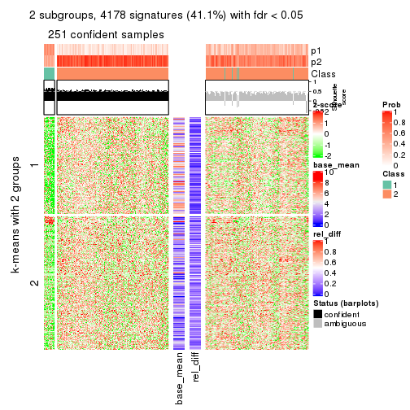</p>

</div>
<div id='tab-CV-mclust-get-signatures-2'>
<pre><code class="r">get_signatures(res, k = 3)
</code></pre>

<p></p>

</div>
<div id='tab-CV-mclust-get-signatures-3'>
<pre><code class="r">get_signatures(res, k = 4)
</code></pre>

<p></p>

</div>
<div id='tab-CV-mclust-get-signatures-4'>
<pre><code class="r">get_signatures(res, k = 5)
</code></pre>

<p></p>

</div>
<div id='tab-CV-mclust-get-signatures-5'>
<pre><code class="r">get_signatures(res, k = 6)
</code></pre>

<p></p>

</div>
</div>


Signature heatmaps where rows are not scaled:


<script>
$( function() {
	$( '#tabs-CV-mclust-get-signatures-no-scale' ).tabs();
} );
</script>
<div id='tabs-CV-mclust-get-signatures-no-scale'>
<ul>
<li><a href='#tab-CV-mclust-get-signatures-no-scale-1'>k = 2</a></li>
<li><a href='#tab-CV-mclust-get-signatures-no-scale-2'>k = 3</a></li>
<li><a href='#tab-CV-mclust-get-signatures-no-scale-3'>k = 4</a></li>
<li><a href='#tab-CV-mclust-get-signatures-no-scale-4'>k = 5</a></li>
<li><a href='#tab-CV-mclust-get-signatures-no-scale-5'>k = 6</a></li>
</ul>
<div id='tab-CV-mclust-get-signatures-no-scale-1'>
<pre><code class="r">get_signatures(res, k = 2, scale_rows = FALSE)
</code></pre>

<p></p>

</div>
<div id='tab-CV-mclust-get-signatures-no-scale-2'>
<pre><code class="r">get_signatures(res, k = 3, scale_rows = FALSE)
</code></pre>

<p></p>

</div>
<div id='tab-CV-mclust-get-signatures-no-scale-3'>
<pre><code class="r">get_signatures(res, k = 4, scale_rows = FALSE)
</code></pre>

<p>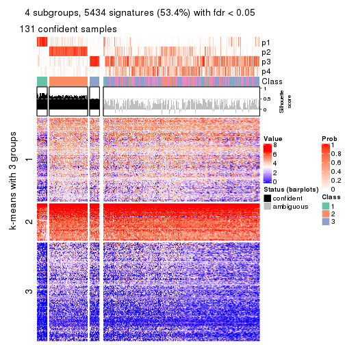</p>

</div>
<div id='tab-CV-mclust-get-signatures-no-scale-4'>
<pre><code class="r">get_signatures(res, k = 5, scale_rows = FALSE)
</code></pre>

<p></p>

</div>
<div id='tab-CV-mclust-get-signatures-no-scale-5'>
<pre><code class="r">get_signatures(res, k = 6, scale_rows = FALSE)
</code></pre>

<p></p>

</div>
</div>


Compare the overlap of signatures from different k:

```r
compare_signatures(res)
```


`get_signature()` returns a data frame invisibly. TO get the list of signatures, the function
call should be assigned to a variable explicitly. In following code, if `plot` argument is set
to `FALSE`, no heatmap is plotted while only the differential analysis is performed.

```r
# code only for demonstration
tb = get_signature(res, k = ..., plot = FALSE)
```

An example of the output of `tb` is:

```
#>   which_row         fdr    mean_1    mean_2 scaled_mean_1 scaled_mean_2 km
#> 1        38 0.042760348  8.373488  9.131774    -0.5533452     0.5164555  1
#> 2        40 0.018707592  7.106213  8.469186    -0.6173731     0.5762149  1
#> 3        55 0.019134737 10.221463 11.207825    -0.6159697     0.5749050  1
#> 4        59 0.006059896  5.921854  7.869574    -0.6899429     0.6439467  1
#> 5        60 0.018055526  8.928898 10.211722    -0.6204761     0.5791110  1
#> 6        98 0.009384629 15.714769 14.887706     0.6635654    -0.6193277  2
...
```

The columns in `tb` are:

1. `which_row`: row indices corresponding to the input matrix.
2. `fdr`: FDR for the differential test. 
3. `mean_x`: The mean value in group x.
4. `scaled_mean_x`: The mean value in group x after rows are scaled.
5. `km`: Row groups if k-means clustering is applied to rows.


UMAP plot which shows how samples are separated.


<script>
$( function() {
	$( '#tabs-CV-mclust-dimension-reduction' ).tabs();
} );
</script>
<div id='tabs-CV-mclust-dimension-reduction'>
<ul>
<li><a href='#tab-CV-mclust-dimension-reduction-1'>k = 2</a></li>
<li><a href='#tab-CV-mclust-dimension-reduction-2'>k = 3</a></li>
<li><a href='#tab-CV-mclust-dimension-reduction-3'>k = 4</a></li>
<li><a href='#tab-CV-mclust-dimension-reduction-4'>k = 5</a></li>
<li><a href='#tab-CV-mclust-dimension-reduction-5'>k = 6</a></li>
</ul>
<div id='tab-CV-mclust-dimension-reduction-1'>
<pre><code class="r">dimension_reduction(res, k = 2, method = &quot;UMAP&quot;)
</code></pre>

<p></p>

</div>
<div id='tab-CV-mclust-dimension-reduction-2'>
<pre><code class="r">dimension_reduction(res, k = 3, method = &quot;UMAP&quot;)
</code></pre>

<p></p>

</div>
<div id='tab-CV-mclust-dimension-reduction-3'>
<pre><code class="r">dimension_reduction(res, k = 4, method = &quot;UMAP&quot;)
</code></pre>

<p></p>

</div>
<div id='tab-CV-mclust-dimension-reduction-4'>
<pre><code class="r">dimension_reduction(res, k = 5, method = &quot;UMAP&quot;)
</code></pre>

<p></p>

</div>
<div id='tab-CV-mclust-dimension-reduction-5'>
<pre><code class="r">dimension_reduction(res, k = 6, method = &quot;UMAP&quot;)
</code></pre>

<p>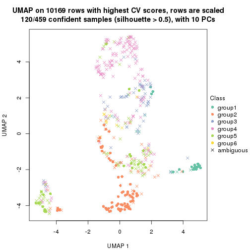</p>

</div>
</div>


Following heatmap shows how subgroups are split when increasing `k`:

```r
collect_classes(res)
```


If matrix rows can be associated to genes, consider to use `functional_enrichment(res,
...)` to perform function enrichment for the signature genes. See [this vignette](http://bioconductor.org/packages/devel/bioc/vignettes/cola/inst/doc/functional_enrichment.html) for more detailed explanations.


 

---------------------------------------------------


### CV:NMF


The object with results only for a single top-value method and a single partition method 
can be extracted as:

```r
res = res_list["CV", "NMF"]
# you can also extract it by
# res = res_list["CV:NMF"]
```

A summary of `res` and all the functions that can be applied to it:

```r
res
```

```
#> A 'ConsensusPartition' object with k = 2, 3, 4, 5, 6.
#>   On a matrix with 10169 rows and 459 columns.
#>   Top rows (1000, 2000, 3000, 4000, 5000) are extracted by 'CV' method.
#>   Subgroups are detected by 'NMF' method.
#>   Performed in total 1250 partitions by row resampling.
#>   Best k for subgroups seems to be 2.
#> 
#> Following methods can be applied to this 'ConsensusPartition' object:
#>  [1] "cola_report"             "collect_classes"         "collect_plots"          
#>  [4] "collect_stats"           "colnames"                "compare_signatures"     
#>  [7] "consensus_heatmap"       "dimension_reduction"     "functional_enrichment"  
#> [10] "get_anno_col"            "get_anno"                "get_classes"            
#> [13] "get_consensus"           "get_matrix"              "get_membership"         
#> [16] "get_param"               "get_signatures"          "get_stats"              
#> [19] "is_best_k"               "is_stable_k"             "membership_heatmap"     
#> [22] "ncol"                    "nrow"                    "plot_ecdf"              
#> [25] "rownames"                "select_partition_number" "show"                   
#> [28] "suggest_best_k"          "test_to_known_factors"
```

`collect_plots()` function collects all the plots made from `res` for all `k` (number of partitions)
into one single page to provide an easy and fast comparison between different `k`.

```r
collect_plots(res)
```


The plots are:

- The first row: a plot of the ECDF (empirical cumulative distribution
  function) curves of the consensus matrix for each `k` and the heatmap of
  predicted classes for each `k`.
- The second row: heatmaps of the consensus matrix for each `k`.
- The third row: heatmaps of the membership matrix for each `k`.
- The fouth row: heatmaps of the signatures for each `k`.

All the plots in panels can be made by individual functions and they are
plotted later in this section.

`select_partition_number()` produces several plots showing different
statistics for choosing "optimized" `k`. There are following statistics:

- ECDF curves of the consensus matrix for each `k`;
- 1-PAC. [The PAC
  score](https://en.wikipedia.org/wiki/Consensus_clustering#Over-interpretation_potential_of_consensus_clustering)
  measures the proportion of the ambiguous subgrouping.
- Mean silhouette score.
- Concordance. The mean probability of fiting the consensus class ids in all
  partitions.
- Area increased. Denote $A_k$ as the area under the ECDF curve for current
  `k`, the area increased is defined as $A_k - A_{k-1}$.
- Rand index. The percent of pairs of samples that are both in a same cluster
  or both are not in a same cluster in the partition of k and k-1.
- Jaccard index. The ratio of pairs of samples are both in a same cluster in
  the partition of k and k-1 and the pairs of samples are both in a same
  cluster in the partition k or k-1.

The detailed explanations of these statistics can be found in [the _cola_
vignette](http://bioconductor.org/packages/devel/bioc/vignettes/cola/inst/doc/cola.html#toc_13).

Generally speaking, lower PAC score, higher mean silhouette score or higher
concordance corresponds to better partition. Rand index and Jaccard index
measure how similar the current partition is compared to partition with `k-1`.
If they are too similar, we won't accept `k` is better than `k-1`.

```r
select_partition_number(res)
```


The numeric values for all these statistics can be obtained by `get_stats()`.

```r
get_stats(res)
```

```
#>   k 1-PAC mean_silhouette concordance area_increased  Rand Jaccard
#> 2 2 0.313           0.740       0.863         0.4741 0.515   0.515
#> 3 3 0.242           0.477       0.705         0.3441 0.730   0.538
#> 4 4 0.369           0.440       0.678         0.1474 0.775   0.490
#> 5 5 0.441           0.417       0.628         0.0761 0.845   0.521
#> 6 6 0.520           0.474       0.636         0.0441 0.876   0.525
```

`suggest_best_k()` suggests the best $k$ based on these statistics. The rules are as follows:

- All $k$ with Jaccard index larger than 0.95 are removed because increasing
  $k$ does not provide enough extra information. If all $k$ are removed, it is
  marked as no subgroup is detected.
- For all $k$ with 1-PAC score larger than 0.9, the maximal $k$ is taken as
  the best $k$, and other $k$ are marked as optional $k$.
- If it does not fit the second rule. The $k$ with the maximal vote of the
  highest 1-PAC score, highest mean silhouette, and highest concordance is
  taken as the best $k$.

```r
suggest_best_k(res)
```

```
#> [1] 2
```


Following shows the table of the partitions (You need to click the **show/hide
code output** link to see it). The membership matrix (columns with name `p*`)
is inferred by
[`clue::cl_consensus()`](https://www.rdocumentation.org/link/cl_consensus?package=clue)
function with the `SE` method. Basically the value in the membership matrix
represents the probability to belong to a certain group. The finall class
label for an item is determined with the group with highest probability it
belongs to.

In `get_classes()` function, the entropy is calculated from the membership
matrix and the silhouette score is calculated from the consensus matrix.


<script>
$( function() {
	$( '#tabs-CV-NMF-get-classes' ).tabs();
} );
</script>
<div id='tabs-CV-NMF-get-classes'>
<ul>
<li><a href='#tab-CV-NMF-get-classes-1'>k = 2</a></li>
<li><a href='#tab-CV-NMF-get-classes-2'>k = 3</a></li>
<li><a href='#tab-CV-NMF-get-classes-3'>k = 4</a></li>
<li><a href='#tab-CV-NMF-get-classes-4'>k = 5</a></li>
<li><a href='#tab-CV-NMF-get-classes-5'>k = 6</a></li>
</ul>

<div id='tab-CV-NMF-get-classes-1'>
<p><a id='tab-CV-NMF-get-classes-1-a' style='color:#0366d6' href='#'>show/hide code output</a></p>
<pre><code class="r">cbind(get_classes(res, k = 2), get_membership(res, k = 2))
</code></pre>

<pre><code>#&gt;            class entropy silhouette    p1    p2
#&gt; SRR1699874     1  0.4431    0.83728 0.908 0.092
#&gt; SRR1699875     1  0.2236    0.82614 0.964 0.036
#&gt; SRR1699876     2  0.4161    0.84604 0.084 0.916
#&gt; SRR1699877     1  0.7602    0.74569 0.780 0.220
#&gt; SRR1699879     1  0.7453    0.76592 0.788 0.212
#&gt; SRR1699878     1  0.4161    0.80353 0.916 0.084
#&gt; SRR1699880     1  0.7528    0.75739 0.784 0.216
#&gt; SRR1699881     1  0.8327    0.70104 0.736 0.264
#&gt; SRR1699882     1  0.4022    0.83976 0.920 0.080
#&gt; SRR1699883     1  0.1414    0.82003 0.980 0.020
#&gt; SRR1699884     1  0.4815    0.83039 0.896 0.104
#&gt; SRR1699885     1  0.2423    0.83535 0.960 0.040
#&gt; SRR1699886     2  0.9710    0.33007 0.400 0.600
#&gt; SRR1699888     2  0.5408    0.81624 0.124 0.876
#&gt; SRR1699889     2  0.1843    0.86010 0.028 0.972
#&gt; SRR1699890     1  1.0000    0.01380 0.504 0.496
#&gt; SRR1699887     1  0.9922    0.31488 0.552 0.448
#&gt; SRR1699891     2  0.5408    0.81894 0.124 0.876
#&gt; SRR1699892     2  0.9522    0.37193 0.372 0.628
#&gt; SRR1699893     2  0.0938    0.85642 0.012 0.988
#&gt; SRR1699894     2  0.7950    0.68541 0.240 0.760
#&gt; SRR1699895     2  0.3114    0.85552 0.056 0.944
#&gt; SRR1699896     1  0.3733    0.83949 0.928 0.072
#&gt; SRR1699897     1  0.5842    0.81652 0.860 0.140
#&gt; SRR1699898     2  0.0938    0.85607 0.012 0.988
#&gt; SRR1699900     2  0.8016    0.68801 0.244 0.756
#&gt; SRR1699899     2  0.7602    0.72123 0.220 0.780
#&gt; SRR1699902     2  0.2778    0.85504 0.048 0.952
#&gt; SRR1699901     2  0.5737    0.79278 0.136 0.864
#&gt; SRR1699903     2  0.4022    0.81917 0.080 0.920
#&gt; SRR1699904     2  0.5178    0.81466 0.116 0.884
#&gt; SRR1699905     2  0.5629    0.77993 0.132 0.868
#&gt; SRR1699906     2  0.4815    0.82689 0.104 0.896
#&gt; SRR1699907     2  0.9661    0.38634 0.392 0.608
#&gt; SRR1699908     2  0.2043    0.85922 0.032 0.968
#&gt; SRR1699909     2  0.2043    0.85863 0.032 0.968
#&gt; SRR1699910     2  0.4431    0.83197 0.092 0.908
#&gt; SRR1699911     2  0.9815    0.30949 0.420 0.580
#&gt; SRR1699912     2  0.1414    0.85500 0.020 0.980
#&gt; SRR1699913     2  0.0376    0.85282 0.004 0.996
#&gt; SRR1699914     2  0.9358    0.47511 0.352 0.648
#&gt; SRR1699915     2  0.0938    0.85444 0.012 0.988
#&gt; SRR1699916     2  0.4815    0.82828 0.104 0.896
#&gt; SRR1699917     2  0.0376    0.85489 0.004 0.996
#&gt; SRR1699918     2  0.0672    0.85668 0.008 0.992
#&gt; SRR1699919     2  0.2948    0.85800 0.052 0.948
#&gt; SRR1699920     2  0.1184    0.85888 0.016 0.984
#&gt; SRR1699921     2  0.2236    0.85999 0.036 0.964
#&gt; SRR1699922     1  0.9710    0.36918 0.600 0.400
#&gt; SRR1699923     2  0.9286    0.51334 0.344 0.656
#&gt; SRR1699924     2  0.2236    0.85745 0.036 0.964
#&gt; SRR1699925     1  0.7745    0.74097 0.772 0.228
#&gt; SRR1699926     2  0.5842    0.78962 0.140 0.860
#&gt; SRR1699927     2  0.0938    0.85779 0.012 0.988
#&gt; SRR1699929     1  0.5737    0.82249 0.864 0.136
#&gt; SRR1699928     2  0.8955    0.58725 0.312 0.688
#&gt; SRR1699930     2  0.7376    0.71710 0.208 0.792
#&gt; SRR1699931     1  0.7815    0.75968 0.768 0.232
#&gt; SRR1699933     1  0.7453    0.75420 0.788 0.212
#&gt; SRR1699932     1  0.9710    0.43385 0.600 0.400
#&gt; SRR1699934     1  0.2778    0.81709 0.952 0.048
#&gt; SRR1699935     2  0.3584    0.85086 0.068 0.932
#&gt; SRR1699936     2  0.3879    0.84765 0.076 0.924
#&gt; SRR1699937     1  0.6438    0.80322 0.836 0.164
#&gt; SRR1699938     1  0.6973    0.78533 0.812 0.188
#&gt; SRR1699940     1  0.6973    0.75088 0.812 0.188
#&gt; SRR1699939     1  0.9129    0.59312 0.672 0.328
#&gt; SRR1699941     1  0.5294    0.82682 0.880 0.120
#&gt; SRR1699942     2  0.6712    0.76628 0.176 0.824
#&gt; SRR1699943     1  0.5519    0.82214 0.872 0.128
#&gt; SRR1699944     1  0.4161    0.83639 0.916 0.084
#&gt; SRR1699945     1  0.3584    0.84058 0.932 0.068
#&gt; SRR1699946     1  0.3431    0.83965 0.936 0.064
#&gt; SRR1699947     1  0.0938    0.82499 0.988 0.012
#&gt; SRR1699948     1  0.7745    0.74833 0.772 0.228
#&gt; SRR1699949     2  0.9427    0.47709 0.360 0.640
#&gt; SRR1699950     1  0.8955    0.63097 0.688 0.312
#&gt; SRR1699951     2  0.9996   -0.08473 0.488 0.512
#&gt; SRR1699952     1  0.4161    0.83770 0.916 0.084
#&gt; SRR1699953     1  0.8327    0.71624 0.736 0.264
#&gt; SRR1699954     1  0.0938    0.82707 0.988 0.012
#&gt; SRR1699955     2  0.9866    0.18945 0.432 0.568
#&gt; SRR1699956     1  0.7299    0.77025 0.796 0.204
#&gt; SRR1699957     1  0.3733    0.83784 0.928 0.072
#&gt; SRR1699959     2  0.9775    0.23351 0.412 0.588
#&gt; SRR1699958     2  0.1633    0.85849 0.024 0.976
#&gt; SRR1699960     2  0.5408    0.81924 0.124 0.876
#&gt; SRR1699961     1  0.9922    0.32810 0.552 0.448
#&gt; SRR1699962     1  0.7674    0.74749 0.776 0.224
#&gt; SRR1699963     2  0.4939    0.83255 0.108 0.892
#&gt; SRR1699964     1  0.6531    0.80882 0.832 0.168
#&gt; SRR1699965     1  0.8661    0.66744 0.712 0.288
#&gt; SRR1699966     2  0.7453    0.72749 0.212 0.788
#&gt; SRR1699967     1  0.8016    0.73528 0.756 0.244
#&gt; SRR1699968     2  0.9087    0.55845 0.324 0.676
#&gt; SRR1699969     2  0.7299    0.75353 0.204 0.796
#&gt; SRR1699971     1  0.8555    0.67393 0.720 0.280
#&gt; SRR1699970     1  0.7745    0.75237 0.772 0.228
#&gt; SRR1699972     1  0.9866    0.30779 0.568 0.432
#&gt; SRR1699973     2  0.2236    0.85682 0.036 0.964
#&gt; SRR1699974     1  0.7299    0.77662 0.796 0.204
#&gt; SRR1699975     2  0.4298    0.82767 0.088 0.912
#&gt; SRR1699976     1  0.6887    0.78782 0.816 0.184
#&gt; SRR1699977     2  0.6247    0.79494 0.156 0.844
#&gt; SRR1699978     2  0.8763    0.61083 0.296 0.704
#&gt; SRR1699979     2  0.7376    0.73130 0.208 0.792
#&gt; SRR1699980     2  0.2603    0.85559 0.044 0.956
#&gt; SRR1699981     2  0.2043    0.85309 0.032 0.968
#&gt; SRR1699982     2  0.5294    0.80408 0.120 0.880
#&gt; SRR1699983     2  0.9170    0.50166 0.332 0.668
#&gt; SRR1699984     1  0.9286    0.56015 0.656 0.344
#&gt; SRR1699985     2  0.2236    0.85734 0.036 0.964
#&gt; SRR1699986     1  0.6887    0.74953 0.816 0.184
#&gt; SRR1699988     2  0.9491    0.47505 0.368 0.632
#&gt; SRR1699987     2  0.1843    0.85854 0.028 0.972
#&gt; SRR1699989     2  0.7602    0.71888 0.220 0.780
#&gt; SRR1699990     2  0.6048    0.80270 0.148 0.852
#&gt; SRR1699992     1  0.6438    0.80057 0.836 0.164
#&gt; SRR1699991     2  0.4298    0.84193 0.088 0.912
#&gt; SRR1699993     1  0.9954    0.29731 0.540 0.460
#&gt; SRR1699994     1  0.8386    0.70545 0.732 0.268
#&gt; SRR1699995     2  0.3584    0.85242 0.068 0.932
#&gt; SRR1699996     1  0.3274    0.83756 0.940 0.060
#&gt; SRR1699997     2  0.0938    0.85680 0.012 0.988
#&gt; SRR1699998     1  0.9896    0.17795 0.560 0.440
#&gt; SRR1699999     1  0.5294    0.83104 0.880 0.120
#&gt; SRR1700000     1  0.8813    0.56649 0.700 0.300
#&gt; SRR1700002     1  0.9970    0.20659 0.532 0.468
#&gt; SRR1700001     2  0.9833    0.25205 0.424 0.576
#&gt; SRR1700003     2  0.1414    0.85548 0.020 0.980
#&gt; SRR1700004     1  1.0000    0.09338 0.504 0.496
#&gt; SRR1700005     1  0.4022    0.81377 0.920 0.080
#&gt; SRR1700006     2  0.6531    0.78519 0.168 0.832
#&gt; SRR1700007     2  0.1184    0.85733 0.016 0.984
#&gt; SRR1700008     2  0.3733    0.85276 0.072 0.928
#&gt; SRR1700009     1  0.9460    0.54057 0.636 0.364
#&gt; SRR1700010     1  0.7453    0.76946 0.788 0.212
#&gt; SRR1700011     2  0.4161    0.84388 0.084 0.916
#&gt; SRR1700013     1  0.9710    0.45190 0.600 0.400
#&gt; SRR1700012     2  0.7139    0.75326 0.196 0.804
#&gt; SRR1700014     2  0.3879    0.84860 0.076 0.924
#&gt; SRR1700015     1  0.9044    0.63428 0.680 0.320
#&gt; SRR1700016     2  0.9170    0.49791 0.332 0.668
#&gt; SRR1700018     2  0.9044    0.51159 0.320 0.680
#&gt; SRR1700017     2  0.9815    0.23250 0.420 0.580
#&gt; SRR1700019     1  0.9996    0.19474 0.512 0.488
#&gt; SRR1700020     2  0.0938    0.85642 0.012 0.988
#&gt; SRR1700021     2  0.7528    0.71266 0.216 0.784
#&gt; SRR1700023     2  0.9866    0.23060 0.432 0.568
#&gt; SRR1700022     2  0.6148    0.80256 0.152 0.848
#&gt; SRR1700024     2  0.0376    0.85489 0.004 0.996
#&gt; SRR1700025     1  0.7745    0.75606 0.772 0.228
#&gt; SRR1700026     2  0.9977   -0.01590 0.472 0.528
#&gt; SRR1700027     2  0.9983   -0.00653 0.476 0.524
#&gt; SRR1700028     2  0.1414    0.85932 0.020 0.980
#&gt; SRR1700029     2  0.2043    0.85847 0.032 0.968
#&gt; SRR1700030     2  0.1184    0.85737 0.016 0.984
#&gt; SRR1700031     2  0.6623    0.77530 0.172 0.828
#&gt; SRR1700032     1  0.9248    0.57758 0.660 0.340
#&gt; SRR1700034     2  0.9686    0.29564 0.396 0.604
#&gt; SRR1700035     2  0.0672    0.85576 0.008 0.992
#&gt; SRR1700033     2  0.9460    0.43731 0.364 0.636
#&gt; SRR1700036     2  0.7219    0.74638 0.200 0.800
#&gt; SRR1700037     2  0.3114    0.85294 0.056 0.944
#&gt; SRR1700038     1  0.9427    0.55896 0.640 0.360
#&gt; SRR1700039     2  0.5408    0.81694 0.124 0.876
#&gt; SRR1700040     2  0.5519    0.82764 0.128 0.872
#&gt; SRR1700041     2  0.1843    0.85802 0.028 0.972
#&gt; SRR1700042     2  0.2423    0.85762 0.040 0.960
#&gt; SRR1700043     2  0.9963    0.02752 0.464 0.536
#&gt; SRR1700045     2  0.3879    0.84924 0.076 0.924
#&gt; SRR1700044     2  0.5294    0.82458 0.120 0.880
#&gt; SRR1700046     2  0.3274    0.85296 0.060 0.940
#&gt; SRR1700047     2  0.9460    0.45560 0.364 0.636
#&gt; SRR1700048     2  0.1633    0.85964 0.024 0.976
#&gt; SRR1700049     2  0.3879    0.84734 0.076 0.924
#&gt; SRR1700050     2  0.0938    0.85490 0.012 0.988
#&gt; SRR1700051     2  0.2423    0.85664 0.040 0.960
#&gt; SRR1700052     2  0.8443    0.62462 0.272 0.728
#&gt; SRR1700053     2  0.0938    0.85696 0.012 0.988
#&gt; SRR1700054     2  0.2948    0.85465 0.052 0.948
#&gt; SRR1700055     1  0.9998    0.15675 0.508 0.492
#&gt; SRR1700056     2  0.0938    0.85642 0.012 0.988
#&gt; SRR1700057     2  0.0938    0.85642 0.012 0.988
#&gt; SRR1700058     2  0.7056    0.75974 0.192 0.808
#&gt; SRR1700059     2  0.0938    0.85642 0.012 0.988
#&gt; SRR1700060     2  0.3274    0.85541 0.060 0.940
#&gt; SRR1700061     2  0.6531    0.78656 0.168 0.832
#&gt; SRR1700062     2  0.0672    0.85576 0.008 0.992
#&gt; SRR1700063     2  0.2043    0.85948 0.032 0.968
#&gt; SRR1700064     2  0.7299    0.74117 0.204 0.796
#&gt; SRR1700065     2  0.6438    0.75939 0.164 0.836
#&gt; SRR1700066     2  0.5946    0.81349 0.144 0.856
#&gt; SRR1700067     2  0.0376    0.85494 0.004 0.996
#&gt; SRR1700068     2  0.0672    0.85576 0.008 0.992
#&gt; SRR1700069     2  0.3879    0.84724 0.076 0.924
#&gt; SRR1700070     2  0.5946    0.80978 0.144 0.856
#&gt; SRR1700071     2  0.4562    0.83575 0.096 0.904
#&gt; SRR1700072     1  0.9635    0.40520 0.612 0.388
#&gt; SRR1700073     2  0.0000    0.85344 0.000 1.000
#&gt; SRR1700075     2  0.8713    0.59450 0.292 0.708
#&gt; SRR1700074     2  0.9170    0.51444 0.332 0.668
#&gt; SRR1700076     1  0.9044    0.61943 0.680 0.320
#&gt; SRR1700077     1  0.9000    0.63980 0.684 0.316
#&gt; SRR1700078     2  0.5629    0.80808 0.132 0.868
#&gt; SRR1700080     2  0.7219    0.75443 0.200 0.800
#&gt; SRR1700079     2  0.1414    0.85703 0.020 0.980
#&gt; SRR1700081     2  1.0000   -0.06411 0.496 0.504
#&gt; SRR1700082     2  0.4431    0.84068 0.092 0.908
#&gt; SRR1700083     2  0.2043    0.85843 0.032 0.968
#&gt; SRR1700084     2  0.9427    0.41358 0.360 0.640
#&gt; SRR1700085     2  0.2423    0.85834 0.040 0.960
#&gt; SRR1700086     2  0.2778    0.85540 0.048 0.952
#&gt; SRR1700087     2  0.5178    0.80345 0.116 0.884
#&gt; SRR1700088     2  0.9977    0.08388 0.472 0.528
#&gt; SRR1700089     1  0.9933    0.32071 0.548 0.452
#&gt; SRR1700091     2  0.5842    0.80718 0.140 0.860
#&gt; SRR1700090     2  0.0938    0.85642 0.012 0.988
#&gt; SRR1700092     2  0.7056    0.76490 0.192 0.808
#&gt; SRR1700094     2  0.5059    0.83042 0.112 0.888
#&gt; SRR1700093     2  0.1184    0.85696 0.016 0.984
#&gt; SRR1700095     2  0.0938    0.85642 0.012 0.988
#&gt; SRR1700096     2  0.1633    0.85750 0.024 0.976
#&gt; SRR1700097     2  0.0938    0.85673 0.012 0.988
#&gt; SRR1700098     2  0.9833    0.24533 0.424 0.576
#&gt; SRR1700099     2  0.0938    0.85642 0.012 0.988
#&gt; SRR1700100     2  0.1414    0.85670 0.020 0.980
#&gt; SRR1700101     2  0.5294    0.82561 0.120 0.880
#&gt; SRR1700102     2  0.6887    0.77420 0.184 0.816
#&gt; SRR1700104     2  0.1414    0.85763 0.020 0.980
#&gt; SRR1700103     2  0.5059    0.83727 0.112 0.888
#&gt; SRR1700105     2  0.7453    0.73266 0.212 0.788
#&gt; SRR1700106     2  0.1843    0.85880 0.028 0.972
#&gt; SRR1700107     2  0.2778    0.85845 0.048 0.952
#&gt; SRR1700108     2  0.3584    0.85283 0.068 0.932
#&gt; SRR1700109     2  0.1414    0.85867 0.020 0.980
#&gt; SRR1700110     2  0.2603    0.85644 0.044 0.956
#&gt; SRR1700112     2  0.2043    0.85769 0.032 0.968
#&gt; SRR1700111     2  0.0376    0.85282 0.004 0.996
#&gt; SRR1700113     2  0.1184    0.85769 0.016 0.984
#&gt; SRR1700114     2  0.1414    0.85753 0.020 0.980
#&gt; SRR1700115     2  0.0938    0.85642 0.012 0.988
#&gt; SRR1700116     2  0.2423    0.83977 0.040 0.960
#&gt; SRR1700117     2  0.0376    0.85489 0.004 0.996
#&gt; SRR1700119     2  0.0938    0.85642 0.012 0.988
#&gt; SRR1700118     2  0.1184    0.84868 0.016 0.984
#&gt; SRR1700120     2  0.2778    0.85382 0.048 0.952
#&gt; SRR1700121     2  0.0938    0.85642 0.012 0.988
#&gt; SRR1700122     2  0.0000    0.85344 0.000 1.000
#&gt; SRR1700123     2  0.0938    0.85642 0.012 0.988
#&gt; SRR1700125     2  0.0938    0.85642 0.012 0.988
#&gt; SRR1700126     2  0.0672    0.85644 0.008 0.992
#&gt; SRR1700127     2  0.0938    0.85642 0.012 0.988
#&gt; SRR1700124     2  0.0938    0.85642 0.012 0.988
#&gt; SRR1700128     2  0.0376    0.85469 0.004 0.996
#&gt; SRR1700129     2  0.0000    0.85344 0.000 1.000
#&gt; SRR1700130     2  0.4298    0.80949 0.088 0.912
#&gt; SRR1700132     2  0.0000    0.85344 0.000 1.000
#&gt; SRR1700131     2  0.2948    0.85626 0.052 0.948
#&gt; SRR1700133     2  0.1184    0.85696 0.016 0.984
#&gt; SRR1700134     2  0.0938    0.85642 0.012 0.988
#&gt; SRR1700135     2  0.3114    0.83602 0.056 0.944
#&gt; SRR1700136     2  0.0938    0.85642 0.012 0.988
#&gt; SRR1700137     2  0.1184    0.85746 0.016 0.984
#&gt; SRR1700138     2  0.0938    0.85642 0.012 0.988
#&gt; SRR1700140     2  0.0376    0.85469 0.004 0.996
#&gt; SRR1700139     2  0.0376    0.85469 0.004 0.996
#&gt; SRR1700141     2  0.0376    0.85469 0.004 0.996
#&gt; SRR1700142     2  0.0672    0.85329 0.008 0.992
#&gt; SRR1700143     2  0.0938    0.85642 0.012 0.988
#&gt; SRR1700144     2  0.3274    0.85428 0.060 0.940
#&gt; SRR1700145     2  0.2778    0.84930 0.048 0.952
#&gt; SRR1700146     2  0.0938    0.85642 0.012 0.988
#&gt; SRR1700147     2  0.3274    0.85030 0.060 0.940
#&gt; SRR1700149     2  0.0938    0.85313 0.012 0.988
#&gt; SRR1700148     2  0.0938    0.85642 0.012 0.988
#&gt; SRR1700150     2  0.0672    0.85574 0.008 0.992
#&gt; SRR1700152     2  0.1184    0.85774 0.016 0.984
#&gt; SRR1700151     2  0.0938    0.85642 0.012 0.988
#&gt; SRR1700153     2  0.0672    0.85668 0.008 0.992
#&gt; SRR1700154     2  0.0938    0.85642 0.012 0.988
#&gt; SRR1700155     2  0.4690    0.83186 0.100 0.900
#&gt; SRR1700156     2  0.0938    0.85642 0.012 0.988
#&gt; SRR1700158     2  0.4562    0.83862 0.096 0.904
#&gt; SRR1700159     2  0.1633    0.85867 0.024 0.976
#&gt; SRR1700157     2  0.4815    0.80028 0.104 0.896
#&gt; SRR1700160     2  0.0938    0.85642 0.012 0.988
#&gt; SRR1700161     2  0.0938    0.85642 0.012 0.988
#&gt; SRR1700162     2  0.0938    0.85642 0.012 0.988
#&gt; SRR1700164     2  0.0376    0.85469 0.004 0.996
#&gt; SRR1700163     2  0.0938    0.85642 0.012 0.988
#&gt; SRR1700165     2  0.0938    0.85642 0.012 0.988
#&gt; SRR1700166     2  0.6247    0.79171 0.156 0.844
#&gt; SRR1700168     2  0.0376    0.85489 0.004 0.996
#&gt; SRR1700167     2  0.1414    0.84986 0.020 0.980
#&gt; SRR1700170     2  0.0000    0.85344 0.000 1.000
#&gt; SRR1700169     2  0.0938    0.85642 0.012 0.988
#&gt; SRR1700171     2  0.1414    0.85762 0.020 0.980
#&gt; SRR1700172     2  0.2043    0.85838 0.032 0.968
#&gt; SRR1700174     2  0.1184    0.85746 0.016 0.984
#&gt; SRR1700173     2  0.0938    0.85642 0.012 0.988
#&gt; SRR1700175     2  0.0938    0.85642 0.012 0.988
#&gt; SRR1700176     2  0.3274    0.84681 0.060 0.940
#&gt; SRR1700178     1  0.2778    0.83736 0.952 0.048
#&gt; SRR1700177     2  0.0376    0.85469 0.004 0.996
#&gt; SRR1700180     1  0.0376    0.82311 0.996 0.004
#&gt; SRR1700179     1  0.4022    0.83653 0.920 0.080
#&gt; SRR1700181     1  0.3274    0.84005 0.940 0.060
#&gt; SRR1700183     1  0.0376    0.82166 0.996 0.004
#&gt; SRR1700182     1  0.3274    0.83932 0.940 0.060
#&gt; SRR1700184     1  0.2043    0.83392 0.968 0.032
#&gt; SRR1700186     1  0.4690    0.83581 0.900 0.100
#&gt; SRR1700187     1  0.0672    0.82229 0.992 0.008
#&gt; SRR1700185     1  0.1184    0.82181 0.984 0.016
#&gt; SRR1700188     1  0.2423    0.83613 0.960 0.040
#&gt; SRR1700192     1  0.0672    0.82405 0.992 0.008
#&gt; SRR1700190     1  0.4431    0.83629 0.908 0.092
#&gt; SRR1700191     1  0.1184    0.81972 0.984 0.016
#&gt; SRR1700189     1  0.0672    0.82229 0.992 0.008
#&gt; SRR1700193     1  0.1843    0.83276 0.972 0.028
#&gt; SRR1700195     1  0.0000    0.82054 1.000 0.000
#&gt; SRR1700194     1  0.1184    0.81920 0.984 0.016
#&gt; SRR1700196     1  0.1843    0.83282 0.972 0.028
#&gt; SRR1700197     1  0.0672    0.82519 0.992 0.008
#&gt; SRR1700198     1  0.1633    0.83142 0.976 0.024
#&gt; SRR1700199     1  0.1184    0.82662 0.984 0.016
#&gt; SRR1700200     1  0.0938    0.82732 0.988 0.012
#&gt; SRR1700201     1  0.3879    0.83780 0.924 0.076
#&gt; SRR1700202     1  0.0672    0.82229 0.992 0.008
#&gt; SRR1700203     1  0.1184    0.81668 0.984 0.016
#&gt; SRR1700204     1  0.3274    0.83977 0.940 0.060
#&gt; SRR1700206     1  0.2778    0.83795 0.952 0.048
#&gt; SRR1700207     1  0.3584    0.83878 0.932 0.068
#&gt; SRR1700208     1  0.0672    0.82518 0.992 0.008
#&gt; SRR1700205     1  0.4562    0.79554 0.904 0.096
#&gt; SRR1700209     1  0.6343    0.80993 0.840 0.160
#&gt; SRR1700210     1  0.1184    0.81745 0.984 0.016
#&gt; SRR1700211     1  0.0672    0.81781 0.992 0.008
#&gt; SRR1700212     1  0.0672    0.81781 0.992 0.008
#&gt; SRR1700213     1  0.2603    0.83827 0.956 0.044
#&gt; SRR1700214     1  0.4161    0.83864 0.916 0.084
#&gt; SRR1700215     1  0.2423    0.83150 0.960 0.040
#&gt; SRR1700217     1  0.4161    0.83707 0.916 0.084
#&gt; SRR1700216     1  0.2043    0.81730 0.968 0.032
#&gt; SRR1700218     1  0.2778    0.83806 0.952 0.048
#&gt; SRR1700219     1  0.3584    0.83825 0.932 0.068
#&gt; SRR1700222     1  0.0672    0.82229 0.992 0.008
#&gt; SRR1700220     1  0.7602    0.76299 0.780 0.220
#&gt; SRR1700221     1  0.3733    0.83790 0.928 0.072
#&gt; SRR1700223     1  0.3733    0.83805 0.928 0.072
#&gt; SRR1700224     1  0.4161    0.82228 0.916 0.084
#&gt; SRR1700226     1  0.2236    0.83474 0.964 0.036
#&gt; SRR1700229     1  0.2043    0.81873 0.968 0.032
#&gt; SRR1700225     1  0.1843    0.83127 0.972 0.028
#&gt; SRR1700227     1  0.2236    0.83577 0.964 0.036
#&gt; SRR1700230     1  0.0672    0.82229 0.992 0.008
#&gt; SRR1700231     1  0.0672    0.82552 0.992 0.008
#&gt; SRR1700228     1  0.0938    0.81875 0.988 0.012
#&gt; SRR1700232     1  0.3431    0.83871 0.936 0.064
#&gt; SRR1700233     1  0.2778    0.83916 0.952 0.048
#&gt; SRR1700234     1  0.2948    0.83849 0.948 0.052
#&gt; SRR1700235     1  0.6148    0.80934 0.848 0.152
#&gt; SRR1700237     1  0.1184    0.82872 0.984 0.016
#&gt; SRR1700236     1  0.2423    0.83251 0.960 0.040
#&gt; SRR1700238     1  0.3274    0.83815 0.940 0.060
#&gt; SRR1700239     1  0.1184    0.82512 0.984 0.016
#&gt; SRR1700240     1  0.3274    0.81248 0.940 0.060
#&gt; SRR1700241     1  0.6531    0.80991 0.832 0.168
#&gt; SRR1700243     1  0.0938    0.82699 0.988 0.012
#&gt; SRR1700244     1  0.3114    0.83920 0.944 0.056
#&gt; SRR1700242     1  0.0672    0.82229 0.992 0.008
#&gt; SRR1700246     1  0.1633    0.81802 0.976 0.024
#&gt; SRR1700245     1  0.2948    0.83877 0.948 0.052
#&gt; SRR1700247     1  0.2236    0.81679 0.964 0.036
#&gt; SRR1700249     1  0.0938    0.82281 0.988 0.012
#&gt; SRR1700250     1  0.5519    0.82125 0.872 0.128
#&gt; SRR1700248     1  0.4431    0.83486 0.908 0.092
#&gt; SRR1700251     1  0.2236    0.83505 0.964 0.036
#&gt; SRR1700252     1  0.3584    0.84034 0.932 0.068
#&gt; SRR1700253     1  0.5946    0.80751 0.856 0.144
#&gt; SRR1700256     1  0.1184    0.82326 0.984 0.016
#&gt; SRR1700254     1  0.2043    0.82037 0.968 0.032
#&gt; SRR1700255     1  0.5178    0.82846 0.884 0.116
#&gt; SRR1700257     1  0.2603    0.83674 0.956 0.044
#&gt; SRR1700258     1  0.3733    0.83870 0.928 0.072
#&gt; SRR1700259     1  0.9944    0.27934 0.544 0.456
#&gt; SRR1700260     2  0.7299    0.74888 0.204 0.796
#&gt; SRR1700261     2  0.3733    0.84820 0.072 0.928
#&gt; SRR1700262     2  0.9552    0.40571 0.376 0.624
#&gt; SRR1700263     1  0.8861    0.59140 0.696 0.304
#&gt; SRR1700264     1  0.5519    0.82643 0.872 0.128
#&gt; SRR1700265     1  0.2236    0.83207 0.964 0.036
#&gt; SRR1700266     1  0.7745    0.74468 0.772 0.228
#&gt; SRR1700268     1  0.3274    0.83815 0.940 0.060
#&gt; SRR1700270     1  0.4022    0.83623 0.920 0.080
#&gt; SRR1700267     1  0.6531    0.80000 0.832 0.168
#&gt; SRR1700271     1  0.9323    0.56011 0.652 0.348
#&gt; SRR1700272     2  0.5519    0.82179 0.128 0.872
#&gt; SRR1700273     1  0.2423    0.83613 0.960 0.040
#&gt; SRR1700274     1  0.9580    0.52663 0.620 0.380
#&gt; SRR1700277     1  0.6973    0.79180 0.812 0.188
#&gt; SRR1700275     1  0.9491    0.53272 0.632 0.368
#&gt; SRR1700276     1  0.9491    0.55516 0.632 0.368
#&gt; SRR1700278     1  0.6048    0.81876 0.852 0.148
#&gt; SRR1700279     2  0.9922    0.23383 0.448 0.552
#&gt; SRR1700280     1  0.4161    0.83555 0.916 0.084
#&gt; SRR1700281     1  0.9970    0.17849 0.532 0.468
#&gt; SRR1700283     2  0.2236    0.84291 0.036 0.964
#&gt; SRR1700282     1  0.6801    0.79799 0.820 0.180
#&gt; SRR1700284     2  0.6247    0.79898 0.156 0.844
#&gt; SRR1700285     1  0.8144    0.73342 0.748 0.252
#&gt; SRR1700286     1  0.5629    0.82333 0.868 0.132
#&gt; SRR1700287     2  0.6438    0.78677 0.164 0.836
#&gt; SRR1700290     1  0.9944    0.29708 0.544 0.456
#&gt; SRR1700289     2  0.6048    0.78132 0.148 0.852
#&gt; SRR1700288     1  0.4161    0.83723 0.916 0.084
#&gt; SRR1700292     2  0.9970    0.16916 0.468 0.532
#&gt; SRR1700291     2  0.3274    0.85486 0.060 0.940
#&gt; SRR1700293     1  0.8713    0.67381 0.708 0.292
#&gt; SRR1700294     2  0.9944    0.18992 0.456 0.544
#&gt; SRR1700295     2  0.2778    0.85589 0.048 0.952
#&gt; SRR1700297     2  0.7299    0.73769 0.204 0.796
#&gt; SRR1700296     2  0.2778    0.85547 0.048 0.952
#&gt; SRR1700298     2  0.4690    0.83245 0.100 0.900
#&gt; SRR1700299     2  0.9850    0.29906 0.428 0.572
#&gt; SRR1700300     2  0.7139    0.73192 0.196 0.804
#&gt; SRR1700302     2  0.1184    0.85770 0.016 0.984
#&gt; SRR1700301     2  0.6801    0.75977 0.180 0.820
#&gt; SRR1700303     2  0.7950    0.68934 0.240 0.760
#&gt; SRR1700304     1  0.2778    0.83300 0.952 0.048
#&gt; SRR1700305     1  0.8713    0.67913 0.708 0.292
#&gt; SRR1700306     2  0.7056    0.75091 0.192 0.808
#&gt; SRR1700308     1  0.9358    0.45863 0.648 0.352
#&gt; SRR1700307     2  0.4690    0.84002 0.100 0.900
#&gt; SRR1700309     2  0.9944    0.21400 0.456 0.544
#&gt; SRR1700310     2  0.4161    0.84347 0.084 0.916
#&gt; SRR1700311     2  0.9087    0.53127 0.324 0.676
#&gt; SRR1700312     2  0.4431    0.83766 0.092 0.908
#&gt; SRR1700313     2  0.9754    0.27130 0.408 0.592
#&gt; SRR1700314     2  0.1633    0.85977 0.024 0.976
#&gt; SRR1700315     2  0.6887    0.74126 0.184 0.816
#&gt; SRR1700316     1  0.9944    0.24918 0.544 0.456
#&gt; SRR1700317     2  0.9922    0.15395 0.448 0.552
#&gt; SRR1700318     1  0.8327    0.69002 0.736 0.264
#&gt; SRR1700319     2  0.1843    0.85943 0.028 0.972
#&gt; SRR1700320     2  0.9129    0.53781 0.328 0.672
#&gt; SRR1700322     1  0.9491    0.51681 0.632 0.368
#&gt; SRR1700321     2  0.7139    0.75806 0.196 0.804
#&gt; SRR1700323     2  0.4815    0.83183 0.104 0.896
#&gt; SRR1700324     2  0.7745    0.70028 0.228 0.772
#&gt; SRR1700325     2  0.9686    0.27354 0.396 0.604
#&gt; SRR1700326     2  0.9983    0.09422 0.476 0.524
#&gt; SRR1700327     1  0.9998    0.10905 0.508 0.492
#&gt; SRR1700329     2  0.2043    0.85715 0.032 0.968
#&gt; SRR1700328     1  0.5408    0.77959 0.876 0.124
#&gt; SRR1700330     1  0.6623    0.80655 0.828 0.172
#&gt; SRR1700331     1  0.7950    0.72058 0.760 0.240
#&gt; SRR1700332     2  0.8081    0.68419 0.248 0.752
#&gt; SRR1700333     1  0.3431    0.83556 0.936 0.064
</code></pre>

<script>
$('#tab-CV-NMF-get-classes-1-a').parent().next().next().hide();
$('#tab-CV-NMF-get-classes-1-a').click(function(){
  $('#tab-CV-NMF-get-classes-1-a').parent().next().next().toggle();
  return(false);
});
</script>
</div>

<div id='tab-CV-NMF-get-classes-2'>
<p><a id='tab-CV-NMF-get-classes-2-a' style='color:#0366d6' href='#'>show/hide code output</a></p>
<pre><code class="r">cbind(get_classes(res, k = 3), get_membership(res, k = 3))
</code></pre>

<pre><code>#&gt;            class entropy silhouette    p1    p2    p3
#&gt; SRR1699874     2  0.4092   0.615372 0.088 0.876 0.036
#&gt; SRR1699875     2  0.5254   0.503372 0.264 0.736 0.000
#&gt; SRR1699876     3  0.9654   0.317439 0.288 0.248 0.464
#&gt; SRR1699877     2  0.6685   0.507703 0.244 0.708 0.048
#&gt; SRR1699879     2  0.5603   0.588690 0.060 0.804 0.136
#&gt; SRR1699878     2  0.6570   0.412067 0.292 0.680 0.028
#&gt; SRR1699880     2  0.4179   0.618452 0.052 0.876 0.072
#&gt; SRR1699881     2  0.4121   0.617338 0.040 0.876 0.084
#&gt; SRR1699882     2  0.3896   0.590351 0.128 0.864 0.008
#&gt; SRR1699883     2  0.6169   0.381218 0.360 0.636 0.004
#&gt; SRR1699884     2  0.3091   0.611007 0.072 0.912 0.016
#&gt; SRR1699885     2  0.2261   0.592433 0.068 0.932 0.000
#&gt; SRR1699886     2  0.9172   0.125729 0.396 0.456 0.148
#&gt; SRR1699888     3  0.5899   0.573986 0.020 0.244 0.736
#&gt; SRR1699889     3  0.6481   0.671774 0.224 0.048 0.728
#&gt; SRR1699890     1  0.8873   0.461815 0.576 0.224 0.200
#&gt; SRR1699887     2  0.7692   0.522953 0.108 0.668 0.224
#&gt; SRR1699891     3  0.7484   0.259927 0.460 0.036 0.504
#&gt; SRR1699892     2  0.9106   0.414169 0.208 0.548 0.244
#&gt; SRR1699893     3  0.2356   0.724070 0.072 0.000 0.928
#&gt; SRR1699894     3  0.8511   0.257261 0.428 0.092 0.480
#&gt; SRR1699895     3  0.5486   0.699935 0.196 0.024 0.780
#&gt; SRR1699896     2  0.4413   0.567353 0.160 0.832 0.008
#&gt; SRR1699897     2  0.5408   0.615114 0.136 0.812 0.052
#&gt; SRR1699898     3  0.4335   0.692670 0.100 0.036 0.864
#&gt; SRR1699900     1  0.8941   0.204063 0.548 0.160 0.292
#&gt; SRR1699899     1  0.9547  -0.115091 0.416 0.192 0.392
#&gt; SRR1699902     3  0.9787   0.210236 0.348 0.240 0.412
#&gt; SRR1699901     1  0.8963  -0.079411 0.468 0.128 0.404
#&gt; SRR1699903     1  0.8304  -0.091747 0.504 0.080 0.416
#&gt; SRR1699904     3  0.6079   0.660236 0.128 0.088 0.784
#&gt; SRR1699905     1  0.7995  -0.109718 0.480 0.060 0.460
#&gt; SRR1699906     3  0.8590   0.427065 0.320 0.120 0.560
#&gt; SRR1699907     1  0.8354   0.336217 0.576 0.104 0.320
#&gt; SRR1699908     3  0.4848   0.712182 0.128 0.036 0.836
#&gt; SRR1699909     3  0.4261   0.717729 0.140 0.012 0.848
#&gt; SRR1699910     3  0.7492   0.535227 0.340 0.052 0.608
#&gt; SRR1699911     1  0.7244   0.428220 0.700 0.092 0.208
#&gt; SRR1699912     3  0.6126   0.503991 0.400 0.000 0.600
#&gt; SRR1699913     3  0.4629   0.644683 0.188 0.004 0.808
#&gt; SRR1699914     3  0.9646   0.327246 0.260 0.272 0.468
#&gt; SRR1699915     3  0.5835   0.552210 0.340 0.000 0.660
#&gt; SRR1699916     3  0.4845   0.720398 0.104 0.052 0.844
#&gt; SRR1699917     3  0.3043   0.728588 0.084 0.008 0.908
#&gt; SRR1699918     3  0.4351   0.704846 0.168 0.004 0.828
#&gt; SRR1699919     3  0.5708   0.684366 0.204 0.028 0.768
#&gt; SRR1699920     3  0.3349   0.724135 0.108 0.004 0.888
#&gt; SRR1699921     3  0.6487   0.640625 0.268 0.032 0.700
#&gt; SRR1699922     1  0.6349   0.507072 0.768 0.092 0.140
#&gt; SRR1699923     1  0.8637   0.210610 0.564 0.128 0.308
#&gt; SRR1699924     3  0.6079   0.674086 0.088 0.128 0.784
#&gt; SRR1699925     1  0.8763   0.441524 0.588 0.196 0.216
#&gt; SRR1699926     3  0.7203   0.342049 0.416 0.028 0.556
#&gt; SRR1699927     3  0.5384   0.693089 0.188 0.024 0.788
#&gt; SRR1699929     1  0.7175   0.078085 0.592 0.376 0.032
#&gt; SRR1699928     1  0.9598   0.033385 0.444 0.208 0.348
#&gt; SRR1699930     3  0.8649   0.284105 0.360 0.112 0.528
#&gt; SRR1699931     2  0.8685   0.301394 0.260 0.584 0.156
#&gt; SRR1699933     2  0.6896   0.377057 0.392 0.588 0.020
#&gt; SRR1699932     3  0.9285  -0.025988 0.160 0.392 0.448
#&gt; SRR1699934     1  0.6441   0.465484 0.696 0.276 0.028
#&gt; SRR1699935     3  0.5793   0.688706 0.084 0.116 0.800
#&gt; SRR1699936     3  0.7905   0.016466 0.056 0.444 0.500
#&gt; SRR1699937     2  0.4544   0.612061 0.084 0.860 0.056
#&gt; SRR1699938     2  0.3369   0.617517 0.040 0.908 0.052
#&gt; SRR1699940     2  0.6927   0.433631 0.296 0.664 0.040
#&gt; SRR1699939     2  0.4489   0.613417 0.036 0.856 0.108
#&gt; SRR1699941     2  0.4256   0.612879 0.096 0.868 0.036
#&gt; SRR1699942     2  0.9581   0.230014 0.252 0.480 0.268
#&gt; SRR1699943     2  0.2443   0.610666 0.032 0.940 0.028
#&gt; SRR1699944     2  0.3530   0.613747 0.068 0.900 0.032
#&gt; SRR1699945     2  0.2772   0.583012 0.080 0.916 0.004
#&gt; SRR1699946     2  0.1620   0.606343 0.024 0.964 0.012
#&gt; SRR1699947     2  0.3116   0.601091 0.108 0.892 0.000
#&gt; SRR1699948     2  0.5344   0.607870 0.084 0.824 0.092
#&gt; SRR1699949     2  0.6965   0.515765 0.060 0.696 0.244
#&gt; SRR1699950     2  0.5178   0.593569 0.028 0.808 0.164
#&gt; SRR1699951     2  0.8386   0.444703 0.112 0.584 0.304
#&gt; SRR1699952     2  0.3933   0.617633 0.092 0.880 0.028
#&gt; SRR1699953     2  0.6250   0.593452 0.120 0.776 0.104
#&gt; SRR1699954     2  0.4291   0.581072 0.180 0.820 0.000
#&gt; SRR1699955     2  0.6882   0.568109 0.096 0.732 0.172
#&gt; SRR1699956     2  0.3967   0.620790 0.044 0.884 0.072
#&gt; SRR1699957     2  0.2680   0.606608 0.068 0.924 0.008
#&gt; SRR1699959     2  0.8340   0.485851 0.144 0.620 0.236
#&gt; SRR1699958     3  0.4232   0.700982 0.084 0.044 0.872
#&gt; SRR1699960     3  0.7558   0.173987 0.044 0.400 0.556
#&gt; SRR1699961     2  0.7217   0.560225 0.132 0.716 0.152
#&gt; SRR1699962     2  0.3375   0.617952 0.044 0.908 0.048
#&gt; SRR1699963     2  0.9717   0.203449 0.304 0.448 0.248
#&gt; SRR1699964     2  0.7624   0.386454 0.392 0.560 0.048
#&gt; SRR1699965     2  0.5635   0.582504 0.036 0.784 0.180
#&gt; SRR1699966     2  0.7724   0.439500 0.072 0.620 0.308
#&gt; SRR1699967     2  0.5710   0.607300 0.080 0.804 0.116
#&gt; SRR1699968     2  0.8546   0.330009 0.108 0.544 0.348
#&gt; SRR1699969     3  0.8437   0.201653 0.092 0.388 0.520
#&gt; SRR1699971     2  0.4121   0.592812 0.108 0.868 0.024
#&gt; SRR1699970     2  0.5595   0.554049 0.228 0.756 0.016
#&gt; SRR1699972     2  0.6723   0.505453 0.248 0.704 0.048
#&gt; SRR1699973     2  0.8935   0.050714 0.124 0.452 0.424
#&gt; SRR1699974     2  0.5954   0.614112 0.116 0.792 0.092
#&gt; SRR1699975     1  0.9449  -0.127536 0.436 0.180 0.384
#&gt; SRR1699976     2  0.4945   0.606949 0.104 0.840 0.056
#&gt; SRR1699977     1  0.9920  -0.014041 0.388 0.280 0.332
#&gt; SRR1699978     3  0.8338   0.145912 0.400 0.084 0.516
#&gt; SRR1699979     2  0.7962   0.234863 0.060 0.512 0.428
#&gt; SRR1699980     3  0.8456   0.469995 0.328 0.108 0.564
#&gt; SRR1699981     3  0.7530   0.530094 0.252 0.084 0.664
#&gt; SRR1699982     3  0.6823   0.336030 0.484 0.012 0.504
#&gt; SRR1699983     3  0.9491   0.015393 0.396 0.184 0.420
#&gt; SRR1699984     1  0.6968   0.404355 0.716 0.204 0.080
#&gt; SRR1699985     3  0.9347   0.411495 0.288 0.204 0.508
#&gt; SRR1699986     1  0.5650   0.490202 0.808 0.108 0.084
#&gt; SRR1699988     1  0.9796   0.178070 0.420 0.248 0.332
#&gt; SRR1699987     3  0.6518   0.639358 0.080 0.168 0.752
#&gt; SRR1699989     3  0.9027   0.360968 0.160 0.308 0.532
#&gt; SRR1699990     3  0.9046   0.376392 0.160 0.312 0.528
#&gt; SRR1699992     2  0.2804   0.617453 0.016 0.924 0.060
#&gt; SRR1699991     3  0.9294   0.250235 0.172 0.344 0.484
#&gt; SRR1699993     3  0.9639   0.073772 0.332 0.220 0.448
#&gt; SRR1699994     2  0.5901   0.596451 0.176 0.776 0.048
#&gt; SRR1699995     3  0.5947   0.652303 0.052 0.172 0.776
#&gt; SRR1699996     2  0.6931  -0.060599 0.456 0.528 0.016
#&gt; SRR1699997     3  0.2599   0.726926 0.052 0.016 0.932
#&gt; SRR1699998     1  0.9256   0.181581 0.444 0.400 0.156
#&gt; SRR1699999     2  0.7997   0.148507 0.360 0.568 0.072
#&gt; SRR1700000     1  0.8985   0.354584 0.544 0.292 0.164
#&gt; SRR1700002     2  0.6714   0.576549 0.140 0.748 0.112
#&gt; SRR1700001     2  0.8322   0.449827 0.212 0.628 0.160
#&gt; SRR1700003     3  0.6622   0.600190 0.164 0.088 0.748
#&gt; SRR1700004     2  0.8271   0.496195 0.156 0.632 0.212
#&gt; SRR1700005     1  0.5778   0.478738 0.768 0.200 0.032
#&gt; SRR1700006     2  0.8628   0.362362 0.116 0.544 0.340
#&gt; SRR1700007     3  0.5503   0.679526 0.208 0.020 0.772
#&gt; SRR1700008     3  0.5639   0.692114 0.080 0.112 0.808
#&gt; SRR1700009     1  0.8834   0.459831 0.580 0.196 0.224
#&gt; SRR1700010     2  0.4565   0.616575 0.076 0.860 0.064
#&gt; SRR1700011     3  0.9870   0.119431 0.256 0.364 0.380
#&gt; SRR1700013     2  0.7739   0.499477 0.088 0.644 0.268
#&gt; SRR1700012     1  0.9642  -0.039482 0.440 0.216 0.344
#&gt; SRR1700014     2  0.9520   0.006761 0.188 0.416 0.396
#&gt; SRR1700015     2  0.6527   0.566516 0.188 0.744 0.068
#&gt; SRR1700016     1  0.4615   0.489327 0.836 0.020 0.144
#&gt; SRR1700018     2  0.8872   0.372546 0.140 0.536 0.324
#&gt; SRR1700017     2  0.8361   0.483640 0.216 0.624 0.160
#&gt; SRR1700019     3  0.9757  -0.057641 0.228 0.384 0.388
#&gt; SRR1700020     3  0.4269   0.711149 0.052 0.076 0.872
#&gt; SRR1700021     3  0.8409   0.473638 0.308 0.112 0.580
#&gt; SRR1700023     2  0.7878   0.525649 0.160 0.668 0.172
#&gt; SRR1700022     2  0.8291   0.411648 0.100 0.580 0.320
#&gt; SRR1700024     3  0.4934   0.718891 0.156 0.024 0.820
#&gt; SRR1700025     2  0.6148   0.584753 0.148 0.776 0.076
#&gt; SRR1700026     2  0.8518   0.479044 0.180 0.612 0.208
#&gt; SRR1700027     2  0.8350   0.489689 0.196 0.628 0.176
#&gt; SRR1700028     3  0.3377   0.723236 0.092 0.012 0.896
#&gt; SRR1700029     3  0.5737   0.689882 0.092 0.104 0.804
#&gt; SRR1700030     3  0.7944   0.539798 0.296 0.088 0.616
#&gt; SRR1700031     2  0.9199   0.295436 0.168 0.504 0.328
#&gt; SRR1700032     2  0.6865   0.569189 0.160 0.736 0.104
#&gt; SRR1700034     2  0.8847   0.406332 0.148 0.552 0.300
#&gt; SRR1700035     3  0.4953   0.695357 0.176 0.016 0.808
#&gt; SRR1700033     2  0.8542   0.466937 0.220 0.608 0.172
#&gt; SRR1700036     2  0.9402   0.222418 0.184 0.472 0.344
#&gt; SRR1700037     3  0.5988   0.688460 0.168 0.056 0.776
#&gt; SRR1700038     1  0.9399   0.256442 0.500 0.292 0.208
#&gt; SRR1700039     3  0.8896   0.389833 0.156 0.292 0.552
#&gt; SRR1700040     3  0.8079   0.505028 0.108 0.268 0.624
#&gt; SRR1700041     3  0.7458   0.594997 0.112 0.196 0.692
#&gt; SRR1700042     3  0.9539   0.266883 0.204 0.336 0.460
#&gt; SRR1700043     2  0.8670   0.422693 0.240 0.592 0.168
#&gt; SRR1700045     3  0.7104   0.648150 0.136 0.140 0.724
#&gt; SRR1700044     2  0.9959   0.008743 0.324 0.376 0.300
#&gt; SRR1700046     3  0.9304   0.376001 0.192 0.300 0.508
#&gt; SRR1700047     3  0.7997   0.410064 0.072 0.360 0.568
#&gt; SRR1700048     3  0.8732   0.489377 0.316 0.132 0.552
#&gt; SRR1700049     3  0.9173   0.358595 0.176 0.304 0.520
#&gt; SRR1700050     3  0.4062   0.688178 0.164 0.000 0.836
#&gt; SRR1700051     3  0.8738   0.454986 0.328 0.128 0.544
#&gt; SRR1700052     3  0.9512   0.407590 0.260 0.248 0.492
#&gt; SRR1700053     3  0.5911   0.690604 0.156 0.060 0.784
#&gt; SRR1700054     3  0.8915   0.503243 0.216 0.212 0.572
#&gt; SRR1700055     2  0.8631   0.482635 0.180 0.600 0.220
#&gt; SRR1700056     3  0.3590   0.725168 0.076 0.028 0.896
#&gt; SRR1700057     3  0.2446   0.724561 0.052 0.012 0.936
#&gt; SRR1700058     2  0.9438   0.260253 0.196 0.480 0.324
#&gt; SRR1700059     3  0.2339   0.725119 0.048 0.012 0.940
#&gt; SRR1700060     3  0.8821   0.518862 0.232 0.188 0.580
#&gt; SRR1700061     3  0.8556   0.525560 0.164 0.232 0.604
#&gt; SRR1700062     3  0.0892   0.723190 0.020 0.000 0.980
#&gt; SRR1700063     3  0.8493   0.503984 0.148 0.248 0.604
#&gt; SRR1700064     3  0.9602   0.264574 0.396 0.200 0.404
#&gt; SRR1700065     1  0.8820  -0.116989 0.476 0.116 0.408
#&gt; SRR1700066     2  0.9659   0.259593 0.252 0.464 0.284
#&gt; SRR1700067     3  0.6742   0.643065 0.240 0.052 0.708
#&gt; SRR1700068     3  0.4483   0.707578 0.128 0.024 0.848
#&gt; SRR1700069     3  0.9092   0.460358 0.200 0.252 0.548
#&gt; SRR1700070     2  0.9334   0.322758 0.200 0.508 0.292
#&gt; SRR1700071     3  0.9645   0.083386 0.208 0.380 0.412
#&gt; SRR1700072     1  0.3850   0.472658 0.884 0.028 0.088
#&gt; SRR1700073     3  0.6053   0.649902 0.260 0.020 0.720
#&gt; SRR1700075     3  0.9793   0.283712 0.284 0.280 0.436
#&gt; SRR1700074     2  0.8399   0.484961 0.188 0.624 0.188
#&gt; SRR1700076     2  0.6728   0.586846 0.124 0.748 0.128
#&gt; SRR1700077     2  0.7419   0.529803 0.232 0.680 0.088
#&gt; SRR1700078     3  0.9211   0.416549 0.196 0.276 0.528
#&gt; SRR1700080     2  0.9468   0.289603 0.212 0.488 0.300
#&gt; SRR1700079     3  0.8779   0.485740 0.260 0.164 0.576
#&gt; SRR1700081     2  0.6481   0.557388 0.048 0.728 0.224
#&gt; SRR1700082     2  0.9876   0.118707 0.300 0.412 0.288
#&gt; SRR1700083     3  0.8437   0.542882 0.200 0.180 0.620
#&gt; SRR1700084     2  0.8760   0.441185 0.240 0.584 0.176
#&gt; SRR1700085     3  0.8753   0.510389 0.188 0.224 0.588
#&gt; SRR1700086     3  0.8976   0.441722 0.316 0.152 0.532
#&gt; SRR1700087     3  0.9109   0.162678 0.364 0.148 0.488
#&gt; SRR1700088     2  0.6309   0.596648 0.100 0.772 0.128
#&gt; SRR1700089     2  0.8108   0.324406 0.072 0.536 0.392
#&gt; SRR1700091     3  0.5884   0.525645 0.012 0.272 0.716
#&gt; SRR1700090     3  0.1315   0.719935 0.020 0.008 0.972
#&gt; SRR1700092     3  0.7699   0.253990 0.052 0.388 0.560
#&gt; SRR1700094     3  0.6897   0.483180 0.040 0.292 0.668
#&gt; SRR1700093     3  0.1315   0.723060 0.008 0.020 0.972
#&gt; SRR1700095     3  0.1964   0.721732 0.056 0.000 0.944
#&gt; SRR1700096     3  0.5315   0.594759 0.012 0.216 0.772
#&gt; SRR1700097     3  0.2625   0.706332 0.084 0.000 0.916
#&gt; SRR1700098     3  0.7164   0.050617 0.024 0.452 0.524
#&gt; SRR1700099     3  0.1015   0.719733 0.012 0.008 0.980
#&gt; SRR1700100     3  0.6663   0.605735 0.156 0.096 0.748
#&gt; SRR1700101     3  0.6161   0.512180 0.016 0.288 0.696
#&gt; SRR1700102     3  0.8586   0.244704 0.104 0.376 0.520
#&gt; SRR1700104     3  0.2116   0.721516 0.012 0.040 0.948
#&gt; SRR1700103     3  0.6295   0.599788 0.036 0.236 0.728
#&gt; SRR1700105     3  0.3694   0.708856 0.052 0.052 0.896
#&gt; SRR1700106     3  0.2269   0.718646 0.040 0.016 0.944
#&gt; SRR1700107     3  0.3742   0.713084 0.072 0.036 0.892
#&gt; SRR1700108     3  0.2918   0.719906 0.032 0.044 0.924
#&gt; SRR1700109     3  0.1832   0.727576 0.036 0.008 0.956
#&gt; SRR1700110     3  0.3043   0.705134 0.008 0.084 0.908
#&gt; SRR1700112     3  0.0747   0.721562 0.000 0.016 0.984
#&gt; SRR1700111     3  0.5024   0.642359 0.220 0.004 0.776
#&gt; SRR1700113     3  0.1989   0.727816 0.048 0.004 0.948
#&gt; SRR1700114     3  0.3213   0.703498 0.008 0.092 0.900
#&gt; SRR1700115     3  0.0475   0.721043 0.004 0.004 0.992
#&gt; SRR1700116     3  0.4121   0.654683 0.168 0.000 0.832
#&gt; SRR1700117     3  0.1753   0.716867 0.048 0.000 0.952
#&gt; SRR1700119     3  0.1031   0.722536 0.024 0.000 0.976
#&gt; SRR1700118     3  0.5115   0.621331 0.228 0.004 0.768
#&gt; SRR1700120     3  0.4708   0.693028 0.120 0.036 0.844
#&gt; SRR1700121     3  0.1267   0.723186 0.024 0.004 0.972
#&gt; SRR1700122     3  0.4399   0.677292 0.188 0.000 0.812
#&gt; SRR1700123     3  0.2384   0.728157 0.056 0.008 0.936
#&gt; SRR1700125     3  0.1129   0.717275 0.020 0.004 0.976
#&gt; SRR1700126     3  0.3461   0.732184 0.076 0.024 0.900
#&gt; SRR1700127     3  0.1832   0.720767 0.036 0.008 0.956
#&gt; SRR1700124     3  0.1031   0.722228 0.024 0.000 0.976
#&gt; SRR1700128     3  0.3619   0.702146 0.136 0.000 0.864
#&gt; SRR1700129     3  0.2959   0.706484 0.100 0.000 0.900
#&gt; SRR1700130     3  0.5216   0.561311 0.260 0.000 0.740
#&gt; SRR1700132     3  0.2448   0.710591 0.076 0.000 0.924
#&gt; SRR1700131     3  0.2689   0.720149 0.032 0.036 0.932
#&gt; SRR1700133     3  0.1643   0.719498 0.044 0.000 0.956
#&gt; SRR1700134     3  0.1289   0.716947 0.032 0.000 0.968
#&gt; SRR1700135     3  0.4605   0.640962 0.204 0.000 0.796
#&gt; SRR1700136     3  0.1643   0.719261 0.044 0.000 0.956
#&gt; SRR1700137     3  0.2063   0.720377 0.044 0.008 0.948
#&gt; SRR1700138     3  0.1031   0.718980 0.024 0.000 0.976
#&gt; SRR1700140     3  0.1647   0.719128 0.036 0.004 0.960
#&gt; SRR1700139     3  0.2496   0.711284 0.068 0.004 0.928
#&gt; SRR1700141     3  0.1031   0.717261 0.024 0.000 0.976
#&gt; SRR1700142     3  0.3267   0.716685 0.116 0.000 0.884
#&gt; SRR1700143     3  0.0892   0.718187 0.020 0.000 0.980
#&gt; SRR1700144     3  0.7453   0.586804 0.292 0.064 0.644
#&gt; SRR1700145     3  0.5551   0.623657 0.224 0.016 0.760
#&gt; SRR1700146     3  0.0892   0.721678 0.020 0.000 0.980
#&gt; SRR1700147     3  0.4146   0.716878 0.080 0.044 0.876
#&gt; SRR1700149     3  0.4233   0.660273 0.160 0.004 0.836
#&gt; SRR1700148     3  0.1529   0.723724 0.040 0.000 0.960
#&gt; SRR1700150     3  0.1964   0.714456 0.056 0.000 0.944
#&gt; SRR1700152     3  0.4475   0.670649 0.144 0.016 0.840
#&gt; SRR1700151     3  0.0592   0.719587 0.012 0.000 0.988
#&gt; SRR1700153     3  0.3030   0.720957 0.092 0.004 0.904
#&gt; SRR1700154     3  0.1525   0.718646 0.032 0.004 0.964
#&gt; SRR1700155     3  0.3356   0.709308 0.056 0.036 0.908
#&gt; SRR1700156     3  0.1031   0.721893 0.024 0.000 0.976
#&gt; SRR1700158     3  0.2564   0.717292 0.028 0.036 0.936
#&gt; SRR1700159     3  0.1832   0.719679 0.036 0.008 0.956
#&gt; SRR1700157     3  0.7534   0.317390 0.428 0.040 0.532
#&gt; SRR1700160     3  0.0424   0.718543 0.008 0.000 0.992
#&gt; SRR1700161     3  0.1289   0.716797 0.032 0.000 0.968
#&gt; SRR1700162     3  0.1031   0.717365 0.024 0.000 0.976
#&gt; SRR1700164     3  0.2537   0.711201 0.080 0.000 0.920
#&gt; SRR1700163     3  0.1753   0.715234 0.048 0.000 0.952
#&gt; SRR1700165     3  0.0661   0.719682 0.004 0.008 0.988
#&gt; SRR1700166     3  0.4469   0.689130 0.060 0.076 0.864
#&gt; SRR1700168     3  0.1860   0.722630 0.052 0.000 0.948
#&gt; SRR1700167     3  0.4351   0.670962 0.168 0.004 0.828
#&gt; SRR1700170     3  0.3267   0.705198 0.116 0.000 0.884
#&gt; SRR1700169     3  0.2845   0.725686 0.068 0.012 0.920
#&gt; SRR1700171     3  0.3644   0.698199 0.124 0.004 0.872
#&gt; SRR1700172     3  0.1015   0.722347 0.012 0.008 0.980
#&gt; SRR1700174     3  0.2152   0.719133 0.036 0.016 0.948
#&gt; SRR1700173     3  0.1170   0.720807 0.016 0.008 0.976
#&gt; SRR1700175     3  0.0892   0.721352 0.020 0.000 0.980
#&gt; SRR1700176     3  0.4912   0.644855 0.196 0.008 0.796
#&gt; SRR1700178     2  0.2866   0.573637 0.076 0.916 0.008
#&gt; SRR1700177     3  0.2356   0.717983 0.072 0.000 0.928
#&gt; SRR1700180     2  0.3482   0.529066 0.128 0.872 0.000
#&gt; SRR1700179     2  0.2636   0.599715 0.048 0.932 0.020
#&gt; SRR1700181     2  0.5798   0.491579 0.184 0.776 0.040
#&gt; SRR1700183     1  0.6286   0.250530 0.536 0.464 0.000
#&gt; SRR1700182     2  0.2492   0.589839 0.048 0.936 0.016
#&gt; SRR1700184     2  0.3083   0.588938 0.060 0.916 0.024
#&gt; SRR1700186     2  0.3888   0.595041 0.064 0.888 0.048
#&gt; SRR1700187     1  0.6460   0.303420 0.556 0.440 0.004
#&gt; SRR1700185     1  0.6008   0.389265 0.628 0.372 0.000
#&gt; SRR1700188     2  0.1878   0.585813 0.044 0.952 0.004
#&gt; SRR1700192     2  0.6520  -0.181055 0.488 0.508 0.004
#&gt; SRR1700190     2  0.2806   0.603437 0.040 0.928 0.032
#&gt; SRR1700191     1  0.6008   0.389958 0.628 0.372 0.000
#&gt; SRR1700189     1  0.6330   0.375947 0.600 0.396 0.004
#&gt; SRR1700193     2  0.4750   0.443450 0.216 0.784 0.000
#&gt; SRR1700195     2  0.5327   0.338797 0.272 0.728 0.000
#&gt; SRR1700194     1  0.6079   0.373530 0.612 0.388 0.000
#&gt; SRR1700196     2  0.4654   0.466780 0.208 0.792 0.000
#&gt; SRR1700197     2  0.5968   0.152488 0.364 0.636 0.000
#&gt; SRR1700198     2  0.5072   0.470551 0.196 0.792 0.012
#&gt; SRR1700199     2  0.5926   0.195611 0.356 0.644 0.000
#&gt; SRR1700200     2  0.6026   0.102467 0.376 0.624 0.000
#&gt; SRR1700201     2  0.2269   0.594795 0.040 0.944 0.016
#&gt; SRR1700202     1  0.6373   0.348937 0.588 0.408 0.004
#&gt; SRR1700203     1  0.6126   0.353042 0.600 0.400 0.000
#&gt; SRR1700204     2  0.5982   0.343267 0.328 0.668 0.004
#&gt; SRR1700206     2  0.6630   0.309887 0.300 0.672 0.028
#&gt; SRR1700207     2  0.2774   0.582453 0.072 0.920 0.008
#&gt; SRR1700208     2  0.5926   0.162209 0.356 0.644 0.000
#&gt; SRR1700205     1  0.4968   0.487112 0.800 0.188 0.012
#&gt; SRR1700209     2  0.6176   0.558941 0.120 0.780 0.100
#&gt; SRR1700210     1  0.6267   0.292380 0.548 0.452 0.000
#&gt; SRR1700211     1  0.6252   0.299064 0.556 0.444 0.000
#&gt; SRR1700212     1  0.6442   0.297829 0.564 0.432 0.004
#&gt; SRR1700213     2  0.5812   0.444042 0.264 0.724 0.012
#&gt; SRR1700214     2  0.7233   0.351701 0.264 0.672 0.064
#&gt; SRR1700215     1  0.6228   0.393268 0.624 0.372 0.004
#&gt; SRR1700217     2  0.6621   0.332156 0.284 0.684 0.032
#&gt; SRR1700216     1  0.5845   0.445395 0.688 0.308 0.004
#&gt; SRR1700218     2  0.3695   0.554906 0.108 0.880 0.012
#&gt; SRR1700219     2  0.5845   0.292456 0.308 0.688 0.004
#&gt; SRR1700222     1  0.6180   0.339454 0.584 0.416 0.000
#&gt; SRR1700220     2  0.7728   0.436498 0.084 0.640 0.276
#&gt; SRR1700221     2  0.4912   0.463934 0.196 0.796 0.008
#&gt; SRR1700223     2  0.5356   0.494357 0.196 0.784 0.020
#&gt; SRR1700224     1  0.8269   0.415033 0.584 0.316 0.100
#&gt; SRR1700226     2  0.6045   0.104235 0.380 0.620 0.000
#&gt; SRR1700229     1  0.6161   0.446861 0.696 0.288 0.016
#&gt; SRR1700225     2  0.4912   0.550782 0.196 0.796 0.008
#&gt; SRR1700227     2  0.2866   0.581414 0.076 0.916 0.008
#&gt; SRR1700230     2  0.6307  -0.174355 0.488 0.512 0.000
#&gt; SRR1700231     2  0.3500   0.548262 0.116 0.880 0.004
#&gt; SRR1700228     2  0.6373   0.050114 0.408 0.588 0.004
#&gt; SRR1700232     2  0.4978   0.488820 0.216 0.780 0.004
#&gt; SRR1700233     2  0.6099   0.434769 0.228 0.740 0.032
#&gt; SRR1700234     2  0.6483   0.105593 0.392 0.600 0.008
#&gt; SRR1700235     2  0.3889   0.610421 0.032 0.884 0.084
#&gt; SRR1700237     2  0.4555   0.460774 0.200 0.800 0.000
#&gt; SRR1700236     2  0.5305   0.554139 0.192 0.788 0.020
#&gt; SRR1700238     2  0.4521   0.488156 0.180 0.816 0.004
#&gt; SRR1700239     1  0.6527   0.347378 0.588 0.404 0.008
#&gt; SRR1700240     1  0.6129   0.458061 0.700 0.284 0.016
#&gt; SRR1700241     2  0.9626  -0.200613 0.392 0.404 0.204
#&gt; SRR1700243     2  0.5497   0.328199 0.292 0.708 0.000
#&gt; SRR1700244     2  0.5595   0.429628 0.228 0.756 0.016
#&gt; SRR1700242     1  0.6682   0.204806 0.504 0.488 0.008
#&gt; SRR1700246     1  0.5529   0.449660 0.704 0.296 0.000
#&gt; SRR1700245     2  0.2280   0.597158 0.052 0.940 0.008
#&gt; SRR1700247     1  0.5414   0.478756 0.772 0.212 0.016
#&gt; SRR1700249     1  0.6688   0.351785 0.580 0.408 0.012
#&gt; SRR1700250     2  0.3764   0.608849 0.068 0.892 0.040
#&gt; SRR1700248     2  0.2063   0.588910 0.044 0.948 0.008
#&gt; SRR1700251     2  0.6498   0.188318 0.396 0.596 0.008
#&gt; SRR1700252     2  0.5480   0.495026 0.264 0.732 0.004
#&gt; SRR1700253     2  0.6393   0.508321 0.216 0.736 0.048
#&gt; SRR1700256     2  0.6302  -0.000454 0.480 0.520 0.000
#&gt; SRR1700254     1  0.6490   0.401309 0.628 0.360 0.012
#&gt; SRR1700255     2  0.6443   0.398768 0.240 0.720 0.040
#&gt; SRR1700257     2  0.4834   0.462019 0.204 0.792 0.004
#&gt; SRR1700258     2  0.5247   0.455191 0.224 0.768 0.008
#&gt; SRR1700259     2  0.7333   0.557457 0.116 0.704 0.180
#&gt; SRR1700260     3  0.7850   0.435678 0.076 0.316 0.608
#&gt; SRR1700261     3  0.7556   0.560867 0.100 0.224 0.676
#&gt; SRR1700262     3  0.7412   0.525781 0.192 0.112 0.696
#&gt; SRR1700263     1  0.8691   0.119255 0.528 0.356 0.116
#&gt; SRR1700264     2  0.4848   0.600302 0.128 0.836 0.036
#&gt; SRR1700265     2  0.4452   0.582262 0.192 0.808 0.000
#&gt; SRR1700266     2  0.2443   0.609250 0.032 0.940 0.028
#&gt; SRR1700268     2  0.5541   0.380111 0.252 0.740 0.008
#&gt; SRR1700270     2  0.3461   0.574988 0.076 0.900 0.024
#&gt; SRR1700267     2  0.6693   0.600632 0.148 0.748 0.104
#&gt; SRR1700271     2  0.6719   0.564775 0.068 0.728 0.204
#&gt; SRR1700272     3  0.7824   0.264238 0.060 0.376 0.564
#&gt; SRR1700273     2  0.3573   0.583175 0.120 0.876 0.004
#&gt; SRR1700274     1  0.9563   0.309177 0.480 0.236 0.284
#&gt; SRR1700277     2  0.5263   0.614915 0.084 0.828 0.088
#&gt; SRR1700275     3  0.8635   0.221500 0.112 0.356 0.532
#&gt; SRR1700276     3  0.9585  -0.161525 0.332 0.212 0.456
#&gt; SRR1700278     2  0.8968  -0.117181 0.408 0.464 0.128
#&gt; SRR1700279     1  0.8386   0.508441 0.620 0.156 0.224
#&gt; SRR1700280     1  0.7868   0.342397 0.524 0.420 0.056
#&gt; SRR1700281     2  0.6383   0.583980 0.128 0.768 0.104
#&gt; SRR1700283     3  0.6129   0.572655 0.324 0.008 0.668
#&gt; SRR1700282     2  0.9399  -0.067103 0.372 0.452 0.176
#&gt; SRR1700284     3  0.4658   0.718463 0.076 0.068 0.856
#&gt; SRR1700285     2  0.9917  -0.205539 0.272 0.376 0.352
#&gt; SRR1700286     2  0.6841   0.477679 0.200 0.724 0.076
#&gt; SRR1700287     3  0.5036   0.657257 0.172 0.020 0.808
#&gt; SRR1700290     3  0.9235   0.094067 0.384 0.156 0.460
#&gt; SRR1700289     3  0.7032   0.447898 0.368 0.028 0.604
#&gt; SRR1700288     2  0.7050   0.122559 0.372 0.600 0.028
#&gt; SRR1700292     1  0.8835   0.446230 0.568 0.164 0.268
#&gt; SRR1700291     3  0.3742   0.722277 0.036 0.072 0.892
#&gt; SRR1700293     2  0.9180   0.030924 0.152 0.472 0.376
#&gt; SRR1700294     1  0.9176   0.326757 0.496 0.160 0.344
#&gt; SRR1700295     3  0.3445   0.725208 0.088 0.016 0.896
#&gt; SRR1700297     3  0.6839   0.508132 0.272 0.044 0.684
#&gt; SRR1700296     3  0.6188   0.643391 0.216 0.040 0.744
#&gt; SRR1700298     3  0.3370   0.724471 0.072 0.024 0.904
#&gt; SRR1700299     1  0.8998   0.174009 0.472 0.132 0.396
#&gt; SRR1700300     1  0.6823  -0.198071 0.504 0.012 0.484
#&gt; SRR1700302     3  0.2682   0.724664 0.076 0.004 0.920
#&gt; SRR1700301     3  0.5961   0.649147 0.112 0.096 0.792
#&gt; SRR1700303     3  0.6254   0.670997 0.116 0.108 0.776
#&gt; SRR1700304     1  0.8297   0.403925 0.560 0.348 0.092
#&gt; SRR1700305     3  0.9987  -0.358723 0.308 0.344 0.348
#&gt; SRR1700306     3  0.6859   0.518092 0.356 0.024 0.620
#&gt; SRR1700308     1  0.8992   0.341149 0.552 0.176 0.272
#&gt; SRR1700307     3  0.4045   0.712177 0.024 0.104 0.872
#&gt; SRR1700309     1  0.8933   0.368120 0.556 0.168 0.276
#&gt; SRR1700310     3  0.4345   0.697815 0.136 0.016 0.848
#&gt; SRR1700311     3  0.8705   0.162927 0.360 0.116 0.524
#&gt; SRR1700312     3  0.3791   0.721998 0.060 0.048 0.892
#&gt; SRR1700313     3  0.8024   0.539803 0.220 0.132 0.648
#&gt; SRR1700314     3  0.4873   0.710317 0.152 0.024 0.824
#&gt; SRR1700315     1  0.6783  -0.072708 0.588 0.016 0.396
#&gt; SRR1700316     2  0.8426   0.248922 0.092 0.524 0.384
#&gt; SRR1700317     3  0.9251   0.410955 0.212 0.260 0.528
#&gt; SRR1700318     1  0.9561   0.403424 0.468 0.316 0.216
#&gt; SRR1700319     3  0.3590   0.728144 0.076 0.028 0.896
#&gt; SRR1700320     3  0.7474   0.611292 0.216 0.100 0.684
#&gt; SRR1700322     1  0.8701   0.309029 0.492 0.108 0.400
#&gt; SRR1700321     3  0.5696   0.684887 0.064 0.136 0.800
#&gt; SRR1700323     3  0.6309   0.665315 0.100 0.128 0.772
#&gt; SRR1700324     3  0.5656   0.691494 0.128 0.068 0.804
#&gt; SRR1700325     3  0.6919   0.052178 0.016 0.448 0.536
#&gt; SRR1700326     1  0.8233   0.420022 0.612 0.116 0.272
#&gt; SRR1700327     2  0.8384   0.242251 0.088 0.520 0.392
#&gt; SRR1700329     3  0.6501   0.599070 0.316 0.020 0.664
#&gt; SRR1700328     1  0.4982   0.488040 0.828 0.136 0.036
#&gt; SRR1700330     1  0.9462   0.167132 0.420 0.400 0.180
#&gt; SRR1700331     1  0.8716   0.484174 0.588 0.240 0.172
#&gt; SRR1700332     3  0.5449   0.669231 0.068 0.116 0.816
#&gt; SRR1700333     1  0.8342   0.297826 0.464 0.456 0.080
</code></pre>

<script>
$('#tab-CV-NMF-get-classes-2-a').parent().next().next().hide();
$('#tab-CV-NMF-get-classes-2-a').click(function(){
  $('#tab-CV-NMF-get-classes-2-a').parent().next().next().toggle();
  return(false);
});
</script>
</div>

<div id='tab-CV-NMF-get-classes-3'>
<p><a id='tab-CV-NMF-get-classes-3-a' style='color:#0366d6' href='#'>show/hide code output</a></p>
<pre><code class="r">cbind(get_classes(res, k = 4), get_membership(res, k = 4))
</code></pre>

<pre><code>#&gt;            class entropy silhouette    p1    p2    p3    p4
#&gt; SRR1699874     2  0.3670    0.60270 0.092 0.860 0.044 0.004
#&gt; SRR1699875     2  0.6698    0.20404 0.096 0.532 0.372 0.000
#&gt; SRR1699876     3  0.6762    0.57583 0.040 0.164 0.680 0.116
#&gt; SRR1699877     3  0.6953    0.15721 0.068 0.444 0.472 0.016
#&gt; SRR1699879     2  0.6100    0.39158 0.300 0.640 0.012 0.048
#&gt; SRR1699878     3  0.6809    0.33388 0.104 0.324 0.568 0.004
#&gt; SRR1699880     2  0.3695    0.57818 0.156 0.828 0.016 0.000
#&gt; SRR1699881     2  0.4083    0.60437 0.100 0.832 0.068 0.000
#&gt; SRR1699882     2  0.7577    0.34749 0.188 0.520 0.284 0.008
#&gt; SRR1699883     3  0.6992    0.29912 0.156 0.280 0.564 0.000
#&gt; SRR1699884     2  0.5031    0.55365 0.212 0.740 0.048 0.000
#&gt; SRR1699885     2  0.4986    0.51408 0.216 0.740 0.044 0.000
#&gt; SRR1699886     3  0.5662    0.54472 0.056 0.192 0.732 0.020
#&gt; SRR1699888     4  0.5993    0.53414 0.028 0.256 0.036 0.680
#&gt; SRR1699889     3  0.7479    0.15838 0.036 0.080 0.496 0.388
#&gt; SRR1699890     3  0.6836    0.39977 0.260 0.096 0.624 0.020
#&gt; SRR1699887     2  0.5371    0.58483 0.056 0.788 0.092 0.064
#&gt; SRR1699891     3  0.7293    0.45891 0.248 0.024 0.596 0.132
#&gt; SRR1699892     2  0.6281    0.37479 0.016 0.596 0.348 0.040
#&gt; SRR1699893     4  0.5148    0.61529 0.020 0.012 0.248 0.720
#&gt; SRR1699894     3  0.9449    0.34437 0.172 0.148 0.396 0.284
#&gt; SRR1699895     4  0.6464    0.35637 0.032 0.024 0.396 0.548
#&gt; SRR1699896     2  0.8158    0.14037 0.304 0.380 0.308 0.008
#&gt; SRR1699897     2  0.7193    0.46369 0.268 0.580 0.140 0.012
#&gt; SRR1699898     4  0.6150    0.24131 0.000 0.060 0.360 0.580
#&gt; SRR1699900     3  0.5707    0.56988 0.100 0.060 0.768 0.072
#&gt; SRR1699899     3  0.5729    0.58323 0.052 0.140 0.756 0.052
#&gt; SRR1699902     3  0.4890    0.48225 0.004 0.236 0.736 0.024
#&gt; SRR1699901     3  0.5711    0.58421 0.056 0.084 0.768 0.092
#&gt; SRR1699903     3  0.3576    0.59065 0.048 0.028 0.880 0.044
#&gt; SRR1699904     4  0.6543    0.58205 0.156 0.016 0.152 0.676
#&gt; SRR1699905     3  0.5554    0.54738 0.096 0.016 0.756 0.132
#&gt; SRR1699906     3  0.6040    0.61365 0.044 0.088 0.740 0.128
#&gt; SRR1699907     3  0.8252    0.30724 0.324 0.032 0.460 0.184
#&gt; SRR1699908     4  0.6680    0.33831 0.004 0.088 0.344 0.564
#&gt; SRR1699909     4  0.5349    0.52843 0.020 0.004 0.320 0.656
#&gt; SRR1699910     3  0.6540    0.24110 0.056 0.016 0.588 0.340
#&gt; SRR1699911     3  0.6658    0.39454 0.312 0.044 0.608 0.036
#&gt; SRR1699912     3  0.3586    0.59649 0.040 0.012 0.872 0.076
#&gt; SRR1699913     4  0.5748    0.20884 0.012 0.012 0.420 0.556
#&gt; SRR1699914     3  0.8218    0.44314 0.064 0.232 0.544 0.160
#&gt; SRR1699915     3  0.6833    0.10433 0.052 0.024 0.528 0.396
#&gt; SRR1699916     4  0.5750    0.61199 0.024 0.044 0.216 0.716
#&gt; SRR1699917     4  0.5585    0.63353 0.012 0.064 0.192 0.732
#&gt; SRR1699918     4  0.6351    0.33279 0.020 0.032 0.388 0.560
#&gt; SRR1699919     4  0.6118    0.37068 0.024 0.016 0.404 0.556
#&gt; SRR1699920     4  0.5947    0.51931 0.044 0.008 0.308 0.640
#&gt; SRR1699921     3  0.7425   -0.08322 0.072 0.036 0.448 0.444
#&gt; SRR1699922     3  0.6648    0.35703 0.328 0.044 0.596 0.032
#&gt; SRR1699923     3  0.5877    0.57745 0.124 0.048 0.752 0.076
#&gt; SRR1699924     4  0.7205    0.28966 0.000 0.172 0.296 0.532
#&gt; SRR1699925     1  0.7488    0.22830 0.596 0.032 0.220 0.152
#&gt; SRR1699926     3  0.8431    0.24024 0.164 0.048 0.448 0.340
#&gt; SRR1699927     4  0.6068    0.22912 0.000 0.044 0.448 0.508
#&gt; SRR1699929     3  0.7204    0.41474 0.224 0.200 0.572 0.004
#&gt; SRR1699928     3  0.5575    0.56898 0.056 0.156 0.756 0.032
#&gt; SRR1699930     3  0.8381    0.36511 0.224 0.032 0.456 0.288
#&gt; SRR1699931     3  0.9252    0.04677 0.284 0.316 0.324 0.076
#&gt; SRR1699933     3  0.5614    0.38199 0.044 0.304 0.652 0.000
#&gt; SRR1699932     1  0.8477    0.01497 0.428 0.060 0.140 0.372
#&gt; SRR1699934     1  0.5662    0.41210 0.708 0.032 0.236 0.024
#&gt; SRR1699935     4  0.6779    0.50175 0.008 0.192 0.164 0.636
#&gt; SRR1699936     2  0.6011    0.37961 0.004 0.652 0.064 0.280
#&gt; SRR1699937     2  0.2674    0.59871 0.068 0.908 0.020 0.004
#&gt; SRR1699938     2  0.3196    0.57700 0.136 0.856 0.008 0.000
#&gt; SRR1699940     2  0.7579    0.36474 0.120 0.568 0.276 0.036
#&gt; SRR1699939     2  0.3232    0.59347 0.108 0.872 0.016 0.004
#&gt; SRR1699941     2  0.4955    0.53040 0.216 0.748 0.028 0.008
#&gt; SRR1699942     3  0.8052    0.26402 0.020 0.388 0.416 0.176
#&gt; SRR1699943     2  0.3266    0.56037 0.168 0.832 0.000 0.000
#&gt; SRR1699944     2  0.2799    0.58780 0.108 0.884 0.008 0.000
#&gt; SRR1699945     2  0.5369    0.39829 0.324 0.652 0.020 0.004
#&gt; SRR1699946     2  0.3534    0.58113 0.148 0.840 0.004 0.008
#&gt; SRR1699947     2  0.3441    0.59242 0.120 0.856 0.024 0.000
#&gt; SRR1699948     2  0.2271    0.60003 0.052 0.928 0.012 0.008
#&gt; SRR1699949     2  0.6735    0.50303 0.188 0.668 0.028 0.116
#&gt; SRR1699950     2  0.4719    0.56463 0.160 0.792 0.016 0.032
#&gt; SRR1699951     2  0.6040    0.58282 0.052 0.740 0.136 0.072
#&gt; SRR1699952     2  0.3619    0.60026 0.100 0.860 0.036 0.004
#&gt; SRR1699953     2  0.3485    0.60951 0.048 0.876 0.068 0.008
#&gt; SRR1699954     2  0.5864    0.48573 0.264 0.664 0.072 0.000
#&gt; SRR1699955     2  0.3768    0.60923 0.048 0.872 0.044 0.036
#&gt; SRR1699956     2  0.5044    0.54372 0.212 0.748 0.028 0.012
#&gt; SRR1699957     2  0.4417    0.58808 0.160 0.796 0.044 0.000
#&gt; SRR1699959     2  0.4616    0.54965 0.016 0.812 0.124 0.048
#&gt; SRR1699958     4  0.5358    0.51092 0.004 0.052 0.220 0.724
#&gt; SRR1699960     2  0.5908    0.32429 0.004 0.636 0.048 0.312
#&gt; SRR1699961     2  0.2877    0.59921 0.008 0.904 0.060 0.028
#&gt; SRR1699962     2  0.5309    0.53232 0.256 0.700 0.044 0.000
#&gt; SRR1699963     3  0.6460    0.31943 0.008 0.384 0.552 0.056
#&gt; SRR1699964     2  0.7096    0.38481 0.116 0.572 0.300 0.012
#&gt; SRR1699965     2  0.4971    0.57827 0.172 0.776 0.024 0.028
#&gt; SRR1699966     2  0.4607    0.57848 0.016 0.820 0.076 0.088
#&gt; SRR1699967     2  0.5217    0.58698 0.164 0.768 0.048 0.020
#&gt; SRR1699968     2  0.7754    0.34644 0.048 0.576 0.244 0.132
#&gt; SRR1699969     2  0.7461    0.13155 0.016 0.548 0.144 0.292
#&gt; SRR1699971     2  0.4644    0.58068 0.132 0.800 0.064 0.004
#&gt; SRR1699970     2  0.6383    0.19095 0.076 0.568 0.356 0.000
#&gt; SRR1699972     2  0.6697    0.03231 0.048 0.524 0.408 0.020
#&gt; SRR1699973     2  0.7001    0.14188 0.004 0.584 0.264 0.148
#&gt; SRR1699974     2  0.6868    0.53012 0.240 0.640 0.088 0.032
#&gt; SRR1699975     3  0.4179    0.60061 0.004 0.104 0.832 0.060
#&gt; SRR1699976     2  0.3795    0.60558 0.080 0.856 0.060 0.004
#&gt; SRR1699977     3  0.6487    0.48477 0.012 0.296 0.620 0.072
#&gt; SRR1699978     4  0.8186    0.15572 0.320 0.032 0.176 0.472
#&gt; SRR1699979     2  0.5785    0.47072 0.032 0.720 0.040 0.208
#&gt; SRR1699980     3  0.5577    0.58164 0.008 0.104 0.744 0.144
#&gt; SRR1699981     3  0.6841    0.45166 0.012 0.100 0.600 0.288
#&gt; SRR1699982     3  0.6264    0.56051 0.116 0.020 0.704 0.160
#&gt; SRR1699983     3  0.8519    0.48091 0.208 0.100 0.536 0.156
#&gt; SRR1699984     1  0.6718   -0.09627 0.476 0.052 0.456 0.016
#&gt; SRR1699985     3  0.6315    0.43683 0.004 0.300 0.620 0.076
#&gt; SRR1699986     3  0.5658    0.45117 0.244 0.044 0.700 0.012
#&gt; SRR1699988     3  0.7747    0.53009 0.132 0.196 0.604 0.068
#&gt; SRR1699987     4  0.7309    0.34317 0.008 0.256 0.172 0.564
#&gt; SRR1699989     2  0.8971   -0.23858 0.052 0.344 0.312 0.292
#&gt; SRR1699990     2  0.8677   -0.22280 0.032 0.340 0.292 0.336
#&gt; SRR1699992     2  0.4464    0.51775 0.224 0.760 0.012 0.004
#&gt; SRR1699991     2  0.7812   -0.11181 0.004 0.460 0.292 0.244
#&gt; SRR1699993     4  0.8967    0.17395 0.304 0.092 0.168 0.436
#&gt; SRR1699994     2  0.6315    0.51652 0.100 0.652 0.244 0.004
#&gt; SRR1699995     4  0.7087    0.40956 0.008 0.256 0.148 0.588
#&gt; SRR1699996     1  0.6734    0.50819 0.636 0.244 0.104 0.016
#&gt; SRR1699997     4  0.3909    0.70661 0.012 0.052 0.080 0.856
#&gt; SRR1699998     3  0.7173    0.44482 0.200 0.104 0.644 0.052
#&gt; SRR1699999     1  0.7044    0.43537 0.620 0.264 0.048 0.068
#&gt; SRR1700000     3  0.6978    0.45054 0.172 0.072 0.672 0.084
#&gt; SRR1700002     2  0.2310    0.60429 0.020 0.932 0.032 0.016
#&gt; SRR1700001     2  0.8372    0.34718 0.168 0.504 0.272 0.056
#&gt; SRR1700003     3  0.7467    0.34989 0.016 0.124 0.512 0.348
#&gt; SRR1700004     2  0.5268    0.50071 0.016 0.724 0.236 0.024
#&gt; SRR1700005     1  0.6265    0.21865 0.600 0.040 0.344 0.016
#&gt; SRR1700006     2  0.4411    0.56602 0.000 0.812 0.108 0.080
#&gt; SRR1700007     4  0.6914    0.19743 0.024 0.056 0.404 0.516
#&gt; SRR1700008     4  0.5591    0.68093 0.068 0.092 0.064 0.776
#&gt; SRR1700009     1  0.6397    0.32639 0.664 0.016 0.084 0.236
#&gt; SRR1700010     2  0.4645    0.57950 0.152 0.800 0.024 0.024
#&gt; SRR1700011     3  0.7607    0.28732 0.032 0.392 0.480 0.096
#&gt; SRR1700013     2  0.6996    0.44459 0.140 0.640 0.024 0.196
#&gt; SRR1700012     3  0.5363    0.55717 0.024 0.168 0.760 0.048
#&gt; SRR1700014     2  0.6945    0.10988 0.000 0.552 0.312 0.136
#&gt; SRR1700015     2  0.3166    0.57847 0.016 0.868 0.116 0.000
#&gt; SRR1700016     3  0.5462    0.51784 0.192 0.032 0.744 0.032
#&gt; SRR1700018     2  0.4636    0.52394 0.000 0.792 0.140 0.068
#&gt; SRR1700017     2  0.4431    0.46475 0.004 0.740 0.252 0.004
#&gt; SRR1700019     2  0.9899   -0.17028 0.188 0.304 0.252 0.256
#&gt; SRR1700020     4  0.5392    0.59926 0.000 0.204 0.072 0.724
#&gt; SRR1700021     3  0.8184    0.49654 0.100 0.104 0.556 0.240
#&gt; SRR1700023     2  0.4917    0.54052 0.024 0.776 0.176 0.024
#&gt; SRR1700022     2  0.4549    0.54127 0.008 0.816 0.100 0.076
#&gt; SRR1700024     4  0.6817    0.37083 0.012 0.088 0.316 0.584
#&gt; SRR1700025     2  0.4756    0.56057 0.052 0.772 0.176 0.000
#&gt; SRR1700026     2  0.4944    0.48734 0.004 0.744 0.220 0.032
#&gt; SRR1700027     2  0.4841    0.43939 0.012 0.712 0.272 0.004
#&gt; SRR1700028     4  0.5473    0.60257 0.012 0.048 0.212 0.728
#&gt; SRR1700029     4  0.7068    0.43151 0.012 0.208 0.168 0.612
#&gt; SRR1700030     3  0.5581    0.55748 0.000 0.140 0.728 0.132
#&gt; SRR1700031     2  0.5877    0.35372 0.000 0.656 0.276 0.068
#&gt; SRR1700032     2  0.4335    0.56063 0.036 0.796 0.168 0.000
#&gt; SRR1700034     2  0.6250    0.31230 0.004 0.632 0.288 0.076
#&gt; SRR1700035     4  0.6296    0.31251 0.000 0.064 0.388 0.548
#&gt; SRR1700033     2  0.5636    0.37467 0.016 0.692 0.260 0.032
#&gt; SRR1700036     2  0.6810    0.10247 0.008 0.532 0.380 0.080
#&gt; SRR1700037     4  0.6106    0.49146 0.028 0.024 0.320 0.628
#&gt; SRR1700038     3  0.9090    0.37357 0.260 0.176 0.452 0.112
#&gt; SRR1700039     4  0.8294   -0.19005 0.012 0.316 0.328 0.344
#&gt; SRR1700040     4  0.8123    0.31382 0.048 0.152 0.276 0.524
#&gt; SRR1700041     4  0.7681    0.01310 0.000 0.344 0.224 0.432
#&gt; SRR1700042     3  0.7352    0.13652 0.004 0.428 0.432 0.136
#&gt; SRR1700043     2  0.7343   -0.02480 0.048 0.460 0.440 0.052
#&gt; SRR1700045     4  0.8458   -0.13323 0.028 0.228 0.360 0.384
#&gt; SRR1700044     3  0.5814    0.35133 0.012 0.344 0.620 0.024
#&gt; SRR1700046     2  0.7538   -0.13075 0.000 0.428 0.384 0.188
#&gt; SRR1700047     4  0.8769    0.07825 0.072 0.336 0.164 0.428
#&gt; SRR1700048     3  0.7151    0.44611 0.008 0.168 0.588 0.236
#&gt; SRR1700049     2  0.7474   -0.18573 0.000 0.424 0.400 0.176
#&gt; SRR1700050     4  0.6280    0.38353 0.004 0.064 0.332 0.600
#&gt; SRR1700051     3  0.5977    0.52976 0.008 0.220 0.692 0.080
#&gt; SRR1700052     3  0.8384    0.35461 0.028 0.284 0.444 0.244
#&gt; SRR1700053     4  0.7298    0.03408 0.008 0.116 0.436 0.440
#&gt; SRR1700054     3  0.7841    0.28444 0.000 0.324 0.400 0.276
#&gt; SRR1700055     2  0.6040    0.35633 0.016 0.684 0.240 0.060
#&gt; SRR1700056     4  0.5160    0.65090 0.000 0.136 0.104 0.760
#&gt; SRR1700057     4  0.4758    0.64122 0.000 0.064 0.156 0.780
#&gt; SRR1700058     2  0.7226    0.04345 0.008 0.504 0.372 0.116
#&gt; SRR1700059     4  0.4282    0.67699 0.000 0.060 0.124 0.816
#&gt; SRR1700060     3  0.7609    0.35990 0.000 0.272 0.476 0.252
#&gt; SRR1700061     2  0.8293   -0.26062 0.012 0.348 0.316 0.324
#&gt; SRR1700062     4  0.3366    0.71277 0.004 0.028 0.096 0.872
#&gt; SRR1700063     4  0.7820   -0.10418 0.000 0.360 0.256 0.384
#&gt; SRR1700064     3  0.7897    0.44494 0.060 0.248 0.568 0.124
#&gt; SRR1700065     3  0.4800    0.59936 0.016 0.096 0.808 0.080
#&gt; SRR1700066     3  0.6742    0.25907 0.016 0.360 0.560 0.064
#&gt; SRR1700067     4  0.7588   -0.03257 0.004 0.168 0.408 0.420
#&gt; SRR1700068     4  0.6435    0.49593 0.000 0.136 0.224 0.640
#&gt; SRR1700069     3  0.8111    0.29376 0.008 0.300 0.404 0.288
#&gt; SRR1700070     2  0.5903    0.27185 0.000 0.616 0.332 0.052
#&gt; SRR1700071     2  0.6926    0.04346 0.000 0.496 0.392 0.112
#&gt; SRR1700072     3  0.5659    0.47742 0.240 0.040 0.704 0.016
#&gt; SRR1700073     3  0.6294   -0.03433 0.004 0.048 0.512 0.436
#&gt; SRR1700075     3  0.7974    0.25980 0.024 0.348 0.468 0.160
#&gt; SRR1700074     2  0.5468    0.44186 0.024 0.708 0.248 0.020
#&gt; SRR1700076     2  0.7653    0.50295 0.124 0.616 0.188 0.072
#&gt; SRR1700077     2  0.5619    0.35946 0.040 0.640 0.320 0.000
#&gt; SRR1700078     2  0.7799   -0.21462 0.000 0.384 0.368 0.248
#&gt; SRR1700080     2  0.6896    0.13184 0.004 0.544 0.348 0.104
#&gt; SRR1700079     3  0.6771    0.48770 0.000 0.248 0.600 0.152
#&gt; SRR1700081     2  0.6486    0.56426 0.128 0.712 0.052 0.108
#&gt; SRR1700082     3  0.5942    0.32542 0.000 0.412 0.548 0.040
#&gt; SRR1700083     2  0.7629   -0.30581 0.000 0.404 0.392 0.204
#&gt; SRR1700084     2  0.5850    0.02985 0.000 0.512 0.456 0.032
#&gt; SRR1700085     4  0.7740   -0.00904 0.000 0.236 0.348 0.416
#&gt; SRR1700086     3  0.5922    0.54048 0.004 0.184 0.704 0.108
#&gt; SRR1700087     3  0.7705    0.32373 0.032 0.112 0.504 0.352
#&gt; SRR1700088     2  0.4131    0.60448 0.108 0.840 0.036 0.016
#&gt; SRR1700089     2  0.7199    0.30916 0.076 0.536 0.028 0.360
#&gt; SRR1700091     4  0.4289    0.66282 0.024 0.132 0.020 0.824
#&gt; SRR1700090     4  0.1721    0.70985 0.012 0.008 0.028 0.952
#&gt; SRR1700092     4  0.6623    0.38752 0.060 0.320 0.020 0.600
#&gt; SRR1700094     4  0.5509    0.64884 0.024 0.148 0.068 0.760
#&gt; SRR1700093     4  0.2210    0.71540 0.020 0.028 0.016 0.936
#&gt; SRR1700095     4  0.1929    0.71717 0.024 0.000 0.036 0.940
#&gt; SRR1700096     4  0.3949    0.67808 0.016 0.140 0.012 0.832
#&gt; SRR1700097     4  0.3791    0.66505 0.012 0.016 0.128 0.844
#&gt; SRR1700098     4  0.6311    0.53717 0.112 0.192 0.012 0.684
#&gt; SRR1700099     4  0.1509    0.71174 0.012 0.008 0.020 0.960
#&gt; SRR1700100     4  0.6678    0.20258 0.016 0.060 0.360 0.564
#&gt; SRR1700101     4  0.4517    0.64215 0.028 0.172 0.008 0.792
#&gt; SRR1700102     4  0.8950    0.11274 0.104 0.284 0.156 0.456
#&gt; SRR1700104     4  0.1975    0.71341 0.012 0.016 0.028 0.944
#&gt; SRR1700103     4  0.6133    0.61560 0.048 0.192 0.048 0.712
#&gt; SRR1700105     4  0.2940    0.70594 0.088 0.008 0.012 0.892
#&gt; SRR1700106     4  0.2210    0.71775 0.028 0.016 0.020 0.936
#&gt; SRR1700107     4  0.4190    0.67786 0.040 0.024 0.092 0.844
#&gt; SRR1700108     4  0.2605    0.71537 0.040 0.024 0.016 0.920
#&gt; SRR1700109     4  0.3228    0.71838 0.032 0.032 0.040 0.896
#&gt; SRR1700110     4  0.2284    0.71668 0.020 0.036 0.012 0.932
#&gt; SRR1700112     4  0.1762    0.71860 0.016 0.020 0.012 0.952
#&gt; SRR1700111     4  0.5367    0.49942 0.000 0.032 0.304 0.664
#&gt; SRR1700113     4  0.3439    0.71309 0.016 0.016 0.096 0.872
#&gt; SRR1700114     4  0.2246    0.71701 0.004 0.052 0.016 0.928
#&gt; SRR1700115     4  0.2099    0.71293 0.004 0.040 0.020 0.936
#&gt; SRR1700116     4  0.5034    0.46103 0.008 0.012 0.280 0.700
#&gt; SRR1700117     4  0.1509    0.71655 0.008 0.012 0.020 0.960
#&gt; SRR1700119     4  0.1484    0.71795 0.004 0.020 0.016 0.960
#&gt; SRR1700118     3  0.6468    0.15078 0.024 0.028 0.492 0.456
#&gt; SRR1700120     4  0.4485    0.69493 0.048 0.024 0.100 0.828
#&gt; SRR1700121     4  0.1853    0.72034 0.012 0.012 0.028 0.948
#&gt; SRR1700122     4  0.3389    0.71046 0.004 0.024 0.104 0.868
#&gt; SRR1700123     4  0.2786    0.72064 0.020 0.020 0.048 0.912
#&gt; SRR1700125     4  0.1369    0.71482 0.016 0.016 0.004 0.964
#&gt; SRR1700126     4  0.4824    0.69906 0.024 0.084 0.080 0.812
#&gt; SRR1700127     4  0.1958    0.71237 0.020 0.008 0.028 0.944
#&gt; SRR1700124     4  0.1733    0.71484 0.000 0.024 0.028 0.948
#&gt; SRR1700128     4  0.4050    0.66877 0.000 0.036 0.144 0.820
#&gt; SRR1700129     4  0.1953    0.71075 0.012 0.004 0.044 0.940
#&gt; SRR1700130     4  0.5270    0.40746 0.012 0.008 0.320 0.660
#&gt; SRR1700132     4  0.1356    0.71910 0.000 0.008 0.032 0.960
#&gt; SRR1700131     4  0.3565    0.71531 0.036 0.080 0.012 0.872
#&gt; SRR1700133     4  0.2099    0.71821 0.020 0.004 0.040 0.936
#&gt; SRR1700134     4  0.1362    0.71433 0.012 0.004 0.020 0.964
#&gt; SRR1700135     4  0.3976    0.69418 0.044 0.004 0.112 0.840
#&gt; SRR1700136     4  0.2076    0.71832 0.008 0.004 0.056 0.932
#&gt; SRR1700137     4  0.1993    0.71961 0.016 0.024 0.016 0.944
#&gt; SRR1700138     4  0.1690    0.71601 0.008 0.008 0.032 0.952
#&gt; SRR1700140     4  0.1911    0.71376 0.004 0.020 0.032 0.944
#&gt; SRR1700139     4  0.3304    0.66678 0.008 0.008 0.120 0.864
#&gt; SRR1700141     4  0.1302    0.71370 0.000 0.000 0.044 0.956
#&gt; SRR1700142     4  0.4899    0.68649 0.028 0.052 0.116 0.804
#&gt; SRR1700143     4  0.1247    0.71056 0.012 0.004 0.016 0.968
#&gt; SRR1700144     3  0.7348    0.15141 0.008 0.128 0.492 0.372
#&gt; SRR1700145     4  0.6491    0.28286 0.040 0.024 0.352 0.584
#&gt; SRR1700146     4  0.1631    0.71776 0.008 0.016 0.020 0.956
#&gt; SRR1700147     4  0.3858    0.72075 0.040 0.044 0.048 0.868
#&gt; SRR1700149     4  0.5274    0.53549 0.020 0.020 0.236 0.724
#&gt; SRR1700148     4  0.2891    0.71330 0.004 0.020 0.080 0.896
#&gt; SRR1700150     4  0.1339    0.71555 0.004 0.008 0.024 0.964
#&gt; SRR1700152     4  0.4219    0.67613 0.040 0.004 0.136 0.820
#&gt; SRR1700151     4  0.1674    0.71683 0.004 0.012 0.032 0.952
#&gt; SRR1700153     4  0.3836    0.68867 0.028 0.004 0.128 0.840
#&gt; SRR1700154     4  0.1884    0.71375 0.016 0.016 0.020 0.948
#&gt; SRR1700155     4  0.2101    0.71515 0.060 0.000 0.012 0.928
#&gt; SRR1700156     4  0.1297    0.71614 0.000 0.020 0.016 0.964
#&gt; SRR1700158     4  0.2917    0.71536 0.060 0.020 0.016 0.904
#&gt; SRR1700159     4  0.2188    0.71894 0.032 0.012 0.020 0.936
#&gt; SRR1700157     3  0.6796    0.48875 0.072 0.036 0.640 0.252
#&gt; SRR1700160     4  0.1631    0.71726 0.008 0.016 0.020 0.956
#&gt; SRR1700161     4  0.0804    0.71157 0.012 0.000 0.008 0.980
#&gt; SRR1700162     4  0.1721    0.71735 0.028 0.008 0.012 0.952
#&gt; SRR1700164     4  0.2142    0.70773 0.016 0.000 0.056 0.928
#&gt; SRR1700163     4  0.1543    0.71667 0.008 0.004 0.032 0.956
#&gt; SRR1700165     4  0.1174    0.71329 0.000 0.020 0.012 0.968
#&gt; SRR1700166     4  0.3289    0.69356 0.120 0.004 0.012 0.864
#&gt; SRR1700168     4  0.1271    0.71661 0.008 0.012 0.012 0.968
#&gt; SRR1700167     4  0.5010    0.48342 0.000 0.024 0.276 0.700
#&gt; SRR1700170     4  0.2365    0.71273 0.012 0.004 0.064 0.920
#&gt; SRR1700169     4  0.3787    0.69786 0.000 0.036 0.124 0.840
#&gt; SRR1700171     4  0.2936    0.71405 0.056 0.004 0.040 0.900
#&gt; SRR1700172     4  0.2074    0.72102 0.012 0.016 0.032 0.940
#&gt; SRR1700174     4  0.2261    0.71300 0.036 0.008 0.024 0.932
#&gt; SRR1700173     4  0.1394    0.71357 0.012 0.016 0.008 0.964
#&gt; SRR1700175     4  0.2115    0.71888 0.004 0.024 0.036 0.936
#&gt; SRR1700176     4  0.3812    0.69160 0.028 0.008 0.116 0.848
#&gt; SRR1700178     2  0.4950    0.29170 0.376 0.620 0.000 0.004
#&gt; SRR1700177     4  0.2665    0.69934 0.004 0.008 0.088 0.900
#&gt; SRR1700180     2  0.5137    0.14967 0.452 0.544 0.000 0.004
#&gt; SRR1700179     2  0.4356    0.45385 0.292 0.708 0.000 0.000
#&gt; SRR1700181     1  0.6529    0.14773 0.512 0.420 0.004 0.064
#&gt; SRR1700183     1  0.2773    0.61806 0.900 0.072 0.028 0.000
#&gt; SRR1700182     2  0.5057    0.37204 0.340 0.648 0.000 0.012
#&gt; SRR1700184     2  0.4922    0.43663 0.284 0.700 0.004 0.012
#&gt; SRR1700186     2  0.6262    0.39550 0.296 0.636 0.016 0.052
#&gt; SRR1700187     1  0.1733    0.62143 0.948 0.028 0.024 0.000
#&gt; SRR1700185     1  0.3900    0.51229 0.816 0.020 0.164 0.000
#&gt; SRR1700188     2  0.4781    0.38151 0.336 0.660 0.004 0.000
#&gt; SRR1700192     1  0.3217    0.60415 0.860 0.128 0.012 0.000
#&gt; SRR1700190     2  0.4839    0.47864 0.256 0.724 0.004 0.016
#&gt; SRR1700191     1  0.4841    0.54160 0.780 0.080 0.140 0.000
#&gt; SRR1700189     1  0.2218    0.62002 0.932 0.028 0.036 0.004
#&gt; SRR1700193     1  0.4925    0.20085 0.572 0.428 0.000 0.000
#&gt; SRR1700195     1  0.5040    0.36130 0.628 0.364 0.008 0.000
#&gt; SRR1700194     1  0.2510    0.60327 0.916 0.012 0.064 0.008
#&gt; SRR1700196     1  0.5147    0.10885 0.536 0.460 0.004 0.000
#&gt; SRR1700197     1  0.4725    0.51290 0.728 0.256 0.012 0.004
#&gt; SRR1700198     1  0.5168    0.07054 0.504 0.492 0.000 0.004
#&gt; SRR1700199     1  0.5069    0.45384 0.664 0.320 0.016 0.000
#&gt; SRR1700200     1  0.4114    0.56766 0.788 0.200 0.008 0.004
#&gt; SRR1700201     2  0.4741    0.39305 0.328 0.668 0.004 0.000
#&gt; SRR1700202     1  0.1911    0.62069 0.944 0.032 0.020 0.004
#&gt; SRR1700203     1  0.5614    0.59443 0.756 0.140 0.080 0.024
#&gt; SRR1700204     1  0.6437    0.39504 0.584 0.340 0.072 0.004
#&gt; SRR1700206     1  0.5869    0.37702 0.620 0.336 0.004 0.040
#&gt; SRR1700207     2  0.5099    0.31163 0.380 0.612 0.008 0.000
#&gt; SRR1700208     1  0.4462    0.51614 0.736 0.256 0.004 0.004
#&gt; SRR1700205     1  0.6591    0.26866 0.596 0.056 0.328 0.020
#&gt; SRR1700209     2  0.7109   -0.01671 0.444 0.456 0.012 0.088
#&gt; SRR1700210     1  0.3525    0.61703 0.860 0.100 0.040 0.000
#&gt; SRR1700211     1  0.2522    0.61575 0.908 0.076 0.016 0.000
#&gt; SRR1700212     1  0.6908    0.53458 0.656 0.140 0.176 0.028
#&gt; SRR1700213     1  0.6071    0.12331 0.504 0.452 0.044 0.000
#&gt; SRR1700214     1  0.6292    0.44811 0.632 0.296 0.012 0.060
#&gt; SRR1700215     1  0.4506    0.55857 0.812 0.052 0.128 0.008
#&gt; SRR1700217     1  0.5255    0.49644 0.696 0.272 0.004 0.028
#&gt; SRR1700216     1  0.5279    0.42626 0.716 0.052 0.232 0.000
#&gt; SRR1700218     2  0.5332    0.08702 0.480 0.512 0.004 0.004
#&gt; SRR1700219     1  0.4899    0.45173 0.688 0.300 0.004 0.008
#&gt; SRR1700222     1  0.1953    0.62194 0.944 0.032 0.012 0.012
#&gt; SRR1700220     4  0.8049   -0.23518 0.336 0.292 0.004 0.368
#&gt; SRR1700221     1  0.5461    0.06185 0.508 0.480 0.004 0.008
#&gt; SRR1700223     2  0.5912    0.04221 0.464 0.508 0.016 0.012
#&gt; SRR1700224     1  0.6252    0.56170 0.736 0.080 0.092 0.092
#&gt; SRR1700226     1  0.4590    0.58461 0.772 0.192 0.036 0.000
#&gt; SRR1700229     1  0.7075    0.28039 0.552 0.132 0.312 0.004
#&gt; SRR1700225     2  0.5568    0.56264 0.152 0.728 0.120 0.000
#&gt; SRR1700227     2  0.6130    0.23378 0.396 0.560 0.036 0.008
#&gt; SRR1700230     1  0.2876    0.61497 0.892 0.092 0.008 0.008
#&gt; SRR1700231     2  0.6900    0.06229 0.416 0.488 0.092 0.004
#&gt; SRR1700228     1  0.6449    0.54800 0.688 0.124 0.168 0.020
#&gt; SRR1700232     2  0.6203    0.21626 0.368 0.580 0.044 0.008
#&gt; SRR1700233     1  0.6237    0.14797 0.504 0.448 0.004 0.044
#&gt; SRR1700234     1  0.4301    0.57415 0.788 0.192 0.008 0.012
#&gt; SRR1700235     2  0.5450    0.46594 0.292 0.676 0.012 0.020
#&gt; SRR1700237     2  0.5334    0.05257 0.484 0.508 0.004 0.004
#&gt; SRR1700236     2  0.7939    0.28280 0.292 0.524 0.148 0.036
#&gt; SRR1700238     1  0.5308    0.17154 0.540 0.452 0.004 0.004
#&gt; SRR1700239     1  0.2660    0.61344 0.916 0.024 0.048 0.012
#&gt; SRR1700240     1  0.4034    0.48089 0.796 0.004 0.192 0.008
#&gt; SRR1700241     1  0.6030    0.40623 0.632 0.040 0.012 0.316
#&gt; SRR1700243     1  0.5598    0.42504 0.636 0.332 0.028 0.004
#&gt; SRR1700244     1  0.5486    0.33102 0.604 0.376 0.004 0.016
#&gt; SRR1700242     1  0.2457    0.61685 0.912 0.076 0.008 0.004
#&gt; SRR1700246     1  0.3736    0.55435 0.848 0.016 0.124 0.012
#&gt; SRR1700245     2  0.4544    0.52050 0.220 0.760 0.016 0.004
#&gt; SRR1700247     1  0.6200    0.29765 0.620 0.036 0.324 0.020
#&gt; SRR1700249     1  0.2186    0.61216 0.932 0.008 0.048 0.012
#&gt; SRR1700250     2  0.5179    0.53822 0.184 0.760 0.036 0.020
#&gt; SRR1700248     2  0.5112    0.40932 0.316 0.668 0.004 0.012
#&gt; SRR1700251     1  0.4496    0.55834 0.768 0.212 0.008 0.012
#&gt; SRR1700252     2  0.6709   -0.04135 0.452 0.460 0.088 0.000
#&gt; SRR1700253     2  0.6710    0.02224 0.416 0.516 0.020 0.048
#&gt; SRR1700256     1  0.6087    0.53755 0.684 0.208 0.104 0.004
#&gt; SRR1700254     1  0.2907    0.58579 0.900 0.004 0.064 0.032
#&gt; SRR1700255     1  0.5783    0.39786 0.636 0.324 0.008 0.032
#&gt; SRR1700257     1  0.5119    0.18792 0.556 0.440 0.000 0.004
#&gt; SRR1700258     1  0.6165    0.19084 0.532 0.428 0.016 0.024
#&gt; SRR1700259     2  0.4672    0.60483 0.092 0.820 0.064 0.024
#&gt; SRR1700260     4  0.7985    0.30142 0.068 0.320 0.092 0.520
#&gt; SRR1700261     4  0.7008    0.52727 0.020 0.120 0.240 0.620
#&gt; SRR1700262     4  0.7130    0.36735 0.304 0.008 0.128 0.560
#&gt; SRR1700263     3  0.7100    0.46797 0.112 0.240 0.620 0.028
#&gt; SRR1700264     2  0.4261    0.60219 0.068 0.820 0.112 0.000
#&gt; SRR1700265     2  0.7250    0.31044 0.168 0.516 0.316 0.000
#&gt; SRR1700266     2  0.4797    0.47579 0.260 0.720 0.020 0.000
#&gt; SRR1700268     1  0.5574    0.36015 0.604 0.372 0.004 0.020
#&gt; SRR1700270     2  0.5516    0.19775 0.428 0.556 0.012 0.004
#&gt; SRR1700267     2  0.6832    0.52189 0.204 0.652 0.120 0.024
#&gt; SRR1700271     2  0.5148    0.59057 0.140 0.784 0.032 0.044
#&gt; SRR1700272     2  0.8051    0.09938 0.052 0.444 0.104 0.400
#&gt; SRR1700273     2  0.5062    0.41896 0.300 0.680 0.020 0.000
#&gt; SRR1700274     3  0.9563    0.13017 0.308 0.120 0.332 0.240
#&gt; SRR1700277     2  0.6489    0.39022 0.280 0.640 0.040 0.040
#&gt; SRR1700275     4  0.6727    0.48542 0.272 0.060 0.036 0.632
#&gt; SRR1700276     4  0.6311    0.36545 0.356 0.040 0.016 0.588
#&gt; SRR1700278     1  0.7383    0.48582 0.616 0.120 0.044 0.220
#&gt; SRR1700279     1  0.7712   -0.11569 0.436 0.036 0.432 0.096
#&gt; SRR1700280     1  0.5380    0.60825 0.788 0.068 0.088 0.056
#&gt; SRR1700281     2  0.5862    0.57711 0.104 0.748 0.116 0.032
#&gt; SRR1700283     3  0.6823    0.28034 0.044 0.036 0.568 0.352
#&gt; SRR1700282     1  0.5774    0.56214 0.720 0.088 0.008 0.184
#&gt; SRR1700284     4  0.5506    0.67592 0.040 0.064 0.124 0.772
#&gt; SRR1700285     1  0.7765    0.14415 0.488 0.068 0.064 0.380
#&gt; SRR1700286     2  0.7687    0.28221 0.332 0.528 0.096 0.044
#&gt; SRR1700287     4  0.5519    0.66429 0.100 0.032 0.096 0.772
#&gt; SRR1700290     4  0.7544    0.47617 0.212 0.024 0.184 0.580
#&gt; SRR1700289     3  0.7007    0.42248 0.076 0.036 0.612 0.276
#&gt; SRR1700288     1  0.5841    0.57685 0.736 0.152 0.020 0.092
#&gt; SRR1700292     3  0.8112    0.20204 0.388 0.040 0.440 0.132
#&gt; SRR1700291     4  0.5095    0.67854 0.008 0.120 0.092 0.780
#&gt; SRR1700293     1  0.6909    0.06985 0.464 0.072 0.012 0.452
#&gt; SRR1700294     1  0.7528    0.07816 0.496 0.012 0.140 0.352
#&gt; SRR1700295     4  0.5201    0.67665 0.068 0.016 0.140 0.776
#&gt; SRR1700297     4  0.7598    0.41444 0.268 0.044 0.112 0.576
#&gt; SRR1700296     4  0.6952    0.54153 0.128 0.028 0.196 0.648
#&gt; SRR1700298     4  0.4743    0.69664 0.052 0.024 0.112 0.812
#&gt; SRR1700299     3  0.8123    0.34455 0.228 0.020 0.472 0.280
#&gt; SRR1700300     3  0.8240    0.42918 0.232 0.032 0.492 0.244
#&gt; SRR1700302     4  0.4481    0.69472 0.024 0.032 0.124 0.820
#&gt; SRR1700301     4  0.5054    0.67358 0.132 0.012 0.072 0.784
#&gt; SRR1700303     4  0.6940    0.60744 0.096 0.064 0.164 0.676
#&gt; SRR1700304     1  0.3847    0.56786 0.844 0.012 0.020 0.124
#&gt; SRR1700305     1  0.6645    0.13544 0.528 0.024 0.040 0.408
#&gt; SRR1700306     4  0.7749    0.28425 0.124 0.028 0.352 0.496
#&gt; SRR1700308     3  0.7492    0.47312 0.248 0.096 0.600 0.056
#&gt; SRR1700307     4  0.6373    0.60366 0.036 0.124 0.128 0.712
#&gt; SRR1700309     3  0.6468    0.46846 0.188 0.056 0.696 0.060
#&gt; SRR1700310     4  0.4347    0.70252 0.068 0.008 0.096 0.828
#&gt; SRR1700311     4  0.7719    0.35208 0.280 0.020 0.168 0.532
#&gt; SRR1700312     4  0.4215    0.68794 0.012 0.024 0.144 0.820
#&gt; SRR1700313     4  0.7623    0.53725 0.188 0.052 0.152 0.608
#&gt; SRR1700314     4  0.6078    0.51672 0.012 0.048 0.296 0.644
#&gt; SRR1700315     3  0.6825    0.51998 0.168 0.024 0.660 0.148
#&gt; SRR1700316     4  0.9082    0.03071 0.160 0.324 0.104 0.412
#&gt; SRR1700317     4  0.9011    0.01806 0.068 0.244 0.280 0.408
#&gt; SRR1700318     1  0.6371    0.44334 0.712 0.036 0.120 0.132
#&gt; SRR1700319     4  0.4960    0.68122 0.040 0.020 0.156 0.784
#&gt; SRR1700320     4  0.7679    0.47176 0.152 0.036 0.236 0.576
#&gt; SRR1700322     1  0.7388   -0.05937 0.452 0.024 0.088 0.436
#&gt; SRR1700321     4  0.5932    0.65341 0.088 0.028 0.148 0.736
#&gt; SRR1700323     4  0.6073    0.61228 0.012 0.100 0.184 0.704
#&gt; SRR1700324     4  0.7290    0.56628 0.180 0.076 0.096 0.648
#&gt; SRR1700325     4  0.8109    0.12203 0.160 0.336 0.032 0.472
#&gt; SRR1700326     1  0.7949    0.13627 0.536 0.036 0.264 0.164
#&gt; SRR1700327     4  0.8900    0.09581 0.220 0.296 0.064 0.420
#&gt; SRR1700329     4  0.6963    0.37143 0.044 0.044 0.348 0.564
#&gt; SRR1700328     3  0.5775    0.40996 0.260 0.044 0.684 0.012
#&gt; SRR1700330     1  0.6903    0.45764 0.668 0.052 0.092 0.188
#&gt; SRR1700331     1  0.8079   -0.09552 0.440 0.044 0.396 0.120
#&gt; SRR1700332     4  0.5346    0.67421 0.112 0.028 0.080 0.780
#&gt; SRR1700333     1  0.4809    0.61570 0.820 0.060 0.048 0.072
</code></pre>

<script>
$('#tab-CV-NMF-get-classes-3-a').parent().next().next().hide();
$('#tab-CV-NMF-get-classes-3-a').click(function(){
  $('#tab-CV-NMF-get-classes-3-a').parent().next().next().toggle();
  return(false);
});
</script>
</div>

<div id='tab-CV-NMF-get-classes-4'>
<p><a id='tab-CV-NMF-get-classes-4-a' style='color:#0366d6' href='#'>show/hide code output</a></p>
<pre><code class="r">cbind(get_classes(res, k = 5), get_membership(res, k = 5))
</code></pre>

<pre><code>#&gt;            class entropy silhouette    p1    p2    p3    p4    p5
#&gt; SRR1699874     2   0.437   0.632925 0.052 0.812 0.088 0.008 0.040
#&gt; SRR1699875     2   0.741   0.041471 0.068 0.428 0.144 0.000 0.360
#&gt; SRR1699876     5   0.731   0.253131 0.044 0.068 0.360 0.044 0.484
#&gt; SRR1699877     5   0.757   0.381303 0.044 0.244 0.164 0.028 0.520
#&gt; SRR1699879     2   0.632   0.566589 0.136 0.692 0.052 0.056 0.064
#&gt; SRR1699878     5   0.703   0.442242 0.052 0.232 0.156 0.004 0.556
#&gt; SRR1699880     2   0.263   0.639684 0.040 0.904 0.040 0.004 0.012
#&gt; SRR1699881     2   0.546   0.540437 0.052 0.688 0.216 0.000 0.044
#&gt; SRR1699882     2   0.755   0.232353 0.108 0.488 0.136 0.000 0.268
#&gt; SRR1699883     5   0.727   0.385818 0.132 0.232 0.100 0.000 0.536
#&gt; SRR1699884     2   0.577   0.589233 0.128 0.684 0.152 0.000 0.036
#&gt; SRR1699885     2   0.422   0.613508 0.144 0.792 0.020 0.000 0.044
#&gt; SRR1699886     5   0.625   0.507549 0.056 0.092 0.172 0.012 0.668
#&gt; SRR1699888     4   0.516   0.577771 0.004 0.200 0.060 0.716 0.020
#&gt; SRR1699889     3   0.830  -0.038666 0.060 0.048 0.380 0.152 0.360
#&gt; SRR1699890     5   0.683   0.493943 0.144 0.088 0.168 0.000 0.600
#&gt; SRR1699887     2   0.673   0.062505 0.032 0.484 0.396 0.016 0.072
#&gt; SRR1699891     5   0.774   0.204646 0.180 0.016 0.316 0.048 0.440
#&gt; SRR1699892     3   0.700   0.060607 0.004 0.396 0.408 0.016 0.176
#&gt; SRR1699893     4   0.708   0.422116 0.032 0.004 0.236 0.520 0.208
#&gt; SRR1699894     3   0.833   0.060721 0.208 0.032 0.444 0.080 0.236
#&gt; SRR1699895     3   0.797   0.099769 0.052 0.020 0.432 0.280 0.216
#&gt; SRR1699896     5   0.825   0.116011 0.176 0.328 0.132 0.004 0.360
#&gt; SRR1699897     2   0.826   0.176655 0.188 0.388 0.288 0.004 0.132
#&gt; SRR1699898     4   0.667  -0.023376 0.008 0.048 0.060 0.460 0.424
#&gt; SRR1699900     5   0.641   0.501756 0.096 0.024 0.184 0.040 0.656
#&gt; SRR1699899     5   0.576   0.432679 0.036 0.036 0.288 0.008 0.632
#&gt; SRR1699902     5   0.530   0.183036 0.008 0.032 0.480 0.000 0.480
#&gt; SRR1699901     5   0.579   0.506016 0.040 0.024 0.168 0.060 0.708
#&gt; SRR1699903     5   0.520   0.472140 0.052 0.016 0.192 0.016 0.724
#&gt; SRR1699904     4   0.844   0.306657 0.176 0.012 0.196 0.424 0.192
#&gt; SRR1699905     5   0.519   0.520317 0.096 0.004 0.084 0.060 0.756
#&gt; SRR1699906     5   0.713   0.351608 0.040 0.052 0.308 0.060 0.540
#&gt; SRR1699907     5   0.824   0.270383 0.204 0.012 0.228 0.116 0.440
#&gt; SRR1699908     4   0.824  -0.060843 0.024 0.052 0.272 0.348 0.304
#&gt; SRR1699909     3   0.760  -0.041863 0.052 0.004 0.384 0.376 0.184
#&gt; SRR1699910     3   0.780   0.012755 0.068 0.016 0.428 0.140 0.348
#&gt; SRR1699911     3   0.763  -0.198247 0.276 0.028 0.352 0.008 0.336
#&gt; SRR1699912     5   0.567   0.305059 0.028 0.008 0.336 0.028 0.600
#&gt; SRR1699913     5   0.639  -0.066966 0.028 0.016 0.048 0.432 0.476
#&gt; SRR1699914     3   0.641   0.343185 0.052 0.048 0.648 0.036 0.216
#&gt; SRR1699915     3   0.803   0.068681 0.092 0.008 0.428 0.188 0.284
#&gt; SRR1699916     4   0.637   0.291757 0.036 0.000 0.372 0.516 0.076
#&gt; SRR1699917     4   0.699   0.516780 0.020 0.048 0.216 0.592 0.124
#&gt; SRR1699918     4   0.750   0.227540 0.044 0.004 0.292 0.448 0.212
#&gt; SRR1699919     3   0.781   0.132074 0.060 0.012 0.460 0.212 0.256
#&gt; SRR1699920     3   0.845   0.018076 0.092 0.020 0.356 0.316 0.216
#&gt; SRR1699921     3   0.676   0.252154 0.060 0.004 0.592 0.116 0.228
#&gt; SRR1699922     5   0.806   0.321186 0.268 0.048 0.244 0.024 0.416
#&gt; SRR1699923     5   0.583   0.502375 0.080 0.020 0.208 0.016 0.676
#&gt; SRR1699924     3   0.720   0.285622 0.004 0.068 0.484 0.340 0.104
#&gt; SRR1699925     1   0.789   0.235517 0.532 0.032 0.164 0.092 0.180
#&gt; SRR1699926     5   0.864   0.216905 0.132 0.040 0.240 0.156 0.432
#&gt; SRR1699927     3   0.714   0.207693 0.032 0.008 0.524 0.196 0.240
#&gt; SRR1699929     3   0.744   0.015471 0.112 0.072 0.464 0.008 0.344
#&gt; SRR1699928     5   0.562   0.416412 0.024 0.032 0.324 0.008 0.612
#&gt; SRR1699930     5   0.883   0.176557 0.144 0.052 0.304 0.124 0.376
#&gt; SRR1699931     3   0.846   0.122790 0.128 0.136 0.460 0.040 0.236
#&gt; SRR1699933     3   0.712   0.140311 0.052 0.124 0.500 0.004 0.320
#&gt; SRR1699932     3   0.945  -0.010538 0.264 0.076 0.284 0.236 0.140
#&gt; SRR1699934     1   0.611   0.401243 0.664 0.040 0.064 0.020 0.212
#&gt; SRR1699935     4   0.721   0.466512 0.008 0.084 0.160 0.576 0.172
#&gt; SRR1699936     2   0.625   0.466094 0.008 0.640 0.060 0.228 0.064
#&gt; SRR1699937     2   0.269   0.630620 0.008 0.892 0.068 0.000 0.032
#&gt; SRR1699938     2   0.137   0.634462 0.008 0.960 0.016 0.008 0.008
#&gt; SRR1699940     2   0.642   0.476898 0.068 0.620 0.020 0.040 0.252
#&gt; SRR1699939     2   0.329   0.638307 0.036 0.876 0.048 0.008 0.032
#&gt; SRR1699941     2   0.545   0.628625 0.088 0.740 0.108 0.008 0.056
#&gt; SRR1699942     5   0.760   0.449849 0.040 0.176 0.080 0.132 0.572
#&gt; SRR1699943     2   0.226   0.633107 0.044 0.920 0.008 0.004 0.024
#&gt; SRR1699944     2   0.267   0.636188 0.020 0.904 0.032 0.004 0.040
#&gt; SRR1699945     2   0.666   0.561908 0.132 0.636 0.148 0.008 0.076
#&gt; SRR1699946     2   0.354   0.639265 0.040 0.856 0.052 0.000 0.052
#&gt; SRR1699947     2   0.398   0.629116 0.044 0.820 0.108 0.000 0.028
#&gt; SRR1699948     2   0.400   0.618126 0.008 0.828 0.096 0.020 0.048
#&gt; SRR1699949     2   0.601   0.593761 0.092 0.720 0.044 0.052 0.092
#&gt; SRR1699950     2   0.407   0.629887 0.040 0.840 0.028 0.032 0.060
#&gt; SRR1699951     2   0.694   0.505468 0.036 0.612 0.216 0.064 0.072
#&gt; SRR1699952     2   0.493   0.589209 0.044 0.732 0.192 0.000 0.032
#&gt; SRR1699953     2   0.343   0.636482 0.004 0.860 0.076 0.016 0.044
#&gt; SRR1699954     2   0.576   0.544382 0.208 0.664 0.108 0.004 0.016
#&gt; SRR1699955     2   0.400   0.626001 0.004 0.820 0.116 0.036 0.024
#&gt; SRR1699956     2   0.436   0.642273 0.052 0.812 0.096 0.012 0.028
#&gt; SRR1699957     2   0.535   0.616302 0.076 0.732 0.132 0.000 0.060
#&gt; SRR1699959     2   0.648   0.242697 0.008 0.560 0.324 0.048 0.060
#&gt; SRR1699958     4   0.608   0.332859 0.012 0.072 0.012 0.576 0.328
#&gt; SRR1699960     2   0.701   0.158437 0.000 0.448 0.120 0.384 0.048
#&gt; SRR1699961     2   0.533   0.482913 0.004 0.672 0.256 0.016 0.052
#&gt; SRR1699962     2   0.528   0.617064 0.148 0.728 0.096 0.004 0.024
#&gt; SRR1699963     5   0.713   0.333282 0.016 0.112 0.320 0.040 0.512
#&gt; SRR1699964     2   0.819   0.334112 0.136 0.472 0.168 0.016 0.208
#&gt; SRR1699965     2   0.494   0.633413 0.068 0.780 0.100 0.020 0.032
#&gt; SRR1699966     2   0.602   0.521338 0.000 0.672 0.068 0.092 0.168
#&gt; SRR1699967     2   0.563   0.623465 0.072 0.724 0.140 0.012 0.052
#&gt; SRR1699968     3   0.732   0.396036 0.048 0.240 0.572 0.060 0.080
#&gt; SRR1699969     3   0.862   0.209969 0.032 0.324 0.368 0.156 0.120
#&gt; SRR1699971     2   0.487   0.609930 0.064 0.772 0.020 0.016 0.128
#&gt; SRR1699970     3   0.793  -0.094028 0.080 0.236 0.348 0.000 0.336
#&gt; SRR1699972     5   0.753   0.354538 0.048 0.208 0.216 0.016 0.512
#&gt; SRR1699973     2   0.765  -0.095661 0.004 0.428 0.092 0.124 0.352
#&gt; SRR1699974     2   0.818   0.187932 0.248 0.344 0.336 0.028 0.044
#&gt; SRR1699975     5   0.522   0.492195 0.012 0.056 0.188 0.020 0.724
#&gt; SRR1699976     2   0.453   0.593281 0.036 0.736 0.216 0.000 0.012
#&gt; SRR1699977     5   0.648   0.417380 0.004 0.104 0.244 0.044 0.604
#&gt; SRR1699978     4   0.750   0.356776 0.276 0.004 0.092 0.500 0.128
#&gt; SRR1699979     2   0.665   0.361425 0.012 0.572 0.092 0.288 0.036
#&gt; SRR1699980     3   0.565  -0.138616 0.012 0.008 0.496 0.032 0.452
#&gt; SRR1699981     5   0.670   0.465224 0.016 0.044 0.176 0.140 0.624
#&gt; SRR1699982     3   0.704  -0.019961 0.128 0.004 0.440 0.036 0.392
#&gt; SRR1699983     3   0.749   0.009582 0.108 0.068 0.440 0.012 0.372
#&gt; SRR1699984     3   0.729  -0.085971 0.344 0.008 0.384 0.012 0.252
#&gt; SRR1699985     3   0.448   0.456172 0.000 0.072 0.772 0.012 0.144
#&gt; SRR1699986     5   0.723   0.406012 0.288 0.020 0.200 0.012 0.480
#&gt; SRR1699988     5   0.714   0.486732 0.080 0.096 0.164 0.040 0.620
#&gt; SRR1699987     4   0.799  -0.006877 0.012 0.156 0.352 0.396 0.084
#&gt; SRR1699989     3   0.901   0.125005 0.040 0.172 0.376 0.204 0.208
#&gt; SRR1699990     3   0.664   0.409124 0.008 0.100 0.644 0.132 0.116
#&gt; SRR1699992     2   0.354   0.633360 0.072 0.860 0.036 0.012 0.020
#&gt; SRR1699991     3   0.627   0.450841 0.000 0.124 0.660 0.132 0.084
#&gt; SRR1699993     3   0.900   0.031953 0.304 0.052 0.340 0.184 0.120
#&gt; SRR1699994     3   0.637   0.405871 0.072 0.220 0.624 0.000 0.084
#&gt; SRR1699995     4   0.721  -0.039670 0.012 0.076 0.416 0.428 0.068
#&gt; SRR1699996     1   0.661   0.537816 0.604 0.244 0.024 0.024 0.104
#&gt; SRR1699997     4   0.401   0.678700 0.008 0.056 0.024 0.832 0.080
#&gt; SRR1699998     5   0.676   0.502554 0.128 0.100 0.104 0.020 0.648
#&gt; SRR1699999     1   0.795   0.394453 0.524 0.228 0.124 0.056 0.068
#&gt; SRR1700000     5   0.605   0.516061 0.136 0.044 0.044 0.068 0.708
#&gt; SRR1700002     2   0.456   0.612642 0.024 0.776 0.156 0.008 0.036
#&gt; SRR1700001     2   0.830   0.002659 0.072 0.376 0.204 0.024 0.324
#&gt; SRR1700003     5   0.707   0.404567 0.008 0.064 0.108 0.272 0.548
#&gt; SRR1700004     3   0.588   0.270370 0.004 0.364 0.552 0.008 0.072
#&gt; SRR1700005     1   0.648   0.284842 0.596 0.040 0.088 0.008 0.268
#&gt; SRR1700006     2   0.645   0.513366 0.020 0.656 0.180 0.088 0.056
#&gt; SRR1700007     5   0.796   0.035748 0.032 0.020 0.316 0.312 0.320
#&gt; SRR1700008     4   0.620   0.609631 0.044 0.072 0.100 0.708 0.076
#&gt; SRR1700009     1   0.656   0.376249 0.648 0.016 0.052 0.144 0.140
#&gt; SRR1700010     2   0.528   0.603964 0.044 0.732 0.168 0.008 0.048
#&gt; SRR1700011     5   0.732   0.404627 0.028 0.148 0.200 0.052 0.572
#&gt; SRR1700013     2   0.769   0.276918 0.088 0.480 0.060 0.328 0.044
#&gt; SRR1700012     5   0.621   0.383303 0.020 0.044 0.332 0.028 0.576
#&gt; SRR1700014     3   0.491   0.501219 0.000 0.132 0.760 0.048 0.060
#&gt; SRR1700015     3   0.552   0.037868 0.004 0.464 0.484 0.004 0.044
#&gt; SRR1700016     5   0.690   0.267434 0.180 0.000 0.340 0.020 0.460
#&gt; SRR1700018     2   0.665   0.241351 0.000 0.524 0.340 0.060 0.076
#&gt; SRR1700017     3   0.594   0.244077 0.008 0.364 0.552 0.008 0.068
#&gt; SRR1700019     3   0.689   0.370175 0.108 0.036 0.648 0.088 0.120
#&gt; SRR1700020     4   0.615   0.584848 0.004 0.108 0.144 0.676 0.068
#&gt; SRR1700021     3   0.762   0.003957 0.104 0.036 0.480 0.052 0.328
#&gt; SRR1700023     3   0.591   0.305068 0.004 0.364 0.544 0.004 0.084
#&gt; SRR1700022     2   0.704  -0.079467 0.004 0.452 0.396 0.080 0.068
#&gt; SRR1700024     3   0.606   0.422445 0.020 0.012 0.656 0.200 0.112
#&gt; SRR1700025     3   0.535   0.104436 0.032 0.416 0.540 0.000 0.012
#&gt; SRR1700026     3   0.500   0.424454 0.000 0.276 0.672 0.012 0.040
#&gt; SRR1700027     3   0.483   0.423815 0.004 0.260 0.692 0.004 0.040
#&gt; SRR1700028     4   0.661   0.342770 0.016 0.008 0.300 0.544 0.132
#&gt; SRR1700029     3   0.672   0.195619 0.008 0.060 0.504 0.372 0.056
#&gt; SRR1700030     3   0.395   0.457412 0.004 0.012 0.800 0.024 0.160
#&gt; SRR1700031     3   0.624   0.391258 0.004 0.280 0.604 0.048 0.064
#&gt; SRR1700032     3   0.568   0.107345 0.020 0.440 0.500 0.000 0.040
#&gt; SRR1700034     3   0.632   0.437534 0.008 0.192 0.652 0.060 0.088
#&gt; SRR1700035     3   0.455   0.456212 0.008 0.004 0.776 0.116 0.096
#&gt; SRR1700033     3   0.518   0.428387 0.000 0.260 0.668 0.008 0.064
#&gt; SRR1700036     3   0.432   0.505686 0.008 0.136 0.796 0.016 0.044
#&gt; SRR1700037     3   0.731  -0.043275 0.036 0.008 0.416 0.388 0.152
#&gt; SRR1700038     3   0.869   0.026633 0.212 0.076 0.392 0.052 0.268
#&gt; SRR1700039     3   0.576   0.508536 0.016 0.076 0.728 0.088 0.092
#&gt; SRR1700040     3   0.669   0.424902 0.052 0.032 0.628 0.216 0.072
#&gt; SRR1700041     3   0.613   0.436057 0.000 0.100 0.644 0.208 0.048
#&gt; SRR1700042     3   0.451   0.498983 0.000 0.096 0.792 0.036 0.076
#&gt; SRR1700043     3   0.714   0.385439 0.044 0.192 0.588 0.028 0.148
#&gt; SRR1700045     3   0.729   0.419969 0.036 0.088 0.608 0.148 0.120
#&gt; SRR1700044     3   0.460   0.452134 0.012 0.064 0.768 0.004 0.152
#&gt; SRR1700046     3   0.542   0.476882 0.000 0.124 0.728 0.088 0.060
#&gt; SRR1700047     3   0.714   0.444011 0.048 0.124 0.632 0.088 0.108
#&gt; SRR1700048     3   0.502   0.403296 0.036 0.008 0.736 0.032 0.188
#&gt; SRR1700049     3   0.495   0.508412 0.000 0.112 0.760 0.040 0.088
#&gt; SRR1700050     3   0.748   0.086217 0.020 0.024 0.400 0.384 0.172
#&gt; SRR1700051     3   0.466   0.388481 0.008 0.024 0.744 0.020 0.204
#&gt; SRR1700052     3   0.357   0.495084 0.000 0.020 0.844 0.040 0.096
#&gt; SRR1700053     3   0.450   0.491829 0.004 0.020 0.792 0.088 0.096
#&gt; SRR1700054     3   0.514   0.489977 0.000 0.060 0.752 0.100 0.088
#&gt; SRR1700055     3   0.620   0.428709 0.008 0.252 0.624 0.032 0.084
#&gt; SRR1700056     4   0.569   0.530785 0.004 0.036 0.248 0.660 0.052
#&gt; SRR1700057     4   0.556   0.302104 0.000 0.008 0.380 0.556 0.056
#&gt; SRR1700058     3   0.474   0.502037 0.008 0.120 0.780 0.028 0.064
#&gt; SRR1700059     4   0.534   0.514373 0.000 0.004 0.260 0.652 0.084
#&gt; SRR1700060     3   0.340   0.496153 0.004 0.032 0.868 0.048 0.048
#&gt; SRR1700061     3   0.533   0.499802 0.016 0.092 0.748 0.112 0.032
#&gt; SRR1700062     4   0.485   0.659837 0.012 0.020 0.148 0.764 0.056
#&gt; SRR1700063     3   0.648   0.410585 0.000 0.096 0.624 0.200 0.080
#&gt; SRR1700064     3   0.446   0.475742 0.028 0.052 0.804 0.012 0.104
#&gt; SRR1700065     5   0.647   0.295477 0.044 0.016 0.356 0.044 0.540
#&gt; SRR1700066     3   0.377   0.489719 0.012 0.056 0.828 0.000 0.104
#&gt; SRR1700067     3   0.566   0.430818 0.020 0.016 0.692 0.200 0.072
#&gt; SRR1700068     4   0.619   0.175392 0.000 0.044 0.416 0.492 0.048
#&gt; SRR1700069     3   0.374   0.497450 0.004 0.040 0.844 0.028 0.084
#&gt; SRR1700070     3   0.435   0.481857 0.004 0.172 0.772 0.008 0.044
#&gt; SRR1700071     3   0.352   0.502096 0.000 0.104 0.840 0.008 0.048
#&gt; SRR1700072     3   0.605   0.279561 0.148 0.008 0.632 0.008 0.204
#&gt; SRR1700073     3   0.580   0.405253 0.020 0.000 0.664 0.160 0.156
#&gt; SRR1700075     3   0.443   0.503638 0.008 0.064 0.812 0.052 0.064
#&gt; SRR1700074     3   0.536   0.428886 0.008 0.280 0.656 0.012 0.044
#&gt; SRR1700076     3   0.707   0.348058 0.096 0.284 0.552 0.024 0.044
#&gt; SRR1700077     3   0.529   0.431092 0.036 0.228 0.696 0.004 0.036
#&gt; SRR1700078     3   0.337   0.502074 0.004 0.052 0.868 0.024 0.052
#&gt; SRR1700080     3   0.452   0.503369 0.004 0.132 0.784 0.020 0.060
#&gt; SRR1700079     3   0.618  -0.047374 0.000 0.040 0.500 0.052 0.408
#&gt; SRR1700081     2   0.703   0.471174 0.044 0.596 0.144 0.192 0.024
#&gt; SRR1700082     5   0.658   0.181655 0.004 0.096 0.416 0.024 0.460
#&gt; SRR1700083     3   0.644   0.417014 0.004 0.124 0.644 0.064 0.164
#&gt; SRR1700084     3   0.352   0.486812 0.000 0.100 0.832 0.000 0.068
#&gt; SRR1700085     3   0.385   0.506228 0.000 0.040 0.836 0.076 0.048
#&gt; SRR1700086     3   0.284   0.480328 0.000 0.020 0.880 0.012 0.088
#&gt; SRR1700087     5   0.685   0.396655 0.020 0.104 0.028 0.296 0.552
#&gt; SRR1700088     2   0.471   0.628711 0.048 0.800 0.080 0.052 0.020
#&gt; SRR1700089     2   0.556   0.343381 0.020 0.576 0.020 0.372 0.012
#&gt; SRR1700091     4   0.427   0.630623 0.012 0.152 0.012 0.792 0.032
#&gt; SRR1700090     4   0.198   0.688812 0.016 0.020 0.004 0.936 0.024
#&gt; SRR1700092     4   0.684   0.456822 0.036 0.252 0.076 0.596 0.040
#&gt; SRR1700094     4   0.540   0.586604 0.016 0.180 0.060 0.720 0.024
#&gt; SRR1700093     4   0.229   0.689767 0.012 0.024 0.028 0.924 0.012
#&gt; SRR1700095     4   0.419   0.696471 0.016 0.024 0.048 0.824 0.088
#&gt; SRR1700096     4   0.434   0.632750 0.012 0.148 0.028 0.792 0.020
#&gt; SRR1700097     4   0.380   0.657719 0.004 0.028 0.016 0.824 0.128
#&gt; SRR1700098     4   0.526   0.497466 0.024 0.280 0.008 0.664 0.024
#&gt; SRR1700099     4   0.249   0.689522 0.028 0.020 0.012 0.916 0.024
#&gt; SRR1700100     4   0.630   0.041841 0.012 0.040 0.036 0.496 0.416
#&gt; SRR1700101     4   0.452   0.570329 0.004 0.224 0.020 0.736 0.016
#&gt; SRR1700102     4   0.763   0.118959 0.036 0.348 0.020 0.428 0.168
#&gt; SRR1700104     4   0.308   0.687169 0.016 0.048 0.020 0.888 0.028
#&gt; SRR1700103     4   0.670   0.475488 0.024 0.268 0.032 0.588 0.088
#&gt; SRR1700105     4   0.366   0.692285 0.068 0.036 0.012 0.856 0.028
#&gt; SRR1700106     4   0.327   0.699563 0.020 0.036 0.020 0.880 0.044
#&gt; SRR1700107     4   0.390   0.668987 0.020 0.052 0.008 0.836 0.084
#&gt; SRR1700108     4   0.283   0.689386 0.032 0.036 0.020 0.900 0.012
#&gt; SRR1700109     4   0.370   0.688765 0.024 0.036 0.036 0.860 0.044
#&gt; SRR1700110     4   0.242   0.686928 0.016 0.044 0.012 0.916 0.012
#&gt; SRR1700112     4   0.244   0.697298 0.016 0.008 0.020 0.916 0.040
#&gt; SRR1700111     4   0.635   0.489394 0.016 0.020 0.080 0.584 0.300
#&gt; SRR1700113     4   0.645   0.614748 0.052 0.024 0.116 0.668 0.140
#&gt; SRR1700114     4   0.350   0.685473 0.008 0.040 0.060 0.864 0.028
#&gt; SRR1700115     4   0.216   0.688602 0.000 0.036 0.016 0.924 0.024
#&gt; SRR1700116     4   0.446   0.442052 0.000 0.000 0.020 0.660 0.320
#&gt; SRR1700117     4   0.191   0.696652 0.008 0.000 0.016 0.932 0.044
#&gt; SRR1700119     4   0.290   0.701684 0.012 0.012 0.024 0.892 0.060
#&gt; SRR1700118     5   0.624   0.149729 0.016 0.008 0.068 0.432 0.476
#&gt; SRR1700120     4   0.417   0.685528 0.036 0.024 0.008 0.812 0.120
#&gt; SRR1700121     4   0.376   0.701522 0.016 0.016 0.044 0.848 0.076
#&gt; SRR1700122     4   0.438   0.667738 0.000 0.004 0.140 0.772 0.084
#&gt; SRR1700123     4   0.512   0.668879 0.044 0.008 0.060 0.756 0.132
#&gt; SRR1700125     4   0.158   0.693007 0.012 0.004 0.016 0.952 0.016
#&gt; SRR1700126     4   0.510   0.658991 0.024 0.024 0.084 0.768 0.100
#&gt; SRR1700127     4   0.232   0.697147 0.008 0.028 0.008 0.920 0.036
#&gt; SRR1700124     4   0.270   0.695370 0.000 0.012 0.072 0.892 0.024
#&gt; SRR1700128     4   0.488   0.594801 0.000 0.000 0.108 0.716 0.176
#&gt; SRR1700129     4   0.261   0.696606 0.012 0.000 0.032 0.900 0.056
#&gt; SRR1700130     4   0.492   0.375708 0.024 0.000 0.008 0.620 0.348
#&gt; SRR1700132     4   0.274   0.698800 0.016 0.008 0.008 0.892 0.076
#&gt; SRR1700131     4   0.350   0.700109 0.020 0.036 0.024 0.868 0.052
#&gt; SRR1700133     4   0.435   0.676750 0.032 0.000 0.064 0.800 0.104
#&gt; SRR1700134     4   0.346   0.689854 0.024 0.004 0.036 0.860 0.076
#&gt; SRR1700135     4   0.471   0.671574 0.052 0.000 0.052 0.776 0.120
#&gt; SRR1700136     4   0.260   0.699681 0.004 0.012 0.016 0.900 0.068
#&gt; SRR1700137     4   0.329   0.699117 0.032 0.024 0.012 0.876 0.056
#&gt; SRR1700138     4   0.338   0.691508 0.012 0.000 0.056 0.856 0.076
#&gt; SRR1700140     4   0.305   0.694625 0.008 0.016 0.020 0.880 0.076
#&gt; SRR1700139     4   0.348   0.641155 0.012 0.004 0.004 0.816 0.164
#&gt; SRR1700141     4   0.191   0.697968 0.000 0.008 0.016 0.932 0.044
#&gt; SRR1700142     4   0.675   0.500534 0.032 0.036 0.236 0.608 0.088
#&gt; SRR1700143     4   0.157   0.690987 0.020 0.000 0.000 0.944 0.036
#&gt; SRR1700144     3   0.744   0.317301 0.036 0.036 0.548 0.168 0.212
#&gt; SRR1700145     5   0.584  -0.045044 0.044 0.012 0.008 0.460 0.476
#&gt; SRR1700146     4   0.271   0.700724 0.012 0.012 0.040 0.904 0.032
#&gt; SRR1700147     4   0.475   0.692622 0.052 0.044 0.040 0.804 0.060
#&gt; SRR1700149     4   0.514   0.366210 0.020 0.012 0.004 0.600 0.364
#&gt; SRR1700148     4   0.448   0.682529 0.028 0.000 0.116 0.788 0.068
#&gt; SRR1700150     4   0.287   0.696404 0.020 0.004 0.016 0.888 0.072
#&gt; SRR1700152     4   0.435   0.659325 0.036 0.004 0.012 0.772 0.176
#&gt; SRR1700151     4   0.278   0.698065 0.016 0.004 0.056 0.896 0.028
#&gt; SRR1700153     4   0.515   0.615234 0.036 0.004 0.032 0.708 0.220
#&gt; SRR1700154     4   0.209   0.693468 0.020 0.008 0.004 0.928 0.040
#&gt; SRR1700155     4   0.258   0.696154 0.072 0.000 0.008 0.896 0.024
#&gt; SRR1700156     4   0.274   0.695386 0.004 0.004 0.064 0.892 0.036
#&gt; SRR1700158     4   0.299   0.697493 0.056 0.016 0.008 0.888 0.032
#&gt; SRR1700159     4   0.307   0.698492 0.020 0.012 0.020 0.884 0.064
#&gt; SRR1700157     5   0.664   0.478755 0.072 0.008 0.128 0.156 0.636
#&gt; SRR1700160     4   0.237   0.694445 0.016 0.008 0.028 0.920 0.028
#&gt; SRR1700161     4   0.130   0.690481 0.020 0.000 0.008 0.960 0.012
#&gt; SRR1700162     4   0.206   0.696349 0.024 0.000 0.012 0.928 0.036
#&gt; SRR1700164     4   0.326   0.690624 0.040 0.000 0.008 0.856 0.096
#&gt; SRR1700163     4   0.246   0.698560 0.000 0.004 0.024 0.900 0.072
#&gt; SRR1700165     4   0.196   0.690076 0.004 0.028 0.020 0.936 0.012
#&gt; SRR1700166     4   0.326   0.689015 0.100 0.012 0.004 0.860 0.024
#&gt; SRR1700168     4   0.302   0.698572 0.036 0.000 0.036 0.884 0.044
#&gt; SRR1700167     4   0.522   0.177697 0.004 0.000 0.036 0.536 0.424
#&gt; SRR1700170     4   0.347   0.692766 0.020 0.000 0.032 0.848 0.100
#&gt; SRR1700169     4   0.516   0.648511 0.008 0.004 0.160 0.720 0.108
#&gt; SRR1700171     4   0.386   0.694748 0.064 0.004 0.028 0.840 0.064
#&gt; SRR1700172     4   0.537   0.662574 0.020 0.040 0.080 0.752 0.108
#&gt; SRR1700174     4   0.255   0.693933 0.036 0.020 0.008 0.912 0.024
#&gt; SRR1700173     4   0.168   0.692355 0.004 0.016 0.012 0.948 0.020
#&gt; SRR1700175     4   0.277   0.697132 0.012 0.000 0.048 0.892 0.048
#&gt; SRR1700176     4   0.421   0.686740 0.028 0.020 0.036 0.824 0.092
#&gt; SRR1700178     2   0.352   0.577087 0.164 0.812 0.000 0.020 0.004
#&gt; SRR1700177     4   0.370   0.687651 0.016 0.004 0.028 0.832 0.120
#&gt; SRR1700180     2   0.377   0.569220 0.196 0.784 0.004 0.012 0.004
#&gt; SRR1700179     2   0.328   0.611543 0.116 0.852 0.004 0.016 0.012
#&gt; SRR1700181     2   0.574   0.336750 0.344 0.556 0.000 0.100 0.000
#&gt; SRR1700183     1   0.404   0.631078 0.800 0.148 0.028 0.000 0.024
#&gt; SRR1700182     2   0.354   0.587126 0.176 0.804 0.000 0.016 0.004
#&gt; SRR1700184     2   0.332   0.608732 0.124 0.844 0.000 0.016 0.016
#&gt; SRR1700186     2   0.503   0.586884 0.168 0.748 0.012 0.040 0.032
#&gt; SRR1700187     1   0.304   0.643328 0.864 0.104 0.000 0.008 0.024
#&gt; SRR1700185     1   0.439   0.573116 0.796 0.044 0.044 0.000 0.116
#&gt; SRR1700188     2   0.362   0.572685 0.196 0.788 0.004 0.000 0.012
#&gt; SRR1700192     1   0.364   0.598588 0.776 0.212 0.000 0.004 0.008
#&gt; SRR1700190     2   0.389   0.618854 0.116 0.828 0.012 0.016 0.028
#&gt; SRR1700191     1   0.496   0.577028 0.748 0.092 0.024 0.000 0.136
#&gt; SRR1700189     1   0.324   0.644362 0.856 0.100 0.000 0.008 0.036
#&gt; SRR1700193     2   0.480   0.101308 0.452 0.532 0.008 0.000 0.008
#&gt; SRR1700195     2   0.455   0.047577 0.468 0.524 0.000 0.000 0.008
#&gt; SRR1700194     1   0.263   0.645773 0.892 0.072 0.000 0.004 0.032
#&gt; SRR1700196     2   0.497   0.299046 0.388 0.584 0.012 0.000 0.016
#&gt; SRR1700197     1   0.479   0.509670 0.672 0.296 0.008 0.016 0.008
#&gt; SRR1700198     2   0.465   0.425226 0.312 0.664 0.004 0.012 0.008
#&gt; SRR1700199     1   0.512   0.162263 0.504 0.464 0.004 0.000 0.028
#&gt; SRR1700200     1   0.455   0.508927 0.684 0.292 0.008 0.004 0.012
#&gt; SRR1700201     2   0.324   0.575715 0.180 0.812 0.000 0.004 0.004
#&gt; SRR1700202     1   0.230   0.641188 0.892 0.100 0.000 0.000 0.008
#&gt; SRR1700203     1   0.598   0.493512 0.580 0.308 0.000 0.012 0.100
#&gt; SRR1700204     1   0.653   0.311202 0.520 0.364 0.048 0.004 0.064
#&gt; SRR1700206     1   0.596   0.161436 0.516 0.404 0.000 0.056 0.024
#&gt; SRR1700207     2   0.453   0.466808 0.296 0.680 0.012 0.000 0.012
#&gt; SRR1700208     1   0.486   0.318293 0.580 0.400 0.004 0.008 0.008
#&gt; SRR1700205     1   0.684   0.292992 0.560 0.064 0.040 0.032 0.304
#&gt; SRR1700209     2   0.675   0.370437 0.300 0.556 0.024 0.100 0.020
#&gt; SRR1700210     1   0.424   0.616294 0.752 0.208 0.004 0.000 0.036
#&gt; SRR1700211     1   0.354   0.620799 0.812 0.164 0.000 0.008 0.016
#&gt; SRR1700212     1   0.755   0.360136 0.444 0.256 0.000 0.056 0.244
#&gt; SRR1700213     1   0.742   0.281654 0.456 0.364 0.108 0.016 0.056
#&gt; SRR1700214     1   0.632   0.248394 0.496 0.396 0.004 0.088 0.016
#&gt; SRR1700215     1   0.392   0.632686 0.824 0.080 0.008 0.004 0.084
#&gt; SRR1700217     1   0.588   0.446006 0.588 0.340 0.020 0.024 0.028
#&gt; SRR1700216     1   0.557   0.476550 0.696 0.056 0.060 0.000 0.188
#&gt; SRR1700218     2   0.441   0.527738 0.232 0.736 0.008 0.012 0.012
#&gt; SRR1700219     1   0.546   0.411754 0.600 0.348 0.016 0.008 0.028
#&gt; SRR1700222     1   0.235   0.643211 0.896 0.092 0.000 0.004 0.008
#&gt; SRR1700220     4   0.756  -0.172935 0.228 0.364 0.020 0.372 0.016
#&gt; SRR1700221     2   0.520   0.318354 0.356 0.600 0.000 0.032 0.012
#&gt; SRR1700223     2   0.556   0.338068 0.352 0.592 0.008 0.028 0.020
#&gt; SRR1700224     1   0.563   0.630398 0.728 0.112 0.024 0.028 0.108
#&gt; SRR1700226     1   0.584   0.594801 0.664 0.232 0.040 0.008 0.056
#&gt; SRR1700229     1   0.750   0.179118 0.452 0.112 0.088 0.004 0.344
#&gt; SRR1700225     2   0.822   0.211621 0.188 0.416 0.252 0.004 0.140
#&gt; SRR1700227     2   0.497   0.536607 0.228 0.712 0.004 0.024 0.032
#&gt; SRR1700230     1   0.321   0.613654 0.812 0.180 0.000 0.008 0.000
#&gt; SRR1700231     2   0.473   0.508593 0.244 0.708 0.000 0.012 0.036
#&gt; SRR1700228     1   0.668   0.517517 0.592 0.188 0.028 0.008 0.184
#&gt; SRR1700232     2   0.480   0.590721 0.160 0.764 0.020 0.016 0.040
#&gt; SRR1700233     2   0.616   0.076426 0.408 0.504 0.004 0.060 0.024
#&gt; SRR1700234     1   0.452   0.562033 0.724 0.236 0.000 0.028 0.012
#&gt; SRR1700235     2   0.504   0.620212 0.144 0.760 0.020 0.048 0.028
#&gt; SRR1700237     2   0.457   0.424420 0.332 0.648 0.004 0.000 0.016
#&gt; SRR1700236     2   0.705   0.401238 0.188 0.548 0.008 0.036 0.220
#&gt; SRR1700238     2   0.532   0.038027 0.444 0.520 0.008 0.008 0.020
#&gt; SRR1700239     1   0.292   0.647278 0.884 0.076 0.004 0.012 0.024
#&gt; SRR1700240     1   0.459   0.458444 0.752 0.008 0.028 0.016 0.196
#&gt; SRR1700241     1   0.672   0.145016 0.444 0.108 0.008 0.420 0.020
#&gt; SRR1700243     2   0.523  -0.001488 0.464 0.500 0.008 0.000 0.028
#&gt; SRR1700244     2   0.590   0.232251 0.376 0.556 0.028 0.016 0.024
#&gt; SRR1700242     1   0.329   0.627643 0.828 0.156 0.004 0.008 0.004
#&gt; SRR1700246     1   0.374   0.614458 0.828 0.056 0.004 0.004 0.108
#&gt; SRR1700245     2   0.326   0.624438 0.100 0.860 0.012 0.004 0.024
#&gt; SRR1700247     1   0.584   0.310268 0.624 0.020 0.040 0.020 0.296
#&gt; SRR1700249     1   0.266   0.647544 0.900 0.060 0.004 0.012 0.024
#&gt; SRR1700250     2   0.360   0.631257 0.060 0.856 0.008 0.020 0.056
#&gt; SRR1700248     2   0.405   0.593173 0.152 0.800 0.008 0.032 0.008
#&gt; SRR1700251     1   0.504   0.581519 0.716 0.220 0.028 0.008 0.028
#&gt; SRR1700252     1   0.683   0.309873 0.504 0.356 0.080 0.004 0.056
#&gt; SRR1700253     2   0.630   0.370255 0.292 0.600 0.016 0.056 0.036
#&gt; SRR1700256     1   0.673   0.466681 0.552 0.276 0.044 0.000 0.128
#&gt; SRR1700254     1   0.329   0.634553 0.864 0.052 0.000 0.016 0.068
#&gt; SRR1700255     1   0.622   0.303764 0.528 0.372 0.004 0.076 0.020
#&gt; SRR1700257     2   0.492   0.149899 0.432 0.548 0.004 0.008 0.008
#&gt; SRR1700258     2   0.605   0.384579 0.308 0.600 0.008 0.044 0.040
#&gt; SRR1700259     2   0.523   0.637936 0.032 0.768 0.096 0.040 0.064
#&gt; SRR1700260     2   0.929  -0.103840 0.064 0.328 0.176 0.272 0.160
#&gt; SRR1700261     3   0.805   0.103236 0.028 0.060 0.420 0.328 0.164
#&gt; SRR1700262     4   0.845   0.236618 0.224 0.012 0.204 0.412 0.148
#&gt; SRR1700263     5   0.709   0.485966 0.080 0.144 0.136 0.024 0.616
#&gt; SRR1700264     2   0.467   0.558595 0.020 0.704 0.256 0.000 0.020
#&gt; SRR1700265     2   0.830   0.129108 0.160 0.356 0.296 0.000 0.188
#&gt; SRR1700266     2   0.558   0.598072 0.076 0.740 0.056 0.020 0.108
#&gt; SRR1700268     2   0.608   0.072386 0.400 0.524 0.040 0.016 0.020
#&gt; SRR1700270     2   0.476   0.524073 0.256 0.704 0.008 0.012 0.020
#&gt; SRR1700267     2   0.607   0.587811 0.080 0.684 0.144 0.004 0.088
#&gt; SRR1700271     2   0.466   0.636863 0.052 0.800 0.092 0.036 0.020
#&gt; SRR1700272     2   0.775   0.295036 0.044 0.492 0.052 0.300 0.112
#&gt; SRR1700273     2   0.377   0.609173 0.124 0.824 0.020 0.000 0.032
#&gt; SRR1700274     5   0.994   0.113343 0.184 0.172 0.232 0.176 0.236
#&gt; SRR1700277     2   0.529   0.587907 0.148 0.744 0.016 0.052 0.040
#&gt; SRR1700275     4   0.848   0.399108 0.188 0.120 0.092 0.500 0.100
#&gt; SRR1700276     4   0.723   0.286380 0.296 0.104 0.012 0.524 0.064
#&gt; SRR1700278     1   0.766   0.537141 0.560 0.164 0.040 0.168 0.068
#&gt; SRR1700279     1   0.762  -0.058704 0.420 0.036 0.100 0.048 0.396
#&gt; SRR1700280     1   0.674   0.573330 0.616 0.152 0.016 0.040 0.176
#&gt; SRR1700281     2   0.686   0.539391 0.076 0.640 0.108 0.028 0.148
#&gt; SRR1700283     5   0.759   0.266386 0.040 0.012 0.272 0.212 0.464
#&gt; SRR1700282     1   0.723   0.551906 0.580 0.192 0.016 0.140 0.072
#&gt; SRR1700284     4   0.797   0.365535 0.044 0.044 0.252 0.480 0.180
#&gt; SRR1700285     1   0.917   0.250234 0.364 0.152 0.100 0.280 0.104
#&gt; SRR1700286     2   0.818   0.363175 0.156 0.532 0.128 0.060 0.124
#&gt; SRR1700287     4   0.749   0.498821 0.092 0.036 0.172 0.584 0.116
#&gt; SRR1700290     4   0.889   0.025363 0.260 0.024 0.276 0.300 0.140
#&gt; SRR1700289     5   0.724   0.350664 0.052 0.024 0.228 0.128 0.568
#&gt; SRR1700288     1   0.690   0.501801 0.580 0.264 0.032 0.088 0.036
#&gt; SRR1700292     5   0.795   0.321823 0.300 0.068 0.080 0.068 0.484
#&gt; SRR1700291     4   0.815   0.277115 0.036 0.096 0.292 0.460 0.116
#&gt; SRR1700293     4   0.754  -0.199875 0.384 0.172 0.032 0.396 0.016
#&gt; SRR1700294     1   0.824   0.026425 0.428 0.016 0.128 0.288 0.140
#&gt; SRR1700295     4   0.749   0.414262 0.104 0.000 0.248 0.504 0.144
#&gt; SRR1700297     4   0.863   0.304540 0.212 0.040 0.124 0.440 0.184
#&gt; SRR1700296     4   0.854   0.209826 0.192 0.008 0.204 0.388 0.208
#&gt; SRR1700298     4   0.693   0.564207 0.080 0.012 0.156 0.616 0.136
#&gt; SRR1700299     5   0.767   0.404801 0.212 0.024 0.056 0.188 0.520
#&gt; SRR1700300     5   0.846   0.228156 0.216 0.004 0.208 0.188 0.384
#&gt; SRR1700302     4   0.734   0.477315 0.044 0.024 0.200 0.556 0.176
#&gt; SRR1700301     4   0.722   0.543677 0.108 0.024 0.136 0.608 0.124
#&gt; SRR1700303     4   0.867   0.161267 0.128 0.028 0.304 0.368 0.172
#&gt; SRR1700304     1   0.425   0.627144 0.820 0.056 0.008 0.080 0.036
#&gt; SRR1700305     1   0.826   0.236820 0.468 0.052 0.092 0.276 0.112
#&gt; SRR1700306     3   0.856   0.044004 0.116 0.016 0.356 0.288 0.224
#&gt; SRR1700308     3   0.820  -0.178375 0.220 0.052 0.372 0.028 0.328
#&gt; SRR1700307     4   0.802   0.214497 0.060 0.072 0.312 0.468 0.088
#&gt; SRR1700309     5   0.584   0.530845 0.148 0.036 0.060 0.040 0.716
#&gt; SRR1700310     4   0.699   0.507726 0.100 0.000 0.196 0.580 0.124
#&gt; SRR1700311     4   0.853   0.132750 0.328 0.020 0.160 0.360 0.132
#&gt; SRR1700312     4   0.773   0.285637 0.036 0.028 0.308 0.456 0.172
#&gt; SRR1700313     4   0.904  -0.001323 0.204 0.028 0.288 0.296 0.184
#&gt; SRR1700314     4   0.769   0.116313 0.016 0.032 0.352 0.392 0.208
#&gt; SRR1700315     3   0.597   0.312599 0.132 0.000 0.652 0.028 0.188
#&gt; SRR1700316     2   0.924  -0.099057 0.060 0.320 0.224 0.264 0.132
#&gt; SRR1700317     3   0.622   0.445010 0.040 0.072 0.704 0.076 0.108
#&gt; SRR1700318     1   0.771   0.333262 0.560 0.048 0.144 0.068 0.180
#&gt; SRR1700319     4   0.743   0.473301 0.044 0.028 0.212 0.548 0.168
#&gt; SRR1700320     3   0.867  -0.004233 0.208 0.012 0.328 0.296 0.156
#&gt; SRR1700322     4   0.796   0.187868 0.348 0.032 0.044 0.408 0.168
#&gt; SRR1700321     4   0.744   0.485078 0.084 0.016 0.196 0.560 0.144
#&gt; SRR1700323     3   0.730   0.188556 0.024 0.036 0.500 0.320 0.120
#&gt; SRR1700324     4   0.825   0.345544 0.260 0.028 0.156 0.456 0.100
#&gt; SRR1700325     4   0.809   0.049079 0.076 0.364 0.052 0.416 0.092
#&gt; SRR1700326     1   0.734   0.328403 0.568 0.020 0.108 0.084 0.220
#&gt; SRR1700327     4   0.965  -0.000777 0.136 0.276 0.176 0.284 0.128
#&gt; SRR1700329     4   0.816   0.069811 0.044 0.024 0.296 0.348 0.288
#&gt; SRR1700328     5   0.574   0.480545 0.220 0.044 0.044 0.012 0.680
#&gt; SRR1700330     1   0.774   0.487713 0.580 0.084 0.080 0.156 0.100
#&gt; SRR1700331     5   0.845   0.146006 0.300 0.040 0.300 0.048 0.312
#&gt; SRR1700332     4   0.783   0.509056 0.104 0.052 0.160 0.564 0.120
#&gt; SRR1700333     1   0.737   0.476081 0.608 0.096 0.120 0.044 0.132
</code></pre>

<script>
$('#tab-CV-NMF-get-classes-4-a').parent().next().next().hide();
$('#tab-CV-NMF-get-classes-4-a').click(function(){
  $('#tab-CV-NMF-get-classes-4-a').parent().next().next().toggle();
  return(false);
});
</script>
</div>

<div id='tab-CV-NMF-get-classes-5'>
<p><a id='tab-CV-NMF-get-classes-5-a' style='color:#0366d6' href='#'>show/hide code output</a></p>
<pre><code class="r">cbind(get_classes(res, k = 6), get_membership(res, k = 6))
</code></pre>

<pre><code>#&gt;            class entropy silhouette    p1    p2    p3    p4    p5    p6
#&gt; SRR1699874     2   0.461    0.65766 0.040 0.788 0.076 0.008 0.048 0.040
#&gt; SRR1699875     2   0.693    0.27944 0.040 0.516 0.068 0.000 0.104 0.272
#&gt; SRR1699876     5   0.580    0.49338 0.012 0.060 0.072 0.016 0.676 0.164
#&gt; SRR1699877     6   0.693    0.43635 0.028 0.268 0.112 0.012 0.052 0.528
#&gt; SRR1699879     2   0.725    0.47249 0.104 0.536 0.016 0.072 0.228 0.044
#&gt; SRR1699878     6   0.762    0.39170 0.056 0.268 0.068 0.000 0.176 0.432
#&gt; SRR1699880     2   0.374    0.65646 0.036 0.844 0.056 0.016 0.024 0.024
#&gt; SRR1699881     2   0.651    0.51786 0.040 0.600 0.100 0.012 0.212 0.036
#&gt; SRR1699882     2   0.719    0.24503 0.092 0.432 0.036 0.000 0.348 0.092
#&gt; SRR1699883     6   0.807    0.22435 0.076 0.272 0.072 0.000 0.232 0.348
#&gt; SRR1699884     2   0.645    0.58456 0.152 0.604 0.132 0.000 0.092 0.020
#&gt; SRR1699885     2   0.411    0.64877 0.080 0.804 0.044 0.000 0.012 0.060
#&gt; SRR1699886     6   0.715    0.39604 0.044 0.108 0.072 0.000 0.300 0.476
#&gt; SRR1699888     4   0.502    0.62980 0.004 0.188 0.052 0.712 0.024 0.020
#&gt; SRR1699889     5   0.491    0.55455 0.020 0.016 0.064 0.040 0.764 0.096
#&gt; SRR1699890     5   0.750   -0.08987 0.120 0.068 0.044 0.008 0.424 0.336
#&gt; SRR1699887     2   0.749   -0.09642 0.028 0.380 0.172 0.016 0.360 0.044
#&gt; SRR1699891     5   0.548    0.44975 0.036 0.012 0.088 0.012 0.696 0.156
#&gt; SRR1699892     5   0.700    0.24569 0.004 0.308 0.164 0.012 0.456 0.056
#&gt; SRR1699893     5   0.545    0.52650 0.000 0.004 0.056 0.256 0.632 0.052
#&gt; SRR1699894     5   0.644    0.49408 0.048 0.016 0.136 0.036 0.636 0.128
#&gt; SRR1699895     5   0.534    0.58663 0.004 0.012 0.116 0.104 0.712 0.052
#&gt; SRR1699896     2   0.827   -0.11544 0.124 0.296 0.036 0.008 0.248 0.288
#&gt; SRR1699897     5   0.711    0.40291 0.164 0.180 0.088 0.000 0.532 0.036
#&gt; SRR1699898     4   0.630    0.09933 0.000 0.036 0.028 0.480 0.072 0.384
#&gt; SRR1699900     6   0.604    0.59943 0.040 0.024 0.128 0.036 0.092 0.680
#&gt; SRR1699899     6   0.577    0.28302 0.016 0.008 0.088 0.000 0.392 0.496
#&gt; SRR1699902     6   0.609    0.45180 0.000 0.016 0.260 0.000 0.216 0.508
#&gt; SRR1699901     6   0.536    0.58896 0.012 0.028 0.120 0.020 0.104 0.716
#&gt; SRR1699903     5   0.514    0.11220 0.000 0.016 0.056 0.000 0.560 0.368
#&gt; SRR1699904     5   0.686    0.47811 0.072 0.008 0.048 0.284 0.532 0.056
#&gt; SRR1699905     6   0.454    0.54933 0.012 0.004 0.032 0.044 0.148 0.760
#&gt; SRR1699906     5   0.598    0.42814 0.000 0.040 0.060 0.044 0.620 0.236
#&gt; SRR1699907     5   0.441    0.55095 0.056 0.004 0.012 0.048 0.788 0.092
#&gt; SRR1699908     5   0.680    0.52922 0.004 0.036 0.060 0.228 0.560 0.112
#&gt; SRR1699909     5   0.702    0.43442 0.016 0.000 0.212 0.236 0.476 0.060
#&gt; SRR1699910     5   0.474    0.53858 0.008 0.004 0.116 0.032 0.752 0.088
#&gt; SRR1699911     5   0.789    0.07713 0.172 0.024 0.160 0.004 0.404 0.236
#&gt; SRR1699912     5   0.581    0.29335 0.008 0.004 0.140 0.004 0.560 0.284
#&gt; SRR1699913     6   0.729    0.05470 0.000 0.032 0.032 0.316 0.272 0.348
#&gt; SRR1699914     5   0.741    0.25587 0.072 0.032 0.320 0.008 0.440 0.128
#&gt; SRR1699915     5   0.588    0.54445 0.016 0.004 0.144 0.060 0.664 0.112
#&gt; SRR1699916     3   0.699    0.04530 0.024 0.000 0.384 0.384 0.168 0.040
#&gt; SRR1699917     4   0.799    0.31820 0.004 0.052 0.216 0.432 0.168 0.128
#&gt; SRR1699918     4   0.783   -0.15723 0.012 0.000 0.244 0.312 0.280 0.152
#&gt; SRR1699919     5   0.513    0.57392 0.020 0.004 0.112 0.080 0.736 0.048
#&gt; SRR1699920     5   0.564    0.58176 0.016 0.008 0.092 0.148 0.688 0.048
#&gt; SRR1699921     5   0.518    0.54272 0.020 0.000 0.208 0.040 0.688 0.044
#&gt; SRR1699922     5   0.634    0.45737 0.136 0.016 0.052 0.016 0.628 0.152
#&gt; SRR1699923     6   0.595    0.51309 0.060 0.000 0.084 0.012 0.228 0.616
#&gt; SRR1699924     3   0.698    0.48097 0.000 0.052 0.544 0.216 0.124 0.064
#&gt; SRR1699925     1   0.766    0.08026 0.432 0.028 0.076 0.040 0.332 0.092
#&gt; SRR1699926     5   0.496    0.55331 0.008 0.028 0.016 0.088 0.744 0.116
#&gt; SRR1699927     5   0.510    0.55339 0.004 0.004 0.172 0.060 0.708 0.052
#&gt; SRR1699929     5   0.651    0.41797 0.044 0.068 0.152 0.000 0.612 0.124
#&gt; SRR1699928     6   0.627    0.34569 0.016 0.020 0.108 0.008 0.316 0.532
#&gt; SRR1699930     5   0.524    0.56960 0.044 0.024 0.040 0.056 0.752 0.084
#&gt; SRR1699931     5   0.631    0.52070 0.076 0.084 0.112 0.008 0.660 0.060
#&gt; SRR1699933     5   0.793   -0.04542 0.048 0.088 0.276 0.000 0.356 0.232
#&gt; SRR1699932     5   0.607    0.54843 0.192 0.040 0.028 0.044 0.656 0.040
#&gt; SRR1699934     1   0.714    0.31180 0.520 0.032 0.036 0.020 0.236 0.156
#&gt; SRR1699935     4   0.790    0.23291 0.012 0.052 0.120 0.456 0.240 0.120
#&gt; SRR1699936     2   0.568    0.50188 0.000 0.656 0.040 0.208 0.064 0.032
#&gt; SRR1699937     2   0.314    0.64268 0.008 0.864 0.072 0.016 0.004 0.036
#&gt; SRR1699938     2   0.168    0.64621 0.020 0.944 0.008 0.008 0.012 0.008
#&gt; SRR1699940     2   0.597    0.54586 0.028 0.644 0.012 0.032 0.076 0.208
#&gt; SRR1699939     2   0.386    0.65508 0.044 0.836 0.048 0.008 0.032 0.032
#&gt; SRR1699941     2   0.570    0.61498 0.084 0.676 0.060 0.000 0.156 0.024
#&gt; SRR1699942     6   0.624    0.56704 0.012 0.152 0.056 0.112 0.024 0.644
#&gt; SRR1699943     2   0.263    0.64764 0.040 0.896 0.016 0.000 0.020 0.028
#&gt; SRR1699944     2   0.349    0.65321 0.012 0.856 0.044 0.012 0.040 0.036
#&gt; SRR1699945     2   0.754    0.44229 0.124 0.480 0.084 0.012 0.260 0.040
#&gt; SRR1699946     2   0.394    0.65566 0.040 0.828 0.032 0.004 0.060 0.036
#&gt; SRR1699947     2   0.455    0.64900 0.048 0.776 0.104 0.000 0.044 0.028
#&gt; SRR1699948     2   0.437    0.62509 0.016 0.788 0.112 0.028 0.008 0.048
#&gt; SRR1699949     2   0.604    0.57694 0.052 0.644 0.012 0.040 0.208 0.044
#&gt; SRR1699950     2   0.479    0.62149 0.008 0.732 0.024 0.024 0.184 0.028
#&gt; SRR1699951     2   0.722    0.39775 0.028 0.520 0.276 0.048 0.068 0.060
#&gt; SRR1699952     2   0.542    0.54030 0.052 0.636 0.264 0.000 0.028 0.020
#&gt; SRR1699953     2   0.366    0.65249 0.000 0.836 0.052 0.012 0.052 0.048
#&gt; SRR1699954     2   0.602    0.53232 0.228 0.620 0.088 0.004 0.024 0.036
#&gt; SRR1699955     2   0.430    0.65148 0.008 0.792 0.116 0.028 0.020 0.036
#&gt; SRR1699956     2   0.592    0.54968 0.064 0.620 0.032 0.012 0.252 0.020
#&gt; SRR1699957     2   0.559    0.61395 0.028 0.668 0.084 0.000 0.188 0.032
#&gt; SRR1699959     3   0.643    0.13879 0.004 0.424 0.428 0.060 0.008 0.076
#&gt; SRR1699958     4   0.585    0.31870 0.008 0.068 0.008 0.544 0.024 0.348
#&gt; SRR1699960     4   0.688   -0.01804 0.000 0.388 0.140 0.404 0.020 0.048
#&gt; SRR1699961     2   0.566    0.47751 0.008 0.628 0.260 0.020 0.020 0.064
#&gt; SRR1699962     2   0.608    0.62088 0.160 0.636 0.120 0.000 0.064 0.020
#&gt; SRR1699963     6   0.612    0.41536 0.004 0.076 0.292 0.024 0.032 0.572
#&gt; SRR1699964     2   0.834    0.28428 0.056 0.428 0.128 0.024 0.156 0.208
#&gt; SRR1699965     2   0.520    0.63696 0.076 0.728 0.044 0.008 0.128 0.016
#&gt; SRR1699966     2   0.671    0.50974 0.000 0.592 0.072 0.056 0.104 0.176
#&gt; SRR1699967     2   0.631    0.60845 0.088 0.640 0.172 0.012 0.048 0.040
#&gt; SRR1699968     5   0.749    0.13337 0.036 0.144 0.360 0.024 0.400 0.036
#&gt; SRR1699969     5   0.731    0.42412 0.000 0.248 0.120 0.052 0.496 0.084
#&gt; SRR1699971     2   0.421    0.63698 0.044 0.784 0.040 0.000 0.008 0.124
#&gt; SRR1699970     3   0.686   -0.05087 0.048 0.128 0.412 0.004 0.016 0.392
#&gt; SRR1699972     6   0.638    0.50706 0.044 0.196 0.152 0.004 0.016 0.588
#&gt; SRR1699973     2   0.711    0.04000 0.000 0.440 0.076 0.172 0.012 0.300
#&gt; SRR1699974     3   0.706    0.30445 0.268 0.156 0.500 0.020 0.020 0.036
#&gt; SRR1699975     6   0.603    0.26338 0.000 0.048 0.056 0.012 0.412 0.472
#&gt; SRR1699976     2   0.535    0.62100 0.052 0.688 0.184 0.004 0.064 0.008
#&gt; SRR1699977     6   0.605    0.56225 0.020 0.068 0.192 0.044 0.024 0.652
#&gt; SRR1699978     4   0.810    0.32973 0.200 0.016 0.092 0.468 0.096 0.128
#&gt; SRR1699979     2   0.674    0.30914 0.008 0.512 0.128 0.292 0.016 0.044
#&gt; SRR1699980     6   0.629    0.15712 0.000 0.000 0.236 0.012 0.352 0.400
#&gt; SRR1699981     6   0.642    0.55875 0.004 0.024 0.092 0.120 0.136 0.624
#&gt; SRR1699982     5   0.682    0.23543 0.064 0.000 0.216 0.004 0.480 0.236
#&gt; SRR1699983     5   0.541    0.52877 0.044 0.032 0.084 0.008 0.724 0.108
#&gt; SRR1699984     3   0.784   -0.07849 0.264 0.008 0.300 0.000 0.252 0.176
#&gt; SRR1699985     3   0.552    0.47926 0.000 0.032 0.620 0.000 0.240 0.108
#&gt; SRR1699986     5   0.737   -0.03917 0.160 0.012 0.080 0.008 0.392 0.348
#&gt; SRR1699988     6   0.646    0.59581 0.072 0.072 0.100 0.020 0.076 0.660
#&gt; SRR1699987     5   0.812    0.26358 0.004 0.128 0.224 0.292 0.320 0.032
#&gt; SRR1699989     5   0.705    0.55583 0.020 0.096 0.088 0.088 0.608 0.100
#&gt; SRR1699990     5   0.569    0.43773 0.008 0.040 0.332 0.020 0.576 0.024
#&gt; SRR1699992     2   0.370    0.65434 0.080 0.832 0.044 0.008 0.032 0.004
#&gt; SRR1699991     3   0.508    0.65098 0.000 0.072 0.748 0.064 0.048 0.068
#&gt; SRR1699993     5   0.775    0.50213 0.192 0.024 0.160 0.076 0.500 0.048
#&gt; SRR1699994     3   0.706    0.22973 0.048 0.144 0.460 0.000 0.312 0.036
#&gt; SRR1699995     3   0.707    0.46245 0.016 0.068 0.548 0.244 0.056 0.068
#&gt; SRR1699996     1   0.784    0.45595 0.500 0.184 0.036 0.032 0.116 0.132
#&gt; SRR1699997     4   0.401    0.73884 0.004 0.036 0.024 0.820 0.040 0.076
#&gt; SRR1699998     6   0.582    0.58127 0.108 0.084 0.044 0.012 0.052 0.700
#&gt; SRR1699999     1   0.766    0.47496 0.544 0.128 0.160 0.056 0.056 0.056
#&gt; SRR1700000     6   0.489    0.57045 0.088 0.036 0.020 0.048 0.036 0.772
#&gt; SRR1700002     2   0.463    0.61793 0.032 0.752 0.160 0.024 0.004 0.028
#&gt; SRR1700001     5   0.735    0.33901 0.052 0.172 0.048 0.016 0.528 0.184
#&gt; SRR1700003     6   0.601    0.53378 0.008 0.024 0.088 0.232 0.028 0.620
#&gt; SRR1700004     5   0.652    0.32879 0.016 0.212 0.276 0.000 0.480 0.016
#&gt; SRR1700005     1   0.758    0.14636 0.432 0.020 0.072 0.012 0.204 0.260
#&gt; SRR1700006     2   0.657    0.50127 0.012 0.600 0.216 0.040 0.072 0.060
#&gt; SRR1700007     5   0.626    0.53625 0.000 0.012 0.104 0.156 0.616 0.112
#&gt; SRR1700008     4   0.613    0.65273 0.052 0.052 0.120 0.684 0.028 0.064
#&gt; SRR1700009     1   0.670    0.38814 0.580 0.012 0.020 0.116 0.208 0.064
#&gt; SRR1700010     2   0.682    0.49645 0.056 0.560 0.084 0.008 0.244 0.048
#&gt; SRR1700011     6   0.731    0.52953 0.008 0.164 0.168 0.048 0.076 0.536
#&gt; SRR1700013     4   0.721    0.13874 0.052 0.380 0.076 0.428 0.016 0.048
#&gt; SRR1700012     6   0.559    0.50448 0.012 0.016 0.268 0.012 0.068 0.624
#&gt; SRR1700014     3   0.446    0.65888 0.004 0.052 0.796 0.040 0.064 0.044
#&gt; SRR1700015     3   0.607    0.41679 0.008 0.312 0.560 0.008 0.048 0.064
#&gt; SRR1700016     6   0.752    0.20088 0.104 0.000 0.256 0.012 0.240 0.388
#&gt; SRR1700018     2   0.634    0.00132 0.004 0.448 0.416 0.052 0.012 0.068
#&gt; SRR1700017     3   0.590    0.50403 0.004 0.240 0.624 0.024 0.036 0.072
#&gt; SRR1700019     5   0.625    0.48223 0.084 0.008 0.264 0.020 0.584 0.040
#&gt; SRR1700020     4   0.618    0.59654 0.000 0.080 0.168 0.636 0.032 0.084
#&gt; SRR1700021     3   0.799    0.24190 0.124 0.020 0.464 0.044 0.136 0.212
#&gt; SRR1700023     5   0.676   -0.04693 0.008 0.256 0.340 0.000 0.372 0.024
#&gt; SRR1700022     3   0.643    0.45439 0.004 0.316 0.532 0.068 0.020 0.060
#&gt; SRR1700024     3   0.566    0.60995 0.036 0.008 0.704 0.124 0.052 0.076
#&gt; SRR1700025     3   0.517    0.52426 0.040 0.236 0.672 0.000 0.024 0.028
#&gt; SRR1700026     3   0.413    0.64961 0.008 0.084 0.808 0.016 0.064 0.020
#&gt; SRR1700027     3   0.390    0.62415 0.008 0.136 0.800 0.004 0.020 0.032
#&gt; SRR1700028     4   0.671    0.12063 0.012 0.008 0.380 0.448 0.052 0.100
#&gt; SRR1700029     3   0.606    0.51704 0.008 0.032 0.624 0.232 0.064 0.040
#&gt; SRR1700030     3   0.437    0.60725 0.000 0.000 0.740 0.008 0.124 0.128
#&gt; SRR1700031     3   0.547    0.61413 0.008 0.120 0.716 0.068 0.024 0.064
#&gt; SRR1700032     3   0.621    0.38019 0.028 0.332 0.540 0.004 0.044 0.052
#&gt; SRR1700034     3   0.544    0.61942 0.004 0.104 0.716 0.040 0.036 0.100
#&gt; SRR1700035     3   0.528    0.57378 0.004 0.012 0.692 0.084 0.180 0.028
#&gt; SRR1700033     3   0.446    0.61404 0.000 0.168 0.748 0.024 0.008 0.052
#&gt; SRR1700036     3   0.445    0.63589 0.000 0.032 0.744 0.008 0.180 0.036
#&gt; SRR1700037     5   0.661    0.53499 0.016 0.008 0.180 0.216 0.548 0.032
#&gt; SRR1700038     3   0.883    0.13314 0.084 0.048 0.368 0.084 0.208 0.208
#&gt; SRR1700039     3   0.460    0.64721 0.024 0.004 0.780 0.040 0.084 0.068
#&gt; SRR1700040     3   0.580    0.58982 0.008 0.012 0.652 0.140 0.160 0.028
#&gt; SRR1700041     3   0.473    0.60806 0.000 0.024 0.740 0.164 0.032 0.040
#&gt; SRR1700042     3   0.441    0.64730 0.000 0.040 0.772 0.016 0.132 0.040
#&gt; SRR1700043     5   0.788    0.08573 0.024 0.112 0.320 0.016 0.384 0.144
#&gt; SRR1700045     3   0.804   -0.04593 0.064 0.024 0.392 0.148 0.316 0.056
#&gt; SRR1700044     3   0.387    0.64001 0.024 0.028 0.824 0.000 0.056 0.068
#&gt; SRR1700046     3   0.369    0.65218 0.004 0.044 0.844 0.036 0.040 0.032
#&gt; SRR1700047     3   0.695    0.43235 0.040 0.064 0.564 0.036 0.244 0.052
#&gt; SRR1700048     3   0.600    0.50343 0.012 0.004 0.624 0.036 0.184 0.140
#&gt; SRR1700049     3   0.545    0.57590 0.008 0.040 0.668 0.012 0.220 0.052
#&gt; SRR1700050     3   0.694    0.29426 0.008 0.020 0.456 0.356 0.064 0.096
#&gt; SRR1700051     3   0.482    0.63177 0.000 0.016 0.736 0.028 0.072 0.148
#&gt; SRR1700052     3   0.422    0.64817 0.004 0.012 0.784 0.016 0.128 0.056
#&gt; SRR1700053     3   0.445    0.62775 0.000 0.000 0.748 0.068 0.152 0.032
#&gt; SRR1700054     3   0.361    0.65619 0.008 0.008 0.844 0.056 0.048 0.036
#&gt; SRR1700055     3   0.531    0.62430 0.012 0.136 0.724 0.028 0.032 0.068
#&gt; SRR1700056     4   0.550    0.41566 0.000 0.072 0.328 0.572 0.004 0.024
#&gt; SRR1700057     3   0.597    0.09323 0.000 0.020 0.480 0.412 0.052 0.036
#&gt; SRR1700058     3   0.451    0.66095 0.004 0.028 0.772 0.024 0.132 0.040
#&gt; SRR1700059     4   0.593    0.27188 0.000 0.020 0.376 0.516 0.048 0.040
#&gt; SRR1700060     3   0.355    0.65702 0.004 0.008 0.840 0.032 0.084 0.032
#&gt; SRR1700061     3   0.430    0.65662 0.032 0.012 0.808 0.072 0.048 0.028
#&gt; SRR1700062     4   0.568    0.53743 0.004 0.020 0.268 0.620 0.060 0.028
#&gt; SRR1700063     3   0.504    0.60732 0.000 0.060 0.728 0.132 0.012 0.068
#&gt; SRR1700064     3   0.505    0.52651 0.028 0.008 0.656 0.000 0.264 0.044
#&gt; SRR1700065     6   0.661   -0.06006 0.020 0.004 0.400 0.044 0.092 0.440
#&gt; SRR1700066     3   0.430    0.62724 0.008 0.012 0.752 0.000 0.172 0.056
#&gt; SRR1700067     3   0.413    0.62351 0.016 0.004 0.792 0.132 0.024 0.032
#&gt; SRR1700068     3   0.603    0.07766 0.000 0.020 0.476 0.408 0.068 0.028
#&gt; SRR1700069     3   0.494    0.54524 0.008 0.012 0.680 0.016 0.248 0.036
#&gt; SRR1700070     3   0.349    0.65247 0.004 0.076 0.840 0.008 0.060 0.012
#&gt; SRR1700071     3   0.386    0.65857 0.000 0.032 0.816 0.016 0.100 0.036
#&gt; SRR1700072     3   0.586    0.47796 0.080 0.000 0.632 0.000 0.140 0.148
#&gt; SRR1700073     3   0.586    0.55657 0.004 0.004 0.628 0.088 0.216 0.060
#&gt; SRR1700075     3   0.390    0.65231 0.004 0.012 0.816 0.020 0.096 0.052
#&gt; SRR1700074     3   0.524    0.58177 0.012 0.196 0.700 0.020 0.036 0.036
#&gt; SRR1700076     3   0.624    0.57786 0.108 0.124 0.664 0.028 0.044 0.032
#&gt; SRR1700077     3   0.438    0.63558 0.048 0.096 0.792 0.008 0.012 0.044
#&gt; SRR1700078     3   0.431    0.59616 0.012 0.004 0.748 0.012 0.192 0.032
#&gt; SRR1700080     3   0.512    0.43931 0.004 0.040 0.632 0.008 0.296 0.020
#&gt; SRR1700079     3   0.548    0.15314 0.000 0.012 0.540 0.056 0.016 0.376
#&gt; SRR1700081     2   0.733    0.38685 0.036 0.532 0.168 0.180 0.016 0.068
#&gt; SRR1700082     6   0.616    0.26033 0.004 0.064 0.384 0.024 0.028 0.496
#&gt; SRR1700083     3   0.529    0.61136 0.000 0.060 0.712 0.060 0.024 0.144
#&gt; SRR1700084     3   0.369    0.64784 0.012 0.024 0.828 0.000 0.084 0.052
#&gt; SRR1700085     3   0.389    0.64674 0.000 0.012 0.796 0.044 0.136 0.012
#&gt; SRR1700086     3   0.428    0.61884 0.008 0.008 0.752 0.000 0.168 0.064
#&gt; SRR1700087     6   0.530    0.40641 0.000 0.096 0.000 0.300 0.012 0.592
#&gt; SRR1700088     2   0.526    0.62354 0.060 0.736 0.112 0.052 0.008 0.032
#&gt; SRR1700089     2   0.547    0.10660 0.016 0.504 0.008 0.428 0.016 0.028
#&gt; SRR1700091     4   0.412    0.68214 0.024 0.152 0.012 0.784 0.016 0.012
#&gt; SRR1700090     4   0.192    0.73960 0.004 0.024 0.016 0.932 0.004 0.020
#&gt; SRR1700092     4   0.635    0.61468 0.048 0.172 0.072 0.644 0.020 0.044
#&gt; SRR1700094     4   0.494    0.69572 0.024 0.108 0.056 0.760 0.016 0.036
#&gt; SRR1700093     4   0.336    0.74079 0.012 0.052 0.024 0.860 0.008 0.044
#&gt; SRR1700095     4   0.505    0.65361 0.020 0.012 0.020 0.712 0.192 0.044
#&gt; SRR1700096     4   0.425    0.70259 0.004 0.128 0.032 0.788 0.020 0.028
#&gt; SRR1700097     4   0.474    0.71540 0.012 0.060 0.008 0.768 0.056 0.096
#&gt; SRR1700098     4   0.518    0.55489 0.036 0.284 0.004 0.640 0.012 0.024
#&gt; SRR1700099     4   0.227    0.73796 0.016 0.036 0.004 0.916 0.012 0.016
#&gt; SRR1700100     4   0.539    0.21246 0.004 0.024 0.032 0.516 0.008 0.416
#&gt; SRR1700101     4   0.387    0.66396 0.016 0.188 0.012 0.772 0.008 0.004
#&gt; SRR1700102     4   0.717    0.20214 0.036 0.320 0.004 0.444 0.040 0.156
#&gt; SRR1700104     4   0.263    0.73815 0.008 0.060 0.000 0.888 0.008 0.036
#&gt; SRR1700103     4   0.724    0.12817 0.020 0.296 0.016 0.396 0.252 0.020
#&gt; SRR1700105     4   0.363    0.73708 0.052 0.052 0.004 0.844 0.028 0.020
#&gt; SRR1700106     4   0.456    0.70872 0.004 0.052 0.008 0.764 0.132 0.040
#&gt; SRR1700107     4   0.368    0.73398 0.012 0.080 0.008 0.836 0.020 0.044
#&gt; SRR1700108     4   0.400    0.73336 0.044 0.056 0.016 0.824 0.008 0.052
#&gt; SRR1700109     4   0.390    0.73911 0.040 0.032 0.052 0.836 0.016 0.024
#&gt; SRR1700110     4   0.327    0.73531 0.016 0.072 0.020 0.860 0.004 0.028
#&gt; SRR1700112     4   0.263    0.74602 0.008 0.016 0.040 0.900 0.024 0.012
#&gt; SRR1700111     4   0.635    0.57334 0.004 0.016 0.048 0.596 0.144 0.192
#&gt; SRR1700113     4   0.598    0.10723 0.008 0.024 0.056 0.488 0.408 0.016
#&gt; SRR1700114     4   0.392    0.74417 0.004 0.040 0.064 0.828 0.036 0.028
#&gt; SRR1700115     4   0.290    0.74382 0.004 0.044 0.036 0.884 0.012 0.020
#&gt; SRR1700116     4   0.517    0.47715 0.000 0.008 0.020 0.612 0.048 0.312
#&gt; SRR1700117     4   0.291    0.74635 0.008 0.008 0.036 0.884 0.044 0.020
#&gt; SRR1700119     4   0.397    0.71770 0.004 0.016 0.028 0.808 0.116 0.028
#&gt; SRR1700118     4   0.628    0.23819 0.004 0.016 0.044 0.512 0.072 0.352
#&gt; SRR1700120     4   0.480    0.72557 0.036 0.048 0.008 0.776 0.068 0.064
#&gt; SRR1700121     4   0.461    0.73686 0.004 0.028 0.028 0.776 0.096 0.068
#&gt; SRR1700122     4   0.501    0.69247 0.000 0.008 0.128 0.728 0.076 0.060
#&gt; SRR1700123     4   0.550    0.60849 0.024 0.012 0.032 0.680 0.204 0.048
#&gt; SRR1700125     4   0.177    0.74127 0.016 0.008 0.016 0.940 0.004 0.016
#&gt; SRR1700126     4   0.594    0.66280 0.016 0.056 0.112 0.688 0.032 0.096
#&gt; SRR1700127     4   0.351    0.75070 0.012 0.048 0.020 0.856 0.040 0.024
#&gt; SRR1700124     4   0.340    0.73071 0.000 0.016 0.108 0.836 0.012 0.028
#&gt; SRR1700128     4   0.638    0.46280 0.000 0.008 0.072 0.552 0.104 0.264
#&gt; SRR1700129     4   0.321    0.74646 0.028 0.000 0.040 0.864 0.016 0.052
#&gt; SRR1700130     4   0.507    0.41863 0.016 0.000 0.020 0.576 0.020 0.368
#&gt; SRR1700132     4   0.357    0.74064 0.000 0.012 0.028 0.836 0.084 0.040
#&gt; SRR1700131     4   0.449    0.74033 0.012 0.072 0.028 0.796 0.056 0.036
#&gt; SRR1700133     4   0.511    0.62501 0.024 0.004 0.028 0.708 0.188 0.048
#&gt; SRR1700134     4   0.422    0.69852 0.012 0.008 0.024 0.788 0.132 0.036
#&gt; SRR1700135     4   0.576    0.65548 0.024 0.000 0.052 0.672 0.120 0.132
#&gt; SRR1700136     4   0.263    0.74289 0.004 0.012 0.020 0.896 0.052 0.016
#&gt; SRR1700137     4   0.445    0.71509 0.012 0.028 0.024 0.784 0.120 0.032
#&gt; SRR1700138     4   0.454    0.66407 0.012 0.004 0.044 0.756 0.156 0.028
#&gt; SRR1700140     4   0.342    0.74044 0.000 0.020 0.028 0.852 0.056 0.044
#&gt; SRR1700139     4   0.368    0.64116 0.004 0.000 0.008 0.764 0.016 0.208
#&gt; SRR1700141     4   0.296    0.74485 0.000 0.024 0.032 0.880 0.040 0.024
#&gt; SRR1700142     4   0.699    0.26745 0.020 0.028 0.324 0.488 0.040 0.100
#&gt; SRR1700143     4   0.200    0.74308 0.004 0.004 0.016 0.928 0.020 0.028
#&gt; SRR1700144     3   0.777    0.38258 0.008 0.040 0.472 0.120 0.168 0.192
#&gt; SRR1700145     6   0.584    0.17440 0.048 0.004 0.012 0.372 0.036 0.528
#&gt; SRR1700146     4   0.330    0.74707 0.012 0.024 0.036 0.868 0.040 0.020
#&gt; SRR1700147     4   0.490    0.73668 0.036 0.036 0.060 0.776 0.068 0.024
#&gt; SRR1700149     4   0.560    0.34231 0.008 0.012 0.016 0.560 0.052 0.352
#&gt; SRR1700148     4   0.539    0.66807 0.008 0.004 0.108 0.696 0.140 0.044
#&gt; SRR1700150     4   0.361    0.73334 0.012 0.012 0.016 0.840 0.084 0.036
#&gt; SRR1700152     4   0.505    0.69505 0.020 0.008 0.012 0.724 0.100 0.136
#&gt; SRR1700151     4   0.373    0.74051 0.004 0.008 0.060 0.832 0.064 0.032
#&gt; SRR1700153     4   0.596    0.62569 0.044 0.012 0.024 0.652 0.072 0.196
#&gt; SRR1700154     4   0.292    0.74439 0.032 0.008 0.012 0.884 0.016 0.048
#&gt; SRR1700155     4   0.346    0.74378 0.052 0.004 0.032 0.856 0.028 0.028
#&gt; SRR1700156     4   0.357    0.73671 0.000 0.004 0.084 0.832 0.048 0.032
#&gt; SRR1700158     4   0.371    0.73749 0.064 0.024 0.016 0.844 0.024 0.028
#&gt; SRR1700159     4   0.387    0.73321 0.024 0.016 0.016 0.832 0.072 0.040
#&gt; SRR1700157     6   0.596    0.53263 0.032 0.016 0.152 0.148 0.008 0.644
#&gt; SRR1700160     4   0.227    0.74271 0.004 0.016 0.024 0.916 0.032 0.008
#&gt; SRR1700161     4   0.184    0.73732 0.012 0.000 0.012 0.932 0.036 0.008
#&gt; SRR1700162     4   0.260    0.73145 0.012 0.004 0.012 0.892 0.068 0.012
#&gt; SRR1700164     4   0.319    0.74989 0.016 0.008 0.028 0.872 0.032 0.044
#&gt; SRR1700163     4   0.293    0.74010 0.000 0.004 0.020 0.868 0.080 0.028
#&gt; SRR1700165     4   0.285    0.74342 0.004 0.020 0.044 0.888 0.020 0.024
#&gt; SRR1700166     4   0.378    0.73830 0.064 0.032 0.004 0.836 0.028 0.036
#&gt; SRR1700168     4   0.376    0.74691 0.016 0.004 0.056 0.836 0.036 0.052
#&gt; SRR1700167     6   0.522    0.04687 0.000 0.004 0.024 0.416 0.036 0.520
#&gt; SRR1700170     4   0.407    0.73784 0.020 0.000 0.044 0.812 0.056 0.068
#&gt; SRR1700169     4   0.613    0.61536 0.008 0.008 0.180 0.628 0.112 0.064
#&gt; SRR1700171     4   0.405    0.73200 0.048 0.008 0.008 0.816 0.064 0.056
#&gt; SRR1700172     4   0.586    0.29344 0.008 0.040 0.016 0.568 0.328 0.040
#&gt; SRR1700174     4   0.297    0.74057 0.024 0.036 0.000 0.876 0.012 0.052
#&gt; SRR1700173     4   0.257    0.74294 0.012 0.032 0.008 0.904 0.024 0.020
#&gt; SRR1700175     4   0.366    0.74448 0.012 0.004 0.080 0.836 0.028 0.040
#&gt; SRR1700176     4   0.488    0.69512 0.004 0.028 0.020 0.748 0.120 0.080
#&gt; SRR1700178     2   0.350    0.59173 0.184 0.788 0.000 0.012 0.004 0.012
#&gt; SRR1700177     4   0.522    0.67858 0.008 0.016 0.016 0.708 0.144 0.108
#&gt; SRR1700180     2   0.332    0.61525 0.164 0.808 0.000 0.016 0.008 0.004
#&gt; SRR1700179     2   0.275    0.62710 0.132 0.852 0.004 0.004 0.004 0.004
#&gt; SRR1700181     2   0.582    0.17030 0.400 0.484 0.000 0.092 0.008 0.016
#&gt; SRR1700183     1   0.352    0.63625 0.852 0.048 0.024 0.004 0.028 0.044
#&gt; SRR1700182     2   0.369    0.56831 0.216 0.756 0.000 0.016 0.000 0.012
#&gt; SRR1700184     2   0.265    0.63977 0.080 0.880 0.004 0.000 0.008 0.028
#&gt; SRR1700186     2   0.549    0.58967 0.184 0.688 0.012 0.020 0.028 0.068
#&gt; SRR1700187     1   0.252    0.63469 0.908 0.020 0.012 0.012 0.024 0.024
#&gt; SRR1700185     1   0.554    0.50079 0.696 0.024 0.036 0.004 0.116 0.124
#&gt; SRR1700188     2   0.353    0.59950 0.188 0.784 0.012 0.000 0.004 0.012
#&gt; SRR1700192     1   0.341    0.61625 0.824 0.128 0.000 0.016 0.028 0.004
#&gt; SRR1700190     2   0.487    0.62595 0.148 0.748 0.036 0.012 0.024 0.032
#&gt; SRR1700191     1   0.517    0.56706 0.732 0.052 0.016 0.004 0.096 0.100
#&gt; SRR1700189     1   0.302    0.63441 0.880 0.048 0.008 0.016 0.020 0.028
#&gt; SRR1700193     1   0.455    0.23459 0.576 0.396 0.008 0.000 0.012 0.008
#&gt; SRR1700195     1   0.459    0.04111 0.512 0.460 0.000 0.004 0.020 0.004
#&gt; SRR1700194     1   0.225    0.63184 0.916 0.020 0.004 0.004 0.028 0.028
#&gt; SRR1700196     2   0.488    0.19995 0.444 0.516 0.004 0.004 0.024 0.008
#&gt; SRR1700197     1   0.408    0.56545 0.744 0.212 0.008 0.000 0.020 0.016
#&gt; SRR1700198     2   0.444    0.26107 0.380 0.592 0.000 0.020 0.000 0.008
#&gt; SRR1700199     1   0.513    0.12016 0.492 0.452 0.004 0.000 0.032 0.020
#&gt; SRR1700200     1   0.444    0.55078 0.728 0.216 0.008 0.016 0.024 0.008
#&gt; SRR1700201     2   0.291    0.59881 0.180 0.812 0.000 0.004 0.000 0.004
#&gt; SRR1700202     1   0.276    0.63220 0.896 0.028 0.008 0.020 0.024 0.024
#&gt; SRR1700203     1   0.594    0.53129 0.608 0.220 0.008 0.016 0.012 0.136
#&gt; SRR1700204     1   0.672    0.41987 0.532 0.280 0.028 0.004 0.104 0.052
#&gt; SRR1700206     1   0.591    0.24186 0.512 0.380 0.000 0.060 0.024 0.024
#&gt; SRR1700207     2   0.553    0.24572 0.408 0.512 0.044 0.000 0.016 0.020
#&gt; SRR1700208     1   0.492    0.49114 0.660 0.280 0.012 0.016 0.016 0.016
#&gt; SRR1700205     1   0.763    0.22559 0.452 0.040 0.044 0.020 0.188 0.256
#&gt; SRR1700209     2   0.672    0.36388 0.268 0.524 0.000 0.080 0.112 0.016
#&gt; SRR1700210     1   0.385    0.60906 0.788 0.160 0.012 0.000 0.024 0.016
#&gt; SRR1700211     1   0.280    0.62611 0.876 0.080 0.000 0.016 0.008 0.020
#&gt; SRR1700212     1   0.678    0.36062 0.448 0.220 0.000 0.032 0.012 0.288
#&gt; SRR1700213     1   0.750    0.26817 0.444 0.304 0.084 0.004 0.120 0.044
#&gt; SRR1700214     1   0.605    0.46546 0.580 0.280 0.004 0.084 0.040 0.012
#&gt; SRR1700215     1   0.539    0.60996 0.748 0.048 0.048 0.040 0.048 0.068
#&gt; SRR1700217     1   0.587    0.49830 0.600 0.256 0.004 0.028 0.104 0.008
#&gt; SRR1700216     1   0.693    0.39136 0.568 0.032 0.068 0.008 0.160 0.164
#&gt; SRR1700218     2   0.524    0.49007 0.280 0.636 0.004 0.012 0.052 0.016
#&gt; SRR1700219     1   0.488    0.49369 0.664 0.256 0.008 0.008 0.064 0.000
#&gt; SRR1700222     1   0.217    0.63010 0.920 0.036 0.004 0.008 0.016 0.016
#&gt; SRR1700220     2   0.799   -0.04001 0.228 0.316 0.008 0.312 0.116 0.020
#&gt; SRR1700221     2   0.526    0.05128 0.452 0.488 0.004 0.028 0.024 0.004
#&gt; SRR1700223     2   0.579    0.10919 0.440 0.476 0.024 0.020 0.024 0.016
#&gt; SRR1700224     1   0.596    0.59388 0.652 0.064 0.004 0.028 0.188 0.064
#&gt; SRR1700226     1   0.620    0.55818 0.608 0.204 0.020 0.008 0.132 0.028
#&gt; SRR1700229     5   0.826   -0.10942 0.292 0.108 0.052 0.004 0.308 0.236
#&gt; SRR1700225     3   0.861   -0.00229 0.152 0.284 0.296 0.000 0.128 0.140
#&gt; SRR1700227     2   0.491    0.51419 0.276 0.656 0.004 0.016 0.004 0.044
#&gt; SRR1700230     1   0.341    0.62377 0.848 0.088 0.004 0.020 0.020 0.020
#&gt; SRR1700231     2   0.504    0.47545 0.280 0.648 0.004 0.012 0.012 0.044
#&gt; SRR1700228     1   0.578    0.57238 0.668 0.124 0.016 0.000 0.068 0.124
#&gt; SRR1700232     2   0.460    0.62368 0.120 0.768 0.012 0.012 0.068 0.020
#&gt; SRR1700233     1   0.638    0.23588 0.472 0.400 0.012 0.060 0.024 0.032
#&gt; SRR1700234     1   0.445    0.60905 0.764 0.156 0.008 0.036 0.020 0.016
#&gt; SRR1700235     2   0.517    0.62973 0.152 0.728 0.016 0.024 0.028 0.052
#&gt; SRR1700237     2   0.459    0.45231 0.328 0.632 0.000 0.004 0.016 0.020
#&gt; SRR1700236     2   0.692    0.46190 0.208 0.528 0.016 0.024 0.028 0.196
#&gt; SRR1700238     1   0.488    0.35520 0.592 0.364 0.012 0.008 0.016 0.008
#&gt; SRR1700239     1   0.235    0.63504 0.908 0.012 0.008 0.004 0.016 0.052
#&gt; SRR1700240     1   0.573    0.40865 0.624 0.004 0.016 0.008 0.152 0.196
#&gt; SRR1700241     1   0.675    0.24780 0.460 0.080 0.000 0.368 0.052 0.040
#&gt; SRR1700243     1   0.571    0.16936 0.500 0.408 0.004 0.012 0.060 0.016
#&gt; SRR1700244     2   0.623    0.04856 0.376 0.400 0.000 0.000 0.212 0.012
#&gt; SRR1700242     1   0.284    0.62849 0.884 0.060 0.004 0.012 0.024 0.016
#&gt; SRR1700246     1   0.426    0.59429 0.792 0.036 0.004 0.008 0.060 0.100
#&gt; SRR1700245     2   0.350    0.64608 0.092 0.840 0.012 0.004 0.016 0.036
#&gt; SRR1700247     1   0.616    0.26093 0.528 0.020 0.028 0.008 0.068 0.348
#&gt; SRR1700249     1   0.273    0.63092 0.892 0.004 0.008 0.020 0.036 0.040
#&gt; SRR1700250     2   0.389    0.64763 0.048 0.824 0.004 0.008 0.060 0.056
#&gt; SRR1700248     2   0.359    0.63452 0.104 0.828 0.000 0.036 0.020 0.012
#&gt; SRR1700251     1   0.494    0.62302 0.768 0.088 0.040 0.056 0.024 0.024
#&gt; SRR1700252     1   0.693    0.42925 0.524 0.268 0.060 0.004 0.108 0.036
#&gt; SRR1700253     2   0.640    0.20595 0.348 0.520 0.012 0.040 0.040 0.040
#&gt; SRR1700256     1   0.656    0.50952 0.584 0.204 0.044 0.004 0.032 0.132
#&gt; SRR1700254     1   0.373    0.61248 0.832 0.024 0.004 0.028 0.024 0.088
#&gt; SRR1700255     1   0.556    0.54080 0.664 0.216 0.008 0.064 0.028 0.020
#&gt; SRR1700257     1   0.492    0.18944 0.544 0.412 0.000 0.012 0.020 0.012
#&gt; SRR1700258     2   0.597    0.49881 0.236 0.616 0.004 0.032 0.092 0.020
#&gt; SRR1700259     2   0.577    0.64431 0.036 0.708 0.124 0.036 0.052 0.044
#&gt; SRR1700260     5   0.678    0.49276 0.024 0.212 0.024 0.140 0.568 0.032
#&gt; SRR1700261     5   0.566    0.58399 0.012 0.020 0.132 0.148 0.672 0.016
#&gt; SRR1700262     5   0.628    0.56465 0.116 0.024 0.008 0.164 0.632 0.056
#&gt; SRR1700263     6   0.768    0.17137 0.036 0.140 0.048 0.028 0.372 0.376
#&gt; SRR1700264     2   0.560    0.58492 0.040 0.636 0.244 0.000 0.064 0.016
#&gt; SRR1700265     6   0.880    0.11198 0.200 0.232 0.228 0.000 0.108 0.232
#&gt; SRR1700266     2   0.549    0.51904 0.068 0.612 0.004 0.012 0.288 0.016
#&gt; SRR1700268     2   0.716   -0.06223 0.376 0.380 0.016 0.036 0.180 0.012
#&gt; SRR1700270     2   0.544    0.43197 0.308 0.596 0.004 0.012 0.072 0.008
#&gt; SRR1700267     2   0.588    0.54092 0.044 0.600 0.036 0.004 0.284 0.032
#&gt; SRR1700271     2   0.533    0.65133 0.060 0.740 0.104 0.024 0.040 0.032
#&gt; SRR1700272     2   0.773    0.16319 0.028 0.408 0.024 0.188 0.300 0.052
#&gt; SRR1700273     2   0.373    0.64265 0.096 0.824 0.012 0.008 0.052 0.008
#&gt; SRR1700274     5   0.574    0.57106 0.032 0.076 0.036 0.068 0.720 0.068
#&gt; SRR1700277     2   0.594    0.55485 0.180 0.668 0.032 0.028 0.064 0.028
#&gt; SRR1700275     5   0.756    0.42170 0.140 0.076 0.004 0.280 0.452 0.048
#&gt; SRR1700276     4   0.715    0.21191 0.288 0.096 0.000 0.452 0.152 0.012
#&gt; SRR1700278     1   0.746    0.42631 0.520 0.088 0.036 0.072 0.244 0.040
#&gt; SRR1700279     5   0.704    0.17494 0.280 0.016 0.004 0.036 0.440 0.224
#&gt; SRR1700280     1   0.585    0.56161 0.644 0.072 0.000 0.020 0.200 0.064
#&gt; SRR1700281     2   0.749    0.48994 0.084 0.540 0.148 0.012 0.068 0.148
#&gt; SRR1700283     5   0.604    0.56163 0.008 0.012 0.068 0.116 0.652 0.144
#&gt; SRR1700282     1   0.771    0.45669 0.472 0.156 0.008 0.164 0.172 0.028
#&gt; SRR1700284     5   0.665    0.56310 0.024 0.048 0.064 0.204 0.608 0.052
#&gt; SRR1700285     5   0.749    0.15788 0.336 0.076 0.020 0.100 0.436 0.032
#&gt; SRR1700286     5   0.718    0.31724 0.080 0.276 0.036 0.020 0.516 0.072
#&gt; SRR1700287     5   0.636    0.33610 0.032 0.024 0.024 0.372 0.504 0.044
#&gt; SRR1700290     5   0.746    0.51433 0.204 0.016 0.084 0.084 0.536 0.076
#&gt; SRR1700289     5   0.586    0.52347 0.016 0.028 0.028 0.068 0.656 0.204
#&gt; SRR1700288     1   0.658    0.49651 0.588 0.152 0.016 0.032 0.188 0.024
#&gt; SRR1700292     5   0.725    0.10829 0.160 0.016 0.024 0.036 0.424 0.340
#&gt; SRR1700291     5   0.775    0.47713 0.028 0.084 0.152 0.252 0.460 0.024
#&gt; SRR1700293     1   0.629    0.31221 0.508 0.060 0.008 0.340 0.084 0.000
#&gt; SRR1700294     1   0.787   -0.24408 0.364 0.004 0.044 0.204 0.308 0.076
#&gt; SRR1700295     5   0.753    0.40202 0.084 0.004 0.120 0.292 0.452 0.048
#&gt; SRR1700297     5   0.712    0.45614 0.076 0.024 0.036 0.292 0.512 0.060
#&gt; SRR1700296     5   0.682    0.53427 0.064 0.008 0.080 0.256 0.552 0.040
#&gt; SRR1700298     4   0.762    0.07489 0.084 0.012 0.068 0.440 0.320 0.076
#&gt; SRR1700299     6   0.759    0.02690 0.120 0.020 0.008 0.120 0.348 0.384
#&gt; SRR1700300     5   0.753    0.47768 0.080 0.008 0.092 0.100 0.524 0.196
#&gt; SRR1700302     5   0.628    0.45489 0.020 0.020 0.032 0.312 0.556 0.060
#&gt; SRR1700301     4   0.673   -0.17954 0.104 0.012 0.032 0.428 0.404 0.020
#&gt; SRR1700303     5   0.790    0.51273 0.108 0.020 0.136 0.172 0.500 0.064
#&gt; SRR1700304     1   0.305    0.63401 0.876 0.012 0.004 0.048 0.036 0.024
#&gt; SRR1700305     1   0.692    0.02179 0.452 0.020 0.016 0.124 0.356 0.032
#&gt; SRR1700306     5   0.491    0.58690 0.024 0.008 0.080 0.068 0.764 0.056
#&gt; SRR1700308     5   0.671    0.49744 0.136 0.056 0.144 0.000 0.596 0.068
#&gt; SRR1700307     5   0.770    0.32289 0.024 0.036 0.168 0.340 0.388 0.044
#&gt; SRR1700309     6   0.633    0.52941 0.108 0.040 0.036 0.016 0.160 0.640
#&gt; SRR1700310     4   0.747   -0.17479 0.096 0.000 0.096 0.396 0.360 0.052
#&gt; SRR1700311     5   0.706    0.53728 0.168 0.004 0.040 0.172 0.548 0.068
#&gt; SRR1700312     5   0.619    0.56969 0.024 0.024 0.084 0.212 0.628 0.028
#&gt; SRR1700313     5   0.778    0.50961 0.164 0.024 0.100 0.172 0.500 0.040
#&gt; SRR1700314     5   0.595    0.55262 0.004 0.008 0.124 0.192 0.628 0.044
#&gt; SRR1700315     3   0.627    0.18789 0.072 0.000 0.496 0.004 0.352 0.076
#&gt; SRR1700316     5   0.675    0.49066 0.036 0.224 0.024 0.100 0.580 0.036
#&gt; SRR1700317     5   0.683    0.31546 0.060 0.068 0.348 0.012 0.484 0.028
#&gt; SRR1700318     5   0.547    0.43416 0.304 0.004 0.016 0.044 0.608 0.024
#&gt; SRR1700319     5   0.617    0.43425 0.012 0.028 0.068 0.316 0.556 0.020
#&gt; SRR1700320     5   0.638    0.57951 0.112 0.004 0.096 0.100 0.644 0.044
#&gt; SRR1700322     5   0.805    0.32740 0.192 0.036 0.012 0.240 0.408 0.112
#&gt; SRR1700321     5   0.677    0.48322 0.068 0.016 0.064 0.300 0.528 0.024
#&gt; SRR1700323     5   0.670    0.55109 0.020 0.036 0.220 0.104 0.584 0.036
#&gt; SRR1700324     1   0.850    0.09730 0.364 0.036 0.104 0.292 0.152 0.052
#&gt; SRR1700325     4   0.880   -0.12515 0.164 0.260 0.032 0.284 0.220 0.040
#&gt; SRR1700326     1   0.653    0.44583 0.624 0.004 0.092 0.048 0.080 0.152
#&gt; SRR1700327     5   0.763    0.49463 0.096 0.164 0.024 0.132 0.532 0.052
#&gt; SRR1700329     5   0.573    0.57014 0.008 0.008 0.052 0.188 0.660 0.084
#&gt; SRR1700328     6   0.614    0.53747 0.128 0.036 0.032 0.012 0.140 0.652
#&gt; SRR1700330     1   0.728    0.44094 0.552 0.056 0.028 0.112 0.204 0.048
#&gt; SRR1700331     5   0.443    0.54262 0.044 0.036 0.020 0.004 0.784 0.112
#&gt; SRR1700332     5   0.670    0.45272 0.044 0.028 0.048 0.308 0.536 0.036
#&gt; SRR1700333     1   0.592    0.18162 0.512 0.052 0.012 0.016 0.388 0.020
</code></pre>

<script>
$('#tab-CV-NMF-get-classes-5-a').parent().next().next().hide();
$('#tab-CV-NMF-get-classes-5-a').click(function(){
  $('#tab-CV-NMF-get-classes-5-a').parent().next().next().toggle();
  return(false);
});
</script>
</div>
</div>

Heatmaps for the consensus matrix. It visualizes the probability of two
samples to be in a same group.


<script>
$( function() {
	$( '#tabs-CV-NMF-consensus-heatmap' ).tabs();
} );
</script>
<div id='tabs-CV-NMF-consensus-heatmap'>
<ul>
<li><a href='#tab-CV-NMF-consensus-heatmap-1'>k = 2</a></li>
<li><a href='#tab-CV-NMF-consensus-heatmap-2'>k = 3</a></li>
<li><a href='#tab-CV-NMF-consensus-heatmap-3'>k = 4</a></li>
<li><a href='#tab-CV-NMF-consensus-heatmap-4'>k = 5</a></li>
<li><a href='#tab-CV-NMF-consensus-heatmap-5'>k = 6</a></li>
</ul>
<div id='tab-CV-NMF-consensus-heatmap-1'>
<pre><code class="r">consensus_heatmap(res, k = 2)
</code></pre>

<p></p>

</div>
<div id='tab-CV-NMF-consensus-heatmap-2'>
<pre><code class="r">consensus_heatmap(res, k = 3)
</code></pre>

<p></p>

</div>
<div id='tab-CV-NMF-consensus-heatmap-3'>
<pre><code class="r">consensus_heatmap(res, k = 4)
</code></pre>

<p></p>

</div>
<div id='tab-CV-NMF-consensus-heatmap-4'>
<pre><code class="r">consensus_heatmap(res, k = 5)
</code></pre>

<p></p>

</div>
<div id='tab-CV-NMF-consensus-heatmap-5'>
<pre><code class="r">consensus_heatmap(res, k = 6)
</code></pre>

<p></p>

</div>
</div>

Heatmaps for the membership of samples in all partitions to see how consistent they are:


<script>
$( function() {
	$( '#tabs-CV-NMF-membership-heatmap' ).tabs();
} );
</script>
<div id='tabs-CV-NMF-membership-heatmap'>
<ul>
<li><a href='#tab-CV-NMF-membership-heatmap-1'>k = 2</a></li>
<li><a href='#tab-CV-NMF-membership-heatmap-2'>k = 3</a></li>
<li><a href='#tab-CV-NMF-membership-heatmap-3'>k = 4</a></li>
<li><a href='#tab-CV-NMF-membership-heatmap-4'>k = 5</a></li>
<li><a href='#tab-CV-NMF-membership-heatmap-5'>k = 6</a></li>
</ul>
<div id='tab-CV-NMF-membership-heatmap-1'>
<pre><code class="r">membership_heatmap(res, k = 2)
</code></pre>

<p></p>

</div>
<div id='tab-CV-NMF-membership-heatmap-2'>
<pre><code class="r">membership_heatmap(res, k = 3)
</code></pre>

<p>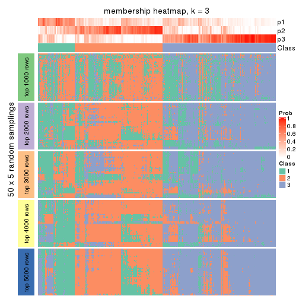</p>

</div>
<div id='tab-CV-NMF-membership-heatmap-3'>
<pre><code class="r">membership_heatmap(res, k = 4)
</code></pre>

<p></p>

</div>
<div id='tab-CV-NMF-membership-heatmap-4'>
<pre><code class="r">membership_heatmap(res, k = 5)
</code></pre>

<p></p>

</div>
<div id='tab-CV-NMF-membership-heatmap-5'>
<pre><code class="r">membership_heatmap(res, k = 6)
</code></pre>

<p></p>

</div>
</div>

As soon as we have had the classes for columns, we can look for signatures
which are significantly different between classes which can be candidate marks
for certain classes. Following are the heatmaps for signatures.


Signature heatmaps where rows are scaled:


<script>
$( function() {
	$( '#tabs-CV-NMF-get-signatures' ).tabs();
} );
</script>
<div id='tabs-CV-NMF-get-signatures'>
<ul>
<li><a href='#tab-CV-NMF-get-signatures-1'>k = 2</a></li>
<li><a href='#tab-CV-NMF-get-signatures-2'>k = 3</a></li>
<li><a href='#tab-CV-NMF-get-signatures-3'>k = 4</a></li>
<li><a href='#tab-CV-NMF-get-signatures-4'>k = 5</a></li>
<li><a href='#tab-CV-NMF-get-signatures-5'>k = 6</a></li>
</ul>
<div id='tab-CV-NMF-get-signatures-1'>
<pre><code class="r">get_signatures(res, k = 2)
</code></pre>

<p></p>

</div>
<div id='tab-CV-NMF-get-signatures-2'>
<pre><code class="r">get_signatures(res, k = 3)
</code></pre>

<p></p>

</div>
<div id='tab-CV-NMF-get-signatures-3'>
<pre><code class="r">get_signatures(res, k = 4)
</code></pre>

<p></p>

</div>
<div id='tab-CV-NMF-get-signatures-4'>
<pre><code class="r">get_signatures(res, k = 5)
</code></pre>

<p></p>

</div>
<div id='tab-CV-NMF-get-signatures-5'>
<pre><code class="r">get_signatures(res, k = 6)
</code></pre>

<p></p>

</div>
</div>


Signature heatmaps where rows are not scaled:


<script>
$( function() {
	$( '#tabs-CV-NMF-get-signatures-no-scale' ).tabs();
} );
</script>
<div id='tabs-CV-NMF-get-signatures-no-scale'>
<ul>
<li><a href='#tab-CV-NMF-get-signatures-no-scale-1'>k = 2</a></li>
<li><a href='#tab-CV-NMF-get-signatures-no-scale-2'>k = 3</a></li>
<li><a href='#tab-CV-NMF-get-signatures-no-scale-3'>k = 4</a></li>
<li><a href='#tab-CV-NMF-get-signatures-no-scale-4'>k = 5</a></li>
<li><a href='#tab-CV-NMF-get-signatures-no-scale-5'>k = 6</a></li>
</ul>
<div id='tab-CV-NMF-get-signatures-no-scale-1'>
<pre><code class="r">get_signatures(res, k = 2, scale_rows = FALSE)
</code></pre>

<p></p>

</div>
<div id='tab-CV-NMF-get-signatures-no-scale-2'>
<pre><code class="r">get_signatures(res, k = 3, scale_rows = FALSE)
</code></pre>

<p>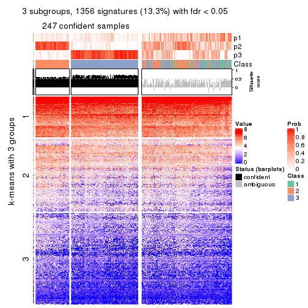</p>

</div>
<div id='tab-CV-NMF-get-signatures-no-scale-3'>
<pre><code class="r">get_signatures(res, k = 4, scale_rows = FALSE)
</code></pre>

<p></p>

</div>
<div id='tab-CV-NMF-get-signatures-no-scale-4'>
<pre><code class="r">get_signatures(res, k = 5, scale_rows = FALSE)
</code></pre>

<p></p>

</div>
<div id='tab-CV-NMF-get-signatures-no-scale-5'>
<pre><code class="r">get_signatures(res, k = 6, scale_rows = FALSE)
</code></pre>

<p>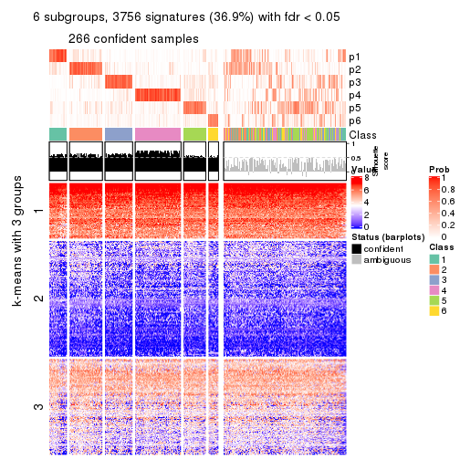</p>

</div>
</div>


Compare the overlap of signatures from different k:

```r
compare_signatures(res)
```


`get_signature()` returns a data frame invisibly. TO get the list of signatures, the function
call should be assigned to a variable explicitly. In following code, if `plot` argument is set
to `FALSE`, no heatmap is plotted while only the differential analysis is performed.

```r
# code only for demonstration
tb = get_signature(res, k = ..., plot = FALSE)
```

An example of the output of `tb` is:

```
#>   which_row         fdr    mean_1    mean_2 scaled_mean_1 scaled_mean_2 km
#> 1        38 0.042760348  8.373488  9.131774    -0.5533452     0.5164555  1
#> 2        40 0.018707592  7.106213  8.469186    -0.6173731     0.5762149  1
#> 3        55 0.019134737 10.221463 11.207825    -0.6159697     0.5749050  1
#> 4        59 0.006059896  5.921854  7.869574    -0.6899429     0.6439467  1
#> 5        60 0.018055526  8.928898 10.211722    -0.6204761     0.5791110  1
#> 6        98 0.009384629 15.714769 14.887706     0.6635654    -0.6193277  2
...
```

The columns in `tb` are:

1. `which_row`: row indices corresponding to the input matrix.
2. `fdr`: FDR for the differential test. 
3. `mean_x`: The mean value in group x.
4. `scaled_mean_x`: The mean value in group x after rows are scaled.
5. `km`: Row groups if k-means clustering is applied to rows.


UMAP plot which shows how samples are separated.


<script>
$( function() {
	$( '#tabs-CV-NMF-dimension-reduction' ).tabs();
} );
</script>
<div id='tabs-CV-NMF-dimension-reduction'>
<ul>
<li><a href='#tab-CV-NMF-dimension-reduction-1'>k = 2</a></li>
<li><a href='#tab-CV-NMF-dimension-reduction-2'>k = 3</a></li>
<li><a href='#tab-CV-NMF-dimension-reduction-3'>k = 4</a></li>
<li><a href='#tab-CV-NMF-dimension-reduction-4'>k = 5</a></li>
<li><a href='#tab-CV-NMF-dimension-reduction-5'>k = 6</a></li>
</ul>
<div id='tab-CV-NMF-dimension-reduction-1'>
<pre><code class="r">dimension_reduction(res, k = 2, method = &quot;UMAP&quot;)
</code></pre>

<p></p>

</div>
<div id='tab-CV-NMF-dimension-reduction-2'>
<pre><code class="r">dimension_reduction(res, k = 3, method = &quot;UMAP&quot;)
</code></pre>

<p>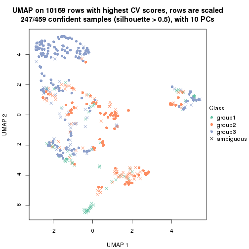</p>

</div>
<div id='tab-CV-NMF-dimension-reduction-3'>
<pre><code class="r">dimension_reduction(res, k = 4, method = &quot;UMAP&quot;)
</code></pre>

<p></p>

</div>
<div id='tab-CV-NMF-dimension-reduction-4'>
<pre><code class="r">dimension_reduction(res, k = 5, method = &quot;UMAP&quot;)
</code></pre>

<p></p>

</div>
<div id='tab-CV-NMF-dimension-reduction-5'>
<pre><code class="r">dimension_reduction(res, k = 6, method = &quot;UMAP&quot;)
</code></pre>

<p></p>

</div>
</div>


Following heatmap shows how subgroups are split when increasing `k`:

```r
collect_classes(res)
```


If matrix rows can be associated to genes, consider to use `functional_enrichment(res,
...)` to perform function enrichment for the signature genes. See [this vignette](http://bioconductor.org/packages/devel/bioc/vignettes/cola/inst/doc/functional_enrichment.html) for more detailed explanations.


 

---------------------------------------------------


### MAD:hclust**


The object with results only for a single top-value method and a single partition method 
can be extracted as:

```r
res = res_list["MAD", "hclust"]
# you can also extract it by
# res = res_list["MAD:hclust"]
```

A summary of `res` and all the functions that can be applied to it:

```r
res
```

```
#> A 'ConsensusPartition' object with k = 2, 3, 4, 5, 6.
#>   On a matrix with 10169 rows and 459 columns.
#>   Top rows (1000, 2000, 3000, 4000, 5000) are extracted by 'MAD' method.
#>   Subgroups are detected by 'hclust' method.
#>   Performed in total 1250 partitions by row resampling.
#>   Best k for subgroups seems to be 2.
#> 
#> Following methods can be applied to this 'ConsensusPartition' object:
#>  [1] "cola_report"             "collect_classes"         "collect_plots"          
#>  [4] "collect_stats"           "colnames"                "compare_signatures"     
#>  [7] "consensus_heatmap"       "dimension_reduction"     "functional_enrichment"  
#> [10] "get_anno_col"            "get_anno"                "get_classes"            
#> [13] "get_consensus"           "get_matrix"              "get_membership"         
#> [16] "get_param"               "get_signatures"          "get_stats"              
#> [19] "is_best_k"               "is_stable_k"             "membership_heatmap"     
#> [22] "ncol"                    "nrow"                    "plot_ecdf"              
#> [25] "rownames"                "select_partition_number" "show"                   
#> [28] "suggest_best_k"          "test_to_known_factors"
```

`collect_plots()` function collects all the plots made from `res` for all `k` (number of partitions)
into one single page to provide an easy and fast comparison between different `k`.

```r
collect_plots(res)
```


The plots are:

- The first row: a plot of the ECDF (empirical cumulative distribution
  function) curves of the consensus matrix for each `k` and the heatmap of
  predicted classes for each `k`.
- The second row: heatmaps of the consensus matrix for each `k`.
- The third row: heatmaps of the membership matrix for each `k`.
- The fouth row: heatmaps of the signatures for each `k`.

All the plots in panels can be made by individual functions and they are
plotted later in this section.

`select_partition_number()` produces several plots showing different
statistics for choosing "optimized" `k`. There are following statistics:

- ECDF curves of the consensus matrix for each `k`;
- 1-PAC. [The PAC
  score](https://en.wikipedia.org/wiki/Consensus_clustering#Over-interpretation_potential_of_consensus_clustering)
  measures the proportion of the ambiguous subgrouping.
- Mean silhouette score.
- Concordance. The mean probability of fiting the consensus class ids in all
  partitions.
- Area increased. Denote $A_k$ as the area under the ECDF curve for current
  `k`, the area increased is defined as $A_k - A_{k-1}$.
- Rand index. The percent of pairs of samples that are both in a same cluster
  or both are not in a same cluster in the partition of k and k-1.
- Jaccard index. The ratio of pairs of samples are both in a same cluster in
  the partition of k and k-1 and the pairs of samples are both in a same
  cluster in the partition k or k-1.

The detailed explanations of these statistics can be found in [the _cola_
vignette](http://bioconductor.org/packages/devel/bioc/vignettes/cola/inst/doc/cola.html#toc_13).

Generally speaking, lower PAC score, higher mean silhouette score or higher
concordance corresponds to better partition. Rand index and Jaccard index
measure how similar the current partition is compared to partition with `k-1`.
If they are too similar, we won't accept `k` is better than `k-1`.

```r
select_partition_number(res)
```


The numeric values for all these statistics can be obtained by `get_stats()`.

```r
get_stats(res)
```

```
#>   k 1-PAC mean_silhouette concordance area_increased  Rand Jaccard
#> 2 2 0.951           0.945       0.974          0.103 0.916   0.916
#> 3 3 0.757           0.861       0.934          0.663 0.971   0.968
#> 4 4 0.645           0.850       0.915          0.197 0.992   0.991
#> 5 5 0.544           0.817       0.900          0.113 0.991   0.990
#> 6 6 0.446           0.806       0.886          0.120 0.995   0.995
```

`suggest_best_k()` suggests the best $k$ based on these statistics. The rules are as follows:

- All $k$ with Jaccard index larger than 0.95 are removed because increasing
  $k$ does not provide enough extra information. If all $k$ are removed, it is
  marked as no subgroup is detected.
- For all $k$ with 1-PAC score larger than 0.9, the maximal $k$ is taken as
  the best $k$, and other $k$ are marked as optional $k$.
- If it does not fit the second rule. The $k$ with the maximal vote of the
  highest 1-PAC score, highest mean silhouette, and highest concordance is
  taken as the best $k$.

```r
suggest_best_k(res)
```

```
#> [1] 2
```


Following shows the table of the partitions (You need to click the **show/hide
code output** link to see it). The membership matrix (columns with name `p*`)
is inferred by
[`clue::cl_consensus()`](https://www.rdocumentation.org/link/cl_consensus?package=clue)
function with the `SE` method. Basically the value in the membership matrix
represents the probability to belong to a certain group. The finall class
label for an item is determined with the group with highest probability it
belongs to.

In `get_classes()` function, the entropy is calculated from the membership
matrix and the silhouette score is calculated from the consensus matrix.


<script>
$( function() {
	$( '#tabs-MAD-hclust-get-classes' ).tabs();
} );
</script>
<div id='tabs-MAD-hclust-get-classes'>
<ul>
<li><a href='#tab-MAD-hclust-get-classes-1'>k = 2</a></li>
<li><a href='#tab-MAD-hclust-get-classes-2'>k = 3</a></li>
<li><a href='#tab-MAD-hclust-get-classes-3'>k = 4</a></li>
<li><a href='#tab-MAD-hclust-get-classes-4'>k = 5</a></li>
<li><a href='#tab-MAD-hclust-get-classes-5'>k = 6</a></li>
</ul>

<div id='tab-MAD-hclust-get-classes-1'>
<p><a id='tab-MAD-hclust-get-classes-1-a' style='color:#0366d6' href='#'>show/hide code output</a></p>
<pre><code class="r">cbind(get_classes(res, k = 2), get_membership(res, k = 2))
</code></pre>

<pre><code>#&gt;            class entropy silhouette    p1    p2
#&gt; SRR1699874     2  0.0000      0.978 0.000 1.000
#&gt; SRR1699875     2  0.0000      0.978 0.000 1.000
#&gt; SRR1699876     2  0.0000      0.978 0.000 1.000
#&gt; SRR1699877     2  0.0000      0.978 0.000 1.000
#&gt; SRR1699879     2  0.0000      0.978 0.000 1.000
#&gt; SRR1699878     2  0.0000      0.978 0.000 1.000
#&gt; SRR1699880     2  0.2778      0.943 0.048 0.952
#&gt; SRR1699881     2  0.0376      0.976 0.004 0.996
#&gt; SRR1699882     2  0.0000      0.978 0.000 1.000
#&gt; SRR1699883     2  0.0000      0.978 0.000 1.000
#&gt; SRR1699884     2  0.0000      0.978 0.000 1.000
#&gt; SRR1699885     2  0.0000      0.978 0.000 1.000
#&gt; SRR1699886     2  0.0000      0.978 0.000 1.000
#&gt; SRR1699888     2  0.0000      0.978 0.000 1.000
#&gt; SRR1699889     2  0.0000      0.978 0.000 1.000
#&gt; SRR1699890     2  0.0000      0.978 0.000 1.000
#&gt; SRR1699887     2  0.0000      0.978 0.000 1.000
#&gt; SRR1699891     2  0.0000      0.978 0.000 1.000
#&gt; SRR1699892     2  0.0000      0.978 0.000 1.000
#&gt; SRR1699893     2  0.0376      0.976 0.004 0.996
#&gt; SRR1699894     2  0.0000      0.978 0.000 1.000
#&gt; SRR1699895     2  0.0000      0.978 0.000 1.000
#&gt; SRR1699896     2  0.0376      0.976 0.004 0.996
#&gt; SRR1699897     2  0.0000      0.978 0.000 1.000
#&gt; SRR1699898     2  0.3114      0.934 0.056 0.944
#&gt; SRR1699900     2  0.0376      0.976 0.004 0.996
#&gt; SRR1699899     2  0.0000      0.978 0.000 1.000
#&gt; SRR1699902     2  0.2043      0.958 0.032 0.968
#&gt; SRR1699901     2  0.2423      0.951 0.040 0.960
#&gt; SRR1699903     2  0.0376      0.976 0.004 0.996
#&gt; SRR1699904     2  0.0000      0.978 0.000 1.000
#&gt; SRR1699905     2  0.2423      0.949 0.040 0.960
#&gt; SRR1699906     2  0.0000      0.978 0.000 1.000
#&gt; SRR1699907     2  0.0000      0.978 0.000 1.000
#&gt; SRR1699908     2  0.0000      0.978 0.000 1.000
#&gt; SRR1699909     2  0.0000      0.978 0.000 1.000
#&gt; SRR1699910     2  0.0376      0.976 0.004 0.996
#&gt; SRR1699911     2  0.0376      0.976 0.004 0.996
#&gt; SRR1699912     2  0.0000      0.978 0.000 1.000
#&gt; SRR1699913     2  0.0000      0.978 0.000 1.000
#&gt; SRR1699914     2  0.1414      0.967 0.020 0.980
#&gt; SRR1699915     2  0.0000      0.978 0.000 1.000
#&gt; SRR1699916     2  0.0000      0.978 0.000 1.000
#&gt; SRR1699917     2  0.0000      0.978 0.000 1.000
#&gt; SRR1699918     2  0.0000      0.978 0.000 1.000
#&gt; SRR1699919     2  0.0000      0.978 0.000 1.000
#&gt; SRR1699920     2  0.0000      0.978 0.000 1.000
#&gt; SRR1699921     2  0.0000      0.978 0.000 1.000
#&gt; SRR1699922     2  0.0000      0.978 0.000 1.000
#&gt; SRR1699923     2  0.0376      0.976 0.004 0.996
#&gt; SRR1699924     2  0.0000      0.978 0.000 1.000
#&gt; SRR1699925     1  0.0000      0.828 1.000 0.000
#&gt; SRR1699926     2  0.0376      0.976 0.004 0.996
#&gt; SRR1699927     2  0.0000      0.978 0.000 1.000
#&gt; SRR1699929     2  0.0000      0.978 0.000 1.000
#&gt; SRR1699928     2  0.0000      0.978 0.000 1.000
#&gt; SRR1699930     2  0.0000      0.978 0.000 1.000
#&gt; SRR1699931     2  0.0000      0.978 0.000 1.000
#&gt; SRR1699933     2  0.0376      0.976 0.004 0.996
#&gt; SRR1699932     2  0.0000      0.978 0.000 1.000
#&gt; SRR1699934     1  0.0000      0.828 1.000 0.000
#&gt; SRR1699935     2  0.0000      0.978 0.000 1.000
#&gt; SRR1699936     2  0.0000      0.978 0.000 1.000
#&gt; SRR1699937     2  0.0000      0.978 0.000 1.000
#&gt; SRR1699938     2  0.0000      0.978 0.000 1.000
#&gt; SRR1699940     2  0.1414      0.967 0.020 0.980
#&gt; SRR1699939     2  0.0000      0.978 0.000 1.000
#&gt; SRR1699941     2  0.0938      0.972 0.012 0.988
#&gt; SRR1699942     2  0.0938      0.972 0.012 0.988
#&gt; SRR1699943     2  0.0000      0.978 0.000 1.000
#&gt; SRR1699944     2  0.0000      0.978 0.000 1.000
#&gt; SRR1699945     2  0.6343      0.792 0.160 0.840
#&gt; SRR1699946     2  0.0672      0.975 0.008 0.992
#&gt; SRR1699947     2  0.0000      0.978 0.000 1.000
#&gt; SRR1699948     2  0.0000      0.978 0.000 1.000
#&gt; SRR1699949     2  0.0000      0.978 0.000 1.000
#&gt; SRR1699950     2  0.0000      0.978 0.000 1.000
#&gt; SRR1699951     2  0.0000      0.978 0.000 1.000
#&gt; SRR1699952     2  0.0672      0.975 0.008 0.992
#&gt; SRR1699953     2  0.0000      0.978 0.000 1.000
#&gt; SRR1699954     2  0.1414      0.966 0.020 0.980
#&gt; SRR1699955     2  0.0000      0.978 0.000 1.000
#&gt; SRR1699956     2  0.6973      0.739 0.188 0.812
#&gt; SRR1699957     2  0.0376      0.976 0.004 0.996
#&gt; SRR1699959     2  0.0672      0.975 0.008 0.992
#&gt; SRR1699958     2  0.0000      0.978 0.000 1.000
#&gt; SRR1699960     2  0.0000      0.978 0.000 1.000
#&gt; SRR1699961     2  0.2236      0.955 0.036 0.964
#&gt; SRR1699962     2  0.0000      0.978 0.000 1.000
#&gt; SRR1699963     2  0.0376      0.976 0.004 0.996
#&gt; SRR1699964     2  0.0000      0.978 0.000 1.000
#&gt; SRR1699965     2  0.0000      0.978 0.000 1.000
#&gt; SRR1699966     2  0.0000      0.978 0.000 1.000
#&gt; SRR1699967     2  0.0376      0.976 0.004 0.996
#&gt; SRR1699968     2  0.0000      0.978 0.000 1.000
#&gt; SRR1699969     2  0.3431      0.924 0.064 0.936
#&gt; SRR1699971     2  0.0938      0.973 0.012 0.988
#&gt; SRR1699970     2  0.0000      0.978 0.000 1.000
#&gt; SRR1699972     2  0.1184      0.969 0.016 0.984
#&gt; SRR1699973     2  0.0376      0.976 0.004 0.996
#&gt; SRR1699974     2  0.3274      0.929 0.060 0.940
#&gt; SRR1699975     2  0.0000      0.978 0.000 1.000
#&gt; SRR1699976     2  0.0376      0.976 0.004 0.996
#&gt; SRR1699977     2  0.0376      0.976 0.004 0.996
#&gt; SRR1699978     2  0.6801      0.754 0.180 0.820
#&gt; SRR1699979     2  0.0000      0.978 0.000 1.000
#&gt; SRR1699980     2  0.0000      0.978 0.000 1.000
#&gt; SRR1699981     2  0.2236      0.953 0.036 0.964
#&gt; SRR1699982     2  0.0000      0.978 0.000 1.000
#&gt; SRR1699983     2  0.0000      0.978 0.000 1.000
#&gt; SRR1699984     1  0.0000      0.828 1.000 0.000
#&gt; SRR1699985     2  0.0000      0.978 0.000 1.000
#&gt; SRR1699986     2  0.1633      0.964 0.024 0.976
#&gt; SRR1699988     2  0.0376      0.976 0.004 0.996
#&gt; SRR1699987     2  0.1633      0.964 0.024 0.976
#&gt; SRR1699989     2  0.0376      0.976 0.004 0.996
#&gt; SRR1699990     2  0.0000      0.978 0.000 1.000
#&gt; SRR1699992     2  0.0376      0.976 0.004 0.996
#&gt; SRR1699991     2  0.2423      0.950 0.040 0.960
#&gt; SRR1699993     2  0.4298      0.895 0.088 0.912
#&gt; SRR1699994     2  0.2603      0.946 0.044 0.956
#&gt; SRR1699995     1  0.9977      0.324 0.528 0.472
#&gt; SRR1699996     2  0.0376      0.976 0.004 0.996
#&gt; SRR1699997     2  0.0000      0.978 0.000 1.000
#&gt; SRR1699998     2  0.0376      0.976 0.004 0.996
#&gt; SRR1699999     2  0.8713      0.514 0.292 0.708
#&gt; SRR1700000     2  0.0000      0.978 0.000 1.000
#&gt; SRR1700002     2  0.0376      0.976 0.004 0.996
#&gt; SRR1700001     2  0.2603      0.946 0.044 0.956
#&gt; SRR1700003     2  0.0376      0.976 0.004 0.996
#&gt; SRR1700004     2  0.2423      0.951 0.040 0.960
#&gt; SRR1700005     1  0.3879      0.842 0.924 0.076
#&gt; SRR1700006     2  0.1184      0.969 0.016 0.984
#&gt; SRR1700007     2  0.0000      0.978 0.000 1.000
#&gt; SRR1700008     2  0.2423      0.951 0.040 0.960
#&gt; SRR1700009     1  0.7376      0.790 0.792 0.208
#&gt; SRR1700010     2  0.8144      0.610 0.252 0.748
#&gt; SRR1700011     2  0.0000      0.978 0.000 1.000
#&gt; SRR1700013     2  0.0938      0.973 0.012 0.988
#&gt; SRR1700012     2  0.1843      0.962 0.028 0.972
#&gt; SRR1700014     2  0.0672      0.975 0.008 0.992
#&gt; SRR1700015     2  0.0672      0.974 0.008 0.992
#&gt; SRR1700016     2  1.0000     -0.251 0.496 0.504
#&gt; SRR1700018     2  0.1843      0.961 0.028 0.972
#&gt; SRR1700017     2  0.2043      0.957 0.032 0.968
#&gt; SRR1700019     2  0.0000      0.978 0.000 1.000
#&gt; SRR1700020     2  0.4298      0.894 0.088 0.912
#&gt; SRR1700021     2  0.0000      0.978 0.000 1.000
#&gt; SRR1700023     2  0.0376      0.976 0.004 0.996
#&gt; SRR1700022     2  0.2043      0.958 0.032 0.968
#&gt; SRR1700024     2  0.0376      0.976 0.004 0.996
#&gt; SRR1700025     2  0.0376      0.976 0.004 0.996
#&gt; SRR1700026     2  0.0672      0.975 0.008 0.992
#&gt; SRR1700027     2  0.1184      0.970 0.016 0.984
#&gt; SRR1700028     2  0.0000      0.978 0.000 1.000
#&gt; SRR1700029     2  0.1184      0.970 0.016 0.984
#&gt; SRR1700030     2  0.0000      0.978 0.000 1.000
#&gt; SRR1700031     2  0.5059      0.861 0.112 0.888
#&gt; SRR1700032     2  0.0376      0.976 0.004 0.996
#&gt; SRR1700034     2  0.9993     -0.206 0.484 0.516
#&gt; SRR1700035     2  0.0000      0.978 0.000 1.000
#&gt; SRR1700033     2  0.2948      0.939 0.052 0.948
#&gt; SRR1700036     2  0.0000      0.978 0.000 1.000
#&gt; SRR1700037     2  0.0000      0.978 0.000 1.000
#&gt; SRR1700038     2  0.1184      0.970 0.016 0.984
#&gt; SRR1700039     2  0.6531      0.779 0.168 0.832
#&gt; SRR1700040     2  0.2043      0.958 0.032 0.968
#&gt; SRR1700041     2  0.1633      0.964 0.024 0.976
#&gt; SRR1700042     2  0.2236      0.954 0.036 0.964
#&gt; SRR1700043     2  0.2778      0.942 0.048 0.952
#&gt; SRR1700045     2  0.0672      0.975 0.008 0.992
#&gt; SRR1700044     2  0.0376      0.976 0.004 0.996
#&gt; SRR1700046     2  0.0938      0.972 0.012 0.988
#&gt; SRR1700047     2  0.2423      0.950 0.040 0.960
#&gt; SRR1700048     2  0.0672      0.975 0.008 0.992
#&gt; SRR1700049     2  0.9209      0.387 0.336 0.664
#&gt; SRR1700050     2  0.7453      0.695 0.212 0.788
#&gt; SRR1700051     2  0.7219      0.723 0.200 0.800
#&gt; SRR1700052     2  0.4815      0.876 0.104 0.896
#&gt; SRR1700053     2  0.0000      0.978 0.000 1.000
#&gt; SRR1700054     2  0.0938      0.972 0.012 0.988
#&gt; SRR1700055     1  0.7883      0.767 0.764 0.236
#&gt; SRR1700056     2  0.1843      0.961 0.028 0.972
#&gt; SRR1700057     2  0.3584      0.920 0.068 0.932
#&gt; SRR1700058     2  0.2778      0.942 0.048 0.952
#&gt; SRR1700059     2  0.2043      0.958 0.032 0.968
#&gt; SRR1700060     2  0.2236      0.954 0.036 0.964
#&gt; SRR1700061     2  0.1414      0.967 0.020 0.980
#&gt; SRR1700062     2  0.3584      0.919 0.068 0.932
#&gt; SRR1700063     2  0.2778      0.942 0.048 0.952
#&gt; SRR1700064     2  0.0376      0.976 0.004 0.996
#&gt; SRR1700065     2  0.2043      0.958 0.032 0.968
#&gt; SRR1700066     2  0.2948      0.939 0.052 0.948
#&gt; SRR1700067     2  0.0000      0.978 0.000 1.000
#&gt; SRR1700068     2  0.0938      0.972 0.012 0.988
#&gt; SRR1700069     2  0.0000      0.978 0.000 1.000
#&gt; SRR1700070     2  0.0000      0.978 0.000 1.000
#&gt; SRR1700071     2  0.1633      0.964 0.024 0.976
#&gt; SRR1700072     2  0.1414      0.967 0.020 0.980
#&gt; SRR1700073     2  0.0000      0.978 0.000 1.000
#&gt; SRR1700075     2  0.1414      0.967 0.020 0.980
#&gt; SRR1700074     2  0.1414      0.968 0.020 0.980
#&gt; SRR1700076     2  0.0000      0.978 0.000 1.000
#&gt; SRR1700077     2  0.1843      0.961 0.028 0.972
#&gt; SRR1700078     2  0.0672      0.975 0.008 0.992
#&gt; SRR1700080     2  0.0376      0.976 0.004 0.996
#&gt; SRR1700079     2  0.2778      0.941 0.048 0.952
#&gt; SRR1700081     2  0.3114      0.934 0.056 0.944
#&gt; SRR1700082     2  0.3274      0.928 0.060 0.940
#&gt; SRR1700083     2  0.4815      0.876 0.104 0.896
#&gt; SRR1700084     2  0.3879      0.912 0.076 0.924
#&gt; SRR1700085     2  0.0000      0.978 0.000 1.000
#&gt; SRR1700086     2  0.0938      0.973 0.012 0.988
#&gt; SRR1700087     2  0.1184      0.970 0.016 0.984
#&gt; SRR1700088     2  0.0000      0.978 0.000 1.000
#&gt; SRR1700089     2  0.0376      0.976 0.004 0.996
#&gt; SRR1700091     2  0.0672      0.974 0.008 0.992
#&gt; SRR1700090     2  0.0000      0.978 0.000 1.000
#&gt; SRR1700092     2  0.0000      0.978 0.000 1.000
#&gt; SRR1700094     2  0.0672      0.975 0.008 0.992
#&gt; SRR1700093     2  0.0000      0.978 0.000 1.000
#&gt; SRR1700095     2  0.1414      0.967 0.020 0.980
#&gt; SRR1700096     2  0.0938      0.972 0.012 0.988
#&gt; SRR1700097     2  0.3584      0.920 0.068 0.932
#&gt; SRR1700098     2  0.0000      0.978 0.000 1.000
#&gt; SRR1700099     2  0.0000      0.978 0.000 1.000
#&gt; SRR1700100     2  0.0000      0.978 0.000 1.000
#&gt; SRR1700101     2  0.0000      0.978 0.000 1.000
#&gt; SRR1700102     2  0.0000      0.978 0.000 1.000
#&gt; SRR1700104     2  0.0000      0.978 0.000 1.000
#&gt; SRR1700103     2  0.0672      0.974 0.008 0.992
#&gt; SRR1700105     2  0.0000      0.978 0.000 1.000
#&gt; SRR1700106     2  0.0000      0.978 0.000 1.000
#&gt; SRR1700107     2  0.0000      0.978 0.000 1.000
#&gt; SRR1700108     2  0.0000      0.978 0.000 1.000
#&gt; SRR1700109     2  0.0000      0.978 0.000 1.000
#&gt; SRR1700110     2  0.0000      0.978 0.000 1.000
#&gt; SRR1700112     2  0.0000      0.978 0.000 1.000
#&gt; SRR1700111     2  0.0672      0.974 0.008 0.992
#&gt; SRR1700113     2  0.0000      0.978 0.000 1.000
#&gt; SRR1700114     2  0.0376      0.976 0.004 0.996
#&gt; SRR1700115     2  0.0000      0.978 0.000 1.000
#&gt; SRR1700116     2  0.0672      0.975 0.008 0.992
#&gt; SRR1700117     2  0.4690      0.882 0.100 0.900
#&gt; SRR1700119     2  0.0376      0.976 0.004 0.996
#&gt; SRR1700118     2  0.0000      0.978 0.000 1.000
#&gt; SRR1700120     2  0.0672      0.974 0.008 0.992
#&gt; SRR1700121     2  0.0000      0.978 0.000 1.000
#&gt; SRR1700122     2  0.0000      0.978 0.000 1.000
#&gt; SRR1700123     2  0.0376      0.976 0.004 0.996
#&gt; SRR1700125     2  0.0000      0.978 0.000 1.000
#&gt; SRR1700126     2  0.1633      0.963 0.024 0.976
#&gt; SRR1700127     2  0.0376      0.976 0.004 0.996
#&gt; SRR1700124     2  0.0376      0.976 0.004 0.996
#&gt; SRR1700128     2  0.0376      0.976 0.004 0.996
#&gt; SRR1700129     2  0.0000      0.978 0.000 1.000
#&gt; SRR1700130     2  0.0000      0.978 0.000 1.000
#&gt; SRR1700132     2  0.0000      0.978 0.000 1.000
#&gt; SRR1700131     2  0.0376      0.976 0.004 0.996
#&gt; SRR1700133     2  0.0000      0.978 0.000 1.000
#&gt; SRR1700134     2  0.0000      0.978 0.000 1.000
#&gt; SRR1700135     2  0.0376      0.976 0.004 0.996
#&gt; SRR1700136     2  0.0938      0.972 0.012 0.988
#&gt; SRR1700137     2  0.0672      0.974 0.008 0.992
#&gt; SRR1700138     2  0.0000      0.978 0.000 1.000
#&gt; SRR1700140     2  0.0000      0.978 0.000 1.000
#&gt; SRR1700139     2  0.0000      0.978 0.000 1.000
#&gt; SRR1700141     2  0.0000      0.978 0.000 1.000
#&gt; SRR1700142     2  0.1843      0.961 0.028 0.972
#&gt; SRR1700143     2  0.0376      0.976 0.004 0.996
#&gt; SRR1700144     2  0.1184      0.969 0.016 0.984
#&gt; SRR1700145     2  0.0672      0.974 0.008 0.992
#&gt; SRR1700146     2  0.0000      0.978 0.000 1.000
#&gt; SRR1700147     2  0.0376      0.976 0.004 0.996
#&gt; SRR1700149     2  0.3879      0.911 0.076 0.924
#&gt; SRR1700148     2  0.0376      0.976 0.004 0.996
#&gt; SRR1700150     2  0.0000      0.978 0.000 1.000
#&gt; SRR1700152     2  0.0376      0.976 0.004 0.996
#&gt; SRR1700151     2  0.0672      0.974 0.008 0.992
#&gt; SRR1700153     2  0.0376      0.976 0.004 0.996
#&gt; SRR1700154     2  0.0000      0.978 0.000 1.000
#&gt; SRR1700155     2  0.0376      0.976 0.004 0.996
#&gt; SRR1700156     2  0.0000      0.978 0.000 1.000
#&gt; SRR1700158     2  0.3114      0.933 0.056 0.944
#&gt; SRR1700159     2  0.0000      0.978 0.000 1.000
#&gt; SRR1700157     2  0.1843      0.961 0.028 0.972
#&gt; SRR1700160     2  0.0376      0.976 0.004 0.996
#&gt; SRR1700161     2  0.0672      0.974 0.008 0.992
#&gt; SRR1700162     2  0.0000      0.978 0.000 1.000
#&gt; SRR1700164     2  0.0938      0.973 0.012 0.988
#&gt; SRR1700163     2  0.1633      0.964 0.024 0.976
#&gt; SRR1700165     2  0.0938      0.972 0.012 0.988
#&gt; SRR1700166     2  0.0000      0.978 0.000 1.000
#&gt; SRR1700168     2  0.0000      0.978 0.000 1.000
#&gt; SRR1700167     2  0.1184      0.970 0.016 0.984
#&gt; SRR1700170     2  0.0376      0.976 0.004 0.996
#&gt; SRR1700169     2  0.0000      0.978 0.000 1.000
#&gt; SRR1700171     2  0.2948      0.939 0.052 0.948
#&gt; SRR1700172     2  0.0000      0.978 0.000 1.000
#&gt; SRR1700174     2  0.0376      0.976 0.004 0.996
#&gt; SRR1700173     2  0.0376      0.976 0.004 0.996
#&gt; SRR1700175     2  0.0000      0.978 0.000 1.000
#&gt; SRR1700176     2  0.2043      0.957 0.032 0.968
#&gt; SRR1700178     2  0.0000      0.978 0.000 1.000
#&gt; SRR1700177     2  0.0376      0.976 0.004 0.996
#&gt; SRR1700180     2  0.0000      0.978 0.000 1.000
#&gt; SRR1700179     2  0.0000      0.978 0.000 1.000
#&gt; SRR1700181     2  0.0000      0.978 0.000 1.000
#&gt; SRR1700183     1  0.0672      0.832 0.992 0.008
#&gt; SRR1700182     2  0.0000      0.978 0.000 1.000
#&gt; SRR1700184     2  0.0000      0.978 0.000 1.000
#&gt; SRR1700186     2  0.0000      0.978 0.000 1.000
#&gt; SRR1700187     1  0.8763      0.713 0.704 0.296
#&gt; SRR1700185     1  0.5178      0.835 0.884 0.116
#&gt; SRR1700188     2  0.0000      0.978 0.000 1.000
#&gt; SRR1700192     2  0.4939      0.863 0.108 0.892
#&gt; SRR1700190     2  0.8813      0.492 0.300 0.700
#&gt; SRR1700191     1  0.1184      0.835 0.984 0.016
#&gt; SRR1700189     2  0.8386      0.577 0.268 0.732
#&gt; SRR1700193     2  0.0000      0.978 0.000 1.000
#&gt; SRR1700195     2  0.0000      0.978 0.000 1.000
#&gt; SRR1700194     1  0.3114      0.842 0.944 0.056
#&gt; SRR1700196     2  0.0000      0.978 0.000 1.000
#&gt; SRR1700197     2  0.8081      0.623 0.248 0.752
#&gt; SRR1700198     2  0.0000      0.978 0.000 1.000
#&gt; SRR1700199     2  0.0000      0.978 0.000 1.000
#&gt; SRR1700200     2  0.0000      0.978 0.000 1.000
#&gt; SRR1700201     2  0.0000      0.978 0.000 1.000
#&gt; SRR1700202     2  0.0376      0.976 0.004 0.996
#&gt; SRR1700203     2  0.0000      0.978 0.000 1.000
#&gt; SRR1700204     2  0.0376      0.976 0.004 0.996
#&gt; SRR1700206     2  0.0000      0.978 0.000 1.000
#&gt; SRR1700207     2  0.0000      0.978 0.000 1.000
#&gt; SRR1700208     2  0.7602      0.680 0.220 0.780
#&gt; SRR1700205     2  0.0000      0.978 0.000 1.000
#&gt; SRR1700209     2  0.0000      0.978 0.000 1.000
#&gt; SRR1700210     2  0.0000      0.978 0.000 1.000
#&gt; SRR1700211     2  0.0376      0.976 0.004 0.996
#&gt; SRR1700212     2  0.0000      0.978 0.000 1.000
#&gt; SRR1700213     2  0.0376      0.976 0.004 0.996
#&gt; SRR1700214     2  0.0000      0.978 0.000 1.000
#&gt; SRR1700215     1  0.1633      0.837 0.976 0.024
#&gt; SRR1700217     2  0.0000      0.978 0.000 1.000
#&gt; SRR1700216     1  0.0000      0.828 1.000 0.000
#&gt; SRR1700218     2  0.0000      0.978 0.000 1.000
#&gt; SRR1700219     2  0.0000      0.978 0.000 1.000
#&gt; SRR1700222     1  0.8955      0.690 0.688 0.312
#&gt; SRR1700220     2  0.0000      0.978 0.000 1.000
#&gt; SRR1700221     2  0.0000      0.978 0.000 1.000
#&gt; SRR1700223     2  0.0000      0.978 0.000 1.000
#&gt; SRR1700224     2  0.0000      0.978 0.000 1.000
#&gt; SRR1700226     2  0.0000      0.978 0.000 1.000
#&gt; SRR1700229     2  0.0000      0.978 0.000 1.000
#&gt; SRR1700225     2  0.0376      0.976 0.004 0.996
#&gt; SRR1700227     2  0.0000      0.978 0.000 1.000
#&gt; SRR1700230     2  0.8081      0.623 0.248 0.752
#&gt; SRR1700231     2  0.0376      0.976 0.004 0.996
#&gt; SRR1700228     2  0.0000      0.978 0.000 1.000
#&gt; SRR1700232     2  0.0000      0.978 0.000 1.000
#&gt; SRR1700233     2  0.0000      0.978 0.000 1.000
#&gt; SRR1700234     2  0.0000      0.978 0.000 1.000
#&gt; SRR1700235     2  0.0000      0.978 0.000 1.000
#&gt; SRR1700237     2  0.0000      0.978 0.000 1.000
#&gt; SRR1700236     2  0.0000      0.978 0.000 1.000
#&gt; SRR1700238     2  0.0000      0.978 0.000 1.000
#&gt; SRR1700239     1  0.9608      0.565 0.616 0.384
#&gt; SRR1700240     1  0.5629      0.829 0.868 0.132
#&gt; SRR1700241     2  0.0376      0.976 0.004 0.996
#&gt; SRR1700243     2  0.0000      0.978 0.000 1.000
#&gt; SRR1700244     2  0.0000      0.978 0.000 1.000
#&gt; SRR1700242     2  0.7299      0.711 0.204 0.796
#&gt; SRR1700246     2  0.0000      0.978 0.000 1.000
#&gt; SRR1700245     2  0.0000      0.978 0.000 1.000
#&gt; SRR1700247     1  0.9922      0.409 0.552 0.448
#&gt; SRR1700249     1  0.3584      0.843 0.932 0.068
#&gt; SRR1700250     2  0.0000      0.978 0.000 1.000
#&gt; SRR1700248     2  0.0000      0.978 0.000 1.000
#&gt; SRR1700251     2  0.0000      0.978 0.000 1.000
#&gt; SRR1700252     2  0.0672      0.975 0.008 0.992
#&gt; SRR1700253     2  0.0000      0.978 0.000 1.000
#&gt; SRR1700256     2  0.0000      0.978 0.000 1.000
#&gt; SRR1700254     1  0.8763      0.713 0.704 0.296
#&gt; SRR1700255     2  0.0000      0.978 0.000 1.000
#&gt; SRR1700257     2  0.0000      0.978 0.000 1.000
#&gt; SRR1700258     2  0.0000      0.978 0.000 1.000
#&gt; SRR1700259     2  0.0000      0.978 0.000 1.000
#&gt; SRR1700260     2  0.0000      0.978 0.000 1.000
#&gt; SRR1700261     2  0.0000      0.978 0.000 1.000
#&gt; SRR1700262     2  0.0000      0.978 0.000 1.000
#&gt; SRR1700263     2  0.0000      0.978 0.000 1.000
#&gt; SRR1700264     2  0.0000      0.978 0.000 1.000
#&gt; SRR1700265     2  0.0376      0.976 0.004 0.996
#&gt; SRR1700266     2  0.0000      0.978 0.000 1.000
#&gt; SRR1700268     2  0.1184      0.969 0.016 0.984
#&gt; SRR1700270     2  0.0000      0.978 0.000 1.000
#&gt; SRR1700267     2  0.0000      0.978 0.000 1.000
#&gt; SRR1700271     2  0.0000      0.978 0.000 1.000
#&gt; SRR1700272     2  0.0000      0.978 0.000 1.000
#&gt; SRR1700273     2  0.0376      0.976 0.004 0.996
#&gt; SRR1700274     2  0.0000      0.978 0.000 1.000
#&gt; SRR1700277     2  0.5946      0.813 0.144 0.856
#&gt; SRR1700275     2  0.0000      0.978 0.000 1.000
#&gt; SRR1700276     2  0.0000      0.978 0.000 1.000
#&gt; SRR1700278     2  0.0000      0.978 0.000 1.000
#&gt; SRR1700279     2  0.0000      0.978 0.000 1.000
#&gt; SRR1700280     2  0.0376      0.976 0.004 0.996
#&gt; SRR1700281     2  0.0000      0.978 0.000 1.000
#&gt; SRR1700283     2  0.0000      0.978 0.000 1.000
#&gt; SRR1700282     2  0.0672      0.975 0.008 0.992
#&gt; SRR1700284     2  0.0000      0.978 0.000 1.000
#&gt; SRR1700285     2  0.0000      0.978 0.000 1.000
#&gt; SRR1700286     2  0.0000      0.978 0.000 1.000
#&gt; SRR1700287     2  0.0000      0.978 0.000 1.000
#&gt; SRR1700290     2  0.6801      0.760 0.180 0.820
#&gt; SRR1700289     2  0.0000      0.978 0.000 1.000
#&gt; SRR1700288     2  0.0376      0.976 0.004 0.996
#&gt; SRR1700292     2  0.0000      0.978 0.000 1.000
#&gt; SRR1700291     2  0.0000      0.978 0.000 1.000
#&gt; SRR1700293     2  0.0000      0.978 0.000 1.000
#&gt; SRR1700294     2  0.0000      0.978 0.000 1.000
#&gt; SRR1700295     2  0.2043      0.956 0.032 0.968
#&gt; SRR1700297     2  0.0000      0.978 0.000 1.000
#&gt; SRR1700296     2  0.0000      0.978 0.000 1.000
#&gt; SRR1700298     2  0.0376      0.976 0.004 0.996
#&gt; SRR1700299     2  0.0000      0.978 0.000 1.000
#&gt; SRR1700300     2  0.0672      0.975 0.008 0.992
#&gt; SRR1700302     2  0.0000      0.978 0.000 1.000
#&gt; SRR1700301     2  0.0000      0.978 0.000 1.000
#&gt; SRR1700303     2  0.0000      0.978 0.000 1.000
#&gt; SRR1700304     2  0.0000      0.978 0.000 1.000
#&gt; SRR1700305     2  0.0000      0.978 0.000 1.000
#&gt; SRR1700306     2  0.0376      0.976 0.004 0.996
#&gt; SRR1700308     2  0.0000      0.978 0.000 1.000
#&gt; SRR1700307     2  0.0376      0.976 0.004 0.996
#&gt; SRR1700309     2  0.1184      0.969 0.016 0.984
#&gt; SRR1700310     2  0.0000      0.978 0.000 1.000
#&gt; SRR1700311     2  0.0000      0.978 0.000 1.000
#&gt; SRR1700312     2  0.0000      0.978 0.000 1.000
#&gt; SRR1700313     2  0.0376      0.976 0.004 0.996
#&gt; SRR1700314     2  0.0376      0.976 0.004 0.996
#&gt; SRR1700315     2  0.0376      0.976 0.004 0.996
#&gt; SRR1700316     2  0.0000      0.978 0.000 1.000
#&gt; SRR1700317     2  0.0000      0.978 0.000 1.000
#&gt; SRR1700318     2  0.0000      0.978 0.000 1.000
#&gt; SRR1700319     2  0.0376      0.976 0.004 0.996
#&gt; SRR1700320     2  0.0000      0.978 0.000 1.000
#&gt; SRR1700322     2  0.0672      0.975 0.008 0.992
#&gt; SRR1700321     2  0.0376      0.976 0.004 0.996
#&gt; SRR1700323     2  0.0000      0.978 0.000 1.000
#&gt; SRR1700324     2  0.0000      0.978 0.000 1.000
#&gt; SRR1700325     2  0.0000      0.978 0.000 1.000
#&gt; SRR1700326     2  0.1184      0.970 0.016 0.984
#&gt; SRR1700327     2  0.0000      0.978 0.000 1.000
#&gt; SRR1700329     2  0.0000      0.978 0.000 1.000
#&gt; SRR1700328     2  0.0376      0.976 0.004 0.996
#&gt; SRR1700330     2  0.0000      0.978 0.000 1.000
#&gt; SRR1700331     2  0.0000      0.978 0.000 1.000
#&gt; SRR1700332     2  0.0000      0.978 0.000 1.000
#&gt; SRR1700333     2  0.0376      0.976 0.004 0.996
</code></pre>

<script>
$('#tab-MAD-hclust-get-classes-1-a').parent().next().next().hide();
$('#tab-MAD-hclust-get-classes-1-a').click(function(){
  $('#tab-MAD-hclust-get-classes-1-a').parent().next().next().toggle();
  return(false);
});
</script>
</div>

<div id='tab-MAD-hclust-get-classes-2'>
<p><a id='tab-MAD-hclust-get-classes-2-a' style='color:#0366d6' href='#'>show/hide code output</a></p>
<pre><code class="r">cbind(get_classes(res, k = 3), get_membership(res, k = 3))
</code></pre>

<pre><code>#&gt;            class entropy silhouette    p1    p2    p3
#&gt; SRR1699874     2  0.0592     0.9398 0.000 0.988 0.012
#&gt; SRR1699875     2  0.1411     0.9401 0.000 0.964 0.036
#&gt; SRR1699876     2  0.0424     0.9373 0.000 0.992 0.008
#&gt; SRR1699877     2  0.0592     0.9386 0.000 0.988 0.012
#&gt; SRR1699879     2  0.0237     0.9370 0.000 0.996 0.004
#&gt; SRR1699878     2  0.0892     0.9398 0.000 0.980 0.020
#&gt; SRR1699880     2  0.4063     0.8451 0.020 0.868 0.112
#&gt; SRR1699881     2  0.1163     0.9403 0.000 0.972 0.028
#&gt; SRR1699882     2  0.0237     0.9368 0.000 0.996 0.004
#&gt; SRR1699883     2  0.0424     0.9382 0.000 0.992 0.008
#&gt; SRR1699884     2  0.0892     0.9399 0.000 0.980 0.020
#&gt; SRR1699885     2  0.0592     0.9377 0.000 0.988 0.012
#&gt; SRR1699886     2  0.0237     0.9371 0.000 0.996 0.004
#&gt; SRR1699888     2  0.0424     0.9375 0.000 0.992 0.008
#&gt; SRR1699889     2  0.0424     0.9374 0.000 0.992 0.008
#&gt; SRR1699890     2  0.0424     0.9375 0.000 0.992 0.008
#&gt; SRR1699887     2  0.0424     0.9390 0.000 0.992 0.008
#&gt; SRR1699891     2  0.0592     0.9378 0.000 0.988 0.012
#&gt; SRR1699892     2  0.0592     0.9398 0.000 0.988 0.012
#&gt; SRR1699893     2  0.2096     0.9329 0.004 0.944 0.052
#&gt; SRR1699894     2  0.0424     0.9373 0.000 0.992 0.008
#&gt; SRR1699895     2  0.0424     0.9373 0.000 0.992 0.008
#&gt; SRR1699896     2  0.0892     0.9401 0.000 0.980 0.020
#&gt; SRR1699897     2  0.0747     0.9388 0.000 0.984 0.016
#&gt; SRR1699898     2  0.4137     0.8479 0.032 0.872 0.096
#&gt; SRR1699900     2  0.1647     0.9386 0.004 0.960 0.036
#&gt; SRR1699899     2  0.1163     0.9389 0.000 0.972 0.028
#&gt; SRR1699902     2  0.2939     0.9086 0.012 0.916 0.072
#&gt; SRR1699901     2  0.3886     0.8652 0.024 0.880 0.096
#&gt; SRR1699903     2  0.1289     0.9393 0.000 0.968 0.032
#&gt; SRR1699904     2  0.0237     0.9372 0.000 0.996 0.004
#&gt; SRR1699905     2  0.3973     0.8693 0.032 0.880 0.088
#&gt; SRR1699906     2  0.0424     0.9372 0.000 0.992 0.008
#&gt; SRR1699907     2  0.0892     0.9390 0.000 0.980 0.020
#&gt; SRR1699908     2  0.1031     0.9390 0.000 0.976 0.024
#&gt; SRR1699909     2  0.0747     0.9380 0.000 0.984 0.016
#&gt; SRR1699910     2  0.1411     0.9395 0.000 0.964 0.036
#&gt; SRR1699911     2  0.1129     0.9396 0.004 0.976 0.020
#&gt; SRR1699912     2  0.0747     0.9381 0.000 0.984 0.016
#&gt; SRR1699913     2  0.0747     0.9380 0.000 0.984 0.016
#&gt; SRR1699914     2  0.2446     0.9242 0.012 0.936 0.052
#&gt; SRR1699915     2  0.1031     0.9394 0.000 0.976 0.024
#&gt; SRR1699916     2  0.0237     0.9372 0.000 0.996 0.004
#&gt; SRR1699917     2  0.1031     0.9400 0.000 0.976 0.024
#&gt; SRR1699918     2  0.0424     0.9376 0.000 0.992 0.008
#&gt; SRR1699919     2  0.0892     0.9390 0.000 0.980 0.020
#&gt; SRR1699920     2  0.1753     0.9378 0.000 0.952 0.048
#&gt; SRR1699921     2  0.1411     0.9390 0.000 0.964 0.036
#&gt; SRR1699922     2  0.0592     0.9379 0.000 0.988 0.012
#&gt; SRR1699923     2  0.1860     0.9327 0.000 0.948 0.052
#&gt; SRR1699924     2  0.2066     0.9295 0.000 0.940 0.060
#&gt; SRR1699925     1  0.1411     0.5738 0.964 0.000 0.036
#&gt; SRR1699926     2  0.1289     0.9393 0.000 0.968 0.032
#&gt; SRR1699927     2  0.0424     0.9373 0.000 0.992 0.008
#&gt; SRR1699929     2  0.0592     0.9398 0.000 0.988 0.012
#&gt; SRR1699928     2  0.0592     0.9375 0.000 0.988 0.012
#&gt; SRR1699930     2  0.0424     0.9376 0.000 0.992 0.008
#&gt; SRR1699931     2  0.1163     0.9402 0.000 0.972 0.028
#&gt; SRR1699933     2  0.1765     0.9388 0.004 0.956 0.040
#&gt; SRR1699932     2  0.0747     0.9382 0.000 0.984 0.016
#&gt; SRR1699934     1  0.1411     0.5738 0.964 0.000 0.036
#&gt; SRR1699935     2  0.1753     0.9373 0.000 0.952 0.048
#&gt; SRR1699936     2  0.0424     0.9372 0.000 0.992 0.008
#&gt; SRR1699937     2  0.0892     0.9389 0.000 0.980 0.020
#&gt; SRR1699938     2  0.0592     0.9382 0.000 0.988 0.012
#&gt; SRR1699940     2  0.2384     0.9248 0.008 0.936 0.056
#&gt; SRR1699939     2  0.0592     0.9380 0.000 0.988 0.012
#&gt; SRR1699941     2  0.2496     0.9199 0.004 0.928 0.068
#&gt; SRR1699942     2  0.2384     0.9302 0.008 0.936 0.056
#&gt; SRR1699943     2  0.0592     0.9384 0.000 0.988 0.012
#&gt; SRR1699944     2  0.0892     0.9390 0.000 0.980 0.020
#&gt; SRR1699945     2  0.8273    -0.6421 0.076 0.476 0.448
#&gt; SRR1699946     2  0.1411     0.9385 0.000 0.964 0.036
#&gt; SRR1699947     2  0.0892     0.9386 0.000 0.980 0.020
#&gt; SRR1699948     2  0.0747     0.9394 0.000 0.984 0.016
#&gt; SRR1699949     2  0.0424     0.9375 0.000 0.992 0.008
#&gt; SRR1699950     2  0.0424     0.9375 0.000 0.992 0.008
#&gt; SRR1699951     2  0.1753     0.9368 0.000 0.952 0.048
#&gt; SRR1699952     2  0.1267     0.9391 0.004 0.972 0.024
#&gt; SRR1699953     2  0.0747     0.9391 0.000 0.984 0.016
#&gt; SRR1699954     2  0.2496     0.9188 0.004 0.928 0.068
#&gt; SRR1699955     2  0.0000     0.9366 0.000 1.000 0.000
#&gt; SRR1699956     3  0.7209     0.5865 0.036 0.360 0.604
#&gt; SRR1699957     2  0.1267     0.9404 0.004 0.972 0.024
#&gt; SRR1699959     2  0.2384     0.9295 0.008 0.936 0.056
#&gt; SRR1699958     2  0.1411     0.9387 0.000 0.964 0.036
#&gt; SRR1699960     2  0.0424     0.9372 0.000 0.992 0.008
#&gt; SRR1699961     2  0.3120     0.8983 0.012 0.908 0.080
#&gt; SRR1699962     2  0.0237     0.9370 0.000 0.996 0.004
#&gt; SRR1699963     2  0.1765     0.9391 0.004 0.956 0.040
#&gt; SRR1699964     2  0.1031     0.9402 0.000 0.976 0.024
#&gt; SRR1699965     2  0.0000     0.9366 0.000 1.000 0.000
#&gt; SRR1699966     2  0.1964     0.9345 0.000 0.944 0.056
#&gt; SRR1699967     2  0.1163     0.9406 0.000 0.972 0.028
#&gt; SRR1699968     2  0.1163     0.9401 0.000 0.972 0.028
#&gt; SRR1699969     2  0.4539     0.7665 0.016 0.836 0.148
#&gt; SRR1699971     2  0.3213     0.8957 0.008 0.900 0.092
#&gt; SRR1699970     2  0.0747     0.9382 0.000 0.984 0.016
#&gt; SRR1699972     2  0.2096     0.9313 0.004 0.944 0.052
#&gt; SRR1699973     2  0.1989     0.9342 0.004 0.948 0.048
#&gt; SRR1699974     2  0.4749     0.8036 0.040 0.844 0.116
#&gt; SRR1699975     2  0.1289     0.9401 0.000 0.968 0.032
#&gt; SRR1699976     2  0.1753     0.9372 0.000 0.952 0.048
#&gt; SRR1699977     2  0.1989     0.9374 0.004 0.948 0.048
#&gt; SRR1699978     2  0.6880     0.5287 0.156 0.736 0.108
#&gt; SRR1699979     2  0.1964     0.9357 0.000 0.944 0.056
#&gt; SRR1699980     2  0.1289     0.9391 0.000 0.968 0.032
#&gt; SRR1699981     2  0.3539     0.8680 0.012 0.888 0.100
#&gt; SRR1699982     2  0.0892     0.9394 0.000 0.980 0.020
#&gt; SRR1699983     2  0.1031     0.9391 0.000 0.976 0.024
#&gt; SRR1699984     1  0.1860     0.5718 0.948 0.000 0.052
#&gt; SRR1699985     2  0.0424     0.9378 0.000 0.992 0.008
#&gt; SRR1699986     2  0.3207     0.8913 0.012 0.904 0.084
#&gt; SRR1699988     2  0.1289     0.9406 0.000 0.968 0.032
#&gt; SRR1699987     2  0.2584     0.9181 0.008 0.928 0.064
#&gt; SRR1699989     2  0.1267     0.9400 0.004 0.972 0.024
#&gt; SRR1699990     2  0.1643     0.9381 0.000 0.956 0.044
#&gt; SRR1699992     2  0.1267     0.9406 0.004 0.972 0.024
#&gt; SRR1699991     2  0.3276     0.8968 0.024 0.908 0.068
#&gt; SRR1699993     2  0.5757     0.6837 0.056 0.792 0.152
#&gt; SRR1699994     2  0.3752     0.8626 0.020 0.884 0.096
#&gt; SRR1699995     1  0.9041    -0.3276 0.488 0.372 0.140
#&gt; SRR1699996     2  0.1399     0.9406 0.004 0.968 0.028
#&gt; SRR1699997     2  0.1643     0.9358 0.000 0.956 0.044
#&gt; SRR1699998     2  0.1267     0.9399 0.004 0.972 0.024
#&gt; SRR1699999     2  0.8505    -0.0919 0.256 0.600 0.144
#&gt; SRR1700000     2  0.1643     0.9362 0.000 0.956 0.044
#&gt; SRR1700002     2  0.1399     0.9401 0.004 0.968 0.028
#&gt; SRR1700001     2  0.3682     0.8520 0.008 0.876 0.116
#&gt; SRR1700003     2  0.1031     0.9406 0.000 0.976 0.024
#&gt; SRR1700004     2  0.3272     0.8911 0.016 0.904 0.080
#&gt; SRR1700005     1  0.3694     0.5738 0.896 0.052 0.052
#&gt; SRR1700006     2  0.2384     0.9240 0.008 0.936 0.056
#&gt; SRR1700007     2  0.0000     0.9366 0.000 1.000 0.000
#&gt; SRR1700008     2  0.3670     0.8637 0.020 0.888 0.092
#&gt; SRR1700009     1  0.6295     0.3847 0.764 0.164 0.072
#&gt; SRR1700010     3  0.6715     0.3756 0.056 0.228 0.716
#&gt; SRR1700011     2  0.0592     0.9382 0.000 0.988 0.012
#&gt; SRR1700013     2  0.2680     0.9150 0.008 0.924 0.068
#&gt; SRR1700012     2  0.2703     0.9195 0.016 0.928 0.056
#&gt; SRR1700014     2  0.2173     0.9363 0.008 0.944 0.048
#&gt; SRR1700015     2  0.2301     0.9271 0.004 0.936 0.060
#&gt; SRR1700016     1  0.8391    -0.3637 0.484 0.432 0.084
#&gt; SRR1700018     2  0.3234     0.8966 0.020 0.908 0.072
#&gt; SRR1700017     2  0.4002     0.7944 0.000 0.840 0.160
#&gt; SRR1700019     2  0.0237     0.9370 0.000 0.996 0.004
#&gt; SRR1700020     2  0.6188     0.5774 0.040 0.744 0.216
#&gt; SRR1700021     2  0.1031     0.9403 0.000 0.976 0.024
#&gt; SRR1700023     2  0.2200     0.9295 0.004 0.940 0.056
#&gt; SRR1700022     2  0.3539     0.8766 0.012 0.888 0.100
#&gt; SRR1700024     2  0.1289     0.9399 0.000 0.968 0.032
#&gt; SRR1700025     2  0.1163     0.9408 0.000 0.972 0.028
#&gt; SRR1700026     2  0.1832     0.9379 0.008 0.956 0.036
#&gt; SRR1700027     2  0.2749     0.9182 0.012 0.924 0.064
#&gt; SRR1700028     2  0.1964     0.9322 0.000 0.944 0.056
#&gt; SRR1700029     2  0.3295     0.8909 0.008 0.896 0.096
#&gt; SRR1700030     2  0.1289     0.9398 0.000 0.968 0.032
#&gt; SRR1700031     2  0.6091     0.6551 0.092 0.784 0.124
#&gt; SRR1700032     2  0.0983     0.9398 0.004 0.980 0.016
#&gt; SRR1700034     1  0.8842    -0.3898 0.452 0.432 0.116
#&gt; SRR1700035     2  0.1411     0.9394 0.000 0.964 0.036
#&gt; SRR1700033     2  0.3889     0.8638 0.032 0.884 0.084
#&gt; SRR1700036     2  0.1643     0.9379 0.000 0.956 0.044
#&gt; SRR1700037     2  0.0424     0.9376 0.000 0.992 0.008
#&gt; SRR1700038     2  0.1315     0.9403 0.008 0.972 0.020
#&gt; SRR1700039     2  0.7624     0.2517 0.104 0.672 0.224
#&gt; SRR1700040     2  0.3445     0.8875 0.016 0.896 0.088
#&gt; SRR1700041     2  0.2866     0.9086 0.008 0.916 0.076
#&gt; SRR1700042     2  0.4280     0.8337 0.020 0.856 0.124
#&gt; SRR1700043     2  0.3910     0.8480 0.020 0.876 0.104
#&gt; SRR1700045     2  0.2486     0.9244 0.008 0.932 0.060
#&gt; SRR1700044     2  0.1411     0.9392 0.000 0.964 0.036
#&gt; SRR1700046     2  0.1860     0.9355 0.000 0.948 0.052
#&gt; SRR1700047     2  0.3769     0.8525 0.016 0.880 0.104
#&gt; SRR1700048     2  0.1989     0.9373 0.004 0.948 0.048
#&gt; SRR1700049     2  0.9153    -0.4156 0.300 0.524 0.176
#&gt; SRR1700050     2  0.7572     0.3456 0.184 0.688 0.128
#&gt; SRR1700051     2  0.7615     0.3852 0.164 0.688 0.148
#&gt; SRR1700052     2  0.5897     0.7048 0.076 0.792 0.132
#&gt; SRR1700053     2  0.1643     0.9385 0.000 0.956 0.044
#&gt; SRR1700054     2  0.2384     0.9288 0.008 0.936 0.056
#&gt; SRR1700055     1  0.7179     0.3188 0.712 0.184 0.104
#&gt; SRR1700056     2  0.3183     0.8951 0.016 0.908 0.076
#&gt; SRR1700057     2  0.4790     0.7961 0.056 0.848 0.096
#&gt; SRR1700058     2  0.4172     0.8434 0.028 0.868 0.104
#&gt; SRR1700059     2  0.3293     0.8841 0.012 0.900 0.088
#&gt; SRR1700060     2  0.3618     0.8662 0.012 0.884 0.104
#&gt; SRR1700061     2  0.2703     0.9237 0.016 0.928 0.056
#&gt; SRR1700062     2  0.4708     0.8029 0.036 0.844 0.120
#&gt; SRR1700063     2  0.3406     0.8884 0.028 0.904 0.068
#&gt; SRR1700064     2  0.1753     0.9381 0.000 0.952 0.048
#&gt; SRR1700065     2  0.2947     0.9073 0.020 0.920 0.060
#&gt; SRR1700066     2  0.4371     0.8294 0.032 0.860 0.108
#&gt; SRR1700067     2  0.1411     0.9382 0.000 0.964 0.036
#&gt; SRR1700068     2  0.2772     0.9082 0.004 0.916 0.080
#&gt; SRR1700069     2  0.1643     0.9382 0.000 0.956 0.044
#&gt; SRR1700070     2  0.0592     0.9377 0.000 0.988 0.012
#&gt; SRR1700071     2  0.2550     0.9242 0.012 0.932 0.056
#&gt; SRR1700072     2  0.2599     0.9218 0.016 0.932 0.052
#&gt; SRR1700073     2  0.0424     0.9384 0.000 0.992 0.008
#&gt; SRR1700075     2  0.2339     0.9287 0.012 0.940 0.048
#&gt; SRR1700074     2  0.2280     0.9264 0.008 0.940 0.052
#&gt; SRR1700076     2  0.0892     0.9391 0.000 0.980 0.020
#&gt; SRR1700077     2  0.2486     0.9238 0.008 0.932 0.060
#&gt; SRR1700078     2  0.2486     0.9278 0.008 0.932 0.060
#&gt; SRR1700080     2  0.2261     0.9250 0.000 0.932 0.068
#&gt; SRR1700079     2  0.4449     0.8223 0.040 0.860 0.100
#&gt; SRR1700081     2  0.4446     0.8367 0.032 0.856 0.112
#&gt; SRR1700082     2  0.5156     0.6487 0.008 0.776 0.216
#&gt; SRR1700083     2  0.5722     0.7204 0.068 0.800 0.132
#&gt; SRR1700084     2  0.5166     0.7707 0.056 0.828 0.116
#&gt; SRR1700085     2  0.0892     0.9407 0.000 0.980 0.020
#&gt; SRR1700086     2  0.2339     0.9333 0.012 0.940 0.048
#&gt; SRR1700087     2  0.3377     0.8838 0.012 0.896 0.092
#&gt; SRR1700088     2  0.1753     0.9351 0.000 0.952 0.048
#&gt; SRR1700089     2  0.2165     0.9330 0.000 0.936 0.064
#&gt; SRR1700091     2  0.2096     0.9353 0.004 0.944 0.052
#&gt; SRR1700090     2  0.1860     0.9362 0.000 0.948 0.052
#&gt; SRR1700092     2  0.1860     0.9326 0.000 0.948 0.052
#&gt; SRR1700094     2  0.1878     0.9350 0.004 0.952 0.044
#&gt; SRR1700093     2  0.1860     0.9328 0.000 0.948 0.052
#&gt; SRR1700095     2  0.3193     0.8769 0.004 0.896 0.100
#&gt; SRR1700096     2  0.1860     0.9310 0.000 0.948 0.052
#&gt; SRR1700097     2  0.5067     0.7750 0.052 0.832 0.116
#&gt; SRR1700098     2  0.1289     0.9396 0.000 0.968 0.032
#&gt; SRR1700099     2  0.1643     0.9359 0.000 0.956 0.044
#&gt; SRR1700100     2  0.1964     0.9325 0.000 0.944 0.056
#&gt; SRR1700101     2  0.1643     0.9376 0.000 0.956 0.044
#&gt; SRR1700102     2  0.1753     0.9350 0.000 0.952 0.048
#&gt; SRR1700104     2  0.1411     0.9378 0.000 0.964 0.036
#&gt; SRR1700103     2  0.2537     0.9096 0.000 0.920 0.080
#&gt; SRR1700105     2  0.2165     0.9283 0.000 0.936 0.064
#&gt; SRR1700106     2  0.2356     0.9146 0.000 0.928 0.072
#&gt; SRR1700107     2  0.1753     0.9354 0.000 0.952 0.048
#&gt; SRR1700108     2  0.1163     0.9403 0.000 0.972 0.028
#&gt; SRR1700109     2  0.0000     0.9366 0.000 1.000 0.000
#&gt; SRR1700110     2  0.0237     0.9371 0.000 0.996 0.004
#&gt; SRR1700112     2  0.0237     0.9371 0.000 0.996 0.004
#&gt; SRR1700111     2  0.2496     0.9218 0.004 0.928 0.068
#&gt; SRR1700113     2  0.1411     0.9380 0.000 0.964 0.036
#&gt; SRR1700114     2  0.2096     0.9334 0.004 0.944 0.052
#&gt; SRR1700115     2  0.1643     0.9365 0.000 0.956 0.044
#&gt; SRR1700116     2  0.2584     0.9249 0.008 0.928 0.064
#&gt; SRR1700117     2  0.5944     0.6628 0.064 0.784 0.152
#&gt; SRR1700119     2  0.1989     0.9354 0.004 0.948 0.048
#&gt; SRR1700118     2  0.1753     0.9369 0.000 0.952 0.048
#&gt; SRR1700120     2  0.2682     0.9115 0.004 0.920 0.076
#&gt; SRR1700121     2  0.1964     0.9326 0.000 0.944 0.056
#&gt; SRR1700122     2  0.0237     0.9371 0.000 0.996 0.004
#&gt; SRR1700123     2  0.2448     0.9141 0.000 0.924 0.076
#&gt; SRR1700125     2  0.0237     0.9370 0.000 0.996 0.004
#&gt; SRR1700126     2  0.3610     0.8703 0.016 0.888 0.096
#&gt; SRR1700127     2  0.1964     0.9295 0.000 0.944 0.056
#&gt; SRR1700124     2  0.2261     0.9226 0.000 0.932 0.068
#&gt; SRR1700128     2  0.2711     0.9105 0.000 0.912 0.088
#&gt; SRR1700129     2  0.0747     0.9388 0.000 0.984 0.016
#&gt; SRR1700130     2  0.2066     0.9290 0.000 0.940 0.060
#&gt; SRR1700132     2  0.1964     0.9289 0.000 0.944 0.056
#&gt; SRR1700131     2  0.2400     0.9247 0.004 0.932 0.064
#&gt; SRR1700133     2  0.1643     0.9371 0.000 0.956 0.044
#&gt; SRR1700134     2  0.0424     0.9373 0.000 0.992 0.008
#&gt; SRR1700135     2  0.1753     0.9339 0.000 0.952 0.048
#&gt; SRR1700136     2  0.2955     0.9065 0.008 0.912 0.080
#&gt; SRR1700137     2  0.2384     0.9284 0.008 0.936 0.056
#&gt; SRR1700138     2  0.2165     0.9274 0.000 0.936 0.064
#&gt; SRR1700140     2  0.2356     0.9247 0.000 0.928 0.072
#&gt; SRR1700139     2  0.2356     0.9242 0.000 0.928 0.072
#&gt; SRR1700141     2  0.0424     0.9373 0.000 0.992 0.008
#&gt; SRR1700142     2  0.3091     0.8996 0.016 0.912 0.072
#&gt; SRR1700143     2  0.2860     0.9063 0.004 0.912 0.084
#&gt; SRR1700144     2  0.2384     0.9266 0.008 0.936 0.056
#&gt; SRR1700145     2  0.3043     0.9051 0.008 0.908 0.084
#&gt; SRR1700146     2  0.0424     0.9373 0.000 0.992 0.008
#&gt; SRR1700147     2  0.2261     0.9214 0.000 0.932 0.068
#&gt; SRR1700149     2  0.5174     0.7601 0.048 0.824 0.128
#&gt; SRR1700148     2  0.1860     0.9350 0.000 0.948 0.052
#&gt; SRR1700150     2  0.1289     0.9395 0.000 0.968 0.032
#&gt; SRR1700152     2  0.2096     0.9312 0.004 0.944 0.052
#&gt; SRR1700151     2  0.2860     0.9076 0.004 0.912 0.084
#&gt; SRR1700153     2  0.2860     0.9059 0.004 0.912 0.084
#&gt; SRR1700154     2  0.1860     0.9321 0.000 0.948 0.052
#&gt; SRR1700155     2  0.1860     0.9318 0.000 0.948 0.052
#&gt; SRR1700156     2  0.2448     0.9159 0.000 0.924 0.076
#&gt; SRR1700158     2  0.4609     0.8203 0.052 0.856 0.092
#&gt; SRR1700159     2  0.0592     0.9378 0.000 0.988 0.012
#&gt; SRR1700157     2  0.2998     0.9156 0.016 0.916 0.068
#&gt; SRR1700160     2  0.2356     0.9218 0.000 0.928 0.072
#&gt; SRR1700161     2  0.2261     0.9233 0.000 0.932 0.068
#&gt; SRR1700162     2  0.0592     0.9386 0.000 0.988 0.012
#&gt; SRR1700164     2  0.2955     0.9010 0.008 0.912 0.080
#&gt; SRR1700163     2  0.3272     0.8915 0.016 0.904 0.080
#&gt; SRR1700165     2  0.2772     0.9080 0.004 0.916 0.080
#&gt; SRR1700166     2  0.1529     0.9369 0.000 0.960 0.040
#&gt; SRR1700168     2  0.0747     0.9387 0.000 0.984 0.016
#&gt; SRR1700167     2  0.2384     0.9241 0.008 0.936 0.056
#&gt; SRR1700170     2  0.1643     0.9364 0.000 0.956 0.044
#&gt; SRR1700169     2  0.1643     0.9357 0.000 0.956 0.044
#&gt; SRR1700171     2  0.4591     0.8053 0.032 0.848 0.120
#&gt; SRR1700172     2  0.1860     0.9325 0.000 0.948 0.052
#&gt; SRR1700174     2  0.1399     0.9398 0.004 0.968 0.028
#&gt; SRR1700173     2  0.1643     0.9383 0.000 0.956 0.044
#&gt; SRR1700175     2  0.1529     0.9370 0.000 0.960 0.040
#&gt; SRR1700176     2  0.3502     0.8848 0.020 0.896 0.084
#&gt; SRR1700178     2  0.0747     0.9381 0.000 0.984 0.016
#&gt; SRR1700177     2  0.1753     0.9359 0.000 0.952 0.048
#&gt; SRR1700180     2  0.0592     0.9377 0.000 0.988 0.012
#&gt; SRR1700179     2  0.0592     0.9377 0.000 0.988 0.012
#&gt; SRR1700181     2  0.0424     0.9372 0.000 0.992 0.008
#&gt; SRR1700183     1  0.1399     0.5773 0.968 0.004 0.028
#&gt; SRR1700182     2  0.0592     0.9377 0.000 0.988 0.012
#&gt; SRR1700184     2  0.0892     0.9388 0.000 0.980 0.020
#&gt; SRR1700186     2  0.0424     0.9374 0.000 0.992 0.008
#&gt; SRR1700187     1  0.7474     0.2461 0.684 0.216 0.100
#&gt; SRR1700185     1  0.4075     0.5569 0.880 0.072 0.048
#&gt; SRR1700188     2  0.0592     0.9379 0.000 0.988 0.012
#&gt; SRR1700192     2  0.6835     0.4773 0.088 0.732 0.180
#&gt; SRR1700190     3  0.6955     0.1514 0.100 0.172 0.728
#&gt; SRR1700191     1  0.1163     0.5735 0.972 0.000 0.028
#&gt; SRR1700189     2  0.8474    -0.0851 0.252 0.604 0.144
#&gt; SRR1700193     2  0.0592     0.9385 0.000 0.988 0.012
#&gt; SRR1700195     2  0.0747     0.9394 0.000 0.984 0.016
#&gt; SRR1700194     1  0.2050     0.5831 0.952 0.028 0.020
#&gt; SRR1700196     2  0.0424     0.9374 0.000 0.992 0.008
#&gt; SRR1700197     2  0.9411    -0.7050 0.176 0.444 0.380
#&gt; SRR1700198     2  0.0424     0.9372 0.000 0.992 0.008
#&gt; SRR1700199     2  0.0424     0.9372 0.000 0.992 0.008
#&gt; SRR1700200     2  0.0592     0.9377 0.000 0.988 0.012
#&gt; SRR1700201     2  0.0000     0.9366 0.000 1.000 0.000
#&gt; SRR1700202     2  0.0747     0.9406 0.000 0.984 0.016
#&gt; SRR1700203     2  0.0237     0.9368 0.000 0.996 0.004
#&gt; SRR1700204     2  0.0829     0.9392 0.004 0.984 0.012
#&gt; SRR1700206     2  0.0592     0.9394 0.000 0.988 0.012
#&gt; SRR1700207     2  0.0000     0.9366 0.000 1.000 0.000
#&gt; SRR1700208     3  0.8288     0.5740 0.080 0.408 0.512
#&gt; SRR1700205     2  0.0592     0.9385 0.000 0.988 0.012
#&gt; SRR1700209     2  0.0592     0.9384 0.000 0.988 0.012
#&gt; SRR1700210     2  0.0592     0.9379 0.000 0.988 0.012
#&gt; SRR1700211     2  0.0592     0.9402 0.000 0.988 0.012
#&gt; SRR1700212     2  0.0424     0.9376 0.000 0.992 0.008
#&gt; SRR1700213     2  0.1129     0.9403 0.004 0.976 0.020
#&gt; SRR1700214     2  0.0424     0.9381 0.000 0.992 0.008
#&gt; SRR1700215     1  0.1774     0.5825 0.960 0.016 0.024
#&gt; SRR1700217     2  0.0747     0.9385 0.000 0.984 0.016
#&gt; SRR1700216     1  0.1411     0.5738 0.964 0.000 0.036
#&gt; SRR1700218     2  0.0237     0.9368 0.000 0.996 0.004
#&gt; SRR1700219     2  0.0000     0.9366 0.000 1.000 0.000
#&gt; SRR1700222     1  0.7531     0.1792 0.672 0.236 0.092
#&gt; SRR1700220     2  0.0237     0.9372 0.000 0.996 0.004
#&gt; SRR1700221     2  0.0237     0.9368 0.000 0.996 0.004
#&gt; SRR1700223     2  0.0424     0.9374 0.000 0.992 0.008
#&gt; SRR1700224     2  0.0747     0.9389 0.000 0.984 0.016
#&gt; SRR1700226     2  0.0424     0.9375 0.000 0.992 0.008
#&gt; SRR1700229     2  0.0892     0.9396 0.000 0.980 0.020
#&gt; SRR1700225     2  0.1031     0.9404 0.000 0.976 0.024
#&gt; SRR1700227     2  0.0424     0.9374 0.000 0.992 0.008
#&gt; SRR1700230     2  0.8821    -0.2201 0.188 0.580 0.232
#&gt; SRR1700231     2  0.1129     0.9403 0.004 0.976 0.020
#&gt; SRR1700228     2  0.0747     0.9383 0.000 0.984 0.016
#&gt; SRR1700232     2  0.0424     0.9381 0.000 0.992 0.008
#&gt; SRR1700233     2  0.0592     0.9395 0.000 0.988 0.012
#&gt; SRR1700234     2  0.0424     0.9381 0.000 0.992 0.008
#&gt; SRR1700235     2  0.0892     0.9399 0.000 0.980 0.020
#&gt; SRR1700237     2  0.1031     0.9396 0.000 0.976 0.024
#&gt; SRR1700236     2  0.0592     0.9382 0.000 0.988 0.012
#&gt; SRR1700238     2  0.0237     0.9368 0.000 0.996 0.004
#&gt; SRR1700239     1  0.8455    -0.0998 0.584 0.296 0.120
#&gt; SRR1700240     1  0.4423     0.5382 0.864 0.088 0.048
#&gt; SRR1700241     2  0.1399     0.9391 0.004 0.968 0.028
#&gt; SRR1700243     2  0.0592     0.9392 0.000 0.988 0.012
#&gt; SRR1700244     2  0.0892     0.9403 0.000 0.980 0.020
#&gt; SRR1700242     2  0.7917     0.2157 0.184 0.664 0.152
#&gt; SRR1700246     2  0.0592     0.9383 0.000 0.988 0.012
#&gt; SRR1700245     2  0.0747     0.9389 0.000 0.984 0.016
#&gt; SRR1700247     1  0.8769    -0.2792 0.528 0.348 0.124
#&gt; SRR1700249     1  0.2689     0.5816 0.932 0.036 0.032
#&gt; SRR1700250     2  0.0592     0.9379 0.000 0.988 0.012
#&gt; SRR1700248     2  0.0592     0.9392 0.000 0.988 0.012
#&gt; SRR1700251     2  0.0747     0.9384 0.000 0.984 0.016
#&gt; SRR1700252     2  0.1525     0.9383 0.004 0.964 0.032
#&gt; SRR1700253     2  0.0424     0.9375 0.000 0.992 0.008
#&gt; SRR1700256     2  0.0000     0.9366 0.000 1.000 0.000
#&gt; SRR1700254     1  0.7298     0.2404 0.692 0.220 0.088
#&gt; SRR1700255     2  0.0424     0.9372 0.000 0.992 0.008
#&gt; SRR1700257     2  0.0424     0.9374 0.000 0.992 0.008
#&gt; SRR1700258     2  0.0237     0.9368 0.000 0.996 0.004
#&gt; SRR1700259     2  0.0000     0.9366 0.000 1.000 0.000
#&gt; SRR1700260     2  0.0237     0.9371 0.000 0.996 0.004
#&gt; SRR1700261     2  0.0237     0.9371 0.000 0.996 0.004
#&gt; SRR1700262     2  0.0000     0.9366 0.000 1.000 0.000
#&gt; SRR1700263     2  0.0424     0.9383 0.000 0.992 0.008
#&gt; SRR1700264     2  0.0747     0.9383 0.000 0.984 0.016
#&gt; SRR1700265     2  0.1289     0.9400 0.000 0.968 0.032
#&gt; SRR1700266     2  0.0237     0.9370 0.000 0.996 0.004
#&gt; SRR1700268     2  0.1877     0.9361 0.012 0.956 0.032
#&gt; SRR1700270     2  0.0237     0.9370 0.000 0.996 0.004
#&gt; SRR1700267     2  0.0424     0.9372 0.000 0.992 0.008
#&gt; SRR1700271     2  0.0000     0.9366 0.000 1.000 0.000
#&gt; SRR1700272     2  0.0000     0.9366 0.000 1.000 0.000
#&gt; SRR1700273     2  0.0661     0.9389 0.004 0.988 0.008
#&gt; SRR1700274     2  0.0424     0.9375 0.000 0.992 0.008
#&gt; SRR1700277     3  0.7744     0.5403 0.048 0.448 0.504
#&gt; SRR1700275     2  0.0592     0.9391 0.000 0.988 0.012
#&gt; SRR1700276     2  0.0747     0.9389 0.000 0.984 0.016
#&gt; SRR1700278     2  0.0592     0.9390 0.000 0.988 0.012
#&gt; SRR1700279     2  0.0592     0.9390 0.000 0.988 0.012
#&gt; SRR1700280     2  0.0983     0.9395 0.004 0.980 0.016
#&gt; SRR1700281     2  0.0592     0.9378 0.000 0.988 0.012
#&gt; SRR1700283     2  0.0747     0.9392 0.000 0.984 0.016
#&gt; SRR1700282     2  0.1399     0.9403 0.004 0.968 0.028
#&gt; SRR1700284     2  0.1031     0.9398 0.000 0.976 0.024
#&gt; SRR1700285     2  0.0424     0.9384 0.000 0.992 0.008
#&gt; SRR1700286     2  0.0892     0.9392 0.000 0.980 0.020
#&gt; SRR1700287     2  0.0747     0.9391 0.000 0.984 0.016
#&gt; SRR1700290     2  0.7772     0.2870 0.132 0.672 0.196
#&gt; SRR1700289     2  0.0747     0.9385 0.000 0.984 0.016
#&gt; SRR1700288     2  0.1129     0.9399 0.004 0.976 0.020
#&gt; SRR1700292     2  0.0892     0.9387 0.000 0.980 0.020
#&gt; SRR1700291     2  0.1643     0.9378 0.000 0.956 0.044
#&gt; SRR1700293     2  0.0424     0.9376 0.000 0.992 0.008
#&gt; SRR1700294     2  0.0424     0.9372 0.000 0.992 0.008
#&gt; SRR1700295     2  0.4164     0.7927 0.008 0.848 0.144
#&gt; SRR1700297     2  0.0237     0.9370 0.000 0.996 0.004
#&gt; SRR1700296     2  0.0424     0.9373 0.000 0.992 0.008
#&gt; SRR1700298     2  0.1399     0.9396 0.004 0.968 0.028
#&gt; SRR1700299     2  0.1031     0.9386 0.000 0.976 0.024
#&gt; SRR1700300     2  0.2301     0.9233 0.004 0.936 0.060
#&gt; SRR1700302     2  0.1031     0.9393 0.000 0.976 0.024
#&gt; SRR1700301     2  0.0747     0.9388 0.000 0.984 0.016
#&gt; SRR1700303     2  0.0424     0.9378 0.000 0.992 0.008
#&gt; SRR1700304     2  0.1163     0.9400 0.000 0.972 0.028
#&gt; SRR1700305     2  0.0592     0.9386 0.000 0.988 0.012
#&gt; SRR1700306     2  0.2165     0.9283 0.000 0.936 0.064
#&gt; SRR1700308     2  0.0592     0.9378 0.000 0.988 0.012
#&gt; SRR1700307     2  0.1643     0.9379 0.000 0.956 0.044
#&gt; SRR1700309     2  0.3644     0.8451 0.004 0.872 0.124
#&gt; SRR1700310     2  0.0237     0.9371 0.000 0.996 0.004
#&gt; SRR1700311     2  0.1529     0.9387 0.000 0.960 0.040
#&gt; SRR1700312     2  0.0747     0.9391 0.000 0.984 0.016
#&gt; SRR1700313     2  0.1129     0.9405 0.004 0.976 0.020
#&gt; SRR1700314     2  0.1647     0.9382 0.004 0.960 0.036
#&gt; SRR1700315     2  0.1267     0.9397 0.004 0.972 0.024
#&gt; SRR1700316     2  0.1031     0.9393 0.000 0.976 0.024
#&gt; SRR1700317     2  0.0592     0.9378 0.000 0.988 0.012
#&gt; SRR1700318     2  0.1411     0.9391 0.000 0.964 0.036
#&gt; SRR1700319     2  0.2066     0.9333 0.000 0.940 0.060
#&gt; SRR1700320     2  0.0592     0.9385 0.000 0.988 0.012
#&gt; SRR1700322     2  0.1585     0.9394 0.008 0.964 0.028
#&gt; SRR1700321     2  0.0829     0.9404 0.004 0.984 0.012
#&gt; SRR1700323     2  0.1163     0.9399 0.000 0.972 0.028
#&gt; SRR1700324     2  0.0424     0.9372 0.000 0.992 0.008
#&gt; SRR1700325     2  0.0237     0.9368 0.000 0.996 0.004
#&gt; SRR1700326     2  0.2301     0.9262 0.004 0.936 0.060
#&gt; SRR1700327     2  0.0747     0.9393 0.000 0.984 0.016
#&gt; SRR1700329     2  0.0592     0.9384 0.000 0.988 0.012
#&gt; SRR1700328     2  0.1753     0.9365 0.000 0.952 0.048
#&gt; SRR1700330     2  0.0747     0.9396 0.000 0.984 0.016
#&gt; SRR1700331     2  0.1163     0.9396 0.000 0.972 0.028
#&gt; SRR1700332     2  0.1031     0.9393 0.000 0.976 0.024
#&gt; SRR1700333     2  0.0892     0.9402 0.000 0.980 0.020
</code></pre>

<script>
$('#tab-MAD-hclust-get-classes-2-a').parent().next().next().hide();
$('#tab-MAD-hclust-get-classes-2-a').click(function(){
  $('#tab-MAD-hclust-get-classes-2-a').parent().next().next().toggle();
  return(false);
});
</script>
</div>

<div id='tab-MAD-hclust-get-classes-3'>
<p><a id='tab-MAD-hclust-get-classes-3-a' style='color:#0366d6' href='#'>show/hide code output</a></p>
<pre><code class="r">cbind(get_classes(res, k = 4), get_membership(res, k = 4))
</code></pre>

<pre><code>#&gt;            class entropy silhouette    p1    p2    p3    p4
#&gt; SRR1699874     3  0.0672     0.9304 0.000 0.008 0.984 0.008
#&gt; SRR1699875     3  0.1209     0.9315 0.000 0.004 0.964 0.032
#&gt; SRR1699876     3  0.0336     0.9276 0.000 0.000 0.992 0.008
#&gt; SRR1699877     3  0.0895     0.9309 0.000 0.004 0.976 0.020
#&gt; SRR1699879     3  0.0336     0.9282 0.000 0.000 0.992 0.008
#&gt; SRR1699878     3  0.0707     0.9307 0.000 0.000 0.980 0.020
#&gt; SRR1699880     3  0.4179     0.8195 0.004 0.060 0.832 0.104
#&gt; SRR1699881     3  0.1256     0.9314 0.000 0.008 0.964 0.028
#&gt; SRR1699882     3  0.0336     0.9273 0.000 0.000 0.992 0.008
#&gt; SRR1699883     3  0.0657     0.9295 0.000 0.004 0.984 0.012
#&gt; SRR1699884     3  0.1004     0.9310 0.000 0.004 0.972 0.024
#&gt; SRR1699885     3  0.0592     0.9283 0.000 0.000 0.984 0.016
#&gt; SRR1699886     3  0.0188     0.9274 0.000 0.000 0.996 0.004
#&gt; SRR1699888     3  0.0469     0.9287 0.000 0.000 0.988 0.012
#&gt; SRR1699889     3  0.0336     0.9277 0.000 0.000 0.992 0.008
#&gt; SRR1699890     3  0.0336     0.9279 0.000 0.000 0.992 0.008
#&gt; SRR1699887     3  0.0524     0.9296 0.000 0.004 0.988 0.008
#&gt; SRR1699891     3  0.0469     0.9281 0.000 0.000 0.988 0.012
#&gt; SRR1699892     3  0.0524     0.9305 0.000 0.004 0.988 0.008
#&gt; SRR1699893     3  0.2060     0.9244 0.000 0.016 0.932 0.052
#&gt; SRR1699894     3  0.0336     0.9276 0.000 0.000 0.992 0.008
#&gt; SRR1699895     3  0.0469     0.9284 0.000 0.000 0.988 0.012
#&gt; SRR1699896     3  0.0927     0.9315 0.000 0.008 0.976 0.016
#&gt; SRR1699897     3  0.0592     0.9297 0.000 0.000 0.984 0.016
#&gt; SRR1699898     3  0.4532     0.7986 0.020 0.044 0.820 0.116
#&gt; SRR1699900     3  0.1576     0.9287 0.000 0.004 0.948 0.048
#&gt; SRR1699899     3  0.1042     0.9299 0.000 0.008 0.972 0.020
#&gt; SRR1699902     3  0.3477     0.8773 0.008 0.032 0.872 0.088
#&gt; SRR1699901     3  0.3736     0.8473 0.012 0.016 0.848 0.124
#&gt; SRR1699903     3  0.1256     0.9308 0.000 0.008 0.964 0.028
#&gt; SRR1699904     3  0.0336     0.9284 0.000 0.000 0.992 0.008
#&gt; SRR1699905     3  0.4258     0.8327 0.028 0.028 0.836 0.108
#&gt; SRR1699906     3  0.0336     0.9277 0.000 0.000 0.992 0.008
#&gt; SRR1699907     3  0.0804     0.9297 0.000 0.008 0.980 0.012
#&gt; SRR1699908     3  0.1151     0.9308 0.000 0.008 0.968 0.024
#&gt; SRR1699909     3  0.0592     0.9284 0.000 0.000 0.984 0.016
#&gt; SRR1699910     3  0.1284     0.9313 0.000 0.012 0.964 0.024
#&gt; SRR1699911     3  0.0895     0.9302 0.000 0.004 0.976 0.020
#&gt; SRR1699912     3  0.0657     0.9285 0.000 0.004 0.984 0.012
#&gt; SRR1699913     3  0.0592     0.9284 0.000 0.000 0.984 0.016
#&gt; SRR1699914     3  0.2561     0.9104 0.004 0.016 0.912 0.068
#&gt; SRR1699915     3  0.0927     0.9302 0.000 0.008 0.976 0.016
#&gt; SRR1699916     3  0.0188     0.9275 0.000 0.000 0.996 0.004
#&gt; SRR1699917     3  0.1109     0.9314 0.000 0.004 0.968 0.028
#&gt; SRR1699918     3  0.0469     0.9287 0.000 0.000 0.988 0.012
#&gt; SRR1699919     3  0.0804     0.9297 0.000 0.008 0.980 0.012
#&gt; SRR1699920     3  0.1833     0.9288 0.000 0.024 0.944 0.032
#&gt; SRR1699921     3  0.1256     0.9306 0.000 0.008 0.964 0.028
#&gt; SRR1699922     3  0.0657     0.9286 0.000 0.004 0.984 0.012
#&gt; SRR1699923     3  0.2300     0.9168 0.000 0.016 0.920 0.064
#&gt; SRR1699924     3  0.2443     0.9155 0.000 0.024 0.916 0.060
#&gt; SRR1699925     1  0.2610     0.6888 0.900 0.012 0.000 0.088
#&gt; SRR1699926     3  0.1256     0.9308 0.000 0.008 0.964 0.028
#&gt; SRR1699927     3  0.0336     0.9276 0.000 0.000 0.992 0.008
#&gt; SRR1699929     3  0.0524     0.9305 0.000 0.004 0.988 0.008
#&gt; SRR1699928     3  0.0469     0.9280 0.000 0.000 0.988 0.012
#&gt; SRR1699930     3  0.0336     0.9279 0.000 0.000 0.992 0.008
#&gt; SRR1699931     3  0.1256     0.9316 0.000 0.008 0.964 0.028
#&gt; SRR1699933     3  0.1767     0.9298 0.000 0.012 0.944 0.044
#&gt; SRR1699932     3  0.0592     0.9287 0.000 0.000 0.984 0.016
#&gt; SRR1699934     1  0.2610     0.6888 0.900 0.012 0.000 0.088
#&gt; SRR1699935     3  0.1890     0.9275 0.000 0.008 0.936 0.056
#&gt; SRR1699936     3  0.0469     0.9277 0.000 0.000 0.988 0.012
#&gt; SRR1699937     3  0.0895     0.9302 0.000 0.004 0.976 0.020
#&gt; SRR1699938     3  0.0592     0.9288 0.000 0.000 0.984 0.016
#&gt; SRR1699940     3  0.2570     0.9130 0.004 0.028 0.916 0.052
#&gt; SRR1699939     3  0.0592     0.9287 0.000 0.000 0.984 0.016
#&gt; SRR1699941     3  0.2500     0.9129 0.000 0.040 0.916 0.044
#&gt; SRR1699942     3  0.2441     0.9194 0.004 0.020 0.920 0.056
#&gt; SRR1699943     3  0.0469     0.9289 0.000 0.000 0.988 0.012
#&gt; SRR1699944     3  0.1151     0.9309 0.000 0.008 0.968 0.024
#&gt; SRR1699945     2  0.7955     0.5621 0.044 0.480 0.364 0.112
#&gt; SRR1699946     3  0.1584     0.9290 0.000 0.012 0.952 0.036
#&gt; SRR1699947     3  0.1109     0.9306 0.000 0.004 0.968 0.028
#&gt; SRR1699948     3  0.0657     0.9300 0.000 0.004 0.984 0.012
#&gt; SRR1699949     3  0.0469     0.9281 0.000 0.000 0.988 0.012
#&gt; SRR1699950     3  0.0469     0.9281 0.000 0.000 0.988 0.012
#&gt; SRR1699951     3  0.1913     0.9278 0.000 0.020 0.940 0.040
#&gt; SRR1699952     3  0.1305     0.9304 0.000 0.004 0.960 0.036
#&gt; SRR1699953     3  0.0779     0.9298 0.000 0.004 0.980 0.016
#&gt; SRR1699954     3  0.2797     0.9001 0.000 0.032 0.900 0.068
#&gt; SRR1699955     3  0.0188     0.9272 0.000 0.000 0.996 0.004
#&gt; SRR1699956     2  0.5659     0.4817 0.008 0.700 0.240 0.052
#&gt; SRR1699957     3  0.1256     0.9317 0.000 0.008 0.964 0.028
#&gt; SRR1699959     3  0.2335     0.9193 0.000 0.020 0.920 0.060
#&gt; SRR1699958     3  0.1820     0.9279 0.000 0.020 0.944 0.036
#&gt; SRR1699960     3  0.0469     0.9277 0.000 0.000 0.988 0.012
#&gt; SRR1699961     3  0.3239     0.8807 0.000 0.052 0.880 0.068
#&gt; SRR1699962     3  0.0336     0.9276 0.000 0.000 0.992 0.008
#&gt; SRR1699963     3  0.2197     0.9234 0.000 0.024 0.928 0.048
#&gt; SRR1699964     3  0.1109     0.9313 0.000 0.004 0.968 0.028
#&gt; SRR1699965     3  0.0188     0.9272 0.000 0.000 0.996 0.004
#&gt; SRR1699966     3  0.2089     0.9250 0.000 0.020 0.932 0.048
#&gt; SRR1699967     3  0.1151     0.9318 0.000 0.008 0.968 0.024
#&gt; SRR1699968     3  0.1151     0.9311 0.000 0.008 0.968 0.024
#&gt; SRR1699969     3  0.4802     0.7357 0.004 0.128 0.792 0.076
#&gt; SRR1699971     3  0.3403     0.8675 0.004 0.020 0.864 0.112
#&gt; SRR1699970     3  0.0592     0.9287 0.000 0.000 0.984 0.016
#&gt; SRR1699972     3  0.2282     0.9175 0.000 0.024 0.924 0.052
#&gt; SRR1699973     3  0.2060     0.9241 0.000 0.016 0.932 0.052
#&gt; SRR1699974     3  0.4855     0.7701 0.024 0.052 0.804 0.120
#&gt; SRR1699975     3  0.1356     0.9317 0.000 0.008 0.960 0.032
#&gt; SRR1699976     3  0.1975     0.9256 0.000 0.016 0.936 0.048
#&gt; SRR1699977     3  0.2142     0.9252 0.000 0.016 0.928 0.056
#&gt; SRR1699978     3  0.6511     0.4323 0.116 0.016 0.672 0.196
#&gt; SRR1699979     3  0.2060     0.9271 0.000 0.016 0.932 0.052
#&gt; SRR1699980     3  0.1356     0.9309 0.000 0.008 0.960 0.032
#&gt; SRR1699981     3  0.3453     0.8630 0.000 0.052 0.868 0.080
#&gt; SRR1699982     3  0.0779     0.9300 0.000 0.004 0.980 0.016
#&gt; SRR1699983     3  0.0895     0.9298 0.000 0.004 0.976 0.020
#&gt; SRR1699984     1  0.2924     0.6876 0.884 0.016 0.000 0.100
#&gt; SRR1699985     3  0.0336     0.9282 0.000 0.000 0.992 0.008
#&gt; SRR1699986     3  0.3916     0.8393 0.004 0.056 0.848 0.092
#&gt; SRR1699988     3  0.1256     0.9321 0.000 0.008 0.964 0.028
#&gt; SRR1699987     3  0.2830     0.9009 0.000 0.040 0.900 0.060
#&gt; SRR1699989     3  0.1151     0.9312 0.000 0.008 0.968 0.024
#&gt; SRR1699990     3  0.1584     0.9302 0.000 0.012 0.952 0.036
#&gt; SRR1699992     3  0.1452     0.9306 0.000 0.008 0.956 0.036
#&gt; SRR1699991     3  0.3629     0.8701 0.016 0.028 0.868 0.088
#&gt; SRR1699993     3  0.6026     0.6280 0.032 0.112 0.736 0.120
#&gt; SRR1699994     3  0.4152     0.8194 0.012 0.048 0.840 0.100
#&gt; SRR1699995     1  0.8597    -0.1796 0.404 0.036 0.236 0.324
#&gt; SRR1699996     3  0.1545     0.9305 0.000 0.008 0.952 0.040
#&gt; SRR1699997     3  0.1975     0.9237 0.000 0.016 0.936 0.048
#&gt; SRR1699998     3  0.1584     0.9310 0.000 0.012 0.952 0.036
#&gt; SRR1699999     3  0.8726    -0.3997 0.192 0.076 0.484 0.248
#&gt; SRR1700000     3  0.1820     0.9269 0.000 0.020 0.944 0.036
#&gt; SRR1700002     3  0.1356     0.9314 0.000 0.008 0.960 0.032
#&gt; SRR1700001     3  0.4153     0.8195 0.004 0.084 0.836 0.076
#&gt; SRR1700003     3  0.1151     0.9319 0.000 0.008 0.968 0.024
#&gt; SRR1700004     3  0.3614     0.8622 0.008 0.044 0.868 0.080
#&gt; SRR1700005     1  0.3455     0.6922 0.852 0.012 0.004 0.132
#&gt; SRR1700006     3  0.2623     0.9043 0.000 0.028 0.908 0.064
#&gt; SRR1700007     3  0.0188     0.9272 0.000 0.000 0.996 0.004
#&gt; SRR1700008     3  0.4202     0.7988 0.008 0.040 0.828 0.124
#&gt; SRR1700009     1  0.5935     0.6126 0.692 0.012 0.064 0.232
#&gt; SRR1700010     2  0.4071     0.0558 0.016 0.844 0.104 0.036
#&gt; SRR1700011     3  0.0592     0.9288 0.000 0.000 0.984 0.016
#&gt; SRR1700013     3  0.2489     0.9107 0.000 0.020 0.912 0.068
#&gt; SRR1700012     3  0.2731     0.9067 0.004 0.028 0.908 0.060
#&gt; SRR1700014     3  0.1938     0.9288 0.000 0.012 0.936 0.052
#&gt; SRR1700015     3  0.2546     0.9114 0.000 0.028 0.912 0.060
#&gt; SRR1700016     1  0.8192    -0.2554 0.460 0.020 0.268 0.252
#&gt; SRR1700018     3  0.3493     0.8722 0.008 0.052 0.876 0.064
#&gt; SRR1700017     3  0.4888     0.6224 0.000 0.036 0.740 0.224
#&gt; SRR1700019     3  0.0336     0.9276 0.000 0.000 0.992 0.008
#&gt; SRR1700020     3  0.7368    -0.4180 0.024 0.088 0.480 0.408
#&gt; SRR1700021     3  0.0937     0.9314 0.000 0.012 0.976 0.012
#&gt; SRR1700023     3  0.2363     0.9174 0.000 0.024 0.920 0.056
#&gt; SRR1700022     3  0.3634     0.8601 0.008 0.028 0.860 0.104
#&gt; SRR1700024     3  0.1256     0.9314 0.000 0.008 0.964 0.028
#&gt; SRR1700025     3  0.1151     0.9320 0.000 0.008 0.968 0.024
#&gt; SRR1700026     3  0.1888     0.9268 0.000 0.016 0.940 0.044
#&gt; SRR1700027     3  0.2750     0.9058 0.004 0.032 0.908 0.056
#&gt; SRR1700028     3  0.2032     0.9245 0.000 0.028 0.936 0.036
#&gt; SRR1700029     3  0.3289     0.8679 0.004 0.012 0.864 0.120
#&gt; SRR1700030     3  0.1488     0.9315 0.000 0.012 0.956 0.032
#&gt; SRR1700031     3  0.6815     0.3924 0.044 0.080 0.660 0.216
#&gt; SRR1700032     3  0.0921     0.9314 0.000 0.000 0.972 0.028
#&gt; SRR1700034     1  0.9204    -0.3559 0.340 0.072 0.288 0.300
#&gt; SRR1700035     3  0.1388     0.9309 0.000 0.012 0.960 0.028
#&gt; SRR1700033     3  0.3989     0.8435 0.020 0.048 0.856 0.076
#&gt; SRR1700036     3  0.1629     0.9299 0.000 0.024 0.952 0.024
#&gt; SRR1700037     3  0.0336     0.9279 0.000 0.000 0.992 0.008
#&gt; SRR1700038     3  0.1489     0.9289 0.000 0.004 0.952 0.044
#&gt; SRR1700039     3  0.7980    -0.1224 0.044 0.184 0.556 0.216
#&gt; SRR1700040     3  0.3463     0.8646 0.004 0.032 0.868 0.096
#&gt; SRR1700041     3  0.3037     0.8946 0.000 0.036 0.888 0.076
#&gt; SRR1700042     3  0.4221     0.8085 0.008 0.036 0.824 0.132
#&gt; SRR1700043     3  0.4014     0.8262 0.008 0.064 0.848 0.080
#&gt; SRR1700045     3  0.2522     0.9097 0.000 0.016 0.908 0.076
#&gt; SRR1700044     3  0.1584     0.9303 0.000 0.012 0.952 0.036
#&gt; SRR1700046     3  0.2048     0.9225 0.000 0.008 0.928 0.064
#&gt; SRR1700047     3  0.4220     0.8129 0.008 0.068 0.836 0.088
#&gt; SRR1700048     3  0.2060     0.9277 0.000 0.016 0.932 0.052
#&gt; SRR1700049     3  0.9299    -0.6968 0.180 0.112 0.356 0.352
#&gt; SRR1700050     3  0.7835    -0.1537 0.096 0.060 0.544 0.300
#&gt; SRR1700051     3  0.7765     0.0209 0.116 0.052 0.568 0.264
#&gt; SRR1700052     3  0.5596     0.6751 0.048 0.040 0.756 0.156
#&gt; SRR1700053     3  0.1733     0.9306 0.000 0.024 0.948 0.028
#&gt; SRR1700054     3  0.2329     0.9153 0.000 0.012 0.916 0.072
#&gt; SRR1700055     1  0.7197     0.5440 0.564 0.036 0.072 0.328
#&gt; SRR1700056     3  0.3232     0.8688 0.004 0.016 0.872 0.108
#&gt; SRR1700057     3  0.4851     0.7316 0.020 0.044 0.796 0.140
#&gt; SRR1700058     3  0.4362     0.8034 0.008 0.056 0.824 0.112
#&gt; SRR1700059     3  0.3821     0.8183 0.000 0.040 0.840 0.120
#&gt; SRR1700060     3  0.3758     0.8436 0.000 0.048 0.848 0.104
#&gt; SRR1700061     3  0.2695     0.9132 0.008 0.024 0.912 0.056
#&gt; SRR1700062     3  0.4757     0.7495 0.012 0.048 0.796 0.144
#&gt; SRR1700063     3  0.3421     0.8713 0.020 0.016 0.876 0.088
#&gt; SRR1700064     3  0.1938     0.9274 0.000 0.012 0.936 0.052
#&gt; SRR1700065     3  0.2923     0.8940 0.008 0.016 0.896 0.080
#&gt; SRR1700066     3  0.4733     0.7688 0.012 0.060 0.804 0.124
#&gt; SRR1700067     3  0.1488     0.9305 0.000 0.012 0.956 0.032
#&gt; SRR1700068     3  0.2924     0.8868 0.000 0.016 0.884 0.100
#&gt; SRR1700069     3  0.1854     0.9273 0.000 0.012 0.940 0.048
#&gt; SRR1700070     3  0.0469     0.9281 0.000 0.000 0.988 0.012
#&gt; SRR1700071     3  0.2742     0.9016 0.000 0.024 0.900 0.076
#&gt; SRR1700072     3  0.2521     0.9085 0.000 0.024 0.912 0.064
#&gt; SRR1700073     3  0.0657     0.9296 0.000 0.004 0.984 0.012
#&gt; SRR1700075     3  0.2207     0.9198 0.004 0.012 0.928 0.056
#&gt; SRR1700074     3  0.2198     0.9139 0.000 0.008 0.920 0.072
#&gt; SRR1700076     3  0.1109     0.9313 0.000 0.004 0.968 0.028
#&gt; SRR1700077     3  0.2813     0.8981 0.000 0.024 0.896 0.080
#&gt; SRR1700078     3  0.2750     0.9128 0.004 0.032 0.908 0.056
#&gt; SRR1700080     3  0.2450     0.9127 0.000 0.016 0.912 0.072
#&gt; SRR1700079     3  0.4668     0.7510 0.016 0.036 0.800 0.148
#&gt; SRR1700081     3  0.4657     0.7941 0.016 0.040 0.804 0.140
#&gt; SRR1700082     3  0.5783     0.5491 0.000 0.172 0.708 0.120
#&gt; SRR1700083     3  0.6163     0.6050 0.040 0.072 0.720 0.168
#&gt; SRR1700084     3  0.5208     0.7320 0.032 0.052 0.784 0.132
#&gt; SRR1700085     3  0.0895     0.9318 0.000 0.004 0.976 0.020
#&gt; SRR1700086     3  0.2441     0.9211 0.004 0.020 0.920 0.056
#&gt; SRR1700087     3  0.3464     0.8557 0.000 0.032 0.860 0.108
#&gt; SRR1700088     3  0.2032     0.9250 0.000 0.028 0.936 0.036
#&gt; SRR1700089     3  0.2443     0.9216 0.000 0.024 0.916 0.060
#&gt; SRR1700091     3  0.2335     0.9198 0.000 0.020 0.920 0.060
#&gt; SRR1700090     3  0.2089     0.9256 0.000 0.020 0.932 0.048
#&gt; SRR1700092     3  0.2174     0.9217 0.000 0.020 0.928 0.052
#&gt; SRR1700094     3  0.2021     0.9214 0.000 0.012 0.932 0.056
#&gt; SRR1700093     3  0.2021     0.9252 0.000 0.024 0.936 0.040
#&gt; SRR1700095     3  0.3523     0.8425 0.000 0.032 0.856 0.112
#&gt; SRR1700096     3  0.2466     0.9121 0.000 0.028 0.916 0.056
#&gt; SRR1700097     3  0.5202     0.7376 0.032 0.060 0.788 0.120
#&gt; SRR1700098     3  0.1584     0.9297 0.000 0.012 0.952 0.036
#&gt; SRR1700099     3  0.2060     0.9234 0.000 0.016 0.932 0.052
#&gt; SRR1700100     3  0.1929     0.9268 0.000 0.024 0.940 0.036
#&gt; SRR1700101     3  0.1975     0.9269 0.000 0.016 0.936 0.048
#&gt; SRR1700102     3  0.2124     0.9241 0.000 0.028 0.932 0.040
#&gt; SRR1700104     3  0.1733     0.9278 0.000 0.028 0.948 0.024
#&gt; SRR1700103     3  0.2871     0.8941 0.000 0.032 0.896 0.072
#&gt; SRR1700105     3  0.2483     0.9173 0.000 0.032 0.916 0.052
#&gt; SRR1700106     3  0.3013     0.8851 0.000 0.032 0.888 0.080
#&gt; SRR1700107     3  0.1938     0.9257 0.000 0.012 0.936 0.052
#&gt; SRR1700108     3  0.1211     0.9311 0.000 0.000 0.960 0.040
#&gt; SRR1700109     3  0.0188     0.9272 0.000 0.000 0.996 0.004
#&gt; SRR1700110     3  0.0336     0.9277 0.000 0.000 0.992 0.008
#&gt; SRR1700112     3  0.0188     0.9274 0.000 0.000 0.996 0.004
#&gt; SRR1700111     3  0.2796     0.8992 0.000 0.016 0.892 0.092
#&gt; SRR1700113     3  0.1767     0.9267 0.000 0.012 0.944 0.044
#&gt; SRR1700114     3  0.2124     0.9246 0.000 0.028 0.932 0.040
#&gt; SRR1700115     3  0.1635     0.9287 0.000 0.008 0.948 0.044
#&gt; SRR1700116     3  0.2489     0.9161 0.000 0.020 0.912 0.068
#&gt; SRR1700117     3  0.6021     0.5852 0.028 0.072 0.720 0.180
#&gt; SRR1700119     3  0.2179     0.9214 0.000 0.012 0.924 0.064
#&gt; SRR1700118     3  0.2089     0.9259 0.000 0.020 0.932 0.048
#&gt; SRR1700120     3  0.3048     0.8822 0.000 0.016 0.876 0.108
#&gt; SRR1700121     3  0.2282     0.9213 0.000 0.024 0.924 0.052
#&gt; SRR1700122     3  0.0336     0.9282 0.000 0.000 0.992 0.008
#&gt; SRR1700123     3  0.2973     0.8877 0.000 0.020 0.884 0.096
#&gt; SRR1700125     3  0.0336     0.9282 0.000 0.000 0.992 0.008
#&gt; SRR1700126     3  0.3943     0.8344 0.008 0.036 0.844 0.112
#&gt; SRR1700127     3  0.2300     0.9159 0.000 0.016 0.920 0.064
#&gt; SRR1700124     3  0.2623     0.9085 0.000 0.028 0.908 0.064
#&gt; SRR1700128     3  0.3107     0.8927 0.000 0.036 0.884 0.080
#&gt; SRR1700129     3  0.0779     0.9299 0.000 0.004 0.980 0.016
#&gt; SRR1700130     3  0.2142     0.9224 0.000 0.016 0.928 0.056
#&gt; SRR1700132     3  0.2089     0.9204 0.000 0.020 0.932 0.048
#&gt; SRR1700131     3  0.2773     0.9028 0.000 0.028 0.900 0.072
#&gt; SRR1700133     3  0.1888     0.9277 0.000 0.016 0.940 0.044
#&gt; SRR1700134     3  0.0469     0.9284 0.000 0.000 0.988 0.012
#&gt; SRR1700135     3  0.2179     0.9162 0.000 0.012 0.924 0.064
#&gt; SRR1700136     3  0.3389     0.8737 0.004 0.024 0.868 0.104
#&gt; SRR1700137     3  0.2271     0.9170 0.000 0.008 0.916 0.076
#&gt; SRR1700138     3  0.2282     0.9194 0.000 0.024 0.924 0.052
#&gt; SRR1700140     3  0.2376     0.9171 0.000 0.016 0.916 0.068
#&gt; SRR1700139     3  0.2596     0.9125 0.000 0.024 0.908 0.068
#&gt; SRR1700141     3  0.0469     0.9292 0.000 0.000 0.988 0.012
#&gt; SRR1700142     3  0.3172     0.8823 0.008 0.020 0.884 0.088
#&gt; SRR1700143     3  0.3307     0.8722 0.000 0.028 0.868 0.104
#&gt; SRR1700144     3  0.2596     0.9084 0.000 0.024 0.908 0.068
#&gt; SRR1700145     3  0.3082     0.8914 0.000 0.032 0.884 0.084
#&gt; SRR1700146     3  0.0469     0.9290 0.000 0.000 0.988 0.012
#&gt; SRR1700147     3  0.2706     0.9021 0.000 0.020 0.900 0.080
#&gt; SRR1700149     3  0.5261     0.7108 0.024 0.052 0.772 0.152
#&gt; SRR1700148     3  0.1978     0.9227 0.000 0.004 0.928 0.068
#&gt; SRR1700150     3  0.1452     0.9303 0.000 0.008 0.956 0.036
#&gt; SRR1700152     3  0.1975     0.9244 0.000 0.016 0.936 0.048
#&gt; SRR1700151     3  0.2973     0.8917 0.000 0.020 0.884 0.096
#&gt; SRR1700153     3  0.3158     0.8841 0.004 0.020 0.880 0.096
#&gt; SRR1700154     3  0.2174     0.9211 0.000 0.020 0.928 0.052
#&gt; SRR1700155     3  0.1854     0.9247 0.000 0.012 0.940 0.048
#&gt; SRR1700156     3  0.2563     0.9073 0.000 0.020 0.908 0.072
#&gt; SRR1700158     3  0.4925     0.7591 0.036 0.032 0.796 0.136
#&gt; SRR1700159     3  0.0469     0.9281 0.000 0.000 0.988 0.012
#&gt; SRR1700157     3  0.2984     0.8983 0.000 0.028 0.888 0.084
#&gt; SRR1700160     3  0.2623     0.9109 0.000 0.028 0.908 0.064
#&gt; SRR1700161     3  0.2593     0.9074 0.000 0.016 0.904 0.080
#&gt; SRR1700162     3  0.0592     0.9296 0.000 0.000 0.984 0.016
#&gt; SRR1700164     3  0.2949     0.8888 0.000 0.024 0.888 0.088
#&gt; SRR1700163     3  0.3648     0.8517 0.004 0.032 0.856 0.108
#&gt; SRR1700165     3  0.2742     0.9009 0.000 0.024 0.900 0.076
#&gt; SRR1700166     3  0.1767     0.9265 0.000 0.012 0.944 0.044
#&gt; SRR1700168     3  0.0707     0.9300 0.000 0.000 0.980 0.020
#&gt; SRR1700167     3  0.2412     0.9077 0.000 0.008 0.908 0.084
#&gt; SRR1700170     3  0.1970     0.9229 0.000 0.008 0.932 0.060
#&gt; SRR1700169     3  0.2089     0.9231 0.000 0.020 0.932 0.048
#&gt; SRR1700171     3  0.4639     0.7498 0.012 0.040 0.800 0.148
#&gt; SRR1700172     3  0.1929     0.9245 0.000 0.024 0.940 0.036
#&gt; SRR1700174     3  0.1452     0.9310 0.000 0.008 0.956 0.036
#&gt; SRR1700173     3  0.2101     0.9239 0.000 0.012 0.928 0.060
#&gt; SRR1700175     3  0.1820     0.9272 0.000 0.020 0.944 0.036
#&gt; SRR1700176     3  0.3812     0.8453 0.008 0.028 0.848 0.116
#&gt; SRR1700178     3  0.0895     0.9301 0.000 0.004 0.976 0.020
#&gt; SRR1700177     3  0.1975     0.9253 0.000 0.016 0.936 0.048
#&gt; SRR1700180     3  0.0592     0.9283 0.000 0.000 0.984 0.016
#&gt; SRR1700179     3  0.0779     0.9296 0.000 0.004 0.980 0.016
#&gt; SRR1700181     3  0.0469     0.9277 0.000 0.000 0.988 0.012
#&gt; SRR1700183     1  0.1978     0.6929 0.928 0.004 0.000 0.068
#&gt; SRR1700182     3  0.0592     0.9283 0.000 0.000 0.984 0.016
#&gt; SRR1700184     3  0.0817     0.9297 0.000 0.000 0.976 0.024
#&gt; SRR1700186     3  0.0524     0.9297 0.000 0.004 0.988 0.008
#&gt; SRR1700187     1  0.7218     0.5313 0.636 0.052 0.100 0.212
#&gt; SRR1700185     1  0.3400     0.6848 0.856 0.004 0.012 0.128
#&gt; SRR1700188     3  0.0657     0.9300 0.000 0.004 0.984 0.012
#&gt; SRR1700192     3  0.7934    -0.0211 0.060 0.160 0.580 0.200
#&gt; SRR1700190     2  0.5282    -0.0935 0.084 0.792 0.080 0.044
#&gt; SRR1700191     1  0.2522     0.6933 0.908 0.016 0.000 0.076
#&gt; SRR1700189     3  0.8631    -0.3025 0.240 0.096 0.512 0.152
#&gt; SRR1700193     3  0.0592     0.9293 0.000 0.000 0.984 0.016
#&gt; SRR1700195     3  0.0779     0.9301 0.000 0.004 0.980 0.016
#&gt; SRR1700194     1  0.1847     0.6942 0.940 0.004 0.004 0.052
#&gt; SRR1700196     3  0.0469     0.9279 0.000 0.000 0.988 0.012
#&gt; SRR1700197     2  0.9289     0.5447 0.148 0.384 0.332 0.136
#&gt; SRR1700198     3  0.0469     0.9277 0.000 0.000 0.988 0.012
#&gt; SRR1700199     3  0.0592     0.9293 0.000 0.000 0.984 0.016
#&gt; SRR1700200     3  0.0592     0.9283 0.000 0.000 0.984 0.016
#&gt; SRR1700201     3  0.0188     0.9272 0.000 0.000 0.996 0.004
#&gt; SRR1700202     3  0.0804     0.9316 0.000 0.008 0.980 0.012
#&gt; SRR1700203     3  0.0188     0.9272 0.000 0.000 0.996 0.004
#&gt; SRR1700204     3  0.0707     0.9300 0.000 0.000 0.980 0.020
#&gt; SRR1700206     3  0.0657     0.9311 0.000 0.004 0.984 0.012
#&gt; SRR1700207     3  0.0336     0.9281 0.000 0.000 0.992 0.008
#&gt; SRR1700208     2  0.7585     0.5962 0.056 0.548 0.320 0.076
#&gt; SRR1700205     3  0.0657     0.9300 0.000 0.004 0.984 0.012
#&gt; SRR1700209     3  0.0469     0.9289 0.000 0.000 0.988 0.012
#&gt; SRR1700210     3  0.0524     0.9283 0.000 0.004 0.988 0.008
#&gt; SRR1700211     3  0.0657     0.9311 0.000 0.004 0.984 0.012
#&gt; SRR1700212     3  0.0524     0.9297 0.000 0.008 0.988 0.004
#&gt; SRR1700213     3  0.0927     0.9319 0.000 0.008 0.976 0.016
#&gt; SRR1700214     3  0.0592     0.9295 0.000 0.000 0.984 0.016
#&gt; SRR1700215     1  0.1211     0.6947 0.960 0.000 0.000 0.040
#&gt; SRR1700217     3  0.0592     0.9289 0.000 0.000 0.984 0.016
#&gt; SRR1700216     1  0.2610     0.6888 0.900 0.012 0.000 0.088
#&gt; SRR1700218     3  0.0336     0.9273 0.000 0.000 0.992 0.008
#&gt; SRR1700219     3  0.0188     0.9272 0.000 0.000 0.996 0.004
#&gt; SRR1700222     1  0.7267     0.4823 0.636 0.048 0.120 0.196
#&gt; SRR1700220     3  0.0188     0.9275 0.000 0.000 0.996 0.004
#&gt; SRR1700221     3  0.0469     0.9283 0.000 0.000 0.988 0.012
#&gt; SRR1700223     3  0.0469     0.9279 0.000 0.000 0.988 0.012
#&gt; SRR1700224     3  0.0672     0.9296 0.000 0.008 0.984 0.008
#&gt; SRR1700226     3  0.0469     0.9282 0.000 0.000 0.988 0.012
#&gt; SRR1700229     3  0.0895     0.9310 0.000 0.004 0.976 0.020
#&gt; SRR1700225     3  0.1411     0.9310 0.000 0.020 0.960 0.020
#&gt; SRR1700227     3  0.0469     0.9279 0.000 0.000 0.988 0.012
#&gt; SRR1700230     3  0.8922    -0.4278 0.160 0.240 0.484 0.116
#&gt; SRR1700231     3  0.1042     0.9316 0.000 0.008 0.972 0.020
#&gt; SRR1700228     3  0.0895     0.9299 0.000 0.004 0.976 0.020
#&gt; SRR1700232     3  0.0592     0.9295 0.000 0.000 0.984 0.016
#&gt; SRR1700233     3  0.0592     0.9303 0.000 0.000 0.984 0.016
#&gt; SRR1700234     3  0.0336     0.9285 0.000 0.000 0.992 0.008
#&gt; SRR1700235     3  0.0927     0.9309 0.000 0.008 0.976 0.016
#&gt; SRR1700237     3  0.1004     0.9306 0.000 0.004 0.972 0.024
#&gt; SRR1700236     3  0.0657     0.9291 0.000 0.004 0.984 0.012
#&gt; SRR1700238     3  0.0188     0.9272 0.000 0.000 0.996 0.004
#&gt; SRR1700239     1  0.8304     0.3316 0.548 0.080 0.152 0.220
#&gt; SRR1700240     1  0.3790     0.6796 0.840 0.004 0.024 0.132
#&gt; SRR1700241     3  0.1297     0.9311 0.000 0.016 0.964 0.020
#&gt; SRR1700243     3  0.0657     0.9297 0.000 0.004 0.984 0.012
#&gt; SRR1700244     3  0.0804     0.9315 0.000 0.012 0.980 0.008
#&gt; SRR1700242     3  0.8047     0.0373 0.168 0.100 0.592 0.140
#&gt; SRR1700246     3  0.0469     0.9287 0.000 0.000 0.988 0.012
#&gt; SRR1700245     3  0.0707     0.9295 0.000 0.000 0.980 0.020
#&gt; SRR1700247     1  0.8632    -0.0855 0.472 0.056 0.224 0.248
#&gt; SRR1700249     1  0.1822     0.6962 0.944 0.008 0.004 0.044
#&gt; SRR1700250     3  0.0672     0.9297 0.000 0.008 0.984 0.008
#&gt; SRR1700248     3  0.0524     0.9298 0.000 0.004 0.988 0.008
#&gt; SRR1700251     3  0.0817     0.9303 0.000 0.000 0.976 0.024
#&gt; SRR1700252     3  0.1510     0.9297 0.000 0.016 0.956 0.028
#&gt; SRR1700253     3  0.0469     0.9282 0.000 0.000 0.988 0.012
#&gt; SRR1700256     3  0.0188     0.9272 0.000 0.000 0.996 0.004
#&gt; SRR1700254     1  0.6924     0.5341 0.656 0.040 0.100 0.204
#&gt; SRR1700255     3  0.0469     0.9277 0.000 0.000 0.988 0.012
#&gt; SRR1700257     3  0.0469     0.9279 0.000 0.000 0.988 0.012
#&gt; SRR1700258     3  0.0336     0.9273 0.000 0.000 0.992 0.008
#&gt; SRR1700259     3  0.0188     0.9272 0.000 0.000 0.996 0.004
#&gt; SRR1700260     3  0.0336     0.9277 0.000 0.000 0.992 0.008
#&gt; SRR1700261     3  0.0336     0.9277 0.000 0.000 0.992 0.008
#&gt; SRR1700262     3  0.0188     0.9272 0.000 0.000 0.996 0.004
#&gt; SRR1700263     3  0.0336     0.9288 0.000 0.000 0.992 0.008
#&gt; SRR1700264     3  0.0895     0.9308 0.000 0.004 0.976 0.020
#&gt; SRR1700265     3  0.1545     0.9295 0.000 0.008 0.952 0.040
#&gt; SRR1700266     3  0.0188     0.9274 0.000 0.000 0.996 0.004
#&gt; SRR1700268     3  0.2364     0.9149 0.008 0.028 0.928 0.036
#&gt; SRR1700270     3  0.0188     0.9274 0.000 0.000 0.996 0.004
#&gt; SRR1700267     3  0.0469     0.9277 0.000 0.000 0.988 0.012
#&gt; SRR1700271     3  0.0188     0.9272 0.000 0.000 0.996 0.004
#&gt; SRR1700272     3  0.0000     0.9269 0.000 0.000 1.000 0.000
#&gt; SRR1700273     3  0.0469     0.9295 0.000 0.000 0.988 0.012
#&gt; SRR1700274     3  0.0592     0.9289 0.000 0.000 0.984 0.016
#&gt; SRR1700277     2  0.7391     0.5908 0.032 0.524 0.360 0.084
#&gt; SRR1700275     3  0.0524     0.9295 0.000 0.004 0.988 0.008
#&gt; SRR1700276     3  0.0895     0.9303 0.000 0.004 0.976 0.020
#&gt; SRR1700278     3  0.0524     0.9294 0.000 0.008 0.988 0.004
#&gt; SRR1700279     3  0.0779     0.9303 0.000 0.004 0.980 0.016
#&gt; SRR1700280     3  0.0895     0.9305 0.000 0.004 0.976 0.020
#&gt; SRR1700281     3  0.0469     0.9283 0.000 0.000 0.988 0.012
#&gt; SRR1700283     3  0.0804     0.9301 0.000 0.008 0.980 0.012
#&gt; SRR1700282     3  0.1575     0.9307 0.004 0.012 0.956 0.028
#&gt; SRR1700284     3  0.1042     0.9307 0.000 0.008 0.972 0.020
#&gt; SRR1700285     3  0.0524     0.9293 0.000 0.004 0.988 0.008
#&gt; SRR1700286     3  0.1004     0.9305 0.000 0.004 0.972 0.024
#&gt; SRR1700287     3  0.0657     0.9295 0.000 0.004 0.984 0.012
#&gt; SRR1700290     3  0.8102     0.0537 0.092 0.156 0.584 0.168
#&gt; SRR1700289     3  0.0779     0.9294 0.000 0.004 0.980 0.016
#&gt; SRR1700288     3  0.0927     0.9312 0.000 0.008 0.976 0.016
#&gt; SRR1700292     3  0.0707     0.9292 0.000 0.000 0.980 0.020
#&gt; SRR1700291     3  0.1706     0.9290 0.000 0.016 0.948 0.036
#&gt; SRR1700293     3  0.0524     0.9283 0.000 0.004 0.988 0.008
#&gt; SRR1700294     3  0.0336     0.9276 0.000 0.000 0.992 0.008
#&gt; SRR1700295     3  0.4669     0.7367 0.000 0.104 0.796 0.100
#&gt; SRR1700297     3  0.0336     0.9282 0.000 0.000 0.992 0.008
#&gt; SRR1700296     3  0.0336     0.9276 0.000 0.000 0.992 0.008
#&gt; SRR1700298     3  0.1174     0.9308 0.000 0.012 0.968 0.020
#&gt; SRR1700299     3  0.1256     0.9301 0.000 0.008 0.964 0.028
#&gt; SRR1700300     3  0.2224     0.9172 0.000 0.032 0.928 0.040
#&gt; SRR1700302     3  0.0927     0.9299 0.000 0.008 0.976 0.016
#&gt; SRR1700301     3  0.0657     0.9293 0.000 0.004 0.984 0.012
#&gt; SRR1700303     3  0.0469     0.9289 0.000 0.000 0.988 0.012
#&gt; SRR1700304     3  0.1256     0.9316 0.000 0.008 0.964 0.028
#&gt; SRR1700305     3  0.0469     0.9289 0.000 0.000 0.988 0.012
#&gt; SRR1700306     3  0.2699     0.9051 0.000 0.028 0.904 0.068
#&gt; SRR1700308     3  0.0779     0.9307 0.000 0.004 0.980 0.016
#&gt; SRR1700307     3  0.1624     0.9309 0.000 0.020 0.952 0.028
#&gt; SRR1700309     3  0.4036     0.8225 0.000 0.088 0.836 0.076
#&gt; SRR1700310     3  0.0336     0.9282 0.000 0.000 0.992 0.008
#&gt; SRR1700311     3  0.1488     0.9309 0.000 0.012 0.956 0.032
#&gt; SRR1700312     3  0.0804     0.9305 0.000 0.008 0.980 0.012
#&gt; SRR1700313     3  0.1109     0.9319 0.000 0.004 0.968 0.028
#&gt; SRR1700314     3  0.1510     0.9300 0.000 0.016 0.956 0.028
#&gt; SRR1700315     3  0.1284     0.9310 0.000 0.012 0.964 0.024
#&gt; SRR1700316     3  0.1256     0.9308 0.000 0.008 0.964 0.028
#&gt; SRR1700317     3  0.0592     0.9291 0.000 0.000 0.984 0.016
#&gt; SRR1700318     3  0.1629     0.9304 0.000 0.024 0.952 0.024
#&gt; SRR1700319     3  0.2111     0.9247 0.000 0.024 0.932 0.044
#&gt; SRR1700320     3  0.0524     0.9290 0.000 0.004 0.988 0.008
#&gt; SRR1700322     3  0.1284     0.9312 0.000 0.012 0.964 0.024
#&gt; SRR1700321     3  0.0657     0.9311 0.000 0.004 0.984 0.012
#&gt; SRR1700323     3  0.0921     0.9309 0.000 0.000 0.972 0.028
#&gt; SRR1700324     3  0.0336     0.9277 0.000 0.000 0.992 0.008
#&gt; SRR1700325     3  0.0469     0.9283 0.000 0.000 0.988 0.012
#&gt; SRR1700326     3  0.2708     0.9044 0.004 0.016 0.904 0.076
#&gt; SRR1700327     3  0.0592     0.9297 0.000 0.000 0.984 0.016
#&gt; SRR1700329     3  0.0779     0.9301 0.000 0.004 0.980 0.016
#&gt; SRR1700328     3  0.2174     0.9210 0.000 0.020 0.928 0.052
#&gt; SRR1700330     3  0.0657     0.9305 0.000 0.012 0.984 0.004
#&gt; SRR1700331     3  0.1151     0.9306 0.000 0.008 0.968 0.024
#&gt; SRR1700332     3  0.0927     0.9299 0.000 0.008 0.976 0.016
#&gt; SRR1700333     3  0.0804     0.9309 0.000 0.008 0.980 0.012
</code></pre>

<script>
$('#tab-MAD-hclust-get-classes-3-a').parent().next().next().hide();
$('#tab-MAD-hclust-get-classes-3-a').click(function(){
  $('#tab-MAD-hclust-get-classes-3-a').parent().next().next().toggle();
  return(false);
});
</script>
</div>

<div id='tab-MAD-hclust-get-classes-4'>
<p><a id='tab-MAD-hclust-get-classes-4-a' style='color:#0366d6' href='#'>show/hide code output</a></p>
<pre><code class="r">cbind(get_classes(res, k = 5), get_membership(res, k = 5))
</code></pre>

<pre><code>#&gt;            class entropy silhouette    p1    p2    p3    p4    p5
#&gt; SRR1699874     2  0.0566     0.9173 0.000 0.984 0.004 0.012 0.000
#&gt; SRR1699875     2  0.0963     0.9192 0.000 0.964 0.000 0.036 0.000
#&gt; SRR1699876     2  0.0510     0.9151 0.000 0.984 0.000 0.016 0.000
#&gt; SRR1699877     2  0.0771     0.9182 0.000 0.976 0.000 0.020 0.004
#&gt; SRR1699879     2  0.0290     0.9150 0.000 0.992 0.000 0.008 0.000
#&gt; SRR1699878     2  0.0609     0.9177 0.000 0.980 0.000 0.020 0.000
#&gt; SRR1699880     2  0.4244     0.7454 0.004 0.788 0.064 0.140 0.004
#&gt; SRR1699881     2  0.1205     0.9187 0.000 0.956 0.004 0.040 0.000
#&gt; SRR1699882     2  0.0290     0.9137 0.000 0.992 0.000 0.008 0.000
#&gt; SRR1699883     2  0.0609     0.9180 0.000 0.980 0.000 0.020 0.000
#&gt; SRR1699884     2  0.0794     0.9182 0.000 0.972 0.000 0.028 0.000
#&gt; SRR1699885     2  0.0510     0.9149 0.000 0.984 0.000 0.016 0.000
#&gt; SRR1699886     2  0.0290     0.9148 0.000 0.992 0.000 0.008 0.000
#&gt; SRR1699888     2  0.0510     0.9161 0.000 0.984 0.000 0.016 0.000
#&gt; SRR1699889     2  0.0290     0.9143 0.000 0.992 0.000 0.008 0.000
#&gt; SRR1699890     2  0.0404     0.9152 0.000 0.988 0.000 0.012 0.000
#&gt; SRR1699887     2  0.0451     0.9164 0.000 0.988 0.004 0.008 0.000
#&gt; SRR1699891     2  0.0510     0.9156 0.000 0.984 0.000 0.016 0.000
#&gt; SRR1699892     2  0.0510     0.9187 0.000 0.984 0.000 0.016 0.000
#&gt; SRR1699893     2  0.1956     0.9098 0.000 0.916 0.008 0.076 0.000
#&gt; SRR1699894     2  0.0609     0.9166 0.000 0.980 0.000 0.020 0.000
#&gt; SRR1699895     2  0.0703     0.9171 0.000 0.976 0.000 0.024 0.000
#&gt; SRR1699896     2  0.1082     0.9194 0.000 0.964 0.008 0.028 0.000
#&gt; SRR1699897     2  0.0510     0.9165 0.000 0.984 0.000 0.016 0.000
#&gt; SRR1699898     2  0.4335     0.7473 0.020 0.792 0.044 0.140 0.004
#&gt; SRR1699900     2  0.1768     0.9098 0.000 0.924 0.004 0.072 0.000
#&gt; SRR1699899     2  0.1041     0.9182 0.000 0.964 0.004 0.032 0.000
#&gt; SRR1699902     2  0.3206     0.8553 0.000 0.856 0.024 0.108 0.012
#&gt; SRR1699901     2  0.4047     0.7765 0.008 0.800 0.020 0.156 0.016
#&gt; SRR1699903     2  0.1282     0.9185 0.000 0.952 0.004 0.044 0.000
#&gt; SRR1699904     2  0.0510     0.9163 0.000 0.984 0.000 0.016 0.000
#&gt; SRR1699905     2  0.4191     0.8045 0.028 0.816 0.032 0.112 0.012
#&gt; SRR1699906     2  0.0404     0.9150 0.000 0.988 0.000 0.012 0.000
#&gt; SRR1699907     2  0.1041     0.9186 0.000 0.964 0.004 0.032 0.000
#&gt; SRR1699908     2  0.1041     0.9183 0.000 0.964 0.004 0.032 0.000
#&gt; SRR1699909     2  0.0703     0.9160 0.000 0.976 0.000 0.024 0.000
#&gt; SRR1699910     2  0.1270     0.9180 0.000 0.948 0.000 0.052 0.000
#&gt; SRR1699911     2  0.0865     0.9175 0.000 0.972 0.004 0.024 0.000
#&gt; SRR1699912     2  0.0703     0.9171 0.000 0.976 0.000 0.024 0.000
#&gt; SRR1699913     2  0.0703     0.9160 0.000 0.976 0.000 0.024 0.000
#&gt; SRR1699914     2  0.2408     0.8911 0.004 0.892 0.008 0.096 0.000
#&gt; SRR1699915     2  0.1043     0.9182 0.000 0.960 0.000 0.040 0.000
#&gt; SRR1699916     2  0.0404     0.9155 0.000 0.988 0.000 0.012 0.000
#&gt; SRR1699917     2  0.1124     0.9187 0.000 0.960 0.004 0.036 0.000
#&gt; SRR1699918     2  0.0404     0.9156 0.000 0.988 0.000 0.012 0.000
#&gt; SRR1699919     2  0.0955     0.9186 0.000 0.968 0.004 0.028 0.000
#&gt; SRR1699920     2  0.1764     0.9143 0.000 0.928 0.008 0.064 0.000
#&gt; SRR1699921     2  0.1270     0.9174 0.000 0.948 0.000 0.052 0.000
#&gt; SRR1699922     2  0.0510     0.9153 0.000 0.984 0.000 0.016 0.000
#&gt; SRR1699923     2  0.2390     0.8949 0.000 0.896 0.020 0.084 0.000
#&gt; SRR1699924     2  0.2701     0.8875 0.000 0.884 0.012 0.092 0.012
#&gt; SRR1699925     1  0.2879     0.6728 0.868 0.000 0.000 0.032 0.100
#&gt; SRR1699926     2  0.1282     0.9182 0.000 0.952 0.004 0.044 0.000
#&gt; SRR1699927     2  0.0404     0.9150 0.000 0.988 0.000 0.012 0.000
#&gt; SRR1699929     2  0.0510     0.9187 0.000 0.984 0.000 0.016 0.000
#&gt; SRR1699928     2  0.0510     0.9154 0.000 0.984 0.000 0.016 0.000
#&gt; SRR1699930     2  0.0510     0.9156 0.000 0.984 0.000 0.016 0.000
#&gt; SRR1699931     2  0.1205     0.9193 0.000 0.956 0.004 0.040 0.000
#&gt; SRR1699933     2  0.1990     0.9127 0.000 0.920 0.008 0.068 0.004
#&gt; SRR1699932     2  0.0510     0.9157 0.000 0.984 0.000 0.016 0.000
#&gt; SRR1699934     1  0.2879     0.6728 0.868 0.000 0.000 0.032 0.100
#&gt; SRR1699935     2  0.1831     0.9131 0.000 0.920 0.004 0.076 0.000
#&gt; SRR1699936     2  0.0404     0.9142 0.000 0.988 0.000 0.012 0.000
#&gt; SRR1699937     2  0.0771     0.9179 0.000 0.976 0.004 0.020 0.000
#&gt; SRR1699938     2  0.0510     0.9156 0.000 0.984 0.000 0.016 0.000
#&gt; SRR1699940     2  0.2880     0.8826 0.004 0.888 0.028 0.068 0.012
#&gt; SRR1699939     2  0.0510     0.9154 0.000 0.984 0.000 0.016 0.000
#&gt; SRR1699941     2  0.2580     0.8946 0.000 0.900 0.020 0.064 0.016
#&gt; SRR1699942     2  0.2238     0.9073 0.004 0.912 0.020 0.064 0.000
#&gt; SRR1699943     2  0.0404     0.9156 0.000 0.988 0.000 0.012 0.000
#&gt; SRR1699944     2  0.0955     0.9187 0.000 0.968 0.000 0.028 0.004
#&gt; SRR1699945     3  0.7346    -0.2087 0.040 0.316 0.472 0.164 0.008
#&gt; SRR1699946     2  0.1484     0.9174 0.000 0.944 0.008 0.048 0.000
#&gt; SRR1699947     2  0.0955     0.9186 0.000 0.968 0.000 0.028 0.004
#&gt; SRR1699948     2  0.0510     0.9170 0.000 0.984 0.000 0.016 0.000
#&gt; SRR1699949     2  0.0404     0.9148 0.000 0.988 0.000 0.012 0.000
#&gt; SRR1699950     2  0.0404     0.9148 0.000 0.988 0.000 0.012 0.000
#&gt; SRR1699951     2  0.1768     0.9139 0.000 0.924 0.004 0.072 0.000
#&gt; SRR1699952     2  0.1267     0.9191 0.000 0.960 0.012 0.024 0.004
#&gt; SRR1699953     2  0.0609     0.9168 0.000 0.980 0.000 0.020 0.000
#&gt; SRR1699954     2  0.2880     0.8697 0.000 0.868 0.020 0.108 0.004
#&gt; SRR1699955     2  0.0290     0.9142 0.000 0.992 0.000 0.008 0.000
#&gt; SRR1699956     3  0.5958     0.0450 0.004 0.196 0.664 0.104 0.032
#&gt; SRR1699957     2  0.1153     0.9197 0.000 0.964 0.008 0.024 0.004
#&gt; SRR1699959     2  0.2414     0.9000 0.000 0.900 0.012 0.080 0.008
#&gt; SRR1699958     2  0.1569     0.9172 0.000 0.944 0.008 0.044 0.004
#&gt; SRR1699960     2  0.0510     0.9149 0.000 0.984 0.000 0.016 0.000
#&gt; SRR1699961     2  0.3498     0.8383 0.000 0.848 0.044 0.092 0.016
#&gt; SRR1699962     2  0.0404     0.9147 0.000 0.988 0.000 0.012 0.000
#&gt; SRR1699963     2  0.2037     0.9112 0.000 0.920 0.012 0.064 0.004
#&gt; SRR1699964     2  0.0955     0.9192 0.000 0.968 0.004 0.028 0.000
#&gt; SRR1699965     2  0.0290     0.9142 0.000 0.992 0.000 0.008 0.000
#&gt; SRR1699966     2  0.1990     0.9119 0.000 0.920 0.004 0.068 0.008
#&gt; SRR1699967     2  0.1026     0.9194 0.000 0.968 0.004 0.024 0.004
#&gt; SRR1699968     2  0.1124     0.9186 0.000 0.960 0.004 0.036 0.000
#&gt; SRR1699969     2  0.4300     0.7008 0.000 0.772 0.132 0.096 0.000
#&gt; SRR1699971     2  0.3519     0.8200 0.000 0.828 0.008 0.136 0.028
#&gt; SRR1699970     2  0.0510     0.9154 0.000 0.984 0.000 0.016 0.000
#&gt; SRR1699972     2  0.2623     0.8807 0.000 0.884 0.016 0.096 0.004
#&gt; SRR1699973     2  0.1792     0.9099 0.000 0.916 0.000 0.084 0.000
#&gt; SRR1699974     2  0.4718     0.7097 0.020 0.772 0.040 0.152 0.016
#&gt; SRR1699975     2  0.1197     0.9194 0.000 0.952 0.000 0.048 0.000
#&gt; SRR1699976     2  0.2032     0.9113 0.000 0.924 0.020 0.052 0.004
#&gt; SRR1699977     2  0.2052     0.9095 0.000 0.912 0.004 0.080 0.004
#&gt; SRR1699978     2  0.6767     0.2584 0.084 0.632 0.032 0.196 0.056
#&gt; SRR1699979     2  0.1894     0.9145 0.000 0.920 0.008 0.072 0.000
#&gt; SRR1699980     2  0.1205     0.9186 0.000 0.956 0.004 0.040 0.000
#&gt; SRR1699981     2  0.3485     0.8118 0.000 0.828 0.048 0.124 0.000
#&gt; SRR1699982     2  0.0703     0.9173 0.000 0.976 0.000 0.024 0.000
#&gt; SRR1699983     2  0.0880     0.9168 0.000 0.968 0.000 0.032 0.000
#&gt; SRR1699984     1  0.3289     0.6696 0.852 0.000 0.004 0.048 0.096
#&gt; SRR1699985     2  0.0404     0.9153 0.000 0.988 0.000 0.012 0.000
#&gt; SRR1699986     2  0.3913     0.7933 0.004 0.820 0.044 0.120 0.012
#&gt; SRR1699988     2  0.1041     0.9202 0.000 0.964 0.004 0.032 0.000
#&gt; SRR1699987     2  0.3063     0.8648 0.000 0.864 0.036 0.096 0.004
#&gt; SRR1699989     2  0.1205     0.9188 0.000 0.956 0.004 0.040 0.000
#&gt; SRR1699990     2  0.1410     0.9170 0.000 0.940 0.000 0.060 0.000
#&gt; SRR1699992     2  0.1492     0.9184 0.000 0.948 0.004 0.040 0.008
#&gt; SRR1699991     2  0.3499     0.8307 0.008 0.836 0.024 0.128 0.004
#&gt; SRR1699993     2  0.5566     0.5714 0.032 0.712 0.120 0.132 0.004
#&gt; SRR1699994     2  0.4354     0.7314 0.004 0.788 0.048 0.144 0.016
#&gt; SRR1699995     4  0.8013     0.2645 0.284 0.152 0.028 0.464 0.072
#&gt; SRR1699996     2  0.1430     0.9183 0.000 0.944 0.004 0.052 0.000
#&gt; SRR1699997     2  0.1798     0.9109 0.000 0.928 0.004 0.064 0.004
#&gt; SRR1699998     2  0.1571     0.9177 0.000 0.936 0.004 0.060 0.000
#&gt; SRR1699999     2  0.8553    -0.6195 0.184 0.420 0.080 0.268 0.048
#&gt; SRR1700000     2  0.2172     0.9063 0.000 0.916 0.020 0.060 0.004
#&gt; SRR1700002     2  0.1251     0.9197 0.000 0.956 0.008 0.036 0.000
#&gt; SRR1700001     2  0.4279     0.7467 0.004 0.792 0.064 0.132 0.008
#&gt; SRR1700003     2  0.1121     0.9196 0.000 0.956 0.000 0.044 0.000
#&gt; SRR1700004     2  0.3721     0.8018 0.004 0.820 0.028 0.140 0.008
#&gt; SRR1700005     1  0.3492     0.6733 0.848 0.004 0.004 0.064 0.080
#&gt; SRR1700006     2  0.2881     0.8706 0.000 0.876 0.024 0.092 0.008
#&gt; SRR1700007     2  0.0290     0.9142 0.000 0.992 0.000 0.008 0.000
#&gt; SRR1700008     2  0.4001     0.7577 0.004 0.804 0.040 0.144 0.008
#&gt; SRR1700009     1  0.6542     0.4751 0.608 0.040 0.016 0.252 0.084
#&gt; SRR1700010     3  0.4719    -0.0209 0.004 0.092 0.788 0.060 0.056
#&gt; SRR1700011     2  0.0609     0.9161 0.000 0.980 0.000 0.020 0.000
#&gt; SRR1700013     2  0.2291     0.8995 0.000 0.908 0.012 0.072 0.008
#&gt; SRR1700012     2  0.2709     0.8875 0.004 0.888 0.020 0.084 0.004
#&gt; SRR1700014     2  0.1638     0.9177 0.000 0.932 0.004 0.064 0.000
#&gt; SRR1700015     2  0.2541     0.8957 0.000 0.900 0.020 0.068 0.012
#&gt; SRR1700016     1  0.8163    -0.4246 0.440 0.216 0.008 0.220 0.116
#&gt; SRR1700018     2  0.3792     0.8146 0.000 0.832 0.044 0.100 0.024
#&gt; SRR1700017     2  0.5461     0.4470 0.000 0.680 0.008 0.140 0.172
#&gt; SRR1700019     2  0.0404     0.9147 0.000 0.988 0.000 0.012 0.000
#&gt; SRR1700020     5  0.6500     0.0000 0.020 0.272 0.016 0.104 0.588
#&gt; SRR1700021     2  0.0865     0.9197 0.000 0.972 0.004 0.024 0.000
#&gt; SRR1700023     2  0.2414     0.8992 0.000 0.900 0.008 0.080 0.012
#&gt; SRR1700022     2  0.3869     0.7895 0.000 0.812 0.020 0.140 0.028
#&gt; SRR1700024     2  0.1043     0.9190 0.000 0.960 0.000 0.040 0.000
#&gt; SRR1700025     2  0.1043     0.9200 0.000 0.960 0.000 0.040 0.000
#&gt; SRR1700026     2  0.1934     0.9124 0.000 0.928 0.016 0.052 0.004
#&gt; SRR1700027     2  0.2804     0.8876 0.004 0.892 0.020 0.068 0.016
#&gt; SRR1700028     2  0.2005     0.9121 0.000 0.924 0.016 0.056 0.004
#&gt; SRR1700029     2  0.3387     0.8254 0.000 0.832 0.008 0.140 0.020
#&gt; SRR1700030     2  0.1502     0.9181 0.000 0.940 0.004 0.056 0.000
#&gt; SRR1700031     2  0.6635     0.1039 0.016 0.596 0.048 0.264 0.076
#&gt; SRR1700032     2  0.1124     0.9199 0.000 0.960 0.004 0.036 0.000
#&gt; SRR1700034     4  0.8633    -0.1227 0.248 0.220 0.064 0.408 0.060
#&gt; SRR1700035     2  0.1197     0.9191 0.000 0.952 0.000 0.048 0.000
#&gt; SRR1700033     2  0.4038     0.8078 0.012 0.828 0.032 0.100 0.028
#&gt; SRR1700036     2  0.1697     0.9152 0.000 0.932 0.008 0.060 0.000
#&gt; SRR1700037     2  0.0404     0.9154 0.000 0.988 0.000 0.012 0.000
#&gt; SRR1700038     2  0.2026     0.9058 0.000 0.924 0.008 0.056 0.012
#&gt; SRR1700039     2  0.7527    -0.5241 0.016 0.464 0.152 0.324 0.044
#&gt; SRR1700040     2  0.3582     0.8289 0.000 0.840 0.024 0.108 0.028
#&gt; SRR1700041     2  0.3131     0.8652 0.000 0.860 0.028 0.104 0.008
#&gt; SRR1700042     2  0.4156     0.7449 0.004 0.780 0.020 0.180 0.016
#&gt; SRR1700043     2  0.4168     0.7664 0.004 0.804 0.056 0.124 0.012
#&gt; SRR1700045     2  0.2588     0.8867 0.000 0.884 0.008 0.100 0.008
#&gt; SRR1700044     2  0.1357     0.9190 0.000 0.948 0.004 0.048 0.000
#&gt; SRR1700046     2  0.1965     0.9020 0.000 0.904 0.000 0.096 0.000
#&gt; SRR1700047     2  0.4447     0.7377 0.004 0.792 0.048 0.128 0.028
#&gt; SRR1700048     2  0.1894     0.9145 0.000 0.920 0.008 0.072 0.000
#&gt; SRR1700049     4  0.7602    -0.3901 0.056 0.240 0.072 0.552 0.080
#&gt; SRR1700050     2  0.6998    -0.5705 0.024 0.456 0.044 0.412 0.064
#&gt; SRR1700051     2  0.7358    -0.4161 0.068 0.484 0.040 0.356 0.052
#&gt; SRR1700052     2  0.5692     0.5928 0.036 0.716 0.040 0.168 0.040
#&gt; SRR1700053     2  0.1628     0.9178 0.000 0.936 0.008 0.056 0.000
#&gt; SRR1700054     2  0.2452     0.8921 0.000 0.896 0.016 0.084 0.004
#&gt; SRR1700055     4  0.6645    -0.4683 0.400 0.004 0.048 0.480 0.068
#&gt; SRR1700056     2  0.3416     0.8304 0.000 0.840 0.020 0.124 0.016
#&gt; SRR1700057     2  0.4751     0.6079 0.004 0.740 0.020 0.200 0.036
#&gt; SRR1700058     2  0.4391     0.7338 0.008 0.780 0.048 0.156 0.008
#&gt; SRR1700059     2  0.4247     0.7421 0.000 0.792 0.036 0.144 0.028
#&gt; SRR1700060     2  0.3601     0.8145 0.000 0.824 0.032 0.136 0.008
#&gt; SRR1700061     2  0.2552     0.8956 0.004 0.896 0.016 0.080 0.004
#&gt; SRR1700062     2  0.4932     0.6424 0.008 0.748 0.024 0.172 0.048
#&gt; SRR1700063     2  0.3445     0.8441 0.008 0.856 0.012 0.092 0.032
#&gt; SRR1700064     2  0.2068     0.9050 0.000 0.904 0.000 0.092 0.004
#&gt; SRR1700065     2  0.2970     0.8701 0.004 0.872 0.012 0.100 0.012
#&gt; SRR1700066     2  0.4657     0.7060 0.012 0.768 0.060 0.152 0.008
#&gt; SRR1700067     2  0.1430     0.9178 0.000 0.944 0.000 0.052 0.004
#&gt; SRR1700068     2  0.2942     0.8577 0.000 0.856 0.008 0.128 0.008
#&gt; SRR1700069     2  0.1928     0.9116 0.000 0.920 0.004 0.072 0.004
#&gt; SRR1700070     2  0.0404     0.9147 0.000 0.988 0.000 0.012 0.000
#&gt; SRR1700071     2  0.2844     0.8734 0.000 0.876 0.028 0.092 0.004
#&gt; SRR1700072     2  0.2505     0.8835 0.000 0.888 0.020 0.092 0.000
#&gt; SRR1700073     2  0.0703     0.9180 0.000 0.976 0.000 0.024 0.000
#&gt; SRR1700075     2  0.2630     0.8879 0.000 0.892 0.016 0.080 0.012
#&gt; SRR1700074     2  0.2568     0.8903 0.000 0.900 0.012 0.064 0.024
#&gt; SRR1700076     2  0.1043     0.9189 0.000 0.960 0.000 0.040 0.000
#&gt; SRR1700077     2  0.2871     0.8738 0.000 0.876 0.032 0.088 0.004
#&gt; SRR1700078     2  0.2804     0.8861 0.004 0.880 0.012 0.096 0.008
#&gt; SRR1700080     2  0.2358     0.8906 0.000 0.888 0.008 0.104 0.000
#&gt; SRR1700079     2  0.4479     0.6396 0.000 0.748 0.012 0.200 0.040
#&gt; SRR1700081     2  0.4637     0.7396 0.016 0.772 0.044 0.156 0.012
#&gt; SRR1700082     2  0.6045     0.3423 0.000 0.644 0.140 0.188 0.028
#&gt; SRR1700083     2  0.6019     0.4355 0.028 0.664 0.056 0.224 0.028
#&gt; SRR1700084     2  0.5488     0.5991 0.024 0.724 0.044 0.172 0.036
#&gt; SRR1700085     2  0.0794     0.9200 0.000 0.972 0.000 0.028 0.000
#&gt; SRR1700086     2  0.2513     0.9020 0.004 0.900 0.012 0.076 0.008
#&gt; SRR1700087     2  0.3450     0.8343 0.000 0.848 0.044 0.096 0.012
#&gt; SRR1700088     2  0.1857     0.9123 0.000 0.928 0.008 0.060 0.004
#&gt; SRR1700089     2  0.2339     0.9015 0.000 0.892 0.004 0.100 0.004
#&gt; SRR1700091     2  0.2295     0.9031 0.000 0.900 0.004 0.088 0.008
#&gt; SRR1700090     2  0.2115     0.9105 0.000 0.916 0.008 0.068 0.008
#&gt; SRR1700092     2  0.1928     0.9082 0.000 0.920 0.004 0.072 0.004
#&gt; SRR1700094     2  0.2141     0.9046 0.000 0.916 0.016 0.064 0.004
#&gt; SRR1700093     2  0.1864     0.9112 0.000 0.924 0.004 0.068 0.004
#&gt; SRR1700095     2  0.3400     0.8159 0.000 0.840 0.040 0.116 0.004
#&gt; SRR1700096     2  0.2429     0.8954 0.000 0.900 0.020 0.076 0.004
#&gt; SRR1700097     2  0.4706     0.6938 0.028 0.764 0.060 0.148 0.000
#&gt; SRR1700098     2  0.1569     0.9172 0.000 0.944 0.008 0.044 0.004
#&gt; SRR1700099     2  0.1704     0.9128 0.000 0.928 0.000 0.068 0.004
#&gt; SRR1700100     2  0.1644     0.9165 0.000 0.940 0.008 0.048 0.004
#&gt; SRR1700101     2  0.1717     0.9165 0.000 0.936 0.008 0.052 0.004
#&gt; SRR1700102     2  0.2054     0.9091 0.000 0.916 0.008 0.072 0.004
#&gt; SRR1700104     2  0.1569     0.9165 0.000 0.944 0.008 0.044 0.004
#&gt; SRR1700103     2  0.2608     0.8804 0.000 0.888 0.020 0.088 0.004
#&gt; SRR1700105     2  0.2295     0.9026 0.000 0.900 0.008 0.088 0.004
#&gt; SRR1700106     2  0.2681     0.8685 0.000 0.876 0.012 0.108 0.004
#&gt; SRR1700107     2  0.1638     0.9135 0.000 0.932 0.000 0.064 0.004
#&gt; SRR1700108     2  0.1121     0.9191 0.000 0.956 0.000 0.044 0.000
#&gt; SRR1700109     2  0.0404     0.9153 0.000 0.988 0.000 0.012 0.000
#&gt; SRR1700110     2  0.0404     0.9146 0.000 0.988 0.000 0.012 0.000
#&gt; SRR1700112     2  0.0404     0.9150 0.000 0.988 0.000 0.012 0.000
#&gt; SRR1700111     2  0.2802     0.8815 0.000 0.876 0.008 0.100 0.016
#&gt; SRR1700113     2  0.1638     0.9125 0.000 0.932 0.000 0.064 0.004
#&gt; SRR1700114     2  0.1901     0.9141 0.000 0.928 0.012 0.056 0.004
#&gt; SRR1700115     2  0.1430     0.9168 0.000 0.944 0.000 0.052 0.004
#&gt; SRR1700116     2  0.2295     0.9035 0.000 0.900 0.008 0.088 0.004
#&gt; SRR1700117     2  0.5661     0.4822 0.016 0.684 0.064 0.216 0.020
#&gt; SRR1700119     2  0.1892     0.9094 0.000 0.916 0.004 0.080 0.000
#&gt; SRR1700118     2  0.1798     0.9151 0.000 0.928 0.004 0.064 0.004
#&gt; SRR1700120     2  0.3170     0.8514 0.000 0.852 0.016 0.120 0.012
#&gt; SRR1700121     2  0.1831     0.9114 0.000 0.920 0.000 0.076 0.004
#&gt; SRR1700122     2  0.0290     0.9150 0.000 0.992 0.000 0.008 0.000
#&gt; SRR1700123     2  0.2952     0.8660 0.000 0.868 0.020 0.104 0.008
#&gt; SRR1700125     2  0.0404     0.9153 0.000 0.988 0.000 0.012 0.000
#&gt; SRR1700126     2  0.3665     0.8188 0.004 0.836 0.036 0.112 0.012
#&gt; SRR1700127     2  0.2305     0.8945 0.000 0.896 0.012 0.092 0.000
#&gt; SRR1700124     2  0.2408     0.8917 0.000 0.892 0.008 0.096 0.004
#&gt; SRR1700128     2  0.2783     0.8725 0.000 0.868 0.012 0.116 0.004
#&gt; SRR1700129     2  0.0703     0.9172 0.000 0.976 0.000 0.024 0.000
#&gt; SRR1700130     2  0.2077     0.9049 0.000 0.908 0.000 0.084 0.008
#&gt; SRR1700132     2  0.1928     0.9063 0.000 0.920 0.004 0.072 0.004
#&gt; SRR1700131     2  0.2707     0.8796 0.000 0.876 0.024 0.100 0.000
#&gt; SRR1700133     2  0.1809     0.9152 0.000 0.928 0.012 0.060 0.000
#&gt; SRR1700134     2  0.0609     0.9159 0.000 0.980 0.000 0.020 0.000
#&gt; SRR1700135     2  0.2116     0.8998 0.000 0.912 0.008 0.076 0.004
#&gt; SRR1700136     2  0.3355     0.8455 0.004 0.848 0.024 0.116 0.008
#&gt; SRR1700137     2  0.2295     0.9006 0.000 0.900 0.008 0.088 0.004
#&gt; SRR1700138     2  0.2069     0.9055 0.000 0.912 0.012 0.076 0.000
#&gt; SRR1700140     2  0.2228     0.9007 0.000 0.900 0.004 0.092 0.004
#&gt; SRR1700139     2  0.2179     0.8959 0.000 0.888 0.000 0.112 0.000
#&gt; SRR1700141     2  0.0609     0.9166 0.000 0.980 0.000 0.020 0.000
#&gt; SRR1700142     2  0.3114     0.8316 0.004 0.844 0.004 0.140 0.008
#&gt; SRR1700143     2  0.3201     0.8404 0.000 0.844 0.016 0.132 0.008
#&gt; SRR1700144     2  0.2645     0.8815 0.000 0.884 0.012 0.096 0.008
#&gt; SRR1700145     2  0.2908     0.8733 0.000 0.868 0.016 0.108 0.008
#&gt; SRR1700146     2  0.0510     0.9161 0.000 0.984 0.000 0.016 0.000
#&gt; SRR1700147     2  0.2645     0.8831 0.000 0.884 0.012 0.096 0.008
#&gt; SRR1700149     2  0.4799     0.6713 0.012 0.756 0.064 0.160 0.008
#&gt; SRR1700148     2  0.2011     0.9050 0.000 0.908 0.004 0.088 0.000
#&gt; SRR1700150     2  0.1282     0.9191 0.000 0.952 0.004 0.044 0.000
#&gt; SRR1700152     2  0.2102     0.9076 0.000 0.916 0.004 0.068 0.012
#&gt; SRR1700151     2  0.2908     0.8739 0.000 0.868 0.016 0.108 0.008
#&gt; SRR1700153     2  0.2982     0.8615 0.000 0.860 0.020 0.116 0.004
#&gt; SRR1700154     2  0.2017     0.9050 0.000 0.912 0.008 0.080 0.000
#&gt; SRR1700155     2  0.1704     0.9112 0.000 0.928 0.000 0.068 0.004
#&gt; SRR1700156     2  0.2408     0.8900 0.000 0.892 0.008 0.096 0.004
#&gt; SRR1700158     2  0.4640     0.7415 0.036 0.788 0.032 0.128 0.016
#&gt; SRR1700159     2  0.0609     0.9160 0.000 0.980 0.000 0.020 0.000
#&gt; SRR1700157     2  0.2857     0.8760 0.000 0.868 0.012 0.112 0.008
#&gt; SRR1700160     2  0.2304     0.8938 0.000 0.892 0.008 0.100 0.000
#&gt; SRR1700161     2  0.2392     0.8909 0.000 0.888 0.004 0.104 0.004
#&gt; SRR1700162     2  0.0609     0.9168 0.000 0.980 0.000 0.020 0.000
#&gt; SRR1700164     2  0.2731     0.8721 0.000 0.876 0.016 0.104 0.004
#&gt; SRR1700163     2  0.3481     0.8265 0.004 0.840 0.036 0.116 0.004
#&gt; SRR1700165     2  0.2642     0.8851 0.000 0.888 0.024 0.084 0.004
#&gt; SRR1700166     2  0.1704     0.9115 0.000 0.928 0.000 0.068 0.004
#&gt; SRR1700168     2  0.0703     0.9173 0.000 0.976 0.000 0.024 0.000
#&gt; SRR1700167     2  0.2857     0.8653 0.000 0.868 0.008 0.112 0.012
#&gt; SRR1700170     2  0.1768     0.9096 0.000 0.924 0.000 0.072 0.004
#&gt; SRR1700169     2  0.2050     0.9098 0.000 0.920 0.008 0.064 0.008
#&gt; SRR1700171     2  0.4769     0.6895 0.008 0.768 0.060 0.144 0.020
#&gt; SRR1700172     2  0.1864     0.9094 0.000 0.924 0.004 0.068 0.004
#&gt; SRR1700174     2  0.1557     0.9178 0.000 0.940 0.000 0.052 0.008
#&gt; SRR1700173     2  0.1894     0.9118 0.000 0.920 0.008 0.072 0.000
#&gt; SRR1700175     2  0.1502     0.9160 0.000 0.940 0.000 0.056 0.004
#&gt; SRR1700176     2  0.3842     0.8011 0.004 0.820 0.028 0.132 0.016
#&gt; SRR1700178     2  0.0771     0.9170 0.000 0.976 0.000 0.020 0.004
#&gt; SRR1700177     2  0.1704     0.9129 0.000 0.928 0.000 0.068 0.004
#&gt; SRR1700180     2  0.0510     0.9149 0.000 0.984 0.000 0.016 0.000
#&gt; SRR1700179     2  0.0671     0.9165 0.000 0.980 0.000 0.016 0.004
#&gt; SRR1700181     2  0.0404     0.9142 0.000 0.988 0.000 0.012 0.000
#&gt; SRR1700183     1  0.2426     0.6818 0.900 0.000 0.000 0.036 0.064
#&gt; SRR1700182     2  0.0510     0.9149 0.000 0.984 0.000 0.016 0.000
#&gt; SRR1700184     2  0.0703     0.9166 0.000 0.976 0.000 0.024 0.000
#&gt; SRR1700186     2  0.0451     0.9167 0.000 0.988 0.000 0.008 0.004
#&gt; SRR1700187     1  0.7022     0.4699 0.640 0.068 0.060 0.088 0.144
#&gt; SRR1700185     1  0.3283     0.6690 0.868 0.012 0.020 0.016 0.084
#&gt; SRR1700188     2  0.0566     0.9169 0.000 0.984 0.000 0.012 0.004
#&gt; SRR1700192     2  0.8172    -0.3107 0.056 0.520 0.148 0.184 0.092
#&gt; SRR1700190     3  0.4598    -0.0802 0.044 0.064 0.812 0.040 0.040
#&gt; SRR1700191     1  0.2295     0.6834 0.900 0.000 0.008 0.004 0.088
#&gt; SRR1700189     2  0.8292    -0.4127 0.240 0.488 0.112 0.104 0.056
#&gt; SRR1700193     2  0.0609     0.9173 0.000 0.980 0.000 0.020 0.000
#&gt; SRR1700195     2  0.0609     0.9170 0.000 0.980 0.000 0.020 0.000
#&gt; SRR1700194     1  0.1428     0.6870 0.956 0.004 0.012 0.004 0.024
#&gt; SRR1700196     2  0.0404     0.9144 0.000 0.988 0.000 0.012 0.000
#&gt; SRR1700197     3  0.8853    -0.1695 0.132 0.300 0.380 0.132 0.056
#&gt; SRR1700198     2  0.0404     0.9142 0.000 0.988 0.000 0.012 0.000
#&gt; SRR1700199     2  0.0609     0.9172 0.000 0.980 0.000 0.020 0.000
#&gt; SRR1700200     2  0.0510     0.9149 0.000 0.984 0.000 0.016 0.000
#&gt; SRR1700201     2  0.0290     0.9142 0.000 0.992 0.000 0.008 0.000
#&gt; SRR1700202     2  0.0963     0.9198 0.000 0.964 0.000 0.036 0.000
#&gt; SRR1700203     2  0.0162     0.9136 0.000 0.996 0.000 0.004 0.000
#&gt; SRR1700204     2  0.0671     0.9170 0.000 0.980 0.004 0.016 0.000
#&gt; SRR1700206     2  0.0771     0.9200 0.000 0.976 0.004 0.020 0.000
#&gt; SRR1700207     2  0.0404     0.9151 0.000 0.988 0.000 0.012 0.000
#&gt; SRR1700208     3  0.6712    -0.0633 0.036 0.296 0.576 0.052 0.040
#&gt; SRR1700205     2  0.0510     0.9171 0.000 0.984 0.000 0.016 0.000
#&gt; SRR1700209     2  0.0404     0.9156 0.000 0.988 0.000 0.012 0.000
#&gt; SRR1700210     2  0.0404     0.9151 0.000 0.988 0.000 0.012 0.000
#&gt; SRR1700211     2  0.0703     0.9198 0.000 0.976 0.000 0.024 0.000
#&gt; SRR1700212     2  0.0771     0.9188 0.000 0.976 0.000 0.020 0.004
#&gt; SRR1700213     2  0.1082     0.9198 0.000 0.964 0.000 0.028 0.008
#&gt; SRR1700214     2  0.0510     0.9163 0.000 0.984 0.000 0.016 0.000
#&gt; SRR1700215     1  0.1582     0.6867 0.944 0.000 0.000 0.028 0.028
#&gt; SRR1700217     2  0.0703     0.9164 0.000 0.976 0.000 0.024 0.000
#&gt; SRR1700216     1  0.2879     0.6728 0.868 0.000 0.000 0.032 0.100
#&gt; SRR1700218     2  0.0290     0.9137 0.000 0.992 0.000 0.008 0.000
#&gt; SRR1700219     2  0.0290     0.9142 0.000 0.992 0.000 0.008 0.000
#&gt; SRR1700222     1  0.6982     0.4081 0.644 0.084 0.044 0.108 0.120
#&gt; SRR1700220     2  0.0162     0.9140 0.000 0.996 0.000 0.004 0.000
#&gt; SRR1700221     2  0.0404     0.9149 0.000 0.988 0.000 0.012 0.000
#&gt; SRR1700223     2  0.0404     0.9144 0.000 0.988 0.000 0.012 0.000
#&gt; SRR1700224     2  0.0609     0.9180 0.000 0.980 0.000 0.020 0.000
#&gt; SRR1700226     2  0.0404     0.9148 0.000 0.988 0.000 0.012 0.000
#&gt; SRR1700229     2  0.0794     0.9194 0.000 0.972 0.000 0.028 0.000
#&gt; SRR1700225     2  0.1522     0.9176 0.000 0.944 0.012 0.044 0.000
#&gt; SRR1700227     2  0.0404     0.9144 0.000 0.988 0.000 0.012 0.000
#&gt; SRR1700230     2  0.8291    -0.5131 0.148 0.460 0.256 0.104 0.032
#&gt; SRR1700231     2  0.0898     0.9196 0.000 0.972 0.008 0.020 0.000
#&gt; SRR1700228     2  0.0703     0.9170 0.000 0.976 0.000 0.024 0.000
#&gt; SRR1700232     2  0.0510     0.9163 0.000 0.984 0.000 0.016 0.000
#&gt; SRR1700233     2  0.0510     0.9172 0.000 0.984 0.000 0.016 0.000
#&gt; SRR1700234     2  0.0290     0.9152 0.000 0.992 0.000 0.008 0.000
#&gt; SRR1700235     2  0.0865     0.9186 0.000 0.972 0.004 0.024 0.000
#&gt; SRR1700237     2  0.0794     0.9176 0.000 0.972 0.000 0.028 0.000
#&gt; SRR1700236     2  0.0510     0.9159 0.000 0.984 0.000 0.016 0.000
#&gt; SRR1700238     2  0.0162     0.9136 0.000 0.996 0.000 0.004 0.000
#&gt; SRR1700239     1  0.8190     0.1734 0.540 0.116 0.080 0.120 0.144
#&gt; SRR1700240     1  0.3534     0.6561 0.856 0.024 0.016 0.016 0.088
#&gt; SRR1700241     2  0.1408     0.9182 0.000 0.948 0.008 0.044 0.000
#&gt; SRR1700243     2  0.0510     0.9166 0.000 0.984 0.000 0.016 0.000
#&gt; SRR1700244     2  0.0833     0.9195 0.000 0.976 0.004 0.016 0.004
#&gt; SRR1700242     2  0.7727    -0.1097 0.168 0.568 0.116 0.104 0.044
#&gt; SRR1700246     2  0.0510     0.9161 0.000 0.984 0.000 0.016 0.000
#&gt; SRR1700245     2  0.0609     0.9163 0.000 0.980 0.000 0.020 0.000
#&gt; SRR1700247     1  0.8579    -0.2521 0.468 0.184 0.052 0.176 0.120
#&gt; SRR1700249     1  0.1758     0.6887 0.944 0.004 0.008 0.020 0.024
#&gt; SRR1700250     2  0.0566     0.9167 0.000 0.984 0.000 0.012 0.004
#&gt; SRR1700248     2  0.0510     0.9179 0.000 0.984 0.000 0.016 0.000
#&gt; SRR1700251     2  0.0703     0.9173 0.000 0.976 0.000 0.024 0.000
#&gt; SRR1700252     2  0.1569     0.9164 0.000 0.944 0.008 0.044 0.004
#&gt; SRR1700253     2  0.0404     0.9148 0.000 0.988 0.000 0.012 0.000
#&gt; SRR1700256     2  0.0162     0.9136 0.000 0.996 0.000 0.004 0.000
#&gt; SRR1700254     1  0.6784     0.4763 0.660 0.068 0.048 0.100 0.124
#&gt; SRR1700255     2  0.0404     0.9142 0.000 0.988 0.000 0.012 0.000
#&gt; SRR1700257     2  0.0404     0.9144 0.000 0.988 0.000 0.012 0.000
#&gt; SRR1700258     2  0.0290     0.9137 0.000 0.992 0.000 0.008 0.000
#&gt; SRR1700259     2  0.0290     0.9142 0.000 0.992 0.000 0.008 0.000
#&gt; SRR1700260     2  0.0290     0.9143 0.000 0.992 0.000 0.008 0.000
#&gt; SRR1700261     2  0.0404     0.9146 0.000 0.988 0.000 0.012 0.000
#&gt; SRR1700262     2  0.0404     0.9153 0.000 0.988 0.000 0.012 0.000
#&gt; SRR1700263     2  0.0290     0.9156 0.000 0.992 0.000 0.008 0.000
#&gt; SRR1700264     2  0.0833     0.9185 0.000 0.976 0.004 0.016 0.004
#&gt; SRR1700265     2  0.1638     0.9124 0.000 0.932 0.004 0.064 0.000
#&gt; SRR1700266     2  0.0162     0.9139 0.000 0.996 0.000 0.004 0.000
#&gt; SRR1700268     2  0.2411     0.8957 0.004 0.912 0.024 0.052 0.008
#&gt; SRR1700270     2  0.0162     0.9139 0.000 0.996 0.000 0.004 0.000
#&gt; SRR1700267     2  0.0404     0.9142 0.000 0.988 0.000 0.012 0.000
#&gt; SRR1700271     2  0.0290     0.9142 0.000 0.992 0.000 0.008 0.000
#&gt; SRR1700272     2  0.0162     0.9140 0.000 0.996 0.000 0.004 0.000
#&gt; SRR1700273     2  0.0404     0.9166 0.000 0.988 0.000 0.012 0.000
#&gt; SRR1700274     2  0.0510     0.9158 0.000 0.984 0.000 0.016 0.000
#&gt; SRR1700277     3  0.6563    -0.1217 0.020 0.328 0.556 0.064 0.032
#&gt; SRR1700275     2  0.0566     0.9177 0.000 0.984 0.004 0.012 0.000
#&gt; SRR1700276     2  0.0794     0.9179 0.000 0.972 0.000 0.028 0.000
#&gt; SRR1700278     2  0.0451     0.9163 0.000 0.988 0.004 0.008 0.000
#&gt; SRR1700279     2  0.0703     0.9179 0.000 0.976 0.000 0.024 0.000
#&gt; SRR1700280     2  0.0865     0.9180 0.000 0.972 0.004 0.024 0.000
#&gt; SRR1700281     2  0.0404     0.9149 0.000 0.988 0.000 0.012 0.000
#&gt; SRR1700283     2  0.0609     0.9174 0.000 0.980 0.000 0.020 0.000
#&gt; SRR1700282     2  0.1502     0.9178 0.004 0.940 0.000 0.056 0.000
#&gt; SRR1700284     2  0.0865     0.9185 0.000 0.972 0.004 0.024 0.000
#&gt; SRR1700285     2  0.0404     0.9164 0.000 0.988 0.000 0.012 0.000
#&gt; SRR1700286     2  0.0794     0.9183 0.000 0.972 0.000 0.028 0.000
#&gt; SRR1700287     2  0.0566     0.9165 0.000 0.984 0.004 0.012 0.000
#&gt; SRR1700290     2  0.7529    -0.1467 0.076 0.552 0.132 0.216 0.024
#&gt; SRR1700289     2  0.0703     0.9166 0.000 0.976 0.000 0.024 0.000
#&gt; SRR1700288     2  0.0794     0.9193 0.000 0.972 0.000 0.028 0.000
#&gt; SRR1700292     2  0.0794     0.9167 0.000 0.972 0.000 0.028 0.000
#&gt; SRR1700291     2  0.1502     0.9169 0.000 0.940 0.000 0.056 0.004
#&gt; SRR1700293     2  0.0609     0.9174 0.000 0.980 0.000 0.020 0.000
#&gt; SRR1700294     2  0.0510     0.9155 0.000 0.984 0.000 0.016 0.000
#&gt; SRR1700295     2  0.4357     0.6788 0.000 0.768 0.104 0.128 0.000
#&gt; SRR1700297     2  0.0404     0.9155 0.000 0.988 0.000 0.012 0.000
#&gt; SRR1700296     2  0.0510     0.9151 0.000 0.984 0.000 0.016 0.000
#&gt; SRR1700298     2  0.0992     0.9188 0.000 0.968 0.008 0.024 0.000
#&gt; SRR1700299     2  0.1121     0.9180 0.000 0.956 0.000 0.044 0.000
#&gt; SRR1700300     2  0.2144     0.8993 0.000 0.912 0.020 0.068 0.000
#&gt; SRR1700302     2  0.0865     0.9171 0.000 0.972 0.004 0.024 0.000
#&gt; SRR1700301     2  0.0703     0.9169 0.000 0.976 0.000 0.024 0.000
#&gt; SRR1700303     2  0.0609     0.9167 0.000 0.980 0.000 0.020 0.000
#&gt; SRR1700304     2  0.1124     0.9195 0.000 0.960 0.004 0.036 0.000
#&gt; SRR1700305     2  0.0404     0.9160 0.000 0.988 0.000 0.012 0.000
#&gt; SRR1700306     2  0.2517     0.8818 0.000 0.884 0.004 0.104 0.008
#&gt; SRR1700308     2  0.0865     0.9190 0.000 0.972 0.000 0.024 0.004
#&gt; SRR1700307     2  0.1591     0.9184 0.000 0.940 0.004 0.052 0.004
#&gt; SRR1700309     2  0.4156     0.7649 0.000 0.800 0.068 0.120 0.012
#&gt; SRR1700310     2  0.0510     0.9159 0.000 0.984 0.000 0.016 0.000
#&gt; SRR1700311     2  0.1410     0.9179 0.000 0.940 0.000 0.060 0.000
#&gt; SRR1700312     2  0.0865     0.9185 0.000 0.972 0.004 0.024 0.000
#&gt; SRR1700313     2  0.1168     0.9202 0.000 0.960 0.008 0.032 0.000
#&gt; SRR1700314     2  0.1410     0.9165 0.000 0.940 0.000 0.060 0.000
#&gt; SRR1700315     2  0.1205     0.9191 0.000 0.956 0.004 0.040 0.000
#&gt; SRR1700316     2  0.1121     0.9193 0.000 0.956 0.000 0.044 0.000
#&gt; SRR1700317     2  0.0510     0.9159 0.000 0.984 0.000 0.016 0.000
#&gt; SRR1700318     2  0.1731     0.9152 0.000 0.932 0.004 0.060 0.004
#&gt; SRR1700319     2  0.2068     0.9022 0.000 0.904 0.000 0.092 0.004
#&gt; SRR1700320     2  0.0510     0.9160 0.000 0.984 0.000 0.016 0.000
#&gt; SRR1700322     2  0.1106     0.9198 0.000 0.964 0.012 0.024 0.000
#&gt; SRR1700321     2  0.0671     0.9187 0.000 0.980 0.004 0.016 0.000
#&gt; SRR1700323     2  0.1041     0.9192 0.000 0.964 0.004 0.032 0.000
#&gt; SRR1700324     2  0.0510     0.9159 0.000 0.984 0.000 0.016 0.000
#&gt; SRR1700325     2  0.0404     0.9149 0.000 0.988 0.000 0.012 0.000
#&gt; SRR1700326     2  0.2792     0.8824 0.000 0.884 0.016 0.084 0.016
#&gt; SRR1700327     2  0.0510     0.9167 0.000 0.984 0.000 0.016 0.000
#&gt; SRR1700329     2  0.0703     0.9177 0.000 0.976 0.000 0.024 0.000
#&gt; SRR1700328     2  0.2206     0.9027 0.000 0.912 0.016 0.068 0.004
#&gt; SRR1700330     2  0.0794     0.9198 0.000 0.972 0.000 0.028 0.000
#&gt; SRR1700331     2  0.1043     0.9184 0.000 0.960 0.000 0.040 0.000
#&gt; SRR1700332     2  0.0771     0.9172 0.000 0.976 0.004 0.020 0.000
#&gt; SRR1700333     2  0.0703     0.9188 0.000 0.976 0.000 0.024 0.000
</code></pre>

<script>
$('#tab-MAD-hclust-get-classes-4-a').parent().next().next().hide();
$('#tab-MAD-hclust-get-classes-4-a').click(function(){
  $('#tab-MAD-hclust-get-classes-4-a').parent().next().next().toggle();
  return(false);
});
</script>
</div>

<div id='tab-MAD-hclust-get-classes-5'>
<p><a id='tab-MAD-hclust-get-classes-5-a' style='color:#0366d6' href='#'>show/hide code output</a></p>
<pre><code class="r">cbind(get_classes(res, k = 6), get_membership(res, k = 6))
</code></pre>

<pre><code>#&gt;            class entropy silhouette    p1    p2    p3    p4    p5    p6
#&gt; SRR1699874     2  0.0603     0.9129 0.000 0.980 0.004 0.000 0.000 0.016
#&gt; SRR1699875     2  0.1007     0.9158 0.000 0.956 0.000 0.000 0.000 0.044
#&gt; SRR1699876     2  0.0458     0.9104 0.000 0.984 0.000 0.000 0.000 0.016
#&gt; SRR1699877     2  0.0692     0.9137 0.000 0.976 0.000 0.000 0.004 0.020
#&gt; SRR1699879     2  0.0458     0.9120 0.000 0.984 0.000 0.000 0.000 0.016
#&gt; SRR1699878     2  0.0632     0.9139 0.000 0.976 0.000 0.000 0.000 0.024
#&gt; SRR1699880     2  0.4805     0.6839 0.004 0.720 0.036 0.032 0.012 0.196
#&gt; SRR1699881     2  0.1411     0.9139 0.000 0.936 0.004 0.000 0.000 0.060
#&gt; SRR1699882     2  0.0458     0.9110 0.000 0.984 0.000 0.000 0.000 0.016
#&gt; SRR1699883     2  0.0547     0.9134 0.000 0.980 0.000 0.000 0.000 0.020
#&gt; SRR1699884     2  0.0865     0.9152 0.000 0.964 0.000 0.000 0.000 0.036
#&gt; SRR1699885     2  0.0458     0.9100 0.000 0.984 0.000 0.000 0.000 0.016
#&gt; SRR1699886     2  0.0363     0.9109 0.000 0.988 0.000 0.000 0.000 0.012
#&gt; SRR1699888     2  0.0547     0.9119 0.000 0.980 0.000 0.000 0.000 0.020
#&gt; SRR1699889     2  0.0458     0.9109 0.000 0.984 0.000 0.000 0.000 0.016
#&gt; SRR1699890     2  0.0458     0.9110 0.000 0.984 0.000 0.000 0.000 0.016
#&gt; SRR1699887     2  0.0603     0.9131 0.000 0.980 0.004 0.000 0.000 0.016
#&gt; SRR1699891     2  0.0547     0.9114 0.000 0.980 0.000 0.000 0.000 0.020
#&gt; SRR1699892     2  0.0458     0.9141 0.000 0.984 0.000 0.000 0.000 0.016
#&gt; SRR1699893     2  0.2265     0.9043 0.000 0.896 0.004 0.008 0.008 0.084
#&gt; SRR1699894     2  0.0632     0.9123 0.000 0.976 0.000 0.000 0.000 0.024
#&gt; SRR1699895     2  0.0790     0.9131 0.000 0.968 0.000 0.000 0.000 0.032
#&gt; SRR1699896     2  0.1364     0.9147 0.000 0.944 0.004 0.004 0.000 0.048
#&gt; SRR1699897     2  0.0632     0.9132 0.000 0.976 0.000 0.000 0.000 0.024
#&gt; SRR1699898     2  0.4481     0.7143 0.012 0.744 0.020 0.048 0.000 0.176
#&gt; SRR1699900     2  0.1897     0.9045 0.000 0.908 0.004 0.004 0.000 0.084
#&gt; SRR1699899     2  0.1082     0.9143 0.000 0.956 0.004 0.000 0.000 0.040
#&gt; SRR1699902     2  0.3325     0.8345 0.000 0.816 0.008 0.008 0.016 0.152
#&gt; SRR1699901     2  0.4056     0.7790 0.004 0.776 0.008 0.036 0.012 0.164
#&gt; SRR1699903     2  0.1285     0.9149 0.000 0.944 0.004 0.000 0.000 0.052
#&gt; SRR1699904     2  0.0458     0.9116 0.000 0.984 0.000 0.000 0.000 0.016
#&gt; SRR1699905     2  0.4246     0.7953 0.020 0.784 0.008 0.040 0.012 0.136
#&gt; SRR1699906     2  0.0458     0.9108 0.000 0.984 0.000 0.000 0.000 0.016
#&gt; SRR1699907     2  0.1152     0.9147 0.000 0.952 0.004 0.000 0.000 0.044
#&gt; SRR1699908     2  0.1082     0.9142 0.000 0.956 0.004 0.000 0.000 0.040
#&gt; SRR1699909     2  0.0632     0.9114 0.000 0.976 0.000 0.000 0.000 0.024
#&gt; SRR1699910     2  0.1327     0.9142 0.000 0.936 0.000 0.000 0.000 0.064
#&gt; SRR1699911     2  0.0935     0.9141 0.000 0.964 0.000 0.000 0.004 0.032
#&gt; SRR1699912     2  0.0632     0.9127 0.000 0.976 0.000 0.000 0.000 0.024
#&gt; SRR1699913     2  0.0632     0.9114 0.000 0.976 0.000 0.000 0.000 0.024
#&gt; SRR1699914     2  0.2519     0.8810 0.004 0.864 0.004 0.004 0.000 0.124
#&gt; SRR1699915     2  0.1141     0.9139 0.000 0.948 0.000 0.000 0.000 0.052
#&gt; SRR1699916     2  0.0363     0.9106 0.000 0.988 0.000 0.000 0.000 0.012
#&gt; SRR1699917     2  0.1152     0.9149 0.000 0.952 0.004 0.000 0.000 0.044
#&gt; SRR1699918     2  0.0363     0.9108 0.000 0.988 0.000 0.000 0.000 0.012
#&gt; SRR1699919     2  0.1082     0.9146 0.000 0.956 0.004 0.000 0.000 0.040
#&gt; SRR1699920     2  0.1644     0.9121 0.000 0.920 0.004 0.000 0.000 0.076
#&gt; SRR1699921     2  0.1387     0.9132 0.000 0.932 0.000 0.000 0.000 0.068
#&gt; SRR1699922     2  0.0547     0.9113 0.000 0.980 0.000 0.000 0.000 0.020
#&gt; SRR1699923     2  0.2520     0.8871 0.000 0.872 0.012 0.008 0.000 0.108
#&gt; SRR1699924     2  0.2815     0.8693 0.000 0.848 0.004 0.012 0.004 0.132
#&gt; SRR1699925     1  0.1293     0.6171 0.956 0.000 0.004 0.020 0.016 0.004
#&gt; SRR1699926     2  0.1349     0.9147 0.000 0.940 0.004 0.000 0.000 0.056
#&gt; SRR1699927     2  0.0458     0.9107 0.000 0.984 0.000 0.000 0.000 0.016
#&gt; SRR1699929     2  0.0458     0.9141 0.000 0.984 0.000 0.000 0.000 0.016
#&gt; SRR1699928     2  0.0632     0.9117 0.000 0.976 0.000 0.000 0.000 0.024
#&gt; SRR1699930     2  0.0458     0.9109 0.000 0.984 0.000 0.000 0.000 0.016
#&gt; SRR1699931     2  0.1219     0.9158 0.000 0.948 0.004 0.000 0.000 0.048
#&gt; SRR1699933     2  0.2222     0.9057 0.000 0.896 0.000 0.008 0.012 0.084
#&gt; SRR1699932     2  0.0632     0.9118 0.000 0.976 0.000 0.000 0.000 0.024
#&gt; SRR1699934     1  0.1293     0.6171 0.956 0.000 0.004 0.020 0.016 0.004
#&gt; SRR1699935     2  0.1987     0.9094 0.000 0.908 0.004 0.004 0.004 0.080
#&gt; SRR1699936     2  0.0458     0.9102 0.000 0.984 0.000 0.000 0.000 0.016
#&gt; SRR1699937     2  0.0858     0.9148 0.000 0.968 0.000 0.004 0.000 0.028
#&gt; SRR1699938     2  0.0547     0.9113 0.000 0.980 0.000 0.000 0.000 0.020
#&gt; SRR1699940     2  0.2753     0.8824 0.004 0.876 0.016 0.012 0.004 0.088
#&gt; SRR1699939     2  0.0458     0.9106 0.000 0.984 0.000 0.000 0.000 0.016
#&gt; SRR1699941     2  0.2722     0.8854 0.000 0.876 0.016 0.012 0.008 0.088
#&gt; SRR1699942     2  0.2482     0.9014 0.000 0.892 0.012 0.020 0.004 0.072
#&gt; SRR1699943     2  0.0458     0.9114 0.000 0.984 0.000 0.000 0.000 0.016
#&gt; SRR1699944     2  0.1082     0.9152 0.000 0.956 0.000 0.000 0.004 0.040
#&gt; SRR1699945     3  0.7735     0.2240 0.024 0.228 0.444 0.120 0.008 0.176
#&gt; SRR1699946     2  0.1204     0.9151 0.000 0.944 0.000 0.000 0.000 0.056
#&gt; SRR1699947     2  0.0858     0.9146 0.000 0.968 0.000 0.000 0.004 0.028
#&gt; SRR1699948     2  0.0632     0.9134 0.000 0.976 0.000 0.000 0.000 0.024
#&gt; SRR1699949     2  0.0458     0.9108 0.000 0.984 0.000 0.000 0.000 0.016
#&gt; SRR1699950     2  0.0363     0.9100 0.000 0.988 0.000 0.000 0.000 0.012
#&gt; SRR1699951     2  0.1949     0.9077 0.000 0.904 0.004 0.000 0.004 0.088
#&gt; SRR1699952     2  0.1268     0.9151 0.000 0.952 0.000 0.004 0.008 0.036
#&gt; SRR1699953     2  0.0547     0.9121 0.000 0.980 0.000 0.000 0.000 0.020
#&gt; SRR1699954     2  0.3047     0.8547 0.000 0.832 0.008 0.012 0.004 0.144
#&gt; SRR1699955     2  0.0260     0.9093 0.000 0.992 0.000 0.000 0.000 0.008
#&gt; SRR1699956     3  0.6054    -0.0838 0.004 0.144 0.652 0.048 0.028 0.124
#&gt; SRR1699957     2  0.1268     0.9164 0.000 0.952 0.004 0.000 0.008 0.036
#&gt; SRR1699959     2  0.2325     0.8969 0.000 0.884 0.008 0.008 0.000 0.100
#&gt; SRR1699958     2  0.1615     0.9122 0.000 0.928 0.004 0.004 0.000 0.064
#&gt; SRR1699960     2  0.0458     0.9101 0.000 0.984 0.000 0.000 0.000 0.016
#&gt; SRR1699961     2  0.3666     0.8273 0.000 0.816 0.024 0.024 0.012 0.124
#&gt; SRR1699962     2  0.0363     0.9099 0.000 0.988 0.000 0.000 0.000 0.012
#&gt; SRR1699963     2  0.2009     0.9058 0.000 0.904 0.008 0.000 0.004 0.084
#&gt; SRR1699964     2  0.1082     0.9156 0.000 0.956 0.000 0.004 0.000 0.040
#&gt; SRR1699965     2  0.0260     0.9093 0.000 0.992 0.000 0.000 0.000 0.008
#&gt; SRR1699966     2  0.2205     0.9039 0.000 0.896 0.004 0.004 0.008 0.088
#&gt; SRR1699967     2  0.1155     0.9161 0.000 0.956 0.004 0.000 0.004 0.036
#&gt; SRR1699968     2  0.1219     0.9153 0.000 0.948 0.004 0.000 0.000 0.048
#&gt; SRR1699969     2  0.4644     0.6857 0.000 0.736 0.096 0.032 0.000 0.136
#&gt; SRR1699971     2  0.3492     0.8091 0.000 0.796 0.004 0.016 0.012 0.172
#&gt; SRR1699970     2  0.0632     0.9122 0.000 0.976 0.000 0.000 0.000 0.024
#&gt; SRR1699972     2  0.2841     0.8751 0.000 0.860 0.008 0.020 0.004 0.108
#&gt; SRR1699973     2  0.1858     0.9073 0.000 0.904 0.000 0.004 0.000 0.092
#&gt; SRR1699974     2  0.4582     0.6626 0.020 0.720 0.028 0.012 0.004 0.216
#&gt; SRR1699975     2  0.1349     0.9153 0.000 0.940 0.000 0.004 0.000 0.056
#&gt; SRR1699976     2  0.1957     0.9073 0.000 0.912 0.008 0.008 0.000 0.072
#&gt; SRR1699977     2  0.2292     0.9005 0.000 0.884 0.004 0.004 0.004 0.104
#&gt; SRR1699978     2  0.6728     0.1026 0.060 0.552 0.000 0.168 0.024 0.196
#&gt; SRR1699979     2  0.2001     0.9090 0.000 0.900 0.000 0.004 0.004 0.092
#&gt; SRR1699980     2  0.1219     0.9147 0.000 0.948 0.004 0.000 0.000 0.048
#&gt; SRR1699981     2  0.3771     0.7909 0.000 0.788 0.044 0.004 0.008 0.156
#&gt; SRR1699982     2  0.0790     0.9131 0.000 0.968 0.000 0.000 0.000 0.032
#&gt; SRR1699983     2  0.1152     0.9138 0.000 0.952 0.000 0.000 0.004 0.044
#&gt; SRR1699984     1  0.1647     0.6137 0.940 0.000 0.004 0.032 0.016 0.008
#&gt; SRR1699985     2  0.0363     0.9105 0.000 0.988 0.000 0.000 0.000 0.012
#&gt; SRR1699986     2  0.4213     0.7794 0.004 0.788 0.028 0.040 0.012 0.128
#&gt; SRR1699988     2  0.1219     0.9163 0.000 0.948 0.004 0.000 0.000 0.048
#&gt; SRR1699987     2  0.3056     0.8510 0.000 0.832 0.016 0.012 0.000 0.140
#&gt; SRR1699989     2  0.1219     0.9156 0.000 0.948 0.004 0.000 0.000 0.048
#&gt; SRR1699990     2  0.1471     0.9139 0.000 0.932 0.000 0.004 0.000 0.064
#&gt; SRR1699992     2  0.1643     0.9117 0.000 0.924 0.000 0.000 0.008 0.068
#&gt; SRR1699991     2  0.3429     0.8269 0.004 0.808 0.008 0.004 0.016 0.160
#&gt; SRR1699993     2  0.5844     0.5360 0.028 0.664 0.076 0.068 0.000 0.164
#&gt; SRR1699994     2  0.4363     0.7216 0.004 0.752 0.020 0.016 0.024 0.184
#&gt; SRR1699995     6  0.8221    -0.3065 0.252 0.096 0.012 0.240 0.044 0.356
#&gt; SRR1699996     2  0.1555     0.9139 0.000 0.932 0.000 0.004 0.004 0.060
#&gt; SRR1699997     2  0.1949     0.9038 0.000 0.904 0.000 0.004 0.004 0.088
#&gt; SRR1699998     2  0.1444     0.9146 0.000 0.928 0.000 0.000 0.000 0.072
#&gt; SRR1699999     2  0.8281    -0.6393 0.132 0.336 0.032 0.264 0.012 0.224
#&gt; SRR1700000     2  0.2451     0.8973 0.000 0.892 0.012 0.004 0.016 0.076
#&gt; SRR1700002     2  0.1152     0.9163 0.000 0.952 0.000 0.000 0.004 0.044
#&gt; SRR1700001     2  0.4195     0.7556 0.004 0.772 0.036 0.020 0.008 0.160
#&gt; SRR1700003     2  0.1204     0.9152 0.000 0.944 0.000 0.000 0.000 0.056
#&gt; SRR1700004     2  0.3510     0.8121 0.004 0.808 0.008 0.012 0.012 0.156
#&gt; SRR1700005     1  0.3507     0.5755 0.764 0.000 0.000 0.216 0.008 0.012
#&gt; SRR1700006     2  0.3075     0.8548 0.000 0.840 0.012 0.004 0.016 0.128
#&gt; SRR1700007     2  0.0260     0.9093 0.000 0.992 0.000 0.000 0.000 0.008
#&gt; SRR1700008     2  0.4090     0.7478 0.004 0.772 0.012 0.036 0.008 0.168
#&gt; SRR1700009     1  0.6776     0.2900 0.572 0.012 0.020 0.160 0.056 0.180
#&gt; SRR1700010     3  0.4450    -0.3082 0.000 0.040 0.792 0.052 0.056 0.060
#&gt; SRR1700011     2  0.0547     0.9114 0.000 0.980 0.000 0.000 0.000 0.020
#&gt; SRR1700013     2  0.2110     0.9004 0.000 0.900 0.004 0.012 0.000 0.084
#&gt; SRR1700012     2  0.2785     0.8740 0.004 0.860 0.004 0.004 0.012 0.116
#&gt; SRR1700014     2  0.1588     0.9144 0.000 0.924 0.000 0.000 0.004 0.072
#&gt; SRR1700015     2  0.2317     0.8959 0.000 0.892 0.008 0.008 0.004 0.088
#&gt; SRR1700016     1  0.8282    -0.4614 0.368 0.124 0.004 0.280 0.076 0.148
#&gt; SRR1700018     2  0.4303     0.7605 0.000 0.768 0.028 0.012 0.040 0.152
#&gt; SRR1700017     2  0.5644     0.3867 0.000 0.616 0.000 0.028 0.196 0.160
#&gt; SRR1700019     2  0.0363     0.9099 0.000 0.988 0.000 0.000 0.000 0.012
#&gt; SRR1700020     5  0.4186     0.0000 0.016 0.096 0.004 0.024 0.800 0.060
#&gt; SRR1700021     2  0.1010     0.9158 0.000 0.960 0.004 0.000 0.000 0.036
#&gt; SRR1700023     2  0.2579     0.8929 0.000 0.876 0.008 0.008 0.008 0.100
#&gt; SRR1700022     2  0.3920     0.7697 0.000 0.772 0.008 0.036 0.008 0.176
#&gt; SRR1700024     2  0.1075     0.9150 0.000 0.952 0.000 0.000 0.000 0.048
#&gt; SRR1700025     2  0.1606     0.9140 0.000 0.932 0.000 0.004 0.008 0.056
#&gt; SRR1700026     2  0.1769     0.9109 0.000 0.924 0.012 0.004 0.000 0.060
#&gt; SRR1700027     2  0.2871     0.8774 0.000 0.864 0.012 0.016 0.008 0.100
#&gt; SRR1700028     2  0.2145     0.9064 0.000 0.904 0.012 0.004 0.004 0.076
#&gt; SRR1700029     2  0.3387     0.8183 0.000 0.808 0.004 0.016 0.012 0.160
#&gt; SRR1700030     2  0.1444     0.9142 0.000 0.928 0.000 0.000 0.000 0.072
#&gt; SRR1700031     2  0.7055    -0.1413 0.004 0.496 0.024 0.112 0.080 0.284
#&gt; SRR1700032     2  0.1080     0.9164 0.000 0.960 0.000 0.004 0.004 0.032
#&gt; SRR1700034     6  0.8605    -0.2464 0.212 0.124 0.028 0.236 0.048 0.352
#&gt; SRR1700035     2  0.1075     0.9158 0.000 0.952 0.000 0.000 0.000 0.048
#&gt; SRR1700033     2  0.4404     0.7669 0.008 0.772 0.020 0.028 0.024 0.148
#&gt; SRR1700036     2  0.1556     0.9116 0.000 0.920 0.000 0.000 0.000 0.080
#&gt; SRR1700037     2  0.0458     0.9112 0.000 0.984 0.000 0.000 0.000 0.016
#&gt; SRR1700038     2  0.2350     0.8961 0.000 0.896 0.004 0.016 0.008 0.076
#&gt; SRR1700039     2  0.8037    -0.6106 0.008 0.364 0.120 0.180 0.032 0.296
#&gt; SRR1700040     2  0.3484     0.8296 0.000 0.820 0.008 0.024 0.016 0.132
#&gt; SRR1700041     2  0.3302     0.8445 0.000 0.824 0.028 0.004 0.008 0.136
#&gt; SRR1700042     2  0.4084     0.7150 0.000 0.736 0.016 0.016 0.008 0.224
#&gt; SRR1700043     2  0.4410     0.7358 0.004 0.760 0.032 0.044 0.004 0.156
#&gt; SRR1700045     2  0.2488     0.8830 0.000 0.864 0.004 0.008 0.000 0.124
#&gt; SRR1700044     2  0.1327     0.9149 0.000 0.936 0.000 0.000 0.000 0.064
#&gt; SRR1700046     2  0.2261     0.8958 0.000 0.884 0.000 0.008 0.004 0.104
#&gt; SRR1700047     2  0.4800     0.6960 0.000 0.736 0.036 0.024 0.040 0.164
#&gt; SRR1700048     2  0.2093     0.9099 0.000 0.900 0.004 0.004 0.004 0.088
#&gt; SRR1700049     6  0.7774    -0.1384 0.052 0.164 0.048 0.188 0.044 0.504
#&gt; SRR1700050     6  0.7245    -0.0858 0.020 0.380 0.020 0.120 0.052 0.408
#&gt; SRR1700051     2  0.7998    -0.5557 0.056 0.376 0.032 0.156 0.044 0.336
#&gt; SRR1700052     2  0.5676     0.5864 0.028 0.680 0.020 0.072 0.020 0.180
#&gt; SRR1700053     2  0.1753     0.9111 0.000 0.912 0.004 0.000 0.000 0.084
#&gt; SRR1700054     2  0.2588     0.8704 0.000 0.860 0.004 0.000 0.012 0.124
#&gt; SRR1700055     1  0.7126     0.1629 0.376 0.000 0.024 0.188 0.044 0.368
#&gt; SRR1700056     2  0.3344     0.8140 0.000 0.808 0.004 0.024 0.004 0.160
#&gt; SRR1700057     2  0.5066     0.5245 0.004 0.672 0.004 0.052 0.028 0.240
#&gt; SRR1700058     2  0.4264     0.7159 0.008 0.740 0.020 0.028 0.000 0.204
#&gt; SRR1700059     2  0.4400     0.7134 0.000 0.744 0.008 0.040 0.024 0.184
#&gt; SRR1700060     2  0.3707     0.8001 0.000 0.792 0.016 0.020 0.008 0.164
#&gt; SRR1700061     2  0.2548     0.8890 0.000 0.876 0.004 0.016 0.004 0.100
#&gt; SRR1700062     2  0.5296     0.5597 0.008 0.680 0.016 0.024 0.056 0.216
#&gt; SRR1700063     2  0.3376     0.8391 0.004 0.832 0.004 0.012 0.028 0.120
#&gt; SRR1700064     2  0.2261     0.8979 0.000 0.884 0.000 0.008 0.004 0.104
#&gt; SRR1700065     2  0.3193     0.8528 0.000 0.836 0.012 0.012 0.012 0.128
#&gt; SRR1700066     2  0.4648     0.6998 0.008 0.732 0.028 0.032 0.008 0.192
#&gt; SRR1700067     2  0.1728     0.9124 0.000 0.924 0.004 0.000 0.008 0.064
#&gt; SRR1700068     2  0.2994     0.8351 0.000 0.820 0.008 0.008 0.000 0.164
#&gt; SRR1700069     2  0.1949     0.9081 0.000 0.904 0.004 0.000 0.004 0.088
#&gt; SRR1700070     2  0.0363     0.9099 0.000 0.988 0.000 0.000 0.000 0.012
#&gt; SRR1700071     2  0.2785     0.8675 0.000 0.852 0.008 0.008 0.004 0.128
#&gt; SRR1700072     2  0.2884     0.8594 0.000 0.848 0.008 0.004 0.012 0.128
#&gt; SRR1700073     2  0.0713     0.9135 0.000 0.972 0.000 0.000 0.000 0.028
#&gt; SRR1700075     2  0.2615     0.8829 0.000 0.872 0.004 0.012 0.008 0.104
#&gt; SRR1700074     2  0.2760     0.8735 0.000 0.868 0.004 0.016 0.012 0.100
#&gt; SRR1700076     2  0.1075     0.9158 0.000 0.952 0.000 0.000 0.000 0.048
#&gt; SRR1700077     2  0.2896     0.8633 0.000 0.848 0.008 0.008 0.008 0.128
#&gt; SRR1700078     2  0.2611     0.8832 0.000 0.864 0.012 0.008 0.000 0.116
#&gt; SRR1700080     2  0.2685     0.8726 0.000 0.852 0.008 0.008 0.000 0.132
#&gt; SRR1700079     2  0.4962     0.5512 0.000 0.676 0.008 0.052 0.024 0.240
#&gt; SRR1700081     2  0.4522     0.7177 0.012 0.732 0.016 0.048 0.000 0.192
#&gt; SRR1700082     2  0.6435     0.3575 0.000 0.596 0.104 0.052 0.040 0.208
#&gt; SRR1700083     2  0.6451     0.3025 0.016 0.584 0.032 0.092 0.028 0.248
#&gt; SRR1700084     2  0.5785     0.5475 0.024 0.668 0.024 0.040 0.044 0.200
#&gt; SRR1700085     2  0.0790     0.9159 0.000 0.968 0.000 0.000 0.000 0.032
#&gt; SRR1700086     2  0.2518     0.8960 0.000 0.880 0.012 0.008 0.004 0.096
#&gt; SRR1700087     2  0.3559     0.8241 0.000 0.820 0.036 0.032 0.000 0.112
#&gt; SRR1700088     2  0.1806     0.9070 0.000 0.908 0.004 0.000 0.000 0.088
#&gt; SRR1700089     2  0.2292     0.9031 0.000 0.884 0.004 0.004 0.004 0.104
#&gt; SRR1700091     2  0.2243     0.8973 0.000 0.880 0.000 0.004 0.004 0.112
#&gt; SRR1700090     2  0.2101     0.9032 0.000 0.892 0.004 0.004 0.000 0.100
#&gt; SRR1700092     2  0.1806     0.9054 0.000 0.908 0.004 0.000 0.000 0.088
#&gt; SRR1700094     2  0.1957     0.9052 0.000 0.912 0.008 0.008 0.000 0.072
#&gt; SRR1700093     2  0.1700     0.9085 0.000 0.916 0.004 0.000 0.000 0.080
#&gt; SRR1700095     2  0.3770     0.7917 0.000 0.800 0.032 0.024 0.004 0.140
#&gt; SRR1700096     2  0.2515     0.8899 0.000 0.876 0.008 0.008 0.004 0.104
#&gt; SRR1700097     2  0.4712     0.6988 0.016 0.732 0.020 0.060 0.000 0.172
#&gt; SRR1700098     2  0.1555     0.9128 0.000 0.932 0.004 0.004 0.000 0.060
#&gt; SRR1700099     2  0.1700     0.9092 0.000 0.916 0.004 0.000 0.000 0.080
#&gt; SRR1700100     2  0.1701     0.9111 0.000 0.920 0.008 0.000 0.000 0.072
#&gt; SRR1700101     2  0.1732     0.9114 0.000 0.920 0.004 0.004 0.000 0.072
#&gt; SRR1700102     2  0.1866     0.9075 0.000 0.908 0.008 0.000 0.000 0.084
#&gt; SRR1700104     2  0.1668     0.9116 0.000 0.928 0.008 0.000 0.004 0.060
#&gt; SRR1700103     2  0.2803     0.8775 0.000 0.868 0.016 0.016 0.004 0.096
#&gt; SRR1700105     2  0.2020     0.9042 0.000 0.896 0.008 0.000 0.000 0.096
#&gt; SRR1700106     2  0.2654     0.8737 0.000 0.864 0.008 0.008 0.004 0.116
#&gt; SRR1700107     2  0.1556     0.9099 0.000 0.920 0.000 0.000 0.000 0.080
#&gt; SRR1700108     2  0.1075     0.9152 0.000 0.952 0.000 0.000 0.000 0.048
#&gt; SRR1700109     2  0.0458     0.9110 0.000 0.984 0.000 0.000 0.000 0.016
#&gt; SRR1700110     2  0.0363     0.9098 0.000 0.988 0.000 0.000 0.000 0.012
#&gt; SRR1700112     2  0.0363     0.9103 0.000 0.988 0.000 0.000 0.000 0.012
#&gt; SRR1700111     2  0.2784     0.8707 0.000 0.848 0.000 0.008 0.012 0.132
#&gt; SRR1700113     2  0.1556     0.9092 0.000 0.920 0.000 0.000 0.000 0.080
#&gt; SRR1700114     2  0.1788     0.9104 0.000 0.916 0.004 0.004 0.000 0.076
#&gt; SRR1700115     2  0.1327     0.9129 0.000 0.936 0.000 0.000 0.000 0.064
#&gt; SRR1700116     2  0.2355     0.8967 0.000 0.876 0.000 0.008 0.004 0.112
#&gt; SRR1700117     2  0.5818     0.4572 0.012 0.640 0.028 0.092 0.012 0.216
#&gt; SRR1700119     2  0.2062     0.9053 0.000 0.900 0.000 0.004 0.008 0.088
#&gt; SRR1700118     2  0.1918     0.9085 0.000 0.904 0.000 0.008 0.000 0.088
#&gt; SRR1700120     2  0.3234     0.8374 0.000 0.820 0.008 0.008 0.012 0.152
#&gt; SRR1700121     2  0.1908     0.9062 0.000 0.900 0.000 0.000 0.004 0.096
#&gt; SRR1700122     2  0.0458     0.9125 0.000 0.984 0.000 0.000 0.000 0.016
#&gt; SRR1700123     2  0.3056     0.8636 0.000 0.848 0.012 0.016 0.008 0.116
#&gt; SRR1700125     2  0.0363     0.9106 0.000 0.988 0.000 0.000 0.000 0.012
#&gt; SRR1700126     2  0.3610     0.8044 0.004 0.800 0.020 0.020 0.000 0.156
#&gt; SRR1700127     2  0.2543     0.8845 0.000 0.868 0.004 0.008 0.004 0.116
#&gt; SRR1700124     2  0.2377     0.8839 0.000 0.868 0.004 0.004 0.000 0.124
#&gt; SRR1700128     2  0.2730     0.8742 0.000 0.856 0.004 0.012 0.004 0.124
#&gt; SRR1700129     2  0.0790     0.9129 0.000 0.968 0.000 0.000 0.000 0.032
#&gt; SRR1700130     2  0.1910     0.9012 0.000 0.892 0.000 0.000 0.000 0.108
#&gt; SRR1700132     2  0.1858     0.9027 0.000 0.904 0.000 0.000 0.004 0.092
#&gt; SRR1700131     2  0.2964     0.8584 0.000 0.836 0.012 0.012 0.000 0.140
#&gt; SRR1700133     2  0.1843     0.9105 0.000 0.912 0.004 0.004 0.000 0.080
#&gt; SRR1700134     2  0.0547     0.9113 0.000 0.980 0.000 0.000 0.000 0.020
#&gt; SRR1700135     2  0.2462     0.8862 0.000 0.876 0.000 0.028 0.000 0.096
#&gt; SRR1700136     2  0.3453     0.8333 0.000 0.812 0.008 0.024 0.008 0.148
#&gt; SRR1700137     2  0.2288     0.8929 0.000 0.876 0.004 0.004 0.000 0.116
#&gt; SRR1700138     2  0.2257     0.9034 0.000 0.900 0.008 0.012 0.004 0.076
#&gt; SRR1700140     2  0.2355     0.8949 0.000 0.876 0.004 0.008 0.000 0.112
#&gt; SRR1700139     2  0.2191     0.8963 0.000 0.876 0.000 0.004 0.000 0.120
#&gt; SRR1700141     2  0.0547     0.9120 0.000 0.980 0.000 0.000 0.000 0.020
#&gt; SRR1700142     2  0.3375     0.8187 0.004 0.816 0.008 0.008 0.012 0.152
#&gt; SRR1700143     2  0.3441     0.8273 0.000 0.812 0.012 0.024 0.004 0.148
#&gt; SRR1700144     2  0.2742     0.8649 0.000 0.852 0.012 0.008 0.000 0.128
#&gt; SRR1700145     2  0.2995     0.8709 0.000 0.844 0.012 0.008 0.008 0.128
#&gt; SRR1700146     2  0.0547     0.9114 0.000 0.980 0.000 0.000 0.000 0.020
#&gt; SRR1700147     2  0.2820     0.8734 0.000 0.860 0.008 0.012 0.008 0.112
#&gt; SRR1700149     2  0.5041     0.6463 0.008 0.716 0.036 0.056 0.008 0.176
#&gt; SRR1700148     2  0.2325     0.8984 0.000 0.884 0.000 0.008 0.008 0.100
#&gt; SRR1700150     2  0.1349     0.9149 0.000 0.940 0.000 0.004 0.000 0.056
#&gt; SRR1700152     2  0.2009     0.9046 0.000 0.904 0.000 0.004 0.008 0.084
#&gt; SRR1700151     2  0.2948     0.8600 0.000 0.836 0.004 0.008 0.008 0.144
#&gt; SRR1700153     2  0.2952     0.8494 0.000 0.828 0.004 0.008 0.004 0.156
#&gt; SRR1700154     2  0.2467     0.8923 0.000 0.880 0.004 0.008 0.008 0.100
#&gt; SRR1700155     2  0.1663     0.9067 0.000 0.912 0.000 0.000 0.000 0.088
#&gt; SRR1700156     2  0.2612     0.8829 0.000 0.868 0.008 0.016 0.000 0.108
#&gt; SRR1700158     2  0.4640     0.7417 0.032 0.760 0.016 0.040 0.008 0.144
#&gt; SRR1700159     2  0.0547     0.9112 0.000 0.980 0.000 0.000 0.000 0.020
#&gt; SRR1700157     2  0.2656     0.8804 0.000 0.860 0.012 0.008 0.000 0.120
#&gt; SRR1700160     2  0.2631     0.8833 0.000 0.860 0.004 0.008 0.004 0.124
#&gt; SRR1700161     2  0.2531     0.8826 0.000 0.860 0.004 0.008 0.000 0.128
#&gt; SRR1700162     2  0.0790     0.9140 0.000 0.968 0.000 0.000 0.000 0.032
#&gt; SRR1700164     2  0.2794     0.8772 0.000 0.864 0.008 0.020 0.004 0.104
#&gt; SRR1700163     2  0.3582     0.8136 0.004 0.808 0.012 0.024 0.004 0.148
#&gt; SRR1700165     2  0.2473     0.8863 0.000 0.876 0.012 0.008 0.000 0.104
#&gt; SRR1700166     2  0.1663     0.9077 0.000 0.912 0.000 0.000 0.000 0.088
#&gt; SRR1700168     2  0.0632     0.9126 0.000 0.976 0.000 0.000 0.000 0.024
#&gt; SRR1700167     2  0.3057     0.8568 0.000 0.844 0.008 0.024 0.004 0.120
#&gt; SRR1700170     2  0.1753     0.9073 0.000 0.912 0.000 0.000 0.004 0.084
#&gt; SRR1700169     2  0.1806     0.9077 0.000 0.908 0.004 0.000 0.000 0.088
#&gt; SRR1700171     2  0.4712     0.6702 0.004 0.732 0.028 0.060 0.004 0.172
#&gt; SRR1700172     2  0.1858     0.9039 0.000 0.904 0.004 0.000 0.000 0.092
#&gt; SRR1700174     2  0.1732     0.9124 0.000 0.920 0.000 0.004 0.004 0.072
#&gt; SRR1700173     2  0.2009     0.9075 0.000 0.904 0.004 0.008 0.000 0.084
#&gt; SRR1700175     2  0.1644     0.9104 0.000 0.920 0.000 0.000 0.004 0.076
#&gt; SRR1700176     2  0.4155     0.7632 0.004 0.768 0.020 0.036 0.004 0.168
#&gt; SRR1700178     2  0.0777     0.9128 0.000 0.972 0.000 0.000 0.004 0.024
#&gt; SRR1700177     2  0.1897     0.9079 0.000 0.908 0.000 0.004 0.004 0.084
#&gt; SRR1700180     2  0.0547     0.9107 0.000 0.980 0.000 0.000 0.000 0.020
#&gt; SRR1700179     2  0.0692     0.9120 0.000 0.976 0.000 0.000 0.004 0.020
#&gt; SRR1700181     2  0.0458     0.9102 0.000 0.984 0.000 0.000 0.000 0.016
#&gt; SRR1700183     1  0.1003     0.6257 0.964 0.000 0.000 0.028 0.004 0.004
#&gt; SRR1700182     2  0.0632     0.9118 0.000 0.976 0.000 0.000 0.000 0.024
#&gt; SRR1700184     2  0.0865     0.9144 0.000 0.964 0.000 0.000 0.000 0.036
#&gt; SRR1700186     2  0.0508     0.9126 0.000 0.984 0.000 0.000 0.004 0.012
#&gt; SRR1700187     1  0.4971     0.0270 0.492 0.016 0.012 0.464 0.000 0.016
#&gt; SRR1700185     1  0.3244     0.5214 0.732 0.000 0.000 0.268 0.000 0.000
#&gt; SRR1700188     2  0.0692     0.9134 0.000 0.976 0.000 0.000 0.004 0.020
#&gt; SRR1700192     2  0.7687    -0.4272 0.016 0.424 0.088 0.300 0.024 0.148
#&gt; SRR1700190     3  0.4803    -0.3140 0.028 0.032 0.780 0.084 0.036 0.040
#&gt; SRR1700191     1  0.2213     0.6190 0.888 0.000 0.004 0.100 0.008 0.000
#&gt; SRR1700189     2  0.7978    -0.4336 0.204 0.424 0.060 0.216 0.004 0.092
#&gt; SRR1700193     2  0.0547     0.9127 0.000 0.980 0.000 0.000 0.000 0.020
#&gt; SRR1700195     2  0.0632     0.9127 0.000 0.976 0.000 0.000 0.000 0.024
#&gt; SRR1700194     1  0.2378     0.6002 0.848 0.000 0.000 0.152 0.000 0.000
#&gt; SRR1700196     2  0.0458     0.9105 0.000 0.984 0.000 0.000 0.000 0.016
#&gt; SRR1700197     3  0.8861     0.1953 0.108 0.228 0.300 0.228 0.012 0.124
#&gt; SRR1700198     2  0.0547     0.9113 0.000 0.980 0.000 0.000 0.000 0.020
#&gt; SRR1700199     2  0.0632     0.9135 0.000 0.976 0.000 0.000 0.000 0.024
#&gt; SRR1700200     2  0.0547     0.9107 0.000 0.980 0.000 0.000 0.000 0.020
#&gt; SRR1700201     2  0.0260     0.9093 0.000 0.992 0.000 0.000 0.000 0.008
#&gt; SRR1700202     2  0.1082     0.9161 0.000 0.956 0.000 0.000 0.004 0.040
#&gt; SRR1700203     2  0.0260     0.9097 0.000 0.992 0.000 0.000 0.000 0.008
#&gt; SRR1700204     2  0.0777     0.9144 0.000 0.972 0.000 0.000 0.004 0.024
#&gt; SRR1700206     2  0.0777     0.9160 0.000 0.972 0.000 0.004 0.000 0.024
#&gt; SRR1700207     2  0.0363     0.9103 0.000 0.988 0.000 0.000 0.000 0.012
#&gt; SRR1700208     3  0.6850     0.2907 0.020 0.248 0.532 0.140 0.008 0.052
#&gt; SRR1700205     2  0.0458     0.9125 0.000 0.984 0.000 0.000 0.000 0.016
#&gt; SRR1700209     2  0.0458     0.9114 0.000 0.984 0.000 0.000 0.000 0.016
#&gt; SRR1700210     2  0.0458     0.9109 0.000 0.984 0.000 0.000 0.000 0.016
#&gt; SRR1700211     2  0.0935     0.9160 0.000 0.964 0.000 0.000 0.004 0.032
#&gt; SRR1700212     2  0.0777     0.9149 0.000 0.972 0.000 0.000 0.004 0.024
#&gt; SRR1700213     2  0.1265     0.9156 0.000 0.948 0.000 0.008 0.000 0.044
#&gt; SRR1700214     2  0.0547     0.9121 0.000 0.980 0.000 0.000 0.000 0.020
#&gt; SRR1700215     1  0.1267     0.6249 0.940 0.000 0.000 0.060 0.000 0.000
#&gt; SRR1700217     2  0.0632     0.9118 0.000 0.976 0.000 0.000 0.000 0.024
#&gt; SRR1700216     1  0.1377     0.6183 0.952 0.000 0.004 0.024 0.016 0.004
#&gt; SRR1700218     2  0.0458     0.9112 0.000 0.984 0.000 0.000 0.000 0.016
#&gt; SRR1700219     2  0.0260     0.9093 0.000 0.992 0.000 0.000 0.000 0.008
#&gt; SRR1700222     1  0.5766    -0.2205 0.512 0.036 0.016 0.392 0.000 0.044
#&gt; SRR1700220     2  0.0363     0.9113 0.000 0.988 0.000 0.000 0.000 0.012
#&gt; SRR1700221     2  0.0363     0.9100 0.000 0.988 0.000 0.000 0.000 0.012
#&gt; SRR1700223     2  0.0458     0.9107 0.000 0.984 0.000 0.000 0.000 0.016
#&gt; SRR1700224     2  0.0713     0.9147 0.000 0.972 0.000 0.000 0.000 0.028
#&gt; SRR1700226     2  0.0458     0.9108 0.000 0.984 0.000 0.000 0.000 0.016
#&gt; SRR1700229     2  0.0865     0.9157 0.000 0.964 0.000 0.000 0.000 0.036
#&gt; SRR1700225     2  0.1728     0.9117 0.000 0.924 0.004 0.000 0.008 0.064
#&gt; SRR1700227     2  0.0458     0.9105 0.000 0.984 0.000 0.000 0.000 0.016
#&gt; SRR1700230     2  0.8323    -0.4900 0.116 0.404 0.220 0.156 0.004 0.100
#&gt; SRR1700231     2  0.1082     0.9162 0.000 0.956 0.004 0.000 0.000 0.040
#&gt; SRR1700228     2  0.0713     0.9126 0.000 0.972 0.000 0.000 0.000 0.028
#&gt; SRR1700232     2  0.0547     0.9121 0.000 0.980 0.000 0.000 0.000 0.020
#&gt; SRR1700233     2  0.0547     0.9128 0.000 0.980 0.000 0.000 0.000 0.020
#&gt; SRR1700234     2  0.0260     0.9103 0.000 0.992 0.000 0.000 0.000 0.008
#&gt; SRR1700235     2  0.0858     0.9148 0.000 0.968 0.000 0.004 0.000 0.028
#&gt; SRR1700237     2  0.0713     0.9132 0.000 0.972 0.000 0.000 0.000 0.028
#&gt; SRR1700236     2  0.0547     0.9118 0.000 0.980 0.000 0.000 0.000 0.020
#&gt; SRR1700238     2  0.0260     0.9097 0.000 0.992 0.000 0.000 0.000 0.008
#&gt; SRR1700239     4  0.6561     0.1163 0.396 0.044 0.020 0.460 0.012 0.068
#&gt; SRR1700240     1  0.3309     0.5070 0.720 0.000 0.000 0.280 0.000 0.000
#&gt; SRR1700241     2  0.1555     0.9140 0.000 0.932 0.000 0.004 0.004 0.060
#&gt; SRR1700243     2  0.0547     0.9124 0.000 0.980 0.000 0.000 0.000 0.020
#&gt; SRR1700244     2  0.0935     0.9159 0.000 0.964 0.004 0.000 0.000 0.032
#&gt; SRR1700242     2  0.7602    -0.1764 0.128 0.504 0.060 0.208 0.008 0.092
#&gt; SRR1700246     2  0.0458     0.9113 0.000 0.984 0.000 0.000 0.000 0.016
#&gt; SRR1700245     2  0.0632     0.9121 0.000 0.976 0.000 0.000 0.000 0.024
#&gt; SRR1700247     4  0.7194     0.4111 0.340 0.116 0.020 0.424 0.000 0.100
#&gt; SRR1700249     1  0.2482     0.6044 0.848 0.000 0.000 0.148 0.000 0.004
#&gt; SRR1700250     2  0.0692     0.9139 0.000 0.976 0.000 0.000 0.004 0.020
#&gt; SRR1700248     2  0.0713     0.9150 0.000 0.972 0.000 0.000 0.000 0.028
#&gt; SRR1700251     2  0.0713     0.9136 0.000 0.972 0.000 0.000 0.000 0.028
#&gt; SRR1700252     2  0.1387     0.9118 0.000 0.932 0.000 0.000 0.000 0.068
#&gt; SRR1700253     2  0.0458     0.9108 0.000 0.984 0.000 0.000 0.000 0.016
#&gt; SRR1700256     2  0.0363     0.9118 0.000 0.988 0.000 0.000 0.000 0.012
#&gt; SRR1700254     1  0.5152     0.0567 0.520 0.016 0.012 0.424 0.000 0.028
#&gt; SRR1700255     2  0.0458     0.9102 0.000 0.984 0.000 0.000 0.000 0.016
#&gt; SRR1700257     2  0.0458     0.9105 0.000 0.984 0.000 0.000 0.000 0.016
#&gt; SRR1700258     2  0.0363     0.9098 0.000 0.988 0.000 0.000 0.000 0.012
#&gt; SRR1700259     2  0.0260     0.9093 0.000 0.992 0.000 0.000 0.000 0.008
#&gt; SRR1700260     2  0.0260     0.9094 0.000 0.992 0.000 0.000 0.000 0.008
#&gt; SRR1700261     2  0.0363     0.9098 0.000 0.988 0.000 0.000 0.000 0.012
#&gt; SRR1700262     2  0.0363     0.9105 0.000 0.988 0.000 0.000 0.000 0.012
#&gt; SRR1700263     2  0.0260     0.9107 0.000 0.992 0.000 0.000 0.000 0.008
#&gt; SRR1700264     2  0.0837     0.9144 0.000 0.972 0.000 0.004 0.004 0.020
#&gt; SRR1700265     2  0.1674     0.9106 0.000 0.924 0.004 0.004 0.000 0.068
#&gt; SRR1700266     2  0.0260     0.9112 0.000 0.992 0.000 0.000 0.000 0.008
#&gt; SRR1700268     2  0.2663     0.8848 0.004 0.892 0.012 0.020 0.012 0.060
#&gt; SRR1700270     2  0.0260     0.9107 0.000 0.992 0.000 0.000 0.000 0.008
#&gt; SRR1700267     2  0.0458     0.9102 0.000 0.984 0.000 0.000 0.000 0.016
#&gt; SRR1700271     2  0.0260     0.9093 0.000 0.992 0.000 0.000 0.000 0.008
#&gt; SRR1700272     2  0.0146     0.9091 0.000 0.996 0.000 0.000 0.000 0.004
#&gt; SRR1700273     2  0.0363     0.9119 0.000 0.988 0.000 0.000 0.000 0.012
#&gt; SRR1700274     2  0.0547     0.9128 0.000 0.980 0.000 0.000 0.000 0.020
#&gt; SRR1700277     3  0.6777     0.2289 0.008 0.280 0.524 0.084 0.012 0.092
#&gt; SRR1700275     2  0.0603     0.9141 0.000 0.980 0.004 0.000 0.000 0.016
#&gt; SRR1700276     2  0.0713     0.9135 0.000 0.972 0.000 0.000 0.000 0.028
#&gt; SRR1700278     2  0.0777     0.9144 0.000 0.972 0.004 0.000 0.000 0.024
#&gt; SRR1700279     2  0.0713     0.9138 0.000 0.972 0.000 0.000 0.000 0.028
#&gt; SRR1700280     2  0.0858     0.9142 0.000 0.968 0.000 0.000 0.004 0.028
#&gt; SRR1700281     2  0.0458     0.9109 0.000 0.984 0.000 0.000 0.000 0.016
#&gt; SRR1700283     2  0.0713     0.9144 0.000 0.972 0.000 0.000 0.000 0.028
#&gt; SRR1700282     2  0.1531     0.9138 0.000 0.928 0.000 0.000 0.004 0.068
#&gt; SRR1700284     2  0.0935     0.9143 0.000 0.964 0.004 0.000 0.000 0.032
#&gt; SRR1700285     2  0.0458     0.9128 0.000 0.984 0.000 0.000 0.000 0.016
#&gt; SRR1700286     2  0.0713     0.9141 0.000 0.972 0.000 0.000 0.000 0.028
#&gt; SRR1700287     2  0.0603     0.9125 0.000 0.980 0.004 0.000 0.000 0.016
#&gt; SRR1700290     2  0.7867    -0.2607 0.068 0.472 0.104 0.132 0.008 0.216
#&gt; SRR1700289     2  0.0865     0.9147 0.000 0.964 0.000 0.000 0.000 0.036
#&gt; SRR1700288     2  0.0935     0.9152 0.000 0.964 0.000 0.000 0.004 0.032
#&gt; SRR1700292     2  0.0713     0.9122 0.000 0.972 0.000 0.000 0.000 0.028
#&gt; SRR1700291     2  0.1531     0.9133 0.000 0.928 0.000 0.000 0.004 0.068
#&gt; SRR1700293     2  0.0547     0.9127 0.000 0.980 0.000 0.000 0.000 0.020
#&gt; SRR1700294     2  0.0458     0.9107 0.000 0.984 0.000 0.000 0.000 0.016
#&gt; SRR1700295     2  0.5180     0.6177 0.000 0.708 0.068 0.064 0.008 0.152
#&gt; SRR1700297     2  0.0363     0.9107 0.000 0.988 0.000 0.000 0.000 0.012
#&gt; SRR1700296     2  0.0458     0.9104 0.000 0.984 0.000 0.000 0.000 0.016
#&gt; SRR1700298     2  0.1155     0.9152 0.000 0.956 0.004 0.000 0.004 0.036
#&gt; SRR1700299     2  0.1141     0.9142 0.000 0.948 0.000 0.000 0.000 0.052
#&gt; SRR1700300     2  0.2402     0.8907 0.000 0.888 0.020 0.000 0.008 0.084
#&gt; SRR1700302     2  0.0777     0.9128 0.000 0.972 0.004 0.000 0.000 0.024
#&gt; SRR1700301     2  0.0713     0.9128 0.000 0.972 0.000 0.000 0.000 0.028
#&gt; SRR1700303     2  0.0547     0.9120 0.000 0.980 0.000 0.000 0.000 0.020
#&gt; SRR1700304     2  0.1219     0.9158 0.000 0.948 0.004 0.000 0.000 0.048
#&gt; SRR1700305     2  0.0363     0.9112 0.000 0.988 0.000 0.000 0.000 0.012
#&gt; SRR1700306     2  0.2512     0.8798 0.000 0.868 0.000 0.008 0.008 0.116
#&gt; SRR1700308     2  0.0777     0.9146 0.000 0.972 0.000 0.000 0.004 0.024
#&gt; SRR1700307     2  0.1555     0.9152 0.000 0.932 0.004 0.000 0.004 0.060
#&gt; SRR1700309     2  0.3956     0.7749 0.000 0.784 0.040 0.032 0.000 0.144
#&gt; SRR1700310     2  0.0458     0.9112 0.000 0.984 0.000 0.000 0.000 0.016
#&gt; SRR1700311     2  0.1471     0.9145 0.000 0.932 0.000 0.004 0.000 0.064
#&gt; SRR1700312     2  0.0858     0.9146 0.000 0.968 0.004 0.000 0.000 0.028
#&gt; SRR1700313     2  0.1080     0.9166 0.000 0.960 0.000 0.004 0.004 0.032
#&gt; SRR1700314     2  0.1471     0.9137 0.000 0.932 0.000 0.000 0.004 0.064
#&gt; SRR1700315     2  0.1152     0.9157 0.000 0.952 0.000 0.000 0.004 0.044
#&gt; SRR1700316     2  0.1141     0.9157 0.000 0.948 0.000 0.000 0.000 0.052
#&gt; SRR1700317     2  0.0458     0.9111 0.000 0.984 0.000 0.000 0.000 0.016
#&gt; SRR1700318     2  0.1644     0.9122 0.000 0.920 0.004 0.000 0.000 0.076
#&gt; SRR1700319     2  0.2212     0.8958 0.000 0.880 0.000 0.008 0.000 0.112
#&gt; SRR1700320     2  0.0547     0.9118 0.000 0.980 0.000 0.000 0.000 0.020
#&gt; SRR1700322     2  0.1261     0.9163 0.000 0.956 0.004 0.004 0.008 0.028
#&gt; SRR1700321     2  0.0603     0.9143 0.000 0.980 0.004 0.000 0.000 0.016
#&gt; SRR1700323     2  0.1082     0.9157 0.000 0.956 0.000 0.004 0.000 0.040
#&gt; SRR1700324     2  0.0458     0.9110 0.000 0.984 0.000 0.000 0.000 0.016
#&gt; SRR1700325     2  0.0547     0.9123 0.000 0.980 0.000 0.000 0.000 0.020
#&gt; SRR1700326     2  0.2730     0.8868 0.000 0.872 0.004 0.024 0.008 0.092
#&gt; SRR1700327     2  0.0547     0.9125 0.000 0.980 0.000 0.000 0.000 0.020
#&gt; SRR1700329     2  0.0790     0.9143 0.000 0.968 0.000 0.000 0.000 0.032
#&gt; SRR1700328     2  0.2274     0.8978 0.000 0.892 0.008 0.012 0.000 0.088
#&gt; SRR1700330     2  0.0865     0.9158 0.000 0.964 0.000 0.000 0.000 0.036
#&gt; SRR1700331     2  0.1075     0.9147 0.000 0.952 0.000 0.000 0.000 0.048
#&gt; SRR1700332     2  0.0777     0.9132 0.000 0.972 0.004 0.000 0.000 0.024
#&gt; SRR1700333     2  0.0937     0.9155 0.000 0.960 0.000 0.000 0.000 0.040
</code></pre>

<script>
$('#tab-MAD-hclust-get-classes-5-a').parent().next().next().hide();
$('#tab-MAD-hclust-get-classes-5-a').click(function(){
  $('#tab-MAD-hclust-get-classes-5-a').parent().next().next().toggle();
  return(false);
});
</script>
</div>
</div>

Heatmaps for the consensus matrix. It visualizes the probability of two
samples to be in a same group.


<script>
$( function() {
	$( '#tabs-MAD-hclust-consensus-heatmap' ).tabs();
} );
</script>
<div id='tabs-MAD-hclust-consensus-heatmap'>
<ul>
<li><a href='#tab-MAD-hclust-consensus-heatmap-1'>k = 2</a></li>
<li><a href='#tab-MAD-hclust-consensus-heatmap-2'>k = 3</a></li>
<li><a href='#tab-MAD-hclust-consensus-heatmap-3'>k = 4</a></li>
<li><a href='#tab-MAD-hclust-consensus-heatmap-4'>k = 5</a></li>
<li><a href='#tab-MAD-hclust-consensus-heatmap-5'>k = 6</a></li>
</ul>
<div id='tab-MAD-hclust-consensus-heatmap-1'>
<pre><code class="r">consensus_heatmap(res, k = 2)
</code></pre>

<p></p>

</div>
<div id='tab-MAD-hclust-consensus-heatmap-2'>
<pre><code class="r">consensus_heatmap(res, k = 3)
</code></pre>

<p></p>

</div>
<div id='tab-MAD-hclust-consensus-heatmap-3'>
<pre><code class="r">consensus_heatmap(res, k = 4)
</code></pre>

<p></p>

</div>
<div id='tab-MAD-hclust-consensus-heatmap-4'>
<pre><code class="r">consensus_heatmap(res, k = 5)
</code></pre>

<p></p>

</div>
<div id='tab-MAD-hclust-consensus-heatmap-5'>
<pre><code class="r">consensus_heatmap(res, k = 6)
</code></pre>

<p></p>

</div>
</div>

Heatmaps for the membership of samples in all partitions to see how consistent they are:


<script>
$( function() {
	$( '#tabs-MAD-hclust-membership-heatmap' ).tabs();
} );
</script>
<div id='tabs-MAD-hclust-membership-heatmap'>
<ul>
<li><a href='#tab-MAD-hclust-membership-heatmap-1'>k = 2</a></li>
<li><a href='#tab-MAD-hclust-membership-heatmap-2'>k = 3</a></li>
<li><a href='#tab-MAD-hclust-membership-heatmap-3'>k = 4</a></li>
<li><a href='#tab-MAD-hclust-membership-heatmap-4'>k = 5</a></li>
<li><a href='#tab-MAD-hclust-membership-heatmap-5'>k = 6</a></li>
</ul>
<div id='tab-MAD-hclust-membership-heatmap-1'>
<pre><code class="r">membership_heatmap(res, k = 2)
</code></pre>

<p></p>

</div>
<div id='tab-MAD-hclust-membership-heatmap-2'>
<pre><code class="r">membership_heatmap(res, k = 3)
</code></pre>

<p></p>

</div>
<div id='tab-MAD-hclust-membership-heatmap-3'>
<pre><code class="r">membership_heatmap(res, k = 4)
</code></pre>

<p></p>

</div>
<div id='tab-MAD-hclust-membership-heatmap-4'>
<pre><code class="r">membership_heatmap(res, k = 5)
</code></pre>

<p></p>

</div>
<div id='tab-MAD-hclust-membership-heatmap-5'>
<pre><code class="r">membership_heatmap(res, k = 6)
</code></pre>

<p></p>

</div>
</div>

As soon as we have had the classes for columns, we can look for signatures
which are significantly different between classes which can be candidate marks
for certain classes. Following are the heatmaps for signatures.


Signature heatmaps where rows are scaled:


<script>
$( function() {
	$( '#tabs-MAD-hclust-get-signatures' ).tabs();
} );
</script>
<div id='tabs-MAD-hclust-get-signatures'>
<ul>
<li><a href='#tab-MAD-hclust-get-signatures-1'>k = 2</a></li>
<li><a href='#tab-MAD-hclust-get-signatures-2'>k = 3</a></li>
<li><a href='#tab-MAD-hclust-get-signatures-3'>k = 4</a></li>
<li><a href='#tab-MAD-hclust-get-signatures-4'>k = 5</a></li>
<li><a href='#tab-MAD-hclust-get-signatures-5'>k = 6</a></li>
</ul>
<div id='tab-MAD-hclust-get-signatures-1'>
<pre><code class="r">get_signatures(res, k = 2)
</code></pre>

<p>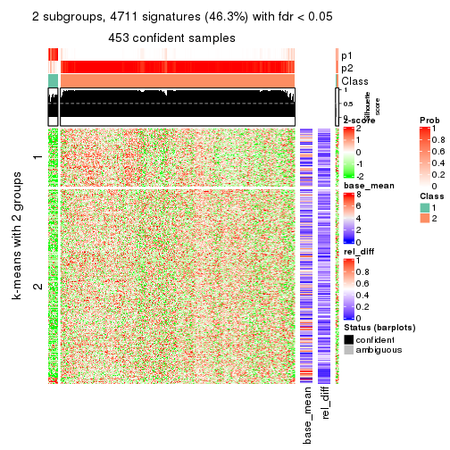</p>

</div>
<div id='tab-MAD-hclust-get-signatures-2'>
<pre><code class="r">get_signatures(res, k = 3)
</code></pre>

<p></p>

</div>
<div id='tab-MAD-hclust-get-signatures-3'>
<pre><code class="r">get_signatures(res, k = 4)
</code></pre>

<p></p>

</div>
<div id='tab-MAD-hclust-get-signatures-4'>
<pre><code class="r">get_signatures(res, k = 5)
</code></pre>

<p></p>

</div>
<div id='tab-MAD-hclust-get-signatures-5'>
<pre><code class="r">get_signatures(res, k = 6)
</code></pre>

<p></p>

</div>
</div>


Signature heatmaps where rows are not scaled:


<script>
$( function() {
	$( '#tabs-MAD-hclust-get-signatures-no-scale' ).tabs();
} );
</script>
<div id='tabs-MAD-hclust-get-signatures-no-scale'>
<ul>
<li><a href='#tab-MAD-hclust-get-signatures-no-scale-1'>k = 2</a></li>
<li><a href='#tab-MAD-hclust-get-signatures-no-scale-2'>k = 3</a></li>
<li><a href='#tab-MAD-hclust-get-signatures-no-scale-3'>k = 4</a></li>
<li><a href='#tab-MAD-hclust-get-signatures-no-scale-4'>k = 5</a></li>
<li><a href='#tab-MAD-hclust-get-signatures-no-scale-5'>k = 6</a></li>
</ul>
<div id='tab-MAD-hclust-get-signatures-no-scale-1'>
<pre><code class="r">get_signatures(res, k = 2, scale_rows = FALSE)
</code></pre>

<p></p>

</div>
<div id='tab-MAD-hclust-get-signatures-no-scale-2'>
<pre><code class="r">get_signatures(res, k = 3, scale_rows = FALSE)
</code></pre>

<p></p>

</div>
<div id='tab-MAD-hclust-get-signatures-no-scale-3'>
<pre><code class="r">get_signatures(res, k = 4, scale_rows = FALSE)
</code></pre>

<p></p>

</div>
<div id='tab-MAD-hclust-get-signatures-no-scale-4'>
<pre><code class="r">get_signatures(res, k = 5, scale_rows = FALSE)
</code></pre>

<p></p>

</div>
<div id='tab-MAD-hclust-get-signatures-no-scale-5'>
<pre><code class="r">get_signatures(res, k = 6, scale_rows = FALSE)
</code></pre>

<p></p>

</div>
</div>


Compare the overlap of signatures from different k:

```r
compare_signatures(res)
```


`get_signature()` returns a data frame invisibly. TO get the list of signatures, the function
call should be assigned to a variable explicitly. In following code, if `plot` argument is set
to `FALSE`, no heatmap is plotted while only the differential analysis is performed.

```r
# code only for demonstration
tb = get_signature(res, k = ..., plot = FALSE)
```

An example of the output of `tb` is:

```
#>   which_row         fdr    mean_1    mean_2 scaled_mean_1 scaled_mean_2 km
#> 1        38 0.042760348  8.373488  9.131774    -0.5533452     0.5164555  1
#> 2        40 0.018707592  7.106213  8.469186    -0.6173731     0.5762149  1
#> 3        55 0.019134737 10.221463 11.207825    -0.6159697     0.5749050  1
#> 4        59 0.006059896  5.921854  7.869574    -0.6899429     0.6439467  1
#> 5        60 0.018055526  8.928898 10.211722    -0.6204761     0.5791110  1
#> 6        98 0.009384629 15.714769 14.887706     0.6635654    -0.6193277  2
...
```

The columns in `tb` are:

1. `which_row`: row indices corresponding to the input matrix.
2. `fdr`: FDR for the differential test. 
3. `mean_x`: The mean value in group x.
4. `scaled_mean_x`: The mean value in group x after rows are scaled.
5. `km`: Row groups if k-means clustering is applied to rows.


UMAP plot which shows how samples are separated.


<script>
$( function() {
	$( '#tabs-MAD-hclust-dimension-reduction' ).tabs();
} );
</script>
<div id='tabs-MAD-hclust-dimension-reduction'>
<ul>
<li><a href='#tab-MAD-hclust-dimension-reduction-1'>k = 2</a></li>
<li><a href='#tab-MAD-hclust-dimension-reduction-2'>k = 3</a></li>
<li><a href='#tab-MAD-hclust-dimension-reduction-3'>k = 4</a></li>
<li><a href='#tab-MAD-hclust-dimension-reduction-4'>k = 5</a></li>
<li><a href='#tab-MAD-hclust-dimension-reduction-5'>k = 6</a></li>
</ul>
<div id='tab-MAD-hclust-dimension-reduction-1'>
<pre><code class="r">dimension_reduction(res, k = 2, method = &quot;UMAP&quot;)
</code></pre>

<p></p>

</div>
<div id='tab-MAD-hclust-dimension-reduction-2'>
<pre><code class="r">dimension_reduction(res, k = 3, method = &quot;UMAP&quot;)
</code></pre>

<p></p>

</div>
<div id='tab-MAD-hclust-dimension-reduction-3'>
<pre><code class="r">dimension_reduction(res, k = 4, method = &quot;UMAP&quot;)
</code></pre>

<p></p>

</div>
<div id='tab-MAD-hclust-dimension-reduction-4'>
<pre><code class="r">dimension_reduction(res, k = 5, method = &quot;UMAP&quot;)
</code></pre>

<p></p>

</div>
<div id='tab-MAD-hclust-dimension-reduction-5'>
<pre><code class="r">dimension_reduction(res, k = 6, method = &quot;UMAP&quot;)
</code></pre>

<p></p>

</div>
</div>


Following heatmap shows how subgroups are split when increasing `k`:

```r
collect_classes(res)
```


If matrix rows can be associated to genes, consider to use `functional_enrichment(res,
...)` to perform function enrichment for the signature genes. See [this vignette](http://bioconductor.org/packages/devel/bioc/vignettes/cola/inst/doc/functional_enrichment.html) for more detailed explanations.


 

---------------------------------------------------


### MAD:kmeans


The object with results only for a single top-value method and a single partition method 
can be extracted as:

```r
res = res_list["MAD", "kmeans"]
# you can also extract it by
# res = res_list["MAD:kmeans"]
```

A summary of `res` and all the functions that can be applied to it:

```r
res
```

```
#> A 'ConsensusPartition' object with k = 2, 3, 4, 5, 6.
#>   On a matrix with 10169 rows and 459 columns.
#>   Top rows (1000, 2000, 3000, 4000, 5000) are extracted by 'MAD' method.
#>   Subgroups are detected by 'kmeans' method.
#>   Performed in total 1250 partitions by row resampling.
#>   Best k for subgroups seems to be 3.
#> 
#> Following methods can be applied to this 'ConsensusPartition' object:
#>  [1] "cola_report"             "collect_classes"         "collect_plots"          
#>  [4] "collect_stats"           "colnames"                "compare_signatures"     
#>  [7] "consensus_heatmap"       "dimension_reduction"     "functional_enrichment"  
#> [10] "get_anno_col"            "get_anno"                "get_classes"            
#> [13] "get_consensus"           "get_matrix"              "get_membership"         
#> [16] "get_param"               "get_signatures"          "get_stats"              
#> [19] "is_best_k"               "is_stable_k"             "membership_heatmap"     
#> [22] "ncol"                    "nrow"                    "plot_ecdf"              
#> [25] "rownames"                "select_partition_number" "show"                   
#> [28] "suggest_best_k"          "test_to_known_factors"
```

`collect_plots()` function collects all the plots made from `res` for all `k` (number of partitions)
into one single page to provide an easy and fast comparison between different `k`.

```r
collect_plots(res)
```


The plots are:

- The first row: a plot of the ECDF (empirical cumulative distribution
  function) curves of the consensus matrix for each `k` and the heatmap of
  predicted classes for each `k`.
- The second row: heatmaps of the consensus matrix for each `k`.
- The third row: heatmaps of the membership matrix for each `k`.
- The fouth row: heatmaps of the signatures for each `k`.

All the plots in panels can be made by individual functions and they are
plotted later in this section.

`select_partition_number()` produces several plots showing different
statistics for choosing "optimized" `k`. There are following statistics:

- ECDF curves of the consensus matrix for each `k`;
- 1-PAC. [The PAC
  score](https://en.wikipedia.org/wiki/Consensus_clustering#Over-interpretation_potential_of_consensus_clustering)
  measures the proportion of the ambiguous subgrouping.
- Mean silhouette score.
- Concordance. The mean probability of fiting the consensus class ids in all
  partitions.
- Area increased. Denote $A_k$ as the area under the ECDF curve for current
  `k`, the area increased is defined as $A_k - A_{k-1}$.
- Rand index. The percent of pairs of samples that are both in a same cluster
  or both are not in a same cluster in the partition of k and k-1.
- Jaccard index. The ratio of pairs of samples are both in a same cluster in
  the partition of k and k-1 and the pairs of samples are both in a same
  cluster in the partition k or k-1.

The detailed explanations of these statistics can be found in [the _cola_
vignette](http://bioconductor.org/packages/devel/bioc/vignettes/cola/inst/doc/cola.html#toc_13).

Generally speaking, lower PAC score, higher mean silhouette score or higher
concordance corresponds to better partition. Rand index and Jaccard index
measure how similar the current partition is compared to partition with `k-1`.
If they are too similar, we won't accept `k` is better than `k-1`.

```r
select_partition_number(res)
```


The numeric values for all these statistics can be obtained by `get_stats()`.

```r
get_stats(res)
```

```
#>   k 1-PAC mean_silhouette concordance area_increased  Rand Jaccard
#> 2 2 0.634           0.916       0.943         0.3760 0.586   0.586
#> 3 3 0.876           0.901       0.964         0.4503 0.697   0.549
#> 4 4 0.564           0.678       0.827         0.2326 0.809   0.607
#> 5 5 0.565           0.654       0.735         0.1008 0.836   0.545
#> 6 6 0.638           0.643       0.770         0.0542 0.930   0.725
```

`suggest_best_k()` suggests the best $k$ based on these statistics. The rules are as follows:

- All $k$ with Jaccard index larger than 0.95 are removed because increasing
  $k$ does not provide enough extra information. If all $k$ are removed, it is
  marked as no subgroup is detected.
- For all $k$ with 1-PAC score larger than 0.9, the maximal $k$ is taken as
  the best $k$, and other $k$ are marked as optional $k$.
- If it does not fit the second rule. The $k$ with the maximal vote of the
  highest 1-PAC score, highest mean silhouette, and highest concordance is
  taken as the best $k$.

```r
suggest_best_k(res)
```

```
#> [1] 3
```


Following shows the table of the partitions (You need to click the **show/hide
code output** link to see it). The membership matrix (columns with name `p*`)
is inferred by
[`clue::cl_consensus()`](https://www.rdocumentation.org/link/cl_consensus?package=clue)
function with the `SE` method. Basically the value in the membership matrix
represents the probability to belong to a certain group. The finall class
label for an item is determined with the group with highest probability it
belongs to.

In `get_classes()` function, the entropy is calculated from the membership
matrix and the silhouette score is calculated from the consensus matrix.


<script>
$( function() {
	$( '#tabs-MAD-kmeans-get-classes' ).tabs();
} );
</script>
<div id='tabs-MAD-kmeans-get-classes'>
<ul>
<li><a href='#tab-MAD-kmeans-get-classes-1'>k = 2</a></li>
<li><a href='#tab-MAD-kmeans-get-classes-2'>k = 3</a></li>
<li><a href='#tab-MAD-kmeans-get-classes-3'>k = 4</a></li>
<li><a href='#tab-MAD-kmeans-get-classes-4'>k = 5</a></li>
<li><a href='#tab-MAD-kmeans-get-classes-5'>k = 6</a></li>
</ul>

<div id='tab-MAD-kmeans-get-classes-1'>
<p><a id='tab-MAD-kmeans-get-classes-1-a' style='color:#0366d6' href='#'>show/hide code output</a></p>
<pre><code class="r">cbind(get_classes(res, k = 2), get_membership(res, k = 2))
</code></pre>

<pre><code>#&gt;            class entropy silhouette    p1    p2
#&gt; SRR1699874     2  0.0000     0.9762 0.000 1.000
#&gt; SRR1699875     2  0.0000     0.9762 0.000 1.000
#&gt; SRR1699876     2  0.0000     0.9762 0.000 1.000
#&gt; SRR1699877     2  0.0000     0.9762 0.000 1.000
#&gt; SRR1699879     2  0.0000     0.9762 0.000 1.000
#&gt; SRR1699878     2  0.0000     0.9762 0.000 1.000
#&gt; SRR1699880     1  0.5946     0.9097 0.856 0.144
#&gt; SRR1699881     1  0.9963     0.4065 0.536 0.464
#&gt; SRR1699882     2  0.0000     0.9762 0.000 1.000
#&gt; SRR1699883     2  0.0000     0.9762 0.000 1.000
#&gt; SRR1699884     2  0.0000     0.9762 0.000 1.000
#&gt; SRR1699885     2  0.0000     0.9762 0.000 1.000
#&gt; SRR1699886     2  0.0000     0.9762 0.000 1.000
#&gt; SRR1699888     2  0.0000     0.9762 0.000 1.000
#&gt; SRR1699889     2  0.0000     0.9762 0.000 1.000
#&gt; SRR1699890     2  0.0000     0.9762 0.000 1.000
#&gt; SRR1699887     2  0.0000     0.9762 0.000 1.000
#&gt; SRR1699891     2  0.0000     0.9762 0.000 1.000
#&gt; SRR1699892     2  0.0000     0.9762 0.000 1.000
#&gt; SRR1699893     2  0.0000     0.9762 0.000 1.000
#&gt; SRR1699894     2  0.0000     0.9762 0.000 1.000
#&gt; SRR1699895     2  0.0000     0.9762 0.000 1.000
#&gt; SRR1699896     2  0.0000     0.9762 0.000 1.000
#&gt; SRR1699897     2  0.0000     0.9762 0.000 1.000
#&gt; SRR1699898     1  0.5946     0.9097 0.856 0.144
#&gt; SRR1699900     2  0.8555     0.5234 0.280 0.720
#&gt; SRR1699899     2  0.0000     0.9762 0.000 1.000
#&gt; SRR1699902     1  0.7219     0.8715 0.800 0.200
#&gt; SRR1699901     1  0.5946     0.9097 0.856 0.144
#&gt; SRR1699903     2  0.0000     0.9762 0.000 1.000
#&gt; SRR1699904     2  0.0000     0.9762 0.000 1.000
#&gt; SRR1699905     1  0.5946     0.9097 0.856 0.144
#&gt; SRR1699906     2  0.0000     0.9762 0.000 1.000
#&gt; SRR1699907     2  0.0000     0.9762 0.000 1.000
#&gt; SRR1699908     2  0.0000     0.9762 0.000 1.000
#&gt; SRR1699909     2  0.0000     0.9762 0.000 1.000
#&gt; SRR1699910     2  0.7883     0.6287 0.236 0.764
#&gt; SRR1699911     2  0.0000     0.9762 0.000 1.000
#&gt; SRR1699912     2  0.0000     0.9762 0.000 1.000
#&gt; SRR1699913     2  0.0000     0.9762 0.000 1.000
#&gt; SRR1699914     1  0.8144     0.8162 0.748 0.252
#&gt; SRR1699915     2  0.0938     0.9657 0.012 0.988
#&gt; SRR1699916     2  0.0000     0.9762 0.000 1.000
#&gt; SRR1699917     2  0.0000     0.9762 0.000 1.000
#&gt; SRR1699918     2  0.0000     0.9762 0.000 1.000
#&gt; SRR1699919     2  0.0000     0.9762 0.000 1.000
#&gt; SRR1699920     2  0.1184     0.9620 0.016 0.984
#&gt; SRR1699921     2  0.0000     0.9762 0.000 1.000
#&gt; SRR1699922     2  0.0000     0.9762 0.000 1.000
#&gt; SRR1699923     1  0.6343     0.9016 0.840 0.160
#&gt; SRR1699924     1  0.8861     0.7478 0.696 0.304
#&gt; SRR1699925     1  0.0000     0.8432 1.000 0.000
#&gt; SRR1699926     2  0.0000     0.9762 0.000 1.000
#&gt; SRR1699927     2  0.0000     0.9762 0.000 1.000
#&gt; SRR1699929     2  0.0000     0.9762 0.000 1.000
#&gt; SRR1699928     2  0.0000     0.9762 0.000 1.000
#&gt; SRR1699930     2  0.0000     0.9762 0.000 1.000
#&gt; SRR1699931     2  0.0000     0.9762 0.000 1.000
#&gt; SRR1699933     2  0.6623     0.7559 0.172 0.828
#&gt; SRR1699932     2  0.0000     0.9762 0.000 1.000
#&gt; SRR1699934     1  0.0000     0.8432 1.000 0.000
#&gt; SRR1699935     2  0.0000     0.9762 0.000 1.000
#&gt; SRR1699936     2  0.0000     0.9762 0.000 1.000
#&gt; SRR1699937     2  0.0000     0.9762 0.000 1.000
#&gt; SRR1699938     2  0.0000     0.9762 0.000 1.000
#&gt; SRR1699940     2  0.5737     0.8121 0.136 0.864
#&gt; SRR1699939     2  0.0000     0.9762 0.000 1.000
#&gt; SRR1699941     1  0.7745     0.8406 0.772 0.228
#&gt; SRR1699942     2  0.0000     0.9762 0.000 1.000
#&gt; SRR1699943     2  0.0000     0.9762 0.000 1.000
#&gt; SRR1699944     2  0.0000     0.9762 0.000 1.000
#&gt; SRR1699945     1  0.5946     0.9097 0.856 0.144
#&gt; SRR1699946     2  0.0000     0.9762 0.000 1.000
#&gt; SRR1699947     2  0.0000     0.9762 0.000 1.000
#&gt; SRR1699948     2  0.0000     0.9762 0.000 1.000
#&gt; SRR1699949     2  0.0000     0.9762 0.000 1.000
#&gt; SRR1699950     2  0.0000     0.9762 0.000 1.000
#&gt; SRR1699951     2  0.0000     0.9762 0.000 1.000
#&gt; SRR1699952     2  0.0000     0.9762 0.000 1.000
#&gt; SRR1699953     2  0.0000     0.9762 0.000 1.000
#&gt; SRR1699954     1  0.9996     0.3051 0.512 0.488
#&gt; SRR1699955     2  0.0000     0.9762 0.000 1.000
#&gt; SRR1699956     1  0.5946     0.9097 0.856 0.144
#&gt; SRR1699957     2  0.0000     0.9762 0.000 1.000
#&gt; SRR1699959     2  0.4431     0.8748 0.092 0.908
#&gt; SRR1699958     2  0.0000     0.9762 0.000 1.000
#&gt; SRR1699960     2  0.0000     0.9762 0.000 1.000
#&gt; SRR1699961     2  0.3114     0.9188 0.056 0.944
#&gt; SRR1699962     2  0.0000     0.9762 0.000 1.000
#&gt; SRR1699963     2  0.1184     0.9618 0.016 0.984
#&gt; SRR1699964     2  0.0000     0.9762 0.000 1.000
#&gt; SRR1699965     2  0.0000     0.9762 0.000 1.000
#&gt; SRR1699966     2  0.0000     0.9762 0.000 1.000
#&gt; SRR1699967     2  0.0000     0.9762 0.000 1.000
#&gt; SRR1699968     2  0.0000     0.9762 0.000 1.000
#&gt; SRR1699969     1  0.6623     0.8940 0.828 0.172
#&gt; SRR1699971     1  0.8955     0.7364 0.688 0.312
#&gt; SRR1699970     2  0.0000     0.9762 0.000 1.000
#&gt; SRR1699972     1  0.9661     0.5800 0.608 0.392
#&gt; SRR1699973     2  0.0000     0.9762 0.000 1.000
#&gt; SRR1699974     1  0.5629     0.9054 0.868 0.132
#&gt; SRR1699975     2  0.0000     0.9762 0.000 1.000
#&gt; SRR1699976     2  0.0376     0.9727 0.004 0.996
#&gt; SRR1699977     2  0.4022     0.8903 0.080 0.920
#&gt; SRR1699978     1  0.5059     0.8967 0.888 0.112
#&gt; SRR1699979     2  0.0376     0.9727 0.004 0.996
#&gt; SRR1699980     2  0.0000     0.9762 0.000 1.000
#&gt; SRR1699981     1  0.6623     0.8942 0.828 0.172
#&gt; SRR1699982     2  0.0000     0.9762 0.000 1.000
#&gt; SRR1699983     2  0.0000     0.9762 0.000 1.000
#&gt; SRR1699984     1  0.0000     0.8432 1.000 0.000
#&gt; SRR1699985     2  0.0000     0.9762 0.000 1.000
#&gt; SRR1699986     1  0.5294     0.9003 0.880 0.120
#&gt; SRR1699988     2  0.0000     0.9762 0.000 1.000
#&gt; SRR1699987     2  0.8861     0.4602 0.304 0.696
#&gt; SRR1699989     2  0.0000     0.9762 0.000 1.000
#&gt; SRR1699990     2  0.0000     0.9762 0.000 1.000
#&gt; SRR1699992     2  0.8144     0.5938 0.252 0.748
#&gt; SRR1699991     1  0.6247     0.9038 0.844 0.156
#&gt; SRR1699993     1  0.5946     0.9097 0.856 0.144
#&gt; SRR1699994     1  0.5946     0.9097 0.856 0.144
#&gt; SRR1699995     1  0.0000     0.8432 1.000 0.000
#&gt; SRR1699996     2  0.0000     0.9762 0.000 1.000
#&gt; SRR1699997     2  0.0000     0.9762 0.000 1.000
#&gt; SRR1699998     2  0.0000     0.9762 0.000 1.000
#&gt; SRR1699999     1  0.0000     0.8432 1.000 0.000
#&gt; SRR1700000     1  0.9866     0.4834 0.568 0.432
#&gt; SRR1700002     2  0.0000     0.9762 0.000 1.000
#&gt; SRR1700001     1  0.7602     0.8513 0.780 0.220
#&gt; SRR1700003     2  0.0672     0.9692 0.008 0.992
#&gt; SRR1700004     1  0.5946     0.9097 0.856 0.144
#&gt; SRR1700005     1  0.0000     0.8432 1.000 0.000
#&gt; SRR1700006     2  0.8555     0.5361 0.280 0.720
#&gt; SRR1700007     2  0.0000     0.9762 0.000 1.000
#&gt; SRR1700008     1  0.5946     0.9097 0.856 0.144
#&gt; SRR1700009     1  0.0000     0.8432 1.000 0.000
#&gt; SRR1700010     1  0.5946     0.9097 0.856 0.144
#&gt; SRR1700011     2  0.0000     0.9762 0.000 1.000
#&gt; SRR1700013     2  0.4562     0.8691 0.096 0.904
#&gt; SRR1700012     2  0.1184     0.9618 0.016 0.984
#&gt; SRR1700014     2  0.0000     0.9762 0.000 1.000
#&gt; SRR1700015     2  0.0000     0.9762 0.000 1.000
#&gt; SRR1700016     1  0.0000     0.8432 1.000 0.000
#&gt; SRR1700018     1  0.9977     0.3619 0.528 0.472
#&gt; SRR1700017     1  0.8144     0.8180 0.748 0.252
#&gt; SRR1700019     2  0.0000     0.9762 0.000 1.000
#&gt; SRR1700020     1  0.0672     0.8472 0.992 0.008
#&gt; SRR1700021     2  0.0000     0.9762 0.000 1.000
#&gt; SRR1700023     2  0.1633     0.9541 0.024 0.976
#&gt; SRR1700022     1  0.5946     0.9097 0.856 0.144
#&gt; SRR1700024     2  0.0000     0.9762 0.000 1.000
#&gt; SRR1700025     2  0.0000     0.9762 0.000 1.000
#&gt; SRR1700026     2  0.9427     0.2752 0.360 0.640
#&gt; SRR1700027     2  0.1184     0.9620 0.016 0.984
#&gt; SRR1700028     2  0.0000     0.9762 0.000 1.000
#&gt; SRR1700029     1  0.6247     0.9039 0.844 0.156
#&gt; SRR1700030     2  0.0000     0.9762 0.000 1.000
#&gt; SRR1700031     1  0.5946     0.9097 0.856 0.144
#&gt; SRR1700032     2  0.0000     0.9762 0.000 1.000
#&gt; SRR1700034     1  0.0000     0.8432 1.000 0.000
#&gt; SRR1700035     2  0.0000     0.9762 0.000 1.000
#&gt; SRR1700033     1  0.5946     0.9097 0.856 0.144
#&gt; SRR1700036     2  0.0000     0.9762 0.000 1.000
#&gt; SRR1700037     2  0.0000     0.9762 0.000 1.000
#&gt; SRR1700038     1  0.9393     0.6613 0.644 0.356
#&gt; SRR1700039     1  0.5946     0.9097 0.856 0.144
#&gt; SRR1700040     1  0.5946     0.9097 0.856 0.144
#&gt; SRR1700041     1  0.8661     0.7683 0.712 0.288
#&gt; SRR1700042     1  0.5946     0.9097 0.856 0.144
#&gt; SRR1700043     1  0.5946     0.9097 0.856 0.144
#&gt; SRR1700045     1  0.8713     0.7643 0.708 0.292
#&gt; SRR1700044     2  0.0000     0.9762 0.000 1.000
#&gt; SRR1700046     1  0.9522     0.6286 0.628 0.372
#&gt; SRR1700047     1  0.6247     0.9039 0.844 0.156
#&gt; SRR1700048     2  0.2778     0.9287 0.048 0.952
#&gt; SRR1700049     1  0.0000     0.8432 1.000 0.000
#&gt; SRR1700050     1  0.4431     0.8873 0.908 0.092
#&gt; SRR1700051     1  0.0000     0.8432 1.000 0.000
#&gt; SRR1700052     1  0.5737     0.9070 0.864 0.136
#&gt; SRR1700053     2  0.0376     0.9727 0.004 0.996
#&gt; SRR1700054     1  0.5946     0.9097 0.856 0.144
#&gt; SRR1700055     1  0.0000     0.8432 1.000 0.000
#&gt; SRR1700056     1  0.5946     0.9097 0.856 0.144
#&gt; SRR1700057     1  0.5946     0.9097 0.856 0.144
#&gt; SRR1700058     1  0.5946     0.9097 0.856 0.144
#&gt; SRR1700059     1  0.6973     0.8819 0.812 0.188
#&gt; SRR1700060     1  0.5946     0.9097 0.856 0.144
#&gt; SRR1700061     1  0.6973     0.8819 0.812 0.188
#&gt; SRR1700062     1  0.5842     0.9084 0.860 0.140
#&gt; SRR1700063     1  0.5946     0.9097 0.856 0.144
#&gt; SRR1700064     2  0.0938     0.9657 0.012 0.988
#&gt; SRR1700065     1  0.5946     0.9097 0.856 0.144
#&gt; SRR1700066     1  0.5946     0.9097 0.856 0.144
#&gt; SRR1700067     2  0.0000     0.9762 0.000 1.000
#&gt; SRR1700068     1  0.6148     0.9061 0.848 0.152
#&gt; SRR1700069     2  0.1414     0.9583 0.020 0.980
#&gt; SRR1700070     2  0.0000     0.9762 0.000 1.000
#&gt; SRR1700071     1  0.6048     0.9079 0.852 0.148
#&gt; SRR1700072     1  0.5946     0.9097 0.856 0.144
#&gt; SRR1700073     2  0.0000     0.9762 0.000 1.000
#&gt; SRR1700075     1  0.6712     0.8912 0.824 0.176
#&gt; SRR1700074     1  0.7056     0.8783 0.808 0.192
#&gt; SRR1700076     2  0.1633     0.9541 0.024 0.976
#&gt; SRR1700077     1  0.6973     0.8816 0.812 0.188
#&gt; SRR1700078     1  0.9393     0.6495 0.644 0.356
#&gt; SRR1700080     2  0.3274     0.9131 0.060 0.940
#&gt; SRR1700079     1  0.6623     0.8938 0.828 0.172
#&gt; SRR1700081     1  0.5946     0.9097 0.856 0.144
#&gt; SRR1700082     1  0.8327     0.8018 0.736 0.264
#&gt; SRR1700083     1  0.5946     0.9097 0.856 0.144
#&gt; SRR1700084     1  0.0376     0.8452 0.996 0.004
#&gt; SRR1700085     2  0.0000     0.9762 0.000 1.000
#&gt; SRR1700086     2  0.6973     0.7280 0.188 0.812
#&gt; SRR1700087     2  0.6048     0.7925 0.148 0.852
#&gt; SRR1700088     2  0.0000     0.9762 0.000 1.000
#&gt; SRR1700089     2  0.2236     0.9413 0.036 0.964
#&gt; SRR1700091     2  0.0000     0.9762 0.000 1.000
#&gt; SRR1700090     2  0.0672     0.9692 0.008 0.992
#&gt; SRR1700092     2  0.0000     0.9762 0.000 1.000
#&gt; SRR1700094     2  0.0000     0.9762 0.000 1.000
#&gt; SRR1700093     2  0.0000     0.9762 0.000 1.000
#&gt; SRR1700095     1  0.8763     0.7574 0.704 0.296
#&gt; SRR1700096     2  0.3274     0.9145 0.060 0.940
#&gt; SRR1700097     1  0.5737     0.9070 0.864 0.136
#&gt; SRR1700098     2  0.0000     0.9762 0.000 1.000
#&gt; SRR1700099     2  0.0000     0.9762 0.000 1.000
#&gt; SRR1700100     2  0.0000     0.9762 0.000 1.000
#&gt; SRR1700101     2  0.0000     0.9762 0.000 1.000
#&gt; SRR1700102     2  0.0000     0.9762 0.000 1.000
#&gt; SRR1700104     2  0.0000     0.9762 0.000 1.000
#&gt; SRR1700103     2  0.9933    -0.1033 0.452 0.548
#&gt; SRR1700105     2  0.0000     0.9762 0.000 1.000
#&gt; SRR1700106     2  0.8144     0.6008 0.252 0.748
#&gt; SRR1700107     2  0.0000     0.9762 0.000 1.000
#&gt; SRR1700108     2  0.0000     0.9762 0.000 1.000
#&gt; SRR1700109     2  0.0000     0.9762 0.000 1.000
#&gt; SRR1700110     2  0.0000     0.9762 0.000 1.000
#&gt; SRR1700112     2  0.0000     0.9762 0.000 1.000
#&gt; SRR1700111     2  0.2603     0.9327 0.044 0.956
#&gt; SRR1700113     2  0.0000     0.9762 0.000 1.000
#&gt; SRR1700114     2  0.0000     0.9762 0.000 1.000
#&gt; SRR1700115     2  0.0000     0.9762 0.000 1.000
#&gt; SRR1700116     2  0.4161     0.8849 0.084 0.916
#&gt; SRR1700117     1  0.5946     0.9097 0.856 0.144
#&gt; SRR1700119     2  0.0000     0.9762 0.000 1.000
#&gt; SRR1700118     2  0.0376     0.9727 0.004 0.996
#&gt; SRR1700120     1  0.5946     0.9097 0.856 0.144
#&gt; SRR1700121     2  0.0000     0.9762 0.000 1.000
#&gt; SRR1700122     2  0.0000     0.9762 0.000 1.000
#&gt; SRR1700123     1  0.8861     0.7466 0.696 0.304
#&gt; SRR1700125     2  0.0000     0.9762 0.000 1.000
#&gt; SRR1700126     1  0.5946     0.9097 0.856 0.144
#&gt; SRR1700127     1  0.5946     0.9097 0.856 0.144
#&gt; SRR1700124     2  0.9754     0.1155 0.408 0.592
#&gt; SRR1700128     1  0.9000     0.7295 0.684 0.316
#&gt; SRR1700129     2  0.0000     0.9762 0.000 1.000
#&gt; SRR1700130     2  0.0000     0.9762 0.000 1.000
#&gt; SRR1700132     1  0.5946     0.9097 0.856 0.144
#&gt; SRR1700131     1  0.5946     0.9097 0.856 0.144
#&gt; SRR1700133     2  0.0000     0.9762 0.000 1.000
#&gt; SRR1700134     2  0.0000     0.9762 0.000 1.000
#&gt; SRR1700135     2  0.9129     0.3792 0.328 0.672
#&gt; SRR1700136     1  0.5946     0.9097 0.856 0.144
#&gt; SRR1700137     2  0.1184     0.9619 0.016 0.984
#&gt; SRR1700138     2  0.2603     0.9321 0.044 0.956
#&gt; SRR1700140     2  0.2603     0.9325 0.044 0.956
#&gt; SRR1700139     2  0.8016     0.6042 0.244 0.756
#&gt; SRR1700141     2  0.0000     0.9762 0.000 1.000
#&gt; SRR1700142     1  0.5946     0.9097 0.856 0.144
#&gt; SRR1700143     1  0.5946     0.9097 0.856 0.144
#&gt; SRR1700144     1  0.6247     0.9040 0.844 0.156
#&gt; SRR1700145     1  0.6048     0.9079 0.852 0.148
#&gt; SRR1700146     2  0.0000     0.9762 0.000 1.000
#&gt; SRR1700147     1  0.6247     0.9041 0.844 0.156
#&gt; SRR1700149     1  0.5946     0.9097 0.856 0.144
#&gt; SRR1700148     1  0.5946     0.9097 0.856 0.144
#&gt; SRR1700150     2  0.0000     0.9762 0.000 1.000
#&gt; SRR1700152     2  0.4690     0.8620 0.100 0.900
#&gt; SRR1700151     1  0.9323     0.6763 0.652 0.348
#&gt; SRR1700153     1  0.5946     0.9097 0.856 0.144
#&gt; SRR1700154     1  0.9795     0.5338 0.584 0.416
#&gt; SRR1700155     2  0.0000     0.9762 0.000 1.000
#&gt; SRR1700156     1  0.5946     0.9097 0.856 0.144
#&gt; SRR1700158     1  0.5946     0.9097 0.856 0.144
#&gt; SRR1700159     2  0.0000     0.9762 0.000 1.000
#&gt; SRR1700157     1  0.5946     0.9097 0.856 0.144
#&gt; SRR1700160     2  0.1843     0.9503 0.028 0.972
#&gt; SRR1700161     1  0.9944     0.4250 0.544 0.456
#&gt; SRR1700162     2  0.0000     0.9762 0.000 1.000
#&gt; SRR1700164     1  0.5946     0.9097 0.856 0.144
#&gt; SRR1700163     1  0.5946     0.9097 0.856 0.144
#&gt; SRR1700165     1  0.7139     0.8753 0.804 0.196
#&gt; SRR1700166     2  0.0000     0.9762 0.000 1.000
#&gt; SRR1700168     2  0.0000     0.9762 0.000 1.000
#&gt; SRR1700167     1  0.5946     0.9097 0.856 0.144
#&gt; SRR1700170     2  0.0000     0.9762 0.000 1.000
#&gt; SRR1700169     2  0.0376     0.9727 0.004 0.996
#&gt; SRR1700171     1  0.5842     0.9084 0.860 0.140
#&gt; SRR1700172     2  0.0000     0.9762 0.000 1.000
#&gt; SRR1700174     2  0.0000     0.9762 0.000 1.000
#&gt; SRR1700173     2  0.0000     0.9762 0.000 1.000
#&gt; SRR1700175     2  0.0000     0.9762 0.000 1.000
#&gt; SRR1700176     1  0.5946     0.9097 0.856 0.144
#&gt; SRR1700178     2  0.0000     0.9762 0.000 1.000
#&gt; SRR1700177     2  0.0000     0.9762 0.000 1.000
#&gt; SRR1700180     2  0.0000     0.9762 0.000 1.000
#&gt; SRR1700179     2  0.0000     0.9762 0.000 1.000
#&gt; SRR1700181     2  0.0000     0.9762 0.000 1.000
#&gt; SRR1700183     1  0.0000     0.8432 1.000 0.000
#&gt; SRR1700182     2  0.0000     0.9762 0.000 1.000
#&gt; SRR1700184     2  0.0000     0.9762 0.000 1.000
#&gt; SRR1700186     2  0.0000     0.9762 0.000 1.000
#&gt; SRR1700187     1  0.0000     0.8432 1.000 0.000
#&gt; SRR1700185     1  0.0000     0.8432 1.000 0.000
#&gt; SRR1700188     2  0.0000     0.9762 0.000 1.000
#&gt; SRR1700192     1  0.7219     0.8705 0.800 0.200
#&gt; SRR1700190     1  0.1184     0.8511 0.984 0.016
#&gt; SRR1700191     1  0.0000     0.8432 1.000 0.000
#&gt; SRR1700189     1  0.0000     0.8432 1.000 0.000
#&gt; SRR1700193     2  0.0000     0.9762 0.000 1.000
#&gt; SRR1700195     2  0.0000     0.9762 0.000 1.000
#&gt; SRR1700194     1  0.0000     0.8432 1.000 0.000
#&gt; SRR1700196     2  0.0000     0.9762 0.000 1.000
#&gt; SRR1700197     1  0.0000     0.8432 1.000 0.000
#&gt; SRR1700198     2  0.0000     0.9762 0.000 1.000
#&gt; SRR1700199     2  0.0000     0.9762 0.000 1.000
#&gt; SRR1700200     2  0.0000     0.9762 0.000 1.000
#&gt; SRR1700201     2  0.0000     0.9762 0.000 1.000
#&gt; SRR1700202     2  0.0000     0.9762 0.000 1.000
#&gt; SRR1700203     2  0.0000     0.9762 0.000 1.000
#&gt; SRR1700204     2  0.0000     0.9762 0.000 1.000
#&gt; SRR1700206     2  0.0000     0.9762 0.000 1.000
#&gt; SRR1700207     2  0.0000     0.9762 0.000 1.000
#&gt; SRR1700208     1  0.6148     0.9060 0.848 0.152
#&gt; SRR1700205     2  0.0000     0.9762 0.000 1.000
#&gt; SRR1700209     2  0.0000     0.9762 0.000 1.000
#&gt; SRR1700210     2  0.0000     0.9762 0.000 1.000
#&gt; SRR1700211     2  0.0000     0.9762 0.000 1.000
#&gt; SRR1700212     2  0.0000     0.9762 0.000 1.000
#&gt; SRR1700213     2  0.0000     0.9762 0.000 1.000
#&gt; SRR1700214     2  0.0000     0.9762 0.000 1.000
#&gt; SRR1700215     1  0.0000     0.8432 1.000 0.000
#&gt; SRR1700217     2  0.0000     0.9762 0.000 1.000
#&gt; SRR1700216     1  0.0000     0.8432 1.000 0.000
#&gt; SRR1700218     2  0.0000     0.9762 0.000 1.000
#&gt; SRR1700219     2  0.0000     0.9762 0.000 1.000
#&gt; SRR1700222     1  0.0000     0.8432 1.000 0.000
#&gt; SRR1700220     2  0.0000     0.9762 0.000 1.000
#&gt; SRR1700221     2  0.0000     0.9762 0.000 1.000
#&gt; SRR1700223     2  0.0000     0.9762 0.000 1.000
#&gt; SRR1700224     2  0.0000     0.9762 0.000 1.000
#&gt; SRR1700226     2  0.0000     0.9762 0.000 1.000
#&gt; SRR1700229     2  0.0000     0.9762 0.000 1.000
#&gt; SRR1700225     2  0.0000     0.9762 0.000 1.000
#&gt; SRR1700227     2  0.0000     0.9762 0.000 1.000
#&gt; SRR1700230     1  0.0000     0.8432 1.000 0.000
#&gt; SRR1700231     2  0.0000     0.9762 0.000 1.000
#&gt; SRR1700228     2  0.0000     0.9762 0.000 1.000
#&gt; SRR1700232     2  0.0000     0.9762 0.000 1.000
#&gt; SRR1700233     2  0.0000     0.9762 0.000 1.000
#&gt; SRR1700234     2  0.0000     0.9762 0.000 1.000
#&gt; SRR1700235     2  0.0000     0.9762 0.000 1.000
#&gt; SRR1700237     2  0.0000     0.9762 0.000 1.000
#&gt; SRR1700236     2  0.0000     0.9762 0.000 1.000
#&gt; SRR1700238     2  0.0000     0.9762 0.000 1.000
#&gt; SRR1700239     1  0.0000     0.8432 1.000 0.000
#&gt; SRR1700240     1  0.0000     0.8432 1.000 0.000
#&gt; SRR1700241     2  0.1843     0.9501 0.028 0.972
#&gt; SRR1700243     2  0.0000     0.9762 0.000 1.000
#&gt; SRR1700244     2  0.0000     0.9762 0.000 1.000
#&gt; SRR1700242     1  0.5946     0.9097 0.856 0.144
#&gt; SRR1700246     2  0.0000     0.9762 0.000 1.000
#&gt; SRR1700245     2  0.0000     0.9762 0.000 1.000
#&gt; SRR1700247     1  0.0000     0.8432 1.000 0.000
#&gt; SRR1700249     1  0.0000     0.8432 1.000 0.000
#&gt; SRR1700250     2  0.0000     0.9762 0.000 1.000
#&gt; SRR1700248     2  0.0000     0.9762 0.000 1.000
#&gt; SRR1700251     2  0.0000     0.9762 0.000 1.000
#&gt; SRR1700252     2  0.0000     0.9762 0.000 1.000
#&gt; SRR1700253     2  0.0000     0.9762 0.000 1.000
#&gt; SRR1700256     2  0.0000     0.9762 0.000 1.000
#&gt; SRR1700254     1  0.0000     0.8432 1.000 0.000
#&gt; SRR1700255     2  0.0000     0.9762 0.000 1.000
#&gt; SRR1700257     2  0.0000     0.9762 0.000 1.000
#&gt; SRR1700258     2  0.0000     0.9762 0.000 1.000
#&gt; SRR1700259     2  0.0000     0.9762 0.000 1.000
#&gt; SRR1700260     2  0.0000     0.9762 0.000 1.000
#&gt; SRR1700261     2  0.0000     0.9762 0.000 1.000
#&gt; SRR1700262     2  0.0000     0.9762 0.000 1.000
#&gt; SRR1700263     2  0.0000     0.9762 0.000 1.000
#&gt; SRR1700264     2  0.0000     0.9762 0.000 1.000
#&gt; SRR1700265     2  0.0000     0.9762 0.000 1.000
#&gt; SRR1700266     2  0.0000     0.9762 0.000 1.000
#&gt; SRR1700268     2  0.1184     0.9615 0.016 0.984
#&gt; SRR1700270     2  0.0000     0.9762 0.000 1.000
#&gt; SRR1700267     2  0.0000     0.9762 0.000 1.000
#&gt; SRR1700271     2  0.0000     0.9762 0.000 1.000
#&gt; SRR1700272     2  0.0000     0.9762 0.000 1.000
#&gt; SRR1700273     2  0.0000     0.9762 0.000 1.000
#&gt; SRR1700274     2  0.0000     0.9762 0.000 1.000
#&gt; SRR1700277     1  0.6531     0.8966 0.832 0.168
#&gt; SRR1700275     2  0.0000     0.9762 0.000 1.000
#&gt; SRR1700276     2  0.0000     0.9762 0.000 1.000
#&gt; SRR1700278     2  0.0000     0.9762 0.000 1.000
#&gt; SRR1700279     2  0.0000     0.9762 0.000 1.000
#&gt; SRR1700280     2  0.0000     0.9762 0.000 1.000
#&gt; SRR1700281     2  0.0000     0.9762 0.000 1.000
#&gt; SRR1700283     2  0.0000     0.9762 0.000 1.000
#&gt; SRR1700282     2  0.0672     0.9692 0.008 0.992
#&gt; SRR1700284     2  0.0000     0.9762 0.000 1.000
#&gt; SRR1700285     2  0.0000     0.9762 0.000 1.000
#&gt; SRR1700286     2  0.0000     0.9762 0.000 1.000
#&gt; SRR1700287     2  0.0000     0.9762 0.000 1.000
#&gt; SRR1700290     1  0.2423     0.8624 0.960 0.040
#&gt; SRR1700289     2  0.0000     0.9762 0.000 1.000
#&gt; SRR1700288     2  0.0000     0.9762 0.000 1.000
#&gt; SRR1700292     2  0.0000     0.9762 0.000 1.000
#&gt; SRR1700291     2  0.0000     0.9762 0.000 1.000
#&gt; SRR1700293     2  0.0000     0.9762 0.000 1.000
#&gt; SRR1700294     2  0.0000     0.9762 0.000 1.000
#&gt; SRR1700295     2  0.9775     0.0723 0.412 0.588
#&gt; SRR1700297     2  0.0000     0.9762 0.000 1.000
#&gt; SRR1700296     2  0.0000     0.9762 0.000 1.000
#&gt; SRR1700298     2  0.0000     0.9762 0.000 1.000
#&gt; SRR1700299     2  0.0000     0.9762 0.000 1.000
#&gt; SRR1700300     2  0.0000     0.9762 0.000 1.000
#&gt; SRR1700302     2  0.0000     0.9762 0.000 1.000
#&gt; SRR1700301     2  0.0000     0.9762 0.000 1.000
#&gt; SRR1700303     2  0.0000     0.9762 0.000 1.000
#&gt; SRR1700304     2  0.0000     0.9762 0.000 1.000
#&gt; SRR1700305     2  0.0000     0.9762 0.000 1.000
#&gt; SRR1700306     2  0.8207     0.5879 0.256 0.744
#&gt; SRR1700308     2  0.0000     0.9762 0.000 1.000
#&gt; SRR1700307     2  0.0938     0.9655 0.012 0.988
#&gt; SRR1700309     2  0.6531     0.7602 0.168 0.832
#&gt; SRR1700310     2  0.0000     0.9762 0.000 1.000
#&gt; SRR1700311     2  0.0000     0.9762 0.000 1.000
#&gt; SRR1700312     2  0.0000     0.9762 0.000 1.000
#&gt; SRR1700313     2  0.0000     0.9762 0.000 1.000
#&gt; SRR1700314     2  0.0000     0.9762 0.000 1.000
#&gt; SRR1700315     2  0.0000     0.9762 0.000 1.000
#&gt; SRR1700316     2  0.0000     0.9762 0.000 1.000
#&gt; SRR1700317     2  0.0000     0.9762 0.000 1.000
#&gt; SRR1700318     2  0.0000     0.9762 0.000 1.000
#&gt; SRR1700319     2  0.0376     0.9727 0.004 0.996
#&gt; SRR1700320     2  0.0000     0.9762 0.000 1.000
#&gt; SRR1700322     2  0.0000     0.9762 0.000 1.000
#&gt; SRR1700321     2  0.0000     0.9762 0.000 1.000
#&gt; SRR1700323     2  0.0000     0.9762 0.000 1.000
#&gt; SRR1700324     2  0.0000     0.9762 0.000 1.000
#&gt; SRR1700325     2  0.0000     0.9762 0.000 1.000
#&gt; SRR1700326     2  0.9833     0.0555 0.424 0.576
#&gt; SRR1700327     2  0.0000     0.9762 0.000 1.000
#&gt; SRR1700329     2  0.0000     0.9762 0.000 1.000
#&gt; SRR1700328     2  0.1633     0.9539 0.024 0.976
#&gt; SRR1700330     2  0.0376     0.9727 0.004 0.996
#&gt; SRR1700331     2  0.0000     0.9762 0.000 1.000
#&gt; SRR1700332     2  0.0000     0.9762 0.000 1.000
#&gt; SRR1700333     2  0.0000     0.9762 0.000 1.000
</code></pre>

<script>
$('#tab-MAD-kmeans-get-classes-1-a').parent().next().next().hide();
$('#tab-MAD-kmeans-get-classes-1-a').click(function(){
  $('#tab-MAD-kmeans-get-classes-1-a').parent().next().next().toggle();
  return(false);
});
</script>
</div>

<div id='tab-MAD-kmeans-get-classes-2'>
<p><a id='tab-MAD-kmeans-get-classes-2-a' style='color:#0366d6' href='#'>show/hide code output</a></p>
<pre><code class="r">cbind(get_classes(res, k = 3), get_membership(res, k = 3))
</code></pre>

<pre><code>#&gt;            class entropy silhouette    p1    p2    p3
#&gt; SRR1699874     2  0.0000     0.9543 0.000 1.000 0.000
#&gt; SRR1699875     2  0.0000     0.9543 0.000 1.000 0.000
#&gt; SRR1699876     2  0.0000     0.9543 0.000 1.000 0.000
#&gt; SRR1699877     2  0.0000     0.9543 0.000 1.000 0.000
#&gt; SRR1699879     2  0.0000     0.9543 0.000 1.000 0.000
#&gt; SRR1699878     2  0.0000     0.9543 0.000 1.000 0.000
#&gt; SRR1699880     3  0.0000     0.9488 0.000 0.000 1.000
#&gt; SRR1699881     3  0.0000     0.9488 0.000 0.000 1.000
#&gt; SRR1699882     2  0.0000     0.9543 0.000 1.000 0.000
#&gt; SRR1699883     2  0.0000     0.9543 0.000 1.000 0.000
#&gt; SRR1699884     2  0.0000     0.9543 0.000 1.000 0.000
#&gt; SRR1699885     2  0.0000     0.9543 0.000 1.000 0.000
#&gt; SRR1699886     2  0.0000     0.9543 0.000 1.000 0.000
#&gt; SRR1699888     2  0.0000     0.9543 0.000 1.000 0.000
#&gt; SRR1699889     2  0.0000     0.9543 0.000 1.000 0.000
#&gt; SRR1699890     2  0.0000     0.9543 0.000 1.000 0.000
#&gt; SRR1699887     2  0.0000     0.9543 0.000 1.000 0.000
#&gt; SRR1699891     2  0.0000     0.9543 0.000 1.000 0.000
#&gt; SRR1699892     2  0.4555     0.7152 0.000 0.800 0.200
#&gt; SRR1699893     3  0.0424     0.9423 0.000 0.008 0.992
#&gt; SRR1699894     2  0.0000     0.9543 0.000 1.000 0.000
#&gt; SRR1699895     2  0.0000     0.9543 0.000 1.000 0.000
#&gt; SRR1699896     2  0.4974     0.6679 0.000 0.764 0.236
#&gt; SRR1699897     2  0.0000     0.9543 0.000 1.000 0.000
#&gt; SRR1699898     3  0.0000     0.9488 0.000 0.000 1.000
#&gt; SRR1699900     3  0.0000     0.9488 0.000 0.000 1.000
#&gt; SRR1699899     2  0.0000     0.9543 0.000 1.000 0.000
#&gt; SRR1699902     3  0.0000     0.9488 0.000 0.000 1.000
#&gt; SRR1699901     3  0.0000     0.9488 0.000 0.000 1.000
#&gt; SRR1699903     2  0.0592     0.9446 0.000 0.988 0.012
#&gt; SRR1699904     2  0.0000     0.9543 0.000 1.000 0.000
#&gt; SRR1699905     3  0.0000     0.9488 0.000 0.000 1.000
#&gt; SRR1699906     2  0.0000     0.9543 0.000 1.000 0.000
#&gt; SRR1699907     2  0.0000     0.9543 0.000 1.000 0.000
#&gt; SRR1699908     2  0.0000     0.9543 0.000 1.000 0.000
#&gt; SRR1699909     2  0.0000     0.9543 0.000 1.000 0.000
#&gt; SRR1699910     3  0.0000     0.9488 0.000 0.000 1.000
#&gt; SRR1699911     2  0.1163     0.9304 0.000 0.972 0.028
#&gt; SRR1699912     2  0.0000     0.9543 0.000 1.000 0.000
#&gt; SRR1699913     2  0.0000     0.9543 0.000 1.000 0.000
#&gt; SRR1699914     3  0.0000     0.9488 0.000 0.000 1.000
#&gt; SRR1699915     3  0.0237     0.9458 0.000 0.004 0.996
#&gt; SRR1699916     2  0.0000     0.9543 0.000 1.000 0.000
#&gt; SRR1699917     2  0.4178     0.7648 0.000 0.828 0.172
#&gt; SRR1699918     2  0.0237     0.9512 0.000 0.996 0.004
#&gt; SRR1699919     2  0.0000     0.9543 0.000 1.000 0.000
#&gt; SRR1699920     3  0.0000     0.9488 0.000 0.000 1.000
#&gt; SRR1699921     2  0.3686     0.8016 0.000 0.860 0.140
#&gt; SRR1699922     2  0.0000     0.9543 0.000 1.000 0.000
#&gt; SRR1699923     3  0.0000     0.9488 0.000 0.000 1.000
#&gt; SRR1699924     3  0.0000     0.9488 0.000 0.000 1.000
#&gt; SRR1699925     1  0.0000     0.9769 1.000 0.000 0.000
#&gt; SRR1699926     3  0.6291     0.0965 0.000 0.468 0.532
#&gt; SRR1699927     2  0.0000     0.9543 0.000 1.000 0.000
#&gt; SRR1699929     2  0.3038     0.8479 0.000 0.896 0.104
#&gt; SRR1699928     2  0.0000     0.9543 0.000 1.000 0.000
#&gt; SRR1699930     2  0.0000     0.9543 0.000 1.000 0.000
#&gt; SRR1699931     2  0.5178     0.6427 0.000 0.744 0.256
#&gt; SRR1699933     3  0.0000     0.9488 0.000 0.000 1.000
#&gt; SRR1699932     2  0.0000     0.9543 0.000 1.000 0.000
#&gt; SRR1699934     1  0.0000     0.9769 1.000 0.000 0.000
#&gt; SRR1699935     2  0.4750     0.7027 0.000 0.784 0.216
#&gt; SRR1699936     2  0.0000     0.9543 0.000 1.000 0.000
#&gt; SRR1699937     2  0.0000     0.9543 0.000 1.000 0.000
#&gt; SRR1699938     2  0.0000     0.9543 0.000 1.000 0.000
#&gt; SRR1699940     3  0.0000     0.9488 0.000 0.000 1.000
#&gt; SRR1699939     2  0.0000     0.9543 0.000 1.000 0.000
#&gt; SRR1699941     3  0.0000     0.9488 0.000 0.000 1.000
#&gt; SRR1699942     2  0.3038     0.8495 0.000 0.896 0.104
#&gt; SRR1699943     2  0.0000     0.9543 0.000 1.000 0.000
#&gt; SRR1699944     2  0.0000     0.9543 0.000 1.000 0.000
#&gt; SRR1699945     3  0.0000     0.9488 0.000 0.000 1.000
#&gt; SRR1699946     2  0.0592     0.9448 0.000 0.988 0.012
#&gt; SRR1699947     2  0.0000     0.9543 0.000 1.000 0.000
#&gt; SRR1699948     2  0.0000     0.9543 0.000 1.000 0.000
#&gt; SRR1699949     2  0.0000     0.9543 0.000 1.000 0.000
#&gt; SRR1699950     2  0.0000     0.9543 0.000 1.000 0.000
#&gt; SRR1699951     2  0.0000     0.9543 0.000 1.000 0.000
#&gt; SRR1699952     2  0.0237     0.9512 0.000 0.996 0.004
#&gt; SRR1699953     2  0.0000     0.9543 0.000 1.000 0.000
#&gt; SRR1699954     3  0.0424     0.9423 0.000 0.008 0.992
#&gt; SRR1699955     2  0.0000     0.9543 0.000 1.000 0.000
#&gt; SRR1699956     3  0.0000     0.9488 0.000 0.000 1.000
#&gt; SRR1699957     2  0.0000     0.9543 0.000 1.000 0.000
#&gt; SRR1699959     3  0.0000     0.9488 0.000 0.000 1.000
#&gt; SRR1699958     2  0.0747     0.9412 0.000 0.984 0.016
#&gt; SRR1699960     2  0.0000     0.9543 0.000 1.000 0.000
#&gt; SRR1699961     3  0.0000     0.9488 0.000 0.000 1.000
#&gt; SRR1699962     2  0.0000     0.9543 0.000 1.000 0.000
#&gt; SRR1699963     2  0.6308     0.0487 0.000 0.508 0.492
#&gt; SRR1699964     2  0.0000     0.9543 0.000 1.000 0.000
#&gt; SRR1699965     2  0.0000     0.9543 0.000 1.000 0.000
#&gt; SRR1699966     3  0.3551     0.7902 0.000 0.132 0.868
#&gt; SRR1699967     2  0.0000     0.9543 0.000 1.000 0.000
#&gt; SRR1699968     2  0.4178     0.7645 0.000 0.828 0.172
#&gt; SRR1699969     3  0.0000     0.9488 0.000 0.000 1.000
#&gt; SRR1699971     3  0.0000     0.9488 0.000 0.000 1.000
#&gt; SRR1699970     2  0.0000     0.9543 0.000 1.000 0.000
#&gt; SRR1699972     3  0.0000     0.9488 0.000 0.000 1.000
#&gt; SRR1699973     2  0.2448     0.8820 0.000 0.924 0.076
#&gt; SRR1699974     3  0.0424     0.9435 0.008 0.000 0.992
#&gt; SRR1699975     2  0.5397     0.5878 0.000 0.720 0.280
#&gt; SRR1699976     3  0.2625     0.8558 0.000 0.084 0.916
#&gt; SRR1699977     3  0.0000     0.9488 0.000 0.000 1.000
#&gt; SRR1699978     3  0.0237     0.9462 0.004 0.000 0.996
#&gt; SRR1699979     3  0.0000     0.9488 0.000 0.000 1.000
#&gt; SRR1699980     2  0.4121     0.7700 0.000 0.832 0.168
#&gt; SRR1699981     3  0.0000     0.9488 0.000 0.000 1.000
#&gt; SRR1699982     2  0.0000     0.9543 0.000 1.000 0.000
#&gt; SRR1699983     2  0.0237     0.9512 0.000 0.996 0.004
#&gt; SRR1699984     1  0.0000     0.9769 1.000 0.000 0.000
#&gt; SRR1699985     2  0.0000     0.9543 0.000 1.000 0.000
#&gt; SRR1699986     3  0.0237     0.9462 0.004 0.000 0.996
#&gt; SRR1699988     2  0.0892     0.9376 0.000 0.980 0.020
#&gt; SRR1699987     3  0.0000     0.9488 0.000 0.000 1.000
#&gt; SRR1699989     2  0.0000     0.9543 0.000 1.000 0.000
#&gt; SRR1699990     3  0.2066     0.8854 0.000 0.060 0.940
#&gt; SRR1699992     3  0.0000     0.9488 0.000 0.000 1.000
#&gt; SRR1699991     3  0.0000     0.9488 0.000 0.000 1.000
#&gt; SRR1699993     3  0.0000     0.9488 0.000 0.000 1.000
#&gt; SRR1699994     3  0.0000     0.9488 0.000 0.000 1.000
#&gt; SRR1699995     1  0.0424     0.9697 0.992 0.000 0.008
#&gt; SRR1699996     2  0.0747     0.9412 0.000 0.984 0.016
#&gt; SRR1699997     3  0.1163     0.9226 0.000 0.028 0.972
#&gt; SRR1699998     2  0.0000     0.9543 0.000 1.000 0.000
#&gt; SRR1699999     1  0.0424     0.9701 0.992 0.000 0.008
#&gt; SRR1700000     3  0.0000     0.9488 0.000 0.000 1.000
#&gt; SRR1700002     3  0.0237     0.9458 0.000 0.004 0.996
#&gt; SRR1700001     3  0.0000     0.9488 0.000 0.000 1.000
#&gt; SRR1700003     3  0.1031     0.9260 0.000 0.024 0.976
#&gt; SRR1700004     3  0.0000     0.9488 0.000 0.000 1.000
#&gt; SRR1700005     1  0.0000     0.9769 1.000 0.000 0.000
#&gt; SRR1700006     3  0.0237     0.9458 0.000 0.004 0.996
#&gt; SRR1700007     2  0.0000     0.9543 0.000 1.000 0.000
#&gt; SRR1700008     3  0.0000     0.9488 0.000 0.000 1.000
#&gt; SRR1700009     1  0.0000     0.9769 1.000 0.000 0.000
#&gt; SRR1700010     3  0.0000     0.9488 0.000 0.000 1.000
#&gt; SRR1700011     2  0.0000     0.9543 0.000 1.000 0.000
#&gt; SRR1700013     3  0.1529     0.9078 0.000 0.040 0.960
#&gt; SRR1700012     3  0.3879     0.7577 0.000 0.152 0.848
#&gt; SRR1700014     3  0.0592     0.9388 0.000 0.012 0.988
#&gt; SRR1700015     3  0.4750     0.6620 0.000 0.216 0.784
#&gt; SRR1700016     1  0.0000     0.9769 1.000 0.000 0.000
#&gt; SRR1700018     3  0.0000     0.9488 0.000 0.000 1.000
#&gt; SRR1700017     3  0.0000     0.9488 0.000 0.000 1.000
#&gt; SRR1700019     2  0.0000     0.9543 0.000 1.000 0.000
#&gt; SRR1700020     3  0.0592     0.9405 0.012 0.000 0.988
#&gt; SRR1700021     2  0.0000     0.9543 0.000 1.000 0.000
#&gt; SRR1700023     3  0.0000     0.9488 0.000 0.000 1.000
#&gt; SRR1700022     3  0.0000     0.9488 0.000 0.000 1.000
#&gt; SRR1700024     2  0.2356     0.8858 0.000 0.928 0.072
#&gt; SRR1700025     2  0.0892     0.9377 0.000 0.980 0.020
#&gt; SRR1700026     3  0.0237     0.9458 0.000 0.004 0.996
#&gt; SRR1700027     3  0.0237     0.9458 0.000 0.004 0.996
#&gt; SRR1700028     3  0.5529     0.5261 0.000 0.296 0.704
#&gt; SRR1700029     3  0.0000     0.9488 0.000 0.000 1.000
#&gt; SRR1700030     2  0.0237     0.9512 0.000 0.996 0.004
#&gt; SRR1700031     3  0.0000     0.9488 0.000 0.000 1.000
#&gt; SRR1700032     2  0.0000     0.9543 0.000 1.000 0.000
#&gt; SRR1700034     1  0.0000     0.9769 1.000 0.000 0.000
#&gt; SRR1700035     2  0.0000     0.9543 0.000 1.000 0.000
#&gt; SRR1700033     3  0.0000     0.9488 0.000 0.000 1.000
#&gt; SRR1700036     2  0.5098     0.6408 0.000 0.752 0.248
#&gt; SRR1700037     2  0.0000     0.9543 0.000 1.000 0.000
#&gt; SRR1700038     3  0.0000     0.9488 0.000 0.000 1.000
#&gt; SRR1700039     3  0.0000     0.9488 0.000 0.000 1.000
#&gt; SRR1700040     3  0.0000     0.9488 0.000 0.000 1.000
#&gt; SRR1700041     3  0.0000     0.9488 0.000 0.000 1.000
#&gt; SRR1700042     3  0.0000     0.9488 0.000 0.000 1.000
#&gt; SRR1700043     3  0.0000     0.9488 0.000 0.000 1.000
#&gt; SRR1700045     3  0.0000     0.9488 0.000 0.000 1.000
#&gt; SRR1700044     3  0.3038     0.8287 0.000 0.104 0.896
#&gt; SRR1700046     3  0.0000     0.9488 0.000 0.000 1.000
#&gt; SRR1700047     3  0.0000     0.9488 0.000 0.000 1.000
#&gt; SRR1700048     3  0.0000     0.9488 0.000 0.000 1.000
#&gt; SRR1700049     3  0.3038     0.8505 0.104 0.000 0.896
#&gt; SRR1700050     3  0.0000     0.9488 0.000 0.000 1.000
#&gt; SRR1700051     3  0.1529     0.9157 0.040 0.000 0.960
#&gt; SRR1700052     3  0.0237     0.9462 0.004 0.000 0.996
#&gt; SRR1700053     3  0.0000     0.9488 0.000 0.000 1.000
#&gt; SRR1700054     3  0.0000     0.9488 0.000 0.000 1.000
#&gt; SRR1700055     1  0.0000     0.9769 1.000 0.000 0.000
#&gt; SRR1700056     3  0.0000     0.9488 0.000 0.000 1.000
#&gt; SRR1700057     3  0.0000     0.9488 0.000 0.000 1.000
#&gt; SRR1700058     3  0.0000     0.9488 0.000 0.000 1.000
#&gt; SRR1700059     3  0.0000     0.9488 0.000 0.000 1.000
#&gt; SRR1700060     3  0.0000     0.9488 0.000 0.000 1.000
#&gt; SRR1700061     3  0.0000     0.9488 0.000 0.000 1.000
#&gt; SRR1700062     3  0.0000     0.9488 0.000 0.000 1.000
#&gt; SRR1700063     3  0.0000     0.9488 0.000 0.000 1.000
#&gt; SRR1700064     3  0.0000     0.9488 0.000 0.000 1.000
#&gt; SRR1700065     3  0.0000     0.9488 0.000 0.000 1.000
#&gt; SRR1700066     3  0.0000     0.9488 0.000 0.000 1.000
#&gt; SRR1700067     3  0.5431     0.5457 0.000 0.284 0.716
#&gt; SRR1700068     3  0.0000     0.9488 0.000 0.000 1.000
#&gt; SRR1700069     3  0.0000     0.9488 0.000 0.000 1.000
#&gt; SRR1700070     2  0.0000     0.9543 0.000 1.000 0.000
#&gt; SRR1700071     3  0.0000     0.9488 0.000 0.000 1.000
#&gt; SRR1700072     3  0.0000     0.9488 0.000 0.000 1.000
#&gt; SRR1700073     2  0.1163     0.9295 0.000 0.972 0.028
#&gt; SRR1700075     3  0.0000     0.9488 0.000 0.000 1.000
#&gt; SRR1700074     3  0.0000     0.9488 0.000 0.000 1.000
#&gt; SRR1700076     3  0.0000     0.9488 0.000 0.000 1.000
#&gt; SRR1700077     3  0.0000     0.9488 0.000 0.000 1.000
#&gt; SRR1700078     3  0.0000     0.9488 0.000 0.000 1.000
#&gt; SRR1700080     3  0.0592     0.9386 0.000 0.012 0.988
#&gt; SRR1700079     3  0.0000     0.9488 0.000 0.000 1.000
#&gt; SRR1700081     3  0.0000     0.9488 0.000 0.000 1.000
#&gt; SRR1700082     3  0.0000     0.9488 0.000 0.000 1.000
#&gt; SRR1700083     3  0.0237     0.9462 0.004 0.000 0.996
#&gt; SRR1700084     3  0.0424     0.9435 0.008 0.000 0.992
#&gt; SRR1700085     2  0.0000     0.9543 0.000 1.000 0.000
#&gt; SRR1700086     3  0.0000     0.9488 0.000 0.000 1.000
#&gt; SRR1700087     3  0.0000     0.9488 0.000 0.000 1.000
#&gt; SRR1700088     3  0.2625     0.8564 0.000 0.084 0.916
#&gt; SRR1700089     3  0.0000     0.9488 0.000 0.000 1.000
#&gt; SRR1700091     3  0.5706     0.4845 0.000 0.320 0.680
#&gt; SRR1700090     3  0.0000     0.9488 0.000 0.000 1.000
#&gt; SRR1700092     2  0.6095     0.3805 0.000 0.608 0.392
#&gt; SRR1700094     3  0.6299     0.0718 0.000 0.476 0.524
#&gt; SRR1700093     2  0.6079     0.3908 0.000 0.612 0.388
#&gt; SRR1700095     3  0.0000     0.9488 0.000 0.000 1.000
#&gt; SRR1700096     3  0.0000     0.9488 0.000 0.000 1.000
#&gt; SRR1700097     3  0.0000     0.9488 0.000 0.000 1.000
#&gt; SRR1700098     2  0.0000     0.9543 0.000 1.000 0.000
#&gt; SRR1700099     2  0.0000     0.9543 0.000 1.000 0.000
#&gt; SRR1700100     3  0.6308     0.0051 0.000 0.492 0.508
#&gt; SRR1700101     2  0.0592     0.9447 0.000 0.988 0.012
#&gt; SRR1700102     2  0.4452     0.7373 0.000 0.808 0.192
#&gt; SRR1700104     3  0.5098     0.6110 0.000 0.248 0.752
#&gt; SRR1700103     3  0.0000     0.9488 0.000 0.000 1.000
#&gt; SRR1700105     3  0.6154     0.3103 0.000 0.408 0.592
#&gt; SRR1700106     3  0.0592     0.9384 0.000 0.012 0.988
#&gt; SRR1700107     2  0.6307     0.0536 0.000 0.512 0.488
#&gt; SRR1700108     2  0.1529     0.9184 0.000 0.960 0.040
#&gt; SRR1700109     2  0.0000     0.9543 0.000 1.000 0.000
#&gt; SRR1700110     2  0.0000     0.9543 0.000 1.000 0.000
#&gt; SRR1700112     2  0.0000     0.9543 0.000 1.000 0.000
#&gt; SRR1700111     3  0.0000     0.9488 0.000 0.000 1.000
#&gt; SRR1700113     2  0.0000     0.9543 0.000 1.000 0.000
#&gt; SRR1700114     3  0.5859     0.4415 0.000 0.344 0.656
#&gt; SRR1700115     2  0.0000     0.9543 0.000 1.000 0.000
#&gt; SRR1700116     3  0.0000     0.9488 0.000 0.000 1.000
#&gt; SRR1700117     3  0.0592     0.9403 0.012 0.000 0.988
#&gt; SRR1700119     3  0.0000     0.9488 0.000 0.000 1.000
#&gt; SRR1700118     3  0.0000     0.9488 0.000 0.000 1.000
#&gt; SRR1700120     3  0.0000     0.9488 0.000 0.000 1.000
#&gt; SRR1700121     2  0.5465     0.5906 0.000 0.712 0.288
#&gt; SRR1700122     2  0.0000     0.9543 0.000 1.000 0.000
#&gt; SRR1700123     3  0.0000     0.9488 0.000 0.000 1.000
#&gt; SRR1700125     2  0.0000     0.9543 0.000 1.000 0.000
#&gt; SRR1700126     3  0.0000     0.9488 0.000 0.000 1.000
#&gt; SRR1700127     3  0.0000     0.9488 0.000 0.000 1.000
#&gt; SRR1700124     3  0.0000     0.9488 0.000 0.000 1.000
#&gt; SRR1700128     3  0.0000     0.9488 0.000 0.000 1.000
#&gt; SRR1700129     2  0.0237     0.9512 0.000 0.996 0.004
#&gt; SRR1700130     3  0.6008     0.3935 0.000 0.372 0.628
#&gt; SRR1700132     3  0.0000     0.9488 0.000 0.000 1.000
#&gt; SRR1700131     3  0.0000     0.9488 0.000 0.000 1.000
#&gt; SRR1700133     3  0.4750     0.6588 0.000 0.216 0.784
#&gt; SRR1700134     2  0.0000     0.9543 0.000 1.000 0.000
#&gt; SRR1700135     3  0.0000     0.9488 0.000 0.000 1.000
#&gt; SRR1700136     3  0.0000     0.9488 0.000 0.000 1.000
#&gt; SRR1700137     3  0.0000     0.9488 0.000 0.000 1.000
#&gt; SRR1700138     3  0.0000     0.9488 0.000 0.000 1.000
#&gt; SRR1700140     3  0.0000     0.9488 0.000 0.000 1.000
#&gt; SRR1700139     3  0.0000     0.9488 0.000 0.000 1.000
#&gt; SRR1700141     2  0.0000     0.9543 0.000 1.000 0.000
#&gt; SRR1700142     3  0.0000     0.9488 0.000 0.000 1.000
#&gt; SRR1700143     3  0.0000     0.9488 0.000 0.000 1.000
#&gt; SRR1700144     3  0.0000     0.9488 0.000 0.000 1.000
#&gt; SRR1700145     3  0.0000     0.9488 0.000 0.000 1.000
#&gt; SRR1700146     2  0.0237     0.9511 0.000 0.996 0.004
#&gt; SRR1700147     3  0.0000     0.9488 0.000 0.000 1.000
#&gt; SRR1700149     3  0.0000     0.9488 0.000 0.000 1.000
#&gt; SRR1700148     3  0.0000     0.9488 0.000 0.000 1.000
#&gt; SRR1700150     2  0.5810     0.5037 0.000 0.664 0.336
#&gt; SRR1700152     3  0.0000     0.9488 0.000 0.000 1.000
#&gt; SRR1700151     3  0.0000     0.9488 0.000 0.000 1.000
#&gt; SRR1700153     3  0.0000     0.9488 0.000 0.000 1.000
#&gt; SRR1700154     3  0.0000     0.9488 0.000 0.000 1.000
#&gt; SRR1700155     3  0.0892     0.9308 0.000 0.020 0.980
#&gt; SRR1700156     3  0.0000     0.9488 0.000 0.000 1.000
#&gt; SRR1700158     3  0.0000     0.9488 0.000 0.000 1.000
#&gt; SRR1700159     2  0.0000     0.9543 0.000 1.000 0.000
#&gt; SRR1700157     3  0.0000     0.9488 0.000 0.000 1.000
#&gt; SRR1700160     3  0.0000     0.9488 0.000 0.000 1.000
#&gt; SRR1700161     3  0.0000     0.9488 0.000 0.000 1.000
#&gt; SRR1700162     2  0.0000     0.9543 0.000 1.000 0.000
#&gt; SRR1700164     3  0.0000     0.9488 0.000 0.000 1.000
#&gt; SRR1700163     3  0.0000     0.9488 0.000 0.000 1.000
#&gt; SRR1700165     3  0.0000     0.9488 0.000 0.000 1.000
#&gt; SRR1700166     3  0.0424     0.9424 0.000 0.008 0.992
#&gt; SRR1700168     2  0.0000     0.9543 0.000 1.000 0.000
#&gt; SRR1700167     3  0.0000     0.9488 0.000 0.000 1.000
#&gt; SRR1700170     3  0.0424     0.9425 0.000 0.008 0.992
#&gt; SRR1700169     3  0.0237     0.9458 0.000 0.004 0.996
#&gt; SRR1700171     3  0.0000     0.9488 0.000 0.000 1.000
#&gt; SRR1700172     2  0.6309     0.0227 0.000 0.504 0.496
#&gt; SRR1700174     3  0.0237     0.9458 0.000 0.004 0.996
#&gt; SRR1700173     3  0.0000     0.9488 0.000 0.000 1.000
#&gt; SRR1700175     2  0.3116     0.8451 0.000 0.892 0.108
#&gt; SRR1700176     3  0.0000     0.9488 0.000 0.000 1.000
#&gt; SRR1700178     2  0.0000     0.9543 0.000 1.000 0.000
#&gt; SRR1700177     3  0.2066     0.8849 0.000 0.060 0.940
#&gt; SRR1700180     2  0.0000     0.9543 0.000 1.000 0.000
#&gt; SRR1700179     2  0.0000     0.9543 0.000 1.000 0.000
#&gt; SRR1700181     2  0.0000     0.9543 0.000 1.000 0.000
#&gt; SRR1700183     1  0.0000     0.9769 1.000 0.000 0.000
#&gt; SRR1700182     2  0.0000     0.9543 0.000 1.000 0.000
#&gt; SRR1700184     2  0.0000     0.9543 0.000 1.000 0.000
#&gt; SRR1700186     2  0.0000     0.9543 0.000 1.000 0.000
#&gt; SRR1700187     1  0.0000     0.9769 1.000 0.000 0.000
#&gt; SRR1700185     1  0.0000     0.9769 1.000 0.000 0.000
#&gt; SRR1700188     2  0.0000     0.9543 0.000 1.000 0.000
#&gt; SRR1700192     3  0.3686     0.7738 0.000 0.140 0.860
#&gt; SRR1700190     3  0.2796     0.8636 0.092 0.000 0.908
#&gt; SRR1700191     1  0.0000     0.9769 1.000 0.000 0.000
#&gt; SRR1700189     3  0.6305     0.0428 0.484 0.000 0.516
#&gt; SRR1700193     2  0.0000     0.9543 0.000 1.000 0.000
#&gt; SRR1700195     2  0.0000     0.9543 0.000 1.000 0.000
#&gt; SRR1700194     1  0.0000     0.9769 1.000 0.000 0.000
#&gt; SRR1700196     2  0.0000     0.9543 0.000 1.000 0.000
#&gt; SRR1700197     1  0.6309    -0.0239 0.500 0.000 0.500
#&gt; SRR1700198     2  0.0000     0.9543 0.000 1.000 0.000
#&gt; SRR1700199     2  0.0000     0.9543 0.000 1.000 0.000
#&gt; SRR1700200     2  0.0000     0.9543 0.000 1.000 0.000
#&gt; SRR1700201     2  0.0000     0.9543 0.000 1.000 0.000
#&gt; SRR1700202     2  0.3619     0.8108 0.000 0.864 0.136
#&gt; SRR1700203     2  0.0000     0.9543 0.000 1.000 0.000
#&gt; SRR1700204     2  0.0000     0.9543 0.000 1.000 0.000
#&gt; SRR1700206     2  0.0000     0.9543 0.000 1.000 0.000
#&gt; SRR1700207     2  0.0000     0.9543 0.000 1.000 0.000
#&gt; SRR1700208     3  0.0000     0.9488 0.000 0.000 1.000
#&gt; SRR1700205     2  0.0000     0.9543 0.000 1.000 0.000
#&gt; SRR1700209     2  0.0000     0.9543 0.000 1.000 0.000
#&gt; SRR1700210     2  0.0000     0.9543 0.000 1.000 0.000
#&gt; SRR1700211     2  0.0000     0.9543 0.000 1.000 0.000
#&gt; SRR1700212     2  0.0000     0.9543 0.000 1.000 0.000
#&gt; SRR1700213     2  0.5098     0.6472 0.000 0.752 0.248
#&gt; SRR1700214     2  0.0000     0.9543 0.000 1.000 0.000
#&gt; SRR1700215     1  0.0000     0.9769 1.000 0.000 0.000
#&gt; SRR1700217     2  0.0000     0.9543 0.000 1.000 0.000
#&gt; SRR1700216     1  0.0000     0.9769 1.000 0.000 0.000
#&gt; SRR1700218     2  0.0000     0.9543 0.000 1.000 0.000
#&gt; SRR1700219     2  0.0000     0.9543 0.000 1.000 0.000
#&gt; SRR1700222     1  0.0000     0.9769 1.000 0.000 0.000
#&gt; SRR1700220     2  0.0000     0.9543 0.000 1.000 0.000
#&gt; SRR1700221     2  0.0000     0.9543 0.000 1.000 0.000
#&gt; SRR1700223     2  0.0000     0.9543 0.000 1.000 0.000
#&gt; SRR1700224     2  0.0000     0.9543 0.000 1.000 0.000
#&gt; SRR1700226     2  0.0000     0.9543 0.000 1.000 0.000
#&gt; SRR1700229     2  0.0000     0.9543 0.000 1.000 0.000
#&gt; SRR1700225     2  0.2066     0.8981 0.000 0.940 0.060
#&gt; SRR1700227     2  0.0000     0.9543 0.000 1.000 0.000
#&gt; SRR1700230     3  0.2796     0.8645 0.092 0.000 0.908
#&gt; SRR1700231     2  0.0000     0.9543 0.000 1.000 0.000
#&gt; SRR1700228     2  0.0000     0.9543 0.000 1.000 0.000
#&gt; SRR1700232     2  0.0000     0.9543 0.000 1.000 0.000
#&gt; SRR1700233     2  0.0000     0.9543 0.000 1.000 0.000
#&gt; SRR1700234     2  0.0000     0.9543 0.000 1.000 0.000
#&gt; SRR1700235     2  0.0000     0.9543 0.000 1.000 0.000
#&gt; SRR1700237     2  0.0000     0.9543 0.000 1.000 0.000
#&gt; SRR1700236     2  0.0000     0.9543 0.000 1.000 0.000
#&gt; SRR1700238     2  0.0000     0.9543 0.000 1.000 0.000
#&gt; SRR1700239     1  0.0000     0.9769 1.000 0.000 0.000
#&gt; SRR1700240     1  0.0000     0.9769 1.000 0.000 0.000
#&gt; SRR1700241     3  0.0237     0.9458 0.000 0.004 0.996
#&gt; SRR1700243     2  0.0000     0.9543 0.000 1.000 0.000
#&gt; SRR1700244     2  0.0000     0.9543 0.000 1.000 0.000
#&gt; SRR1700242     3  0.0000     0.9488 0.000 0.000 1.000
#&gt; SRR1700246     2  0.1964     0.9028 0.000 0.944 0.056
#&gt; SRR1700245     2  0.0000     0.9543 0.000 1.000 0.000
#&gt; SRR1700247     1  0.0000     0.9769 1.000 0.000 0.000
#&gt; SRR1700249     1  0.0000     0.9769 1.000 0.000 0.000
#&gt; SRR1700250     2  0.0000     0.9543 0.000 1.000 0.000
#&gt; SRR1700248     2  0.0000     0.9543 0.000 1.000 0.000
#&gt; SRR1700251     2  0.0000     0.9543 0.000 1.000 0.000
#&gt; SRR1700252     2  0.6260     0.2106 0.000 0.552 0.448
#&gt; SRR1700253     2  0.0000     0.9543 0.000 1.000 0.000
#&gt; SRR1700256     2  0.0000     0.9543 0.000 1.000 0.000
#&gt; SRR1700254     1  0.0000     0.9769 1.000 0.000 0.000
#&gt; SRR1700255     2  0.0000     0.9543 0.000 1.000 0.000
#&gt; SRR1700257     2  0.0000     0.9543 0.000 1.000 0.000
#&gt; SRR1700258     2  0.0000     0.9543 0.000 1.000 0.000
#&gt; SRR1700259     2  0.0000     0.9543 0.000 1.000 0.000
#&gt; SRR1700260     2  0.0000     0.9543 0.000 1.000 0.000
#&gt; SRR1700261     2  0.0000     0.9543 0.000 1.000 0.000
#&gt; SRR1700262     2  0.0000     0.9543 0.000 1.000 0.000
#&gt; SRR1700263     2  0.0000     0.9543 0.000 1.000 0.000
#&gt; SRR1700264     2  0.0000     0.9543 0.000 1.000 0.000
#&gt; SRR1700265     2  0.0424     0.9481 0.000 0.992 0.008
#&gt; SRR1700266     2  0.0000     0.9543 0.000 1.000 0.000
#&gt; SRR1700268     2  0.6308     0.0531 0.000 0.508 0.492
#&gt; SRR1700270     2  0.0000     0.9543 0.000 1.000 0.000
#&gt; SRR1700267     2  0.0000     0.9543 0.000 1.000 0.000
#&gt; SRR1700271     2  0.0000     0.9543 0.000 1.000 0.000
#&gt; SRR1700272     2  0.0000     0.9543 0.000 1.000 0.000
#&gt; SRR1700273     2  0.0000     0.9543 0.000 1.000 0.000
#&gt; SRR1700274     2  0.0000     0.9543 0.000 1.000 0.000
#&gt; SRR1700277     3  0.0000     0.9488 0.000 0.000 1.000
#&gt; SRR1700275     2  0.0000     0.9543 0.000 1.000 0.000
#&gt; SRR1700276     2  0.0000     0.9543 0.000 1.000 0.000
#&gt; SRR1700278     2  0.0000     0.9543 0.000 1.000 0.000
#&gt; SRR1700279     2  0.0000     0.9543 0.000 1.000 0.000
#&gt; SRR1700280     2  0.0000     0.9543 0.000 1.000 0.000
#&gt; SRR1700281     2  0.0000     0.9543 0.000 1.000 0.000
#&gt; SRR1700283     2  0.0000     0.9543 0.000 1.000 0.000
#&gt; SRR1700282     2  0.4887     0.6852 0.000 0.772 0.228
#&gt; SRR1700284     2  0.0000     0.9543 0.000 1.000 0.000
#&gt; SRR1700285     2  0.0000     0.9543 0.000 1.000 0.000
#&gt; SRR1700286     2  0.0000     0.9543 0.000 1.000 0.000
#&gt; SRR1700287     2  0.0000     0.9543 0.000 1.000 0.000
#&gt; SRR1700290     3  0.2066     0.8967 0.060 0.000 0.940
#&gt; SRR1700289     2  0.0000     0.9543 0.000 1.000 0.000
#&gt; SRR1700288     2  0.0000     0.9543 0.000 1.000 0.000
#&gt; SRR1700292     2  0.0000     0.9543 0.000 1.000 0.000
#&gt; SRR1700291     2  0.0592     0.9447 0.000 0.988 0.012
#&gt; SRR1700293     2  0.0000     0.9543 0.000 1.000 0.000
#&gt; SRR1700294     2  0.0000     0.9543 0.000 1.000 0.000
#&gt; SRR1700295     3  0.0424     0.9424 0.000 0.008 0.992
#&gt; SRR1700297     2  0.0000     0.9543 0.000 1.000 0.000
#&gt; SRR1700296     2  0.0000     0.9543 0.000 1.000 0.000
#&gt; SRR1700298     2  0.1031     0.9336 0.000 0.976 0.024
#&gt; SRR1700299     3  0.3619     0.7833 0.000 0.136 0.864
#&gt; SRR1700300     2  0.5591     0.5498 0.000 0.696 0.304
#&gt; SRR1700302     2  0.0000     0.9543 0.000 1.000 0.000
#&gt; SRR1700301     2  0.0000     0.9543 0.000 1.000 0.000
#&gt; SRR1700303     2  0.0000     0.9543 0.000 1.000 0.000
#&gt; SRR1700304     2  0.0000     0.9543 0.000 1.000 0.000
#&gt; SRR1700305     2  0.0000     0.9543 0.000 1.000 0.000
#&gt; SRR1700306     3  0.0000     0.9488 0.000 0.000 1.000
#&gt; SRR1700308     2  0.0000     0.9543 0.000 1.000 0.000
#&gt; SRR1700307     3  0.0000     0.9488 0.000 0.000 1.000
#&gt; SRR1700309     3  0.0000     0.9488 0.000 0.000 1.000
#&gt; SRR1700310     2  0.0000     0.9543 0.000 1.000 0.000
#&gt; SRR1700311     2  0.1643     0.9144 0.000 0.956 0.044
#&gt; SRR1700312     2  0.0000     0.9543 0.000 1.000 0.000
#&gt; SRR1700313     3  0.6215     0.2426 0.000 0.428 0.572
#&gt; SRR1700314     3  0.1289     0.9177 0.000 0.032 0.968
#&gt; SRR1700315     2  0.5905     0.4604 0.000 0.648 0.352
#&gt; SRR1700316     2  0.5948     0.4594 0.000 0.640 0.360
#&gt; SRR1700317     2  0.0000     0.9543 0.000 1.000 0.000
#&gt; SRR1700318     2  0.0747     0.9412 0.000 0.984 0.016
#&gt; SRR1700319     3  0.4887     0.6372 0.000 0.228 0.772
#&gt; SRR1700320     2  0.0000     0.9543 0.000 1.000 0.000
#&gt; SRR1700322     2  0.0000     0.9543 0.000 1.000 0.000
#&gt; SRR1700321     2  0.0000     0.9543 0.000 1.000 0.000
#&gt; SRR1700323     2  0.0592     0.9447 0.000 0.988 0.012
#&gt; SRR1700324     2  0.0000     0.9543 0.000 1.000 0.000
#&gt; SRR1700325     2  0.0000     0.9543 0.000 1.000 0.000
#&gt; SRR1700326     3  0.0237     0.9458 0.000 0.004 0.996
#&gt; SRR1700327     2  0.0000     0.9543 0.000 1.000 0.000
#&gt; SRR1700329     2  0.0000     0.9543 0.000 1.000 0.000
#&gt; SRR1700328     3  0.4702     0.6626 0.000 0.212 0.788
#&gt; SRR1700330     2  0.4452     0.7380 0.000 0.808 0.192
#&gt; SRR1700331     2  0.0000     0.9543 0.000 1.000 0.000
#&gt; SRR1700332     2  0.0000     0.9543 0.000 1.000 0.000
#&gt; SRR1700333     2  0.0000     0.9543 0.000 1.000 0.000
</code></pre>

<script>
$('#tab-MAD-kmeans-get-classes-2-a').parent().next().next().hide();
$('#tab-MAD-kmeans-get-classes-2-a').click(function(){
  $('#tab-MAD-kmeans-get-classes-2-a').parent().next().next().toggle();
  return(false);
});
</script>
</div>

<div id='tab-MAD-kmeans-get-classes-3'>
<p><a id='tab-MAD-kmeans-get-classes-3-a' style='color:#0366d6' href='#'>show/hide code output</a></p>
<pre><code class="r">cbind(get_classes(res, k = 4), get_membership(res, k = 4))
</code></pre>

<pre><code>#&gt;            class entropy silhouette    p1    p2    p3    p4
#&gt; SRR1699874     2  0.0000    0.81879 0.000 1.000 0.000 0.000
#&gt; SRR1699875     2  0.1452    0.79272 0.000 0.956 0.008 0.036
#&gt; SRR1699876     2  0.3837    0.74730 0.000 0.776 0.000 0.224
#&gt; SRR1699877     2  0.0000    0.81879 0.000 1.000 0.000 0.000
#&gt; SRR1699879     2  0.1474    0.81125 0.000 0.948 0.000 0.052
#&gt; SRR1699878     2  0.0188    0.81717 0.000 0.996 0.000 0.004
#&gt; SRR1699880     3  0.1118    0.85831 0.000 0.000 0.964 0.036
#&gt; SRR1699881     3  0.3494    0.78471 0.000 0.004 0.824 0.172
#&gt; SRR1699882     2  0.0336    0.81893 0.000 0.992 0.000 0.008
#&gt; SRR1699883     2  0.0336    0.81522 0.000 0.992 0.000 0.008
#&gt; SRR1699884     2  0.0000    0.81879 0.000 1.000 0.000 0.000
#&gt; SRR1699885     2  0.0000    0.81879 0.000 1.000 0.000 0.000
#&gt; SRR1699886     2  0.3649    0.75900 0.000 0.796 0.000 0.204
#&gt; SRR1699888     2  0.0188    0.81877 0.000 0.996 0.000 0.004
#&gt; SRR1699889     2  0.4661    0.65003 0.000 0.652 0.000 0.348
#&gt; SRR1699890     2  0.2345    0.79913 0.000 0.900 0.000 0.100
#&gt; SRR1699887     2  0.3400    0.76967 0.000 0.820 0.000 0.180
#&gt; SRR1699891     2  0.4624    0.65914 0.000 0.660 0.000 0.340
#&gt; SRR1699892     2  0.5226    0.64439 0.000 0.756 0.128 0.116
#&gt; SRR1699893     4  0.2149    0.66585 0.000 0.000 0.088 0.912
#&gt; SRR1699894     2  0.4624    0.65914 0.000 0.660 0.000 0.340
#&gt; SRR1699895     2  0.4624    0.65914 0.000 0.660 0.000 0.340
#&gt; SRR1699896     2  0.7033    0.44463 0.000 0.528 0.136 0.336
#&gt; SRR1699897     2  0.0592    0.81835 0.000 0.984 0.000 0.016
#&gt; SRR1699898     3  0.0336    0.86677 0.000 0.000 0.992 0.008
#&gt; SRR1699900     3  0.1474    0.86363 0.000 0.000 0.948 0.052
#&gt; SRR1699899     2  0.4543    0.67579 0.000 0.676 0.000 0.324
#&gt; SRR1699902     3  0.0469    0.86741 0.000 0.000 0.988 0.012
#&gt; SRR1699901     3  0.0469    0.86725 0.000 0.000 0.988 0.012
#&gt; SRR1699903     2  0.4989    0.42872 0.000 0.528 0.000 0.472
#&gt; SRR1699904     2  0.4713    0.63443 0.000 0.640 0.000 0.360
#&gt; SRR1699905     3  0.0921    0.86514 0.000 0.000 0.972 0.028
#&gt; SRR1699906     2  0.4382    0.69942 0.000 0.704 0.000 0.296
#&gt; SRR1699907     2  0.4730    0.62870 0.000 0.636 0.000 0.364
#&gt; SRR1699908     2  0.4877    0.56186 0.000 0.592 0.000 0.408
#&gt; SRR1699909     2  0.4790    0.59046 0.000 0.620 0.000 0.380
#&gt; SRR1699910     4  0.3024    0.66142 0.000 0.000 0.148 0.852
#&gt; SRR1699911     2  0.4961    0.48947 0.000 0.552 0.000 0.448
#&gt; SRR1699912     2  0.4761    0.61784 0.000 0.628 0.000 0.372
#&gt; SRR1699913     2  0.4477    0.68553 0.000 0.688 0.000 0.312
#&gt; SRR1699914     3  0.1022    0.86618 0.000 0.000 0.968 0.032
#&gt; SRR1699915     4  0.2647    0.66360 0.000 0.000 0.120 0.880
#&gt; SRR1699916     2  0.3444    0.76020 0.000 0.816 0.000 0.184
#&gt; SRR1699917     4  0.3024    0.59775 0.000 0.148 0.000 0.852
#&gt; SRR1699918     2  0.4907    0.54189 0.000 0.580 0.000 0.420
#&gt; SRR1699919     4  0.4998   -0.32432 0.000 0.488 0.000 0.512
#&gt; SRR1699920     4  0.3942    0.61406 0.000 0.000 0.236 0.764
#&gt; SRR1699921     4  0.5143    0.43842 0.000 0.256 0.036 0.708
#&gt; SRR1699922     2  0.4382    0.69817 0.000 0.704 0.000 0.296
#&gt; SRR1699923     3  0.0707    0.86778 0.000 0.000 0.980 0.020
#&gt; SRR1699924     3  0.3024    0.78545 0.000 0.000 0.852 0.148
#&gt; SRR1699925     1  0.1474    0.97141 0.948 0.000 0.000 0.052
#&gt; SRR1699926     4  0.5466    0.50131 0.000 0.220 0.068 0.712
#&gt; SRR1699927     2  0.4761    0.61781 0.000 0.628 0.000 0.372
#&gt; SRR1699929     2  0.5762    0.60348 0.000 0.608 0.040 0.352
#&gt; SRR1699928     2  0.4790    0.60653 0.000 0.620 0.000 0.380
#&gt; SRR1699930     2  0.4500    0.68210 0.000 0.684 0.000 0.316
#&gt; SRR1699931     2  0.6273    0.30639 0.000 0.488 0.056 0.456
#&gt; SRR1699933     3  0.3157    0.81324 0.000 0.004 0.852 0.144
#&gt; SRR1699932     2  0.4679    0.64509 0.000 0.648 0.000 0.352
#&gt; SRR1699934     1  0.1474    0.97141 0.948 0.000 0.000 0.052
#&gt; SRR1699935     4  0.3726    0.50313 0.000 0.212 0.000 0.788
#&gt; SRR1699936     2  0.0336    0.81862 0.000 0.992 0.000 0.008
#&gt; SRR1699937     2  0.1767    0.78606 0.000 0.944 0.012 0.044
#&gt; SRR1699938     2  0.0188    0.81713 0.000 0.996 0.000 0.004
#&gt; SRR1699940     3  0.3229    0.82038 0.000 0.048 0.880 0.072
#&gt; SRR1699939     2  0.0592    0.81779 0.000 0.984 0.000 0.016
#&gt; SRR1699941     3  0.1637    0.85748 0.000 0.000 0.940 0.060
#&gt; SRR1699942     2  0.4605    0.64427 0.000 0.800 0.092 0.108
#&gt; SRR1699943     2  0.1452    0.79272 0.000 0.956 0.008 0.036
#&gt; SRR1699944     2  0.1209    0.79856 0.000 0.964 0.004 0.032
#&gt; SRR1699945     3  0.1118    0.85921 0.000 0.000 0.964 0.036
#&gt; SRR1699946     2  0.2845    0.75224 0.000 0.896 0.028 0.076
#&gt; SRR1699947     2  0.1452    0.79272 0.000 0.956 0.008 0.036
#&gt; SRR1699948     2  0.0707    0.80861 0.000 0.980 0.000 0.020
#&gt; SRR1699949     2  0.1792    0.80735 0.000 0.932 0.000 0.068
#&gt; SRR1699950     2  0.0592    0.81803 0.000 0.984 0.000 0.016
#&gt; SRR1699951     2  0.2799    0.77389 0.000 0.884 0.008 0.108
#&gt; SRR1699952     2  0.1545    0.79067 0.000 0.952 0.008 0.040
#&gt; SRR1699953     2  0.0000    0.81879 0.000 1.000 0.000 0.000
#&gt; SRR1699954     3  0.3081    0.82212 0.000 0.048 0.888 0.064
#&gt; SRR1699955     2  0.0000    0.81879 0.000 1.000 0.000 0.000
#&gt; SRR1699956     3  0.1118    0.85831 0.000 0.000 0.964 0.036
#&gt; SRR1699957     2  0.1452    0.79272 0.000 0.956 0.008 0.036
#&gt; SRR1699959     3  0.3942    0.70399 0.000 0.000 0.764 0.236
#&gt; SRR1699958     4  0.4761    0.47179 0.000 0.332 0.004 0.664
#&gt; SRR1699960     2  0.0336    0.81862 0.000 0.992 0.000 0.008
#&gt; SRR1699961     3  0.3398    0.81050 0.000 0.060 0.872 0.068
#&gt; SRR1699962     2  0.0000    0.81879 0.000 1.000 0.000 0.000
#&gt; SRR1699963     2  0.7741   -0.16216 0.000 0.440 0.296 0.264
#&gt; SRR1699964     2  0.1022    0.80227 0.000 0.968 0.000 0.032
#&gt; SRR1699965     2  0.0188    0.81877 0.000 0.996 0.000 0.004
#&gt; SRR1699966     4  0.5620    0.59185 0.000 0.084 0.208 0.708
#&gt; SRR1699967     2  0.1305    0.79540 0.000 0.960 0.004 0.036
#&gt; SRR1699968     2  0.6543    0.49036 0.000 0.544 0.084 0.372
#&gt; SRR1699969     3  0.3074    0.76697 0.000 0.000 0.848 0.152
#&gt; SRR1699971     3  0.2216    0.84727 0.000 0.000 0.908 0.092
#&gt; SRR1699970     2  0.1004    0.80395 0.000 0.972 0.004 0.024
#&gt; SRR1699972     3  0.1716    0.85407 0.000 0.000 0.936 0.064
#&gt; SRR1699973     4  0.4245    0.60102 0.000 0.196 0.020 0.784
#&gt; SRR1699974     3  0.0000    0.86721 0.000 0.000 1.000 0.000
#&gt; SRR1699975     4  0.6435   -0.07249 0.000 0.396 0.072 0.532
#&gt; SRR1699976     3  0.4879    0.71539 0.000 0.128 0.780 0.092
#&gt; SRR1699977     3  0.3172    0.79904 0.000 0.000 0.840 0.160
#&gt; SRR1699978     3  0.0592    0.86685 0.000 0.000 0.984 0.016
#&gt; SRR1699979     3  0.4941    0.19966 0.000 0.000 0.564 0.436
#&gt; SRR1699980     4  0.5780   -0.32345 0.000 0.476 0.028 0.496
#&gt; SRR1699981     3  0.1474    0.85613 0.000 0.000 0.948 0.052
#&gt; SRR1699982     2  0.4624    0.65914 0.000 0.660 0.000 0.340
#&gt; SRR1699983     2  0.4977    0.45654 0.000 0.540 0.000 0.460
#&gt; SRR1699984     1  0.1474    0.97141 0.948 0.000 0.000 0.052
#&gt; SRR1699985     2  0.3764    0.74717 0.000 0.784 0.000 0.216
#&gt; SRR1699986     3  0.0336    0.86677 0.000 0.000 0.992 0.008
#&gt; SRR1699988     2  0.4679    0.63254 0.000 0.648 0.000 0.352
#&gt; SRR1699987     4  0.4907    0.27243 0.000 0.000 0.420 0.580
#&gt; SRR1699989     2  0.4643    0.65615 0.000 0.656 0.000 0.344
#&gt; SRR1699990     4  0.5947    0.36250 0.000 0.044 0.384 0.572
#&gt; SRR1699992     3  0.2469    0.84131 0.000 0.000 0.892 0.108
#&gt; SRR1699991     3  0.0592    0.86742 0.000 0.000 0.984 0.016
#&gt; SRR1699993     3  0.3074    0.76577 0.000 0.000 0.848 0.152
#&gt; SRR1699994     3  0.0000    0.86721 0.000 0.000 1.000 0.000
#&gt; SRR1699995     1  0.2198    0.92214 0.920 0.000 0.072 0.008
#&gt; SRR1699996     2  0.1297    0.81250 0.000 0.964 0.020 0.016
#&gt; SRR1699997     4  0.2814    0.66398 0.000 0.000 0.132 0.868
#&gt; SRR1699998     2  0.2089    0.77853 0.000 0.932 0.020 0.048
#&gt; SRR1699999     1  0.3249    0.83673 0.852 0.000 0.140 0.008
#&gt; SRR1700000     3  0.1824    0.85502 0.000 0.004 0.936 0.060
#&gt; SRR1700002     3  0.4466    0.75384 0.000 0.036 0.784 0.180
#&gt; SRR1700001     3  0.1302    0.86207 0.000 0.000 0.956 0.044
#&gt; SRR1700003     3  0.4966    0.72858 0.000 0.076 0.768 0.156
#&gt; SRR1700004     3  0.0592    0.86730 0.000 0.000 0.984 0.016
#&gt; SRR1700005     1  0.0188    0.97773 0.996 0.000 0.000 0.004
#&gt; SRR1700006     3  0.2996    0.82729 0.000 0.044 0.892 0.064
#&gt; SRR1700007     2  0.3837    0.74696 0.000 0.776 0.000 0.224
#&gt; SRR1700008     3  0.4933    0.08496 0.000 0.000 0.568 0.432
#&gt; SRR1700009     1  0.0336    0.97779 0.992 0.000 0.000 0.008
#&gt; SRR1700010     3  0.1022    0.86008 0.000 0.000 0.968 0.032
#&gt; SRR1700011     2  0.0469    0.81825 0.000 0.988 0.000 0.012
#&gt; SRR1700013     3  0.6716    0.34527 0.000 0.112 0.568 0.320
#&gt; SRR1700012     3  0.5321    0.66865 0.000 0.140 0.748 0.112
#&gt; SRR1700014     3  0.4605    0.49687 0.000 0.000 0.664 0.336
#&gt; SRR1700015     3  0.6881    0.31302 0.000 0.340 0.540 0.120
#&gt; SRR1700016     1  0.1151    0.96269 0.968 0.000 0.024 0.008
#&gt; SRR1700018     3  0.2048    0.85122 0.000 0.008 0.928 0.064
#&gt; SRR1700017     3  0.1716    0.85627 0.000 0.000 0.936 0.064
#&gt; SRR1700019     2  0.3311    0.77247 0.000 0.828 0.000 0.172
#&gt; SRR1700020     3  0.0376    0.86664 0.004 0.000 0.992 0.004
#&gt; SRR1700021     2  0.4948    0.50386 0.000 0.560 0.000 0.440
#&gt; SRR1700023     3  0.2888    0.82694 0.000 0.004 0.872 0.124
#&gt; SRR1700022     3  0.1211    0.85890 0.000 0.000 0.960 0.040
#&gt; SRR1700024     4  0.4546    0.42074 0.000 0.256 0.012 0.732
#&gt; SRR1700025     2  0.3542    0.71270 0.000 0.864 0.076 0.060
#&gt; SRR1700026     3  0.2521    0.85007 0.000 0.024 0.912 0.064
#&gt; SRR1700027     3  0.1978    0.85270 0.000 0.004 0.928 0.068
#&gt; SRR1700028     4  0.2345    0.66378 0.000 0.000 0.100 0.900
#&gt; SRR1700029     3  0.3172    0.76671 0.000 0.000 0.840 0.160
#&gt; SRR1700030     2  0.4973    0.64568 0.000 0.644 0.008 0.348
#&gt; SRR1700031     3  0.0188    0.86697 0.000 0.000 0.996 0.004
#&gt; SRR1700032     2  0.1913    0.80220 0.000 0.940 0.020 0.040
#&gt; SRR1700034     1  0.0524    0.97565 0.988 0.000 0.004 0.008
#&gt; SRR1700035     2  0.4948    0.50142 0.000 0.560 0.000 0.440
#&gt; SRR1700033     3  0.0188    0.86714 0.000 0.000 0.996 0.004
#&gt; SRR1700036     2  0.7335    0.25954 0.000 0.444 0.156 0.400
#&gt; SRR1700037     2  0.4522    0.67905 0.000 0.680 0.000 0.320
#&gt; SRR1700038     3  0.1211    0.86436 0.000 0.000 0.960 0.040
#&gt; SRR1700039     3  0.0336    0.86677 0.000 0.000 0.992 0.008
#&gt; SRR1700040     3  0.0000    0.86721 0.000 0.000 1.000 0.000
#&gt; SRR1700041     3  0.1118    0.86570 0.000 0.000 0.964 0.036
#&gt; SRR1700042     3  0.0336    0.86677 0.000 0.000 0.992 0.008
#&gt; SRR1700043     3  0.0336    0.86833 0.000 0.000 0.992 0.008
#&gt; SRR1700045     3  0.2081    0.84646 0.000 0.000 0.916 0.084
#&gt; SRR1700044     3  0.3286    0.81345 0.000 0.044 0.876 0.080
#&gt; SRR1700046     3  0.1211    0.86429 0.000 0.000 0.960 0.040
#&gt; SRR1700047     3  0.0469    0.86791 0.000 0.000 0.988 0.012
#&gt; SRR1700048     3  0.4624    0.43425 0.000 0.000 0.660 0.340
#&gt; SRR1700049     3  0.0336    0.86677 0.000 0.000 0.992 0.008
#&gt; SRR1700050     3  0.0336    0.86677 0.000 0.000 0.992 0.008
#&gt; SRR1700051     3  0.0524    0.86622 0.004 0.000 0.988 0.008
#&gt; SRR1700052     3  0.0336    0.86677 0.000 0.000 0.992 0.008
#&gt; SRR1700053     3  0.4277    0.55145 0.000 0.000 0.720 0.280
#&gt; SRR1700054     3  0.0817    0.86810 0.000 0.000 0.976 0.024
#&gt; SRR1700055     1  0.1118    0.97453 0.964 0.000 0.000 0.036
#&gt; SRR1700056     3  0.2216    0.81875 0.000 0.000 0.908 0.092
#&gt; SRR1700057     3  0.1940    0.83721 0.000 0.000 0.924 0.076
#&gt; SRR1700058     3  0.0188    0.86736 0.000 0.000 0.996 0.004
#&gt; SRR1700059     4  0.4925    0.33013 0.000 0.000 0.428 0.572
#&gt; SRR1700060     3  0.0336    0.86677 0.000 0.000 0.992 0.008
#&gt; SRR1700061     3  0.0921    0.86749 0.000 0.000 0.972 0.028
#&gt; SRR1700062     3  0.0336    0.86677 0.000 0.000 0.992 0.008
#&gt; SRR1700063     3  0.0336    0.86677 0.000 0.000 0.992 0.008
#&gt; SRR1700064     4  0.4730    0.44236 0.000 0.000 0.364 0.636
#&gt; SRR1700065     3  0.0336    0.86677 0.000 0.000 0.992 0.008
#&gt; SRR1700066     3  0.0188    0.86704 0.000 0.000 0.996 0.004
#&gt; SRR1700067     4  0.2480    0.66498 0.000 0.008 0.088 0.904
#&gt; SRR1700068     3  0.1302    0.85819 0.000 0.000 0.956 0.044
#&gt; SRR1700069     3  0.4961    0.08769 0.000 0.000 0.552 0.448
#&gt; SRR1700070     2  0.3764    0.74308 0.000 0.784 0.000 0.216
#&gt; SRR1700071     3  0.0000    0.86721 0.000 0.000 1.000 0.000
#&gt; SRR1700072     3  0.0336    0.86677 0.000 0.000 0.992 0.008
#&gt; SRR1700073     4  0.5099    0.09630 0.000 0.380 0.008 0.612
#&gt; SRR1700075     3  0.1118    0.86570 0.000 0.000 0.964 0.036
#&gt; SRR1700074     3  0.1118    0.86492 0.000 0.000 0.964 0.036
#&gt; SRR1700076     3  0.3074    0.78444 0.000 0.000 0.848 0.152
#&gt; SRR1700077     3  0.0921    0.86684 0.000 0.000 0.972 0.028
#&gt; SRR1700078     3  0.1637    0.85057 0.000 0.000 0.940 0.060
#&gt; SRR1700080     3  0.3160    0.80225 0.000 0.020 0.872 0.108
#&gt; SRR1700079     3  0.0921    0.86741 0.000 0.000 0.972 0.028
#&gt; SRR1700081     3  0.0469    0.86726 0.000 0.000 0.988 0.012
#&gt; SRR1700082     3  0.0817    0.86739 0.000 0.000 0.976 0.024
#&gt; SRR1700083     3  0.0336    0.86677 0.000 0.000 0.992 0.008
#&gt; SRR1700084     3  0.0376    0.86664 0.004 0.000 0.992 0.004
#&gt; SRR1700085     2  0.4643    0.65482 0.000 0.656 0.000 0.344
#&gt; SRR1700086     3  0.3024    0.79536 0.000 0.000 0.852 0.148
#&gt; SRR1700087     4  0.5550    0.20924 0.000 0.020 0.428 0.552
#&gt; SRR1700088     4  0.7747    0.09719 0.000 0.232 0.380 0.388
#&gt; SRR1700089     4  0.5326    0.33666 0.000 0.016 0.380 0.604
#&gt; SRR1700091     4  0.5880    0.54103 0.000 0.232 0.088 0.680
#&gt; SRR1700090     4  0.3942    0.60329 0.000 0.000 0.236 0.764
#&gt; SRR1700092     4  0.5953    0.52926 0.000 0.268 0.076 0.656
#&gt; SRR1700094     4  0.6298    0.52783 0.000 0.268 0.100 0.632
#&gt; SRR1700093     4  0.3731    0.64258 0.000 0.120 0.036 0.844
#&gt; SRR1700095     4  0.4790    0.34542 0.000 0.000 0.380 0.620
#&gt; SRR1700096     4  0.5183    0.28853 0.000 0.008 0.408 0.584
#&gt; SRR1700097     3  0.0817    0.86547 0.000 0.000 0.976 0.024
#&gt; SRR1700098     2  0.3444    0.68874 0.000 0.816 0.000 0.184
#&gt; SRR1700099     4  0.4522    0.46299 0.000 0.320 0.000 0.680
#&gt; SRR1700100     4  0.4261    0.64787 0.000 0.112 0.068 0.820
#&gt; SRR1700101     4  0.4456    0.51827 0.000 0.280 0.004 0.716
#&gt; SRR1700102     4  0.4663    0.53676 0.000 0.272 0.012 0.716
#&gt; SRR1700104     4  0.5690    0.55241 0.000 0.084 0.216 0.700
#&gt; SRR1700103     4  0.4804    0.33706 0.000 0.000 0.384 0.616
#&gt; SRR1700105     4  0.2722    0.66245 0.000 0.032 0.064 0.904
#&gt; SRR1700106     4  0.3311    0.65237 0.000 0.000 0.172 0.828
#&gt; SRR1700107     4  0.3611    0.66322 0.000 0.060 0.080 0.860
#&gt; SRR1700108     4  0.4761    0.48211 0.000 0.332 0.004 0.664
#&gt; SRR1700109     2  0.1557    0.81031 0.000 0.944 0.000 0.056
#&gt; SRR1700110     2  0.0921    0.81623 0.000 0.972 0.000 0.028
#&gt; SRR1700112     2  0.4888    0.55206 0.000 0.588 0.000 0.412
#&gt; SRR1700111     4  0.4356    0.54706 0.000 0.000 0.292 0.708
#&gt; SRR1700113     4  0.4454    0.32044 0.000 0.308 0.000 0.692
#&gt; SRR1700114     4  0.3552    0.65763 0.000 0.024 0.128 0.848
#&gt; SRR1700115     4  0.3569    0.55149 0.000 0.196 0.000 0.804
#&gt; SRR1700116     4  0.4040    0.59866 0.000 0.000 0.248 0.752
#&gt; SRR1700117     3  0.4679    0.31194 0.000 0.000 0.648 0.352
#&gt; SRR1700119     4  0.3356    0.64959 0.000 0.000 0.176 0.824
#&gt; SRR1700118     4  0.4661    0.46130 0.000 0.000 0.348 0.652
#&gt; SRR1700120     3  0.3726    0.65863 0.000 0.000 0.788 0.212
#&gt; SRR1700121     4  0.2224    0.64856 0.000 0.040 0.032 0.928
#&gt; SRR1700122     4  0.4500    0.29913 0.000 0.316 0.000 0.684
#&gt; SRR1700123     4  0.4730    0.44479 0.000 0.000 0.364 0.636
#&gt; SRR1700125     2  0.4933    0.51181 0.000 0.568 0.000 0.432
#&gt; SRR1700126     3  0.2345    0.81742 0.000 0.000 0.900 0.100
#&gt; SRR1700127     4  0.4933    0.31315 0.000 0.000 0.432 0.568
#&gt; SRR1700124     4  0.4761    0.42882 0.000 0.000 0.372 0.628
#&gt; SRR1700128     4  0.4454    0.53884 0.000 0.000 0.308 0.692
#&gt; SRR1700129     4  0.2466    0.62499 0.000 0.096 0.004 0.900
#&gt; SRR1700130     4  0.2401    0.66505 0.000 0.004 0.092 0.904
#&gt; SRR1700132     4  0.4888    0.35639 0.000 0.000 0.412 0.588
#&gt; SRR1700131     4  0.4961    0.28794 0.000 0.000 0.448 0.552
#&gt; SRR1700133     4  0.2469    0.66560 0.000 0.000 0.108 0.892
#&gt; SRR1700134     4  0.3219    0.58206 0.000 0.164 0.000 0.836
#&gt; SRR1700135     4  0.3486    0.64326 0.000 0.000 0.188 0.812
#&gt; SRR1700136     4  0.4996    0.19498 0.000 0.000 0.484 0.516
#&gt; SRR1700137     4  0.2921    0.66212 0.000 0.000 0.140 0.860
#&gt; SRR1700138     4  0.3219    0.65478 0.000 0.000 0.164 0.836
#&gt; SRR1700140     4  0.3907    0.61198 0.000 0.000 0.232 0.768
#&gt; SRR1700139     4  0.4250    0.56484 0.000 0.000 0.276 0.724
#&gt; SRR1700141     4  0.4431    0.32731 0.000 0.304 0.000 0.696
#&gt; SRR1700142     3  0.2345    0.81151 0.000 0.000 0.900 0.100
#&gt; SRR1700143     4  0.4989    0.22917 0.000 0.000 0.472 0.528
#&gt; SRR1700144     3  0.0336    0.86677 0.000 0.000 0.992 0.008
#&gt; SRR1700145     4  0.4994    0.21602 0.000 0.000 0.480 0.520
#&gt; SRR1700146     4  0.3157    0.60384 0.000 0.144 0.004 0.852
#&gt; SRR1700147     4  0.4948    0.30976 0.000 0.000 0.440 0.560
#&gt; SRR1700149     3  0.4967   -0.00243 0.000 0.000 0.548 0.452
#&gt; SRR1700148     4  0.4992    0.22471 0.000 0.000 0.476 0.524
#&gt; SRR1700150     4  0.2840    0.64848 0.000 0.056 0.044 0.900
#&gt; SRR1700152     4  0.3486    0.64305 0.000 0.000 0.188 0.812
#&gt; SRR1700151     4  0.4817    0.39021 0.000 0.000 0.388 0.612
#&gt; SRR1700153     4  0.4948    0.30818 0.000 0.000 0.440 0.560
#&gt; SRR1700154     4  0.4643    0.46869 0.000 0.000 0.344 0.656
#&gt; SRR1700155     4  0.2868    0.66347 0.000 0.000 0.136 0.864
#&gt; SRR1700156     4  0.4996    0.20164 0.000 0.000 0.484 0.516
#&gt; SRR1700158     3  0.4907    0.10750 0.000 0.000 0.580 0.420
#&gt; SRR1700159     4  0.4992   -0.26661 0.000 0.476 0.000 0.524
#&gt; SRR1700157     3  0.4898    0.11864 0.000 0.000 0.584 0.416
#&gt; SRR1700160     4  0.3801    0.62275 0.000 0.000 0.220 0.780
#&gt; SRR1700161     4  0.4382    0.54728 0.000 0.000 0.296 0.704
#&gt; SRR1700162     4  0.3172    0.58609 0.000 0.160 0.000 0.840
#&gt; SRR1700164     4  0.4989    0.23226 0.000 0.000 0.472 0.528
#&gt; SRR1700163     4  0.4999    0.17490 0.000 0.000 0.492 0.508
#&gt; SRR1700165     4  0.4948    0.27357 0.000 0.000 0.440 0.560
#&gt; SRR1700166     4  0.3024    0.66027 0.000 0.000 0.148 0.852
#&gt; SRR1700168     4  0.4817    0.05406 0.000 0.388 0.000 0.612
#&gt; SRR1700167     3  0.4972   -0.01421 0.000 0.000 0.544 0.456
#&gt; SRR1700170     4  0.3123    0.65827 0.000 0.000 0.156 0.844
#&gt; SRR1700169     4  0.4134    0.58402 0.000 0.000 0.260 0.740
#&gt; SRR1700171     4  0.5151    0.21843 0.004 0.000 0.464 0.532
#&gt; SRR1700172     4  0.2739    0.65874 0.000 0.036 0.060 0.904
#&gt; SRR1700174     4  0.3172    0.65137 0.000 0.000 0.160 0.840
#&gt; SRR1700173     4  0.2704    0.66195 0.000 0.000 0.124 0.876
#&gt; SRR1700175     4  0.2610    0.62988 0.000 0.088 0.012 0.900
#&gt; SRR1700176     3  0.1118    0.86030 0.000 0.000 0.964 0.036
#&gt; SRR1700178     2  0.0000    0.81879 0.000 1.000 0.000 0.000
#&gt; SRR1700177     4  0.2281    0.66463 0.000 0.000 0.096 0.904
#&gt; SRR1700180     2  0.0000    0.81879 0.000 1.000 0.000 0.000
#&gt; SRR1700179     2  0.0000    0.81879 0.000 1.000 0.000 0.000
#&gt; SRR1700181     2  0.0000    0.81879 0.000 1.000 0.000 0.000
#&gt; SRR1700183     1  0.1389    0.97225 0.952 0.000 0.000 0.048
#&gt; SRR1700182     2  0.0000    0.81879 0.000 1.000 0.000 0.000
#&gt; SRR1700184     2  0.0000    0.81879 0.000 1.000 0.000 0.000
#&gt; SRR1700186     2  0.1305    0.79540 0.000 0.960 0.004 0.036
#&gt; SRR1700187     1  0.0336    0.97709 0.992 0.000 0.000 0.008
#&gt; SRR1700185     1  0.0000    0.97790 1.000 0.000 0.000 0.000
#&gt; SRR1700188     2  0.0188    0.81713 0.000 0.996 0.000 0.004
#&gt; SRR1700192     3  0.5781    0.67924 0.044 0.128 0.756 0.072
#&gt; SRR1700190     3  0.2739    0.82175 0.060 0.000 0.904 0.036
#&gt; SRR1700191     1  0.1302    0.97287 0.956 0.000 0.000 0.044
#&gt; SRR1700189     3  0.5298    0.37109 0.372 0.000 0.612 0.016
#&gt; SRR1700193     2  0.0000    0.81879 0.000 1.000 0.000 0.000
#&gt; SRR1700195     2  0.0000    0.81879 0.000 1.000 0.000 0.000
#&gt; SRR1700194     1  0.0000    0.97790 1.000 0.000 0.000 0.000
#&gt; SRR1700196     2  0.0000    0.81879 0.000 1.000 0.000 0.000
#&gt; SRR1700197     3  0.5353    0.23317 0.432 0.000 0.556 0.012
#&gt; SRR1700198     2  0.0000    0.81879 0.000 1.000 0.000 0.000
#&gt; SRR1700199     2  0.0000    0.81879 0.000 1.000 0.000 0.000
#&gt; SRR1700200     2  0.0000    0.81879 0.000 1.000 0.000 0.000
#&gt; SRR1700201     2  0.0000    0.81879 0.000 1.000 0.000 0.000
#&gt; SRR1700202     2  0.3606    0.69091 0.000 0.840 0.020 0.140
#&gt; SRR1700203     2  0.0000    0.81879 0.000 1.000 0.000 0.000
#&gt; SRR1700204     2  0.0000    0.81879 0.000 1.000 0.000 0.000
#&gt; SRR1700206     2  0.0000    0.81879 0.000 1.000 0.000 0.000
#&gt; SRR1700207     2  0.0000    0.81879 0.000 1.000 0.000 0.000
#&gt; SRR1700208     3  0.2773    0.84156 0.000 0.004 0.880 0.116
#&gt; SRR1700205     2  0.0469    0.81872 0.000 0.988 0.000 0.012
#&gt; SRR1700209     2  0.0000    0.81879 0.000 1.000 0.000 0.000
#&gt; SRR1700210     2  0.0000    0.81879 0.000 1.000 0.000 0.000
#&gt; SRR1700211     2  0.0188    0.81769 0.000 0.996 0.000 0.004
#&gt; SRR1700212     2  0.0000    0.81879 0.000 1.000 0.000 0.000
#&gt; SRR1700213     2  0.5330    0.58044 0.000 0.748 0.120 0.132
#&gt; SRR1700214     2  0.0000    0.81879 0.000 1.000 0.000 0.000
#&gt; SRR1700215     1  0.1389    0.97225 0.952 0.000 0.000 0.048
#&gt; SRR1700217     2  0.0000    0.81879 0.000 1.000 0.000 0.000
#&gt; SRR1700216     1  0.1474    0.97141 0.948 0.000 0.000 0.052
#&gt; SRR1700218     2  0.0000    0.81879 0.000 1.000 0.000 0.000
#&gt; SRR1700219     2  0.0000    0.81879 0.000 1.000 0.000 0.000
#&gt; SRR1700222     1  0.0336    0.97709 0.992 0.000 0.000 0.008
#&gt; SRR1700220     2  0.0336    0.81894 0.000 0.992 0.000 0.008
#&gt; SRR1700221     2  0.0000    0.81879 0.000 1.000 0.000 0.000
#&gt; SRR1700223     2  0.0000    0.81879 0.000 1.000 0.000 0.000
#&gt; SRR1700224     2  0.0921    0.81698 0.000 0.972 0.000 0.028
#&gt; SRR1700226     2  0.0000    0.81879 0.000 1.000 0.000 0.000
#&gt; SRR1700229     2  0.0000    0.81879 0.000 1.000 0.000 0.000
#&gt; SRR1700225     2  0.2999    0.72068 0.000 0.864 0.004 0.132
#&gt; SRR1700227     2  0.0000    0.81879 0.000 1.000 0.000 0.000
#&gt; SRR1700230     3  0.2522    0.81873 0.076 0.000 0.908 0.016
#&gt; SRR1700231     2  0.0000    0.81879 0.000 1.000 0.000 0.000
#&gt; SRR1700228     2  0.0000    0.81879 0.000 1.000 0.000 0.000
#&gt; SRR1700232     2  0.0000    0.81879 0.000 1.000 0.000 0.000
#&gt; SRR1700233     2  0.0000    0.81879 0.000 1.000 0.000 0.000
#&gt; SRR1700234     2  0.0336    0.81922 0.000 0.992 0.000 0.008
#&gt; SRR1700235     2  0.0188    0.81774 0.000 0.996 0.000 0.004
#&gt; SRR1700237     2  0.0000    0.81879 0.000 1.000 0.000 0.000
#&gt; SRR1700236     2  0.0000    0.81879 0.000 1.000 0.000 0.000
#&gt; SRR1700238     2  0.0000    0.81879 0.000 1.000 0.000 0.000
#&gt; SRR1700239     1  0.0336    0.97709 0.992 0.000 0.000 0.008
#&gt; SRR1700240     1  0.0000    0.97790 1.000 0.000 0.000 0.000
#&gt; SRR1700241     4  0.5310    0.30920 0.000 0.012 0.412 0.576
#&gt; SRR1700243     2  0.0000    0.81879 0.000 1.000 0.000 0.000
#&gt; SRR1700244     2  0.0000    0.81879 0.000 1.000 0.000 0.000
#&gt; SRR1700242     3  0.3312    0.83338 0.052 0.000 0.876 0.072
#&gt; SRR1700246     2  0.2450    0.78922 0.000 0.912 0.016 0.072
#&gt; SRR1700245     2  0.0000    0.81879 0.000 1.000 0.000 0.000
#&gt; SRR1700247     1  0.0336    0.97709 0.992 0.000 0.000 0.008
#&gt; SRR1700249     1  0.0000    0.97790 1.000 0.000 0.000 0.000
#&gt; SRR1700250     2  0.0000    0.81879 0.000 1.000 0.000 0.000
#&gt; SRR1700248     2  0.0000    0.81879 0.000 1.000 0.000 0.000
#&gt; SRR1700251     2  0.0000    0.81879 0.000 1.000 0.000 0.000
#&gt; SRR1700252     2  0.6461    0.37057 0.000 0.640 0.216 0.144
#&gt; SRR1700253     2  0.0000    0.81879 0.000 1.000 0.000 0.000
#&gt; SRR1700256     2  0.0000    0.81879 0.000 1.000 0.000 0.000
#&gt; SRR1700254     1  0.0336    0.97709 0.992 0.000 0.000 0.008
#&gt; SRR1700255     2  0.0000    0.81879 0.000 1.000 0.000 0.000
#&gt; SRR1700257     2  0.0000    0.81879 0.000 1.000 0.000 0.000
#&gt; SRR1700258     2  0.0000    0.81879 0.000 1.000 0.000 0.000
#&gt; SRR1700259     2  0.0592    0.81803 0.000 0.984 0.000 0.016
#&gt; SRR1700260     2  0.1792    0.80751 0.000 0.932 0.000 0.068
#&gt; SRR1700261     2  0.2589    0.79399 0.000 0.884 0.000 0.116
#&gt; SRR1700262     2  0.1302    0.81431 0.000 0.956 0.000 0.044
#&gt; SRR1700263     2  0.0000    0.81879 0.000 1.000 0.000 0.000
#&gt; SRR1700264     2  0.0000    0.81879 0.000 1.000 0.000 0.000
#&gt; SRR1700265     2  0.2313    0.77241 0.000 0.924 0.044 0.032
#&gt; SRR1700266     2  0.0469    0.81825 0.000 0.988 0.000 0.012
#&gt; SRR1700268     2  0.7728   -0.01763 0.000 0.416 0.232 0.352
#&gt; SRR1700270     2  0.0000    0.81879 0.000 1.000 0.000 0.000
#&gt; SRR1700267     2  0.0000    0.81879 0.000 1.000 0.000 0.000
#&gt; SRR1700271     2  0.0592    0.81779 0.000 0.984 0.000 0.016
#&gt; SRR1700272     2  0.0921    0.81652 0.000 0.972 0.000 0.028
#&gt; SRR1700273     2  0.0188    0.81881 0.000 0.996 0.000 0.004
#&gt; SRR1700274     2  0.0188    0.81898 0.000 0.996 0.000 0.004
#&gt; SRR1700277     3  0.1940    0.85434 0.000 0.000 0.924 0.076
#&gt; SRR1700275     2  0.4382    0.70248 0.000 0.704 0.000 0.296
#&gt; SRR1700276     2  0.3266    0.77496 0.000 0.832 0.000 0.168
#&gt; SRR1700278     2  0.4164    0.71908 0.000 0.736 0.000 0.264
#&gt; SRR1700279     2  0.4522    0.67906 0.000 0.680 0.000 0.320
#&gt; SRR1700280     2  0.4277    0.71027 0.000 0.720 0.000 0.280
#&gt; SRR1700281     2  0.0000    0.81879 0.000 1.000 0.000 0.000
#&gt; SRR1700283     2  0.4406    0.69705 0.000 0.700 0.000 0.300
#&gt; SRR1700282     4  0.5085    0.07790 0.000 0.376 0.008 0.616
#&gt; SRR1700284     2  0.4564    0.67157 0.000 0.672 0.000 0.328
#&gt; SRR1700285     2  0.4661    0.65064 0.000 0.652 0.000 0.348
#&gt; SRR1700286     2  0.3569    0.76188 0.000 0.804 0.000 0.196
#&gt; SRR1700287     2  0.4277    0.71076 0.000 0.720 0.000 0.280
#&gt; SRR1700290     3  0.1975    0.83852 0.048 0.000 0.936 0.016
#&gt; SRR1700289     2  0.4454    0.68901 0.000 0.692 0.000 0.308
#&gt; SRR1700288     2  0.0469    0.81907 0.000 0.988 0.000 0.012
#&gt; SRR1700292     2  0.4406    0.69611 0.000 0.700 0.000 0.300
#&gt; SRR1700291     4  0.4950    0.08947 0.000 0.376 0.004 0.620
#&gt; SRR1700293     2  0.3873    0.73964 0.000 0.772 0.000 0.228
#&gt; SRR1700294     2  0.4564    0.67093 0.000 0.672 0.000 0.328
#&gt; SRR1700295     4  0.3123    0.66030 0.000 0.000 0.156 0.844
#&gt; SRR1700297     2  0.4454    0.68901 0.000 0.692 0.000 0.308
#&gt; SRR1700296     2  0.4250    0.71284 0.000 0.724 0.000 0.276
#&gt; SRR1700298     2  0.4994    0.41053 0.000 0.520 0.000 0.480
#&gt; SRR1700299     4  0.3948    0.66540 0.000 0.064 0.096 0.840
#&gt; SRR1700300     4  0.5985    0.22104 0.000 0.352 0.052 0.596
#&gt; SRR1700302     2  0.4804    0.60038 0.000 0.616 0.000 0.384
#&gt; SRR1700301     2  0.4431    0.69215 0.000 0.696 0.000 0.304
#&gt; SRR1700303     2  0.4605    0.66295 0.000 0.664 0.000 0.336
#&gt; SRR1700304     2  0.4454    0.68860 0.000 0.692 0.000 0.308
#&gt; SRR1700305     2  0.4454    0.68864 0.000 0.692 0.000 0.308
#&gt; SRR1700306     4  0.2868    0.66336 0.000 0.000 0.136 0.864
#&gt; SRR1700308     2  0.4624    0.65221 0.000 0.660 0.000 0.340
#&gt; SRR1700307     4  0.5155    0.19805 0.000 0.004 0.468 0.528
#&gt; SRR1700309     4  0.4585    0.49562 0.000 0.000 0.332 0.668
#&gt; SRR1700310     2  0.4382    0.69826 0.000 0.704 0.000 0.296
#&gt; SRR1700311     4  0.4088    0.48015 0.000 0.232 0.004 0.764
#&gt; SRR1700312     2  0.4304    0.70459 0.000 0.716 0.000 0.284
#&gt; SRR1700313     4  0.6827    0.35305 0.000 0.304 0.128 0.568
#&gt; SRR1700314     4  0.2976    0.66653 0.000 0.008 0.120 0.872
#&gt; SRR1700315     4  0.6568    0.26949 0.000 0.332 0.096 0.572
#&gt; SRR1700316     4  0.5247    0.51758 0.000 0.228 0.052 0.720
#&gt; SRR1700317     2  0.3873    0.73851 0.000 0.772 0.000 0.228
#&gt; SRR1700318     2  0.4933    0.52025 0.000 0.568 0.000 0.432
#&gt; SRR1700319     4  0.3013    0.66627 0.000 0.032 0.080 0.888
#&gt; SRR1700320     2  0.4661    0.65003 0.000 0.652 0.000 0.348
#&gt; SRR1700322     2  0.4605    0.66026 0.000 0.664 0.000 0.336
#&gt; SRR1700321     2  0.4564    0.67154 0.000 0.672 0.000 0.328
#&gt; SRR1700323     4  0.4972   -0.22877 0.000 0.456 0.000 0.544
#&gt; SRR1700324     2  0.4382    0.69859 0.000 0.704 0.000 0.296
#&gt; SRR1700325     2  0.2868    0.78501 0.000 0.864 0.000 0.136
#&gt; SRR1700326     4  0.3982    0.63266 0.000 0.004 0.220 0.776
#&gt; SRR1700327     2  0.4406    0.69840 0.000 0.700 0.000 0.300
#&gt; SRR1700329     2  0.4454    0.68910 0.000 0.692 0.000 0.308
#&gt; SRR1700328     4  0.7241    0.45237 0.000 0.188 0.276 0.536
#&gt; SRR1700330     4  0.4898    0.43893 0.000 0.260 0.024 0.716
#&gt; SRR1700331     2  0.4804    0.60074 0.000 0.616 0.000 0.384
#&gt; SRR1700332     2  0.4643    0.65547 0.000 0.656 0.000 0.344
#&gt; SRR1700333     2  0.4331    0.70023 0.000 0.712 0.000 0.288
</code></pre>

<script>
$('#tab-MAD-kmeans-get-classes-3-a').parent().next().next().hide();
$('#tab-MAD-kmeans-get-classes-3-a').click(function(){
  $('#tab-MAD-kmeans-get-classes-3-a').parent().next().next().toggle();
  return(false);
});
</script>
</div>

<div id='tab-MAD-kmeans-get-classes-4'>
<p><a id='tab-MAD-kmeans-get-classes-4-a' style='color:#0366d6' href='#'>show/hide code output</a></p>
<pre><code class="r">cbind(get_classes(res, k = 5), get_membership(res, k = 5))
</code></pre>

<pre><code>#&gt;            class entropy silhouette    p1    p2    p3    p4    p5
#&gt; SRR1699874     2  0.0000     0.8386 0.000 1.000 0.000 0.000 0.000
#&gt; SRR1699875     2  0.2533     0.7537 0.000 0.888 0.008 0.008 0.096
#&gt; SRR1699876     5  0.4300     0.5932 0.000 0.476 0.000 0.000 0.524
#&gt; SRR1699877     2  0.0162     0.8382 0.000 0.996 0.000 0.000 0.004
#&gt; SRR1699879     2  0.2127     0.7325 0.000 0.892 0.000 0.000 0.108
#&gt; SRR1699878     2  0.0162     0.8376 0.000 0.996 0.000 0.000 0.004
#&gt; SRR1699880     3  0.3359     0.7614 0.000 0.000 0.840 0.108 0.052
#&gt; SRR1699881     3  0.5572     0.7081 0.000 0.000 0.644 0.192 0.164
#&gt; SRR1699882     2  0.1121     0.8098 0.000 0.956 0.000 0.000 0.044
#&gt; SRR1699883     2  0.0609     0.8339 0.000 0.980 0.000 0.000 0.020
#&gt; SRR1699884     2  0.1121     0.8171 0.000 0.956 0.000 0.000 0.044
#&gt; SRR1699885     2  0.0000     0.8386 0.000 1.000 0.000 0.000 0.000
#&gt; SRR1699886     5  0.4446     0.5839 0.000 0.476 0.000 0.004 0.520
#&gt; SRR1699888     2  0.0609     0.8284 0.000 0.980 0.000 0.000 0.020
#&gt; SRR1699889     5  0.4537     0.7012 0.000 0.396 0.000 0.012 0.592
#&gt; SRR1699890     2  0.4235    -0.3323 0.000 0.576 0.000 0.000 0.424
#&gt; SRR1699887     5  0.4305     0.5612 0.000 0.488 0.000 0.000 0.512
#&gt; SRR1699891     5  0.4341     0.6950 0.000 0.404 0.000 0.004 0.592
#&gt; SRR1699892     2  0.7146     0.3523 0.000 0.548 0.192 0.072 0.188
#&gt; SRR1699893     4  0.3783     0.6866 0.000 0.000 0.008 0.740 0.252
#&gt; SRR1699894     5  0.4350     0.6933 0.000 0.408 0.000 0.004 0.588
#&gt; SRR1699895     5  0.4350     0.6933 0.000 0.408 0.000 0.004 0.588
#&gt; SRR1699896     5  0.6384     0.3570 0.000 0.156 0.216 0.028 0.600
#&gt; SRR1699897     2  0.2074     0.7771 0.000 0.896 0.000 0.000 0.104
#&gt; SRR1699898     3  0.3284     0.7223 0.000 0.000 0.828 0.148 0.024
#&gt; SRR1699900     3  0.4337     0.7588 0.000 0.000 0.748 0.056 0.196
#&gt; SRR1699899     5  0.4219     0.6848 0.000 0.416 0.000 0.000 0.584
#&gt; SRR1699902     3  0.3336     0.7725 0.000 0.000 0.844 0.060 0.096
#&gt; SRR1699901     3  0.3146     0.7207 0.000 0.000 0.844 0.128 0.028
#&gt; SRR1699903     5  0.5458     0.7153 0.000 0.304 0.000 0.088 0.608
#&gt; SRR1699904     5  0.4517     0.7055 0.000 0.388 0.000 0.012 0.600
#&gt; SRR1699905     3  0.4045     0.7150 0.004 0.000 0.796 0.136 0.064
#&gt; SRR1699906     5  0.4273     0.6446 0.000 0.448 0.000 0.000 0.552
#&gt; SRR1699907     5  0.4527     0.7035 0.000 0.392 0.000 0.012 0.596
#&gt; SRR1699908     5  0.5080     0.7168 0.000 0.348 0.000 0.048 0.604
#&gt; SRR1699909     5  0.5500     0.6936 0.000 0.376 0.000 0.072 0.552
#&gt; SRR1699910     5  0.4644     0.0077 0.000 0.000 0.012 0.460 0.528
#&gt; SRR1699911     5  0.5018     0.7116 0.000 0.284 0.004 0.052 0.660
#&gt; SRR1699912     5  0.4663     0.7103 0.000 0.376 0.000 0.020 0.604
#&gt; SRR1699913     5  0.4504     0.6753 0.000 0.428 0.000 0.008 0.564
#&gt; SRR1699914     3  0.4386     0.7702 0.000 0.000 0.764 0.096 0.140
#&gt; SRR1699915     5  0.4482     0.2350 0.000 0.000 0.012 0.376 0.612
#&gt; SRR1699916     2  0.4161    -0.2618 0.000 0.608 0.000 0.000 0.392
#&gt; SRR1699917     5  0.5263     0.3179 0.000 0.056 0.000 0.368 0.576
#&gt; SRR1699918     5  0.5253     0.7129 0.000 0.340 0.008 0.044 0.608
#&gt; SRR1699919     5  0.5661     0.7103 0.000 0.272 0.000 0.120 0.608
#&gt; SRR1699920     5  0.6204     0.0186 0.000 0.000 0.164 0.312 0.524
#&gt; SRR1699921     5  0.5740     0.5802 0.000 0.144 0.000 0.244 0.612
#&gt; SRR1699922     5  0.4273     0.6463 0.000 0.448 0.000 0.000 0.552
#&gt; SRR1699923     3  0.3803     0.7707 0.000 0.000 0.804 0.056 0.140
#&gt; SRR1699924     3  0.4818     0.6973 0.000 0.000 0.708 0.212 0.080
#&gt; SRR1699925     1  0.2654     0.8946 0.888 0.000 0.000 0.048 0.064
#&gt; SRR1699926     5  0.5489     0.5042 0.000 0.084 0.012 0.248 0.656
#&gt; SRR1699927     5  0.5030     0.7157 0.000 0.352 0.000 0.044 0.604
#&gt; SRR1699929     5  0.5429     0.5847 0.000 0.168 0.092 0.032 0.708
#&gt; SRR1699928     5  0.4734     0.7115 0.000 0.372 0.000 0.024 0.604
#&gt; SRR1699930     5  0.4242     0.6737 0.000 0.428 0.000 0.000 0.572
#&gt; SRR1699931     5  0.5911     0.5740 0.000 0.180 0.064 0.080 0.676
#&gt; SRR1699933     3  0.5167     0.7346 0.000 0.000 0.684 0.116 0.200
#&gt; SRR1699932     5  0.4527     0.7036 0.000 0.392 0.000 0.012 0.596
#&gt; SRR1699934     1  0.2654     0.8946 0.888 0.000 0.000 0.048 0.064
#&gt; SRR1699935     5  0.5826     0.4592 0.000 0.100 0.008 0.296 0.596
#&gt; SRR1699936     2  0.0290     0.8350 0.000 0.992 0.000 0.000 0.008
#&gt; SRR1699937     2  0.5614     0.5401 0.000 0.688 0.072 0.044 0.196
#&gt; SRR1699938     2  0.0613     0.8328 0.000 0.984 0.004 0.008 0.004
#&gt; SRR1699940     3  0.5873     0.7152 0.000 0.048 0.668 0.084 0.200
#&gt; SRR1699939     2  0.1043     0.8169 0.000 0.960 0.000 0.000 0.040
#&gt; SRR1699941     3  0.4819     0.7457 0.000 0.000 0.716 0.092 0.192
#&gt; SRR1699942     2  0.6817     0.3999 0.000 0.588 0.148 0.068 0.196
#&gt; SRR1699943     2  0.1770     0.7996 0.000 0.936 0.008 0.008 0.048
#&gt; SRR1699944     2  0.1455     0.8117 0.000 0.952 0.008 0.008 0.032
#&gt; SRR1699945     3  0.4761     0.6565 0.000 0.000 0.732 0.144 0.124
#&gt; SRR1699946     2  0.5601     0.5276 0.000 0.680 0.100 0.024 0.196
#&gt; SRR1699947     2  0.4270     0.6234 0.000 0.764 0.040 0.008 0.188
#&gt; SRR1699948     2  0.1243     0.8188 0.000 0.960 0.004 0.008 0.028
#&gt; SRR1699949     2  0.2648     0.6544 0.000 0.848 0.000 0.000 0.152
#&gt; SRR1699950     2  0.0880     0.8180 0.000 0.968 0.000 0.000 0.032
#&gt; SRR1699951     2  0.4817     0.6309 0.000 0.748 0.016 0.080 0.156
#&gt; SRR1699952     2  0.4968     0.5757 0.000 0.724 0.068 0.016 0.192
#&gt; SRR1699953     2  0.0404     0.8363 0.000 0.988 0.000 0.000 0.012
#&gt; SRR1699954     3  0.5604     0.7205 0.000 0.036 0.688 0.084 0.192
#&gt; SRR1699955     2  0.0000     0.8386 0.000 1.000 0.000 0.000 0.000
#&gt; SRR1699956     3  0.4317     0.7277 0.000 0.000 0.772 0.116 0.112
#&gt; SRR1699957     2  0.2753     0.7508 0.000 0.876 0.008 0.012 0.104
#&gt; SRR1699959     3  0.5954     0.6133 0.000 0.000 0.576 0.272 0.152
#&gt; SRR1699958     4  0.5097     0.6634 0.000 0.148 0.016 0.728 0.108
#&gt; SRR1699960     2  0.0703     0.8250 0.000 0.976 0.000 0.000 0.024
#&gt; SRR1699961     3  0.5873     0.7097 0.000 0.048 0.668 0.084 0.200
#&gt; SRR1699962     2  0.0000     0.8386 0.000 1.000 0.000 0.000 0.000
#&gt; SRR1699963     2  0.8181    -0.1370 0.000 0.392 0.276 0.148 0.184
#&gt; SRR1699964     2  0.1770     0.8037 0.000 0.936 0.008 0.008 0.048
#&gt; SRR1699965     2  0.0000     0.8386 0.000 1.000 0.000 0.000 0.000
#&gt; SRR1699966     4  0.7086     0.4572 0.000 0.040 0.168 0.488 0.304
#&gt; SRR1699967     2  0.2241     0.7739 0.000 0.908 0.008 0.008 0.076
#&gt; SRR1699968     5  0.5553     0.6251 0.000 0.228 0.072 0.028 0.672
#&gt; SRR1699969     3  0.4451     0.6907 0.000 0.000 0.712 0.248 0.040
#&gt; SRR1699971     3  0.5060     0.7342 0.000 0.000 0.692 0.104 0.204
#&gt; SRR1699970     2  0.2533     0.7579 0.000 0.888 0.008 0.008 0.096
#&gt; SRR1699972     3  0.4803     0.7441 0.000 0.000 0.720 0.096 0.184
#&gt; SRR1699973     4  0.5706     0.5857 0.000 0.096 0.012 0.632 0.260
#&gt; SRR1699974     3  0.3110     0.6984 0.000 0.000 0.860 0.080 0.060
#&gt; SRR1699975     5  0.6137     0.6223 0.000 0.176 0.068 0.096 0.660
#&gt; SRR1699976     3  0.6086     0.7078 0.000 0.052 0.652 0.096 0.200
#&gt; SRR1699977     3  0.5446     0.7273 0.000 0.000 0.660 0.164 0.176
#&gt; SRR1699978     3  0.4767     0.6586 0.004 0.000 0.732 0.180 0.084
#&gt; SRR1699979     4  0.6564    -0.2072 0.000 0.000 0.376 0.420 0.204
#&gt; SRR1699980     5  0.5231     0.6693 0.000 0.188 0.036 0.060 0.716
#&gt; SRR1699981     3  0.4212     0.7463 0.000 0.000 0.776 0.144 0.080
#&gt; SRR1699982     5  0.4210     0.6900 0.000 0.412 0.000 0.000 0.588
#&gt; SRR1699983     5  0.5458     0.7158 0.000 0.304 0.000 0.088 0.608
#&gt; SRR1699984     1  0.2654     0.8946 0.888 0.000 0.000 0.048 0.064
#&gt; SRR1699985     2  0.4201    -0.3146 0.000 0.592 0.000 0.000 0.408
#&gt; SRR1699986     3  0.4121     0.6492 0.000 0.000 0.788 0.112 0.100
#&gt; SRR1699988     5  0.5181     0.5719 0.000 0.400 0.020 0.016 0.564
#&gt; SRR1699987     4  0.5091     0.5355 0.000 0.000 0.236 0.676 0.088
#&gt; SRR1699989     5  0.4321     0.6935 0.000 0.396 0.000 0.004 0.600
#&gt; SRR1699990     3  0.6882     0.3260 0.000 0.004 0.392 0.264 0.340
#&gt; SRR1699992     3  0.5348     0.7327 0.000 0.008 0.684 0.108 0.200
#&gt; SRR1699991     3  0.3702     0.7743 0.000 0.000 0.820 0.084 0.096
#&gt; SRR1699993     3  0.5615     0.5873 0.004 0.000 0.644 0.224 0.128
#&gt; SRR1699994     3  0.2139     0.7480 0.000 0.000 0.916 0.052 0.032
#&gt; SRR1699995     1  0.6758     0.6535 0.584 0.000 0.232 0.072 0.112
#&gt; SRR1699996     2  0.3485     0.7016 0.000 0.828 0.048 0.000 0.124
#&gt; SRR1699997     4  0.3844     0.7735 0.000 0.000 0.044 0.792 0.164
#&gt; SRR1699998     2  0.5869     0.5403 0.000 0.688 0.096 0.064 0.152
#&gt; SRR1699999     1  0.7044     0.5401 0.516 0.000 0.296 0.060 0.128
#&gt; SRR1700000     3  0.5055     0.7341 0.000 0.004 0.704 0.096 0.196
#&gt; SRR1700002     3  0.6026     0.7146 0.000 0.036 0.652 0.120 0.192
#&gt; SRR1700001     3  0.4675     0.7671 0.000 0.000 0.736 0.100 0.164
#&gt; SRR1700003     3  0.6373     0.6911 0.000 0.064 0.632 0.108 0.196
#&gt; SRR1700004     3  0.4548     0.7683 0.000 0.000 0.752 0.124 0.124
#&gt; SRR1700005     1  0.0404     0.9054 0.988 0.000 0.000 0.000 0.012
#&gt; SRR1700006     3  0.5665     0.7209 0.000 0.028 0.676 0.096 0.200
#&gt; SRR1700007     5  0.4307     0.5522 0.000 0.496 0.000 0.000 0.504
#&gt; SRR1700008     4  0.4527     0.5659 0.000 0.000 0.272 0.692 0.036
#&gt; SRR1700009     1  0.1386     0.9017 0.952 0.000 0.000 0.016 0.032
#&gt; SRR1700010     3  0.4164     0.7028 0.000 0.000 0.784 0.120 0.096
#&gt; SRR1700011     2  0.0703     0.8251 0.000 0.976 0.000 0.000 0.024
#&gt; SRR1700013     4  0.7841    -0.2165 0.000 0.084 0.340 0.380 0.196
#&gt; SRR1700012     3  0.6133     0.6970 0.000 0.052 0.648 0.100 0.200
#&gt; SRR1700014     3  0.5635     0.6983 0.000 0.000 0.620 0.128 0.252
#&gt; SRR1700015     3  0.7651     0.4326 0.000 0.260 0.460 0.080 0.200
#&gt; SRR1700016     1  0.5220     0.8074 0.732 0.000 0.136 0.032 0.100
#&gt; SRR1700018     3  0.5453     0.7246 0.000 0.024 0.692 0.088 0.196
#&gt; SRR1700017     3  0.4886     0.7387 0.000 0.000 0.712 0.100 0.188
#&gt; SRR1700019     2  0.4305    -0.5252 0.000 0.512 0.000 0.000 0.488
#&gt; SRR1700020     3  0.3620     0.6726 0.000 0.000 0.824 0.108 0.068
#&gt; SRR1700021     5  0.5505     0.7149 0.000 0.304 0.000 0.092 0.604
#&gt; SRR1700023     3  0.5184     0.7370 0.000 0.000 0.688 0.136 0.176
#&gt; SRR1700022     3  0.4169     0.7644 0.000 0.000 0.784 0.100 0.116
#&gt; SRR1700024     5  0.5856     0.5636 0.000 0.116 0.036 0.176 0.672
#&gt; SRR1700025     2  0.6768     0.3885 0.000 0.588 0.152 0.060 0.200
#&gt; SRR1700026     3  0.5498     0.7298 0.000 0.020 0.684 0.096 0.200
#&gt; SRR1700027     3  0.4982     0.7341 0.000 0.000 0.700 0.100 0.200
#&gt; SRR1700028     4  0.4143     0.7477 0.000 0.004 0.036 0.764 0.196
#&gt; SRR1700029     3  0.5535     0.3313 0.000 0.000 0.536 0.392 0.072
#&gt; SRR1700030     5  0.4525     0.7116 0.000 0.360 0.000 0.016 0.624
#&gt; SRR1700031     3  0.1918     0.7362 0.000 0.000 0.928 0.036 0.036
#&gt; SRR1700032     2  0.6126     0.4882 0.000 0.628 0.076 0.052 0.244
#&gt; SRR1700034     1  0.4378     0.8581 0.800 0.000 0.080 0.032 0.088
#&gt; SRR1700035     5  0.5289     0.7181 0.000 0.312 0.000 0.072 0.616
#&gt; SRR1700033     3  0.1809     0.7545 0.000 0.000 0.928 0.060 0.012
#&gt; SRR1700036     5  0.5242     0.5980 0.000 0.144 0.116 0.020 0.720
#&gt; SRR1700037     5  0.4235     0.6768 0.000 0.424 0.000 0.000 0.576
#&gt; SRR1700038     3  0.4421     0.7590 0.000 0.000 0.748 0.068 0.184
#&gt; SRR1700039     3  0.3464     0.6870 0.000 0.000 0.836 0.096 0.068
#&gt; SRR1700040     3  0.2853     0.7647 0.000 0.000 0.876 0.072 0.052
#&gt; SRR1700041     3  0.3921     0.7732 0.000 0.000 0.800 0.072 0.128
#&gt; SRR1700042     3  0.2300     0.7560 0.000 0.000 0.904 0.072 0.024
#&gt; SRR1700043     3  0.3289     0.7785 0.000 0.000 0.844 0.048 0.108
#&gt; SRR1700045     3  0.4696     0.7689 0.000 0.000 0.736 0.108 0.156
#&gt; SRR1700044     3  0.4975     0.7457 0.000 0.004 0.700 0.076 0.220
#&gt; SRR1700046     3  0.4114     0.7670 0.000 0.000 0.776 0.060 0.164
#&gt; SRR1700047     3  0.3688     0.7760 0.000 0.000 0.816 0.060 0.124
#&gt; SRR1700048     3  0.5763     0.6672 0.000 0.000 0.620 0.192 0.188
#&gt; SRR1700049     3  0.3854     0.6701 0.004 0.000 0.816 0.100 0.080
#&gt; SRR1700050     3  0.3825     0.6963 0.000 0.000 0.804 0.136 0.060
#&gt; SRR1700051     3  0.3857     0.6608 0.000 0.000 0.808 0.108 0.084
#&gt; SRR1700052     3  0.2511     0.7360 0.000 0.000 0.892 0.080 0.028
#&gt; SRR1700053     3  0.5613     0.6061 0.000 0.000 0.592 0.100 0.308
#&gt; SRR1700054     3  0.3506     0.7727 0.000 0.000 0.832 0.064 0.104
#&gt; SRR1700055     1  0.2139     0.8993 0.916 0.000 0.000 0.032 0.052
#&gt; SRR1700056     3  0.4637     0.5888 0.000 0.000 0.672 0.292 0.036
#&gt; SRR1700057     3  0.4691     0.5682 0.000 0.000 0.680 0.276 0.044
#&gt; SRR1700058     3  0.2291     0.7626 0.000 0.000 0.908 0.056 0.036
#&gt; SRR1700059     4  0.3197     0.7564 0.000 0.000 0.140 0.836 0.024
#&gt; SRR1700060     3  0.3130     0.7620 0.000 0.000 0.856 0.096 0.048
#&gt; SRR1700061     3  0.3780     0.7723 0.000 0.000 0.808 0.060 0.132
#&gt; SRR1700062     3  0.3506     0.7146 0.000 0.000 0.824 0.132 0.044
#&gt; SRR1700063     3  0.3346     0.7720 0.000 0.000 0.844 0.064 0.092
#&gt; SRR1700064     5  0.6518    -0.0532 0.000 0.000 0.240 0.276 0.484
#&gt; SRR1700065     3  0.3180     0.7693 0.000 0.000 0.856 0.076 0.068
#&gt; SRR1700066     3  0.1992     0.7435 0.000 0.000 0.924 0.044 0.032
#&gt; SRR1700067     4  0.4816     0.1085 0.000 0.008 0.008 0.496 0.488
#&gt; SRR1700068     3  0.3942     0.6875 0.000 0.000 0.748 0.232 0.020
#&gt; SRR1700069     5  0.5927    -0.0341 0.000 0.000 0.340 0.120 0.540
#&gt; SRR1700070     2  0.4403    -0.2550 0.000 0.560 0.004 0.000 0.436
#&gt; SRR1700071     3  0.3303     0.7750 0.000 0.000 0.848 0.076 0.076
#&gt; SRR1700072     3  0.2927     0.7667 0.000 0.000 0.872 0.060 0.068
#&gt; SRR1700073     5  0.5848     0.6420 0.000 0.192 0.000 0.200 0.608
#&gt; SRR1700075     3  0.4010     0.7688 0.000 0.000 0.784 0.056 0.160
#&gt; SRR1700074     3  0.4297     0.7625 0.000 0.000 0.764 0.072 0.164
#&gt; SRR1700076     3  0.5205     0.7370 0.000 0.000 0.672 0.104 0.224
#&gt; SRR1700077     3  0.3622     0.7709 0.000 0.000 0.816 0.048 0.136
#&gt; SRR1700078     3  0.4693     0.7464 0.000 0.000 0.724 0.080 0.196
#&gt; SRR1700080     3  0.4877     0.7449 0.000 0.000 0.692 0.072 0.236
#&gt; SRR1700079     3  0.4349     0.7419 0.000 0.000 0.756 0.176 0.068
#&gt; SRR1700081     3  0.2964     0.7398 0.000 0.000 0.856 0.120 0.024
#&gt; SRR1700082     3  0.4098     0.7665 0.000 0.000 0.780 0.064 0.156
#&gt; SRR1700083     3  0.3506     0.6867 0.000 0.000 0.832 0.104 0.064
#&gt; SRR1700084     3  0.2304     0.7259 0.000 0.000 0.908 0.044 0.048
#&gt; SRR1700085     5  0.4537     0.7013 0.000 0.396 0.000 0.012 0.592
#&gt; SRR1700086     3  0.4985     0.7207 0.000 0.000 0.680 0.076 0.244
#&gt; SRR1700087     4  0.4456     0.6500 0.000 0.016 0.156 0.772 0.056
#&gt; SRR1700088     4  0.8249    -0.0812 0.000 0.156 0.288 0.372 0.184
#&gt; SRR1700089     4  0.5222     0.6101 0.000 0.016 0.156 0.716 0.112
#&gt; SRR1700091     4  0.4393     0.7183 0.000 0.088 0.020 0.792 0.100
#&gt; SRR1700090     4  0.3281     0.7854 0.000 0.000 0.060 0.848 0.092
#&gt; SRR1700092     4  0.4952     0.6938 0.000 0.112 0.032 0.756 0.100
#&gt; SRR1700094     4  0.5216     0.6701 0.000 0.124 0.036 0.736 0.104
#&gt; SRR1700093     4  0.3986     0.7569 0.000 0.036 0.020 0.808 0.136
#&gt; SRR1700095     4  0.2411     0.7402 0.000 0.000 0.108 0.884 0.008
#&gt; SRR1700096     4  0.3546     0.7153 0.000 0.004 0.116 0.832 0.048
#&gt; SRR1700097     3  0.4797     0.6245 0.000 0.000 0.724 0.172 0.104
#&gt; SRR1700098     2  0.4983     0.4453 0.000 0.680 0.004 0.256 0.060
#&gt; SRR1700099     4  0.5269     0.6677 0.000 0.136 0.012 0.708 0.144
#&gt; SRR1700100     4  0.4082     0.7578 0.000 0.032 0.028 0.804 0.136
#&gt; SRR1700101     4  0.4654     0.7078 0.000 0.100 0.016 0.768 0.116
#&gt; SRR1700102     4  0.4894     0.6935 0.000 0.116 0.016 0.748 0.120
#&gt; SRR1700104     4  0.4254     0.7631 0.000 0.028 0.060 0.804 0.108
#&gt; SRR1700103     4  0.3427     0.7550 0.000 0.000 0.108 0.836 0.056
#&gt; SRR1700105     4  0.3676     0.6994 0.000 0.004 0.004 0.760 0.232
#&gt; SRR1700106     4  0.3093     0.7515 0.000 0.000 0.008 0.824 0.168
#&gt; SRR1700107     4  0.4021     0.7620 0.000 0.016 0.036 0.800 0.148
#&gt; SRR1700108     4  0.5153     0.6214 0.000 0.204 0.000 0.684 0.112
#&gt; SRR1700109     2  0.1908     0.7553 0.000 0.908 0.000 0.000 0.092
#&gt; SRR1700110     2  0.1197     0.8053 0.000 0.952 0.000 0.000 0.048
#&gt; SRR1700112     5  0.5204     0.7095 0.000 0.368 0.000 0.052 0.580
#&gt; SRR1700111     4  0.3791     0.7898 0.000 0.000 0.076 0.812 0.112
#&gt; SRR1700113     5  0.6220     0.5569 0.000 0.188 0.000 0.272 0.540
#&gt; SRR1700114     4  0.3849     0.7728 0.000 0.004 0.052 0.808 0.136
#&gt; SRR1700115     4  0.5683     0.4129 0.000 0.108 0.000 0.588 0.304
#&gt; SRR1700116     4  0.3075     0.7890 0.000 0.000 0.048 0.860 0.092
#&gt; SRR1700117     4  0.5094     0.3965 0.000 0.000 0.352 0.600 0.048
#&gt; SRR1700119     4  0.3437     0.7877 0.000 0.000 0.048 0.832 0.120
#&gt; SRR1700118     4  0.3946     0.7826 0.000 0.000 0.120 0.800 0.080
#&gt; SRR1700120     4  0.5058     0.3069 0.000 0.000 0.384 0.576 0.040
#&gt; SRR1700121     4  0.3962     0.6793 0.000 0.012 0.004 0.744 0.240
#&gt; SRR1700122     5  0.5719     0.5071 0.000 0.120 0.000 0.284 0.596
#&gt; SRR1700123     4  0.3035     0.7666 0.000 0.000 0.112 0.856 0.032
#&gt; SRR1700125     5  0.5168     0.7137 0.000 0.356 0.000 0.052 0.592
#&gt; SRR1700126     3  0.5137     0.1892 0.000 0.000 0.536 0.424 0.040
#&gt; SRR1700127     4  0.2798     0.7417 0.000 0.000 0.140 0.852 0.008
#&gt; SRR1700124     4  0.3386     0.7725 0.000 0.000 0.128 0.832 0.040
#&gt; SRR1700128     4  0.3800     0.7823 0.000 0.000 0.108 0.812 0.080
#&gt; SRR1700129     4  0.4275     0.6101 0.000 0.020 0.000 0.696 0.284
#&gt; SRR1700130     4  0.3934     0.7032 0.000 0.004 0.012 0.748 0.236
#&gt; SRR1700132     4  0.3016     0.7572 0.000 0.000 0.132 0.848 0.020
#&gt; SRR1700131     4  0.3449     0.7395 0.000 0.000 0.164 0.812 0.024
#&gt; SRR1700133     4  0.4129     0.7458 0.000 0.000 0.040 0.756 0.204
#&gt; SRR1700134     5  0.5263     0.3221 0.000 0.056 0.000 0.368 0.576
#&gt; SRR1700135     4  0.3967     0.7873 0.000 0.000 0.092 0.800 0.108
#&gt; SRR1700136     4  0.3355     0.6997 0.000 0.000 0.184 0.804 0.012
#&gt; SRR1700137     4  0.3995     0.7780 0.000 0.000 0.060 0.788 0.152
#&gt; SRR1700138     4  0.4083     0.7851 0.000 0.000 0.080 0.788 0.132
#&gt; SRR1700140     4  0.3967     0.7865 0.000 0.000 0.108 0.800 0.092
#&gt; SRR1700139     4  0.3916     0.7848 0.000 0.000 0.104 0.804 0.092
#&gt; SRR1700141     5  0.5909     0.5883 0.000 0.164 0.000 0.244 0.592
#&gt; SRR1700142     3  0.4861     0.2277 0.000 0.000 0.548 0.428 0.024
#&gt; SRR1700143     4  0.3224     0.7287 0.000 0.000 0.160 0.824 0.016
#&gt; SRR1700144     3  0.3688     0.7646 0.000 0.000 0.816 0.124 0.060
#&gt; SRR1700145     4  0.3106     0.7422 0.000 0.000 0.140 0.840 0.020
#&gt; SRR1700146     5  0.5173     0.0357 0.000 0.040 0.000 0.460 0.500
#&gt; SRR1700147     4  0.2909     0.7424 0.000 0.000 0.140 0.848 0.012
#&gt; SRR1700149     4  0.4822     0.5257 0.000 0.000 0.288 0.664 0.048
#&gt; SRR1700148     4  0.2886     0.7381 0.000 0.000 0.148 0.844 0.008
#&gt; SRR1700150     4  0.4194     0.6334 0.000 0.012 0.004 0.708 0.276
#&gt; SRR1700152     4  0.4064     0.7869 0.000 0.000 0.092 0.792 0.116
#&gt; SRR1700151     4  0.3622     0.7689 0.000 0.000 0.136 0.816 0.048
#&gt; SRR1700153     4  0.2763     0.7414 0.000 0.000 0.148 0.848 0.004
#&gt; SRR1700154     4  0.3719     0.7793 0.000 0.000 0.116 0.816 0.068
#&gt; SRR1700155     4  0.4078     0.7799 0.000 0.000 0.068 0.784 0.148
#&gt; SRR1700156     4  0.3010     0.7170 0.000 0.000 0.172 0.824 0.004
#&gt; SRR1700158     4  0.4468     0.5962 0.000 0.000 0.240 0.716 0.044
#&gt; SRR1700159     5  0.5834     0.6994 0.000 0.276 0.000 0.136 0.588
#&gt; SRR1700157     4  0.4114     0.6233 0.000 0.000 0.244 0.732 0.024
#&gt; SRR1700160     4  0.3754     0.7879 0.000 0.000 0.084 0.816 0.100
#&gt; SRR1700161     4  0.3442     0.7780 0.000 0.000 0.104 0.836 0.060
#&gt; SRR1700162     5  0.5080     0.3164 0.000 0.044 0.000 0.368 0.588
#&gt; SRR1700164     4  0.3489     0.7263 0.000 0.000 0.144 0.820 0.036
#&gt; SRR1700163     4  0.3710     0.6754 0.000 0.000 0.192 0.784 0.024
#&gt; SRR1700165     4  0.2843     0.7475 0.000 0.000 0.144 0.848 0.008
#&gt; SRR1700166     4  0.3930     0.7776 0.000 0.000 0.056 0.792 0.152
#&gt; SRR1700168     5  0.5930     0.6543 0.000 0.208 0.000 0.196 0.596
#&gt; SRR1700167     4  0.4397     0.5723 0.000 0.000 0.276 0.696 0.028
#&gt; SRR1700170     4  0.4069     0.7857 0.000 0.000 0.076 0.788 0.136
#&gt; SRR1700169     4  0.4317     0.7848 0.000 0.000 0.116 0.772 0.112
#&gt; SRR1700171     4  0.3953     0.6967 0.012 0.000 0.144 0.804 0.040
#&gt; SRR1700172     4  0.3975     0.6919 0.000 0.008 0.008 0.744 0.240
#&gt; SRR1700174     4  0.3682     0.7853 0.000 0.000 0.072 0.820 0.108
#&gt; SRR1700173     4  0.3477     0.7801 0.000 0.000 0.040 0.824 0.136
#&gt; SRR1700175     4  0.4080     0.6528 0.000 0.020 0.000 0.728 0.252
#&gt; SRR1700176     3  0.5160     0.4221 0.000 0.000 0.608 0.336 0.056
#&gt; SRR1700178     2  0.0000     0.8386 0.000 1.000 0.000 0.000 0.000
#&gt; SRR1700177     4  0.3642     0.7093 0.000 0.000 0.008 0.760 0.232
#&gt; SRR1700180     2  0.0000     0.8386 0.000 1.000 0.000 0.000 0.000
#&gt; SRR1700179     2  0.0000     0.8386 0.000 1.000 0.000 0.000 0.000
#&gt; SRR1700181     2  0.0000     0.8386 0.000 1.000 0.000 0.000 0.000
#&gt; SRR1700183     1  0.2438     0.8965 0.900 0.000 0.000 0.040 0.060
#&gt; SRR1700182     2  0.0000     0.8386 0.000 1.000 0.000 0.000 0.000
#&gt; SRR1700184     2  0.0162     0.8382 0.000 0.996 0.000 0.000 0.004
#&gt; SRR1700186     2  0.2026     0.7917 0.000 0.924 0.012 0.008 0.056
#&gt; SRR1700187     1  0.3369     0.8821 0.856 0.000 0.024 0.028 0.092
#&gt; SRR1700185     1  0.0324     0.9046 0.992 0.000 0.000 0.004 0.004
#&gt; SRR1700188     2  0.0613     0.8327 0.000 0.984 0.004 0.008 0.004
#&gt; SRR1700192     3  0.8286     0.4226 0.092 0.092 0.508 0.092 0.216
#&gt; SRR1700190     3  0.6147     0.5387 0.072 0.000 0.668 0.128 0.132
#&gt; SRR1700191     1  0.2438     0.8965 0.900 0.000 0.000 0.040 0.060
#&gt; SRR1700189     3  0.7500     0.0914 0.272 0.000 0.492 0.112 0.124
#&gt; SRR1700193     2  0.0000     0.8386 0.000 1.000 0.000 0.000 0.000
#&gt; SRR1700195     2  0.0162     0.8382 0.000 0.996 0.000 0.000 0.004
#&gt; SRR1700194     1  0.0451     0.9053 0.988 0.000 0.000 0.004 0.008
#&gt; SRR1700196     2  0.0000     0.8386 0.000 1.000 0.000 0.000 0.000
#&gt; SRR1700197     3  0.7121    -0.0728 0.352 0.000 0.468 0.060 0.120
#&gt; SRR1700198     2  0.0000     0.8386 0.000 1.000 0.000 0.000 0.000
#&gt; SRR1700199     2  0.0162     0.8382 0.000 0.996 0.000 0.000 0.004
#&gt; SRR1700200     2  0.0000     0.8386 0.000 1.000 0.000 0.000 0.000
#&gt; SRR1700201     2  0.0000     0.8386 0.000 1.000 0.000 0.000 0.000
#&gt; SRR1700202     2  0.3349     0.7386 0.000 0.860 0.016 0.052 0.072
#&gt; SRR1700203     2  0.0000     0.8386 0.000 1.000 0.000 0.000 0.000
#&gt; SRR1700204     2  0.0955     0.8261 0.000 0.968 0.004 0.000 0.028
#&gt; SRR1700206     2  0.1121     0.8196 0.000 0.956 0.000 0.000 0.044
#&gt; SRR1700207     2  0.0000     0.8386 0.000 1.000 0.000 0.000 0.000
#&gt; SRR1700208     3  0.6033     0.6463 0.004 0.004 0.612 0.160 0.220
#&gt; SRR1700205     2  0.1197     0.8011 0.000 0.952 0.000 0.000 0.048
#&gt; SRR1700209     2  0.0000     0.8386 0.000 1.000 0.000 0.000 0.000
#&gt; SRR1700210     2  0.0162     0.8382 0.000 0.996 0.000 0.000 0.004
#&gt; SRR1700211     2  0.0671     0.8328 0.000 0.980 0.004 0.000 0.016
#&gt; SRR1700212     2  0.0000     0.8386 0.000 1.000 0.000 0.000 0.000
#&gt; SRR1700213     2  0.6446     0.4307 0.000 0.600 0.164 0.032 0.204
#&gt; SRR1700214     2  0.0404     0.8357 0.000 0.988 0.000 0.000 0.012
#&gt; SRR1700215     1  0.2438     0.8965 0.900 0.000 0.000 0.040 0.060
#&gt; SRR1700217     2  0.0404     0.8328 0.000 0.988 0.000 0.000 0.012
#&gt; SRR1700216     1  0.2654     0.8946 0.888 0.000 0.000 0.048 0.064
#&gt; SRR1700218     2  0.0865     0.8302 0.000 0.972 0.004 0.000 0.024
#&gt; SRR1700219     2  0.0000     0.8386 0.000 1.000 0.000 0.000 0.000
#&gt; SRR1700222     1  0.2958     0.8885 0.880 0.000 0.020 0.024 0.076
#&gt; SRR1700220     2  0.0880     0.8182 0.000 0.968 0.000 0.000 0.032
#&gt; SRR1700221     2  0.0000     0.8386 0.000 1.000 0.000 0.000 0.000
#&gt; SRR1700223     2  0.0000     0.8386 0.000 1.000 0.000 0.000 0.000
#&gt; SRR1700224     2  0.2329     0.7465 0.000 0.876 0.000 0.000 0.124
#&gt; SRR1700226     2  0.0000     0.8386 0.000 1.000 0.000 0.000 0.000
#&gt; SRR1700229     2  0.0290     0.8374 0.000 0.992 0.000 0.000 0.008
#&gt; SRR1700225     2  0.5361     0.5663 0.000 0.712 0.084 0.032 0.172
#&gt; SRR1700227     2  0.0162     0.8382 0.000 0.996 0.000 0.000 0.004
#&gt; SRR1700230     3  0.6633     0.4315 0.124 0.000 0.628 0.112 0.136
#&gt; SRR1700231     2  0.0290     0.8372 0.000 0.992 0.000 0.000 0.008
#&gt; SRR1700228     2  0.0510     0.8344 0.000 0.984 0.000 0.000 0.016
#&gt; SRR1700232     2  0.0162     0.8382 0.000 0.996 0.000 0.000 0.004
#&gt; SRR1700233     2  0.1124     0.8200 0.000 0.960 0.004 0.000 0.036
#&gt; SRR1700234     2  0.1041     0.8270 0.000 0.964 0.004 0.000 0.032
#&gt; SRR1700235     2  0.0955     0.8279 0.000 0.968 0.004 0.000 0.028
#&gt; SRR1700237     2  0.0000     0.8386 0.000 1.000 0.000 0.000 0.000
#&gt; SRR1700236     2  0.0000     0.8386 0.000 1.000 0.000 0.000 0.000
#&gt; SRR1700238     2  0.0162     0.8382 0.000 0.996 0.000 0.000 0.004
#&gt; SRR1700239     1  0.3564     0.8784 0.844 0.000 0.028 0.028 0.100
#&gt; SRR1700240     1  0.0451     0.9044 0.988 0.000 0.000 0.004 0.008
#&gt; SRR1700241     4  0.5795     0.5032 0.000 0.012 0.196 0.648 0.144
#&gt; SRR1700243     2  0.0162     0.8382 0.000 0.996 0.000 0.000 0.004
#&gt; SRR1700244     2  0.0000     0.8386 0.000 1.000 0.000 0.000 0.000
#&gt; SRR1700242     3  0.6894     0.4639 0.096 0.000 0.596 0.156 0.152
#&gt; SRR1700246     2  0.3565     0.6813 0.000 0.800 0.024 0.000 0.176
#&gt; SRR1700245     2  0.0000     0.8386 0.000 1.000 0.000 0.000 0.000
#&gt; SRR1700247     1  0.4308     0.8601 0.804 0.000 0.068 0.032 0.096
#&gt; SRR1700249     1  0.0451     0.9052 0.988 0.000 0.000 0.004 0.008
#&gt; SRR1700250     2  0.0162     0.8382 0.000 0.996 0.000 0.000 0.004
#&gt; SRR1700248     2  0.0000     0.8386 0.000 1.000 0.000 0.000 0.000
#&gt; SRR1700251     2  0.0162     0.8382 0.000 0.996 0.000 0.000 0.004
#&gt; SRR1700252     2  0.7265     0.2976 0.000 0.536 0.180 0.080 0.204
#&gt; SRR1700253     2  0.0000     0.8386 0.000 1.000 0.000 0.000 0.000
#&gt; SRR1700256     2  0.0000     0.8386 0.000 1.000 0.000 0.000 0.000
#&gt; SRR1700254     1  0.3647     0.8772 0.840 0.000 0.032 0.028 0.100
#&gt; SRR1700255     2  0.0000     0.8386 0.000 1.000 0.000 0.000 0.000
#&gt; SRR1700257     2  0.0000     0.8386 0.000 1.000 0.000 0.000 0.000
#&gt; SRR1700258     2  0.0000     0.8386 0.000 1.000 0.000 0.000 0.000
#&gt; SRR1700259     2  0.0703     0.8243 0.000 0.976 0.000 0.000 0.024
#&gt; SRR1700260     2  0.3039     0.5584 0.000 0.808 0.000 0.000 0.192
#&gt; SRR1700261     2  0.4262    -0.3794 0.000 0.560 0.000 0.000 0.440
#&gt; SRR1700262     2  0.3424     0.4208 0.000 0.760 0.000 0.000 0.240
#&gt; SRR1700263     2  0.0000     0.8386 0.000 1.000 0.000 0.000 0.000
#&gt; SRR1700264     2  0.2968     0.7437 0.000 0.872 0.028 0.008 0.092
#&gt; SRR1700265     2  0.4791     0.6105 0.000 0.748 0.064 0.020 0.168
#&gt; SRR1700266     2  0.0963     0.8143 0.000 0.964 0.000 0.000 0.036
#&gt; SRR1700268     5  0.7736     0.3518 0.000 0.220 0.148 0.144 0.488
#&gt; SRR1700270     2  0.0000     0.8386 0.000 1.000 0.000 0.000 0.000
#&gt; SRR1700267     2  0.0000     0.8386 0.000 1.000 0.000 0.000 0.000
#&gt; SRR1700271     2  0.0880     0.8177 0.000 0.968 0.000 0.000 0.032
#&gt; SRR1700272     2  0.1965     0.7421 0.000 0.904 0.000 0.000 0.096
#&gt; SRR1700273     2  0.0404     0.8372 0.000 0.988 0.000 0.000 0.012
#&gt; SRR1700274     2  0.0510     0.8307 0.000 0.984 0.000 0.000 0.016
#&gt; SRR1700277     3  0.5073     0.7349 0.000 0.000 0.688 0.100 0.212
#&gt; SRR1700275     5  0.4604     0.6698 0.000 0.428 0.000 0.012 0.560
#&gt; SRR1700276     2  0.4268    -0.3982 0.000 0.556 0.000 0.000 0.444
#&gt; SRR1700278     5  0.4307     0.5572 0.000 0.500 0.000 0.000 0.500
#&gt; SRR1700279     5  0.4367     0.6870 0.000 0.416 0.000 0.004 0.580
#&gt; SRR1700280     5  0.4304     0.5826 0.000 0.484 0.000 0.000 0.516
#&gt; SRR1700281     2  0.0000     0.8386 0.000 1.000 0.000 0.000 0.000
#&gt; SRR1700283     5  0.4430     0.6354 0.000 0.456 0.000 0.004 0.540
#&gt; SRR1700282     5  0.6241     0.6085 0.000 0.192 0.004 0.240 0.564
#&gt; SRR1700284     5  0.4359     0.6906 0.000 0.412 0.000 0.004 0.584
#&gt; SRR1700285     5  0.4537     0.7018 0.000 0.396 0.000 0.012 0.592
#&gt; SRR1700286     2  0.4256    -0.3635 0.000 0.564 0.000 0.000 0.436
#&gt; SRR1700287     5  0.4304     0.5815 0.000 0.484 0.000 0.000 0.516
#&gt; SRR1700290     3  0.5959     0.5277 0.068 0.000 0.684 0.112 0.136
#&gt; SRR1700289     5  0.4235     0.6769 0.000 0.424 0.000 0.000 0.576
#&gt; SRR1700288     2  0.1121     0.8027 0.000 0.956 0.000 0.000 0.044
#&gt; SRR1700292     5  0.4262     0.6584 0.000 0.440 0.000 0.000 0.560
#&gt; SRR1700291     5  0.5808     0.6939 0.000 0.232 0.000 0.160 0.608
#&gt; SRR1700293     2  0.4242    -0.3835 0.000 0.572 0.000 0.000 0.428
#&gt; SRR1700294     5  0.4497     0.6797 0.000 0.424 0.000 0.008 0.568
#&gt; SRR1700295     4  0.5168     0.1963 0.000 0.000 0.040 0.508 0.452
#&gt; SRR1700297     5  0.4242     0.6737 0.000 0.428 0.000 0.000 0.572
#&gt; SRR1700296     5  0.4304     0.5826 0.000 0.484 0.000 0.000 0.516
#&gt; SRR1700298     5  0.5264     0.7112 0.000 0.256 0.000 0.092 0.652
#&gt; SRR1700299     5  0.5141     0.3343 0.000 0.036 0.012 0.320 0.632
#&gt; SRR1700300     5  0.6276     0.6120 0.000 0.184 0.024 0.180 0.612
#&gt; SRR1700302     5  0.4921     0.7147 0.000 0.360 0.000 0.036 0.604
#&gt; SRR1700301     5  0.4256     0.6638 0.000 0.436 0.000 0.000 0.564
#&gt; SRR1700303     5  0.4446     0.6992 0.000 0.400 0.000 0.008 0.592
#&gt; SRR1700304     5  0.4504     0.6764 0.000 0.428 0.000 0.008 0.564
#&gt; SRR1700305     5  0.4542     0.6381 0.000 0.456 0.000 0.008 0.536
#&gt; SRR1700306     5  0.4909     0.2034 0.000 0.000 0.032 0.380 0.588
#&gt; SRR1700308     5  0.5093     0.6318 0.000 0.340 0.020 0.020 0.620
#&gt; SRR1700307     5  0.6094    -0.0195 0.000 0.004 0.312 0.132 0.552
#&gt; SRR1700309     5  0.5516     0.2397 0.000 0.000 0.128 0.232 0.640
#&gt; SRR1700310     5  0.4278     0.6423 0.000 0.452 0.000 0.000 0.548
#&gt; SRR1700311     5  0.5570     0.4991 0.000 0.104 0.000 0.288 0.608
#&gt; SRR1700312     5  0.4300     0.6100 0.000 0.476 0.000 0.000 0.524
#&gt; SRR1700313     5  0.6445     0.4643 0.000 0.116 0.096 0.144 0.644
#&gt; SRR1700314     5  0.4610     0.1854 0.000 0.000 0.016 0.388 0.596
#&gt; SRR1700315     5  0.5956     0.6226 0.000 0.188 0.020 0.148 0.644
#&gt; SRR1700316     5  0.5803     0.3972 0.000 0.080 0.016 0.300 0.604
#&gt; SRR1700317     2  0.4300    -0.5128 0.000 0.524 0.000 0.000 0.476
#&gt; SRR1700318     5  0.5045     0.7169 0.000 0.308 0.000 0.056 0.636
#&gt; SRR1700319     5  0.4651     0.1308 0.000 0.004 0.008 0.428 0.560
#&gt; SRR1700320     5  0.4610     0.7060 0.000 0.388 0.000 0.016 0.596
#&gt; SRR1700322     5  0.4744     0.6974 0.000 0.408 0.000 0.020 0.572
#&gt; SRR1700321     5  0.4210     0.6887 0.000 0.412 0.000 0.000 0.588
#&gt; SRR1700323     5  0.5806     0.7011 0.000 0.256 0.000 0.144 0.600
#&gt; SRR1700324     5  0.4268     0.6521 0.000 0.444 0.000 0.000 0.556
#&gt; SRR1700325     2  0.4138    -0.2029 0.000 0.616 0.000 0.000 0.384
#&gt; SRR1700326     4  0.5314     0.2881 0.000 0.004 0.044 0.548 0.404
#&gt; SRR1700327     5  0.4383     0.6768 0.000 0.424 0.000 0.004 0.572
#&gt; SRR1700329     5  0.4517     0.6660 0.000 0.436 0.000 0.008 0.556
#&gt; SRR1700328     5  0.6900     0.3343 0.000 0.080 0.168 0.164 0.588
#&gt; SRR1700330     5  0.5729     0.5049 0.000 0.104 0.012 0.248 0.636
#&gt; SRR1700331     5  0.4812     0.7120 0.000 0.372 0.000 0.028 0.600
#&gt; SRR1700332     5  0.4588     0.7097 0.000 0.380 0.000 0.016 0.604
#&gt; SRR1700333     5  0.4451     0.5860 0.000 0.492 0.000 0.004 0.504
</code></pre>

<script>
$('#tab-MAD-kmeans-get-classes-4-a').parent().next().next().hide();
$('#tab-MAD-kmeans-get-classes-4-a').click(function(){
  $('#tab-MAD-kmeans-get-classes-4-a').parent().next().next().toggle();
  return(false);
});
</script>
</div>

<div id='tab-MAD-kmeans-get-classes-5'>
<p><a id='tab-MAD-kmeans-get-classes-5-a' style='color:#0366d6' href='#'>show/hide code output</a></p>
<pre><code class="r">cbind(get_classes(res, k = 6), get_membership(res, k = 6))
</code></pre>

<pre><code>#&gt;            class entropy silhouette    p1    p2    p3    p4    p5    p6
#&gt; SRR1699874     2  0.3337    0.88601 0.000 0.736 0.000 0.000 0.260 0.004
#&gt; SRR1699875     2  0.3236    0.79734 0.000 0.820 0.036 0.000 0.140 0.004
#&gt; SRR1699876     5  0.0951    0.78883 0.000 0.020 0.004 0.000 0.968 0.008
#&gt; SRR1699877     2  0.3126    0.88617 0.000 0.752 0.000 0.000 0.248 0.000
#&gt; SRR1699879     2  0.4072    0.66326 0.000 0.544 0.000 0.000 0.448 0.008
#&gt; SRR1699878     2  0.3380    0.87855 0.000 0.748 0.004 0.000 0.244 0.004
#&gt; SRR1699880     3  0.5229    0.32811 0.000 0.108 0.608 0.008 0.000 0.276
#&gt; SRR1699881     3  0.5109    0.48924 0.000 0.108 0.728 0.084 0.012 0.068
#&gt; SRR1699882     2  0.3975    0.75332 0.000 0.600 0.000 0.000 0.392 0.008
#&gt; SRR1699883     2  0.3217    0.87532 0.000 0.768 0.008 0.000 0.224 0.000
#&gt; SRR1699884     2  0.3424    0.85983 0.000 0.772 0.024 0.000 0.204 0.000
#&gt; SRR1699885     2  0.3198    0.88705 0.000 0.740 0.000 0.000 0.260 0.000
#&gt; SRR1699886     5  0.0870    0.79299 0.000 0.012 0.004 0.000 0.972 0.012
#&gt; SRR1699888     2  0.3330    0.87578 0.000 0.716 0.000 0.000 0.284 0.000
#&gt; SRR1699889     5  0.0798    0.79530 0.000 0.004 0.004 0.004 0.976 0.012
#&gt; SRR1699890     5  0.2213    0.71761 0.000 0.100 0.004 0.000 0.888 0.008
#&gt; SRR1699887     5  0.1370    0.77967 0.000 0.036 0.004 0.000 0.948 0.012
#&gt; SRR1699891     5  0.0653    0.79628 0.000 0.000 0.004 0.004 0.980 0.012
#&gt; SRR1699892     3  0.6030    0.16362 0.000 0.400 0.460 0.004 0.112 0.024
#&gt; SRR1699893     4  0.2762    0.82814 0.000 0.008 0.036 0.884 0.056 0.016
#&gt; SRR1699894     5  0.0551    0.79624 0.000 0.000 0.004 0.004 0.984 0.008
#&gt; SRR1699895     5  0.0696    0.79525 0.000 0.004 0.004 0.004 0.980 0.008
#&gt; SRR1699896     3  0.5783    0.12157 0.000 0.108 0.488 0.000 0.384 0.020
#&gt; SRR1699897     2  0.4385    0.70832 0.000 0.588 0.012 0.000 0.388 0.012
#&gt; SRR1699898     6  0.5246    0.22326 0.000 0.016 0.456 0.056 0.000 0.472
#&gt; SRR1699900     3  0.3120    0.57552 0.000 0.040 0.860 0.016 0.008 0.076
#&gt; SRR1699899     5  0.0767    0.79250 0.000 0.012 0.004 0.000 0.976 0.008
#&gt; SRR1699902     3  0.3520    0.46951 0.000 0.000 0.776 0.036 0.000 0.188
#&gt; SRR1699901     3  0.5106    0.06453 0.000 0.020 0.564 0.048 0.000 0.368
#&gt; SRR1699903     5  0.1666    0.79649 0.000 0.000 0.008 0.036 0.936 0.020
#&gt; SRR1699904     5  0.0551    0.79763 0.000 0.000 0.004 0.008 0.984 0.004
#&gt; SRR1699905     3  0.5245    0.10544 0.000 0.024 0.568 0.056 0.000 0.352
#&gt; SRR1699906     5  0.0862    0.79059 0.000 0.016 0.004 0.000 0.972 0.008
#&gt; SRR1699907     5  0.0653    0.79628 0.000 0.000 0.004 0.004 0.980 0.012
#&gt; SRR1699908     5  0.1232    0.79804 0.000 0.000 0.004 0.024 0.956 0.016
#&gt; SRR1699909     5  0.3394    0.78303 0.000 0.056 0.020 0.052 0.852 0.020
#&gt; SRR1699910     5  0.4890    0.30302 0.000 0.004 0.008 0.404 0.548 0.036
#&gt; SRR1699911     5  0.2714    0.78157 0.000 0.008 0.052 0.032 0.888 0.020
#&gt; SRR1699912     5  0.0964    0.79787 0.000 0.000 0.004 0.016 0.968 0.012
#&gt; SRR1699913     5  0.0767    0.79289 0.000 0.012 0.004 0.000 0.976 0.008
#&gt; SRR1699914     3  0.3664    0.54876 0.000 0.012 0.816 0.052 0.008 0.112
#&gt; SRR1699915     5  0.4861    0.56574 0.000 0.008 0.032 0.252 0.676 0.032
#&gt; SRR1699916     5  0.3265    0.49476 0.000 0.248 0.004 0.000 0.748 0.000
#&gt; SRR1699917     5  0.4204    0.55504 0.000 0.004 0.012 0.296 0.676 0.012
#&gt; SRR1699918     5  0.4344    0.75642 0.000 0.060 0.064 0.068 0.792 0.016
#&gt; SRR1699919     5  0.2365    0.78513 0.000 0.000 0.012 0.068 0.896 0.024
#&gt; SRR1699920     5  0.6964    0.26771 0.000 0.016 0.264 0.236 0.444 0.040
#&gt; SRR1699921     5  0.3540    0.72216 0.000 0.004 0.020 0.140 0.812 0.024
#&gt; SRR1699922     5  0.1321    0.79063 0.000 0.024 0.004 0.000 0.952 0.020
#&gt; SRR1699923     3  0.3182    0.54383 0.000 0.012 0.828 0.024 0.000 0.136
#&gt; SRR1699924     3  0.4923    0.36267 0.000 0.000 0.676 0.184 0.008 0.132
#&gt; SRR1699925     1  0.1679    0.84946 0.936 0.036 0.000 0.012 0.000 0.016
#&gt; SRR1699926     5  0.4681    0.68431 0.000 0.012 0.068 0.148 0.744 0.028
#&gt; SRR1699927     5  0.0951    0.79792 0.000 0.000 0.004 0.020 0.968 0.008
#&gt; SRR1699929     5  0.5073    0.49682 0.000 0.060 0.288 0.000 0.628 0.024
#&gt; SRR1699928     5  0.0767    0.79704 0.000 0.000 0.004 0.008 0.976 0.012
#&gt; SRR1699930     5  0.0951    0.78894 0.000 0.020 0.004 0.000 0.968 0.008
#&gt; SRR1699931     5  0.5972    0.44974 0.000 0.068 0.296 0.036 0.576 0.024
#&gt; SRR1699933     3  0.3009    0.56438 0.000 0.096 0.860 0.012 0.012 0.020
#&gt; SRR1699932     5  0.0653    0.79628 0.000 0.000 0.004 0.004 0.980 0.012
#&gt; SRR1699934     1  0.1679    0.84946 0.936 0.036 0.000 0.012 0.000 0.016
#&gt; SRR1699935     5  0.4984    0.54661 0.000 0.016 0.040 0.292 0.640 0.012
#&gt; SRR1699936     2  0.3351    0.87174 0.000 0.712 0.000 0.000 0.288 0.000
#&gt; SRR1699937     2  0.4110    0.62682 0.000 0.744 0.184 0.000 0.068 0.004
#&gt; SRR1699938     2  0.2969    0.87315 0.000 0.776 0.000 0.000 0.224 0.000
#&gt; SRR1699940     3  0.4734    0.48324 0.000 0.132 0.724 0.016 0.004 0.124
#&gt; SRR1699939     2  0.3563    0.78552 0.000 0.664 0.000 0.000 0.336 0.000
#&gt; SRR1699941     3  0.4483    0.48721 0.000 0.120 0.728 0.008 0.000 0.144
#&gt; SRR1699942     2  0.4548    0.34506 0.000 0.640 0.320 0.012 0.024 0.004
#&gt; SRR1699943     2  0.2491    0.83161 0.000 0.836 0.000 0.000 0.164 0.000
#&gt; SRR1699944     2  0.2491    0.82973 0.000 0.836 0.000 0.000 0.164 0.000
#&gt; SRR1699945     6  0.4840    0.46807 0.000 0.060 0.312 0.008 0.000 0.620
#&gt; SRR1699946     2  0.4095    0.56411 0.000 0.724 0.216 0.000 0.060 0.000
#&gt; SRR1699947     2  0.3469    0.71951 0.000 0.808 0.104 0.000 0.088 0.000
#&gt; SRR1699948     2  0.2664    0.84649 0.000 0.816 0.000 0.000 0.184 0.000
#&gt; SRR1699949     5  0.3868   -0.53541 0.000 0.492 0.000 0.000 0.508 0.000
#&gt; SRR1699950     2  0.3684    0.78184 0.000 0.628 0.000 0.000 0.372 0.000
#&gt; SRR1699951     2  0.5888    0.58027 0.000 0.600 0.104 0.040 0.248 0.008
#&gt; SRR1699952     2  0.3602    0.65059 0.000 0.784 0.160 0.000 0.056 0.000
#&gt; SRR1699953     2  0.3390    0.86040 0.000 0.704 0.000 0.000 0.296 0.000
#&gt; SRR1699954     3  0.3004    0.55772 0.000 0.112 0.848 0.012 0.000 0.028
#&gt; SRR1699955     2  0.3198    0.88705 0.000 0.740 0.000 0.000 0.260 0.000
#&gt; SRR1699956     6  0.5422    0.22500 0.000 0.080 0.436 0.012 0.000 0.472
#&gt; SRR1699957     2  0.3459    0.78402 0.000 0.792 0.032 0.000 0.172 0.004
#&gt; SRR1699959     3  0.6056    0.34695 0.000 0.116 0.612 0.192 0.004 0.076
#&gt; SRR1699958     4  0.3641    0.78008 0.000 0.096 0.048 0.824 0.028 0.004
#&gt; SRR1699960     2  0.3515    0.84198 0.000 0.676 0.000 0.000 0.324 0.000
#&gt; SRR1699961     3  0.3646    0.54328 0.000 0.136 0.804 0.008 0.004 0.048
#&gt; SRR1699962     2  0.3244    0.88401 0.000 0.732 0.000 0.000 0.268 0.000
#&gt; SRR1699963     3  0.5071    0.21366 0.000 0.400 0.528 0.068 0.000 0.004
#&gt; SRR1699964     2  0.3053    0.83525 0.000 0.812 0.012 0.004 0.172 0.000
#&gt; SRR1699965     2  0.3244    0.88382 0.000 0.732 0.000 0.000 0.268 0.000
#&gt; SRR1699966     4  0.7895    0.08966 0.000 0.124 0.292 0.376 0.168 0.040
#&gt; SRR1699967     2  0.2632    0.83126 0.000 0.832 0.004 0.000 0.164 0.000
#&gt; SRR1699968     5  0.4288    0.66227 0.000 0.044 0.204 0.000 0.732 0.020
#&gt; SRR1699969     3  0.6267   -0.17315 0.000 0.040 0.472 0.116 0.004 0.368
#&gt; SRR1699971     3  0.2844    0.56075 0.000 0.104 0.860 0.016 0.000 0.020
#&gt; SRR1699970     2  0.2826    0.80105 0.000 0.844 0.028 0.000 0.128 0.000
#&gt; SRR1699972     3  0.2904    0.56064 0.000 0.112 0.852 0.008 0.000 0.028
#&gt; SRR1699973     4  0.4999    0.69149 0.000 0.084 0.052 0.720 0.140 0.004
#&gt; SRR1699974     6  0.4859    0.43553 0.000 0.040 0.348 0.016 0.000 0.596
#&gt; SRR1699975     5  0.5223    0.59462 0.000 0.088 0.184 0.012 0.688 0.028
#&gt; SRR1699976     3  0.3161    0.53993 0.000 0.156 0.820 0.008 0.004 0.012
#&gt; SRR1699977     3  0.3514    0.55924 0.000 0.096 0.828 0.040 0.000 0.036
#&gt; SRR1699978     6  0.5606    0.30307 0.000 0.016 0.420 0.092 0.000 0.472
#&gt; SRR1699979     3  0.5241    0.32975 0.000 0.100 0.636 0.248 0.004 0.012
#&gt; SRR1699980     5  0.3756    0.73662 0.000 0.032 0.096 0.028 0.824 0.020
#&gt; SRR1699981     3  0.5606   -0.13088 0.000 0.040 0.492 0.056 0.000 0.412
#&gt; SRR1699982     5  0.0405    0.79471 0.000 0.008 0.000 0.004 0.988 0.000
#&gt; SRR1699983     5  0.1858    0.79364 0.000 0.000 0.012 0.052 0.924 0.012
#&gt; SRR1699984     1  0.1679    0.84946 0.936 0.036 0.000 0.012 0.000 0.016
#&gt; SRR1699985     5  0.3426    0.43206 0.000 0.276 0.000 0.000 0.720 0.004
#&gt; SRR1699986     6  0.4519    0.54329 0.000 0.036 0.248 0.024 0.000 0.692
#&gt; SRR1699988     5  0.4631    0.67472 0.000 0.132 0.112 0.008 0.736 0.012
#&gt; SRR1699987     4  0.5398    0.47529 0.000 0.056 0.288 0.616 0.008 0.032
#&gt; SRR1699989     5  0.1802    0.79319 0.000 0.024 0.024 0.000 0.932 0.020
#&gt; SRR1699990     3  0.6240    0.40265 0.000 0.100 0.652 0.100 0.096 0.052
#&gt; SRR1699992     3  0.3307    0.55846 0.000 0.120 0.828 0.012 0.000 0.040
#&gt; SRR1699991     3  0.3773    0.44748 0.000 0.000 0.752 0.044 0.000 0.204
#&gt; SRR1699993     6  0.5976    0.47243 0.000 0.052 0.252 0.104 0.004 0.588
#&gt; SRR1699994     3  0.4711    0.08356 0.000 0.016 0.568 0.024 0.000 0.392
#&gt; SRR1699995     6  0.4874   -0.04235 0.324 0.024 0.028 0.004 0.000 0.620
#&gt; SRR1699996     2  0.5388    0.72275 0.000 0.604 0.200 0.000 0.192 0.004
#&gt; SRR1699997     4  0.1893    0.84542 0.000 0.004 0.024 0.928 0.036 0.008
#&gt; SRR1699998     2  0.5353    0.10360 0.000 0.512 0.404 0.004 0.072 0.008
#&gt; SRR1699999     6  0.4900    0.12329 0.212 0.068 0.024 0.004 0.000 0.692
#&gt; SRR1700000     3  0.2604    0.56182 0.000 0.100 0.872 0.008 0.000 0.020
#&gt; SRR1700002     3  0.3694    0.54182 0.000 0.124 0.804 0.056 0.000 0.016
#&gt; SRR1700001     3  0.4248    0.48065 0.000 0.060 0.752 0.012 0.004 0.172
#&gt; SRR1700003     3  0.3352    0.53647 0.000 0.148 0.812 0.032 0.000 0.008
#&gt; SRR1700004     3  0.5260    0.07484 0.000 0.048 0.576 0.024 0.004 0.348
#&gt; SRR1700005     1  0.1082    0.86409 0.956 0.004 0.000 0.000 0.000 0.040
#&gt; SRR1700006     3  0.2466    0.56389 0.000 0.112 0.872 0.008 0.000 0.008
#&gt; SRR1700007     5  0.0790    0.78368 0.000 0.032 0.000 0.000 0.968 0.000
#&gt; SRR1700008     4  0.4656    0.49820 0.000 0.016 0.036 0.640 0.000 0.308
#&gt; SRR1700009     1  0.1970    0.85640 0.900 0.008 0.000 0.000 0.000 0.092
#&gt; SRR1700010     6  0.5110    0.34787 0.000 0.072 0.396 0.004 0.000 0.528
#&gt; SRR1700011     2  0.3563    0.83046 0.000 0.664 0.000 0.000 0.336 0.000
#&gt; SRR1700013     3  0.6038    0.20860 0.000 0.156 0.536 0.284 0.004 0.020
#&gt; SRR1700012     3  0.2556    0.55888 0.000 0.120 0.864 0.008 0.000 0.008
#&gt; SRR1700014     3  0.3317    0.57713 0.000 0.068 0.856 0.028 0.020 0.028
#&gt; SRR1700015     3  0.3919    0.44372 0.000 0.244 0.728 0.016 0.004 0.008
#&gt; SRR1700016     1  0.4730    0.48846 0.496 0.016 0.020 0.000 0.000 0.468
#&gt; SRR1700018     3  0.2864    0.56546 0.000 0.100 0.860 0.012 0.000 0.028
#&gt; SRR1700017     3  0.2858    0.57062 0.000 0.088 0.868 0.012 0.004 0.028
#&gt; SRR1700019     5  0.1501    0.75032 0.000 0.076 0.000 0.000 0.924 0.000
#&gt; SRR1700020     6  0.4877    0.47206 0.000 0.028 0.344 0.028 0.000 0.600
#&gt; SRR1700021     5  0.2058    0.78770 0.000 0.012 0.008 0.072 0.908 0.000
#&gt; SRR1700023     3  0.4289    0.52889 0.000 0.112 0.780 0.052 0.004 0.052
#&gt; SRR1700022     3  0.2858    0.56065 0.000 0.028 0.864 0.016 0.000 0.092
#&gt; SRR1700024     5  0.5836    0.56435 0.000 0.032 0.152 0.188 0.620 0.008
#&gt; SRR1700025     2  0.4381    0.33160 0.000 0.640 0.328 0.004 0.024 0.004
#&gt; SRR1700026     3  0.2384    0.58346 0.000 0.040 0.900 0.016 0.000 0.044
#&gt; SRR1700027     3  0.2478    0.57712 0.000 0.076 0.888 0.012 0.000 0.024
#&gt; SRR1700028     4  0.3666    0.80291 0.000 0.040 0.052 0.832 0.068 0.008
#&gt; SRR1700029     3  0.5662   -0.04506 0.000 0.012 0.460 0.432 0.004 0.092
#&gt; SRR1700030     5  0.1476    0.79651 0.000 0.008 0.028 0.004 0.948 0.012
#&gt; SRR1700031     3  0.5063   -0.15899 0.000 0.024 0.496 0.032 0.000 0.448
#&gt; SRR1700032     2  0.5488    0.43529 0.000 0.576 0.260 0.004 0.160 0.000
#&gt; SRR1700034     1  0.4651    0.64495 0.588 0.028 0.012 0.000 0.000 0.372
#&gt; SRR1700035     5  0.2146    0.78993 0.000 0.008 0.024 0.060 0.908 0.000
#&gt; SRR1700033     3  0.4634    0.17635 0.000 0.008 0.604 0.036 0.000 0.352
#&gt; SRR1700036     5  0.3888    0.66057 0.000 0.004 0.212 0.012 0.752 0.020
#&gt; SRR1700037     5  0.0547    0.79008 0.000 0.020 0.000 0.000 0.980 0.000
#&gt; SRR1700038     3  0.2505    0.56811 0.000 0.016 0.888 0.012 0.004 0.080
#&gt; SRR1700039     6  0.4895    0.48724 0.000 0.056 0.316 0.012 0.000 0.616
#&gt; SRR1700040     3  0.4608    0.31208 0.000 0.012 0.656 0.044 0.000 0.288
#&gt; SRR1700041     3  0.3000    0.53937 0.000 0.004 0.840 0.032 0.000 0.124
#&gt; SRR1700042     3  0.4696    0.16310 0.000 0.008 0.600 0.040 0.000 0.352
#&gt; SRR1700043     3  0.3018    0.54089 0.000 0.024 0.848 0.016 0.000 0.112
#&gt; SRR1700045     3  0.3610    0.56245 0.000 0.028 0.820 0.052 0.000 0.100
#&gt; SRR1700044     3  0.2475    0.58184 0.000 0.036 0.892 0.012 0.000 0.060
#&gt; SRR1700046     3  0.2558    0.54800 0.000 0.000 0.868 0.028 0.000 0.104
#&gt; SRR1700047     3  0.4321    0.42401 0.000 0.020 0.716 0.036 0.000 0.228
#&gt; SRR1700048     3  0.4297    0.54942 0.000 0.020 0.788 0.096 0.024 0.072
#&gt; SRR1700049     6  0.4640    0.50995 0.000 0.024 0.284 0.032 0.000 0.660
#&gt; SRR1700050     6  0.5382    0.40446 0.000 0.032 0.376 0.052 0.000 0.540
#&gt; SRR1700051     6  0.4794    0.46276 0.000 0.024 0.340 0.028 0.000 0.608
#&gt; SRR1700052     3  0.4784    0.12772 0.000 0.024 0.592 0.024 0.000 0.360
#&gt; SRR1700053     3  0.4695    0.48332 0.000 0.012 0.760 0.056 0.104 0.068
#&gt; SRR1700054     3  0.3354    0.49068 0.000 0.000 0.796 0.036 0.000 0.168
#&gt; SRR1700055     1  0.1442    0.86006 0.944 0.040 0.000 0.004 0.000 0.012
#&gt; SRR1700056     6  0.6371    0.31804 0.000 0.012 0.320 0.280 0.000 0.388
#&gt; SRR1700057     6  0.5964    0.45456 0.000 0.020 0.296 0.140 0.004 0.540
#&gt; SRR1700058     3  0.4342    0.29129 0.000 0.008 0.656 0.028 0.000 0.308
#&gt; SRR1700059     4  0.2941    0.80235 0.000 0.008 0.044 0.868 0.008 0.072
#&gt; SRR1700060     3  0.5094    0.17278 0.000 0.020 0.596 0.044 0.004 0.336
#&gt; SRR1700061     3  0.3079    0.53199 0.000 0.008 0.836 0.028 0.000 0.128
#&gt; SRR1700062     6  0.5077    0.33034 0.000 0.024 0.404 0.036 0.000 0.536
#&gt; SRR1700063     3  0.3562    0.47972 0.000 0.004 0.784 0.036 0.000 0.176
#&gt; SRR1700064     5  0.6648    0.12674 0.000 0.000 0.296 0.272 0.400 0.032
#&gt; SRR1700065     3  0.4159    0.37468 0.000 0.004 0.704 0.040 0.000 0.252
#&gt; SRR1700066     3  0.4783   -0.08170 0.000 0.020 0.524 0.020 0.000 0.436
#&gt; SRR1700067     4  0.3995   -0.02641 0.000 0.004 0.000 0.516 0.480 0.000
#&gt; SRR1700068     3  0.6119   -0.12889 0.000 0.012 0.472 0.168 0.004 0.344
#&gt; SRR1700069     3  0.6330    0.14932 0.000 0.024 0.516 0.068 0.340 0.052
#&gt; SRR1700070     5  0.5067    0.36333 0.000 0.308 0.080 0.000 0.604 0.008
#&gt; SRR1700071     3  0.4302    0.42469 0.000 0.012 0.724 0.040 0.004 0.220
#&gt; SRR1700072     3  0.4316    0.37131 0.000 0.008 0.696 0.032 0.004 0.260
#&gt; SRR1700073     5  0.3093    0.72219 0.000 0.012 0.008 0.164 0.816 0.000
#&gt; SRR1700075     3  0.2715    0.55608 0.000 0.012 0.872 0.028 0.000 0.088
#&gt; SRR1700074     3  0.2182    0.56470 0.000 0.004 0.900 0.020 0.000 0.076
#&gt; SRR1700076     3  0.2688    0.58225 0.000 0.020 0.892 0.016 0.024 0.048
#&gt; SRR1700077     3  0.2901    0.53030 0.000 0.000 0.840 0.032 0.000 0.128
#&gt; SRR1700078     3  0.5685    0.15927 0.000 0.044 0.576 0.012 0.048 0.320
#&gt; SRR1700080     3  0.4543    0.45382 0.000 0.020 0.756 0.016 0.140 0.068
#&gt; SRR1700079     3  0.5738   -0.00886 0.000 0.016 0.528 0.104 0.004 0.348
#&gt; SRR1700081     3  0.4755    0.16246 0.000 0.008 0.596 0.044 0.000 0.352
#&gt; SRR1700082     3  0.2052    0.57217 0.000 0.004 0.912 0.028 0.000 0.056
#&gt; SRR1700083     6  0.4675    0.41785 0.000 0.016 0.376 0.024 0.000 0.584
#&gt; SRR1700084     3  0.4796    0.05485 0.000 0.020 0.560 0.024 0.000 0.396
#&gt; SRR1700085     5  0.0665    0.79658 0.000 0.008 0.000 0.008 0.980 0.004
#&gt; SRR1700086     3  0.2949    0.57575 0.000 0.036 0.876 0.012 0.020 0.056
#&gt; SRR1700087     4  0.4180    0.71644 0.000 0.092 0.120 0.772 0.004 0.012
#&gt; SRR1700088     3  0.6108    0.15423 0.000 0.196 0.464 0.328 0.000 0.012
#&gt; SRR1700089     4  0.4233    0.67397 0.000 0.088 0.168 0.740 0.000 0.004
#&gt; SRR1700091     4  0.2788    0.81282 0.000 0.056 0.056 0.876 0.008 0.004
#&gt; SRR1700090     4  0.1699    0.84475 0.000 0.004 0.040 0.936 0.012 0.008
#&gt; SRR1700092     4  0.3142    0.80578 0.000 0.076 0.048 0.856 0.016 0.004
#&gt; SRR1700094     4  0.4211    0.73750 0.000 0.120 0.072 0.780 0.020 0.008
#&gt; SRR1700093     4  0.2554    0.82985 0.000 0.032 0.044 0.896 0.024 0.004
#&gt; SRR1700095     4  0.2408    0.83018 0.000 0.028 0.056 0.900 0.004 0.012
#&gt; SRR1700096     4  0.4038    0.77712 0.000 0.072 0.088 0.800 0.004 0.036
#&gt; SRR1700097     6  0.4602    0.55974 0.000 0.008 0.196 0.092 0.000 0.704
#&gt; SRR1700098     2  0.6621    0.34558 0.000 0.444 0.036 0.320 0.196 0.004
#&gt; SRR1700099     4  0.3946    0.77895 0.000 0.064 0.040 0.808 0.084 0.004
#&gt; SRR1700100     4  0.2594    0.82654 0.000 0.040 0.048 0.892 0.016 0.004
#&gt; SRR1700101     4  0.3142    0.81211 0.000 0.064 0.048 0.860 0.024 0.004
#&gt; SRR1700102     4  0.3031    0.80901 0.000 0.068 0.048 0.864 0.016 0.004
#&gt; SRR1700104     4  0.2792    0.82013 0.000 0.048 0.052 0.880 0.016 0.004
#&gt; SRR1700103     4  0.2878    0.82578 0.000 0.028 0.068 0.876 0.008 0.020
#&gt; SRR1700105     4  0.1578    0.83769 0.000 0.004 0.012 0.936 0.048 0.000
#&gt; SRR1700106     4  0.1628    0.84271 0.000 0.004 0.012 0.940 0.036 0.008
#&gt; SRR1700107     4  0.2693    0.82569 0.000 0.036 0.048 0.888 0.024 0.004
#&gt; SRR1700108     4  0.3371    0.79059 0.000 0.064 0.040 0.848 0.044 0.004
#&gt; SRR1700109     2  0.4576    0.68816 0.000 0.560 0.000 0.040 0.400 0.000
#&gt; SRR1700110     2  0.4206    0.77006 0.000 0.620 0.000 0.024 0.356 0.000
#&gt; SRR1700112     5  0.2775    0.76695 0.000 0.040 0.000 0.104 0.856 0.000
#&gt; SRR1700111     4  0.1232    0.84540 0.000 0.004 0.024 0.956 0.016 0.000
#&gt; SRR1700113     5  0.3646    0.58830 0.000 0.004 0.004 0.292 0.700 0.000
#&gt; SRR1700114     4  0.2399    0.83692 0.000 0.024 0.044 0.904 0.024 0.004
#&gt; SRR1700115     4  0.4072    0.67124 0.000 0.008 0.032 0.736 0.220 0.004
#&gt; SRR1700116     4  0.1476    0.84602 0.000 0.004 0.028 0.948 0.012 0.008
#&gt; SRR1700117     4  0.4960    0.38738 0.000 0.020 0.044 0.600 0.000 0.336
#&gt; SRR1700119     4  0.1528    0.84608 0.000 0.000 0.028 0.944 0.016 0.012
#&gt; SRR1700118     4  0.1232    0.84531 0.000 0.000 0.024 0.956 0.016 0.004
#&gt; SRR1700120     4  0.4901    0.48433 0.000 0.016 0.060 0.640 0.000 0.284
#&gt; SRR1700121     4  0.1904    0.83643 0.000 0.004 0.020 0.924 0.048 0.004
#&gt; SRR1700122     5  0.3337    0.62546 0.000 0.004 0.000 0.260 0.736 0.000
#&gt; SRR1700123     4  0.0820    0.84106 0.000 0.000 0.016 0.972 0.000 0.012
#&gt; SRR1700125     5  0.1866    0.78412 0.000 0.008 0.000 0.084 0.908 0.000
#&gt; SRR1700126     6  0.6019    0.31720 0.000 0.008 0.180 0.388 0.000 0.424
#&gt; SRR1700127     4  0.2189    0.82566 0.000 0.016 0.016 0.912 0.004 0.052
#&gt; SRR1700124     4  0.1218    0.84398 0.000 0.000 0.028 0.956 0.004 0.012
#&gt; SRR1700128     4  0.1364    0.84173 0.000 0.000 0.016 0.952 0.012 0.020
#&gt; SRR1700129     4  0.2320    0.78557 0.000 0.004 0.000 0.864 0.132 0.000
#&gt; SRR1700130     4  0.1501    0.82598 0.000 0.000 0.000 0.924 0.076 0.000
#&gt; SRR1700132     4  0.1738    0.82779 0.000 0.004 0.016 0.928 0.000 0.052
#&gt; SRR1700131     4  0.2126    0.81773 0.000 0.004 0.020 0.904 0.000 0.072
#&gt; SRR1700133     4  0.1610    0.82331 0.000 0.000 0.000 0.916 0.084 0.000
#&gt; SRR1700134     5  0.3684    0.42070 0.000 0.000 0.000 0.372 0.628 0.000
#&gt; SRR1700135     4  0.1794    0.84582 0.000 0.000 0.016 0.932 0.028 0.024
#&gt; SRR1700136     4  0.2844    0.78506 0.000 0.012 0.020 0.856 0.000 0.112
#&gt; SRR1700137     4  0.1476    0.84625 0.000 0.004 0.008 0.948 0.028 0.012
#&gt; SRR1700138     4  0.1766    0.84627 0.000 0.004 0.016 0.936 0.028 0.016
#&gt; SRR1700140     4  0.1452    0.84493 0.000 0.000 0.020 0.948 0.020 0.012
#&gt; SRR1700139     4  0.1325    0.84283 0.000 0.004 0.016 0.956 0.012 0.012
#&gt; SRR1700141     5  0.3136    0.67166 0.000 0.004 0.000 0.228 0.768 0.000
#&gt; SRR1700142     6  0.6549    0.33519 0.000 0.020 0.232 0.348 0.004 0.396
#&gt; SRR1700143     4  0.2520    0.81057 0.000 0.008 0.024 0.888 0.004 0.076
#&gt; SRR1700144     3  0.5087    0.22764 0.000 0.012 0.616 0.064 0.004 0.304
#&gt; SRR1700145     4  0.2294    0.81769 0.000 0.008 0.020 0.896 0.000 0.076
#&gt; SRR1700146     4  0.3866    0.00604 0.000 0.000 0.000 0.516 0.484 0.000
#&gt; SRR1700147     4  0.2308    0.81340 0.000 0.012 0.016 0.896 0.000 0.076
#&gt; SRR1700149     4  0.4224    0.47815 0.000 0.008 0.016 0.640 0.000 0.336
#&gt; SRR1700148     4  0.2971    0.77466 0.000 0.012 0.024 0.848 0.000 0.116
#&gt; SRR1700150     4  0.2234    0.78568 0.000 0.000 0.000 0.872 0.124 0.004
#&gt; SRR1700152     4  0.1346    0.84444 0.000 0.000 0.008 0.952 0.024 0.016
#&gt; SRR1700151     4  0.2044    0.83818 0.000 0.008 0.020 0.924 0.016 0.032
#&gt; SRR1700153     4  0.1945    0.82770 0.000 0.004 0.016 0.920 0.004 0.056
#&gt; SRR1700154     4  0.1448    0.84105 0.000 0.000 0.016 0.948 0.012 0.024
#&gt; SRR1700155     4  0.1307    0.84459 0.000 0.000 0.008 0.952 0.032 0.008
#&gt; SRR1700156     4  0.2468    0.79934 0.000 0.008 0.016 0.880 0.000 0.096
#&gt; SRR1700158     4  0.4022    0.59332 0.000 0.008 0.020 0.700 0.000 0.272
#&gt; SRR1700159     5  0.2624    0.76455 0.000 0.020 0.000 0.124 0.856 0.000
#&gt; SRR1700157     4  0.3865    0.66559 0.000 0.020 0.016 0.748 0.000 0.216
#&gt; SRR1700160     4  0.0820    0.84540 0.000 0.000 0.016 0.972 0.012 0.000
#&gt; SRR1700161     4  0.1578    0.83996 0.000 0.004 0.012 0.944 0.012 0.028
#&gt; SRR1700162     5  0.3515    0.50677 0.000 0.000 0.000 0.324 0.676 0.000
#&gt; SRR1700164     4  0.2847    0.78157 0.000 0.012 0.016 0.852 0.000 0.120
#&gt; SRR1700163     4  0.3321    0.72215 0.000 0.008 0.016 0.796 0.000 0.180
#&gt; SRR1700165     4  0.1168    0.84123 0.000 0.000 0.028 0.956 0.000 0.016
#&gt; SRR1700166     4  0.1251    0.84590 0.000 0.000 0.012 0.956 0.024 0.008
#&gt; SRR1700168     5  0.2948    0.71749 0.000 0.008 0.000 0.188 0.804 0.000
#&gt; SRR1700167     4  0.4254    0.62178 0.000 0.012 0.044 0.720 0.000 0.224
#&gt; SRR1700170     4  0.1176    0.84717 0.000 0.000 0.020 0.956 0.024 0.000
#&gt; SRR1700169     4  0.1176    0.84698 0.000 0.000 0.024 0.956 0.020 0.000
#&gt; SRR1700171     4  0.3492    0.73879 0.000 0.020 0.016 0.796 0.000 0.168
#&gt; SRR1700172     4  0.1757    0.82542 0.000 0.000 0.000 0.916 0.076 0.008
#&gt; SRR1700174     4  0.1659    0.84581 0.000 0.004 0.028 0.940 0.020 0.008
#&gt; SRR1700173     4  0.1401    0.84431 0.000 0.004 0.028 0.948 0.020 0.000
#&gt; SRR1700175     4  0.1588    0.82573 0.000 0.004 0.000 0.924 0.072 0.000
#&gt; SRR1700176     6  0.5985    0.40361 0.000 0.012 0.176 0.320 0.000 0.492
#&gt; SRR1700178     2  0.3198    0.88705 0.000 0.740 0.000 0.000 0.260 0.000
#&gt; SRR1700177     4  0.1493    0.83473 0.000 0.000 0.004 0.936 0.056 0.004
#&gt; SRR1700180     2  0.3175    0.88707 0.000 0.744 0.000 0.000 0.256 0.000
#&gt; SRR1700179     2  0.3198    0.88705 0.000 0.740 0.000 0.000 0.260 0.000
#&gt; SRR1700181     2  0.3198    0.88705 0.000 0.740 0.000 0.000 0.260 0.000
#&gt; SRR1700183     1  0.0790    0.85730 0.968 0.032 0.000 0.000 0.000 0.000
#&gt; SRR1700182     2  0.3198    0.88705 0.000 0.740 0.000 0.000 0.260 0.000
#&gt; SRR1700184     2  0.3151    0.88697 0.000 0.748 0.000 0.000 0.252 0.000
#&gt; SRR1700186     2  0.2704    0.81042 0.000 0.844 0.016 0.000 0.140 0.000
#&gt; SRR1700187     1  0.4067    0.77624 0.700 0.040 0.000 0.000 0.000 0.260
#&gt; SRR1700185     1  0.1387    0.86304 0.932 0.000 0.000 0.000 0.000 0.068
#&gt; SRR1700188     2  0.2854    0.86477 0.000 0.792 0.000 0.000 0.208 0.000
#&gt; SRR1700192     6  0.6302    0.27965 0.020 0.156 0.308 0.012 0.000 0.504
#&gt; SRR1700190     6  0.4249    0.52593 0.000 0.068 0.188 0.008 0.000 0.736
#&gt; SRR1700191     1  0.1401    0.85936 0.948 0.028 0.000 0.004 0.000 0.020
#&gt; SRR1700189     6  0.4906    0.34856 0.128 0.060 0.068 0.008 0.000 0.736
#&gt; SRR1700193     2  0.3198    0.88705 0.000 0.740 0.000 0.000 0.260 0.000
#&gt; SRR1700195     2  0.3175    0.88707 0.000 0.744 0.000 0.000 0.256 0.000
#&gt; SRR1700194     1  0.1219    0.86410 0.948 0.004 0.000 0.000 0.000 0.048
#&gt; SRR1700196     2  0.3175    0.88707 0.000 0.744 0.000 0.000 0.256 0.000
#&gt; SRR1700197     6  0.5441    0.12333 0.208 0.056 0.084 0.000 0.000 0.652
#&gt; SRR1700198     2  0.3198    0.88705 0.000 0.740 0.000 0.000 0.260 0.000
#&gt; SRR1700199     2  0.3151    0.88652 0.000 0.748 0.000 0.000 0.252 0.000
#&gt; SRR1700200     2  0.3175    0.88707 0.000 0.744 0.000 0.000 0.256 0.000
#&gt; SRR1700201     2  0.3198    0.88705 0.000 0.740 0.000 0.000 0.260 0.000
#&gt; SRR1700202     2  0.5242    0.79423 0.000 0.668 0.048 0.060 0.220 0.004
#&gt; SRR1700203     2  0.3198    0.88705 0.000 0.740 0.000 0.000 0.260 0.000
#&gt; SRR1700204     2  0.3368    0.87976 0.000 0.756 0.012 0.000 0.232 0.000
#&gt; SRR1700206     2  0.3593    0.87497 0.000 0.748 0.024 0.000 0.228 0.000
#&gt; SRR1700207     2  0.3198    0.88705 0.000 0.740 0.000 0.000 0.260 0.000
#&gt; SRR1700208     6  0.5807    0.33196 0.000 0.112 0.316 0.028 0.000 0.544
#&gt; SRR1700205     2  0.3446    0.84774 0.000 0.692 0.000 0.000 0.308 0.000
#&gt; SRR1700209     2  0.3198    0.88705 0.000 0.740 0.000 0.000 0.260 0.000
#&gt; SRR1700210     2  0.3314    0.88693 0.000 0.740 0.004 0.000 0.256 0.000
#&gt; SRR1700211     2  0.3463    0.88091 0.000 0.748 0.008 0.000 0.240 0.004
#&gt; SRR1700212     2  0.3198    0.88705 0.000 0.740 0.000 0.000 0.260 0.000
#&gt; SRR1700213     2  0.5230    0.33428 0.000 0.592 0.316 0.008 0.080 0.004
#&gt; SRR1700214     2  0.3126    0.88549 0.000 0.752 0.000 0.000 0.248 0.000
#&gt; SRR1700215     1  0.1194    0.85433 0.956 0.032 0.000 0.004 0.000 0.008
#&gt; SRR1700217     2  0.3244    0.88403 0.000 0.732 0.000 0.000 0.268 0.000
#&gt; SRR1700216     1  0.1679    0.84946 0.936 0.036 0.000 0.012 0.000 0.016
#&gt; SRR1700218     2  0.3076    0.88390 0.000 0.760 0.000 0.000 0.240 0.000
#&gt; SRR1700219     2  0.3198    0.88705 0.000 0.740 0.000 0.000 0.260 0.000
#&gt; SRR1700222     1  0.3979    0.78020 0.708 0.036 0.000 0.000 0.000 0.256
#&gt; SRR1700220     2  0.3482    0.84795 0.000 0.684 0.000 0.000 0.316 0.000
#&gt; SRR1700221     2  0.3151    0.88652 0.000 0.748 0.000 0.000 0.252 0.000
#&gt; SRR1700223     2  0.3175    0.88707 0.000 0.744 0.000 0.000 0.256 0.000
#&gt; SRR1700224     2  0.4154    0.78417 0.000 0.652 0.020 0.000 0.324 0.004
#&gt; SRR1700226     2  0.3198    0.88705 0.000 0.740 0.000 0.000 0.260 0.000
#&gt; SRR1700229     2  0.3175    0.88707 0.000 0.744 0.000 0.000 0.256 0.000
#&gt; SRR1700225     2  0.5518    0.51055 0.000 0.612 0.264 0.024 0.096 0.004
#&gt; SRR1700227     2  0.3151    0.88671 0.000 0.748 0.000 0.000 0.252 0.000
#&gt; SRR1700230     6  0.3853    0.43290 0.044 0.068 0.060 0.008 0.000 0.820
#&gt; SRR1700231     2  0.3175    0.88723 0.000 0.744 0.000 0.000 0.256 0.000
#&gt; SRR1700228     2  0.3298    0.88157 0.000 0.756 0.008 0.000 0.236 0.000
#&gt; SRR1700232     2  0.3175    0.88707 0.000 0.744 0.000 0.000 0.256 0.000
#&gt; SRR1700233     2  0.3483    0.88033 0.000 0.748 0.016 0.000 0.236 0.000
#&gt; SRR1700234     2  0.3290    0.88092 0.000 0.744 0.004 0.000 0.252 0.000
#&gt; SRR1700235     2  0.3136    0.87912 0.000 0.768 0.004 0.000 0.228 0.000
#&gt; SRR1700237     2  0.3175    0.88707 0.000 0.744 0.000 0.000 0.256 0.000
#&gt; SRR1700236     2  0.3175    0.88707 0.000 0.744 0.000 0.000 0.256 0.000
#&gt; SRR1700238     2  0.3151    0.88652 0.000 0.748 0.000 0.000 0.252 0.000
#&gt; SRR1700239     1  0.4344    0.74200 0.652 0.044 0.000 0.000 0.000 0.304
#&gt; SRR1700240     1  0.1588    0.86178 0.924 0.004 0.000 0.000 0.000 0.072
#&gt; SRR1700241     4  0.5694    0.18792 0.000 0.072 0.404 0.496 0.008 0.020
#&gt; SRR1700243     2  0.3175    0.88707 0.000 0.744 0.000 0.000 0.256 0.000
#&gt; SRR1700244     2  0.3198    0.88705 0.000 0.740 0.000 0.000 0.260 0.000
#&gt; SRR1700242     6  0.5779    0.46347 0.028 0.060 0.224 0.048 0.000 0.640
#&gt; SRR1700246     2  0.5632    0.56997 0.000 0.528 0.132 0.000 0.332 0.008
#&gt; SRR1700245     2  0.3198    0.88705 0.000 0.740 0.000 0.000 0.260 0.000
#&gt; SRR1700247     1  0.4561    0.65284 0.568 0.040 0.000 0.000 0.000 0.392
#&gt; SRR1700249     1  0.1285    0.86404 0.944 0.004 0.000 0.000 0.000 0.052
#&gt; SRR1700250     2  0.3198    0.88705 0.000 0.740 0.000 0.000 0.260 0.000
#&gt; SRR1700248     2  0.3198    0.88705 0.000 0.740 0.000 0.000 0.260 0.000
#&gt; SRR1700251     2  0.3175    0.88707 0.000 0.744 0.000 0.000 0.256 0.000
#&gt; SRR1700252     2  0.5617   -0.03561 0.000 0.488 0.428 0.016 0.044 0.024
#&gt; SRR1700253     2  0.3198    0.88705 0.000 0.740 0.000 0.000 0.260 0.000
#&gt; SRR1700256     2  0.3198    0.88705 0.000 0.740 0.000 0.000 0.260 0.000
#&gt; SRR1700254     1  0.4332    0.75212 0.664 0.048 0.000 0.000 0.000 0.288
#&gt; SRR1700255     2  0.3175    0.88707 0.000 0.744 0.000 0.000 0.256 0.000
#&gt; SRR1700257     2  0.3198    0.88705 0.000 0.740 0.000 0.000 0.260 0.000
#&gt; SRR1700258     2  0.3198    0.88705 0.000 0.740 0.000 0.000 0.260 0.000
#&gt; SRR1700259     2  0.3499    0.84349 0.000 0.680 0.000 0.000 0.320 0.000
#&gt; SRR1700260     5  0.3774   -0.26633 0.000 0.408 0.000 0.000 0.592 0.000
#&gt; SRR1700261     5  0.1387    0.75399 0.000 0.068 0.000 0.000 0.932 0.000
#&gt; SRR1700262     5  0.3659   -0.06464 0.000 0.364 0.000 0.000 0.636 0.000
#&gt; SRR1700263     2  0.3198    0.88705 0.000 0.740 0.000 0.000 0.260 0.000
#&gt; SRR1700264     2  0.3694    0.78707 0.000 0.784 0.076 0.000 0.140 0.000
#&gt; SRR1700265     2  0.4787    0.60071 0.000 0.672 0.220 0.000 0.104 0.004
#&gt; SRR1700266     2  0.3647    0.79999 0.000 0.640 0.000 0.000 0.360 0.000
#&gt; SRR1700268     5  0.8456    0.13152 0.000 0.168 0.184 0.116 0.380 0.152
#&gt; SRR1700270     2  0.3198    0.88705 0.000 0.740 0.000 0.000 0.260 0.000
#&gt; SRR1700267     2  0.3198    0.88705 0.000 0.740 0.000 0.000 0.260 0.000
#&gt; SRR1700271     2  0.3634    0.80427 0.000 0.644 0.000 0.000 0.356 0.000
#&gt; SRR1700272     2  0.3833    0.66720 0.000 0.556 0.000 0.000 0.444 0.000
#&gt; SRR1700273     2  0.3383    0.88361 0.000 0.728 0.004 0.000 0.268 0.000
#&gt; SRR1700274     2  0.3390    0.86664 0.000 0.704 0.000 0.000 0.296 0.000
#&gt; SRR1700277     3  0.5927    0.14838 0.000 0.112 0.544 0.028 0.004 0.312
#&gt; SRR1700275     5  0.0820    0.79509 0.000 0.016 0.000 0.012 0.972 0.000
#&gt; SRR1700276     5  0.2778    0.63420 0.000 0.168 0.000 0.008 0.824 0.000
#&gt; SRR1700278     5  0.1958    0.73697 0.000 0.100 0.000 0.000 0.896 0.004
#&gt; SRR1700279     5  0.0547    0.79074 0.000 0.020 0.000 0.000 0.980 0.000
#&gt; SRR1700280     5  0.0713    0.78585 0.000 0.028 0.000 0.000 0.972 0.000
#&gt; SRR1700281     2  0.3198    0.88705 0.000 0.740 0.000 0.000 0.260 0.000
#&gt; SRR1700283     5  0.0937    0.78028 0.000 0.040 0.000 0.000 0.960 0.000
#&gt; SRR1700282     5  0.4395    0.64898 0.000 0.008 0.028 0.236 0.712 0.016
#&gt; SRR1700284     5  0.0260    0.79467 0.000 0.008 0.000 0.000 0.992 0.000
#&gt; SRR1700285     5  0.0291    0.79678 0.000 0.004 0.000 0.004 0.992 0.000
#&gt; SRR1700286     5  0.2300    0.64997 0.000 0.144 0.000 0.000 0.856 0.000
#&gt; SRR1700287     5  0.0713    0.78585 0.000 0.028 0.000 0.000 0.972 0.000
#&gt; SRR1700290     6  0.3318    0.55155 0.004 0.052 0.100 0.008 0.000 0.836
#&gt; SRR1700289     5  0.0632    0.78793 0.000 0.024 0.000 0.000 0.976 0.000
#&gt; SRR1700288     2  0.3482    0.84033 0.000 0.684 0.000 0.000 0.316 0.000
#&gt; SRR1700292     5  0.0632    0.78779 0.000 0.024 0.000 0.000 0.976 0.000
#&gt; SRR1700291     5  0.3675    0.71379 0.000 0.012 0.012 0.192 0.776 0.008
#&gt; SRR1700293     5  0.3023    0.53600 0.000 0.232 0.000 0.000 0.768 0.000
#&gt; SRR1700294     5  0.0547    0.79010 0.000 0.020 0.000 0.000 0.980 0.000
#&gt; SRR1700295     5  0.6173    0.13059 0.000 0.020 0.012 0.396 0.456 0.116
#&gt; SRR1700297     5  0.0632    0.78779 0.000 0.024 0.000 0.000 0.976 0.000
#&gt; SRR1700296     5  0.1007    0.77719 0.000 0.044 0.000 0.000 0.956 0.000
#&gt; SRR1700298     5  0.2681    0.77937 0.000 0.008 0.044 0.048 0.888 0.012
#&gt; SRR1700299     5  0.5481    0.50014 0.000 0.016 0.068 0.280 0.616 0.020
#&gt; SRR1700300     5  0.5715    0.65779 0.000 0.060 0.128 0.124 0.672 0.016
#&gt; SRR1700302     5  0.0363    0.79747 0.000 0.000 0.000 0.012 0.988 0.000
#&gt; SRR1700301     5  0.0713    0.78585 0.000 0.028 0.000 0.000 0.972 0.000
#&gt; SRR1700303     5  0.0458    0.79189 0.000 0.016 0.000 0.000 0.984 0.000
#&gt; SRR1700304     5  0.0935    0.78856 0.000 0.032 0.000 0.000 0.964 0.004
#&gt; SRR1700305     5  0.0865    0.78231 0.000 0.036 0.000 0.000 0.964 0.000
#&gt; SRR1700306     5  0.5333    0.46544 0.000 0.012 0.012 0.292 0.612 0.072
#&gt; SRR1700308     5  0.4438    0.69616 0.000 0.140 0.088 0.012 0.752 0.008
#&gt; SRR1700307     3  0.6747   -0.03561 0.000 0.040 0.412 0.124 0.400 0.024
#&gt; SRR1700309     5  0.6807    0.37762 0.000 0.020 0.248 0.176 0.508 0.048
#&gt; SRR1700310     5  0.0713    0.78585 0.000 0.028 0.000 0.000 0.972 0.000
#&gt; SRR1700311     5  0.3684    0.64167 0.000 0.004 0.008 0.236 0.744 0.008
#&gt; SRR1700312     5  0.2101    0.73677 0.000 0.100 0.004 0.000 0.892 0.004
#&gt; SRR1700313     5  0.6458    0.47098 0.000 0.080 0.268 0.092 0.548 0.012
#&gt; SRR1700314     5  0.5124    0.44297 0.000 0.012 0.040 0.328 0.604 0.016
#&gt; SRR1700315     5  0.5820    0.67811 0.000 0.104 0.084 0.112 0.676 0.024
#&gt; SRR1700316     5  0.5993    0.51861 0.000 0.044 0.092 0.264 0.588 0.012
#&gt; SRR1700317     5  0.2340    0.67666 0.000 0.148 0.000 0.000 0.852 0.000
#&gt; SRR1700318     5  0.2348    0.79071 0.000 0.012 0.024 0.044 0.908 0.012
#&gt; SRR1700319     5  0.4813    0.42030 0.000 0.004 0.016 0.352 0.600 0.028
#&gt; SRR1700320     5  0.0291    0.79548 0.000 0.004 0.000 0.004 0.992 0.000
#&gt; SRR1700322     5  0.1750    0.78326 0.000 0.056 0.004 0.004 0.928 0.008
#&gt; SRR1700321     5  0.0458    0.79189 0.000 0.016 0.000 0.000 0.984 0.000
#&gt; SRR1700323     5  0.2624    0.75565 0.000 0.004 0.004 0.148 0.844 0.000
#&gt; SRR1700324     5  0.0713    0.78585 0.000 0.028 0.000 0.000 0.972 0.000
#&gt; SRR1700325     5  0.2883    0.54191 0.000 0.212 0.000 0.000 0.788 0.000
#&gt; SRR1700326     4  0.6141    0.12048 0.000 0.020 0.008 0.460 0.388 0.124
#&gt; SRR1700327     5  0.0291    0.79582 0.000 0.004 0.000 0.000 0.992 0.004
#&gt; SRR1700329     5  0.0713    0.78585 0.000 0.028 0.000 0.000 0.972 0.000
#&gt; SRR1700328     5  0.7088    0.21627 0.000 0.056 0.324 0.148 0.444 0.028
#&gt; SRR1700330     5  0.5272    0.61404 0.000 0.016 0.088 0.212 0.668 0.016
#&gt; SRR1700331     5  0.0924    0.79846 0.000 0.004 0.008 0.008 0.972 0.008
#&gt; SRR1700332     5  0.0291    0.79695 0.000 0.004 0.000 0.004 0.992 0.000
#&gt; SRR1700333     5  0.2442    0.68334 0.000 0.144 0.000 0.000 0.852 0.004
</code></pre>

<script>
$('#tab-MAD-kmeans-get-classes-5-a').parent().next().next().hide();
$('#tab-MAD-kmeans-get-classes-5-a').click(function(){
  $('#tab-MAD-kmeans-get-classes-5-a').parent().next().next().toggle();
  return(false);
});
</script>
</div>
</div>

Heatmaps for the consensus matrix. It visualizes the probability of two
samples to be in a same group.


<script>
$( function() {
	$( '#tabs-MAD-kmeans-consensus-heatmap' ).tabs();
} );
</script>
<div id='tabs-MAD-kmeans-consensus-heatmap'>
<ul>
<li><a href='#tab-MAD-kmeans-consensus-heatmap-1'>k = 2</a></li>
<li><a href='#tab-MAD-kmeans-consensus-heatmap-2'>k = 3</a></li>
<li><a href='#tab-MAD-kmeans-consensus-heatmap-3'>k = 4</a></li>
<li><a href='#tab-MAD-kmeans-consensus-heatmap-4'>k = 5</a></li>
<li><a href='#tab-MAD-kmeans-consensus-heatmap-5'>k = 6</a></li>
</ul>
<div id='tab-MAD-kmeans-consensus-heatmap-1'>
<pre><code class="r">consensus_heatmap(res, k = 2)
</code></pre>

<p></p>

</div>
<div id='tab-MAD-kmeans-consensus-heatmap-2'>
<pre><code class="r">consensus_heatmap(res, k = 3)
</code></pre>

<p></p>

</div>
<div id='tab-MAD-kmeans-consensus-heatmap-3'>
<pre><code class="r">consensus_heatmap(res, k = 4)
</code></pre>

<p></p>

</div>
<div id='tab-MAD-kmeans-consensus-heatmap-4'>
<pre><code class="r">consensus_heatmap(res, k = 5)
</code></pre>

<p></p>

</div>
<div id='tab-MAD-kmeans-consensus-heatmap-5'>
<pre><code class="r">consensus_heatmap(res, k = 6)
</code></pre>

<p></p>

</div>
</div>

Heatmaps for the membership of samples in all partitions to see how consistent they are:


<script>
$( function() {
	$( '#tabs-MAD-kmeans-membership-heatmap' ).tabs();
} );
</script>
<div id='tabs-MAD-kmeans-membership-heatmap'>
<ul>
<li><a href='#tab-MAD-kmeans-membership-heatmap-1'>k = 2</a></li>
<li><a href='#tab-MAD-kmeans-membership-heatmap-2'>k = 3</a></li>
<li><a href='#tab-MAD-kmeans-membership-heatmap-3'>k = 4</a></li>
<li><a href='#tab-MAD-kmeans-membership-heatmap-4'>k = 5</a></li>
<li><a href='#tab-MAD-kmeans-membership-heatmap-5'>k = 6</a></li>
</ul>
<div id='tab-MAD-kmeans-membership-heatmap-1'>
<pre><code class="r">membership_heatmap(res, k = 2)
</code></pre>

<p></p>

</div>
<div id='tab-MAD-kmeans-membership-heatmap-2'>
<pre><code class="r">membership_heatmap(res, k = 3)
</code></pre>

<p></p>

</div>
<div id='tab-MAD-kmeans-membership-heatmap-3'>
<pre><code class="r">membership_heatmap(res, k = 4)
</code></pre>

<p></p>

</div>
<div id='tab-MAD-kmeans-membership-heatmap-4'>
<pre><code class="r">membership_heatmap(res, k = 5)
</code></pre>

<p></p>

</div>
<div id='tab-MAD-kmeans-membership-heatmap-5'>
<pre><code class="r">membership_heatmap(res, k = 6)
</code></pre>

<p></p>

</div>
</div>

As soon as we have had the classes for columns, we can look for signatures
which are significantly different between classes which can be candidate marks
for certain classes. Following are the heatmaps for signatures.


Signature heatmaps where rows are scaled:


<script>
$( function() {
	$( '#tabs-MAD-kmeans-get-signatures' ).tabs();
} );
</script>
<div id='tabs-MAD-kmeans-get-signatures'>
<ul>
<li><a href='#tab-MAD-kmeans-get-signatures-1'>k = 2</a></li>
<li><a href='#tab-MAD-kmeans-get-signatures-2'>k = 3</a></li>
<li><a href='#tab-MAD-kmeans-get-signatures-3'>k = 4</a></li>
<li><a href='#tab-MAD-kmeans-get-signatures-4'>k = 5</a></li>
<li><a href='#tab-MAD-kmeans-get-signatures-5'>k = 6</a></li>
</ul>
<div id='tab-MAD-kmeans-get-signatures-1'>
<pre><code class="r">get_signatures(res, k = 2)
</code></pre>

<p></p>

</div>
<div id='tab-MAD-kmeans-get-signatures-2'>
<pre><code class="r">get_signatures(res, k = 3)
</code></pre>

<p></p>

</div>
<div id='tab-MAD-kmeans-get-signatures-3'>
<pre><code class="r">get_signatures(res, k = 4)
</code></pre>

<p></p>

</div>
<div id='tab-MAD-kmeans-get-signatures-4'>
<pre><code class="r">get_signatures(res, k = 5)
</code></pre>

<p></p>

</div>
<div id='tab-MAD-kmeans-get-signatures-5'>
<pre><code class="r">get_signatures(res, k = 6)
</code></pre>

<p></p>

</div>
</div>


Signature heatmaps where rows are not scaled:


<script>
$( function() {
	$( '#tabs-MAD-kmeans-get-signatures-no-scale' ).tabs();
} );
</script>
<div id='tabs-MAD-kmeans-get-signatures-no-scale'>
<ul>
<li><a href='#tab-MAD-kmeans-get-signatures-no-scale-1'>k = 2</a></li>
<li><a href='#tab-MAD-kmeans-get-signatures-no-scale-2'>k = 3</a></li>
<li><a href='#tab-MAD-kmeans-get-signatures-no-scale-3'>k = 4</a></li>
<li><a href='#tab-MAD-kmeans-get-signatures-no-scale-4'>k = 5</a></li>
<li><a href='#tab-MAD-kmeans-get-signatures-no-scale-5'>k = 6</a></li>
</ul>
<div id='tab-MAD-kmeans-get-signatures-no-scale-1'>
<pre><code class="r">get_signatures(res, k = 2, scale_rows = FALSE)
</code></pre>

<p></p>

</div>
<div id='tab-MAD-kmeans-get-signatures-no-scale-2'>
<pre><code class="r">get_signatures(res, k = 3, scale_rows = FALSE)
</code></pre>

<p></p>

</div>
<div id='tab-MAD-kmeans-get-signatures-no-scale-3'>
<pre><code class="r">get_signatures(res, k = 4, scale_rows = FALSE)
</code></pre>

<p></p>

</div>
<div id='tab-MAD-kmeans-get-signatures-no-scale-4'>
<pre><code class="r">get_signatures(res, k = 5, scale_rows = FALSE)
</code></pre>

<p></p>

</div>
<div id='tab-MAD-kmeans-get-signatures-no-scale-5'>
<pre><code class="r">get_signatures(res, k = 6, scale_rows = FALSE)
</code></pre>

<p></p>

</div>
</div>


Compare the overlap of signatures from different k:

```r
compare_signatures(res)
```


`get_signature()` returns a data frame invisibly. TO get the list of signatures, the function
call should be assigned to a variable explicitly. In following code, if `plot` argument is set
to `FALSE`, no heatmap is plotted while only the differential analysis is performed.

```r
# code only for demonstration
tb = get_signature(res, k = ..., plot = FALSE)
```

An example of the output of `tb` is:

```
#>   which_row         fdr    mean_1    mean_2 scaled_mean_1 scaled_mean_2 km
#> 1        38 0.042760348  8.373488  9.131774    -0.5533452     0.5164555  1
#> 2        40 0.018707592  7.106213  8.469186    -0.6173731     0.5762149  1
#> 3        55 0.019134737 10.221463 11.207825    -0.6159697     0.5749050  1
#> 4        59 0.006059896  5.921854  7.869574    -0.6899429     0.6439467  1
#> 5        60 0.018055526  8.928898 10.211722    -0.6204761     0.5791110  1
#> 6        98 0.009384629 15.714769 14.887706     0.6635654    -0.6193277  2
...
```

The columns in `tb` are:

1. `which_row`: row indices corresponding to the input matrix.
2. `fdr`: FDR for the differential test. 
3. `mean_x`: The mean value in group x.
4. `scaled_mean_x`: The mean value in group x after rows are scaled.
5. `km`: Row groups if k-means clustering is applied to rows.


UMAP plot which shows how samples are separated.


<script>
$( function() {
	$( '#tabs-MAD-kmeans-dimension-reduction' ).tabs();
} );
</script>
<div id='tabs-MAD-kmeans-dimension-reduction'>
<ul>
<li><a href='#tab-MAD-kmeans-dimension-reduction-1'>k = 2</a></li>
<li><a href='#tab-MAD-kmeans-dimension-reduction-2'>k = 3</a></li>
<li><a href='#tab-MAD-kmeans-dimension-reduction-3'>k = 4</a></li>
<li><a href='#tab-MAD-kmeans-dimension-reduction-4'>k = 5</a></li>
<li><a href='#tab-MAD-kmeans-dimension-reduction-5'>k = 6</a></li>
</ul>
<div id='tab-MAD-kmeans-dimension-reduction-1'>
<pre><code class="r">dimension_reduction(res, k = 2, method = &quot;UMAP&quot;)
</code></pre>

<p></p>

</div>
<div id='tab-MAD-kmeans-dimension-reduction-2'>
<pre><code class="r">dimension_reduction(res, k = 3, method = &quot;UMAP&quot;)
</code></pre>

<p></p>

</div>
<div id='tab-MAD-kmeans-dimension-reduction-3'>
<pre><code class="r">dimension_reduction(res, k = 4, method = &quot;UMAP&quot;)
</code></pre>

<p></p>

</div>
<div id='tab-MAD-kmeans-dimension-reduction-4'>
<pre><code class="r">dimension_reduction(res, k = 5, method = &quot;UMAP&quot;)
</code></pre>

<p>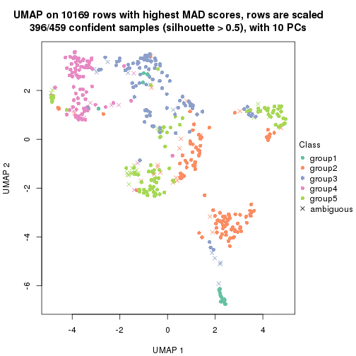</p>

</div>
<div id='tab-MAD-kmeans-dimension-reduction-5'>
<pre><code class="r">dimension_reduction(res, k = 6, method = &quot;UMAP&quot;)
</code></pre>

<p></p>

</div>
</div>


Following heatmap shows how subgroups are split when increasing `k`:

```r
collect_classes(res)
```


If matrix rows can be associated to genes, consider to use `functional_enrichment(res,
...)` to perform function enrichment for the signature genes. See [this vignette](http://bioconductor.org/packages/devel/bioc/vignettes/cola/inst/doc/functional_enrichment.html) for more detailed explanations.


 

---------------------------------------------------


### MAD:skmeans


The object with results only for a single top-value method and a single partition method 
can be extracted as:

```r
res = res_list["MAD", "skmeans"]
# you can also extract it by
# res = res_list["MAD:skmeans"]
```

A summary of `res` and all the functions that can be applied to it:

```r
res
```

```
#> A 'ConsensusPartition' object with k = 2, 3, 4, 5, 6.
#>   On a matrix with 10169 rows and 459 columns.
#>   Top rows (1000, 2000, 3000, 4000, 5000) are extracted by 'MAD' method.
#>   Subgroups are detected by 'skmeans' method.
#>   Performed in total 1250 partitions by row resampling.
#>   Best k for subgroups seems to be 2.
#> 
#> Following methods can be applied to this 'ConsensusPartition' object:
#>  [1] "cola_report"             "collect_classes"         "collect_plots"          
#>  [4] "collect_stats"           "colnames"                "compare_signatures"     
#>  [7] "consensus_heatmap"       "dimension_reduction"     "functional_enrichment"  
#> [10] "get_anno_col"            "get_anno"                "get_classes"            
#> [13] "get_consensus"           "get_matrix"              "get_membership"         
#> [16] "get_param"               "get_signatures"          "get_stats"              
#> [19] "is_best_k"               "is_stable_k"             "membership_heatmap"     
#> [22] "ncol"                    "nrow"                    "plot_ecdf"              
#> [25] "rownames"                "select_partition_number" "show"                   
#> [28] "suggest_best_k"          "test_to_known_factors"
```

`collect_plots()` function collects all the plots made from `res` for all `k` (number of partitions)
into one single page to provide an easy and fast comparison between different `k`.

```r
collect_plots(res)
```


The plots are:

- The first row: a plot of the ECDF (empirical cumulative distribution
  function) curves of the consensus matrix for each `k` and the heatmap of
  predicted classes for each `k`.
- The second row: heatmaps of the consensus matrix for each `k`.
- The third row: heatmaps of the membership matrix for each `k`.
- The fouth row: heatmaps of the signatures for each `k`.

All the plots in panels can be made by individual functions and they are
plotted later in this section.

`select_partition_number()` produces several plots showing different
statistics for choosing "optimized" `k`. There are following statistics:

- ECDF curves of the consensus matrix for each `k`;
- 1-PAC. [The PAC
  score](https://en.wikipedia.org/wiki/Consensus_clustering#Over-interpretation_potential_of_consensus_clustering)
  measures the proportion of the ambiguous subgrouping.
- Mean silhouette score.
- Concordance. The mean probability of fiting the consensus class ids in all
  partitions.
- Area increased. Denote $A_k$ as the area under the ECDF curve for current
  `k`, the area increased is defined as $A_k - A_{k-1}$.
- Rand index. The percent of pairs of samples that are both in a same cluster
  or both are not in a same cluster in the partition of k and k-1.
- Jaccard index. The ratio of pairs of samples are both in a same cluster in
  the partition of k and k-1 and the pairs of samples are both in a same
  cluster in the partition k or k-1.

The detailed explanations of these statistics can be found in [the _cola_
vignette](http://bioconductor.org/packages/devel/bioc/vignettes/cola/inst/doc/cola.html#toc_13).

Generally speaking, lower PAC score, higher mean silhouette score or higher
concordance corresponds to better partition. Rand index and Jaccard index
measure how similar the current partition is compared to partition with `k-1`.
If they are too similar, we won't accept `k` is better than `k-1`.

```r
select_partition_number(res)
```


The numeric values for all these statistics can be obtained by `get_stats()`.

```r
get_stats(res)
```

```
#>   k 1-PAC mean_silhouette concordance area_increased  Rand Jaccard
#> 2 2 0.895           0.929       0.969         0.4963 0.505   0.505
#> 3 3 0.655           0.778       0.890         0.3353 0.764   0.562
#> 4 4 0.635           0.714       0.845         0.1174 0.872   0.647
#> 5 5 0.592           0.595       0.768         0.0595 0.959   0.846
#> 6 6 0.586           0.466       0.692         0.0382 0.981   0.922
```

`suggest_best_k()` suggests the best $k$ based on these statistics. The rules are as follows:

- All $k$ with Jaccard index larger than 0.95 are removed because increasing
  $k$ does not provide enough extra information. If all $k$ are removed, it is
  marked as no subgroup is detected.
- For all $k$ with 1-PAC score larger than 0.9, the maximal $k$ is taken as
  the best $k$, and other $k$ are marked as optional $k$.
- If it does not fit the second rule. The $k$ with the maximal vote of the
  highest 1-PAC score, highest mean silhouette, and highest concordance is
  taken as the best $k$.

```r
suggest_best_k(res)
```

```
#> [1] 2
```


Following shows the table of the partitions (You need to click the **show/hide
code output** link to see it). The membership matrix (columns with name `p*`)
is inferred by
[`clue::cl_consensus()`](https://www.rdocumentation.org/link/cl_consensus?package=clue)
function with the `SE` method. Basically the value in the membership matrix
represents the probability to belong to a certain group. The finall class
label for an item is determined with the group with highest probability it
belongs to.

In `get_classes()` function, the entropy is calculated from the membership
matrix and the silhouette score is calculated from the consensus matrix.


<script>
$( function() {
	$( '#tabs-MAD-skmeans-get-classes' ).tabs();
} );
</script>
<div id='tabs-MAD-skmeans-get-classes'>
<ul>
<li><a href='#tab-MAD-skmeans-get-classes-1'>k = 2</a></li>
<li><a href='#tab-MAD-skmeans-get-classes-2'>k = 3</a></li>
<li><a href='#tab-MAD-skmeans-get-classes-3'>k = 4</a></li>
<li><a href='#tab-MAD-skmeans-get-classes-4'>k = 5</a></li>
<li><a href='#tab-MAD-skmeans-get-classes-5'>k = 6</a></li>
</ul>

<div id='tab-MAD-skmeans-get-classes-1'>
<p><a id='tab-MAD-skmeans-get-classes-1-a' style='color:#0366d6' href='#'>show/hide code output</a></p>
<pre><code class="r">cbind(get_classes(res, k = 2), get_membership(res, k = 2))
</code></pre>

<pre><code>#&gt;            class entropy silhouette    p1    p2
#&gt; SRR1699874     2  0.0000     0.9670 0.000 1.000
#&gt; SRR1699875     2  0.0000     0.9670 0.000 1.000
#&gt; SRR1699876     2  0.0000     0.9670 0.000 1.000
#&gt; SRR1699877     2  0.0000     0.9670 0.000 1.000
#&gt; SRR1699879     2  0.0000     0.9670 0.000 1.000
#&gt; SRR1699878     2  0.0000     0.9670 0.000 1.000
#&gt; SRR1699880     1  0.0000     0.9697 1.000 0.000
#&gt; SRR1699881     1  0.0000     0.9697 1.000 0.000
#&gt; SRR1699882     2  0.0000     0.9670 0.000 1.000
#&gt; SRR1699883     2  0.0000     0.9670 0.000 1.000
#&gt; SRR1699884     2  0.0000     0.9670 0.000 1.000
#&gt; SRR1699885     2  0.0000     0.9670 0.000 1.000
#&gt; SRR1699886     2  0.0000     0.9670 0.000 1.000
#&gt; SRR1699888     2  0.0000     0.9670 0.000 1.000
#&gt; SRR1699889     2  0.0000     0.9670 0.000 1.000
#&gt; SRR1699890     2  0.0000     0.9670 0.000 1.000
#&gt; SRR1699887     2  0.0000     0.9670 0.000 1.000
#&gt; SRR1699891     2  0.0000     0.9670 0.000 1.000
#&gt; SRR1699892     2  0.6438     0.8026 0.164 0.836
#&gt; SRR1699893     1  0.7745     0.7082 0.772 0.228
#&gt; SRR1699894     2  0.0000     0.9670 0.000 1.000
#&gt; SRR1699895     2  0.0000     0.9670 0.000 1.000
#&gt; SRR1699896     2  0.8443     0.6396 0.272 0.728
#&gt; SRR1699897     2  0.0000     0.9670 0.000 1.000
#&gt; SRR1699898     1  0.0000     0.9697 1.000 0.000
#&gt; SRR1699900     1  0.0000     0.9697 1.000 0.000
#&gt; SRR1699899     2  0.0000     0.9670 0.000 1.000
#&gt; SRR1699902     1  0.0000     0.9697 1.000 0.000
#&gt; SRR1699901     1  0.0000     0.9697 1.000 0.000
#&gt; SRR1699903     2  0.0376     0.9643 0.004 0.996
#&gt; SRR1699904     2  0.0000     0.9670 0.000 1.000
#&gt; SRR1699905     1  0.0000     0.9697 1.000 0.000
#&gt; SRR1699906     2  0.0000     0.9670 0.000 1.000
#&gt; SRR1699907     2  0.0000     0.9670 0.000 1.000
#&gt; SRR1699908     2  0.0000     0.9670 0.000 1.000
#&gt; SRR1699909     2  0.0000     0.9670 0.000 1.000
#&gt; SRR1699910     1  0.0000     0.9697 1.000 0.000
#&gt; SRR1699911     2  0.0672     0.9615 0.008 0.992
#&gt; SRR1699912     2  0.0000     0.9670 0.000 1.000
#&gt; SRR1699913     2  0.0000     0.9670 0.000 1.000
#&gt; SRR1699914     1  0.0000     0.9697 1.000 0.000
#&gt; SRR1699915     1  0.2778     0.9325 0.952 0.048
#&gt; SRR1699916     2  0.0000     0.9670 0.000 1.000
#&gt; SRR1699917     2  0.0672     0.9616 0.008 0.992
#&gt; SRR1699918     2  0.0000     0.9670 0.000 1.000
#&gt; SRR1699919     2  0.0000     0.9670 0.000 1.000
#&gt; SRR1699920     1  0.0000     0.9697 1.000 0.000
#&gt; SRR1699921     2  0.2603     0.9331 0.044 0.956
#&gt; SRR1699922     2  0.0000     0.9670 0.000 1.000
#&gt; SRR1699923     1  0.0000     0.9697 1.000 0.000
#&gt; SRR1699924     1  0.0000     0.9697 1.000 0.000
#&gt; SRR1699925     1  0.0000     0.9697 1.000 0.000
#&gt; SRR1699926     2  0.8763     0.6018 0.296 0.704
#&gt; SRR1699927     2  0.0000     0.9670 0.000 1.000
#&gt; SRR1699929     2  0.5294     0.8580 0.120 0.880
#&gt; SRR1699928     2  0.0000     0.9670 0.000 1.000
#&gt; SRR1699930     2  0.0000     0.9670 0.000 1.000
#&gt; SRR1699931     2  0.5946     0.8313 0.144 0.856
#&gt; SRR1699933     1  0.0000     0.9697 1.000 0.000
#&gt; SRR1699932     2  0.0000     0.9670 0.000 1.000
#&gt; SRR1699934     1  0.0000     0.9697 1.000 0.000
#&gt; SRR1699935     2  0.2948     0.9259 0.052 0.948
#&gt; SRR1699936     2  0.0000     0.9670 0.000 1.000
#&gt; SRR1699937     2  0.0000     0.9670 0.000 1.000
#&gt; SRR1699938     2  0.0000     0.9670 0.000 1.000
#&gt; SRR1699940     1  0.0376     0.9673 0.996 0.004
#&gt; SRR1699939     2  0.0000     0.9670 0.000 1.000
#&gt; SRR1699941     1  0.0000     0.9697 1.000 0.000
#&gt; SRR1699942     2  0.1843     0.9466 0.028 0.972
#&gt; SRR1699943     2  0.0000     0.9670 0.000 1.000
#&gt; SRR1699944     2  0.0000     0.9670 0.000 1.000
#&gt; SRR1699945     1  0.0000     0.9697 1.000 0.000
#&gt; SRR1699946     2  0.0672     0.9616 0.008 0.992
#&gt; SRR1699947     2  0.0000     0.9670 0.000 1.000
#&gt; SRR1699948     2  0.0000     0.9670 0.000 1.000
#&gt; SRR1699949     2  0.0000     0.9670 0.000 1.000
#&gt; SRR1699950     2  0.0000     0.9670 0.000 1.000
#&gt; SRR1699951     2  0.0000     0.9670 0.000 1.000
#&gt; SRR1699952     2  0.0000     0.9670 0.000 1.000
#&gt; SRR1699953     2  0.0000     0.9670 0.000 1.000
#&gt; SRR1699954     1  0.0000     0.9697 1.000 0.000
#&gt; SRR1699955     2  0.0000     0.9670 0.000 1.000
#&gt; SRR1699956     1  0.0000     0.9697 1.000 0.000
#&gt; SRR1699957     2  0.0000     0.9670 0.000 1.000
#&gt; SRR1699959     1  0.0000     0.9697 1.000 0.000
#&gt; SRR1699958     2  0.0000     0.9670 0.000 1.000
#&gt; SRR1699960     2  0.0000     0.9670 0.000 1.000
#&gt; SRR1699961     1  0.1184     0.9591 0.984 0.016
#&gt; SRR1699962     2  0.0000     0.9670 0.000 1.000
#&gt; SRR1699963     2  0.8386     0.6515 0.268 0.732
#&gt; SRR1699964     2  0.0000     0.9670 0.000 1.000
#&gt; SRR1699965     2  0.0000     0.9670 0.000 1.000
#&gt; SRR1699966     1  0.9993     0.0519 0.516 0.484
#&gt; SRR1699967     2  0.0000     0.9670 0.000 1.000
#&gt; SRR1699968     2  0.4431     0.8875 0.092 0.908
#&gt; SRR1699969     1  0.0000     0.9697 1.000 0.000
#&gt; SRR1699971     1  0.0000     0.9697 1.000 0.000
#&gt; SRR1699970     2  0.0000     0.9670 0.000 1.000
#&gt; SRR1699972     1  0.0000     0.9697 1.000 0.000
#&gt; SRR1699973     2  0.0000     0.9670 0.000 1.000
#&gt; SRR1699974     1  0.0000     0.9697 1.000 0.000
#&gt; SRR1699975     2  0.2603     0.9327 0.044 0.956
#&gt; SRR1699976     1  0.8144     0.6752 0.748 0.252
#&gt; SRR1699977     1  0.0000     0.9697 1.000 0.000
#&gt; SRR1699978     1  0.0000     0.9697 1.000 0.000
#&gt; SRR1699979     1  0.0376     0.9673 0.996 0.004
#&gt; SRR1699980     2  0.1414     0.9527 0.020 0.980
#&gt; SRR1699981     1  0.0000     0.9697 1.000 0.000
#&gt; SRR1699982     2  0.0000     0.9670 0.000 1.000
#&gt; SRR1699983     2  0.0000     0.9670 0.000 1.000
#&gt; SRR1699984     1  0.0000     0.9697 1.000 0.000
#&gt; SRR1699985     2  0.0000     0.9670 0.000 1.000
#&gt; SRR1699986     1  0.0000     0.9697 1.000 0.000
#&gt; SRR1699988     2  0.0672     0.9615 0.008 0.992
#&gt; SRR1699987     1  0.0000     0.9697 1.000 0.000
#&gt; SRR1699989     2  0.0000     0.9670 0.000 1.000
#&gt; SRR1699990     1  0.8386     0.6465 0.732 0.268
#&gt; SRR1699992     1  0.0000     0.9697 1.000 0.000
#&gt; SRR1699991     1  0.0000     0.9697 1.000 0.000
#&gt; SRR1699993     1  0.0000     0.9697 1.000 0.000
#&gt; SRR1699994     1  0.0000     0.9697 1.000 0.000
#&gt; SRR1699995     1  0.0000     0.9697 1.000 0.000
#&gt; SRR1699996     2  0.2236     0.9397 0.036 0.964
#&gt; SRR1699997     2  0.9970     0.1208 0.468 0.532
#&gt; SRR1699998     2  0.0000     0.9670 0.000 1.000
#&gt; SRR1699999     1  0.0000     0.9697 1.000 0.000
#&gt; SRR1700000     1  0.0000     0.9697 1.000 0.000
#&gt; SRR1700002     1  0.3879     0.9068 0.924 0.076
#&gt; SRR1700001     1  0.0000     0.9697 1.000 0.000
#&gt; SRR1700003     1  0.7219     0.7508 0.800 0.200
#&gt; SRR1700004     1  0.0000     0.9697 1.000 0.000
#&gt; SRR1700005     1  0.0000     0.9697 1.000 0.000
#&gt; SRR1700006     1  0.1184     0.9590 0.984 0.016
#&gt; SRR1700007     2  0.0000     0.9670 0.000 1.000
#&gt; SRR1700008     1  0.0000     0.9697 1.000 0.000
#&gt; SRR1700009     1  0.0000     0.9697 1.000 0.000
#&gt; SRR1700010     1  0.0000     0.9697 1.000 0.000
#&gt; SRR1700011     2  0.0000     0.9670 0.000 1.000
#&gt; SRR1700013     1  0.6343     0.8070 0.840 0.160
#&gt; SRR1700012     1  0.8955     0.5510 0.688 0.312
#&gt; SRR1700014     1  0.7745     0.7092 0.772 0.228
#&gt; SRR1700015     1  0.9833     0.2736 0.576 0.424
#&gt; SRR1700016     1  0.0000     0.9697 1.000 0.000
#&gt; SRR1700018     1  0.0000     0.9697 1.000 0.000
#&gt; SRR1700017     1  0.0000     0.9697 1.000 0.000
#&gt; SRR1700019     2  0.0000     0.9670 0.000 1.000
#&gt; SRR1700020     1  0.0000     0.9697 1.000 0.000
#&gt; SRR1700021     2  0.0000     0.9670 0.000 1.000
#&gt; SRR1700023     1  0.1843     0.9497 0.972 0.028
#&gt; SRR1700022     1  0.0000     0.9697 1.000 0.000
#&gt; SRR1700024     2  0.0000     0.9670 0.000 1.000
#&gt; SRR1700025     2  0.0376     0.9643 0.004 0.996
#&gt; SRR1700026     1  0.1414     0.9560 0.980 0.020
#&gt; SRR1700027     1  0.0672     0.9648 0.992 0.008
#&gt; SRR1700028     2  0.7674     0.7242 0.224 0.776
#&gt; SRR1700029     1  0.0000     0.9697 1.000 0.000
#&gt; SRR1700030     2  0.0000     0.9670 0.000 1.000
#&gt; SRR1700031     1  0.0000     0.9697 1.000 0.000
#&gt; SRR1700032     2  0.0000     0.9670 0.000 1.000
#&gt; SRR1700034     1  0.0000     0.9697 1.000 0.000
#&gt; SRR1700035     2  0.0000     0.9670 0.000 1.000
#&gt; SRR1700033     1  0.0000     0.9697 1.000 0.000
#&gt; SRR1700036     2  0.2948     0.9253 0.052 0.948
#&gt; SRR1700037     2  0.0000     0.9670 0.000 1.000
#&gt; SRR1700038     1  0.0000     0.9697 1.000 0.000
#&gt; SRR1700039     1  0.0000     0.9697 1.000 0.000
#&gt; SRR1700040     1  0.0000     0.9697 1.000 0.000
#&gt; SRR1700041     1  0.0000     0.9697 1.000 0.000
#&gt; SRR1700042     1  0.0000     0.9697 1.000 0.000
#&gt; SRR1700043     1  0.0000     0.9697 1.000 0.000
#&gt; SRR1700045     1  0.0000     0.9697 1.000 0.000
#&gt; SRR1700044     1  0.5842     0.8356 0.860 0.140
#&gt; SRR1700046     1  0.0000     0.9697 1.000 0.000
#&gt; SRR1700047     1  0.0000     0.9697 1.000 0.000
#&gt; SRR1700048     1  0.0376     0.9673 0.996 0.004
#&gt; SRR1700049     1  0.0000     0.9697 1.000 0.000
#&gt; SRR1700050     1  0.0000     0.9697 1.000 0.000
#&gt; SRR1700051     1  0.0000     0.9697 1.000 0.000
#&gt; SRR1700052     1  0.0000     0.9697 1.000 0.000
#&gt; SRR1700053     1  0.2236     0.9433 0.964 0.036
#&gt; SRR1700054     1  0.0000     0.9697 1.000 0.000
#&gt; SRR1700055     1  0.0000     0.9697 1.000 0.000
#&gt; SRR1700056     1  0.0000     0.9697 1.000 0.000
#&gt; SRR1700057     1  0.0000     0.9697 1.000 0.000
#&gt; SRR1700058     1  0.0000     0.9697 1.000 0.000
#&gt; SRR1700059     1  0.0000     0.9697 1.000 0.000
#&gt; SRR1700060     1  0.0000     0.9697 1.000 0.000
#&gt; SRR1700061     1  0.0000     0.9697 1.000 0.000
#&gt; SRR1700062     1  0.0000     0.9697 1.000 0.000
#&gt; SRR1700063     1  0.0000     0.9697 1.000 0.000
#&gt; SRR1700064     1  0.0000     0.9697 1.000 0.000
#&gt; SRR1700065     1  0.0000     0.9697 1.000 0.000
#&gt; SRR1700066     1  0.0000     0.9697 1.000 0.000
#&gt; SRR1700067     2  0.8081     0.6808 0.248 0.752
#&gt; SRR1700068     1  0.0000     0.9697 1.000 0.000
#&gt; SRR1700069     1  0.0376     0.9673 0.996 0.004
#&gt; SRR1700070     2  0.0000     0.9670 0.000 1.000
#&gt; SRR1700071     1  0.0000     0.9697 1.000 0.000
#&gt; SRR1700072     1  0.0000     0.9697 1.000 0.000
#&gt; SRR1700073     2  0.0376     0.9643 0.004 0.996
#&gt; SRR1700075     1  0.0000     0.9697 1.000 0.000
#&gt; SRR1700074     1  0.0000     0.9697 1.000 0.000
#&gt; SRR1700076     1  0.3114     0.9255 0.944 0.056
#&gt; SRR1700077     1  0.0000     0.9697 1.000 0.000
#&gt; SRR1700078     1  0.0000     0.9697 1.000 0.000
#&gt; SRR1700080     1  0.3114     0.9258 0.944 0.056
#&gt; SRR1700079     1  0.0000     0.9697 1.000 0.000
#&gt; SRR1700081     1  0.0000     0.9697 1.000 0.000
#&gt; SRR1700082     1  0.0000     0.9697 1.000 0.000
#&gt; SRR1700083     1  0.0000     0.9697 1.000 0.000
#&gt; SRR1700084     1  0.0000     0.9697 1.000 0.000
#&gt; SRR1700085     2  0.0000     0.9670 0.000 1.000
#&gt; SRR1700086     1  0.2043     0.9462 0.968 0.032
#&gt; SRR1700087     1  0.0000     0.9697 1.000 0.000
#&gt; SRR1700088     1  0.9866     0.2423 0.568 0.432
#&gt; SRR1700089     1  0.0000     0.9697 1.000 0.000
#&gt; SRR1700091     2  0.7950     0.6958 0.240 0.760
#&gt; SRR1700090     1  0.2603     0.9358 0.956 0.044
#&gt; SRR1700092     2  0.5842     0.8356 0.140 0.860
#&gt; SRR1700094     2  0.8909     0.5713 0.308 0.692
#&gt; SRR1700093     2  0.3431     0.9157 0.064 0.936
#&gt; SRR1700095     1  0.0000     0.9697 1.000 0.000
#&gt; SRR1700096     1  0.4298     0.8934 0.912 0.088
#&gt; SRR1700097     1  0.0000     0.9697 1.000 0.000
#&gt; SRR1700098     2  0.0000     0.9670 0.000 1.000
#&gt; SRR1700099     2  0.0000     0.9670 0.000 1.000
#&gt; SRR1700100     2  0.5629     0.8452 0.132 0.868
#&gt; SRR1700101     2  0.0000     0.9670 0.000 1.000
#&gt; SRR1700102     2  0.1414     0.9527 0.020 0.980
#&gt; SRR1700104     2  0.8861     0.5738 0.304 0.696
#&gt; SRR1700103     1  0.0000     0.9697 1.000 0.000
#&gt; SRR1700105     2  0.8499     0.6338 0.276 0.724
#&gt; SRR1700106     1  0.3114     0.9249 0.944 0.056
#&gt; SRR1700107     2  0.1633     0.9496 0.024 0.976
#&gt; SRR1700108     2  0.0000     0.9670 0.000 1.000
#&gt; SRR1700109     2  0.0000     0.9670 0.000 1.000
#&gt; SRR1700110     2  0.0000     0.9670 0.000 1.000
#&gt; SRR1700112     2  0.0000     0.9670 0.000 1.000
#&gt; SRR1700111     1  0.0000     0.9697 1.000 0.000
#&gt; SRR1700113     2  0.0000     0.9670 0.000 1.000
#&gt; SRR1700114     2  0.4161     0.8962 0.084 0.916
#&gt; SRR1700115     2  0.0000     0.9670 0.000 1.000
#&gt; SRR1700116     1  0.0376     0.9673 0.996 0.004
#&gt; SRR1700117     1  0.0000     0.9697 1.000 0.000
#&gt; SRR1700119     1  0.1184     0.9590 0.984 0.016
#&gt; SRR1700118     1  0.2236     0.9433 0.964 0.036
#&gt; SRR1700120     1  0.0000     0.9697 1.000 0.000
#&gt; SRR1700121     2  0.1633     0.9498 0.024 0.976
#&gt; SRR1700122     2  0.0000     0.9670 0.000 1.000
#&gt; SRR1700123     1  0.0000     0.9697 1.000 0.000
#&gt; SRR1700125     2  0.0000     0.9670 0.000 1.000
#&gt; SRR1700126     1  0.0000     0.9697 1.000 0.000
#&gt; SRR1700127     1  0.0000     0.9697 1.000 0.000
#&gt; SRR1700124     1  0.0000     0.9697 1.000 0.000
#&gt; SRR1700128     1  0.0000     0.9697 1.000 0.000
#&gt; SRR1700129     2  0.0000     0.9670 0.000 1.000
#&gt; SRR1700130     2  0.8016     0.6844 0.244 0.756
#&gt; SRR1700132     1  0.0000     0.9697 1.000 0.000
#&gt; SRR1700131     1  0.0000     0.9697 1.000 0.000
#&gt; SRR1700133     1  0.9358     0.4714 0.648 0.352
#&gt; SRR1700134     2  0.0000     0.9670 0.000 1.000
#&gt; SRR1700135     1  0.0000     0.9697 1.000 0.000
#&gt; SRR1700136     1  0.0000     0.9697 1.000 0.000
#&gt; SRR1700137     1  0.0000     0.9697 1.000 0.000
#&gt; SRR1700138     1  0.0376     0.9673 0.996 0.004
#&gt; SRR1700140     1  0.0376     0.9673 0.996 0.004
#&gt; SRR1700139     1  0.0672     0.9647 0.992 0.008
#&gt; SRR1700141     2  0.0000     0.9670 0.000 1.000
#&gt; SRR1700142     1  0.0000     0.9697 1.000 0.000
#&gt; SRR1700143     1  0.0000     0.9697 1.000 0.000
#&gt; SRR1700144     1  0.0000     0.9697 1.000 0.000
#&gt; SRR1700145     1  0.0000     0.9697 1.000 0.000
#&gt; SRR1700146     2  0.0000     0.9670 0.000 1.000
#&gt; SRR1700147     1  0.0000     0.9697 1.000 0.000
#&gt; SRR1700149     1  0.0000     0.9697 1.000 0.000
#&gt; SRR1700148     1  0.0000     0.9697 1.000 0.000
#&gt; SRR1700150     2  0.1414     0.9528 0.020 0.980
#&gt; SRR1700152     1  0.0376     0.9673 0.996 0.004
#&gt; SRR1700151     1  0.0376     0.9673 0.996 0.004
#&gt; SRR1700153     1  0.0000     0.9697 1.000 0.000
#&gt; SRR1700154     1  0.0000     0.9697 1.000 0.000
#&gt; SRR1700155     1  0.7950     0.6943 0.760 0.240
#&gt; SRR1700156     1  0.0000     0.9697 1.000 0.000
#&gt; SRR1700158     1  0.0000     0.9697 1.000 0.000
#&gt; SRR1700159     2  0.0000     0.9670 0.000 1.000
#&gt; SRR1700157     1  0.0000     0.9697 1.000 0.000
#&gt; SRR1700160     1  0.0672     0.9647 0.992 0.008
#&gt; SRR1700161     1  0.0000     0.9697 1.000 0.000
#&gt; SRR1700162     2  0.0000     0.9670 0.000 1.000
#&gt; SRR1700164     1  0.0000     0.9697 1.000 0.000
#&gt; SRR1700163     1  0.0000     0.9697 1.000 0.000
#&gt; SRR1700165     1  0.0000     0.9697 1.000 0.000
#&gt; SRR1700166     1  0.3274     0.9223 0.940 0.060
#&gt; SRR1700168     2  0.0000     0.9670 0.000 1.000
#&gt; SRR1700167     1  0.0000     0.9697 1.000 0.000
#&gt; SRR1700170     1  0.3584     0.9145 0.932 0.068
#&gt; SRR1700169     1  0.2778     0.9329 0.952 0.048
#&gt; SRR1700171     1  0.0000     0.9697 1.000 0.000
#&gt; SRR1700172     2  0.5408     0.8532 0.124 0.876
#&gt; SRR1700174     1  0.3274     0.9219 0.940 0.060
#&gt; SRR1700173     1  0.6247     0.8160 0.844 0.156
#&gt; SRR1700175     2  0.0000     0.9670 0.000 1.000
#&gt; SRR1700176     1  0.0000     0.9697 1.000 0.000
#&gt; SRR1700178     2  0.0000     0.9670 0.000 1.000
#&gt; SRR1700177     2  0.9909     0.2130 0.444 0.556
#&gt; SRR1700180     2  0.0000     0.9670 0.000 1.000
#&gt; SRR1700179     2  0.0000     0.9670 0.000 1.000
#&gt; SRR1700181     2  0.0000     0.9670 0.000 1.000
#&gt; SRR1700183     1  0.0000     0.9697 1.000 0.000
#&gt; SRR1700182     2  0.0000     0.9670 0.000 1.000
#&gt; SRR1700184     2  0.0000     0.9670 0.000 1.000
#&gt; SRR1700186     2  0.0000     0.9670 0.000 1.000
#&gt; SRR1700187     1  0.0000     0.9697 1.000 0.000
#&gt; SRR1700185     1  0.0000     0.9697 1.000 0.000
#&gt; SRR1700188     2  0.0000     0.9670 0.000 1.000
#&gt; SRR1700192     1  0.0000     0.9697 1.000 0.000
#&gt; SRR1700190     1  0.0000     0.9697 1.000 0.000
#&gt; SRR1700191     1  0.0000     0.9697 1.000 0.000
#&gt; SRR1700189     1  0.0000     0.9697 1.000 0.000
#&gt; SRR1700193     2  0.0000     0.9670 0.000 1.000
#&gt; SRR1700195     2  0.0000     0.9670 0.000 1.000
#&gt; SRR1700194     1  0.0000     0.9697 1.000 0.000
#&gt; SRR1700196     2  0.0000     0.9670 0.000 1.000
#&gt; SRR1700197     1  0.0000     0.9697 1.000 0.000
#&gt; SRR1700198     2  0.0000     0.9670 0.000 1.000
#&gt; SRR1700199     2  0.0000     0.9670 0.000 1.000
#&gt; SRR1700200     2  0.0000     0.9670 0.000 1.000
#&gt; SRR1700201     2  0.0000     0.9670 0.000 1.000
#&gt; SRR1700202     2  0.5842     0.8354 0.140 0.860
#&gt; SRR1700203     2  0.0000     0.9670 0.000 1.000
#&gt; SRR1700204     2  0.0000     0.9670 0.000 1.000
#&gt; SRR1700206     2  0.0000     0.9670 0.000 1.000
#&gt; SRR1700207     2  0.0000     0.9670 0.000 1.000
#&gt; SRR1700208     1  0.0000     0.9697 1.000 0.000
#&gt; SRR1700205     2  0.0000     0.9670 0.000 1.000
#&gt; SRR1700209     2  0.0000     0.9670 0.000 1.000
#&gt; SRR1700210     2  0.0000     0.9670 0.000 1.000
#&gt; SRR1700211     2  0.0000     0.9670 0.000 1.000
#&gt; SRR1700212     2  0.0000     0.9670 0.000 1.000
#&gt; SRR1700213     2  0.7376     0.7444 0.208 0.792
#&gt; SRR1700214     2  0.0000     0.9670 0.000 1.000
#&gt; SRR1700215     1  0.0000     0.9697 1.000 0.000
#&gt; SRR1700217     2  0.0000     0.9670 0.000 1.000
#&gt; SRR1700216     1  0.0000     0.9697 1.000 0.000
#&gt; SRR1700218     2  0.0000     0.9670 0.000 1.000
#&gt; SRR1700219     2  0.0000     0.9670 0.000 1.000
#&gt; SRR1700222     1  0.0000     0.9697 1.000 0.000
#&gt; SRR1700220     2  0.0000     0.9670 0.000 1.000
#&gt; SRR1700221     2  0.0000     0.9670 0.000 1.000
#&gt; SRR1700223     2  0.0000     0.9670 0.000 1.000
#&gt; SRR1700224     2  0.0000     0.9670 0.000 1.000
#&gt; SRR1700226     2  0.0000     0.9670 0.000 1.000
#&gt; SRR1700229     2  0.0000     0.9670 0.000 1.000
#&gt; SRR1700225     2  0.2043     0.9432 0.032 0.968
#&gt; SRR1700227     2  0.0000     0.9670 0.000 1.000
#&gt; SRR1700230     1  0.0000     0.9697 1.000 0.000
#&gt; SRR1700231     2  0.0000     0.9670 0.000 1.000
#&gt; SRR1700228     2  0.0000     0.9670 0.000 1.000
#&gt; SRR1700232     2  0.0000     0.9670 0.000 1.000
#&gt; SRR1700233     2  0.0000     0.9670 0.000 1.000
#&gt; SRR1700234     2  0.0000     0.9670 0.000 1.000
#&gt; SRR1700235     2  0.0000     0.9670 0.000 1.000
#&gt; SRR1700237     2  0.0000     0.9670 0.000 1.000
#&gt; SRR1700236     2  0.0000     0.9670 0.000 1.000
#&gt; SRR1700238     2  0.0000     0.9670 0.000 1.000
#&gt; SRR1700239     1  0.0000     0.9697 1.000 0.000
#&gt; SRR1700240     1  0.0000     0.9697 1.000 0.000
#&gt; SRR1700241     1  0.0672     0.9647 0.992 0.008
#&gt; SRR1700243     2  0.0000     0.9670 0.000 1.000
#&gt; SRR1700244     2  0.0000     0.9670 0.000 1.000
#&gt; SRR1700242     1  0.0000     0.9697 1.000 0.000
#&gt; SRR1700246     2  0.6887     0.7806 0.184 0.816
#&gt; SRR1700245     2  0.0000     0.9670 0.000 1.000
#&gt; SRR1700247     1  0.0000     0.9697 1.000 0.000
#&gt; SRR1700249     1  0.0000     0.9697 1.000 0.000
#&gt; SRR1700250     2  0.0000     0.9670 0.000 1.000
#&gt; SRR1700248     2  0.0000     0.9670 0.000 1.000
#&gt; SRR1700251     2  0.0000     0.9670 0.000 1.000
#&gt; SRR1700252     2  0.9795     0.3062 0.416 0.584
#&gt; SRR1700253     2  0.0000     0.9670 0.000 1.000
#&gt; SRR1700256     2  0.0000     0.9670 0.000 1.000
#&gt; SRR1700254     1  0.0000     0.9697 1.000 0.000
#&gt; SRR1700255     2  0.0000     0.9670 0.000 1.000
#&gt; SRR1700257     2  0.0000     0.9670 0.000 1.000
#&gt; SRR1700258     2  0.0000     0.9670 0.000 1.000
#&gt; SRR1700259     2  0.0000     0.9670 0.000 1.000
#&gt; SRR1700260     2  0.0000     0.9670 0.000 1.000
#&gt; SRR1700261     2  0.0000     0.9670 0.000 1.000
#&gt; SRR1700262     2  0.0000     0.9670 0.000 1.000
#&gt; SRR1700263     2  0.0000     0.9670 0.000 1.000
#&gt; SRR1700264     2  0.0000     0.9670 0.000 1.000
#&gt; SRR1700265     2  0.0000     0.9670 0.000 1.000
#&gt; SRR1700266     2  0.0000     0.9670 0.000 1.000
#&gt; SRR1700268     1  0.9970     0.1066 0.532 0.468
#&gt; SRR1700270     2  0.0000     0.9670 0.000 1.000
#&gt; SRR1700267     2  0.0000     0.9670 0.000 1.000
#&gt; SRR1700271     2  0.0000     0.9670 0.000 1.000
#&gt; SRR1700272     2  0.0000     0.9670 0.000 1.000
#&gt; SRR1700273     2  0.0000     0.9670 0.000 1.000
#&gt; SRR1700274     2  0.0000     0.9670 0.000 1.000
#&gt; SRR1700277     1  0.0000     0.9697 1.000 0.000
#&gt; SRR1700275     2  0.0000     0.9670 0.000 1.000
#&gt; SRR1700276     2  0.0000     0.9670 0.000 1.000
#&gt; SRR1700278     2  0.0000     0.9670 0.000 1.000
#&gt; SRR1700279     2  0.0000     0.9670 0.000 1.000
#&gt; SRR1700280     2  0.0000     0.9670 0.000 1.000
#&gt; SRR1700281     2  0.0000     0.9670 0.000 1.000
#&gt; SRR1700283     2  0.0000     0.9670 0.000 1.000
#&gt; SRR1700282     2  0.8443     0.6443 0.272 0.728
#&gt; SRR1700284     2  0.0000     0.9670 0.000 1.000
#&gt; SRR1700285     2  0.0000     0.9670 0.000 1.000
#&gt; SRR1700286     2  0.0000     0.9670 0.000 1.000
#&gt; SRR1700287     2  0.0000     0.9670 0.000 1.000
#&gt; SRR1700290     1  0.0000     0.9697 1.000 0.000
#&gt; SRR1700289     2  0.0000     0.9670 0.000 1.000
#&gt; SRR1700288     2  0.0000     0.9670 0.000 1.000
#&gt; SRR1700292     2  0.0000     0.9670 0.000 1.000
#&gt; SRR1700291     2  0.0000     0.9670 0.000 1.000
#&gt; SRR1700293     2  0.0000     0.9670 0.000 1.000
#&gt; SRR1700294     2  0.0000     0.9670 0.000 1.000
#&gt; SRR1700295     1  0.0938     0.9619 0.988 0.012
#&gt; SRR1700297     2  0.0000     0.9670 0.000 1.000
#&gt; SRR1700296     2  0.0000     0.9670 0.000 1.000
#&gt; SRR1700298     2  0.1184     0.9558 0.016 0.984
#&gt; SRR1700299     1  0.8813     0.5823 0.700 0.300
#&gt; SRR1700300     2  0.8499     0.6296 0.276 0.724
#&gt; SRR1700302     2  0.0000     0.9670 0.000 1.000
#&gt; SRR1700301     2  0.0000     0.9670 0.000 1.000
#&gt; SRR1700303     2  0.0000     0.9670 0.000 1.000
#&gt; SRR1700304     2  0.0000     0.9670 0.000 1.000
#&gt; SRR1700305     2  0.0000     0.9670 0.000 1.000
#&gt; SRR1700306     1  0.0000     0.9697 1.000 0.000
#&gt; SRR1700308     2  0.0000     0.9670 0.000 1.000
#&gt; SRR1700307     1  0.1184     0.9590 0.984 0.016
#&gt; SRR1700309     1  0.0000     0.9697 1.000 0.000
#&gt; SRR1700310     2  0.0000     0.9670 0.000 1.000
#&gt; SRR1700311     2  0.0672     0.9616 0.008 0.992
#&gt; SRR1700312     2  0.0000     0.9670 0.000 1.000
#&gt; SRR1700313     2  0.9993     0.0714 0.484 0.516
#&gt; SRR1700314     1  0.6801     0.7839 0.820 0.180
#&gt; SRR1700315     2  0.7745     0.7129 0.228 0.772
#&gt; SRR1700316     2  0.3114     0.9227 0.056 0.944
#&gt; SRR1700317     2  0.0000     0.9670 0.000 1.000
#&gt; SRR1700318     2  0.0672     0.9616 0.008 0.992
#&gt; SRR1700319     2  0.9996     0.0639 0.488 0.512
#&gt; SRR1700320     2  0.0000     0.9670 0.000 1.000
#&gt; SRR1700322     2  0.0000     0.9670 0.000 1.000
#&gt; SRR1700321     2  0.0000     0.9670 0.000 1.000
#&gt; SRR1700323     2  0.0000     0.9670 0.000 1.000
#&gt; SRR1700324     2  0.0000     0.9670 0.000 1.000
#&gt; SRR1700325     2  0.0000     0.9670 0.000 1.000
#&gt; SRR1700326     1  0.0000     0.9697 1.000 0.000
#&gt; SRR1700327     2  0.0000     0.9670 0.000 1.000
#&gt; SRR1700329     2  0.0000     0.9670 0.000 1.000
#&gt; SRR1700328     1  0.5842     0.8334 0.860 0.140
#&gt; SRR1700330     2  0.7883     0.7062 0.236 0.764
#&gt; SRR1700331     2  0.0000     0.9670 0.000 1.000
#&gt; SRR1700332     2  0.0000     0.9670 0.000 1.000
#&gt; SRR1700333     2  0.0000     0.9670 0.000 1.000
</code></pre>

<script>
$('#tab-MAD-skmeans-get-classes-1-a').parent().next().next().hide();
$('#tab-MAD-skmeans-get-classes-1-a').click(function(){
  $('#tab-MAD-skmeans-get-classes-1-a').parent().next().next().toggle();
  return(false);
});
</script>
</div>

<div id='tab-MAD-skmeans-get-classes-2'>
<p><a id='tab-MAD-skmeans-get-classes-2-a' style='color:#0366d6' href='#'>show/hide code output</a></p>
<pre><code class="r">cbind(get_classes(res, k = 3), get_membership(res, k = 3))
</code></pre>

<pre><code>#&gt;            class entropy silhouette    p1    p2    p3
#&gt; SRR1699874     2  0.0000    0.88508 0.000 1.000 0.000
#&gt; SRR1699875     2  0.0000    0.88508 0.000 1.000 0.000
#&gt; SRR1699876     1  0.5098    0.70543 0.752 0.248 0.000
#&gt; SRR1699877     2  0.0000    0.88508 0.000 1.000 0.000
#&gt; SRR1699879     2  0.4346    0.74669 0.184 0.816 0.000
#&gt; SRR1699878     2  0.0000    0.88508 0.000 1.000 0.000
#&gt; SRR1699880     3  0.0000    0.92074 0.000 0.000 1.000
#&gt; SRR1699881     3  0.1482    0.91008 0.012 0.020 0.968
#&gt; SRR1699882     2  0.3340    0.81301 0.120 0.880 0.000
#&gt; SRR1699883     2  0.0000    0.88508 0.000 1.000 0.000
#&gt; SRR1699884     2  0.0000    0.88508 0.000 1.000 0.000
#&gt; SRR1699885     2  0.0000    0.88508 0.000 1.000 0.000
#&gt; SRR1699886     1  0.5926    0.51963 0.644 0.356 0.000
#&gt; SRR1699888     2  0.2796    0.83745 0.092 0.908 0.000
#&gt; SRR1699889     1  0.2625    0.82940 0.916 0.084 0.000
#&gt; SRR1699890     1  0.6045    0.49097 0.620 0.380 0.000
#&gt; SRR1699887     1  0.5560    0.62472 0.700 0.300 0.000
#&gt; SRR1699891     1  0.2448    0.83227 0.924 0.076 0.000
#&gt; SRR1699892     2  0.3472    0.83293 0.040 0.904 0.056
#&gt; SRR1699893     1  0.2165    0.79806 0.936 0.000 0.064
#&gt; SRR1699894     1  0.1964    0.83236 0.944 0.056 0.000
#&gt; SRR1699895     1  0.2066    0.83239 0.940 0.060 0.000
#&gt; SRR1699896     2  0.9241   -0.05677 0.388 0.456 0.156
#&gt; SRR1699897     2  0.2356    0.85287 0.072 0.928 0.000
#&gt; SRR1699898     3  0.0000    0.92074 0.000 0.000 1.000
#&gt; SRR1699900     3  0.1163    0.90738 0.000 0.028 0.972
#&gt; SRR1699899     1  0.2878    0.82633 0.904 0.096 0.000
#&gt; SRR1699902     3  0.0000    0.92074 0.000 0.000 1.000
#&gt; SRR1699901     3  0.0000    0.92074 0.000 0.000 1.000
#&gt; SRR1699903     1  0.1860    0.83235 0.948 0.052 0.000
#&gt; SRR1699904     1  0.1860    0.83245 0.948 0.052 0.000
#&gt; SRR1699905     3  0.0000    0.92074 0.000 0.000 1.000
#&gt; SRR1699906     1  0.3038    0.82368 0.896 0.104 0.000
#&gt; SRR1699907     1  0.1964    0.83236 0.944 0.056 0.000
#&gt; SRR1699908     1  0.1753    0.83237 0.952 0.048 0.000
#&gt; SRR1699909     1  0.4654    0.75795 0.792 0.208 0.000
#&gt; SRR1699910     1  0.3267    0.76691 0.884 0.000 0.116
#&gt; SRR1699911     1  0.2682    0.83198 0.920 0.076 0.004
#&gt; SRR1699912     1  0.1643    0.83168 0.956 0.044 0.000
#&gt; SRR1699913     1  0.2959    0.82495 0.900 0.100 0.000
#&gt; SRR1699914     3  0.0000    0.92074 0.000 0.000 1.000
#&gt; SRR1699915     1  0.1163    0.81545 0.972 0.000 0.028
#&gt; SRR1699916     1  0.6235    0.38730 0.564 0.436 0.000
#&gt; SRR1699917     1  0.0237    0.81736 0.996 0.004 0.000
#&gt; SRR1699918     1  0.5810    0.57773 0.664 0.336 0.000
#&gt; SRR1699919     1  0.1753    0.83225 0.952 0.048 0.000
#&gt; SRR1699920     1  0.5733    0.48421 0.676 0.000 0.324
#&gt; SRR1699921     1  0.1289    0.82908 0.968 0.032 0.000
#&gt; SRR1699922     1  0.4062    0.79586 0.836 0.164 0.000
#&gt; SRR1699923     3  0.0000    0.92074 0.000 0.000 1.000
#&gt; SRR1699924     3  0.1529    0.90624 0.040 0.000 0.960
#&gt; SRR1699925     3  0.0000    0.92074 0.000 0.000 1.000
#&gt; SRR1699926     1  0.2527    0.82097 0.936 0.020 0.044
#&gt; SRR1699927     1  0.1643    0.83162 0.956 0.044 0.000
#&gt; SRR1699929     1  0.8450    0.25193 0.484 0.428 0.088
#&gt; SRR1699928     1  0.1753    0.83228 0.952 0.048 0.000
#&gt; SRR1699930     1  0.2448    0.83107 0.924 0.076 0.000
#&gt; SRR1699931     2  0.8070   -0.16788 0.468 0.468 0.064
#&gt; SRR1699933     3  0.1989    0.89187 0.004 0.048 0.948
#&gt; SRR1699932     1  0.2066    0.83249 0.940 0.060 0.000
#&gt; SRR1699934     3  0.0000    0.92074 0.000 0.000 1.000
#&gt; SRR1699935     1  0.1860    0.82230 0.948 0.052 0.000
#&gt; SRR1699936     2  0.1753    0.86396 0.048 0.952 0.000
#&gt; SRR1699937     2  0.0000    0.88508 0.000 1.000 0.000
#&gt; SRR1699938     2  0.0000    0.88508 0.000 1.000 0.000
#&gt; SRR1699940     3  0.5650    0.54085 0.000 0.312 0.688
#&gt; SRR1699939     2  0.2711    0.83911 0.088 0.912 0.000
#&gt; SRR1699941     3  0.0592    0.91615 0.000 0.012 0.988
#&gt; SRR1699942     2  0.1636    0.86715 0.016 0.964 0.020
#&gt; SRR1699943     2  0.0000    0.88508 0.000 1.000 0.000
#&gt; SRR1699944     2  0.0000    0.88508 0.000 1.000 0.000
#&gt; SRR1699945     3  0.0000    0.92074 0.000 0.000 1.000
#&gt; SRR1699946     2  0.0000    0.88508 0.000 1.000 0.000
#&gt; SRR1699947     2  0.0000    0.88508 0.000 1.000 0.000
#&gt; SRR1699948     2  0.0000    0.88508 0.000 1.000 0.000
#&gt; SRR1699949     2  0.5216    0.64197 0.260 0.740 0.000
#&gt; SRR1699950     2  0.2959    0.82814 0.100 0.900 0.000
#&gt; SRR1699951     2  0.3879    0.78747 0.152 0.848 0.000
#&gt; SRR1699952     2  0.0000    0.88508 0.000 1.000 0.000
#&gt; SRR1699953     2  0.0892    0.87845 0.020 0.980 0.000
#&gt; SRR1699954     3  0.4178    0.76921 0.000 0.172 0.828
#&gt; SRR1699955     2  0.0000    0.88508 0.000 1.000 0.000
#&gt; SRR1699956     3  0.0000    0.92074 0.000 0.000 1.000
#&gt; SRR1699957     2  0.0424    0.88294 0.008 0.992 0.000
#&gt; SRR1699959     3  0.1491    0.91128 0.016 0.016 0.968
#&gt; SRR1699958     2  0.5098    0.70399 0.248 0.752 0.000
#&gt; SRR1699960     2  0.1643    0.86655 0.044 0.956 0.000
#&gt; SRR1699961     2  0.5760    0.50236 0.000 0.672 0.328
#&gt; SRR1699962     2  0.0000    0.88508 0.000 1.000 0.000
#&gt; SRR1699963     2  0.4172    0.79027 0.028 0.868 0.104
#&gt; SRR1699964     2  0.0000    0.88508 0.000 1.000 0.000
#&gt; SRR1699965     2  0.0592    0.88111 0.012 0.988 0.000
#&gt; SRR1699966     1  0.8794   -0.05349 0.448 0.440 0.112
#&gt; SRR1699967     2  0.0000    0.88508 0.000 1.000 0.000
#&gt; SRR1699968     1  0.6252    0.52211 0.648 0.344 0.008
#&gt; SRR1699969     3  0.0747    0.91662 0.016 0.000 0.984
#&gt; SRR1699971     3  0.1031    0.91010 0.000 0.024 0.976
#&gt; SRR1699970     2  0.0000    0.88508 0.000 1.000 0.000
#&gt; SRR1699972     3  0.1163    0.90803 0.000 0.028 0.972
#&gt; SRR1699973     2  0.6192    0.38115 0.420 0.580 0.000
#&gt; SRR1699974     3  0.0000    0.92074 0.000 0.000 1.000
#&gt; SRR1699975     1  0.5109    0.74933 0.780 0.212 0.008
#&gt; SRR1699976     2  0.4796    0.67084 0.000 0.780 0.220
#&gt; SRR1699977     3  0.1905    0.90448 0.016 0.028 0.956
#&gt; SRR1699978     3  0.0000    0.92074 0.000 0.000 1.000
#&gt; SRR1699979     3  0.2269    0.89666 0.040 0.016 0.944
#&gt; SRR1699980     1  0.1411    0.83004 0.964 0.036 0.000
#&gt; SRR1699981     3  0.0000    0.92074 0.000 0.000 1.000
#&gt; SRR1699982     1  0.1964    0.83236 0.944 0.056 0.000
#&gt; SRR1699983     1  0.1529    0.83102 0.960 0.040 0.000
#&gt; SRR1699984     3  0.0000    0.92074 0.000 0.000 1.000
#&gt; SRR1699985     2  0.5621    0.49061 0.308 0.692 0.000
#&gt; SRR1699986     3  0.0000    0.92074 0.000 0.000 1.000
#&gt; SRR1699988     2  0.6045    0.29549 0.380 0.620 0.000
#&gt; SRR1699987     3  0.2356    0.88808 0.072 0.000 0.928
#&gt; SRR1699989     1  0.4002    0.79811 0.840 0.160 0.000
#&gt; SRR1699990     1  0.9402    0.10760 0.416 0.172 0.412
#&gt; SRR1699992     3  0.1163    0.90785 0.000 0.028 0.972
#&gt; SRR1699991     3  0.0000    0.92074 0.000 0.000 1.000
#&gt; SRR1699993     3  0.0237    0.91982 0.004 0.000 0.996
#&gt; SRR1699994     3  0.0000    0.92074 0.000 0.000 1.000
#&gt; SRR1699995     3  0.0000    0.92074 0.000 0.000 1.000
#&gt; SRR1699996     2  0.1315    0.87445 0.008 0.972 0.020
#&gt; SRR1699997     1  0.4556    0.77122 0.860 0.060 0.080
#&gt; SRR1699998     2  0.0237    0.88367 0.004 0.996 0.000
#&gt; SRR1699999     3  0.0000    0.92074 0.000 0.000 1.000
#&gt; SRR1700000     3  0.0747    0.91436 0.000 0.016 0.984
#&gt; SRR1700002     2  0.6625    0.49871 0.024 0.660 0.316
#&gt; SRR1700001     3  0.0237    0.91957 0.000 0.004 0.996
#&gt; SRR1700003     3  0.6299    0.08182 0.000 0.476 0.524
#&gt; SRR1700004     3  0.0000    0.92074 0.000 0.000 1.000
#&gt; SRR1700005     3  0.0000    0.92074 0.000 0.000 1.000
#&gt; SRR1700006     3  0.5497    0.58142 0.000 0.292 0.708
#&gt; SRR1700007     1  0.5216    0.69249 0.740 0.260 0.000
#&gt; SRR1700008     3  0.0747    0.91655 0.016 0.000 0.984
#&gt; SRR1700009     3  0.0000    0.92074 0.000 0.000 1.000
#&gt; SRR1700010     3  0.0000    0.92074 0.000 0.000 1.000
#&gt; SRR1700011     2  0.2261    0.85120 0.068 0.932 0.000
#&gt; SRR1700013     3  0.6521   -0.01186 0.004 0.496 0.500
#&gt; SRR1700012     2  0.7526    0.22224 0.040 0.536 0.424
#&gt; SRR1700014     1  0.9289    0.17480 0.444 0.160 0.396
#&gt; SRR1700015     2  0.2955    0.82483 0.008 0.912 0.080
#&gt; SRR1700016     3  0.0000    0.92074 0.000 0.000 1.000
#&gt; SRR1700018     3  0.4702    0.71845 0.000 0.212 0.788
#&gt; SRR1700017     3  0.0237    0.91953 0.000 0.004 0.996
#&gt; SRR1700019     1  0.6274    0.24810 0.544 0.456 0.000
#&gt; SRR1700020     3  0.0000    0.92074 0.000 0.000 1.000
#&gt; SRR1700021     1  0.1753    0.83345 0.952 0.048 0.000
#&gt; SRR1700023     3  0.6927    0.62400 0.060 0.240 0.700
#&gt; SRR1700022     3  0.0000    0.92074 0.000 0.000 1.000
#&gt; SRR1700024     1  0.5178    0.62912 0.744 0.256 0.000
#&gt; SRR1700025     2  0.0475    0.88156 0.004 0.992 0.004
#&gt; SRR1700026     3  0.3715    0.82062 0.004 0.128 0.868
#&gt; SRR1700027     3  0.4702    0.72531 0.000 0.212 0.788
#&gt; SRR1700028     1  0.7444    0.58250 0.684 0.220 0.096
#&gt; SRR1700029     3  0.0892    0.91504 0.020 0.000 0.980
#&gt; SRR1700030     1  0.2959    0.82696 0.900 0.100 0.000
#&gt; SRR1700031     3  0.0000    0.92074 0.000 0.000 1.000
#&gt; SRR1700032     2  0.1529    0.86864 0.040 0.960 0.000
#&gt; SRR1700034     3  0.0000    0.92074 0.000 0.000 1.000
#&gt; SRR1700035     1  0.1529    0.83122 0.960 0.040 0.000
#&gt; SRR1700033     3  0.0000    0.92074 0.000 0.000 1.000
#&gt; SRR1700036     1  0.2590    0.83495 0.924 0.072 0.004
#&gt; SRR1700037     1  0.2356    0.83306 0.928 0.072 0.000
#&gt; SRR1700038     3  0.0237    0.91954 0.000 0.004 0.996
#&gt; SRR1700039     3  0.0000    0.92074 0.000 0.000 1.000
#&gt; SRR1700040     3  0.0000    0.92074 0.000 0.000 1.000
#&gt; SRR1700041     3  0.0237    0.91989 0.004 0.000 0.996
#&gt; SRR1700042     3  0.0000    0.92074 0.000 0.000 1.000
#&gt; SRR1700043     3  0.0000    0.92074 0.000 0.000 1.000
#&gt; SRR1700045     3  0.0237    0.91985 0.004 0.000 0.996
#&gt; SRR1700044     3  0.7606    0.57328 0.092 0.244 0.664
#&gt; SRR1700046     3  0.0237    0.91958 0.000 0.004 0.996
#&gt; SRR1700047     3  0.0000    0.92074 0.000 0.000 1.000
#&gt; SRR1700048     3  0.3551    0.83667 0.132 0.000 0.868
#&gt; SRR1700049     3  0.0000    0.92074 0.000 0.000 1.000
#&gt; SRR1700050     3  0.0000    0.92074 0.000 0.000 1.000
#&gt; SRR1700051     3  0.0000    0.92074 0.000 0.000 1.000
#&gt; SRR1700052     3  0.0000    0.92074 0.000 0.000 1.000
#&gt; SRR1700053     3  0.6672    0.07615 0.472 0.008 0.520
#&gt; SRR1700054     3  0.0000    0.92074 0.000 0.000 1.000
#&gt; SRR1700055     3  0.0000    0.92074 0.000 0.000 1.000
#&gt; SRR1700056     3  0.0237    0.91984 0.004 0.000 0.996
#&gt; SRR1700057     3  0.0592    0.91767 0.012 0.000 0.988
#&gt; SRR1700058     3  0.0000    0.92074 0.000 0.000 1.000
#&gt; SRR1700059     3  0.3482    0.84501 0.128 0.000 0.872
#&gt; SRR1700060     3  0.0000    0.92074 0.000 0.000 1.000
#&gt; SRR1700061     3  0.0237    0.91954 0.000 0.004 0.996
#&gt; SRR1700062     3  0.0000    0.92074 0.000 0.000 1.000
#&gt; SRR1700063     3  0.0000    0.92074 0.000 0.000 1.000
#&gt; SRR1700064     1  0.6235    0.20202 0.564 0.000 0.436
#&gt; SRR1700065     3  0.0000    0.92074 0.000 0.000 1.000
#&gt; SRR1700066     3  0.0000    0.92074 0.000 0.000 1.000
#&gt; SRR1700067     1  0.0000    0.81517 1.000 0.000 0.000
#&gt; SRR1700068     3  0.0424    0.91880 0.008 0.000 0.992
#&gt; SRR1700069     1  0.5785    0.48786 0.668 0.000 0.332
#&gt; SRR1700070     2  0.5138    0.59369 0.252 0.748 0.000
#&gt; SRR1700071     3  0.0000    0.92074 0.000 0.000 1.000
#&gt; SRR1700072     3  0.0000    0.92074 0.000 0.000 1.000
#&gt; SRR1700073     1  0.2066    0.83489 0.940 0.060 0.000
#&gt; SRR1700075     3  0.0000    0.92074 0.000 0.000 1.000
#&gt; SRR1700074     3  0.0000    0.92074 0.000 0.000 1.000
#&gt; SRR1700076     3  0.5505    0.78356 0.096 0.088 0.816
#&gt; SRR1700077     3  0.0424    0.91799 0.000 0.008 0.992
#&gt; SRR1700078     3  0.1031    0.91000 0.024 0.000 0.976
#&gt; SRR1700080     3  0.5356    0.72060 0.196 0.020 0.784
#&gt; SRR1700079     3  0.0000    0.92074 0.000 0.000 1.000
#&gt; SRR1700081     3  0.0000    0.92074 0.000 0.000 1.000
#&gt; SRR1700082     3  0.0000    0.92074 0.000 0.000 1.000
#&gt; SRR1700083     3  0.0000    0.92074 0.000 0.000 1.000
#&gt; SRR1700084     3  0.0000    0.92074 0.000 0.000 1.000
#&gt; SRR1700085     1  0.2537    0.83260 0.920 0.080 0.000
#&gt; SRR1700086     3  0.5803    0.63783 0.248 0.016 0.736
#&gt; SRR1700087     3  0.7163    0.46742 0.040 0.332 0.628
#&gt; SRR1700088     2  0.4994    0.77046 0.052 0.836 0.112
#&gt; SRR1700089     3  0.7279    0.37317 0.036 0.376 0.588
#&gt; SRR1700091     2  0.5998    0.74859 0.128 0.788 0.084
#&gt; SRR1700090     3  0.7344    0.63283 0.240 0.080 0.680
#&gt; SRR1700092     2  0.6576    0.70073 0.192 0.740 0.068
#&gt; SRR1700094     2  0.6915    0.68081 0.124 0.736 0.140
#&gt; SRR1700093     2  0.6521    0.14229 0.492 0.504 0.004
#&gt; SRR1700095     3  0.1643    0.90401 0.044 0.000 0.956
#&gt; SRR1700096     3  0.8033    0.16876 0.064 0.424 0.512
#&gt; SRR1700097     3  0.0000    0.92074 0.000 0.000 1.000
#&gt; SRR1700098     2  0.2796    0.84349 0.092 0.908 0.000
#&gt; SRR1700099     2  0.5905    0.51694 0.352 0.648 0.000
#&gt; SRR1700100     2  0.6750    0.53860 0.336 0.640 0.024
#&gt; SRR1700101     2  0.4974    0.71750 0.236 0.764 0.000
#&gt; SRR1700102     2  0.5988    0.51094 0.368 0.632 0.000
#&gt; SRR1700104     2  0.7944    0.57534 0.244 0.644 0.112
#&gt; SRR1700103     3  0.3116    0.86001 0.108 0.000 0.892
#&gt; SRR1700105     1  0.4316    0.78419 0.868 0.088 0.044
#&gt; SRR1700106     1  0.6305    0.00249 0.516 0.000 0.484
#&gt; SRR1700107     2  0.6180    0.39782 0.416 0.584 0.000
#&gt; SRR1700108     2  0.5650    0.60928 0.312 0.688 0.000
#&gt; SRR1700109     2  0.5138    0.65870 0.252 0.748 0.000
#&gt; SRR1700110     2  0.4178    0.75968 0.172 0.828 0.000
#&gt; SRR1700112     1  0.4555    0.75126 0.800 0.200 0.000
#&gt; SRR1700111     3  0.5621    0.61007 0.308 0.000 0.692
#&gt; SRR1700113     1  0.4555    0.73048 0.800 0.200 0.000
#&gt; SRR1700114     2  0.6750    0.52650 0.336 0.640 0.024
#&gt; SRR1700115     1  0.5291    0.59711 0.732 0.268 0.000
#&gt; SRR1700116     3  0.5497    0.62684 0.292 0.000 0.708
#&gt; SRR1700117     3  0.0424    0.91880 0.008 0.000 0.992
#&gt; SRR1700119     3  0.6305    0.14110 0.484 0.000 0.516
#&gt; SRR1700118     3  0.5016    0.71565 0.240 0.000 0.760
#&gt; SRR1700120     3  0.0237    0.91979 0.004 0.000 0.996
#&gt; SRR1700121     1  0.2772    0.80295 0.916 0.080 0.004
#&gt; SRR1700122     1  0.1289    0.82975 0.968 0.032 0.000
#&gt; SRR1700123     3  0.2448    0.88674 0.076 0.000 0.924
#&gt; SRR1700125     1  0.1860    0.83344 0.948 0.052 0.000
#&gt; SRR1700126     3  0.0000    0.92074 0.000 0.000 1.000
#&gt; SRR1700127     3  0.1860    0.90019 0.052 0.000 0.948
#&gt; SRR1700124     3  0.2878    0.87234 0.096 0.000 0.904
#&gt; SRR1700128     3  0.4654    0.76015 0.208 0.000 0.792
#&gt; SRR1700129     1  0.0000    0.81517 1.000 0.000 0.000
#&gt; SRR1700130     1  0.1170    0.81911 0.976 0.016 0.008
#&gt; SRR1700132     3  0.1753    0.90180 0.048 0.000 0.952
#&gt; SRR1700131     3  0.1753    0.90226 0.048 0.000 0.952
#&gt; SRR1700133     1  0.2796    0.78113 0.908 0.000 0.092
#&gt; SRR1700134     1  0.0424    0.81942 0.992 0.008 0.000
#&gt; SRR1700135     3  0.6154    0.38267 0.408 0.000 0.592
#&gt; SRR1700136     3  0.1643    0.90411 0.044 0.000 0.956
#&gt; SRR1700137     1  0.5785    0.45106 0.668 0.000 0.332
#&gt; SRR1700138     1  0.6260    0.11115 0.552 0.000 0.448
#&gt; SRR1700140     3  0.6026    0.46350 0.376 0.000 0.624
#&gt; SRR1700139     3  0.5098    0.70573 0.248 0.000 0.752
#&gt; SRR1700141     1  0.1031    0.82645 0.976 0.024 0.000
#&gt; SRR1700142     3  0.0237    0.91984 0.004 0.000 0.996
#&gt; SRR1700143     3  0.1860    0.90003 0.052 0.000 0.948
#&gt; SRR1700144     3  0.0000    0.92074 0.000 0.000 1.000
#&gt; SRR1700145     3  0.1753    0.90173 0.048 0.000 0.952
#&gt; SRR1700146     1  0.0592    0.82126 0.988 0.012 0.000
#&gt; SRR1700147     3  0.2356    0.88745 0.072 0.000 0.928
#&gt; SRR1700149     3  0.0592    0.91760 0.012 0.000 0.988
#&gt; SRR1700148     3  0.1411    0.90832 0.036 0.000 0.964
#&gt; SRR1700150     1  0.0237    0.81649 0.996 0.004 0.000
#&gt; SRR1700152     3  0.5926    0.51702 0.356 0.000 0.644
#&gt; SRR1700151     3  0.3816    0.82604 0.148 0.000 0.852
#&gt; SRR1700153     3  0.2165    0.89216 0.064 0.000 0.936
#&gt; SRR1700154     3  0.3816    0.82626 0.148 0.000 0.852
#&gt; SRR1700155     1  0.3038    0.77310 0.896 0.000 0.104
#&gt; SRR1700156     3  0.1529    0.90647 0.040 0.000 0.960
#&gt; SRR1700158     3  0.1163    0.91153 0.028 0.000 0.972
#&gt; SRR1700159     1  0.1964    0.83401 0.944 0.056 0.000
#&gt; SRR1700157     3  0.0892    0.91482 0.020 0.000 0.980
#&gt; SRR1700160     3  0.6587    0.47794 0.352 0.016 0.632
#&gt; SRR1700161     3  0.3752    0.83120 0.144 0.000 0.856
#&gt; SRR1700162     1  0.0000    0.81517 1.000 0.000 0.000
#&gt; SRR1700164     3  0.0892    0.91503 0.020 0.000 0.980
#&gt; SRR1700163     3  0.0892    0.91495 0.020 0.000 0.980
#&gt; SRR1700165     3  0.1643    0.90432 0.044 0.000 0.956
#&gt; SRR1700166     1  0.5722    0.53065 0.704 0.004 0.292
#&gt; SRR1700168     1  0.1860    0.83302 0.948 0.052 0.000
#&gt; SRR1700167     3  0.0747    0.91631 0.016 0.000 0.984
#&gt; SRR1700170     1  0.6936    0.07375 0.524 0.016 0.460
#&gt; SRR1700169     3  0.5926    0.51492 0.356 0.000 0.644
#&gt; SRR1700171     3  0.0892    0.91498 0.020 0.000 0.980
#&gt; SRR1700172     1  0.0747    0.81954 0.984 0.016 0.000
#&gt; SRR1700174     1  0.6859    0.38274 0.620 0.024 0.356
#&gt; SRR1700173     1  0.6224    0.51522 0.688 0.016 0.296
#&gt; SRR1700175     1  0.0747    0.81930 0.984 0.016 0.000
#&gt; SRR1700176     3  0.0000    0.92074 0.000 0.000 1.000
#&gt; SRR1700178     2  0.0000    0.88508 0.000 1.000 0.000
#&gt; SRR1700177     1  0.0237    0.81522 0.996 0.000 0.004
#&gt; SRR1700180     2  0.0000    0.88508 0.000 1.000 0.000
#&gt; SRR1700179     2  0.0000    0.88508 0.000 1.000 0.000
#&gt; SRR1700181     2  0.0000    0.88508 0.000 1.000 0.000
#&gt; SRR1700183     3  0.0000    0.92074 0.000 0.000 1.000
#&gt; SRR1700182     2  0.0000    0.88508 0.000 1.000 0.000
#&gt; SRR1700184     2  0.0000    0.88508 0.000 1.000 0.000
#&gt; SRR1700186     2  0.0000    0.88508 0.000 1.000 0.000
#&gt; SRR1700187     3  0.0000    0.92074 0.000 0.000 1.000
#&gt; SRR1700185     3  0.0000    0.92074 0.000 0.000 1.000
#&gt; SRR1700188     2  0.0000    0.88508 0.000 1.000 0.000
#&gt; SRR1700192     3  0.1031    0.91002 0.000 0.024 0.976
#&gt; SRR1700190     3  0.0000    0.92074 0.000 0.000 1.000
#&gt; SRR1700191     3  0.0000    0.92074 0.000 0.000 1.000
#&gt; SRR1700189     3  0.0000    0.92074 0.000 0.000 1.000
#&gt; SRR1700193     2  0.0000    0.88508 0.000 1.000 0.000
#&gt; SRR1700195     2  0.0000    0.88508 0.000 1.000 0.000
#&gt; SRR1700194     3  0.0000    0.92074 0.000 0.000 1.000
#&gt; SRR1700196     2  0.0000    0.88508 0.000 1.000 0.000
#&gt; SRR1700197     3  0.0000    0.92074 0.000 0.000 1.000
#&gt; SRR1700198     2  0.0000    0.88508 0.000 1.000 0.000
#&gt; SRR1700199     2  0.0000    0.88508 0.000 1.000 0.000
#&gt; SRR1700200     2  0.0000    0.88508 0.000 1.000 0.000
#&gt; SRR1700201     2  0.0000    0.88508 0.000 1.000 0.000
#&gt; SRR1700202     2  0.3791    0.83027 0.048 0.892 0.060
#&gt; SRR1700203     2  0.0000    0.88508 0.000 1.000 0.000
#&gt; SRR1700204     2  0.0000    0.88508 0.000 1.000 0.000
#&gt; SRR1700206     2  0.0000    0.88508 0.000 1.000 0.000
#&gt; SRR1700207     2  0.0000    0.88508 0.000 1.000 0.000
#&gt; SRR1700208     3  0.0237    0.91987 0.004 0.000 0.996
#&gt; SRR1700205     2  0.3482    0.78586 0.128 0.872 0.000
#&gt; SRR1700209     2  0.0592    0.88067 0.012 0.988 0.000
#&gt; SRR1700210     2  0.0237    0.88375 0.004 0.996 0.000
#&gt; SRR1700211     2  0.0000    0.88508 0.000 1.000 0.000
#&gt; SRR1700212     2  0.0000    0.88508 0.000 1.000 0.000
#&gt; SRR1700213     2  0.2955    0.82695 0.008 0.912 0.080
#&gt; SRR1700214     2  0.0000    0.88508 0.000 1.000 0.000
#&gt; SRR1700215     3  0.0000    0.92074 0.000 0.000 1.000
#&gt; SRR1700217     2  0.2537    0.84249 0.080 0.920 0.000
#&gt; SRR1700216     3  0.0000    0.92074 0.000 0.000 1.000
#&gt; SRR1700218     2  0.0237    0.88382 0.004 0.996 0.000
#&gt; SRR1700219     2  0.0000    0.88508 0.000 1.000 0.000
#&gt; SRR1700222     3  0.0000    0.92074 0.000 0.000 1.000
#&gt; SRR1700220     2  0.4346    0.73936 0.184 0.816 0.000
#&gt; SRR1700221     2  0.0000    0.88508 0.000 1.000 0.000
#&gt; SRR1700223     2  0.0000    0.88508 0.000 1.000 0.000
#&gt; SRR1700224     2  0.2066    0.85278 0.060 0.940 0.000
#&gt; SRR1700226     2  0.0237    0.88393 0.004 0.996 0.000
#&gt; SRR1700229     2  0.0000    0.88508 0.000 1.000 0.000
#&gt; SRR1700225     2  0.1015    0.87862 0.012 0.980 0.008
#&gt; SRR1700227     2  0.0000    0.88508 0.000 1.000 0.000
#&gt; SRR1700230     3  0.0000    0.92074 0.000 0.000 1.000
#&gt; SRR1700231     2  0.0000    0.88508 0.000 1.000 0.000
#&gt; SRR1700228     2  0.0000    0.88508 0.000 1.000 0.000
#&gt; SRR1700232     2  0.0000    0.88508 0.000 1.000 0.000
#&gt; SRR1700233     2  0.0000    0.88508 0.000 1.000 0.000
#&gt; SRR1700234     2  0.1411    0.86894 0.036 0.964 0.000
#&gt; SRR1700235     2  0.0000    0.88508 0.000 1.000 0.000
#&gt; SRR1700237     2  0.0000    0.88508 0.000 1.000 0.000
#&gt; SRR1700236     2  0.0000    0.88508 0.000 1.000 0.000
#&gt; SRR1700238     2  0.0000    0.88508 0.000 1.000 0.000
#&gt; SRR1700239     3  0.0000    0.92074 0.000 0.000 1.000
#&gt; SRR1700240     3  0.0000    0.92074 0.000 0.000 1.000
#&gt; SRR1700241     3  0.3987    0.83416 0.020 0.108 0.872
#&gt; SRR1700243     2  0.0000    0.88508 0.000 1.000 0.000
#&gt; SRR1700244     2  0.0237    0.88394 0.004 0.996 0.000
#&gt; SRR1700242     3  0.0000    0.92074 0.000 0.000 1.000
#&gt; SRR1700246     2  0.4586    0.80063 0.096 0.856 0.048
#&gt; SRR1700245     2  0.0000    0.88508 0.000 1.000 0.000
#&gt; SRR1700247     3  0.0000    0.92074 0.000 0.000 1.000
#&gt; SRR1700249     3  0.0000    0.92074 0.000 0.000 1.000
#&gt; SRR1700250     2  0.0000    0.88508 0.000 1.000 0.000
#&gt; SRR1700248     2  0.0000    0.88508 0.000 1.000 0.000
#&gt; SRR1700251     2  0.0000    0.88508 0.000 1.000 0.000
#&gt; SRR1700252     2  0.4235    0.73191 0.000 0.824 0.176
#&gt; SRR1700253     2  0.0000    0.88508 0.000 1.000 0.000
#&gt; SRR1700256     2  0.0000    0.88508 0.000 1.000 0.000
#&gt; SRR1700254     3  0.0000    0.92074 0.000 0.000 1.000
#&gt; SRR1700255     2  0.0000    0.88508 0.000 1.000 0.000
#&gt; SRR1700257     2  0.0000    0.88508 0.000 1.000 0.000
#&gt; SRR1700258     2  0.0000    0.88508 0.000 1.000 0.000
#&gt; SRR1700259     2  0.2448    0.84651 0.076 0.924 0.000
#&gt; SRR1700260     2  0.5948    0.42881 0.360 0.640 0.000
#&gt; SRR1700261     1  0.6252    0.28603 0.556 0.444 0.000
#&gt; SRR1700262     2  0.6286    0.06804 0.464 0.536 0.000
#&gt; SRR1700263     2  0.0000    0.88508 0.000 1.000 0.000
#&gt; SRR1700264     2  0.0000    0.88508 0.000 1.000 0.000
#&gt; SRR1700265     2  0.0848    0.88095 0.008 0.984 0.008
#&gt; SRR1700266     2  0.2261    0.85279 0.068 0.932 0.000
#&gt; SRR1700268     2  0.9265    0.09183 0.156 0.428 0.416
#&gt; SRR1700270     2  0.0000    0.88508 0.000 1.000 0.000
#&gt; SRR1700267     2  0.0892    0.87821 0.020 0.980 0.000
#&gt; SRR1700271     2  0.3116    0.82123 0.108 0.892 0.000
#&gt; SRR1700272     2  0.4605    0.71837 0.204 0.796 0.000
#&gt; SRR1700273     2  0.1031    0.87720 0.024 0.976 0.000
#&gt; SRR1700274     2  0.1163    0.87531 0.028 0.972 0.000
#&gt; SRR1700277     3  0.0237    0.91962 0.000 0.004 0.996
#&gt; SRR1700275     1  0.4605    0.75211 0.796 0.204 0.000
#&gt; SRR1700276     1  0.6291    0.23673 0.532 0.468 0.000
#&gt; SRR1700278     1  0.5835    0.59176 0.660 0.340 0.000
#&gt; SRR1700279     1  0.2356    0.83195 0.928 0.072 0.000
#&gt; SRR1700280     1  0.4291    0.78203 0.820 0.180 0.000
#&gt; SRR1700281     2  0.0000    0.88508 0.000 1.000 0.000
#&gt; SRR1700283     1  0.4605    0.76363 0.796 0.204 0.000
#&gt; SRR1700282     1  0.4446    0.78344 0.856 0.032 0.112
#&gt; SRR1700284     1  0.2066    0.83255 0.940 0.060 0.000
#&gt; SRR1700285     1  0.3752    0.80662 0.856 0.144 0.000
#&gt; SRR1700286     2  0.6286    0.05877 0.464 0.536 0.000
#&gt; SRR1700287     1  0.4178    0.78948 0.828 0.172 0.000
#&gt; SRR1700290     3  0.0000    0.92074 0.000 0.000 1.000
#&gt; SRR1700289     1  0.3412    0.81573 0.876 0.124 0.000
#&gt; SRR1700288     2  0.3192    0.80661 0.112 0.888 0.000
#&gt; SRR1700292     1  0.2537    0.83097 0.920 0.080 0.000
#&gt; SRR1700291     1  0.1643    0.83282 0.956 0.044 0.000
#&gt; SRR1700293     2  0.6095    0.24551 0.392 0.608 0.000
#&gt; SRR1700294     1  0.2356    0.83119 0.928 0.072 0.000
#&gt; SRR1700295     1  0.6308   -0.01632 0.508 0.000 0.492
#&gt; SRR1700297     1  0.2448    0.83179 0.924 0.076 0.000
#&gt; SRR1700296     1  0.4702    0.75564 0.788 0.212 0.000
#&gt; SRR1700298     1  0.2261    0.83352 0.932 0.068 0.000
#&gt; SRR1700299     1  0.4443    0.80151 0.864 0.052 0.084
#&gt; SRR1700300     1  0.5741    0.75587 0.776 0.188 0.036
#&gt; SRR1700302     1  0.1753    0.83213 0.952 0.048 0.000
#&gt; SRR1700301     1  0.2711    0.82809 0.912 0.088 0.000
#&gt; SRR1700303     1  0.1964    0.83236 0.944 0.056 0.000
#&gt; SRR1700304     1  0.4062    0.79477 0.836 0.164 0.000
#&gt; SRR1700305     1  0.4235    0.78563 0.824 0.176 0.000
#&gt; SRR1700306     1  0.5591    0.54832 0.696 0.000 0.304
#&gt; SRR1700308     1  0.5882    0.57840 0.652 0.348 0.000
#&gt; SRR1700307     3  0.6621    0.54863 0.284 0.032 0.684
#&gt; SRR1700309     3  0.6079    0.34826 0.388 0.000 0.612
#&gt; SRR1700310     1  0.3482    0.81330 0.872 0.128 0.000
#&gt; SRR1700311     1  0.1031    0.82657 0.976 0.024 0.000
#&gt; SRR1700312     1  0.5098    0.71868 0.752 0.248 0.000
#&gt; SRR1700313     1  0.7762    0.65832 0.668 0.212 0.120
#&gt; SRR1700314     1  0.4349    0.77004 0.852 0.020 0.128
#&gt; SRR1700315     1  0.5223    0.77408 0.800 0.176 0.024
#&gt; SRR1700316     1  0.5639    0.71764 0.752 0.232 0.016
#&gt; SRR1700317     1  0.6045    0.51249 0.620 0.380 0.000
#&gt; SRR1700318     1  0.2356    0.83225 0.928 0.072 0.000
#&gt; SRR1700319     1  0.2959    0.78466 0.900 0.000 0.100
#&gt; SRR1700320     1  0.2066    0.83239 0.940 0.060 0.000
#&gt; SRR1700322     1  0.4235    0.78647 0.824 0.176 0.000
#&gt; SRR1700321     1  0.3551    0.81412 0.868 0.132 0.000
#&gt; SRR1700323     1  0.1289    0.82948 0.968 0.032 0.000
#&gt; SRR1700324     1  0.3412    0.81708 0.876 0.124 0.000
#&gt; SRR1700325     2  0.6252    0.09392 0.444 0.556 0.000
#&gt; SRR1700326     3  0.5397    0.60745 0.280 0.000 0.720
#&gt; SRR1700327     1  0.5327    0.66578 0.728 0.272 0.000
#&gt; SRR1700329     1  0.3482    0.81359 0.872 0.128 0.000
#&gt; SRR1700328     3  0.8098    0.52341 0.216 0.140 0.644
#&gt; SRR1700330     1  0.5804    0.77424 0.800 0.088 0.112
#&gt; SRR1700331     1  0.2066    0.83239 0.940 0.060 0.000
#&gt; SRR1700332     1  0.2448    0.83133 0.924 0.076 0.000
#&gt; SRR1700333     1  0.5591    0.64891 0.696 0.304 0.000
</code></pre>

<script>
$('#tab-MAD-skmeans-get-classes-2-a').parent().next().next().hide();
$('#tab-MAD-skmeans-get-classes-2-a').click(function(){
  $('#tab-MAD-skmeans-get-classes-2-a').parent().next().next().toggle();
  return(false);
});
</script>
</div>

<div id='tab-MAD-skmeans-get-classes-3'>
<p><a id='tab-MAD-skmeans-get-classes-3-a' style='color:#0366d6' href='#'>show/hide code output</a></p>
<pre><code class="r">cbind(get_classes(res, k = 4), get_membership(res, k = 4))
</code></pre>

<pre><code>#&gt;            class entropy silhouette    p1    p2    p3    p4
#&gt; SRR1699874     2  0.1042    0.88815 0.020 0.972 0.000 0.008
#&gt; SRR1699875     2  0.1624    0.88297 0.028 0.952 0.000 0.020
#&gt; SRR1699876     1  0.3791    0.73197 0.796 0.200 0.000 0.004
#&gt; SRR1699877     2  0.0524    0.89061 0.004 0.988 0.000 0.008
#&gt; SRR1699879     2  0.4535    0.67714 0.240 0.744 0.000 0.016
#&gt; SRR1699878     2  0.1182    0.88673 0.016 0.968 0.000 0.016
#&gt; SRR1699880     3  0.1305    0.85475 0.004 0.000 0.960 0.036
#&gt; SRR1699881     3  0.3564    0.80761 0.016 0.012 0.860 0.112
#&gt; SRR1699882     2  0.4194    0.69928 0.228 0.764 0.000 0.008
#&gt; SRR1699883     2  0.0804    0.89058 0.008 0.980 0.000 0.012
#&gt; SRR1699884     2  0.0336    0.88986 0.000 0.992 0.000 0.008
#&gt; SRR1699885     2  0.0188    0.88969 0.000 0.996 0.000 0.004
#&gt; SRR1699886     1  0.3942    0.69865 0.764 0.236 0.000 0.000
#&gt; SRR1699888     2  0.2814    0.81780 0.132 0.868 0.000 0.000
#&gt; SRR1699889     1  0.1452    0.80076 0.956 0.036 0.000 0.008
#&gt; SRR1699890     1  0.4605    0.55454 0.664 0.336 0.000 0.000
#&gt; SRR1699887     1  0.3810    0.73848 0.804 0.188 0.000 0.008
#&gt; SRR1699891     1  0.0895    0.79824 0.976 0.020 0.000 0.004
#&gt; SRR1699892     2  0.6112    0.69736 0.104 0.740 0.104 0.052
#&gt; SRR1699893     4  0.3768    0.69302 0.184 0.000 0.008 0.808
#&gt; SRR1699894     1  0.1004    0.79935 0.972 0.024 0.000 0.004
#&gt; SRR1699895     1  0.0927    0.79671 0.976 0.016 0.000 0.008
#&gt; SRR1699896     1  0.8170    0.39762 0.504 0.316 0.120 0.060
#&gt; SRR1699897     2  0.4808    0.67334 0.236 0.736 0.000 0.028
#&gt; SRR1699898     3  0.1474    0.84882 0.000 0.000 0.948 0.052
#&gt; SRR1699900     3  0.2920    0.83318 0.020 0.032 0.908 0.040
#&gt; SRR1699899     1  0.0707    0.79772 0.980 0.020 0.000 0.000
#&gt; SRR1699902     3  0.0779    0.85827 0.004 0.000 0.980 0.016
#&gt; SRR1699901     3  0.0469    0.85848 0.000 0.000 0.988 0.012
#&gt; SRR1699903     1  0.0524    0.79263 0.988 0.004 0.000 0.008
#&gt; SRR1699904     1  0.0804    0.79506 0.980 0.012 0.000 0.008
#&gt; SRR1699905     3  0.0469    0.85847 0.000 0.000 0.988 0.012
#&gt; SRR1699906     1  0.1302    0.80087 0.956 0.044 0.000 0.000
#&gt; SRR1699907     1  0.0937    0.79478 0.976 0.012 0.000 0.012
#&gt; SRR1699908     1  0.0657    0.79649 0.984 0.012 0.000 0.004
#&gt; SRR1699909     1  0.2949    0.78951 0.888 0.088 0.000 0.024
#&gt; SRR1699910     1  0.5877    0.49021 0.656 0.000 0.068 0.276
#&gt; SRR1699911     1  0.1182    0.79751 0.968 0.016 0.000 0.016
#&gt; SRR1699912     1  0.0524    0.79370 0.988 0.008 0.000 0.004
#&gt; SRR1699913     1  0.0707    0.79857 0.980 0.020 0.000 0.000
#&gt; SRR1699914     3  0.1888    0.85158 0.016 0.000 0.940 0.044
#&gt; SRR1699915     1  0.2021    0.77556 0.932 0.000 0.012 0.056
#&gt; SRR1699916     1  0.4998    0.19430 0.512 0.488 0.000 0.000
#&gt; SRR1699917     1  0.4477    0.51246 0.688 0.000 0.000 0.312
#&gt; SRR1699918     1  0.6611    0.45866 0.560 0.356 0.004 0.080
#&gt; SRR1699919     1  0.0779    0.79039 0.980 0.004 0.000 0.016
#&gt; SRR1699920     1  0.7485    0.08905 0.472 0.000 0.192 0.336
#&gt; SRR1699921     1  0.0895    0.79015 0.976 0.004 0.000 0.020
#&gt; SRR1699922     1  0.2048    0.80148 0.928 0.064 0.000 0.008
#&gt; SRR1699923     3  0.0469    0.85842 0.000 0.000 0.988 0.012
#&gt; SRR1699924     3  0.4606    0.64451 0.012 0.000 0.724 0.264
#&gt; SRR1699925     3  0.0336    0.85828 0.000 0.000 0.992 0.008
#&gt; SRR1699926     1  0.1798    0.78256 0.944 0.000 0.016 0.040
#&gt; SRR1699927     1  0.0672    0.79236 0.984 0.008 0.000 0.008
#&gt; SRR1699929     1  0.7217    0.61521 0.652 0.184 0.084 0.080
#&gt; SRR1699928     1  0.0672    0.79401 0.984 0.008 0.000 0.008
#&gt; SRR1699930     1  0.0895    0.79825 0.976 0.020 0.000 0.004
#&gt; SRR1699931     1  0.8220    0.46250 0.532 0.276 0.084 0.108
#&gt; SRR1699933     3  0.4368    0.78377 0.016 0.056 0.832 0.096
#&gt; SRR1699932     1  0.0592    0.79676 0.984 0.016 0.000 0.000
#&gt; SRR1699934     3  0.0336    0.85828 0.000 0.000 0.992 0.008
#&gt; SRR1699935     1  0.6374    0.47143 0.592 0.084 0.000 0.324
#&gt; SRR1699936     2  0.2048    0.86773 0.064 0.928 0.000 0.008
#&gt; SRR1699937     2  0.1452    0.87701 0.008 0.956 0.000 0.036
#&gt; SRR1699938     2  0.0336    0.88896 0.000 0.992 0.000 0.008
#&gt; SRR1699940     3  0.5918    0.57808 0.004 0.208 0.696 0.092
#&gt; SRR1699939     2  0.3271    0.80969 0.132 0.856 0.000 0.012
#&gt; SRR1699941     3  0.1822    0.84514 0.004 0.008 0.944 0.044
#&gt; SRR1699942     2  0.3109    0.83153 0.004 0.880 0.016 0.100
#&gt; SRR1699943     2  0.0469    0.88812 0.000 0.988 0.000 0.012
#&gt; SRR1699944     2  0.0707    0.88779 0.000 0.980 0.000 0.020
#&gt; SRR1699945     3  0.0707    0.85754 0.000 0.000 0.980 0.020
#&gt; SRR1699946     2  0.1767    0.87315 0.012 0.944 0.000 0.044
#&gt; SRR1699947     2  0.0895    0.88611 0.004 0.976 0.000 0.020
#&gt; SRR1699948     2  0.0336    0.88896 0.000 0.992 0.000 0.008
#&gt; SRR1699949     2  0.4677    0.54261 0.316 0.680 0.000 0.004
#&gt; SRR1699950     2  0.3450    0.78503 0.156 0.836 0.000 0.008
#&gt; SRR1699951     2  0.4780    0.76513 0.116 0.788 0.000 0.096
#&gt; SRR1699952     2  0.1356    0.87810 0.008 0.960 0.000 0.032
#&gt; SRR1699953     2  0.2329    0.86169 0.072 0.916 0.000 0.012
#&gt; SRR1699954     3  0.3705    0.78406 0.004 0.084 0.860 0.052
#&gt; SRR1699955     2  0.0524    0.89025 0.008 0.988 0.000 0.004
#&gt; SRR1699956     3  0.0707    0.85814 0.000 0.000 0.980 0.020
#&gt; SRR1699957     2  0.2546    0.86556 0.060 0.912 0.000 0.028
#&gt; SRR1699959     3  0.5464    0.54096 0.008 0.020 0.656 0.316
#&gt; SRR1699958     4  0.5903    0.43691 0.052 0.332 0.000 0.616
#&gt; SRR1699960     2  0.1807    0.87534 0.052 0.940 0.000 0.008
#&gt; SRR1699961     3  0.6999    0.05548 0.008 0.448 0.456 0.088
#&gt; SRR1699962     2  0.1004    0.88712 0.024 0.972 0.000 0.004
#&gt; SRR1699963     2  0.5961    0.54486 0.004 0.660 0.064 0.272
#&gt; SRR1699964     2  0.0188    0.88976 0.000 0.996 0.000 0.004
#&gt; SRR1699965     2  0.1209    0.88371 0.032 0.964 0.000 0.004
#&gt; SRR1699966     4  0.9147    0.22598 0.276 0.244 0.080 0.400
#&gt; SRR1699967     2  0.0336    0.88889 0.000 0.992 0.000 0.008
#&gt; SRR1699968     1  0.5192    0.72340 0.764 0.168 0.012 0.056
#&gt; SRR1699969     3  0.2647    0.82063 0.000 0.000 0.880 0.120
#&gt; SRR1699971     3  0.3360    0.81270 0.004 0.036 0.876 0.084
#&gt; SRR1699970     2  0.0779    0.88510 0.004 0.980 0.000 0.016
#&gt; SRR1699972     3  0.2570    0.83412 0.004 0.028 0.916 0.052
#&gt; SRR1699973     4  0.7434    0.35037 0.232 0.256 0.000 0.512
#&gt; SRR1699974     3  0.0469    0.85800 0.000 0.000 0.988 0.012
#&gt; SRR1699975     1  0.5000    0.72601 0.772 0.100 0.000 0.128
#&gt; SRR1699976     2  0.6924    0.39227 0.016 0.588 0.304 0.092
#&gt; SRR1699977     3  0.6130    0.32075 0.008 0.036 0.560 0.396
#&gt; SRR1699978     3  0.1022    0.85449 0.000 0.000 0.968 0.032
#&gt; SRR1699979     4  0.6343    0.26796 0.036 0.016 0.392 0.556
#&gt; SRR1699980     1  0.2207    0.78390 0.928 0.012 0.004 0.056
#&gt; SRR1699981     3  0.1722    0.85345 0.008 0.000 0.944 0.048
#&gt; SRR1699982     1  0.1151    0.79981 0.968 0.024 0.000 0.008
#&gt; SRR1699983     1  0.0804    0.79474 0.980 0.008 0.000 0.012
#&gt; SRR1699984     3  0.0336    0.85828 0.000 0.000 0.992 0.008
#&gt; SRR1699985     2  0.4973    0.42247 0.348 0.644 0.000 0.008
#&gt; SRR1699986     3  0.0336    0.85828 0.000 0.000 0.992 0.008
#&gt; SRR1699988     2  0.5712    0.22950 0.384 0.584 0.000 0.032
#&gt; SRR1699987     4  0.5463    0.31536 0.012 0.004 0.404 0.580
#&gt; SRR1699989     1  0.2662    0.79505 0.900 0.084 0.000 0.016
#&gt; SRR1699990     1  0.9474   -0.08118 0.356 0.152 0.160 0.332
#&gt; SRR1699992     3  0.2310    0.84007 0.004 0.008 0.920 0.068
#&gt; SRR1699991     3  0.2345    0.82974 0.000 0.000 0.900 0.100
#&gt; SRR1699993     3  0.1022    0.85600 0.000 0.000 0.968 0.032
#&gt; SRR1699994     3  0.0524    0.85780 0.004 0.000 0.988 0.008
#&gt; SRR1699995     3  0.0336    0.85828 0.000 0.000 0.992 0.008
#&gt; SRR1699996     2  0.2409    0.87138 0.040 0.924 0.004 0.032
#&gt; SRR1699997     4  0.2737    0.73806 0.104 0.000 0.008 0.888
#&gt; SRR1699998     2  0.2123    0.87489 0.028 0.936 0.004 0.032
#&gt; SRR1699999     3  0.0336    0.85828 0.000 0.000 0.992 0.008
#&gt; SRR1700000     3  0.1639    0.85221 0.008 0.004 0.952 0.036
#&gt; SRR1700002     2  0.8165    0.01802 0.012 0.420 0.296 0.272
#&gt; SRR1700001     3  0.1661    0.85468 0.004 0.000 0.944 0.052
#&gt; SRR1700003     2  0.8060   -0.14419 0.004 0.368 0.320 0.308
#&gt; SRR1700004     3  0.1302    0.85795 0.000 0.000 0.956 0.044
#&gt; SRR1700005     3  0.0336    0.85828 0.000 0.000 0.992 0.008
#&gt; SRR1700006     3  0.5905    0.58614 0.004 0.200 0.700 0.096
#&gt; SRR1700007     1  0.4193    0.66029 0.732 0.268 0.000 0.000
#&gt; SRR1700008     3  0.3764    0.69139 0.000 0.000 0.784 0.216
#&gt; SRR1700009     3  0.0336    0.85828 0.000 0.000 0.992 0.008
#&gt; SRR1700010     3  0.0817    0.85519 0.000 0.000 0.976 0.024
#&gt; SRR1700011     2  0.2542    0.85390 0.084 0.904 0.000 0.012
#&gt; SRR1700013     3  0.8167   -0.18257 0.008 0.288 0.356 0.348
#&gt; SRR1700012     2  0.8405   -0.04304 0.024 0.388 0.352 0.236
#&gt; SRR1700014     4  0.8559    0.33411 0.244 0.036 0.292 0.428
#&gt; SRR1700015     2  0.5954    0.62427 0.008 0.712 0.168 0.112
#&gt; SRR1700016     3  0.0336    0.85828 0.000 0.000 0.992 0.008
#&gt; SRR1700018     3  0.4625    0.74912 0.008 0.092 0.812 0.088
#&gt; SRR1700017     3  0.3128    0.81800 0.008 0.008 0.876 0.108
#&gt; SRR1700019     1  0.5070    0.45500 0.620 0.372 0.000 0.008
#&gt; SRR1700020     3  0.0469    0.85812 0.000 0.000 0.988 0.012
#&gt; SRR1700021     1  0.1406    0.80023 0.960 0.024 0.000 0.016
#&gt; SRR1700023     3  0.7771    0.34157 0.044 0.112 0.540 0.304
#&gt; SRR1700022     3  0.1661    0.85135 0.004 0.000 0.944 0.052
#&gt; SRR1700024     1  0.7242    0.22605 0.476 0.148 0.000 0.376
#&gt; SRR1700025     2  0.1786    0.87357 0.008 0.948 0.008 0.036
#&gt; SRR1700026     3  0.4601    0.74222 0.004 0.104 0.808 0.084
#&gt; SRR1700027     3  0.5347    0.69676 0.004 0.108 0.756 0.132
#&gt; SRR1700028     4  0.4987    0.68394 0.176 0.036 0.016 0.772
#&gt; SRR1700029     3  0.4543    0.51357 0.000 0.000 0.676 0.324
#&gt; SRR1700030     1  0.1388    0.79811 0.960 0.012 0.000 0.028
#&gt; SRR1700031     3  0.0336    0.85761 0.000 0.000 0.992 0.008
#&gt; SRR1700032     2  0.4139    0.78712 0.144 0.816 0.000 0.040
#&gt; SRR1700034     3  0.0188    0.85814 0.000 0.000 0.996 0.004
#&gt; SRR1700035     1  0.0804    0.79597 0.980 0.012 0.000 0.008
#&gt; SRR1700033     3  0.0707    0.85666 0.000 0.000 0.980 0.020
#&gt; SRR1700036     1  0.2438    0.79052 0.924 0.016 0.012 0.048
#&gt; SRR1700037     1  0.1118    0.80114 0.964 0.036 0.000 0.000
#&gt; SRR1700038     3  0.1356    0.85418 0.000 0.008 0.960 0.032
#&gt; SRR1700039     3  0.0469    0.85847 0.000 0.000 0.988 0.012
#&gt; SRR1700040     3  0.0707    0.85851 0.000 0.000 0.980 0.020
#&gt; SRR1700041     3  0.3249    0.80148 0.008 0.000 0.852 0.140
#&gt; SRR1700042     3  0.0817    0.85917 0.000 0.000 0.976 0.024
#&gt; SRR1700043     3  0.1209    0.85280 0.004 0.000 0.964 0.032
#&gt; SRR1700045     3  0.3945    0.72877 0.004 0.000 0.780 0.216
#&gt; SRR1700044     3  0.7746    0.51450 0.140 0.116 0.624 0.120
#&gt; SRR1700046     3  0.3391    0.79589 0.004 0.004 0.844 0.148
#&gt; SRR1700047     3  0.1042    0.85867 0.008 0.000 0.972 0.020
#&gt; SRR1700048     3  0.6570    0.39170 0.100 0.000 0.580 0.320
#&gt; SRR1700049     3  0.0336    0.85828 0.000 0.000 0.992 0.008
#&gt; SRR1700050     3  0.1118    0.85554 0.000 0.000 0.964 0.036
#&gt; SRR1700051     3  0.0188    0.85814 0.000 0.000 0.996 0.004
#&gt; SRR1700052     3  0.0188    0.85806 0.000 0.000 0.996 0.004
#&gt; SRR1700053     3  0.7785    0.09611 0.368 0.008 0.440 0.184
#&gt; SRR1700054     3  0.1389    0.85453 0.000 0.000 0.952 0.048
#&gt; SRR1700055     3  0.0336    0.85828 0.000 0.000 0.992 0.008
#&gt; SRR1700056     3  0.3123    0.76612 0.000 0.000 0.844 0.156
#&gt; SRR1700057     3  0.3494    0.75447 0.004 0.000 0.824 0.172
#&gt; SRR1700058     3  0.0336    0.85801 0.000 0.000 0.992 0.008
#&gt; SRR1700059     4  0.4546    0.64175 0.012 0.000 0.256 0.732
#&gt; SRR1700060     3  0.1109    0.85732 0.004 0.000 0.968 0.028
#&gt; SRR1700061     3  0.1398    0.85626 0.004 0.000 0.956 0.040
#&gt; SRR1700062     3  0.1637    0.84989 0.000 0.000 0.940 0.060
#&gt; SRR1700063     3  0.0921    0.85797 0.000 0.000 0.972 0.028
#&gt; SRR1700064     1  0.7646    0.07043 0.460 0.000 0.236 0.304
#&gt; SRR1700065     3  0.0469    0.85858 0.000 0.000 0.988 0.012
#&gt; SRR1700066     3  0.0336    0.85736 0.000 0.000 0.992 0.008
#&gt; SRR1700067     4  0.5168   -0.00401 0.496 0.000 0.004 0.500
#&gt; SRR1700068     3  0.4539    0.60563 0.008 0.000 0.720 0.272
#&gt; SRR1700069     1  0.7182    0.31163 0.552 0.000 0.248 0.200
#&gt; SRR1700070     2  0.4546    0.59824 0.256 0.732 0.000 0.012
#&gt; SRR1700071     3  0.1902    0.85013 0.004 0.000 0.932 0.064
#&gt; SRR1700072     3  0.0921    0.85891 0.000 0.000 0.972 0.028
#&gt; SRR1700073     1  0.3323    0.78679 0.876 0.064 0.000 0.060
#&gt; SRR1700075     3  0.1305    0.85738 0.004 0.000 0.960 0.036
#&gt; SRR1700074     3  0.2334    0.84261 0.004 0.000 0.908 0.088
#&gt; SRR1700076     3  0.7748    0.44841 0.136 0.056 0.592 0.216
#&gt; SRR1700077     3  0.1489    0.84920 0.004 0.000 0.952 0.044
#&gt; SRR1700078     3  0.2224    0.84185 0.040 0.000 0.928 0.032
#&gt; SRR1700080     3  0.6516    0.41144 0.308 0.000 0.592 0.100
#&gt; SRR1700079     3  0.2714    0.82807 0.004 0.000 0.884 0.112
#&gt; SRR1700081     3  0.0921    0.85925 0.000 0.000 0.972 0.028
#&gt; SRR1700082     3  0.2593    0.83409 0.004 0.000 0.892 0.104
#&gt; SRR1700083     3  0.0524    0.85788 0.004 0.000 0.988 0.008
#&gt; SRR1700084     3  0.0469    0.85708 0.000 0.000 0.988 0.012
#&gt; SRR1700085     1  0.1767    0.80140 0.944 0.044 0.000 0.012
#&gt; SRR1700086     3  0.6619    0.52286 0.232 0.008 0.640 0.120
#&gt; SRR1700087     4  0.5165    0.70420 0.000 0.080 0.168 0.752
#&gt; SRR1700088     2  0.6554    0.31236 0.012 0.556 0.056 0.376
#&gt; SRR1700089     4  0.5571    0.67187 0.004 0.072 0.204 0.720
#&gt; SRR1700091     4  0.5342    0.63433 0.024 0.220 0.024 0.732
#&gt; SRR1700090     4  0.2214    0.76447 0.028 0.000 0.044 0.928
#&gt; SRR1700092     4  0.5573    0.57897 0.028 0.264 0.016 0.692
#&gt; SRR1700094     4  0.6849    0.44944 0.040 0.320 0.048 0.592
#&gt; SRR1700093     4  0.3584    0.73566 0.064 0.064 0.004 0.868
#&gt; SRR1700095     4  0.3764    0.70284 0.000 0.000 0.216 0.784
#&gt; SRR1700096     4  0.3822    0.75320 0.004 0.032 0.120 0.844
#&gt; SRR1700097     3  0.0707    0.85766 0.000 0.000 0.980 0.020
#&gt; SRR1700098     2  0.6221    0.43083 0.076 0.608 0.000 0.316
#&gt; SRR1700099     4  0.6233    0.57015 0.124 0.216 0.000 0.660
#&gt; SRR1700100     4  0.3947    0.71491 0.040 0.116 0.004 0.840
#&gt; SRR1700101     4  0.5881    0.58435 0.084 0.240 0.000 0.676
#&gt; SRR1700102     4  0.5627    0.58461 0.068 0.240 0.000 0.692
#&gt; SRR1700104     4  0.3093    0.74240 0.040 0.064 0.004 0.892
#&gt; SRR1700103     4  0.4250    0.62359 0.000 0.000 0.276 0.724
#&gt; SRR1700105     4  0.2714    0.73056 0.112 0.004 0.000 0.884
#&gt; SRR1700106     4  0.3497    0.77031 0.036 0.000 0.104 0.860
#&gt; SRR1700107     4  0.3320    0.73761 0.068 0.056 0.000 0.876
#&gt; SRR1700108     4  0.5772    0.56885 0.068 0.260 0.000 0.672
#&gt; SRR1700109     2  0.6178    0.56992 0.228 0.660 0.000 0.112
#&gt; SRR1700110     2  0.5657    0.67720 0.160 0.720 0.000 0.120
#&gt; SRR1700112     1  0.7121    0.48754 0.564 0.220 0.000 0.216
#&gt; SRR1700111     4  0.2644    0.76647 0.032 0.000 0.060 0.908
#&gt; SRR1700113     1  0.7501    0.22999 0.472 0.196 0.000 0.332
#&gt; SRR1700114     4  0.2924    0.74472 0.036 0.060 0.004 0.900
#&gt; SRR1700115     4  0.6293    0.48523 0.276 0.096 0.000 0.628
#&gt; SRR1700116     4  0.3166    0.76988 0.016 0.000 0.116 0.868
#&gt; SRR1700117     3  0.4008    0.64421 0.000 0.000 0.756 0.244
#&gt; SRR1700119     4  0.2385    0.76476 0.028 0.000 0.052 0.920
#&gt; SRR1700118     4  0.2844    0.76561 0.048 0.000 0.052 0.900
#&gt; SRR1700120     3  0.2760    0.79771 0.000 0.000 0.872 0.128
#&gt; SRR1700121     4  0.4012    0.68105 0.184 0.016 0.000 0.800
#&gt; SRR1700122     1  0.4963    0.55626 0.696 0.020 0.000 0.284
#&gt; SRR1700123     4  0.3494    0.73762 0.004 0.000 0.172 0.824
#&gt; SRR1700125     1  0.4919    0.65776 0.752 0.048 0.000 0.200
#&gt; SRR1700126     3  0.2760    0.79215 0.000 0.000 0.872 0.128
#&gt; SRR1700127     4  0.4164    0.64817 0.000 0.000 0.264 0.736
#&gt; SRR1700124     4  0.3402    0.74270 0.004 0.000 0.164 0.832
#&gt; SRR1700128     4  0.4152    0.74611 0.032 0.000 0.160 0.808
#&gt; SRR1700129     4  0.4677    0.50808 0.316 0.004 0.000 0.680
#&gt; SRR1700130     4  0.4034    0.69460 0.180 0.004 0.012 0.804
#&gt; SRR1700132     4  0.5039    0.38894 0.004 0.000 0.404 0.592
#&gt; SRR1700131     4  0.5000    0.07875 0.000 0.000 0.500 0.500
#&gt; SRR1700133     4  0.4248    0.66115 0.220 0.000 0.012 0.768
#&gt; SRR1700134     1  0.5028    0.29698 0.596 0.004 0.000 0.400
#&gt; SRR1700135     4  0.4667    0.75000 0.108 0.000 0.096 0.796
#&gt; SRR1700136     4  0.4925    0.31085 0.000 0.000 0.428 0.572
#&gt; SRR1700137     4  0.2908    0.75885 0.064 0.000 0.040 0.896
#&gt; SRR1700138     4  0.3907    0.74698 0.120 0.000 0.044 0.836
#&gt; SRR1700140     4  0.3149    0.77117 0.032 0.000 0.088 0.880
#&gt; SRR1700139     4  0.3439    0.77092 0.048 0.000 0.084 0.868
#&gt; SRR1700141     1  0.5131    0.55601 0.692 0.028 0.000 0.280
#&gt; SRR1700142     3  0.3907    0.67378 0.000 0.000 0.768 0.232
#&gt; SRR1700143     4  0.4585    0.53428 0.000 0.000 0.332 0.668
#&gt; SRR1700144     3  0.3208    0.78434 0.004 0.000 0.848 0.148
#&gt; SRR1700145     4  0.4509    0.61564 0.004 0.000 0.288 0.708
#&gt; SRR1700146     1  0.5168   -0.00941 0.504 0.004 0.000 0.492
#&gt; SRR1700147     4  0.5069    0.56299 0.016 0.000 0.320 0.664
#&gt; SRR1700149     3  0.4605    0.46035 0.000 0.000 0.664 0.336
#&gt; SRR1700148     4  0.5126    0.26622 0.004 0.000 0.444 0.552
#&gt; SRR1700150     4  0.4632    0.51098 0.308 0.004 0.000 0.688
#&gt; SRR1700152     4  0.3312    0.76862 0.052 0.000 0.072 0.876
#&gt; SRR1700151     4  0.4485    0.71208 0.028 0.000 0.200 0.772
#&gt; SRR1700153     4  0.4103    0.66149 0.000 0.000 0.256 0.744
#&gt; SRR1700154     4  0.3080    0.76899 0.024 0.000 0.096 0.880
#&gt; SRR1700155     4  0.3108    0.73830 0.112 0.000 0.016 0.872
#&gt; SRR1700156     4  0.4955    0.27382 0.000 0.000 0.444 0.556
#&gt; SRR1700158     3  0.4730    0.37913 0.000 0.000 0.636 0.364
#&gt; SRR1700159     1  0.4417    0.71298 0.796 0.044 0.000 0.160
#&gt; SRR1700157     4  0.5151    0.21495 0.004 0.000 0.464 0.532
#&gt; SRR1700160     4  0.2984    0.76990 0.028 0.000 0.084 0.888
#&gt; SRR1700161     4  0.2805    0.76908 0.012 0.000 0.100 0.888
#&gt; SRR1700162     1  0.4539    0.56996 0.720 0.008 0.000 0.272
#&gt; SRR1700164     3  0.5070    0.20080 0.004 0.000 0.580 0.416
#&gt; SRR1700163     3  0.4855    0.28516 0.000 0.000 0.600 0.400
#&gt; SRR1700165     4  0.4482    0.64174 0.008 0.000 0.264 0.728
#&gt; SRR1700166     4  0.2926    0.76119 0.056 0.000 0.048 0.896
#&gt; SRR1700168     1  0.5820    0.59228 0.680 0.080 0.000 0.240
#&gt; SRR1700167     3  0.4500    0.51942 0.000 0.000 0.684 0.316
#&gt; SRR1700170     4  0.3382    0.77255 0.040 0.004 0.080 0.876
#&gt; SRR1700169     4  0.2408    0.76301 0.036 0.000 0.044 0.920
#&gt; SRR1700171     3  0.4134    0.62861 0.000 0.000 0.740 0.260
#&gt; SRR1700172     4  0.3982    0.64915 0.220 0.004 0.000 0.776
#&gt; SRR1700174     4  0.2282    0.75628 0.052 0.000 0.024 0.924
#&gt; SRR1700173     4  0.2335    0.75249 0.060 0.000 0.020 0.920
#&gt; SRR1700175     4  0.4343    0.58444 0.264 0.004 0.000 0.732
#&gt; SRR1700176     3  0.2149    0.82581 0.000 0.000 0.912 0.088
#&gt; SRR1700178     2  0.0000    0.88981 0.000 1.000 0.000 0.000
#&gt; SRR1700177     4  0.3074    0.71309 0.152 0.000 0.000 0.848
#&gt; SRR1700180     2  0.0376    0.89033 0.004 0.992 0.000 0.004
#&gt; SRR1700179     2  0.0376    0.89024 0.004 0.992 0.000 0.004
#&gt; SRR1700181     2  0.0188    0.89046 0.004 0.996 0.000 0.000
#&gt; SRR1700183     3  0.0336    0.85828 0.000 0.000 0.992 0.008
#&gt; SRR1700182     2  0.0188    0.89046 0.004 0.996 0.000 0.000
#&gt; SRR1700184     2  0.0376    0.89024 0.004 0.992 0.000 0.004
#&gt; SRR1700186     2  0.0469    0.88861 0.000 0.988 0.000 0.012
#&gt; SRR1700187     3  0.0336    0.85828 0.000 0.000 0.992 0.008
#&gt; SRR1700185     3  0.0336    0.85828 0.000 0.000 0.992 0.008
#&gt; SRR1700188     2  0.0336    0.88896 0.000 0.992 0.000 0.008
#&gt; SRR1700192     3  0.1297    0.85582 0.000 0.020 0.964 0.016
#&gt; SRR1700190     3  0.0469    0.85819 0.000 0.000 0.988 0.012
#&gt; SRR1700191     3  0.0336    0.85828 0.000 0.000 0.992 0.008
#&gt; SRR1700189     3  0.0336    0.85828 0.000 0.000 0.992 0.008
#&gt; SRR1700193     2  0.0000    0.88981 0.000 1.000 0.000 0.000
#&gt; SRR1700195     2  0.0376    0.89044 0.004 0.992 0.000 0.004
#&gt; SRR1700194     3  0.0336    0.85828 0.000 0.000 0.992 0.008
#&gt; SRR1700196     2  0.0188    0.89046 0.004 0.996 0.000 0.000
#&gt; SRR1700197     3  0.0336    0.85828 0.000 0.000 0.992 0.008
#&gt; SRR1700198     2  0.0188    0.89046 0.004 0.996 0.000 0.000
#&gt; SRR1700199     2  0.0188    0.89046 0.004 0.996 0.000 0.000
#&gt; SRR1700200     2  0.0188    0.89046 0.004 0.996 0.000 0.000
#&gt; SRR1700201     2  0.0188    0.89046 0.004 0.996 0.000 0.000
#&gt; SRR1700202     2  0.4080    0.81490 0.056 0.852 0.072 0.020
#&gt; SRR1700203     2  0.0336    0.89025 0.008 0.992 0.000 0.000
#&gt; SRR1700204     2  0.0000    0.88981 0.000 1.000 0.000 0.000
#&gt; SRR1700206     2  0.0524    0.88984 0.008 0.988 0.000 0.004
#&gt; SRR1700207     2  0.0188    0.89046 0.004 0.996 0.000 0.000
#&gt; SRR1700208     3  0.1492    0.85805 0.004 0.004 0.956 0.036
#&gt; SRR1700205     2  0.3266    0.75704 0.168 0.832 0.000 0.000
#&gt; SRR1700209     2  0.1940    0.85743 0.076 0.924 0.000 0.000
#&gt; SRR1700210     2  0.1209    0.88237 0.032 0.964 0.000 0.004
#&gt; SRR1700211     2  0.0188    0.89046 0.004 0.996 0.000 0.000
#&gt; SRR1700212     2  0.0469    0.89037 0.012 0.988 0.000 0.000
#&gt; SRR1700213     2  0.4546    0.77139 0.024 0.824 0.104 0.048
#&gt; SRR1700214     2  0.0188    0.89046 0.004 0.996 0.000 0.000
#&gt; SRR1700215     3  0.0336    0.85828 0.000 0.000 0.992 0.008
#&gt; SRR1700217     2  0.2921    0.80744 0.140 0.860 0.000 0.000
#&gt; SRR1700216     3  0.0336    0.85828 0.000 0.000 0.992 0.008
#&gt; SRR1700218     2  0.0672    0.89038 0.008 0.984 0.000 0.008
#&gt; SRR1700219     2  0.0188    0.89046 0.004 0.996 0.000 0.000
#&gt; SRR1700222     3  0.0336    0.85828 0.000 0.000 0.992 0.008
#&gt; SRR1700220     2  0.3837    0.70054 0.224 0.776 0.000 0.000
#&gt; SRR1700221     2  0.0188    0.89046 0.004 0.996 0.000 0.000
#&gt; SRR1700223     2  0.0188    0.89046 0.004 0.996 0.000 0.000
#&gt; SRR1700224     2  0.2944    0.80854 0.128 0.868 0.000 0.004
#&gt; SRR1700226     2  0.0921    0.88687 0.028 0.972 0.000 0.000
#&gt; SRR1700229     2  0.0336    0.89052 0.008 0.992 0.000 0.000
#&gt; SRR1700225     2  0.1174    0.88693 0.012 0.968 0.000 0.020
#&gt; SRR1700227     2  0.0188    0.89046 0.004 0.996 0.000 0.000
#&gt; SRR1700230     3  0.0336    0.85828 0.000 0.000 0.992 0.008
#&gt; SRR1700231     2  0.0672    0.89056 0.008 0.984 0.000 0.008
#&gt; SRR1700228     2  0.0336    0.89036 0.008 0.992 0.000 0.000
#&gt; SRR1700232     2  0.0188    0.89046 0.004 0.996 0.000 0.000
#&gt; SRR1700233     2  0.0188    0.89046 0.004 0.996 0.000 0.000
#&gt; SRR1700234     2  0.1305    0.88195 0.036 0.960 0.000 0.004
#&gt; SRR1700235     2  0.0524    0.89035 0.004 0.988 0.000 0.008
#&gt; SRR1700237     2  0.0188    0.89046 0.004 0.996 0.000 0.000
#&gt; SRR1700236     2  0.0469    0.89013 0.012 0.988 0.000 0.000
#&gt; SRR1700238     2  0.0188    0.89046 0.004 0.996 0.000 0.000
#&gt; SRR1700239     3  0.0336    0.85828 0.000 0.000 0.992 0.008
#&gt; SRR1700240     3  0.0336    0.85828 0.000 0.000 0.992 0.008
#&gt; SRR1700241     3  0.6027    0.53876 0.000 0.092 0.664 0.244
#&gt; SRR1700243     2  0.0188    0.89046 0.004 0.996 0.000 0.000
#&gt; SRR1700244     2  0.0707    0.88902 0.020 0.980 0.000 0.000
#&gt; SRR1700242     3  0.0336    0.85828 0.000 0.000 0.992 0.008
#&gt; SRR1700246     2  0.4489    0.78867 0.088 0.824 0.076 0.012
#&gt; SRR1700245     2  0.0188    0.89046 0.004 0.996 0.000 0.000
#&gt; SRR1700247     3  0.0336    0.85828 0.000 0.000 0.992 0.008
#&gt; SRR1700249     3  0.0336    0.85828 0.000 0.000 0.992 0.008
#&gt; SRR1700250     2  0.0188    0.89046 0.004 0.996 0.000 0.000
#&gt; SRR1700248     2  0.0188    0.89046 0.004 0.996 0.000 0.000
#&gt; SRR1700251     2  0.0188    0.89046 0.004 0.996 0.000 0.000
#&gt; SRR1700252     2  0.5694    0.63777 0.008 0.728 0.176 0.088
#&gt; SRR1700253     2  0.0188    0.89046 0.004 0.996 0.000 0.000
#&gt; SRR1700256     2  0.0779    0.89002 0.016 0.980 0.000 0.004
#&gt; SRR1700254     3  0.0336    0.85828 0.000 0.000 0.992 0.008
#&gt; SRR1700255     2  0.0188    0.89046 0.004 0.996 0.000 0.000
#&gt; SRR1700257     2  0.0188    0.89046 0.004 0.996 0.000 0.000
#&gt; SRR1700258     2  0.0469    0.88994 0.012 0.988 0.000 0.000
#&gt; SRR1700259     2  0.2593    0.83855 0.104 0.892 0.000 0.004
#&gt; SRR1700260     2  0.5126    0.16910 0.444 0.552 0.000 0.004
#&gt; SRR1700261     1  0.4819    0.52495 0.652 0.344 0.000 0.004
#&gt; SRR1700262     1  0.4830    0.41380 0.608 0.392 0.000 0.000
#&gt; SRR1700263     2  0.0524    0.89048 0.008 0.988 0.000 0.004
#&gt; SRR1700264     2  0.0817    0.88641 0.000 0.976 0.000 0.024
#&gt; SRR1700265     2  0.2650    0.86840 0.036 0.916 0.008 0.040
#&gt; SRR1700266     2  0.2976    0.82512 0.120 0.872 0.000 0.008
#&gt; SRR1700268     3  0.9347    0.00415 0.188 0.316 0.380 0.116
#&gt; SRR1700270     2  0.0188    0.89046 0.004 0.996 0.000 0.000
#&gt; SRR1700267     2  0.1305    0.88290 0.036 0.960 0.000 0.004
#&gt; SRR1700271     2  0.3539    0.76673 0.176 0.820 0.000 0.004
#&gt; SRR1700272     2  0.4283    0.65441 0.256 0.740 0.000 0.004
#&gt; SRR1700273     2  0.1867    0.86430 0.072 0.928 0.000 0.000
#&gt; SRR1700274     2  0.3257    0.79476 0.152 0.844 0.000 0.004
#&gt; SRR1700277     3  0.1822    0.85396 0.004 0.008 0.944 0.044
#&gt; SRR1700275     1  0.3591    0.75377 0.824 0.168 0.000 0.008
#&gt; SRR1700276     1  0.5392    0.24397 0.528 0.460 0.000 0.012
#&gt; SRR1700278     1  0.4134    0.69063 0.740 0.260 0.000 0.000
#&gt; SRR1700279     1  0.1398    0.80154 0.956 0.040 0.000 0.004
#&gt; SRR1700280     1  0.2760    0.78234 0.872 0.128 0.000 0.000
#&gt; SRR1700281     2  0.0469    0.89016 0.012 0.988 0.000 0.000
#&gt; SRR1700283     1  0.4262    0.71123 0.756 0.236 0.000 0.008
#&gt; SRR1700282     1  0.7564    0.49468 0.604 0.048 0.132 0.216
#&gt; SRR1700284     1  0.1042    0.79933 0.972 0.020 0.000 0.008
#&gt; SRR1700285     1  0.2546    0.79364 0.900 0.092 0.000 0.008
#&gt; SRR1700286     1  0.5165    0.10365 0.512 0.484 0.000 0.004
#&gt; SRR1700287     1  0.3074    0.76819 0.848 0.152 0.000 0.000
#&gt; SRR1700290     3  0.0336    0.85828 0.000 0.000 0.992 0.008
#&gt; SRR1700289     1  0.1557    0.80019 0.944 0.056 0.000 0.000
#&gt; SRR1700288     2  0.3311    0.75710 0.172 0.828 0.000 0.000
#&gt; SRR1700292     1  0.1474    0.80055 0.948 0.052 0.000 0.000
#&gt; SRR1700291     1  0.3501    0.75008 0.848 0.020 0.000 0.132
#&gt; SRR1700293     2  0.5666    0.35760 0.348 0.616 0.000 0.036
#&gt; SRR1700294     1  0.0817    0.79899 0.976 0.024 0.000 0.000
#&gt; SRR1700295     3  0.7916   -0.24052 0.316 0.000 0.356 0.328
#&gt; SRR1700297     1  0.1302    0.80075 0.956 0.044 0.000 0.000
#&gt; SRR1700296     1  0.3569    0.74527 0.804 0.196 0.000 0.000
#&gt; SRR1700298     1  0.1488    0.79415 0.956 0.012 0.000 0.032
#&gt; SRR1700299     1  0.4920    0.70645 0.792 0.024 0.040 0.144
#&gt; SRR1700300     1  0.5693    0.73129 0.760 0.132 0.044 0.064
#&gt; SRR1700302     1  0.0524    0.79370 0.988 0.008 0.000 0.004
#&gt; SRR1700301     1  0.0921    0.79970 0.972 0.028 0.000 0.000
#&gt; SRR1700303     1  0.0895    0.79791 0.976 0.020 0.000 0.004
#&gt; SRR1700304     1  0.2197    0.79730 0.916 0.080 0.000 0.004
#&gt; SRR1700305     1  0.2610    0.79697 0.900 0.088 0.000 0.012
#&gt; SRR1700306     1  0.6428    0.41844 0.624 0.000 0.264 0.112
#&gt; SRR1700308     1  0.5573    0.64929 0.676 0.272 0.000 0.052
#&gt; SRR1700307     3  0.7773    0.27400 0.300 0.028 0.528 0.144
#&gt; SRR1700309     3  0.7283    0.05607 0.420 0.000 0.432 0.148
#&gt; SRR1700310     1  0.1211    0.80079 0.960 0.040 0.000 0.000
#&gt; SRR1700311     1  0.1970    0.78213 0.932 0.008 0.000 0.060
#&gt; SRR1700312     1  0.3356    0.75565 0.824 0.176 0.000 0.000
#&gt; SRR1700313     1  0.8084    0.52960 0.592 0.160 0.132 0.116
#&gt; SRR1700314     1  0.5406    0.56292 0.692 0.004 0.036 0.268
#&gt; SRR1700315     1  0.4523    0.76016 0.816 0.128 0.020 0.036
#&gt; SRR1700316     1  0.7166    0.56642 0.600 0.172 0.012 0.216
#&gt; SRR1700317     1  0.4741    0.58303 0.668 0.328 0.000 0.004
#&gt; SRR1700318     1  0.0895    0.79888 0.976 0.020 0.000 0.004
#&gt; SRR1700319     1  0.4986    0.63651 0.740 0.000 0.044 0.216
#&gt; SRR1700320     1  0.0927    0.79671 0.976 0.016 0.000 0.008
#&gt; SRR1700322     1  0.2589    0.78751 0.884 0.116 0.000 0.000
#&gt; SRR1700321     1  0.2466    0.79359 0.900 0.096 0.000 0.004
#&gt; SRR1700323     1  0.2255    0.78280 0.920 0.012 0.000 0.068
#&gt; SRR1700324     1  0.2216    0.79412 0.908 0.092 0.000 0.000
#&gt; SRR1700325     2  0.4972    0.08013 0.456 0.544 0.000 0.000
#&gt; SRR1700326     3  0.6360    0.50770 0.180 0.000 0.656 0.164
#&gt; SRR1700327     1  0.3978    0.73360 0.796 0.192 0.000 0.012
#&gt; SRR1700329     1  0.1824    0.80151 0.936 0.060 0.000 0.004
#&gt; SRR1700328     3  0.8640    0.30276 0.164 0.132 0.536 0.168
#&gt; SRR1700330     1  0.5658    0.69451 0.768 0.044 0.088 0.100
#&gt; SRR1700331     1  0.0524    0.79313 0.988 0.004 0.000 0.008
#&gt; SRR1700332     1  0.1004    0.79916 0.972 0.024 0.000 0.004
#&gt; SRR1700333     1  0.5228    0.60815 0.664 0.312 0.000 0.024
</code></pre>

<script>
$('#tab-MAD-skmeans-get-classes-3-a').parent().next().next().hide();
$('#tab-MAD-skmeans-get-classes-3-a').click(function(){
  $('#tab-MAD-skmeans-get-classes-3-a').parent().next().next().toggle();
  return(false);
});
</script>
</div>

<div id='tab-MAD-skmeans-get-classes-4'>
<p><a id='tab-MAD-skmeans-get-classes-4-a' style='color:#0366d6' href='#'>show/hide code output</a></p>
<pre><code class="r">cbind(get_classes(res, k = 5), get_membership(res, k = 5))
</code></pre>

<pre><code>#&gt;            class entropy silhouette    p1    p2    p3    p4    p5
#&gt; SRR1699874     2  0.2747   0.841051 0.048 0.888 0.000 0.004 0.060
#&gt; SRR1699875     2  0.3607   0.801447 0.144 0.820 0.000 0.008 0.028
#&gt; SRR1699876     5  0.4221   0.687599 0.052 0.160 0.000 0.008 0.780
#&gt; SRR1699877     2  0.1364   0.855427 0.036 0.952 0.000 0.000 0.012
#&gt; SRR1699879     2  0.4993   0.642754 0.064 0.684 0.000 0.004 0.248
#&gt; SRR1699878     2  0.2879   0.839690 0.080 0.880 0.000 0.008 0.032
#&gt; SRR1699880     3  0.3336   0.655131 0.228 0.000 0.772 0.000 0.000
#&gt; SRR1699881     3  0.5291   0.409801 0.312 0.004 0.632 0.044 0.008
#&gt; SRR1699882     2  0.4193   0.666429 0.024 0.720 0.000 0.000 0.256
#&gt; SRR1699883     2  0.2642   0.842136 0.084 0.888 0.000 0.004 0.024
#&gt; SRR1699884     2  0.2463   0.835159 0.100 0.888 0.000 0.008 0.004
#&gt; SRR1699885     2  0.1026   0.853629 0.024 0.968 0.000 0.004 0.004
#&gt; SRR1699886     5  0.4001   0.652763 0.024 0.208 0.000 0.004 0.764
#&gt; SRR1699888     2  0.3544   0.775782 0.016 0.812 0.000 0.008 0.164
#&gt; SRR1699889     5  0.1808   0.744721 0.044 0.012 0.000 0.008 0.936
#&gt; SRR1699890     5  0.4346   0.568421 0.012 0.304 0.000 0.004 0.680
#&gt; SRR1699887     5  0.4209   0.641200 0.028 0.224 0.000 0.004 0.744
#&gt; SRR1699891     5  0.1026   0.740651 0.024 0.004 0.000 0.004 0.968
#&gt; SRR1699892     2  0.7363   0.266962 0.316 0.516 0.056 0.040 0.072
#&gt; SRR1699893     4  0.5317   0.595461 0.196 0.000 0.008 0.688 0.108
#&gt; SRR1699894     5  0.1369   0.743407 0.028 0.008 0.000 0.008 0.956
#&gt; SRR1699895     5  0.1018   0.740794 0.016 0.000 0.000 0.016 0.968
#&gt; SRR1699896     5  0.8100   0.006247 0.360 0.172 0.064 0.024 0.380
#&gt; SRR1699897     2  0.6008   0.528075 0.120 0.600 0.000 0.012 0.268
#&gt; SRR1699898     3  0.3911   0.692537 0.144 0.000 0.796 0.060 0.000
#&gt; SRR1699900     3  0.5635   0.456595 0.300 0.016 0.632 0.024 0.028
#&gt; SRR1699899     5  0.2264   0.745486 0.060 0.024 0.000 0.004 0.912
#&gt; SRR1699902     3  0.3663   0.674155 0.208 0.000 0.776 0.016 0.000
#&gt; SRR1699901     3  0.1704   0.722910 0.068 0.000 0.928 0.004 0.000
#&gt; SRR1699903     5  0.1894   0.734556 0.072 0.000 0.000 0.008 0.920
#&gt; SRR1699904     5  0.1195   0.739948 0.012 0.000 0.000 0.028 0.960
#&gt; SRR1699905     3  0.1484   0.722090 0.048 0.000 0.944 0.008 0.000
#&gt; SRR1699906     5  0.2157   0.746076 0.036 0.040 0.000 0.004 0.920
#&gt; SRR1699907     5  0.1430   0.737064 0.052 0.000 0.000 0.004 0.944
#&gt; SRR1699908     5  0.1518   0.740753 0.048 0.004 0.000 0.004 0.944
#&gt; SRR1699909     5  0.3861   0.720641 0.092 0.088 0.000 0.004 0.816
#&gt; SRR1699910     5  0.6993   0.353643 0.160 0.000 0.052 0.248 0.540
#&gt; SRR1699911     5  0.3066   0.728409 0.116 0.004 0.008 0.012 0.860
#&gt; SRR1699912     5  0.1205   0.738049 0.040 0.000 0.000 0.004 0.956
#&gt; SRR1699913     5  0.1948   0.749574 0.036 0.024 0.000 0.008 0.932
#&gt; SRR1699914     3  0.5807   0.418460 0.320 0.000 0.596 0.056 0.028
#&gt; SRR1699915     5  0.4379   0.681285 0.124 0.000 0.012 0.080 0.784
#&gt; SRR1699916     2  0.5282  -0.005186 0.032 0.520 0.000 0.008 0.440
#&gt; SRR1699917     5  0.6035   0.474872 0.144 0.004 0.000 0.272 0.580
#&gt; SRR1699918     5  0.7571   0.394242 0.144 0.268 0.000 0.104 0.484
#&gt; SRR1699919     5  0.1831   0.736328 0.076 0.000 0.000 0.004 0.920
#&gt; SRR1699920     5  0.7934  -0.085457 0.324 0.000 0.100 0.188 0.388
#&gt; SRR1699921     5  0.1877   0.735861 0.064 0.000 0.000 0.012 0.924
#&gt; SRR1699922     5  0.3297   0.740002 0.084 0.068 0.000 0.000 0.848
#&gt; SRR1699923     3  0.3243   0.675074 0.180 0.000 0.812 0.004 0.004
#&gt; SRR1699924     3  0.6595   0.086118 0.328 0.000 0.472 0.196 0.004
#&gt; SRR1699925     3  0.0000   0.714233 0.000 0.000 1.000 0.000 0.000
#&gt; SRR1699926     5  0.3767   0.701910 0.132 0.000 0.016 0.032 0.820
#&gt; SRR1699927     5  0.1041   0.739172 0.032 0.000 0.000 0.004 0.964
#&gt; SRR1699929     5  0.7313   0.410805 0.272 0.128 0.048 0.020 0.532
#&gt; SRR1699928     5  0.0992   0.738328 0.024 0.000 0.000 0.008 0.968
#&gt; SRR1699930     5  0.1267   0.743219 0.024 0.004 0.000 0.012 0.960
#&gt; SRR1699931     5  0.8696  -0.016174 0.304 0.236 0.052 0.064 0.344
#&gt; SRR1699933     3  0.6488   0.000902 0.412 0.036 0.492 0.028 0.032
#&gt; SRR1699932     5  0.1124   0.737367 0.036 0.000 0.000 0.004 0.960
#&gt; SRR1699934     3  0.0000   0.714233 0.000 0.000 1.000 0.000 0.000
#&gt; SRR1699935     5  0.7341   0.397780 0.184 0.052 0.004 0.256 0.504
#&gt; SRR1699936     2  0.3498   0.817660 0.044 0.848 0.000 0.016 0.092
#&gt; SRR1699937     2  0.2971   0.795659 0.156 0.836 0.000 0.008 0.000
#&gt; SRR1699938     2  0.1386   0.852645 0.032 0.952 0.000 0.000 0.016
#&gt; SRR1699940     3  0.5855  -0.117576 0.452 0.072 0.468 0.008 0.000
#&gt; SRR1699939     2  0.5055   0.702929 0.072 0.708 0.000 0.012 0.208
#&gt; SRR1699941     3  0.3796   0.581950 0.300 0.000 0.700 0.000 0.000
#&gt; SRR1699942     2  0.4548   0.673692 0.232 0.716 0.000 0.052 0.000
#&gt; SRR1699943     2  0.1764   0.845437 0.064 0.928 0.000 0.008 0.000
#&gt; SRR1699944     2  0.2069   0.845232 0.076 0.912 0.000 0.000 0.012
#&gt; SRR1699945     3  0.1341   0.719620 0.056 0.000 0.944 0.000 0.000
#&gt; SRR1699946     2  0.3628   0.750997 0.216 0.772 0.000 0.000 0.012
#&gt; SRR1699947     2  0.2877   0.815025 0.144 0.848 0.000 0.004 0.004
#&gt; SRR1699948     2  0.1282   0.849210 0.044 0.952 0.000 0.004 0.000
#&gt; SRR1699949     2  0.5025   0.577292 0.044 0.660 0.000 0.008 0.288
#&gt; SRR1699950     2  0.4297   0.732524 0.036 0.756 0.000 0.008 0.200
#&gt; SRR1699951     2  0.5903   0.665791 0.168 0.672 0.000 0.040 0.120
#&gt; SRR1699952     2  0.3039   0.777423 0.192 0.808 0.000 0.000 0.000
#&gt; SRR1699953     2  0.3110   0.817060 0.028 0.856 0.000 0.004 0.112
#&gt; SRR1699954     3  0.5126   0.343369 0.356 0.040 0.600 0.004 0.000
#&gt; SRR1699955     2  0.1310   0.852744 0.024 0.956 0.000 0.000 0.020
#&gt; SRR1699956     3  0.2516   0.705414 0.140 0.000 0.860 0.000 0.000
#&gt; SRR1699957     2  0.4583   0.758137 0.144 0.756 0.000 0.004 0.096
#&gt; SRR1699959     1  0.6734   0.321503 0.428 0.000 0.352 0.216 0.004
#&gt; SRR1699958     4  0.6201   0.375693 0.120 0.228 0.000 0.620 0.032
#&gt; SRR1699960     2  0.3624   0.817967 0.052 0.844 0.000 0.020 0.084
#&gt; SRR1699961     1  0.6425   0.470377 0.528 0.200 0.268 0.000 0.004
#&gt; SRR1699962     2  0.1753   0.853127 0.032 0.936 0.000 0.000 0.032
#&gt; SRR1699963     2  0.7179  -0.126082 0.336 0.400 0.020 0.244 0.000
#&gt; SRR1699964     2  0.1798   0.849874 0.064 0.928 0.000 0.004 0.004
#&gt; SRR1699965     2  0.2248   0.834009 0.012 0.900 0.000 0.000 0.088
#&gt; SRR1699966     1  0.8941   0.182047 0.392 0.124 0.056 0.256 0.172
#&gt; SRR1699967     2  0.1571   0.850011 0.060 0.936 0.000 0.004 0.000
#&gt; SRR1699968     5  0.6528   0.500285 0.240 0.144 0.008 0.020 0.588
#&gt; SRR1699969     3  0.4952   0.612145 0.216 0.000 0.708 0.068 0.008
#&gt; SRR1699971     3  0.5187   0.068248 0.484 0.016 0.484 0.016 0.000
#&gt; SRR1699970     2  0.1792   0.841401 0.084 0.916 0.000 0.000 0.000
#&gt; SRR1699972     3  0.4986   0.234407 0.444 0.012 0.532 0.012 0.000
#&gt; SRR1699973     4  0.7923   0.266855 0.180 0.168 0.000 0.468 0.184
#&gt; SRR1699974     3  0.1892   0.720855 0.080 0.000 0.916 0.004 0.000
#&gt; SRR1699975     5  0.6287   0.475046 0.296 0.064 0.000 0.056 0.584
#&gt; SRR1699976     1  0.6411   0.521220 0.604 0.236 0.132 0.016 0.012
#&gt; SRR1699977     1  0.6711   0.488555 0.544 0.024 0.240 0.192 0.000
#&gt; SRR1699978     3  0.1997   0.719011 0.040 0.000 0.924 0.036 0.000
#&gt; SRR1699979     1  0.6880   0.316161 0.524 0.008 0.160 0.288 0.020
#&gt; SRR1699980     5  0.3578   0.689821 0.204 0.004 0.000 0.008 0.784
#&gt; SRR1699981     3  0.4305   0.668838 0.176 0.000 0.768 0.048 0.008
#&gt; SRR1699982     5  0.1405   0.742598 0.020 0.008 0.000 0.016 0.956
#&gt; SRR1699983     5  0.1831   0.742212 0.076 0.000 0.000 0.004 0.920
#&gt; SRR1699984     3  0.0000   0.714233 0.000 0.000 1.000 0.000 0.000
#&gt; SRR1699985     2  0.6336   0.354783 0.112 0.544 0.000 0.020 0.324
#&gt; SRR1699986     3  0.0703   0.716934 0.024 0.000 0.976 0.000 0.000
#&gt; SRR1699988     2  0.6927   0.053461 0.168 0.456 0.000 0.024 0.352
#&gt; SRR1699987     4  0.6961  -0.123104 0.268 0.000 0.312 0.412 0.008
#&gt; SRR1699989     5  0.3667   0.724376 0.140 0.048 0.000 0.000 0.812
#&gt; SRR1699990     1  0.8679   0.337535 0.428 0.060 0.092 0.164 0.256
#&gt; SRR1699992     3  0.4866   0.435933 0.352 0.012 0.620 0.016 0.000
#&gt; SRR1699991     3  0.5490   0.519060 0.248 0.000 0.636 0.116 0.000
#&gt; SRR1699993     3  0.1357   0.717952 0.048 0.000 0.948 0.004 0.000
#&gt; SRR1699994     3  0.2230   0.715984 0.116 0.000 0.884 0.000 0.000
#&gt; SRR1699995     3  0.0510   0.715399 0.016 0.000 0.984 0.000 0.000
#&gt; SRR1699996     2  0.4610   0.752862 0.140 0.780 0.012 0.016 0.052
#&gt; SRR1699997     4  0.2409   0.683055 0.068 0.000 0.000 0.900 0.032
#&gt; SRR1699998     2  0.4577   0.721614 0.208 0.736 0.000 0.008 0.048
#&gt; SRR1699999     3  0.0000   0.714233 0.000 0.000 1.000 0.000 0.000
#&gt; SRR1700000     3  0.3790   0.593122 0.272 0.004 0.724 0.000 0.000
#&gt; SRR1700002     1  0.6705   0.477080 0.608 0.184 0.080 0.128 0.000
#&gt; SRR1700001     3  0.4073   0.647901 0.216 0.000 0.752 0.032 0.000
#&gt; SRR1700003     1  0.7771   0.485134 0.476 0.228 0.176 0.120 0.000
#&gt; SRR1700004     3  0.3016   0.715020 0.132 0.000 0.848 0.020 0.000
#&gt; SRR1700005     3  0.0000   0.714233 0.000 0.000 1.000 0.000 0.000
#&gt; SRR1700006     1  0.6103   0.319300 0.520 0.088 0.380 0.008 0.004
#&gt; SRR1700007     5  0.4492   0.616492 0.016 0.256 0.000 0.016 0.712
#&gt; SRR1700008     3  0.5091   0.447668 0.084 0.000 0.672 0.244 0.000
#&gt; SRR1700009     3  0.0000   0.714233 0.000 0.000 1.000 0.000 0.000
#&gt; SRR1700010     3  0.2648   0.706010 0.152 0.000 0.848 0.000 0.000
#&gt; SRR1700011     2  0.3883   0.796825 0.032 0.824 0.000 0.032 0.112
#&gt; SRR1700013     1  0.8692   0.365161 0.300 0.164 0.252 0.276 0.008
#&gt; SRR1700012     1  0.7186   0.478726 0.584 0.204 0.080 0.116 0.016
#&gt; SRR1700014     1  0.6447   0.471722 0.672 0.028 0.084 0.152 0.064
#&gt; SRR1700015     2  0.6605   0.057962 0.400 0.476 0.072 0.052 0.000
#&gt; SRR1700016     3  0.0000   0.714233 0.000 0.000 1.000 0.000 0.000
#&gt; SRR1700018     1  0.4902  -0.053307 0.508 0.024 0.468 0.000 0.000
#&gt; SRR1700017     1  0.5258  -0.080182 0.488 0.004 0.472 0.036 0.000
#&gt; SRR1700019     5  0.5452   0.473640 0.052 0.332 0.000 0.012 0.604
#&gt; SRR1700020     3  0.2249   0.719614 0.096 0.000 0.896 0.008 0.000
#&gt; SRR1700021     5  0.2504   0.738989 0.032 0.004 0.000 0.064 0.900
#&gt; SRR1700023     1  0.7084   0.553230 0.576 0.032 0.220 0.144 0.028
#&gt; SRR1700022     3  0.4497   0.508353 0.352 0.000 0.632 0.016 0.000
#&gt; SRR1700024     5  0.8125   0.102314 0.260 0.104 0.000 0.272 0.364
#&gt; SRR1700025     2  0.4015   0.682847 0.264 0.724 0.000 0.004 0.008
#&gt; SRR1700026     3  0.6143   0.251536 0.332 0.072 0.564 0.032 0.000
#&gt; SRR1700027     1  0.6436   0.332845 0.524 0.092 0.352 0.032 0.000
#&gt; SRR1700028     4  0.6009   0.555713 0.216 0.012 0.008 0.640 0.124
#&gt; SRR1700029     3  0.6624  -0.007005 0.264 0.000 0.456 0.280 0.000
#&gt; SRR1700030     5  0.3344   0.737373 0.104 0.028 0.000 0.016 0.852
#&gt; SRR1700031     3  0.3231   0.683970 0.196 0.000 0.800 0.004 0.000
#&gt; SRR1700032     2  0.5971   0.588876 0.236 0.628 0.000 0.020 0.116
#&gt; SRR1700034     3  0.0000   0.714233 0.000 0.000 1.000 0.000 0.000
#&gt; SRR1700035     5  0.2228   0.740906 0.048 0.000 0.000 0.040 0.912
#&gt; SRR1700033     3  0.3086   0.698329 0.180 0.000 0.816 0.004 0.000
#&gt; SRR1700036     5  0.4542   0.646309 0.236 0.020 0.000 0.020 0.724
#&gt; SRR1700037     5  0.1772   0.748911 0.020 0.032 0.000 0.008 0.940
#&gt; SRR1700038     3  0.4520   0.567070 0.296 0.008 0.680 0.016 0.000
#&gt; SRR1700039     3  0.2470   0.720606 0.104 0.000 0.884 0.012 0.000
#&gt; SRR1700040     3  0.3519   0.676675 0.216 0.000 0.776 0.008 0.000
#&gt; SRR1700041     3  0.5510   0.364171 0.380 0.000 0.548 0.072 0.000
#&gt; SRR1700042     3  0.3196   0.688545 0.192 0.000 0.804 0.004 0.000
#&gt; SRR1700043     3  0.3171   0.694479 0.176 0.000 0.816 0.008 0.000
#&gt; SRR1700045     3  0.6176   0.154711 0.388 0.000 0.488 0.120 0.004
#&gt; SRR1700044     1  0.7488   0.527324 0.548 0.092 0.256 0.048 0.056
#&gt; SRR1700046     3  0.5601   0.139551 0.460 0.004 0.476 0.060 0.000
#&gt; SRR1700047     3  0.3852   0.667267 0.220 0.000 0.760 0.020 0.000
#&gt; SRR1700048     1  0.7495   0.404687 0.444 0.000 0.308 0.188 0.060
#&gt; SRR1700049     3  0.1608   0.718192 0.072 0.000 0.928 0.000 0.000
#&gt; SRR1700050     3  0.3267   0.710707 0.112 0.000 0.844 0.044 0.000
#&gt; SRR1700051     3  0.1732   0.718419 0.080 0.000 0.920 0.000 0.000
#&gt; SRR1700052     3  0.2377   0.713131 0.128 0.000 0.872 0.000 0.000
#&gt; SRR1700053     1  0.7891   0.468638 0.484 0.008 0.172 0.108 0.228
#&gt; SRR1700054     3  0.4668   0.501254 0.352 0.000 0.624 0.024 0.000
#&gt; SRR1700055     3  0.0290   0.715051 0.008 0.000 0.992 0.000 0.000
#&gt; SRR1700056     3  0.5083   0.567585 0.140 0.000 0.700 0.160 0.000
#&gt; SRR1700057     3  0.5159   0.555178 0.124 0.000 0.688 0.188 0.000
#&gt; SRR1700058     3  0.3039   0.694894 0.192 0.000 0.808 0.000 0.000
#&gt; SRR1700059     4  0.6141   0.322262 0.172 0.000 0.248 0.576 0.004
#&gt; SRR1700060     3  0.3993   0.668343 0.216 0.000 0.756 0.028 0.000
#&gt; SRR1700061     3  0.4616   0.582852 0.288 0.000 0.676 0.036 0.000
#&gt; SRR1700062     3  0.4226   0.681002 0.140 0.000 0.776 0.084 0.000
#&gt; SRR1700063     3  0.4219   0.636137 0.260 0.000 0.716 0.024 0.000
#&gt; SRR1700064     1  0.8469   0.319315 0.344 0.000 0.200 0.232 0.224
#&gt; SRR1700065     3  0.3160   0.688721 0.188 0.000 0.808 0.004 0.000
#&gt; SRR1700066     3  0.2773   0.701316 0.164 0.000 0.836 0.000 0.000
#&gt; SRR1700067     4  0.6186   0.278328 0.152 0.000 0.000 0.512 0.336
#&gt; SRR1700068     3  0.6541   0.166651 0.260 0.000 0.480 0.260 0.000
#&gt; SRR1700069     1  0.7418   0.255110 0.440 0.000 0.128 0.080 0.352
#&gt; SRR1700070     2  0.5823   0.533115 0.184 0.628 0.000 0.004 0.184
#&gt; SRR1700071     3  0.4990   0.422137 0.384 0.000 0.580 0.036 0.000
#&gt; SRR1700072     3  0.2719   0.712437 0.144 0.000 0.852 0.004 0.000
#&gt; SRR1700073     5  0.5094   0.687907 0.080 0.044 0.000 0.128 0.748
#&gt; SRR1700075     3  0.4716   0.555772 0.308 0.000 0.656 0.036 0.000
#&gt; SRR1700074     3  0.4671   0.526735 0.332 0.000 0.640 0.028 0.000
#&gt; SRR1700076     1  0.7683   0.471632 0.508 0.032 0.284 0.104 0.072
#&gt; SRR1700077     3  0.4460   0.444579 0.392 0.004 0.600 0.004 0.000
#&gt; SRR1700078     3  0.4810   0.584837 0.228 0.000 0.716 0.020 0.036
#&gt; SRR1700080     1  0.7419   0.386373 0.404 0.000 0.316 0.036 0.244
#&gt; SRR1700079     3  0.5104   0.592707 0.192 0.000 0.692 0.116 0.000
#&gt; SRR1700081     3  0.3877   0.673582 0.212 0.000 0.764 0.024 0.000
#&gt; SRR1700082     3  0.5071   0.328087 0.424 0.000 0.540 0.036 0.000
#&gt; SRR1700083     3  0.2179   0.715833 0.112 0.000 0.888 0.000 0.000
#&gt; SRR1700084     3  0.2329   0.710637 0.124 0.000 0.876 0.000 0.000
#&gt; SRR1700085     5  0.2418   0.749968 0.044 0.024 0.000 0.020 0.912
#&gt; SRR1700086     1  0.6860   0.451043 0.540 0.008 0.292 0.032 0.128
#&gt; SRR1700087     4  0.6569   0.413069 0.228 0.036 0.152 0.584 0.000
#&gt; SRR1700088     1  0.7356   0.202267 0.420 0.272 0.032 0.276 0.000
#&gt; SRR1700089     4  0.7040   0.328093 0.260 0.068 0.132 0.540 0.000
#&gt; SRR1700091     4  0.5924   0.561089 0.156 0.116 0.020 0.688 0.020
#&gt; SRR1700090     4  0.2811   0.681790 0.100 0.000 0.012 0.876 0.012
#&gt; SRR1700092     4  0.5727   0.440175 0.140 0.192 0.000 0.656 0.012
#&gt; SRR1700094     4  0.7127   0.359950 0.180 0.184 0.036 0.576 0.024
#&gt; SRR1700093     4  0.2869   0.669194 0.048 0.024 0.008 0.896 0.024
#&gt; SRR1700095     4  0.4712   0.596253 0.100 0.000 0.168 0.732 0.000
#&gt; SRR1700096     4  0.5696   0.556176 0.248 0.024 0.068 0.656 0.004
#&gt; SRR1700097     3  0.1310   0.719686 0.020 0.000 0.956 0.024 0.000
#&gt; SRR1700098     2  0.6932   0.256941 0.076 0.504 0.000 0.336 0.084
#&gt; SRR1700099     4  0.5869   0.510257 0.064 0.152 0.000 0.688 0.096
#&gt; SRR1700100     4  0.4053   0.661059 0.128 0.036 0.004 0.812 0.020
#&gt; SRR1700101     4  0.5637   0.535573 0.104 0.144 0.000 0.704 0.048
#&gt; SRR1700102     4  0.6546   0.459652 0.152 0.152 0.004 0.632 0.060
#&gt; SRR1700104     4  0.3114   0.665420 0.076 0.036 0.000 0.872 0.016
#&gt; SRR1700103     4  0.6197   0.363268 0.192 0.000 0.232 0.572 0.004
#&gt; SRR1700105     4  0.2433   0.679204 0.056 0.000 0.012 0.908 0.024
#&gt; SRR1700106     4  0.3546   0.681580 0.060 0.000 0.076 0.848 0.016
#&gt; SRR1700107     4  0.3309   0.665844 0.108 0.016 0.000 0.852 0.024
#&gt; SRR1700108     4  0.5215   0.532276 0.076 0.152 0.000 0.732 0.040
#&gt; SRR1700109     2  0.6927   0.380645 0.036 0.532 0.000 0.192 0.240
#&gt; SRR1700110     2  0.6199   0.563713 0.028 0.628 0.000 0.176 0.168
#&gt; SRR1700112     5  0.7099   0.323998 0.028 0.200 0.000 0.312 0.460
#&gt; SRR1700111     4  0.3010   0.685360 0.100 0.000 0.020 0.868 0.012
#&gt; SRR1700113     5  0.7087   0.185927 0.048 0.132 0.000 0.372 0.448
#&gt; SRR1700114     4  0.4311   0.660309 0.092 0.048 0.004 0.812 0.044
#&gt; SRR1700115     4  0.5962   0.495869 0.064 0.068 0.000 0.660 0.208
#&gt; SRR1700116     4  0.3682   0.683146 0.088 0.000 0.064 0.836 0.012
#&gt; SRR1700117     3  0.4465   0.548087 0.056 0.000 0.732 0.212 0.000
#&gt; SRR1700119     4  0.2452   0.683987 0.084 0.000 0.016 0.896 0.004
#&gt; SRR1700118     4  0.3774   0.679745 0.140 0.000 0.028 0.816 0.016
#&gt; SRR1700120     3  0.3214   0.670471 0.036 0.000 0.844 0.120 0.000
#&gt; SRR1700121     4  0.3558   0.651592 0.064 0.000 0.000 0.828 0.108
#&gt; SRR1700122     5  0.5554   0.314776 0.016 0.040 0.000 0.404 0.540
#&gt; SRR1700123     4  0.3921   0.648494 0.072 0.000 0.128 0.800 0.000
#&gt; SRR1700125     5  0.5554   0.520129 0.032 0.044 0.000 0.288 0.636
#&gt; SRR1700126     3  0.3759   0.652715 0.056 0.000 0.808 0.136 0.000
#&gt; SRR1700127     4  0.5830   0.374636 0.124 0.000 0.268 0.604 0.004
#&gt; SRR1700124     4  0.3915   0.659932 0.088 0.000 0.096 0.812 0.004
#&gt; SRR1700128     4  0.4640   0.615735 0.112 0.000 0.120 0.760 0.008
#&gt; SRR1700129     4  0.4150   0.559981 0.036 0.000 0.000 0.748 0.216
#&gt; SRR1700130     4  0.4228   0.642631 0.076 0.012 0.000 0.796 0.116
#&gt; SRR1700132     4  0.6025   0.171469 0.120 0.000 0.384 0.496 0.000
#&gt; SRR1700131     3  0.6164   0.015287 0.116 0.000 0.472 0.408 0.004
#&gt; SRR1700133     4  0.4263   0.650678 0.072 0.000 0.012 0.792 0.124
#&gt; SRR1700134     5  0.5036   0.188889 0.024 0.004 0.000 0.452 0.520
#&gt; SRR1700135     4  0.5254   0.625707 0.132 0.000 0.100 0.732 0.036
#&gt; SRR1700136     4  0.5906   0.117388 0.104 0.000 0.404 0.492 0.000
#&gt; SRR1700137     4  0.3187   0.682182 0.088 0.000 0.012 0.864 0.036
#&gt; SRR1700138     4  0.5042   0.643488 0.180 0.000 0.040 0.732 0.048
#&gt; SRR1700140     4  0.3735   0.669445 0.132 0.000 0.048 0.816 0.004
#&gt; SRR1700139     4  0.4444   0.666378 0.104 0.000 0.088 0.788 0.020
#&gt; SRR1700141     5  0.4919   0.407006 0.016 0.012 0.000 0.368 0.604
#&gt; SRR1700142     3  0.5271   0.546923 0.152 0.000 0.680 0.168 0.000
#&gt; SRR1700143     4  0.5837   0.204349 0.088 0.000 0.376 0.532 0.004
#&gt; SRR1700144     3  0.5405   0.532895 0.256 0.000 0.640 0.104 0.000
#&gt; SRR1700145     4  0.5422   0.382162 0.088 0.000 0.296 0.616 0.000
#&gt; SRR1700146     4  0.5418   0.041293 0.040 0.008 0.000 0.508 0.444
#&gt; SRR1700147     4  0.5740   0.338528 0.112 0.000 0.308 0.580 0.000
#&gt; SRR1700149     3  0.4687   0.421219 0.040 0.000 0.672 0.288 0.000
#&gt; SRR1700148     4  0.5895   0.124697 0.104 0.000 0.396 0.500 0.000
#&gt; SRR1700150     4  0.4134   0.586992 0.044 0.000 0.000 0.760 0.196
#&gt; SRR1700152     4  0.4160   0.673789 0.112 0.000 0.068 0.804 0.016
#&gt; SRR1700151     4  0.5778   0.527106 0.168 0.000 0.156 0.660 0.016
#&gt; SRR1700153     4  0.5282   0.511965 0.100 0.000 0.220 0.676 0.004
#&gt; SRR1700154     4  0.3759   0.656326 0.092 0.000 0.092 0.816 0.000
#&gt; SRR1700155     4  0.2605   0.681869 0.056 0.000 0.004 0.896 0.044
#&gt; SRR1700156     4  0.5883   0.176219 0.104 0.000 0.388 0.508 0.000
#&gt; SRR1700158     3  0.5119   0.255824 0.048 0.000 0.592 0.360 0.000
#&gt; SRR1700159     5  0.4616   0.625555 0.008 0.040 0.000 0.232 0.720
#&gt; SRR1700157     4  0.6408   0.036688 0.172 0.000 0.388 0.440 0.000
#&gt; SRR1700160     4  0.4046   0.675475 0.120 0.000 0.068 0.804 0.008
#&gt; SRR1700161     4  0.3926   0.662690 0.084 0.000 0.084 0.820 0.012
#&gt; SRR1700162     5  0.4668   0.431884 0.024 0.000 0.000 0.352 0.624
#&gt; SRR1700164     3  0.4908   0.257658 0.036 0.000 0.608 0.356 0.000
#&gt; SRR1700163     3  0.5368   0.287428 0.072 0.000 0.596 0.332 0.000
#&gt; SRR1700165     4  0.5711   0.423899 0.136 0.000 0.252 0.612 0.000
#&gt; SRR1700166     4  0.1844   0.676709 0.040 0.000 0.012 0.936 0.012
#&gt; SRR1700168     5  0.5869   0.395234 0.028 0.052 0.000 0.356 0.564
#&gt; SRR1700167     3  0.5325   0.329797 0.076 0.000 0.616 0.308 0.000
#&gt; SRR1700170     4  0.3498   0.685165 0.096 0.004 0.044 0.848 0.008
#&gt; SRR1700169     4  0.3019   0.682800 0.108 0.000 0.012 0.864 0.016
#&gt; SRR1700171     3  0.4096   0.553123 0.040 0.000 0.760 0.200 0.000
#&gt; SRR1700172     4  0.5006   0.562583 0.116 0.000 0.000 0.704 0.180
#&gt; SRR1700174     4  0.3170   0.684535 0.120 0.000 0.012 0.852 0.016
#&gt; SRR1700173     4  0.2138   0.677009 0.044 0.004 0.004 0.924 0.024
#&gt; SRR1700175     4  0.4186   0.586893 0.044 0.004 0.000 0.768 0.184
#&gt; SRR1700176     3  0.3454   0.678134 0.064 0.000 0.836 0.100 0.000
#&gt; SRR1700178     2  0.0404   0.850887 0.012 0.988 0.000 0.000 0.000
#&gt; SRR1700177     4  0.2585   0.675405 0.036 0.000 0.004 0.896 0.064
#&gt; SRR1700180     2  0.0162   0.849897 0.004 0.996 0.000 0.000 0.000
#&gt; SRR1700179     2  0.0290   0.850953 0.008 0.992 0.000 0.000 0.000
#&gt; SRR1700181     2  0.0162   0.850241 0.004 0.996 0.000 0.000 0.000
#&gt; SRR1700183     3  0.0000   0.714233 0.000 0.000 1.000 0.000 0.000
#&gt; SRR1700182     2  0.0162   0.850042 0.004 0.996 0.000 0.000 0.000
#&gt; SRR1700184     2  0.0290   0.850019 0.008 0.992 0.000 0.000 0.000
#&gt; SRR1700186     2  0.1121   0.850205 0.044 0.956 0.000 0.000 0.000
#&gt; SRR1700187     3  0.0162   0.714370 0.004 0.000 0.996 0.000 0.000
#&gt; SRR1700185     3  0.0162   0.714370 0.004 0.000 0.996 0.000 0.000
#&gt; SRR1700188     2  0.0880   0.852056 0.032 0.968 0.000 0.000 0.000
#&gt; SRR1700192     3  0.1970   0.708997 0.060 0.012 0.924 0.004 0.000
#&gt; SRR1700190     3  0.0794   0.717448 0.028 0.000 0.972 0.000 0.000
#&gt; SRR1700191     3  0.0162   0.714370 0.004 0.000 0.996 0.000 0.000
#&gt; SRR1700189     3  0.0162   0.714370 0.004 0.000 0.996 0.000 0.000
#&gt; SRR1700193     2  0.0290   0.850220 0.008 0.992 0.000 0.000 0.000
#&gt; SRR1700195     2  0.0771   0.853085 0.020 0.976 0.000 0.000 0.004
#&gt; SRR1700194     3  0.0162   0.714370 0.004 0.000 0.996 0.000 0.000
#&gt; SRR1700196     2  0.0324   0.850526 0.004 0.992 0.000 0.000 0.004
#&gt; SRR1700197     3  0.0290   0.714858 0.008 0.000 0.992 0.000 0.000
#&gt; SRR1700198     2  0.0486   0.850791 0.004 0.988 0.000 0.004 0.004
#&gt; SRR1700199     2  0.0162   0.849551 0.004 0.996 0.000 0.000 0.000
#&gt; SRR1700200     2  0.0451   0.850650 0.004 0.988 0.000 0.000 0.008
#&gt; SRR1700201     2  0.0566   0.853056 0.004 0.984 0.000 0.000 0.012
#&gt; SRR1700202     2  0.5400   0.719970 0.052 0.760 0.068 0.032 0.088
#&gt; SRR1700203     2  0.0912   0.853008 0.012 0.972 0.000 0.000 0.016
#&gt; SRR1700204     2  0.1124   0.853733 0.036 0.960 0.000 0.000 0.004
#&gt; SRR1700206     2  0.1443   0.853305 0.044 0.948 0.000 0.004 0.004
#&gt; SRR1700207     2  0.0451   0.851497 0.004 0.988 0.000 0.000 0.008
#&gt; SRR1700208     3  0.2050   0.710076 0.064 0.008 0.920 0.008 0.000
#&gt; SRR1700205     2  0.3419   0.745776 0.016 0.804 0.000 0.000 0.180
#&gt; SRR1700209     2  0.2054   0.848092 0.028 0.920 0.000 0.000 0.052
#&gt; SRR1700210     2  0.1485   0.852838 0.032 0.948 0.000 0.000 0.020
#&gt; SRR1700211     2  0.1173   0.853888 0.020 0.964 0.000 0.004 0.012
#&gt; SRR1700212     2  0.1310   0.855251 0.024 0.956 0.000 0.000 0.020
#&gt; SRR1700213     2  0.6736   0.520760 0.204 0.624 0.100 0.024 0.048
#&gt; SRR1700214     2  0.0671   0.850664 0.016 0.980 0.000 0.000 0.004
#&gt; SRR1700215     3  0.0000   0.714233 0.000 0.000 1.000 0.000 0.000
#&gt; SRR1700217     2  0.2723   0.814503 0.012 0.864 0.000 0.000 0.124
#&gt; SRR1700216     3  0.0000   0.714233 0.000 0.000 1.000 0.000 0.000
#&gt; SRR1700218     2  0.2012   0.851447 0.060 0.920 0.000 0.000 0.020
#&gt; SRR1700219     2  0.0451   0.850650 0.004 0.988 0.000 0.000 0.008
#&gt; SRR1700222     3  0.0162   0.714370 0.004 0.000 0.996 0.000 0.000
#&gt; SRR1700220     2  0.3935   0.706694 0.012 0.760 0.000 0.008 0.220
#&gt; SRR1700221     2  0.0771   0.851376 0.020 0.976 0.000 0.000 0.004
#&gt; SRR1700223     2  0.0566   0.850312 0.012 0.984 0.000 0.000 0.004
#&gt; SRR1700224     2  0.4045   0.758161 0.064 0.796 0.000 0.004 0.136
#&gt; SRR1700226     2  0.1518   0.852466 0.004 0.944 0.000 0.004 0.048
#&gt; SRR1700229     2  0.1668   0.854790 0.032 0.940 0.000 0.000 0.028
#&gt; SRR1700225     2  0.3727   0.776099 0.152 0.812 0.000 0.020 0.016
#&gt; SRR1700227     2  0.0324   0.849826 0.004 0.992 0.000 0.000 0.004
#&gt; SRR1700230     3  0.0162   0.714370 0.004 0.000 0.996 0.000 0.000
#&gt; SRR1700231     2  0.1630   0.854978 0.036 0.944 0.000 0.004 0.016
#&gt; SRR1700228     2  0.0963   0.853558 0.036 0.964 0.000 0.000 0.000
#&gt; SRR1700232     2  0.0771   0.850705 0.020 0.976 0.000 0.000 0.004
#&gt; SRR1700233     2  0.1124   0.852431 0.036 0.960 0.000 0.000 0.004
#&gt; SRR1700234     2  0.3136   0.820685 0.052 0.868 0.000 0.008 0.072
#&gt; SRR1700235     2  0.1670   0.850902 0.052 0.936 0.000 0.012 0.000
#&gt; SRR1700237     2  0.0324   0.852680 0.000 0.992 0.000 0.004 0.004
#&gt; SRR1700236     2  0.0955   0.853957 0.028 0.968 0.000 0.000 0.004
#&gt; SRR1700238     2  0.0451   0.849941 0.008 0.988 0.000 0.000 0.004
#&gt; SRR1700239     3  0.0162   0.714370 0.004 0.000 0.996 0.000 0.000
#&gt; SRR1700240     3  0.0162   0.714370 0.004 0.000 0.996 0.000 0.000
#&gt; SRR1700241     3  0.6776   0.303820 0.152 0.068 0.620 0.152 0.008
#&gt; SRR1700243     2  0.0566   0.850999 0.012 0.984 0.000 0.000 0.004
#&gt; SRR1700244     2  0.1522   0.852771 0.012 0.944 0.000 0.000 0.044
#&gt; SRR1700242     3  0.0671   0.716474 0.016 0.000 0.980 0.004 0.000
#&gt; SRR1700246     2  0.6030   0.574465 0.084 0.680 0.140 0.000 0.096
#&gt; SRR1700245     2  0.0566   0.851442 0.012 0.984 0.000 0.000 0.004
#&gt; SRR1700247     3  0.0162   0.714370 0.004 0.000 0.996 0.000 0.000
#&gt; SRR1700249     3  0.0000   0.714233 0.000 0.000 1.000 0.000 0.000
#&gt; SRR1700250     2  0.0290   0.851070 0.008 0.992 0.000 0.000 0.000
#&gt; SRR1700248     2  0.0290   0.850690 0.008 0.992 0.000 0.000 0.000
#&gt; SRR1700251     2  0.0613   0.852043 0.008 0.984 0.000 0.004 0.004
#&gt; SRR1700252     2  0.7298   0.175884 0.216 0.528 0.200 0.048 0.008
#&gt; SRR1700253     2  0.0451   0.851497 0.004 0.988 0.000 0.000 0.008
#&gt; SRR1700256     2  0.1579   0.853799 0.024 0.944 0.000 0.000 0.032
#&gt; SRR1700254     3  0.0162   0.714370 0.004 0.000 0.996 0.000 0.000
#&gt; SRR1700255     2  0.0566   0.850372 0.012 0.984 0.000 0.000 0.004
#&gt; SRR1700257     2  0.0693   0.852154 0.008 0.980 0.000 0.000 0.012
#&gt; SRR1700258     2  0.1399   0.853031 0.020 0.952 0.000 0.000 0.028
#&gt; SRR1700259     2  0.3774   0.782307 0.032 0.808 0.000 0.008 0.152
#&gt; SRR1700260     5  0.5486   0.018052 0.032 0.468 0.000 0.016 0.484
#&gt; SRR1700261     5  0.4850   0.541375 0.020 0.304 0.000 0.016 0.660
#&gt; SRR1700262     5  0.5078   0.229752 0.028 0.424 0.000 0.004 0.544
#&gt; SRR1700263     2  0.0955   0.853999 0.028 0.968 0.000 0.000 0.004
#&gt; SRR1700264     2  0.2733   0.829372 0.112 0.872 0.000 0.004 0.012
#&gt; SRR1700265     2  0.5195   0.720317 0.188 0.724 0.012 0.016 0.060
#&gt; SRR1700266     2  0.4271   0.758721 0.044 0.768 0.000 0.008 0.180
#&gt; SRR1700268     3  0.9499  -0.433733 0.212 0.200 0.340 0.096 0.152
#&gt; SRR1700270     2  0.1386   0.854533 0.032 0.952 0.000 0.000 0.016
#&gt; SRR1700267     2  0.1914   0.847132 0.016 0.924 0.000 0.000 0.060
#&gt; SRR1700271     2  0.3289   0.777472 0.008 0.816 0.000 0.004 0.172
#&gt; SRR1700272     2  0.4209   0.675368 0.016 0.732 0.000 0.008 0.244
#&gt; SRR1700273     2  0.2751   0.844319 0.052 0.888 0.000 0.004 0.056
#&gt; SRR1700274     2  0.3656   0.751278 0.020 0.784 0.000 0.000 0.196
#&gt; SRR1700277     3  0.3879   0.659906 0.188 0.012 0.784 0.016 0.000
#&gt; SRR1700275     5  0.4547   0.618520 0.024 0.252 0.000 0.012 0.712
#&gt; SRR1700276     5  0.5097   0.117544 0.012 0.476 0.000 0.016 0.496
#&gt; SRR1700278     5  0.4387   0.670835 0.044 0.208 0.000 0.004 0.744
#&gt; SRR1700279     5  0.1153   0.746525 0.004 0.024 0.000 0.008 0.964
#&gt; SRR1700280     5  0.3155   0.727289 0.016 0.128 0.000 0.008 0.848
#&gt; SRR1700281     2  0.1195   0.854122 0.012 0.960 0.000 0.000 0.028
#&gt; SRR1700283     5  0.4796   0.605508 0.028 0.280 0.000 0.012 0.680
#&gt; SRR1700282     5  0.8442   0.238825 0.128 0.052 0.160 0.168 0.492
#&gt; SRR1700284     5  0.1106   0.742534 0.012 0.000 0.000 0.024 0.964
#&gt; SRR1700285     5  0.3215   0.733914 0.056 0.092 0.000 0.000 0.852
#&gt; SRR1700286     5  0.5406   0.192663 0.040 0.432 0.000 0.008 0.520
#&gt; SRR1700287     5  0.3471   0.707303 0.012 0.156 0.000 0.012 0.820
#&gt; SRR1700290     3  0.0162   0.714370 0.004 0.000 0.996 0.000 0.000
#&gt; SRR1700289     5  0.1893   0.747342 0.028 0.024 0.000 0.012 0.936
#&gt; SRR1700288     2  0.3616   0.796849 0.052 0.828 0.000 0.004 0.116
#&gt; SRR1700292     5  0.1525   0.745962 0.004 0.036 0.000 0.012 0.948
#&gt; SRR1700291     5  0.5992   0.638709 0.124 0.064 0.000 0.132 0.680
#&gt; SRR1700293     2  0.5976   0.307953 0.052 0.568 0.000 0.036 0.344
#&gt; SRR1700294     5  0.1299   0.741555 0.020 0.008 0.000 0.012 0.960
#&gt; SRR1700295     3  0.8054  -0.201854 0.104 0.008 0.452 0.204 0.232
#&gt; SRR1700297     5  0.2072   0.746562 0.020 0.036 0.000 0.016 0.928
#&gt; SRR1700296     5  0.3190   0.721939 0.008 0.140 0.000 0.012 0.840
#&gt; SRR1700298     5  0.2491   0.742228 0.068 0.000 0.000 0.036 0.896
#&gt; SRR1700299     5  0.6413   0.593182 0.156 0.024 0.036 0.124 0.660
#&gt; SRR1700300     5  0.6602   0.633424 0.152 0.104 0.016 0.076 0.652
#&gt; SRR1700302     5  0.1399   0.741060 0.020 0.000 0.000 0.028 0.952
#&gt; SRR1700301     5  0.1617   0.743787 0.020 0.020 0.000 0.012 0.948
#&gt; SRR1700303     5  0.1372   0.741585 0.024 0.004 0.000 0.016 0.956
#&gt; SRR1700304     5  0.2881   0.739504 0.024 0.092 0.000 0.008 0.876
#&gt; SRR1700305     5  0.2835   0.743575 0.036 0.080 0.000 0.004 0.880
#&gt; SRR1700306     5  0.7489  -0.124904 0.128 0.000 0.344 0.088 0.440
#&gt; SRR1700308     5  0.6968   0.485403 0.188 0.228 0.000 0.044 0.540
#&gt; SRR1700307     3  0.8397  -0.403647 0.304 0.008 0.324 0.104 0.260
#&gt; SRR1700309     3  0.8389  -0.319207 0.216 0.004 0.376 0.144 0.260
#&gt; SRR1700310     5  0.1547   0.745338 0.016 0.032 0.000 0.004 0.948
#&gt; SRR1700311     5  0.3479   0.725363 0.080 0.000 0.000 0.084 0.836
#&gt; SRR1700312     5  0.3742   0.685240 0.020 0.188 0.000 0.004 0.788
#&gt; SRR1700313     5  0.9024   0.142087 0.212 0.156 0.132 0.080 0.420
#&gt; SRR1700314     5  0.7026   0.359970 0.132 0.004 0.048 0.288 0.528
#&gt; SRR1700315     5  0.5458   0.682591 0.116 0.100 0.012 0.036 0.736
#&gt; SRR1700316     5  0.7820   0.411096 0.192 0.128 0.004 0.180 0.496
#&gt; SRR1700317     5  0.5229   0.424038 0.044 0.368 0.000 0.004 0.584
#&gt; SRR1700318     5  0.1469   0.741817 0.036 0.000 0.000 0.016 0.948
#&gt; SRR1700319     5  0.6469   0.492317 0.144 0.000 0.040 0.212 0.604
#&gt; SRR1700320     5  0.0912   0.738612 0.016 0.000 0.000 0.012 0.972
#&gt; SRR1700322     5  0.4123   0.737135 0.056 0.080 0.000 0.044 0.820
#&gt; SRR1700321     5  0.3518   0.734070 0.048 0.104 0.000 0.008 0.840
#&gt; SRR1700323     5  0.3669   0.715609 0.048 0.008 0.000 0.116 0.828
#&gt; SRR1700324     5  0.2666   0.743055 0.020 0.076 0.000 0.012 0.892
#&gt; SRR1700325     5  0.4727   0.182235 0.016 0.452 0.000 0.000 0.532
#&gt; SRR1700326     3  0.6509   0.289776 0.088 0.000 0.636 0.148 0.128
#&gt; SRR1700327     5  0.4550   0.652024 0.064 0.188 0.000 0.004 0.744
#&gt; SRR1700329     5  0.2554   0.745054 0.020 0.076 0.000 0.008 0.896
#&gt; SRR1700328     3  0.9068  -0.300913 0.188 0.096 0.428 0.132 0.156
#&gt; SRR1700330     5  0.6678   0.577514 0.160 0.036 0.076 0.072 0.656
#&gt; SRR1700331     5  0.1725   0.741068 0.044 0.000 0.000 0.020 0.936
#&gt; SRR1700332     5  0.1974   0.748535 0.036 0.016 0.000 0.016 0.932
#&gt; SRR1700333     5  0.6237   0.522668 0.068 0.300 0.000 0.048 0.584
</code></pre>

<script>
$('#tab-MAD-skmeans-get-classes-4-a').parent().next().next().hide();
$('#tab-MAD-skmeans-get-classes-4-a').click(function(){
  $('#tab-MAD-skmeans-get-classes-4-a').parent().next().next().toggle();
  return(false);
});
</script>
</div>

<div id='tab-MAD-skmeans-get-classes-5'>
<p><a id='tab-MAD-skmeans-get-classes-5-a' style='color:#0366d6' href='#'>show/hide code output</a></p>
<pre><code class="r">cbind(get_classes(res, k = 6), get_membership(res, k = 6))
</code></pre>

<pre><code>#&gt;            class entropy silhouette    p1    p2    p3    p4    p5    p6
#&gt; SRR1699874     2  0.3187    0.79136 0.052 0.860 0.000 0.004 0.036 0.048
#&gt; SRR1699875     2  0.4655    0.74156 0.088 0.740 0.000 0.004 0.028 0.140
#&gt; SRR1699876     5  0.4667    0.51060 0.120 0.144 0.000 0.000 0.720 0.016
#&gt; SRR1699877     2  0.2900    0.79630 0.088 0.860 0.000 0.000 0.008 0.044
#&gt; SRR1699879     2  0.5588    0.60661 0.100 0.648 0.000 0.012 0.208 0.032
#&gt; SRR1699878     2  0.3635    0.78405 0.072 0.824 0.000 0.004 0.020 0.080
#&gt; SRR1699880     3  0.4107    0.57427 0.028 0.000 0.688 0.004 0.000 0.280
#&gt; SRR1699881     3  0.6073    0.21335 0.076 0.000 0.536 0.052 0.008 0.328
#&gt; SRR1699882     2  0.5146    0.55506 0.104 0.636 0.000 0.000 0.248 0.012
#&gt; SRR1699883     2  0.4151    0.76482 0.100 0.780 0.000 0.000 0.028 0.092
#&gt; SRR1699884     2  0.3314    0.78803 0.092 0.828 0.000 0.004 0.000 0.076
#&gt; SRR1699885     2  0.1572    0.79655 0.028 0.936 0.000 0.000 0.000 0.036
#&gt; SRR1699886     5  0.4659    0.48632 0.108 0.180 0.000 0.000 0.704 0.008
#&gt; SRR1699888     2  0.4209    0.67459 0.044 0.744 0.000 0.008 0.196 0.008
#&gt; SRR1699889     5  0.3483    0.58423 0.144 0.036 0.000 0.000 0.808 0.012
#&gt; SRR1699890     5  0.4720    0.36863 0.072 0.304 0.000 0.000 0.624 0.000
#&gt; SRR1699887     5  0.4354    0.46787 0.080 0.216 0.000 0.000 0.704 0.000
#&gt; SRR1699891     5  0.2911    0.58607 0.144 0.024 0.000 0.000 0.832 0.000
#&gt; SRR1699892     2  0.8483   -0.11205 0.196 0.384 0.068 0.032 0.076 0.244
#&gt; SRR1699893     4  0.6692    0.30347 0.252 0.000 0.000 0.508 0.108 0.132
#&gt; SRR1699894     5  0.2182    0.59622 0.068 0.020 0.000 0.008 0.904 0.000
#&gt; SRR1699895     5  0.1615    0.58878 0.064 0.004 0.000 0.004 0.928 0.000
#&gt; SRR1699896     1  0.8809    0.44316 0.288 0.120 0.076 0.020 0.256 0.240
#&gt; SRR1699897     2  0.6962    0.29270 0.212 0.476 0.000 0.004 0.224 0.084
#&gt; SRR1699898     3  0.4585    0.64752 0.048 0.000 0.736 0.052 0.000 0.164
#&gt; SRR1699900     3  0.6800    0.11917 0.172 0.008 0.484 0.028 0.016 0.292
#&gt; SRR1699899     5  0.3232    0.57824 0.140 0.020 0.000 0.000 0.824 0.016
#&gt; SRR1699902     3  0.4403    0.61382 0.048 0.000 0.712 0.016 0.000 0.224
#&gt; SRR1699901     3  0.2110    0.68334 0.012 0.000 0.900 0.004 0.000 0.084
#&gt; SRR1699903     5  0.3509    0.54235 0.180 0.000 0.000 0.016 0.788 0.016
#&gt; SRR1699904     5  0.2151    0.59064 0.072 0.008 0.000 0.016 0.904 0.000
#&gt; SRR1699905     3  0.2345    0.68442 0.020 0.000 0.900 0.020 0.000 0.060
#&gt; SRR1699906     5  0.2510    0.58935 0.100 0.028 0.000 0.000 0.872 0.000
#&gt; SRR1699907     5  0.1610    0.57584 0.084 0.000 0.000 0.000 0.916 0.000
#&gt; SRR1699908     5  0.2482    0.56535 0.148 0.000 0.000 0.004 0.848 0.000
#&gt; SRR1699909     5  0.4849    0.49827 0.192 0.056 0.000 0.008 0.712 0.032
#&gt; SRR1699910     5  0.7147   -0.27645 0.284 0.000 0.024 0.196 0.444 0.052
#&gt; SRR1699911     5  0.4059    0.53405 0.152 0.004 0.004 0.008 0.776 0.056
#&gt; SRR1699912     5  0.1918    0.57940 0.088 0.000 0.000 0.008 0.904 0.000
#&gt; SRR1699913     5  0.3000    0.59653 0.088 0.044 0.000 0.000 0.856 0.012
#&gt; SRR1699914     3  0.6916    0.30300 0.192 0.000 0.496 0.052 0.020 0.240
#&gt; SRR1699915     5  0.5619    0.33299 0.228 0.000 0.016 0.068 0.644 0.044
#&gt; SRR1699916     2  0.5507    0.08365 0.088 0.504 0.000 0.008 0.396 0.004
#&gt; SRR1699917     5  0.7680   -0.16635 0.220 0.032 0.000 0.240 0.412 0.096
#&gt; SRR1699918     5  0.8351   -0.24342 0.204 0.244 0.000 0.104 0.352 0.096
#&gt; SRR1699919     5  0.3109    0.54080 0.168 0.000 0.000 0.004 0.812 0.016
#&gt; SRR1699920     1  0.8350    0.48079 0.324 0.000 0.072 0.156 0.288 0.160
#&gt; SRR1699921     5  0.2442    0.56104 0.144 0.000 0.000 0.004 0.852 0.000
#&gt; SRR1699922     5  0.3909    0.56466 0.172 0.036 0.000 0.000 0.772 0.020
#&gt; SRR1699923     3  0.4945    0.53899 0.140 0.000 0.664 0.004 0.000 0.192
#&gt; SRR1699924     3  0.7191    0.04281 0.128 0.000 0.424 0.180 0.000 0.268
#&gt; SRR1699925     3  0.0000    0.67419 0.000 0.000 1.000 0.000 0.000 0.000
#&gt; SRR1699926     5  0.5064    0.38895 0.232 0.000 0.000 0.044 0.668 0.056
#&gt; SRR1699927     5  0.1866    0.57973 0.084 0.000 0.000 0.008 0.908 0.000
#&gt; SRR1699929     5  0.8702   -0.47099 0.268 0.080 0.060 0.052 0.352 0.188
#&gt; SRR1699928     5  0.1970    0.57569 0.092 0.000 0.000 0.000 0.900 0.008
#&gt; SRR1699930     5  0.2361    0.59203 0.088 0.028 0.000 0.000 0.884 0.000
#&gt; SRR1699931     1  0.8677    0.47317 0.352 0.128 0.016 0.080 0.232 0.192
#&gt; SRR1699933     6  0.7346    0.37248 0.192 0.012 0.324 0.064 0.008 0.400
#&gt; SRR1699932     5  0.2325    0.58250 0.100 0.008 0.000 0.000 0.884 0.008
#&gt; SRR1699934     3  0.0000    0.67419 0.000 0.000 1.000 0.000 0.000 0.000
#&gt; SRR1699935     5  0.7861   -0.17983 0.212 0.056 0.000 0.232 0.412 0.088
#&gt; SRR1699936     2  0.3849    0.76428 0.052 0.816 0.000 0.004 0.080 0.048
#&gt; SRR1699937     2  0.4293    0.71878 0.084 0.740 0.000 0.008 0.000 0.168
#&gt; SRR1699938     2  0.2826    0.78843 0.052 0.876 0.000 0.004 0.012 0.056
#&gt; SRR1699940     6  0.7045    0.41615 0.132 0.048 0.288 0.036 0.004 0.492
#&gt; SRR1699939     2  0.6012    0.60381 0.112 0.620 0.000 0.004 0.184 0.080
#&gt; SRR1699941     3  0.5358    0.35740 0.080 0.000 0.560 0.016 0.000 0.344
#&gt; SRR1699942     2  0.6098    0.45171 0.104 0.536 0.004 0.044 0.000 0.312
#&gt; SRR1699943     2  0.2617    0.78652 0.040 0.876 0.000 0.004 0.000 0.080
#&gt; SRR1699944     2  0.3661    0.77510 0.076 0.812 0.000 0.004 0.008 0.100
#&gt; SRR1699945     3  0.2673    0.67750 0.012 0.000 0.852 0.004 0.000 0.132
#&gt; SRR1699946     2  0.5433    0.59428 0.140 0.616 0.000 0.004 0.008 0.232
#&gt; SRR1699947     2  0.3829    0.76209 0.068 0.788 0.000 0.004 0.004 0.136
#&gt; SRR1699948     2  0.2263    0.79084 0.036 0.900 0.000 0.004 0.000 0.060
#&gt; SRR1699949     2  0.6071    0.42610 0.096 0.552 0.000 0.012 0.304 0.036
#&gt; SRR1699950     2  0.5559    0.62654 0.092 0.652 0.000 0.004 0.200 0.052
#&gt; SRR1699951     2  0.7577    0.43108 0.120 0.516 0.000 0.100 0.112 0.152
#&gt; SRR1699952     2  0.4183    0.71374 0.076 0.740 0.000 0.004 0.000 0.180
#&gt; SRR1699953     2  0.4543    0.74642 0.072 0.764 0.000 0.004 0.104 0.056
#&gt; SRR1699954     3  0.5454    0.17542 0.076 0.012 0.524 0.004 0.000 0.384
#&gt; SRR1699955     2  0.2901    0.78679 0.056 0.876 0.000 0.004 0.032 0.032
#&gt; SRR1699956     3  0.3679    0.64254 0.040 0.000 0.760 0.000 0.000 0.200
#&gt; SRR1699957     2  0.6041    0.61818 0.140 0.612 0.000 0.004 0.064 0.180
#&gt; SRR1699959     6  0.7596    0.35917 0.188 0.008 0.232 0.172 0.000 0.400
#&gt; SRR1699958     4  0.7494    0.23487 0.172 0.208 0.000 0.476 0.036 0.108
#&gt; SRR1699960     2  0.4672    0.74083 0.084 0.756 0.000 0.004 0.092 0.064
#&gt; SRR1699961     6  0.6688    0.32889 0.156 0.140 0.124 0.012 0.000 0.568
#&gt; SRR1699962     2  0.2570    0.79923 0.032 0.892 0.000 0.000 0.040 0.036
#&gt; SRR1699963     2  0.7854   -0.11899 0.128 0.368 0.032 0.176 0.000 0.296
#&gt; SRR1699964     2  0.3512    0.78765 0.076 0.828 0.000 0.012 0.004 0.080
#&gt; SRR1699965     2  0.2758    0.77612 0.036 0.872 0.000 0.000 0.080 0.012
#&gt; SRR1699966     6  0.8926   -0.10642 0.244 0.072 0.044 0.200 0.108 0.332
#&gt; SRR1699967     2  0.3079    0.78912 0.056 0.844 0.000 0.000 0.004 0.096
#&gt; SRR1699968     5  0.7794   -0.19660 0.224 0.116 0.000 0.032 0.404 0.224
#&gt; SRR1699969     3  0.5569    0.50765 0.100 0.000 0.620 0.040 0.000 0.240
#&gt; SRR1699971     6  0.5909    0.30186 0.096 0.020 0.340 0.012 0.000 0.532
#&gt; SRR1699970     2  0.3548    0.76700 0.068 0.796 0.000 0.000 0.000 0.136
#&gt; SRR1699972     6  0.5302   -0.10279 0.064 0.004 0.452 0.008 0.000 0.472
#&gt; SRR1699973     4  0.8386    0.11209 0.176 0.120 0.000 0.396 0.144 0.164
#&gt; SRR1699974     3  0.2446    0.67977 0.012 0.000 0.864 0.000 0.000 0.124
#&gt; SRR1699975     5  0.7346   -0.26187 0.296 0.020 0.000 0.076 0.416 0.192
#&gt; SRR1699976     6  0.6575    0.25100 0.156 0.192 0.084 0.008 0.000 0.560
#&gt; SRR1699977     6  0.7177    0.34550 0.160 0.004 0.152 0.156 0.012 0.516
#&gt; SRR1699978     3  0.3159    0.67576 0.032 0.000 0.856 0.056 0.000 0.056
#&gt; SRR1699979     6  0.6524    0.22769 0.200 0.000 0.064 0.216 0.000 0.520
#&gt; SRR1699980     5  0.4932    0.40205 0.240 0.000 0.000 0.012 0.660 0.088
#&gt; SRR1699981     3  0.5694    0.54925 0.120 0.000 0.648 0.044 0.008 0.180
#&gt; SRR1699982     5  0.2681    0.60022 0.072 0.028 0.000 0.020 0.880 0.000
#&gt; SRR1699983     5  0.3053    0.55959 0.172 0.000 0.000 0.004 0.812 0.012
#&gt; SRR1699984     3  0.0000    0.67419 0.000 0.000 1.000 0.000 0.000 0.000
#&gt; SRR1699985     2  0.6748    0.29938 0.136 0.512 0.000 0.020 0.276 0.056
#&gt; SRR1699986     3  0.1340    0.68200 0.008 0.000 0.948 0.004 0.000 0.040
#&gt; SRR1699988     2  0.8121   -0.34419 0.240 0.328 0.004 0.036 0.276 0.116
#&gt; SRR1699987     4  0.7551   -0.06721 0.144 0.000 0.224 0.372 0.004 0.256
#&gt; SRR1699989     5  0.5164    0.49725 0.216 0.052 0.000 0.004 0.676 0.052
#&gt; SRR1699990     6  0.8298   -0.25828 0.308 0.020 0.056 0.112 0.136 0.368
#&gt; SRR1699992     3  0.6493    0.09104 0.144 0.012 0.472 0.032 0.000 0.340
#&gt; SRR1699991     3  0.6329    0.25977 0.092 0.000 0.484 0.076 0.000 0.348
#&gt; SRR1699993     3  0.2911    0.66826 0.072 0.000 0.868 0.024 0.000 0.036
#&gt; SRR1699994     3  0.3618    0.65245 0.040 0.000 0.768 0.000 0.000 0.192
#&gt; SRR1699995     3  0.0858    0.67795 0.004 0.000 0.968 0.000 0.000 0.028
#&gt; SRR1699996     2  0.6325    0.55499 0.164 0.624 0.004 0.028 0.056 0.124
#&gt; SRR1699997     4  0.3768    0.58916 0.096 0.000 0.000 0.812 0.036 0.056
#&gt; SRR1699998     2  0.6801    0.47052 0.184 0.532 0.000 0.020 0.060 0.204
#&gt; SRR1699999     3  0.0000    0.67419 0.000 0.000 1.000 0.000 0.000 0.000
#&gt; SRR1700000     3  0.5104    0.48506 0.080 0.008 0.624 0.004 0.000 0.284
#&gt; SRR1700002     6  0.7281    0.27402 0.132 0.164 0.056 0.112 0.000 0.536
#&gt; SRR1700001     3  0.5594    0.51195 0.072 0.004 0.612 0.044 0.000 0.268
#&gt; SRR1700003     6  0.8036    0.25881 0.180 0.136 0.096 0.140 0.000 0.448
#&gt; SRR1700004     3  0.4368    0.63337 0.064 0.000 0.740 0.012 0.004 0.180
#&gt; SRR1700005     3  0.0000    0.67419 0.000 0.000 1.000 0.000 0.000 0.000
#&gt; SRR1700006     6  0.6323    0.44214 0.084 0.068 0.268 0.016 0.000 0.564
#&gt; SRR1700007     5  0.4969    0.44588 0.064 0.240 0.000 0.016 0.672 0.008
#&gt; SRR1700008     3  0.5327    0.47722 0.064 0.000 0.656 0.220 0.000 0.060
#&gt; SRR1700009     3  0.0000    0.67419 0.000 0.000 1.000 0.000 0.000 0.000
#&gt; SRR1700010     3  0.3279    0.66373 0.028 0.000 0.796 0.000 0.000 0.176
#&gt; SRR1700011     2  0.4570    0.74154 0.064 0.768 0.000 0.016 0.112 0.040
#&gt; SRR1700013     6  0.8536    0.26437 0.160 0.136 0.148 0.188 0.000 0.368
#&gt; SRR1700012     6  0.7722    0.24953 0.140 0.144 0.076 0.108 0.012 0.520
#&gt; SRR1700014     6  0.7923    0.05511 0.212 0.008 0.056 0.184 0.092 0.448
#&gt; SRR1700015     6  0.7406    0.10771 0.132 0.328 0.056 0.060 0.000 0.424
#&gt; SRR1700016     3  0.0146    0.67426 0.000 0.000 0.996 0.000 0.000 0.004
#&gt; SRR1700018     6  0.5617    0.36786 0.096 0.008 0.324 0.012 0.000 0.560
#&gt; SRR1700017     6  0.5893    0.21606 0.088 0.000 0.368 0.040 0.000 0.504
#&gt; SRR1700019     5  0.6532    0.24449 0.152 0.296 0.000 0.020 0.504 0.028
#&gt; SRR1700020     3  0.2933    0.68382 0.008 0.000 0.852 0.032 0.000 0.108
#&gt; SRR1700021     5  0.4292    0.55979 0.128 0.016 0.000 0.048 0.780 0.028
#&gt; SRR1700023     6  0.7691    0.30114 0.216 0.032 0.120 0.112 0.024 0.496
#&gt; SRR1700022     3  0.5060    0.46781 0.056 0.000 0.588 0.016 0.000 0.340
#&gt; SRR1700024     4  0.8664   -0.24916 0.200 0.096 0.000 0.288 0.244 0.172
#&gt; SRR1700025     2  0.5479    0.54583 0.136 0.596 0.000 0.012 0.000 0.256
#&gt; SRR1700026     3  0.6973   -0.11290 0.164 0.032 0.416 0.032 0.000 0.356
#&gt; SRR1700027     6  0.6874    0.44112 0.120 0.064 0.248 0.036 0.000 0.532
#&gt; SRR1700028     4  0.7004    0.38391 0.172 0.012 0.000 0.524 0.132 0.160
#&gt; SRR1700029     3  0.7267    0.00835 0.144 0.000 0.428 0.216 0.000 0.212
#&gt; SRR1700030     5  0.4953    0.52342 0.184 0.036 0.000 0.012 0.712 0.056
#&gt; SRR1700031     3  0.3970    0.59843 0.028 0.000 0.692 0.000 0.000 0.280
#&gt; SRR1700032     2  0.7235    0.26991 0.164 0.460 0.000 0.016 0.096 0.264
#&gt; SRR1700034     3  0.0458    0.67597 0.000 0.000 0.984 0.000 0.000 0.016
#&gt; SRR1700035     5  0.3306    0.58206 0.080 0.008 0.000 0.048 0.848 0.016
#&gt; SRR1700033     3  0.3514    0.64426 0.020 0.000 0.752 0.000 0.000 0.228
#&gt; SRR1700036     5  0.6231    0.08626 0.252 0.012 0.000 0.016 0.532 0.188
#&gt; SRR1700037     5  0.2599    0.60009 0.076 0.028 0.000 0.004 0.884 0.008
#&gt; SRR1700038     3  0.5649    0.44157 0.124 0.004 0.588 0.016 0.000 0.268
#&gt; SRR1700039     3  0.3042    0.68063 0.032 0.000 0.836 0.004 0.000 0.128
#&gt; SRR1700040     3  0.4025    0.62990 0.048 0.000 0.720 0.000 0.000 0.232
#&gt; SRR1700041     3  0.6795   -0.05352 0.168 0.000 0.392 0.068 0.000 0.372
#&gt; SRR1700042     3  0.3956    0.61692 0.036 0.000 0.712 0.000 0.000 0.252
#&gt; SRR1700043     3  0.4641    0.57375 0.092 0.000 0.668 0.000 0.000 0.240
#&gt; SRR1700045     3  0.7308   -0.15932 0.180 0.000 0.360 0.132 0.000 0.328
#&gt; SRR1700044     6  0.8416    0.28373 0.212 0.056 0.192 0.052 0.068 0.420
#&gt; SRR1700046     6  0.6873    0.20642 0.140 0.000 0.328 0.084 0.004 0.444
#&gt; SRR1700047     3  0.4806    0.59363 0.072 0.000 0.676 0.016 0.000 0.236
#&gt; SRR1700048     6  0.8059    0.30316 0.188 0.000 0.240 0.168 0.036 0.368
#&gt; SRR1700049     3  0.2213    0.67701 0.008 0.000 0.888 0.004 0.000 0.100
#&gt; SRR1700050     3  0.4136    0.66187 0.036 0.000 0.780 0.060 0.000 0.124
#&gt; SRR1700051     3  0.2039    0.68260 0.020 0.000 0.904 0.000 0.000 0.076
#&gt; SRR1700052     3  0.3014    0.66086 0.012 0.000 0.804 0.000 0.000 0.184
#&gt; SRR1700053     6  0.8511   -0.16632 0.304 0.008 0.116 0.092 0.156 0.324
#&gt; SRR1700054     3  0.6085    0.31696 0.108 0.000 0.504 0.044 0.000 0.344
#&gt; SRR1700055     3  0.0458    0.67551 0.000 0.000 0.984 0.000 0.000 0.016
#&gt; SRR1700056     3  0.5337    0.56156 0.060 0.000 0.680 0.156 0.000 0.104
#&gt; SRR1700057     3  0.5842    0.52469 0.068 0.000 0.628 0.140 0.000 0.164
#&gt; SRR1700058     3  0.4093    0.64047 0.056 0.000 0.736 0.004 0.000 0.204
#&gt; SRR1700059     4  0.6938    0.27698 0.136 0.000 0.208 0.508 0.004 0.144
#&gt; SRR1700060     3  0.4887    0.59754 0.072 0.000 0.672 0.020 0.000 0.236
#&gt; SRR1700061     3  0.5342    0.49963 0.072 0.000 0.600 0.028 0.000 0.300
#&gt; SRR1700062     3  0.4167    0.66470 0.040 0.000 0.768 0.040 0.000 0.152
#&gt; SRR1700063     3  0.5276    0.51242 0.076 0.000 0.596 0.020 0.000 0.308
#&gt; SRR1700064     1  0.8752    0.22956 0.296 0.000 0.124 0.164 0.196 0.220
#&gt; SRR1700065     3  0.4510    0.59078 0.044 0.000 0.676 0.012 0.000 0.268
#&gt; SRR1700066     3  0.3245    0.66721 0.028 0.000 0.800 0.000 0.000 0.172
#&gt; SRR1700067     5  0.7291   -0.29062 0.180 0.004 0.000 0.352 0.356 0.108
#&gt; SRR1700068     3  0.7198    0.10508 0.116 0.000 0.420 0.208 0.000 0.256
#&gt; SRR1700069     5  0.8351   -0.60526 0.268 0.000 0.096 0.084 0.284 0.268
#&gt; SRR1700070     2  0.6984    0.24527 0.196 0.496 0.000 0.004 0.192 0.112
#&gt; SRR1700071     3  0.6163    0.24456 0.104 0.000 0.468 0.048 0.000 0.380
#&gt; SRR1700072     3  0.3671    0.64707 0.036 0.000 0.756 0.000 0.000 0.208
#&gt; SRR1700073     5  0.6460    0.36746 0.136 0.060 0.000 0.132 0.620 0.052
#&gt; SRR1700075     3  0.5992    0.37366 0.156 0.000 0.532 0.024 0.000 0.288
#&gt; SRR1700074     3  0.5788    0.35343 0.084 0.000 0.516 0.036 0.000 0.364
#&gt; SRR1700076     6  0.8567    0.28067 0.208 0.048 0.188 0.088 0.060 0.408
#&gt; SRR1700077     3  0.5255    0.21509 0.072 0.000 0.480 0.008 0.000 0.440
#&gt; SRR1700078     3  0.6885    0.20743 0.176 0.000 0.516 0.032 0.044 0.232
#&gt; SRR1700080     6  0.7805    0.02041 0.224 0.000 0.216 0.008 0.208 0.344
#&gt; SRR1700079     3  0.6087    0.50720 0.116 0.000 0.608 0.104 0.000 0.172
#&gt; SRR1700081     3  0.4043    0.64953 0.036 0.000 0.740 0.012 0.000 0.212
#&gt; SRR1700082     3  0.5828    0.23082 0.088 0.000 0.472 0.032 0.000 0.408
#&gt; SRR1700083     3  0.3343    0.67507 0.040 0.000 0.812 0.004 0.000 0.144
#&gt; SRR1700084     3  0.2572    0.67470 0.012 0.000 0.852 0.000 0.000 0.136
#&gt; SRR1700085     5  0.3778    0.58931 0.096 0.052 0.000 0.004 0.816 0.032
#&gt; SRR1700086     6  0.8054    0.16502 0.244 0.008 0.196 0.036 0.120 0.396
#&gt; SRR1700087     4  0.7359    0.26187 0.108 0.032 0.120 0.460 0.000 0.280
#&gt; SRR1700088     6  0.7778    0.11737 0.164 0.188 0.020 0.196 0.004 0.428
#&gt; SRR1700089     4  0.7704    0.14939 0.144 0.032 0.128 0.396 0.000 0.300
#&gt; SRR1700091     4  0.6863    0.43637 0.160 0.100 0.004 0.560 0.016 0.160
#&gt; SRR1700090     4  0.4940    0.59587 0.132 0.000 0.032 0.708 0.000 0.128
#&gt; SRR1700092     4  0.7452    0.30197 0.156 0.168 0.004 0.496 0.024 0.152
#&gt; SRR1700094     4  0.8292    0.18656 0.164 0.168 0.024 0.396 0.028 0.220
#&gt; SRR1700093     4  0.4520    0.55915 0.116 0.020 0.000 0.768 0.024 0.072
#&gt; SRR1700095     4  0.5941    0.50759 0.088 0.000 0.160 0.624 0.000 0.128
#&gt; SRR1700096     4  0.6611    0.47593 0.144 0.016 0.052 0.556 0.004 0.228
#&gt; SRR1700097     3  0.2643    0.68012 0.040 0.000 0.888 0.036 0.000 0.036
#&gt; SRR1700098     2  0.7688    0.15184 0.128 0.440 0.000 0.276 0.076 0.080
#&gt; SRR1700099     4  0.7269    0.31644 0.128 0.156 0.000 0.544 0.104 0.068
#&gt; SRR1700100     4  0.5974    0.51194 0.160 0.032 0.000 0.636 0.028 0.144
#&gt; SRR1700101     4  0.7520    0.31387 0.184 0.148 0.000 0.500 0.056 0.112
#&gt; SRR1700102     4  0.7261    0.36888 0.152 0.132 0.000 0.536 0.048 0.132
#&gt; SRR1700104     4  0.5181    0.56627 0.128 0.028 0.000 0.708 0.016 0.120
#&gt; SRR1700103     4  0.7058    0.28956 0.124 0.000 0.188 0.488 0.004 0.196
#&gt; SRR1700105     4  0.4094    0.58086 0.088 0.008 0.000 0.800 0.036 0.068
#&gt; SRR1700106     4  0.5193    0.59947 0.136 0.000 0.076 0.712 0.008 0.068
#&gt; SRR1700107     4  0.5226    0.55620 0.140 0.036 0.000 0.716 0.028 0.080
#&gt; SRR1700108     4  0.6443    0.38874 0.128 0.160 0.000 0.612 0.040 0.060
#&gt; SRR1700109     2  0.7340    0.17885 0.072 0.452 0.000 0.196 0.252 0.028
#&gt; SRR1700110     2  0.6702    0.42525 0.064 0.560 0.000 0.188 0.164 0.024
#&gt; SRR1700112     5  0.7431    0.06866 0.080 0.204 0.000 0.296 0.400 0.020
#&gt; SRR1700111     4  0.4704    0.60458 0.124 0.000 0.060 0.748 0.004 0.064
#&gt; SRR1700113     5  0.7533   -0.00323 0.156 0.096 0.000 0.296 0.420 0.032
#&gt; SRR1700114     4  0.5429    0.55674 0.144 0.044 0.000 0.692 0.016 0.104
#&gt; SRR1700115     4  0.6696    0.32503 0.116 0.040 0.000 0.568 0.216 0.060
#&gt; SRR1700116     4  0.4158    0.60693 0.112 0.000 0.032 0.780 0.000 0.076
#&gt; SRR1700117     3  0.4740    0.50939 0.040 0.000 0.692 0.228 0.000 0.040
#&gt; SRR1700119     4  0.4292    0.59736 0.136 0.000 0.012 0.752 0.000 0.100
#&gt; SRR1700118     4  0.5354    0.58189 0.144 0.000 0.028 0.684 0.012 0.132
#&gt; SRR1700120     3  0.4409    0.61670 0.040 0.000 0.760 0.128 0.000 0.072
#&gt; SRR1700121     4  0.5737    0.50923 0.160 0.012 0.000 0.664 0.088 0.076
#&gt; SRR1700122     5  0.5742    0.21511 0.088 0.036 0.000 0.328 0.548 0.000
#&gt; SRR1700123     4  0.4996    0.58634 0.108 0.000 0.104 0.720 0.000 0.068
#&gt; SRR1700125     5  0.5711    0.31189 0.064 0.048 0.000 0.280 0.600 0.008
#&gt; SRR1700126     3  0.4669    0.63421 0.064 0.000 0.748 0.084 0.000 0.104
#&gt; SRR1700127     4  0.6130    0.42444 0.088 0.000 0.172 0.600 0.000 0.140
#&gt; SRR1700124     4  0.5051    0.58572 0.112 0.000 0.044 0.704 0.000 0.140
#&gt; SRR1700128     4  0.5741    0.52291 0.100 0.000 0.116 0.680 0.020 0.084
#&gt; SRR1700129     4  0.5349    0.33713 0.084 0.004 0.000 0.632 0.256 0.024
#&gt; SRR1700130     4  0.5370    0.51961 0.120 0.016 0.000 0.700 0.120 0.044
#&gt; SRR1700132     4  0.6478    0.08223 0.076 0.000 0.384 0.436 0.000 0.104
#&gt; SRR1700131     3  0.6525    0.10924 0.096 0.000 0.460 0.352 0.000 0.092
#&gt; SRR1700133     4  0.5373    0.52209 0.132 0.004 0.004 0.696 0.112 0.052
#&gt; SRR1700134     5  0.5278    0.12083 0.076 0.004 0.000 0.392 0.524 0.004
#&gt; SRR1700135     4  0.6258    0.51199 0.140 0.000 0.092 0.644 0.052 0.072
#&gt; SRR1700136     4  0.6416    0.11075 0.080 0.000 0.384 0.444 0.000 0.092
#&gt; SRR1700137     4  0.4593    0.58342 0.116 0.000 0.020 0.760 0.020 0.084
#&gt; SRR1700138     4  0.5987    0.50914 0.196 0.000 0.028 0.624 0.028 0.124
#&gt; SRR1700140     4  0.5250    0.57078 0.136 0.000 0.040 0.704 0.012 0.108
#&gt; SRR1700139     4  0.4694    0.59410 0.132 0.000 0.056 0.740 0.000 0.072
#&gt; SRR1700141     5  0.5920    0.16327 0.096 0.024 0.000 0.352 0.520 0.008
#&gt; SRR1700142     3  0.6147    0.44997 0.076 0.000 0.588 0.200 0.000 0.136
#&gt; SRR1700143     4  0.6613    0.18764 0.084 0.000 0.332 0.464 0.000 0.120
#&gt; SRR1700144     3  0.6891    0.26173 0.120 0.000 0.480 0.144 0.000 0.256
#&gt; SRR1700145     4  0.6285    0.33322 0.104 0.000 0.256 0.552 0.000 0.088
#&gt; SRR1700146     4  0.6344   -0.08251 0.140 0.016 0.000 0.436 0.392 0.016
#&gt; SRR1700147     4  0.6659    0.29590 0.132 0.000 0.268 0.512 0.004 0.084
#&gt; SRR1700149     3  0.5037    0.45990 0.052 0.000 0.652 0.260 0.000 0.036
#&gt; SRR1700148     4  0.6430    0.13400 0.068 0.000 0.360 0.472 0.004 0.096
#&gt; SRR1700150     4  0.5280    0.41448 0.116 0.000 0.000 0.664 0.188 0.032
#&gt; SRR1700152     4  0.5293    0.58187 0.140 0.000 0.036 0.708 0.024 0.092
#&gt; SRR1700151     4  0.6838    0.39778 0.172 0.000 0.168 0.536 0.008 0.116
#&gt; SRR1700153     4  0.6298    0.35954 0.088 0.000 0.228 0.564 0.000 0.120
#&gt; SRR1700154     4  0.5116    0.55745 0.096 0.000 0.096 0.712 0.000 0.096
#&gt; SRR1700155     4  0.3397    0.59107 0.092 0.000 0.000 0.836 0.036 0.036
#&gt; SRR1700156     4  0.6398    0.17065 0.096 0.000 0.344 0.480 0.000 0.080
#&gt; SRR1700158     3  0.5281    0.32484 0.060 0.000 0.588 0.324 0.000 0.028
#&gt; SRR1700159     5  0.5027    0.44170 0.052 0.048 0.000 0.204 0.692 0.004
#&gt; SRR1700157     4  0.7011    0.10113 0.120 0.000 0.328 0.416 0.000 0.136
#&gt; SRR1700160     4  0.4907    0.59888 0.136 0.004 0.024 0.724 0.004 0.108
#&gt; SRR1700161     4  0.4868    0.57745 0.128 0.000 0.064 0.728 0.000 0.080
#&gt; SRR1700162     5  0.4859    0.24927 0.056 0.000 0.000 0.332 0.604 0.008
#&gt; SRR1700164     3  0.5012    0.37446 0.040 0.000 0.620 0.308 0.000 0.032
#&gt; SRR1700163     3  0.5778    0.34070 0.076 0.000 0.584 0.280 0.000 0.060
#&gt; SRR1700165     4  0.6814    0.33357 0.116 0.000 0.204 0.508 0.000 0.172
#&gt; SRR1700166     4  0.3221    0.59525 0.092 0.000 0.004 0.844 0.008 0.052
#&gt; SRR1700168     5  0.6347    0.18860 0.088 0.056 0.000 0.332 0.512 0.012
#&gt; SRR1700167     3  0.5920    0.40460 0.064 0.000 0.592 0.244 0.000 0.100
#&gt; SRR1700170     4  0.4282    0.59738 0.104 0.004 0.008 0.784 0.020 0.080
#&gt; SRR1700169     4  0.4918    0.58874 0.140 0.000 0.020 0.716 0.008 0.116
#&gt; SRR1700171     3  0.4558    0.54113 0.040 0.000 0.732 0.176 0.000 0.052
#&gt; SRR1700172     4  0.5978    0.41911 0.172 0.000 0.000 0.608 0.156 0.064
#&gt; SRR1700174     4  0.4157    0.59848 0.088 0.000 0.008 0.784 0.016 0.104
#&gt; SRR1700173     4  0.3259    0.58851 0.104 0.000 0.000 0.836 0.012 0.048
#&gt; SRR1700175     4  0.5384    0.45938 0.136 0.000 0.000 0.668 0.152 0.044
#&gt; SRR1700176     3  0.3457    0.66535 0.024 0.000 0.832 0.084 0.000 0.060
#&gt; SRR1700178     2  0.0914    0.79354 0.016 0.968 0.000 0.000 0.000 0.016
#&gt; SRR1700177     4  0.4006    0.58381 0.112 0.000 0.004 0.796 0.060 0.028
#&gt; SRR1700180     2  0.1418    0.79151 0.024 0.944 0.000 0.000 0.000 0.032
#&gt; SRR1700179     2  0.1261    0.79221 0.024 0.952 0.000 0.000 0.000 0.024
#&gt; SRR1700181     2  0.0909    0.79254 0.020 0.968 0.000 0.000 0.000 0.012
#&gt; SRR1700183     3  0.0000    0.67419 0.000 0.000 1.000 0.000 0.000 0.000
#&gt; SRR1700182     2  0.0914    0.79189 0.016 0.968 0.000 0.000 0.000 0.016
#&gt; SRR1700184     2  0.1492    0.79416 0.036 0.940 0.000 0.000 0.000 0.024
#&gt; SRR1700186     2  0.2670    0.78949 0.040 0.872 0.000 0.004 0.000 0.084
#&gt; SRR1700187     3  0.0405    0.67492 0.004 0.000 0.988 0.000 0.000 0.008
#&gt; SRR1700185     3  0.0146    0.67426 0.000 0.000 0.996 0.000 0.000 0.004
#&gt; SRR1700188     2  0.1644    0.79359 0.012 0.932 0.000 0.004 0.000 0.052
#&gt; SRR1700192     3  0.3125    0.65766 0.056 0.016 0.852 0.000 0.000 0.076
#&gt; SRR1700190     3  0.1075    0.67938 0.000 0.000 0.952 0.000 0.000 0.048
#&gt; SRR1700191     3  0.0000    0.67419 0.000 0.000 1.000 0.000 0.000 0.000
#&gt; SRR1700189     3  0.0405    0.67526 0.008 0.000 0.988 0.000 0.000 0.004
#&gt; SRR1700193     2  0.1700    0.80054 0.048 0.928 0.000 0.000 0.000 0.024
#&gt; SRR1700195     2  0.1232    0.79715 0.024 0.956 0.000 0.004 0.000 0.016
#&gt; SRR1700194     3  0.0146    0.67426 0.000 0.000 0.996 0.000 0.000 0.004
#&gt; SRR1700196     2  0.0405    0.78983 0.008 0.988 0.000 0.000 0.000 0.004
#&gt; SRR1700197     3  0.0291    0.67505 0.004 0.000 0.992 0.000 0.000 0.004
#&gt; SRR1700198     2  0.0717    0.79264 0.016 0.976 0.000 0.000 0.000 0.008
#&gt; SRR1700199     2  0.1563    0.79309 0.056 0.932 0.000 0.000 0.000 0.012
#&gt; SRR1700200     2  0.1082    0.79197 0.040 0.956 0.000 0.000 0.004 0.000
#&gt; SRR1700201     2  0.0862    0.79425 0.016 0.972 0.000 0.000 0.008 0.004
#&gt; SRR1700202     2  0.7133    0.46186 0.176 0.588 0.084 0.048 0.060 0.044
#&gt; SRR1700203     2  0.1434    0.79682 0.048 0.940 0.000 0.000 0.012 0.000
#&gt; SRR1700204     2  0.2209    0.79177 0.072 0.900 0.000 0.000 0.004 0.024
#&gt; SRR1700206     2  0.2653    0.79592 0.064 0.876 0.000 0.000 0.004 0.056
#&gt; SRR1700207     2  0.0260    0.78948 0.008 0.992 0.000 0.000 0.000 0.000
#&gt; SRR1700208     3  0.3906    0.62631 0.076 0.008 0.796 0.008 0.000 0.112
#&gt; SRR1700205     2  0.3943    0.70199 0.068 0.776 0.000 0.004 0.148 0.004
#&gt; SRR1700209     2  0.2928    0.77308 0.056 0.856 0.000 0.000 0.084 0.004
#&gt; SRR1700210     2  0.2890    0.79132 0.096 0.860 0.000 0.000 0.032 0.012
#&gt; SRR1700211     2  0.3009    0.78211 0.092 0.860 0.000 0.004 0.020 0.024
#&gt; SRR1700212     2  0.2171    0.80103 0.040 0.912 0.000 0.000 0.032 0.016
#&gt; SRR1700213     2  0.7673    0.25887 0.192 0.484 0.072 0.036 0.020 0.196
#&gt; SRR1700214     2  0.1584    0.79596 0.064 0.928 0.000 0.000 0.000 0.008
#&gt; SRR1700215     3  0.0000    0.67419 0.000 0.000 1.000 0.000 0.000 0.000
#&gt; SRR1700217     2  0.3976    0.68756 0.052 0.748 0.000 0.000 0.196 0.004
#&gt; SRR1700216     3  0.0000    0.67419 0.000 0.000 1.000 0.000 0.000 0.000
#&gt; SRR1700218     2  0.3447    0.79349 0.088 0.836 0.000 0.004 0.020 0.052
#&gt; SRR1700219     2  0.0692    0.79218 0.020 0.976 0.000 0.000 0.004 0.000
#&gt; SRR1700222     3  0.0146    0.67426 0.000 0.000 0.996 0.000 0.000 0.004
#&gt; SRR1700220     2  0.3837    0.68159 0.052 0.752 0.000 0.000 0.196 0.000
#&gt; SRR1700221     2  0.2110    0.78993 0.084 0.900 0.000 0.000 0.004 0.012
#&gt; SRR1700223     2  0.1219    0.79317 0.048 0.948 0.000 0.000 0.004 0.000
#&gt; SRR1700224     2  0.5407    0.63013 0.164 0.672 0.000 0.004 0.120 0.040
#&gt; SRR1700226     2  0.2325    0.79789 0.048 0.900 0.000 0.000 0.044 0.008
#&gt; SRR1700229     2  0.2896    0.79806 0.076 0.868 0.000 0.000 0.028 0.028
#&gt; SRR1700225     2  0.5640    0.58795 0.184 0.632 0.000 0.016 0.012 0.156
#&gt; SRR1700227     2  0.1007    0.79267 0.044 0.956 0.000 0.000 0.000 0.000
#&gt; SRR1700230     3  0.0260    0.67513 0.000 0.000 0.992 0.000 0.000 0.008
#&gt; SRR1700231     2  0.2290    0.79546 0.060 0.904 0.000 0.008 0.004 0.024
#&gt; SRR1700228     2  0.3159    0.77162 0.108 0.836 0.000 0.000 0.004 0.052
#&gt; SRR1700232     2  0.0858    0.79442 0.028 0.968 0.000 0.000 0.004 0.000
#&gt; SRR1700233     2  0.2474    0.78973 0.080 0.884 0.000 0.004 0.000 0.032
#&gt; SRR1700234     2  0.4059    0.75223 0.116 0.796 0.000 0.008 0.044 0.036
#&gt; SRR1700235     2  0.3288    0.78399 0.096 0.836 0.000 0.012 0.000 0.056
#&gt; SRR1700237     2  0.1364    0.79718 0.048 0.944 0.000 0.000 0.004 0.004
#&gt; SRR1700236     2  0.2002    0.80083 0.056 0.916 0.000 0.000 0.020 0.008
#&gt; SRR1700238     2  0.1588    0.79028 0.072 0.924 0.000 0.000 0.004 0.000
#&gt; SRR1700239     3  0.0146    0.67426 0.000 0.000 0.996 0.000 0.000 0.004
#&gt; SRR1700240     3  0.0146    0.67426 0.000 0.000 0.996 0.000 0.000 0.004
#&gt; SRR1700241     3  0.7959   -0.13903 0.180 0.080 0.448 0.116 0.000 0.176
#&gt; SRR1700243     2  0.1719    0.79487 0.060 0.924 0.000 0.000 0.000 0.016
#&gt; SRR1700244     2  0.2189    0.80251 0.060 0.904 0.000 0.004 0.032 0.000
#&gt; SRR1700242     3  0.1401    0.67849 0.028 0.000 0.948 0.004 0.000 0.020
#&gt; SRR1700246     2  0.7018    0.39963 0.168 0.568 0.148 0.008 0.056 0.052
#&gt; SRR1700245     2  0.1194    0.79679 0.032 0.956 0.000 0.000 0.004 0.008
#&gt; SRR1700247     3  0.0146    0.67426 0.000 0.000 0.996 0.000 0.000 0.004
#&gt; SRR1700249     3  0.0000    0.67419 0.000 0.000 1.000 0.000 0.000 0.000
#&gt; SRR1700250     2  0.1341    0.79371 0.028 0.948 0.000 0.000 0.000 0.024
#&gt; SRR1700248     2  0.1578    0.79730 0.048 0.936 0.000 0.004 0.000 0.012
#&gt; SRR1700251     2  0.1010    0.79228 0.036 0.960 0.000 0.004 0.000 0.000
#&gt; SRR1700252     2  0.8175   -0.08915 0.136 0.416 0.196 0.052 0.008 0.192
#&gt; SRR1700253     2  0.0865    0.79493 0.036 0.964 0.000 0.000 0.000 0.000
#&gt; SRR1700256     2  0.2666    0.79603 0.092 0.872 0.000 0.000 0.028 0.008
#&gt; SRR1700254     3  0.0291    0.67473 0.004 0.000 0.992 0.000 0.000 0.004
#&gt; SRR1700255     2  0.1387    0.79303 0.068 0.932 0.000 0.000 0.000 0.000
#&gt; SRR1700257     2  0.0547    0.79234 0.020 0.980 0.000 0.000 0.000 0.000
#&gt; SRR1700258     2  0.1838    0.79585 0.040 0.928 0.000 0.000 0.020 0.012
#&gt; SRR1700259     2  0.4309    0.71904 0.056 0.764 0.000 0.004 0.148 0.028
#&gt; SRR1700260     5  0.6265    0.02683 0.084 0.420 0.000 0.024 0.444 0.028
#&gt; SRR1700261     5  0.5170    0.35121 0.072 0.300 0.000 0.004 0.612 0.012
#&gt; SRR1700262     5  0.5378    0.29756 0.072 0.336 0.000 0.004 0.572 0.016
#&gt; SRR1700263     2  0.3231    0.79851 0.080 0.852 0.000 0.004 0.024 0.040
#&gt; SRR1700264     2  0.3992    0.76820 0.076 0.788 0.000 0.008 0.008 0.120
#&gt; SRR1700265     2  0.7140    0.46767 0.156 0.532 0.020 0.016 0.068 0.208
#&gt; SRR1700266     2  0.5375    0.64414 0.076 0.668 0.000 0.004 0.200 0.052
#&gt; SRR1700268     3  0.9707   -0.46057 0.184 0.176 0.260 0.084 0.132 0.164
#&gt; SRR1700270     2  0.2401    0.80141 0.048 0.900 0.000 0.000 0.028 0.024
#&gt; SRR1700267     2  0.2772    0.79380 0.036 0.884 0.000 0.004 0.048 0.028
#&gt; SRR1700271     2  0.4169    0.68710 0.044 0.748 0.000 0.000 0.188 0.020
#&gt; SRR1700272     2  0.5025    0.59642 0.072 0.672 0.000 0.008 0.232 0.016
#&gt; SRR1700273     2  0.4110    0.76941 0.076 0.796 0.000 0.004 0.084 0.040
#&gt; SRR1700274     2  0.4743    0.64813 0.060 0.700 0.000 0.004 0.216 0.020
#&gt; SRR1700277     3  0.4820    0.57185 0.084 0.008 0.704 0.012 0.000 0.192
#&gt; SRR1700275     5  0.5297    0.46220 0.088 0.216 0.000 0.016 0.664 0.016
#&gt; SRR1700276     5  0.5931    0.11585 0.084 0.440 0.000 0.032 0.440 0.004
#&gt; SRR1700278     5  0.5264    0.41176 0.108 0.232 0.000 0.000 0.640 0.020
#&gt; SRR1700279     5  0.2649    0.59680 0.068 0.052 0.000 0.004 0.876 0.000
#&gt; SRR1700280     5  0.3552    0.57312 0.084 0.116 0.000 0.000 0.800 0.000
#&gt; SRR1700281     2  0.1851    0.79808 0.036 0.928 0.000 0.000 0.024 0.012
#&gt; SRR1700283     5  0.5426    0.35249 0.080 0.292 0.000 0.012 0.604 0.012
#&gt; SRR1700282     5  0.9191   -0.46666 0.220 0.068 0.156 0.120 0.344 0.092
#&gt; SRR1700284     5  0.2102    0.59363 0.068 0.012 0.000 0.000 0.908 0.012
#&gt; SRR1700285     5  0.4379    0.55867 0.136 0.104 0.000 0.004 0.748 0.008
#&gt; SRR1700286     2  0.6303   -0.06850 0.116 0.424 0.000 0.004 0.416 0.040
#&gt; SRR1700287     5  0.3315    0.57882 0.076 0.104 0.000 0.000 0.820 0.000
#&gt; SRR1700290     3  0.0291    0.67569 0.004 0.000 0.992 0.000 0.000 0.004
#&gt; SRR1700289     5  0.3039    0.59959 0.084 0.056 0.000 0.000 0.852 0.008
#&gt; SRR1700288     2  0.4656    0.70227 0.120 0.732 0.000 0.004 0.128 0.016
#&gt; SRR1700292     5  0.2197    0.59487 0.044 0.056 0.000 0.000 0.900 0.000
#&gt; SRR1700291     5  0.6745    0.24545 0.192 0.028 0.000 0.164 0.556 0.060
#&gt; SRR1700293     2  0.6893    0.23157 0.120 0.504 0.000 0.072 0.280 0.024
#&gt; SRR1700294     5  0.2044    0.59235 0.040 0.028 0.000 0.008 0.920 0.004
#&gt; SRR1700295     3  0.8267   -0.20829 0.172 0.000 0.384 0.196 0.180 0.068
#&gt; SRR1700297     5  0.2649    0.59287 0.052 0.048 0.000 0.016 0.884 0.000
#&gt; SRR1700296     5  0.3633    0.55908 0.064 0.136 0.000 0.000 0.796 0.004
#&gt; SRR1700298     5  0.4430    0.51877 0.180 0.016 0.000 0.012 0.744 0.048
#&gt; SRR1700299     5  0.7257   -0.01714 0.244 0.016 0.024 0.112 0.516 0.088
#&gt; SRR1700300     5  0.7101    0.11011 0.280 0.056 0.048 0.056 0.528 0.032
#&gt; SRR1700302     5  0.1268    0.58386 0.036 0.004 0.000 0.000 0.952 0.008
#&gt; SRR1700301     5  0.1807    0.59441 0.060 0.020 0.000 0.000 0.920 0.000
#&gt; SRR1700303     5  0.2137    0.59456 0.048 0.028 0.000 0.012 0.912 0.000
#&gt; SRR1700304     5  0.3809    0.57649 0.108 0.072 0.000 0.008 0.804 0.008
#&gt; SRR1700305     5  0.3669    0.58367 0.084 0.092 0.000 0.004 0.812 0.008
#&gt; SRR1700306     5  0.8237   -0.46304 0.204 0.000 0.264 0.116 0.348 0.068
#&gt; SRR1700308     5  0.8041   -0.16057 0.248 0.204 0.000 0.072 0.388 0.088
#&gt; SRR1700307     3  0.8725   -0.41736 0.264 0.004 0.292 0.096 0.164 0.180
#&gt; SRR1700309     3  0.8801   -0.49870 0.232 0.000 0.268 0.124 0.208 0.168
#&gt; SRR1700310     5  0.1829    0.59289 0.036 0.028 0.000 0.000 0.928 0.008
#&gt; SRR1700311     5  0.4250    0.54052 0.132 0.004 0.000 0.068 0.772 0.024
#&gt; SRR1700312     5  0.4843    0.46820 0.104 0.192 0.000 0.004 0.692 0.008
#&gt; SRR1700313     5  0.9493   -0.55225 0.244 0.120 0.080 0.108 0.272 0.176
#&gt; SRR1700314     5  0.7551   -0.26179 0.256 0.004 0.024 0.200 0.432 0.084
#&gt; SRR1700315     5  0.6780    0.22890 0.228 0.072 0.016 0.044 0.580 0.060
#&gt; SRR1700316     5  0.8583   -0.36140 0.260 0.120 0.004 0.120 0.340 0.156
#&gt; SRR1700317     5  0.5533    0.35112 0.124 0.272 0.000 0.000 0.588 0.016
#&gt; SRR1700318     5  0.3582    0.54387 0.192 0.000 0.000 0.008 0.776 0.024
#&gt; SRR1700319     5  0.6934    0.00831 0.240 0.000 0.028 0.120 0.528 0.084
#&gt; SRR1700320     5  0.2053    0.59223 0.052 0.024 0.000 0.004 0.916 0.004
#&gt; SRR1700322     5  0.5114    0.50756 0.168 0.076 0.000 0.032 0.708 0.016
#&gt; SRR1700321     5  0.4720    0.55747 0.132 0.112 0.000 0.016 0.732 0.008
#&gt; SRR1700323     5  0.5175    0.46065 0.156 0.008 0.000 0.120 0.692 0.024
#&gt; SRR1700324     5  0.3393    0.57978 0.068 0.108 0.000 0.000 0.820 0.004
#&gt; SRR1700325     5  0.5415    0.05486 0.088 0.448 0.000 0.000 0.456 0.008
#&gt; SRR1700326     3  0.6883    0.24851 0.152 0.000 0.580 0.104 0.116 0.048
#&gt; SRR1700327     5  0.6192    0.40743 0.148 0.140 0.000 0.012 0.620 0.080
#&gt; SRR1700329     5  0.3265    0.59251 0.088 0.068 0.000 0.000 0.836 0.008
#&gt; SRR1700328     3  0.9501   -0.45364 0.208 0.068 0.280 0.132 0.116 0.196
#&gt; SRR1700330     5  0.7697   -0.03205 0.260 0.036 0.080 0.072 0.492 0.060
#&gt; SRR1700331     5  0.2213    0.58179 0.100 0.000 0.000 0.008 0.888 0.004
#&gt; SRR1700332     5  0.2858    0.59454 0.100 0.020 0.000 0.008 0.864 0.008
#&gt; SRR1700333     5  0.6699    0.15060 0.208 0.268 0.000 0.040 0.476 0.008
</code></pre>

<script>
$('#tab-MAD-skmeans-get-classes-5-a').parent().next().next().hide();
$('#tab-MAD-skmeans-get-classes-5-a').click(function(){
  $('#tab-MAD-skmeans-get-classes-5-a').parent().next().next().toggle();
  return(false);
});
</script>
</div>
</div>

Heatmaps for the consensus matrix. It visualizes the probability of two
samples to be in a same group.


<script>
$( function() {
	$( '#tabs-MAD-skmeans-consensus-heatmap' ).tabs();
} );
</script>
<div id='tabs-MAD-skmeans-consensus-heatmap'>
<ul>
<li><a href='#tab-MAD-skmeans-consensus-heatmap-1'>k = 2</a></li>
<li><a href='#tab-MAD-skmeans-consensus-heatmap-2'>k = 3</a></li>
<li><a href='#tab-MAD-skmeans-consensus-heatmap-3'>k = 4</a></li>
<li><a href='#tab-MAD-skmeans-consensus-heatmap-4'>k = 5</a></li>
<li><a href='#tab-MAD-skmeans-consensus-heatmap-5'>k = 6</a></li>
</ul>
<div id='tab-MAD-skmeans-consensus-heatmap-1'>
<pre><code class="r">consensus_heatmap(res, k = 2)
</code></pre>

<p></p>

</div>
<div id='tab-MAD-skmeans-consensus-heatmap-2'>
<pre><code class="r">consensus_heatmap(res, k = 3)
</code></pre>

<p></p>

</div>
<div id='tab-MAD-skmeans-consensus-heatmap-3'>
<pre><code class="r">consensus_heatmap(res, k = 4)
</code></pre>

<p></p>

</div>
<div id='tab-MAD-skmeans-consensus-heatmap-4'>
<pre><code class="r">consensus_heatmap(res, k = 5)
</code></pre>

<p></p>

</div>
<div id='tab-MAD-skmeans-consensus-heatmap-5'>
<pre><code class="r">consensus_heatmap(res, k = 6)
</code></pre>

<p></p>

</div>
</div>

Heatmaps for the membership of samples in all partitions to see how consistent they are:


<script>
$( function() {
	$( '#tabs-MAD-skmeans-membership-heatmap' ).tabs();
} );
</script>
<div id='tabs-MAD-skmeans-membership-heatmap'>
<ul>
<li><a href='#tab-MAD-skmeans-membership-heatmap-1'>k = 2</a></li>
<li><a href='#tab-MAD-skmeans-membership-heatmap-2'>k = 3</a></li>
<li><a href='#tab-MAD-skmeans-membership-heatmap-3'>k = 4</a></li>
<li><a href='#tab-MAD-skmeans-membership-heatmap-4'>k = 5</a></li>
<li><a href='#tab-MAD-skmeans-membership-heatmap-5'>k = 6</a></li>
</ul>
<div id='tab-MAD-skmeans-membership-heatmap-1'>
<pre><code class="r">membership_heatmap(res, k = 2)
</code></pre>

<p></p>

</div>
<div id='tab-MAD-skmeans-membership-heatmap-2'>
<pre><code class="r">membership_heatmap(res, k = 3)
</code></pre>

<p></p>

</div>
<div id='tab-MAD-skmeans-membership-heatmap-3'>
<pre><code class="r">membership_heatmap(res, k = 4)
</code></pre>

<p></p>

</div>
<div id='tab-MAD-skmeans-membership-heatmap-4'>
<pre><code class="r">membership_heatmap(res, k = 5)
</code></pre>

<p></p>

</div>
<div id='tab-MAD-skmeans-membership-heatmap-5'>
<pre><code class="r">membership_heatmap(res, k = 6)
</code></pre>

<p></p>

</div>
</div>

As soon as we have had the classes for columns, we can look for signatures
which are significantly different between classes which can be candidate marks
for certain classes. Following are the heatmaps for signatures.


Signature heatmaps where rows are scaled:


<script>
$( function() {
	$( '#tabs-MAD-skmeans-get-signatures' ).tabs();
} );
</script>
<div id='tabs-MAD-skmeans-get-signatures'>
<ul>
<li><a href='#tab-MAD-skmeans-get-signatures-1'>k = 2</a></li>
<li><a href='#tab-MAD-skmeans-get-signatures-2'>k = 3</a></li>
<li><a href='#tab-MAD-skmeans-get-signatures-3'>k = 4</a></li>
<li><a href='#tab-MAD-skmeans-get-signatures-4'>k = 5</a></li>
<li><a href='#tab-MAD-skmeans-get-signatures-5'>k = 6</a></li>
</ul>
<div id='tab-MAD-skmeans-get-signatures-1'>
<pre><code class="r">get_signatures(res, k = 2)
</code></pre>

<p></p>

</div>
<div id='tab-MAD-skmeans-get-signatures-2'>
<pre><code class="r">get_signatures(res, k = 3)
</code></pre>

<p></p>

</div>
<div id='tab-MAD-skmeans-get-signatures-3'>
<pre><code class="r">get_signatures(res, k = 4)
</code></pre>

<p></p>

</div>
<div id='tab-MAD-skmeans-get-signatures-4'>
<pre><code class="r">get_signatures(res, k = 5)
</code></pre>

<p></p>

</div>
<div id='tab-MAD-skmeans-get-signatures-5'>
<pre><code class="r">get_signatures(res, k = 6)
</code></pre>

<p></p>

</div>
</div>


Signature heatmaps where rows are not scaled:


<script>
$( function() {
	$( '#tabs-MAD-skmeans-get-signatures-no-scale' ).tabs();
} );
</script>
<div id='tabs-MAD-skmeans-get-signatures-no-scale'>
<ul>
<li><a href='#tab-MAD-skmeans-get-signatures-no-scale-1'>k = 2</a></li>
<li><a href='#tab-MAD-skmeans-get-signatures-no-scale-2'>k = 3</a></li>
<li><a href='#tab-MAD-skmeans-get-signatures-no-scale-3'>k = 4</a></li>
<li><a href='#tab-MAD-skmeans-get-signatures-no-scale-4'>k = 5</a></li>
<li><a href='#tab-MAD-skmeans-get-signatures-no-scale-5'>k = 6</a></li>
</ul>
<div id='tab-MAD-skmeans-get-signatures-no-scale-1'>
<pre><code class="r">get_signatures(res, k = 2, scale_rows = FALSE)
</code></pre>

<p></p>

</div>
<div id='tab-MAD-skmeans-get-signatures-no-scale-2'>
<pre><code class="r">get_signatures(res, k = 3, scale_rows = FALSE)
</code></pre>

<p></p>

</div>
<div id='tab-MAD-skmeans-get-signatures-no-scale-3'>
<pre><code class="r">get_signatures(res, k = 4, scale_rows = FALSE)
</code></pre>

<p></p>

</div>
<div id='tab-MAD-skmeans-get-signatures-no-scale-4'>
<pre><code class="r">get_signatures(res, k = 5, scale_rows = FALSE)
</code></pre>

<p></p>

</div>
<div id='tab-MAD-skmeans-get-signatures-no-scale-5'>
<pre><code class="r">get_signatures(res, k = 6, scale_rows = FALSE)
</code></pre>

<p></p>

</div>
</div>


Compare the overlap of signatures from different k:

```r
compare_signatures(res)
```


`get_signature()` returns a data frame invisibly. TO get the list of signatures, the function
call should be assigned to a variable explicitly. In following code, if `plot` argument is set
to `FALSE`, no heatmap is plotted while only the differential analysis is performed.

```r
# code only for demonstration
tb = get_signature(res, k = ..., plot = FALSE)
```

An example of the output of `tb` is:

```
#>   which_row         fdr    mean_1    mean_2 scaled_mean_1 scaled_mean_2 km
#> 1        38 0.042760348  8.373488  9.131774    -0.5533452     0.5164555  1
#> 2        40 0.018707592  7.106213  8.469186    -0.6173731     0.5762149  1
#> 3        55 0.019134737 10.221463 11.207825    -0.6159697     0.5749050  1
#> 4        59 0.006059896  5.921854  7.869574    -0.6899429     0.6439467  1
#> 5        60 0.018055526  8.928898 10.211722    -0.6204761     0.5791110  1
#> 6        98 0.009384629 15.714769 14.887706     0.6635654    -0.6193277  2
...
```

The columns in `tb` are:

1. `which_row`: row indices corresponding to the input matrix.
2. `fdr`: FDR for the differential test. 
3. `mean_x`: The mean value in group x.
4. `scaled_mean_x`: The mean value in group x after rows are scaled.
5. `km`: Row groups if k-means clustering is applied to rows.


UMAP plot which shows how samples are separated.


<script>
$( function() {
	$( '#tabs-MAD-skmeans-dimension-reduction' ).tabs();
} );
</script>
<div id='tabs-MAD-skmeans-dimension-reduction'>
<ul>
<li><a href='#tab-MAD-skmeans-dimension-reduction-1'>k = 2</a></li>
<li><a href='#tab-MAD-skmeans-dimension-reduction-2'>k = 3</a></li>
<li><a href='#tab-MAD-skmeans-dimension-reduction-3'>k = 4</a></li>
<li><a href='#tab-MAD-skmeans-dimension-reduction-4'>k = 5</a></li>
<li><a href='#tab-MAD-skmeans-dimension-reduction-5'>k = 6</a></li>
</ul>
<div id='tab-MAD-skmeans-dimension-reduction-1'>
<pre><code class="r">dimension_reduction(res, k = 2, method = &quot;UMAP&quot;)
</code></pre>

<p></p>

</div>
<div id='tab-MAD-skmeans-dimension-reduction-2'>
<pre><code class="r">dimension_reduction(res, k = 3, method = &quot;UMAP&quot;)
</code></pre>

<p></p>

</div>
<div id='tab-MAD-skmeans-dimension-reduction-3'>
<pre><code class="r">dimension_reduction(res, k = 4, method = &quot;UMAP&quot;)
</code></pre>

<p></p>

</div>
<div id='tab-MAD-skmeans-dimension-reduction-4'>
<pre><code class="r">dimension_reduction(res, k = 5, method = &quot;UMAP&quot;)
</code></pre>

<p></p>

</div>
<div id='tab-MAD-skmeans-dimension-reduction-5'>
<pre><code class="r">dimension_reduction(res, k = 6, method = &quot;UMAP&quot;)
</code></pre>

<p></p>

</div>
</div>


Following heatmap shows how subgroups are split when increasing `k`:

```r
collect_classes(res)
```


If matrix rows can be associated to genes, consider to use `functional_enrichment(res,
...)` to perform function enrichment for the signature genes. See [this vignette](http://bioconductor.org/packages/devel/bioc/vignettes/cola/inst/doc/functional_enrichment.html) for more detailed explanations.


 

---------------------------------------------------


### MAD:pam


The object with results only for a single top-value method and a single partition method 
can be extracted as:

```r
res = res_list["MAD", "pam"]
# you can also extract it by
# res = res_list["MAD:pam"]
```

A summary of `res` and all the functions that can be applied to it:

```r
res
```

```
#> A 'ConsensusPartition' object with k = 2, 3, 4, 5, 6.
#>   On a matrix with 10169 rows and 459 columns.
#>   Top rows (1000, 2000, 3000, 4000, 5000) are extracted by 'MAD' method.
#>   Subgroups are detected by 'pam' method.
#>   Performed in total 1250 partitions by row resampling.
#>   Best k for subgroups seems to be 3.
#> 
#> Following methods can be applied to this 'ConsensusPartition' object:
#>  [1] "cola_report"             "collect_classes"         "collect_plots"          
#>  [4] "collect_stats"           "colnames"                "compare_signatures"     
#>  [7] "consensus_heatmap"       "dimension_reduction"     "functional_enrichment"  
#> [10] "get_anno_col"            "get_anno"                "get_classes"            
#> [13] "get_consensus"           "get_matrix"              "get_membership"         
#> [16] "get_param"               "get_signatures"          "get_stats"              
#> [19] "is_best_k"               "is_stable_k"             "membership_heatmap"     
#> [22] "ncol"                    "nrow"                    "plot_ecdf"              
#> [25] "rownames"                "select_partition_number" "show"                   
#> [28] "suggest_best_k"          "test_to_known_factors"
```

`collect_plots()` function collects all the plots made from `res` for all `k` (number of partitions)
into one single page to provide an easy and fast comparison between different `k`.

```r
collect_plots(res)
```


The plots are:

- The first row: a plot of the ECDF (empirical cumulative distribution
  function) curves of the consensus matrix for each `k` and the heatmap of
  predicted classes for each `k`.
- The second row: heatmaps of the consensus matrix for each `k`.
- The third row: heatmaps of the membership matrix for each `k`.
- The fouth row: heatmaps of the signatures for each `k`.

All the plots in panels can be made by individual functions and they are
plotted later in this section.

`select_partition_number()` produces several plots showing different
statistics for choosing "optimized" `k`. There are following statistics:

- ECDF curves of the consensus matrix for each `k`;
- 1-PAC. [The PAC
  score](https://en.wikipedia.org/wiki/Consensus_clustering#Over-interpretation_potential_of_consensus_clustering)
  measures the proportion of the ambiguous subgrouping.
- Mean silhouette score.
- Concordance. The mean probability of fiting the consensus class ids in all
  partitions.
- Area increased. Denote $A_k$ as the area under the ECDF curve for current
  `k`, the area increased is defined as $A_k - A_{k-1}$.
- Rand index. The percent of pairs of samples that are both in a same cluster
  or both are not in a same cluster in the partition of k and k-1.
- Jaccard index. The ratio of pairs of samples are both in a same cluster in
  the partition of k and k-1 and the pairs of samples are both in a same
  cluster in the partition k or k-1.

The detailed explanations of these statistics can be found in [the _cola_
vignette](http://bioconductor.org/packages/devel/bioc/vignettes/cola/inst/doc/cola.html#toc_13).

Generally speaking, lower PAC score, higher mean silhouette score or higher
concordance corresponds to better partition. Rand index and Jaccard index
measure how similar the current partition is compared to partition with `k-1`.
If they are too similar, we won't accept `k` is better than `k-1`.

```r
select_partition_number(res)
```


The numeric values for all these statistics can be obtained by `get_stats()`.

```r
get_stats(res)
```

```
#>   k 1-PAC mean_silhouette concordance area_increased  Rand Jaccard
#> 2 2 0.123           0.616       0.728         0.3914 0.511   0.511
#> 3 3 0.131           0.629       0.795         0.3121 0.798   0.658
#> 4 4 0.161           0.494       0.696         0.2098 0.908   0.810
#> 5 5 0.233           0.406       0.679         0.0976 0.861   0.675
#> 6 6 0.252           0.400       0.662         0.0236 0.987   0.960
```

`suggest_best_k()` suggests the best $k$ based on these statistics. The rules are as follows:

- All $k$ with Jaccard index larger than 0.95 are removed because increasing
  $k$ does not provide enough extra information. If all $k$ are removed, it is
  marked as no subgroup is detected.
- For all $k$ with 1-PAC score larger than 0.9, the maximal $k$ is taken as
  the best $k$, and other $k$ are marked as optional $k$.
- If it does not fit the second rule. The $k$ with the maximal vote of the
  highest 1-PAC score, highest mean silhouette, and highest concordance is
  taken as the best $k$.

```r
suggest_best_k(res)
```

```
#> [1] 3
```


Following shows the table of the partitions (You need to click the **show/hide
code output** link to see it). The membership matrix (columns with name `p*`)
is inferred by
[`clue::cl_consensus()`](https://www.rdocumentation.org/link/cl_consensus?package=clue)
function with the `SE` method. Basically the value in the membership matrix
represents the probability to belong to a certain group. The finall class
label for an item is determined with the group with highest probability it
belongs to.

In `get_classes()` function, the entropy is calculated from the membership
matrix and the silhouette score is calculated from the consensus matrix.


<script>
$( function() {
	$( '#tabs-MAD-pam-get-classes' ).tabs();
} );
</script>
<div id='tabs-MAD-pam-get-classes'>
<ul>
<li><a href='#tab-MAD-pam-get-classes-1'>k = 2</a></li>
<li><a href='#tab-MAD-pam-get-classes-2'>k = 3</a></li>
<li><a href='#tab-MAD-pam-get-classes-3'>k = 4</a></li>
<li><a href='#tab-MAD-pam-get-classes-4'>k = 5</a></li>
<li><a href='#tab-MAD-pam-get-classes-5'>k = 6</a></li>
</ul>

<div id='tab-MAD-pam-get-classes-1'>
<p><a id='tab-MAD-pam-get-classes-1-a' style='color:#0366d6' href='#'>show/hide code output</a></p>
<pre><code class="r">cbind(get_classes(res, k = 2), get_membership(res, k = 2))
</code></pre>

<pre><code>#&gt;            class entropy silhouette    p1    p2
#&gt; SRR1699874     2  0.9998   -0.49961 0.492 0.508
#&gt; SRR1699875     2  0.9358    0.29613 0.352 0.648
#&gt; SRR1699876     2  0.7815    0.57773 0.232 0.768
#&gt; SRR1699877     1  0.8861    0.83836 0.696 0.304
#&gt; SRR1699879     2  0.6247    0.68949 0.156 0.844
#&gt; SRR1699878     1  0.9286    0.81015 0.656 0.344
#&gt; SRR1699880     2  1.0000   -0.51141 0.500 0.500
#&gt; SRR1699881     2  0.8267    0.51783 0.260 0.740
#&gt; SRR1699882     2  0.9552    0.08492 0.376 0.624
#&gt; SRR1699883     1  0.9686    0.74562 0.604 0.396
#&gt; SRR1699884     1  0.9248    0.81101 0.660 0.340
#&gt; SRR1699885     1  0.8555    0.84721 0.720 0.280
#&gt; SRR1699886     1  0.8443    0.84689 0.728 0.272
#&gt; SRR1699888     1  0.9358    0.81526 0.648 0.352
#&gt; SRR1699889     2  0.2043    0.70440 0.032 0.968
#&gt; SRR1699890     2  0.8955    0.40409 0.312 0.688
#&gt; SRR1699887     1  0.9248    0.81105 0.660 0.340
#&gt; SRR1699891     2  0.8327    0.55316 0.264 0.736
#&gt; SRR1699892     1  0.9881    0.63285 0.564 0.436
#&gt; SRR1699893     2  0.7299    0.63258 0.204 0.796
#&gt; SRR1699894     1  0.9732    0.71021 0.596 0.404
#&gt; SRR1699895     2  0.9963   -0.36222 0.464 0.536
#&gt; SRR1699896     2  0.9427    0.20180 0.360 0.640
#&gt; SRR1699897     1  0.9087    0.83745 0.676 0.324
#&gt; SRR1699898     2  0.3114    0.71375 0.056 0.944
#&gt; SRR1699900     1  0.9044    0.84391 0.680 0.320
#&gt; SRR1699899     2  0.1843    0.70227 0.028 0.972
#&gt; SRR1699902     1  0.8713    0.84852 0.708 0.292
#&gt; SRR1699901     2  0.9866    0.00341 0.432 0.568
#&gt; SRR1699903     2  0.2423    0.71105 0.040 0.960
#&gt; SRR1699904     1  0.8813    0.82507 0.700 0.300
#&gt; SRR1699905     2  0.5737    0.68791 0.136 0.864
#&gt; SRR1699906     2  0.9996   -0.45569 0.488 0.512
#&gt; SRR1699907     2  0.7815    0.59626 0.232 0.768
#&gt; SRR1699908     1  0.8608    0.84902 0.716 0.284
#&gt; SRR1699909     2  0.6973    0.66341 0.188 0.812
#&gt; SRR1699910     2  0.5946    0.68966 0.144 0.856
#&gt; SRR1699911     2  0.3114    0.70367 0.056 0.944
#&gt; SRR1699912     2  0.7299    0.65174 0.204 0.796
#&gt; SRR1699913     1  0.9608    0.73086 0.616 0.384
#&gt; SRR1699914     2  0.5946    0.69956 0.144 0.856
#&gt; SRR1699915     2  0.4431    0.69290 0.092 0.908
#&gt; SRR1699916     1  0.8909    0.84828 0.692 0.308
#&gt; SRR1699917     2  0.9129    0.42763 0.328 0.672
#&gt; SRR1699918     1  0.9209    0.83177 0.664 0.336
#&gt; SRR1699919     2  0.3114    0.69800 0.056 0.944
#&gt; SRR1699920     2  0.3274    0.69894 0.060 0.940
#&gt; SRR1699921     2  0.1633    0.70452 0.024 0.976
#&gt; SRR1699922     1  0.8713    0.84012 0.708 0.292
#&gt; SRR1699923     1  0.9522    0.71818 0.628 0.372
#&gt; SRR1699924     2  0.8207    0.58771 0.256 0.744
#&gt; SRR1699925     2  0.8386    0.46515 0.268 0.732
#&gt; SRR1699926     2  0.6973    0.67450 0.188 0.812
#&gt; SRR1699927     2  0.4298    0.70031 0.088 0.912
#&gt; SRR1699929     1  0.9998    0.53979 0.508 0.492
#&gt; SRR1699928     2  0.5408    0.70932 0.124 0.876
#&gt; SRR1699930     2  0.8661    0.46011 0.288 0.712
#&gt; SRR1699931     1  0.9998    0.52786 0.508 0.492
#&gt; SRR1699933     1  0.9087    0.81776 0.676 0.324
#&gt; SRR1699932     1  0.9909    0.62130 0.556 0.444
#&gt; SRR1699934     2  0.8661    0.46501 0.288 0.712
#&gt; SRR1699935     2  0.6973    0.64299 0.188 0.812
#&gt; SRR1699936     1  0.9358    0.80041 0.648 0.352
#&gt; SRR1699937     1  0.9248    0.81072 0.660 0.340
#&gt; SRR1699938     1  0.9248    0.81101 0.660 0.340
#&gt; SRR1699940     2  0.5408    0.69128 0.124 0.876
#&gt; SRR1699939     2  0.8443    0.49293 0.272 0.728
#&gt; SRR1699941     2  0.3733    0.71739 0.072 0.928
#&gt; SRR1699942     2  0.6438    0.67235 0.164 0.836
#&gt; SRR1699943     2  0.9522    0.14871 0.372 0.628
#&gt; SRR1699944     2  0.9000    0.37524 0.316 0.684
#&gt; SRR1699945     2  0.2603    0.70086 0.044 0.956
#&gt; SRR1699946     2  0.7056    0.67179 0.192 0.808
#&gt; SRR1699947     1  0.9993    0.58204 0.516 0.484
#&gt; SRR1699948     1  0.9286    0.80649 0.656 0.344
#&gt; SRR1699949     2  0.3114    0.69800 0.056 0.944
#&gt; SRR1699950     2  0.9963   -0.38928 0.464 0.536
#&gt; SRR1699951     2  0.9209    0.35214 0.336 0.664
#&gt; SRR1699952     1  0.9170    0.82312 0.668 0.332
#&gt; SRR1699953     1  0.9998    0.56334 0.508 0.492
#&gt; SRR1699954     2  0.1184    0.70104 0.016 0.984
#&gt; SRR1699955     1  0.9815    0.72732 0.580 0.420
#&gt; SRR1699956     2  0.1633    0.70405 0.024 0.976
#&gt; SRR1699957     1  0.9608    0.72690 0.616 0.384
#&gt; SRR1699959     2  0.6438    0.67075 0.164 0.836
#&gt; SRR1699958     2  0.8555    0.43735 0.280 0.720
#&gt; SRR1699960     2  0.3274    0.71648 0.060 0.940
#&gt; SRR1699961     1  0.9358    0.80782 0.648 0.352
#&gt; SRR1699962     1  0.8813    0.84308 0.700 0.300
#&gt; SRR1699963     1  0.9323    0.80459 0.652 0.348
#&gt; SRR1699964     1  0.9393    0.80501 0.644 0.356
#&gt; SRR1699965     1  0.9323    0.80148 0.652 0.348
#&gt; SRR1699966     2  0.8144    0.55915 0.252 0.748
#&gt; SRR1699967     1  0.8267    0.84134 0.740 0.260
#&gt; SRR1699968     1  0.9661    0.76403 0.608 0.392
#&gt; SRR1699969     2  0.1843    0.70582 0.028 0.972
#&gt; SRR1699971     2  0.8327    0.52922 0.264 0.736
#&gt; SRR1699970     1  0.8861    0.84178 0.696 0.304
#&gt; SRR1699972     1  0.9608    0.78937 0.616 0.384
#&gt; SRR1699973     2  0.0376    0.69740 0.004 0.996
#&gt; SRR1699974     1  0.9491    0.75231 0.632 0.368
#&gt; SRR1699975     1  0.9896    0.62035 0.560 0.440
#&gt; SRR1699976     2  0.4939    0.71483 0.108 0.892
#&gt; SRR1699977     2  0.4431    0.70173 0.092 0.908
#&gt; SRR1699978     2  0.7056    0.67958 0.192 0.808
#&gt; SRR1699979     2  0.6148    0.68612 0.152 0.848
#&gt; SRR1699980     2  0.6973    0.65035 0.188 0.812
#&gt; SRR1699981     2  0.0938    0.69996 0.012 0.988
#&gt; SRR1699982     2  0.8081    0.59743 0.248 0.752
#&gt; SRR1699983     2  0.2043    0.70658 0.032 0.968
#&gt; SRR1699984     2  0.8861    0.46791 0.304 0.696
#&gt; SRR1699985     2  0.9209    0.37420 0.336 0.664
#&gt; SRR1699986     1  0.8443    0.84423 0.728 0.272
#&gt; SRR1699988     1  0.8661    0.83977 0.712 0.288
#&gt; SRR1699987     2  0.6148    0.68361 0.152 0.848
#&gt; SRR1699989     2  0.9896   -0.23030 0.440 0.560
#&gt; SRR1699990     2  0.9866   -0.09107 0.432 0.568
#&gt; SRR1699992     1  0.9427    0.80595 0.640 0.360
#&gt; SRR1699991     2  0.7674    0.59069 0.224 0.776
#&gt; SRR1699993     2  0.5408    0.70902 0.124 0.876
#&gt; SRR1699994     1  0.9491    0.79503 0.632 0.368
#&gt; SRR1699995     2  0.8608    0.48090 0.284 0.716
#&gt; SRR1699996     1  0.9209    0.81595 0.664 0.336
#&gt; SRR1699997     2  0.5737    0.68658 0.136 0.864
#&gt; SRR1699998     1  0.9732    0.75351 0.596 0.404
#&gt; SRR1699999     2  0.9087    0.49802 0.324 0.676
#&gt; SRR1700000     2  0.8267    0.57340 0.260 0.740
#&gt; SRR1700002     1  0.8955    0.83171 0.688 0.312
#&gt; SRR1700001     1  0.8763    0.84902 0.704 0.296
#&gt; SRR1700003     1  0.9754    0.75077 0.592 0.408
#&gt; SRR1700004     2  0.0938    0.70141 0.012 0.988
#&gt; SRR1700005     1  0.9661   -0.21864 0.608 0.392
#&gt; SRR1700006     1  0.8267    0.84134 0.740 0.260
#&gt; SRR1700007     2  0.0376    0.69751 0.004 0.996
#&gt; SRR1700008     2  0.5294    0.70262 0.120 0.880
#&gt; SRR1700009     2  0.9209    0.46199 0.336 0.664
#&gt; SRR1700010     2  0.8499    0.49266 0.276 0.724
#&gt; SRR1700011     2  0.9087    0.40896 0.324 0.676
#&gt; SRR1700013     1  0.9775    0.74404 0.588 0.412
#&gt; SRR1700012     2  0.5842    0.68963 0.140 0.860
#&gt; SRR1700014     2  0.3584    0.70116 0.068 0.932
#&gt; SRR1700015     1  1.0000    0.51549 0.504 0.496
#&gt; SRR1700016     2  0.9552    0.47256 0.376 0.624
#&gt; SRR1700018     1  0.9323    0.80148 0.652 0.348
#&gt; SRR1700017     2  0.8499    0.47859 0.276 0.724
#&gt; SRR1700019     2  0.6148    0.67732 0.152 0.848
#&gt; SRR1700020     2  0.2236    0.69328 0.036 0.964
#&gt; SRR1700021     2  0.4161    0.71777 0.084 0.916
#&gt; SRR1700023     2  0.4161    0.71594 0.084 0.916
#&gt; SRR1700022     2  0.1184    0.70107 0.016 0.984
#&gt; SRR1700024     2  0.7950    0.56702 0.240 0.760
#&gt; SRR1700025     1  0.9248    0.81136 0.660 0.340
#&gt; SRR1700026     1  0.9922    0.63494 0.552 0.448
#&gt; SRR1700027     2  0.6247    0.67696 0.156 0.844
#&gt; SRR1700028     2  0.3733    0.70983 0.072 0.928
#&gt; SRR1700029     2  0.2603    0.71100 0.044 0.956
#&gt; SRR1700030     2  0.5629    0.69740 0.132 0.868
#&gt; SRR1700031     2  0.6148    0.67699 0.152 0.848
#&gt; SRR1700032     2  0.9209    0.34248 0.336 0.664
#&gt; SRR1700034     1  0.9710   -0.11859 0.600 0.400
#&gt; SRR1700035     2  0.2423    0.70186 0.040 0.960
#&gt; SRR1700033     2  0.9970   -0.19645 0.468 0.532
#&gt; SRR1700036     2  0.7139    0.62698 0.196 0.804
#&gt; SRR1700037     2  0.2423    0.70807 0.040 0.960
#&gt; SRR1700038     1  0.8499    0.84708 0.724 0.276
#&gt; SRR1700039     2  0.9044    0.34127 0.320 0.680
#&gt; SRR1700040     2  0.9922   -0.15398 0.448 0.552
#&gt; SRR1700041     2  0.8144    0.57143 0.252 0.748
#&gt; SRR1700042     2  0.3733    0.70139 0.072 0.928
#&gt; SRR1700043     2  0.9393    0.29889 0.356 0.644
#&gt; SRR1700045     1  0.8713    0.84622 0.708 0.292
#&gt; SRR1700044     1  0.8555    0.84063 0.720 0.280
#&gt; SRR1700046     1  0.9460    0.80493 0.636 0.364
#&gt; SRR1700047     2  0.3879    0.70354 0.076 0.924
#&gt; SRR1700048     1  0.9491    0.77374 0.632 0.368
#&gt; SRR1700049     2  0.8081    0.50145 0.248 0.752
#&gt; SRR1700050     2  0.6438    0.67627 0.164 0.836
#&gt; SRR1700051     2  0.6148    0.63277 0.152 0.848
#&gt; SRR1700052     2  0.7883    0.60409 0.236 0.764
#&gt; SRR1700053     1  0.9795    0.74161 0.584 0.416
#&gt; SRR1700054     1  0.8499    0.84346 0.724 0.276
#&gt; SRR1700055     2  0.8763    0.46481 0.296 0.704
#&gt; SRR1700056     2  0.4298    0.70436 0.088 0.912
#&gt; SRR1700057     2  0.0376    0.69737 0.004 0.996
#&gt; SRR1700058     1  0.8661    0.84202 0.712 0.288
#&gt; SRR1700059     2  0.1633    0.70379 0.024 0.976
#&gt; SRR1700060     2  0.8499    0.52476 0.276 0.724
#&gt; SRR1700061     1  0.8763    0.84186 0.704 0.296
#&gt; SRR1700062     2  0.4815    0.71150 0.104 0.896
#&gt; SRR1700063     1  0.9988    0.60195 0.520 0.480
#&gt; SRR1700064     2  0.9983   -0.41838 0.476 0.524
#&gt; SRR1700065     2  0.9732    0.09861 0.404 0.596
#&gt; SRR1700066     2  0.8909    0.49413 0.308 0.692
#&gt; SRR1700067     1  0.9963    0.63194 0.536 0.464
#&gt; SRR1700068     1  0.9608    0.74008 0.616 0.384
#&gt; SRR1700069     2  0.6048    0.69575 0.148 0.852
#&gt; SRR1700070     1  0.9209    0.80497 0.664 0.336
#&gt; SRR1700071     1  0.8443    0.84420 0.728 0.272
#&gt; SRR1700072     2  0.9833    0.03379 0.424 0.576
#&gt; SRR1700073     2  0.2948    0.71243 0.052 0.948
#&gt; SRR1700075     1  0.8909    0.81433 0.692 0.308
#&gt; SRR1700074     1  0.8909    0.84457 0.692 0.308
#&gt; SRR1700076     1  0.9833    0.72337 0.576 0.424
#&gt; SRR1700077     2  0.9896   -0.23210 0.440 0.560
#&gt; SRR1700078     2  0.0000    0.69569 0.000 1.000
#&gt; SRR1700080     2  0.2948    0.70359 0.052 0.948
#&gt; SRR1700079     2  0.3879    0.70123 0.076 0.924
#&gt; SRR1700081     2  0.9209    0.27981 0.336 0.664
#&gt; SRR1700082     1  0.9993    0.59027 0.516 0.484
#&gt; SRR1700083     2  0.7674    0.63818 0.224 0.776
#&gt; SRR1700084     2  0.4022    0.70550 0.080 0.920
#&gt; SRR1700085     2  0.9881   -0.14261 0.436 0.564
#&gt; SRR1700086     2  0.2948    0.70628 0.052 0.948
#&gt; SRR1700087     1  0.8555    0.84825 0.720 0.280
#&gt; SRR1700088     2  0.9460    0.30327 0.364 0.636
#&gt; SRR1700089     2  0.5178    0.70251 0.116 0.884
#&gt; SRR1700091     2  0.6048    0.70262 0.148 0.852
#&gt; SRR1700090     2  0.3879    0.71320 0.076 0.924
#&gt; SRR1700092     2  0.9954   -0.20882 0.460 0.540
#&gt; SRR1700094     2  0.3274    0.70488 0.060 0.940
#&gt; SRR1700093     1  0.9933    0.64669 0.548 0.452
#&gt; SRR1700095     2  0.3733    0.69387 0.072 0.928
#&gt; SRR1700096     2  0.5737    0.68563 0.136 0.864
#&gt; SRR1700097     2  0.9795    0.02616 0.416 0.584
#&gt; SRR1700098     2  0.4022    0.70504 0.080 0.920
#&gt; SRR1700099     2  0.9552    0.13368 0.376 0.624
#&gt; SRR1700100     1  0.9922    0.66895 0.552 0.448
#&gt; SRR1700101     1  0.9209    0.82852 0.664 0.336
#&gt; SRR1700102     2  0.7299    0.61597 0.204 0.796
#&gt; SRR1700104     2  0.1184    0.70230 0.016 0.984
#&gt; SRR1700103     2  0.3431    0.71731 0.064 0.936
#&gt; SRR1700105     2  0.2778    0.70532 0.048 0.952
#&gt; SRR1700106     2  0.0000    0.69569 0.000 1.000
#&gt; SRR1700107     2  0.4562    0.71402 0.096 0.904
#&gt; SRR1700108     2  0.7602    0.61064 0.220 0.780
#&gt; SRR1700109     2  0.9427    0.27344 0.360 0.640
#&gt; SRR1700110     2  0.9815   -0.17690 0.420 0.580
#&gt; SRR1700112     1  0.8861    0.83584 0.696 0.304
#&gt; SRR1700111     2  0.2236    0.70745 0.036 0.964
#&gt; SRR1700113     2  0.6887    0.65745 0.184 0.816
#&gt; SRR1700114     2  0.7453    0.61651 0.212 0.788
#&gt; SRR1700115     2  0.0376    0.69756 0.004 0.996
#&gt; SRR1700116     2  0.0376    0.69742 0.004 0.996
#&gt; SRR1700117     1  0.8608    0.84287 0.716 0.284
#&gt; SRR1700119     2  0.7602    0.59077 0.220 0.780
#&gt; SRR1700118     2  0.9170    0.31144 0.332 0.668
#&gt; SRR1700120     2  0.1843    0.70222 0.028 0.972
#&gt; SRR1700121     2  0.3114    0.70433 0.056 0.944
#&gt; SRR1700122     2  0.9000    0.43158 0.316 0.684
#&gt; SRR1700123     2  0.4690    0.70149 0.100 0.900
#&gt; SRR1700125     2  0.4431    0.69889 0.092 0.908
#&gt; SRR1700126     1  0.9933    0.49857 0.548 0.452
#&gt; SRR1700127     2  0.6623    0.65721 0.172 0.828
#&gt; SRR1700124     1  0.9993    0.57615 0.516 0.484
#&gt; SRR1700128     2  0.4431    0.71085 0.092 0.908
#&gt; SRR1700129     2  0.9795   -0.11771 0.416 0.584
#&gt; SRR1700130     2  0.6973    0.67971 0.188 0.812
#&gt; SRR1700132     2  0.3274    0.70896 0.060 0.940
#&gt; SRR1700131     2  0.1633    0.70186 0.024 0.976
#&gt; SRR1700133     2  0.0938    0.69988 0.012 0.988
#&gt; SRR1700134     2  0.8909    0.44888 0.308 0.692
#&gt; SRR1700135     2  0.6801    0.64746 0.180 0.820
#&gt; SRR1700136     2  0.3879    0.69541 0.076 0.924
#&gt; SRR1700137     2  0.0938    0.69988 0.012 0.988
#&gt; SRR1700138     2  0.6623    0.67711 0.172 0.828
#&gt; SRR1700140     2  0.6973    0.63790 0.188 0.812
#&gt; SRR1700139     2  0.8909    0.43006 0.308 0.692
#&gt; SRR1700141     2  0.2043    0.70597 0.032 0.968
#&gt; SRR1700142     2  0.8713    0.40638 0.292 0.708
#&gt; SRR1700143     2  0.6801    0.64863 0.180 0.820
#&gt; SRR1700144     1  0.8713    0.85034 0.708 0.292
#&gt; SRR1700145     2  0.6623    0.67611 0.172 0.828
#&gt; SRR1700146     2  0.2948    0.70013 0.052 0.948
#&gt; SRR1700147     2  0.8267    0.60187 0.260 0.740
#&gt; SRR1700149     1  0.9963    0.48912 0.536 0.464
#&gt; SRR1700148     2  0.9732    0.06556 0.404 0.596
#&gt; SRR1700150     1  0.8499    0.84732 0.724 0.276
#&gt; SRR1700152     2  0.5178    0.70245 0.116 0.884
#&gt; SRR1700151     2  0.4022    0.69013 0.080 0.920
#&gt; SRR1700153     2  0.7815    0.62047 0.232 0.768
#&gt; SRR1700154     1  0.9209    0.79276 0.664 0.336
#&gt; SRR1700155     1  0.9000    0.80902 0.684 0.316
#&gt; SRR1700156     2  0.2948    0.71344 0.052 0.948
#&gt; SRR1700158     2  0.6148    0.67156 0.152 0.848
#&gt; SRR1700159     2  0.9552    0.25438 0.376 0.624
#&gt; SRR1700157     2  0.9775    0.06798 0.412 0.588
#&gt; SRR1700160     2  0.0672    0.69920 0.008 0.992
#&gt; SRR1700161     2  0.1633    0.70549 0.024 0.976
#&gt; SRR1700162     2  0.5946    0.69561 0.144 0.856
#&gt; SRR1700164     2  0.7528    0.64891 0.216 0.784
#&gt; SRR1700163     1  0.8327    0.82682 0.736 0.264
#&gt; SRR1700165     1  0.8909    0.84920 0.692 0.308
#&gt; SRR1700166     2  0.4690    0.68828 0.100 0.900
#&gt; SRR1700168     2  0.8713    0.47632 0.292 0.708
#&gt; SRR1700167     2  0.7745    0.63300 0.228 0.772
#&gt; SRR1700170     1  0.9732    0.75675 0.596 0.404
#&gt; SRR1700169     1  0.9358    0.80370 0.648 0.352
#&gt; SRR1700171     2  0.1184    0.69121 0.016 0.984
#&gt; SRR1700172     2  0.3584    0.71053 0.068 0.932
#&gt; SRR1700174     2  0.9993   -0.34789 0.484 0.516
#&gt; SRR1700173     2  0.2603    0.70184 0.044 0.956
#&gt; SRR1700175     1  0.9129    0.82495 0.672 0.328
#&gt; SRR1700176     2  0.5408    0.70399 0.124 0.876
#&gt; SRR1700178     2  1.0000   -0.51211 0.496 0.504
#&gt; SRR1700177     2  0.4431    0.68677 0.092 0.908
#&gt; SRR1700180     1  0.9795    0.72860 0.584 0.416
#&gt; SRR1700179     1  0.8555    0.84694 0.720 0.280
#&gt; SRR1700181     1  0.9000    0.82499 0.684 0.316
#&gt; SRR1700183     2  0.8386    0.46488 0.268 0.732
#&gt; SRR1700182     1  0.8327    0.84288 0.736 0.264
#&gt; SRR1700184     1  0.8327    0.84352 0.736 0.264
#&gt; SRR1700186     1  0.8661    0.84691 0.712 0.288
#&gt; SRR1700187     1  0.9922   -0.24053 0.552 0.448
#&gt; SRR1700185     2  0.9000    0.46903 0.316 0.684
#&gt; SRR1700188     1  0.8555    0.84734 0.720 0.280
#&gt; SRR1700192     1  0.8555    0.84628 0.720 0.280
#&gt; SRR1700190     1  0.9954    0.60925 0.540 0.460
#&gt; SRR1700191     2  0.9427    0.45002 0.360 0.640
#&gt; SRR1700189     1  0.8555    0.81496 0.720 0.280
#&gt; SRR1700193     2  0.9881   -0.01450 0.436 0.564
#&gt; SRR1700195     1  0.8608    0.84719 0.716 0.284
#&gt; SRR1700194     1  0.4939    0.34368 0.892 0.108
#&gt; SRR1700196     1  0.8267    0.84134 0.740 0.260
#&gt; SRR1700197     1  0.9323    0.23409 0.652 0.348
#&gt; SRR1700198     1  0.8661    0.84668 0.712 0.288
#&gt; SRR1700199     1  0.8661    0.84911 0.712 0.288
#&gt; SRR1700200     1  0.8608    0.83929 0.716 0.284
#&gt; SRR1700201     1  0.8763    0.84481 0.704 0.296
#&gt; SRR1700202     1  0.8763    0.83285 0.704 0.296
#&gt; SRR1700203     1  0.8327    0.84288 0.736 0.264
#&gt; SRR1700204     1  0.8267    0.84134 0.740 0.260
#&gt; SRR1700206     2  0.9922   -0.27440 0.448 0.552
#&gt; SRR1700207     1  0.8267    0.84134 0.740 0.260
#&gt; SRR1700208     1  0.9608    0.75707 0.616 0.384
#&gt; SRR1700205     2  0.9944   -0.20697 0.456 0.544
#&gt; SRR1700209     1  0.8267    0.84134 0.740 0.260
#&gt; SRR1700210     1  0.8661    0.83271 0.712 0.288
#&gt; SRR1700211     1  0.8267    0.84134 0.740 0.260
#&gt; SRR1700212     1  0.8661    0.84682 0.712 0.288
#&gt; SRR1700213     1  0.8713    0.84934 0.708 0.292
#&gt; SRR1700214     1  0.8267    0.84134 0.740 0.260
#&gt; SRR1700215     2  0.9732    0.43486 0.404 0.596
#&gt; SRR1700217     1  0.8861    0.83772 0.696 0.304
#&gt; SRR1700216     2  0.8661    0.46412 0.288 0.712
#&gt; SRR1700218     1  0.8909    0.84455 0.692 0.308
#&gt; SRR1700219     1  0.8267    0.84134 0.740 0.260
#&gt; SRR1700222     1  0.7950    0.39576 0.760 0.240
#&gt; SRR1700220     1  0.8267    0.84134 0.740 0.260
#&gt; SRR1700221     1  0.8267    0.84134 0.740 0.260
#&gt; SRR1700223     1  0.8267    0.84134 0.740 0.260
#&gt; SRR1700224     1  0.8267    0.84134 0.740 0.260
#&gt; SRR1700226     1  0.8713    0.84605 0.708 0.292
#&gt; SRR1700229     1  0.8763    0.84293 0.704 0.296
#&gt; SRR1700225     1  0.8555    0.83810 0.720 0.280
#&gt; SRR1700227     1  0.9209    0.81521 0.664 0.336
#&gt; SRR1700230     1  0.9323    0.76583 0.652 0.348
#&gt; SRR1700231     2  0.9661    0.20111 0.392 0.608
#&gt; SRR1700228     1  0.8267    0.84134 0.740 0.260
#&gt; SRR1700232     1  0.9170    0.81257 0.668 0.332
#&gt; SRR1700233     1  0.8813    0.83037 0.700 0.300
#&gt; SRR1700234     1  0.8267    0.84134 0.740 0.260
#&gt; SRR1700235     1  0.8327    0.84150 0.736 0.264
#&gt; SRR1700237     1  0.8763    0.84487 0.704 0.296
#&gt; SRR1700236     1  0.8267    0.84134 0.740 0.260
#&gt; SRR1700238     1  0.8327    0.84315 0.736 0.264
#&gt; SRR1700239     1  0.9209    0.78333 0.664 0.336
#&gt; SRR1700240     2  0.9286    0.46136 0.344 0.656
#&gt; SRR1700241     1  0.8499    0.84408 0.724 0.276
#&gt; SRR1700243     1  0.8661    0.84638 0.712 0.288
#&gt; SRR1700244     1  0.9000    0.83975 0.684 0.316
#&gt; SRR1700242     1  0.8081    0.83296 0.752 0.248
#&gt; SRR1700246     1  0.8555    0.81382 0.720 0.280
#&gt; SRR1700245     1  0.9044    0.83061 0.680 0.320
#&gt; SRR1700247     2  0.7528    0.63346 0.216 0.784
#&gt; SRR1700249     2  0.8207    0.47714 0.256 0.744
#&gt; SRR1700250     1  0.8267    0.84134 0.740 0.260
#&gt; SRR1700248     1  0.9358    0.78682 0.648 0.352
#&gt; SRR1700251     1  0.9635    0.77754 0.612 0.388
#&gt; SRR1700252     1  0.9795    0.69411 0.584 0.416
#&gt; SRR1700253     1  0.8813    0.84294 0.700 0.300
#&gt; SRR1700256     1  0.8909    0.83900 0.692 0.308
#&gt; SRR1700254     1  0.9909    0.53520 0.556 0.444
#&gt; SRR1700255     1  0.8386    0.84155 0.732 0.268
#&gt; SRR1700257     1  0.8267    0.84134 0.740 0.260
#&gt; SRR1700258     1  0.9044    0.83392 0.680 0.320
#&gt; SRR1700259     2  0.6343    0.68632 0.160 0.840
#&gt; SRR1700260     2  0.2236    0.70182 0.036 0.964
#&gt; SRR1700261     1  0.8955    0.83604 0.688 0.312
#&gt; SRR1700262     2  0.2423    0.70129 0.040 0.960
#&gt; SRR1700263     1  0.9896    0.66830 0.560 0.440
#&gt; SRR1700264     1  0.8813    0.84247 0.700 0.300
#&gt; SRR1700265     1  0.9661    0.75117 0.608 0.392
#&gt; SRR1700266     1  1.0000    0.52563 0.504 0.496
#&gt; SRR1700268     2  0.7528    0.62947 0.216 0.784
#&gt; SRR1700270     1  0.9993    0.57232 0.516 0.484
#&gt; SRR1700267     1  0.8327    0.84317 0.736 0.264
#&gt; SRR1700271     2  0.9393    0.16553 0.356 0.644
#&gt; SRR1700272     2  0.5737    0.68888 0.136 0.864
#&gt; SRR1700273     1  0.8386    0.84287 0.732 0.268
#&gt; SRR1700274     2  0.7528    0.63988 0.216 0.784
#&gt; SRR1700277     1  0.9323    0.80148 0.652 0.348
#&gt; SRR1700275     2  0.4815    0.71748 0.104 0.896
#&gt; SRR1700276     2  0.6887    0.65251 0.184 0.816
#&gt; SRR1700278     1  0.9129    0.79996 0.672 0.328
#&gt; SRR1700279     2  0.3584    0.70389 0.068 0.932
#&gt; SRR1700280     2  1.0000   -0.41227 0.496 0.504
#&gt; SRR1700281     1  0.9209    0.83267 0.664 0.336
#&gt; SRR1700283     2  0.9963   -0.15529 0.464 0.536
#&gt; SRR1700282     1  1.0000    0.50937 0.504 0.496
#&gt; SRR1700284     2  0.6887    0.66901 0.184 0.816
#&gt; SRR1700285     2  0.7139    0.64068 0.196 0.804
#&gt; SRR1700286     2  0.8016    0.53510 0.244 0.756
#&gt; SRR1700287     2  0.1633    0.70573 0.024 0.976
#&gt; SRR1700290     2  0.2236    0.70042 0.036 0.964
#&gt; SRR1700289     2  0.5178    0.70093 0.116 0.884
#&gt; SRR1700288     1  0.9358    0.81798 0.648 0.352
#&gt; SRR1700292     2  0.8713    0.51549 0.292 0.708
#&gt; SRR1700291     2  0.2236    0.70962 0.036 0.964
#&gt; SRR1700293     1  0.8327    0.84183 0.736 0.264
#&gt; SRR1700294     1  0.9996    0.43712 0.512 0.488
#&gt; SRR1700295     1  0.9170    0.78605 0.668 0.332
#&gt; SRR1700297     1  0.9850    0.71583 0.572 0.428
#&gt; SRR1700296     2  0.8081    0.60222 0.248 0.752
#&gt; SRR1700298     1  0.8661    0.84888 0.712 0.288
#&gt; SRR1700299     2  0.7815    0.57933 0.232 0.768
#&gt; SRR1700300     1  0.9286    0.80985 0.656 0.344
#&gt; SRR1700302     2  0.6343    0.69698 0.160 0.840
#&gt; SRR1700301     2  0.9866   -0.13241 0.432 0.568
#&gt; SRR1700303     2  0.8555    0.54244 0.280 0.720
#&gt; SRR1700304     1  0.9977    0.51510 0.528 0.472
#&gt; SRR1700305     1  0.8555    0.83791 0.720 0.280
#&gt; SRR1700306     2  0.8144    0.57609 0.252 0.748
#&gt; SRR1700308     2  0.9970   -0.25388 0.468 0.532
#&gt; SRR1700307     2  0.9977   -0.27792 0.472 0.528
#&gt; SRR1700309     2  0.8661    0.51390 0.288 0.712
#&gt; SRR1700310     2  0.9954   -0.24323 0.460 0.540
#&gt; SRR1700311     2  0.3431    0.69941 0.064 0.936
#&gt; SRR1700312     1  0.9922    0.59194 0.552 0.448
#&gt; SRR1700313     1  0.9833    0.66383 0.576 0.424
#&gt; SRR1700314     2  0.5178    0.70139 0.116 0.884
#&gt; SRR1700315     2  0.4562    0.68731 0.096 0.904
#&gt; SRR1700316     2  0.9993   -0.48781 0.484 0.516
#&gt; SRR1700317     1  0.8813    0.84619 0.700 0.300
#&gt; SRR1700318     2  0.6247    0.68479 0.156 0.844
#&gt; SRR1700319     2  0.2603    0.71291 0.044 0.956
#&gt; SRR1700320     2  0.5408    0.68854 0.124 0.876
#&gt; SRR1700322     1  0.9044    0.84124 0.680 0.320
#&gt; SRR1700321     1  0.8555    0.84746 0.720 0.280
#&gt; SRR1700323     2  0.4298    0.68933 0.088 0.912
#&gt; SRR1700324     1  0.9552    0.76308 0.624 0.376
#&gt; SRR1700325     2  0.8016    0.55279 0.244 0.756
#&gt; SRR1700326     2  0.7815    0.60836 0.232 0.768
#&gt; SRR1700327     1  0.8661    0.84612 0.712 0.288
#&gt; SRR1700329     2  0.7883    0.62976 0.236 0.764
#&gt; SRR1700328     2  0.4431    0.70646 0.092 0.908
#&gt; SRR1700330     2  0.7376    0.65204 0.208 0.792
#&gt; SRR1700331     2  0.7602    0.63385 0.220 0.780
#&gt; SRR1700332     2  0.8327    0.55097 0.264 0.736
#&gt; SRR1700333     1  0.8608    0.84709 0.716 0.284
</code></pre>

<script>
$('#tab-MAD-pam-get-classes-1-a').parent().next().next().hide();
$('#tab-MAD-pam-get-classes-1-a').click(function(){
  $('#tab-MAD-pam-get-classes-1-a').parent().next().next().toggle();
  return(false);
});
</script>
</div>

<div id='tab-MAD-pam-get-classes-2'>
<p><a id='tab-MAD-pam-get-classes-2-a' style='color:#0366d6' href='#'>show/hide code output</a></p>
<pre><code class="r">cbind(get_classes(res, k = 3), get_membership(res, k = 3))
</code></pre>

<pre><code>#&gt;            class entropy silhouette    p1    p2    p3
#&gt; SRR1699874     2  0.6062     0.4268 0.000 0.616 0.384
#&gt; SRR1699875     3  0.6286     0.3229 0.000 0.464 0.536
#&gt; SRR1699876     3  0.5431     0.6536 0.000 0.284 0.716
#&gt; SRR1699877     2  0.4346     0.6765 0.000 0.816 0.184
#&gt; SRR1699879     3  0.5465     0.6960 0.000 0.288 0.712
#&gt; SRR1699878     2  0.3116     0.7636 0.000 0.892 0.108
#&gt; SRR1699880     2  0.5254     0.6280 0.000 0.736 0.264
#&gt; SRR1699881     3  0.6305     0.2165 0.000 0.484 0.516
#&gt; SRR1699882     2  0.6260     0.1335 0.000 0.552 0.448
#&gt; SRR1699883     2  0.3879     0.7528 0.000 0.848 0.152
#&gt; SRR1699884     2  0.3192     0.7577 0.000 0.888 0.112
#&gt; SRR1699885     2  0.1031     0.7886 0.000 0.976 0.024
#&gt; SRR1699886     2  0.0747     0.7879 0.000 0.984 0.016
#&gt; SRR1699888     2  0.3482     0.7673 0.000 0.872 0.128
#&gt; SRR1699889     3  0.2959     0.7124 0.000 0.100 0.900
#&gt; SRR1699890     2  0.6252     0.0512 0.000 0.556 0.444
#&gt; SRR1699887     2  0.2625     0.7826 0.000 0.916 0.084
#&gt; SRR1699891     3  0.5497     0.6359 0.000 0.292 0.708
#&gt; SRR1699892     2  0.4291     0.6953 0.000 0.820 0.180
#&gt; SRR1699893     3  0.6008     0.5428 0.000 0.372 0.628
#&gt; SRR1699894     2  0.4062     0.7230 0.000 0.836 0.164
#&gt; SRR1699895     2  0.5968     0.4519 0.000 0.636 0.364
#&gt; SRR1699896     2  0.6154     0.2348 0.000 0.592 0.408
#&gt; SRR1699897     2  0.3038     0.7805 0.000 0.896 0.104
#&gt; SRR1699898     3  0.3482     0.7283 0.000 0.128 0.872
#&gt; SRR1699900     2  0.2878     0.7887 0.000 0.904 0.096
#&gt; SRR1699899     3  0.2261     0.6955 0.000 0.068 0.932
#&gt; SRR1699902     2  0.1753     0.7905 0.000 0.952 0.048
#&gt; SRR1699901     3  0.6754     0.3270 0.012 0.432 0.556
#&gt; SRR1699903     3  0.4887     0.7031 0.000 0.228 0.772
#&gt; SRR1699904     2  0.1860     0.7731 0.000 0.948 0.052
#&gt; SRR1699905     3  0.5882     0.6403 0.000 0.348 0.652
#&gt; SRR1699906     2  0.5529     0.5809 0.000 0.704 0.296
#&gt; SRR1699907     3  0.5948     0.5978 0.000 0.360 0.640
#&gt; SRR1699908     2  0.1163     0.7915 0.000 0.972 0.028
#&gt; SRR1699909     3  0.5016     0.6828 0.000 0.240 0.760
#&gt; SRR1699910     3  0.5835     0.6525 0.000 0.340 0.660
#&gt; SRR1699911     3  0.4291     0.7265 0.000 0.180 0.820
#&gt; SRR1699912     3  0.5760     0.6531 0.000 0.328 0.672
#&gt; SRR1699913     2  0.3879     0.7192 0.000 0.848 0.152
#&gt; SRR1699914     3  0.4931     0.7062 0.004 0.212 0.784
#&gt; SRR1699915     3  0.4974     0.7085 0.000 0.236 0.764
#&gt; SRR1699916     2  0.2796     0.7869 0.000 0.908 0.092
#&gt; SRR1699917     3  0.6308     0.3584 0.000 0.492 0.508
#&gt; SRR1699918     2  0.3116     0.7831 0.000 0.892 0.108
#&gt; SRR1699919     3  0.2448     0.6816 0.000 0.076 0.924
#&gt; SRR1699920     3  0.2261     0.6738 0.000 0.068 0.932
#&gt; SRR1699921     3  0.2448     0.7015 0.000 0.076 0.924
#&gt; SRR1699922     2  0.1529     0.7850 0.000 0.960 0.040
#&gt; SRR1699923     2  0.4453     0.7187 0.012 0.836 0.152
#&gt; SRR1699924     3  0.5882     0.6292 0.000 0.348 0.652
#&gt; SRR1699925     1  0.0000     0.7710 1.000 0.000 0.000
#&gt; SRR1699926     3  0.5988     0.6162 0.000 0.368 0.632
#&gt; SRR1699927     3  0.2878     0.6953 0.000 0.096 0.904
#&gt; SRR1699929     2  0.5327     0.6313 0.000 0.728 0.272
#&gt; SRR1699928     3  0.5138     0.7302 0.000 0.252 0.748
#&gt; SRR1699930     2  0.6305    -0.1059 0.000 0.516 0.484
#&gt; SRR1699931     2  0.5529     0.5917 0.000 0.704 0.296
#&gt; SRR1699933     2  0.3267     0.7587 0.000 0.884 0.116
#&gt; SRR1699932     2  0.5810     0.4668 0.000 0.664 0.336
#&gt; SRR1699934     1  0.0000     0.7710 1.000 0.000 0.000
#&gt; SRR1699935     3  0.4399     0.7055 0.000 0.188 0.812
#&gt; SRR1699936     2  0.3482     0.7483 0.000 0.872 0.128
#&gt; SRR1699937     2  0.2959     0.7654 0.000 0.900 0.100
#&gt; SRR1699938     2  0.3192     0.7577 0.000 0.888 0.112
#&gt; SRR1699940     3  0.3686     0.7104 0.000 0.140 0.860
#&gt; SRR1699939     3  0.6299     0.2493 0.000 0.476 0.524
#&gt; SRR1699941     3  0.4178     0.7433 0.000 0.172 0.828
#&gt; SRR1699942     3  0.5810     0.6151 0.000 0.336 0.664
#&gt; SRR1699943     3  0.6305     0.2050 0.000 0.484 0.516
#&gt; SRR1699944     3  0.6308     0.2016 0.000 0.492 0.508
#&gt; SRR1699945     3  0.2261     0.6841 0.000 0.068 0.932
#&gt; SRR1699946     3  0.5254     0.7161 0.000 0.264 0.736
#&gt; SRR1699947     2  0.6079     0.4050 0.000 0.612 0.388
#&gt; SRR1699948     2  0.3267     0.7547 0.000 0.884 0.116
#&gt; SRR1699949     3  0.2448     0.6779 0.000 0.076 0.924
#&gt; SRR1699950     2  0.6192     0.3189 0.000 0.580 0.420
#&gt; SRR1699951     3  0.5988     0.5177 0.000 0.368 0.632
#&gt; SRR1699952     2  0.2959     0.7738 0.000 0.900 0.100
#&gt; SRR1699953     2  0.5859     0.5132 0.000 0.656 0.344
#&gt; SRR1699954     3  0.1031     0.6594 0.000 0.024 0.976
#&gt; SRR1699955     2  0.4796     0.7034 0.000 0.780 0.220
#&gt; SRR1699956     3  0.2878     0.7134 0.000 0.096 0.904
#&gt; SRR1699957     2  0.5216     0.5802 0.000 0.740 0.260
#&gt; SRR1699959     3  0.5988     0.5596 0.000 0.368 0.632
#&gt; SRR1699958     3  0.6307     0.1485 0.000 0.488 0.512
#&gt; SRR1699960     3  0.3412     0.7283 0.000 0.124 0.876
#&gt; SRR1699961     2  0.3482     0.7580 0.000 0.872 0.128
#&gt; SRR1699962     2  0.1753     0.7878 0.000 0.952 0.048
#&gt; SRR1699963     2  0.3412     0.7539 0.000 0.876 0.124
#&gt; SRR1699964     2  0.3412     0.7563 0.000 0.876 0.124
#&gt; SRR1699965     2  0.3412     0.7485 0.000 0.876 0.124
#&gt; SRR1699966     3  0.6095     0.5304 0.000 0.392 0.608
#&gt; SRR1699967     2  0.0000     0.7816 0.000 1.000 0.000
#&gt; SRR1699968     2  0.4178     0.7292 0.000 0.828 0.172
#&gt; SRR1699969     3  0.4399     0.7207 0.000 0.188 0.812
#&gt; SRR1699971     3  0.6215     0.4283 0.000 0.428 0.572
#&gt; SRR1699970     2  0.2165     0.7845 0.000 0.936 0.064
#&gt; SRR1699972     2  0.4974     0.6917 0.000 0.764 0.236
#&gt; SRR1699973     3  0.0747     0.6549 0.000 0.016 0.984
#&gt; SRR1699974     2  0.3573     0.7554 0.004 0.876 0.120
#&gt; SRR1699975     2  0.6008     0.3470 0.000 0.628 0.372
#&gt; SRR1699976     3  0.4555     0.7411 0.000 0.200 0.800
#&gt; SRR1699977     3  0.3482     0.7086 0.000 0.128 0.872
#&gt; SRR1699978     3  0.6357     0.6573 0.012 0.336 0.652
#&gt; SRR1699979     3  0.5650     0.6804 0.000 0.312 0.688
#&gt; SRR1699980     3  0.6111     0.4996 0.000 0.396 0.604
#&gt; SRR1699981     3  0.1289     0.6661 0.000 0.032 0.968
#&gt; SRR1699982     3  0.6045     0.5933 0.000 0.380 0.620
#&gt; SRR1699983     3  0.4399     0.7326 0.000 0.188 0.812
#&gt; SRR1699984     1  0.0000     0.7710 1.000 0.000 0.000
#&gt; SRR1699985     2  0.6225    -0.0447 0.000 0.568 0.432
#&gt; SRR1699986     2  0.1753     0.7828 0.000 0.952 0.048
#&gt; SRR1699988     2  0.1163     0.7840 0.000 0.972 0.028
#&gt; SRR1699987     3  0.4399     0.6694 0.000 0.188 0.812
#&gt; SRR1699989     2  0.5859     0.4452 0.000 0.656 0.344
#&gt; SRR1699990     2  0.5905     0.3514 0.000 0.648 0.352
#&gt; SRR1699992     2  0.3412     0.7648 0.000 0.876 0.124
#&gt; SRR1699991     3  0.5621     0.6254 0.000 0.308 0.692
#&gt; SRR1699993     3  0.3784     0.6907 0.004 0.132 0.864
#&gt; SRR1699994     2  0.3619     0.7551 0.000 0.864 0.136
#&gt; SRR1699995     3  0.6848     0.0142 0.416 0.016 0.568
#&gt; SRR1699996     2  0.3340     0.7592 0.000 0.880 0.120
#&gt; SRR1699997     3  0.4291     0.6634 0.000 0.180 0.820
#&gt; SRR1699998     2  0.4178     0.7408 0.000 0.828 0.172
#&gt; SRR1699999     3  0.7155     0.5950 0.128 0.152 0.720
#&gt; SRR1700000     3  0.6476     0.4192 0.004 0.448 0.548
#&gt; SRR1700002     2  0.3116     0.7594 0.000 0.892 0.108
#&gt; SRR1700001     2  0.1529     0.7927 0.000 0.960 0.040
#&gt; SRR1700003     2  0.4842     0.7124 0.000 0.776 0.224
#&gt; SRR1700004     3  0.3941     0.7269 0.000 0.156 0.844
#&gt; SRR1700005     1  0.7309     0.6599 0.708 0.168 0.124
#&gt; SRR1700006     2  0.0000     0.7816 0.000 1.000 0.000
#&gt; SRR1700007     3  0.0892     0.6571 0.000 0.020 0.980
#&gt; SRR1700008     3  0.5948     0.6204 0.000 0.360 0.640
#&gt; SRR1700009     1  0.8168     0.5619 0.612 0.108 0.280
#&gt; SRR1700010     3  0.6111     0.5013 0.000 0.396 0.604
#&gt; SRR1700011     2  0.6307    -0.1849 0.000 0.512 0.488
#&gt; SRR1700013     2  0.4452     0.7300 0.000 0.808 0.192
#&gt; SRR1700012     3  0.5465     0.6726 0.000 0.288 0.712
#&gt; SRR1700014     3  0.3482     0.7129 0.000 0.128 0.872
#&gt; SRR1700015     2  0.5529     0.5866 0.000 0.704 0.296
#&gt; SRR1700016     3  0.8310     0.3408 0.312 0.104 0.584
#&gt; SRR1700018     2  0.3412     0.7485 0.000 0.876 0.124
#&gt; SRR1700017     3  0.6307     0.1963 0.000 0.488 0.512
#&gt; SRR1700019     3  0.5988     0.5525 0.000 0.368 0.632
#&gt; SRR1700020     3  0.2550     0.6881 0.012 0.056 0.932
#&gt; SRR1700021     3  0.5529     0.6792 0.000 0.296 0.704
#&gt; SRR1700023     3  0.3192     0.7161 0.000 0.112 0.888
#&gt; SRR1700022     3  0.1529     0.6767 0.000 0.040 0.960
#&gt; SRR1700024     3  0.6225     0.3979 0.000 0.432 0.568
#&gt; SRR1700025     2  0.3340     0.7588 0.000 0.880 0.120
#&gt; SRR1700026     2  0.4555     0.7107 0.000 0.800 0.200
#&gt; SRR1700027     3  0.5926     0.5906 0.000 0.356 0.644
#&gt; SRR1700028     3  0.2625     0.6916 0.000 0.084 0.916
#&gt; SRR1700029     3  0.3619     0.7337 0.000 0.136 0.864
#&gt; SRR1700030     3  0.4887     0.7126 0.000 0.228 0.772
#&gt; SRR1700031     3  0.5678     0.6392 0.000 0.316 0.684
#&gt; SRR1700032     3  0.6244     0.3819 0.000 0.440 0.560
#&gt; SRR1700034     1  0.9623     0.2137 0.412 0.204 0.384
#&gt; SRR1700035     3  0.1529     0.6646 0.000 0.040 0.960
#&gt; SRR1700033     2  0.6075     0.4818 0.008 0.676 0.316
#&gt; SRR1700036     3  0.5363     0.6666 0.000 0.276 0.724
#&gt; SRR1700037     3  0.3412     0.7207 0.000 0.124 0.876
#&gt; SRR1700038     2  0.1163     0.7904 0.000 0.972 0.028
#&gt; SRR1700039     2  0.6252     0.0961 0.000 0.556 0.444
#&gt; SRR1700040     2  0.6126     0.2127 0.000 0.600 0.400
#&gt; SRR1700041     3  0.6267     0.3888 0.000 0.452 0.548
#&gt; SRR1700042     3  0.2955     0.6819 0.008 0.080 0.912
#&gt; SRR1700043     3  0.6819     0.2112 0.012 0.476 0.512
#&gt; SRR1700045     2  0.2066     0.7893 0.000 0.940 0.060
#&gt; SRR1700044     2  0.0892     0.7834 0.000 0.980 0.020
#&gt; SRR1700046     2  0.3116     0.7823 0.000 0.892 0.108
#&gt; SRR1700047     3  0.3116     0.6676 0.000 0.108 0.892
#&gt; SRR1700048     2  0.4702     0.6716 0.000 0.788 0.212
#&gt; SRR1700049     3  0.6527     0.3203 0.320 0.020 0.660
#&gt; SRR1700050     3  0.5327     0.6883 0.000 0.272 0.728
#&gt; SRR1700051     3  0.4821     0.6663 0.064 0.088 0.848
#&gt; SRR1700052     3  0.6140     0.4969 0.000 0.404 0.596
#&gt; SRR1700053     2  0.5291     0.6560 0.000 0.732 0.268
#&gt; SRR1700054     2  0.1267     0.7888 0.004 0.972 0.024
#&gt; SRR1700055     1  0.4915     0.7023 0.804 0.012 0.184
#&gt; SRR1700056     3  0.3752     0.7200 0.000 0.144 0.856
#&gt; SRR1700057     3  0.0424     0.6474 0.000 0.008 0.992
#&gt; SRR1700058     2  0.2537     0.7719 0.000 0.920 0.080
#&gt; SRR1700059     3  0.1411     0.6599 0.000 0.036 0.964
#&gt; SRR1700060     3  0.6008     0.5604 0.000 0.372 0.628
#&gt; SRR1700061     2  0.1411     0.7881 0.000 0.964 0.036
#&gt; SRR1700062     3  0.3619     0.7164 0.000 0.136 0.864
#&gt; SRR1700063     2  0.5431     0.6296 0.000 0.716 0.284
#&gt; SRR1700064     2  0.5591     0.5580 0.000 0.696 0.304
#&gt; SRR1700065     3  0.6307     0.2623 0.000 0.488 0.512
#&gt; SRR1700066     2  0.6676    -0.1628 0.008 0.516 0.476
#&gt; SRR1700067     2  0.5926     0.4917 0.000 0.644 0.356
#&gt; SRR1700068     2  0.3482     0.7483 0.000 0.872 0.128
#&gt; SRR1700069     3  0.4750     0.7211 0.000 0.216 0.784
#&gt; SRR1700070     2  0.3116     0.7595 0.000 0.892 0.108
#&gt; SRR1700071     2  0.1289     0.7861 0.000 0.968 0.032
#&gt; SRR1700072     2  0.6359     0.2930 0.008 0.628 0.364
#&gt; SRR1700073     3  0.4062     0.7324 0.000 0.164 0.836
#&gt; SRR1700075     2  0.1964     0.7673 0.000 0.944 0.056
#&gt; SRR1700074     2  0.2165     0.7900 0.000 0.936 0.064
#&gt; SRR1700076     2  0.4796     0.7103 0.000 0.780 0.220
#&gt; SRR1700077     2  0.6215     0.2091 0.000 0.572 0.428
#&gt; SRR1700078     3  0.0424     0.6505 0.000 0.008 0.992
#&gt; SRR1700080     3  0.4062     0.7295 0.000 0.164 0.836
#&gt; SRR1700079     3  0.4110     0.7045 0.004 0.152 0.844
#&gt; SRR1700081     3  0.6442     0.3229 0.004 0.432 0.564
#&gt; SRR1700082     2  0.5497     0.6171 0.000 0.708 0.292
#&gt; SRR1700083     3  0.6169     0.6046 0.004 0.360 0.636
#&gt; SRR1700084     3  0.3459     0.6992 0.012 0.096 0.892
#&gt; SRR1700085     2  0.6295    -0.0528 0.000 0.528 0.472
#&gt; SRR1700086     3  0.2625     0.6982 0.000 0.084 0.916
#&gt; SRR1700087     2  0.1529     0.7898 0.000 0.960 0.040
#&gt; SRR1700088     2  0.6154     0.1296 0.000 0.592 0.408
#&gt; SRR1700089     3  0.5431     0.6746 0.000 0.284 0.716
#&gt; SRR1700091     3  0.4504     0.7356 0.000 0.196 0.804
#&gt; SRR1700090     3  0.4654     0.7393 0.000 0.208 0.792
#&gt; SRR1700092     2  0.5968     0.3430 0.000 0.636 0.364
#&gt; SRR1700094     3  0.3116     0.7095 0.000 0.108 0.892
#&gt; SRR1700093     2  0.4796     0.6952 0.000 0.780 0.220
#&gt; SRR1700095     3  0.3267     0.6570 0.000 0.116 0.884
#&gt; SRR1700096     3  0.5882     0.5754 0.000 0.348 0.652
#&gt; SRR1700097     2  0.5905     0.3965 0.000 0.648 0.352
#&gt; SRR1700098     3  0.4346     0.7312 0.000 0.184 0.816
#&gt; SRR1700099     2  0.6168     0.2209 0.000 0.588 0.412
#&gt; SRR1700100     2  0.4842     0.6886 0.000 0.776 0.224
#&gt; SRR1700101     2  0.2878     0.7874 0.000 0.904 0.096
#&gt; SRR1700102     3  0.5397     0.6612 0.000 0.280 0.720
#&gt; SRR1700104     3  0.3816     0.7319 0.000 0.148 0.852
#&gt; SRR1700103     3  0.4555     0.7466 0.000 0.200 0.800
#&gt; SRR1700105     3  0.3482     0.7096 0.000 0.128 0.872
#&gt; SRR1700106     3  0.0000     0.6428 0.000 0.000 1.000
#&gt; SRR1700107     3  0.4452     0.7462 0.000 0.192 0.808
#&gt; SRR1700108     3  0.6225     0.4477 0.000 0.432 0.568
#&gt; SRR1700109     3  0.6307     0.2701 0.000 0.488 0.512
#&gt; SRR1700110     2  0.6026     0.4008 0.000 0.624 0.376
#&gt; SRR1700112     2  0.1753     0.7845 0.000 0.952 0.048
#&gt; SRR1700111     3  0.2796     0.7098 0.000 0.092 0.908
#&gt; SRR1700113     3  0.5591     0.6604 0.000 0.304 0.696
#&gt; SRR1700114     3  0.5926     0.5753 0.000 0.356 0.644
#&gt; SRR1700115     3  0.2448     0.7045 0.000 0.076 0.924
#&gt; SRR1700116     3  0.2711     0.7133 0.000 0.088 0.912
#&gt; SRR1700117     2  0.1411     0.7834 0.000 0.964 0.036
#&gt; SRR1700119     3  0.6062     0.4961 0.000 0.384 0.616
#&gt; SRR1700118     2  0.6302    -0.0584 0.000 0.520 0.480
#&gt; SRR1700120     3  0.3272     0.7136 0.004 0.104 0.892
#&gt; SRR1700121     3  0.2448     0.6678 0.000 0.076 0.924
#&gt; SRR1700122     3  0.6026     0.5282 0.000 0.376 0.624
#&gt; SRR1700123     3  0.5363     0.7045 0.000 0.276 0.724
#&gt; SRR1700125     3  0.4346     0.7112 0.000 0.184 0.816
#&gt; SRR1700126     2  0.5315     0.6318 0.012 0.772 0.216
#&gt; SRR1700127     3  0.5706     0.6388 0.000 0.320 0.680
#&gt; SRR1700124     2  0.5529     0.6135 0.000 0.704 0.296
#&gt; SRR1700128     3  0.5560     0.6827 0.000 0.300 0.700
#&gt; SRR1700129     2  0.5835     0.4694 0.000 0.660 0.340
#&gt; SRR1700130     3  0.5216     0.7214 0.000 0.260 0.740
#&gt; SRR1700132     3  0.5138     0.6941 0.000 0.252 0.748
#&gt; SRR1700131     3  0.1989     0.6669 0.004 0.048 0.948
#&gt; SRR1700133     3  0.0747     0.6541 0.000 0.016 0.984
#&gt; SRR1700134     3  0.6140     0.4891 0.000 0.404 0.596
#&gt; SRR1700135     3  0.4796     0.7061 0.000 0.220 0.780
#&gt; SRR1700136     3  0.3375     0.6475 0.008 0.100 0.892
#&gt; SRR1700137     3  0.1031     0.6568 0.000 0.024 0.976
#&gt; SRR1700138     3  0.5016     0.6833 0.000 0.240 0.760
#&gt; SRR1700140     3  0.6062     0.5128 0.000 0.384 0.616
#&gt; SRR1700139     3  0.6302     0.2710 0.000 0.480 0.520
#&gt; SRR1700141     3  0.2165     0.6911 0.000 0.064 0.936
#&gt; SRR1700142     3  0.6509     0.1710 0.004 0.472 0.524
#&gt; SRR1700143     3  0.4974     0.6889 0.000 0.236 0.764
#&gt; SRR1700144     2  0.1289     0.7915 0.000 0.968 0.032
#&gt; SRR1700145     3  0.4784     0.6736 0.004 0.200 0.796
#&gt; SRR1700146     3  0.2796     0.6609 0.000 0.092 0.908
#&gt; SRR1700147     3  0.6299     0.4211 0.000 0.476 0.524
#&gt; SRR1700149     2  0.5406     0.6492 0.012 0.764 0.224
#&gt; SRR1700148     2  0.5948     0.3637 0.000 0.640 0.360
#&gt; SRR1700150     2  0.1529     0.7899 0.000 0.960 0.040
#&gt; SRR1700152     3  0.4605     0.7113 0.000 0.204 0.796
#&gt; SRR1700151     3  0.3482     0.6510 0.000 0.128 0.872
#&gt; SRR1700153     3  0.6235     0.4964 0.000 0.436 0.564
#&gt; SRR1700154     2  0.2796     0.7538 0.000 0.908 0.092
#&gt; SRR1700155     2  0.2261     0.7653 0.000 0.932 0.068
#&gt; SRR1700156     3  0.4002     0.7363 0.000 0.160 0.840
#&gt; SRR1700158     3  0.6008     0.5317 0.000 0.372 0.628
#&gt; SRR1700159     2  0.6045     0.1991 0.000 0.620 0.380
#&gt; SRR1700157     2  0.6062     0.2293 0.000 0.616 0.384
#&gt; SRR1700160     3  0.3752     0.7266 0.000 0.144 0.856
#&gt; SRR1700161     3  0.3116     0.7198 0.000 0.108 0.892
#&gt; SRR1700162     3  0.6045     0.5786 0.000 0.380 0.620
#&gt; SRR1700164     3  0.6498     0.5683 0.008 0.396 0.596
#&gt; SRR1700163     2  0.1585     0.7826 0.008 0.964 0.028
#&gt; SRR1700165     2  0.2448     0.7938 0.000 0.924 0.076
#&gt; SRR1700166     3  0.4291     0.6784 0.000 0.180 0.820
#&gt; SRR1700168     2  0.6291    -0.0815 0.000 0.532 0.468
#&gt; SRR1700167     3  0.5785     0.6537 0.004 0.300 0.696
#&gt; SRR1700170     2  0.4504     0.7258 0.000 0.804 0.196
#&gt; SRR1700169     2  0.3482     0.7511 0.000 0.872 0.128
#&gt; SRR1700171     3  0.0829     0.6419 0.012 0.004 0.984
#&gt; SRR1700172     3  0.4974     0.7091 0.000 0.236 0.764
#&gt; SRR1700174     2  0.6225     0.1271 0.000 0.568 0.432
#&gt; SRR1700173     3  0.3038     0.6797 0.000 0.104 0.896
#&gt; SRR1700175     2  0.3340     0.7721 0.000 0.880 0.120
#&gt; SRR1700176     3  0.4654     0.7175 0.000 0.208 0.792
#&gt; SRR1700178     2  0.5497     0.5909 0.000 0.708 0.292
#&gt; SRR1700177     3  0.4555     0.6901 0.000 0.200 0.800
#&gt; SRR1700180     2  0.4750     0.7076 0.000 0.784 0.216
#&gt; SRR1700179     2  0.1031     0.7882 0.000 0.976 0.024
#&gt; SRR1700181     2  0.1964     0.7802 0.000 0.944 0.056
#&gt; SRR1700183     1  0.0000     0.7710 1.000 0.000 0.000
#&gt; SRR1700182     2  0.0424     0.7846 0.000 0.992 0.008
#&gt; SRR1700184     2  0.0424     0.7847 0.000 0.992 0.008
#&gt; SRR1700186     2  0.1411     0.7892 0.000 0.964 0.036
#&gt; SRR1700187     2  0.9653    -0.1644 0.212 0.424 0.364
#&gt; SRR1700185     1  0.8391     0.2541 0.484 0.084 0.432
#&gt; SRR1700188     2  0.1031     0.7886 0.000 0.976 0.024
#&gt; SRR1700192     2  0.1529     0.7875 0.000 0.960 0.040
#&gt; SRR1700190     2  0.5285     0.6578 0.004 0.752 0.244
#&gt; SRR1700191     1  0.0000     0.7710 1.000 0.000 0.000
#&gt; SRR1700189     2  0.2446     0.7727 0.012 0.936 0.052
#&gt; SRR1700193     2  0.5810     0.3412 0.000 0.664 0.336
#&gt; SRR1700195     2  0.1289     0.7889 0.000 0.968 0.032
#&gt; SRR1700194     1  0.6936     0.6208 0.704 0.232 0.064
#&gt; SRR1700196     2  0.0000     0.7816 0.000 1.000 0.000
#&gt; SRR1700197     2  0.8839     0.3977 0.172 0.572 0.256
#&gt; SRR1700198     2  0.1289     0.7889 0.000 0.968 0.032
#&gt; SRR1700199     2  0.1289     0.7908 0.000 0.968 0.032
#&gt; SRR1700200     2  0.1031     0.7830 0.000 0.976 0.024
#&gt; SRR1700201     2  0.1753     0.7878 0.000 0.952 0.048
#&gt; SRR1700202     2  0.1964     0.7799 0.000 0.944 0.056
#&gt; SRR1700203     2  0.0237     0.7829 0.000 0.996 0.004
#&gt; SRR1700204     2  0.0000     0.7816 0.000 1.000 0.000
#&gt; SRR1700206     2  0.5948     0.4382 0.000 0.640 0.360
#&gt; SRR1700207     2  0.0000     0.7816 0.000 1.000 0.000
#&gt; SRR1700208     2  0.4291     0.7179 0.000 0.820 0.180
#&gt; SRR1700205     2  0.6045     0.2677 0.000 0.620 0.380
#&gt; SRR1700209     2  0.0000     0.7816 0.000 1.000 0.000
#&gt; SRR1700210     2  0.1163     0.7789 0.000 0.972 0.028
#&gt; SRR1700211     2  0.0000     0.7816 0.000 1.000 0.000
#&gt; SRR1700212     2  0.1289     0.7891 0.000 0.968 0.032
#&gt; SRR1700213     2  0.1753     0.7929 0.000 0.952 0.048
#&gt; SRR1700214     2  0.0000     0.7816 0.000 1.000 0.000
#&gt; SRR1700215     1  0.0000     0.7710 1.000 0.000 0.000
#&gt; SRR1700217     2  0.1753     0.7855 0.000 0.952 0.048
#&gt; SRR1700216     1  0.0000     0.7710 1.000 0.000 0.000
#&gt; SRR1700218     2  0.2625     0.7911 0.000 0.916 0.084
#&gt; SRR1700219     2  0.0000     0.7816 0.000 1.000 0.000
#&gt; SRR1700222     2  0.8077     0.4967 0.176 0.652 0.172
#&gt; SRR1700220     2  0.0000     0.7816 0.000 1.000 0.000
#&gt; SRR1700221     2  0.0000     0.7816 0.000 1.000 0.000
#&gt; SRR1700223     2  0.0000     0.7816 0.000 1.000 0.000
#&gt; SRR1700224     2  0.0000     0.7816 0.000 1.000 0.000
#&gt; SRR1700226     2  0.1411     0.7891 0.000 0.964 0.036
#&gt; SRR1700229     2  0.4291     0.6810 0.000 0.820 0.180
#&gt; SRR1700225     2  0.0892     0.7813 0.000 0.980 0.020
#&gt; SRR1700227     2  0.3116     0.7637 0.000 0.892 0.108
#&gt; SRR1700230     2  0.3845     0.7593 0.012 0.872 0.116
#&gt; SRR1700231     3  0.6267     0.3788 0.000 0.452 0.548
#&gt; SRR1700228     2  0.0000     0.7816 0.000 1.000 0.000
#&gt; SRR1700232     2  0.2711     0.7764 0.000 0.912 0.088
#&gt; SRR1700233     2  0.2537     0.7727 0.000 0.920 0.080
#&gt; SRR1700234     2  0.0424     0.7839 0.000 0.992 0.008
#&gt; SRR1700235     2  0.0237     0.7820 0.000 0.996 0.004
#&gt; SRR1700237     2  0.1643     0.7911 0.000 0.956 0.044
#&gt; SRR1700236     2  0.0000     0.7816 0.000 1.000 0.000
#&gt; SRR1700238     2  0.0237     0.7831 0.000 0.996 0.004
#&gt; SRR1700239     2  0.3377     0.7728 0.012 0.896 0.092
#&gt; SRR1700240     1  0.8630     0.4598 0.552 0.120 0.328
#&gt; SRR1700241     2  0.0892     0.7868 0.000 0.980 0.020
#&gt; SRR1700243     2  0.1289     0.7889 0.000 0.968 0.032
#&gt; SRR1700244     2  0.2537     0.7848 0.000 0.920 0.080
#&gt; SRR1700242     2  0.0848     0.7844 0.008 0.984 0.008
#&gt; SRR1700246     2  0.2229     0.7732 0.012 0.944 0.044
#&gt; SRR1700245     2  0.2448     0.7791 0.000 0.924 0.076
#&gt; SRR1700247     3  0.7145     0.6611 0.072 0.236 0.692
#&gt; SRR1700249     1  0.6527     0.4554 0.588 0.008 0.404
#&gt; SRR1700250     2  0.0000     0.7816 0.000 1.000 0.000
#&gt; SRR1700248     2  0.4887     0.6266 0.000 0.772 0.228
#&gt; SRR1700251     2  0.4235     0.7450 0.000 0.824 0.176
#&gt; SRR1700252     2  0.5678     0.5039 0.000 0.684 0.316
#&gt; SRR1700253     2  0.1860     0.7867 0.000 0.948 0.052
#&gt; SRR1700256     2  0.1964     0.7862 0.000 0.944 0.056
#&gt; SRR1700254     2  0.5171     0.6557 0.012 0.784 0.204
#&gt; SRR1700255     2  0.0592     0.7827 0.000 0.988 0.012
#&gt; SRR1700257     2  0.0000     0.7816 0.000 1.000 0.000
#&gt; SRR1700258     2  0.2448     0.7817 0.000 0.924 0.076
#&gt; SRR1700259     3  0.5591     0.6806 0.000 0.304 0.696
#&gt; SRR1700260     3  0.2796     0.7058 0.000 0.092 0.908
#&gt; SRR1700261     2  0.2165     0.7831 0.000 0.936 0.064
#&gt; SRR1700262     3  0.1964     0.6736 0.000 0.056 0.944
#&gt; SRR1700263     2  0.4842     0.6856 0.000 0.776 0.224
#&gt; SRR1700264     2  0.3879     0.7176 0.000 0.848 0.152
#&gt; SRR1700265     2  0.3941     0.7497 0.000 0.844 0.156
#&gt; SRR1700266     2  0.5733     0.5369 0.000 0.676 0.324
#&gt; SRR1700268     3  0.5397     0.6803 0.000 0.280 0.720
#&gt; SRR1700270     2  0.5216     0.6445 0.000 0.740 0.260
#&gt; SRR1700267     2  0.0237     0.7831 0.000 0.996 0.004
#&gt; SRR1700271     3  0.6026     0.4131 0.000 0.376 0.624
#&gt; SRR1700272     3  0.4605     0.7252 0.000 0.204 0.796
#&gt; SRR1700273     2  0.0424     0.7834 0.000 0.992 0.008
#&gt; SRR1700274     3  0.6126     0.5575 0.000 0.400 0.600
#&gt; SRR1700277     2  0.3482     0.7488 0.000 0.872 0.128
#&gt; SRR1700275     3  0.3551     0.7200 0.000 0.132 0.868
#&gt; SRR1700276     3  0.5733     0.6297 0.000 0.324 0.676
#&gt; SRR1700278     2  0.2448     0.7589 0.000 0.924 0.076
#&gt; SRR1700279     3  0.4654     0.7226 0.000 0.208 0.792
#&gt; SRR1700280     2  0.5254     0.5753 0.000 0.736 0.264
#&gt; SRR1700281     2  0.3340     0.7803 0.000 0.880 0.120
#&gt; SRR1700283     2  0.6026     0.1908 0.000 0.624 0.376
#&gt; SRR1700282     2  0.5098     0.6533 0.000 0.752 0.248
#&gt; SRR1700284     3  0.5650     0.6875 0.000 0.312 0.688
#&gt; SRR1700285     3  0.6168     0.4604 0.000 0.412 0.588
#&gt; SRR1700286     3  0.5621     0.6112 0.000 0.308 0.692
#&gt; SRR1700287     3  0.1964     0.6817 0.000 0.056 0.944
#&gt; SRR1700290     3  0.5220     0.7258 0.012 0.208 0.780
#&gt; SRR1700289     3  0.4974     0.7188 0.000 0.236 0.764
#&gt; SRR1700288     2  0.3267     0.7700 0.000 0.884 0.116
#&gt; SRR1700292     3  0.6286     0.3984 0.000 0.464 0.536
#&gt; SRR1700291     3  0.2261     0.6913 0.000 0.068 0.932
#&gt; SRR1700293     2  0.0237     0.7822 0.000 0.996 0.004
#&gt; SRR1700294     2  0.5098     0.5871 0.000 0.752 0.248
#&gt; SRR1700295     2  0.2711     0.7565 0.000 0.912 0.088
#&gt; SRR1700297     2  0.4842     0.6970 0.000 0.776 0.224
#&gt; SRR1700296     3  0.6295     0.4230 0.000 0.472 0.528
#&gt; SRR1700298     2  0.1529     0.7906 0.000 0.960 0.040
#&gt; SRR1700299     3  0.5397     0.6541 0.000 0.280 0.720
#&gt; SRR1700300     2  0.3482     0.7619 0.000 0.872 0.128
#&gt; SRR1700302     3  0.5591     0.7014 0.000 0.304 0.696
#&gt; SRR1700301     2  0.5650     0.4911 0.000 0.688 0.312
#&gt; SRR1700303     3  0.6295     0.4049 0.000 0.472 0.528
#&gt; SRR1700304     2  0.4796     0.6442 0.000 0.780 0.220
#&gt; SRR1700305     2  0.1163     0.7793 0.000 0.972 0.028
#&gt; SRR1700306     3  0.6079     0.5653 0.000 0.388 0.612
#&gt; SRR1700308     2  0.5291     0.5316 0.000 0.732 0.268
#&gt; SRR1700307     2  0.6192     0.1452 0.000 0.580 0.420
#&gt; SRR1700309     3  0.6302     0.3666 0.000 0.480 0.520
#&gt; SRR1700310     2  0.5988     0.2888 0.000 0.632 0.368
#&gt; SRR1700311     3  0.3686     0.6957 0.000 0.140 0.860
#&gt; SRR1700312     2  0.4399     0.6773 0.000 0.812 0.188
#&gt; SRR1700313     2  0.5254     0.5945 0.000 0.736 0.264
#&gt; SRR1700314     3  0.4346     0.7259 0.000 0.184 0.816
#&gt; SRR1700315     3  0.4974     0.6972 0.000 0.236 0.764
#&gt; SRR1700316     2  0.6280     0.2055 0.000 0.540 0.460
#&gt; SRR1700317     2  0.1964     0.7886 0.000 0.944 0.056
#&gt; SRR1700318     3  0.5529     0.6917 0.000 0.296 0.704
#&gt; SRR1700319     3  0.4346     0.7363 0.000 0.184 0.816
#&gt; SRR1700320     3  0.5098     0.7006 0.000 0.248 0.752
#&gt; SRR1700322     2  0.2448     0.7924 0.000 0.924 0.076
#&gt; SRR1700321     2  0.1289     0.7893 0.000 0.968 0.032
#&gt; SRR1700323     3  0.3482     0.6540 0.000 0.128 0.872
#&gt; SRR1700324     2  0.3482     0.7491 0.000 0.872 0.128
#&gt; SRR1700325     3  0.6302     0.2250 0.000 0.480 0.520
#&gt; SRR1700326     3  0.6225     0.4272 0.000 0.432 0.568
#&gt; SRR1700327     2  0.1289     0.7896 0.000 0.968 0.032
#&gt; SRR1700329     3  0.6180     0.5563 0.000 0.416 0.584
#&gt; SRR1700328     3  0.3941     0.7292 0.000 0.156 0.844
#&gt; SRR1700330     3  0.6260     0.4847 0.000 0.448 0.552
#&gt; SRR1700331     3  0.5591     0.6638 0.000 0.304 0.696
#&gt; SRR1700332     3  0.6180     0.5244 0.000 0.416 0.584
#&gt; SRR1700333     2  0.1031     0.7893 0.000 0.976 0.024
</code></pre>

<script>
$('#tab-MAD-pam-get-classes-2-a').parent().next().next().hide();
$('#tab-MAD-pam-get-classes-2-a').click(function(){
  $('#tab-MAD-pam-get-classes-2-a').parent().next().next().toggle();
  return(false);
});
</script>
</div>

<div id='tab-MAD-pam-get-classes-3'>
<p><a id='tab-MAD-pam-get-classes-3-a' style='color:#0366d6' href='#'>show/hide code output</a></p>
<pre><code class="r">cbind(get_classes(res, k = 4), get_membership(res, k = 4))
</code></pre>

<pre><code>#&gt;            class entropy silhouette    p1    p2    p3    p4
#&gt; SRR1699874     2  0.7814    0.22715 0.000 0.416 0.304 0.280
#&gt; SRR1699875     3  0.6182    0.25850 0.000 0.428 0.520 0.052
#&gt; SRR1699876     3  0.6565    0.50208 0.000 0.148 0.628 0.224
#&gt; SRR1699877     2  0.3539    0.61485 0.000 0.820 0.176 0.004
#&gt; SRR1699879     3  0.5968    0.57962 0.000 0.236 0.672 0.092
#&gt; SRR1699878     2  0.5288    0.63913 0.000 0.732 0.068 0.200
#&gt; SRR1699880     2  0.6731    0.53970 0.000 0.604 0.148 0.248
#&gt; SRR1699881     2  0.7847    0.06019 0.000 0.396 0.328 0.276
#&gt; SRR1699882     2  0.7849    0.01463 0.000 0.380 0.352 0.268
#&gt; SRR1699883     2  0.5515    0.66735 0.000 0.732 0.116 0.152
#&gt; SRR1699884     2  0.5180    0.64264 0.000 0.740 0.064 0.196
#&gt; SRR1699885     2  0.2730    0.70858 0.000 0.896 0.016 0.088
#&gt; SRR1699886     2  0.1798    0.70671 0.000 0.944 0.016 0.040
#&gt; SRR1699888     2  0.5851    0.63054 0.000 0.680 0.084 0.236
#&gt; SRR1699889     3  0.2271    0.60076 0.000 0.076 0.916 0.008
#&gt; SRR1699890     2  0.5873    0.12677 0.000 0.548 0.416 0.036
#&gt; SRR1699887     2  0.3354    0.70557 0.000 0.872 0.084 0.044
#&gt; SRR1699891     3  0.4677    0.46221 0.000 0.316 0.680 0.004
#&gt; SRR1699892     2  0.3311    0.65435 0.000 0.828 0.172 0.000
#&gt; SRR1699893     3  0.7740    0.31437 0.000 0.236 0.416 0.348
#&gt; SRR1699894     2  0.3443    0.67265 0.000 0.848 0.136 0.016
#&gt; SRR1699895     2  0.7748    0.23265 0.000 0.436 0.260 0.304
#&gt; SRR1699896     2  0.7551    0.32968 0.000 0.488 0.240 0.272
#&gt; SRR1699897     2  0.5636    0.62641 0.000 0.680 0.060 0.260
#&gt; SRR1699898     3  0.5646    0.36434 0.000 0.056 0.672 0.272
#&gt; SRR1699900     2  0.4916    0.68218 0.000 0.760 0.056 0.184
#&gt; SRR1699899     3  0.3836    0.58739 0.000 0.016 0.816 0.168
#&gt; SRR1699902     2  0.5386    0.40223 0.000 0.612 0.020 0.368
#&gt; SRR1699901     4  0.7190    0.30458 0.000 0.192 0.260 0.548
#&gt; SRR1699903     3  0.5109    0.58824 0.000 0.196 0.744 0.060
#&gt; SRR1699904     2  0.3937    0.59191 0.000 0.800 0.012 0.188
#&gt; SRR1699905     3  0.6552    0.45440 0.000 0.144 0.628 0.228
#&gt; SRR1699906     2  0.7035    0.50777 0.000 0.572 0.184 0.244
#&gt; SRR1699907     3  0.7324    0.45347 0.000 0.240 0.532 0.228
#&gt; SRR1699908     2  0.1406    0.70421 0.000 0.960 0.024 0.016
#&gt; SRR1699909     3  0.3831    0.55569 0.000 0.204 0.792 0.004
#&gt; SRR1699910     3  0.6388    0.50282 0.000 0.156 0.652 0.192
#&gt; SRR1699911     3  0.4426    0.58246 0.000 0.092 0.812 0.096
#&gt; SRR1699912     3  0.6317    0.53218 0.000 0.280 0.624 0.096
#&gt; SRR1699913     2  0.4150    0.63134 0.000 0.824 0.120 0.056
#&gt; SRR1699914     3  0.4565    0.56819 0.000 0.140 0.796 0.064
#&gt; SRR1699915     3  0.5277    0.56289 0.000 0.132 0.752 0.116
#&gt; SRR1699916     2  0.4534    0.69963 0.000 0.800 0.068 0.132
#&gt; SRR1699917     3  0.6659    0.32348 0.000 0.448 0.468 0.084
#&gt; SRR1699918     2  0.5011    0.68084 0.000 0.764 0.076 0.160
#&gt; SRR1699919     3  0.5024    0.48054 0.000 0.008 0.632 0.360
#&gt; SRR1699920     3  0.5143    0.46470 0.000 0.012 0.628 0.360
#&gt; SRR1699921     3  0.3547    0.55622 0.000 0.016 0.840 0.144
#&gt; SRR1699922     2  0.2867    0.65877 0.000 0.884 0.012 0.104
#&gt; SRR1699923     2  0.5888   -0.11243 0.000 0.540 0.036 0.424
#&gt; SRR1699924     3  0.6544    0.50297 0.000 0.284 0.604 0.112
#&gt; SRR1699925     1  0.0000    0.76807 1.000 0.000 0.000 0.000
#&gt; SRR1699926     3  0.6617    0.49661 0.000 0.280 0.600 0.120
#&gt; SRR1699927     3  0.4818    0.56080 0.000 0.036 0.748 0.216
#&gt; SRR1699929     2  0.7349    0.37241 0.000 0.456 0.160 0.384
#&gt; SRR1699928     3  0.5628    0.60646 0.000 0.216 0.704 0.080
#&gt; SRR1699930     2  0.7724    0.13562 0.000 0.436 0.320 0.244
#&gt; SRR1699931     2  0.7135    0.47619 0.000 0.560 0.240 0.200
#&gt; SRR1699933     2  0.4499    0.62191 0.000 0.804 0.072 0.124
#&gt; SRR1699932     2  0.7271    0.39636 0.000 0.532 0.192 0.276
#&gt; SRR1699934     1  0.0000    0.76807 1.000 0.000 0.000 0.000
#&gt; SRR1699935     3  0.5594    0.54920 0.000 0.100 0.720 0.180
#&gt; SRR1699936     2  0.5845    0.59303 0.000 0.672 0.076 0.252
#&gt; SRR1699937     2  0.5062    0.65173 0.000 0.752 0.064 0.184
#&gt; SRR1699938     2  0.5180    0.64505 0.000 0.740 0.064 0.196
#&gt; SRR1699940     3  0.4605    0.58170 0.000 0.072 0.796 0.132
#&gt; SRR1699939     3  0.7836    0.13155 0.000 0.348 0.388 0.264
#&gt; SRR1699941     3  0.4706    0.62665 0.000 0.140 0.788 0.072
#&gt; SRR1699942     3  0.7479    0.43424 0.000 0.244 0.504 0.252
#&gt; SRR1699943     3  0.7356    0.27541 0.000 0.368 0.468 0.164
#&gt; SRR1699944     3  0.7581    0.23908 0.000 0.360 0.440 0.200
#&gt; SRR1699945     3  0.4387    0.55956 0.000 0.024 0.776 0.200
#&gt; SRR1699946     3  0.5170    0.58300 0.000 0.228 0.724 0.048
#&gt; SRR1699947     2  0.6993    0.39124 0.000 0.532 0.336 0.132
#&gt; SRR1699948     2  0.5533    0.61843 0.000 0.708 0.072 0.220
#&gt; SRR1699949     3  0.4328    0.50870 0.000 0.008 0.748 0.244
#&gt; SRR1699950     2  0.7605    0.26537 0.000 0.452 0.336 0.212
#&gt; SRR1699951     3  0.4776    0.37897 0.000 0.376 0.624 0.000
#&gt; SRR1699952     2  0.4318    0.68940 0.000 0.816 0.068 0.116
#&gt; SRR1699953     2  0.7694    0.28534 0.000 0.452 0.296 0.252
#&gt; SRR1699954     3  0.2197    0.57549 0.000 0.004 0.916 0.080
#&gt; SRR1699955     2  0.6731    0.55580 0.000 0.604 0.148 0.248
#&gt; SRR1699956     3  0.3301    0.61450 0.000 0.076 0.876 0.048
#&gt; SRR1699957     2  0.4720    0.54340 0.000 0.720 0.264 0.016
#&gt; SRR1699959     3  0.7464    0.41060 0.000 0.296 0.496 0.208
#&gt; SRR1699958     3  0.6611    0.06728 0.000 0.456 0.464 0.080
#&gt; SRR1699960     3  0.4104    0.61695 0.000 0.080 0.832 0.088
#&gt; SRR1699961     2  0.5727    0.61713 0.000 0.692 0.080 0.228
#&gt; SRR1699962     2  0.3160    0.70468 0.000 0.872 0.020 0.108
#&gt; SRR1699963     2  0.5690    0.60227 0.000 0.672 0.060 0.268
#&gt; SRR1699964     2  0.5118    0.65145 0.000 0.752 0.072 0.176
#&gt; SRR1699965     2  0.5890    0.58199 0.000 0.660 0.072 0.268
#&gt; SRR1699966     3  0.6494    0.45903 0.000 0.340 0.572 0.088
#&gt; SRR1699967     2  0.0188    0.68862 0.000 0.996 0.000 0.004
#&gt; SRR1699968     2  0.5968    0.59598 0.000 0.672 0.092 0.236
#&gt; SRR1699969     3  0.5204    0.60220 0.000 0.160 0.752 0.088
#&gt; SRR1699971     3  0.7664    0.35217 0.000 0.292 0.460 0.248
#&gt; SRR1699970     2  0.3962    0.69363 0.000 0.832 0.044 0.124
#&gt; SRR1699972     2  0.6620    0.58853 0.000 0.628 0.192 0.180
#&gt; SRR1699973     3  0.0524    0.56093 0.000 0.008 0.988 0.004
#&gt; SRR1699974     2  0.5838   -0.15036 0.000 0.524 0.032 0.444
#&gt; SRR1699975     2  0.4819    0.40493 0.000 0.652 0.344 0.004
#&gt; SRR1699976     3  0.4004    0.61466 0.000 0.164 0.812 0.024
#&gt; SRR1699977     3  0.5387    0.50880 0.000 0.048 0.696 0.256
#&gt; SRR1699978     4  0.6273    0.37371 0.000 0.108 0.248 0.644
#&gt; SRR1699979     3  0.6474    0.56853 0.000 0.256 0.624 0.120
#&gt; SRR1699980     3  0.6979    0.40880 0.000 0.344 0.528 0.128
#&gt; SRR1699981     3  0.1109    0.56948 0.000 0.004 0.968 0.028
#&gt; SRR1699982     3  0.5436    0.48922 0.000 0.356 0.620 0.024
#&gt; SRR1699983     3  0.3743    0.60525 0.000 0.160 0.824 0.016
#&gt; SRR1699984     1  0.0000    0.76807 1.000 0.000 0.000 0.000
#&gt; SRR1699985     2  0.5119   -0.01558 0.000 0.556 0.440 0.004
#&gt; SRR1699986     2  0.4608    0.43782 0.000 0.692 0.004 0.304
#&gt; SRR1699988     2  0.0927    0.69627 0.000 0.976 0.016 0.008
#&gt; SRR1699987     3  0.3606    0.56961 0.000 0.140 0.840 0.020
#&gt; SRR1699989     2  0.7538    0.31783 0.000 0.492 0.248 0.260
#&gt; SRR1699990     2  0.4746    0.33703 0.000 0.632 0.368 0.000
#&gt; SRR1699992     2  0.4465    0.68263 0.000 0.800 0.056 0.144
#&gt; SRR1699991     4  0.4949    0.39020 0.000 0.060 0.180 0.760
#&gt; SRR1699993     3  0.4753    0.51926 0.000 0.084 0.788 0.128
#&gt; SRR1699994     2  0.5328    0.65010 0.000 0.724 0.064 0.212
#&gt; SRR1699995     4  0.7190    0.03500 0.192 0.000 0.260 0.548
#&gt; SRR1699996     2  0.5464    0.64357 0.000 0.708 0.064 0.228
#&gt; SRR1699997     3  0.3032    0.56549 0.000 0.124 0.868 0.008
#&gt; SRR1699998     2  0.5800    0.64493 0.000 0.708 0.128 0.164
#&gt; SRR1699999     4  0.7350    0.17683 0.100 0.024 0.336 0.540
#&gt; SRR1700000     3  0.7515    0.16620 0.000 0.364 0.448 0.188
#&gt; SRR1700002     2  0.2861    0.67758 0.000 0.888 0.096 0.016
#&gt; SRR1700001     2  0.3280    0.65726 0.000 0.860 0.016 0.124
#&gt; SRR1700003     2  0.6678    0.57637 0.000 0.612 0.148 0.240
#&gt; SRR1700004     3  0.3803    0.60241 0.000 0.132 0.836 0.032
#&gt; SRR1700005     1  0.7329    0.59477 0.652 0.112 0.080 0.156
#&gt; SRR1700006     2  0.0188    0.68820 0.000 0.996 0.000 0.004
#&gt; SRR1700007     3  0.0000    0.55613 0.000 0.000 1.000 0.000
#&gt; SRR1700008     3  0.6140    0.53375 0.000 0.252 0.652 0.096
#&gt; SRR1700009     1  0.7907    0.25862 0.408 0.004 0.236 0.352
#&gt; SRR1700010     3  0.7346    0.36766 0.000 0.280 0.520 0.200
#&gt; SRR1700011     3  0.7083    0.14795 0.000 0.432 0.444 0.124
#&gt; SRR1700013     2  0.6303    0.61642 0.000 0.660 0.148 0.192
#&gt; SRR1700012     3  0.7103    0.38088 0.000 0.128 0.468 0.404
#&gt; SRR1700014     3  0.6089    0.48835 0.000 0.064 0.608 0.328
#&gt; SRR1700015     2  0.7271    0.44806 0.000 0.532 0.192 0.276
#&gt; SRR1700016     4  0.4485    0.04515 0.200 0.000 0.028 0.772
#&gt; SRR1700018     2  0.5916    0.58081 0.000 0.656 0.072 0.272
#&gt; SRR1700017     2  0.7684   -0.06465 0.000 0.396 0.388 0.216
#&gt; SRR1700019     3  0.7212    0.41395 0.000 0.324 0.516 0.160
#&gt; SRR1700020     4  0.5000    0.08231 0.000 0.000 0.500 0.500
#&gt; SRR1700021     3  0.5837    0.56620 0.000 0.260 0.668 0.072
#&gt; SRR1700023     3  0.4301    0.60585 0.000 0.064 0.816 0.120
#&gt; SRR1700022     3  0.2775    0.57974 0.000 0.020 0.896 0.084
#&gt; SRR1700024     3  0.7761    0.23682 0.000 0.340 0.416 0.244
#&gt; SRR1700025     2  0.6052    0.57318 0.000 0.616 0.064 0.320
#&gt; SRR1700026     2  0.5763    0.64413 0.000 0.712 0.156 0.132
#&gt; SRR1700027     3  0.7539    0.44232 0.000 0.256 0.492 0.252
#&gt; SRR1700028     3  0.4418    0.56618 0.000 0.032 0.784 0.184
#&gt; SRR1700029     3  0.5827    0.52482 0.000 0.052 0.632 0.316
#&gt; SRR1700030     3  0.5304    0.56583 0.000 0.148 0.748 0.104
#&gt; SRR1700031     4  0.6001    0.38794 0.000 0.128 0.184 0.688
#&gt; SRR1700032     3  0.7384    0.33696 0.000 0.352 0.476 0.172
#&gt; SRR1700034     4  0.7622   -0.02217 0.224 0.008 0.244 0.524
#&gt; SRR1700035     3  0.4134    0.55259 0.000 0.000 0.740 0.260
#&gt; SRR1700033     4  0.6115    0.38960 0.000 0.172 0.148 0.680
#&gt; SRR1700036     3  0.6916    0.45731 0.000 0.148 0.572 0.280
#&gt; SRR1700037     3  0.3307    0.60927 0.000 0.104 0.868 0.028
#&gt; SRR1700038     2  0.3266    0.70962 0.000 0.868 0.024 0.108
#&gt; SRR1700039     2  0.6387   -0.01672 0.000 0.492 0.444 0.064
#&gt; SRR1700040     4  0.7494    0.28686 0.000 0.352 0.188 0.460
#&gt; SRR1700041     3  0.7136    0.35257 0.000 0.376 0.488 0.136
#&gt; SRR1700042     4  0.4452    0.38000 0.000 0.008 0.260 0.732
#&gt; SRR1700043     4  0.7753    0.42931 0.000 0.256 0.312 0.432
#&gt; SRR1700045     2  0.4838    0.61822 0.000 0.724 0.024 0.252
#&gt; SRR1700044     2  0.1576    0.67962 0.000 0.948 0.004 0.048
#&gt; SRR1700046     2  0.4906    0.68400 0.000 0.776 0.084 0.140
#&gt; SRR1700047     3  0.1978    0.56918 0.000 0.068 0.928 0.004
#&gt; SRR1700048     2  0.5470    0.53946 0.000 0.732 0.100 0.168
#&gt; SRR1700049     4  0.7755    0.24853 0.200 0.004 0.368 0.428
#&gt; SRR1700050     3  0.6574    0.24530 0.000 0.088 0.548 0.364
#&gt; SRR1700051     4  0.5285    0.28439 0.004 0.012 0.352 0.632
#&gt; SRR1700052     4  0.7096    0.22047 0.000 0.140 0.344 0.516
#&gt; SRR1700053     2  0.6887    0.48705 0.000 0.560 0.132 0.308
#&gt; SRR1700054     2  0.4800    0.29251 0.000 0.656 0.004 0.340
#&gt; SRR1700055     1  0.5454    0.68199 0.732 0.000 0.096 0.172
#&gt; SRR1700056     4  0.4933    0.21823 0.000 0.016 0.296 0.688
#&gt; SRR1700057     3  0.1305    0.55737 0.000 0.004 0.960 0.036
#&gt; SRR1700058     2  0.4635    0.46467 0.000 0.720 0.012 0.268
#&gt; SRR1700059     3  0.2334    0.55642 0.000 0.004 0.908 0.088
#&gt; SRR1700060     4  0.7654    0.27123 0.000 0.252 0.284 0.464
#&gt; SRR1700061     2  0.0817    0.69544 0.000 0.976 0.024 0.000
#&gt; SRR1700062     3  0.4231    0.60369 0.000 0.080 0.824 0.096
#&gt; SRR1700063     2  0.7456    0.41964 0.000 0.492 0.200 0.308
#&gt; SRR1700064     2  0.7668    0.28891 0.000 0.432 0.220 0.348
#&gt; SRR1700065     2  0.7768   -0.08498 0.000 0.428 0.312 0.260
#&gt; SRR1700066     4  0.7227    0.41742 0.000 0.224 0.228 0.548
#&gt; SRR1700067     2  0.7252    0.43285 0.000 0.544 0.232 0.224
#&gt; SRR1700068     2  0.3372    0.69240 0.000 0.868 0.096 0.036
#&gt; SRR1700069     3  0.4579    0.59248 0.000 0.200 0.768 0.032
#&gt; SRR1700070     2  0.1792    0.68948 0.000 0.932 0.068 0.000
#&gt; SRR1700071     2  0.3486    0.59382 0.000 0.812 0.000 0.188
#&gt; SRR1700072     2  0.7251    0.20683 0.000 0.536 0.272 0.192
#&gt; SRR1700073     3  0.4700    0.58549 0.000 0.084 0.792 0.124
#&gt; SRR1700075     2  0.0895    0.68882 0.000 0.976 0.004 0.020
#&gt; SRR1700074     2  0.4197    0.69693 0.000 0.808 0.036 0.156
#&gt; SRR1700076     2  0.7235    0.44070 0.000 0.492 0.152 0.356
#&gt; SRR1700077     2  0.7828    0.10111 0.000 0.412 0.292 0.296
#&gt; SRR1700078     3  0.0592    0.55758 0.000 0.000 0.984 0.016
#&gt; SRR1700080     3  0.6216    0.55808 0.000 0.120 0.660 0.220
#&gt; SRR1700079     3  0.4411    0.54535 0.000 0.080 0.812 0.108
#&gt; SRR1700081     4  0.7373    0.10012 0.000 0.192 0.300 0.508
#&gt; SRR1700082     2  0.7341    0.45599 0.000 0.516 0.192 0.292
#&gt; SRR1700083     3  0.7285    0.19494 0.000 0.180 0.520 0.300
#&gt; SRR1700084     4  0.4535    0.34304 0.000 0.016 0.240 0.744
#&gt; SRR1700085     2  0.7003    0.04831 0.000 0.508 0.368 0.124
#&gt; SRR1700086     3  0.4741    0.56259 0.000 0.028 0.744 0.228
#&gt; SRR1700087     2  0.2670    0.69655 0.000 0.904 0.024 0.072
#&gt; SRR1700088     2  0.6737    0.12899 0.000 0.532 0.368 0.100
#&gt; SRR1700089     3  0.7113    0.48822 0.000 0.152 0.532 0.316
#&gt; SRR1700091     3  0.5077    0.60994 0.000 0.160 0.760 0.080
#&gt; SRR1700090     3  0.4989    0.61307 0.000 0.164 0.764 0.072
#&gt; SRR1700092     2  0.6720    0.36633 0.000 0.580 0.300 0.120
#&gt; SRR1700094     3  0.4798    0.58222 0.000 0.052 0.768 0.180
#&gt; SRR1700093     2  0.6477    0.56660 0.000 0.600 0.100 0.300
#&gt; SRR1700095     3  0.1938    0.54980 0.000 0.052 0.936 0.012
#&gt; SRR1700096     3  0.5973    0.47039 0.000 0.332 0.612 0.056
#&gt; SRR1700097     2  0.7777   -0.00664 0.000 0.428 0.268 0.304
#&gt; SRR1700098     3  0.6187    0.56046 0.000 0.108 0.656 0.236
#&gt; SRR1700099     2  0.7769    0.14204 0.000 0.432 0.296 0.272
#&gt; SRR1700100     2  0.6833    0.52950 0.000 0.584 0.144 0.272
#&gt; SRR1700101     2  0.4245    0.70398 0.000 0.820 0.064 0.116
#&gt; SRR1700102     3  0.7043    0.43059 0.000 0.128 0.504 0.368
#&gt; SRR1700104     3  0.4534    0.62097 0.000 0.132 0.800 0.068
#&gt; SRR1700103     3  0.5998    0.54217 0.000 0.092 0.668 0.240
#&gt; SRR1700105     3  0.2813    0.59068 0.000 0.080 0.896 0.024
#&gt; SRR1700106     3  0.0707    0.55038 0.000 0.000 0.980 0.020
#&gt; SRR1700107     3  0.5771    0.61549 0.000 0.144 0.712 0.144
#&gt; SRR1700108     3  0.7363    0.39555 0.000 0.284 0.516 0.200
#&gt; SRR1700109     3  0.7006    0.24456 0.000 0.428 0.456 0.116
#&gt; SRR1700110     2  0.7459    0.39557 0.000 0.508 0.248 0.244
#&gt; SRR1700112     2  0.2021    0.70116 0.000 0.932 0.012 0.056
#&gt; SRR1700111     3  0.4406    0.55380 0.000 0.028 0.780 0.192
#&gt; SRR1700113     3  0.5195    0.52932 0.000 0.276 0.692 0.032
#&gt; SRR1700114     3  0.7745    0.33965 0.000 0.240 0.420 0.340
#&gt; SRR1700115     3  0.2797    0.59824 0.000 0.068 0.900 0.032
#&gt; SRR1700116     3  0.4579    0.54747 0.000 0.032 0.768 0.200
#&gt; SRR1700117     2  0.2987    0.66122 0.000 0.880 0.016 0.104
#&gt; SRR1700119     3  0.6310    0.42304 0.000 0.352 0.576 0.072
#&gt; SRR1700118     3  0.7920   -0.05379 0.000 0.340 0.344 0.316
#&gt; SRR1700120     3  0.4332    0.60922 0.000 0.072 0.816 0.112
#&gt; SRR1700121     3  0.2032    0.55852 0.000 0.036 0.936 0.028
#&gt; SRR1700122     3  0.5473    0.43653 0.000 0.324 0.644 0.032
#&gt; SRR1700123     3  0.5689    0.53025 0.000 0.104 0.712 0.184
#&gt; SRR1700125     3  0.3962    0.59144 0.000 0.124 0.832 0.044
#&gt; SRR1700126     4  0.7024    0.38714 0.000 0.360 0.128 0.512
#&gt; SRR1700127     4  0.7249   -0.33981 0.000 0.144 0.412 0.444
#&gt; SRR1700124     2  0.7158    0.45466 0.000 0.512 0.148 0.340
#&gt; SRR1700128     3  0.5669    0.52719 0.000 0.092 0.708 0.200
#&gt; SRR1700129     2  0.6259    0.42845 0.000 0.616 0.300 0.084
#&gt; SRR1700130     3  0.6295    0.57021 0.000 0.212 0.656 0.132
#&gt; SRR1700132     3  0.6330    0.55326 0.000 0.200 0.656 0.144
#&gt; SRR1700131     3  0.4194    0.49542 0.000 0.028 0.800 0.172
#&gt; SRR1700133     3  0.2466    0.57349 0.000 0.004 0.900 0.096
#&gt; SRR1700134     3  0.4936    0.42085 0.000 0.372 0.624 0.004
#&gt; SRR1700135     3  0.6702    0.44870 0.000 0.100 0.544 0.356
#&gt; SRR1700136     3  0.3239    0.52975 0.000 0.052 0.880 0.068
#&gt; SRR1700137     3  0.0804    0.55975 0.000 0.012 0.980 0.008
#&gt; SRR1700138     3  0.5572    0.56079 0.000 0.196 0.716 0.088
#&gt; SRR1700140     3  0.7250    0.36047 0.000 0.336 0.504 0.160
#&gt; SRR1700139     3  0.7527    0.33647 0.000 0.356 0.452 0.192
#&gt; SRR1700141     3  0.3787    0.59800 0.000 0.036 0.840 0.124
#&gt; SRR1700142     4  0.7806    0.02214 0.000 0.264 0.324 0.412
#&gt; SRR1700143     4  0.3196    0.35585 0.000 0.008 0.136 0.856
#&gt; SRR1700144     2  0.3015    0.70714 0.000 0.884 0.024 0.092
#&gt; SRR1700145     3  0.4581    0.54332 0.000 0.120 0.800 0.080
#&gt; SRR1700146     3  0.1610    0.55283 0.000 0.032 0.952 0.016
#&gt; SRR1700147     3  0.5657    0.41575 0.000 0.436 0.540 0.024
#&gt; SRR1700149     2  0.7396   -0.18639 0.000 0.432 0.164 0.404
#&gt; SRR1700148     2  0.7830    0.07745 0.000 0.384 0.260 0.356
#&gt; SRR1700150     2  0.3547    0.67974 0.000 0.840 0.016 0.144
#&gt; SRR1700152     3  0.5102    0.59357 0.000 0.136 0.764 0.100
#&gt; SRR1700151     3  0.1716    0.55233 0.000 0.064 0.936 0.000
#&gt; SRR1700153     3  0.6570    0.43542 0.000 0.320 0.580 0.100
#&gt; SRR1700154     2  0.4017    0.62404 0.000 0.828 0.044 0.128
#&gt; SRR1700155     2  0.1584    0.69202 0.000 0.952 0.012 0.036
#&gt; SRR1700156     3  0.6050    0.54906 0.000 0.100 0.668 0.232
#&gt; SRR1700158     3  0.6280    0.46243 0.000 0.316 0.604 0.080
#&gt; SRR1700159     2  0.6168    0.13029 0.000 0.556 0.388 0.056
#&gt; SRR1700157     2  0.7325    0.03003 0.000 0.492 0.340 0.168
#&gt; SRR1700160     3  0.4428    0.60599 0.000 0.124 0.808 0.068
#&gt; SRR1700161     3  0.4149    0.56546 0.000 0.036 0.812 0.152
#&gt; SRR1700162     3  0.5349    0.49569 0.000 0.336 0.640 0.024
#&gt; SRR1700164     3  0.7344    0.20074 0.000 0.224 0.528 0.248
#&gt; SRR1700163     2  0.5088    0.05457 0.000 0.572 0.004 0.424
#&gt; SRR1700165     2  0.3931    0.69669 0.000 0.832 0.040 0.128
#&gt; SRR1700166     3  0.3404    0.57977 0.000 0.104 0.864 0.032
#&gt; SRR1700168     2  0.6887   -0.17376 0.000 0.452 0.444 0.104
#&gt; SRR1700167     3  0.7236    0.05723 0.000 0.168 0.520 0.312
#&gt; SRR1700170     4  0.6609   -0.36405 0.000 0.448 0.080 0.472
#&gt; SRR1700169     2  0.5537    0.61222 0.000 0.688 0.056 0.256
#&gt; SRR1700171     3  0.2408    0.50803 0.000 0.000 0.896 0.104
#&gt; SRR1700172     3  0.6275    0.56064 0.000 0.204 0.660 0.136
#&gt; SRR1700174     2  0.7221    0.19644 0.000 0.524 0.308 0.168
#&gt; SRR1700173     3  0.4095    0.52549 0.000 0.024 0.804 0.172
#&gt; SRR1700175     2  0.5102    0.57375 0.000 0.748 0.064 0.188
#&gt; SRR1700176     3  0.5890    0.26374 0.000 0.072 0.660 0.268
#&gt; SRR1700178     2  0.7289    0.44261 0.000 0.532 0.200 0.268
#&gt; SRR1700177     3  0.2999    0.58304 0.000 0.132 0.864 0.004
#&gt; SRR1700180     2  0.6992    0.52621 0.000 0.576 0.176 0.248
#&gt; SRR1700179     2  0.2142    0.70859 0.000 0.928 0.016 0.056
#&gt; SRR1700181     2  0.1109    0.69587 0.000 0.968 0.028 0.004
#&gt; SRR1700183     1  0.2401    0.77234 0.904 0.000 0.004 0.092
#&gt; SRR1700182     2  0.0524    0.69235 0.000 0.988 0.008 0.004
#&gt; SRR1700184     2  0.2081    0.70876 0.000 0.916 0.000 0.084
#&gt; SRR1700186     2  0.2032    0.70717 0.000 0.936 0.028 0.036
#&gt; SRR1700187     4  0.8070    0.03661 0.196 0.036 0.240 0.528
#&gt; SRR1700185     4  0.7842    0.02310 0.208 0.016 0.264 0.512
#&gt; SRR1700188     2  0.2329    0.70924 0.000 0.916 0.012 0.072
#&gt; SRR1700192     2  0.3048    0.67998 0.000 0.876 0.016 0.108
#&gt; SRR1700190     4  0.5997    0.36525 0.004 0.232 0.084 0.680
#&gt; SRR1700191     1  0.2868    0.76048 0.864 0.000 0.000 0.136
#&gt; SRR1700189     4  0.4855    0.27205 0.000 0.400 0.000 0.600
#&gt; SRR1700193     2  0.5878    0.35032 0.000 0.632 0.312 0.056
#&gt; SRR1700195     2  0.2089    0.70817 0.000 0.932 0.020 0.048
#&gt; SRR1700194     1  0.8092    0.45927 0.512 0.136 0.048 0.304
#&gt; SRR1700196     2  0.0188    0.68820 0.000 0.996 0.000 0.004
#&gt; SRR1700197     4  0.6947    0.16565 0.152 0.096 0.072 0.680
#&gt; SRR1700198     2  0.2521    0.70877 0.000 0.912 0.024 0.064
#&gt; SRR1700199     2  0.1975    0.70828 0.000 0.936 0.016 0.048
#&gt; SRR1700200     2  0.0376    0.69021 0.000 0.992 0.004 0.004
#&gt; SRR1700201     2  0.3435    0.70446 0.000 0.864 0.036 0.100
#&gt; SRR1700202     2  0.0921    0.69152 0.000 0.972 0.028 0.000
#&gt; SRR1700203     2  0.1398    0.70245 0.000 0.956 0.004 0.040
#&gt; SRR1700204     2  0.0000    0.68759 0.000 1.000 0.000 0.000
#&gt; SRR1700206     2  0.7166    0.40903 0.000 0.544 0.280 0.176
#&gt; SRR1700207     2  0.0188    0.68820 0.000 0.996 0.000 0.004
#&gt; SRR1700208     2  0.6198    0.49583 0.000 0.660 0.116 0.224
#&gt; SRR1700205     2  0.4800    0.35791 0.000 0.656 0.340 0.004
#&gt; SRR1700209     2  0.0469    0.69008 0.000 0.988 0.000 0.012
#&gt; SRR1700210     2  0.0000    0.68759 0.000 1.000 0.000 0.000
#&gt; SRR1700211     2  0.0000    0.68759 0.000 1.000 0.000 0.000
#&gt; SRR1700212     2  0.2413    0.70857 0.000 0.916 0.020 0.064
#&gt; SRR1700213     2  0.2943    0.71242 0.000 0.892 0.032 0.076
#&gt; SRR1700214     2  0.0188    0.68820 0.000 0.996 0.000 0.004
#&gt; SRR1700215     1  0.1792    0.77368 0.932 0.000 0.000 0.068
#&gt; SRR1700217     2  0.1510    0.70095 0.000 0.956 0.028 0.016
#&gt; SRR1700216     1  0.0000    0.76807 1.000 0.000 0.000 0.000
#&gt; SRR1700218     2  0.4127    0.70632 0.000 0.824 0.052 0.124
#&gt; SRR1700219     2  0.0000    0.68759 0.000 1.000 0.000 0.000
#&gt; SRR1700222     4  0.7500    0.14952 0.100 0.252 0.052 0.596
#&gt; SRR1700220     2  0.0000    0.68759 0.000 1.000 0.000 0.000
#&gt; SRR1700221     2  0.0000    0.68759 0.000 1.000 0.000 0.000
#&gt; SRR1700223     2  0.0469    0.69193 0.000 0.988 0.000 0.012
#&gt; SRR1700224     2  0.0000    0.68759 0.000 1.000 0.000 0.000
#&gt; SRR1700226     2  0.2706    0.70901 0.000 0.900 0.020 0.080
#&gt; SRR1700229     2  0.4332    0.61471 0.000 0.792 0.176 0.032
#&gt; SRR1700225     2  0.0336    0.68927 0.000 0.992 0.000 0.008
#&gt; SRR1700227     2  0.5256    0.64441 0.000 0.732 0.064 0.204
#&gt; SRR1700230     2  0.4235    0.65665 0.000 0.824 0.084 0.092
#&gt; SRR1700231     3  0.5478    0.29874 0.000 0.444 0.540 0.016
#&gt; SRR1700228     2  0.0469    0.69255 0.000 0.988 0.000 0.012
#&gt; SRR1700232     2  0.3117    0.69101 0.000 0.880 0.092 0.028
#&gt; SRR1700233     2  0.1389    0.68958 0.000 0.952 0.048 0.000
#&gt; SRR1700234     2  0.0336    0.68969 0.000 0.992 0.008 0.000
#&gt; SRR1700235     2  0.0188    0.68820 0.000 0.996 0.000 0.004
#&gt; SRR1700237     2  0.1767    0.70121 0.000 0.944 0.044 0.012
#&gt; SRR1700236     2  0.0000    0.68759 0.000 1.000 0.000 0.000
#&gt; SRR1700238     2  0.0524    0.69242 0.000 0.988 0.004 0.008
#&gt; SRR1700239     4  0.5607    0.23664 0.000 0.488 0.020 0.492
#&gt; SRR1700240     4  0.8022   -0.14593 0.304 0.008 0.256 0.432
#&gt; SRR1700241     2  0.0817    0.69282 0.000 0.976 0.000 0.024
#&gt; SRR1700243     2  0.2363    0.70931 0.000 0.920 0.024 0.056
#&gt; SRR1700244     2  0.4485    0.68698 0.000 0.796 0.052 0.152
#&gt; SRR1700242     2  0.1867    0.67195 0.000 0.928 0.000 0.072
#&gt; SRR1700246     4  0.4994    0.27647 0.000 0.480 0.000 0.520
#&gt; SRR1700245     2  0.4332    0.68263 0.000 0.800 0.040 0.160
#&gt; SRR1700247     4  0.7636    0.28234 0.060 0.072 0.332 0.536
#&gt; SRR1700249     1  0.7756    0.27976 0.424 0.000 0.248 0.328
#&gt; SRR1700250     2  0.0336    0.69002 0.000 0.992 0.000 0.008
#&gt; SRR1700248     2  0.4678    0.56733 0.000 0.744 0.232 0.024
#&gt; SRR1700251     2  0.6065    0.64304 0.000 0.684 0.140 0.176
#&gt; SRR1700252     2  0.6078    0.45725 0.000 0.620 0.312 0.068
#&gt; SRR1700253     2  0.3149    0.70770 0.000 0.880 0.032 0.088
#&gt; SRR1700256     2  0.2892    0.70886 0.000 0.896 0.036 0.068
#&gt; SRR1700254     4  0.7053    0.36903 0.000 0.356 0.132 0.512
#&gt; SRR1700255     2  0.0188    0.68806 0.000 0.996 0.000 0.004
#&gt; SRR1700257     2  0.0336    0.69176 0.000 0.992 0.000 0.008
#&gt; SRR1700258     2  0.4285    0.68307 0.000 0.804 0.040 0.156
#&gt; SRR1700259     3  0.6724    0.54680 0.000 0.224 0.612 0.164
#&gt; SRR1700260     3  0.3793    0.59831 0.000 0.044 0.844 0.112
#&gt; SRR1700261     2  0.3612    0.69940 0.000 0.856 0.044 0.100
#&gt; SRR1700262     3  0.3545    0.55825 0.000 0.008 0.828 0.164
#&gt; SRR1700263     2  0.5705    0.61863 0.000 0.704 0.204 0.092
#&gt; SRR1700264     2  0.4105    0.64326 0.000 0.812 0.156 0.032
#&gt; SRR1700265     2  0.5110    0.67883 0.000 0.764 0.132 0.104
#&gt; SRR1700266     2  0.7529    0.32954 0.000 0.488 0.288 0.224
#&gt; SRR1700268     3  0.5740    0.56433 0.000 0.208 0.700 0.092
#&gt; SRR1700270     2  0.6970    0.51107 0.000 0.576 0.168 0.256
#&gt; SRR1700267     2  0.0592    0.69488 0.000 0.984 0.000 0.016
#&gt; SRR1700271     3  0.7073    0.38400 0.000 0.180 0.564 0.256
#&gt; SRR1700272     3  0.6080    0.51636 0.000 0.100 0.664 0.236
#&gt; SRR1700273     2  0.0779    0.69457 0.000 0.980 0.004 0.016
#&gt; SRR1700274     3  0.6508    0.48503 0.000 0.344 0.568 0.088
#&gt; SRR1700277     2  0.6499    0.42333 0.000 0.524 0.076 0.400
#&gt; SRR1700275     3  0.3894    0.60619 0.000 0.068 0.844 0.088
#&gt; SRR1700276     3  0.7216    0.44176 0.000 0.156 0.508 0.336
#&gt; SRR1700278     2  0.0817    0.69163 0.000 0.976 0.024 0.000
#&gt; SRR1700279     3  0.6623    0.51853 0.000 0.148 0.620 0.232
#&gt; SRR1700280     2  0.4053    0.58062 0.000 0.768 0.228 0.004
#&gt; SRR1700281     2  0.5517    0.66373 0.000 0.724 0.092 0.184
#&gt; SRR1700283     2  0.5217    0.18873 0.000 0.608 0.380 0.012
#&gt; SRR1700282     2  0.5889    0.60253 0.000 0.688 0.212 0.100
#&gt; SRR1700284     3  0.4632    0.54189 0.000 0.308 0.688 0.004
#&gt; SRR1700285     3  0.7529    0.35285 0.000 0.324 0.472 0.204
#&gt; SRR1700286     3  0.6854    0.45015 0.000 0.120 0.548 0.332
#&gt; SRR1700287     3  0.1629    0.57990 0.000 0.024 0.952 0.024
#&gt; SRR1700290     4  0.5755    0.32683 0.000 0.044 0.332 0.624
#&gt; SRR1700289     3  0.6121    0.57470 0.000 0.164 0.680 0.156
#&gt; SRR1700288     2  0.5361    0.64407 0.000 0.716 0.060 0.224
#&gt; SRR1700292     3  0.6895    0.38918 0.000 0.400 0.492 0.108
#&gt; SRR1700291     3  0.1888    0.58883 0.000 0.044 0.940 0.016
#&gt; SRR1700293     2  0.0000    0.68759 0.000 1.000 0.000 0.000
#&gt; SRR1700294     2  0.5593    0.53850 0.000 0.708 0.212 0.080
#&gt; SRR1700295     2  0.2089    0.69205 0.000 0.932 0.048 0.020
#&gt; SRR1700297     2  0.6805    0.54193 0.000 0.592 0.148 0.260
#&gt; SRR1700296     3  0.4948    0.40455 0.000 0.440 0.560 0.000
#&gt; SRR1700298     2  0.2214    0.70954 0.000 0.928 0.028 0.044
#&gt; SRR1700299     3  0.6821    0.45927 0.000 0.152 0.592 0.256
#&gt; SRR1700300     2  0.3421    0.68524 0.000 0.868 0.088 0.044
#&gt; SRR1700302     3  0.5723    0.59625 0.000 0.220 0.696 0.084
#&gt; SRR1700301     2  0.5331    0.42538 0.000 0.644 0.332 0.024
#&gt; SRR1700303     3  0.5657    0.40197 0.000 0.436 0.540 0.024
#&gt; SRR1700304     2  0.5655    0.54713 0.000 0.704 0.212 0.084
#&gt; SRR1700305     2  0.0336    0.68642 0.000 0.992 0.008 0.000
#&gt; SRR1700306     3  0.6916    0.42337 0.000 0.280 0.572 0.148
#&gt; SRR1700308     2  0.4331    0.49906 0.000 0.712 0.288 0.000
#&gt; SRR1700307     2  0.7525   -0.00322 0.000 0.492 0.232 0.276
#&gt; SRR1700309     3  0.5163    0.29234 0.000 0.480 0.516 0.004
#&gt; SRR1700310     2  0.4522    0.38661 0.000 0.680 0.320 0.000
#&gt; SRR1700311     3  0.2676    0.58702 0.000 0.092 0.896 0.012
#&gt; SRR1700312     2  0.4323    0.61628 0.000 0.776 0.204 0.020
#&gt; SRR1700313     2  0.5867    0.50953 0.000 0.688 0.216 0.096
#&gt; SRR1700314     3  0.6553    0.48814 0.000 0.100 0.584 0.316
#&gt; SRR1700315     3  0.4332    0.58403 0.000 0.160 0.800 0.040
#&gt; SRR1700316     2  0.7567    0.12689 0.000 0.412 0.396 0.192
#&gt; SRR1700317     2  0.3464    0.70503 0.000 0.860 0.032 0.108
#&gt; SRR1700318     3  0.4188    0.58605 0.000 0.244 0.752 0.004
#&gt; SRR1700319     3  0.5809    0.58879 0.000 0.092 0.692 0.216
#&gt; SRR1700320     3  0.5874    0.51713 0.000 0.124 0.700 0.176
#&gt; SRR1700322     2  0.3601    0.71262 0.000 0.860 0.056 0.084
#&gt; SRR1700321     2  0.1520    0.70409 0.000 0.956 0.020 0.024
#&gt; SRR1700323     3  0.1867    0.55282 0.000 0.072 0.928 0.000
#&gt; SRR1700324     2  0.2281    0.68896 0.000 0.904 0.096 0.000
#&gt; SRR1700325     3  0.7046    0.12147 0.000 0.432 0.448 0.120
#&gt; SRR1700326     4  0.6503    0.37856 0.000 0.196 0.164 0.640
#&gt; SRR1700327     2  0.1059    0.70021 0.000 0.972 0.016 0.012
#&gt; SRR1700329     3  0.5942    0.45114 0.000 0.412 0.548 0.040
#&gt; SRR1700328     3  0.5937    0.50807 0.000 0.052 0.608 0.340
#&gt; SRR1700330     3  0.5244    0.45141 0.000 0.388 0.600 0.012
#&gt; SRR1700331     3  0.4883    0.52658 0.000 0.288 0.696 0.016
#&gt; SRR1700332     3  0.4855    0.45301 0.000 0.400 0.600 0.000
#&gt; SRR1700333     2  0.2670    0.71126 0.000 0.904 0.024 0.072
</code></pre>

<script>
$('#tab-MAD-pam-get-classes-3-a').parent().next().next().hide();
$('#tab-MAD-pam-get-classes-3-a').click(function(){
  $('#tab-MAD-pam-get-classes-3-a').parent().next().next().toggle();
  return(false);
});
</script>
</div>

<div id='tab-MAD-pam-get-classes-4'>
<p><a id='tab-MAD-pam-get-classes-4-a' style='color:#0366d6' href='#'>show/hide code output</a></p>
<pre><code class="r">cbind(get_classes(res, k = 5), get_membership(res, k = 5))
</code></pre>

<pre><code>#&gt;            class entropy silhouette    p1    p2    p3    p4    p5
#&gt; SRR1699874     3  0.6177    0.53559 0.000 0.304 0.532 0.000 0.164
#&gt; SRR1699875     5  0.5752    0.12220 0.000 0.412 0.088 0.000 0.500
#&gt; SRR1699876     5  0.5906   -0.11958 0.000 0.104 0.404 0.000 0.492
#&gt; SRR1699877     2  0.3280    0.57944 0.000 0.812 0.012 0.000 0.176
#&gt; SRR1699879     5  0.5840    0.38783 0.000 0.232 0.164 0.000 0.604
#&gt; SRR1699878     2  0.4182    0.27141 0.000 0.644 0.352 0.000 0.004
#&gt; SRR1699880     2  0.5106   -0.15019 0.000 0.508 0.456 0.000 0.036
#&gt; SRR1699881     3  0.6428    0.54322 0.008 0.320 0.516 0.000 0.156
#&gt; SRR1699882     3  0.6139    0.58486 0.000 0.260 0.556 0.000 0.184
#&gt; SRR1699883     2  0.4960    0.46125 0.000 0.688 0.232 0.000 0.080
#&gt; SRR1699884     2  0.4101    0.25468 0.000 0.628 0.372 0.000 0.000
#&gt; SRR1699885     2  0.2516    0.63505 0.000 0.860 0.140 0.000 0.000
#&gt; SRR1699886     2  0.1628    0.66407 0.000 0.936 0.056 0.000 0.008
#&gt; SRR1699888     3  0.4796    0.13090 0.012 0.468 0.516 0.000 0.004
#&gt; SRR1699889     5  0.2790    0.59873 0.000 0.068 0.052 0.000 0.880
#&gt; SRR1699890     2  0.5773    0.08072 0.000 0.544 0.100 0.000 0.356
#&gt; SRR1699887     2  0.3242    0.64280 0.000 0.852 0.076 0.000 0.072
#&gt; SRR1699891     5  0.4047    0.43503 0.004 0.320 0.000 0.000 0.676
#&gt; SRR1699892     2  0.3513    0.58576 0.000 0.800 0.020 0.000 0.180
#&gt; SRR1699893     3  0.7188    0.51650 0.064 0.188 0.532 0.000 0.216
#&gt; SRR1699894     2  0.3099    0.62681 0.012 0.848 0.008 0.000 0.132
#&gt; SRR1699895     3  0.7584    0.44828 0.076 0.328 0.432 0.000 0.164
#&gt; SRR1699896     3  0.5484    0.48859 0.000 0.336 0.584 0.000 0.080
#&gt; SRR1699897     2  0.5815    0.33075 0.088 0.576 0.328 0.000 0.008
#&gt; SRR1699898     5  0.6630    0.39043 0.216 0.044 0.152 0.000 0.588
#&gt; SRR1699900     2  0.5237    0.49256 0.040 0.684 0.244 0.000 0.032
#&gt; SRR1699899     5  0.4658    0.49063 0.028 0.004 0.296 0.000 0.672
#&gt; SRR1699902     2  0.6033    0.26012 0.328 0.556 0.108 0.000 0.008
#&gt; SRR1699901     1  0.4372    0.34654 0.752 0.040 0.008 0.000 0.200
#&gt; SRR1699903     5  0.5521    0.53717 0.028 0.188 0.092 0.000 0.692
#&gt; SRR1699904     2  0.4899    0.52727 0.144 0.736 0.112 0.000 0.008
#&gt; SRR1699905     5  0.6158    0.53814 0.180 0.116 0.052 0.000 0.652
#&gt; SRR1699906     2  0.5812   -0.20725 0.000 0.476 0.432 0.000 0.092
#&gt; SRR1699907     3  0.6598    0.29358 0.004 0.180 0.420 0.000 0.396
#&gt; SRR1699908     2  0.1386    0.66651 0.000 0.952 0.032 0.000 0.016
#&gt; SRR1699909     5  0.3527    0.57079 0.000 0.192 0.016 0.000 0.792
#&gt; SRR1699910     5  0.6099    0.55399 0.152 0.116 0.064 0.000 0.668
#&gt; SRR1699911     5  0.3872    0.59968 0.060 0.064 0.040 0.000 0.836
#&gt; SRR1699912     5  0.6179    0.41378 0.032 0.280 0.092 0.000 0.596
#&gt; SRR1699913     2  0.3950    0.59542 0.052 0.816 0.016 0.000 0.116
#&gt; SRR1699914     5  0.4711    0.59942 0.068 0.116 0.040 0.000 0.776
#&gt; SRR1699915     5  0.4755    0.60246 0.056 0.084 0.080 0.000 0.780
#&gt; SRR1699916     2  0.4812    0.57762 0.020 0.736 0.192 0.000 0.052
#&gt; SRR1699917     5  0.6238    0.23906 0.076 0.444 0.024 0.000 0.456
#&gt; SRR1699918     2  0.4508    0.51091 0.004 0.708 0.256 0.000 0.032
#&gt; SRR1699919     3  0.5351    0.22890 0.060 0.000 0.560 0.000 0.380
#&gt; SRR1699920     3  0.5897    0.17760 0.088 0.004 0.496 0.000 0.412
#&gt; SRR1699921     5  0.4389    0.57430 0.120 0.008 0.092 0.000 0.780
#&gt; SRR1699922     2  0.3265    0.62660 0.088 0.860 0.040 0.000 0.012
#&gt; SRR1699923     1  0.4628    0.39329 0.688 0.276 0.004 0.000 0.032
#&gt; SRR1699924     5  0.6829    0.30560 0.016 0.216 0.272 0.000 0.496
#&gt; SRR1699925     4  0.0162    0.77741 0.004 0.000 0.000 0.996 0.000
#&gt; SRR1699926     5  0.6658    0.44589 0.080 0.252 0.084 0.000 0.584
#&gt; SRR1699927     5  0.5089    0.22594 0.012 0.020 0.400 0.000 0.568
#&gt; SRR1699929     3  0.6722    0.45062 0.112 0.312 0.532 0.000 0.044
#&gt; SRR1699928     5  0.5641    0.46631 0.004 0.200 0.148 0.000 0.648
#&gt; SRR1699930     3  0.6015    0.47346 0.000 0.360 0.516 0.000 0.124
#&gt; SRR1699931     2  0.6603   -0.14837 0.012 0.480 0.352 0.000 0.156
#&gt; SRR1699933     2  0.4679    0.58885 0.096 0.784 0.056 0.000 0.064
#&gt; SRR1699932     2  0.7573    0.15788 0.132 0.504 0.232 0.000 0.132
#&gt; SRR1699934     4  0.0162    0.77741 0.004 0.000 0.000 0.996 0.000
#&gt; SRR1699935     5  0.5355    0.28775 0.000 0.084 0.292 0.000 0.624
#&gt; SRR1699936     2  0.4452   -0.15291 0.000 0.500 0.496 0.000 0.004
#&gt; SRR1699937     2  0.3837    0.38307 0.000 0.692 0.308 0.000 0.000
#&gt; SRR1699938     2  0.3876    0.39122 0.000 0.684 0.316 0.000 0.000
#&gt; SRR1699940     5  0.4509    0.43238 0.000 0.048 0.236 0.000 0.716
#&gt; SRR1699939     3  0.6278    0.56910 0.000 0.252 0.536 0.000 0.212
#&gt; SRR1699941     5  0.4868    0.56070 0.008 0.124 0.128 0.000 0.740
#&gt; SRR1699942     3  0.6885    0.25266 0.028 0.152 0.472 0.000 0.348
#&gt; SRR1699943     5  0.6766   -0.20533 0.000 0.320 0.284 0.000 0.396
#&gt; SRR1699944     5  0.6820   -0.33535 0.000 0.312 0.344 0.000 0.344
#&gt; SRR1699945     5  0.4714    0.27350 0.004 0.016 0.372 0.000 0.608
#&gt; SRR1699946     5  0.5149    0.49964 0.000 0.216 0.104 0.000 0.680
#&gt; SRR1699947     2  0.6351    0.09953 0.000 0.516 0.204 0.000 0.280
#&gt; SRR1699948     2  0.4219    0.10276 0.000 0.584 0.416 0.000 0.000
#&gt; SRR1699949     5  0.4291   -0.05476 0.000 0.000 0.464 0.000 0.536
#&gt; SRR1699950     2  0.6674   -0.35543 0.000 0.408 0.356 0.000 0.236
#&gt; SRR1699951     5  0.4238    0.35673 0.000 0.368 0.004 0.000 0.628
#&gt; SRR1699952     2  0.3596    0.56413 0.000 0.776 0.212 0.000 0.012
#&gt; SRR1699953     3  0.6422    0.53546 0.000 0.316 0.488 0.000 0.196
#&gt; SRR1699954     5  0.2932    0.57993 0.032 0.000 0.104 0.000 0.864
#&gt; SRR1699955     2  0.5473   -0.09207 0.000 0.520 0.416 0.000 0.064
#&gt; SRR1699956     5  0.4011    0.57550 0.008 0.072 0.112 0.000 0.808
#&gt; SRR1699957     2  0.4301    0.48543 0.000 0.712 0.028 0.000 0.260
#&gt; SRR1699959     3  0.6773    0.34596 0.004 0.228 0.424 0.000 0.344
#&gt; SRR1699958     5  0.6211   -0.04759 0.004 0.436 0.120 0.000 0.440
#&gt; SRR1699960     5  0.4522    0.56956 0.004 0.060 0.192 0.000 0.744
#&gt; SRR1699961     2  0.4686    0.13027 0.004 0.588 0.396 0.000 0.012
#&gt; SRR1699962     2  0.2561    0.61991 0.000 0.856 0.144 0.000 0.000
#&gt; SRR1699963     3  0.4858    0.27194 0.008 0.424 0.556 0.000 0.012
#&gt; SRR1699964     2  0.3884    0.41187 0.000 0.708 0.288 0.000 0.004
#&gt; SRR1699965     3  0.4219    0.32054 0.000 0.416 0.584 0.000 0.000
#&gt; SRR1699966     5  0.6244    0.16933 0.000 0.336 0.160 0.000 0.504
#&gt; SRR1699967     2  0.0290    0.65672 0.000 0.992 0.008 0.000 0.000
#&gt; SRR1699968     2  0.4457    0.20114 0.000 0.620 0.368 0.000 0.012
#&gt; SRR1699969     5  0.5968    0.51073 0.036 0.144 0.156 0.000 0.664
#&gt; SRR1699971     3  0.6629    0.48664 0.004 0.224 0.484 0.000 0.288
#&gt; SRR1699970     2  0.2929    0.58561 0.000 0.820 0.180 0.000 0.000
#&gt; SRR1699972     2  0.6000    0.13338 0.000 0.540 0.328 0.000 0.132
#&gt; SRR1699973     5  0.1502    0.57707 0.000 0.004 0.056 0.000 0.940
#&gt; SRR1699974     1  0.5021    0.35202 0.588 0.380 0.008 0.000 0.024
#&gt; SRR1699975     2  0.4151    0.36651 0.000 0.652 0.004 0.000 0.344
#&gt; SRR1699976     5  0.4559    0.57726 0.000 0.152 0.100 0.000 0.748
#&gt; SRR1699977     3  0.5232    0.10928 0.008 0.028 0.492 0.000 0.472
#&gt; SRR1699978     1  0.3525    0.40446 0.856 0.048 0.036 0.000 0.060
#&gt; SRR1699979     5  0.6373    0.40779 0.012 0.212 0.204 0.000 0.572
#&gt; SRR1699980     5  0.6646   -0.08059 0.000 0.324 0.240 0.000 0.436
#&gt; SRR1699981     5  0.1908    0.56734 0.000 0.000 0.092 0.000 0.908
#&gt; SRR1699982     5  0.5394    0.43542 0.008 0.328 0.056 0.000 0.608
#&gt; SRR1699983     5  0.4019    0.57948 0.004 0.152 0.052 0.000 0.792
#&gt; SRR1699984     4  0.0290    0.77829 0.008 0.000 0.000 0.992 0.000
#&gt; SRR1699985     2  0.5014    0.00722 0.000 0.536 0.032 0.000 0.432
#&gt; SRR1699986     2  0.5789    0.38541 0.276 0.620 0.088 0.000 0.016
#&gt; SRR1699988     2  0.0912    0.66219 0.000 0.972 0.012 0.000 0.016
#&gt; SRR1699987     5  0.3142    0.59887 0.004 0.108 0.032 0.000 0.856
#&gt; SRR1699989     3  0.5815    0.41995 0.000 0.396 0.508 0.000 0.096
#&gt; SRR1699990     2  0.4101    0.31043 0.000 0.628 0.000 0.000 0.372
#&gt; SRR1699992     2  0.4479    0.50571 0.004 0.704 0.264 0.000 0.028
#&gt; SRR1699991     3  0.5862    0.12962 0.360 0.024 0.560 0.000 0.056
#&gt; SRR1699993     5  0.4989    0.56238 0.140 0.064 0.044 0.000 0.752
#&gt; SRR1699994     2  0.4793    0.44417 0.056 0.684 0.260 0.000 0.000
#&gt; SRR1699995     1  0.3039    0.24267 0.836 0.000 0.012 0.152 0.000
#&gt; SRR1699996     2  0.4537    0.29464 0.012 0.592 0.396 0.000 0.000
#&gt; SRR1699997     5  0.1965    0.59831 0.000 0.096 0.000 0.000 0.904
#&gt; SRR1699998     2  0.4914    0.39262 0.000 0.676 0.260 0.000 0.064
#&gt; SRR1699999     1  0.3359    0.30909 0.844 0.000 0.000 0.072 0.084
#&gt; SRR1700000     5  0.7704    0.09104 0.192 0.340 0.072 0.000 0.396
#&gt; SRR1700002     2  0.4075    0.60706 0.004 0.800 0.096 0.000 0.100
#&gt; SRR1700001     2  0.3463    0.62770 0.124 0.836 0.032 0.000 0.008
#&gt; SRR1700003     2  0.6719    0.10028 0.044 0.484 0.376 0.000 0.096
#&gt; SRR1700004     5  0.3967    0.59316 0.008 0.124 0.060 0.000 0.808
#&gt; SRR1700005     4  0.4367    0.60151 0.416 0.000 0.000 0.580 0.004
#&gt; SRR1700006     2  0.0609    0.65891 0.000 0.980 0.020 0.000 0.000
#&gt; SRR1700007     5  0.1197    0.57143 0.000 0.000 0.048 0.000 0.952
#&gt; SRR1700008     5  0.6181    0.50407 0.076 0.200 0.076 0.000 0.648
#&gt; SRR1700009     1  0.4288   -0.22704 0.612 0.000 0.000 0.384 0.004
#&gt; SRR1700010     5  0.7713   -0.05419 0.072 0.248 0.244 0.000 0.436
#&gt; SRR1700011     2  0.6534   -0.24151 0.000 0.416 0.196 0.000 0.388
#&gt; SRR1700013     2  0.5730   -0.00286 0.004 0.528 0.392 0.000 0.076
#&gt; SRR1700012     3  0.7069    0.38904 0.124 0.076 0.540 0.000 0.260
#&gt; SRR1700014     3  0.4770    0.40479 0.024 0.028 0.716 0.000 0.232
#&gt; SRR1700015     3  0.5940    0.45448 0.004 0.364 0.532 0.000 0.100
#&gt; SRR1700016     1  0.3196    0.20917 0.804 0.000 0.004 0.192 0.000
#&gt; SRR1700018     3  0.4227    0.31261 0.000 0.420 0.580 0.000 0.000
#&gt; SRR1700017     3  0.6622    0.39586 0.004 0.252 0.492 0.000 0.252
#&gt; SRR1700019     5  0.6765   -0.22060 0.000 0.304 0.296 0.000 0.400
#&gt; SRR1700020     5  0.6590    0.12455 0.288 0.000 0.248 0.000 0.464
#&gt; SRR1700021     5  0.6417    0.35232 0.008 0.216 0.224 0.000 0.552
#&gt; SRR1700023     5  0.4782    0.51987 0.016 0.048 0.208 0.000 0.728
#&gt; SRR1700022     5  0.4275    0.54653 0.024 0.008 0.228 0.000 0.740
#&gt; SRR1700024     3  0.6937    0.48053 0.008 0.268 0.424 0.000 0.300
#&gt; SRR1700025     2  0.5778   -0.08248 0.088 0.464 0.448 0.000 0.000
#&gt; SRR1700026     2  0.6021    0.35173 0.020 0.608 0.268 0.000 0.104
#&gt; SRR1700027     3  0.6285    0.45305 0.004 0.176 0.548 0.000 0.272
#&gt; SRR1700028     5  0.3809    0.43153 0.000 0.008 0.256 0.000 0.736
#&gt; SRR1700029     3  0.5764   -0.06868 0.036 0.028 0.504 0.000 0.432
#&gt; SRR1700030     5  0.5182    0.59627 0.088 0.120 0.048 0.000 0.744
#&gt; SRR1700031     3  0.6342    0.17713 0.336 0.076 0.548 0.000 0.040
#&gt; SRR1700032     3  0.6649    0.38161 0.000 0.268 0.448 0.000 0.284
#&gt; SRR1700034     1  0.3551    0.16945 0.772 0.000 0.000 0.220 0.008
#&gt; SRR1700035     5  0.5080    0.42509 0.056 0.000 0.316 0.000 0.628
#&gt; SRR1700033     1  0.6030    0.37187 0.680 0.084 0.140 0.000 0.096
#&gt; SRR1700036     3  0.5260    0.38795 0.000 0.064 0.604 0.000 0.332
#&gt; SRR1700037     5  0.3706    0.60825 0.020 0.076 0.064 0.000 0.840
#&gt; SRR1700038     2  0.3734    0.55735 0.004 0.752 0.240 0.000 0.004
#&gt; SRR1700039     5  0.6262    0.09911 0.072 0.436 0.028 0.000 0.464
#&gt; SRR1700040     1  0.8327    0.04066 0.344 0.304 0.168 0.000 0.184
#&gt; SRR1700041     5  0.7258   -0.07306 0.024 0.332 0.248 0.000 0.396
#&gt; SRR1700042     1  0.6177    0.23776 0.532 0.000 0.304 0.000 0.164
#&gt; SRR1700043     1  0.6824    0.38555 0.524 0.204 0.024 0.000 0.248
#&gt; SRR1700045     2  0.5299    0.49579 0.120 0.668 0.212 0.000 0.000
#&gt; SRR1700044     2  0.1808    0.65972 0.040 0.936 0.020 0.000 0.004
#&gt; SRR1700046     2  0.5860    0.33768 0.020 0.580 0.332 0.000 0.068
#&gt; SRR1700047     5  0.1893    0.59286 0.000 0.048 0.024 0.000 0.928
#&gt; SRR1700048     2  0.5956    0.48604 0.144 0.684 0.100 0.000 0.072
#&gt; SRR1700049     1  0.7680    0.23062 0.452 0.000 0.088 0.176 0.284
#&gt; SRR1700050     5  0.6618    0.41181 0.292 0.056 0.092 0.000 0.560
#&gt; SRR1700051     1  0.3437    0.32339 0.832 0.000 0.048 0.000 0.120
#&gt; SRR1700052     1  0.7953    0.13668 0.420 0.120 0.172 0.000 0.288
#&gt; SRR1700053     2  0.6347    0.10715 0.048 0.496 0.400 0.000 0.056
#&gt; SRR1700054     2  0.5893    0.14771 0.372 0.548 0.056 0.000 0.024
#&gt; SRR1700055     4  0.5057    0.67506 0.356 0.000 0.036 0.604 0.004
#&gt; SRR1700056     3  0.6655    0.13913 0.300 0.012 0.504 0.000 0.184
#&gt; SRR1700057     5  0.2006    0.58414 0.012 0.000 0.072 0.000 0.916
#&gt; SRR1700058     2  0.4744    0.46838 0.252 0.692 0.056 0.000 0.000
#&gt; SRR1700059     5  0.3201    0.57780 0.052 0.000 0.096 0.000 0.852
#&gt; SRR1700060     1  0.8288    0.05522 0.376 0.236 0.148 0.000 0.240
#&gt; SRR1700061     2  0.1211    0.66457 0.000 0.960 0.016 0.000 0.024
#&gt; SRR1700062     5  0.4375    0.53835 0.004 0.072 0.156 0.000 0.768
#&gt; SRR1700063     2  0.7299   -0.24714 0.096 0.432 0.380 0.000 0.092
#&gt; SRR1700064     3  0.6800    0.52212 0.072 0.308 0.536 0.000 0.084
#&gt; SRR1700065     2  0.7902   -0.04676 0.236 0.400 0.084 0.000 0.280
#&gt; SRR1700066     1  0.4705    0.44676 0.744 0.172 0.008 0.000 0.076
#&gt; SRR1700067     2  0.7437    0.14681 0.088 0.508 0.240 0.000 0.164
#&gt; SRR1700068     2  0.3270    0.63821 0.004 0.852 0.044 0.000 0.100
#&gt; SRR1700069     5  0.4826    0.57712 0.024 0.176 0.056 0.000 0.744
#&gt; SRR1700070     2  0.1638    0.65904 0.000 0.932 0.004 0.000 0.064
#&gt; SRR1700071     2  0.4262    0.55672 0.100 0.776 0.124 0.000 0.000
#&gt; SRR1700072     2  0.7131    0.13002 0.232 0.484 0.032 0.000 0.252
#&gt; SRR1700073     5  0.5089    0.59509 0.088 0.060 0.096 0.000 0.756
#&gt; SRR1700075     2  0.0867    0.66040 0.008 0.976 0.008 0.000 0.008
#&gt; SRR1700074     2  0.4138    0.53113 0.016 0.708 0.276 0.000 0.000
#&gt; SRR1700076     3  0.6741    0.49285 0.084 0.292 0.552 0.000 0.072
#&gt; SRR1700077     3  0.8000    0.39626 0.100 0.324 0.372 0.000 0.204
#&gt; SRR1700078     5  0.1408    0.57687 0.008 0.000 0.044 0.000 0.948
#&gt; SRR1700080     5  0.6178    0.08091 0.020 0.080 0.404 0.000 0.496
#&gt; SRR1700079     5  0.3839    0.60242 0.088 0.056 0.024 0.000 0.832
#&gt; SRR1700081     3  0.7824    0.27753 0.212 0.112 0.464 0.000 0.212
#&gt; SRR1700082     3  0.5892    0.52413 0.012 0.288 0.600 0.000 0.100
#&gt; SRR1700083     5  0.6965    0.41346 0.252 0.140 0.060 0.000 0.548
#&gt; SRR1700084     1  0.4440    0.37264 0.776 0.016 0.060 0.000 0.148
#&gt; SRR1700085     2  0.6787    0.06723 0.080 0.500 0.064 0.000 0.356
#&gt; SRR1700086     5  0.5411    0.19495 0.024 0.024 0.392 0.000 0.560
#&gt; SRR1700087     2  0.3941    0.62251 0.020 0.812 0.132 0.000 0.036
#&gt; SRR1700088     2  0.6369   -0.02960 0.008 0.508 0.140 0.000 0.344
#&gt; SRR1700089     3  0.7412   -0.00863 0.092 0.108 0.400 0.000 0.400
#&gt; SRR1700091     5  0.4830    0.55140 0.004 0.120 0.140 0.000 0.736
#&gt; SRR1700090     5  0.5266    0.55744 0.012 0.148 0.132 0.000 0.708
#&gt; SRR1700092     2  0.6889   -0.08157 0.008 0.420 0.340 0.000 0.232
#&gt; SRR1700094     5  0.5106    0.28280 0.004 0.036 0.372 0.000 0.588
#&gt; SRR1700093     3  0.6094    0.28217 0.020 0.412 0.496 0.000 0.072
#&gt; SRR1700095     5  0.0404    0.57897 0.000 0.012 0.000 0.000 0.988
#&gt; SRR1700096     5  0.6266    0.35117 0.008 0.276 0.156 0.000 0.560
#&gt; SRR1700097     2  0.8451   -0.17061 0.208 0.328 0.184 0.000 0.280
#&gt; SRR1700098     5  0.5830    0.05256 0.008 0.072 0.416 0.000 0.504
#&gt; SRR1700099     3  0.6562    0.44792 0.004 0.376 0.444 0.000 0.176
#&gt; SRR1700100     3  0.5432    0.43682 0.004 0.376 0.564 0.000 0.056
#&gt; SRR1700101     2  0.5024    0.53629 0.012 0.712 0.204 0.000 0.072
#&gt; SRR1700102     3  0.6323    0.37586 0.072 0.056 0.592 0.000 0.280
#&gt; SRR1700104     5  0.4381    0.58336 0.008 0.124 0.088 0.000 0.780
#&gt; SRR1700103     5  0.6239    0.53880 0.076 0.072 0.216 0.000 0.636
#&gt; SRR1700105     5  0.2661    0.60010 0.008 0.052 0.044 0.000 0.896
#&gt; SRR1700106     5  0.0290    0.57561 0.000 0.000 0.008 0.000 0.992
#&gt; SRR1700107     5  0.5803    0.41210 0.008 0.112 0.264 0.000 0.616
#&gt; SRR1700108     5  0.7577    0.33023 0.080 0.204 0.236 0.000 0.480
#&gt; SRR1700109     5  0.7127    0.03960 0.012 0.316 0.304 0.000 0.368
#&gt; SRR1700110     3  0.5883    0.42457 0.000 0.388 0.508 0.000 0.104
#&gt; SRR1700112     2  0.4077    0.60682 0.012 0.804 0.124 0.000 0.060
#&gt; SRR1700111     5  0.4658    0.54265 0.044 0.008 0.228 0.000 0.720
#&gt; SRR1700113     5  0.5731    0.46383 0.016 0.240 0.100 0.000 0.644
#&gt; SRR1700114     3  0.6200    0.49337 0.020 0.132 0.600 0.000 0.248
#&gt; SRR1700115     5  0.2757    0.60625 0.008 0.072 0.032 0.000 0.888
#&gt; SRR1700116     5  0.5440    0.53446 0.080 0.024 0.208 0.000 0.688
#&gt; SRR1700117     2  0.3244    0.64008 0.084 0.860 0.048 0.000 0.008
#&gt; SRR1700119     5  0.6186    0.12886 0.000 0.336 0.152 0.000 0.512
#&gt; SRR1700118     5  0.8376    0.10330 0.224 0.256 0.164 0.000 0.356
#&gt; SRR1700120     5  0.4771    0.49997 0.008 0.060 0.208 0.000 0.724
#&gt; SRR1700121     5  0.0727    0.58287 0.004 0.012 0.004 0.000 0.980
#&gt; SRR1700122     5  0.5632    0.41230 0.008 0.284 0.088 0.000 0.620
#&gt; SRR1700123     5  0.4945    0.56368 0.144 0.036 0.068 0.000 0.752
#&gt; SRR1700125     5  0.3339    0.60469 0.008 0.068 0.068 0.000 0.856
#&gt; SRR1700126     1  0.6977    0.38630 0.592 0.152 0.128 0.000 0.128
#&gt; SRR1700127     3  0.7278    0.34801 0.160 0.072 0.516 0.000 0.252
#&gt; SRR1700124     3  0.6676    0.29907 0.036 0.340 0.512 0.000 0.112
#&gt; SRR1700128     5  0.5911    0.52198 0.100 0.044 0.188 0.000 0.668
#&gt; SRR1700129     2  0.6411    0.21001 0.028 0.552 0.108 0.000 0.312
#&gt; SRR1700130     5  0.6686    0.44483 0.040 0.164 0.220 0.000 0.576
#&gt; SRR1700132     5  0.7056    0.40235 0.088 0.164 0.176 0.000 0.572
#&gt; SRR1700131     5  0.3678    0.56447 0.168 0.008 0.020 0.000 0.804
#&gt; SRR1700133     5  0.3506    0.58936 0.044 0.000 0.132 0.000 0.824
#&gt; SRR1700134     5  0.4457    0.36446 0.000 0.368 0.012 0.000 0.620
#&gt; SRR1700135     3  0.6052    0.27640 0.052 0.036 0.540 0.000 0.372
#&gt; SRR1700136     5  0.1808    0.58919 0.040 0.020 0.004 0.000 0.936
#&gt; SRR1700137     5  0.1282    0.57653 0.000 0.004 0.044 0.000 0.952
#&gt; SRR1700138     5  0.5042    0.58635 0.044 0.172 0.048 0.000 0.736
#&gt; SRR1700140     5  0.6771   -0.25847 0.000 0.324 0.284 0.000 0.392
#&gt; SRR1700139     5  0.7464    0.08069 0.036 0.276 0.292 0.000 0.396
#&gt; SRR1700141     5  0.4106    0.56013 0.008 0.028 0.196 0.000 0.768
#&gt; SRR1700142     3  0.8166    0.11883 0.188 0.140 0.388 0.000 0.284
#&gt; SRR1700143     1  0.5216    0.19307 0.520 0.000 0.436 0.000 0.044
#&gt; SRR1700144     2  0.4771    0.57483 0.028 0.752 0.168 0.000 0.052
#&gt; SRR1700145     5  0.4287    0.58928 0.072 0.096 0.028 0.000 0.804
#&gt; SRR1700146     5  0.0324    0.57673 0.000 0.004 0.004 0.000 0.992
#&gt; SRR1700147     5  0.5363    0.33058 0.012 0.388 0.036 0.000 0.564
#&gt; SRR1700149     1  0.7821    0.28900 0.432 0.304 0.140 0.000 0.124
#&gt; SRR1700148     3  0.7971    0.42335 0.144 0.308 0.408 0.000 0.140
#&gt; SRR1700150     2  0.4256    0.59634 0.044 0.760 0.192 0.000 0.004
#&gt; SRR1700152     5  0.4851    0.60127 0.040 0.088 0.104 0.000 0.768
#&gt; SRR1700151     5  0.1251    0.58388 0.000 0.036 0.008 0.000 0.956
#&gt; SRR1700153     5  0.5864    0.46710 0.040 0.272 0.060 0.000 0.628
#&gt; SRR1700154     2  0.4142    0.59398 0.108 0.812 0.044 0.000 0.036
#&gt; SRR1700155     2  0.2316    0.65762 0.012 0.916 0.036 0.000 0.036
#&gt; SRR1700156     5  0.6669    0.47522 0.108 0.072 0.224 0.000 0.596
#&gt; SRR1700158     5  0.6358    0.34373 0.040 0.300 0.088 0.000 0.572
#&gt; SRR1700159     2  0.5770    0.12805 0.040 0.540 0.028 0.000 0.392
#&gt; SRR1700157     2  0.7285    0.00198 0.064 0.456 0.136 0.000 0.344
#&gt; SRR1700160     5  0.5320    0.52899 0.016 0.068 0.240 0.000 0.676
#&gt; SRR1700161     5  0.4062    0.58355 0.040 0.020 0.136 0.000 0.804
#&gt; SRR1700162     5  0.5365    0.41884 0.000 0.284 0.088 0.000 0.628
#&gt; SRR1700164     5  0.7540    0.33462 0.216 0.156 0.116 0.000 0.512
#&gt; SRR1700163     1  0.5876    0.21505 0.496 0.432 0.048 0.000 0.024
#&gt; SRR1700165     2  0.5103    0.51446 0.016 0.688 0.244 0.000 0.052
#&gt; SRR1700166     5  0.2876    0.60298 0.016 0.052 0.044 0.000 0.888
#&gt; SRR1700168     5  0.6957    0.12055 0.012 0.344 0.224 0.000 0.420
#&gt; SRR1700167     5  0.7733    0.16364 0.268 0.096 0.180 0.000 0.456
#&gt; SRR1700170     3  0.6178    0.47134 0.096 0.196 0.648 0.000 0.060
#&gt; SRR1700169     2  0.5294    0.19017 0.008 0.596 0.352 0.000 0.044
#&gt; SRR1700171     5  0.2813    0.58348 0.084 0.000 0.040 0.000 0.876
#&gt; SRR1700172     5  0.6396    0.09137 0.000 0.188 0.324 0.000 0.488
#&gt; SRR1700174     2  0.7313    0.10246 0.128 0.476 0.076 0.000 0.320
#&gt; SRR1700173     5  0.4072    0.55979 0.108 0.000 0.100 0.000 0.792
#&gt; SRR1700175     2  0.5702    0.50564 0.144 0.704 0.080 0.000 0.072
#&gt; SRR1700176     5  0.6037    0.34887 0.232 0.012 0.144 0.000 0.612
#&gt; SRR1700178     3  0.5510    0.42787 0.000 0.380 0.548 0.000 0.072
#&gt; SRR1700177     5  0.2286    0.60300 0.004 0.108 0.000 0.000 0.888
#&gt; SRR1700180     3  0.5447    0.37113 0.000 0.400 0.536 0.000 0.064
#&gt; SRR1700179     2  0.2280    0.65650 0.000 0.880 0.120 0.000 0.000
#&gt; SRR1700181     2  0.1493    0.66420 0.000 0.948 0.028 0.000 0.024
#&gt; SRR1700183     4  0.3636    0.74946 0.272 0.000 0.000 0.728 0.000
#&gt; SRR1700182     2  0.0510    0.65958 0.000 0.984 0.016 0.000 0.000
#&gt; SRR1700184     2  0.2561    0.65117 0.000 0.856 0.144 0.000 0.000
#&gt; SRR1700186     2  0.2074    0.66062 0.000 0.896 0.104 0.000 0.000
#&gt; SRR1700187     1  0.2848    0.24272 0.840 0.000 0.000 0.156 0.004
#&gt; SRR1700185     1  0.3353    0.20371 0.796 0.000 0.000 0.196 0.008
#&gt; SRR1700188     2  0.2074    0.65622 0.000 0.896 0.104 0.000 0.000
#&gt; SRR1700192     2  0.3961    0.58082 0.028 0.760 0.212 0.000 0.000
#&gt; SRR1700190     1  0.6658   -0.10133 0.436 0.148 0.404 0.008 0.004
#&gt; SRR1700191     4  0.4045    0.68928 0.356 0.000 0.000 0.644 0.000
#&gt; SRR1700189     1  0.2179    0.41934 0.896 0.100 0.004 0.000 0.000
#&gt; SRR1700193     2  0.5827    0.25493 0.000 0.596 0.144 0.000 0.260
#&gt; SRR1700195     2  0.2020    0.65732 0.000 0.900 0.100 0.000 0.000
#&gt; SRR1700194     1  0.4397   -0.33645 0.564 0.004 0.000 0.432 0.000
#&gt; SRR1700196     2  0.0880    0.65878 0.000 0.968 0.032 0.000 0.000
#&gt; SRR1700197     1  0.3685    0.30300 0.832 0.024 0.012 0.124 0.008
#&gt; SRR1700198     2  0.2127    0.64924 0.000 0.892 0.108 0.000 0.000
#&gt; SRR1700199     2  0.2338    0.65590 0.000 0.884 0.112 0.000 0.004
#&gt; SRR1700200     2  0.0671    0.65959 0.000 0.980 0.016 0.000 0.004
#&gt; SRR1700201     2  0.3039    0.60455 0.000 0.808 0.192 0.000 0.000
#&gt; SRR1700202     2  0.0794    0.66112 0.000 0.972 0.000 0.000 0.028
#&gt; SRR1700203     2  0.1341    0.66404 0.000 0.944 0.056 0.000 0.000
#&gt; SRR1700204     2  0.0162    0.65650 0.000 0.996 0.004 0.000 0.000
#&gt; SRR1700206     2  0.6527   -0.30564 0.000 0.428 0.376 0.000 0.196
#&gt; SRR1700207     2  0.1043    0.65843 0.000 0.960 0.040 0.000 0.000
#&gt; SRR1700208     2  0.6713    0.38835 0.192 0.604 0.128 0.000 0.076
#&gt; SRR1700205     2  0.4734    0.35622 0.000 0.652 0.036 0.000 0.312
#&gt; SRR1700209     2  0.1270    0.65864 0.000 0.948 0.052 0.000 0.000
#&gt; SRR1700210     2  0.0000    0.65501 0.000 1.000 0.000 0.000 0.000
#&gt; SRR1700211     2  0.0162    0.65509 0.000 0.996 0.004 0.000 0.000
#&gt; SRR1700212     2  0.2280    0.65238 0.000 0.880 0.120 0.000 0.000
#&gt; SRR1700213     2  0.3055    0.64651 0.000 0.840 0.144 0.000 0.016
#&gt; SRR1700214     2  0.0703    0.65862 0.000 0.976 0.024 0.000 0.000
#&gt; SRR1700215     4  0.3039    0.77563 0.192 0.000 0.000 0.808 0.000
#&gt; SRR1700217     2  0.1800    0.66630 0.000 0.932 0.048 0.000 0.020
#&gt; SRR1700216     4  0.0162    0.77741 0.004 0.000 0.000 0.996 0.000
#&gt; SRR1700218     2  0.4244    0.60700 0.028 0.780 0.168 0.000 0.024
#&gt; SRR1700219     2  0.0162    0.65509 0.000 0.996 0.004 0.000 0.000
#&gt; SRR1700222     1  0.2956    0.32330 0.884 0.016 0.008 0.076 0.016
#&gt; SRR1700220     2  0.0000    0.65501 0.000 1.000 0.000 0.000 0.000
#&gt; SRR1700221     2  0.0000    0.65501 0.000 1.000 0.000 0.000 0.000
#&gt; SRR1700223     2  0.0510    0.65925 0.000 0.984 0.016 0.000 0.000
#&gt; SRR1700224     2  0.0290    0.65669 0.000 0.992 0.008 0.000 0.000
#&gt; SRR1700226     2  0.2471    0.64367 0.000 0.864 0.136 0.000 0.000
#&gt; SRR1700229     2  0.4404    0.56554 0.000 0.760 0.088 0.000 0.152
#&gt; SRR1700225     2  0.0290    0.65708 0.000 0.992 0.008 0.000 0.000
#&gt; SRR1700227     2  0.4150    0.28156 0.000 0.612 0.388 0.000 0.000
#&gt; SRR1700230     2  0.4199    0.57507 0.180 0.772 0.008 0.000 0.040
#&gt; SRR1700231     5  0.5393    0.17279 0.000 0.440 0.056 0.000 0.504
#&gt; SRR1700228     2  0.0703    0.66145 0.000 0.976 0.024 0.000 0.000
#&gt; SRR1700232     2  0.4054    0.61283 0.000 0.788 0.140 0.000 0.072
#&gt; SRR1700233     2  0.1197    0.66003 0.000 0.952 0.000 0.000 0.048
#&gt; SRR1700234     2  0.0579    0.65983 0.000 0.984 0.008 0.000 0.008
#&gt; SRR1700235     2  0.0404    0.65717 0.000 0.988 0.012 0.000 0.000
#&gt; SRR1700237     2  0.1661    0.66736 0.000 0.940 0.024 0.000 0.036
#&gt; SRR1700236     2  0.0290    0.65664 0.000 0.992 0.008 0.000 0.000
#&gt; SRR1700238     2  0.1341    0.66424 0.000 0.944 0.056 0.000 0.000
#&gt; SRR1700239     1  0.3715    0.40551 0.736 0.260 0.000 0.000 0.004
#&gt; SRR1700240     1  0.4025    0.01687 0.700 0.000 0.000 0.292 0.008
#&gt; SRR1700241     2  0.1012    0.66290 0.020 0.968 0.012 0.000 0.000
#&gt; SRR1700243     2  0.2230    0.65483 0.000 0.884 0.116 0.000 0.000
#&gt; SRR1700244     2  0.4063    0.46824 0.000 0.708 0.280 0.000 0.012
#&gt; SRR1700242     2  0.2574    0.64148 0.112 0.876 0.012 0.000 0.000
#&gt; SRR1700246     1  0.2773    0.41822 0.836 0.164 0.000 0.000 0.000
#&gt; SRR1700245     2  0.3932    0.40224 0.000 0.672 0.328 0.000 0.000
#&gt; SRR1700247     1  0.3882    0.39009 0.840 0.052 0.004 0.036 0.068
#&gt; SRR1700249     1  0.4436   -0.25679 0.596 0.000 0.000 0.396 0.008
#&gt; SRR1700250     2  0.1043    0.66245 0.000 0.960 0.040 0.000 0.000
#&gt; SRR1700248     2  0.4617    0.49596 0.000 0.716 0.060 0.000 0.224
#&gt; SRR1700251     3  0.5491    0.02624 0.004 0.452 0.492 0.000 0.052
#&gt; SRR1700252     2  0.5901    0.30530 0.000 0.584 0.148 0.000 0.268
#&gt; SRR1700253     2  0.3039    0.62017 0.000 0.808 0.192 0.000 0.000
#&gt; SRR1700256     2  0.2329    0.63942 0.000 0.876 0.124 0.000 0.000
#&gt; SRR1700254     1  0.3203    0.42686 0.820 0.168 0.000 0.000 0.012
#&gt; SRR1700255     2  0.0162    0.65615 0.004 0.996 0.000 0.000 0.000
#&gt; SRR1700257     2  0.0404    0.65939 0.000 0.988 0.012 0.000 0.000
#&gt; SRR1700258     2  0.3336    0.53490 0.000 0.772 0.228 0.000 0.000
#&gt; SRR1700259     5  0.6381    0.13753 0.000 0.212 0.276 0.000 0.512
#&gt; SRR1700260     5  0.4028    0.51574 0.000 0.040 0.192 0.000 0.768
#&gt; SRR1700261     2  0.2773    0.59891 0.000 0.836 0.164 0.000 0.000
#&gt; SRR1700262     5  0.3796    0.36197 0.000 0.000 0.300 0.000 0.700
#&gt; SRR1700263     2  0.5392    0.44350 0.000 0.664 0.192 0.000 0.144
#&gt; SRR1700264     2  0.3975    0.59621 0.000 0.792 0.064 0.000 0.144
#&gt; SRR1700265     2  0.5446    0.39957 0.008 0.632 0.288 0.000 0.072
#&gt; SRR1700266     3  0.6272    0.49788 0.000 0.348 0.492 0.000 0.160
#&gt; SRR1700268     5  0.5502    0.42523 0.000 0.192 0.156 0.000 0.652
#&gt; SRR1700270     3  0.5352    0.38676 0.000 0.408 0.536 0.000 0.056
#&gt; SRR1700267     2  0.0771    0.66081 0.000 0.976 0.020 0.000 0.004
#&gt; SRR1700271     3  0.5591    0.34211 0.000 0.076 0.528 0.000 0.396
#&gt; SRR1700272     5  0.5670   -0.01540 0.000 0.084 0.388 0.000 0.528
#&gt; SRR1700273     2  0.0955    0.66256 0.000 0.968 0.028 0.000 0.004
#&gt; SRR1700274     5  0.6133    0.23414 0.000 0.328 0.148 0.000 0.524
#&gt; SRR1700277     3  0.5768    0.29565 0.088 0.428 0.484 0.000 0.000
#&gt; SRR1700275     5  0.4035    0.54773 0.000 0.060 0.156 0.000 0.784
#&gt; SRR1700276     3  0.6957    0.41632 0.068 0.112 0.536 0.000 0.284
#&gt; SRR1700278     2  0.0609    0.66058 0.000 0.980 0.000 0.000 0.020
#&gt; SRR1700279     5  0.6219   -0.18209 0.000 0.140 0.420 0.000 0.440
#&gt; SRR1700280     2  0.4054    0.50788 0.000 0.748 0.028 0.000 0.224
#&gt; SRR1700281     2  0.4974    0.14039 0.000 0.560 0.408 0.000 0.032
#&gt; SRR1700283     2  0.4800    0.23325 0.000 0.604 0.028 0.000 0.368
#&gt; SRR1700282     2  0.6013    0.36334 0.016 0.632 0.176 0.000 0.176
#&gt; SRR1700284     5  0.4365    0.50120 0.004 0.308 0.012 0.000 0.676
#&gt; SRR1700285     3  0.6764    0.33517 0.000 0.268 0.372 0.000 0.360
#&gt; SRR1700286     3  0.6291    0.30635 0.052 0.052 0.528 0.000 0.368
#&gt; SRR1700287     5  0.2331    0.58104 0.000 0.020 0.080 0.000 0.900
#&gt; SRR1700290     1  0.4360    0.34168 0.748 0.024 0.016 0.000 0.212
#&gt; SRR1700289     5  0.6022    0.22013 0.000 0.156 0.280 0.000 0.564
#&gt; SRR1700288     2  0.4350    0.23502 0.000 0.588 0.408 0.000 0.004
#&gt; SRR1700292     5  0.7031   -0.07742 0.008 0.316 0.300 0.000 0.376
#&gt; SRR1700291     5  0.2300    0.59171 0.000 0.040 0.052 0.000 0.908
#&gt; SRR1700293     2  0.0290    0.65624 0.000 0.992 0.008 0.000 0.000
#&gt; SRR1700294     2  0.5198    0.48277 0.048 0.708 0.036 0.000 0.208
#&gt; SRR1700295     2  0.2217    0.66352 0.024 0.920 0.012 0.000 0.044
#&gt; SRR1700297     3  0.5272    0.38864 0.000 0.396 0.552 0.000 0.052
#&gt; SRR1700296     5  0.4383    0.32709 0.000 0.424 0.004 0.000 0.572
#&gt; SRR1700298     2  0.2629    0.64326 0.000 0.860 0.136 0.000 0.004
#&gt; SRR1700299     3  0.5895    0.22330 0.000 0.100 0.456 0.000 0.444
#&gt; SRR1700300     2  0.3634    0.64279 0.012 0.840 0.076 0.000 0.072
#&gt; SRR1700302     5  0.5648    0.54899 0.036 0.212 0.076 0.000 0.676
#&gt; SRR1700301     2  0.5080    0.29940 0.000 0.628 0.056 0.000 0.316
#&gt; SRR1700303     5  0.5383    0.31452 0.020 0.420 0.024 0.000 0.536
#&gt; SRR1700304     2  0.5314    0.49530 0.060 0.700 0.032 0.000 0.208
#&gt; SRR1700305     2  0.0162    0.65562 0.000 0.996 0.000 0.000 0.004
#&gt; SRR1700306     5  0.6629    0.45789 0.136 0.252 0.040 0.000 0.572
#&gt; SRR1700308     2  0.3796    0.41990 0.000 0.700 0.000 0.000 0.300
#&gt; SRR1700307     2  0.7260    0.10286 0.280 0.460 0.036 0.000 0.224
#&gt; SRR1700309     5  0.4700    0.24760 0.004 0.472 0.008 0.000 0.516
#&gt; SRR1700310     2  0.3876    0.37103 0.000 0.684 0.000 0.000 0.316
#&gt; SRR1700311     5  0.2615    0.60379 0.008 0.080 0.020 0.000 0.892
#&gt; SRR1700312     2  0.3929    0.53585 0.000 0.764 0.028 0.000 0.208
#&gt; SRR1700313     2  0.6100    0.45751 0.060 0.656 0.092 0.000 0.192
#&gt; SRR1700314     3  0.6536    0.23412 0.060 0.060 0.500 0.000 0.380
#&gt; SRR1700315     5  0.3589    0.60317 0.040 0.132 0.004 0.000 0.824
#&gt; SRR1700316     3  0.6822    0.39941 0.000 0.332 0.348 0.000 0.320
#&gt; SRR1700317     2  0.3333    0.58516 0.000 0.788 0.208 0.000 0.004
#&gt; SRR1700318     5  0.3720    0.57038 0.000 0.228 0.012 0.000 0.760
#&gt; SRR1700319     5  0.6463    0.45850 0.072 0.080 0.244 0.000 0.604
#&gt; SRR1700320     5  0.5796    0.56266 0.144 0.112 0.052 0.000 0.692
#&gt; SRR1700322     2  0.4240    0.55281 0.000 0.736 0.228 0.000 0.036
#&gt; SRR1700321     2  0.1270    0.65914 0.000 0.948 0.052 0.000 0.000
#&gt; SRR1700323     5  0.1430    0.58715 0.000 0.052 0.004 0.000 0.944
#&gt; SRR1700324     2  0.2011    0.65173 0.000 0.908 0.004 0.000 0.088
#&gt; SRR1700325     2  0.6697   -0.30348 0.000 0.404 0.244 0.000 0.352
#&gt; SRR1700326     1  0.7330    0.17342 0.492 0.148 0.288 0.000 0.072
#&gt; SRR1700327     2  0.0992    0.66269 0.000 0.968 0.024 0.000 0.008
#&gt; SRR1700329     5  0.5386    0.30116 0.000 0.396 0.060 0.000 0.544
#&gt; SRR1700328     3  0.6260    0.02133 0.072 0.028 0.468 0.000 0.432
#&gt; SRR1700330     5  0.4607    0.39900 0.008 0.364 0.008 0.000 0.620
#&gt; SRR1700331     5  0.4433    0.50615 0.008 0.280 0.016 0.000 0.696
#&gt; SRR1700332     5  0.4310    0.38681 0.000 0.392 0.004 0.000 0.604
#&gt; SRR1700333     2  0.3292    0.64484 0.008 0.836 0.140 0.000 0.016
</code></pre>

<script>
$('#tab-MAD-pam-get-classes-4-a').parent().next().next().hide();
$('#tab-MAD-pam-get-classes-4-a').click(function(){
  $('#tab-MAD-pam-get-classes-4-a').parent().next().next().toggle();
  return(false);
});
</script>
</div>

<div id='tab-MAD-pam-get-classes-5'>
<p><a id='tab-MAD-pam-get-classes-5-a' style='color:#0366d6' href='#'>show/hide code output</a></p>
<pre><code class="r">cbind(get_classes(res, k = 6), get_membership(res, k = 6))
</code></pre>

<pre><code>#&gt;            class entropy silhouette    p1    p2    p3    p4    p5    p6
#&gt; SRR1699874     5  0.5529     0.5380 0.000 0.284 0.000 0.152 0.560 0.004
#&gt; SRR1699875     4  0.5123     0.1308 0.000 0.408 0.000 0.508 0.084 0.000
#&gt; SRR1699876     4  0.5309    -0.0989 0.000 0.104 0.000 0.488 0.408 0.000
#&gt; SRR1699877     2  0.3087     0.5782 0.000 0.808 0.000 0.176 0.004 0.012
#&gt; SRR1699879     4  0.5425     0.3864 0.000 0.232 0.000 0.604 0.156 0.008
#&gt; SRR1699878     2  0.3769     0.2622 0.000 0.640 0.000 0.004 0.356 0.000
#&gt; SRR1699880     2  0.4591    -0.1565 0.000 0.500 0.000 0.036 0.464 0.000
#&gt; SRR1699881     5  0.5815     0.5349 0.000 0.308 0.004 0.148 0.532 0.008
#&gt; SRR1699882     5  0.5279     0.5747 0.000 0.244 0.000 0.160 0.596 0.000
#&gt; SRR1699883     2  0.4831     0.4419 0.000 0.676 0.000 0.076 0.232 0.016
#&gt; SRR1699884     2  0.3695     0.2488 0.000 0.624 0.000 0.000 0.376 0.000
#&gt; SRR1699885     2  0.2362     0.6265 0.000 0.860 0.000 0.000 0.136 0.004
#&gt; SRR1699886     2  0.1462     0.6553 0.000 0.936 0.000 0.008 0.056 0.000
#&gt; SRR1699888     5  0.4829     0.1943 0.000 0.436 0.012 0.004 0.524 0.024
#&gt; SRR1699889     4  0.2263     0.5934 0.000 0.056 0.000 0.896 0.048 0.000
#&gt; SRR1699890     2  0.5297     0.0950 0.000 0.536 0.000 0.364 0.096 0.004
#&gt; SRR1699887     2  0.2912     0.6357 0.000 0.852 0.000 0.072 0.076 0.000
#&gt; SRR1699891     4  0.3636     0.4310 0.000 0.320 0.000 0.676 0.004 0.000
#&gt; SRR1699892     2  0.3419     0.5855 0.000 0.792 0.000 0.180 0.016 0.012
#&gt; SRR1699893     5  0.7011     0.5048 0.000 0.184 0.048 0.212 0.516 0.040
#&gt; SRR1699894     2  0.2917     0.6204 0.000 0.840 0.008 0.136 0.016 0.000
#&gt; SRR1699895     5  0.6692     0.4546 0.000 0.316 0.048 0.148 0.476 0.012
#&gt; SRR1699896     5  0.4604     0.5026 0.000 0.300 0.000 0.064 0.636 0.000
#&gt; SRR1699897     2  0.5802     0.3183 0.000 0.564 0.064 0.008 0.320 0.044
#&gt; SRR1699898     4  0.6876     0.3850 0.000 0.044 0.212 0.556 0.116 0.072
#&gt; SRR1699900     2  0.4991     0.4520 0.000 0.660 0.036 0.032 0.264 0.008
#&gt; SRR1699899     4  0.4570     0.4858 0.000 0.004 0.016 0.664 0.288 0.028
#&gt; SRR1699902     2  0.5462     0.2565 0.000 0.552 0.332 0.004 0.108 0.004
#&gt; SRR1699901     3  0.3752     0.3620 0.000 0.036 0.760 0.200 0.004 0.000
#&gt; SRR1699903     4  0.5073     0.5394 0.000 0.180 0.024 0.700 0.084 0.012
#&gt; SRR1699904     2  0.4982     0.5233 0.000 0.728 0.112 0.008 0.108 0.044
#&gt; SRR1699905     4  0.5923     0.5379 0.000 0.108 0.148 0.660 0.052 0.032
#&gt; SRR1699906     5  0.5153     0.2177 0.000 0.456 0.000 0.084 0.460 0.000
#&gt; SRR1699907     5  0.5898     0.3010 0.000 0.176 0.004 0.380 0.440 0.000
#&gt; SRR1699908     2  0.1245     0.6578 0.000 0.952 0.000 0.016 0.032 0.000
#&gt; SRR1699909     4  0.2989     0.5693 0.000 0.176 0.000 0.812 0.008 0.004
#&gt; SRR1699910     4  0.5682     0.5553 0.000 0.096 0.116 0.692 0.060 0.036
#&gt; SRR1699911     4  0.3577     0.5946 0.000 0.064 0.048 0.840 0.036 0.012
#&gt; SRR1699912     4  0.5466     0.4109 0.000 0.276 0.028 0.604 0.092 0.000
#&gt; SRR1699913     2  0.3802     0.5901 0.000 0.812 0.036 0.116 0.024 0.012
#&gt; SRR1699914     4  0.4372     0.5953 0.000 0.104 0.060 0.784 0.032 0.020
#&gt; SRR1699915     4  0.4309     0.5923 0.000 0.052 0.032 0.800 0.052 0.064
#&gt; SRR1699916     2  0.4485     0.5643 0.000 0.724 0.012 0.052 0.204 0.008
#&gt; SRR1699917     4  0.5915     0.2364 0.000 0.444 0.056 0.452 0.024 0.024
#&gt; SRR1699918     2  0.4225     0.4996 0.000 0.696 0.000 0.028 0.264 0.012
#&gt; SRR1699919     5  0.4518     0.2598 0.000 0.000 0.036 0.348 0.612 0.004
#&gt; SRR1699920     5  0.5525     0.1618 0.000 0.004 0.072 0.408 0.500 0.016
#&gt; SRR1699921     4  0.4024     0.5723 0.000 0.004 0.088 0.796 0.088 0.024
#&gt; SRR1699922     2  0.3229     0.6236 0.000 0.860 0.060 0.012 0.044 0.024
#&gt; SRR1699923     3  0.4115     0.3812 0.000 0.268 0.696 0.032 0.004 0.000
#&gt; SRR1699924     4  0.7569     0.2287 0.000 0.168 0.004 0.380 0.196 0.252
#&gt; SRR1699925     1  0.0146     0.7883 0.996 0.000 0.004 0.000 0.000 0.000
#&gt; SRR1699926     4  0.6031     0.4554 0.000 0.240 0.056 0.608 0.076 0.020
#&gt; SRR1699927     4  0.4791     0.2218 0.000 0.012 0.004 0.552 0.408 0.024
#&gt; SRR1699929     5  0.6223     0.4629 0.000 0.292 0.080 0.040 0.560 0.028
#&gt; SRR1699928     4  0.5112     0.4649 0.000 0.196 0.000 0.652 0.144 0.008
#&gt; SRR1699930     5  0.5876     0.4723 0.000 0.348 0.004 0.120 0.512 0.016
#&gt; SRR1699931     2  0.5922    -0.1300 0.000 0.476 0.008 0.144 0.368 0.004
#&gt; SRR1699933     2  0.4521     0.5880 0.000 0.784 0.080 0.060 0.036 0.040
#&gt; SRR1699932     2  0.7187     0.1764 0.000 0.504 0.104 0.120 0.240 0.032
#&gt; SRR1699934     1  0.0146     0.7883 0.996 0.000 0.004 0.000 0.000 0.000
#&gt; SRR1699935     4  0.4928     0.2961 0.000 0.084 0.000 0.624 0.288 0.004
#&gt; SRR1699936     5  0.4127     0.1691 0.000 0.484 0.000 0.004 0.508 0.004
#&gt; SRR1699937     2  0.3446     0.3792 0.000 0.692 0.000 0.000 0.308 0.000
#&gt; SRR1699938     2  0.3499     0.3865 0.000 0.680 0.000 0.000 0.320 0.000
#&gt; SRR1699940     4  0.4163     0.4366 0.000 0.048 0.000 0.716 0.232 0.004
#&gt; SRR1699939     5  0.5461     0.5559 0.000 0.228 0.000 0.200 0.572 0.000
#&gt; SRR1699941     4  0.4458     0.5590 0.000 0.120 0.008 0.748 0.116 0.008
#&gt; SRR1699942     5  0.7390     0.1931 0.000 0.132 0.012 0.308 0.408 0.140
#&gt; SRR1699943     4  0.6371    -0.1981 0.000 0.320 0.000 0.388 0.280 0.012
#&gt; SRR1699944     4  0.6247    -0.3061 0.000 0.312 0.000 0.344 0.340 0.004
#&gt; SRR1699945     4  0.4109     0.2423 0.000 0.012 0.000 0.576 0.412 0.000
#&gt; SRR1699946     4  0.4546     0.5027 0.000 0.204 0.000 0.692 0.104 0.000
#&gt; SRR1699947     2  0.5921     0.1195 0.000 0.512 0.000 0.276 0.204 0.008
#&gt; SRR1699948     2  0.3804     0.0839 0.000 0.576 0.000 0.000 0.424 0.000
#&gt; SRR1699949     4  0.3864    -0.0622 0.000 0.000 0.000 0.520 0.480 0.000
#&gt; SRR1699950     2  0.5995    -0.3239 0.000 0.408 0.000 0.236 0.356 0.000
#&gt; SRR1699951     4  0.3782     0.3584 0.000 0.360 0.000 0.636 0.004 0.000
#&gt; SRR1699952     2  0.3604     0.5556 0.000 0.760 0.000 0.012 0.216 0.012
#&gt; SRR1699953     5  0.5692     0.5356 0.000 0.296 0.000 0.192 0.512 0.000
#&gt; SRR1699954     4  0.2554     0.5784 0.000 0.000 0.028 0.876 0.092 0.004
#&gt; SRR1699955     2  0.4929    -0.1077 0.000 0.508 0.000 0.064 0.428 0.000
#&gt; SRR1699956     4  0.3466     0.5740 0.000 0.072 0.008 0.820 0.100 0.000
#&gt; SRR1699957     2  0.3863     0.4917 0.000 0.712 0.000 0.260 0.028 0.000
#&gt; SRR1699959     5  0.6518     0.3256 0.000 0.208 0.000 0.340 0.420 0.032
#&gt; SRR1699958     2  0.6086    -0.1050 0.000 0.436 0.000 0.420 0.104 0.040
#&gt; SRR1699960     4  0.4585     0.5646 0.000 0.052 0.000 0.736 0.164 0.048
#&gt; SRR1699961     2  0.4321     0.1173 0.000 0.580 0.008 0.012 0.400 0.000
#&gt; SRR1699962     2  0.2300     0.6117 0.000 0.856 0.000 0.000 0.144 0.000
#&gt; SRR1699963     5  0.5260     0.3027 0.000 0.400 0.000 0.012 0.520 0.068
#&gt; SRR1699964     2  0.3489     0.4094 0.000 0.708 0.000 0.004 0.288 0.000
#&gt; SRR1699965     5  0.3659     0.3892 0.000 0.364 0.000 0.000 0.636 0.000
#&gt; SRR1699966     4  0.5590     0.1809 0.000 0.328 0.000 0.512 0.160 0.000
#&gt; SRR1699967     2  0.0260     0.6482 0.000 0.992 0.000 0.000 0.008 0.000
#&gt; SRR1699968     2  0.4004     0.2041 0.000 0.620 0.000 0.012 0.368 0.000
#&gt; SRR1699969     4  0.5158     0.5209 0.000 0.144 0.032 0.684 0.140 0.000
#&gt; SRR1699971     5  0.6011     0.4735 0.000 0.216 0.004 0.276 0.500 0.004
#&gt; SRR1699970     2  0.2631     0.5778 0.000 0.820 0.000 0.000 0.180 0.000
#&gt; SRR1699972     2  0.5781     0.1139 0.000 0.528 0.000 0.132 0.324 0.016
#&gt; SRR1699973     4  0.1168     0.5741 0.000 0.000 0.000 0.956 0.028 0.016
#&gt; SRR1699974     3  0.4266     0.3456 0.000 0.348 0.628 0.016 0.008 0.000
#&gt; SRR1699975     2  0.3728     0.3756 0.000 0.652 0.000 0.344 0.004 0.000
#&gt; SRR1699976     4  0.4231     0.5738 0.000 0.140 0.000 0.760 0.084 0.016
#&gt; SRR1699977     5  0.5713     0.0835 0.000 0.028 0.004 0.448 0.452 0.068
#&gt; SRR1699978     3  0.3453     0.4171 0.000 0.040 0.852 0.052 0.032 0.024
#&gt; SRR1699979     4  0.6850     0.4108 0.000 0.172 0.000 0.512 0.144 0.172
#&gt; SRR1699980     4  0.5942    -0.0490 0.000 0.324 0.000 0.444 0.232 0.000
#&gt; SRR1699981     4  0.1444     0.5683 0.000 0.000 0.000 0.928 0.072 0.000
#&gt; SRR1699982     4  0.4760     0.4163 0.000 0.328 0.000 0.604 0.068 0.000
#&gt; SRR1699983     4  0.3309     0.5746 0.000 0.148 0.004 0.816 0.028 0.004
#&gt; SRR1699984     1  0.0260     0.7888 0.992 0.000 0.008 0.000 0.000 0.000
#&gt; SRR1699985     2  0.4635    -0.0029 0.000 0.524 0.000 0.444 0.020 0.012
#&gt; SRR1699986     2  0.5946     0.3414 0.000 0.580 0.264 0.000 0.080 0.076
#&gt; SRR1699988     2  0.0820     0.6536 0.000 0.972 0.000 0.016 0.012 0.000
#&gt; SRR1699987     4  0.3951     0.5872 0.000 0.100 0.000 0.796 0.028 0.076
#&gt; SRR1699989     5  0.5093     0.4127 0.000 0.388 0.000 0.084 0.528 0.000
#&gt; SRR1699990     2  0.3706     0.3139 0.000 0.620 0.000 0.380 0.000 0.000
#&gt; SRR1699992     2  0.5299     0.4403 0.000 0.648 0.004 0.012 0.200 0.136
#&gt; SRR1699991     5  0.5427     0.1492 0.000 0.020 0.328 0.056 0.584 0.012
#&gt; SRR1699993     4  0.4527     0.5625 0.000 0.064 0.144 0.752 0.036 0.004
#&gt; SRR1699994     2  0.4414     0.4372 0.000 0.676 0.064 0.000 0.260 0.000
#&gt; SRR1699995     3  0.2531     0.3027 0.132 0.000 0.856 0.000 0.012 0.000
#&gt; SRR1699996     2  0.5277     0.2378 0.000 0.556 0.004 0.000 0.340 0.100
#&gt; SRR1699997     4  0.1501     0.5928 0.000 0.076 0.000 0.924 0.000 0.000
#&gt; SRR1699998     2  0.4414     0.3944 0.000 0.676 0.000 0.064 0.260 0.000
#&gt; SRR1699999     3  0.2384     0.3593 0.048 0.000 0.888 0.064 0.000 0.000
#&gt; SRR1700000     4  0.6968     0.1078 0.000 0.320 0.200 0.404 0.076 0.000
#&gt; SRR1700002     2  0.4692     0.5695 0.000 0.748 0.000 0.092 0.076 0.084
#&gt; SRR1700001     2  0.3235     0.6157 0.000 0.824 0.136 0.008 0.032 0.000
#&gt; SRR1700003     2  0.7095     0.0716 0.000 0.456 0.020 0.056 0.272 0.196
#&gt; SRR1700004     4  0.3945     0.5864 0.000 0.120 0.008 0.800 0.048 0.024
#&gt; SRR1700005     1  0.3804     0.5376 0.576 0.000 0.424 0.000 0.000 0.000
#&gt; SRR1700006     2  0.0806     0.6515 0.000 0.972 0.000 0.000 0.020 0.008
#&gt; SRR1700007     4  0.0632     0.5687 0.000 0.000 0.000 0.976 0.024 0.000
#&gt; SRR1700008     4  0.7093     0.4440 0.000 0.192 0.060 0.544 0.068 0.136
#&gt; SRR1700009     3  0.3717    -0.1666 0.384 0.000 0.616 0.000 0.000 0.000
#&gt; SRR1700010     4  0.7534    -0.0648 0.000 0.224 0.068 0.400 0.276 0.032
#&gt; SRR1700011     2  0.6355    -0.2128 0.000 0.412 0.000 0.384 0.176 0.028
#&gt; SRR1700013     2  0.5988    -0.0720 0.000 0.496 0.000 0.076 0.372 0.056
#&gt; SRR1700012     5  0.6493     0.3759 0.000 0.068 0.100 0.252 0.560 0.020
#&gt; SRR1700014     5  0.5294     0.3846 0.000 0.016 0.008 0.204 0.660 0.112
#&gt; SRR1700015     5  0.6350     0.4623 0.000 0.340 0.000 0.096 0.488 0.076
#&gt; SRR1700016     3  0.2730     0.2549 0.192 0.000 0.808 0.000 0.000 0.000
#&gt; SRR1700018     5  0.3695     0.3759 0.000 0.376 0.000 0.000 0.624 0.000
#&gt; SRR1700017     5  0.7358     0.3528 0.000 0.212 0.000 0.216 0.412 0.160
#&gt; SRR1700019     4  0.6062    -0.1784 0.000 0.304 0.000 0.408 0.288 0.000
#&gt; SRR1700020     4  0.7182     0.1015 0.000 0.000 0.148 0.404 0.140 0.308
#&gt; SRR1700021     4  0.6075     0.3683 0.000 0.204 0.008 0.564 0.204 0.020
#&gt; SRR1700023     4  0.4522     0.5314 0.000 0.048 0.016 0.732 0.192 0.012
#&gt; SRR1700022     4  0.5059     0.5130 0.000 0.000 0.004 0.652 0.172 0.172
#&gt; SRR1700024     5  0.6899     0.4654 0.000 0.268 0.000 0.276 0.400 0.056
#&gt; SRR1700025     5  0.5616     0.1094 0.000 0.444 0.060 0.000 0.460 0.036
#&gt; SRR1700026     2  0.6269     0.3000 0.000 0.576 0.004 0.092 0.232 0.096
#&gt; SRR1700027     5  0.6632     0.4194 0.000 0.160 0.000 0.244 0.512 0.084
#&gt; SRR1700028     4  0.3881     0.4397 0.000 0.004 0.000 0.720 0.252 0.024
#&gt; SRR1700029     5  0.5757    -0.0310 0.000 0.020 0.020 0.408 0.496 0.056
#&gt; SRR1700030     4  0.4829     0.5932 0.000 0.108 0.064 0.756 0.044 0.028
#&gt; SRR1700031     5  0.5570     0.1713 0.000 0.052 0.324 0.032 0.580 0.012
#&gt; SRR1700032     5  0.6505     0.4136 0.000 0.264 0.000 0.248 0.456 0.032
#&gt; SRR1700034     3  0.3432     0.2035 0.216 0.000 0.764 0.000 0.020 0.000
#&gt; SRR1700035     4  0.4649     0.4408 0.000 0.000 0.040 0.636 0.312 0.012
#&gt; SRR1700033     3  0.6727     0.3314 0.000 0.064 0.592 0.064 0.108 0.172
#&gt; SRR1700036     5  0.4507     0.4041 0.000 0.052 0.000 0.284 0.660 0.004
#&gt; SRR1700037     4  0.3118     0.6001 0.000 0.064 0.012 0.860 0.056 0.008
#&gt; SRR1700038     2  0.3448     0.5080 0.000 0.716 0.004 0.000 0.280 0.000
#&gt; SRR1700039     4  0.5836     0.1157 0.000 0.416 0.088 0.468 0.024 0.004
#&gt; SRR1700040     3  0.8443     0.1565 0.000 0.248 0.356 0.152 0.128 0.116
#&gt; SRR1700041     4  0.6784    -0.0493 0.000 0.328 0.024 0.400 0.236 0.012
#&gt; SRR1700042     3  0.6281     0.2628 0.000 0.000 0.508 0.148 0.300 0.044
#&gt; SRR1700043     3  0.6235     0.3716 0.000 0.188 0.528 0.256 0.020 0.008
#&gt; SRR1700045     2  0.5389     0.4925 0.000 0.660 0.084 0.000 0.200 0.056
#&gt; SRR1700044     2  0.1624     0.6525 0.000 0.936 0.040 0.004 0.020 0.000
#&gt; SRR1700046     2  0.6175     0.2836 0.000 0.544 0.012 0.064 0.312 0.068
#&gt; SRR1700047     4  0.1225     0.5846 0.000 0.036 0.000 0.952 0.012 0.000
#&gt; SRR1700048     2  0.6346     0.4541 0.000 0.644 0.108 0.060 0.096 0.092
#&gt; SRR1700049     3  0.7642     0.1855 0.172 0.000 0.404 0.280 0.120 0.024
#&gt; SRR1700050     4  0.7451     0.3652 0.000 0.056 0.252 0.480 0.092 0.120
#&gt; SRR1700051     3  0.3781     0.3428 0.000 0.000 0.804 0.120 0.044 0.032
#&gt; SRR1700052     3  0.8383     0.1567 0.000 0.116 0.368 0.248 0.140 0.128
#&gt; SRR1700053     2  0.6250     0.0971 0.000 0.488 0.036 0.052 0.384 0.040
#&gt; SRR1700054     2  0.6157     0.0323 0.000 0.484 0.372 0.008 0.032 0.104
#&gt; SRR1700055     1  0.5391     0.6675 0.456 0.000 0.112 0.000 0.000 0.432
#&gt; SRR1700056     5  0.7577     0.0460 0.000 0.012 0.244 0.140 0.408 0.196
#&gt; SRR1700057     4  0.2259     0.5816 0.000 0.000 0.008 0.904 0.044 0.044
#&gt; SRR1700058     2  0.4699     0.4671 0.000 0.684 0.240 0.000 0.056 0.020
#&gt; SRR1700059     4  0.4653     0.5479 0.000 0.000 0.036 0.732 0.076 0.156
#&gt; SRR1700060     3  0.8038     0.0341 0.000 0.228 0.348 0.256 0.132 0.036
#&gt; SRR1700061     2  0.1448     0.6576 0.000 0.948 0.000 0.024 0.012 0.016
#&gt; SRR1700062     4  0.4149     0.5497 0.000 0.068 0.000 0.772 0.136 0.024
#&gt; SRR1700063     2  0.6988    -0.2590 0.000 0.416 0.076 0.088 0.388 0.032
#&gt; SRR1700064     5  0.6209     0.5078 0.000 0.304 0.056 0.068 0.552 0.020
#&gt; SRR1700065     2  0.8122    -0.0674 0.000 0.380 0.196 0.252 0.076 0.096
#&gt; SRR1700066     3  0.4178     0.4470 0.000 0.156 0.760 0.072 0.008 0.004
#&gt; SRR1700067     2  0.7381     0.1526 0.000 0.500 0.068 0.140 0.224 0.068
#&gt; SRR1700068     2  0.3091     0.6353 0.000 0.852 0.000 0.092 0.036 0.020
#&gt; SRR1700069     4  0.4417     0.5761 0.000 0.160 0.036 0.748 0.056 0.000
#&gt; SRR1700070     2  0.1471     0.6519 0.000 0.932 0.000 0.064 0.000 0.004
#&gt; SRR1700071     2  0.4478     0.5551 0.000 0.764 0.064 0.000 0.076 0.096
#&gt; SRR1700072     2  0.6659     0.1381 0.000 0.480 0.228 0.252 0.020 0.020
#&gt; SRR1700073     4  0.4828     0.5937 0.000 0.060 0.052 0.764 0.084 0.040
#&gt; SRR1700075     2  0.1026     0.6541 0.000 0.968 0.008 0.004 0.008 0.012
#&gt; SRR1700074     2  0.4304     0.5191 0.000 0.704 0.020 0.000 0.248 0.028
#&gt; SRR1700076     5  0.6151     0.5121 0.000 0.264 0.060 0.072 0.584 0.020
#&gt; SRR1700077     5  0.7487     0.4022 0.000 0.312 0.100 0.188 0.384 0.016
#&gt; SRR1700078     4  0.1036     0.5722 0.000 0.000 0.008 0.964 0.024 0.004
#&gt; SRR1700080     4  0.5438     0.0657 0.000 0.068 0.008 0.480 0.436 0.008
#&gt; SRR1700079     4  0.3583     0.5988 0.000 0.052 0.076 0.836 0.012 0.024
#&gt; SRR1700081     5  0.8532     0.2038 0.000 0.100 0.164 0.176 0.348 0.212
#&gt; SRR1700082     5  0.6260     0.5073 0.000 0.284 0.008 0.084 0.552 0.072
#&gt; SRR1700083     4  0.6699     0.4096 0.000 0.132 0.236 0.544 0.068 0.020
#&gt; SRR1700084     3  0.3744     0.3985 0.000 0.012 0.804 0.124 0.056 0.004
#&gt; SRR1700085     2  0.6399     0.0659 0.000 0.492 0.052 0.364 0.064 0.028
#&gt; SRR1700086     4  0.4891     0.1590 0.000 0.024 0.016 0.536 0.420 0.004
#&gt; SRR1700087     2  0.4609     0.5719 0.000 0.752 0.012 0.020 0.100 0.116
#&gt; SRR1700088     2  0.6345    -0.0180 0.000 0.496 0.000 0.316 0.136 0.052
#&gt; SRR1700089     5  0.7909    -0.0298 0.000 0.104 0.060 0.332 0.360 0.144
#&gt; SRR1700091     4  0.5499     0.5321 0.000 0.100 0.000 0.676 0.112 0.112
#&gt; SRR1700090     4  0.5584     0.5554 0.000 0.132 0.008 0.680 0.100 0.080
#&gt; SRR1700092     2  0.7545    -0.1835 0.000 0.340 0.000 0.176 0.284 0.200
#&gt; SRR1700094     4  0.5216     0.2898 0.000 0.032 0.000 0.572 0.352 0.044
#&gt; SRR1700093     5  0.6778     0.2518 0.000 0.376 0.004 0.048 0.388 0.184
#&gt; SRR1700095     4  0.0363     0.5739 0.000 0.012 0.000 0.988 0.000 0.000
#&gt; SRR1700096     4  0.7125     0.2457 0.000 0.264 0.000 0.436 0.120 0.180
#&gt; SRR1700097     2  0.8860    -0.2112 0.000 0.280 0.160 0.200 0.164 0.196
#&gt; SRR1700098     4  0.6398     0.1117 0.000 0.072 0.000 0.452 0.376 0.100
#&gt; SRR1700099     5  0.6353     0.4666 0.000 0.348 0.000 0.160 0.456 0.036
#&gt; SRR1700100     5  0.4998     0.4489 0.000 0.356 0.000 0.048 0.580 0.016
#&gt; SRR1700101     2  0.5687     0.4014 0.000 0.628 0.000 0.044 0.140 0.188
#&gt; SRR1700102     5  0.6564     0.3312 0.000 0.048 0.044 0.276 0.548 0.084
#&gt; SRR1700104     4  0.5147     0.5647 0.000 0.124 0.000 0.704 0.064 0.108
#&gt; SRR1700103     4  0.6393     0.5439 0.000 0.064 0.044 0.624 0.144 0.124
#&gt; SRR1700105     4  0.4324     0.5615 0.000 0.052 0.000 0.756 0.036 0.156
#&gt; SRR1700106     4  0.0692     0.5754 0.000 0.000 0.000 0.976 0.004 0.020
#&gt; SRR1700107     4  0.6643     0.3922 0.000 0.104 0.000 0.532 0.196 0.168
#&gt; SRR1700108     4  0.8101     0.2709 0.000 0.160 0.048 0.388 0.188 0.216
#&gt; SRR1700109     4  0.7712     0.0400 0.000 0.244 0.000 0.280 0.216 0.260
#&gt; SRR1700110     5  0.5241     0.4442 0.000 0.364 0.000 0.104 0.532 0.000
#&gt; SRR1700112     2  0.5096     0.4679 0.000 0.676 0.000 0.032 0.088 0.204
#&gt; SRR1700111     4  0.5742     0.4664 0.000 0.008 0.008 0.580 0.156 0.248
#&gt; SRR1700113     4  0.5132     0.4636 0.000 0.236 0.016 0.656 0.088 0.004
#&gt; SRR1700114     5  0.7087     0.3866 0.000 0.116 0.012 0.200 0.504 0.168
#&gt; SRR1700115     4  0.4316     0.5784 0.000 0.072 0.000 0.760 0.028 0.140
#&gt; SRR1700116     4  0.6463     0.4634 0.000 0.016 0.048 0.560 0.152 0.224
#&gt; SRR1700117     2  0.3525     0.6313 0.000 0.840 0.072 0.008 0.044 0.036
#&gt; SRR1700119     4  0.5650     0.1374 0.000 0.332 0.000 0.516 0.148 0.004
#&gt; SRR1700118     4  0.8593     0.0940 0.000 0.244 0.180 0.324 0.132 0.120
#&gt; SRR1700120     4  0.4064     0.5102 0.000 0.056 0.004 0.740 0.200 0.000
#&gt; SRR1700121     4  0.1500     0.5839 0.000 0.012 0.000 0.936 0.000 0.052
#&gt; SRR1700122     4  0.6179     0.3778 0.000 0.268 0.000 0.548 0.056 0.128
#&gt; SRR1700123     4  0.5752     0.5537 0.000 0.032 0.100 0.684 0.064 0.120
#&gt; SRR1700125     4  0.3475     0.5973 0.000 0.056 0.000 0.836 0.040 0.068
#&gt; SRR1700126     3  0.7342     0.3316 0.000 0.112 0.524 0.088 0.076 0.200
#&gt; SRR1700127     5  0.8055     0.2137 0.000 0.060 0.140 0.216 0.412 0.172
#&gt; SRR1700124     5  0.7384     0.2716 0.000 0.300 0.012 0.080 0.376 0.232
#&gt; SRR1700128     4  0.6530     0.4941 0.000 0.036 0.060 0.596 0.132 0.176
#&gt; SRR1700129     2  0.7039     0.1604 0.000 0.512 0.020 0.220 0.088 0.160
#&gt; SRR1700130     4  0.7165     0.3807 0.000 0.116 0.012 0.488 0.168 0.216
#&gt; SRR1700132     4  0.6261     0.4252 0.000 0.148 0.100 0.588 0.164 0.000
#&gt; SRR1700131     4  0.3929     0.5620 0.000 0.004 0.176 0.772 0.016 0.032
#&gt; SRR1700133     4  0.3498     0.5909 0.000 0.000 0.024 0.828 0.092 0.056
#&gt; SRR1700134     4  0.3979     0.3609 0.000 0.360 0.000 0.628 0.012 0.000
#&gt; SRR1700135     5  0.5724     0.2632 0.000 0.036 0.040 0.360 0.544 0.020
#&gt; SRR1700136     4  0.2476     0.5897 0.000 0.020 0.036 0.900 0.004 0.040
#&gt; SRR1700137     4  0.0777     0.5727 0.000 0.004 0.000 0.972 0.024 0.000
#&gt; SRR1700138     4  0.4917     0.5840 0.000 0.164 0.012 0.724 0.040 0.060
#&gt; SRR1700140     4  0.6075    -0.2331 0.000 0.324 0.000 0.396 0.280 0.000
#&gt; SRR1700139     4  0.7899     0.0278 0.000 0.228 0.008 0.296 0.224 0.244
#&gt; SRR1700141     4  0.4919     0.5409 0.000 0.020 0.000 0.696 0.164 0.120
#&gt; SRR1700142     5  0.8653     0.1243 0.000 0.136 0.132 0.204 0.328 0.200
#&gt; SRR1700143     3  0.5969     0.1940 0.000 0.000 0.456 0.028 0.404 0.112
#&gt; SRR1700144     2  0.5740     0.4272 0.000 0.648 0.020 0.028 0.128 0.176
#&gt; SRR1700145     4  0.5007     0.5712 0.000 0.072 0.056 0.740 0.020 0.112
#&gt; SRR1700146     4  0.0922     0.5774 0.000 0.004 0.000 0.968 0.004 0.024
#&gt; SRR1700147     4  0.6254     0.2763 0.000 0.360 0.004 0.468 0.028 0.140
#&gt; SRR1700149     3  0.8360     0.2186 0.000 0.264 0.336 0.084 0.116 0.200
#&gt; SRR1700148     5  0.7651     0.4114 0.000 0.300 0.112 0.144 0.408 0.036
#&gt; SRR1700150     2  0.4575     0.5757 0.000 0.736 0.016 0.004 0.152 0.092
#&gt; SRR1700152     4  0.5476     0.5875 0.000 0.088 0.024 0.708 0.092 0.088
#&gt; SRR1700151     4  0.0692     0.5746 0.000 0.020 0.000 0.976 0.004 0.000
#&gt; SRR1700153     4  0.6020     0.4690 0.000 0.244 0.036 0.608 0.032 0.080
#&gt; SRR1700154     2  0.4199     0.5920 0.000 0.804 0.080 0.044 0.044 0.028
#&gt; SRR1700155     2  0.3090     0.6361 0.000 0.864 0.012 0.020 0.028 0.076
#&gt; SRR1700156     4  0.7498     0.3980 0.000 0.064 0.072 0.488 0.180 0.196
#&gt; SRR1700158     4  0.7113     0.2594 0.000 0.296 0.024 0.468 0.080 0.132
#&gt; SRR1700159     2  0.5345     0.1110 0.000 0.524 0.028 0.408 0.028 0.012
#&gt; SRR1700157     2  0.7557    -0.0369 0.000 0.424 0.044 0.304 0.092 0.136
#&gt; SRR1700160     4  0.6173     0.4482 0.000 0.040 0.000 0.548 0.180 0.232
#&gt; SRR1700161     4  0.5341     0.5568 0.000 0.020 0.024 0.692 0.128 0.136
#&gt; SRR1700162     4  0.5338     0.4229 0.000 0.276 0.000 0.620 0.064 0.040
#&gt; SRR1700164     4  0.7772     0.3060 0.000 0.136 0.192 0.472 0.068 0.132
#&gt; SRR1700163     3  0.6491     0.2082 0.000 0.404 0.432 0.012 0.048 0.104
#&gt; SRR1700165     2  0.5833     0.3464 0.000 0.580 0.000 0.024 0.180 0.216
#&gt; SRR1700166     4  0.4431     0.5745 0.000 0.052 0.008 0.760 0.032 0.148
#&gt; SRR1700168     4  0.7514     0.0859 0.000 0.288 0.000 0.332 0.148 0.232
#&gt; SRR1700167     4  0.8481     0.0557 0.000 0.092 0.204 0.332 0.132 0.240
#&gt; SRR1700170     5  0.7274     0.3489 0.000 0.176 0.076 0.036 0.492 0.220
#&gt; SRR1700169     2  0.5532     0.2115 0.000 0.584 0.000 0.020 0.288 0.108
#&gt; SRR1700171     4  0.2891     0.5847 0.000 0.000 0.060 0.872 0.032 0.036
#&gt; SRR1700172     4  0.5863     0.0757 0.000 0.184 0.000 0.484 0.328 0.004
#&gt; SRR1700174     2  0.7770     0.0260 0.000 0.424 0.096 0.284 0.068 0.128
#&gt; SRR1700173     4  0.4905     0.5544 0.000 0.000 0.076 0.728 0.080 0.116
#&gt; SRR1700175     2  0.6093     0.4753 0.000 0.664 0.112 0.052 0.076 0.096
#&gt; SRR1700176     4  0.7228     0.2285 0.000 0.012 0.220 0.472 0.108 0.188
#&gt; SRR1700178     5  0.5293     0.4381 0.000 0.360 0.000 0.064 0.556 0.020
#&gt; SRR1700177     4  0.1753     0.5943 0.000 0.084 0.004 0.912 0.000 0.000
#&gt; SRR1700180     5  0.4902     0.4193 0.000 0.364 0.000 0.060 0.572 0.004
#&gt; SRR1700179     2  0.2357     0.6474 0.000 0.872 0.000 0.000 0.116 0.012
#&gt; SRR1700181     2  0.1620     0.6563 0.000 0.940 0.000 0.024 0.024 0.012
#&gt; SRR1700183     1  0.3266     0.7205 0.728 0.000 0.272 0.000 0.000 0.000
#&gt; SRR1700182     2  0.0508     0.6509 0.000 0.984 0.000 0.000 0.012 0.004
#&gt; SRR1700184     2  0.2744     0.6398 0.000 0.840 0.000 0.000 0.144 0.016
#&gt; SRR1700186     2  0.2170     0.6523 0.000 0.888 0.000 0.000 0.100 0.012
#&gt; SRR1700187     3  0.2048     0.3114 0.120 0.000 0.880 0.000 0.000 0.000
#&gt; SRR1700185     3  0.2762     0.2497 0.196 0.000 0.804 0.000 0.000 0.000
#&gt; SRR1700188     2  0.2020     0.6473 0.000 0.896 0.000 0.000 0.096 0.008
#&gt; SRR1700192     2  0.4444     0.5576 0.000 0.736 0.016 0.000 0.164 0.084
#&gt; SRR1700190     3  0.6111     0.0161 0.004 0.092 0.448 0.000 0.416 0.040
#&gt; SRR1700191     1  0.3659     0.6296 0.636 0.000 0.364 0.000 0.000 0.000
#&gt; SRR1700189     3  0.1588     0.4299 0.000 0.072 0.924 0.000 0.004 0.000
#&gt; SRR1700193     2  0.5640     0.2609 0.000 0.588 0.000 0.256 0.136 0.020
#&gt; SRR1700195     2  0.1910     0.6469 0.000 0.892 0.000 0.000 0.108 0.000
#&gt; SRR1700194     3  0.3810    -0.2737 0.428 0.000 0.572 0.000 0.000 0.000
#&gt; SRR1700196     2  0.1168     0.6510 0.000 0.956 0.000 0.000 0.028 0.016
#&gt; SRR1700197     3  0.2575     0.3545 0.100 0.024 0.872 0.000 0.004 0.000
#&gt; SRR1700198     2  0.1910     0.6404 0.000 0.892 0.000 0.000 0.108 0.000
#&gt; SRR1700199     2  0.2196     0.6476 0.000 0.884 0.000 0.004 0.108 0.004
#&gt; SRR1700200     2  0.0665     0.6512 0.000 0.980 0.000 0.004 0.008 0.008
#&gt; SRR1700201     2  0.2948     0.5967 0.000 0.804 0.000 0.000 0.188 0.008
#&gt; SRR1700202     2  0.0858     0.6537 0.000 0.968 0.004 0.028 0.000 0.000
#&gt; SRR1700203     2  0.1285     0.6552 0.000 0.944 0.000 0.000 0.052 0.004
#&gt; SRR1700204     2  0.0146     0.6480 0.000 0.996 0.000 0.000 0.004 0.000
#&gt; SRR1700206     2  0.6141    -0.3362 0.000 0.400 0.012 0.188 0.400 0.000
#&gt; SRR1700207     2  0.1391     0.6502 0.000 0.944 0.000 0.000 0.040 0.016
#&gt; SRR1700208     2  0.6123     0.3570 0.000 0.584 0.212 0.068 0.136 0.000
#&gt; SRR1700205     2  0.4477     0.3652 0.000 0.648 0.000 0.308 0.036 0.008
#&gt; SRR1700209     2  0.1556     0.6450 0.000 0.920 0.000 0.000 0.080 0.000
#&gt; SRR1700210     2  0.0000     0.6465 0.000 1.000 0.000 0.000 0.000 0.000
#&gt; SRR1700211     2  0.0146     0.6465 0.000 0.996 0.000 0.000 0.004 0.000
#&gt; SRR1700212     2  0.2312     0.6439 0.000 0.876 0.000 0.000 0.112 0.012
#&gt; SRR1700213     2  0.3056     0.6367 0.000 0.832 0.000 0.016 0.140 0.012
#&gt; SRR1700214     2  0.0891     0.6513 0.000 0.968 0.000 0.000 0.024 0.008
#&gt; SRR1700215     1  0.2730     0.7646 0.808 0.000 0.192 0.000 0.000 0.000
#&gt; SRR1700217     2  0.2001     0.6587 0.000 0.920 0.000 0.020 0.044 0.016
#&gt; SRR1700216     1  0.0146     0.7883 0.996 0.000 0.004 0.000 0.000 0.000
#&gt; SRR1700218     2  0.3873     0.5953 0.000 0.772 0.032 0.020 0.176 0.000
#&gt; SRR1700219     2  0.0146     0.6465 0.000 0.996 0.000 0.000 0.004 0.000
#&gt; SRR1700222     3  0.2245     0.3549 0.068 0.004 0.904 0.012 0.012 0.000
#&gt; SRR1700220     2  0.0000     0.6465 0.000 1.000 0.000 0.000 0.000 0.000
#&gt; SRR1700221     2  0.0000     0.6465 0.000 1.000 0.000 0.000 0.000 0.000
#&gt; SRR1700223     2  0.0508     0.6506 0.000 0.984 0.000 0.000 0.012 0.004
#&gt; SRR1700224     2  0.0508     0.6506 0.000 0.984 0.004 0.000 0.012 0.000
#&gt; SRR1700226     2  0.2531     0.6342 0.000 0.856 0.000 0.000 0.132 0.012
#&gt; SRR1700229     2  0.3967     0.5674 0.000 0.760 0.000 0.148 0.092 0.000
#&gt; SRR1700225     2  0.0405     0.6494 0.000 0.988 0.000 0.000 0.008 0.004
#&gt; SRR1700227     2  0.4292     0.2497 0.000 0.588 0.000 0.000 0.388 0.024
#&gt; SRR1700230     2  0.3958     0.5669 0.000 0.764 0.180 0.040 0.016 0.000
#&gt; SRR1700231     4  0.5185     0.1710 0.000 0.432 0.000 0.500 0.052 0.016
#&gt; SRR1700228     2  0.0632     0.6529 0.000 0.976 0.000 0.000 0.024 0.000
#&gt; SRR1700232     2  0.4020     0.5913 0.000 0.764 0.000 0.068 0.160 0.008
#&gt; SRR1700233     2  0.1075     0.6527 0.000 0.952 0.000 0.048 0.000 0.000
#&gt; SRR1700234     2  0.0520     0.6513 0.000 0.984 0.000 0.008 0.008 0.000
#&gt; SRR1700235     2  0.0520     0.6495 0.000 0.984 0.000 0.000 0.008 0.008
#&gt; SRR1700237     2  0.1636     0.6596 0.000 0.936 0.000 0.036 0.024 0.004
#&gt; SRR1700236     2  0.0260     0.6481 0.000 0.992 0.000 0.000 0.008 0.000
#&gt; SRR1700238     2  0.1333     0.6564 0.000 0.944 0.000 0.000 0.048 0.008
#&gt; SRR1700239     3  0.3189     0.4073 0.000 0.236 0.760 0.004 0.000 0.000
#&gt; SRR1700240     3  0.3371     0.0782 0.292 0.000 0.708 0.000 0.000 0.000
#&gt; SRR1700241     2  0.0909     0.6547 0.000 0.968 0.020 0.000 0.012 0.000
#&gt; SRR1700243     2  0.2218     0.6463 0.000 0.884 0.000 0.000 0.104 0.012
#&gt; SRR1700244     2  0.3670     0.4566 0.000 0.704 0.000 0.012 0.284 0.000
#&gt; SRR1700242     2  0.2420     0.6302 0.000 0.864 0.128 0.000 0.004 0.004
#&gt; SRR1700246     3  0.2048     0.4304 0.000 0.120 0.880 0.000 0.000 0.000
#&gt; SRR1700245     2  0.3607     0.3649 0.000 0.652 0.000 0.000 0.348 0.000
#&gt; SRR1700247     3  0.3085     0.4220 0.020 0.052 0.868 0.052 0.004 0.004
#&gt; SRR1700249     3  0.3747    -0.1983 0.396 0.000 0.604 0.000 0.000 0.000
#&gt; SRR1700250     2  0.1297     0.6544 0.000 0.948 0.000 0.000 0.040 0.012
#&gt; SRR1700248     2  0.4259     0.5013 0.000 0.716 0.000 0.220 0.060 0.004
#&gt; SRR1700251     5  0.6284     0.0926 0.000 0.412 0.000 0.044 0.420 0.124
#&gt; SRR1700252     2  0.5596     0.2861 0.000 0.568 0.000 0.268 0.156 0.008
#&gt; SRR1700253     2  0.3200     0.6050 0.000 0.788 0.000 0.000 0.196 0.016
#&gt; SRR1700256     2  0.2092     0.6303 0.000 0.876 0.000 0.000 0.124 0.000
#&gt; SRR1700254     3  0.2513     0.4359 0.000 0.140 0.852 0.008 0.000 0.000
#&gt; SRR1700255     2  0.0146     0.6477 0.000 0.996 0.000 0.000 0.004 0.000
#&gt; SRR1700257     2  0.0363     0.6507 0.000 0.988 0.000 0.000 0.012 0.000
#&gt; SRR1700258     2  0.2996     0.5276 0.000 0.772 0.000 0.000 0.228 0.000
#&gt; SRR1700259     4  0.5928     0.1496 0.000 0.208 0.000 0.512 0.272 0.008
#&gt; SRR1700260     4  0.3555     0.5183 0.000 0.040 0.000 0.776 0.184 0.000
#&gt; SRR1700261     2  0.2491     0.5918 0.000 0.836 0.000 0.000 0.164 0.000
#&gt; SRR1700262     4  0.3428     0.3635 0.000 0.000 0.000 0.696 0.304 0.000
#&gt; SRR1700263     2  0.5257     0.4367 0.000 0.648 0.000 0.140 0.196 0.016
#&gt; SRR1700264     2  0.3782     0.5938 0.000 0.788 0.000 0.140 0.064 0.008
#&gt; SRR1700265     2  0.4949     0.3311 0.000 0.600 0.000 0.064 0.328 0.008
#&gt; SRR1700266     5  0.5501     0.4938 0.000 0.336 0.000 0.144 0.520 0.000
#&gt; SRR1700268     4  0.4910     0.4249 0.000 0.192 0.000 0.656 0.152 0.000
#&gt; SRR1700270     5  0.4720     0.4066 0.000 0.388 0.000 0.052 0.560 0.000
#&gt; SRR1700267     2  0.0692     0.6520 0.000 0.976 0.000 0.004 0.020 0.000
#&gt; SRR1700271     5  0.5218     0.3434 0.000 0.068 0.000 0.376 0.544 0.012
#&gt; SRR1700272     4  0.5059     0.0145 0.000 0.080 0.000 0.528 0.392 0.000
#&gt; SRR1700273     2  0.0922     0.6540 0.000 0.968 0.000 0.004 0.024 0.004
#&gt; SRR1700274     4  0.5509     0.2326 0.000 0.328 0.000 0.524 0.148 0.000
#&gt; SRR1700277     5  0.5050     0.3166 0.000 0.416 0.076 0.000 0.508 0.000
#&gt; SRR1700275     4  0.3475     0.5534 0.000 0.060 0.000 0.800 0.140 0.000
#&gt; SRR1700276     5  0.6641     0.4145 0.000 0.108 0.052 0.268 0.540 0.032
#&gt; SRR1700278     2  0.0547     0.6522 0.000 0.980 0.000 0.020 0.000 0.000
#&gt; SRR1700279     5  0.5587     0.1803 0.000 0.140 0.000 0.424 0.436 0.000
#&gt; SRR1700280     2  0.3641     0.5082 0.000 0.748 0.000 0.224 0.028 0.000
#&gt; SRR1700281     2  0.4644     0.0358 0.000 0.524 0.000 0.032 0.440 0.004
#&gt; SRR1700283     2  0.4435     0.2483 0.000 0.604 0.000 0.364 0.028 0.004
#&gt; SRR1700282     2  0.5484     0.3496 0.000 0.620 0.016 0.184 0.180 0.000
#&gt; SRR1700284     4  0.3903     0.4964 0.000 0.304 0.000 0.680 0.004 0.012
#&gt; SRR1700285     5  0.6141     0.3296 0.000 0.244 0.000 0.352 0.400 0.004
#&gt; SRR1700286     5  0.5524     0.2959 0.000 0.044 0.036 0.356 0.556 0.008
#&gt; SRR1700287     4  0.2094     0.5797 0.000 0.016 0.000 0.908 0.068 0.008
#&gt; SRR1700290     3  0.4078     0.3468 0.000 0.020 0.736 0.224 0.012 0.008
#&gt; SRR1700289     4  0.5410     0.2259 0.000 0.156 0.000 0.564 0.280 0.000
#&gt; SRR1700288     2  0.4493     0.1524 0.000 0.548 0.000 0.004 0.424 0.024
#&gt; SRR1700292     4  0.7244    -0.0766 0.000 0.252 0.000 0.336 0.320 0.092
#&gt; SRR1700291     4  0.1723     0.5868 0.000 0.036 0.000 0.928 0.036 0.000
#&gt; SRR1700293     2  0.0291     0.6477 0.000 0.992 0.000 0.000 0.004 0.004
#&gt; SRR1700294     2  0.4921     0.4864 0.000 0.704 0.036 0.208 0.032 0.020
#&gt; SRR1700295     2  0.2476     0.6533 0.000 0.900 0.036 0.044 0.012 0.008
#&gt; SRR1700297     5  0.4684     0.4162 0.000 0.372 0.000 0.052 0.576 0.000
#&gt; SRR1700296     4  0.3923     0.3243 0.000 0.416 0.000 0.580 0.004 0.000
#&gt; SRR1700298     2  0.2402     0.6334 0.000 0.856 0.000 0.004 0.140 0.000
#&gt; SRR1700299     5  0.5285     0.2371 0.000 0.100 0.000 0.420 0.480 0.000
#&gt; SRR1700300     2  0.3510     0.6313 0.000 0.828 0.008 0.064 0.092 0.008
#&gt; SRR1700302     4  0.5136     0.5405 0.000 0.208 0.020 0.684 0.072 0.016
#&gt; SRR1700301     2  0.4538     0.2849 0.000 0.612 0.000 0.340 0.048 0.000
#&gt; SRR1700303     4  0.5068     0.3103 0.000 0.408 0.012 0.540 0.020 0.020
#&gt; SRR1700304     2  0.4999     0.4935 0.000 0.692 0.052 0.212 0.036 0.008
#&gt; SRR1700305     2  0.0146     0.6471 0.000 0.996 0.000 0.004 0.000 0.000
#&gt; SRR1700306     4  0.6291     0.4702 0.000 0.228 0.108 0.592 0.036 0.036
#&gt; SRR1700308     2  0.3601     0.4123 0.000 0.684 0.000 0.312 0.000 0.004
#&gt; SRR1700307     2  0.7251     0.0639 0.000 0.428 0.276 0.220 0.044 0.032
#&gt; SRR1700309     4  0.4297     0.2636 0.000 0.452 0.004 0.532 0.012 0.000
#&gt; SRR1700310     2  0.3601     0.3802 0.000 0.684 0.004 0.312 0.000 0.000
#&gt; SRR1700311     4  0.2145     0.5945 0.000 0.056 0.008 0.912 0.020 0.004
#&gt; SRR1700312     2  0.3586     0.5316 0.000 0.756 0.000 0.216 0.028 0.000
#&gt; SRR1700313     2  0.5761     0.4621 0.000 0.652 0.056 0.180 0.100 0.012
#&gt; SRR1700314     5  0.5844     0.2562 0.000 0.060 0.032 0.356 0.536 0.016
#&gt; SRR1700315     4  0.3100     0.5958 0.000 0.108 0.028 0.848 0.012 0.004
#&gt; SRR1700316     5  0.6126     0.3722 0.000 0.332 0.000 0.316 0.352 0.000
#&gt; SRR1700317     2  0.3134     0.5763 0.000 0.784 0.000 0.004 0.208 0.004
#&gt; SRR1700318     4  0.3171     0.5719 0.000 0.204 0.000 0.784 0.012 0.000
#&gt; SRR1700319     4  0.6049     0.4703 0.000 0.068 0.064 0.616 0.228 0.024
#&gt; SRR1700320     4  0.5573     0.5620 0.000 0.100 0.112 0.700 0.052 0.036
#&gt; SRR1700322     2  0.3933     0.5266 0.000 0.716 0.000 0.036 0.248 0.000
#&gt; SRR1700321     2  0.1141     0.6501 0.000 0.948 0.000 0.000 0.052 0.000
#&gt; SRR1700323     4  0.0858     0.5783 0.000 0.028 0.000 0.968 0.004 0.000
#&gt; SRR1700324     2  0.1806     0.6449 0.000 0.908 0.000 0.088 0.004 0.000
#&gt; SRR1700325     2  0.6130    -0.2714 0.000 0.404 0.000 0.352 0.240 0.004
#&gt; SRR1700326     3  0.6674     0.2164 0.000 0.116 0.508 0.072 0.292 0.012
#&gt; SRR1700327     2  0.0891     0.6538 0.000 0.968 0.000 0.008 0.024 0.000
#&gt; SRR1700329     4  0.4823     0.3035 0.000 0.388 0.000 0.552 0.060 0.000
#&gt; SRR1700328     5  0.5630     0.0592 0.000 0.028 0.036 0.412 0.504 0.020
#&gt; SRR1700330     4  0.4091     0.4089 0.000 0.340 0.004 0.644 0.008 0.004
#&gt; SRR1700331     4  0.3947     0.5098 0.000 0.264 0.008 0.712 0.012 0.004
#&gt; SRR1700332     4  0.3852     0.3863 0.000 0.384 0.000 0.612 0.004 0.000
#&gt; SRR1700333     2  0.3176     0.6309 0.000 0.824 0.004 0.016 0.148 0.008
</code></pre>

<script>
$('#tab-MAD-pam-get-classes-5-a').parent().next().next().hide();
$('#tab-MAD-pam-get-classes-5-a').click(function(){
  $('#tab-MAD-pam-get-classes-5-a').parent().next().next().toggle();
  return(false);
});
</script>
</div>
</div>

Heatmaps for the consensus matrix. It visualizes the probability of two
samples to be in a same group.


<script>
$( function() {
	$( '#tabs-MAD-pam-consensus-heatmap' ).tabs();
} );
</script>
<div id='tabs-MAD-pam-consensus-heatmap'>
<ul>
<li><a href='#tab-MAD-pam-consensus-heatmap-1'>k = 2</a></li>
<li><a href='#tab-MAD-pam-consensus-heatmap-2'>k = 3</a></li>
<li><a href='#tab-MAD-pam-consensus-heatmap-3'>k = 4</a></li>
<li><a href='#tab-MAD-pam-consensus-heatmap-4'>k = 5</a></li>
<li><a href='#tab-MAD-pam-consensus-heatmap-5'>k = 6</a></li>
</ul>
<div id='tab-MAD-pam-consensus-heatmap-1'>
<pre><code class="r">consensus_heatmap(res, k = 2)
</code></pre>

<p></p>

</div>
<div id='tab-MAD-pam-consensus-heatmap-2'>
<pre><code class="r">consensus_heatmap(res, k = 3)
</code></pre>

<p></p>

</div>
<div id='tab-MAD-pam-consensus-heatmap-3'>
<pre><code class="r">consensus_heatmap(res, k = 4)
</code></pre>

<p></p>

</div>
<div id='tab-MAD-pam-consensus-heatmap-4'>
<pre><code class="r">consensus_heatmap(res, k = 5)
</code></pre>

<p></p>

</div>
<div id='tab-MAD-pam-consensus-heatmap-5'>
<pre><code class="r">consensus_heatmap(res, k = 6)
</code></pre>

<p></p>

</div>
</div>

Heatmaps for the membership of samples in all partitions to see how consistent they are:


<script>
$( function() {
	$( '#tabs-MAD-pam-membership-heatmap' ).tabs();
} );
</script>
<div id='tabs-MAD-pam-membership-heatmap'>
<ul>
<li><a href='#tab-MAD-pam-membership-heatmap-1'>k = 2</a></li>
<li><a href='#tab-MAD-pam-membership-heatmap-2'>k = 3</a></li>
<li><a href='#tab-MAD-pam-membership-heatmap-3'>k = 4</a></li>
<li><a href='#tab-MAD-pam-membership-heatmap-4'>k = 5</a></li>
<li><a href='#tab-MAD-pam-membership-heatmap-5'>k = 6</a></li>
</ul>
<div id='tab-MAD-pam-membership-heatmap-1'>
<pre><code class="r">membership_heatmap(res, k = 2)
</code></pre>

<p></p>

</div>
<div id='tab-MAD-pam-membership-heatmap-2'>
<pre><code class="r">membership_heatmap(res, k = 3)
</code></pre>

<p></p>

</div>
<div id='tab-MAD-pam-membership-heatmap-3'>
<pre><code class="r">membership_heatmap(res, k = 4)
</code></pre>

<p></p>

</div>
<div id='tab-MAD-pam-membership-heatmap-4'>
<pre><code class="r">membership_heatmap(res, k = 5)
</code></pre>

<p></p>

</div>
<div id='tab-MAD-pam-membership-heatmap-5'>
<pre><code class="r">membership_heatmap(res, k = 6)
</code></pre>

<p></p>

</div>
</div>

As soon as we have had the classes for columns, we can look for signatures
which are significantly different between classes which can be candidate marks
for certain classes. Following are the heatmaps for signatures.


Signature heatmaps where rows are scaled:


<script>
$( function() {
	$( '#tabs-MAD-pam-get-signatures' ).tabs();
} );
</script>
<div id='tabs-MAD-pam-get-signatures'>
<ul>
<li><a href='#tab-MAD-pam-get-signatures-1'>k = 2</a></li>
<li><a href='#tab-MAD-pam-get-signatures-2'>k = 3</a></li>
<li><a href='#tab-MAD-pam-get-signatures-3'>k = 4</a></li>
<li><a href='#tab-MAD-pam-get-signatures-4'>k = 5</a></li>
<li><a href='#tab-MAD-pam-get-signatures-5'>k = 6</a></li>
</ul>
<div id='tab-MAD-pam-get-signatures-1'>
<pre><code class="r">get_signatures(res, k = 2)
</code></pre>

<p></p>

</div>
<div id='tab-MAD-pam-get-signatures-2'>
<pre><code class="r">get_signatures(res, k = 3)
</code></pre>

<p></p>

</div>
<div id='tab-MAD-pam-get-signatures-3'>
<pre><code class="r">get_signatures(res, k = 4)
</code></pre>

<p></p>

</div>
<div id='tab-MAD-pam-get-signatures-4'>
<pre><code class="r">get_signatures(res, k = 5)
</code></pre>

<p></p>

</div>
<div id='tab-MAD-pam-get-signatures-5'>
<pre><code class="r">get_signatures(res, k = 6)
</code></pre>

<p></p>

</div>
</div>


Signature heatmaps where rows are not scaled:


<script>
$( function() {
	$( '#tabs-MAD-pam-get-signatures-no-scale' ).tabs();
} );
</script>
<div id='tabs-MAD-pam-get-signatures-no-scale'>
<ul>
<li><a href='#tab-MAD-pam-get-signatures-no-scale-1'>k = 2</a></li>
<li><a href='#tab-MAD-pam-get-signatures-no-scale-2'>k = 3</a></li>
<li><a href='#tab-MAD-pam-get-signatures-no-scale-3'>k = 4</a></li>
<li><a href='#tab-MAD-pam-get-signatures-no-scale-4'>k = 5</a></li>
<li><a href='#tab-MAD-pam-get-signatures-no-scale-5'>k = 6</a></li>
</ul>
<div id='tab-MAD-pam-get-signatures-no-scale-1'>
<pre><code class="r">get_signatures(res, k = 2, scale_rows = FALSE)
</code></pre>

<p></p>

</div>
<div id='tab-MAD-pam-get-signatures-no-scale-2'>
<pre><code class="r">get_signatures(res, k = 3, scale_rows = FALSE)
</code></pre>

<p></p>

</div>
<div id='tab-MAD-pam-get-signatures-no-scale-3'>
<pre><code class="r">get_signatures(res, k = 4, scale_rows = FALSE)
</code></pre>

<p></p>

</div>
<div id='tab-MAD-pam-get-signatures-no-scale-4'>
<pre><code class="r">get_signatures(res, k = 5, scale_rows = FALSE)
</code></pre>

<p></p>

</div>
<div id='tab-MAD-pam-get-signatures-no-scale-5'>
<pre><code class="r">get_signatures(res, k = 6, scale_rows = FALSE)
</code></pre>

<p></p>

</div>
</div>


Compare the overlap of signatures from different k:

```r
compare_signatures(res)
```


`get_signature()` returns a data frame invisibly. TO get the list of signatures, the function
call should be assigned to a variable explicitly. In following code, if `plot` argument is set
to `FALSE`, no heatmap is plotted while only the differential analysis is performed.

```r
# code only for demonstration
tb = get_signature(res, k = ..., plot = FALSE)
```

An example of the output of `tb` is:

```
#>   which_row         fdr    mean_1    mean_2 scaled_mean_1 scaled_mean_2 km
#> 1        38 0.042760348  8.373488  9.131774    -0.5533452     0.5164555  1
#> 2        40 0.018707592  7.106213  8.469186    -0.6173731     0.5762149  1
#> 3        55 0.019134737 10.221463 11.207825    -0.6159697     0.5749050  1
#> 4        59 0.006059896  5.921854  7.869574    -0.6899429     0.6439467  1
#> 5        60 0.018055526  8.928898 10.211722    -0.6204761     0.5791110  1
#> 6        98 0.009384629 15.714769 14.887706     0.6635654    -0.6193277  2
...
```

The columns in `tb` are:

1. `which_row`: row indices corresponding to the input matrix.
2. `fdr`: FDR for the differential test. 
3. `mean_x`: The mean value in group x.
4. `scaled_mean_x`: The mean value in group x after rows are scaled.
5. `km`: Row groups if k-means clustering is applied to rows.


UMAP plot which shows how samples are separated.


<script>
$( function() {
	$( '#tabs-MAD-pam-dimension-reduction' ).tabs();
} );
</script>
<div id='tabs-MAD-pam-dimension-reduction'>
<ul>
<li><a href='#tab-MAD-pam-dimension-reduction-1'>k = 2</a></li>
<li><a href='#tab-MAD-pam-dimension-reduction-2'>k = 3</a></li>
<li><a href='#tab-MAD-pam-dimension-reduction-3'>k = 4</a></li>
<li><a href='#tab-MAD-pam-dimension-reduction-4'>k = 5</a></li>
<li><a href='#tab-MAD-pam-dimension-reduction-5'>k = 6</a></li>
</ul>
<div id='tab-MAD-pam-dimension-reduction-1'>
<pre><code class="r">dimension_reduction(res, k = 2, method = &quot;UMAP&quot;)
</code></pre>

<p></p>

</div>
<div id='tab-MAD-pam-dimension-reduction-2'>
<pre><code class="r">dimension_reduction(res, k = 3, method = &quot;UMAP&quot;)
</code></pre>

<p></p>

</div>
<div id='tab-MAD-pam-dimension-reduction-3'>
<pre><code class="r">dimension_reduction(res, k = 4, method = &quot;UMAP&quot;)
</code></pre>

<p></p>

</div>
<div id='tab-MAD-pam-dimension-reduction-4'>
<pre><code class="r">dimension_reduction(res, k = 5, method = &quot;UMAP&quot;)
</code></pre>

<p></p>

</div>
<div id='tab-MAD-pam-dimension-reduction-5'>
<pre><code class="r">dimension_reduction(res, k = 6, method = &quot;UMAP&quot;)
</code></pre>

<p>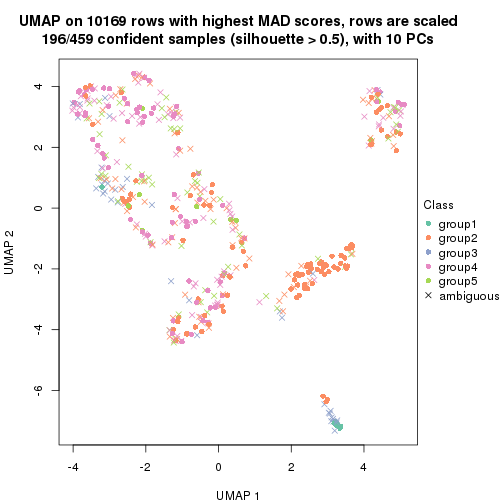</p>

</div>
</div>


Following heatmap shows how subgroups are split when increasing `k`:

```r
collect_classes(res)
```


If matrix rows can be associated to genes, consider to use `functional_enrichment(res,
...)` to perform function enrichment for the signature genes. See [this vignette](http://bioconductor.org/packages/devel/bioc/vignettes/cola/inst/doc/functional_enrichment.html) for more detailed explanations.


 

---------------------------------------------------


### MAD:mclust**


The object with results only for a single top-value method and a single partition method 
can be extracted as:

```r
res = res_list["MAD", "mclust"]
# you can also extract it by
# res = res_list["MAD:mclust"]
```

A summary of `res` and all the functions that can be applied to it:

```r
res
```

```
#> A 'ConsensusPartition' object with k = 2, 3, 4, 5, 6.
#>   On a matrix with 10169 rows and 459 columns.
#>   Top rows (1000, 2000, 3000, 4000, 5000) are extracted by 'MAD' method.
#>   Subgroups are detected by 'mclust' method.
#>   Performed in total 1250 partitions by row resampling.
#>   Best k for subgroups seems to be 2.
#> 
#> Following methods can be applied to this 'ConsensusPartition' object:
#>  [1] "cola_report"             "collect_classes"         "collect_plots"          
#>  [4] "collect_stats"           "colnames"                "compare_signatures"     
#>  [7] "consensus_heatmap"       "dimension_reduction"     "functional_enrichment"  
#> [10] "get_anno_col"            "get_anno"                "get_classes"            
#> [13] "get_consensus"           "get_matrix"              "get_membership"         
#> [16] "get_param"               "get_signatures"          "get_stats"              
#> [19] "is_best_k"               "is_stable_k"             "membership_heatmap"     
#> [22] "ncol"                    "nrow"                    "plot_ecdf"              
#> [25] "rownames"                "select_partition_number" "show"                   
#> [28] "suggest_best_k"          "test_to_known_factors"
```

`collect_plots()` function collects all the plots made from `res` for all `k` (number of partitions)
into one single page to provide an easy and fast comparison between different `k`.

```r
collect_plots(res)
```


The plots are:

- The first row: a plot of the ECDF (empirical cumulative distribution
  function) curves of the consensus matrix for each `k` and the heatmap of
  predicted classes for each `k`.
- The second row: heatmaps of the consensus matrix for each `k`.
- The third row: heatmaps of the membership matrix for each `k`.
- The fouth row: heatmaps of the signatures for each `k`.

All the plots in panels can be made by individual functions and they are
plotted later in this section.

`select_partition_number()` produces several plots showing different
statistics for choosing "optimized" `k`. There are following statistics:

- ECDF curves of the consensus matrix for each `k`;
- 1-PAC. [The PAC
  score](https://en.wikipedia.org/wiki/Consensus_clustering#Over-interpretation_potential_of_consensus_clustering)
  measures the proportion of the ambiguous subgrouping.
- Mean silhouette score.
- Concordance. The mean probability of fiting the consensus class ids in all
  partitions.
- Area increased. Denote $A_k$ as the area under the ECDF curve for current
  `k`, the area increased is defined as $A_k - A_{k-1}$.
- Rand index. The percent of pairs of samples that are both in a same cluster
  or both are not in a same cluster in the partition of k and k-1.
- Jaccard index. The ratio of pairs of samples are both in a same cluster in
  the partition of k and k-1 and the pairs of samples are both in a same
  cluster in the partition k or k-1.

The detailed explanations of these statistics can be found in [the _cola_
vignette](http://bioconductor.org/packages/devel/bioc/vignettes/cola/inst/doc/cola.html#toc_13).

Generally speaking, lower PAC score, higher mean silhouette score or higher
concordance corresponds to better partition. Rand index and Jaccard index
measure how similar the current partition is compared to partition with `k-1`.
If they are too similar, we won't accept `k` is better than `k-1`.

```r
select_partition_number(res)
```


The numeric values for all these statistics can be obtained by `get_stats()`.

```r
get_stats(res)
```

```
#>   k 1-PAC mean_silhouette concordance area_increased  Rand Jaccard
#> 2 2 1.000           0.989       0.995         0.1155 0.889   0.889
#> 3 3 0.296           0.590       0.776         3.6685 0.566   0.513
#> 4 4 0.377           0.547       0.769         0.2621 0.703   0.438
#> 5 5 0.377           0.506       0.627         0.0743 0.868   0.603
#> 6 6 0.410           0.293       0.586         0.0491 0.812   0.429
```

`suggest_best_k()` suggests the best $k$ based on these statistics. The rules are as follows:

- All $k$ with Jaccard index larger than 0.95 are removed because increasing
  $k$ does not provide enough extra information. If all $k$ are removed, it is
  marked as no subgroup is detected.
- For all $k$ with 1-PAC score larger than 0.9, the maximal $k$ is taken as
  the best $k$, and other $k$ are marked as optional $k$.
- If it does not fit the second rule. The $k$ with the maximal vote of the
  highest 1-PAC score, highest mean silhouette, and highest concordance is
  taken as the best $k$.

```r
suggest_best_k(res)
```

```
#> [1] 2
```


Following shows the table of the partitions (You need to click the **show/hide
code output** link to see it). The membership matrix (columns with name `p*`)
is inferred by
[`clue::cl_consensus()`](https://www.rdocumentation.org/link/cl_consensus?package=clue)
function with the `SE` method. Basically the value in the membership matrix
represents the probability to belong to a certain group. The finall class
label for an item is determined with the group with highest probability it
belongs to.

In `get_classes()` function, the entropy is calculated from the membership
matrix and the silhouette score is calculated from the consensus matrix.


<script>
$( function() {
	$( '#tabs-MAD-mclust-get-classes' ).tabs();
} );
</script>
<div id='tabs-MAD-mclust-get-classes'>
<ul>
<li><a href='#tab-MAD-mclust-get-classes-1'>k = 2</a></li>
<li><a href='#tab-MAD-mclust-get-classes-2'>k = 3</a></li>
<li><a href='#tab-MAD-mclust-get-classes-3'>k = 4</a></li>
<li><a href='#tab-MAD-mclust-get-classes-4'>k = 5</a></li>
<li><a href='#tab-MAD-mclust-get-classes-5'>k = 6</a></li>
</ul>

<div id='tab-MAD-mclust-get-classes-1'>
<p><a id='tab-MAD-mclust-get-classes-1-a' style='color:#0366d6' href='#'>show/hide code output</a></p>
<pre><code class="r">cbind(get_classes(res, k = 2), get_membership(res, k = 2))
</code></pre>

<pre><code>#&gt;            class entropy silhouette    p1    p2
#&gt; SRR1699874     2  0.0000      0.996 0.000 1.000
#&gt; SRR1699875     2  0.0000      0.996 0.000 1.000
#&gt; SRR1699876     2  0.0000      0.996 0.000 1.000
#&gt; SRR1699877     2  0.0000      0.996 0.000 1.000
#&gt; SRR1699879     2  0.0000      0.996 0.000 1.000
#&gt; SRR1699878     2  0.0000      0.996 0.000 1.000
#&gt; SRR1699880     2  0.0000      0.996 0.000 1.000
#&gt; SRR1699881     2  0.0000      0.996 0.000 1.000
#&gt; SRR1699882     2  0.0000      0.996 0.000 1.000
#&gt; SRR1699883     2  0.0000      0.996 0.000 1.000
#&gt; SRR1699884     2  0.0000      0.996 0.000 1.000
#&gt; SRR1699885     2  0.0000      0.996 0.000 1.000
#&gt; SRR1699886     2  0.0000      0.996 0.000 1.000
#&gt; SRR1699888     2  0.0000      0.996 0.000 1.000
#&gt; SRR1699889     2  0.0000      0.996 0.000 1.000
#&gt; SRR1699890     2  0.0000      0.996 0.000 1.000
#&gt; SRR1699887     2  0.0000      0.996 0.000 1.000
#&gt; SRR1699891     2  0.0000      0.996 0.000 1.000
#&gt; SRR1699892     2  0.0000      0.996 0.000 1.000
#&gt; SRR1699893     2  0.0000      0.996 0.000 1.000
#&gt; SRR1699894     2  0.0000      0.996 0.000 1.000
#&gt; SRR1699895     2  0.0000      0.996 0.000 1.000
#&gt; SRR1699896     2  0.0000      0.996 0.000 1.000
#&gt; SRR1699897     2  0.0000      0.996 0.000 1.000
#&gt; SRR1699898     2  0.0000      0.996 0.000 1.000
#&gt; SRR1699900     2  0.0000      0.996 0.000 1.000
#&gt; SRR1699899     2  0.0000      0.996 0.000 1.000
#&gt; SRR1699902     2  0.0000      0.996 0.000 1.000
#&gt; SRR1699901     2  0.0000      0.996 0.000 1.000
#&gt; SRR1699903     2  0.0000      0.996 0.000 1.000
#&gt; SRR1699904     2  0.0000      0.996 0.000 1.000
#&gt; SRR1699905     2  0.0672      0.989 0.008 0.992
#&gt; SRR1699906     2  0.0000      0.996 0.000 1.000
#&gt; SRR1699907     2  0.0000      0.996 0.000 1.000
#&gt; SRR1699908     2  0.0000      0.996 0.000 1.000
#&gt; SRR1699909     2  0.0000      0.996 0.000 1.000
#&gt; SRR1699910     2  0.0000      0.996 0.000 1.000
#&gt; SRR1699911     2  0.0000      0.996 0.000 1.000
#&gt; SRR1699912     2  0.0000      0.996 0.000 1.000
#&gt; SRR1699913     2  0.0000      0.996 0.000 1.000
#&gt; SRR1699914     2  0.0000      0.996 0.000 1.000
#&gt; SRR1699915     2  0.0000      0.996 0.000 1.000
#&gt; SRR1699916     2  0.0000      0.996 0.000 1.000
#&gt; SRR1699917     2  0.0000      0.996 0.000 1.000
#&gt; SRR1699918     2  0.0000      0.996 0.000 1.000
#&gt; SRR1699919     2  0.0000      0.996 0.000 1.000
#&gt; SRR1699920     2  0.0000      0.996 0.000 1.000
#&gt; SRR1699921     2  0.0000      0.996 0.000 1.000
#&gt; SRR1699922     2  0.0000      0.996 0.000 1.000
#&gt; SRR1699923     2  0.0000      0.996 0.000 1.000
#&gt; SRR1699924     2  0.0000      0.996 0.000 1.000
#&gt; SRR1699925     1  0.0000      0.974 1.000 0.000
#&gt; SRR1699926     2  0.0000      0.996 0.000 1.000
#&gt; SRR1699927     2  0.0000      0.996 0.000 1.000
#&gt; SRR1699929     2  0.0000      0.996 0.000 1.000
#&gt; SRR1699928     2  0.0000      0.996 0.000 1.000
#&gt; SRR1699930     2  0.0000      0.996 0.000 1.000
#&gt; SRR1699931     2  0.0000      0.996 0.000 1.000
#&gt; SRR1699933     2  0.0000      0.996 0.000 1.000
#&gt; SRR1699932     2  0.0000      0.996 0.000 1.000
#&gt; SRR1699934     1  0.0000      0.974 1.000 0.000
#&gt; SRR1699935     2  0.0000      0.996 0.000 1.000
#&gt; SRR1699936     2  0.0000      0.996 0.000 1.000
#&gt; SRR1699937     2  0.0000      0.996 0.000 1.000
#&gt; SRR1699938     2  0.0000      0.996 0.000 1.000
#&gt; SRR1699940     2  0.0000      0.996 0.000 1.000
#&gt; SRR1699939     2  0.0000      0.996 0.000 1.000
#&gt; SRR1699941     2  0.0000      0.996 0.000 1.000
#&gt; SRR1699942     2  0.0000      0.996 0.000 1.000
#&gt; SRR1699943     2  0.0000      0.996 0.000 1.000
#&gt; SRR1699944     2  0.0000      0.996 0.000 1.000
#&gt; SRR1699945     2  0.0000      0.996 0.000 1.000
#&gt; SRR1699946     2  0.0000      0.996 0.000 1.000
#&gt; SRR1699947     2  0.0000      0.996 0.000 1.000
#&gt; SRR1699948     2  0.0000      0.996 0.000 1.000
#&gt; SRR1699949     2  0.0000      0.996 0.000 1.000
#&gt; SRR1699950     2  0.0000      0.996 0.000 1.000
#&gt; SRR1699951     2  0.0000      0.996 0.000 1.000
#&gt; SRR1699952     2  0.0000      0.996 0.000 1.000
#&gt; SRR1699953     2  0.0000      0.996 0.000 1.000
#&gt; SRR1699954     2  0.0000      0.996 0.000 1.000
#&gt; SRR1699955     2  0.0000      0.996 0.000 1.000
#&gt; SRR1699956     2  0.0000      0.996 0.000 1.000
#&gt; SRR1699957     2  0.0000      0.996 0.000 1.000
#&gt; SRR1699959     2  0.0000      0.996 0.000 1.000
#&gt; SRR1699958     2  0.0000      0.996 0.000 1.000
#&gt; SRR1699960     2  0.0000      0.996 0.000 1.000
#&gt; SRR1699961     2  0.0000      0.996 0.000 1.000
#&gt; SRR1699962     2  0.0000      0.996 0.000 1.000
#&gt; SRR1699963     2  0.0000      0.996 0.000 1.000
#&gt; SRR1699964     2  0.0000      0.996 0.000 1.000
#&gt; SRR1699965     2  0.0000      0.996 0.000 1.000
#&gt; SRR1699966     2  0.0000      0.996 0.000 1.000
#&gt; SRR1699967     2  0.0000      0.996 0.000 1.000
#&gt; SRR1699968     2  0.0000      0.996 0.000 1.000
#&gt; SRR1699969     2  0.0000      0.996 0.000 1.000
#&gt; SRR1699971     2  0.0000      0.996 0.000 1.000
#&gt; SRR1699970     2  0.0000      0.996 0.000 1.000
#&gt; SRR1699972     2  0.0000      0.996 0.000 1.000
#&gt; SRR1699973     2  0.0000      0.996 0.000 1.000
#&gt; SRR1699974     2  0.0000      0.996 0.000 1.000
#&gt; SRR1699975     2  0.0000      0.996 0.000 1.000
#&gt; SRR1699976     2  0.0000      0.996 0.000 1.000
#&gt; SRR1699977     2  0.0000      0.996 0.000 1.000
#&gt; SRR1699978     2  0.0672      0.989 0.008 0.992
#&gt; SRR1699979     2  0.0000      0.996 0.000 1.000
#&gt; SRR1699980     2  0.0000      0.996 0.000 1.000
#&gt; SRR1699981     2  0.0000      0.996 0.000 1.000
#&gt; SRR1699982     2  0.0000      0.996 0.000 1.000
#&gt; SRR1699983     2  0.0000      0.996 0.000 1.000
#&gt; SRR1699984     1  0.0000      0.974 1.000 0.000
#&gt; SRR1699985     2  0.0000      0.996 0.000 1.000
#&gt; SRR1699986     2  0.0000      0.996 0.000 1.000
#&gt; SRR1699988     2  0.0000      0.996 0.000 1.000
#&gt; SRR1699987     2  0.0000      0.996 0.000 1.000
#&gt; SRR1699989     2  0.0000      0.996 0.000 1.000
#&gt; SRR1699990     2  0.0000      0.996 0.000 1.000
#&gt; SRR1699992     2  0.0000      0.996 0.000 1.000
#&gt; SRR1699991     2  0.0000      0.996 0.000 1.000
#&gt; SRR1699993     2  0.1843      0.968 0.028 0.972
#&gt; SRR1699994     2  0.0000      0.996 0.000 1.000
#&gt; SRR1699995     2  0.8713      0.577 0.292 0.708
#&gt; SRR1699996     2  0.0000      0.996 0.000 1.000
#&gt; SRR1699997     2  0.0000      0.996 0.000 1.000
#&gt; SRR1699998     2  0.0000      0.996 0.000 1.000
#&gt; SRR1699999     1  0.5842      0.849 0.860 0.140
#&gt; SRR1700000     2  0.0000      0.996 0.000 1.000
#&gt; SRR1700002     2  0.0000      0.996 0.000 1.000
#&gt; SRR1700001     2  0.0000      0.996 0.000 1.000
#&gt; SRR1700003     2  0.0000      0.996 0.000 1.000
#&gt; SRR1700004     2  0.0000      0.996 0.000 1.000
#&gt; SRR1700005     1  0.0000      0.974 1.000 0.000
#&gt; SRR1700006     2  0.0000      0.996 0.000 1.000
#&gt; SRR1700007     2  0.0000      0.996 0.000 1.000
#&gt; SRR1700008     2  0.0000      0.996 0.000 1.000
#&gt; SRR1700009     1  0.0672      0.969 0.992 0.008
#&gt; SRR1700010     2  0.0000      0.996 0.000 1.000
#&gt; SRR1700011     2  0.0000      0.996 0.000 1.000
#&gt; SRR1700013     2  0.0000      0.996 0.000 1.000
#&gt; SRR1700012     2  0.0000      0.996 0.000 1.000
#&gt; SRR1700014     2  0.0000      0.996 0.000 1.000
#&gt; SRR1700015     2  0.0000      0.996 0.000 1.000
#&gt; SRR1700016     1  0.5946      0.844 0.856 0.144
#&gt; SRR1700018     2  0.0000      0.996 0.000 1.000
#&gt; SRR1700017     2  0.0000      0.996 0.000 1.000
#&gt; SRR1700019     2  0.0000      0.996 0.000 1.000
#&gt; SRR1700020     2  0.0000      0.996 0.000 1.000
#&gt; SRR1700021     2  0.0000      0.996 0.000 1.000
#&gt; SRR1700023     2  0.0000      0.996 0.000 1.000
#&gt; SRR1700022     2  0.0000      0.996 0.000 1.000
#&gt; SRR1700024     2  0.0000      0.996 0.000 1.000
#&gt; SRR1700025     2  0.0000      0.996 0.000 1.000
#&gt; SRR1700026     2  0.0000      0.996 0.000 1.000
#&gt; SRR1700027     2  0.0000      0.996 0.000 1.000
#&gt; SRR1700028     2  0.0000      0.996 0.000 1.000
#&gt; SRR1700029     2  0.0000      0.996 0.000 1.000
#&gt; SRR1700030     2  0.0000      0.996 0.000 1.000
#&gt; SRR1700031     2  0.0000      0.996 0.000 1.000
#&gt; SRR1700032     2  0.0000      0.996 0.000 1.000
#&gt; SRR1700034     1  0.4939      0.884 0.892 0.108
#&gt; SRR1700035     2  0.0000      0.996 0.000 1.000
#&gt; SRR1700033     2  0.0000      0.996 0.000 1.000
#&gt; SRR1700036     2  0.0000      0.996 0.000 1.000
#&gt; SRR1700037     2  0.0000      0.996 0.000 1.000
#&gt; SRR1700038     2  0.0000      0.996 0.000 1.000
#&gt; SRR1700039     2  0.0000      0.996 0.000 1.000
#&gt; SRR1700040     2  0.0000      0.996 0.000 1.000
#&gt; SRR1700041     2  0.0000      0.996 0.000 1.000
#&gt; SRR1700042     2  0.0000      0.996 0.000 1.000
#&gt; SRR1700043     2  0.0000      0.996 0.000 1.000
#&gt; SRR1700045     2  0.0000      0.996 0.000 1.000
#&gt; SRR1700044     2  0.0000      0.996 0.000 1.000
#&gt; SRR1700046     2  0.0000      0.996 0.000 1.000
#&gt; SRR1700047     2  0.0000      0.996 0.000 1.000
#&gt; SRR1700048     2  0.0000      0.996 0.000 1.000
#&gt; SRR1700049     2  0.0376      0.992 0.004 0.996
#&gt; SRR1700050     2  0.0000      0.996 0.000 1.000
#&gt; SRR1700051     2  0.0000      0.996 0.000 1.000
#&gt; SRR1700052     2  0.0000      0.996 0.000 1.000
#&gt; SRR1700053     2  0.0000      0.996 0.000 1.000
#&gt; SRR1700054     2  0.0000      0.996 0.000 1.000
#&gt; SRR1700055     1  0.0000      0.974 1.000 0.000
#&gt; SRR1700056     2  0.0000      0.996 0.000 1.000
#&gt; SRR1700057     2  0.0000      0.996 0.000 1.000
#&gt; SRR1700058     2  0.0000      0.996 0.000 1.000
#&gt; SRR1700059     2  0.0000      0.996 0.000 1.000
#&gt; SRR1700060     2  0.0000      0.996 0.000 1.000
#&gt; SRR1700061     2  0.0000      0.996 0.000 1.000
#&gt; SRR1700062     2  0.0000      0.996 0.000 1.000
#&gt; SRR1700063     2  0.0000      0.996 0.000 1.000
#&gt; SRR1700064     2  0.0000      0.996 0.000 1.000
#&gt; SRR1700065     2  0.0000      0.996 0.000 1.000
#&gt; SRR1700066     2  0.0000      0.996 0.000 1.000
#&gt; SRR1700067     2  0.0000      0.996 0.000 1.000
#&gt; SRR1700068     2  0.0000      0.996 0.000 1.000
#&gt; SRR1700069     2  0.0000      0.996 0.000 1.000
#&gt; SRR1700070     2  0.0000      0.996 0.000 1.000
#&gt; SRR1700071     2  0.0000      0.996 0.000 1.000
#&gt; SRR1700072     2  0.0000      0.996 0.000 1.000
#&gt; SRR1700073     2  0.0000      0.996 0.000 1.000
#&gt; SRR1700075     2  0.0000      0.996 0.000 1.000
#&gt; SRR1700074     2  0.0000      0.996 0.000 1.000
#&gt; SRR1700076     2  0.0000      0.996 0.000 1.000
#&gt; SRR1700077     2  0.0000      0.996 0.000 1.000
#&gt; SRR1700078     2  0.0000      0.996 0.000 1.000
#&gt; SRR1700080     2  0.0000      0.996 0.000 1.000
#&gt; SRR1700079     2  0.0000      0.996 0.000 1.000
#&gt; SRR1700081     2  0.0000      0.996 0.000 1.000
#&gt; SRR1700082     2  0.0000      0.996 0.000 1.000
#&gt; SRR1700083     2  0.0000      0.996 0.000 1.000
#&gt; SRR1700084     2  0.3114      0.938 0.056 0.944
#&gt; SRR1700085     2  0.0000      0.996 0.000 1.000
#&gt; SRR1700086     2  0.0000      0.996 0.000 1.000
#&gt; SRR1700087     2  0.0000      0.996 0.000 1.000
#&gt; SRR1700088     2  0.0000      0.996 0.000 1.000
#&gt; SRR1700089     2  0.0000      0.996 0.000 1.000
#&gt; SRR1700091     2  0.0000      0.996 0.000 1.000
#&gt; SRR1700090     2  0.0000      0.996 0.000 1.000
#&gt; SRR1700092     2  0.0000      0.996 0.000 1.000
#&gt; SRR1700094     2  0.0000      0.996 0.000 1.000
#&gt; SRR1700093     2  0.0000      0.996 0.000 1.000
#&gt; SRR1700095     2  0.0000      0.996 0.000 1.000
#&gt; SRR1700096     2  0.0000      0.996 0.000 1.000
#&gt; SRR1700097     2  0.0000      0.996 0.000 1.000
#&gt; SRR1700098     2  0.0000      0.996 0.000 1.000
#&gt; SRR1700099     2  0.0000      0.996 0.000 1.000
#&gt; SRR1700100     2  0.0000      0.996 0.000 1.000
#&gt; SRR1700101     2  0.0000      0.996 0.000 1.000
#&gt; SRR1700102     2  0.0000      0.996 0.000 1.000
#&gt; SRR1700104     2  0.0000      0.996 0.000 1.000
#&gt; SRR1700103     2  0.0000      0.996 0.000 1.000
#&gt; SRR1700105     2  0.0000      0.996 0.000 1.000
#&gt; SRR1700106     2  0.0000      0.996 0.000 1.000
#&gt; SRR1700107     2  0.0000      0.996 0.000 1.000
#&gt; SRR1700108     2  0.0000      0.996 0.000 1.000
#&gt; SRR1700109     2  0.0000      0.996 0.000 1.000
#&gt; SRR1700110     2  0.0000      0.996 0.000 1.000
#&gt; SRR1700112     2  0.0000      0.996 0.000 1.000
#&gt; SRR1700111     2  0.0000      0.996 0.000 1.000
#&gt; SRR1700113     2  0.0000      0.996 0.000 1.000
#&gt; SRR1700114     2  0.0000      0.996 0.000 1.000
#&gt; SRR1700115     2  0.0000      0.996 0.000 1.000
#&gt; SRR1700116     2  0.0000      0.996 0.000 1.000
#&gt; SRR1700117     2  0.0000      0.996 0.000 1.000
#&gt; SRR1700119     2  0.0000      0.996 0.000 1.000
#&gt; SRR1700118     2  0.0000      0.996 0.000 1.000
#&gt; SRR1700120     2  0.0000      0.996 0.000 1.000
#&gt; SRR1700121     2  0.0000      0.996 0.000 1.000
#&gt; SRR1700122     2  0.0000      0.996 0.000 1.000
#&gt; SRR1700123     2  0.0000      0.996 0.000 1.000
#&gt; SRR1700125     2  0.0000      0.996 0.000 1.000
#&gt; SRR1700126     2  0.0000      0.996 0.000 1.000
#&gt; SRR1700127     2  0.0000      0.996 0.000 1.000
#&gt; SRR1700124     2  0.0000      0.996 0.000 1.000
#&gt; SRR1700128     2  0.0000      0.996 0.000 1.000
#&gt; SRR1700129     2  0.0000      0.996 0.000 1.000
#&gt; SRR1700130     2  0.0000      0.996 0.000 1.000
#&gt; SRR1700132     2  0.0000      0.996 0.000 1.000
#&gt; SRR1700131     2  0.0000      0.996 0.000 1.000
#&gt; SRR1700133     2  0.0000      0.996 0.000 1.000
#&gt; SRR1700134     2  0.0000      0.996 0.000 1.000
#&gt; SRR1700135     2  0.0000      0.996 0.000 1.000
#&gt; SRR1700136     2  0.0000      0.996 0.000 1.000
#&gt; SRR1700137     2  0.0000      0.996 0.000 1.000
#&gt; SRR1700138     2  0.0000      0.996 0.000 1.000
#&gt; SRR1700140     2  0.0000      0.996 0.000 1.000
#&gt; SRR1700139     2  0.0000      0.996 0.000 1.000
#&gt; SRR1700141     2  0.0000      0.996 0.000 1.000
#&gt; SRR1700142     2  0.0000      0.996 0.000 1.000
#&gt; SRR1700143     2  0.0000      0.996 0.000 1.000
#&gt; SRR1700144     2  0.0000      0.996 0.000 1.000
#&gt; SRR1700145     2  0.0000      0.996 0.000 1.000
#&gt; SRR1700146     2  0.0000      0.996 0.000 1.000
#&gt; SRR1700147     2  0.0000      0.996 0.000 1.000
#&gt; SRR1700149     2  0.0000      0.996 0.000 1.000
#&gt; SRR1700148     2  0.0000      0.996 0.000 1.000
#&gt; SRR1700150     2  0.0000      0.996 0.000 1.000
#&gt; SRR1700152     2  0.0000      0.996 0.000 1.000
#&gt; SRR1700151     2  0.0000      0.996 0.000 1.000
#&gt; SRR1700153     2  0.0000      0.996 0.000 1.000
#&gt; SRR1700154     2  0.0000      0.996 0.000 1.000
#&gt; SRR1700155     2  0.0000      0.996 0.000 1.000
#&gt; SRR1700156     2  0.0000      0.996 0.000 1.000
#&gt; SRR1700158     2  0.0000      0.996 0.000 1.000
#&gt; SRR1700159     2  0.0000      0.996 0.000 1.000
#&gt; SRR1700157     2  0.0000      0.996 0.000 1.000
#&gt; SRR1700160     2  0.0000      0.996 0.000 1.000
#&gt; SRR1700161     2  0.0000      0.996 0.000 1.000
#&gt; SRR1700162     2  0.0000      0.996 0.000 1.000
#&gt; SRR1700164     2  0.0000      0.996 0.000 1.000
#&gt; SRR1700163     2  0.0000      0.996 0.000 1.000
#&gt; SRR1700165     2  0.0000      0.996 0.000 1.000
#&gt; SRR1700166     2  0.0000      0.996 0.000 1.000
#&gt; SRR1700168     2  0.0000      0.996 0.000 1.000
#&gt; SRR1700167     2  0.0000      0.996 0.000 1.000
#&gt; SRR1700170     2  0.0000      0.996 0.000 1.000
#&gt; SRR1700169     2  0.0000      0.996 0.000 1.000
#&gt; SRR1700171     2  0.1414      0.976 0.020 0.980
#&gt; SRR1700172     2  0.0000      0.996 0.000 1.000
#&gt; SRR1700174     2  0.0000      0.996 0.000 1.000
#&gt; SRR1700173     2  0.0000      0.996 0.000 1.000
#&gt; SRR1700175     2  0.0000      0.996 0.000 1.000
#&gt; SRR1700176     2  0.0000      0.996 0.000 1.000
#&gt; SRR1700178     2  0.0376      0.992 0.004 0.996
#&gt; SRR1700177     2  0.0000      0.996 0.000 1.000
#&gt; SRR1700180     2  0.0376      0.992 0.004 0.996
#&gt; SRR1700179     2  0.0376      0.992 0.004 0.996
#&gt; SRR1700181     2  0.0376      0.992 0.004 0.996
#&gt; SRR1700183     1  0.0000      0.974 1.000 0.000
#&gt; SRR1700182     2  0.0376      0.992 0.004 0.996
#&gt; SRR1700184     2  0.0000      0.996 0.000 1.000
#&gt; SRR1700186     2  0.0376      0.992 0.004 0.996
#&gt; SRR1700187     1  0.0000      0.974 1.000 0.000
#&gt; SRR1700185     1  0.0000      0.974 1.000 0.000
#&gt; SRR1700188     2  0.0000      0.996 0.000 1.000
#&gt; SRR1700192     1  0.8267      0.669 0.740 0.260
#&gt; SRR1700190     2  0.5178      0.866 0.116 0.884
#&gt; SRR1700191     1  0.0000      0.974 1.000 0.000
#&gt; SRR1700189     1  0.0000      0.974 1.000 0.000
#&gt; SRR1700193     2  0.0000      0.996 0.000 1.000
#&gt; SRR1700195     2  0.0000      0.996 0.000 1.000
#&gt; SRR1700194     1  0.0000      0.974 1.000 0.000
#&gt; SRR1700196     2  0.0376      0.992 0.004 0.996
#&gt; SRR1700197     1  0.1184      0.963 0.984 0.016
#&gt; SRR1700198     2  0.0376      0.992 0.004 0.996
#&gt; SRR1700199     2  0.0376      0.992 0.004 0.996
#&gt; SRR1700200     2  0.0000      0.996 0.000 1.000
#&gt; SRR1700201     2  0.0000      0.996 0.000 1.000
#&gt; SRR1700202     2  0.8443      0.618 0.272 0.728
#&gt; SRR1700203     2  0.0376      0.992 0.004 0.996
#&gt; SRR1700204     2  0.0000      0.996 0.000 1.000
#&gt; SRR1700206     2  0.0000      0.996 0.000 1.000
#&gt; SRR1700207     2  0.0376      0.992 0.004 0.996
#&gt; SRR1700208     2  0.9044      0.519 0.320 0.680
#&gt; SRR1700205     2  0.0000      0.996 0.000 1.000
#&gt; SRR1700209     2  0.0000      0.996 0.000 1.000
#&gt; SRR1700210     2  0.0000      0.996 0.000 1.000
#&gt; SRR1700211     2  0.5059      0.871 0.112 0.888
#&gt; SRR1700212     2  0.0000      0.996 0.000 1.000
#&gt; SRR1700213     2  0.0000      0.996 0.000 1.000
#&gt; SRR1700214     2  0.0376      0.992 0.004 0.996
#&gt; SRR1700215     1  0.0000      0.974 1.000 0.000
#&gt; SRR1700217     2  0.0000      0.996 0.000 1.000
#&gt; SRR1700216     1  0.0000      0.974 1.000 0.000
#&gt; SRR1700218     2  0.0000      0.996 0.000 1.000
#&gt; SRR1700219     2  0.0000      0.996 0.000 1.000
#&gt; SRR1700222     1  0.0000      0.974 1.000 0.000
#&gt; SRR1700220     2  0.0000      0.996 0.000 1.000
#&gt; SRR1700221     2  0.0672      0.989 0.008 0.992
#&gt; SRR1700223     2  0.0000      0.996 0.000 1.000
#&gt; SRR1700224     2  0.0000      0.996 0.000 1.000
#&gt; SRR1700226     2  0.0000      0.996 0.000 1.000
#&gt; SRR1700229     2  0.0000      0.996 0.000 1.000
#&gt; SRR1700225     2  0.0000      0.996 0.000 1.000
#&gt; SRR1700227     2  0.0376      0.992 0.004 0.996
#&gt; SRR1700230     1  0.0000      0.974 1.000 0.000
#&gt; SRR1700231     2  0.0000      0.996 0.000 1.000
#&gt; SRR1700228     2  0.0376      0.992 0.004 0.996
#&gt; SRR1700232     2  0.0000      0.996 0.000 1.000
#&gt; SRR1700233     2  0.0000      0.996 0.000 1.000
#&gt; SRR1700234     2  0.0000      0.996 0.000 1.000
#&gt; SRR1700235     2  0.0000      0.996 0.000 1.000
#&gt; SRR1700237     2  0.0000      0.996 0.000 1.000
#&gt; SRR1700236     2  0.0000      0.996 0.000 1.000
#&gt; SRR1700238     2  0.0000      0.996 0.000 1.000
#&gt; SRR1700239     1  0.0000      0.974 1.000 0.000
#&gt; SRR1700240     1  0.0000      0.974 1.000 0.000
#&gt; SRR1700241     2  0.2236      0.960 0.036 0.964
#&gt; SRR1700243     2  0.0000      0.996 0.000 1.000
#&gt; SRR1700244     2  0.0000      0.996 0.000 1.000
#&gt; SRR1700242     1  0.0376      0.972 0.996 0.004
#&gt; SRR1700246     2  0.4161      0.906 0.084 0.916
#&gt; SRR1700245     2  0.0000      0.996 0.000 1.000
#&gt; SRR1700247     1  0.0000      0.974 1.000 0.000
#&gt; SRR1700249     1  0.0000      0.974 1.000 0.000
#&gt; SRR1700250     2  0.0000      0.996 0.000 1.000
#&gt; SRR1700248     2  0.0000      0.996 0.000 1.000
#&gt; SRR1700251     2  0.0376      0.992 0.004 0.996
#&gt; SRR1700252     2  0.0000      0.996 0.000 1.000
#&gt; SRR1700253     2  0.0000      0.996 0.000 1.000
#&gt; SRR1700256     2  0.0000      0.996 0.000 1.000
#&gt; SRR1700254     1  0.0000      0.974 1.000 0.000
#&gt; SRR1700255     2  0.0000      0.996 0.000 1.000
#&gt; SRR1700257     2  0.0000      0.996 0.000 1.000
#&gt; SRR1700258     2  0.0000      0.996 0.000 1.000
#&gt; SRR1700259     2  0.0000      0.996 0.000 1.000
#&gt; SRR1700260     2  0.0000      0.996 0.000 1.000
#&gt; SRR1700261     2  0.0000      0.996 0.000 1.000
#&gt; SRR1700262     2  0.0000      0.996 0.000 1.000
#&gt; SRR1700263     2  0.0000      0.996 0.000 1.000
#&gt; SRR1700264     2  0.0000      0.996 0.000 1.000
#&gt; SRR1700265     2  0.0000      0.996 0.000 1.000
#&gt; SRR1700266     2  0.0000      0.996 0.000 1.000
#&gt; SRR1700268     2  0.0000      0.996 0.000 1.000
#&gt; SRR1700270     2  0.0000      0.996 0.000 1.000
#&gt; SRR1700267     2  0.0000      0.996 0.000 1.000
#&gt; SRR1700271     2  0.0000      0.996 0.000 1.000
#&gt; SRR1700272     2  0.0000      0.996 0.000 1.000
#&gt; SRR1700273     2  0.0000      0.996 0.000 1.000
#&gt; SRR1700274     2  0.0000      0.996 0.000 1.000
#&gt; SRR1700277     2  0.0376      0.992 0.004 0.996
#&gt; SRR1700275     2  0.0000      0.996 0.000 1.000
#&gt; SRR1700276     2  0.0000      0.996 0.000 1.000
#&gt; SRR1700278     2  0.0000      0.996 0.000 1.000
#&gt; SRR1700279     2  0.0000      0.996 0.000 1.000
#&gt; SRR1700280     2  0.0000      0.996 0.000 1.000
#&gt; SRR1700281     2  0.0000      0.996 0.000 1.000
#&gt; SRR1700283     2  0.0000      0.996 0.000 1.000
#&gt; SRR1700282     2  0.0000      0.996 0.000 1.000
#&gt; SRR1700284     2  0.0000      0.996 0.000 1.000
#&gt; SRR1700285     2  0.0000      0.996 0.000 1.000
#&gt; SRR1700286     2  0.0000      0.996 0.000 1.000
#&gt; SRR1700287     2  0.0000      0.996 0.000 1.000
#&gt; SRR1700290     2  0.7602      0.712 0.220 0.780
#&gt; SRR1700289     2  0.0000      0.996 0.000 1.000
#&gt; SRR1700288     2  0.0000      0.996 0.000 1.000
#&gt; SRR1700292     2  0.0000      0.996 0.000 1.000
#&gt; SRR1700291     2  0.0000      0.996 0.000 1.000
#&gt; SRR1700293     2  0.0000      0.996 0.000 1.000
#&gt; SRR1700294     2  0.0000      0.996 0.000 1.000
#&gt; SRR1700295     2  0.0000      0.996 0.000 1.000
#&gt; SRR1700297     2  0.0000      0.996 0.000 1.000
#&gt; SRR1700296     2  0.0000      0.996 0.000 1.000
#&gt; SRR1700298     2  0.0000      0.996 0.000 1.000
#&gt; SRR1700299     2  0.0000      0.996 0.000 1.000
#&gt; SRR1700300     2  0.0000      0.996 0.000 1.000
#&gt; SRR1700302     2  0.0000      0.996 0.000 1.000
#&gt; SRR1700301     2  0.0000      0.996 0.000 1.000
#&gt; SRR1700303     2  0.0000      0.996 0.000 1.000
#&gt; SRR1700304     2  0.0672      0.989 0.008 0.992
#&gt; SRR1700305     2  0.0000      0.996 0.000 1.000
#&gt; SRR1700306     2  0.0000      0.996 0.000 1.000
#&gt; SRR1700308     2  0.0000      0.996 0.000 1.000
#&gt; SRR1700307     2  0.0000      0.996 0.000 1.000
#&gt; SRR1700309     2  0.0000      0.996 0.000 1.000
#&gt; SRR1700310     2  0.0000      0.996 0.000 1.000
#&gt; SRR1700311     2  0.0000      0.996 0.000 1.000
#&gt; SRR1700312     2  0.0000      0.996 0.000 1.000
#&gt; SRR1700313     2  0.0000      0.996 0.000 1.000
#&gt; SRR1700314     2  0.0000      0.996 0.000 1.000
#&gt; SRR1700315     2  0.0000      0.996 0.000 1.000
#&gt; SRR1700316     2  0.0000      0.996 0.000 1.000
#&gt; SRR1700317     2  0.0000      0.996 0.000 1.000
#&gt; SRR1700318     2  0.0000      0.996 0.000 1.000
#&gt; SRR1700319     2  0.0000      0.996 0.000 1.000
#&gt; SRR1700320     2  0.0000      0.996 0.000 1.000
#&gt; SRR1700322     2  0.0000      0.996 0.000 1.000
#&gt; SRR1700321     2  0.0000      0.996 0.000 1.000
#&gt; SRR1700323     2  0.0000      0.996 0.000 1.000
#&gt; SRR1700324     2  0.0000      0.996 0.000 1.000
#&gt; SRR1700325     2  0.0000      0.996 0.000 1.000
#&gt; SRR1700326     2  0.0376      0.992 0.004 0.996
#&gt; SRR1700327     2  0.0000      0.996 0.000 1.000
#&gt; SRR1700329     2  0.0000      0.996 0.000 1.000
#&gt; SRR1700328     2  0.0000      0.996 0.000 1.000
#&gt; SRR1700330     2  0.0000      0.996 0.000 1.000
#&gt; SRR1700331     2  0.0000      0.996 0.000 1.000
#&gt; SRR1700332     2  0.0000      0.996 0.000 1.000
#&gt; SRR1700333     2  0.0000      0.996 0.000 1.000
</code></pre>

<script>
$('#tab-MAD-mclust-get-classes-1-a').parent().next().next().hide();
$('#tab-MAD-mclust-get-classes-1-a').click(function(){
  $('#tab-MAD-mclust-get-classes-1-a').parent().next().next().toggle();
  return(false);
});
</script>
</div>

<div id='tab-MAD-mclust-get-classes-2'>
<p><a id='tab-MAD-mclust-get-classes-2-a' style='color:#0366d6' href='#'>show/hide code output</a></p>
<pre><code class="r">cbind(get_classes(res, k = 3), get_membership(res, k = 3))
</code></pre>

<pre><code>#&gt;            class entropy silhouette    p1    p2    p3
#&gt; SRR1699874     2  0.2165    0.69952 0.000 0.936 0.064
#&gt; SRR1699875     2  0.5327    0.38913 0.000 0.728 0.272
#&gt; SRR1699876     2  0.6244    0.48266 0.000 0.560 0.440
#&gt; SRR1699877     2  0.1643    0.69803 0.000 0.956 0.044
#&gt; SRR1699879     2  0.4605    0.66933 0.000 0.796 0.204
#&gt; SRR1699878     2  0.2625    0.67714 0.000 0.916 0.084
#&gt; SRR1699880     3  0.6111    0.55429 0.000 0.396 0.604
#&gt; SRR1699881     3  0.6026    0.58291 0.000 0.376 0.624
#&gt; SRR1699882     2  0.3267    0.69565 0.000 0.884 0.116
#&gt; SRR1699883     2  0.1964    0.69521 0.000 0.944 0.056
#&gt; SRR1699884     2  0.2537    0.68158 0.000 0.920 0.080
#&gt; SRR1699885     2  0.2537    0.67926 0.000 0.920 0.080
#&gt; SRR1699886     2  0.5948    0.58354 0.000 0.640 0.360
#&gt; SRR1699888     2  0.3116    0.70008 0.000 0.892 0.108
#&gt; SRR1699889     3  0.6286   -0.34148 0.000 0.464 0.536
#&gt; SRR1699890     2  0.5098    0.62979 0.000 0.752 0.248
#&gt; SRR1699887     2  0.5835    0.57828 0.000 0.660 0.340
#&gt; SRR1699891     2  0.6295    0.46191 0.000 0.528 0.472
#&gt; SRR1699892     3  0.6274    0.49899 0.000 0.456 0.544
#&gt; SRR1699893     3  0.1163    0.67197 0.000 0.028 0.972
#&gt; SRR1699894     2  0.6204    0.48574 0.000 0.576 0.424
#&gt; SRR1699895     2  0.6225    0.47655 0.000 0.568 0.432
#&gt; SRR1699896     3  0.6291    0.46917 0.000 0.468 0.532
#&gt; SRR1699897     2  0.5115    0.60206 0.004 0.768 0.228
#&gt; SRR1699898     3  0.5797    0.63537 0.008 0.280 0.712
#&gt; SRR1699900     3  0.6126    0.55825 0.000 0.400 0.600
#&gt; SRR1699899     3  0.6267   -0.31451 0.000 0.452 0.548
#&gt; SRR1699902     3  0.6095    0.56365 0.000 0.392 0.608
#&gt; SRR1699901     3  0.7032    0.60068 0.028 0.368 0.604
#&gt; SRR1699903     3  0.4178    0.54944 0.000 0.172 0.828
#&gt; SRR1699904     2  0.6235    0.47290 0.000 0.564 0.436
#&gt; SRR1699905     3  0.7824    0.58813 0.064 0.356 0.580
#&gt; SRR1699906     2  0.6295    0.47474 0.000 0.528 0.472
#&gt; SRR1699907     2  0.6252    0.46087 0.000 0.556 0.444
#&gt; SRR1699908     3  0.5733    0.19173 0.000 0.324 0.676
#&gt; SRR1699909     3  0.4974    0.60631 0.000 0.236 0.764
#&gt; SRR1699910     3  0.2261    0.66195 0.000 0.068 0.932
#&gt; SRR1699911     3  0.5497    0.47903 0.000 0.292 0.708
#&gt; SRR1699912     3  0.5497    0.26629 0.000 0.292 0.708
#&gt; SRR1699913     2  0.6244    0.47381 0.000 0.560 0.440
#&gt; SRR1699914     3  0.4465    0.68022 0.004 0.176 0.820
#&gt; SRR1699915     3  0.2448    0.65717 0.000 0.076 0.924
#&gt; SRR1699916     2  0.5497    0.58984 0.000 0.708 0.292
#&gt; SRR1699917     3  0.2165    0.66302 0.000 0.064 0.936
#&gt; SRR1699918     3  0.5465    0.55596 0.000 0.288 0.712
#&gt; SRR1699919     3  0.4346    0.52692 0.000 0.184 0.816
#&gt; SRR1699920     3  0.1525    0.67673 0.004 0.032 0.964
#&gt; SRR1699921     3  0.3038    0.63653 0.000 0.104 0.896
#&gt; SRR1699922     2  0.2711    0.70365 0.000 0.912 0.088
#&gt; SRR1699923     3  0.7534    0.52448 0.040 0.428 0.532
#&gt; SRR1699924     3  0.4399    0.67845 0.000 0.188 0.812
#&gt; SRR1699925     1  0.0000    0.94554 1.000 0.000 0.000
#&gt; SRR1699926     3  0.3192    0.64627 0.000 0.112 0.888
#&gt; SRR1699927     2  0.6309    0.38836 0.000 0.500 0.500
#&gt; SRR1699929     3  0.6252    0.49737 0.000 0.444 0.556
#&gt; SRR1699928     2  0.6307    0.41182 0.000 0.512 0.488
#&gt; SRR1699930     2  0.6192    0.48923 0.000 0.580 0.420
#&gt; SRR1699931     3  0.6260    0.48661 0.000 0.448 0.552
#&gt; SRR1699933     3  0.5988    0.58559 0.000 0.368 0.632
#&gt; SRR1699932     2  0.6267    0.45561 0.000 0.548 0.452
#&gt; SRR1699934     1  0.0000    0.94554 1.000 0.000 0.000
#&gt; SRR1699935     3  0.2356    0.65794 0.000 0.072 0.928
#&gt; SRR1699936     2  0.4291    0.68047 0.000 0.820 0.180
#&gt; SRR1699937     2  0.6079   -0.04252 0.000 0.612 0.388
#&gt; SRR1699938     2  0.2448    0.68267 0.000 0.924 0.076
#&gt; SRR1699940     3  0.6111    0.55429 0.000 0.396 0.604
#&gt; SRR1699939     2  0.5016    0.65857 0.000 0.760 0.240
#&gt; SRR1699941     3  0.6111    0.55429 0.000 0.396 0.604
#&gt; SRR1699942     3  0.6126    0.55511 0.000 0.400 0.600
#&gt; SRR1699943     2  0.1411    0.70430 0.000 0.964 0.036
#&gt; SRR1699944     2  0.2796    0.67277 0.000 0.908 0.092
#&gt; SRR1699945     3  0.6111    0.55429 0.000 0.396 0.604
#&gt; SRR1699946     2  0.5859    0.14426 0.000 0.656 0.344
#&gt; SRR1699947     2  0.2959    0.66765 0.000 0.900 0.100
#&gt; SRR1699948     2  0.2537    0.68045 0.000 0.920 0.080
#&gt; SRR1699949     2  0.6008    0.54151 0.000 0.628 0.372
#&gt; SRR1699950     2  0.4931    0.65777 0.000 0.768 0.232
#&gt; SRR1699951     3  0.5327    0.63933 0.000 0.272 0.728
#&gt; SRR1699952     2  0.6252   -0.23491 0.000 0.556 0.444
#&gt; SRR1699953     2  0.2625    0.68166 0.000 0.916 0.084
#&gt; SRR1699954     3  0.6713    0.52835 0.012 0.416 0.572
#&gt; SRR1699955     2  0.2959    0.70254 0.000 0.900 0.100
#&gt; SRR1699956     3  0.6189    0.58300 0.004 0.364 0.632
#&gt; SRR1699957     2  0.5291    0.39256 0.000 0.732 0.268
#&gt; SRR1699959     3  0.5882    0.59980 0.000 0.348 0.652
#&gt; SRR1699958     3  0.2625    0.67807 0.000 0.084 0.916
#&gt; SRR1699960     2  0.4504    0.67219 0.000 0.804 0.196
#&gt; SRR1699961     3  0.6111    0.55429 0.000 0.396 0.604
#&gt; SRR1699962     2  0.3619    0.69299 0.000 0.864 0.136
#&gt; SRR1699963     3  0.6079    0.56699 0.000 0.388 0.612
#&gt; SRR1699964     2  0.3340    0.64778 0.000 0.880 0.120
#&gt; SRR1699965     2  0.3267    0.69648 0.000 0.884 0.116
#&gt; SRR1699966     3  0.3551    0.68854 0.000 0.132 0.868
#&gt; SRR1699967     2  0.3340    0.64698 0.000 0.880 0.120
#&gt; SRR1699968     3  0.5292    0.64991 0.008 0.228 0.764
#&gt; SRR1699969     3  0.4504    0.67666 0.000 0.196 0.804
#&gt; SRR1699971     3  0.6111    0.55429 0.000 0.396 0.604
#&gt; SRR1699970     2  0.3752    0.62160 0.000 0.856 0.144
#&gt; SRR1699972     3  0.6111    0.55429 0.000 0.396 0.604
#&gt; SRR1699973     3  0.1289    0.67279 0.000 0.032 0.968
#&gt; SRR1699974     3  0.7083    0.55910 0.028 0.380 0.592
#&gt; SRR1699975     3  0.2537    0.68580 0.000 0.080 0.920
#&gt; SRR1699976     3  0.6111    0.55429 0.000 0.396 0.604
#&gt; SRR1699977     3  0.5216    0.64968 0.000 0.260 0.740
#&gt; SRR1699978     3  0.7424    0.59536 0.044 0.364 0.592
#&gt; SRR1699979     3  0.4629    0.67302 0.004 0.188 0.808
#&gt; SRR1699980     3  0.2680    0.67639 0.008 0.068 0.924
#&gt; SRR1699981     3  0.5678    0.63647 0.000 0.316 0.684
#&gt; SRR1699982     2  0.6252    0.47154 0.000 0.556 0.444
#&gt; SRR1699983     3  0.2066    0.65943 0.000 0.060 0.940
#&gt; SRR1699984     1  0.0000    0.94554 1.000 0.000 0.000
#&gt; SRR1699985     3  0.5810    0.39306 0.000 0.336 0.664
#&gt; SRR1699986     3  0.7490    0.58209 0.044 0.380 0.576
#&gt; SRR1699988     2  0.5178    0.34758 0.000 0.744 0.256
#&gt; SRR1699987     3  0.2796    0.68928 0.000 0.092 0.908
#&gt; SRR1699989     3  0.5291    0.43222 0.000 0.268 0.732
#&gt; SRR1699990     3  0.3784    0.68530 0.004 0.132 0.864
#&gt; SRR1699992     3  0.6140    0.55231 0.000 0.404 0.596
#&gt; SRR1699991     3  0.6062    0.57131 0.000 0.384 0.616
#&gt; SRR1699993     3  0.6803    0.63009 0.040 0.280 0.680
#&gt; SRR1699994     3  0.6095    0.55885 0.000 0.392 0.608
#&gt; SRR1699995     3  0.9833    0.26909 0.300 0.276 0.424
#&gt; SRR1699996     2  0.4002    0.53113 0.000 0.840 0.160
#&gt; SRR1699997     3  0.1860    0.66805 0.000 0.052 0.948
#&gt; SRR1699998     3  0.6274    0.48642 0.000 0.456 0.544
#&gt; SRR1699999     1  0.4526    0.82322 0.856 0.104 0.040
#&gt; SRR1700000     3  0.6126    0.55511 0.000 0.400 0.600
#&gt; SRR1700002     3  0.6140    0.55581 0.000 0.404 0.596
#&gt; SRR1700001     3  0.6095    0.56365 0.000 0.392 0.608
#&gt; SRR1700003     3  0.6079    0.56264 0.000 0.388 0.612
#&gt; SRR1700004     3  0.5902    0.62466 0.004 0.316 0.680
#&gt; SRR1700005     1  0.0000    0.94554 1.000 0.000 0.000
#&gt; SRR1700006     3  0.6111    0.55429 0.000 0.396 0.604
#&gt; SRR1700007     2  0.6192    0.48923 0.000 0.580 0.420
#&gt; SRR1700008     3  0.1964    0.67018 0.000 0.056 0.944
#&gt; SRR1700009     1  0.0000    0.94554 1.000 0.000 0.000
#&gt; SRR1700010     3  0.6079    0.56377 0.000 0.388 0.612
#&gt; SRR1700011     2  0.5968    0.56987 0.000 0.636 0.364
#&gt; SRR1700013     3  0.6180    0.55306 0.000 0.416 0.584
#&gt; SRR1700012     3  0.6111    0.55948 0.000 0.396 0.604
#&gt; SRR1700014     3  0.4033    0.68127 0.008 0.136 0.856
#&gt; SRR1700015     3  0.6126    0.55159 0.000 0.400 0.600
#&gt; SRR1700016     1  0.5911    0.72682 0.784 0.156 0.060
#&gt; SRR1700018     3  0.6111    0.55429 0.000 0.396 0.604
#&gt; SRR1700017     3  0.6079    0.56382 0.000 0.388 0.612
#&gt; SRR1700019     2  0.5397    0.61259 0.000 0.720 0.280
#&gt; SRR1700020     3  0.6333    0.60362 0.012 0.332 0.656
#&gt; SRR1700021     3  0.6192    0.01152 0.000 0.420 0.580
#&gt; SRR1700023     3  0.5733    0.61233 0.000 0.324 0.676
#&gt; SRR1700022     3  0.6111    0.55429 0.000 0.396 0.604
#&gt; SRR1700024     3  0.2384    0.68058 0.008 0.056 0.936
#&gt; SRR1700025     3  0.6286    0.47244 0.000 0.464 0.536
#&gt; SRR1700026     3  0.6111    0.55429 0.000 0.396 0.604
#&gt; SRR1700027     3  0.6111    0.55429 0.000 0.396 0.604
#&gt; SRR1700028     3  0.1860    0.66805 0.000 0.052 0.948
#&gt; SRR1700029     3  0.3983    0.68609 0.004 0.144 0.852
#&gt; SRR1700030     3  0.5061    0.57847 0.008 0.208 0.784
#&gt; SRR1700031     3  0.6079    0.56304 0.000 0.388 0.612
#&gt; SRR1700032     2  0.6305   -0.32928 0.000 0.516 0.484
#&gt; SRR1700034     1  0.4146    0.85035 0.876 0.044 0.080
#&gt; SRR1700035     3  0.2537    0.65227 0.000 0.080 0.920
#&gt; SRR1700033     3  0.6079    0.56304 0.000 0.388 0.612
#&gt; SRR1700036     3  0.3213    0.68284 0.008 0.092 0.900
#&gt; SRR1700037     2  0.6204    0.48583 0.000 0.576 0.424
#&gt; SRR1700038     3  0.6111    0.56121 0.000 0.396 0.604
#&gt; SRR1700039     3  0.6081    0.59816 0.004 0.344 0.652
#&gt; SRR1700040     3  0.6079    0.56304 0.000 0.388 0.612
#&gt; SRR1700041     3  0.4974    0.64714 0.000 0.236 0.764
#&gt; SRR1700042     3  0.6008    0.57741 0.000 0.372 0.628
#&gt; SRR1700043     3  0.6079    0.56304 0.000 0.388 0.612
#&gt; SRR1700045     3  0.5397    0.65638 0.000 0.280 0.720
#&gt; SRR1700044     3  0.6154    0.55005 0.000 0.408 0.592
#&gt; SRR1700046     3  0.5678    0.61434 0.000 0.316 0.684
#&gt; SRR1700047     3  0.5497    0.63145 0.000 0.292 0.708
#&gt; SRR1700048     3  0.2400    0.68444 0.004 0.064 0.932
#&gt; SRR1700049     3  0.7308    0.60950 0.060 0.284 0.656
#&gt; SRR1700050     3  0.4195    0.68288 0.012 0.136 0.852
#&gt; SRR1700051     3  0.6096    0.63192 0.016 0.280 0.704
#&gt; SRR1700052     3  0.6079    0.56304 0.000 0.388 0.612
#&gt; SRR1700053     3  0.3116    0.68585 0.000 0.108 0.892
#&gt; SRR1700054     3  0.6079    0.56304 0.000 0.388 0.612
#&gt; SRR1700055     1  0.0000    0.94554 1.000 0.000 0.000
#&gt; SRR1700056     3  0.2200    0.68315 0.004 0.056 0.940
#&gt; SRR1700057     3  0.1950    0.67804 0.008 0.040 0.952
#&gt; SRR1700058     3  0.6079    0.56304 0.000 0.388 0.612
#&gt; SRR1700059     3  0.0983    0.67180 0.004 0.016 0.980
#&gt; SRR1700060     3  0.5722    0.63082 0.004 0.292 0.704
#&gt; SRR1700061     3  0.6079    0.56768 0.000 0.388 0.612
#&gt; SRR1700062     3  0.5020    0.67125 0.012 0.192 0.796
#&gt; SRR1700063     3  0.6045    0.57030 0.000 0.380 0.620
#&gt; SRR1700064     3  0.1753    0.67981 0.000 0.048 0.952
#&gt; SRR1700065     3  0.6079    0.56304 0.000 0.388 0.612
#&gt; SRR1700066     3  0.6079    0.56304 0.000 0.388 0.612
#&gt; SRR1700067     3  0.2066    0.66576 0.000 0.060 0.940
#&gt; SRR1700068     3  0.2400    0.68220 0.004 0.064 0.932
#&gt; SRR1700069     3  0.2063    0.67848 0.008 0.044 0.948
#&gt; SRR1700070     3  0.6235    0.39584 0.000 0.436 0.564
#&gt; SRR1700071     3  0.5098    0.65137 0.000 0.248 0.752
#&gt; SRR1700072     3  0.6079    0.56304 0.000 0.388 0.612
#&gt; SRR1700073     3  0.4887    0.54115 0.000 0.228 0.772
#&gt; SRR1700075     3  0.6026    0.58657 0.000 0.376 0.624
#&gt; SRR1700074     3  0.6095    0.55899 0.000 0.392 0.608
#&gt; SRR1700076     3  0.6079    0.57875 0.000 0.388 0.612
#&gt; SRR1700077     3  0.6095    0.55899 0.000 0.392 0.608
#&gt; SRR1700078     3  0.5815    0.62548 0.004 0.304 0.692
#&gt; SRR1700080     3  0.2590    0.68421 0.004 0.072 0.924
#&gt; SRR1700079     3  0.3941    0.68187 0.000 0.156 0.844
#&gt; SRR1700081     3  0.6102    0.61254 0.008 0.320 0.672
#&gt; SRR1700082     3  0.6062    0.56706 0.000 0.384 0.616
#&gt; SRR1700083     3  0.6566    0.60050 0.016 0.348 0.636
#&gt; SRR1700084     3  0.6737    0.55693 0.016 0.384 0.600
#&gt; SRR1700085     3  0.4974    0.38815 0.000 0.236 0.764
#&gt; SRR1700086     3  0.4233    0.67939 0.004 0.160 0.836
#&gt; SRR1700087     3  0.6661    0.57872 0.012 0.400 0.588
#&gt; SRR1700088     3  0.6126    0.56025 0.000 0.400 0.600
#&gt; SRR1700089     3  0.6442    0.55969 0.004 0.432 0.564
#&gt; SRR1700091     3  0.4178    0.68483 0.000 0.172 0.828
#&gt; SRR1700090     3  0.1860    0.66805 0.000 0.052 0.948
#&gt; SRR1700092     3  0.2448    0.68614 0.000 0.076 0.924
#&gt; SRR1700094     3  0.5733    0.62812 0.000 0.324 0.676
#&gt; SRR1700093     3  0.2711    0.65460 0.000 0.088 0.912
#&gt; SRR1700095     3  0.5098    0.66056 0.000 0.248 0.752
#&gt; SRR1700096     3  0.4121    0.68631 0.000 0.168 0.832
#&gt; SRR1700097     3  0.6627    0.62270 0.020 0.336 0.644
#&gt; SRR1700098     2  0.6308   -0.17611 0.000 0.508 0.492
#&gt; SRR1700099     3  0.2448    0.65803 0.000 0.076 0.924
#&gt; SRR1700100     3  0.2356    0.67687 0.000 0.072 0.928
#&gt; SRR1700101     3  0.2448    0.67660 0.000 0.076 0.924
#&gt; SRR1700102     3  0.2165    0.67134 0.000 0.064 0.936
#&gt; SRR1700104     3  0.4178    0.67899 0.000 0.172 0.828
#&gt; SRR1700103     3  0.3879    0.68289 0.000 0.152 0.848
#&gt; SRR1700105     3  0.2448    0.66244 0.000 0.076 0.924
#&gt; SRR1700106     3  0.1860    0.66805 0.000 0.052 0.948
#&gt; SRR1700107     3  0.1964    0.67014 0.000 0.056 0.944
#&gt; SRR1700108     3  0.5591    0.27395 0.000 0.304 0.696
#&gt; SRR1700109     2  0.6215    0.48348 0.000 0.572 0.428
#&gt; SRR1700110     2  0.6215    0.48348 0.000 0.572 0.428
#&gt; SRR1700112     2  0.6235    0.47525 0.000 0.564 0.436
#&gt; SRR1700111     3  0.1860    0.66805 0.000 0.052 0.948
#&gt; SRR1700113     3  0.4002    0.57148 0.000 0.160 0.840
#&gt; SRR1700114     3  0.2261    0.67530 0.000 0.068 0.932
#&gt; SRR1700115     3  0.3192    0.62877 0.000 0.112 0.888
#&gt; SRR1700116     3  0.1860    0.66805 0.000 0.052 0.948
#&gt; SRR1700117     3  0.6099    0.67065 0.032 0.228 0.740
#&gt; SRR1700119     3  0.1860    0.66805 0.000 0.052 0.948
#&gt; SRR1700118     3  0.1860    0.66805 0.000 0.052 0.948
#&gt; SRR1700120     3  0.5588    0.64766 0.004 0.276 0.720
#&gt; SRR1700121     3  0.2066    0.66557 0.000 0.060 0.940
#&gt; SRR1700122     3  0.4974    0.43482 0.000 0.236 0.764
#&gt; SRR1700123     3  0.1860    0.66805 0.000 0.052 0.948
#&gt; SRR1700125     2  0.6204    0.48574 0.000 0.576 0.424
#&gt; SRR1700126     3  0.6416    0.63873 0.020 0.304 0.676
#&gt; SRR1700127     3  0.1860    0.66805 0.000 0.052 0.948
#&gt; SRR1700124     3  0.2066    0.67137 0.000 0.060 0.940
#&gt; SRR1700128     3  0.1860    0.66805 0.000 0.052 0.948
#&gt; SRR1700129     3  0.2448    0.65734 0.000 0.076 0.924
#&gt; SRR1700130     3  0.2261    0.66214 0.000 0.068 0.932
#&gt; SRR1700132     3  0.1860    0.66805 0.000 0.052 0.948
#&gt; SRR1700131     3  0.1860    0.66805 0.000 0.052 0.948
#&gt; SRR1700133     3  0.2165    0.66393 0.000 0.064 0.936
#&gt; SRR1700134     3  0.4062    0.56581 0.000 0.164 0.836
#&gt; SRR1700135     3  0.1860    0.66805 0.000 0.052 0.948
#&gt; SRR1700136     3  0.1964    0.67032 0.000 0.056 0.944
#&gt; SRR1700137     3  0.1860    0.66805 0.000 0.052 0.948
#&gt; SRR1700138     3  0.1753    0.67095 0.000 0.048 0.952
#&gt; SRR1700140     3  0.1753    0.66884 0.000 0.048 0.952
#&gt; SRR1700139     3  0.1860    0.66805 0.000 0.052 0.948
#&gt; SRR1700141     3  0.6026    0.00530 0.000 0.376 0.624
#&gt; SRR1700142     3  0.2550    0.68241 0.012 0.056 0.932
#&gt; SRR1700143     3  0.1860    0.66805 0.000 0.052 0.948
#&gt; SRR1700144     3  0.2400    0.68268 0.004 0.064 0.932
#&gt; SRR1700145     3  0.1753    0.66912 0.000 0.048 0.952
#&gt; SRR1700146     3  0.2959    0.63943 0.000 0.100 0.900
#&gt; SRR1700147     3  0.1860    0.66805 0.000 0.052 0.948
#&gt; SRR1700149     3  0.2796    0.68177 0.000 0.092 0.908
#&gt; SRR1700148     3  0.1860    0.66805 0.000 0.052 0.948
#&gt; SRR1700150     3  0.2959    0.63997 0.000 0.100 0.900
#&gt; SRR1700152     3  0.1964    0.67032 0.000 0.056 0.944
#&gt; SRR1700151     3  0.1860    0.66805 0.000 0.052 0.948
#&gt; SRR1700153     3  0.1860    0.66805 0.000 0.052 0.948
#&gt; SRR1700154     3  0.1860    0.66805 0.000 0.052 0.948
#&gt; SRR1700155     3  0.1860    0.66805 0.000 0.052 0.948
#&gt; SRR1700156     3  0.1860    0.66805 0.000 0.052 0.948
#&gt; SRR1700158     3  0.3340    0.68487 0.000 0.120 0.880
#&gt; SRR1700159     2  0.6286    0.43422 0.000 0.536 0.464
#&gt; SRR1700157     3  0.1860    0.66805 0.000 0.052 0.948
#&gt; SRR1700160     3  0.2066    0.67137 0.000 0.060 0.940
#&gt; SRR1700161     3  0.1964    0.66938 0.000 0.056 0.944
#&gt; SRR1700162     3  0.5098    0.40762 0.000 0.248 0.752
#&gt; SRR1700164     3  0.6539    0.63628 0.028 0.288 0.684
#&gt; SRR1700163     3  0.2711    0.67895 0.000 0.088 0.912
#&gt; SRR1700165     3  0.3116    0.68529 0.000 0.108 0.892
#&gt; SRR1700166     3  0.2356    0.65976 0.000 0.072 0.928
#&gt; SRR1700168     3  0.6309   -0.36096 0.000 0.496 0.504
#&gt; SRR1700167     3  0.1964    0.67035 0.000 0.056 0.944
#&gt; SRR1700170     3  0.2448    0.67373 0.000 0.076 0.924
#&gt; SRR1700169     3  0.1860    0.66805 0.000 0.052 0.948
#&gt; SRR1700171     3  0.5692    0.64888 0.008 0.268 0.724
#&gt; SRR1700172     3  0.2066    0.66555 0.000 0.060 0.940
#&gt; SRR1700174     3  0.1964    0.66938 0.000 0.056 0.944
#&gt; SRR1700173     3  0.1860    0.66805 0.000 0.052 0.948
#&gt; SRR1700175     3  0.3340    0.62032 0.000 0.120 0.880
#&gt; SRR1700176     3  0.7085    0.59866 0.032 0.356 0.612
#&gt; SRR1700178     2  0.0424    0.70760 0.000 0.992 0.008
#&gt; SRR1700177     3  0.1860    0.66805 0.000 0.052 0.948
#&gt; SRR1700180     2  0.0000    0.71110 0.000 1.000 0.000
#&gt; SRR1700179     2  0.0000    0.71110 0.000 1.000 0.000
#&gt; SRR1700181     2  0.0000    0.71110 0.000 1.000 0.000
#&gt; SRR1700183     1  0.0000    0.94554 1.000 0.000 0.000
#&gt; SRR1700182     2  0.0000    0.71110 0.000 1.000 0.000
#&gt; SRR1700184     2  0.0000    0.71110 0.000 1.000 0.000
#&gt; SRR1700186     2  0.1529    0.70186 0.000 0.960 0.040
#&gt; SRR1700187     1  0.0000    0.94554 1.000 0.000 0.000
#&gt; SRR1700185     1  0.0000    0.94554 1.000 0.000 0.000
#&gt; SRR1700188     2  0.0424    0.70925 0.000 0.992 0.008
#&gt; SRR1700192     1  0.5366    0.70935 0.776 0.208 0.016
#&gt; SRR1700190     3  0.8270    0.33492 0.376 0.084 0.540
#&gt; SRR1700191     1  0.0000    0.94554 1.000 0.000 0.000
#&gt; SRR1700189     1  0.0000    0.94554 1.000 0.000 0.000
#&gt; SRR1700193     2  0.0000    0.71110 0.000 1.000 0.000
#&gt; SRR1700195     2  0.0000    0.71110 0.000 1.000 0.000
#&gt; SRR1700194     1  0.0000    0.94554 1.000 0.000 0.000
#&gt; SRR1700196     2  0.0000    0.71110 0.000 1.000 0.000
#&gt; SRR1700197     1  0.0475    0.94116 0.992 0.004 0.004
#&gt; SRR1700198     2  0.0237    0.70950 0.000 0.996 0.004
#&gt; SRR1700199     2  0.0000    0.71110 0.000 1.000 0.000
#&gt; SRR1700200     2  0.0000    0.71110 0.000 1.000 0.000
#&gt; SRR1700201     2  0.0592    0.71093 0.000 0.988 0.012
#&gt; SRR1700202     2  0.6566    0.24650 0.376 0.612 0.012
#&gt; SRR1700203     2  0.0000    0.71110 0.000 1.000 0.000
#&gt; SRR1700204     2  0.0000    0.71110 0.000 1.000 0.000
#&gt; SRR1700206     2  0.0592    0.70986 0.000 0.988 0.012
#&gt; SRR1700207     2  0.0000    0.71110 0.000 1.000 0.000
#&gt; SRR1700208     1  0.9707   -0.10918 0.432 0.228 0.340
#&gt; SRR1700205     2  0.0424    0.71164 0.000 0.992 0.008
#&gt; SRR1700209     2  0.2711    0.70386 0.000 0.912 0.088
#&gt; SRR1700210     2  0.0000    0.71110 0.000 1.000 0.000
#&gt; SRR1700211     2  0.2200    0.69182 0.056 0.940 0.004
#&gt; SRR1700212     2  0.0000    0.71110 0.000 1.000 0.000
#&gt; SRR1700213     2  0.5948   -0.05852 0.000 0.640 0.360
#&gt; SRR1700214     2  0.0000    0.71110 0.000 1.000 0.000
#&gt; SRR1700215     1  0.0000    0.94554 1.000 0.000 0.000
#&gt; SRR1700217     2  0.0592    0.71302 0.000 0.988 0.012
#&gt; SRR1700216     1  0.0000    0.94554 1.000 0.000 0.000
#&gt; SRR1700218     2  0.0892    0.70934 0.000 0.980 0.020
#&gt; SRR1700219     2  0.1163    0.71293 0.000 0.972 0.028
#&gt; SRR1700222     1  0.0000    0.94554 1.000 0.000 0.000
#&gt; SRR1700220     2  0.6062    0.52337 0.000 0.616 0.384
#&gt; SRR1700221     2  0.0237    0.71108 0.004 0.996 0.000
#&gt; SRR1700223     2  0.0237    0.71206 0.000 0.996 0.004
#&gt; SRR1700224     2  0.0592    0.70926 0.000 0.988 0.012
#&gt; SRR1700226     2  0.1529    0.69169 0.000 0.960 0.040
#&gt; SRR1700229     2  0.1163    0.71347 0.000 0.972 0.028
#&gt; SRR1700225     2  0.6260   -0.30840 0.000 0.552 0.448
#&gt; SRR1700227     2  0.0237    0.71063 0.000 0.996 0.004
#&gt; SRR1700230     1  0.0747    0.93576 0.984 0.016 0.000
#&gt; SRR1700231     2  0.0424    0.71033 0.000 0.992 0.008
#&gt; SRR1700228     2  0.0424    0.70898 0.000 0.992 0.008
#&gt; SRR1700232     2  0.0000    0.71110 0.000 1.000 0.000
#&gt; SRR1700233     2  0.0000    0.71110 0.000 1.000 0.000
#&gt; SRR1700234     2  0.0592    0.70806 0.000 0.988 0.012
#&gt; SRR1700235     2  0.4702    0.52552 0.000 0.788 0.212
#&gt; SRR1700237     2  0.0000    0.71110 0.000 1.000 0.000
#&gt; SRR1700236     2  0.1643    0.71228 0.000 0.956 0.044
#&gt; SRR1700238     2  0.0000    0.71110 0.000 1.000 0.000
#&gt; SRR1700239     1  0.0000    0.94554 1.000 0.000 0.000
#&gt; SRR1700240     1  0.0000    0.94554 1.000 0.000 0.000
#&gt; SRR1700241     2  0.8918   -0.30904 0.128 0.492 0.380
#&gt; SRR1700243     2  0.0000    0.71110 0.000 1.000 0.000
#&gt; SRR1700244     2  0.0237    0.71207 0.000 0.996 0.004
#&gt; SRR1700242     1  0.1964    0.90104 0.944 0.056 0.000
#&gt; SRR1700246     2  0.6744    0.37566 0.300 0.668 0.032
#&gt; SRR1700245     2  0.0747    0.71029 0.000 0.984 0.016
#&gt; SRR1700247     1  0.0000    0.94554 1.000 0.000 0.000
#&gt; SRR1700249     1  0.0000    0.94554 1.000 0.000 0.000
#&gt; SRR1700250     2  0.1031    0.70780 0.000 0.976 0.024
#&gt; SRR1700248     2  0.0000    0.71110 0.000 1.000 0.000
#&gt; SRR1700251     2  0.0000    0.71110 0.000 1.000 0.000
#&gt; SRR1700252     2  0.6168   -0.28156 0.000 0.588 0.412
#&gt; SRR1700253     2  0.0237    0.70963 0.000 0.996 0.004
#&gt; SRR1700256     2  0.0000    0.71110 0.000 1.000 0.000
#&gt; SRR1700254     1  0.0000    0.94554 1.000 0.000 0.000
#&gt; SRR1700255     2  0.0000    0.71110 0.000 1.000 0.000
#&gt; SRR1700257     2  0.0000    0.71110 0.000 1.000 0.000
#&gt; SRR1700258     2  0.0000    0.71110 0.000 1.000 0.000
#&gt; SRR1700259     2  0.5497    0.60829 0.000 0.708 0.292
#&gt; SRR1700260     2  0.6180    0.49488 0.000 0.584 0.416
#&gt; SRR1700261     2  0.6215    0.49647 0.000 0.572 0.428
#&gt; SRR1700262     2  0.6062    0.52631 0.000 0.616 0.384
#&gt; SRR1700263     2  0.1289    0.70607 0.000 0.968 0.032
#&gt; SRR1700264     2  0.2796    0.67263 0.000 0.908 0.092
#&gt; SRR1700265     2  0.5706    0.22234 0.000 0.680 0.320
#&gt; SRR1700266     2  0.2878    0.68617 0.000 0.904 0.096
#&gt; SRR1700268     2  0.6387    0.13027 0.020 0.680 0.300
#&gt; SRR1700270     2  0.0000    0.71110 0.000 1.000 0.000
#&gt; SRR1700267     2  0.2711    0.70457 0.000 0.912 0.088
#&gt; SRR1700271     2  0.5529    0.60686 0.000 0.704 0.296
#&gt; SRR1700272     2  0.5363    0.61212 0.000 0.724 0.276
#&gt; SRR1700273     2  0.1031    0.70878 0.000 0.976 0.024
#&gt; SRR1700274     2  0.3619    0.69161 0.000 0.864 0.136
#&gt; SRR1700277     3  0.6919    0.53926 0.016 0.448 0.536
#&gt; SRR1700275     2  0.6045    0.52878 0.000 0.620 0.380
#&gt; SRR1700276     2  0.3879    0.67488 0.000 0.848 0.152
#&gt; SRR1700278     2  0.3038    0.69738 0.000 0.896 0.104
#&gt; SRR1700279     2  0.4796    0.64026 0.000 0.780 0.220
#&gt; SRR1700280     2  0.4002    0.67278 0.000 0.840 0.160
#&gt; SRR1700281     2  0.1643    0.71206 0.000 0.956 0.044
#&gt; SRR1700283     2  0.6154    0.50182 0.000 0.592 0.408
#&gt; SRR1700282     2  0.6299   -0.14756 0.000 0.524 0.476
#&gt; SRR1700284     2  0.6274    0.46011 0.000 0.544 0.456
#&gt; SRR1700285     2  0.5327    0.61586 0.000 0.728 0.272
#&gt; SRR1700286     2  0.6215    0.51806 0.000 0.572 0.428
#&gt; SRR1700287     2  0.5948    0.55115 0.000 0.640 0.360
#&gt; SRR1700290     2  0.9987   -0.18018 0.332 0.356 0.312
#&gt; SRR1700289     2  0.5968    0.54668 0.000 0.636 0.364
#&gt; SRR1700288     2  0.0237    0.71123 0.000 0.996 0.004
#&gt; SRR1700292     2  0.6168    0.49851 0.000 0.588 0.412
#&gt; SRR1700291     3  0.3116    0.64135 0.000 0.108 0.892
#&gt; SRR1700293     2  0.3879    0.68016 0.000 0.848 0.152
#&gt; SRR1700294     2  0.6180    0.49165 0.000 0.584 0.416
#&gt; SRR1700295     3  0.4605    0.65264 0.000 0.204 0.796
#&gt; SRR1700297     2  0.6204    0.48574 0.000 0.576 0.424
#&gt; SRR1700296     2  0.5529    0.59909 0.000 0.704 0.296
#&gt; SRR1700298     3  0.6305   -0.00493 0.000 0.484 0.516
#&gt; SRR1700299     3  0.4605    0.63425 0.000 0.204 0.796
#&gt; SRR1700300     2  0.6045   -0.09679 0.000 0.620 0.380
#&gt; SRR1700302     2  0.6286    0.43032 0.000 0.536 0.464
#&gt; SRR1700301     2  0.6192    0.48923 0.000 0.580 0.420
#&gt; SRR1700303     2  0.6204    0.48574 0.000 0.576 0.424
#&gt; SRR1700304     2  0.3551    0.68570 0.000 0.868 0.132
#&gt; SRR1700305     2  0.4796    0.65002 0.000 0.780 0.220
#&gt; SRR1700306     3  0.5216    0.63283 0.000 0.260 0.740
#&gt; SRR1700308     3  0.6026    0.49431 0.000 0.376 0.624
#&gt; SRR1700307     3  0.6204    0.56334 0.000 0.424 0.576
#&gt; SRR1700309     3  0.5706    0.64008 0.000 0.320 0.680
#&gt; SRR1700310     2  0.6095    0.51472 0.000 0.608 0.392
#&gt; SRR1700311     3  0.4555    0.52538 0.000 0.200 0.800
#&gt; SRR1700312     2  0.4605    0.65705 0.000 0.796 0.204
#&gt; SRR1700313     2  0.6299   -0.43068 0.000 0.524 0.476
#&gt; SRR1700314     3  0.2537    0.66706 0.000 0.080 0.920
#&gt; SRR1700315     3  0.5733    0.59000 0.000 0.324 0.676
#&gt; SRR1700316     3  0.4605    0.64910 0.000 0.204 0.796
#&gt; SRR1700317     2  0.4399    0.66189 0.000 0.812 0.188
#&gt; SRR1700318     2  0.5621    0.51490 0.000 0.692 0.308
#&gt; SRR1700319     3  0.3340    0.61951 0.000 0.120 0.880
#&gt; SRR1700320     2  0.6204    0.48960 0.000 0.576 0.424
#&gt; SRR1700322     2  0.5016    0.60558 0.000 0.760 0.240
#&gt; SRR1700321     2  0.6095    0.52582 0.000 0.608 0.392
#&gt; SRR1700323     3  0.6180   -0.14300 0.000 0.416 0.584
#&gt; SRR1700324     2  0.5835    0.56481 0.000 0.660 0.340
#&gt; SRR1700325     2  0.3879    0.67883 0.000 0.848 0.152
#&gt; SRR1700326     3  0.6750    0.56780 0.024 0.336 0.640
#&gt; SRR1700327     3  0.6095   -0.09304 0.000 0.392 0.608
#&gt; SRR1700329     2  0.6302    0.38978 0.000 0.520 0.480
#&gt; SRR1700328     3  0.6286    0.50068 0.000 0.464 0.536
#&gt; SRR1700330     2  0.5216    0.34058 0.000 0.740 0.260
#&gt; SRR1700331     3  0.6045   -0.08152 0.000 0.380 0.620
#&gt; SRR1700332     2  0.6215    0.48124 0.000 0.572 0.428
#&gt; SRR1700333     2  0.2537    0.70271 0.000 0.920 0.080
</code></pre>

<script>
$('#tab-MAD-mclust-get-classes-2-a').parent().next().next().hide();
$('#tab-MAD-mclust-get-classes-2-a').click(function(){
  $('#tab-MAD-mclust-get-classes-2-a').parent().next().next().toggle();
  return(false);
});
</script>
</div>

<div id='tab-MAD-mclust-get-classes-3'>
<p><a id='tab-MAD-mclust-get-classes-3-a' style='color:#0366d6' href='#'>show/hide code output</a></p>
<pre><code class="r">cbind(get_classes(res, k = 4), get_membership(res, k = 4))
</code></pre>

<pre><code>#&gt;            class entropy silhouette    p1    p2    p3    p4
#&gt; SRR1699874     2  0.4327   0.661465 0.000 0.768 0.216 0.016
#&gt; SRR1699875     3  0.4290   0.578595 0.000 0.212 0.772 0.016
#&gt; SRR1699876     2  0.5323   0.434723 0.000 0.628 0.020 0.352
#&gt; SRR1699877     2  0.4008   0.615187 0.000 0.756 0.244 0.000
#&gt; SRR1699879     2  0.7304   0.398462 0.000 0.492 0.344 0.164
#&gt; SRR1699878     3  0.4996  -0.150291 0.000 0.484 0.516 0.000
#&gt; SRR1699880     3  0.1305   0.755748 0.000 0.004 0.960 0.036
#&gt; SRR1699881     3  0.2676   0.742078 0.000 0.012 0.896 0.092
#&gt; SRR1699882     2  0.4114   0.691299 0.000 0.828 0.060 0.112
#&gt; SRR1699883     2  0.4817   0.392072 0.000 0.612 0.388 0.000
#&gt; SRR1699884     2  0.4991   0.386873 0.000 0.608 0.388 0.004
#&gt; SRR1699885     2  0.3356   0.687229 0.000 0.824 0.176 0.000
#&gt; SRR1699886     2  0.5228   0.552835 0.000 0.696 0.036 0.268
#&gt; SRR1699888     2  0.2363   0.720876 0.000 0.920 0.024 0.056
#&gt; SRR1699889     4  0.3900   0.546515 0.000 0.164 0.020 0.816
#&gt; SRR1699890     2  0.7371   0.502349 0.000 0.520 0.212 0.268
#&gt; SRR1699887     2  0.4391   0.560193 0.000 0.740 0.008 0.252
#&gt; SRR1699891     4  0.5310   0.075532 0.000 0.412 0.012 0.576
#&gt; SRR1699892     3  0.4801   0.652935 0.000 0.188 0.764 0.048
#&gt; SRR1699893     4  0.4193   0.590717 0.000 0.000 0.268 0.732
#&gt; SRR1699894     4  0.5105   0.024659 0.000 0.432 0.004 0.564
#&gt; SRR1699895     4  0.4040   0.436331 0.000 0.248 0.000 0.752
#&gt; SRR1699896     3  0.4389   0.673342 0.000 0.072 0.812 0.116
#&gt; SRR1699897     3  0.6743  -0.061876 0.000 0.392 0.512 0.096
#&gt; SRR1699898     3  0.2944   0.698379 0.000 0.004 0.868 0.128
#&gt; SRR1699900     3  0.1975   0.748411 0.000 0.048 0.936 0.016
#&gt; SRR1699899     4  0.4259   0.575851 0.000 0.128 0.056 0.816
#&gt; SRR1699902     3  0.1109   0.757619 0.000 0.004 0.968 0.028
#&gt; SRR1699901     3  0.3157   0.683875 0.004 0.000 0.852 0.144
#&gt; SRR1699903     4  0.1706   0.633766 0.000 0.036 0.016 0.948
#&gt; SRR1699904     4  0.4134   0.414856 0.000 0.260 0.000 0.740
#&gt; SRR1699905     3  0.4423   0.643602 0.036 0.000 0.788 0.176
#&gt; SRR1699906     4  0.5592   0.078118 0.000 0.404 0.024 0.572
#&gt; SRR1699907     4  0.4990   0.228032 0.000 0.352 0.008 0.640
#&gt; SRR1699908     4  0.1610   0.635844 0.000 0.032 0.016 0.952
#&gt; SRR1699909     4  0.3810   0.612038 0.000 0.092 0.060 0.848
#&gt; SRR1699910     4  0.3625   0.652297 0.000 0.012 0.160 0.828
#&gt; SRR1699911     4  0.5628   0.504287 0.000 0.132 0.144 0.724
#&gt; SRR1699912     4  0.4857   0.378716 0.000 0.284 0.016 0.700
#&gt; SRR1699913     4  0.4220   0.441378 0.000 0.248 0.004 0.748
#&gt; SRR1699914     3  0.5112   0.027336 0.000 0.004 0.560 0.436
#&gt; SRR1699915     4  0.3931   0.653692 0.000 0.040 0.128 0.832
#&gt; SRR1699916     2  0.4950   0.459605 0.000 0.620 0.004 0.376
#&gt; SRR1699917     4  0.1256   0.650342 0.000 0.008 0.028 0.964
#&gt; SRR1699918     4  0.5217   0.608375 0.000 0.108 0.136 0.756
#&gt; SRR1699919     4  0.3404   0.593920 0.000 0.104 0.032 0.864
#&gt; SRR1699920     4  0.4872   0.494123 0.000 0.004 0.356 0.640
#&gt; SRR1699921     4  0.3323   0.647300 0.000 0.060 0.064 0.876
#&gt; SRR1699922     2  0.5869   0.463683 0.000 0.596 0.044 0.360
#&gt; SRR1699923     3  0.4935   0.674642 0.048 0.024 0.796 0.132
#&gt; SRR1699924     3  0.5050   0.180717 0.000 0.004 0.588 0.408
#&gt; SRR1699925     1  0.0000   0.938738 1.000 0.000 0.000 0.000
#&gt; SRR1699926     4  0.2021   0.639589 0.000 0.012 0.056 0.932
#&gt; SRR1699927     4  0.4567   0.392481 0.000 0.276 0.008 0.716
#&gt; SRR1699929     3  0.5429   0.582306 0.000 0.072 0.720 0.208
#&gt; SRR1699928     4  0.4387   0.453824 0.000 0.236 0.012 0.752
#&gt; SRR1699930     4  0.5050   0.086866 0.000 0.408 0.004 0.588
#&gt; SRR1699931     3  0.5361   0.592190 0.000 0.068 0.724 0.208
#&gt; SRR1699933     3  0.2401   0.739769 0.000 0.004 0.904 0.092
#&gt; SRR1699932     4  0.3945   0.480775 0.000 0.216 0.004 0.780
#&gt; SRR1699934     1  0.0000   0.938738 1.000 0.000 0.000 0.000
#&gt; SRR1699935     4  0.2654   0.656521 0.000 0.004 0.108 0.888
#&gt; SRR1699936     2  0.5568   0.653244 0.000 0.728 0.120 0.152
#&gt; SRR1699937     3  0.4574   0.626645 0.000 0.220 0.756 0.024
#&gt; SRR1699938     2  0.4072   0.625220 0.000 0.748 0.252 0.000
#&gt; SRR1699940     3  0.1305   0.755748 0.000 0.004 0.960 0.036
#&gt; SRR1699939     2  0.7325   0.463279 0.000 0.520 0.288 0.192
#&gt; SRR1699941     3  0.1209   0.756143 0.000 0.004 0.964 0.032
#&gt; SRR1699942     3  0.2494   0.754111 0.000 0.048 0.916 0.036
#&gt; SRR1699943     2  0.4843   0.372488 0.000 0.604 0.396 0.000
#&gt; SRR1699944     2  0.5399   0.205949 0.000 0.520 0.468 0.012
#&gt; SRR1699945     3  0.0895   0.755398 0.000 0.004 0.976 0.020
#&gt; SRR1699946     3  0.4284   0.582146 0.000 0.224 0.764 0.012
#&gt; SRR1699947     3  0.4916   0.018008 0.000 0.424 0.576 0.000
#&gt; SRR1699948     2  0.4994   0.216563 0.000 0.520 0.480 0.000
#&gt; SRR1699949     2  0.4820   0.515310 0.000 0.692 0.012 0.296
#&gt; SRR1699950     2  0.5500   0.593311 0.000 0.708 0.068 0.224
#&gt; SRR1699951     3  0.6522   0.405480 0.000 0.112 0.608 0.280
#&gt; SRR1699952     3  0.3606   0.706830 0.000 0.132 0.844 0.024
#&gt; SRR1699953     2  0.5292   0.659150 0.000 0.724 0.216 0.060
#&gt; SRR1699954     3  0.0992   0.750154 0.008 0.012 0.976 0.004
#&gt; SRR1699955     2  0.3266   0.714174 0.000 0.876 0.084 0.040
#&gt; SRR1699956     3  0.1109   0.757080 0.000 0.004 0.968 0.028
#&gt; SRR1699957     3  0.5682   0.263229 0.000 0.352 0.612 0.036
#&gt; SRR1699959     3  0.2999   0.715520 0.000 0.004 0.864 0.132
#&gt; SRR1699958     4  0.5157   0.575878 0.000 0.028 0.284 0.688
#&gt; SRR1699960     2  0.5724   0.637807 0.000 0.716 0.140 0.144
#&gt; SRR1699961     3  0.1452   0.756276 0.000 0.008 0.956 0.036
#&gt; SRR1699962     2  0.4444   0.703155 0.000 0.808 0.072 0.120
#&gt; SRR1699963     3  0.2996   0.750846 0.000 0.064 0.892 0.044
#&gt; SRR1699964     2  0.5088   0.320884 0.000 0.572 0.424 0.004
#&gt; SRR1699965     2  0.2775   0.716504 0.000 0.896 0.020 0.084
#&gt; SRR1699966     4  0.5161   0.196419 0.000 0.004 0.476 0.520
#&gt; SRR1699967     2  0.4925   0.318277 0.000 0.572 0.428 0.000
#&gt; SRR1699968     3  0.5700   0.095172 0.000 0.028 0.560 0.412
#&gt; SRR1699969     3  0.5132   0.000275 0.000 0.004 0.548 0.448
#&gt; SRR1699971     3  0.1610   0.757917 0.000 0.016 0.952 0.032
#&gt; SRR1699970     3  0.5167  -0.135326 0.000 0.488 0.508 0.004
#&gt; SRR1699972     3  0.1452   0.756276 0.000 0.008 0.956 0.036
#&gt; SRR1699973     4  0.5746   0.486862 0.000 0.040 0.348 0.612
#&gt; SRR1699974     3  0.1388   0.749213 0.028 0.000 0.960 0.012
#&gt; SRR1699975     4  0.5355   0.475277 0.000 0.020 0.360 0.620
#&gt; SRR1699976     3  0.1452   0.756276 0.000 0.008 0.956 0.036
#&gt; SRR1699977     3  0.5112   0.056771 0.000 0.004 0.560 0.436
#&gt; SRR1699978     3  0.4549   0.624835 0.036 0.000 0.776 0.188
#&gt; SRR1699979     3  0.5039   0.141004 0.000 0.004 0.592 0.404
#&gt; SRR1699980     4  0.5070   0.367104 0.000 0.004 0.416 0.580
#&gt; SRR1699981     3  0.4343   0.531345 0.000 0.004 0.732 0.264
#&gt; SRR1699982     4  0.4535   0.361704 0.000 0.292 0.004 0.704
#&gt; SRR1699983     4  0.3710   0.639456 0.000 0.004 0.192 0.804
#&gt; SRR1699984     1  0.0000   0.938738 1.000 0.000 0.000 0.000
#&gt; SRR1699985     4  0.7313   0.321022 0.000 0.176 0.316 0.508
#&gt; SRR1699986     3  0.3485   0.708645 0.028 0.000 0.856 0.116
#&gt; SRR1699988     3  0.7818  -0.117723 0.000 0.324 0.408 0.268
#&gt; SRR1699987     4  0.5080   0.370540 0.000 0.004 0.420 0.576
#&gt; SRR1699989     4  0.5293   0.621135 0.000 0.100 0.152 0.748
#&gt; SRR1699990     4  0.5097   0.364425 0.000 0.004 0.428 0.568
#&gt; SRR1699992     3  0.1488   0.752525 0.000 0.032 0.956 0.012
#&gt; SRR1699991     3  0.2197   0.742956 0.000 0.004 0.916 0.080
#&gt; SRR1699993     3  0.6156   0.254860 0.048 0.004 0.576 0.372
#&gt; SRR1699994     3  0.0895   0.755408 0.000 0.004 0.976 0.020
#&gt; SRR1699995     3  0.3978   0.689613 0.108 0.000 0.836 0.056
#&gt; SRR1699996     2  0.7001   0.217761 0.000 0.464 0.420 0.116
#&gt; SRR1699997     4  0.3907   0.615104 0.000 0.000 0.232 0.768
#&gt; SRR1699998     3  0.3842   0.723106 0.000 0.128 0.836 0.036
#&gt; SRR1699999     1  0.3852   0.794798 0.800 0.000 0.192 0.008
#&gt; SRR1700000     3  0.0524   0.749898 0.000 0.008 0.988 0.004
#&gt; SRR1700002     3  0.2892   0.748919 0.000 0.068 0.896 0.036
#&gt; SRR1700001     3  0.1510   0.757655 0.000 0.016 0.956 0.028
#&gt; SRR1700003     3  0.2124   0.752326 0.000 0.008 0.924 0.068
#&gt; SRR1700004     3  0.2999   0.704805 0.000 0.004 0.864 0.132
#&gt; SRR1700005     1  0.0000   0.938738 1.000 0.000 0.000 0.000
#&gt; SRR1700006     3  0.1305   0.755748 0.000 0.004 0.960 0.036
#&gt; SRR1700007     2  0.5119   0.249376 0.000 0.556 0.004 0.440
#&gt; SRR1700008     4  0.4222   0.589050 0.000 0.000 0.272 0.728
#&gt; SRR1700009     1  0.0592   0.927044 0.984 0.000 0.000 0.016
#&gt; SRR1700010     3  0.1305   0.755748 0.000 0.004 0.960 0.036
#&gt; SRR1700011     2  0.5074   0.583939 0.000 0.724 0.040 0.236
#&gt; SRR1700013     3  0.3090   0.748494 0.000 0.056 0.888 0.056
#&gt; SRR1700012     3  0.2002   0.757967 0.000 0.020 0.936 0.044
#&gt; SRR1700014     3  0.5097   0.063899 0.000 0.004 0.568 0.428
#&gt; SRR1700015     3  0.2032   0.757592 0.000 0.028 0.936 0.036
#&gt; SRR1700016     1  0.4220   0.722038 0.748 0.004 0.248 0.000
#&gt; SRR1700018     3  0.1452   0.756276 0.000 0.008 0.956 0.036
#&gt; SRR1700017     3  0.1545   0.755583 0.000 0.008 0.952 0.040
#&gt; SRR1700019     2  0.5113   0.532802 0.000 0.684 0.024 0.292
#&gt; SRR1700020     3  0.1743   0.753157 0.000 0.004 0.940 0.056
#&gt; SRR1700021     4  0.5759   0.438028 0.000 0.180 0.112 0.708
#&gt; SRR1700023     3  0.1978   0.748954 0.000 0.004 0.928 0.068
#&gt; SRR1700022     3  0.1305   0.755748 0.000 0.004 0.960 0.036
#&gt; SRR1700024     4  0.5472   0.308140 0.000 0.016 0.440 0.544
#&gt; SRR1700025     3  0.3674   0.726930 0.000 0.116 0.848 0.036
#&gt; SRR1700026     3  0.1297   0.755776 0.000 0.016 0.964 0.020
#&gt; SRR1700027     3  0.1584   0.756947 0.000 0.012 0.952 0.036
#&gt; SRR1700028     4  0.3907   0.616862 0.000 0.000 0.232 0.768
#&gt; SRR1700029     3  0.4972   0.019666 0.000 0.000 0.544 0.456
#&gt; SRR1700030     4  0.6229   0.477305 0.000 0.088 0.284 0.628
#&gt; SRR1700031     3  0.1305   0.755748 0.000 0.004 0.960 0.036
#&gt; SRR1700032     3  0.4465   0.683272 0.000 0.144 0.800 0.056
#&gt; SRR1700034     1  0.3355   0.830647 0.836 0.004 0.160 0.000
#&gt; SRR1700035     4  0.2255   0.656904 0.000 0.012 0.068 0.920
#&gt; SRR1700033     3  0.1305   0.755748 0.000 0.004 0.960 0.036
#&gt; SRR1700036     3  0.5163  -0.101556 0.000 0.004 0.516 0.480
#&gt; SRR1700037     4  0.3945   0.483279 0.000 0.216 0.004 0.780
#&gt; SRR1700038     3  0.2796   0.733415 0.000 0.092 0.892 0.016
#&gt; SRR1700039     3  0.1743   0.752491 0.000 0.004 0.940 0.056
#&gt; SRR1700040     3  0.1305   0.755748 0.000 0.004 0.960 0.036
#&gt; SRR1700041     3  0.4950   0.219170 0.000 0.004 0.620 0.376
#&gt; SRR1700042     3  0.2125   0.742312 0.000 0.004 0.920 0.076
#&gt; SRR1700043     3  0.0376   0.749309 0.000 0.004 0.992 0.004
#&gt; SRR1700045     3  0.5183   0.198729 0.000 0.008 0.584 0.408
#&gt; SRR1700044     3  0.4292   0.720420 0.000 0.100 0.820 0.080
#&gt; SRR1700046     3  0.3751   0.605670 0.000 0.004 0.800 0.196
#&gt; SRR1700047     3  0.3123   0.674780 0.000 0.000 0.844 0.156
#&gt; SRR1700048     4  0.5105   0.353390 0.000 0.004 0.432 0.564
#&gt; SRR1700049     3  0.3781   0.714319 0.028 0.004 0.844 0.124
#&gt; SRR1700050     3  0.4991   0.204478 0.000 0.004 0.608 0.388
#&gt; SRR1700051     3  0.2125   0.747650 0.000 0.004 0.920 0.076
#&gt; SRR1700052     3  0.0524   0.750583 0.000 0.004 0.988 0.008
#&gt; SRR1700053     4  0.5155   0.248798 0.000 0.004 0.468 0.528
#&gt; SRR1700054     3  0.1305   0.757087 0.000 0.004 0.960 0.036
#&gt; SRR1700055     1  0.0592   0.933901 0.984 0.000 0.016 0.000
#&gt; SRR1700056     4  0.4500   0.531351 0.000 0.000 0.316 0.684
#&gt; SRR1700057     4  0.4972   0.282329 0.000 0.000 0.456 0.544
#&gt; SRR1700058     3  0.1004   0.755686 0.000 0.004 0.972 0.024
#&gt; SRR1700059     4  0.4605   0.523521 0.000 0.000 0.336 0.664
#&gt; SRR1700060     3  0.3105   0.693128 0.000 0.004 0.856 0.140
#&gt; SRR1700061     3  0.0895   0.754062 0.000 0.004 0.976 0.020
#&gt; SRR1700062     3  0.5004   0.192916 0.000 0.004 0.604 0.392
#&gt; SRR1700063     3  0.1743   0.751805 0.000 0.004 0.940 0.056
#&gt; SRR1700064     4  0.4313   0.601920 0.000 0.004 0.260 0.736
#&gt; SRR1700065     3  0.1004   0.754855 0.000 0.004 0.972 0.024
#&gt; SRR1700066     3  0.1004   0.755686 0.000 0.004 0.972 0.024
#&gt; SRR1700067     4  0.2081   0.656229 0.000 0.000 0.084 0.916
#&gt; SRR1700068     4  0.4948   0.311000 0.000 0.000 0.440 0.560
#&gt; SRR1700069     4  0.5070   0.379222 0.000 0.004 0.416 0.580
#&gt; SRR1700070     4  0.7752   0.160356 0.000 0.264 0.300 0.436
#&gt; SRR1700071     3  0.4781   0.318981 0.000 0.004 0.660 0.336
#&gt; SRR1700072     3  0.0376   0.749309 0.000 0.004 0.992 0.004
#&gt; SRR1700073     4  0.2706   0.614836 0.000 0.080 0.020 0.900
#&gt; SRR1700075     3  0.2401   0.746591 0.000 0.004 0.904 0.092
#&gt; SRR1700074     3  0.1576   0.754110 0.000 0.004 0.948 0.048
#&gt; SRR1700076     3  0.4121   0.674642 0.000 0.020 0.796 0.184
#&gt; SRR1700077     3  0.1356   0.756730 0.000 0.008 0.960 0.032
#&gt; SRR1700078     3  0.3448   0.685017 0.000 0.004 0.828 0.168
#&gt; SRR1700080     4  0.5126   0.307939 0.000 0.004 0.444 0.552
#&gt; SRR1700079     3  0.5088   0.092917 0.000 0.004 0.572 0.424
#&gt; SRR1700081     3  0.1978   0.748134 0.000 0.004 0.928 0.068
#&gt; SRR1700082     3  0.1398   0.755426 0.000 0.004 0.956 0.040
#&gt; SRR1700083     3  0.2149   0.743534 0.000 0.000 0.912 0.088
#&gt; SRR1700084     3  0.1762   0.737505 0.048 0.004 0.944 0.004
#&gt; SRR1700085     4  0.4568   0.652473 0.000 0.076 0.124 0.800
#&gt; SRR1700086     3  0.5112   0.046558 0.000 0.004 0.560 0.436
#&gt; SRR1700087     3  0.4985   0.682024 0.008 0.064 0.780 0.148
#&gt; SRR1700088     3  0.2830   0.753332 0.000 0.040 0.900 0.060
#&gt; SRR1700089     3  0.4805   0.700641 0.000 0.132 0.784 0.084
#&gt; SRR1700091     4  0.5478   0.488768 0.000 0.028 0.344 0.628
#&gt; SRR1700090     4  0.4134   0.599623 0.000 0.000 0.260 0.740
#&gt; SRR1700092     4  0.5189   0.454330 0.000 0.012 0.372 0.616
#&gt; SRR1700094     3  0.5374   0.544399 0.000 0.052 0.704 0.244
#&gt; SRR1700093     4  0.3751   0.628820 0.000 0.004 0.196 0.800
#&gt; SRR1700095     3  0.4866   0.250949 0.000 0.000 0.596 0.404
#&gt; SRR1700096     4  0.4941   0.321233 0.000 0.000 0.436 0.564
#&gt; SRR1700097     3  0.2888   0.707339 0.004 0.000 0.872 0.124
#&gt; SRR1700098     4  0.7355   0.315284 0.000 0.340 0.172 0.488
#&gt; SRR1700099     4  0.5397   0.619254 0.000 0.064 0.220 0.716
#&gt; SRR1700100     4  0.4647   0.570116 0.000 0.008 0.288 0.704
#&gt; SRR1700101     4  0.4980   0.551874 0.000 0.016 0.304 0.680
#&gt; SRR1700102     4  0.4482   0.597611 0.000 0.008 0.264 0.728
#&gt; SRR1700104     4  0.5147   0.205360 0.000 0.004 0.460 0.536
#&gt; SRR1700103     4  0.4933   0.294079 0.000 0.000 0.432 0.568
#&gt; SRR1700105     4  0.2216   0.654163 0.000 0.000 0.092 0.908
#&gt; SRR1700106     4  0.3610   0.635389 0.000 0.000 0.200 0.800
#&gt; SRR1700107     4  0.4328   0.612604 0.000 0.008 0.244 0.748
#&gt; SRR1700108     4  0.3935   0.656100 0.000 0.060 0.100 0.840
#&gt; SRR1700109     2  0.5060   0.334690 0.000 0.584 0.004 0.412
#&gt; SRR1700110     2  0.5453   0.351834 0.000 0.592 0.020 0.388
#&gt; SRR1700112     4  0.4431   0.330147 0.000 0.304 0.000 0.696
#&gt; SRR1700111     4  0.3801   0.622152 0.000 0.000 0.220 0.780
#&gt; SRR1700113     4  0.1820   0.654176 0.000 0.020 0.036 0.944
#&gt; SRR1700114     4  0.4868   0.602208 0.000 0.024 0.256 0.720
#&gt; SRR1700115     4  0.3048   0.657523 0.000 0.016 0.108 0.876
#&gt; SRR1700116     4  0.3942   0.612063 0.000 0.000 0.236 0.764
#&gt; SRR1700117     3  0.4817   0.302583 0.000 0.000 0.612 0.388
#&gt; SRR1700119     4  0.3726   0.629070 0.000 0.000 0.212 0.788
#&gt; SRR1700118     4  0.4008   0.606557 0.000 0.000 0.244 0.756
#&gt; SRR1700120     3  0.4382   0.482640 0.000 0.000 0.704 0.296
#&gt; SRR1700121     4  0.3266   0.644478 0.000 0.000 0.168 0.832
#&gt; SRR1700122     4  0.1305   0.637353 0.000 0.036 0.004 0.960
#&gt; SRR1700123     4  0.3975   0.611317 0.000 0.000 0.240 0.760
#&gt; SRR1700125     4  0.4500   0.307660 0.000 0.316 0.000 0.684
#&gt; SRR1700126     3  0.4401   0.548602 0.000 0.004 0.724 0.272
#&gt; SRR1700127     4  0.4134   0.593704 0.000 0.000 0.260 0.740
#&gt; SRR1700124     4  0.4008   0.610323 0.000 0.000 0.244 0.756
#&gt; SRR1700128     4  0.3837   0.621209 0.000 0.000 0.224 0.776
#&gt; SRR1700129     4  0.1902   0.656583 0.000 0.004 0.064 0.932
#&gt; SRR1700130     4  0.1940   0.655910 0.000 0.000 0.076 0.924
#&gt; SRR1700132     4  0.4040   0.608792 0.000 0.000 0.248 0.752
#&gt; SRR1700131     4  0.4382   0.561445 0.000 0.000 0.296 0.704
#&gt; SRR1700133     4  0.2530   0.654319 0.000 0.000 0.112 0.888
#&gt; SRR1700134     4  0.3962   0.583370 0.000 0.152 0.028 0.820
#&gt; SRR1700135     4  0.3837   0.623145 0.000 0.000 0.224 0.776
#&gt; SRR1700136     4  0.4103   0.598458 0.000 0.000 0.256 0.744
#&gt; SRR1700137     4  0.3873   0.617705 0.000 0.000 0.228 0.772
#&gt; SRR1700138     4  0.3975   0.614732 0.000 0.000 0.240 0.760
#&gt; SRR1700140     4  0.3975   0.612831 0.000 0.000 0.240 0.760
#&gt; SRR1700139     4  0.3837   0.620003 0.000 0.000 0.224 0.776
#&gt; SRR1700141     4  0.2999   0.576533 0.000 0.132 0.004 0.864
#&gt; SRR1700142     4  0.4916   0.341222 0.000 0.000 0.424 0.576
#&gt; SRR1700143     4  0.4250   0.579581 0.000 0.000 0.276 0.724
#&gt; SRR1700144     4  0.5163   0.207828 0.000 0.004 0.480 0.516
#&gt; SRR1700145     4  0.4040   0.607849 0.000 0.000 0.248 0.752
#&gt; SRR1700146     4  0.0779   0.646237 0.000 0.004 0.016 0.980
#&gt; SRR1700147     4  0.3942   0.612063 0.000 0.000 0.236 0.764
#&gt; SRR1700149     4  0.4936   0.458530 0.004 0.000 0.372 0.624
#&gt; SRR1700148     4  0.4008   0.613362 0.000 0.000 0.244 0.756
#&gt; SRR1700150     4  0.1637   0.654997 0.000 0.000 0.060 0.940
#&gt; SRR1700152     4  0.3726   0.630886 0.000 0.000 0.212 0.788
#&gt; SRR1700151     4  0.3942   0.612063 0.000 0.000 0.236 0.764
#&gt; SRR1700153     4  0.3942   0.612063 0.000 0.000 0.236 0.764
#&gt; SRR1700154     4  0.3907   0.614777 0.000 0.000 0.232 0.768
#&gt; SRR1700155     4  0.3610   0.631821 0.000 0.000 0.200 0.800
#&gt; SRR1700156     4  0.4040   0.603211 0.000 0.000 0.248 0.752
#&gt; SRR1700158     4  0.4967   0.285452 0.000 0.000 0.452 0.548
#&gt; SRR1700159     4  0.4406   0.340863 0.000 0.300 0.000 0.700
#&gt; SRR1700157     4  0.4008   0.606526 0.000 0.000 0.244 0.756
#&gt; SRR1700160     4  0.3801   0.623287 0.000 0.000 0.220 0.780
#&gt; SRR1700161     4  0.3942   0.612063 0.000 0.000 0.236 0.764
#&gt; SRR1700162     4  0.5392   0.428745 0.000 0.280 0.040 0.680
#&gt; SRR1700164     3  0.6067   0.267178 0.052 0.000 0.572 0.376
#&gt; SRR1700163     4  0.5396   0.230361 0.012 0.000 0.464 0.524
#&gt; SRR1700165     4  0.4454   0.550017 0.000 0.000 0.308 0.692
#&gt; SRR1700166     4  0.3024   0.651481 0.000 0.000 0.148 0.852
#&gt; SRR1700168     4  0.2011   0.609743 0.000 0.080 0.000 0.920
#&gt; SRR1700167     4  0.4103   0.598320 0.000 0.000 0.256 0.744
#&gt; SRR1700170     4  0.2466   0.655872 0.000 0.004 0.096 0.900
#&gt; SRR1700169     4  0.3942   0.613866 0.000 0.000 0.236 0.764
#&gt; SRR1700171     3  0.5070   0.267172 0.008 0.000 0.620 0.372
#&gt; SRR1700172     4  0.3123   0.645928 0.000 0.000 0.156 0.844
#&gt; SRR1700174     4  0.4040   0.604519 0.000 0.000 0.248 0.752
#&gt; SRR1700173     4  0.3837   0.620093 0.000 0.000 0.224 0.776
#&gt; SRR1700175     4  0.0188   0.642087 0.000 0.000 0.004 0.996
#&gt; SRR1700176     3  0.3048   0.737532 0.016 0.000 0.876 0.108
#&gt; SRR1700178     2  0.0817   0.712628 0.000 0.976 0.024 0.000
#&gt; SRR1700177     4  0.3444   0.637914 0.000 0.000 0.184 0.816
#&gt; SRR1700180     2  0.0469   0.710006 0.000 0.988 0.012 0.000
#&gt; SRR1700179     2  0.1474   0.711139 0.000 0.948 0.052 0.000
#&gt; SRR1700181     2  0.0921   0.712349 0.000 0.972 0.028 0.000
#&gt; SRR1700183     1  0.0000   0.938738 1.000 0.000 0.000 0.000
#&gt; SRR1700182     2  0.1637   0.712976 0.000 0.940 0.060 0.000
#&gt; SRR1700184     2  0.0817   0.712448 0.000 0.976 0.024 0.000
#&gt; SRR1700186     2  0.4855   0.367857 0.000 0.600 0.400 0.000
#&gt; SRR1700187     1  0.0000   0.938738 1.000 0.000 0.000 0.000
#&gt; SRR1700185     1  0.0000   0.938738 1.000 0.000 0.000 0.000
#&gt; SRR1700188     2  0.2760   0.700060 0.000 0.872 0.128 0.000
#&gt; SRR1700192     1  0.4457   0.810525 0.816 0.108 0.072 0.004
#&gt; SRR1700190     1  0.5325   0.186710 0.524 0.004 0.468 0.004
#&gt; SRR1700191     1  0.0000   0.938738 1.000 0.000 0.000 0.000
#&gt; SRR1700189     1  0.0000   0.938738 1.000 0.000 0.000 0.000
#&gt; SRR1700193     2  0.0336   0.708694 0.000 0.992 0.008 0.000
#&gt; SRR1700195     2  0.0469   0.710650 0.000 0.988 0.012 0.000
#&gt; SRR1700194     1  0.0000   0.938738 1.000 0.000 0.000 0.000
#&gt; SRR1700196     2  0.4193   0.563150 0.000 0.732 0.268 0.000
#&gt; SRR1700197     1  0.1305   0.923028 0.960 0.004 0.036 0.000
#&gt; SRR1700198     2  0.0707   0.711876 0.000 0.980 0.020 0.000
#&gt; SRR1700199     2  0.0336   0.708070 0.000 0.992 0.008 0.000
#&gt; SRR1700200     2  0.0188   0.706627 0.000 0.996 0.004 0.000
#&gt; SRR1700201     2  0.3105   0.695978 0.000 0.856 0.140 0.004
#&gt; SRR1700202     2  0.8674   0.334963 0.256 0.504 0.112 0.128
#&gt; SRR1700203     2  0.0469   0.710283 0.000 0.988 0.012 0.000
#&gt; SRR1700204     2  0.3428   0.688064 0.000 0.844 0.144 0.012
#&gt; SRR1700206     2  0.4356   0.533720 0.000 0.708 0.292 0.000
#&gt; SRR1700207     2  0.4454   0.508401 0.000 0.692 0.308 0.000
#&gt; SRR1700208     1  0.5670   0.645027 0.704 0.056 0.232 0.008
#&gt; SRR1700205     2  0.4940   0.693402 0.000 0.776 0.128 0.096
#&gt; SRR1700209     2  0.2036   0.723034 0.000 0.936 0.032 0.032
#&gt; SRR1700210     2  0.2670   0.714313 0.000 0.908 0.040 0.052
#&gt; SRR1700211     2  0.5385   0.598832 0.160 0.764 0.032 0.044
#&gt; SRR1700212     2  0.1059   0.713007 0.000 0.972 0.012 0.016
#&gt; SRR1700213     3  0.5746   0.303341 0.000 0.348 0.612 0.040
#&gt; SRR1700214     2  0.0524   0.709835 0.000 0.988 0.008 0.004
#&gt; SRR1700215     1  0.0000   0.938738 1.000 0.000 0.000 0.000
#&gt; SRR1700217     2  0.1677   0.714439 0.000 0.948 0.012 0.040
#&gt; SRR1700216     1  0.0000   0.938738 1.000 0.000 0.000 0.000
#&gt; SRR1700218     2  0.4819   0.460763 0.000 0.652 0.344 0.004
#&gt; SRR1700219     2  0.4761   0.476137 0.000 0.664 0.332 0.004
#&gt; SRR1700222     1  0.0000   0.938738 1.000 0.000 0.000 0.000
#&gt; SRR1700220     4  0.5161   0.009546 0.000 0.476 0.004 0.520
#&gt; SRR1700221     2  0.2224   0.718046 0.000 0.928 0.040 0.032
#&gt; SRR1700223     2  0.0188   0.706627 0.000 0.996 0.004 0.000
#&gt; SRR1700224     2  0.5279   0.649161 0.000 0.736 0.192 0.072
#&gt; SRR1700226     2  0.0657   0.712186 0.000 0.984 0.012 0.004
#&gt; SRR1700229     2  0.2179   0.716353 0.000 0.924 0.012 0.064
#&gt; SRR1700225     3  0.5393   0.477573 0.000 0.268 0.688 0.044
#&gt; SRR1700227     2  0.2589   0.699099 0.000 0.884 0.116 0.000
#&gt; SRR1700230     1  0.0657   0.933613 0.984 0.004 0.012 0.000
#&gt; SRR1700231     2  0.5090   0.483578 0.000 0.660 0.324 0.016
#&gt; SRR1700228     2  0.5458   0.596166 0.000 0.704 0.236 0.060
#&gt; SRR1700232     2  0.0336   0.709030 0.000 0.992 0.008 0.000
#&gt; SRR1700233     2  0.2443   0.716177 0.000 0.916 0.060 0.024
#&gt; SRR1700234     2  0.6566   0.556053 0.000 0.624 0.236 0.140
#&gt; SRR1700235     2  0.6249   0.353795 0.000 0.580 0.352 0.068
#&gt; SRR1700237     2  0.1211   0.712733 0.000 0.960 0.040 0.000
#&gt; SRR1700236     2  0.1302   0.717967 0.000 0.956 0.044 0.000
#&gt; SRR1700238     2  0.0188   0.706627 0.000 0.996 0.004 0.000
#&gt; SRR1700239     1  0.0000   0.938738 1.000 0.000 0.000 0.000
#&gt; SRR1700240     1  0.0000   0.938738 1.000 0.000 0.000 0.000
#&gt; SRR1700241     3  0.8608   0.364691 0.184 0.160 0.536 0.120
#&gt; SRR1700243     2  0.0817   0.710852 0.000 0.976 0.024 0.000
#&gt; SRR1700244     2  0.0779   0.711442 0.000 0.980 0.004 0.016
#&gt; SRR1700242     1  0.1059   0.927488 0.972 0.012 0.016 0.000
#&gt; SRR1700246     2  0.9338   0.222264 0.192 0.376 0.320 0.112
#&gt; SRR1700245     2  0.1302   0.716153 0.000 0.956 0.044 0.000
#&gt; SRR1700247     1  0.0000   0.938738 1.000 0.000 0.000 0.000
#&gt; SRR1700249     1  0.0000   0.938738 1.000 0.000 0.000 0.000
#&gt; SRR1700250     2  0.2408   0.704472 0.000 0.896 0.104 0.000
#&gt; SRR1700248     2  0.0895   0.714028 0.000 0.976 0.020 0.004
#&gt; SRR1700251     2  0.0469   0.710020 0.000 0.988 0.012 0.000
#&gt; SRR1700252     3  0.6952   0.216026 0.032 0.352 0.560 0.056
#&gt; SRR1700253     2  0.0336   0.709030 0.000 0.992 0.008 0.000
#&gt; SRR1700256     2  0.0376   0.707657 0.000 0.992 0.004 0.004
#&gt; SRR1700254     1  0.0000   0.938738 1.000 0.000 0.000 0.000
#&gt; SRR1700255     2  0.0779   0.711942 0.000 0.980 0.016 0.004
#&gt; SRR1700257     2  0.4643   0.455239 0.000 0.656 0.344 0.000
#&gt; SRR1700258     2  0.3764   0.628129 0.000 0.784 0.216 0.000
#&gt; SRR1700259     2  0.4054   0.638090 0.000 0.796 0.016 0.188
#&gt; SRR1700260     2  0.4761   0.452398 0.000 0.664 0.004 0.332
#&gt; SRR1700261     2  0.4767   0.557205 0.000 0.724 0.020 0.256
#&gt; SRR1700262     2  0.4955   0.436677 0.000 0.648 0.008 0.344
#&gt; SRR1700263     2  0.4511   0.588958 0.000 0.724 0.268 0.008
#&gt; SRR1700264     3  0.4998  -0.153357 0.000 0.488 0.512 0.000
#&gt; SRR1700265     3  0.4295   0.524606 0.000 0.240 0.752 0.008
#&gt; SRR1700266     2  0.5111   0.672151 0.000 0.740 0.204 0.056
#&gt; SRR1700268     3  0.8607   0.107792 0.044 0.248 0.448 0.260
#&gt; SRR1700270     2  0.3074   0.681655 0.000 0.848 0.152 0.000
#&gt; SRR1700267     2  0.3081   0.720117 0.000 0.888 0.048 0.064
#&gt; SRR1700271     2  0.4079   0.635897 0.000 0.800 0.020 0.180
#&gt; SRR1700272     2  0.4086   0.602075 0.000 0.776 0.008 0.216
#&gt; SRR1700273     2  0.3047   0.712106 0.000 0.872 0.116 0.012
#&gt; SRR1700274     2  0.3280   0.685770 0.000 0.860 0.016 0.124
#&gt; SRR1700277     3  0.3908   0.713112 0.032 0.116 0.844 0.008
#&gt; SRR1700275     2  0.4872   0.441006 0.000 0.640 0.004 0.356
#&gt; SRR1700276     2  0.4978   0.514829 0.000 0.664 0.012 0.324
#&gt; SRR1700278     2  0.5428   0.434622 0.000 0.600 0.020 0.380
#&gt; SRR1700279     4  0.6906  -0.192725 0.000 0.408 0.108 0.484
#&gt; SRR1700280     2  0.7297   0.358984 0.000 0.456 0.152 0.392
#&gt; SRR1700281     2  0.1209   0.717836 0.000 0.964 0.032 0.004
#&gt; SRR1700283     2  0.5119   0.290443 0.000 0.556 0.004 0.440
#&gt; SRR1700282     4  0.6554   0.116413 0.000 0.084 0.376 0.540
#&gt; SRR1700284     4  0.4722   0.349460 0.000 0.300 0.008 0.692
#&gt; SRR1700285     4  0.5933  -0.134316 0.000 0.464 0.036 0.500
#&gt; SRR1700286     2  0.5673   0.365357 0.000 0.596 0.032 0.372
#&gt; SRR1700287     2  0.5168   0.181018 0.000 0.500 0.004 0.496
#&gt; SRR1700290     3  0.6056   0.477292 0.248 0.000 0.660 0.092
#&gt; SRR1700289     2  0.5292   0.213130 0.000 0.512 0.008 0.480
#&gt; SRR1700288     2  0.1854   0.709910 0.000 0.940 0.012 0.048
#&gt; SRR1700292     4  0.4889   0.219004 0.000 0.360 0.004 0.636
#&gt; SRR1700291     4  0.1888   0.654470 0.000 0.016 0.044 0.940
#&gt; SRR1700293     2  0.5487   0.415165 0.000 0.580 0.020 0.400
#&gt; SRR1700294     4  0.5055   0.187923 0.000 0.368 0.008 0.624
#&gt; SRR1700295     4  0.5884   0.244550 0.000 0.044 0.364 0.592
#&gt; SRR1700297     4  0.4655   0.323744 0.000 0.312 0.004 0.684
#&gt; SRR1700296     2  0.6506   0.266140 0.000 0.472 0.072 0.456
#&gt; SRR1700298     4  0.6924   0.279428 0.000 0.180 0.232 0.588
#&gt; SRR1700299     4  0.4532   0.564812 0.000 0.052 0.156 0.792
#&gt; SRR1700300     4  0.7863  -0.178941 0.000 0.304 0.300 0.396
#&gt; SRR1700302     4  0.4072   0.430156 0.000 0.252 0.000 0.748
#&gt; SRR1700301     4  0.4428   0.393638 0.000 0.276 0.004 0.720
#&gt; SRR1700303     4  0.4250   0.388647 0.000 0.276 0.000 0.724
#&gt; SRR1700304     4  0.7919  -0.214853 0.004 0.320 0.252 0.424
#&gt; SRR1700305     2  0.5508   0.226891 0.000 0.508 0.016 0.476
#&gt; SRR1700306     4  0.5769   0.179736 0.000 0.036 0.376 0.588
#&gt; SRR1700308     4  0.6819   0.426976 0.000 0.188 0.208 0.604
#&gt; SRR1700307     3  0.6087   0.237461 0.000 0.048 0.540 0.412
#&gt; SRR1700309     3  0.5060   0.296388 0.000 0.004 0.584 0.412
#&gt; SRR1700310     4  0.4018   0.471815 0.000 0.224 0.004 0.772
#&gt; SRR1700311     4  0.4633   0.511923 0.000 0.172 0.048 0.780
#&gt; SRR1700312     2  0.5263   0.318113 0.000 0.544 0.008 0.448
#&gt; SRR1700313     3  0.7598   0.134028 0.000 0.216 0.460 0.324
#&gt; SRR1700314     4  0.2530   0.655332 0.000 0.000 0.112 0.888
#&gt; SRR1700315     4  0.5375   0.526118 0.000 0.116 0.140 0.744
#&gt; SRR1700316     4  0.4139   0.637838 0.000 0.024 0.176 0.800
#&gt; SRR1700317     2  0.3933   0.657037 0.000 0.792 0.008 0.200
#&gt; SRR1700318     4  0.7210   0.112912 0.000 0.276 0.184 0.540
#&gt; SRR1700319     4  0.3144   0.605098 0.000 0.072 0.044 0.884
#&gt; SRR1700320     4  0.4584   0.351463 0.000 0.300 0.004 0.696
#&gt; SRR1700322     4  0.7476   0.035088 0.000 0.260 0.236 0.504
#&gt; SRR1700321     4  0.5173   0.311476 0.000 0.320 0.020 0.660
#&gt; SRR1700323     4  0.2944   0.569533 0.000 0.128 0.004 0.868
#&gt; SRR1700324     2  0.5158   0.241438 0.000 0.524 0.004 0.472
#&gt; SRR1700325     2  0.4576   0.586227 0.000 0.728 0.012 0.260
#&gt; SRR1700326     4  0.4907   0.086232 0.000 0.000 0.420 0.580
#&gt; SRR1700327     4  0.5689   0.571076 0.000 0.184 0.104 0.712
#&gt; SRR1700329     4  0.4098   0.493696 0.000 0.204 0.012 0.784
#&gt; SRR1700328     3  0.6389   0.156045 0.000 0.064 0.488 0.448
#&gt; SRR1700330     4  0.7857  -0.061840 0.004 0.228 0.340 0.428
#&gt; SRR1700331     4  0.3812   0.558561 0.000 0.140 0.028 0.832
#&gt; SRR1700332     4  0.5183   0.081469 0.000 0.408 0.008 0.584
#&gt; SRR1700333     2  0.6708   0.412868 0.000 0.528 0.096 0.376
</code></pre>

<script>
$('#tab-MAD-mclust-get-classes-3-a').parent().next().next().hide();
$('#tab-MAD-mclust-get-classes-3-a').click(function(){
  $('#tab-MAD-mclust-get-classes-3-a').parent().next().next().toggle();
  return(false);
});
</script>
</div>

<div id='tab-MAD-mclust-get-classes-4'>
<p><a id='tab-MAD-mclust-get-classes-4-a' style='color:#0366d6' href='#'>show/hide code output</a></p>
<pre><code class="r">cbind(get_classes(res, k = 5), get_membership(res, k = 5))
</code></pre>

<pre><code>#&gt;            class entropy silhouette    p1    p2    p3    p4    p5
#&gt; SRR1699874     2  0.3750    0.69113 0.000 0.824 0.088 0.004 0.084
#&gt; SRR1699875     3  0.7054    0.53763 0.000 0.220 0.556 0.152 0.072
#&gt; SRR1699876     2  0.6910   -0.18604 0.000 0.480 0.016 0.268 0.236
#&gt; SRR1699877     2  0.3803    0.68392 0.000 0.804 0.140 0.000 0.056
#&gt; SRR1699879     2  0.6960    0.47652 0.000 0.592 0.164 0.124 0.120
#&gt; SRR1699878     2  0.5158    0.56517 0.000 0.656 0.264 0.000 0.080
#&gt; SRR1699880     3  0.4039    0.64758 0.000 0.004 0.776 0.184 0.036
#&gt; SRR1699881     3  0.5091    0.64228 0.000 0.024 0.712 0.208 0.056
#&gt; SRR1699882     2  0.5057    0.61902 0.000 0.756 0.056 0.076 0.112
#&gt; SRR1699883     2  0.4337    0.63982 0.000 0.744 0.204 0.000 0.052
#&gt; SRR1699884     2  0.4453    0.61889 0.000 0.724 0.228 0.000 0.048
#&gt; SRR1699885     2  0.3176    0.69269 0.000 0.856 0.080 0.000 0.064
#&gt; SRR1699886     2  0.6850   -0.09875 0.000 0.508 0.024 0.184 0.284
#&gt; SRR1699888     2  0.3932    0.67619 0.000 0.828 0.036 0.044 0.092
#&gt; SRR1699889     5  0.6642    0.64130 0.000 0.164 0.012 0.344 0.480
#&gt; SRR1699890     2  0.6812    0.09048 0.000 0.516 0.032 0.148 0.304
#&gt; SRR1699887     2  0.6313    0.16286 0.000 0.576 0.012 0.172 0.240
#&gt; SRR1699891     5  0.6349    0.71899 0.000 0.220 0.004 0.228 0.548
#&gt; SRR1699892     3  0.6540    0.56134 0.000 0.208 0.616 0.084 0.092
#&gt; SRR1699893     4  0.3593    0.62599 0.000 0.000 0.088 0.828 0.084
#&gt; SRR1699894     5  0.6328    0.73040 0.000 0.196 0.004 0.252 0.548
#&gt; SRR1699895     5  0.5968    0.73093 0.000 0.156 0.000 0.268 0.576
#&gt; SRR1699896     3  0.5860    0.54009 0.000 0.104 0.680 0.048 0.168
#&gt; SRR1699897     2  0.7723    0.32804 0.000 0.472 0.256 0.156 0.116
#&gt; SRR1699898     3  0.5271    0.51870 0.000 0.000 0.628 0.296 0.076
#&gt; SRR1699900     3  0.3281    0.65386 0.000 0.024 0.864 0.032 0.080
#&gt; SRR1699899     5  0.7242    0.52009 0.000 0.164 0.044 0.368 0.424
#&gt; SRR1699902     3  0.2885    0.65884 0.000 0.004 0.880 0.052 0.064
#&gt; SRR1699901     3  0.4776    0.55235 0.004 0.004 0.740 0.176 0.076
#&gt; SRR1699903     5  0.5767    0.41965 0.000 0.040 0.024 0.448 0.488
#&gt; SRR1699904     5  0.5940    0.72398 0.000 0.140 0.000 0.292 0.568
#&gt; SRR1699905     3  0.5492    0.52756 0.020 0.000 0.692 0.176 0.112
#&gt; SRR1699906     5  0.6567    0.70617 0.000 0.208 0.008 0.264 0.520
#&gt; SRR1699907     5  0.5918    0.73185 0.000 0.168 0.000 0.240 0.592
#&gt; SRR1699908     5  0.5801    0.47612 0.000 0.060 0.012 0.444 0.484
#&gt; SRR1699909     5  0.6697    0.46634 0.000 0.076 0.060 0.360 0.504
#&gt; SRR1699910     4  0.6750   -0.07411 0.000 0.012 0.196 0.484 0.308
#&gt; SRR1699911     5  0.6867    0.63271 0.000 0.088 0.092 0.256 0.564
#&gt; SRR1699912     5  0.5232    0.63326 0.000 0.060 0.000 0.340 0.600
#&gt; SRR1699913     5  0.5811    0.72702 0.000 0.140 0.000 0.264 0.596
#&gt; SRR1699914     3  0.5891   -0.11606 0.000 0.000 0.468 0.432 0.100
#&gt; SRR1699915     5  0.7049    0.33022 0.000 0.024 0.184 0.388 0.404
#&gt; SRR1699916     5  0.6565    0.49833 0.000 0.360 0.004 0.180 0.456
#&gt; SRR1699917     4  0.4457    0.28491 0.000 0.004 0.012 0.656 0.328
#&gt; SRR1699918     4  0.7984   -0.19103 0.000 0.128 0.172 0.424 0.276
#&gt; SRR1699919     5  0.5899    0.61322 0.000 0.040 0.048 0.320 0.592
#&gt; SRR1699920     4  0.4960    0.54182 0.000 0.000 0.180 0.708 0.112
#&gt; SRR1699921     5  0.6723    0.45209 0.000 0.024 0.136 0.364 0.476
#&gt; SRR1699922     5  0.7190    0.37305 0.000 0.364 0.064 0.120 0.452
#&gt; SRR1699923     3  0.5690    0.55943 0.016 0.036 0.720 0.100 0.128
#&gt; SRR1699924     4  0.5639    0.15634 0.000 0.000 0.396 0.524 0.080
#&gt; SRR1699925     1  0.0703    0.92829 0.976 0.000 0.000 0.000 0.024
#&gt; SRR1699926     5  0.6281    0.38088 0.000 0.020 0.088 0.420 0.472
#&gt; SRR1699927     5  0.5557    0.72041 0.000 0.116 0.000 0.260 0.624
#&gt; SRR1699929     3  0.6769    0.44351 0.000 0.120 0.592 0.076 0.212
#&gt; SRR1699928     5  0.5472    0.71853 0.000 0.108 0.000 0.260 0.632
#&gt; SRR1699930     5  0.6084    0.71085 0.000 0.220 0.000 0.208 0.572
#&gt; SRR1699931     3  0.6807    0.45671 0.000 0.104 0.604 0.116 0.176
#&gt; SRR1699933     3  0.4820    0.61485 0.000 0.012 0.708 0.236 0.044
#&gt; SRR1699932     5  0.5525    0.71172 0.000 0.100 0.000 0.288 0.612
#&gt; SRR1699934     1  0.0703    0.92829 0.976 0.000 0.000 0.000 0.024
#&gt; SRR1699935     4  0.5351    0.37790 0.000 0.008 0.068 0.644 0.280
#&gt; SRR1699936     2  0.6132    0.56115 0.000 0.672 0.092 0.096 0.140
#&gt; SRR1699937     3  0.7088    0.54844 0.000 0.224 0.548 0.160 0.068
#&gt; SRR1699938     2  0.4269    0.67297 0.000 0.780 0.140 0.004 0.076
#&gt; SRR1699940     3  0.4745    0.64642 0.000 0.020 0.740 0.192 0.048
#&gt; SRR1699939     2  0.6796    0.48225 0.000 0.612 0.128 0.136 0.124
#&gt; SRR1699941     3  0.3801    0.66396 0.000 0.012 0.808 0.152 0.028
#&gt; SRR1699942     3  0.5893    0.63768 0.000 0.072 0.676 0.184 0.068
#&gt; SRR1699943     2  0.6212    0.40357 0.000 0.600 0.272 0.092 0.036
#&gt; SRR1699944     2  0.7155    0.17988 0.000 0.472 0.348 0.108 0.072
#&gt; SRR1699945     3  0.2767    0.65386 0.004 0.004 0.884 0.020 0.088
#&gt; SRR1699946     3  0.6412    0.50157 0.000 0.244 0.608 0.072 0.076
#&gt; SRR1699947     2  0.5894    0.31082 0.000 0.520 0.400 0.016 0.064
#&gt; SRR1699948     2  0.5427    0.52643 0.000 0.636 0.284 0.008 0.072
#&gt; SRR1699949     2  0.6136    0.23053 0.000 0.616 0.016 0.188 0.180
#&gt; SRR1699950     2  0.5911    0.48975 0.000 0.684 0.056 0.136 0.124
#&gt; SRR1699951     4  0.7232    0.05470 0.000 0.088 0.396 0.424 0.092
#&gt; SRR1699952     3  0.6503    0.61088 0.000 0.116 0.628 0.180 0.076
#&gt; SRR1699953     2  0.4266    0.67967 0.000 0.800 0.072 0.020 0.108
#&gt; SRR1699954     3  0.3562    0.63634 0.012 0.024 0.836 0.004 0.124
#&gt; SRR1699955     2  0.3689    0.69383 0.000 0.836 0.084 0.012 0.068
#&gt; SRR1699956     3  0.3748    0.67181 0.000 0.004 0.824 0.080 0.092
#&gt; SRR1699957     3  0.7634    0.36947 0.000 0.300 0.448 0.168 0.084
#&gt; SRR1699959     3  0.5073    0.53149 0.000 0.008 0.640 0.312 0.040
#&gt; SRR1699958     4  0.5356    0.59684 0.000 0.016 0.176 0.700 0.108
#&gt; SRR1699960     2  0.6068    0.58115 0.000 0.680 0.092 0.108 0.120
#&gt; SRR1699961     3  0.4535    0.64562 0.000 0.020 0.756 0.184 0.040
#&gt; SRR1699962     2  0.4833    0.65756 0.000 0.772 0.048 0.080 0.100
#&gt; SRR1699963     3  0.6154    0.61497 0.000 0.076 0.640 0.220 0.064
#&gt; SRR1699964     2  0.6029    0.47488 0.000 0.612 0.280 0.044 0.064
#&gt; SRR1699965     2  0.4644    0.64733 0.000 0.780 0.032 0.084 0.104
#&gt; SRR1699966     4  0.5254    0.57441 0.000 0.012 0.236 0.680 0.072
#&gt; SRR1699967     2  0.6122    0.45066 0.000 0.600 0.288 0.044 0.068
#&gt; SRR1699968     4  0.6550    0.16046 0.000 0.028 0.384 0.484 0.104
#&gt; SRR1699969     4  0.5365    0.15387 0.000 0.000 0.416 0.528 0.056
#&gt; SRR1699971     3  0.4735    0.65335 0.000 0.016 0.748 0.172 0.064
#&gt; SRR1699970     2  0.7113    0.11894 0.000 0.460 0.368 0.100 0.072
#&gt; SRR1699972     3  0.4221    0.65687 0.000 0.016 0.780 0.168 0.036
#&gt; SRR1699973     4  0.5781    0.59283 0.000 0.016 0.208 0.652 0.124
#&gt; SRR1699974     3  0.3627    0.65787 0.008 0.000 0.836 0.064 0.092
#&gt; SRR1699975     4  0.5604    0.55883 0.000 0.000 0.240 0.628 0.132
#&gt; SRR1699976     3  0.4848    0.64130 0.000 0.016 0.732 0.192 0.060
#&gt; SRR1699977     4  0.5440    0.02597 0.000 0.004 0.468 0.480 0.048
#&gt; SRR1699978     3  0.5947    0.49290 0.036 0.008 0.660 0.224 0.072
#&gt; SRR1699979     4  0.5296    0.02338 0.000 0.000 0.472 0.480 0.048
#&gt; SRR1699980     4  0.5904    0.52858 0.000 0.000 0.232 0.596 0.172
#&gt; SRR1699981     3  0.5559    0.31986 0.000 0.000 0.544 0.380 0.076
#&gt; SRR1699982     5  0.6014    0.72832 0.000 0.172 0.000 0.252 0.576
#&gt; SRR1699983     4  0.5120    0.48088 0.000 0.012 0.056 0.680 0.252
#&gt; SRR1699984     1  0.0609    0.92760 0.980 0.000 0.000 0.000 0.020
#&gt; SRR1699985     4  0.7832    0.38320 0.000 0.148 0.180 0.480 0.192
#&gt; SRR1699986     3  0.5452    0.57096 0.044 0.004 0.728 0.132 0.092
#&gt; SRR1699988     3  0.7959   -0.19958 0.000 0.348 0.352 0.092 0.208
#&gt; SRR1699987     4  0.5019    0.44126 0.000 0.000 0.316 0.632 0.052
#&gt; SRR1699989     4  0.7196    0.20638 0.000 0.108 0.096 0.524 0.272
#&gt; SRR1699990     4  0.5541    0.45222 0.000 0.004 0.300 0.612 0.084
#&gt; SRR1699992     3  0.3302    0.66457 0.000 0.020 0.864 0.044 0.072
#&gt; SRR1699991     3  0.3762    0.61978 0.000 0.004 0.748 0.244 0.004
#&gt; SRR1699993     3  0.5964    0.29154 0.016 0.000 0.588 0.304 0.092
#&gt; SRR1699994     3  0.2962    0.67130 0.000 0.000 0.868 0.084 0.048
#&gt; SRR1699995     3  0.5674    0.60114 0.100 0.000 0.712 0.112 0.076
#&gt; SRR1699996     2  0.6164    0.29483 0.000 0.492 0.368 0.000 0.140
#&gt; SRR1699997     4  0.3421    0.61792 0.000 0.000 0.080 0.840 0.080
#&gt; SRR1699998     3  0.6557    0.60588 0.000 0.160 0.620 0.156 0.064
#&gt; SRR1699999     1  0.4803    0.79733 0.756 0.000 0.140 0.020 0.084
#&gt; SRR1700000     3  0.2630    0.65171 0.000 0.012 0.892 0.016 0.080
#&gt; SRR1700002     3  0.5894    0.63746 0.000 0.060 0.672 0.192 0.076
#&gt; SRR1700001     3  0.3473    0.67455 0.000 0.008 0.840 0.112 0.040
#&gt; SRR1700003     3  0.4855    0.60690 0.000 0.012 0.696 0.252 0.040
#&gt; SRR1700004     3  0.5035    0.56241 0.000 0.000 0.672 0.252 0.076
#&gt; SRR1700005     1  0.0794    0.92619 0.972 0.000 0.000 0.000 0.028
#&gt; SRR1700006     3  0.4352    0.65431 0.000 0.020 0.772 0.172 0.036
#&gt; SRR1700007     2  0.6932   -0.40694 0.000 0.396 0.008 0.240 0.356
#&gt; SRR1700008     4  0.3595    0.57842 0.000 0.000 0.140 0.816 0.044
#&gt; SRR1700009     1  0.0955    0.92499 0.968 0.000 0.004 0.000 0.028
#&gt; SRR1700010     3  0.4332    0.66034 0.000 0.004 0.768 0.164 0.064
#&gt; SRR1700011     2  0.6280    0.38109 0.000 0.636 0.044 0.172 0.148
#&gt; SRR1700013     3  0.5430    0.65200 0.000 0.084 0.704 0.180 0.032
#&gt; SRR1700012     3  0.4630    0.63396 0.000 0.016 0.732 0.216 0.036
#&gt; SRR1700014     4  0.5697    0.13841 0.000 0.000 0.404 0.512 0.084
#&gt; SRR1700015     3  0.5769    0.64162 0.000 0.056 0.684 0.184 0.076
#&gt; SRR1700016     1  0.5158    0.72046 0.704 0.000 0.200 0.012 0.084
#&gt; SRR1700018     3  0.4338    0.64386 0.000 0.020 0.764 0.188 0.028
#&gt; SRR1700017     3  0.4901    0.64317 0.000 0.016 0.732 0.184 0.068
#&gt; SRR1700019     2  0.6630    0.12413 0.000 0.568 0.028 0.212 0.192
#&gt; SRR1700020     3  0.4670    0.63673 0.000 0.000 0.724 0.200 0.076
#&gt; SRR1700021     5  0.6803    0.65315 0.000 0.096 0.064 0.300 0.540
#&gt; SRR1700023     3  0.5249    0.60146 0.000 0.012 0.676 0.244 0.068
#&gt; SRR1700022     3  0.4415    0.64645 0.000 0.012 0.760 0.184 0.044
#&gt; SRR1700024     4  0.5883    0.51285 0.000 0.008 0.256 0.612 0.124
#&gt; SRR1700025     3  0.6830    0.59619 0.000 0.136 0.596 0.184 0.084
#&gt; SRR1700026     3  0.2965    0.65945 0.000 0.012 0.876 0.028 0.084
#&gt; SRR1700027     3  0.4618    0.64460 0.000 0.024 0.748 0.192 0.036
#&gt; SRR1700028     4  0.4158    0.60992 0.000 0.000 0.124 0.784 0.092
#&gt; SRR1700029     4  0.5314    0.09106 0.000 0.000 0.420 0.528 0.052
#&gt; SRR1700030     4  0.7932    0.13748 0.000 0.116 0.164 0.404 0.316
#&gt; SRR1700031     3  0.4324    0.64553 0.000 0.004 0.760 0.184 0.052
#&gt; SRR1700032     3  0.7332    0.51102 0.000 0.196 0.512 0.224 0.068
#&gt; SRR1700034     1  0.4058    0.80654 0.784 0.000 0.152 0.000 0.064
#&gt; SRR1700035     4  0.4240    0.34944 0.000 0.004 0.008 0.684 0.304
#&gt; SRR1700033     3  0.3919    0.64801 0.000 0.000 0.776 0.188 0.036
#&gt; SRR1700036     4  0.5714    0.39137 0.000 0.000 0.312 0.580 0.108
#&gt; SRR1700037     5  0.5729    0.73313 0.000 0.148 0.000 0.236 0.616
#&gt; SRR1700038     3  0.4434    0.62728 0.000 0.088 0.796 0.032 0.084
#&gt; SRR1700039     3  0.4237    0.64212 0.000 0.000 0.772 0.152 0.076
#&gt; SRR1700040     3  0.3724    0.64126 0.000 0.000 0.776 0.204 0.020
#&gt; SRR1700041     3  0.4886    0.10030 0.000 0.004 0.512 0.468 0.016
#&gt; SRR1700042     3  0.4689    0.57363 0.000 0.000 0.688 0.264 0.048
#&gt; SRR1700043     3  0.2054    0.64826 0.000 0.000 0.920 0.028 0.052
#&gt; SRR1700045     4  0.5750    0.20275 0.000 0.024 0.388 0.544 0.044
#&gt; SRR1700044     3  0.6618    0.58265 0.000 0.100 0.628 0.136 0.136
#&gt; SRR1700046     3  0.4632    0.36328 0.000 0.004 0.608 0.376 0.012
#&gt; SRR1700047     3  0.4404    0.56118 0.000 0.000 0.704 0.264 0.032
#&gt; SRR1700048     4  0.5396    0.38384 0.000 0.000 0.340 0.588 0.072
#&gt; SRR1700049     3  0.5540    0.57729 0.020 0.000 0.656 0.252 0.072
#&gt; SRR1700050     4  0.5736   -0.04390 0.000 0.000 0.448 0.468 0.084
#&gt; SRR1700051     3  0.4604    0.62123 0.004 0.000 0.748 0.168 0.080
#&gt; SRR1700052     3  0.2654    0.64787 0.000 0.000 0.888 0.048 0.064
#&gt; SRR1700053     4  0.5606    0.39133 0.000 0.000 0.344 0.568 0.088
#&gt; SRR1700054     3  0.3351    0.66896 0.000 0.004 0.828 0.148 0.020
#&gt; SRR1700055     1  0.1469    0.91980 0.948 0.000 0.016 0.000 0.036
#&gt; SRR1700056     4  0.4035    0.59588 0.000 0.000 0.156 0.784 0.060
#&gt; SRR1700057     4  0.5105    0.42630 0.000 0.000 0.264 0.660 0.076
#&gt; SRR1700058     3  0.3051    0.67076 0.000 0.000 0.852 0.120 0.028
#&gt; SRR1700059     4  0.2889    0.62326 0.000 0.000 0.084 0.872 0.044
#&gt; SRR1700060     3  0.5325    0.50215 0.000 0.000 0.616 0.308 0.076
#&gt; SRR1700061     3  0.2864    0.66416 0.000 0.008 0.884 0.064 0.044
#&gt; SRR1700062     3  0.5611    0.23261 0.000 0.000 0.516 0.408 0.076
#&gt; SRR1700063     3  0.3993    0.63186 0.000 0.000 0.756 0.216 0.028
#&gt; SRR1700064     4  0.3906    0.61224 0.000 0.000 0.068 0.800 0.132
#&gt; SRR1700065     3  0.2409    0.66395 0.000 0.000 0.900 0.068 0.032
#&gt; SRR1700066     3  0.3130    0.66846 0.000 0.000 0.856 0.096 0.048
#&gt; SRR1700067     4  0.4717    0.37842 0.000 0.004 0.048 0.704 0.244
#&gt; SRR1700068     4  0.4619    0.51723 0.000 0.000 0.216 0.720 0.064
#&gt; SRR1700069     4  0.5010    0.46439 0.000 0.000 0.248 0.676 0.076
#&gt; SRR1700070     4  0.8126    0.16940 0.000 0.264 0.184 0.408 0.144
#&gt; SRR1700071     3  0.5505    0.10721 0.000 0.000 0.484 0.452 0.064
#&gt; SRR1700072     3  0.2149    0.64506 0.000 0.000 0.916 0.036 0.048
#&gt; SRR1700073     5  0.6557    0.50405 0.000 0.072 0.048 0.408 0.472
#&gt; SRR1700075     3  0.4201    0.61346 0.000 0.000 0.752 0.204 0.044
#&gt; SRR1700074     3  0.4067    0.63008 0.000 0.004 0.748 0.228 0.020
#&gt; SRR1700076     3  0.6776    0.45488 0.000 0.068 0.596 0.168 0.168
#&gt; SRR1700077     3  0.3838    0.66861 0.000 0.004 0.804 0.148 0.044
#&gt; SRR1700078     3  0.5089    0.56521 0.000 0.016 0.728 0.104 0.152
#&gt; SRR1700080     4  0.5425    0.37624 0.000 0.000 0.320 0.600 0.080
#&gt; SRR1700079     4  0.5635    0.03070 0.000 0.000 0.428 0.496 0.076
#&gt; SRR1700081     3  0.5051    0.57294 0.000 0.000 0.664 0.264 0.072
#&gt; SRR1700082     3  0.4297    0.64618 0.000 0.008 0.756 0.200 0.036
#&gt; SRR1700083     3  0.4527    0.63267 0.000 0.000 0.732 0.204 0.064
#&gt; SRR1700084     3  0.3160    0.64187 0.032 0.000 0.872 0.024 0.072
#&gt; SRR1700085     4  0.6290    0.01343 0.000 0.116 0.020 0.564 0.300
#&gt; SRR1700086     4  0.5538    0.05885 0.000 0.000 0.428 0.504 0.068
#&gt; SRR1700087     3  0.6151    0.56838 0.008 0.076 0.600 0.292 0.024
#&gt; SRR1700088     3  0.5845    0.62837 0.000 0.044 0.660 0.220 0.076
#&gt; SRR1700089     3  0.6322    0.57027 0.000 0.132 0.576 0.272 0.020
#&gt; SRR1700091     4  0.5617    0.56267 0.000 0.036 0.232 0.668 0.064
#&gt; SRR1700090     4  0.4162    0.62881 0.000 0.000 0.176 0.768 0.056
#&gt; SRR1700092     4  0.5424    0.53337 0.000 0.012 0.264 0.652 0.072
#&gt; SRR1700094     3  0.6276    0.39770 0.000 0.068 0.544 0.348 0.040
#&gt; SRR1700093     4  0.5669    0.47547 0.000 0.012 0.128 0.660 0.200
#&gt; SRR1700095     4  0.4900   -0.03465 0.000 0.000 0.464 0.512 0.024
#&gt; SRR1700096     4  0.5152    0.40518 0.000 0.004 0.344 0.608 0.044
#&gt; SRR1700097     3  0.4710    0.56722 0.004 0.004 0.736 0.196 0.060
#&gt; SRR1700098     4  0.7439    0.20991 0.000 0.276 0.104 0.496 0.124
#&gt; SRR1700099     4  0.5889    0.53722 0.000 0.036 0.116 0.668 0.180
#&gt; SRR1700100     4  0.4939    0.61934 0.000 0.012 0.180 0.728 0.080
#&gt; SRR1700101     4  0.5376    0.60096 0.000 0.012 0.196 0.688 0.104
#&gt; SRR1700102     4  0.5197    0.60466 0.000 0.012 0.180 0.708 0.100
#&gt; SRR1700104     4  0.5706    0.55704 0.000 0.016 0.236 0.648 0.100
#&gt; SRR1700103     4  0.4114    0.50579 0.000 0.000 0.272 0.712 0.016
#&gt; SRR1700105     4  0.6134    0.01983 0.000 0.008 0.124 0.556 0.312
#&gt; SRR1700106     4  0.4317    0.46065 0.000 0.000 0.112 0.772 0.116
#&gt; SRR1700107     4  0.4624    0.60842 0.000 0.004 0.148 0.752 0.096
#&gt; SRR1700108     4  0.6428    0.20166 0.000 0.096 0.064 0.616 0.224
#&gt; SRR1700109     2  0.7110   -0.39285 0.000 0.412 0.016 0.316 0.256
#&gt; SRR1700110     2  0.7220   -0.26373 0.000 0.452 0.036 0.316 0.196
#&gt; SRR1700112     5  0.6241    0.70832 0.000 0.164 0.000 0.324 0.512
#&gt; SRR1700111     4  0.3688    0.58528 0.000 0.000 0.124 0.816 0.060
#&gt; SRR1700113     4  0.4715    0.37243 0.000 0.012 0.024 0.684 0.280
#&gt; SRR1700114     4  0.4902    0.61255 0.000 0.004 0.172 0.724 0.100
#&gt; SRR1700115     4  0.4496    0.44325 0.000 0.004 0.040 0.724 0.232
#&gt; SRR1700116     4  0.2735    0.63185 0.000 0.000 0.084 0.880 0.036
#&gt; SRR1700117     4  0.6033    0.00433 0.008 0.004 0.428 0.484 0.076
#&gt; SRR1700119     4  0.2708    0.58951 0.000 0.000 0.044 0.884 0.072
#&gt; SRR1700118     4  0.2859    0.62093 0.000 0.000 0.068 0.876 0.056
#&gt; SRR1700120     3  0.4731    0.39205 0.000 0.000 0.640 0.328 0.032
#&gt; SRR1700121     4  0.4317    0.56391 0.000 0.000 0.076 0.764 0.160
#&gt; SRR1700122     5  0.5083    0.52805 0.000 0.028 0.004 0.428 0.540
#&gt; SRR1700123     4  0.2676    0.55025 0.000 0.000 0.080 0.884 0.036
#&gt; SRR1700125     5  0.5834    0.72173 0.000 0.132 0.000 0.284 0.584
#&gt; SRR1700126     3  0.5290    0.39615 0.000 0.004 0.560 0.392 0.044
#&gt; SRR1700127     4  0.2843    0.63430 0.000 0.000 0.144 0.848 0.008
#&gt; SRR1700124     4  0.1661    0.61442 0.000 0.000 0.036 0.940 0.024
#&gt; SRR1700128     4  0.3019    0.54912 0.000 0.000 0.088 0.864 0.048
#&gt; SRR1700129     4  0.4692    0.22902 0.000 0.024 0.004 0.652 0.320
#&gt; SRR1700130     4  0.4907    0.19736 0.000 0.000 0.056 0.664 0.280
#&gt; SRR1700132     4  0.2370    0.55203 0.000 0.000 0.040 0.904 0.056
#&gt; SRR1700131     4  0.3016    0.62986 0.000 0.000 0.132 0.848 0.020
#&gt; SRR1700133     4  0.4930    0.29158 0.000 0.000 0.072 0.684 0.244
#&gt; SRR1700134     5  0.4907    0.34510 0.000 0.024 0.000 0.484 0.492
#&gt; SRR1700135     4  0.4020    0.55204 0.000 0.000 0.096 0.796 0.108
#&gt; SRR1700136     4  0.2172    0.62488 0.000 0.000 0.076 0.908 0.016
#&gt; SRR1700137     4  0.1041    0.58557 0.000 0.000 0.004 0.964 0.032
#&gt; SRR1700138     4  0.2079    0.60110 0.000 0.000 0.020 0.916 0.064
#&gt; SRR1700140     4  0.1915    0.61356 0.000 0.000 0.040 0.928 0.032
#&gt; SRR1700139     4  0.1670    0.56853 0.000 0.000 0.012 0.936 0.052
#&gt; SRR1700141     5  0.5435    0.56278 0.000 0.060 0.000 0.428 0.512
#&gt; SRR1700142     4  0.4674    0.49242 0.000 0.000 0.232 0.708 0.060
#&gt; SRR1700143     4  0.3106    0.63067 0.000 0.000 0.140 0.840 0.020
#&gt; SRR1700144     4  0.5552    0.33576 0.000 0.000 0.328 0.584 0.088
#&gt; SRR1700145     4  0.2773    0.49652 0.000 0.000 0.112 0.868 0.020
#&gt; SRR1700146     4  0.4353    0.22794 0.000 0.008 0.004 0.660 0.328
#&gt; SRR1700147     4  0.1117    0.58370 0.000 0.000 0.016 0.964 0.020
#&gt; SRR1700149     4  0.4584    0.42544 0.000 0.000 0.228 0.716 0.056
#&gt; SRR1700148     4  0.3115    0.52072 0.000 0.000 0.112 0.852 0.036
#&gt; SRR1700150     4  0.3766    0.36522 0.000 0.000 0.004 0.728 0.268
#&gt; SRR1700152     4  0.2632    0.54895 0.000 0.000 0.040 0.888 0.072
#&gt; SRR1700151     4  0.0693    0.59088 0.000 0.000 0.008 0.980 0.012
#&gt; SRR1700153     4  0.0798    0.58765 0.000 0.000 0.008 0.976 0.016
#&gt; SRR1700154     4  0.1668    0.57540 0.000 0.000 0.028 0.940 0.032
#&gt; SRR1700155     4  0.2179    0.55039 0.000 0.000 0.000 0.888 0.112
#&gt; SRR1700156     4  0.1216    0.59670 0.000 0.000 0.020 0.960 0.020
#&gt; SRR1700158     4  0.5063    0.34209 0.000 0.000 0.312 0.632 0.056
#&gt; SRR1700159     5  0.5737    0.71862 0.000 0.120 0.000 0.288 0.592
#&gt; SRR1700157     4  0.1211    0.59692 0.000 0.000 0.024 0.960 0.016
#&gt; SRR1700160     4  0.2769    0.58616 0.000 0.000 0.032 0.876 0.092
#&gt; SRR1700161     4  0.1106    0.59378 0.000 0.000 0.012 0.964 0.024
#&gt; SRR1700162     5  0.5741    0.50212 0.000 0.072 0.004 0.440 0.484
#&gt; SRR1700164     3  0.7330    0.18216 0.064 0.008 0.488 0.324 0.116
#&gt; SRR1700163     4  0.5579    0.32338 0.012 0.000 0.352 0.580 0.056
#&gt; SRR1700165     4  0.3942    0.56691 0.000 0.000 0.232 0.748 0.020
#&gt; SRR1700166     4  0.4431    0.37990 0.000 0.000 0.052 0.732 0.216
#&gt; SRR1700168     4  0.5650   -0.50731 0.000 0.076 0.000 0.468 0.456
#&gt; SRR1700167     4  0.1725    0.59762 0.000 0.000 0.044 0.936 0.020
#&gt; SRR1700170     4  0.5461    0.21539 0.000 0.000 0.096 0.620 0.284
#&gt; SRR1700169     4  0.2946    0.58733 0.000 0.000 0.044 0.868 0.088
#&gt; SRR1700171     3  0.5452    0.20583 0.004 0.000 0.556 0.384 0.056
#&gt; SRR1700172     4  0.3953    0.53994 0.000 0.000 0.048 0.784 0.168
#&gt; SRR1700174     4  0.4123    0.61773 0.000 0.000 0.104 0.788 0.108
#&gt; SRR1700173     4  0.3056    0.61636 0.000 0.000 0.068 0.864 0.068
#&gt; SRR1700175     4  0.4937   -0.10216 0.000 0.004 0.024 0.580 0.392
#&gt; SRR1700176     3  0.5543    0.55056 0.008 0.004 0.624 0.300 0.064
#&gt; SRR1700178     2  0.1310    0.70768 0.000 0.956 0.024 0.000 0.020
#&gt; SRR1700177     4  0.2389    0.54768 0.000 0.000 0.004 0.880 0.116
#&gt; SRR1700180     2  0.1012    0.70502 0.000 0.968 0.020 0.000 0.012
#&gt; SRR1700179     2  0.2172    0.70473 0.000 0.908 0.076 0.000 0.016
#&gt; SRR1700181     2  0.2012    0.70689 0.000 0.920 0.060 0.000 0.020
#&gt; SRR1700183     1  0.0290    0.92994 0.992 0.000 0.000 0.000 0.008
#&gt; SRR1700182     2  0.2189    0.70061 0.000 0.904 0.084 0.000 0.012
#&gt; SRR1700184     2  0.1568    0.70891 0.000 0.944 0.036 0.000 0.020
#&gt; SRR1700186     2  0.4652    0.56792 0.000 0.700 0.260 0.008 0.032
#&gt; SRR1700187     1  0.0290    0.92994 0.992 0.000 0.000 0.000 0.008
#&gt; SRR1700185     1  0.0290    0.92994 0.992 0.000 0.000 0.000 0.008
#&gt; SRR1700188     2  0.2482    0.70554 0.000 0.892 0.084 0.000 0.024
#&gt; SRR1700192     1  0.6210    0.73699 0.692 0.128 0.072 0.020 0.088
#&gt; SRR1700190     1  0.6065    0.30395 0.472 0.000 0.420 0.004 0.104
#&gt; SRR1700191     1  0.0290    0.92994 0.992 0.000 0.000 0.000 0.008
#&gt; SRR1700189     1  0.0000    0.92961 1.000 0.000 0.000 0.000 0.000
#&gt; SRR1700193     2  0.1117    0.70275 0.000 0.964 0.016 0.000 0.020
#&gt; SRR1700195     2  0.1282    0.69755 0.000 0.952 0.004 0.000 0.044
#&gt; SRR1700194     1  0.0290    0.92994 0.992 0.000 0.000 0.000 0.008
#&gt; SRR1700196     2  0.2825    0.68728 0.000 0.860 0.124 0.000 0.016
#&gt; SRR1700197     1  0.3644    0.84528 0.824 0.000 0.096 0.000 0.080
#&gt; SRR1700198     2  0.1741    0.70828 0.000 0.936 0.040 0.000 0.024
#&gt; SRR1700199     2  0.1124    0.69788 0.000 0.960 0.004 0.000 0.036
#&gt; SRR1700200     2  0.1168    0.70025 0.000 0.960 0.008 0.000 0.032
#&gt; SRR1700201     2  0.2974    0.70692 0.000 0.868 0.080 0.000 0.052
#&gt; SRR1700202     2  0.8290    0.30360 0.148 0.460 0.196 0.016 0.180
#&gt; SRR1700203     2  0.2313    0.70937 0.000 0.912 0.040 0.004 0.044
#&gt; SRR1700204     2  0.2592    0.70566 0.000 0.892 0.056 0.000 0.052
#&gt; SRR1700206     2  0.2964    0.69056 0.000 0.856 0.120 0.000 0.024
#&gt; SRR1700207     2  0.4000    0.67985 0.000 0.800 0.132 0.004 0.064
#&gt; SRR1700208     1  0.7371    0.49741 0.524 0.072 0.276 0.012 0.116
#&gt; SRR1700205     2  0.4567    0.62666 0.000 0.752 0.080 0.004 0.164
#&gt; SRR1700209     2  0.3411    0.69520 0.000 0.860 0.036 0.032 0.072
#&gt; SRR1700210     2  0.3622    0.66300 0.000 0.820 0.056 0.000 0.124
#&gt; SRR1700211     2  0.6722    0.50272 0.096 0.636 0.128 0.008 0.132
#&gt; SRR1700212     2  0.1768    0.69325 0.000 0.924 0.004 0.000 0.072
#&gt; SRR1700213     3  0.5981    0.11395 0.000 0.384 0.512 0.004 0.100
#&gt; SRR1700214     2  0.1270    0.69469 0.000 0.948 0.000 0.000 0.052
#&gt; SRR1700215     1  0.0290    0.92994 0.992 0.000 0.000 0.000 0.008
#&gt; SRR1700217     2  0.2689    0.68620 0.000 0.888 0.016 0.012 0.084
#&gt; SRR1700216     1  0.0609    0.92898 0.980 0.000 0.000 0.000 0.020
#&gt; SRR1700218     2  0.3724    0.66282 0.000 0.788 0.184 0.000 0.028
#&gt; SRR1700219     2  0.4294    0.68718 0.000 0.792 0.112 0.012 0.084
#&gt; SRR1700222     1  0.0000    0.92961 1.000 0.000 0.000 0.000 0.000
#&gt; SRR1700220     2  0.6962   -0.14111 0.000 0.468 0.016 0.260 0.256
#&gt; SRR1700221     2  0.3086    0.69357 0.004 0.868 0.032 0.004 0.092
#&gt; SRR1700223     2  0.1331    0.69873 0.000 0.952 0.008 0.000 0.040
#&gt; SRR1700224     2  0.4478    0.63663 0.000 0.764 0.088 0.004 0.144
#&gt; SRR1700226     2  0.2450    0.70444 0.000 0.896 0.028 0.000 0.076
#&gt; SRR1700229     2  0.3040    0.68710 0.000 0.876 0.012 0.044 0.068
#&gt; SRR1700225     3  0.6471    0.38065 0.000 0.272 0.576 0.036 0.116
#&gt; SRR1700227     2  0.1399    0.70730 0.000 0.952 0.028 0.000 0.020
#&gt; SRR1700230     1  0.0613    0.92760 0.984 0.004 0.004 0.000 0.008
#&gt; SRR1700231     2  0.4604    0.65455 0.000 0.748 0.168 0.004 0.080
#&gt; SRR1700228     2  0.4049    0.66023 0.000 0.792 0.084 0.000 0.124
#&gt; SRR1700232     2  0.1041    0.69663 0.000 0.964 0.004 0.000 0.032
#&gt; SRR1700233     2  0.2535    0.69941 0.000 0.892 0.032 0.000 0.076
#&gt; SRR1700234     2  0.5696    0.48357 0.000 0.628 0.200 0.000 0.172
#&gt; SRR1700235     2  0.6215    0.37997 0.000 0.608 0.152 0.220 0.020
#&gt; SRR1700237     2  0.0992    0.69920 0.000 0.968 0.008 0.000 0.024
#&gt; SRR1700236     2  0.2054    0.70591 0.000 0.920 0.028 0.000 0.052
#&gt; SRR1700238     2  0.0794    0.69416 0.000 0.972 0.000 0.000 0.028
#&gt; SRR1700239     1  0.0162    0.92919 0.996 0.000 0.000 0.000 0.004
#&gt; SRR1700240     1  0.0290    0.92994 0.992 0.000 0.000 0.000 0.008
#&gt; SRR1700241     3  0.8441    0.25550 0.104 0.220 0.472 0.048 0.156
#&gt; SRR1700243     2  0.0609    0.69433 0.000 0.980 0.000 0.000 0.020
#&gt; SRR1700244     2  0.1697    0.69625 0.000 0.932 0.000 0.008 0.060
#&gt; SRR1700242     1  0.1441    0.91922 0.956 0.008 0.008 0.004 0.024
#&gt; SRR1700246     2  0.7792    0.32344 0.076 0.472 0.248 0.008 0.196
#&gt; SRR1700245     2  0.0807    0.70316 0.000 0.976 0.012 0.000 0.012
#&gt; SRR1700247     1  0.0162    0.92919 0.996 0.000 0.000 0.000 0.004
#&gt; SRR1700249     1  0.0290    0.92994 0.992 0.000 0.000 0.000 0.008
#&gt; SRR1700250     2  0.1211    0.70694 0.000 0.960 0.016 0.000 0.024
#&gt; SRR1700248     2  0.0404    0.69681 0.000 0.988 0.000 0.000 0.012
#&gt; SRR1700251     2  0.0609    0.69446 0.000 0.980 0.000 0.000 0.020
#&gt; SRR1700252     3  0.6396    0.03581 0.000 0.388 0.460 0.004 0.148
#&gt; SRR1700253     2  0.1484    0.69931 0.000 0.944 0.008 0.000 0.048
#&gt; SRR1700256     2  0.1121    0.69550 0.000 0.956 0.000 0.000 0.044
#&gt; SRR1700254     1  0.0290    0.92994 0.992 0.000 0.000 0.000 0.008
#&gt; SRR1700255     2  0.2473    0.70515 0.000 0.896 0.032 0.000 0.072
#&gt; SRR1700257     2  0.3835    0.66888 0.000 0.796 0.156 0.000 0.048
#&gt; SRR1700258     2  0.3612    0.69712 0.000 0.832 0.100 0.004 0.064
#&gt; SRR1700259     2  0.6033    0.43456 0.000 0.648 0.028 0.164 0.160
#&gt; SRR1700260     2  0.6537    0.00670 0.000 0.544 0.012 0.212 0.232
#&gt; SRR1700261     2  0.6775   -0.04675 0.000 0.512 0.016 0.236 0.236
#&gt; SRR1700262     2  0.6775   -0.07350 0.000 0.496 0.012 0.236 0.256
#&gt; SRR1700263     2  0.2618    0.71282 0.000 0.900 0.052 0.012 0.036
#&gt; SRR1700264     2  0.5487    0.47791 0.000 0.600 0.324 0.004 0.072
#&gt; SRR1700265     3  0.5309    0.39808 0.000 0.264 0.644 0.000 0.092
#&gt; SRR1700266     2  0.4547    0.65975 0.000 0.792 0.076 0.044 0.088
#&gt; SRR1700268     3  0.8446    0.13572 0.024 0.248 0.420 0.104 0.204
#&gt; SRR1700270     2  0.1943    0.71116 0.000 0.924 0.056 0.000 0.020
#&gt; SRR1700267     2  0.2568    0.70484 0.000 0.904 0.032 0.016 0.048
#&gt; SRR1700271     2  0.6266    0.39609 0.000 0.624 0.032 0.156 0.188
#&gt; SRR1700272     2  0.5825    0.28591 0.000 0.644 0.012 0.200 0.144
#&gt; SRR1700273     2  0.2217    0.70697 0.000 0.920 0.024 0.012 0.044
#&gt; SRR1700274     2  0.4561    0.56943 0.000 0.776 0.020 0.128 0.076
#&gt; SRR1700277     3  0.5655    0.58407 0.024 0.148 0.708 0.012 0.108
#&gt; SRR1700275     2  0.6952   -0.43373 0.000 0.392 0.012 0.216 0.380
#&gt; SRR1700276     2  0.7158   -0.06691 0.000 0.496 0.044 0.184 0.276
#&gt; SRR1700278     2  0.7669   -0.24302 0.000 0.436 0.096 0.148 0.320
#&gt; SRR1700279     5  0.8313    0.54069 0.000 0.288 0.140 0.228 0.344
#&gt; SRR1700280     2  0.7848   -0.19139 0.000 0.424 0.104 0.172 0.300
#&gt; SRR1700281     2  0.1310    0.70445 0.000 0.956 0.020 0.000 0.024
#&gt; SRR1700283     5  0.6883    0.49243 0.000 0.364 0.008 0.224 0.404
#&gt; SRR1700282     3  0.8289   -0.35621 0.000 0.128 0.328 0.244 0.300
#&gt; SRR1700284     5  0.5693    0.72944 0.000 0.144 0.000 0.236 0.620
#&gt; SRR1700285     5  0.7280    0.53598 0.000 0.344 0.024 0.252 0.380
#&gt; SRR1700286     2  0.7043   -0.18171 0.000 0.452 0.024 0.328 0.196
#&gt; SRR1700287     5  0.6436    0.59369 0.000 0.296 0.008 0.168 0.528
#&gt; SRR1700290     3  0.6771    0.47790 0.164 0.004 0.620 0.096 0.116
#&gt; SRR1700289     5  0.6533    0.65052 0.000 0.284 0.004 0.208 0.504
#&gt; SRR1700288     2  0.2573    0.67908 0.000 0.880 0.016 0.000 0.104
#&gt; SRR1700292     5  0.6415    0.66739 0.000 0.252 0.008 0.192 0.548
#&gt; SRR1700291     4  0.4706    0.21196 0.000 0.004 0.020 0.632 0.344
#&gt; SRR1700293     2  0.6790   -0.17103 0.000 0.464 0.024 0.144 0.368
#&gt; SRR1700294     5  0.6851    0.72248 0.000 0.212 0.016 0.284 0.488
#&gt; SRR1700295     4  0.7547   -0.30837 0.000 0.040 0.264 0.360 0.336
#&gt; SRR1700297     5  0.6224    0.71860 0.000 0.220 0.000 0.232 0.548
#&gt; SRR1700296     5  0.7054    0.57544 0.000 0.320 0.028 0.188 0.464
#&gt; SRR1700298     5  0.7056    0.62861 0.000 0.108 0.088 0.260 0.544
#&gt; SRR1700299     5  0.7211    0.53229 0.000 0.060 0.136 0.332 0.472
#&gt; SRR1700300     5  0.8035    0.39132 0.000 0.236 0.184 0.144 0.436
#&gt; SRR1700302     5  0.5640    0.72191 0.000 0.116 0.000 0.276 0.608
#&gt; SRR1700301     5  0.6124    0.72721 0.000 0.200 0.000 0.236 0.564
#&gt; SRR1700303     5  0.6181    0.72985 0.000 0.196 0.000 0.252 0.552
#&gt; SRR1700304     2  0.8475   -0.34906 0.000 0.316 0.216 0.184 0.284
#&gt; SRR1700305     5  0.6858    0.60156 0.000 0.280 0.028 0.176 0.516
#&gt; SRR1700306     4  0.7551   -0.27169 0.000 0.040 0.276 0.372 0.312
#&gt; SRR1700308     4  0.8277   -0.05827 0.000 0.192 0.156 0.368 0.284
#&gt; SRR1700307     3  0.7596    0.05420 0.000 0.072 0.464 0.216 0.248
#&gt; SRR1700309     3  0.6752    0.17743 0.000 0.020 0.520 0.272 0.188
#&gt; SRR1700310     5  0.6289    0.71925 0.000 0.228 0.000 0.236 0.536
#&gt; SRR1700311     5  0.6990    0.59698 0.000 0.068 0.104 0.316 0.512
#&gt; SRR1700312     5  0.6794    0.39430 0.000 0.360 0.032 0.128 0.480
#&gt; SRR1700313     3  0.7725    0.14587 0.000 0.256 0.432 0.072 0.240
#&gt; SRR1700314     4  0.6175    0.00481 0.000 0.008 0.124 0.544 0.324
#&gt; SRR1700315     5  0.7399    0.56771 0.000 0.108 0.124 0.256 0.512
#&gt; SRR1700316     4  0.6792    0.27350 0.000 0.040 0.140 0.540 0.280
#&gt; SRR1700317     2  0.6021    0.30756 0.000 0.608 0.020 0.104 0.268
#&gt; SRR1700318     5  0.8046    0.56073 0.000 0.164 0.152 0.256 0.428
#&gt; SRR1700319     5  0.6321    0.50718 0.000 0.024 0.088 0.388 0.500
#&gt; SRR1700320     5  0.6063    0.73093 0.000 0.176 0.000 0.256 0.568
#&gt; SRR1700322     5  0.8114    0.56995 0.000 0.220 0.140 0.220 0.420
#&gt; SRR1700321     5  0.7126    0.60687 0.000 0.272 0.016 0.300 0.412
#&gt; SRR1700323     5  0.5924    0.63855 0.000 0.096 0.004 0.376 0.524
#&gt; SRR1700324     5  0.6705    0.63409 0.000 0.296 0.008 0.212 0.484
#&gt; SRR1700325     2  0.6202    0.26001 0.000 0.604 0.016 0.164 0.216
#&gt; SRR1700326     3  0.7589   -0.14304 0.000 0.052 0.384 0.344 0.220
#&gt; SRR1700327     4  0.7064    0.00730 0.000 0.144 0.056 0.520 0.280
#&gt; SRR1700329     5  0.6596    0.66845 0.000 0.140 0.016 0.364 0.480
#&gt; SRR1700328     3  0.7616    0.15136 0.000 0.092 0.484 0.188 0.236
#&gt; SRR1700330     5  0.8356    0.34593 0.000 0.220 0.252 0.164 0.364
#&gt; SRR1700331     5  0.5786    0.69052 0.000 0.092 0.008 0.308 0.592
#&gt; SRR1700332     5  0.6152    0.73571 0.000 0.168 0.004 0.256 0.572
#&gt; SRR1700333     5  0.7573    0.34223 0.000 0.368 0.088 0.136 0.408
</code></pre>

<script>
$('#tab-MAD-mclust-get-classes-4-a').parent().next().next().hide();
$('#tab-MAD-mclust-get-classes-4-a').click(function(){
  $('#tab-MAD-mclust-get-classes-4-a').parent().next().next().toggle();
  return(false);
});
</script>
</div>

<div id='tab-MAD-mclust-get-classes-5'>
<p><a id='tab-MAD-mclust-get-classes-5-a' style='color:#0366d6' href='#'>show/hide code output</a></p>
<pre><code class="r">cbind(get_classes(res, k = 6), get_membership(res, k = 6))
</code></pre>

<pre><code>#&gt;            class entropy silhouette    p1    p2    p3    p4    p5    p6
#&gt; SRR1699874     2  0.4652    0.70284 0.000 0.728 0.008 0.116 0.008 0.140
#&gt; SRR1699875     6  0.5179    0.32512 0.000 0.228 0.020 0.080 0.008 0.664
#&gt; SRR1699876     5  0.7121    0.18392 0.000 0.344 0.088 0.072 0.448 0.048
#&gt; SRR1699877     2  0.3084    0.74018 0.000 0.856 0.008 0.068 0.004 0.064
#&gt; SRR1699879     2  0.6490    0.62329 0.000 0.628 0.072 0.104 0.128 0.068
#&gt; SRR1699878     2  0.5669    0.56591 0.000 0.588 0.024 0.104 0.004 0.280
#&gt; SRR1699880     6  0.2771    0.43172 0.000 0.008 0.100 0.016 0.008 0.868
#&gt; SRR1699881     6  0.4392    0.41101 0.000 0.020 0.096 0.032 0.068 0.784
#&gt; SRR1699882     2  0.4970    0.70230 0.000 0.740 0.040 0.132 0.056 0.032
#&gt; SRR1699883     2  0.4113    0.71986 0.000 0.788 0.016 0.092 0.008 0.096
#&gt; SRR1699884     2  0.4144    0.70808 0.000 0.784 0.020 0.064 0.008 0.124
#&gt; SRR1699885     2  0.4178    0.69664 0.000 0.748 0.000 0.092 0.004 0.156
#&gt; SRR1699886     2  0.7029    0.05406 0.000 0.400 0.108 0.076 0.392 0.024
#&gt; SRR1699888     2  0.5099    0.68041 0.000 0.732 0.052 0.084 0.112 0.020
#&gt; SRR1699889     5  0.5452    0.50704 0.000 0.128 0.080 0.076 0.700 0.016
#&gt; SRR1699890     2  0.6748    0.10735 0.000 0.424 0.072 0.104 0.388 0.012
#&gt; SRR1699887     2  0.6401    0.29962 0.000 0.512 0.064 0.096 0.320 0.008
#&gt; SRR1699891     5  0.5324    0.49958 0.000 0.156 0.056 0.108 0.680 0.000
#&gt; SRR1699892     6  0.7745    0.24312 0.000 0.196 0.216 0.060 0.084 0.444
#&gt; SRR1699893     5  0.7268   -0.34740 0.000 0.000 0.292 0.132 0.396 0.180
#&gt; SRR1699894     5  0.4565    0.50342 0.000 0.152 0.020 0.096 0.732 0.000
#&gt; SRR1699895     5  0.3942    0.49168 0.000 0.120 0.012 0.084 0.784 0.000
#&gt; SRR1699896     6  0.8088    0.10211 0.000 0.124 0.276 0.056 0.176 0.368
#&gt; SRR1699897     2  0.7829    0.45076 0.000 0.476 0.120 0.108 0.108 0.188
#&gt; SRR1699898     3  0.5215   -0.01869 0.000 0.000 0.468 0.012 0.060 0.460
#&gt; SRR1699900     6  0.6040    0.25172 0.000 0.044 0.392 0.032 0.036 0.496
#&gt; SRR1699899     5  0.5702    0.50006 0.000 0.116 0.096 0.072 0.688 0.028
#&gt; SRR1699902     6  0.4454    0.19413 0.000 0.008 0.476 0.004 0.008 0.504
#&gt; SRR1699901     3  0.5881    0.10559 0.000 0.004 0.548 0.040 0.084 0.324
#&gt; SRR1699903     5  0.3326    0.44923 0.000 0.016 0.048 0.056 0.856 0.024
#&gt; SRR1699904     5  0.3813    0.48975 0.000 0.108 0.012 0.084 0.796 0.000
#&gt; SRR1699905     3  0.7083    0.15513 0.012 0.008 0.508 0.088 0.140 0.244
#&gt; SRR1699906     5  0.5455    0.49533 0.000 0.168 0.060 0.084 0.680 0.008
#&gt; SRR1699907     5  0.4392    0.50355 0.000 0.120 0.032 0.088 0.760 0.000
#&gt; SRR1699908     5  0.3614    0.47078 0.000 0.060 0.044 0.040 0.840 0.016
#&gt; SRR1699909     5  0.5217    0.47791 0.000 0.052 0.052 0.112 0.732 0.052
#&gt; SRR1699910     5  0.5527    0.20133 0.000 0.008 0.176 0.072 0.672 0.072
#&gt; SRR1699911     5  0.4857    0.47249 0.000 0.036 0.076 0.108 0.752 0.028
#&gt; SRR1699912     5  0.4771    0.47964 0.000 0.056 0.040 0.100 0.764 0.040
#&gt; SRR1699913     5  0.4487    0.50040 0.000 0.124 0.012 0.116 0.744 0.004
#&gt; SRR1699914     3  0.7416    0.24471 0.000 0.000 0.364 0.132 0.268 0.236
#&gt; SRR1699915     5  0.5200    0.34980 0.000 0.012 0.152 0.080 0.708 0.048
#&gt; SRR1699916     5  0.5487    0.24444 0.000 0.328 0.016 0.084 0.568 0.004
#&gt; SRR1699917     5  0.4786    0.35246 0.000 0.000 0.096 0.076 0.740 0.088
#&gt; SRR1699918     5  0.6721    0.44314 0.000 0.104 0.104 0.084 0.612 0.096
#&gt; SRR1699919     5  0.3518    0.46088 0.000 0.016 0.060 0.068 0.840 0.016
#&gt; SRR1699920     5  0.7375   -0.56972 0.000 0.000 0.248 0.236 0.384 0.132
#&gt; SRR1699921     5  0.4095    0.43756 0.000 0.020 0.080 0.056 0.808 0.036
#&gt; SRR1699922     5  0.7063    0.10439 0.000 0.316 0.080 0.128 0.456 0.020
#&gt; SRR1699923     3  0.6837    0.02368 0.000 0.048 0.504 0.044 0.104 0.300
#&gt; SRR1699924     3  0.6533    0.21999 0.000 0.004 0.464 0.052 0.136 0.344
#&gt; SRR1699925     1  0.2110    0.89805 0.900 0.000 0.004 0.084 0.012 0.000
#&gt; SRR1699926     5  0.4143    0.42722 0.000 0.004 0.124 0.072 0.780 0.020
#&gt; SRR1699927     5  0.4541    0.49456 0.000 0.108 0.040 0.100 0.752 0.000
#&gt; SRR1699929     3  0.8295    0.00730 0.000 0.128 0.288 0.056 0.264 0.264
#&gt; SRR1699928     5  0.4399    0.49267 0.000 0.092 0.032 0.116 0.760 0.000
#&gt; SRR1699930     5  0.4795    0.48080 0.000 0.180 0.012 0.112 0.696 0.000
#&gt; SRR1699931     3  0.8101    0.01541 0.000 0.104 0.296 0.048 0.264 0.288
#&gt; SRR1699933     6  0.5361    0.23750 0.000 0.012 0.316 0.016 0.060 0.596
#&gt; SRR1699932     5  0.4225    0.49964 0.000 0.116 0.016 0.104 0.764 0.000
#&gt; SRR1699934     1  0.2110    0.89805 0.900 0.000 0.004 0.084 0.012 0.000
#&gt; SRR1699935     5  0.5467    0.29547 0.000 0.000 0.164 0.048 0.660 0.128
#&gt; SRR1699936     2  0.7066    0.59323 0.000 0.548 0.056 0.136 0.072 0.188
#&gt; SRR1699937     6  0.4998    0.33477 0.000 0.212 0.016 0.080 0.008 0.684
#&gt; SRR1699938     2  0.5182    0.57657 0.000 0.604 0.004 0.092 0.004 0.296
#&gt; SRR1699940     6  0.2360    0.44240 0.000 0.020 0.040 0.024 0.008 0.908
#&gt; SRR1699939     2  0.7437    0.55360 0.000 0.512 0.060 0.124 0.112 0.192
#&gt; SRR1699941     6  0.2627    0.43661 0.000 0.008 0.104 0.008 0.008 0.872
#&gt; SRR1699942     6  0.3159    0.41975 0.000 0.056 0.012 0.060 0.012 0.860
#&gt; SRR1699943     2  0.4891    0.49029 0.000 0.576 0.004 0.060 0.000 0.360
#&gt; SRR1699944     6  0.5342   -0.26252 0.000 0.420 0.004 0.092 0.000 0.484
#&gt; SRR1699945     6  0.4699    0.35619 0.000 0.008 0.232 0.080 0.000 0.680
#&gt; SRR1699946     6  0.5235    0.22081 0.000 0.264 0.016 0.084 0.004 0.632
#&gt; SRR1699947     6  0.5534   -0.29431 0.000 0.440 0.020 0.076 0.000 0.464
#&gt; SRR1699948     2  0.5311    0.51261 0.000 0.556 0.008 0.092 0.000 0.344
#&gt; SRR1699949     2  0.6839    0.25194 0.000 0.496 0.080 0.080 0.312 0.032
#&gt; SRR1699950     2  0.7342    0.56212 0.000 0.528 0.060 0.136 0.104 0.172
#&gt; SRR1699951     6  0.7634    0.13983 0.000 0.116 0.108 0.108 0.160 0.508
#&gt; SRR1699952     6  0.4425    0.35593 0.000 0.156 0.008 0.092 0.004 0.740
#&gt; SRR1699953     2  0.5644    0.66563 0.000 0.656 0.024 0.132 0.020 0.168
#&gt; SRR1699954     6  0.4842    0.35987 0.000 0.024 0.128 0.112 0.008 0.728
#&gt; SRR1699955     2  0.5005    0.70500 0.000 0.724 0.032 0.116 0.012 0.116
#&gt; SRR1699956     6  0.4746    0.36216 0.000 0.008 0.240 0.080 0.000 0.672
#&gt; SRR1699957     6  0.6286    0.06796 0.000 0.316 0.028 0.112 0.020 0.524
#&gt; SRR1699959     6  0.5624    0.23101 0.000 0.012 0.280 0.036 0.064 0.608
#&gt; SRR1699958     5  0.7142   -0.05619 0.000 0.016 0.232 0.052 0.420 0.280
#&gt; SRR1699960     2  0.6880    0.61235 0.000 0.588 0.080 0.144 0.072 0.116
#&gt; SRR1699961     6  0.1533    0.43894 0.000 0.012 0.016 0.016 0.008 0.948
#&gt; SRR1699962     2  0.5793    0.68009 0.000 0.680 0.064 0.140 0.040 0.076
#&gt; SRR1699963     6  0.4810    0.41419 0.000 0.060 0.088 0.052 0.036 0.764
#&gt; SRR1699964     2  0.5420    0.62206 0.000 0.652 0.036 0.092 0.004 0.216
#&gt; SRR1699965     2  0.4833    0.70760 0.000 0.756 0.064 0.104 0.052 0.024
#&gt; SRR1699966     6  0.7054   -0.23623 0.000 0.008 0.276 0.044 0.324 0.348
#&gt; SRR1699967     2  0.5493    0.49481 0.000 0.552 0.012 0.088 0.004 0.344
#&gt; SRR1699968     6  0.7071   -0.08729 0.000 0.032 0.356 0.048 0.144 0.420
#&gt; SRR1699969     6  0.5919   -0.11531 0.000 0.000 0.424 0.016 0.132 0.428
#&gt; SRR1699971     6  0.2317    0.44200 0.000 0.016 0.036 0.036 0.004 0.908
#&gt; SRR1699970     6  0.5664   -0.28282 0.000 0.440 0.012 0.092 0.004 0.452
#&gt; SRR1699972     6  0.1509    0.44089 0.000 0.008 0.024 0.012 0.008 0.948
#&gt; SRR1699973     5  0.7104   -0.16629 0.000 0.000 0.276 0.072 0.356 0.296
#&gt; SRR1699974     6  0.5009    0.20277 0.000 0.004 0.448 0.048 0.004 0.496
#&gt; SRR1699975     5  0.7372   -0.20473 0.000 0.012 0.320 0.068 0.324 0.276
#&gt; SRR1699976     6  0.1950    0.44369 0.000 0.012 0.032 0.020 0.008 0.928
#&gt; SRR1699977     6  0.6178    0.00949 0.000 0.000 0.332 0.048 0.116 0.504
#&gt; SRR1699978     3  0.6960    0.14978 0.044 0.012 0.536 0.056 0.084 0.268
#&gt; SRR1699979     6  0.5809   -0.04678 0.000 0.000 0.416 0.028 0.092 0.464
#&gt; SRR1699980     3  0.7063    0.14504 0.000 0.000 0.364 0.068 0.280 0.288
#&gt; SRR1699981     3  0.6751    0.17557 0.000 0.008 0.404 0.044 0.168 0.376
#&gt; SRR1699982     5  0.4723    0.49595 0.000 0.128 0.028 0.104 0.736 0.004
#&gt; SRR1699983     5  0.6096    0.25389 0.000 0.008 0.148 0.064 0.616 0.164
#&gt; SRR1699984     1  0.1625    0.89931 0.928 0.000 0.012 0.060 0.000 0.000
#&gt; SRR1699985     5  0.8324    0.03314 0.000 0.100 0.188 0.096 0.340 0.276
#&gt; SRR1699986     3  0.6602    0.09379 0.028 0.004 0.540 0.056 0.084 0.288
#&gt; SRR1699988     2  0.8005    0.08651 0.000 0.340 0.184 0.084 0.324 0.068
#&gt; SRR1699987     3  0.6700    0.25630 0.000 0.000 0.396 0.044 0.212 0.348
#&gt; SRR1699989     5  0.7534    0.36025 0.000 0.076 0.136 0.108 0.512 0.168
#&gt; SRR1699990     6  0.7144   -0.22870 0.000 0.000 0.320 0.080 0.248 0.352
#&gt; SRR1699992     6  0.5093    0.38855 0.000 0.040 0.236 0.028 0.020 0.676
#&gt; SRR1699991     6  0.4715    0.20909 0.000 0.004 0.348 0.004 0.040 0.604
#&gt; SRR1699993     3  0.6779    0.24419 0.000 0.000 0.508 0.104 0.180 0.208
#&gt; SRR1699994     6  0.4104    0.33624 0.000 0.008 0.316 0.008 0.004 0.664
#&gt; SRR1699995     3  0.6148    0.03521 0.084 0.000 0.552 0.016 0.044 0.304
#&gt; SRR1699996     2  0.6832    0.52839 0.000 0.584 0.144 0.064 0.144 0.064
#&gt; SRR1699997     5  0.6974   -0.32172 0.000 0.000 0.276 0.092 0.444 0.188
#&gt; SRR1699998     6  0.5510    0.38535 0.000 0.144 0.088 0.076 0.008 0.684
#&gt; SRR1699999     1  0.5132    0.77069 0.696 0.000 0.164 0.080 0.000 0.060
#&gt; SRR1700000     6  0.4412    0.37549 0.000 0.012 0.160 0.080 0.004 0.744
#&gt; SRR1700002     6  0.3620    0.43472 0.000 0.060 0.048 0.048 0.008 0.836
#&gt; SRR1700001     6  0.4408    0.32626 0.000 0.016 0.324 0.004 0.012 0.644
#&gt; SRR1700003     6  0.4787    0.36443 0.000 0.024 0.208 0.032 0.024 0.712
#&gt; SRR1700004     3  0.5288    0.05210 0.000 0.000 0.524 0.016 0.064 0.396
#&gt; SRR1700005     1  0.1563    0.90008 0.932 0.000 0.012 0.056 0.000 0.000
#&gt; SRR1700006     6  0.1801    0.44235 0.000 0.012 0.040 0.012 0.004 0.932
#&gt; SRR1700007     5  0.5900    0.21276 0.000 0.352 0.052 0.076 0.520 0.000
#&gt; SRR1700008     3  0.7179   -0.57643 0.000 0.000 0.408 0.192 0.288 0.112
#&gt; SRR1700009     1  0.1908    0.90105 0.924 0.000 0.020 0.044 0.012 0.000
#&gt; SRR1700010     6  0.3601    0.41252 0.000 0.008 0.168 0.028 0.004 0.792
#&gt; SRR1700011     2  0.7506    0.43722 0.000 0.508 0.096 0.128 0.192 0.076
#&gt; SRR1700013     6  0.5566    0.38523 0.000 0.084 0.196 0.020 0.036 0.664
#&gt; SRR1700012     6  0.4109    0.39970 0.000 0.024 0.180 0.016 0.016 0.764
#&gt; SRR1700014     6  0.6219   -0.12088 0.000 0.000 0.420 0.048 0.108 0.424
#&gt; SRR1700015     6  0.2838    0.42649 0.000 0.052 0.016 0.044 0.008 0.880
#&gt; SRR1700016     1  0.5744    0.67662 0.636 0.000 0.180 0.068 0.000 0.116
#&gt; SRR1700018     6  0.1705    0.43872 0.000 0.012 0.024 0.016 0.008 0.940
#&gt; SRR1700017     6  0.3037    0.42781 0.000 0.008 0.132 0.012 0.008 0.840
#&gt; SRR1700019     2  0.6475    0.27362 0.000 0.496 0.068 0.096 0.332 0.008
#&gt; SRR1700020     6  0.5166    0.07960 0.000 0.004 0.448 0.016 0.040 0.492
#&gt; SRR1700021     5  0.4473    0.49682 0.000 0.068 0.068 0.100 0.764 0.000
#&gt; SRR1700023     6  0.4950    0.26530 0.000 0.012 0.304 0.012 0.040 0.632
#&gt; SRR1700022     6  0.3672    0.41261 0.000 0.008 0.160 0.020 0.016 0.796
#&gt; SRR1700024     3  0.7161    0.13581 0.000 0.000 0.328 0.076 0.300 0.296
#&gt; SRR1700025     6  0.4691    0.36631 0.000 0.160 0.020 0.080 0.008 0.732
#&gt; SRR1700026     6  0.4890    0.36727 0.000 0.024 0.268 0.044 0.004 0.660
#&gt; SRR1700027     6  0.1684    0.44446 0.000 0.016 0.028 0.008 0.008 0.940
#&gt; SRR1700028     5  0.6834   -0.15747 0.000 0.000 0.268 0.064 0.444 0.224
#&gt; SRR1700029     3  0.6218    0.20923 0.000 0.000 0.472 0.044 0.120 0.364
#&gt; SRR1700030     5  0.7395    0.32490 0.000 0.076 0.200 0.060 0.504 0.160
#&gt; SRR1700031     6  0.3658    0.40912 0.000 0.008 0.184 0.024 0.004 0.780
#&gt; SRR1700032     6  0.7136    0.26472 0.000 0.236 0.132 0.084 0.036 0.512
#&gt; SRR1700034     1  0.5080    0.73367 0.696 0.000 0.140 0.036 0.000 0.128
#&gt; SRR1700035     5  0.5157    0.27924 0.000 0.000 0.104 0.088 0.708 0.100
#&gt; SRR1700033     6  0.4070    0.32258 0.000 0.008 0.308 0.008 0.004 0.672
#&gt; SRR1700036     3  0.6999    0.23646 0.000 0.000 0.396 0.072 0.224 0.308
#&gt; SRR1700037     5  0.4631    0.49894 0.000 0.140 0.016 0.120 0.724 0.000
#&gt; SRR1700038     6  0.6516    0.23069 0.000 0.076 0.396 0.048 0.028 0.452
#&gt; SRR1700039     3  0.4482   -0.07288 0.000 0.000 0.528 0.012 0.012 0.448
#&gt; SRR1700040     6  0.3586    0.34912 0.000 0.004 0.280 0.004 0.000 0.712
#&gt; SRR1700041     6  0.5748    0.02037 0.000 0.000 0.324 0.040 0.084 0.552
#&gt; SRR1700042     6  0.4991    0.09703 0.000 0.000 0.424 0.012 0.044 0.520
#&gt; SRR1700043     6  0.4872    0.22349 0.000 0.008 0.444 0.016 0.016 0.516
#&gt; SRR1700045     3  0.6987    0.22199 0.000 0.012 0.412 0.064 0.156 0.356
#&gt; SRR1700044     6  0.7495    0.15227 0.000 0.088 0.296 0.052 0.120 0.444
#&gt; SRR1700046     6  0.5366    0.13719 0.000 0.004 0.356 0.020 0.060 0.560
#&gt; SRR1700047     3  0.5430    0.02203 0.000 0.000 0.476 0.024 0.060 0.440
#&gt; SRR1700048     3  0.6734    0.28981 0.000 0.000 0.448 0.060 0.192 0.300
#&gt; SRR1700049     3  0.5485    0.01705 0.008 0.000 0.536 0.016 0.064 0.376
#&gt; SRR1700050     3  0.6858    0.18694 0.000 0.000 0.408 0.116 0.112 0.364
#&gt; SRR1700051     3  0.5376    0.03752 0.004 0.000 0.560 0.016 0.068 0.352
#&gt; SRR1700052     3  0.4406   -0.16679 0.000 0.000 0.516 0.012 0.008 0.464
#&gt; SRR1700053     3  0.7341    0.14053 0.000 0.000 0.332 0.104 0.280 0.284
#&gt; SRR1700054     6  0.4428    0.22974 0.000 0.004 0.388 0.012 0.008 0.588
#&gt; SRR1700055     1  0.3175    0.87062 0.832 0.000 0.080 0.088 0.000 0.000
#&gt; SRR1700056     3  0.7301   -0.71666 0.000 0.000 0.348 0.280 0.272 0.100
#&gt; SRR1700057     3  0.7498   -0.07720 0.000 0.000 0.376 0.216 0.176 0.232
#&gt; SRR1700058     6  0.4053    0.28334 0.000 0.004 0.360 0.004 0.004 0.628
#&gt; SRR1700059     3  0.7516   -0.63607 0.000 0.000 0.332 0.272 0.252 0.144
#&gt; SRR1700060     3  0.5080   -0.00523 0.000 0.000 0.484 0.008 0.056 0.452
#&gt; SRR1700061     6  0.4819    0.22642 0.000 0.008 0.404 0.016 0.016 0.556
#&gt; SRR1700062     3  0.5426    0.02956 0.000 0.000 0.504 0.020 0.068 0.408
#&gt; SRR1700063     6  0.4786    0.12902 0.000 0.000 0.444 0.016 0.024 0.516
#&gt; SRR1700064     5  0.7298   -0.51749 0.000 0.000 0.252 0.216 0.404 0.128
#&gt; SRR1700065     6  0.4454    0.18985 0.000 0.004 0.476 0.008 0.008 0.504
#&gt; SRR1700066     6  0.4239    0.19758 0.000 0.004 0.452 0.004 0.004 0.536
#&gt; SRR1700067     5  0.4743    0.21492 0.000 0.000 0.088 0.088 0.744 0.080
#&gt; SRR1700068     3  0.7491   -0.18895 0.000 0.000 0.380 0.212 0.180 0.228
#&gt; SRR1700069     3  0.7015    0.08178 0.000 0.000 0.420 0.080 0.224 0.276
#&gt; SRR1700070     6  0.8560    0.02640 0.000 0.232 0.124 0.108 0.216 0.320
#&gt; SRR1700071     6  0.5598   -0.03797 0.000 0.000 0.428 0.024 0.076 0.472
#&gt; SRR1700072     3  0.4534   -0.16388 0.000 0.004 0.516 0.008 0.012 0.460
#&gt; SRR1700073     5  0.4450    0.47466 0.000 0.060 0.040 0.092 0.784 0.024
#&gt; SRR1700075     6  0.5972    0.05530 0.000 0.016 0.440 0.028 0.068 0.448
#&gt; SRR1700074     6  0.3916    0.29830 0.000 0.000 0.300 0.000 0.020 0.680
#&gt; SRR1700076     6  0.7626   -0.05695 0.000 0.060 0.312 0.044 0.212 0.372
#&gt; SRR1700077     6  0.3647    0.39603 0.000 0.008 0.216 0.004 0.012 0.760
#&gt; SRR1700078     3  0.6210    0.07398 0.000 0.008 0.536 0.040 0.116 0.300
#&gt; SRR1700080     3  0.6711    0.21823 0.000 0.000 0.424 0.060 0.172 0.344
#&gt; SRR1700079     3  0.5680    0.17596 0.000 0.000 0.516 0.020 0.100 0.364
#&gt; SRR1700081     6  0.5169    0.00982 0.000 0.000 0.464 0.012 0.056 0.468
#&gt; SRR1700082     6  0.3142    0.43051 0.000 0.004 0.156 0.016 0.004 0.820
#&gt; SRR1700083     3  0.4886   -0.04196 0.000 0.000 0.520 0.012 0.036 0.432
#&gt; SRR1700084     6  0.5034    0.24318 0.020 0.004 0.420 0.028 0.000 0.528
#&gt; SRR1700085     5  0.6795    0.40795 0.000 0.084 0.140 0.064 0.596 0.116
#&gt; SRR1700086     6  0.5873   -0.07799 0.000 0.000 0.424 0.032 0.092 0.452
#&gt; SRR1700087     6  0.5053    0.34113 0.012 0.064 0.064 0.012 0.100 0.748
#&gt; SRR1700088     6  0.3886    0.41994 0.000 0.036 0.040 0.048 0.048 0.828
#&gt; SRR1700089     6  0.6025    0.32995 0.000 0.124 0.152 0.024 0.056 0.644
#&gt; SRR1700091     6  0.7495   -0.21652 0.000 0.028 0.264 0.056 0.308 0.344
#&gt; SRR1700090     5  0.7113   -0.31065 0.000 0.000 0.332 0.088 0.372 0.208
#&gt; SRR1700092     6  0.7277   -0.23015 0.000 0.012 0.304 0.056 0.312 0.316
#&gt; SRR1700094     6  0.7283   -0.01296 0.000 0.068 0.168 0.040 0.240 0.484
#&gt; SRR1700093     5  0.6312    0.17260 0.000 0.004 0.200 0.068 0.576 0.152
#&gt; SRR1700095     3  0.6897    0.27157 0.000 0.000 0.396 0.068 0.196 0.340
#&gt; SRR1700096     6  0.6743   -0.19503 0.000 0.000 0.288 0.048 0.236 0.428
#&gt; SRR1700097     3  0.6170    0.07233 0.004 0.004 0.512 0.044 0.088 0.348
#&gt; SRR1700098     2  0.8403   -0.12350 0.000 0.300 0.140 0.068 0.276 0.216
#&gt; SRR1700099     5  0.7288    0.10940 0.000 0.024 0.220 0.076 0.464 0.216
#&gt; SRR1700100     5  0.7118   -0.13797 0.000 0.012 0.296 0.048 0.388 0.256
#&gt; SRR1700101     5  0.7422   -0.18438 0.000 0.020 0.248 0.064 0.364 0.304
#&gt; SRR1700102     5  0.6801   -0.10425 0.000 0.004 0.228 0.044 0.432 0.292
#&gt; SRR1700104     5  0.7090   -0.12726 0.000 0.012 0.268 0.044 0.384 0.292
#&gt; SRR1700103     3  0.6981    0.18459 0.000 0.000 0.376 0.064 0.240 0.320
#&gt; SRR1700105     5  0.4282    0.35955 0.000 0.000 0.144 0.052 0.764 0.040
#&gt; SRR1700106     5  0.6559   -0.42593 0.000 0.000 0.244 0.192 0.504 0.060
#&gt; SRR1700107     5  0.6961   -0.12701 0.000 0.000 0.280 0.072 0.420 0.228
#&gt; SRR1700108     5  0.6719    0.39868 0.000 0.116 0.100 0.064 0.608 0.112
#&gt; SRR1700109     5  0.6420    0.37464 0.000 0.288 0.068 0.056 0.552 0.036
#&gt; SRR1700110     5  0.7421    0.29891 0.000 0.296 0.092 0.056 0.456 0.100
#&gt; SRR1700112     5  0.4221    0.49419 0.000 0.120 0.016 0.088 0.772 0.004
#&gt; SRR1700111     5  0.6949   -0.52826 0.000 0.000 0.308 0.136 0.440 0.116
#&gt; SRR1700113     5  0.4930    0.33489 0.000 0.008 0.096 0.052 0.736 0.108
#&gt; SRR1700114     5  0.7164   -0.13803 0.000 0.012 0.272 0.056 0.404 0.256
#&gt; SRR1700115     5  0.5600    0.28313 0.000 0.012 0.104 0.048 0.668 0.168
#&gt; SRR1700116     5  0.7318   -0.50517 0.000 0.000 0.320 0.144 0.368 0.168
#&gt; SRR1700117     3  0.7530   -0.21652 0.008 0.000 0.376 0.220 0.276 0.120
#&gt; SRR1700119     5  0.7166   -0.62321 0.000 0.000 0.240 0.220 0.428 0.112
#&gt; SRR1700118     5  0.7179   -0.50538 0.000 0.000 0.272 0.156 0.428 0.144
#&gt; SRR1700120     3  0.6252    0.20499 0.000 0.000 0.516 0.052 0.128 0.304
#&gt; SRR1700121     5  0.5798    0.09297 0.000 0.000 0.152 0.072 0.636 0.140
#&gt; SRR1700122     5  0.4033    0.43990 0.000 0.024 0.032 0.084 0.812 0.048
#&gt; SRR1700123     5  0.6999   -0.84543 0.000 0.000 0.276 0.276 0.384 0.064
#&gt; SRR1700125     5  0.3943    0.49114 0.000 0.116 0.008 0.084 0.788 0.004
#&gt; SRR1700126     3  0.6438    0.22088 0.000 0.000 0.452 0.044 0.156 0.348
#&gt; SRR1700127     3  0.7302   -0.33737 0.000 0.000 0.388 0.132 0.292 0.188
#&gt; SRR1700124     5  0.7442   -0.77616 0.000 0.000 0.248 0.268 0.352 0.132
#&gt; SRR1700128     5  0.7204   -0.85931 0.000 0.000 0.236 0.284 0.384 0.096
#&gt; SRR1700129     5  0.4531    0.33911 0.000 0.008 0.044 0.084 0.768 0.096
#&gt; SRR1700130     5  0.4007    0.28957 0.000 0.000 0.068 0.108 0.792 0.032
#&gt; SRR1700132     4  0.7080    0.89225 0.000 0.000 0.276 0.344 0.312 0.068
#&gt; SRR1700131     3  0.7596   -0.54517 0.000 0.000 0.324 0.252 0.256 0.168
#&gt; SRR1700133     5  0.5041    0.03655 0.000 0.000 0.092 0.172 0.696 0.040
#&gt; SRR1700134     5  0.3947    0.43067 0.000 0.012 0.028 0.080 0.812 0.068
#&gt; SRR1700135     5  0.6690   -0.40340 0.000 0.000 0.204 0.148 0.528 0.120
#&gt; SRR1700136     3  0.7514   -0.77422 0.000 0.000 0.300 0.288 0.276 0.136
#&gt; SRR1700137     5  0.7157   -0.79686 0.000 0.000 0.224 0.296 0.388 0.092
#&gt; SRR1700138     5  0.7218   -0.72256 0.000 0.000 0.228 0.288 0.384 0.100
#&gt; SRR1700140     5  0.7364   -0.78499 0.000 0.000 0.240 0.292 0.352 0.116
#&gt; SRR1700139     5  0.7204   -0.86888 0.000 0.000 0.232 0.320 0.356 0.092
#&gt; SRR1700141     5  0.4250    0.44272 0.000 0.036 0.024 0.096 0.796 0.048
#&gt; SRR1700142     3  0.7339   -0.05062 0.000 0.000 0.420 0.192 0.172 0.216
#&gt; SRR1700143     3  0.7286   -0.23187 0.000 0.000 0.416 0.144 0.252 0.188
#&gt; SRR1700144     3  0.6542    0.28282 0.000 0.000 0.528 0.092 0.136 0.244
#&gt; SRR1700145     5  0.6794   -0.84754 0.000 0.000 0.296 0.296 0.368 0.040
#&gt; SRR1700146     5  0.4508    0.34403 0.000 0.004 0.056 0.092 0.768 0.080
#&gt; SRR1700147     4  0.7182    0.93406 0.000 0.000 0.276 0.332 0.312 0.080
#&gt; SRR1700149     3  0.7354   -0.58566 0.004 0.000 0.336 0.272 0.300 0.088
#&gt; SRR1700148     5  0.7018   -0.86499 0.000 0.000 0.300 0.296 0.344 0.060
#&gt; SRR1700150     5  0.4823    0.23349 0.000 0.000 0.060 0.124 0.732 0.084
#&gt; SRR1700152     5  0.7072   -0.71620 0.000 0.000 0.200 0.296 0.412 0.092
#&gt; SRR1700151     5  0.7217   -0.90575 0.000 0.000 0.256 0.312 0.344 0.088
#&gt; SRR1700153     4  0.7259    0.93460 0.000 0.000 0.264 0.332 0.312 0.092
#&gt; SRR1700154     5  0.7148   -0.90021 0.000 0.000 0.248 0.332 0.340 0.080
#&gt; SRR1700155     5  0.6775   -0.54706 0.000 0.000 0.168 0.248 0.492 0.092
#&gt; SRR1700156     4  0.7219    0.93123 0.000 0.000 0.292 0.328 0.296 0.084
#&gt; SRR1700158     3  0.7385   -0.40408 0.000 0.000 0.344 0.256 0.284 0.116
#&gt; SRR1700159     5  0.3779    0.48862 0.000 0.092 0.008 0.084 0.808 0.008
#&gt; SRR1700157     4  0.7302    0.92366 0.000 0.000 0.284 0.320 0.300 0.096
#&gt; SRR1700160     5  0.7073   -0.61546 0.000 0.000 0.216 0.256 0.432 0.096
#&gt; SRR1700161     5  0.7238   -0.88399 0.000 0.000 0.252 0.308 0.348 0.092
#&gt; SRR1700162     5  0.4117    0.44715 0.000 0.028 0.020 0.064 0.804 0.084
#&gt; SRR1700164     3  0.8545    0.13476 0.080 0.008 0.320 0.144 0.296 0.152
#&gt; SRR1700163     3  0.7686   -0.33085 0.020 0.000 0.340 0.208 0.324 0.108
#&gt; SRR1700165     3  0.7383    0.02430 0.000 0.004 0.364 0.100 0.288 0.244
#&gt; SRR1700166     5  0.5945   -0.10342 0.000 0.000 0.124 0.216 0.600 0.060
#&gt; SRR1700168     5  0.4088    0.46550 0.000 0.064 0.020 0.076 0.808 0.032
#&gt; SRR1700167     3  0.7223   -0.88873 0.000 0.000 0.316 0.308 0.292 0.084
#&gt; SRR1700170     5  0.4920    0.29613 0.000 0.000 0.088 0.148 0.716 0.048
#&gt; SRR1700169     5  0.7023   -0.55546 0.000 0.000 0.184 0.236 0.464 0.116
#&gt; SRR1700171     3  0.6671    0.27445 0.000 0.000 0.528 0.104 0.176 0.192
#&gt; SRR1700172     5  0.5904    0.02840 0.000 0.000 0.168 0.068 0.620 0.144
#&gt; SRR1700174     5  0.6837   -0.25431 0.000 0.000 0.216 0.124 0.504 0.156
#&gt; SRR1700173     5  0.6759   -0.37522 0.000 0.000 0.272 0.104 0.488 0.136
#&gt; SRR1700175     5  0.2945    0.39481 0.000 0.004 0.028 0.064 0.872 0.032
#&gt; SRR1700176     3  0.6079    0.02632 0.008 0.000 0.460 0.048 0.068 0.416
#&gt; SRR1700178     2  0.2663    0.73658 0.000 0.876 0.012 0.028 0.000 0.084
#&gt; SRR1700177     5  0.6417   -0.38106 0.000 0.000 0.148 0.216 0.552 0.084
#&gt; SRR1700180     2  0.2663    0.73478 0.000 0.876 0.012 0.028 0.000 0.084
#&gt; SRR1700179     2  0.2841    0.73251 0.000 0.864 0.012 0.032 0.000 0.092
#&gt; SRR1700181     2  0.2494    0.74015 0.000 0.892 0.008 0.020 0.008 0.072
#&gt; SRR1700183     1  0.0363    0.90692 0.988 0.000 0.000 0.012 0.000 0.000
#&gt; SRR1700182     2  0.2605    0.73413 0.000 0.876 0.012 0.020 0.000 0.092
#&gt; SRR1700184     2  0.2790    0.73242 0.000 0.868 0.012 0.032 0.000 0.088
#&gt; SRR1700186     2  0.4669    0.59279 0.000 0.648 0.004 0.064 0.000 0.284
#&gt; SRR1700187     1  0.0632    0.90667 0.976 0.000 0.000 0.024 0.000 0.000
#&gt; SRR1700185     1  0.0891    0.90613 0.968 0.000 0.000 0.024 0.008 0.000
#&gt; SRR1700188     2  0.3424    0.71729 0.000 0.816 0.008 0.048 0.000 0.128
#&gt; SRR1700192     1  0.6008    0.73889 0.664 0.112 0.076 0.124 0.008 0.016
#&gt; SRR1700190     1  0.6909    0.34198 0.456 0.000 0.140 0.112 0.000 0.292
#&gt; SRR1700191     1  0.0632    0.90667 0.976 0.000 0.000 0.024 0.000 0.000
#&gt; SRR1700189     1  0.0146    0.90648 0.996 0.000 0.004 0.000 0.000 0.000
#&gt; SRR1700193     2  0.1686    0.74231 0.000 0.932 0.004 0.008 0.004 0.052
#&gt; SRR1700195     2  0.2209    0.74103 0.000 0.904 0.000 0.052 0.004 0.040
#&gt; SRR1700194     1  0.0632    0.90667 0.976 0.000 0.000 0.024 0.000 0.000
#&gt; SRR1700196     2  0.2280    0.74271 0.000 0.904 0.016 0.004 0.012 0.064
#&gt; SRR1700197     1  0.3634    0.84707 0.808 0.000 0.064 0.116 0.000 0.012
#&gt; SRR1700198     2  0.1728    0.74357 0.000 0.924 0.004 0.000 0.008 0.064
#&gt; SRR1700199     2  0.1370    0.73442 0.000 0.948 0.000 0.036 0.004 0.012
#&gt; SRR1700200     2  0.1621    0.73619 0.000 0.936 0.004 0.048 0.004 0.008
#&gt; SRR1700201     2  0.2183    0.75056 0.000 0.912 0.000 0.028 0.020 0.040
#&gt; SRR1700202     2  0.8974    0.14117 0.176 0.288 0.256 0.104 0.160 0.016
#&gt; SRR1700203     2  0.1536    0.73783 0.000 0.940 0.000 0.040 0.016 0.004
#&gt; SRR1700204     2  0.2288    0.72864 0.000 0.896 0.004 0.072 0.028 0.000
#&gt; SRR1700206     2  0.2101    0.73713 0.000 0.920 0.016 0.040 0.008 0.016
#&gt; SRR1700207     2  0.2290    0.74589 0.000 0.912 0.012 0.020 0.016 0.040
#&gt; SRR1700208     1  0.8065    0.44242 0.460 0.048 0.168 0.116 0.020 0.188
#&gt; SRR1700205     2  0.6273    0.55624 0.004 0.616 0.120 0.088 0.164 0.008
#&gt; SRR1700209     2  0.4651    0.71631 0.000 0.772 0.056 0.088 0.060 0.024
#&gt; SRR1700210     2  0.5702    0.62093 0.000 0.672 0.104 0.112 0.104 0.008
#&gt; SRR1700211     2  0.7951    0.45132 0.124 0.504 0.168 0.104 0.076 0.024
#&gt; SRR1700212     2  0.3563    0.71823 0.000 0.828 0.032 0.100 0.036 0.004
#&gt; SRR1700213     2  0.7472    0.28962 0.000 0.464 0.124 0.056 0.084 0.272
#&gt; SRR1700214     2  0.1901    0.72838 0.000 0.912 0.004 0.076 0.008 0.000
#&gt; SRR1700215     1  0.0993    0.90574 0.964 0.000 0.000 0.024 0.012 0.000
#&gt; SRR1700217     2  0.3692    0.72686 0.000 0.828 0.064 0.056 0.048 0.004
#&gt; SRR1700216     1  0.1442    0.90516 0.944 0.000 0.004 0.040 0.012 0.000
#&gt; SRR1700218     2  0.3441    0.73722 0.000 0.844 0.040 0.052 0.004 0.060
#&gt; SRR1700219     2  0.2632    0.74590 0.000 0.896 0.040 0.020 0.016 0.028
#&gt; SRR1700222     1  0.0000    0.90615 1.000 0.000 0.000 0.000 0.000 0.000
#&gt; SRR1700220     2  0.6184    0.26329 0.000 0.496 0.048 0.084 0.364 0.008
#&gt; SRR1700221     2  0.4444    0.69330 0.008 0.780 0.040 0.100 0.068 0.004
#&gt; SRR1700223     2  0.1690    0.74276 0.000 0.940 0.020 0.020 0.016 0.004
#&gt; SRR1700224     2  0.5942    0.63044 0.000 0.668 0.088 0.084 0.128 0.032
#&gt; SRR1700226     2  0.2689    0.74731 0.000 0.888 0.008 0.056 0.016 0.032
#&gt; SRR1700229     2  0.3195    0.74072 0.000 0.856 0.012 0.076 0.044 0.012
#&gt; SRR1700225     2  0.7576    0.14877 0.000 0.408 0.104 0.064 0.088 0.336
#&gt; SRR1700227     2  0.1909    0.74174 0.000 0.920 0.004 0.024 0.000 0.052
#&gt; SRR1700230     1  0.1563    0.89402 0.932 0.000 0.056 0.012 0.000 0.000
#&gt; SRR1700231     2  0.3820    0.73195 0.000 0.828 0.024 0.068 0.048 0.032
#&gt; SRR1700228     2  0.4581    0.66970 0.000 0.764 0.044 0.092 0.092 0.008
#&gt; SRR1700232     2  0.1337    0.74209 0.000 0.956 0.008 0.016 0.012 0.008
#&gt; SRR1700233     2  0.3173    0.71720 0.000 0.848 0.024 0.092 0.036 0.000
#&gt; SRR1700234     2  0.6577    0.51497 0.000 0.584 0.136 0.100 0.164 0.016
#&gt; SRR1700235     2  0.6112    0.54755 0.000 0.640 0.068 0.056 0.052 0.184
#&gt; SRR1700237     2  0.1398    0.73188 0.000 0.940 0.000 0.052 0.008 0.000
#&gt; SRR1700236     2  0.3416    0.74497 0.000 0.848 0.032 0.076 0.016 0.028
#&gt; SRR1700238     2  0.1333    0.73148 0.000 0.944 0.000 0.048 0.008 0.000
#&gt; SRR1700239     1  0.0260    0.90611 0.992 0.000 0.008 0.000 0.000 0.000
#&gt; SRR1700240     1  0.0993    0.90574 0.964 0.000 0.000 0.024 0.012 0.000
#&gt; SRR1700241     3  0.9160    0.03351 0.096 0.192 0.368 0.100 0.160 0.084
#&gt; SRR1700243     2  0.0547    0.73353 0.000 0.980 0.000 0.020 0.000 0.000
#&gt; SRR1700244     2  0.2467    0.73458 0.000 0.884 0.016 0.088 0.012 0.000
#&gt; SRR1700242     1  0.3310    0.85973 0.840 0.012 0.108 0.028 0.000 0.012
#&gt; SRR1700246     2  0.8465    0.28062 0.056 0.376 0.264 0.116 0.164 0.024
#&gt; SRR1700245     2  0.1605    0.74556 0.000 0.936 0.000 0.044 0.004 0.016
#&gt; SRR1700247     1  0.0260    0.90611 0.992 0.000 0.008 0.000 0.000 0.000
#&gt; SRR1700249     1  0.0547    0.90686 0.980 0.000 0.000 0.020 0.000 0.000
#&gt; SRR1700250     2  0.2519    0.74003 0.000 0.884 0.004 0.044 0.000 0.068
#&gt; SRR1700248     2  0.0806    0.73799 0.000 0.972 0.000 0.020 0.000 0.008
#&gt; SRR1700251     2  0.1312    0.73780 0.008 0.956 0.000 0.020 0.012 0.004
#&gt; SRR1700252     2  0.8350    0.21671 0.020 0.412 0.164 0.092 0.076 0.236
#&gt; SRR1700253     2  0.1325    0.74393 0.000 0.956 0.012 0.012 0.016 0.004
#&gt; SRR1700256     2  0.1643    0.73136 0.000 0.924 0.000 0.068 0.008 0.000
#&gt; SRR1700254     1  0.0692    0.90704 0.976 0.000 0.000 0.020 0.004 0.000
#&gt; SRR1700255     2  0.2339    0.73126 0.000 0.896 0.012 0.072 0.020 0.000
#&gt; SRR1700257     2  0.2024    0.74176 0.000 0.924 0.008 0.020 0.012 0.036
#&gt; SRR1700258     2  0.1578    0.74246 0.000 0.944 0.004 0.028 0.012 0.012
#&gt; SRR1700259     2  0.6740    0.55909 0.000 0.592 0.080 0.128 0.152 0.048
#&gt; SRR1700260     2  0.6578    0.06608 0.000 0.444 0.068 0.080 0.392 0.016
#&gt; SRR1700261     2  0.6712    0.13989 0.000 0.448 0.084 0.088 0.368 0.012
#&gt; SRR1700262     2  0.6184    0.19328 0.000 0.480 0.052 0.076 0.384 0.008
#&gt; SRR1700263     2  0.3455    0.74296 0.000 0.840 0.020 0.080 0.008 0.052
#&gt; SRR1700264     2  0.5315    0.54947 0.000 0.584 0.016 0.084 0.000 0.316
#&gt; SRR1700265     6  0.7058    0.10101 0.000 0.316 0.088 0.076 0.044 0.476
#&gt; SRR1700266     2  0.5448    0.69584 0.000 0.712 0.040 0.108 0.048 0.092
#&gt; SRR1700268     2  0.8635    0.12171 0.008 0.296 0.260 0.128 0.232 0.076
#&gt; SRR1700270     2  0.1546    0.73810 0.000 0.944 0.004 0.028 0.004 0.020
#&gt; SRR1700267     2  0.4298    0.72600 0.000 0.796 0.048 0.088 0.028 0.040
#&gt; SRR1700271     2  0.6274    0.50928 0.000 0.600 0.072 0.104 0.208 0.016
#&gt; SRR1700272     2  0.5560    0.44822 0.000 0.608 0.040 0.060 0.284 0.008
#&gt; SRR1700273     2  0.3326    0.74730 0.000 0.848 0.016 0.084 0.012 0.040
#&gt; SRR1700274     2  0.5237    0.62218 0.000 0.704 0.048 0.068 0.164 0.016
#&gt; SRR1700277     6  0.6628    0.31669 0.016 0.152 0.132 0.104 0.004 0.592
#&gt; SRR1700275     5  0.6086    0.26105 0.000 0.320 0.056 0.084 0.536 0.004
#&gt; SRR1700276     5  0.6903   -0.01938 0.000 0.380 0.112 0.092 0.408 0.008
#&gt; SRR1700278     5  0.7076    0.12773 0.000 0.320 0.132 0.104 0.436 0.008
#&gt; SRR1700279     5  0.6609    0.36593 0.000 0.232 0.132 0.084 0.544 0.008
#&gt; SRR1700280     5  0.7227    0.12935 0.000 0.308 0.136 0.112 0.432 0.012
#&gt; SRR1700281     2  0.2588    0.74542 0.000 0.888 0.040 0.060 0.004 0.008
#&gt; SRR1700283     5  0.5734    0.33387 0.000 0.280 0.036 0.104 0.580 0.000
#&gt; SRR1700282     5  0.7388    0.28008 0.000 0.092 0.260 0.128 0.476 0.044
#&gt; SRR1700284     5  0.4737    0.49958 0.000 0.120 0.024 0.120 0.732 0.004
#&gt; SRR1700285     5  0.6222    0.39277 0.000 0.224 0.084 0.104 0.584 0.004
#&gt; SRR1700286     2  0.7649    0.06918 0.000 0.388 0.092 0.108 0.348 0.064
#&gt; SRR1700287     5  0.6163    0.34440 0.000 0.240 0.036 0.136 0.576 0.012
#&gt; SRR1700290     3  0.7936    0.08031 0.124 0.004 0.468 0.116 0.088 0.200
#&gt; SRR1700289     5  0.5323    0.42396 0.000 0.216 0.024 0.116 0.644 0.000
#&gt; SRR1700288     2  0.4834    0.68902 0.000 0.748 0.068 0.092 0.084 0.008
#&gt; SRR1700292     5  0.5011    0.43045 0.000 0.224 0.012 0.104 0.660 0.000
#&gt; SRR1700291     5  0.4537    0.35812 0.000 0.000 0.080 0.068 0.760 0.092
#&gt; SRR1700293     5  0.6621   -0.03164 0.000 0.396 0.076 0.084 0.432 0.012
#&gt; SRR1700294     5  0.4471    0.50113 0.000 0.156 0.016 0.092 0.736 0.000
#&gt; SRR1700295     5  0.6155    0.26087 0.000 0.008 0.224 0.116 0.592 0.060
#&gt; SRR1700297     5  0.4222    0.49254 0.000 0.184 0.000 0.088 0.728 0.000
#&gt; SRR1700296     5  0.5837    0.32662 0.000 0.272 0.040 0.112 0.576 0.000
#&gt; SRR1700298     5  0.5372    0.47843 0.000 0.056 0.092 0.124 0.708 0.020
#&gt; SRR1700299     5  0.4347    0.42716 0.000 0.012 0.108 0.092 0.772 0.016
#&gt; SRR1700300     5  0.7130    0.34090 0.000 0.164 0.140 0.144 0.528 0.024
#&gt; SRR1700302     5  0.3932    0.49260 0.000 0.092 0.024 0.088 0.796 0.000
#&gt; SRR1700301     5  0.4617    0.49604 0.000 0.168 0.012 0.104 0.716 0.000
#&gt; SRR1700303     5  0.4259    0.49550 0.000 0.164 0.008 0.084 0.744 0.000
#&gt; SRR1700304     5  0.6975    0.27720 0.000 0.252 0.132 0.104 0.500 0.012
#&gt; SRR1700305     5  0.5744    0.41074 0.000 0.200 0.036 0.136 0.624 0.004
#&gt; SRR1700306     5  0.6504    0.24044 0.000 0.028 0.224 0.136 0.568 0.044
#&gt; SRR1700308     5  0.7574    0.39053 0.000 0.136 0.092 0.100 0.512 0.160
#&gt; SRR1700307     5  0.7701    0.10601 0.000 0.060 0.252 0.096 0.448 0.144
#&gt; SRR1700309     5  0.7223    0.09021 0.000 0.020 0.256 0.092 0.472 0.160
#&gt; SRR1700310     5  0.4809    0.47085 0.000 0.188 0.004 0.128 0.680 0.000
#&gt; SRR1700311     5  0.3556    0.46551 0.000 0.040 0.052 0.068 0.836 0.004
#&gt; SRR1700312     5  0.6269    0.23839 0.000 0.300 0.052 0.104 0.536 0.008
#&gt; SRR1700313     5  0.8261    0.09060 0.000 0.220 0.212 0.076 0.372 0.120
#&gt; SRR1700314     5  0.4312    0.37758 0.000 0.000 0.072 0.132 0.764 0.032
#&gt; SRR1700315     5  0.5463    0.45424 0.000 0.060 0.084 0.108 0.712 0.036
#&gt; SRR1700316     5  0.6218    0.34308 0.000 0.008 0.124 0.104 0.616 0.148
#&gt; SRR1700317     2  0.6257    0.20553 0.000 0.468 0.048 0.100 0.380 0.004
#&gt; SRR1700318     5  0.6469    0.39210 0.000 0.100 0.152 0.144 0.592 0.012
#&gt; SRR1700319     5  0.3782    0.43273 0.000 0.024 0.088 0.080 0.808 0.000
#&gt; SRR1700320     5  0.4447    0.50061 0.000 0.148 0.012 0.104 0.736 0.000
#&gt; SRR1700322     5  0.6645    0.41795 0.000 0.136 0.148 0.120 0.580 0.016
#&gt; SRR1700321     5  0.6352    0.41446 0.000 0.212 0.064 0.104 0.596 0.024
#&gt; SRR1700323     5  0.3222    0.49219 0.000 0.068 0.036 0.036 0.856 0.004
#&gt; SRR1700324     5  0.5379    0.39142 0.000 0.244 0.032 0.092 0.632 0.000
#&gt; SRR1700325     2  0.6880    0.25675 0.000 0.468 0.084 0.096 0.332 0.020
#&gt; SRR1700326     5  0.7480    0.11172 0.000 0.048 0.332 0.152 0.404 0.064
#&gt; SRR1700327     5  0.7257    0.41088 0.000 0.124 0.120 0.076 0.552 0.128
#&gt; SRR1700329     5  0.4439    0.50647 0.000 0.152 0.012 0.088 0.744 0.004
#&gt; SRR1700328     5  0.8023   -0.04432 0.000 0.112 0.328 0.076 0.356 0.128
#&gt; SRR1700330     5  0.7430    0.29975 0.000 0.156 0.212 0.144 0.468 0.020
#&gt; SRR1700331     5  0.3906    0.48621 0.000 0.048 0.052 0.096 0.804 0.000
#&gt; SRR1700332     5  0.4324    0.50660 0.000 0.152 0.020 0.076 0.752 0.000
#&gt; SRR1700333     5  0.7390    0.12097 0.000 0.296 0.148 0.128 0.416 0.012
</code></pre>

<script>
$('#tab-MAD-mclust-get-classes-5-a').parent().next().next().hide();
$('#tab-MAD-mclust-get-classes-5-a').click(function(){
  $('#tab-MAD-mclust-get-classes-5-a').parent().next().next().toggle();
  return(false);
});
</script>
</div>
</div>

Heatmaps for the consensus matrix. It visualizes the probability of two
samples to be in a same group.


<script>
$( function() {
	$( '#tabs-MAD-mclust-consensus-heatmap' ).tabs();
} );
</script>
<div id='tabs-MAD-mclust-consensus-heatmap'>
<ul>
<li><a href='#tab-MAD-mclust-consensus-heatmap-1'>k = 2</a></li>
<li><a href='#tab-MAD-mclust-consensus-heatmap-2'>k = 3</a></li>
<li><a href='#tab-MAD-mclust-consensus-heatmap-3'>k = 4</a></li>
<li><a href='#tab-MAD-mclust-consensus-heatmap-4'>k = 5</a></li>
<li><a href='#tab-MAD-mclust-consensus-heatmap-5'>k = 6</a></li>
</ul>
<div id='tab-MAD-mclust-consensus-heatmap-1'>
<pre><code class="r">consensus_heatmap(res, k = 2)
</code></pre>

<p></p>

</div>
<div id='tab-MAD-mclust-consensus-heatmap-2'>
<pre><code class="r">consensus_heatmap(res, k = 3)
</code></pre>

<p></p>

</div>
<div id='tab-MAD-mclust-consensus-heatmap-3'>
<pre><code class="r">consensus_heatmap(res, k = 4)
</code></pre>

<p></p>

</div>
<div id='tab-MAD-mclust-consensus-heatmap-4'>
<pre><code class="r">consensus_heatmap(res, k = 5)
</code></pre>

<p></p>

</div>
<div id='tab-MAD-mclust-consensus-heatmap-5'>
<pre><code class="r">consensus_heatmap(res, k = 6)
</code></pre>

<p></p>

</div>
</div>

Heatmaps for the membership of samples in all partitions to see how consistent they are:


<script>
$( function() {
	$( '#tabs-MAD-mclust-membership-heatmap' ).tabs();
} );
</script>
<div id='tabs-MAD-mclust-membership-heatmap'>
<ul>
<li><a href='#tab-MAD-mclust-membership-heatmap-1'>k = 2</a></li>
<li><a href='#tab-MAD-mclust-membership-heatmap-2'>k = 3</a></li>
<li><a href='#tab-MAD-mclust-membership-heatmap-3'>k = 4</a></li>
<li><a href='#tab-MAD-mclust-membership-heatmap-4'>k = 5</a></li>
<li><a href='#tab-MAD-mclust-membership-heatmap-5'>k = 6</a></li>
</ul>
<div id='tab-MAD-mclust-membership-heatmap-1'>
<pre><code class="r">membership_heatmap(res, k = 2)
</code></pre>

<p></p>

</div>
<div id='tab-MAD-mclust-membership-heatmap-2'>
<pre><code class="r">membership_heatmap(res, k = 3)
</code></pre>

<p></p>

</div>
<div id='tab-MAD-mclust-membership-heatmap-3'>
<pre><code class="r">membership_heatmap(res, k = 4)
</code></pre>

<p></p>

</div>
<div id='tab-MAD-mclust-membership-heatmap-4'>
<pre><code class="r">membership_heatmap(res, k = 5)
</code></pre>

<p></p>

</div>
<div id='tab-MAD-mclust-membership-heatmap-5'>
<pre><code class="r">membership_heatmap(res, k = 6)
</code></pre>

<p></p>

</div>
</div>

As soon as we have had the classes for columns, we can look for signatures
which are significantly different between classes which can be candidate marks
for certain classes. Following are the heatmaps for signatures.


Signature heatmaps where rows are scaled:


<script>
$( function() {
	$( '#tabs-MAD-mclust-get-signatures' ).tabs();
} );
</script>
<div id='tabs-MAD-mclust-get-signatures'>
<ul>
<li><a href='#tab-MAD-mclust-get-signatures-1'>k = 2</a></li>
<li><a href='#tab-MAD-mclust-get-signatures-2'>k = 3</a></li>
<li><a href='#tab-MAD-mclust-get-signatures-3'>k = 4</a></li>
<li><a href='#tab-MAD-mclust-get-signatures-4'>k = 5</a></li>
<li><a href='#tab-MAD-mclust-get-signatures-5'>k = 6</a></li>
</ul>
<div id='tab-MAD-mclust-get-signatures-1'>
<pre><code class="r">get_signatures(res, k = 2)
</code></pre>

<p></p>

</div>
<div id='tab-MAD-mclust-get-signatures-2'>
<pre><code class="r">get_signatures(res, k = 3)
</code></pre>

<p></p>

</div>
<div id='tab-MAD-mclust-get-signatures-3'>
<pre><code class="r">get_signatures(res, k = 4)
</code></pre>

<p></p>

</div>
<div id='tab-MAD-mclust-get-signatures-4'>
<pre><code class="r">get_signatures(res, k = 5)
</code></pre>

<p></p>

</div>
<div id='tab-MAD-mclust-get-signatures-5'>
<pre><code class="r">get_signatures(res, k = 6)
</code></pre>

<p></p>

</div>
</div>


Signature heatmaps where rows are not scaled:


<script>
$( function() {
	$( '#tabs-MAD-mclust-get-signatures-no-scale' ).tabs();
} );
</script>
<div id='tabs-MAD-mclust-get-signatures-no-scale'>
<ul>
<li><a href='#tab-MAD-mclust-get-signatures-no-scale-1'>k = 2</a></li>
<li><a href='#tab-MAD-mclust-get-signatures-no-scale-2'>k = 3</a></li>
<li><a href='#tab-MAD-mclust-get-signatures-no-scale-3'>k = 4</a></li>
<li><a href='#tab-MAD-mclust-get-signatures-no-scale-4'>k = 5</a></li>
<li><a href='#tab-MAD-mclust-get-signatures-no-scale-5'>k = 6</a></li>
</ul>
<div id='tab-MAD-mclust-get-signatures-no-scale-1'>
<pre><code class="r">get_signatures(res, k = 2, scale_rows = FALSE)
</code></pre>

<p></p>

</div>
<div id='tab-MAD-mclust-get-signatures-no-scale-2'>
<pre><code class="r">get_signatures(res, k = 3, scale_rows = FALSE)
</code></pre>

<p></p>

</div>
<div id='tab-MAD-mclust-get-signatures-no-scale-3'>
<pre><code class="r">get_signatures(res, k = 4, scale_rows = FALSE)
</code></pre>

<p></p>

</div>
<div id='tab-MAD-mclust-get-signatures-no-scale-4'>
<pre><code class="r">get_signatures(res, k = 5, scale_rows = FALSE)
</code></pre>

<p></p>

</div>
<div id='tab-MAD-mclust-get-signatures-no-scale-5'>
<pre><code class="r">get_signatures(res, k = 6, scale_rows = FALSE)
</code></pre>

<p></p>

</div>
</div>


Compare the overlap of signatures from different k:

```r
compare_signatures(res)
```


`get_signature()` returns a data frame invisibly. TO get the list of signatures, the function
call should be assigned to a variable explicitly. In following code, if `plot` argument is set
to `FALSE`, no heatmap is plotted while only the differential analysis is performed.

```r
# code only for demonstration
tb = get_signature(res, k = ..., plot = FALSE)
```

An example of the output of `tb` is:

```
#>   which_row         fdr    mean_1    mean_2 scaled_mean_1 scaled_mean_2 km
#> 1        38 0.042760348  8.373488  9.131774    -0.5533452     0.5164555  1
#> 2        40 0.018707592  7.106213  8.469186    -0.6173731     0.5762149  1
#> 3        55 0.019134737 10.221463 11.207825    -0.6159697     0.5749050  1
#> 4        59 0.006059896  5.921854  7.869574    -0.6899429     0.6439467  1
#> 5        60 0.018055526  8.928898 10.211722    -0.6204761     0.5791110  1
#> 6        98 0.009384629 15.714769 14.887706     0.6635654    -0.6193277  2
...
```

The columns in `tb` are:

1. `which_row`: row indices corresponding to the input matrix.
2. `fdr`: FDR for the differential test. 
3. `mean_x`: The mean value in group x.
4. `scaled_mean_x`: The mean value in group x after rows are scaled.
5. `km`: Row groups if k-means clustering is applied to rows.


UMAP plot which shows how samples are separated.


<script>
$( function() {
	$( '#tabs-MAD-mclust-dimension-reduction' ).tabs();
} );
</script>
<div id='tabs-MAD-mclust-dimension-reduction'>
<ul>
<li><a href='#tab-MAD-mclust-dimension-reduction-1'>k = 2</a></li>
<li><a href='#tab-MAD-mclust-dimension-reduction-2'>k = 3</a></li>
<li><a href='#tab-MAD-mclust-dimension-reduction-3'>k = 4</a></li>
<li><a href='#tab-MAD-mclust-dimension-reduction-4'>k = 5</a></li>
<li><a href='#tab-MAD-mclust-dimension-reduction-5'>k = 6</a></li>
</ul>
<div id='tab-MAD-mclust-dimension-reduction-1'>
<pre><code class="r">dimension_reduction(res, k = 2, method = &quot;UMAP&quot;)
</code></pre>

<p></p>

</div>
<div id='tab-MAD-mclust-dimension-reduction-2'>
<pre><code class="r">dimension_reduction(res, k = 3, method = &quot;UMAP&quot;)
</code></pre>

<p></p>

</div>
<div id='tab-MAD-mclust-dimension-reduction-3'>
<pre><code class="r">dimension_reduction(res, k = 4, method = &quot;UMAP&quot;)
</code></pre>

<p></p>

</div>
<div id='tab-MAD-mclust-dimension-reduction-4'>
<pre><code class="r">dimension_reduction(res, k = 5, method = &quot;UMAP&quot;)
</code></pre>

<p></p>

</div>
<div id='tab-MAD-mclust-dimension-reduction-5'>
<pre><code class="r">dimension_reduction(res, k = 6, method = &quot;UMAP&quot;)
</code></pre>

<p></p>

</div>
</div>


Following heatmap shows how subgroups are split when increasing `k`:

```r
collect_classes(res)
```


If matrix rows can be associated to genes, consider to use `functional_enrichment(res,
...)` to perform function enrichment for the signature genes. See [this vignette](http://bioconductor.org/packages/devel/bioc/vignettes/cola/inst/doc/functional_enrichment.html) for more detailed explanations.


 

---------------------------------------------------


### MAD:NMF


The object with results only for a single top-value method and a single partition method 
can be extracted as:

```r
res = res_list["MAD", "NMF"]
# you can also extract it by
# res = res_list["MAD:NMF"]
```

A summary of `res` and all the functions that can be applied to it:

```r
res
```

```
#> A 'ConsensusPartition' object with k = 2, 3, 4, 5, 6.
#>   On a matrix with 10169 rows and 459 columns.
#>   Top rows (1000, 2000, 3000, 4000, 5000) are extracted by 'MAD' method.
#>   Subgroups are detected by 'NMF' method.
#>   Performed in total 1250 partitions by row resampling.
#>   Best k for subgroups seems to be 3.
#> 
#> Following methods can be applied to this 'ConsensusPartition' object:
#>  [1] "cola_report"             "collect_classes"         "collect_plots"          
#>  [4] "collect_stats"           "colnames"                "compare_signatures"     
#>  [7] "consensus_heatmap"       "dimension_reduction"     "functional_enrichment"  
#> [10] "get_anno_col"            "get_anno"                "get_classes"            
#> [13] "get_consensus"           "get_matrix"              "get_membership"         
#> [16] "get_param"               "get_signatures"          "get_stats"              
#> [19] "is_best_k"               "is_stable_k"             "membership_heatmap"     
#> [22] "ncol"                    "nrow"                    "plot_ecdf"              
#> [25] "rownames"                "select_partition_number" "show"                   
#> [28] "suggest_best_k"          "test_to_known_factors"
```

`collect_plots()` function collects all the plots made from `res` for all `k` (number of partitions)
into one single page to provide an easy and fast comparison between different `k`.

```r
collect_plots(res)
```


The plots are:

- The first row: a plot of the ECDF (empirical cumulative distribution
  function) curves of the consensus matrix for each `k` and the heatmap of
  predicted classes for each `k`.
- The second row: heatmaps of the consensus matrix for each `k`.
- The third row: heatmaps of the membership matrix for each `k`.
- The fouth row: heatmaps of the signatures for each `k`.

All the plots in panels can be made by individual functions and they are
plotted later in this section.

`select_partition_number()` produces several plots showing different
statistics for choosing "optimized" `k`. There are following statistics:

- ECDF curves of the consensus matrix for each `k`;
- 1-PAC. [The PAC
  score](https://en.wikipedia.org/wiki/Consensus_clustering#Over-interpretation_potential_of_consensus_clustering)
  measures the proportion of the ambiguous subgrouping.
- Mean silhouette score.
- Concordance. The mean probability of fiting the consensus class ids in all
  partitions.
- Area increased. Denote $A_k$ as the area under the ECDF curve for current
  `k`, the area increased is defined as $A_k - A_{k-1}$.
- Rand index. The percent of pairs of samples that are both in a same cluster
  or both are not in a same cluster in the partition of k and k-1.
- Jaccard index. The ratio of pairs of samples are both in a same cluster in
  the partition of k and k-1 and the pairs of samples are both in a same
  cluster in the partition k or k-1.

The detailed explanations of these statistics can be found in [the _cola_
vignette](http://bioconductor.org/packages/devel/bioc/vignettes/cola/inst/doc/cola.html#toc_13).

Generally speaking, lower PAC score, higher mean silhouette score or higher
concordance corresponds to better partition. Rand index and Jaccard index
measure how similar the current partition is compared to partition with `k-1`.
If they are too similar, we won't accept `k` is better than `k-1`.

```r
select_partition_number(res)
```


The numeric values for all these statistics can be obtained by `get_stats()`.

```r
get_stats(res)
```

```
#>   k 1-PAC mean_silhouette concordance area_increased  Rand Jaccard
#> 2 2 0.203           0.645       0.818         0.4020 0.639   0.639
#> 3 3 0.489           0.714       0.856         0.4978 0.641   0.491
#> 4 4 0.360           0.404       0.641         0.1927 0.809   0.566
#> 5 5 0.475           0.559       0.703         0.0884 0.824   0.477
#> 6 6 0.531           0.449       0.657         0.0437 0.969   0.864
```

`suggest_best_k()` suggests the best $k$ based on these statistics. The rules are as follows:

- All $k$ with Jaccard index larger than 0.95 are removed because increasing
  $k$ does not provide enough extra information. If all $k$ are removed, it is
  marked as no subgroup is detected.
- For all $k$ with 1-PAC score larger than 0.9, the maximal $k$ is taken as
  the best $k$, and other $k$ are marked as optional $k$.
- If it does not fit the second rule. The $k$ with the maximal vote of the
  highest 1-PAC score, highest mean silhouette, and highest concordance is
  taken as the best $k$.

```r
suggest_best_k(res)
```

```
#> [1] 3
```


Following shows the table of the partitions (You need to click the **show/hide
code output** link to see it). The membership matrix (columns with name `p*`)
is inferred by
[`clue::cl_consensus()`](https://www.rdocumentation.org/link/cl_consensus?package=clue)
function with the `SE` method. Basically the value in the membership matrix
represents the probability to belong to a certain group. The finall class
label for an item is determined with the group with highest probability it
belongs to.

In `get_classes()` function, the entropy is calculated from the membership
matrix and the silhouette score is calculated from the consensus matrix.


<script>
$( function() {
	$( '#tabs-MAD-NMF-get-classes' ).tabs();
} );
</script>
<div id='tabs-MAD-NMF-get-classes'>
<ul>
<li><a href='#tab-MAD-NMF-get-classes-1'>k = 2</a></li>
<li><a href='#tab-MAD-NMF-get-classes-2'>k = 3</a></li>
<li><a href='#tab-MAD-NMF-get-classes-3'>k = 4</a></li>
<li><a href='#tab-MAD-NMF-get-classes-4'>k = 5</a></li>
<li><a href='#tab-MAD-NMF-get-classes-5'>k = 6</a></li>
</ul>

<div id='tab-MAD-NMF-get-classes-1'>
<p><a id='tab-MAD-NMF-get-classes-1-a' style='color:#0366d6' href='#'>show/hide code output</a></p>
<pre><code class="r">cbind(get_classes(res, k = 2), get_membership(res, k = 2))
</code></pre>

<pre><code>#&gt;            class entropy silhouette    p1    p2
#&gt; SRR1699874     2  0.8608     0.5945 0.284 0.716
#&gt; SRR1699875     2  0.7674     0.6776 0.224 0.776
#&gt; SRR1699876     2  0.4431     0.7707 0.092 0.908
#&gt; SRR1699877     2  0.9881     0.2255 0.436 0.564
#&gt; SRR1699879     2  0.5408     0.7553 0.124 0.876
#&gt; SRR1699878     2  0.8386     0.6189 0.268 0.732
#&gt; SRR1699880     2  0.8081     0.6487 0.248 0.752
#&gt; SRR1699881     2  0.7299     0.6984 0.204 0.796
#&gt; SRR1699882     2  0.7528     0.6889 0.216 0.784
#&gt; SRR1699883     2  0.8327     0.6288 0.264 0.736
#&gt; SRR1699884     1  0.9944     0.1892 0.544 0.456
#&gt; SRR1699885     2  0.9580     0.3914 0.380 0.620
#&gt; SRR1699886     2  0.5178     0.7793 0.116 0.884
#&gt; SRR1699888     2  0.8267     0.6396 0.260 0.740
#&gt; SRR1699889     2  0.2043     0.7860 0.032 0.968
#&gt; SRR1699890     1  0.9963     0.2737 0.536 0.464
#&gt; SRR1699887     2  0.4562     0.7734 0.096 0.904
#&gt; SRR1699891     2  0.5519     0.7245 0.128 0.872
#&gt; SRR1699892     2  0.7453     0.6913 0.212 0.788
#&gt; SRR1699893     2  0.0672     0.7851 0.008 0.992
#&gt; SRR1699894     2  0.3879     0.7658 0.076 0.924
#&gt; SRR1699895     2  0.4431     0.7553 0.092 0.908
#&gt; SRR1699896     2  0.7453     0.7125 0.212 0.788
#&gt; SRR1699897     2  0.6438     0.7315 0.164 0.836
#&gt; SRR1699898     2  0.3879     0.7730 0.076 0.924
#&gt; SRR1699900     2  0.8763     0.5817 0.296 0.704
#&gt; SRR1699899     2  0.2043     0.7864 0.032 0.968
#&gt; SRR1699902     2  0.7056     0.7150 0.192 0.808
#&gt; SRR1699901     2  0.8661     0.4869 0.288 0.712
#&gt; SRR1699903     2  0.2778     0.7780 0.048 0.952
#&gt; SRR1699904     2  0.8144     0.5352 0.252 0.748
#&gt; SRR1699905     1  0.7602     0.6651 0.780 0.220
#&gt; SRR1699906     2  0.1184     0.7864 0.016 0.984
#&gt; SRR1699907     2  0.8813     0.4267 0.300 0.700
#&gt; SRR1699908     2  0.2778     0.7771 0.048 0.952
#&gt; SRR1699909     2  0.3114     0.7794 0.056 0.944
#&gt; SRR1699910     2  0.7528     0.6012 0.216 0.784
#&gt; SRR1699911     2  0.8555     0.4749 0.280 0.720
#&gt; SRR1699912     2  0.2423     0.7796 0.040 0.960
#&gt; SRR1699913     2  0.2948     0.7764 0.052 0.948
#&gt; SRR1699914     2  0.2043     0.7841 0.032 0.968
#&gt; SRR1699915     2  0.8608     0.4645 0.284 0.716
#&gt; SRR1699916     2  0.5519     0.7496 0.128 0.872
#&gt; SRR1699917     2  0.3733     0.7676 0.072 0.928
#&gt; SRR1699918     2  0.3114     0.7770 0.056 0.944
#&gt; SRR1699919     2  0.4815     0.7458 0.104 0.896
#&gt; SRR1699920     2  0.1843     0.7845 0.028 0.972
#&gt; SRR1699921     2  0.7056     0.6375 0.192 0.808
#&gt; SRR1699922     1  0.9686     0.4453 0.604 0.396
#&gt; SRR1699923     1  0.9754     0.4160 0.592 0.408
#&gt; SRR1699924     2  0.2236     0.7842 0.036 0.964
#&gt; SRR1699925     1  0.6048     0.6985 0.852 0.148
#&gt; SRR1699926     2  0.5737     0.7149 0.136 0.864
#&gt; SRR1699927     2  0.3431     0.7721 0.064 0.936
#&gt; SRR1699929     2  0.6343     0.7567 0.160 0.840
#&gt; SRR1699928     2  0.4939     0.7431 0.108 0.892
#&gt; SRR1699930     2  0.5629     0.7198 0.132 0.868
#&gt; SRR1699931     2  0.6623     0.7357 0.172 0.828
#&gt; SRR1699933     2  0.5946     0.7449 0.144 0.856
#&gt; SRR1699932     2  0.3114     0.7745 0.056 0.944
#&gt; SRR1699934     1  0.5737     0.7067 0.864 0.136
#&gt; SRR1699935     2  0.2778     0.7771 0.048 0.952
#&gt; SRR1699936     2  0.6438     0.7306 0.164 0.836
#&gt; SRR1699937     2  0.9427     0.4396 0.360 0.640
#&gt; SRR1699938     2  0.7602     0.6815 0.220 0.780
#&gt; SRR1699940     2  0.6887     0.7156 0.184 0.816
#&gt; SRR1699939     2  0.5946     0.7438 0.144 0.856
#&gt; SRR1699941     2  0.8327     0.6236 0.264 0.736
#&gt; SRR1699942     2  0.8207     0.6387 0.256 0.744
#&gt; SRR1699943     2  0.9993     0.0405 0.484 0.516
#&gt; SRR1699944     2  0.8144     0.6422 0.252 0.748
#&gt; SRR1699945     2  0.7528     0.6886 0.216 0.784
#&gt; SRR1699946     2  0.9552     0.4003 0.376 0.624
#&gt; SRR1699947     2  0.9580     0.3854 0.380 0.620
#&gt; SRR1699948     2  0.9209     0.4928 0.336 0.664
#&gt; SRR1699949     2  0.4690     0.7675 0.100 0.900
#&gt; SRR1699950     2  0.6148     0.7389 0.152 0.848
#&gt; SRR1699951     2  0.6343     0.7342 0.160 0.840
#&gt; SRR1699952     2  0.9129     0.5117 0.328 0.672
#&gt; SRR1699953     2  0.7883     0.6635 0.236 0.764
#&gt; SRR1699954     1  0.9248     0.4788 0.660 0.340
#&gt; SRR1699955     2  0.7674     0.6772 0.224 0.776
#&gt; SRR1699956     2  0.6712     0.7254 0.176 0.824
#&gt; SRR1699957     2  0.7453     0.6907 0.212 0.788
#&gt; SRR1699959     2  0.6343     0.7369 0.160 0.840
#&gt; SRR1699958     2  0.4562     0.7747 0.096 0.904
#&gt; SRR1699960     2  0.6438     0.7312 0.164 0.836
#&gt; SRR1699961     2  0.9170     0.5026 0.332 0.668
#&gt; SRR1699962     2  0.7219     0.7014 0.200 0.800
#&gt; SRR1699963     2  0.7376     0.6977 0.208 0.792
#&gt; SRR1699964     2  0.7528     0.6862 0.216 0.784
#&gt; SRR1699965     2  0.7376     0.6941 0.208 0.792
#&gt; SRR1699966     2  0.4562     0.7693 0.096 0.904
#&gt; SRR1699967     2  0.9909     0.1921 0.444 0.556
#&gt; SRR1699968     2  0.4939     0.7609 0.108 0.892
#&gt; SRR1699969     2  0.4431     0.7712 0.092 0.908
#&gt; SRR1699971     2  0.9129     0.5153 0.328 0.672
#&gt; SRR1699970     2  0.9087     0.5236 0.324 0.676
#&gt; SRR1699972     2  0.9087     0.5208 0.324 0.676
#&gt; SRR1699973     2  0.4161     0.7731 0.084 0.916
#&gt; SRR1699974     2  0.6247     0.7450 0.156 0.844
#&gt; SRR1699975     2  0.4298     0.7688 0.088 0.912
#&gt; SRR1699976     2  0.7674     0.6771 0.224 0.776
#&gt; SRR1699977     2  0.5178     0.7581 0.116 0.884
#&gt; SRR1699978     1  0.9522     0.4782 0.628 0.372
#&gt; SRR1699979     2  0.4431     0.7682 0.092 0.908
#&gt; SRR1699980     2  0.3114     0.7803 0.056 0.944
#&gt; SRR1699981     2  0.2778     0.7874 0.048 0.952
#&gt; SRR1699982     2  0.2423     0.7801 0.040 0.960
#&gt; SRR1699983     2  0.1633     0.7861 0.024 0.976
#&gt; SRR1699984     1  0.5059     0.7076 0.888 0.112
#&gt; SRR1699985     2  0.4161     0.7702 0.084 0.916
#&gt; SRR1699986     2  0.9286     0.3513 0.344 0.656
#&gt; SRR1699988     2  0.8267     0.6099 0.260 0.740
#&gt; SRR1699987     2  0.3879     0.7730 0.076 0.924
#&gt; SRR1699989     2  0.4298     0.7710 0.088 0.912
#&gt; SRR1699990     2  0.3879     0.7736 0.076 0.924
#&gt; SRR1699992     2  0.9850     0.2676 0.428 0.572
#&gt; SRR1699991     2  0.5842     0.7548 0.140 0.860
#&gt; SRR1699993     2  0.9970    -0.0982 0.468 0.532
#&gt; SRR1699994     2  0.7674     0.6805 0.224 0.776
#&gt; SRR1699995     2  0.3879     0.7662 0.076 0.924
#&gt; SRR1699996     1  0.9000     0.4984 0.684 0.316
#&gt; SRR1699997     2  0.1414     0.7852 0.020 0.980
#&gt; SRR1699998     2  0.7376     0.6985 0.208 0.792
#&gt; SRR1699999     1  0.8813     0.5886 0.700 0.300
#&gt; SRR1700000     2  0.9608     0.4050 0.384 0.616
#&gt; SRR1700002     2  0.7528     0.6866 0.216 0.784
#&gt; SRR1700001     2  0.6973     0.7159 0.188 0.812
#&gt; SRR1700003     2  0.5294     0.7569 0.120 0.880
#&gt; SRR1700004     2  0.4022     0.7747 0.080 0.920
#&gt; SRR1700005     1  0.4562     0.7131 0.904 0.096
#&gt; SRR1700006     2  0.9044     0.5293 0.320 0.680
#&gt; SRR1700007     2  0.2948     0.7758 0.052 0.948
#&gt; SRR1700008     2  0.3733     0.7676 0.072 0.928
#&gt; SRR1700009     1  0.7139     0.6683 0.804 0.196
#&gt; SRR1700010     2  0.7453     0.6922 0.212 0.788
#&gt; SRR1700011     2  0.5629     0.7511 0.132 0.868
#&gt; SRR1700013     2  0.9944     0.1908 0.456 0.544
#&gt; SRR1700012     2  0.6623     0.7282 0.172 0.828
#&gt; SRR1700014     2  0.4161     0.7703 0.084 0.916
#&gt; SRR1700015     2  0.9044     0.5302 0.320 0.680
#&gt; SRR1700016     1  0.8661     0.6177 0.712 0.288
#&gt; SRR1700018     2  0.9795     0.2840 0.416 0.584
#&gt; SRR1700017     2  0.6712     0.7231 0.176 0.824
#&gt; SRR1700019     2  0.4562     0.7872 0.096 0.904
#&gt; SRR1700020     2  0.3879     0.7748 0.076 0.924
#&gt; SRR1700021     2  0.9661     0.1839 0.392 0.608
#&gt; SRR1700023     2  0.4690     0.7643 0.100 0.900
#&gt; SRR1700022     2  0.6343     0.7354 0.160 0.840
#&gt; SRR1700024     2  0.1184     0.7860 0.016 0.984
#&gt; SRR1700025     2  0.8555     0.6005 0.280 0.720
#&gt; SRR1700026     2  0.9522     0.4242 0.372 0.628
#&gt; SRR1700027     2  0.9087     0.5238 0.324 0.676
#&gt; SRR1700028     2  0.3114     0.7852 0.056 0.944
#&gt; SRR1700029     2  0.3114     0.7807 0.056 0.944
#&gt; SRR1700030     2  0.2948     0.7883 0.052 0.948
#&gt; SRR1700031     2  0.6623     0.7256 0.172 0.828
#&gt; SRR1700032     2  0.6148     0.7392 0.152 0.848
#&gt; SRR1700034     1  0.4939     0.7197 0.892 0.108
#&gt; SRR1700035     2  0.1633     0.7836 0.024 0.976
#&gt; SRR1700033     2  0.6623     0.7254 0.172 0.828
#&gt; SRR1700036     2  0.2948     0.7818 0.052 0.948
#&gt; SRR1700037     2  0.3584     0.7700 0.068 0.932
#&gt; SRR1700038     2  0.9833     0.2072 0.424 0.576
#&gt; SRR1700039     2  0.2423     0.7840 0.040 0.960
#&gt; SRR1700040     2  0.6247     0.7387 0.156 0.844
#&gt; SRR1700041     2  0.5519     0.7575 0.128 0.872
#&gt; SRR1700042     2  0.4562     0.7694 0.096 0.904
#&gt; SRR1700043     2  0.9000     0.5458 0.316 0.684
#&gt; SRR1700045     2  0.1633     0.7864 0.024 0.976
#&gt; SRR1700044     2  0.9850     0.1429 0.428 0.572
#&gt; SRR1700046     2  0.5294     0.7670 0.120 0.880
#&gt; SRR1700047     2  0.0672     0.7867 0.008 0.992
#&gt; SRR1700048     2  0.1843     0.7833 0.028 0.972
#&gt; SRR1700049     2  0.2423     0.7835 0.040 0.960
#&gt; SRR1700050     2  0.1843     0.7828 0.028 0.972
#&gt; SRR1700051     2  0.3114     0.7766 0.056 0.944
#&gt; SRR1700052     2  0.7815     0.6462 0.232 0.768
#&gt; SRR1700053     2  0.1184     0.7851 0.016 0.984
#&gt; SRR1700054     2  0.5842     0.7562 0.140 0.860
#&gt; SRR1700055     1  0.8713     0.6228 0.708 0.292
#&gt; SRR1700056     2  0.3879     0.7658 0.076 0.924
#&gt; SRR1700057     2  0.1843     0.7829 0.028 0.972
#&gt; SRR1700058     2  0.7453     0.6966 0.212 0.788
#&gt; SRR1700059     2  0.2043     0.7815 0.032 0.968
#&gt; SRR1700060     2  0.2603     0.7831 0.044 0.956
#&gt; SRR1700061     2  0.5408     0.7659 0.124 0.876
#&gt; SRR1700062     2  0.1843     0.7860 0.028 0.972
#&gt; SRR1700063     2  0.2043     0.7889 0.032 0.968
#&gt; SRR1700064     2  0.2423     0.7801 0.040 0.960
#&gt; SRR1700065     2  0.3733     0.7894 0.072 0.928
#&gt; SRR1700066     2  0.7139     0.7096 0.196 0.804
#&gt; SRR1700067     2  0.4690     0.7501 0.100 0.900
#&gt; SRR1700068     2  0.1414     0.7841 0.020 0.980
#&gt; SRR1700069     2  0.1184     0.7861 0.016 0.984
#&gt; SRR1700070     2  0.7219     0.7050 0.200 0.800
#&gt; SRR1700071     2  0.4161     0.7707 0.084 0.916
#&gt; SRR1700072     2  0.8144     0.5249 0.252 0.748
#&gt; SRR1700073     2  0.9833     0.1064 0.424 0.576
#&gt; SRR1700075     2  0.3584     0.7886 0.068 0.932
#&gt; SRR1700074     2  0.5178     0.7618 0.116 0.884
#&gt; SRR1700076     2  0.4815     0.7789 0.104 0.896
#&gt; SRR1700077     2  0.9323     0.4743 0.348 0.652
#&gt; SRR1700078     2  0.4815     0.7691 0.104 0.896
#&gt; SRR1700080     2  0.3879     0.7736 0.076 0.924
#&gt; SRR1700079     2  0.0938     0.7857 0.012 0.988
#&gt; SRR1700081     2  0.3879     0.7755 0.076 0.924
#&gt; SRR1700082     2  0.5842     0.7461 0.140 0.860
#&gt; SRR1700083     2  0.2603     0.7892 0.044 0.956
#&gt; SRR1700084     2  0.9996    -0.0268 0.488 0.512
#&gt; SRR1700085     2  0.2043     0.7865 0.032 0.968
#&gt; SRR1700086     2  0.4298     0.7688 0.088 0.912
#&gt; SRR1700087     2  0.9000     0.5579 0.316 0.684
#&gt; SRR1700088     2  0.6887     0.7166 0.184 0.816
#&gt; SRR1700089     2  0.8608     0.6115 0.284 0.716
#&gt; SRR1700091     2  0.5178     0.7725 0.116 0.884
#&gt; SRR1700090     2  0.3584     0.7707 0.068 0.932
#&gt; SRR1700092     2  0.3584     0.7762 0.068 0.932
#&gt; SRR1700094     2  0.6712     0.7415 0.176 0.824
#&gt; SRR1700093     2  0.4022     0.7730 0.080 0.920
#&gt; SRR1700095     2  0.5294     0.7641 0.120 0.880
#&gt; SRR1700096     2  0.4562     0.7660 0.096 0.904
#&gt; SRR1700097     2  0.6247     0.7064 0.156 0.844
#&gt; SRR1700098     2  0.7453     0.7039 0.212 0.788
#&gt; SRR1700099     2  0.2778     0.7838 0.048 0.952
#&gt; SRR1700100     2  0.3879     0.7828 0.076 0.924
#&gt; SRR1700101     2  0.5519     0.7741 0.128 0.872
#&gt; SRR1700102     2  0.4161     0.7785 0.084 0.916
#&gt; SRR1700104     2  0.4431     0.7842 0.092 0.908
#&gt; SRR1700103     2  0.2948     0.7859 0.052 0.948
#&gt; SRR1700105     2  0.4815     0.7463 0.104 0.896
#&gt; SRR1700106     2  0.6343     0.6999 0.160 0.840
#&gt; SRR1700107     2  0.3274     0.7887 0.060 0.940
#&gt; SRR1700108     2  0.4690     0.7622 0.100 0.900
#&gt; SRR1700109     2  0.2948     0.7804 0.052 0.948
#&gt; SRR1700110     2  0.3431     0.7871 0.064 0.936
#&gt; SRR1700112     2  0.3733     0.7685 0.072 0.928
#&gt; SRR1700111     2  0.3584     0.7699 0.068 0.932
#&gt; SRR1700113     2  0.1633     0.7834 0.024 0.976
#&gt; SRR1700114     2  0.3431     0.7885 0.064 0.936
#&gt; SRR1700115     2  0.3274     0.7729 0.060 0.940
#&gt; SRR1700116     2  0.3274     0.7729 0.060 0.940
#&gt; SRR1700117     2  0.9491     0.2685 0.368 0.632
#&gt; SRR1700119     2  0.3431     0.7712 0.064 0.936
#&gt; SRR1700118     2  0.3431     0.7727 0.064 0.936
#&gt; SRR1700120     2  0.4161     0.7620 0.084 0.916
#&gt; SRR1700121     2  0.1633     0.7840 0.024 0.976
#&gt; SRR1700122     2  0.5519     0.7385 0.128 0.872
#&gt; SRR1700123     2  0.4690     0.7489 0.100 0.900
#&gt; SRR1700125     2  0.4431     0.7551 0.092 0.908
#&gt; SRR1700126     2  0.4298     0.7663 0.088 0.912
#&gt; SRR1700127     2  0.1843     0.7832 0.028 0.972
#&gt; SRR1700124     2  0.2778     0.7777 0.048 0.952
#&gt; SRR1700128     2  0.5519     0.7266 0.128 0.872
#&gt; SRR1700129     2  0.3879     0.7652 0.076 0.924
#&gt; SRR1700130     2  0.5946     0.7147 0.144 0.856
#&gt; SRR1700132     2  0.4022     0.7666 0.080 0.920
#&gt; SRR1700131     2  0.2043     0.7821 0.032 0.968
#&gt; SRR1700133     2  0.4431     0.7549 0.092 0.908
#&gt; SRR1700134     2  0.3733     0.7678 0.072 0.928
#&gt; SRR1700135     2  0.5629     0.7214 0.132 0.868
#&gt; SRR1700136     2  0.1184     0.7850 0.016 0.984
#&gt; SRR1700137     2  0.2948     0.7771 0.052 0.948
#&gt; SRR1700138     2  0.2778     0.7771 0.048 0.952
#&gt; SRR1700140     2  0.1843     0.7831 0.028 0.972
#&gt; SRR1700139     2  0.3431     0.7712 0.064 0.936
#&gt; SRR1700141     2  0.3584     0.7722 0.068 0.932
#&gt; SRR1700142     2  0.2236     0.7807 0.036 0.964
#&gt; SRR1700143     2  0.2043     0.7821 0.032 0.968
#&gt; SRR1700144     2  0.1414     0.7842 0.020 0.980
#&gt; SRR1700145     2  0.4815     0.7462 0.104 0.896
#&gt; SRR1700146     2  0.3584     0.7698 0.068 0.932
#&gt; SRR1700147     2  0.3431     0.7717 0.064 0.936
#&gt; SRR1700149     2  0.5519     0.7259 0.128 0.872
#&gt; SRR1700148     2  0.6343     0.6872 0.160 0.840
#&gt; SRR1700150     2  0.3584     0.7696 0.068 0.932
#&gt; SRR1700152     2  0.5178     0.7423 0.116 0.884
#&gt; SRR1700151     2  0.3431     0.7712 0.064 0.936
#&gt; SRR1700153     2  0.2948     0.7761 0.052 0.948
#&gt; SRR1700154     2  0.4939     0.7525 0.108 0.892
#&gt; SRR1700155     2  0.3431     0.7712 0.064 0.936
#&gt; SRR1700156     2  0.3584     0.7696 0.068 0.932
#&gt; SRR1700158     2  0.7056     0.6557 0.192 0.808
#&gt; SRR1700159     2  0.4562     0.7540 0.096 0.904
#&gt; SRR1700157     2  0.3274     0.7729 0.060 0.940
#&gt; SRR1700160     2  0.2778     0.7775 0.048 0.952
#&gt; SRR1700161     2  0.3274     0.7729 0.060 0.940
#&gt; SRR1700162     2  0.4562     0.7516 0.096 0.904
#&gt; SRR1700164     1  0.9170     0.5344 0.668 0.332
#&gt; SRR1700163     2  0.9815     0.0924 0.420 0.580
#&gt; SRR1700165     2  0.3431     0.7775 0.064 0.936
#&gt; SRR1700166     2  0.6148     0.7059 0.152 0.848
#&gt; SRR1700168     2  0.5294     0.7353 0.120 0.880
#&gt; SRR1700167     2  0.3431     0.7730 0.064 0.936
#&gt; SRR1700170     2  0.6801     0.6676 0.180 0.820
#&gt; SRR1700169     2  0.3733     0.7676 0.072 0.928
#&gt; SRR1700171     1  0.9866     0.3588 0.568 0.432
#&gt; SRR1700172     2  0.1843     0.7829 0.028 0.972
#&gt; SRR1700174     2  0.1184     0.7844 0.016 0.984
#&gt; SRR1700173     2  0.3431     0.7717 0.064 0.936
#&gt; SRR1700175     2  0.5059     0.7386 0.112 0.888
#&gt; SRR1700176     2  0.1633     0.7854 0.024 0.976
#&gt; SRR1700178     1  0.9358     0.4511 0.648 0.352
#&gt; SRR1700177     2  0.3584     0.7696 0.068 0.932
#&gt; SRR1700180     1  0.9580     0.3914 0.620 0.380
#&gt; SRR1700179     1  0.9998     0.0557 0.508 0.492
#&gt; SRR1700181     1  0.9552     0.3908 0.624 0.376
#&gt; SRR1700183     1  0.3879     0.7155 0.924 0.076
#&gt; SRR1700182     1  0.9933     0.2018 0.548 0.452
#&gt; SRR1700184     1  0.9754     0.3289 0.592 0.408
#&gt; SRR1700186     1  0.9909     0.2262 0.556 0.444
#&gt; SRR1700187     1  0.4298     0.7150 0.912 0.088
#&gt; SRR1700185     1  0.4562     0.7131 0.904 0.096
#&gt; SRR1700188     1  0.9944     0.1866 0.544 0.456
#&gt; SRR1700192     1  0.2236     0.7116 0.964 0.036
#&gt; SRR1700190     1  0.9044     0.5065 0.680 0.320
#&gt; SRR1700191     1  0.4431     0.7143 0.908 0.092
#&gt; SRR1700189     1  0.4431     0.7143 0.908 0.092
#&gt; SRR1700193     1  0.4815     0.6795 0.896 0.104
#&gt; SRR1700195     1  0.3879     0.6914 0.924 0.076
#&gt; SRR1700194     1  0.4161     0.7155 0.916 0.084
#&gt; SRR1700196     1  0.9552     0.4058 0.624 0.376
#&gt; SRR1700197     1  0.1633     0.7072 0.976 0.024
#&gt; SRR1700198     1  0.7883     0.6041 0.764 0.236
#&gt; SRR1700199     1  0.8016     0.5929 0.756 0.244
#&gt; SRR1700200     1  0.2423     0.6987 0.960 0.040
#&gt; SRR1700201     2  0.9460     0.4356 0.364 0.636
#&gt; SRR1700202     1  0.4298     0.7150 0.912 0.088
#&gt; SRR1700203     1  0.4939     0.7033 0.892 0.108
#&gt; SRR1700204     1  0.8081     0.5911 0.752 0.248
#&gt; SRR1700206     1  0.9393     0.4447 0.644 0.356
#&gt; SRR1700207     1  0.9491     0.4170 0.632 0.368
#&gt; SRR1700208     1  0.2603     0.6890 0.956 0.044
#&gt; SRR1700205     1  0.4161     0.7155 0.916 0.084
#&gt; SRR1700209     2  0.7883     0.6651 0.236 0.764
#&gt; SRR1700210     1  0.2778     0.7133 0.952 0.048
#&gt; SRR1700211     1  0.2948     0.7148 0.948 0.052
#&gt; SRR1700212     1  0.2423     0.7079 0.960 0.040
#&gt; SRR1700213     1  0.9323     0.4612 0.652 0.348
#&gt; SRR1700214     1  0.2778     0.6930 0.952 0.048
#&gt; SRR1700215     1  0.4562     0.7131 0.904 0.096
#&gt; SRR1700217     1  0.8955     0.5894 0.688 0.312
#&gt; SRR1700216     1  0.4562     0.7131 0.904 0.096
#&gt; SRR1700218     2  0.9323     0.4696 0.348 0.652
#&gt; SRR1700219     1  0.9977     0.0840 0.528 0.472
#&gt; SRR1700222     1  0.4298     0.7151 0.912 0.088
#&gt; SRR1700220     2  0.2603     0.7870 0.044 0.956
#&gt; SRR1700221     1  0.3733     0.7099 0.928 0.072
#&gt; SRR1700223     1  0.9775     0.2987 0.588 0.412
#&gt; SRR1700224     1  0.7056     0.6826 0.808 0.192
#&gt; SRR1700226     1  0.9988     0.0952 0.520 0.480
#&gt; SRR1700229     2  0.8207     0.6474 0.256 0.744
#&gt; SRR1700225     2  0.7883     0.6660 0.236 0.764
#&gt; SRR1700227     1  0.9998     0.0530 0.508 0.492
#&gt; SRR1700230     1  0.4690     0.7121 0.900 0.100
#&gt; SRR1700231     2  0.9944     0.1464 0.456 0.544
#&gt; SRR1700228     1  0.2603     0.7131 0.956 0.044
#&gt; SRR1700232     2  0.9996     0.0294 0.488 0.512
#&gt; SRR1700233     1  0.3274     0.7140 0.940 0.060
#&gt; SRR1700234     1  0.4815     0.7206 0.896 0.104
#&gt; SRR1700235     2  0.7674     0.6832 0.224 0.776
#&gt; SRR1700237     1  0.9635     0.3716 0.612 0.388
#&gt; SRR1700236     2  0.9286     0.4824 0.344 0.656
#&gt; SRR1700238     1  0.5178     0.6862 0.884 0.116
#&gt; SRR1700239     1  0.4161     0.7155 0.916 0.084
#&gt; SRR1700240     1  0.4815     0.7106 0.896 0.104
#&gt; SRR1700241     1  0.4431     0.7217 0.908 0.092
#&gt; SRR1700243     1  0.9686     0.3528 0.604 0.396
#&gt; SRR1700244     1  0.4939     0.7061 0.892 0.108
#&gt; SRR1700242     1  0.4161     0.7155 0.916 0.084
#&gt; SRR1700246     1  0.4161     0.7155 0.916 0.084
#&gt; SRR1700245     2  0.8267     0.6320 0.260 0.740
#&gt; SRR1700247     1  0.4161     0.7155 0.916 0.084
#&gt; SRR1700249     1  0.4431     0.7144 0.908 0.092
#&gt; SRR1700250     2  0.9833     0.2622 0.424 0.576
#&gt; SRR1700248     1  0.9522     0.4067 0.628 0.372
#&gt; SRR1700251     1  0.7815     0.6135 0.768 0.232
#&gt; SRR1700252     1  0.4562     0.6858 0.904 0.096
#&gt; SRR1700253     2  0.9775     0.3140 0.412 0.588
#&gt; SRR1700256     1  0.8813     0.5265 0.700 0.300
#&gt; SRR1700254     1  0.4431     0.7142 0.908 0.092
#&gt; SRR1700255     1  0.2948     0.7149 0.948 0.052
#&gt; SRR1700257     1  0.8016     0.5946 0.756 0.244
#&gt; SRR1700258     1  0.9963     0.1364 0.536 0.464
#&gt; SRR1700259     2  0.5629     0.7509 0.132 0.868
#&gt; SRR1700260     2  0.3584     0.7809 0.068 0.932
#&gt; SRR1700261     2  0.3431     0.7781 0.064 0.936
#&gt; SRR1700262     2  0.4022     0.7908 0.080 0.920
#&gt; SRR1700263     2  0.8207     0.6421 0.256 0.744
#&gt; SRR1700264     2  0.9323     0.4670 0.348 0.652
#&gt; SRR1700265     1  0.8081     0.6002 0.752 0.248
#&gt; SRR1700266     2  0.7528     0.6867 0.216 0.784
#&gt; SRR1700268     1  0.7299     0.6762 0.796 0.204
#&gt; SRR1700270     1  0.9833     0.2859 0.576 0.424
#&gt; SRR1700267     2  0.6887     0.7181 0.184 0.816
#&gt; SRR1700271     2  0.5178     0.7596 0.116 0.884
#&gt; SRR1700272     2  0.6623     0.7504 0.172 0.828
#&gt; SRR1700273     2  0.8608     0.5964 0.284 0.716
#&gt; SRR1700274     2  0.9170     0.5401 0.332 0.668
#&gt; SRR1700277     1  0.9993     0.0851 0.516 0.484
#&gt; SRR1700275     2  0.4690     0.7672 0.100 0.900
#&gt; SRR1700276     1  0.6887     0.6863 0.816 0.184
#&gt; SRR1700278     1  0.9044     0.5635 0.680 0.320
#&gt; SRR1700279     1  0.9580     0.4644 0.620 0.380
#&gt; SRR1700280     1  0.6887     0.6864 0.816 0.184
#&gt; SRR1700281     2  0.9710     0.3426 0.400 0.600
#&gt; SRR1700283     2  0.4298     0.7653 0.088 0.912
#&gt; SRR1700282     1  0.7883     0.6511 0.764 0.236
#&gt; SRR1700284     2  0.3114     0.7745 0.056 0.944
#&gt; SRR1700285     2  0.7528     0.6444 0.216 0.784
#&gt; SRR1700286     2  0.4431     0.7672 0.092 0.908
#&gt; SRR1700287     2  0.9815     0.0803 0.420 0.580
#&gt; SRR1700290     1  0.8813     0.5896 0.700 0.300
#&gt; SRR1700289     2  0.7453     0.6143 0.212 0.788
#&gt; SRR1700288     1  0.7602     0.6665 0.780 0.220
#&gt; SRR1700292     2  0.8713     0.4519 0.292 0.708
#&gt; SRR1700291     2  0.0672     0.7851 0.008 0.992
#&gt; SRR1700293     2  0.9491     0.3438 0.368 0.632
#&gt; SRR1700294     2  0.9850     0.0485 0.428 0.572
#&gt; SRR1700295     2  0.9686     0.1579 0.396 0.604
#&gt; SRR1700297     2  0.8207     0.5258 0.256 0.744
#&gt; SRR1700296     1  0.9963     0.2827 0.536 0.464
#&gt; SRR1700298     2  0.9522     0.2145 0.372 0.628
#&gt; SRR1700299     2  0.6148     0.6977 0.152 0.848
#&gt; SRR1700300     1  0.9977     0.2603 0.528 0.472
#&gt; SRR1700302     2  0.4690     0.7491 0.100 0.900
#&gt; SRR1700301     2  0.7056     0.6389 0.192 0.808
#&gt; SRR1700303     2  0.4690     0.7543 0.100 0.900
#&gt; SRR1700304     1  0.5519     0.7015 0.872 0.128
#&gt; SRR1700305     2  0.9393     0.3064 0.356 0.644
#&gt; SRR1700306     2  0.9795     0.0850 0.416 0.584
#&gt; SRR1700308     2  0.4298     0.7745 0.088 0.912
#&gt; SRR1700307     2  0.5519     0.7292 0.128 0.872
#&gt; SRR1700309     2  0.5629     0.7242 0.132 0.868
#&gt; SRR1700310     2  0.9129     0.3619 0.328 0.672
#&gt; SRR1700311     2  0.9661     0.1684 0.392 0.608
#&gt; SRR1700312     2  0.6531     0.7150 0.168 0.832
#&gt; SRR1700313     1  0.9922     0.3318 0.552 0.448
#&gt; SRR1700314     2  0.3431     0.7716 0.064 0.936
#&gt; SRR1700315     2  0.7602     0.5982 0.220 0.780
#&gt; SRR1700316     2  0.1414     0.7850 0.020 0.980
#&gt; SRR1700317     2  0.5059     0.7689 0.112 0.888
#&gt; SRR1700318     1  0.8016     0.6364 0.756 0.244
#&gt; SRR1700319     2  0.7528     0.6016 0.216 0.784
#&gt; SRR1700320     2  0.6887     0.6525 0.184 0.816
#&gt; SRR1700322     1  0.9954     0.2974 0.540 0.460
#&gt; SRR1700321     2  0.2043     0.7867 0.032 0.968
#&gt; SRR1700323     2  0.4431     0.7555 0.092 0.908
#&gt; SRR1700324     2  0.9248     0.3336 0.340 0.660
#&gt; SRR1700325     2  0.8499     0.6219 0.276 0.724
#&gt; SRR1700326     1  0.9896     0.3479 0.560 0.440
#&gt; SRR1700327     2  0.3733     0.7756 0.072 0.928
#&gt; SRR1700329     2  0.3274     0.7770 0.060 0.940
#&gt; SRR1700328     1  0.8443     0.6200 0.728 0.272
#&gt; SRR1700330     1  0.7219     0.6731 0.800 0.200
#&gt; SRR1700331     2  0.3733     0.7692 0.072 0.928
#&gt; SRR1700332     2  0.4939     0.7437 0.108 0.892
#&gt; SRR1700333     1  0.6801     0.6882 0.820 0.180
</code></pre>

<script>
$('#tab-MAD-NMF-get-classes-1-a').parent().next().next().hide();
$('#tab-MAD-NMF-get-classes-1-a').click(function(){
  $('#tab-MAD-NMF-get-classes-1-a').parent().next().next().toggle();
  return(false);
});
</script>
</div>

<div id='tab-MAD-NMF-get-classes-2'>
<p><a id='tab-MAD-NMF-get-classes-2-a' style='color:#0366d6' href='#'>show/hide code output</a></p>
<pre><code class="r">cbind(get_classes(res, k = 3), get_membership(res, k = 3))
</code></pre>

<pre><code>#&gt;            class entropy silhouette    p1    p2    p3
#&gt; SRR1699874     2  0.0592   0.807978 0.000 0.988 0.012
#&gt; SRR1699875     2  0.0237   0.806038 0.004 0.996 0.000
#&gt; SRR1699876     3  0.5835   0.542663 0.000 0.340 0.660
#&gt; SRR1699877     2  0.1529   0.799692 0.040 0.960 0.000
#&gt; SRR1699879     2  0.4654   0.659766 0.000 0.792 0.208
#&gt; SRR1699878     2  0.0829   0.806227 0.012 0.984 0.004
#&gt; SRR1699880     2  0.0848   0.807068 0.008 0.984 0.008
#&gt; SRR1699881     2  0.2680   0.798031 0.008 0.924 0.068
#&gt; SRR1699882     2  0.1753   0.805128 0.000 0.952 0.048
#&gt; SRR1699883     2  0.1170   0.808738 0.008 0.976 0.016
#&gt; SRR1699884     2  0.2959   0.768612 0.100 0.900 0.000
#&gt; SRR1699885     2  0.0892   0.803865 0.020 0.980 0.000
#&gt; SRR1699886     3  0.7777   0.273601 0.052 0.416 0.532
#&gt; SRR1699888     2  0.7949   0.425861 0.084 0.608 0.308
#&gt; SRR1699889     3  0.3816   0.799013 0.000 0.148 0.852
#&gt; SRR1699890     1  0.8543   0.482988 0.580 0.128 0.292
#&gt; SRR1699887     2  0.6235   0.217966 0.000 0.564 0.436
#&gt; SRR1699891     3  0.1636   0.858020 0.016 0.020 0.964
#&gt; SRR1699892     2  0.2384   0.800178 0.008 0.936 0.056
#&gt; SRR1699893     3  0.1163   0.854941 0.000 0.028 0.972
#&gt; SRR1699894     3  0.0237   0.855443 0.000 0.004 0.996
#&gt; SRR1699895     3  0.0983   0.854619 0.016 0.004 0.980
#&gt; SRR1699896     2  0.3267   0.754892 0.000 0.884 0.116
#&gt; SRR1699897     2  0.3752   0.737247 0.000 0.856 0.144
#&gt; SRR1699898     3  0.4002   0.790607 0.000 0.160 0.840
#&gt; SRR1699900     2  0.2749   0.797036 0.012 0.924 0.064
#&gt; SRR1699899     3  0.4235   0.778665 0.000 0.176 0.824
#&gt; SRR1699902     2  0.7526   0.166846 0.040 0.536 0.424
#&gt; SRR1699901     3  0.5728   0.708788 0.196 0.032 0.772
#&gt; SRR1699903     3  0.0475   0.855903 0.004 0.004 0.992
#&gt; SRR1699904     3  0.1643   0.843697 0.044 0.000 0.956
#&gt; SRR1699905     1  0.5882   0.446649 0.652 0.000 0.348
#&gt; SRR1699906     3  0.2796   0.834184 0.000 0.092 0.908
#&gt; SRR1699907     3  0.2774   0.828065 0.072 0.008 0.920
#&gt; SRR1699908     3  0.1031   0.855586 0.000 0.024 0.976
#&gt; SRR1699909     3  0.3695   0.827556 0.012 0.108 0.880
#&gt; SRR1699910     3  0.1753   0.841644 0.048 0.000 0.952
#&gt; SRR1699911     3  0.4370   0.834099 0.056 0.076 0.868
#&gt; SRR1699912     3  0.0424   0.854217 0.008 0.000 0.992
#&gt; SRR1699913     3  0.0983   0.856882 0.004 0.016 0.980
#&gt; SRR1699914     3  0.1647   0.855911 0.004 0.036 0.960
#&gt; SRR1699915     3  0.1964   0.836561 0.056 0.000 0.944
#&gt; SRR1699916     3  0.4676   0.812296 0.112 0.040 0.848
#&gt; SRR1699917     3  0.1015   0.856925 0.008 0.012 0.980
#&gt; SRR1699918     3  0.1620   0.858773 0.012 0.024 0.964
#&gt; SRR1699919     3  0.0983   0.854483 0.016 0.004 0.980
#&gt; SRR1699920     3  0.1950   0.855612 0.008 0.040 0.952
#&gt; SRR1699921     3  0.1399   0.851670 0.028 0.004 0.968
#&gt; SRR1699922     1  0.9136   0.175516 0.456 0.144 0.400
#&gt; SRR1699923     1  0.7945   0.622030 0.652 0.124 0.224
#&gt; SRR1699924     3  0.3116   0.830906 0.000 0.108 0.892
#&gt; SRR1699925     1  0.2711   0.760189 0.912 0.000 0.088
#&gt; SRR1699926     3  0.1337   0.856841 0.012 0.016 0.972
#&gt; SRR1699927     3  0.0661   0.855563 0.008 0.004 0.988
#&gt; SRR1699929     2  0.5623   0.561090 0.004 0.716 0.280
#&gt; SRR1699928     3  0.1015   0.855733 0.012 0.008 0.980
#&gt; SRR1699930     3  0.1482   0.857138 0.012 0.020 0.968
#&gt; SRR1699931     2  0.5785   0.516526 0.004 0.696 0.300
#&gt; SRR1699933     2  0.5178   0.610508 0.000 0.744 0.256
#&gt; SRR1699932     3  0.1129   0.858015 0.004 0.020 0.976
#&gt; SRR1699934     1  0.2261   0.764757 0.932 0.000 0.068
#&gt; SRR1699935     3  0.1163   0.856664 0.000 0.028 0.972
#&gt; SRR1699936     2  0.2448   0.790131 0.000 0.924 0.076
#&gt; SRR1699937     2  0.1289   0.802622 0.032 0.968 0.000
#&gt; SRR1699938     2  0.0237   0.807103 0.000 0.996 0.004
#&gt; SRR1699940     2  0.0592   0.806998 0.000 0.988 0.012
#&gt; SRR1699939     2  0.3941   0.716824 0.000 0.844 0.156
#&gt; SRR1699941     2  0.1337   0.809565 0.012 0.972 0.016
#&gt; SRR1699942     2  0.0000   0.806089 0.000 1.000 0.000
#&gt; SRR1699943     2  0.1753   0.796566 0.048 0.952 0.000
#&gt; SRR1699944     2  0.0237   0.806038 0.004 0.996 0.000
#&gt; SRR1699945     2  0.0983   0.808539 0.004 0.980 0.016
#&gt; SRR1699946     2  0.1163   0.802642 0.028 0.972 0.000
#&gt; SRR1699947     2  0.0892   0.803865 0.020 0.980 0.000
#&gt; SRR1699948     2  0.0892   0.803763 0.020 0.980 0.000
#&gt; SRR1699949     2  0.6062   0.384180 0.000 0.616 0.384
#&gt; SRR1699950     2  0.3412   0.758685 0.000 0.876 0.124
#&gt; SRR1699951     2  0.4654   0.670526 0.000 0.792 0.208
#&gt; SRR1699952     2  0.1031   0.803040 0.024 0.976 0.000
#&gt; SRR1699953     2  0.1129   0.808631 0.004 0.976 0.020
#&gt; SRR1699954     2  0.4178   0.706108 0.172 0.828 0.000
#&gt; SRR1699955     2  0.1163   0.805624 0.000 0.972 0.028
#&gt; SRR1699956     2  0.1753   0.803398 0.000 0.952 0.048
#&gt; SRR1699957     2  0.0892   0.808808 0.000 0.980 0.020
#&gt; SRR1699959     2  0.4346   0.693091 0.000 0.816 0.184
#&gt; SRR1699958     3  0.5956   0.551389 0.004 0.324 0.672
#&gt; SRR1699960     2  0.2796   0.779103 0.000 0.908 0.092
#&gt; SRR1699961     2  0.0592   0.805552 0.012 0.988 0.000
#&gt; SRR1699962     2  0.2878   0.772869 0.000 0.904 0.096
#&gt; SRR1699963     2  0.1529   0.803798 0.000 0.960 0.040
#&gt; SRR1699964     2  0.1453   0.809023 0.008 0.968 0.024
#&gt; SRR1699965     2  0.1765   0.805802 0.004 0.956 0.040
#&gt; SRR1699966     2  0.6286   0.138384 0.000 0.536 0.464
#&gt; SRR1699967     2  0.1163   0.802540 0.028 0.972 0.000
#&gt; SRR1699968     2  0.5397   0.573406 0.000 0.720 0.280
#&gt; SRR1699969     3  0.5497   0.634287 0.000 0.292 0.708
#&gt; SRR1699971     2  0.0892   0.804405 0.020 0.980 0.000
#&gt; SRR1699970     2  0.1163   0.802393 0.028 0.972 0.000
#&gt; SRR1699972     2  0.1031   0.803040 0.024 0.976 0.000
#&gt; SRR1699973     3  0.4555   0.751359 0.000 0.200 0.800
#&gt; SRR1699974     2  0.2959   0.776351 0.000 0.900 0.100
#&gt; SRR1699975     3  0.5706   0.586466 0.000 0.320 0.680
#&gt; SRR1699976     2  0.0983   0.807739 0.004 0.980 0.016
#&gt; SRR1699977     2  0.6244   0.185289 0.000 0.560 0.440
#&gt; SRR1699978     3  0.6095   0.358106 0.392 0.000 0.608
#&gt; SRR1699979     3  0.6126   0.427576 0.000 0.400 0.600
#&gt; SRR1699980     3  0.3340   0.818800 0.000 0.120 0.880
#&gt; SRR1699981     3  0.3918   0.802626 0.004 0.140 0.856
#&gt; SRR1699982     3  0.0747   0.855865 0.000 0.016 0.984
#&gt; SRR1699983     3  0.1031   0.854863 0.000 0.024 0.976
#&gt; SRR1699984     1  0.2269   0.766033 0.944 0.040 0.016
#&gt; SRR1699985     3  0.5760   0.602906 0.000 0.328 0.672
#&gt; SRR1699986     3  0.4862   0.744648 0.160 0.020 0.820
#&gt; SRR1699988     2  0.9599   0.057179 0.200 0.412 0.388
#&gt; SRR1699987     3  0.5216   0.687207 0.000 0.260 0.740
#&gt; SRR1699989     3  0.6140   0.401060 0.000 0.404 0.596
#&gt; SRR1699990     3  0.4750   0.740993 0.000 0.216 0.784
#&gt; SRR1699992     2  0.2902   0.803311 0.064 0.920 0.016
#&gt; SRR1699991     2  0.6026   0.349593 0.000 0.624 0.376
#&gt; SRR1699993     3  0.6298   0.302272 0.388 0.004 0.608
#&gt; SRR1699994     2  0.1453   0.809676 0.008 0.968 0.024
#&gt; SRR1699995     3  0.0848   0.856035 0.008 0.008 0.984
#&gt; SRR1699996     2  0.5247   0.663356 0.224 0.768 0.008
#&gt; SRR1699997     3  0.0237   0.855443 0.000 0.004 0.996
#&gt; SRR1699998     2  0.0983   0.807185 0.004 0.980 0.016
#&gt; SRR1699999     1  0.6062   0.719351 0.776 0.064 0.160
#&gt; SRR1700000     2  0.1411   0.801064 0.036 0.964 0.000
#&gt; SRR1700002     2  0.0747   0.806957 0.000 0.984 0.016
#&gt; SRR1700001     2  0.2496   0.794003 0.004 0.928 0.068
#&gt; SRR1700003     2  0.4796   0.644886 0.000 0.780 0.220
#&gt; SRR1700004     3  0.5785   0.566259 0.000 0.332 0.668
#&gt; SRR1700005     1  0.1289   0.767306 0.968 0.000 0.032
#&gt; SRR1700006     2  0.0592   0.805057 0.012 0.988 0.000
#&gt; SRR1700007     3  0.1529   0.853784 0.000 0.040 0.960
#&gt; SRR1700008     3  0.0424   0.854916 0.008 0.000 0.992
#&gt; SRR1700009     1  0.4062   0.727228 0.836 0.000 0.164
#&gt; SRR1700010     2  0.1964   0.800285 0.000 0.944 0.056
#&gt; SRR1700011     2  0.5216   0.601960 0.000 0.740 0.260
#&gt; SRR1700013     2  0.3618   0.782930 0.104 0.884 0.012
#&gt; SRR1700012     2  0.3193   0.773885 0.004 0.896 0.100
#&gt; SRR1700014     3  0.4796   0.739483 0.000 0.220 0.780
#&gt; SRR1700015     2  0.1267   0.805434 0.024 0.972 0.004
#&gt; SRR1700016     1  0.5961   0.719277 0.788 0.136 0.076
#&gt; SRR1700018     2  0.1163   0.802432 0.028 0.972 0.000
#&gt; SRR1700017     2  0.1964   0.801966 0.000 0.944 0.056
#&gt; SRR1700019     3  0.6669   0.160226 0.008 0.468 0.524
#&gt; SRR1700020     3  0.5591   0.624787 0.000 0.304 0.696
#&gt; SRR1700021     3  0.4293   0.753351 0.164 0.004 0.832
#&gt; SRR1700023     2  0.5397   0.572886 0.000 0.720 0.280
#&gt; SRR1700022     2  0.1753   0.804063 0.000 0.952 0.048
#&gt; SRR1700024     3  0.2537   0.841969 0.000 0.080 0.920
#&gt; SRR1700025     2  0.0829   0.807419 0.004 0.984 0.012
#&gt; SRR1700026     2  0.1711   0.807129 0.032 0.960 0.008
#&gt; SRR1700027     2  0.1337   0.809001 0.012 0.972 0.016
#&gt; SRR1700028     3  0.1636   0.857195 0.020 0.016 0.964
#&gt; SRR1700029     3  0.1877   0.856766 0.012 0.032 0.956
#&gt; SRR1700030     3  0.5285   0.715098 0.004 0.244 0.752
#&gt; SRR1700031     2  0.1411   0.805470 0.000 0.964 0.036
#&gt; SRR1700032     2  0.1643   0.803265 0.000 0.956 0.044
#&gt; SRR1700034     1  0.6189   0.419515 0.632 0.364 0.004
#&gt; SRR1700035     3  0.1163   0.854994 0.000 0.028 0.972
#&gt; SRR1700033     2  0.2955   0.790506 0.008 0.912 0.080
#&gt; SRR1700036     3  0.4887   0.730365 0.000 0.228 0.772
#&gt; SRR1700037     3  0.1453   0.858362 0.008 0.024 0.968
#&gt; SRR1700038     2  0.7092   0.596447 0.084 0.708 0.208
#&gt; SRR1700039     3  0.3941   0.797063 0.000 0.156 0.844
#&gt; SRR1700040     2  0.3412   0.747185 0.000 0.876 0.124
#&gt; SRR1700041     3  0.6421   0.377173 0.004 0.424 0.572
#&gt; SRR1700042     3  0.6252   0.335569 0.000 0.444 0.556
#&gt; SRR1700043     2  0.3181   0.801712 0.024 0.912 0.064
#&gt; SRR1700045     3  0.2448   0.845643 0.000 0.076 0.924
#&gt; SRR1700044     3  0.9509   0.184525 0.220 0.296 0.484
#&gt; SRR1700046     3  0.6777   0.504993 0.020 0.364 0.616
#&gt; SRR1700047     3  0.4452   0.763620 0.000 0.192 0.808
#&gt; SRR1700048     3  0.1964   0.849912 0.000 0.056 0.944
#&gt; SRR1700049     3  0.2537   0.840315 0.000 0.080 0.920
#&gt; SRR1700050     3  0.1399   0.857167 0.004 0.028 0.968
#&gt; SRR1700051     3  0.1170   0.857655 0.008 0.016 0.976
#&gt; SRR1700052     3  0.8132   0.500539 0.096 0.304 0.600
#&gt; SRR1700053     3  0.2261   0.846265 0.000 0.068 0.932
#&gt; SRR1700054     3  0.6359   0.429311 0.004 0.404 0.592
#&gt; SRR1700055     1  0.7361   0.664378 0.704 0.124 0.172
#&gt; SRR1700056     3  0.0848   0.856242 0.008 0.008 0.984
#&gt; SRR1700057     3  0.1411   0.855144 0.000 0.036 0.964
#&gt; SRR1700058     2  0.5122   0.660376 0.012 0.788 0.200
#&gt; SRR1700059     3  0.0000   0.855290 0.000 0.000 1.000
#&gt; SRR1700060     3  0.2796   0.834620 0.000 0.092 0.908
#&gt; SRR1700061     3  0.6467   0.450850 0.008 0.388 0.604
#&gt; SRR1700062     3  0.1753   0.851670 0.000 0.048 0.952
#&gt; SRR1700063     3  0.5497   0.652418 0.000 0.292 0.708
#&gt; SRR1700064     3  0.0892   0.857053 0.000 0.020 0.980
#&gt; SRR1700065     3  0.5591   0.631782 0.000 0.304 0.696
#&gt; SRR1700066     2  0.6543   0.437191 0.016 0.640 0.344
#&gt; SRR1700067     3  0.0892   0.852797 0.020 0.000 0.980
#&gt; SRR1700068     3  0.1411   0.855399 0.000 0.036 0.964
#&gt; SRR1700069     3  0.1860   0.850642 0.000 0.052 0.948
#&gt; SRR1700070     2  0.6675   0.231773 0.012 0.584 0.404
#&gt; SRR1700071     3  0.5178   0.703132 0.000 0.256 0.744
#&gt; SRR1700072     3  0.7112   0.636279 0.060 0.260 0.680
#&gt; SRR1700073     3  0.5443   0.638240 0.260 0.004 0.736
#&gt; SRR1700075     3  0.5864   0.650043 0.008 0.288 0.704
#&gt; SRR1700074     2  0.5397   0.556377 0.000 0.720 0.280
#&gt; SRR1700076     3  0.8162   0.425713 0.084 0.348 0.568
#&gt; SRR1700077     2  0.3406   0.797611 0.028 0.904 0.068
#&gt; SRR1700078     3  0.4931   0.794810 0.032 0.140 0.828
#&gt; SRR1700080     3  0.3267   0.823640 0.000 0.116 0.884
#&gt; SRR1700079     3  0.2448   0.844165 0.000 0.076 0.924
#&gt; SRR1700081     3  0.4887   0.732733 0.000 0.228 0.772
#&gt; SRR1700082     2  0.2537   0.786261 0.000 0.920 0.080
#&gt; SRR1700083     3  0.3678   0.836733 0.028 0.080 0.892
#&gt; SRR1700084     2  0.5207   0.761827 0.124 0.824 0.052
#&gt; SRR1700085     3  0.1753   0.851501 0.000 0.048 0.952
#&gt; SRR1700086     3  0.5785   0.579175 0.000 0.332 0.668
#&gt; SRR1700087     2  0.6393   0.681103 0.148 0.764 0.088
#&gt; SRR1700088     2  0.1163   0.806440 0.000 0.972 0.028
#&gt; SRR1700089     2  0.4324   0.764364 0.028 0.860 0.112
#&gt; SRR1700091     3  0.7130   0.258547 0.024 0.432 0.544
#&gt; SRR1700090     3  0.0475   0.855841 0.004 0.004 0.992
#&gt; SRR1700092     3  0.5178   0.689432 0.000 0.256 0.744
#&gt; SRR1700094     2  0.7487   0.302949 0.040 0.552 0.408
#&gt; SRR1700093     3  0.1182   0.858467 0.012 0.012 0.976
#&gt; SRR1700095     3  0.4423   0.815674 0.088 0.048 0.864
#&gt; SRR1700096     3  0.5968   0.467540 0.000 0.364 0.636
#&gt; SRR1700097     3  0.2806   0.844088 0.032 0.040 0.928
#&gt; SRR1700098     2  0.7885   0.376078 0.068 0.580 0.352
#&gt; SRR1700099     3  0.3267   0.819355 0.000 0.116 0.884
#&gt; SRR1700100     3  0.3918   0.808048 0.004 0.140 0.856
#&gt; SRR1700101     3  0.7308   0.561297 0.056 0.296 0.648
#&gt; SRR1700102     3  0.5178   0.670881 0.000 0.256 0.744
#&gt; SRR1700104     3  0.6375   0.644275 0.036 0.244 0.720
#&gt; SRR1700103     3  0.3619   0.788888 0.000 0.136 0.864
#&gt; SRR1700105     3  0.0592   0.854628 0.012 0.000 0.988
#&gt; SRR1700106     3  0.2878   0.818933 0.096 0.000 0.904
#&gt; SRR1700107     3  0.2383   0.852889 0.016 0.044 0.940
#&gt; SRR1700108     3  0.2773   0.847315 0.048 0.024 0.928
#&gt; SRR1700109     3  0.0661   0.856392 0.004 0.008 0.988
#&gt; SRR1700110     3  0.4249   0.818048 0.028 0.108 0.864
#&gt; SRR1700112     3  0.0747   0.853874 0.016 0.000 0.984
#&gt; SRR1700111     3  0.0892   0.852918 0.020 0.000 0.980
#&gt; SRR1700113     3  0.1163   0.855326 0.000 0.028 0.972
#&gt; SRR1700114     3  0.2056   0.857785 0.024 0.024 0.952
#&gt; SRR1700115     3  0.0661   0.856429 0.008 0.004 0.988
#&gt; SRR1700116     3  0.0000   0.855290 0.000 0.000 1.000
#&gt; SRR1700117     3  0.3918   0.777509 0.140 0.004 0.856
#&gt; SRR1700119     3  0.0661   0.856042 0.008 0.004 0.988
#&gt; SRR1700118     3  0.0475   0.855678 0.004 0.004 0.992
#&gt; SRR1700120     3  0.1267   0.855248 0.024 0.004 0.972
#&gt; SRR1700121     3  0.0747   0.855583 0.000 0.016 0.984
#&gt; SRR1700122     3  0.2165   0.838186 0.064 0.000 0.936
#&gt; SRR1700123     3  0.0592   0.853510 0.012 0.000 0.988
#&gt; SRR1700125     3  0.0747   0.852994 0.016 0.000 0.984
#&gt; SRR1700126     3  0.2955   0.830685 0.080 0.008 0.912
#&gt; SRR1700127     3  0.0661   0.856223 0.008 0.004 0.988
#&gt; SRR1700124     3  0.0475   0.855768 0.004 0.004 0.992
#&gt; SRR1700128     3  0.1753   0.843393 0.048 0.000 0.952
#&gt; SRR1700129     3  0.1031   0.851142 0.024 0.000 0.976
#&gt; SRR1700130     3  0.1753   0.844048 0.048 0.000 0.952
#&gt; SRR1700132     3  0.1031   0.852731 0.024 0.000 0.976
#&gt; SRR1700131     3  0.1129   0.855580 0.020 0.004 0.976
#&gt; SRR1700133     3  0.0747   0.852914 0.016 0.000 0.984
#&gt; SRR1700134     3  0.1031   0.850815 0.024 0.000 0.976
#&gt; SRR1700135     3  0.1529   0.846083 0.040 0.000 0.960
#&gt; SRR1700136     3  0.0475   0.855841 0.004 0.004 0.992
#&gt; SRR1700137     3  0.0237   0.854970 0.004 0.000 0.996
#&gt; SRR1700138     3  0.0661   0.855322 0.008 0.004 0.988
#&gt; SRR1700140     3  0.0592   0.856250 0.000 0.012 0.988
#&gt; SRR1700139     3  0.0892   0.852802 0.020 0.000 0.980
#&gt; SRR1700141     3  0.1031   0.852604 0.024 0.000 0.976
#&gt; SRR1700142     3  0.0892   0.857077 0.000 0.020 0.980
#&gt; SRR1700143     3  0.0000   0.855290 0.000 0.000 1.000
#&gt; SRR1700144     3  0.1753   0.852054 0.000 0.048 0.952
#&gt; SRR1700145     3  0.0747   0.852946 0.016 0.000 0.984
#&gt; SRR1700146     3  0.0424   0.854217 0.008 0.000 0.992
#&gt; SRR1700147     3  0.1031   0.851142 0.024 0.000 0.976
#&gt; SRR1700149     3  0.1753   0.843740 0.048 0.000 0.952
#&gt; SRR1700148     3  0.1529   0.846060 0.040 0.000 0.960
#&gt; SRR1700150     3  0.0237   0.855400 0.004 0.000 0.996
#&gt; SRR1700152     3  0.2066   0.838236 0.060 0.000 0.940
#&gt; SRR1700151     3  0.0237   0.854970 0.004 0.000 0.996
#&gt; SRR1700153     3  0.0424   0.855092 0.008 0.000 0.992
#&gt; SRR1700154     3  0.2537   0.828846 0.080 0.000 0.920
#&gt; SRR1700155     3  0.0747   0.854121 0.016 0.000 0.984
#&gt; SRR1700156     3  0.0237   0.855400 0.004 0.000 0.996
#&gt; SRR1700158     3  0.2796   0.819108 0.092 0.000 0.908
#&gt; SRR1700159     3  0.1163   0.849707 0.028 0.000 0.972
#&gt; SRR1700157     3  0.0892   0.851969 0.020 0.000 0.980
#&gt; SRR1700160     3  0.0661   0.857863 0.004 0.008 0.988
#&gt; SRR1700161     3  0.0592   0.853510 0.012 0.000 0.988
#&gt; SRR1700162     3  0.0892   0.852128 0.020 0.000 0.980
#&gt; SRR1700164     3  0.6225   0.227894 0.432 0.000 0.568
#&gt; SRR1700163     3  0.4654   0.700840 0.208 0.000 0.792
#&gt; SRR1700165     3  0.1585   0.856383 0.028 0.008 0.964
#&gt; SRR1700166     3  0.1964   0.840435 0.056 0.000 0.944
#&gt; SRR1700168     3  0.1643   0.845921 0.044 0.000 0.956
#&gt; SRR1700167     3  0.0892   0.852530 0.020 0.000 0.980
#&gt; SRR1700170     3  0.1753   0.845812 0.048 0.000 0.952
#&gt; SRR1700169     3  0.0592   0.853928 0.012 0.000 0.988
#&gt; SRR1700171     3  0.6286   0.098374 0.464 0.000 0.536
#&gt; SRR1700172     3  0.0592   0.856250 0.000 0.012 0.988
#&gt; SRR1700174     3  0.0747   0.855416 0.000 0.016 0.984
#&gt; SRR1700173     3  0.0475   0.855678 0.004 0.004 0.992
#&gt; SRR1700175     3  0.1031   0.851768 0.024 0.000 0.976
#&gt; SRR1700176     3  0.1860   0.853185 0.000 0.052 0.948
#&gt; SRR1700178     2  0.3879   0.727164 0.152 0.848 0.000
#&gt; SRR1700177     3  0.0747   0.853140 0.016 0.000 0.984
#&gt; SRR1700180     2  0.3482   0.750015 0.128 0.872 0.000
#&gt; SRR1700179     2  0.1753   0.796352 0.048 0.952 0.000
#&gt; SRR1700181     2  0.4654   0.684657 0.208 0.792 0.000
#&gt; SRR1700183     1  0.1163   0.761053 0.972 0.028 0.000
#&gt; SRR1700182     2  0.2537   0.780439 0.080 0.920 0.000
#&gt; SRR1700184     2  0.3340   0.753763 0.120 0.880 0.000
#&gt; SRR1700186     2  0.2165   0.789724 0.064 0.936 0.000
#&gt; SRR1700187     1  0.0000   0.767991 1.000 0.000 0.000
#&gt; SRR1700185     1  0.0592   0.768452 0.988 0.000 0.012
#&gt; SRR1700188     2  0.2356   0.785616 0.072 0.928 0.000
#&gt; SRR1700192     1  0.4399   0.656257 0.812 0.188 0.000
#&gt; SRR1700190     2  0.3619   0.742047 0.136 0.864 0.000
#&gt; SRR1700191     1  0.0237   0.767338 0.996 0.004 0.000
#&gt; SRR1700189     1  0.0000   0.767991 1.000 0.000 0.000
#&gt; SRR1700193     2  0.5905   0.454454 0.352 0.648 0.000
#&gt; SRR1700195     2  0.5678   0.505815 0.316 0.684 0.000
#&gt; SRR1700194     1  0.1031   0.762211 0.976 0.024 0.000
#&gt; SRR1700196     2  0.3816   0.731522 0.148 0.852 0.000
#&gt; SRR1700197     1  0.5760   0.474021 0.672 0.328 0.000
#&gt; SRR1700198     2  0.4291   0.697873 0.180 0.820 0.000
#&gt; SRR1700199     2  0.5016   0.629824 0.240 0.760 0.000
#&gt; SRR1700200     2  0.5810   0.454018 0.336 0.664 0.000
#&gt; SRR1700201     2  0.1289   0.804188 0.032 0.968 0.000
#&gt; SRR1700202     1  0.0237   0.767268 0.996 0.004 0.000
#&gt; SRR1700203     2  0.6509   0.089918 0.472 0.524 0.004
#&gt; SRR1700204     2  0.5905   0.436634 0.352 0.648 0.000
#&gt; SRR1700206     2  0.4555   0.680118 0.200 0.800 0.000
#&gt; SRR1700207     2  0.4346   0.698348 0.184 0.816 0.000
#&gt; SRR1700208     2  0.6434   0.371615 0.380 0.612 0.008
#&gt; SRR1700205     1  0.2261   0.745549 0.932 0.068 0.000
#&gt; SRR1700209     2  0.3031   0.792561 0.012 0.912 0.076
#&gt; SRR1700210     1  0.5678   0.492778 0.684 0.316 0.000
#&gt; SRR1700211     1  0.4504   0.649688 0.804 0.196 0.000
#&gt; SRR1700212     2  0.6680  -0.000890 0.484 0.508 0.008
#&gt; SRR1700213     2  0.5156   0.659674 0.216 0.776 0.008
#&gt; SRR1700214     2  0.5650   0.513589 0.312 0.688 0.000
#&gt; SRR1700215     1  0.1337   0.769852 0.972 0.012 0.016
#&gt; SRR1700217     1  0.7357   0.400922 0.620 0.332 0.048
#&gt; SRR1700216     1  0.2152   0.767440 0.948 0.036 0.016
#&gt; SRR1700218     2  0.1015   0.807235 0.012 0.980 0.008
#&gt; SRR1700219     2  0.2866   0.793218 0.076 0.916 0.008
#&gt; SRR1700222     1  0.0237   0.768621 0.996 0.000 0.004
#&gt; SRR1700220     3  0.4974   0.712548 0.000 0.236 0.764
#&gt; SRR1700221     1  0.6305   0.000403 0.516 0.484 0.000
#&gt; SRR1700223     2  0.4840   0.733890 0.168 0.816 0.016
#&gt; SRR1700224     1  0.6955  -0.027433 0.496 0.488 0.016
#&gt; SRR1700226     2  0.2496   0.793575 0.068 0.928 0.004
#&gt; SRR1700229     2  0.2902   0.799428 0.016 0.920 0.064
#&gt; SRR1700225     2  0.1529   0.806989 0.000 0.960 0.040
#&gt; SRR1700227     2  0.1964   0.793388 0.056 0.944 0.000
#&gt; SRR1700230     1  0.1337   0.769941 0.972 0.012 0.016
#&gt; SRR1700231     2  0.3550   0.786285 0.080 0.896 0.024
#&gt; SRR1700228     2  0.6260   0.165960 0.448 0.552 0.000
#&gt; SRR1700232     2  0.2200   0.797654 0.056 0.940 0.004
#&gt; SRR1700233     1  0.6299   0.060990 0.524 0.476 0.000
#&gt; SRR1700234     1  0.6180   0.309873 0.584 0.416 0.000
#&gt; SRR1700235     2  0.2537   0.789847 0.000 0.920 0.080
#&gt; SRR1700237     2  0.4293   0.729760 0.164 0.832 0.004
#&gt; SRR1700236     2  0.1905   0.808901 0.016 0.956 0.028
#&gt; SRR1700238     2  0.5591   0.522151 0.304 0.696 0.000
#&gt; SRR1700239     1  0.1964   0.750608 0.944 0.056 0.000
#&gt; SRR1700240     1  0.0892   0.768081 0.980 0.000 0.020
#&gt; SRR1700241     1  0.4449   0.732806 0.860 0.100 0.040
#&gt; SRR1700243     2  0.3482   0.751054 0.128 0.872 0.000
#&gt; SRR1700244     2  0.7471   0.093943 0.448 0.516 0.036
#&gt; SRR1700242     1  0.0237   0.767910 0.996 0.004 0.000
#&gt; SRR1700246     1  0.1753   0.755720 0.952 0.048 0.000
#&gt; SRR1700245     2  0.1399   0.809610 0.004 0.968 0.028
#&gt; SRR1700247     1  0.0424   0.766017 0.992 0.008 0.000
#&gt; SRR1700249     1  0.0475   0.768359 0.992 0.004 0.004
#&gt; SRR1700250     2  0.1267   0.805041 0.024 0.972 0.004
#&gt; SRR1700248     2  0.5902   0.528479 0.316 0.680 0.004
#&gt; SRR1700251     2  0.5733   0.518047 0.324 0.676 0.000
#&gt; SRR1700252     2  0.5465   0.554487 0.288 0.712 0.000
#&gt; SRR1700253     2  0.3120   0.792279 0.080 0.908 0.012
#&gt; SRR1700256     2  0.4702   0.669201 0.212 0.788 0.000
#&gt; SRR1700254     1  0.0237   0.767648 0.996 0.004 0.000
#&gt; SRR1700255     1  0.6140   0.310979 0.596 0.404 0.000
#&gt; SRR1700257     2  0.4887   0.651610 0.228 0.772 0.000
#&gt; SRR1700258     2  0.2590   0.789939 0.072 0.924 0.004
#&gt; SRR1700259     2  0.4931   0.637478 0.000 0.768 0.232
#&gt; SRR1700260     3  0.5621   0.587341 0.000 0.308 0.692
#&gt; SRR1700261     3  0.4796   0.734275 0.000 0.220 0.780
#&gt; SRR1700262     3  0.6102   0.571185 0.008 0.320 0.672
#&gt; SRR1700263     2  0.1832   0.808503 0.008 0.956 0.036
#&gt; SRR1700264     2  0.1031   0.803040 0.024 0.976 0.000
#&gt; SRR1700265     2  0.4121   0.715593 0.168 0.832 0.000
#&gt; SRR1700266     2  0.0592   0.808372 0.000 0.988 0.012
#&gt; SRR1700268     1  0.8486   0.377711 0.548 0.348 0.104
#&gt; SRR1700270     2  0.3752   0.736596 0.144 0.856 0.000
#&gt; SRR1700267     2  0.3425   0.770495 0.004 0.884 0.112
#&gt; SRR1700271     2  0.5560   0.541909 0.000 0.700 0.300
#&gt; SRR1700272     2  0.6753   0.390720 0.016 0.596 0.388
#&gt; SRR1700273     2  0.2173   0.805319 0.008 0.944 0.048
#&gt; SRR1700274     2  0.8386   0.514802 0.204 0.624 0.172
#&gt; SRR1700277     2  0.2356   0.786878 0.072 0.928 0.000
#&gt; SRR1700275     3  0.4015   0.826170 0.028 0.096 0.876
#&gt; SRR1700276     1  0.3340   0.750514 0.880 0.000 0.120
#&gt; SRR1700278     1  0.5020   0.708539 0.796 0.012 0.192
#&gt; SRR1700279     1  0.6373   0.338322 0.588 0.004 0.408
#&gt; SRR1700280     1  0.3112   0.758765 0.900 0.004 0.096
#&gt; SRR1700281     2  0.2998   0.800467 0.068 0.916 0.016
#&gt; SRR1700283     3  0.2947   0.848041 0.020 0.060 0.920
#&gt; SRR1700282     1  0.4164   0.738737 0.848 0.008 0.144
#&gt; SRR1700284     3  0.0892   0.857063 0.000 0.020 0.980
#&gt; SRR1700285     3  0.5757   0.754637 0.152 0.056 0.792
#&gt; SRR1700286     3  0.6305   0.114732 0.000 0.484 0.516
#&gt; SRR1700287     3  0.8020   0.437633 0.308 0.088 0.604
#&gt; SRR1700290     1  0.7030   0.313609 0.580 0.024 0.396
#&gt; SRR1700289     3  0.4097   0.835214 0.060 0.060 0.880
#&gt; SRR1700288     1  0.7841  -0.013655 0.476 0.472 0.052
#&gt; SRR1700292     3  0.3045   0.839005 0.064 0.020 0.916
#&gt; SRR1700291     3  0.1289   0.854784 0.000 0.032 0.968
#&gt; SRR1700293     3  0.7190   0.477108 0.320 0.044 0.636
#&gt; SRR1700294     3  0.4121   0.741255 0.168 0.000 0.832
#&gt; SRR1700295     3  0.3500   0.792101 0.116 0.004 0.880
#&gt; SRR1700297     3  0.2200   0.841287 0.056 0.004 0.940
#&gt; SRR1700296     3  0.6737   0.341549 0.384 0.016 0.600
#&gt; SRR1700298     3  0.4848   0.780584 0.128 0.036 0.836
#&gt; SRR1700299     3  0.1751   0.855821 0.028 0.012 0.960
#&gt; SRR1700300     3  0.8285   0.441600 0.288 0.112 0.600
#&gt; SRR1700302     3  0.0892   0.852049 0.020 0.000 0.980
#&gt; SRR1700301     3  0.1919   0.856400 0.024 0.020 0.956
#&gt; SRR1700303     3  0.1289   0.848913 0.032 0.000 0.968
#&gt; SRR1700304     1  0.3816   0.734621 0.852 0.000 0.148
#&gt; SRR1700305     3  0.5267   0.781380 0.140 0.044 0.816
#&gt; SRR1700306     3  0.3941   0.749403 0.156 0.000 0.844
#&gt; SRR1700308     3  0.6140   0.433120 0.000 0.404 0.596
#&gt; SRR1700307     3  0.2774   0.848416 0.008 0.072 0.920
#&gt; SRR1700309     3  0.3272   0.845872 0.016 0.080 0.904
#&gt; SRR1700310     3  0.2682   0.828999 0.076 0.004 0.920
#&gt; SRR1700311     3  0.3116   0.795644 0.108 0.000 0.892
#&gt; SRR1700312     3  0.4662   0.806323 0.032 0.124 0.844
#&gt; SRR1700313     3  0.8683   0.450079 0.236 0.172 0.592
#&gt; SRR1700314     3  0.1015   0.855733 0.012 0.008 0.980
#&gt; SRR1700315     3  0.2229   0.856409 0.012 0.044 0.944
#&gt; SRR1700316     3  0.2261   0.846105 0.000 0.068 0.932
#&gt; SRR1700317     3  0.6369   0.595830 0.016 0.316 0.668
#&gt; SRR1700318     1  0.5859   0.473314 0.656 0.000 0.344
#&gt; SRR1700319     3  0.1031   0.851368 0.024 0.000 0.976
#&gt; SRR1700320     3  0.1453   0.855231 0.024 0.008 0.968
#&gt; SRR1700322     3  0.6476   0.132723 0.448 0.004 0.548
#&gt; SRR1700321     3  0.3686   0.811249 0.000 0.140 0.860
#&gt; SRR1700323     3  0.0424   0.854217 0.008 0.000 0.992
#&gt; SRR1700324     3  0.4634   0.765582 0.164 0.012 0.824
#&gt; SRR1700325     3  0.9269   0.281290 0.184 0.308 0.508
#&gt; SRR1700326     1  0.6386   0.329117 0.584 0.004 0.412
#&gt; SRR1700327     3  0.5216   0.690484 0.000 0.260 0.740
#&gt; SRR1700329     3  0.2663   0.854662 0.024 0.044 0.932
#&gt; SRR1700328     1  0.6159   0.694889 0.756 0.048 0.196
#&gt; SRR1700330     1  0.4351   0.722971 0.828 0.004 0.168
#&gt; SRR1700331     3  0.1999   0.857045 0.012 0.036 0.952
#&gt; SRR1700332     3  0.1015   0.856045 0.012 0.008 0.980
#&gt; SRR1700333     1  0.5178   0.626651 0.744 0.000 0.256
</code></pre>

<script>
$('#tab-MAD-NMF-get-classes-2-a').parent().next().next().hide();
$('#tab-MAD-NMF-get-classes-2-a').click(function(){
  $('#tab-MAD-NMF-get-classes-2-a').parent().next().next().toggle();
  return(false);
});
</script>
</div>

<div id='tab-MAD-NMF-get-classes-3'>
<p><a id='tab-MAD-NMF-get-classes-3-a' style='color:#0366d6' href='#'>show/hide code output</a></p>
<pre><code class="r">cbind(get_classes(res, k = 4), get_membership(res, k = 4))
</code></pre>

<pre><code>#&gt;            class entropy silhouette    p1    p2    p3    p4
#&gt; SRR1699874     2  0.2635    0.72273 0.020 0.904 0.076 0.000
#&gt; SRR1699875     2  0.3764    0.70714 0.012 0.816 0.172 0.000
#&gt; SRR1699876     3  0.7576    0.21513 0.004 0.212 0.508 0.276
#&gt; SRR1699877     2  0.3732    0.72442 0.056 0.852 0.092 0.000
#&gt; SRR1699879     2  0.6352    0.46561 0.000 0.632 0.260 0.108
#&gt; SRR1699878     2  0.3529    0.72497 0.012 0.836 0.152 0.000
#&gt; SRR1699880     2  0.2480    0.73443 0.000 0.904 0.088 0.008
#&gt; SRR1699881     2  0.4174    0.69424 0.000 0.816 0.140 0.044
#&gt; SRR1699882     2  0.5856    0.55605 0.016 0.668 0.280 0.036
#&gt; SRR1699883     2  0.4729    0.66422 0.012 0.752 0.224 0.012
#&gt; SRR1699884     2  0.5006    0.69590 0.124 0.772 0.104 0.000
#&gt; SRR1699885     2  0.2522    0.72738 0.016 0.908 0.076 0.000
#&gt; SRR1699886     3  0.7788    0.26964 0.028 0.204 0.556 0.212
#&gt; SRR1699888     2  0.9214    0.22711 0.100 0.424 0.240 0.236
#&gt; SRR1699889     3  0.6868    0.07919 0.004 0.096 0.528 0.372
#&gt; SRR1699890     3  0.9597    0.06479 0.284 0.124 0.340 0.252
#&gt; SRR1699887     3  0.7504    0.29914 0.016 0.240 0.564 0.180
#&gt; SRR1699891     3  0.5801   -0.11069 0.016 0.008 0.508 0.468
#&gt; SRR1699892     2  0.5085    0.60582 0.004 0.688 0.292 0.016
#&gt; SRR1699893     4  0.4722    0.46344 0.000 0.008 0.300 0.692
#&gt; SRR1699894     4  0.5303    0.25230 0.004 0.004 0.448 0.544
#&gt; SRR1699895     4  0.5310    0.28008 0.012 0.000 0.412 0.576
#&gt; SRR1699896     3  0.6788   -0.20863 0.036 0.452 0.480 0.032
#&gt; SRR1699897     3  0.6597   -0.08295 0.008 0.420 0.512 0.060
#&gt; SRR1699898     4  0.6193    0.40081 0.000 0.148 0.180 0.672
#&gt; SRR1699900     2  0.6676    0.41312 0.068 0.528 0.396 0.008
#&gt; SRR1699899     3  0.6661    0.21036 0.004 0.104 0.600 0.292
#&gt; SRR1699902     3  0.7683    0.27401 0.056 0.232 0.592 0.120
#&gt; SRR1699901     4  0.8037   -0.00788 0.208 0.012 0.388 0.392
#&gt; SRR1699903     3  0.5636   -0.05158 0.004 0.016 0.544 0.436
#&gt; SRR1699904     4  0.5250    0.42014 0.024 0.000 0.316 0.660
#&gt; SRR1699905     1  0.6650    0.47165 0.640 0.004 0.172 0.184
#&gt; SRR1699906     3  0.6052    0.06420 0.000 0.048 0.556 0.396
#&gt; SRR1699907     4  0.6188    0.12778 0.028 0.012 0.480 0.480
#&gt; SRR1699908     4  0.5704    0.14155 0.008 0.012 0.484 0.496
#&gt; SRR1699909     3  0.6678    0.02594 0.000 0.088 0.500 0.412
#&gt; SRR1699910     4  0.5366    0.25305 0.012 0.000 0.440 0.548
#&gt; SRR1699911     3  0.6694    0.03292 0.044 0.024 0.536 0.396
#&gt; SRR1699912     4  0.5161    0.19596 0.000 0.004 0.476 0.520
#&gt; SRR1699913     4  0.4866    0.33711 0.000 0.000 0.404 0.596
#&gt; SRR1699914     3  0.5673    0.10043 0.000 0.032 0.596 0.372
#&gt; SRR1699915     4  0.5320    0.30764 0.012 0.000 0.416 0.572
#&gt; SRR1699916     4  0.7387    0.06086 0.088 0.024 0.432 0.456
#&gt; SRR1699917     4  0.4406    0.44283 0.000 0.000 0.300 0.700
#&gt; SRR1699918     4  0.5945    0.17390 0.024 0.008 0.428 0.540
#&gt; SRR1699919     3  0.5576   -0.14273 0.012 0.004 0.500 0.484
#&gt; SRR1699920     3  0.5833    0.02868 0.004 0.028 0.572 0.396
#&gt; SRR1699921     3  0.5590   -0.13859 0.008 0.008 0.504 0.480
#&gt; SRR1699922     3  0.8463    0.28300 0.192 0.108 0.548 0.152
#&gt; SRR1699923     3  0.8212   -0.01973 0.340 0.092 0.488 0.080
#&gt; SRR1699924     3  0.6134    0.08098 0.004 0.040 0.532 0.424
#&gt; SRR1699925     1  0.3071    0.71219 0.888 0.000 0.044 0.068
#&gt; SRR1699926     3  0.6182   -0.09062 0.012 0.028 0.500 0.460
#&gt; SRR1699927     4  0.5158    0.21200 0.004 0.000 0.472 0.524
#&gt; SRR1699929     3  0.7196    0.26736 0.020 0.308 0.568 0.104
#&gt; SRR1699928     3  0.5464   -0.15494 0.008 0.004 0.496 0.492
#&gt; SRR1699930     3  0.6297   -0.11744 0.020 0.024 0.492 0.464
#&gt; SRR1699931     3  0.7428    0.09851 0.024 0.384 0.496 0.096
#&gt; SRR1699933     3  0.7016   -0.01620 0.024 0.392 0.520 0.064
#&gt; SRR1699932     3  0.5773   -0.12141 0.004 0.020 0.500 0.476
#&gt; SRR1699934     1  0.3156    0.71195 0.884 0.000 0.048 0.068
#&gt; SRR1699935     4  0.5233    0.43179 0.000 0.020 0.332 0.648
#&gt; SRR1699936     2  0.5292    0.66380 0.000 0.744 0.168 0.088
#&gt; SRR1699937     2  0.1767    0.72799 0.012 0.944 0.044 0.000
#&gt; SRR1699938     2  0.0817    0.72860 0.000 0.976 0.024 0.000
#&gt; SRR1699940     2  0.2011    0.73306 0.000 0.920 0.080 0.000
#&gt; SRR1699939     2  0.5436    0.62010 0.000 0.732 0.176 0.092
#&gt; SRR1699941     2  0.2380    0.73627 0.008 0.920 0.064 0.008
#&gt; SRR1699942     2  0.5806    0.63837 0.020 0.712 0.216 0.052
#&gt; SRR1699943     2  0.2463    0.72628 0.036 0.924 0.032 0.008
#&gt; SRR1699944     2  0.1994    0.72584 0.004 0.936 0.052 0.008
#&gt; SRR1699945     2  0.3556    0.73371 0.012 0.864 0.104 0.020
#&gt; SRR1699946     2  0.2032    0.72742 0.028 0.936 0.036 0.000
#&gt; SRR1699947     2  0.3160    0.72572 0.020 0.872 0.108 0.000
#&gt; SRR1699948     2  0.3547    0.70334 0.016 0.840 0.144 0.000
#&gt; SRR1699949     2  0.7936    0.10188 0.008 0.460 0.260 0.272
#&gt; SRR1699950     2  0.5091    0.63264 0.000 0.752 0.180 0.068
#&gt; SRR1699951     2  0.5889    0.57020 0.000 0.688 0.100 0.212
#&gt; SRR1699952     2  0.3597    0.70460 0.016 0.836 0.148 0.000
#&gt; SRR1699953     2  0.2730    0.72041 0.000 0.896 0.088 0.016
#&gt; SRR1699954     2  0.6162    0.63261 0.156 0.676 0.168 0.000
#&gt; SRR1699955     2  0.2546    0.72517 0.000 0.912 0.060 0.028
#&gt; SRR1699956     2  0.5057    0.65224 0.004 0.748 0.204 0.044
#&gt; SRR1699957     2  0.3585    0.71558 0.004 0.828 0.164 0.004
#&gt; SRR1699959     2  0.4938    0.69733 0.000 0.772 0.148 0.080
#&gt; SRR1699958     4  0.6389    0.33471 0.008 0.192 0.128 0.672
#&gt; SRR1699960     2  0.5798    0.62278 0.000 0.704 0.184 0.112
#&gt; SRR1699961     2  0.2611    0.72140 0.008 0.896 0.096 0.000
#&gt; SRR1699962     2  0.4885    0.65391 0.004 0.728 0.248 0.020
#&gt; SRR1699963     2  0.7888    0.36701 0.016 0.500 0.280 0.204
#&gt; SRR1699964     2  0.2862    0.72834 0.012 0.900 0.076 0.012
#&gt; SRR1699965     2  0.3502    0.72168 0.016 0.868 0.100 0.016
#&gt; SRR1699966     2  0.7985   -0.08062 0.004 0.408 0.308 0.280
#&gt; SRR1699967     2  0.3307    0.71532 0.028 0.868 0.104 0.000
#&gt; SRR1699968     3  0.6055    0.08843 0.000 0.372 0.576 0.052
#&gt; SRR1699969     3  0.7221    0.20640 0.000 0.168 0.524 0.308
#&gt; SRR1699971     2  0.3444    0.71684 0.016 0.868 0.104 0.012
#&gt; SRR1699970     2  0.4635    0.66919 0.028 0.756 0.216 0.000
#&gt; SRR1699972     2  0.4741    0.66345 0.028 0.744 0.228 0.000
#&gt; SRR1699973     4  0.5944    0.43166 0.000 0.140 0.164 0.696
#&gt; SRR1699974     2  0.6442    0.50452 0.020 0.592 0.344 0.044
#&gt; SRR1699975     3  0.7174    0.24180 0.004 0.164 0.564 0.268
#&gt; SRR1699976     2  0.3583    0.70265 0.004 0.816 0.180 0.000
#&gt; SRR1699977     3  0.7566    0.00883 0.000 0.392 0.416 0.192
#&gt; SRR1699978     4  0.7636    0.20033 0.188 0.012 0.272 0.528
#&gt; SRR1699979     4  0.7771   -0.05507 0.000 0.292 0.276 0.432
#&gt; SRR1699980     3  0.5430    0.22187 0.000 0.036 0.664 0.300
#&gt; SRR1699981     3  0.6890    0.16485 0.008 0.104 0.576 0.312
#&gt; SRR1699982     4  0.5143    0.22914 0.000 0.004 0.456 0.540
#&gt; SRR1699983     3  0.5399   -0.11628 0.000 0.012 0.520 0.468
#&gt; SRR1699984     1  0.4187    0.67322 0.816 0.024 0.152 0.008
#&gt; SRR1699985     3  0.7164    0.28811 0.000 0.156 0.524 0.320
#&gt; SRR1699986     4  0.7776    0.16880 0.156 0.016 0.356 0.472
#&gt; SRR1699988     3  0.9137    0.25544 0.104 0.244 0.444 0.208
#&gt; SRR1699987     4  0.7059    0.28243 0.000 0.184 0.248 0.568
#&gt; SRR1699989     3  0.7094    0.25828 0.004 0.168 0.580 0.248
#&gt; SRR1699990     3  0.7155    0.13036 0.000 0.144 0.504 0.352
#&gt; SRR1699992     2  0.5633    0.68159 0.100 0.716 0.184 0.000
#&gt; SRR1699991     3  0.7692    0.26465 0.008 0.240 0.512 0.240
#&gt; SRR1699993     4  0.8208    0.05129 0.260 0.012 0.344 0.384
#&gt; SRR1699994     2  0.6121    0.37449 0.032 0.528 0.432 0.008
#&gt; SRR1699995     3  0.5433    0.02716 0.004 0.008 0.540 0.448
#&gt; SRR1699996     2  0.7216    0.50502 0.284 0.536 0.180 0.000
#&gt; SRR1699997     4  0.2976    0.57607 0.000 0.008 0.120 0.872
#&gt; SRR1699998     2  0.3923    0.72510 0.016 0.828 0.148 0.008
#&gt; SRR1699999     1  0.6983    0.53353 0.640 0.048 0.236 0.076
#&gt; SRR1700000     2  0.5705    0.63053 0.064 0.676 0.260 0.000
#&gt; SRR1700002     2  0.3550    0.72190 0.000 0.860 0.096 0.044
#&gt; SRR1700001     2  0.4888    0.64862 0.000 0.740 0.224 0.036
#&gt; SRR1700003     2  0.7436    0.29338 0.004 0.484 0.356 0.156
#&gt; SRR1700004     3  0.7044    0.23245 0.000 0.164 0.560 0.276
#&gt; SRR1700005     1  0.2884    0.71793 0.900 0.004 0.028 0.068
#&gt; SRR1700006     2  0.4136    0.68682 0.016 0.788 0.196 0.000
#&gt; SRR1700007     4  0.6136    0.30243 0.000 0.060 0.356 0.584
#&gt; SRR1700008     4  0.3450    0.57447 0.008 0.000 0.156 0.836
#&gt; SRR1700009     1  0.4307    0.64312 0.784 0.000 0.024 0.192
#&gt; SRR1700010     2  0.5753    0.56634 0.000 0.680 0.248 0.072
#&gt; SRR1700011     2  0.6773    0.41924 0.000 0.584 0.132 0.284
#&gt; SRR1700013     2  0.8349    0.45050 0.120 0.560 0.124 0.196
#&gt; SRR1700012     3  0.6566   -0.25051 0.008 0.452 0.484 0.056
#&gt; SRR1700014     3  0.6375    0.25321 0.000 0.088 0.600 0.312
#&gt; SRR1700015     2  0.5274    0.63884 0.020 0.724 0.236 0.020
#&gt; SRR1700016     1  0.7450    0.27934 0.480 0.052 0.412 0.056
#&gt; SRR1700018     2  0.4434    0.66004 0.016 0.756 0.228 0.000
#&gt; SRR1700017     2  0.7018    0.33292 0.008 0.492 0.408 0.092
#&gt; SRR1700019     3  0.8175    0.21868 0.012 0.348 0.392 0.248
#&gt; SRR1700020     3  0.7347    0.08809 0.004 0.136 0.448 0.412
#&gt; SRR1700021     4  0.6851    0.32243 0.116 0.000 0.344 0.540
#&gt; SRR1700023     2  0.6416    0.30682 0.004 0.512 0.428 0.056
#&gt; SRR1700022     2  0.6992    0.34902 0.008 0.508 0.392 0.092
#&gt; SRR1700024     3  0.5816    0.12998 0.000 0.036 0.572 0.392
#&gt; SRR1700025     2  0.4986    0.64027 0.024 0.724 0.248 0.004
#&gt; SRR1700026     2  0.8055    0.40529 0.088 0.500 0.340 0.072
#&gt; SRR1700027     2  0.7599    0.30778 0.044 0.472 0.408 0.076
#&gt; SRR1700028     4  0.4422    0.53461 0.020 0.016 0.160 0.804
#&gt; SRR1700029     4  0.6439    0.15902 0.040 0.016 0.400 0.544
#&gt; SRR1700030     3  0.6147    0.33936 0.000 0.112 0.664 0.224
#&gt; SRR1700031     3  0.6997   -0.21388 0.008 0.440 0.464 0.088
#&gt; SRR1700032     2  0.5125    0.52094 0.004 0.616 0.376 0.004
#&gt; SRR1700034     3  0.8871   -0.03139 0.300 0.184 0.440 0.076
#&gt; SRR1700035     4  0.5321    0.20393 0.004 0.004 0.464 0.528
#&gt; SRR1700033     3  0.7487   -0.04364 0.020 0.368 0.500 0.112
#&gt; SRR1700036     3  0.5431    0.33130 0.000 0.064 0.712 0.224
#&gt; SRR1700037     4  0.5408    0.29293 0.004 0.008 0.432 0.556
#&gt; SRR1700038     3  0.8400   -0.10898 0.132 0.364 0.444 0.060
#&gt; SRR1700039     3  0.6078    0.25882 0.000 0.068 0.620 0.312
#&gt; SRR1700040     3  0.6684   -0.19437 0.008 0.448 0.480 0.064
#&gt; SRR1700041     3  0.7396    0.37031 0.008 0.216 0.560 0.216
#&gt; SRR1700042     3  0.6997    0.33853 0.016 0.156 0.628 0.200
#&gt; SRR1700043     3  0.6886   -0.12513 0.088 0.368 0.536 0.008
#&gt; SRR1700045     3  0.5946   -0.05542 0.004 0.028 0.496 0.472
#&gt; SRR1700044     3  0.8557    0.25438 0.196 0.124 0.540 0.140
#&gt; SRR1700046     3  0.7299    0.29304 0.036 0.104 0.600 0.260
#&gt; SRR1700047     3  0.5749    0.33731 0.008 0.068 0.708 0.216
#&gt; SRR1700048     3  0.6086    0.04972 0.004 0.036 0.516 0.444
#&gt; SRR1700049     3  0.5306    0.18333 0.000 0.020 0.632 0.348
#&gt; SRR1700050     4  0.5330    0.11356 0.004 0.004 0.476 0.516
#&gt; SRR1700051     3  0.5995    0.13097 0.016 0.020 0.572 0.392
#&gt; SRR1700052     3  0.7756    0.34145 0.084 0.112 0.608 0.196
#&gt; SRR1700053     3  0.5075    0.19823 0.000 0.012 0.644 0.344
#&gt; SRR1700054     3  0.7909    0.31074 0.060 0.132 0.572 0.236
#&gt; SRR1700055     3  0.8317    0.25060 0.188 0.080 0.552 0.180
#&gt; SRR1700056     4  0.4699    0.40557 0.004 0.000 0.320 0.676
#&gt; SRR1700057     4  0.4855    0.29851 0.000 0.000 0.400 0.600
#&gt; SRR1700058     3  0.8141    0.15195 0.048 0.280 0.520 0.152
#&gt; SRR1700059     4  0.4304    0.46247 0.000 0.000 0.284 0.716
#&gt; SRR1700060     3  0.5614    0.21997 0.000 0.036 0.628 0.336
#&gt; SRR1700061     3  0.7286    0.36661 0.024 0.188 0.612 0.176
#&gt; SRR1700062     4  0.5291    0.37412 0.000 0.024 0.324 0.652
#&gt; SRR1700063     3  0.6930    0.31441 0.024 0.108 0.632 0.236
#&gt; SRR1700064     3  0.4941    0.03117 0.000 0.000 0.564 0.436
#&gt; SRR1700065     3  0.7586    0.27625 0.040 0.112 0.568 0.280
#&gt; SRR1700066     3  0.7668    0.27020 0.056 0.244 0.588 0.112
#&gt; SRR1700067     4  0.4855    0.47667 0.020 0.000 0.268 0.712
#&gt; SRR1700068     4  0.5263    0.16425 0.000 0.008 0.448 0.544
#&gt; SRR1700069     3  0.5038    0.17363 0.000 0.012 0.652 0.336
#&gt; SRR1700070     3  0.7448    0.23922 0.028 0.292 0.564 0.116
#&gt; SRR1700071     3  0.6104    0.32475 0.000 0.104 0.664 0.232
#&gt; SRR1700072     3  0.7366    0.34108 0.076 0.080 0.628 0.216
#&gt; SRR1700073     4  0.6894    0.26211 0.128 0.000 0.320 0.552
#&gt; SRR1700075     3  0.6774    0.33575 0.020 0.108 0.644 0.228
#&gt; SRR1700074     3  0.6943    0.09768 0.004 0.348 0.540 0.108
#&gt; SRR1700076     3  0.7659    0.33930 0.072 0.116 0.612 0.200
#&gt; SRR1700077     3  0.7511   -0.01373 0.052 0.352 0.528 0.068
#&gt; SRR1700078     3  0.6278    0.32245 0.036 0.052 0.684 0.228
#&gt; SRR1700080     3  0.4988    0.29723 0.000 0.036 0.728 0.236
#&gt; SRR1700079     4  0.6206    0.18672 0.000 0.056 0.404 0.540
#&gt; SRR1700081     3  0.6580    0.18745 0.004 0.076 0.556 0.364
#&gt; SRR1700082     2  0.6840    0.45321 0.008 0.572 0.324 0.096
#&gt; SRR1700083     3  0.6722    0.21511 0.032 0.048 0.592 0.328
#&gt; SRR1700084     3  0.8143   -0.10176 0.156 0.332 0.476 0.036
#&gt; SRR1700085     3  0.5151   -0.08261 0.004 0.000 0.532 0.464
#&gt; SRR1700086     3  0.5662    0.39153 0.004 0.136 0.732 0.128
#&gt; SRR1700087     2  0.8767    0.18298 0.088 0.400 0.132 0.380
#&gt; SRR1700088     2  0.5783    0.62269 0.000 0.704 0.188 0.108
#&gt; SRR1700089     2  0.7411    0.38940 0.016 0.544 0.132 0.308
#&gt; SRR1700091     4  0.7127    0.28098 0.036 0.220 0.112 0.632
#&gt; SRR1700090     4  0.2489    0.56452 0.020 0.000 0.068 0.912
#&gt; SRR1700092     4  0.6497    0.29377 0.000 0.160 0.200 0.640
#&gt; SRR1700094     4  0.7912    0.12603 0.032 0.296 0.152 0.520
#&gt; SRR1700093     4  0.4473    0.52151 0.032 0.044 0.092 0.832
#&gt; SRR1700095     4  0.6490    0.42603 0.088 0.088 0.104 0.720
#&gt; SRR1700096     4  0.7054    0.18079 0.000 0.232 0.196 0.572
#&gt; SRR1700097     4  0.5114    0.48821 0.052 0.028 0.132 0.788
#&gt; SRR1700098     4  0.7924   -0.00310 0.028 0.388 0.136 0.448
#&gt; SRR1700099     4  0.5021    0.46856 0.004 0.100 0.116 0.780
#&gt; SRR1700100     4  0.5985    0.38068 0.004 0.132 0.160 0.704
#&gt; SRR1700101     4  0.6869    0.35596 0.040 0.160 0.128 0.672
#&gt; SRR1700102     4  0.5840    0.41216 0.008 0.148 0.120 0.724
#&gt; SRR1700104     4  0.6618    0.37443 0.032 0.148 0.132 0.688
#&gt; SRR1700103     4  0.5397    0.48642 0.004 0.108 0.136 0.752
#&gt; SRR1700105     4  0.3234    0.56963 0.012 0.020 0.084 0.884
#&gt; SRR1700106     4  0.3239    0.56649 0.068 0.000 0.052 0.880
#&gt; SRR1700107     4  0.4549    0.51612 0.016 0.056 0.108 0.820
#&gt; SRR1700108     4  0.5081    0.49523 0.064 0.036 0.100 0.800
#&gt; SRR1700109     4  0.4437    0.49681 0.020 0.020 0.152 0.808
#&gt; SRR1700110     4  0.5343    0.46847 0.020 0.104 0.100 0.776
#&gt; SRR1700112     4  0.2775    0.55707 0.020 0.000 0.084 0.896
#&gt; SRR1700111     4  0.3577    0.53530 0.012 0.000 0.156 0.832
#&gt; SRR1700113     4  0.3925    0.52445 0.000 0.016 0.176 0.808
#&gt; SRR1700114     4  0.4323    0.53282 0.032 0.040 0.088 0.840
#&gt; SRR1700115     4  0.2631    0.56137 0.016 0.008 0.064 0.912
#&gt; SRR1700116     4  0.1706    0.57807 0.016 0.000 0.036 0.948
#&gt; SRR1700117     4  0.5436    0.47346 0.092 0.000 0.176 0.732
#&gt; SRR1700119     4  0.4557    0.49991 0.004 0.032 0.180 0.784
#&gt; SRR1700118     4  0.3529    0.52373 0.012 0.000 0.152 0.836
#&gt; SRR1700120     4  0.3674    0.55133 0.020 0.028 0.084 0.868
#&gt; SRR1700121     4  0.3080    0.56266 0.000 0.024 0.096 0.880
#&gt; SRR1700122     4  0.3474    0.57868 0.068 0.000 0.064 0.868
#&gt; SRR1700123     4  0.2142    0.57640 0.016 0.000 0.056 0.928
#&gt; SRR1700125     4  0.2610    0.58579 0.012 0.000 0.088 0.900
#&gt; SRR1700126     4  0.5182    0.46195 0.068 0.012 0.148 0.772
#&gt; SRR1700127     4  0.3380    0.55024 0.004 0.008 0.136 0.852
#&gt; SRR1700124     4  0.3340    0.55912 0.004 0.004 0.144 0.848
#&gt; SRR1700128     4  0.3881    0.55570 0.016 0.000 0.172 0.812
#&gt; SRR1700129     4  0.2522    0.58062 0.016 0.000 0.076 0.908
#&gt; SRR1700130     4  0.2759    0.57451 0.044 0.000 0.052 0.904
#&gt; SRR1700132     4  0.3757    0.55774 0.020 0.000 0.152 0.828
#&gt; SRR1700131     4  0.3172    0.58265 0.012 0.004 0.112 0.872
#&gt; SRR1700133     4  0.2973    0.58034 0.020 0.000 0.096 0.884
#&gt; SRR1700134     4  0.2976    0.57622 0.008 0.000 0.120 0.872
#&gt; SRR1700135     4  0.4284    0.52227 0.012 0.000 0.224 0.764
#&gt; SRR1700136     4  0.2433    0.58533 0.012 0.008 0.060 0.920
#&gt; SRR1700137     4  0.3123    0.56670 0.000 0.000 0.156 0.844
#&gt; SRR1700138     4  0.4452    0.48860 0.000 0.008 0.260 0.732
#&gt; SRR1700140     4  0.3494    0.55975 0.000 0.004 0.172 0.824
#&gt; SRR1700139     4  0.2799    0.57768 0.008 0.000 0.108 0.884
#&gt; SRR1700141     4  0.2060    0.58848 0.016 0.000 0.052 0.932
#&gt; SRR1700142     4  0.5047    0.34845 0.004 0.004 0.356 0.636
#&gt; SRR1700143     4  0.1807    0.58969 0.000 0.008 0.052 0.940
#&gt; SRR1700144     3  0.5294   -0.06353 0.000 0.008 0.508 0.484
#&gt; SRR1700145     4  0.3606    0.55774 0.020 0.000 0.140 0.840
#&gt; SRR1700146     4  0.3157    0.56291 0.004 0.000 0.144 0.852
#&gt; SRR1700147     4  0.2593    0.58394 0.016 0.000 0.080 0.904
#&gt; SRR1700149     4  0.2699    0.58536 0.028 0.000 0.068 0.904
#&gt; SRR1700148     4  0.3806    0.55629 0.020 0.000 0.156 0.824
#&gt; SRR1700150     4  0.2675    0.59072 0.008 0.000 0.100 0.892
#&gt; SRR1700152     4  0.3984    0.56774 0.040 0.000 0.132 0.828
#&gt; SRR1700151     4  0.3351    0.56467 0.008 0.000 0.148 0.844
#&gt; SRR1700153     4  0.2125    0.59109 0.004 0.000 0.076 0.920
#&gt; SRR1700154     4  0.2739    0.58249 0.060 0.000 0.036 0.904
#&gt; SRR1700155     4  0.2676    0.58497 0.012 0.000 0.092 0.896
#&gt; SRR1700156     4  0.2382    0.58355 0.004 0.004 0.080 0.912
#&gt; SRR1700158     4  0.2830    0.57996 0.040 0.000 0.060 0.900
#&gt; SRR1700159     4  0.3658    0.55843 0.020 0.000 0.144 0.836
#&gt; SRR1700157     4  0.3681    0.54161 0.008 0.000 0.176 0.816
#&gt; SRR1700160     4  0.2853    0.58979 0.016 0.008 0.076 0.900
#&gt; SRR1700161     4  0.3289    0.57192 0.004 0.004 0.140 0.852
#&gt; SRR1700162     4  0.3853    0.55535 0.020 0.000 0.160 0.820
#&gt; SRR1700164     4  0.5213    0.34034 0.328 0.000 0.020 0.652
#&gt; SRR1700163     4  0.4938    0.52534 0.148 0.000 0.080 0.772
#&gt; SRR1700165     4  0.4374    0.52695 0.032 0.016 0.132 0.820
#&gt; SRR1700166     4  0.2036    0.57967 0.032 0.000 0.032 0.936
#&gt; SRR1700168     4  0.2675    0.57673 0.048 0.000 0.044 0.908
#&gt; SRR1700167     4  0.3249    0.56425 0.008 0.000 0.140 0.852
#&gt; SRR1700170     4  0.2983    0.58523 0.040 0.000 0.068 0.892
#&gt; SRR1700169     4  0.4121    0.49622 0.020 0.000 0.184 0.796
#&gt; SRR1700171     4  0.5350    0.38790 0.260 0.004 0.036 0.700
#&gt; SRR1700172     4  0.4785    0.46646 0.004 0.012 0.264 0.720
#&gt; SRR1700174     4  0.2949    0.57490 0.000 0.024 0.088 0.888
#&gt; SRR1700173     4  0.2287    0.56452 0.012 0.004 0.060 0.924
#&gt; SRR1700175     4  0.2255    0.58263 0.012 0.000 0.068 0.920
#&gt; SRR1700176     4  0.4875    0.45252 0.000 0.068 0.160 0.772
#&gt; SRR1700178     2  0.3067    0.71654 0.084 0.888 0.024 0.004
#&gt; SRR1700177     4  0.2271    0.58506 0.008 0.000 0.076 0.916
#&gt; SRR1700180     2  0.2048    0.71857 0.064 0.928 0.008 0.000
#&gt; SRR1700179     2  0.3187    0.71782 0.052 0.896 0.028 0.024
#&gt; SRR1700181     2  0.5312    0.67951 0.120 0.784 0.044 0.052
#&gt; SRR1700183     1  0.1762    0.72384 0.952 0.020 0.012 0.016
#&gt; SRR1700182     2  0.3007    0.71723 0.060 0.900 0.028 0.012
#&gt; SRR1700184     2  0.3001    0.71710 0.072 0.896 0.024 0.008
#&gt; SRR1700186     2  0.3558    0.72300 0.044 0.880 0.052 0.024
#&gt; SRR1700187     1  0.1247    0.72825 0.968 0.012 0.004 0.016
#&gt; SRR1700185     1  0.1059    0.72894 0.972 0.000 0.012 0.016
#&gt; SRR1700188     2  0.2670    0.71700 0.072 0.904 0.024 0.000
#&gt; SRR1700192     1  0.4070    0.66002 0.836 0.124 0.024 0.016
#&gt; SRR1700190     2  0.3453    0.72091 0.080 0.868 0.052 0.000
#&gt; SRR1700191     1  0.1114    0.72964 0.972 0.004 0.008 0.016
#&gt; SRR1700189     1  0.1059    0.73012 0.972 0.000 0.012 0.016
#&gt; SRR1700193     2  0.5003    0.55741 0.308 0.676 0.016 0.000
#&gt; SRR1700195     2  0.5403    0.47867 0.348 0.628 0.024 0.000
#&gt; SRR1700194     1  0.0927    0.72200 0.976 0.008 0.016 0.000
#&gt; SRR1700196     2  0.3015    0.71253 0.092 0.884 0.024 0.000
#&gt; SRR1700197     1  0.4798    0.56175 0.760 0.204 0.032 0.004
#&gt; SRR1700198     2  0.3161    0.70302 0.124 0.864 0.012 0.000
#&gt; SRR1700199     2  0.5279    0.60512 0.252 0.704 0.044 0.000
#&gt; SRR1700200     2  0.6077    0.44889 0.332 0.612 0.052 0.004
#&gt; SRR1700201     2  0.3038    0.72316 0.036 0.904 0.032 0.028
#&gt; SRR1700202     1  0.1706    0.73004 0.948 0.000 0.016 0.036
#&gt; SRR1700203     2  0.7286    0.25132 0.392 0.508 0.044 0.056
#&gt; SRR1700204     2  0.6192    0.40595 0.364 0.588 0.020 0.028
#&gt; SRR1700206     2  0.4599    0.66994 0.184 0.780 0.032 0.004
#&gt; SRR1700207     2  0.5646    0.67686 0.140 0.760 0.056 0.044
#&gt; SRR1700208     2  0.7387    0.51499 0.236 0.616 0.080 0.068
#&gt; SRR1700205     1  0.2929    0.71985 0.908 0.040 0.024 0.028
#&gt; SRR1700209     2  0.6536    0.52002 0.032 0.608 0.320 0.040
#&gt; SRR1700210     1  0.5864    0.50229 0.680 0.248 0.068 0.004
#&gt; SRR1700211     1  0.3551    0.66508 0.856 0.120 0.016 0.008
#&gt; SRR1700212     1  0.6725   -0.03820 0.460 0.460 0.076 0.004
#&gt; SRR1700213     2  0.6691    0.59684 0.232 0.640 0.116 0.012
#&gt; SRR1700214     2  0.5213    0.50603 0.328 0.652 0.020 0.000
#&gt; SRR1700215     1  0.1520    0.73211 0.956 0.000 0.020 0.024
#&gt; SRR1700217     1  0.7980    0.42281 0.556 0.216 0.184 0.044
#&gt; SRR1700216     1  0.1509    0.72684 0.960 0.020 0.008 0.012
#&gt; SRR1700218     2  0.4871    0.66631 0.024 0.768 0.192 0.016
#&gt; SRR1700219     2  0.5495    0.67176 0.076 0.776 0.108 0.040
#&gt; SRR1700222     1  0.0657    0.73062 0.984 0.000 0.004 0.012
#&gt; SRR1700220     4  0.7507    0.11556 0.008 0.144 0.380 0.468
#&gt; SRR1700221     2  0.7927    0.27422 0.352 0.500 0.080 0.068
#&gt; SRR1700223     2  0.4786    0.69855 0.132 0.796 0.064 0.008
#&gt; SRR1700224     1  0.8518    0.06386 0.420 0.352 0.184 0.044
#&gt; SRR1700226     2  0.5010    0.69370 0.120 0.772 0.108 0.000
#&gt; SRR1700229     2  0.6649    0.57302 0.048 0.640 0.268 0.044
#&gt; SRR1700225     2  0.4923    0.70357 0.020 0.756 0.208 0.016
#&gt; SRR1700227     2  0.3315    0.72529 0.040 0.892 0.040 0.028
#&gt; SRR1700230     1  0.2495    0.73052 0.924 0.012 0.028 0.036
#&gt; SRR1700231     2  0.4720    0.70718 0.072 0.820 0.080 0.028
#&gt; SRR1700228     1  0.6434   -0.04489 0.500 0.432 0.068 0.000
#&gt; SRR1700232     2  0.5037    0.70302 0.084 0.776 0.136 0.004
#&gt; SRR1700233     1  0.6281    0.13627 0.568 0.380 0.040 0.012
#&gt; SRR1700234     1  0.6307    0.34595 0.596 0.344 0.048 0.012
#&gt; SRR1700235     2  0.5280    0.65858 0.000 0.748 0.156 0.096
#&gt; SRR1700237     2  0.5267    0.68360 0.100 0.788 0.080 0.032
#&gt; SRR1700236     2  0.4958    0.69187 0.040 0.772 0.176 0.012
#&gt; SRR1700238     2  0.5649    0.47850 0.344 0.620 0.036 0.000
#&gt; SRR1700239     1  0.1854    0.72149 0.948 0.024 0.020 0.008
#&gt; SRR1700240     1  0.1584    0.73081 0.952 0.000 0.012 0.036
#&gt; SRR1700241     1  0.8216    0.53903 0.560 0.132 0.088 0.220
#&gt; SRR1700243     2  0.4855    0.69070 0.120 0.804 0.052 0.024
#&gt; SRR1700244     2  0.8582    0.28169 0.244 0.488 0.208 0.060
#&gt; SRR1700242     1  0.1878    0.73095 0.944 0.008 0.008 0.040
#&gt; SRR1700246     1  0.2170    0.71902 0.936 0.036 0.016 0.012
#&gt; SRR1700245     2  0.3629    0.71913 0.028 0.868 0.088 0.016
#&gt; SRR1700247     1  0.0967    0.73035 0.976 0.004 0.004 0.016
#&gt; SRR1700249     1  0.1820    0.72859 0.944 0.000 0.020 0.036
#&gt; SRR1700250     2  0.3689    0.71293 0.036 0.872 0.068 0.024
#&gt; SRR1700248     2  0.6407    0.60652 0.188 0.696 0.036 0.080
#&gt; SRR1700251     2  0.8515    0.43755 0.228 0.532 0.108 0.132
#&gt; SRR1700252     2  0.5383    0.55024 0.292 0.672 0.036 0.000
#&gt; SRR1700253     2  0.6041    0.66459 0.080 0.748 0.068 0.104
#&gt; SRR1700256     2  0.6027    0.61108 0.192 0.684 0.124 0.000
#&gt; SRR1700254     1  0.1182    0.73011 0.968 0.000 0.016 0.016
#&gt; SRR1700255     1  0.7034    0.34251 0.588 0.312 0.052 0.048
#&gt; SRR1700257     2  0.4861    0.65453 0.196 0.764 0.032 0.008
#&gt; SRR1700258     2  0.4645    0.69325 0.048 0.820 0.104 0.028
#&gt; SRR1700259     2  0.5244    0.67759 0.004 0.764 0.124 0.108
#&gt; SRR1700260     4  0.7973   -0.00453 0.008 0.220 0.364 0.408
#&gt; SRR1700261     3  0.7175    0.10968 0.000 0.144 0.496 0.360
#&gt; SRR1700262     3  0.7764    0.05941 0.012 0.164 0.452 0.372
#&gt; SRR1700263     2  0.4322    0.71627 0.044 0.804 0.152 0.000
#&gt; SRR1700264     2  0.3404    0.72275 0.032 0.864 0.104 0.000
#&gt; SRR1700265     2  0.7065    0.52402 0.212 0.572 0.216 0.000
#&gt; SRR1700266     2  0.4124    0.68963 0.012 0.812 0.164 0.012
#&gt; SRR1700268     1  0.9427    0.28066 0.384 0.264 0.240 0.112
#&gt; SRR1700270     2  0.3612    0.71132 0.100 0.856 0.044 0.000
#&gt; SRR1700267     2  0.3994    0.72871 0.008 0.848 0.088 0.056
#&gt; SRR1700271     2  0.6664    0.55184 0.008 0.648 0.188 0.156
#&gt; SRR1700272     2  0.7827    0.16139 0.008 0.456 0.200 0.336
#&gt; SRR1700273     2  0.4327    0.70118 0.020 0.812 0.152 0.016
#&gt; SRR1700274     2  0.9155    0.12084 0.104 0.424 0.288 0.184
#&gt; SRR1700277     2  0.2915    0.72407 0.044 0.908 0.024 0.024
#&gt; SRR1700275     4  0.7558    0.08709 0.020 0.112 0.424 0.444
#&gt; SRR1700276     1  0.6611    0.39807 0.560 0.004 0.080 0.356
#&gt; SRR1700278     1  0.8549    0.18500 0.424 0.036 0.308 0.232
#&gt; SRR1700279     1  0.7568    0.11334 0.448 0.000 0.200 0.352
#&gt; SRR1700280     1  0.6784    0.54328 0.648 0.016 0.200 0.136
#&gt; SRR1700281     2  0.5291    0.69119 0.080 0.740 0.180 0.000
#&gt; SRR1700283     4  0.7122    0.13962 0.024 0.068 0.424 0.484
#&gt; SRR1700282     1  0.7695    0.49868 0.588 0.040 0.184 0.188
#&gt; SRR1700284     4  0.5606    0.15564 0.000 0.020 0.480 0.500
#&gt; SRR1700285     3  0.7553   -0.00667 0.080 0.040 0.492 0.388
#&gt; SRR1700286     3  0.7476    0.24777 0.000 0.236 0.504 0.260
#&gt; SRR1700287     3  0.9184    0.08799 0.176 0.104 0.396 0.324
#&gt; SRR1700290     1  0.8079    0.19448 0.460 0.020 0.324 0.196
#&gt; SRR1700289     3  0.7390    0.13980 0.040 0.080 0.552 0.328
#&gt; SRR1700288     2  0.9313    0.05375 0.248 0.388 0.268 0.096
#&gt; SRR1700292     4  0.6992    0.14179 0.064 0.020 0.448 0.468
#&gt; SRR1700291     4  0.5750    0.21294 0.000 0.028 0.440 0.532
#&gt; SRR1700293     4  0.8531    0.20278 0.296 0.048 0.196 0.460
#&gt; SRR1700294     4  0.6941    0.28879 0.120 0.000 0.360 0.520
#&gt; SRR1700295     4  0.5723    0.32160 0.032 0.000 0.388 0.580
#&gt; SRR1700297     4  0.6119    0.30364 0.044 0.004 0.384 0.568
#&gt; SRR1700296     4  0.8144    0.07836 0.296 0.008 0.308 0.388
#&gt; SRR1700298     3  0.6725   -0.07901 0.060 0.012 0.496 0.432
#&gt; SRR1700299     4  0.5829    0.26894 0.020 0.008 0.416 0.556
#&gt; SRR1700300     3  0.8930    0.04775 0.156 0.088 0.400 0.356
#&gt; SRR1700302     4  0.5452    0.26243 0.016 0.000 0.428 0.556
#&gt; SRR1700301     4  0.5998    0.20402 0.016 0.016 0.444 0.524
#&gt; SRR1700303     4  0.5130    0.40786 0.016 0.000 0.332 0.652
#&gt; SRR1700304     1  0.4662    0.66269 0.796 0.000 0.092 0.112
#&gt; SRR1700305     4  0.7797    0.09864 0.104 0.036 0.428 0.432
#&gt; SRR1700306     4  0.6700    0.20069 0.076 0.004 0.420 0.500
#&gt; SRR1700308     3  0.7512    0.25335 0.000 0.236 0.496 0.268
#&gt; SRR1700307     3  0.6649    0.12045 0.016 0.056 0.556 0.372
#&gt; SRR1700309     3  0.6803    0.09129 0.012 0.072 0.540 0.376
#&gt; SRR1700310     4  0.6064    0.20688 0.044 0.000 0.444 0.512
#&gt; SRR1700311     4  0.5807    0.35955 0.044 0.000 0.344 0.612
#&gt; SRR1700312     3  0.7920    0.07945 0.044 0.108 0.480 0.368
#&gt; SRR1700313     3  0.9394    0.17027 0.216 0.112 0.384 0.288
#&gt; SRR1700314     4  0.5299    0.32604 0.008 0.004 0.388 0.600
#&gt; SRR1700315     3  0.6322   -0.01001 0.016 0.032 0.532 0.420
#&gt; SRR1700316     4  0.6005    0.15448 0.000 0.040 0.460 0.500
#&gt; SRR1700317     3  0.7459    0.23720 0.004 0.212 0.532 0.252
#&gt; SRR1700318     1  0.7401    0.27847 0.512 0.004 0.320 0.164
#&gt; SRR1700319     4  0.5387    0.30614 0.016 0.000 0.400 0.584
#&gt; SRR1700320     4  0.5653    0.23324 0.016 0.004 0.448 0.532
#&gt; SRR1700322     4  0.7610    0.21279 0.200 0.004 0.304 0.492
#&gt; SRR1700321     3  0.7075   -0.02424 0.008 0.096 0.480 0.416
#&gt; SRR1700323     4  0.5055    0.37348 0.008 0.000 0.368 0.624
#&gt; SRR1700324     4  0.7477    0.14540 0.152 0.004 0.416 0.428
#&gt; SRR1700325     4  0.8737   -0.07545 0.040 0.252 0.348 0.360
#&gt; SRR1700326     1  0.7625    0.14683 0.472 0.004 0.188 0.336
#&gt; SRR1700327     3  0.6961    0.18692 0.000 0.136 0.548 0.316
#&gt; SRR1700329     4  0.6549    0.13638 0.012 0.048 0.452 0.488
#&gt; SRR1700328     1  0.7398    0.55237 0.616 0.036 0.188 0.160
#&gt; SRR1700330     1  0.6496    0.54237 0.656 0.004 0.160 0.180
#&gt; SRR1700331     3  0.5558   -0.05817 0.008 0.008 0.540 0.444
#&gt; SRR1700332     4  0.5807    0.16749 0.016 0.008 0.484 0.492
#&gt; SRR1700333     1  0.7974    0.31126 0.504 0.020 0.220 0.256
</code></pre>

<script>
$('#tab-MAD-NMF-get-classes-3-a').parent().next().next().hide();
$('#tab-MAD-NMF-get-classes-3-a').click(function(){
  $('#tab-MAD-NMF-get-classes-3-a').parent().next().next().toggle();
  return(false);
});
</script>
</div>

<div id='tab-MAD-NMF-get-classes-4'>
<p><a id='tab-MAD-NMF-get-classes-4-a' style='color:#0366d6' href='#'>show/hide code output</a></p>
<pre><code class="r">cbind(get_classes(res, k = 5), get_membership(res, k = 5))
</code></pre>

<pre><code>#&gt;            class entropy silhouette    p1    p2    p3    p4    p5
#&gt; SRR1699874     2   0.483    0.69664 0.020 0.772 0.068 0.012 0.128
#&gt; SRR1699875     2   0.572    0.54599 0.008 0.608 0.292 0.000 0.092
#&gt; SRR1699876     5   0.422    0.69308 0.000 0.108 0.044 0.040 0.808
#&gt; SRR1699877     2   0.554    0.66484 0.044 0.712 0.136 0.000 0.108
#&gt; SRR1699879     5   0.605   -0.14603 0.004 0.460 0.040 0.032 0.464
#&gt; SRR1699878     2   0.617    0.59499 0.008 0.620 0.196 0.008 0.168
#&gt; SRR1699880     2   0.437    0.69788 0.000 0.796 0.100 0.024 0.080
#&gt; SRR1699881     2   0.530    0.63850 0.000 0.688 0.060 0.024 0.228
#&gt; SRR1699882     5   0.599    0.07053 0.024 0.392 0.060 0.000 0.524
#&gt; SRR1699883     2   0.599    0.44616 0.024 0.576 0.060 0.004 0.336
#&gt; SRR1699884     2   0.595    0.63871 0.080 0.664 0.200 0.000 0.056
#&gt; SRR1699885     2   0.434    0.67539 0.008 0.788 0.152 0.016 0.036
#&gt; SRR1699886     5   0.470    0.66963 0.016 0.092 0.076 0.024 0.792
#&gt; SRR1699888     2   0.964    0.21845 0.124 0.328 0.176 0.216 0.156
#&gt; SRR1699889     5   0.273    0.72217 0.008 0.028 0.024 0.036 0.904
#&gt; SRR1699890     5   0.533    0.63213 0.180 0.056 0.012 0.028 0.724
#&gt; SRR1699887     5   0.449    0.67316 0.032 0.100 0.052 0.012 0.804
#&gt; SRR1699891     5   0.430    0.71017 0.016 0.008 0.092 0.076 0.808
#&gt; SRR1699892     2   0.663    0.20189 0.012 0.448 0.096 0.016 0.428
#&gt; SRR1699893     5   0.522    0.05876 0.008 0.008 0.016 0.432 0.536
#&gt; SRR1699894     5   0.354    0.69515 0.012 0.000 0.020 0.144 0.824
#&gt; SRR1699895     5   0.395    0.67116 0.012 0.000 0.024 0.176 0.788
#&gt; SRR1699896     5   0.717    0.32852 0.036 0.232 0.196 0.008 0.528
#&gt; SRR1699897     5   0.613    0.50442 0.024 0.152 0.176 0.004 0.644
#&gt; SRR1699898     4   0.658    0.65107 0.000 0.132 0.088 0.628 0.152
#&gt; SRR1699900     3   0.794   -0.00206 0.052 0.276 0.356 0.008 0.308
#&gt; SRR1699899     5   0.333    0.69112 0.004 0.048 0.072 0.012 0.864
#&gt; SRR1699902     3   0.530    0.64456 0.028 0.056 0.760 0.044 0.112
#&gt; SRR1699901     5   0.828   -0.02117 0.160 0.004 0.340 0.148 0.348
#&gt; SRR1699903     5   0.337    0.72116 0.020 0.012 0.052 0.044 0.872
#&gt; SRR1699904     5   0.664    0.21741 0.036 0.000 0.108 0.340 0.516
#&gt; SRR1699905     1   0.649    0.49637 0.624 0.004 0.208 0.056 0.108
#&gt; SRR1699906     5   0.380    0.69642 0.000 0.036 0.088 0.040 0.836
#&gt; SRR1699907     5   0.314    0.72381 0.024 0.004 0.036 0.056 0.880
#&gt; SRR1699908     5   0.281    0.71903 0.000 0.004 0.024 0.096 0.876
#&gt; SRR1699909     5   0.560    0.66846 0.012 0.028 0.144 0.100 0.716
#&gt; SRR1699910     5   0.522    0.65621 0.028 0.000 0.072 0.184 0.716
#&gt; SRR1699911     5   0.562    0.66531 0.060 0.016 0.148 0.052 0.724
#&gt; SRR1699912     5   0.396    0.69482 0.004 0.000 0.064 0.128 0.804
#&gt; SRR1699913     5   0.445    0.60608 0.000 0.000 0.040 0.248 0.712
#&gt; SRR1699914     5   0.539    0.58267 0.008 0.008 0.232 0.072 0.680
#&gt; SRR1699915     5   0.536    0.64471 0.028 0.000 0.096 0.164 0.712
#&gt; SRR1699916     3   0.834    0.24426 0.076 0.024 0.396 0.216 0.288
#&gt; SRR1699917     4   0.687    0.35825 0.012 0.000 0.292 0.468 0.228
#&gt; SRR1699918     3   0.723    0.38997 0.028 0.012 0.484 0.312 0.164
#&gt; SRR1699919     5   0.305    0.72208 0.012 0.000 0.048 0.064 0.876
#&gt; SRR1699920     5   0.414    0.70282 0.000 0.012 0.104 0.080 0.804
#&gt; SRR1699921     5   0.405    0.70749 0.016 0.004 0.096 0.064 0.820
#&gt; SRR1699922     5   0.467    0.65826 0.092 0.036 0.072 0.008 0.792
#&gt; SRR1699923     5   0.786    0.18675 0.196 0.060 0.300 0.012 0.432
#&gt; SRR1699924     3   0.646    0.50881 0.016 0.020 0.564 0.316 0.084
#&gt; SRR1699925     1   0.382    0.72038 0.840 0.000 0.052 0.048 0.060
#&gt; SRR1699926     5   0.319    0.72035 0.012 0.008 0.060 0.044 0.876
#&gt; SRR1699927     5   0.355    0.70389 0.000 0.000 0.052 0.124 0.824
#&gt; SRR1699929     5   0.601    0.56942 0.032 0.112 0.144 0.020 0.692
#&gt; SRR1699928     5   0.296    0.72026 0.004 0.004 0.044 0.068 0.880
#&gt; SRR1699930     5   0.281    0.72128 0.012 0.008 0.012 0.080 0.888
#&gt; SRR1699931     5   0.636    0.49239 0.032 0.208 0.112 0.012 0.636
#&gt; SRR1699933     3   0.652    0.50612 0.012 0.096 0.604 0.036 0.252
#&gt; SRR1699932     5   0.258    0.72537 0.008 0.008 0.020 0.060 0.904
#&gt; SRR1699934     1   0.441    0.69916 0.804 0.000 0.064 0.068 0.064
#&gt; SRR1699935     5   0.606    0.38659 0.004 0.024 0.068 0.324 0.580
#&gt; SRR1699936     2   0.482    0.59540 0.004 0.744 0.076 0.168 0.008
#&gt; SRR1699937     2   0.296    0.69032 0.000 0.876 0.080 0.036 0.008
#&gt; SRR1699938     2   0.274    0.69647 0.004 0.900 0.044 0.036 0.016
#&gt; SRR1699940     2   0.464    0.68953 0.000 0.760 0.112 0.008 0.120
#&gt; SRR1699939     2   0.588    0.49170 0.000 0.588 0.060 0.028 0.324
#&gt; SRR1699941     2   0.355    0.70618 0.000 0.848 0.076 0.016 0.060
#&gt; SRR1699942     2   0.642    0.32605 0.012 0.544 0.288 0.156 0.000
#&gt; SRR1699943     2   0.267    0.69355 0.012 0.904 0.032 0.044 0.008
#&gt; SRR1699944     2   0.339    0.70567 0.000 0.860 0.044 0.024 0.072
#&gt; SRR1699945     2   0.436    0.70338 0.000 0.792 0.072 0.020 0.116
#&gt; SRR1699946     2   0.348    0.69198 0.004 0.848 0.100 0.008 0.040
#&gt; SRR1699947     2   0.496    0.66293 0.016 0.736 0.160 0.000 0.088
#&gt; SRR1699948     2   0.420    0.61866 0.000 0.752 0.212 0.032 0.004
#&gt; SRR1699949     2   0.684    0.12807 0.004 0.440 0.012 0.164 0.380
#&gt; SRR1699950     2   0.542    0.47922 0.000 0.604 0.028 0.028 0.340
#&gt; SRR1699951     2   0.562    0.50123 0.000 0.652 0.020 0.248 0.080
#&gt; SRR1699952     2   0.385    0.65337 0.004 0.792 0.180 0.008 0.016
#&gt; SRR1699953     2   0.367    0.69385 0.004 0.828 0.032 0.008 0.128
#&gt; SRR1699954     2   0.627    0.49060 0.084 0.572 0.316 0.020 0.008
#&gt; SRR1699955     2   0.284    0.67642 0.000 0.876 0.020 0.096 0.008
#&gt; SRR1699956     2   0.538    0.47930 0.000 0.612 0.024 0.032 0.332
#&gt; SRR1699957     2   0.620    0.57606 0.016 0.596 0.144 0.000 0.244
#&gt; SRR1699959     2   0.680    0.55706 0.000 0.612 0.128 0.124 0.136
#&gt; SRR1699958     4   0.487    0.64223 0.004 0.200 0.016 0.732 0.048
#&gt; SRR1699960     2   0.579    0.48936 0.000 0.632 0.180 0.184 0.004
#&gt; SRR1699961     2   0.369    0.66061 0.000 0.804 0.168 0.012 0.016
#&gt; SRR1699962     2   0.623    0.37889 0.000 0.560 0.328 0.080 0.032
#&gt; SRR1699963     3   0.715    0.32420 0.016 0.280 0.404 0.300 0.000
#&gt; SRR1699964     2   0.367    0.68196 0.004 0.840 0.084 0.064 0.008
#&gt; SRR1699965     2   0.431    0.68609 0.012 0.784 0.044 0.004 0.156
#&gt; SRR1699966     5   0.619    0.40835 0.000 0.296 0.016 0.116 0.572
#&gt; SRR1699967     2   0.496    0.64803 0.028 0.732 0.196 0.004 0.040
#&gt; SRR1699968     5   0.660    0.23168 0.008 0.140 0.336 0.008 0.508
#&gt; SRR1699969     5   0.407    0.70382 0.000 0.092 0.052 0.036 0.820
#&gt; SRR1699971     2   0.381    0.66440 0.000 0.816 0.116 0.064 0.004
#&gt; SRR1699970     2   0.507    0.48869 0.008 0.616 0.348 0.004 0.024
#&gt; SRR1699972     2   0.545    0.42710 0.012 0.560 0.392 0.004 0.032
#&gt; SRR1699973     4   0.552    0.69657 0.000 0.112 0.056 0.720 0.112
#&gt; SRR1699974     3   0.741    0.01177 0.024 0.288 0.404 0.004 0.280
#&gt; SRR1699975     5   0.326    0.69866 0.000 0.060 0.064 0.012 0.864
#&gt; SRR1699976     2   0.567    0.52895 0.004 0.604 0.296 0.000 0.096
#&gt; SRR1699977     3   0.745    0.47769 0.000 0.220 0.516 0.168 0.096
#&gt; SRR1699978     4   0.678    0.13607 0.156 0.016 0.328 0.496 0.004
#&gt; SRR1699979     4   0.766    0.28287 0.000 0.276 0.152 0.468 0.104
#&gt; SRR1699980     5   0.525    0.47327 0.000 0.028 0.300 0.028 0.644
#&gt; SRR1699981     5   0.309    0.70924 0.008 0.048 0.044 0.016 0.884
#&gt; SRR1699982     5   0.414    0.67990 0.000 0.000 0.064 0.160 0.776
#&gt; SRR1699983     5   0.413    0.70707 0.004 0.004 0.096 0.092 0.804
#&gt; SRR1699984     1   0.527    0.55629 0.668 0.016 0.272 0.008 0.036
#&gt; SRR1699985     3   0.668    0.55507 0.000 0.100 0.596 0.080 0.224
#&gt; SRR1699986     5   0.861    0.31065 0.220 0.020 0.144 0.212 0.404
#&gt; SRR1699988     5   0.662    0.59679 0.064 0.176 0.052 0.052 0.656
#&gt; SRR1699987     4   0.659    0.40139 0.000 0.160 0.016 0.520 0.304
#&gt; SRR1699989     5   0.434    0.67357 0.000 0.088 0.096 0.020 0.796
#&gt; SRR1699990     5   0.384    0.71148 0.000 0.100 0.020 0.052 0.828
#&gt; SRR1699992     2   0.742    0.41379 0.092 0.468 0.336 0.004 0.100
#&gt; SRR1699991     3   0.522    0.64763 0.008 0.120 0.716 0.152 0.004
#&gt; SRR1699993     5   0.488    0.64176 0.188 0.008 0.008 0.060 0.736
#&gt; SRR1699994     3   0.571    0.44178 0.012 0.208 0.664 0.004 0.112
#&gt; SRR1699995     3   0.514    0.52285 0.016 0.000 0.660 0.284 0.040
#&gt; SRR1699996     2   0.787    0.33977 0.232 0.372 0.320 0.000 0.076
#&gt; SRR1699997     4   0.452    0.74922 0.004 0.000 0.064 0.748 0.184
#&gt; SRR1699998     2   0.548    0.61603 0.004 0.668 0.220 0.004 0.104
#&gt; SRR1699999     1   0.677    0.06426 0.460 0.012 0.420 0.052 0.056
#&gt; SRR1700000     3   0.651   -0.22684 0.056 0.440 0.456 0.008 0.040
#&gt; SRR1700002     2   0.463    0.63820 0.000 0.760 0.104 0.128 0.008
#&gt; SRR1700001     2   0.670    0.38682 0.008 0.484 0.148 0.008 0.352
#&gt; SRR1700003     3   0.747    0.42048 0.008 0.252 0.468 0.236 0.036
#&gt; SRR1700004     5   0.367    0.70720 0.000 0.064 0.048 0.040 0.848
#&gt; SRR1700005     1   0.424    0.68328 0.800 0.004 0.108 0.080 0.008
#&gt; SRR1700006     2   0.526    0.47178 0.008 0.588 0.372 0.008 0.024
#&gt; SRR1700007     5   0.541    0.47406 0.020 0.032 0.008 0.296 0.644
#&gt; SRR1700008     4   0.561    0.69326 0.012 0.000 0.128 0.668 0.192
#&gt; SRR1700009     1   0.456    0.68747 0.784 0.000 0.036 0.120 0.060
#&gt; SRR1700010     2   0.605    0.29711 0.000 0.504 0.076 0.016 0.404
#&gt; SRR1700011     2   0.629    0.08153 0.004 0.476 0.092 0.416 0.012
#&gt; SRR1700013     2   0.743    0.19802 0.104 0.436 0.100 0.360 0.000
#&gt; SRR1700012     3   0.507    0.58035 0.008 0.164 0.744 0.056 0.028
#&gt; SRR1700014     3   0.475    0.62607 0.000 0.024 0.732 0.208 0.036
#&gt; SRR1700015     2   0.603    0.25760 0.012 0.524 0.388 0.072 0.004
#&gt; SRR1700016     3   0.614    0.43606 0.260 0.020 0.632 0.028 0.060
#&gt; SRR1700018     2   0.567    0.24573 0.016 0.516 0.428 0.036 0.004
#&gt; SRR1700017     3   0.580    0.58191 0.016 0.184 0.656 0.144 0.000
#&gt; SRR1700019     5   0.631    0.57114 0.024 0.188 0.044 0.080 0.664
#&gt; SRR1700020     3   0.629    0.36454 0.024 0.052 0.532 0.376 0.016
#&gt; SRR1700021     5   0.845    0.03685 0.160 0.000 0.252 0.292 0.296
#&gt; SRR1700023     3   0.727    0.33359 0.004 0.248 0.500 0.040 0.208
#&gt; SRR1700022     3   0.584    0.57217 0.008 0.184 0.636 0.172 0.000
#&gt; SRR1700024     3   0.524    0.49355 0.004 0.016 0.644 0.304 0.032
#&gt; SRR1700025     2   0.552    0.23194 0.012 0.500 0.456 0.020 0.012
#&gt; SRR1700026     3   0.573    0.53211 0.036 0.216 0.668 0.080 0.000
#&gt; SRR1700027     3   0.491    0.61489 0.020 0.156 0.744 0.080 0.000
#&gt; SRR1700028     4   0.505    0.66699 0.008 0.008 0.180 0.728 0.076
#&gt; SRR1700029     3   0.543    0.08694 0.008 0.020 0.484 0.476 0.012
#&gt; SRR1700030     5   0.607    0.17129 0.008 0.040 0.420 0.028 0.504
#&gt; SRR1700031     3   0.482    0.63360 0.008 0.140 0.752 0.096 0.004
#&gt; SRR1700032     3   0.624    0.10840 0.012 0.336 0.536 0.000 0.116
#&gt; SRR1700034     3   0.472    0.62771 0.100 0.048 0.792 0.048 0.012
#&gt; SRR1700035     5   0.649    0.39756 0.004 0.004 0.272 0.184 0.536
#&gt; SRR1700033     3   0.420    0.63766 0.004 0.136 0.792 0.064 0.004
#&gt; SRR1700036     3   0.544    0.27541 0.000 0.028 0.576 0.024 0.372
#&gt; SRR1700037     5   0.549    0.61045 0.012 0.000 0.120 0.188 0.680
#&gt; SRR1700038     3   0.589    0.49505 0.088 0.176 0.684 0.004 0.048
#&gt; SRR1700039     3   0.545    0.64374 0.004 0.024 0.716 0.132 0.124
#&gt; SRR1700040     3   0.444    0.61978 0.000 0.148 0.780 0.044 0.028
#&gt; SRR1700041     3   0.606    0.59670 0.000 0.140 0.664 0.048 0.148
#&gt; SRR1700042     3   0.417    0.67983 0.004 0.040 0.808 0.124 0.024
#&gt; SRR1700043     3   0.525    0.56187 0.048 0.104 0.740 0.000 0.108
#&gt; SRR1700045     3   0.712    0.13609 0.004 0.024 0.428 0.172 0.372
#&gt; SRR1700044     3   0.450    0.64197 0.084 0.044 0.812 0.028 0.032
#&gt; SRR1700046     3   0.435    0.65844 0.012 0.028 0.780 0.168 0.012
#&gt; SRR1700047     3   0.548   -0.01413 0.004 0.016 0.500 0.024 0.456
#&gt; SRR1700048     3   0.607    0.54382 0.016 0.008 0.620 0.260 0.096
#&gt; SRR1700049     3   0.588    0.02149 0.004 0.000 0.464 0.084 0.448
#&gt; SRR1700050     3   0.552    0.35702 0.004 0.004 0.564 0.376 0.052
#&gt; SRR1700051     3   0.505    0.57354 0.016 0.000 0.684 0.256 0.044
#&gt; SRR1700052     3   0.322    0.66384 0.028 0.024 0.884 0.036 0.028
#&gt; SRR1700053     3   0.536    0.46498 0.004 0.004 0.648 0.068 0.276
#&gt; SRR1700054     3   0.405    0.66755 0.016 0.028 0.808 0.140 0.008
#&gt; SRR1700055     3   0.407    0.64412 0.068 0.008 0.824 0.084 0.016
#&gt; SRR1700056     4   0.674    0.27832 0.012 0.004 0.324 0.496 0.164
#&gt; SRR1700057     4   0.700    0.06772 0.004 0.004 0.348 0.392 0.252
#&gt; SRR1700058     3   0.430    0.66552 0.024 0.084 0.816 0.064 0.012
#&gt; SRR1700059     4   0.644    0.43202 0.004 0.004 0.268 0.544 0.180
#&gt; SRR1700060     3   0.458    0.63620 0.000 0.004 0.748 0.172 0.076
#&gt; SRR1700061     3   0.418    0.67456 0.016 0.048 0.832 0.052 0.052
#&gt; SRR1700062     4   0.543    0.31359 0.000 0.012 0.364 0.580 0.044
#&gt; SRR1700063     3   0.445    0.67527 0.024 0.020 0.796 0.132 0.028
#&gt; SRR1700064     3   0.661    0.20078 0.012 0.000 0.464 0.152 0.372
#&gt; SRR1700065     3   0.442    0.64638 0.020 0.028 0.768 0.180 0.004
#&gt; SRR1700066     3   0.452    0.63165 0.040 0.068 0.804 0.008 0.080
#&gt; SRR1700067     4   0.630    0.47735 0.020 0.000 0.268 0.580 0.132
#&gt; SRR1700068     3   0.571    0.26350 0.000 0.004 0.512 0.412 0.072
#&gt; SRR1700069     5   0.541    0.27204 0.004 0.000 0.392 0.052 0.552
#&gt; SRR1700070     3   0.426    0.60560 0.000 0.128 0.788 0.008 0.076
#&gt; SRR1700071     3   0.379    0.67668 0.000 0.016 0.832 0.084 0.068
#&gt; SRR1700072     3   0.381    0.65483 0.044 0.020 0.852 0.028 0.056
#&gt; SRR1700073     3   0.755    0.29686 0.112 0.008 0.460 0.336 0.084
#&gt; SRR1700075     3   0.414    0.66060 0.036 0.028 0.836 0.040 0.060
#&gt; SRR1700074     3   0.436    0.65311 0.000 0.108 0.800 0.052 0.040
#&gt; SRR1700076     3   0.393    0.66697 0.032 0.012 0.836 0.092 0.028
#&gt; SRR1700077     3   0.303    0.63847 0.016 0.096 0.872 0.008 0.008
#&gt; SRR1700078     5   0.628    0.25097 0.020 0.028 0.380 0.040 0.532
#&gt; SRR1700080     5   0.542    0.12888 0.000 0.024 0.456 0.020 0.500
#&gt; SRR1700079     3   0.673    0.19135 0.000 0.024 0.444 0.400 0.132
#&gt; SRR1700081     3   0.609    0.55620 0.008 0.048 0.612 0.288 0.044
#&gt; SRR1700082     3   0.630    0.37529 0.000 0.292 0.548 0.152 0.008
#&gt; SRR1700083     3   0.465    0.61968 0.020 0.012 0.740 0.212 0.016
#&gt; SRR1700084     3   0.461    0.60989 0.052 0.100 0.796 0.008 0.044
#&gt; SRR1700085     5   0.631    0.26620 0.004 0.004 0.348 0.128 0.516
#&gt; SRR1700086     3   0.491    0.44461 0.004 0.008 0.656 0.024 0.308
#&gt; SRR1700087     4   0.568    0.44799 0.044 0.300 0.036 0.620 0.000
#&gt; SRR1700088     2   0.649    0.33561 0.012 0.548 0.188 0.252 0.000
#&gt; SRR1700089     4   0.600    0.24814 0.016 0.404 0.040 0.524 0.016
#&gt; SRR1700091     4   0.540    0.59003 0.016 0.232 0.036 0.692 0.024
#&gt; SRR1700090     4   0.298    0.76202 0.016 0.020 0.012 0.888 0.064
#&gt; SRR1700092     4   0.503    0.63442 0.008 0.144 0.084 0.748 0.016
#&gt; SRR1700094     4   0.524    0.57183 0.036 0.212 0.040 0.708 0.004
#&gt; SRR1700093     4   0.433    0.69422 0.032 0.124 0.012 0.804 0.028
#&gt; SRR1700095     4   0.521    0.64447 0.044 0.168 0.028 0.740 0.020
#&gt; SRR1700096     4   0.525    0.62006 0.004 0.164 0.076 0.728 0.028
#&gt; SRR1700097     4   0.437    0.70980 0.024 0.080 0.040 0.820 0.036
#&gt; SRR1700098     4   0.598    0.42783 0.032 0.328 0.016 0.592 0.032
#&gt; SRR1700099     4   0.416    0.69085 0.012 0.144 0.008 0.800 0.036
#&gt; SRR1700100     4   0.464    0.66301 0.008 0.136 0.052 0.780 0.024
#&gt; SRR1700101     4   0.520    0.64790 0.024 0.192 0.024 0.728 0.032
#&gt; SRR1700102     4   0.506    0.67941 0.004 0.144 0.028 0.748 0.076
#&gt; SRR1700104     4   0.489    0.63744 0.024 0.192 0.008 0.740 0.036
#&gt; SRR1700103     4   0.525    0.72185 0.008 0.104 0.020 0.736 0.132
#&gt; SRR1700105     4   0.458    0.75117 0.032 0.052 0.008 0.792 0.116
#&gt; SRR1700106     4   0.484    0.75442 0.072 0.024 0.020 0.784 0.100
#&gt; SRR1700107     4   0.424    0.71021 0.020 0.112 0.012 0.812 0.044
#&gt; SRR1700108     4   0.419    0.71261 0.036 0.092 0.016 0.824 0.032
#&gt; SRR1700109     4   0.358    0.69935 0.004 0.060 0.068 0.852 0.016
#&gt; SRR1700110     4   0.488    0.70021 0.032 0.128 0.020 0.776 0.044
#&gt; SRR1700112     4   0.351    0.73788 0.016 0.000 0.088 0.848 0.048
#&gt; SRR1700111     4   0.447    0.71369 0.020 0.004 0.128 0.788 0.060
#&gt; SRR1700113     4   0.535    0.60033 0.004 0.056 0.008 0.648 0.284
#&gt; SRR1700114     4   0.472    0.72368 0.028 0.060 0.052 0.804 0.056
#&gt; SRR1700115     4   0.265    0.74939 0.012 0.020 0.020 0.908 0.040
#&gt; SRR1700116     4   0.344    0.76700 0.012 0.008 0.024 0.852 0.104
#&gt; SRR1700117     4   0.513    0.67436 0.076 0.004 0.136 0.748 0.036
#&gt; SRR1700119     4   0.588    0.62145 0.024 0.064 0.012 0.648 0.252
#&gt; SRR1700118     4   0.398    0.70197 0.004 0.004 0.140 0.804 0.048
#&gt; SRR1700120     4   0.416    0.74940 0.024 0.052 0.012 0.824 0.088
#&gt; SRR1700121     4   0.482    0.74903 0.024 0.048 0.016 0.772 0.140
#&gt; SRR1700122     4   0.444    0.76071 0.044 0.004 0.036 0.796 0.120
#&gt; SRR1700123     4   0.332    0.76463 0.012 0.020 0.020 0.868 0.080
#&gt; SRR1700125     4   0.451    0.71939 0.024 0.004 0.012 0.736 0.224
#&gt; SRR1700126     4   0.462    0.69362 0.036 0.032 0.104 0.800 0.028
#&gt; SRR1700127     4   0.364    0.73193 0.000 0.000 0.100 0.824 0.076
#&gt; SRR1700124     4   0.403    0.72951 0.008 0.000 0.100 0.808 0.084
#&gt; SRR1700128     4   0.535    0.61216 0.028 0.000 0.040 0.656 0.276
#&gt; SRR1700129     4   0.371    0.75784 0.012 0.000 0.056 0.832 0.100
#&gt; SRR1700130     4   0.346    0.76123 0.036 0.004 0.024 0.860 0.076
#&gt; SRR1700132     4   0.525    0.55009 0.020 0.004 0.024 0.632 0.320
#&gt; SRR1700131     4   0.442    0.68372 0.000 0.016 0.012 0.712 0.260
#&gt; SRR1700133     4   0.471    0.73815 0.036 0.008 0.016 0.748 0.192
#&gt; SRR1700134     4   0.465    0.69554 0.012 0.004 0.028 0.724 0.232
#&gt; SRR1700135     4   0.565    0.58176 0.016 0.000 0.080 0.636 0.268
#&gt; SRR1700136     4   0.345    0.76657 0.000 0.024 0.012 0.836 0.128
#&gt; SRR1700137     4   0.503    0.62561 0.020 0.000 0.028 0.664 0.288
#&gt; SRR1700138     4   0.512    0.15012 0.004 0.004 0.020 0.496 0.476
#&gt; SRR1700140     4   0.491    0.65793 0.000 0.004 0.048 0.672 0.276
#&gt; SRR1700139     4   0.462    0.70233 0.012 0.012 0.012 0.716 0.248
#&gt; SRR1700141     4   0.367    0.76059 0.020 0.008 0.004 0.816 0.152
#&gt; SRR1700142     4   0.552    0.21074 0.004 0.000 0.392 0.544 0.060
#&gt; SRR1700143     4   0.375    0.76989 0.000 0.016 0.036 0.824 0.124
#&gt; SRR1700144     3   0.611    0.50924 0.008 0.004 0.600 0.256 0.132
#&gt; SRR1700145     4   0.483    0.73406 0.012 0.008 0.112 0.764 0.104
#&gt; SRR1700146     4   0.481    0.73614 0.008 0.004 0.092 0.752 0.144
#&gt; SRR1700147     4   0.445    0.73710 0.012 0.000 0.040 0.752 0.196
#&gt; SRR1700149     4   0.365    0.75904 0.020 0.000 0.024 0.828 0.128
#&gt; SRR1700148     4   0.542    0.69584 0.028 0.000 0.136 0.712 0.124
#&gt; SRR1700150     4   0.446    0.74065 0.020 0.012 0.016 0.764 0.188
#&gt; SRR1700152     4   0.496    0.64973 0.064 0.000 0.000 0.668 0.268
#&gt; SRR1700151     4   0.524    0.71750 0.012 0.000 0.088 0.696 0.204
#&gt; SRR1700153     4   0.317    0.76002 0.000 0.008 0.004 0.828 0.160
#&gt; SRR1700154     4   0.404    0.76492 0.048 0.004 0.016 0.816 0.116
#&gt; SRR1700155     4   0.408    0.73224 0.012 0.008 0.008 0.768 0.204
#&gt; SRR1700156     4   0.376    0.75870 0.012 0.000 0.044 0.824 0.120
#&gt; SRR1700158     4   0.430    0.76265 0.056 0.012 0.004 0.792 0.136
#&gt; SRR1700159     4   0.483    0.64456 0.036 0.004 0.004 0.684 0.272
#&gt; SRR1700157     4   0.480    0.68216 0.008 0.000 0.176 0.736 0.080
#&gt; SRR1700160     4   0.369    0.76440 0.012 0.016 0.004 0.816 0.152
#&gt; SRR1700161     4   0.440    0.68673 0.008 0.000 0.020 0.712 0.260
#&gt; SRR1700162     4   0.485    0.58135 0.016 0.000 0.016 0.644 0.324
#&gt; SRR1700164     4   0.529    0.59641 0.252 0.004 0.028 0.680 0.036
#&gt; SRR1700163     4   0.584    0.71340 0.096 0.000 0.092 0.700 0.112
#&gt; SRR1700165     4   0.414    0.74050 0.024 0.036 0.056 0.836 0.048
#&gt; SRR1700166     4   0.389    0.76617 0.044 0.012 0.008 0.828 0.108
#&gt; SRR1700168     4   0.404    0.76456 0.036 0.004 0.028 0.820 0.112
#&gt; SRR1700167     4   0.474    0.72972 0.012 0.000 0.100 0.756 0.132
#&gt; SRR1700170     4   0.489    0.76268 0.048 0.016 0.052 0.784 0.100
#&gt; SRR1700169     4   0.416    0.67472 0.012 0.004 0.156 0.792 0.036
#&gt; SRR1700171     4   0.495    0.67676 0.152 0.048 0.020 0.760 0.020
#&gt; SRR1700172     5   0.589   -0.03392 0.008 0.048 0.012 0.452 0.480
#&gt; SRR1700174     4   0.381    0.76905 0.004 0.024 0.020 0.824 0.128
#&gt; SRR1700173     4   0.270    0.75646 0.012 0.004 0.032 0.900 0.052
#&gt; SRR1700175     4   0.402    0.75985 0.020 0.004 0.056 0.824 0.096
#&gt; SRR1700176     4   0.422    0.68894 0.004 0.080 0.072 0.816 0.028
#&gt; SRR1700178     2   0.343    0.67722 0.052 0.860 0.028 0.060 0.000
#&gt; SRR1700177     4   0.407    0.72794 0.020 0.000 0.008 0.760 0.212
#&gt; SRR1700180     2   0.289    0.68466 0.044 0.892 0.004 0.044 0.016
#&gt; SRR1700179     2   0.275    0.66846 0.016 0.884 0.000 0.088 0.012
#&gt; SRR1700181     2   0.376    0.63896 0.092 0.816 0.000 0.092 0.000
#&gt; SRR1700183     1   0.218    0.74857 0.924 0.032 0.024 0.020 0.000
#&gt; SRR1700182     2   0.271    0.68114 0.036 0.900 0.004 0.048 0.012
#&gt; SRR1700184     2   0.295    0.68295 0.040 0.892 0.012 0.044 0.012
#&gt; SRR1700186     2   0.292    0.68219 0.020 0.884 0.028 0.068 0.000
#&gt; SRR1700187     1   0.178    0.74995 0.944 0.020 0.012 0.004 0.020
#&gt; SRR1700185     1   0.181    0.74677 0.940 0.004 0.036 0.012 0.008
#&gt; SRR1700188     2   0.257    0.69198 0.028 0.908 0.044 0.016 0.004
#&gt; SRR1700192     1   0.398    0.70317 0.824 0.116 0.028 0.020 0.012
#&gt; SRR1700190     2   0.407    0.69827 0.072 0.832 0.052 0.008 0.036
#&gt; SRR1700191     1   0.187    0.74871 0.940 0.008 0.028 0.008 0.016
#&gt; SRR1700189     1   0.192    0.74539 0.936 0.008 0.036 0.016 0.004
#&gt; SRR1700193     2   0.550    0.52150 0.292 0.640 0.040 0.004 0.024
#&gt; SRR1700195     2   0.478    0.50684 0.292 0.672 0.024 0.012 0.000
#&gt; SRR1700194     1   0.179    0.73988 0.936 0.004 0.044 0.016 0.000
#&gt; SRR1700196     2   0.321    0.69338 0.060 0.876 0.032 0.004 0.028
#&gt; SRR1700197     1   0.439    0.60188 0.748 0.188 0.064 0.000 0.000
#&gt; SRR1700198     2   0.268    0.69122 0.048 0.904 0.024 0.016 0.008
#&gt; SRR1700199     2   0.598    0.57618 0.236 0.628 0.120 0.004 0.012
#&gt; SRR1700200     2   0.561    0.36846 0.356 0.584 0.012 0.008 0.040
#&gt; SRR1700201     2   0.289    0.67879 0.020 0.888 0.008 0.072 0.012
#&gt; SRR1700202     1   0.288    0.73702 0.888 0.024 0.028 0.060 0.000
#&gt; SRR1700203     2   0.666    0.17827 0.396 0.480 0.008 0.088 0.028
#&gt; SRR1700204     2   0.598    0.29951 0.384 0.540 0.036 0.036 0.004
#&gt; SRR1700206     2   0.519    0.62811 0.192 0.712 0.080 0.004 0.012
#&gt; SRR1700207     2   0.482    0.63190 0.108 0.764 0.028 0.100 0.000
#&gt; SRR1700208     2   0.572    0.53654 0.216 0.676 0.004 0.068 0.036
#&gt; SRR1700205     1   0.317    0.74432 0.880 0.056 0.008 0.036 0.020
#&gt; SRR1700209     5   0.710   -0.02100 0.044 0.372 0.100 0.012 0.472
#&gt; SRR1700210     1   0.520    0.60611 0.716 0.164 0.016 0.000 0.104
#&gt; SRR1700211     1   0.362    0.69323 0.832 0.128 0.024 0.008 0.008
#&gt; SRR1700212     1   0.645    0.30241 0.536 0.344 0.008 0.020 0.092
#&gt; SRR1700213     2   0.719    0.56189 0.204 0.568 0.104 0.004 0.120
#&gt; SRR1700214     2   0.586    0.41914 0.344 0.584 0.036 0.012 0.024
#&gt; SRR1700215     1   0.253    0.74876 0.912 0.008 0.024 0.040 0.016
#&gt; SRR1700217     1   0.683    0.42088 0.544 0.164 0.016 0.012 0.264
#&gt; SRR1700216     1   0.235    0.74791 0.920 0.012 0.040 0.016 0.012
#&gt; SRR1700218     2   0.548    0.48546 0.008 0.596 0.048 0.004 0.344
#&gt; SRR1700219     2   0.503    0.65383 0.076 0.756 0.012 0.020 0.136
#&gt; SRR1700222     1   0.216    0.74788 0.928 0.016 0.028 0.004 0.024
#&gt; SRR1700220     5   0.544    0.58901 0.004 0.116 0.004 0.196 0.680
#&gt; SRR1700221     2   0.722    0.17260 0.380 0.456 0.008 0.080 0.076
#&gt; SRR1700223     2   0.593    0.65284 0.144 0.696 0.052 0.008 0.100
#&gt; SRR1700224     1   0.746    0.16240 0.384 0.228 0.024 0.008 0.356
#&gt; SRR1700226     2   0.657    0.60331 0.120 0.620 0.076 0.000 0.184
#&gt; SRR1700229     5   0.713   -0.07505 0.064 0.368 0.112 0.000 0.456
#&gt; SRR1700225     2   0.649    0.46193 0.016 0.564 0.324 0.056 0.040
#&gt; SRR1700227     2   0.336    0.68080 0.024 0.864 0.020 0.084 0.008
#&gt; SRR1700230     1   0.187    0.75121 0.940 0.016 0.008 0.008 0.028
#&gt; SRR1700231     2   0.423    0.69597 0.036 0.820 0.020 0.024 0.100
#&gt; SRR1700228     1   0.697    0.03250 0.472 0.384 0.084 0.008 0.052
#&gt; SRR1700232     2   0.599    0.63345 0.084 0.680 0.048 0.008 0.180
#&gt; SRR1700233     1   0.607    0.33324 0.588 0.312 0.076 0.016 0.008
#&gt; SRR1700234     1   0.619    0.45953 0.620 0.276 0.044 0.040 0.020
#&gt; SRR1700235     2   0.619    0.61624 0.004 0.652 0.036 0.144 0.164
#&gt; SRR1700237     2   0.537    0.65916 0.092 0.752 0.012 0.060 0.084
#&gt; SRR1700236     2   0.597    0.58614 0.040 0.632 0.060 0.004 0.264
#&gt; SRR1700238     2   0.661    0.45314 0.320 0.548 0.080 0.004 0.048
#&gt; SRR1700239     1   0.274    0.74358 0.900 0.024 0.048 0.024 0.004
#&gt; SRR1700240     1   0.231    0.74519 0.920 0.004 0.020 0.040 0.016
#&gt; SRR1700241     1   0.687    0.50639 0.572 0.140 0.000 0.224 0.064
#&gt; SRR1700243     2   0.458    0.66221 0.104 0.792 0.004 0.064 0.036
#&gt; SRR1700244     5   0.759   -0.13356 0.276 0.344 0.012 0.020 0.348
#&gt; SRR1700242     1   0.203    0.74942 0.932 0.016 0.012 0.036 0.004
#&gt; SRR1700246     1   0.235    0.74957 0.920 0.036 0.012 0.008 0.024
#&gt; SRR1700245     2   0.338    0.69990 0.008 0.856 0.024 0.012 0.100
#&gt; SRR1700247     1   0.286    0.74644 0.896 0.032 0.032 0.036 0.004
#&gt; SRR1700249     1   0.204    0.74290 0.928 0.008 0.028 0.036 0.000
#&gt; SRR1700250     2   0.324    0.69110 0.000 0.848 0.004 0.032 0.116
#&gt; SRR1700248     2   0.504    0.57296 0.128 0.716 0.000 0.152 0.004
#&gt; SRR1700251     2   0.706    0.34202 0.188 0.512 0.040 0.260 0.000
#&gt; SRR1700252     2   0.538    0.51945 0.296 0.644 0.028 0.004 0.028
#&gt; SRR1700253     2   0.535    0.61673 0.044 0.724 0.028 0.184 0.020
#&gt; SRR1700256     2   0.702    0.47745 0.200 0.532 0.044 0.000 0.224
#&gt; SRR1700254     1   0.170    0.74923 0.948 0.008 0.020 0.012 0.012
#&gt; SRR1700255     1   0.584    0.38193 0.600 0.324 0.020 0.044 0.012
#&gt; SRR1700257     2   0.520    0.60983 0.208 0.716 0.012 0.024 0.040
#&gt; SRR1700258     2   0.415    0.67601 0.052 0.832 0.012 0.052 0.052
#&gt; SRR1700259     2   0.536    0.63665 0.000 0.720 0.036 0.092 0.152
#&gt; SRR1700260     5   0.566    0.60776 0.004 0.152 0.008 0.164 0.672
#&gt; SRR1700261     5   0.314    0.71389 0.000 0.060 0.032 0.032 0.876
#&gt; SRR1700262     5   0.452    0.69168 0.044 0.072 0.012 0.064 0.808
#&gt; SRR1700263     2   0.678    0.57754 0.036 0.576 0.208 0.004 0.176
#&gt; SRR1700264     2   0.479    0.65311 0.012 0.740 0.176 0.000 0.072
#&gt; SRR1700265     3   0.711   -0.13721 0.200 0.372 0.408 0.004 0.016
#&gt; SRR1700266     2   0.487    0.63512 0.004 0.708 0.044 0.008 0.236
#&gt; SRR1700268     5   0.769    0.22824 0.212 0.244 0.016 0.048 0.480
#&gt; SRR1700270     2   0.566    0.66580 0.124 0.712 0.080 0.000 0.084
#&gt; SRR1700267     2   0.523    0.66496 0.008 0.752 0.064 0.124 0.052
#&gt; SRR1700271     2   0.735    0.50427 0.004 0.560 0.116 0.152 0.168
#&gt; SRR1700272     2   0.729    0.34758 0.024 0.492 0.012 0.228 0.244
#&gt; SRR1700273     2   0.602    0.60819 0.028 0.640 0.068 0.012 0.252
#&gt; SRR1700274     5   0.735    0.25172 0.104 0.324 0.016 0.060 0.496
#&gt; SRR1700277     2   0.335    0.68473 0.020 0.872 0.012 0.060 0.036
#&gt; SRR1700275     5   0.483    0.68915 0.040 0.064 0.008 0.108 0.780
#&gt; SRR1700276     1   0.667    0.43580 0.572 0.040 0.008 0.280 0.100
#&gt; SRR1700278     5   0.556    0.61264 0.188 0.040 0.012 0.052 0.708
#&gt; SRR1700279     5   0.595    0.16667 0.420 0.004 0.000 0.092 0.484
#&gt; SRR1700280     1   0.588    0.18529 0.524 0.016 0.016 0.032 0.412
#&gt; SRR1700281     2   0.677    0.52338 0.096 0.548 0.292 0.000 0.064
#&gt; SRR1700283     5   0.524    0.67469 0.036 0.064 0.008 0.152 0.740
#&gt; SRR1700282     1   0.661    0.24737 0.504 0.048 0.004 0.068 0.376
#&gt; SRR1700284     5   0.286    0.71327 0.000 0.008 0.012 0.112 0.868
#&gt; SRR1700285     5   0.398    0.70055 0.064 0.036 0.012 0.048 0.840
#&gt; SRR1700286     5   0.392    0.70207 0.000 0.096 0.020 0.060 0.824
#&gt; SRR1700287     5   0.511    0.67824 0.116 0.044 0.012 0.064 0.764
#&gt; SRR1700290     5   0.725    0.04351 0.396 0.004 0.112 0.060 0.428
#&gt; SRR1700289     5   0.307    0.70355 0.036 0.032 0.036 0.008 0.888
#&gt; SRR1700288     5   0.721    0.26183 0.188 0.280 0.012 0.024 0.496
#&gt; SRR1700292     5   0.322    0.71263 0.044 0.000 0.012 0.080 0.864
#&gt; SRR1700291     5   0.388    0.68325 0.000 0.012 0.024 0.168 0.796
#&gt; SRR1700293     1   0.765   -0.00722 0.344 0.028 0.008 0.312 0.308
#&gt; SRR1700294     5   0.597    0.64865 0.120 0.000 0.068 0.128 0.684
#&gt; SRR1700295     5   0.481    0.60277 0.044 0.000 0.020 0.208 0.728
#&gt; SRR1700297     5   0.441    0.66589 0.052 0.000 0.012 0.168 0.768
#&gt; SRR1700296     5   0.518    0.59381 0.228 0.004 0.004 0.076 0.688
#&gt; SRR1700298     5   0.522    0.70749 0.068 0.008 0.088 0.076 0.760
#&gt; SRR1700299     5   0.396    0.67442 0.016 0.004 0.012 0.180 0.788
#&gt; SRR1700300     5   0.547    0.65854 0.152 0.028 0.024 0.064 0.732
#&gt; SRR1700302     5   0.350    0.69903 0.012 0.000 0.024 0.132 0.832
#&gt; SRR1700301     5   0.307    0.71269 0.016 0.000 0.016 0.104 0.864
#&gt; SRR1700303     5   0.479    0.48641 0.036 0.000 0.004 0.292 0.668
#&gt; SRR1700304     1   0.452    0.64703 0.772 0.004 0.024 0.036 0.164
#&gt; SRR1700305     5   0.468    0.69881 0.080 0.020 0.004 0.120 0.776
#&gt; SRR1700306     5   0.411    0.71249 0.064 0.000 0.028 0.092 0.816
#&gt; SRR1700308     5   0.528    0.63434 0.008 0.164 0.064 0.032 0.732
#&gt; SRR1700307     5   0.453    0.69633 0.016 0.024 0.120 0.044 0.796
#&gt; SRR1700309     5   0.327    0.71499 0.020 0.024 0.064 0.016 0.876
#&gt; SRR1700310     5   0.463    0.70923 0.064 0.000 0.056 0.092 0.788
#&gt; SRR1700311     5   0.620    0.55493 0.060 0.000 0.080 0.228 0.632
#&gt; SRR1700312     5   0.379    0.72022 0.040 0.032 0.028 0.044 0.856
#&gt; SRR1700313     5   0.839    0.38940 0.216 0.068 0.156 0.076 0.484
#&gt; SRR1700314     5   0.412    0.66718 0.008 0.012 0.016 0.184 0.780
#&gt; SRR1700315     5   0.514    0.69649 0.028 0.024 0.132 0.056 0.760
#&gt; SRR1700316     5   0.421    0.70067 0.000 0.028 0.028 0.156 0.788
#&gt; SRR1700317     5   0.395    0.67954 0.036 0.096 0.028 0.008 0.832
#&gt; SRR1700318     5   0.542    0.18814 0.448 0.000 0.024 0.020 0.508
#&gt; SRR1700319     5   0.435    0.61243 0.032 0.000 0.008 0.216 0.744
#&gt; SRR1700320     5   0.380    0.70641 0.020 0.000 0.036 0.120 0.824
#&gt; SRR1700322     5   0.651    0.55645 0.176 0.016 0.016 0.180 0.612
#&gt; SRR1700321     5   0.356    0.72168 0.012 0.040 0.020 0.068 0.860
#&gt; SRR1700323     5   0.451    0.60851 0.016 0.000 0.024 0.232 0.728
#&gt; SRR1700324     5   0.433    0.69747 0.104 0.000 0.020 0.080 0.796
#&gt; SRR1700325     5   0.641    0.56908 0.068 0.176 0.008 0.096 0.652
#&gt; SRR1700326     1   0.645    0.01720 0.468 0.000 0.016 0.116 0.400
#&gt; SRR1700327     5   0.373    0.70998 0.000 0.068 0.048 0.040 0.844
#&gt; SRR1700329     5   0.332    0.71219 0.016 0.020 0.000 0.116 0.848
#&gt; SRR1700328     1   0.707    0.46357 0.568 0.044 0.020 0.120 0.248
#&gt; SRR1700330     1   0.526    0.42178 0.628 0.004 0.004 0.048 0.316
#&gt; SRR1700331     5   0.326    0.71692 0.008 0.000 0.080 0.052 0.860
#&gt; SRR1700332     5   0.307    0.72109 0.020 0.008 0.008 0.092 0.872
#&gt; SRR1700333     5   0.679    0.07758 0.412 0.024 0.008 0.108 0.448
</code></pre>

<script>
$('#tab-MAD-NMF-get-classes-4-a').parent().next().next().hide();
$('#tab-MAD-NMF-get-classes-4-a').click(function(){
  $('#tab-MAD-NMF-get-classes-4-a').parent().next().next().toggle();
  return(false);
});
</script>
</div>

<div id='tab-MAD-NMF-get-classes-5'>
<p><a id='tab-MAD-NMF-get-classes-5-a' style='color:#0366d6' href='#'>show/hide code output</a></p>
<pre><code class="r">cbind(get_classes(res, k = 6), get_membership(res, k = 6))
</code></pre>

<pre><code>#&gt;            class entropy silhouette    p1    p2    p3    p4    p5    p6
#&gt; SRR1699874     2   0.488   0.564292 0.012 0.740 0.040 0.000 0.100 0.108
#&gt; SRR1699875     2   0.603   0.443564 0.000 0.568 0.268 0.000 0.064 0.100
#&gt; SRR1699876     5   0.509   0.444593 0.000 0.116 0.004 0.016 0.680 0.184
#&gt; SRR1699877     2   0.643   0.485462 0.032 0.616 0.092 0.000 0.100 0.160
#&gt; SRR1699879     2   0.630  -0.001775 0.004 0.424 0.016 0.012 0.420 0.124
#&gt; SRR1699878     2   0.672   0.339569 0.008 0.544 0.096 0.000 0.196 0.156
#&gt; SRR1699880     2   0.496   0.568215 0.000 0.724 0.060 0.008 0.056 0.152
#&gt; SRR1699881     2   0.588   0.442026 0.000 0.612 0.032 0.008 0.200 0.148
#&gt; SRR1699882     5   0.616  -0.049021 0.004 0.368 0.016 0.000 0.456 0.156
#&gt; SRR1699883     2   0.621   0.328892 0.016 0.568 0.020 0.004 0.248 0.144
#&gt; SRR1699884     2   0.727   0.434578 0.092 0.524 0.168 0.000 0.048 0.168
#&gt; SRR1699885     2   0.479   0.580678 0.012 0.740 0.124 0.004 0.016 0.104
#&gt; SRR1699886     5   0.631   0.300210 0.024 0.100 0.024 0.016 0.592 0.244
#&gt; SRR1699888     6   0.947   0.389670 0.072 0.220 0.148 0.128 0.132 0.300
#&gt; SRR1699889     5   0.399   0.575876 0.004 0.032 0.008 0.012 0.780 0.164
#&gt; SRR1699890     5   0.638   0.386405 0.112 0.072 0.000 0.020 0.596 0.200
#&gt; SRR1699887     5   0.408   0.539240 0.004 0.068 0.008 0.004 0.780 0.136
#&gt; SRR1699891     5   0.474   0.540475 0.024 0.000 0.012 0.048 0.716 0.200
#&gt; SRR1699892     2   0.797  -0.163424 0.020 0.368 0.084 0.020 0.268 0.240
#&gt; SRR1699893     5   0.638   0.107614 0.000 0.008 0.012 0.344 0.436 0.200
#&gt; SRR1699894     5   0.398   0.594832 0.004 0.000 0.004 0.096 0.780 0.116
#&gt; SRR1699895     5   0.460   0.541567 0.000 0.000 0.004 0.144 0.708 0.144
#&gt; SRR1699896     5   0.745  -0.101155 0.024 0.156 0.108 0.004 0.476 0.232
#&gt; SRR1699897     5   0.679   0.056260 0.012 0.144 0.088 0.000 0.532 0.224
#&gt; SRR1699898     4   0.784   0.342947 0.000 0.172 0.072 0.464 0.116 0.176
#&gt; SRR1699900     6   0.849   0.396477 0.064 0.168 0.240 0.000 0.252 0.276
#&gt; SRR1699899     5   0.347   0.554114 0.000 0.032 0.012 0.004 0.816 0.136
#&gt; SRR1699902     3   0.681   0.193016 0.036 0.040 0.564 0.044 0.056 0.260
#&gt; SRR1699901     6   0.875   0.508962 0.096 0.016 0.196 0.120 0.224 0.348
#&gt; SRR1699903     5   0.391   0.546984 0.000 0.004 0.012 0.036 0.772 0.176
#&gt; SRR1699904     5   0.712   0.093476 0.004 0.000 0.080 0.280 0.420 0.216
#&gt; SRR1699905     1   0.829  -0.315494 0.348 0.000 0.128 0.088 0.148 0.288
#&gt; SRR1699906     5   0.458   0.497733 0.000 0.016 0.024 0.028 0.720 0.212
#&gt; SRR1699907     5   0.337   0.591522 0.016 0.000 0.000 0.036 0.824 0.124
#&gt; SRR1699908     5   0.305   0.589339 0.000 0.004 0.004 0.032 0.844 0.116
#&gt; SRR1699909     5   0.652   0.293493 0.000 0.028 0.092 0.068 0.568 0.244
#&gt; SRR1699910     5   0.462   0.547253 0.000 0.000 0.016 0.112 0.724 0.148
#&gt; SRR1699911     5   0.553   0.524392 0.056 0.008 0.056 0.036 0.712 0.132
#&gt; SRR1699912     5   0.417   0.562743 0.000 0.000 0.024 0.064 0.768 0.144
#&gt; SRR1699913     5   0.617   0.153519 0.000 0.000 0.016 0.276 0.488 0.220
#&gt; SRR1699914     5   0.658   0.112296 0.004 0.012 0.136 0.048 0.536 0.264
#&gt; SRR1699915     5   0.512   0.546679 0.000 0.000 0.040 0.108 0.692 0.160
#&gt; SRR1699916     6   0.870   0.397957 0.052 0.012 0.252 0.204 0.208 0.272
#&gt; SRR1699917     4   0.739   0.199397 0.004 0.000 0.188 0.432 0.212 0.164
#&gt; SRR1699918     3   0.815  -0.313751 0.016 0.016 0.300 0.288 0.124 0.256
#&gt; SRR1699919     5   0.258   0.598349 0.000 0.000 0.000 0.040 0.872 0.088
#&gt; SRR1699920     5   0.489   0.459295 0.000 0.004 0.048 0.036 0.692 0.220
#&gt; SRR1699921     5   0.286   0.603173 0.000 0.000 0.012 0.036 0.864 0.088
#&gt; SRR1699922     5   0.567   0.429610 0.084 0.028 0.024 0.004 0.660 0.200
#&gt; SRR1699923     5   0.869  -0.500043 0.216 0.060 0.192 0.008 0.276 0.248
#&gt; SRR1699924     3   0.741   0.121341 0.008 0.044 0.440 0.264 0.032 0.212
#&gt; SRR1699925     1   0.493   0.525094 0.716 0.000 0.016 0.028 0.060 0.180
#&gt; SRR1699926     5   0.310   0.582191 0.004 0.000 0.008 0.020 0.836 0.132
#&gt; SRR1699927     5   0.392   0.592071 0.000 0.000 0.016 0.072 0.788 0.124
#&gt; SRR1699929     5   0.695   0.062047 0.024 0.092 0.084 0.008 0.528 0.264
#&gt; SRR1699928     5   0.364   0.576864 0.004 0.004 0.004 0.048 0.808 0.132
#&gt; SRR1699930     5   0.251   0.612893 0.004 0.000 0.000 0.040 0.884 0.072
#&gt; SRR1699931     5   0.726  -0.048053 0.020 0.164 0.068 0.008 0.476 0.264
#&gt; SRR1699933     3   0.767  -0.359759 0.012 0.068 0.388 0.020 0.224 0.288
#&gt; SRR1699932     5   0.349   0.564065 0.000 0.004 0.000 0.040 0.796 0.160
#&gt; SRR1699934     1   0.537   0.522286 0.704 0.004 0.024 0.044 0.060 0.164
#&gt; SRR1699935     5   0.710  -0.023023 0.008 0.024 0.016 0.260 0.396 0.296
#&gt; SRR1699936     2   0.593   0.460971 0.004 0.640 0.108 0.104 0.000 0.144
#&gt; SRR1699937     2   0.252   0.604883 0.000 0.896 0.048 0.016 0.004 0.036
#&gt; SRR1699938     2   0.226   0.601658 0.000 0.908 0.036 0.004 0.008 0.044
#&gt; SRR1699940     2   0.570   0.561890 0.000 0.656 0.104 0.000 0.116 0.124
#&gt; SRR1699939     2   0.558   0.367716 0.000 0.584 0.020 0.004 0.296 0.096
#&gt; SRR1699941     2   0.557   0.579713 0.012 0.696 0.100 0.008 0.056 0.128
#&gt; SRR1699942     2   0.630   0.244121 0.000 0.492 0.336 0.060 0.000 0.112
#&gt; SRR1699943     2   0.233   0.608187 0.000 0.904 0.048 0.008 0.004 0.036
#&gt; SRR1699944     2   0.361   0.598126 0.000 0.824 0.032 0.000 0.060 0.084
#&gt; SRR1699945     2   0.654   0.480488 0.008 0.588 0.068 0.012 0.136 0.188
#&gt; SRR1699946     2   0.411   0.596714 0.008 0.780 0.112 0.000 0.008 0.092
#&gt; SRR1699947     2   0.482   0.584601 0.004 0.720 0.156 0.000 0.024 0.096
#&gt; SRR1699948     2   0.425   0.516888 0.000 0.672 0.284 0.000 0.000 0.044
#&gt; SRR1699949     2   0.640   0.115131 0.000 0.456 0.000 0.052 0.360 0.132
#&gt; SRR1699950     2   0.512   0.374171 0.000 0.604 0.008 0.000 0.300 0.088
#&gt; SRR1699951     2   0.587   0.461163 0.000 0.660 0.024 0.128 0.052 0.136
#&gt; SRR1699952     2   0.424   0.555534 0.000 0.716 0.236 0.004 0.008 0.036
#&gt; SRR1699953     2   0.350   0.594650 0.000 0.828 0.024 0.000 0.092 0.056
#&gt; SRR1699954     2   0.647   0.323902 0.084 0.456 0.364 0.000 0.000 0.096
#&gt; SRR1699955     2   0.355   0.576304 0.000 0.832 0.032 0.044 0.004 0.088
#&gt; SRR1699956     2   0.631   0.239666 0.004 0.484 0.016 0.008 0.336 0.152
#&gt; SRR1699957     2   0.625   0.381162 0.000 0.552 0.072 0.000 0.256 0.120
#&gt; SRR1699959     2   0.749   0.339647 0.000 0.500 0.104 0.056 0.144 0.196
#&gt; SRR1699958     4   0.496   0.578080 0.000 0.200 0.000 0.668 0.008 0.124
#&gt; SRR1699960     2   0.581   0.442997 0.000 0.644 0.136 0.112 0.000 0.108
#&gt; SRR1699961     2   0.424   0.561113 0.000 0.736 0.196 0.000 0.012 0.056
#&gt; SRR1699962     2   0.688   0.254183 0.004 0.448 0.360 0.040 0.028 0.120
#&gt; SRR1699963     3   0.715   0.201973 0.000 0.232 0.408 0.264 0.000 0.096
#&gt; SRR1699964     2   0.404   0.594793 0.000 0.808 0.072 0.036 0.012 0.072
#&gt; SRR1699965     2   0.450   0.595152 0.004 0.776 0.056 0.004 0.088 0.072
#&gt; SRR1699966     5   0.585   0.208088 0.000 0.336 0.004 0.028 0.536 0.096
#&gt; SRR1699967     2   0.570   0.515687 0.020 0.620 0.244 0.000 0.020 0.096
#&gt; SRR1699968     5   0.626   0.173880 0.000 0.056 0.256 0.004 0.556 0.128
#&gt; SRR1699969     5   0.397   0.575697 0.000 0.092 0.008 0.008 0.792 0.100
#&gt; SRR1699971     2   0.416   0.572952 0.000 0.780 0.112 0.032 0.000 0.076
#&gt; SRR1699970     2   0.538   0.357756 0.012 0.520 0.396 0.000 0.004 0.068
#&gt; SRR1699972     2   0.568   0.260380 0.012 0.476 0.420 0.000 0.008 0.084
#&gt; SRR1699973     4   0.676   0.590615 0.000 0.132 0.060 0.600 0.092 0.116
#&gt; SRR1699974     3   0.837  -0.137527 0.040 0.168 0.344 0.008 0.228 0.212
#&gt; SRR1699975     5   0.391   0.555559 0.000 0.080 0.008 0.008 0.796 0.108
#&gt; SRR1699976     2   0.599   0.465272 0.004 0.584 0.264 0.004 0.040 0.104
#&gt; SRR1699977     3   0.792   0.047807 0.000 0.176 0.424 0.160 0.044 0.196
#&gt; SRR1699978     4   0.744   0.217668 0.104 0.012 0.220 0.464 0.008 0.192
#&gt; SRR1699979     4   0.833  -0.140338 0.000 0.256 0.140 0.348 0.072 0.184
#&gt; SRR1699980     5   0.537   0.414618 0.000 0.008 0.192 0.024 0.664 0.112
#&gt; SRR1699981     5   0.331   0.599896 0.008 0.040 0.000 0.020 0.848 0.084
#&gt; SRR1699982     5   0.417   0.595630 0.000 0.000 0.032 0.104 0.780 0.084
#&gt; SRR1699983     5   0.342   0.603515 0.000 0.000 0.028 0.040 0.832 0.100
#&gt; SRR1699984     1   0.703   0.284844 0.512 0.020 0.204 0.016 0.036 0.212
#&gt; SRR1699985     3   0.771   0.080153 0.000 0.096 0.484 0.080 0.172 0.168
#&gt; SRR1699986     5   0.875   0.057924 0.112 0.028 0.100 0.152 0.376 0.232
#&gt; SRR1699988     5   0.701   0.273233 0.076 0.192 0.012 0.024 0.556 0.140
#&gt; SRR1699987     4   0.735   0.205150 0.000 0.196 0.008 0.456 0.188 0.152
#&gt; SRR1699989     5   0.432   0.507295 0.000 0.068 0.012 0.004 0.748 0.168
#&gt; SRR1699990     5   0.479   0.538422 0.000 0.104 0.004 0.044 0.740 0.108
#&gt; SRR1699992     2   0.751   0.296464 0.076 0.424 0.320 0.004 0.040 0.136
#&gt; SRR1699991     3   0.529   0.497018 0.000 0.068 0.688 0.148 0.000 0.096
#&gt; SRR1699993     5   0.513   0.564279 0.120 0.016 0.004 0.020 0.716 0.124
#&gt; SRR1699994     3   0.542   0.378191 0.012 0.140 0.684 0.000 0.036 0.128
#&gt; SRR1699995     3   0.648   0.391797 0.008 0.000 0.564 0.168 0.068 0.192
#&gt; SRR1699996     1   0.819  -0.124424 0.280 0.256 0.264 0.008 0.016 0.176
#&gt; SRR1699997     4   0.462   0.707435 0.000 0.000 0.060 0.752 0.092 0.096
#&gt; SRR1699998     2   0.715   0.403713 0.020 0.496 0.252 0.008 0.064 0.160
#&gt; SRR1699999     3   0.796   0.072069 0.332 0.016 0.372 0.052 0.064 0.164
#&gt; SRR1700000     3   0.630  -0.155071 0.036 0.400 0.452 0.000 0.012 0.100
#&gt; SRR1700002     2   0.512   0.544830 0.000 0.700 0.156 0.080 0.000 0.064
#&gt; SRR1700001     2   0.802   0.267390 0.024 0.436 0.128 0.024 0.216 0.172
#&gt; SRR1700003     3   0.741   0.194420 0.008 0.172 0.444 0.212 0.000 0.164
#&gt; SRR1700004     5   0.465   0.581073 0.012 0.052 0.016 0.016 0.756 0.148
#&gt; SRR1700005     1   0.546   0.527544 0.684 0.004 0.064 0.064 0.008 0.176
#&gt; SRR1700006     2   0.569   0.391836 0.004 0.548 0.320 0.000 0.012 0.116
#&gt; SRR1700007     5   0.584   0.494919 0.008 0.052 0.000 0.164 0.640 0.136
#&gt; SRR1700008     4   0.626   0.551108 0.000 0.000 0.072 0.572 0.160 0.196
#&gt; SRR1700009     1   0.632   0.460706 0.616 0.004 0.020 0.080 0.088 0.192
#&gt; SRR1700010     2   0.681   0.186555 0.000 0.424 0.056 0.004 0.340 0.176
#&gt; SRR1700011     2   0.644   0.113843 0.000 0.464 0.068 0.368 0.004 0.096
#&gt; SRR1700013     2   0.791   0.112985 0.084 0.416 0.100 0.276 0.000 0.124
#&gt; SRR1700012     3   0.503   0.452908 0.004 0.128 0.712 0.024 0.004 0.128
#&gt; SRR1700014     3   0.469   0.536192 0.000 0.008 0.740 0.140 0.024 0.088
#&gt; SRR1700015     2   0.597   0.086786 0.004 0.444 0.432 0.032 0.000 0.088
#&gt; SRR1700016     3   0.736   0.201405 0.112 0.020 0.480 0.016 0.092 0.280
#&gt; SRR1700018     3   0.505   0.097745 0.000 0.368 0.548 0.000 0.000 0.084
#&gt; SRR1700017     3   0.511   0.501157 0.000 0.088 0.704 0.064 0.000 0.144
#&gt; SRR1700019     5   0.641   0.422127 0.016 0.120 0.016 0.028 0.576 0.244
#&gt; SRR1700020     3   0.667   0.338510 0.000 0.040 0.504 0.212 0.012 0.232
#&gt; SRR1700021     5   0.837  -0.000039 0.088 0.000 0.172 0.124 0.332 0.284
#&gt; SRR1700023     3   0.761   0.137379 0.000 0.188 0.440 0.020 0.192 0.160
#&gt; SRR1700022     3   0.546   0.504940 0.000 0.108 0.680 0.100 0.000 0.112
#&gt; SRR1700024     3   0.508   0.486804 0.000 0.000 0.676 0.180 0.020 0.124
#&gt; SRR1700025     3   0.568  -0.075415 0.008 0.420 0.480 0.004 0.008 0.080
#&gt; SRR1700026     3   0.434   0.506086 0.012 0.124 0.776 0.028 0.000 0.060
#&gt; SRR1700027     3   0.376   0.560678 0.004 0.048 0.820 0.040 0.000 0.088
#&gt; SRR1700028     4   0.678   0.505060 0.012 0.008 0.120 0.544 0.076 0.240
#&gt; SRR1700029     3   0.596   0.246606 0.008 0.012 0.492 0.364 0.000 0.124
#&gt; SRR1700030     5   0.580   0.266772 0.000 0.016 0.224 0.000 0.568 0.192
#&gt; SRR1700031     3   0.329   0.566037 0.000 0.052 0.848 0.036 0.000 0.064
#&gt; SRR1700032     3   0.619   0.245471 0.004 0.256 0.556 0.000 0.044 0.140
#&gt; SRR1700034     3   0.390   0.541081 0.048 0.020 0.804 0.004 0.004 0.120
#&gt; SRR1700035     5   0.618   0.403394 0.000 0.000 0.164 0.092 0.596 0.148
#&gt; SRR1700033     3   0.404   0.562416 0.000 0.056 0.808 0.068 0.008 0.060
#&gt; SRR1700036     3   0.561   0.118392 0.000 0.000 0.532 0.004 0.316 0.148
#&gt; SRR1700037     5   0.550   0.541453 0.004 0.000 0.084 0.088 0.680 0.144
#&gt; SRR1700038     3   0.619   0.358122 0.088 0.136 0.640 0.004 0.016 0.116
#&gt; SRR1700039     3   0.721   0.257315 0.012 0.004 0.468 0.084 0.172 0.260
#&gt; SRR1700040     3   0.368   0.542203 0.000 0.084 0.816 0.024 0.000 0.076
#&gt; SRR1700041     3   0.531   0.521634 0.004 0.088 0.732 0.032 0.060 0.084
#&gt; SRR1700042     3   0.266   0.566770 0.000 0.016 0.888 0.052 0.004 0.040
#&gt; SRR1700043     3   0.551   0.448597 0.028 0.060 0.712 0.004 0.088 0.108
#&gt; SRR1700045     3   0.842  -0.362408 0.004 0.048 0.320 0.172 0.216 0.240
#&gt; SRR1700044     3   0.456   0.515477 0.076 0.036 0.780 0.020 0.004 0.084
#&gt; SRR1700046     3   0.384   0.544139 0.004 0.012 0.796 0.128 0.000 0.060
#&gt; SRR1700047     5   0.683   0.044817 0.020 0.016 0.352 0.020 0.452 0.140
#&gt; SRR1700048     3   0.616   0.423299 0.016 0.000 0.624 0.172 0.076 0.112
#&gt; SRR1700049     5   0.675   0.020169 0.000 0.004 0.336 0.044 0.420 0.196
#&gt; SRR1700050     3   0.564   0.366777 0.000 0.000 0.576 0.288 0.024 0.112
#&gt; SRR1700051     3   0.510   0.485772 0.004 0.000 0.684 0.180 0.020 0.112
#&gt; SRR1700052     3   0.387   0.536993 0.028 0.004 0.820 0.024 0.024 0.100
#&gt; SRR1700053     3   0.590   0.255813 0.004 0.000 0.604 0.040 0.216 0.136
#&gt; SRR1700054     3   0.381   0.563393 0.004 0.020 0.816 0.096 0.004 0.060
#&gt; SRR1700055     3   0.379   0.557599 0.028 0.000 0.800 0.044 0.000 0.128
#&gt; SRR1700056     4   0.679   0.320903 0.000 0.000 0.244 0.496 0.104 0.156
#&gt; SRR1700057     4   0.759  -0.127430 0.000 0.000 0.284 0.288 0.272 0.156
#&gt; SRR1700058     3   0.404   0.560955 0.004 0.048 0.816 0.064 0.012 0.056
#&gt; SRR1700059     4   0.695   0.385432 0.000 0.000 0.180 0.496 0.164 0.160
#&gt; SRR1700060     3   0.447   0.532648 0.000 0.000 0.748 0.128 0.024 0.100
#&gt; SRR1700061     3   0.403   0.555188 0.016 0.028 0.820 0.024 0.024 0.088
#&gt; SRR1700062     4   0.666   0.328787 0.000 0.008 0.280 0.500 0.056 0.156
#&gt; SRR1700063     3   0.477   0.535026 0.000 0.024 0.748 0.108 0.020 0.100
#&gt; SRR1700064     3   0.690  -0.056645 0.000 0.000 0.384 0.088 0.376 0.152
#&gt; SRR1700065     3   0.403   0.546179 0.008 0.008 0.780 0.140 0.000 0.064
#&gt; SRR1700066     3   0.455   0.514370 0.024 0.048 0.788 0.008 0.048 0.084
#&gt; SRR1700067     4   0.661   0.437962 0.000 0.000 0.236 0.524 0.100 0.140
#&gt; SRR1700068     3   0.607   0.321921 0.000 0.000 0.528 0.312 0.044 0.116
#&gt; SRR1700069     5   0.583   0.255080 0.000 0.000 0.284 0.028 0.560 0.128
#&gt; SRR1700070     3   0.412   0.510660 0.004 0.088 0.792 0.000 0.032 0.084
#&gt; SRR1700071     3   0.353   0.556992 0.000 0.004 0.836 0.048 0.036 0.076
#&gt; SRR1700072     3   0.358   0.544542 0.020 0.004 0.844 0.020 0.044 0.068
#&gt; SRR1700073     3   0.781   0.197330 0.100 0.000 0.424 0.276 0.068 0.132
#&gt; SRR1700075     3   0.462   0.540709 0.028 0.020 0.788 0.028 0.052 0.084
#&gt; SRR1700074     3   0.499   0.516104 0.004 0.084 0.736 0.048 0.008 0.120
#&gt; SRR1700076     3   0.415   0.566220 0.004 0.020 0.800 0.060 0.016 0.100
#&gt; SRR1700077     3   0.240   0.545618 0.008 0.040 0.908 0.004 0.012 0.028
#&gt; SRR1700078     5   0.743   0.069004 0.024 0.024 0.244 0.024 0.416 0.268
#&gt; SRR1700080     5   0.578   0.180418 0.004 0.000 0.316 0.012 0.540 0.128
#&gt; SRR1700079     3   0.796   0.087753 0.000 0.044 0.360 0.248 0.100 0.248
#&gt; SRR1700081     3   0.610   0.380671 0.000 0.020 0.572 0.240 0.016 0.152
#&gt; SRR1700082     3   0.610   0.416560 0.004 0.208 0.600 0.120 0.000 0.068
#&gt; SRR1700083     3   0.436   0.529690 0.004 0.000 0.740 0.156 0.004 0.096
#&gt; SRR1700084     3   0.389   0.520150 0.044 0.056 0.820 0.000 0.012 0.068
#&gt; SRR1700085     5   0.605   0.350441 0.000 0.000 0.212 0.048 0.580 0.160
#&gt; SRR1700086     3   0.619   0.099556 0.008 0.004 0.496 0.008 0.320 0.164
#&gt; SRR1700087     4   0.617   0.361676 0.008 0.296 0.024 0.528 0.000 0.144
#&gt; SRR1700088     2   0.664   0.338853 0.000 0.544 0.152 0.160 0.000 0.144
#&gt; SRR1700089     4   0.595   0.296655 0.004 0.352 0.016 0.500 0.000 0.128
#&gt; SRR1700091     4   0.570   0.507603 0.004 0.228 0.020 0.604 0.000 0.144
#&gt; SRR1700090     4   0.285   0.723304 0.004 0.008 0.012 0.876 0.020 0.080
#&gt; SRR1700092     4   0.535   0.617204 0.000 0.116 0.052 0.688 0.004 0.140
#&gt; SRR1700094     4   0.539   0.539598 0.008 0.208 0.008 0.648 0.004 0.124
#&gt; SRR1700093     4   0.461   0.663792 0.008 0.100 0.016 0.752 0.004 0.120
#&gt; SRR1700095     4   0.598   0.529795 0.028 0.172 0.012 0.604 0.000 0.184
#&gt; SRR1700096     4   0.562   0.608512 0.000 0.120 0.068 0.680 0.012 0.120
#&gt; SRR1700097     4   0.513   0.654786 0.012 0.072 0.024 0.724 0.016 0.152
#&gt; SRR1700098     4   0.585   0.420765 0.008 0.288 0.000 0.548 0.008 0.148
#&gt; SRR1700099     4   0.453   0.632227 0.000 0.152 0.004 0.732 0.008 0.104
#&gt; SRR1700100     4   0.495   0.643568 0.000 0.100 0.052 0.728 0.004 0.116
#&gt; SRR1700101     4   0.481   0.606440 0.008 0.156 0.012 0.716 0.000 0.108
#&gt; SRR1700102     4   0.631   0.589488 0.004 0.148 0.024 0.608 0.040 0.176
#&gt; SRR1700104     4   0.455   0.602146 0.000 0.180 0.000 0.708 0.004 0.108
#&gt; SRR1700103     4   0.642   0.588136 0.004 0.140 0.008 0.592 0.076 0.180
#&gt; SRR1700105     4   0.540   0.679362 0.020 0.040 0.004 0.704 0.084 0.148
#&gt; SRR1700106     4   0.439   0.707064 0.016 0.008 0.012 0.772 0.052 0.140
#&gt; SRR1700107     4   0.346   0.677042 0.000 0.100 0.000 0.816 0.004 0.080
#&gt; SRR1700108     4   0.405   0.687852 0.012 0.064 0.008 0.800 0.008 0.108
#&gt; SRR1700109     4   0.349   0.694258 0.000 0.032 0.040 0.828 0.000 0.100
#&gt; SRR1700110     4   0.447   0.658040 0.004 0.104 0.008 0.756 0.008 0.120
#&gt; SRR1700112     4   0.274   0.722232 0.004 0.008 0.024 0.888 0.016 0.060
#&gt; SRR1700111     4   0.393   0.714502 0.000 0.000 0.064 0.800 0.036 0.100
#&gt; SRR1700113     4   0.599   0.516661 0.000 0.052 0.000 0.580 0.244 0.124
#&gt; SRR1700114     4   0.492   0.695193 0.016 0.024 0.040 0.748 0.028 0.144
#&gt; SRR1700115     4   0.254   0.712604 0.000 0.024 0.000 0.880 0.008 0.088
#&gt; SRR1700116     4   0.275   0.729096 0.000 0.000 0.004 0.868 0.048 0.080
#&gt; SRR1700117     4   0.488   0.670764 0.040 0.000 0.096 0.740 0.012 0.112
#&gt; SRR1700119     4   0.570   0.600826 0.004 0.060 0.000 0.644 0.192 0.100
#&gt; SRR1700118     4   0.336   0.690493 0.000 0.008 0.068 0.836 0.004 0.084
#&gt; SRR1700120     4   0.529   0.668042 0.028 0.080 0.004 0.708 0.024 0.156
#&gt; SRR1700121     4   0.444   0.708839 0.008 0.060 0.000 0.776 0.056 0.100
#&gt; SRR1700122     4   0.319   0.724435 0.016 0.000 0.012 0.860 0.056 0.056
#&gt; SRR1700123     4   0.256   0.724410 0.000 0.000 0.012 0.884 0.028 0.076
#&gt; SRR1700125     4   0.414   0.678843 0.004 0.000 0.004 0.756 0.164 0.072
#&gt; SRR1700126     4   0.341   0.696384 0.008 0.008 0.068 0.836 0.000 0.080
#&gt; SRR1700127     4   0.356   0.710986 0.000 0.000 0.076 0.828 0.032 0.064
#&gt; SRR1700124     4   0.414   0.705800 0.000 0.000 0.068 0.788 0.048 0.096
#&gt; SRR1700128     4   0.523   0.624047 0.000 0.000 0.032 0.672 0.176 0.120
#&gt; SRR1700129     4   0.265   0.722453 0.000 0.000 0.016 0.884 0.044 0.056
#&gt; SRR1700130     4   0.273   0.720102 0.004 0.004 0.012 0.884 0.028 0.068
#&gt; SRR1700132     4   0.535   0.502843 0.004 0.000 0.000 0.596 0.256 0.144
#&gt; SRR1700131     4   0.478   0.671616 0.000 0.016 0.004 0.716 0.160 0.104
#&gt; SRR1700133     4   0.415   0.696674 0.000 0.000 0.012 0.764 0.136 0.088
#&gt; SRR1700134     4   0.446   0.678513 0.000 0.000 0.020 0.744 0.140 0.096
#&gt; SRR1700135     4   0.623   0.522983 0.004 0.000 0.076 0.588 0.208 0.124
#&gt; SRR1700136     4   0.339   0.720898 0.000 0.012 0.004 0.836 0.060 0.088
#&gt; SRR1700137     4   0.542   0.545869 0.000 0.000 0.032 0.620 0.260 0.088
#&gt; SRR1700138     4   0.576   0.225899 0.000 0.000 0.012 0.476 0.388 0.124
#&gt; SRR1700140     4   0.560   0.570559 0.000 0.000 0.036 0.620 0.228 0.116
#&gt; SRR1700139     4   0.411   0.679228 0.004 0.000 0.004 0.764 0.144 0.084
#&gt; SRR1700141     4   0.318   0.725462 0.000 0.012 0.004 0.852 0.076 0.056
#&gt; SRR1700142     4   0.641   0.115911 0.000 0.000 0.372 0.444 0.052 0.132
#&gt; SRR1700143     4   0.363   0.727460 0.000 0.004 0.020 0.824 0.068 0.084
#&gt; SRR1700144     3   0.618   0.365332 0.000 0.000 0.588 0.200 0.092 0.120
#&gt; SRR1700145     4   0.384   0.715410 0.000 0.000 0.052 0.808 0.044 0.096
#&gt; SRR1700146     4   0.310   0.718370 0.000 0.000 0.032 0.860 0.056 0.052
#&gt; SRR1700147     4   0.420   0.698560 0.000 0.000 0.016 0.760 0.148 0.076
#&gt; SRR1700149     4   0.292   0.717575 0.000 0.000 0.012 0.864 0.052 0.072
#&gt; SRR1700148     4   0.540   0.634663 0.004 0.000 0.080 0.692 0.096 0.128
#&gt; SRR1700150     4   0.427   0.683589 0.000 0.004 0.012 0.764 0.124 0.096
#&gt; SRR1700152     4   0.524   0.595661 0.016 0.000 0.008 0.668 0.196 0.112
#&gt; SRR1700151     4   0.498   0.664280 0.000 0.000 0.040 0.708 0.144 0.108
#&gt; SRR1700153     4   0.400   0.708574 0.000 0.004 0.012 0.788 0.112 0.084
#&gt; SRR1700154     4   0.330   0.722083 0.004 0.000 0.012 0.844 0.068 0.072
#&gt; SRR1700155     4   0.396   0.712313 0.008 0.000 0.004 0.788 0.096 0.104
#&gt; SRR1700156     4   0.321   0.724951 0.000 0.004 0.024 0.856 0.060 0.056
#&gt; SRR1700158     4   0.352   0.720882 0.012 0.004 0.004 0.832 0.056 0.092
#&gt; SRR1700159     4   0.519   0.603319 0.016 0.004 0.004 0.668 0.216 0.092
#&gt; SRR1700157     4   0.445   0.686248 0.000 0.000 0.108 0.760 0.040 0.092
#&gt; SRR1700160     4   0.400   0.723302 0.008 0.016 0.004 0.804 0.072 0.096
#&gt; SRR1700161     4   0.433   0.666894 0.000 0.000 0.008 0.740 0.156 0.096
#&gt; SRR1700162     4   0.488   0.601953 0.004 0.000 0.008 0.676 0.224 0.088
#&gt; SRR1700164     4   0.470   0.626068 0.184 0.008 0.012 0.728 0.008 0.060
#&gt; SRR1700163     4   0.500   0.696895 0.040 0.000 0.040 0.744 0.060 0.116
#&gt; SRR1700165     4   0.346   0.699700 0.004 0.028 0.040 0.836 0.000 0.092
#&gt; SRR1700166     4   0.288   0.722895 0.016 0.012 0.004 0.884 0.040 0.044
#&gt; SRR1700168     4   0.278   0.724486 0.004 0.000 0.008 0.872 0.032 0.084
#&gt; SRR1700167     4   0.542   0.666865 0.004 0.000 0.060 0.684 0.116 0.136
#&gt; SRR1700170     4   0.448   0.716837 0.008 0.004 0.040 0.776 0.064 0.108
#&gt; SRR1700169     4   0.362   0.691333 0.000 0.004 0.084 0.816 0.008 0.088
#&gt; SRR1700171     4   0.606   0.572648 0.128 0.036 0.008 0.632 0.016 0.180
#&gt; SRR1700172     4   0.587   0.203498 0.000 0.028 0.000 0.472 0.400 0.100
#&gt; SRR1700174     4   0.386   0.714519 0.000 0.028 0.004 0.808 0.056 0.104
#&gt; SRR1700173     4   0.159   0.718979 0.000 0.008 0.000 0.936 0.008 0.048
#&gt; SRR1700175     4   0.289   0.726090 0.000 0.000 0.024 0.868 0.032 0.076
#&gt; SRR1700176     4   0.378   0.689961 0.000 0.048 0.032 0.820 0.008 0.092
#&gt; SRR1700178     2   0.341   0.595055 0.016 0.848 0.036 0.024 0.000 0.076
#&gt; SRR1700177     4   0.414   0.672227 0.000 0.000 0.008 0.752 0.168 0.072
#&gt; SRR1700180     2   0.262   0.608857 0.028 0.900 0.016 0.016 0.004 0.036
#&gt; SRR1700179     2   0.255   0.599099 0.008 0.892 0.008 0.016 0.004 0.072
#&gt; SRR1700181     2   0.333   0.589073 0.048 0.856 0.004 0.040 0.004 0.048
#&gt; SRR1700183     1   0.203   0.655299 0.916 0.004 0.008 0.012 0.000 0.060
#&gt; SRR1700182     2   0.215   0.609600 0.016 0.920 0.004 0.012 0.008 0.040
#&gt; SRR1700184     2   0.299   0.615399 0.016 0.868 0.020 0.000 0.016 0.080
#&gt; SRR1700186     2   0.324   0.589265 0.004 0.856 0.048 0.032 0.000 0.060
#&gt; SRR1700187     1   0.137   0.656295 0.952 0.004 0.000 0.008 0.008 0.028
#&gt; SRR1700185     1   0.242   0.640009 0.888 0.008 0.004 0.012 0.000 0.088
#&gt; SRR1700188     2   0.253   0.607154 0.012 0.892 0.064 0.004 0.000 0.028
#&gt; SRR1700192     1   0.428   0.623221 0.792 0.092 0.020 0.016 0.004 0.076
#&gt; SRR1700190     2   0.555   0.608491 0.056 0.708 0.080 0.008 0.024 0.124
#&gt; SRR1700191     1   0.174   0.653949 0.936 0.004 0.008 0.008 0.004 0.040
#&gt; SRR1700189     1   0.163   0.652333 0.940 0.000 0.004 0.012 0.008 0.036
#&gt; SRR1700193     2   0.658   0.413442 0.288 0.540 0.044 0.012 0.016 0.100
#&gt; SRR1700195     2   0.583   0.320135 0.344 0.536 0.036 0.000 0.004 0.080
#&gt; SRR1700194     1   0.173   0.651211 0.932 0.000 0.012 0.012 0.000 0.044
#&gt; SRR1700196     2   0.434   0.610085 0.060 0.792 0.056 0.000 0.016 0.076
#&gt; SRR1700197     1   0.575   0.540115 0.672 0.136 0.072 0.016 0.000 0.104
#&gt; SRR1700198     2   0.349   0.613694 0.060 0.840 0.036 0.000 0.004 0.060
#&gt; SRR1700199     2   0.647   0.448848 0.256 0.536 0.136 0.004 0.000 0.068
#&gt; SRR1700200     2   0.562   0.378382 0.308 0.588 0.008 0.008 0.016 0.072
#&gt; SRR1700201     2   0.297   0.608069 0.012 0.880 0.016 0.020 0.012 0.060
#&gt; SRR1700202     1   0.233   0.654029 0.904 0.004 0.008 0.044 0.000 0.040
#&gt; SRR1700203     2   0.745   0.117109 0.332 0.420 0.016 0.104 0.012 0.116
#&gt; SRR1700204     1   0.660  -0.071202 0.416 0.412 0.048 0.016 0.000 0.108
#&gt; SRR1700206     2   0.589   0.554980 0.172 0.628 0.108 0.000 0.000 0.092
#&gt; SRR1700207     2   0.531   0.577151 0.112 0.724 0.048 0.044 0.000 0.072
#&gt; SRR1700208     2   0.599   0.501414 0.196 0.620 0.000 0.028 0.024 0.132
#&gt; SRR1700205     1   0.324   0.653299 0.864 0.036 0.008 0.036 0.004 0.052
#&gt; SRR1700209     2   0.803  -0.087957 0.064 0.344 0.064 0.004 0.292 0.232
#&gt; SRR1700210     1   0.626   0.452380 0.612 0.180 0.020 0.004 0.044 0.140
#&gt; SRR1700211     1   0.408   0.627596 0.808 0.064 0.012 0.028 0.004 0.084
#&gt; SRR1700212     1   0.671   0.218227 0.480 0.332 0.004 0.012 0.052 0.120
#&gt; SRR1700213     2   0.836   0.230950 0.192 0.392 0.088 0.004 0.120 0.204
#&gt; SRR1700214     2   0.629   0.310267 0.324 0.508 0.048 0.000 0.004 0.116
#&gt; SRR1700215     1   0.234   0.654904 0.908 0.012 0.004 0.024 0.004 0.048
#&gt; SRR1700217     1   0.724   0.271836 0.488 0.168 0.012 0.000 0.152 0.180
#&gt; SRR1700216     1   0.258   0.638504 0.880 0.000 0.012 0.008 0.008 0.092
#&gt; SRR1700218     2   0.663   0.440670 0.028 0.568 0.040 0.004 0.196 0.164
#&gt; SRR1700219     2   0.586   0.548989 0.088 0.672 0.012 0.008 0.080 0.140
#&gt; SRR1700222     1   0.177   0.655513 0.936 0.008 0.012 0.004 0.004 0.036
#&gt; SRR1700220     5   0.707   0.320907 0.020 0.128 0.000 0.196 0.524 0.132
#&gt; SRR1700221     1   0.695  -0.051541 0.408 0.392 0.004 0.024 0.044 0.128
#&gt; SRR1700223     2   0.695   0.534760 0.128 0.600 0.080 0.020 0.040 0.132
#&gt; SRR1700224     1   0.795  -0.076460 0.332 0.236 0.016 0.000 0.224 0.192
#&gt; SRR1700226     2   0.724   0.486607 0.116 0.556 0.084 0.000 0.116 0.128
#&gt; SRR1700229     2   0.834   0.000369 0.112 0.320 0.080 0.000 0.280 0.208
#&gt; SRR1700225     2   0.762   0.196945 0.024 0.432 0.272 0.088 0.008 0.176
#&gt; SRR1700227     2   0.475   0.599880 0.024 0.772 0.064 0.060 0.004 0.076
#&gt; SRR1700230     1   0.352   0.643958 0.840 0.024 0.012 0.028 0.004 0.092
#&gt; SRR1700231     2   0.560   0.580318 0.120 0.704 0.012 0.040 0.024 0.100
#&gt; SRR1700228     1   0.767   0.080134 0.404 0.312 0.092 0.012 0.020 0.160
#&gt; SRR1700232     2   0.746   0.454780 0.092 0.540 0.060 0.016 0.104 0.188
#&gt; SRR1700233     1   0.700   0.375742 0.532 0.224 0.076 0.024 0.004 0.140
#&gt; SRR1700234     1   0.700   0.339959 0.508 0.284 0.052 0.032 0.008 0.116
#&gt; SRR1700235     2   0.612   0.502482 0.008 0.660 0.024 0.088 0.088 0.132
#&gt; SRR1700237     2   0.439   0.599795 0.064 0.784 0.004 0.004 0.056 0.088
#&gt; SRR1700236     2   0.687   0.403414 0.044 0.564 0.048 0.004 0.172 0.168
#&gt; SRR1700238     2   0.727   0.232966 0.332 0.428 0.080 0.004 0.020 0.136
#&gt; SRR1700239     1   0.242   0.656074 0.904 0.020 0.016 0.012 0.000 0.048
#&gt; SRR1700240     1   0.243   0.639356 0.892 0.004 0.000 0.028 0.004 0.072
#&gt; SRR1700241     1   0.701   0.329883 0.528 0.080 0.000 0.248 0.048 0.096
#&gt; SRR1700243     2   0.512   0.592801 0.104 0.736 0.024 0.012 0.020 0.104
#&gt; SRR1700244     2   0.788   0.122684 0.236 0.352 0.004 0.012 0.248 0.148
#&gt; SRR1700242     1   0.184   0.657999 0.932 0.012 0.004 0.020 0.000 0.032
#&gt; SRR1700246     1   0.173   0.653203 0.936 0.012 0.004 0.004 0.004 0.040
#&gt; SRR1700245     2   0.510   0.600594 0.040 0.756 0.048 0.012 0.056 0.088
#&gt; SRR1700247     1   0.185   0.656653 0.932 0.008 0.008 0.020 0.000 0.032
#&gt; SRR1700249     1   0.255   0.655109 0.896 0.008 0.012 0.040 0.000 0.044
#&gt; SRR1700250     2   0.247   0.606472 0.004 0.888 0.000 0.000 0.060 0.048
#&gt; SRR1700248     2   0.537   0.494180 0.052 0.700 0.008 0.144 0.004 0.092
#&gt; SRR1700251     2   0.760   0.245377 0.152 0.460 0.044 0.236 0.000 0.108
#&gt; SRR1700252     2   0.695   0.171646 0.368 0.428 0.044 0.016 0.008 0.136
#&gt; SRR1700253     2   0.741   0.472039 0.100 0.548 0.068 0.144 0.008 0.132
#&gt; SRR1700256     2   0.733   0.367870 0.172 0.492 0.020 0.000 0.164 0.152
#&gt; SRR1700254     1   0.148   0.657164 0.944 0.008 0.000 0.012 0.000 0.036
#&gt; SRR1700255     1   0.632   0.328756 0.536 0.304 0.028 0.028 0.000 0.104
#&gt; SRR1700257     2   0.606   0.528179 0.220 0.628 0.016 0.016 0.036 0.084
#&gt; SRR1700258     2   0.456   0.591565 0.048 0.780 0.004 0.028 0.036 0.104
#&gt; SRR1700259     2   0.561   0.470904 0.000 0.648 0.012 0.024 0.144 0.172
#&gt; SRR1700260     5   0.549   0.495494 0.004 0.136 0.000 0.044 0.668 0.148
#&gt; SRR1700261     5   0.285   0.606890 0.004 0.052 0.000 0.008 0.872 0.064
#&gt; SRR1700262     5   0.459   0.586686 0.020 0.052 0.000 0.032 0.760 0.136
#&gt; SRR1700263     2   0.795   0.291722 0.036 0.404 0.180 0.000 0.176 0.204
#&gt; SRR1700264     2   0.559   0.571942 0.016 0.660 0.172 0.000 0.028 0.124
#&gt; SRR1700265     3   0.800   0.095213 0.136 0.248 0.400 0.000 0.052 0.164
#&gt; SRR1700266     2   0.586   0.433825 0.004 0.596 0.024 0.004 0.244 0.128
#&gt; SRR1700268     5   0.829   0.060806 0.184 0.184 0.012 0.032 0.372 0.216
#&gt; SRR1700270     2   0.586   0.579203 0.096 0.680 0.104 0.000 0.036 0.084
#&gt; SRR1700267     2   0.608   0.544754 0.004 0.656 0.072 0.108 0.024 0.136
#&gt; SRR1700271     2   0.773   0.358081 0.004 0.492 0.148 0.060 0.124 0.172
#&gt; SRR1700272     2   0.760   0.209927 0.040 0.460 0.000 0.104 0.208 0.188
#&gt; SRR1700273     2   0.574   0.496159 0.008 0.636 0.044 0.000 0.204 0.108
#&gt; SRR1700274     5   0.711   0.161539 0.092 0.300 0.004 0.016 0.472 0.116
#&gt; SRR1700277     2   0.579   0.588914 0.048 0.684 0.040 0.032 0.024 0.172
#&gt; SRR1700275     5   0.569   0.552882 0.020 0.084 0.000 0.092 0.684 0.120
#&gt; SRR1700276     1   0.687   0.299318 0.512 0.024 0.000 0.272 0.072 0.120
#&gt; SRR1700278     5   0.589   0.430764 0.232 0.032 0.000 0.020 0.616 0.100
#&gt; SRR1700279     5   0.600   0.237035 0.376 0.000 0.000 0.044 0.488 0.092
#&gt; SRR1700280     5   0.549   0.148264 0.428 0.012 0.000 0.000 0.472 0.088
#&gt; SRR1700281     2   0.759   0.295915 0.088 0.392 0.340 0.004 0.032 0.144
#&gt; SRR1700283     5   0.609   0.519756 0.028 0.068 0.000 0.156 0.644 0.104
#&gt; SRR1700282     1   0.706   0.153987 0.464 0.048 0.000 0.040 0.312 0.136
#&gt; SRR1700284     5   0.253   0.611735 0.000 0.000 0.004 0.056 0.884 0.056
#&gt; SRR1700285     5   0.478   0.593442 0.068 0.036 0.000 0.032 0.760 0.104
#&gt; SRR1700286     5   0.485   0.531226 0.000 0.132 0.004 0.016 0.712 0.136
#&gt; SRR1700287     5   0.444   0.600530 0.064 0.028 0.000 0.016 0.772 0.120
#&gt; SRR1700290     5   0.803   0.061686 0.284 0.008 0.084 0.044 0.368 0.212
#&gt; SRR1700289     5   0.298   0.601755 0.028 0.020 0.000 0.004 0.864 0.084
#&gt; SRR1700288     5   0.744  -0.058157 0.160 0.300 0.000 0.012 0.404 0.124
#&gt; SRR1700292     5   0.336   0.616172 0.032 0.008 0.004 0.044 0.856 0.056
#&gt; SRR1700291     5   0.535   0.548109 0.008 0.012 0.012 0.136 0.684 0.148
#&gt; SRR1700293     1   0.809  -0.201400 0.304 0.028 0.000 0.280 0.224 0.164
#&gt; SRR1700294     5   0.554   0.577391 0.096 0.000 0.016 0.108 0.696 0.084
#&gt; SRR1700295     5   0.543   0.554460 0.048 0.004 0.004 0.124 0.688 0.132
#&gt; SRR1700297     5   0.485   0.569031 0.024 0.000 0.004 0.120 0.720 0.132
#&gt; SRR1700296     5   0.429   0.562667 0.184 0.000 0.000 0.016 0.740 0.060
#&gt; SRR1700298     5   0.511   0.601682 0.076 0.000 0.032 0.056 0.740 0.096
#&gt; SRR1700299     5   0.501   0.538082 0.016 0.004 0.000 0.184 0.688 0.108
#&gt; SRR1700300     5   0.692   0.469509 0.144 0.036 0.016 0.064 0.588 0.152
#&gt; SRR1700302     5   0.367   0.609410 0.004 0.000 0.012 0.084 0.816 0.084
#&gt; SRR1700301     5   0.367   0.609876 0.012 0.000 0.008 0.088 0.820 0.072
#&gt; SRR1700303     5   0.546   0.399327 0.012 0.004 0.004 0.284 0.604 0.092
#&gt; SRR1700304     1   0.364   0.583603 0.816 0.000 0.008 0.008 0.108 0.060
#&gt; SRR1700305     5   0.492   0.589826 0.088 0.012 0.000 0.064 0.744 0.092
#&gt; SRR1700306     5   0.417   0.603404 0.032 0.000 0.004 0.052 0.780 0.132
#&gt; SRR1700308     5   0.653   0.387717 0.008 0.148 0.032 0.044 0.604 0.164
#&gt; SRR1700307     5   0.474   0.563911 0.028 0.016 0.036 0.024 0.764 0.132
#&gt; SRR1700309     5   0.295   0.608609 0.008 0.004 0.004 0.028 0.864 0.092
#&gt; SRR1700310     5   0.423   0.612947 0.048 0.000 0.012 0.064 0.796 0.080
#&gt; SRR1700311     5   0.549   0.496624 0.016 0.000 0.028 0.204 0.660 0.092
#&gt; SRR1700312     5   0.453   0.604584 0.080 0.040 0.000 0.040 0.784 0.056
#&gt; SRR1700313     5   0.928  -0.340008 0.228 0.068 0.144 0.076 0.308 0.176
#&gt; SRR1700314     5   0.469   0.556529 0.004 0.004 0.008 0.160 0.724 0.100
#&gt; SRR1700315     5   0.494   0.594188 0.024 0.016 0.044 0.028 0.748 0.140
#&gt; SRR1700316     5   0.547   0.448049 0.000 0.020 0.004 0.164 0.644 0.168
#&gt; SRR1700317     5   0.388   0.566876 0.008 0.096 0.000 0.008 0.800 0.088
#&gt; SRR1700318     5   0.556   0.335850 0.340 0.000 0.004 0.016 0.552 0.088
#&gt; SRR1700319     5   0.398   0.592346 0.004 0.000 0.008 0.124 0.784 0.080
#&gt; SRR1700320     5   0.371   0.607794 0.016 0.000 0.008 0.084 0.820 0.072
#&gt; SRR1700322     5   0.691   0.383692 0.108 0.024 0.000 0.216 0.540 0.112
#&gt; SRR1700321     5   0.400   0.603718 0.008 0.052 0.000 0.044 0.808 0.088
#&gt; SRR1700323     5   0.575   0.520741 0.012 0.004 0.028 0.132 0.648 0.176
#&gt; SRR1700324     5   0.445   0.609602 0.084 0.004 0.004 0.056 0.780 0.072
#&gt; SRR1700325     5   0.673   0.404337 0.040 0.184 0.000 0.064 0.576 0.136
#&gt; SRR1700326     5   0.652   0.116723 0.400 0.000 0.000 0.068 0.412 0.120
#&gt; SRR1700327     5   0.264   0.609618 0.000 0.024 0.000 0.012 0.876 0.088
#&gt; SRR1700329     5   0.378   0.617608 0.016 0.012 0.004 0.084 0.824 0.060
#&gt; SRR1700328     1   0.689   0.372021 0.580 0.044 0.008 0.072 0.192 0.104
#&gt; SRR1700330     1   0.517   0.355250 0.636 0.000 0.000 0.032 0.268 0.064
#&gt; SRR1700331     5   0.287   0.610341 0.004 0.004 0.008 0.032 0.872 0.080
#&gt; SRR1700332     5   0.297   0.617564 0.012 0.004 0.000 0.080 0.864 0.040
#&gt; SRR1700333     1   0.728  -0.063671 0.384 0.028 0.000 0.092 0.380 0.116
</code></pre>

<script>
$('#tab-MAD-NMF-get-classes-5-a').parent().next().next().hide();
$('#tab-MAD-NMF-get-classes-5-a').click(function(){
  $('#tab-MAD-NMF-get-classes-5-a').parent().next().next().toggle();
  return(false);
});
</script>
</div>
</div>

Heatmaps for the consensus matrix. It visualizes the probability of two
samples to be in a same group.


<script>
$( function() {
	$( '#tabs-MAD-NMF-consensus-heatmap' ).tabs();
} );
</script>
<div id='tabs-MAD-NMF-consensus-heatmap'>
<ul>
<li><a href='#tab-MAD-NMF-consensus-heatmap-1'>k = 2</a></li>
<li><a href='#tab-MAD-NMF-consensus-heatmap-2'>k = 3</a></li>
<li><a href='#tab-MAD-NMF-consensus-heatmap-3'>k = 4</a></li>
<li><a href='#tab-MAD-NMF-consensus-heatmap-4'>k = 5</a></li>
<li><a href='#tab-MAD-NMF-consensus-heatmap-5'>k = 6</a></li>
</ul>
<div id='tab-MAD-NMF-consensus-heatmap-1'>
<pre><code class="r">consensus_heatmap(res, k = 2)
</code></pre>

<p>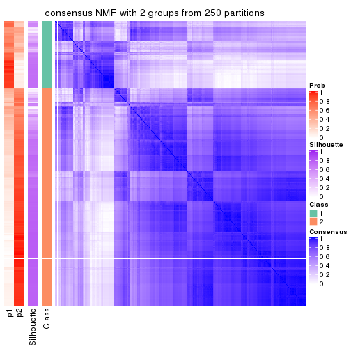</p>

</div>
<div id='tab-MAD-NMF-consensus-heatmap-2'>
<pre><code class="r">consensus_heatmap(res, k = 3)
</code></pre>

<p>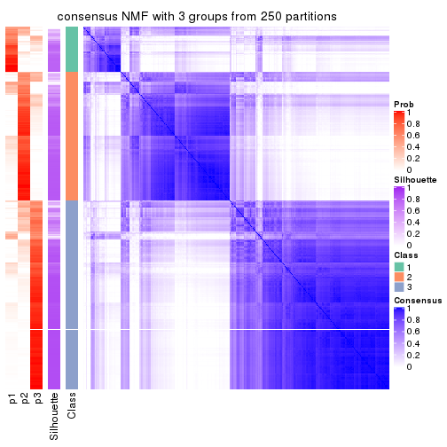</p>

</div>
<div id='tab-MAD-NMF-consensus-heatmap-3'>
<pre><code class="r">consensus_heatmap(res, k = 4)
</code></pre>

<p></p>

</div>
<div id='tab-MAD-NMF-consensus-heatmap-4'>
<pre><code class="r">consensus_heatmap(res, k = 5)
</code></pre>

<p></p>

</div>
<div id='tab-MAD-NMF-consensus-heatmap-5'>
<pre><code class="r">consensus_heatmap(res, k = 6)
</code></pre>

<p></p>

</div>
</div>

Heatmaps for the membership of samples in all partitions to see how consistent they are:


<script>
$( function() {
	$( '#tabs-MAD-NMF-membership-heatmap' ).tabs();
} );
</script>
<div id='tabs-MAD-NMF-membership-heatmap'>
<ul>
<li><a href='#tab-MAD-NMF-membership-heatmap-1'>k = 2</a></li>
<li><a href='#tab-MAD-NMF-membership-heatmap-2'>k = 3</a></li>
<li><a href='#tab-MAD-NMF-membership-heatmap-3'>k = 4</a></li>
<li><a href='#tab-MAD-NMF-membership-heatmap-4'>k = 5</a></li>
<li><a href='#tab-MAD-NMF-membership-heatmap-5'>k = 6</a></li>
</ul>
<div id='tab-MAD-NMF-membership-heatmap-1'>
<pre><code class="r">membership_heatmap(res, k = 2)
</code></pre>

<p></p>

</div>
<div id='tab-MAD-NMF-membership-heatmap-2'>
<pre><code class="r">membership_heatmap(res, k = 3)
</code></pre>

<p></p>

</div>
<div id='tab-MAD-NMF-membership-heatmap-3'>
<pre><code class="r">membership_heatmap(res, k = 4)
</code></pre>

<p></p>

</div>
<div id='tab-MAD-NMF-membership-heatmap-4'>
<pre><code class="r">membership_heatmap(res, k = 5)
</code></pre>

<p></p>

</div>
<div id='tab-MAD-NMF-membership-heatmap-5'>
<pre><code class="r">membership_heatmap(res, k = 6)
</code></pre>

<p></p>

</div>
</div>

As soon as we have had the classes for columns, we can look for signatures
which are significantly different between classes which can be candidate marks
for certain classes. Following are the heatmaps for signatures.


Signature heatmaps where rows are scaled:


<script>
$( function() {
	$( '#tabs-MAD-NMF-get-signatures' ).tabs();
} );
</script>
<div id='tabs-MAD-NMF-get-signatures'>
<ul>
<li><a href='#tab-MAD-NMF-get-signatures-1'>k = 2</a></li>
<li><a href='#tab-MAD-NMF-get-signatures-2'>k = 3</a></li>
<li><a href='#tab-MAD-NMF-get-signatures-3'>k = 4</a></li>
<li><a href='#tab-MAD-NMF-get-signatures-4'>k = 5</a></li>
<li><a href='#tab-MAD-NMF-get-signatures-5'>k = 6</a></li>
</ul>
<div id='tab-MAD-NMF-get-signatures-1'>
<pre><code class="r">get_signatures(res, k = 2)
</code></pre>

<p></p>

</div>
<div id='tab-MAD-NMF-get-signatures-2'>
<pre><code class="r">get_signatures(res, k = 3)
</code></pre>

<p></p>

</div>
<div id='tab-MAD-NMF-get-signatures-3'>
<pre><code class="r">get_signatures(res, k = 4)
</code></pre>

<p>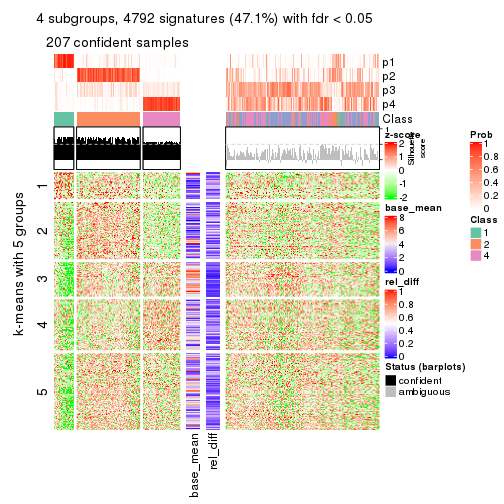</p>

</div>
<div id='tab-MAD-NMF-get-signatures-4'>
<pre><code class="r">get_signatures(res, k = 5)
</code></pre>

<p></p>

</div>
<div id='tab-MAD-NMF-get-signatures-5'>
<pre><code class="r">get_signatures(res, k = 6)
</code></pre>

<p></p>

</div>
</div>


Signature heatmaps where rows are not scaled:


<script>
$( function() {
	$( '#tabs-MAD-NMF-get-signatures-no-scale' ).tabs();
} );
</script>
<div id='tabs-MAD-NMF-get-signatures-no-scale'>
<ul>
<li><a href='#tab-MAD-NMF-get-signatures-no-scale-1'>k = 2</a></li>
<li><a href='#tab-MAD-NMF-get-signatures-no-scale-2'>k = 3</a></li>
<li><a href='#tab-MAD-NMF-get-signatures-no-scale-3'>k = 4</a></li>
<li><a href='#tab-MAD-NMF-get-signatures-no-scale-4'>k = 5</a></li>
<li><a href='#tab-MAD-NMF-get-signatures-no-scale-5'>k = 6</a></li>
</ul>
<div id='tab-MAD-NMF-get-signatures-no-scale-1'>
<pre><code class="r">get_signatures(res, k = 2, scale_rows = FALSE)
</code></pre>

<p></p>

</div>
<div id='tab-MAD-NMF-get-signatures-no-scale-2'>
<pre><code class="r">get_signatures(res, k = 3, scale_rows = FALSE)
</code></pre>

<p>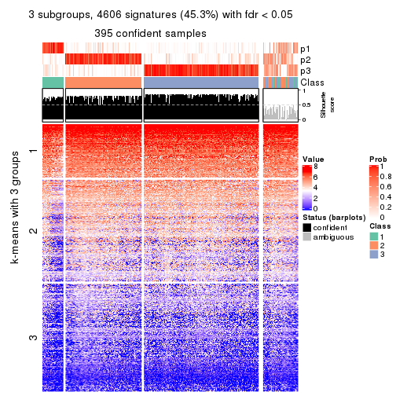</p>

</div>
<div id='tab-MAD-NMF-get-signatures-no-scale-3'>
<pre><code class="r">get_signatures(res, k = 4, scale_rows = FALSE)
</code></pre>

<p></p>

</div>
<div id='tab-MAD-NMF-get-signatures-no-scale-4'>
<pre><code class="r">get_signatures(res, k = 5, scale_rows = FALSE)
</code></pre>

<p></p>

</div>
<div id='tab-MAD-NMF-get-signatures-no-scale-5'>
<pre><code class="r">get_signatures(res, k = 6, scale_rows = FALSE)
</code></pre>

<p></p>

</div>
</div>


Compare the overlap of signatures from different k:

```r
compare_signatures(res)
```

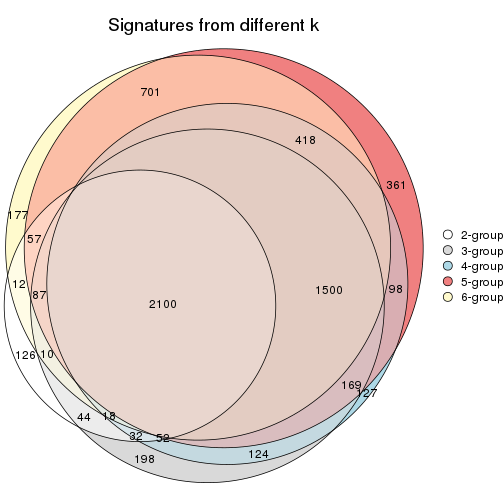

`get_signature()` returns a data frame invisibly. TO get the list of signatures, the function
call should be assigned to a variable explicitly. In following code, if `plot` argument is set
to `FALSE`, no heatmap is plotted while only the differential analysis is performed.

```r
# code only for demonstration
tb = get_signature(res, k = ..., plot = FALSE)
```

An example of the output of `tb` is:

```
#>   which_row         fdr    mean_1    mean_2 scaled_mean_1 scaled_mean_2 km
#> 1        38 0.042760348  8.373488  9.131774    -0.5533452     0.5164555  1
#> 2        40 0.018707592  7.106213  8.469186    -0.6173731     0.5762149  1
#> 3        55 0.019134737 10.221463 11.207825    -0.6159697     0.5749050  1
#> 4        59 0.006059896  5.921854  7.869574    -0.6899429     0.6439467  1
#> 5        60 0.018055526  8.928898 10.211722    -0.6204761     0.5791110  1
#> 6        98 0.009384629 15.714769 14.887706     0.6635654    -0.6193277  2
...
```

The columns in `tb` are:

1. `which_row`: row indices corresponding to the input matrix.
2. `fdr`: FDR for the differential test. 
3. `mean_x`: The mean value in group x.
4. `scaled_mean_x`: The mean value in group x after rows are scaled.
5. `km`: Row groups if k-means clustering is applied to rows.


UMAP plot which shows how samples are separated.


<script>
$( function() {
	$( '#tabs-MAD-NMF-dimension-reduction' ).tabs();
} );
</script>
<div id='tabs-MAD-NMF-dimension-reduction'>
<ul>
<li><a href='#tab-MAD-NMF-dimension-reduction-1'>k = 2</a></li>
<li><a href='#tab-MAD-NMF-dimension-reduction-2'>k = 3</a></li>
<li><a href='#tab-MAD-NMF-dimension-reduction-3'>k = 4</a></li>
<li><a href='#tab-MAD-NMF-dimension-reduction-4'>k = 5</a></li>
<li><a href='#tab-MAD-NMF-dimension-reduction-5'>k = 6</a></li>
</ul>
<div id='tab-MAD-NMF-dimension-reduction-1'>
<pre><code class="r">dimension_reduction(res, k = 2, method = &quot;UMAP&quot;)
</code></pre>

<p></p>

</div>
<div id='tab-MAD-NMF-dimension-reduction-2'>
<pre><code class="r">dimension_reduction(res, k = 3, method = &quot;UMAP&quot;)
</code></pre>

<p></p>

</div>
<div id='tab-MAD-NMF-dimension-reduction-3'>
<pre><code class="r">dimension_reduction(res, k = 4, method = &quot;UMAP&quot;)
</code></pre>

<p></p>

</div>
<div id='tab-MAD-NMF-dimension-reduction-4'>
<pre><code class="r">dimension_reduction(res, k = 5, method = &quot;UMAP&quot;)
</code></pre>

<p></p>

</div>
<div id='tab-MAD-NMF-dimension-reduction-5'>
<pre><code class="r">dimension_reduction(res, k = 6, method = &quot;UMAP&quot;)
</code></pre>

<p></p>

</div>
</div>


Following heatmap shows how subgroups are split when increasing `k`:

```r
collect_classes(res)
```


If matrix rows can be associated to genes, consider to use `functional_enrichment(res,
...)` to perform function enrichment for the signature genes. See [this vignette](http://bioconductor.org/packages/devel/bioc/vignettes/cola/inst/doc/functional_enrichment.html) for more detailed explanations.


 

---------------------------------------------------


### ATC:hclust**


The object with results only for a single top-value method and a single partition method 
can be extracted as:

```r
res = res_list["ATC", "hclust"]
# you can also extract it by
# res = res_list["ATC:hclust"]
```

A summary of `res` and all the functions that can be applied to it:

```r
res
```

```
#> A 'ConsensusPartition' object with k = 2, 3, 4, 5, 6.
#>   On a matrix with 10169 rows and 459 columns.
#>   Top rows (1000, 2000, 3000, 4000, 5000) are extracted by 'ATC' method.
#>   Subgroups are detected by 'hclust' method.
#>   Performed in total 1250 partitions by row resampling.
#>   Best k for subgroups seems to be 2.
#> 
#> Following methods can be applied to this 'ConsensusPartition' object:
#>  [1] "cola_report"             "collect_classes"         "collect_plots"          
#>  [4] "collect_stats"           "colnames"                "compare_signatures"     
#>  [7] "consensus_heatmap"       "dimension_reduction"     "functional_enrichment"  
#> [10] "get_anno_col"            "get_anno"                "get_classes"            
#> [13] "get_consensus"           "get_matrix"              "get_membership"         
#> [16] "get_param"               "get_signatures"          "get_stats"              
#> [19] "is_best_k"               "is_stable_k"             "membership_heatmap"     
#> [22] "ncol"                    "nrow"                    "plot_ecdf"              
#> [25] "rownames"                "select_partition_number" "show"                   
#> [28] "suggest_best_k"          "test_to_known_factors"
```

`collect_plots()` function collects all the plots made from `res` for all `k` (number of partitions)
into one single page to provide an easy and fast comparison between different `k`.

```r
collect_plots(res)
```


The plots are:

- The first row: a plot of the ECDF (empirical cumulative distribution
  function) curves of the consensus matrix for each `k` and the heatmap of
  predicted classes for each `k`.
- The second row: heatmaps of the consensus matrix for each `k`.
- The third row: heatmaps of the membership matrix for each `k`.
- The fouth row: heatmaps of the signatures for each `k`.

All the plots in panels can be made by individual functions and they are
plotted later in this section.

`select_partition_number()` produces several plots showing different
statistics for choosing "optimized" `k`. There are following statistics:

- ECDF curves of the consensus matrix for each `k`;
- 1-PAC. [The PAC
  score](https://en.wikipedia.org/wiki/Consensus_clustering#Over-interpretation_potential_of_consensus_clustering)
  measures the proportion of the ambiguous subgrouping.
- Mean silhouette score.
- Concordance. The mean probability of fiting the consensus class ids in all
  partitions.
- Area increased. Denote $A_k$ as the area under the ECDF curve for current
  `k`, the area increased is defined as $A_k - A_{k-1}$.
- Rand index. The percent of pairs of samples that are both in a same cluster
  or both are not in a same cluster in the partition of k and k-1.
- Jaccard index. The ratio of pairs of samples are both in a same cluster in
  the partition of k and k-1 and the pairs of samples are both in a same
  cluster in the partition k or k-1.

The detailed explanations of these statistics can be found in [the _cola_
vignette](http://bioconductor.org/packages/devel/bioc/vignettes/cola/inst/doc/cola.html#toc_13).

Generally speaking, lower PAC score, higher mean silhouette score or higher
concordance corresponds to better partition. Rand index and Jaccard index
measure how similar the current partition is compared to partition with `k-1`.
If they are too similar, we won't accept `k` is better than `k-1`.

```r
select_partition_number(res)
```


The numeric values for all these statistics can be obtained by `get_stats()`.

```r
get_stats(res)
```

```
#>   k 1-PAC mean_silhouette concordance area_increased  Rand Jaccard
#> 2 2 1.000           0.979       0.990         0.0715 0.924   0.924
#> 3 3 0.921           0.937       0.949         1.0232 0.978   0.977
#> 4 4 0.211           0.464       0.800         1.1981 0.979   0.977
#> 5 5 0.191           0.442       0.775         0.0870 0.975   0.972
#> 6 6 0.156           0.403       0.736         0.1356 0.924   0.912
```

`suggest_best_k()` suggests the best $k$ based on these statistics. The rules are as follows:

- All $k$ with Jaccard index larger than 0.95 are removed because increasing
  $k$ does not provide enough extra information. If all $k$ are removed, it is
  marked as no subgroup is detected.
- For all $k$ with 1-PAC score larger than 0.9, the maximal $k$ is taken as
  the best $k$, and other $k$ are marked as optional $k$.
- If it does not fit the second rule. The $k$ with the maximal vote of the
  highest 1-PAC score, highest mean silhouette, and highest concordance is
  taken as the best $k$.

```r
suggest_best_k(res)
```

```
#> [1] 2
```


Following shows the table of the partitions (You need to click the **show/hide
code output** link to see it). The membership matrix (columns with name `p*`)
is inferred by
[`clue::cl_consensus()`](https://www.rdocumentation.org/link/cl_consensus?package=clue)
function with the `SE` method. Basically the value in the membership matrix
represents the probability to belong to a certain group. The finall class
label for an item is determined with the group with highest probability it
belongs to.

In `get_classes()` function, the entropy is calculated from the membership
matrix and the silhouette score is calculated from the consensus matrix.


<script>
$( function() {
	$( '#tabs-ATC-hclust-get-classes' ).tabs();
} );
</script>
<div id='tabs-ATC-hclust-get-classes'>
<ul>
<li><a href='#tab-ATC-hclust-get-classes-1'>k = 2</a></li>
<li><a href='#tab-ATC-hclust-get-classes-2'>k = 3</a></li>
<li><a href='#tab-ATC-hclust-get-classes-3'>k = 4</a></li>
<li><a href='#tab-ATC-hclust-get-classes-4'>k = 5</a></li>
<li><a href='#tab-ATC-hclust-get-classes-5'>k = 6</a></li>
</ul>

<div id='tab-ATC-hclust-get-classes-1'>
<p><a id='tab-ATC-hclust-get-classes-1-a' style='color:#0366d6' href='#'>show/hide code output</a></p>
<pre><code class="r">cbind(get_classes(res, k = 2), get_membership(res, k = 2))
</code></pre>

<pre><code>#&gt;            class entropy silhouette    p1    p2
#&gt; SRR1699874     2  0.0000      0.996 0.000 1.000
#&gt; SRR1699875     2  0.0000      0.996 0.000 1.000
#&gt; SRR1699876     2  0.0000      0.996 0.000 1.000
#&gt; SRR1699877     2  0.0000      0.996 0.000 1.000
#&gt; SRR1699879     2  0.0000      0.996 0.000 1.000
#&gt; SRR1699878     2  0.0000      0.996 0.000 1.000
#&gt; SRR1699880     2  0.0000      0.996 0.000 1.000
#&gt; SRR1699881     2  0.0000      0.996 0.000 1.000
#&gt; SRR1699882     2  0.0000      0.996 0.000 1.000
#&gt; SRR1699883     2  0.0000      0.996 0.000 1.000
#&gt; SRR1699884     2  0.0000      0.996 0.000 1.000
#&gt; SRR1699885     2  0.0000      0.996 0.000 1.000
#&gt; SRR1699886     2  0.0000      0.996 0.000 1.000
#&gt; SRR1699888     2  0.0000      0.996 0.000 1.000
#&gt; SRR1699889     2  0.0000      0.996 0.000 1.000
#&gt; SRR1699890     2  0.0000      0.996 0.000 1.000
#&gt; SRR1699887     2  0.0000      0.996 0.000 1.000
#&gt; SRR1699891     2  0.0000      0.996 0.000 1.000
#&gt; SRR1699892     2  0.0000      0.996 0.000 1.000
#&gt; SRR1699893     2  0.0000      0.996 0.000 1.000
#&gt; SRR1699894     2  0.0000      0.996 0.000 1.000
#&gt; SRR1699895     2  0.0000      0.996 0.000 1.000
#&gt; SRR1699896     2  0.0000      0.996 0.000 1.000
#&gt; SRR1699897     2  0.0000      0.996 0.000 1.000
#&gt; SRR1699898     2  0.0000      0.996 0.000 1.000
#&gt; SRR1699900     2  0.0000      0.996 0.000 1.000
#&gt; SRR1699899     2  0.0000      0.996 0.000 1.000
#&gt; SRR1699902     2  0.0000      0.996 0.000 1.000
#&gt; SRR1699901     2  0.0000      0.996 0.000 1.000
#&gt; SRR1699903     2  0.0000      0.996 0.000 1.000
#&gt; SRR1699904     2  0.0000      0.996 0.000 1.000
#&gt; SRR1699905     2  0.0376      0.991 0.004 0.996
#&gt; SRR1699906     2  0.0000      0.996 0.000 1.000
#&gt; SRR1699907     2  0.0000      0.996 0.000 1.000
#&gt; SRR1699908     2  0.0000      0.996 0.000 1.000
#&gt; SRR1699909     2  0.0000      0.996 0.000 1.000
#&gt; SRR1699910     2  0.0000      0.996 0.000 1.000
#&gt; SRR1699911     2  0.0000      0.996 0.000 1.000
#&gt; SRR1699912     2  0.0000      0.996 0.000 1.000
#&gt; SRR1699913     2  0.0000      0.996 0.000 1.000
#&gt; SRR1699914     2  0.0000      0.996 0.000 1.000
#&gt; SRR1699915     2  0.0000      0.996 0.000 1.000
#&gt; SRR1699916     2  0.0000      0.996 0.000 1.000
#&gt; SRR1699917     2  0.0000      0.996 0.000 1.000
#&gt; SRR1699918     2  0.0000      0.996 0.000 1.000
#&gt; SRR1699919     2  0.0000      0.996 0.000 1.000
#&gt; SRR1699920     2  0.0000      0.996 0.000 1.000
#&gt; SRR1699921     2  0.0000      0.996 0.000 1.000
#&gt; SRR1699922     2  0.0000      0.996 0.000 1.000
#&gt; SRR1699923     2  0.0000      0.996 0.000 1.000
#&gt; SRR1699924     2  0.0000      0.996 0.000 1.000
#&gt; SRR1699925     1  0.0000      0.834 1.000 0.000
#&gt; SRR1699926     2  0.0000      0.996 0.000 1.000
#&gt; SRR1699927     2  0.0000      0.996 0.000 1.000
#&gt; SRR1699929     2  0.0000      0.996 0.000 1.000
#&gt; SRR1699928     2  0.0000      0.996 0.000 1.000
#&gt; SRR1699930     2  0.0000      0.996 0.000 1.000
#&gt; SRR1699931     2  0.0000      0.996 0.000 1.000
#&gt; SRR1699933     2  0.0000      0.996 0.000 1.000
#&gt; SRR1699932     2  0.0000      0.996 0.000 1.000
#&gt; SRR1699934     1  0.0000      0.834 1.000 0.000
#&gt; SRR1699935     2  0.0000      0.996 0.000 1.000
#&gt; SRR1699936     2  0.0000      0.996 0.000 1.000
#&gt; SRR1699937     2  0.0000      0.996 0.000 1.000
#&gt; SRR1699938     2  0.0000      0.996 0.000 1.000
#&gt; SRR1699940     2  0.0000      0.996 0.000 1.000
#&gt; SRR1699939     2  0.0000      0.996 0.000 1.000
#&gt; SRR1699941     2  0.0000      0.996 0.000 1.000
#&gt; SRR1699942     2  0.0000      0.996 0.000 1.000
#&gt; SRR1699943     2  0.0000      0.996 0.000 1.000
#&gt; SRR1699944     2  0.0000      0.996 0.000 1.000
#&gt; SRR1699945     2  0.0000      0.996 0.000 1.000
#&gt; SRR1699946     2  0.0000      0.996 0.000 1.000
#&gt; SRR1699947     2  0.0000      0.996 0.000 1.000
#&gt; SRR1699948     2  0.0000      0.996 0.000 1.000
#&gt; SRR1699949     2  0.0000      0.996 0.000 1.000
#&gt; SRR1699950     2  0.0000      0.996 0.000 1.000
#&gt; SRR1699951     2  0.0000      0.996 0.000 1.000
#&gt; SRR1699952     2  0.0000      0.996 0.000 1.000
#&gt; SRR1699953     2  0.0000      0.996 0.000 1.000
#&gt; SRR1699954     2  0.0000      0.996 0.000 1.000
#&gt; SRR1699955     2  0.0000      0.996 0.000 1.000
#&gt; SRR1699956     2  0.0000      0.996 0.000 1.000
#&gt; SRR1699957     2  0.0000      0.996 0.000 1.000
#&gt; SRR1699959     2  0.0000      0.996 0.000 1.000
#&gt; SRR1699958     2  0.0000      0.996 0.000 1.000
#&gt; SRR1699960     2  0.0000      0.996 0.000 1.000
#&gt; SRR1699961     2  0.0000      0.996 0.000 1.000
#&gt; SRR1699962     2  0.0000      0.996 0.000 1.000
#&gt; SRR1699963     2  0.0000      0.996 0.000 1.000
#&gt; SRR1699964     2  0.0000      0.996 0.000 1.000
#&gt; SRR1699965     2  0.0000      0.996 0.000 1.000
#&gt; SRR1699966     2  0.0000      0.996 0.000 1.000
#&gt; SRR1699967     2  0.0000      0.996 0.000 1.000
#&gt; SRR1699968     2  0.0000      0.996 0.000 1.000
#&gt; SRR1699969     2  0.0000      0.996 0.000 1.000
#&gt; SRR1699971     2  0.0000      0.996 0.000 1.000
#&gt; SRR1699970     2  0.0000      0.996 0.000 1.000
#&gt; SRR1699972     2  0.0000      0.996 0.000 1.000
#&gt; SRR1699973     2  0.0000      0.996 0.000 1.000
#&gt; SRR1699974     2  0.0000      0.996 0.000 1.000
#&gt; SRR1699975     2  0.0000      0.996 0.000 1.000
#&gt; SRR1699976     2  0.0000      0.996 0.000 1.000
#&gt; SRR1699977     2  0.0000      0.996 0.000 1.000
#&gt; SRR1699978     2  0.0938      0.982 0.012 0.988
#&gt; SRR1699979     2  0.0000      0.996 0.000 1.000
#&gt; SRR1699980     2  0.0000      0.996 0.000 1.000
#&gt; SRR1699981     2  0.0000      0.996 0.000 1.000
#&gt; SRR1699982     2  0.0000      0.996 0.000 1.000
#&gt; SRR1699983     2  0.0000      0.996 0.000 1.000
#&gt; SRR1699984     1  0.9686      0.555 0.604 0.396
#&gt; SRR1699985     2  0.0000      0.996 0.000 1.000
#&gt; SRR1699986     2  0.0000      0.996 0.000 1.000
#&gt; SRR1699988     2  0.0000      0.996 0.000 1.000
#&gt; SRR1699987     2  0.0000      0.996 0.000 1.000
#&gt; SRR1699989     2  0.0000      0.996 0.000 1.000
#&gt; SRR1699990     2  0.0000      0.996 0.000 1.000
#&gt; SRR1699992     2  0.0000      0.996 0.000 1.000
#&gt; SRR1699991     2  0.0000      0.996 0.000 1.000
#&gt; SRR1699993     2  0.0000      0.996 0.000 1.000
#&gt; SRR1699994     2  0.0000      0.996 0.000 1.000
#&gt; SRR1699995     2  0.0376      0.991 0.004 0.996
#&gt; SRR1699996     2  0.0000      0.996 0.000 1.000
#&gt; SRR1699997     2  0.0000      0.996 0.000 1.000
#&gt; SRR1699998     2  0.0000      0.996 0.000 1.000
#&gt; SRR1699999     2  0.0376      0.991 0.004 0.996
#&gt; SRR1700000     2  0.0000      0.996 0.000 1.000
#&gt; SRR1700002     2  0.0000      0.996 0.000 1.000
#&gt; SRR1700001     2  0.0000      0.996 0.000 1.000
#&gt; SRR1700003     2  0.0000      0.996 0.000 1.000
#&gt; SRR1700004     2  0.0000      0.996 0.000 1.000
#&gt; SRR1700005     1  0.5294      0.813 0.880 0.120
#&gt; SRR1700006     2  0.0000      0.996 0.000 1.000
#&gt; SRR1700007     2  0.0000      0.996 0.000 1.000
#&gt; SRR1700008     2  0.0000      0.996 0.000 1.000
#&gt; SRR1700009     1  0.9427      0.609 0.640 0.360
#&gt; SRR1700010     2  0.0000      0.996 0.000 1.000
#&gt; SRR1700011     2  0.0000      0.996 0.000 1.000
#&gt; SRR1700013     2  0.0000      0.996 0.000 1.000
#&gt; SRR1700012     2  0.0000      0.996 0.000 1.000
#&gt; SRR1700014     2  0.0000      0.996 0.000 1.000
#&gt; SRR1700015     2  0.0000      0.996 0.000 1.000
#&gt; SRR1700016     2  0.9087      0.380 0.324 0.676
#&gt; SRR1700018     2  0.0000      0.996 0.000 1.000
#&gt; SRR1700017     2  0.0000      0.996 0.000 1.000
#&gt; SRR1700019     2  0.0000      0.996 0.000 1.000
#&gt; SRR1700020     2  0.0000      0.996 0.000 1.000
#&gt; SRR1700021     2  0.0000      0.996 0.000 1.000
#&gt; SRR1700023     2  0.0000      0.996 0.000 1.000
#&gt; SRR1700022     2  0.0000      0.996 0.000 1.000
#&gt; SRR1700024     2  0.0000      0.996 0.000 1.000
#&gt; SRR1700025     2  0.0000      0.996 0.000 1.000
#&gt; SRR1700026     2  0.0000      0.996 0.000 1.000
#&gt; SRR1700027     2  0.0000      0.996 0.000 1.000
#&gt; SRR1700028     2  0.0000      0.996 0.000 1.000
#&gt; SRR1700029     2  0.0000      0.996 0.000 1.000
#&gt; SRR1700030     2  0.0000      0.996 0.000 1.000
#&gt; SRR1700031     2  0.0000      0.996 0.000 1.000
#&gt; SRR1700032     2  0.0000      0.996 0.000 1.000
#&gt; SRR1700034     2  0.0000      0.996 0.000 1.000
#&gt; SRR1700035     2  0.0000      0.996 0.000 1.000
#&gt; SRR1700033     2  0.0000      0.996 0.000 1.000
#&gt; SRR1700036     2  0.0000      0.996 0.000 1.000
#&gt; SRR1700037     2  0.0000      0.996 0.000 1.000
#&gt; SRR1700038     2  0.0000      0.996 0.000 1.000
#&gt; SRR1700039     2  0.0000      0.996 0.000 1.000
#&gt; SRR1700040     2  0.0000      0.996 0.000 1.000
#&gt; SRR1700041     2  0.0000      0.996 0.000 1.000
#&gt; SRR1700042     2  0.0000      0.996 0.000 1.000
#&gt; SRR1700043     2  0.0000      0.996 0.000 1.000
#&gt; SRR1700045     2  0.0000      0.996 0.000 1.000
#&gt; SRR1700044     2  0.0000      0.996 0.000 1.000
#&gt; SRR1700046     2  0.0000      0.996 0.000 1.000
#&gt; SRR1700047     2  0.0000      0.996 0.000 1.000
#&gt; SRR1700048     2  0.0000      0.996 0.000 1.000
#&gt; SRR1700049     2  0.0000      0.996 0.000 1.000
#&gt; SRR1700050     2  0.0000      0.996 0.000 1.000
#&gt; SRR1700051     2  0.0000      0.996 0.000 1.000
#&gt; SRR1700052     2  0.0000      0.996 0.000 1.000
#&gt; SRR1700053     2  0.0000      0.996 0.000 1.000
#&gt; SRR1700054     2  0.0000      0.996 0.000 1.000
#&gt; SRR1700055     2  0.0376      0.991 0.004 0.996
#&gt; SRR1700056     2  0.0000      0.996 0.000 1.000
#&gt; SRR1700057     2  0.0000      0.996 0.000 1.000
#&gt; SRR1700058     2  0.0000      0.996 0.000 1.000
#&gt; SRR1700059     2  0.0000      0.996 0.000 1.000
#&gt; SRR1700060     2  0.0000      0.996 0.000 1.000
#&gt; SRR1700061     2  0.0000      0.996 0.000 1.000
#&gt; SRR1700062     2  0.0000      0.996 0.000 1.000
#&gt; SRR1700063     2  0.0000      0.996 0.000 1.000
#&gt; SRR1700064     2  0.0000      0.996 0.000 1.000
#&gt; SRR1700065     2  0.0000      0.996 0.000 1.000
#&gt; SRR1700066     2  0.0000      0.996 0.000 1.000
#&gt; SRR1700067     2  0.0000      0.996 0.000 1.000
#&gt; SRR1700068     2  0.0000      0.996 0.000 1.000
#&gt; SRR1700069     2  0.0000      0.996 0.000 1.000
#&gt; SRR1700070     2  0.0000      0.996 0.000 1.000
#&gt; SRR1700071     2  0.0000      0.996 0.000 1.000
#&gt; SRR1700072     2  0.0938      0.982 0.012 0.988
#&gt; SRR1700073     2  0.0000      0.996 0.000 1.000
#&gt; SRR1700075     2  0.0000      0.996 0.000 1.000
#&gt; SRR1700074     2  0.0000      0.996 0.000 1.000
#&gt; SRR1700076     2  0.0000      0.996 0.000 1.000
#&gt; SRR1700077     2  0.0000      0.996 0.000 1.000
#&gt; SRR1700078     2  0.0000      0.996 0.000 1.000
#&gt; SRR1700080     2  0.0000      0.996 0.000 1.000
#&gt; SRR1700079     2  0.0000      0.996 0.000 1.000
#&gt; SRR1700081     2  0.0000      0.996 0.000 1.000
#&gt; SRR1700082     2  0.0000      0.996 0.000 1.000
#&gt; SRR1700083     2  0.0000      0.996 0.000 1.000
#&gt; SRR1700084     2  0.0000      0.996 0.000 1.000
#&gt; SRR1700085     2  0.0000      0.996 0.000 1.000
#&gt; SRR1700086     2  0.0000      0.996 0.000 1.000
#&gt; SRR1700087     2  0.0000      0.996 0.000 1.000
#&gt; SRR1700088     2  0.0000      0.996 0.000 1.000
#&gt; SRR1700089     2  0.0000      0.996 0.000 1.000
#&gt; SRR1700091     2  0.0000      0.996 0.000 1.000
#&gt; SRR1700090     2  0.0000      0.996 0.000 1.000
#&gt; SRR1700092     2  0.0000      0.996 0.000 1.000
#&gt; SRR1700094     2  0.0000      0.996 0.000 1.000
#&gt; SRR1700093     2  0.0000      0.996 0.000 1.000
#&gt; SRR1700095     2  0.0000      0.996 0.000 1.000
#&gt; SRR1700096     2  0.0000      0.996 0.000 1.000
#&gt; SRR1700097     2  0.0000      0.996 0.000 1.000
#&gt; SRR1700098     2  0.0000      0.996 0.000 1.000
#&gt; SRR1700099     2  0.0000      0.996 0.000 1.000
#&gt; SRR1700100     2  0.0000      0.996 0.000 1.000
#&gt; SRR1700101     2  0.0000      0.996 0.000 1.000
#&gt; SRR1700102     2  0.0000      0.996 0.000 1.000
#&gt; SRR1700104     2  0.0000      0.996 0.000 1.000
#&gt; SRR1700103     2  0.0000      0.996 0.000 1.000
#&gt; SRR1700105     2  0.0000      0.996 0.000 1.000
#&gt; SRR1700106     2  0.0000      0.996 0.000 1.000
#&gt; SRR1700107     2  0.0000      0.996 0.000 1.000
#&gt; SRR1700108     2  0.0000      0.996 0.000 1.000
#&gt; SRR1700109     2  0.0000      0.996 0.000 1.000
#&gt; SRR1700110     2  0.0000      0.996 0.000 1.000
#&gt; SRR1700112     2  0.0000      0.996 0.000 1.000
#&gt; SRR1700111     2  0.0000      0.996 0.000 1.000
#&gt; SRR1700113     2  0.0000      0.996 0.000 1.000
#&gt; SRR1700114     2  0.0000      0.996 0.000 1.000
#&gt; SRR1700115     2  0.0000      0.996 0.000 1.000
#&gt; SRR1700116     2  0.0000      0.996 0.000 1.000
#&gt; SRR1700117     2  0.0000      0.996 0.000 1.000
#&gt; SRR1700119     2  0.0000      0.996 0.000 1.000
#&gt; SRR1700118     2  0.0000      0.996 0.000 1.000
#&gt; SRR1700120     2  0.0000      0.996 0.000 1.000
#&gt; SRR1700121     2  0.0000      0.996 0.000 1.000
#&gt; SRR1700122     2  0.0000      0.996 0.000 1.000
#&gt; SRR1700123     2  0.0000      0.996 0.000 1.000
#&gt; SRR1700125     2  0.0000      0.996 0.000 1.000
#&gt; SRR1700126     2  0.0000      0.996 0.000 1.000
#&gt; SRR1700127     2  0.0000      0.996 0.000 1.000
#&gt; SRR1700124     2  0.0000      0.996 0.000 1.000
#&gt; SRR1700128     2  0.0000      0.996 0.000 1.000
#&gt; SRR1700129     2  0.0000      0.996 0.000 1.000
#&gt; SRR1700130     2  0.0000      0.996 0.000 1.000
#&gt; SRR1700132     2  0.0000      0.996 0.000 1.000
#&gt; SRR1700131     2  0.0000      0.996 0.000 1.000
#&gt; SRR1700133     2  0.0000      0.996 0.000 1.000
#&gt; SRR1700134     2  0.0000      0.996 0.000 1.000
#&gt; SRR1700135     2  0.0000      0.996 0.000 1.000
#&gt; SRR1700136     2  0.0000      0.996 0.000 1.000
#&gt; SRR1700137     2  0.0000      0.996 0.000 1.000
#&gt; SRR1700138     2  0.0000      0.996 0.000 1.000
#&gt; SRR1700140     2  0.0000      0.996 0.000 1.000
#&gt; SRR1700139     2  0.0000      0.996 0.000 1.000
#&gt; SRR1700141     2  0.0000      0.996 0.000 1.000
#&gt; SRR1700142     2  0.0000      0.996 0.000 1.000
#&gt; SRR1700143     2  0.0000      0.996 0.000 1.000
#&gt; SRR1700144     2  0.0000      0.996 0.000 1.000
#&gt; SRR1700145     2  0.0000      0.996 0.000 1.000
#&gt; SRR1700146     2  0.0000      0.996 0.000 1.000
#&gt; SRR1700147     2  0.0000      0.996 0.000 1.000
#&gt; SRR1700149     2  0.0000      0.996 0.000 1.000
#&gt; SRR1700148     2  0.0000      0.996 0.000 1.000
#&gt; SRR1700150     2  0.0000      0.996 0.000 1.000
#&gt; SRR1700152     2  0.0000      0.996 0.000 1.000
#&gt; SRR1700151     2  0.0000      0.996 0.000 1.000
#&gt; SRR1700153     2  0.0000      0.996 0.000 1.000
#&gt; SRR1700154     2  0.0000      0.996 0.000 1.000
#&gt; SRR1700155     2  0.0000      0.996 0.000 1.000
#&gt; SRR1700156     2  0.0000      0.996 0.000 1.000
#&gt; SRR1700158     2  0.0000      0.996 0.000 1.000
#&gt; SRR1700159     2  0.0000      0.996 0.000 1.000
#&gt; SRR1700157     2  0.0000      0.996 0.000 1.000
#&gt; SRR1700160     2  0.0000      0.996 0.000 1.000
#&gt; SRR1700161     2  0.0000      0.996 0.000 1.000
#&gt; SRR1700162     2  0.0000      0.996 0.000 1.000
#&gt; SRR1700164     2  0.0000      0.996 0.000 1.000
#&gt; SRR1700163     2  0.0000      0.996 0.000 1.000
#&gt; SRR1700165     2  0.0000      0.996 0.000 1.000
#&gt; SRR1700166     2  0.0000      0.996 0.000 1.000
#&gt; SRR1700168     2  0.0000      0.996 0.000 1.000
#&gt; SRR1700167     2  0.0000      0.996 0.000 1.000
#&gt; SRR1700170     2  0.0000      0.996 0.000 1.000
#&gt; SRR1700169     2  0.0000      0.996 0.000 1.000
#&gt; SRR1700171     2  0.0672      0.987 0.008 0.992
#&gt; SRR1700172     2  0.0000      0.996 0.000 1.000
#&gt; SRR1700174     2  0.0000      0.996 0.000 1.000
#&gt; SRR1700173     2  0.0000      0.996 0.000 1.000
#&gt; SRR1700175     2  0.0000      0.996 0.000 1.000
#&gt; SRR1700176     2  0.0000      0.996 0.000 1.000
#&gt; SRR1700178     2  0.0000      0.996 0.000 1.000
#&gt; SRR1700177     2  0.0000      0.996 0.000 1.000
#&gt; SRR1700180     2  0.0000      0.996 0.000 1.000
#&gt; SRR1700179     2  0.0000      0.996 0.000 1.000
#&gt; SRR1700181     2  0.0000      0.996 0.000 1.000
#&gt; SRR1700183     1  0.0672      0.836 0.992 0.008
#&gt; SRR1700182     2  0.0000      0.996 0.000 1.000
#&gt; SRR1700184     2  0.0000      0.996 0.000 1.000
#&gt; SRR1700186     2  0.0000      0.996 0.000 1.000
#&gt; SRR1700187     1  0.9833      0.501 0.576 0.424
#&gt; SRR1700185     1  0.0672      0.836 0.992 0.008
#&gt; SRR1700188     2  0.0000      0.996 0.000 1.000
#&gt; SRR1700192     2  0.8144      0.575 0.252 0.748
#&gt; SRR1700190     2  0.0000      0.996 0.000 1.000
#&gt; SRR1700191     1  0.0000      0.834 1.000 0.000
#&gt; SRR1700189     2  0.9963     -0.176 0.464 0.536
#&gt; SRR1700193     2  0.0000      0.996 0.000 1.000
#&gt; SRR1700195     2  0.0000      0.996 0.000 1.000
#&gt; SRR1700194     1  0.0376      0.835 0.996 0.004
#&gt; SRR1700196     2  0.0000      0.996 0.000 1.000
#&gt; SRR1700197     2  0.0000      0.996 0.000 1.000
#&gt; SRR1700198     2  0.0000      0.996 0.000 1.000
#&gt; SRR1700199     2  0.0000      0.996 0.000 1.000
#&gt; SRR1700200     2  0.0000      0.996 0.000 1.000
#&gt; SRR1700201     2  0.0000      0.996 0.000 1.000
#&gt; SRR1700202     2  0.0938      0.982 0.012 0.988
#&gt; SRR1700203     2  0.0000      0.996 0.000 1.000
#&gt; SRR1700204     2  0.0000      0.996 0.000 1.000
#&gt; SRR1700206     2  0.0000      0.996 0.000 1.000
#&gt; SRR1700207     2  0.0000      0.996 0.000 1.000
#&gt; SRR1700208     2  0.0000      0.996 0.000 1.000
#&gt; SRR1700205     2  0.0672      0.986 0.008 0.992
#&gt; SRR1700209     2  0.0000      0.996 0.000 1.000
#&gt; SRR1700210     2  0.0000      0.996 0.000 1.000
#&gt; SRR1700211     2  0.0000      0.996 0.000 1.000
#&gt; SRR1700212     2  0.0000      0.996 0.000 1.000
#&gt; SRR1700213     2  0.0000      0.996 0.000 1.000
#&gt; SRR1700214     2  0.0000      0.996 0.000 1.000
#&gt; SRR1700215     1  0.0000      0.834 1.000 0.000
#&gt; SRR1700217     2  0.0000      0.996 0.000 1.000
#&gt; SRR1700216     1  0.0938      0.837 0.988 0.012
#&gt; SRR1700218     2  0.0000      0.996 0.000 1.000
#&gt; SRR1700219     2  0.0000      0.996 0.000 1.000
#&gt; SRR1700222     1  0.9732      0.544 0.596 0.404
#&gt; SRR1700220     2  0.0000      0.996 0.000 1.000
#&gt; SRR1700221     2  0.0000      0.996 0.000 1.000
#&gt; SRR1700223     2  0.0000      0.996 0.000 1.000
#&gt; SRR1700224     2  0.0000      0.996 0.000 1.000
#&gt; SRR1700226     2  0.0000      0.996 0.000 1.000
#&gt; SRR1700229     2  0.0000      0.996 0.000 1.000
#&gt; SRR1700225     2  0.0000      0.996 0.000 1.000
#&gt; SRR1700227     2  0.0000      0.996 0.000 1.000
#&gt; SRR1700230     2  0.8081      0.585 0.248 0.752
#&gt; SRR1700231     2  0.0000      0.996 0.000 1.000
#&gt; SRR1700228     2  0.0000      0.996 0.000 1.000
#&gt; SRR1700232     2  0.0000      0.996 0.000 1.000
#&gt; SRR1700233     2  0.0000      0.996 0.000 1.000
#&gt; SRR1700234     2  0.0000      0.996 0.000 1.000
#&gt; SRR1700235     2  0.0000      0.996 0.000 1.000
#&gt; SRR1700237     2  0.0000      0.996 0.000 1.000
#&gt; SRR1700236     2  0.0000      0.996 0.000 1.000
#&gt; SRR1700238     2  0.0000      0.996 0.000 1.000
#&gt; SRR1700239     1  0.9815      0.511 0.580 0.420
#&gt; SRR1700240     1  0.1843      0.836 0.972 0.028
#&gt; SRR1700241     2  0.0000      0.996 0.000 1.000
#&gt; SRR1700243     2  0.0000      0.996 0.000 1.000
#&gt; SRR1700244     2  0.0000      0.996 0.000 1.000
#&gt; SRR1700242     2  0.7602      0.648 0.220 0.780
#&gt; SRR1700246     2  0.0000      0.996 0.000 1.000
#&gt; SRR1700245     2  0.0000      0.996 0.000 1.000
#&gt; SRR1700247     1  0.9795      0.520 0.584 0.416
#&gt; SRR1700249     1  0.4562      0.824 0.904 0.096
#&gt; SRR1700250     2  0.0000      0.996 0.000 1.000
#&gt; SRR1700248     2  0.0000      0.996 0.000 1.000
#&gt; SRR1700251     2  0.0000      0.996 0.000 1.000
#&gt; SRR1700252     2  0.0000      0.996 0.000 1.000
#&gt; SRR1700253     2  0.0000      0.996 0.000 1.000
#&gt; SRR1700256     2  0.0000      0.996 0.000 1.000
#&gt; SRR1700254     1  0.4690      0.822 0.900 0.100
#&gt; SRR1700255     2  0.0000      0.996 0.000 1.000
#&gt; SRR1700257     2  0.0000      0.996 0.000 1.000
#&gt; SRR1700258     2  0.0000      0.996 0.000 1.000
#&gt; SRR1700259     2  0.0000      0.996 0.000 1.000
#&gt; SRR1700260     2  0.0000      0.996 0.000 1.000
#&gt; SRR1700261     2  0.0000      0.996 0.000 1.000
#&gt; SRR1700262     2  0.0000      0.996 0.000 1.000
#&gt; SRR1700263     2  0.0000      0.996 0.000 1.000
#&gt; SRR1700264     2  0.0000      0.996 0.000 1.000
#&gt; SRR1700265     2  0.0000      0.996 0.000 1.000
#&gt; SRR1700266     2  0.0000      0.996 0.000 1.000
#&gt; SRR1700268     2  0.0000      0.996 0.000 1.000
#&gt; SRR1700270     2  0.0000      0.996 0.000 1.000
#&gt; SRR1700267     2  0.0000      0.996 0.000 1.000
#&gt; SRR1700271     2  0.0000      0.996 0.000 1.000
#&gt; SRR1700272     2  0.0000      0.996 0.000 1.000
#&gt; SRR1700273     2  0.0000      0.996 0.000 1.000
#&gt; SRR1700274     2  0.0000      0.996 0.000 1.000
#&gt; SRR1700277     2  0.0000      0.996 0.000 1.000
#&gt; SRR1700275     2  0.0000      0.996 0.000 1.000
#&gt; SRR1700276     2  0.0000      0.996 0.000 1.000
#&gt; SRR1700278     2  0.0000      0.996 0.000 1.000
#&gt; SRR1700279     2  0.0000      0.996 0.000 1.000
#&gt; SRR1700280     2  0.0000      0.996 0.000 1.000
#&gt; SRR1700281     2  0.0000      0.996 0.000 1.000
#&gt; SRR1700283     2  0.0000      0.996 0.000 1.000
#&gt; SRR1700282     2  0.0000      0.996 0.000 1.000
#&gt; SRR1700284     2  0.0000      0.996 0.000 1.000
#&gt; SRR1700285     2  0.0000      0.996 0.000 1.000
#&gt; SRR1700286     2  0.0000      0.996 0.000 1.000
#&gt; SRR1700287     2  0.0000      0.996 0.000 1.000
#&gt; SRR1700290     2  0.0376      0.991 0.004 0.996
#&gt; SRR1700289     2  0.0000      0.996 0.000 1.000
#&gt; SRR1700288     2  0.0000      0.996 0.000 1.000
#&gt; SRR1700292     2  0.0000      0.996 0.000 1.000
#&gt; SRR1700291     2  0.0000      0.996 0.000 1.000
#&gt; SRR1700293     2  0.0000      0.996 0.000 1.000
#&gt; SRR1700294     2  0.0000      0.996 0.000 1.000
#&gt; SRR1700295     2  0.0000      0.996 0.000 1.000
#&gt; SRR1700297     2  0.0000      0.996 0.000 1.000
#&gt; SRR1700296     2  0.0000      0.996 0.000 1.000
#&gt; SRR1700298     2  0.0000      0.996 0.000 1.000
#&gt; SRR1700299     2  0.0000      0.996 0.000 1.000
#&gt; SRR1700300     2  0.0000      0.996 0.000 1.000
#&gt; SRR1700302     2  0.0000      0.996 0.000 1.000
#&gt; SRR1700301     2  0.0000      0.996 0.000 1.000
#&gt; SRR1700303     2  0.0000      0.996 0.000 1.000
#&gt; SRR1700304     2  0.0000      0.996 0.000 1.000
#&gt; SRR1700305     2  0.0000      0.996 0.000 1.000
#&gt; SRR1700306     2  0.0000      0.996 0.000 1.000
#&gt; SRR1700308     2  0.0000      0.996 0.000 1.000
#&gt; SRR1700307     2  0.0000      0.996 0.000 1.000
#&gt; SRR1700309     2  0.0000      0.996 0.000 1.000
#&gt; SRR1700310     2  0.0000      0.996 0.000 1.000
#&gt; SRR1700311     2  0.0000      0.996 0.000 1.000
#&gt; SRR1700312     2  0.0000      0.996 0.000 1.000
#&gt; SRR1700313     2  0.0000      0.996 0.000 1.000
#&gt; SRR1700314     2  0.0000      0.996 0.000 1.000
#&gt; SRR1700315     2  0.0000      0.996 0.000 1.000
#&gt; SRR1700316     2  0.0000      0.996 0.000 1.000
#&gt; SRR1700317     2  0.0000      0.996 0.000 1.000
#&gt; SRR1700318     2  0.0000      0.996 0.000 1.000
#&gt; SRR1700319     2  0.0000      0.996 0.000 1.000
#&gt; SRR1700320     2  0.0000      0.996 0.000 1.000
#&gt; SRR1700322     2  0.0000      0.996 0.000 1.000
#&gt; SRR1700321     2  0.0000      0.996 0.000 1.000
#&gt; SRR1700323     2  0.0000      0.996 0.000 1.000
#&gt; SRR1700324     2  0.0000      0.996 0.000 1.000
#&gt; SRR1700325     2  0.0000      0.996 0.000 1.000
#&gt; SRR1700326     2  0.2603      0.942 0.044 0.956
#&gt; SRR1700327     2  0.0000      0.996 0.000 1.000
#&gt; SRR1700329     2  0.0000      0.996 0.000 1.000
#&gt; SRR1700328     2  0.0000      0.996 0.000 1.000
#&gt; SRR1700330     2  0.0000      0.996 0.000 1.000
#&gt; SRR1700331     2  0.0000      0.996 0.000 1.000
#&gt; SRR1700332     2  0.0000      0.996 0.000 1.000
#&gt; SRR1700333     2  0.0000      0.996 0.000 1.000
</code></pre>

<script>
$('#tab-ATC-hclust-get-classes-1-a').parent().next().next().hide();
$('#tab-ATC-hclust-get-classes-1-a').click(function(){
  $('#tab-ATC-hclust-get-classes-1-a').parent().next().next().toggle();
  return(false);
});
</script>
</div>

<div id='tab-ATC-hclust-get-classes-2'>
<p><a id='tab-ATC-hclust-get-classes-2-a' style='color:#0366d6' href='#'>show/hide code output</a></p>
<pre><code class="r">cbind(get_classes(res, k = 3), get_membership(res, k = 3))
</code></pre>

<pre><code>#&gt;            class entropy silhouette    p1    p2    p3
#&gt; SRR1699874     2  0.1031   0.967360 0.000 0.976 0.024
#&gt; SRR1699875     2  0.0892   0.964687 0.000 0.980 0.020
#&gt; SRR1699876     2  0.1529   0.966329 0.000 0.960 0.040
#&gt; SRR1699877     2  0.0892   0.968338 0.000 0.980 0.020
#&gt; SRR1699879     2  0.0892   0.968014 0.000 0.980 0.020
#&gt; SRR1699878     2  0.0892   0.968338 0.000 0.980 0.020
#&gt; SRR1699880     2  0.0892   0.964687 0.000 0.980 0.020
#&gt; SRR1699881     2  0.0747   0.965322 0.000 0.984 0.016
#&gt; SRR1699882     2  0.0892   0.968014 0.000 0.980 0.020
#&gt; SRR1699883     2  0.0892   0.968338 0.000 0.980 0.020
#&gt; SRR1699884     2  0.0892   0.968269 0.000 0.980 0.020
#&gt; SRR1699885     2  0.1031   0.967360 0.000 0.976 0.024
#&gt; SRR1699886     2  0.1529   0.966329 0.000 0.960 0.040
#&gt; SRR1699888     2  0.1529   0.966329 0.000 0.960 0.040
#&gt; SRR1699889     2  0.1411   0.966420 0.000 0.964 0.036
#&gt; SRR1699890     2  0.1529   0.966329 0.000 0.960 0.040
#&gt; SRR1699887     2  0.1529   0.966329 0.000 0.960 0.040
#&gt; SRR1699891     2  0.1411   0.966420 0.000 0.964 0.036
#&gt; SRR1699892     2  0.1411   0.968195 0.000 0.964 0.036
#&gt; SRR1699893     2  0.1643   0.968660 0.000 0.956 0.044
#&gt; SRR1699894     2  0.1411   0.966420 0.000 0.964 0.036
#&gt; SRR1699895     2  0.1411   0.966420 0.000 0.964 0.036
#&gt; SRR1699896     2  0.1643   0.961894 0.000 0.956 0.044
#&gt; SRR1699897     2  0.1163   0.968208 0.000 0.972 0.028
#&gt; SRR1699898     2  0.1163   0.968577 0.000 0.972 0.028
#&gt; SRR1699900     2  0.1529   0.963695 0.000 0.960 0.040
#&gt; SRR1699899     2  0.1411   0.967514 0.000 0.964 0.036
#&gt; SRR1699902     2  0.2537   0.943539 0.000 0.920 0.080
#&gt; SRR1699901     2  0.2537   0.943539 0.000 0.920 0.080
#&gt; SRR1699903     2  0.1643   0.966161 0.000 0.956 0.044
#&gt; SRR1699904     2  0.1643   0.963996 0.000 0.956 0.044
#&gt; SRR1699905     2  0.3686   0.885683 0.000 0.860 0.140
#&gt; SRR1699906     2  0.1860   0.963223 0.000 0.948 0.052
#&gt; SRR1699907     2  0.1753   0.963929 0.000 0.952 0.048
#&gt; SRR1699908     2  0.1411   0.968129 0.000 0.964 0.036
#&gt; SRR1699909     2  0.1964   0.961873 0.000 0.944 0.056
#&gt; SRR1699910     2  0.3267   0.910952 0.000 0.884 0.116
#&gt; SRR1699911     2  0.2261   0.953404 0.000 0.932 0.068
#&gt; SRR1699912     2  0.1753   0.963929 0.000 0.952 0.048
#&gt; SRR1699913     2  0.1753   0.965007 0.000 0.952 0.048
#&gt; SRR1699914     2  0.3340   0.909385 0.000 0.880 0.120
#&gt; SRR1699915     2  0.3267   0.914231 0.000 0.884 0.116
#&gt; SRR1699916     2  0.1964   0.963283 0.000 0.944 0.056
#&gt; SRR1699917     2  0.1643   0.970209 0.000 0.956 0.044
#&gt; SRR1699918     2  0.1860   0.964330 0.000 0.948 0.052
#&gt; SRR1699919     2  0.1860   0.962854 0.000 0.948 0.052
#&gt; SRR1699920     2  0.3267   0.910952 0.000 0.884 0.116
#&gt; SRR1699921     2  0.3267   0.910952 0.000 0.884 0.116
#&gt; SRR1699922     2  0.1411   0.967093 0.000 0.964 0.036
#&gt; SRR1699923     2  0.2796   0.936340 0.000 0.908 0.092
#&gt; SRR1699924     2  0.1964   0.960103 0.000 0.944 0.056
#&gt; SRR1699925     1  0.0000   0.890310 1.000 0.000 0.000
#&gt; SRR1699926     2  0.1964   0.956747 0.000 0.944 0.056
#&gt; SRR1699927     2  0.1411   0.966716 0.000 0.964 0.036
#&gt; SRR1699929     2  0.1411   0.968033 0.000 0.964 0.036
#&gt; SRR1699928     2  0.1860   0.963223 0.000 0.948 0.052
#&gt; SRR1699930     2  0.1289   0.967154 0.000 0.968 0.032
#&gt; SRR1699931     2  0.1411   0.968925 0.000 0.964 0.036
#&gt; SRR1699933     2  0.1643   0.965140 0.000 0.956 0.044
#&gt; SRR1699932     2  0.1529   0.966498 0.000 0.960 0.040
#&gt; SRR1699934     1  0.0000   0.890310 1.000 0.000 0.000
#&gt; SRR1699935     2  0.1753   0.969190 0.000 0.952 0.048
#&gt; SRR1699936     2  0.0747   0.965544 0.000 0.984 0.016
#&gt; SRR1699937     2  0.0892   0.964687 0.000 0.980 0.020
#&gt; SRR1699938     2  0.0747   0.965544 0.000 0.984 0.016
#&gt; SRR1699940     2  0.0892   0.964687 0.000 0.980 0.020
#&gt; SRR1699939     2  0.0747   0.965544 0.000 0.984 0.016
#&gt; SRR1699941     2  0.0747   0.965322 0.000 0.984 0.016
#&gt; SRR1699942     2  0.0892   0.964687 0.000 0.980 0.020
#&gt; SRR1699943     2  0.0892   0.964687 0.000 0.980 0.020
#&gt; SRR1699944     2  0.0892   0.964687 0.000 0.980 0.020
#&gt; SRR1699945     2  0.1163   0.963923 0.000 0.972 0.028
#&gt; SRR1699946     2  0.0892   0.964687 0.000 0.980 0.020
#&gt; SRR1699947     2  0.0892   0.964687 0.000 0.980 0.020
#&gt; SRR1699948     2  0.0747   0.965544 0.000 0.984 0.016
#&gt; SRR1699949     2  0.0892   0.966351 0.000 0.980 0.020
#&gt; SRR1699950     2  0.0747   0.965544 0.000 0.984 0.016
#&gt; SRR1699951     2  0.0892   0.964687 0.000 0.980 0.020
#&gt; SRR1699952     2  0.0892   0.964687 0.000 0.980 0.020
#&gt; SRR1699953     2  0.0747   0.965544 0.000 0.984 0.016
#&gt; SRR1699954     2  0.0747   0.966284 0.000 0.984 0.016
#&gt; SRR1699955     2  0.0892   0.966567 0.000 0.980 0.020
#&gt; SRR1699956     2  0.1163   0.963923 0.000 0.972 0.028
#&gt; SRR1699957     2  0.0747   0.966053 0.000 0.984 0.016
#&gt; SRR1699959     2  0.1529   0.965340 0.000 0.960 0.040
#&gt; SRR1699958     2  0.1163   0.965160 0.000 0.972 0.028
#&gt; SRR1699960     2  0.1163   0.967568 0.000 0.972 0.028
#&gt; SRR1699961     2  0.0892   0.964687 0.000 0.980 0.020
#&gt; SRR1699962     2  0.1163   0.967568 0.000 0.972 0.028
#&gt; SRR1699963     2  0.1163   0.967938 0.000 0.972 0.028
#&gt; SRR1699964     2  0.1031   0.967688 0.000 0.976 0.024
#&gt; SRR1699965     2  0.0892   0.966567 0.000 0.980 0.020
#&gt; SRR1699966     2  0.0892   0.967416 0.000 0.980 0.020
#&gt; SRR1699967     2  0.0747   0.966053 0.000 0.984 0.016
#&gt; SRR1699968     2  0.1289   0.967419 0.000 0.968 0.032
#&gt; SRR1699969     2  0.0747   0.966053 0.000 0.984 0.016
#&gt; SRR1699971     2  0.0892   0.964687 0.000 0.980 0.020
#&gt; SRR1699970     2  0.0747   0.966053 0.000 0.984 0.016
#&gt; SRR1699972     2  0.0592   0.966714 0.000 0.988 0.012
#&gt; SRR1699973     2  0.1031   0.967961 0.000 0.976 0.024
#&gt; SRR1699974     2  0.0892   0.967929 0.000 0.980 0.020
#&gt; SRR1699975     2  0.0747   0.968664 0.000 0.984 0.016
#&gt; SRR1699976     2  0.0747   0.967612 0.000 0.984 0.016
#&gt; SRR1699977     2  0.0892   0.968427 0.000 0.980 0.020
#&gt; SRR1699978     2  0.3879   0.873195 0.000 0.848 0.152
#&gt; SRR1699979     2  0.0747   0.968515 0.000 0.984 0.016
#&gt; SRR1699980     2  0.1289   0.967419 0.000 0.968 0.032
#&gt; SRR1699981     2  0.1163   0.968475 0.000 0.972 0.028
#&gt; SRR1699982     2  0.0892   0.969150 0.000 0.980 0.020
#&gt; SRR1699983     2  0.0592   0.968981 0.000 0.988 0.012
#&gt; SRR1699984     3  0.5785  -0.123974 0.300 0.004 0.696
#&gt; SRR1699985     2  0.1411   0.969070 0.000 0.964 0.036
#&gt; SRR1699986     2  0.1411   0.965963 0.000 0.964 0.036
#&gt; SRR1699988     2  0.1163   0.968135 0.000 0.972 0.028
#&gt; SRR1699987     2  0.0892   0.968905 0.000 0.980 0.020
#&gt; SRR1699989     2  0.1289   0.968946 0.000 0.968 0.032
#&gt; SRR1699990     2  0.0747   0.968664 0.000 0.984 0.016
#&gt; SRR1699992     2  0.0747   0.967895 0.000 0.984 0.016
#&gt; SRR1699991     2  0.1753   0.967127 0.000 0.952 0.048
#&gt; SRR1699993     2  0.1860   0.962396 0.000 0.948 0.052
#&gt; SRR1699994     2  0.0892   0.969160 0.000 0.980 0.020
#&gt; SRR1699995     2  0.4702   0.796213 0.000 0.788 0.212
#&gt; SRR1699996     2  0.1031   0.967171 0.000 0.976 0.024
#&gt; SRR1699997     2  0.1163   0.968059 0.000 0.972 0.028
#&gt; SRR1699998     2  0.0747   0.966053 0.000 0.984 0.016
#&gt; SRR1699999     2  0.3619   0.895233 0.000 0.864 0.136
#&gt; SRR1700000     2  0.0424   0.967402 0.000 0.992 0.008
#&gt; SRR1700002     2  0.1031   0.967688 0.000 0.976 0.024
#&gt; SRR1700001     2  0.0592   0.967968 0.000 0.988 0.012
#&gt; SRR1700003     2  0.1031   0.967688 0.000 0.976 0.024
#&gt; SRR1700004     2  0.1411   0.969688 0.000 0.964 0.036
#&gt; SRR1700005     1  0.4931   0.785592 0.768 0.000 0.232
#&gt; SRR1700006     2  0.0892   0.965159 0.000 0.980 0.020
#&gt; SRR1700007     2  0.1031   0.968814 0.000 0.976 0.024
#&gt; SRR1700008     2  0.1529   0.967769 0.000 0.960 0.040
#&gt; SRR1700009     3  0.6126  -0.156930 0.352 0.004 0.644
#&gt; SRR1700010     2  0.1163   0.963923 0.000 0.972 0.028
#&gt; SRR1700011     2  0.1163   0.967568 0.000 0.972 0.028
#&gt; SRR1700013     2  0.1031   0.966120 0.000 0.976 0.024
#&gt; SRR1700012     2  0.0747   0.965544 0.000 0.984 0.016
#&gt; SRR1700014     2  0.1411   0.967014 0.000 0.964 0.036
#&gt; SRR1700015     2  0.0892   0.968432 0.000 0.980 0.020
#&gt; SRR1700016     3  0.3983   0.347739 0.004 0.144 0.852
#&gt; SRR1700018     2  0.0592   0.966714 0.000 0.988 0.012
#&gt; SRR1700017     2  0.0747   0.966284 0.000 0.984 0.016
#&gt; SRR1700019     2  0.1031   0.968626 0.000 0.976 0.024
#&gt; SRR1700020     2  0.1529   0.968370 0.000 0.960 0.040
#&gt; SRR1700021     2  0.2625   0.947186 0.000 0.916 0.084
#&gt; SRR1700023     2  0.0892   0.968660 0.000 0.980 0.020
#&gt; SRR1700022     2  0.0747   0.967508 0.000 0.984 0.016
#&gt; SRR1700024     2  0.1411   0.967014 0.000 0.964 0.036
#&gt; SRR1700025     2  0.0892   0.968571 0.000 0.980 0.020
#&gt; SRR1700026     2  0.0892   0.969585 0.000 0.980 0.020
#&gt; SRR1700027     2  0.0237   0.967342 0.000 0.996 0.004
#&gt; SRR1700028     2  0.1031   0.968720 0.000 0.976 0.024
#&gt; SRR1700029     2  0.1163   0.968943 0.000 0.972 0.028
#&gt; SRR1700030     2  0.1289   0.969916 0.000 0.968 0.032
#&gt; SRR1700031     2  0.1289   0.969450 0.000 0.968 0.032
#&gt; SRR1700032     2  0.1163   0.969155 0.000 0.972 0.028
#&gt; SRR1700034     2  0.3551   0.896193 0.000 0.868 0.132
#&gt; SRR1700035     2  0.1643   0.964998 0.000 0.956 0.044
#&gt; SRR1700033     2  0.1163   0.969011 0.000 0.972 0.028
#&gt; SRR1700036     2  0.1643   0.965346 0.000 0.956 0.044
#&gt; SRR1700037     2  0.1753   0.967373 0.000 0.952 0.048
#&gt; SRR1700038     2  0.1411   0.966866 0.000 0.964 0.036
#&gt; SRR1700039     2  0.1860   0.961651 0.000 0.948 0.052
#&gt; SRR1700040     2  0.1643   0.966716 0.000 0.956 0.044
#&gt; SRR1700041     2  0.1753   0.964505 0.000 0.952 0.048
#&gt; SRR1700042     2  0.1860   0.965103 0.000 0.948 0.052
#&gt; SRR1700043     2  0.1860   0.962365 0.000 0.948 0.052
#&gt; SRR1700045     2  0.1964   0.960251 0.000 0.944 0.056
#&gt; SRR1700044     2  0.1289   0.966862 0.000 0.968 0.032
#&gt; SRR1700046     2  0.1753   0.962412 0.000 0.952 0.048
#&gt; SRR1700047     2  0.1860   0.962626 0.000 0.948 0.052
#&gt; SRR1700048     2  0.1753   0.963268 0.000 0.952 0.048
#&gt; SRR1700049     2  0.1964   0.959717 0.000 0.944 0.056
#&gt; SRR1700050     2  0.2711   0.939556 0.000 0.912 0.088
#&gt; SRR1700051     2  0.3551   0.900084 0.000 0.868 0.132
#&gt; SRR1700052     2  0.2448   0.952484 0.000 0.924 0.076
#&gt; SRR1700053     2  0.1643   0.963332 0.000 0.956 0.044
#&gt; SRR1700054     2  0.1643   0.963332 0.000 0.956 0.044
#&gt; SRR1700055     2  0.3941   0.865101 0.000 0.844 0.156
#&gt; SRR1700056     2  0.2066   0.957492 0.000 0.940 0.060
#&gt; SRR1700057     2  0.2537   0.949245 0.000 0.920 0.080
#&gt; SRR1700058     2  0.2165   0.959531 0.000 0.936 0.064
#&gt; SRR1700059     2  0.2066   0.959210 0.000 0.940 0.060
#&gt; SRR1700060     2  0.1529   0.967281 0.000 0.960 0.040
#&gt; SRR1700061     2  0.1643   0.963332 0.000 0.956 0.044
#&gt; SRR1700062     2  0.1529   0.966276 0.000 0.960 0.040
#&gt; SRR1700063     2  0.1860   0.963557 0.000 0.948 0.052
#&gt; SRR1700064     2  0.1753   0.962412 0.000 0.952 0.048
#&gt; SRR1700065     2  0.1753   0.963659 0.000 0.952 0.048
#&gt; SRR1700066     2  0.1529   0.965826 0.000 0.960 0.040
#&gt; SRR1700067     2  0.1643   0.963332 0.000 0.956 0.044
#&gt; SRR1700068     2  0.1529   0.963748 0.000 0.960 0.040
#&gt; SRR1700069     2  0.1529   0.964073 0.000 0.960 0.040
#&gt; SRR1700070     2  0.1289   0.968450 0.000 0.968 0.032
#&gt; SRR1700071     2  0.1753   0.962412 0.000 0.952 0.048
#&gt; SRR1700072     2  0.2625   0.943962 0.000 0.916 0.084
#&gt; SRR1700073     2  0.1753   0.964829 0.000 0.952 0.048
#&gt; SRR1700075     2  0.1753   0.962726 0.000 0.952 0.048
#&gt; SRR1700074     2  0.1529   0.966018 0.000 0.960 0.040
#&gt; SRR1700076     2  0.1411   0.965200 0.000 0.964 0.036
#&gt; SRR1700077     2  0.1753   0.963375 0.000 0.952 0.048
#&gt; SRR1700078     2  0.1529   0.966415 0.000 0.960 0.040
#&gt; SRR1700080     2  0.1411   0.964640 0.000 0.964 0.036
#&gt; SRR1700079     2  0.1964   0.961655 0.000 0.944 0.056
#&gt; SRR1700081     2  0.1753   0.964769 0.000 0.952 0.048
#&gt; SRR1700082     2  0.0892   0.967061 0.000 0.980 0.020
#&gt; SRR1700083     2  0.1529   0.966955 0.000 0.960 0.040
#&gt; SRR1700084     2  0.1643   0.964842 0.000 0.956 0.044
#&gt; SRR1700085     2  0.1529   0.966749 0.000 0.960 0.040
#&gt; SRR1700086     2  0.1411   0.964640 0.000 0.964 0.036
#&gt; SRR1700087     2  0.0892   0.967130 0.000 0.980 0.020
#&gt; SRR1700088     2  0.1163   0.965160 0.000 0.972 0.028
#&gt; SRR1700089     2  0.0892   0.967538 0.000 0.980 0.020
#&gt; SRR1700091     2  0.0892   0.966351 0.000 0.980 0.020
#&gt; SRR1700090     2  0.1411   0.969524 0.000 0.964 0.036
#&gt; SRR1700092     2  0.1031   0.966686 0.000 0.976 0.024
#&gt; SRR1700094     2  0.1031   0.967378 0.000 0.976 0.024
#&gt; SRR1700093     2  0.1289   0.967199 0.000 0.968 0.032
#&gt; SRR1700095     2  0.3412   0.903139 0.000 0.876 0.124
#&gt; SRR1700096     2  0.1031   0.965518 0.000 0.976 0.024
#&gt; SRR1700097     2  0.1031   0.969448 0.000 0.976 0.024
#&gt; SRR1700098     2  0.0892   0.965951 0.000 0.980 0.020
#&gt; SRR1700099     2  0.1031   0.965518 0.000 0.976 0.024
#&gt; SRR1700100     2  0.1163   0.965160 0.000 0.972 0.028
#&gt; SRR1700101     2  0.1163   0.965160 0.000 0.972 0.028
#&gt; SRR1700102     2  0.0892   0.964687 0.000 0.980 0.020
#&gt; SRR1700104     2  0.1031   0.965518 0.000 0.976 0.024
#&gt; SRR1700103     2  0.1163   0.967046 0.000 0.972 0.028
#&gt; SRR1700105     2  0.1289   0.967686 0.000 0.968 0.032
#&gt; SRR1700106     2  0.1643   0.968202 0.000 0.956 0.044
#&gt; SRR1700107     2  0.1411   0.967967 0.000 0.964 0.036
#&gt; SRR1700108     2  0.1163   0.966261 0.000 0.972 0.028
#&gt; SRR1700109     2  0.1411   0.968789 0.000 0.964 0.036
#&gt; SRR1700110     2  0.1529   0.968753 0.000 0.960 0.040
#&gt; SRR1700112     2  0.1529   0.968833 0.000 0.960 0.040
#&gt; SRR1700111     2  0.1643   0.969736 0.000 0.956 0.044
#&gt; SRR1700113     2  0.1753   0.969331 0.000 0.952 0.048
#&gt; SRR1700114     2  0.0892   0.965992 0.000 0.980 0.020
#&gt; SRR1700115     2  0.1031   0.966686 0.000 0.976 0.024
#&gt; SRR1700116     2  0.0747   0.969190 0.000 0.984 0.016
#&gt; SRR1700117     2  0.2711   0.939487 0.000 0.912 0.088
#&gt; SRR1700119     2  0.1753   0.966791 0.000 0.952 0.048
#&gt; SRR1700118     2  0.1860   0.961659 0.000 0.948 0.052
#&gt; SRR1700120     2  0.1860   0.966711 0.000 0.948 0.052
#&gt; SRR1700121     2  0.1643   0.969505 0.000 0.956 0.044
#&gt; SRR1700122     2  0.2066   0.960341 0.000 0.940 0.060
#&gt; SRR1700123     2  0.2261   0.955615 0.000 0.932 0.068
#&gt; SRR1700125     2  0.1529   0.969072 0.000 0.960 0.040
#&gt; SRR1700126     2  0.1643   0.964307 0.000 0.956 0.044
#&gt; SRR1700127     2  0.1753   0.962230 0.000 0.952 0.048
#&gt; SRR1700124     2  0.1860   0.960737 0.000 0.948 0.052
#&gt; SRR1700128     2  0.2066   0.957492 0.000 0.940 0.060
#&gt; SRR1700129     2  0.2066   0.959249 0.000 0.940 0.060
#&gt; SRR1700130     2  0.1964   0.958990 0.000 0.944 0.056
#&gt; SRR1700132     2  0.1964   0.958973 0.000 0.944 0.056
#&gt; SRR1700131     2  0.1860   0.960500 0.000 0.948 0.052
#&gt; SRR1700133     2  0.1860   0.960662 0.000 0.948 0.052
#&gt; SRR1700134     2  0.2066   0.959249 0.000 0.940 0.060
#&gt; SRR1700135     2  0.2356   0.951853 0.000 0.928 0.072
#&gt; SRR1700136     2  0.2261   0.954229 0.000 0.932 0.068
#&gt; SRR1700137     2  0.1860   0.960500 0.000 0.948 0.052
#&gt; SRR1700138     2  0.1753   0.962230 0.000 0.952 0.048
#&gt; SRR1700140     2  0.1964   0.958973 0.000 0.944 0.056
#&gt; SRR1700139     2  0.1860   0.960550 0.000 0.948 0.052
#&gt; SRR1700141     2  0.1964   0.960532 0.000 0.944 0.056
#&gt; SRR1700142     2  0.2165   0.955654 0.000 0.936 0.064
#&gt; SRR1700143     2  0.2261   0.954229 0.000 0.932 0.068
#&gt; SRR1700144     2  0.1860   0.961777 0.000 0.948 0.052
#&gt; SRR1700145     2  0.2625   0.943648 0.000 0.916 0.084
#&gt; SRR1700146     2  0.1964   0.960532 0.000 0.944 0.056
#&gt; SRR1700147     2  0.1860   0.960500 0.000 0.948 0.052
#&gt; SRR1700149     2  0.2625   0.943054 0.000 0.916 0.084
#&gt; SRR1700148     2  0.2165   0.955561 0.000 0.936 0.064
#&gt; SRR1700150     2  0.1643   0.964523 0.000 0.956 0.044
#&gt; SRR1700152     2  0.2066   0.957299 0.000 0.940 0.060
#&gt; SRR1700151     2  0.1964   0.958990 0.000 0.944 0.056
#&gt; SRR1700153     2  0.1860   0.960737 0.000 0.948 0.052
#&gt; SRR1700154     2  0.1964   0.959354 0.000 0.944 0.056
#&gt; SRR1700155     2  0.2066   0.957299 0.000 0.940 0.060
#&gt; SRR1700156     2  0.2066   0.957676 0.000 0.940 0.060
#&gt; SRR1700158     2  0.2537   0.950017 0.000 0.920 0.080
#&gt; SRR1700159     2  0.2066   0.959249 0.000 0.940 0.060
#&gt; SRR1700157     2  0.1860   0.961562 0.000 0.948 0.052
#&gt; SRR1700160     2  0.2066   0.957299 0.000 0.940 0.060
#&gt; SRR1700161     2  0.2066   0.957299 0.000 0.940 0.060
#&gt; SRR1700162     2  0.2066   0.959249 0.000 0.940 0.060
#&gt; SRR1700164     2  0.3686   0.886940 0.000 0.860 0.140
#&gt; SRR1700163     2  0.3116   0.920467 0.000 0.892 0.108
#&gt; SRR1700165     2  0.1753   0.961822 0.000 0.952 0.048
#&gt; SRR1700166     2  0.1964   0.958973 0.000 0.944 0.056
#&gt; SRR1700168     2  0.2165   0.964405 0.000 0.936 0.064
#&gt; SRR1700167     2  0.3038   0.927781 0.000 0.896 0.104
#&gt; SRR1700170     2  0.1860   0.960662 0.000 0.948 0.052
#&gt; SRR1700169     2  0.1860   0.960662 0.000 0.948 0.052
#&gt; SRR1700171     2  0.3619   0.883887 0.000 0.864 0.136
#&gt; SRR1700172     2  0.1753   0.963996 0.000 0.952 0.048
#&gt; SRR1700174     2  0.2165   0.964864 0.000 0.936 0.064
#&gt; SRR1700173     2  0.1163   0.969875 0.000 0.972 0.028
#&gt; SRR1700175     2  0.1411   0.965447 0.000 0.964 0.036
#&gt; SRR1700176     2  0.1860   0.961482 0.000 0.948 0.052
#&gt; SRR1700178     2  0.0747   0.965223 0.000 0.984 0.016
#&gt; SRR1700177     2  0.1860   0.960662 0.000 0.948 0.052
#&gt; SRR1700180     2  0.0747   0.965223 0.000 0.984 0.016
#&gt; SRR1700179     2  0.0747   0.965223 0.000 0.984 0.016
#&gt; SRR1700181     2  0.0747   0.965223 0.000 0.984 0.016
#&gt; SRR1700183     1  0.1031   0.892833 0.976 0.000 0.024
#&gt; SRR1700182     2  0.0747   0.965223 0.000 0.984 0.016
#&gt; SRR1700184     2  0.0747   0.965223 0.000 0.984 0.016
#&gt; SRR1700186     2  0.0747   0.965223 0.000 0.984 0.016
#&gt; SRR1700187     3  0.5365   0.023376 0.252 0.004 0.744
#&gt; SRR1700185     1  0.4399   0.837172 0.812 0.000 0.188
#&gt; SRR1700188     2  0.0747   0.965223 0.000 0.984 0.016
#&gt; SRR1700192     3  0.5098   0.373950 0.000 0.248 0.752
#&gt; SRR1700190     2  0.2625   0.933399 0.000 0.916 0.084
#&gt; SRR1700191     1  0.0000   0.890310 1.000 0.000 0.000
#&gt; SRR1700189     3  0.7287   0.251269 0.212 0.092 0.696
#&gt; SRR1700193     2  0.0747   0.965223 0.000 0.984 0.016
#&gt; SRR1700195     2  0.1163   0.965083 0.000 0.972 0.028
#&gt; SRR1700194     1  0.1163   0.892881 0.972 0.000 0.028
#&gt; SRR1700196     2  0.0892   0.965036 0.000 0.980 0.020
#&gt; SRR1700197     2  0.2625   0.933399 0.000 0.916 0.084
#&gt; SRR1700198     2  0.1031   0.964404 0.000 0.976 0.024
#&gt; SRR1700199     2  0.1031   0.964404 0.000 0.976 0.024
#&gt; SRR1700200     2  0.1031   0.964404 0.000 0.976 0.024
#&gt; SRR1700201     2  0.0892   0.966738 0.000 0.980 0.020
#&gt; SRR1700202     2  0.4605   0.796549 0.000 0.796 0.204
#&gt; SRR1700203     2  0.1031   0.964404 0.000 0.976 0.024
#&gt; SRR1700204     2  0.1163   0.965251 0.000 0.972 0.028
#&gt; SRR1700206     2  0.1031   0.964404 0.000 0.976 0.024
#&gt; SRR1700207     2  0.0892   0.966738 0.000 0.980 0.020
#&gt; SRR1700208     2  0.2625   0.933399 0.000 0.916 0.084
#&gt; SRR1700205     2  0.4346   0.821523 0.000 0.816 0.184
#&gt; SRR1700209     2  0.1031   0.964404 0.000 0.976 0.024
#&gt; SRR1700210     2  0.1163   0.967696 0.000 0.972 0.028
#&gt; SRR1700211     2  0.1031   0.968267 0.000 0.976 0.024
#&gt; SRR1700212     2  0.1031   0.964404 0.000 0.976 0.024
#&gt; SRR1700213     2  0.1163   0.968069 0.000 0.972 0.028
#&gt; SRR1700214     2  0.1031   0.964404 0.000 0.976 0.024
#&gt; SRR1700215     1  0.0424   0.892489 0.992 0.000 0.008
#&gt; SRR1700217     2  0.1289   0.964980 0.000 0.968 0.032
#&gt; SRR1700216     1  0.0892   0.893270 0.980 0.000 0.020
#&gt; SRR1700218     2  0.1031   0.965679 0.000 0.976 0.024
#&gt; SRR1700219     2  0.0892   0.966738 0.000 0.980 0.020
#&gt; SRR1700222     3  0.5956  -0.077076 0.324 0.004 0.672
#&gt; SRR1700220     2  0.1163   0.965251 0.000 0.972 0.028
#&gt; SRR1700221     2  0.1031   0.964404 0.000 0.976 0.024
#&gt; SRR1700223     2  0.1031   0.964404 0.000 0.976 0.024
#&gt; SRR1700224     2  0.1031   0.964404 0.000 0.976 0.024
#&gt; SRR1700226     2  0.1031   0.964404 0.000 0.976 0.024
#&gt; SRR1700229     2  0.0892   0.965036 0.000 0.980 0.020
#&gt; SRR1700225     2  0.0747   0.965544 0.000 0.984 0.016
#&gt; SRR1700227     2  0.1031   0.964404 0.000 0.976 0.024
#&gt; SRR1700230     3  0.5502   0.369938 0.008 0.248 0.744
#&gt; SRR1700231     2  0.1031   0.964404 0.000 0.976 0.024
#&gt; SRR1700228     2  0.0892   0.967493 0.000 0.980 0.020
#&gt; SRR1700232     2  0.1031   0.964404 0.000 0.976 0.024
#&gt; SRR1700233     2  0.1031   0.964404 0.000 0.976 0.024
#&gt; SRR1700234     2  0.1411   0.967548 0.000 0.964 0.036
#&gt; SRR1700235     2  0.1031   0.964404 0.000 0.976 0.024
#&gt; SRR1700237     2  0.1031   0.964404 0.000 0.976 0.024
#&gt; SRR1700236     2  0.1031   0.964404 0.000 0.976 0.024
#&gt; SRR1700238     2  0.1031   0.964404 0.000 0.976 0.024
#&gt; SRR1700239     3  0.5553   0.004389 0.272 0.004 0.724
#&gt; SRR1700240     1  0.4796   0.816174 0.780 0.000 0.220
#&gt; SRR1700241     2  0.1289   0.965855 0.000 0.968 0.032
#&gt; SRR1700243     2  0.1031   0.964404 0.000 0.976 0.024
#&gt; SRR1700244     2  0.0747   0.966638 0.000 0.984 0.016
#&gt; SRR1700242     3  0.5905   0.285284 0.000 0.352 0.648
#&gt; SRR1700246     2  0.1529   0.966313 0.000 0.960 0.040
#&gt; SRR1700245     2  0.1031   0.964404 0.000 0.976 0.024
#&gt; SRR1700247     3  0.5588  -0.000449 0.276 0.004 0.720
#&gt; SRR1700249     1  0.5098   0.795342 0.752 0.000 0.248
#&gt; SRR1700250     2  0.1031   0.964404 0.000 0.976 0.024
#&gt; SRR1700248     2  0.1031   0.964404 0.000 0.976 0.024
#&gt; SRR1700251     2  0.1031   0.964404 0.000 0.976 0.024
#&gt; SRR1700252     2  0.0892   0.966459 0.000 0.980 0.020
#&gt; SRR1700253     2  0.1031   0.964404 0.000 0.976 0.024
#&gt; SRR1700256     2  0.1031   0.964404 0.000 0.976 0.024
#&gt; SRR1700254     1  0.5431   0.760143 0.716 0.000 0.284
#&gt; SRR1700255     2  0.1031   0.964404 0.000 0.976 0.024
#&gt; SRR1700257     2  0.1031   0.964404 0.000 0.976 0.024
#&gt; SRR1700258     2  0.1031   0.964365 0.000 0.976 0.024
#&gt; SRR1700259     2  0.1163   0.967531 0.000 0.972 0.028
#&gt; SRR1700260     2  0.1163   0.967531 0.000 0.972 0.028
#&gt; SRR1700261     2  0.1163   0.967531 0.000 0.972 0.028
#&gt; SRR1700262     2  0.0892   0.968247 0.000 0.980 0.020
#&gt; SRR1700263     2  0.1289   0.968566 0.000 0.968 0.032
#&gt; SRR1700264     2  0.0747   0.965544 0.000 0.984 0.016
#&gt; SRR1700265     2  0.2959   0.921859 0.000 0.900 0.100
#&gt; SRR1700266     2  0.0892   0.965992 0.000 0.980 0.020
#&gt; SRR1700268     2  0.1289   0.967756 0.000 0.968 0.032
#&gt; SRR1700270     2  0.1031   0.967085 0.000 0.976 0.024
#&gt; SRR1700267     2  0.1163   0.967531 0.000 0.972 0.028
#&gt; SRR1700271     2  0.1031   0.968608 0.000 0.976 0.024
#&gt; SRR1700272     2  0.1031   0.968608 0.000 0.976 0.024
#&gt; SRR1700273     2  0.0892   0.965951 0.000 0.980 0.020
#&gt; SRR1700274     2  0.1163   0.967531 0.000 0.972 0.028
#&gt; SRR1700277     2  0.1411   0.961627 0.000 0.964 0.036
#&gt; SRR1700275     2  0.1529   0.968840 0.000 0.960 0.040
#&gt; SRR1700276     2  0.1411   0.968516 0.000 0.964 0.036
#&gt; SRR1700278     2  0.1529   0.968319 0.000 0.960 0.040
#&gt; SRR1700279     2  0.1529   0.968114 0.000 0.960 0.040
#&gt; SRR1700280     2  0.1529   0.968114 0.000 0.960 0.040
#&gt; SRR1700281     2  0.1411   0.967786 0.000 0.964 0.036
#&gt; SRR1700283     2  0.1289   0.968529 0.000 0.968 0.032
#&gt; SRR1700282     2  0.2959   0.922165 0.000 0.900 0.100
#&gt; SRR1700284     2  0.1529   0.969069 0.000 0.960 0.040
#&gt; SRR1700285     2  0.1163   0.968982 0.000 0.972 0.028
#&gt; SRR1700286     2  0.1289   0.968851 0.000 0.968 0.032
#&gt; SRR1700287     2  0.1529   0.969474 0.000 0.960 0.040
#&gt; SRR1700290     2  0.3879   0.873708 0.000 0.848 0.152
#&gt; SRR1700289     2  0.1411   0.969927 0.000 0.964 0.036
#&gt; SRR1700288     2  0.1289   0.968529 0.000 0.968 0.032
#&gt; SRR1700292     2  0.1411   0.969115 0.000 0.964 0.036
#&gt; SRR1700291     2  0.1860   0.966385 0.000 0.948 0.052
#&gt; SRR1700293     2  0.1753   0.967664 0.000 0.952 0.048
#&gt; SRR1700294     2  0.2066   0.960396 0.000 0.940 0.060
#&gt; SRR1700295     2  0.3551   0.897884 0.000 0.868 0.132
#&gt; SRR1700297     2  0.1529   0.968801 0.000 0.960 0.040
#&gt; SRR1700296     2  0.1964   0.967037 0.000 0.944 0.056
#&gt; SRR1700298     2  0.1964   0.966565 0.000 0.944 0.056
#&gt; SRR1700299     2  0.2066   0.959249 0.000 0.940 0.060
#&gt; SRR1700300     2  0.1753   0.964144 0.000 0.952 0.048
#&gt; SRR1700302     2  0.1753   0.964725 0.000 0.952 0.048
#&gt; SRR1700301     2  0.1643   0.968226 0.000 0.956 0.044
#&gt; SRR1700303     2  0.1753   0.967287 0.000 0.952 0.048
#&gt; SRR1700304     2  0.2711   0.937649 0.000 0.912 0.088
#&gt; SRR1700305     2  0.1964   0.962762 0.000 0.944 0.056
#&gt; SRR1700306     2  0.1753   0.964144 0.000 0.952 0.048
#&gt; SRR1700308     2  0.1964   0.965946 0.000 0.944 0.056
#&gt; SRR1700307     2  0.1753   0.963300 0.000 0.952 0.048
#&gt; SRR1700309     2  0.2261   0.954803 0.000 0.932 0.068
#&gt; SRR1700310     2  0.1964   0.965683 0.000 0.944 0.056
#&gt; SRR1700311     2  0.1964   0.960532 0.000 0.944 0.056
#&gt; SRR1700312     2  0.1753   0.965972 0.000 0.952 0.048
#&gt; SRR1700313     2  0.1964   0.961078 0.000 0.944 0.056
#&gt; SRR1700314     2  0.1964   0.960532 0.000 0.944 0.056
#&gt; SRR1700315     2  0.2066   0.960222 0.000 0.940 0.060
#&gt; SRR1700316     2  0.1964   0.962542 0.000 0.944 0.056
#&gt; SRR1700317     2  0.1964   0.968028 0.000 0.944 0.056
#&gt; SRR1700318     2  0.2796   0.937169 0.000 0.908 0.092
#&gt; SRR1700319     2  0.1964   0.961871 0.000 0.944 0.056
#&gt; SRR1700320     2  0.2066   0.960839 0.000 0.940 0.060
#&gt; SRR1700322     2  0.1964   0.963204 0.000 0.944 0.056
#&gt; SRR1700321     2  0.1529   0.969466 0.000 0.960 0.040
#&gt; SRR1700323     2  0.1964   0.960532 0.000 0.944 0.056
#&gt; SRR1700324     2  0.1964   0.966210 0.000 0.944 0.056
#&gt; SRR1700325     2  0.1529   0.969270 0.000 0.960 0.040
#&gt; SRR1700326     2  0.4654   0.764328 0.000 0.792 0.208
#&gt; SRR1700327     2  0.1529   0.969350 0.000 0.960 0.040
#&gt; SRR1700329     2  0.1964   0.966899 0.000 0.944 0.056
#&gt; SRR1700328     2  0.2356   0.951624 0.000 0.928 0.072
#&gt; SRR1700330     2  0.2165   0.953697 0.000 0.936 0.064
#&gt; SRR1700331     2  0.1411   0.968152 0.000 0.964 0.036
#&gt; SRR1700332     2  0.1289   0.968529 0.000 0.968 0.032
#&gt; SRR1700333     2  0.1753   0.966513 0.000 0.952 0.048
</code></pre>

<script>
$('#tab-ATC-hclust-get-classes-2-a').parent().next().next().hide();
$('#tab-ATC-hclust-get-classes-2-a').click(function(){
  $('#tab-ATC-hclust-get-classes-2-a').parent().next().next().toggle();
  return(false);
});
</script>
</div>

<div id='tab-ATC-hclust-get-classes-3'>
<p><a id='tab-ATC-hclust-get-classes-3-a' style='color:#0366d6' href='#'>show/hide code output</a></p>
<pre><code class="r">cbind(get_classes(res, k = 4), get_membership(res, k = 4))
</code></pre>

<pre><code>#&gt;            class entropy silhouette    p1    p2    p3    p4
#&gt; SRR1699874     3  0.2053    0.64322 0.000 0.072 0.924 0.004
#&gt; SRR1699875     3  0.1474    0.61871 0.000 0.052 0.948 0.000
#&gt; SRR1699876     3  0.4323    0.54999 0.000 0.204 0.776 0.020
#&gt; SRR1699877     3  0.2271    0.64273 0.000 0.076 0.916 0.008
#&gt; SRR1699879     3  0.1978    0.64141 0.000 0.068 0.928 0.004
#&gt; SRR1699878     3  0.2271    0.63888 0.000 0.076 0.916 0.008
#&gt; SRR1699880     3  0.1389    0.62697 0.000 0.048 0.952 0.000
#&gt; SRR1699881     3  0.1637    0.63042 0.000 0.060 0.940 0.000
#&gt; SRR1699882     3  0.2053    0.64588 0.000 0.072 0.924 0.004
#&gt; SRR1699883     3  0.2198    0.64155 0.000 0.072 0.920 0.008
#&gt; SRR1699884     3  0.2546    0.64426 0.000 0.092 0.900 0.008
#&gt; SRR1699885     3  0.2125    0.64396 0.000 0.076 0.920 0.004
#&gt; SRR1699886     3  0.4284    0.56422 0.000 0.200 0.780 0.020
#&gt; SRR1699888     3  0.4323    0.55861 0.000 0.204 0.776 0.020
#&gt; SRR1699889     3  0.4361    0.54640 0.000 0.208 0.772 0.020
#&gt; SRR1699890     3  0.4323    0.55861 0.000 0.204 0.776 0.020
#&gt; SRR1699887     3  0.3991    0.59316 0.000 0.172 0.808 0.020
#&gt; SRR1699891     3  0.4361    0.54640 0.000 0.208 0.772 0.020
#&gt; SRR1699892     3  0.3597    0.61097 0.000 0.148 0.836 0.016
#&gt; SRR1699893     3  0.3764    0.60453 0.000 0.172 0.816 0.012
#&gt; SRR1699894     3  0.4361    0.54640 0.000 0.208 0.772 0.020
#&gt; SRR1699895     3  0.4361    0.54640 0.000 0.208 0.772 0.020
#&gt; SRR1699896     3  0.4562    0.52650 0.000 0.208 0.764 0.028
#&gt; SRR1699897     3  0.1940    0.65095 0.000 0.076 0.924 0.000
#&gt; SRR1699898     3  0.3907    0.54768 0.000 0.232 0.768 0.000
#&gt; SRR1699900     3  0.4524    0.53171 0.000 0.204 0.768 0.028
#&gt; SRR1699899     3  0.4323    0.55440 0.000 0.204 0.776 0.020
#&gt; SRR1699902     3  0.5482   -0.14143 0.000 0.368 0.608 0.024
#&gt; SRR1699901     3  0.5482   -0.14143 0.000 0.368 0.608 0.024
#&gt; SRR1699903     3  0.4327    0.53858 0.000 0.216 0.768 0.016
#&gt; SRR1699904     3  0.4574    0.51378 0.000 0.220 0.756 0.024
#&gt; SRR1699905     3  0.6147   -0.77103 0.000 0.464 0.488 0.048
#&gt; SRR1699906     3  0.4737    0.46483 0.000 0.252 0.728 0.020
#&gt; SRR1699907     3  0.4576    0.50132 0.000 0.232 0.748 0.020
#&gt; SRR1699908     3  0.4323    0.55542 0.000 0.204 0.776 0.020
#&gt; SRR1699909     3  0.4855    0.43041 0.000 0.268 0.712 0.020
#&gt; SRR1699910     3  0.5881   -0.55240 0.000 0.420 0.544 0.036
#&gt; SRR1699911     3  0.5141    0.35699 0.000 0.268 0.700 0.032
#&gt; SRR1699912     3  0.4576    0.50132 0.000 0.232 0.748 0.020
#&gt; SRR1699913     3  0.4535    0.49860 0.000 0.240 0.744 0.016
#&gt; SRR1699914     3  0.5888   -0.56085 0.000 0.424 0.540 0.036
#&gt; SRR1699915     3  0.5816   -0.40362 0.000 0.392 0.572 0.036
#&gt; SRR1699916     3  0.4661    0.48126 0.000 0.256 0.728 0.016
#&gt; SRR1699917     3  0.3852    0.58803 0.000 0.192 0.800 0.008
#&gt; SRR1699918     3  0.4690    0.46733 0.000 0.260 0.724 0.016
#&gt; SRR1699919     3  0.4770    0.37913 0.000 0.288 0.700 0.012
#&gt; SRR1699920     3  0.5815   -0.56621 0.000 0.428 0.540 0.032
#&gt; SRR1699921     3  0.5881   -0.55240 0.000 0.420 0.544 0.036
#&gt; SRR1699922     3  0.4436    0.53263 0.000 0.216 0.764 0.020
#&gt; SRR1699923     3  0.5613   -0.22231 0.000 0.380 0.592 0.028
#&gt; SRR1699924     3  0.4990    0.07734 0.000 0.352 0.640 0.008
#&gt; SRR1699925     1  0.0000    0.86625 1.000 0.000 0.000 0.000
#&gt; SRR1699926     3  0.5113    0.38194 0.000 0.264 0.704 0.032
#&gt; SRR1699927     3  0.4436    0.53150 0.000 0.216 0.764 0.020
#&gt; SRR1699929     3  0.4225    0.56947 0.000 0.184 0.792 0.024
#&gt; SRR1699928     3  0.4661    0.46334 0.000 0.256 0.728 0.016
#&gt; SRR1699930     3  0.4436    0.52934 0.000 0.216 0.764 0.020
#&gt; SRR1699931     3  0.4035    0.58616 0.000 0.176 0.804 0.020
#&gt; SRR1699933     3  0.4079    0.58135 0.000 0.180 0.800 0.020
#&gt; SRR1699932     3  0.4361    0.54353 0.000 0.208 0.772 0.020
#&gt; SRR1699934     1  0.0000    0.86625 1.000 0.000 0.000 0.000
#&gt; SRR1699935     3  0.3852    0.59907 0.000 0.180 0.808 0.012
#&gt; SRR1699936     3  0.1302    0.62217 0.000 0.044 0.956 0.000
#&gt; SRR1699937     3  0.1557    0.61963 0.000 0.056 0.944 0.000
#&gt; SRR1699938     3  0.1211    0.62539 0.000 0.040 0.960 0.000
#&gt; SRR1699940     3  0.1867    0.62498 0.000 0.072 0.928 0.000
#&gt; SRR1699939     3  0.1302    0.62698 0.000 0.044 0.956 0.000
#&gt; SRR1699941     3  0.1792    0.63269 0.000 0.068 0.932 0.000
#&gt; SRR1699942     3  0.1716    0.62273 0.000 0.064 0.936 0.000
#&gt; SRR1699943     3  0.1474    0.61766 0.000 0.052 0.948 0.000
#&gt; SRR1699944     3  0.1557    0.61963 0.000 0.056 0.944 0.000
#&gt; SRR1699945     3  0.4188    0.22549 0.000 0.244 0.752 0.004
#&gt; SRR1699946     3  0.1557    0.61963 0.000 0.056 0.944 0.000
#&gt; SRR1699947     3  0.1557    0.61963 0.000 0.056 0.944 0.000
#&gt; SRR1699948     3  0.1389    0.62227 0.000 0.048 0.952 0.000
#&gt; SRR1699949     3  0.1474    0.62533 0.000 0.052 0.948 0.000
#&gt; SRR1699950     3  0.1302    0.62698 0.000 0.044 0.956 0.000
#&gt; SRR1699951     3  0.1389    0.62316 0.000 0.048 0.952 0.000
#&gt; SRR1699952     3  0.1557    0.61963 0.000 0.056 0.944 0.000
#&gt; SRR1699953     3  0.1302    0.62698 0.000 0.044 0.956 0.000
#&gt; SRR1699954     3  0.1743    0.63385 0.000 0.056 0.940 0.004
#&gt; SRR1699955     3  0.1398    0.63858 0.000 0.040 0.956 0.004
#&gt; SRR1699956     3  0.4283    0.18587 0.000 0.256 0.740 0.004
#&gt; SRR1699957     3  0.1637    0.62661 0.000 0.060 0.940 0.000
#&gt; SRR1699959     3  0.2924    0.62559 0.000 0.100 0.884 0.016
#&gt; SRR1699958     3  0.1637    0.62544 0.000 0.060 0.940 0.000
#&gt; SRR1699960     3  0.1576    0.64239 0.000 0.048 0.948 0.004
#&gt; SRR1699961     3  0.1716    0.62318 0.000 0.064 0.936 0.000
#&gt; SRR1699962     3  0.1902    0.64709 0.000 0.064 0.932 0.004
#&gt; SRR1699963     3  0.2408    0.63713 0.000 0.104 0.896 0.000
#&gt; SRR1699964     3  0.2011    0.63486 0.000 0.080 0.920 0.000
#&gt; SRR1699965     3  0.1398    0.63858 0.000 0.040 0.956 0.004
#&gt; SRR1699966     3  0.1940    0.63824 0.000 0.076 0.924 0.000
#&gt; SRR1699967     3  0.1867    0.62743 0.000 0.072 0.928 0.000
#&gt; SRR1699968     3  0.3219    0.60299 0.000 0.164 0.836 0.000
#&gt; SRR1699969     3  0.2081    0.63812 0.000 0.084 0.916 0.000
#&gt; SRR1699971     3  0.1474    0.62366 0.000 0.052 0.948 0.000
#&gt; SRR1699970     3  0.2011    0.63189 0.000 0.080 0.920 0.000
#&gt; SRR1699972     3  0.1978    0.63895 0.000 0.068 0.928 0.004
#&gt; SRR1699973     3  0.2081    0.64247 0.000 0.084 0.916 0.000
#&gt; SRR1699974     3  0.3649    0.56109 0.000 0.204 0.796 0.000
#&gt; SRR1699975     3  0.2589    0.64041 0.000 0.116 0.884 0.000
#&gt; SRR1699976     3  0.2281    0.64068 0.000 0.096 0.904 0.000
#&gt; SRR1699977     3  0.2647    0.63648 0.000 0.120 0.880 0.000
#&gt; SRR1699978     3  0.6500   -0.79785 0.000 0.444 0.484 0.072
#&gt; SRR1699979     3  0.2647    0.63472 0.000 0.120 0.880 0.000
#&gt; SRR1699980     3  0.3219    0.60299 0.000 0.164 0.836 0.000
#&gt; SRR1699981     3  0.3444    0.60348 0.000 0.184 0.816 0.000
#&gt; SRR1699982     3  0.4137    0.57087 0.000 0.208 0.780 0.012
#&gt; SRR1699983     3  0.2589    0.63881 0.000 0.116 0.884 0.000
#&gt; SRR1699984     4  0.4560    0.22249 0.296 0.004 0.000 0.700
#&gt; SRR1699985     3  0.2973    0.63629 0.000 0.144 0.856 0.000
#&gt; SRR1699986     3  0.4103    0.48805 0.000 0.256 0.744 0.000
#&gt; SRR1699988     3  0.1940    0.65068 0.000 0.076 0.924 0.000
#&gt; SRR1699987     3  0.2704    0.63395 0.000 0.124 0.876 0.000
#&gt; SRR1699989     3  0.3402    0.61911 0.000 0.164 0.832 0.004
#&gt; SRR1699990     3  0.2647    0.63849 0.000 0.120 0.880 0.000
#&gt; SRR1699992     3  0.2408    0.64449 0.000 0.104 0.896 0.000
#&gt; SRR1699991     3  0.4313    0.46484 0.000 0.260 0.736 0.004
#&gt; SRR1699993     3  0.4477    0.35297 0.000 0.312 0.688 0.000
#&gt; SRR1699994     3  0.3074    0.61235 0.000 0.152 0.848 0.000
#&gt; SRR1699995     2  0.6483    0.79203 0.000 0.532 0.392 0.076
#&gt; SRR1699996     3  0.1716    0.64624 0.000 0.064 0.936 0.000
#&gt; SRR1699997     3  0.2469    0.64614 0.000 0.108 0.892 0.000
#&gt; SRR1699998     3  0.2011    0.64440 0.000 0.080 0.920 0.000
#&gt; SRR1699999     3  0.6005   -0.77443 0.000 0.460 0.500 0.040
#&gt; SRR1700000     3  0.2589    0.64790 0.000 0.116 0.884 0.000
#&gt; SRR1700002     3  0.2345    0.63666 0.000 0.100 0.900 0.000
#&gt; SRR1700001     3  0.2216    0.65104 0.000 0.092 0.908 0.000
#&gt; SRR1700003     3  0.2216    0.64099 0.000 0.092 0.908 0.000
#&gt; SRR1700004     3  0.3486    0.59769 0.000 0.188 0.812 0.000
#&gt; SRR1700005     1  0.3907    0.72290 0.768 0.000 0.000 0.232
#&gt; SRR1700006     3  0.2011    0.63474 0.000 0.080 0.920 0.000
#&gt; SRR1700007     3  0.1576    0.64159 0.000 0.048 0.948 0.004
#&gt; SRR1700008     3  0.4040    0.50934 0.000 0.248 0.752 0.000
#&gt; SRR1700009     4  0.4855    0.25830 0.352 0.000 0.004 0.644
#&gt; SRR1700010     3  0.4252    0.19172 0.000 0.252 0.744 0.004
#&gt; SRR1700011     3  0.1743    0.64322 0.000 0.056 0.940 0.004
#&gt; SRR1700013     3  0.1302    0.64660 0.000 0.044 0.956 0.000
#&gt; SRR1700012     3  0.1557    0.63910 0.000 0.056 0.944 0.000
#&gt; SRR1700014     3  0.3801    0.56482 0.000 0.220 0.780 0.000
#&gt; SRR1700015     3  0.1902    0.65089 0.000 0.064 0.932 0.004
#&gt; SRR1700016     4  0.3895    0.40970 0.000 0.132 0.036 0.832
#&gt; SRR1700018     3  0.1902    0.62632 0.000 0.064 0.932 0.004
#&gt; SRR1700017     3  0.1978    0.62216 0.000 0.068 0.928 0.004
#&gt; SRR1700019     3  0.2198    0.64431 0.000 0.072 0.920 0.008
#&gt; SRR1700020     3  0.3768    0.55623 0.000 0.184 0.808 0.008
#&gt; SRR1700021     3  0.4974    0.45093 0.000 0.224 0.736 0.040
#&gt; SRR1700023     3  0.2589    0.63908 0.000 0.116 0.884 0.000
#&gt; SRR1700022     3  0.2466    0.64528 0.000 0.096 0.900 0.004
#&gt; SRR1700024     3  0.3764    0.56852 0.000 0.216 0.784 0.000
#&gt; SRR1700025     3  0.1474    0.64711 0.000 0.052 0.948 0.000
#&gt; SRR1700026     3  0.2530    0.64802 0.000 0.100 0.896 0.004
#&gt; SRR1700027     3  0.3052    0.64336 0.000 0.136 0.860 0.004
#&gt; SRR1700028     3  0.2053    0.65103 0.000 0.072 0.924 0.004
#&gt; SRR1700029     3  0.4040    0.51924 0.000 0.248 0.752 0.000
#&gt; SRR1700030     3  0.3577    0.62063 0.000 0.156 0.832 0.012
#&gt; SRR1700031     3  0.3528    0.58996 0.000 0.192 0.808 0.000
#&gt; SRR1700032     3  0.2081    0.65177 0.000 0.084 0.916 0.000
#&gt; SRR1700034     2  0.5600    0.80574 0.000 0.512 0.468 0.020
#&gt; SRR1700035     3  0.3907    0.54074 0.000 0.232 0.768 0.000
#&gt; SRR1700033     3  0.3688    0.58165 0.000 0.208 0.792 0.000
#&gt; SRR1700036     3  0.3942    0.53500 0.000 0.236 0.764 0.000
#&gt; SRR1700037     3  0.4353    0.53565 0.000 0.232 0.756 0.012
#&gt; SRR1700038     3  0.4252    0.48262 0.000 0.252 0.744 0.004
#&gt; SRR1700039     3  0.4761    0.01307 0.000 0.372 0.628 0.000
#&gt; SRR1700040     3  0.4313    0.46855 0.000 0.260 0.736 0.004
#&gt; SRR1700041     3  0.4222    0.45001 0.000 0.272 0.728 0.000
#&gt; SRR1700042     3  0.4343    0.46424 0.000 0.264 0.732 0.004
#&gt; SRR1700043     3  0.5161    0.29040 0.000 0.300 0.676 0.024
#&gt; SRR1700045     3  0.4500    0.32054 0.000 0.316 0.684 0.000
#&gt; SRR1700044     3  0.4008    0.50738 0.000 0.244 0.756 0.000
#&gt; SRR1700046     3  0.4382    0.38394 0.000 0.296 0.704 0.000
#&gt; SRR1700047     3  0.4477    0.33550 0.000 0.312 0.688 0.000
#&gt; SRR1700048     3  0.4391    0.47423 0.000 0.252 0.740 0.008
#&gt; SRR1700049     3  0.4790   -0.03776 0.000 0.380 0.620 0.000
#&gt; SRR1700050     3  0.4967   -0.49232 0.000 0.452 0.548 0.000
#&gt; SRR1700051     2  0.5606    0.75179 0.000 0.500 0.480 0.020
#&gt; SRR1700052     3  0.4872    0.10493 0.000 0.356 0.640 0.004
#&gt; SRR1700053     3  0.4222    0.45223 0.000 0.272 0.728 0.000
#&gt; SRR1700054     3  0.4331    0.39759 0.000 0.288 0.712 0.000
#&gt; SRR1700055     2  0.5731    0.83327 0.000 0.544 0.428 0.028
#&gt; SRR1700056     3  0.4697    0.15919 0.000 0.356 0.644 0.000
#&gt; SRR1700057     3  0.5060   -0.19657 0.000 0.412 0.584 0.004
#&gt; SRR1700058     3  0.4781    0.23002 0.000 0.336 0.660 0.004
#&gt; SRR1700059     3  0.4713    0.15313 0.000 0.360 0.640 0.000
#&gt; SRR1700060     3  0.4304    0.41598 0.000 0.284 0.716 0.000
#&gt; SRR1700061     3  0.4428    0.43076 0.000 0.276 0.720 0.004
#&gt; SRR1700062     3  0.4624    0.26610 0.000 0.340 0.660 0.000
#&gt; SRR1700063     3  0.4720    0.27474 0.000 0.324 0.672 0.004
#&gt; SRR1700064     3  0.4277    0.42703 0.000 0.280 0.720 0.000
#&gt; SRR1700065     3  0.4331    0.39053 0.000 0.288 0.712 0.000
#&gt; SRR1700066     3  0.4164    0.46067 0.000 0.264 0.736 0.000
#&gt; SRR1700067     3  0.4313    0.46781 0.000 0.260 0.736 0.004
#&gt; SRR1700068     3  0.4624    0.23655 0.000 0.340 0.660 0.000
#&gt; SRR1700069     3  0.4134    0.46476 0.000 0.260 0.740 0.000
#&gt; SRR1700070     3  0.2868    0.63860 0.000 0.136 0.864 0.000
#&gt; SRR1700071     3  0.4304    0.40772 0.000 0.284 0.716 0.000
#&gt; SRR1700072     3  0.5407    0.24627 0.000 0.296 0.668 0.036
#&gt; SRR1700073     3  0.4331    0.43395 0.000 0.288 0.712 0.000
#&gt; SRR1700075     3  0.4477    0.33705 0.000 0.312 0.688 0.000
#&gt; SRR1700074     3  0.4277    0.44582 0.000 0.280 0.720 0.000
#&gt; SRR1700076     3  0.3975    0.50822 0.000 0.240 0.760 0.000
#&gt; SRR1700077     3  0.4331    0.41345 0.000 0.288 0.712 0.000
#&gt; SRR1700078     3  0.4072    0.49633 0.000 0.252 0.748 0.000
#&gt; SRR1700080     3  0.3907    0.52273 0.000 0.232 0.768 0.000
#&gt; SRR1700079     3  0.4679    0.18703 0.000 0.352 0.648 0.000
#&gt; SRR1700081     3  0.4331    0.39864 0.000 0.288 0.712 0.000
#&gt; SRR1700082     3  0.2081    0.63967 0.000 0.084 0.916 0.000
#&gt; SRR1700083     3  0.4134    0.47130 0.000 0.260 0.740 0.000
#&gt; SRR1700084     3  0.4277    0.41406 0.000 0.280 0.720 0.000
#&gt; SRR1700085     3  0.3873    0.55260 0.000 0.228 0.772 0.000
#&gt; SRR1700086     3  0.3942    0.51731 0.000 0.236 0.764 0.000
#&gt; SRR1700087     3  0.1824    0.62803 0.000 0.060 0.936 0.004
#&gt; SRR1700088     3  0.1557    0.63448 0.000 0.056 0.944 0.000
#&gt; SRR1700089     3  0.1743    0.63806 0.000 0.056 0.940 0.004
#&gt; SRR1700091     3  0.1389    0.63494 0.000 0.048 0.952 0.000
#&gt; SRR1700090     3  0.2944    0.64200 0.000 0.128 0.868 0.004
#&gt; SRR1700092     3  0.1557    0.63724 0.000 0.056 0.944 0.000
#&gt; SRR1700094     3  0.1824    0.63507 0.000 0.060 0.936 0.004
#&gt; SRR1700093     3  0.2281    0.64944 0.000 0.096 0.904 0.000
#&gt; SRR1700095     3  0.6078   -0.19578 0.000 0.312 0.620 0.068
#&gt; SRR1700096     3  0.1792    0.64397 0.000 0.068 0.932 0.000
#&gt; SRR1700097     3  0.4136    0.55715 0.000 0.196 0.788 0.016
#&gt; SRR1700098     3  0.1389    0.63401 0.000 0.048 0.952 0.000
#&gt; SRR1700099     3  0.1389    0.63997 0.000 0.048 0.952 0.000
#&gt; SRR1700100     3  0.1389    0.63499 0.000 0.048 0.952 0.000
#&gt; SRR1700101     3  0.1637    0.63336 0.000 0.060 0.940 0.000
#&gt; SRR1700102     3  0.1389    0.62961 0.000 0.048 0.952 0.000
#&gt; SRR1700104     3  0.1792    0.64558 0.000 0.068 0.932 0.000
#&gt; SRR1700103     3  0.2149    0.64846 0.000 0.088 0.912 0.000
#&gt; SRR1700105     3  0.2654    0.64730 0.000 0.108 0.888 0.004
#&gt; SRR1700106     3  0.2704    0.63819 0.000 0.124 0.876 0.000
#&gt; SRR1700107     3  0.2125    0.64951 0.000 0.076 0.920 0.004
#&gt; SRR1700108     3  0.2053    0.64566 0.000 0.072 0.924 0.004
#&gt; SRR1700109     3  0.2530    0.64694 0.000 0.100 0.896 0.004
#&gt; SRR1700110     3  0.3157    0.62396 0.000 0.144 0.852 0.004
#&gt; SRR1700112     3  0.3448    0.60810 0.000 0.168 0.828 0.004
#&gt; SRR1700111     3  0.3591    0.61236 0.000 0.168 0.824 0.008
#&gt; SRR1700113     3  0.3591    0.61313 0.000 0.168 0.824 0.008
#&gt; SRR1700114     3  0.1557    0.64678 0.000 0.056 0.944 0.000
#&gt; SRR1700115     3  0.1792    0.64423 0.000 0.068 0.932 0.000
#&gt; SRR1700116     3  0.3105    0.64238 0.000 0.140 0.856 0.004
#&gt; SRR1700117     3  0.4967   -0.49337 0.000 0.452 0.548 0.000
#&gt; SRR1700119     3  0.4123    0.54995 0.000 0.220 0.772 0.008
#&gt; SRR1700118     3  0.4406    0.39392 0.000 0.300 0.700 0.000
#&gt; SRR1700120     3  0.3942    0.53647 0.000 0.236 0.764 0.000
#&gt; SRR1700121     3  0.3448    0.61508 0.000 0.168 0.828 0.004
#&gt; SRR1700122     3  0.4741    0.29533 0.000 0.328 0.668 0.004
#&gt; SRR1700123     3  0.4697    0.18321 0.000 0.356 0.644 0.000
#&gt; SRR1700125     3  0.3402    0.61272 0.000 0.164 0.832 0.004
#&gt; SRR1700126     3  0.4222    0.45277 0.000 0.272 0.728 0.000
#&gt; SRR1700127     3  0.4406    0.36756 0.000 0.300 0.700 0.000
#&gt; SRR1700124     3  0.4643    0.23487 0.000 0.344 0.656 0.000
#&gt; SRR1700128     3  0.4697    0.17591 0.000 0.356 0.644 0.000
#&gt; SRR1700129     3  0.4643    0.24587 0.000 0.344 0.656 0.000
#&gt; SRR1700130     3  0.4661    0.20866 0.000 0.348 0.652 0.000
#&gt; SRR1700132     3  0.4543    0.29847 0.000 0.324 0.676 0.000
#&gt; SRR1700131     3  0.4522    0.30692 0.000 0.320 0.680 0.000
#&gt; SRR1700133     3  0.4741    0.30664 0.000 0.328 0.668 0.004
#&gt; SRR1700134     3  0.4624    0.26674 0.000 0.340 0.660 0.000
#&gt; SRR1700135     3  0.4843   -0.07019 0.000 0.396 0.604 0.000
#&gt; SRR1700136     3  0.4643    0.21419 0.000 0.344 0.656 0.000
#&gt; SRR1700137     3  0.4624    0.25426 0.000 0.340 0.660 0.000
#&gt; SRR1700138     3  0.4543    0.31706 0.000 0.324 0.676 0.000
#&gt; SRR1700140     3  0.4661    0.21132 0.000 0.348 0.652 0.000
#&gt; SRR1700139     3  0.4624    0.25231 0.000 0.340 0.660 0.000
#&gt; SRR1700141     3  0.4624    0.26436 0.000 0.340 0.660 0.000
#&gt; SRR1700142     3  0.4804    0.00141 0.000 0.384 0.616 0.000
#&gt; SRR1700143     3  0.4643    0.22066 0.000 0.344 0.656 0.000
#&gt; SRR1700144     3  0.4661    0.22065 0.000 0.348 0.652 0.000
#&gt; SRR1700145     3  0.4877   -0.16084 0.000 0.408 0.592 0.000
#&gt; SRR1700146     3  0.4624    0.26436 0.000 0.340 0.660 0.000
#&gt; SRR1700147     3  0.4564    0.28739 0.000 0.328 0.672 0.000
#&gt; SRR1700149     3  0.4948   -0.40438 0.000 0.440 0.560 0.000
#&gt; SRR1700148     3  0.4730    0.16182 0.000 0.364 0.636 0.000
#&gt; SRR1700150     3  0.4522    0.35269 0.000 0.320 0.680 0.000
#&gt; SRR1700152     3  0.4585    0.27585 0.000 0.332 0.668 0.000
#&gt; SRR1700151     3  0.4661    0.22337 0.000 0.348 0.652 0.000
#&gt; SRR1700153     3  0.4585    0.27947 0.000 0.332 0.668 0.000
#&gt; SRR1700154     3  0.4585    0.28239 0.000 0.332 0.668 0.000
#&gt; SRR1700155     3  0.4624    0.26590 0.000 0.340 0.660 0.000
#&gt; SRR1700156     3  0.4564    0.28277 0.000 0.328 0.672 0.000
#&gt; SRR1700158     3  0.4950    0.00587 0.000 0.376 0.620 0.004
#&gt; SRR1700159     3  0.4624    0.26674 0.000 0.340 0.660 0.000
#&gt; SRR1700157     3  0.4624    0.24757 0.000 0.340 0.660 0.000
#&gt; SRR1700160     3  0.4697    0.18921 0.000 0.356 0.644 0.000
#&gt; SRR1700161     3  0.4679    0.20582 0.000 0.352 0.648 0.000
#&gt; SRR1700162     3  0.4643    0.24587 0.000 0.344 0.656 0.000
#&gt; SRR1700164     3  0.6079   -0.76463 0.000 0.464 0.492 0.044
#&gt; SRR1700163     3  0.5550   -0.46779 0.000 0.428 0.552 0.020
#&gt; SRR1700165     3  0.4632    0.35661 0.000 0.308 0.688 0.004
#&gt; SRR1700166     3  0.4605    0.28196 0.000 0.336 0.664 0.000
#&gt; SRR1700168     3  0.4220    0.51865 0.000 0.248 0.748 0.004
#&gt; SRR1700167     3  0.5408   -0.30045 0.000 0.408 0.576 0.016
#&gt; SRR1700170     3  0.4543    0.31676 0.000 0.324 0.676 0.000
#&gt; SRR1700169     3  0.4720    0.30902 0.000 0.324 0.672 0.004
#&gt; SRR1700171     3  0.6458   -0.67822 0.000 0.408 0.520 0.072
#&gt; SRR1700172     3  0.4482    0.47299 0.000 0.264 0.728 0.008
#&gt; SRR1700174     3  0.4343    0.46835 0.000 0.264 0.732 0.004
#&gt; SRR1700173     3  0.3626    0.60783 0.000 0.184 0.812 0.004
#&gt; SRR1700175     3  0.4406    0.40485 0.000 0.300 0.700 0.000
#&gt; SRR1700176     3  0.4331    0.40754 0.000 0.288 0.712 0.000
#&gt; SRR1700178     3  0.1474    0.62274 0.000 0.052 0.948 0.000
#&gt; SRR1700177     3  0.4509    0.40817 0.000 0.288 0.708 0.004
#&gt; SRR1700180     3  0.1637    0.62389 0.000 0.060 0.940 0.000
#&gt; SRR1700179     3  0.1474    0.62274 0.000 0.052 0.948 0.000
#&gt; SRR1700181     3  0.1389    0.62078 0.000 0.048 0.952 0.000
#&gt; SRR1700183     1  0.0817    0.86880 0.976 0.000 0.000 0.024
#&gt; SRR1700182     3  0.1474    0.62274 0.000 0.052 0.948 0.000
#&gt; SRR1700184     3  0.1474    0.62274 0.000 0.052 0.948 0.000
#&gt; SRR1700186     3  0.1557    0.62481 0.000 0.056 0.944 0.000
#&gt; SRR1700187     4  0.4400    0.41156 0.248 0.004 0.004 0.744
#&gt; SRR1700185     1  0.3486    0.79280 0.812 0.000 0.000 0.188
#&gt; SRR1700188     3  0.1474    0.62274 0.000 0.052 0.948 0.000
#&gt; SRR1700192     4  0.5416    0.41405 0.000 0.112 0.148 0.740
#&gt; SRR1700190     3  0.5821   -0.16716 0.000 0.432 0.536 0.032
#&gt; SRR1700191     1  0.0000    0.86625 1.000 0.000 0.000 0.000
#&gt; SRR1700189     4  0.6113    0.41894 0.208 0.096 0.008 0.688
#&gt; SRR1700193     3  0.1557    0.62706 0.000 0.056 0.944 0.000
#&gt; SRR1700195     3  0.1635    0.63519 0.000 0.044 0.948 0.008
#&gt; SRR1700194     1  0.0921    0.86870 0.972 0.000 0.000 0.028
#&gt; SRR1700196     3  0.1305    0.62907 0.000 0.036 0.960 0.004
#&gt; SRR1700197     3  0.5821   -0.16716 0.000 0.432 0.536 0.032
#&gt; SRR1700198     3  0.1807    0.63350 0.000 0.052 0.940 0.008
#&gt; SRR1700199     3  0.1970    0.63002 0.000 0.060 0.932 0.008
#&gt; SRR1700200     3  0.1970    0.63832 0.000 0.060 0.932 0.008
#&gt; SRR1700201     3  0.0895    0.63744 0.000 0.020 0.976 0.004
#&gt; SRR1700202     3  0.7082   -0.58859 0.000 0.368 0.500 0.132
#&gt; SRR1700203     3  0.1722    0.63169 0.000 0.048 0.944 0.008
#&gt; SRR1700204     3  0.1722    0.62992 0.000 0.048 0.944 0.008
#&gt; SRR1700206     3  0.1807    0.62754 0.000 0.052 0.940 0.008
#&gt; SRR1700207     3  0.1109    0.63634 0.000 0.028 0.968 0.004
#&gt; SRR1700208     3  0.5821   -0.16716 0.000 0.432 0.536 0.032
#&gt; SRR1700205     3  0.6907   -0.53746 0.000 0.348 0.532 0.120
#&gt; SRR1700209     3  0.1635    0.62896 0.000 0.044 0.948 0.008
#&gt; SRR1700210     3  0.3325    0.63883 0.000 0.112 0.864 0.024
#&gt; SRR1700211     3  0.2542    0.64957 0.000 0.084 0.904 0.012
#&gt; SRR1700212     3  0.1890    0.63230 0.000 0.056 0.936 0.008
#&gt; SRR1700213     3  0.2466    0.64128 0.000 0.096 0.900 0.004
#&gt; SRR1700214     3  0.1807    0.63350 0.000 0.052 0.940 0.008
#&gt; SRR1700215     1  0.0336    0.86875 0.992 0.000 0.000 0.008
#&gt; SRR1700217     3  0.2124    0.63329 0.000 0.068 0.924 0.008
#&gt; SRR1700216     1  0.0707    0.86936 0.980 0.000 0.000 0.020
#&gt; SRR1700218     3  0.1398    0.62793 0.000 0.040 0.956 0.004
#&gt; SRR1700219     3  0.1109    0.63634 0.000 0.028 0.968 0.004
#&gt; SRR1700222     4  0.4897    0.32494 0.324 0.004 0.004 0.668
#&gt; SRR1700220     3  0.1635    0.63264 0.000 0.044 0.948 0.008
#&gt; SRR1700221     3  0.1722    0.62862 0.000 0.048 0.944 0.008
#&gt; SRR1700223     3  0.1635    0.62896 0.000 0.044 0.948 0.008
#&gt; SRR1700224     3  0.2124    0.63427 0.000 0.068 0.924 0.008
#&gt; SRR1700226     3  0.1635    0.62896 0.000 0.044 0.948 0.008
#&gt; SRR1700229     3  0.1743    0.63061 0.000 0.056 0.940 0.004
#&gt; SRR1700225     3  0.1792    0.63779 0.000 0.068 0.932 0.000
#&gt; SRR1700227     3  0.1635    0.62896 0.000 0.044 0.948 0.008
#&gt; SRR1700230     4  0.5712    0.42032 0.004 0.136 0.132 0.728
#&gt; SRR1700231     3  0.1545    0.62782 0.000 0.040 0.952 0.008
#&gt; SRR1700228     3  0.1637    0.64724 0.000 0.060 0.940 0.000
#&gt; SRR1700232     3  0.1635    0.62896 0.000 0.044 0.948 0.008
#&gt; SRR1700233     3  0.1722    0.63119 0.000 0.048 0.944 0.008
#&gt; SRR1700234     3  0.3653    0.63025 0.000 0.128 0.844 0.028
#&gt; SRR1700235     3  0.1807    0.62908 0.000 0.052 0.940 0.008
#&gt; SRR1700237     3  0.1722    0.63119 0.000 0.048 0.944 0.008
#&gt; SRR1700236     3  0.1635    0.63202 0.000 0.044 0.948 0.008
#&gt; SRR1700238     3  0.1807    0.62908 0.000 0.052 0.940 0.008
#&gt; SRR1700239     4  0.4551    0.39851 0.268 0.004 0.004 0.724
#&gt; SRR1700240     1  0.3801    0.76382 0.780 0.000 0.000 0.220
#&gt; SRR1700241     3  0.3907    0.56902 0.000 0.232 0.768 0.000
#&gt; SRR1700243     3  0.1635    0.63056 0.000 0.044 0.948 0.008
#&gt; SRR1700244     3  0.1807    0.62978 0.000 0.052 0.940 0.008
#&gt; SRR1700242     4  0.6555    0.29962 0.000 0.156 0.212 0.632
#&gt; SRR1700246     3  0.3856    0.62410 0.000 0.136 0.832 0.032
#&gt; SRR1700245     3  0.1635    0.62896 0.000 0.044 0.948 0.008
#&gt; SRR1700247     4  0.4579    0.39457 0.272 0.004 0.004 0.720
#&gt; SRR1700249     1  0.4040    0.73416 0.752 0.000 0.000 0.248
#&gt; SRR1700250     3  0.1635    0.62896 0.000 0.044 0.948 0.008
#&gt; SRR1700248     3  0.1970    0.63002 0.000 0.060 0.932 0.008
#&gt; SRR1700251     3  0.1890    0.63413 0.000 0.056 0.936 0.008
#&gt; SRR1700252     3  0.1716    0.63593 0.000 0.064 0.936 0.000
#&gt; SRR1700253     3  0.1890    0.63413 0.000 0.056 0.936 0.008
#&gt; SRR1700256     3  0.1635    0.62896 0.000 0.044 0.948 0.008
#&gt; SRR1700254     1  0.4304    0.68523 0.716 0.000 0.000 0.284
#&gt; SRR1700255     3  0.1890    0.63413 0.000 0.056 0.936 0.008
#&gt; SRR1700257     3  0.1722    0.63169 0.000 0.048 0.944 0.008
#&gt; SRR1700258     3  0.1398    0.63607 0.000 0.040 0.956 0.004
#&gt; SRR1700259     3  0.1489    0.63930 0.000 0.044 0.952 0.004
#&gt; SRR1700260     3  0.1489    0.63930 0.000 0.044 0.952 0.004
#&gt; SRR1700261     3  0.1489    0.63930 0.000 0.044 0.952 0.004
#&gt; SRR1700262     3  0.1635    0.64247 0.000 0.044 0.948 0.008
#&gt; SRR1700263     3  0.1661    0.63888 0.000 0.052 0.944 0.004
#&gt; SRR1700264     3  0.1211    0.62540 0.000 0.040 0.960 0.000
#&gt; SRR1700265     3  0.5219    0.38450 0.000 0.216 0.728 0.056
#&gt; SRR1700266     3  0.1302    0.62773 0.000 0.044 0.956 0.000
#&gt; SRR1700268     3  0.2704    0.63574 0.000 0.124 0.876 0.000
#&gt; SRR1700270     3  0.1557    0.63621 0.000 0.056 0.944 0.000
#&gt; SRR1700267     3  0.1398    0.63675 0.000 0.040 0.956 0.004
#&gt; SRR1700271     3  0.1722    0.64236 0.000 0.048 0.944 0.008
#&gt; SRR1700272     3  0.1722    0.64236 0.000 0.048 0.944 0.008
#&gt; SRR1700273     3  0.1557    0.63673 0.000 0.056 0.944 0.000
#&gt; SRR1700274     3  0.1661    0.64456 0.000 0.052 0.944 0.004
#&gt; SRR1700277     3  0.4535    0.11820 0.000 0.292 0.704 0.004
#&gt; SRR1700275     3  0.3105    0.63312 0.000 0.120 0.868 0.012
#&gt; SRR1700276     3  0.3428    0.63553 0.000 0.144 0.844 0.012
#&gt; SRR1700278     3  0.4049    0.56525 0.000 0.212 0.780 0.008
#&gt; SRR1700279     3  0.3978    0.58037 0.000 0.192 0.796 0.012
#&gt; SRR1700280     3  0.4019    0.58057 0.000 0.196 0.792 0.012
#&gt; SRR1700281     3  0.1978    0.64096 0.000 0.068 0.928 0.004
#&gt; SRR1700283     3  0.3161    0.62838 0.000 0.124 0.864 0.012
#&gt; SRR1700282     3  0.5619    0.20156 0.000 0.268 0.676 0.056
#&gt; SRR1700284     3  0.4175    0.55783 0.000 0.212 0.776 0.012
#&gt; SRR1700285     3  0.3870    0.57440 0.000 0.208 0.788 0.004
#&gt; SRR1700286     3  0.1637    0.65163 0.000 0.060 0.940 0.000
#&gt; SRR1700287     3  0.4059    0.57315 0.000 0.200 0.788 0.012
#&gt; SRR1700290     2  0.6330    0.77947 0.000 0.492 0.448 0.060
#&gt; SRR1700289     3  0.4019    0.58202 0.000 0.196 0.792 0.012
#&gt; SRR1700288     3  0.3105    0.63738 0.000 0.120 0.868 0.012
#&gt; SRR1700292     3  0.3672    0.61472 0.000 0.164 0.824 0.012
#&gt; SRR1700291     3  0.4360    0.49975 0.000 0.248 0.744 0.008
#&gt; SRR1700293     3  0.3810    0.58939 0.000 0.188 0.804 0.008
#&gt; SRR1700294     3  0.4500    0.35164 0.000 0.316 0.684 0.000
#&gt; SRR1700295     3  0.5992   -0.69311 0.000 0.444 0.516 0.040
#&gt; SRR1700297     3  0.4295    0.54062 0.000 0.240 0.752 0.008
#&gt; SRR1700296     3  0.4453    0.51845 0.000 0.244 0.744 0.012
#&gt; SRR1700298     3  0.4546    0.47746 0.000 0.256 0.732 0.012
#&gt; SRR1700299     3  0.4564    0.29074 0.000 0.328 0.672 0.000
#&gt; SRR1700300     3  0.4522    0.31352 0.000 0.320 0.680 0.000
#&gt; SRR1700302     3  0.4483    0.42968 0.000 0.284 0.712 0.004
#&gt; SRR1700301     3  0.4387    0.52110 0.000 0.236 0.752 0.012
#&gt; SRR1700303     3  0.4420    0.52496 0.000 0.240 0.748 0.012
#&gt; SRR1700304     3  0.5649    0.22036 0.000 0.284 0.664 0.052
#&gt; SRR1700305     3  0.4456    0.42772 0.000 0.280 0.716 0.004
#&gt; SRR1700306     3  0.4500    0.32770 0.000 0.316 0.684 0.000
#&gt; SRR1700308     3  0.4428    0.45798 0.000 0.276 0.720 0.004
#&gt; SRR1700307     3  0.4605    0.26947 0.000 0.336 0.664 0.000
#&gt; SRR1700309     3  0.4746    0.14110 0.000 0.368 0.632 0.000
#&gt; SRR1700310     3  0.4511    0.47587 0.000 0.268 0.724 0.008
#&gt; SRR1700311     3  0.4624    0.24121 0.000 0.340 0.660 0.000
#&gt; SRR1700312     3  0.4343    0.47897 0.000 0.264 0.732 0.004
#&gt; SRR1700313     3  0.4605    0.27155 0.000 0.336 0.664 0.000
#&gt; SRR1700314     3  0.4624    0.24622 0.000 0.340 0.660 0.000
#&gt; SRR1700315     3  0.4781    0.24939 0.000 0.336 0.660 0.004
#&gt; SRR1700316     3  0.4585    0.29750 0.000 0.332 0.668 0.000
#&gt; SRR1700317     3  0.4053    0.54797 0.000 0.228 0.768 0.004
#&gt; SRR1700318     3  0.5649    0.21974 0.000 0.284 0.664 0.052
#&gt; SRR1700319     3  0.4585    0.28394 0.000 0.332 0.668 0.000
#&gt; SRR1700320     3  0.4431    0.38359 0.000 0.304 0.696 0.000
#&gt; SRR1700322     3  0.4608    0.38533 0.000 0.304 0.692 0.004
#&gt; SRR1700321     3  0.3908    0.56160 0.000 0.212 0.784 0.004
#&gt; SRR1700323     3  0.4564    0.28521 0.000 0.328 0.672 0.000
#&gt; SRR1700324     3  0.4485    0.50136 0.000 0.248 0.740 0.012
#&gt; SRR1700325     3  0.3893    0.58575 0.000 0.196 0.796 0.008
#&gt; SRR1700326     3  0.7121   -0.37528 0.000 0.292 0.544 0.164
#&gt; SRR1700327     3  0.1824    0.64922 0.000 0.060 0.936 0.004
#&gt; SRR1700329     3  0.4428    0.46571 0.000 0.276 0.720 0.004
#&gt; SRR1700328     3  0.5113    0.44061 0.000 0.252 0.712 0.036
#&gt; SRR1700330     3  0.5231    0.28338 0.000 0.296 0.676 0.028
#&gt; SRR1700331     3  0.4155    0.52305 0.000 0.240 0.756 0.004
#&gt; SRR1700332     3  0.3577    0.61197 0.000 0.156 0.832 0.012
#&gt; SRR1700333     3  0.4516    0.48459 0.000 0.252 0.736 0.012
</code></pre>

<script>
$('#tab-ATC-hclust-get-classes-3-a').parent().next().next().hide();
$('#tab-ATC-hclust-get-classes-3-a').click(function(){
  $('#tab-ATC-hclust-get-classes-3-a').parent().next().next().toggle();
  return(false);
});
</script>
</div>

<div id='tab-ATC-hclust-get-classes-4'>
<p><a id='tab-ATC-hclust-get-classes-4-a' style='color:#0366d6' href='#'>show/hide code output</a></p>
<pre><code class="r">cbind(get_classes(res, k = 5), get_membership(res, k = 5))
</code></pre>

<pre><code>#&gt;            class entropy silhouette    p1    p2    p3    p4    p5
#&gt; SRR1699874     2  0.2102     0.6197 0.000 0.916 0.068 0.012 0.004
#&gt; SRR1699875     2  0.1704     0.5965 0.000 0.928 0.068 0.000 0.004
#&gt; SRR1699876     2  0.4453     0.5057 0.000 0.744 0.212 0.024 0.020
#&gt; SRR1699877     2  0.2270     0.6192 0.000 0.908 0.072 0.016 0.004
#&gt; SRR1699879     2  0.2050     0.6181 0.000 0.920 0.064 0.008 0.008
#&gt; SRR1699878     2  0.2270     0.6155 0.000 0.908 0.072 0.016 0.004
#&gt; SRR1699880     2  0.1731     0.6026 0.000 0.932 0.060 0.004 0.004
#&gt; SRR1699881     2  0.1798     0.6120 0.000 0.928 0.064 0.004 0.004
#&gt; SRR1699882     2  0.2291     0.6206 0.000 0.908 0.072 0.012 0.008
#&gt; SRR1699883     2  0.2206     0.6182 0.000 0.912 0.068 0.016 0.004
#&gt; SRR1699884     2  0.2351     0.6215 0.000 0.896 0.088 0.016 0.000
#&gt; SRR1699885     2  0.2166     0.6201 0.000 0.912 0.072 0.012 0.004
#&gt; SRR1699886     2  0.4356     0.5211 0.000 0.756 0.200 0.024 0.020
#&gt; SRR1699888     2  0.4389     0.5150 0.000 0.752 0.204 0.024 0.020
#&gt; SRR1699889     2  0.4536     0.5018 0.000 0.740 0.212 0.028 0.020
#&gt; SRR1699890     2  0.4389     0.5150 0.000 0.752 0.204 0.024 0.020
#&gt; SRR1699887     2  0.4015     0.5576 0.000 0.788 0.172 0.024 0.016
#&gt; SRR1699891     2  0.4536     0.5018 0.000 0.740 0.212 0.028 0.020
#&gt; SRR1699892     2  0.3714     0.5755 0.000 0.808 0.160 0.016 0.016
#&gt; SRR1699893     2  0.3806     0.5723 0.000 0.792 0.180 0.016 0.012
#&gt; SRR1699894     2  0.4536     0.5018 0.000 0.740 0.212 0.028 0.020
#&gt; SRR1699895     2  0.4536     0.5018 0.000 0.740 0.212 0.028 0.020
#&gt; SRR1699896     2  0.4623     0.4854 0.000 0.736 0.212 0.028 0.024
#&gt; SRR1699897     2  0.2170     0.6250 0.000 0.904 0.088 0.004 0.004
#&gt; SRR1699898     2  0.3989     0.5130 0.000 0.728 0.260 0.008 0.004
#&gt; SRR1699900     2  0.4505     0.4968 0.000 0.744 0.208 0.028 0.020
#&gt; SRR1699899     2  0.4453     0.5095 0.000 0.744 0.212 0.024 0.020
#&gt; SRR1699902     2  0.5262    -0.2593 0.000 0.552 0.408 0.028 0.012
#&gt; SRR1699901     2  0.5262    -0.2593 0.000 0.552 0.408 0.028 0.012
#&gt; SRR1699903     2  0.4542     0.4836 0.000 0.724 0.236 0.020 0.020
#&gt; SRR1699904     2  0.4792     0.4734 0.000 0.720 0.224 0.032 0.024
#&gt; SRR1699905     3  0.5830     0.7516 0.000 0.428 0.504 0.036 0.032
#&gt; SRR1699906     2  0.4915     0.4020 0.000 0.684 0.268 0.028 0.020
#&gt; SRR1699907     2  0.4766     0.4506 0.000 0.708 0.244 0.028 0.020
#&gt; SRR1699908     2  0.4421     0.5148 0.000 0.740 0.220 0.024 0.016
#&gt; SRR1699909     2  0.4721     0.3694 0.000 0.672 0.296 0.016 0.016
#&gt; SRR1699910     2  0.5631    -0.6048 0.000 0.484 0.460 0.036 0.020
#&gt; SRR1699911     2  0.5070     0.3022 0.000 0.656 0.296 0.024 0.024
#&gt; SRR1699912     2  0.4710     0.4518 0.000 0.708 0.248 0.024 0.020
#&gt; SRR1699913     2  0.4700     0.4383 0.000 0.700 0.260 0.020 0.020
#&gt; SRR1699914     2  0.5632    -0.6100 0.000 0.480 0.464 0.036 0.020
#&gt; SRR1699915     2  0.5603    -0.4698 0.000 0.520 0.424 0.036 0.020
#&gt; SRR1699916     2  0.4748     0.4226 0.000 0.692 0.268 0.020 0.020
#&gt; SRR1699917     2  0.3815     0.5539 0.000 0.764 0.220 0.004 0.012
#&gt; SRR1699918     2  0.4726     0.4097 0.000 0.684 0.280 0.016 0.020
#&gt; SRR1699919     2  0.4920     0.3044 0.000 0.660 0.300 0.020 0.020
#&gt; SRR1699920     2  0.5567    -0.6141 0.000 0.480 0.468 0.032 0.020
#&gt; SRR1699921     2  0.5631    -0.6048 0.000 0.484 0.460 0.036 0.020
#&gt; SRR1699922     2  0.4684     0.4846 0.000 0.720 0.232 0.028 0.020
#&gt; SRR1699923     2  0.5295    -0.3164 0.000 0.532 0.428 0.028 0.012
#&gt; SRR1699924     2  0.4856    -0.0512 0.000 0.584 0.392 0.020 0.004
#&gt; SRR1699925     1  0.0000     0.8367 1.000 0.000 0.000 0.000 0.000
#&gt; SRR1699926     2  0.5008     0.3293 0.000 0.668 0.284 0.024 0.024
#&gt; SRR1699927     2  0.4601     0.4852 0.000 0.724 0.232 0.024 0.020
#&gt; SRR1699929     2  0.4289     0.5300 0.000 0.764 0.192 0.024 0.020
#&gt; SRR1699928     2  0.4771     0.4055 0.000 0.688 0.272 0.020 0.020
#&gt; SRR1699930     2  0.4601     0.4830 0.000 0.724 0.232 0.024 0.020
#&gt; SRR1699931     2  0.4125     0.5479 0.000 0.776 0.184 0.024 0.016
#&gt; SRR1699933     2  0.4048     0.5417 0.000 0.772 0.196 0.016 0.016
#&gt; SRR1699932     2  0.4543     0.4978 0.000 0.732 0.224 0.024 0.020
#&gt; SRR1699934     1  0.0000     0.8367 1.000 0.000 0.000 0.000 0.000
#&gt; SRR1699935     2  0.3814     0.5661 0.000 0.784 0.192 0.012 0.012
#&gt; SRR1699936     2  0.1041     0.6032 0.000 0.964 0.032 0.000 0.004
#&gt; SRR1699937     2  0.1864     0.5949 0.000 0.924 0.068 0.004 0.004
#&gt; SRR1699938     2  0.1124     0.6060 0.000 0.960 0.036 0.000 0.004
#&gt; SRR1699940     2  0.2052     0.6027 0.000 0.912 0.080 0.004 0.004
#&gt; SRR1699939     2  0.1412     0.6051 0.000 0.952 0.036 0.008 0.004
#&gt; SRR1699941     2  0.1991     0.6115 0.000 0.916 0.076 0.004 0.004
#&gt; SRR1699942     2  0.1991     0.5974 0.000 0.916 0.076 0.004 0.004
#&gt; SRR1699943     2  0.1662     0.5998 0.000 0.936 0.056 0.004 0.004
#&gt; SRR1699944     2  0.1864     0.5949 0.000 0.924 0.068 0.004 0.004
#&gt; SRR1699945     2  0.4260     0.1773 0.000 0.736 0.236 0.016 0.012
#&gt; SRR1699946     2  0.1864     0.5949 0.000 0.924 0.068 0.004 0.004
#&gt; SRR1699947     2  0.1798     0.5977 0.000 0.928 0.064 0.004 0.004
#&gt; SRR1699948     2  0.1365     0.6010 0.000 0.952 0.040 0.004 0.004
#&gt; SRR1699949     2  0.1525     0.6005 0.000 0.948 0.036 0.012 0.004
#&gt; SRR1699950     2  0.1412     0.6051 0.000 0.952 0.036 0.008 0.004
#&gt; SRR1699951     2  0.1478     0.6005 0.000 0.936 0.064 0.000 0.000
#&gt; SRR1699952     2  0.1798     0.5918 0.000 0.928 0.064 0.004 0.004
#&gt; SRR1699953     2  0.1285     0.6056 0.000 0.956 0.036 0.004 0.004
#&gt; SRR1699954     2  0.1901     0.6128 0.000 0.928 0.056 0.012 0.004
#&gt; SRR1699955     2  0.1412     0.6171 0.000 0.952 0.036 0.008 0.004
#&gt; SRR1699956     2  0.4369     0.1418 0.000 0.720 0.252 0.016 0.012
#&gt; SRR1699957     2  0.2054     0.5971 0.000 0.916 0.072 0.008 0.004
#&gt; SRR1699959     2  0.3414     0.5982 0.000 0.844 0.116 0.020 0.020
#&gt; SRR1699958     2  0.1502     0.6029 0.000 0.940 0.056 0.004 0.000
#&gt; SRR1699960     2  0.1484     0.6221 0.000 0.944 0.048 0.008 0.000
#&gt; SRR1699961     2  0.1991     0.5976 0.000 0.916 0.076 0.004 0.004
#&gt; SRR1699962     2  0.1788     0.6267 0.000 0.932 0.056 0.008 0.004
#&gt; SRR1699963     2  0.2462     0.6104 0.000 0.880 0.112 0.008 0.000
#&gt; SRR1699964     2  0.2249     0.6087 0.000 0.896 0.096 0.008 0.000
#&gt; SRR1699965     2  0.1412     0.6171 0.000 0.952 0.036 0.008 0.004
#&gt; SRR1699966     2  0.1908     0.6136 0.000 0.908 0.092 0.000 0.000
#&gt; SRR1699967     2  0.1894     0.6070 0.000 0.920 0.072 0.008 0.000
#&gt; SRR1699968     2  0.3196     0.5790 0.000 0.804 0.192 0.004 0.000
#&gt; SRR1699969     2  0.2304     0.6155 0.000 0.892 0.100 0.008 0.000
#&gt; SRR1699971     2  0.1928     0.5986 0.000 0.920 0.072 0.004 0.004
#&gt; SRR1699970     2  0.2136     0.6045 0.000 0.904 0.088 0.008 0.000
#&gt; SRR1699972     2  0.2095     0.6200 0.000 0.920 0.060 0.012 0.008
#&gt; SRR1699973     2  0.2338     0.6172 0.000 0.884 0.112 0.004 0.000
#&gt; SRR1699974     2  0.3728     0.5174 0.000 0.748 0.244 0.008 0.000
#&gt; SRR1699975     2  0.2753     0.6159 0.000 0.856 0.136 0.008 0.000
#&gt; SRR1699976     2  0.2358     0.6150 0.000 0.888 0.104 0.008 0.000
#&gt; SRR1699977     2  0.2798     0.6115 0.000 0.852 0.140 0.008 0.000
#&gt; SRR1699978     3  0.6563     0.7574 0.000 0.424 0.452 0.088 0.036
#&gt; SRR1699979     2  0.2798     0.6096 0.000 0.852 0.140 0.008 0.000
#&gt; SRR1699980     2  0.3196     0.5790 0.000 0.804 0.192 0.004 0.000
#&gt; SRR1699981     2  0.3487     0.5702 0.000 0.780 0.212 0.008 0.000
#&gt; SRR1699982     2  0.4231     0.5360 0.000 0.740 0.232 0.012 0.016
#&gt; SRR1699983     2  0.2753     0.6149 0.000 0.856 0.136 0.008 0.000
#&gt; SRR1699984     4  0.6049     0.2827 0.272 0.000 0.000 0.564 0.164
#&gt; SRR1699985     2  0.2964     0.6124 0.000 0.840 0.152 0.004 0.004
#&gt; SRR1699986     2  0.3796     0.4432 0.000 0.700 0.300 0.000 0.000
#&gt; SRR1699988     2  0.2011     0.6295 0.000 0.908 0.088 0.004 0.000
#&gt; SRR1699987     2  0.2929     0.6106 0.000 0.840 0.152 0.008 0.000
#&gt; SRR1699989     2  0.3462     0.5905 0.000 0.792 0.196 0.000 0.012
#&gt; SRR1699990     2  0.2798     0.6138 0.000 0.852 0.140 0.008 0.000
#&gt; SRR1699992     2  0.2411     0.6226 0.000 0.884 0.108 0.008 0.000
#&gt; SRR1699991     2  0.4152     0.4210 0.000 0.692 0.296 0.012 0.000
#&gt; SRR1699993     2  0.4387     0.2826 0.000 0.640 0.348 0.012 0.000
#&gt; SRR1699994     2  0.3246     0.5816 0.000 0.808 0.184 0.008 0.000
#&gt; SRR1699995     3  0.6452     0.6980 0.000 0.340 0.500 0.152 0.008
#&gt; SRR1699996     2  0.1952     0.6247 0.000 0.912 0.084 0.004 0.000
#&gt; SRR1699997     2  0.2583     0.6217 0.000 0.864 0.132 0.004 0.000
#&gt; SRR1699998     2  0.2077     0.6212 0.000 0.908 0.084 0.008 0.000
#&gt; SRR1699999     2  0.6038    -0.7339 0.000 0.452 0.444 0.100 0.004
#&gt; SRR1700000     2  0.2536     0.6239 0.000 0.868 0.128 0.004 0.000
#&gt; SRR1700002     2  0.2411     0.6105 0.000 0.884 0.108 0.008 0.000
#&gt; SRR1700001     2  0.2488     0.6272 0.000 0.872 0.124 0.004 0.000
#&gt; SRR1700003     2  0.2411     0.6152 0.000 0.884 0.108 0.008 0.000
#&gt; SRR1700004     2  0.3210     0.5636 0.000 0.788 0.212 0.000 0.000
#&gt; SRR1700005     1  0.3779     0.6841 0.752 0.000 0.000 0.012 0.236
#&gt; SRR1700006     2  0.1764     0.6155 0.000 0.928 0.064 0.008 0.000
#&gt; SRR1700007     2  0.1628     0.6211 0.000 0.936 0.056 0.008 0.000
#&gt; SRR1700008     2  0.3884     0.4537 0.000 0.708 0.288 0.004 0.000
#&gt; SRR1700009     5  0.4047     0.4213 0.320 0.000 0.000 0.004 0.676
#&gt; SRR1700010     2  0.4342     0.1472 0.000 0.724 0.248 0.016 0.012
#&gt; SRR1700011     2  0.1484     0.6228 0.000 0.944 0.048 0.008 0.000
#&gt; SRR1700013     2  0.1197     0.6282 0.000 0.952 0.048 0.000 0.000
#&gt; SRR1700012     2  0.1518     0.6176 0.000 0.944 0.048 0.004 0.004
#&gt; SRR1700014     2  0.3762     0.5269 0.000 0.748 0.244 0.004 0.004
#&gt; SRR1700015     2  0.1430     0.6316 0.000 0.944 0.052 0.004 0.000
#&gt; SRR1700016     4  0.5491     0.3717 0.000 0.032 0.068 0.684 0.216
#&gt; SRR1700018     2  0.2054     0.5981 0.000 0.916 0.072 0.008 0.004
#&gt; SRR1700017     2  0.2116     0.5936 0.000 0.912 0.076 0.008 0.004
#&gt; SRR1700019     2  0.2172     0.6212 0.000 0.908 0.076 0.016 0.000
#&gt; SRR1700020     2  0.4173     0.4781 0.000 0.760 0.204 0.028 0.008
#&gt; SRR1700021     2  0.5090     0.3511 0.000 0.692 0.244 0.032 0.032
#&gt; SRR1700023     2  0.2846     0.6165 0.000 0.864 0.120 0.008 0.008
#&gt; SRR1700022     2  0.2967     0.6214 0.000 0.868 0.104 0.016 0.012
#&gt; SRR1700024     2  0.3734     0.5316 0.000 0.752 0.240 0.004 0.004
#&gt; SRR1700025     2  0.1662     0.6272 0.000 0.936 0.056 0.004 0.004
#&gt; SRR1700026     2  0.2497     0.6262 0.000 0.880 0.112 0.004 0.004
#&gt; SRR1700027     2  0.2798     0.6182 0.000 0.852 0.140 0.008 0.000
#&gt; SRR1700028     2  0.2054     0.6299 0.000 0.916 0.072 0.008 0.004
#&gt; SRR1700029     2  0.4138     0.4851 0.000 0.708 0.276 0.016 0.000
#&gt; SRR1700030     2  0.3631     0.5901 0.000 0.804 0.172 0.012 0.012
#&gt; SRR1700031     2  0.3596     0.5514 0.000 0.776 0.212 0.012 0.000
#&gt; SRR1700032     2  0.2124     0.6279 0.000 0.900 0.096 0.004 0.000
#&gt; SRR1700034     3  0.6930     0.7095 0.000 0.392 0.440 0.132 0.036
#&gt; SRR1700035     2  0.3715     0.5031 0.000 0.736 0.260 0.000 0.004
#&gt; SRR1700033     2  0.3582     0.5477 0.000 0.768 0.224 0.008 0.000
#&gt; SRR1700036     2  0.3612     0.5004 0.000 0.732 0.268 0.000 0.000
#&gt; SRR1700037     2  0.4241     0.4782 0.000 0.716 0.264 0.008 0.012
#&gt; SRR1700038     2  0.4173     0.4073 0.000 0.688 0.300 0.000 0.012
#&gt; SRR1700039     2  0.4481    -0.0589 0.000 0.576 0.416 0.008 0.000
#&gt; SRR1700040     2  0.4262     0.4341 0.000 0.696 0.288 0.012 0.004
#&gt; SRR1700041     2  0.4127     0.3975 0.000 0.680 0.312 0.008 0.000
#&gt; SRR1700042     2  0.4173     0.4257 0.000 0.688 0.300 0.012 0.000
#&gt; SRR1700043     2  0.5042     0.2228 0.000 0.628 0.332 0.012 0.028
#&gt; SRR1700045     2  0.4416     0.2554 0.000 0.632 0.356 0.012 0.000
#&gt; SRR1700044     2  0.3968     0.4552 0.000 0.716 0.276 0.004 0.004
#&gt; SRR1700046     2  0.4235     0.3328 0.000 0.656 0.336 0.008 0.000
#&gt; SRR1700047     2  0.4298     0.2690 0.000 0.640 0.352 0.008 0.000
#&gt; SRR1700048     2  0.4130     0.4298 0.000 0.696 0.292 0.012 0.000
#&gt; SRR1700049     2  0.4597    -0.1305 0.000 0.564 0.424 0.012 0.000
#&gt; SRR1700050     3  0.4561     0.5177 0.000 0.488 0.504 0.008 0.000
#&gt; SRR1700051     3  0.5466     0.7461 0.000 0.424 0.520 0.052 0.004
#&gt; SRR1700052     2  0.4537     0.0670 0.000 0.592 0.396 0.012 0.000
#&gt; SRR1700053     2  0.4108     0.4095 0.000 0.684 0.308 0.008 0.000
#&gt; SRR1700054     2  0.4183     0.3552 0.000 0.668 0.324 0.008 0.000
#&gt; SRR1700055     3  0.7514     0.5817 0.000 0.288 0.444 0.212 0.056
#&gt; SRR1700056     2  0.4331     0.1161 0.000 0.596 0.400 0.004 0.000
#&gt; SRR1700057     2  0.4878    -0.2237 0.000 0.536 0.440 0.024 0.000
#&gt; SRR1700058     2  0.4482     0.1864 0.000 0.612 0.376 0.012 0.000
#&gt; SRR1700059     2  0.4557     0.0634 0.000 0.584 0.404 0.012 0.000
#&gt; SRR1700060     2  0.4165     0.3729 0.000 0.672 0.320 0.008 0.000
#&gt; SRR1700061     2  0.4147     0.3850 0.000 0.676 0.316 0.008 0.000
#&gt; SRR1700062     2  0.4403     0.1936 0.000 0.608 0.384 0.008 0.000
#&gt; SRR1700063     2  0.4354     0.2313 0.000 0.624 0.368 0.008 0.000
#&gt; SRR1700064     2  0.4165     0.3764 0.000 0.672 0.320 0.008 0.000
#&gt; SRR1700065     2  0.4084     0.3461 0.000 0.668 0.328 0.004 0.000
#&gt; SRR1700066     2  0.4067     0.4150 0.000 0.692 0.300 0.008 0.000
#&gt; SRR1700067     2  0.4067     0.4242 0.000 0.692 0.300 0.008 0.000
#&gt; SRR1700068     2  0.4299     0.1607 0.000 0.608 0.388 0.004 0.000
#&gt; SRR1700069     2  0.4046     0.4263 0.000 0.696 0.296 0.008 0.000
#&gt; SRR1700070     2  0.2763     0.6145 0.000 0.848 0.148 0.004 0.000
#&gt; SRR1700071     2  0.4147     0.3789 0.000 0.676 0.316 0.008 0.000
#&gt; SRR1700072     2  0.5268     0.2172 0.000 0.624 0.324 0.020 0.032
#&gt; SRR1700073     2  0.4066     0.3671 0.000 0.672 0.324 0.000 0.004
#&gt; SRR1700075     2  0.4283     0.3018 0.000 0.644 0.348 0.008 0.000
#&gt; SRR1700074     2  0.4088     0.4127 0.000 0.688 0.304 0.008 0.000
#&gt; SRR1700076     2  0.3910     0.4695 0.000 0.720 0.272 0.008 0.000
#&gt; SRR1700077     2  0.4183     0.3703 0.000 0.668 0.324 0.008 0.000
#&gt; SRR1700078     2  0.3884     0.4549 0.000 0.708 0.288 0.004 0.000
#&gt; SRR1700080     2  0.3885     0.4821 0.000 0.724 0.268 0.008 0.000
#&gt; SRR1700079     2  0.4505     0.1647 0.000 0.604 0.384 0.012 0.000
#&gt; SRR1700081     2  0.4183     0.3559 0.000 0.668 0.324 0.008 0.000
#&gt; SRR1700082     2  0.2463     0.6133 0.000 0.888 0.100 0.008 0.004
#&gt; SRR1700083     2  0.4046     0.4272 0.000 0.696 0.296 0.008 0.000
#&gt; SRR1700084     2  0.4047     0.3749 0.000 0.676 0.320 0.004 0.000
#&gt; SRR1700085     2  0.3534     0.5181 0.000 0.744 0.256 0.000 0.000
#&gt; SRR1700086     2  0.3910     0.4765 0.000 0.720 0.272 0.008 0.000
#&gt; SRR1700087     2  0.1628     0.6087 0.000 0.936 0.056 0.008 0.000
#&gt; SRR1700088     2  0.1484     0.6129 0.000 0.944 0.048 0.008 0.000
#&gt; SRR1700089     2  0.1484     0.6183 0.000 0.944 0.048 0.008 0.000
#&gt; SRR1700091     2  0.1197     0.6163 0.000 0.952 0.048 0.000 0.000
#&gt; SRR1700090     2  0.2763     0.6147 0.000 0.848 0.148 0.004 0.000
#&gt; SRR1700092     2  0.1502     0.6170 0.000 0.940 0.056 0.004 0.000
#&gt; SRR1700094     2  0.1557     0.6156 0.000 0.940 0.052 0.008 0.000
#&gt; SRR1700093     2  0.2074     0.6278 0.000 0.896 0.104 0.000 0.000
#&gt; SRR1700095     2  0.6530    -0.3589 0.000 0.556 0.308 0.084 0.052
#&gt; SRR1700096     2  0.1571     0.6235 0.000 0.936 0.060 0.004 0.000
#&gt; SRR1700097     2  0.4597     0.4804 0.000 0.744 0.200 0.036 0.020
#&gt; SRR1700098     2  0.1331     0.6119 0.000 0.952 0.040 0.008 0.000
#&gt; SRR1700099     2  0.1557     0.6215 0.000 0.940 0.052 0.008 0.000
#&gt; SRR1700100     2  0.1205     0.6153 0.000 0.956 0.040 0.004 0.000
#&gt; SRR1700101     2  0.1557     0.6117 0.000 0.940 0.052 0.008 0.000
#&gt; SRR1700102     2  0.1197     0.6116 0.000 0.952 0.048 0.000 0.000
#&gt; SRR1700104     2  0.1410     0.6253 0.000 0.940 0.060 0.000 0.000
#&gt; SRR1700103     2  0.2020     0.6295 0.000 0.900 0.100 0.000 0.000
#&gt; SRR1700105     2  0.2513     0.6243 0.000 0.876 0.116 0.008 0.000
#&gt; SRR1700106     2  0.2377     0.6171 0.000 0.872 0.128 0.000 0.000
#&gt; SRR1700107     2  0.1991     0.6306 0.000 0.916 0.076 0.004 0.004
#&gt; SRR1700108     2  0.2052     0.6257 0.000 0.912 0.080 0.004 0.004
#&gt; SRR1700109     2  0.2463     0.6220 0.000 0.888 0.100 0.008 0.004
#&gt; SRR1700110     2  0.3129     0.5933 0.000 0.832 0.156 0.008 0.004
#&gt; SRR1700112     2  0.3439     0.5758 0.000 0.800 0.188 0.008 0.004
#&gt; SRR1700111     2  0.3807     0.5752 0.000 0.776 0.204 0.008 0.012
#&gt; SRR1700113     2  0.3548     0.5781 0.000 0.796 0.188 0.004 0.012
#&gt; SRR1700114     2  0.1410     0.6269 0.000 0.940 0.060 0.000 0.000
#&gt; SRR1700115     2  0.1704     0.6236 0.000 0.928 0.068 0.004 0.000
#&gt; SRR1700116     2  0.3047     0.6142 0.000 0.832 0.160 0.004 0.004
#&gt; SRR1700117     3  0.4560     0.5423 0.000 0.484 0.508 0.008 0.000
#&gt; SRR1700119     2  0.4070     0.5012 0.000 0.728 0.256 0.004 0.012
#&gt; SRR1700118     2  0.3983     0.3249 0.000 0.660 0.340 0.000 0.000
#&gt; SRR1700120     2  0.3790     0.4939 0.000 0.724 0.272 0.004 0.000
#&gt; SRR1700121     2  0.3705     0.5813 0.000 0.788 0.192 0.012 0.008
#&gt; SRR1700122     2  0.4426     0.1850 0.000 0.612 0.380 0.004 0.004
#&gt; SRR1700123     2  0.4604     0.0735 0.000 0.584 0.404 0.008 0.004
#&gt; SRR1700125     2  0.3365     0.5809 0.000 0.808 0.180 0.008 0.004
#&gt; SRR1700126     2  0.4066     0.3812 0.000 0.672 0.324 0.004 0.000
#&gt; SRR1700127     2  0.4015     0.2998 0.000 0.652 0.348 0.000 0.000
#&gt; SRR1700124     2  0.4171     0.1572 0.000 0.604 0.396 0.000 0.000
#&gt; SRR1700128     2  0.4201     0.0959 0.000 0.592 0.408 0.000 0.000
#&gt; SRR1700129     2  0.4171     0.1498 0.000 0.604 0.396 0.000 0.000
#&gt; SRR1700130     2  0.4321     0.1395 0.000 0.600 0.396 0.004 0.000
#&gt; SRR1700132     2  0.4251     0.2185 0.000 0.624 0.372 0.004 0.000
#&gt; SRR1700131     2  0.4101     0.2242 0.000 0.628 0.372 0.000 0.000
#&gt; SRR1700133     2  0.4251     0.2494 0.000 0.624 0.372 0.004 0.000
#&gt; SRR1700134     2  0.4161     0.1720 0.000 0.608 0.392 0.000 0.000
#&gt; SRR1700135     2  0.4528    -0.1702 0.000 0.548 0.444 0.008 0.000
#&gt; SRR1700136     2  0.4310     0.1354 0.000 0.604 0.392 0.004 0.000
#&gt; SRR1700137     2  0.4150     0.1821 0.000 0.612 0.388 0.000 0.000
#&gt; SRR1700138     2  0.4251     0.2406 0.000 0.624 0.372 0.000 0.004
#&gt; SRR1700140     2  0.4310     0.1578 0.000 0.604 0.392 0.004 0.000
#&gt; SRR1700139     2  0.4161     0.1757 0.000 0.608 0.392 0.000 0.000
#&gt; SRR1700141     2  0.4161     0.1700 0.000 0.608 0.392 0.000 0.000
#&gt; SRR1700142     2  0.4397    -0.0705 0.000 0.564 0.432 0.004 0.000
#&gt; SRR1700143     2  0.4310     0.1395 0.000 0.604 0.392 0.004 0.000
#&gt; SRR1700144     2  0.4321     0.1551 0.000 0.600 0.396 0.004 0.000
#&gt; SRR1700145     2  0.4637    -0.2553 0.000 0.536 0.452 0.012 0.000
#&gt; SRR1700146     2  0.4161     0.1700 0.000 0.608 0.392 0.000 0.000
#&gt; SRR1700147     2  0.4126     0.2112 0.000 0.620 0.380 0.000 0.000
#&gt; SRR1700149     2  0.4658    -0.4805 0.000 0.504 0.484 0.012 0.000
#&gt; SRR1700148     2  0.4219     0.0791 0.000 0.584 0.416 0.000 0.000
#&gt; SRR1700150     2  0.4060     0.2904 0.000 0.640 0.360 0.000 0.000
#&gt; SRR1700152     2  0.4138     0.2009 0.000 0.616 0.384 0.000 0.000
#&gt; SRR1700151     2  0.4182     0.1388 0.000 0.600 0.400 0.000 0.000
#&gt; SRR1700153     2  0.4276     0.2011 0.000 0.616 0.380 0.004 0.000
#&gt; SRR1700154     2  0.4126     0.2116 0.000 0.620 0.380 0.000 0.000
#&gt; SRR1700155     2  0.4150     0.1939 0.000 0.612 0.388 0.000 0.000
#&gt; SRR1700156     2  0.4264     0.2010 0.000 0.620 0.376 0.004 0.000
#&gt; SRR1700158     2  0.4590    -0.0806 0.000 0.568 0.420 0.012 0.000
#&gt; SRR1700159     2  0.4161     0.1720 0.000 0.608 0.392 0.000 0.000
#&gt; SRR1700157     2  0.4494     0.1750 0.000 0.608 0.380 0.012 0.000
#&gt; SRR1700160     2  0.4201     0.0988 0.000 0.592 0.408 0.000 0.000
#&gt; SRR1700161     2  0.4192     0.1264 0.000 0.596 0.404 0.000 0.000
#&gt; SRR1700162     2  0.4171     0.1498 0.000 0.604 0.396 0.000 0.000
#&gt; SRR1700164     3  0.5949     0.7505 0.000 0.432 0.492 0.048 0.028
#&gt; SRR1700163     2  0.5396    -0.5467 0.000 0.492 0.464 0.032 0.012
#&gt; SRR1700165     2  0.4362     0.2750 0.000 0.632 0.360 0.004 0.004
#&gt; SRR1700166     2  0.4138     0.2101 0.000 0.616 0.384 0.000 0.000
#&gt; SRR1700168     2  0.4088     0.4759 0.000 0.712 0.276 0.008 0.004
#&gt; SRR1700167     2  0.5107    -0.3862 0.000 0.520 0.448 0.028 0.004
#&gt; SRR1700170     2  0.4264     0.2307 0.000 0.620 0.376 0.000 0.004
#&gt; SRR1700169     2  0.4402     0.2378 0.000 0.620 0.372 0.004 0.004
#&gt; SRR1700171     2  0.6752    -0.7115 0.000 0.456 0.404 0.096 0.044
#&gt; SRR1700172     2  0.4325     0.4138 0.000 0.684 0.300 0.004 0.012
#&gt; SRR1700174     2  0.4009     0.4013 0.000 0.684 0.312 0.000 0.004
#&gt; SRR1700173     2  0.3675     0.5660 0.000 0.772 0.216 0.004 0.008
#&gt; SRR1700175     2  0.4151     0.3313 0.000 0.652 0.344 0.000 0.004
#&gt; SRR1700176     2  0.4118     0.3369 0.000 0.660 0.336 0.004 0.000
#&gt; SRR1700178     2  0.1251     0.6017 0.000 0.956 0.036 0.008 0.000
#&gt; SRR1700177     2  0.4270     0.3303 0.000 0.656 0.336 0.004 0.004
#&gt; SRR1700180     2  0.1408     0.6024 0.000 0.948 0.044 0.008 0.000
#&gt; SRR1700179     2  0.1251     0.6017 0.000 0.956 0.036 0.008 0.000
#&gt; SRR1700181     2  0.1168     0.5997 0.000 0.960 0.032 0.008 0.000
#&gt; SRR1700183     1  0.0703     0.8413 0.976 0.000 0.000 0.000 0.024
#&gt; SRR1700182     2  0.1251     0.6017 0.000 0.956 0.036 0.008 0.000
#&gt; SRR1700184     2  0.1251     0.6017 0.000 0.956 0.036 0.008 0.000
#&gt; SRR1700186     2  0.1331     0.6035 0.000 0.952 0.040 0.008 0.000
#&gt; SRR1700187     5  0.3783     0.5508 0.216 0.000 0.004 0.012 0.768
#&gt; SRR1700185     1  0.3333     0.7572 0.788 0.000 0.000 0.004 0.208
#&gt; SRR1700188     2  0.1251     0.6017 0.000 0.956 0.036 0.008 0.000
#&gt; SRR1700192     5  0.4308     0.3179 0.000 0.052 0.104 0.040 0.804
#&gt; SRR1700190     2  0.7181    -0.2800 0.000 0.432 0.392 0.076 0.100
#&gt; SRR1700191     1  0.0162     0.8388 0.996 0.000 0.000 0.000 0.004
#&gt; SRR1700189     5  0.5261     0.5063 0.196 0.000 0.080 0.020 0.704
#&gt; SRR1700193     2  0.1331     0.6052 0.000 0.952 0.040 0.008 0.000
#&gt; SRR1700195     2  0.1267     0.6149 0.000 0.960 0.024 0.012 0.004
#&gt; SRR1700194     1  0.0963     0.8409 0.964 0.000 0.000 0.000 0.036
#&gt; SRR1700196     2  0.1059     0.6074 0.000 0.968 0.020 0.008 0.004
#&gt; SRR1700197     2  0.7181    -0.2800 0.000 0.432 0.392 0.076 0.100
#&gt; SRR1700198     2  0.1442     0.6130 0.000 0.952 0.032 0.012 0.004
#&gt; SRR1700199     2  0.1605     0.6096 0.000 0.944 0.040 0.012 0.004
#&gt; SRR1700200     2  0.1787     0.6195 0.000 0.936 0.044 0.016 0.004
#&gt; SRR1700201     2  0.1059     0.6161 0.000 0.968 0.020 0.008 0.004
#&gt; SRR1700202     2  0.7256    -0.6002 0.000 0.452 0.360 0.076 0.112
#&gt; SRR1700203     2  0.1356     0.6115 0.000 0.956 0.028 0.012 0.004
#&gt; SRR1700204     2  0.1356     0.6100 0.000 0.956 0.028 0.012 0.004
#&gt; SRR1700206     2  0.1442     0.6077 0.000 0.952 0.032 0.012 0.004
#&gt; SRR1700207     2  0.1243     0.6148 0.000 0.960 0.028 0.008 0.004
#&gt; SRR1700208     2  0.7181    -0.2800 0.000 0.432 0.392 0.076 0.100
#&gt; SRR1700205     2  0.7077    -0.5795 0.000 0.476 0.352 0.068 0.104
#&gt; SRR1700209     2  0.1267     0.6091 0.000 0.960 0.024 0.012 0.004
#&gt; SRR1700210     2  0.3206     0.6133 0.000 0.856 0.108 0.024 0.012
#&gt; SRR1700211     2  0.2414     0.6281 0.000 0.900 0.080 0.012 0.008
#&gt; SRR1700212     2  0.1605     0.6146 0.000 0.944 0.040 0.012 0.004
#&gt; SRR1700213     2  0.2130     0.6194 0.000 0.908 0.080 0.012 0.000
#&gt; SRR1700214     2  0.1442     0.6130 0.000 0.952 0.032 0.012 0.004
#&gt; SRR1700215     1  0.0290     0.8405 0.992 0.000 0.000 0.000 0.008
#&gt; SRR1700217     2  0.1830     0.6152 0.000 0.932 0.052 0.012 0.004
#&gt; SRR1700216     1  0.0609     0.8419 0.980 0.000 0.000 0.000 0.020
#&gt; SRR1700218     2  0.0992     0.6101 0.000 0.968 0.024 0.008 0.000
#&gt; SRR1700219     2  0.1243     0.6148 0.000 0.960 0.028 0.008 0.004
#&gt; SRR1700222     5  0.4199     0.4893 0.296 0.000 0.004 0.008 0.692
#&gt; SRR1700220     2  0.1267     0.6124 0.000 0.960 0.024 0.012 0.004
#&gt; SRR1700221     2  0.1356     0.6089 0.000 0.956 0.028 0.012 0.004
#&gt; SRR1700223     2  0.1267     0.6091 0.000 0.960 0.024 0.012 0.004
#&gt; SRR1700224     2  0.1787     0.6117 0.000 0.936 0.044 0.016 0.004
#&gt; SRR1700226     2  0.1267     0.6091 0.000 0.960 0.024 0.012 0.004
#&gt; SRR1700229     2  0.1412     0.6104 0.000 0.952 0.036 0.008 0.004
#&gt; SRR1700225     2  0.1410     0.6193 0.000 0.940 0.060 0.000 0.000
#&gt; SRR1700227     2  0.1267     0.6091 0.000 0.960 0.024 0.012 0.004
#&gt; SRR1700230     5  0.4956     0.2764 0.000 0.056 0.124 0.060 0.760
#&gt; SRR1700231     2  0.1267     0.6059 0.000 0.960 0.024 0.012 0.004
#&gt; SRR1700228     2  0.1764     0.6270 0.000 0.928 0.064 0.008 0.000
#&gt; SRR1700232     2  0.1267     0.6091 0.000 0.960 0.024 0.012 0.004
#&gt; SRR1700233     2  0.1356     0.6110 0.000 0.956 0.028 0.012 0.004
#&gt; SRR1700234     2  0.3553     0.6037 0.000 0.832 0.128 0.024 0.016
#&gt; SRR1700235     2  0.1442     0.6091 0.000 0.952 0.032 0.012 0.004
#&gt; SRR1700237     2  0.1356     0.6110 0.000 0.956 0.028 0.012 0.004
#&gt; SRR1700236     2  0.1267     0.6120 0.000 0.960 0.024 0.012 0.004
#&gt; SRR1700238     2  0.1442     0.6091 0.000 0.952 0.032 0.012 0.004
#&gt; SRR1700239     5  0.4033     0.5512 0.236 0.000 0.004 0.016 0.744
#&gt; SRR1700240     1  0.3607     0.7200 0.752 0.000 0.000 0.004 0.244
#&gt; SRR1700241     2  0.3689     0.5295 0.000 0.740 0.256 0.004 0.000
#&gt; SRR1700243     2  0.1267     0.6107 0.000 0.960 0.024 0.012 0.004
#&gt; SRR1700244     2  0.1442     0.6099 0.000 0.952 0.032 0.012 0.004
#&gt; SRR1700242     5  0.6120     0.0853 0.000 0.120 0.156 0.060 0.664
#&gt; SRR1700246     2  0.3644     0.5977 0.000 0.824 0.136 0.024 0.016
#&gt; SRR1700245     2  0.1267     0.6091 0.000 0.960 0.024 0.012 0.004
#&gt; SRR1700247     5  0.4061     0.5505 0.240 0.000 0.004 0.016 0.740
#&gt; SRR1700249     1  0.3766     0.6921 0.728 0.000 0.000 0.004 0.268
#&gt; SRR1700250     2  0.1267     0.6091 0.000 0.960 0.024 0.012 0.004
#&gt; SRR1700248     2  0.1605     0.6096 0.000 0.944 0.040 0.012 0.004
#&gt; SRR1700251     2  0.1525     0.6133 0.000 0.948 0.036 0.012 0.004
#&gt; SRR1700252     2  0.1571     0.6171 0.000 0.936 0.060 0.004 0.000
#&gt; SRR1700253     2  0.1525     0.6133 0.000 0.948 0.036 0.012 0.004
#&gt; SRR1700256     2  0.1356     0.6069 0.000 0.956 0.028 0.012 0.004
#&gt; SRR1700254     1  0.3969     0.6370 0.692 0.000 0.000 0.004 0.304
#&gt; SRR1700255     2  0.1525     0.6133 0.000 0.948 0.036 0.012 0.004
#&gt; SRR1700257     2  0.1356     0.6115 0.000 0.956 0.028 0.012 0.004
#&gt; SRR1700258     2  0.1444     0.6142 0.000 0.948 0.040 0.012 0.000
#&gt; SRR1700259     2  0.1557     0.6193 0.000 0.940 0.052 0.008 0.000
#&gt; SRR1700260     2  0.1484     0.6186 0.000 0.944 0.048 0.008 0.000
#&gt; SRR1700261     2  0.1484     0.6186 0.000 0.944 0.048 0.008 0.000
#&gt; SRR1700262     2  0.1701     0.6204 0.000 0.936 0.048 0.016 0.000
#&gt; SRR1700263     2  0.1628     0.6182 0.000 0.936 0.056 0.008 0.000
#&gt; SRR1700264     2  0.1168     0.6053 0.000 0.960 0.032 0.008 0.000
#&gt; SRR1700265     2  0.5399     0.3044 0.000 0.692 0.216 0.044 0.048
#&gt; SRR1700266     2  0.1205     0.6082 0.000 0.956 0.040 0.004 0.000
#&gt; SRR1700268     2  0.2488     0.6100 0.000 0.872 0.124 0.004 0.000
#&gt; SRR1700270     2  0.1331     0.6140 0.000 0.952 0.040 0.008 0.000
#&gt; SRR1700267     2  0.1408     0.6162 0.000 0.948 0.044 0.008 0.000
#&gt; SRR1700271     2  0.1670     0.6214 0.000 0.936 0.052 0.012 0.000
#&gt; SRR1700272     2  0.1774     0.6202 0.000 0.932 0.052 0.016 0.000
#&gt; SRR1700273     2  0.1331     0.6175 0.000 0.952 0.040 0.008 0.000
#&gt; SRR1700274     2  0.1788     0.6246 0.000 0.932 0.056 0.008 0.004
#&gt; SRR1700277     2  0.4486     0.0817 0.000 0.688 0.288 0.012 0.012
#&gt; SRR1700275     2  0.2957     0.6096 0.000 0.860 0.120 0.012 0.008
#&gt; SRR1700276     2  0.3145     0.6111 0.000 0.844 0.136 0.012 0.008
#&gt; SRR1700278     2  0.3905     0.5238 0.000 0.752 0.232 0.004 0.012
#&gt; SRR1700279     2  0.3935     0.5414 0.000 0.760 0.220 0.008 0.012
#&gt; SRR1700280     2  0.3904     0.5420 0.000 0.764 0.216 0.008 0.012
#&gt; SRR1700281     2  0.1670     0.6210 0.000 0.936 0.052 0.012 0.000
#&gt; SRR1700283     2  0.3107     0.6022 0.000 0.852 0.124 0.016 0.008
#&gt; SRR1700282     2  0.5681     0.0623 0.000 0.640 0.272 0.040 0.048
#&gt; SRR1700284     2  0.4025     0.5233 0.000 0.748 0.232 0.008 0.012
#&gt; SRR1700285     2  0.3734     0.5415 0.000 0.752 0.240 0.004 0.004
#&gt; SRR1700286     2  0.1671     0.6289 0.000 0.924 0.076 0.000 0.000
#&gt; SRR1700287     2  0.4054     0.5243 0.000 0.744 0.236 0.008 0.012
#&gt; SRR1700290     3  0.6567     0.7314 0.000 0.404 0.476 0.056 0.064
#&gt; SRR1700289     2  0.3996     0.5471 0.000 0.752 0.228 0.008 0.012
#&gt; SRR1700288     2  0.2672     0.6179 0.000 0.872 0.116 0.008 0.004
#&gt; SRR1700292     2  0.3597     0.5747 0.000 0.800 0.180 0.008 0.012
#&gt; SRR1700291     2  0.4262     0.4303 0.000 0.696 0.288 0.004 0.012
#&gt; SRR1700293     2  0.3737     0.5421 0.000 0.764 0.224 0.004 0.008
#&gt; SRR1700294     2  0.4045     0.2858 0.000 0.644 0.356 0.000 0.000
#&gt; SRR1700295     3  0.6098     0.7241 0.000 0.456 0.460 0.040 0.044
#&gt; SRR1700297     2  0.4134     0.4819 0.000 0.720 0.264 0.008 0.008
#&gt; SRR1700296     2  0.4289     0.4563 0.000 0.708 0.272 0.008 0.012
#&gt; SRR1700298     2  0.4318     0.4102 0.000 0.688 0.296 0.008 0.008
#&gt; SRR1700299     2  0.4126     0.2056 0.000 0.620 0.380 0.000 0.000
#&gt; SRR1700300     2  0.4211     0.2628 0.000 0.636 0.360 0.004 0.000
#&gt; SRR1700302     2  0.4253     0.3546 0.000 0.660 0.332 0.004 0.004
#&gt; SRR1700301     2  0.4289     0.4596 0.000 0.708 0.272 0.008 0.012
#&gt; SRR1700303     2  0.4265     0.4641 0.000 0.712 0.268 0.008 0.012
#&gt; SRR1700304     2  0.5504     0.1518 0.000 0.624 0.308 0.028 0.040
#&gt; SRR1700305     2  0.4047     0.3628 0.000 0.676 0.320 0.000 0.004
#&gt; SRR1700306     2  0.4060     0.2738 0.000 0.640 0.360 0.000 0.000
#&gt; SRR1700308     2  0.4059     0.4280 0.000 0.700 0.292 0.004 0.004
#&gt; SRR1700307     2  0.4150     0.1852 0.000 0.612 0.388 0.000 0.000
#&gt; SRR1700309     2  0.4359     0.0702 0.000 0.584 0.412 0.004 0.000
#&gt; SRR1700310     2  0.4305     0.4090 0.000 0.688 0.296 0.004 0.012
#&gt; SRR1700311     2  0.4150     0.1739 0.000 0.612 0.388 0.000 0.000
#&gt; SRR1700312     2  0.4081     0.4313 0.000 0.696 0.296 0.004 0.004
#&gt; SRR1700313     2  0.4138     0.2060 0.000 0.616 0.384 0.000 0.000
#&gt; SRR1700314     2  0.4150     0.1793 0.000 0.612 0.388 0.000 0.000
#&gt; SRR1700315     2  0.4276     0.2003 0.000 0.616 0.380 0.000 0.004
#&gt; SRR1700316     2  0.4114     0.2167 0.000 0.624 0.376 0.000 0.000
#&gt; SRR1700317     2  0.3817     0.5035 0.000 0.740 0.252 0.004 0.004
#&gt; SRR1700318     2  0.5355     0.1930 0.000 0.632 0.308 0.024 0.036
#&gt; SRR1700319     2  0.4126     0.2126 0.000 0.620 0.380 0.000 0.000
#&gt; SRR1700320     2  0.3999     0.3205 0.000 0.656 0.344 0.000 0.000
#&gt; SRR1700322     2  0.4151     0.3232 0.000 0.652 0.344 0.004 0.000
#&gt; SRR1700321     2  0.3762     0.5297 0.000 0.748 0.244 0.004 0.004
#&gt; SRR1700323     2  0.4126     0.2077 0.000 0.620 0.380 0.000 0.000
#&gt; SRR1700324     2  0.4336     0.4473 0.000 0.700 0.280 0.008 0.012
#&gt; SRR1700325     2  0.3845     0.5483 0.000 0.760 0.224 0.004 0.012
#&gt; SRR1700326     2  0.7223    -0.4582 0.000 0.472 0.304 0.044 0.180
#&gt; SRR1700327     2  0.1894     0.6272 0.000 0.920 0.072 0.008 0.000
#&gt; SRR1700329     2  0.4122     0.4280 0.000 0.688 0.304 0.004 0.004
#&gt; SRR1700328     2  0.4851     0.3818 0.000 0.680 0.276 0.012 0.032
#&gt; SRR1700330     2  0.5145     0.1845 0.000 0.624 0.332 0.020 0.024
#&gt; SRR1700331     2  0.4159     0.4686 0.000 0.716 0.268 0.008 0.008
#&gt; SRR1700332     2  0.3670     0.5725 0.000 0.792 0.188 0.008 0.012
#&gt; SRR1700333     2  0.4240     0.4330 0.000 0.700 0.284 0.004 0.012
</code></pre>

<script>
$('#tab-ATC-hclust-get-classes-4-a').parent().next().next().hide();
$('#tab-ATC-hclust-get-classes-4-a').click(function(){
  $('#tab-ATC-hclust-get-classes-4-a').parent().next().next().toggle();
  return(false);
});
</script>
</div>

<div id='tab-ATC-hclust-get-classes-5'>
<p><a id='tab-ATC-hclust-get-classes-5-a' style='color:#0366d6' href='#'>show/hide code output</a></p>
<pre><code class="r">cbind(get_classes(res, k = 6), get_membership(res, k = 6))
</code></pre>

<pre><code>#&gt;            class entropy silhouette    p1    p2    p3    p4    p5    p6
#&gt; SRR1699874     2  0.1895    0.60372 0.000 0.912 0.072 0.000 0.016 0.000
#&gt; SRR1699875     2  0.1584    0.57828 0.000 0.928 0.064 0.000 0.008 0.000
#&gt; SRR1699876     2  0.4527    0.39376 0.000 0.672 0.272 0.004 0.048 0.004
#&gt; SRR1699877     2  0.2094    0.60100 0.000 0.900 0.080 0.000 0.020 0.000
#&gt; SRR1699879     2  0.1895    0.60136 0.000 0.912 0.072 0.000 0.016 0.000
#&gt; SRR1699878     2  0.2147    0.59825 0.000 0.896 0.084 0.000 0.020 0.000
#&gt; SRR1699880     2  0.1745    0.58527 0.000 0.920 0.068 0.000 0.012 0.000
#&gt; SRR1699881     2  0.2019    0.59483 0.000 0.900 0.088 0.000 0.012 0.000
#&gt; SRR1699882     2  0.2094    0.60452 0.000 0.900 0.080 0.000 0.020 0.000
#&gt; SRR1699883     2  0.2094    0.60029 0.000 0.900 0.080 0.000 0.020 0.000
#&gt; SRR1699884     2  0.2214    0.60019 0.000 0.888 0.096 0.000 0.016 0.000
#&gt; SRR1699885     2  0.1967    0.60447 0.000 0.904 0.084 0.000 0.012 0.000
#&gt; SRR1699886     2  0.4465    0.41542 0.000 0.684 0.260 0.004 0.048 0.004
#&gt; SRR1699888     2  0.4465    0.41520 0.000 0.684 0.260 0.004 0.048 0.004
#&gt; SRR1699889     2  0.4605    0.37885 0.000 0.664 0.276 0.004 0.052 0.004
#&gt; SRR1699890     2  0.4486    0.40667 0.000 0.680 0.264 0.004 0.048 0.004
#&gt; SRR1699887     2  0.4202    0.46722 0.000 0.716 0.236 0.004 0.040 0.004
#&gt; SRR1699891     2  0.4605    0.37885 0.000 0.664 0.276 0.004 0.052 0.004
#&gt; SRR1699892     2  0.3821    0.49873 0.000 0.740 0.220 0.000 0.040 0.000
#&gt; SRR1699893     2  0.3860    0.49794 0.000 0.728 0.236 0.000 0.036 0.000
#&gt; SRR1699894     2  0.4605    0.37885 0.000 0.664 0.276 0.004 0.052 0.004
#&gt; SRR1699895     2  0.4605    0.37885 0.000 0.664 0.276 0.004 0.052 0.004
#&gt; SRR1699896     2  0.4676    0.36667 0.000 0.664 0.268 0.004 0.060 0.004
#&gt; SRR1699897     2  0.2450    0.60516 0.000 0.868 0.116 0.000 0.016 0.000
#&gt; SRR1699898     2  0.4011    0.42324 0.000 0.672 0.304 0.000 0.024 0.000
#&gt; SRR1699900     2  0.4565    0.37806 0.000 0.672 0.268 0.004 0.052 0.004
#&gt; SRR1699899     2  0.4449    0.39548 0.000 0.672 0.272 0.000 0.052 0.004
#&gt; SRR1699902     2  0.5128   -0.40660 0.000 0.476 0.464 0.024 0.036 0.000
#&gt; SRR1699901     2  0.5128   -0.40660 0.000 0.476 0.464 0.024 0.036 0.000
#&gt; SRR1699903     2  0.4520    0.36446 0.000 0.656 0.296 0.004 0.040 0.004
#&gt; SRR1699904     2  0.4914    0.34943 0.000 0.648 0.276 0.012 0.060 0.004
#&gt; SRR1699905     3  0.6313    0.63923 0.000 0.364 0.496 0.056 0.064 0.020
#&gt; SRR1699906     2  0.4890    0.26047 0.000 0.616 0.324 0.012 0.044 0.004
#&gt; SRR1699907     2  0.4838    0.32409 0.000 0.640 0.296 0.012 0.048 0.004
#&gt; SRR1699908     2  0.4465    0.39802 0.000 0.668 0.284 0.004 0.040 0.004
#&gt; SRR1699909     2  0.4808    0.19296 0.000 0.596 0.356 0.012 0.032 0.004
#&gt; SRR1699910     3  0.5728    0.61948 0.000 0.412 0.492 0.052 0.036 0.008
#&gt; SRR1699911     2  0.5393    0.12703 0.000 0.584 0.332 0.016 0.052 0.016
#&gt; SRR1699912     2  0.4752    0.32601 0.000 0.640 0.304 0.012 0.040 0.004
#&gt; SRR1699913     2  0.4708    0.30543 0.000 0.632 0.316 0.008 0.040 0.004
#&gt; SRR1699914     3  0.5728    0.61652 0.000 0.412 0.492 0.052 0.036 0.008
#&gt; SRR1699915     3  0.5839    0.52928 0.000 0.444 0.456 0.048 0.040 0.012
#&gt; SRR1699916     2  0.4752    0.26697 0.000 0.620 0.328 0.008 0.040 0.004
#&gt; SRR1699917     2  0.4060    0.46082 0.000 0.684 0.284 0.000 0.032 0.000
#&gt; SRR1699918     2  0.4806    0.23945 0.000 0.604 0.344 0.008 0.040 0.004
#&gt; SRR1699919     2  0.5031    0.13132 0.000 0.588 0.352 0.024 0.032 0.004
#&gt; SRR1699920     3  0.5668    0.62466 0.000 0.404 0.504 0.048 0.036 0.008
#&gt; SRR1699921     3  0.5728    0.61948 0.000 0.412 0.492 0.052 0.036 0.008
#&gt; SRR1699922     2  0.4697    0.35059 0.000 0.644 0.296 0.004 0.052 0.004
#&gt; SRR1699923     3  0.5007    0.42647 0.000 0.464 0.484 0.024 0.028 0.000
#&gt; SRR1699924     2  0.4719   -0.28930 0.000 0.500 0.464 0.012 0.024 0.000
#&gt; SRR1699925     1  0.0000    0.81560 1.000 0.000 0.000 0.000 0.000 0.000
#&gt; SRR1699926     2  0.5378    0.18357 0.000 0.600 0.312 0.016 0.056 0.016
#&gt; SRR1699927     2  0.4581    0.36061 0.000 0.652 0.296 0.004 0.044 0.004
#&gt; SRR1699929     2  0.4342    0.42551 0.000 0.692 0.252 0.000 0.052 0.004
#&gt; SRR1699928     2  0.4844    0.26359 0.000 0.616 0.328 0.012 0.040 0.004
#&gt; SRR1699930     2  0.4581    0.35831 0.000 0.652 0.296 0.004 0.044 0.004
#&gt; SRR1699931     2  0.4099    0.45476 0.000 0.708 0.244 0.000 0.048 0.000
#&gt; SRR1699933     2  0.3979    0.45877 0.000 0.708 0.256 0.000 0.036 0.000
#&gt; SRR1699932     2  0.4526    0.38509 0.000 0.664 0.284 0.004 0.044 0.004
#&gt; SRR1699934     1  0.0000    0.81560 1.000 0.000 0.000 0.000 0.000 0.000
#&gt; SRR1699935     2  0.3950    0.49799 0.000 0.720 0.240 0.000 0.040 0.000
#&gt; SRR1699936     2  0.0972    0.58423 0.000 0.964 0.028 0.000 0.008 0.000
#&gt; SRR1699937     2  0.1745    0.57793 0.000 0.920 0.068 0.000 0.012 0.000
#&gt; SRR1699938     2  0.1049    0.58669 0.000 0.960 0.032 0.000 0.008 0.000
#&gt; SRR1699940     2  0.2121    0.58339 0.000 0.892 0.096 0.000 0.012 0.000
#&gt; SRR1699939     2  0.1049    0.58589 0.000 0.960 0.032 0.000 0.008 0.000
#&gt; SRR1699941     2  0.2170    0.59320 0.000 0.888 0.100 0.000 0.012 0.000
#&gt; SRR1699942     2  0.1858    0.58032 0.000 0.912 0.076 0.000 0.012 0.000
#&gt; SRR1699943     2  0.1563    0.58251 0.000 0.932 0.056 0.000 0.012 0.000
#&gt; SRR1699944     2  0.1745    0.57793 0.000 0.920 0.068 0.000 0.012 0.000
#&gt; SRR1699945     2  0.4544    0.16544 0.000 0.712 0.092 0.008 0.188 0.000
#&gt; SRR1699946     2  0.1745    0.57793 0.000 0.920 0.068 0.000 0.012 0.000
#&gt; SRR1699947     2  0.1625    0.57942 0.000 0.928 0.060 0.000 0.012 0.000
#&gt; SRR1699948     2  0.1225    0.58210 0.000 0.952 0.036 0.000 0.012 0.000
#&gt; SRR1699949     2  0.1151    0.58188 0.000 0.956 0.032 0.000 0.012 0.000
#&gt; SRR1699950     2  0.1049    0.58589 0.000 0.960 0.032 0.000 0.008 0.000
#&gt; SRR1699951     2  0.1531    0.58654 0.000 0.928 0.068 0.000 0.004 0.000
#&gt; SRR1699952     2  0.1686    0.57522 0.000 0.924 0.064 0.000 0.012 0.000
#&gt; SRR1699953     2  0.1151    0.58627 0.000 0.956 0.032 0.000 0.012 0.000
#&gt; SRR1699954     2  0.1829    0.60131 0.000 0.920 0.056 0.000 0.024 0.000
#&gt; SRR1699955     2  0.1265    0.59906 0.000 0.948 0.044 0.000 0.008 0.000
#&gt; SRR1699956     2  0.4747    0.09475 0.000 0.688 0.100 0.008 0.204 0.000
#&gt; SRR1699957     2  0.1895    0.57985 0.000 0.912 0.072 0.000 0.016 0.000
#&gt; SRR1699959     2  0.3455    0.57100 0.000 0.816 0.128 0.004 0.048 0.004
#&gt; SRR1699958     2  0.1462    0.59064 0.000 0.936 0.056 0.000 0.008 0.000
#&gt; SRR1699960     2  0.1411    0.60411 0.000 0.936 0.060 0.000 0.004 0.000
#&gt; SRR1699961     2  0.1858    0.58021 0.000 0.912 0.076 0.000 0.012 0.000
#&gt; SRR1699962     2  0.1643    0.60828 0.000 0.924 0.068 0.000 0.008 0.000
#&gt; SRR1699963     2  0.2450    0.58861 0.000 0.868 0.116 0.000 0.016 0.000
#&gt; SRR1699964     2  0.2170    0.58994 0.000 0.888 0.100 0.000 0.012 0.000
#&gt; SRR1699965     2  0.1265    0.59906 0.000 0.948 0.044 0.000 0.008 0.000
#&gt; SRR1699966     2  0.1970    0.59495 0.000 0.900 0.092 0.000 0.008 0.000
#&gt; SRR1699967     2  0.1802    0.58867 0.000 0.916 0.072 0.000 0.012 0.000
#&gt; SRR1699968     2  0.3348    0.54088 0.000 0.768 0.216 0.000 0.016 0.000
#&gt; SRR1699969     2  0.2581    0.59124 0.000 0.856 0.128 0.000 0.016 0.000
#&gt; SRR1699971     2  0.1913    0.58144 0.000 0.908 0.080 0.000 0.012 0.000
#&gt; SRR1699970     2  0.2112    0.58362 0.000 0.896 0.088 0.000 0.016 0.000
#&gt; SRR1699972     2  0.2122    0.60723 0.000 0.900 0.076 0.000 0.024 0.000
#&gt; SRR1699973     2  0.2446    0.59610 0.000 0.864 0.124 0.000 0.012 0.000
#&gt; SRR1699974     2  0.3970    0.43460 0.000 0.692 0.280 0.000 0.028 0.000
#&gt; SRR1699975     2  0.2744    0.58972 0.000 0.840 0.144 0.000 0.016 0.000
#&gt; SRR1699976     2  0.2311    0.59335 0.000 0.880 0.104 0.000 0.016 0.000
#&gt; SRR1699977     2  0.2821    0.58340 0.000 0.832 0.152 0.000 0.016 0.000
#&gt; SRR1699978     3  0.6653    0.61512 0.000 0.324 0.500 0.084 0.068 0.024
#&gt; SRR1699979     2  0.2821    0.58124 0.000 0.832 0.152 0.000 0.016 0.000
#&gt; SRR1699980     2  0.3348    0.54447 0.000 0.768 0.216 0.000 0.016 0.000
#&gt; SRR1699981     2  0.3645    0.51969 0.000 0.740 0.236 0.000 0.024 0.000
#&gt; SRR1699982     2  0.4094    0.46806 0.000 0.700 0.264 0.000 0.032 0.004
#&gt; SRR1699983     2  0.2859    0.58540 0.000 0.828 0.156 0.000 0.016 0.000
#&gt; SRR1699984     4  0.4255    0.47900 0.224 0.000 0.000 0.708 0.000 0.068
#&gt; SRR1699985     2  0.3201    0.56941 0.000 0.780 0.208 0.000 0.012 0.000
#&gt; SRR1699986     2  0.4118    0.31273 0.000 0.628 0.352 0.000 0.020 0.000
#&gt; SRR1699988     2  0.2121    0.60957 0.000 0.892 0.096 0.000 0.012 0.000
#&gt; SRR1699987     2  0.3071    0.57304 0.000 0.804 0.180 0.000 0.016 0.000
#&gt; SRR1699989     2  0.3645    0.53909 0.000 0.740 0.236 0.000 0.024 0.000
#&gt; SRR1699990     2  0.2783    0.58720 0.000 0.836 0.148 0.000 0.016 0.000
#&gt; SRR1699992     2  0.2404    0.60077 0.000 0.872 0.112 0.000 0.016 0.000
#&gt; SRR1699991     2  0.4332    0.27913 0.000 0.616 0.352 0.000 0.032 0.000
#&gt; SRR1699993     2  0.4410    0.03141 0.000 0.560 0.412 0.000 0.028 0.000
#&gt; SRR1699994     2  0.3487    0.52384 0.000 0.756 0.224 0.000 0.020 0.000
#&gt; SRR1699995     3  0.6722    0.36194 0.000 0.236 0.532 0.144 0.076 0.012
#&gt; SRR1699996     2  0.2020    0.60731 0.000 0.896 0.096 0.000 0.008 0.000
#&gt; SRR1699997     2  0.2692    0.59425 0.000 0.840 0.148 0.000 0.012 0.000
#&gt; SRR1699998     2  0.2060    0.59958 0.000 0.900 0.084 0.000 0.016 0.000
#&gt; SRR1699999     3  0.6609    0.58729 0.000 0.364 0.456 0.100 0.072 0.008
#&gt; SRR1700000     2  0.2750    0.59840 0.000 0.844 0.136 0.000 0.020 0.000
#&gt; SRR1700002     2  0.2404    0.59099 0.000 0.872 0.112 0.000 0.016 0.000
#&gt; SRR1700001     2  0.2805    0.59691 0.000 0.828 0.160 0.000 0.012 0.000
#&gt; SRR1700003     2  0.2450    0.59075 0.000 0.868 0.116 0.000 0.016 0.000
#&gt; SRR1700004     2  0.3405    0.49141 0.000 0.724 0.272 0.000 0.004 0.000
#&gt; SRR1700005     1  0.3615    0.62034 0.700 0.000 0.000 0.008 0.000 0.292
#&gt; SRR1700006     2  0.1858    0.60315 0.000 0.912 0.076 0.000 0.012 0.000
#&gt; SRR1700007     2  0.1524    0.60450 0.000 0.932 0.060 0.000 0.008 0.000
#&gt; SRR1700008     2  0.4092    0.31727 0.000 0.636 0.344 0.000 0.020 0.000
#&gt; SRR1700009     6  0.3794    0.52221 0.248 0.000 0.000 0.028 0.000 0.724
#&gt; SRR1700010     2  0.4703    0.10625 0.000 0.692 0.096 0.008 0.204 0.000
#&gt; SRR1700011     2  0.1349    0.60605 0.000 0.940 0.056 0.000 0.004 0.000
#&gt; SRR1700013     2  0.1700    0.61303 0.000 0.916 0.080 0.000 0.004 0.000
#&gt; SRR1700012     2  0.1461    0.59778 0.000 0.940 0.044 0.000 0.016 0.000
#&gt; SRR1700014     2  0.3897    0.45879 0.000 0.696 0.280 0.000 0.024 0.000
#&gt; SRR1700015     2  0.1701    0.61435 0.000 0.920 0.072 0.000 0.008 0.000
#&gt; SRR1700016     4  0.3987    0.52552 0.000 0.020 0.044 0.812 0.032 0.092
#&gt; SRR1700018     2  0.1838    0.58001 0.000 0.916 0.068 0.000 0.016 0.000
#&gt; SRR1700017     2  0.2006    0.57695 0.000 0.904 0.080 0.000 0.016 0.000
#&gt; SRR1700019     2  0.2070    0.60213 0.000 0.896 0.092 0.000 0.012 0.000
#&gt; SRR1700020     2  0.4549    0.38633 0.000 0.684 0.256 0.008 0.048 0.004
#&gt; SRR1700021     2  0.5413    0.22045 0.000 0.624 0.272 0.028 0.068 0.008
#&gt; SRR1700023     2  0.3101    0.58325 0.000 0.820 0.148 0.000 0.032 0.000
#&gt; SRR1700022     2  0.2784    0.59891 0.000 0.848 0.124 0.000 0.028 0.000
#&gt; SRR1700024     2  0.3970    0.45619 0.000 0.692 0.280 0.000 0.028 0.000
#&gt; SRR1700025     2  0.1866    0.61197 0.000 0.908 0.084 0.000 0.008 0.000
#&gt; SRR1700026     2  0.2748    0.60316 0.000 0.848 0.128 0.000 0.024 0.000
#&gt; SRR1700027     2  0.3088    0.58501 0.000 0.808 0.172 0.000 0.020 0.000
#&gt; SRR1700028     2  0.2170    0.60855 0.000 0.888 0.100 0.000 0.012 0.000
#&gt; SRR1700029     2  0.4355    0.36546 0.000 0.644 0.320 0.004 0.032 0.000
#&gt; SRR1700030     2  0.3921    0.54140 0.000 0.752 0.204 0.004 0.036 0.004
#&gt; SRR1700031     2  0.3592    0.51391 0.000 0.740 0.240 0.000 0.020 0.000
#&gt; SRR1700032     2  0.2212    0.60656 0.000 0.880 0.112 0.000 0.008 0.000
#&gt; SRR1700034     3  0.7289    0.07588 0.000 0.256 0.392 0.068 0.272 0.012
#&gt; SRR1700035     2  0.3952    0.41677 0.000 0.672 0.308 0.000 0.020 0.000
#&gt; SRR1700033     2  0.3766    0.48285 0.000 0.720 0.256 0.000 0.024 0.000
#&gt; SRR1700036     2  0.3853    0.42955 0.000 0.680 0.304 0.000 0.016 0.000
#&gt; SRR1700037     2  0.4270    0.38243 0.000 0.652 0.316 0.000 0.028 0.004
#&gt; SRR1700038     2  0.4328    0.27135 0.000 0.620 0.352 0.000 0.024 0.004
#&gt; SRR1700039     2  0.4753   -0.27718 0.000 0.496 0.456 0.000 0.048 0.000
#&gt; SRR1700040     2  0.4357    0.29998 0.000 0.624 0.340 0.000 0.036 0.000
#&gt; SRR1700041     2  0.4289    0.26708 0.000 0.612 0.360 0.000 0.028 0.000
#&gt; SRR1700042     2  0.4210    0.32847 0.000 0.636 0.336 0.000 0.028 0.000
#&gt; SRR1700043     2  0.5216   -0.03147 0.000 0.548 0.384 0.012 0.048 0.008
#&gt; SRR1700045     2  0.4542    0.04348 0.000 0.556 0.412 0.004 0.028 0.000
#&gt; SRR1700044     2  0.4062    0.36172 0.000 0.660 0.316 0.000 0.024 0.000
#&gt; SRR1700046     2  0.4333    0.17569 0.000 0.596 0.376 0.000 0.028 0.000
#&gt; SRR1700047     2  0.4578    0.08060 0.000 0.568 0.396 0.004 0.032 0.000
#&gt; SRR1700048     2  0.4385    0.32419 0.000 0.636 0.328 0.004 0.032 0.000
#&gt; SRR1700049     3  0.4808    0.33312 0.000 0.472 0.476 0.000 0.052 0.000
#&gt; SRR1700050     3  0.4500    0.59722 0.000 0.392 0.572 0.000 0.036 0.000
#&gt; SRR1700051     3  0.5748    0.63129 0.000 0.316 0.568 0.052 0.060 0.004
#&gt; SRR1700052     2  0.4553   -0.16003 0.000 0.520 0.452 0.008 0.020 0.000
#&gt; SRR1700053     2  0.4251    0.30038 0.000 0.624 0.348 0.000 0.028 0.000
#&gt; SRR1700054     2  0.4367    0.21468 0.000 0.604 0.364 0.000 0.032 0.000
#&gt; SRR1700055     3  0.6350   -0.69798 0.000 0.024 0.480 0.116 0.360 0.020
#&gt; SRR1700056     2  0.4256   -0.12925 0.000 0.520 0.464 0.000 0.016 0.000
#&gt; SRR1700057     2  0.5059   -0.34476 0.000 0.480 0.464 0.020 0.036 0.000
#&gt; SRR1700058     2  0.4538   -0.06771 0.000 0.536 0.436 0.008 0.020 0.000
#&gt; SRR1700059     2  0.4621   -0.13974 0.000 0.520 0.448 0.008 0.024 0.000
#&gt; SRR1700060     2  0.4218    0.25994 0.000 0.616 0.360 0.000 0.024 0.000
#&gt; SRR1700061     2  0.4251    0.27939 0.000 0.624 0.348 0.000 0.028 0.000
#&gt; SRR1700062     2  0.4591    0.02522 0.000 0.552 0.408 0.000 0.040 0.000
#&gt; SRR1700063     2  0.4423    0.01087 0.000 0.552 0.420 0.000 0.028 0.000
#&gt; SRR1700064     2  0.4332    0.26842 0.000 0.616 0.352 0.000 0.032 0.000
#&gt; SRR1700065     2  0.4189    0.21142 0.000 0.604 0.376 0.000 0.020 0.000
#&gt; SRR1700066     2  0.4180    0.29386 0.000 0.628 0.348 0.000 0.024 0.000
#&gt; SRR1700067     2  0.4238    0.30737 0.000 0.628 0.344 0.000 0.028 0.000
#&gt; SRR1700068     2  0.4449   -0.06513 0.000 0.532 0.440 0.000 0.028 0.000
#&gt; SRR1700069     2  0.4210    0.31744 0.000 0.636 0.336 0.000 0.028 0.000
#&gt; SRR1700070     2  0.3103    0.57024 0.000 0.784 0.208 0.000 0.008 0.000
#&gt; SRR1700071     2  0.4344    0.24317 0.000 0.612 0.356 0.000 0.032 0.000
#&gt; SRR1700072     2  0.5335   -0.02685 0.000 0.552 0.376 0.012 0.040 0.020
#&gt; SRR1700073     2  0.4199    0.20477 0.000 0.600 0.380 0.000 0.020 0.000
#&gt; SRR1700075     2  0.4109    0.12663 0.000 0.576 0.412 0.000 0.012 0.000
#&gt; SRR1700074     2  0.4193    0.29041 0.000 0.624 0.352 0.000 0.024 0.000
#&gt; SRR1700076     2  0.4045    0.36498 0.000 0.664 0.312 0.000 0.024 0.000
#&gt; SRR1700077     2  0.4241    0.24703 0.000 0.608 0.368 0.000 0.024 0.000
#&gt; SRR1700078     2  0.4224    0.32393 0.000 0.632 0.340 0.000 0.028 0.000
#&gt; SRR1700080     2  0.4101    0.39032 0.000 0.664 0.308 0.000 0.028 0.000
#&gt; SRR1700079     2  0.4663    0.00803 0.000 0.552 0.408 0.004 0.036 0.000
#&gt; SRR1700081     2  0.4333    0.20495 0.000 0.596 0.376 0.000 0.028 0.000
#&gt; SRR1700082     2  0.2704    0.58770 0.000 0.844 0.140 0.000 0.016 0.000
#&gt; SRR1700083     2  0.4238    0.30429 0.000 0.628 0.344 0.000 0.028 0.000
#&gt; SRR1700084     2  0.4289    0.25051 0.000 0.612 0.360 0.000 0.028 0.000
#&gt; SRR1700085     2  0.3816    0.44421 0.000 0.688 0.296 0.000 0.016 0.000
#&gt; SRR1700086     2  0.4152    0.39350 0.000 0.664 0.304 0.000 0.032 0.000
#&gt; SRR1700087     2  0.1411    0.59560 0.000 0.936 0.060 0.000 0.004 0.000
#&gt; SRR1700088     2  0.1411    0.59981 0.000 0.936 0.060 0.000 0.004 0.000
#&gt; SRR1700089     2  0.1531    0.60503 0.000 0.928 0.068 0.000 0.004 0.000
#&gt; SRR1700091     2  0.1411    0.60218 0.000 0.936 0.060 0.000 0.004 0.000
#&gt; SRR1700090     2  0.2778    0.58986 0.000 0.824 0.168 0.000 0.008 0.000
#&gt; SRR1700092     2  0.1444    0.60485 0.000 0.928 0.072 0.000 0.000 0.000
#&gt; SRR1700094     2  0.1471    0.60023 0.000 0.932 0.064 0.000 0.004 0.000
#&gt; SRR1700093     2  0.2146    0.60838 0.000 0.880 0.116 0.000 0.004 0.000
#&gt; SRR1700095     2  0.6561   -0.41402 0.000 0.476 0.356 0.060 0.092 0.016
#&gt; SRR1700096     2  0.1501    0.60813 0.000 0.924 0.076 0.000 0.000 0.000
#&gt; SRR1700097     2  0.4587    0.40006 0.000 0.692 0.244 0.008 0.048 0.008
#&gt; SRR1700098     2  0.1411    0.60180 0.000 0.936 0.060 0.000 0.004 0.000
#&gt; SRR1700099     2  0.1588    0.60738 0.000 0.924 0.072 0.000 0.004 0.000
#&gt; SRR1700100     2  0.1267    0.60307 0.000 0.940 0.060 0.000 0.000 0.000
#&gt; SRR1700101     2  0.1471    0.59860 0.000 0.932 0.064 0.000 0.004 0.000
#&gt; SRR1700102     2  0.1411    0.59915 0.000 0.936 0.060 0.000 0.004 0.000
#&gt; SRR1700104     2  0.1644    0.60953 0.000 0.920 0.076 0.000 0.004 0.000
#&gt; SRR1700103     2  0.2100    0.61368 0.000 0.884 0.112 0.000 0.004 0.000
#&gt; SRR1700105     2  0.2595    0.59435 0.000 0.836 0.160 0.000 0.004 0.000
#&gt; SRR1700106     2  0.2482    0.59841 0.000 0.848 0.148 0.000 0.004 0.000
#&gt; SRR1700107     2  0.2053    0.61181 0.000 0.888 0.108 0.000 0.004 0.000
#&gt; SRR1700108     2  0.1958    0.60950 0.000 0.896 0.100 0.000 0.004 0.000
#&gt; SRR1700109     2  0.2302    0.59891 0.000 0.872 0.120 0.000 0.008 0.000
#&gt; SRR1700110     2  0.2882    0.56657 0.000 0.812 0.180 0.000 0.008 0.000
#&gt; SRR1700112     2  0.3161    0.53891 0.000 0.776 0.216 0.000 0.008 0.000
#&gt; SRR1700111     2  0.3770    0.51901 0.000 0.728 0.244 0.000 0.028 0.000
#&gt; SRR1700113     2  0.3665    0.51068 0.000 0.728 0.252 0.000 0.020 0.000
#&gt; SRR1700114     2  0.1700    0.61056 0.000 0.916 0.080 0.000 0.004 0.000
#&gt; SRR1700115     2  0.1610    0.60900 0.000 0.916 0.084 0.000 0.000 0.000
#&gt; SRR1700116     2  0.2948    0.58476 0.000 0.804 0.188 0.000 0.008 0.000
#&gt; SRR1700117     3  0.4283    0.61416 0.000 0.384 0.592 0.000 0.024 0.000
#&gt; SRR1700119     2  0.4064    0.37207 0.000 0.644 0.336 0.000 0.020 0.000
#&gt; SRR1700118     2  0.4025    0.12359 0.000 0.576 0.416 0.000 0.008 0.000
#&gt; SRR1700120     2  0.3898    0.36000 0.000 0.652 0.336 0.000 0.012 0.000
#&gt; SRR1700121     2  0.3558    0.52669 0.000 0.736 0.248 0.000 0.016 0.000
#&gt; SRR1700122     2  0.4314   -0.02181 0.000 0.536 0.444 0.000 0.020 0.000
#&gt; SRR1700123     2  0.4183   -0.15793 0.000 0.508 0.480 0.000 0.012 0.000
#&gt; SRR1700125     2  0.3133    0.54463 0.000 0.780 0.212 0.000 0.008 0.000
#&gt; SRR1700126     2  0.4131    0.23439 0.000 0.600 0.384 0.000 0.016 0.000
#&gt; SRR1700127     2  0.4123    0.09097 0.000 0.568 0.420 0.000 0.012 0.000
#&gt; SRR1700124     2  0.4091   -0.10060 0.000 0.520 0.472 0.000 0.008 0.000
#&gt; SRR1700128     2  0.3995   -0.13841 0.000 0.516 0.480 0.000 0.004 0.000
#&gt; SRR1700129     2  0.4089   -0.07711 0.000 0.524 0.468 0.000 0.008 0.000
#&gt; SRR1700130     2  0.3993   -0.09982 0.000 0.520 0.476 0.000 0.004 0.000
#&gt; SRR1700132     2  0.4305   -0.00739 0.000 0.544 0.436 0.000 0.020 0.000
#&gt; SRR1700131     2  0.4161   -0.02168 0.000 0.540 0.448 0.000 0.012 0.000
#&gt; SRR1700133     2  0.4238    0.03514 0.000 0.540 0.444 0.000 0.016 0.000
#&gt; SRR1700134     2  0.4083   -0.03204 0.000 0.532 0.460 0.000 0.008 0.000
#&gt; SRR1700135     3  0.4214    0.35750 0.000 0.460 0.528 0.004 0.008 0.000
#&gt; SRR1700136     2  0.4253   -0.10645 0.000 0.524 0.460 0.000 0.016 0.000
#&gt; SRR1700137     2  0.4250   -0.05706 0.000 0.528 0.456 0.000 0.016 0.000
#&gt; SRR1700138     2  0.4157    0.01575 0.000 0.544 0.444 0.000 0.012 0.000
#&gt; SRR1700140     2  0.4086   -0.08480 0.000 0.528 0.464 0.000 0.008 0.000
#&gt; SRR1700139     2  0.4083   -0.05639 0.000 0.532 0.460 0.000 0.008 0.000
#&gt; SRR1700141     2  0.4086   -0.05456 0.000 0.528 0.464 0.000 0.008 0.000
#&gt; SRR1700142     3  0.4097    0.23681 0.000 0.492 0.500 0.000 0.008 0.000
#&gt; SRR1700143     2  0.4089   -0.10381 0.000 0.524 0.468 0.000 0.008 0.000
#&gt; SRR1700144     2  0.4331   -0.11314 0.000 0.516 0.464 0.000 0.020 0.000
#&gt; SRR1700145     3  0.4293    0.41518 0.000 0.448 0.536 0.004 0.012 0.000
#&gt; SRR1700146     2  0.4086   -0.05456 0.000 0.528 0.464 0.000 0.008 0.000
#&gt; SRR1700147     2  0.4080   -0.05101 0.000 0.536 0.456 0.000 0.008 0.000
#&gt; SRR1700149     3  0.4176    0.57875 0.000 0.404 0.580 0.000 0.016 0.000
#&gt; SRR1700148     2  0.4097   -0.17254 0.000 0.504 0.488 0.000 0.008 0.000
#&gt; SRR1700150     2  0.4039    0.09116 0.000 0.568 0.424 0.000 0.008 0.000
#&gt; SRR1700152     2  0.4083   -0.04907 0.000 0.532 0.460 0.000 0.008 0.000
#&gt; SRR1700151     2  0.4093   -0.11013 0.000 0.516 0.476 0.000 0.008 0.000
#&gt; SRR1700153     2  0.4080   -0.03059 0.000 0.536 0.456 0.000 0.008 0.000
#&gt; SRR1700154     2  0.4169   -0.03444 0.000 0.532 0.456 0.000 0.012 0.000
#&gt; SRR1700155     2  0.4086   -0.03864 0.000 0.528 0.464 0.000 0.008 0.000
#&gt; SRR1700156     2  0.4310   -0.03093 0.000 0.540 0.440 0.000 0.020 0.000
#&gt; SRR1700158     3  0.4468    0.31130 0.000 0.484 0.492 0.004 0.020 0.000
#&gt; SRR1700159     2  0.4083   -0.03204 0.000 0.532 0.460 0.000 0.008 0.000
#&gt; SRR1700157     2  0.4591   -0.09139 0.000 0.516 0.452 0.004 0.028 0.000
#&gt; SRR1700160     2  0.4091   -0.10324 0.000 0.520 0.472 0.000 0.008 0.000
#&gt; SRR1700161     2  0.3996   -0.13525 0.000 0.512 0.484 0.000 0.004 0.000
#&gt; SRR1700162     2  0.4089   -0.07711 0.000 0.524 0.468 0.000 0.008 0.000
#&gt; SRR1700164     3  0.6238    0.64552 0.000 0.356 0.504 0.060 0.068 0.012
#&gt; SRR1700163     3  0.5255    0.61112 0.000 0.396 0.532 0.032 0.040 0.000
#&gt; SRR1700165     2  0.4229    0.07091 0.000 0.548 0.436 0.000 0.016 0.000
#&gt; SRR1700166     2  0.4083   -0.01895 0.000 0.532 0.460 0.000 0.008 0.000
#&gt; SRR1700168     2  0.3725    0.40230 0.000 0.676 0.316 0.000 0.008 0.000
#&gt; SRR1700167     3  0.5162    0.53181 0.000 0.424 0.512 0.024 0.040 0.000
#&gt; SRR1700170     2  0.4152    0.06720 0.000 0.548 0.440 0.000 0.012 0.000
#&gt; SRR1700169     2  0.4234    0.05394 0.000 0.544 0.440 0.000 0.016 0.000
#&gt; SRR1700171     3  0.6854    0.59649 0.000 0.368 0.444 0.084 0.080 0.024
#&gt; SRR1700172     2  0.4252    0.25096 0.000 0.604 0.372 0.000 0.024 0.000
#&gt; SRR1700174     2  0.4037    0.24882 0.000 0.608 0.380 0.000 0.012 0.000
#&gt; SRR1700173     2  0.3534    0.52195 0.000 0.740 0.244 0.000 0.016 0.000
#&gt; SRR1700175     2  0.4002    0.17359 0.000 0.588 0.404 0.000 0.008 0.000
#&gt; SRR1700176     2  0.4168    0.15779 0.000 0.584 0.400 0.000 0.016 0.000
#&gt; SRR1700178     2  0.0935    0.58326 0.000 0.964 0.032 0.000 0.004 0.000
#&gt; SRR1700177     2  0.4101    0.17640 0.000 0.580 0.408 0.000 0.012 0.000
#&gt; SRR1700180     2  0.1152    0.58732 0.000 0.952 0.044 0.000 0.004 0.000
#&gt; SRR1700179     2  0.1010    0.58654 0.000 0.960 0.036 0.000 0.004 0.000
#&gt; SRR1700181     2  0.0935    0.58481 0.000 0.964 0.032 0.000 0.004 0.000
#&gt; SRR1700183     1  0.0790    0.81855 0.968 0.000 0.000 0.000 0.000 0.032
#&gt; SRR1700182     2  0.1010    0.58654 0.000 0.960 0.036 0.000 0.004 0.000
#&gt; SRR1700184     2  0.0935    0.58326 0.000 0.964 0.032 0.000 0.004 0.000
#&gt; SRR1700186     2  0.1010    0.58510 0.000 0.960 0.036 0.000 0.004 0.000
#&gt; SRR1700187     6  0.2925    0.65001 0.148 0.000 0.004 0.016 0.000 0.832
#&gt; SRR1700185     1  0.3421    0.70725 0.736 0.000 0.000 0.008 0.000 0.256
#&gt; SRR1700188     2  0.0935    0.58326 0.000 0.964 0.032 0.000 0.004 0.000
#&gt; SRR1700192     6  0.4572    0.46903 0.000 0.028 0.048 0.024 0.140 0.760
#&gt; SRR1700190     5  0.6255    0.99214 0.000 0.308 0.072 0.012 0.540 0.068
#&gt; SRR1700191     1  0.0146    0.81781 0.996 0.000 0.000 0.000 0.000 0.004
#&gt; SRR1700189     6  0.4583    0.62029 0.140 0.000 0.032 0.008 0.068 0.752
#&gt; SRR1700193     2  0.1082    0.58989 0.000 0.956 0.040 0.000 0.004 0.000
#&gt; SRR1700195     2  0.1245    0.59814 0.000 0.952 0.032 0.000 0.016 0.000
#&gt; SRR1700194     1  0.0937    0.81999 0.960 0.000 0.000 0.000 0.000 0.040
#&gt; SRR1700196     2  0.0806    0.59284 0.000 0.972 0.020 0.000 0.008 0.000
#&gt; SRR1700197     5  0.6267    0.98447 0.000 0.312 0.072 0.012 0.536 0.068
#&gt; SRR1700198     2  0.1391    0.59554 0.000 0.944 0.040 0.000 0.016 0.000
#&gt; SRR1700199     2  0.1616    0.59343 0.000 0.932 0.048 0.000 0.020 0.000
#&gt; SRR1700200     2  0.1909    0.59985 0.000 0.920 0.052 0.000 0.024 0.004
#&gt; SRR1700201     2  0.0806    0.59824 0.000 0.972 0.020 0.000 0.008 0.000
#&gt; SRR1700202     2  0.7723   -0.48938 0.000 0.380 0.340 0.064 0.136 0.080
#&gt; SRR1700203     2  0.1320    0.59451 0.000 0.948 0.036 0.000 0.016 0.000
#&gt; SRR1700204     2  0.1367    0.59781 0.000 0.944 0.044 0.000 0.012 0.000
#&gt; SRR1700206     2  0.1461    0.59274 0.000 0.940 0.044 0.000 0.016 0.000
#&gt; SRR1700207     2  0.0972    0.59731 0.000 0.964 0.028 0.000 0.008 0.000
#&gt; SRR1700208     5  0.6255    0.99214 0.000 0.308 0.072 0.012 0.540 0.068
#&gt; SRR1700205     2  0.7561   -0.48316 0.000 0.400 0.340 0.060 0.128 0.072
#&gt; SRR1700209     2  0.1320    0.59435 0.000 0.948 0.036 0.000 0.016 0.000
#&gt; SRR1700210     2  0.3366    0.57782 0.000 0.824 0.128 0.004 0.036 0.008
#&gt; SRR1700211     2  0.2517    0.60422 0.000 0.876 0.100 0.000 0.016 0.008
#&gt; SRR1700212     2  0.1738    0.59724 0.000 0.928 0.052 0.000 0.016 0.004
#&gt; SRR1700213     2  0.2112    0.60544 0.000 0.896 0.088 0.000 0.016 0.000
#&gt; SRR1700214     2  0.1391    0.59554 0.000 0.944 0.040 0.000 0.016 0.000
#&gt; SRR1700215     1  0.0260    0.81942 0.992 0.000 0.000 0.000 0.000 0.008
#&gt; SRR1700217     2  0.1838    0.60167 0.000 0.916 0.068 0.000 0.016 0.000
#&gt; SRR1700216     1  0.0547    0.82104 0.980 0.000 0.000 0.000 0.000 0.020
#&gt; SRR1700218     2  0.1408    0.59857 0.000 0.944 0.036 0.000 0.020 0.000
#&gt; SRR1700219     2  0.0972    0.59731 0.000 0.964 0.028 0.000 0.008 0.000
#&gt; SRR1700222     6  0.3437    0.57444 0.236 0.000 0.004 0.008 0.000 0.752
#&gt; SRR1700220     2  0.1320    0.59959 0.000 0.948 0.036 0.000 0.016 0.000
#&gt; SRR1700221     2  0.1605    0.59590 0.000 0.936 0.044 0.000 0.016 0.004
#&gt; SRR1700223     2  0.1320    0.59420 0.000 0.948 0.036 0.000 0.016 0.000
#&gt; SRR1700224     2  0.1765    0.59427 0.000 0.924 0.052 0.000 0.024 0.000
#&gt; SRR1700226     2  0.1320    0.59435 0.000 0.948 0.036 0.000 0.016 0.000
#&gt; SRR1700229     2  0.1297    0.59237 0.000 0.948 0.040 0.000 0.012 0.000
#&gt; SRR1700225     2  0.1411    0.60579 0.000 0.936 0.060 0.000 0.004 0.000
#&gt; SRR1700227     2  0.1320    0.59435 0.000 0.948 0.036 0.000 0.016 0.000
#&gt; SRR1700230     6  0.5165    0.42657 0.000 0.032 0.060 0.044 0.140 0.724
#&gt; SRR1700231     2  0.1168    0.59244 0.000 0.956 0.028 0.000 0.016 0.000
#&gt; SRR1700228     2  0.1644    0.60954 0.000 0.920 0.076 0.000 0.004 0.000
#&gt; SRR1700232     2  0.1320    0.59435 0.000 0.948 0.036 0.000 0.016 0.000
#&gt; SRR1700233     2  0.1391    0.59548 0.000 0.944 0.040 0.000 0.016 0.000
#&gt; SRR1700234     2  0.3660    0.56255 0.000 0.800 0.144 0.004 0.044 0.008
#&gt; SRR1700235     2  0.1391    0.59300 0.000 0.944 0.040 0.000 0.016 0.000
#&gt; SRR1700237     2  0.1334    0.59456 0.000 0.948 0.032 0.000 0.020 0.000
#&gt; SRR1700236     2  0.1334    0.59623 0.000 0.948 0.032 0.000 0.020 0.000
#&gt; SRR1700238     2  0.1461    0.59395 0.000 0.940 0.044 0.000 0.016 0.000
#&gt; SRR1700239     6  0.2946    0.64549 0.160 0.000 0.004 0.012 0.000 0.824
#&gt; SRR1700240     1  0.3595    0.66701 0.704 0.000 0.000 0.008 0.000 0.288
#&gt; SRR1700241     2  0.3819    0.45734 0.000 0.700 0.280 0.000 0.020 0.000
#&gt; SRR1700243     2  0.1390    0.59357 0.000 0.948 0.032 0.000 0.016 0.004
#&gt; SRR1700244     2  0.1410    0.59617 0.000 0.944 0.044 0.000 0.008 0.004
#&gt; SRR1700242     6  0.6383    0.21154 0.000 0.080 0.088 0.048 0.156 0.628
#&gt; SRR1700246     2  0.3932    0.55368 0.000 0.784 0.148 0.008 0.052 0.008
#&gt; SRR1700245     2  0.1320    0.59435 0.000 0.948 0.036 0.000 0.016 0.000
#&gt; SRR1700247     6  0.2982    0.64257 0.164 0.000 0.004 0.012 0.000 0.820
#&gt; SRR1700249     1  0.3528    0.66011 0.700 0.000 0.000 0.004 0.000 0.296
#&gt; SRR1700250     2  0.1320    0.59435 0.000 0.948 0.036 0.000 0.016 0.000
#&gt; SRR1700248     2  0.1480    0.59401 0.000 0.940 0.040 0.000 0.020 0.000
#&gt; SRR1700251     2  0.1480    0.59502 0.000 0.940 0.040 0.000 0.020 0.000
#&gt; SRR1700252     2  0.1524    0.60416 0.000 0.932 0.060 0.000 0.008 0.000
#&gt; SRR1700253     2  0.1480    0.59502 0.000 0.940 0.040 0.000 0.020 0.000
#&gt; SRR1700256     2  0.1168    0.59092 0.000 0.956 0.028 0.000 0.016 0.000
#&gt; SRR1700254     1  0.3819    0.59072 0.652 0.000 0.000 0.008 0.000 0.340
#&gt; SRR1700255     2  0.1480    0.59502 0.000 0.940 0.040 0.000 0.020 0.000
#&gt; SRR1700257     2  0.1320    0.59451 0.000 0.948 0.036 0.000 0.016 0.000
#&gt; SRR1700258     2  0.1398    0.59608 0.000 0.940 0.052 0.000 0.008 0.000
#&gt; SRR1700259     2  0.1462    0.60299 0.000 0.936 0.056 0.000 0.008 0.000
#&gt; SRR1700260     2  0.1462    0.60241 0.000 0.936 0.056 0.000 0.008 0.000
#&gt; SRR1700261     2  0.1462    0.60241 0.000 0.936 0.056 0.000 0.008 0.000
#&gt; SRR1700262     2  0.1563    0.60339 0.000 0.932 0.056 0.000 0.012 0.000
#&gt; SRR1700263     2  0.1701    0.60107 0.000 0.920 0.072 0.000 0.008 0.000
#&gt; SRR1700264     2  0.0858    0.58619 0.000 0.968 0.028 0.000 0.004 0.000
#&gt; SRR1700265     2  0.5799    0.19757 0.000 0.624 0.240 0.028 0.080 0.028
#&gt; SRR1700266     2  0.0865    0.58894 0.000 0.964 0.036 0.000 0.000 0.000
#&gt; SRR1700268     2  0.2593    0.59256 0.000 0.844 0.148 0.000 0.008 0.000
#&gt; SRR1700270     2  0.1010    0.59807 0.000 0.960 0.036 0.000 0.004 0.000
#&gt; SRR1700267     2  0.1462    0.60246 0.000 0.936 0.056 0.000 0.008 0.000
#&gt; SRR1700271     2  0.1524    0.60410 0.000 0.932 0.060 0.000 0.008 0.000
#&gt; SRR1700272     2  0.1625    0.60301 0.000 0.928 0.060 0.000 0.012 0.000
#&gt; SRR1700273     2  0.1265    0.59982 0.000 0.948 0.044 0.000 0.008 0.000
#&gt; SRR1700274     2  0.1524    0.60727 0.000 0.932 0.060 0.000 0.008 0.000
#&gt; SRR1700277     2  0.5082    0.01023 0.000 0.652 0.100 0.004 0.236 0.008
#&gt; SRR1700275     2  0.3000    0.57811 0.000 0.824 0.156 0.000 0.016 0.004
#&gt; SRR1700276     2  0.3178    0.57340 0.000 0.804 0.176 0.000 0.016 0.004
#&gt; SRR1700278     2  0.4107    0.43115 0.000 0.688 0.280 0.000 0.028 0.004
#&gt; SRR1700279     2  0.4109    0.46092 0.000 0.700 0.268 0.004 0.024 0.004
#&gt; SRR1700280     2  0.4065    0.46763 0.000 0.708 0.260 0.004 0.024 0.004
#&gt; SRR1700281     2  0.1812    0.60508 0.000 0.912 0.080 0.000 0.008 0.000
#&gt; SRR1700283     2  0.3122    0.56966 0.000 0.816 0.160 0.000 0.020 0.004
#&gt; SRR1700282     2  0.6171   -0.07202 0.000 0.564 0.288 0.032 0.088 0.028
#&gt; SRR1700284     2  0.3977    0.44794 0.000 0.692 0.284 0.000 0.020 0.004
#&gt; SRR1700285     2  0.3575    0.47394 0.000 0.708 0.284 0.000 0.008 0.000
#&gt; SRR1700286     2  0.1858    0.60933 0.000 0.904 0.092 0.000 0.004 0.000
#&gt; SRR1700287     2  0.3993    0.46037 0.000 0.700 0.272 0.000 0.024 0.004
#&gt; SRR1700290     3  0.6759    0.59921 0.000 0.328 0.472 0.036 0.136 0.028
#&gt; SRR1700289     2  0.3855    0.48509 0.000 0.704 0.276 0.000 0.016 0.004
#&gt; SRR1700288     2  0.2932    0.58524 0.000 0.836 0.140 0.000 0.020 0.004
#&gt; SRR1700292     2  0.3680    0.51624 0.000 0.744 0.232 0.000 0.020 0.004
#&gt; SRR1700291     2  0.4187    0.29943 0.000 0.624 0.356 0.000 0.016 0.004
#&gt; SRR1700293     2  0.3767    0.47152 0.000 0.708 0.276 0.000 0.012 0.004
#&gt; SRR1700294     2  0.3907    0.16921 0.000 0.588 0.408 0.000 0.004 0.000
#&gt; SRR1700295     3  0.6105    0.63492 0.000 0.376 0.492 0.032 0.088 0.012
#&gt; SRR1700297     2  0.3922    0.39702 0.000 0.664 0.320 0.000 0.016 0.000
#&gt; SRR1700296     2  0.4199    0.34811 0.000 0.640 0.336 0.000 0.020 0.004
#&gt; SRR1700298     2  0.4322    0.28348 0.000 0.620 0.356 0.004 0.016 0.004
#&gt; SRR1700299     2  0.3847   -0.00903 0.000 0.544 0.456 0.000 0.000 0.000
#&gt; SRR1700300     2  0.4045    0.06276 0.000 0.564 0.428 0.000 0.008 0.000
#&gt; SRR1700302     2  0.4047    0.24260 0.000 0.604 0.384 0.000 0.012 0.000
#&gt; SRR1700301     2  0.4105    0.36745 0.000 0.648 0.332 0.000 0.016 0.004
#&gt; SRR1700303     2  0.4090    0.37317 0.000 0.652 0.328 0.000 0.016 0.004
#&gt; SRR1700304     2  0.5806   -0.06790 0.000 0.548 0.344 0.024 0.064 0.020
#&gt; SRR1700305     2  0.3899    0.18354 0.000 0.592 0.404 0.000 0.000 0.004
#&gt; SRR1700306     2  0.3817    0.07775 0.000 0.568 0.432 0.000 0.000 0.000
#&gt; SRR1700308     2  0.3934    0.26021 0.000 0.616 0.376 0.000 0.008 0.000
#&gt; SRR1700307     2  0.4080   -0.03227 0.000 0.536 0.456 0.000 0.008 0.000
#&gt; SRR1700309     2  0.4095   -0.16489 0.000 0.512 0.480 0.000 0.008 0.000
#&gt; SRR1700310     2  0.4174    0.30443 0.000 0.628 0.352 0.000 0.016 0.004
#&gt; SRR1700311     2  0.3854   -0.05179 0.000 0.536 0.464 0.000 0.000 0.000
#&gt; SRR1700312     2  0.3923    0.28362 0.000 0.620 0.372 0.000 0.008 0.000
#&gt; SRR1700313     2  0.3851   -0.01931 0.000 0.540 0.460 0.000 0.000 0.000
#&gt; SRR1700314     2  0.3986   -0.06407 0.000 0.532 0.464 0.000 0.004 0.000
#&gt; SRR1700315     2  0.4300   -0.02639 0.000 0.540 0.444 0.008 0.008 0.000
#&gt; SRR1700316     2  0.3843    0.00742 0.000 0.548 0.452 0.000 0.000 0.000
#&gt; SRR1700317     2  0.3672    0.43192 0.000 0.688 0.304 0.000 0.008 0.000
#&gt; SRR1700318     2  0.5631   -0.00977 0.000 0.560 0.344 0.024 0.056 0.016
#&gt; SRR1700319     2  0.3975   -0.00601 0.000 0.544 0.452 0.000 0.004 0.000
#&gt; SRR1700320     2  0.3930    0.13590 0.000 0.576 0.420 0.000 0.004 0.000
#&gt; SRR1700322     2  0.3923    0.16109 0.000 0.580 0.416 0.000 0.004 0.000
#&gt; SRR1700321     2  0.3575    0.47166 0.000 0.708 0.284 0.000 0.008 0.000
#&gt; SRR1700323     2  0.3975   -0.02145 0.000 0.544 0.452 0.000 0.004 0.000
#&gt; SRR1700324     2  0.4134    0.35299 0.000 0.640 0.340 0.000 0.016 0.004
#&gt; SRR1700325     2  0.3788    0.48016 0.000 0.704 0.280 0.000 0.012 0.004
#&gt; SRR1700326     2  0.7762   -0.38925 0.000 0.400 0.280 0.032 0.136 0.152
#&gt; SRR1700327     2  0.1918    0.61008 0.000 0.904 0.088 0.000 0.008 0.000
#&gt; SRR1700329     2  0.3955    0.27488 0.000 0.608 0.384 0.000 0.008 0.000
#&gt; SRR1700328     2  0.5008    0.25755 0.000 0.608 0.328 0.004 0.040 0.020
#&gt; SRR1700330     2  0.5403   -0.03929 0.000 0.548 0.372 0.020 0.052 0.008
#&gt; SRR1700331     2  0.4219    0.34907 0.000 0.648 0.320 0.000 0.032 0.000
#&gt; SRR1700332     2  0.3731    0.51561 0.000 0.736 0.240 0.000 0.020 0.004
#&gt; SRR1700333     2  0.4481    0.30246 0.000 0.628 0.336 0.004 0.028 0.004
</code></pre>

<script>
$('#tab-ATC-hclust-get-classes-5-a').parent().next().next().hide();
$('#tab-ATC-hclust-get-classes-5-a').click(function(){
  $('#tab-ATC-hclust-get-classes-5-a').parent().next().next().toggle();
  return(false);
});
</script>
</div>
</div>

Heatmaps for the consensus matrix. It visualizes the probability of two
samples to be in a same group.


<script>
$( function() {
	$( '#tabs-ATC-hclust-consensus-heatmap' ).tabs();
} );
</script>
<div id='tabs-ATC-hclust-consensus-heatmap'>
<ul>
<li><a href='#tab-ATC-hclust-consensus-heatmap-1'>k = 2</a></li>
<li><a href='#tab-ATC-hclust-consensus-heatmap-2'>k = 3</a></li>
<li><a href='#tab-ATC-hclust-consensus-heatmap-3'>k = 4</a></li>
<li><a href='#tab-ATC-hclust-consensus-heatmap-4'>k = 5</a></li>
<li><a href='#tab-ATC-hclust-consensus-heatmap-5'>k = 6</a></li>
</ul>
<div id='tab-ATC-hclust-consensus-heatmap-1'>
<pre><code class="r">consensus_heatmap(res, k = 2)
</code></pre>

<p></p>

</div>
<div id='tab-ATC-hclust-consensus-heatmap-2'>
<pre><code class="r">consensus_heatmap(res, k = 3)
</code></pre>

<p></p>

</div>
<div id='tab-ATC-hclust-consensus-heatmap-3'>
<pre><code class="r">consensus_heatmap(res, k = 4)
</code></pre>

<p></p>

</div>
<div id='tab-ATC-hclust-consensus-heatmap-4'>
<pre><code class="r">consensus_heatmap(res, k = 5)
</code></pre>

<p></p>

</div>
<div id='tab-ATC-hclust-consensus-heatmap-5'>
<pre><code class="r">consensus_heatmap(res, k = 6)
</code></pre>

<p></p>

</div>
</div>

Heatmaps for the membership of samples in all partitions to see how consistent they are:


<script>
$( function() {
	$( '#tabs-ATC-hclust-membership-heatmap' ).tabs();
} );
</script>
<div id='tabs-ATC-hclust-membership-heatmap'>
<ul>
<li><a href='#tab-ATC-hclust-membership-heatmap-1'>k = 2</a></li>
<li><a href='#tab-ATC-hclust-membership-heatmap-2'>k = 3</a></li>
<li><a href='#tab-ATC-hclust-membership-heatmap-3'>k = 4</a></li>
<li><a href='#tab-ATC-hclust-membership-heatmap-4'>k = 5</a></li>
<li><a href='#tab-ATC-hclust-membership-heatmap-5'>k = 6</a></li>
</ul>
<div id='tab-ATC-hclust-membership-heatmap-1'>
<pre><code class="r">membership_heatmap(res, k = 2)
</code></pre>

<p></p>

</div>
<div id='tab-ATC-hclust-membership-heatmap-2'>
<pre><code class="r">membership_heatmap(res, k = 3)
</code></pre>

<p></p>

</div>
<div id='tab-ATC-hclust-membership-heatmap-3'>
<pre><code class="r">membership_heatmap(res, k = 4)
</code></pre>

<p></p>

</div>
<div id='tab-ATC-hclust-membership-heatmap-4'>
<pre><code class="r">membership_heatmap(res, k = 5)
</code></pre>

<p></p>

</div>
<div id='tab-ATC-hclust-membership-heatmap-5'>
<pre><code class="r">membership_heatmap(res, k = 6)
</code></pre>

<p></p>

</div>
</div>

As soon as we have had the classes for columns, we can look for signatures
which are significantly different between classes which can be candidate marks
for certain classes. Following are the heatmaps for signatures.


Signature heatmaps where rows are scaled:


<script>
$( function() {
	$( '#tabs-ATC-hclust-get-signatures' ).tabs();
} );
</script>
<div id='tabs-ATC-hclust-get-signatures'>
<ul>
<li><a href='#tab-ATC-hclust-get-signatures-1'>k = 2</a></li>
<li><a href='#tab-ATC-hclust-get-signatures-2'>k = 3</a></li>
<li><a href='#tab-ATC-hclust-get-signatures-3'>k = 4</a></li>
<li><a href='#tab-ATC-hclust-get-signatures-4'>k = 5</a></li>
<li><a href='#tab-ATC-hclust-get-signatures-5'>k = 6</a></li>
</ul>
<div id='tab-ATC-hclust-get-signatures-1'>
<pre><code class="r">get_signatures(res, k = 2)
</code></pre>

<p></p>

</div>
<div id='tab-ATC-hclust-get-signatures-2'>
<pre><code class="r">get_signatures(res, k = 3)
</code></pre>

<p></p>

</div>
<div id='tab-ATC-hclust-get-signatures-3'>
<pre><code class="r">get_signatures(res, k = 4)
</code></pre>

<p></p>

</div>
<div id='tab-ATC-hclust-get-signatures-4'>
<pre><code class="r">get_signatures(res, k = 5)
</code></pre>

<p></p>

</div>
<div id='tab-ATC-hclust-get-signatures-5'>
<pre><code class="r">get_signatures(res, k = 6)
</code></pre>

<p></p>

</div>
</div>


Signature heatmaps where rows are not scaled:


<script>
$( function() {
	$( '#tabs-ATC-hclust-get-signatures-no-scale' ).tabs();
} );
</script>
<div id='tabs-ATC-hclust-get-signatures-no-scale'>
<ul>
<li><a href='#tab-ATC-hclust-get-signatures-no-scale-1'>k = 2</a></li>
<li><a href='#tab-ATC-hclust-get-signatures-no-scale-2'>k = 3</a></li>
<li><a href='#tab-ATC-hclust-get-signatures-no-scale-3'>k = 4</a></li>
<li><a href='#tab-ATC-hclust-get-signatures-no-scale-4'>k = 5</a></li>
<li><a href='#tab-ATC-hclust-get-signatures-no-scale-5'>k = 6</a></li>
</ul>
<div id='tab-ATC-hclust-get-signatures-no-scale-1'>
<pre><code class="r">get_signatures(res, k = 2, scale_rows = FALSE)
</code></pre>

<p>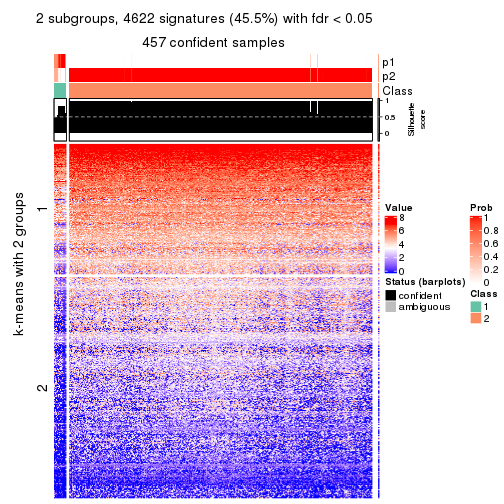</p>

</div>
<div id='tab-ATC-hclust-get-signatures-no-scale-2'>
<pre><code class="r">get_signatures(res, k = 3, scale_rows = FALSE)
</code></pre>

<p></p>

</div>
<div id='tab-ATC-hclust-get-signatures-no-scale-3'>
<pre><code class="r">get_signatures(res, k = 4, scale_rows = FALSE)
</code></pre>

<p></p>

</div>
<div id='tab-ATC-hclust-get-signatures-no-scale-4'>
<pre><code class="r">get_signatures(res, k = 5, scale_rows = FALSE)
</code></pre>

<p></p>

</div>
<div id='tab-ATC-hclust-get-signatures-no-scale-5'>
<pre><code class="r">get_signatures(res, k = 6, scale_rows = FALSE)
</code></pre>

<p></p>

</div>
</div>


Compare the overlap of signatures from different k:

```r
compare_signatures(res)
```


`get_signature()` returns a data frame invisibly. TO get the list of signatures, the function
call should be assigned to a variable explicitly. In following code, if `plot` argument is set
to `FALSE`, no heatmap is plotted while only the differential analysis is performed.

```r
# code only for demonstration
tb = get_signature(res, k = ..., plot = FALSE)
```

An example of the output of `tb` is:

```
#>   which_row         fdr    mean_1    mean_2 scaled_mean_1 scaled_mean_2 km
#> 1        38 0.042760348  8.373488  9.131774    -0.5533452     0.5164555  1
#> 2        40 0.018707592  7.106213  8.469186    -0.6173731     0.5762149  1
#> 3        55 0.019134737 10.221463 11.207825    -0.6159697     0.5749050  1
#> 4        59 0.006059896  5.921854  7.869574    -0.6899429     0.6439467  1
#> 5        60 0.018055526  8.928898 10.211722    -0.6204761     0.5791110  1
#> 6        98 0.009384629 15.714769 14.887706     0.6635654    -0.6193277  2
...
```

The columns in `tb` are:

1. `which_row`: row indices corresponding to the input matrix.
2. `fdr`: FDR for the differential test. 
3. `mean_x`: The mean value in group x.
4. `scaled_mean_x`: The mean value in group x after rows are scaled.
5. `km`: Row groups if k-means clustering is applied to rows.


UMAP plot which shows how samples are separated.


<script>
$( function() {
	$( '#tabs-ATC-hclust-dimension-reduction' ).tabs();
} );
</script>
<div id='tabs-ATC-hclust-dimension-reduction'>
<ul>
<li><a href='#tab-ATC-hclust-dimension-reduction-1'>k = 2</a></li>
<li><a href='#tab-ATC-hclust-dimension-reduction-2'>k = 3</a></li>
<li><a href='#tab-ATC-hclust-dimension-reduction-3'>k = 4</a></li>
<li><a href='#tab-ATC-hclust-dimension-reduction-4'>k = 5</a></li>
<li><a href='#tab-ATC-hclust-dimension-reduction-5'>k = 6</a></li>
</ul>
<div id='tab-ATC-hclust-dimension-reduction-1'>
<pre><code class="r">dimension_reduction(res, k = 2, method = &quot;UMAP&quot;)
</code></pre>

<p></p>

</div>
<div id='tab-ATC-hclust-dimension-reduction-2'>
<pre><code class="r">dimension_reduction(res, k = 3, method = &quot;UMAP&quot;)
</code></pre>

<p></p>

</div>
<div id='tab-ATC-hclust-dimension-reduction-3'>
<pre><code class="r">dimension_reduction(res, k = 4, method = &quot;UMAP&quot;)
</code></pre>

<p></p>

</div>
<div id='tab-ATC-hclust-dimension-reduction-4'>
<pre><code class="r">dimension_reduction(res, k = 5, method = &quot;UMAP&quot;)
</code></pre>

<p></p>

</div>
<div id='tab-ATC-hclust-dimension-reduction-5'>
<pre><code class="r">dimension_reduction(res, k = 6, method = &quot;UMAP&quot;)
</code></pre>

<p></p>

</div>
</div>


Following heatmap shows how subgroups are split when increasing `k`:

```r
collect_classes(res)
```


If matrix rows can be associated to genes, consider to use `functional_enrichment(res,
...)` to perform function enrichment for the signature genes. See [this vignette](http://bioconductor.org/packages/devel/bioc/vignettes/cola/inst/doc/functional_enrichment.html) for more detailed explanations.


 

---------------------------------------------------


### ATC:kmeans


The object with results only for a single top-value method and a single partition method 
can be extracted as:

```r
res = res_list["ATC", "kmeans"]
# you can also extract it by
# res = res_list["ATC:kmeans"]
```

A summary of `res` and all the functions that can be applied to it:

```r
res
```

```
#> A 'ConsensusPartition' object with k = 2, 3, 4, 5, 6.
#>   On a matrix with 10169 rows and 459 columns.
#>   Top rows (1000, 2000, 3000, 4000, 5000) are extracted by 'ATC' method.
#>   Subgroups are detected by 'kmeans' method.
#>   Performed in total 1250 partitions by row resampling.
#>   Best k for subgroups seems to be 3.
#> 
#> Following methods can be applied to this 'ConsensusPartition' object:
#>  [1] "cola_report"             "collect_classes"         "collect_plots"          
#>  [4] "collect_stats"           "colnames"                "compare_signatures"     
#>  [7] "consensus_heatmap"       "dimension_reduction"     "functional_enrichment"  
#> [10] "get_anno_col"            "get_anno"                "get_classes"            
#> [13] "get_consensus"           "get_matrix"              "get_membership"         
#> [16] "get_param"               "get_signatures"          "get_stats"              
#> [19] "is_best_k"               "is_stable_k"             "membership_heatmap"     
#> [22] "ncol"                    "nrow"                    "plot_ecdf"              
#> [25] "rownames"                "select_partition_number" "show"                   
#> [28] "suggest_best_k"          "test_to_known_factors"
```

`collect_plots()` function collects all the plots made from `res` for all `k` (number of partitions)
into one single page to provide an easy and fast comparison between different `k`.

```r
collect_plots(res)
```


The plots are:

- The first row: a plot of the ECDF (empirical cumulative distribution
  function) curves of the consensus matrix for each `k` and the heatmap of
  predicted classes for each `k`.
- The second row: heatmaps of the consensus matrix for each `k`.
- The third row: heatmaps of the membership matrix for each `k`.
- The fouth row: heatmaps of the signatures for each `k`.

All the plots in panels can be made by individual functions and they are
plotted later in this section.

`select_partition_number()` produces several plots showing different
statistics for choosing "optimized" `k`. There are following statistics:

- ECDF curves of the consensus matrix for each `k`;
- 1-PAC. [The PAC
  score](https://en.wikipedia.org/wiki/Consensus_clustering#Over-interpretation_potential_of_consensus_clustering)
  measures the proportion of the ambiguous subgrouping.
- Mean silhouette score.
- Concordance. The mean probability of fiting the consensus class ids in all
  partitions.
- Area increased. Denote $A_k$ as the area under the ECDF curve for current
  `k`, the area increased is defined as $A_k - A_{k-1}$.
- Rand index. The percent of pairs of samples that are both in a same cluster
  or both are not in a same cluster in the partition of k and k-1.
- Jaccard index. The ratio of pairs of samples are both in a same cluster in
  the partition of k and k-1 and the pairs of samples are both in a same
  cluster in the partition k or k-1.

The detailed explanations of these statistics can be found in [the _cola_
vignette](http://bioconductor.org/packages/devel/bioc/vignettes/cola/inst/doc/cola.html#toc_13).

Generally speaking, lower PAC score, higher mean silhouette score or higher
concordance corresponds to better partition. Rand index and Jaccard index
measure how similar the current partition is compared to partition with `k-1`.
If they are too similar, we won't accept `k` is better than `k-1`.

```r
select_partition_number(res)
```


The numeric values for all these statistics can be obtained by `get_stats()`.

```r
get_stats(res)
```

```
#>   k 1-PAC mean_silhouette concordance area_increased  Rand Jaccard
#> 2 2 0.432           0.744       0.854         0.2530 0.909   0.909
#> 3 3 0.838           0.898       0.959         1.1560 0.546   0.500
#> 4 4 0.627           0.783       0.867         0.2549 0.762   0.525
#> 5 5 0.617           0.579       0.736         0.0927 0.911   0.731
#> 6 6 0.653           0.619       0.746         0.0581 0.837   0.472
```

`suggest_best_k()` suggests the best $k$ based on these statistics. The rules are as follows:

- All $k$ with Jaccard index larger than 0.95 are removed because increasing
  $k$ does not provide enough extra information. If all $k$ are removed, it is
  marked as no subgroup is detected.
- For all $k$ with 1-PAC score larger than 0.9, the maximal $k$ is taken as
  the best $k$, and other $k$ are marked as optional $k$.
- If it does not fit the second rule. The $k$ with the maximal vote of the
  highest 1-PAC score, highest mean silhouette, and highest concordance is
  taken as the best $k$.

```r
suggest_best_k(res)
```

```
#> [1] 3
```


Following shows the table of the partitions (You need to click the **show/hide
code output** link to see it). The membership matrix (columns with name `p*`)
is inferred by
[`clue::cl_consensus()`](https://www.rdocumentation.org/link/cl_consensus?package=clue)
function with the `SE` method. Basically the value in the membership matrix
represents the probability to belong to a certain group. The finall class
label for an item is determined with the group with highest probability it
belongs to.

In `get_classes()` function, the entropy is calculated from the membership
matrix and the silhouette score is calculated from the consensus matrix.


<script>
$( function() {
	$( '#tabs-ATC-kmeans-get-classes' ).tabs();
} );
</script>
<div id='tabs-ATC-kmeans-get-classes'>
<ul>
<li><a href='#tab-ATC-kmeans-get-classes-1'>k = 2</a></li>
<li><a href='#tab-ATC-kmeans-get-classes-2'>k = 3</a></li>
<li><a href='#tab-ATC-kmeans-get-classes-3'>k = 4</a></li>
<li><a href='#tab-ATC-kmeans-get-classes-4'>k = 5</a></li>
<li><a href='#tab-ATC-kmeans-get-classes-5'>k = 6</a></li>
</ul>

<div id='tab-ATC-kmeans-get-classes-1'>
<p><a id='tab-ATC-kmeans-get-classes-1-a' style='color:#0366d6' href='#'>show/hide code output</a></p>
<pre><code class="r">cbind(get_classes(res, k = 2), get_membership(res, k = 2))
</code></pre>

<pre><code>#&gt;            class entropy silhouette    p1    p2
#&gt; SRR1699874     2  0.0000      0.821 0.000 1.000
#&gt; SRR1699875     2  0.0000      0.821 0.000 1.000
#&gt; SRR1699876     2  0.0000      0.821 0.000 1.000
#&gt; SRR1699877     2  0.0000      0.821 0.000 1.000
#&gt; SRR1699879     2  0.0000      0.821 0.000 1.000
#&gt; SRR1699878     2  0.0000      0.821 0.000 1.000
#&gt; SRR1699880     2  0.0000      0.821 0.000 1.000
#&gt; SRR1699881     2  0.0000      0.821 0.000 1.000
#&gt; SRR1699882     2  0.0000      0.821 0.000 1.000
#&gt; SRR1699883     2  0.0000      0.821 0.000 1.000
#&gt; SRR1699884     2  0.0000      0.821 0.000 1.000
#&gt; SRR1699885     2  0.0000      0.821 0.000 1.000
#&gt; SRR1699886     2  0.0000      0.821 0.000 1.000
#&gt; SRR1699888     2  0.0000      0.821 0.000 1.000
#&gt; SRR1699889     2  0.0000      0.821 0.000 1.000
#&gt; SRR1699890     2  0.0000      0.821 0.000 1.000
#&gt; SRR1699887     2  0.0000      0.821 0.000 1.000
#&gt; SRR1699891     2  0.0000      0.821 0.000 1.000
#&gt; SRR1699892     2  0.0000      0.821 0.000 1.000
#&gt; SRR1699893     2  0.0000      0.821 0.000 1.000
#&gt; SRR1699894     2  0.0000      0.821 0.000 1.000
#&gt; SRR1699895     2  0.0000      0.821 0.000 1.000
#&gt; SRR1699896     2  0.1843      0.813 0.028 0.972
#&gt; SRR1699897     2  0.0000      0.821 0.000 1.000
#&gt; SRR1699898     2  0.9732      0.576 0.404 0.596
#&gt; SRR1699900     2  0.8608      0.688 0.284 0.716
#&gt; SRR1699899     2  0.0000      0.821 0.000 1.000
#&gt; SRR1699902     2  0.9833      0.557 0.424 0.576
#&gt; SRR1699901     2  0.9833      0.557 0.424 0.576
#&gt; SRR1699903     2  0.0000      0.821 0.000 1.000
#&gt; SRR1699904     2  0.8661      0.682 0.288 0.712
#&gt; SRR1699905     2  0.9833      0.557 0.424 0.576
#&gt; SRR1699906     2  0.4022      0.796 0.080 0.920
#&gt; SRR1699907     2  0.7376      0.735 0.208 0.792
#&gt; SRR1699908     2  0.4022      0.796 0.080 0.920
#&gt; SRR1699909     2  0.9087      0.654 0.324 0.676
#&gt; SRR1699910     2  0.9833      0.557 0.424 0.576
#&gt; SRR1699911     2  0.9044      0.657 0.320 0.680
#&gt; SRR1699912     2  0.7139      0.742 0.196 0.804
#&gt; SRR1699913     2  0.4939      0.785 0.108 0.892
#&gt; SRR1699914     2  0.9833      0.557 0.424 0.576
#&gt; SRR1699915     2  0.9833      0.557 0.424 0.576
#&gt; SRR1699916     2  0.5737      0.773 0.136 0.864
#&gt; SRR1699917     2  0.5059      0.784 0.112 0.888
#&gt; SRR1699918     2  0.7056      0.744 0.192 0.808
#&gt; SRR1699919     2  0.8955      0.664 0.312 0.688
#&gt; SRR1699920     2  0.9833      0.557 0.424 0.576
#&gt; SRR1699921     2  0.9833      0.557 0.424 0.576
#&gt; SRR1699922     2  0.7602      0.728 0.220 0.780
#&gt; SRR1699923     2  0.9833      0.557 0.424 0.576
#&gt; SRR1699924     2  0.9833      0.557 0.424 0.576
#&gt; SRR1699925     1  0.0000      0.988 1.000 0.000
#&gt; SRR1699926     2  0.8713      0.679 0.292 0.708
#&gt; SRR1699927     2  0.5059      0.783 0.112 0.888
#&gt; SRR1699929     2  0.0000      0.821 0.000 1.000
#&gt; SRR1699928     2  0.7674      0.725 0.224 0.776
#&gt; SRR1699930     2  0.0000      0.821 0.000 1.000
#&gt; SRR1699931     2  0.0000      0.821 0.000 1.000
#&gt; SRR1699933     2  0.0000      0.821 0.000 1.000
#&gt; SRR1699932     2  0.1184      0.817 0.016 0.984
#&gt; SRR1699934     1  0.0000      0.988 1.000 0.000
#&gt; SRR1699935     2  0.0000      0.821 0.000 1.000
#&gt; SRR1699936     2  0.0000      0.821 0.000 1.000
#&gt; SRR1699937     2  0.0000      0.821 0.000 1.000
#&gt; SRR1699938     2  0.0000      0.821 0.000 1.000
#&gt; SRR1699940     2  0.0000      0.821 0.000 1.000
#&gt; SRR1699939     2  0.0000      0.821 0.000 1.000
#&gt; SRR1699941     2  0.0000      0.821 0.000 1.000
#&gt; SRR1699942     2  0.0000      0.821 0.000 1.000
#&gt; SRR1699943     2  0.0000      0.821 0.000 1.000
#&gt; SRR1699944     2  0.0000      0.821 0.000 1.000
#&gt; SRR1699945     2  0.2778      0.803 0.048 0.952
#&gt; SRR1699946     2  0.0000      0.821 0.000 1.000
#&gt; SRR1699947     2  0.0000      0.821 0.000 1.000
#&gt; SRR1699948     2  0.0000      0.821 0.000 1.000
#&gt; SRR1699949     2  0.0000      0.821 0.000 1.000
#&gt; SRR1699950     2  0.0000      0.821 0.000 1.000
#&gt; SRR1699951     2  0.0000      0.821 0.000 1.000
#&gt; SRR1699952     2  0.0000      0.821 0.000 1.000
#&gt; SRR1699953     2  0.0000      0.821 0.000 1.000
#&gt; SRR1699954     2  0.0000      0.821 0.000 1.000
#&gt; SRR1699955     2  0.0000      0.821 0.000 1.000
#&gt; SRR1699956     2  0.6048      0.751 0.148 0.852
#&gt; SRR1699957     2  0.0000      0.821 0.000 1.000
#&gt; SRR1699959     2  0.0000      0.821 0.000 1.000
#&gt; SRR1699958     2  0.0000      0.821 0.000 1.000
#&gt; SRR1699960     2  0.0000      0.821 0.000 1.000
#&gt; SRR1699961     2  0.0000      0.821 0.000 1.000
#&gt; SRR1699962     2  0.0000      0.821 0.000 1.000
#&gt; SRR1699963     2  0.0000      0.821 0.000 1.000
#&gt; SRR1699964     2  0.0000      0.821 0.000 1.000
#&gt; SRR1699965     2  0.0000      0.821 0.000 1.000
#&gt; SRR1699966     2  0.0000      0.821 0.000 1.000
#&gt; SRR1699967     2  0.0000      0.821 0.000 1.000
#&gt; SRR1699968     2  0.0000      0.821 0.000 1.000
#&gt; SRR1699969     2  0.0000      0.821 0.000 1.000
#&gt; SRR1699971     2  0.0000      0.821 0.000 1.000
#&gt; SRR1699970     2  0.0000      0.821 0.000 1.000
#&gt; SRR1699972     2  0.0000      0.821 0.000 1.000
#&gt; SRR1699973     2  0.0000      0.821 0.000 1.000
#&gt; SRR1699974     2  0.9833      0.557 0.424 0.576
#&gt; SRR1699975     2  0.0000      0.821 0.000 1.000
#&gt; SRR1699976     2  0.0000      0.821 0.000 1.000
#&gt; SRR1699977     2  0.0000      0.821 0.000 1.000
#&gt; SRR1699978     2  0.9833      0.557 0.424 0.576
#&gt; SRR1699979     2  0.0000      0.821 0.000 1.000
#&gt; SRR1699980     2  0.0000      0.821 0.000 1.000
#&gt; SRR1699981     2  0.5629      0.775 0.132 0.868
#&gt; SRR1699982     2  0.0000      0.821 0.000 1.000
#&gt; SRR1699983     2  0.0000      0.821 0.000 1.000
#&gt; SRR1699984     1  0.0000      0.988 1.000 0.000
#&gt; SRR1699985     2  0.0000      0.821 0.000 1.000
#&gt; SRR1699986     2  0.9833      0.557 0.424 0.576
#&gt; SRR1699988     2  0.0000      0.821 0.000 1.000
#&gt; SRR1699987     2  0.0672      0.819 0.008 0.992
#&gt; SRR1699989     2  0.0000      0.821 0.000 1.000
#&gt; SRR1699990     2  0.0000      0.821 0.000 1.000
#&gt; SRR1699992     2  0.0000      0.821 0.000 1.000
#&gt; SRR1699991     2  0.9833      0.557 0.424 0.576
#&gt; SRR1699993     2  0.9833      0.557 0.424 0.576
#&gt; SRR1699994     2  0.8909      0.648 0.308 0.692
#&gt; SRR1699995     2  0.9833      0.557 0.424 0.576
#&gt; SRR1699996     2  0.0000      0.821 0.000 1.000
#&gt; SRR1699997     2  0.0000      0.821 0.000 1.000
#&gt; SRR1699998     2  0.0000      0.821 0.000 1.000
#&gt; SRR1699999     2  0.9833      0.557 0.424 0.576
#&gt; SRR1700000     2  0.0000      0.821 0.000 1.000
#&gt; SRR1700002     2  0.0000      0.821 0.000 1.000
#&gt; SRR1700001     2  0.0376      0.819 0.004 0.996
#&gt; SRR1700003     2  0.0000      0.821 0.000 1.000
#&gt; SRR1700004     2  0.0000      0.821 0.000 1.000
#&gt; SRR1700005     1  0.0000      0.988 1.000 0.000
#&gt; SRR1700006     2  0.0000      0.821 0.000 1.000
#&gt; SRR1700007     2  0.0000      0.821 0.000 1.000
#&gt; SRR1700008     2  0.9815      0.562 0.420 0.580
#&gt; SRR1700009     1  0.0000      0.988 1.000 0.000
#&gt; SRR1700010     2  0.2043      0.810 0.032 0.968
#&gt; SRR1700011     2  0.0000      0.821 0.000 1.000
#&gt; SRR1700013     2  0.0000      0.821 0.000 1.000
#&gt; SRR1700012     2  0.0000      0.821 0.000 1.000
#&gt; SRR1700014     2  0.0000      0.821 0.000 1.000
#&gt; SRR1700015     2  0.0000      0.821 0.000 1.000
#&gt; SRR1700016     1  0.0376      0.983 0.996 0.004
#&gt; SRR1700018     2  0.0000      0.821 0.000 1.000
#&gt; SRR1700017     2  0.1414      0.814 0.020 0.980
#&gt; SRR1700019     2  0.0000      0.821 0.000 1.000
#&gt; SRR1700020     2  0.9580      0.595 0.380 0.620
#&gt; SRR1700021     2  0.8555      0.688 0.280 0.720
#&gt; SRR1700023     2  0.0000      0.821 0.000 1.000
#&gt; SRR1700022     2  0.3114      0.800 0.056 0.944
#&gt; SRR1700024     2  0.1843      0.814 0.028 0.972
#&gt; SRR1700025     2  0.0000      0.821 0.000 1.000
#&gt; SRR1700026     2  0.1184      0.816 0.016 0.984
#&gt; SRR1700027     2  0.0000      0.821 0.000 1.000
#&gt; SRR1700028     2  0.0000      0.821 0.000 1.000
#&gt; SRR1700029     2  0.9833      0.557 0.424 0.576
#&gt; SRR1700030     2  0.0000      0.821 0.000 1.000
#&gt; SRR1700031     2  0.9170      0.630 0.332 0.668
#&gt; SRR1700032     2  0.0000      0.821 0.000 1.000
#&gt; SRR1700034     2  0.9850      0.550 0.428 0.572
#&gt; SRR1700035     2  0.0672      0.819 0.008 0.992
#&gt; SRR1700033     2  0.9833      0.557 0.424 0.576
#&gt; SRR1700036     2  0.0376      0.820 0.004 0.996
#&gt; SRR1700037     2  0.5946      0.769 0.144 0.856
#&gt; SRR1700038     2  0.9686      0.589 0.396 0.604
#&gt; SRR1700039     2  0.9833      0.557 0.424 0.576
#&gt; SRR1700040     2  0.9815      0.561 0.420 0.580
#&gt; SRR1700041     2  0.9833      0.557 0.424 0.576
#&gt; SRR1700042     2  0.9833      0.557 0.424 0.576
#&gt; SRR1700043     2  0.9833      0.557 0.424 0.576
#&gt; SRR1700045     2  0.9815      0.562 0.420 0.580
#&gt; SRR1700044     2  0.8955      0.665 0.312 0.688
#&gt; SRR1700046     2  0.9815      0.562 0.420 0.580
#&gt; SRR1700047     2  0.9833      0.557 0.424 0.576
#&gt; SRR1700048     2  0.9833      0.557 0.424 0.576
#&gt; SRR1700049     2  0.9833      0.557 0.424 0.576
#&gt; SRR1700050     2  0.9833      0.557 0.424 0.576
#&gt; SRR1700051     2  0.9833      0.557 0.424 0.576
#&gt; SRR1700052     2  0.9833      0.557 0.424 0.576
#&gt; SRR1700053     2  0.9754      0.576 0.408 0.592
#&gt; SRR1700054     2  0.9833      0.557 0.424 0.576
#&gt; SRR1700055     2  0.9977      0.463 0.472 0.528
#&gt; SRR1700056     2  0.9833      0.557 0.424 0.576
#&gt; SRR1700057     2  0.9833      0.557 0.424 0.576
#&gt; SRR1700058     2  0.9833      0.557 0.424 0.576
#&gt; SRR1700059     2  0.9833      0.557 0.424 0.576
#&gt; SRR1700060     2  0.9833      0.557 0.424 0.576
#&gt; SRR1700061     2  0.9833      0.557 0.424 0.576
#&gt; SRR1700062     2  0.9833      0.557 0.424 0.576
#&gt; SRR1700063     2  0.9833      0.557 0.424 0.576
#&gt; SRR1700064     2  0.9815      0.562 0.420 0.580
#&gt; SRR1700065     2  0.9833      0.557 0.424 0.576
#&gt; SRR1700066     2  0.9833      0.557 0.424 0.576
#&gt; SRR1700067     2  0.9775      0.571 0.412 0.588
#&gt; SRR1700068     2  0.9815      0.562 0.420 0.580
#&gt; SRR1700069     2  0.9795      0.567 0.416 0.584
#&gt; SRR1700070     2  0.2603      0.808 0.044 0.956
#&gt; SRR1700071     2  0.9775      0.571 0.412 0.588
#&gt; SRR1700072     2  0.9833      0.557 0.424 0.576
#&gt; SRR1700073     2  0.9754      0.576 0.408 0.592
#&gt; SRR1700075     2  0.9775      0.571 0.412 0.588
#&gt; SRR1700074     2  0.7453      0.718 0.212 0.788
#&gt; SRR1700076     2  0.9427      0.624 0.360 0.640
#&gt; SRR1700077     2  0.9833      0.557 0.424 0.576
#&gt; SRR1700078     2  0.9815      0.562 0.420 0.580
#&gt; SRR1700080     2  0.5059      0.782 0.112 0.888
#&gt; SRR1700079     2  0.9833      0.557 0.424 0.576
#&gt; SRR1700081     2  0.9833      0.557 0.424 0.576
#&gt; SRR1700082     2  0.4022      0.789 0.080 0.920
#&gt; SRR1700083     2  0.9833      0.557 0.424 0.576
#&gt; SRR1700084     2  0.9833      0.557 0.424 0.576
#&gt; SRR1700085     2  0.0000      0.821 0.000 1.000
#&gt; SRR1700086     2  0.5629      0.776 0.132 0.868
#&gt; SRR1700087     2  0.0000      0.821 0.000 1.000
#&gt; SRR1700088     2  0.0000      0.821 0.000 1.000
#&gt; SRR1700089     2  0.0000      0.821 0.000 1.000
#&gt; SRR1700091     2  0.0000      0.821 0.000 1.000
#&gt; SRR1700090     2  0.0000      0.821 0.000 1.000
#&gt; SRR1700092     2  0.0000      0.821 0.000 1.000
#&gt; SRR1700094     2  0.0000      0.821 0.000 1.000
#&gt; SRR1700093     2  0.0000      0.821 0.000 1.000
#&gt; SRR1700095     2  0.9833      0.557 0.424 0.576
#&gt; SRR1700096     2  0.0000      0.821 0.000 1.000
#&gt; SRR1700097     2  0.9044      0.637 0.320 0.680
#&gt; SRR1700098     2  0.0000      0.821 0.000 1.000
#&gt; SRR1700099     2  0.0000      0.821 0.000 1.000
#&gt; SRR1700100     2  0.0000      0.821 0.000 1.000
#&gt; SRR1700101     2  0.0000      0.821 0.000 1.000
#&gt; SRR1700102     2  0.0000      0.821 0.000 1.000
#&gt; SRR1700104     2  0.0000      0.821 0.000 1.000
#&gt; SRR1700103     2  0.0000      0.821 0.000 1.000
#&gt; SRR1700105     2  0.0000      0.821 0.000 1.000
#&gt; SRR1700106     2  0.0000      0.821 0.000 1.000
#&gt; SRR1700107     2  0.0000      0.821 0.000 1.000
#&gt; SRR1700108     2  0.0000      0.821 0.000 1.000
#&gt; SRR1700109     2  0.0000      0.821 0.000 1.000
#&gt; SRR1700110     2  0.0000      0.821 0.000 1.000
#&gt; SRR1700112     2  0.0000      0.821 0.000 1.000
#&gt; SRR1700111     2  0.9129      0.651 0.328 0.672
#&gt; SRR1700113     2  0.0000      0.821 0.000 1.000
#&gt; SRR1700114     2  0.0000      0.821 0.000 1.000
#&gt; SRR1700115     2  0.0000      0.821 0.000 1.000
#&gt; SRR1700116     2  0.0000      0.821 0.000 1.000
#&gt; SRR1700117     2  0.9833      0.557 0.424 0.576
#&gt; SRR1700119     2  0.0000      0.821 0.000 1.000
#&gt; SRR1700118     2  0.9775      0.571 0.412 0.588
#&gt; SRR1700120     2  0.9795      0.566 0.416 0.584
#&gt; SRR1700121     2  0.0000      0.821 0.000 1.000
#&gt; SRR1700122     2  0.8267      0.702 0.260 0.740
#&gt; SRR1700123     2  0.9815      0.562 0.420 0.580
#&gt; SRR1700125     2  0.0000      0.821 0.000 1.000
#&gt; SRR1700126     2  0.9833      0.557 0.424 0.576
#&gt; SRR1700127     2  0.9580      0.606 0.380 0.620
#&gt; SRR1700124     2  0.9815      0.562 0.420 0.580
#&gt; SRR1700128     2  0.9833      0.557 0.424 0.576
#&gt; SRR1700129     2  0.7950      0.715 0.240 0.760
#&gt; SRR1700130     2  0.9686      0.589 0.396 0.604
#&gt; SRR1700132     2  0.9815      0.562 0.420 0.580
#&gt; SRR1700131     2  0.9833      0.557 0.424 0.576
#&gt; SRR1700133     2  0.9795      0.567 0.416 0.584
#&gt; SRR1700134     2  0.8763      0.676 0.296 0.704
#&gt; SRR1700135     2  0.9833      0.557 0.424 0.576
#&gt; SRR1700136     2  0.9833      0.557 0.424 0.576
#&gt; SRR1700137     2  0.9732      0.580 0.404 0.596
#&gt; SRR1700138     2  0.9686      0.589 0.396 0.604
#&gt; SRR1700140     2  0.9580      0.605 0.380 0.620
#&gt; SRR1700139     2  0.9754      0.576 0.408 0.592
#&gt; SRR1700141     2  0.7674      0.725 0.224 0.776
#&gt; SRR1700142     2  0.9833      0.557 0.424 0.576
#&gt; SRR1700143     2  0.9833      0.557 0.424 0.576
#&gt; SRR1700144     2  0.9833      0.557 0.424 0.576
#&gt; SRR1700145     2  0.9833      0.557 0.424 0.576
#&gt; SRR1700146     2  0.7745      0.723 0.228 0.772
#&gt; SRR1700147     2  0.9833      0.557 0.424 0.576
#&gt; SRR1700149     2  0.9833      0.557 0.424 0.576
#&gt; SRR1700148     2  0.9833      0.557 0.424 0.576
#&gt; SRR1700150     2  0.6247      0.763 0.156 0.844
#&gt; SRR1700152     2  0.9754      0.576 0.408 0.592
#&gt; SRR1700151     2  0.9833      0.557 0.424 0.576
#&gt; SRR1700153     2  0.9815      0.562 0.420 0.580
#&gt; SRR1700154     2  0.9795      0.567 0.416 0.584
#&gt; SRR1700155     2  0.9635      0.597 0.388 0.612
#&gt; SRR1700156     2  0.9833      0.557 0.424 0.576
#&gt; SRR1700158     2  0.9833      0.557 0.424 0.576
#&gt; SRR1700159     2  0.5294      0.780 0.120 0.880
#&gt; SRR1700157     2  0.9833      0.557 0.424 0.576
#&gt; SRR1700160     2  0.9775      0.571 0.412 0.588
#&gt; SRR1700161     2  0.9795      0.567 0.416 0.584
#&gt; SRR1700162     2  0.8763      0.676 0.296 0.704
#&gt; SRR1700164     2  0.9833      0.557 0.424 0.576
#&gt; SRR1700163     2  0.9833      0.557 0.424 0.576
#&gt; SRR1700165     2  0.9815      0.562 0.420 0.580
#&gt; SRR1700166     2  0.9710      0.584 0.400 0.600
#&gt; SRR1700168     2  0.1184      0.817 0.016 0.984
#&gt; SRR1700167     2  0.9833      0.557 0.424 0.576
#&gt; SRR1700170     2  0.9661      0.593 0.392 0.608
#&gt; SRR1700169     2  0.9686      0.589 0.396 0.604
#&gt; SRR1700171     2  0.9833      0.557 0.424 0.576
#&gt; SRR1700172     2  0.1184      0.817 0.016 0.984
#&gt; SRR1700174     2  0.4939      0.785 0.108 0.892
#&gt; SRR1700173     2  0.5408      0.780 0.124 0.876
#&gt; SRR1700175     2  0.8608      0.685 0.284 0.716
#&gt; SRR1700176     2  0.9833      0.557 0.424 0.576
#&gt; SRR1700178     2  0.0000      0.821 0.000 1.000
#&gt; SRR1700177     2  0.8763      0.677 0.296 0.704
#&gt; SRR1700180     2  0.0000      0.821 0.000 1.000
#&gt; SRR1700179     2  0.0000      0.821 0.000 1.000
#&gt; SRR1700181     2  0.0000      0.821 0.000 1.000
#&gt; SRR1700183     1  0.0000      0.988 1.000 0.000
#&gt; SRR1700182     2  0.0000      0.821 0.000 1.000
#&gt; SRR1700184     2  0.0000      0.821 0.000 1.000
#&gt; SRR1700186     2  0.0000      0.821 0.000 1.000
#&gt; SRR1700187     1  0.0000      0.988 1.000 0.000
#&gt; SRR1700185     1  0.0000      0.988 1.000 0.000
#&gt; SRR1700188     2  0.0000      0.821 0.000 1.000
#&gt; SRR1700192     2  0.9460      0.599 0.364 0.636
#&gt; SRR1700190     2  0.4690      0.778 0.100 0.900
#&gt; SRR1700191     1  0.0000      0.988 1.000 0.000
#&gt; SRR1700189     1  0.0000      0.988 1.000 0.000
#&gt; SRR1700193     2  0.0000      0.821 0.000 1.000
#&gt; SRR1700195     2  0.0000      0.821 0.000 1.000
#&gt; SRR1700194     1  0.0000      0.988 1.000 0.000
#&gt; SRR1700196     2  0.0000      0.821 0.000 1.000
#&gt; SRR1700197     2  0.9129      0.632 0.328 0.672
#&gt; SRR1700198     2  0.0000      0.821 0.000 1.000
#&gt; SRR1700199     2  0.0000      0.821 0.000 1.000
#&gt; SRR1700200     2  0.0000      0.821 0.000 1.000
#&gt; SRR1700201     2  0.0000      0.821 0.000 1.000
#&gt; SRR1700202     2  0.9323      0.634 0.348 0.652
#&gt; SRR1700203     2  0.0000      0.821 0.000 1.000
#&gt; SRR1700204     2  0.0000      0.821 0.000 1.000
#&gt; SRR1700206     2  0.0000      0.821 0.000 1.000
#&gt; SRR1700207     2  0.0000      0.821 0.000 1.000
#&gt; SRR1700208     2  0.0000      0.821 0.000 1.000
#&gt; SRR1700205     2  0.2423      0.810 0.040 0.960
#&gt; SRR1700209     2  0.0000      0.821 0.000 1.000
#&gt; SRR1700210     2  0.0000      0.821 0.000 1.000
#&gt; SRR1700211     2  0.0000      0.821 0.000 1.000
#&gt; SRR1700212     2  0.0000      0.821 0.000 1.000
#&gt; SRR1700213     2  0.0000      0.821 0.000 1.000
#&gt; SRR1700214     2  0.0000      0.821 0.000 1.000
#&gt; SRR1700215     1  0.0000      0.988 1.000 0.000
#&gt; SRR1700217     2  0.0000      0.821 0.000 1.000
#&gt; SRR1700216     1  0.0000      0.988 1.000 0.000
#&gt; SRR1700218     2  0.0000      0.821 0.000 1.000
#&gt; SRR1700219     2  0.0000      0.821 0.000 1.000
#&gt; SRR1700222     1  0.0000      0.988 1.000 0.000
#&gt; SRR1700220     2  0.0000      0.821 0.000 1.000
#&gt; SRR1700221     2  0.0000      0.821 0.000 1.000
#&gt; SRR1700223     2  0.0000      0.821 0.000 1.000
#&gt; SRR1700224     2  0.0000      0.821 0.000 1.000
#&gt; SRR1700226     2  0.0000      0.821 0.000 1.000
#&gt; SRR1700229     2  0.0000      0.821 0.000 1.000
#&gt; SRR1700225     2  0.0000      0.821 0.000 1.000
#&gt; SRR1700227     2  0.0000      0.821 0.000 1.000
#&gt; SRR1700230     1  0.3584      0.898 0.932 0.068
#&gt; SRR1700231     2  0.0000      0.821 0.000 1.000
#&gt; SRR1700228     2  0.0000      0.821 0.000 1.000
#&gt; SRR1700232     2  0.0000      0.821 0.000 1.000
#&gt; SRR1700233     2  0.0000      0.821 0.000 1.000
#&gt; SRR1700234     2  0.5737      0.773 0.136 0.864
#&gt; SRR1700235     2  0.0000      0.821 0.000 1.000
#&gt; SRR1700237     2  0.0000      0.821 0.000 1.000
#&gt; SRR1700236     2  0.0000      0.821 0.000 1.000
#&gt; SRR1700238     2  0.0000      0.821 0.000 1.000
#&gt; SRR1700239     1  0.0000      0.988 1.000 0.000
#&gt; SRR1700240     1  0.0000      0.988 1.000 0.000
#&gt; SRR1700241     2  0.9209      0.644 0.336 0.664
#&gt; SRR1700243     2  0.0000      0.821 0.000 1.000
#&gt; SRR1700244     2  0.0000      0.821 0.000 1.000
#&gt; SRR1700242     1  0.5059      0.823 0.888 0.112
#&gt; SRR1700246     2  0.9815      0.562 0.420 0.580
#&gt; SRR1700245     2  0.0000      0.821 0.000 1.000
#&gt; SRR1700247     1  0.0000      0.988 1.000 0.000
#&gt; SRR1700249     1  0.0000      0.988 1.000 0.000
#&gt; SRR1700250     2  0.0000      0.821 0.000 1.000
#&gt; SRR1700248     2  0.0000      0.821 0.000 1.000
#&gt; SRR1700251     2  0.0000      0.821 0.000 1.000
#&gt; SRR1700252     2  0.0000      0.821 0.000 1.000
#&gt; SRR1700253     2  0.0000      0.821 0.000 1.000
#&gt; SRR1700256     2  0.0000      0.821 0.000 1.000
#&gt; SRR1700254     1  0.0000      0.988 1.000 0.000
#&gt; SRR1700255     2  0.0000      0.821 0.000 1.000
#&gt; SRR1700257     2  0.0000      0.821 0.000 1.000
#&gt; SRR1700258     2  0.0000      0.821 0.000 1.000
#&gt; SRR1700259     2  0.0000      0.821 0.000 1.000
#&gt; SRR1700260     2  0.0000      0.821 0.000 1.000
#&gt; SRR1700261     2  0.0000      0.821 0.000 1.000
#&gt; SRR1700262     2  0.0000      0.821 0.000 1.000
#&gt; SRR1700263     2  0.0000      0.821 0.000 1.000
#&gt; SRR1700264     2  0.0000      0.821 0.000 1.000
#&gt; SRR1700265     2  0.0000      0.821 0.000 1.000
#&gt; SRR1700266     2  0.0000      0.821 0.000 1.000
#&gt; SRR1700268     2  0.0000      0.821 0.000 1.000
#&gt; SRR1700270     2  0.0000      0.821 0.000 1.000
#&gt; SRR1700267     2  0.0000      0.821 0.000 1.000
#&gt; SRR1700271     2  0.0000      0.821 0.000 1.000
#&gt; SRR1700272     2  0.0000      0.821 0.000 1.000
#&gt; SRR1700273     2  0.0000      0.821 0.000 1.000
#&gt; SRR1700274     2  0.0000      0.821 0.000 1.000
#&gt; SRR1700277     2  0.0000      0.821 0.000 1.000
#&gt; SRR1700275     2  0.0000      0.821 0.000 1.000
#&gt; SRR1700276     2  0.0000      0.821 0.000 1.000
#&gt; SRR1700278     2  0.5059      0.783 0.112 0.888
#&gt; SRR1700279     2  0.4939      0.785 0.108 0.892
#&gt; SRR1700280     2  0.1414      0.816 0.020 0.980
#&gt; SRR1700281     2  0.0000      0.821 0.000 1.000
#&gt; SRR1700283     2  0.0000      0.821 0.000 1.000
#&gt; SRR1700282     2  0.0672      0.819 0.008 0.992
#&gt; SRR1700284     2  0.0000      0.821 0.000 1.000
#&gt; SRR1700285     2  0.0000      0.821 0.000 1.000
#&gt; SRR1700286     2  0.0000      0.821 0.000 1.000
#&gt; SRR1700287     2  0.0000      0.821 0.000 1.000
#&gt; SRR1700290     2  0.9833      0.557 0.424 0.576
#&gt; SRR1700289     2  0.0000      0.821 0.000 1.000
#&gt; SRR1700288     2  0.0000      0.821 0.000 1.000
#&gt; SRR1700292     2  0.0000      0.821 0.000 1.000
#&gt; SRR1700291     2  0.5059      0.783 0.112 0.888
#&gt; SRR1700293     2  0.0000      0.821 0.000 1.000
#&gt; SRR1700294     2  0.8499      0.691 0.276 0.724
#&gt; SRR1700295     2  0.9833      0.557 0.424 0.576
#&gt; SRR1700297     2  0.0000      0.821 0.000 1.000
#&gt; SRR1700296     2  0.5629      0.775 0.132 0.868
#&gt; SRR1700298     2  0.8499      0.691 0.276 0.724
#&gt; SRR1700299     2  0.8608      0.685 0.284 0.716
#&gt; SRR1700300     2  0.9661      0.593 0.392 0.608
#&gt; SRR1700302     2  0.7745      0.723 0.228 0.772
#&gt; SRR1700301     2  0.6623      0.755 0.172 0.828
#&gt; SRR1700303     2  0.5178      0.782 0.116 0.884
#&gt; SRR1700304     2  0.9248      0.640 0.340 0.660
#&gt; SRR1700305     2  0.6048      0.767 0.148 0.852
#&gt; SRR1700306     2  0.9815      0.562 0.420 0.580
#&gt; SRR1700308     2  0.1184      0.817 0.016 0.984
#&gt; SRR1700307     2  0.9170      0.648 0.332 0.668
#&gt; SRR1700309     2  0.9775      0.571 0.412 0.588
#&gt; SRR1700310     2  0.7674      0.725 0.224 0.776
#&gt; SRR1700311     2  0.9635      0.597 0.388 0.612
#&gt; SRR1700312     2  0.2043      0.812 0.032 0.968
#&gt; SRR1700313     2  0.9661      0.593 0.392 0.608
#&gt; SRR1700314     2  0.9491      0.616 0.368 0.632
#&gt; SRR1700315     2  0.9732      0.580 0.404 0.596
#&gt; SRR1700316     2  0.5059      0.783 0.112 0.888
#&gt; SRR1700317     2  0.0000      0.821 0.000 1.000
#&gt; SRR1700318     2  0.9248      0.641 0.340 0.660
#&gt; SRR1700319     2  0.9580      0.605 0.380 0.620
#&gt; SRR1700320     2  0.5178      0.782 0.116 0.884
#&gt; SRR1700322     2  0.5294      0.780 0.120 0.880
#&gt; SRR1700321     2  0.0000      0.821 0.000 1.000
#&gt; SRR1700323     2  0.3431      0.802 0.064 0.936
#&gt; SRR1700324     2  0.5059      0.783 0.112 0.888
#&gt; SRR1700325     2  0.0000      0.821 0.000 1.000
#&gt; SRR1700326     2  0.9686      0.589 0.396 0.604
#&gt; SRR1700327     2  0.0000      0.821 0.000 1.000
#&gt; SRR1700329     2  0.0000      0.821 0.000 1.000
#&gt; SRR1700328     2  0.8144      0.708 0.252 0.748
#&gt; SRR1700330     2  0.9608      0.601 0.384 0.616
#&gt; SRR1700331     2  0.7602      0.728 0.220 0.780
#&gt; SRR1700332     2  0.0000      0.821 0.000 1.000
#&gt; SRR1700333     2  0.7602      0.728 0.220 0.780
</code></pre>

<script>
$('#tab-ATC-kmeans-get-classes-1-a').parent().next().next().hide();
$('#tab-ATC-kmeans-get-classes-1-a').click(function(){
  $('#tab-ATC-kmeans-get-classes-1-a').parent().next().next().toggle();
  return(false);
});
</script>
</div>

<div id='tab-ATC-kmeans-get-classes-2'>
<p><a id='tab-ATC-kmeans-get-classes-2-a' style='color:#0366d6' href='#'>show/hide code output</a></p>
<pre><code class="r">cbind(get_classes(res, k = 3), get_membership(res, k = 3))
</code></pre>

<pre><code>#&gt;            class entropy silhouette    p1    p2    p3
#&gt; SRR1699874     2  0.0000     0.9412 0.000 1.000 0.000
#&gt; SRR1699875     2  0.0592     0.9368 0.012 0.988 0.000
#&gt; SRR1699876     2  0.0000     0.9412 0.000 1.000 0.000
#&gt; SRR1699877     2  0.0000     0.9412 0.000 1.000 0.000
#&gt; SRR1699879     2  0.0000     0.9412 0.000 1.000 0.000
#&gt; SRR1699878     2  0.0000     0.9412 0.000 1.000 0.000
#&gt; SRR1699880     2  0.1751     0.9116 0.012 0.960 0.028
#&gt; SRR1699881     2  0.2339     0.8897 0.012 0.940 0.048
#&gt; SRR1699882     2  0.0000     0.9412 0.000 1.000 0.000
#&gt; SRR1699883     2  0.0000     0.9412 0.000 1.000 0.000
#&gt; SRR1699884     2  0.0000     0.9412 0.000 1.000 0.000
#&gt; SRR1699885     2  0.0000     0.9412 0.000 1.000 0.000
#&gt; SRR1699886     2  0.0000     0.9412 0.000 1.000 0.000
#&gt; SRR1699888     2  0.0000     0.9412 0.000 1.000 0.000
#&gt; SRR1699889     2  0.2261     0.8733 0.000 0.932 0.068
#&gt; SRR1699890     2  0.0000     0.9412 0.000 1.000 0.000
#&gt; SRR1699887     2  0.0000     0.9412 0.000 1.000 0.000
#&gt; SRR1699891     2  0.0237     0.9389 0.000 0.996 0.004
#&gt; SRR1699892     2  0.0000     0.9412 0.000 1.000 0.000
#&gt; SRR1699893     2  0.6302     0.0471 0.000 0.520 0.480
#&gt; SRR1699894     2  0.0000     0.9412 0.000 1.000 0.000
#&gt; SRR1699895     2  0.4399     0.7130 0.000 0.812 0.188
#&gt; SRR1699896     2  0.4931     0.6458 0.000 0.768 0.232
#&gt; SRR1699897     2  0.0592     0.9368 0.012 0.988 0.000
#&gt; SRR1699898     3  0.0592     0.9445 0.012 0.000 0.988
#&gt; SRR1699900     3  0.5254     0.6242 0.000 0.264 0.736
#&gt; SRR1699899     2  0.0000     0.9412 0.000 1.000 0.000
#&gt; SRR1699902     3  0.0000     0.9491 0.000 0.000 1.000
#&gt; SRR1699901     3  0.0000     0.9491 0.000 0.000 1.000
#&gt; SRR1699903     3  0.5365     0.6438 0.004 0.252 0.744
#&gt; SRR1699904     3  0.2537     0.8820 0.000 0.080 0.920
#&gt; SRR1699905     3  0.0000     0.9491 0.000 0.000 1.000
#&gt; SRR1699906     3  0.4808     0.7391 0.008 0.188 0.804
#&gt; SRR1699907     3  0.2796     0.8696 0.000 0.092 0.908
#&gt; SRR1699908     3  0.4605     0.7225 0.000 0.204 0.796
#&gt; SRR1699909     3  0.0000     0.9491 0.000 0.000 1.000
#&gt; SRR1699910     3  0.0000     0.9491 0.000 0.000 1.000
#&gt; SRR1699911     3  0.0000     0.9491 0.000 0.000 1.000
#&gt; SRR1699912     3  0.1163     0.9302 0.000 0.028 0.972
#&gt; SRR1699913     3  0.3038     0.8563 0.000 0.104 0.896
#&gt; SRR1699914     3  0.0000     0.9491 0.000 0.000 1.000
#&gt; SRR1699915     3  0.0000     0.9491 0.000 0.000 1.000
#&gt; SRR1699916     3  0.2959     0.8608 0.000 0.100 0.900
#&gt; SRR1699917     3  0.0424     0.9464 0.008 0.000 0.992
#&gt; SRR1699918     3  0.0000     0.9491 0.000 0.000 1.000
#&gt; SRR1699919     3  0.0000     0.9491 0.000 0.000 1.000
#&gt; SRR1699920     3  0.0000     0.9491 0.000 0.000 1.000
#&gt; SRR1699921     3  0.0000     0.9491 0.000 0.000 1.000
#&gt; SRR1699922     3  0.3116     0.8517 0.000 0.108 0.892
#&gt; SRR1699923     3  0.0000     0.9491 0.000 0.000 1.000
#&gt; SRR1699924     3  0.0000     0.9491 0.000 0.000 1.000
#&gt; SRR1699925     1  0.0592     0.9833 0.988 0.000 0.012
#&gt; SRR1699926     3  0.0000     0.9491 0.000 0.000 1.000
#&gt; SRR1699927     3  0.3038     0.8581 0.000 0.104 0.896
#&gt; SRR1699929     3  0.5178     0.6439 0.000 0.256 0.744
#&gt; SRR1699928     3  0.1163     0.9302 0.000 0.028 0.972
#&gt; SRR1699930     2  0.6111     0.3481 0.000 0.604 0.396
#&gt; SRR1699931     2  0.4178     0.7374 0.000 0.828 0.172
#&gt; SRR1699933     2  0.0000     0.9412 0.000 1.000 0.000
#&gt; SRR1699932     3  0.3340     0.8417 0.000 0.120 0.880
#&gt; SRR1699934     1  0.0592     0.9833 0.988 0.000 0.012
#&gt; SRR1699935     2  0.0000     0.9412 0.000 1.000 0.000
#&gt; SRR1699936     2  0.0000     0.9412 0.000 1.000 0.000
#&gt; SRR1699937     2  0.0592     0.9368 0.012 0.988 0.000
#&gt; SRR1699938     2  0.0592     0.9368 0.012 0.988 0.000
#&gt; SRR1699940     2  0.0592     0.9368 0.012 0.988 0.000
#&gt; SRR1699939     2  0.0592     0.9368 0.012 0.988 0.000
#&gt; SRR1699941     2  0.3618     0.8211 0.012 0.884 0.104
#&gt; SRR1699942     2  0.0592     0.9368 0.012 0.988 0.000
#&gt; SRR1699943     2  0.0592     0.9368 0.012 0.988 0.000
#&gt; SRR1699944     2  0.0592     0.9368 0.012 0.988 0.000
#&gt; SRR1699945     2  0.0592     0.9368 0.012 0.988 0.000
#&gt; SRR1699946     2  0.0592     0.9368 0.012 0.988 0.000
#&gt; SRR1699947     2  0.0592     0.9368 0.012 0.988 0.000
#&gt; SRR1699948     2  0.0000     0.9412 0.000 1.000 0.000
#&gt; SRR1699949     2  0.0237     0.9398 0.004 0.996 0.000
#&gt; SRR1699950     2  0.0592     0.9368 0.012 0.988 0.000
#&gt; SRR1699951     2  0.0592     0.9368 0.012 0.988 0.000
#&gt; SRR1699952     2  0.0592     0.9368 0.012 0.988 0.000
#&gt; SRR1699953     2  0.0592     0.9368 0.012 0.988 0.000
#&gt; SRR1699954     2  0.0592     0.9368 0.012 0.988 0.000
#&gt; SRR1699955     2  0.0592     0.9368 0.012 0.988 0.000
#&gt; SRR1699956     2  0.6200     0.5000 0.012 0.676 0.312
#&gt; SRR1699957     2  0.0592     0.9368 0.012 0.988 0.000
#&gt; SRR1699959     2  0.0592     0.9368 0.012 0.988 0.000
#&gt; SRR1699958     2  0.0000     0.9412 0.000 1.000 0.000
#&gt; SRR1699960     2  0.0000     0.9412 0.000 1.000 0.000
#&gt; SRR1699961     2  0.0592     0.9368 0.012 0.988 0.000
#&gt; SRR1699962     2  0.0592     0.9368 0.012 0.988 0.000
#&gt; SRR1699963     2  0.0592     0.9368 0.012 0.988 0.000
#&gt; SRR1699964     2  0.0592     0.9368 0.012 0.988 0.000
#&gt; SRR1699965     2  0.0424     0.9384 0.008 0.992 0.000
#&gt; SRR1699966     2  0.0592     0.9368 0.012 0.988 0.000
#&gt; SRR1699967     2  0.0592     0.9368 0.012 0.988 0.000
#&gt; SRR1699968     2  0.0592     0.9368 0.012 0.988 0.000
#&gt; SRR1699969     3  0.5122     0.6949 0.012 0.200 0.788
#&gt; SRR1699971     2  0.0592     0.9368 0.012 0.988 0.000
#&gt; SRR1699970     2  0.0592     0.9368 0.012 0.988 0.000
#&gt; SRR1699972     2  0.0592     0.9368 0.012 0.988 0.000
#&gt; SRR1699973     2  0.0592     0.9368 0.012 0.988 0.000
#&gt; SRR1699974     3  0.0592     0.9445 0.012 0.000 0.988
#&gt; SRR1699975     2  0.6404     0.4500 0.012 0.644 0.344
#&gt; SRR1699976     2  0.0592     0.9368 0.012 0.988 0.000
#&gt; SRR1699977     3  0.0592     0.9445 0.012 0.000 0.988
#&gt; SRR1699978     3  0.0000     0.9491 0.000 0.000 1.000
#&gt; SRR1699979     2  0.6816     0.1162 0.012 0.516 0.472
#&gt; SRR1699980     3  0.1482     0.9324 0.012 0.020 0.968
#&gt; SRR1699981     3  0.0592     0.9445 0.012 0.000 0.988
#&gt; SRR1699982     2  0.5902     0.5059 0.004 0.680 0.316
#&gt; SRR1699983     3  0.2339     0.9067 0.012 0.048 0.940
#&gt; SRR1699984     1  0.0592     0.9833 0.988 0.000 0.012
#&gt; SRR1699985     3  0.2550     0.9035 0.012 0.056 0.932
#&gt; SRR1699986     3  0.0237     0.9479 0.004 0.000 0.996
#&gt; SRR1699988     2  0.2339     0.8932 0.012 0.940 0.048
#&gt; SRR1699987     3  0.0592     0.9445 0.012 0.000 0.988
#&gt; SRR1699989     2  0.5536     0.6336 0.012 0.752 0.236
#&gt; SRR1699990     3  0.0592     0.9445 0.012 0.000 0.988
#&gt; SRR1699992     3  0.5315     0.6710 0.012 0.216 0.772
#&gt; SRR1699991     3  0.0592     0.9445 0.012 0.000 0.988
#&gt; SRR1699993     3  0.0000     0.9491 0.000 0.000 1.000
#&gt; SRR1699994     3  0.0592     0.9445 0.012 0.000 0.988
#&gt; SRR1699995     3  0.0000     0.9491 0.000 0.000 1.000
#&gt; SRR1699996     2  0.0829     0.9350 0.012 0.984 0.004
#&gt; SRR1699997     3  0.0592     0.9445 0.012 0.000 0.988
#&gt; SRR1699998     2  0.0592     0.9368 0.012 0.988 0.000
#&gt; SRR1699999     3  0.0000     0.9491 0.000 0.000 1.000
#&gt; SRR1700000     2  0.1182     0.9289 0.012 0.976 0.012
#&gt; SRR1700002     2  0.0592     0.9368 0.012 0.988 0.000
#&gt; SRR1700001     3  0.6019     0.5383 0.012 0.288 0.700
#&gt; SRR1700003     2  0.0829     0.9343 0.012 0.984 0.004
#&gt; SRR1700004     3  0.1964     0.9055 0.000 0.056 0.944
#&gt; SRR1700005     1  0.0592     0.9833 0.988 0.000 0.012
#&gt; SRR1700006     2  0.0000     0.9412 0.000 1.000 0.000
#&gt; SRR1700007     2  0.0000     0.9412 0.000 1.000 0.000
#&gt; SRR1700008     3  0.0237     0.9479 0.004 0.000 0.996
#&gt; SRR1700009     1  0.0592     0.9833 0.988 0.000 0.012
#&gt; SRR1700010     2  0.4968     0.7045 0.012 0.800 0.188
#&gt; SRR1700011     2  0.0592     0.9368 0.012 0.988 0.000
#&gt; SRR1700013     2  0.0237     0.9398 0.004 0.996 0.000
#&gt; SRR1700012     2  0.0592     0.9368 0.012 0.988 0.000
#&gt; SRR1700014     3  0.0592     0.9433 0.000 0.012 0.988
#&gt; SRR1700015     2  0.0237     0.9398 0.004 0.996 0.000
#&gt; SRR1700016     1  0.2066     0.9410 0.940 0.000 0.060
#&gt; SRR1700018     2  0.0592     0.9368 0.012 0.988 0.000
#&gt; SRR1700017     2  0.3989     0.7953 0.012 0.864 0.124
#&gt; SRR1700019     2  0.0000     0.9412 0.000 1.000 0.000
#&gt; SRR1700020     3  0.3695     0.8318 0.012 0.108 0.880
#&gt; SRR1700021     3  0.2796     0.8696 0.000 0.092 0.908
#&gt; SRR1700023     2  0.2651     0.8784 0.012 0.928 0.060
#&gt; SRR1700022     2  0.6617     0.3613 0.012 0.600 0.388
#&gt; SRR1700024     3  0.0592     0.9445 0.012 0.000 0.988
#&gt; SRR1700025     2  0.0592     0.9368 0.012 0.988 0.000
#&gt; SRR1700026     2  0.6126     0.3495 0.000 0.600 0.400
#&gt; SRR1700027     2  0.3532     0.8216 0.008 0.884 0.108
#&gt; SRR1700028     3  0.6513     0.0821 0.004 0.476 0.520
#&gt; SRR1700029     3  0.0000     0.9491 0.000 0.000 1.000
#&gt; SRR1700030     3  0.3619     0.8271 0.000 0.136 0.864
#&gt; SRR1700031     3  0.0829     0.9424 0.012 0.004 0.984
#&gt; SRR1700032     2  0.0592     0.9368 0.012 0.988 0.000
#&gt; SRR1700034     3  0.0000     0.9491 0.000 0.000 1.000
#&gt; SRR1700035     3  0.0592     0.9445 0.012 0.000 0.988
#&gt; SRR1700033     3  0.0000     0.9491 0.000 0.000 1.000
#&gt; SRR1700036     3  0.0592     0.9445 0.012 0.000 0.988
#&gt; SRR1700037     3  0.2796     0.8696 0.000 0.092 0.908
#&gt; SRR1700038     3  0.0000     0.9491 0.000 0.000 1.000
#&gt; SRR1700039     3  0.0237     0.9479 0.004 0.000 0.996
#&gt; SRR1700040     3  0.0592     0.9445 0.012 0.000 0.988
#&gt; SRR1700041     3  0.0000     0.9491 0.000 0.000 1.000
#&gt; SRR1700042     3  0.0000     0.9491 0.000 0.000 1.000
#&gt; SRR1700043     3  0.0000     0.9491 0.000 0.000 1.000
#&gt; SRR1700045     3  0.0000     0.9491 0.000 0.000 1.000
#&gt; SRR1700044     3  0.0000     0.9491 0.000 0.000 1.000
#&gt; SRR1700046     3  0.0000     0.9491 0.000 0.000 1.000
#&gt; SRR1700047     3  0.0000     0.9491 0.000 0.000 1.000
#&gt; SRR1700048     3  0.0000     0.9491 0.000 0.000 1.000
#&gt; SRR1700049     3  0.0000     0.9491 0.000 0.000 1.000
#&gt; SRR1700050     3  0.0000     0.9491 0.000 0.000 1.000
#&gt; SRR1700051     3  0.0000     0.9491 0.000 0.000 1.000
#&gt; SRR1700052     3  0.0000     0.9491 0.000 0.000 1.000
#&gt; SRR1700053     3  0.0000     0.9491 0.000 0.000 1.000
#&gt; SRR1700054     3  0.0000     0.9491 0.000 0.000 1.000
#&gt; SRR1700055     3  0.0000     0.9491 0.000 0.000 1.000
#&gt; SRR1700056     3  0.0000     0.9491 0.000 0.000 1.000
#&gt; SRR1700057     3  0.0000     0.9491 0.000 0.000 1.000
#&gt; SRR1700058     3  0.0000     0.9491 0.000 0.000 1.000
#&gt; SRR1700059     3  0.0000     0.9491 0.000 0.000 1.000
#&gt; SRR1700060     3  0.0237     0.9479 0.004 0.000 0.996
#&gt; SRR1700061     3  0.0000     0.9491 0.000 0.000 1.000
#&gt; SRR1700062     3  0.0592     0.9445 0.012 0.000 0.988
#&gt; SRR1700063     3  0.0000     0.9491 0.000 0.000 1.000
#&gt; SRR1700064     3  0.0000     0.9491 0.000 0.000 1.000
#&gt; SRR1700065     3  0.0000     0.9491 0.000 0.000 1.000
#&gt; SRR1700066     3  0.0237     0.9479 0.004 0.000 0.996
#&gt; SRR1700067     3  0.0000     0.9491 0.000 0.000 1.000
#&gt; SRR1700068     3  0.0000     0.9491 0.000 0.000 1.000
#&gt; SRR1700069     3  0.0424     0.9464 0.008 0.000 0.992
#&gt; SRR1700070     3  0.0592     0.9445 0.012 0.000 0.988
#&gt; SRR1700071     3  0.0592     0.9445 0.012 0.000 0.988
#&gt; SRR1700072     3  0.0000     0.9491 0.000 0.000 1.000
#&gt; SRR1700073     3  0.0000     0.9491 0.000 0.000 1.000
#&gt; SRR1700075     3  0.0237     0.9479 0.004 0.000 0.996
#&gt; SRR1700074     3  0.0592     0.9445 0.012 0.000 0.988
#&gt; SRR1700076     3  0.0000     0.9491 0.000 0.000 1.000
#&gt; SRR1700077     3  0.0592     0.9445 0.012 0.000 0.988
#&gt; SRR1700078     3  0.0237     0.9479 0.004 0.000 0.996
#&gt; SRR1700080     3  0.0592     0.9445 0.012 0.000 0.988
#&gt; SRR1700079     3  0.0424     0.9464 0.008 0.000 0.992
#&gt; SRR1700081     3  0.0237     0.9479 0.004 0.000 0.996
#&gt; SRR1700082     3  0.5315     0.6678 0.012 0.216 0.772
#&gt; SRR1700083     3  0.0592     0.9445 0.012 0.000 0.988
#&gt; SRR1700084     3  0.0000     0.9491 0.000 0.000 1.000
#&gt; SRR1700085     3  0.3375     0.8607 0.008 0.100 0.892
#&gt; SRR1700086     3  0.0592     0.9445 0.012 0.000 0.988
#&gt; SRR1700087     2  0.0000     0.9412 0.000 1.000 0.000
#&gt; SRR1700088     2  0.0000     0.9412 0.000 1.000 0.000
#&gt; SRR1700089     2  0.0000     0.9412 0.000 1.000 0.000
#&gt; SRR1700091     2  0.0237     0.9398 0.004 0.996 0.000
#&gt; SRR1700090     3  0.4842     0.6726 0.000 0.224 0.776
#&gt; SRR1700092     2  0.0000     0.9412 0.000 1.000 0.000
#&gt; SRR1700094     2  0.0000     0.9412 0.000 1.000 0.000
#&gt; SRR1700093     2  0.3038     0.8288 0.000 0.896 0.104
#&gt; SRR1700095     3  0.0592     0.9422 0.000 0.012 0.988
#&gt; SRR1700096     2  0.0000     0.9412 0.000 1.000 0.000
#&gt; SRR1700097     3  0.4629     0.7223 0.004 0.188 0.808
#&gt; SRR1700098     2  0.0000     0.9412 0.000 1.000 0.000
#&gt; SRR1700099     2  0.0000     0.9412 0.000 1.000 0.000
#&gt; SRR1700100     2  0.0000     0.9412 0.000 1.000 0.000
#&gt; SRR1700101     2  0.0000     0.9412 0.000 1.000 0.000
#&gt; SRR1700102     2  0.0000     0.9412 0.000 1.000 0.000
#&gt; SRR1700104     2  0.0424     0.9384 0.008 0.992 0.000
#&gt; SRR1700103     2  0.6282     0.3774 0.004 0.612 0.384
#&gt; SRR1700105     3  0.4452     0.7433 0.000 0.192 0.808
#&gt; SRR1700106     3  0.5926     0.4564 0.000 0.356 0.644
#&gt; SRR1700107     2  0.0237     0.9390 0.000 0.996 0.004
#&gt; SRR1700108     2  0.0000     0.9412 0.000 1.000 0.000
#&gt; SRR1700109     2  0.0000     0.9412 0.000 1.000 0.000
#&gt; SRR1700110     2  0.0000     0.9412 0.000 1.000 0.000
#&gt; SRR1700112     3  0.5785     0.5068 0.000 0.332 0.668
#&gt; SRR1700111     3  0.0237     0.9477 0.000 0.004 0.996
#&gt; SRR1700113     2  0.2625     0.8544 0.000 0.916 0.084
#&gt; SRR1700114     2  0.1525     0.9125 0.004 0.964 0.032
#&gt; SRR1700115     2  0.0000     0.9412 0.000 1.000 0.000
#&gt; SRR1700116     3  0.3482     0.8186 0.000 0.128 0.872
#&gt; SRR1700117     3  0.0000     0.9491 0.000 0.000 1.000
#&gt; SRR1700119     3  0.0747     0.9410 0.000 0.016 0.984
#&gt; SRR1700118     3  0.0000     0.9491 0.000 0.000 1.000
#&gt; SRR1700120     3  0.0237     0.9479 0.004 0.000 0.996
#&gt; SRR1700121     3  0.2537     0.8878 0.000 0.080 0.920
#&gt; SRR1700122     3  0.0000     0.9491 0.000 0.000 1.000
#&gt; SRR1700123     3  0.0000     0.9491 0.000 0.000 1.000
#&gt; SRR1700125     3  0.3267     0.8467 0.000 0.116 0.884
#&gt; SRR1700126     3  0.0000     0.9491 0.000 0.000 1.000
#&gt; SRR1700127     3  0.0424     0.9464 0.008 0.000 0.992
#&gt; SRR1700124     3  0.0000     0.9491 0.000 0.000 1.000
#&gt; SRR1700128     3  0.0000     0.9491 0.000 0.000 1.000
#&gt; SRR1700129     3  0.0000     0.9491 0.000 0.000 1.000
#&gt; SRR1700130     3  0.0000     0.9491 0.000 0.000 1.000
#&gt; SRR1700132     3  0.0237     0.9479 0.004 0.000 0.996
#&gt; SRR1700131     3  0.0000     0.9491 0.000 0.000 1.000
#&gt; SRR1700133     3  0.0000     0.9491 0.000 0.000 1.000
#&gt; SRR1700134     3  0.0000     0.9491 0.000 0.000 1.000
#&gt; SRR1700135     3  0.0000     0.9491 0.000 0.000 1.000
#&gt; SRR1700136     3  0.0000     0.9491 0.000 0.000 1.000
#&gt; SRR1700137     3  0.0000     0.9491 0.000 0.000 1.000
#&gt; SRR1700138     3  0.0000     0.9491 0.000 0.000 1.000
#&gt; SRR1700140     3  0.0237     0.9479 0.004 0.000 0.996
#&gt; SRR1700139     3  0.0000     0.9491 0.000 0.000 1.000
#&gt; SRR1700141     3  0.0000     0.9491 0.000 0.000 1.000
#&gt; SRR1700142     3  0.0000     0.9491 0.000 0.000 1.000
#&gt; SRR1700143     3  0.0000     0.9491 0.000 0.000 1.000
#&gt; SRR1700144     3  0.0000     0.9491 0.000 0.000 1.000
#&gt; SRR1700145     3  0.0000     0.9491 0.000 0.000 1.000
#&gt; SRR1700146     3  0.0000     0.9491 0.000 0.000 1.000
#&gt; SRR1700147     3  0.0000     0.9491 0.000 0.000 1.000
#&gt; SRR1700149     3  0.0000     0.9491 0.000 0.000 1.000
#&gt; SRR1700148     3  0.0000     0.9491 0.000 0.000 1.000
#&gt; SRR1700150     3  0.0000     0.9491 0.000 0.000 1.000
#&gt; SRR1700152     3  0.0000     0.9491 0.000 0.000 1.000
#&gt; SRR1700151     3  0.0000     0.9491 0.000 0.000 1.000
#&gt; SRR1700153     3  0.0000     0.9491 0.000 0.000 1.000
#&gt; SRR1700154     3  0.0000     0.9491 0.000 0.000 1.000
#&gt; SRR1700155     3  0.0000     0.9491 0.000 0.000 1.000
#&gt; SRR1700156     3  0.0000     0.9491 0.000 0.000 1.000
#&gt; SRR1700158     3  0.0000     0.9491 0.000 0.000 1.000
#&gt; SRR1700159     3  0.0000     0.9491 0.000 0.000 1.000
#&gt; SRR1700157     3  0.0000     0.9491 0.000 0.000 1.000
#&gt; SRR1700160     3  0.0000     0.9491 0.000 0.000 1.000
#&gt; SRR1700161     3  0.0000     0.9491 0.000 0.000 1.000
#&gt; SRR1700162     3  0.0000     0.9491 0.000 0.000 1.000
#&gt; SRR1700164     3  0.0000     0.9491 0.000 0.000 1.000
#&gt; SRR1700163     3  0.0000     0.9491 0.000 0.000 1.000
#&gt; SRR1700165     3  0.0000     0.9491 0.000 0.000 1.000
#&gt; SRR1700166     3  0.0000     0.9491 0.000 0.000 1.000
#&gt; SRR1700168     3  0.3192     0.8514 0.000 0.112 0.888
#&gt; SRR1700167     3  0.0000     0.9491 0.000 0.000 1.000
#&gt; SRR1700170     3  0.0000     0.9491 0.000 0.000 1.000
#&gt; SRR1700169     3  0.0000     0.9491 0.000 0.000 1.000
#&gt; SRR1700171     3  0.0000     0.9491 0.000 0.000 1.000
#&gt; SRR1700172     3  0.0592     0.9433 0.000 0.012 0.988
#&gt; SRR1700174     3  0.0237     0.9477 0.000 0.004 0.996
#&gt; SRR1700173     3  0.0237     0.9477 0.000 0.004 0.996
#&gt; SRR1700175     3  0.0000     0.9491 0.000 0.000 1.000
#&gt; SRR1700176     3  0.0237     0.9479 0.004 0.000 0.996
#&gt; SRR1700178     2  0.0000     0.9412 0.000 1.000 0.000
#&gt; SRR1700177     3  0.0000     0.9491 0.000 0.000 1.000
#&gt; SRR1700180     2  0.0000     0.9412 0.000 1.000 0.000
#&gt; SRR1700179     2  0.0000     0.9412 0.000 1.000 0.000
#&gt; SRR1700181     2  0.0000     0.9412 0.000 1.000 0.000
#&gt; SRR1700183     1  0.0592     0.9833 0.988 0.000 0.012
#&gt; SRR1700182     2  0.0000     0.9412 0.000 1.000 0.000
#&gt; SRR1700184     2  0.0000     0.9412 0.000 1.000 0.000
#&gt; SRR1700186     2  0.0000     0.9412 0.000 1.000 0.000
#&gt; SRR1700187     1  0.0592     0.9833 0.988 0.000 0.012
#&gt; SRR1700185     1  0.0592     0.9833 0.988 0.000 0.012
#&gt; SRR1700188     2  0.0000     0.9412 0.000 1.000 0.000
#&gt; SRR1700192     2  0.0424     0.9371 0.008 0.992 0.000
#&gt; SRR1700190     2  0.0000     0.9412 0.000 1.000 0.000
#&gt; SRR1700191     1  0.0592     0.9833 0.988 0.000 0.012
#&gt; SRR1700189     1  0.0592     0.9833 0.988 0.000 0.012
#&gt; SRR1700193     2  0.0000     0.9412 0.000 1.000 0.000
#&gt; SRR1700195     2  0.0000     0.9412 0.000 1.000 0.000
#&gt; SRR1700194     1  0.0592     0.9833 0.988 0.000 0.012
#&gt; SRR1700196     2  0.0000     0.9412 0.000 1.000 0.000
#&gt; SRR1700197     2  0.1031     0.9214 0.000 0.976 0.024
#&gt; SRR1700198     2  0.0000     0.9412 0.000 1.000 0.000
#&gt; SRR1700199     2  0.0000     0.9412 0.000 1.000 0.000
#&gt; SRR1700200     2  0.0000     0.9412 0.000 1.000 0.000
#&gt; SRR1700201     2  0.0000     0.9412 0.000 1.000 0.000
#&gt; SRR1700202     2  0.5785     0.4843 0.000 0.668 0.332
#&gt; SRR1700203     2  0.0000     0.9412 0.000 1.000 0.000
#&gt; SRR1700204     2  0.0000     0.9412 0.000 1.000 0.000
#&gt; SRR1700206     2  0.0000     0.9412 0.000 1.000 0.000
#&gt; SRR1700207     2  0.0000     0.9412 0.000 1.000 0.000
#&gt; SRR1700208     2  0.0000     0.9412 0.000 1.000 0.000
#&gt; SRR1700205     2  0.0237     0.9388 0.000 0.996 0.004
#&gt; SRR1700209     2  0.0000     0.9412 0.000 1.000 0.000
#&gt; SRR1700210     2  0.0000     0.9412 0.000 1.000 0.000
#&gt; SRR1700211     2  0.0000     0.9412 0.000 1.000 0.000
#&gt; SRR1700212     2  0.0000     0.9412 0.000 1.000 0.000
#&gt; SRR1700213     2  0.0237     0.9398 0.004 0.996 0.000
#&gt; SRR1700214     2  0.0000     0.9412 0.000 1.000 0.000
#&gt; SRR1700215     1  0.0592     0.9833 0.988 0.000 0.012
#&gt; SRR1700217     2  0.0000     0.9412 0.000 1.000 0.000
#&gt; SRR1700216     1  0.0592     0.9833 0.988 0.000 0.012
#&gt; SRR1700218     2  0.0000     0.9412 0.000 1.000 0.000
#&gt; SRR1700219     2  0.0000     0.9412 0.000 1.000 0.000
#&gt; SRR1700222     1  0.0592     0.9833 0.988 0.000 0.012
#&gt; SRR1700220     2  0.0000     0.9412 0.000 1.000 0.000
#&gt; SRR1700221     2  0.0000     0.9412 0.000 1.000 0.000
#&gt; SRR1700223     2  0.0000     0.9412 0.000 1.000 0.000
#&gt; SRR1700224     2  0.0000     0.9412 0.000 1.000 0.000
#&gt; SRR1700226     2  0.0000     0.9412 0.000 1.000 0.000
#&gt; SRR1700229     2  0.0000     0.9412 0.000 1.000 0.000
#&gt; SRR1700225     2  0.0592     0.9368 0.012 0.988 0.000
#&gt; SRR1700227     2  0.0000     0.9412 0.000 1.000 0.000
#&gt; SRR1700230     1  0.4291     0.7979 0.820 0.000 0.180
#&gt; SRR1700231     2  0.0000     0.9412 0.000 1.000 0.000
#&gt; SRR1700228     2  0.0000     0.9412 0.000 1.000 0.000
#&gt; SRR1700232     2  0.0000     0.9412 0.000 1.000 0.000
#&gt; SRR1700233     2  0.0000     0.9412 0.000 1.000 0.000
#&gt; SRR1700234     2  0.4796     0.6657 0.000 0.780 0.220
#&gt; SRR1700235     2  0.0000     0.9412 0.000 1.000 0.000
#&gt; SRR1700237     2  0.0000     0.9412 0.000 1.000 0.000
#&gt; SRR1700236     2  0.0000     0.9412 0.000 1.000 0.000
#&gt; SRR1700238     2  0.0000     0.9412 0.000 1.000 0.000
#&gt; SRR1700239     1  0.0592     0.9833 0.988 0.000 0.012
#&gt; SRR1700240     1  0.0592     0.9833 0.988 0.000 0.012
#&gt; SRR1700241     3  0.0424     0.9464 0.008 0.000 0.992
#&gt; SRR1700243     2  0.0000     0.9412 0.000 1.000 0.000
#&gt; SRR1700244     2  0.0000     0.9412 0.000 1.000 0.000
#&gt; SRR1700242     1  0.5096     0.8633 0.836 0.080 0.084
#&gt; SRR1700246     2  0.6154     0.3259 0.000 0.592 0.408
#&gt; SRR1700245     2  0.0000     0.9412 0.000 1.000 0.000
#&gt; SRR1700247     1  0.0592     0.9833 0.988 0.000 0.012
#&gt; SRR1700249     1  0.0592     0.9833 0.988 0.000 0.012
#&gt; SRR1700250     2  0.0000     0.9412 0.000 1.000 0.000
#&gt; SRR1700248     2  0.0000     0.9412 0.000 1.000 0.000
#&gt; SRR1700251     2  0.0000     0.9412 0.000 1.000 0.000
#&gt; SRR1700252     2  0.0000     0.9412 0.000 1.000 0.000
#&gt; SRR1700253     2  0.0000     0.9412 0.000 1.000 0.000
#&gt; SRR1700256     2  0.0000     0.9412 0.000 1.000 0.000
#&gt; SRR1700254     1  0.0592     0.9833 0.988 0.000 0.012
#&gt; SRR1700255     2  0.0000     0.9412 0.000 1.000 0.000
#&gt; SRR1700257     2  0.0000     0.9412 0.000 1.000 0.000
#&gt; SRR1700258     2  0.0000     0.9412 0.000 1.000 0.000
#&gt; SRR1700259     2  0.0000     0.9412 0.000 1.000 0.000
#&gt; SRR1700260     2  0.0000     0.9412 0.000 1.000 0.000
#&gt; SRR1700261     2  0.0000     0.9412 0.000 1.000 0.000
#&gt; SRR1700262     2  0.0000     0.9412 0.000 1.000 0.000
#&gt; SRR1700263     2  0.0000     0.9412 0.000 1.000 0.000
#&gt; SRR1700264     2  0.0000     0.9412 0.000 1.000 0.000
#&gt; SRR1700265     2  0.0000     0.9412 0.000 1.000 0.000
#&gt; SRR1700266     2  0.0000     0.9412 0.000 1.000 0.000
#&gt; SRR1700268     2  0.0000     0.9412 0.000 1.000 0.000
#&gt; SRR1700270     2  0.0000     0.9412 0.000 1.000 0.000
#&gt; SRR1700267     2  0.0000     0.9412 0.000 1.000 0.000
#&gt; SRR1700271     2  0.0000     0.9412 0.000 1.000 0.000
#&gt; SRR1700272     2  0.0000     0.9412 0.000 1.000 0.000
#&gt; SRR1700273     2  0.0000     0.9412 0.000 1.000 0.000
#&gt; SRR1700274     2  0.0000     0.9412 0.000 1.000 0.000
#&gt; SRR1700277     2  0.0000     0.9412 0.000 1.000 0.000
#&gt; SRR1700275     2  0.0000     0.9412 0.000 1.000 0.000
#&gt; SRR1700276     2  0.0000     0.9412 0.000 1.000 0.000
#&gt; SRR1700278     2  0.6126     0.3373 0.000 0.600 0.400
#&gt; SRR1700279     2  0.5529     0.5409 0.000 0.704 0.296
#&gt; SRR1700280     2  0.1031     0.9211 0.000 0.976 0.024
#&gt; SRR1700281     2  0.0000     0.9412 0.000 1.000 0.000
#&gt; SRR1700283     2  0.0000     0.9412 0.000 1.000 0.000
#&gt; SRR1700282     2  0.2261     0.8733 0.000 0.932 0.068
#&gt; SRR1700284     3  0.6095     0.3808 0.000 0.392 0.608
#&gt; SRR1700285     2  0.6204     0.2655 0.000 0.576 0.424
#&gt; SRR1700286     2  0.0592     0.9368 0.012 0.988 0.000
#&gt; SRR1700287     2  0.0000     0.9412 0.000 1.000 0.000
#&gt; SRR1700290     3  0.0000     0.9491 0.000 0.000 1.000
#&gt; SRR1700289     2  0.5621     0.5218 0.000 0.692 0.308
#&gt; SRR1700288     2  0.0000     0.9412 0.000 1.000 0.000
#&gt; SRR1700292     2  0.0237     0.9389 0.000 0.996 0.004
#&gt; SRR1700291     3  0.1860     0.9106 0.000 0.052 0.948
#&gt; SRR1700293     2  0.6192     0.2785 0.000 0.580 0.420
#&gt; SRR1700294     3  0.0000     0.9491 0.000 0.000 1.000
#&gt; SRR1700295     3  0.0000     0.9491 0.000 0.000 1.000
#&gt; SRR1700297     3  0.4702     0.7128 0.000 0.212 0.788
#&gt; SRR1700296     3  0.5178     0.6333 0.000 0.256 0.744
#&gt; SRR1700298     3  0.0592     0.9425 0.000 0.012 0.988
#&gt; SRR1700299     3  0.0000     0.9491 0.000 0.000 1.000
#&gt; SRR1700300     3  0.0000     0.9491 0.000 0.000 1.000
#&gt; SRR1700302     3  0.0592     0.9424 0.000 0.012 0.988
#&gt; SRR1700301     3  0.2625     0.8780 0.000 0.084 0.916
#&gt; SRR1700303     3  0.3038     0.8608 0.000 0.104 0.896
#&gt; SRR1700304     3  0.2878     0.8653 0.000 0.096 0.904
#&gt; SRR1700305     3  0.0747     0.9395 0.000 0.016 0.984
#&gt; SRR1700306     3  0.0000     0.9491 0.000 0.000 1.000
#&gt; SRR1700308     3  0.0892     0.9389 0.000 0.020 0.980
#&gt; SRR1700307     3  0.0000     0.9491 0.000 0.000 1.000
#&gt; SRR1700309     3  0.0000     0.9491 0.000 0.000 1.000
#&gt; SRR1700310     3  0.0592     0.9424 0.000 0.012 0.988
#&gt; SRR1700311     3  0.0000     0.9491 0.000 0.000 1.000
#&gt; SRR1700312     3  0.4399     0.7501 0.000 0.188 0.812
#&gt; SRR1700313     3  0.0000     0.9491 0.000 0.000 1.000
#&gt; SRR1700314     3  0.0000     0.9491 0.000 0.000 1.000
#&gt; SRR1700315     3  0.0000     0.9491 0.000 0.000 1.000
#&gt; SRR1700316     3  0.0237     0.9477 0.000 0.004 0.996
#&gt; SRR1700317     2  0.1753     0.8965 0.000 0.952 0.048
#&gt; SRR1700318     3  0.1289     0.9268 0.000 0.032 0.968
#&gt; SRR1700319     3  0.0000     0.9491 0.000 0.000 1.000
#&gt; SRR1700320     3  0.1163     0.9315 0.000 0.028 0.972
#&gt; SRR1700322     3  0.2625     0.8797 0.000 0.084 0.916
#&gt; SRR1700321     2  0.0747     0.9289 0.000 0.984 0.016
#&gt; SRR1700323     3  0.0237     0.9479 0.004 0.000 0.996
#&gt; SRR1700324     3  0.3752     0.8113 0.000 0.144 0.856
#&gt; SRR1700325     2  0.0000     0.9412 0.000 1.000 0.000
#&gt; SRR1700326     2  0.6291     0.0986 0.000 0.532 0.468
#&gt; SRR1700327     2  0.0237     0.9398 0.004 0.996 0.000
#&gt; SRR1700329     3  0.3038     0.8608 0.000 0.104 0.896
#&gt; SRR1700328     3  0.3752     0.8069 0.000 0.144 0.856
#&gt; SRR1700330     3  0.0000     0.9491 0.000 0.000 1.000
#&gt; SRR1700331     3  0.2711     0.8738 0.000 0.088 0.912
#&gt; SRR1700332     2  0.1411     0.9090 0.000 0.964 0.036
#&gt; SRR1700333     3  0.3116     0.8517 0.000 0.108 0.892
</code></pre>

<script>
$('#tab-ATC-kmeans-get-classes-2-a').parent().next().next().hide();
$('#tab-ATC-kmeans-get-classes-2-a').click(function(){
  $('#tab-ATC-kmeans-get-classes-2-a').parent().next().next().toggle();
  return(false);
});
</script>
</div>

<div id='tab-ATC-kmeans-get-classes-3'>
<p><a id='tab-ATC-kmeans-get-classes-3-a' style='color:#0366d6' href='#'>show/hide code output</a></p>
<pre><code class="r">cbind(get_classes(res, k = 4), get_membership(res, k = 4))
</code></pre>

<pre><code>#&gt;            class entropy silhouette    p1    p2    p3    p4
#&gt; SRR1699874     2  0.1716     0.8874 0.000 0.936 0.000 0.064
#&gt; SRR1699875     2  0.2281     0.8569 0.000 0.904 0.096 0.000
#&gt; SRR1699876     4  0.4624     0.4402 0.000 0.340 0.000 0.660
#&gt; SRR1699877     2  0.2408     0.8626 0.000 0.896 0.000 0.104
#&gt; SRR1699879     2  0.1637     0.8880 0.000 0.940 0.000 0.060
#&gt; SRR1699878     2  0.1716     0.8874 0.000 0.936 0.000 0.064
#&gt; SRR1699880     2  0.4382     0.6453 0.000 0.704 0.296 0.000
#&gt; SRR1699881     2  0.4746     0.5300 0.000 0.632 0.368 0.000
#&gt; SRR1699882     2  0.1716     0.8874 0.000 0.936 0.000 0.064
#&gt; SRR1699883     2  0.2408     0.8626 0.000 0.896 0.000 0.104
#&gt; SRR1699884     2  0.2530     0.8566 0.000 0.888 0.000 0.112
#&gt; SRR1699885     2  0.1716     0.8874 0.000 0.936 0.000 0.064
#&gt; SRR1699886     4  0.2921     0.7080 0.000 0.140 0.000 0.860
#&gt; SRR1699888     2  0.4605     0.5545 0.000 0.664 0.000 0.336
#&gt; SRR1699889     4  0.2704     0.7226 0.000 0.124 0.000 0.876
#&gt; SRR1699890     4  0.2760     0.7186 0.000 0.128 0.000 0.872
#&gt; SRR1699887     4  0.4790     0.3527 0.000 0.380 0.000 0.620
#&gt; SRR1699891     4  0.2704     0.7226 0.000 0.124 0.000 0.876
#&gt; SRR1699892     2  0.0707     0.8865 0.000 0.980 0.000 0.020
#&gt; SRR1699893     4  0.2859     0.7392 0.000 0.112 0.008 0.880
#&gt; SRR1699894     4  0.2760     0.7186 0.000 0.128 0.000 0.872
#&gt; SRR1699895     4  0.2647     0.7261 0.000 0.120 0.000 0.880
#&gt; SRR1699896     4  0.2773     0.7279 0.000 0.116 0.004 0.880
#&gt; SRR1699897     2  0.2466     0.8589 0.000 0.900 0.096 0.004
#&gt; SRR1699898     3  0.2216     0.8732 0.000 0.000 0.908 0.092
#&gt; SRR1699900     4  0.2542     0.7534 0.000 0.084 0.012 0.904
#&gt; SRR1699899     4  0.2760     0.7186 0.000 0.128 0.000 0.872
#&gt; SRR1699902     4  0.4804     0.2959 0.000 0.000 0.384 0.616
#&gt; SRR1699901     4  0.4356     0.5540 0.000 0.000 0.292 0.708
#&gt; SRR1699903     4  0.1256     0.7942 0.000 0.028 0.008 0.964
#&gt; SRR1699904     4  0.0707     0.8064 0.000 0.000 0.020 0.980
#&gt; SRR1699905     4  0.1940     0.8004 0.000 0.000 0.076 0.924
#&gt; SRR1699906     4  0.1004     0.8082 0.000 0.004 0.024 0.972
#&gt; SRR1699907     4  0.0707     0.8064 0.000 0.000 0.020 0.980
#&gt; SRR1699908     4  0.1488     0.7922 0.000 0.032 0.012 0.956
#&gt; SRR1699909     4  0.3486     0.7511 0.000 0.000 0.188 0.812
#&gt; SRR1699910     4  0.2530     0.7954 0.000 0.000 0.112 0.888
#&gt; SRR1699911     4  0.1022     0.8076 0.000 0.000 0.032 0.968
#&gt; SRR1699912     4  0.1022     0.8076 0.000 0.000 0.032 0.968
#&gt; SRR1699913     4  0.1022     0.8093 0.000 0.000 0.032 0.968
#&gt; SRR1699914     4  0.3837     0.7146 0.000 0.000 0.224 0.776
#&gt; SRR1699915     4  0.2345     0.7982 0.000 0.000 0.100 0.900
#&gt; SRR1699916     4  0.0707     0.8064 0.000 0.000 0.020 0.980
#&gt; SRR1699917     4  0.3400     0.7642 0.000 0.000 0.180 0.820
#&gt; SRR1699918     4  0.3726     0.7306 0.000 0.000 0.212 0.788
#&gt; SRR1699919     4  0.2530     0.7954 0.000 0.000 0.112 0.888
#&gt; SRR1699920     4  0.2530     0.7954 0.000 0.000 0.112 0.888
#&gt; SRR1699921     4  0.2530     0.7954 0.000 0.000 0.112 0.888
#&gt; SRR1699922     4  0.0927     0.8028 0.000 0.008 0.016 0.976
#&gt; SRR1699923     4  0.4564     0.5011 0.000 0.000 0.328 0.672
#&gt; SRR1699924     3  0.4585     0.6196 0.000 0.000 0.668 0.332
#&gt; SRR1699925     1  0.0188     0.9496 0.996 0.000 0.000 0.004
#&gt; SRR1699926     4  0.1022     0.8076 0.000 0.000 0.032 0.968
#&gt; SRR1699927     4  0.0707     0.8064 0.000 0.000 0.020 0.980
#&gt; SRR1699929     4  0.2124     0.7669 0.000 0.068 0.008 0.924
#&gt; SRR1699928     4  0.1474     0.8095 0.000 0.000 0.052 0.948
#&gt; SRR1699930     4  0.2469     0.7362 0.000 0.108 0.000 0.892
#&gt; SRR1699931     4  0.2773     0.7309 0.000 0.116 0.004 0.880
#&gt; SRR1699933     2  0.5337     0.3250 0.000 0.564 0.012 0.424
#&gt; SRR1699932     4  0.0927     0.8029 0.000 0.008 0.016 0.976
#&gt; SRR1699934     1  0.0188     0.9496 0.996 0.000 0.000 0.004
#&gt; SRR1699935     4  0.2760     0.7186 0.000 0.128 0.000 0.872
#&gt; SRR1699936     2  0.1211     0.8762 0.000 0.960 0.040 0.000
#&gt; SRR1699937     2  0.2345     0.8547 0.000 0.900 0.100 0.000
#&gt; SRR1699938     2  0.2216     0.8587 0.000 0.908 0.092 0.000
#&gt; SRR1699940     2  0.2647     0.8429 0.000 0.880 0.120 0.000
#&gt; SRR1699939     2  0.2345     0.8547 0.000 0.900 0.100 0.000
#&gt; SRR1699941     2  0.4948     0.3727 0.000 0.560 0.440 0.000
#&gt; SRR1699942     2  0.2408     0.8524 0.000 0.896 0.104 0.000
#&gt; SRR1699943     2  0.2345     0.8547 0.000 0.900 0.100 0.000
#&gt; SRR1699944     2  0.2345     0.8547 0.000 0.900 0.100 0.000
#&gt; SRR1699945     2  0.3486     0.7863 0.000 0.812 0.188 0.000
#&gt; SRR1699946     2  0.2345     0.8547 0.000 0.900 0.100 0.000
#&gt; SRR1699947     2  0.2345     0.8547 0.000 0.900 0.100 0.000
#&gt; SRR1699948     2  0.2011     0.8638 0.000 0.920 0.080 0.000
#&gt; SRR1699949     2  0.1940     0.8655 0.000 0.924 0.076 0.000
#&gt; SRR1699950     2  0.2216     0.8587 0.000 0.908 0.092 0.000
#&gt; SRR1699951     2  0.2345     0.8547 0.000 0.900 0.100 0.000
#&gt; SRR1699952     2  0.2345     0.8547 0.000 0.900 0.100 0.000
#&gt; SRR1699953     2  0.2216     0.8587 0.000 0.908 0.092 0.000
#&gt; SRR1699954     2  0.2345     0.8547 0.000 0.900 0.100 0.000
#&gt; SRR1699955     2  0.2216     0.8587 0.000 0.908 0.092 0.000
#&gt; SRR1699956     3  0.4804     0.2094 0.000 0.384 0.616 0.000
#&gt; SRR1699957     2  0.2345     0.8547 0.000 0.900 0.100 0.000
#&gt; SRR1699959     2  0.4244     0.7980 0.000 0.804 0.160 0.036
#&gt; SRR1699958     2  0.1940     0.8655 0.000 0.924 0.076 0.000
#&gt; SRR1699960     2  0.1867     0.8670 0.000 0.928 0.072 0.000
#&gt; SRR1699961     2  0.2589     0.8452 0.000 0.884 0.116 0.000
#&gt; SRR1699962     2  0.2469     0.8501 0.000 0.892 0.108 0.000
#&gt; SRR1699963     2  0.2530     0.8474 0.000 0.888 0.112 0.000
#&gt; SRR1699964     2  0.2530     0.8474 0.000 0.888 0.112 0.000
#&gt; SRR1699965     2  0.2216     0.8587 0.000 0.908 0.092 0.000
#&gt; SRR1699966     2  0.2345     0.8547 0.000 0.900 0.100 0.000
#&gt; SRR1699967     2  0.2345     0.8547 0.000 0.900 0.100 0.000
#&gt; SRR1699968     2  0.4164     0.6938 0.000 0.736 0.264 0.000
#&gt; SRR1699969     3  0.2888     0.6589 0.000 0.124 0.872 0.004
#&gt; SRR1699971     2  0.2921     0.8290 0.000 0.860 0.140 0.000
#&gt; SRR1699970     2  0.2760     0.8387 0.000 0.872 0.128 0.000
#&gt; SRR1699972     2  0.3266     0.8043 0.000 0.832 0.168 0.000
#&gt; SRR1699973     2  0.2868     0.8322 0.000 0.864 0.136 0.000
#&gt; SRR1699974     3  0.1151     0.8117 0.000 0.008 0.968 0.024
#&gt; SRR1699975     3  0.5080     0.0924 0.000 0.420 0.576 0.004
#&gt; SRR1699976     2  0.3172     0.8126 0.000 0.840 0.160 0.000
#&gt; SRR1699977     3  0.1824     0.7366 0.000 0.060 0.936 0.004
#&gt; SRR1699978     3  0.3172     0.8476 0.000 0.000 0.840 0.160
#&gt; SRR1699979     3  0.2530     0.6735 0.000 0.112 0.888 0.000
#&gt; SRR1699980     3  0.4055     0.6820 0.000 0.060 0.832 0.108
#&gt; SRR1699981     3  0.1584     0.7731 0.000 0.036 0.952 0.012
#&gt; SRR1699982     4  0.2466     0.7502 0.000 0.096 0.004 0.900
#&gt; SRR1699983     3  0.2542     0.7071 0.000 0.084 0.904 0.012
#&gt; SRR1699984     1  0.0188     0.9496 0.996 0.000 0.000 0.004
#&gt; SRR1699985     3  0.5174     0.5940 0.000 0.124 0.760 0.116
#&gt; SRR1699986     3  0.2281     0.8750 0.000 0.000 0.904 0.096
#&gt; SRR1699988     2  0.5540     0.7335 0.000 0.728 0.164 0.108
#&gt; SRR1699987     3  0.1970     0.7415 0.000 0.060 0.932 0.008
#&gt; SRR1699989     4  0.7169     0.3033 0.000 0.344 0.148 0.508
#&gt; SRR1699990     3  0.1902     0.7312 0.000 0.064 0.932 0.004
#&gt; SRR1699992     3  0.2401     0.6983 0.000 0.092 0.904 0.004
#&gt; SRR1699991     3  0.1584     0.8197 0.000 0.012 0.952 0.036
#&gt; SRR1699993     3  0.2345     0.8767 0.000 0.000 0.900 0.100
#&gt; SRR1699994     3  0.1305     0.7631 0.000 0.036 0.960 0.004
#&gt; SRR1699995     3  0.2589     0.8766 0.000 0.000 0.884 0.116
#&gt; SRR1699996     2  0.3117     0.8706 0.000 0.880 0.092 0.028
#&gt; SRR1699997     3  0.1824     0.7366 0.000 0.060 0.936 0.004
#&gt; SRR1699998     2  0.2530     0.8474 0.000 0.888 0.112 0.000
#&gt; SRR1699999     3  0.2408     0.8756 0.000 0.000 0.896 0.104
#&gt; SRR1700000     2  0.4304     0.6671 0.000 0.716 0.284 0.000
#&gt; SRR1700002     2  0.3123     0.8160 0.000 0.844 0.156 0.000
#&gt; SRR1700001     3  0.3105     0.6374 0.000 0.140 0.856 0.004
#&gt; SRR1700003     2  0.3356     0.7978 0.000 0.824 0.176 0.000
#&gt; SRR1700004     4  0.3999     0.7966 0.000 0.036 0.140 0.824
#&gt; SRR1700005     1  0.0000     0.9497 1.000 0.000 0.000 0.000
#&gt; SRR1700006     2  0.1488     0.8797 0.000 0.956 0.032 0.012
#&gt; SRR1700007     4  0.4989     0.1303 0.000 0.472 0.000 0.528
#&gt; SRR1700008     3  0.2345     0.8764 0.000 0.000 0.900 0.100
#&gt; SRR1700009     1  0.0336     0.9486 0.992 0.000 0.000 0.008
#&gt; SRR1700010     2  0.4907     0.4177 0.000 0.580 0.420 0.000
#&gt; SRR1700011     2  0.2281     0.8569 0.000 0.904 0.096 0.000
#&gt; SRR1700013     2  0.2216     0.8591 0.000 0.908 0.092 0.000
#&gt; SRR1700012     2  0.2704     0.8404 0.000 0.876 0.124 0.000
#&gt; SRR1700014     3  0.5250     0.2369 0.000 0.008 0.552 0.440
#&gt; SRR1700015     2  0.2149     0.8619 0.000 0.912 0.088 0.000
#&gt; SRR1700016     1  0.5272     0.7474 0.752 0.000 0.136 0.112
#&gt; SRR1700018     2  0.3400     0.7934 0.000 0.820 0.180 0.000
#&gt; SRR1700017     3  0.4972    -0.0556 0.000 0.456 0.544 0.000
#&gt; SRR1700019     2  0.1637     0.8880 0.000 0.940 0.000 0.060
#&gt; SRR1700020     3  0.2179     0.8434 0.000 0.012 0.924 0.064
#&gt; SRR1700021     4  0.1209     0.8068 0.000 0.004 0.032 0.964
#&gt; SRR1700023     2  0.4933     0.3952 0.000 0.568 0.432 0.000
#&gt; SRR1700022     3  0.4964     0.2196 0.000 0.380 0.616 0.004
#&gt; SRR1700024     3  0.1867     0.8604 0.000 0.000 0.928 0.072
#&gt; SRR1700025     2  0.2345     0.8547 0.000 0.900 0.100 0.000
#&gt; SRR1700026     3  0.7811     0.1016 0.000 0.368 0.380 0.252
#&gt; SRR1700027     2  0.4877     0.4250 0.000 0.592 0.408 0.000
#&gt; SRR1700028     3  0.6371     0.1621 0.000 0.428 0.508 0.064
#&gt; SRR1700029     3  0.2704     0.8700 0.000 0.000 0.876 0.124
#&gt; SRR1700030     4  0.2124     0.7965 0.000 0.040 0.028 0.932
#&gt; SRR1700031     3  0.0707     0.8173 0.000 0.000 0.980 0.020
#&gt; SRR1700032     2  0.2530     0.8474 0.000 0.888 0.112 0.000
#&gt; SRR1700034     3  0.2408     0.8756 0.000 0.000 0.896 0.104
#&gt; SRR1700035     4  0.3172     0.7804 0.000 0.000 0.160 0.840
#&gt; SRR1700033     3  0.2345     0.8767 0.000 0.000 0.900 0.100
#&gt; SRR1700036     4  0.4331     0.6509 0.000 0.000 0.288 0.712
#&gt; SRR1700037     4  0.0921     0.8074 0.000 0.000 0.028 0.972
#&gt; SRR1700038     4  0.2081     0.8011 0.000 0.000 0.084 0.916
#&gt; SRR1700039     3  0.2345     0.8767 0.000 0.000 0.900 0.100
#&gt; SRR1700040     3  0.2149     0.8719 0.000 0.000 0.912 0.088
#&gt; SRR1700041     3  0.2408     0.8773 0.000 0.000 0.896 0.104
#&gt; SRR1700042     3  0.2469     0.8778 0.000 0.000 0.892 0.108
#&gt; SRR1700043     3  0.3266     0.8411 0.000 0.000 0.832 0.168
#&gt; SRR1700045     3  0.2469     0.8779 0.000 0.000 0.892 0.108
#&gt; SRR1700044     3  0.2760     0.8722 0.000 0.000 0.872 0.128
#&gt; SRR1700046     3  0.2469     0.8779 0.000 0.000 0.892 0.108
#&gt; SRR1700047     3  0.2589     0.8777 0.000 0.000 0.884 0.116
#&gt; SRR1700048     4  0.4477     0.5360 0.000 0.000 0.312 0.688
#&gt; SRR1700049     3  0.2408     0.8773 0.000 0.000 0.896 0.104
#&gt; SRR1700050     3  0.2589     0.8777 0.000 0.000 0.884 0.116
#&gt; SRR1700051     3  0.2589     0.8766 0.000 0.000 0.884 0.116
#&gt; SRR1700052     3  0.2589     0.8777 0.000 0.000 0.884 0.116
#&gt; SRR1700053     3  0.2589     0.8777 0.000 0.000 0.884 0.116
#&gt; SRR1700054     3  0.2589     0.8777 0.000 0.000 0.884 0.116
#&gt; SRR1700055     3  0.2408     0.8756 0.000 0.000 0.896 0.104
#&gt; SRR1700056     3  0.2589     0.8777 0.000 0.000 0.884 0.116
#&gt; SRR1700057     3  0.2589     0.8777 0.000 0.000 0.884 0.116
#&gt; SRR1700058     3  0.2469     0.8779 0.000 0.000 0.892 0.108
#&gt; SRR1700059     3  0.2589     0.8777 0.000 0.000 0.884 0.116
#&gt; SRR1700060     3  0.2281     0.8750 0.000 0.000 0.904 0.096
#&gt; SRR1700061     3  0.2589     0.8777 0.000 0.000 0.884 0.116
#&gt; SRR1700062     3  0.2216     0.8732 0.000 0.000 0.908 0.092
#&gt; SRR1700063     3  0.2530     0.8780 0.000 0.000 0.888 0.112
#&gt; SRR1700064     3  0.2530     0.8780 0.000 0.000 0.888 0.112
#&gt; SRR1700065     3  0.2589     0.8777 0.000 0.000 0.884 0.116
#&gt; SRR1700066     3  0.2281     0.8750 0.000 0.000 0.904 0.096
#&gt; SRR1700067     3  0.2589     0.8777 0.000 0.000 0.884 0.116
#&gt; SRR1700068     3  0.2589     0.8777 0.000 0.000 0.884 0.116
#&gt; SRR1700069     3  0.2345     0.8764 0.000 0.000 0.900 0.100
#&gt; SRR1700070     3  0.1724     0.8097 0.000 0.020 0.948 0.032
#&gt; SRR1700071     3  0.1716     0.8539 0.000 0.000 0.936 0.064
#&gt; SRR1700072     3  0.2760     0.8718 0.000 0.000 0.872 0.128
#&gt; SRR1700073     4  0.3074     0.7766 0.000 0.000 0.152 0.848
#&gt; SRR1700075     3  0.2408     0.8773 0.000 0.000 0.896 0.104
#&gt; SRR1700074     3  0.0804     0.7914 0.000 0.012 0.980 0.008
#&gt; SRR1700076     3  0.2408     0.8773 0.000 0.000 0.896 0.104
#&gt; SRR1700077     3  0.2216     0.8732 0.000 0.000 0.908 0.092
#&gt; SRR1700078     3  0.2408     0.8773 0.000 0.000 0.896 0.104
#&gt; SRR1700080     3  0.1109     0.7713 0.000 0.028 0.968 0.004
#&gt; SRR1700079     3  0.2216     0.8739 0.000 0.000 0.908 0.092
#&gt; SRR1700081     3  0.2281     0.8750 0.000 0.000 0.904 0.096
#&gt; SRR1700082     3  0.2888     0.6567 0.000 0.124 0.872 0.004
#&gt; SRR1700083     3  0.2149     0.8719 0.000 0.000 0.912 0.088
#&gt; SRR1700084     3  0.2216     0.8739 0.000 0.000 0.908 0.092
#&gt; SRR1700085     4  0.5277     0.5885 0.000 0.028 0.304 0.668
#&gt; SRR1700086     3  0.2216     0.8732 0.000 0.000 0.908 0.092
#&gt; SRR1700087     2  0.0592     0.8810 0.000 0.984 0.016 0.000
#&gt; SRR1700088     2  0.1637     0.8711 0.000 0.940 0.060 0.000
#&gt; SRR1700089     2  0.0188     0.8829 0.000 0.996 0.004 0.000
#&gt; SRR1700091     2  0.1867     0.8669 0.000 0.928 0.072 0.000
#&gt; SRR1700090     4  0.6204     0.6784 0.000 0.168 0.160 0.672
#&gt; SRR1700092     2  0.0592     0.8810 0.000 0.984 0.016 0.000
#&gt; SRR1700094     2  0.0657     0.8853 0.000 0.984 0.004 0.012
#&gt; SRR1700093     4  0.5558     0.2972 0.000 0.432 0.020 0.548
#&gt; SRR1700095     4  0.2742     0.8039 0.000 0.024 0.076 0.900
#&gt; SRR1700096     2  0.1867     0.8669 0.000 0.928 0.072 0.000
#&gt; SRR1700097     3  0.4804     0.7055 0.000 0.160 0.776 0.064
#&gt; SRR1700098     2  0.1792     0.8856 0.000 0.932 0.000 0.068
#&gt; SRR1700099     2  0.2011     0.8791 0.000 0.920 0.000 0.080
#&gt; SRR1700100     2  0.0707     0.8866 0.000 0.980 0.000 0.020
#&gt; SRR1700101     2  0.1004     0.8873 0.000 0.972 0.004 0.024
#&gt; SRR1700102     2  0.1637     0.8707 0.000 0.940 0.060 0.000
#&gt; SRR1700104     2  0.2281     0.8570 0.000 0.904 0.096 0.000
#&gt; SRR1700103     2  0.5088     0.3643 0.000 0.572 0.424 0.004
#&gt; SRR1700105     4  0.2983     0.7925 0.000 0.068 0.040 0.892
#&gt; SRR1700106     4  0.5279     0.7075 0.000 0.192 0.072 0.736
#&gt; SRR1700107     2  0.2593     0.8387 0.000 0.892 0.004 0.104
#&gt; SRR1700108     2  0.2081     0.8764 0.000 0.916 0.000 0.084
#&gt; SRR1700109     2  0.1637     0.8880 0.000 0.940 0.000 0.060
#&gt; SRR1700110     2  0.1743     0.8887 0.000 0.940 0.004 0.056
#&gt; SRR1700112     4  0.2089     0.7921 0.000 0.048 0.020 0.932
#&gt; SRR1700111     4  0.2469     0.8000 0.000 0.000 0.108 0.892
#&gt; SRR1700113     4  0.3142     0.7259 0.000 0.132 0.008 0.860
#&gt; SRR1700114     2  0.2345     0.8561 0.000 0.900 0.100 0.000
#&gt; SRR1700115     2  0.1256     0.8877 0.000 0.964 0.008 0.028
#&gt; SRR1700116     4  0.6743     0.2940 0.000 0.096 0.392 0.512
#&gt; SRR1700117     3  0.3801     0.7736 0.000 0.000 0.780 0.220
#&gt; SRR1700119     4  0.2593     0.8068 0.000 0.016 0.080 0.904
#&gt; SRR1700118     3  0.3975     0.7474 0.000 0.000 0.760 0.240
#&gt; SRR1700120     3  0.2589     0.8777 0.000 0.000 0.884 0.116
#&gt; SRR1700121     4  0.1833     0.8041 0.000 0.024 0.032 0.944
#&gt; SRR1700122     4  0.3486     0.7511 0.000 0.000 0.188 0.812
#&gt; SRR1700123     3  0.4998     0.0676 0.000 0.000 0.512 0.488
#&gt; SRR1700125     4  0.2480     0.8093 0.000 0.008 0.088 0.904
#&gt; SRR1700126     3  0.2530     0.8780 0.000 0.000 0.888 0.112
#&gt; SRR1700127     3  0.2589     0.8777 0.000 0.000 0.884 0.116
#&gt; SRR1700124     3  0.2760     0.8716 0.000 0.000 0.872 0.128
#&gt; SRR1700128     3  0.3024     0.8559 0.000 0.000 0.852 0.148
#&gt; SRR1700129     4  0.3649     0.7368 0.000 0.000 0.204 0.796
#&gt; SRR1700130     4  0.4543     0.5536 0.000 0.000 0.324 0.676
#&gt; SRR1700132     3  0.2589     0.8777 0.000 0.000 0.884 0.116
#&gt; SRR1700131     3  0.2589     0.8777 0.000 0.000 0.884 0.116
#&gt; SRR1700133     4  0.3074     0.7764 0.000 0.000 0.152 0.848
#&gt; SRR1700134     4  0.3649     0.7368 0.000 0.000 0.204 0.796
#&gt; SRR1700135     3  0.4040     0.7312 0.000 0.000 0.752 0.248
#&gt; SRR1700136     3  0.2589     0.8777 0.000 0.000 0.884 0.116
#&gt; SRR1700137     4  0.4888     0.3252 0.000 0.000 0.412 0.588
#&gt; SRR1700138     3  0.5000     0.0344 0.000 0.000 0.504 0.496
#&gt; SRR1700140     3  0.2589     0.8777 0.000 0.000 0.884 0.116
#&gt; SRR1700139     3  0.2814     0.8685 0.000 0.000 0.868 0.132
#&gt; SRR1700141     4  0.4008     0.6898 0.000 0.000 0.244 0.756
#&gt; SRR1700142     3  0.2589     0.8777 0.000 0.000 0.884 0.116
#&gt; SRR1700143     3  0.2589     0.8777 0.000 0.000 0.884 0.116
#&gt; SRR1700144     3  0.2589     0.8777 0.000 0.000 0.884 0.116
#&gt; SRR1700145     4  0.4431     0.5912 0.000 0.000 0.304 0.696
#&gt; SRR1700146     4  0.4454     0.5848 0.000 0.000 0.308 0.692
#&gt; SRR1700147     3  0.2589     0.8777 0.000 0.000 0.884 0.116
#&gt; SRR1700149     3  0.2704     0.8741 0.000 0.000 0.876 0.124
#&gt; SRR1700148     3  0.2760     0.8718 0.000 0.000 0.872 0.128
#&gt; SRR1700150     4  0.4193     0.6546 0.000 0.000 0.268 0.732
#&gt; SRR1700152     3  0.3688     0.7865 0.000 0.000 0.792 0.208
#&gt; SRR1700151     3  0.2589     0.8777 0.000 0.000 0.884 0.116
#&gt; SRR1700153     3  0.2760     0.8718 0.000 0.000 0.872 0.128
#&gt; SRR1700154     3  0.3837     0.7676 0.000 0.000 0.776 0.224
#&gt; SRR1700155     3  0.3801     0.7698 0.000 0.000 0.780 0.220
#&gt; SRR1700156     3  0.2589     0.8777 0.000 0.000 0.884 0.116
#&gt; SRR1700158     3  0.3123     0.8502 0.000 0.000 0.844 0.156
#&gt; SRR1700159     4  0.3649     0.7368 0.000 0.000 0.204 0.796
#&gt; SRR1700157     3  0.2589     0.8777 0.000 0.000 0.884 0.116
#&gt; SRR1700160     4  0.4624     0.5185 0.000 0.000 0.340 0.660
#&gt; SRR1700161     4  0.4730     0.4611 0.000 0.000 0.364 0.636
#&gt; SRR1700162     4  0.3649     0.7368 0.000 0.000 0.204 0.796
#&gt; SRR1700164     4  0.2011     0.8002 0.000 0.000 0.080 0.920
#&gt; SRR1700163     3  0.3942     0.7554 0.000 0.000 0.764 0.236
#&gt; SRR1700165     3  0.3907     0.7611 0.000 0.000 0.768 0.232
#&gt; SRR1700166     4  0.3123     0.7742 0.000 0.000 0.156 0.844
#&gt; SRR1700168     4  0.2081     0.8089 0.000 0.000 0.084 0.916
#&gt; SRR1700167     3  0.3610     0.8079 0.000 0.000 0.800 0.200
#&gt; SRR1700170     4  0.2760     0.7903 0.000 0.000 0.128 0.872
#&gt; SRR1700169     4  0.2921     0.7837 0.000 0.000 0.140 0.860
#&gt; SRR1700171     3  0.2760     0.8718 0.000 0.000 0.872 0.128
#&gt; SRR1700172     4  0.3873     0.7112 0.000 0.000 0.228 0.772
#&gt; SRR1700174     4  0.4955     0.2140 0.000 0.000 0.444 0.556
#&gt; SRR1700173     3  0.4761     0.4669 0.000 0.000 0.628 0.372
#&gt; SRR1700175     4  0.4072     0.6780 0.000 0.000 0.252 0.748
#&gt; SRR1700176     3  0.2530     0.8780 0.000 0.000 0.888 0.112
#&gt; SRR1700178     2  0.1716     0.8874 0.000 0.936 0.000 0.064
#&gt; SRR1700177     4  0.2216     0.8009 0.000 0.000 0.092 0.908
#&gt; SRR1700180     2  0.1716     0.8874 0.000 0.936 0.000 0.064
#&gt; SRR1700179     2  0.1716     0.8874 0.000 0.936 0.000 0.064
#&gt; SRR1700181     2  0.1716     0.8874 0.000 0.936 0.000 0.064
#&gt; SRR1700183     1  0.0188     0.9496 0.996 0.000 0.000 0.004
#&gt; SRR1700182     2  0.1716     0.8874 0.000 0.936 0.000 0.064
#&gt; SRR1700184     2  0.1389     0.8885 0.000 0.952 0.000 0.048
#&gt; SRR1700186     2  0.0707     0.8861 0.000 0.980 0.000 0.020
#&gt; SRR1700187     1  0.0336     0.9486 0.992 0.000 0.000 0.008
#&gt; SRR1700185     1  0.0000     0.9497 1.000 0.000 0.000 0.000
#&gt; SRR1700188     2  0.1302     0.8884 0.000 0.956 0.000 0.044
#&gt; SRR1700192     2  0.5409     0.5315 0.020 0.644 0.004 0.332
#&gt; SRR1700190     2  0.2125     0.8789 0.000 0.920 0.004 0.076
#&gt; SRR1700191     1  0.0188     0.9496 0.996 0.000 0.000 0.004
#&gt; SRR1700189     1  0.0336     0.9486 0.992 0.000 0.000 0.008
#&gt; SRR1700193     2  0.1716     0.8874 0.000 0.936 0.000 0.064
#&gt; SRR1700195     2  0.1716     0.8874 0.000 0.936 0.000 0.064
#&gt; SRR1700194     1  0.0188     0.9496 0.996 0.000 0.000 0.004
#&gt; SRR1700196     2  0.1716     0.8874 0.000 0.936 0.000 0.064
#&gt; SRR1700197     2  0.5922     0.6544 0.004 0.704 0.184 0.108
#&gt; SRR1700198     2  0.1716     0.8874 0.000 0.936 0.000 0.064
#&gt; SRR1700199     2  0.1792     0.8856 0.000 0.932 0.000 0.068
#&gt; SRR1700200     2  0.2469     0.8594 0.000 0.892 0.000 0.108
#&gt; SRR1700201     2  0.1716     0.8874 0.000 0.936 0.000 0.064
#&gt; SRR1700202     4  0.2715     0.7318 0.004 0.100 0.004 0.892
#&gt; SRR1700203     2  0.1867     0.8837 0.000 0.928 0.000 0.072
#&gt; SRR1700204     2  0.1716     0.8874 0.000 0.936 0.000 0.064
#&gt; SRR1700206     2  0.1716     0.8874 0.000 0.936 0.000 0.064
#&gt; SRR1700207     2  0.1716     0.8874 0.000 0.936 0.000 0.064
#&gt; SRR1700208     2  0.2401     0.8712 0.000 0.904 0.004 0.092
#&gt; SRR1700205     4  0.2704     0.7226 0.000 0.124 0.000 0.876
#&gt; SRR1700209     2  0.1716     0.8874 0.000 0.936 0.000 0.064
#&gt; SRR1700210     2  0.3688     0.7529 0.000 0.792 0.000 0.208
#&gt; SRR1700211     2  0.2973     0.8265 0.000 0.856 0.000 0.144
#&gt; SRR1700212     2  0.2469     0.8594 0.000 0.892 0.000 0.108
#&gt; SRR1700213     2  0.1356     0.8884 0.000 0.960 0.008 0.032
#&gt; SRR1700214     2  0.2408     0.8626 0.000 0.896 0.000 0.104
#&gt; SRR1700215     1  0.0188     0.9496 0.996 0.000 0.000 0.004
#&gt; SRR1700217     2  0.2408     0.8627 0.000 0.896 0.000 0.104
#&gt; SRR1700216     1  0.0188     0.9496 0.996 0.000 0.000 0.004
#&gt; SRR1700218     2  0.1978     0.8700 0.000 0.928 0.068 0.004
#&gt; SRR1700219     2  0.1716     0.8874 0.000 0.936 0.000 0.064
#&gt; SRR1700222     1  0.0188     0.9492 0.996 0.000 0.000 0.004
#&gt; SRR1700220     2  0.1716     0.8874 0.000 0.936 0.000 0.064
#&gt; SRR1700221     2  0.2345     0.8656 0.000 0.900 0.000 0.100
#&gt; SRR1700223     2  0.1716     0.8874 0.000 0.936 0.000 0.064
#&gt; SRR1700224     2  0.2973     0.8268 0.000 0.856 0.000 0.144
#&gt; SRR1700226     2  0.1716     0.8874 0.000 0.936 0.000 0.064
#&gt; SRR1700229     2  0.1716     0.8874 0.000 0.936 0.000 0.064
#&gt; SRR1700225     2  0.2408     0.8524 0.000 0.896 0.104 0.000
#&gt; SRR1700227     2  0.1716     0.8874 0.000 0.936 0.000 0.064
#&gt; SRR1700230     1  0.6383     0.4031 0.568 0.000 0.076 0.356
#&gt; SRR1700231     2  0.1716     0.8874 0.000 0.936 0.000 0.064
#&gt; SRR1700228     2  0.2300     0.8894 0.000 0.920 0.016 0.064
#&gt; SRR1700232     2  0.1716     0.8874 0.000 0.936 0.000 0.064
#&gt; SRR1700233     2  0.1716     0.8874 0.000 0.936 0.000 0.064
#&gt; SRR1700234     4  0.4985     0.0553 0.000 0.468 0.000 0.532
#&gt; SRR1700235     2  0.1716     0.8874 0.000 0.936 0.000 0.064
#&gt; SRR1700237     2  0.1716     0.8874 0.000 0.936 0.000 0.064
#&gt; SRR1700236     2  0.1792     0.8857 0.000 0.932 0.000 0.068
#&gt; SRR1700238     2  0.1716     0.8874 0.000 0.936 0.000 0.064
#&gt; SRR1700239     1  0.0336     0.9486 0.992 0.000 0.000 0.008
#&gt; SRR1700240     1  0.0000     0.9497 1.000 0.000 0.000 0.000
#&gt; SRR1700241     3  0.2469     0.8779 0.000 0.000 0.892 0.108
#&gt; SRR1700243     2  0.1716     0.8874 0.000 0.936 0.000 0.064
#&gt; SRR1700244     2  0.2011     0.8792 0.000 0.920 0.000 0.080
#&gt; SRR1700242     1  0.5223     0.3886 0.584 0.004 0.004 0.408
#&gt; SRR1700246     4  0.4560     0.4912 0.000 0.296 0.004 0.700
#&gt; SRR1700245     2  0.1716     0.8874 0.000 0.936 0.000 0.064
#&gt; SRR1700247     1  0.0336     0.9486 0.992 0.000 0.000 0.008
#&gt; SRR1700249     1  0.0000     0.9497 1.000 0.000 0.000 0.000
#&gt; SRR1700250     2  0.1716     0.8874 0.000 0.936 0.000 0.064
#&gt; SRR1700248     2  0.1716     0.8874 0.000 0.936 0.000 0.064
#&gt; SRR1700251     2  0.2081     0.8768 0.000 0.916 0.000 0.084
#&gt; SRR1700252     2  0.1256     0.8873 0.000 0.964 0.008 0.028
#&gt; SRR1700253     2  0.2281     0.8686 0.000 0.904 0.000 0.096
#&gt; SRR1700256     2  0.1716     0.8874 0.000 0.936 0.000 0.064
#&gt; SRR1700254     1  0.0000     0.9497 1.000 0.000 0.000 0.000
#&gt; SRR1700255     2  0.2281     0.8686 0.000 0.904 0.000 0.096
#&gt; SRR1700257     2  0.1716     0.8874 0.000 0.936 0.000 0.064
#&gt; SRR1700258     2  0.1716     0.8874 0.000 0.936 0.000 0.064
#&gt; SRR1700259     2  0.1743     0.8887 0.000 0.940 0.004 0.056
#&gt; SRR1700260     2  0.2142     0.8891 0.000 0.928 0.016 0.056
#&gt; SRR1700261     2  0.2983     0.8858 0.000 0.892 0.040 0.068
#&gt; SRR1700262     2  0.1637     0.8880 0.000 0.940 0.000 0.060
#&gt; SRR1700263     2  0.1743     0.8887 0.000 0.940 0.004 0.056
#&gt; SRR1700264     2  0.1022     0.8781 0.000 0.968 0.032 0.000
#&gt; SRR1700265     2  0.3982     0.7329 0.000 0.776 0.004 0.220
#&gt; SRR1700266     2  0.1398     0.8775 0.000 0.956 0.040 0.004
#&gt; SRR1700268     2  0.1902     0.8881 0.000 0.932 0.004 0.064
#&gt; SRR1700270     2  0.1716     0.8874 0.000 0.936 0.000 0.064
#&gt; SRR1700267     2  0.1557     0.8884 0.000 0.944 0.000 0.056
#&gt; SRR1700271     2  0.1637     0.8880 0.000 0.940 0.000 0.060
#&gt; SRR1700272     2  0.1716     0.8874 0.000 0.936 0.000 0.064
#&gt; SRR1700273     2  0.1637     0.8880 0.000 0.940 0.000 0.060
#&gt; SRR1700274     2  0.1637     0.8880 0.000 0.940 0.000 0.060
#&gt; SRR1700277     2  0.1004     0.8866 0.000 0.972 0.004 0.024
#&gt; SRR1700275     4  0.4103     0.5886 0.000 0.256 0.000 0.744
#&gt; SRR1700276     2  0.2973     0.8280 0.000 0.856 0.000 0.144
#&gt; SRR1700278     4  0.2469     0.7363 0.000 0.108 0.000 0.892
#&gt; SRR1700279     4  0.2589     0.7293 0.000 0.116 0.000 0.884
#&gt; SRR1700280     4  0.2704     0.7226 0.000 0.124 0.000 0.876
#&gt; SRR1700281     2  0.1637     0.8880 0.000 0.940 0.000 0.060
#&gt; SRR1700283     4  0.4250     0.5571 0.000 0.276 0.000 0.724
#&gt; SRR1700282     4  0.2888     0.7202 0.000 0.124 0.004 0.872
#&gt; SRR1700284     4  0.2408     0.7960 0.000 0.044 0.036 0.920
#&gt; SRR1700285     4  0.3229     0.7860 0.000 0.072 0.048 0.880
#&gt; SRR1700286     2  0.2281     0.8568 0.000 0.904 0.096 0.000
#&gt; SRR1700287     4  0.3074     0.7043 0.000 0.152 0.000 0.848
#&gt; SRR1700290     4  0.1940     0.8004 0.000 0.000 0.076 0.924
#&gt; SRR1700289     4  0.2408     0.7418 0.000 0.104 0.000 0.896
#&gt; SRR1700288     2  0.2216     0.8718 0.000 0.908 0.000 0.092
#&gt; SRR1700292     4  0.2760     0.7186 0.000 0.128 0.000 0.872
#&gt; SRR1700291     4  0.0921     0.8074 0.000 0.000 0.028 0.972
#&gt; SRR1700293     4  0.2408     0.7395 0.000 0.104 0.000 0.896
#&gt; SRR1700294     4  0.1940     0.8088 0.000 0.000 0.076 0.924
#&gt; SRR1700295     4  0.2345     0.7988 0.000 0.000 0.100 0.900
#&gt; SRR1700297     4  0.1488     0.7948 0.000 0.032 0.012 0.956
#&gt; SRR1700296     4  0.1042     0.7979 0.000 0.020 0.008 0.972
#&gt; SRR1700298     4  0.1022     0.8076 0.000 0.000 0.032 0.968
#&gt; SRR1700299     4  0.3649     0.7368 0.000 0.000 0.204 0.796
#&gt; SRR1700300     4  0.3907     0.7067 0.000 0.000 0.232 0.768
#&gt; SRR1700302     4  0.1474     0.8095 0.000 0.000 0.052 0.948
#&gt; SRR1700301     4  0.1211     0.8090 0.000 0.000 0.040 0.960
#&gt; SRR1700303     4  0.0707     0.8064 0.000 0.000 0.020 0.980
#&gt; SRR1700304     4  0.0817     0.8056 0.000 0.000 0.024 0.976
#&gt; SRR1700305     4  0.2814     0.7926 0.000 0.000 0.132 0.868
#&gt; SRR1700306     4  0.3649     0.7368 0.000 0.000 0.204 0.796
#&gt; SRR1700308     4  0.3266     0.7693 0.000 0.000 0.168 0.832
#&gt; SRR1700307     4  0.3764     0.7259 0.000 0.000 0.216 0.784
#&gt; SRR1700309     4  0.3688     0.7328 0.000 0.000 0.208 0.792
#&gt; SRR1700310     4  0.3123     0.7769 0.000 0.000 0.156 0.844
#&gt; SRR1700311     4  0.3610     0.7406 0.000 0.000 0.200 0.800
#&gt; SRR1700312     4  0.2859     0.8005 0.000 0.008 0.112 0.880
#&gt; SRR1700313     4  0.4072     0.6794 0.000 0.000 0.252 0.748
#&gt; SRR1700314     3  0.4989     0.1157 0.000 0.000 0.528 0.472
#&gt; SRR1700315     4  0.3610     0.7406 0.000 0.000 0.200 0.800
#&gt; SRR1700316     4  0.3311     0.7653 0.000 0.000 0.172 0.828
#&gt; SRR1700317     4  0.4123     0.6565 0.000 0.220 0.008 0.772
#&gt; SRR1700318     4  0.1022     0.8070 0.000 0.000 0.032 0.968
#&gt; SRR1700319     4  0.3649     0.7368 0.000 0.000 0.204 0.796
#&gt; SRR1700320     4  0.2814     0.7930 0.000 0.000 0.132 0.868
#&gt; SRR1700322     4  0.2868     0.7903 0.000 0.000 0.136 0.864
#&gt; SRR1700321     4  0.4814     0.5282 0.000 0.316 0.008 0.676
#&gt; SRR1700323     4  0.3569     0.7473 0.000 0.000 0.196 0.804
#&gt; SRR1700324     4  0.1474     0.8111 0.000 0.000 0.052 0.948
#&gt; SRR1700325     4  0.3528     0.6661 0.000 0.192 0.000 0.808
#&gt; SRR1700326     4  0.2654     0.7319 0.000 0.108 0.004 0.888
#&gt; SRR1700327     2  0.2149     0.8610 0.000 0.912 0.088 0.000
#&gt; SRR1700329     4  0.2469     0.8038 0.000 0.000 0.108 0.892
#&gt; SRR1700328     4  0.1004     0.8067 0.000 0.004 0.024 0.972
#&gt; SRR1700330     4  0.1022     0.8076 0.000 0.000 0.032 0.968
#&gt; SRR1700331     4  0.0707     0.8064 0.000 0.000 0.020 0.980
#&gt; SRR1700332     4  0.2704     0.7229 0.000 0.124 0.000 0.876
#&gt; SRR1700333     4  0.0779     0.8041 0.000 0.004 0.016 0.980
</code></pre>

<script>
$('#tab-ATC-kmeans-get-classes-3-a').parent().next().next().hide();
$('#tab-ATC-kmeans-get-classes-3-a').click(function(){
  $('#tab-ATC-kmeans-get-classes-3-a').parent().next().next().toggle();
  return(false);
});
</script>
</div>

<div id='tab-ATC-kmeans-get-classes-4'>
<p><a id='tab-ATC-kmeans-get-classes-4-a' style='color:#0366d6' href='#'>show/hide code output</a></p>
<pre><code class="r">cbind(get_classes(res, k = 5), get_membership(res, k = 5))
</code></pre>

<pre><code>#&gt;            class entropy silhouette    p1    p2    p3    p4    p5
#&gt; SRR1699874     2  0.0566     0.7286 0.000 0.984 0.012 0.000 0.004
#&gt; SRR1699875     2  0.4192     0.3181 0.000 0.596 0.404 0.000 0.000
#&gt; SRR1699876     5  0.4541     0.4521 0.000 0.288 0.032 0.000 0.680
#&gt; SRR1699877     2  0.2505     0.6799 0.000 0.888 0.020 0.000 0.092
#&gt; SRR1699879     2  0.0771     0.7284 0.000 0.976 0.020 0.000 0.004
#&gt; SRR1699878     2  0.0579     0.7293 0.000 0.984 0.008 0.000 0.008
#&gt; SRR1699880     3  0.5195     0.3855 0.000 0.388 0.564 0.048 0.000
#&gt; SRR1699881     3  0.5523     0.5143 0.000 0.320 0.592 0.088 0.000
#&gt; SRR1699882     2  0.0324     0.7296 0.000 0.992 0.004 0.000 0.004
#&gt; SRR1699883     2  0.2653     0.6741 0.000 0.880 0.024 0.000 0.096
#&gt; SRR1699884     2  0.2233     0.6933 0.000 0.904 0.016 0.000 0.080
#&gt; SRR1699885     2  0.0451     0.7293 0.000 0.988 0.008 0.000 0.004
#&gt; SRR1699886     5  0.4295     0.5351 0.000 0.216 0.044 0.000 0.740
#&gt; SRR1699888     2  0.4966     0.2581 0.000 0.564 0.032 0.000 0.404
#&gt; SRR1699889     5  0.2067     0.7173 0.000 0.048 0.032 0.000 0.920
#&gt; SRR1699890     5  0.3953     0.5908 0.000 0.168 0.048 0.000 0.784
#&gt; SRR1699887     5  0.4836     0.3494 0.000 0.356 0.032 0.000 0.612
#&gt; SRR1699891     5  0.2124     0.7097 0.000 0.056 0.028 0.000 0.916
#&gt; SRR1699892     2  0.4707     0.5793 0.000 0.708 0.228 0.000 0.064
#&gt; SRR1699893     5  0.2157     0.7176 0.000 0.040 0.036 0.004 0.920
#&gt; SRR1699894     5  0.2221     0.7090 0.000 0.052 0.036 0.000 0.912
#&gt; SRR1699895     5  0.1818     0.7198 0.000 0.044 0.024 0.000 0.932
#&gt; SRR1699896     5  0.2378     0.7024 0.000 0.048 0.048 0.000 0.904
#&gt; SRR1699897     2  0.4446     0.3083 0.000 0.592 0.400 0.000 0.008
#&gt; SRR1699898     4  0.3730     0.6693 0.000 0.000 0.288 0.712 0.000
#&gt; SRR1699900     5  0.2438     0.7004 0.000 0.040 0.060 0.000 0.900
#&gt; SRR1699899     5  0.2193     0.7077 0.000 0.060 0.028 0.000 0.912
#&gt; SRR1699902     5  0.5834     0.2932 0.000 0.000 0.136 0.276 0.588
#&gt; SRR1699901     5  0.5577     0.4278 0.000 0.000 0.120 0.256 0.624
#&gt; SRR1699903     5  0.1716     0.7360 0.000 0.024 0.016 0.016 0.944
#&gt; SRR1699904     5  0.1949     0.7479 0.000 0.012 0.016 0.040 0.932
#&gt; SRR1699905     5  0.3736     0.6800 0.000 0.000 0.140 0.052 0.808
#&gt; SRR1699906     5  0.2162     0.7541 0.000 0.012 0.008 0.064 0.916
#&gt; SRR1699907     5  0.1844     0.7481 0.000 0.012 0.012 0.040 0.936
#&gt; SRR1699908     5  0.1623     0.7407 0.000 0.016 0.016 0.020 0.948
#&gt; SRR1699909     5  0.3582     0.7370 0.000 0.000 0.008 0.224 0.768
#&gt; SRR1699910     5  0.2408     0.7537 0.000 0.000 0.016 0.092 0.892
#&gt; SRR1699911     5  0.1949     0.7479 0.000 0.012 0.016 0.040 0.932
#&gt; SRR1699912     5  0.2162     0.7541 0.000 0.012 0.008 0.064 0.916
#&gt; SRR1699913     5  0.2162     0.7541 0.000 0.012 0.008 0.064 0.916
#&gt; SRR1699914     5  0.4268     0.6246 0.000 0.000 0.008 0.344 0.648
#&gt; SRR1699915     5  0.2408     0.7537 0.000 0.000 0.016 0.092 0.892
#&gt; SRR1699916     5  0.2162     0.7541 0.000 0.012 0.008 0.064 0.916
#&gt; SRR1699917     5  0.3401     0.7149 0.000 0.000 0.064 0.096 0.840
#&gt; SRR1699918     5  0.3877     0.7118 0.000 0.000 0.024 0.212 0.764
#&gt; SRR1699919     5  0.2304     0.7542 0.000 0.000 0.008 0.100 0.892
#&gt; SRR1699920     5  0.2304     0.7542 0.000 0.000 0.008 0.100 0.892
#&gt; SRR1699921     5  0.2408     0.7537 0.000 0.000 0.016 0.092 0.892
#&gt; SRR1699922     5  0.1764     0.7473 0.000 0.012 0.012 0.036 0.940
#&gt; SRR1699923     5  0.5702     0.3282 0.000 0.000 0.104 0.320 0.576
#&gt; SRR1699924     4  0.5861     0.3691 0.000 0.000 0.104 0.520 0.376
#&gt; SRR1699925     1  0.0566     0.9785 0.984 0.000 0.012 0.000 0.004
#&gt; SRR1699926     5  0.2162     0.7541 0.000 0.012 0.008 0.064 0.916
#&gt; SRR1699927     5  0.2162     0.7541 0.000 0.012 0.008 0.064 0.916
#&gt; SRR1699929     5  0.1822     0.7242 0.000 0.036 0.024 0.004 0.936
#&gt; SRR1699928     5  0.2291     0.7549 0.000 0.012 0.008 0.072 0.908
#&gt; SRR1699930     5  0.1646     0.7282 0.000 0.032 0.020 0.004 0.944
#&gt; SRR1699931     5  0.2260     0.7053 0.000 0.064 0.028 0.000 0.908
#&gt; SRR1699933     5  0.6241     0.1078 0.000 0.324 0.164 0.000 0.512
#&gt; SRR1699932     5  0.1299     0.7446 0.000 0.012 0.008 0.020 0.960
#&gt; SRR1699934     1  0.0566     0.9785 0.984 0.000 0.012 0.000 0.004
#&gt; SRR1699935     5  0.2221     0.7121 0.000 0.052 0.036 0.000 0.912
#&gt; SRR1699936     2  0.2516     0.6644 0.000 0.860 0.140 0.000 0.000
#&gt; SRR1699937     2  0.4192     0.3181 0.000 0.596 0.404 0.000 0.000
#&gt; SRR1699938     2  0.4101     0.3798 0.000 0.628 0.372 0.000 0.000
#&gt; SRR1699940     3  0.4562     0.0452 0.000 0.492 0.500 0.008 0.000
#&gt; SRR1699939     2  0.4201     0.3092 0.000 0.592 0.408 0.000 0.000
#&gt; SRR1699941     3  0.5618     0.5634 0.000 0.280 0.608 0.112 0.000
#&gt; SRR1699942     2  0.4210     0.2994 0.000 0.588 0.412 0.000 0.000
#&gt; SRR1699943     2  0.4182     0.3269 0.000 0.600 0.400 0.000 0.000
#&gt; SRR1699944     2  0.4192     0.3181 0.000 0.596 0.404 0.000 0.000
#&gt; SRR1699945     3  0.4500     0.4442 0.000 0.316 0.664 0.016 0.004
#&gt; SRR1699946     2  0.4192     0.3181 0.000 0.596 0.404 0.000 0.000
#&gt; SRR1699947     2  0.4192     0.3181 0.000 0.596 0.404 0.000 0.000
#&gt; SRR1699948     2  0.3561     0.5475 0.000 0.740 0.260 0.000 0.000
#&gt; SRR1699949     2  0.3857     0.4782 0.000 0.688 0.312 0.000 0.000
#&gt; SRR1699950     2  0.4088     0.3874 0.000 0.632 0.368 0.000 0.000
#&gt; SRR1699951     2  0.4210     0.2994 0.000 0.588 0.412 0.000 0.000
#&gt; SRR1699952     2  0.4210     0.2994 0.000 0.588 0.412 0.000 0.000
#&gt; SRR1699953     2  0.4138     0.3577 0.000 0.616 0.384 0.000 0.000
#&gt; SRR1699954     2  0.4210     0.3018 0.000 0.588 0.412 0.000 0.000
#&gt; SRR1699955     2  0.4114     0.3725 0.000 0.624 0.376 0.000 0.000
#&gt; SRR1699956     3  0.4848     0.5973 0.000 0.144 0.724 0.132 0.000
#&gt; SRR1699957     2  0.4219     0.2895 0.000 0.584 0.416 0.000 0.000
#&gt; SRR1699959     3  0.5879     0.4719 0.000 0.260 0.632 0.032 0.076
#&gt; SRR1699958     2  0.4015     0.4219 0.000 0.652 0.348 0.000 0.000
#&gt; SRR1699960     2  0.3636     0.5326 0.000 0.728 0.272 0.000 0.000
#&gt; SRR1699961     2  0.4557     0.0416 0.000 0.516 0.476 0.008 0.000
#&gt; SRR1699962     2  0.4227     0.2805 0.000 0.580 0.420 0.000 0.000
#&gt; SRR1699963     2  0.4542     0.1342 0.000 0.536 0.456 0.008 0.000
#&gt; SRR1699964     2  0.4235     0.2695 0.000 0.576 0.424 0.000 0.000
#&gt; SRR1699965     2  0.3932     0.4539 0.000 0.672 0.328 0.000 0.000
#&gt; SRR1699966     2  0.4227     0.2784 0.000 0.580 0.420 0.000 0.000
#&gt; SRR1699967     2  0.4201     0.3092 0.000 0.592 0.408 0.000 0.000
#&gt; SRR1699968     3  0.5141     0.5893 0.000 0.236 0.672 0.092 0.000
#&gt; SRR1699969     3  0.4616     0.4066 0.000 0.036 0.676 0.288 0.000
#&gt; SRR1699971     3  0.4974     0.0780 0.000 0.484 0.492 0.020 0.004
#&gt; SRR1699970     3  0.4627     0.2087 0.000 0.444 0.544 0.012 0.000
#&gt; SRR1699972     3  0.5392     0.3245 0.000 0.384 0.568 0.024 0.024
#&gt; SRR1699973     3  0.5049     0.0932 0.000 0.480 0.488 0.032 0.000
#&gt; SRR1699974     4  0.3857     0.6441 0.000 0.000 0.312 0.688 0.000
#&gt; SRR1699975     3  0.5841     0.5993 0.000 0.180 0.608 0.212 0.000
#&gt; SRR1699976     3  0.4969     0.4101 0.000 0.376 0.588 0.036 0.000
#&gt; SRR1699977     3  0.4268     0.3144 0.000 0.008 0.648 0.344 0.000
#&gt; SRR1699978     4  0.5713     0.4863 0.000 0.000 0.416 0.500 0.084
#&gt; SRR1699979     3  0.4485     0.3902 0.000 0.028 0.680 0.292 0.000
#&gt; SRR1699980     3  0.5358     0.3647 0.000 0.008 0.660 0.252 0.080
#&gt; SRR1699981     3  0.4425    -0.1162 0.000 0.004 0.544 0.452 0.000
#&gt; SRR1699982     5  0.1653     0.7455 0.000 0.024 0.004 0.028 0.944
#&gt; SRR1699983     3  0.4624     0.3714 0.000 0.016 0.676 0.296 0.012
#&gt; SRR1699984     1  0.0955     0.9793 0.968 0.000 0.028 0.000 0.004
#&gt; SRR1699985     3  0.5598     0.4113 0.000 0.036 0.628 0.296 0.040
#&gt; SRR1699986     4  0.3661     0.6794 0.000 0.000 0.276 0.724 0.000
#&gt; SRR1699988     3  0.6668     0.3903 0.000 0.320 0.532 0.044 0.104
#&gt; SRR1699987     3  0.4211     0.2467 0.000 0.004 0.636 0.360 0.000
#&gt; SRR1699989     3  0.6888     0.2898 0.000 0.172 0.448 0.020 0.360
#&gt; SRR1699990     3  0.4727     0.3521 0.000 0.012 0.636 0.340 0.012
#&gt; SRR1699992     3  0.4485     0.3902 0.000 0.028 0.680 0.292 0.000
#&gt; SRR1699991     4  0.3913     0.6361 0.000 0.000 0.324 0.676 0.000
#&gt; SRR1699993     4  0.4416     0.6316 0.000 0.000 0.356 0.632 0.012
#&gt; SRR1699994     4  0.4251     0.5450 0.000 0.004 0.372 0.624 0.000
#&gt; SRR1699995     4  0.4689     0.5747 0.000 0.000 0.424 0.560 0.016
#&gt; SRR1699996     2  0.5128     0.3105 0.000 0.572 0.392 0.008 0.028
#&gt; SRR1699997     3  0.4706     0.2184 0.000 0.004 0.496 0.492 0.008
#&gt; SRR1699998     2  0.4517     0.2097 0.000 0.556 0.436 0.008 0.000
#&gt; SRR1699999     4  0.4727     0.5526 0.000 0.000 0.452 0.532 0.016
#&gt; SRR1700000     3  0.5217     0.5855 0.000 0.232 0.676 0.088 0.004
#&gt; SRR1700002     3  0.5042     0.1729 0.000 0.460 0.508 0.032 0.000
#&gt; SRR1700001     3  0.4464     0.3934 0.000 0.028 0.684 0.288 0.000
#&gt; SRR1700003     3  0.5044     0.1577 0.000 0.464 0.504 0.032 0.000
#&gt; SRR1700004     5  0.5279     0.7045 0.000 0.028 0.044 0.252 0.676
#&gt; SRR1700005     1  0.0865     0.9777 0.972 0.000 0.024 0.000 0.004
#&gt; SRR1700006     2  0.5347     0.4571 0.000 0.616 0.316 0.004 0.064
#&gt; SRR1700007     2  0.5061     0.0733 0.000 0.528 0.020 0.008 0.444
#&gt; SRR1700008     4  0.2329     0.6747 0.000 0.000 0.124 0.876 0.000
#&gt; SRR1700009     1  0.1638     0.9687 0.932 0.000 0.064 0.000 0.004
#&gt; SRR1700010     3  0.5788     0.5407 0.000 0.300 0.580 0.120 0.000
#&gt; SRR1700011     2  0.4171     0.3342 0.000 0.604 0.396 0.000 0.000
#&gt; SRR1700013     2  0.4150     0.3683 0.000 0.612 0.388 0.000 0.000
#&gt; SRR1700012     3  0.4748     0.0467 0.000 0.492 0.492 0.016 0.000
#&gt; SRR1700014     5  0.6767     0.0640 0.000 0.004 0.228 0.340 0.428
#&gt; SRR1700015     2  0.4610     0.1616 0.000 0.556 0.432 0.012 0.000
#&gt; SRR1700016     3  0.7935    -0.4081 0.344 0.000 0.384 0.140 0.132
#&gt; SRR1700018     3  0.4787     0.4178 0.000 0.364 0.608 0.028 0.000
#&gt; SRR1700017     3  0.5079     0.6133 0.000 0.164 0.700 0.136 0.000
#&gt; SRR1700019     2  0.2074     0.7162 0.000 0.920 0.036 0.000 0.044
#&gt; SRR1700020     4  0.4731     0.5378 0.000 0.000 0.456 0.528 0.016
#&gt; SRR1700021     5  0.1808     0.7342 0.000 0.012 0.044 0.008 0.936
#&gt; SRR1700023     3  0.5327     0.6034 0.000 0.216 0.664 0.120 0.000
#&gt; SRR1700022     3  0.4877     0.6014 0.000 0.136 0.732 0.128 0.004
#&gt; SRR1700024     4  0.3913     0.6385 0.000 0.000 0.324 0.676 0.000
#&gt; SRR1700025     2  0.4150     0.3480 0.000 0.612 0.388 0.000 0.000
#&gt; SRR1700026     3  0.8528     0.0934 0.000 0.280 0.292 0.240 0.188
#&gt; SRR1700027     3  0.5863     0.5442 0.000 0.292 0.588 0.116 0.004
#&gt; SRR1700028     3  0.7490     0.5162 0.000 0.220 0.456 0.268 0.056
#&gt; SRR1700029     4  0.4540     0.6465 0.000 0.000 0.320 0.656 0.024
#&gt; SRR1700030     5  0.2180     0.7454 0.000 0.024 0.020 0.032 0.924
#&gt; SRR1700031     4  0.4118     0.6365 0.000 0.000 0.336 0.660 0.004
#&gt; SRR1700032     2  0.4504     0.2286 0.000 0.564 0.428 0.008 0.000
#&gt; SRR1700034     4  0.4718     0.5582 0.000 0.000 0.444 0.540 0.016
#&gt; SRR1700035     5  0.4766     0.6721 0.000 0.000 0.136 0.132 0.732
#&gt; SRR1700033     4  0.4088     0.6645 0.000 0.000 0.304 0.688 0.008
#&gt; SRR1700036     5  0.5714     0.4939 0.000 0.000 0.212 0.164 0.624
#&gt; SRR1700037     5  0.1195     0.7503 0.000 0.012 0.000 0.028 0.960
#&gt; SRR1700038     5  0.3016     0.7502 0.000 0.000 0.020 0.132 0.848
#&gt; SRR1700039     4  0.3857     0.6692 0.000 0.000 0.312 0.688 0.000
#&gt; SRR1700040     4  0.3837     0.6637 0.000 0.000 0.308 0.692 0.000
#&gt; SRR1700041     4  0.3612     0.6834 0.000 0.000 0.268 0.732 0.000
#&gt; SRR1700042     4  0.3661     0.6828 0.000 0.000 0.276 0.724 0.000
#&gt; SRR1700043     4  0.5626     0.5081 0.000 0.000 0.420 0.504 0.076
#&gt; SRR1700045     4  0.3586     0.6846 0.000 0.000 0.264 0.736 0.000
#&gt; SRR1700044     4  0.4428     0.6796 0.000 0.000 0.268 0.700 0.032
#&gt; SRR1700046     4  0.3612     0.6834 0.000 0.000 0.268 0.732 0.000
#&gt; SRR1700047     4  0.3835     0.6875 0.000 0.000 0.260 0.732 0.008
#&gt; SRR1700048     5  0.5967     0.2655 0.000 0.000 0.136 0.308 0.556
#&gt; SRR1700049     4  0.3661     0.6810 0.000 0.000 0.276 0.724 0.000
#&gt; SRR1700050     4  0.2513     0.6792 0.000 0.000 0.116 0.876 0.008
#&gt; SRR1700051     4  0.4658     0.5863 0.000 0.000 0.408 0.576 0.016
#&gt; SRR1700052     4  0.3741     0.6845 0.000 0.000 0.264 0.732 0.004
#&gt; SRR1700053     4  0.3741     0.6865 0.000 0.000 0.264 0.732 0.004
#&gt; SRR1700054     4  0.3561     0.6860 0.000 0.000 0.260 0.740 0.000
#&gt; SRR1700055     4  0.4666     0.5851 0.000 0.000 0.412 0.572 0.016
#&gt; SRR1700056     4  0.3123     0.6873 0.000 0.000 0.184 0.812 0.004
#&gt; SRR1700057     4  0.3636     0.6837 0.000 0.000 0.272 0.728 0.000
#&gt; SRR1700058     4  0.3612     0.6842 0.000 0.000 0.268 0.732 0.000
#&gt; SRR1700059     4  0.3689     0.6876 0.000 0.000 0.256 0.740 0.004
#&gt; SRR1700060     4  0.3684     0.6760 0.000 0.000 0.280 0.720 0.000
#&gt; SRR1700061     4  0.3561     0.6860 0.000 0.000 0.260 0.740 0.000
#&gt; SRR1700062     4  0.3661     0.6794 0.000 0.000 0.276 0.724 0.000
#&gt; SRR1700063     4  0.3561     0.6860 0.000 0.000 0.260 0.740 0.000
#&gt; SRR1700064     4  0.3612     0.6834 0.000 0.000 0.268 0.732 0.000
#&gt; SRR1700065     4  0.3586     0.6846 0.000 0.000 0.264 0.736 0.000
#&gt; SRR1700066     4  0.3661     0.6794 0.000 0.000 0.276 0.724 0.000
#&gt; SRR1700067     4  0.3586     0.6846 0.000 0.000 0.264 0.736 0.000
#&gt; SRR1700068     4  0.3395     0.6885 0.000 0.000 0.236 0.764 0.000
#&gt; SRR1700069     4  0.3661     0.6794 0.000 0.000 0.276 0.724 0.000
#&gt; SRR1700070     4  0.4138     0.5441 0.000 0.000 0.384 0.616 0.000
#&gt; SRR1700071     4  0.3774     0.6621 0.000 0.000 0.296 0.704 0.000
#&gt; SRR1700072     4  0.4649     0.5900 0.000 0.000 0.404 0.580 0.016
#&gt; SRR1700073     5  0.4166     0.6684 0.000 0.000 0.004 0.348 0.648
#&gt; SRR1700075     4  0.3612     0.6834 0.000 0.000 0.268 0.732 0.000
#&gt; SRR1700074     4  0.3895     0.6349 0.000 0.000 0.320 0.680 0.000
#&gt; SRR1700076     4  0.3636     0.6815 0.000 0.000 0.272 0.728 0.000
#&gt; SRR1700077     4  0.3707     0.6732 0.000 0.000 0.284 0.716 0.000
#&gt; SRR1700078     4  0.3730     0.6768 0.000 0.000 0.288 0.712 0.000
#&gt; SRR1700080     4  0.4321     0.5087 0.000 0.004 0.396 0.600 0.000
#&gt; SRR1700079     4  0.3837     0.6632 0.000 0.000 0.308 0.692 0.000
#&gt; SRR1700081     4  0.3661     0.6794 0.000 0.000 0.276 0.724 0.000
#&gt; SRR1700082     3  0.4893     0.0650 0.000 0.028 0.568 0.404 0.000
#&gt; SRR1700083     4  0.4066     0.6488 0.000 0.000 0.324 0.672 0.004
#&gt; SRR1700084     4  0.4306     0.6464 0.000 0.000 0.328 0.660 0.012
#&gt; SRR1700085     5  0.6446     0.3690 0.000 0.004 0.308 0.180 0.508
#&gt; SRR1700086     4  0.3876     0.6493 0.000 0.000 0.316 0.684 0.000
#&gt; SRR1700087     2  0.3305     0.6007 0.000 0.776 0.224 0.000 0.000
#&gt; SRR1700088     2  0.3796     0.5098 0.000 0.700 0.300 0.000 0.000
#&gt; SRR1700089     2  0.3582     0.6125 0.000 0.768 0.224 0.000 0.008
#&gt; SRR1700091     2  0.3895     0.4828 0.000 0.680 0.320 0.000 0.000
#&gt; SRR1700090     5  0.6640     0.5367 0.000 0.120 0.028 0.352 0.500
#&gt; SRR1700092     2  0.3430     0.6022 0.000 0.776 0.220 0.004 0.000
#&gt; SRR1700094     2  0.2773     0.6555 0.000 0.836 0.164 0.000 0.000
#&gt; SRR1700093     5  0.7349     0.4311 0.000 0.296 0.040 0.220 0.444
#&gt; SRR1700095     5  0.6288     0.5633 0.000 0.020 0.232 0.152 0.596
#&gt; SRR1700096     2  0.5071     0.4363 0.000 0.640 0.308 0.048 0.004
#&gt; SRR1700097     4  0.6511     0.3743 0.000 0.112 0.360 0.504 0.024
#&gt; SRR1700098     2  0.1668     0.7248 0.000 0.940 0.032 0.000 0.028
#&gt; SRR1700099     2  0.1907     0.7133 0.000 0.928 0.028 0.000 0.044
#&gt; SRR1700100     2  0.3048     0.6466 0.000 0.820 0.176 0.000 0.004
#&gt; SRR1700101     2  0.2230     0.6908 0.000 0.884 0.116 0.000 0.000
#&gt; SRR1700102     2  0.3636     0.5458 0.000 0.728 0.272 0.000 0.000
#&gt; SRR1700104     2  0.5825     0.1299 0.000 0.508 0.412 0.072 0.008
#&gt; SRR1700103     3  0.7071     0.3972 0.000 0.296 0.404 0.288 0.012
#&gt; SRR1700105     5  0.5400     0.6998 0.000 0.056 0.020 0.268 0.656
#&gt; SRR1700106     5  0.6090     0.6619 0.000 0.132 0.016 0.244 0.608
#&gt; SRR1700107     2  0.6398     0.4544 0.000 0.636 0.188 0.088 0.088
#&gt; SRR1700108     2  0.2585     0.7055 0.000 0.896 0.036 0.004 0.064
#&gt; SRR1700109     2  0.2722     0.7000 0.000 0.892 0.040 0.008 0.060
#&gt; SRR1700110     2  0.2949     0.6992 0.000 0.876 0.068 0.004 0.052
#&gt; SRR1700112     5  0.4916     0.7018 0.000 0.032 0.012 0.288 0.668
#&gt; SRR1700111     5  0.4040     0.7104 0.000 0.000 0.012 0.276 0.712
#&gt; SRR1700113     5  0.4612     0.7336 0.000 0.084 0.028 0.108 0.780
#&gt; SRR1700114     2  0.6458    -0.0346 0.000 0.452 0.400 0.140 0.008
#&gt; SRR1700115     2  0.4325     0.6221 0.000 0.776 0.168 0.024 0.032
#&gt; SRR1700116     4  0.6387    -0.2841 0.000 0.080 0.032 0.492 0.396
#&gt; SRR1700117     4  0.3620     0.5734 0.000 0.000 0.068 0.824 0.108
#&gt; SRR1700119     5  0.4658     0.7065 0.000 0.016 0.016 0.284 0.684
#&gt; SRR1700118     4  0.2280     0.5754 0.000 0.000 0.000 0.880 0.120
#&gt; SRR1700120     4  0.1845     0.6585 0.000 0.000 0.056 0.928 0.016
#&gt; SRR1700121     5  0.4563     0.7307 0.000 0.028 0.016 0.228 0.728
#&gt; SRR1700122     5  0.4101     0.6505 0.000 0.000 0.000 0.372 0.628
#&gt; SRR1700123     4  0.3837     0.1353 0.000 0.000 0.000 0.692 0.308
#&gt; SRR1700125     5  0.4895     0.6883 0.000 0.024 0.012 0.316 0.648
#&gt; SRR1700126     4  0.1608     0.6690 0.000 0.000 0.072 0.928 0.000
#&gt; SRR1700127     4  0.1410     0.6342 0.000 0.000 0.000 0.940 0.060
#&gt; SRR1700124     4  0.1544     0.6305 0.000 0.000 0.000 0.932 0.068
#&gt; SRR1700128     4  0.1671     0.6259 0.000 0.000 0.000 0.924 0.076
#&gt; SRR1700129     5  0.4227     0.5948 0.000 0.000 0.000 0.420 0.580
#&gt; SRR1700130     4  0.4273    -0.3372 0.000 0.000 0.000 0.552 0.448
#&gt; SRR1700132     4  0.1211     0.6576 0.000 0.000 0.024 0.960 0.016
#&gt; SRR1700131     4  0.1408     0.6450 0.000 0.000 0.008 0.948 0.044
#&gt; SRR1700133     5  0.4171     0.6256 0.000 0.000 0.000 0.396 0.604
#&gt; SRR1700134     5  0.4150     0.6335 0.000 0.000 0.000 0.388 0.612
#&gt; SRR1700135     4  0.2280     0.5732 0.000 0.000 0.000 0.880 0.120
#&gt; SRR1700136     4  0.1331     0.6465 0.000 0.000 0.008 0.952 0.040
#&gt; SRR1700137     4  0.4045    -0.0420 0.000 0.000 0.000 0.644 0.356
#&gt; SRR1700138     4  0.4060    -0.0523 0.000 0.000 0.000 0.640 0.360
#&gt; SRR1700140     4  0.1671     0.6250 0.000 0.000 0.000 0.924 0.076
#&gt; SRR1700139     4  0.1544     0.6299 0.000 0.000 0.000 0.932 0.068
#&gt; SRR1700141     5  0.4249     0.5777 0.000 0.000 0.000 0.432 0.568
#&gt; SRR1700142     4  0.1725     0.6630 0.000 0.000 0.044 0.936 0.020
#&gt; SRR1700143     4  0.1251     0.6477 0.000 0.000 0.008 0.956 0.036
#&gt; SRR1700144     4  0.1403     0.6568 0.000 0.000 0.024 0.952 0.024
#&gt; SRR1700145     4  0.4235    -0.2670 0.000 0.000 0.000 0.576 0.424
#&gt; SRR1700146     5  0.4305     0.4782 0.000 0.000 0.000 0.488 0.512
#&gt; SRR1700147     4  0.1205     0.6448 0.000 0.000 0.004 0.956 0.040
#&gt; SRR1700149     4  0.1628     0.6400 0.000 0.000 0.008 0.936 0.056
#&gt; SRR1700148     4  0.1544     0.6303 0.000 0.000 0.000 0.932 0.068
#&gt; SRR1700150     5  0.4302     0.4944 0.000 0.000 0.000 0.480 0.520
#&gt; SRR1700152     4  0.2966     0.4605 0.000 0.000 0.000 0.816 0.184
#&gt; SRR1700151     4  0.1282     0.6433 0.000 0.000 0.004 0.952 0.044
#&gt; SRR1700153     4  0.1671     0.6250 0.000 0.000 0.000 0.924 0.076
#&gt; SRR1700154     4  0.2516     0.5433 0.000 0.000 0.000 0.860 0.140
#&gt; SRR1700155     4  0.2732     0.5064 0.000 0.000 0.000 0.840 0.160
#&gt; SRR1700156     4  0.1251     0.6478 0.000 0.000 0.008 0.956 0.036
#&gt; SRR1700158     4  0.1894     0.6297 0.000 0.000 0.008 0.920 0.072
#&gt; SRR1700159     5  0.4150     0.6335 0.000 0.000 0.000 0.388 0.612
#&gt; SRR1700157     4  0.1408     0.6451 0.000 0.000 0.008 0.948 0.044
#&gt; SRR1700160     4  0.4287    -0.3668 0.000 0.000 0.000 0.540 0.460
#&gt; SRR1700161     4  0.4192    -0.2066 0.000 0.000 0.000 0.596 0.404
#&gt; SRR1700162     5  0.4150     0.6335 0.000 0.000 0.000 0.388 0.612
#&gt; SRR1700164     5  0.5759     0.5937 0.000 0.000 0.200 0.180 0.620
#&gt; SRR1700163     4  0.3119     0.6109 0.000 0.000 0.072 0.860 0.068
#&gt; SRR1700165     4  0.2773     0.5067 0.000 0.000 0.000 0.836 0.164
#&gt; SRR1700166     5  0.4235     0.5898 0.000 0.000 0.000 0.424 0.576
#&gt; SRR1700168     5  0.4608     0.6782 0.000 0.012 0.008 0.336 0.644
#&gt; SRR1700167     4  0.2654     0.6203 0.000 0.000 0.032 0.884 0.084
#&gt; SRR1700170     5  0.4045     0.6667 0.000 0.000 0.000 0.356 0.644
#&gt; SRR1700169     5  0.4201     0.6121 0.000 0.000 0.000 0.408 0.592
#&gt; SRR1700171     4  0.4974     0.5469 0.000 0.000 0.408 0.560 0.032
#&gt; SRR1700172     5  0.4283     0.5368 0.000 0.000 0.000 0.456 0.544
#&gt; SRR1700174     4  0.4482    -0.1281 0.000 0.000 0.012 0.612 0.376
#&gt; SRR1700173     4  0.4173     0.1491 0.000 0.000 0.012 0.688 0.300
#&gt; SRR1700175     5  0.4278     0.5463 0.000 0.000 0.000 0.452 0.548
#&gt; SRR1700176     4  0.0807     0.6555 0.000 0.000 0.012 0.976 0.012
#&gt; SRR1700178     2  0.0566     0.7286 0.000 0.984 0.012 0.000 0.004
#&gt; SRR1700177     5  0.3949     0.6860 0.000 0.000 0.000 0.332 0.668
#&gt; SRR1700180     2  0.0912     0.7269 0.000 0.972 0.012 0.000 0.016
#&gt; SRR1700179     2  0.0566     0.7286 0.000 0.984 0.012 0.000 0.004
#&gt; SRR1700181     2  0.0566     0.7286 0.000 0.984 0.012 0.000 0.004
#&gt; SRR1700183     1  0.0566     0.9785 0.984 0.000 0.012 0.000 0.004
#&gt; SRR1700182     2  0.0566     0.7286 0.000 0.984 0.012 0.000 0.004
#&gt; SRR1700184     2  0.0404     0.7281 0.000 0.988 0.012 0.000 0.000
#&gt; SRR1700186     2  0.0703     0.7241 0.000 0.976 0.024 0.000 0.000
#&gt; SRR1700187     1  0.1831     0.9646 0.920 0.000 0.076 0.000 0.004
#&gt; SRR1700185     1  0.0162     0.9796 0.996 0.000 0.004 0.000 0.000
#&gt; SRR1700188     2  0.0510     0.7271 0.000 0.984 0.016 0.000 0.000
#&gt; SRR1700192     2  0.7196    -0.0926 0.016 0.368 0.288 0.000 0.328
#&gt; SRR1700190     2  0.4933     0.4518 0.000 0.688 0.236 0.000 0.076
#&gt; SRR1700191     1  0.0566     0.9785 0.984 0.000 0.012 0.000 0.004
#&gt; SRR1700189     1  0.2011     0.9592 0.908 0.000 0.088 0.000 0.004
#&gt; SRR1700193     2  0.0912     0.7269 0.000 0.972 0.012 0.000 0.016
#&gt; SRR1700195     2  0.1469     0.7199 0.000 0.948 0.016 0.000 0.036
#&gt; SRR1700194     1  0.0566     0.9785 0.984 0.000 0.012 0.000 0.004
#&gt; SRR1700196     2  0.0566     0.7286 0.000 0.984 0.012 0.000 0.004
#&gt; SRR1700197     3  0.7259    -0.0359 0.016 0.392 0.404 0.016 0.172
#&gt; SRR1700198     2  0.1211     0.7241 0.000 0.960 0.016 0.000 0.024
#&gt; SRR1700199     2  0.1914     0.7076 0.000 0.924 0.016 0.000 0.060
#&gt; SRR1700200     2  0.2511     0.6845 0.000 0.892 0.028 0.000 0.080
#&gt; SRR1700201     2  0.0693     0.7292 0.000 0.980 0.012 0.000 0.008
#&gt; SRR1700202     5  0.5528     0.4341 0.000 0.140 0.216 0.000 0.644
#&gt; SRR1700203     2  0.1845     0.7100 0.000 0.928 0.016 0.000 0.056
#&gt; SRR1700204     2  0.1195     0.7240 0.000 0.960 0.012 0.000 0.028
#&gt; SRR1700206     2  0.1549     0.7184 0.000 0.944 0.016 0.000 0.040
#&gt; SRR1700207     2  0.0566     0.7286 0.000 0.984 0.012 0.000 0.004
#&gt; SRR1700208     2  0.4409     0.5368 0.000 0.752 0.176 0.000 0.072
#&gt; SRR1700205     5  0.4394     0.5270 0.000 0.220 0.048 0.000 0.732
#&gt; SRR1700209     2  0.1549     0.7183 0.000 0.944 0.016 0.000 0.040
#&gt; SRR1700210     2  0.4425     0.4736 0.000 0.716 0.040 0.000 0.244
#&gt; SRR1700211     2  0.2769     0.6708 0.000 0.876 0.032 0.000 0.092
#&gt; SRR1700212     2  0.2511     0.6845 0.000 0.892 0.028 0.000 0.080
#&gt; SRR1700213     2  0.3317     0.6861 0.000 0.840 0.116 0.000 0.044
#&gt; SRR1700214     2  0.2208     0.6965 0.000 0.908 0.020 0.000 0.072
#&gt; SRR1700215     1  0.0566     0.9785 0.984 0.000 0.012 0.000 0.004
#&gt; SRR1700217     2  0.2110     0.6995 0.000 0.912 0.016 0.000 0.072
#&gt; SRR1700216     1  0.0566     0.9785 0.984 0.000 0.012 0.000 0.004
#&gt; SRR1700218     2  0.2230     0.6801 0.000 0.884 0.116 0.000 0.000
#&gt; SRR1700219     2  0.0404     0.7292 0.000 0.988 0.000 0.000 0.012
#&gt; SRR1700222     1  0.1282     0.9740 0.952 0.000 0.044 0.000 0.004
#&gt; SRR1700220     2  0.0451     0.7295 0.000 0.988 0.004 0.000 0.008
#&gt; SRR1700221     2  0.2110     0.6995 0.000 0.912 0.016 0.000 0.072
#&gt; SRR1700223     2  0.1012     0.7261 0.000 0.968 0.012 0.000 0.020
#&gt; SRR1700224     2  0.2669     0.6687 0.000 0.876 0.020 0.000 0.104
#&gt; SRR1700226     2  0.1549     0.7184 0.000 0.944 0.016 0.000 0.040
#&gt; SRR1700229     2  0.1549     0.7184 0.000 0.944 0.016 0.000 0.040
#&gt; SRR1700225     2  0.4276     0.3555 0.000 0.616 0.380 0.000 0.004
#&gt; SRR1700227     2  0.0579     0.7295 0.000 0.984 0.008 0.000 0.008
#&gt; SRR1700230     5  0.7912    -0.2304 0.260 0.012 0.284 0.048 0.396
#&gt; SRR1700231     2  0.1469     0.7199 0.000 0.948 0.016 0.000 0.036
#&gt; SRR1700228     2  0.1310     0.7292 0.000 0.956 0.020 0.000 0.024
#&gt; SRR1700232     2  0.0798     0.7276 0.000 0.976 0.008 0.000 0.016
#&gt; SRR1700233     2  0.1469     0.7199 0.000 0.948 0.016 0.000 0.036
#&gt; SRR1700234     2  0.5467     0.2181 0.000 0.524 0.064 0.000 0.412
#&gt; SRR1700235     2  0.1701     0.7145 0.000 0.936 0.016 0.000 0.048
#&gt; SRR1700237     2  0.1195     0.7241 0.000 0.960 0.012 0.000 0.028
#&gt; SRR1700236     2  0.1845     0.7100 0.000 0.928 0.016 0.000 0.056
#&gt; SRR1700238     2  0.1701     0.7146 0.000 0.936 0.016 0.000 0.048
#&gt; SRR1700239     1  0.1952     0.9613 0.912 0.000 0.084 0.000 0.004
#&gt; SRR1700240     1  0.0671     0.9787 0.980 0.000 0.016 0.000 0.004
#&gt; SRR1700241     4  0.1557     0.6619 0.000 0.000 0.052 0.940 0.008
#&gt; SRR1700243     2  0.1300     0.7228 0.000 0.956 0.016 0.000 0.028
#&gt; SRR1700244     2  0.1981     0.7050 0.000 0.920 0.016 0.000 0.064
#&gt; SRR1700242     5  0.8021    -0.1789 0.208 0.108 0.284 0.000 0.400
#&gt; SRR1700246     5  0.6477     0.1817 0.000 0.252 0.252 0.000 0.496
#&gt; SRR1700245     2  0.0566     0.7287 0.000 0.984 0.004 0.000 0.012
#&gt; SRR1700247     1  0.1952     0.9613 0.912 0.000 0.084 0.000 0.004
#&gt; SRR1700249     1  0.0000     0.9795 1.000 0.000 0.000 0.000 0.000
#&gt; SRR1700250     2  0.0451     0.7295 0.000 0.988 0.004 0.000 0.008
#&gt; SRR1700248     2  0.1469     0.7199 0.000 0.948 0.016 0.000 0.036
#&gt; SRR1700251     2  0.1914     0.7076 0.000 0.924 0.016 0.000 0.060
#&gt; SRR1700252     2  0.0794     0.7229 0.000 0.972 0.028 0.000 0.000
#&gt; SRR1700253     2  0.2046     0.7022 0.000 0.916 0.016 0.000 0.068
#&gt; SRR1700256     2  0.1549     0.7184 0.000 0.944 0.016 0.000 0.040
#&gt; SRR1700254     1  0.0671     0.9787 0.980 0.000 0.016 0.000 0.004
#&gt; SRR1700255     2  0.2208     0.6965 0.000 0.908 0.020 0.000 0.072
#&gt; SRR1700257     2  0.1626     0.7166 0.000 0.940 0.016 0.000 0.044
#&gt; SRR1700258     2  0.0671     0.7287 0.000 0.980 0.016 0.000 0.004
#&gt; SRR1700259     2  0.1357     0.7241 0.000 0.948 0.048 0.000 0.004
#&gt; SRR1700260     2  0.2124     0.7043 0.000 0.900 0.096 0.000 0.004
#&gt; SRR1700261     2  0.4962     0.5583 0.000 0.720 0.168 0.004 0.108
#&gt; SRR1700262     2  0.1668     0.7242 0.000 0.940 0.032 0.000 0.028
#&gt; SRR1700263     2  0.1205     0.7256 0.000 0.956 0.040 0.000 0.004
#&gt; SRR1700264     2  0.1544     0.7076 0.000 0.932 0.068 0.000 0.000
#&gt; SRR1700265     2  0.5925     0.2569 0.000 0.556 0.128 0.000 0.316
#&gt; SRR1700266     2  0.2127     0.6853 0.000 0.892 0.108 0.000 0.000
#&gt; SRR1700268     2  0.1116     0.7278 0.000 0.964 0.028 0.004 0.004
#&gt; SRR1700270     2  0.0771     0.7283 0.000 0.976 0.020 0.000 0.004
#&gt; SRR1700267     2  0.1124     0.7268 0.000 0.960 0.036 0.000 0.004
#&gt; SRR1700271     2  0.0955     0.7279 0.000 0.968 0.028 0.000 0.004
#&gt; SRR1700272     2  0.1041     0.7276 0.000 0.964 0.032 0.000 0.004
#&gt; SRR1700273     2  0.0865     0.7283 0.000 0.972 0.024 0.000 0.004
#&gt; SRR1700274     2  0.1124     0.7270 0.000 0.960 0.036 0.000 0.004
#&gt; SRR1700277     2  0.0703     0.7241 0.000 0.976 0.024 0.000 0.000
#&gt; SRR1700275     5  0.5215     0.1966 0.000 0.444 0.028 0.008 0.520
#&gt; SRR1700276     2  0.3012     0.6451 0.000 0.852 0.024 0.000 0.124
#&gt; SRR1700278     5  0.1997     0.7165 0.000 0.040 0.036 0.000 0.924
#&gt; SRR1700279     5  0.2450     0.7021 0.000 0.052 0.048 0.000 0.900
#&gt; SRR1700280     5  0.3019     0.6754 0.000 0.088 0.048 0.000 0.864
#&gt; SRR1700281     2  0.0992     0.7292 0.000 0.968 0.024 0.000 0.008
#&gt; SRR1700283     2  0.4803     0.0752 0.000 0.536 0.020 0.000 0.444
#&gt; SRR1700282     5  0.2983     0.6853 0.000 0.076 0.056 0.000 0.868
#&gt; SRR1700284     5  0.3883     0.7542 0.000 0.028 0.012 0.160 0.800
#&gt; SRR1700285     5  0.4306     0.7498 0.000 0.044 0.012 0.172 0.772
#&gt; SRR1700286     2  0.4192     0.3182 0.000 0.596 0.404 0.000 0.000
#&gt; SRR1700287     5  0.4410     0.6766 0.000 0.160 0.028 0.036 0.776
#&gt; SRR1700290     5  0.4528     0.6108 0.000 0.000 0.212 0.060 0.728
#&gt; SRR1700289     5  0.3132     0.7570 0.000 0.036 0.008 0.092 0.864
#&gt; SRR1700288     2  0.2046     0.7024 0.000 0.916 0.016 0.000 0.068
#&gt; SRR1700292     5  0.2992     0.7116 0.000 0.092 0.024 0.012 0.872
#&gt; SRR1700291     5  0.3203     0.7559 0.000 0.012 0.000 0.168 0.820
#&gt; SRR1700293     5  0.3718     0.7528 0.000 0.048 0.008 0.120 0.824
#&gt; SRR1700294     5  0.3863     0.7309 0.000 0.012 0.000 0.248 0.740
#&gt; SRR1700295     5  0.3489     0.7558 0.000 0.000 0.036 0.144 0.820
#&gt; SRR1700297     5  0.3443     0.7555 0.000 0.012 0.008 0.164 0.816
#&gt; SRR1700296     5  0.1605     0.7518 0.000 0.012 0.004 0.040 0.944
#&gt; SRR1700298     5  0.2771     0.7615 0.000 0.012 0.000 0.128 0.860
#&gt; SRR1700299     5  0.4045     0.6621 0.000 0.000 0.000 0.356 0.644
#&gt; SRR1700300     5  0.4182     0.6173 0.000 0.000 0.000 0.400 0.600
#&gt; SRR1700302     5  0.3427     0.7499 0.000 0.012 0.000 0.192 0.796
#&gt; SRR1700301     5  0.3242     0.7542 0.000 0.012 0.000 0.172 0.816
#&gt; SRR1700303     5  0.3462     0.7485 0.000 0.012 0.000 0.196 0.792
#&gt; SRR1700304     5  0.2433     0.7316 0.000 0.012 0.056 0.024 0.908
#&gt; SRR1700305     5  0.4109     0.7103 0.000 0.012 0.000 0.288 0.700
#&gt; SRR1700306     5  0.4045     0.6622 0.000 0.000 0.000 0.356 0.644
#&gt; SRR1700308     5  0.4151     0.6739 0.000 0.004 0.000 0.344 0.652
#&gt; SRR1700307     5  0.4171     0.6239 0.000 0.000 0.000 0.396 0.604
#&gt; SRR1700309     5  0.3999     0.6715 0.000 0.000 0.000 0.344 0.656
#&gt; SRR1700310     5  0.4152     0.7053 0.000 0.012 0.000 0.296 0.692
#&gt; SRR1700311     5  0.4060     0.6586 0.000 0.000 0.000 0.360 0.640
#&gt; SRR1700312     5  0.4090     0.7207 0.000 0.016 0.000 0.268 0.716
#&gt; SRR1700313     5  0.4235     0.5839 0.000 0.000 0.000 0.424 0.576
#&gt; SRR1700314     4  0.4015    -0.0163 0.000 0.000 0.000 0.652 0.348
#&gt; SRR1700315     5  0.3837     0.6959 0.000 0.000 0.000 0.308 0.692
#&gt; SRR1700316     5  0.3983     0.6763 0.000 0.000 0.000 0.340 0.660
#&gt; SRR1700317     5  0.5080     0.6744 0.000 0.184 0.012 0.088 0.716
#&gt; SRR1700318     5  0.2390     0.7377 0.000 0.012 0.044 0.032 0.912
#&gt; SRR1700319     5  0.4045     0.6632 0.000 0.000 0.000 0.356 0.644
#&gt; SRR1700320     5  0.4109     0.7103 0.000 0.012 0.000 0.288 0.700
#&gt; SRR1700322     5  0.4130     0.7082 0.000 0.012 0.000 0.292 0.696
#&gt; SRR1700321     5  0.5885     0.6066 0.000 0.236 0.020 0.108 0.636
#&gt; SRR1700323     5  0.4264     0.6454 0.000 0.004 0.000 0.376 0.620
#&gt; SRR1700324     5  0.3779     0.7345 0.000 0.012 0.000 0.236 0.752
#&gt; SRR1700325     5  0.4846     0.6180 0.000 0.220 0.028 0.032 0.720
#&gt; SRR1700326     5  0.4150     0.5811 0.000 0.036 0.216 0.000 0.748
#&gt; SRR1700327     2  0.4810     0.3167 0.000 0.580 0.400 0.008 0.012
#&gt; SRR1700329     5  0.4289     0.7172 0.000 0.012 0.008 0.272 0.708
#&gt; SRR1700328     5  0.2124     0.7530 0.000 0.012 0.020 0.044 0.924
#&gt; SRR1700330     5  0.2551     0.7440 0.000 0.012 0.040 0.044 0.904
#&gt; SRR1700331     5  0.2162     0.7541 0.000 0.012 0.008 0.064 0.916
#&gt; SRR1700332     5  0.1701     0.7227 0.000 0.048 0.016 0.000 0.936
#&gt; SRR1700333     5  0.1670     0.7566 0.000 0.012 0.000 0.052 0.936
</code></pre>

<script>
$('#tab-ATC-kmeans-get-classes-4-a').parent().next().next().hide();
$('#tab-ATC-kmeans-get-classes-4-a').click(function(){
  $('#tab-ATC-kmeans-get-classes-4-a').parent().next().next().toggle();
  return(false);
});
</script>
</div>

<div id='tab-ATC-kmeans-get-classes-5'>
<p><a id='tab-ATC-kmeans-get-classes-5-a' style='color:#0366d6' href='#'>show/hide code output</a></p>
<pre><code class="r">cbind(get_classes(res, k = 6), get_membership(res, k = 6))
</code></pre>

<pre><code>#&gt;            class entropy silhouette    p1    p2    p3    p4    p5    p6
#&gt; SRR1699874     2  0.1075    0.83274 0.000 0.952 0.000 0.000 0.000 0.048
#&gt; SRR1699875     6  0.3489    0.68943 0.000 0.288 0.004 0.000 0.000 0.708
#&gt; SRR1699876     5  0.4474    0.70380 0.000 0.120 0.000 0.172 0.708 0.000
#&gt; SRR1699877     2  0.1152    0.83144 0.000 0.952 0.000 0.000 0.044 0.004
#&gt; SRR1699879     2  0.1949    0.80724 0.000 0.904 0.000 0.004 0.004 0.088
#&gt; SRR1699878     2  0.1225    0.83978 0.000 0.952 0.000 0.000 0.012 0.036
#&gt; SRR1699880     6  0.4148    0.75477 0.000 0.108 0.148 0.000 0.000 0.744
#&gt; SRR1699881     6  0.4062    0.74038 0.000 0.080 0.176 0.000 0.000 0.744
#&gt; SRR1699882     2  0.1367    0.83588 0.000 0.944 0.000 0.000 0.012 0.044
#&gt; SRR1699883     2  0.1908    0.80185 0.000 0.900 0.000 0.000 0.096 0.004
#&gt; SRR1699884     2  0.2810    0.74924 0.000 0.832 0.000 0.004 0.156 0.008
#&gt; SRR1699885     2  0.1124    0.83896 0.000 0.956 0.000 0.000 0.008 0.036
#&gt; SRR1699886     5  0.4434    0.70621 0.000 0.116 0.000 0.172 0.712 0.000
#&gt; SRR1699888     5  0.4520    0.11000 0.000 0.448 0.000 0.032 0.520 0.000
#&gt; SRR1699889     5  0.3799    0.77274 0.000 0.020 0.000 0.276 0.704 0.000
#&gt; SRR1699890     5  0.4445    0.74311 0.000 0.072 0.000 0.208 0.712 0.008
#&gt; SRR1699887     5  0.4767    0.65657 0.000 0.168 0.000 0.156 0.676 0.000
#&gt; SRR1699891     5  0.3907    0.77216 0.000 0.028 0.000 0.268 0.704 0.000
#&gt; SRR1699892     2  0.6041   -0.25301 0.000 0.404 0.008 0.000 0.184 0.404
#&gt; SRR1699893     5  0.3834    0.77299 0.000 0.024 0.000 0.268 0.708 0.000
#&gt; SRR1699894     5  0.3886    0.77120 0.000 0.028 0.000 0.264 0.708 0.000
#&gt; SRR1699895     5  0.3876    0.77318 0.000 0.024 0.000 0.276 0.700 0.000
#&gt; SRR1699896     5  0.4158    0.76966 0.000 0.028 0.000 0.252 0.708 0.012
#&gt; SRR1699897     6  0.3979    0.70787 0.000 0.264 0.008 0.000 0.020 0.708
#&gt; SRR1699898     3  0.1857    0.81447 0.000 0.000 0.924 0.028 0.004 0.044
#&gt; SRR1699900     5  0.4150    0.76392 0.000 0.028 0.000 0.236 0.720 0.016
#&gt; SRR1699899     5  0.3886    0.77120 0.000 0.028 0.000 0.264 0.708 0.000
#&gt; SRR1699902     5  0.5576    0.49031 0.000 0.004 0.232 0.136 0.612 0.016
#&gt; SRR1699901     5  0.5324    0.57791 0.000 0.000 0.148 0.196 0.640 0.016
#&gt; SRR1699903     5  0.3634    0.77231 0.000 0.008 0.000 0.296 0.696 0.000
#&gt; SRR1699904     5  0.3756    0.76826 0.000 0.004 0.000 0.316 0.676 0.004
#&gt; SRR1699905     5  0.3740    0.69535 0.000 0.000 0.012 0.200 0.764 0.024
#&gt; SRR1699906     5  0.3636    0.76526 0.000 0.004 0.000 0.320 0.676 0.000
#&gt; SRR1699907     5  0.3636    0.76694 0.000 0.004 0.000 0.320 0.676 0.000
#&gt; SRR1699908     5  0.3729    0.77332 0.000 0.012 0.000 0.296 0.692 0.000
#&gt; SRR1699909     4  0.4385   -0.32197 0.000 0.000 0.024 0.532 0.444 0.000
#&gt; SRR1699910     5  0.3756    0.74567 0.000 0.000 0.004 0.352 0.644 0.000
#&gt; SRR1699911     5  0.3636    0.76679 0.000 0.004 0.000 0.320 0.676 0.000
#&gt; SRR1699912     5  0.3652    0.76472 0.000 0.004 0.000 0.324 0.672 0.000
#&gt; SRR1699913     5  0.3668    0.76356 0.000 0.004 0.000 0.328 0.668 0.000
#&gt; SRR1699914     5  0.5505    0.22247 0.000 0.000 0.128 0.420 0.452 0.000
#&gt; SRR1699915     5  0.3634    0.74332 0.000 0.000 0.000 0.356 0.644 0.000
#&gt; SRR1699916     5  0.3668    0.76356 0.000 0.004 0.000 0.328 0.668 0.000
#&gt; SRR1699917     5  0.4844    0.73823 0.000 0.000 0.060 0.272 0.652 0.016
#&gt; SRR1699918     5  0.5004    0.59442 0.000 0.000 0.084 0.348 0.568 0.000
#&gt; SRR1699919     5  0.3861    0.74295 0.000 0.000 0.008 0.352 0.640 0.000
#&gt; SRR1699920     5  0.3861    0.74295 0.000 0.000 0.008 0.352 0.640 0.000
#&gt; SRR1699921     5  0.3756    0.74567 0.000 0.000 0.004 0.352 0.644 0.000
#&gt; SRR1699922     5  0.3636    0.76694 0.000 0.004 0.000 0.320 0.676 0.000
#&gt; SRR1699923     5  0.5480    0.46307 0.000 0.000 0.220 0.160 0.608 0.012
#&gt; SRR1699924     3  0.5724   -0.02323 0.000 0.000 0.424 0.164 0.412 0.000
#&gt; SRR1699925     1  0.0972    0.96091 0.964 0.000 0.000 0.000 0.008 0.028
#&gt; SRR1699926     5  0.3547    0.76073 0.000 0.000 0.000 0.332 0.668 0.000
#&gt; SRR1699927     5  0.3652    0.76472 0.000 0.004 0.000 0.324 0.672 0.000
#&gt; SRR1699929     5  0.3876    0.77418 0.000 0.024 0.000 0.276 0.700 0.000
#&gt; SRR1699928     5  0.3668    0.76356 0.000 0.004 0.000 0.328 0.668 0.000
#&gt; SRR1699930     5  0.3840    0.77221 0.000 0.020 0.000 0.284 0.696 0.000
#&gt; SRR1699931     5  0.3956    0.77091 0.000 0.032 0.000 0.264 0.704 0.000
#&gt; SRR1699933     5  0.5460    0.59407 0.000 0.080 0.004 0.080 0.680 0.156
#&gt; SRR1699932     5  0.3672    0.76878 0.000 0.008 0.000 0.304 0.688 0.000
#&gt; SRR1699934     1  0.0972    0.96091 0.964 0.000 0.000 0.000 0.008 0.028
#&gt; SRR1699935     5  0.3799    0.77274 0.000 0.020 0.000 0.276 0.704 0.000
#&gt; SRR1699936     2  0.2624    0.74835 0.000 0.844 0.000 0.004 0.004 0.148
#&gt; SRR1699937     6  0.3371    0.68092 0.000 0.292 0.000 0.000 0.000 0.708
#&gt; SRR1699938     6  0.3789    0.49009 0.000 0.416 0.000 0.000 0.000 0.584
#&gt; SRR1699940     6  0.4111    0.76240 0.000 0.144 0.108 0.000 0.000 0.748
#&gt; SRR1699939     6  0.3428    0.67301 0.000 0.304 0.000 0.000 0.000 0.696
#&gt; SRR1699941     6  0.3979    0.74033 0.000 0.076 0.172 0.000 0.000 0.752
#&gt; SRR1699942     6  0.3288    0.69498 0.000 0.276 0.000 0.000 0.000 0.724
#&gt; SRR1699943     6  0.3563    0.63301 0.000 0.336 0.000 0.000 0.000 0.664
#&gt; SRR1699944     6  0.3464    0.66509 0.000 0.312 0.000 0.000 0.000 0.688
#&gt; SRR1699945     6  0.4360    0.66598 0.000 0.112 0.044 0.000 0.076 0.768
#&gt; SRR1699946     6  0.3351    0.68512 0.000 0.288 0.000 0.000 0.000 0.712
#&gt; SRR1699947     6  0.3428    0.67151 0.000 0.304 0.000 0.000 0.000 0.696
#&gt; SRR1699948     2  0.3390    0.49915 0.000 0.704 0.000 0.000 0.000 0.296
#&gt; SRR1699949     2  0.4049    0.10959 0.000 0.580 0.000 0.004 0.004 0.412
#&gt; SRR1699950     6  0.3843    0.40069 0.000 0.452 0.000 0.000 0.000 0.548
#&gt; SRR1699951     6  0.3309    0.69138 0.000 0.280 0.000 0.000 0.000 0.720
#&gt; SRR1699952     6  0.3266    0.69716 0.000 0.272 0.000 0.000 0.000 0.728
#&gt; SRR1699953     6  0.3774    0.50897 0.000 0.408 0.000 0.000 0.000 0.592
#&gt; SRR1699954     6  0.3266    0.69716 0.000 0.272 0.000 0.000 0.000 0.728
#&gt; SRR1699955     6  0.3955    0.44148 0.000 0.436 0.000 0.004 0.000 0.560
#&gt; SRR1699956     6  0.4169    0.69487 0.000 0.036 0.176 0.000 0.032 0.756
#&gt; SRR1699957     6  0.3490    0.70252 0.000 0.268 0.008 0.000 0.000 0.724
#&gt; SRR1699959     6  0.5562    0.72509 0.000 0.116 0.152 0.004 0.060 0.668
#&gt; SRR1699958     6  0.4178    0.44790 0.000 0.428 0.000 0.008 0.004 0.560
#&gt; SRR1699960     2  0.4009    0.31152 0.000 0.632 0.000 0.008 0.004 0.356
#&gt; SRR1699961     6  0.4148    0.76231 0.000 0.148 0.108 0.000 0.000 0.744
#&gt; SRR1699962     6  0.3476    0.70770 0.000 0.260 0.004 0.004 0.000 0.732
#&gt; SRR1699963     6  0.4196    0.76182 0.000 0.144 0.116 0.000 0.000 0.740
#&gt; SRR1699964     6  0.3470    0.71627 0.000 0.248 0.012 0.000 0.000 0.740
#&gt; SRR1699965     2  0.3915    0.10854 0.000 0.584 0.000 0.004 0.000 0.412
#&gt; SRR1699966     6  0.3445    0.70868 0.000 0.260 0.008 0.000 0.000 0.732
#&gt; SRR1699967     6  0.3534    0.69787 0.000 0.276 0.008 0.000 0.000 0.716
#&gt; SRR1699968     6  0.4062    0.68488 0.000 0.032 0.240 0.000 0.008 0.720
#&gt; SRR1699969     6  0.3565    0.63277 0.000 0.000 0.276 0.004 0.004 0.716
#&gt; SRR1699971     6  0.4209    0.76332 0.000 0.160 0.104 0.000 0.000 0.736
#&gt; SRR1699970     6  0.4154    0.74712 0.000 0.096 0.164 0.000 0.000 0.740
#&gt; SRR1699972     6  0.4356    0.75445 0.000 0.136 0.140 0.000 0.000 0.724
#&gt; SRR1699973     6  0.4196    0.75590 0.000 0.116 0.144 0.000 0.000 0.740
#&gt; SRR1699974     3  0.1838    0.80129 0.000 0.000 0.916 0.016 0.000 0.068
#&gt; SRR1699975     6  0.4103    0.67101 0.000 0.024 0.248 0.004 0.008 0.716
#&gt; SRR1699976     6  0.4282    0.73789 0.000 0.084 0.180 0.000 0.004 0.732
#&gt; SRR1699977     6  0.4060    0.59325 0.000 0.000 0.296 0.016 0.008 0.680
#&gt; SRR1699978     3  0.5190    0.56349 0.000 0.000 0.660 0.016 0.168 0.156
#&gt; SRR1699979     6  0.3565    0.63396 0.000 0.000 0.276 0.004 0.004 0.716
#&gt; SRR1699980     6  0.5168    0.54050 0.000 0.000 0.288 0.012 0.088 0.612
#&gt; SRR1699981     6  0.4165    0.37917 0.000 0.000 0.420 0.008 0.004 0.568
#&gt; SRR1699982     5  0.4395    0.72457 0.000 0.012 0.004 0.344 0.628 0.012
#&gt; SRR1699983     6  0.3650    0.63681 0.000 0.000 0.272 0.008 0.004 0.716
#&gt; SRR1699984     1  0.1092    0.96781 0.960 0.000 0.000 0.000 0.020 0.020
#&gt; SRR1699985     6  0.4012    0.64110 0.000 0.000 0.256 0.024 0.008 0.712
#&gt; SRR1699986     3  0.2036    0.82744 0.000 0.000 0.916 0.048 0.008 0.028
#&gt; SRR1699988     6  0.5274    0.69285 0.000 0.064 0.140 0.008 0.084 0.704
#&gt; SRR1699987     6  0.3861    0.57634 0.000 0.000 0.316 0.008 0.004 0.672
#&gt; SRR1699989     6  0.5963    0.54672 0.000 0.040 0.056 0.080 0.168 0.656
#&gt; SRR1699990     6  0.3936    0.62254 0.000 0.000 0.276 0.020 0.004 0.700
#&gt; SRR1699992     6  0.3586    0.62894 0.000 0.000 0.280 0.004 0.004 0.712
#&gt; SRR1699991     3  0.1967    0.79274 0.000 0.000 0.904 0.012 0.000 0.084
#&gt; SRR1699993     3  0.4187    0.75277 0.000 0.000 0.784 0.044 0.084 0.088
#&gt; SRR1699994     3  0.2838    0.67120 0.000 0.000 0.808 0.004 0.000 0.188
#&gt; SRR1699995     3  0.4622    0.63069 0.000 0.000 0.720 0.012 0.132 0.136
#&gt; SRR1699996     6  0.4962    0.67929 0.000 0.292 0.056 0.000 0.020 0.632
#&gt; SRR1699997     6  0.5813    0.37421 0.000 0.000 0.208 0.268 0.004 0.520
#&gt; SRR1699998     6  0.4175    0.76273 0.000 0.156 0.104 0.000 0.000 0.740
#&gt; SRR1699999     3  0.4601    0.62831 0.000 0.000 0.716 0.008 0.140 0.136
#&gt; SRR1700000     6  0.4163    0.69583 0.000 0.048 0.232 0.000 0.004 0.716
#&gt; SRR1700002     6  0.4190    0.75424 0.000 0.112 0.148 0.000 0.000 0.740
#&gt; SRR1700001     6  0.3626    0.61830 0.000 0.000 0.288 0.004 0.004 0.704
#&gt; SRR1700003     6  0.4203    0.75834 0.000 0.124 0.136 0.000 0.000 0.740
#&gt; SRR1700004     4  0.4028    0.39882 0.000 0.020 0.016 0.752 0.204 0.008
#&gt; SRR1700005     1  0.1480    0.96470 0.940 0.000 0.000 0.000 0.040 0.020
#&gt; SRR1700006     6  0.5603    0.35322 0.000 0.440 0.040 0.004 0.044 0.472
#&gt; SRR1700007     2  0.6311    0.16357 0.000 0.508 0.000 0.268 0.188 0.036
#&gt; SRR1700008     3  0.4491    0.02784 0.000 0.000 0.500 0.476 0.008 0.016
#&gt; SRR1700009     1  0.2294    0.95405 0.892 0.000 0.000 0.000 0.072 0.036
#&gt; SRR1700010     6  0.4355    0.74473 0.000 0.092 0.164 0.000 0.008 0.736
#&gt; SRR1700011     6  0.3872    0.54011 0.000 0.392 0.000 0.004 0.000 0.604
#&gt; SRR1700013     6  0.4383    0.58494 0.000 0.356 0.000 0.016 0.012 0.616
#&gt; SRR1700012     6  0.4117    0.76175 0.000 0.140 0.112 0.000 0.000 0.748
#&gt; SRR1700014     4  0.5428    0.23596 0.000 0.000 0.392 0.520 0.064 0.024
#&gt; SRR1700015     6  0.5731    0.59483 0.000 0.332 0.080 0.016 0.016 0.556
#&gt; SRR1700016     3  0.7354    0.07382 0.124 0.000 0.408 0.004 0.272 0.192
#&gt; SRR1700018     6  0.4753    0.74982 0.000 0.120 0.148 0.004 0.012 0.716
#&gt; SRR1700017     6  0.4682    0.67845 0.000 0.056 0.228 0.004 0.016 0.696
#&gt; SRR1700019     2  0.3710    0.75886 0.000 0.820 0.000 0.060 0.044 0.076
#&gt; SRR1700020     3  0.4563    0.62376 0.000 0.000 0.712 0.004 0.132 0.152
#&gt; SRR1700021     5  0.4365    0.75871 0.000 0.004 0.000 0.292 0.664 0.040
#&gt; SRR1700023     6  0.3960    0.69711 0.000 0.032 0.224 0.000 0.008 0.736
#&gt; SRR1700022     6  0.4283    0.68965 0.000 0.032 0.224 0.004 0.016 0.724
#&gt; SRR1700024     3  0.2213    0.80946 0.000 0.000 0.904 0.044 0.004 0.048
#&gt; SRR1700025     6  0.4442    0.67190 0.000 0.308 0.032 0.004 0.004 0.652
#&gt; SRR1700026     3  0.7529    0.26006 0.000 0.272 0.456 0.084 0.132 0.056
#&gt; SRR1700027     6  0.6579    0.40603 0.000 0.160 0.384 0.012 0.028 0.416
#&gt; SRR1700028     6  0.7848    0.35730 0.000 0.124 0.188 0.276 0.032 0.380
#&gt; SRR1700029     3  0.2414    0.81321 0.000 0.000 0.900 0.028 0.028 0.044
#&gt; SRR1700030     5  0.4675    0.59976 0.000 0.012 0.012 0.416 0.552 0.008
#&gt; SRR1700031     3  0.2395    0.80081 0.000 0.000 0.892 0.020 0.012 0.076
#&gt; SRR1700032     6  0.4030    0.75572 0.000 0.172 0.080 0.000 0.000 0.748
#&gt; SRR1700034     3  0.4564    0.63058 0.000 0.000 0.720 0.008 0.136 0.136
#&gt; SRR1700035     4  0.5821   -0.25220 0.000 0.000 0.108 0.504 0.364 0.024
#&gt; SRR1700033     3  0.1644    0.82808 0.000 0.000 0.932 0.040 0.000 0.028
#&gt; SRR1700036     4  0.6882   -0.25673 0.000 0.000 0.264 0.388 0.296 0.052
#&gt; SRR1700037     5  0.4315    0.71017 0.000 0.008 0.000 0.364 0.612 0.016
#&gt; SRR1700038     5  0.5503    0.47585 0.000 0.000 0.080 0.448 0.456 0.016
#&gt; SRR1700039     3  0.2709    0.81092 0.000 0.000 0.884 0.044 0.032 0.040
#&gt; SRR1700040     3  0.1700    0.81731 0.000 0.000 0.928 0.024 0.000 0.048
#&gt; SRR1700041     3  0.1462    0.82648 0.000 0.000 0.936 0.056 0.000 0.008
#&gt; SRR1700042     3  0.1616    0.82836 0.000 0.000 0.932 0.048 0.000 0.020
#&gt; SRR1700043     3  0.4403    0.65251 0.000 0.000 0.740 0.012 0.148 0.100
#&gt; SRR1700045     3  0.1500    0.82716 0.000 0.000 0.936 0.052 0.000 0.012
#&gt; SRR1700044     3  0.1895    0.82430 0.000 0.000 0.912 0.072 0.000 0.016
#&gt; SRR1700046     3  0.1528    0.82728 0.000 0.000 0.936 0.048 0.000 0.016
#&gt; SRR1700047     3  0.1663    0.81098 0.000 0.000 0.912 0.088 0.000 0.000
#&gt; SRR1700048     3  0.6260   -0.00454 0.000 0.000 0.444 0.160 0.368 0.028
#&gt; SRR1700049     3  0.2123    0.82502 0.000 0.000 0.912 0.052 0.012 0.024
#&gt; SRR1700050     3  0.3163    0.64328 0.000 0.000 0.764 0.232 0.000 0.004
#&gt; SRR1700051     3  0.4793    0.62849 0.000 0.000 0.712 0.020 0.132 0.136
#&gt; SRR1700052     3  0.1531    0.82229 0.000 0.000 0.928 0.068 0.000 0.004
#&gt; SRR1700053     3  0.1858    0.80966 0.000 0.000 0.904 0.092 0.000 0.004
#&gt; SRR1700054     3  0.1267    0.82498 0.000 0.000 0.940 0.060 0.000 0.000
#&gt; SRR1700055     3  0.4429    0.65241 0.000 0.000 0.740 0.012 0.124 0.124
#&gt; SRR1700056     3  0.2762    0.69422 0.000 0.000 0.804 0.196 0.000 0.000
#&gt; SRR1700057     3  0.1701    0.82156 0.000 0.000 0.920 0.072 0.000 0.008
#&gt; SRR1700058     3  0.1462    0.82725 0.000 0.000 0.936 0.056 0.000 0.008
#&gt; SRR1700059     3  0.1765    0.80516 0.000 0.000 0.904 0.096 0.000 0.000
#&gt; SRR1700060     3  0.1633    0.82622 0.000 0.000 0.932 0.044 0.000 0.024
#&gt; SRR1700061     3  0.1610    0.81406 0.000 0.000 0.916 0.084 0.000 0.000
#&gt; SRR1700062     3  0.1682    0.82775 0.000 0.000 0.928 0.052 0.000 0.020
#&gt; SRR1700063     3  0.1471    0.82482 0.000 0.000 0.932 0.064 0.000 0.004
#&gt; SRR1700064     3  0.1462    0.82648 0.000 0.000 0.936 0.056 0.000 0.008
#&gt; SRR1700065     3  0.1501    0.81933 0.000 0.000 0.924 0.076 0.000 0.000
#&gt; SRR1700066     3  0.1789    0.82630 0.000 0.000 0.924 0.044 0.000 0.032
#&gt; SRR1700067     3  0.1556    0.81652 0.000 0.000 0.920 0.080 0.000 0.000
#&gt; SRR1700068     3  0.2048    0.78232 0.000 0.000 0.880 0.120 0.000 0.000
#&gt; SRR1700069     3  0.1713    0.82580 0.000 0.000 0.928 0.044 0.000 0.028
#&gt; SRR1700070     3  0.3245    0.69176 0.000 0.000 0.800 0.028 0.000 0.172
#&gt; SRR1700071     3  0.1720    0.81893 0.000 0.000 0.928 0.032 0.000 0.040
#&gt; SRR1700072     3  0.4396    0.66334 0.000 0.000 0.748 0.016 0.120 0.116
#&gt; SRR1700073     4  0.3182    0.53916 0.000 0.000 0.036 0.832 0.124 0.008
#&gt; SRR1700075     3  0.1500    0.82709 0.000 0.000 0.936 0.052 0.000 0.012
#&gt; SRR1700074     3  0.2266    0.76730 0.000 0.000 0.880 0.012 0.000 0.108
#&gt; SRR1700076     3  0.1528    0.82728 0.000 0.000 0.936 0.048 0.000 0.016
#&gt; SRR1700077     3  0.1720    0.82481 0.000 0.000 0.928 0.040 0.000 0.032
#&gt; SRR1700078     3  0.2022    0.82726 0.000 0.000 0.916 0.052 0.008 0.024
#&gt; SRR1700080     3  0.2669    0.70667 0.000 0.000 0.836 0.008 0.000 0.156
#&gt; SRR1700079     3  0.1832    0.82412 0.000 0.000 0.928 0.032 0.008 0.032
#&gt; SRR1700081     3  0.1644    0.82688 0.000 0.000 0.932 0.040 0.000 0.028
#&gt; SRR1700082     6  0.3966    0.31860 0.000 0.000 0.444 0.004 0.000 0.552
#&gt; SRR1700083     3  0.1434    0.81321 0.000 0.000 0.940 0.012 0.000 0.048
#&gt; SRR1700084     3  0.2394    0.80010 0.000 0.000 0.900 0.020 0.032 0.048
#&gt; SRR1700085     4  0.7282    0.04565 0.000 0.000 0.220 0.424 0.144 0.212
#&gt; SRR1700086     3  0.2152    0.80423 0.000 0.000 0.904 0.024 0.004 0.068
#&gt; SRR1700087     2  0.4172    0.45238 0.000 0.672 0.000 0.016 0.012 0.300
#&gt; SRR1700088     2  0.4657   -0.20676 0.000 0.496 0.000 0.016 0.016 0.472
#&gt; SRR1700089     2  0.4495    0.32147 0.000 0.624 0.000 0.020 0.016 0.340
#&gt; SRR1700091     2  0.4546   -0.02792 0.000 0.540 0.000 0.016 0.012 0.432
#&gt; SRR1700090     4  0.4836    0.56444 0.000 0.080 0.080 0.760 0.052 0.028
#&gt; SRR1700092     2  0.4354    0.55445 0.000 0.704 0.000 0.044 0.012 0.240
#&gt; SRR1700094     2  0.3829    0.64791 0.000 0.760 0.000 0.024 0.016 0.200
#&gt; SRR1700093     4  0.4608    0.40330 0.000 0.208 0.000 0.712 0.036 0.044
#&gt; SRR1700095     4  0.6454   -0.04412 0.000 0.008 0.040 0.416 0.412 0.124
#&gt; SRR1700096     6  0.5701    0.24904 0.000 0.436 0.000 0.112 0.012 0.440
#&gt; SRR1700097     3  0.7975    0.38809 0.000 0.064 0.440 0.176 0.152 0.168
#&gt; SRR1700098     2  0.1750    0.82747 0.000 0.932 0.000 0.016 0.012 0.040
#&gt; SRR1700099     2  0.2515    0.82303 0.000 0.892 0.000 0.016 0.040 0.052
#&gt; SRR1700100     2  0.4002    0.61376 0.000 0.740 0.000 0.032 0.012 0.216
#&gt; SRR1700101     2  0.3019    0.75438 0.000 0.840 0.000 0.020 0.012 0.128
#&gt; SRR1700102     2  0.4179    0.39204 0.000 0.652 0.000 0.016 0.008 0.324
#&gt; SRR1700104     6  0.5432    0.62051 0.000 0.268 0.000 0.124 0.012 0.596
#&gt; SRR1700103     6  0.6921    0.46185 0.000 0.164 0.040 0.296 0.028 0.472
#&gt; SRR1700105     4  0.2384    0.54347 0.000 0.032 0.000 0.884 0.084 0.000
#&gt; SRR1700106     4  0.3592    0.48537 0.000 0.116 0.000 0.808 0.068 0.008
#&gt; SRR1700107     2  0.6667    0.10522 0.000 0.444 0.000 0.272 0.044 0.240
#&gt; SRR1700108     2  0.3604    0.75590 0.000 0.820 0.000 0.104 0.044 0.032
#&gt; SRR1700109     2  0.3677    0.74999 0.000 0.816 0.000 0.088 0.024 0.072
#&gt; SRR1700110     2  0.3702    0.74770 0.000 0.812 0.000 0.088 0.020 0.080
#&gt; SRR1700112     4  0.2162    0.54706 0.000 0.012 0.000 0.896 0.088 0.004
#&gt; SRR1700111     4  0.3009    0.56447 0.000 0.004 0.040 0.844 0.112 0.000
#&gt; SRR1700113     4  0.5155    0.03245 0.000 0.088 0.000 0.596 0.308 0.008
#&gt; SRR1700114     6  0.6254    0.46821 0.000 0.256 0.000 0.260 0.016 0.468
#&gt; SRR1700115     2  0.5338    0.50540 0.000 0.640 0.000 0.184 0.016 0.160
#&gt; SRR1700116     4  0.4167    0.61702 0.000 0.016 0.116 0.792 0.048 0.028
#&gt; SRR1700117     4  0.4327    0.42521 0.000 0.000 0.316 0.652 0.016 0.016
#&gt; SRR1700119     4  0.2169    0.56633 0.000 0.008 0.012 0.900 0.080 0.000
#&gt; SRR1700118     4  0.3330    0.50958 0.000 0.000 0.284 0.716 0.000 0.000
#&gt; SRR1700120     4  0.4395    0.36740 0.000 0.000 0.360 0.612 0.016 0.012
#&gt; SRR1700121     4  0.2214    0.53399 0.000 0.016 0.000 0.888 0.096 0.000
#&gt; SRR1700122     4  0.0891    0.60727 0.000 0.000 0.024 0.968 0.008 0.000
#&gt; SRR1700123     4  0.2912    0.58533 0.000 0.000 0.216 0.784 0.000 0.000
#&gt; SRR1700125     4  0.1787    0.56526 0.000 0.008 0.000 0.920 0.068 0.004
#&gt; SRR1700126     3  0.4111    0.13114 0.000 0.000 0.536 0.456 0.004 0.004
#&gt; SRR1700127     4  0.3672    0.48035 0.000 0.000 0.304 0.688 0.008 0.000
#&gt; SRR1700124     4  0.3592    0.41999 0.000 0.000 0.344 0.656 0.000 0.000
#&gt; SRR1700128     4  0.3464    0.46807 0.000 0.000 0.312 0.688 0.000 0.000
#&gt; SRR1700129     4  0.1471    0.62557 0.000 0.000 0.064 0.932 0.004 0.000
#&gt; SRR1700130     4  0.2631    0.61856 0.000 0.000 0.180 0.820 0.000 0.000
#&gt; SRR1700132     4  0.3782    0.39147 0.000 0.000 0.360 0.636 0.004 0.000
#&gt; SRR1700131     4  0.3659    0.38116 0.000 0.000 0.364 0.636 0.000 0.000
#&gt; SRR1700133     4  0.1757    0.62690 0.000 0.000 0.076 0.916 0.008 0.000
#&gt; SRR1700134     4  0.1082    0.61689 0.000 0.000 0.040 0.956 0.004 0.000
#&gt; SRR1700135     4  0.3390    0.49373 0.000 0.000 0.296 0.704 0.000 0.000
#&gt; SRR1700136     4  0.3634    0.39706 0.000 0.000 0.356 0.644 0.000 0.000
#&gt; SRR1700137     4  0.2762    0.60519 0.000 0.000 0.196 0.804 0.000 0.000
#&gt; SRR1700138     4  0.2762    0.60544 0.000 0.000 0.196 0.804 0.000 0.000
#&gt; SRR1700140     4  0.3390    0.49057 0.000 0.000 0.296 0.704 0.000 0.000
#&gt; SRR1700139     4  0.3390    0.49057 0.000 0.000 0.296 0.704 0.000 0.000
#&gt; SRR1700141     4  0.1349    0.62338 0.000 0.000 0.056 0.940 0.004 0.000
#&gt; SRR1700142     3  0.3659    0.39438 0.000 0.000 0.636 0.364 0.000 0.000
#&gt; SRR1700143     4  0.3634    0.39706 0.000 0.000 0.356 0.644 0.000 0.000
#&gt; SRR1700144     3  0.3868   -0.02182 0.000 0.000 0.504 0.496 0.000 0.000
#&gt; SRR1700145     4  0.2730    0.61042 0.000 0.000 0.192 0.808 0.000 0.000
#&gt; SRR1700146     4  0.2053    0.63432 0.000 0.000 0.108 0.888 0.004 0.000
#&gt; SRR1700147     4  0.3592    0.41966 0.000 0.000 0.344 0.656 0.000 0.000
#&gt; SRR1700149     4  0.3647    0.38955 0.000 0.000 0.360 0.640 0.000 0.000
#&gt; SRR1700148     4  0.3578    0.42695 0.000 0.000 0.340 0.660 0.000 0.000
#&gt; SRR1700150     4  0.2320    0.63565 0.000 0.000 0.132 0.864 0.004 0.000
#&gt; SRR1700152     4  0.3151    0.54885 0.000 0.000 0.252 0.748 0.000 0.000
#&gt; SRR1700151     4  0.3634    0.39706 0.000 0.000 0.356 0.644 0.000 0.000
#&gt; SRR1700153     4  0.3390    0.49057 0.000 0.000 0.296 0.704 0.000 0.000
#&gt; SRR1700154     4  0.3266    0.52458 0.000 0.000 0.272 0.728 0.000 0.000
#&gt; SRR1700155     4  0.3244    0.53055 0.000 0.000 0.268 0.732 0.000 0.000
#&gt; SRR1700156     4  0.3634    0.39706 0.000 0.000 0.356 0.644 0.000 0.000
#&gt; SRR1700158     4  0.3607    0.41212 0.000 0.000 0.348 0.652 0.000 0.000
#&gt; SRR1700159     4  0.0891    0.61037 0.000 0.000 0.024 0.968 0.008 0.000
#&gt; SRR1700157     4  0.3647    0.38877 0.000 0.000 0.360 0.640 0.000 0.000
#&gt; SRR1700160     4  0.2562    0.62413 0.000 0.000 0.172 0.828 0.000 0.000
#&gt; SRR1700161     4  0.2562    0.62405 0.000 0.000 0.172 0.828 0.000 0.000
#&gt; SRR1700162     4  0.1010    0.61504 0.000 0.000 0.036 0.960 0.004 0.000
#&gt; SRR1700164     5  0.6212    0.21384 0.000 0.000 0.052 0.356 0.484 0.108
#&gt; SRR1700163     4  0.4667    0.36926 0.000 0.000 0.348 0.608 0.028 0.016
#&gt; SRR1700165     4  0.3508    0.49941 0.000 0.000 0.292 0.704 0.004 0.000
#&gt; SRR1700166     4  0.1908    0.63231 0.000 0.000 0.096 0.900 0.004 0.000
#&gt; SRR1700168     4  0.1606    0.56792 0.000 0.008 0.000 0.932 0.056 0.004
#&gt; SRR1700167     4  0.3607    0.41737 0.000 0.000 0.348 0.652 0.000 0.000
#&gt; SRR1700170     4  0.1807    0.61916 0.000 0.000 0.060 0.920 0.020 0.000
#&gt; SRR1700169     4  0.2070    0.63281 0.000 0.000 0.100 0.892 0.008 0.000
#&gt; SRR1700171     3  0.5791    0.52061 0.000 0.000 0.612 0.040 0.180 0.168
#&gt; SRR1700172     4  0.2772    0.62571 0.000 0.004 0.092 0.864 0.040 0.000
#&gt; SRR1700174     4  0.3139    0.62467 0.000 0.000 0.160 0.812 0.028 0.000
#&gt; SRR1700173     4  0.3139    0.62219 0.000 0.000 0.160 0.812 0.028 0.000
#&gt; SRR1700175     4  0.1866    0.63119 0.000 0.000 0.084 0.908 0.008 0.000
#&gt; SRR1700176     4  0.3955    0.34215 0.000 0.000 0.384 0.608 0.008 0.000
#&gt; SRR1700178     2  0.0865    0.83601 0.000 0.964 0.000 0.000 0.000 0.036
#&gt; SRR1700177     4  0.1349    0.57511 0.000 0.000 0.004 0.940 0.056 0.000
#&gt; SRR1700180     2  0.0725    0.84135 0.000 0.976 0.000 0.000 0.012 0.012
#&gt; SRR1700179     2  0.0865    0.83601 0.000 0.964 0.000 0.000 0.000 0.036
#&gt; SRR1700181     2  0.0865    0.83601 0.000 0.964 0.000 0.000 0.000 0.036
#&gt; SRR1700183     1  0.0363    0.96619 0.988 0.000 0.000 0.000 0.000 0.012
#&gt; SRR1700182     2  0.0713    0.83777 0.000 0.972 0.000 0.000 0.000 0.028
#&gt; SRR1700184     2  0.0865    0.83601 0.000 0.964 0.000 0.000 0.000 0.036
#&gt; SRR1700186     2  0.0937    0.83448 0.000 0.960 0.000 0.000 0.000 0.040
#&gt; SRR1700187     1  0.2728    0.94329 0.860 0.000 0.000 0.000 0.100 0.040
#&gt; SRR1700185     1  0.0520    0.96757 0.984 0.000 0.000 0.000 0.008 0.008
#&gt; SRR1700188     2  0.0865    0.83601 0.000 0.964 0.000 0.000 0.000 0.036
#&gt; SRR1700192     5  0.6554   -0.02896 0.016 0.188 0.044 0.004 0.564 0.184
#&gt; SRR1700190     2  0.5462    0.49005 0.000 0.628 0.020 0.000 0.200 0.152
#&gt; SRR1700191     1  0.0363    0.96619 0.988 0.000 0.000 0.000 0.000 0.012
#&gt; SRR1700189     1  0.2934    0.93527 0.844 0.000 0.000 0.000 0.112 0.044
#&gt; SRR1700193     2  0.0622    0.84108 0.000 0.980 0.000 0.000 0.012 0.008
#&gt; SRR1700195     2  0.0632    0.83976 0.000 0.976 0.000 0.000 0.024 0.000
#&gt; SRR1700194     1  0.0363    0.96619 0.988 0.000 0.000 0.000 0.000 0.012
#&gt; SRR1700196     2  0.0790    0.83686 0.000 0.968 0.000 0.000 0.000 0.032
#&gt; SRR1700197     5  0.7885   -0.23293 0.012 0.316 0.144 0.008 0.336 0.184
#&gt; SRR1700198     2  0.0777    0.83999 0.000 0.972 0.000 0.000 0.024 0.004
#&gt; SRR1700199     2  0.0935    0.83666 0.000 0.964 0.000 0.000 0.032 0.004
#&gt; SRR1700200     2  0.1693    0.82020 0.000 0.932 0.000 0.004 0.044 0.020
#&gt; SRR1700201     2  0.0713    0.83777 0.000 0.972 0.000 0.000 0.000 0.028
#&gt; SRR1700202     5  0.4563    0.53628 0.000 0.064 0.016 0.068 0.776 0.076
#&gt; SRR1700203     2  0.0865    0.83646 0.000 0.964 0.000 0.000 0.036 0.000
#&gt; SRR1700204     2  0.0632    0.83976 0.000 0.976 0.000 0.000 0.024 0.000
#&gt; SRR1700206     2  0.0632    0.83976 0.000 0.976 0.000 0.000 0.024 0.000
#&gt; SRR1700207     2  0.0865    0.83601 0.000 0.964 0.000 0.000 0.000 0.036
#&gt; SRR1700208     2  0.4802    0.59343 0.000 0.700 0.012 0.000 0.152 0.136
#&gt; SRR1700205     5  0.5393    0.62294 0.000 0.188 0.000 0.128 0.652 0.032
#&gt; SRR1700209     2  0.0790    0.83789 0.000 0.968 0.000 0.000 0.032 0.000
#&gt; SRR1700210     2  0.3204    0.72279 0.000 0.820 0.000 0.004 0.144 0.032
#&gt; SRR1700211     2  0.1951    0.81053 0.000 0.916 0.000 0.004 0.060 0.020
#&gt; SRR1700212     2  0.1511    0.82557 0.000 0.940 0.000 0.004 0.044 0.012
#&gt; SRR1700213     2  0.3909    0.64471 0.000 0.772 0.012 0.004 0.036 0.176
#&gt; SRR1700214     2  0.1226    0.83140 0.000 0.952 0.000 0.004 0.040 0.004
#&gt; SRR1700215     1  0.0363    0.96619 0.988 0.000 0.000 0.000 0.000 0.012
#&gt; SRR1700217     2  0.1493    0.82216 0.000 0.936 0.000 0.004 0.056 0.004
#&gt; SRR1700216     1  0.0363    0.96619 0.988 0.000 0.000 0.000 0.000 0.012
#&gt; SRR1700218     2  0.1556    0.81498 0.000 0.920 0.000 0.000 0.000 0.080
#&gt; SRR1700219     2  0.0603    0.84113 0.000 0.980 0.000 0.000 0.016 0.004
#&gt; SRR1700222     1  0.1984    0.95920 0.912 0.000 0.000 0.000 0.056 0.032
#&gt; SRR1700220     2  0.0725    0.84140 0.000 0.976 0.000 0.000 0.012 0.012
#&gt; SRR1700221     2  0.1364    0.82738 0.000 0.944 0.000 0.004 0.048 0.004
#&gt; SRR1700223     2  0.0777    0.84047 0.000 0.972 0.000 0.000 0.024 0.004
#&gt; SRR1700224     2  0.1493    0.82216 0.000 0.936 0.000 0.004 0.056 0.004
#&gt; SRR1700226     2  0.0713    0.83897 0.000 0.972 0.000 0.000 0.028 0.000
#&gt; SRR1700229     2  0.0865    0.83646 0.000 0.964 0.000 0.000 0.036 0.000
#&gt; SRR1700225     6  0.4189    0.60253 0.000 0.376 0.020 0.000 0.000 0.604
#&gt; SRR1700227     2  0.0909    0.84017 0.000 0.968 0.000 0.000 0.012 0.020
#&gt; SRR1700230     5  0.6236    0.02339 0.056 0.020 0.104 0.008 0.628 0.184
#&gt; SRR1700231     2  0.0713    0.83897 0.000 0.972 0.000 0.000 0.028 0.000
#&gt; SRR1700228     2  0.1092    0.83781 0.000 0.960 0.000 0.000 0.020 0.020
#&gt; SRR1700232     2  0.0891    0.84039 0.000 0.968 0.000 0.000 0.024 0.008
#&gt; SRR1700233     2  0.0713    0.83897 0.000 0.972 0.000 0.000 0.028 0.000
#&gt; SRR1700234     2  0.5166    0.39520 0.000 0.600 0.004 0.020 0.324 0.052
#&gt; SRR1700235     2  0.1010    0.83645 0.000 0.960 0.000 0.000 0.036 0.004
#&gt; SRR1700237     2  0.0713    0.83897 0.000 0.972 0.000 0.000 0.028 0.000
#&gt; SRR1700236     2  0.0865    0.83646 0.000 0.964 0.000 0.000 0.036 0.000
#&gt; SRR1700238     2  0.0790    0.83780 0.000 0.968 0.000 0.000 0.032 0.000
#&gt; SRR1700239     1  0.2728    0.94329 0.860 0.000 0.000 0.000 0.100 0.040
#&gt; SRR1700240     1  0.0891    0.96812 0.968 0.000 0.000 0.000 0.024 0.008
#&gt; SRR1700241     4  0.4403    0.31242 0.000 0.000 0.396 0.580 0.012 0.012
#&gt; SRR1700243     2  0.0777    0.83999 0.000 0.972 0.000 0.000 0.024 0.004
#&gt; SRR1700244     2  0.0935    0.83669 0.000 0.964 0.000 0.000 0.032 0.004
#&gt; SRR1700242     5  0.6069    0.07204 0.044 0.072 0.048 0.004 0.648 0.184
#&gt; SRR1700246     5  0.5737    0.26655 0.000 0.168 0.044 0.012 0.652 0.124
#&gt; SRR1700245     2  0.0777    0.83999 0.000 0.972 0.000 0.000 0.024 0.004
#&gt; SRR1700247     1  0.2728    0.94329 0.860 0.000 0.000 0.000 0.100 0.040
#&gt; SRR1700249     1  0.0692    0.96842 0.976 0.000 0.000 0.000 0.020 0.004
#&gt; SRR1700250     2  0.0508    0.84055 0.000 0.984 0.000 0.000 0.004 0.012
#&gt; SRR1700248     2  0.0632    0.83976 0.000 0.976 0.000 0.000 0.024 0.000
#&gt; SRR1700251     2  0.1010    0.83490 0.000 0.960 0.000 0.000 0.036 0.004
#&gt; SRR1700252     2  0.1049    0.83960 0.000 0.960 0.000 0.000 0.008 0.032
#&gt; SRR1700253     2  0.1082    0.83311 0.000 0.956 0.000 0.000 0.040 0.004
#&gt; SRR1700256     2  0.0632    0.83976 0.000 0.976 0.000 0.000 0.024 0.000
#&gt; SRR1700254     1  0.0777    0.96828 0.972 0.000 0.000 0.000 0.024 0.004
#&gt; SRR1700255     2  0.1226    0.83140 0.000 0.952 0.000 0.004 0.040 0.004
#&gt; SRR1700257     2  0.0632    0.83976 0.000 0.976 0.000 0.000 0.024 0.000
#&gt; SRR1700258     2  0.0865    0.83601 0.000 0.964 0.000 0.000 0.000 0.036
#&gt; SRR1700259     2  0.2467    0.79601 0.000 0.884 0.000 0.016 0.012 0.088
#&gt; SRR1700260     2  0.2665    0.78236 0.000 0.868 0.000 0.016 0.012 0.104
#&gt; SRR1700261     2  0.6024    0.44605 0.000 0.604 0.000 0.152 0.068 0.176
#&gt; SRR1700262     2  0.3092    0.79240 0.000 0.860 0.000 0.036 0.040 0.064
#&gt; SRR1700263     2  0.2362    0.80268 0.000 0.892 0.000 0.016 0.012 0.080
#&gt; SRR1700264     2  0.2051    0.79916 0.000 0.896 0.000 0.004 0.004 0.096
#&gt; SRR1700265     2  0.5790    0.28803 0.000 0.516 0.016 0.016 0.376 0.076
#&gt; SRR1700266     2  0.2588    0.77201 0.000 0.860 0.000 0.012 0.004 0.124
#&gt; SRR1700268     2  0.2358    0.81636 0.000 0.900 0.000 0.028 0.016 0.056
#&gt; SRR1700270     2  0.0858    0.83748 0.000 0.968 0.000 0.000 0.004 0.028
#&gt; SRR1700267     2  0.2308    0.80576 0.000 0.896 0.000 0.016 0.012 0.076
#&gt; SRR1700271     2  0.2043    0.81576 0.000 0.912 0.000 0.012 0.012 0.064
#&gt; SRR1700272     2  0.1983    0.81823 0.000 0.916 0.000 0.012 0.012 0.060
#&gt; SRR1700273     2  0.1511    0.82937 0.000 0.940 0.000 0.004 0.012 0.044
#&gt; SRR1700274     2  0.2339    0.80748 0.000 0.896 0.000 0.020 0.012 0.072
#&gt; SRR1700277     2  0.1088    0.84037 0.000 0.960 0.000 0.000 0.016 0.024
#&gt; SRR1700275     2  0.5819    0.14842 0.000 0.536 0.000 0.196 0.260 0.008
#&gt; SRR1700276     2  0.2164    0.81116 0.000 0.908 0.000 0.020 0.060 0.012
#&gt; SRR1700278     5  0.4415    0.77014 0.000 0.028 0.000 0.268 0.684 0.020
#&gt; SRR1700279     5  0.4628    0.76514 0.000 0.024 0.000 0.268 0.672 0.036
#&gt; SRR1700280     5  0.4837    0.75870 0.000 0.036 0.000 0.256 0.668 0.040
#&gt; SRR1700281     2  0.1434    0.83364 0.000 0.948 0.000 0.012 0.012 0.028
#&gt; SRR1700283     2  0.4624    0.50555 0.000 0.692 0.000 0.080 0.220 0.008
#&gt; SRR1700282     5  0.5353    0.73470 0.000 0.068 0.000 0.256 0.632 0.044
#&gt; SRR1700284     4  0.4093    0.09064 0.000 0.012 0.000 0.656 0.324 0.008
#&gt; SRR1700285     4  0.4228    0.11937 0.000 0.020 0.000 0.656 0.316 0.008
#&gt; SRR1700286     6  0.3996    0.60379 0.000 0.352 0.008 0.004 0.000 0.636
#&gt; SRR1700287     4  0.6283   -0.32462 0.000 0.268 0.000 0.384 0.340 0.008
#&gt; SRR1700290     5  0.5458    0.52440 0.000 0.000 0.040 0.148 0.656 0.156
#&gt; SRR1700289     4  0.4853   -0.21512 0.000 0.044 0.000 0.556 0.392 0.008
#&gt; SRR1700288     2  0.1578    0.82383 0.000 0.936 0.000 0.004 0.048 0.012
#&gt; SRR1700292     5  0.5999    0.50102 0.000 0.180 0.000 0.364 0.448 0.008
#&gt; SRR1700291     4  0.4045    0.06918 0.000 0.008 0.000 0.648 0.336 0.008
#&gt; SRR1700293     4  0.4696   -0.04835 0.000 0.040 0.000 0.600 0.352 0.008
#&gt; SRR1700294     4  0.3728    0.33505 0.000 0.004 0.012 0.748 0.228 0.008
#&gt; SRR1700295     4  0.5244   -0.18242 0.000 0.000 0.020 0.560 0.360 0.060
#&gt; SRR1700297     4  0.4061    0.12384 0.000 0.012 0.000 0.664 0.316 0.008
#&gt; SRR1700296     5  0.4284    0.69057 0.000 0.008 0.000 0.384 0.596 0.012
#&gt; SRR1700298     4  0.4069   -0.11943 0.000 0.004 0.000 0.612 0.376 0.008
#&gt; SRR1700299     4  0.3036    0.52490 0.000 0.000 0.028 0.840 0.124 0.008
#&gt; SRR1700300     4  0.3275    0.54496 0.000 0.000 0.044 0.828 0.120 0.008
#&gt; SRR1700302     4  0.3928    0.13632 0.000 0.004 0.004 0.684 0.300 0.008
#&gt; SRR1700301     4  0.3983    0.01210 0.000 0.004 0.000 0.640 0.348 0.008
#&gt; SRR1700303     4  0.3950    0.12771 0.000 0.008 0.000 0.672 0.312 0.008
#&gt; SRR1700304     5  0.4878    0.75080 0.000 0.004 0.012 0.292 0.640 0.052
#&gt; SRR1700305     4  0.3560    0.39465 0.000 0.004 0.012 0.772 0.204 0.008
#&gt; SRR1700306     4  0.3275    0.51116 0.000 0.000 0.032 0.820 0.140 0.008
#&gt; SRR1700308     4  0.3206    0.46343 0.000 0.004 0.008 0.808 0.172 0.008
#&gt; SRR1700307     4  0.3486    0.54276 0.000 0.000 0.052 0.812 0.128 0.008
#&gt; SRR1700309     4  0.3194    0.52063 0.000 0.000 0.032 0.828 0.132 0.008
#&gt; SRR1700310     4  0.3766    0.42988 0.000 0.004 0.028 0.772 0.188 0.008
#&gt; SRR1700311     4  0.2993    0.52945 0.000 0.000 0.028 0.844 0.120 0.008
#&gt; SRR1700312     4  0.3959    0.28201 0.000 0.008 0.008 0.712 0.264 0.008
#&gt; SRR1700313     4  0.3612    0.57818 0.000 0.000 0.076 0.808 0.108 0.008
#&gt; SRR1700314     4  0.2920    0.63015 0.000 0.000 0.168 0.820 0.004 0.008
#&gt; SRR1700315     4  0.3688    0.42144 0.000 0.000 0.028 0.768 0.196 0.008
#&gt; SRR1700316     4  0.2848    0.47590 0.000 0.000 0.004 0.828 0.160 0.008
#&gt; SRR1700317     4  0.5550    0.01764 0.000 0.128 0.000 0.588 0.268 0.016
#&gt; SRR1700318     5  0.4468    0.75889 0.000 0.004 0.000 0.316 0.640 0.040
#&gt; SRR1700319     4  0.2993    0.52945 0.000 0.000 0.028 0.844 0.120 0.008
#&gt; SRR1700320     4  0.3499    0.40726 0.000 0.004 0.012 0.780 0.196 0.008
#&gt; SRR1700322     4  0.3658    0.38151 0.000 0.008 0.008 0.760 0.216 0.008
#&gt; SRR1700321     4  0.5597    0.13614 0.000 0.160 0.000 0.608 0.212 0.020
#&gt; SRR1700323     4  0.2915    0.54129 0.000 0.000 0.024 0.848 0.120 0.008
#&gt; SRR1700324     4  0.3736    0.26917 0.000 0.008 0.000 0.716 0.268 0.008
#&gt; SRR1700325     4  0.6331   -0.30762 0.000 0.312 0.000 0.360 0.320 0.008
#&gt; SRR1700326     5  0.5298    0.56687 0.000 0.028 0.024 0.112 0.704 0.132
#&gt; SRR1700327     6  0.5297    0.58600 0.000 0.320 0.000 0.068 0.024 0.588
#&gt; SRR1700329     4  0.3535    0.36590 0.000 0.012 0.000 0.760 0.220 0.008
#&gt; SRR1700328     5  0.4701    0.45119 0.000 0.008 0.000 0.480 0.484 0.028
#&gt; SRR1700330     5  0.4513    0.75360 0.000 0.004 0.000 0.328 0.628 0.040
#&gt; SRR1700331     5  0.3940    0.75739 0.000 0.004 0.000 0.336 0.652 0.008
#&gt; SRR1700332     5  0.4518    0.72370 0.000 0.032 0.000 0.336 0.624 0.008
#&gt; SRR1700333     5  0.4280    0.61963 0.000 0.008 0.000 0.428 0.556 0.008
</code></pre>

<script>
$('#tab-ATC-kmeans-get-classes-5-a').parent().next().next().hide();
$('#tab-ATC-kmeans-get-classes-5-a').click(function(){
  $('#tab-ATC-kmeans-get-classes-5-a').parent().next().next().toggle();
  return(false);
});
</script>
</div>
</div>

Heatmaps for the consensus matrix. It visualizes the probability of two
samples to be in a same group.


<script>
$( function() {
	$( '#tabs-ATC-kmeans-consensus-heatmap' ).tabs();
} );
</script>
<div id='tabs-ATC-kmeans-consensus-heatmap'>
<ul>
<li><a href='#tab-ATC-kmeans-consensus-heatmap-1'>k = 2</a></li>
<li><a href='#tab-ATC-kmeans-consensus-heatmap-2'>k = 3</a></li>
<li><a href='#tab-ATC-kmeans-consensus-heatmap-3'>k = 4</a></li>
<li><a href='#tab-ATC-kmeans-consensus-heatmap-4'>k = 5</a></li>
<li><a href='#tab-ATC-kmeans-consensus-heatmap-5'>k = 6</a></li>
</ul>
<div id='tab-ATC-kmeans-consensus-heatmap-1'>
<pre><code class="r">consensus_heatmap(res, k = 2)
</code></pre>

<p></p>

</div>
<div id='tab-ATC-kmeans-consensus-heatmap-2'>
<pre><code class="r">consensus_heatmap(res, k = 3)
</code></pre>

<p></p>

</div>
<div id='tab-ATC-kmeans-consensus-heatmap-3'>
<pre><code class="r">consensus_heatmap(res, k = 4)
</code></pre>

<p></p>

</div>
<div id='tab-ATC-kmeans-consensus-heatmap-4'>
<pre><code class="r">consensus_heatmap(res, k = 5)
</code></pre>

<p></p>

</div>
<div id='tab-ATC-kmeans-consensus-heatmap-5'>
<pre><code class="r">consensus_heatmap(res, k = 6)
</code></pre>

<p></p>

</div>
</div>

Heatmaps for the membership of samples in all partitions to see how consistent they are:


<script>
$( function() {
	$( '#tabs-ATC-kmeans-membership-heatmap' ).tabs();
} );
</script>
<div id='tabs-ATC-kmeans-membership-heatmap'>
<ul>
<li><a href='#tab-ATC-kmeans-membership-heatmap-1'>k = 2</a></li>
<li><a href='#tab-ATC-kmeans-membership-heatmap-2'>k = 3</a></li>
<li><a href='#tab-ATC-kmeans-membership-heatmap-3'>k = 4</a></li>
<li><a href='#tab-ATC-kmeans-membership-heatmap-4'>k = 5</a></li>
<li><a href='#tab-ATC-kmeans-membership-heatmap-5'>k = 6</a></li>
</ul>
<div id='tab-ATC-kmeans-membership-heatmap-1'>
<pre><code class="r">membership_heatmap(res, k = 2)
</code></pre>

<p></p>

</div>
<div id='tab-ATC-kmeans-membership-heatmap-2'>
<pre><code class="r">membership_heatmap(res, k = 3)
</code></pre>

<p>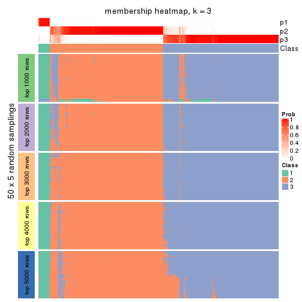</p>

</div>
<div id='tab-ATC-kmeans-membership-heatmap-3'>
<pre><code class="r">membership_heatmap(res, k = 4)
</code></pre>

<p></p>

</div>
<div id='tab-ATC-kmeans-membership-heatmap-4'>
<pre><code class="r">membership_heatmap(res, k = 5)
</code></pre>

<p></p>

</div>
<div id='tab-ATC-kmeans-membership-heatmap-5'>
<pre><code class="r">membership_heatmap(res, k = 6)
</code></pre>

<p></p>

</div>
</div>

As soon as we have had the classes for columns, we can look for signatures
which are significantly different between classes which can be candidate marks
for certain classes. Following are the heatmaps for signatures.


Signature heatmaps where rows are scaled:


<script>
$( function() {
	$( '#tabs-ATC-kmeans-get-signatures' ).tabs();
} );
</script>
<div id='tabs-ATC-kmeans-get-signatures'>
<ul>
<li><a href='#tab-ATC-kmeans-get-signatures-1'>k = 2</a></li>
<li><a href='#tab-ATC-kmeans-get-signatures-2'>k = 3</a></li>
<li><a href='#tab-ATC-kmeans-get-signatures-3'>k = 4</a></li>
<li><a href='#tab-ATC-kmeans-get-signatures-4'>k = 5</a></li>
<li><a href='#tab-ATC-kmeans-get-signatures-5'>k = 6</a></li>
</ul>
<div id='tab-ATC-kmeans-get-signatures-1'>
<pre><code class="r">get_signatures(res, k = 2)
</code></pre>

<pre><code>#&gt; Error in mat[ceiling(1:nr/h_ratio), ceiling(1:nc/w_ratio), drop = FALSE]: subscript out of bounds
</code></pre>

<p></p>

</div>
<div id='tab-ATC-kmeans-get-signatures-2'>
<pre><code class="r">get_signatures(res, k = 3)
</code></pre>

<p></p>

</div>
<div id='tab-ATC-kmeans-get-signatures-3'>
<pre><code class="r">get_signatures(res, k = 4)
</code></pre>

<p></p>

</div>
<div id='tab-ATC-kmeans-get-signatures-4'>
<pre><code class="r">get_signatures(res, k = 5)
</code></pre>

<p></p>

</div>
<div id='tab-ATC-kmeans-get-signatures-5'>
<pre><code class="r">get_signatures(res, k = 6)
</code></pre>

<p></p>

</div>
</div>


Signature heatmaps where rows are not scaled:


<script>
$( function() {
	$( '#tabs-ATC-kmeans-get-signatures-no-scale' ).tabs();
} );
</script>
<div id='tabs-ATC-kmeans-get-signatures-no-scale'>
<ul>
<li><a href='#tab-ATC-kmeans-get-signatures-no-scale-1'>k = 2</a></li>
<li><a href='#tab-ATC-kmeans-get-signatures-no-scale-2'>k = 3</a></li>
<li><a href='#tab-ATC-kmeans-get-signatures-no-scale-3'>k = 4</a></li>
<li><a href='#tab-ATC-kmeans-get-signatures-no-scale-4'>k = 5</a></li>
<li><a href='#tab-ATC-kmeans-get-signatures-no-scale-5'>k = 6</a></li>
</ul>
<div id='tab-ATC-kmeans-get-signatures-no-scale-1'>
<pre><code class="r">get_signatures(res, k = 2, scale_rows = FALSE)
</code></pre>

<pre><code>#&gt; Error in mat[ceiling(1:nr/h_ratio), ceiling(1:nc/w_ratio), drop = FALSE]: subscript out of bounds
</code></pre>

<p></p>

</div>
<div id='tab-ATC-kmeans-get-signatures-no-scale-2'>
<pre><code class="r">get_signatures(res, k = 3, scale_rows = FALSE)
</code></pre>

<p></p>

</div>
<div id='tab-ATC-kmeans-get-signatures-no-scale-3'>
<pre><code class="r">get_signatures(res, k = 4, scale_rows = FALSE)
</code></pre>

<p></p>

</div>
<div id='tab-ATC-kmeans-get-signatures-no-scale-4'>
<pre><code class="r">get_signatures(res, k = 5, scale_rows = FALSE)
</code></pre>

<p></p>

</div>
<div id='tab-ATC-kmeans-get-signatures-no-scale-5'>
<pre><code class="r">get_signatures(res, k = 6, scale_rows = FALSE)
</code></pre>

<p></p>

</div>
</div>


Compare the overlap of signatures from different k:

```r
compare_signatures(res)
```


`get_signature()` returns a data frame invisibly. TO get the list of signatures, the function
call should be assigned to a variable explicitly. In following code, if `plot` argument is set
to `FALSE`, no heatmap is plotted while only the differential analysis is performed.

```r
# code only for demonstration
tb = get_signature(res, k = ..., plot = FALSE)
```

An example of the output of `tb` is:

```
#>   which_row         fdr    mean_1    mean_2 scaled_mean_1 scaled_mean_2 km
#> 1        38 0.042760348  8.373488  9.131774    -0.5533452     0.5164555  1
#> 2        40 0.018707592  7.106213  8.469186    -0.6173731     0.5762149  1
#> 3        55 0.019134737 10.221463 11.207825    -0.6159697     0.5749050  1
#> 4        59 0.006059896  5.921854  7.869574    -0.6899429     0.6439467  1
#> 5        60 0.018055526  8.928898 10.211722    -0.6204761     0.5791110  1
#> 6        98 0.009384629 15.714769 14.887706     0.6635654    -0.6193277  2
...
```

The columns in `tb` are:

1. `which_row`: row indices corresponding to the input matrix.
2. `fdr`: FDR for the differential test. 
3. `mean_x`: The mean value in group x.
4. `scaled_mean_x`: The mean value in group x after rows are scaled.
5. `km`: Row groups if k-means clustering is applied to rows.


UMAP plot which shows how samples are separated.


<script>
$( function() {
	$( '#tabs-ATC-kmeans-dimension-reduction' ).tabs();
} );
</script>
<div id='tabs-ATC-kmeans-dimension-reduction'>
<ul>
<li><a href='#tab-ATC-kmeans-dimension-reduction-1'>k = 2</a></li>
<li><a href='#tab-ATC-kmeans-dimension-reduction-2'>k = 3</a></li>
<li><a href='#tab-ATC-kmeans-dimension-reduction-3'>k = 4</a></li>
<li><a href='#tab-ATC-kmeans-dimension-reduction-4'>k = 5</a></li>
<li><a href='#tab-ATC-kmeans-dimension-reduction-5'>k = 6</a></li>
</ul>
<div id='tab-ATC-kmeans-dimension-reduction-1'>
<pre><code class="r">dimension_reduction(res, k = 2, method = &quot;UMAP&quot;)
</code></pre>

<p></p>

</div>
<div id='tab-ATC-kmeans-dimension-reduction-2'>
<pre><code class="r">dimension_reduction(res, k = 3, method = &quot;UMAP&quot;)
</code></pre>

<p>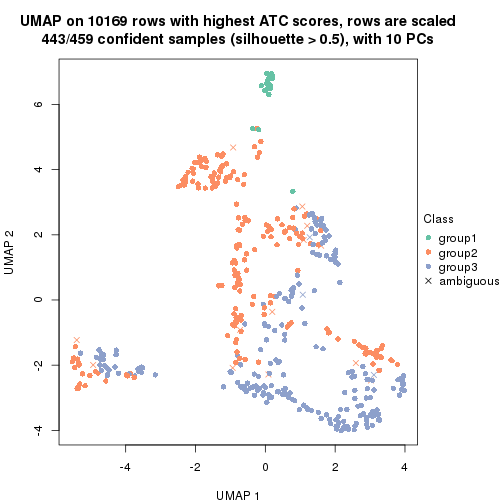</p>

</div>
<div id='tab-ATC-kmeans-dimension-reduction-3'>
<pre><code class="r">dimension_reduction(res, k = 4, method = &quot;UMAP&quot;)
</code></pre>

<p></p>

</div>
<div id='tab-ATC-kmeans-dimension-reduction-4'>
<pre><code class="r">dimension_reduction(res, k = 5, method = &quot;UMAP&quot;)
</code></pre>

<p></p>

</div>
<div id='tab-ATC-kmeans-dimension-reduction-5'>
<pre><code class="r">dimension_reduction(res, k = 6, method = &quot;UMAP&quot;)
</code></pre>

<p></p>

</div>
</div>


Following heatmap shows how subgroups are split when increasing `k`:

```r
collect_classes(res)
```


If matrix rows can be associated to genes, consider to use `functional_enrichment(res,
...)` to perform function enrichment for the signature genes. See [this vignette](http://bioconductor.org/packages/devel/bioc/vignettes/cola/inst/doc/functional_enrichment.html) for more detailed explanations.


 

---------------------------------------------------


### ATC:skmeans


The object with results only for a single top-value method and a single partition method 
can be extracted as:

```r
res = res_list["ATC", "skmeans"]
# you can also extract it by
# res = res_list["ATC:skmeans"]
```

A summary of `res` and all the functions that can be applied to it:

```r
res
```

```
#> A 'ConsensusPartition' object with k = 2, 3, 4, 5, 6.
#>   On a matrix with 10169 rows and 459 columns.
#>   Top rows (1000, 2000, 3000, 4000, 5000) are extracted by 'ATC' method.
#>   Subgroups are detected by 'skmeans' method.
#>   Performed in total 1250 partitions by row resampling.
#>   Best k for subgroups seems to be 2.
#> 
#> Following methods can be applied to this 'ConsensusPartition' object:
#>  [1] "cola_report"             "collect_classes"         "collect_plots"          
#>  [4] "collect_stats"           "colnames"                "compare_signatures"     
#>  [7] "consensus_heatmap"       "dimension_reduction"     "functional_enrichment"  
#> [10] "get_anno_col"            "get_anno"                "get_classes"            
#> [13] "get_consensus"           "get_matrix"              "get_membership"         
#> [16] "get_param"               "get_signatures"          "get_stats"              
#> [19] "is_best_k"               "is_stable_k"             "membership_heatmap"     
#> [22] "ncol"                    "nrow"                    "plot_ecdf"              
#> [25] "rownames"                "select_partition_number" "show"                   
#> [28] "suggest_best_k"          "test_to_known_factors"
```

`collect_plots()` function collects all the plots made from `res` for all `k` (number of partitions)
into one single page to provide an easy and fast comparison between different `k`.

```r
collect_plots(res)
```


The plots are:

- The first row: a plot of the ECDF (empirical cumulative distribution
  function) curves of the consensus matrix for each `k` and the heatmap of
  predicted classes for each `k`.
- The second row: heatmaps of the consensus matrix for each `k`.
- The third row: heatmaps of the membership matrix for each `k`.
- The fouth row: heatmaps of the signatures for each `k`.

All the plots in panels can be made by individual functions and they are
plotted later in this section.

`select_partition_number()` produces several plots showing different
statistics for choosing "optimized" `k`. There are following statistics:

- ECDF curves of the consensus matrix for each `k`;
- 1-PAC. [The PAC
  score](https://en.wikipedia.org/wiki/Consensus_clustering#Over-interpretation_potential_of_consensus_clustering)
  measures the proportion of the ambiguous subgrouping.
- Mean silhouette score.
- Concordance. The mean probability of fiting the consensus class ids in all
  partitions.
- Area increased. Denote $A_k$ as the area under the ECDF curve for current
  `k`, the area increased is defined as $A_k - A_{k-1}$.
- Rand index. The percent of pairs of samples that are both in a same cluster
  or both are not in a same cluster in the partition of k and k-1.
- Jaccard index. The ratio of pairs of samples are both in a same cluster in
  the partition of k and k-1 and the pairs of samples are both in a same
  cluster in the partition k or k-1.

The detailed explanations of these statistics can be found in [the _cola_
vignette](http://bioconductor.org/packages/devel/bioc/vignettes/cola/inst/doc/cola.html#toc_13).

Generally speaking, lower PAC score, higher mean silhouette score or higher
concordance corresponds to better partition. Rand index and Jaccard index
measure how similar the current partition is compared to partition with `k-1`.
If they are too similar, we won't accept `k` is better than `k-1`.

```r
select_partition_number(res)
```


The numeric values for all these statistics can be obtained by `get_stats()`.

```r
get_stats(res)
```

```
#>   k 1-PAC mean_silhouette concordance area_increased  Rand Jaccard
#> 2 2 0.805           0.894       0.955         0.5001 0.500   0.500
#> 3 3 0.666           0.680       0.834         0.3055 0.763   0.564
#> 4 4 0.690           0.743       0.849         0.1132 0.826   0.563
#> 5 5 0.698           0.709       0.844         0.0756 0.840   0.508
#> 6 6 0.700           0.605       0.781         0.0534 0.886   0.551
```

`suggest_best_k()` suggests the best $k$ based on these statistics. The rules are as follows:

- All $k$ with Jaccard index larger than 0.95 are removed because increasing
  $k$ does not provide enough extra information. If all $k$ are removed, it is
  marked as no subgroup is detected.
- For all $k$ with 1-PAC score larger than 0.9, the maximal $k$ is taken as
  the best $k$, and other $k$ are marked as optional $k$.
- If it does not fit the second rule. The $k$ with the maximal vote of the
  highest 1-PAC score, highest mean silhouette, and highest concordance is
  taken as the best $k$.

```r
suggest_best_k(res)
```

```
#> [1] 2
```


Following shows the table of the partitions (You need to click the **show/hide
code output** link to see it). The membership matrix (columns with name `p*`)
is inferred by
[`clue::cl_consensus()`](https://www.rdocumentation.org/link/cl_consensus?package=clue)
function with the `SE` method. Basically the value in the membership matrix
represents the probability to belong to a certain group. The finall class
label for an item is determined with the group with highest probability it
belongs to.

In `get_classes()` function, the entropy is calculated from the membership
matrix and the silhouette score is calculated from the consensus matrix.


<script>
$( function() {
	$( '#tabs-ATC-skmeans-get-classes' ).tabs();
} );
</script>
<div id='tabs-ATC-skmeans-get-classes'>
<ul>
<li><a href='#tab-ATC-skmeans-get-classes-1'>k = 2</a></li>
<li><a href='#tab-ATC-skmeans-get-classes-2'>k = 3</a></li>
<li><a href='#tab-ATC-skmeans-get-classes-3'>k = 4</a></li>
<li><a href='#tab-ATC-skmeans-get-classes-4'>k = 5</a></li>
<li><a href='#tab-ATC-skmeans-get-classes-5'>k = 6</a></li>
</ul>

<div id='tab-ATC-skmeans-get-classes-1'>
<p><a id='tab-ATC-skmeans-get-classes-1-a' style='color:#0366d6' href='#'>show/hide code output</a></p>
<pre><code class="r">cbind(get_classes(res, k = 2), get_membership(res, k = 2))
</code></pre>

<pre><code>#&gt;            class entropy silhouette    p1    p2
#&gt; SRR1699874     2  0.0000     0.9587 0.000 1.000
#&gt; SRR1699875     2  0.0000     0.9587 0.000 1.000
#&gt; SRR1699876     2  0.0000     0.9587 0.000 1.000
#&gt; SRR1699877     2  0.0000     0.9587 0.000 1.000
#&gt; SRR1699879     2  0.0000     0.9587 0.000 1.000
#&gt; SRR1699878     2  0.0000     0.9587 0.000 1.000
#&gt; SRR1699880     2  0.3274     0.9097 0.060 0.940
#&gt; SRR1699881     2  0.1633     0.9407 0.024 0.976
#&gt; SRR1699882     2  0.0000     0.9587 0.000 1.000
#&gt; SRR1699883     2  0.0000     0.9587 0.000 1.000
#&gt; SRR1699884     2  0.0000     0.9587 0.000 1.000
#&gt; SRR1699885     2  0.0000     0.9587 0.000 1.000
#&gt; SRR1699886     2  0.0000     0.9587 0.000 1.000
#&gt; SRR1699888     2  0.0000     0.9587 0.000 1.000
#&gt; SRR1699889     2  0.0000     0.9587 0.000 1.000
#&gt; SRR1699890     2  0.0000     0.9587 0.000 1.000
#&gt; SRR1699887     2  0.0000     0.9587 0.000 1.000
#&gt; SRR1699891     2  0.0000     0.9587 0.000 1.000
#&gt; SRR1699892     2  0.0000     0.9587 0.000 1.000
#&gt; SRR1699893     2  0.5519     0.8381 0.128 0.872
#&gt; SRR1699894     2  0.0000     0.9587 0.000 1.000
#&gt; SRR1699895     2  0.0000     0.9587 0.000 1.000
#&gt; SRR1699896     2  0.5519     0.8343 0.128 0.872
#&gt; SRR1699897     2  0.0000     0.9587 0.000 1.000
#&gt; SRR1699898     1  0.0000     0.9441 1.000 0.000
#&gt; SRR1699900     1  0.0672     0.9390 0.992 0.008
#&gt; SRR1699899     2  0.0000     0.9587 0.000 1.000
#&gt; SRR1699902     1  0.0000     0.9441 1.000 0.000
#&gt; SRR1699901     1  0.0000     0.9441 1.000 0.000
#&gt; SRR1699903     2  0.8443     0.6113 0.272 0.728
#&gt; SRR1699904     1  0.4298     0.8756 0.912 0.088
#&gt; SRR1699905     1  0.0000     0.9441 1.000 0.000
#&gt; SRR1699906     2  0.9754     0.2767 0.408 0.592
#&gt; SRR1699907     1  0.6712     0.7839 0.824 0.176
#&gt; SRR1699908     2  0.8909     0.5378 0.308 0.692
#&gt; SRR1699909     1  0.0000     0.9441 1.000 0.000
#&gt; SRR1699910     1  0.0000     0.9441 1.000 0.000
#&gt; SRR1699911     1  0.0000     0.9441 1.000 0.000
#&gt; SRR1699912     1  0.6712     0.7839 0.824 0.176
#&gt; SRR1699913     1  0.9580     0.4313 0.620 0.380
#&gt; SRR1699914     1  0.0000     0.9441 1.000 0.000
#&gt; SRR1699915     1  0.0000     0.9441 1.000 0.000
#&gt; SRR1699916     1  0.8763     0.6063 0.704 0.296
#&gt; SRR1699917     1  0.3431     0.8974 0.936 0.064
#&gt; SRR1699918     1  0.0000     0.9441 1.000 0.000
#&gt; SRR1699919     1  0.0000     0.9441 1.000 0.000
#&gt; SRR1699920     1  0.0000     0.9441 1.000 0.000
#&gt; SRR1699921     1  0.0000     0.9441 1.000 0.000
#&gt; SRR1699922     1  0.6801     0.7795 0.820 0.180
#&gt; SRR1699923     1  0.0000     0.9441 1.000 0.000
#&gt; SRR1699924     1  0.0000     0.9441 1.000 0.000
#&gt; SRR1699925     1  0.0000     0.9441 1.000 0.000
#&gt; SRR1699926     1  0.0376     0.9415 0.996 0.004
#&gt; SRR1699927     1  0.9522     0.4499 0.628 0.372
#&gt; SRR1699929     1  1.0000     0.0663 0.504 0.496
#&gt; SRR1699928     1  0.6801     0.7793 0.820 0.180
#&gt; SRR1699930     2  0.1843     0.9371 0.028 0.972
#&gt; SRR1699931     2  0.0000     0.9587 0.000 1.000
#&gt; SRR1699933     2  0.1633     0.9409 0.024 0.976
#&gt; SRR1699932     2  0.9988     0.0172 0.480 0.520
#&gt; SRR1699934     1  0.0000     0.9441 1.000 0.000
#&gt; SRR1699935     2  0.0000     0.9587 0.000 1.000
#&gt; SRR1699936     2  0.0000     0.9587 0.000 1.000
#&gt; SRR1699937     2  0.0000     0.9587 0.000 1.000
#&gt; SRR1699938     2  0.0000     0.9587 0.000 1.000
#&gt; SRR1699940     2  0.0000     0.9587 0.000 1.000
#&gt; SRR1699939     2  0.0000     0.9587 0.000 1.000
#&gt; SRR1699941     2  0.1633     0.9408 0.024 0.976
#&gt; SRR1699942     2  0.0000     0.9587 0.000 1.000
#&gt; SRR1699943     2  0.0000     0.9587 0.000 1.000
#&gt; SRR1699944     2  0.0000     0.9587 0.000 1.000
#&gt; SRR1699945     2  0.5737     0.8291 0.136 0.864
#&gt; SRR1699946     2  0.0000     0.9587 0.000 1.000
#&gt; SRR1699947     2  0.0000     0.9587 0.000 1.000
#&gt; SRR1699948     2  0.0000     0.9587 0.000 1.000
#&gt; SRR1699949     2  0.0000     0.9587 0.000 1.000
#&gt; SRR1699950     2  0.0000     0.9587 0.000 1.000
#&gt; SRR1699951     2  0.0000     0.9587 0.000 1.000
#&gt; SRR1699952     2  0.0000     0.9587 0.000 1.000
#&gt; SRR1699953     2  0.0000     0.9587 0.000 1.000
#&gt; SRR1699954     2  0.0000     0.9587 0.000 1.000
#&gt; SRR1699955     2  0.0000     0.9587 0.000 1.000
#&gt; SRR1699956     2  0.9635     0.3781 0.388 0.612
#&gt; SRR1699957     2  0.0000     0.9587 0.000 1.000
#&gt; SRR1699959     2  0.2948     0.9172 0.052 0.948
#&gt; SRR1699958     2  0.0000     0.9587 0.000 1.000
#&gt; SRR1699960     2  0.0000     0.9587 0.000 1.000
#&gt; SRR1699961     2  0.0000     0.9587 0.000 1.000
#&gt; SRR1699962     2  0.0000     0.9587 0.000 1.000
#&gt; SRR1699963     2  0.0000     0.9587 0.000 1.000
#&gt; SRR1699964     2  0.0000     0.9587 0.000 1.000
#&gt; SRR1699965     2  0.0000     0.9587 0.000 1.000
#&gt; SRR1699966     2  0.0000     0.9587 0.000 1.000
#&gt; SRR1699967     2  0.0000     0.9587 0.000 1.000
#&gt; SRR1699968     2  0.0000     0.9587 0.000 1.000
#&gt; SRR1699969     2  0.8909     0.5625 0.308 0.692
#&gt; SRR1699971     2  0.0938     0.9500 0.012 0.988
#&gt; SRR1699970     2  0.0000     0.9587 0.000 1.000
#&gt; SRR1699972     2  0.3431     0.9059 0.064 0.936
#&gt; SRR1699973     2  0.0000     0.9587 0.000 1.000
#&gt; SRR1699974     1  0.0000     0.9441 1.000 0.000
#&gt; SRR1699975     2  0.0000     0.9587 0.000 1.000
#&gt; SRR1699976     2  0.0000     0.9587 0.000 1.000
#&gt; SRR1699977     1  0.9815     0.2729 0.580 0.420
#&gt; SRR1699978     1  0.0000     0.9441 1.000 0.000
#&gt; SRR1699979     2  0.4562     0.8741 0.096 0.904
#&gt; SRR1699980     2  0.8661     0.6003 0.288 0.712
#&gt; SRR1699981     1  0.0000     0.9441 1.000 0.000
#&gt; SRR1699982     2  0.0000     0.9587 0.000 1.000
#&gt; SRR1699983     2  0.0000     0.9587 0.000 1.000
#&gt; SRR1699984     1  0.0000     0.9441 1.000 0.000
#&gt; SRR1699985     2  0.0000     0.9587 0.000 1.000
#&gt; SRR1699986     1  0.0000     0.9441 1.000 0.000
#&gt; SRR1699988     2  0.0000     0.9587 0.000 1.000
#&gt; SRR1699987     1  0.6712     0.7713 0.824 0.176
#&gt; SRR1699989     2  0.0000     0.9587 0.000 1.000
#&gt; SRR1699990     2  0.4431     0.8801 0.092 0.908
#&gt; SRR1699992     2  0.5946     0.8210 0.144 0.856
#&gt; SRR1699991     1  0.0000     0.9441 1.000 0.000
#&gt; SRR1699993     1  0.0000     0.9441 1.000 0.000
#&gt; SRR1699994     1  0.4161     0.8748 0.916 0.084
#&gt; SRR1699995     1  0.0000     0.9441 1.000 0.000
#&gt; SRR1699996     2  0.0000     0.9587 0.000 1.000
#&gt; SRR1699997     2  0.5408     0.8455 0.124 0.876
#&gt; SRR1699998     2  0.0000     0.9587 0.000 1.000
#&gt; SRR1699999     1  0.0000     0.9441 1.000 0.000
#&gt; SRR1700000     2  0.2778     0.9206 0.048 0.952
#&gt; SRR1700002     2  0.0000     0.9587 0.000 1.000
#&gt; SRR1700001     2  0.9580     0.3991 0.380 0.620
#&gt; SRR1700003     2  0.0000     0.9587 0.000 1.000
#&gt; SRR1700004     1  0.9866     0.2381 0.568 0.432
#&gt; SRR1700005     1  0.0000     0.9441 1.000 0.000
#&gt; SRR1700006     2  0.0000     0.9587 0.000 1.000
#&gt; SRR1700007     2  0.0000     0.9587 0.000 1.000
#&gt; SRR1700008     1  0.0000     0.9441 1.000 0.000
#&gt; SRR1700009     1  0.0000     0.9441 1.000 0.000
#&gt; SRR1700010     2  0.6801     0.7728 0.180 0.820
#&gt; SRR1700011     2  0.0000     0.9587 0.000 1.000
#&gt; SRR1700013     2  0.0000     0.9587 0.000 1.000
#&gt; SRR1700012     2  0.0000     0.9587 0.000 1.000
#&gt; SRR1700014     1  0.9044     0.5335 0.680 0.320
#&gt; SRR1700015     2  0.0376     0.9558 0.004 0.996
#&gt; SRR1700016     1  0.0000     0.9441 1.000 0.000
#&gt; SRR1700018     2  0.0000     0.9587 0.000 1.000
#&gt; SRR1700017     2  0.6623     0.7837 0.172 0.828
#&gt; SRR1700019     2  0.0000     0.9587 0.000 1.000
#&gt; SRR1700020     1  0.4022     0.8786 0.920 0.080
#&gt; SRR1700021     1  0.4562     0.8683 0.904 0.096
#&gt; SRR1700023     2  0.0000     0.9587 0.000 1.000
#&gt; SRR1700022     2  0.9286     0.4855 0.344 0.656
#&gt; SRR1700024     1  0.0672     0.9390 0.992 0.008
#&gt; SRR1700025     2  0.0000     0.9587 0.000 1.000
#&gt; SRR1700026     2  0.9833     0.2767 0.424 0.576
#&gt; SRR1700027     2  0.6623     0.7840 0.172 0.828
#&gt; SRR1700028     2  0.4298     0.8843 0.088 0.912
#&gt; SRR1700029     1  0.0000     0.9441 1.000 0.000
#&gt; SRR1700030     2  0.4815     0.8651 0.104 0.896
#&gt; SRR1700031     1  0.5059     0.8458 0.888 0.112
#&gt; SRR1700032     2  0.0000     0.9587 0.000 1.000
#&gt; SRR1700034     1  0.0000     0.9441 1.000 0.000
#&gt; SRR1700035     1  0.9635     0.4120 0.612 0.388
#&gt; SRR1700033     1  0.0000     0.9441 1.000 0.000
#&gt; SRR1700036     1  0.8267     0.6734 0.740 0.260
#&gt; SRR1700037     1  0.7453     0.7388 0.788 0.212
#&gt; SRR1700038     1  0.0000     0.9441 1.000 0.000
#&gt; SRR1700039     1  0.0000     0.9441 1.000 0.000
#&gt; SRR1700040     1  0.0000     0.9441 1.000 0.000
#&gt; SRR1700041     1  0.0000     0.9441 1.000 0.000
#&gt; SRR1700042     1  0.0000     0.9441 1.000 0.000
#&gt; SRR1700043     1  0.0000     0.9441 1.000 0.000
#&gt; SRR1700045     1  0.0000     0.9441 1.000 0.000
#&gt; SRR1700044     1  0.0000     0.9441 1.000 0.000
#&gt; SRR1700046     1  0.0000     0.9441 1.000 0.000
#&gt; SRR1700047     1  0.0000     0.9441 1.000 0.000
#&gt; SRR1700048     1  0.0000     0.9441 1.000 0.000
#&gt; SRR1700049     1  0.0000     0.9441 1.000 0.000
#&gt; SRR1700050     1  0.0000     0.9441 1.000 0.000
#&gt; SRR1700051     1  0.0000     0.9441 1.000 0.000
#&gt; SRR1700052     1  0.0000     0.9441 1.000 0.000
#&gt; SRR1700053     1  0.0000     0.9441 1.000 0.000
#&gt; SRR1700054     1  0.0000     0.9441 1.000 0.000
#&gt; SRR1700055     1  0.0000     0.9441 1.000 0.000
#&gt; SRR1700056     1  0.0000     0.9441 1.000 0.000
#&gt; SRR1700057     1  0.0000     0.9441 1.000 0.000
#&gt; SRR1700058     1  0.0000     0.9441 1.000 0.000
#&gt; SRR1700059     1  0.0000     0.9441 1.000 0.000
#&gt; SRR1700060     1  0.0000     0.9441 1.000 0.000
#&gt; SRR1700061     1  0.0000     0.9441 1.000 0.000
#&gt; SRR1700062     1  0.0000     0.9441 1.000 0.000
#&gt; SRR1700063     1  0.0000     0.9441 1.000 0.000
#&gt; SRR1700064     1  0.0000     0.9441 1.000 0.000
#&gt; SRR1700065     1  0.0000     0.9441 1.000 0.000
#&gt; SRR1700066     1  0.0000     0.9441 1.000 0.000
#&gt; SRR1700067     1  0.0000     0.9441 1.000 0.000
#&gt; SRR1700068     1  0.0000     0.9441 1.000 0.000
#&gt; SRR1700069     1  0.0000     0.9441 1.000 0.000
#&gt; SRR1700070     1  0.1633     0.9278 0.976 0.024
#&gt; SRR1700071     1  0.0000     0.9441 1.000 0.000
#&gt; SRR1700072     1  0.0000     0.9441 1.000 0.000
#&gt; SRR1700073     1  0.0000     0.9441 1.000 0.000
#&gt; SRR1700075     1  0.0000     0.9441 1.000 0.000
#&gt; SRR1700074     1  0.2236     0.9174 0.964 0.036
#&gt; SRR1700076     1  0.0000     0.9441 1.000 0.000
#&gt; SRR1700077     1  0.0000     0.9441 1.000 0.000
#&gt; SRR1700078     1  0.0000     0.9441 1.000 0.000
#&gt; SRR1700080     1  0.0000     0.9441 1.000 0.000
#&gt; SRR1700079     1  0.0000     0.9441 1.000 0.000
#&gt; SRR1700081     1  0.0000     0.9441 1.000 0.000
#&gt; SRR1700082     2  0.9896     0.2266 0.440 0.560
#&gt; SRR1700083     1  0.0000     0.9441 1.000 0.000
#&gt; SRR1700084     1  0.0000     0.9441 1.000 0.000
#&gt; SRR1700085     2  0.1414     0.9437 0.020 0.980
#&gt; SRR1700086     1  0.1184     0.9329 0.984 0.016
#&gt; SRR1700087     2  0.0000     0.9587 0.000 1.000
#&gt; SRR1700088     2  0.0000     0.9587 0.000 1.000
#&gt; SRR1700089     2  0.0000     0.9587 0.000 1.000
#&gt; SRR1700091     2  0.0000     0.9587 0.000 1.000
#&gt; SRR1700090     2  0.9460     0.4400 0.364 0.636
#&gt; SRR1700092     2  0.0000     0.9587 0.000 1.000
#&gt; SRR1700094     2  0.0000     0.9587 0.000 1.000
#&gt; SRR1700093     2  0.0000     0.9587 0.000 1.000
#&gt; SRR1700095     1  0.0000     0.9441 1.000 0.000
#&gt; SRR1700096     2  0.0000     0.9587 0.000 1.000
#&gt; SRR1700097     1  0.6973     0.7524 0.812 0.188
#&gt; SRR1700098     2  0.0000     0.9587 0.000 1.000
#&gt; SRR1700099     2  0.0000     0.9587 0.000 1.000
#&gt; SRR1700100     2  0.0000     0.9587 0.000 1.000
#&gt; SRR1700101     2  0.0000     0.9587 0.000 1.000
#&gt; SRR1700102     2  0.0000     0.9587 0.000 1.000
#&gt; SRR1700104     2  0.0000     0.9587 0.000 1.000
#&gt; SRR1700103     2  0.6343     0.8001 0.160 0.840
#&gt; SRR1700105     1  0.9866     0.2784 0.568 0.432
#&gt; SRR1700106     2  0.2778     0.9214 0.048 0.952
#&gt; SRR1700107     2  0.0000     0.9587 0.000 1.000
#&gt; SRR1700108     2  0.0000     0.9587 0.000 1.000
#&gt; SRR1700109     2  0.0000     0.9587 0.000 1.000
#&gt; SRR1700110     2  0.0000     0.9587 0.000 1.000
#&gt; SRR1700112     2  0.0000     0.9587 0.000 1.000
#&gt; SRR1700111     1  0.0000     0.9441 1.000 0.000
#&gt; SRR1700113     2  0.0000     0.9587 0.000 1.000
#&gt; SRR1700114     2  0.0000     0.9587 0.000 1.000
#&gt; SRR1700115     2  0.0000     0.9587 0.000 1.000
#&gt; SRR1700116     1  0.9775     0.2968 0.588 0.412
#&gt; SRR1700117     1  0.0000     0.9441 1.000 0.000
#&gt; SRR1700119     1  0.9896     0.2120 0.560 0.440
#&gt; SRR1700118     1  0.0000     0.9441 1.000 0.000
#&gt; SRR1700120     1  0.0000     0.9441 1.000 0.000
#&gt; SRR1700121     2  0.6048     0.8147 0.148 0.852
#&gt; SRR1700122     1  0.0000     0.9441 1.000 0.000
#&gt; SRR1700123     1  0.0000     0.9441 1.000 0.000
#&gt; SRR1700125     2  0.0000     0.9587 0.000 1.000
#&gt; SRR1700126     1  0.0000     0.9441 1.000 0.000
#&gt; SRR1700127     1  0.0000     0.9441 1.000 0.000
#&gt; SRR1700124     1  0.0000     0.9441 1.000 0.000
#&gt; SRR1700128     1  0.0000     0.9441 1.000 0.000
#&gt; SRR1700129     1  0.0000     0.9441 1.000 0.000
#&gt; SRR1700130     1  0.0000     0.9441 1.000 0.000
#&gt; SRR1700132     1  0.0000     0.9441 1.000 0.000
#&gt; SRR1700131     1  0.0000     0.9441 1.000 0.000
#&gt; SRR1700133     1  0.0000     0.9441 1.000 0.000
#&gt; SRR1700134     1  0.0000     0.9441 1.000 0.000
#&gt; SRR1700135     1  0.0000     0.9441 1.000 0.000
#&gt; SRR1700136     1  0.0000     0.9441 1.000 0.000
#&gt; SRR1700137     1  0.0000     0.9441 1.000 0.000
#&gt; SRR1700138     1  0.0000     0.9441 1.000 0.000
#&gt; SRR1700140     1  0.0000     0.9441 1.000 0.000
#&gt; SRR1700139     1  0.0000     0.9441 1.000 0.000
#&gt; SRR1700141     1  0.3114     0.9032 0.944 0.056
#&gt; SRR1700142     1  0.0000     0.9441 1.000 0.000
#&gt; SRR1700143     1  0.0000     0.9441 1.000 0.000
#&gt; SRR1700144     1  0.0000     0.9441 1.000 0.000
#&gt; SRR1700145     1  0.0000     0.9441 1.000 0.000
#&gt; SRR1700146     1  0.0000     0.9441 1.000 0.000
#&gt; SRR1700147     1  0.0000     0.9441 1.000 0.000
#&gt; SRR1700149     1  0.0000     0.9441 1.000 0.000
#&gt; SRR1700148     1  0.0000     0.9441 1.000 0.000
#&gt; SRR1700150     1  0.0000     0.9441 1.000 0.000
#&gt; SRR1700152     1  0.0000     0.9441 1.000 0.000
#&gt; SRR1700151     1  0.0000     0.9441 1.000 0.000
#&gt; SRR1700153     1  0.0000     0.9441 1.000 0.000
#&gt; SRR1700154     1  0.0000     0.9441 1.000 0.000
#&gt; SRR1700155     1  0.0000     0.9441 1.000 0.000
#&gt; SRR1700156     1  0.0000     0.9441 1.000 0.000
#&gt; SRR1700158     1  0.0000     0.9441 1.000 0.000
#&gt; SRR1700159     1  0.6973     0.7695 0.812 0.188
#&gt; SRR1700157     1  0.0000     0.9441 1.000 0.000
#&gt; SRR1700160     1  0.0000     0.9441 1.000 0.000
#&gt; SRR1700161     1  0.0000     0.9441 1.000 0.000
#&gt; SRR1700162     1  0.0000     0.9441 1.000 0.000
#&gt; SRR1700164     1  0.0000     0.9441 1.000 0.000
#&gt; SRR1700163     1  0.0000     0.9441 1.000 0.000
#&gt; SRR1700165     1  0.0000     0.9441 1.000 0.000
#&gt; SRR1700166     1  0.0000     0.9441 1.000 0.000
#&gt; SRR1700168     2  0.9044     0.5114 0.320 0.680
#&gt; SRR1700167     1  0.0000     0.9441 1.000 0.000
#&gt; SRR1700170     1  0.0000     0.9441 1.000 0.000
#&gt; SRR1700169     1  0.0000     0.9441 1.000 0.000
#&gt; SRR1700171     1  0.0000     0.9441 1.000 0.000
#&gt; SRR1700172     1  0.0000     0.9441 1.000 0.000
#&gt; SRR1700174     1  0.0000     0.9441 1.000 0.000
#&gt; SRR1700173     1  0.0000     0.9441 1.000 0.000
#&gt; SRR1700175     1  0.0000     0.9441 1.000 0.000
#&gt; SRR1700176     1  0.0000     0.9441 1.000 0.000
#&gt; SRR1700178     2  0.0000     0.9587 0.000 1.000
#&gt; SRR1700177     1  0.0000     0.9441 1.000 0.000
#&gt; SRR1700180     2  0.0000     0.9587 0.000 1.000
#&gt; SRR1700179     2  0.0000     0.9587 0.000 1.000
#&gt; SRR1700181     2  0.0000     0.9587 0.000 1.000
#&gt; SRR1700183     1  0.0000     0.9441 1.000 0.000
#&gt; SRR1700182     2  0.0000     0.9587 0.000 1.000
#&gt; SRR1700184     2  0.0000     0.9587 0.000 1.000
#&gt; SRR1700186     2  0.0000     0.9587 0.000 1.000
#&gt; SRR1700187     1  0.0000     0.9441 1.000 0.000
#&gt; SRR1700185     1  0.0000     0.9441 1.000 0.000
#&gt; SRR1700188     2  0.0000     0.9587 0.000 1.000
#&gt; SRR1700192     2  0.0672     0.9530 0.008 0.992
#&gt; SRR1700190     2  0.5842     0.8244 0.140 0.860
#&gt; SRR1700191     1  0.0000     0.9441 1.000 0.000
#&gt; SRR1700189     1  0.0000     0.9441 1.000 0.000
#&gt; SRR1700193     2  0.0000     0.9587 0.000 1.000
#&gt; SRR1700195     2  0.0000     0.9587 0.000 1.000
#&gt; SRR1700194     1  0.0000     0.9441 1.000 0.000
#&gt; SRR1700196     2  0.0000     0.9587 0.000 1.000
#&gt; SRR1700197     1  0.9580     0.3849 0.620 0.380
#&gt; SRR1700198     2  0.0000     0.9587 0.000 1.000
#&gt; SRR1700199     2  0.0000     0.9587 0.000 1.000
#&gt; SRR1700200     2  0.0000     0.9587 0.000 1.000
#&gt; SRR1700201     2  0.0000     0.9587 0.000 1.000
#&gt; SRR1700202     1  0.5294     0.8451 0.880 0.120
#&gt; SRR1700203     2  0.0000     0.9587 0.000 1.000
#&gt; SRR1700204     2  0.0000     0.9587 0.000 1.000
#&gt; SRR1700206     2  0.0000     0.9587 0.000 1.000
#&gt; SRR1700207     2  0.0000     0.9587 0.000 1.000
#&gt; SRR1700208     2  0.0000     0.9587 0.000 1.000
#&gt; SRR1700205     2  0.0938     0.9499 0.012 0.988
#&gt; SRR1700209     2  0.0000     0.9587 0.000 1.000
#&gt; SRR1700210     2  0.0000     0.9587 0.000 1.000
#&gt; SRR1700211     2  0.0000     0.9587 0.000 1.000
#&gt; SRR1700212     2  0.0000     0.9587 0.000 1.000
#&gt; SRR1700213     2  0.0000     0.9587 0.000 1.000
#&gt; SRR1700214     2  0.0000     0.9587 0.000 1.000
#&gt; SRR1700215     1  0.0000     0.9441 1.000 0.000
#&gt; SRR1700217     2  0.0000     0.9587 0.000 1.000
#&gt; SRR1700216     1  0.0000     0.9441 1.000 0.000
#&gt; SRR1700218     2  0.0000     0.9587 0.000 1.000
#&gt; SRR1700219     2  0.0000     0.9587 0.000 1.000
#&gt; SRR1700222     1  0.0000     0.9441 1.000 0.000
#&gt; SRR1700220     2  0.0000     0.9587 0.000 1.000
#&gt; SRR1700221     2  0.0000     0.9587 0.000 1.000
#&gt; SRR1700223     2  0.0000     0.9587 0.000 1.000
#&gt; SRR1700224     2  0.0000     0.9587 0.000 1.000
#&gt; SRR1700226     2  0.0000     0.9587 0.000 1.000
#&gt; SRR1700229     2  0.0000     0.9587 0.000 1.000
#&gt; SRR1700225     2  0.0000     0.9587 0.000 1.000
#&gt; SRR1700227     2  0.0000     0.9587 0.000 1.000
#&gt; SRR1700230     1  0.0000     0.9441 1.000 0.000
#&gt; SRR1700231     2  0.0000     0.9587 0.000 1.000
#&gt; SRR1700228     2  0.0000     0.9587 0.000 1.000
#&gt; SRR1700232     2  0.0000     0.9587 0.000 1.000
#&gt; SRR1700233     2  0.0000     0.9587 0.000 1.000
#&gt; SRR1700234     2  0.9170     0.4831 0.332 0.668
#&gt; SRR1700235     2  0.0000     0.9587 0.000 1.000
#&gt; SRR1700237     2  0.0000     0.9587 0.000 1.000
#&gt; SRR1700236     2  0.0000     0.9587 0.000 1.000
#&gt; SRR1700238     2  0.0000     0.9587 0.000 1.000
#&gt; SRR1700239     1  0.0000     0.9441 1.000 0.000
#&gt; SRR1700240     1  0.0000     0.9441 1.000 0.000
#&gt; SRR1700241     1  0.0000     0.9441 1.000 0.000
#&gt; SRR1700243     2  0.0000     0.9587 0.000 1.000
#&gt; SRR1700244     2  0.0000     0.9587 0.000 1.000
#&gt; SRR1700242     1  0.0000     0.9441 1.000 0.000
#&gt; SRR1700246     1  0.0376     0.9415 0.996 0.004
#&gt; SRR1700245     2  0.0000     0.9587 0.000 1.000
#&gt; SRR1700247     1  0.0000     0.9441 1.000 0.000
#&gt; SRR1700249     1  0.0000     0.9441 1.000 0.000
#&gt; SRR1700250     2  0.0000     0.9587 0.000 1.000
#&gt; SRR1700248     2  0.0000     0.9587 0.000 1.000
#&gt; SRR1700251     2  0.0000     0.9587 0.000 1.000
#&gt; SRR1700252     2  0.0000     0.9587 0.000 1.000
#&gt; SRR1700253     2  0.0000     0.9587 0.000 1.000
#&gt; SRR1700256     2  0.0000     0.9587 0.000 1.000
#&gt; SRR1700254     1  0.0000     0.9441 1.000 0.000
#&gt; SRR1700255     2  0.0000     0.9587 0.000 1.000
#&gt; SRR1700257     2  0.0000     0.9587 0.000 1.000
#&gt; SRR1700258     2  0.0000     0.9587 0.000 1.000
#&gt; SRR1700259     2  0.0000     0.9587 0.000 1.000
#&gt; SRR1700260     2  0.0000     0.9587 0.000 1.000
#&gt; SRR1700261     2  0.0000     0.9587 0.000 1.000
#&gt; SRR1700262     2  0.0000     0.9587 0.000 1.000
#&gt; SRR1700263     2  0.0000     0.9587 0.000 1.000
#&gt; SRR1700264     2  0.0000     0.9587 0.000 1.000
#&gt; SRR1700265     2  0.0000     0.9587 0.000 1.000
#&gt; SRR1700266     2  0.0000     0.9587 0.000 1.000
#&gt; SRR1700268     2  0.0000     0.9587 0.000 1.000
#&gt; SRR1700270     2  0.0000     0.9587 0.000 1.000
#&gt; SRR1700267     2  0.0000     0.9587 0.000 1.000
#&gt; SRR1700271     2  0.0000     0.9587 0.000 1.000
#&gt; SRR1700272     2  0.0000     0.9587 0.000 1.000
#&gt; SRR1700273     2  0.0000     0.9587 0.000 1.000
#&gt; SRR1700274     2  0.0000     0.9587 0.000 1.000
#&gt; SRR1700277     2  0.0000     0.9587 0.000 1.000
#&gt; SRR1700275     2  0.0000     0.9587 0.000 1.000
#&gt; SRR1700276     2  0.0000     0.9587 0.000 1.000
#&gt; SRR1700278     2  0.9552     0.3708 0.376 0.624
#&gt; SRR1700279     2  0.9286     0.4545 0.344 0.656
#&gt; SRR1700280     2  0.3114     0.9120 0.056 0.944
#&gt; SRR1700281     2  0.0000     0.9587 0.000 1.000
#&gt; SRR1700283     2  0.0000     0.9587 0.000 1.000
#&gt; SRR1700282     2  0.5178     0.8519 0.116 0.884
#&gt; SRR1700284     2  0.0000     0.9587 0.000 1.000
#&gt; SRR1700285     2  0.3274     0.9082 0.060 0.940
#&gt; SRR1700286     2  0.0000     0.9587 0.000 1.000
#&gt; SRR1700287     2  0.0000     0.9587 0.000 1.000
#&gt; SRR1700290     1  0.0000     0.9441 1.000 0.000
#&gt; SRR1700289     2  0.0376     0.9558 0.004 0.996
#&gt; SRR1700288     2  0.0000     0.9587 0.000 1.000
#&gt; SRR1700292     2  0.0000     0.9587 0.000 1.000
#&gt; SRR1700291     1  0.9427     0.4780 0.640 0.360
#&gt; SRR1700293     2  0.2043     0.9338 0.032 0.968
#&gt; SRR1700294     1  0.2423     0.9156 0.960 0.040
#&gt; SRR1700295     1  0.0000     0.9441 1.000 0.000
#&gt; SRR1700297     2  0.7745     0.6897 0.228 0.772
#&gt; SRR1700296     1  0.9754     0.3589 0.592 0.408
#&gt; SRR1700298     1  0.0376     0.9415 0.996 0.004
#&gt; SRR1700299     1  0.0000     0.9441 1.000 0.000
#&gt; SRR1700300     1  0.0000     0.9441 1.000 0.000
#&gt; SRR1700302     1  0.5842     0.8243 0.860 0.140
#&gt; SRR1700301     1  0.7745     0.7158 0.772 0.228
#&gt; SRR1700303     1  0.9552     0.4405 0.624 0.376
#&gt; SRR1700304     1  0.2043     0.9216 0.968 0.032
#&gt; SRR1700305     1  0.6801     0.7797 0.820 0.180
#&gt; SRR1700306     1  0.0000     0.9441 1.000 0.000
#&gt; SRR1700308     1  0.9833     0.3147 0.576 0.424
#&gt; SRR1700307     1  0.0000     0.9441 1.000 0.000
#&gt; SRR1700309     1  0.0000     0.9441 1.000 0.000
#&gt; SRR1700310     1  0.6531     0.7932 0.832 0.168
#&gt; SRR1700311     1  0.0000     0.9441 1.000 0.000
#&gt; SRR1700312     2  0.8608     0.5873 0.284 0.716
#&gt; SRR1700313     1  0.0000     0.9441 1.000 0.000
#&gt; SRR1700314     1  0.0000     0.9441 1.000 0.000
#&gt; SRR1700315     1  0.0000     0.9441 1.000 0.000
#&gt; SRR1700316     1  0.4298     0.8773 0.912 0.088
#&gt; SRR1700317     2  0.0000     0.9587 0.000 1.000
#&gt; SRR1700318     1  0.0000     0.9441 1.000 0.000
#&gt; SRR1700319     1  0.0000     0.9441 1.000 0.000
#&gt; SRR1700320     1  0.8555     0.6346 0.720 0.280
#&gt; SRR1700322     1  0.9044     0.5614 0.680 0.320
#&gt; SRR1700321     2  0.0000     0.9587 0.000 1.000
#&gt; SRR1700323     1  0.9323     0.5052 0.652 0.348
#&gt; SRR1700324     1  0.9795     0.3370 0.584 0.416
#&gt; SRR1700325     2  0.0000     0.9587 0.000 1.000
#&gt; SRR1700326     1  0.0376     0.9414 0.996 0.004
#&gt; SRR1700327     2  0.0000     0.9587 0.000 1.000
#&gt; SRR1700329     2  0.2043     0.9338 0.032 0.968
#&gt; SRR1700328     1  0.4022     0.8831 0.920 0.080
#&gt; SRR1700330     1  0.0000     0.9441 1.000 0.000
#&gt; SRR1700331     1  0.6623     0.7886 0.828 0.172
#&gt; SRR1700332     2  0.0000     0.9587 0.000 1.000
#&gt; SRR1700333     1  0.7528     0.7331 0.784 0.216
</code></pre>

<script>
$('#tab-ATC-skmeans-get-classes-1-a').parent().next().next().hide();
$('#tab-ATC-skmeans-get-classes-1-a').click(function(){
  $('#tab-ATC-skmeans-get-classes-1-a').parent().next().next().toggle();
  return(false);
});
</script>
</div>

<div id='tab-ATC-skmeans-get-classes-2'>
<p><a id='tab-ATC-skmeans-get-classes-2-a' style='color:#0366d6' href='#'>show/hide code output</a></p>
<pre><code class="r">cbind(get_classes(res, k = 3), get_membership(res, k = 3))
</code></pre>

<pre><code>#&gt;            class entropy silhouette    p1    p2    p3
#&gt; SRR1699874     2  0.0000     0.9252 0.000 1.000 0.000
#&gt; SRR1699875     2  0.0000     0.9252 0.000 1.000 0.000
#&gt; SRR1699876     2  0.4796     0.6955 0.220 0.780 0.000
#&gt; SRR1699877     2  0.0000     0.9252 0.000 1.000 0.000
#&gt; SRR1699879     2  0.0000     0.9252 0.000 1.000 0.000
#&gt; SRR1699878     2  0.0000     0.9252 0.000 1.000 0.000
#&gt; SRR1699880     2  0.0747     0.9125 0.000 0.984 0.016
#&gt; SRR1699881     2  0.0424     0.9192 0.000 0.992 0.008
#&gt; SRR1699882     2  0.0000     0.9252 0.000 1.000 0.000
#&gt; SRR1699883     2  0.0000     0.9252 0.000 1.000 0.000
#&gt; SRR1699884     2  0.0000     0.9252 0.000 1.000 0.000
#&gt; SRR1699885     2  0.0000     0.9252 0.000 1.000 0.000
#&gt; SRR1699886     1  0.4399     0.5317 0.812 0.188 0.000
#&gt; SRR1699888     2  0.3038     0.8330 0.104 0.896 0.000
#&gt; SRR1699889     1  0.3038     0.5583 0.896 0.104 0.000
#&gt; SRR1699890     1  0.2261     0.5973 0.932 0.068 0.000
#&gt; SRR1699887     2  0.4399     0.7373 0.188 0.812 0.000
#&gt; SRR1699891     1  0.2796     0.5697 0.908 0.092 0.000
#&gt; SRR1699892     2  0.0000     0.9252 0.000 1.000 0.000
#&gt; SRR1699893     1  0.1267     0.6025 0.972 0.024 0.004
#&gt; SRR1699894     1  0.2261     0.5829 0.932 0.068 0.000
#&gt; SRR1699895     1  0.1711     0.5971 0.960 0.032 0.008
#&gt; SRR1699896     1  0.0848     0.6116 0.984 0.008 0.008
#&gt; SRR1699897     2  0.0000     0.9252 0.000 1.000 0.000
#&gt; SRR1699898     3  0.0424     0.6761 0.008 0.000 0.992
#&gt; SRR1699900     1  0.5859     0.6135 0.656 0.000 0.344
#&gt; SRR1699899     1  0.5926     0.2643 0.644 0.356 0.000
#&gt; SRR1699902     1  0.6095     0.6076 0.608 0.000 0.392
#&gt; SRR1699901     1  0.6095     0.6076 0.608 0.000 0.392
#&gt; SRR1699903     1  0.2998     0.5639 0.916 0.016 0.068
#&gt; SRR1699904     1  0.0592     0.6027 0.988 0.000 0.012
#&gt; SRR1699905     1  0.6095     0.6076 0.608 0.000 0.392
#&gt; SRR1699906     1  0.5754     0.1369 0.700 0.004 0.296
#&gt; SRR1699907     1  0.2066     0.5748 0.940 0.000 0.060
#&gt; SRR1699908     1  0.2682     0.5596 0.920 0.004 0.076
#&gt; SRR1699909     3  0.6095     0.5934 0.392 0.000 0.608
#&gt; SRR1699910     1  0.2356     0.5799 0.928 0.000 0.072
#&gt; SRR1699911     1  0.0892     0.5998 0.980 0.000 0.020
#&gt; SRR1699912     1  0.4062     0.4439 0.836 0.000 0.164
#&gt; SRR1699913     1  0.5650     0.0920 0.688 0.000 0.312
#&gt; SRR1699914     3  0.5216     0.5490 0.260 0.000 0.740
#&gt; SRR1699915     1  0.2165     0.5719 0.936 0.000 0.064
#&gt; SRR1699916     1  0.4178     0.4306 0.828 0.000 0.172
#&gt; SRR1699917     1  0.5678     0.3085 0.684 0.000 0.316
#&gt; SRR1699918     3  0.6079     0.5958 0.388 0.000 0.612
#&gt; SRR1699919     1  0.4931     0.3091 0.768 0.000 0.232
#&gt; SRR1699920     1  0.5591     0.4043 0.696 0.000 0.304
#&gt; SRR1699921     1  0.1753     0.5843 0.952 0.000 0.048
#&gt; SRR1699922     1  0.1529     0.5892 0.960 0.000 0.040
#&gt; SRR1699923     1  0.6126     0.6016 0.600 0.000 0.400
#&gt; SRR1699924     1  0.6307     0.4952 0.512 0.000 0.488
#&gt; SRR1699925     1  0.6095     0.6076 0.608 0.000 0.392
#&gt; SRR1699926     1  0.2261     0.5683 0.932 0.000 0.068
#&gt; SRR1699927     1  0.5785     0.1245 0.696 0.004 0.300
#&gt; SRR1699929     1  0.1751     0.6054 0.960 0.012 0.028
#&gt; SRR1699928     1  0.5733     0.0505 0.676 0.000 0.324
#&gt; SRR1699930     1  0.2689     0.5833 0.932 0.036 0.032
#&gt; SRR1699931     1  0.5443     0.5029 0.736 0.260 0.004
#&gt; SRR1699933     2  0.8395    -0.0485 0.436 0.480 0.084
#&gt; SRR1699932     1  0.3851     0.4856 0.860 0.004 0.136
#&gt; SRR1699934     1  0.6095     0.6076 0.608 0.000 0.392
#&gt; SRR1699935     1  0.4504     0.5067 0.804 0.196 0.000
#&gt; SRR1699936     2  0.0000     0.9252 0.000 1.000 0.000
#&gt; SRR1699937     2  0.0000     0.9252 0.000 1.000 0.000
#&gt; SRR1699938     2  0.0000     0.9252 0.000 1.000 0.000
#&gt; SRR1699940     2  0.0000     0.9252 0.000 1.000 0.000
#&gt; SRR1699939     2  0.0000     0.9252 0.000 1.000 0.000
#&gt; SRR1699941     2  0.0424     0.9192 0.000 0.992 0.008
#&gt; SRR1699942     2  0.0000     0.9252 0.000 1.000 0.000
#&gt; SRR1699943     2  0.0000     0.9252 0.000 1.000 0.000
#&gt; SRR1699944     2  0.0000     0.9252 0.000 1.000 0.000
#&gt; SRR1699945     2  0.7091     0.5181 0.056 0.676 0.268
#&gt; SRR1699946     2  0.0000     0.9252 0.000 1.000 0.000
#&gt; SRR1699947     2  0.0000     0.9252 0.000 1.000 0.000
#&gt; SRR1699948     2  0.0000     0.9252 0.000 1.000 0.000
#&gt; SRR1699949     2  0.0000     0.9252 0.000 1.000 0.000
#&gt; SRR1699950     2  0.0000     0.9252 0.000 1.000 0.000
#&gt; SRR1699951     2  0.0000     0.9252 0.000 1.000 0.000
#&gt; SRR1699952     2  0.0000     0.9252 0.000 1.000 0.000
#&gt; SRR1699953     2  0.0000     0.9252 0.000 1.000 0.000
#&gt; SRR1699954     2  0.0237     0.9223 0.004 0.996 0.000
#&gt; SRR1699955     2  0.0000     0.9252 0.000 1.000 0.000
#&gt; SRR1699956     2  0.8373     0.1854 0.088 0.524 0.388
#&gt; SRR1699957     2  0.0000     0.9252 0.000 1.000 0.000
#&gt; SRR1699959     2  0.9090     0.1176 0.332 0.512 0.156
#&gt; SRR1699958     2  0.0000     0.9252 0.000 1.000 0.000
#&gt; SRR1699960     2  0.0000     0.9252 0.000 1.000 0.000
#&gt; SRR1699961     2  0.0000     0.9252 0.000 1.000 0.000
#&gt; SRR1699962     2  0.0000     0.9252 0.000 1.000 0.000
#&gt; SRR1699963     2  0.0000     0.9252 0.000 1.000 0.000
#&gt; SRR1699964     2  0.0000     0.9252 0.000 1.000 0.000
#&gt; SRR1699965     2  0.0000     0.9252 0.000 1.000 0.000
#&gt; SRR1699966     2  0.0000     0.9252 0.000 1.000 0.000
#&gt; SRR1699967     2  0.0000     0.9252 0.000 1.000 0.000
#&gt; SRR1699968     2  0.0237     0.9225 0.004 0.996 0.000
#&gt; SRR1699969     3  0.6445     0.3429 0.020 0.308 0.672
#&gt; SRR1699971     2  0.0237     0.9223 0.004 0.996 0.000
#&gt; SRR1699970     2  0.0000     0.9252 0.000 1.000 0.000
#&gt; SRR1699972     2  0.1832     0.8889 0.008 0.956 0.036
#&gt; SRR1699973     2  0.0000     0.9252 0.000 1.000 0.000
#&gt; SRR1699974     3  0.0424     0.6761 0.008 0.000 0.992
#&gt; SRR1699975     2  0.5397     0.5680 0.000 0.720 0.280
#&gt; SRR1699976     2  0.0000     0.9252 0.000 1.000 0.000
#&gt; SRR1699977     3  0.6154     0.5553 0.044 0.204 0.752
#&gt; SRR1699978     1  0.6095     0.6076 0.608 0.000 0.392
#&gt; SRR1699979     2  0.5650     0.5105 0.000 0.688 0.312
#&gt; SRR1699980     3  0.8737     0.2919 0.232 0.180 0.588
#&gt; SRR1699981     3  0.0475     0.6824 0.004 0.004 0.992
#&gt; SRR1699982     2  0.9167     0.1123 0.392 0.460 0.148
#&gt; SRR1699983     3  0.8557     0.5087 0.180 0.212 0.608
#&gt; SRR1699984     1  0.6095     0.6076 0.608 0.000 0.392
#&gt; SRR1699985     3  0.8113     0.4237 0.092 0.312 0.596
#&gt; SRR1699986     3  0.0424     0.6761 0.008 0.000 0.992
#&gt; SRR1699988     2  0.0848     0.9137 0.008 0.984 0.008
#&gt; SRR1699987     3  0.1919     0.6840 0.024 0.020 0.956
#&gt; SRR1699989     2  0.5307     0.7389 0.048 0.816 0.136
#&gt; SRR1699990     3  0.7949     0.4347 0.084 0.308 0.608
#&gt; SRR1699992     3  0.6309     0.0457 0.000 0.496 0.504
#&gt; SRR1699991     3  0.1289     0.6551 0.032 0.000 0.968
#&gt; SRR1699993     3  0.3879     0.4833 0.152 0.000 0.848
#&gt; SRR1699994     3  0.0424     0.6761 0.008 0.000 0.992
#&gt; SRR1699995     3  0.5835    -0.0199 0.340 0.000 0.660
#&gt; SRR1699996     2  0.0000     0.9252 0.000 1.000 0.000
#&gt; SRR1699997     3  0.8557     0.5106 0.180 0.212 0.608
#&gt; SRR1699998     2  0.0000     0.9252 0.000 1.000 0.000
#&gt; SRR1699999     1  0.6111     0.6037 0.604 0.000 0.396
#&gt; SRR1700000     2  0.4602     0.7836 0.040 0.852 0.108
#&gt; SRR1700002     2  0.0000     0.9252 0.000 1.000 0.000
#&gt; SRR1700001     3  0.6398     0.1802 0.008 0.372 0.620
#&gt; SRR1700003     2  0.0000     0.9252 0.000 1.000 0.000
#&gt; SRR1700004     3  0.8769     0.4870 0.348 0.124 0.528
#&gt; SRR1700005     1  0.6095     0.6076 0.608 0.000 0.392
#&gt; SRR1700006     2  0.0000     0.9252 0.000 1.000 0.000
#&gt; SRR1700007     2  0.5706     0.5466 0.320 0.680 0.000
#&gt; SRR1700008     3  0.0237     0.6784 0.004 0.000 0.996
#&gt; SRR1700009     1  0.6095     0.6076 0.608 0.000 0.392
#&gt; SRR1700010     2  0.4861     0.7090 0.008 0.800 0.192
#&gt; SRR1700011     2  0.0000     0.9252 0.000 1.000 0.000
#&gt; SRR1700013     2  0.0000     0.9252 0.000 1.000 0.000
#&gt; SRR1700012     2  0.0000     0.9252 0.000 1.000 0.000
#&gt; SRR1700014     3  0.6079     0.5959 0.388 0.000 0.612
#&gt; SRR1700015     2  0.0000     0.9252 0.000 1.000 0.000
#&gt; SRR1700016     1  0.6095     0.6076 0.608 0.000 0.392
#&gt; SRR1700018     2  0.0237     0.9223 0.000 0.996 0.004
#&gt; SRR1700017     2  0.6313     0.5082 0.016 0.676 0.308
#&gt; SRR1700019     2  0.0592     0.9165 0.012 0.988 0.000
#&gt; SRR1700020     1  0.6688     0.5846 0.580 0.012 0.408
#&gt; SRR1700021     1  0.0424     0.6040 0.992 0.000 0.008
#&gt; SRR1700023     2  0.0000     0.9252 0.000 1.000 0.000
#&gt; SRR1700022     2  0.7519     0.2894 0.044 0.568 0.388
#&gt; SRR1700024     3  0.4677     0.6717 0.132 0.028 0.840
#&gt; SRR1700025     2  0.0000     0.9252 0.000 1.000 0.000
#&gt; SRR1700026     1  0.9572     0.4320 0.416 0.196 0.388
#&gt; SRR1700027     2  0.6129     0.5522 0.016 0.700 0.284
#&gt; SRR1700028     2  0.6398     0.6655 0.060 0.748 0.192
#&gt; SRR1700029     1  0.6192     0.5758 0.580 0.000 0.420
#&gt; SRR1700030     1  0.9156     0.0901 0.540 0.256 0.204
#&gt; SRR1700031     3  0.1765     0.6443 0.040 0.004 0.956
#&gt; SRR1700032     2  0.0000     0.9252 0.000 1.000 0.000
#&gt; SRR1700034     1  0.6260     0.5387 0.552 0.000 0.448
#&gt; SRR1700035     3  0.6095     0.5934 0.392 0.000 0.608
#&gt; SRR1700033     3  0.2448     0.6045 0.076 0.000 0.924
#&gt; SRR1700036     3  0.6095     0.5934 0.392 0.000 0.608
#&gt; SRR1700037     1  0.1964     0.5779 0.944 0.000 0.056
#&gt; SRR1700038     1  0.5948     0.5814 0.640 0.000 0.360
#&gt; SRR1700039     3  0.0592     0.6730 0.012 0.000 0.988
#&gt; SRR1700040     3  0.1529     0.6470 0.040 0.000 0.960
#&gt; SRR1700041     3  0.0237     0.6784 0.004 0.000 0.996
#&gt; SRR1700042     3  0.1289     0.6551 0.032 0.000 0.968
#&gt; SRR1700043     1  0.6095     0.6076 0.608 0.000 0.392
#&gt; SRR1700045     3  0.0237     0.6819 0.004 0.000 0.996
#&gt; SRR1700044     3  0.0592     0.6823 0.012 0.000 0.988
#&gt; SRR1700046     3  0.0000     0.6803 0.000 0.000 1.000
#&gt; SRR1700047     3  0.0000     0.6803 0.000 0.000 1.000
#&gt; SRR1700048     1  0.6111     0.6048 0.604 0.000 0.396
#&gt; SRR1700049     3  0.0424     0.6761 0.008 0.000 0.992
#&gt; SRR1700050     3  0.0424     0.6761 0.008 0.000 0.992
#&gt; SRR1700051     3  0.6309    -0.4484 0.496 0.000 0.504
#&gt; SRR1700052     3  0.1289     0.6553 0.032 0.000 0.968
#&gt; SRR1700053     3  0.2625     0.6855 0.084 0.000 0.916
#&gt; SRR1700054     3  0.0424     0.6761 0.008 0.000 0.992
#&gt; SRR1700055     3  0.3267     0.5461 0.116 0.000 0.884
#&gt; SRR1700056     3  0.0000     0.6803 0.000 0.000 1.000
#&gt; SRR1700057     3  0.0424     0.6761 0.008 0.000 0.992
#&gt; SRR1700058     3  0.0592     0.6730 0.012 0.000 0.988
#&gt; SRR1700059     3  0.0424     0.6761 0.008 0.000 0.992
#&gt; SRR1700060     3  0.0424     0.6761 0.008 0.000 0.992
#&gt; SRR1700061     3  0.0237     0.6784 0.004 0.000 0.996
#&gt; SRR1700062     3  0.0424     0.6761 0.008 0.000 0.992
#&gt; SRR1700063     3  0.0424     0.6761 0.008 0.000 0.992
#&gt; SRR1700064     3  0.0892     0.6856 0.020 0.000 0.980
#&gt; SRR1700065     3  0.0424     0.6761 0.008 0.000 0.992
#&gt; SRR1700066     3  0.0424     0.6761 0.008 0.000 0.992
#&gt; SRR1700067     3  0.0237     0.6820 0.004 0.000 0.996
#&gt; SRR1700068     3  0.0592     0.6841 0.012 0.000 0.988
#&gt; SRR1700069     3  0.0592     0.6841 0.012 0.000 0.988
#&gt; SRR1700070     3  0.7585     0.5984 0.180 0.132 0.688
#&gt; SRR1700071     3  0.0237     0.6784 0.004 0.000 0.996
#&gt; SRR1700072     1  0.6095     0.6076 0.608 0.000 0.392
#&gt; SRR1700073     3  0.6252     0.5390 0.444 0.000 0.556
#&gt; SRR1700075     3  0.0424     0.6832 0.008 0.000 0.992
#&gt; SRR1700074     3  0.0424     0.6761 0.008 0.000 0.992
#&gt; SRR1700076     3  0.0000     0.6803 0.000 0.000 1.000
#&gt; SRR1700077     3  0.0424     0.6761 0.008 0.000 0.992
#&gt; SRR1700078     3  0.0424     0.6761 0.008 0.000 0.992
#&gt; SRR1700080     3  0.0424     0.6761 0.008 0.000 0.992
#&gt; SRR1700079     3  0.1529     0.6474 0.040 0.000 0.960
#&gt; SRR1700081     3  0.0424     0.6761 0.008 0.000 0.992
#&gt; SRR1700082     3  0.4861     0.4385 0.008 0.192 0.800
#&gt; SRR1700083     3  0.2165     0.6200 0.064 0.000 0.936
#&gt; SRR1700084     3  0.2165     0.6200 0.064 0.000 0.936
#&gt; SRR1700085     3  0.7192     0.5770 0.380 0.032 0.588
#&gt; SRR1700086     3  0.0237     0.6784 0.004 0.000 0.996
#&gt; SRR1700087     2  0.0000     0.9252 0.000 1.000 0.000
#&gt; SRR1700088     2  0.0000     0.9252 0.000 1.000 0.000
#&gt; SRR1700089     2  0.0000     0.9252 0.000 1.000 0.000
#&gt; SRR1700091     2  0.0000     0.9252 0.000 1.000 0.000
#&gt; SRR1700090     2  0.9152    -0.1186 0.144 0.428 0.428
#&gt; SRR1700092     2  0.0000     0.9252 0.000 1.000 0.000
#&gt; SRR1700094     2  0.0000     0.9252 0.000 1.000 0.000
#&gt; SRR1700093     2  0.6229     0.5846 0.280 0.700 0.020
#&gt; SRR1700095     1  0.6095     0.6076 0.608 0.000 0.392
#&gt; SRR1700096     2  0.0000     0.9252 0.000 1.000 0.000
#&gt; SRR1700097     3  0.7770     0.0178 0.272 0.088 0.640
#&gt; SRR1700098     2  0.0000     0.9252 0.000 1.000 0.000
#&gt; SRR1700099     2  0.0000     0.9252 0.000 1.000 0.000
#&gt; SRR1700100     2  0.0000     0.9252 0.000 1.000 0.000
#&gt; SRR1700101     2  0.0000     0.9252 0.000 1.000 0.000
#&gt; SRR1700102     2  0.0000     0.9252 0.000 1.000 0.000
#&gt; SRR1700104     2  0.0000     0.9252 0.000 1.000 0.000
#&gt; SRR1700103     2  0.3879     0.7755 0.000 0.848 0.152
#&gt; SRR1700105     1  0.9715    -0.2866 0.400 0.220 0.380
#&gt; SRR1700106     2  0.9601    -0.0263 0.392 0.408 0.200
#&gt; SRR1700107     2  0.0237     0.9224 0.004 0.996 0.000
#&gt; SRR1700108     2  0.0000     0.9252 0.000 1.000 0.000
#&gt; SRR1700109     2  0.1289     0.9003 0.032 0.968 0.000
#&gt; SRR1700110     2  0.0000     0.9252 0.000 1.000 0.000
#&gt; SRR1700112     3  0.8108     0.5185 0.392 0.072 0.536
#&gt; SRR1700111     3  0.6307    -0.3250 0.488 0.000 0.512
#&gt; SRR1700113     2  0.6451     0.4215 0.384 0.608 0.008
#&gt; SRR1700114     2  0.0237     0.9223 0.004 0.996 0.000
#&gt; SRR1700115     2  0.0000     0.9252 0.000 1.000 0.000
#&gt; SRR1700116     3  0.8157     0.5575 0.308 0.096 0.596
#&gt; SRR1700117     3  0.2625     0.5940 0.084 0.000 0.916
#&gt; SRR1700119     3  0.8213     0.5410 0.344 0.088 0.568
#&gt; SRR1700118     3  0.1163     0.6735 0.028 0.000 0.972
#&gt; SRR1700120     3  0.0747     0.6834 0.016 0.000 0.984
#&gt; SRR1700121     3  0.8998     0.4298 0.396 0.132 0.472
#&gt; SRR1700122     3  0.6095     0.5934 0.392 0.000 0.608
#&gt; SRR1700123     3  0.2711     0.6852 0.088 0.000 0.912
#&gt; SRR1700125     3  0.6095     0.5934 0.392 0.000 0.608
#&gt; SRR1700126     3  0.1529     0.6487 0.040 0.000 0.960
#&gt; SRR1700127     3  0.1860     0.6871 0.052 0.000 0.948
#&gt; SRR1700124     3  0.1163     0.6867 0.028 0.000 0.972
#&gt; SRR1700128     3  0.3340     0.6808 0.120 0.000 0.880
#&gt; SRR1700129     3  0.6095     0.5934 0.392 0.000 0.608
#&gt; SRR1700130     3  0.5835     0.6189 0.340 0.000 0.660
#&gt; SRR1700132     3  0.1163     0.6863 0.028 0.000 0.972
#&gt; SRR1700131     3  0.0424     0.6804 0.008 0.000 0.992
#&gt; SRR1700133     3  0.6026     0.6027 0.376 0.000 0.624
#&gt; SRR1700134     3  0.6095     0.5934 0.392 0.000 0.608
#&gt; SRR1700135     3  0.3619     0.6779 0.136 0.000 0.864
#&gt; SRR1700136     3  0.0892     0.6854 0.020 0.000 0.980
#&gt; SRR1700137     3  0.5560     0.6344 0.300 0.000 0.700
#&gt; SRR1700138     3  0.5058     0.6528 0.244 0.000 0.756
#&gt; SRR1700140     3  0.5397     0.6415 0.280 0.000 0.720
#&gt; SRR1700139     3  0.3816     0.6756 0.148 0.000 0.852
#&gt; SRR1700141     3  0.6095     0.5934 0.392 0.000 0.608
#&gt; SRR1700142     3  0.0000     0.6803 0.000 0.000 1.000
#&gt; SRR1700143     3  0.0592     0.6840 0.012 0.000 0.988
#&gt; SRR1700144     3  0.0424     0.6830 0.008 0.000 0.992
#&gt; SRR1700145     3  0.2448     0.6632 0.076 0.000 0.924
#&gt; SRR1700146     3  0.6095     0.5934 0.392 0.000 0.608
#&gt; SRR1700147     3  0.1411     0.6870 0.036 0.000 0.964
#&gt; SRR1700149     3  0.0000     0.6803 0.000 0.000 1.000
#&gt; SRR1700148     3  0.1163     0.6866 0.028 0.000 0.972
#&gt; SRR1700150     3  0.6095     0.5934 0.392 0.000 0.608
#&gt; SRR1700152     3  0.4750     0.6601 0.216 0.000 0.784
#&gt; SRR1700151     3  0.1529     0.6871 0.040 0.000 0.960
#&gt; SRR1700153     3  0.2356     0.6863 0.072 0.000 0.928
#&gt; SRR1700154     3  0.3192     0.6818 0.112 0.000 0.888
#&gt; SRR1700155     3  0.5529     0.6362 0.296 0.000 0.704
#&gt; SRR1700156     3  0.1163     0.6863 0.028 0.000 0.972
#&gt; SRR1700158     3  0.0592     0.6734 0.012 0.000 0.988
#&gt; SRR1700159     3  0.6095     0.5934 0.392 0.000 0.608
#&gt; SRR1700157     3  0.0892     0.6854 0.020 0.000 0.980
#&gt; SRR1700160     3  0.5397     0.6415 0.280 0.000 0.720
#&gt; SRR1700161     3  0.5621     0.6315 0.308 0.000 0.692
#&gt; SRR1700162     3  0.6095     0.5934 0.392 0.000 0.608
#&gt; SRR1700164     1  0.6095     0.6076 0.608 0.000 0.392
#&gt; SRR1700163     3  0.6062    -0.1751 0.384 0.000 0.616
#&gt; SRR1700165     3  0.0892     0.6859 0.020 0.000 0.980
#&gt; SRR1700166     3  0.6026     0.6028 0.376 0.000 0.624
#&gt; SRR1700168     3  0.6095     0.5934 0.392 0.000 0.608
#&gt; SRR1700167     3  0.1163     0.6609 0.028 0.000 0.972
#&gt; SRR1700170     3  0.6095     0.5934 0.392 0.000 0.608
#&gt; SRR1700169     3  0.5968     0.6083 0.364 0.000 0.636
#&gt; SRR1700171     1  0.6095     0.6076 0.608 0.000 0.392
#&gt; SRR1700172     3  0.6026     0.6027 0.376 0.000 0.624
#&gt; SRR1700174     3  0.5016     0.6541 0.240 0.000 0.760
#&gt; SRR1700173     3  0.4974     0.6553 0.236 0.000 0.764
#&gt; SRR1700175     3  0.6095     0.5934 0.392 0.000 0.608
#&gt; SRR1700176     3  0.0237     0.6818 0.004 0.000 0.996
#&gt; SRR1700178     2  0.0000     0.9252 0.000 1.000 0.000
#&gt; SRR1700177     3  0.6140     0.5830 0.404 0.000 0.596
#&gt; SRR1700180     2  0.0000     0.9252 0.000 1.000 0.000
#&gt; SRR1700179     2  0.0000     0.9252 0.000 1.000 0.000
#&gt; SRR1700181     2  0.0000     0.9252 0.000 1.000 0.000
#&gt; SRR1700183     1  0.6095     0.6076 0.608 0.000 0.392
#&gt; SRR1700182     2  0.0000     0.9252 0.000 1.000 0.000
#&gt; SRR1700184     2  0.0000     0.9252 0.000 1.000 0.000
#&gt; SRR1700186     2  0.0000     0.9252 0.000 1.000 0.000
#&gt; SRR1700187     1  0.6095     0.6076 0.608 0.000 0.392
#&gt; SRR1700185     1  0.6095     0.6076 0.608 0.000 0.392
#&gt; SRR1700188     2  0.0000     0.9252 0.000 1.000 0.000
#&gt; SRR1700192     1  0.8349     0.5730 0.608 0.128 0.264
#&gt; SRR1700190     1  0.9639     0.3946 0.448 0.332 0.220
#&gt; SRR1700191     1  0.6095     0.6076 0.608 0.000 0.392
#&gt; SRR1700189     1  0.6095     0.6076 0.608 0.000 0.392
#&gt; SRR1700193     2  0.0000     0.9252 0.000 1.000 0.000
#&gt; SRR1700195     2  0.0000     0.9252 0.000 1.000 0.000
#&gt; SRR1700194     1  0.6095     0.6076 0.608 0.000 0.392
#&gt; SRR1700196     2  0.0000     0.9252 0.000 1.000 0.000
#&gt; SRR1700197     1  0.6095     0.6076 0.608 0.000 0.392
#&gt; SRR1700198     2  0.0000     0.9252 0.000 1.000 0.000
#&gt; SRR1700199     2  0.0000     0.9252 0.000 1.000 0.000
#&gt; SRR1700200     2  0.0237     0.9223 0.004 0.996 0.000
#&gt; SRR1700201     2  0.0000     0.9252 0.000 1.000 0.000
#&gt; SRR1700202     1  0.1289     0.6145 0.968 0.000 0.032
#&gt; SRR1700203     2  0.0000     0.9252 0.000 1.000 0.000
#&gt; SRR1700204     2  0.0000     0.9252 0.000 1.000 0.000
#&gt; SRR1700206     2  0.0000     0.9252 0.000 1.000 0.000
#&gt; SRR1700207     2  0.0000     0.9252 0.000 1.000 0.000
#&gt; SRR1700208     2  0.5560     0.5390 0.300 0.700 0.000
#&gt; SRR1700205     1  0.1860     0.6059 0.948 0.052 0.000
#&gt; SRR1700209     2  0.0000     0.9252 0.000 1.000 0.000
#&gt; SRR1700210     2  0.6260     0.1629 0.448 0.552 0.000
#&gt; SRR1700211     2  0.1643     0.8890 0.044 0.956 0.000
#&gt; SRR1700212     2  0.0000     0.9252 0.000 1.000 0.000
#&gt; SRR1700213     2  0.0000     0.9252 0.000 1.000 0.000
#&gt; SRR1700214     2  0.0000     0.9252 0.000 1.000 0.000
#&gt; SRR1700215     1  0.6095     0.6076 0.608 0.000 0.392
#&gt; SRR1700217     2  0.0000     0.9252 0.000 1.000 0.000
#&gt; SRR1700216     1  0.6095     0.6076 0.608 0.000 0.392
#&gt; SRR1700218     2  0.0000     0.9252 0.000 1.000 0.000
#&gt; SRR1700219     2  0.0000     0.9252 0.000 1.000 0.000
#&gt; SRR1700222     1  0.6095     0.6076 0.608 0.000 0.392
#&gt; SRR1700220     2  0.0000     0.9252 0.000 1.000 0.000
#&gt; SRR1700221     2  0.0000     0.9252 0.000 1.000 0.000
#&gt; SRR1700223     2  0.0000     0.9252 0.000 1.000 0.000
#&gt; SRR1700224     2  0.0000     0.9252 0.000 1.000 0.000
#&gt; SRR1700226     2  0.0000     0.9252 0.000 1.000 0.000
#&gt; SRR1700229     2  0.0000     0.9252 0.000 1.000 0.000
#&gt; SRR1700225     2  0.0000     0.9252 0.000 1.000 0.000
#&gt; SRR1700227     2  0.0000     0.9252 0.000 1.000 0.000
#&gt; SRR1700230     1  0.6095     0.6076 0.608 0.000 0.392
#&gt; SRR1700231     2  0.0000     0.9252 0.000 1.000 0.000
#&gt; SRR1700228     2  0.0000     0.9252 0.000 1.000 0.000
#&gt; SRR1700232     2  0.0000     0.9252 0.000 1.000 0.000
#&gt; SRR1700233     2  0.0000     0.9252 0.000 1.000 0.000
#&gt; SRR1700234     1  0.6721     0.3210 0.604 0.380 0.016
#&gt; SRR1700235     2  0.0000     0.9252 0.000 1.000 0.000
#&gt; SRR1700237     2  0.0000     0.9252 0.000 1.000 0.000
#&gt; SRR1700236     2  0.0000     0.9252 0.000 1.000 0.000
#&gt; SRR1700238     2  0.0000     0.9252 0.000 1.000 0.000
#&gt; SRR1700239     1  0.6095     0.6076 0.608 0.000 0.392
#&gt; SRR1700240     1  0.6095     0.6076 0.608 0.000 0.392
#&gt; SRR1700241     3  0.0237     0.6784 0.004 0.000 0.996
#&gt; SRR1700243     2  0.0000     0.9252 0.000 1.000 0.000
#&gt; SRR1700244     2  0.0000     0.9252 0.000 1.000 0.000
#&gt; SRR1700242     1  0.6095     0.6076 0.608 0.000 0.392
#&gt; SRR1700246     1  0.6095     0.6076 0.608 0.000 0.392
#&gt; SRR1700245     2  0.0000     0.9252 0.000 1.000 0.000
#&gt; SRR1700247     1  0.6095     0.6076 0.608 0.000 0.392
#&gt; SRR1700249     1  0.6095     0.6076 0.608 0.000 0.392
#&gt; SRR1700250     2  0.0000     0.9252 0.000 1.000 0.000
#&gt; SRR1700248     2  0.0000     0.9252 0.000 1.000 0.000
#&gt; SRR1700251     2  0.0000     0.9252 0.000 1.000 0.000
#&gt; SRR1700252     2  0.0000     0.9252 0.000 1.000 0.000
#&gt; SRR1700253     2  0.0000     0.9252 0.000 1.000 0.000
#&gt; SRR1700256     2  0.0000     0.9252 0.000 1.000 0.000
#&gt; SRR1700254     1  0.6095     0.6076 0.608 0.000 0.392
#&gt; SRR1700255     2  0.0000     0.9252 0.000 1.000 0.000
#&gt; SRR1700257     2  0.0000     0.9252 0.000 1.000 0.000
#&gt; SRR1700258     2  0.0000     0.9252 0.000 1.000 0.000
#&gt; SRR1700259     2  0.0000     0.9252 0.000 1.000 0.000
#&gt; SRR1700260     2  0.0000     0.9252 0.000 1.000 0.000
#&gt; SRR1700261     2  0.2066     0.8761 0.060 0.940 0.000
#&gt; SRR1700262     2  0.0892     0.9102 0.020 0.980 0.000
#&gt; SRR1700263     2  0.0000     0.9252 0.000 1.000 0.000
#&gt; SRR1700264     2  0.0000     0.9252 0.000 1.000 0.000
#&gt; SRR1700265     1  0.6330     0.2872 0.600 0.396 0.004
#&gt; SRR1700266     2  0.0000     0.9252 0.000 1.000 0.000
#&gt; SRR1700268     2  0.0237     0.9225 0.004 0.996 0.000
#&gt; SRR1700270     2  0.0000     0.9252 0.000 1.000 0.000
#&gt; SRR1700267     2  0.0000     0.9252 0.000 1.000 0.000
#&gt; SRR1700271     2  0.0000     0.9252 0.000 1.000 0.000
#&gt; SRR1700272     2  0.0000     0.9252 0.000 1.000 0.000
#&gt; SRR1700273     2  0.0000     0.9252 0.000 1.000 0.000
#&gt; SRR1700274     2  0.0000     0.9252 0.000 1.000 0.000
#&gt; SRR1700277     2  0.0000     0.9252 0.000 1.000 0.000
#&gt; SRR1700275     2  0.5859     0.5043 0.344 0.656 0.000
#&gt; SRR1700276     2  0.2959     0.8373 0.100 0.900 0.000
#&gt; SRR1700278     1  0.0661     0.6038 0.988 0.004 0.008
#&gt; SRR1700279     1  0.0592     0.6058 0.988 0.012 0.000
#&gt; SRR1700280     1  0.1163     0.6067 0.972 0.028 0.000
#&gt; SRR1700281     2  0.0000     0.9252 0.000 1.000 0.000
#&gt; SRR1700283     2  0.5678     0.5519 0.316 0.684 0.000
#&gt; SRR1700282     1  0.1182     0.6130 0.976 0.012 0.012
#&gt; SRR1700284     3  0.9285     0.3854 0.392 0.160 0.448
#&gt; SRR1700285     1  0.9792    -0.2673 0.392 0.236 0.372
#&gt; SRR1700286     2  0.0000     0.9252 0.000 1.000 0.000
#&gt; SRR1700287     2  0.6079     0.4255 0.388 0.612 0.000
#&gt; SRR1700290     1  0.6095     0.6076 0.608 0.000 0.392
#&gt; SRR1700289     2  0.8627     0.2147 0.392 0.504 0.104
#&gt; SRR1700288     2  0.0000     0.9252 0.000 1.000 0.000
#&gt; SRR1700292     2  0.6095     0.4180 0.392 0.608 0.000
#&gt; SRR1700291     3  0.6421     0.5581 0.424 0.004 0.572
#&gt; SRR1700293     2  0.8844     0.1762 0.392 0.488 0.120
#&gt; SRR1700294     3  0.6095     0.5934 0.392 0.000 0.608
#&gt; SRR1700295     1  0.3941     0.6163 0.844 0.000 0.156
#&gt; SRR1700297     3  0.7129     0.5685 0.392 0.028 0.580
#&gt; SRR1700296     1  0.1453     0.5966 0.968 0.008 0.024
#&gt; SRR1700298     1  0.3267     0.5159 0.884 0.000 0.116
#&gt; SRR1700299     3  0.6095     0.5934 0.392 0.000 0.608
#&gt; SRR1700300     3  0.6095     0.5934 0.392 0.000 0.608
#&gt; SRR1700302     3  0.6111     0.5896 0.396 0.000 0.604
#&gt; SRR1700301     3  0.6095     0.5934 0.392 0.000 0.608
#&gt; SRR1700303     3  0.6095     0.5934 0.392 0.000 0.608
#&gt; SRR1700304     1  0.0592     0.6056 0.988 0.000 0.012
#&gt; SRR1700305     3  0.6095     0.5934 0.392 0.000 0.608
#&gt; SRR1700306     3  0.6079     0.5958 0.388 0.000 0.612
#&gt; SRR1700308     3  0.6095     0.5934 0.392 0.000 0.608
#&gt; SRR1700307     3  0.6026     0.6027 0.376 0.000 0.624
#&gt; SRR1700309     3  0.5948     0.6102 0.360 0.000 0.640
#&gt; SRR1700310     3  0.6095     0.5934 0.392 0.000 0.608
#&gt; SRR1700311     3  0.6095     0.5934 0.392 0.000 0.608
#&gt; SRR1700312     3  0.7712     0.5421 0.392 0.052 0.556
#&gt; SRR1700313     3  0.6026     0.6027 0.376 0.000 0.624
#&gt; SRR1700314     3  0.6095     0.5934 0.392 0.000 0.608
#&gt; SRR1700315     3  0.6095     0.5934 0.392 0.000 0.608
#&gt; SRR1700316     3  0.6095     0.5934 0.392 0.000 0.608
#&gt; SRR1700317     2  0.7230     0.4424 0.344 0.616 0.040
#&gt; SRR1700318     1  0.0424     0.6069 0.992 0.000 0.008
#&gt; SRR1700319     3  0.6095     0.5934 0.392 0.000 0.608
#&gt; SRR1700320     3  0.6095     0.5934 0.392 0.000 0.608
#&gt; SRR1700322     3  0.6095     0.5934 0.392 0.000 0.608
#&gt; SRR1700321     2  0.6200     0.5435 0.312 0.676 0.012
#&gt; SRR1700323     3  0.6095     0.5934 0.392 0.000 0.608
#&gt; SRR1700324     3  0.6095     0.5934 0.392 0.000 0.608
#&gt; SRR1700325     2  0.5988     0.4622 0.368 0.632 0.000
#&gt; SRR1700326     1  0.5905     0.6128 0.648 0.000 0.352
#&gt; SRR1700327     2  0.0237     0.9225 0.004 0.996 0.000
#&gt; SRR1700329     3  0.6095     0.5934 0.392 0.000 0.608
#&gt; SRR1700328     1  0.2496     0.6205 0.928 0.004 0.068
#&gt; SRR1700330     1  0.0424     0.6040 0.992 0.000 0.008
#&gt; SRR1700331     1  0.2261     0.5683 0.932 0.000 0.068
#&gt; SRR1700332     2  0.6659     0.2594 0.460 0.532 0.008
#&gt; SRR1700333     1  0.0892     0.5996 0.980 0.000 0.020
</code></pre>

<script>
$('#tab-ATC-skmeans-get-classes-2-a').parent().next().next().hide();
$('#tab-ATC-skmeans-get-classes-2-a').click(function(){
  $('#tab-ATC-skmeans-get-classes-2-a').parent().next().next().toggle();
  return(false);
});
</script>
</div>

<div id='tab-ATC-skmeans-get-classes-3'>
<p><a id='tab-ATC-skmeans-get-classes-3-a' style='color:#0366d6' href='#'>show/hide code output</a></p>
<pre><code class="r">cbind(get_classes(res, k = 4), get_membership(res, k = 4))
</code></pre>

<pre><code>#&gt;            class entropy silhouette    p1    p2    p3    p4
#&gt; SRR1699874     2  0.0000     0.9275 0.000 1.000 0.000 0.000
#&gt; SRR1699875     2  0.1389     0.9115 0.000 0.952 0.048 0.000
#&gt; SRR1699876     4  0.4761     0.4350 0.000 0.372 0.000 0.628
#&gt; SRR1699877     2  0.0188     0.9260 0.000 0.996 0.000 0.004
#&gt; SRR1699879     2  0.0000     0.9275 0.000 1.000 0.000 0.000
#&gt; SRR1699878     2  0.0000     0.9275 0.000 1.000 0.000 0.000
#&gt; SRR1699880     2  0.4372     0.7133 0.004 0.728 0.268 0.000
#&gt; SRR1699881     2  0.4643     0.6001 0.000 0.656 0.344 0.000
#&gt; SRR1699882     2  0.0188     0.9260 0.000 0.996 0.000 0.004
#&gt; SRR1699883     2  0.0188     0.9260 0.000 0.996 0.000 0.004
#&gt; SRR1699884     2  0.1389     0.8971 0.000 0.952 0.000 0.048
#&gt; SRR1699885     2  0.0000     0.9275 0.000 1.000 0.000 0.000
#&gt; SRR1699886     4  0.4922     0.6005 0.036 0.228 0.000 0.736
#&gt; SRR1699888     2  0.4761     0.3666 0.000 0.628 0.000 0.372
#&gt; SRR1699889     4  0.3523     0.7051 0.032 0.112 0.000 0.856
#&gt; SRR1699890     4  0.4731     0.6348 0.160 0.060 0.000 0.780
#&gt; SRR1699887     4  0.4830     0.3888 0.000 0.392 0.000 0.608
#&gt; SRR1699891     4  0.4335     0.6564 0.036 0.168 0.000 0.796
#&gt; SRR1699892     2  0.1256     0.9189 0.000 0.964 0.028 0.008
#&gt; SRR1699893     4  0.4852     0.6406 0.152 0.072 0.000 0.776
#&gt; SRR1699894     4  0.4465     0.6637 0.056 0.144 0.000 0.800
#&gt; SRR1699895     4  0.3548     0.7115 0.068 0.068 0.000 0.864
#&gt; SRR1699896     4  0.5050     0.2497 0.408 0.004 0.000 0.588
#&gt; SRR1699897     2  0.1389     0.9115 0.000 0.952 0.048 0.000
#&gt; SRR1699898     3  0.1913     0.7884 0.020 0.000 0.940 0.040
#&gt; SRR1699900     1  0.2469     0.8038 0.892 0.000 0.000 0.108
#&gt; SRR1699899     4  0.4175     0.6397 0.016 0.200 0.000 0.784
#&gt; SRR1699902     1  0.1474     0.8432 0.948 0.000 0.000 0.052
#&gt; SRR1699901     1  0.1637     0.8395 0.940 0.000 0.000 0.060
#&gt; SRR1699903     4  0.1843     0.7506 0.028 0.008 0.016 0.948
#&gt; SRR1699904     4  0.3266     0.6561 0.168 0.000 0.000 0.832
#&gt; SRR1699905     1  0.0592     0.8608 0.984 0.000 0.000 0.016
#&gt; SRR1699906     4  0.0188     0.7535 0.004 0.000 0.000 0.996
#&gt; SRR1699907     4  0.1118     0.7515 0.036 0.000 0.000 0.964
#&gt; SRR1699908     4  0.1022     0.7528 0.032 0.000 0.000 0.968
#&gt; SRR1699909     4  0.3311     0.6529 0.000 0.000 0.172 0.828
#&gt; SRR1699910     4  0.1211     0.7516 0.040 0.000 0.000 0.960
#&gt; SRR1699911     4  0.2589     0.7043 0.116 0.000 0.000 0.884
#&gt; SRR1699912     4  0.0592     0.7548 0.016 0.000 0.000 0.984
#&gt; SRR1699913     4  0.0188     0.7535 0.004 0.000 0.000 0.996
#&gt; SRR1699914     4  0.5607    -0.2308 0.020 0.000 0.484 0.496
#&gt; SRR1699915     4  0.0469     0.7545 0.012 0.000 0.000 0.988
#&gt; SRR1699916     4  0.0469     0.7545 0.012 0.000 0.000 0.988
#&gt; SRR1699917     3  0.5931     0.0508 0.036 0.000 0.504 0.460
#&gt; SRR1699918     3  0.4941     0.4584 0.000 0.000 0.564 0.436
#&gt; SRR1699919     4  0.0469     0.7545 0.012 0.000 0.000 0.988
#&gt; SRR1699920     4  0.2521     0.7429 0.064 0.000 0.024 0.912
#&gt; SRR1699921     4  0.1118     0.7517 0.036 0.000 0.000 0.964
#&gt; SRR1699922     4  0.1302     0.7490 0.044 0.000 0.000 0.956
#&gt; SRR1699923     1  0.2081     0.8231 0.916 0.000 0.000 0.084
#&gt; SRR1699924     1  0.7597    -0.0078 0.440 0.000 0.356 0.204
#&gt; SRR1699925     1  0.0000     0.8666 1.000 0.000 0.000 0.000
#&gt; SRR1699926     4  0.0707     0.7547 0.020 0.000 0.000 0.980
#&gt; SRR1699927     4  0.0336     0.7540 0.008 0.000 0.000 0.992
#&gt; SRR1699929     4  0.4815     0.6008 0.216 0.028 0.004 0.752
#&gt; SRR1699928     4  0.0469     0.7545 0.012 0.000 0.000 0.988
#&gt; SRR1699930     4  0.2224     0.7426 0.032 0.040 0.000 0.928
#&gt; SRR1699931     4  0.7146     0.3861 0.228 0.212 0.000 0.560
#&gt; SRR1699933     1  0.7443     0.4367 0.552 0.312 0.028 0.108
#&gt; SRR1699932     4  0.0779     0.7554 0.016 0.004 0.000 0.980
#&gt; SRR1699934     1  0.0000     0.8666 1.000 0.000 0.000 0.000
#&gt; SRR1699935     4  0.5183     0.6389 0.084 0.148 0.004 0.764
#&gt; SRR1699936     2  0.0000     0.9275 0.000 1.000 0.000 0.000
#&gt; SRR1699937     2  0.1474     0.9097 0.000 0.948 0.052 0.000
#&gt; SRR1699938     2  0.1302     0.9133 0.000 0.956 0.044 0.000
#&gt; SRR1699940     2  0.3356     0.8152 0.000 0.824 0.176 0.000
#&gt; SRR1699939     2  0.1389     0.9115 0.000 0.952 0.048 0.000
#&gt; SRR1699941     2  0.4925     0.4218 0.000 0.572 0.428 0.000
#&gt; SRR1699942     2  0.1557     0.9078 0.000 0.944 0.056 0.000
#&gt; SRR1699943     2  0.1302     0.9133 0.000 0.956 0.044 0.000
#&gt; SRR1699944     2  0.1389     0.9115 0.000 0.952 0.048 0.000
#&gt; SRR1699945     1  0.6150     0.3360 0.580 0.360 0.060 0.000
#&gt; SRR1699946     2  0.1389     0.9115 0.000 0.952 0.048 0.000
#&gt; SRR1699947     2  0.1474     0.9097 0.000 0.948 0.052 0.000
#&gt; SRR1699948     2  0.0000     0.9275 0.000 1.000 0.000 0.000
#&gt; SRR1699949     2  0.0188     0.9267 0.000 0.996 0.004 0.000
#&gt; SRR1699950     2  0.1118     0.9167 0.000 0.964 0.036 0.000
#&gt; SRR1699951     2  0.1389     0.9115 0.000 0.952 0.048 0.000
#&gt; SRR1699952     2  0.1474     0.9097 0.000 0.948 0.052 0.000
#&gt; SRR1699953     2  0.1389     0.9115 0.000 0.952 0.048 0.000
#&gt; SRR1699954     2  0.1854     0.9081 0.012 0.940 0.048 0.000
#&gt; SRR1699955     2  0.1211     0.9150 0.000 0.960 0.040 0.000
#&gt; SRR1699956     1  0.7394     0.4334 0.520 0.244 0.236 0.000
#&gt; SRR1699957     2  0.1474     0.9097 0.000 0.948 0.052 0.000
#&gt; SRR1699959     1  0.3840     0.7614 0.844 0.104 0.052 0.000
#&gt; SRR1699958     2  0.0469     0.9247 0.000 0.988 0.012 0.000
#&gt; SRR1699960     2  0.0000     0.9275 0.000 1.000 0.000 0.000
#&gt; SRR1699961     2  0.3356     0.8154 0.000 0.824 0.176 0.000
#&gt; SRR1699962     2  0.1867     0.8986 0.000 0.928 0.072 0.000
#&gt; SRR1699963     2  0.3311     0.8194 0.000 0.828 0.172 0.000
#&gt; SRR1699964     2  0.2281     0.8821 0.000 0.904 0.096 0.000
#&gt; SRR1699965     2  0.1022     0.9182 0.000 0.968 0.032 0.000
#&gt; SRR1699966     2  0.1557     0.9078 0.000 0.944 0.056 0.000
#&gt; SRR1699967     2  0.1474     0.9097 0.000 0.948 0.052 0.000
#&gt; SRR1699968     2  0.4950     0.5418 0.000 0.620 0.376 0.004
#&gt; SRR1699969     3  0.1716     0.7503 0.000 0.064 0.936 0.000
#&gt; SRR1699971     2  0.2868     0.8524 0.000 0.864 0.136 0.000
#&gt; SRR1699970     2  0.3975     0.7483 0.000 0.760 0.240 0.000
#&gt; SRR1699972     2  0.5234     0.7504 0.096 0.752 0.152 0.000
#&gt; SRR1699973     2  0.4522     0.6493 0.000 0.680 0.320 0.000
#&gt; SRR1699974     3  0.0779     0.7994 0.016 0.000 0.980 0.004
#&gt; SRR1699975     3  0.4018     0.5475 0.000 0.224 0.772 0.004
#&gt; SRR1699976     2  0.4250     0.7087 0.000 0.724 0.276 0.000
#&gt; SRR1699977     3  0.0000     0.7995 0.000 0.000 1.000 0.000
#&gt; SRR1699978     1  0.0000     0.8666 1.000 0.000 0.000 0.000
#&gt; SRR1699979     3  0.2345     0.7105 0.000 0.100 0.900 0.000
#&gt; SRR1699980     3  0.4894     0.5071 0.012 0.008 0.720 0.260
#&gt; SRR1699981     3  0.0336     0.7986 0.008 0.000 0.992 0.000
#&gt; SRR1699982     4  0.2871     0.7333 0.000 0.032 0.072 0.896
#&gt; SRR1699983     3  0.1256     0.7902 0.000 0.008 0.964 0.028
#&gt; SRR1699984     1  0.0000     0.8666 1.000 0.000 0.000 0.000
#&gt; SRR1699985     3  0.1209     0.7837 0.000 0.032 0.964 0.004
#&gt; SRR1699986     3  0.1975     0.8152 0.016 0.000 0.936 0.048
#&gt; SRR1699988     2  0.5458     0.7019 0.000 0.704 0.236 0.060
#&gt; SRR1699987     3  0.0000     0.7995 0.000 0.000 1.000 0.000
#&gt; SRR1699989     2  0.7479     0.2261 0.000 0.480 0.196 0.324
#&gt; SRR1699990     3  0.0000     0.7995 0.000 0.000 1.000 0.000
#&gt; SRR1699992     3  0.2216     0.7263 0.000 0.092 0.908 0.000
#&gt; SRR1699991     3  0.1716     0.7755 0.064 0.000 0.936 0.000
#&gt; SRR1699993     1  0.5472     0.5492 0.676 0.000 0.280 0.044
#&gt; SRR1699994     3  0.0592     0.7967 0.016 0.000 0.984 0.000
#&gt; SRR1699995     1  0.2888     0.7950 0.872 0.000 0.124 0.004
#&gt; SRR1699996     2  0.2704     0.8615 0.000 0.876 0.124 0.000
#&gt; SRR1699997     3  0.0188     0.8011 0.000 0.000 0.996 0.004
#&gt; SRR1699998     2  0.3219     0.8266 0.000 0.836 0.164 0.000
#&gt; SRR1699999     1  0.1211     0.8507 0.960 0.000 0.040 0.000
#&gt; SRR1700000     2  0.7627     0.2305 0.272 0.472 0.256 0.000
#&gt; SRR1700002     2  0.4406     0.6755 0.000 0.700 0.300 0.000
#&gt; SRR1700001     3  0.3047     0.6874 0.012 0.116 0.872 0.000
#&gt; SRR1700003     2  0.4164     0.7236 0.000 0.736 0.264 0.000
#&gt; SRR1700004     4  0.6657     0.5009 0.012 0.088 0.284 0.616
#&gt; SRR1700005     1  0.0000     0.8666 1.000 0.000 0.000 0.000
#&gt; SRR1700006     2  0.1118     0.9180 0.000 0.964 0.036 0.000
#&gt; SRR1700007     4  0.4992     0.1918 0.000 0.476 0.000 0.524
#&gt; SRR1700008     3  0.1557     0.8171 0.000 0.000 0.944 0.056
#&gt; SRR1700009     1  0.0000     0.8666 1.000 0.000 0.000 0.000
#&gt; SRR1700010     2  0.5387     0.4364 0.016 0.584 0.400 0.000
#&gt; SRR1700011     2  0.1022     0.9181 0.000 0.968 0.032 0.000
#&gt; SRR1700013     2  0.1302     0.9142 0.000 0.956 0.044 0.000
#&gt; SRR1700012     2  0.3123     0.8340 0.000 0.844 0.156 0.000
#&gt; SRR1700014     3  0.2647     0.7856 0.000 0.000 0.880 0.120
#&gt; SRR1700015     2  0.2255     0.8973 0.012 0.920 0.068 0.000
#&gt; SRR1700016     1  0.0000     0.8666 1.000 0.000 0.000 0.000
#&gt; SRR1700018     2  0.3710     0.7970 0.004 0.804 0.192 0.000
#&gt; SRR1700017     2  0.7084     0.3908 0.140 0.520 0.340 0.000
#&gt; SRR1700019     2  0.2081     0.8611 0.000 0.916 0.000 0.084
#&gt; SRR1700020     1  0.3219     0.7704 0.836 0.000 0.164 0.000
#&gt; SRR1700021     4  0.4222     0.5548 0.272 0.000 0.000 0.728
#&gt; SRR1700023     2  0.4948     0.4047 0.000 0.560 0.440 0.000
#&gt; SRR1700022     1  0.7883     0.1857 0.364 0.284 0.352 0.000
#&gt; SRR1700024     3  0.0000     0.7995 0.000 0.000 1.000 0.000
#&gt; SRR1700025     2  0.1637     0.9062 0.000 0.940 0.060 0.000
#&gt; SRR1700026     1  0.3638     0.7670 0.848 0.120 0.032 0.000
#&gt; SRR1700027     2  0.6770     0.5031 0.128 0.580 0.292 0.000
#&gt; SRR1700028     3  0.5259     0.2380 0.004 0.376 0.612 0.008
#&gt; SRR1700029     1  0.4454     0.5517 0.692 0.000 0.308 0.000
#&gt; SRR1700030     4  0.4425     0.7038 0.012 0.080 0.080 0.828
#&gt; SRR1700031     3  0.1716     0.7748 0.064 0.000 0.936 0.000
#&gt; SRR1700032     2  0.2647     0.8640 0.000 0.880 0.120 0.000
#&gt; SRR1700034     1  0.2342     0.8249 0.912 0.000 0.080 0.008
#&gt; SRR1700035     4  0.4072     0.6263 0.000 0.000 0.252 0.748
#&gt; SRR1700033     3  0.4868     0.5872 0.256 0.000 0.720 0.024
#&gt; SRR1700036     3  0.4981    -0.0235 0.000 0.000 0.536 0.464
#&gt; SRR1700037     4  0.2647     0.7008 0.120 0.000 0.000 0.880
#&gt; SRR1700038     1  0.4487     0.7423 0.808 0.000 0.092 0.100
#&gt; SRR1700039     3  0.3229     0.7991 0.072 0.000 0.880 0.048
#&gt; SRR1700040     3  0.2589     0.7344 0.116 0.000 0.884 0.000
#&gt; SRR1700041     3  0.1854     0.8157 0.012 0.000 0.940 0.048
#&gt; SRR1700042     3  0.3009     0.8065 0.056 0.000 0.892 0.052
#&gt; SRR1700043     1  0.0000     0.8666 1.000 0.000 0.000 0.000
#&gt; SRR1700045     3  0.1902     0.8176 0.004 0.000 0.932 0.064
#&gt; SRR1700044     3  0.2222     0.8184 0.016 0.000 0.924 0.060
#&gt; SRR1700046     3  0.1661     0.8163 0.004 0.000 0.944 0.052
#&gt; SRR1700047     3  0.3598     0.8122 0.028 0.000 0.848 0.124
#&gt; SRR1700048     1  0.1398     0.8494 0.956 0.000 0.040 0.004
#&gt; SRR1700049     3  0.2300     0.8134 0.028 0.000 0.924 0.048
#&gt; SRR1700050     3  0.3157     0.8048 0.004 0.000 0.852 0.144
#&gt; SRR1700051     1  0.1489     0.8471 0.952 0.000 0.044 0.004
#&gt; SRR1700052     3  0.4920     0.7385 0.164 0.000 0.768 0.068
#&gt; SRR1700053     3  0.2714     0.8132 0.004 0.000 0.884 0.112
#&gt; SRR1700054     3  0.2699     0.8177 0.028 0.000 0.904 0.068
#&gt; SRR1700055     1  0.4898     0.6063 0.716 0.000 0.260 0.024
#&gt; SRR1700056     3  0.3529     0.8026 0.012 0.000 0.836 0.152
#&gt; SRR1700057     3  0.2892     0.8168 0.036 0.000 0.896 0.068
#&gt; SRR1700058     3  0.2844     0.8098 0.048 0.000 0.900 0.052
#&gt; SRR1700059     3  0.2859     0.8138 0.008 0.000 0.880 0.112
#&gt; SRR1700060     3  0.1767     0.8148 0.012 0.000 0.944 0.044
#&gt; SRR1700061     3  0.3015     0.8176 0.024 0.000 0.884 0.092
#&gt; SRR1700062     3  0.1209     0.8122 0.004 0.000 0.964 0.032
#&gt; SRR1700063     3  0.2983     0.8154 0.040 0.000 0.892 0.068
#&gt; SRR1700064     3  0.2053     0.8179 0.004 0.000 0.924 0.072
#&gt; SRR1700065     3  0.2596     0.8178 0.024 0.000 0.908 0.068
#&gt; SRR1700066     3  0.2089     0.8145 0.020 0.000 0.932 0.048
#&gt; SRR1700067     3  0.2053     0.8181 0.004 0.000 0.924 0.072
#&gt; SRR1700068     3  0.2216     0.8161 0.000 0.000 0.908 0.092
#&gt; SRR1700069     3  0.1722     0.8156 0.008 0.000 0.944 0.048
#&gt; SRR1700070     3  0.0469     0.8051 0.000 0.000 0.988 0.012
#&gt; SRR1700071     3  0.0657     0.8051 0.004 0.000 0.984 0.012
#&gt; SRR1700072     1  0.0336     0.8642 0.992 0.000 0.008 0.000
#&gt; SRR1700073     4  0.4516     0.5401 0.012 0.000 0.252 0.736
#&gt; SRR1700075     3  0.1661     0.8163 0.004 0.000 0.944 0.052
#&gt; SRR1700074     3  0.0707     0.7955 0.020 0.000 0.980 0.000
#&gt; SRR1700076     3  0.1854     0.8155 0.012 0.000 0.940 0.048
#&gt; SRR1700077     3  0.1284     0.8011 0.024 0.000 0.964 0.012
#&gt; SRR1700078     3  0.2586     0.8084 0.048 0.000 0.912 0.040
#&gt; SRR1700080     3  0.0592     0.7967 0.016 0.000 0.984 0.000
#&gt; SRR1700079     3  0.2924     0.7714 0.100 0.000 0.884 0.016
#&gt; SRR1700081     3  0.2214     0.8122 0.028 0.000 0.928 0.044
#&gt; SRR1700082     3  0.1743     0.7563 0.004 0.056 0.940 0.000
#&gt; SRR1700083     3  0.3400     0.6478 0.180 0.000 0.820 0.000
#&gt; SRR1700084     3  0.5677     0.4034 0.332 0.000 0.628 0.040
#&gt; SRR1700085     3  0.5112     0.1747 0.000 0.008 0.608 0.384
#&gt; SRR1700086     3  0.0779     0.7963 0.016 0.000 0.980 0.004
#&gt; SRR1700087     2  0.0000     0.9275 0.000 1.000 0.000 0.000
#&gt; SRR1700088     2  0.0188     0.9267 0.000 0.996 0.004 0.000
#&gt; SRR1700089     2  0.0592     0.9206 0.016 0.984 0.000 0.000
#&gt; SRR1700091     2  0.0592     0.9235 0.000 0.984 0.016 0.000
#&gt; SRR1700090     3  0.7972     0.2267 0.028 0.372 0.456 0.144
#&gt; SRR1700092     2  0.0000     0.9275 0.000 1.000 0.000 0.000
#&gt; SRR1700094     2  0.0000     0.9275 0.000 1.000 0.000 0.000
#&gt; SRR1700093     2  0.5511     0.5955 0.000 0.720 0.084 0.196
#&gt; SRR1700095     1  0.0000     0.8666 1.000 0.000 0.000 0.000
#&gt; SRR1700096     2  0.0921     0.9182 0.000 0.972 0.028 0.000
#&gt; SRR1700097     1  0.1888     0.8457 0.940 0.016 0.044 0.000
#&gt; SRR1700098     2  0.0000     0.9275 0.000 1.000 0.000 0.000
#&gt; SRR1700099     2  0.0000     0.9275 0.000 1.000 0.000 0.000
#&gt; SRR1700100     2  0.0000     0.9275 0.000 1.000 0.000 0.000
#&gt; SRR1700101     2  0.0000     0.9275 0.000 1.000 0.000 0.000
#&gt; SRR1700102     2  0.0000     0.9275 0.000 1.000 0.000 0.000
#&gt; SRR1700104     2  0.2408     0.8777 0.000 0.896 0.104 0.000
#&gt; SRR1700103     2  0.4933     0.3442 0.000 0.568 0.432 0.000
#&gt; SRR1700105     4  0.6210     0.6597 0.016 0.160 0.120 0.704
#&gt; SRR1700106     4  0.6422     0.5846 0.000 0.248 0.120 0.632
#&gt; SRR1700107     2  0.0895     0.9173 0.000 0.976 0.020 0.004
#&gt; SRR1700108     2  0.0188     0.9261 0.000 0.996 0.004 0.000
#&gt; SRR1700109     2  0.0336     0.9239 0.000 0.992 0.000 0.008
#&gt; SRR1700110     2  0.0188     0.9259 0.000 0.996 0.000 0.004
#&gt; SRR1700112     4  0.2376     0.7427 0.000 0.016 0.068 0.916
#&gt; SRR1700111     1  0.7469     0.3151 0.532 0.004 0.240 0.224
#&gt; SRR1700113     4  0.5125     0.4507 0.004 0.376 0.004 0.616
#&gt; SRR1700114     2  0.3266     0.8106 0.000 0.832 0.168 0.000
#&gt; SRR1700115     2  0.0469     0.9226 0.000 0.988 0.012 0.000
#&gt; SRR1700116     3  0.5100     0.7356 0.000 0.076 0.756 0.168
#&gt; SRR1700117     1  0.7504    -0.0518 0.464 0.000 0.344 0.192
#&gt; SRR1700119     4  0.6023     0.3677 0.024 0.028 0.304 0.644
#&gt; SRR1700118     3  0.5291     0.7640 0.080 0.000 0.740 0.180
#&gt; SRR1700120     3  0.2081     0.8178 0.000 0.000 0.916 0.084
#&gt; SRR1700121     4  0.3533     0.7393 0.000 0.056 0.080 0.864
#&gt; SRR1700122     4  0.4008     0.5628 0.000 0.000 0.244 0.756
#&gt; SRR1700123     3  0.4193     0.7198 0.000 0.000 0.732 0.268
#&gt; SRR1700125     4  0.2530     0.7205 0.000 0.004 0.100 0.896
#&gt; SRR1700126     3  0.3749     0.7738 0.128 0.000 0.840 0.032
#&gt; SRR1700127     3  0.3610     0.7798 0.000 0.000 0.800 0.200
#&gt; SRR1700124     3  0.3764     0.7693 0.000 0.000 0.784 0.216
#&gt; SRR1700128     3  0.3873     0.7599 0.000 0.000 0.772 0.228
#&gt; SRR1700129     4  0.4746     0.2850 0.000 0.000 0.368 0.632
#&gt; SRR1700130     3  0.4624     0.6167 0.000 0.000 0.660 0.340
#&gt; SRR1700132     3  0.3311     0.7942 0.000 0.000 0.828 0.172
#&gt; SRR1700131     3  0.3751     0.7815 0.004 0.000 0.800 0.196
#&gt; SRR1700133     4  0.4843     0.1918 0.000 0.000 0.396 0.604
#&gt; SRR1700134     4  0.4454     0.4410 0.000 0.000 0.308 0.692
#&gt; SRR1700135     3  0.4222     0.7150 0.000 0.000 0.728 0.272
#&gt; SRR1700136     3  0.3528     0.7842 0.000 0.000 0.808 0.192
#&gt; SRR1700137     3  0.4382     0.6841 0.000 0.000 0.704 0.296
#&gt; SRR1700138     3  0.4193     0.7201 0.000 0.000 0.732 0.268
#&gt; SRR1700140     3  0.3688     0.7751 0.000 0.000 0.792 0.208
#&gt; SRR1700139     3  0.3726     0.7722 0.000 0.000 0.788 0.212
#&gt; SRR1700141     4  0.4866     0.1656 0.000 0.000 0.404 0.596
#&gt; SRR1700142     3  0.3400     0.7903 0.000 0.000 0.820 0.180
#&gt; SRR1700143     3  0.3528     0.7842 0.000 0.000 0.808 0.192
#&gt; SRR1700144     3  0.3400     0.7903 0.000 0.000 0.820 0.180
#&gt; SRR1700145     3  0.7092     0.4860 0.148 0.000 0.532 0.320
#&gt; SRR1700146     3  0.4830     0.5129 0.000 0.000 0.608 0.392
#&gt; SRR1700147     3  0.3688     0.7748 0.000 0.000 0.792 0.208
#&gt; SRR1700149     3  0.4707     0.7670 0.036 0.000 0.760 0.204
#&gt; SRR1700148     3  0.3907     0.7563 0.000 0.000 0.768 0.232
#&gt; SRR1700150     3  0.4843     0.5053 0.000 0.000 0.604 0.396
#&gt; SRR1700152     3  0.4008     0.7454 0.000 0.000 0.756 0.244
#&gt; SRR1700151     3  0.3610     0.7798 0.000 0.000 0.800 0.200
#&gt; SRR1700153     3  0.3688     0.7748 0.000 0.000 0.792 0.208
#&gt; SRR1700154     3  0.3837     0.7636 0.000 0.000 0.776 0.224
#&gt; SRR1700155     3  0.4040     0.7412 0.000 0.000 0.752 0.248
#&gt; SRR1700156     3  0.3610     0.7798 0.000 0.000 0.800 0.200
#&gt; SRR1700158     3  0.6308     0.6928 0.136 0.000 0.656 0.208
#&gt; SRR1700159     4  0.4193     0.5222 0.000 0.000 0.268 0.732
#&gt; SRR1700157     3  0.3688     0.7748 0.000 0.000 0.792 0.208
#&gt; SRR1700160     3  0.4605     0.6239 0.000 0.000 0.664 0.336
#&gt; SRR1700161     3  0.4661     0.6030 0.000 0.000 0.652 0.348
#&gt; SRR1700162     4  0.4331     0.4831 0.000 0.000 0.288 0.712
#&gt; SRR1700164     1  0.0000     0.8666 1.000 0.000 0.000 0.000
#&gt; SRR1700163     1  0.5820     0.5700 0.700 0.000 0.192 0.108
#&gt; SRR1700165     3  0.4422     0.7338 0.008 0.000 0.736 0.256
#&gt; SRR1700166     4  0.4994    -0.1451 0.000 0.000 0.480 0.520
#&gt; SRR1700168     4  0.2704     0.7004 0.000 0.000 0.124 0.876
#&gt; SRR1700167     3  0.6167     0.7025 0.116 0.000 0.664 0.220
#&gt; SRR1700170     4  0.4746     0.2770 0.000 0.000 0.368 0.632
#&gt; SRR1700169     3  0.5000     0.2151 0.000 0.000 0.500 0.500
#&gt; SRR1700171     1  0.0000     0.8666 1.000 0.000 0.000 0.000
#&gt; SRR1700172     3  0.4564     0.6396 0.000 0.000 0.672 0.328
#&gt; SRR1700174     3  0.3907     0.7569 0.000 0.000 0.768 0.232
#&gt; SRR1700173     3  0.3801     0.7661 0.000 0.000 0.780 0.220
#&gt; SRR1700175     3  0.4985     0.3109 0.000 0.000 0.532 0.468
#&gt; SRR1700176     3  0.2868     0.8074 0.000 0.000 0.864 0.136
#&gt; SRR1700178     2  0.0000     0.9275 0.000 1.000 0.000 0.000
#&gt; SRR1700177     4  0.3356     0.6490 0.000 0.000 0.176 0.824
#&gt; SRR1700180     2  0.0000     0.9275 0.000 1.000 0.000 0.000
#&gt; SRR1700179     2  0.0000     0.9275 0.000 1.000 0.000 0.000
#&gt; SRR1700181     2  0.0000     0.9275 0.000 1.000 0.000 0.000
#&gt; SRR1700183     1  0.0000     0.8666 1.000 0.000 0.000 0.000
#&gt; SRR1700182     2  0.0000     0.9275 0.000 1.000 0.000 0.000
#&gt; SRR1700184     2  0.0000     0.9275 0.000 1.000 0.000 0.000
#&gt; SRR1700186     2  0.0000     0.9275 0.000 1.000 0.000 0.000
#&gt; SRR1700187     1  0.0000     0.8666 1.000 0.000 0.000 0.000
#&gt; SRR1700185     1  0.0000     0.8666 1.000 0.000 0.000 0.000
#&gt; SRR1700188     2  0.0000     0.9275 0.000 1.000 0.000 0.000
#&gt; SRR1700192     1  0.0000     0.8666 1.000 0.000 0.000 0.000
#&gt; SRR1700190     1  0.2011     0.8136 0.920 0.080 0.000 0.000
#&gt; SRR1700191     1  0.0000     0.8666 1.000 0.000 0.000 0.000
#&gt; SRR1700189     1  0.0000     0.8666 1.000 0.000 0.000 0.000
#&gt; SRR1700193     2  0.0000     0.9275 0.000 1.000 0.000 0.000
#&gt; SRR1700195     2  0.0000     0.9275 0.000 1.000 0.000 0.000
#&gt; SRR1700194     1  0.0000     0.8666 1.000 0.000 0.000 0.000
#&gt; SRR1700196     2  0.0000     0.9275 0.000 1.000 0.000 0.000
#&gt; SRR1700197     1  0.0000     0.8666 1.000 0.000 0.000 0.000
#&gt; SRR1700198     2  0.0000     0.9275 0.000 1.000 0.000 0.000
#&gt; SRR1700199     2  0.0000     0.9275 0.000 1.000 0.000 0.000
#&gt; SRR1700200     2  0.0336     0.9241 0.008 0.992 0.000 0.000
#&gt; SRR1700201     2  0.0000     0.9275 0.000 1.000 0.000 0.000
#&gt; SRR1700202     1  0.0707     0.8555 0.980 0.000 0.000 0.020
#&gt; SRR1700203     2  0.0000     0.9275 0.000 1.000 0.000 0.000
#&gt; SRR1700204     2  0.0000     0.9275 0.000 1.000 0.000 0.000
#&gt; SRR1700206     2  0.0000     0.9275 0.000 1.000 0.000 0.000
#&gt; SRR1700207     2  0.0000     0.9275 0.000 1.000 0.000 0.000
#&gt; SRR1700208     1  0.3610     0.6882 0.800 0.200 0.000 0.000
#&gt; SRR1700205     4  0.5213     0.4473 0.328 0.020 0.000 0.652
#&gt; SRR1700209     2  0.0000     0.9275 0.000 1.000 0.000 0.000
#&gt; SRR1700210     2  0.5016     0.3425 0.396 0.600 0.000 0.004
#&gt; SRR1700211     2  0.3172     0.7831 0.160 0.840 0.000 0.000
#&gt; SRR1700212     2  0.0000     0.9275 0.000 1.000 0.000 0.000
#&gt; SRR1700213     2  0.1109     0.9195 0.004 0.968 0.028 0.000
#&gt; SRR1700214     2  0.0000     0.9275 0.000 1.000 0.000 0.000
#&gt; SRR1700215     1  0.0000     0.8666 1.000 0.000 0.000 0.000
#&gt; SRR1700217     2  0.0000     0.9275 0.000 1.000 0.000 0.000
#&gt; SRR1700216     1  0.0000     0.8666 1.000 0.000 0.000 0.000
#&gt; SRR1700218     2  0.0000     0.9275 0.000 1.000 0.000 0.000
#&gt; SRR1700219     2  0.0000     0.9275 0.000 1.000 0.000 0.000
#&gt; SRR1700222     1  0.0000     0.8666 1.000 0.000 0.000 0.000
#&gt; SRR1700220     2  0.0000     0.9275 0.000 1.000 0.000 0.000
#&gt; SRR1700221     2  0.0000     0.9275 0.000 1.000 0.000 0.000
#&gt; SRR1700223     2  0.0000     0.9275 0.000 1.000 0.000 0.000
#&gt; SRR1700224     2  0.0188     0.9260 0.000 0.996 0.000 0.004
#&gt; SRR1700226     2  0.0000     0.9275 0.000 1.000 0.000 0.000
#&gt; SRR1700229     2  0.0000     0.9275 0.000 1.000 0.000 0.000
#&gt; SRR1700225     2  0.1940     0.8963 0.000 0.924 0.076 0.000
#&gt; SRR1700227     2  0.0000     0.9275 0.000 1.000 0.000 0.000
#&gt; SRR1700230     1  0.0000     0.8666 1.000 0.000 0.000 0.000
#&gt; SRR1700231     2  0.0000     0.9275 0.000 1.000 0.000 0.000
#&gt; SRR1700228     2  0.0469     0.9247 0.000 0.988 0.012 0.000
#&gt; SRR1700232     2  0.0000     0.9275 0.000 1.000 0.000 0.000
#&gt; SRR1700233     2  0.0000     0.9275 0.000 1.000 0.000 0.000
#&gt; SRR1700234     1  0.1716     0.8237 0.936 0.064 0.000 0.000
#&gt; SRR1700235     2  0.0000     0.9275 0.000 1.000 0.000 0.000
#&gt; SRR1700237     2  0.0000     0.9275 0.000 1.000 0.000 0.000
#&gt; SRR1700236     2  0.0000     0.9275 0.000 1.000 0.000 0.000
#&gt; SRR1700238     2  0.0000     0.9275 0.000 1.000 0.000 0.000
#&gt; SRR1700239     1  0.0000     0.8666 1.000 0.000 0.000 0.000
#&gt; SRR1700240     1  0.0000     0.8666 1.000 0.000 0.000 0.000
#&gt; SRR1700241     3  0.2376     0.8204 0.016 0.000 0.916 0.068
#&gt; SRR1700243     2  0.0000     0.9275 0.000 1.000 0.000 0.000
#&gt; SRR1700244     2  0.0000     0.9275 0.000 1.000 0.000 0.000
#&gt; SRR1700242     1  0.0000     0.8666 1.000 0.000 0.000 0.000
#&gt; SRR1700246     1  0.0000     0.8666 1.000 0.000 0.000 0.000
#&gt; SRR1700245     2  0.0000     0.9275 0.000 1.000 0.000 0.000
#&gt; SRR1700247     1  0.0000     0.8666 1.000 0.000 0.000 0.000
#&gt; SRR1700249     1  0.0000     0.8666 1.000 0.000 0.000 0.000
#&gt; SRR1700250     2  0.0000     0.9275 0.000 1.000 0.000 0.000
#&gt; SRR1700248     2  0.0000     0.9275 0.000 1.000 0.000 0.000
#&gt; SRR1700251     2  0.0000     0.9275 0.000 1.000 0.000 0.000
#&gt; SRR1700252     2  0.0000     0.9275 0.000 1.000 0.000 0.000
#&gt; SRR1700253     2  0.0000     0.9275 0.000 1.000 0.000 0.000
#&gt; SRR1700256     2  0.0000     0.9275 0.000 1.000 0.000 0.000
#&gt; SRR1700254     1  0.0000     0.8666 1.000 0.000 0.000 0.000
#&gt; SRR1700255     2  0.0000     0.9275 0.000 1.000 0.000 0.000
#&gt; SRR1700257     2  0.0000     0.9275 0.000 1.000 0.000 0.000
#&gt; SRR1700258     2  0.0000     0.9275 0.000 1.000 0.000 0.000
#&gt; SRR1700259     2  0.0000     0.9275 0.000 1.000 0.000 0.000
#&gt; SRR1700260     2  0.0000     0.9275 0.000 1.000 0.000 0.000
#&gt; SRR1700261     2  0.2861     0.8483 0.000 0.888 0.016 0.096
#&gt; SRR1700262     2  0.1867     0.8732 0.000 0.928 0.000 0.072
#&gt; SRR1700263     2  0.0000     0.9275 0.000 1.000 0.000 0.000
#&gt; SRR1700264     2  0.0000     0.9275 0.000 1.000 0.000 0.000
#&gt; SRR1700265     1  0.0927     0.8563 0.976 0.016 0.000 0.008
#&gt; SRR1700266     2  0.0000     0.9275 0.000 1.000 0.000 0.000
#&gt; SRR1700268     2  0.0000     0.9275 0.000 1.000 0.000 0.000
#&gt; SRR1700270     2  0.0000     0.9275 0.000 1.000 0.000 0.000
#&gt; SRR1700267     2  0.0000     0.9275 0.000 1.000 0.000 0.000
#&gt; SRR1700271     2  0.0000     0.9275 0.000 1.000 0.000 0.000
#&gt; SRR1700272     2  0.0000     0.9275 0.000 1.000 0.000 0.000
#&gt; SRR1700273     2  0.0000     0.9275 0.000 1.000 0.000 0.000
#&gt; SRR1700274     2  0.0000     0.9275 0.000 1.000 0.000 0.000
#&gt; SRR1700277     2  0.0000     0.9275 0.000 1.000 0.000 0.000
#&gt; SRR1700275     4  0.4500     0.5459 0.000 0.316 0.000 0.684
#&gt; SRR1700276     2  0.3172     0.7683 0.000 0.840 0.000 0.160
#&gt; SRR1700278     4  0.3801     0.6089 0.220 0.000 0.000 0.780
#&gt; SRR1700279     4  0.4283     0.5731 0.256 0.004 0.000 0.740
#&gt; SRR1700280     4  0.4690     0.5604 0.260 0.016 0.000 0.724
#&gt; SRR1700281     2  0.0000     0.9275 0.000 1.000 0.000 0.000
#&gt; SRR1700283     4  0.4830     0.4112 0.000 0.392 0.000 0.608
#&gt; SRR1700282     1  0.4567     0.5436 0.716 0.008 0.000 0.276
#&gt; SRR1700284     4  0.1004     0.7509 0.000 0.004 0.024 0.972
#&gt; SRR1700285     4  0.2644     0.7458 0.000 0.032 0.060 0.908
#&gt; SRR1700286     2  0.1474     0.9097 0.000 0.948 0.052 0.000
#&gt; SRR1700287     4  0.4040     0.6165 0.000 0.248 0.000 0.752
#&gt; SRR1700290     1  0.0000     0.8666 1.000 0.000 0.000 0.000
#&gt; SRR1700289     4  0.2345     0.7291 0.000 0.100 0.000 0.900
#&gt; SRR1700288     2  0.0188     0.9259 0.000 0.996 0.000 0.004
#&gt; SRR1700292     4  0.3610     0.6477 0.000 0.200 0.000 0.800
#&gt; SRR1700291     4  0.1022     0.7467 0.000 0.000 0.032 0.968
#&gt; SRR1700293     4  0.1807     0.7528 0.000 0.052 0.008 0.940
#&gt; SRR1700294     4  0.1557     0.7377 0.000 0.000 0.056 0.944
#&gt; SRR1700295     1  0.4008     0.6081 0.756 0.000 0.000 0.244
#&gt; SRR1700297     4  0.0672     0.7543 0.000 0.008 0.008 0.984
#&gt; SRR1700296     4  0.2281     0.7259 0.096 0.000 0.000 0.904
#&gt; SRR1700298     4  0.2089     0.7505 0.048 0.000 0.020 0.932
#&gt; SRR1700299     4  0.3907     0.5774 0.000 0.000 0.232 0.768
#&gt; SRR1700300     4  0.4406     0.4549 0.000 0.000 0.300 0.700
#&gt; SRR1700302     4  0.0817     0.7489 0.000 0.000 0.024 0.976
#&gt; SRR1700301     4  0.0707     0.7498 0.000 0.000 0.020 0.980
#&gt; SRR1700303     4  0.0336     0.7519 0.000 0.000 0.008 0.992
#&gt; SRR1700304     4  0.4948     0.2437 0.440 0.000 0.000 0.560
#&gt; SRR1700305     4  0.2589     0.7028 0.000 0.000 0.116 0.884
#&gt; SRR1700306     4  0.4502     0.5629 0.016 0.000 0.236 0.748
#&gt; SRR1700308     4  0.4103     0.5417 0.000 0.000 0.256 0.744
#&gt; SRR1700307     4  0.4998    -0.1755 0.000 0.000 0.488 0.512
#&gt; SRR1700309     4  0.4877     0.1376 0.000 0.000 0.408 0.592
#&gt; SRR1700310     4  0.2216     0.7197 0.000 0.000 0.092 0.908
#&gt; SRR1700311     4  0.3942     0.5708 0.000 0.000 0.236 0.764
#&gt; SRR1700312     4  0.2345     0.7144 0.000 0.000 0.100 0.900
#&gt; SRR1700313     3  0.4955     0.3968 0.000 0.000 0.556 0.444
#&gt; SRR1700314     3  0.4522     0.6512 0.000 0.000 0.680 0.320
#&gt; SRR1700315     4  0.3610     0.6179 0.000 0.000 0.200 0.800
#&gt; SRR1700316     4  0.4277     0.4986 0.000 0.000 0.280 0.720
#&gt; SRR1700317     4  0.4635     0.6075 0.000 0.268 0.012 0.720
#&gt; SRR1700318     1  0.4925     0.1789 0.572 0.000 0.000 0.428
#&gt; SRR1700319     4  0.3610     0.6196 0.000 0.000 0.200 0.800
#&gt; SRR1700320     4  0.1940     0.7287 0.000 0.000 0.076 0.924
#&gt; SRR1700322     4  0.2814     0.6898 0.000 0.000 0.132 0.868
#&gt; SRR1700321     4  0.5000     0.1258 0.000 0.496 0.000 0.504
#&gt; SRR1700323     4  0.4193     0.5242 0.000 0.000 0.268 0.732
#&gt; SRR1700324     4  0.1867     0.7305 0.000 0.000 0.072 0.928
#&gt; SRR1700325     4  0.4585     0.5331 0.000 0.332 0.000 0.668
#&gt; SRR1700326     1  0.0000     0.8666 1.000 0.000 0.000 0.000
#&gt; SRR1700327     2  0.1545     0.9146 0.000 0.952 0.040 0.008
#&gt; SRR1700329     4  0.2149     0.7224 0.000 0.000 0.088 0.912
#&gt; SRR1700328     1  0.2408     0.7945 0.896 0.000 0.000 0.104
#&gt; SRR1700330     1  0.4998    -0.0315 0.512 0.000 0.000 0.488
#&gt; SRR1700331     4  0.0469     0.7545 0.012 0.000 0.000 0.988
#&gt; SRR1700332     4  0.3219     0.6808 0.000 0.164 0.000 0.836
#&gt; SRR1700333     4  0.2530     0.7198 0.112 0.000 0.000 0.888
</code></pre>

<script>
$('#tab-ATC-skmeans-get-classes-3-a').parent().next().next().hide();
$('#tab-ATC-skmeans-get-classes-3-a').click(function(){
  $('#tab-ATC-skmeans-get-classes-3-a').parent().next().next().toggle();
  return(false);
});
</script>
</div>

<div id='tab-ATC-skmeans-get-classes-4'>
<p><a id='tab-ATC-skmeans-get-classes-4-a' style='color:#0366d6' href='#'>show/hide code output</a></p>
<pre><code class="r">cbind(get_classes(res, k = 5), get_membership(res, k = 5))
</code></pre>

<pre><code>#&gt;            class entropy silhouette    p1    p2    p3    p4    p5
#&gt; SRR1699874     2  0.0290     0.8782 0.000 0.992 0.008 0.000 0.000
#&gt; SRR1699875     2  0.3452     0.7546 0.000 0.756 0.244 0.000 0.000
#&gt; SRR1699876     5  0.1341     0.7995 0.000 0.056 0.000 0.000 0.944
#&gt; SRR1699877     2  0.1197     0.8627 0.000 0.952 0.000 0.000 0.048
#&gt; SRR1699879     2  0.1270     0.8726 0.000 0.948 0.052 0.000 0.000
#&gt; SRR1699878     2  0.0566     0.8784 0.000 0.984 0.004 0.000 0.012
#&gt; SRR1699880     3  0.2929     0.6131 0.000 0.180 0.820 0.000 0.000
#&gt; SRR1699881     3  0.2424     0.6627 0.000 0.132 0.868 0.000 0.000
#&gt; SRR1699882     2  0.0566     0.8788 0.000 0.984 0.004 0.000 0.012
#&gt; SRR1699883     2  0.2329     0.8062 0.000 0.876 0.000 0.000 0.124
#&gt; SRR1699884     2  0.3336     0.6827 0.000 0.772 0.000 0.000 0.228
#&gt; SRR1699885     2  0.0404     0.8779 0.000 0.988 0.000 0.000 0.012
#&gt; SRR1699886     5  0.1341     0.7986 0.000 0.056 0.000 0.000 0.944
#&gt; SRR1699888     5  0.4101     0.3592 0.000 0.372 0.000 0.000 0.628
#&gt; SRR1699889     5  0.0324     0.8246 0.000 0.004 0.000 0.004 0.992
#&gt; SRR1699890     5  0.1331     0.8064 0.008 0.040 0.000 0.000 0.952
#&gt; SRR1699887     5  0.1851     0.7737 0.000 0.088 0.000 0.000 0.912
#&gt; SRR1699891     5  0.0404     0.8222 0.000 0.012 0.000 0.000 0.988
#&gt; SRR1699892     2  0.5775     0.5386 0.000 0.608 0.148 0.000 0.244
#&gt; SRR1699893     5  0.1911     0.8058 0.036 0.004 0.000 0.028 0.932
#&gt; SRR1699894     5  0.0290     0.8232 0.000 0.008 0.000 0.000 0.992
#&gt; SRR1699895     5  0.0324     0.8246 0.004 0.000 0.000 0.004 0.992
#&gt; SRR1699896     5  0.1981     0.7873 0.064 0.016 0.000 0.000 0.920
#&gt; SRR1699897     2  0.6023     0.5521 0.000 0.572 0.260 0.000 0.168
#&gt; SRR1699898     3  0.3935     0.7225 0.016 0.000 0.808 0.140 0.036
#&gt; SRR1699900     5  0.4307    -0.1319 0.500 0.000 0.000 0.000 0.500
#&gt; SRR1699899     5  0.0609     0.8191 0.000 0.020 0.000 0.000 0.980
#&gt; SRR1699902     1  0.4084     0.5287 0.668 0.000 0.004 0.000 0.328
#&gt; SRR1699901     1  0.3730     0.5997 0.712 0.000 0.000 0.000 0.288
#&gt; SRR1699903     5  0.0404     0.8266 0.000 0.000 0.000 0.012 0.988
#&gt; SRR1699904     5  0.0671     0.8229 0.016 0.000 0.000 0.004 0.980
#&gt; SRR1699905     1  0.2329     0.7999 0.876 0.000 0.000 0.000 0.124
#&gt; SRR1699906     5  0.0609     0.8271 0.000 0.000 0.000 0.020 0.980
#&gt; SRR1699907     5  0.0609     0.8271 0.000 0.000 0.000 0.020 0.980
#&gt; SRR1699908     5  0.0566     0.8268 0.000 0.000 0.004 0.012 0.984
#&gt; SRR1699909     4  0.4306     0.1400 0.000 0.000 0.000 0.508 0.492
#&gt; SRR1699910     5  0.1205     0.8203 0.004 0.000 0.000 0.040 0.956
#&gt; SRR1699911     5  0.0693     0.8245 0.012 0.000 0.000 0.008 0.980
#&gt; SRR1699912     5  0.0609     0.8271 0.000 0.000 0.000 0.020 0.980
#&gt; SRR1699913     5  0.0609     0.8271 0.000 0.000 0.000 0.020 0.980
#&gt; SRR1699914     4  0.4440     0.5329 0.012 0.000 0.004 0.660 0.324
#&gt; SRR1699915     5  0.1043     0.8205 0.000 0.000 0.000 0.040 0.960
#&gt; SRR1699916     5  0.0609     0.8271 0.000 0.000 0.000 0.020 0.980
#&gt; SRR1699917     5  0.5209     0.5938 0.008 0.000 0.116 0.172 0.704
#&gt; SRR1699918     5  0.5578     0.4311 0.000 0.000 0.112 0.272 0.616
#&gt; SRR1699919     5  0.0609     0.8271 0.000 0.000 0.000 0.020 0.980
#&gt; SRR1699920     5  0.1484     0.8167 0.008 0.000 0.000 0.048 0.944
#&gt; SRR1699921     5  0.0771     0.8271 0.004 0.000 0.000 0.020 0.976
#&gt; SRR1699922     5  0.0609     0.8271 0.000 0.000 0.000 0.020 0.980
#&gt; SRR1699923     1  0.3074     0.7265 0.804 0.000 0.000 0.000 0.196
#&gt; SRR1699924     5  0.7870    -0.0259 0.336 0.000 0.084 0.204 0.376
#&gt; SRR1699925     1  0.0000     0.8824 1.000 0.000 0.000 0.000 0.000
#&gt; SRR1699926     5  0.0609     0.8271 0.000 0.000 0.000 0.020 0.980
#&gt; SRR1699927     5  0.0609     0.8271 0.000 0.000 0.000 0.020 0.980
#&gt; SRR1699929     5  0.1901     0.8016 0.040 0.024 0.000 0.004 0.932
#&gt; SRR1699928     5  0.0609     0.8271 0.000 0.000 0.000 0.020 0.980
#&gt; SRR1699930     5  0.0510     0.8271 0.000 0.000 0.000 0.016 0.984
#&gt; SRR1699931     5  0.2491     0.7703 0.036 0.068 0.000 0.000 0.896
#&gt; SRR1699933     5  0.6739     0.3395 0.248 0.112 0.064 0.000 0.576
#&gt; SRR1699932     5  0.0609     0.8271 0.000 0.000 0.000 0.020 0.980
#&gt; SRR1699934     1  0.0000     0.8824 1.000 0.000 0.000 0.000 0.000
#&gt; SRR1699935     5  0.1442     0.8142 0.012 0.032 0.004 0.000 0.952
#&gt; SRR1699936     2  0.1732     0.8644 0.000 0.920 0.080 0.000 0.000
#&gt; SRR1699937     2  0.3586     0.7422 0.000 0.736 0.264 0.000 0.000
#&gt; SRR1699938     2  0.2929     0.8135 0.000 0.820 0.180 0.000 0.000
#&gt; SRR1699940     3  0.3242     0.5579 0.000 0.216 0.784 0.000 0.000
#&gt; SRR1699939     2  0.3561     0.7463 0.000 0.740 0.260 0.000 0.000
#&gt; SRR1699941     3  0.2127     0.6776 0.000 0.108 0.892 0.000 0.000
#&gt; SRR1699942     2  0.3730     0.7163 0.000 0.712 0.288 0.000 0.000
#&gt; SRR1699943     2  0.3274     0.7837 0.000 0.780 0.220 0.000 0.000
#&gt; SRR1699944     2  0.3508     0.7546 0.000 0.748 0.252 0.000 0.000
#&gt; SRR1699945     1  0.6529     0.2157 0.476 0.228 0.296 0.000 0.000
#&gt; SRR1699946     2  0.3586     0.7422 0.000 0.736 0.264 0.000 0.000
#&gt; SRR1699947     2  0.3480     0.7586 0.000 0.752 0.248 0.000 0.000
#&gt; SRR1699948     2  0.2020     0.8570 0.000 0.900 0.100 0.000 0.000
#&gt; SRR1699949     2  0.2280     0.8492 0.000 0.880 0.120 0.000 0.000
#&gt; SRR1699950     2  0.2891     0.8165 0.000 0.824 0.176 0.000 0.000
#&gt; SRR1699951     2  0.3612     0.7384 0.000 0.732 0.268 0.000 0.000
#&gt; SRR1699952     2  0.3684     0.7250 0.000 0.720 0.280 0.000 0.000
#&gt; SRR1699953     2  0.3143     0.7962 0.000 0.796 0.204 0.000 0.000
#&gt; SRR1699954     2  0.4138     0.7173 0.016 0.708 0.276 0.000 0.000
#&gt; SRR1699955     2  0.2891     0.8164 0.000 0.824 0.176 0.000 0.000
#&gt; SRR1699956     3  0.4428     0.5822 0.160 0.084 0.756 0.000 0.000
#&gt; SRR1699957     2  0.3774     0.7063 0.000 0.704 0.296 0.000 0.000
#&gt; SRR1699959     1  0.5290     0.3337 0.560 0.044 0.392 0.000 0.004
#&gt; SRR1699958     2  0.2561     0.8371 0.000 0.856 0.144 0.000 0.000
#&gt; SRR1699960     2  0.2280     0.8491 0.000 0.880 0.120 0.000 0.000
#&gt; SRR1699961     3  0.3274     0.5493 0.000 0.220 0.780 0.000 0.000
#&gt; SRR1699962     2  0.3928     0.7033 0.000 0.700 0.296 0.004 0.000
#&gt; SRR1699963     3  0.3857     0.3510 0.000 0.312 0.688 0.000 0.000
#&gt; SRR1699964     2  0.4045     0.6178 0.000 0.644 0.356 0.000 0.000
#&gt; SRR1699965     2  0.2648     0.8318 0.000 0.848 0.152 0.000 0.000
#&gt; SRR1699966     2  0.4126     0.5759 0.000 0.620 0.380 0.000 0.000
#&gt; SRR1699967     2  0.3480     0.7583 0.000 0.752 0.248 0.000 0.000
#&gt; SRR1699968     3  0.0794     0.7080 0.000 0.028 0.972 0.000 0.000
#&gt; SRR1699969     3  0.0404     0.7232 0.000 0.000 0.988 0.012 0.000
#&gt; SRR1699971     3  0.4225     0.2042 0.004 0.364 0.632 0.000 0.000
#&gt; SRR1699970     3  0.1965     0.6832 0.000 0.096 0.904 0.000 0.000
#&gt; SRR1699972     3  0.4598     0.5061 0.036 0.240 0.716 0.000 0.008
#&gt; SRR1699973     3  0.2719     0.6545 0.000 0.144 0.852 0.004 0.000
#&gt; SRR1699974     3  0.3035     0.7291 0.008 0.000 0.848 0.136 0.008
#&gt; SRR1699975     3  0.0798     0.7239 0.000 0.008 0.976 0.016 0.000
#&gt; SRR1699976     3  0.2077     0.6933 0.000 0.084 0.908 0.008 0.000
#&gt; SRR1699977     3  0.1544     0.7353 0.000 0.000 0.932 0.068 0.000
#&gt; SRR1699978     1  0.0000     0.8824 1.000 0.000 0.000 0.000 0.000
#&gt; SRR1699979     3  0.0510     0.7243 0.000 0.000 0.984 0.016 0.000
#&gt; SRR1699980     3  0.1774     0.7146 0.000 0.000 0.932 0.016 0.052
#&gt; SRR1699981     3  0.1831     0.7354 0.000 0.000 0.920 0.076 0.004
#&gt; SRR1699982     5  0.0798     0.8244 0.000 0.000 0.016 0.008 0.976
#&gt; SRR1699983     3  0.0510     0.7243 0.000 0.000 0.984 0.016 0.000
#&gt; SRR1699984     1  0.0000     0.8824 1.000 0.000 0.000 0.000 0.000
#&gt; SRR1699985     3  0.0609     0.7258 0.000 0.000 0.980 0.020 0.000
#&gt; SRR1699986     3  0.4265     0.6585 0.012 0.000 0.712 0.268 0.008
#&gt; SRR1699988     3  0.3821     0.6350 0.000 0.148 0.800 0.000 0.052
#&gt; SRR1699987     3  0.1671     0.7359 0.000 0.000 0.924 0.076 0.000
#&gt; SRR1699989     3  0.5959    -0.0203 0.000 0.108 0.472 0.000 0.420
#&gt; SRR1699990     3  0.1270     0.7343 0.000 0.000 0.948 0.052 0.000
#&gt; SRR1699992     3  0.0510     0.7243 0.000 0.000 0.984 0.016 0.000
#&gt; SRR1699991     3  0.2990     0.7333 0.024 0.000 0.868 0.100 0.008
#&gt; SRR1699993     1  0.4905     0.6297 0.728 0.000 0.176 0.088 0.008
#&gt; SRR1699994     3  0.2179     0.7349 0.000 0.000 0.896 0.100 0.004
#&gt; SRR1699995     1  0.1757     0.8495 0.936 0.000 0.048 0.012 0.004
#&gt; SRR1699996     2  0.3949     0.6363 0.000 0.696 0.300 0.000 0.004
#&gt; SRR1699997     3  0.3707     0.5945 0.000 0.000 0.716 0.284 0.000
#&gt; SRR1699998     3  0.3983     0.2668 0.000 0.340 0.660 0.000 0.000
#&gt; SRR1699999     1  0.0671     0.8739 0.980 0.000 0.016 0.000 0.004
#&gt; SRR1700000     3  0.2992     0.6684 0.064 0.068 0.868 0.000 0.000
#&gt; SRR1700002     3  0.2230     0.6717 0.000 0.116 0.884 0.000 0.000
#&gt; SRR1700001     3  0.0703     0.7269 0.000 0.000 0.976 0.024 0.000
#&gt; SRR1700003     3  0.3210     0.5634 0.000 0.212 0.788 0.000 0.000
#&gt; SRR1700004     4  0.7139     0.4877 0.008 0.068 0.140 0.568 0.216
#&gt; SRR1700005     1  0.0000     0.8824 1.000 0.000 0.000 0.000 0.000
#&gt; SRR1700006     2  0.4086     0.6822 0.000 0.704 0.284 0.000 0.012
#&gt; SRR1700007     2  0.5031     0.6122 0.000 0.692 0.036 0.024 0.248
#&gt; SRR1700008     4  0.3885     0.4694 0.000 0.000 0.268 0.724 0.008
#&gt; SRR1700009     1  0.0000     0.8824 1.000 0.000 0.000 0.000 0.000
#&gt; SRR1700010     3  0.3196     0.6064 0.000 0.192 0.804 0.004 0.000
#&gt; SRR1700011     2  0.2891     0.8165 0.000 0.824 0.176 0.000 0.000
#&gt; SRR1700013     2  0.3421     0.7972 0.000 0.788 0.204 0.008 0.000
#&gt; SRR1700012     3  0.3612     0.4578 0.000 0.268 0.732 0.000 0.000
#&gt; SRR1700014     3  0.5366     0.3760 0.000 0.012 0.528 0.428 0.032
#&gt; SRR1700015     2  0.4298     0.5879 0.008 0.640 0.352 0.000 0.000
#&gt; SRR1700016     1  0.0000     0.8824 1.000 0.000 0.000 0.000 0.000
#&gt; SRR1700018     3  0.3177     0.5775 0.000 0.208 0.792 0.000 0.000
#&gt; SRR1700017     3  0.2462     0.6734 0.008 0.112 0.880 0.000 0.000
#&gt; SRR1700019     2  0.2983     0.8490 0.000 0.880 0.048 0.012 0.060
#&gt; SRR1700020     1  0.4025     0.6369 0.748 0.000 0.232 0.012 0.008
#&gt; SRR1700021     5  0.4249     0.5490 0.296 0.000 0.000 0.016 0.688
#&gt; SRR1700023     3  0.0794     0.7107 0.000 0.028 0.972 0.000 0.000
#&gt; SRR1700022     3  0.3117     0.6692 0.036 0.100 0.860 0.004 0.000
#&gt; SRR1700024     3  0.3013     0.7265 0.000 0.000 0.832 0.160 0.008
#&gt; SRR1700025     2  0.4045     0.6084 0.000 0.644 0.356 0.000 0.000
#&gt; SRR1700026     1  0.4755     0.6977 0.752 0.104 0.136 0.004 0.004
#&gt; SRR1700027     3  0.3328     0.6359 0.004 0.176 0.812 0.008 0.000
#&gt; SRR1700028     3  0.6113     0.5045 0.000 0.232 0.584 0.180 0.004
#&gt; SRR1700029     1  0.5496     0.4070 0.624 0.000 0.300 0.064 0.012
#&gt; SRR1700030     5  0.2703     0.7982 0.000 0.024 0.060 0.020 0.896
#&gt; SRR1700031     3  0.3106     0.7322 0.020 0.000 0.856 0.116 0.008
#&gt; SRR1700032     3  0.4437    -0.1825 0.000 0.464 0.532 0.004 0.000
#&gt; SRR1700034     1  0.1412     0.8597 0.952 0.000 0.036 0.004 0.008
#&gt; SRR1700035     5  0.5188     0.3959 0.000 0.000 0.344 0.056 0.600
#&gt; SRR1700033     3  0.6220     0.5512 0.236 0.000 0.580 0.176 0.008
#&gt; SRR1700036     3  0.4768     0.3283 0.000 0.000 0.592 0.024 0.384
#&gt; SRR1700037     5  0.2208     0.7977 0.072 0.000 0.000 0.020 0.908
#&gt; SRR1700038     1  0.5699     0.6364 0.700 0.000 0.048 0.132 0.120
#&gt; SRR1700039     3  0.5551     0.6051 0.080 0.000 0.624 0.288 0.008
#&gt; SRR1700040     3  0.4093     0.7209 0.068 0.000 0.800 0.124 0.008
#&gt; SRR1700041     3  0.4423     0.6310 0.012 0.000 0.684 0.296 0.008
#&gt; SRR1700042     3  0.4798     0.6476 0.036 0.000 0.684 0.272 0.008
#&gt; SRR1700043     1  0.0000     0.8824 1.000 0.000 0.000 0.000 0.000
#&gt; SRR1700045     3  0.4127     0.6185 0.000 0.000 0.680 0.312 0.008
#&gt; SRR1700044     3  0.4453     0.5986 0.008 0.000 0.660 0.324 0.008
#&gt; SRR1700046     3  0.4134     0.6621 0.008 0.000 0.720 0.264 0.008
#&gt; SRR1700047     3  0.5646     0.4165 0.052 0.000 0.532 0.404 0.012
#&gt; SRR1700048     1  0.3058     0.8181 0.880 0.000 0.056 0.040 0.024
#&gt; SRR1700049     3  0.4289     0.6545 0.012 0.000 0.708 0.272 0.008
#&gt; SRR1700050     4  0.3293     0.6645 0.008 0.000 0.160 0.824 0.008
#&gt; SRR1700051     1  0.1280     0.8643 0.960 0.000 0.024 0.008 0.008
#&gt; SRR1700052     3  0.6859     0.4133 0.284 0.000 0.452 0.256 0.008
#&gt; SRR1700053     3  0.4510     0.4055 0.000 0.000 0.560 0.432 0.008
#&gt; SRR1700054     3  0.4826     0.5906 0.024 0.000 0.644 0.324 0.008
#&gt; SRR1700055     1  0.4316     0.7040 0.784 0.000 0.128 0.080 0.008
#&gt; SRR1700056     4  0.4715     0.3621 0.024 0.000 0.300 0.668 0.008
#&gt; SRR1700057     3  0.5046     0.6212 0.044 0.000 0.656 0.292 0.008
#&gt; SRR1700058     3  0.5194     0.6480 0.068 0.000 0.672 0.252 0.008
#&gt; SRR1700059     3  0.4913     0.2508 0.012 0.000 0.492 0.488 0.008
#&gt; SRR1700060     3  0.4083     0.6681 0.008 0.000 0.728 0.256 0.008
#&gt; SRR1700061     3  0.5184     0.4109 0.028 0.000 0.544 0.420 0.008
#&gt; SRR1700062     3  0.4156     0.6432 0.004 0.000 0.700 0.288 0.008
#&gt; SRR1700063     3  0.4815     0.6151 0.028 0.000 0.660 0.304 0.008
#&gt; SRR1700064     3  0.4298     0.5610 0.000 0.000 0.640 0.352 0.008
#&gt; SRR1700065     3  0.4718     0.5720 0.016 0.000 0.636 0.340 0.008
#&gt; SRR1700066     3  0.4030     0.6736 0.008 0.000 0.736 0.248 0.008
#&gt; SRR1700067     3  0.4664     0.3996 0.004 0.000 0.552 0.436 0.008
#&gt; SRR1700068     4  0.4528    -0.0755 0.000 0.000 0.444 0.548 0.008
#&gt; SRR1700069     3  0.3826     0.6828 0.004 0.000 0.752 0.236 0.008
#&gt; SRR1700070     3  0.3282     0.7111 0.000 0.000 0.804 0.188 0.008
#&gt; SRR1700071     3  0.3421     0.7033 0.000 0.000 0.788 0.204 0.008
#&gt; SRR1700072     1  0.0000     0.8824 1.000 0.000 0.000 0.000 0.000
#&gt; SRR1700073     4  0.2891     0.7291 0.000 0.000 0.000 0.824 0.176
#&gt; SRR1700075     3  0.4127     0.6181 0.000 0.000 0.680 0.312 0.008
#&gt; SRR1700074     3  0.2358     0.7343 0.000 0.000 0.888 0.104 0.008
#&gt; SRR1700076     3  0.4230     0.6495 0.008 0.000 0.704 0.280 0.008
#&gt; SRR1700077     3  0.4054     0.6822 0.012 0.000 0.744 0.236 0.008
#&gt; SRR1700078     3  0.5028     0.6464 0.048 0.000 0.668 0.276 0.008
#&gt; SRR1700080     3  0.2304     0.7354 0.000 0.000 0.892 0.100 0.008
#&gt; SRR1700079     3  0.4648     0.6989 0.072 0.000 0.748 0.172 0.008
#&gt; SRR1700081     3  0.4209     0.6747 0.016 0.000 0.732 0.244 0.008
#&gt; SRR1700082     3  0.1341     0.7352 0.000 0.000 0.944 0.056 0.000
#&gt; SRR1700083     3  0.4245     0.7117 0.092 0.000 0.792 0.108 0.008
#&gt; SRR1700084     3  0.5858     0.6025 0.204 0.000 0.632 0.156 0.008
#&gt; SRR1700085     3  0.4425     0.5583 0.000 0.004 0.744 0.048 0.204
#&gt; SRR1700086     3  0.3111     0.7269 0.004 0.000 0.840 0.144 0.012
#&gt; SRR1700087     2  0.1965     0.8585 0.000 0.904 0.096 0.000 0.000
#&gt; SRR1700088     2  0.2280     0.8504 0.000 0.880 0.120 0.000 0.000
#&gt; SRR1700089     2  0.2880     0.8505 0.004 0.868 0.108 0.020 0.000
#&gt; SRR1700091     2  0.2439     0.8485 0.000 0.876 0.120 0.004 0.000
#&gt; SRR1700090     4  0.4822     0.5652 0.000 0.192 0.072 0.728 0.008
#&gt; SRR1700092     2  0.2519     0.8549 0.000 0.884 0.100 0.016 0.000
#&gt; SRR1700094     2  0.1914     0.8694 0.000 0.924 0.060 0.016 0.000
#&gt; SRR1700093     4  0.5828     0.3775 0.000 0.316 0.064 0.596 0.024
#&gt; SRR1700095     1  0.0162     0.8806 0.996 0.000 0.000 0.004 0.000
#&gt; SRR1700096     2  0.4334     0.7851 0.000 0.768 0.140 0.092 0.000
#&gt; SRR1700097     1  0.0854     0.8729 0.976 0.012 0.004 0.008 0.000
#&gt; SRR1700098     2  0.0955     0.8766 0.000 0.968 0.028 0.004 0.000
#&gt; SRR1700099     2  0.1153     0.8780 0.000 0.964 0.024 0.008 0.004
#&gt; SRR1700100     2  0.1502     0.8724 0.000 0.940 0.056 0.004 0.000
#&gt; SRR1700101     2  0.1571     0.8703 0.000 0.936 0.060 0.004 0.000
#&gt; SRR1700102     2  0.2338     0.8519 0.000 0.884 0.112 0.004 0.000
#&gt; SRR1700104     2  0.5462     0.6627 0.000 0.652 0.212 0.136 0.000
#&gt; SRR1700103     4  0.6821    -0.0969 0.000 0.328 0.320 0.352 0.000
#&gt; SRR1700105     4  0.4582     0.6631 0.004 0.128 0.008 0.772 0.088
#&gt; SRR1700106     4  0.5419     0.5385 0.000 0.208 0.012 0.680 0.100
#&gt; SRR1700107     2  0.4637     0.7401 0.000 0.740 0.100 0.160 0.000
#&gt; SRR1700108     2  0.1750     0.8688 0.000 0.936 0.028 0.036 0.000
#&gt; SRR1700109     2  0.1845     0.8705 0.000 0.928 0.056 0.016 0.000
#&gt; SRR1700110     2  0.1901     0.8702 0.000 0.928 0.056 0.012 0.004
#&gt; SRR1700112     4  0.3656     0.6860 0.000 0.020 0.000 0.784 0.196
#&gt; SRR1700111     4  0.5607     0.4618 0.300 0.000 0.008 0.612 0.080
#&gt; SRR1700113     2  0.7036     0.0192 0.000 0.432 0.016 0.232 0.320
#&gt; SRR1700114     2  0.6166     0.4820 0.000 0.548 0.180 0.272 0.000
#&gt; SRR1700115     2  0.3586     0.8160 0.000 0.828 0.076 0.096 0.000
#&gt; SRR1700116     4  0.1948     0.7857 0.000 0.036 0.024 0.932 0.008
#&gt; SRR1700117     4  0.3455     0.6720 0.208 0.000 0.008 0.784 0.000
#&gt; SRR1700119     4  0.3727     0.7223 0.000 0.020 0.016 0.812 0.152
#&gt; SRR1700118     4  0.2142     0.7837 0.048 0.000 0.028 0.920 0.004
#&gt; SRR1700120     4  0.2753     0.6958 0.000 0.000 0.136 0.856 0.008
#&gt; SRR1700121     4  0.4169     0.6214 0.000 0.028 0.000 0.732 0.240
#&gt; SRR1700122     4  0.1851     0.7813 0.000 0.000 0.000 0.912 0.088
#&gt; SRR1700123     4  0.0794     0.7985 0.000 0.000 0.028 0.972 0.000
#&gt; SRR1700125     4  0.2648     0.7392 0.000 0.000 0.000 0.848 0.152
#&gt; SRR1700126     4  0.5504     0.5069 0.168 0.000 0.148 0.676 0.008
#&gt; SRR1700127     4  0.0794     0.7985 0.000 0.000 0.028 0.972 0.000
#&gt; SRR1700124     4  0.1124     0.7936 0.000 0.000 0.036 0.960 0.004
#&gt; SRR1700128     4  0.0955     0.8001 0.000 0.000 0.028 0.968 0.004
#&gt; SRR1700129     4  0.1544     0.7906 0.000 0.000 0.000 0.932 0.068
#&gt; SRR1700130     4  0.0992     0.8026 0.000 0.000 0.024 0.968 0.008
#&gt; SRR1700132     4  0.1357     0.7864 0.000 0.000 0.048 0.948 0.004
#&gt; SRR1700131     4  0.1041     0.7954 0.000 0.000 0.032 0.964 0.004
#&gt; SRR1700133     4  0.1697     0.7974 0.000 0.000 0.008 0.932 0.060
#&gt; SRR1700134     4  0.1732     0.7844 0.000 0.000 0.000 0.920 0.080
#&gt; SRR1700135     4  0.0794     0.7985 0.000 0.000 0.028 0.972 0.000
#&gt; SRR1700136     4  0.1282     0.7886 0.000 0.000 0.044 0.952 0.004
#&gt; SRR1700137     4  0.0955     0.8001 0.000 0.000 0.028 0.968 0.004
#&gt; SRR1700138     4  0.1082     0.8015 0.000 0.000 0.028 0.964 0.008
#&gt; SRR1700140     4  0.0794     0.7985 0.000 0.000 0.028 0.972 0.000
#&gt; SRR1700139     4  0.0955     0.7970 0.000 0.000 0.028 0.968 0.004
#&gt; SRR1700141     4  0.1478     0.7924 0.000 0.000 0.000 0.936 0.064
#&gt; SRR1700142     4  0.2068     0.7522 0.000 0.000 0.092 0.904 0.004
#&gt; SRR1700143     4  0.1357     0.7861 0.000 0.000 0.048 0.948 0.004
#&gt; SRR1700144     4  0.2674     0.7019 0.000 0.000 0.140 0.856 0.004
#&gt; SRR1700145     4  0.2053     0.7978 0.048 0.000 0.004 0.924 0.024
#&gt; SRR1700146     4  0.1121     0.8005 0.000 0.000 0.000 0.956 0.044
#&gt; SRR1700147     4  0.1041     0.7955 0.000 0.000 0.032 0.964 0.004
#&gt; SRR1700149     4  0.1386     0.7934 0.016 0.000 0.032 0.952 0.000
#&gt; SRR1700148     4  0.0794     0.7985 0.000 0.000 0.028 0.972 0.000
#&gt; SRR1700150     4  0.1168     0.8049 0.000 0.000 0.008 0.960 0.032
#&gt; SRR1700152     4  0.0955     0.7970 0.000 0.000 0.028 0.968 0.004
#&gt; SRR1700151     4  0.1282     0.7889 0.000 0.000 0.044 0.952 0.004
#&gt; SRR1700153     4  0.0880     0.7972 0.000 0.000 0.032 0.968 0.000
#&gt; SRR1700154     4  0.0794     0.7985 0.000 0.000 0.028 0.972 0.000
#&gt; SRR1700155     4  0.0955     0.8001 0.000 0.000 0.028 0.968 0.004
#&gt; SRR1700156     4  0.1282     0.7889 0.000 0.000 0.044 0.952 0.004
#&gt; SRR1700158     4  0.1750     0.7893 0.036 0.000 0.028 0.936 0.000
#&gt; SRR1700159     4  0.1908     0.7796 0.000 0.000 0.000 0.908 0.092
#&gt; SRR1700157     4  0.1121     0.7913 0.000 0.000 0.044 0.956 0.000
#&gt; SRR1700160     4  0.1310     0.8051 0.000 0.000 0.020 0.956 0.024
#&gt; SRR1700161     4  0.0798     0.8030 0.000 0.000 0.016 0.976 0.008
#&gt; SRR1700162     4  0.1732     0.7844 0.000 0.000 0.000 0.920 0.080
#&gt; SRR1700164     1  0.0000     0.8824 1.000 0.000 0.000 0.000 0.000
#&gt; SRR1700163     4  0.4367     0.3888 0.372 0.000 0.008 0.620 0.000
#&gt; SRR1700165     4  0.0880     0.7977 0.000 0.000 0.032 0.968 0.000
#&gt; SRR1700166     4  0.1408     0.8022 0.000 0.000 0.008 0.948 0.044
#&gt; SRR1700168     4  0.2230     0.7639 0.000 0.000 0.000 0.884 0.116
#&gt; SRR1700167     4  0.1965     0.7824 0.052 0.000 0.024 0.924 0.000
#&gt; SRR1700170     4  0.1638     0.7958 0.000 0.000 0.004 0.932 0.064
#&gt; SRR1700169     4  0.1408     0.8026 0.000 0.000 0.008 0.948 0.044
#&gt; SRR1700171     1  0.0000     0.8824 1.000 0.000 0.000 0.000 0.000
#&gt; SRR1700172     4  0.1018     0.8049 0.000 0.000 0.016 0.968 0.016
#&gt; SRR1700174     4  0.0865     0.8013 0.000 0.000 0.024 0.972 0.004
#&gt; SRR1700173     4  0.0510     0.8014 0.000 0.000 0.016 0.984 0.000
#&gt; SRR1700175     4  0.1197     0.7992 0.000 0.000 0.000 0.952 0.048
#&gt; SRR1700176     4  0.1704     0.7717 0.000 0.000 0.068 0.928 0.004
#&gt; SRR1700178     2  0.0162     0.8783 0.000 0.996 0.000 0.000 0.004
#&gt; SRR1700177     4  0.2280     0.7654 0.000 0.000 0.000 0.880 0.120
#&gt; SRR1700180     2  0.0404     0.8779 0.000 0.988 0.000 0.000 0.012
#&gt; SRR1700179     2  0.0162     0.8783 0.000 0.996 0.000 0.000 0.004
#&gt; SRR1700181     2  0.0162     0.8783 0.000 0.996 0.000 0.000 0.004
#&gt; SRR1700183     1  0.0000     0.8824 1.000 0.000 0.000 0.000 0.000
#&gt; SRR1700182     2  0.0290     0.8781 0.000 0.992 0.000 0.000 0.008
#&gt; SRR1700184     2  0.0000     0.8782 0.000 1.000 0.000 0.000 0.000
#&gt; SRR1700186     2  0.0162     0.8783 0.000 0.996 0.000 0.000 0.004
#&gt; SRR1700187     1  0.0000     0.8824 1.000 0.000 0.000 0.000 0.000
#&gt; SRR1700185     1  0.0000     0.8824 1.000 0.000 0.000 0.000 0.000
#&gt; SRR1700188     2  0.0162     0.8783 0.000 0.996 0.000 0.000 0.004
#&gt; SRR1700192     1  0.0162     0.8800 0.996 0.004 0.000 0.000 0.000
#&gt; SRR1700190     1  0.2358     0.7963 0.888 0.104 0.000 0.000 0.008
#&gt; SRR1700191     1  0.0000     0.8824 1.000 0.000 0.000 0.000 0.000
#&gt; SRR1700189     1  0.0000     0.8824 1.000 0.000 0.000 0.000 0.000
#&gt; SRR1700193     2  0.0404     0.8779 0.000 0.988 0.000 0.000 0.012
#&gt; SRR1700195     2  0.0404     0.8779 0.000 0.988 0.000 0.000 0.012
#&gt; SRR1700194     1  0.0000     0.8824 1.000 0.000 0.000 0.000 0.000
#&gt; SRR1700196     2  0.0290     0.8781 0.000 0.992 0.000 0.000 0.008
#&gt; SRR1700197     1  0.0000     0.8824 1.000 0.000 0.000 0.000 0.000
#&gt; SRR1700198     2  0.0404     0.8779 0.000 0.988 0.000 0.000 0.012
#&gt; SRR1700199     2  0.0404     0.8779 0.000 0.988 0.000 0.000 0.012
#&gt; SRR1700200     2  0.0404     0.8779 0.000 0.988 0.000 0.000 0.012
#&gt; SRR1700201     2  0.0404     0.8779 0.000 0.988 0.000 0.000 0.012
#&gt; SRR1700202     1  0.0566     0.8744 0.984 0.004 0.000 0.000 0.012
#&gt; SRR1700203     2  0.0404     0.8779 0.000 0.988 0.000 0.000 0.012
#&gt; SRR1700204     2  0.0404     0.8779 0.000 0.988 0.000 0.000 0.012
#&gt; SRR1700206     2  0.0404     0.8779 0.000 0.988 0.000 0.000 0.012
#&gt; SRR1700207     2  0.0290     0.8781 0.000 0.992 0.000 0.000 0.008
#&gt; SRR1700208     1  0.4173     0.5547 0.688 0.300 0.000 0.000 0.012
#&gt; SRR1700205     5  0.3898     0.7177 0.116 0.080 0.000 0.000 0.804
#&gt; SRR1700209     2  0.0404     0.8779 0.000 0.988 0.000 0.000 0.012
#&gt; SRR1700210     2  0.4485     0.5246 0.292 0.680 0.000 0.000 0.028
#&gt; SRR1700211     2  0.2305     0.8195 0.092 0.896 0.000 0.000 0.012
#&gt; SRR1700212     2  0.0404     0.8779 0.000 0.988 0.000 0.000 0.012
#&gt; SRR1700213     2  0.2354     0.8561 0.008 0.904 0.076 0.000 0.012
#&gt; SRR1700214     2  0.0404     0.8779 0.000 0.988 0.000 0.000 0.012
#&gt; SRR1700215     1  0.0000     0.8824 1.000 0.000 0.000 0.000 0.000
#&gt; SRR1700217     2  0.0404     0.8779 0.000 0.988 0.000 0.000 0.012
#&gt; SRR1700216     1  0.0000     0.8824 1.000 0.000 0.000 0.000 0.000
#&gt; SRR1700218     2  0.1043     0.8769 0.000 0.960 0.040 0.000 0.000
#&gt; SRR1700219     2  0.0404     0.8779 0.000 0.988 0.000 0.000 0.012
#&gt; SRR1700222     1  0.0000     0.8824 1.000 0.000 0.000 0.000 0.000
#&gt; SRR1700220     2  0.0404     0.8779 0.000 0.988 0.000 0.000 0.012
#&gt; SRR1700221     2  0.0404     0.8779 0.000 0.988 0.000 0.000 0.012
#&gt; SRR1700223     2  0.0404     0.8779 0.000 0.988 0.000 0.000 0.012
#&gt; SRR1700224     2  0.0609     0.8754 0.000 0.980 0.000 0.000 0.020
#&gt; SRR1700226     2  0.0404     0.8779 0.000 0.988 0.000 0.000 0.012
#&gt; SRR1700229     2  0.0404     0.8779 0.000 0.988 0.000 0.000 0.012
#&gt; SRR1700225     2  0.3720     0.7484 0.000 0.760 0.228 0.000 0.012
#&gt; SRR1700227     2  0.0404     0.8779 0.000 0.988 0.000 0.000 0.012
#&gt; SRR1700230     1  0.0000     0.8824 1.000 0.000 0.000 0.000 0.000
#&gt; SRR1700231     2  0.0404     0.8779 0.000 0.988 0.000 0.000 0.012
#&gt; SRR1700228     2  0.0807     0.8776 0.000 0.976 0.012 0.000 0.012
#&gt; SRR1700232     2  0.0404     0.8779 0.000 0.988 0.000 0.000 0.012
#&gt; SRR1700233     2  0.0404     0.8779 0.000 0.988 0.000 0.000 0.012
#&gt; SRR1700234     1  0.2488     0.7829 0.872 0.124 0.000 0.000 0.004
#&gt; SRR1700235     2  0.0404     0.8779 0.000 0.988 0.000 0.000 0.012
#&gt; SRR1700237     2  0.0404     0.8779 0.000 0.988 0.000 0.000 0.012
#&gt; SRR1700236     2  0.0404     0.8779 0.000 0.988 0.000 0.000 0.012
#&gt; SRR1700238     2  0.0404     0.8779 0.000 0.988 0.000 0.000 0.012
#&gt; SRR1700239     1  0.0000     0.8824 1.000 0.000 0.000 0.000 0.000
#&gt; SRR1700240     1  0.0000     0.8824 1.000 0.000 0.000 0.000 0.000
#&gt; SRR1700241     4  0.4829     0.1690 0.016 0.000 0.372 0.604 0.008
#&gt; SRR1700243     2  0.0404     0.8779 0.000 0.988 0.000 0.000 0.012
#&gt; SRR1700244     2  0.0404     0.8779 0.000 0.988 0.000 0.000 0.012
#&gt; SRR1700242     1  0.0000     0.8824 1.000 0.000 0.000 0.000 0.000
#&gt; SRR1700246     1  0.0000     0.8824 1.000 0.000 0.000 0.000 0.000
#&gt; SRR1700245     2  0.0404     0.8779 0.000 0.988 0.000 0.000 0.012
#&gt; SRR1700247     1  0.0000     0.8824 1.000 0.000 0.000 0.000 0.000
#&gt; SRR1700249     1  0.0000     0.8824 1.000 0.000 0.000 0.000 0.000
#&gt; SRR1700250     2  0.0404     0.8779 0.000 0.988 0.000 0.000 0.012
#&gt; SRR1700248     2  0.0404     0.8779 0.000 0.988 0.000 0.000 0.012
#&gt; SRR1700251     2  0.0404     0.8779 0.000 0.988 0.000 0.000 0.012
#&gt; SRR1700252     2  0.0000     0.8782 0.000 1.000 0.000 0.000 0.000
#&gt; SRR1700253     2  0.0404     0.8779 0.000 0.988 0.000 0.000 0.012
#&gt; SRR1700256     2  0.0404     0.8779 0.000 0.988 0.000 0.000 0.012
#&gt; SRR1700254     1  0.0000     0.8824 1.000 0.000 0.000 0.000 0.000
#&gt; SRR1700255     2  0.0404     0.8779 0.000 0.988 0.000 0.000 0.012
#&gt; SRR1700257     2  0.0404     0.8779 0.000 0.988 0.000 0.000 0.012
#&gt; SRR1700258     2  0.0290     0.8780 0.000 0.992 0.008 0.000 0.000
#&gt; SRR1700259     2  0.1502     0.8710 0.000 0.940 0.056 0.004 0.000
#&gt; SRR1700260     2  0.1638     0.8691 0.000 0.932 0.064 0.004 0.000
#&gt; SRR1700261     2  0.4484     0.8004 0.000 0.788 0.096 0.024 0.092
#&gt; SRR1700262     2  0.2234     0.8661 0.000 0.920 0.036 0.012 0.032
#&gt; SRR1700263     2  0.1502     0.8710 0.000 0.940 0.056 0.004 0.000
#&gt; SRR1700264     2  0.1608     0.8676 0.000 0.928 0.072 0.000 0.000
#&gt; SRR1700265     1  0.1408     0.8522 0.948 0.044 0.000 0.000 0.008
#&gt; SRR1700266     2  0.1608     0.8672 0.000 0.928 0.072 0.000 0.000
#&gt; SRR1700268     2  0.1251     0.8753 0.000 0.956 0.036 0.008 0.000
#&gt; SRR1700270     2  0.0290     0.8782 0.000 0.992 0.008 0.000 0.000
#&gt; SRR1700267     2  0.1197     0.8731 0.000 0.952 0.048 0.000 0.000
#&gt; SRR1700271     2  0.0963     0.8755 0.000 0.964 0.036 0.000 0.000
#&gt; SRR1700272     2  0.0865     0.8769 0.000 0.972 0.024 0.004 0.000
#&gt; SRR1700273     2  0.0609     0.8777 0.000 0.980 0.020 0.000 0.000
#&gt; SRR1700274     2  0.1205     0.8746 0.000 0.956 0.040 0.004 0.000
#&gt; SRR1700277     2  0.0162     0.8784 0.000 0.996 0.004 0.000 0.000
#&gt; SRR1700275     2  0.4905     0.0247 0.000 0.500 0.000 0.024 0.476
#&gt; SRR1700276     2  0.1877     0.8476 0.000 0.924 0.000 0.012 0.064
#&gt; SRR1700278     5  0.1877     0.8039 0.064 0.000 0.000 0.012 0.924
#&gt; SRR1700279     5  0.3757     0.6746 0.208 0.000 0.000 0.020 0.772
#&gt; SRR1700280     5  0.4334     0.6540 0.220 0.020 0.000 0.016 0.744
#&gt; SRR1700281     2  0.0566     0.8781 0.000 0.984 0.012 0.004 0.000
#&gt; SRR1700283     2  0.4464     0.2613 0.000 0.584 0.000 0.008 0.408
#&gt; SRR1700282     1  0.4156     0.5365 0.700 0.008 0.000 0.004 0.288
#&gt; SRR1700284     5  0.4251     0.4840 0.000 0.012 0.000 0.316 0.672
#&gt; SRR1700285     5  0.5861     0.2269 0.000 0.088 0.004 0.388 0.520
#&gt; SRR1700286     2  0.3582     0.7792 0.000 0.768 0.224 0.008 0.000
#&gt; SRR1700287     5  0.5232     0.4343 0.000 0.340 0.000 0.060 0.600
#&gt; SRR1700290     1  0.0000     0.8824 1.000 0.000 0.000 0.000 0.000
#&gt; SRR1700289     5  0.3906     0.7260 0.000 0.112 0.000 0.084 0.804
#&gt; SRR1700288     2  0.1043     0.8679 0.000 0.960 0.000 0.000 0.040
#&gt; SRR1700292     5  0.2795     0.7661 0.000 0.100 0.000 0.028 0.872
#&gt; SRR1700291     5  0.4262     0.1637 0.000 0.000 0.000 0.440 0.560
#&gt; SRR1700293     5  0.5562     0.4579 0.000 0.100 0.000 0.296 0.604
#&gt; SRR1700294     4  0.4297     0.1506 0.000 0.000 0.000 0.528 0.472
#&gt; SRR1700295     1  0.3454     0.7601 0.836 0.000 0.000 0.064 0.100
#&gt; SRR1700297     5  0.3949     0.4648 0.000 0.000 0.000 0.332 0.668
#&gt; SRR1700296     5  0.3239     0.7785 0.068 0.000 0.000 0.080 0.852
#&gt; SRR1700298     5  0.5276     0.1253 0.048 0.000 0.000 0.436 0.516
#&gt; SRR1700299     4  0.3480     0.6494 0.000 0.000 0.000 0.752 0.248
#&gt; SRR1700300     4  0.3143     0.7016 0.000 0.000 0.000 0.796 0.204
#&gt; SRR1700302     5  0.4227     0.2284 0.000 0.000 0.000 0.420 0.580
#&gt; SRR1700301     5  0.4015     0.4219 0.000 0.000 0.000 0.348 0.652
#&gt; SRR1700303     5  0.4219     0.2457 0.000 0.000 0.000 0.416 0.584
#&gt; SRR1700304     1  0.4443     0.0208 0.524 0.000 0.000 0.004 0.472
#&gt; SRR1700305     4  0.4060     0.4572 0.000 0.000 0.000 0.640 0.360
#&gt; SRR1700306     4  0.4016     0.6105 0.012 0.000 0.000 0.716 0.272
#&gt; SRR1700308     4  0.3366     0.6707 0.000 0.000 0.000 0.768 0.232
#&gt; SRR1700307     4  0.3527     0.7365 0.000 0.000 0.024 0.804 0.172
#&gt; SRR1700309     4  0.3132     0.7369 0.000 0.000 0.008 0.820 0.172
#&gt; SRR1700310     4  0.4201     0.3417 0.000 0.000 0.000 0.592 0.408
#&gt; SRR1700311     4  0.3508     0.6441 0.000 0.000 0.000 0.748 0.252
#&gt; SRR1700312     4  0.4974     0.2888 0.000 0.032 0.000 0.560 0.408
#&gt; SRR1700313     4  0.2293     0.7906 0.000 0.000 0.016 0.900 0.084
#&gt; SRR1700314     4  0.1281     0.8062 0.000 0.000 0.012 0.956 0.032
#&gt; SRR1700315     4  0.3796     0.5752 0.000 0.000 0.000 0.700 0.300
#&gt; SRR1700316     4  0.3074     0.7092 0.000 0.000 0.000 0.804 0.196
#&gt; SRR1700317     2  0.6541    -0.0781 0.000 0.440 0.008 0.152 0.400
#&gt; SRR1700318     1  0.4390     0.1747 0.568 0.000 0.000 0.004 0.428
#&gt; SRR1700319     4  0.3395     0.6657 0.000 0.000 0.000 0.764 0.236
#&gt; SRR1700320     4  0.4219     0.3188 0.000 0.000 0.000 0.584 0.416
#&gt; SRR1700322     4  0.4015     0.4811 0.000 0.000 0.000 0.652 0.348
#&gt; SRR1700321     2  0.6831     0.3307 0.000 0.544 0.036 0.172 0.248
#&gt; SRR1700323     4  0.3177     0.6974 0.000 0.000 0.000 0.792 0.208
#&gt; SRR1700324     4  0.4291     0.1697 0.000 0.000 0.000 0.536 0.464
#&gt; SRR1700325     2  0.5103     0.0657 0.000 0.512 0.000 0.036 0.452
#&gt; SRR1700326     1  0.0000     0.8824 1.000 0.000 0.000 0.000 0.000
#&gt; SRR1700327     2  0.4263     0.7866 0.000 0.760 0.200 0.024 0.016
#&gt; SRR1700329     4  0.4264     0.4145 0.000 0.004 0.000 0.620 0.376
#&gt; SRR1700328     1  0.2286     0.8015 0.888 0.004 0.000 0.000 0.108
#&gt; SRR1700330     1  0.4564     0.3189 0.612 0.000 0.000 0.016 0.372
#&gt; SRR1700331     5  0.0703     0.8264 0.000 0.000 0.000 0.024 0.976
#&gt; SRR1700332     5  0.1310     0.8188 0.000 0.024 0.000 0.020 0.956
#&gt; SRR1700333     5  0.4406     0.7216 0.128 0.000 0.000 0.108 0.764
</code></pre>

<script>
$('#tab-ATC-skmeans-get-classes-4-a').parent().next().next().hide();
$('#tab-ATC-skmeans-get-classes-4-a').click(function(){
  $('#tab-ATC-skmeans-get-classes-4-a').parent().next().next().toggle();
  return(false);
});
</script>
</div>

<div id='tab-ATC-skmeans-get-classes-5'>
<p><a id='tab-ATC-skmeans-get-classes-5-a' style='color:#0366d6' href='#'>show/hide code output</a></p>
<pre><code class="r">cbind(get_classes(res, k = 6), get_membership(res, k = 6))
</code></pre>

<pre><code>#&gt;            class entropy silhouette    p1    p2    p3    p4    p5    p6
#&gt; SRR1699874     2  0.2738    0.69533 0.000 0.820 0.000 0.000 0.004 0.176
#&gt; SRR1699875     6  0.3738    0.58192 0.000 0.280 0.016 0.000 0.000 0.704
#&gt; SRR1699876     5  0.0458    0.82059 0.000 0.016 0.000 0.000 0.984 0.000
#&gt; SRR1699877     2  0.0713    0.78182 0.000 0.972 0.000 0.000 0.028 0.000
#&gt; SRR1699879     2  0.3809    0.53533 0.000 0.684 0.000 0.008 0.004 0.304
#&gt; SRR1699878     2  0.2221    0.76548 0.000 0.896 0.000 0.000 0.032 0.072
#&gt; SRR1699880     6  0.3713    0.61406 0.000 0.032 0.224 0.000 0.000 0.744
#&gt; SRR1699881     6  0.3403    0.61992 0.000 0.020 0.212 0.000 0.000 0.768
#&gt; SRR1699882     2  0.2457    0.75904 0.000 0.880 0.000 0.000 0.036 0.084
#&gt; SRR1699883     2  0.3200    0.63593 0.000 0.788 0.000 0.000 0.196 0.016
#&gt; SRR1699884     2  0.4224    0.44412 0.000 0.632 0.000 0.000 0.340 0.028
#&gt; SRR1699885     2  0.1349    0.77926 0.000 0.940 0.000 0.000 0.004 0.056
#&gt; SRR1699886     5  0.0458    0.82148 0.000 0.016 0.000 0.000 0.984 0.000
#&gt; SRR1699888     5  0.3290    0.60118 0.000 0.252 0.000 0.004 0.744 0.000
#&gt; SRR1699889     5  0.0146    0.82723 0.000 0.000 0.000 0.004 0.996 0.000
#&gt; SRR1699890     5  0.0508    0.82224 0.004 0.012 0.000 0.000 0.984 0.000
#&gt; SRR1699887     5  0.0632    0.81547 0.000 0.024 0.000 0.000 0.976 0.000
#&gt; SRR1699891     5  0.0146    0.82723 0.000 0.000 0.000 0.004 0.996 0.000
#&gt; SRR1699892     5  0.6037    0.05273 0.000 0.352 0.000 0.000 0.396 0.252
#&gt; SRR1699893     5  0.1082    0.80650 0.004 0.000 0.000 0.040 0.956 0.000
#&gt; SRR1699894     5  0.0000    0.82592 0.000 0.000 0.000 0.000 1.000 0.000
#&gt; SRR1699895     5  0.0146    0.82723 0.000 0.000 0.000 0.004 0.996 0.000
#&gt; SRR1699896     5  0.0458    0.82100 0.016 0.000 0.000 0.000 0.984 0.000
#&gt; SRR1699897     6  0.5981    0.51557 0.000 0.200 0.028 0.000 0.208 0.564
#&gt; SRR1699898     3  0.2222    0.78470 0.004 0.000 0.912 0.012 0.032 0.040
#&gt; SRR1699900     5  0.3050    0.58069 0.236 0.000 0.000 0.000 0.764 0.000
#&gt; SRR1699899     5  0.0146    0.82599 0.000 0.004 0.000 0.000 0.996 0.000
#&gt; SRR1699902     5  0.4366    0.13439 0.428 0.000 0.024 0.000 0.548 0.000
#&gt; SRR1699901     1  0.3860    0.12959 0.528 0.000 0.000 0.000 0.472 0.000
#&gt; SRR1699903     5  0.0146    0.82723 0.000 0.000 0.000 0.004 0.996 0.000
#&gt; SRR1699904     5  0.0146    0.82723 0.000 0.000 0.000 0.004 0.996 0.000
#&gt; SRR1699905     1  0.2697    0.71024 0.812 0.000 0.000 0.000 0.188 0.000
#&gt; SRR1699906     5  0.0146    0.82723 0.000 0.000 0.000 0.004 0.996 0.000
#&gt; SRR1699907     5  0.0146    0.82723 0.000 0.000 0.000 0.004 0.996 0.000
#&gt; SRR1699908     5  0.0146    0.82723 0.000 0.000 0.000 0.004 0.996 0.000
#&gt; SRR1699909     5  0.4565   -0.00202 0.000 0.000 0.036 0.432 0.532 0.000
#&gt; SRR1699910     5  0.0622    0.82347 0.008 0.000 0.000 0.012 0.980 0.000
#&gt; SRR1699911     5  0.0146    0.82723 0.000 0.000 0.000 0.004 0.996 0.000
#&gt; SRR1699912     5  0.0146    0.82723 0.000 0.000 0.000 0.004 0.996 0.000
#&gt; SRR1699913     5  0.0146    0.82723 0.000 0.000 0.000 0.004 0.996 0.000
#&gt; SRR1699914     5  0.5285   -0.06632 0.000 0.000 0.100 0.420 0.480 0.000
#&gt; SRR1699915     5  0.0937    0.81523 0.000 0.000 0.000 0.040 0.960 0.000
#&gt; SRR1699916     5  0.0146    0.82723 0.000 0.000 0.000 0.004 0.996 0.000
#&gt; SRR1699917     5  0.3495    0.73465 0.008 0.000 0.088 0.048 0.836 0.020
#&gt; SRR1699918     5  0.3874    0.64429 0.000 0.000 0.172 0.068 0.760 0.000
#&gt; SRR1699919     5  0.0260    0.82624 0.000 0.000 0.000 0.008 0.992 0.000
#&gt; SRR1699920     5  0.0820    0.82048 0.012 0.000 0.000 0.016 0.972 0.000
#&gt; SRR1699921     5  0.0260    0.82624 0.000 0.000 0.000 0.008 0.992 0.000
#&gt; SRR1699922     5  0.0146    0.82723 0.000 0.000 0.000 0.004 0.996 0.000
#&gt; SRR1699923     1  0.3861    0.43753 0.640 0.000 0.008 0.000 0.352 0.000
#&gt; SRR1699924     5  0.6476    0.38730 0.168 0.000 0.228 0.060 0.540 0.004
#&gt; SRR1699925     1  0.0000    0.86731 1.000 0.000 0.000 0.000 0.000 0.000
#&gt; SRR1699926     5  0.0260    0.82624 0.000 0.000 0.000 0.008 0.992 0.000
#&gt; SRR1699927     5  0.0146    0.82723 0.000 0.000 0.000 0.004 0.996 0.000
#&gt; SRR1699929     5  0.0777    0.81647 0.024 0.000 0.000 0.004 0.972 0.000
#&gt; SRR1699928     5  0.0260    0.82624 0.000 0.000 0.000 0.008 0.992 0.000
#&gt; SRR1699930     5  0.0146    0.82723 0.000 0.000 0.000 0.004 0.996 0.000
#&gt; SRR1699931     5  0.1410    0.79983 0.004 0.044 0.000 0.000 0.944 0.008
#&gt; SRR1699933     5  0.4797    0.64267 0.096 0.096 0.008 0.000 0.748 0.052
#&gt; SRR1699932     5  0.0146    0.82723 0.000 0.000 0.000 0.004 0.996 0.000
#&gt; SRR1699934     1  0.0000    0.86731 1.000 0.000 0.000 0.000 0.000 0.000
#&gt; SRR1699935     5  0.0603    0.81931 0.004 0.000 0.000 0.016 0.980 0.000
#&gt; SRR1699936     2  0.4662    0.34370 0.000 0.576 0.008 0.024 0.004 0.388
#&gt; SRR1699937     6  0.3315    0.63243 0.000 0.200 0.020 0.000 0.000 0.780
#&gt; SRR1699938     6  0.3969    0.44812 0.000 0.344 0.008 0.004 0.000 0.644
#&gt; SRR1699940     6  0.3381    0.65417 0.000 0.044 0.156 0.000 0.000 0.800
#&gt; SRR1699939     6  0.2979    0.62544 0.000 0.188 0.004 0.004 0.000 0.804
#&gt; SRR1699941     6  0.3109    0.60728 0.000 0.004 0.224 0.000 0.000 0.772
#&gt; SRR1699942     6  0.3284    0.63479 0.000 0.196 0.020 0.000 0.000 0.784
#&gt; SRR1699943     6  0.3674    0.56981 0.000 0.268 0.016 0.000 0.000 0.716
#&gt; SRR1699944     6  0.3261    0.62855 0.000 0.204 0.016 0.000 0.000 0.780
#&gt; SRR1699945     6  0.4991    0.27555 0.396 0.020 0.036 0.000 0.000 0.548
#&gt; SRR1699946     6  0.3432    0.62306 0.000 0.216 0.020 0.000 0.000 0.764
#&gt; SRR1699947     6  0.3432    0.62244 0.000 0.216 0.020 0.000 0.000 0.764
#&gt; SRR1699948     2  0.3995    0.07147 0.000 0.516 0.000 0.004 0.000 0.480
#&gt; SRR1699949     6  0.4512    0.04565 0.000 0.456 0.004 0.016 0.004 0.520
#&gt; SRR1699950     6  0.3795    0.38389 0.000 0.364 0.000 0.004 0.000 0.632
#&gt; SRR1699951     6  0.3261    0.62232 0.000 0.204 0.016 0.000 0.000 0.780
#&gt; SRR1699952     6  0.3333    0.63700 0.000 0.192 0.024 0.000 0.000 0.784
#&gt; SRR1699953     6  0.3725    0.50119 0.000 0.316 0.008 0.000 0.000 0.676
#&gt; SRR1699954     6  0.3488    0.62719 0.004 0.216 0.016 0.000 0.000 0.764
#&gt; SRR1699955     6  0.3874    0.38941 0.000 0.356 0.000 0.008 0.000 0.636
#&gt; SRR1699956     6  0.5321    0.48752 0.156 0.004 0.232 0.000 0.000 0.608
#&gt; SRR1699957     6  0.3202    0.64500 0.000 0.176 0.024 0.000 0.000 0.800
#&gt; SRR1699959     6  0.4984    0.39059 0.324 0.008 0.068 0.000 0.000 0.600
#&gt; SRR1699958     6  0.4290    0.32411 0.000 0.364 0.004 0.020 0.000 0.612
#&gt; SRR1699960     6  0.4390    0.00318 0.000 0.472 0.004 0.016 0.000 0.508
#&gt; SRR1699961     6  0.3807    0.63936 0.000 0.052 0.192 0.000 0.000 0.756
#&gt; SRR1699962     6  0.3376    0.63070 0.000 0.180 0.024 0.004 0.000 0.792
#&gt; SRR1699963     6  0.3790    0.65994 0.000 0.072 0.156 0.000 0.000 0.772
#&gt; SRR1699964     6  0.3417    0.65327 0.000 0.160 0.044 0.000 0.000 0.796
#&gt; SRR1699965     6  0.4172    0.21345 0.000 0.424 0.004 0.008 0.000 0.564
#&gt; SRR1699966     6  0.2979    0.66358 0.000 0.116 0.044 0.000 0.000 0.840
#&gt; SRR1699967     6  0.3652    0.58632 0.000 0.264 0.016 0.000 0.000 0.720
#&gt; SRR1699968     6  0.3830    0.41790 0.000 0.004 0.376 0.000 0.000 0.620
#&gt; SRR1699969     6  0.3789    0.34747 0.000 0.000 0.416 0.000 0.000 0.584
#&gt; SRR1699971     6  0.4392    0.65801 0.000 0.136 0.144 0.000 0.000 0.720
#&gt; SRR1699970     6  0.4067    0.58200 0.000 0.040 0.260 0.000 0.000 0.700
#&gt; SRR1699972     6  0.5360    0.59055 0.012 0.200 0.160 0.000 0.000 0.628
#&gt; SRR1699973     6  0.3406    0.63441 0.000 0.020 0.180 0.008 0.000 0.792
#&gt; SRR1699974     3  0.1411    0.77407 0.000 0.000 0.936 0.004 0.000 0.060
#&gt; SRR1699975     6  0.3862    0.38700 0.000 0.000 0.388 0.000 0.004 0.608
#&gt; SRR1699976     6  0.4118    0.51346 0.000 0.028 0.312 0.000 0.000 0.660
#&gt; SRR1699977     6  0.3998    0.12123 0.000 0.000 0.492 0.004 0.000 0.504
#&gt; SRR1699978     1  0.0000    0.86731 1.000 0.000 0.000 0.000 0.000 0.000
#&gt; SRR1699979     6  0.3804    0.31499 0.000 0.000 0.424 0.000 0.000 0.576
#&gt; SRR1699980     3  0.5824    0.01609 0.000 0.000 0.452 0.000 0.192 0.356
#&gt; SRR1699981     3  0.3881    0.20042 0.000 0.000 0.600 0.000 0.004 0.396
#&gt; SRR1699982     5  0.1720    0.79936 0.000 0.000 0.000 0.032 0.928 0.040
#&gt; SRR1699983     6  0.3915    0.34227 0.000 0.000 0.412 0.000 0.004 0.584
#&gt; SRR1699984     1  0.0000    0.86731 1.000 0.000 0.000 0.000 0.000 0.000
#&gt; SRR1699985     6  0.3756    0.35922 0.000 0.000 0.400 0.000 0.000 0.600
#&gt; SRR1699986     3  0.1418    0.80464 0.000 0.000 0.944 0.032 0.000 0.024
#&gt; SRR1699988     6  0.6264    0.46297 0.000 0.088 0.260 0.000 0.100 0.552
#&gt; SRR1699987     3  0.4526   -0.02134 0.000 0.000 0.512 0.032 0.000 0.456
#&gt; SRR1699989     6  0.6068    0.36401 0.000 0.032 0.124 0.004 0.304 0.536
#&gt; SRR1699990     6  0.3817    0.29618 0.000 0.000 0.432 0.000 0.000 0.568
#&gt; SRR1699992     6  0.3823    0.28841 0.000 0.000 0.436 0.000 0.000 0.564
#&gt; SRR1699991     3  0.1531    0.75978 0.004 0.000 0.928 0.000 0.000 0.068
#&gt; SRR1699993     1  0.3986    0.49514 0.664 0.000 0.316 0.020 0.000 0.000
#&gt; SRR1699994     3  0.2703    0.65395 0.004 0.000 0.824 0.000 0.000 0.172
#&gt; SRR1699995     1  0.3351    0.58957 0.712 0.000 0.288 0.000 0.000 0.000
#&gt; SRR1699996     2  0.4729   -0.07893 0.000 0.544 0.040 0.004 0.000 0.412
#&gt; SRR1699997     3  0.6051    0.09770 0.000 0.000 0.384 0.256 0.000 0.360
#&gt; SRR1699998     6  0.4387    0.66094 0.000 0.128 0.152 0.000 0.000 0.720
#&gt; SRR1699999     1  0.1765    0.81419 0.904 0.000 0.096 0.000 0.000 0.000
#&gt; SRR1700000     6  0.4746    0.46701 0.016 0.036 0.332 0.000 0.000 0.616
#&gt; SRR1700002     6  0.3860    0.60512 0.000 0.036 0.236 0.000 0.000 0.728
#&gt; SRR1700001     6  0.3823    0.29311 0.000 0.000 0.436 0.000 0.000 0.564
#&gt; SRR1700003     6  0.3835    0.64234 0.000 0.056 0.188 0.000 0.000 0.756
#&gt; SRR1700004     4  0.6717    0.43821 0.008 0.016 0.100 0.540 0.068 0.268
#&gt; SRR1700005     1  0.0000    0.86731 1.000 0.000 0.000 0.000 0.000 0.000
#&gt; SRR1700006     2  0.4681   -0.07755 0.000 0.524 0.044 0.000 0.000 0.432
#&gt; SRR1700007     2  0.7036    0.24198 0.000 0.404 0.008 0.128 0.096 0.364
#&gt; SRR1700008     3  0.3547    0.38441 0.000 0.000 0.668 0.332 0.000 0.000
#&gt; SRR1700009     1  0.0000    0.86731 1.000 0.000 0.000 0.000 0.000 0.000
#&gt; SRR1700010     6  0.3645    0.60226 0.000 0.024 0.236 0.000 0.000 0.740
#&gt; SRR1700011     6  0.3969    0.42112 0.000 0.344 0.004 0.008 0.000 0.644
#&gt; SRR1700013     6  0.4063    0.49147 0.000 0.280 0.008 0.020 0.000 0.692
#&gt; SRR1700012     6  0.3672    0.65154 0.000 0.056 0.168 0.000 0.000 0.776
#&gt; SRR1700014     3  0.5399    0.45682 0.000 0.000 0.600 0.220 0.004 0.176
#&gt; SRR1700015     6  0.5303    0.51494 0.000 0.272 0.108 0.012 0.000 0.608
#&gt; SRR1700016     1  0.0000    0.86731 1.000 0.000 0.000 0.000 0.000 0.000
#&gt; SRR1700018     6  0.3705    0.61428 0.000 0.024 0.224 0.004 0.000 0.748
#&gt; SRR1700017     6  0.3875    0.52350 0.004 0.004 0.312 0.004 0.000 0.676
#&gt; SRR1700019     2  0.5754    0.44278 0.000 0.548 0.008 0.076 0.028 0.340
#&gt; SRR1700020     1  0.3923    0.31319 0.580 0.000 0.416 0.000 0.000 0.004
#&gt; SRR1700021     5  0.6662    0.24561 0.352 0.000 0.000 0.104 0.444 0.100
#&gt; SRR1700023     6  0.3175    0.58717 0.000 0.000 0.256 0.000 0.000 0.744
#&gt; SRR1700022     6  0.4254    0.51538 0.028 0.004 0.312 0.000 0.000 0.656
#&gt; SRR1700024     3  0.1930    0.78055 0.000 0.000 0.916 0.036 0.000 0.048
#&gt; SRR1700025     6  0.4390    0.61291 0.000 0.232 0.064 0.004 0.000 0.700
#&gt; SRR1700026     1  0.5849    0.48563 0.568 0.184 0.228 0.000 0.000 0.020
#&gt; SRR1700027     6  0.4912    0.31823 0.008 0.044 0.432 0.000 0.000 0.516
#&gt; SRR1700028     6  0.6491    0.36143 0.000 0.056 0.276 0.148 0.004 0.516
#&gt; SRR1700029     3  0.4120    0.05612 0.468 0.000 0.524 0.004 0.000 0.004
#&gt; SRR1700030     5  0.5900    0.58328 0.000 0.004 0.064 0.152 0.632 0.148
#&gt; SRR1700031     3  0.1333    0.77207 0.008 0.000 0.944 0.000 0.000 0.048
#&gt; SRR1700032     6  0.3469    0.67793 0.000 0.088 0.104 0.000 0.000 0.808
#&gt; SRR1700034     1  0.3175    0.63976 0.744 0.000 0.256 0.000 0.000 0.000
#&gt; SRR1700035     3  0.7393   -0.10768 0.000 0.004 0.356 0.196 0.328 0.116
#&gt; SRR1700033     3  0.2544    0.75753 0.120 0.000 0.864 0.012 0.000 0.004
#&gt; SRR1700036     3  0.5536    0.32003 0.000 0.000 0.572 0.056 0.324 0.048
#&gt; SRR1700037     5  0.5620    0.60818 0.096 0.000 0.000 0.148 0.660 0.096
#&gt; SRR1700038     1  0.6536    0.52080 0.588 0.000 0.196 0.116 0.072 0.028
#&gt; SRR1700039     3  0.2322    0.79462 0.036 0.000 0.896 0.064 0.000 0.004
#&gt; SRR1700040     3  0.1737    0.79058 0.040 0.000 0.932 0.008 0.000 0.020
#&gt; SRR1700041     3  0.1769    0.79972 0.004 0.000 0.924 0.060 0.000 0.012
#&gt; SRR1700042     3  0.1738    0.80115 0.016 0.000 0.928 0.052 0.000 0.004
#&gt; SRR1700043     1  0.0713    0.85574 0.972 0.000 0.028 0.000 0.000 0.000
#&gt; SRR1700045     3  0.1594    0.80191 0.000 0.000 0.932 0.052 0.000 0.016
#&gt; SRR1700044     3  0.1779    0.79697 0.000 0.000 0.920 0.064 0.000 0.016
#&gt; SRR1700046     3  0.1367    0.80307 0.000 0.000 0.944 0.044 0.000 0.012
#&gt; SRR1700047     3  0.2418    0.76789 0.016 0.000 0.884 0.092 0.000 0.008
#&gt; SRR1700048     1  0.4492    0.64574 0.712 0.000 0.216 0.020 0.052 0.000
#&gt; SRR1700049     3  0.1219    0.80097 0.004 0.000 0.948 0.048 0.000 0.000
#&gt; SRR1700050     3  0.3563    0.34184 0.000 0.000 0.664 0.336 0.000 0.000
#&gt; SRR1700051     1  0.3464    0.55222 0.688 0.000 0.312 0.000 0.000 0.000
#&gt; SRR1700052     3  0.2860    0.75446 0.100 0.000 0.852 0.048 0.000 0.000
#&gt; SRR1700053     3  0.1714    0.77165 0.000 0.000 0.908 0.092 0.000 0.000
#&gt; SRR1700054     3  0.1845    0.79147 0.008 0.000 0.916 0.072 0.000 0.004
#&gt; SRR1700055     3  0.4169    0.09656 0.456 0.000 0.532 0.012 0.000 0.000
#&gt; SRR1700056     3  0.3163    0.57982 0.000 0.000 0.764 0.232 0.000 0.004
#&gt; SRR1700057     3  0.1888    0.79343 0.012 0.000 0.916 0.068 0.000 0.004
#&gt; SRR1700058     3  0.1857    0.80098 0.028 0.000 0.924 0.044 0.000 0.004
#&gt; SRR1700059     3  0.2346    0.73931 0.008 0.000 0.868 0.124 0.000 0.000
#&gt; SRR1700060     3  0.1148    0.80395 0.004 0.000 0.960 0.020 0.000 0.016
#&gt; SRR1700061     3  0.1806    0.77610 0.004 0.000 0.908 0.088 0.000 0.000
#&gt; SRR1700062     3  0.1152    0.80126 0.000 0.000 0.952 0.044 0.000 0.004
#&gt; SRR1700063     3  0.1787    0.79361 0.008 0.000 0.920 0.068 0.000 0.004
#&gt; SRR1700064     3  0.1588    0.78952 0.000 0.000 0.924 0.072 0.000 0.004
#&gt; SRR1700065     3  0.1757    0.78815 0.008 0.000 0.916 0.076 0.000 0.000
#&gt; SRR1700066     3  0.1313    0.80439 0.004 0.000 0.952 0.028 0.000 0.016
#&gt; SRR1700067     3  0.2003    0.74686 0.000 0.000 0.884 0.116 0.000 0.000
#&gt; SRR1700068     3  0.2703    0.67981 0.000 0.000 0.824 0.172 0.000 0.004
#&gt; SRR1700069     3  0.1649    0.80341 0.000 0.000 0.932 0.032 0.000 0.036
#&gt; SRR1700070     3  0.1967    0.76504 0.000 0.000 0.904 0.012 0.000 0.084
#&gt; SRR1700071     3  0.1225    0.79524 0.000 0.000 0.952 0.012 0.000 0.036
#&gt; SRR1700072     1  0.1610    0.82457 0.916 0.000 0.084 0.000 0.000 0.000
#&gt; SRR1700073     4  0.4440    0.67803 0.000 0.000 0.072 0.768 0.072 0.088
#&gt; SRR1700075     3  0.1398    0.80090 0.000 0.000 0.940 0.052 0.000 0.008
#&gt; SRR1700074     3  0.2006    0.73211 0.000 0.000 0.892 0.004 0.000 0.104
#&gt; SRR1700076     3  0.1297    0.80382 0.000 0.000 0.948 0.040 0.000 0.012
#&gt; SRR1700077     3  0.1405    0.80268 0.004 0.000 0.948 0.024 0.000 0.024
#&gt; SRR1700078     3  0.3210    0.75927 0.020 0.000 0.844 0.096 0.000 0.040
#&gt; SRR1700080     3  0.2191    0.70827 0.004 0.000 0.876 0.000 0.000 0.120
#&gt; SRR1700079     3  0.1409    0.80163 0.032 0.000 0.948 0.012 0.000 0.008
#&gt; SRR1700081     3  0.1138    0.80459 0.004 0.000 0.960 0.024 0.000 0.012
#&gt; SRR1700082     3  0.3706    0.23060 0.000 0.000 0.620 0.000 0.000 0.380
#&gt; SRR1700083     3  0.1682    0.78143 0.052 0.000 0.928 0.000 0.000 0.020
#&gt; SRR1700084     3  0.2361    0.76893 0.104 0.000 0.880 0.012 0.000 0.004
#&gt; SRR1700085     3  0.7096    0.16360 0.000 0.008 0.432 0.140 0.100 0.320
#&gt; SRR1700086     3  0.1584    0.76192 0.000 0.000 0.928 0.008 0.000 0.064
#&gt; SRR1700087     2  0.4987    0.23974 0.000 0.516 0.008 0.040 0.004 0.432
#&gt; SRR1700088     6  0.4644    0.23616 0.000 0.380 0.008 0.024 0.004 0.584
#&gt; SRR1700089     6  0.5425   -0.13246 0.012 0.456 0.008 0.048 0.004 0.472
#&gt; SRR1700091     6  0.4914    0.05334 0.000 0.420 0.008 0.036 0.004 0.532
#&gt; SRR1700090     4  0.5794    0.46768 0.000 0.060 0.084 0.616 0.004 0.236
#&gt; SRR1700092     6  0.5506   -0.16476 0.000 0.452 0.008 0.084 0.004 0.452
#&gt; SRR1700094     2  0.5108    0.33178 0.000 0.536 0.008 0.052 0.004 0.400
#&gt; SRR1700093     4  0.5637    0.23718 0.000 0.104 0.016 0.564 0.004 0.312
#&gt; SRR1700095     1  0.0508    0.86056 0.984 0.000 0.000 0.012 0.000 0.004
#&gt; SRR1700096     6  0.5641    0.23228 0.000 0.316 0.012 0.112 0.004 0.556
#&gt; SRR1700097     1  0.2833    0.80853 0.876 0.000 0.048 0.028 0.000 0.048
#&gt; SRR1700098     2  0.4642    0.55088 0.000 0.648 0.008 0.040 0.004 0.300
#&gt; SRR1700099     2  0.4481    0.61055 0.000 0.696 0.008 0.048 0.004 0.244
#&gt; SRR1700100     2  0.5105    0.39019 0.000 0.560 0.008 0.056 0.004 0.372
#&gt; SRR1700101     2  0.4893    0.40863 0.000 0.572 0.008 0.040 0.004 0.376
#&gt; SRR1700102     6  0.4878   -0.03079 0.000 0.444 0.008 0.032 0.004 0.512
#&gt; SRR1700104     6  0.5011    0.51337 0.000 0.152 0.012 0.144 0.004 0.688
#&gt; SRR1700103     6  0.5137    0.48161 0.000 0.048 0.040 0.252 0.004 0.656
#&gt; SRR1700105     4  0.3525    0.62666 0.000 0.032 0.016 0.816 0.004 0.132
#&gt; SRR1700106     4  0.5455    0.49672 0.000 0.112 0.024 0.676 0.020 0.168
#&gt; SRR1700107     6  0.6263   -0.04303 0.000 0.360 0.008 0.212 0.004 0.416
#&gt; SRR1700108     2  0.5327    0.49999 0.000 0.596 0.008 0.096 0.004 0.296
#&gt; SRR1700109     2  0.5764    0.40440 0.000 0.536 0.008 0.108 0.012 0.336
#&gt; SRR1700110     2  0.5575    0.35710 0.000 0.520 0.008 0.100 0.004 0.368
#&gt; SRR1700112     4  0.3098    0.63805 0.000 0.004 0.008 0.832 0.016 0.140
#&gt; SRR1700111     4  0.6302    0.43469 0.280 0.000 0.100 0.552 0.056 0.012
#&gt; SRR1700113     4  0.7576   -0.11122 0.000 0.288 0.012 0.328 0.096 0.276
#&gt; SRR1700114     6  0.5457    0.47180 0.000 0.104 0.024 0.236 0.004 0.632
#&gt; SRR1700115     2  0.6066    0.17751 0.000 0.432 0.008 0.164 0.004 0.392
#&gt; SRR1700116     4  0.4146    0.63692 0.000 0.008 0.084 0.768 0.004 0.136
#&gt; SRR1700117     4  0.5273    0.52037 0.184 0.000 0.212 0.604 0.000 0.000
#&gt; SRR1700119     4  0.3809    0.67997 0.000 0.004 0.064 0.820 0.064 0.048
#&gt; SRR1700118     4  0.4438    0.52255 0.044 0.000 0.328 0.628 0.000 0.000
#&gt; SRR1700120     4  0.4076    0.26822 0.000 0.000 0.452 0.540 0.000 0.008
#&gt; SRR1700121     4  0.4211    0.63611 0.000 0.016 0.032 0.796 0.088 0.068
#&gt; SRR1700122     4  0.1875    0.70572 0.000 0.000 0.032 0.928 0.020 0.020
#&gt; SRR1700123     4  0.2912    0.66079 0.000 0.000 0.216 0.784 0.000 0.000
#&gt; SRR1700125     4  0.2794    0.65766 0.000 0.004 0.008 0.864 0.020 0.104
#&gt; SRR1700126     3  0.5144    0.13476 0.092 0.000 0.536 0.372 0.000 0.000
#&gt; SRR1700127     4  0.3298    0.64629 0.000 0.000 0.236 0.756 0.000 0.008
#&gt; SRR1700124     4  0.3515    0.55824 0.000 0.000 0.324 0.676 0.000 0.000
#&gt; SRR1700128     4  0.3101    0.64185 0.000 0.000 0.244 0.756 0.000 0.000
#&gt; SRR1700129     4  0.1411    0.70650 0.000 0.000 0.060 0.936 0.000 0.004
#&gt; SRR1700130     4  0.2664    0.67871 0.000 0.000 0.184 0.816 0.000 0.000
#&gt; SRR1700132     4  0.3390    0.59155 0.000 0.000 0.296 0.704 0.000 0.000
#&gt; SRR1700131     4  0.3428    0.58269 0.000 0.000 0.304 0.696 0.000 0.000
#&gt; SRR1700133     4  0.1714    0.70418 0.000 0.000 0.092 0.908 0.000 0.000
#&gt; SRR1700134     4  0.2015    0.70749 0.000 0.000 0.056 0.916 0.016 0.012
#&gt; SRR1700135     4  0.3076    0.64457 0.000 0.000 0.240 0.760 0.000 0.000
#&gt; SRR1700136     4  0.3499    0.56293 0.000 0.000 0.320 0.680 0.000 0.000
#&gt; SRR1700137     4  0.2805    0.67732 0.000 0.000 0.184 0.812 0.000 0.004
#&gt; SRR1700138     4  0.2823    0.66680 0.000 0.000 0.204 0.796 0.000 0.000
#&gt; SRR1700140     4  0.2996    0.65490 0.000 0.000 0.228 0.772 0.000 0.000
#&gt; SRR1700139     4  0.3175    0.62992 0.000 0.000 0.256 0.744 0.000 0.000
#&gt; SRR1700141     4  0.1728    0.70731 0.000 0.000 0.064 0.924 0.004 0.008
#&gt; SRR1700142     4  0.3868    0.20220 0.000 0.000 0.496 0.504 0.000 0.000
#&gt; SRR1700143     4  0.3499    0.56188 0.000 0.000 0.320 0.680 0.000 0.000
#&gt; SRR1700144     4  0.3998    0.21357 0.000 0.000 0.492 0.504 0.000 0.004
#&gt; SRR1700145     4  0.3514    0.66254 0.020 0.000 0.208 0.768 0.004 0.000
#&gt; SRR1700146     4  0.1812    0.70626 0.000 0.000 0.080 0.912 0.000 0.008
#&gt; SRR1700147     4  0.3409    0.58649 0.000 0.000 0.300 0.700 0.000 0.000
#&gt; SRR1700149     4  0.3564    0.61916 0.012 0.000 0.264 0.724 0.000 0.000
#&gt; SRR1700148     4  0.3266    0.61833 0.000 0.000 0.272 0.728 0.000 0.000
#&gt; SRR1700150     4  0.1910    0.70176 0.000 0.000 0.108 0.892 0.000 0.000
#&gt; SRR1700152     4  0.2996    0.65321 0.000 0.000 0.228 0.772 0.000 0.000
#&gt; SRR1700151     4  0.3446    0.57994 0.000 0.000 0.308 0.692 0.000 0.000
#&gt; SRR1700153     4  0.3151    0.63469 0.000 0.000 0.252 0.748 0.000 0.000
#&gt; SRR1700154     4  0.3126    0.63821 0.000 0.000 0.248 0.752 0.000 0.000
#&gt; SRR1700155     4  0.2730    0.67474 0.000 0.000 0.192 0.808 0.000 0.000
#&gt; SRR1700156     4  0.3390    0.59051 0.000 0.000 0.296 0.704 0.000 0.000
#&gt; SRR1700158     4  0.4110    0.60186 0.040 0.000 0.268 0.692 0.000 0.000
#&gt; SRR1700159     4  0.1536    0.70293 0.000 0.000 0.020 0.944 0.012 0.024
#&gt; SRR1700157     4  0.3607    0.52981 0.000 0.000 0.348 0.652 0.000 0.000
#&gt; SRR1700160     4  0.2300    0.69429 0.000 0.000 0.144 0.856 0.000 0.000
#&gt; SRR1700161     4  0.2416    0.68982 0.000 0.000 0.156 0.844 0.000 0.000
#&gt; SRR1700162     4  0.1785    0.70709 0.000 0.000 0.048 0.928 0.016 0.008
#&gt; SRR1700164     1  0.0000    0.86731 1.000 0.000 0.000 0.000 0.000 0.000
#&gt; SRR1700163     4  0.5794    0.23680 0.384 0.000 0.180 0.436 0.000 0.000
#&gt; SRR1700165     4  0.3126    0.64020 0.000 0.000 0.248 0.752 0.000 0.000
#&gt; SRR1700166     4  0.1957    0.70137 0.000 0.000 0.112 0.888 0.000 0.000
#&gt; SRR1700168     4  0.2089    0.68269 0.000 0.004 0.012 0.908 0.004 0.072
#&gt; SRR1700167     4  0.4462    0.57347 0.060 0.000 0.280 0.660 0.000 0.000
#&gt; SRR1700170     4  0.1806    0.70480 0.000 0.000 0.088 0.908 0.004 0.000
#&gt; SRR1700169     4  0.2191    0.70020 0.000 0.000 0.120 0.876 0.004 0.000
#&gt; SRR1700171     1  0.0000    0.86731 1.000 0.000 0.000 0.000 0.000 0.000
#&gt; SRR1700172     4  0.2092    0.69989 0.000 0.000 0.124 0.876 0.000 0.000
#&gt; SRR1700174     4  0.2653    0.69237 0.000 0.000 0.144 0.844 0.000 0.012
#&gt; SRR1700173     4  0.2288    0.69956 0.000 0.000 0.116 0.876 0.004 0.004
#&gt; SRR1700175     4  0.1556    0.70527 0.000 0.000 0.080 0.920 0.000 0.000
#&gt; SRR1700176     4  0.3659    0.50313 0.000 0.000 0.364 0.636 0.000 0.000
#&gt; SRR1700178     2  0.0713    0.78934 0.000 0.972 0.000 0.000 0.000 0.028
#&gt; SRR1700177     4  0.1720    0.70668 0.000 0.000 0.040 0.928 0.032 0.000
#&gt; SRR1700180     2  0.0000    0.79466 0.000 1.000 0.000 0.000 0.000 0.000
#&gt; SRR1700179     2  0.1141    0.78055 0.000 0.948 0.000 0.000 0.000 0.052
#&gt; SRR1700181     2  0.0937    0.78526 0.000 0.960 0.000 0.000 0.000 0.040
#&gt; SRR1700183     1  0.0000    0.86731 1.000 0.000 0.000 0.000 0.000 0.000
#&gt; SRR1700182     2  0.0000    0.79466 0.000 1.000 0.000 0.000 0.000 0.000
#&gt; SRR1700184     2  0.1075    0.78235 0.000 0.952 0.000 0.000 0.000 0.048
#&gt; SRR1700186     2  0.1007    0.78508 0.000 0.956 0.000 0.000 0.000 0.044
#&gt; SRR1700187     1  0.0000    0.86731 1.000 0.000 0.000 0.000 0.000 0.000
#&gt; SRR1700185     1  0.0000    0.86731 1.000 0.000 0.000 0.000 0.000 0.000
#&gt; SRR1700188     2  0.0790    0.78901 0.000 0.968 0.000 0.000 0.000 0.032
#&gt; SRR1700192     1  0.0000    0.86731 1.000 0.000 0.000 0.000 0.000 0.000
#&gt; SRR1700190     1  0.3151    0.64108 0.748 0.252 0.000 0.000 0.000 0.000
#&gt; SRR1700191     1  0.0000    0.86731 1.000 0.000 0.000 0.000 0.000 0.000
#&gt; SRR1700189     1  0.0000    0.86731 1.000 0.000 0.000 0.000 0.000 0.000
#&gt; SRR1700193     2  0.0000    0.79466 0.000 1.000 0.000 0.000 0.000 0.000
#&gt; SRR1700195     2  0.0000    0.79466 0.000 1.000 0.000 0.000 0.000 0.000
#&gt; SRR1700194     1  0.0000    0.86731 1.000 0.000 0.000 0.000 0.000 0.000
#&gt; SRR1700196     2  0.0000    0.79466 0.000 1.000 0.000 0.000 0.000 0.000
#&gt; SRR1700197     1  0.0000    0.86731 1.000 0.000 0.000 0.000 0.000 0.000
#&gt; SRR1700198     2  0.0146    0.79472 0.000 0.996 0.000 0.000 0.004 0.000
#&gt; SRR1700199     2  0.0146    0.79472 0.000 0.996 0.000 0.000 0.004 0.000
#&gt; SRR1700200     2  0.0146    0.79472 0.000 0.996 0.000 0.000 0.004 0.000
#&gt; SRR1700201     2  0.0000    0.79466 0.000 1.000 0.000 0.000 0.000 0.000
#&gt; SRR1700202     1  0.0146    0.86498 0.996 0.000 0.000 0.000 0.004 0.000
#&gt; SRR1700203     2  0.0146    0.79472 0.000 0.996 0.000 0.000 0.004 0.000
#&gt; SRR1700204     2  0.0146    0.79407 0.000 0.996 0.000 0.000 0.000 0.004
#&gt; SRR1700206     2  0.0146    0.79472 0.000 0.996 0.000 0.000 0.004 0.000
#&gt; SRR1700207     2  0.0260    0.79386 0.000 0.992 0.000 0.000 0.000 0.008
#&gt; SRR1700208     1  0.3823    0.30857 0.564 0.436 0.000 0.000 0.000 0.000
#&gt; SRR1700205     5  0.5400    0.54393 0.180 0.172 0.000 0.000 0.632 0.016
#&gt; SRR1700209     2  0.0146    0.79472 0.000 0.996 0.000 0.000 0.004 0.000
#&gt; SRR1700210     2  0.2346    0.68510 0.124 0.868 0.000 0.000 0.008 0.000
#&gt; SRR1700211     2  0.0790    0.77686 0.032 0.968 0.000 0.000 0.000 0.000
#&gt; SRR1700212     2  0.0146    0.79472 0.000 0.996 0.000 0.000 0.004 0.000
#&gt; SRR1700213     2  0.3154    0.59050 0.004 0.800 0.012 0.000 0.000 0.184
#&gt; SRR1700214     2  0.0146    0.79472 0.000 0.996 0.000 0.000 0.004 0.000
#&gt; SRR1700215     1  0.0000    0.86731 1.000 0.000 0.000 0.000 0.000 0.000
#&gt; SRR1700217     2  0.0291    0.79318 0.000 0.992 0.000 0.000 0.004 0.004
#&gt; SRR1700216     1  0.0000    0.86731 1.000 0.000 0.000 0.000 0.000 0.000
#&gt; SRR1700218     2  0.1814    0.75669 0.000 0.900 0.000 0.000 0.000 0.100
#&gt; SRR1700219     2  0.0000    0.79466 0.000 1.000 0.000 0.000 0.000 0.000
#&gt; SRR1700222     1  0.0000    0.86731 1.000 0.000 0.000 0.000 0.000 0.000
#&gt; SRR1700220     2  0.0000    0.79466 0.000 1.000 0.000 0.000 0.000 0.000
#&gt; SRR1700221     2  0.0146    0.79472 0.000 0.996 0.000 0.000 0.004 0.000
#&gt; SRR1700223     2  0.0146    0.79472 0.000 0.996 0.000 0.000 0.004 0.000
#&gt; SRR1700224     2  0.0146    0.79472 0.000 0.996 0.000 0.000 0.004 0.000
#&gt; SRR1700226     2  0.0146    0.79472 0.000 0.996 0.000 0.000 0.004 0.000
#&gt; SRR1700229     2  0.0363    0.79080 0.000 0.988 0.000 0.000 0.000 0.012
#&gt; SRR1700225     2  0.4277    0.13196 0.000 0.616 0.028 0.000 0.000 0.356
#&gt; SRR1700227     2  0.0146    0.79407 0.000 0.996 0.000 0.000 0.000 0.004
#&gt; SRR1700230     1  0.0000    0.86731 1.000 0.000 0.000 0.000 0.000 0.000
#&gt; SRR1700231     2  0.0146    0.79472 0.000 0.996 0.000 0.000 0.004 0.000
#&gt; SRR1700228     2  0.1267    0.75442 0.000 0.940 0.000 0.000 0.000 0.060
#&gt; SRR1700232     2  0.0146    0.79472 0.000 0.996 0.000 0.000 0.004 0.000
#&gt; SRR1700233     2  0.0260    0.79267 0.000 0.992 0.000 0.000 0.000 0.008
#&gt; SRR1700234     1  0.3266    0.61417 0.728 0.272 0.000 0.000 0.000 0.000
#&gt; SRR1700235     2  0.0260    0.79301 0.000 0.992 0.000 0.000 0.000 0.008
#&gt; SRR1700237     2  0.0146    0.79407 0.000 0.996 0.000 0.000 0.000 0.004
#&gt; SRR1700236     2  0.0146    0.79472 0.000 0.996 0.000 0.000 0.004 0.000
#&gt; SRR1700238     2  0.0146    0.79472 0.000 0.996 0.000 0.000 0.004 0.000
#&gt; SRR1700239     1  0.0000    0.86731 1.000 0.000 0.000 0.000 0.000 0.000
#&gt; SRR1700240     1  0.0000    0.86731 1.000 0.000 0.000 0.000 0.000 0.000
#&gt; SRR1700241     3  0.4889    0.26016 0.028 0.000 0.596 0.348 0.000 0.028
#&gt; SRR1700243     2  0.0146    0.79472 0.000 0.996 0.000 0.000 0.004 0.000
#&gt; SRR1700244     2  0.0146    0.79472 0.000 0.996 0.000 0.000 0.004 0.000
#&gt; SRR1700242     1  0.0000    0.86731 1.000 0.000 0.000 0.000 0.000 0.000
#&gt; SRR1700246     1  0.0000    0.86731 1.000 0.000 0.000 0.000 0.000 0.000
#&gt; SRR1700245     2  0.0146    0.79407 0.000 0.996 0.000 0.000 0.000 0.004
#&gt; SRR1700247     1  0.0000    0.86731 1.000 0.000 0.000 0.000 0.000 0.000
#&gt; SRR1700249     1  0.0000    0.86731 1.000 0.000 0.000 0.000 0.000 0.000
#&gt; SRR1700250     2  0.0000    0.79466 0.000 1.000 0.000 0.000 0.000 0.000
#&gt; SRR1700248     2  0.0146    0.79472 0.000 0.996 0.000 0.000 0.004 0.000
#&gt; SRR1700251     2  0.0146    0.79472 0.000 0.996 0.000 0.000 0.004 0.000
#&gt; SRR1700252     2  0.1075    0.78059 0.000 0.952 0.000 0.000 0.000 0.048
#&gt; SRR1700253     2  0.0146    0.79472 0.000 0.996 0.000 0.000 0.004 0.000
#&gt; SRR1700256     2  0.0146    0.79472 0.000 0.996 0.000 0.000 0.004 0.000
#&gt; SRR1700254     1  0.0000    0.86731 1.000 0.000 0.000 0.000 0.000 0.000
#&gt; SRR1700255     2  0.0146    0.79472 0.000 0.996 0.000 0.000 0.004 0.000
#&gt; SRR1700257     2  0.0146    0.79472 0.000 0.996 0.000 0.000 0.004 0.000
#&gt; SRR1700258     2  0.2738    0.69617 0.000 0.820 0.000 0.004 0.000 0.176
#&gt; SRR1700259     2  0.4666    0.48452 0.000 0.616 0.008 0.032 0.004 0.340
#&gt; SRR1700260     2  0.4893    0.41154 0.000 0.572 0.008 0.040 0.004 0.376
#&gt; SRR1700261     6  0.6156   -0.02061 0.000 0.336 0.008 0.128 0.024 0.504
#&gt; SRR1700262     2  0.5646    0.47270 0.000 0.568 0.008 0.064 0.032 0.328
#&gt; SRR1700263     2  0.4675    0.51259 0.000 0.628 0.008 0.036 0.004 0.324
#&gt; SRR1700264     2  0.3595    0.56010 0.000 0.704 0.000 0.008 0.000 0.288
#&gt; SRR1700265     1  0.1074    0.84754 0.960 0.028 0.000 0.000 0.012 0.000
#&gt; SRR1700266     2  0.4579    0.43290 0.000 0.608 0.008 0.024 0.004 0.356
#&gt; SRR1700268     2  0.4867    0.53932 0.000 0.624 0.008 0.052 0.004 0.312
#&gt; SRR1700270     2  0.1918    0.75750 0.000 0.904 0.000 0.008 0.000 0.088
#&gt; SRR1700267     2  0.4389    0.54050 0.000 0.660 0.008 0.024 0.004 0.304
#&gt; SRR1700271     2  0.4297    0.57244 0.000 0.680 0.008 0.024 0.004 0.284
#&gt; SRR1700272     2  0.4370    0.57374 0.000 0.676 0.008 0.028 0.004 0.284
#&gt; SRR1700273     2  0.3161    0.65638 0.000 0.776 0.000 0.008 0.000 0.216
#&gt; SRR1700274     2  0.4513    0.54599 0.000 0.656 0.008 0.032 0.004 0.300
#&gt; SRR1700277     2  0.1429    0.78310 0.000 0.940 0.004 0.004 0.000 0.052
#&gt; SRR1700275     2  0.7222    0.27027 0.000 0.456 0.008 0.104 0.220 0.212
#&gt; SRR1700276     2  0.1942    0.75890 0.000 0.916 0.000 0.008 0.012 0.064
#&gt; SRR1700278     5  0.4285    0.71736 0.084 0.008 0.000 0.044 0.788 0.076
#&gt; SRR1700279     5  0.6526    0.44022 0.264 0.012 0.000 0.088 0.544 0.092
#&gt; SRR1700280     5  0.7600    0.38550 0.248 0.100 0.000 0.076 0.472 0.104
#&gt; SRR1700281     2  0.2886    0.72181 0.000 0.836 0.000 0.016 0.004 0.144
#&gt; SRR1700283     2  0.4055    0.60840 0.000 0.768 0.000 0.008 0.136 0.088
#&gt; SRR1700282     1  0.5156    0.61238 0.708 0.036 0.000 0.028 0.176 0.052
#&gt; SRR1700284     4  0.6499    0.12940 0.000 0.036 0.008 0.464 0.344 0.148
#&gt; SRR1700285     4  0.6742    0.28536 0.000 0.060 0.008 0.508 0.228 0.196
#&gt; SRR1700286     6  0.4158    0.50989 0.000 0.280 0.012 0.020 0.000 0.688
#&gt; SRR1700287     2  0.7880   -0.15068 0.000 0.288 0.008 0.224 0.276 0.204
#&gt; SRR1700290     1  0.0146    0.86525 0.996 0.000 0.000 0.000 0.004 0.000
#&gt; SRR1700289     5  0.7318    0.28614 0.000 0.228 0.000 0.228 0.408 0.136
#&gt; SRR1700288     2  0.0653    0.78770 0.000 0.980 0.000 0.004 0.004 0.012
#&gt; SRR1700292     5  0.7125    0.39454 0.000 0.204 0.004 0.172 0.480 0.140
#&gt; SRR1700291     4  0.5402    0.37277 0.000 0.000 0.012 0.584 0.296 0.108
#&gt; SRR1700293     4  0.7292    0.09112 0.000 0.236 0.000 0.404 0.236 0.124
#&gt; SRR1700294     4  0.4929    0.53966 0.000 0.000 0.016 0.684 0.192 0.108
#&gt; SRR1700295     1  0.3562    0.74522 0.824 0.000 0.000 0.100 0.036 0.040
#&gt; SRR1700297     4  0.5726    0.27939 0.000 0.008 0.004 0.544 0.308 0.136
#&gt; SRR1700296     5  0.6306    0.42043 0.060 0.008 0.000 0.272 0.552 0.108
#&gt; SRR1700298     4  0.5617    0.44981 0.032 0.000 0.004 0.620 0.240 0.104
#&gt; SRR1700299     4  0.4165    0.64587 0.000 0.000 0.024 0.776 0.092 0.108
#&gt; SRR1700300     4  0.4191    0.66291 0.000 0.000 0.036 0.780 0.080 0.104
#&gt; SRR1700302     4  0.5438    0.39454 0.000 0.000 0.016 0.592 0.284 0.108
#&gt; SRR1700301     4  0.5571    0.24131 0.000 0.000 0.012 0.528 0.352 0.108
#&gt; SRR1700303     4  0.5340    0.39521 0.000 0.000 0.008 0.596 0.276 0.120
#&gt; SRR1700304     1  0.5209    0.38769 0.612 0.000 0.000 0.032 0.300 0.056
#&gt; SRR1700305     4  0.4715    0.57365 0.000 0.000 0.016 0.712 0.164 0.108
#&gt; SRR1700306     4  0.4839    0.63462 0.016 0.000 0.032 0.744 0.108 0.100
#&gt; SRR1700308     4  0.4212    0.64141 0.000 0.000 0.024 0.772 0.096 0.108
#&gt; SRR1700307     4  0.4973    0.66313 0.000 0.000 0.096 0.724 0.080 0.100
#&gt; SRR1700309     4  0.4534    0.68167 0.000 0.000 0.072 0.760 0.072 0.096
#&gt; SRR1700310     4  0.4934    0.55921 0.000 0.000 0.020 0.692 0.176 0.112
#&gt; SRR1700311     4  0.4223    0.63302 0.000 0.000 0.020 0.768 0.108 0.104
#&gt; SRR1700312     4  0.5692    0.52504 0.000 0.032 0.016 0.652 0.176 0.124
#&gt; SRR1700313     4  0.4266    0.69367 0.000 0.000 0.096 0.776 0.040 0.088
#&gt; SRR1700314     4  0.4039    0.69030 0.000 0.000 0.116 0.780 0.016 0.088
#&gt; SRR1700315     4  0.5183    0.60799 0.000 0.000 0.052 0.692 0.156 0.100
#&gt; SRR1700316     4  0.3972    0.65448 0.000 0.004 0.020 0.796 0.072 0.108
#&gt; SRR1700317     4  0.7720    0.00079 0.000 0.296 0.004 0.304 0.176 0.220
#&gt; SRR1700318     1  0.4754    0.49195 0.664 0.000 0.000 0.024 0.268 0.044
#&gt; SRR1700319     4  0.4120    0.64913 0.000 0.000 0.024 0.780 0.092 0.104
#&gt; SRR1700320     4  0.4871    0.54971 0.000 0.000 0.016 0.692 0.184 0.108
#&gt; SRR1700322     4  0.4761    0.59769 0.000 0.008 0.016 0.728 0.132 0.116
#&gt; SRR1700321     4  0.7290    0.11459 0.000 0.196 0.008 0.372 0.088 0.336
#&gt; SRR1700323     4  0.3652    0.66118 0.000 0.000 0.016 0.808 0.056 0.120
#&gt; SRR1700324     4  0.5065    0.52328 0.000 0.000 0.016 0.668 0.200 0.116
#&gt; SRR1700325     2  0.7382    0.16697 0.000 0.436 0.004 0.204 0.180 0.176
#&gt; SRR1700326     1  0.0000    0.86731 1.000 0.000 0.000 0.000 0.000 0.000
#&gt; SRR1700327     6  0.4223    0.50426 0.000 0.108 0.008 0.116 0.004 0.764
#&gt; SRR1700329     4  0.4777    0.54948 0.000 0.000 0.008 0.696 0.156 0.140
#&gt; SRR1700328     1  0.2697    0.80124 0.888 0.004 0.000 0.024 0.044 0.040
#&gt; SRR1700330     1  0.5196    0.54138 0.680 0.000 0.000 0.064 0.192 0.064
#&gt; SRR1700331     5  0.2875    0.74611 0.000 0.000 0.000 0.096 0.852 0.052
#&gt; SRR1700332     5  0.5849    0.58363 0.000 0.132 0.000 0.116 0.640 0.112
#&gt; SRR1700333     5  0.7339    0.24657 0.152 0.016 0.000 0.308 0.420 0.104
</code></pre>

<script>
$('#tab-ATC-skmeans-get-classes-5-a').parent().next().next().hide();
$('#tab-ATC-skmeans-get-classes-5-a').click(function(){
  $('#tab-ATC-skmeans-get-classes-5-a').parent().next().next().toggle();
  return(false);
});
</script>
</div>
</div>

Heatmaps for the consensus matrix. It visualizes the probability of two
samples to be in a same group.


<script>
$( function() {
	$( '#tabs-ATC-skmeans-consensus-heatmap' ).tabs();
} );
</script>
<div id='tabs-ATC-skmeans-consensus-heatmap'>
<ul>
<li><a href='#tab-ATC-skmeans-consensus-heatmap-1'>k = 2</a></li>
<li><a href='#tab-ATC-skmeans-consensus-heatmap-2'>k = 3</a></li>
<li><a href='#tab-ATC-skmeans-consensus-heatmap-3'>k = 4</a></li>
<li><a href='#tab-ATC-skmeans-consensus-heatmap-4'>k = 5</a></li>
<li><a href='#tab-ATC-skmeans-consensus-heatmap-5'>k = 6</a></li>
</ul>
<div id='tab-ATC-skmeans-consensus-heatmap-1'>
<pre><code class="r">consensus_heatmap(res, k = 2)
</code></pre>

<p>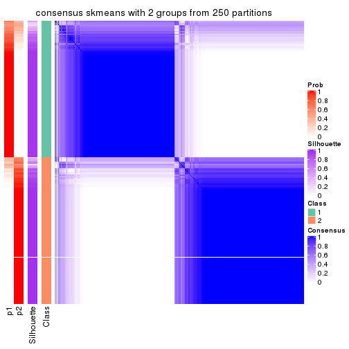</p>

</div>
<div id='tab-ATC-skmeans-consensus-heatmap-2'>
<pre><code class="r">consensus_heatmap(res, k = 3)
</code></pre>

<p></p>

</div>
<div id='tab-ATC-skmeans-consensus-heatmap-3'>
<pre><code class="r">consensus_heatmap(res, k = 4)
</code></pre>

<p></p>

</div>
<div id='tab-ATC-skmeans-consensus-heatmap-4'>
<pre><code class="r">consensus_heatmap(res, k = 5)
</code></pre>

<p></p>

</div>
<div id='tab-ATC-skmeans-consensus-heatmap-5'>
<pre><code class="r">consensus_heatmap(res, k = 6)
</code></pre>

<p></p>

</div>
</div>

Heatmaps for the membership of samples in all partitions to see how consistent they are:


<script>
$( function() {
	$( '#tabs-ATC-skmeans-membership-heatmap' ).tabs();
} );
</script>
<div id='tabs-ATC-skmeans-membership-heatmap'>
<ul>
<li><a href='#tab-ATC-skmeans-membership-heatmap-1'>k = 2</a></li>
<li><a href='#tab-ATC-skmeans-membership-heatmap-2'>k = 3</a></li>
<li><a href='#tab-ATC-skmeans-membership-heatmap-3'>k = 4</a></li>
<li><a href='#tab-ATC-skmeans-membership-heatmap-4'>k = 5</a></li>
<li><a href='#tab-ATC-skmeans-membership-heatmap-5'>k = 6</a></li>
</ul>
<div id='tab-ATC-skmeans-membership-heatmap-1'>
<pre><code class="r">membership_heatmap(res, k = 2)
</code></pre>

<p>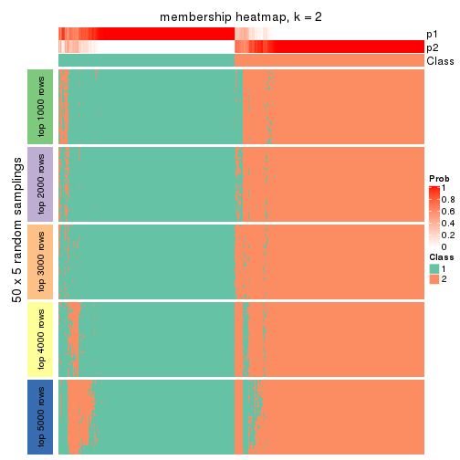</p>

</div>
<div id='tab-ATC-skmeans-membership-heatmap-2'>
<pre><code class="r">membership_heatmap(res, k = 3)
</code></pre>

<p></p>

</div>
<div id='tab-ATC-skmeans-membership-heatmap-3'>
<pre><code class="r">membership_heatmap(res, k = 4)
</code></pre>

<p></p>

</div>
<div id='tab-ATC-skmeans-membership-heatmap-4'>
<pre><code class="r">membership_heatmap(res, k = 5)
</code></pre>

<p></p>

</div>
<div id='tab-ATC-skmeans-membership-heatmap-5'>
<pre><code class="r">membership_heatmap(res, k = 6)
</code></pre>

<p></p>

</div>
</div>

As soon as we have had the classes for columns, we can look for signatures
which are significantly different between classes which can be candidate marks
for certain classes. Following are the heatmaps for signatures.


Signature heatmaps where rows are scaled:


<script>
$( function() {
	$( '#tabs-ATC-skmeans-get-signatures' ).tabs();
} );
</script>
<div id='tabs-ATC-skmeans-get-signatures'>
<ul>
<li><a href='#tab-ATC-skmeans-get-signatures-1'>k = 2</a></li>
<li><a href='#tab-ATC-skmeans-get-signatures-2'>k = 3</a></li>
<li><a href='#tab-ATC-skmeans-get-signatures-3'>k = 4</a></li>
<li><a href='#tab-ATC-skmeans-get-signatures-4'>k = 5</a></li>
<li><a href='#tab-ATC-skmeans-get-signatures-5'>k = 6</a></li>
</ul>
<div id='tab-ATC-skmeans-get-signatures-1'>
<pre><code class="r">get_signatures(res, k = 2)
</code></pre>

<p>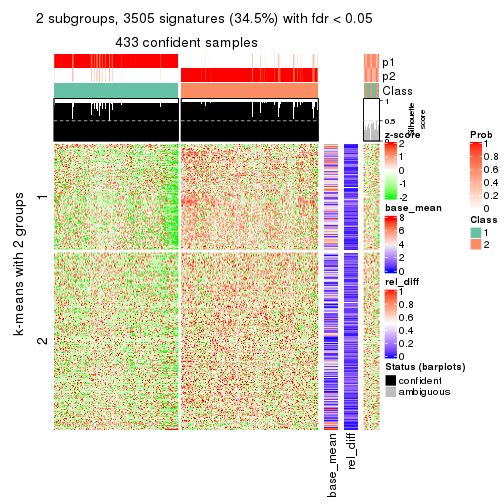</p>

</div>
<div id='tab-ATC-skmeans-get-signatures-2'>
<pre><code class="r">get_signatures(res, k = 3)
</code></pre>

<p></p>

</div>
<div id='tab-ATC-skmeans-get-signatures-3'>
<pre><code class="r">get_signatures(res, k = 4)
</code></pre>

<p></p>

</div>
<div id='tab-ATC-skmeans-get-signatures-4'>
<pre><code class="r">get_signatures(res, k = 5)
</code></pre>

<p></p>

</div>
<div id='tab-ATC-skmeans-get-signatures-5'>
<pre><code class="r">get_signatures(res, k = 6)
</code></pre>

<p></p>

</div>
</div>


Signature heatmaps where rows are not scaled:


<script>
$( function() {
	$( '#tabs-ATC-skmeans-get-signatures-no-scale' ).tabs();
} );
</script>
<div id='tabs-ATC-skmeans-get-signatures-no-scale'>
<ul>
<li><a href='#tab-ATC-skmeans-get-signatures-no-scale-1'>k = 2</a></li>
<li><a href='#tab-ATC-skmeans-get-signatures-no-scale-2'>k = 3</a></li>
<li><a href='#tab-ATC-skmeans-get-signatures-no-scale-3'>k = 4</a></li>
<li><a href='#tab-ATC-skmeans-get-signatures-no-scale-4'>k = 5</a></li>
<li><a href='#tab-ATC-skmeans-get-signatures-no-scale-5'>k = 6</a></li>
</ul>
<div id='tab-ATC-skmeans-get-signatures-no-scale-1'>
<pre><code class="r">get_signatures(res, k = 2, scale_rows = FALSE)
</code></pre>

<p>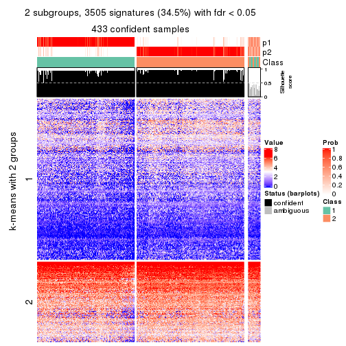</p>

</div>
<div id='tab-ATC-skmeans-get-signatures-no-scale-2'>
<pre><code class="r">get_signatures(res, k = 3, scale_rows = FALSE)
</code></pre>

<p></p>

</div>
<div id='tab-ATC-skmeans-get-signatures-no-scale-3'>
<pre><code class="r">get_signatures(res, k = 4, scale_rows = FALSE)
</code></pre>

<p></p>

</div>
<div id='tab-ATC-skmeans-get-signatures-no-scale-4'>
<pre><code class="r">get_signatures(res, k = 5, scale_rows = FALSE)
</code></pre>

<p></p>

</div>
<div id='tab-ATC-skmeans-get-signatures-no-scale-5'>
<pre><code class="r">get_signatures(res, k = 6, scale_rows = FALSE)
</code></pre>

<p></p>

</div>
</div>


Compare the overlap of signatures from different k:

```r
compare_signatures(res)
```


`get_signature()` returns a data frame invisibly. TO get the list of signatures, the function
call should be assigned to a variable explicitly. In following code, if `plot` argument is set
to `FALSE`, no heatmap is plotted while only the differential analysis is performed.

```r
# code only for demonstration
tb = get_signature(res, k = ..., plot = FALSE)
```

An example of the output of `tb` is:

```
#>   which_row         fdr    mean_1    mean_2 scaled_mean_1 scaled_mean_2 km
#> 1        38 0.042760348  8.373488  9.131774    -0.5533452     0.5164555  1
#> 2        40 0.018707592  7.106213  8.469186    -0.6173731     0.5762149  1
#> 3        55 0.019134737 10.221463 11.207825    -0.6159697     0.5749050  1
#> 4        59 0.006059896  5.921854  7.869574    -0.6899429     0.6439467  1
#> 5        60 0.018055526  8.928898 10.211722    -0.6204761     0.5791110  1
#> 6        98 0.009384629 15.714769 14.887706     0.6635654    -0.6193277  2
...
```

The columns in `tb` are:

1. `which_row`: row indices corresponding to the input matrix.
2. `fdr`: FDR for the differential test. 
3. `mean_x`: The mean value in group x.
4. `scaled_mean_x`: The mean value in group x after rows are scaled.
5. `km`: Row groups if k-means clustering is applied to rows.


UMAP plot which shows how samples are separated.


<script>
$( function() {
	$( '#tabs-ATC-skmeans-dimension-reduction' ).tabs();
} );
</script>
<div id='tabs-ATC-skmeans-dimension-reduction'>
<ul>
<li><a href='#tab-ATC-skmeans-dimension-reduction-1'>k = 2</a></li>
<li><a href='#tab-ATC-skmeans-dimension-reduction-2'>k = 3</a></li>
<li><a href='#tab-ATC-skmeans-dimension-reduction-3'>k = 4</a></li>
<li><a href='#tab-ATC-skmeans-dimension-reduction-4'>k = 5</a></li>
<li><a href='#tab-ATC-skmeans-dimension-reduction-5'>k = 6</a></li>
</ul>
<div id='tab-ATC-skmeans-dimension-reduction-1'>
<pre><code class="r">dimension_reduction(res, k = 2, method = &quot;UMAP&quot;)
</code></pre>

<p></p>

</div>
<div id='tab-ATC-skmeans-dimension-reduction-2'>
<pre><code class="r">dimension_reduction(res, k = 3, method = &quot;UMAP&quot;)
</code></pre>

<p></p>

</div>
<div id='tab-ATC-skmeans-dimension-reduction-3'>
<pre><code class="r">dimension_reduction(res, k = 4, method = &quot;UMAP&quot;)
</code></pre>

<p></p>

</div>
<div id='tab-ATC-skmeans-dimension-reduction-4'>
<pre><code class="r">dimension_reduction(res, k = 5, method = &quot;UMAP&quot;)
</code></pre>

<p></p>

</div>
<div id='tab-ATC-skmeans-dimension-reduction-5'>
<pre><code class="r">dimension_reduction(res, k = 6, method = &quot;UMAP&quot;)
</code></pre>

<p></p>

</div>
</div>


Following heatmap shows how subgroups are split when increasing `k`:

```r
collect_classes(res)
```


If matrix rows can be associated to genes, consider to use `functional_enrichment(res,
...)` to perform function enrichment for the signature genes. See [this vignette](http://bioconductor.org/packages/devel/bioc/vignettes/cola/inst/doc/functional_enrichment.html) for more detailed explanations.


 

---------------------------------------------------


### ATC:pam


The object with results only for a single top-value method and a single partition method 
can be extracted as:

```r
res = res_list["ATC", "pam"]
# you can also extract it by
# res = res_list["ATC:pam"]
```

A summary of `res` and all the functions that can be applied to it:

```r
res
```

```
#> A 'ConsensusPartition' object with k = 2, 3, 4, 5, 6.
#>   On a matrix with 10169 rows and 459 columns.
#>   Top rows (1000, 2000, 3000, 4000, 5000) are extracted by 'ATC' method.
#>   Subgroups are detected by 'pam' method.
#>   Performed in total 1250 partitions by row resampling.
#>   Best k for subgroups seems to be 2.
#> 
#> Following methods can be applied to this 'ConsensusPartition' object:
#>  [1] "cola_report"             "collect_classes"         "collect_plots"          
#>  [4] "collect_stats"           "colnames"                "compare_signatures"     
#>  [7] "consensus_heatmap"       "dimension_reduction"     "functional_enrichment"  
#> [10] "get_anno_col"            "get_anno"                "get_classes"            
#> [13] "get_consensus"           "get_matrix"              "get_membership"         
#> [16] "get_param"               "get_signatures"          "get_stats"              
#> [19] "is_best_k"               "is_stable_k"             "membership_heatmap"     
#> [22] "ncol"                    "nrow"                    "plot_ecdf"              
#> [25] "rownames"                "select_partition_number" "show"                   
#> [28] "suggest_best_k"          "test_to_known_factors"
```

`collect_plots()` function collects all the plots made from `res` for all `k` (number of partitions)
into one single page to provide an easy and fast comparison between different `k`.

```r
collect_plots(res)
```


The plots are:

- The first row: a plot of the ECDF (empirical cumulative distribution
  function) curves of the consensus matrix for each `k` and the heatmap of
  predicted classes for each `k`.
- The second row: heatmaps of the consensus matrix for each `k`.
- The third row: heatmaps of the membership matrix for each `k`.
- The fouth row: heatmaps of the signatures for each `k`.

All the plots in panels can be made by individual functions and they are
plotted later in this section.

`select_partition_number()` produces several plots showing different
statistics for choosing "optimized" `k`. There are following statistics:

- ECDF curves of the consensus matrix for each `k`;
- 1-PAC. [The PAC
  score](https://en.wikipedia.org/wiki/Consensus_clustering#Over-interpretation_potential_of_consensus_clustering)
  measures the proportion of the ambiguous subgrouping.
- Mean silhouette score.
- Concordance. The mean probability of fiting the consensus class ids in all
  partitions.
- Area increased. Denote $A_k$ as the area under the ECDF curve for current
  `k`, the area increased is defined as $A_k - A_{k-1}$.
- Rand index. The percent of pairs of samples that are both in a same cluster
  or both are not in a same cluster in the partition of k and k-1.
- Jaccard index. The ratio of pairs of samples are both in a same cluster in
  the partition of k and k-1 and the pairs of samples are both in a same
  cluster in the partition k or k-1.

The detailed explanations of these statistics can be found in [the _cola_
vignette](http://bioconductor.org/packages/devel/bioc/vignettes/cola/inst/doc/cola.html#toc_13).

Generally speaking, lower PAC score, higher mean silhouette score or higher
concordance corresponds to better partition. Rand index and Jaccard index
measure how similar the current partition is compared to partition with `k-1`.
If they are too similar, we won't accept `k` is better than `k-1`.

```r
select_partition_number(res)
```


The numeric values for all these statistics can be obtained by `get_stats()`.

```r
get_stats(res)
```

```
#>   k 1-PAC mean_silhouette concordance area_increased  Rand Jaccard
#> 2 2 0.519           0.798       0.906         0.4753 0.517   0.517
#> 3 3 0.446           0.730       0.878         0.0499 0.952   0.910
#> 4 4 0.433           0.637       0.810         0.3291 0.743   0.525
#> 5 5 0.480           0.550       0.770         0.0671 0.954   0.861
#> 6 6 0.515           0.565       0.737         0.0766 0.930   0.774
```

`suggest_best_k()` suggests the best $k$ based on these statistics. The rules are as follows:

- All $k$ with Jaccard index larger than 0.95 are removed because increasing
  $k$ does not provide enough extra information. If all $k$ are removed, it is
  marked as no subgroup is detected.
- For all $k$ with 1-PAC score larger than 0.9, the maximal $k$ is taken as
  the best $k$, and other $k$ are marked as optional $k$.
- If it does not fit the second rule. The $k$ with the maximal vote of the
  highest 1-PAC score, highest mean silhouette, and highest concordance is
  taken as the best $k$.

```r
suggest_best_k(res)
```

```
#> [1] 2
```


Following shows the table of the partitions (You need to click the **show/hide
code output** link to see it). The membership matrix (columns with name `p*`)
is inferred by
[`clue::cl_consensus()`](https://www.rdocumentation.org/link/cl_consensus?package=clue)
function with the `SE` method. Basically the value in the membership matrix
represents the probability to belong to a certain group. The finall class
label for an item is determined with the group with highest probability it
belongs to.

In `get_classes()` function, the entropy is calculated from the membership
matrix and the silhouette score is calculated from the consensus matrix.


<script>
$( function() {
	$( '#tabs-ATC-pam-get-classes' ).tabs();
} );
</script>
<div id='tabs-ATC-pam-get-classes'>
<ul>
<li><a href='#tab-ATC-pam-get-classes-1'>k = 2</a></li>
<li><a href='#tab-ATC-pam-get-classes-2'>k = 3</a></li>
<li><a href='#tab-ATC-pam-get-classes-3'>k = 4</a></li>
<li><a href='#tab-ATC-pam-get-classes-4'>k = 5</a></li>
<li><a href='#tab-ATC-pam-get-classes-5'>k = 6</a></li>
</ul>

<div id='tab-ATC-pam-get-classes-1'>
<p><a id='tab-ATC-pam-get-classes-1-a' style='color:#0366d6' href='#'>show/hide code output</a></p>
<pre><code class="r">cbind(get_classes(res, k = 2), get_membership(res, k = 2))
</code></pre>

<pre><code>#&gt;            class entropy silhouette    p1    p2
#&gt; SRR1699874     2  0.0000     0.9000 0.000 1.000
#&gt; SRR1699875     2  0.0000     0.9000 0.000 1.000
#&gt; SRR1699876     2  0.1843     0.8922 0.028 0.972
#&gt; SRR1699877     2  0.0000     0.9000 0.000 1.000
#&gt; SRR1699879     2  0.0000     0.9000 0.000 1.000
#&gt; SRR1699878     2  0.0000     0.9000 0.000 1.000
#&gt; SRR1699880     2  0.0376     0.8991 0.004 0.996
#&gt; SRR1699881     2  0.0672     0.8989 0.008 0.992
#&gt; SRR1699882     2  0.0672     0.8989 0.008 0.992
#&gt; SRR1699883     2  0.0376     0.8993 0.004 0.996
#&gt; SRR1699884     2  0.0000     0.9000 0.000 1.000
#&gt; SRR1699885     2  0.0000     0.9000 0.000 1.000
#&gt; SRR1699886     2  0.8327     0.6677 0.264 0.736
#&gt; SRR1699888     2  0.4939     0.8243 0.108 0.892
#&gt; SRR1699889     2  0.9000     0.5752 0.316 0.684
#&gt; SRR1699890     1  0.7674     0.7255 0.776 0.224
#&gt; SRR1699887     2  0.0376     0.8995 0.004 0.996
#&gt; SRR1699891     2  0.8763     0.6226 0.296 0.704
#&gt; SRR1699892     2  0.9000     0.5521 0.316 0.684
#&gt; SRR1699893     1  0.4562     0.8419 0.904 0.096
#&gt; SRR1699894     1  0.6343     0.7975 0.840 0.160
#&gt; SRR1699895     1  0.7950     0.7011 0.760 0.240
#&gt; SRR1699896     1  0.9909     0.2552 0.556 0.444
#&gt; SRR1699897     2  0.5842     0.8134 0.140 0.860
#&gt; SRR1699898     1  0.4431     0.8461 0.908 0.092
#&gt; SRR1699900     1  0.4690     0.8418 0.900 0.100
#&gt; SRR1699899     2  0.8763     0.6222 0.296 0.704
#&gt; SRR1699902     1  0.4690     0.8418 0.900 0.100
#&gt; SRR1699901     1  0.4431     0.8470 0.908 0.092
#&gt; SRR1699903     1  0.3431     0.8623 0.936 0.064
#&gt; SRR1699904     1  0.0000     0.8803 1.000 0.000
#&gt; SRR1699905     1  0.0000     0.8803 1.000 0.000
#&gt; SRR1699906     1  0.3879     0.8545 0.924 0.076
#&gt; SRR1699907     1  0.2043     0.8739 0.968 0.032
#&gt; SRR1699908     1  0.4022     0.8520 0.920 0.080
#&gt; SRR1699909     1  0.0672     0.8784 0.992 0.008
#&gt; SRR1699910     1  0.0000     0.8803 1.000 0.000
#&gt; SRR1699911     1  0.0000     0.8803 1.000 0.000
#&gt; SRR1699912     1  0.0000     0.8803 1.000 0.000
#&gt; SRR1699913     1  0.4022     0.8548 0.920 0.080
#&gt; SRR1699914     1  0.0000     0.8803 1.000 0.000
#&gt; SRR1699915     1  0.0000     0.8803 1.000 0.000
#&gt; SRR1699916     1  0.4022     0.8536 0.920 0.080
#&gt; SRR1699917     1  0.4161     0.8511 0.916 0.084
#&gt; SRR1699918     1  0.3879     0.8545 0.924 0.076
#&gt; SRR1699919     1  0.0000     0.8803 1.000 0.000
#&gt; SRR1699920     1  0.0000     0.8803 1.000 0.000
#&gt; SRR1699921     1  0.0000     0.8803 1.000 0.000
#&gt; SRR1699922     1  0.2778     0.8699 0.952 0.048
#&gt; SRR1699923     1  0.0672     0.8784 0.992 0.008
#&gt; SRR1699924     1  0.2423     0.8725 0.960 0.040
#&gt; SRR1699925     1  0.0000     0.8803 1.000 0.000
#&gt; SRR1699926     1  0.0000     0.8803 1.000 0.000
#&gt; SRR1699927     1  0.3584     0.8589 0.932 0.068
#&gt; SRR1699929     1  0.4562     0.8419 0.904 0.096
#&gt; SRR1699928     1  0.0938     0.8789 0.988 0.012
#&gt; SRR1699930     1  0.6048     0.8096 0.852 0.148
#&gt; SRR1699931     1  0.6973     0.7721 0.812 0.188
#&gt; SRR1699933     2  0.7299     0.7490 0.204 0.796
#&gt; SRR1699932     1  0.9815     0.3048 0.580 0.420
#&gt; SRR1699934     1  0.0000     0.8803 1.000 0.000
#&gt; SRR1699935     1  0.7219     0.7525 0.800 0.200
#&gt; SRR1699936     2  0.0672     0.8989 0.008 0.992
#&gt; SRR1699937     2  0.0000     0.9000 0.000 1.000
#&gt; SRR1699938     2  0.0000     0.9000 0.000 1.000
#&gt; SRR1699940     2  0.0376     0.8996 0.004 0.996
#&gt; SRR1699939     2  0.0672     0.8989 0.008 0.992
#&gt; SRR1699941     2  0.0672     0.8989 0.008 0.992
#&gt; SRR1699942     2  0.0376     0.8996 0.004 0.996
#&gt; SRR1699943     2  0.0000     0.9000 0.000 1.000
#&gt; SRR1699944     2  0.0000     0.9000 0.000 1.000
#&gt; SRR1699945     2  0.0672     0.8989 0.008 0.992
#&gt; SRR1699946     2  0.0000     0.9000 0.000 1.000
#&gt; SRR1699947     2  0.0000     0.9000 0.000 1.000
#&gt; SRR1699948     2  0.0000     0.9000 0.000 1.000
#&gt; SRR1699949     2  0.0672     0.8989 0.008 0.992
#&gt; SRR1699950     2  0.0672     0.8989 0.008 0.992
#&gt; SRR1699951     2  0.0376     0.8996 0.004 0.996
#&gt; SRR1699952     2  0.0000     0.9000 0.000 1.000
#&gt; SRR1699953     2  0.0000     0.9000 0.000 1.000
#&gt; SRR1699954     2  0.0376     0.8996 0.004 0.996
#&gt; SRR1699955     2  0.0000     0.9000 0.000 1.000
#&gt; SRR1699956     2  0.2236     0.8870 0.036 0.964
#&gt; SRR1699957     2  0.0000     0.9000 0.000 1.000
#&gt; SRR1699959     2  0.9881     0.2184 0.436 0.564
#&gt; SRR1699958     2  0.0672     0.8989 0.008 0.992
#&gt; SRR1699960     2  0.0376     0.8996 0.004 0.996
#&gt; SRR1699961     2  0.0000     0.9000 0.000 1.000
#&gt; SRR1699962     2  0.0000     0.9000 0.000 1.000
#&gt; SRR1699963     2  0.0000     0.9000 0.000 1.000
#&gt; SRR1699964     2  0.0000     0.9000 0.000 1.000
#&gt; SRR1699965     2  0.0000     0.9000 0.000 1.000
#&gt; SRR1699966     2  0.0376     0.8996 0.004 0.996
#&gt; SRR1699967     2  0.0000     0.9000 0.000 1.000
#&gt; SRR1699968     2  0.0672     0.8989 0.008 0.992
#&gt; SRR1699969     2  0.1843     0.8922 0.028 0.972
#&gt; SRR1699971     2  0.0000     0.9000 0.000 1.000
#&gt; SRR1699970     2  0.0000     0.9000 0.000 1.000
#&gt; SRR1699972     2  0.7674     0.7243 0.224 0.776
#&gt; SRR1699973     2  0.0672     0.8989 0.008 0.992
#&gt; SRR1699974     2  0.8608     0.6329 0.284 0.716
#&gt; SRR1699975     2  0.7219     0.7443 0.200 0.800
#&gt; SRR1699976     2  0.0000     0.9000 0.000 1.000
#&gt; SRR1699977     1  0.5737     0.8182 0.864 0.136
#&gt; SRR1699978     1  0.0000     0.8803 1.000 0.000
#&gt; SRR1699979     2  0.6343     0.7885 0.160 0.840
#&gt; SRR1699980     2  0.9129     0.5631 0.328 0.672
#&gt; SRR1699981     1  0.9815     0.2891 0.580 0.420
#&gt; SRR1699982     2  0.7453     0.7361 0.212 0.788
#&gt; SRR1699983     2  0.2603     0.8847 0.044 0.956
#&gt; SRR1699984     1  0.0000     0.8803 1.000 0.000
#&gt; SRR1699985     2  0.7139     0.7483 0.196 0.804
#&gt; SRR1699986     1  0.9963     0.1035 0.536 0.464
#&gt; SRR1699988     2  0.1184     0.8952 0.016 0.984
#&gt; SRR1699987     1  0.4939     0.8403 0.892 0.108
#&gt; SRR1699989     2  0.6343     0.7889 0.160 0.840
#&gt; SRR1699990     2  0.9286     0.5319 0.344 0.656
#&gt; SRR1699992     2  0.6801     0.7705 0.180 0.820
#&gt; SRR1699991     1  0.4298     0.8470 0.912 0.088
#&gt; SRR1699993     1  0.7745     0.6964 0.772 0.228
#&gt; SRR1699994     2  0.4562     0.8514 0.096 0.904
#&gt; SRR1699995     1  0.0000     0.8803 1.000 0.000
#&gt; SRR1699996     2  0.0000     0.9000 0.000 1.000
#&gt; SRR1699997     2  0.6438     0.7944 0.164 0.836
#&gt; SRR1699998     2  0.0938     0.8970 0.012 0.988
#&gt; SRR1699999     1  0.0376     0.8795 0.996 0.004
#&gt; SRR1700000     2  0.7056     0.7553 0.192 0.808
#&gt; SRR1700002     2  0.0000     0.9000 0.000 1.000
#&gt; SRR1700001     2  0.2603     0.8800 0.044 0.956
#&gt; SRR1700003     2  0.0376     0.8991 0.004 0.996
#&gt; SRR1700004     2  0.5294     0.8304 0.120 0.880
#&gt; SRR1700005     1  0.0000     0.8803 1.000 0.000
#&gt; SRR1700006     2  0.0000     0.9000 0.000 1.000
#&gt; SRR1700007     2  0.0672     0.8989 0.008 0.992
#&gt; SRR1700008     2  0.6801     0.7808 0.180 0.820
#&gt; SRR1700009     1  0.0000     0.8803 1.000 0.000
#&gt; SRR1700010     2  0.0376     0.8995 0.004 0.996
#&gt; SRR1700011     2  0.0672     0.8989 0.008 0.992
#&gt; SRR1700013     2  0.0000     0.9000 0.000 1.000
#&gt; SRR1700012     2  0.0000     0.9000 0.000 1.000
#&gt; SRR1700014     1  0.3584     0.8628 0.932 0.068
#&gt; SRR1700015     2  0.0672     0.8989 0.008 0.992
#&gt; SRR1700016     1  0.0376     0.8799 0.996 0.004
#&gt; SRR1700018     2  0.0000     0.9000 0.000 1.000
#&gt; SRR1700017     2  0.2043     0.8875 0.032 0.968
#&gt; SRR1700019     2  0.0672     0.8989 0.008 0.992
#&gt; SRR1700020     1  0.9909     0.2866 0.556 0.444
#&gt; SRR1700021     1  0.8713     0.5894 0.708 0.292
#&gt; SRR1700023     2  0.1633     0.8932 0.024 0.976
#&gt; SRR1700022     2  0.8144     0.6345 0.252 0.748
#&gt; SRR1700024     2  0.2603     0.8833 0.044 0.956
#&gt; SRR1700025     2  0.0000     0.9000 0.000 1.000
#&gt; SRR1700026     2  0.4939     0.8446 0.108 0.892
#&gt; SRR1700027     2  0.1184     0.8939 0.016 0.984
#&gt; SRR1700028     2  0.0938     0.8979 0.012 0.988
#&gt; SRR1700029     1  0.4562     0.8433 0.904 0.096
#&gt; SRR1700030     2  0.7056     0.7507 0.192 0.808
#&gt; SRR1700031     1  0.9833     0.3491 0.576 0.424
#&gt; SRR1700032     2  0.0000     0.9000 0.000 1.000
#&gt; SRR1700034     1  0.0000     0.8803 1.000 0.000
#&gt; SRR1700035     2  0.9922     0.2621 0.448 0.552
#&gt; SRR1700033     1  0.0376     0.8802 0.996 0.004
#&gt; SRR1700036     2  0.9833     0.3012 0.424 0.576
#&gt; SRR1700037     2  0.9358     0.5220 0.352 0.648
#&gt; SRR1700038     1  0.7815     0.7051 0.768 0.232
#&gt; SRR1700039     1  0.0376     0.8799 0.996 0.004
#&gt; SRR1700040     1  0.8144     0.6870 0.748 0.252
#&gt; SRR1700041     2  0.9248     0.5246 0.340 0.660
#&gt; SRR1700042     1  0.3584     0.8590 0.932 0.068
#&gt; SRR1700043     2  0.9988     0.1091 0.480 0.520
#&gt; SRR1700045     1  0.3431     0.8670 0.936 0.064
#&gt; SRR1700044     2  0.7453     0.7311 0.212 0.788
#&gt; SRR1700046     1  0.1184     0.8790 0.984 0.016
#&gt; SRR1700047     1  0.0376     0.8803 0.996 0.004
#&gt; SRR1700048     1  0.1633     0.8771 0.976 0.024
#&gt; SRR1700049     1  0.0000     0.8803 1.000 0.000
#&gt; SRR1700050     1  0.0000     0.8803 1.000 0.000
#&gt; SRR1700051     1  0.0000     0.8803 1.000 0.000
#&gt; SRR1700052     1  0.0376     0.8795 0.996 0.004
#&gt; SRR1700053     1  0.5294     0.8206 0.880 0.120
#&gt; SRR1700054     1  0.3114     0.8664 0.944 0.056
#&gt; SRR1700055     1  0.0000     0.8803 1.000 0.000
#&gt; SRR1700056     1  0.0000     0.8803 1.000 0.000
#&gt; SRR1700057     1  0.0000     0.8803 1.000 0.000
#&gt; SRR1700058     1  0.0376     0.8796 0.996 0.004
#&gt; SRR1700059     1  0.0000     0.8803 1.000 0.000
#&gt; SRR1700060     1  0.2423     0.8730 0.960 0.040
#&gt; SRR1700061     1  0.0376     0.8803 0.996 0.004
#&gt; SRR1700062     1  0.7376     0.7151 0.792 0.208
#&gt; SRR1700063     1  0.0376     0.8796 0.996 0.004
#&gt; SRR1700064     1  0.7950     0.6827 0.760 0.240
#&gt; SRR1700065     1  0.1184     0.8788 0.984 0.016
#&gt; SRR1700066     2  0.9087     0.5837 0.324 0.676
#&gt; SRR1700067     1  0.6887     0.7612 0.816 0.184
#&gt; SRR1700068     1  0.5408     0.8183 0.876 0.124
#&gt; SRR1700069     1  0.8144     0.6594 0.748 0.252
#&gt; SRR1700070     2  0.8861     0.6094 0.304 0.696
#&gt; SRR1700071     1  0.4690     0.8418 0.900 0.100
#&gt; SRR1700072     1  0.0376     0.8796 0.996 0.004
#&gt; SRR1700073     1  0.0000     0.8803 1.000 0.000
#&gt; SRR1700075     2  0.8861     0.6116 0.304 0.696
#&gt; SRR1700074     2  0.1414     0.8937 0.020 0.980
#&gt; SRR1700076     2  0.8081     0.6910 0.248 0.752
#&gt; SRR1700077     2  0.7219     0.7443 0.200 0.800
#&gt; SRR1700078     1  0.9881     0.2055 0.564 0.436
#&gt; SRR1700080     1  0.9996    -0.0138 0.512 0.488
#&gt; SRR1700079     2  0.8267     0.6879 0.260 0.740
#&gt; SRR1700081     1  0.0000     0.8803 1.000 0.000
#&gt; SRR1700082     2  0.0000     0.9000 0.000 1.000
#&gt; SRR1700083     1  0.4298     0.8477 0.912 0.088
#&gt; SRR1700084     2  0.8713     0.6202 0.292 0.708
#&gt; SRR1700085     2  0.6247     0.8003 0.156 0.844
#&gt; SRR1700086     2  0.8861     0.6196 0.304 0.696
#&gt; SRR1700087     2  0.0000     0.9000 0.000 1.000
#&gt; SRR1700088     2  0.0376     0.8996 0.004 0.996
#&gt; SRR1700089     2  0.0672     0.8989 0.008 0.992
#&gt; SRR1700091     2  0.0672     0.8989 0.008 0.992
#&gt; SRR1700090     2  0.6623     0.7735 0.172 0.828
#&gt; SRR1700092     2  0.0672     0.8989 0.008 0.992
#&gt; SRR1700094     2  0.0672     0.8989 0.008 0.992
#&gt; SRR1700093     2  0.1633     0.8922 0.024 0.976
#&gt; SRR1700095     1  0.4298     0.8514 0.912 0.088
#&gt; SRR1700096     2  0.4022     0.8511 0.080 0.920
#&gt; SRR1700097     2  0.7056     0.7258 0.192 0.808
#&gt; SRR1700098     2  0.0376     0.8996 0.004 0.996
#&gt; SRR1700099     2  0.0000     0.9000 0.000 1.000
#&gt; SRR1700100     2  0.0376     0.8991 0.004 0.996
#&gt; SRR1700101     2  0.0000     0.9000 0.000 1.000
#&gt; SRR1700102     2  0.0376     0.8996 0.004 0.996
#&gt; SRR1700104     2  0.0672     0.8989 0.008 0.992
#&gt; SRR1700103     2  0.0672     0.8989 0.008 0.992
#&gt; SRR1700105     2  0.1184     0.8969 0.016 0.984
#&gt; SRR1700106     2  0.3879     0.8585 0.076 0.924
#&gt; SRR1700107     2  0.0672     0.8989 0.008 0.992
#&gt; SRR1700108     2  0.0672     0.8989 0.008 0.992
#&gt; SRR1700109     2  0.0672     0.8989 0.008 0.992
#&gt; SRR1700110     2  0.0672     0.8989 0.008 0.992
#&gt; SRR1700112     2  0.4690     0.8416 0.100 0.900
#&gt; SRR1700111     1  0.7299     0.7327 0.796 0.204
#&gt; SRR1700113     2  0.0672     0.8989 0.008 0.992
#&gt; SRR1700114     2  0.0376     0.8996 0.004 0.996
#&gt; SRR1700115     2  0.0672     0.8989 0.008 0.992
#&gt; SRR1700116     2  0.4815     0.8401 0.104 0.896
#&gt; SRR1700117     1  0.4815     0.8435 0.896 0.104
#&gt; SRR1700119     2  0.5946     0.8096 0.144 0.856
#&gt; SRR1700118     1  0.3114     0.8648 0.944 0.056
#&gt; SRR1700120     2  0.9460     0.4965 0.364 0.636
#&gt; SRR1700121     2  0.9922     0.2482 0.448 0.552
#&gt; SRR1700122     1  0.0000     0.8803 1.000 0.000
#&gt; SRR1700123     1  0.0672     0.8798 0.992 0.008
#&gt; SRR1700125     2  0.3431     0.8715 0.064 0.936
#&gt; SRR1700126     1  0.8813     0.6142 0.700 0.300
#&gt; SRR1700127     2  0.9881     0.2972 0.436 0.564
#&gt; SRR1700124     1  0.6438     0.7794 0.836 0.164
#&gt; SRR1700128     1  0.0000     0.8803 1.000 0.000
#&gt; SRR1700129     1  0.8386     0.6329 0.732 0.268
#&gt; SRR1700130     1  0.0672     0.8784 0.992 0.008
#&gt; SRR1700132     1  0.4815     0.8353 0.896 0.104
#&gt; SRR1700131     2  0.9909     0.2709 0.444 0.556
#&gt; SRR1700133     1  0.0000     0.8803 1.000 0.000
#&gt; SRR1700134     1  0.0000     0.8803 1.000 0.000
#&gt; SRR1700135     1  0.0000     0.8803 1.000 0.000
#&gt; SRR1700136     1  0.0376     0.8796 0.996 0.004
#&gt; SRR1700137     1  0.0000     0.8803 1.000 0.000
#&gt; SRR1700138     1  0.0376     0.8803 0.996 0.004
#&gt; SRR1700140     1  0.0000     0.8803 1.000 0.000
#&gt; SRR1700139     2  0.9393     0.4929 0.356 0.644
#&gt; SRR1700141     1  0.9977     0.0623 0.528 0.472
#&gt; SRR1700142     1  0.0000     0.8803 1.000 0.000
#&gt; SRR1700143     1  0.0376     0.8801 0.996 0.004
#&gt; SRR1700144     1  0.4815     0.8450 0.896 0.104
#&gt; SRR1700145     1  0.0000     0.8803 1.000 0.000
#&gt; SRR1700146     1  0.8763     0.5798 0.704 0.296
#&gt; SRR1700147     1  0.0000     0.8803 1.000 0.000
#&gt; SRR1700149     1  0.0000     0.8803 1.000 0.000
#&gt; SRR1700148     1  0.5842     0.8016 0.860 0.140
#&gt; SRR1700150     1  0.9522     0.4220 0.628 0.372
#&gt; SRR1700152     1  0.9933     0.1549 0.548 0.452
#&gt; SRR1700151     1  0.5059     0.8286 0.888 0.112
#&gt; SRR1700153     1  0.9358     0.4609 0.648 0.352
#&gt; SRR1700154     1  0.0000     0.8803 1.000 0.000
#&gt; SRR1700155     1  0.4690     0.8403 0.900 0.100
#&gt; SRR1700156     1  0.0000     0.8803 1.000 0.000
#&gt; SRR1700158     1  0.0000     0.8803 1.000 0.000
#&gt; SRR1700159     1  0.0938     0.8794 0.988 0.012
#&gt; SRR1700157     1  0.0000     0.8803 1.000 0.000
#&gt; SRR1700160     1  0.1843     0.8751 0.972 0.028
#&gt; SRR1700161     1  0.0000     0.8803 1.000 0.000
#&gt; SRR1700162     1  0.7139     0.7372 0.804 0.196
#&gt; SRR1700164     1  0.0000     0.8803 1.000 0.000
#&gt; SRR1700163     1  0.0000     0.8803 1.000 0.000
#&gt; SRR1700165     1  0.1414     0.8777 0.980 0.020
#&gt; SRR1700166     1  0.0000     0.8803 1.000 0.000
#&gt; SRR1700168     1  1.0000    -0.0024 0.500 0.500
#&gt; SRR1700167     1  0.0000     0.8803 1.000 0.000
#&gt; SRR1700170     1  0.1414     0.8783 0.980 0.020
#&gt; SRR1700169     1  0.0938     0.8800 0.988 0.012
#&gt; SRR1700171     1  0.0000     0.8803 1.000 0.000
#&gt; SRR1700172     2  0.9635     0.4225 0.388 0.612
#&gt; SRR1700174     2  0.9170     0.5477 0.332 0.668
#&gt; SRR1700173     2  0.8763     0.6324 0.296 0.704
#&gt; SRR1700175     1  0.1184     0.8788 0.984 0.016
#&gt; SRR1700176     1  0.6148     0.7890 0.848 0.152
#&gt; SRR1700178     2  0.0000     0.9000 0.000 1.000
#&gt; SRR1700177     1  0.5946     0.8004 0.856 0.144
#&gt; SRR1700180     2  0.0000     0.9000 0.000 1.000
#&gt; SRR1700179     2  0.0000     0.9000 0.000 1.000
#&gt; SRR1700181     2  0.0000     0.9000 0.000 1.000
#&gt; SRR1700183     1  0.0000     0.8803 1.000 0.000
#&gt; SRR1700182     2  0.0000     0.9000 0.000 1.000
#&gt; SRR1700184     2  0.0000     0.9000 0.000 1.000
#&gt; SRR1700186     2  0.0000     0.9000 0.000 1.000
#&gt; SRR1700187     1  0.0000     0.8803 1.000 0.000
#&gt; SRR1700185     1  0.0000     0.8803 1.000 0.000
#&gt; SRR1700188     2  0.0000     0.9000 0.000 1.000
#&gt; SRR1700192     1  0.9983     0.1683 0.524 0.476
#&gt; SRR1700190     2  0.3114     0.8671 0.056 0.944
#&gt; SRR1700191     1  0.0000     0.8803 1.000 0.000
#&gt; SRR1700189     1  0.0000     0.8803 1.000 0.000
#&gt; SRR1700193     2  0.0000     0.9000 0.000 1.000
#&gt; SRR1700195     2  0.0000     0.9000 0.000 1.000
#&gt; SRR1700194     1  0.0000     0.8803 1.000 0.000
#&gt; SRR1700196     2  0.0000     0.9000 0.000 1.000
#&gt; SRR1700197     2  0.6148     0.7738 0.152 0.848
#&gt; SRR1700198     2  0.0000     0.9000 0.000 1.000
#&gt; SRR1700199     2  0.0000     0.9000 0.000 1.000
#&gt; SRR1700200     2  0.0000     0.9000 0.000 1.000
#&gt; SRR1700201     2  0.0000     0.9000 0.000 1.000
#&gt; SRR1700202     1  0.9795     0.3488 0.584 0.416
#&gt; SRR1700203     2  0.0000     0.9000 0.000 1.000
#&gt; SRR1700204     2  0.0000     0.9000 0.000 1.000
#&gt; SRR1700206     2  0.0000     0.9000 0.000 1.000
#&gt; SRR1700207     2  0.0000     0.9000 0.000 1.000
#&gt; SRR1700208     2  0.0000     0.9000 0.000 1.000
#&gt; SRR1700205     2  0.8763     0.6023 0.296 0.704
#&gt; SRR1700209     2  0.0000     0.9000 0.000 1.000
#&gt; SRR1700210     2  0.4022     0.8562 0.080 0.920
#&gt; SRR1700211     2  0.0000     0.9000 0.000 1.000
#&gt; SRR1700212     2  0.0000     0.9000 0.000 1.000
#&gt; SRR1700213     2  0.0000     0.9000 0.000 1.000
#&gt; SRR1700214     2  0.0000     0.9000 0.000 1.000
#&gt; SRR1700215     1  0.0000     0.8803 1.000 0.000
#&gt; SRR1700217     2  0.0000     0.9000 0.000 1.000
#&gt; SRR1700216     1  0.0376     0.8796 0.996 0.004
#&gt; SRR1700218     2  0.0000     0.9000 0.000 1.000
#&gt; SRR1700219     2  0.0000     0.9000 0.000 1.000
#&gt; SRR1700222     1  0.0376     0.8796 0.996 0.004
#&gt; SRR1700220     2  0.0000     0.9000 0.000 1.000
#&gt; SRR1700221     2  0.0000     0.9000 0.000 1.000
#&gt; SRR1700223     2  0.0000     0.9000 0.000 1.000
#&gt; SRR1700224     2  0.2948     0.8754 0.052 0.948
#&gt; SRR1700226     2  0.0000     0.9000 0.000 1.000
#&gt; SRR1700229     2  0.0000     0.9000 0.000 1.000
#&gt; SRR1700225     2  0.0000     0.9000 0.000 1.000
#&gt; SRR1700227     2  0.0000     0.9000 0.000 1.000
#&gt; SRR1700230     1  0.9996     0.0829 0.512 0.488
#&gt; SRR1700231     2  0.0000     0.9000 0.000 1.000
#&gt; SRR1700228     2  0.0000     0.9000 0.000 1.000
#&gt; SRR1700232     2  0.0000     0.9000 0.000 1.000
#&gt; SRR1700233     2  0.0000     0.9000 0.000 1.000
#&gt; SRR1700234     2  0.7602     0.7229 0.220 0.780
#&gt; SRR1700235     2  0.0672     0.8985 0.008 0.992
#&gt; SRR1700237     2  0.0000     0.9000 0.000 1.000
#&gt; SRR1700236     2  0.0000     0.9000 0.000 1.000
#&gt; SRR1700238     2  0.0000     0.9000 0.000 1.000
#&gt; SRR1700239     1  0.1184     0.8786 0.984 0.016
#&gt; SRR1700240     1  0.0000     0.8803 1.000 0.000
#&gt; SRR1700241     2  0.6247     0.7936 0.156 0.844
#&gt; SRR1700243     2  0.0000     0.9000 0.000 1.000
#&gt; SRR1700244     2  0.0000     0.9000 0.000 1.000
#&gt; SRR1700242     1  0.9580     0.4448 0.620 0.380
#&gt; SRR1700246     2  0.7219     0.7438 0.200 0.800
#&gt; SRR1700245     2  0.0000     0.9000 0.000 1.000
#&gt; SRR1700247     1  0.0000     0.8803 1.000 0.000
#&gt; SRR1700249     1  0.0000     0.8803 1.000 0.000
#&gt; SRR1700250     2  0.0000     0.9000 0.000 1.000
#&gt; SRR1700248     2  0.0000     0.9000 0.000 1.000
#&gt; SRR1700251     2  0.0000     0.9000 0.000 1.000
#&gt; SRR1700252     2  0.0000     0.9000 0.000 1.000
#&gt; SRR1700253     2  0.0000     0.9000 0.000 1.000
#&gt; SRR1700256     2  0.0000     0.9000 0.000 1.000
#&gt; SRR1700254     1  0.0376     0.8796 0.996 0.004
#&gt; SRR1700255     2  0.0000     0.9000 0.000 1.000
#&gt; SRR1700257     2  0.0000     0.9000 0.000 1.000
#&gt; SRR1700258     2  0.0672     0.8989 0.008 0.992
#&gt; SRR1700259     2  0.0672     0.8989 0.008 0.992
#&gt; SRR1700260     2  0.0672     0.8989 0.008 0.992
#&gt; SRR1700261     2  0.0672     0.8989 0.008 0.992
#&gt; SRR1700262     2  0.0672     0.8989 0.008 0.992
#&gt; SRR1700263     2  0.0672     0.8989 0.008 0.992
#&gt; SRR1700264     2  0.0000     0.9000 0.000 1.000
#&gt; SRR1700265     2  0.0376     0.8996 0.004 0.996
#&gt; SRR1700266     2  0.0000     0.9000 0.000 1.000
#&gt; SRR1700268     2  0.0672     0.8989 0.008 0.992
#&gt; SRR1700270     2  0.0000     0.9000 0.000 1.000
#&gt; SRR1700267     2  0.0000     0.9000 0.000 1.000
#&gt; SRR1700271     2  0.0000     0.9000 0.000 1.000
#&gt; SRR1700272     2  0.0672     0.8989 0.008 0.992
#&gt; SRR1700273     2  0.0000     0.9000 0.000 1.000
#&gt; SRR1700274     2  0.0672     0.8989 0.008 0.992
#&gt; SRR1700277     2  0.0000     0.9000 0.000 1.000
#&gt; SRR1700275     2  0.0672     0.8989 0.008 0.992
#&gt; SRR1700276     2  0.0000     0.9000 0.000 1.000
#&gt; SRR1700278     2  0.8955     0.5726 0.312 0.688
#&gt; SRR1700279     2  0.9087     0.5732 0.324 0.676
#&gt; SRR1700280     2  0.8608     0.6466 0.284 0.716
#&gt; SRR1700281     2  0.0000     0.9000 0.000 1.000
#&gt; SRR1700283     2  0.0672     0.8989 0.008 0.992
#&gt; SRR1700282     2  0.0672     0.8989 0.008 0.992
#&gt; SRR1700284     2  0.2948     0.8762 0.052 0.948
#&gt; SRR1700285     2  0.7376     0.7411 0.208 0.792
#&gt; SRR1700286     2  0.0672     0.8989 0.008 0.992
#&gt; SRR1700287     2  0.0672     0.8989 0.008 0.992
#&gt; SRR1700290     1  0.0672     0.8798 0.992 0.008
#&gt; SRR1700289     2  0.7602     0.7276 0.220 0.780
#&gt; SRR1700288     2  0.0000     0.9000 0.000 1.000
#&gt; SRR1700292     2  0.1414     0.8955 0.020 0.980
#&gt; SRR1700291     2  0.7602     0.7208 0.220 0.780
#&gt; SRR1700293     2  0.7056     0.7555 0.192 0.808
#&gt; SRR1700294     1  0.9522     0.4064 0.628 0.372
#&gt; SRR1700295     1  0.0000     0.8803 1.000 0.000
#&gt; SRR1700297     2  0.8608     0.6490 0.284 0.716
#&gt; SRR1700296     2  0.9552     0.4643 0.376 0.624
#&gt; SRR1700298     1  0.9977     0.0760 0.528 0.472
#&gt; SRR1700299     2  0.9686     0.4151 0.396 0.604
#&gt; SRR1700300     2  0.9954     0.1973 0.460 0.540
#&gt; SRR1700302     1  0.9850     0.2344 0.572 0.428
#&gt; SRR1700301     1  0.9993     0.0116 0.516 0.484
#&gt; SRR1700303     2  0.9286     0.5369 0.344 0.656
#&gt; SRR1700304     1  0.9248     0.4963 0.660 0.340
#&gt; SRR1700305     2  0.8661     0.6378 0.288 0.712
#&gt; SRR1700306     1  0.1414     0.8774 0.980 0.020
#&gt; SRR1700308     2  0.8763     0.6225 0.296 0.704
#&gt; SRR1700307     1  0.3584     0.8610 0.932 0.068
#&gt; SRR1700309     1  0.4431     0.8434 0.908 0.092
#&gt; SRR1700310     2  0.9393     0.5150 0.356 0.644
#&gt; SRR1700311     1  0.9850     0.2357 0.572 0.428
#&gt; SRR1700312     2  0.7602     0.7251 0.220 0.780
#&gt; SRR1700313     1  0.9209     0.5073 0.664 0.336
#&gt; SRR1700314     1  0.9323     0.4666 0.652 0.348
#&gt; SRR1700315     1  0.1184     0.8784 0.984 0.016
#&gt; SRR1700316     2  0.7453     0.7305 0.212 0.788
#&gt; SRR1700317     2  0.0376     0.8995 0.004 0.996
#&gt; SRR1700318     1  0.0000     0.8803 1.000 0.000
#&gt; SRR1700319     1  0.3733     0.8557 0.928 0.072
#&gt; SRR1700320     2  0.9000     0.5978 0.316 0.684
#&gt; SRR1700322     2  0.7950     0.7095 0.240 0.760
#&gt; SRR1700321     2  0.2236     0.8850 0.036 0.964
#&gt; SRR1700323     2  0.8909     0.6121 0.308 0.692
#&gt; SRR1700324     2  0.8713     0.6348 0.292 0.708
#&gt; SRR1700325     2  0.0938     0.8982 0.012 0.988
#&gt; SRR1700326     1  0.5519     0.8259 0.872 0.128
#&gt; SRR1700327     2  0.0376     0.8996 0.004 0.996
#&gt; SRR1700329     2  0.6048     0.8111 0.148 0.852
#&gt; SRR1700328     2  0.6531     0.7864 0.168 0.832
#&gt; SRR1700330     1  0.0000     0.8803 1.000 0.000
#&gt; SRR1700331     1  0.0000     0.8803 1.000 0.000
#&gt; SRR1700332     2  0.4690     0.8453 0.100 0.900
#&gt; SRR1700333     2  0.7950     0.6976 0.240 0.760
</code></pre>

<script>
$('#tab-ATC-pam-get-classes-1-a').parent().next().next().hide();
$('#tab-ATC-pam-get-classes-1-a').click(function(){
  $('#tab-ATC-pam-get-classes-1-a').parent().next().next().toggle();
  return(false);
});
</script>
</div>

<div id='tab-ATC-pam-get-classes-2'>
<p><a id='tab-ATC-pam-get-classes-2-a' style='color:#0366d6' href='#'>show/hide code output</a></p>
<pre><code class="r">cbind(get_classes(res, k = 3), get_membership(res, k = 3))
</code></pre>

<pre><code>#&gt;            class entropy silhouette    p1    p2    p3
#&gt; SRR1699874     2  0.0000     0.8712 0.000 1.000 0.000
#&gt; SRR1699875     2  0.0000     0.8712 0.000 1.000 0.000
#&gt; SRR1699876     2  0.2845     0.8558 0.012 0.920 0.068
#&gt; SRR1699877     2  0.0000     0.8712 0.000 1.000 0.000
#&gt; SRR1699879     2  0.0000     0.8712 0.000 1.000 0.000
#&gt; SRR1699878     2  0.0000     0.8712 0.000 1.000 0.000
#&gt; SRR1699880     2  0.0237     0.8704 0.000 0.996 0.004
#&gt; SRR1699881     2  0.2550     0.8564 0.012 0.932 0.056
#&gt; SRR1699882     2  0.2384     0.8570 0.008 0.936 0.056
#&gt; SRR1699883     2  0.0237     0.8707 0.000 0.996 0.004
#&gt; SRR1699884     2  0.0000     0.8712 0.000 1.000 0.000
#&gt; SRR1699885     2  0.0000     0.8712 0.000 1.000 0.000
#&gt; SRR1699886     2  0.5420     0.6745 0.008 0.752 0.240
#&gt; SRR1699888     2  0.2878     0.8158 0.000 0.904 0.096
#&gt; SRR1699889     2  0.6282     0.5659 0.012 0.664 0.324
#&gt; SRR1699890     3  0.5812     0.6276 0.012 0.264 0.724
#&gt; SRR1699887     2  0.0661     0.8715 0.004 0.988 0.008
#&gt; SRR1699891     2  0.6129     0.5633 0.008 0.668 0.324
#&gt; SRR1699892     2  0.5560     0.5585 0.000 0.700 0.300
#&gt; SRR1699893     3  0.4062     0.7114 0.000 0.164 0.836
#&gt; SRR1699894     3  0.5202     0.6738 0.008 0.220 0.772
#&gt; SRR1699895     3  0.5848     0.6315 0.012 0.268 0.720
#&gt; SRR1699896     2  0.6307    -0.0818 0.000 0.512 0.488
#&gt; SRR1699897     2  0.3482     0.8021 0.000 0.872 0.128
#&gt; SRR1699898     3  0.4062     0.7187 0.000 0.164 0.836
#&gt; SRR1699900     3  0.4702     0.6866 0.000 0.212 0.788
#&gt; SRR1699899     2  0.6228     0.5816 0.012 0.672 0.316
#&gt; SRR1699902     3  0.4702     0.6866 0.000 0.212 0.788
#&gt; SRR1699901     3  0.4605     0.6963 0.000 0.204 0.796
#&gt; SRR1699903     3  0.3377     0.7615 0.012 0.092 0.896
#&gt; SRR1699904     3  0.0237     0.7740 0.004 0.000 0.996
#&gt; SRR1699905     3  0.0475     0.7736 0.004 0.004 0.992
#&gt; SRR1699906     3  0.3851     0.7392 0.004 0.136 0.860
#&gt; SRR1699907     3  0.2165     0.7738 0.000 0.064 0.936
#&gt; SRR1699908     3  0.4002     0.7303 0.000 0.160 0.840
#&gt; SRR1699909     3  0.2066     0.7588 0.000 0.060 0.940
#&gt; SRR1699910     3  0.0000     0.7737 0.000 0.000 1.000
#&gt; SRR1699911     3  0.0000     0.7737 0.000 0.000 1.000
#&gt; SRR1699912     3  0.0000     0.7737 0.000 0.000 1.000
#&gt; SRR1699913     3  0.4291     0.7173 0.000 0.180 0.820
#&gt; SRR1699914     3  0.0000     0.7737 0.000 0.000 1.000
#&gt; SRR1699915     3  0.0000     0.7737 0.000 0.000 1.000
#&gt; SRR1699916     3  0.4178     0.7231 0.000 0.172 0.828
#&gt; SRR1699917     3  0.4399     0.7100 0.000 0.188 0.812
#&gt; SRR1699918     3  0.4121     0.7219 0.000 0.168 0.832
#&gt; SRR1699919     3  0.0237     0.7748 0.000 0.004 0.996
#&gt; SRR1699920     3  0.0747     0.7750 0.000 0.016 0.984
#&gt; SRR1699921     3  0.0000     0.7737 0.000 0.000 1.000
#&gt; SRR1699922     3  0.3482     0.7514 0.000 0.128 0.872
#&gt; SRR1699923     3  0.2066     0.7588 0.000 0.060 0.940
#&gt; SRR1699924     3  0.3267     0.7546 0.000 0.116 0.884
#&gt; SRR1699925     1  0.0592     0.9060 0.988 0.000 0.012
#&gt; SRR1699926     3  0.0237     0.7740 0.004 0.000 0.996
#&gt; SRR1699927     3  0.3412     0.7486 0.000 0.124 0.876
#&gt; SRR1699929     3  0.4346     0.7029 0.000 0.184 0.816
#&gt; SRR1699928     3  0.1289     0.7751 0.000 0.032 0.968
#&gt; SRR1699930     3  0.4629     0.7123 0.004 0.188 0.808
#&gt; SRR1699931     3  0.5363     0.6330 0.000 0.276 0.724
#&gt; SRR1699933     2  0.4504     0.7307 0.000 0.804 0.196
#&gt; SRR1699932     3  0.6713     0.2663 0.012 0.416 0.572
#&gt; SRR1699934     1  0.0592     0.9060 0.988 0.000 0.012
#&gt; SRR1699935     3  0.5698     0.6372 0.012 0.252 0.736
#&gt; SRR1699936     2  0.1031     0.8687 0.000 0.976 0.024
#&gt; SRR1699937     2  0.0000     0.8712 0.000 1.000 0.000
#&gt; SRR1699938     2  0.0000     0.8712 0.000 1.000 0.000
#&gt; SRR1699940     2  0.0747     0.8704 0.000 0.984 0.016
#&gt; SRR1699939     2  0.1129     0.8696 0.004 0.976 0.020
#&gt; SRR1699941     2  0.2486     0.8553 0.008 0.932 0.060
#&gt; SRR1699942     2  0.0747     0.8701 0.000 0.984 0.016
#&gt; SRR1699943     2  0.0000     0.8712 0.000 1.000 0.000
#&gt; SRR1699944     2  0.0000     0.8712 0.000 1.000 0.000
#&gt; SRR1699945     2  0.2384     0.8569 0.008 0.936 0.056
#&gt; SRR1699946     2  0.0000     0.8712 0.000 1.000 0.000
#&gt; SRR1699947     2  0.0237     0.8710 0.000 0.996 0.004
#&gt; SRR1699948     2  0.0000     0.8712 0.000 1.000 0.000
#&gt; SRR1699949     2  0.2301     0.8563 0.004 0.936 0.060
#&gt; SRR1699950     2  0.2096     0.8594 0.004 0.944 0.052
#&gt; SRR1699951     2  0.0892     0.8697 0.000 0.980 0.020
#&gt; SRR1699952     2  0.0000     0.8712 0.000 1.000 0.000
#&gt; SRR1699953     2  0.0000     0.8712 0.000 1.000 0.000
#&gt; SRR1699954     2  0.0237     0.8711 0.000 0.996 0.004
#&gt; SRR1699955     2  0.0000     0.8712 0.000 1.000 0.000
#&gt; SRR1699956     2  0.3377     0.8416 0.012 0.896 0.092
#&gt; SRR1699957     2  0.0000     0.8712 0.000 1.000 0.000
#&gt; SRR1699959     2  0.6771     0.2174 0.012 0.548 0.440
#&gt; SRR1699958     2  0.2486     0.8554 0.008 0.932 0.060
#&gt; SRR1699960     2  0.1289     0.8677 0.000 0.968 0.032
#&gt; SRR1699961     2  0.0000     0.8712 0.000 1.000 0.000
#&gt; SRR1699962     2  0.0983     0.8700 0.004 0.980 0.016
#&gt; SRR1699963     2  0.0000     0.8712 0.000 1.000 0.000
#&gt; SRR1699964     2  0.0000     0.8712 0.000 1.000 0.000
#&gt; SRR1699965     2  0.0000     0.8712 0.000 1.000 0.000
#&gt; SRR1699966     2  0.1620     0.8676 0.012 0.964 0.024
#&gt; SRR1699967     2  0.0000     0.8712 0.000 1.000 0.000
#&gt; SRR1699968     2  0.2651     0.8541 0.012 0.928 0.060
#&gt; SRR1699969     2  0.3207     0.8464 0.012 0.904 0.084
#&gt; SRR1699971     2  0.0000     0.8712 0.000 1.000 0.000
#&gt; SRR1699970     2  0.0000     0.8712 0.000 1.000 0.000
#&gt; SRR1699972     2  0.4702     0.7101 0.000 0.788 0.212
#&gt; SRR1699973     2  0.2651     0.8541 0.012 0.928 0.060
#&gt; SRR1699974     2  0.5517     0.6287 0.004 0.728 0.268
#&gt; SRR1699975     2  0.4682     0.7253 0.004 0.804 0.192
#&gt; SRR1699976     2  0.0000     0.8712 0.000 1.000 0.000
#&gt; SRR1699977     3  0.4842     0.6833 0.000 0.224 0.776
#&gt; SRR1699978     3  0.1989     0.7668 0.004 0.048 0.948
#&gt; SRR1699979     2  0.4291     0.7694 0.008 0.840 0.152
#&gt; SRR1699980     2  0.6529     0.4764 0.012 0.620 0.368
#&gt; SRR1699981     3  0.6647     0.3178 0.012 0.396 0.592
#&gt; SRR1699982     2  0.5775     0.6707 0.012 0.728 0.260
#&gt; SRR1699983     2  0.3618     0.8370 0.012 0.884 0.104
#&gt; SRR1699984     3  0.6308    -0.2117 0.492 0.000 0.508
#&gt; SRR1699985     2  0.4861     0.7220 0.008 0.800 0.192
#&gt; SRR1699986     3  0.6600     0.3248 0.012 0.384 0.604
#&gt; SRR1699988     2  0.1170     0.8688 0.008 0.976 0.016
#&gt; SRR1699987     3  0.3425     0.7588 0.004 0.112 0.884
#&gt; SRR1699989     2  0.4473     0.7609 0.008 0.828 0.164
#&gt; SRR1699990     2  0.6529     0.4503 0.012 0.620 0.368
#&gt; SRR1699992     2  0.4700     0.7433 0.008 0.812 0.180
#&gt; SRR1699991     3  0.3879     0.7240 0.000 0.152 0.848
#&gt; SRR1699993     3  0.5020     0.6784 0.012 0.192 0.796
#&gt; SRR1699994     2  0.3295     0.8355 0.008 0.896 0.096
#&gt; SRR1699995     3  0.0237     0.7740 0.004 0.000 0.996
#&gt; SRR1699996     2  0.0000     0.8712 0.000 1.000 0.000
#&gt; SRR1699997     2  0.5171     0.7512 0.012 0.784 0.204
#&gt; SRR1699998     2  0.0592     0.8696 0.000 0.988 0.012
#&gt; SRR1699999     3  0.1989     0.7630 0.004 0.048 0.948
#&gt; SRR1700000     2  0.4346     0.7371 0.000 0.816 0.184
#&gt; SRR1700002     2  0.0000     0.8712 0.000 1.000 0.000
#&gt; SRR1700001     2  0.2400     0.8556 0.004 0.932 0.064
#&gt; SRR1700003     2  0.0237     0.8704 0.000 0.996 0.004
#&gt; SRR1700004     2  0.5220     0.7352 0.012 0.780 0.208
#&gt; SRR1700005     3  0.6079     0.1035 0.388 0.000 0.612
#&gt; SRR1700006     2  0.0000     0.8712 0.000 1.000 0.000
#&gt; SRR1700007     2  0.2651     0.8541 0.012 0.928 0.060
#&gt; SRR1700008     2  0.6113     0.6157 0.012 0.688 0.300
#&gt; SRR1700009     3  0.0747     0.7702 0.016 0.000 0.984
#&gt; SRR1700010     2  0.1525     0.8661 0.004 0.964 0.032
#&gt; SRR1700011     2  0.1647     0.8656 0.004 0.960 0.036
#&gt; SRR1700013     2  0.0424     0.8707 0.008 0.992 0.000
#&gt; SRR1700012     2  0.0000     0.8712 0.000 1.000 0.000
#&gt; SRR1700014     3  0.3618     0.7603 0.012 0.104 0.884
#&gt; SRR1700015     2  0.0747     0.8701 0.000 0.984 0.016
#&gt; SRR1700016     3  0.0475     0.7738 0.004 0.004 0.992
#&gt; SRR1700018     2  0.0424     0.8710 0.000 0.992 0.008
#&gt; SRR1700017     2  0.2772     0.8490 0.004 0.916 0.080
#&gt; SRR1700019     2  0.2651     0.8541 0.012 0.928 0.060
#&gt; SRR1700020     3  0.6724     0.3168 0.012 0.420 0.568
#&gt; SRR1700021     3  0.5619     0.6231 0.012 0.244 0.744
#&gt; SRR1700023     2  0.2939     0.8507 0.012 0.916 0.072
#&gt; SRR1700022     2  0.5919     0.6037 0.012 0.712 0.276
#&gt; SRR1700024     2  0.3918     0.8228 0.012 0.868 0.120
#&gt; SRR1700025     2  0.0000     0.8712 0.000 1.000 0.000
#&gt; SRR1700026     2  0.4164     0.8115 0.008 0.848 0.144
#&gt; SRR1700027     2  0.1129     0.8681 0.004 0.976 0.020
#&gt; SRR1700028     2  0.2749     0.8532 0.012 0.924 0.064
#&gt; SRR1700029     3  0.4291     0.7080 0.000 0.180 0.820
#&gt; SRR1700030     2  0.6051     0.6090 0.012 0.696 0.292
#&gt; SRR1700031     3  0.6713     0.3444 0.012 0.416 0.572
#&gt; SRR1700032     2  0.0000     0.8712 0.000 1.000 0.000
#&gt; SRR1700034     3  0.0000     0.7737 0.000 0.000 1.000
#&gt; SRR1700035     3  0.6804     0.0267 0.012 0.460 0.528
#&gt; SRR1700033     3  0.0661     0.7776 0.004 0.008 0.988
#&gt; SRR1700036     2  0.6779     0.2598 0.012 0.544 0.444
#&gt; SRR1700037     2  0.6754     0.3319 0.012 0.556 0.432
#&gt; SRR1700038     3  0.5327     0.6455 0.000 0.272 0.728
#&gt; SRR1700039     3  0.0829     0.7744 0.012 0.004 0.984
#&gt; SRR1700040     3  0.5810     0.5645 0.000 0.336 0.664
#&gt; SRR1700041     2  0.5835     0.4760 0.000 0.660 0.340
#&gt; SRR1700042     3  0.3644     0.7461 0.004 0.124 0.872
#&gt; SRR1700043     2  0.6505     0.1090 0.004 0.528 0.468
#&gt; SRR1700045     3  0.3340     0.7581 0.000 0.120 0.880
#&gt; SRR1700044     2  0.4978     0.6980 0.004 0.780 0.216
#&gt; SRR1700046     3  0.2356     0.7619 0.000 0.072 0.928
#&gt; SRR1700047     3  0.0475     0.7762 0.004 0.004 0.992
#&gt; SRR1700048     3  0.2878     0.7642 0.000 0.096 0.904
#&gt; SRR1700049     3  0.0424     0.7739 0.008 0.000 0.992
#&gt; SRR1700050     3  0.0000     0.7737 0.000 0.000 1.000
#&gt; SRR1700051     3  0.0237     0.7726 0.004 0.000 0.996
#&gt; SRR1700052     3  0.1860     0.7634 0.000 0.052 0.948
#&gt; SRR1700053     3  0.3340     0.7572 0.000 0.120 0.880
#&gt; SRR1700054     3  0.2711     0.7701 0.000 0.088 0.912
#&gt; SRR1700055     3  0.0000     0.7737 0.000 0.000 1.000
#&gt; SRR1700056     3  0.0000     0.7737 0.000 0.000 1.000
#&gt; SRR1700057     3  0.0000     0.7737 0.000 0.000 1.000
#&gt; SRR1700058     3  0.1289     0.7749 0.000 0.032 0.968
#&gt; SRR1700059     3  0.0000     0.7737 0.000 0.000 1.000
#&gt; SRR1700060     3  0.2625     0.7712 0.000 0.084 0.916
#&gt; SRR1700061     3  0.1289     0.7753 0.000 0.032 0.968
#&gt; SRR1700062     3  0.4915     0.6238 0.012 0.184 0.804
#&gt; SRR1700063     3  0.1163     0.7735 0.000 0.028 0.972
#&gt; SRR1700064     3  0.5020     0.6838 0.012 0.192 0.796
#&gt; SRR1700065     3  0.2165     0.7639 0.000 0.064 0.936
#&gt; SRR1700066     2  0.6598     0.3502 0.008 0.564 0.428
#&gt; SRR1700067     3  0.4575     0.7106 0.004 0.184 0.812
#&gt; SRR1700068     3  0.3695     0.7482 0.012 0.108 0.880
#&gt; SRR1700069     3  0.5268     0.6575 0.012 0.212 0.776
#&gt; SRR1700070     2  0.6104     0.4787 0.004 0.648 0.348
#&gt; SRR1700071     3  0.4750     0.6823 0.000 0.216 0.784
#&gt; SRR1700072     3  0.0661     0.7738 0.004 0.008 0.988
#&gt; SRR1700073     3  0.0000     0.7737 0.000 0.000 1.000
#&gt; SRR1700075     2  0.6379     0.4467 0.008 0.624 0.368
#&gt; SRR1700074     2  0.1031     0.8668 0.000 0.976 0.024
#&gt; SRR1700076     2  0.5216     0.6408 0.000 0.740 0.260
#&gt; SRR1700077     2  0.4504     0.7208 0.000 0.804 0.196
#&gt; SRR1700078     3  0.6529     0.3619 0.012 0.368 0.620
#&gt; SRR1700080     3  0.6661     0.2765 0.012 0.400 0.588
#&gt; SRR1700079     2  0.6529     0.4963 0.012 0.620 0.368
#&gt; SRR1700081     3  0.0237     0.7744 0.000 0.004 0.996
#&gt; SRR1700082     2  0.0000     0.8712 0.000 1.000 0.000
#&gt; SRR1700083     3  0.3686     0.7320 0.000 0.140 0.860
#&gt; SRR1700084     2  0.5529     0.5781 0.000 0.704 0.296
#&gt; SRR1700085     2  0.5360     0.7334 0.012 0.768 0.220
#&gt; SRR1700086     2  0.6688     0.4039 0.012 0.580 0.408
#&gt; SRR1700087     2  0.0000     0.8712 0.000 1.000 0.000
#&gt; SRR1700088     2  0.1529     0.8655 0.000 0.960 0.040
#&gt; SRR1700089     2  0.2651     0.8541 0.012 0.928 0.060
#&gt; SRR1700091     2  0.1529     0.8656 0.000 0.960 0.040
#&gt; SRR1700090     2  0.5493     0.7035 0.012 0.756 0.232
#&gt; SRR1700092     2  0.2651     0.8541 0.012 0.928 0.060
#&gt; SRR1700094     2  0.2200     0.8583 0.004 0.940 0.056
#&gt; SRR1700093     2  0.3031     0.8488 0.012 0.912 0.076
#&gt; SRR1700095     3  0.3293     0.7638 0.012 0.088 0.900
#&gt; SRR1700096     2  0.3989     0.8139 0.012 0.864 0.124
#&gt; SRR1700097     2  0.5493     0.6777 0.012 0.756 0.232
#&gt; SRR1700098     2  0.1525     0.8670 0.004 0.964 0.032
#&gt; SRR1700099     2  0.0000     0.8712 0.000 1.000 0.000
#&gt; SRR1700100     2  0.0237     0.8704 0.000 0.996 0.004
#&gt; SRR1700101     2  0.0000     0.8712 0.000 1.000 0.000
#&gt; SRR1700102     2  0.0848     0.8706 0.008 0.984 0.008
#&gt; SRR1700104     2  0.2651     0.8541 0.012 0.928 0.060
#&gt; SRR1700103     2  0.2651     0.8541 0.012 0.928 0.060
#&gt; SRR1700105     2  0.2486     0.8590 0.008 0.932 0.060
#&gt; SRR1700106     2  0.3918     0.8201 0.012 0.868 0.120
#&gt; SRR1700107     2  0.2651     0.8541 0.012 0.928 0.060
#&gt; SRR1700108     2  0.2651     0.8541 0.012 0.928 0.060
#&gt; SRR1700109     2  0.2651     0.8541 0.012 0.928 0.060
#&gt; SRR1700110     2  0.2550     0.8563 0.012 0.932 0.056
#&gt; SRR1700112     2  0.3682     0.8175 0.008 0.876 0.116
#&gt; SRR1700111     3  0.5502     0.5935 0.008 0.248 0.744
#&gt; SRR1700113     2  0.2446     0.8583 0.012 0.936 0.052
#&gt; SRR1700114     2  0.0829     0.8706 0.004 0.984 0.012
#&gt; SRR1700115     2  0.1711     0.8664 0.008 0.960 0.032
#&gt; SRR1700116     2  0.4805     0.7740 0.012 0.812 0.176
#&gt; SRR1700117     3  0.4399     0.7249 0.000 0.188 0.812
#&gt; SRR1700119     2  0.4915     0.7675 0.012 0.804 0.184
#&gt; SRR1700118     3  0.3038     0.7589 0.000 0.104 0.896
#&gt; SRR1700120     2  0.6786     0.2703 0.012 0.540 0.448
#&gt; SRR1700121     3  0.6823    -0.0466 0.012 0.484 0.504
#&gt; SRR1700122     3  0.0424     0.7739 0.008 0.000 0.992
#&gt; SRR1700123     3  0.2066     0.7712 0.000 0.060 0.940
#&gt; SRR1700125     2  0.4059     0.8212 0.012 0.860 0.128
#&gt; SRR1700126     3  0.5988     0.5258 0.000 0.368 0.632
#&gt; SRR1700127     3  0.6825    -0.0860 0.012 0.488 0.500
#&gt; SRR1700124     3  0.4062     0.7278 0.000 0.164 0.836
#&gt; SRR1700128     3  0.0592     0.7734 0.012 0.000 0.988
#&gt; SRR1700129     3  0.5406     0.6462 0.012 0.224 0.764
#&gt; SRR1700130     3  0.1964     0.7613 0.000 0.056 0.944
#&gt; SRR1700132     3  0.2749     0.7697 0.012 0.064 0.924
#&gt; SRR1700131     3  0.6823    -0.0884 0.012 0.484 0.504
#&gt; SRR1700133     3  0.0237     0.7740 0.004 0.000 0.996
#&gt; SRR1700134     3  0.0237     0.7749 0.000 0.004 0.996
#&gt; SRR1700135     3  0.0000     0.7737 0.000 0.000 1.000
#&gt; SRR1700136     3  0.1163     0.7739 0.000 0.028 0.972
#&gt; SRR1700137     3  0.0237     0.7760 0.000 0.004 0.996
#&gt; SRR1700138     3  0.0661     0.7758 0.008 0.004 0.988
#&gt; SRR1700140     3  0.0000     0.7737 0.000 0.000 1.000
#&gt; SRR1700139     2  0.6467     0.4112 0.008 0.604 0.388
#&gt; SRR1700141     3  0.6724     0.1864 0.012 0.420 0.568
#&gt; SRR1700142     3  0.0000     0.7737 0.000 0.000 1.000
#&gt; SRR1700143     3  0.1031     0.7766 0.000 0.024 0.976
#&gt; SRR1700144     3  0.4178     0.7283 0.000 0.172 0.828
#&gt; SRR1700145     3  0.0237     0.7749 0.000 0.004 0.996
#&gt; SRR1700146     3  0.5580     0.6130 0.008 0.256 0.736
#&gt; SRR1700147     3  0.0000     0.7737 0.000 0.000 1.000
#&gt; SRR1700149     3  0.1031     0.7742 0.000 0.024 0.976
#&gt; SRR1700148     3  0.3918     0.7419 0.012 0.120 0.868
#&gt; SRR1700150     3  0.5948     0.4895 0.000 0.360 0.640
#&gt; SRR1700152     3  0.6577     0.2640 0.008 0.420 0.572
#&gt; SRR1700151     3  0.3459     0.7555 0.012 0.096 0.892
#&gt; SRR1700153     3  0.6082     0.5451 0.012 0.296 0.692
#&gt; SRR1700154     3  0.0592     0.7756 0.000 0.012 0.988
#&gt; SRR1700155     3  0.3482     0.7547 0.000 0.128 0.872
#&gt; SRR1700156     3  0.0424     0.7739 0.008 0.000 0.992
#&gt; SRR1700158     3  0.0000     0.7737 0.000 0.000 1.000
#&gt; SRR1700159     3  0.1015     0.7761 0.012 0.008 0.980
#&gt; SRR1700157     3  0.1411     0.7711 0.000 0.036 0.964
#&gt; SRR1700160     3  0.1315     0.7784 0.008 0.020 0.972
#&gt; SRR1700161     3  0.0237     0.7740 0.004 0.000 0.996
#&gt; SRR1700162     3  0.4575     0.7060 0.012 0.160 0.828
#&gt; SRR1700164     3  0.0237     0.7749 0.000 0.004 0.996
#&gt; SRR1700163     3  0.0747     0.7753 0.000 0.016 0.984
#&gt; SRR1700165     3  0.1337     0.7775 0.012 0.016 0.972
#&gt; SRR1700166     3  0.0000     0.7737 0.000 0.000 1.000
#&gt; SRR1700168     3  0.6825    -0.0347 0.012 0.492 0.496
#&gt; SRR1700167     3  0.0237     0.7740 0.004 0.000 0.996
#&gt; SRR1700170     3  0.1643     0.7831 0.000 0.044 0.956
#&gt; SRR1700169     3  0.2066     0.7687 0.000 0.060 0.940
#&gt; SRR1700171     3  0.0237     0.7740 0.004 0.000 0.996
#&gt; SRR1700172     2  0.6809     0.2001 0.012 0.524 0.464
#&gt; SRR1700174     2  0.6075     0.5447 0.008 0.676 0.316
#&gt; SRR1700173     2  0.6632     0.4420 0.012 0.596 0.392
#&gt; SRR1700175     3  0.1411     0.7766 0.000 0.036 0.964
#&gt; SRR1700176     3  0.3989     0.7360 0.012 0.124 0.864
#&gt; SRR1700178     2  0.0000     0.8712 0.000 1.000 0.000
#&gt; SRR1700177     3  0.3771     0.7464 0.012 0.112 0.876
#&gt; SRR1700180     2  0.0000     0.8712 0.000 1.000 0.000
#&gt; SRR1700179     2  0.0000     0.8712 0.000 1.000 0.000
#&gt; SRR1700181     2  0.0000     0.8712 0.000 1.000 0.000
#&gt; SRR1700183     1  0.0592     0.9060 0.988 0.000 0.012
#&gt; SRR1700182     2  0.0000     0.8712 0.000 1.000 0.000
#&gt; SRR1700184     2  0.0000     0.8712 0.000 1.000 0.000
#&gt; SRR1700186     2  0.0000     0.8712 0.000 1.000 0.000
#&gt; SRR1700187     3  0.4399     0.5410 0.188 0.000 0.812
#&gt; SRR1700185     1  0.0592     0.9060 0.988 0.000 0.012
#&gt; SRR1700188     2  0.0000     0.8712 0.000 1.000 0.000
#&gt; SRR1700192     2  0.6500     0.0358 0.004 0.532 0.464
#&gt; SRR1700190     2  0.1860     0.8472 0.000 0.948 0.052
#&gt; SRR1700191     1  0.0592     0.9060 0.988 0.000 0.012
#&gt; SRR1700189     3  0.0237     0.7726 0.004 0.000 0.996
#&gt; SRR1700193     2  0.0000     0.8712 0.000 1.000 0.000
#&gt; SRR1700195     2  0.0000     0.8712 0.000 1.000 0.000
#&gt; SRR1700194     1  0.0592     0.9060 0.988 0.000 0.012
#&gt; SRR1700196     2  0.0000     0.8712 0.000 1.000 0.000
#&gt; SRR1700197     2  0.3816     0.7578 0.000 0.852 0.148
#&gt; SRR1700198     2  0.0000     0.8712 0.000 1.000 0.000
#&gt; SRR1700199     2  0.0000     0.8712 0.000 1.000 0.000
#&gt; SRR1700200     2  0.0000     0.8712 0.000 1.000 0.000
#&gt; SRR1700201     2  0.0000     0.8712 0.000 1.000 0.000
#&gt; SRR1700202     3  0.6307     0.1708 0.000 0.488 0.512
#&gt; SRR1700203     2  0.0000     0.8712 0.000 1.000 0.000
#&gt; SRR1700204     2  0.0000     0.8712 0.000 1.000 0.000
#&gt; SRR1700206     2  0.0000     0.8712 0.000 1.000 0.000
#&gt; SRR1700207     2  0.0000     0.8712 0.000 1.000 0.000
#&gt; SRR1700208     2  0.0000     0.8712 0.000 1.000 0.000
#&gt; SRR1700205     2  0.5058     0.6567 0.000 0.756 0.244
#&gt; SRR1700209     2  0.0000     0.8712 0.000 1.000 0.000
#&gt; SRR1700210     2  0.2448     0.8379 0.000 0.924 0.076
#&gt; SRR1700211     2  0.0000     0.8712 0.000 1.000 0.000
#&gt; SRR1700212     2  0.0000     0.8712 0.000 1.000 0.000
#&gt; SRR1700213     2  0.0000     0.8712 0.000 1.000 0.000
#&gt; SRR1700214     2  0.0000     0.8712 0.000 1.000 0.000
#&gt; SRR1700215     1  0.0592     0.9060 0.988 0.000 0.012
#&gt; SRR1700217     2  0.0000     0.8712 0.000 1.000 0.000
#&gt; SRR1700216     1  0.0592     0.9060 0.988 0.000 0.012
#&gt; SRR1700218     2  0.0000     0.8712 0.000 1.000 0.000
#&gt; SRR1700219     2  0.0000     0.8712 0.000 1.000 0.000
#&gt; SRR1700222     3  0.6546     0.4257 0.240 0.044 0.716
#&gt; SRR1700220     2  0.0000     0.8712 0.000 1.000 0.000
#&gt; SRR1700221     2  0.0000     0.8712 0.000 1.000 0.000
#&gt; SRR1700223     2  0.0000     0.8712 0.000 1.000 0.000
#&gt; SRR1700224     2  0.1860     0.8534 0.000 0.948 0.052
#&gt; SRR1700226     2  0.0000     0.8712 0.000 1.000 0.000
#&gt; SRR1700229     2  0.0000     0.8712 0.000 1.000 0.000
#&gt; SRR1700225     2  0.0000     0.8712 0.000 1.000 0.000
#&gt; SRR1700227     2  0.0000     0.8712 0.000 1.000 0.000
#&gt; SRR1700230     2  0.6476     0.1027 0.004 0.548 0.448
#&gt; SRR1700231     2  0.0000     0.8712 0.000 1.000 0.000
#&gt; SRR1700228     2  0.0000     0.8712 0.000 1.000 0.000
#&gt; SRR1700232     2  0.0000     0.8712 0.000 1.000 0.000
#&gt; SRR1700233     2  0.0000     0.8712 0.000 1.000 0.000
#&gt; SRR1700234     2  0.4750     0.6989 0.000 0.784 0.216
#&gt; SRR1700235     2  0.0424     0.8705 0.000 0.992 0.008
#&gt; SRR1700237     2  0.0000     0.8712 0.000 1.000 0.000
#&gt; SRR1700236     2  0.0000     0.8712 0.000 1.000 0.000
#&gt; SRR1700238     2  0.0000     0.8712 0.000 1.000 0.000
#&gt; SRR1700239     3  0.2772     0.7613 0.004 0.080 0.916
#&gt; SRR1700240     1  0.6180     0.4251 0.584 0.000 0.416
#&gt; SRR1700241     2  0.4353     0.7675 0.008 0.836 0.156
#&gt; SRR1700243     2  0.0000     0.8712 0.000 1.000 0.000
#&gt; SRR1700244     2  0.0000     0.8712 0.000 1.000 0.000
#&gt; SRR1700242     3  0.6489     0.2819 0.004 0.456 0.540
#&gt; SRR1700246     2  0.4784     0.7147 0.004 0.796 0.200
#&gt; SRR1700245     2  0.0000     0.8712 0.000 1.000 0.000
#&gt; SRR1700247     3  0.0237     0.7726 0.004 0.000 0.996
#&gt; SRR1700249     1  0.3412     0.8282 0.876 0.000 0.124
#&gt; SRR1700250     2  0.0000     0.8712 0.000 1.000 0.000
#&gt; SRR1700248     2  0.0000     0.8712 0.000 1.000 0.000
#&gt; SRR1700251     2  0.0000     0.8712 0.000 1.000 0.000
#&gt; SRR1700252     2  0.0000     0.8712 0.000 1.000 0.000
#&gt; SRR1700253     2  0.0000     0.8712 0.000 1.000 0.000
#&gt; SRR1700256     2  0.0000     0.8712 0.000 1.000 0.000
#&gt; SRR1700254     1  0.6483     0.4675 0.600 0.008 0.392
#&gt; SRR1700255     2  0.0000     0.8712 0.000 1.000 0.000
#&gt; SRR1700257     2  0.0000     0.8712 0.000 1.000 0.000
#&gt; SRR1700258     2  0.2301     0.8563 0.004 0.936 0.060
#&gt; SRR1700259     2  0.2651     0.8541 0.012 0.928 0.060
#&gt; SRR1700260     2  0.2651     0.8541 0.012 0.928 0.060
#&gt; SRR1700261     2  0.2651     0.8541 0.012 0.928 0.060
#&gt; SRR1700262     2  0.2446     0.8581 0.012 0.936 0.052
#&gt; SRR1700263     2  0.2550     0.8562 0.012 0.932 0.056
#&gt; SRR1700264     2  0.0000     0.8712 0.000 1.000 0.000
#&gt; SRR1700265     2  0.1585     0.8674 0.008 0.964 0.028
#&gt; SRR1700266     2  0.0424     0.8709 0.000 0.992 0.008
#&gt; SRR1700268     2  0.2339     0.8601 0.012 0.940 0.048
#&gt; SRR1700270     2  0.0000     0.8712 0.000 1.000 0.000
#&gt; SRR1700267     2  0.0237     0.8709 0.004 0.996 0.000
#&gt; SRR1700271     2  0.0237     0.8711 0.000 0.996 0.004
#&gt; SRR1700272     2  0.2651     0.8541 0.012 0.928 0.060
#&gt; SRR1700273     2  0.0000     0.8712 0.000 1.000 0.000
#&gt; SRR1700274     2  0.2651     0.8541 0.012 0.928 0.060
#&gt; SRR1700277     2  0.0000     0.8712 0.000 1.000 0.000
#&gt; SRR1700275     2  0.2651     0.8541 0.012 0.928 0.060
#&gt; SRR1700276     2  0.1315     0.8688 0.008 0.972 0.020
#&gt; SRR1700278     2  0.5986     0.5947 0.012 0.704 0.284
#&gt; SRR1700279     2  0.6566     0.4672 0.012 0.612 0.376
#&gt; SRR1700280     2  0.6490     0.4911 0.012 0.628 0.360
#&gt; SRR1700281     2  0.0000     0.8712 0.000 1.000 0.000
#&gt; SRR1700283     2  0.1832     0.8653 0.008 0.956 0.036
#&gt; SRR1700282     2  0.2063     0.8628 0.008 0.948 0.044
#&gt; SRR1700284     2  0.2680     0.8494 0.008 0.924 0.068
#&gt; SRR1700285     2  0.5775     0.6735 0.012 0.728 0.260
#&gt; SRR1700286     2  0.1525     0.8659 0.004 0.964 0.032
#&gt; SRR1700287     2  0.2446     0.8583 0.012 0.936 0.052
#&gt; SRR1700290     3  0.1015     0.7760 0.012 0.008 0.980
#&gt; SRR1700289     2  0.5986     0.6393 0.012 0.704 0.284
#&gt; SRR1700288     2  0.0000     0.8712 0.000 1.000 0.000
#&gt; SRR1700292     2  0.2749     0.8566 0.012 0.924 0.064
#&gt; SRR1700291     2  0.5360     0.6882 0.012 0.768 0.220
#&gt; SRR1700293     2  0.4504     0.7252 0.000 0.804 0.196
#&gt; SRR1700294     3  0.6126     0.4528 0.004 0.352 0.644
#&gt; SRR1700295     3  0.0000     0.7737 0.000 0.000 1.000
#&gt; SRR1700297     2  0.6548     0.4849 0.012 0.616 0.372
#&gt; SRR1700296     2  0.6786     0.2742 0.012 0.540 0.448
#&gt; SRR1700298     3  0.6633     0.2049 0.008 0.444 0.548
#&gt; SRR1700299     2  0.6763     0.2784 0.012 0.552 0.436
#&gt; SRR1700300     2  0.6299     0.0820 0.000 0.524 0.476
#&gt; SRR1700302     3  0.6600     0.3125 0.012 0.384 0.604
#&gt; SRR1700301     3  0.6745     0.1560 0.012 0.428 0.560
#&gt; SRR1700303     2  0.6527     0.3705 0.008 0.588 0.404
#&gt; SRR1700304     3  0.5968     0.4818 0.000 0.364 0.636
#&gt; SRR1700305     2  0.6033     0.5065 0.004 0.660 0.336
#&gt; SRR1700306     3  0.1315     0.7782 0.008 0.020 0.972
#&gt; SRR1700308     2  0.6427     0.5160 0.012 0.640 0.348
#&gt; SRR1700307     3  0.2772     0.7746 0.004 0.080 0.916
#&gt; SRR1700309     3  0.3031     0.7652 0.012 0.076 0.912
#&gt; SRR1700310     2  0.6763     0.3077 0.012 0.552 0.436
#&gt; SRR1700311     3  0.6434     0.3321 0.008 0.380 0.612
#&gt; SRR1700312     2  0.5775     0.6645 0.012 0.728 0.260
#&gt; SRR1700313     3  0.5785     0.5474 0.000 0.332 0.668
#&gt; SRR1700314     3  0.6082     0.5428 0.012 0.296 0.692
#&gt; SRR1700315     3  0.0661     0.7775 0.004 0.008 0.988
#&gt; SRR1700316     2  0.5247     0.6915 0.008 0.768 0.224
#&gt; SRR1700317     2  0.0661     0.8709 0.008 0.988 0.004
#&gt; SRR1700318     3  0.0592     0.7734 0.012 0.000 0.988
#&gt; SRR1700319     3  0.2339     0.7741 0.012 0.048 0.940
#&gt; SRR1700320     2  0.6735     0.3619 0.012 0.564 0.424
#&gt; SRR1700322     2  0.6018     0.5690 0.008 0.684 0.308
#&gt; SRR1700321     2  0.1950     0.8611 0.008 0.952 0.040
#&gt; SRR1700323     2  0.6713     0.3833 0.012 0.572 0.416
#&gt; SRR1700324     2  0.6252     0.5048 0.008 0.648 0.344
#&gt; SRR1700325     2  0.2339     0.8616 0.012 0.940 0.048
#&gt; SRR1700326     3  0.4195     0.7475 0.012 0.136 0.852
#&gt; SRR1700327     2  0.2116     0.8629 0.012 0.948 0.040
#&gt; SRR1700329     2  0.4912     0.7532 0.008 0.796 0.196
#&gt; SRR1700328     2  0.4968     0.7506 0.012 0.800 0.188
#&gt; SRR1700330     3  0.1163     0.7737 0.000 0.028 0.972
#&gt; SRR1700331     3  0.0424     0.7739 0.008 0.000 0.992
#&gt; SRR1700332     2  0.4059     0.8141 0.012 0.860 0.128
#&gt; SRR1700333     2  0.5244     0.6646 0.004 0.756 0.240
</code></pre>

<script>
$('#tab-ATC-pam-get-classes-2-a').parent().next().next().hide();
$('#tab-ATC-pam-get-classes-2-a').click(function(){
  $('#tab-ATC-pam-get-classes-2-a').parent().next().next().toggle();
  return(false);
});
</script>
</div>

<div id='tab-ATC-pam-get-classes-3'>
<p><a id='tab-ATC-pam-get-classes-3-a' style='color:#0366d6' href='#'>show/hide code output</a></p>
<pre><code class="r">cbind(get_classes(res, k = 4), get_membership(res, k = 4))
</code></pre>

<pre><code>#&gt;            class entropy silhouette    p1    p2    p3    p4
#&gt; SRR1699874     2  0.2216     0.7869 0.000 0.908 0.000 0.092
#&gt; SRR1699875     2  0.0000     0.8356 0.000 1.000 0.000 0.000
#&gt; SRR1699876     2  0.5478    -0.0521 0.000 0.540 0.016 0.444
#&gt; SRR1699877     2  0.0000     0.8356 0.000 1.000 0.000 0.000
#&gt; SRR1699879     2  0.0000     0.8356 0.000 1.000 0.000 0.000
#&gt; SRR1699878     2  0.0000     0.8356 0.000 1.000 0.000 0.000
#&gt; SRR1699880     2  0.0592     0.8314 0.000 0.984 0.000 0.016
#&gt; SRR1699881     4  0.4985     0.3768 0.000 0.468 0.000 0.532
#&gt; SRR1699882     2  0.4866     0.0993 0.000 0.596 0.000 0.404
#&gt; SRR1699883     2  0.0000     0.8356 0.000 1.000 0.000 0.000
#&gt; SRR1699884     2  0.0000     0.8356 0.000 1.000 0.000 0.000
#&gt; SRR1699885     2  0.0000     0.8356 0.000 1.000 0.000 0.000
#&gt; SRR1699886     2  0.6651     0.4627 0.000 0.616 0.236 0.148
#&gt; SRR1699888     2  0.3399     0.7609 0.000 0.868 0.092 0.040
#&gt; SRR1699889     4  0.4842     0.6317 0.000 0.048 0.192 0.760
#&gt; SRR1699890     4  0.6202     0.5355 0.000 0.076 0.312 0.612
#&gt; SRR1699887     2  0.2081     0.7980 0.000 0.916 0.000 0.084
#&gt; SRR1699891     2  0.7782    -0.1362 0.000 0.424 0.264 0.312
#&gt; SRR1699892     2  0.5636     0.4870 0.000 0.648 0.308 0.044
#&gt; SRR1699893     3  0.2760     0.7040 0.000 0.000 0.872 0.128
#&gt; SRR1699894     3  0.5291     0.4392 0.000 0.024 0.652 0.324
#&gt; SRR1699895     4  0.5036     0.5727 0.000 0.024 0.280 0.696
#&gt; SRR1699896     3  0.5039     0.2977 0.000 0.404 0.592 0.004
#&gt; SRR1699897     2  0.3933     0.6858 0.000 0.792 0.200 0.008
#&gt; SRR1699898     3  0.2840     0.7267 0.000 0.056 0.900 0.044
#&gt; SRR1699900     3  0.2216     0.7130 0.000 0.092 0.908 0.000
#&gt; SRR1699899     4  0.7443     0.5102 0.000 0.312 0.196 0.492
#&gt; SRR1699902     3  0.2522     0.7215 0.000 0.076 0.908 0.016
#&gt; SRR1699901     3  0.2401     0.7131 0.000 0.092 0.904 0.004
#&gt; SRR1699903     4  0.6101     0.4198 0.000 0.052 0.388 0.560
#&gt; SRR1699904     3  0.1211     0.7528 0.000 0.000 0.960 0.040
#&gt; SRR1699905     3  0.0000     0.7500 0.000 0.000 1.000 0.000
#&gt; SRR1699906     3  0.2773     0.7239 0.000 0.072 0.900 0.028
#&gt; SRR1699907     3  0.1833     0.7496 0.000 0.024 0.944 0.032
#&gt; SRR1699908     3  0.2329     0.7252 0.000 0.072 0.916 0.012
#&gt; SRR1699909     3  0.0000     0.7500 0.000 0.000 1.000 0.000
#&gt; SRR1699910     3  0.1557     0.7533 0.000 0.000 0.944 0.056
#&gt; SRR1699911     3  0.0188     0.7505 0.000 0.000 0.996 0.004
#&gt; SRR1699912     3  0.1211     0.7563 0.000 0.000 0.960 0.040
#&gt; SRR1699913     3  0.2255     0.7289 0.000 0.068 0.920 0.012
#&gt; SRR1699914     3  0.0000     0.7500 0.000 0.000 1.000 0.000
#&gt; SRR1699915     3  0.2530     0.7327 0.000 0.000 0.888 0.112
#&gt; SRR1699916     3  0.2521     0.7263 0.000 0.064 0.912 0.024
#&gt; SRR1699917     3  0.2489     0.7257 0.000 0.068 0.912 0.020
#&gt; SRR1699918     3  0.2271     0.7238 0.000 0.076 0.916 0.008
#&gt; SRR1699919     3  0.0336     0.7523 0.000 0.000 0.992 0.008
#&gt; SRR1699920     3  0.0817     0.7549 0.000 0.000 0.976 0.024
#&gt; SRR1699921     3  0.1716     0.7552 0.000 0.000 0.936 0.064
#&gt; SRR1699922     3  0.1211     0.7459 0.000 0.040 0.960 0.000
#&gt; SRR1699923     3  0.0000     0.7500 0.000 0.000 1.000 0.000
#&gt; SRR1699924     3  0.1022     0.7483 0.000 0.032 0.968 0.000
#&gt; SRR1699925     1  0.0000     0.8869 1.000 0.000 0.000 0.000
#&gt; SRR1699926     3  0.1474     0.7519 0.000 0.000 0.948 0.052
#&gt; SRR1699927     3  0.2443     0.7308 0.000 0.060 0.916 0.024
#&gt; SRR1699929     3  0.2473     0.7181 0.000 0.080 0.908 0.012
#&gt; SRR1699928     3  0.0779     0.7565 0.000 0.004 0.980 0.016
#&gt; SRR1699930     3  0.6168     0.1331 0.000 0.056 0.556 0.388
#&gt; SRR1699931     3  0.3311     0.6476 0.000 0.172 0.828 0.000
#&gt; SRR1699933     2  0.4767     0.6063 0.000 0.724 0.256 0.020
#&gt; SRR1699932     4  0.6141     0.5497 0.000 0.072 0.312 0.616
#&gt; SRR1699934     1  0.0000     0.8869 1.000 0.000 0.000 0.000
#&gt; SRR1699935     4  0.4855     0.3482 0.000 0.000 0.400 0.600
#&gt; SRR1699936     2  0.3266     0.7218 0.000 0.832 0.000 0.168
#&gt; SRR1699937     2  0.0000     0.8356 0.000 1.000 0.000 0.000
#&gt; SRR1699938     2  0.0000     0.8356 0.000 1.000 0.000 0.000
#&gt; SRR1699940     2  0.2081     0.8030 0.000 0.916 0.000 0.084
#&gt; SRR1699939     2  0.1637     0.8071 0.000 0.940 0.000 0.060
#&gt; SRR1699941     4  0.4898     0.4838 0.000 0.416 0.000 0.584
#&gt; SRR1699942     2  0.1557     0.8114 0.000 0.944 0.000 0.056
#&gt; SRR1699943     2  0.0000     0.8356 0.000 1.000 0.000 0.000
#&gt; SRR1699944     2  0.0000     0.8356 0.000 1.000 0.000 0.000
#&gt; SRR1699945     4  0.4977     0.3790 0.000 0.460 0.000 0.540
#&gt; SRR1699946     2  0.0000     0.8356 0.000 1.000 0.000 0.000
#&gt; SRR1699947     2  0.0469     0.8315 0.000 0.988 0.000 0.012
#&gt; SRR1699948     2  0.0000     0.8356 0.000 1.000 0.000 0.000
#&gt; SRR1699949     4  0.4817     0.5235 0.000 0.388 0.000 0.612
#&gt; SRR1699950     2  0.4193     0.4789 0.000 0.732 0.000 0.268
#&gt; SRR1699951     2  0.3610     0.6269 0.000 0.800 0.000 0.200
#&gt; SRR1699952     2  0.0336     0.8336 0.000 0.992 0.000 0.008
#&gt; SRR1699953     2  0.0000     0.8356 0.000 1.000 0.000 0.000
#&gt; SRR1699954     2  0.0921     0.8290 0.000 0.972 0.000 0.028
#&gt; SRR1699955     2  0.0188     0.8347 0.000 0.996 0.000 0.004
#&gt; SRR1699956     4  0.4560     0.6314 0.000 0.296 0.004 0.700
#&gt; SRR1699957     2  0.0336     0.8336 0.000 0.992 0.000 0.008
#&gt; SRR1699959     4  0.5874     0.6527 0.000 0.112 0.192 0.696
#&gt; SRR1699958     4  0.4454     0.6073 0.000 0.308 0.000 0.692
#&gt; SRR1699960     2  0.4356     0.5425 0.000 0.708 0.000 0.292
#&gt; SRR1699961     2  0.0188     0.8347 0.000 0.996 0.000 0.004
#&gt; SRR1699962     2  0.3024     0.7597 0.000 0.852 0.000 0.148
#&gt; SRR1699963     2  0.0707     0.8313 0.000 0.980 0.000 0.020
#&gt; SRR1699964     2  0.0592     0.8314 0.000 0.984 0.000 0.016
#&gt; SRR1699965     2  0.0000     0.8356 0.000 1.000 0.000 0.000
#&gt; SRR1699966     2  0.3528     0.6834 0.000 0.808 0.000 0.192
#&gt; SRR1699967     2  0.0336     0.8336 0.000 0.992 0.000 0.008
#&gt; SRR1699968     4  0.4981     0.3630 0.000 0.464 0.000 0.536
#&gt; SRR1699969     4  0.4973     0.5834 0.000 0.348 0.008 0.644
#&gt; SRR1699971     2  0.0188     0.8347 0.000 0.996 0.000 0.004
#&gt; SRR1699970     2  0.0592     0.8314 0.000 0.984 0.000 0.016
#&gt; SRR1699972     2  0.4361     0.6633 0.000 0.772 0.208 0.020
#&gt; SRR1699973     2  0.5000    -0.2632 0.000 0.504 0.000 0.496
#&gt; SRR1699974     2  0.5623     0.5246 0.000 0.660 0.292 0.048
#&gt; SRR1699975     2  0.5750     0.5873 0.000 0.696 0.216 0.088
#&gt; SRR1699976     2  0.0336     0.8339 0.000 0.992 0.000 0.008
#&gt; SRR1699977     3  0.3447     0.6809 0.000 0.128 0.852 0.020
#&gt; SRR1699978     3  0.0000     0.7500 0.000 0.000 1.000 0.000
#&gt; SRR1699979     2  0.5175     0.6819 0.000 0.760 0.120 0.120
#&gt; SRR1699980     4  0.6819     0.6221 0.000 0.208 0.188 0.604
#&gt; SRR1699981     4  0.5018     0.6337 0.000 0.088 0.144 0.768
#&gt; SRR1699982     4  0.7333     0.4732 0.000 0.332 0.172 0.496
#&gt; SRR1699983     4  0.4963     0.6415 0.000 0.284 0.020 0.696
#&gt; SRR1699984     3  0.4898     0.2022 0.416 0.000 0.584 0.000
#&gt; SRR1699985     2  0.5759     0.6037 0.000 0.708 0.180 0.112
#&gt; SRR1699986     4  0.5604     0.5723 0.000 0.160 0.116 0.724
#&gt; SRR1699988     2  0.2450     0.7992 0.000 0.912 0.016 0.072
#&gt; SRR1699987     3  0.5742     0.4830 0.000 0.060 0.664 0.276
#&gt; SRR1699989     2  0.5330     0.6588 0.000 0.748 0.132 0.120
#&gt; SRR1699990     2  0.7677     0.0151 0.000 0.456 0.248 0.296
#&gt; SRR1699992     2  0.5109     0.6482 0.000 0.744 0.196 0.060
#&gt; SRR1699991     3  0.2546     0.7117 0.000 0.092 0.900 0.008
#&gt; SRR1699993     4  0.4364     0.5295 0.000 0.016 0.220 0.764
#&gt; SRR1699994     2  0.5142     0.6432 0.000 0.744 0.064 0.192
#&gt; SRR1699995     4  0.4843     0.1406 0.000 0.000 0.396 0.604
#&gt; SRR1699996     2  0.0000     0.8356 0.000 1.000 0.000 0.000
#&gt; SRR1699997     4  0.4688     0.6697 0.000 0.128 0.080 0.792
#&gt; SRR1699998     2  0.1059     0.8282 0.000 0.972 0.012 0.016
#&gt; SRR1699999     3  0.1211     0.7571 0.000 0.000 0.960 0.040
#&gt; SRR1700000     2  0.3610     0.6782 0.000 0.800 0.200 0.000
#&gt; SRR1700002     2  0.0707     0.8311 0.000 0.980 0.000 0.020
#&gt; SRR1700001     2  0.2773     0.7838 0.000 0.900 0.028 0.072
#&gt; SRR1700003     2  0.0524     0.8335 0.000 0.988 0.004 0.008
#&gt; SRR1700004     4  0.3401     0.6736 0.000 0.152 0.008 0.840
#&gt; SRR1700005     3  0.4661     0.3651 0.348 0.000 0.652 0.000
#&gt; SRR1700006     2  0.0592     0.8313 0.000 0.984 0.000 0.016
#&gt; SRR1700007     4  0.4624     0.5959 0.000 0.340 0.000 0.660
#&gt; SRR1700008     4  0.0927     0.6289 0.000 0.008 0.016 0.976
#&gt; SRR1700009     3  0.0804     0.7526 0.008 0.000 0.980 0.012
#&gt; SRR1700010     2  0.3837     0.6013 0.000 0.776 0.000 0.224
#&gt; SRR1700011     2  0.2973     0.7199 0.000 0.856 0.000 0.144
#&gt; SRR1700013     2  0.3172     0.7409 0.000 0.840 0.000 0.160
#&gt; SRR1700012     2  0.1118     0.8262 0.000 0.964 0.000 0.036
#&gt; SRR1700014     4  0.4697     0.5364 0.000 0.008 0.296 0.696
#&gt; SRR1700015     2  0.3610     0.6963 0.000 0.800 0.000 0.200
#&gt; SRR1700016     3  0.4500     0.6120 0.000 0.000 0.684 0.316
#&gt; SRR1700018     2  0.2814     0.7508 0.000 0.868 0.000 0.132
#&gt; SRR1700017     4  0.4304     0.6299 0.000 0.284 0.000 0.716
#&gt; SRR1700019     4  0.4134     0.6543 0.000 0.260 0.000 0.740
#&gt; SRR1700020     4  0.3718     0.6754 0.000 0.168 0.012 0.820
#&gt; SRR1700021     4  0.0469     0.6257 0.000 0.000 0.012 0.988
#&gt; SRR1700023     4  0.3942     0.6657 0.000 0.236 0.000 0.764
#&gt; SRR1700022     4  0.4482     0.6424 0.000 0.264 0.008 0.728
#&gt; SRR1700024     4  0.2760     0.6747 0.000 0.128 0.000 0.872
#&gt; SRR1700025     2  0.0000     0.8356 0.000 1.000 0.000 0.000
#&gt; SRR1700026     4  0.6487     0.3935 0.000 0.428 0.072 0.500
#&gt; SRR1700027     2  0.2973     0.7794 0.000 0.884 0.020 0.096
#&gt; SRR1700028     4  0.4193     0.6492 0.000 0.268 0.000 0.732
#&gt; SRR1700029     3  0.2843     0.7174 0.000 0.088 0.892 0.020
#&gt; SRR1700030     4  0.2408     0.6712 0.000 0.104 0.000 0.896
#&gt; SRR1700031     4  0.6934     0.6187 0.000 0.276 0.152 0.572
#&gt; SRR1700032     2  0.0336     0.8339 0.000 0.992 0.000 0.008
#&gt; SRR1700034     3  0.1302     0.7449 0.000 0.000 0.956 0.044
#&gt; SRR1700035     4  0.3606     0.6468 0.000 0.024 0.132 0.844
#&gt; SRR1700033     3  0.4164     0.6171 0.000 0.000 0.736 0.264
#&gt; SRR1700036     4  0.6426     0.5977 0.000 0.116 0.256 0.628
#&gt; SRR1700037     4  0.3552     0.6525 0.000 0.024 0.128 0.848
#&gt; SRR1700038     3  0.5328     0.5160 0.000 0.248 0.704 0.048
#&gt; SRR1700039     4  0.1211     0.6241 0.000 0.000 0.040 0.960
#&gt; SRR1700040     3  0.4248     0.5878 0.000 0.220 0.768 0.012
#&gt; SRR1700041     2  0.5313     0.3911 0.000 0.608 0.376 0.016
#&gt; SRR1700042     3  0.2888     0.7040 0.000 0.004 0.872 0.124
#&gt; SRR1700043     3  0.7544     0.0776 0.000 0.340 0.460 0.200
#&gt; SRR1700045     3  0.4127     0.7335 0.000 0.052 0.824 0.124
#&gt; SRR1700044     2  0.5073     0.6370 0.000 0.744 0.200 0.056
#&gt; SRR1700046     3  0.2329     0.7579 0.000 0.012 0.916 0.072
#&gt; SRR1700047     3  0.4624     0.5850 0.000 0.000 0.660 0.340
#&gt; SRR1700048     3  0.1970     0.7347 0.000 0.008 0.932 0.060
#&gt; SRR1700049     4  0.4967     0.0332 0.000 0.000 0.452 0.548
#&gt; SRR1700050     3  0.3569     0.6874 0.000 0.000 0.804 0.196
#&gt; SRR1700051     3  0.3726     0.6761 0.000 0.000 0.788 0.212
#&gt; SRR1700052     3  0.0336     0.7522 0.000 0.000 0.992 0.008
#&gt; SRR1700053     3  0.6350     0.5540 0.000 0.092 0.612 0.296
#&gt; SRR1700054     3  0.4578     0.6960 0.000 0.052 0.788 0.160
#&gt; SRR1700055     3  0.3356     0.6989 0.000 0.000 0.824 0.176
#&gt; SRR1700056     3  0.0921     0.7571 0.000 0.000 0.972 0.028
#&gt; SRR1700057     3  0.3024     0.7288 0.000 0.000 0.852 0.148
#&gt; SRR1700058     3  0.0592     0.7543 0.000 0.000 0.984 0.016
#&gt; SRR1700059     3  0.3123     0.7090 0.000 0.000 0.844 0.156
#&gt; SRR1700060     3  0.3176     0.7503 0.000 0.036 0.880 0.084
#&gt; SRR1700061     3  0.3791     0.6868 0.000 0.004 0.796 0.200
#&gt; SRR1700062     4  0.2081     0.6095 0.000 0.000 0.084 0.916
#&gt; SRR1700063     3  0.1211     0.7561 0.000 0.000 0.960 0.040
#&gt; SRR1700064     4  0.5228     0.3673 0.000 0.024 0.312 0.664
#&gt; SRR1700065     3  0.3591     0.7086 0.000 0.008 0.824 0.168
#&gt; SRR1700066     4  0.6112     0.5536 0.000 0.196 0.128 0.676
#&gt; SRR1700067     3  0.6491     0.0661 0.000 0.072 0.496 0.432
#&gt; SRR1700068     4  0.6077    -0.1354 0.000 0.044 0.460 0.496
#&gt; SRR1700069     4  0.5256     0.4601 0.000 0.040 0.260 0.700
#&gt; SRR1700070     2  0.7088     0.3545 0.000 0.568 0.204 0.228
#&gt; SRR1700071     3  0.2546     0.7117 0.000 0.092 0.900 0.008
#&gt; SRR1700072     3  0.1867     0.7534 0.000 0.000 0.928 0.072
#&gt; SRR1700073     3  0.1211     0.7510 0.000 0.000 0.960 0.040
#&gt; SRR1700075     2  0.6859     0.2098 0.000 0.512 0.108 0.380
#&gt; SRR1700074     2  0.3105     0.7398 0.000 0.856 0.004 0.140
#&gt; SRR1700076     2  0.5250     0.6307 0.000 0.744 0.176 0.080
#&gt; SRR1700077     2  0.4544     0.6887 0.000 0.788 0.164 0.048
#&gt; SRR1700078     4  0.3448     0.6262 0.000 0.004 0.168 0.828
#&gt; SRR1700080     4  0.4764     0.6203 0.000 0.088 0.124 0.788
#&gt; SRR1700079     4  0.2489     0.6305 0.000 0.020 0.068 0.912
#&gt; SRR1700081     3  0.3569     0.7151 0.000 0.000 0.804 0.196
#&gt; SRR1700082     2  0.1118     0.8269 0.000 0.964 0.000 0.036
#&gt; SRR1700083     3  0.3542     0.7124 0.000 0.028 0.852 0.120
#&gt; SRR1700084     2  0.6695     0.4526 0.000 0.616 0.220 0.164
#&gt; SRR1700085     4  0.3577     0.6787 0.000 0.156 0.012 0.832
#&gt; SRR1700086     4  0.4093     0.6402 0.000 0.072 0.096 0.832
#&gt; SRR1700087     2  0.0469     0.8319 0.000 0.988 0.000 0.012
#&gt; SRR1700088     2  0.4761     0.3175 0.000 0.628 0.000 0.372
#&gt; SRR1700089     4  0.3942     0.6629 0.000 0.236 0.000 0.764
#&gt; SRR1700091     2  0.4193     0.5832 0.000 0.732 0.000 0.268
#&gt; SRR1700090     4  0.3444     0.6690 0.000 0.184 0.000 0.816
#&gt; SRR1700092     4  0.4585     0.5692 0.000 0.332 0.000 0.668
#&gt; SRR1700094     4  0.4907     0.4074 0.000 0.420 0.000 0.580
#&gt; SRR1700093     4  0.3975     0.6636 0.000 0.240 0.000 0.760
#&gt; SRR1700095     4  0.4079     0.6244 0.000 0.020 0.180 0.800
#&gt; SRR1700096     4  0.3907     0.6635 0.000 0.232 0.000 0.768
#&gt; SRR1700097     4  0.4387     0.6666 0.000 0.236 0.012 0.752
#&gt; SRR1700098     2  0.4431     0.5170 0.000 0.696 0.000 0.304
#&gt; SRR1700099     2  0.2704     0.7628 0.000 0.876 0.000 0.124
#&gt; SRR1700100     2  0.2921     0.7464 0.000 0.860 0.000 0.140
#&gt; SRR1700101     2  0.2921     0.7464 0.000 0.860 0.000 0.140
#&gt; SRR1700102     2  0.3123     0.7379 0.000 0.844 0.000 0.156
#&gt; SRR1700104     4  0.4304     0.6289 0.000 0.284 0.000 0.716
#&gt; SRR1700103     4  0.3801     0.6667 0.000 0.220 0.000 0.780
#&gt; SRR1700105     4  0.4830     0.4525 0.000 0.392 0.000 0.608
#&gt; SRR1700106     4  0.4277     0.6406 0.000 0.280 0.000 0.720
#&gt; SRR1700107     4  0.4522     0.5939 0.000 0.320 0.000 0.680
#&gt; SRR1700108     4  0.4040     0.6574 0.000 0.248 0.000 0.752
#&gt; SRR1700109     4  0.3907     0.6644 0.000 0.232 0.000 0.768
#&gt; SRR1700110     4  0.3942     0.6630 0.000 0.236 0.000 0.764
#&gt; SRR1700112     2  0.6280     0.4229 0.000 0.604 0.080 0.316
#&gt; SRR1700111     4  0.6148     0.5172 0.000 0.084 0.280 0.636
#&gt; SRR1700113     4  0.4817     0.5254 0.000 0.388 0.000 0.612
#&gt; SRR1700114     2  0.3801     0.6794 0.000 0.780 0.000 0.220
#&gt; SRR1700115     2  0.4543     0.4612 0.000 0.676 0.000 0.324
#&gt; SRR1700116     4  0.3681     0.6780 0.000 0.176 0.008 0.816
#&gt; SRR1700117     3  0.3761     0.7085 0.000 0.068 0.852 0.080
#&gt; SRR1700119     4  0.6347     0.6037 0.000 0.276 0.100 0.624
#&gt; SRR1700118     3  0.3356     0.6883 0.000 0.000 0.824 0.176
#&gt; SRR1700120     4  0.1356     0.6472 0.000 0.032 0.008 0.960
#&gt; SRR1700121     4  0.3731     0.6522 0.000 0.036 0.120 0.844
#&gt; SRR1700122     4  0.4713     0.4005 0.000 0.000 0.360 0.640
#&gt; SRR1700123     3  0.1807     0.7383 0.000 0.008 0.940 0.052
#&gt; SRR1700125     4  0.3443     0.6803 0.000 0.136 0.016 0.848
#&gt; SRR1700126     3  0.5661     0.5350 0.000 0.220 0.700 0.080
#&gt; SRR1700127     4  0.4990     0.5924 0.000 0.184 0.060 0.756
#&gt; SRR1700124     3  0.5998     0.6141 0.000 0.108 0.680 0.212
#&gt; SRR1700128     4  0.3356     0.5761 0.000 0.000 0.176 0.824
#&gt; SRR1700129     4  0.3123     0.5951 0.000 0.000 0.156 0.844
#&gt; SRR1700130     3  0.0188     0.7512 0.000 0.000 0.996 0.004
#&gt; SRR1700132     4  0.4372     0.4326 0.000 0.004 0.268 0.728
#&gt; SRR1700131     4  0.1890     0.6270 0.000 0.008 0.056 0.936
#&gt; SRR1700133     3  0.4994     0.2774 0.000 0.000 0.520 0.480
#&gt; SRR1700134     3  0.3356     0.7085 0.000 0.000 0.824 0.176
#&gt; SRR1700135     3  0.2589     0.7408 0.000 0.000 0.884 0.116
#&gt; SRR1700136     3  0.1474     0.7559 0.000 0.000 0.948 0.052
#&gt; SRR1700137     3  0.2530     0.7504 0.000 0.000 0.888 0.112
#&gt; SRR1700138     3  0.4790     0.5249 0.000 0.000 0.620 0.380
#&gt; SRR1700140     3  0.4072     0.6747 0.000 0.000 0.748 0.252
#&gt; SRR1700139     4  0.7205     0.3383 0.000 0.344 0.152 0.504
#&gt; SRR1700141     4  0.2773     0.6067 0.000 0.004 0.116 0.880
#&gt; SRR1700142     3  0.4331     0.6615 0.000 0.000 0.712 0.288
#&gt; SRR1700143     3  0.4155     0.6707 0.000 0.004 0.756 0.240
#&gt; SRR1700144     3  0.3758     0.7202 0.000 0.104 0.848 0.048
#&gt; SRR1700145     3  0.3311     0.7111 0.000 0.000 0.828 0.172
#&gt; SRR1700146     4  0.5432     0.5124 0.000 0.032 0.316 0.652
#&gt; SRR1700147     3  0.3486     0.6908 0.000 0.000 0.812 0.188
#&gt; SRR1700149     3  0.2973     0.7225 0.000 0.000 0.856 0.144
#&gt; SRR1700148     4  0.6023     0.2743 0.000 0.056 0.344 0.600
#&gt; SRR1700150     3  0.7806     0.2364 0.000 0.324 0.412 0.264
#&gt; SRR1700152     4  0.7649     0.2361 0.000 0.312 0.232 0.456
#&gt; SRR1700151     4  0.3123     0.5902 0.000 0.000 0.156 0.844
#&gt; SRR1700153     4  0.3757     0.6077 0.000 0.020 0.152 0.828
#&gt; SRR1700154     3  0.1474     0.7458 0.000 0.000 0.948 0.052
#&gt; SRR1700155     3  0.5113     0.6793 0.000 0.088 0.760 0.152
#&gt; SRR1700156     3  0.4790     0.5401 0.000 0.000 0.620 0.380
#&gt; SRR1700158     3  0.3123     0.7324 0.000 0.000 0.844 0.156
#&gt; SRR1700159     4  0.2216     0.6135 0.000 0.000 0.092 0.908
#&gt; SRR1700157     3  0.3356     0.7015 0.000 0.000 0.824 0.176
#&gt; SRR1700160     4  0.4877     0.3542 0.000 0.000 0.408 0.592
#&gt; SRR1700161     3  0.4713     0.5918 0.000 0.000 0.640 0.360
#&gt; SRR1700162     4  0.2973     0.5970 0.000 0.000 0.144 0.856
#&gt; SRR1700164     3  0.2149     0.7487 0.000 0.000 0.912 0.088
#&gt; SRR1700163     3  0.1389     0.7545 0.000 0.000 0.952 0.048
#&gt; SRR1700165     4  0.4406     0.4241 0.000 0.000 0.300 0.700
#&gt; SRR1700166     3  0.2216     0.7434 0.000 0.000 0.908 0.092
#&gt; SRR1700168     4  0.4617     0.6190 0.000 0.032 0.204 0.764
#&gt; SRR1700167     3  0.4193     0.6512 0.000 0.000 0.732 0.268
#&gt; SRR1700170     3  0.3647     0.6850 0.000 0.016 0.832 0.152
#&gt; SRR1700169     3  0.4155     0.6933 0.000 0.004 0.756 0.240
#&gt; SRR1700171     3  0.2589     0.7396 0.000 0.000 0.884 0.116
#&gt; SRR1700172     4  0.4070     0.6549 0.000 0.044 0.132 0.824
#&gt; SRR1700174     2  0.7348     0.3468 0.000 0.528 0.240 0.232
#&gt; SRR1700173     4  0.1833     0.6511 0.000 0.032 0.024 0.944
#&gt; SRR1700175     3  0.3355     0.7054 0.000 0.004 0.836 0.160
#&gt; SRR1700176     4  0.0921     0.6258 0.000 0.000 0.028 0.972
#&gt; SRR1700178     2  0.0188     0.8344 0.000 0.996 0.000 0.004
#&gt; SRR1700177     4  0.3311     0.6223 0.000 0.000 0.172 0.828
#&gt; SRR1700180     2  0.0000     0.8356 0.000 1.000 0.000 0.000
#&gt; SRR1700179     2  0.0000     0.8356 0.000 1.000 0.000 0.000
#&gt; SRR1700181     2  0.0000     0.8356 0.000 1.000 0.000 0.000
#&gt; SRR1700183     1  0.0000     0.8869 1.000 0.000 0.000 0.000
#&gt; SRR1700182     2  0.0000     0.8356 0.000 1.000 0.000 0.000
#&gt; SRR1700184     2  0.0000     0.8356 0.000 1.000 0.000 0.000
#&gt; SRR1700186     2  0.0000     0.8356 0.000 1.000 0.000 0.000
#&gt; SRR1700187     3  0.3626     0.6232 0.184 0.000 0.812 0.004
#&gt; SRR1700185     1  0.0000     0.8869 1.000 0.000 0.000 0.000
#&gt; SRR1700188     2  0.0000     0.8356 0.000 1.000 0.000 0.000
#&gt; SRR1700192     3  0.6207     0.0901 0.000 0.452 0.496 0.052
#&gt; SRR1700190     2  0.1474     0.8095 0.000 0.948 0.052 0.000
#&gt; SRR1700191     1  0.0000     0.8869 1.000 0.000 0.000 0.000
#&gt; SRR1700189     3  0.0188     0.7504 0.000 0.000 0.996 0.004
#&gt; SRR1700193     2  0.0000     0.8356 0.000 1.000 0.000 0.000
#&gt; SRR1700195     2  0.0000     0.8356 0.000 1.000 0.000 0.000
#&gt; SRR1700194     1  0.0000     0.8869 1.000 0.000 0.000 0.000
#&gt; SRR1700196     2  0.0000     0.8356 0.000 1.000 0.000 0.000
#&gt; SRR1700197     2  0.4746     0.6617 0.000 0.776 0.168 0.056
#&gt; SRR1700198     2  0.0000     0.8356 0.000 1.000 0.000 0.000
#&gt; SRR1700199     2  0.0000     0.8356 0.000 1.000 0.000 0.000
#&gt; SRR1700200     2  0.0000     0.8356 0.000 1.000 0.000 0.000
#&gt; SRR1700201     2  0.0000     0.8356 0.000 1.000 0.000 0.000
#&gt; SRR1700202     3  0.5387     0.2989 0.000 0.400 0.584 0.016
#&gt; SRR1700203     2  0.0000     0.8356 0.000 1.000 0.000 0.000
#&gt; SRR1700204     2  0.0000     0.8356 0.000 1.000 0.000 0.000
#&gt; SRR1700206     2  0.0000     0.8356 0.000 1.000 0.000 0.000
#&gt; SRR1700207     2  0.0000     0.8356 0.000 1.000 0.000 0.000
#&gt; SRR1700208     2  0.0000     0.8356 0.000 1.000 0.000 0.000
#&gt; SRR1700205     2  0.4454     0.5451 0.000 0.692 0.308 0.000
#&gt; SRR1700209     2  0.0000     0.8356 0.000 1.000 0.000 0.000
#&gt; SRR1700210     2  0.2011     0.7921 0.000 0.920 0.080 0.000
#&gt; SRR1700211     2  0.0000     0.8356 0.000 1.000 0.000 0.000
#&gt; SRR1700212     2  0.0000     0.8356 0.000 1.000 0.000 0.000
#&gt; SRR1700213     2  0.0000     0.8356 0.000 1.000 0.000 0.000
#&gt; SRR1700214     2  0.0000     0.8356 0.000 1.000 0.000 0.000
#&gt; SRR1700215     1  0.0000     0.8869 1.000 0.000 0.000 0.000
#&gt; SRR1700217     2  0.0000     0.8356 0.000 1.000 0.000 0.000
#&gt; SRR1700216     1  0.0000     0.8869 1.000 0.000 0.000 0.000
#&gt; SRR1700218     2  0.0000     0.8356 0.000 1.000 0.000 0.000
#&gt; SRR1700219     2  0.0000     0.8356 0.000 1.000 0.000 0.000
#&gt; SRR1700222     3  0.3801     0.5781 0.220 0.000 0.780 0.000
#&gt; SRR1700220     2  0.0000     0.8356 0.000 1.000 0.000 0.000
#&gt; SRR1700221     2  0.0469     0.8327 0.000 0.988 0.000 0.012
#&gt; SRR1700223     2  0.0000     0.8356 0.000 1.000 0.000 0.000
#&gt; SRR1700224     2  0.1637     0.8069 0.000 0.940 0.060 0.000
#&gt; SRR1700226     2  0.0000     0.8356 0.000 1.000 0.000 0.000
#&gt; SRR1700229     2  0.0000     0.8356 0.000 1.000 0.000 0.000
#&gt; SRR1700225     2  0.0000     0.8356 0.000 1.000 0.000 0.000
#&gt; SRR1700227     2  0.0000     0.8356 0.000 1.000 0.000 0.000
#&gt; SRR1700230     3  0.5158     0.0692 0.000 0.472 0.524 0.004
#&gt; SRR1700231     2  0.0000     0.8356 0.000 1.000 0.000 0.000
#&gt; SRR1700228     2  0.0000     0.8356 0.000 1.000 0.000 0.000
#&gt; SRR1700232     2  0.0000     0.8356 0.000 1.000 0.000 0.000
#&gt; SRR1700233     2  0.0000     0.8356 0.000 1.000 0.000 0.000
#&gt; SRR1700234     2  0.4331     0.5744 0.000 0.712 0.288 0.000
#&gt; SRR1700235     2  0.0336     0.8334 0.000 0.992 0.008 0.000
#&gt; SRR1700237     2  0.0000     0.8356 0.000 1.000 0.000 0.000
#&gt; SRR1700236     2  0.0000     0.8356 0.000 1.000 0.000 0.000
#&gt; SRR1700238     2  0.0000     0.8356 0.000 1.000 0.000 0.000
#&gt; SRR1700239     3  0.0336     0.7511 0.000 0.008 0.992 0.000
#&gt; SRR1700240     1  0.4907     0.2918 0.580 0.000 0.420 0.000
#&gt; SRR1700241     2  0.4482     0.6223 0.000 0.728 0.008 0.264
#&gt; SRR1700243     2  0.0000     0.8356 0.000 1.000 0.000 0.000
#&gt; SRR1700244     2  0.0000     0.8356 0.000 1.000 0.000 0.000
#&gt; SRR1700242     3  0.4790     0.3717 0.000 0.380 0.620 0.000
#&gt; SRR1700246     2  0.3837     0.6512 0.000 0.776 0.224 0.000
#&gt; SRR1700245     2  0.0000     0.8356 0.000 1.000 0.000 0.000
#&gt; SRR1700247     3  0.2921     0.7380 0.000 0.000 0.860 0.140
#&gt; SRR1700249     1  0.2814     0.7831 0.868 0.000 0.132 0.000
#&gt; SRR1700250     2  0.0000     0.8356 0.000 1.000 0.000 0.000
#&gt; SRR1700248     2  0.0000     0.8356 0.000 1.000 0.000 0.000
#&gt; SRR1700251     2  0.0000     0.8356 0.000 1.000 0.000 0.000
#&gt; SRR1700252     2  0.0000     0.8356 0.000 1.000 0.000 0.000
#&gt; SRR1700253     2  0.0000     0.8356 0.000 1.000 0.000 0.000
#&gt; SRR1700256     2  0.0000     0.8356 0.000 1.000 0.000 0.000
#&gt; SRR1700254     1  0.4916     0.2842 0.576 0.000 0.424 0.000
#&gt; SRR1700255     2  0.0000     0.8356 0.000 1.000 0.000 0.000
#&gt; SRR1700257     2  0.0000     0.8356 0.000 1.000 0.000 0.000
#&gt; SRR1700258     4  0.4916     0.4609 0.000 0.424 0.000 0.576
#&gt; SRR1700259     4  0.3975     0.6615 0.000 0.240 0.000 0.760
#&gt; SRR1700260     4  0.3907     0.6635 0.000 0.232 0.000 0.768
#&gt; SRR1700261     4  0.4661     0.5877 0.000 0.348 0.000 0.652
#&gt; SRR1700262     4  0.4961     0.4363 0.000 0.448 0.000 0.552
#&gt; SRR1700263     4  0.4992     0.3500 0.000 0.476 0.000 0.524
#&gt; SRR1700264     2  0.0000     0.8356 0.000 1.000 0.000 0.000
#&gt; SRR1700265     2  0.4697     0.3923 0.000 0.644 0.000 0.356
#&gt; SRR1700266     2  0.1867     0.8025 0.000 0.928 0.000 0.072
#&gt; SRR1700268     4  0.4843     0.4879 0.000 0.396 0.000 0.604
#&gt; SRR1700270     2  0.0336     0.8339 0.000 0.992 0.000 0.008
#&gt; SRR1700267     2  0.0817     0.8269 0.000 0.976 0.000 0.024
#&gt; SRR1700271     2  0.1302     0.8202 0.000 0.956 0.000 0.044
#&gt; SRR1700272     4  0.4564     0.5869 0.000 0.328 0.000 0.672
#&gt; SRR1700273     2  0.0921     0.8267 0.000 0.972 0.000 0.028
#&gt; SRR1700274     4  0.4624     0.5820 0.000 0.340 0.000 0.660
#&gt; SRR1700277     2  0.1211     0.8179 0.000 0.960 0.000 0.040
#&gt; SRR1700275     4  0.4746     0.5555 0.000 0.368 0.000 0.632
#&gt; SRR1700276     2  0.4382     0.5461 0.000 0.704 0.000 0.296
#&gt; SRR1700278     2  0.6886     0.4245 0.000 0.596 0.200 0.204
#&gt; SRR1700279     4  0.5910     0.6327 0.000 0.088 0.236 0.676
#&gt; SRR1700280     4  0.7001     0.5805 0.000 0.224 0.196 0.580
#&gt; SRR1700281     2  0.0000     0.8356 0.000 1.000 0.000 0.000
#&gt; SRR1700283     2  0.4804     0.2238 0.000 0.616 0.000 0.384
#&gt; SRR1700282     4  0.4790     0.4959 0.000 0.380 0.000 0.620
#&gt; SRR1700284     2  0.4262     0.6579 0.000 0.756 0.008 0.236
#&gt; SRR1700285     4  0.6403     0.6483 0.000 0.232 0.128 0.640
#&gt; SRR1700286     2  0.3172     0.6938 0.000 0.840 0.000 0.160
#&gt; SRR1700287     4  0.4941     0.4268 0.000 0.436 0.000 0.564
#&gt; SRR1700290     4  0.3649     0.5746 0.000 0.000 0.204 0.796
#&gt; SRR1700289     4  0.6112     0.6528 0.000 0.196 0.128 0.676
#&gt; SRR1700288     2  0.0188     0.8348 0.000 0.996 0.000 0.004
#&gt; SRR1700292     4  0.5125     0.4572 0.000 0.388 0.008 0.604
#&gt; SRR1700291     2  0.5624     0.5290 0.000 0.668 0.052 0.280
#&gt; SRR1700293     2  0.5277     0.6485 0.000 0.752 0.116 0.132
#&gt; SRR1700294     3  0.7854     0.1647 0.000 0.296 0.400 0.304
#&gt; SRR1700295     3  0.3444     0.7108 0.000 0.000 0.816 0.184
#&gt; SRR1700297     4  0.5118     0.6672 0.000 0.072 0.176 0.752
#&gt; SRR1700296     4  0.6678     0.5686 0.000 0.208 0.172 0.620
#&gt; SRR1700298     3  0.7877     0.0305 0.000 0.360 0.360 0.280
#&gt; SRR1700299     4  0.7368     0.2081 0.000 0.376 0.164 0.460
#&gt; SRR1700300     2  0.7586     0.0649 0.000 0.460 0.328 0.212
#&gt; SRR1700302     4  0.4677     0.5845 0.000 0.048 0.176 0.776
#&gt; SRR1700301     4  0.3636     0.5830 0.000 0.008 0.172 0.820
#&gt; SRR1700303     2  0.7379     0.0863 0.000 0.468 0.168 0.364
#&gt; SRR1700304     3  0.5807     0.4192 0.000 0.312 0.636 0.052
#&gt; SRR1700305     2  0.6506     0.4395 0.000 0.628 0.132 0.240
#&gt; SRR1700306     4  0.4898     0.0863 0.000 0.000 0.416 0.584
#&gt; SRR1700308     2  0.7544     0.0210 0.000 0.460 0.200 0.340
#&gt; SRR1700307     3  0.3088     0.7453 0.000 0.052 0.888 0.060
#&gt; SRR1700309     3  0.5861     0.1690 0.000 0.032 0.488 0.480
#&gt; SRR1700310     4  0.7290     0.3427 0.000 0.328 0.168 0.504
#&gt; SRR1700311     4  0.6330     0.5113 0.000 0.144 0.200 0.656
#&gt; SRR1700312     4  0.5527     0.4495 0.000 0.356 0.028 0.616
#&gt; SRR1700313     3  0.7576     0.3212 0.000 0.308 0.472 0.220
#&gt; SRR1700314     4  0.3681     0.5741 0.000 0.008 0.176 0.816
#&gt; SRR1700315     3  0.4898     0.4412 0.000 0.000 0.584 0.416
#&gt; SRR1700316     2  0.4713     0.4834 0.000 0.640 0.000 0.360
#&gt; SRR1700317     2  0.2773     0.7753 0.000 0.880 0.004 0.116
#&gt; SRR1700318     3  0.4998    -0.0978 0.000 0.000 0.512 0.488
#&gt; SRR1700319     4  0.3764     0.5297 0.000 0.000 0.216 0.784
#&gt; SRR1700320     4  0.4144     0.6214 0.000 0.068 0.104 0.828
#&gt; SRR1700322     2  0.6688     0.2693 0.000 0.536 0.096 0.368
#&gt; SRR1700321     2  0.4244     0.7056 0.000 0.800 0.032 0.168
#&gt; SRR1700323     4  0.4482     0.6332 0.000 0.128 0.068 0.804
#&gt; SRR1700324     2  0.6766     0.2159 0.000 0.520 0.100 0.380
#&gt; SRR1700325     2  0.5028     0.1273 0.000 0.596 0.004 0.400
#&gt; SRR1700326     4  0.4647     0.5526 0.000 0.008 0.288 0.704
#&gt; SRR1700327     2  0.4817     0.2483 0.000 0.612 0.000 0.388
#&gt; SRR1700329     2  0.5925     0.1105 0.000 0.512 0.036 0.452
#&gt; SRR1700328     2  0.5582     0.3470 0.000 0.576 0.024 0.400
#&gt; SRR1700330     3  0.2760     0.7282 0.000 0.000 0.872 0.128
#&gt; SRR1700331     3  0.3400     0.6941 0.000 0.000 0.820 0.180
#&gt; SRR1700332     2  0.5533     0.5910 0.000 0.708 0.072 0.220
#&gt; SRR1700333     2  0.6065     0.5507 0.000 0.684 0.140 0.176
</code></pre>

<script>
$('#tab-ATC-pam-get-classes-3-a').parent().next().next().hide();
$('#tab-ATC-pam-get-classes-3-a').click(function(){
  $('#tab-ATC-pam-get-classes-3-a').parent().next().next().toggle();
  return(false);
});
</script>
</div>

<div id='tab-ATC-pam-get-classes-4'>
<p><a id='tab-ATC-pam-get-classes-4-a' style='color:#0366d6' href='#'>show/hide code output</a></p>
<pre><code class="r">cbind(get_classes(res, k = 5), get_membership(res, k = 5))
</code></pre>

<pre><code>#&gt;            class entropy silhouette    p1    p2    p3    p4    p5
#&gt; SRR1699874     2  0.2127   0.781108 0.000 0.892 0.000 0.000 0.108
#&gt; SRR1699875     2  0.0579   0.818447 0.000 0.984 0.000 0.008 0.008
#&gt; SRR1699876     5  0.4648   0.190158 0.000 0.464 0.012 0.000 0.524
#&gt; SRR1699877     2  0.0290   0.818170 0.000 0.992 0.000 0.000 0.008
#&gt; SRR1699879     2  0.0324   0.819035 0.000 0.992 0.000 0.004 0.004
#&gt; SRR1699878     2  0.0451   0.818927 0.000 0.988 0.000 0.004 0.008
#&gt; SRR1699880     2  0.2124   0.801228 0.000 0.916 0.000 0.028 0.056
#&gt; SRR1699881     5  0.4549   0.336361 0.000 0.464 0.000 0.008 0.528
#&gt; SRR1699882     2  0.4235   0.109642 0.000 0.576 0.000 0.000 0.424
#&gt; SRR1699883     2  0.0404   0.818653 0.000 0.988 0.000 0.000 0.012
#&gt; SRR1699884     2  0.0290   0.818170 0.000 0.992 0.000 0.000 0.008
#&gt; SRR1699885     2  0.0000   0.819007 0.000 1.000 0.000 0.000 0.000
#&gt; SRR1699886     2  0.6018   0.471916 0.000 0.596 0.260 0.008 0.136
#&gt; SRR1699888     2  0.2946   0.757333 0.000 0.868 0.088 0.000 0.044
#&gt; SRR1699889     5  0.2423   0.596232 0.000 0.024 0.080 0.000 0.896
#&gt; SRR1699890     5  0.4717   0.320772 0.000 0.020 0.396 0.000 0.584
#&gt; SRR1699887     2  0.2971   0.759661 0.000 0.836 0.000 0.008 0.156
#&gt; SRR1699891     2  0.6869  -0.109323 0.000 0.404 0.264 0.004 0.328
#&gt; SRR1699892     2  0.5651   0.454919 0.000 0.616 0.288 0.008 0.088
#&gt; SRR1699893     3  0.2605   0.662692 0.000 0.000 0.852 0.000 0.148
#&gt; SRR1699894     3  0.4696   0.315109 0.000 0.024 0.616 0.000 0.360
#&gt; SRR1699895     5  0.4524   0.400312 0.000 0.020 0.336 0.000 0.644
#&gt; SRR1699896     3  0.4147   0.277508 0.000 0.316 0.676 0.000 0.008
#&gt; SRR1699897     2  0.4328   0.666559 0.000 0.756 0.200 0.012 0.032
#&gt; SRR1699898     3  0.0865   0.717420 0.000 0.004 0.972 0.000 0.024
#&gt; SRR1699900     3  0.0162   0.714771 0.000 0.000 0.996 0.000 0.004
#&gt; SRR1699899     5  0.6496   0.353064 0.000 0.300 0.192 0.004 0.504
#&gt; SRR1699902     3  0.0162   0.714429 0.000 0.004 0.996 0.000 0.000
#&gt; SRR1699901     3  0.0324   0.715141 0.000 0.004 0.992 0.000 0.004
#&gt; SRR1699903     5  0.4287   0.230590 0.000 0.000 0.460 0.000 0.540
#&gt; SRR1699904     3  0.0609   0.715457 0.000 0.000 0.980 0.000 0.020
#&gt; SRR1699905     3  0.0000   0.715421 0.000 0.000 1.000 0.000 0.000
#&gt; SRR1699906     3  0.0510   0.715818 0.000 0.000 0.984 0.000 0.016
#&gt; SRR1699907     3  0.0510   0.715798 0.000 0.000 0.984 0.000 0.016
#&gt; SRR1699908     3  0.0162   0.714771 0.000 0.000 0.996 0.000 0.004
#&gt; SRR1699909     3  0.0000   0.715421 0.000 0.000 1.000 0.000 0.000
#&gt; SRR1699910     3  0.1608   0.721488 0.000 0.000 0.928 0.072 0.000
#&gt; SRR1699911     3  0.0000   0.715421 0.000 0.000 1.000 0.000 0.000
#&gt; SRR1699912     3  0.2864   0.705239 0.000 0.000 0.852 0.136 0.012
#&gt; SRR1699913     3  0.0162   0.714771 0.000 0.000 0.996 0.000 0.004
#&gt; SRR1699914     3  0.0000   0.715421 0.000 0.000 1.000 0.000 0.000
#&gt; SRR1699915     3  0.2773   0.691105 0.000 0.000 0.836 0.164 0.000
#&gt; SRR1699916     3  0.0162   0.714771 0.000 0.000 0.996 0.000 0.004
#&gt; SRR1699917     3  0.0162   0.714771 0.000 0.000 0.996 0.000 0.004
#&gt; SRR1699918     3  0.0162   0.714429 0.000 0.004 0.996 0.000 0.000
#&gt; SRR1699919     3  0.0771   0.722490 0.000 0.000 0.976 0.020 0.004
#&gt; SRR1699920     3  0.0794   0.722789 0.000 0.000 0.972 0.028 0.000
#&gt; SRR1699921     3  0.2843   0.708020 0.000 0.000 0.848 0.144 0.008
#&gt; SRR1699922     3  0.0162   0.714771 0.000 0.000 0.996 0.000 0.004
#&gt; SRR1699923     3  0.0000   0.715421 0.000 0.000 1.000 0.000 0.000
#&gt; SRR1699924     3  0.0162   0.714771 0.000 0.000 0.996 0.000 0.004
#&gt; SRR1699925     4  0.4262  -0.422986 0.440 0.000 0.000 0.560 0.000
#&gt; SRR1699926     3  0.1557   0.704270 0.000 0.000 0.940 0.008 0.052
#&gt; SRR1699927     3  0.0162   0.714771 0.000 0.000 0.996 0.000 0.004
#&gt; SRR1699929     3  0.0162   0.714771 0.000 0.000 0.996 0.000 0.004
#&gt; SRR1699928     3  0.1591   0.726335 0.000 0.004 0.940 0.052 0.004
#&gt; SRR1699930     3  0.4599   0.222183 0.000 0.020 0.624 0.000 0.356
#&gt; SRR1699931     3  0.2389   0.640221 0.000 0.116 0.880 0.000 0.004
#&gt; SRR1699933     2  0.4971   0.600422 0.000 0.696 0.244 0.016 0.044
#&gt; SRR1699932     5  0.4686   0.338964 0.000 0.020 0.384 0.000 0.596
#&gt; SRR1699934     4  0.4262  -0.422986 0.440 0.000 0.000 0.560 0.000
#&gt; SRR1699935     5  0.3715   0.411020 0.000 0.004 0.260 0.000 0.736
#&gt; SRR1699936     2  0.3612   0.632616 0.000 0.732 0.000 0.000 0.268
#&gt; SRR1699937     2  0.0290   0.818170 0.000 0.992 0.000 0.000 0.008
#&gt; SRR1699938     2  0.0162   0.818678 0.000 0.996 0.000 0.000 0.004
#&gt; SRR1699940     2  0.2674   0.782986 0.000 0.856 0.000 0.004 0.140
#&gt; SRR1699939     2  0.1544   0.799486 0.000 0.932 0.000 0.000 0.068
#&gt; SRR1699941     5  0.4171   0.429843 0.000 0.396 0.000 0.000 0.604
#&gt; SRR1699942     2  0.1671   0.801457 0.000 0.924 0.000 0.000 0.076
#&gt; SRR1699943     2  0.0290   0.818170 0.000 0.992 0.000 0.000 0.008
#&gt; SRR1699944     2  0.0162   0.818678 0.000 0.996 0.000 0.000 0.004
#&gt; SRR1699945     5  0.4171   0.430555 0.000 0.396 0.000 0.000 0.604
#&gt; SRR1699946     2  0.0290   0.818170 0.000 0.992 0.000 0.000 0.008
#&gt; SRR1699947     2  0.0609   0.816882 0.000 0.980 0.000 0.000 0.020
#&gt; SRR1699948     2  0.0290   0.818170 0.000 0.992 0.000 0.000 0.008
#&gt; SRR1699949     5  0.4114   0.447204 0.000 0.376 0.000 0.000 0.624
#&gt; SRR1699950     2  0.3661   0.482303 0.000 0.724 0.000 0.000 0.276
#&gt; SRR1699951     2  0.3109   0.647880 0.000 0.800 0.000 0.000 0.200
#&gt; SRR1699952     2  0.0794   0.817663 0.000 0.972 0.000 0.000 0.028
#&gt; SRR1699953     2  0.0404   0.818817 0.000 0.988 0.000 0.000 0.012
#&gt; SRR1699954     2  0.1410   0.812294 0.000 0.940 0.000 0.000 0.060
#&gt; SRR1699955     2  0.0671   0.820012 0.000 0.980 0.000 0.004 0.016
#&gt; SRR1699956     5  0.3724   0.573763 0.000 0.204 0.000 0.020 0.776
#&gt; SRR1699957     2  0.1106   0.818287 0.000 0.964 0.000 0.012 0.024
#&gt; SRR1699959     5  0.4469   0.567692 0.000 0.096 0.148 0.000 0.756
#&gt; SRR1699958     5  0.2852   0.583804 0.000 0.172 0.000 0.000 0.828
#&gt; SRR1699960     2  0.4235   0.354546 0.000 0.576 0.000 0.000 0.424
#&gt; SRR1699961     2  0.0451   0.819819 0.000 0.988 0.000 0.004 0.008
#&gt; SRR1699962     2  0.4016   0.664842 0.000 0.716 0.000 0.012 0.272
#&gt; SRR1699963     2  0.2124   0.799815 0.000 0.916 0.000 0.028 0.056
#&gt; SRR1699964     2  0.2139   0.799672 0.000 0.916 0.000 0.032 0.052
#&gt; SRR1699965     2  0.0693   0.818889 0.000 0.980 0.000 0.008 0.012
#&gt; SRR1699966     2  0.3487   0.694031 0.000 0.780 0.000 0.008 0.212
#&gt; SRR1699967     2  0.1082   0.816114 0.000 0.964 0.000 0.008 0.028
#&gt; SRR1699968     5  0.4989   0.337651 0.000 0.416 0.000 0.032 0.552
#&gt; SRR1699969     5  0.4867   0.477740 0.000 0.308 0.004 0.036 0.652
#&gt; SRR1699971     2  0.0510   0.819803 0.000 0.984 0.000 0.000 0.016
#&gt; SRR1699970     2  0.1965   0.802435 0.000 0.924 0.000 0.024 0.052
#&gt; SRR1699972     2  0.4543   0.685489 0.000 0.760 0.172 0.016 0.052
#&gt; SRR1699973     5  0.4957   0.302539 0.000 0.444 0.000 0.028 0.528
#&gt; SRR1699974     2  0.6077   0.534345 0.000 0.632 0.240 0.044 0.084
#&gt; SRR1699975     2  0.5813   0.624103 0.000 0.680 0.152 0.036 0.132
#&gt; SRR1699976     2  0.1211   0.814051 0.000 0.960 0.000 0.016 0.024
#&gt; SRR1699977     3  0.3949   0.618779 0.000 0.100 0.824 0.028 0.048
#&gt; SRR1699978     3  0.0609   0.707835 0.020 0.000 0.980 0.000 0.000
#&gt; SRR1699979     2  0.5160   0.660771 0.000 0.696 0.036 0.036 0.232
#&gt; SRR1699980     5  0.6383   0.455228 0.000 0.204 0.148 0.036 0.612
#&gt; SRR1699981     5  0.6305   0.451535 0.000 0.076 0.088 0.196 0.640
#&gt; SRR1699982     5  0.7207   0.298000 0.000 0.328 0.168 0.044 0.460
#&gt; SRR1699983     5  0.4101   0.566422 0.000 0.184 0.000 0.048 0.768
#&gt; SRR1699984     1  0.2605   0.687412 0.852 0.000 0.148 0.000 0.000
#&gt; SRR1699985     2  0.5724   0.637076 0.000 0.688 0.120 0.036 0.156
#&gt; SRR1699986     4  0.6688  -0.006371 0.000 0.160 0.012 0.420 0.408
#&gt; SRR1699988     2  0.3294   0.771479 0.000 0.852 0.008 0.036 0.104
#&gt; SRR1699987     3  0.5789   0.376458 0.000 0.044 0.628 0.048 0.280
#&gt; SRR1699989     2  0.5568   0.663281 0.000 0.708 0.092 0.048 0.152
#&gt; SRR1699990     2  0.7895   0.075548 0.000 0.432 0.152 0.128 0.288
#&gt; SRR1699992     2  0.5434   0.665232 0.000 0.716 0.140 0.036 0.108
#&gt; SRR1699991     3  0.1588   0.703351 0.000 0.008 0.948 0.028 0.016
#&gt; SRR1699993     5  0.5887   0.099893 0.000 0.012 0.068 0.424 0.496
#&gt; SRR1699994     2  0.5270   0.612164 0.000 0.684 0.048 0.028 0.240
#&gt; SRR1699995     4  0.6519   0.166937 0.000 0.000 0.192 0.404 0.404
#&gt; SRR1699996     2  0.0290   0.818170 0.000 0.992 0.000 0.000 0.008
#&gt; SRR1699997     5  0.1564   0.601748 0.000 0.024 0.004 0.024 0.948
#&gt; SRR1699998     2  0.2451   0.795372 0.000 0.904 0.004 0.036 0.056
#&gt; SRR1699999     3  0.1502   0.726020 0.000 0.000 0.940 0.056 0.004
#&gt; SRR1700000     2  0.3805   0.687694 0.000 0.784 0.192 0.008 0.016
#&gt; SRR1700002     2  0.2209   0.797972 0.000 0.912 0.000 0.032 0.056
#&gt; SRR1700001     2  0.2795   0.772366 0.000 0.872 0.028 0.000 0.100
#&gt; SRR1700003     2  0.1569   0.813034 0.000 0.944 0.004 0.008 0.044
#&gt; SRR1700004     5  0.1267   0.600331 0.000 0.024 0.004 0.012 0.960
#&gt; SRR1700005     1  0.2230   0.683238 0.884 0.000 0.116 0.000 0.000
#&gt; SRR1700006     2  0.0963   0.815853 0.000 0.964 0.000 0.000 0.036
#&gt; SRR1700007     5  0.3707   0.540002 0.000 0.284 0.000 0.000 0.716
#&gt; SRR1700008     5  0.2783   0.567507 0.000 0.012 0.004 0.116 0.868
#&gt; SRR1700009     1  0.4510   0.553633 0.560 0.000 0.432 0.008 0.000
#&gt; SRR1700010     2  0.3550   0.608150 0.000 0.760 0.000 0.004 0.236
#&gt; SRR1700011     2  0.2690   0.712056 0.000 0.844 0.000 0.000 0.156
#&gt; SRR1700013     2  0.4165   0.598374 0.000 0.672 0.000 0.008 0.320
#&gt; SRR1700012     2  0.1892   0.807701 0.000 0.916 0.000 0.004 0.080
#&gt; SRR1700014     5  0.3328   0.525293 0.000 0.004 0.176 0.008 0.812
#&gt; SRR1700015     2  0.3816   0.602796 0.000 0.696 0.000 0.000 0.304
#&gt; SRR1700016     1  0.5290   0.228361 0.560 0.000 0.044 0.392 0.004
#&gt; SRR1700018     2  0.2891   0.717267 0.000 0.824 0.000 0.000 0.176
#&gt; SRR1700017     5  0.2561   0.598569 0.000 0.144 0.000 0.000 0.856
#&gt; SRR1700019     5  0.2813   0.601620 0.000 0.168 0.000 0.000 0.832
#&gt; SRR1700020     5  0.1412   0.602771 0.000 0.036 0.004 0.008 0.952
#&gt; SRR1700021     5  0.1831   0.576073 0.000 0.000 0.004 0.076 0.920
#&gt; SRR1700023     5  0.1907   0.609755 0.000 0.044 0.000 0.028 0.928
#&gt; SRR1700022     5  0.2284   0.599112 0.000 0.096 0.004 0.004 0.896
#&gt; SRR1700024     5  0.1300   0.601371 0.000 0.028 0.000 0.016 0.956
#&gt; SRR1700025     2  0.0290   0.818170 0.000 0.992 0.000 0.000 0.008
#&gt; SRR1700026     5  0.5229   0.378225 0.000 0.404 0.048 0.000 0.548
#&gt; SRR1700027     2  0.2824   0.772876 0.000 0.864 0.020 0.000 0.116
#&gt; SRR1700028     5  0.3109   0.581268 0.000 0.200 0.000 0.000 0.800
#&gt; SRR1700029     3  0.0807   0.716032 0.000 0.012 0.976 0.000 0.012
#&gt; SRR1700030     5  0.3955   0.581015 0.000 0.064 0.004 0.128 0.804
#&gt; SRR1700031     5  0.6332   0.432960 0.000 0.208 0.156 0.028 0.608
#&gt; SRR1700032     2  0.0798   0.818955 0.000 0.976 0.000 0.008 0.016
#&gt; SRR1700034     3  0.0162   0.713736 0.004 0.000 0.996 0.000 0.000
#&gt; SRR1700035     5  0.4815   0.481859 0.000 0.012 0.056 0.208 0.724
#&gt; SRR1700033     3  0.4564   0.360260 0.000 0.004 0.600 0.008 0.388
#&gt; SRR1700036     5  0.6086   0.418065 0.000 0.092 0.276 0.028 0.604
#&gt; SRR1700037     5  0.4393   0.564495 0.000 0.020 0.100 0.088 0.792
#&gt; SRR1700038     3  0.4315   0.401215 0.000 0.244 0.728 0.012 0.016
#&gt; SRR1700039     5  0.3355   0.523112 0.000 0.000 0.012 0.184 0.804
#&gt; SRR1700040     3  0.4245   0.529438 0.000 0.188 0.768 0.016 0.028
#&gt; SRR1700041     2  0.5475   0.426815 0.000 0.604 0.336 0.028 0.032
#&gt; SRR1700042     3  0.3086   0.640479 0.000 0.000 0.816 0.004 0.180
#&gt; SRR1700043     3  0.8002  -0.132694 0.008 0.332 0.400 0.088 0.172
#&gt; SRR1700045     3  0.4706   0.626491 0.000 0.032 0.724 0.224 0.020
#&gt; SRR1700044     2  0.5278   0.646712 0.000 0.720 0.176 0.048 0.056
#&gt; SRR1700046     3  0.2956   0.713486 0.000 0.004 0.848 0.140 0.008
#&gt; SRR1700047     3  0.6191   0.070253 0.000 0.000 0.436 0.428 0.136
#&gt; SRR1700048     3  0.0162   0.714771 0.000 0.000 0.996 0.000 0.004
#&gt; SRR1700049     5  0.6763  -0.170696 0.000 0.000 0.324 0.280 0.396
#&gt; SRR1700050     3  0.4251   0.472241 0.000 0.000 0.624 0.372 0.004
#&gt; SRR1700051     3  0.4779   0.411178 0.004 0.000 0.584 0.396 0.016
#&gt; SRR1700052     3  0.0290   0.718194 0.000 0.000 0.992 0.008 0.000
#&gt; SRR1700053     4  0.7341  -0.000977 0.000 0.088 0.396 0.412 0.104
#&gt; SRR1700054     3  0.4518   0.612285 0.000 0.048 0.732 0.216 0.004
#&gt; SRR1700055     3  0.4030   0.512469 0.000 0.000 0.648 0.352 0.000
#&gt; SRR1700056     3  0.1892   0.726499 0.000 0.000 0.916 0.080 0.004
#&gt; SRR1700057     3  0.4503   0.528539 0.000 0.000 0.664 0.312 0.024
#&gt; SRR1700058     3  0.1281   0.714768 0.000 0.000 0.956 0.032 0.012
#&gt; SRR1700059     3  0.3661   0.595873 0.000 0.000 0.724 0.276 0.000
#&gt; SRR1700060     3  0.3157   0.689103 0.000 0.016 0.872 0.060 0.052
#&gt; SRR1700061     3  0.4688   0.458793 0.000 0.004 0.616 0.364 0.016
#&gt; SRR1700062     5  0.4288   0.300661 0.000 0.000 0.004 0.384 0.612
#&gt; SRR1700063     3  0.1478   0.726013 0.000 0.000 0.936 0.064 0.000
#&gt; SRR1700064     4  0.7010   0.168076 0.000 0.024 0.176 0.408 0.392
#&gt; SRR1700065     3  0.4419   0.516241 0.000 0.008 0.644 0.344 0.004
#&gt; SRR1700066     4  0.6488  -0.017773 0.000 0.160 0.004 0.428 0.408
#&gt; SRR1700067     3  0.5967   0.099344 0.000 0.072 0.528 0.016 0.384
#&gt; SRR1700068     4  0.7500   0.332600 0.000 0.044 0.280 0.420 0.256
#&gt; SRR1700069     5  0.6569  -0.010185 0.000 0.032 0.096 0.408 0.464
#&gt; SRR1700070     2  0.6612   0.250945 0.000 0.524 0.040 0.336 0.100
#&gt; SRR1700071     3  0.1310   0.705247 0.000 0.000 0.956 0.024 0.020
#&gt; SRR1700072     3  0.3047   0.697360 0.004 0.000 0.832 0.160 0.004
#&gt; SRR1700073     3  0.0404   0.716841 0.000 0.000 0.988 0.000 0.012
#&gt; SRR1700075     2  0.6315  -0.043593 0.000 0.452 0.008 0.420 0.120
#&gt; SRR1700074     2  0.3736   0.729975 0.000 0.808 0.000 0.140 0.052
#&gt; SRR1700076     2  0.5285   0.581051 0.000 0.692 0.108 0.192 0.008
#&gt; SRR1700077     2  0.5076   0.709989 0.000 0.756 0.088 0.056 0.100
#&gt; SRR1700078     5  0.4877   0.432821 0.000 0.000 0.072 0.236 0.692
#&gt; SRR1700080     5  0.5637   0.234567 0.000 0.060 0.008 0.392 0.540
#&gt; SRR1700079     5  0.3934   0.495957 0.000 0.016 0.000 0.244 0.740
#&gt; SRR1700081     3  0.5128   0.558789 0.000 0.000 0.656 0.268 0.076
#&gt; SRR1700082     2  0.2735   0.794066 0.000 0.880 0.000 0.036 0.084
#&gt; SRR1700083     3  0.2787   0.681664 0.000 0.004 0.880 0.028 0.088
#&gt; SRR1700084     2  0.6642   0.389202 0.000 0.580 0.184 0.200 0.036
#&gt; SRR1700085     5  0.4364   0.572477 0.000 0.148 0.000 0.088 0.764
#&gt; SRR1700086     5  0.4836   0.375376 0.000 0.036 0.000 0.336 0.628
#&gt; SRR1700087     2  0.0703   0.816245 0.000 0.976 0.000 0.000 0.024
#&gt; SRR1700088     5  0.4304  -0.026852 0.000 0.484 0.000 0.000 0.516
#&gt; SRR1700089     5  0.1732   0.608649 0.000 0.080 0.000 0.000 0.920
#&gt; SRR1700091     2  0.4235   0.351593 0.000 0.576 0.000 0.000 0.424
#&gt; SRR1700090     5  0.0794   0.599333 0.000 0.028 0.000 0.000 0.972
#&gt; SRR1700092     5  0.2806   0.579164 0.000 0.152 0.000 0.004 0.844
#&gt; SRR1700094     5  0.3508   0.488521 0.000 0.252 0.000 0.000 0.748
#&gt; SRR1700093     5  0.1908   0.607777 0.000 0.092 0.000 0.000 0.908
#&gt; SRR1700095     5  0.1956   0.582776 0.000 0.008 0.076 0.000 0.916
#&gt; SRR1700096     5  0.1671   0.606550 0.000 0.076 0.000 0.000 0.924
#&gt; SRR1700097     5  0.1740   0.608821 0.000 0.056 0.012 0.000 0.932
#&gt; SRR1700098     2  0.4542   0.268803 0.000 0.536 0.000 0.008 0.456
#&gt; SRR1700099     2  0.3612   0.639476 0.000 0.732 0.000 0.000 0.268
#&gt; SRR1700100     2  0.3790   0.621900 0.000 0.724 0.004 0.000 0.272
#&gt; SRR1700101     2  0.3857   0.581684 0.000 0.688 0.000 0.000 0.312
#&gt; SRR1700102     2  0.4218   0.559770 0.000 0.660 0.000 0.008 0.332
#&gt; SRR1700104     5  0.2230   0.599384 0.000 0.116 0.000 0.000 0.884
#&gt; SRR1700103     5  0.1197   0.606427 0.000 0.048 0.000 0.000 0.952
#&gt; SRR1700105     5  0.3551   0.518143 0.000 0.220 0.000 0.008 0.772
#&gt; SRR1700106     5  0.2127   0.613278 0.000 0.108 0.000 0.000 0.892
#&gt; SRR1700107     5  0.2813   0.584244 0.000 0.168 0.000 0.000 0.832
#&gt; SRR1700108     5  0.1908   0.608259 0.000 0.092 0.000 0.000 0.908
#&gt; SRR1700109     5  0.1671   0.608629 0.000 0.076 0.000 0.000 0.924
#&gt; SRR1700110     5  0.1792   0.609174 0.000 0.084 0.000 0.000 0.916
#&gt; SRR1700112     2  0.5050   0.242446 0.000 0.496 0.024 0.004 0.476
#&gt; SRR1700111     5  0.4033   0.451006 0.000 0.024 0.212 0.004 0.760
#&gt; SRR1700113     5  0.3774   0.526329 0.000 0.296 0.000 0.000 0.704
#&gt; SRR1700114     2  0.4464   0.454902 0.000 0.584 0.000 0.008 0.408
#&gt; SRR1700115     2  0.4304   0.153820 0.000 0.516 0.000 0.000 0.484
#&gt; SRR1700116     5  0.1329   0.603320 0.000 0.032 0.008 0.004 0.956
#&gt; SRR1700117     3  0.3009   0.679333 0.000 0.052 0.876 0.008 0.064
#&gt; SRR1700119     5  0.3958   0.553296 0.000 0.176 0.044 0.000 0.780
#&gt; SRR1700118     3  0.3328   0.640299 0.000 0.004 0.812 0.008 0.176
#&gt; SRR1700120     5  0.1828   0.607547 0.000 0.032 0.004 0.028 0.936
#&gt; SRR1700121     5  0.2180   0.600789 0.000 0.024 0.032 0.020 0.924
#&gt; SRR1700122     5  0.5811   0.240361 0.000 0.000 0.316 0.116 0.568
#&gt; SRR1700123     3  0.0000   0.715421 0.000 0.000 1.000 0.000 0.000
#&gt; SRR1700125     5  0.1202   0.604411 0.000 0.032 0.004 0.004 0.960
#&gt; SRR1700126     3  0.4709   0.472937 0.000 0.200 0.728 0.004 0.068
#&gt; SRR1700127     5  0.6283   0.414767 0.000 0.180 0.052 0.128 0.640
#&gt; SRR1700124     3  0.6126   0.338294 0.000 0.092 0.540 0.352 0.016
#&gt; SRR1700128     5  0.5167   0.195762 0.000 0.000 0.044 0.404 0.552
#&gt; SRR1700129     5  0.5204   0.218572 0.000 0.000 0.048 0.392 0.560
#&gt; SRR1700130     3  0.0671   0.721507 0.000 0.000 0.980 0.016 0.004
#&gt; SRR1700132     4  0.6620   0.167622 0.000 0.004 0.184 0.412 0.400
#&gt; SRR1700131     5  0.4088   0.440722 0.000 0.008 0.004 0.276 0.712
#&gt; SRR1700133     4  0.6752   0.269147 0.000 0.000 0.316 0.404 0.280
#&gt; SRR1700134     3  0.4570   0.486030 0.000 0.000 0.632 0.348 0.020
#&gt; SRR1700135     3  0.3882   0.639303 0.000 0.000 0.756 0.224 0.020
#&gt; SRR1700136     3  0.2813   0.695025 0.000 0.000 0.832 0.168 0.000
#&gt; SRR1700137     3  0.3099   0.711758 0.000 0.000 0.848 0.124 0.028
#&gt; SRR1700138     3  0.6346   0.039652 0.000 0.000 0.436 0.404 0.160
#&gt; SRR1700140     3  0.5475   0.464736 0.000 0.000 0.596 0.320 0.084
#&gt; SRR1700139     5  0.7876   0.087377 0.000 0.308 0.108 0.168 0.416
#&gt; SRR1700141     5  0.4537   0.263961 0.000 0.000 0.012 0.396 0.592
#&gt; SRR1700142     3  0.5702   0.427320 0.000 0.000 0.576 0.320 0.104
#&gt; SRR1700143     3  0.4898   0.436135 0.000 0.000 0.592 0.376 0.032
#&gt; SRR1700144     3  0.2267   0.716370 0.000 0.028 0.916 0.048 0.008
#&gt; SRR1700145     3  0.4086   0.582304 0.000 0.000 0.704 0.284 0.012
#&gt; SRR1700146     5  0.6936   0.237515 0.000 0.036 0.200 0.232 0.532
#&gt; SRR1700147     3  0.4415   0.438075 0.000 0.000 0.604 0.388 0.008
#&gt; SRR1700149     3  0.4029   0.550701 0.000 0.000 0.680 0.316 0.004
#&gt; SRR1700148     4  0.7427   0.201107 0.000 0.056 0.168 0.400 0.376
#&gt; SRR1700150     4  0.7129   0.280386 0.000 0.312 0.240 0.428 0.020
#&gt; SRR1700152     4  0.7941   0.284092 0.000 0.304 0.096 0.396 0.204
#&gt; SRR1700151     5  0.4597   0.228930 0.000 0.000 0.012 0.424 0.564
#&gt; SRR1700153     5  0.5238   0.254423 0.000 0.028 0.012 0.396 0.564
#&gt; SRR1700154     3  0.0162   0.716955 0.000 0.000 0.996 0.000 0.004
#&gt; SRR1700155     3  0.6051   0.390778 0.000 0.088 0.576 0.316 0.020
#&gt; SRR1700156     3  0.6213   0.101611 0.000 0.000 0.452 0.408 0.140
#&gt; SRR1700158     3  0.4303   0.642142 0.000 0.000 0.752 0.192 0.056
#&gt; SRR1700159     5  0.3521   0.483096 0.000 0.000 0.004 0.232 0.764
#&gt; SRR1700157     3  0.3906   0.576246 0.000 0.000 0.704 0.292 0.004
#&gt; SRR1700160     5  0.6229   0.153033 0.000 0.000 0.320 0.164 0.516
#&gt; SRR1700161     3  0.6179   0.371274 0.000 0.000 0.556 0.216 0.228
#&gt; SRR1700162     5  0.4893   0.226260 0.000 0.000 0.028 0.404 0.568
#&gt; SRR1700164     3  0.2358   0.717040 0.000 0.000 0.888 0.104 0.008
#&gt; SRR1700163     3  0.1197   0.722627 0.000 0.000 0.952 0.048 0.000
#&gt; SRR1700165     5  0.5066   0.346505 0.000 0.000 0.240 0.084 0.676
#&gt; SRR1700166     3  0.2054   0.723182 0.000 0.000 0.920 0.028 0.052
#&gt; SRR1700168     5  0.2104   0.595238 0.000 0.024 0.060 0.000 0.916
#&gt; SRR1700167     3  0.5584   0.306166 0.000 0.000 0.532 0.392 0.076
#&gt; SRR1700170     3  0.4065   0.531155 0.000 0.016 0.720 0.000 0.264
#&gt; SRR1700169     3  0.4955   0.622226 0.000 0.004 0.724 0.148 0.124
#&gt; SRR1700171     3  0.3754   0.682305 0.000 0.000 0.816 0.084 0.100
#&gt; SRR1700172     5  0.2665   0.595132 0.000 0.020 0.032 0.048 0.900
#&gt; SRR1700174     2  0.6640   0.341890 0.000 0.500 0.120 0.028 0.352
#&gt; SRR1700173     5  0.1493   0.603378 0.000 0.028 0.000 0.024 0.948
#&gt; SRR1700175     3  0.4104   0.588079 0.000 0.000 0.748 0.032 0.220
#&gt; SRR1700176     5  0.2130   0.571842 0.000 0.000 0.012 0.080 0.908
#&gt; SRR1700178     2  0.0404   0.817966 0.000 0.988 0.000 0.000 0.012
#&gt; SRR1700177     5  0.5030   0.449833 0.000 0.000 0.104 0.200 0.696
#&gt; SRR1700180     2  0.0162   0.818678 0.000 0.996 0.000 0.000 0.004
#&gt; SRR1700179     2  0.0290   0.818170 0.000 0.992 0.000 0.000 0.008
#&gt; SRR1700181     2  0.0290   0.818170 0.000 0.992 0.000 0.000 0.008
#&gt; SRR1700183     1  0.3424   0.562201 0.760 0.000 0.000 0.240 0.000
#&gt; SRR1700182     2  0.0290   0.818170 0.000 0.992 0.000 0.000 0.008
#&gt; SRR1700184     2  0.0290   0.818170 0.000 0.992 0.000 0.000 0.008
#&gt; SRR1700186     2  0.0290   0.818170 0.000 0.992 0.000 0.000 0.008
#&gt; SRR1700187     1  0.4609   0.641505 0.744 0.000 0.152 0.104 0.000
#&gt; SRR1700185     1  0.2891   0.590033 0.824 0.000 0.000 0.176 0.000
#&gt; SRR1700188     2  0.0290   0.818170 0.000 0.992 0.000 0.000 0.008
#&gt; SRR1700192     3  0.5152   0.134446 0.012 0.392 0.572 0.000 0.024
#&gt; SRR1700190     2  0.1557   0.797368 0.000 0.940 0.052 0.000 0.008
#&gt; SRR1700191     4  0.4262  -0.422986 0.440 0.000 0.000 0.560 0.000
#&gt; SRR1700189     1  0.4262   0.547927 0.560 0.000 0.440 0.000 0.000
#&gt; SRR1700193     2  0.0290   0.818170 0.000 0.992 0.000 0.000 0.008
#&gt; SRR1700195     2  0.0290   0.818170 0.000 0.992 0.000 0.000 0.008
#&gt; SRR1700194     1  0.3074   0.582595 0.804 0.000 0.000 0.196 0.000
#&gt; SRR1700196     2  0.0162   0.818678 0.000 0.996 0.000 0.000 0.004
#&gt; SRR1700197     2  0.4713   0.628609 0.000 0.740 0.168 0.004 0.088
#&gt; SRR1700198     2  0.0693   0.818092 0.000 0.980 0.000 0.008 0.012
#&gt; SRR1700199     2  0.0290   0.819189 0.000 0.992 0.000 0.000 0.008
#&gt; SRR1700200     2  0.0693   0.819134 0.000 0.980 0.000 0.008 0.012
#&gt; SRR1700201     2  0.0404   0.818817 0.000 0.988 0.000 0.000 0.012
#&gt; SRR1700202     3  0.4183   0.263159 0.000 0.324 0.668 0.000 0.008
#&gt; SRR1700203     2  0.0693   0.818092 0.000 0.980 0.000 0.008 0.012
#&gt; SRR1700204     2  0.0579   0.818447 0.000 0.984 0.000 0.008 0.008
#&gt; SRR1700206     2  0.0693   0.819260 0.000 0.980 0.000 0.008 0.012
#&gt; SRR1700207     2  0.0290   0.818170 0.000 0.992 0.000 0.000 0.008
#&gt; SRR1700208     2  0.0290   0.818170 0.000 0.992 0.000 0.000 0.008
#&gt; SRR1700205     2  0.4575   0.404101 0.000 0.596 0.392 0.004 0.008
#&gt; SRR1700209     2  0.0693   0.818092 0.000 0.980 0.000 0.008 0.012
#&gt; SRR1700210     2  0.2414   0.785436 0.000 0.900 0.080 0.008 0.012
#&gt; SRR1700211     2  0.0290   0.818170 0.000 0.992 0.000 0.000 0.008
#&gt; SRR1700212     2  0.0693   0.818092 0.000 0.980 0.000 0.008 0.012
#&gt; SRR1700213     2  0.0579   0.818684 0.000 0.984 0.000 0.008 0.008
#&gt; SRR1700214     2  0.0693   0.818092 0.000 0.980 0.000 0.008 0.012
#&gt; SRR1700215     4  0.4283  -0.431310 0.456 0.000 0.000 0.544 0.000
#&gt; SRR1700217     2  0.0693   0.818092 0.000 0.980 0.000 0.008 0.012
#&gt; SRR1700216     4  0.4306  -0.451626 0.492 0.000 0.000 0.508 0.000
#&gt; SRR1700218     2  0.0693   0.818092 0.000 0.980 0.000 0.008 0.012
#&gt; SRR1700219     2  0.0693   0.818092 0.000 0.980 0.000 0.008 0.012
#&gt; SRR1700222     1  0.3424   0.679218 0.760 0.000 0.240 0.000 0.000
#&gt; SRR1700220     2  0.0693   0.818092 0.000 0.980 0.000 0.008 0.012
#&gt; SRR1700221     2  0.1628   0.811313 0.000 0.936 0.000 0.008 0.056
#&gt; SRR1700223     2  0.0290   0.818170 0.000 0.992 0.000 0.000 0.008
#&gt; SRR1700224     2  0.2131   0.800812 0.000 0.920 0.056 0.008 0.016
#&gt; SRR1700226     2  0.0451   0.819077 0.000 0.988 0.000 0.008 0.004
#&gt; SRR1700229     2  0.0693   0.818092 0.000 0.980 0.000 0.008 0.012
#&gt; SRR1700225     2  0.0693   0.818092 0.000 0.980 0.000 0.008 0.012
#&gt; SRR1700227     2  0.0404   0.818653 0.000 0.988 0.000 0.000 0.012
#&gt; SRR1700230     1  0.4851   0.562486 0.560 0.012 0.420 0.008 0.000
#&gt; SRR1700231     2  0.0162   0.818678 0.000 0.996 0.000 0.000 0.004
#&gt; SRR1700228     2  0.0579   0.818447 0.000 0.984 0.000 0.008 0.008
#&gt; SRR1700232     2  0.0579   0.818684 0.000 0.984 0.000 0.008 0.008
#&gt; SRR1700233     2  0.0693   0.818092 0.000 0.980 0.000 0.008 0.012
#&gt; SRR1700234     2  0.4240   0.548350 0.000 0.684 0.304 0.008 0.004
#&gt; SRR1700235     2  0.0854   0.820145 0.000 0.976 0.008 0.004 0.012
#&gt; SRR1700237     2  0.0693   0.818092 0.000 0.980 0.000 0.008 0.012
#&gt; SRR1700236     2  0.0693   0.818092 0.000 0.980 0.000 0.008 0.012
#&gt; SRR1700238     2  0.0290   0.818170 0.000 0.992 0.000 0.000 0.008
#&gt; SRR1700239     1  0.4262   0.547927 0.560 0.000 0.440 0.000 0.000
#&gt; SRR1700240     1  0.0703   0.651623 0.976 0.000 0.024 0.000 0.000
#&gt; SRR1700241     2  0.5221   0.618422 0.000 0.696 0.004 0.172 0.128
#&gt; SRR1700243     2  0.0290   0.818170 0.000 0.992 0.000 0.000 0.008
#&gt; SRR1700244     2  0.0290   0.819181 0.000 0.992 0.000 0.000 0.008
#&gt; SRR1700242     1  0.4545   0.555629 0.560 0.004 0.432 0.004 0.000
#&gt; SRR1700246     1  0.6494   0.422236 0.560 0.208 0.220 0.008 0.004
#&gt; SRR1700245     2  0.0451   0.818716 0.000 0.988 0.000 0.004 0.008
#&gt; SRR1700247     1  0.5520   0.574466 0.560 0.000 0.364 0.076 0.000
#&gt; SRR1700249     1  0.0290   0.641272 0.992 0.000 0.008 0.000 0.000
#&gt; SRR1700250     2  0.0290   0.818170 0.000 0.992 0.000 0.000 0.008
#&gt; SRR1700248     2  0.0290   0.818170 0.000 0.992 0.000 0.000 0.008
#&gt; SRR1700251     2  0.0290   0.819063 0.000 0.992 0.000 0.000 0.008
#&gt; SRR1700252     2  0.0579   0.818447 0.000 0.984 0.000 0.008 0.008
#&gt; SRR1700253     2  0.0290   0.818170 0.000 0.992 0.000 0.000 0.008
#&gt; SRR1700256     2  0.0693   0.818092 0.000 0.980 0.000 0.008 0.012
#&gt; SRR1700254     1  0.0609   0.649027 0.980 0.000 0.020 0.000 0.000
#&gt; SRR1700255     2  0.0693   0.818092 0.000 0.980 0.000 0.008 0.012
#&gt; SRR1700257     2  0.0693   0.818092 0.000 0.980 0.000 0.008 0.012
#&gt; SRR1700258     5  0.4219   0.411908 0.000 0.416 0.000 0.000 0.584
#&gt; SRR1700259     5  0.1608   0.608457 0.000 0.072 0.000 0.000 0.928
#&gt; SRR1700260     5  0.1732   0.607903 0.000 0.080 0.000 0.000 0.920
#&gt; SRR1700261     5  0.3999   0.498090 0.000 0.344 0.000 0.000 0.656
#&gt; SRR1700262     5  0.4256   0.397876 0.000 0.436 0.000 0.000 0.564
#&gt; SRR1700263     5  0.4291   0.304873 0.000 0.464 0.000 0.000 0.536
#&gt; SRR1700264     2  0.0162   0.818678 0.000 0.996 0.000 0.000 0.004
#&gt; SRR1700265     2  0.4437   0.227724 0.000 0.532 0.000 0.004 0.464
#&gt; SRR1700266     2  0.1851   0.791601 0.000 0.912 0.000 0.000 0.088
#&gt; SRR1700268     5  0.4196   0.458595 0.000 0.356 0.000 0.004 0.640
#&gt; SRR1700270     2  0.1124   0.819040 0.000 0.960 0.000 0.004 0.036
#&gt; SRR1700267     2  0.1251   0.813331 0.000 0.956 0.000 0.008 0.036
#&gt; SRR1700271     2  0.2329   0.779332 0.000 0.876 0.000 0.000 0.124
#&gt; SRR1700272     5  0.2966   0.577357 0.000 0.184 0.000 0.000 0.816
#&gt; SRR1700273     2  0.1894   0.805495 0.000 0.920 0.000 0.008 0.072
#&gt; SRR1700274     5  0.3336   0.576110 0.000 0.228 0.000 0.000 0.772
#&gt; SRR1700277     2  0.1732   0.799665 0.000 0.920 0.000 0.000 0.080
#&gt; SRR1700275     5  0.3561   0.554519 0.000 0.260 0.000 0.000 0.740
#&gt; SRR1700276     2  0.4430   0.295876 0.000 0.540 0.000 0.004 0.456
#&gt; SRR1700278     2  0.7181   0.347149 0.000 0.544 0.236 0.124 0.096
#&gt; SRR1700279     5  0.6046   0.489323 0.000 0.088 0.208 0.052 0.652
#&gt; SRR1700280     5  0.7335   0.349240 0.000 0.208 0.116 0.136 0.540
#&gt; SRR1700281     2  0.0451   0.818827 0.000 0.988 0.000 0.008 0.004
#&gt; SRR1700283     2  0.4415   0.140466 0.000 0.552 0.000 0.004 0.444
#&gt; SRR1700282     5  0.3534   0.519387 0.000 0.256 0.000 0.000 0.744
#&gt; SRR1700284     2  0.5275   0.623844 0.000 0.684 0.008 0.092 0.216
#&gt; SRR1700285     5  0.5684   0.520039 0.000 0.220 0.080 0.032 0.668
#&gt; SRR1700286     2  0.2930   0.699416 0.000 0.832 0.000 0.004 0.164
#&gt; SRR1700287     5  0.3966   0.484584 0.000 0.336 0.000 0.000 0.664
#&gt; SRR1700290     5  0.5470   0.242463 0.000 0.000 0.072 0.364 0.564
#&gt; SRR1700289     5  0.6762   0.455711 0.000 0.200 0.108 0.092 0.600
#&gt; SRR1700288     2  0.0609   0.820223 0.000 0.980 0.000 0.000 0.020
#&gt; SRR1700292     5  0.3395   0.505303 0.000 0.236 0.000 0.000 0.764
#&gt; SRR1700291     2  0.6074   0.554596 0.000 0.656 0.040 0.160 0.144
#&gt; SRR1700293     2  0.5519   0.645138 0.000 0.720 0.116 0.108 0.056
#&gt; SRR1700294     4  0.7918   0.362009 0.000 0.284 0.208 0.412 0.096
#&gt; SRR1700295     3  0.4524   0.499733 0.000 0.000 0.644 0.336 0.020
#&gt; SRR1700297     5  0.5066   0.573783 0.000 0.068 0.064 0.112 0.756
#&gt; SRR1700296     5  0.7758   0.160880 0.000 0.180 0.096 0.276 0.448
#&gt; SRR1700298     4  0.7778   0.324182 0.000 0.332 0.224 0.376 0.068
#&gt; SRR1700299     4  0.7191   0.214237 0.000 0.356 0.028 0.412 0.204
#&gt; SRR1700300     2  0.6671  -0.165866 0.000 0.432 0.144 0.408 0.016
#&gt; SRR1700302     5  0.5920   0.178446 0.000 0.044 0.032 0.400 0.524
#&gt; SRR1700301     5  0.5232   0.264049 0.000 0.008 0.036 0.376 0.580
#&gt; SRR1700303     2  0.7313  -0.132886 0.000 0.428 0.068 0.376 0.128
#&gt; SRR1700304     3  0.6581   0.106925 0.000 0.300 0.524 0.160 0.016
#&gt; SRR1700305     2  0.5472   0.232543 0.000 0.552 0.016 0.396 0.036
#&gt; SRR1700306     4  0.6643   0.223753 0.000 0.000 0.224 0.404 0.372
#&gt; SRR1700308     2  0.8001   0.089734 0.000 0.444 0.160 0.160 0.236
#&gt; SRR1700307     3  0.4001   0.683348 0.000 0.048 0.820 0.104 0.028
#&gt; SRR1700309     4  0.7432   0.263869 0.000 0.032 0.336 0.368 0.264
#&gt; SRR1700310     4  0.7369   0.187752 0.000 0.296 0.032 0.412 0.260
#&gt; SRR1700311     5  0.6998  -0.030070 0.000 0.132 0.040 0.412 0.416
#&gt; SRR1700312     5  0.6271   0.318631 0.000 0.360 0.008 0.124 0.508
#&gt; SRR1700313     4  0.7261   0.253345 0.000 0.288 0.276 0.412 0.024
#&gt; SRR1700314     5  0.4928   0.206315 0.000 0.004 0.020 0.428 0.548
#&gt; SRR1700315     4  0.6646   0.115659 0.000 0.000 0.380 0.396 0.224
#&gt; SRR1700316     2  0.5470   0.553485 0.000 0.636 0.000 0.112 0.252
#&gt; SRR1700317     2  0.3209   0.742887 0.000 0.812 0.000 0.008 0.180
#&gt; SRR1700318     3  0.6350  -0.146303 0.000 0.000 0.420 0.160 0.420
#&gt; SRR1700319     5  0.5288   0.172917 0.000 0.000 0.052 0.404 0.544
#&gt; SRR1700320     5  0.5554   0.199211 0.000 0.052 0.008 0.408 0.532
#&gt; SRR1700322     2  0.6160   0.028605 0.000 0.476 0.004 0.404 0.116
#&gt; SRR1700321     2  0.4183   0.632373 0.000 0.712 0.008 0.008 0.272
#&gt; SRR1700323     5  0.5771   0.337683 0.000 0.112 0.000 0.316 0.572
#&gt; SRR1700324     2  0.6528   0.068263 0.000 0.472 0.008 0.364 0.156
#&gt; SRR1700325     2  0.4586   0.018548 0.000 0.524 0.004 0.004 0.468
#&gt; SRR1700326     5  0.3644   0.528773 0.008 0.004 0.180 0.008 0.800
#&gt; SRR1700327     2  0.4555   0.109693 0.000 0.520 0.000 0.008 0.472
#&gt; SRR1700329     2  0.6068   0.132170 0.000 0.468 0.004 0.104 0.424
#&gt; SRR1700328     2  0.6072   0.393459 0.000 0.560 0.008 0.116 0.316
#&gt; SRR1700330     3  0.3266   0.664898 0.000 0.000 0.796 0.200 0.004
#&gt; SRR1700331     3  0.4890   0.563375 0.000 0.000 0.720 0.140 0.140
#&gt; SRR1700332     2  0.5184   0.632685 0.000 0.704 0.060 0.024 0.212
#&gt; SRR1700333     2  0.6057   0.539142 0.000 0.660 0.104 0.184 0.052
</code></pre>

<script>
$('#tab-ATC-pam-get-classes-4-a').parent().next().next().hide();
$('#tab-ATC-pam-get-classes-4-a').click(function(){
  $('#tab-ATC-pam-get-classes-4-a').parent().next().next().toggle();
  return(false);
});
</script>
</div>

<div id='tab-ATC-pam-get-classes-5'>
<p><a id='tab-ATC-pam-get-classes-5-a' style='color:#0366d6' href='#'>show/hide code output</a></p>
<pre><code class="r">cbind(get_classes(res, k = 6), get_membership(res, k = 6))
</code></pre>

<pre><code>#&gt;            class entropy silhouette    p1    p2    p3    p4    p5    p6
#&gt; SRR1699874     2  0.5746    0.69378 0.132 0.648 0.000 0.132 0.088 0.000
#&gt; SRR1699875     2  0.0405    0.73313 0.008 0.988 0.000 0.004 0.000 0.000
#&gt; SRR1699876     5  0.5090    0.26487 0.028 0.392 0.008 0.020 0.552 0.000
#&gt; SRR1699877     2  0.4671    0.72758 0.116 0.740 0.000 0.104 0.040 0.000
#&gt; SRR1699879     2  0.4124    0.74405 0.128 0.776 0.000 0.072 0.024 0.000
#&gt; SRR1699878     2  0.1367    0.74337 0.044 0.944 0.000 0.012 0.000 0.000
#&gt; SRR1699880     2  0.5504    0.68030 0.244 0.620 0.000 0.104 0.032 0.000
#&gt; SRR1699881     5  0.6143    0.28562 0.080 0.388 0.000 0.064 0.468 0.000
#&gt; SRR1699882     5  0.6532   -0.08859 0.092 0.400 0.000 0.092 0.416 0.000
#&gt; SRR1699883     2  0.4196    0.74047 0.084 0.780 0.000 0.100 0.036 0.000
#&gt; SRR1699884     2  0.4827    0.73082 0.096 0.728 0.000 0.128 0.048 0.000
#&gt; SRR1699885     2  0.3744    0.74854 0.076 0.816 0.000 0.072 0.036 0.000
#&gt; SRR1699886     2  0.5216    0.43061 0.000 0.612 0.256 0.004 0.128 0.000
#&gt; SRR1699888     2  0.6097    0.69644 0.116 0.656 0.040 0.120 0.068 0.000
#&gt; SRR1699889     5  0.1720    0.63473 0.000 0.040 0.032 0.000 0.928 0.000
#&gt; SRR1699890     5  0.4254    0.35788 0.000 0.020 0.404 0.000 0.576 0.000
#&gt; SRR1699887     2  0.2700    0.65263 0.004 0.836 0.000 0.004 0.156 0.000
#&gt; SRR1699891     2  0.6071   -0.07323 0.000 0.452 0.252 0.004 0.292 0.000
#&gt; SRR1699892     2  0.5879    0.42376 0.028 0.596 0.276 0.028 0.072 0.000
#&gt; SRR1699893     3  0.2340    0.67490 0.000 0.000 0.852 0.000 0.148 0.000
#&gt; SRR1699894     3  0.4362    0.32565 0.000 0.028 0.584 0.000 0.388 0.000
#&gt; SRR1699895     5  0.4251    0.43078 0.000 0.028 0.348 0.000 0.624 0.000
#&gt; SRR1699896     3  0.3547    0.33016 0.000 0.332 0.668 0.000 0.000 0.000
#&gt; SRR1699897     2  0.3782    0.63726 0.064 0.788 0.140 0.008 0.000 0.000
#&gt; SRR1699898     3  0.1599    0.72934 0.024 0.000 0.940 0.028 0.008 0.000
#&gt; SRR1699900     3  0.0000    0.73556 0.000 0.000 1.000 0.000 0.000 0.000
#&gt; SRR1699899     5  0.6060    0.41516 0.004 0.356 0.188 0.004 0.448 0.000
#&gt; SRR1699902     3  0.0000    0.73556 0.000 0.000 1.000 0.000 0.000 0.000
#&gt; SRR1699901     3  0.0146    0.73583 0.000 0.004 0.996 0.000 0.000 0.000
#&gt; SRR1699903     5  0.4175    0.21615 0.000 0.000 0.464 0.012 0.524 0.000
#&gt; SRR1699904     3  0.0547    0.73443 0.000 0.000 0.980 0.000 0.020 0.000
#&gt; SRR1699905     3  0.0000    0.73556 0.000 0.000 1.000 0.000 0.000 0.000
#&gt; SRR1699906     3  0.0363    0.73619 0.000 0.000 0.988 0.000 0.012 0.000
#&gt; SRR1699907     3  0.0363    0.73585 0.000 0.000 0.988 0.000 0.012 0.000
#&gt; SRR1699908     3  0.0000    0.73556 0.000 0.000 1.000 0.000 0.000 0.000
#&gt; SRR1699909     3  0.0000    0.73556 0.000 0.000 1.000 0.000 0.000 0.000
#&gt; SRR1699910     3  0.1610    0.72906 0.000 0.000 0.916 0.084 0.000 0.000
#&gt; SRR1699911     3  0.0000    0.73556 0.000 0.000 1.000 0.000 0.000 0.000
#&gt; SRR1699912     3  0.2697    0.66626 0.000 0.000 0.812 0.188 0.000 0.000
#&gt; SRR1699913     3  0.0000    0.73556 0.000 0.000 1.000 0.000 0.000 0.000
#&gt; SRR1699914     3  0.0146    0.73595 0.000 0.000 0.996 0.004 0.000 0.000
#&gt; SRR1699915     3  0.2631    0.67932 0.000 0.000 0.820 0.180 0.000 0.000
#&gt; SRR1699916     3  0.0000    0.73556 0.000 0.000 1.000 0.000 0.000 0.000
#&gt; SRR1699917     3  0.0000    0.73556 0.000 0.000 1.000 0.000 0.000 0.000
#&gt; SRR1699918     3  0.0000    0.73556 0.000 0.000 1.000 0.000 0.000 0.000
#&gt; SRR1699919     3  0.0632    0.73925 0.000 0.000 0.976 0.024 0.000 0.000
#&gt; SRR1699920     3  0.1007    0.73938 0.000 0.000 0.956 0.044 0.000 0.000
#&gt; SRR1699921     3  0.3151    0.60137 0.000 0.000 0.748 0.252 0.000 0.000
#&gt; SRR1699922     3  0.0000    0.73556 0.000 0.000 1.000 0.000 0.000 0.000
#&gt; SRR1699923     3  0.0000    0.73556 0.000 0.000 1.000 0.000 0.000 0.000
#&gt; SRR1699924     3  0.0000    0.73556 0.000 0.000 1.000 0.000 0.000 0.000
#&gt; SRR1699925     6  0.0000    0.79227 0.000 0.000 0.000 0.000 0.000 1.000
#&gt; SRR1699926     3  0.1398    0.72353 0.000 0.000 0.940 0.008 0.052 0.000
#&gt; SRR1699927     3  0.0146    0.73629 0.000 0.000 0.996 0.000 0.004 0.000
#&gt; SRR1699929     3  0.0000    0.73556 0.000 0.000 1.000 0.000 0.000 0.000
#&gt; SRR1699928     3  0.1493    0.73719 0.000 0.004 0.936 0.056 0.004 0.000
#&gt; SRR1699930     3  0.4238    0.32053 0.000 0.028 0.628 0.000 0.344 0.000
#&gt; SRR1699931     3  0.2092    0.66989 0.000 0.124 0.876 0.000 0.000 0.000
#&gt; SRR1699933     2  0.4130    0.57427 0.028 0.740 0.212 0.004 0.016 0.000
#&gt; SRR1699932     5  0.4543    0.39268 0.000 0.040 0.384 0.000 0.576 0.000
#&gt; SRR1699934     6  0.0000    0.79227 0.000 0.000 0.000 0.000 0.000 1.000
#&gt; SRR1699935     5  0.3050    0.50728 0.000 0.000 0.236 0.000 0.764 0.000
#&gt; SRR1699936     2  0.6590    0.56315 0.100 0.520 0.000 0.128 0.252 0.000
#&gt; SRR1699937     2  0.4638    0.73526 0.080 0.744 0.000 0.128 0.048 0.000
#&gt; SRR1699938     2  0.5280    0.71009 0.132 0.680 0.000 0.144 0.044 0.000
#&gt; SRR1699940     2  0.6109    0.68658 0.148 0.608 0.000 0.144 0.100 0.000
#&gt; SRR1699939     2  0.4221    0.74163 0.068 0.784 0.000 0.088 0.060 0.000
#&gt; SRR1699941     5  0.6563    0.34124 0.164 0.252 0.000 0.072 0.512 0.000
#&gt; SRR1699942     2  0.5912    0.68696 0.144 0.616 0.000 0.176 0.064 0.000
#&gt; SRR1699943     2  0.5408    0.70166 0.132 0.668 0.000 0.152 0.048 0.000
#&gt; SRR1699944     2  0.5280    0.71003 0.132 0.680 0.000 0.144 0.044 0.000
#&gt; SRR1699945     5  0.6350    0.39678 0.104 0.244 0.000 0.100 0.552 0.000
#&gt; SRR1699946     2  0.5340    0.70519 0.132 0.676 0.000 0.144 0.048 0.000
#&gt; SRR1699947     2  0.5521    0.69834 0.132 0.660 0.000 0.152 0.056 0.000
#&gt; SRR1699948     2  0.5340    0.70647 0.132 0.676 0.000 0.144 0.048 0.000
#&gt; SRR1699949     5  0.6992    0.16340 0.132 0.288 0.000 0.132 0.448 0.000
#&gt; SRR1699950     2  0.6790    0.46749 0.132 0.504 0.000 0.128 0.236 0.000
#&gt; SRR1699951     2  0.6486    0.60243 0.136 0.564 0.000 0.136 0.164 0.000
#&gt; SRR1699952     2  0.3190    0.74646 0.056 0.844 0.000 0.088 0.012 0.000
#&gt; SRR1699953     2  0.4612    0.73893 0.128 0.740 0.000 0.100 0.032 0.000
#&gt; SRR1699954     2  0.5675    0.71031 0.160 0.644 0.000 0.136 0.060 0.000
#&gt; SRR1699955     2  0.4308    0.74539 0.088 0.768 0.000 0.112 0.032 0.000
#&gt; SRR1699956     5  0.4521    0.60917 0.176 0.108 0.000 0.004 0.712 0.000
#&gt; SRR1699957     2  0.3461    0.75293 0.152 0.804 0.000 0.036 0.008 0.000
#&gt; SRR1699959     5  0.4951    0.60589 0.040 0.112 0.136 0.000 0.712 0.000
#&gt; SRR1699958     5  0.4198    0.59670 0.028 0.096 0.000 0.100 0.776 0.000
#&gt; SRR1699960     2  0.6856    0.32091 0.084 0.404 0.000 0.152 0.360 0.000
#&gt; SRR1699961     2  0.2641    0.74730 0.048 0.876 0.000 0.072 0.004 0.000
#&gt; SRR1699962     2  0.6536    0.58325 0.120 0.544 0.000 0.120 0.216 0.000
#&gt; SRR1699963     2  0.6228    0.63586 0.276 0.524 0.000 0.160 0.040 0.000
#&gt; SRR1699964     2  0.4777    0.70029 0.156 0.720 0.000 0.092 0.032 0.000
#&gt; SRR1699965     2  0.3174    0.75062 0.104 0.836 0.000 0.056 0.004 0.000
#&gt; SRR1699966     2  0.5381    0.60920 0.100 0.676 0.000 0.064 0.160 0.000
#&gt; SRR1699967     2  0.2741    0.75038 0.092 0.868 0.000 0.032 0.008 0.000
#&gt; SRR1699968     5  0.6439    0.43538 0.196 0.296 0.000 0.036 0.472 0.000
#&gt; SRR1699969     5  0.6004    0.53420 0.204 0.208 0.000 0.028 0.560 0.000
#&gt; SRR1699971     2  0.3726    0.75577 0.092 0.812 0.000 0.072 0.024 0.000
#&gt; SRR1699970     2  0.5820    0.68116 0.268 0.580 0.000 0.112 0.040 0.000
#&gt; SRR1699972     2  0.6500    0.65815 0.172 0.592 0.104 0.116 0.016 0.000
#&gt; SRR1699973     5  0.6894    0.35668 0.224 0.260 0.000 0.072 0.444 0.000
#&gt; SRR1699974     2  0.5934    0.53878 0.192 0.636 0.108 0.040 0.024 0.000
#&gt; SRR1699975     2  0.4572    0.58634 0.196 0.728 0.020 0.012 0.044 0.000
#&gt; SRR1699976     2  0.5240    0.72357 0.216 0.660 0.000 0.088 0.036 0.000
#&gt; SRR1699977     3  0.4958    0.53620 0.180 0.104 0.692 0.024 0.000 0.000
#&gt; SRR1699978     3  0.0458    0.73167 0.016 0.000 0.984 0.000 0.000 0.000
#&gt; SRR1699979     2  0.4655    0.58844 0.200 0.716 0.004 0.024 0.056 0.000
#&gt; SRR1699980     5  0.6504    0.51558 0.172 0.240 0.036 0.016 0.536 0.000
#&gt; SRR1699981     5  0.7006    0.49268 0.176 0.096 0.088 0.072 0.568 0.000
#&gt; SRR1699982     5  0.6391    0.39839 0.000 0.360 0.164 0.036 0.440 0.000
#&gt; SRR1699983     5  0.5614    0.55292 0.196 0.176 0.000 0.020 0.608 0.000
#&gt; SRR1699984     1  0.4479    0.43428 0.684 0.000 0.080 0.000 0.000 0.236
#&gt; SRR1699985     2  0.4217    0.58638 0.180 0.744 0.004 0.004 0.068 0.000
#&gt; SRR1699986     4  0.4449    0.67641 0.064 0.052 0.000 0.760 0.124 0.000
#&gt; SRR1699988     2  0.3621    0.62745 0.160 0.788 0.000 0.004 0.048 0.000
#&gt; SRR1699987     3  0.6956    0.32820 0.172 0.044 0.508 0.036 0.240 0.000
#&gt; SRR1699989     2  0.4369    0.59576 0.180 0.744 0.004 0.020 0.052 0.000
#&gt; SRR1699990     2  0.8324   -0.07018 0.196 0.332 0.052 0.236 0.184 0.000
#&gt; SRR1699992     2  0.5145    0.58469 0.200 0.696 0.032 0.044 0.028 0.000
#&gt; SRR1699991     3  0.2558    0.67342 0.156 0.004 0.840 0.000 0.000 0.000
#&gt; SRR1699993     4  0.3883    0.67776 0.012 0.000 0.024 0.744 0.220 0.000
#&gt; SRR1699994     2  0.7088    0.50026 0.256 0.484 0.016 0.088 0.156 0.000
#&gt; SRR1699995     4  0.3971    0.70296 0.000 0.000 0.068 0.748 0.184 0.000
#&gt; SRR1699996     2  0.4707    0.72923 0.116 0.740 0.000 0.096 0.048 0.000
#&gt; SRR1699997     5  0.3694    0.61712 0.156 0.048 0.000 0.008 0.788 0.000
#&gt; SRR1699998     2  0.3512    0.64032 0.196 0.772 0.000 0.032 0.000 0.000
#&gt; SRR1699999     3  0.1471    0.73788 0.004 0.000 0.932 0.064 0.000 0.000
#&gt; SRR1700000     2  0.3758    0.64000 0.016 0.780 0.180 0.016 0.008 0.000
#&gt; SRR1700002     2  0.3933    0.65736 0.220 0.740 0.000 0.032 0.008 0.000
#&gt; SRR1700001     2  0.6263    0.69191 0.156 0.624 0.020 0.108 0.092 0.000
#&gt; SRR1700003     2  0.3155    0.74023 0.064 0.860 0.004 0.044 0.028 0.000
#&gt; SRR1700004     5  0.2016    0.62283 0.024 0.016 0.000 0.040 0.920 0.000
#&gt; SRR1700005     1  0.4476    0.36722 0.676 0.000 0.048 0.008 0.000 0.268
#&gt; SRR1700006     2  0.3317    0.75039 0.012 0.836 0.000 0.072 0.080 0.000
#&gt; SRR1700007     5  0.3547    0.59652 0.004 0.300 0.000 0.000 0.696 0.000
#&gt; SRR1700008     5  0.2841    0.56325 0.000 0.012 0.000 0.164 0.824 0.000
#&gt; SRR1700009     1  0.3690    0.59517 0.684 0.000 0.308 0.008 0.000 0.000
#&gt; SRR1700010     2  0.5442    0.55226 0.064 0.636 0.000 0.060 0.240 0.000
#&gt; SRR1700011     2  0.6366    0.62707 0.128 0.580 0.000 0.152 0.140 0.000
#&gt; SRR1700013     2  0.3565    0.51605 0.004 0.716 0.000 0.004 0.276 0.000
#&gt; SRR1700012     2  0.4299    0.74186 0.052 0.776 0.000 0.100 0.072 0.000
#&gt; SRR1700014     5  0.5024    0.55889 0.120 0.004 0.160 0.020 0.696 0.000
#&gt; SRR1700015     2  0.6816    0.50072 0.132 0.484 0.000 0.116 0.268 0.000
#&gt; SRR1700016     1  0.3690    0.22973 0.684 0.000 0.008 0.308 0.000 0.000
#&gt; SRR1700018     2  0.6265    0.65279 0.136 0.592 0.000 0.152 0.120 0.000
#&gt; SRR1700017     5  0.2923    0.63901 0.052 0.060 0.000 0.020 0.868 0.000
#&gt; SRR1700019     5  0.3107    0.62942 0.052 0.116 0.000 0.000 0.832 0.000
#&gt; SRR1700020     5  0.1313    0.63644 0.028 0.004 0.000 0.016 0.952 0.000
#&gt; SRR1700021     5  0.1556    0.60345 0.000 0.000 0.000 0.080 0.920 0.000
#&gt; SRR1700023     5  0.4139    0.59950 0.200 0.024 0.000 0.032 0.744 0.000
#&gt; SRR1700022     5  0.3188    0.62551 0.032 0.040 0.000 0.076 0.852 0.000
#&gt; SRR1700024     5  0.3265    0.63312 0.068 0.008 0.000 0.088 0.836 0.000
#&gt; SRR1700025     2  0.5261    0.70829 0.120 0.684 0.000 0.148 0.048 0.000
#&gt; SRR1700026     5  0.5203    0.40635 0.008 0.380 0.032 0.024 0.556 0.000
#&gt; SRR1700027     2  0.6656    0.65118 0.164 0.568 0.012 0.152 0.104 0.000
#&gt; SRR1700028     5  0.3885    0.62372 0.064 0.180 0.000 0.000 0.756 0.000
#&gt; SRR1700029     3  0.0798    0.73705 0.012 0.004 0.976 0.004 0.004 0.000
#&gt; SRR1700030     5  0.3631    0.56684 0.008 0.044 0.000 0.156 0.792 0.000
#&gt; SRR1700031     5  0.6757    0.49238 0.228 0.080 0.148 0.012 0.532 0.000
#&gt; SRR1700032     2  0.1977    0.74706 0.032 0.920 0.000 0.040 0.008 0.000
#&gt; SRR1700034     3  0.0458    0.73651 0.016 0.000 0.984 0.000 0.000 0.000
#&gt; SRR1700035     5  0.5667    0.42887 0.172 0.016 0.008 0.184 0.620 0.000
#&gt; SRR1700033     3  0.4852    0.35242 0.024 0.000 0.564 0.024 0.388 0.000
#&gt; SRR1700036     5  0.7437    0.43384 0.072 0.092 0.220 0.112 0.504 0.000
#&gt; SRR1700037     5  0.4345    0.57753 0.000 0.048 0.096 0.084 0.772 0.000
#&gt; SRR1700038     3  0.5398    0.37714 0.008 0.188 0.676 0.076 0.052 0.000
#&gt; SRR1700039     5  0.4940    0.48827 0.144 0.000 0.012 0.160 0.684 0.000
#&gt; SRR1700040     3  0.4719    0.49267 0.100 0.216 0.680 0.000 0.004 0.000
#&gt; SRR1700041     2  0.4918    0.45823 0.088 0.632 0.276 0.004 0.000 0.000
#&gt; SRR1700042     3  0.3158    0.65856 0.020 0.000 0.812 0.004 0.164 0.000
#&gt; SRR1700043     3  0.7252    0.03839 0.016 0.360 0.384 0.084 0.156 0.000
#&gt; SRR1700045     3  0.5087    0.59405 0.148 0.028 0.688 0.136 0.000 0.000
#&gt; SRR1700044     2  0.4789    0.61651 0.120 0.748 0.084 0.020 0.028 0.000
#&gt; SRR1700046     3  0.3663    0.69331 0.072 0.004 0.796 0.128 0.000 0.000
#&gt; SRR1700047     4  0.3786    0.67231 0.004 0.000 0.172 0.772 0.052 0.000
#&gt; SRR1700048     3  0.0000    0.73556 0.000 0.000 1.000 0.000 0.000 0.000
#&gt; SRR1700049     5  0.7487   -0.11433 0.140 0.000 0.292 0.236 0.332 0.000
#&gt; SRR1700050     3  0.3851    0.17835 0.000 0.000 0.540 0.460 0.000 0.000
#&gt; SRR1700051     4  0.3468    0.54642 0.004 0.000 0.284 0.712 0.000 0.000
#&gt; SRR1700052     3  0.0260    0.73726 0.000 0.000 0.992 0.008 0.000 0.000
#&gt; SRR1700053     4  0.5891    0.63690 0.096 0.048 0.176 0.652 0.028 0.000
#&gt; SRR1700054     3  0.4253    0.51796 0.000 0.044 0.672 0.284 0.000 0.000
#&gt; SRR1700055     3  0.3659    0.39525 0.000 0.000 0.636 0.364 0.000 0.000
#&gt; SRR1700056     3  0.2003    0.72669 0.000 0.000 0.884 0.116 0.000 0.000
#&gt; SRR1700057     4  0.3728    0.47160 0.000 0.000 0.344 0.652 0.004 0.000
#&gt; SRR1700058     3  0.2346    0.69121 0.124 0.000 0.868 0.008 0.000 0.000
#&gt; SRR1700059     3  0.3515    0.48586 0.000 0.000 0.676 0.324 0.000 0.000
#&gt; SRR1700060     3  0.3733    0.63632 0.176 0.012 0.784 0.016 0.012 0.000
#&gt; SRR1700061     4  0.3789    0.27748 0.000 0.000 0.416 0.584 0.000 0.000
#&gt; SRR1700062     4  0.5142    0.21036 0.084 0.000 0.000 0.488 0.428 0.000
#&gt; SRR1700063     3  0.2119    0.73314 0.036 0.000 0.904 0.060 0.000 0.000
#&gt; SRR1700064     4  0.3812    0.70815 0.000 0.008 0.072 0.788 0.132 0.000
#&gt; SRR1700065     3  0.4366    0.16653 0.016 0.004 0.540 0.440 0.000 0.000
#&gt; SRR1700066     4  0.4162    0.69386 0.028 0.044 0.000 0.760 0.168 0.000
#&gt; SRR1700067     3  0.5943    0.20773 0.008 0.080 0.528 0.036 0.348 0.000
#&gt; SRR1700068     4  0.4817    0.69857 0.008 0.016 0.152 0.720 0.104 0.000
#&gt; SRR1700069     4  0.6086    0.61410 0.148 0.020 0.032 0.608 0.192 0.000
#&gt; SRR1700070     2  0.5993    0.36057 0.188 0.536 0.004 0.260 0.012 0.000
#&gt; SRR1700071     3  0.2092    0.69203 0.124 0.000 0.876 0.000 0.000 0.000
#&gt; SRR1700072     3  0.2703    0.68467 0.004 0.000 0.824 0.172 0.000 0.000
#&gt; SRR1700073     3  0.0363    0.73614 0.000 0.000 0.988 0.000 0.012 0.000
#&gt; SRR1700075     4  0.5488    0.44840 0.144 0.264 0.000 0.584 0.008 0.000
#&gt; SRR1700074     2  0.3913    0.66748 0.096 0.788 0.000 0.104 0.012 0.000
#&gt; SRR1700076     2  0.4689    0.55398 0.004 0.696 0.092 0.204 0.004 0.000
#&gt; SRR1700077     2  0.4194    0.62556 0.180 0.756 0.004 0.036 0.024 0.000
#&gt; SRR1700078     5  0.5302    0.35468 0.044 0.000 0.064 0.256 0.636 0.000
#&gt; SRR1700080     4  0.6227    0.30872 0.148 0.032 0.000 0.468 0.352 0.000
#&gt; SRR1700079     5  0.4621    0.45931 0.052 0.024 0.000 0.224 0.700 0.000
#&gt; SRR1700081     3  0.5598    0.52180 0.144 0.000 0.632 0.188 0.036 0.000
#&gt; SRR1700082     2  0.4881    0.64468 0.256 0.664 0.000 0.052 0.028 0.000
#&gt; SRR1700083     3  0.3558    0.64641 0.160 0.004 0.792 0.000 0.044 0.000
#&gt; SRR1700084     2  0.6153    0.47482 0.056 0.624 0.140 0.160 0.020 0.000
#&gt; SRR1700085     5  0.5545    0.57162 0.156 0.176 0.000 0.032 0.636 0.000
#&gt; SRR1700086     5  0.6390    0.18405 0.176 0.040 0.000 0.296 0.488 0.000
#&gt; SRR1700087     2  0.4999    0.72402 0.116 0.716 0.000 0.112 0.056 0.000
#&gt; SRR1700088     5  0.6503    0.08074 0.072 0.280 0.000 0.140 0.508 0.000
#&gt; SRR1700089     5  0.1176    0.63474 0.000 0.020 0.000 0.024 0.956 0.000
#&gt; SRR1700091     5  0.6393   -0.09054 0.036 0.320 0.000 0.176 0.468 0.000
#&gt; SRR1700090     5  0.1075    0.62942 0.000 0.000 0.000 0.048 0.952 0.000
#&gt; SRR1700092     5  0.3098    0.64054 0.004 0.120 0.000 0.040 0.836 0.000
#&gt; SRR1700094     5  0.5193    0.48983 0.032 0.144 0.000 0.144 0.680 0.000
#&gt; SRR1700093     5  0.1745    0.63662 0.000 0.020 0.000 0.056 0.924 0.000
#&gt; SRR1700095     5  0.1434    0.61676 0.000 0.000 0.048 0.012 0.940 0.000
#&gt; SRR1700096     5  0.0891    0.63203 0.000 0.008 0.000 0.024 0.968 0.000
#&gt; SRR1700097     5  0.2174    0.64277 0.000 0.036 0.016 0.036 0.912 0.000
#&gt; SRR1700098     5  0.5517   -0.00191 0.012 0.380 0.000 0.096 0.512 0.000
#&gt; SRR1700099     2  0.6167    0.51306 0.052 0.516 0.000 0.112 0.320 0.000
#&gt; SRR1700100     2  0.6559    0.44625 0.052 0.460 0.000 0.168 0.320 0.000
#&gt; SRR1700101     2  0.5896    0.35531 0.016 0.468 0.000 0.132 0.384 0.000
#&gt; SRR1700102     2  0.4943    0.35140 0.008 0.576 0.000 0.056 0.360 0.000
#&gt; SRR1700104     5  0.3908    0.60122 0.020 0.068 0.000 0.120 0.792 0.000
#&gt; SRR1700103     5  0.1408    0.63314 0.000 0.036 0.000 0.020 0.944 0.000
#&gt; SRR1700105     5  0.3394    0.61491 0.000 0.200 0.000 0.024 0.776 0.000
#&gt; SRR1700106     5  0.2653    0.64494 0.000 0.100 0.004 0.028 0.868 0.000
#&gt; SRR1700107     5  0.2633    0.64424 0.000 0.104 0.000 0.032 0.864 0.000
#&gt; SRR1700108     5  0.1398    0.63700 0.000 0.008 0.000 0.052 0.940 0.000
#&gt; SRR1700109     5  0.1245    0.63539 0.000 0.016 0.000 0.032 0.952 0.000
#&gt; SRR1700110     5  0.1649    0.64024 0.000 0.036 0.000 0.032 0.932 0.000
#&gt; SRR1700112     2  0.4335    0.09338 0.000 0.508 0.000 0.020 0.472 0.000
#&gt; SRR1700111     5  0.3680    0.51263 0.000 0.008 0.216 0.020 0.756 0.000
#&gt; SRR1700113     5  0.3668    0.58503 0.004 0.328 0.000 0.000 0.668 0.000
#&gt; SRR1700114     2  0.5768    0.25952 0.036 0.508 0.000 0.080 0.376 0.000
#&gt; SRR1700115     5  0.6302   -0.04439 0.032 0.316 0.000 0.172 0.480 0.000
#&gt; SRR1700116     5  0.1780    0.63058 0.004 0.024 0.004 0.036 0.932 0.000
#&gt; SRR1700117     3  0.3291    0.69198 0.000 0.056 0.848 0.036 0.060 0.000
#&gt; SRR1700119     5  0.3189    0.62883 0.000 0.184 0.000 0.020 0.796 0.000
#&gt; SRR1700118     3  0.3561    0.64839 0.012 0.000 0.796 0.032 0.160 0.000
#&gt; SRR1700120     5  0.2527    0.64179 0.008 0.056 0.004 0.040 0.892 0.000
#&gt; SRR1700121     5  0.2036    0.63509 0.000 0.048 0.008 0.028 0.916 0.000
#&gt; SRR1700122     5  0.5994   -0.13076 0.000 0.000 0.244 0.332 0.424 0.000
#&gt; SRR1700123     3  0.0260    0.73620 0.000 0.000 0.992 0.008 0.000 0.000
#&gt; SRR1700125     5  0.1765    0.63275 0.000 0.052 0.000 0.024 0.924 0.000
#&gt; SRR1700126     3  0.4834    0.49124 0.000 0.204 0.696 0.028 0.072 0.000
#&gt; SRR1700127     5  0.5870    0.44942 0.000 0.128 0.044 0.236 0.592 0.000
#&gt; SRR1700124     3  0.5073    0.03301 0.000 0.076 0.476 0.448 0.000 0.000
#&gt; SRR1700128     4  0.2631    0.69043 0.000 0.000 0.000 0.820 0.180 0.000
#&gt; SRR1700129     4  0.3088    0.69432 0.000 0.000 0.020 0.808 0.172 0.000
#&gt; SRR1700130     3  0.0865    0.73836 0.000 0.000 0.964 0.036 0.000 0.000
#&gt; SRR1700132     4  0.3588    0.70720 0.000 0.000 0.060 0.788 0.152 0.000
#&gt; SRR1700131     5  0.4032    0.16239 0.000 0.008 0.000 0.420 0.572 0.000
#&gt; SRR1700133     4  0.3501    0.69774 0.000 0.000 0.116 0.804 0.080 0.000
#&gt; SRR1700134     4  0.3578    0.44797 0.000 0.000 0.340 0.660 0.000 0.000
#&gt; SRR1700135     4  0.3857    0.10867 0.000 0.000 0.468 0.532 0.000 0.000
#&gt; SRR1700136     3  0.2941    0.65167 0.000 0.000 0.780 0.220 0.000 0.000
#&gt; SRR1700137     3  0.3490    0.60553 0.000 0.000 0.724 0.268 0.008 0.000
#&gt; SRR1700138     4  0.3522    0.66421 0.000 0.000 0.172 0.784 0.044 0.000
#&gt; SRR1700140     4  0.5604    0.37767 0.072 0.000 0.320 0.568 0.040 0.000
#&gt; SRR1700139     5  0.8223    0.24677 0.088 0.312 0.092 0.184 0.324 0.000
#&gt; SRR1700141     4  0.3854    0.23778 0.000 0.000 0.000 0.536 0.464 0.000
#&gt; SRR1700142     4  0.4012    0.62267 0.000 0.000 0.176 0.748 0.076 0.000
#&gt; SRR1700143     4  0.4731    0.22884 0.020 0.000 0.400 0.560 0.020 0.000
#&gt; SRR1700144     3  0.2545    0.72884 0.028 0.028 0.892 0.052 0.000 0.000
#&gt; SRR1700145     3  0.3872    0.36607 0.000 0.000 0.604 0.392 0.004 0.000
#&gt; SRR1700146     4  0.5796    0.53386 0.004 0.008 0.176 0.560 0.252 0.000
#&gt; SRR1700147     4  0.3747    0.28428 0.000 0.000 0.396 0.604 0.000 0.000
#&gt; SRR1700149     3  0.3854    0.18651 0.000 0.000 0.536 0.464 0.000 0.000
#&gt; SRR1700148     4  0.4457    0.71216 0.000 0.028 0.064 0.740 0.168 0.000
#&gt; SRR1700150     4  0.3413    0.65880 0.000 0.108 0.080 0.812 0.000 0.000
#&gt; SRR1700152     4  0.4859    0.63923 0.000 0.148 0.044 0.720 0.088 0.000
#&gt; SRR1700151     4  0.2838    0.69002 0.004 0.000 0.000 0.808 0.188 0.000
#&gt; SRR1700153     4  0.4554    0.63047 0.124 0.004 0.004 0.724 0.144 0.000
#&gt; SRR1700154     3  0.0291    0.73696 0.000 0.000 0.992 0.004 0.004 0.000
#&gt; SRR1700155     4  0.4079    0.53688 0.000 0.032 0.288 0.680 0.000 0.000
#&gt; SRR1700156     4  0.2942    0.67439 0.000 0.000 0.132 0.836 0.032 0.000
#&gt; SRR1700158     3  0.4229    0.52105 0.000 0.000 0.668 0.292 0.040 0.000
#&gt; SRR1700159     5  0.3351    0.40454 0.000 0.000 0.000 0.288 0.712 0.000
#&gt; SRR1700157     3  0.3607    0.43466 0.000 0.000 0.652 0.348 0.000 0.000
#&gt; SRR1700160     5  0.6094   -0.16438 0.000 0.000 0.280 0.356 0.364 0.000
#&gt; SRR1700161     3  0.5917    0.00102 0.000 0.000 0.404 0.388 0.208 0.000
#&gt; SRR1700162     4  0.2823    0.68219 0.000 0.000 0.000 0.796 0.204 0.000
#&gt; SRR1700164     3  0.2597    0.70116 0.000 0.000 0.824 0.176 0.000 0.000
#&gt; SRR1700163     3  0.1267    0.73563 0.000 0.000 0.940 0.060 0.000 0.000
#&gt; SRR1700165     5  0.4944    0.39649 0.000 0.000 0.224 0.132 0.644 0.000
#&gt; SRR1700166     3  0.3658    0.64046 0.000 0.000 0.752 0.216 0.032 0.000
#&gt; SRR1700168     5  0.1364    0.63067 0.000 0.004 0.004 0.048 0.944 0.000
#&gt; SRR1700167     4  0.3606    0.57079 0.000 0.000 0.256 0.728 0.016 0.000
#&gt; SRR1700170     3  0.5135    0.44387 0.000 0.008 0.608 0.092 0.292 0.000
#&gt; SRR1700169     3  0.4870    0.57139 0.000 0.004 0.668 0.208 0.120 0.000
#&gt; SRR1700171     3  0.3469    0.68768 0.000 0.000 0.808 0.104 0.088 0.000
#&gt; SRR1700172     5  0.2398    0.60659 0.000 0.020 0.000 0.104 0.876 0.000
#&gt; SRR1700174     2  0.5559    0.22089 0.000 0.520 0.060 0.036 0.384 0.000
#&gt; SRR1700173     5  0.1909    0.63231 0.004 0.052 0.000 0.024 0.920 0.000
#&gt; SRR1700175     3  0.4307    0.56809 0.000 0.000 0.704 0.072 0.224 0.000
#&gt; SRR1700176     5  0.3136    0.50031 0.000 0.000 0.004 0.228 0.768 0.000
#&gt; SRR1700178     2  0.4982    0.71711 0.116 0.716 0.000 0.116 0.052 0.000
#&gt; SRR1700177     5  0.4851    0.34412 0.000 0.000 0.096 0.272 0.632 0.000
#&gt; SRR1700180     2  0.3999    0.74271 0.116 0.788 0.000 0.072 0.024 0.000
#&gt; SRR1700179     2  0.5120    0.71392 0.128 0.700 0.000 0.124 0.048 0.000
#&gt; SRR1700181     2  0.4923    0.71800 0.116 0.720 0.000 0.116 0.048 0.000
#&gt; SRR1700183     6  0.3531    0.57709 0.328 0.000 0.000 0.000 0.000 0.672
#&gt; SRR1700182     2  0.4923    0.71800 0.116 0.720 0.000 0.116 0.048 0.000
#&gt; SRR1700184     2  0.4923    0.71800 0.116 0.720 0.000 0.116 0.048 0.000
#&gt; SRR1700186     2  0.4923    0.71800 0.116 0.720 0.000 0.116 0.048 0.000
#&gt; SRR1700187     1  0.5182    0.45419 0.684 0.000 0.076 0.056 0.000 0.184
#&gt; SRR1700185     6  0.3756    0.45921 0.400 0.000 0.000 0.000 0.000 0.600
#&gt; SRR1700188     2  0.4963    0.71721 0.116 0.716 0.000 0.120 0.048 0.000
#&gt; SRR1700192     3  0.6923    0.05437 0.056 0.332 0.476 0.088 0.048 0.000
#&gt; SRR1700190     2  0.5613    0.71274 0.116 0.692 0.032 0.112 0.048 0.000
#&gt; SRR1700191     6  0.0000    0.79227 0.000 0.000 0.000 0.000 0.000 1.000
#&gt; SRR1700189     1  0.3482    0.59290 0.684 0.000 0.316 0.000 0.000 0.000
#&gt; SRR1700193     2  0.4923    0.71800 0.116 0.720 0.000 0.116 0.048 0.000
#&gt; SRR1700195     2  0.4707    0.72748 0.116 0.740 0.000 0.096 0.048 0.000
#&gt; SRR1700194     6  0.3706    0.50027 0.380 0.000 0.000 0.000 0.000 0.620
#&gt; SRR1700196     2  0.4302    0.73752 0.116 0.768 0.000 0.084 0.032 0.000
#&gt; SRR1700197     2  0.5509    0.62471 0.056 0.688 0.148 0.016 0.092 0.000
#&gt; SRR1700198     2  0.0405    0.73112 0.004 0.988 0.000 0.008 0.000 0.000
#&gt; SRR1700199     2  0.1863    0.74822 0.004 0.920 0.000 0.060 0.016 0.000
#&gt; SRR1700200     2  0.1536    0.74473 0.012 0.944 0.000 0.020 0.024 0.000
#&gt; SRR1700201     2  0.4376    0.73573 0.112 0.760 0.000 0.100 0.028 0.000
#&gt; SRR1700202     3  0.4364    0.30991 0.000 0.308 0.656 0.024 0.012 0.000
#&gt; SRR1700203     2  0.0291    0.72952 0.004 0.992 0.000 0.004 0.000 0.000
#&gt; SRR1700204     2  0.0820    0.73668 0.016 0.972 0.000 0.012 0.000 0.000
#&gt; SRR1700206     2  0.3455    0.74916 0.088 0.828 0.000 0.068 0.016 0.000
#&gt; SRR1700207     2  0.4923    0.71800 0.116 0.720 0.000 0.116 0.048 0.000
#&gt; SRR1700208     2  0.4882    0.71992 0.116 0.724 0.000 0.112 0.048 0.000
#&gt; SRR1700205     2  0.5213    0.41925 0.000 0.544 0.384 0.048 0.024 0.000
#&gt; SRR1700209     2  0.0291    0.72952 0.004 0.992 0.000 0.004 0.000 0.000
#&gt; SRR1700210     2  0.1788    0.70454 0.004 0.916 0.076 0.004 0.000 0.000
#&gt; SRR1700211     2  0.4796    0.72410 0.116 0.732 0.000 0.104 0.048 0.000
#&gt; SRR1700212     2  0.1010    0.74183 0.004 0.960 0.000 0.036 0.000 0.000
#&gt; SRR1700213     2  0.0436    0.73130 0.004 0.988 0.000 0.004 0.004 0.000
#&gt; SRR1700214     2  0.0436    0.73417 0.004 0.988 0.000 0.004 0.004 0.000
#&gt; SRR1700215     6  0.0458    0.79389 0.016 0.000 0.000 0.000 0.000 0.984
#&gt; SRR1700217     2  0.0291    0.72952 0.004 0.992 0.000 0.004 0.000 0.000
#&gt; SRR1700216     6  0.1141    0.78555 0.052 0.000 0.000 0.000 0.000 0.948
#&gt; SRR1700218     2  0.0291    0.72952 0.004 0.992 0.000 0.004 0.000 0.000
#&gt; SRR1700219     2  0.0291    0.72952 0.004 0.992 0.000 0.004 0.000 0.000
#&gt; SRR1700222     1  0.4641    0.48138 0.684 0.000 0.116 0.000 0.000 0.200
#&gt; SRR1700220     2  0.0291    0.72952 0.004 0.992 0.000 0.004 0.000 0.000
#&gt; SRR1700221     2  0.1226    0.72248 0.004 0.952 0.000 0.004 0.040 0.000
#&gt; SRR1700223     2  0.4360    0.73786 0.092 0.768 0.000 0.100 0.040 0.000
#&gt; SRR1700224     2  0.1723    0.72393 0.004 0.932 0.048 0.012 0.004 0.000
#&gt; SRR1700226     2  0.3565    0.74623 0.112 0.816 0.000 0.056 0.016 0.000
#&gt; SRR1700229     2  0.0291    0.72952 0.004 0.992 0.000 0.004 0.000 0.000
#&gt; SRR1700225     2  0.0291    0.72952 0.004 0.992 0.000 0.004 0.000 0.000
#&gt; SRR1700227     2  0.4712    0.72872 0.104 0.740 0.000 0.108 0.048 0.000
#&gt; SRR1700230     1  0.3601    0.59433 0.684 0.000 0.312 0.004 0.000 0.000
#&gt; SRR1700231     2  0.3831    0.74602 0.092 0.804 0.000 0.080 0.024 0.000
#&gt; SRR1700228     2  0.0405    0.73267 0.008 0.988 0.000 0.004 0.000 0.000
#&gt; SRR1700232     2  0.1138    0.74086 0.004 0.960 0.000 0.024 0.012 0.000
#&gt; SRR1700233     2  0.0291    0.72952 0.004 0.992 0.000 0.004 0.000 0.000
#&gt; SRR1700234     2  0.3360    0.54915 0.000 0.732 0.264 0.004 0.000 0.000
#&gt; SRR1700235     2  0.1129    0.74010 0.004 0.964 0.008 0.012 0.012 0.000
#&gt; SRR1700237     2  0.0291    0.72952 0.004 0.992 0.000 0.004 0.000 0.000
#&gt; SRR1700236     2  0.0291    0.72952 0.004 0.992 0.000 0.004 0.000 0.000
#&gt; SRR1700238     2  0.4539    0.73239 0.112 0.752 0.000 0.096 0.040 0.000
#&gt; SRR1700239     1  0.3482    0.59290 0.684 0.000 0.316 0.000 0.000 0.000
#&gt; SRR1700240     1  0.3620    0.16094 0.648 0.000 0.000 0.000 0.000 0.352
#&gt; SRR1700241     2  0.4268    0.58110 0.032 0.748 0.000 0.180 0.040 0.000
#&gt; SRR1700243     2  0.4314    0.73864 0.096 0.772 0.000 0.092 0.040 0.000
#&gt; SRR1700244     2  0.3078    0.74974 0.104 0.848 0.000 0.032 0.016 0.000
#&gt; SRR1700242     1  0.3482    0.59290 0.684 0.000 0.316 0.000 0.000 0.000
#&gt; SRR1700246     1  0.4653    0.47364 0.684 0.120 0.196 0.000 0.000 0.000
#&gt; SRR1700245     2  0.3108    0.75243 0.052 0.860 0.000 0.052 0.036 0.000
#&gt; SRR1700247     1  0.4428    0.57242 0.684 0.000 0.244 0.072 0.000 0.000
#&gt; SRR1700249     1  0.3634    0.15083 0.644 0.000 0.000 0.000 0.000 0.356
#&gt; SRR1700250     2  0.4923    0.71800 0.116 0.720 0.000 0.116 0.048 0.000
#&gt; SRR1700248     2  0.4562    0.73278 0.100 0.752 0.000 0.104 0.044 0.000
#&gt; SRR1700251     2  0.4117    0.74334 0.060 0.788 0.000 0.104 0.048 0.000
#&gt; SRR1700252     2  0.0984    0.74173 0.012 0.968 0.000 0.012 0.008 0.000
#&gt; SRR1700253     2  0.4882    0.72023 0.112 0.724 0.000 0.116 0.048 0.000
#&gt; SRR1700256     2  0.0405    0.73116 0.004 0.988 0.000 0.008 0.000 0.000
#&gt; SRR1700254     1  0.3499    0.22312 0.680 0.000 0.000 0.000 0.000 0.320
#&gt; SRR1700255     2  0.0405    0.73098 0.004 0.988 0.000 0.008 0.000 0.000
#&gt; SRR1700257     2  0.0405    0.73098 0.004 0.988 0.000 0.008 0.000 0.000
#&gt; SRR1700258     5  0.6577    0.22216 0.120 0.300 0.000 0.088 0.492 0.000
#&gt; SRR1700259     5  0.0777    0.63700 0.004 0.024 0.000 0.000 0.972 0.000
#&gt; SRR1700260     5  0.0260    0.63334 0.000 0.008 0.000 0.000 0.992 0.000
#&gt; SRR1700261     5  0.4166    0.56432 0.028 0.324 0.000 0.000 0.648 0.000
#&gt; SRR1700262     5  0.4829    0.36416 0.048 0.404 0.000 0.004 0.544 0.000
#&gt; SRR1700263     5  0.4532    0.29596 0.024 0.464 0.000 0.004 0.508 0.000
#&gt; SRR1700264     2  0.4645    0.72898 0.116 0.744 0.000 0.096 0.044 0.000
#&gt; SRR1700265     2  0.5524    0.20712 0.040 0.476 0.000 0.048 0.436 0.000
#&gt; SRR1700266     2  0.5582    0.70468 0.128 0.664 0.000 0.128 0.080 0.000
#&gt; SRR1700268     5  0.4732    0.45922 0.048 0.360 0.000 0.004 0.588 0.000
#&gt; SRR1700270     2  0.1710    0.74478 0.028 0.936 0.000 0.020 0.016 0.000
#&gt; SRR1700267     2  0.1059    0.73165 0.016 0.964 0.000 0.004 0.016 0.000
#&gt; SRR1700271     2  0.6265    0.66322 0.104 0.584 0.000 0.124 0.188 0.000
#&gt; SRR1700272     5  0.3364    0.61236 0.012 0.088 0.000 0.068 0.832 0.000
#&gt; SRR1700273     2  0.1555    0.71561 0.004 0.932 0.000 0.004 0.060 0.000
#&gt; SRR1700274     5  0.3419    0.64958 0.012 0.180 0.000 0.016 0.792 0.000
#&gt; SRR1700277     2  0.5351    0.72241 0.128 0.688 0.000 0.100 0.084 0.000
#&gt; SRR1700275     5  0.3023    0.63139 0.000 0.212 0.000 0.004 0.784 0.000
#&gt; SRR1700276     5  0.4663   -0.11066 0.004 0.472 0.000 0.032 0.492 0.000
#&gt; SRR1700278     2  0.6238    0.40412 0.000 0.576 0.208 0.136 0.080 0.000
#&gt; SRR1700279     5  0.5550    0.52300 0.000 0.104 0.200 0.052 0.644 0.000
#&gt; SRR1700280     5  0.6587    0.44671 0.000 0.232 0.096 0.144 0.528 0.000
#&gt; SRR1700281     2  0.2315    0.75020 0.084 0.892 0.000 0.016 0.008 0.000
#&gt; SRR1700283     2  0.5105    0.08481 0.068 0.500 0.000 0.004 0.428 0.000
#&gt; SRR1700282     5  0.3411    0.61665 0.004 0.232 0.000 0.008 0.756 0.000
#&gt; SRR1700284     2  0.4815    0.57307 0.080 0.736 0.004 0.048 0.132 0.000
#&gt; SRR1700285     5  0.5739    0.57517 0.028 0.256 0.068 0.028 0.620 0.000
#&gt; SRR1700286     2  0.5861    0.62930 0.132 0.624 0.000 0.068 0.176 0.000
#&gt; SRR1700287     5  0.3636    0.56567 0.000 0.320 0.000 0.004 0.676 0.000
#&gt; SRR1700290     4  0.4621    0.52885 0.000 0.000 0.056 0.612 0.332 0.000
#&gt; SRR1700289     5  0.7562    0.36268 0.052 0.200 0.080 0.200 0.468 0.000
#&gt; SRR1700288     2  0.1262    0.74306 0.020 0.956 0.000 0.016 0.008 0.000
#&gt; SRR1700292     5  0.3103    0.61576 0.000 0.208 0.000 0.008 0.784 0.000
#&gt; SRR1700291     2  0.4902    0.53071 0.004 0.708 0.020 0.160 0.108 0.000
#&gt; SRR1700293     2  0.4311    0.61678 0.004 0.780 0.088 0.088 0.040 0.000
#&gt; SRR1700294     4  0.3836    0.67520 0.000 0.108 0.056 0.804 0.032 0.000
#&gt; SRR1700295     4  0.3499    0.51291 0.000 0.000 0.320 0.680 0.000 0.000
#&gt; SRR1700297     5  0.4496    0.59187 0.000 0.096 0.040 0.108 0.756 0.000
#&gt; SRR1700296     4  0.6607    0.29066 0.000 0.128 0.076 0.456 0.340 0.000
#&gt; SRR1700298     4  0.5796    0.52898 0.000 0.232 0.144 0.592 0.032 0.000
#&gt; SRR1700299     4  0.3782    0.66044 0.000 0.140 0.004 0.784 0.072 0.000
#&gt; SRR1700300     4  0.3551    0.60752 0.000 0.192 0.036 0.772 0.000 0.000
#&gt; SRR1700302     4  0.3827    0.63630 0.000 0.020 0.004 0.720 0.256 0.000
#&gt; SRR1700301     4  0.4326    0.16266 0.000 0.008 0.008 0.492 0.492 0.000
#&gt; SRR1700303     4  0.4557    0.58992 0.000 0.212 0.048 0.712 0.028 0.000
#&gt; SRR1700304     3  0.6043    0.14782 0.000 0.240 0.488 0.264 0.008 0.000
#&gt; SRR1700305     4  0.3782    0.31010 0.000 0.412 0.000 0.588 0.000 0.000
#&gt; SRR1700306     4  0.3825    0.70853 0.000 0.000 0.072 0.768 0.160 0.000
#&gt; SRR1700308     2  0.7479    0.09322 0.020 0.460 0.136 0.200 0.184 0.000
#&gt; SRR1700307     3  0.4254    0.43382 0.000 0.028 0.656 0.312 0.004 0.000
#&gt; SRR1700309     4  0.4597    0.69573 0.000 0.004 0.156 0.708 0.132 0.000
#&gt; SRR1700310     4  0.4041    0.66495 0.000 0.136 0.004 0.764 0.096 0.000
#&gt; SRR1700311     4  0.3445    0.69784 0.000 0.048 0.000 0.796 0.156 0.000
#&gt; SRR1700312     5  0.6305    0.32244 0.048 0.404 0.008 0.092 0.448 0.000
#&gt; SRR1700313     4  0.3834    0.64348 0.000 0.144 0.084 0.772 0.000 0.000
#&gt; SRR1700314     4  0.2823    0.68079 0.000 0.000 0.000 0.796 0.204 0.000
#&gt; SRR1700315     4  0.4154    0.68886 0.000 0.000 0.164 0.740 0.096 0.000
#&gt; SRR1700316     2  0.4831    0.49695 0.008 0.680 0.000 0.108 0.204 0.000
#&gt; SRR1700317     2  0.2838    0.66637 0.028 0.852 0.000 0.004 0.116 0.000
#&gt; SRR1700318     4  0.6107    0.31207 0.000 0.000 0.332 0.372 0.296 0.000
#&gt; SRR1700319     4  0.3168    0.69456 0.000 0.000 0.016 0.792 0.192 0.000
#&gt; SRR1700320     4  0.3514    0.66633 0.000 0.020 0.000 0.752 0.228 0.000
#&gt; SRR1700322     4  0.3606    0.54627 0.000 0.256 0.000 0.728 0.016 0.000
#&gt; SRR1700321     2  0.3602    0.55370 0.004 0.744 0.004 0.008 0.240 0.000
#&gt; SRR1700323     5  0.5902    0.07510 0.024 0.112 0.000 0.400 0.464 0.000
#&gt; SRR1700324     4  0.5025    0.14854 0.000 0.444 0.004 0.492 0.060 0.000
#&gt; SRR1700325     2  0.5036   -0.01651 0.012 0.484 0.004 0.036 0.464 0.000
#&gt; SRR1700326     5  0.3325    0.59989 0.028 0.004 0.120 0.016 0.832 0.000
#&gt; SRR1700327     2  0.4461   -0.05997 0.020 0.512 0.000 0.004 0.464 0.000
#&gt; SRR1700329     2  0.6118    0.06549 0.036 0.500 0.004 0.108 0.352 0.000
#&gt; SRR1700328     2  0.5030    0.31653 0.000 0.588 0.000 0.096 0.316 0.000
#&gt; SRR1700330     3  0.3126    0.60952 0.000 0.000 0.752 0.248 0.000 0.000
#&gt; SRR1700331     3  0.4876    0.20059 0.000 0.000 0.564 0.368 0.068 0.000
#&gt; SRR1700332     2  0.5120    0.55377 0.008 0.684 0.056 0.040 0.212 0.000
#&gt; SRR1700333     2  0.4467    0.54844 0.000 0.720 0.056 0.204 0.020 0.000
</code></pre>

<script>
$('#tab-ATC-pam-get-classes-5-a').parent().next().next().hide();
$('#tab-ATC-pam-get-classes-5-a').click(function(){
  $('#tab-ATC-pam-get-classes-5-a').parent().next().next().toggle();
  return(false);
});
</script>
</div>
</div>

Heatmaps for the consensus matrix. It visualizes the probability of two
samples to be in a same group.


<script>
$( function() {
	$( '#tabs-ATC-pam-consensus-heatmap' ).tabs();
} );
</script>
<div id='tabs-ATC-pam-consensus-heatmap'>
<ul>
<li><a href='#tab-ATC-pam-consensus-heatmap-1'>k = 2</a></li>
<li><a href='#tab-ATC-pam-consensus-heatmap-2'>k = 3</a></li>
<li><a href='#tab-ATC-pam-consensus-heatmap-3'>k = 4</a></li>
<li><a href='#tab-ATC-pam-consensus-heatmap-4'>k = 5</a></li>
<li><a href='#tab-ATC-pam-consensus-heatmap-5'>k = 6</a></li>
</ul>
<div id='tab-ATC-pam-consensus-heatmap-1'>
<pre><code class="r">consensus_heatmap(res, k = 2)
</code></pre>

<p></p>

</div>
<div id='tab-ATC-pam-consensus-heatmap-2'>
<pre><code class="r">consensus_heatmap(res, k = 3)
</code></pre>

<p></p>

</div>
<div id='tab-ATC-pam-consensus-heatmap-3'>
<pre><code class="r">consensus_heatmap(res, k = 4)
</code></pre>

<p></p>

</div>
<div id='tab-ATC-pam-consensus-heatmap-4'>
<pre><code class="r">consensus_heatmap(res, k = 5)
</code></pre>

<p></p>

</div>
<div id='tab-ATC-pam-consensus-heatmap-5'>
<pre><code class="r">consensus_heatmap(res, k = 6)
</code></pre>

<p></p>

</div>
</div>

Heatmaps for the membership of samples in all partitions to see how consistent they are:


<script>
$( function() {
	$( '#tabs-ATC-pam-membership-heatmap' ).tabs();
} );
</script>
<div id='tabs-ATC-pam-membership-heatmap'>
<ul>
<li><a href='#tab-ATC-pam-membership-heatmap-1'>k = 2</a></li>
<li><a href='#tab-ATC-pam-membership-heatmap-2'>k = 3</a></li>
<li><a href='#tab-ATC-pam-membership-heatmap-3'>k = 4</a></li>
<li><a href='#tab-ATC-pam-membership-heatmap-4'>k = 5</a></li>
<li><a href='#tab-ATC-pam-membership-heatmap-5'>k = 6</a></li>
</ul>
<div id='tab-ATC-pam-membership-heatmap-1'>
<pre><code class="r">membership_heatmap(res, k = 2)
</code></pre>

<p></p>

</div>
<div id='tab-ATC-pam-membership-heatmap-2'>
<pre><code class="r">membership_heatmap(res, k = 3)
</code></pre>

<p></p>

</div>
<div id='tab-ATC-pam-membership-heatmap-3'>
<pre><code class="r">membership_heatmap(res, k = 4)
</code></pre>

<p></p>

</div>
<div id='tab-ATC-pam-membership-heatmap-4'>
<pre><code class="r">membership_heatmap(res, k = 5)
</code></pre>

<p></p>

</div>
<div id='tab-ATC-pam-membership-heatmap-5'>
<pre><code class="r">membership_heatmap(res, k = 6)
</code></pre>

<p></p>

</div>
</div>

As soon as we have had the classes for columns, we can look for signatures
which are significantly different between classes which can be candidate marks
for certain classes. Following are the heatmaps for signatures.


Signature heatmaps where rows are scaled:


<script>
$( function() {
	$( '#tabs-ATC-pam-get-signatures' ).tabs();
} );
</script>
<div id='tabs-ATC-pam-get-signatures'>
<ul>
<li><a href='#tab-ATC-pam-get-signatures-1'>k = 2</a></li>
<li><a href='#tab-ATC-pam-get-signatures-2'>k = 3</a></li>
<li><a href='#tab-ATC-pam-get-signatures-3'>k = 4</a></li>
<li><a href='#tab-ATC-pam-get-signatures-4'>k = 5</a></li>
<li><a href='#tab-ATC-pam-get-signatures-5'>k = 6</a></li>
</ul>
<div id='tab-ATC-pam-get-signatures-1'>
<pre><code class="r">get_signatures(res, k = 2)
</code></pre>

<p></p>

</div>
<div id='tab-ATC-pam-get-signatures-2'>
<pre><code class="r">get_signatures(res, k = 3)
</code></pre>

<p></p>

</div>
<div id='tab-ATC-pam-get-signatures-3'>
<pre><code class="r">get_signatures(res, k = 4)
</code></pre>

<p></p>

</div>
<div id='tab-ATC-pam-get-signatures-4'>
<pre><code class="r">get_signatures(res, k = 5)
</code></pre>

<p></p>

</div>
<div id='tab-ATC-pam-get-signatures-5'>
<pre><code class="r">get_signatures(res, k = 6)
</code></pre>

<p>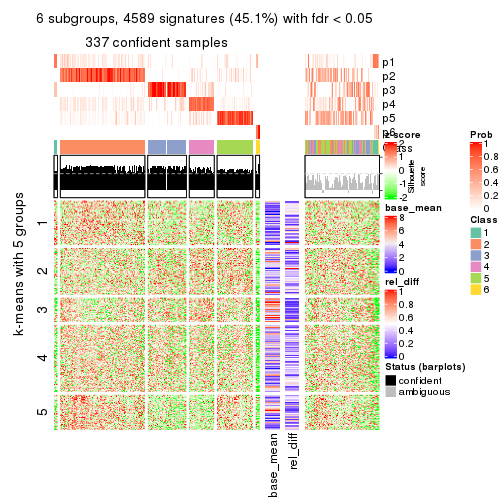</p>

</div>
</div>


Signature heatmaps where rows are not scaled:


<script>
$( function() {
	$( '#tabs-ATC-pam-get-signatures-no-scale' ).tabs();
} );
</script>
<div id='tabs-ATC-pam-get-signatures-no-scale'>
<ul>
<li><a href='#tab-ATC-pam-get-signatures-no-scale-1'>k = 2</a></li>
<li><a href='#tab-ATC-pam-get-signatures-no-scale-2'>k = 3</a></li>
<li><a href='#tab-ATC-pam-get-signatures-no-scale-3'>k = 4</a></li>
<li><a href='#tab-ATC-pam-get-signatures-no-scale-4'>k = 5</a></li>
<li><a href='#tab-ATC-pam-get-signatures-no-scale-5'>k = 6</a></li>
</ul>
<div id='tab-ATC-pam-get-signatures-no-scale-1'>
<pre><code class="r">get_signatures(res, k = 2, scale_rows = FALSE)
</code></pre>

<p></p>

</div>
<div id='tab-ATC-pam-get-signatures-no-scale-2'>
<pre><code class="r">get_signatures(res, k = 3, scale_rows = FALSE)
</code></pre>

<p></p>

</div>
<div id='tab-ATC-pam-get-signatures-no-scale-3'>
<pre><code class="r">get_signatures(res, k = 4, scale_rows = FALSE)
</code></pre>

<p>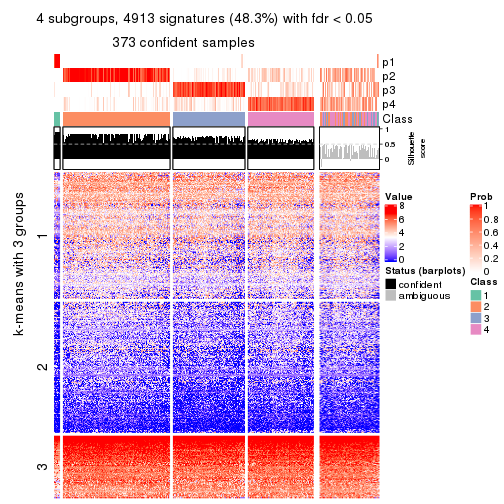</p>

</div>
<div id='tab-ATC-pam-get-signatures-no-scale-4'>
<pre><code class="r">get_signatures(res, k = 5, scale_rows = FALSE)
</code></pre>

<p></p>

</div>
<div id='tab-ATC-pam-get-signatures-no-scale-5'>
<pre><code class="r">get_signatures(res, k = 6, scale_rows = FALSE)
</code></pre>

<p></p>

</div>
</div>


Compare the overlap of signatures from different k:

```r
compare_signatures(res)
```


`get_signature()` returns a data frame invisibly. TO get the list of signatures, the function
call should be assigned to a variable explicitly. In following code, if `plot` argument is set
to `FALSE`, no heatmap is plotted while only the differential analysis is performed.

```r
# code only for demonstration
tb = get_signature(res, k = ..., plot = FALSE)
```

An example of the output of `tb` is:

```
#>   which_row         fdr    mean_1    mean_2 scaled_mean_1 scaled_mean_2 km
#> 1        38 0.042760348  8.373488  9.131774    -0.5533452     0.5164555  1
#> 2        40 0.018707592  7.106213  8.469186    -0.6173731     0.5762149  1
#> 3        55 0.019134737 10.221463 11.207825    -0.6159697     0.5749050  1
#> 4        59 0.006059896  5.921854  7.869574    -0.6899429     0.6439467  1
#> 5        60 0.018055526  8.928898 10.211722    -0.6204761     0.5791110  1
#> 6        98 0.009384629 15.714769 14.887706     0.6635654    -0.6193277  2
...
```

The columns in `tb` are:

1. `which_row`: row indices corresponding to the input matrix.
2. `fdr`: FDR for the differential test. 
3. `mean_x`: The mean value in group x.
4. `scaled_mean_x`: The mean value in group x after rows are scaled.
5. `km`: Row groups if k-means clustering is applied to rows.


UMAP plot which shows how samples are separated.


<script>
$( function() {
	$( '#tabs-ATC-pam-dimension-reduction' ).tabs();
} );
</script>
<div id='tabs-ATC-pam-dimension-reduction'>
<ul>
<li><a href='#tab-ATC-pam-dimension-reduction-1'>k = 2</a></li>
<li><a href='#tab-ATC-pam-dimension-reduction-2'>k = 3</a></li>
<li><a href='#tab-ATC-pam-dimension-reduction-3'>k = 4</a></li>
<li><a href='#tab-ATC-pam-dimension-reduction-4'>k = 5</a></li>
<li><a href='#tab-ATC-pam-dimension-reduction-5'>k = 6</a></li>
</ul>
<div id='tab-ATC-pam-dimension-reduction-1'>
<pre><code class="r">dimension_reduction(res, k = 2, method = &quot;UMAP&quot;)
</code></pre>

<p></p>

</div>
<div id='tab-ATC-pam-dimension-reduction-2'>
<pre><code class="r">dimension_reduction(res, k = 3, method = &quot;UMAP&quot;)
</code></pre>

<p></p>

</div>
<div id='tab-ATC-pam-dimension-reduction-3'>
<pre><code class="r">dimension_reduction(res, k = 4, method = &quot;UMAP&quot;)
</code></pre>

<p></p>

</div>
<div id='tab-ATC-pam-dimension-reduction-4'>
<pre><code class="r">dimension_reduction(res, k = 5, method = &quot;UMAP&quot;)
</code></pre>

<p></p>

</div>
<div id='tab-ATC-pam-dimension-reduction-5'>
<pre><code class="r">dimension_reduction(res, k = 6, method = &quot;UMAP&quot;)
</code></pre>

<p>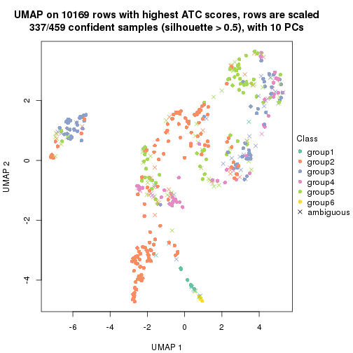</p>

</div>
</div>


Following heatmap shows how subgroups are split when increasing `k`:

```r
collect_classes(res)
```


If matrix rows can be associated to genes, consider to use `functional_enrichment(res,
...)` to perform function enrichment for the signature genes. See [this vignette](http://bioconductor.org/packages/devel/bioc/vignettes/cola/inst/doc/functional_enrichment.html) for more detailed explanations.


 

---------------------------------------------------


### ATC:mclust**


The object with results only for a single top-value method and a single partition method 
can be extracted as:

```r
res = res_list["ATC", "mclust"]
# you can also extract it by
# res = res_list["ATC:mclust"]
```

A summary of `res` and all the functions that can be applied to it:

```r
res
```

```
#> A 'ConsensusPartition' object with k = 2, 3, 4, 5, 6.
#>   On a matrix with 10169 rows and 459 columns.
#>   Top rows (1000, 2000, 3000, 4000, 5000) are extracted by 'ATC' method.
#>   Subgroups are detected by 'mclust' method.
#>   Performed in total 1250 partitions by row resampling.
#>   Best k for subgroups seems to be 2.
#> 
#> Following methods can be applied to this 'ConsensusPartition' object:
#>  [1] "cola_report"             "collect_classes"         "collect_plots"          
#>  [4] "collect_stats"           "colnames"                "compare_signatures"     
#>  [7] "consensus_heatmap"       "dimension_reduction"     "functional_enrichment"  
#> [10] "get_anno_col"            "get_anno"                "get_classes"            
#> [13] "get_consensus"           "get_matrix"              "get_membership"         
#> [16] "get_param"               "get_signatures"          "get_stats"              
#> [19] "is_best_k"               "is_stable_k"             "membership_heatmap"     
#> [22] "ncol"                    "nrow"                    "plot_ecdf"              
#> [25] "rownames"                "select_partition_number" "show"                   
#> [28] "suggest_best_k"          "test_to_known_factors"
```

`collect_plots()` function collects all the plots made from `res` for all `k` (number of partitions)
into one single page to provide an easy and fast comparison between different `k`.

```r
collect_plots(res)
```


The plots are:

- The first row: a plot of the ECDF (empirical cumulative distribution
  function) curves of the consensus matrix for each `k` and the heatmap of
  predicted classes for each `k`.
- The second row: heatmaps of the consensus matrix for each `k`.
- The third row: heatmaps of the membership matrix for each `k`.
- The fouth row: heatmaps of the signatures for each `k`.

All the plots in panels can be made by individual functions and they are
plotted later in this section.

`select_partition_number()` produces several plots showing different
statistics for choosing "optimized" `k`. There are following statistics:

- ECDF curves of the consensus matrix for each `k`;
- 1-PAC. [The PAC
  score](https://en.wikipedia.org/wiki/Consensus_clustering#Over-interpretation_potential_of_consensus_clustering)
  measures the proportion of the ambiguous subgrouping.
- Mean silhouette score.
- Concordance. The mean probability of fiting the consensus class ids in all
  partitions.
- Area increased. Denote $A_k$ as the area under the ECDF curve for current
  `k`, the area increased is defined as $A_k - A_{k-1}$.
- Rand index. The percent of pairs of samples that are both in a same cluster
  or both are not in a same cluster in the partition of k and k-1.
- Jaccard index. The ratio of pairs of samples are both in a same cluster in
  the partition of k and k-1 and the pairs of samples are both in a same
  cluster in the partition k or k-1.

The detailed explanations of these statistics can be found in [the _cola_
vignette](http://bioconductor.org/packages/devel/bioc/vignettes/cola/inst/doc/cola.html#toc_13).

Generally speaking, lower PAC score, higher mean silhouette score or higher
concordance corresponds to better partition. Rand index and Jaccard index
measure how similar the current partition is compared to partition with `k-1`.
If they are too similar, we won't accept `k` is better than `k-1`.

```r
select_partition_number(res)
```

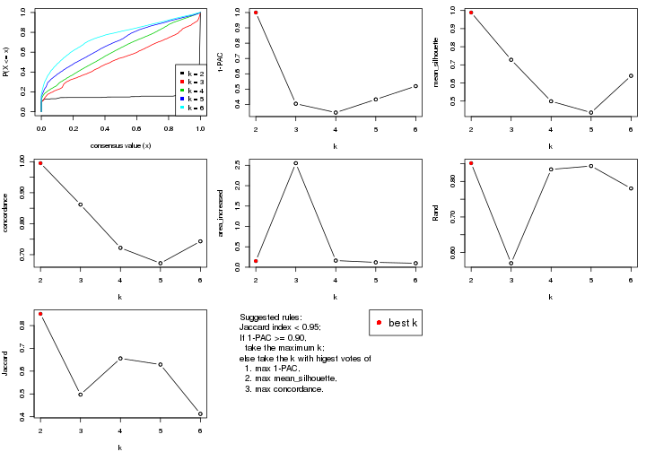

The numeric values for all these statistics can be obtained by `get_stats()`.

```r
get_stats(res)
```

```
#>   k 1-PAC mean_silhouette concordance area_increased  Rand Jaccard
#> 2 2 1.000           0.989       0.995         0.1510 0.851   0.851
#> 3 3 0.405           0.728       0.862         2.5512 0.570   0.497
#> 4 4 0.347           0.499       0.722         0.1622 0.834   0.656
#> 5 5 0.433           0.437       0.672         0.1187 0.844   0.629
#> 6 6 0.519           0.639       0.743         0.0971 0.780   0.412
```

`suggest_best_k()` suggests the best $k$ based on these statistics. The rules are as follows:

- All $k$ with Jaccard index larger than 0.95 are removed because increasing
  $k$ does not provide enough extra information. If all $k$ are removed, it is
  marked as no subgroup is detected.
- For all $k$ with 1-PAC score larger than 0.9, the maximal $k$ is taken as
  the best $k$, and other $k$ are marked as optional $k$.
- If it does not fit the second rule. The $k$ with the maximal vote of the
  highest 1-PAC score, highest mean silhouette, and highest concordance is
  taken as the best $k$.

```r
suggest_best_k(res)
```

```
#> [1] 2
```


Following shows the table of the partitions (You need to click the **show/hide
code output** link to see it). The membership matrix (columns with name `p*`)
is inferred by
[`clue::cl_consensus()`](https://www.rdocumentation.org/link/cl_consensus?package=clue)
function with the `SE` method. Basically the value in the membership matrix
represents the probability to belong to a certain group. The finall class
label for an item is determined with the group with highest probability it
belongs to.

In `get_classes()` function, the entropy is calculated from the membership
matrix and the silhouette score is calculated from the consensus matrix.


<script>
$( function() {
	$( '#tabs-ATC-mclust-get-classes' ).tabs();
} );
</script>
<div id='tabs-ATC-mclust-get-classes'>
<ul>
<li><a href='#tab-ATC-mclust-get-classes-1'>k = 2</a></li>
<li><a href='#tab-ATC-mclust-get-classes-2'>k = 3</a></li>
<li><a href='#tab-ATC-mclust-get-classes-3'>k = 4</a></li>
<li><a href='#tab-ATC-mclust-get-classes-4'>k = 5</a></li>
<li><a href='#tab-ATC-mclust-get-classes-5'>k = 6</a></li>
</ul>

<div id='tab-ATC-mclust-get-classes-1'>
<p><a id='tab-ATC-mclust-get-classes-1-a' style='color:#0366d6' href='#'>show/hide code output</a></p>
<pre><code class="r">cbind(get_classes(res, k = 2), get_membership(res, k = 2))
</code></pre>

<pre><code>#&gt;            class entropy silhouette    p1    p2
#&gt; SRR1699874     2  0.0000      0.997 0.000 1.000
#&gt; SRR1699875     2  0.0000      0.997 0.000 1.000
#&gt; SRR1699876     2  0.0000      0.997 0.000 1.000
#&gt; SRR1699877     2  0.0000      0.997 0.000 1.000
#&gt; SRR1699879     2  0.0000      0.997 0.000 1.000
#&gt; SRR1699878     2  0.0000      0.997 0.000 1.000
#&gt; SRR1699880     2  0.0000      0.997 0.000 1.000
#&gt; SRR1699881     2  0.0000      0.997 0.000 1.000
#&gt; SRR1699882     2  0.0000      0.997 0.000 1.000
#&gt; SRR1699883     2  0.0000      0.997 0.000 1.000
#&gt; SRR1699884     2  0.0000      0.997 0.000 1.000
#&gt; SRR1699885     2  0.0000      0.997 0.000 1.000
#&gt; SRR1699886     2  0.0000      0.997 0.000 1.000
#&gt; SRR1699888     2  0.0000      0.997 0.000 1.000
#&gt; SRR1699889     2  0.0000      0.997 0.000 1.000
#&gt; SRR1699890     2  0.0000      0.997 0.000 1.000
#&gt; SRR1699887     2  0.0000      0.997 0.000 1.000
#&gt; SRR1699891     2  0.0000      0.997 0.000 1.000
#&gt; SRR1699892     2  0.0000      0.997 0.000 1.000
#&gt; SRR1699893     2  0.0000      0.997 0.000 1.000
#&gt; SRR1699894     2  0.0000      0.997 0.000 1.000
#&gt; SRR1699895     2  0.0000      0.997 0.000 1.000
#&gt; SRR1699896     2  0.0000      0.997 0.000 1.000
#&gt; SRR1699897     2  0.0000      0.997 0.000 1.000
#&gt; SRR1699898     2  0.0000      0.997 0.000 1.000
#&gt; SRR1699900     2  0.0000      0.997 0.000 1.000
#&gt; SRR1699899     2  0.0000      0.997 0.000 1.000
#&gt; SRR1699902     2  0.0000      0.997 0.000 1.000
#&gt; SRR1699901     2  0.0000      0.997 0.000 1.000
#&gt; SRR1699903     2  0.0000      0.997 0.000 1.000
#&gt; SRR1699904     2  0.0000      0.997 0.000 1.000
#&gt; SRR1699905     2  0.0376      0.993 0.004 0.996
#&gt; SRR1699906     2  0.0000      0.997 0.000 1.000
#&gt; SRR1699907     2  0.0000      0.997 0.000 1.000
#&gt; SRR1699908     2  0.0000      0.997 0.000 1.000
#&gt; SRR1699909     2  0.0000      0.997 0.000 1.000
#&gt; SRR1699910     2  0.0000      0.997 0.000 1.000
#&gt; SRR1699911     2  0.0000      0.997 0.000 1.000
#&gt; SRR1699912     2  0.0000      0.997 0.000 1.000
#&gt; SRR1699913     2  0.0000      0.997 0.000 1.000
#&gt; SRR1699914     2  0.0000      0.997 0.000 1.000
#&gt; SRR1699915     2  0.0000      0.997 0.000 1.000
#&gt; SRR1699916     2  0.0000      0.997 0.000 1.000
#&gt; SRR1699917     2  0.0000      0.997 0.000 1.000
#&gt; SRR1699918     2  0.0000      0.997 0.000 1.000
#&gt; SRR1699919     2  0.0000      0.997 0.000 1.000
#&gt; SRR1699920     2  0.0000      0.997 0.000 1.000
#&gt; SRR1699921     2  0.0000      0.997 0.000 1.000
#&gt; SRR1699922     2  0.0000      0.997 0.000 1.000
#&gt; SRR1699923     2  0.0000      0.997 0.000 1.000
#&gt; SRR1699924     2  0.0000      0.997 0.000 1.000
#&gt; SRR1699925     1  0.0000      0.976 1.000 0.000
#&gt; SRR1699926     2  0.0000      0.997 0.000 1.000
#&gt; SRR1699927     2  0.0000      0.997 0.000 1.000
#&gt; SRR1699929     2  0.0000      0.997 0.000 1.000
#&gt; SRR1699928     2  0.0000      0.997 0.000 1.000
#&gt; SRR1699930     2  0.0000      0.997 0.000 1.000
#&gt; SRR1699931     2  0.0000      0.997 0.000 1.000
#&gt; SRR1699933     2  0.0000      0.997 0.000 1.000
#&gt; SRR1699932     2  0.0000      0.997 0.000 1.000
#&gt; SRR1699934     1  0.0000      0.976 1.000 0.000
#&gt; SRR1699935     2  0.0000      0.997 0.000 1.000
#&gt; SRR1699936     2  0.0000      0.997 0.000 1.000
#&gt; SRR1699937     2  0.0000      0.997 0.000 1.000
#&gt; SRR1699938     2  0.0000      0.997 0.000 1.000
#&gt; SRR1699940     2  0.0000      0.997 0.000 1.000
#&gt; SRR1699939     2  0.0000      0.997 0.000 1.000
#&gt; SRR1699941     2  0.0000      0.997 0.000 1.000
#&gt; SRR1699942     2  0.0000      0.997 0.000 1.000
#&gt; SRR1699943     2  0.0000      0.997 0.000 1.000
#&gt; SRR1699944     2  0.0000      0.997 0.000 1.000
#&gt; SRR1699945     2  0.0000      0.997 0.000 1.000
#&gt; SRR1699946     2  0.0000      0.997 0.000 1.000
#&gt; SRR1699947     2  0.0000      0.997 0.000 1.000
#&gt; SRR1699948     2  0.0000      0.997 0.000 1.000
#&gt; SRR1699949     2  0.0000      0.997 0.000 1.000
#&gt; SRR1699950     2  0.0000      0.997 0.000 1.000
#&gt; SRR1699951     2  0.0000      0.997 0.000 1.000
#&gt; SRR1699952     2  0.0000      0.997 0.000 1.000
#&gt; SRR1699953     2  0.0000      0.997 0.000 1.000
#&gt; SRR1699954     2  0.0000      0.997 0.000 1.000
#&gt; SRR1699955     2  0.0000      0.997 0.000 1.000
#&gt; SRR1699956     2  0.0000      0.997 0.000 1.000
#&gt; SRR1699957     2  0.0000      0.997 0.000 1.000
#&gt; SRR1699959     2  0.0000      0.997 0.000 1.000
#&gt; SRR1699958     2  0.0000      0.997 0.000 1.000
#&gt; SRR1699960     2  0.0000      0.997 0.000 1.000
#&gt; SRR1699961     2  0.0000      0.997 0.000 1.000
#&gt; SRR1699962     2  0.0000      0.997 0.000 1.000
#&gt; SRR1699963     2  0.0000      0.997 0.000 1.000
#&gt; SRR1699964     2  0.0000      0.997 0.000 1.000
#&gt; SRR1699965     2  0.0000      0.997 0.000 1.000
#&gt; SRR1699966     2  0.0000      0.997 0.000 1.000
#&gt; SRR1699967     2  0.0000      0.997 0.000 1.000
#&gt; SRR1699968     2  0.0000      0.997 0.000 1.000
#&gt; SRR1699969     2  0.0000      0.997 0.000 1.000
#&gt; SRR1699971     2  0.0000      0.997 0.000 1.000
#&gt; SRR1699970     2  0.0000      0.997 0.000 1.000
#&gt; SRR1699972     2  0.0000      0.997 0.000 1.000
#&gt; SRR1699973     2  0.0000      0.997 0.000 1.000
#&gt; SRR1699974     2  0.0000      0.997 0.000 1.000
#&gt; SRR1699975     2  0.0000      0.997 0.000 1.000
#&gt; SRR1699976     2  0.0000      0.997 0.000 1.000
#&gt; SRR1699977     2  0.0000      0.997 0.000 1.000
#&gt; SRR1699978     1  0.1414      0.965 0.980 0.020
#&gt; SRR1699979     2  0.0000      0.997 0.000 1.000
#&gt; SRR1699980     2  0.0000      0.997 0.000 1.000
#&gt; SRR1699981     2  0.0000      0.997 0.000 1.000
#&gt; SRR1699982     2  0.0000      0.997 0.000 1.000
#&gt; SRR1699983     2  0.0000      0.997 0.000 1.000
#&gt; SRR1699984     1  0.0000      0.976 1.000 0.000
#&gt; SRR1699985     2  0.0000      0.997 0.000 1.000
#&gt; SRR1699986     2  0.0000      0.997 0.000 1.000
#&gt; SRR1699988     2  0.0000      0.997 0.000 1.000
#&gt; SRR1699987     2  0.0000      0.997 0.000 1.000
#&gt; SRR1699989     2  0.0000      0.997 0.000 1.000
#&gt; SRR1699990     2  0.0000      0.997 0.000 1.000
#&gt; SRR1699992     2  0.0000      0.997 0.000 1.000
#&gt; SRR1699991     2  0.0000      0.997 0.000 1.000
#&gt; SRR1699993     2  0.0000      0.997 0.000 1.000
#&gt; SRR1699994     2  0.0000      0.997 0.000 1.000
#&gt; SRR1699995     1  0.0938      0.970 0.988 0.012
#&gt; SRR1699996     2  0.0000      0.997 0.000 1.000
#&gt; SRR1699997     2  0.0000      0.997 0.000 1.000
#&gt; SRR1699998     2  0.0000      0.997 0.000 1.000
#&gt; SRR1699999     1  0.0672      0.973 0.992 0.008
#&gt; SRR1700000     2  0.0000      0.997 0.000 1.000
#&gt; SRR1700002     2  0.0000      0.997 0.000 1.000
#&gt; SRR1700001     2  0.0000      0.997 0.000 1.000
#&gt; SRR1700003     2  0.0000      0.997 0.000 1.000
#&gt; SRR1700004     2  0.0000      0.997 0.000 1.000
#&gt; SRR1700005     1  0.0000      0.976 1.000 0.000
#&gt; SRR1700006     2  0.0000      0.997 0.000 1.000
#&gt; SRR1700007     2  0.0000      0.997 0.000 1.000
#&gt; SRR1700008     2  0.0000      0.997 0.000 1.000
#&gt; SRR1700009     1  0.0000      0.976 1.000 0.000
#&gt; SRR1700010     2  0.0000      0.997 0.000 1.000
#&gt; SRR1700011     2  0.0000      0.997 0.000 1.000
#&gt; SRR1700013     2  0.0000      0.997 0.000 1.000
#&gt; SRR1700012     2  0.0000      0.997 0.000 1.000
#&gt; SRR1700014     2  0.0000      0.997 0.000 1.000
#&gt; SRR1700015     2  0.0000      0.997 0.000 1.000
#&gt; SRR1700016     1  0.0000      0.976 1.000 0.000
#&gt; SRR1700018     2  0.0000      0.997 0.000 1.000
#&gt; SRR1700017     2  0.0000      0.997 0.000 1.000
#&gt; SRR1700019     2  0.0000      0.997 0.000 1.000
#&gt; SRR1700020     1  0.4815      0.887 0.896 0.104
#&gt; SRR1700021     2  0.0000      0.997 0.000 1.000
#&gt; SRR1700023     2  0.0000      0.997 0.000 1.000
#&gt; SRR1700022     2  0.0000      0.997 0.000 1.000
#&gt; SRR1700024     2  0.0000      0.997 0.000 1.000
#&gt; SRR1700025     2  0.0000      0.997 0.000 1.000
#&gt; SRR1700026     2  0.0000      0.997 0.000 1.000
#&gt; SRR1700027     2  0.0000      0.997 0.000 1.000
#&gt; SRR1700028     2  0.0000      0.997 0.000 1.000
#&gt; SRR1700029     2  0.0000      0.997 0.000 1.000
#&gt; SRR1700030     2  0.0000      0.997 0.000 1.000
#&gt; SRR1700031     2  0.0000      0.997 0.000 1.000
#&gt; SRR1700032     2  0.0000      0.997 0.000 1.000
#&gt; SRR1700034     1  0.0672      0.973 0.992 0.008
#&gt; SRR1700035     2  0.0000      0.997 0.000 1.000
#&gt; SRR1700033     2  0.0000      0.997 0.000 1.000
#&gt; SRR1700036     2  0.0000      0.997 0.000 1.000
#&gt; SRR1700037     2  0.0000      0.997 0.000 1.000
#&gt; SRR1700038     2  0.0000      0.997 0.000 1.000
#&gt; SRR1700039     2  0.0000      0.997 0.000 1.000
#&gt; SRR1700040     2  0.0000      0.997 0.000 1.000
#&gt; SRR1700041     2  0.0000      0.997 0.000 1.000
#&gt; SRR1700042     2  0.0000      0.997 0.000 1.000
#&gt; SRR1700043     2  0.5946      0.827 0.144 0.856
#&gt; SRR1700045     2  0.0000      0.997 0.000 1.000
#&gt; SRR1700044     2  0.0000      0.997 0.000 1.000
#&gt; SRR1700046     2  0.0000      0.997 0.000 1.000
#&gt; SRR1700047     2  0.0000      0.997 0.000 1.000
#&gt; SRR1700048     2  0.0000      0.997 0.000 1.000
#&gt; SRR1700049     2  0.0000      0.997 0.000 1.000
#&gt; SRR1700050     2  0.0000      0.997 0.000 1.000
#&gt; SRR1700051     1  0.9754      0.327 0.592 0.408
#&gt; SRR1700052     2  0.0000      0.997 0.000 1.000
#&gt; SRR1700053     2  0.0000      0.997 0.000 1.000
#&gt; SRR1700054     2  0.0000      0.997 0.000 1.000
#&gt; SRR1700055     1  0.0672      0.973 0.992 0.008
#&gt; SRR1700056     2  0.0000      0.997 0.000 1.000
#&gt; SRR1700057     2  0.0000      0.997 0.000 1.000
#&gt; SRR1700058     2  0.0000      0.997 0.000 1.000
#&gt; SRR1700059     2  0.0000      0.997 0.000 1.000
#&gt; SRR1700060     2  0.0000      0.997 0.000 1.000
#&gt; SRR1700061     2  0.0000      0.997 0.000 1.000
#&gt; SRR1700062     2  0.0000      0.997 0.000 1.000
#&gt; SRR1700063     2  0.0000      0.997 0.000 1.000
#&gt; SRR1700064     2  0.0000      0.997 0.000 1.000
#&gt; SRR1700065     2  0.0000      0.997 0.000 1.000
#&gt; SRR1700066     2  0.0000      0.997 0.000 1.000
#&gt; SRR1700067     2  0.0000      0.997 0.000 1.000
#&gt; SRR1700068     2  0.0000      0.997 0.000 1.000
#&gt; SRR1700069     2  0.0000      0.997 0.000 1.000
#&gt; SRR1700070     2  0.0000      0.997 0.000 1.000
#&gt; SRR1700071     2  0.0000      0.997 0.000 1.000
#&gt; SRR1700072     2  0.9552      0.379 0.376 0.624
#&gt; SRR1700073     2  0.0000      0.997 0.000 1.000
#&gt; SRR1700075     2  0.0000      0.997 0.000 1.000
#&gt; SRR1700074     2  0.0000      0.997 0.000 1.000
#&gt; SRR1700076     2  0.0000      0.997 0.000 1.000
#&gt; SRR1700077     2  0.0000      0.997 0.000 1.000
#&gt; SRR1700078     2  0.0000      0.997 0.000 1.000
#&gt; SRR1700080     2  0.0000      0.997 0.000 1.000
#&gt; SRR1700079     2  0.0000      0.997 0.000 1.000
#&gt; SRR1700081     2  0.0000      0.997 0.000 1.000
#&gt; SRR1700082     2  0.0000      0.997 0.000 1.000
#&gt; SRR1700083     2  0.0000      0.997 0.000 1.000
#&gt; SRR1700084     2  0.6148      0.816 0.152 0.848
#&gt; SRR1700085     2  0.0000      0.997 0.000 1.000
#&gt; SRR1700086     2  0.0000      0.997 0.000 1.000
#&gt; SRR1700087     2  0.0000      0.997 0.000 1.000
#&gt; SRR1700088     2  0.0000      0.997 0.000 1.000
#&gt; SRR1700089     2  0.0000      0.997 0.000 1.000
#&gt; SRR1700091     2  0.0000      0.997 0.000 1.000
#&gt; SRR1700090     2  0.0000      0.997 0.000 1.000
#&gt; SRR1700092     2  0.0000      0.997 0.000 1.000
#&gt; SRR1700094     2  0.0000      0.997 0.000 1.000
#&gt; SRR1700093     2  0.0000      0.997 0.000 1.000
#&gt; SRR1700095     2  0.6531      0.793 0.168 0.832
#&gt; SRR1700096     2  0.0000      0.997 0.000 1.000
#&gt; SRR1700097     2  0.0000      0.997 0.000 1.000
#&gt; SRR1700098     2  0.0000      0.997 0.000 1.000
#&gt; SRR1700099     2  0.0000      0.997 0.000 1.000
#&gt; SRR1700100     2  0.0000      0.997 0.000 1.000
#&gt; SRR1700101     2  0.0000      0.997 0.000 1.000
#&gt; SRR1700102     2  0.0000      0.997 0.000 1.000
#&gt; SRR1700104     2  0.0000      0.997 0.000 1.000
#&gt; SRR1700103     2  0.0000      0.997 0.000 1.000
#&gt; SRR1700105     2  0.0000      0.997 0.000 1.000
#&gt; SRR1700106     2  0.0000      0.997 0.000 1.000
#&gt; SRR1700107     2  0.0000      0.997 0.000 1.000
#&gt; SRR1700108     2  0.0000      0.997 0.000 1.000
#&gt; SRR1700109     2  0.0000      0.997 0.000 1.000
#&gt; SRR1700110     2  0.0000      0.997 0.000 1.000
#&gt; SRR1700112     2  0.0000      0.997 0.000 1.000
#&gt; SRR1700111     2  0.0000      0.997 0.000 1.000
#&gt; SRR1700113     2  0.0000      0.997 0.000 1.000
#&gt; SRR1700114     2  0.0000      0.997 0.000 1.000
#&gt; SRR1700115     2  0.0000      0.997 0.000 1.000
#&gt; SRR1700116     2  0.0000      0.997 0.000 1.000
#&gt; SRR1700117     2  0.0000      0.997 0.000 1.000
#&gt; SRR1700119     2  0.0000      0.997 0.000 1.000
#&gt; SRR1700118     2  0.0000      0.997 0.000 1.000
#&gt; SRR1700120     2  0.0000      0.997 0.000 1.000
#&gt; SRR1700121     2  0.0000      0.997 0.000 1.000
#&gt; SRR1700122     2  0.0000      0.997 0.000 1.000
#&gt; SRR1700123     2  0.0000      0.997 0.000 1.000
#&gt; SRR1700125     2  0.0000      0.997 0.000 1.000
#&gt; SRR1700126     2  0.0000      0.997 0.000 1.000
#&gt; SRR1700127     2  0.0000      0.997 0.000 1.000
#&gt; SRR1700124     2  0.0000      0.997 0.000 1.000
#&gt; SRR1700128     2  0.0000      0.997 0.000 1.000
#&gt; SRR1700129     2  0.0000      0.997 0.000 1.000
#&gt; SRR1700130     2  0.0000      0.997 0.000 1.000
#&gt; SRR1700132     2  0.0000      0.997 0.000 1.000
#&gt; SRR1700131     2  0.0000      0.997 0.000 1.000
#&gt; SRR1700133     2  0.0000      0.997 0.000 1.000
#&gt; SRR1700134     2  0.0000      0.997 0.000 1.000
#&gt; SRR1700135     2  0.0000      0.997 0.000 1.000
#&gt; SRR1700136     2  0.0000      0.997 0.000 1.000
#&gt; SRR1700137     2  0.0000      0.997 0.000 1.000
#&gt; SRR1700138     2  0.0000      0.997 0.000 1.000
#&gt; SRR1700140     2  0.0000      0.997 0.000 1.000
#&gt; SRR1700139     2  0.0000      0.997 0.000 1.000
#&gt; SRR1700141     2  0.0000      0.997 0.000 1.000
#&gt; SRR1700142     2  0.0000      0.997 0.000 1.000
#&gt; SRR1700143     2  0.0000      0.997 0.000 1.000
#&gt; SRR1700144     2  0.0000      0.997 0.000 1.000
#&gt; SRR1700145     2  0.0000      0.997 0.000 1.000
#&gt; SRR1700146     2  0.0000      0.997 0.000 1.000
#&gt; SRR1700147     2  0.0000      0.997 0.000 1.000
#&gt; SRR1700149     2  0.0000      0.997 0.000 1.000
#&gt; SRR1700148     2  0.0000      0.997 0.000 1.000
#&gt; SRR1700150     2  0.0000      0.997 0.000 1.000
#&gt; SRR1700152     2  0.0000      0.997 0.000 1.000
#&gt; SRR1700151     2  0.0000      0.997 0.000 1.000
#&gt; SRR1700153     2  0.0000      0.997 0.000 1.000
#&gt; SRR1700154     2  0.0000      0.997 0.000 1.000
#&gt; SRR1700155     2  0.0000      0.997 0.000 1.000
#&gt; SRR1700156     2  0.0000      0.997 0.000 1.000
#&gt; SRR1700158     2  0.0000      0.997 0.000 1.000
#&gt; SRR1700159     2  0.0000      0.997 0.000 1.000
#&gt; SRR1700157     2  0.0000      0.997 0.000 1.000
#&gt; SRR1700160     2  0.0000      0.997 0.000 1.000
#&gt; SRR1700161     2  0.0000      0.997 0.000 1.000
#&gt; SRR1700162     2  0.0000      0.997 0.000 1.000
#&gt; SRR1700164     2  0.0000      0.997 0.000 1.000
#&gt; SRR1700163     2  0.0000      0.997 0.000 1.000
#&gt; SRR1700165     2  0.0000      0.997 0.000 1.000
#&gt; SRR1700166     2  0.0000      0.997 0.000 1.000
#&gt; SRR1700168     2  0.0000      0.997 0.000 1.000
#&gt; SRR1700167     2  0.0000      0.997 0.000 1.000
#&gt; SRR1700170     2  0.0000      0.997 0.000 1.000
#&gt; SRR1700169     2  0.0000      0.997 0.000 1.000
#&gt; SRR1700171     1  0.0376      0.974 0.996 0.004
#&gt; SRR1700172     2  0.0000      0.997 0.000 1.000
#&gt; SRR1700174     2  0.0000      0.997 0.000 1.000
#&gt; SRR1700173     2  0.0000      0.997 0.000 1.000
#&gt; SRR1700175     2  0.0000      0.997 0.000 1.000
#&gt; SRR1700176     2  0.0000      0.997 0.000 1.000
#&gt; SRR1700178     2  0.0000      0.997 0.000 1.000
#&gt; SRR1700177     2  0.0000      0.997 0.000 1.000
#&gt; SRR1700180     2  0.0000      0.997 0.000 1.000
#&gt; SRR1700179     2  0.0000      0.997 0.000 1.000
#&gt; SRR1700181     2  0.0000      0.997 0.000 1.000
#&gt; SRR1700183     1  0.0000      0.976 1.000 0.000
#&gt; SRR1700182     2  0.0000      0.997 0.000 1.000
#&gt; SRR1700184     2  0.0000      0.997 0.000 1.000
#&gt; SRR1700186     2  0.0000      0.997 0.000 1.000
#&gt; SRR1700187     1  0.0000      0.976 1.000 0.000
#&gt; SRR1700185     1  0.0000      0.976 1.000 0.000
#&gt; SRR1700188     2  0.0000      0.997 0.000 1.000
#&gt; SRR1700192     1  0.0000      0.976 1.000 0.000
#&gt; SRR1700190     1  0.1414      0.964 0.980 0.020
#&gt; SRR1700191     1  0.0000      0.976 1.000 0.000
#&gt; SRR1700189     1  0.0000      0.976 1.000 0.000
#&gt; SRR1700193     2  0.0000      0.997 0.000 1.000
#&gt; SRR1700195     2  0.0000      0.997 0.000 1.000
#&gt; SRR1700194     1  0.0000      0.976 1.000 0.000
#&gt; SRR1700196     2  0.0000      0.997 0.000 1.000
#&gt; SRR1700197     1  0.0000      0.976 1.000 0.000
#&gt; SRR1700198     2  0.0000      0.997 0.000 1.000
#&gt; SRR1700199     2  0.0000      0.997 0.000 1.000
#&gt; SRR1700200     2  0.0000      0.997 0.000 1.000
#&gt; SRR1700201     2  0.0000      0.997 0.000 1.000
#&gt; SRR1700202     1  0.3114      0.935 0.944 0.056
#&gt; SRR1700203     2  0.0000      0.997 0.000 1.000
#&gt; SRR1700204     2  0.0000      0.997 0.000 1.000
#&gt; SRR1700206     2  0.0000      0.997 0.000 1.000
#&gt; SRR1700207     2  0.0000      0.997 0.000 1.000
#&gt; SRR1700208     1  0.5178      0.873 0.884 0.116
#&gt; SRR1700205     2  0.0000      0.997 0.000 1.000
#&gt; SRR1700209     2  0.0000      0.997 0.000 1.000
#&gt; SRR1700210     2  0.0000      0.997 0.000 1.000
#&gt; SRR1700211     2  0.0000      0.997 0.000 1.000
#&gt; SRR1700212     2  0.0000      0.997 0.000 1.000
#&gt; SRR1700213     2  0.0000      0.997 0.000 1.000
#&gt; SRR1700214     2  0.0000      0.997 0.000 1.000
#&gt; SRR1700215     1  0.0000      0.976 1.000 0.000
#&gt; SRR1700217     2  0.0000      0.997 0.000 1.000
#&gt; SRR1700216     1  0.0000      0.976 1.000 0.000
#&gt; SRR1700218     2  0.0000      0.997 0.000 1.000
#&gt; SRR1700219     2  0.0000      0.997 0.000 1.000
#&gt; SRR1700222     1  0.0000      0.976 1.000 0.000
#&gt; SRR1700220     2  0.0000      0.997 0.000 1.000
#&gt; SRR1700221     2  0.0000      0.997 0.000 1.000
#&gt; SRR1700223     2  0.0000      0.997 0.000 1.000
#&gt; SRR1700224     2  0.0000      0.997 0.000 1.000
#&gt; SRR1700226     2  0.0000      0.997 0.000 1.000
#&gt; SRR1700229     2  0.0000      0.997 0.000 1.000
#&gt; SRR1700225     2  0.0000      0.997 0.000 1.000
#&gt; SRR1700227     2  0.0000      0.997 0.000 1.000
#&gt; SRR1700230     1  0.0000      0.976 1.000 0.000
#&gt; SRR1700231     2  0.0000      0.997 0.000 1.000
#&gt; SRR1700228     2  0.0000      0.997 0.000 1.000
#&gt; SRR1700232     2  0.0000      0.997 0.000 1.000
#&gt; SRR1700233     2  0.0000      0.997 0.000 1.000
#&gt; SRR1700234     2  0.0000      0.997 0.000 1.000
#&gt; SRR1700235     2  0.0000      0.997 0.000 1.000
#&gt; SRR1700237     2  0.0000      0.997 0.000 1.000
#&gt; SRR1700236     2  0.0000      0.997 0.000 1.000
#&gt; SRR1700238     2  0.0000      0.997 0.000 1.000
#&gt; SRR1700239     1  0.0000      0.976 1.000 0.000
#&gt; SRR1700240     1  0.0000      0.976 1.000 0.000
#&gt; SRR1700241     2  0.0000      0.997 0.000 1.000
#&gt; SRR1700243     2  0.0000      0.997 0.000 1.000
#&gt; SRR1700244     2  0.0000      0.997 0.000 1.000
#&gt; SRR1700242     1  0.0000      0.976 1.000 0.000
#&gt; SRR1700246     1  0.0000      0.976 1.000 0.000
#&gt; SRR1700245     2  0.0000      0.997 0.000 1.000
#&gt; SRR1700247     1  0.0000      0.976 1.000 0.000
#&gt; SRR1700249     1  0.0000      0.976 1.000 0.000
#&gt; SRR1700250     2  0.0000      0.997 0.000 1.000
#&gt; SRR1700248     2  0.0000      0.997 0.000 1.000
#&gt; SRR1700251     2  0.0000      0.997 0.000 1.000
#&gt; SRR1700252     2  0.0000      0.997 0.000 1.000
#&gt; SRR1700253     2  0.0000      0.997 0.000 1.000
#&gt; SRR1700256     2  0.0000      0.997 0.000 1.000
#&gt; SRR1700254     1  0.0000      0.976 1.000 0.000
#&gt; SRR1700255     2  0.0000      0.997 0.000 1.000
#&gt; SRR1700257     2  0.0000      0.997 0.000 1.000
#&gt; SRR1700258     2  0.0000      0.997 0.000 1.000
#&gt; SRR1700259     2  0.0000      0.997 0.000 1.000
#&gt; SRR1700260     2  0.0000      0.997 0.000 1.000
#&gt; SRR1700261     2  0.0000      0.997 0.000 1.000
#&gt; SRR1700262     2  0.0000      0.997 0.000 1.000
#&gt; SRR1700263     2  0.0000      0.997 0.000 1.000
#&gt; SRR1700264     2  0.0000      0.997 0.000 1.000
#&gt; SRR1700265     2  0.9896      0.187 0.440 0.560
#&gt; SRR1700266     2  0.0000      0.997 0.000 1.000
#&gt; SRR1700268     2  0.0000      0.997 0.000 1.000
#&gt; SRR1700270     2  0.0000      0.997 0.000 1.000
#&gt; SRR1700267     2  0.0000      0.997 0.000 1.000
#&gt; SRR1700271     2  0.0000      0.997 0.000 1.000
#&gt; SRR1700272     2  0.0000      0.997 0.000 1.000
#&gt; SRR1700273     2  0.0000      0.997 0.000 1.000
#&gt; SRR1700274     2  0.0000      0.997 0.000 1.000
#&gt; SRR1700277     2  0.0000      0.997 0.000 1.000
#&gt; SRR1700275     2  0.0000      0.997 0.000 1.000
#&gt; SRR1700276     2  0.0000      0.997 0.000 1.000
#&gt; SRR1700278     2  0.0000      0.997 0.000 1.000
#&gt; SRR1700279     2  0.0000      0.997 0.000 1.000
#&gt; SRR1700280     2  0.0000      0.997 0.000 1.000
#&gt; SRR1700281     2  0.0000      0.997 0.000 1.000
#&gt; SRR1700283     2  0.0000      0.997 0.000 1.000
#&gt; SRR1700282     2  0.0000      0.997 0.000 1.000
#&gt; SRR1700284     2  0.0000      0.997 0.000 1.000
#&gt; SRR1700285     2  0.0000      0.997 0.000 1.000
#&gt; SRR1700286     2  0.0000      0.997 0.000 1.000
#&gt; SRR1700287     2  0.0000      0.997 0.000 1.000
#&gt; SRR1700290     2  0.0376      0.993 0.004 0.996
#&gt; SRR1700289     2  0.0000      0.997 0.000 1.000
#&gt; SRR1700288     2  0.0000      0.997 0.000 1.000
#&gt; SRR1700292     2  0.0000      0.997 0.000 1.000
#&gt; SRR1700291     2  0.0000      0.997 0.000 1.000
#&gt; SRR1700293     2  0.0000      0.997 0.000 1.000
#&gt; SRR1700294     2  0.0000      0.997 0.000 1.000
#&gt; SRR1700295     2  0.0000      0.997 0.000 1.000
#&gt; SRR1700297     2  0.0000      0.997 0.000 1.000
#&gt; SRR1700296     2  0.0000      0.997 0.000 1.000
#&gt; SRR1700298     2  0.0000      0.997 0.000 1.000
#&gt; SRR1700299     2  0.0000      0.997 0.000 1.000
#&gt; SRR1700300     2  0.0000      0.997 0.000 1.000
#&gt; SRR1700302     2  0.0000      0.997 0.000 1.000
#&gt; SRR1700301     2  0.0000      0.997 0.000 1.000
#&gt; SRR1700303     2  0.0000      0.997 0.000 1.000
#&gt; SRR1700304     2  0.0000      0.997 0.000 1.000
#&gt; SRR1700305     2  0.0000      0.997 0.000 1.000
#&gt; SRR1700306     2  0.0000      0.997 0.000 1.000
#&gt; SRR1700308     2  0.0000      0.997 0.000 1.000
#&gt; SRR1700307     2  0.0000      0.997 0.000 1.000
#&gt; SRR1700309     2  0.0000      0.997 0.000 1.000
#&gt; SRR1700310     2  0.0000      0.997 0.000 1.000
#&gt; SRR1700311     2  0.0000      0.997 0.000 1.000
#&gt; SRR1700312     2  0.0000      0.997 0.000 1.000
#&gt; SRR1700313     2  0.0000      0.997 0.000 1.000
#&gt; SRR1700314     2  0.0000      0.997 0.000 1.000
#&gt; SRR1700315     2  0.0000      0.997 0.000 1.000
#&gt; SRR1700316     2  0.0000      0.997 0.000 1.000
#&gt; SRR1700317     2  0.0000      0.997 0.000 1.000
#&gt; SRR1700318     2  0.0000      0.997 0.000 1.000
#&gt; SRR1700319     2  0.0000      0.997 0.000 1.000
#&gt; SRR1700320     2  0.0000      0.997 0.000 1.000
#&gt; SRR1700322     2  0.0000      0.997 0.000 1.000
#&gt; SRR1700321     2  0.0000      0.997 0.000 1.000
#&gt; SRR1700323     2  0.0000      0.997 0.000 1.000
#&gt; SRR1700324     2  0.0000      0.997 0.000 1.000
#&gt; SRR1700325     2  0.0000      0.997 0.000 1.000
#&gt; SRR1700326     1  0.4562      0.895 0.904 0.096
#&gt; SRR1700327     2  0.0000      0.997 0.000 1.000
#&gt; SRR1700329     2  0.0000      0.997 0.000 1.000
#&gt; SRR1700328     2  0.0000      0.997 0.000 1.000
#&gt; SRR1700330     2  0.0000      0.997 0.000 1.000
#&gt; SRR1700331     2  0.0000      0.997 0.000 1.000
#&gt; SRR1700332     2  0.0000      0.997 0.000 1.000
#&gt; SRR1700333     2  0.0000      0.997 0.000 1.000
</code></pre>

<script>
$('#tab-ATC-mclust-get-classes-1-a').parent().next().next().hide();
$('#tab-ATC-mclust-get-classes-1-a').click(function(){
  $('#tab-ATC-mclust-get-classes-1-a').parent().next().next().toggle();
  return(false);
});
</script>
</div>

<div id='tab-ATC-mclust-get-classes-2'>
<p><a id='tab-ATC-mclust-get-classes-2-a' style='color:#0366d6' href='#'>show/hide code output</a></p>
<pre><code class="r">cbind(get_classes(res, k = 3), get_membership(res, k = 3))
</code></pre>

<pre><code>#&gt;            class entropy silhouette    p1    p2    p3
#&gt; SRR1699874     2  0.0000     0.8840 0.000 1.000 0.000
#&gt; SRR1699875     3  0.3752     0.7686 0.000 0.144 0.856
#&gt; SRR1699876     2  0.0000     0.8840 0.000 1.000 0.000
#&gt; SRR1699877     2  0.0237     0.8814 0.000 0.996 0.004
#&gt; SRR1699879     2  0.0000     0.8840 0.000 1.000 0.000
#&gt; SRR1699878     2  0.0000     0.8840 0.000 1.000 0.000
#&gt; SRR1699880     3  0.3619     0.7697 0.000 0.136 0.864
#&gt; SRR1699881     3  0.3619     0.7697 0.000 0.136 0.864
#&gt; SRR1699882     2  0.0000     0.8840 0.000 1.000 0.000
#&gt; SRR1699883     2  0.0237     0.8836 0.000 0.996 0.004
#&gt; SRR1699884     2  0.0000     0.8840 0.000 1.000 0.000
#&gt; SRR1699885     2  0.0000     0.8840 0.000 1.000 0.000
#&gt; SRR1699886     2  0.0592     0.8833 0.000 0.988 0.012
#&gt; SRR1699888     2  0.0000     0.8840 0.000 1.000 0.000
#&gt; SRR1699889     2  0.0592     0.8833 0.000 0.988 0.012
#&gt; SRR1699890     2  0.0892     0.8826 0.000 0.980 0.020
#&gt; SRR1699887     2  0.0000     0.8840 0.000 1.000 0.000
#&gt; SRR1699891     2  0.0424     0.8830 0.000 0.992 0.008
#&gt; SRR1699892     2  0.6299    -0.2369 0.000 0.524 0.476
#&gt; SRR1699893     2  0.5098     0.5941 0.000 0.752 0.248
#&gt; SRR1699894     2  0.0592     0.8833 0.000 0.988 0.012
#&gt; SRR1699895     2  0.2066     0.8608 0.000 0.940 0.060
#&gt; SRR1699896     2  0.3116     0.8157 0.000 0.892 0.108
#&gt; SRR1699897     2  0.6302    -0.2557 0.000 0.520 0.480
#&gt; SRR1699898     3  0.1163     0.7588 0.000 0.028 0.972
#&gt; SRR1699900     2  0.8649     0.0641 0.112 0.528 0.360
#&gt; SRR1699899     2  0.0424     0.8830 0.000 0.992 0.008
#&gt; SRR1699902     3  0.6369     0.6320 0.016 0.316 0.668
#&gt; SRR1699901     3  0.5678     0.6238 0.000 0.316 0.684
#&gt; SRR1699903     2  0.3340     0.8060 0.000 0.880 0.120
#&gt; SRR1699904     2  0.0592     0.8833 0.000 0.988 0.012
#&gt; SRR1699905     3  0.9712     0.3106 0.232 0.332 0.436
#&gt; SRR1699906     2  0.2165     0.8618 0.000 0.936 0.064
#&gt; SRR1699907     2  0.0892     0.8809 0.000 0.980 0.020
#&gt; SRR1699908     2  0.0892     0.8816 0.000 0.980 0.020
#&gt; SRR1699909     2  0.5254     0.6530 0.000 0.736 0.264
#&gt; SRR1699910     3  0.6244     0.3535 0.000 0.440 0.560
#&gt; SRR1699911     2  0.1411     0.8768 0.000 0.964 0.036
#&gt; SRR1699912     2  0.1964     0.8573 0.000 0.944 0.056
#&gt; SRR1699913     2  0.1031     0.8783 0.000 0.976 0.024
#&gt; SRR1699914     3  0.5706     0.6060 0.000 0.320 0.680
#&gt; SRR1699915     2  0.4605     0.7365 0.000 0.796 0.204
#&gt; SRR1699916     2  0.1031     0.8783 0.000 0.976 0.024
#&gt; SRR1699917     3  0.5706     0.6643 0.000 0.320 0.680
#&gt; SRR1699918     3  0.5968     0.5693 0.000 0.364 0.636
#&gt; SRR1699919     2  0.5529     0.5964 0.000 0.704 0.296
#&gt; SRR1699920     3  0.6008     0.5141 0.000 0.372 0.628
#&gt; SRR1699921     2  0.6140     0.2798 0.000 0.596 0.404
#&gt; SRR1699922     2  0.0592     0.8822 0.000 0.988 0.012
#&gt; SRR1699923     3  0.5858     0.7103 0.020 0.240 0.740
#&gt; SRR1699924     3  0.5216     0.6892 0.000 0.260 0.740
#&gt; SRR1699925     1  0.0000     0.8853 1.000 0.000 0.000
#&gt; SRR1699926     2  0.2959     0.8324 0.000 0.900 0.100
#&gt; SRR1699927     2  0.3482     0.8134 0.000 0.872 0.128
#&gt; SRR1699929     2  0.5859     0.3429 0.000 0.656 0.344
#&gt; SRR1699928     2  0.3482     0.8109 0.000 0.872 0.128
#&gt; SRR1699930     2  0.0424     0.8830 0.000 0.992 0.008
#&gt; SRR1699931     2  0.5968     0.2758 0.000 0.636 0.364
#&gt; SRR1699933     3  0.6267     0.4363 0.000 0.452 0.548
#&gt; SRR1699932     2  0.0592     0.8822 0.000 0.988 0.012
#&gt; SRR1699934     1  0.0000     0.8853 1.000 0.000 0.000
#&gt; SRR1699935     2  0.4452     0.7041 0.000 0.808 0.192
#&gt; SRR1699936     2  0.0000     0.8840 0.000 1.000 0.000
#&gt; SRR1699937     3  0.3752     0.7686 0.000 0.144 0.856
#&gt; SRR1699938     2  0.5397     0.5077 0.000 0.720 0.280
#&gt; SRR1699940     3  0.3619     0.7697 0.000 0.136 0.864
#&gt; SRR1699939     3  0.5785     0.6399 0.000 0.332 0.668
#&gt; SRR1699941     3  0.3619     0.7697 0.000 0.136 0.864
#&gt; SRR1699942     3  0.3686     0.7693 0.000 0.140 0.860
#&gt; SRR1699943     3  0.3879     0.7673 0.000 0.152 0.848
#&gt; SRR1699944     3  0.3816     0.7683 0.000 0.148 0.852
#&gt; SRR1699945     3  0.7228     0.5770 0.188 0.104 0.708
#&gt; SRR1699946     3  0.3752     0.7686 0.000 0.144 0.856
#&gt; SRR1699947     3  0.3752     0.7686 0.000 0.144 0.856
#&gt; SRR1699948     2  0.4235     0.6988 0.000 0.824 0.176
#&gt; SRR1699949     2  0.0000     0.8840 0.000 1.000 0.000
#&gt; SRR1699950     2  0.1289     0.8694 0.000 0.968 0.032
#&gt; SRR1699951     3  0.3879     0.7686 0.000 0.152 0.848
#&gt; SRR1699952     3  0.3816     0.7683 0.000 0.148 0.852
#&gt; SRR1699953     2  0.3686     0.7568 0.000 0.860 0.140
#&gt; SRR1699954     3  0.3619     0.7697 0.000 0.136 0.864
#&gt; SRR1699955     2  0.2796     0.8267 0.000 0.908 0.092
#&gt; SRR1699956     3  0.2866     0.7628 0.008 0.076 0.916
#&gt; SRR1699957     3  0.4178     0.7690 0.000 0.172 0.828
#&gt; SRR1699959     3  0.4033     0.7652 0.008 0.136 0.856
#&gt; SRR1699958     2  0.6062     0.1656 0.000 0.616 0.384
#&gt; SRR1699960     2  0.0000     0.8840 0.000 1.000 0.000
#&gt; SRR1699961     3  0.3619     0.7697 0.000 0.136 0.864
#&gt; SRR1699962     2  0.5706     0.4390 0.000 0.680 0.320
#&gt; SRR1699963     3  0.3619     0.7697 0.000 0.136 0.864
#&gt; SRR1699964     3  0.3879     0.7683 0.000 0.152 0.848
#&gt; SRR1699965     2  0.0000     0.8840 0.000 1.000 0.000
#&gt; SRR1699966     3  0.4452     0.7685 0.000 0.192 0.808
#&gt; SRR1699967     3  0.4842     0.7561 0.000 0.224 0.776
#&gt; SRR1699968     3  0.3619     0.7697 0.000 0.136 0.864
#&gt; SRR1699969     3  0.3340     0.7740 0.000 0.120 0.880
#&gt; SRR1699971     3  0.3619     0.7697 0.000 0.136 0.864
#&gt; SRR1699970     3  0.3619     0.7697 0.000 0.136 0.864
#&gt; SRR1699972     3  0.3686     0.7709 0.000 0.140 0.860
#&gt; SRR1699973     3  0.3686     0.7699 0.000 0.140 0.860
#&gt; SRR1699974     3  0.0747     0.7500 0.000 0.016 0.984
#&gt; SRR1699975     3  0.4235     0.7716 0.000 0.176 0.824
#&gt; SRR1699976     3  0.3619     0.7697 0.000 0.136 0.864
#&gt; SRR1699977     3  0.3038     0.7814 0.000 0.104 0.896
#&gt; SRR1699978     1  0.6252     0.4854 0.556 0.000 0.444
#&gt; SRR1699979     3  0.3551     0.7705 0.000 0.132 0.868
#&gt; SRR1699980     3  0.3412     0.7726 0.000 0.124 0.876
#&gt; SRR1699981     3  0.1163     0.7587 0.000 0.028 0.972
#&gt; SRR1699982     2  0.0592     0.8831 0.000 0.988 0.012
#&gt; SRR1699983     3  0.3482     0.7786 0.000 0.128 0.872
#&gt; SRR1699984     1  0.0000     0.8853 1.000 0.000 0.000
#&gt; SRR1699985     3  0.5529     0.6847 0.000 0.296 0.704
#&gt; SRR1699986     3  0.0747     0.7500 0.000 0.016 0.984
#&gt; SRR1699988     3  0.5178     0.7366 0.000 0.256 0.744
#&gt; SRR1699987     3  0.2066     0.7694 0.000 0.060 0.940
#&gt; SRR1699989     2  0.6154     0.1045 0.000 0.592 0.408
#&gt; SRR1699990     3  0.3619     0.7822 0.000 0.136 0.864
#&gt; SRR1699992     3  0.3482     0.7712 0.000 0.128 0.872
#&gt; SRR1699991     3  0.0747     0.7500 0.000 0.016 0.984
#&gt; SRR1699993     3  0.0892     0.7536 0.000 0.020 0.980
#&gt; SRR1699994     3  0.1163     0.7566 0.000 0.028 0.972
#&gt; SRR1699995     1  0.6302     0.3999 0.520 0.000 0.480
#&gt; SRR1699996     3  0.6140     0.5479 0.000 0.404 0.596
#&gt; SRR1699997     3  0.3192     0.7821 0.000 0.112 0.888
#&gt; SRR1699998     3  0.3752     0.7704 0.000 0.144 0.856
#&gt; SRR1699999     1  0.6095     0.5853 0.608 0.000 0.392
#&gt; SRR1700000     3  0.3619     0.7697 0.000 0.136 0.864
#&gt; SRR1700002     3  0.3619     0.7697 0.000 0.136 0.864
#&gt; SRR1700001     3  0.3551     0.7701 0.000 0.132 0.868
#&gt; SRR1700003     3  0.3619     0.7697 0.000 0.136 0.864
#&gt; SRR1700004     3  0.6235     0.4650 0.000 0.436 0.564
#&gt; SRR1700005     1  0.0000     0.8853 1.000 0.000 0.000
#&gt; SRR1700006     3  0.5948     0.6215 0.000 0.360 0.640
#&gt; SRR1700007     2  0.0000     0.8840 0.000 1.000 0.000
#&gt; SRR1700008     3  0.1031     0.7563 0.000 0.024 0.976
#&gt; SRR1700009     1  0.0000     0.8853 1.000 0.000 0.000
#&gt; SRR1700010     3  0.3619     0.7697 0.000 0.136 0.864
#&gt; SRR1700011     2  0.4452     0.7029 0.000 0.808 0.192
#&gt; SRR1700013     3  0.3879     0.7724 0.000 0.152 0.848
#&gt; SRR1700012     3  0.3619     0.7697 0.000 0.136 0.864
#&gt; SRR1700014     3  0.6062     0.5594 0.000 0.384 0.616
#&gt; SRR1700015     3  0.3619     0.7697 0.000 0.136 0.864
#&gt; SRR1700016     1  0.0592     0.8834 0.988 0.000 0.012
#&gt; SRR1700018     3  0.3619     0.7697 0.000 0.136 0.864
#&gt; SRR1700017     3  0.3551     0.7676 0.000 0.132 0.868
#&gt; SRR1700019     2  0.0000     0.8840 0.000 1.000 0.000
#&gt; SRR1700020     3  0.6148     0.1535 0.356 0.004 0.640
#&gt; SRR1700021     2  0.0747     0.8826 0.000 0.984 0.016
#&gt; SRR1700023     3  0.3619     0.7697 0.000 0.136 0.864
#&gt; SRR1700022     3  0.3551     0.7704 0.000 0.132 0.868
#&gt; SRR1700024     3  0.2356     0.7709 0.000 0.072 0.928
#&gt; SRR1700025     3  0.4346     0.7707 0.000 0.184 0.816
#&gt; SRR1700026     3  0.6111     0.5513 0.000 0.396 0.604
#&gt; SRR1700027     3  0.3619     0.7697 0.000 0.136 0.864
#&gt; SRR1700028     3  0.5058     0.7430 0.000 0.244 0.756
#&gt; SRR1700029     3  0.1529     0.7608 0.000 0.040 0.960
#&gt; SRR1700030     2  0.5678     0.4339 0.000 0.684 0.316
#&gt; SRR1700031     3  0.0983     0.7481 0.004 0.016 0.980
#&gt; SRR1700032     3  0.3816     0.7703 0.000 0.148 0.852
#&gt; SRR1700034     1  0.6095     0.5853 0.608 0.000 0.392
#&gt; SRR1700035     2  0.6274    -0.0772 0.000 0.544 0.456
#&gt; SRR1700033     3  0.0747     0.7500 0.000 0.016 0.984
#&gt; SRR1700036     3  0.6215     0.4659 0.000 0.428 0.572
#&gt; SRR1700037     2  0.1411     0.8747 0.000 0.964 0.036
#&gt; SRR1700038     3  0.6252     0.4246 0.000 0.444 0.556
#&gt; SRR1700039     3  0.0892     0.7536 0.000 0.020 0.980
#&gt; SRR1700040     3  0.0747     0.7500 0.000 0.016 0.984
#&gt; SRR1700041     3  0.0892     0.7536 0.000 0.020 0.980
#&gt; SRR1700042     3  0.0892     0.7536 0.000 0.020 0.980
#&gt; SRR1700043     3  0.5092     0.5796 0.176 0.020 0.804
#&gt; SRR1700045     3  0.1031     0.7563 0.000 0.024 0.976
#&gt; SRR1700044     3  0.4504     0.7649 0.000 0.196 0.804
#&gt; SRR1700046     3  0.1031     0.7563 0.000 0.024 0.976
#&gt; SRR1700047     3  0.2448     0.7689 0.000 0.076 0.924
#&gt; SRR1700048     3  0.5529     0.6562 0.000 0.296 0.704
#&gt; SRR1700049     3  0.0592     0.7457 0.000 0.012 0.988
#&gt; SRR1700050     3  0.0892     0.7536 0.000 0.020 0.980
#&gt; SRR1700051     3  0.5497     0.3349 0.292 0.000 0.708
#&gt; SRR1700052     3  0.0892     0.7536 0.000 0.020 0.980
#&gt; SRR1700053     3  0.2625     0.7708 0.000 0.084 0.916
#&gt; SRR1700054     3  0.0892     0.7536 0.000 0.020 0.980
#&gt; SRR1700055     1  0.6095     0.5853 0.608 0.000 0.392
#&gt; SRR1700056     3  0.0892     0.7536 0.000 0.020 0.980
#&gt; SRR1700057     3  0.0747     0.7500 0.000 0.016 0.984
#&gt; SRR1700058     3  0.0747     0.7500 0.000 0.016 0.984
#&gt; SRR1700059     3  0.0892     0.7536 0.000 0.020 0.980
#&gt; SRR1700060     3  0.0592     0.7457 0.000 0.012 0.988
#&gt; SRR1700061     3  0.1529     0.7631 0.000 0.040 0.960
#&gt; SRR1700062     3  0.0892     0.7536 0.000 0.020 0.980
#&gt; SRR1700063     3  0.0892     0.7536 0.000 0.020 0.980
#&gt; SRR1700064     3  0.1163     0.7586 0.000 0.028 0.972
#&gt; SRR1700065     3  0.0747     0.7500 0.000 0.016 0.984
#&gt; SRR1700066     3  0.0747     0.7500 0.000 0.016 0.984
#&gt; SRR1700067     3  0.1031     0.7563 0.000 0.024 0.976
#&gt; SRR1700068     3  0.1163     0.7586 0.000 0.028 0.972
#&gt; SRR1700069     3  0.1031     0.7563 0.000 0.024 0.976
#&gt; SRR1700070     3  0.1643     0.7653 0.000 0.044 0.956
#&gt; SRR1700071     3  0.1031     0.7563 0.000 0.024 0.976
#&gt; SRR1700072     3  0.5254     0.4012 0.264 0.000 0.736
#&gt; SRR1700073     2  0.6079     0.3459 0.000 0.612 0.388
#&gt; SRR1700075     3  0.1031     0.7563 0.000 0.024 0.976
#&gt; SRR1700074     3  0.1411     0.7606 0.000 0.036 0.964
#&gt; SRR1700076     3  0.1163     0.7587 0.000 0.028 0.972
#&gt; SRR1700077     3  0.0892     0.7534 0.000 0.020 0.980
#&gt; SRR1700078     3  0.1031     0.7563 0.000 0.024 0.976
#&gt; SRR1700080     3  0.1289     0.7606 0.000 0.032 0.968
#&gt; SRR1700079     3  0.0592     0.7457 0.000 0.012 0.988
#&gt; SRR1700081     3  0.0592     0.7457 0.000 0.012 0.988
#&gt; SRR1700082     3  0.2448     0.7695 0.000 0.076 0.924
#&gt; SRR1700083     3  0.0592     0.7457 0.000 0.012 0.988
#&gt; SRR1700084     3  0.1015     0.7433 0.008 0.012 0.980
#&gt; SRR1700085     3  0.6309     0.2729 0.000 0.500 0.500
#&gt; SRR1700086     3  0.1289     0.7605 0.000 0.032 0.968
#&gt; SRR1700087     3  0.6168     0.5333 0.000 0.412 0.588
#&gt; SRR1700088     3  0.5706     0.6731 0.000 0.320 0.680
#&gt; SRR1700089     3  0.6140     0.5498 0.000 0.404 0.596
#&gt; SRR1700091     3  0.6291     0.4117 0.000 0.468 0.532
#&gt; SRR1700090     3  0.6244     0.4577 0.000 0.440 0.560
#&gt; SRR1700092     2  0.5859     0.3054 0.000 0.656 0.344
#&gt; SRR1700094     3  0.6267     0.4467 0.000 0.452 0.548
#&gt; SRR1700093     2  0.1643     0.8697 0.000 0.956 0.044
#&gt; SRR1700095     3  0.9888     0.2534 0.264 0.348 0.388
#&gt; SRR1700096     3  0.6215     0.4992 0.000 0.428 0.572
#&gt; SRR1700097     3  0.1643     0.7581 0.000 0.044 0.956
#&gt; SRR1700098     2  0.0000     0.8840 0.000 1.000 0.000
#&gt; SRR1700099     2  0.1643     0.8647 0.000 0.956 0.044
#&gt; SRR1700100     2  0.6215    -0.0245 0.000 0.572 0.428
#&gt; SRR1700101     2  0.0000     0.8840 0.000 1.000 0.000
#&gt; SRR1700102     2  0.2537     0.8359 0.000 0.920 0.080
#&gt; SRR1700104     3  0.5138     0.7407 0.000 0.252 0.748
#&gt; SRR1700103     3  0.5560     0.6941 0.000 0.300 0.700
#&gt; SRR1700105     2  0.4504     0.6973 0.000 0.804 0.196
#&gt; SRR1700106     2  0.5016     0.6152 0.000 0.760 0.240
#&gt; SRR1700107     3  0.6305     0.3457 0.000 0.484 0.516
#&gt; SRR1700108     2  0.0000     0.8840 0.000 1.000 0.000
#&gt; SRR1700109     2  0.0000     0.8840 0.000 1.000 0.000
#&gt; SRR1700110     2  0.0000     0.8840 0.000 1.000 0.000
#&gt; SRR1700112     2  0.0592     0.8823 0.000 0.988 0.012
#&gt; SRR1700111     3  0.6168     0.5125 0.000 0.412 0.588
#&gt; SRR1700113     2  0.1860     0.8656 0.000 0.948 0.052
#&gt; SRR1700114     2  0.6244    -0.0752 0.000 0.560 0.440
#&gt; SRR1700115     2  0.1289     0.8742 0.000 0.968 0.032
#&gt; SRR1700116     3  0.6095     0.5484 0.000 0.392 0.608
#&gt; SRR1700117     3  0.5431     0.6614 0.000 0.284 0.716
#&gt; SRR1700119     3  0.6302     0.3509 0.000 0.480 0.520
#&gt; SRR1700118     3  0.5397     0.6614 0.000 0.280 0.720
#&gt; SRR1700120     3  0.1289     0.7609 0.000 0.032 0.968
#&gt; SRR1700121     2  0.2625     0.8389 0.000 0.916 0.084
#&gt; SRR1700122     2  0.3752     0.7884 0.000 0.856 0.144
#&gt; SRR1700123     3  0.5397     0.6576 0.000 0.280 0.720
#&gt; SRR1700125     2  0.1643     0.8666 0.000 0.956 0.044
#&gt; SRR1700126     3  0.0892     0.7536 0.000 0.020 0.980
#&gt; SRR1700127     3  0.4654     0.7309 0.000 0.208 0.792
#&gt; SRR1700124     3  0.4842     0.7183 0.000 0.224 0.776
#&gt; SRR1700128     3  0.4702     0.7278 0.000 0.212 0.788
#&gt; SRR1700129     2  0.3816     0.7852 0.000 0.852 0.148
#&gt; SRR1700130     3  0.6225     0.3432 0.000 0.432 0.568
#&gt; SRR1700132     3  0.1411     0.7622 0.000 0.036 0.964
#&gt; SRR1700131     3  0.1643     0.7641 0.000 0.044 0.956
#&gt; SRR1700133     3  0.6286     0.2434 0.000 0.464 0.536
#&gt; SRR1700134     2  0.4002     0.7768 0.000 0.840 0.160
#&gt; SRR1700135     3  0.5497     0.6413 0.000 0.292 0.708
#&gt; SRR1700136     3  0.1964     0.7675 0.000 0.056 0.944
#&gt; SRR1700137     3  0.5785     0.5815 0.000 0.332 0.668
#&gt; SRR1700138     3  0.5591     0.6257 0.000 0.304 0.696
#&gt; SRR1700140     3  0.5810     0.5757 0.000 0.336 0.664
#&gt; SRR1700139     3  0.4931     0.7132 0.000 0.232 0.768
#&gt; SRR1700141     2  0.5016     0.6917 0.000 0.760 0.240
#&gt; SRR1700142     3  0.0892     0.7536 0.000 0.020 0.980
#&gt; SRR1700143     3  0.1289     0.7605 0.000 0.032 0.968
#&gt; SRR1700144     3  0.1753     0.7658 0.000 0.048 0.952
#&gt; SRR1700145     3  0.5706     0.6095 0.000 0.320 0.680
#&gt; SRR1700146     2  0.5621     0.5725 0.000 0.692 0.308
#&gt; SRR1700147     3  0.2711     0.7705 0.000 0.088 0.912
#&gt; SRR1700149     3  0.2448     0.7683 0.000 0.076 0.924
#&gt; SRR1700148     3  0.5016     0.7028 0.000 0.240 0.760
#&gt; SRR1700150     2  0.5706     0.5421 0.000 0.680 0.320
#&gt; SRR1700152     3  0.5098     0.6950 0.000 0.248 0.752
#&gt; SRR1700151     3  0.2448     0.7702 0.000 0.076 0.924
#&gt; SRR1700153     3  0.5098     0.6955 0.000 0.248 0.752
#&gt; SRR1700154     3  0.5216     0.6814 0.000 0.260 0.740
#&gt; SRR1700155     3  0.5497     0.6444 0.000 0.292 0.708
#&gt; SRR1700156     3  0.1411     0.7622 0.000 0.036 0.964
#&gt; SRR1700158     3  0.4931     0.7077 0.000 0.232 0.768
#&gt; SRR1700159     2  0.3686     0.7902 0.000 0.860 0.140
#&gt; SRR1700157     3  0.4235     0.7514 0.000 0.176 0.824
#&gt; SRR1700160     3  0.5810     0.5744 0.000 0.336 0.664
#&gt; SRR1700161     3  0.6026     0.4933 0.000 0.376 0.624
#&gt; SRR1700162     2  0.4002     0.7768 0.000 0.840 0.160
#&gt; SRR1700164     3  0.9712     0.2993 0.232 0.332 0.436
#&gt; SRR1700163     3  0.4702     0.7373 0.000 0.212 0.788
#&gt; SRR1700165     3  0.5465     0.6483 0.000 0.288 0.712
#&gt; SRR1700166     3  0.6302     0.1727 0.000 0.480 0.520
#&gt; SRR1700168     2  0.1031     0.8786 0.000 0.976 0.024
#&gt; SRR1700167     3  0.5327     0.6646 0.000 0.272 0.728
#&gt; SRR1700170     2  0.5497     0.5958 0.000 0.708 0.292
#&gt; SRR1700169     3  0.6302     0.1718 0.000 0.480 0.520
#&gt; SRR1700171     1  0.6140     0.5546 0.596 0.000 0.404
#&gt; SRR1700172     3  0.6235     0.4193 0.000 0.436 0.564
#&gt; SRR1700174     3  0.6062     0.5514 0.000 0.384 0.616
#&gt; SRR1700173     3  0.5529     0.6448 0.000 0.296 0.704
#&gt; SRR1700175     2  0.5859     0.4870 0.000 0.656 0.344
#&gt; SRR1700176     3  0.1163     0.7582 0.000 0.028 0.972
#&gt; SRR1700178     2  0.0000     0.8840 0.000 1.000 0.000
#&gt; SRR1700177     2  0.4291     0.7636 0.000 0.820 0.180
#&gt; SRR1700180     2  0.0000     0.8840 0.000 1.000 0.000
#&gt; SRR1700179     2  0.0000     0.8840 0.000 1.000 0.000
#&gt; SRR1700181     2  0.0000     0.8840 0.000 1.000 0.000
#&gt; SRR1700183     1  0.0000     0.8853 1.000 0.000 0.000
#&gt; SRR1700182     2  0.0000     0.8840 0.000 1.000 0.000
#&gt; SRR1700184     2  0.0000     0.8840 0.000 1.000 0.000
#&gt; SRR1700186     2  0.1643     0.8664 0.000 0.956 0.044
#&gt; SRR1700187     1  0.0000     0.8853 1.000 0.000 0.000
#&gt; SRR1700185     1  0.0000     0.8853 1.000 0.000 0.000
#&gt; SRR1700188     2  0.0000     0.8840 0.000 1.000 0.000
#&gt; SRR1700192     1  0.0747     0.8827 0.984 0.000 0.016
#&gt; SRR1700190     1  0.4615     0.7546 0.836 0.144 0.020
#&gt; SRR1700191     1  0.0000     0.8853 1.000 0.000 0.000
#&gt; SRR1700189     1  0.0000     0.8853 1.000 0.000 0.000
#&gt; SRR1700193     2  0.0000     0.8840 0.000 1.000 0.000
#&gt; SRR1700195     2  0.1529     0.8693 0.000 0.960 0.040
#&gt; SRR1700194     1  0.0000     0.8853 1.000 0.000 0.000
#&gt; SRR1700196     2  0.0000     0.8840 0.000 1.000 0.000
#&gt; SRR1700197     1  0.1289     0.8781 0.968 0.000 0.032
#&gt; SRR1700198     2  0.0000     0.8840 0.000 1.000 0.000
#&gt; SRR1700199     2  0.0237     0.8836 0.000 0.996 0.004
#&gt; SRR1700200     2  0.0424     0.8826 0.000 0.992 0.008
#&gt; SRR1700201     2  0.0000     0.8840 0.000 1.000 0.000
#&gt; SRR1700202     1  0.6879     0.3963 0.616 0.360 0.024
#&gt; SRR1700203     2  0.0000     0.8840 0.000 1.000 0.000
#&gt; SRR1700204     2  0.0000     0.8840 0.000 1.000 0.000
#&gt; SRR1700206     2  0.0000     0.8840 0.000 1.000 0.000
#&gt; SRR1700207     2  0.0000     0.8840 0.000 1.000 0.000
#&gt; SRR1700208     1  0.4840     0.7295 0.816 0.168 0.016
#&gt; SRR1700205     2  0.0747     0.8826 0.000 0.984 0.016
#&gt; SRR1700209     2  0.0000     0.8840 0.000 1.000 0.000
#&gt; SRR1700210     2  0.3267     0.8166 0.000 0.884 0.116
#&gt; SRR1700211     2  0.5098     0.5892 0.000 0.752 0.248
#&gt; SRR1700212     2  0.0237     0.8814 0.000 0.996 0.004
#&gt; SRR1700213     3  0.4346     0.7694 0.000 0.184 0.816
#&gt; SRR1700214     2  0.0000     0.8840 0.000 1.000 0.000
#&gt; SRR1700215     1  0.0000     0.8853 1.000 0.000 0.000
#&gt; SRR1700217     2  0.0000     0.8840 0.000 1.000 0.000
#&gt; SRR1700216     1  0.0000     0.8853 1.000 0.000 0.000
#&gt; SRR1700218     2  0.0000     0.8840 0.000 1.000 0.000
#&gt; SRR1700219     2  0.0000     0.8840 0.000 1.000 0.000
#&gt; SRR1700222     1  0.0000     0.8853 1.000 0.000 0.000
#&gt; SRR1700220     2  0.0000     0.8840 0.000 1.000 0.000
#&gt; SRR1700221     2  0.0424     0.8832 0.000 0.992 0.008
#&gt; SRR1700223     2  0.0000     0.8840 0.000 1.000 0.000
#&gt; SRR1700224     2  0.0000     0.8840 0.000 1.000 0.000
#&gt; SRR1700226     2  0.0000     0.8840 0.000 1.000 0.000
#&gt; SRR1700229     2  0.3619     0.7805 0.000 0.864 0.136
#&gt; SRR1700225     3  0.4346     0.7688 0.000 0.184 0.816
#&gt; SRR1700227     2  0.0000     0.8840 0.000 1.000 0.000
#&gt; SRR1700230     1  0.0747     0.8827 0.984 0.000 0.016
#&gt; SRR1700231     2  0.0000     0.8840 0.000 1.000 0.000
#&gt; SRR1700228     2  0.6079     0.1798 0.000 0.612 0.388
#&gt; SRR1700232     2  0.0000     0.8840 0.000 1.000 0.000
#&gt; SRR1700233     2  0.4605     0.6747 0.000 0.796 0.204
#&gt; SRR1700234     2  0.5835     0.3734 0.000 0.660 0.340
#&gt; SRR1700235     2  0.0424     0.8830 0.000 0.992 0.008
#&gt; SRR1700237     2  0.3551     0.7841 0.000 0.868 0.132
#&gt; SRR1700236     2  0.0000     0.8840 0.000 1.000 0.000
#&gt; SRR1700238     2  0.0237     0.8836 0.000 0.996 0.004
#&gt; SRR1700239     1  0.0000     0.8853 1.000 0.000 0.000
#&gt; SRR1700240     1  0.0000     0.8853 1.000 0.000 0.000
#&gt; SRR1700241     3  0.2066     0.7693 0.000 0.060 0.940
#&gt; SRR1700243     2  0.0000     0.8840 0.000 1.000 0.000
#&gt; SRR1700244     2  0.0000     0.8840 0.000 1.000 0.000
#&gt; SRR1700242     1  0.0747     0.8827 0.984 0.000 0.016
#&gt; SRR1700246     1  0.1267     0.8799 0.972 0.004 0.024
#&gt; SRR1700245     2  0.0000     0.8840 0.000 1.000 0.000
#&gt; SRR1700247     1  0.0000     0.8853 1.000 0.000 0.000
#&gt; SRR1700249     1  0.0000     0.8853 1.000 0.000 0.000
#&gt; SRR1700250     2  0.0000     0.8840 0.000 1.000 0.000
#&gt; SRR1700248     2  0.0000     0.8840 0.000 1.000 0.000
#&gt; SRR1700251     2  0.0000     0.8840 0.000 1.000 0.000
#&gt; SRR1700252     3  0.6286     0.4121 0.000 0.464 0.536
#&gt; SRR1700253     2  0.0000     0.8840 0.000 1.000 0.000
#&gt; SRR1700256     2  0.0000     0.8840 0.000 1.000 0.000
#&gt; SRR1700254     1  0.0000     0.8853 1.000 0.000 0.000
#&gt; SRR1700255     2  0.0000     0.8840 0.000 1.000 0.000
#&gt; SRR1700257     2  0.0000     0.8840 0.000 1.000 0.000
#&gt; SRR1700258     2  0.0000     0.8840 0.000 1.000 0.000
#&gt; SRR1700259     2  0.0000     0.8840 0.000 1.000 0.000
#&gt; SRR1700260     2  0.0000     0.8840 0.000 1.000 0.000
#&gt; SRR1700261     2  0.0000     0.8840 0.000 1.000 0.000
#&gt; SRR1700262     2  0.0000     0.8840 0.000 1.000 0.000
#&gt; SRR1700263     2  0.0000     0.8840 0.000 1.000 0.000
#&gt; SRR1700264     2  0.2959     0.8180 0.000 0.900 0.100
#&gt; SRR1700265     1  0.7279     0.3316 0.588 0.376 0.036
#&gt; SRR1700266     2  0.0000     0.8840 0.000 1.000 0.000
#&gt; SRR1700268     2  0.0424     0.8832 0.000 0.992 0.008
#&gt; SRR1700270     2  0.0000     0.8840 0.000 1.000 0.000
#&gt; SRR1700267     2  0.0000     0.8840 0.000 1.000 0.000
#&gt; SRR1700271     2  0.0000     0.8840 0.000 1.000 0.000
#&gt; SRR1700272     2  0.0000     0.8840 0.000 1.000 0.000
#&gt; SRR1700273     2  0.0000     0.8840 0.000 1.000 0.000
#&gt; SRR1700274     2  0.0000     0.8840 0.000 1.000 0.000
#&gt; SRR1700277     3  0.6244     0.4757 0.000 0.440 0.560
#&gt; SRR1700275     2  0.2448     0.8435 0.000 0.924 0.076
#&gt; SRR1700276     2  0.0000     0.8840 0.000 1.000 0.000
#&gt; SRR1700278     2  0.0592     0.8833 0.000 0.988 0.012
#&gt; SRR1700279     2  0.0592     0.8833 0.000 0.988 0.012
#&gt; SRR1700280     2  0.0592     0.8833 0.000 0.988 0.012
#&gt; SRR1700281     2  0.0000     0.8840 0.000 1.000 0.000
#&gt; SRR1700283     2  0.0424     0.8830 0.000 0.992 0.008
#&gt; SRR1700282     2  0.2448     0.8523 0.000 0.924 0.076
#&gt; SRR1700284     2  0.1031     0.8783 0.000 0.976 0.024
#&gt; SRR1700285     2  0.0592     0.8831 0.000 0.988 0.012
#&gt; SRR1700286     2  0.0424     0.8823 0.000 0.992 0.008
#&gt; SRR1700287     2  0.0424     0.8830 0.000 0.992 0.008
#&gt; SRR1700290     3  0.9688     0.3053 0.228 0.332 0.440
#&gt; SRR1700289     2  0.0592     0.8834 0.000 0.988 0.012
#&gt; SRR1700288     2  0.0000     0.8840 0.000 1.000 0.000
#&gt; SRR1700292     2  0.0424     0.8830 0.000 0.992 0.008
#&gt; SRR1700291     2  0.0892     0.8816 0.000 0.980 0.020
#&gt; SRR1700293     2  0.0424     0.8830 0.000 0.992 0.008
#&gt; SRR1700294     2  0.3686     0.7902 0.000 0.860 0.140
#&gt; SRR1700295     3  0.6299     0.2265 0.000 0.476 0.524
#&gt; SRR1700297     2  0.0747     0.8818 0.000 0.984 0.016
#&gt; SRR1700296     2  0.0424     0.8830 0.000 0.992 0.008
#&gt; SRR1700298     2  0.3686     0.7829 0.000 0.860 0.140
#&gt; SRR1700299     2  0.4931     0.7034 0.000 0.768 0.232
#&gt; SRR1700300     2  0.6302     0.0032 0.000 0.520 0.480
#&gt; SRR1700302     2  0.3551     0.7942 0.000 0.868 0.132
#&gt; SRR1700301     2  0.1860     0.8606 0.000 0.948 0.052
#&gt; SRR1700303     2  0.1964     0.8600 0.000 0.944 0.056
#&gt; SRR1700304     2  0.1529     0.8755 0.000 0.960 0.040
#&gt; SRR1700305     2  0.3038     0.8313 0.000 0.896 0.104
#&gt; SRR1700306     3  0.5988     0.5224 0.000 0.368 0.632
#&gt; SRR1700308     2  0.3752     0.7989 0.000 0.856 0.144
#&gt; SRR1700307     3  0.5706     0.6057 0.000 0.320 0.680
#&gt; SRR1700309     3  0.5926     0.5366 0.000 0.356 0.644
#&gt; SRR1700310     2  0.3686     0.7902 0.000 0.860 0.140
#&gt; SRR1700311     2  0.4974     0.6963 0.000 0.764 0.236
#&gt; SRR1700312     2  0.2356     0.8553 0.000 0.928 0.072
#&gt; SRR1700313     3  0.5810     0.5751 0.000 0.336 0.664
#&gt; SRR1700314     3  0.5988     0.5102 0.000 0.368 0.632
#&gt; SRR1700315     2  0.6267     0.1296 0.000 0.548 0.452
#&gt; SRR1700316     2  0.6111     0.2010 0.000 0.604 0.396
#&gt; SRR1700317     2  0.0592     0.8831 0.000 0.988 0.012
#&gt; SRR1700318     2  0.4842     0.6606 0.000 0.776 0.224
#&gt; SRR1700319     2  0.6154     0.2994 0.000 0.592 0.408
#&gt; SRR1700320     2  0.3619     0.7922 0.000 0.864 0.136
#&gt; SRR1700322     2  0.3551     0.8015 0.000 0.868 0.132
#&gt; SRR1700321     2  0.0237     0.8837 0.000 0.996 0.004
#&gt; SRR1700323     2  0.3816     0.7853 0.000 0.852 0.148
#&gt; SRR1700324     2  0.1964     0.8659 0.000 0.944 0.056
#&gt; SRR1700325     2  0.0424     0.8830 0.000 0.992 0.008
#&gt; SRR1700326     1  0.7448     0.4083 0.616 0.332 0.052
#&gt; SRR1700327     2  0.4062     0.7384 0.000 0.836 0.164
#&gt; SRR1700329     2  0.1411     0.8716 0.000 0.964 0.036
#&gt; SRR1700328     2  0.5859     0.3492 0.000 0.656 0.344
#&gt; SRR1700330     2  0.3879     0.7750 0.000 0.848 0.152
#&gt; SRR1700331     2  0.1964     0.8665 0.000 0.944 0.056
#&gt; SRR1700332     2  0.0424     0.8830 0.000 0.992 0.008
#&gt; SRR1700333     2  0.1964     0.8628 0.000 0.944 0.056
</code></pre>

<script>
$('#tab-ATC-mclust-get-classes-2-a').parent().next().next().hide();
$('#tab-ATC-mclust-get-classes-2-a').click(function(){
  $('#tab-ATC-mclust-get-classes-2-a').parent().next().next().toggle();
  return(false);
});
</script>
</div>

<div id='tab-ATC-mclust-get-classes-3'>
<p><a id='tab-ATC-mclust-get-classes-3-a' style='color:#0366d6' href='#'>show/hide code output</a></p>
<pre><code class="r">cbind(get_classes(res, k = 4), get_membership(res, k = 4))
</code></pre>

<pre><code>#&gt;            class entropy silhouette    p1    p2    p3    p4
#&gt; SRR1699874     2  0.1557    0.70899 0.000 0.944 0.000 0.056
#&gt; SRR1699875     3  0.2928    0.58311 0.000 0.108 0.880 0.012
#&gt; SRR1699876     2  0.0336    0.72744 0.000 0.992 0.000 0.008
#&gt; SRR1699877     2  0.2466    0.67610 0.000 0.900 0.004 0.096
#&gt; SRR1699879     2  0.0817    0.72238 0.000 0.976 0.000 0.024
#&gt; SRR1699878     2  0.1867    0.69887 0.000 0.928 0.000 0.072
#&gt; SRR1699880     3  0.2867    0.58568 0.000 0.104 0.884 0.012
#&gt; SRR1699881     3  0.2987    0.58836 0.000 0.104 0.880 0.016
#&gt; SRR1699882     2  0.0921    0.72116 0.000 0.972 0.000 0.028
#&gt; SRR1699883     2  0.2081    0.68984 0.000 0.916 0.000 0.084
#&gt; SRR1699884     2  0.0469    0.72525 0.000 0.988 0.000 0.012
#&gt; SRR1699885     2  0.1557    0.70899 0.000 0.944 0.000 0.056
#&gt; SRR1699886     2  0.2469    0.72314 0.000 0.892 0.000 0.108
#&gt; SRR1699888     2  0.1022    0.72876 0.000 0.968 0.000 0.032
#&gt; SRR1699889     2  0.3400    0.68066 0.000 0.820 0.000 0.180
#&gt; SRR1699890     2  0.4304    0.65674 0.000 0.716 0.000 0.284
#&gt; SRR1699887     2  0.0336    0.72744 0.000 0.992 0.000 0.008
#&gt; SRR1699891     2  0.3356    0.68260 0.000 0.824 0.000 0.176
#&gt; SRR1699892     2  0.5038    0.23100 0.000 0.652 0.336 0.012
#&gt; SRR1699893     2  0.4907    0.67899 0.000 0.764 0.060 0.176
#&gt; SRR1699894     2  0.3688    0.66579 0.000 0.792 0.000 0.208
#&gt; SRR1699895     2  0.3688    0.66579 0.000 0.792 0.000 0.208
#&gt; SRR1699896     2  0.3945    0.68120 0.000 0.780 0.004 0.216
#&gt; SRR1699897     2  0.5057    0.21940 0.000 0.648 0.340 0.012
#&gt; SRR1699898     3  0.6259    0.34350 0.000 0.084 0.616 0.300
#&gt; SRR1699900     2  0.8349    0.10435 0.024 0.432 0.300 0.244
#&gt; SRR1699899     2  0.2281    0.71775 0.000 0.904 0.000 0.096
#&gt; SRR1699902     3  0.7740   -0.21627 0.000 0.236 0.416 0.348
#&gt; SRR1699901     3  0.7870   -0.34555 0.000 0.288 0.388 0.324
#&gt; SRR1699903     2  0.4037    0.67942 0.000 0.824 0.040 0.136
#&gt; SRR1699904     2  0.4193    0.65918 0.000 0.732 0.000 0.268
#&gt; SRR1699905     4  0.9171    0.20551 0.096 0.232 0.244 0.428
#&gt; SRR1699906     2  0.3808    0.67713 0.000 0.812 0.012 0.176
#&gt; SRR1699907     2  0.3982    0.65102 0.000 0.776 0.004 0.220
#&gt; SRR1699908     2  0.3626    0.67579 0.000 0.812 0.004 0.184
#&gt; SRR1699909     2  0.5594    0.01597 0.000 0.520 0.020 0.460
#&gt; SRR1699910     2  0.7146   -0.26672 0.000 0.456 0.132 0.412
#&gt; SRR1699911     2  0.3726    0.66207 0.000 0.788 0.000 0.212
#&gt; SRR1699912     2  0.3982    0.64997 0.000 0.776 0.004 0.220
#&gt; SRR1699913     2  0.3710    0.67054 0.000 0.804 0.004 0.192
#&gt; SRR1699914     4  0.7188    0.62716 0.000 0.292 0.172 0.536
#&gt; SRR1699915     2  0.5599    0.48240 0.000 0.672 0.052 0.276
#&gt; SRR1699916     2  0.3626    0.67579 0.000 0.812 0.004 0.184
#&gt; SRR1699917     3  0.7299   -0.28667 0.000 0.312 0.512 0.176
#&gt; SRR1699918     2  0.7863   -0.50700 0.000 0.380 0.276 0.344
#&gt; SRR1699919     2  0.4855    0.44174 0.000 0.644 0.004 0.352
#&gt; SRR1699920     4  0.7012    0.50357 0.000 0.372 0.124 0.504
#&gt; SRR1699921     2  0.5897    0.35062 0.000 0.588 0.044 0.368
#&gt; SRR1699922     2  0.3908    0.65867 0.000 0.784 0.004 0.212
#&gt; SRR1699923     4  0.7716    0.29271 0.000 0.224 0.380 0.396
#&gt; SRR1699924     4  0.7673    0.42647 0.000 0.216 0.368 0.416
#&gt; SRR1699925     1  0.0000    0.91874 1.000 0.000 0.000 0.000
#&gt; SRR1699926     2  0.4088    0.64064 0.000 0.764 0.004 0.232
#&gt; SRR1699927     2  0.4155    0.62620 0.000 0.756 0.004 0.240
#&gt; SRR1699929     2  0.5950    0.55100 0.000 0.696 0.156 0.148
#&gt; SRR1699928     2  0.4122    0.63559 0.000 0.760 0.004 0.236
#&gt; SRR1699930     2  0.3400    0.67918 0.000 0.820 0.000 0.180
#&gt; SRR1699931     2  0.5962    0.53596 0.000 0.692 0.180 0.128
#&gt; SRR1699933     3  0.5408   -0.07650 0.000 0.488 0.500 0.012
#&gt; SRR1699932     2  0.3583    0.67741 0.000 0.816 0.004 0.180
#&gt; SRR1699934     1  0.0000    0.91874 1.000 0.000 0.000 0.000
#&gt; SRR1699935     2  0.2987    0.70789 0.000 0.880 0.016 0.104
#&gt; SRR1699936     2  0.3398    0.69133 0.000 0.872 0.068 0.060
#&gt; SRR1699937     3  0.3377    0.57609 0.000 0.140 0.848 0.012
#&gt; SRR1699938     2  0.6003    0.03404 0.000 0.504 0.456 0.040
#&gt; SRR1699940     3  0.2867    0.58385 0.000 0.104 0.884 0.012
#&gt; SRR1699939     3  0.4720    0.36234 0.000 0.324 0.672 0.004
#&gt; SRR1699941     3  0.2805    0.59002 0.000 0.100 0.888 0.012
#&gt; SRR1699942     3  0.2867    0.58385 0.000 0.104 0.884 0.012
#&gt; SRR1699943     3  0.3672    0.56353 0.000 0.164 0.824 0.012
#&gt; SRR1699944     3  0.3577    0.56834 0.000 0.156 0.832 0.012
#&gt; SRR1699945     3  0.5630    0.52161 0.052 0.096 0.772 0.080
#&gt; SRR1699946     3  0.3047    0.58318 0.000 0.116 0.872 0.012
#&gt; SRR1699947     3  0.3324    0.57775 0.000 0.136 0.852 0.012
#&gt; SRR1699948     2  0.5791    0.38367 0.000 0.656 0.284 0.060
#&gt; SRR1699949     2  0.3354    0.68986 0.000 0.872 0.084 0.044
#&gt; SRR1699950     2  0.4880    0.57359 0.000 0.760 0.188 0.052
#&gt; SRR1699951     3  0.4295    0.48801 0.000 0.240 0.752 0.008
#&gt; SRR1699952     3  0.3306    0.56909 0.000 0.156 0.840 0.004
#&gt; SRR1699953     2  0.4222    0.44727 0.000 0.728 0.272 0.000
#&gt; SRR1699954     3  0.2987    0.58268 0.000 0.104 0.880 0.016
#&gt; SRR1699955     2  0.3710    0.57950 0.000 0.804 0.192 0.004
#&gt; SRR1699956     3  0.2131    0.58178 0.000 0.036 0.932 0.032
#&gt; SRR1699957     3  0.4086    0.51131 0.000 0.216 0.776 0.008
#&gt; SRR1699959     3  0.4352    0.55483 0.000 0.104 0.816 0.080
#&gt; SRR1699958     2  0.3908    0.52246 0.000 0.784 0.212 0.004
#&gt; SRR1699960     2  0.1305    0.71776 0.000 0.960 0.036 0.004
#&gt; SRR1699961     3  0.2867    0.58385 0.000 0.104 0.884 0.012
#&gt; SRR1699962     2  0.3945    0.52472 0.000 0.780 0.216 0.004
#&gt; SRR1699963     3  0.3300    0.57649 0.000 0.144 0.848 0.008
#&gt; SRR1699964     3  0.4212    0.52063 0.000 0.216 0.772 0.012
#&gt; SRR1699965     2  0.3279    0.68310 0.000 0.872 0.096 0.032
#&gt; SRR1699966     3  0.5003    0.34651 0.000 0.308 0.676 0.016
#&gt; SRR1699967     3  0.4663    0.42876 0.000 0.272 0.716 0.012
#&gt; SRR1699968     3  0.3658    0.57628 0.000 0.144 0.836 0.020
#&gt; SRR1699969     3  0.4798    0.52033 0.000 0.052 0.768 0.180
#&gt; SRR1699971     3  0.2867    0.58385 0.000 0.104 0.884 0.012
#&gt; SRR1699970     3  0.2737    0.58838 0.000 0.104 0.888 0.008
#&gt; SRR1699972     3  0.3161    0.57887 0.000 0.124 0.864 0.012
#&gt; SRR1699973     3  0.5056    0.55619 0.000 0.164 0.760 0.076
#&gt; SRR1699974     3  0.4304    0.48797 0.000 0.000 0.716 0.284
#&gt; SRR1699975     3  0.6416    0.44911 0.000 0.200 0.648 0.152
#&gt; SRR1699976     3  0.3142    0.58059 0.000 0.132 0.860 0.008
#&gt; SRR1699977     3  0.6586    0.26463 0.000 0.156 0.628 0.216
#&gt; SRR1699978     3  0.6798    0.14282 0.100 0.000 0.504 0.396
#&gt; SRR1699979     3  0.2928    0.57300 0.000 0.012 0.880 0.108
#&gt; SRR1699980     3  0.3667    0.57127 0.000 0.088 0.856 0.056
#&gt; SRR1699981     3  0.4485    0.52346 0.000 0.028 0.772 0.200
#&gt; SRR1699982     2  0.3498    0.68607 0.000 0.832 0.008 0.160
#&gt; SRR1699983     3  0.5417    0.48686 0.000 0.088 0.732 0.180
#&gt; SRR1699984     1  0.0188    0.91777 0.996 0.000 0.000 0.004
#&gt; SRR1699985     2  0.6888   -0.30116 0.000 0.448 0.448 0.104
#&gt; SRR1699986     3  0.4543    0.46186 0.000 0.000 0.676 0.324
#&gt; SRR1699988     3  0.5487    0.11001 0.000 0.400 0.580 0.020
#&gt; SRR1699987     3  0.4501    0.52185 0.000 0.024 0.764 0.212
#&gt; SRR1699989     2  0.4552    0.55277 0.000 0.784 0.172 0.044
#&gt; SRR1699990     3  0.5646    0.46023 0.000 0.088 0.708 0.204
#&gt; SRR1699992     3  0.1743    0.58284 0.000 0.004 0.940 0.056
#&gt; SRR1699991     3  0.2345    0.57495 0.000 0.000 0.900 0.100
#&gt; SRR1699993     3  0.3649    0.52246 0.000 0.000 0.796 0.204
#&gt; SRR1699994     3  0.4277    0.49105 0.000 0.000 0.720 0.280
#&gt; SRR1699995     3  0.6523    0.26232 0.088 0.000 0.564 0.348
#&gt; SRR1699996     2  0.5378   -0.09205 0.000 0.540 0.448 0.012
#&gt; SRR1699997     3  0.6488    0.31030 0.000 0.128 0.628 0.244
#&gt; SRR1699998     3  0.4137    0.52211 0.000 0.208 0.780 0.012
#&gt; SRR1699999     3  0.6949    0.19966 0.124 0.000 0.528 0.348
#&gt; SRR1700000     3  0.2675    0.58789 0.000 0.100 0.892 0.008
#&gt; SRR1700002     3  0.3219    0.58860 0.000 0.112 0.868 0.020
#&gt; SRR1700001     3  0.1182    0.58523 0.000 0.016 0.968 0.016
#&gt; SRR1700003     3  0.4225    0.54260 0.000 0.184 0.792 0.024
#&gt; SRR1700004     2  0.7721   -0.35454 0.000 0.440 0.312 0.248
#&gt; SRR1700005     1  0.0000    0.91874 1.000 0.000 0.000 0.000
#&gt; SRR1700006     3  0.5284    0.18309 0.000 0.368 0.616 0.016
#&gt; SRR1700007     2  0.1356    0.72710 0.000 0.960 0.008 0.032
#&gt; SRR1700008     3  0.5639    0.39808 0.000 0.040 0.636 0.324
#&gt; SRR1700009     1  0.0000    0.91874 1.000 0.000 0.000 0.000
#&gt; SRR1700010     3  0.2987    0.58832 0.000 0.104 0.880 0.016
#&gt; SRR1700011     2  0.3583    0.58663 0.000 0.816 0.180 0.004
#&gt; SRR1700013     3  0.4059    0.51217 0.000 0.200 0.788 0.012
#&gt; SRR1700012     3  0.2859    0.58778 0.000 0.112 0.880 0.008
#&gt; SRR1700014     2  0.7906   -0.53733 0.000 0.356 0.344 0.300
#&gt; SRR1700015     3  0.2867    0.58385 0.000 0.104 0.884 0.012
#&gt; SRR1700016     1  0.4049    0.85937 0.780 0.000 0.008 0.212
#&gt; SRR1700018     3  0.2867    0.58385 0.000 0.104 0.884 0.012
#&gt; SRR1700017     3  0.2255    0.58867 0.000 0.068 0.920 0.012
#&gt; SRR1700019     2  0.0188    0.72607 0.000 0.996 0.000 0.004
#&gt; SRR1700020     3  0.5986    0.34983 0.060 0.000 0.620 0.320
#&gt; SRR1700021     2  0.4382    0.64707 0.000 0.704 0.000 0.296
#&gt; SRR1700023     3  0.2928    0.58867 0.000 0.108 0.880 0.012
#&gt; SRR1700022     3  0.1938    0.58802 0.000 0.052 0.936 0.012
#&gt; SRR1700024     3  0.4932    0.49607 0.000 0.032 0.728 0.240
#&gt; SRR1700025     3  0.4690    0.40173 0.000 0.276 0.712 0.012
#&gt; SRR1700026     3  0.6568    0.14024 0.000 0.332 0.572 0.096
#&gt; SRR1700027     3  0.2675    0.58633 0.000 0.100 0.892 0.008
#&gt; SRR1700028     3  0.6058    0.13581 0.000 0.308 0.624 0.068
#&gt; SRR1700029     3  0.3764    0.51012 0.000 0.000 0.784 0.216
#&gt; SRR1700030     2  0.5076    0.62052 0.000 0.756 0.072 0.172
#&gt; SRR1700031     3  0.3266    0.56122 0.000 0.000 0.832 0.168
#&gt; SRR1700032     3  0.4838    0.46642 0.000 0.252 0.724 0.024
#&gt; SRR1700034     3  0.6907    0.20674 0.120 0.000 0.532 0.348
#&gt; SRR1700035     2  0.6987    0.12563 0.000 0.568 0.160 0.272
#&gt; SRR1700033     3  0.3266    0.56022 0.000 0.000 0.832 0.168
#&gt; SRR1700036     2  0.7692   -0.32427 0.000 0.456 0.268 0.276
#&gt; SRR1700037     2  0.3649    0.66761 0.000 0.796 0.000 0.204
#&gt; SRR1700038     2  0.7489    0.02099 0.000 0.492 0.296 0.212
#&gt; SRR1700039     3  0.5060    0.38303 0.000 0.004 0.584 0.412
#&gt; SRR1700040     3  0.2593    0.57609 0.000 0.004 0.892 0.104
#&gt; SRR1700041     3  0.5233    0.42488 0.000 0.020 0.648 0.332
#&gt; SRR1700042     3  0.4673    0.48860 0.000 0.008 0.700 0.292
#&gt; SRR1700043     3  0.5093    0.34621 0.012 0.000 0.640 0.348
#&gt; SRR1700045     3  0.5496    0.35699 0.000 0.024 0.604 0.372
#&gt; SRR1700044     3  0.7636   -0.35967 0.000 0.248 0.468 0.284
#&gt; SRR1700046     3  0.5865    0.36367 0.000 0.048 0.612 0.340
#&gt; SRR1700047     4  0.6917    0.44043 0.000 0.144 0.288 0.568
#&gt; SRR1700048     3  0.7806   -0.37672 0.000 0.260 0.408 0.332
#&gt; SRR1700049     3  0.4790    0.42336 0.000 0.000 0.620 0.380
#&gt; SRR1700050     3  0.5823    0.33474 0.000 0.044 0.608 0.348
#&gt; SRR1700051     3  0.6355    0.29105 0.076 0.000 0.576 0.348
#&gt; SRR1700052     3  0.4679    0.45639 0.000 0.000 0.648 0.352
#&gt; SRR1700053     4  0.7310    0.42726 0.000 0.160 0.360 0.480
#&gt; SRR1700054     3  0.5600    0.37675 0.000 0.028 0.596 0.376
#&gt; SRR1700055     3  0.7145    0.16380 0.144 0.000 0.508 0.348
#&gt; SRR1700056     4  0.6149   -0.09035 0.000 0.048 0.472 0.480
#&gt; SRR1700057     3  0.4454    0.47593 0.000 0.000 0.692 0.308
#&gt; SRR1700058     3  0.5004    0.41545 0.000 0.004 0.604 0.392
#&gt; SRR1700059     3  0.5453    0.34846 0.000 0.020 0.592 0.388
#&gt; SRR1700060     3  0.4522    0.46325 0.000 0.000 0.680 0.320
#&gt; SRR1700061     4  0.6859    0.24739 0.000 0.108 0.380 0.512
#&gt; SRR1700062     3  0.4564    0.44849 0.000 0.000 0.672 0.328
#&gt; SRR1700063     3  0.5138    0.40462 0.000 0.008 0.600 0.392
#&gt; SRR1700064     3  0.6568    0.09215 0.000 0.080 0.512 0.408
#&gt; SRR1700065     3  0.4746    0.43034 0.000 0.000 0.632 0.368
#&gt; SRR1700066     3  0.4500    0.46421 0.000 0.000 0.684 0.316
#&gt; SRR1700067     3  0.5738    0.21045 0.000 0.028 0.540 0.432
#&gt; SRR1700068     3  0.6822   -0.01007 0.000 0.100 0.488 0.412
#&gt; SRR1700069     3  0.4746    0.40302 0.000 0.000 0.632 0.368
#&gt; SRR1700070     3  0.4797    0.50059 0.000 0.020 0.720 0.260
#&gt; SRR1700071     3  0.4509    0.48248 0.000 0.004 0.708 0.288
#&gt; SRR1700072     3  0.5626    0.34802 0.028 0.000 0.588 0.384
#&gt; SRR1700073     2  0.5550    0.17885 0.000 0.552 0.020 0.428
#&gt; SRR1700075     3  0.5682    0.36163 0.000 0.036 0.612 0.352
#&gt; SRR1700074     3  0.3791    0.53596 0.000 0.004 0.796 0.200
#&gt; SRR1700076     3  0.5075    0.38975 0.000 0.012 0.644 0.344
#&gt; SRR1700077     3  0.4250    0.49393 0.000 0.000 0.724 0.276
#&gt; SRR1700078     3  0.4605    0.42406 0.000 0.000 0.664 0.336
#&gt; SRR1700080     3  0.4008    0.51397 0.000 0.000 0.756 0.244
#&gt; SRR1700079     3  0.3764    0.54087 0.000 0.000 0.784 0.216
#&gt; SRR1700081     3  0.4713    0.43932 0.000 0.000 0.640 0.360
#&gt; SRR1700082     3  0.3444    0.54031 0.000 0.000 0.816 0.184
#&gt; SRR1700083     3  0.3444    0.54823 0.000 0.000 0.816 0.184
#&gt; SRR1700084     3  0.4509    0.47013 0.004 0.000 0.708 0.288
#&gt; SRR1700085     2  0.7128    0.04868 0.000 0.556 0.260 0.184
#&gt; SRR1700086     3  0.4661    0.49551 0.000 0.016 0.728 0.256
#&gt; SRR1700087     3  0.6155    0.06825 0.000 0.412 0.536 0.052
#&gt; SRR1700088     3  0.5252    0.26589 0.000 0.336 0.644 0.020
#&gt; SRR1700089     3  0.6575    0.15505 0.000 0.348 0.560 0.092
#&gt; SRR1700091     2  0.5268    0.03990 0.000 0.592 0.396 0.012
#&gt; SRR1700090     2  0.7472   -0.33047 0.000 0.428 0.396 0.176
#&gt; SRR1700092     2  0.3300    0.62002 0.000 0.848 0.144 0.008
#&gt; SRR1700094     2  0.6209   -0.06820 0.000 0.492 0.456 0.052
#&gt; SRR1700093     2  0.3787    0.69451 0.000 0.840 0.036 0.124
#&gt; SRR1700095     4  0.8598   -0.01697 0.084 0.140 0.288 0.488
#&gt; SRR1700096     2  0.5402   -0.16916 0.000 0.516 0.472 0.012
#&gt; SRR1700097     3  0.1389    0.57112 0.000 0.000 0.952 0.048
#&gt; SRR1700098     2  0.1302    0.71516 0.000 0.956 0.000 0.044
#&gt; SRR1700099     2  0.1389    0.71316 0.000 0.952 0.000 0.048
#&gt; SRR1700100     2  0.4214    0.53367 0.000 0.780 0.204 0.016
#&gt; SRR1700101     2  0.0469    0.72546 0.000 0.988 0.012 0.000
#&gt; SRR1700102     2  0.2593    0.67425 0.000 0.892 0.104 0.004
#&gt; SRR1700104     3  0.5742    0.20505 0.000 0.368 0.596 0.036
#&gt; SRR1700103     3  0.5615    0.17589 0.000 0.356 0.612 0.032
#&gt; SRR1700105     2  0.4387    0.65985 0.000 0.776 0.024 0.200
#&gt; SRR1700106     2  0.4701    0.64760 0.000 0.780 0.056 0.164
#&gt; SRR1700107     2  0.5108    0.28670 0.000 0.672 0.308 0.020
#&gt; SRR1700108     2  0.0817    0.72480 0.000 0.976 0.000 0.024
#&gt; SRR1700109     2  0.0779    0.72717 0.000 0.980 0.004 0.016
#&gt; SRR1700110     2  0.0804    0.72654 0.000 0.980 0.008 0.012
#&gt; SRR1700112     2  0.3626    0.67579 0.000 0.812 0.004 0.184
#&gt; SRR1700111     3  0.7450   -0.36102 0.000 0.404 0.424 0.172
#&gt; SRR1700113     2  0.2999    0.69851 0.000 0.864 0.004 0.132
#&gt; SRR1700114     2  0.5035    0.46085 0.000 0.744 0.204 0.052
#&gt; SRR1700115     2  0.1743    0.70802 0.000 0.940 0.056 0.004
#&gt; SRR1700116     2  0.7910   -0.52808 0.000 0.360 0.332 0.308
#&gt; SRR1700117     4  0.7659    0.48396 0.000 0.224 0.332 0.444
#&gt; SRR1700119     2  0.7199    0.07301 0.000 0.552 0.232 0.216
#&gt; SRR1700118     4  0.7760    0.53615 0.000 0.240 0.352 0.408
#&gt; SRR1700120     3  0.6546    0.12309 0.000 0.080 0.524 0.396
#&gt; SRR1700121     2  0.4204    0.66218 0.000 0.788 0.020 0.192
#&gt; SRR1700122     2  0.5364    0.28625 0.000 0.592 0.016 0.392
#&gt; SRR1700123     4  0.7293    0.61408 0.000 0.248 0.216 0.536
#&gt; SRR1700125     2  0.3831    0.66202 0.000 0.792 0.004 0.204
#&gt; SRR1700126     3  0.4452    0.51930 0.000 0.008 0.732 0.260
#&gt; SRR1700127     4  0.7640    0.48966 0.000 0.212 0.356 0.432
#&gt; SRR1700124     4  0.7506    0.57043 0.000 0.220 0.288 0.492
#&gt; SRR1700128     4  0.7576    0.51165 0.000 0.204 0.344 0.452
#&gt; SRR1700129     2  0.5678    0.05213 0.000 0.524 0.024 0.452
#&gt; SRR1700130     4  0.6014    0.47462 0.000 0.360 0.052 0.588
#&gt; SRR1700132     3  0.6929   -0.17365 0.000 0.108 0.448 0.444
#&gt; SRR1700131     4  0.7065    0.27554 0.000 0.124 0.404 0.472
#&gt; SRR1700133     4  0.5500    0.16065 0.000 0.464 0.016 0.520
#&gt; SRR1700134     2  0.5738    0.12056 0.000 0.540 0.028 0.432
#&gt; SRR1700135     4  0.7861    0.54129 0.000 0.284 0.324 0.392
#&gt; SRR1700136     4  0.7154    0.23320 0.000 0.132 0.432 0.436
#&gt; SRR1700137     4  0.6956    0.63095 0.000 0.288 0.148 0.564
#&gt; SRR1700138     4  0.7551    0.59016 0.000 0.240 0.272 0.488
#&gt; SRR1700140     4  0.6432    0.45779 0.000 0.372 0.076 0.552
#&gt; SRR1700139     4  0.7490    0.57580 0.000 0.220 0.284 0.496
#&gt; SRR1700141     2  0.5756    0.20316 0.000 0.568 0.032 0.400
#&gt; SRR1700142     3  0.6443    0.18164 0.000 0.076 0.548 0.376
#&gt; SRR1700143     3  0.6862   -0.02242 0.000 0.104 0.488 0.408
#&gt; SRR1700144     4  0.7084    0.20725 0.000 0.124 0.436 0.440
#&gt; SRR1700145     4  0.7045    0.62216 0.000 0.308 0.148 0.544
#&gt; SRR1700146     2  0.5696   -0.05912 0.000 0.492 0.024 0.484
#&gt; SRR1700147     4  0.7125    0.32982 0.000 0.132 0.392 0.476
#&gt; SRR1700149     3  0.7187   -0.20071 0.000 0.136 0.440 0.424
#&gt; SRR1700148     4  0.7527    0.55871 0.000 0.216 0.300 0.484
#&gt; SRR1700150     4  0.5856    0.18147 0.000 0.464 0.032 0.504
#&gt; SRR1700152     4  0.7439    0.58333 0.000 0.220 0.272 0.508
#&gt; SRR1700151     4  0.7117    0.26746 0.000 0.128 0.424 0.448
#&gt; SRR1700153     4  0.7540    0.55357 0.000 0.216 0.304 0.480
#&gt; SRR1700154     4  0.7430    0.59254 0.000 0.228 0.260 0.512
#&gt; SRR1700155     4  0.6833    0.62449 0.000 0.272 0.144 0.584
#&gt; SRR1700156     4  0.6929    0.16872 0.000 0.108 0.444 0.448
#&gt; SRR1700158     4  0.7256    0.56010 0.000 0.204 0.256 0.540
#&gt; SRR1700159     2  0.5112    0.21049 0.000 0.560 0.004 0.436
#&gt; SRR1700157     4  0.7404    0.46750 0.000 0.176 0.348 0.476
#&gt; SRR1700160     4  0.6876    0.62958 0.000 0.288 0.140 0.572
#&gt; SRR1700161     4  0.7121    0.62143 0.000 0.300 0.160 0.540
#&gt; SRR1700162     2  0.5668    0.09509 0.000 0.532 0.024 0.444
#&gt; SRR1700164     4  0.9172    0.22761 0.096 0.240 0.236 0.428
#&gt; SRR1700163     4  0.7545    0.34894 0.000 0.188 0.396 0.416
#&gt; SRR1700165     4  0.7497    0.59736 0.000 0.240 0.260 0.500
#&gt; SRR1700166     4  0.5586    0.21672 0.000 0.452 0.020 0.528
#&gt; SRR1700168     2  0.3791    0.66485 0.000 0.796 0.004 0.200
#&gt; SRR1700167     4  0.7344    0.58969 0.000 0.224 0.248 0.528
#&gt; SRR1700170     2  0.5279    0.28478 0.000 0.588 0.012 0.400
#&gt; SRR1700169     2  0.5693   -0.02011 0.000 0.504 0.024 0.472
#&gt; SRR1700171     3  0.6885    0.11841 0.112 0.000 0.516 0.372
#&gt; SRR1700172     2  0.7732   -0.39796 0.000 0.432 0.244 0.324
#&gt; SRR1700174     2  0.7910   -0.52957 0.000 0.364 0.320 0.316
#&gt; SRR1700173     4  0.7883    0.53099 0.000 0.292 0.328 0.380
#&gt; SRR1700175     4  0.5859    0.17487 0.000 0.472 0.032 0.496
#&gt; SRR1700176     3  0.6694    0.08740 0.000 0.092 0.516 0.392
#&gt; SRR1700178     2  0.1474    0.71124 0.000 0.948 0.000 0.052
#&gt; SRR1700177     2  0.4917    0.46217 0.000 0.656 0.008 0.336
#&gt; SRR1700180     2  0.2466    0.67969 0.000 0.900 0.004 0.096
#&gt; SRR1700179     2  0.1118    0.71854 0.000 0.964 0.000 0.036
#&gt; SRR1700181     2  0.1474    0.71124 0.000 0.948 0.000 0.052
#&gt; SRR1700183     1  0.0000    0.91874 1.000 0.000 0.000 0.000
#&gt; SRR1700182     2  0.1302    0.71501 0.000 0.956 0.000 0.044
#&gt; SRR1700184     2  0.1557    0.70899 0.000 0.944 0.000 0.056
#&gt; SRR1700186     2  0.3542    0.69469 0.000 0.864 0.060 0.076
#&gt; SRR1700187     1  0.0000    0.91874 1.000 0.000 0.000 0.000
#&gt; SRR1700185     1  0.0000    0.91874 1.000 0.000 0.000 0.000
#&gt; SRR1700188     2  0.1557    0.70899 0.000 0.944 0.000 0.056
#&gt; SRR1700192     1  0.5041    0.84049 0.728 0.000 0.040 0.232
#&gt; SRR1700190     1  0.8806    0.61203 0.428 0.116 0.108 0.348
#&gt; SRR1700191     1  0.0000    0.91874 1.000 0.000 0.000 0.000
#&gt; SRR1700189     1  0.0000    0.91874 1.000 0.000 0.000 0.000
#&gt; SRR1700193     2  0.2281    0.67966 0.000 0.904 0.000 0.096
#&gt; SRR1700195     2  0.1940    0.69603 0.000 0.924 0.000 0.076
#&gt; SRR1700194     1  0.0000    0.91874 1.000 0.000 0.000 0.000
#&gt; SRR1700196     2  0.1118    0.71840 0.000 0.964 0.000 0.036
#&gt; SRR1700197     1  0.6799    0.77056 0.588 0.012 0.088 0.312
#&gt; SRR1700198     2  0.1940    0.69603 0.000 0.924 0.000 0.076
#&gt; SRR1700199     2  0.2011    0.69300 0.000 0.920 0.000 0.080
#&gt; SRR1700200     2  0.3217    0.64903 0.000 0.860 0.012 0.128
#&gt; SRR1700201     2  0.1118    0.71840 0.000 0.964 0.000 0.036
#&gt; SRR1700202     1  0.8481    0.48958 0.448 0.124 0.072 0.356
#&gt; SRR1700203     2  0.1118    0.71860 0.000 0.964 0.000 0.036
#&gt; SRR1700204     2  0.0000    0.72607 0.000 1.000 0.000 0.000
#&gt; SRR1700206     2  0.1716    0.70407 0.000 0.936 0.000 0.064
#&gt; SRR1700207     2  0.0592    0.72435 0.000 0.984 0.000 0.016
#&gt; SRR1700208     1  0.8950    0.59590 0.416 0.124 0.116 0.344
#&gt; SRR1700205     2  0.4431    0.64116 0.000 0.696 0.000 0.304
#&gt; SRR1700209     2  0.0188    0.72607 0.000 0.996 0.000 0.004
#&gt; SRR1700210     2  0.3840    0.64352 0.000 0.844 0.052 0.104
#&gt; SRR1700211     2  0.4673    0.59982 0.000 0.792 0.132 0.076
#&gt; SRR1700212     2  0.2345    0.68146 0.000 0.900 0.000 0.100
#&gt; SRR1700213     3  0.4149    0.52990 0.000 0.168 0.804 0.028
#&gt; SRR1700214     2  0.1867    0.69887 0.000 0.928 0.000 0.072
#&gt; SRR1700215     1  0.0000    0.91874 1.000 0.000 0.000 0.000
#&gt; SRR1700217     2  0.0188    0.72593 0.000 0.996 0.000 0.004
#&gt; SRR1700216     1  0.0000    0.91874 1.000 0.000 0.000 0.000
#&gt; SRR1700218     2  0.1661    0.71041 0.000 0.944 0.052 0.004
#&gt; SRR1700219     2  0.0188    0.72607 0.000 0.996 0.000 0.004
#&gt; SRR1700222     1  0.0000    0.91874 1.000 0.000 0.000 0.000
#&gt; SRR1700220     2  0.0188    0.72607 0.000 0.996 0.000 0.004
#&gt; SRR1700221     2  0.1637    0.70656 0.000 0.940 0.000 0.060
#&gt; SRR1700223     2  0.0188    0.72607 0.000 0.996 0.000 0.004
#&gt; SRR1700224     2  0.1637    0.71064 0.000 0.940 0.000 0.060
#&gt; SRR1700226     2  0.0336    0.72557 0.000 0.992 0.000 0.008
#&gt; SRR1700229     2  0.0376    0.72674 0.000 0.992 0.004 0.004
#&gt; SRR1700225     3  0.4718    0.36711 0.000 0.280 0.708 0.012
#&gt; SRR1700227     2  0.0000    0.72607 0.000 1.000 0.000 0.000
#&gt; SRR1700230     1  0.4319    0.85329 0.760 0.000 0.012 0.228
#&gt; SRR1700231     2  0.0188    0.72593 0.000 0.996 0.000 0.004
#&gt; SRR1700228     2  0.3402    0.60521 0.000 0.832 0.164 0.004
#&gt; SRR1700232     2  0.0000    0.72607 0.000 1.000 0.000 0.000
#&gt; SRR1700233     2  0.1109    0.72277 0.000 0.968 0.004 0.028
#&gt; SRR1700234     2  0.6992    0.27296 0.000 0.564 0.280 0.156
#&gt; SRR1700235     2  0.1398    0.71587 0.000 0.956 0.040 0.004
#&gt; SRR1700237     2  0.0376    0.72659 0.000 0.992 0.004 0.004
#&gt; SRR1700236     2  0.0000    0.72607 0.000 1.000 0.000 0.000
#&gt; SRR1700238     2  0.1867    0.69887 0.000 0.928 0.000 0.072
#&gt; SRR1700239     1  0.0000    0.91874 1.000 0.000 0.000 0.000
#&gt; SRR1700240     1  0.0000    0.91874 1.000 0.000 0.000 0.000
#&gt; SRR1700241     3  0.4344    0.50118 0.000 0.076 0.816 0.108
#&gt; SRR1700243     2  0.1867    0.69887 0.000 0.928 0.000 0.072
#&gt; SRR1700244     2  0.1637    0.71054 0.000 0.940 0.000 0.060
#&gt; SRR1700242     1  0.4228    0.85335 0.760 0.000 0.008 0.232
#&gt; SRR1700246     1  0.6883    0.74529 0.548 0.004 0.104 0.344
#&gt; SRR1700245     2  0.0817    0.72276 0.000 0.976 0.000 0.024
#&gt; SRR1700247     1  0.0000    0.91874 1.000 0.000 0.000 0.000
#&gt; SRR1700249     1  0.0000    0.91874 1.000 0.000 0.000 0.000
#&gt; SRR1700250     2  0.0188    0.72593 0.000 0.996 0.000 0.004
#&gt; SRR1700248     2  0.1940    0.69603 0.000 0.924 0.000 0.076
#&gt; SRR1700251     2  0.1940    0.69603 0.000 0.924 0.000 0.076
#&gt; SRR1700252     2  0.5229   -0.00192 0.000 0.564 0.428 0.008
#&gt; SRR1700253     2  0.1716    0.70856 0.000 0.936 0.000 0.064
#&gt; SRR1700256     2  0.1118    0.71853 0.000 0.964 0.000 0.036
#&gt; SRR1700254     1  0.0000    0.91874 1.000 0.000 0.000 0.000
#&gt; SRR1700255     2  0.2149    0.68653 0.000 0.912 0.000 0.088
#&gt; SRR1700257     2  0.1211    0.72008 0.000 0.960 0.000 0.040
#&gt; SRR1700258     2  0.1792    0.70150 0.000 0.932 0.000 0.068
#&gt; SRR1700259     2  0.0188    0.72608 0.000 0.996 0.000 0.004
#&gt; SRR1700260     2  0.0469    0.72531 0.000 0.988 0.000 0.012
#&gt; SRR1700261     2  0.1584    0.71837 0.000 0.952 0.036 0.012
#&gt; SRR1700262     2  0.0188    0.72607 0.000 0.996 0.000 0.004
#&gt; SRR1700263     2  0.0376    0.72593 0.000 0.992 0.004 0.004
#&gt; SRR1700264     2  0.2589    0.66483 0.000 0.884 0.116 0.000
#&gt; SRR1700265     2  0.9501   -0.12083 0.160 0.400 0.176 0.264
#&gt; SRR1700266     2  0.0657    0.72623 0.000 0.984 0.012 0.004
#&gt; SRR1700268     2  0.0000    0.72607 0.000 1.000 0.000 0.000
#&gt; SRR1700270     2  0.0707    0.72344 0.000 0.980 0.000 0.020
#&gt; SRR1700267     2  0.0000    0.72607 0.000 1.000 0.000 0.000
#&gt; SRR1700271     2  0.0000    0.72607 0.000 1.000 0.000 0.000
#&gt; SRR1700272     2  0.0592    0.72442 0.000 0.984 0.000 0.016
#&gt; SRR1700273     2  0.0469    0.72515 0.000 0.988 0.000 0.012
#&gt; SRR1700274     2  0.0188    0.72607 0.000 0.996 0.000 0.004
#&gt; SRR1700277     3  0.5281   -0.01792 0.000 0.464 0.528 0.008
#&gt; SRR1700275     2  0.2011    0.72260 0.000 0.920 0.000 0.080
#&gt; SRR1700276     2  0.2408    0.70701 0.000 0.896 0.000 0.104
#&gt; SRR1700278     2  0.4250    0.66115 0.000 0.724 0.000 0.276
#&gt; SRR1700279     2  0.4406    0.64395 0.000 0.700 0.000 0.300
#&gt; SRR1700280     2  0.4331    0.65133 0.000 0.712 0.000 0.288
#&gt; SRR1700281     2  0.0188    0.72607 0.000 0.996 0.000 0.004
#&gt; SRR1700283     2  0.1716    0.72518 0.000 0.936 0.000 0.064
#&gt; SRR1700282     2  0.4630    0.65910 0.000 0.732 0.016 0.252
#&gt; SRR1700284     2  0.3751    0.66768 0.000 0.800 0.004 0.196
#&gt; SRR1700285     2  0.3402    0.68524 0.000 0.832 0.004 0.164
#&gt; SRR1700286     2  0.2530    0.68167 0.000 0.896 0.100 0.004
#&gt; SRR1700287     2  0.3024    0.69888 0.000 0.852 0.000 0.148
#&gt; SRR1700290     4  0.9099    0.20028 0.096 0.224 0.236 0.444
#&gt; SRR1700289     2  0.3105    0.69271 0.000 0.856 0.004 0.140
#&gt; SRR1700288     2  0.1557    0.71307 0.000 0.944 0.000 0.056
#&gt; SRR1700292     2  0.3356    0.68209 0.000 0.824 0.000 0.176
#&gt; SRR1700291     2  0.3710    0.67189 0.000 0.804 0.004 0.192
#&gt; SRR1700293     2  0.3539    0.68015 0.000 0.820 0.004 0.176
#&gt; SRR1700294     2  0.5263    0.13020 0.000 0.544 0.008 0.448
#&gt; SRR1700295     4  0.7789    0.17310 0.000 0.352 0.248 0.400
#&gt; SRR1700297     2  0.3710    0.66977 0.000 0.804 0.004 0.192
#&gt; SRR1700296     2  0.3649    0.66695 0.000 0.796 0.000 0.204
#&gt; SRR1700298     2  0.3945    0.65620 0.000 0.780 0.004 0.216
#&gt; SRR1700299     2  0.5643    0.13330 0.000 0.548 0.024 0.428
#&gt; SRR1700300     4  0.5872    0.42238 0.000 0.384 0.040 0.576
#&gt; SRR1700302     2  0.4819    0.45469 0.000 0.652 0.004 0.344
#&gt; SRR1700301     2  0.3870    0.65969 0.000 0.788 0.004 0.208
#&gt; SRR1700303     2  0.3945    0.65054 0.000 0.780 0.004 0.216
#&gt; SRR1700304     2  0.5530    0.57802 0.000 0.632 0.032 0.336
#&gt; SRR1700305     2  0.4123    0.64433 0.000 0.772 0.008 0.220
#&gt; SRR1700306     4  0.6478    0.56509 0.000 0.336 0.088 0.576
#&gt; SRR1700308     2  0.4630    0.59332 0.000 0.732 0.016 0.252
#&gt; SRR1700307     4  0.7823    0.57154 0.000 0.320 0.272 0.408
#&gt; SRR1700309     4  0.6733    0.59931 0.000 0.324 0.112 0.564
#&gt; SRR1700310     2  0.5149    0.44187 0.000 0.648 0.016 0.336
#&gt; SRR1700311     2  0.5774   -0.04677 0.000 0.508 0.028 0.464
#&gt; SRR1700312     2  0.4105    0.67756 0.000 0.812 0.032 0.156
#&gt; SRR1700313     4  0.6971    0.62860 0.000 0.276 0.156 0.568
#&gt; SRR1700314     4  0.6140    0.51890 0.000 0.340 0.064 0.596
#&gt; SRR1700315     4  0.5760    0.24053 0.000 0.448 0.028 0.524
#&gt; SRR1700316     2  0.5939    0.45255 0.000 0.668 0.084 0.248
#&gt; SRR1700317     2  0.3342    0.70340 0.000 0.868 0.032 0.100
#&gt; SRR1700318     2  0.5949    0.59691 0.000 0.644 0.068 0.288
#&gt; SRR1700319     2  0.5776   -0.03643 0.000 0.504 0.028 0.468
#&gt; SRR1700320     2  0.4722    0.52913 0.000 0.692 0.008 0.300
#&gt; SRR1700322     2  0.3978    0.66701 0.000 0.796 0.012 0.192
#&gt; SRR1700321     2  0.2965    0.71336 0.000 0.892 0.036 0.072
#&gt; SRR1700323     2  0.4606    0.58474 0.000 0.724 0.012 0.264
#&gt; SRR1700324     2  0.3668    0.67333 0.000 0.808 0.004 0.188
#&gt; SRR1700325     2  0.2408    0.70908 0.000 0.896 0.000 0.104
#&gt; SRR1700326     4  0.8933   -0.37966 0.232 0.072 0.256 0.440
#&gt; SRR1700327     2  0.2334    0.68739 0.000 0.908 0.088 0.004
#&gt; SRR1700329     2  0.3751    0.66768 0.000 0.800 0.004 0.196
#&gt; SRR1700328     2  0.6810    0.37036 0.000 0.596 0.248 0.156
#&gt; SRR1700330     2  0.5231    0.63047 0.000 0.676 0.028 0.296
#&gt; SRR1700331     2  0.4053    0.64272 0.000 0.768 0.004 0.228
#&gt; SRR1700332     2  0.3356    0.68209 0.000 0.824 0.000 0.176
#&gt; SRR1700333     2  0.3649    0.66682 0.000 0.796 0.000 0.204
</code></pre>

<script>
$('#tab-ATC-mclust-get-classes-3-a').parent().next().next().hide();
$('#tab-ATC-mclust-get-classes-3-a').click(function(){
  $('#tab-ATC-mclust-get-classes-3-a').parent().next().next().toggle();
  return(false);
});
</script>
</div>

<div id='tab-ATC-mclust-get-classes-4'>
<p><a id='tab-ATC-mclust-get-classes-4-a' style='color:#0366d6' href='#'>show/hide code output</a></p>
<pre><code class="r">cbind(get_classes(res, k = 5), get_membership(res, k = 5))
</code></pre>

<pre><code>#&gt;            class entropy silhouette    p1    p2    p3    p4    p5
#&gt; SRR1699874     2  0.0609   0.575867 0.000 0.980 0.000 0.000 0.020
#&gt; SRR1699875     3  0.2362   0.640853 0.000 0.032 0.916 0.028 0.024
#&gt; SRR1699876     2  0.3074   0.564288 0.000 0.804 0.000 0.000 0.196
#&gt; SRR1699877     2  0.0963   0.563591 0.000 0.964 0.000 0.000 0.036
#&gt; SRR1699879     2  0.0510   0.577819 0.000 0.984 0.000 0.000 0.016
#&gt; SRR1699878     2  0.0703   0.573359 0.000 0.976 0.000 0.000 0.024
#&gt; SRR1699880     3  0.3142   0.653377 0.000 0.032 0.856 0.108 0.004
#&gt; SRR1699881     3  0.3340   0.647751 0.000 0.032 0.840 0.124 0.004
#&gt; SRR1699882     2  0.0510   0.577819 0.000 0.984 0.000 0.000 0.016
#&gt; SRR1699883     2  0.1041   0.565864 0.000 0.964 0.004 0.000 0.032
#&gt; SRR1699884     2  0.0963   0.583471 0.000 0.964 0.000 0.000 0.036
#&gt; SRR1699885     2  0.0609   0.575867 0.000 0.980 0.000 0.000 0.020
#&gt; SRR1699886     2  0.4126   0.497549 0.000 0.620 0.000 0.000 0.380
#&gt; SRR1699888     2  0.3932   0.522788 0.000 0.672 0.000 0.000 0.328
#&gt; SRR1699889     2  0.4885   0.469959 0.000 0.572 0.000 0.028 0.400
#&gt; SRR1699890     2  0.4793   0.440568 0.000 0.544 0.020 0.000 0.436
#&gt; SRR1699887     2  0.3480   0.553491 0.000 0.752 0.000 0.000 0.248
#&gt; SRR1699891     2  0.4161   0.492739 0.000 0.608 0.000 0.000 0.392
#&gt; SRR1699892     2  0.5542   0.197665 0.000 0.644 0.268 0.072 0.016
#&gt; SRR1699893     2  0.5993   0.457097 0.000 0.600 0.104 0.016 0.280
#&gt; SRR1699894     2  0.4359   0.480426 0.000 0.584 0.000 0.004 0.412
#&gt; SRR1699895     2  0.5071   0.451880 0.000 0.548 0.004 0.028 0.420
#&gt; SRR1699896     2  0.5144   0.490293 0.000 0.640 0.068 0.000 0.292
#&gt; SRR1699897     2  0.5864   0.171392 0.000 0.616 0.272 0.096 0.016
#&gt; SRR1699898     4  0.4288   0.561562 0.000 0.000 0.324 0.664 0.012
#&gt; SRR1699900     5  0.6767   0.270171 0.000 0.280 0.236 0.008 0.476
#&gt; SRR1699899     2  0.4030   0.512552 0.000 0.648 0.000 0.000 0.352
#&gt; SRR1699902     3  0.8359  -0.288550 0.000 0.172 0.336 0.188 0.304
#&gt; SRR1699901     4  0.8240  -0.260077 0.000 0.120 0.316 0.324 0.240
#&gt; SRR1699903     2  0.6324   0.454200 0.000 0.564 0.060 0.056 0.320
#&gt; SRR1699904     2  0.5524   0.411064 0.000 0.520 0.016 0.036 0.428
#&gt; SRR1699905     5  0.8254   0.321454 0.004 0.140 0.220 0.220 0.416
#&gt; SRR1699906     2  0.5718   0.445092 0.000 0.544 0.008 0.068 0.380
#&gt; SRR1699907     2  0.5143   0.447944 0.000 0.544 0.004 0.032 0.420
#&gt; SRR1699908     2  0.5304   0.452973 0.000 0.548 0.008 0.036 0.408
#&gt; SRR1699909     2  0.6987   0.011349 0.000 0.372 0.008 0.260 0.360
#&gt; SRR1699910     2  0.7794  -0.106611 0.000 0.384 0.084 0.348 0.184
#&gt; SRR1699911     2  0.5361   0.445652 0.000 0.544 0.016 0.028 0.412
#&gt; SRR1699912     2  0.5390   0.436528 0.000 0.532 0.008 0.040 0.420
#&gt; SRR1699913     2  0.5318   0.444122 0.000 0.540 0.008 0.036 0.416
#&gt; SRR1699914     4  0.6721   0.336128 0.000 0.144 0.072 0.604 0.180
#&gt; SRR1699915     2  0.7408   0.110600 0.000 0.480 0.064 0.276 0.180
#&gt; SRR1699916     2  0.5242   0.451532 0.000 0.548 0.008 0.032 0.412
#&gt; SRR1699917     3  0.8050   0.027685 0.000 0.116 0.404 0.276 0.204
#&gt; SRR1699918     4  0.8133   0.199173 0.000 0.192 0.160 0.424 0.224
#&gt; SRR1699919     2  0.6679   0.183784 0.000 0.428 0.008 0.176 0.388
#&gt; SRR1699920     4  0.7457   0.005699 0.000 0.192 0.088 0.512 0.208
#&gt; SRR1699921     2  0.7875   0.017663 0.000 0.428 0.092 0.232 0.248
#&gt; SRR1699922     2  0.5071   0.451689 0.000 0.548 0.004 0.028 0.420
#&gt; SRR1699923     4  0.6814   0.030018 0.000 0.016 0.336 0.468 0.180
#&gt; SRR1699924     4  0.5548   0.392372 0.000 0.020 0.228 0.668 0.084
#&gt; SRR1699925     1  0.0162   0.913836 0.996 0.000 0.004 0.000 0.000
#&gt; SRR1699926     2  0.5524   0.416371 0.000 0.516 0.008 0.048 0.428
#&gt; SRR1699927     2  0.6130   0.356146 0.000 0.480 0.008 0.100 0.412
#&gt; SRR1699929     2  0.6714   0.335801 0.000 0.512 0.188 0.016 0.284
#&gt; SRR1699928     2  0.5612   0.421795 0.000 0.520 0.012 0.048 0.420
#&gt; SRR1699930     2  0.4885   0.468184 0.000 0.572 0.000 0.028 0.400
#&gt; SRR1699931     2  0.6487   0.336495 0.000 0.532 0.192 0.008 0.268
#&gt; SRR1699933     3  0.6839  -0.181133 0.000 0.368 0.412 0.008 0.212
#&gt; SRR1699932     2  0.5311   0.447596 0.000 0.544 0.008 0.036 0.412
#&gt; SRR1699934     1  0.0162   0.913836 0.996 0.000 0.004 0.000 0.000
#&gt; SRR1699935     2  0.4854   0.519999 0.000 0.680 0.060 0.000 0.260
#&gt; SRR1699936     2  0.3474   0.481515 0.000 0.796 0.192 0.004 0.008
#&gt; SRR1699937     3  0.2932   0.653583 0.000 0.032 0.864 0.104 0.000
#&gt; SRR1699938     3  0.5524   0.026303 0.000 0.416 0.532 0.032 0.020
#&gt; SRR1699940     3  0.3433   0.647463 0.000 0.032 0.832 0.132 0.004
#&gt; SRR1699939     3  0.6207   0.403543 0.000 0.272 0.588 0.120 0.020
#&gt; SRR1699941     3  0.4348   0.575608 0.000 0.032 0.744 0.216 0.008
#&gt; SRR1699942     3  0.2654   0.654722 0.000 0.032 0.884 0.084 0.000
#&gt; SRR1699943     3  0.3241   0.655638 0.000 0.036 0.856 0.100 0.008
#&gt; SRR1699944     3  0.3161   0.654844 0.000 0.032 0.860 0.100 0.008
#&gt; SRR1699945     3  0.4133   0.460463 0.000 0.012 0.744 0.012 0.232
#&gt; SRR1699946     3  0.2868   0.654723 0.000 0.032 0.884 0.072 0.012
#&gt; SRR1699947     3  0.3093   0.654761 0.000 0.032 0.872 0.080 0.016
#&gt; SRR1699948     2  0.4645   0.202003 0.000 0.564 0.424 0.004 0.008
#&gt; SRR1699949     2  0.2408   0.551008 0.000 0.892 0.092 0.016 0.000
#&gt; SRR1699950     2  0.5363   0.205134 0.000 0.564 0.388 0.036 0.012
#&gt; SRR1699951     3  0.4792   0.627967 0.000 0.084 0.752 0.148 0.016
#&gt; SRR1699952     3  0.3548   0.654279 0.000 0.044 0.836 0.112 0.008
#&gt; SRR1699953     2  0.5566   0.129758 0.000 0.520 0.416 0.060 0.004
#&gt; SRR1699954     3  0.3733   0.544938 0.000 0.032 0.804 0.004 0.160
#&gt; SRR1699955     2  0.5886   0.158463 0.000 0.540 0.368 0.084 0.008
#&gt; SRR1699956     3  0.4078   0.553727 0.000 0.028 0.792 0.020 0.160
#&gt; SRR1699957     3  0.4041   0.657788 0.000 0.064 0.816 0.100 0.020
#&gt; SRR1699959     3  0.4010   0.542187 0.000 0.032 0.784 0.008 0.176
#&gt; SRR1699958     2  0.5309   0.303041 0.000 0.668 0.244 0.080 0.008
#&gt; SRR1699960     2  0.1372   0.575847 0.000 0.956 0.016 0.024 0.004
#&gt; SRR1699961     3  0.3340   0.651316 0.000 0.032 0.840 0.124 0.004
#&gt; SRR1699962     2  0.6473   0.107027 0.000 0.524 0.332 0.124 0.020
#&gt; SRR1699963     3  0.4307   0.605300 0.000 0.040 0.768 0.180 0.012
#&gt; SRR1699964     3  0.5631   0.580418 0.000 0.092 0.684 0.192 0.032
#&gt; SRR1699965     2  0.4250   0.415019 0.000 0.720 0.252 0.028 0.000
#&gt; SRR1699966     3  0.5479   0.598507 0.000 0.096 0.704 0.168 0.032
#&gt; SRR1699967     3  0.4353   0.645826 0.000 0.100 0.792 0.092 0.016
#&gt; SRR1699968     3  0.4471   0.593573 0.000 0.036 0.752 0.196 0.016
#&gt; SRR1699969     4  0.5041   0.531545 0.000 0.016 0.328 0.632 0.024
#&gt; SRR1699971     3  0.3151   0.630812 0.000 0.032 0.876 0.036 0.056
#&gt; SRR1699970     3  0.3694   0.626700 0.000 0.032 0.796 0.172 0.000
#&gt; SRR1699972     3  0.2990   0.605461 0.000 0.032 0.876 0.012 0.080
#&gt; SRR1699973     3  0.5775   0.310240 0.000 0.048 0.596 0.324 0.032
#&gt; SRR1699974     4  0.3934   0.576487 0.000 0.000 0.276 0.716 0.008
#&gt; SRR1699975     4  0.5768   0.395467 0.000 0.036 0.388 0.544 0.032
#&gt; SRR1699976     3  0.3962   0.633558 0.000 0.036 0.800 0.152 0.012
#&gt; SRR1699977     4  0.5170   0.572241 0.000 0.012 0.296 0.648 0.044
#&gt; SRR1699978     4  0.6191   0.011965 0.012 0.000 0.364 0.520 0.104
#&gt; SRR1699979     4  0.5072   0.268999 0.000 0.020 0.456 0.516 0.008
#&gt; SRR1699980     3  0.5456   0.061287 0.000 0.024 0.536 0.416 0.024
#&gt; SRR1699981     4  0.4451   0.540926 0.000 0.000 0.340 0.644 0.016
#&gt; SRR1699982     2  0.5338   0.461487 0.000 0.560 0.008 0.040 0.392
#&gt; SRR1699983     4  0.5150   0.567686 0.000 0.024 0.296 0.652 0.028
#&gt; SRR1699984     1  0.1243   0.897419 0.960 0.000 0.008 0.028 0.004
#&gt; SRR1699985     4  0.6938   0.387140 0.000 0.232 0.156 0.556 0.056
#&gt; SRR1699986     4  0.4000   0.587025 0.000 0.000 0.228 0.748 0.024
#&gt; SRR1699988     3  0.5878   0.566473 0.000 0.136 0.664 0.172 0.028
#&gt; SRR1699987     4  0.4384   0.549333 0.000 0.000 0.324 0.660 0.016
#&gt; SRR1699989     2  0.6569   0.336602 0.000 0.628 0.108 0.168 0.096
#&gt; SRR1699990     4  0.5338   0.564741 0.000 0.016 0.312 0.628 0.044
#&gt; SRR1699992     3  0.5320  -0.007658 0.000 0.016 0.524 0.436 0.024
#&gt; SRR1699991     3  0.5088  -0.090279 0.000 0.000 0.528 0.436 0.036
#&gt; SRR1699993     4  0.5171   0.007011 0.000 0.000 0.456 0.504 0.040
#&gt; SRR1699994     4  0.4165   0.559821 0.000 0.000 0.320 0.672 0.008
#&gt; SRR1699995     4  0.6425   0.078672 0.028 0.000 0.316 0.548 0.108
#&gt; SRR1699996     3  0.6685   0.364421 0.000 0.316 0.524 0.128 0.032
#&gt; SRR1699997     4  0.5589   0.567345 0.000 0.040 0.280 0.640 0.040
#&gt; SRR1699998     3  0.4580   0.606211 0.000 0.052 0.756 0.176 0.016
#&gt; SRR1699999     4  0.6887   0.073053 0.060 0.000 0.304 0.528 0.108
#&gt; SRR1700000     3  0.2937   0.633969 0.000 0.032 0.888 0.036 0.044
#&gt; SRR1700002     3  0.4690   0.552483 0.000 0.036 0.724 0.224 0.016
#&gt; SRR1700001     3  0.5606   0.086587 0.000 0.028 0.528 0.416 0.028
#&gt; SRR1700003     3  0.5157   0.565131 0.000 0.052 0.712 0.204 0.032
#&gt; SRR1700004     5  0.8561   0.171614 0.000 0.248 0.200 0.264 0.288
#&gt; SRR1700005     1  0.0000   0.915047 1.000 0.000 0.000 0.000 0.000
#&gt; SRR1700006     3  0.4427   0.615141 0.000 0.144 0.780 0.056 0.020
#&gt; SRR1700007     2  0.4135   0.521069 0.000 0.656 0.000 0.004 0.340
#&gt; SRR1700008     4  0.4152   0.580531 0.000 0.000 0.296 0.692 0.012
#&gt; SRR1700009     1  0.0162   0.914375 0.996 0.000 0.000 0.000 0.004
#&gt; SRR1700010     3  0.3463   0.647028 0.000 0.032 0.836 0.124 0.008
#&gt; SRR1700011     2  0.6247   0.106645 0.000 0.508 0.372 0.108 0.012
#&gt; SRR1700013     3  0.3679   0.657023 0.000 0.040 0.836 0.104 0.020
#&gt; SRR1700012     3  0.3774   0.631183 0.000 0.032 0.808 0.152 0.008
#&gt; SRR1700014     4  0.8041   0.319698 0.000 0.188 0.180 0.448 0.184
#&gt; SRR1700015     3  0.3001   0.631042 0.000 0.032 0.884 0.032 0.052
#&gt; SRR1700016     1  0.5266   0.776975 0.708 0.000 0.036 0.056 0.200
#&gt; SRR1700018     3  0.2844   0.650093 0.000 0.032 0.888 0.064 0.016
#&gt; SRR1700017     3  0.3288   0.638832 0.000 0.028 0.868 0.060 0.044
#&gt; SRR1700019     2  0.0000   0.581947 0.000 1.000 0.000 0.000 0.000
#&gt; SRR1700020     3  0.6068   0.240427 0.000 0.000 0.532 0.328 0.140
#&gt; SRR1700021     2  0.5246   0.424067 0.000 0.524 0.016 0.020 0.440
#&gt; SRR1700023     3  0.4290   0.604818 0.000 0.032 0.768 0.184 0.016
#&gt; SRR1700022     3  0.3378   0.630722 0.000 0.032 0.864 0.048 0.056
#&gt; SRR1700024     4  0.4540   0.557629 0.000 0.000 0.320 0.656 0.024
#&gt; SRR1700025     3  0.4544   0.627569 0.000 0.068 0.764 0.156 0.012
#&gt; SRR1700026     3  0.6138   0.282807 0.000 0.208 0.596 0.008 0.188
#&gt; SRR1700027     3  0.2861   0.641243 0.000 0.032 0.892 0.040 0.036
#&gt; SRR1700028     3  0.6421   0.496247 0.000 0.084 0.620 0.220 0.076
#&gt; SRR1700029     3  0.5012   0.150353 0.000 0.004 0.600 0.364 0.032
#&gt; SRR1700030     2  0.6787   0.390487 0.000 0.524 0.052 0.104 0.320
#&gt; SRR1700031     4  0.4639   0.492144 0.000 0.000 0.368 0.612 0.020
#&gt; SRR1700032     3  0.5196   0.585229 0.000 0.068 0.716 0.188 0.028
#&gt; SRR1700034     4  0.6828   0.094600 0.060 0.000 0.288 0.544 0.108
#&gt; SRR1700035     2  0.7542  -0.037913 0.000 0.368 0.040 0.328 0.264
#&gt; SRR1700033     4  0.4855   0.296074 0.000 0.000 0.424 0.552 0.024
#&gt; SRR1700036     4  0.8100   0.047337 0.000 0.244 0.128 0.412 0.216
#&gt; SRR1700037     2  0.4841   0.459862 0.000 0.560 0.000 0.024 0.416
#&gt; SRR1700038     2  0.8228  -0.084375 0.000 0.348 0.216 0.128 0.308
#&gt; SRR1700039     4  0.3381   0.592166 0.000 0.000 0.176 0.808 0.016
#&gt; SRR1700040     3  0.4867  -0.115769 0.000 0.000 0.544 0.432 0.024
#&gt; SRR1700041     4  0.4067   0.576773 0.000 0.000 0.300 0.692 0.008
#&gt; SRR1700042     4  0.3969   0.572745 0.000 0.000 0.304 0.692 0.004
#&gt; SRR1700043     3  0.6454   0.158316 0.004 0.000 0.488 0.340 0.168
#&gt; SRR1700045     4  0.4058   0.611542 0.000 0.000 0.236 0.740 0.024
#&gt; SRR1700044     4  0.6661   0.448392 0.000 0.048 0.340 0.520 0.092
#&gt; SRR1700046     4  0.3814   0.593601 0.000 0.000 0.276 0.720 0.004
#&gt; SRR1700047     4  0.3112   0.596469 0.000 0.000 0.100 0.856 0.044
#&gt; SRR1700048     4  0.7365  -0.014584 0.000 0.040 0.364 0.396 0.200
#&gt; SRR1700049     4  0.3476   0.575659 0.000 0.000 0.176 0.804 0.020
#&gt; SRR1700050     4  0.4817   0.580255 0.000 0.000 0.300 0.656 0.044
#&gt; SRR1700051     4  0.5981   0.048934 0.004 0.000 0.348 0.540 0.108
#&gt; SRR1700052     4  0.3182   0.503273 0.000 0.000 0.124 0.844 0.032
#&gt; SRR1700053     4  0.4832   0.616562 0.000 0.004 0.224 0.708 0.064
#&gt; SRR1700054     4  0.3675   0.601763 0.000 0.000 0.188 0.788 0.024
#&gt; SRR1700055     4  0.7010   0.116993 0.084 0.000 0.260 0.548 0.108
#&gt; SRR1700056     4  0.3734   0.613836 0.000 0.000 0.168 0.796 0.036
#&gt; SRR1700057     4  0.3961   0.583484 0.000 0.000 0.212 0.760 0.028
#&gt; SRR1700058     4  0.3060   0.540787 0.000 0.000 0.128 0.848 0.024
#&gt; SRR1700059     4  0.3944   0.612186 0.000 0.000 0.200 0.768 0.032
#&gt; SRR1700060     4  0.3852   0.590288 0.000 0.000 0.220 0.760 0.020
#&gt; SRR1700061     4  0.3197   0.608268 0.000 0.000 0.140 0.836 0.024
#&gt; SRR1700062     4  0.3789   0.596806 0.000 0.000 0.224 0.760 0.016
#&gt; SRR1700063     4  0.3326   0.570849 0.000 0.000 0.152 0.824 0.024
#&gt; SRR1700064     4  0.4141   0.610967 0.000 0.000 0.236 0.736 0.028
#&gt; SRR1700065     4  0.3527   0.584704 0.000 0.000 0.172 0.804 0.024
#&gt; SRR1700066     4  0.3821   0.591100 0.000 0.000 0.216 0.764 0.020
#&gt; SRR1700067     4  0.4352   0.611283 0.000 0.000 0.244 0.720 0.036
#&gt; SRR1700068     4  0.4495   0.611152 0.000 0.000 0.244 0.712 0.044
#&gt; SRR1700069     4  0.3750   0.607022 0.000 0.000 0.232 0.756 0.012
#&gt; SRR1700070     4  0.5430   0.588838 0.000 0.016 0.268 0.652 0.064
#&gt; SRR1700071     4  0.4401   0.548899 0.000 0.000 0.328 0.656 0.016
#&gt; SRR1700072     4  0.5820   0.007267 0.000 0.000 0.376 0.524 0.100
#&gt; SRR1700073     2  0.6989   0.064962 0.000 0.396 0.012 0.228 0.364
#&gt; SRR1700075     4  0.4086   0.590626 0.000 0.000 0.284 0.704 0.012
#&gt; SRR1700074     4  0.4482   0.529163 0.000 0.000 0.348 0.636 0.016
#&gt; SRR1700076     4  0.4491   0.557748 0.000 0.000 0.328 0.652 0.020
#&gt; SRR1700077     4  0.4540   0.538752 0.000 0.000 0.340 0.640 0.020
#&gt; SRR1700078     4  0.4525   0.526728 0.000 0.000 0.360 0.624 0.016
#&gt; SRR1700080     4  0.4384   0.551797 0.000 0.000 0.324 0.660 0.016
#&gt; SRR1700079     4  0.4677   0.525566 0.000 0.000 0.300 0.664 0.036
#&gt; SRR1700081     4  0.3675   0.587493 0.000 0.000 0.188 0.788 0.024
#&gt; SRR1700082     4  0.4763   0.479726 0.000 0.020 0.360 0.616 0.004
#&gt; SRR1700083     3  0.5230  -0.107609 0.000 0.000 0.504 0.452 0.044
#&gt; SRR1700084     4  0.5696   0.079793 0.000 0.000 0.344 0.560 0.096
#&gt; SRR1700085     4  0.7838  -0.030017 0.000 0.308 0.112 0.424 0.156
#&gt; SRR1700086     4  0.4540   0.557725 0.000 0.000 0.320 0.656 0.024
#&gt; SRR1700087     3  0.5008   0.388881 0.000 0.284 0.668 0.024 0.024
#&gt; SRR1700088     3  0.4604   0.626802 0.000 0.124 0.776 0.076 0.024
#&gt; SRR1700089     3  0.5448   0.324511 0.000 0.300 0.624 0.008 0.068
#&gt; SRR1700091     3  0.6586   0.183030 0.000 0.412 0.440 0.132 0.016
#&gt; SRR1700090     2  0.8409  -0.161239 0.000 0.348 0.260 0.172 0.220
#&gt; SRR1700092     2  0.4179   0.471142 0.000 0.800 0.112 0.076 0.012
#&gt; SRR1700094     3  0.5215   0.074633 0.000 0.444 0.520 0.008 0.028
#&gt; SRR1700093     2  0.5760   0.489780 0.000 0.620 0.016 0.084 0.280
#&gt; SRR1700095     5  0.6361   0.298627 0.004 0.068 0.268 0.056 0.604
#&gt; SRR1700096     3  0.6721   0.349581 0.000 0.340 0.480 0.164 0.016
#&gt; SRR1700097     3  0.5875   0.375726 0.000 0.016 0.636 0.228 0.120
#&gt; SRR1700098     2  0.0162   0.582920 0.000 0.996 0.000 0.000 0.004
#&gt; SRR1700099     2  0.0693   0.582165 0.000 0.980 0.012 0.000 0.008
#&gt; SRR1700100     2  0.4118   0.441988 0.000 0.788 0.160 0.040 0.012
#&gt; SRR1700101     2  0.0451   0.582647 0.000 0.988 0.004 0.008 0.000
#&gt; SRR1700102     2  0.3872   0.497883 0.000 0.816 0.116 0.060 0.008
#&gt; SRR1700104     3  0.6303   0.499455 0.000 0.128 0.616 0.220 0.036
#&gt; SRR1700103     3  0.5823   0.530275 0.000 0.120 0.644 0.220 0.016
#&gt; SRR1700105     2  0.6212   0.446766 0.000 0.552 0.040 0.064 0.344
#&gt; SRR1700106     2  0.6439   0.437760 0.000 0.564 0.044 0.088 0.304
#&gt; SRR1700107     2  0.6782   0.180948 0.000 0.588 0.224 0.100 0.088
#&gt; SRR1700108     2  0.1704   0.587156 0.000 0.928 0.000 0.004 0.068
#&gt; SRR1700109     2  0.2621   0.581310 0.000 0.876 0.004 0.008 0.112
#&gt; SRR1700110     2  0.1764   0.584408 0.000 0.940 0.012 0.012 0.036
#&gt; SRR1700112     2  0.5311   0.447325 0.000 0.544 0.008 0.036 0.412
#&gt; SRR1700111     5  0.8287   0.223987 0.000 0.256 0.304 0.124 0.316
#&gt; SRR1700113     2  0.4401   0.521384 0.000 0.656 0.000 0.016 0.328
#&gt; SRR1700114     2  0.6431   0.266710 0.000 0.612 0.152 0.196 0.040
#&gt; SRR1700115     2  0.3089   0.560349 0.000 0.880 0.032 0.048 0.040
#&gt; SRR1700116     4  0.7804   0.397815 0.000 0.176 0.208 0.480 0.136
#&gt; SRR1700117     4  0.6437   0.343383 0.000 0.064 0.172 0.632 0.132
#&gt; SRR1700119     2  0.8214   0.000779 0.000 0.364 0.148 0.180 0.308
#&gt; SRR1700118     4  0.7008   0.437849 0.000 0.084 0.236 0.560 0.120
#&gt; SRR1700120     4  0.4339   0.585065 0.000 0.000 0.296 0.684 0.020
#&gt; SRR1700121     2  0.5981   0.438087 0.000 0.540 0.016 0.076 0.368
#&gt; SRR1700122     2  0.6685   0.178608 0.000 0.408 0.008 0.176 0.408
#&gt; SRR1700123     4  0.6043   0.471541 0.000 0.092 0.072 0.672 0.164
#&gt; SRR1700125     2  0.5611   0.433740 0.000 0.528 0.008 0.056 0.408
#&gt; SRR1700126     4  0.4744   0.440029 0.000 0.000 0.408 0.572 0.020
#&gt; SRR1700127     4  0.5564   0.589049 0.000 0.064 0.224 0.676 0.036
#&gt; SRR1700124     4  0.4973   0.612151 0.000 0.012 0.184 0.724 0.080
#&gt; SRR1700128     4  0.5724   0.600363 0.000 0.020 0.248 0.644 0.088
#&gt; SRR1700129     5  0.6902  -0.019625 0.000 0.352 0.008 0.232 0.408
#&gt; SRR1700130     4  0.7232  -0.273092 0.000 0.288 0.020 0.396 0.296
#&gt; SRR1700132     4  0.4622   0.612124 0.000 0.004 0.240 0.712 0.044
#&gt; SRR1700131     4  0.4180   0.617015 0.000 0.000 0.220 0.744 0.036
#&gt; SRR1700133     2  0.7042  -0.038430 0.000 0.364 0.008 0.300 0.328
#&gt; SRR1700134     2  0.7058  -0.128296 0.000 0.340 0.008 0.316 0.336
#&gt; SRR1700135     4  0.7106   0.513423 0.000 0.096 0.204 0.564 0.136
#&gt; SRR1700136     4  0.4938   0.611316 0.000 0.008 0.240 0.696 0.056
#&gt; SRR1700137     4  0.6722   0.372134 0.000 0.132 0.076 0.604 0.188
#&gt; SRR1700138     4  0.6647   0.527094 0.000 0.084 0.152 0.620 0.144
#&gt; SRR1700140     4  0.6226   0.129782 0.000 0.156 0.024 0.616 0.204
#&gt; SRR1700139     4  0.5337   0.593996 0.000 0.036 0.140 0.724 0.100
#&gt; SRR1700141     5  0.7039   0.070221 0.000 0.344 0.008 0.292 0.356
#&gt; SRR1700142     4  0.4640   0.607225 0.000 0.000 0.256 0.696 0.048
#&gt; SRR1700143     4  0.4394   0.613681 0.000 0.004 0.228 0.732 0.036
#&gt; SRR1700144     4  0.4608   0.616243 0.000 0.008 0.212 0.732 0.048
#&gt; SRR1700145     4  0.6957   0.218716 0.000 0.132 0.084 0.576 0.208
#&gt; SRR1700146     5  0.7046   0.110564 0.000 0.328 0.008 0.304 0.360
#&gt; SRR1700147     4  0.4832   0.614772 0.000 0.004 0.224 0.708 0.064
#&gt; SRR1700149     4  0.4125   0.611735 0.000 0.000 0.172 0.772 0.056
#&gt; SRR1700148     4  0.5418   0.607523 0.000 0.020 0.196 0.692 0.092
#&gt; SRR1700150     5  0.6927   0.040652 0.000 0.352 0.004 0.284 0.360
#&gt; SRR1700152     4  0.5706   0.583979 0.000 0.020 0.176 0.672 0.132
#&gt; SRR1700151     4  0.5374   0.605535 0.000 0.008 0.264 0.652 0.076
#&gt; SRR1700153     4  0.5482   0.607835 0.000 0.028 0.196 0.692 0.084
#&gt; SRR1700154     4  0.5670   0.585494 0.000 0.028 0.172 0.684 0.116
#&gt; SRR1700155     4  0.5976   0.483815 0.000 0.084 0.072 0.676 0.168
#&gt; SRR1700156     4  0.4969   0.602578 0.000 0.004 0.264 0.676 0.056
#&gt; SRR1700158     4  0.4607   0.518000 0.000 0.016 0.100 0.772 0.112
#&gt; SRR1700159     5  0.6924   0.090509 0.000 0.324 0.004 0.292 0.380
#&gt; SRR1700157     4  0.4878   0.615440 0.000 0.012 0.208 0.720 0.060
#&gt; SRR1700160     4  0.6868   0.282753 0.000 0.148 0.064 0.576 0.212
#&gt; SRR1700161     4  0.7434   0.120366 0.000 0.216 0.076 0.504 0.204
#&gt; SRR1700162     2  0.7050  -0.094184 0.000 0.356 0.008 0.308 0.328
#&gt; SRR1700164     5  0.8339   0.324855 0.004 0.156 0.224 0.212 0.404
#&gt; SRR1700163     4  0.5780   0.378135 0.000 0.012 0.228 0.640 0.120
#&gt; SRR1700165     4  0.6511   0.517832 0.000 0.108 0.128 0.640 0.124
#&gt; SRR1700166     2  0.7030  -0.013574 0.000 0.368 0.008 0.288 0.336
#&gt; SRR1700168     2  0.5377   0.444943 0.000 0.540 0.008 0.040 0.412
#&gt; SRR1700167     4  0.4797   0.570441 0.000 0.020 0.116 0.760 0.104
#&gt; SRR1700170     2  0.6684   0.224542 0.000 0.432 0.012 0.160 0.396
#&gt; SRR1700169     2  0.6944   0.081795 0.000 0.392 0.008 0.244 0.356
#&gt; SRR1700171     4  0.6997  -0.053067 0.040 0.000 0.368 0.456 0.136
#&gt; SRR1700172     4  0.8154  -0.233801 0.000 0.284 0.100 0.324 0.292
#&gt; SRR1700174     4  0.8083   0.221149 0.000 0.184 0.164 0.436 0.216
#&gt; SRR1700173     4  0.7160   0.481652 0.000 0.132 0.192 0.564 0.112
#&gt; SRR1700175     2  0.7172  -0.015940 0.000 0.368 0.016 0.268 0.348
#&gt; SRR1700176     4  0.4482   0.606728 0.000 0.004 0.252 0.712 0.032
#&gt; SRR1700178     2  0.0609   0.575867 0.000 0.980 0.000 0.000 0.020
#&gt; SRR1700177     2  0.6425   0.292980 0.000 0.460 0.008 0.136 0.396
#&gt; SRR1700180     2  0.1281   0.564190 0.000 0.956 0.012 0.000 0.032
#&gt; SRR1700179     2  0.0510   0.577819 0.000 0.984 0.000 0.000 0.016
#&gt; SRR1700181     2  0.0609   0.575867 0.000 0.980 0.000 0.000 0.020
#&gt; SRR1700183     1  0.0000   0.915047 1.000 0.000 0.000 0.000 0.000
#&gt; SRR1700182     2  0.0510   0.577819 0.000 0.984 0.000 0.000 0.016
#&gt; SRR1700184     2  0.0609   0.575867 0.000 0.980 0.000 0.000 0.020
#&gt; SRR1700186     2  0.4672   0.369209 0.016 0.676 0.296 0.004 0.008
#&gt; SRR1700187     1  0.0000   0.915047 1.000 0.000 0.000 0.000 0.000
#&gt; SRR1700185     1  0.0000   0.915047 1.000 0.000 0.000 0.000 0.000
#&gt; SRR1700188     2  0.0609   0.575867 0.000 0.980 0.000 0.000 0.020
#&gt; SRR1700192     1  0.5206   0.675501 0.544 0.000 0.036 0.004 0.416
#&gt; SRR1700190     5  0.6818  -0.575493 0.408 0.044 0.088 0.004 0.456
#&gt; SRR1700191     1  0.0000   0.915047 1.000 0.000 0.000 0.000 0.000
#&gt; SRR1700189     1  0.0290   0.913239 0.992 0.000 0.000 0.000 0.008
#&gt; SRR1700193     2  0.1082   0.569033 0.000 0.964 0.008 0.000 0.028
#&gt; SRR1700195     2  0.0703   0.573359 0.000 0.976 0.000 0.000 0.024
#&gt; SRR1700194     1  0.0000   0.915047 1.000 0.000 0.000 0.000 0.000
#&gt; SRR1700196     2  0.0510   0.577819 0.000 0.984 0.000 0.000 0.016
#&gt; SRR1700197     1  0.5782   0.627001 0.488 0.000 0.076 0.004 0.432
#&gt; SRR1700198     2  0.0703   0.573359 0.000 0.976 0.000 0.000 0.024
#&gt; SRR1700199     2  0.0955   0.567496 0.000 0.968 0.004 0.000 0.028
#&gt; SRR1700200     2  0.2570   0.519981 0.000 0.888 0.028 0.000 0.084
#&gt; SRR1700201     2  0.0404   0.579260 0.000 0.988 0.000 0.000 0.012
#&gt; SRR1700202     1  0.7936   0.145939 0.404 0.180 0.048 0.024 0.344
#&gt; SRR1700203     2  0.0404   0.579212 0.000 0.988 0.000 0.000 0.012
#&gt; SRR1700204     2  0.0290   0.580376 0.000 0.992 0.000 0.000 0.008
#&gt; SRR1700206     2  0.0703   0.573359 0.000 0.976 0.000 0.000 0.024
#&gt; SRR1700207     2  0.0162   0.581351 0.000 0.996 0.000 0.000 0.004
#&gt; SRR1700208     5  0.7338  -0.504659 0.360 0.096 0.084 0.004 0.456
#&gt; SRR1700205     2  0.5144   0.405140 0.000 0.520 0.024 0.008 0.448
#&gt; SRR1700209     2  0.0451   0.583093 0.000 0.988 0.000 0.004 0.008
#&gt; SRR1700210     2  0.4452   0.505475 0.000 0.696 0.032 0.000 0.272
#&gt; SRR1700211     2  0.4317   0.496137 0.000 0.764 0.076 0.000 0.160
#&gt; SRR1700212     2  0.1638   0.567423 0.000 0.932 0.004 0.000 0.064
#&gt; SRR1700213     3  0.3666   0.576291 0.000 0.032 0.824 0.012 0.132
#&gt; SRR1700214     2  0.1341   0.581774 0.000 0.944 0.000 0.000 0.056
#&gt; SRR1700215     1  0.0000   0.915047 1.000 0.000 0.000 0.000 0.000
#&gt; SRR1700217     2  0.0162   0.582920 0.000 0.996 0.000 0.000 0.004
#&gt; SRR1700216     1  0.0000   0.915047 1.000 0.000 0.000 0.000 0.000
#&gt; SRR1700218     2  0.2157   0.564742 0.000 0.920 0.036 0.040 0.004
#&gt; SRR1700219     2  0.0833   0.580820 0.000 0.976 0.004 0.016 0.004
#&gt; SRR1700222     1  0.0000   0.915047 1.000 0.000 0.000 0.000 0.000
#&gt; SRR1700220     2  0.0613   0.582797 0.000 0.984 0.004 0.008 0.004
#&gt; SRR1700221     2  0.0703   0.577645 0.000 0.976 0.000 0.000 0.024
#&gt; SRR1700223     2  0.0162   0.582770 0.000 0.996 0.000 0.000 0.004
#&gt; SRR1700224     2  0.2732   0.574019 0.000 0.840 0.000 0.000 0.160
#&gt; SRR1700226     2  0.0290   0.580371 0.000 0.992 0.000 0.000 0.008
#&gt; SRR1700229     2  0.0992   0.578727 0.000 0.968 0.008 0.000 0.024
#&gt; SRR1700225     3  0.4063   0.657004 0.000 0.056 0.812 0.112 0.020
#&gt; SRR1700227     2  0.0000   0.581947 0.000 1.000 0.000 0.000 0.000
#&gt; SRR1700230     1  0.4971   0.732875 0.628 0.000 0.036 0.004 0.332
#&gt; SRR1700231     2  0.0510   0.577819 0.000 0.984 0.000 0.000 0.016
#&gt; SRR1700228     2  0.5889   0.244807 0.000 0.624 0.260 0.096 0.020
#&gt; SRR1700232     2  0.0404   0.581631 0.000 0.988 0.000 0.000 0.012
#&gt; SRR1700233     2  0.1981   0.556540 0.000 0.920 0.064 0.000 0.016
#&gt; SRR1700234     5  0.6519   0.162669 0.000 0.340 0.204 0.000 0.456
#&gt; SRR1700235     2  0.2116   0.565737 0.000 0.924 0.040 0.028 0.008
#&gt; SRR1700237     2  0.0510   0.577819 0.000 0.984 0.000 0.000 0.016
#&gt; SRR1700236     2  0.0000   0.581947 0.000 1.000 0.000 0.000 0.000
#&gt; SRR1700238     2  0.0865   0.570772 0.000 0.972 0.004 0.000 0.024
#&gt; SRR1700239     1  0.0162   0.914375 0.996 0.000 0.000 0.000 0.004
#&gt; SRR1700240     1  0.0000   0.915047 1.000 0.000 0.000 0.000 0.000
#&gt; SRR1700241     3  0.5160  -0.221147 0.000 0.008 0.492 0.476 0.024
#&gt; SRR1700243     2  0.0703   0.573359 0.000 0.976 0.000 0.000 0.024
#&gt; SRR1700244     2  0.1671   0.581337 0.000 0.924 0.000 0.000 0.076
#&gt; SRR1700242     1  0.4973   0.709985 0.592 0.000 0.028 0.004 0.376
#&gt; SRR1700246     5  0.5880  -0.624119 0.452 0.000 0.084 0.004 0.460
#&gt; SRR1700245     2  0.0510   0.577819 0.000 0.984 0.000 0.000 0.016
#&gt; SRR1700247     1  0.0162   0.914375 0.996 0.000 0.000 0.000 0.004
#&gt; SRR1700249     1  0.0000   0.915047 1.000 0.000 0.000 0.000 0.000
#&gt; SRR1700250     2  0.0162   0.581249 0.000 0.996 0.000 0.000 0.004
#&gt; SRR1700248     2  0.0703   0.573359 0.000 0.976 0.000 0.000 0.024
#&gt; SRR1700251     2  0.0794   0.575284 0.000 0.972 0.000 0.000 0.028
#&gt; SRR1700252     3  0.5412   0.038022 0.000 0.444 0.512 0.020 0.024
#&gt; SRR1700253     2  0.3074   0.565405 0.000 0.804 0.000 0.000 0.196
#&gt; SRR1700256     2  0.0609   0.575867 0.000 0.980 0.000 0.000 0.020
#&gt; SRR1700254     1  0.0000   0.915047 1.000 0.000 0.000 0.000 0.000
#&gt; SRR1700255     2  0.1121   0.576228 0.000 0.956 0.000 0.000 0.044
#&gt; SRR1700257     2  0.0451   0.583968 0.000 0.988 0.004 0.000 0.008
#&gt; SRR1700258     2  0.0703   0.573359 0.000 0.976 0.000 0.000 0.024
#&gt; SRR1700259     2  0.0000   0.581947 0.000 1.000 0.000 0.000 0.000
#&gt; SRR1700260     2  0.0162   0.582398 0.000 0.996 0.004 0.000 0.000
#&gt; SRR1700261     2  0.2342   0.578094 0.000 0.916 0.020 0.024 0.040
#&gt; SRR1700262     2  0.0932   0.585763 0.000 0.972 0.004 0.004 0.020
#&gt; SRR1700263     2  0.0000   0.581947 0.000 1.000 0.000 0.000 0.000
#&gt; SRR1700264     2  0.4403   0.269584 0.000 0.608 0.384 0.008 0.000
#&gt; SRR1700265     5  0.7379  -0.054174 0.152 0.132 0.172 0.000 0.544
#&gt; SRR1700266     2  0.2179   0.543942 0.000 0.888 0.112 0.000 0.000
#&gt; SRR1700268     2  0.0566   0.585482 0.000 0.984 0.000 0.004 0.012
#&gt; SRR1700270     2  0.0609   0.575867 0.000 0.980 0.000 0.000 0.020
#&gt; SRR1700267     2  0.0000   0.581947 0.000 1.000 0.000 0.000 0.000
#&gt; SRR1700271     2  0.0000   0.581947 0.000 1.000 0.000 0.000 0.000
#&gt; SRR1700272     2  0.0000   0.581947 0.000 1.000 0.000 0.000 0.000
#&gt; SRR1700273     2  0.0510   0.577819 0.000 0.984 0.000 0.000 0.016
#&gt; SRR1700274     2  0.0000   0.581947 0.000 1.000 0.000 0.000 0.000
#&gt; SRR1700277     3  0.5495   0.334211 0.000 0.292 0.632 0.016 0.060
#&gt; SRR1700275     2  0.4527   0.488989 0.000 0.596 0.000 0.012 0.392
#&gt; SRR1700276     2  0.3876   0.530651 0.000 0.684 0.000 0.000 0.316
#&gt; SRR1700278     2  0.4752   0.466977 0.000 0.568 0.000 0.020 0.412
#&gt; SRR1700279     2  0.4497   0.466219 0.000 0.568 0.008 0.000 0.424
#&gt; SRR1700280     2  0.4481   0.470817 0.000 0.576 0.008 0.000 0.416
#&gt; SRR1700281     2  0.0324   0.582970 0.000 0.992 0.004 0.000 0.004
#&gt; SRR1700283     2  0.4138   0.497353 0.000 0.616 0.000 0.000 0.384
#&gt; SRR1700282     2  0.5459   0.460196 0.000 0.600 0.084 0.000 0.316
#&gt; SRR1700284     2  0.5311   0.447325 0.000 0.544 0.008 0.036 0.412
#&gt; SRR1700285     2  0.5289   0.457394 0.000 0.556 0.008 0.036 0.400
#&gt; SRR1700286     2  0.3831   0.523437 0.000 0.824 0.112 0.048 0.016
#&gt; SRR1700287     2  0.4808   0.472198 0.000 0.576 0.000 0.024 0.400
#&gt; SRR1700290     5  0.8244   0.304766 0.004 0.132 0.220 0.232 0.412
#&gt; SRR1700289     2  0.5146   0.490511 0.000 0.608 0.008 0.036 0.348
#&gt; SRR1700288     2  0.1792   0.584089 0.000 0.916 0.000 0.000 0.084
#&gt; SRR1700292     2  0.4876   0.470327 0.000 0.576 0.000 0.028 0.396
#&gt; SRR1700291     2  0.5242   0.453176 0.000 0.548 0.008 0.032 0.412
#&gt; SRR1700293     2  0.5155   0.460648 0.000 0.560 0.008 0.028 0.404
#&gt; SRR1700294     2  0.6978   0.024807 0.000 0.376 0.008 0.256 0.360
#&gt; SRR1700295     5  0.8391   0.389924 0.000 0.196 0.204 0.232 0.368
#&gt; SRR1700297     2  0.5370   0.446741 0.000 0.544 0.008 0.040 0.408
#&gt; SRR1700296     2  0.4833   0.462516 0.000 0.564 0.000 0.024 0.412
#&gt; SRR1700298     2  0.5184   0.446235 0.000 0.544 0.008 0.028 0.420
#&gt; SRR1700299     5  0.6960  -0.060482 0.000 0.368 0.008 0.248 0.376
#&gt; SRR1700300     4  0.7013  -0.234480 0.000 0.268 0.012 0.428 0.292
#&gt; SRR1700302     2  0.6491   0.263179 0.000 0.440 0.008 0.144 0.408
#&gt; SRR1700301     2  0.5623   0.420218 0.000 0.520 0.008 0.056 0.416
#&gt; SRR1700303     2  0.5830   0.397476 0.000 0.504 0.008 0.072 0.416
#&gt; SRR1700304     5  0.6138  -0.210106 0.000 0.420 0.040 0.048 0.492
#&gt; SRR1700305     2  0.5423   0.436772 0.000 0.532 0.012 0.036 0.420
#&gt; SRR1700306     4  0.6148   0.354395 0.000 0.104 0.060 0.656 0.180
#&gt; SRR1700308     2  0.6541   0.352093 0.000 0.496 0.016 0.136 0.352
#&gt; SRR1700307     4  0.7662   0.395078 0.000 0.140 0.160 0.504 0.196
#&gt; SRR1700309     4  0.6505   0.165071 0.000 0.168 0.028 0.584 0.220
#&gt; SRR1700310     2  0.6684   0.180824 0.000 0.416 0.008 0.176 0.400
#&gt; SRR1700311     2  0.7023  -0.005971 0.000 0.380 0.008 0.292 0.320
#&gt; SRR1700312     2  0.5751   0.447179 0.000 0.548 0.008 0.072 0.372
#&gt; SRR1700313     4  0.6811   0.239530 0.000 0.140 0.052 0.564 0.244
#&gt; SRR1700314     4  0.6807   0.123408 0.000 0.168 0.040 0.556 0.236
#&gt; SRR1700315     2  0.7048  -0.077786 0.000 0.356 0.008 0.332 0.304
#&gt; SRR1700316     2  0.6971   0.250823 0.000 0.460 0.020 0.200 0.320
#&gt; SRR1700317     2  0.5424   0.488655 0.000 0.600 0.008 0.056 0.336
#&gt; SRR1700318     2  0.6815   0.229189 0.000 0.440 0.096 0.048 0.416
#&gt; SRR1700319     2  0.7135  -0.057259 0.000 0.356 0.012 0.304 0.328
#&gt; SRR1700320     2  0.6664   0.182338 0.000 0.412 0.008 0.172 0.408
#&gt; SRR1700322     2  0.5821   0.423100 0.000 0.524 0.020 0.052 0.404
#&gt; SRR1700321     2  0.5374   0.503695 0.000 0.632 0.008 0.064 0.296
#&gt; SRR1700323     2  0.6713   0.233617 0.000 0.464 0.008 0.196 0.332
#&gt; SRR1700324     2  0.5318   0.444122 0.000 0.540 0.008 0.036 0.416
#&gt; SRR1700325     2  0.3969   0.532850 0.000 0.692 0.000 0.004 0.304
#&gt; SRR1700326     5  0.5976  -0.032750 0.136 0.028 0.184 0.000 0.652
#&gt; SRR1700327     2  0.4308   0.503641 0.000 0.804 0.068 0.096 0.032
#&gt; SRR1700329     2  0.5311   0.447325 0.000 0.544 0.008 0.036 0.412
#&gt; SRR1700328     2  0.6767   0.217833 0.000 0.468 0.220 0.008 0.304
#&gt; SRR1700330     2  0.6632   0.274851 0.000 0.452 0.064 0.060 0.424
#&gt; SRR1700331     2  0.5508   0.429535 0.000 0.528 0.008 0.048 0.416
#&gt; SRR1700332     2  0.4958   0.466122 0.000 0.568 0.000 0.032 0.400
#&gt; SRR1700333     2  0.5086   0.460391 0.000 0.560 0.008 0.024 0.408
</code></pre>

<script>
$('#tab-ATC-mclust-get-classes-4-a').parent().next().next().hide();
$('#tab-ATC-mclust-get-classes-4-a').click(function(){
  $('#tab-ATC-mclust-get-classes-4-a').parent().next().next().toggle();
  return(false);
});
</script>
</div>

<div id='tab-ATC-mclust-get-classes-5'>
<p><a id='tab-ATC-mclust-get-classes-5-a' style='color:#0366d6' href='#'>show/hide code output</a></p>
<pre><code class="r">cbind(get_classes(res, k = 6), get_membership(res, k = 6))
</code></pre>

<pre><code>#&gt;            class entropy silhouette    p1    p2    p3    p4    p5    p6
#&gt; SRR1699874     2  0.0909    0.84169 0.000 0.968 0.000 0.020 0.000 0.012
#&gt; SRR1699875     6  0.2295    0.72552 0.000 0.032 0.020 0.028 0.008 0.912
#&gt; SRR1699876     2  0.2066    0.79469 0.000 0.904 0.000 0.024 0.072 0.000
#&gt; SRR1699877     2  0.1728    0.82334 0.000 0.924 0.000 0.064 0.004 0.008
#&gt; SRR1699879     2  0.0551    0.84568 0.000 0.984 0.000 0.004 0.004 0.008
#&gt; SRR1699878     2  0.0692    0.84260 0.000 0.976 0.000 0.020 0.000 0.004
#&gt; SRR1699880     6  0.2086    0.73584 0.000 0.008 0.064 0.012 0.004 0.912
#&gt; SRR1699881     6  0.2417    0.73891 0.000 0.008 0.088 0.012 0.004 0.888
#&gt; SRR1699882     2  0.0146    0.84493 0.000 0.996 0.000 0.004 0.000 0.000
#&gt; SRR1699883     2  0.1049    0.83861 0.000 0.960 0.000 0.032 0.000 0.008
#&gt; SRR1699884     2  0.0951    0.84401 0.000 0.968 0.000 0.020 0.008 0.004
#&gt; SRR1699885     2  0.0806    0.84233 0.000 0.972 0.000 0.020 0.000 0.008
#&gt; SRR1699886     2  0.4585    0.52010 0.000 0.692 0.000 0.116 0.192 0.000
#&gt; SRR1699888     2  0.2842    0.75035 0.000 0.852 0.000 0.044 0.104 0.000
#&gt; SRR1699889     5  0.5230    0.66136 0.000 0.324 0.000 0.100 0.572 0.004
#&gt; SRR1699890     4  0.6290    0.15231 0.000 0.292 0.000 0.452 0.240 0.016
#&gt; SRR1699887     2  0.2176    0.78790 0.000 0.896 0.000 0.024 0.080 0.000
#&gt; SRR1699891     2  0.5408   -0.28725 0.000 0.476 0.000 0.116 0.408 0.000
#&gt; SRR1699892     2  0.5254    0.54072 0.000 0.676 0.020 0.036 0.048 0.220
#&gt; SRR1699893     5  0.5570    0.51655 0.000 0.400 0.004 0.064 0.508 0.024
#&gt; SRR1699894     5  0.5653    0.50712 0.000 0.376 0.000 0.156 0.468 0.000
#&gt; SRR1699895     5  0.5725    0.60510 0.000 0.280 0.000 0.208 0.512 0.000
#&gt; SRR1699896     5  0.5762    0.47011 0.000 0.380 0.000 0.152 0.464 0.004
#&gt; SRR1699897     2  0.5125    0.41129 0.000 0.632 0.024 0.020 0.028 0.296
#&gt; SRR1699898     3  0.2887    0.77205 0.000 0.000 0.856 0.008 0.032 0.104
#&gt; SRR1699900     4  0.7155    0.29847 0.000 0.176 0.000 0.420 0.284 0.120
#&gt; SRR1699899     2  0.4720   -0.09059 0.000 0.560 0.000 0.052 0.388 0.000
#&gt; SRR1699902     4  0.8154    0.49265 0.000 0.060 0.144 0.376 0.256 0.164
#&gt; SRR1699901     5  0.7025    0.05382 0.000 0.016 0.180 0.140 0.528 0.136
#&gt; SRR1699903     5  0.5132    0.72801 0.000 0.280 0.004 0.076 0.628 0.012
#&gt; SRR1699904     5  0.5832    0.34589 0.000 0.180 0.004 0.324 0.492 0.000
#&gt; SRR1699905     4  0.5788    0.50143 0.000 0.008 0.020 0.548 0.328 0.096
#&gt; SRR1699906     5  0.4896    0.74477 0.000 0.256 0.000 0.064 0.660 0.020
#&gt; SRR1699907     5  0.4626    0.72876 0.000 0.272 0.000 0.076 0.652 0.000
#&gt; SRR1699908     5  0.4762    0.73202 0.000 0.272 0.000 0.076 0.648 0.004
#&gt; SRR1699909     5  0.4415    0.71781 0.000 0.156 0.076 0.016 0.748 0.004
#&gt; SRR1699910     4  0.7196    0.35119 0.000 0.092 0.104 0.472 0.296 0.036
#&gt; SRR1699911     5  0.4843    0.72474 0.000 0.232 0.000 0.116 0.652 0.000
#&gt; SRR1699912     5  0.3445    0.74465 0.000 0.260 0.000 0.008 0.732 0.000
#&gt; SRR1699913     5  0.4130    0.74478 0.000 0.264 0.000 0.028 0.700 0.008
#&gt; SRR1699914     5  0.4775    0.33467 0.000 0.020 0.256 0.028 0.680 0.016
#&gt; SRR1699915     4  0.7190    0.19957 0.000 0.200 0.084 0.484 0.212 0.020
#&gt; SRR1699916     5  0.4045    0.74000 0.000 0.268 0.000 0.028 0.700 0.004
#&gt; SRR1699917     5  0.7129    0.38414 0.000 0.080 0.212 0.040 0.524 0.144
#&gt; SRR1699918     5  0.5898    0.63663 0.000 0.088 0.188 0.032 0.648 0.044
#&gt; SRR1699919     5  0.4420    0.73079 0.000 0.172 0.060 0.020 0.744 0.004
#&gt; SRR1699920     5  0.4202    0.51678 0.000 0.024 0.116 0.040 0.792 0.028
#&gt; SRR1699921     5  0.6152    0.31692 0.000 0.060 0.056 0.236 0.608 0.040
#&gt; SRR1699922     5  0.4456    0.73803 0.000 0.268 0.000 0.064 0.668 0.000
#&gt; SRR1699923     4  0.7692    0.33868 0.000 0.004 0.220 0.332 0.272 0.172
#&gt; SRR1699924     3  0.5742    0.39469 0.000 0.000 0.516 0.028 0.364 0.092
#&gt; SRR1699925     1  0.1007    0.96278 0.956 0.000 0.000 0.044 0.000 0.000
#&gt; SRR1699926     5  0.3914    0.75008 0.000 0.228 0.012 0.016 0.740 0.004
#&gt; SRR1699927     5  0.3852    0.74995 0.000 0.240 0.016 0.012 0.732 0.000
#&gt; SRR1699929     5  0.5771    0.67950 0.000 0.256 0.000 0.076 0.600 0.068
#&gt; SRR1699928     5  0.4030    0.75087 0.000 0.236 0.024 0.008 0.728 0.004
#&gt; SRR1699930     5  0.4634    0.71202 0.000 0.300 0.000 0.056 0.640 0.004
#&gt; SRR1699931     5  0.6140    0.52472 0.000 0.336 0.000 0.068 0.512 0.084
#&gt; SRR1699933     2  0.6337    0.08007 0.000 0.464 0.000 0.064 0.104 0.368
#&gt; SRR1699932     5  0.4157    0.73363 0.000 0.276 0.000 0.032 0.688 0.004
#&gt; SRR1699934     1  0.1007    0.96278 0.956 0.000 0.000 0.044 0.000 0.000
#&gt; SRR1699935     2  0.5037   -0.24284 0.000 0.516 0.000 0.036 0.428 0.020
#&gt; SRR1699936     2  0.2669    0.74753 0.000 0.836 0.000 0.008 0.000 0.156
#&gt; SRR1699937     6  0.2604    0.74145 0.000 0.032 0.056 0.024 0.000 0.888
#&gt; SRR1699938     6  0.4365    0.65167 0.000 0.188 0.036 0.024 0.008 0.744
#&gt; SRR1699940     6  0.2909    0.73590 0.000 0.008 0.096 0.020 0.012 0.864
#&gt; SRR1699939     6  0.4581    0.73502 0.000 0.120 0.080 0.024 0.016 0.760
#&gt; SRR1699941     6  0.3393    0.73011 0.000 0.008 0.132 0.024 0.012 0.824
#&gt; SRR1699942     6  0.1974    0.73468 0.000 0.012 0.048 0.020 0.000 0.920
#&gt; SRR1699943     6  0.2664    0.74216 0.000 0.040 0.056 0.020 0.000 0.884
#&gt; SRR1699944     6  0.2521    0.74087 0.000 0.032 0.056 0.020 0.000 0.892
#&gt; SRR1699945     6  0.3184    0.62539 0.000 0.004 0.008 0.132 0.024 0.832
#&gt; SRR1699946     6  0.2533    0.73065 0.000 0.032 0.028 0.032 0.008 0.900
#&gt; SRR1699947     6  0.2825    0.73693 0.000 0.036 0.040 0.032 0.008 0.884
#&gt; SRR1699948     6  0.4667    0.41117 0.000 0.380 0.016 0.016 0.004 0.584
#&gt; SRR1699949     2  0.2804    0.74620 0.000 0.836 0.004 0.004 0.004 0.152
#&gt; SRR1699950     6  0.5070    0.32750 0.000 0.412 0.016 0.024 0.012 0.536
#&gt; SRR1699951     6  0.4121    0.75035 0.000 0.096 0.092 0.012 0.012 0.788
#&gt; SRR1699952     6  0.3050    0.75342 0.000 0.048 0.076 0.012 0.004 0.860
#&gt; SRR1699953     6  0.4819    0.56812 0.000 0.284 0.032 0.016 0.012 0.656
#&gt; SRR1699954     6  0.2530    0.69794 0.000 0.024 0.004 0.052 0.024 0.896
#&gt; SRR1699955     6  0.5298    0.45723 0.000 0.368 0.044 0.016 0.012 0.560
#&gt; SRR1699956     6  0.2732    0.67018 0.000 0.008 0.024 0.076 0.012 0.880
#&gt; SRR1699957     6  0.3140    0.75513 0.000 0.076 0.068 0.004 0.004 0.848
#&gt; SRR1699959     6  0.3983    0.67604 0.000 0.060 0.020 0.084 0.024 0.812
#&gt; SRR1699958     2  0.4667    0.47192 0.000 0.664 0.036 0.004 0.016 0.280
#&gt; SRR1699960     2  0.0922    0.84132 0.000 0.968 0.004 0.000 0.004 0.024
#&gt; SRR1699961     6  0.2257    0.73694 0.000 0.008 0.068 0.012 0.008 0.904
#&gt; SRR1699962     6  0.5655    0.53817 0.000 0.320 0.084 0.012 0.016 0.568
#&gt; SRR1699963     6  0.3680    0.74647 0.000 0.044 0.116 0.012 0.012 0.816
#&gt; SRR1699964     6  0.4337    0.74492 0.000 0.068 0.128 0.020 0.012 0.772
#&gt; SRR1699965     2  0.4480    0.32762 0.000 0.604 0.012 0.008 0.008 0.368
#&gt; SRR1699966     6  0.4160    0.74744 0.000 0.084 0.100 0.012 0.016 0.788
#&gt; SRR1699967     6  0.3824    0.74439 0.000 0.104 0.056 0.016 0.012 0.812
#&gt; SRR1699968     6  0.4190    0.73109 0.000 0.040 0.156 0.016 0.016 0.772
#&gt; SRR1699969     3  0.5235    0.31131 0.000 0.020 0.584 0.028 0.020 0.348
#&gt; SRR1699971     6  0.2074    0.71286 0.000 0.016 0.016 0.028 0.016 0.924
#&gt; SRR1699970     6  0.2798    0.73472 0.000 0.008 0.120 0.012 0.004 0.856
#&gt; SRR1699972     6  0.2783    0.71859 0.000 0.044 0.024 0.028 0.016 0.888
#&gt; SRR1699973     6  0.5122    0.69905 0.000 0.048 0.200 0.036 0.020 0.696
#&gt; SRR1699974     3  0.2764    0.75228 0.000 0.000 0.872 0.024 0.020 0.084
#&gt; SRR1699975     6  0.5803    0.37409 0.000 0.024 0.396 0.036 0.036 0.508
#&gt; SRR1699976     6  0.3255    0.74642 0.000 0.036 0.128 0.004 0.004 0.828
#&gt; SRR1699977     3  0.4317    0.71199 0.000 0.008 0.760 0.032 0.036 0.164
#&gt; SRR1699978     4  0.6683    0.41847 0.008 0.000 0.288 0.464 0.036 0.204
#&gt; SRR1699979     6  0.4528    0.45901 0.000 0.004 0.364 0.020 0.008 0.604
#&gt; SRR1699980     6  0.6190    0.18760 0.000 0.028 0.404 0.016 0.092 0.460
#&gt; SRR1699981     3  0.2905    0.75411 0.000 0.000 0.836 0.008 0.012 0.144
#&gt; SRR1699982     5  0.5002    0.70845 0.000 0.304 0.000 0.068 0.616 0.012
#&gt; SRR1699983     3  0.6018   -0.18857 0.000 0.016 0.448 0.044 0.052 0.440
#&gt; SRR1699984     1  0.2146    0.92625 0.908 0.000 0.024 0.060 0.008 0.000
#&gt; SRR1699985     6  0.6817    0.34482 0.000 0.052 0.360 0.040 0.088 0.460
#&gt; SRR1699986     3  0.2515    0.75411 0.000 0.000 0.888 0.016 0.024 0.072
#&gt; SRR1699988     6  0.6371    0.64500 0.000 0.152 0.172 0.028 0.048 0.600
#&gt; SRR1699987     3  0.3421    0.73454 0.000 0.000 0.804 0.020 0.016 0.160
#&gt; SRR1699989     2  0.7723   -0.31734 0.000 0.340 0.064 0.048 0.336 0.212
#&gt; SRR1699990     3  0.5830    0.20704 0.000 0.012 0.540 0.044 0.052 0.352
#&gt; SRR1699992     6  0.4808    0.47537 0.000 0.008 0.352 0.032 0.008 0.600
#&gt; SRR1699991     3  0.3572    0.69291 0.000 0.000 0.764 0.032 0.000 0.204
#&gt; SRR1699993     3  0.4803    0.61857 0.000 0.000 0.680 0.048 0.032 0.240
#&gt; SRR1699994     3  0.2796    0.75489 0.000 0.000 0.864 0.020 0.016 0.100
#&gt; SRR1699995     4  0.6713    0.34141 0.008 0.000 0.348 0.440 0.048 0.156
#&gt; SRR1699996     6  0.6662    0.51059 0.000 0.272 0.088 0.032 0.068 0.540
#&gt; SRR1699997     3  0.5361    0.54765 0.000 0.012 0.656 0.040 0.056 0.236
#&gt; SRR1699998     6  0.4050    0.74509 0.000 0.064 0.132 0.008 0.012 0.784
#&gt; SRR1699999     4  0.6732    0.41204 0.012 0.000 0.296 0.464 0.036 0.192
#&gt; SRR1700000     6  0.3083    0.71079 0.000 0.016 0.088 0.012 0.024 0.860
#&gt; SRR1700002     6  0.4225    0.71624 0.000 0.024 0.176 0.028 0.012 0.760
#&gt; SRR1700001     6  0.4602    0.45278 0.000 0.008 0.364 0.024 0.004 0.600
#&gt; SRR1700003     6  0.4487    0.72926 0.000 0.044 0.164 0.024 0.016 0.752
#&gt; SRR1700004     5  0.7058    0.63982 0.000 0.148 0.152 0.080 0.560 0.060
#&gt; SRR1700005     1  0.0000    0.98353 1.000 0.000 0.000 0.000 0.000 0.000
#&gt; SRR1700006     6  0.4503    0.65711 0.000 0.200 0.028 0.020 0.020 0.732
#&gt; SRR1700007     2  0.3504    0.60922 0.000 0.776 0.000 0.024 0.196 0.004
#&gt; SRR1700008     3  0.2102    0.77301 0.000 0.000 0.908 0.012 0.012 0.068
#&gt; SRR1700009     1  0.0547    0.97745 0.980 0.000 0.000 0.020 0.000 0.000
#&gt; SRR1700010     6  0.2370    0.73754 0.000 0.008 0.076 0.012 0.008 0.896
#&gt; SRR1700011     6  0.5224    0.56241 0.000 0.304 0.060 0.008 0.016 0.612
#&gt; SRR1700013     6  0.3636    0.74851 0.000 0.080 0.052 0.012 0.024 0.832
#&gt; SRR1700012     6  0.2567    0.74047 0.000 0.012 0.100 0.004 0.008 0.876
#&gt; SRR1700014     5  0.6813    0.58961 0.000 0.116 0.216 0.056 0.560 0.052
#&gt; SRR1700015     6  0.2250    0.72243 0.000 0.020 0.028 0.020 0.016 0.916
#&gt; SRR1700016     4  0.5169    0.00531 0.404 0.000 0.012 0.536 0.012 0.036
#&gt; SRR1700018     6  0.1862    0.73013 0.000 0.008 0.044 0.016 0.004 0.928
#&gt; SRR1700017     6  0.1793    0.72726 0.000 0.008 0.040 0.016 0.004 0.932
#&gt; SRR1700019     2  0.0363    0.84457 0.000 0.988 0.000 0.000 0.012 0.000
#&gt; SRR1700020     4  0.6375    0.38432 0.000 0.000 0.224 0.428 0.020 0.328
#&gt; SRR1700021     5  0.5497    0.65611 0.000 0.244 0.000 0.172 0.580 0.004
#&gt; SRR1700023     6  0.3489    0.73848 0.000 0.020 0.132 0.020 0.008 0.820
#&gt; SRR1700022     6  0.2659    0.72272 0.000 0.020 0.052 0.024 0.012 0.892
#&gt; SRR1700024     3  0.3680    0.73250 0.000 0.000 0.796 0.016 0.040 0.148
#&gt; SRR1700025     6  0.3604    0.75303 0.000 0.080 0.076 0.004 0.016 0.824
#&gt; SRR1700026     6  0.6456    0.37539 0.000 0.260 0.008 0.100 0.084 0.548
#&gt; SRR1700027     6  0.2545    0.73090 0.000 0.028 0.040 0.016 0.016 0.900
#&gt; SRR1700028     6  0.7158    0.44131 0.000 0.120 0.140 0.024 0.200 0.516
#&gt; SRR1700029     3  0.4650    0.59384 0.000 0.000 0.652 0.040 0.016 0.292
#&gt; SRR1700030     5  0.6410    0.67713 0.000 0.272 0.032 0.088 0.560 0.048
#&gt; SRR1700031     3  0.3871    0.71509 0.000 0.000 0.792 0.044 0.028 0.136
#&gt; SRR1700032     6  0.4572    0.74113 0.000 0.080 0.128 0.024 0.012 0.756
#&gt; SRR1700034     4  0.6796    0.39177 0.016 0.000 0.316 0.468 0.048 0.152
#&gt; SRR1700035     5  0.6104    0.71737 0.000 0.148 0.100 0.072 0.648 0.032
#&gt; SRR1700033     3  0.4054    0.71498 0.000 0.000 0.760 0.024 0.036 0.180
#&gt; SRR1700036     5  0.6458    0.63803 0.000 0.120 0.196 0.044 0.596 0.044
#&gt; SRR1700037     5  0.4327    0.73944 0.000 0.260 0.000 0.048 0.688 0.004
#&gt; SRR1700038     5  0.5944    0.67303 0.000 0.140 0.040 0.072 0.668 0.080
#&gt; SRR1700039     3  0.2263    0.76897 0.000 0.000 0.900 0.004 0.036 0.060
#&gt; SRR1700040     3  0.4073    0.69084 0.000 0.000 0.732 0.028 0.016 0.224
#&gt; SRR1700041     3  0.2011    0.77330 0.000 0.000 0.912 0.004 0.020 0.064
#&gt; SRR1700042     3  0.2936    0.76137 0.000 0.000 0.852 0.016 0.020 0.112
#&gt; SRR1700043     4  0.6458    0.33556 0.004 0.000 0.272 0.408 0.012 0.304
#&gt; SRR1700045     3  0.2318    0.77138 0.000 0.000 0.904 0.020 0.028 0.048
#&gt; SRR1700044     5  0.6471   -0.03059 0.000 0.012 0.404 0.028 0.416 0.140
#&gt; SRR1700046     3  0.2002    0.77300 0.000 0.000 0.916 0.008 0.020 0.056
#&gt; SRR1700047     3  0.4403    0.70311 0.000 0.000 0.740 0.040 0.180 0.040
#&gt; SRR1700048     5  0.6576    0.26872 0.000 0.012 0.148 0.096 0.576 0.168
#&gt; SRR1700049     3  0.2444    0.76144 0.000 0.000 0.892 0.012 0.028 0.068
#&gt; SRR1700050     3  0.3895    0.75552 0.000 0.000 0.804 0.040 0.096 0.060
#&gt; SRR1700051     4  0.6738    0.33023 0.008 0.000 0.348 0.440 0.052 0.152
#&gt; SRR1700052     3  0.3397    0.74918 0.000 0.000 0.836 0.024 0.056 0.084
#&gt; SRR1700053     3  0.4306    0.71020 0.000 0.000 0.752 0.040 0.168 0.040
#&gt; SRR1700054     3  0.2553    0.77188 0.000 0.000 0.888 0.012 0.044 0.056
#&gt; SRR1700055     4  0.6779    0.39008 0.016 0.000 0.320 0.468 0.048 0.148
#&gt; SRR1700056     3  0.3920    0.73632 0.000 0.000 0.788 0.036 0.140 0.036
#&gt; SRR1700057     3  0.2756    0.77162 0.000 0.000 0.876 0.020 0.032 0.072
#&gt; SRR1700058     3  0.3291    0.74384 0.000 0.000 0.840 0.024 0.040 0.096
#&gt; SRR1700059     3  0.3210    0.76687 0.000 0.000 0.852 0.032 0.068 0.048
#&gt; SRR1700060     3  0.2375    0.75398 0.000 0.000 0.896 0.016 0.020 0.068
#&gt; SRR1700061     3  0.3864    0.74703 0.000 0.000 0.800 0.032 0.116 0.052
#&gt; SRR1700062     3  0.2444    0.76413 0.000 0.000 0.892 0.012 0.028 0.068
#&gt; SRR1700063     3  0.2434    0.76724 0.000 0.000 0.892 0.008 0.036 0.064
#&gt; SRR1700064     3  0.3282    0.76209 0.000 0.000 0.848 0.036 0.068 0.048
#&gt; SRR1700065     3  0.2177    0.76547 0.000 0.000 0.908 0.008 0.032 0.052
#&gt; SRR1700066     3  0.2307    0.75476 0.000 0.000 0.900 0.012 0.024 0.064
#&gt; SRR1700067     3  0.2317    0.77375 0.000 0.000 0.900 0.020 0.016 0.064
#&gt; SRR1700068     3  0.3823    0.75135 0.000 0.000 0.808 0.040 0.100 0.052
#&gt; SRR1700069     3  0.1850    0.77485 0.000 0.000 0.924 0.008 0.016 0.052
#&gt; SRR1700070     3  0.4739    0.69786 0.000 0.000 0.732 0.044 0.084 0.140
#&gt; SRR1700071     3  0.2555    0.75898 0.000 0.000 0.876 0.020 0.008 0.096
#&gt; SRR1700072     3  0.6733   -0.22653 0.004 0.000 0.380 0.352 0.032 0.232
#&gt; SRR1700073     5  0.4794    0.66248 0.000 0.112 0.076 0.044 0.752 0.016
#&gt; SRR1700075     3  0.2566    0.77273 0.000 0.000 0.888 0.020 0.028 0.064
#&gt; SRR1700074     3  0.3048    0.73568 0.000 0.000 0.824 0.020 0.004 0.152
#&gt; SRR1700076     3  0.3123    0.76252 0.000 0.000 0.840 0.012 0.032 0.116
#&gt; SRR1700077     3  0.2686    0.75675 0.000 0.000 0.868 0.024 0.008 0.100
#&gt; SRR1700078     3  0.2752    0.77032 0.000 0.000 0.864 0.012 0.020 0.104
#&gt; SRR1700080     3  0.2425    0.75534 0.000 0.000 0.880 0.012 0.008 0.100
#&gt; SRR1700079     3  0.3058    0.74628 0.000 0.000 0.848 0.024 0.020 0.108
#&gt; SRR1700081     3  0.2340    0.75257 0.000 0.000 0.900 0.016 0.024 0.060
#&gt; SRR1700082     6  0.4855    0.22172 0.000 0.004 0.456 0.020 0.016 0.504
#&gt; SRR1700083     3  0.4274    0.66805 0.000 0.000 0.736 0.040 0.024 0.200
#&gt; SRR1700084     3  0.5066    0.57066 0.000 0.000 0.696 0.100 0.040 0.164
#&gt; SRR1700085     5  0.7279    0.47334 0.000 0.124 0.264 0.040 0.484 0.088
#&gt; SRR1700086     3  0.2355    0.76267 0.000 0.000 0.876 0.004 0.008 0.112
#&gt; SRR1700087     6  0.5170    0.44439 0.000 0.356 0.012 0.028 0.024 0.580
#&gt; SRR1700088     6  0.3809    0.70527 0.000 0.152 0.036 0.012 0.008 0.792
#&gt; SRR1700089     6  0.5538    0.39422 0.000 0.332 0.004 0.068 0.028 0.568
#&gt; SRR1700091     6  0.5655    0.54047 0.000 0.320 0.084 0.012 0.016 0.568
#&gt; SRR1700090     5  0.7273    0.56177 0.000 0.272 0.076 0.080 0.492 0.080
#&gt; SRR1700092     2  0.5040    0.42917 0.000 0.640 0.032 0.008 0.032 0.288
#&gt; SRR1700094     2  0.5537    0.37958 0.000 0.608 0.016 0.032 0.052 0.292
#&gt; SRR1700093     5  0.5641    0.54856 0.000 0.400 0.008 0.056 0.508 0.028
#&gt; SRR1700095     4  0.6565    0.51442 0.004 0.076 0.020 0.596 0.164 0.140
#&gt; SRR1700096     6  0.6261    0.52879 0.000 0.304 0.092 0.024 0.036 0.544
#&gt; SRR1700097     3  0.6237    0.19714 0.000 0.008 0.424 0.148 0.016 0.404
#&gt; SRR1700098     2  0.0653    0.84483 0.000 0.980 0.000 0.004 0.012 0.004
#&gt; SRR1700099     2  0.1074    0.83577 0.000 0.960 0.000 0.012 0.028 0.000
#&gt; SRR1700100     2  0.4280    0.67844 0.000 0.772 0.024 0.016 0.040 0.148
#&gt; SRR1700101     2  0.0508    0.84413 0.000 0.984 0.004 0.000 0.012 0.000
#&gt; SRR1700102     2  0.4644    0.23922 0.000 0.584 0.024 0.004 0.008 0.380
#&gt; SRR1700104     6  0.5316    0.70645 0.000 0.144 0.104 0.032 0.020 0.700
#&gt; SRR1700103     6  0.5663    0.66825 0.000 0.168 0.148 0.008 0.032 0.644
#&gt; SRR1700105     5  0.5564    0.69545 0.000 0.296 0.008 0.092 0.588 0.016
#&gt; SRR1700106     5  0.6120    0.66208 0.000 0.312 0.028 0.088 0.548 0.024
#&gt; SRR1700107     2  0.6935    0.14054 0.000 0.492 0.036 0.044 0.284 0.144
#&gt; SRR1700108     2  0.2734    0.73937 0.000 0.860 0.004 0.016 0.116 0.004
#&gt; SRR1700109     2  0.2485    0.77492 0.000 0.884 0.000 0.024 0.084 0.008
#&gt; SRR1700110     2  0.2487    0.79157 0.000 0.892 0.000 0.024 0.064 0.020
#&gt; SRR1700112     5  0.4449    0.73350 0.000 0.272 0.000 0.052 0.672 0.004
#&gt; SRR1700111     5  0.6387    0.63535 0.000 0.140 0.048 0.088 0.632 0.092
#&gt; SRR1700113     5  0.5394    0.53538 0.000 0.412 0.004 0.060 0.508 0.016
#&gt; SRR1700114     6  0.7095    0.44590 0.000 0.296 0.112 0.048 0.060 0.484
#&gt; SRR1700115     2  0.4311    0.62554 0.000 0.760 0.008 0.012 0.148 0.072
#&gt; SRR1700116     5  0.7060    0.54708 0.000 0.132 0.240 0.056 0.520 0.052
#&gt; SRR1700117     3  0.5851    0.36175 0.000 0.008 0.472 0.048 0.424 0.048
#&gt; SRR1700119     5  0.6543    0.69808 0.000 0.200 0.060 0.092 0.596 0.052
#&gt; SRR1700118     5  0.6091    0.34240 0.000 0.024 0.296 0.044 0.568 0.068
#&gt; SRR1700120     3  0.2479    0.77479 0.000 0.000 0.892 0.016 0.028 0.064
#&gt; SRR1700121     5  0.5768    0.73693 0.000 0.244 0.024 0.088 0.620 0.024
#&gt; SRR1700122     5  0.3877    0.74121 0.000 0.184 0.036 0.008 0.768 0.004
#&gt; SRR1700123     5  0.4996    0.39664 0.000 0.028 0.288 0.028 0.644 0.012
#&gt; SRR1700125     5  0.4110    0.74063 0.000 0.268 0.000 0.040 0.692 0.000
#&gt; SRR1700126     3  0.3687    0.74247 0.000 0.000 0.788 0.016 0.032 0.164
#&gt; SRR1700127     3  0.4145    0.70996 0.000 0.044 0.804 0.028 0.092 0.032
#&gt; SRR1700124     3  0.4806    0.57234 0.000 0.000 0.644 0.040 0.292 0.024
#&gt; SRR1700128     3  0.4771    0.63910 0.000 0.000 0.680 0.036 0.244 0.040
#&gt; SRR1700129     5  0.3959    0.73792 0.000 0.176 0.052 0.004 0.764 0.004
#&gt; SRR1700130     5  0.4532    0.63605 0.000 0.084 0.112 0.028 0.764 0.012
#&gt; SRR1700132     3  0.4019    0.74531 0.000 0.000 0.792 0.040 0.112 0.056
#&gt; SRR1700131     3  0.3893    0.74160 0.000 0.000 0.796 0.036 0.124 0.044
#&gt; SRR1700133     5  0.4971    0.67810 0.000 0.132 0.092 0.036 0.728 0.012
#&gt; SRR1700134     5  0.4530    0.74854 0.000 0.224 0.060 0.008 0.704 0.004
#&gt; SRR1700135     3  0.6336    0.31827 0.000 0.044 0.492 0.056 0.372 0.036
#&gt; SRR1700136     3  0.4467    0.70821 0.000 0.000 0.736 0.040 0.180 0.044
#&gt; SRR1700137     5  0.4948    0.57510 0.000 0.068 0.180 0.028 0.712 0.012
#&gt; SRR1700138     5  0.5591    0.14728 0.000 0.052 0.400 0.028 0.512 0.008
#&gt; SRR1700140     3  0.5610    0.50488 0.000 0.028 0.580 0.048 0.324 0.020
#&gt; SRR1700139     3  0.4775    0.63013 0.000 0.012 0.692 0.040 0.236 0.020
#&gt; SRR1700141     5  0.4075    0.73742 0.000 0.176 0.060 0.004 0.756 0.004
#&gt; SRR1700142     3  0.3836    0.75404 0.000 0.000 0.804 0.032 0.108 0.056
#&gt; SRR1700143     3  0.3537    0.75128 0.000 0.000 0.824 0.032 0.104 0.040
#&gt; SRR1700144     3  0.4091    0.72671 0.000 0.000 0.776 0.036 0.144 0.044
#&gt; SRR1700145     5  0.3899    0.47584 0.000 0.008 0.128 0.040 0.800 0.024
#&gt; SRR1700146     5  0.4105    0.72872 0.000 0.160 0.064 0.004 0.764 0.008
#&gt; SRR1700147     3  0.4101    0.71133 0.000 0.000 0.768 0.040 0.160 0.032
#&gt; SRR1700149     3  0.4734    0.68241 0.000 0.000 0.704 0.040 0.208 0.048
#&gt; SRR1700148     3  0.4632    0.59039 0.000 0.000 0.656 0.040 0.288 0.016
#&gt; SRR1700150     5  0.4146    0.72861 0.000 0.160 0.060 0.012 0.764 0.004
#&gt; SRR1700152     5  0.5294   -0.06938 0.000 0.008 0.416 0.044 0.516 0.016
#&gt; SRR1700151     3  0.4559    0.69529 0.000 0.000 0.724 0.040 0.192 0.044
#&gt; SRR1700153     3  0.4871    0.60420 0.000 0.008 0.672 0.040 0.256 0.024
#&gt; SRR1700154     5  0.5134   -0.21567 0.000 0.008 0.464 0.036 0.480 0.012
#&gt; SRR1700155     5  0.5498    0.11732 0.000 0.020 0.348 0.040 0.568 0.024
#&gt; SRR1700156     3  0.4449    0.72223 0.000 0.000 0.748 0.040 0.156 0.056
#&gt; SRR1700158     3  0.5111    0.47445 0.000 0.000 0.552 0.032 0.384 0.032
#&gt; SRR1700159     5  0.3926    0.73620 0.000 0.172 0.052 0.004 0.768 0.004
#&gt; SRR1700157     3  0.4489    0.65332 0.000 0.000 0.704 0.040 0.232 0.024
#&gt; SRR1700160     5  0.4912    0.58905 0.000 0.072 0.172 0.032 0.716 0.008
#&gt; SRR1700161     5  0.5622    0.61501 0.000 0.124 0.188 0.028 0.648 0.012
#&gt; SRR1700162     5  0.4449    0.74863 0.000 0.228 0.060 0.004 0.704 0.004
#&gt; SRR1700164     4  0.5788    0.50143 0.000 0.008 0.020 0.548 0.328 0.096
#&gt; SRR1700163     4  0.6918    0.38988 0.000 0.000 0.184 0.452 0.276 0.088
#&gt; SRR1700165     3  0.5800    0.19672 0.000 0.060 0.476 0.028 0.424 0.012
#&gt; SRR1700166     5  0.4846    0.67923 0.000 0.124 0.088 0.036 0.740 0.012
#&gt; SRR1700168     5  0.4289    0.74140 0.000 0.264 0.000 0.044 0.688 0.004
#&gt; SRR1700167     3  0.5376    0.42568 0.000 0.000 0.508 0.052 0.412 0.028
#&gt; SRR1700170     5  0.4276    0.73262 0.000 0.172 0.036 0.032 0.756 0.004
#&gt; SRR1700169     5  0.4723    0.70213 0.000 0.136 0.064 0.040 0.748 0.012
#&gt; SRR1700171     4  0.6758    0.47652 0.024 0.000 0.228 0.504 0.032 0.212
#&gt; SRR1700172     5  0.6065    0.70197 0.000 0.132 0.120 0.064 0.652 0.032
#&gt; SRR1700174     5  0.6403    0.63655 0.000 0.108 0.188 0.056 0.608 0.040
#&gt; SRR1700173     5  0.6345    0.49268 0.000 0.080 0.308 0.036 0.540 0.036
#&gt; SRR1700175     5  0.4134    0.71170 0.000 0.140 0.080 0.008 0.768 0.004
#&gt; SRR1700176     3  0.3320    0.76701 0.000 0.000 0.844 0.028 0.068 0.060
#&gt; SRR1700178     2  0.1245    0.84024 0.000 0.952 0.000 0.032 0.000 0.016
#&gt; SRR1700177     5  0.3865    0.74300 0.000 0.184 0.028 0.020 0.768 0.000
#&gt; SRR1700180     2  0.1921    0.81851 0.000 0.916 0.000 0.052 0.000 0.032
#&gt; SRR1700179     2  0.1296    0.84234 0.000 0.952 0.000 0.032 0.004 0.012
#&gt; SRR1700181     2  0.1245    0.84024 0.000 0.952 0.000 0.032 0.000 0.016
#&gt; SRR1700183     1  0.0547    0.97505 0.980 0.000 0.000 0.020 0.000 0.000
#&gt; SRR1700182     2  0.1245    0.84024 0.000 0.952 0.000 0.032 0.000 0.016
#&gt; SRR1700184     2  0.1421    0.83888 0.000 0.944 0.000 0.028 0.000 0.028
#&gt; SRR1700186     2  0.3543    0.68822 0.004 0.764 0.000 0.020 0.000 0.212
#&gt; SRR1700187     1  0.0632    0.97579 0.976 0.000 0.000 0.024 0.000 0.000
#&gt; SRR1700185     1  0.0000    0.98353 1.000 0.000 0.000 0.000 0.000 0.000
#&gt; SRR1700188     2  0.1418    0.83744 0.000 0.944 0.000 0.032 0.000 0.024
#&gt; SRR1700192     4  0.4984    0.06571 0.376 0.004 0.000 0.568 0.012 0.040
#&gt; SRR1700190     4  0.6605    0.35149 0.184 0.096 0.000 0.576 0.016 0.128
#&gt; SRR1700191     1  0.0000    0.98353 1.000 0.000 0.000 0.000 0.000 0.000
#&gt; SRR1700189     1  0.1152    0.96081 0.952 0.000 0.000 0.044 0.004 0.000
#&gt; SRR1700193     2  0.1341    0.83752 0.000 0.948 0.000 0.028 0.000 0.024
#&gt; SRR1700195     2  0.0692    0.84260 0.000 0.976 0.000 0.020 0.000 0.004
#&gt; SRR1700194     1  0.0000    0.98353 1.000 0.000 0.000 0.000 0.000 0.000
#&gt; SRR1700196     2  0.1049    0.84198 0.000 0.960 0.000 0.032 0.000 0.008
#&gt; SRR1700197     4  0.5817    0.23795 0.276 0.024 0.004 0.596 0.012 0.088
#&gt; SRR1700198     2  0.0909    0.84205 0.000 0.968 0.000 0.020 0.000 0.012
#&gt; SRR1700199     2  0.0692    0.84260 0.000 0.976 0.000 0.020 0.000 0.004
#&gt; SRR1700200     2  0.3235    0.73545 0.000 0.832 0.000 0.124 0.024 0.020
#&gt; SRR1700201     2  0.0405    0.84576 0.000 0.988 0.000 0.004 0.000 0.008
#&gt; SRR1700202     4  0.6987    0.40382 0.172 0.048 0.000 0.532 0.200 0.048
#&gt; SRR1700203     2  0.0291    0.84507 0.000 0.992 0.000 0.004 0.004 0.000
#&gt; SRR1700204     2  0.0000    0.84481 0.000 1.000 0.000 0.000 0.000 0.000
#&gt; SRR1700206     2  0.0692    0.84260 0.000 0.976 0.000 0.020 0.000 0.004
#&gt; SRR1700207     2  0.0405    0.84577 0.000 0.988 0.000 0.000 0.004 0.008
#&gt; SRR1700208     4  0.6908    0.35308 0.168 0.152 0.000 0.544 0.016 0.120
#&gt; SRR1700205     4  0.6325    0.27096 0.000 0.244 0.000 0.480 0.252 0.024
#&gt; SRR1700209     2  0.0717    0.84223 0.000 0.976 0.000 0.016 0.008 0.000
#&gt; SRR1700210     2  0.4543    0.67709 0.000 0.740 0.000 0.136 0.100 0.024
#&gt; SRR1700211     2  0.4046    0.72804 0.000 0.796 0.000 0.084 0.072 0.048
#&gt; SRR1700212     2  0.2384    0.81764 0.000 0.896 0.000 0.056 0.040 0.008
#&gt; SRR1700213     6  0.4229    0.68388 0.000 0.104 0.016 0.056 0.032 0.792
#&gt; SRR1700214     2  0.1138    0.83968 0.000 0.960 0.000 0.012 0.024 0.004
#&gt; SRR1700215     1  0.0000    0.98353 1.000 0.000 0.000 0.000 0.000 0.000
#&gt; SRR1700217     2  0.0725    0.84174 0.000 0.976 0.000 0.012 0.012 0.000
#&gt; SRR1700216     1  0.0000    0.98353 1.000 0.000 0.000 0.000 0.000 0.000
#&gt; SRR1700218     2  0.3402    0.67990 0.000 0.784 0.008 0.008 0.004 0.196
#&gt; SRR1700219     2  0.0436    0.84467 0.000 0.988 0.004 0.004 0.004 0.000
#&gt; SRR1700222     1  0.0000    0.98353 1.000 0.000 0.000 0.000 0.000 0.000
#&gt; SRR1700220     2  0.0653    0.84353 0.000 0.980 0.004 0.012 0.004 0.000
#&gt; SRR1700221     2  0.1036    0.84046 0.000 0.964 0.000 0.008 0.024 0.004
#&gt; SRR1700223     2  0.0622    0.84307 0.000 0.980 0.000 0.012 0.008 0.000
#&gt; SRR1700224     2  0.1923    0.80417 0.000 0.916 0.000 0.016 0.064 0.004
#&gt; SRR1700226     2  0.0000    0.84481 0.000 1.000 0.000 0.000 0.000 0.000
#&gt; SRR1700229     2  0.0748    0.84411 0.000 0.976 0.000 0.004 0.004 0.016
#&gt; SRR1700225     6  0.3973    0.74523 0.000 0.104 0.060 0.016 0.016 0.804
#&gt; SRR1700227     2  0.0405    0.84544 0.000 0.988 0.000 0.000 0.004 0.008
#&gt; SRR1700230     4  0.4815    0.04940 0.396 0.000 0.000 0.552 0.004 0.048
#&gt; SRR1700231     2  0.0146    0.84493 0.000 0.996 0.000 0.004 0.000 0.000
#&gt; SRR1700228     2  0.5050    0.49018 0.000 0.656 0.036 0.016 0.024 0.268
#&gt; SRR1700232     2  0.0146    0.84480 0.000 0.996 0.000 0.000 0.004 0.000
#&gt; SRR1700233     2  0.1268    0.83086 0.000 0.952 0.000 0.008 0.004 0.036
#&gt; SRR1700234     4  0.7218    0.27052 0.000 0.328 0.000 0.368 0.196 0.108
#&gt; SRR1700235     2  0.1242    0.84015 0.000 0.960 0.008 0.012 0.008 0.012
#&gt; SRR1700237     2  0.0405    0.84620 0.000 0.988 0.000 0.004 0.000 0.008
#&gt; SRR1700236     2  0.0508    0.84397 0.000 0.984 0.000 0.012 0.004 0.000
#&gt; SRR1700238     2  0.0363    0.84480 0.000 0.988 0.000 0.012 0.000 0.000
#&gt; SRR1700239     1  0.0790    0.97192 0.968 0.000 0.000 0.032 0.000 0.000
#&gt; SRR1700240     1  0.0000    0.98353 1.000 0.000 0.000 0.000 0.000 0.000
#&gt; SRR1700241     3  0.3750    0.71604 0.000 0.004 0.764 0.004 0.028 0.200
#&gt; SRR1700243     2  0.0692    0.84260 0.000 0.976 0.000 0.020 0.000 0.004
#&gt; SRR1700244     2  0.1194    0.84256 0.000 0.956 0.000 0.032 0.008 0.004
#&gt; SRR1700242     4  0.4893    0.03365 0.396 0.000 0.000 0.552 0.012 0.040
#&gt; SRR1700246     4  0.6149    0.31696 0.232 0.020 0.008 0.600 0.024 0.116
#&gt; SRR1700245     2  0.0508    0.84528 0.000 0.984 0.000 0.012 0.000 0.004
#&gt; SRR1700247     1  0.0790    0.97192 0.968 0.000 0.000 0.032 0.000 0.000
#&gt; SRR1700249     1  0.0000    0.98353 1.000 0.000 0.000 0.000 0.000 0.000
#&gt; SRR1700250     2  0.0146    0.84480 0.000 0.996 0.000 0.000 0.004 0.000
#&gt; SRR1700248     2  0.0692    0.84260 0.000 0.976 0.000 0.020 0.000 0.004
#&gt; SRR1700251     2  0.0777    0.84300 0.000 0.972 0.000 0.024 0.000 0.004
#&gt; SRR1700252     2  0.5127    0.26541 0.000 0.572 0.004 0.024 0.036 0.364
#&gt; SRR1700253     2  0.2591    0.79915 0.000 0.880 0.000 0.064 0.052 0.004
#&gt; SRR1700256     2  0.0458    0.84401 0.000 0.984 0.000 0.016 0.000 0.000
#&gt; SRR1700254     1  0.0000    0.98353 1.000 0.000 0.000 0.000 0.000 0.000
#&gt; SRR1700255     2  0.1321    0.84249 0.000 0.952 0.000 0.024 0.020 0.004
#&gt; SRR1700257     2  0.0837    0.84421 0.000 0.972 0.000 0.020 0.004 0.004
#&gt; SRR1700258     2  0.0909    0.84169 0.000 0.968 0.000 0.020 0.000 0.012
#&gt; SRR1700259     2  0.0551    0.84522 0.000 0.984 0.004 0.000 0.004 0.008
#&gt; SRR1700260     2  0.0717    0.84481 0.000 0.976 0.000 0.000 0.008 0.016
#&gt; SRR1700261     2  0.3941    0.72177 0.000 0.792 0.004 0.020 0.052 0.132
#&gt; SRR1700262     2  0.0363    0.84464 0.000 0.988 0.000 0.000 0.012 0.000
#&gt; SRR1700263     2  0.0551    0.84522 0.000 0.984 0.004 0.000 0.004 0.008
#&gt; SRR1700264     2  0.3738    0.56168 0.000 0.704 0.000 0.016 0.000 0.280
#&gt; SRR1700265     4  0.7471    0.36505 0.076 0.252 0.000 0.484 0.088 0.100
#&gt; SRR1700266     2  0.2878    0.73580 0.000 0.828 0.004 0.004 0.004 0.160
#&gt; SRR1700268     2  0.1003    0.83554 0.000 0.964 0.000 0.004 0.028 0.004
#&gt; SRR1700270     2  0.0146    0.84493 0.000 0.996 0.000 0.004 0.000 0.000
#&gt; SRR1700267     2  0.0520    0.84535 0.000 0.984 0.000 0.000 0.008 0.008
#&gt; SRR1700271     2  0.0260    0.84467 0.000 0.992 0.000 0.000 0.008 0.000
#&gt; SRR1700272     2  0.0260    0.84467 0.000 0.992 0.000 0.000 0.008 0.000
#&gt; SRR1700273     2  0.0260    0.84540 0.000 0.992 0.000 0.000 0.000 0.008
#&gt; SRR1700274     2  0.0260    0.84467 0.000 0.992 0.000 0.000 0.008 0.000
#&gt; SRR1700277     6  0.5459    0.28365 0.000 0.408 0.004 0.044 0.032 0.512
#&gt; SRR1700275     2  0.4441    0.50169 0.000 0.700 0.000 0.092 0.208 0.000
#&gt; SRR1700276     2  0.2500    0.76011 0.000 0.868 0.000 0.012 0.116 0.004
#&gt; SRR1700278     5  0.5234    0.67336 0.000 0.300 0.000 0.124 0.576 0.000
#&gt; SRR1700279     5  0.5949    0.50333 0.000 0.300 0.000 0.248 0.452 0.000
#&gt; SRR1700280     2  0.6101   -0.06467 0.000 0.444 0.000 0.272 0.280 0.004
#&gt; SRR1700281     2  0.0520    0.84414 0.000 0.984 0.000 0.008 0.008 0.000
#&gt; SRR1700283     2  0.3829    0.61267 0.000 0.760 0.000 0.060 0.180 0.000
#&gt; SRR1700282     5  0.6475    0.35073 0.000 0.372 0.000 0.224 0.380 0.024
#&gt; SRR1700284     5  0.4110    0.74033 0.000 0.268 0.000 0.040 0.692 0.000
#&gt; SRR1700285     5  0.5002    0.70874 0.000 0.304 0.000 0.068 0.616 0.012
#&gt; SRR1700286     2  0.4800    0.01139 0.000 0.508 0.016 0.012 0.008 0.456
#&gt; SRR1700287     5  0.4743    0.63338 0.000 0.364 0.000 0.048 0.584 0.004
#&gt; SRR1700290     4  0.5776    0.50207 0.000 0.008 0.020 0.552 0.324 0.096
#&gt; SRR1700289     5  0.5150    0.70351 0.000 0.308 0.000 0.072 0.604 0.016
#&gt; SRR1700288     2  0.1124    0.83074 0.000 0.956 0.000 0.008 0.036 0.000
#&gt; SRR1700292     5  0.4628    0.66473 0.000 0.344 0.000 0.044 0.608 0.004
#&gt; SRR1700291     5  0.5145    0.74550 0.000 0.252 0.012 0.072 0.652 0.012
#&gt; SRR1700293     5  0.4688    0.72224 0.000 0.288 0.000 0.064 0.644 0.004
#&gt; SRR1700294     5  0.4662    0.74781 0.000 0.208 0.064 0.016 0.708 0.004
#&gt; SRR1700295     5  0.6112   -0.28770 0.000 0.016 0.036 0.400 0.476 0.072
#&gt; SRR1700297     5  0.4268    0.73633 0.000 0.272 0.000 0.040 0.684 0.004
#&gt; SRR1700296     5  0.4468    0.72234 0.000 0.288 0.000 0.048 0.660 0.004
#&gt; SRR1700298     5  0.4022    0.74582 0.000 0.252 0.000 0.040 0.708 0.000
#&gt; SRR1700299     5  0.4212    0.72814 0.000 0.164 0.056 0.016 0.760 0.004
#&gt; SRR1700300     5  0.4384    0.58631 0.000 0.060 0.136 0.024 0.768 0.012
#&gt; SRR1700302     5  0.4152    0.74855 0.000 0.212 0.040 0.008 0.736 0.004
#&gt; SRR1700301     5  0.3405    0.73927 0.000 0.272 0.000 0.004 0.724 0.000
#&gt; SRR1700303     5  0.3812    0.74268 0.000 0.268 0.004 0.016 0.712 0.000
#&gt; SRR1700304     4  0.5875    0.42116 0.000 0.104 0.004 0.524 0.344 0.024
#&gt; SRR1700305     5  0.3875    0.74807 0.000 0.260 0.008 0.016 0.716 0.000
#&gt; SRR1700306     5  0.3993    0.47143 0.000 0.008 0.152 0.032 0.784 0.024
#&gt; SRR1700308     5  0.4798    0.75345 0.000 0.236 0.020 0.036 0.692 0.016
#&gt; SRR1700307     5  0.5043    0.58050 0.000 0.052 0.200 0.020 0.700 0.028
#&gt; SRR1700309     5  0.4735    0.55309 0.000 0.052 0.152 0.032 0.744 0.020
#&gt; SRR1700310     5  0.3867    0.74865 0.000 0.216 0.036 0.000 0.744 0.004
#&gt; SRR1700311     5  0.4496    0.72759 0.000 0.176 0.084 0.008 0.728 0.004
#&gt; SRR1700312     5  0.5033    0.73781 0.000 0.268 0.000 0.064 0.644 0.024
#&gt; SRR1700313     5  0.4814    0.56218 0.000 0.052 0.180 0.028 0.724 0.016
#&gt; SRR1700314     5  0.5539    0.38391 0.000 0.052 0.264 0.040 0.628 0.016
#&gt; SRR1700315     5  0.4962    0.66424 0.000 0.120 0.108 0.032 0.728 0.012
#&gt; SRR1700316     5  0.5945    0.72776 0.000 0.168 0.072 0.072 0.656 0.032
#&gt; SRR1700317     5  0.5135    0.69301 0.000 0.324 0.000 0.036 0.600 0.040
#&gt; SRR1700318     5  0.5755    0.43957 0.000 0.124 0.000 0.244 0.596 0.036
#&gt; SRR1700319     5  0.4629    0.70000 0.000 0.136 0.080 0.028 0.748 0.008
#&gt; SRR1700320     5  0.3858    0.74933 0.000 0.236 0.028 0.000 0.732 0.004
#&gt; SRR1700322     5  0.5048    0.74997 0.000 0.236 0.016 0.072 0.668 0.008
#&gt; SRR1700321     5  0.5138    0.67151 0.000 0.344 0.000 0.036 0.584 0.036
#&gt; SRR1700323     5  0.4094    0.75055 0.000 0.252 0.028 0.004 0.712 0.004
#&gt; SRR1700324     5  0.4737    0.74307 0.000 0.256 0.000 0.072 0.664 0.008
#&gt; SRR1700325     2  0.4664   -0.39298 0.000 0.484 0.000 0.032 0.480 0.004
#&gt; SRR1700326     4  0.6816    0.48127 0.060 0.084 0.000 0.592 0.124 0.140
#&gt; SRR1700327     2  0.5856    0.03796 0.000 0.496 0.044 0.020 0.036 0.404
#&gt; SRR1700329     5  0.4295    0.74413 0.000 0.264 0.000 0.032 0.692 0.012
#&gt; SRR1700328     5  0.6101    0.60144 0.000 0.224 0.004 0.084 0.596 0.092
#&gt; SRR1700330     5  0.5666    0.42247 0.000 0.128 0.000 0.260 0.588 0.024
#&gt; SRR1700331     5  0.5105    0.72377 0.000 0.256 0.012 0.096 0.636 0.000
#&gt; SRR1700332     5  0.4976    0.67375 0.000 0.324 0.000 0.076 0.596 0.004
#&gt; SRR1700333     5  0.4214    0.73356 0.000 0.276 0.000 0.044 0.680 0.000
</code></pre>

<script>
$('#tab-ATC-mclust-get-classes-5-a').parent().next().next().hide();
$('#tab-ATC-mclust-get-classes-5-a').click(function(){
  $('#tab-ATC-mclust-get-classes-5-a').parent().next().next().toggle();
  return(false);
});
</script>
</div>
</div>

Heatmaps for the consensus matrix. It visualizes the probability of two
samples to be in a same group.


<script>
$( function() {
	$( '#tabs-ATC-mclust-consensus-heatmap' ).tabs();
} );
</script>
<div id='tabs-ATC-mclust-consensus-heatmap'>
<ul>
<li><a href='#tab-ATC-mclust-consensus-heatmap-1'>k = 2</a></li>
<li><a href='#tab-ATC-mclust-consensus-heatmap-2'>k = 3</a></li>
<li><a href='#tab-ATC-mclust-consensus-heatmap-3'>k = 4</a></li>
<li><a href='#tab-ATC-mclust-consensus-heatmap-4'>k = 5</a></li>
<li><a href='#tab-ATC-mclust-consensus-heatmap-5'>k = 6</a></li>
</ul>
<div id='tab-ATC-mclust-consensus-heatmap-1'>
<pre><code class="r">consensus_heatmap(res, k = 2)
</code></pre>

<p></p>

</div>
<div id='tab-ATC-mclust-consensus-heatmap-2'>
<pre><code class="r">consensus_heatmap(res, k = 3)
</code></pre>

<p></p>

</div>
<div id='tab-ATC-mclust-consensus-heatmap-3'>
<pre><code class="r">consensus_heatmap(res, k = 4)
</code></pre>

<p></p>

</div>
<div id='tab-ATC-mclust-consensus-heatmap-4'>
<pre><code class="r">consensus_heatmap(res, k = 5)
</code></pre>

<p></p>

</div>
<div id='tab-ATC-mclust-consensus-heatmap-5'>
<pre><code class="r">consensus_heatmap(res, k = 6)
</code></pre>

<p></p>

</div>
</div>

Heatmaps for the membership of samples in all partitions to see how consistent they are:


<script>
$( function() {
	$( '#tabs-ATC-mclust-membership-heatmap' ).tabs();
} );
</script>
<div id='tabs-ATC-mclust-membership-heatmap'>
<ul>
<li><a href='#tab-ATC-mclust-membership-heatmap-1'>k = 2</a></li>
<li><a href='#tab-ATC-mclust-membership-heatmap-2'>k = 3</a></li>
<li><a href='#tab-ATC-mclust-membership-heatmap-3'>k = 4</a></li>
<li><a href='#tab-ATC-mclust-membership-heatmap-4'>k = 5</a></li>
<li><a href='#tab-ATC-mclust-membership-heatmap-5'>k = 6</a></li>
</ul>
<div id='tab-ATC-mclust-membership-heatmap-1'>
<pre><code class="r">membership_heatmap(res, k = 2)
</code></pre>

<p></p>

</div>
<div id='tab-ATC-mclust-membership-heatmap-2'>
<pre><code class="r">membership_heatmap(res, k = 3)
</code></pre>

<p></p>

</div>
<div id='tab-ATC-mclust-membership-heatmap-3'>
<pre><code class="r">membership_heatmap(res, k = 4)
</code></pre>

<p></p>

</div>
<div id='tab-ATC-mclust-membership-heatmap-4'>
<pre><code class="r">membership_heatmap(res, k = 5)
</code></pre>

<p></p>

</div>
<div id='tab-ATC-mclust-membership-heatmap-5'>
<pre><code class="r">membership_heatmap(res, k = 6)
</code></pre>

<p></p>

</div>
</div>

As soon as we have had the classes for columns, we can look for signatures
which are significantly different between classes which can be candidate marks
for certain classes. Following are the heatmaps for signatures.


Signature heatmaps where rows are scaled:


<script>
$( function() {
	$( '#tabs-ATC-mclust-get-signatures' ).tabs();
} );
</script>
<div id='tabs-ATC-mclust-get-signatures'>
<ul>
<li><a href='#tab-ATC-mclust-get-signatures-1'>k = 2</a></li>
<li><a href='#tab-ATC-mclust-get-signatures-2'>k = 3</a></li>
<li><a href='#tab-ATC-mclust-get-signatures-3'>k = 4</a></li>
<li><a href='#tab-ATC-mclust-get-signatures-4'>k = 5</a></li>
<li><a href='#tab-ATC-mclust-get-signatures-5'>k = 6</a></li>
</ul>
<div id='tab-ATC-mclust-get-signatures-1'>
<pre><code class="r">get_signatures(res, k = 2)
</code></pre>

<p></p>

</div>
<div id='tab-ATC-mclust-get-signatures-2'>
<pre><code class="r">get_signatures(res, k = 3)
</code></pre>

<p></p>

</div>
<div id='tab-ATC-mclust-get-signatures-3'>
<pre><code class="r">get_signatures(res, k = 4)
</code></pre>

<p></p>

</div>
<div id='tab-ATC-mclust-get-signatures-4'>
<pre><code class="r">get_signatures(res, k = 5)
</code></pre>

<p></p>

</div>
<div id='tab-ATC-mclust-get-signatures-5'>
<pre><code class="r">get_signatures(res, k = 6)
</code></pre>

<p></p>

</div>
</div>


Signature heatmaps where rows are not scaled:


<script>
$( function() {
	$( '#tabs-ATC-mclust-get-signatures-no-scale' ).tabs();
} );
</script>
<div id='tabs-ATC-mclust-get-signatures-no-scale'>
<ul>
<li><a href='#tab-ATC-mclust-get-signatures-no-scale-1'>k = 2</a></li>
<li><a href='#tab-ATC-mclust-get-signatures-no-scale-2'>k = 3</a></li>
<li><a href='#tab-ATC-mclust-get-signatures-no-scale-3'>k = 4</a></li>
<li><a href='#tab-ATC-mclust-get-signatures-no-scale-4'>k = 5</a></li>
<li><a href='#tab-ATC-mclust-get-signatures-no-scale-5'>k = 6</a></li>
</ul>
<div id='tab-ATC-mclust-get-signatures-no-scale-1'>
<pre><code class="r">get_signatures(res, k = 2, scale_rows = FALSE)
</code></pre>

<p></p>

</div>
<div id='tab-ATC-mclust-get-signatures-no-scale-2'>
<pre><code class="r">get_signatures(res, k = 3, scale_rows = FALSE)
</code></pre>

<p></p>

</div>
<div id='tab-ATC-mclust-get-signatures-no-scale-3'>
<pre><code class="r">get_signatures(res, k = 4, scale_rows = FALSE)
</code></pre>

<p></p>

</div>
<div id='tab-ATC-mclust-get-signatures-no-scale-4'>
<pre><code class="r">get_signatures(res, k = 5, scale_rows = FALSE)
</code></pre>

<p></p>

</div>
<div id='tab-ATC-mclust-get-signatures-no-scale-5'>
<pre><code class="r">get_signatures(res, k = 6, scale_rows = FALSE)
</code></pre>

<p>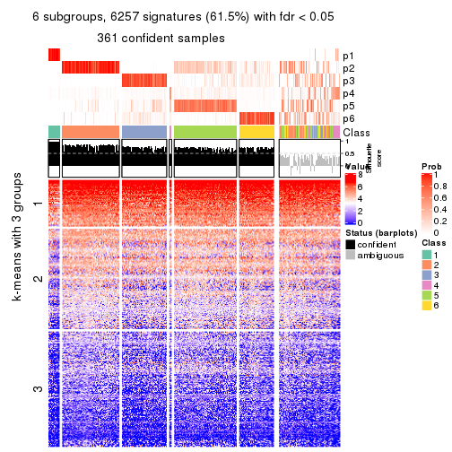</p>

</div>
</div>


Compare the overlap of signatures from different k:

```r
compare_signatures(res)
```


`get_signature()` returns a data frame invisibly. TO get the list of signatures, the function
call should be assigned to a variable explicitly. In following code, if `plot` argument is set
to `FALSE`, no heatmap is plotted while only the differential analysis is performed.

```r
# code only for demonstration
tb = get_signature(res, k = ..., plot = FALSE)
```

An example of the output of `tb` is:

```
#>   which_row         fdr    mean_1    mean_2 scaled_mean_1 scaled_mean_2 km
#> 1        38 0.042760348  8.373488  9.131774    -0.5533452     0.5164555  1
#> 2        40 0.018707592  7.106213  8.469186    -0.6173731     0.5762149  1
#> 3        55 0.019134737 10.221463 11.207825    -0.6159697     0.5749050  1
#> 4        59 0.006059896  5.921854  7.869574    -0.6899429     0.6439467  1
#> 5        60 0.018055526  8.928898 10.211722    -0.6204761     0.5791110  1
#> 6        98 0.009384629 15.714769 14.887706     0.6635654    -0.6193277  2
...
```

The columns in `tb` are:

1. `which_row`: row indices corresponding to the input matrix.
2. `fdr`: FDR for the differential test. 
3. `mean_x`: The mean value in group x.
4. `scaled_mean_x`: The mean value in group x after rows are scaled.
5. `km`: Row groups if k-means clustering is applied to rows.


UMAP plot which shows how samples are separated.


<script>
$( function() {
	$( '#tabs-ATC-mclust-dimension-reduction' ).tabs();
} );
</script>
<div id='tabs-ATC-mclust-dimension-reduction'>
<ul>
<li><a href='#tab-ATC-mclust-dimension-reduction-1'>k = 2</a></li>
<li><a href='#tab-ATC-mclust-dimension-reduction-2'>k = 3</a></li>
<li><a href='#tab-ATC-mclust-dimension-reduction-3'>k = 4</a></li>
<li><a href='#tab-ATC-mclust-dimension-reduction-4'>k = 5</a></li>
<li><a href='#tab-ATC-mclust-dimension-reduction-5'>k = 6</a></li>
</ul>
<div id='tab-ATC-mclust-dimension-reduction-1'>
<pre><code class="r">dimension_reduction(res, k = 2, method = &quot;UMAP&quot;)
</code></pre>

<p></p>

</div>
<div id='tab-ATC-mclust-dimension-reduction-2'>
<pre><code class="r">dimension_reduction(res, k = 3, method = &quot;UMAP&quot;)
</code></pre>

<p></p>

</div>
<div id='tab-ATC-mclust-dimension-reduction-3'>
<pre><code class="r">dimension_reduction(res, k = 4, method = &quot;UMAP&quot;)
</code></pre>

<p></p>

</div>
<div id='tab-ATC-mclust-dimension-reduction-4'>
<pre><code class="r">dimension_reduction(res, k = 5, method = &quot;UMAP&quot;)
</code></pre>

<p></p>

</div>
<div id='tab-ATC-mclust-dimension-reduction-5'>
<pre><code class="r">dimension_reduction(res, k = 6, method = &quot;UMAP&quot;)
</code></pre>

<p></p>

</div>
</div>


Following heatmap shows how subgroups are split when increasing `k`:

```r
collect_classes(res)
```


If matrix rows can be associated to genes, consider to use `functional_enrichment(res,
...)` to perform function enrichment for the signature genes. See [this vignette](http://bioconductor.org/packages/devel/bioc/vignettes/cola/inst/doc/functional_enrichment.html) for more detailed explanations.


 

---------------------------------------------------


### ATC:NMF


The object with results only for a single top-value method and a single partition method 
can be extracted as:

```r
res = res_list["ATC", "NMF"]
# you can also extract it by
# res = res_list["ATC:NMF"]
```

A summary of `res` and all the functions that can be applied to it:

```r
res
```

```
#> A 'ConsensusPartition' object with k = 2, 3, 4, 5, 6.
#>   On a matrix with 10169 rows and 459 columns.
#>   Top rows (1000, 2000, 3000, 4000, 5000) are extracted by 'ATC' method.
#>   Subgroups are detected by 'NMF' method.
#>   Performed in total 1250 partitions by row resampling.
#>   Best k for subgroups seems to be 2.
#> 
#> Following methods can be applied to this 'ConsensusPartition' object:
#>  [1] "cola_report"             "collect_classes"         "collect_plots"          
#>  [4] "collect_stats"           "colnames"                "compare_signatures"     
#>  [7] "consensus_heatmap"       "dimension_reduction"     "functional_enrichment"  
#> [10] "get_anno_col"            "get_anno"                "get_classes"            
#> [13] "get_consensus"           "get_matrix"              "get_membership"         
#> [16] "get_param"               "get_signatures"          "get_stats"              
#> [19] "is_best_k"               "is_stable_k"             "membership_heatmap"     
#> [22] "ncol"                    "nrow"                    "plot_ecdf"              
#> [25] "rownames"                "select_partition_number" "show"                   
#> [28] "suggest_best_k"          "test_to_known_factors"
```

`collect_plots()` function collects all the plots made from `res` for all `k` (number of partitions)
into one single page to provide an easy and fast comparison between different `k`.

```r
collect_plots(res)
```


The plots are:

- The first row: a plot of the ECDF (empirical cumulative distribution
  function) curves of the consensus matrix for each `k` and the heatmap of
  predicted classes for each `k`.
- The second row: heatmaps of the consensus matrix for each `k`.
- The third row: heatmaps of the membership matrix for each `k`.
- The fouth row: heatmaps of the signatures for each `k`.

All the plots in panels can be made by individual functions and they are
plotted later in this section.

`select_partition_number()` produces several plots showing different
statistics for choosing "optimized" `k`. There are following statistics:

- ECDF curves of the consensus matrix for each `k`;
- 1-PAC. [The PAC
  score](https://en.wikipedia.org/wiki/Consensus_clustering#Over-interpretation_potential_of_consensus_clustering)
  measures the proportion of the ambiguous subgrouping.
- Mean silhouette score.
- Concordance. The mean probability of fiting the consensus class ids in all
  partitions.
- Area increased. Denote $A_k$ as the area under the ECDF curve for current
  `k`, the area increased is defined as $A_k - A_{k-1}$.
- Rand index. The percent of pairs of samples that are both in a same cluster
  or both are not in a same cluster in the partition of k and k-1.
- Jaccard index. The ratio of pairs of samples are both in a same cluster in
  the partition of k and k-1 and the pairs of samples are both in a same
  cluster in the partition k or k-1.

The detailed explanations of these statistics can be found in [the _cola_
vignette](http://bioconductor.org/packages/devel/bioc/vignettes/cola/inst/doc/cola.html#toc_13).

Generally speaking, lower PAC score, higher mean silhouette score or higher
concordance corresponds to better partition. Rand index and Jaccard index
measure how similar the current partition is compared to partition with `k-1`.
If they are too similar, we won't accept `k` is better than `k-1`.

```r
select_partition_number(res)
```


The numeric values for all these statistics can be obtained by `get_stats()`.

```r
get_stats(res)
```

```
#>   k 1-PAC mean_silhouette concordance area_increased  Rand Jaccard
#> 2 2 0.839           0.903       0.958         0.4881 0.508   0.508
#> 3 3 0.507           0.682       0.839         0.3045 0.784   0.605
#> 4 4 0.459           0.604       0.783         0.0997 0.746   0.448
#> 5 5 0.468           0.367       0.584         0.0910 0.800   0.446
#> 6 6 0.494           0.443       0.647         0.0514 0.823   0.400
```

`suggest_best_k()` suggests the best $k$ based on these statistics. The rules are as follows:

- All $k$ with Jaccard index larger than 0.95 are removed because increasing
  $k$ does not provide enough extra information. If all $k$ are removed, it is
  marked as no subgroup is detected.
- For all $k$ with 1-PAC score larger than 0.9, the maximal $k$ is taken as
  the best $k$, and other $k$ are marked as optional $k$.
- If it does not fit the second rule. The $k$ with the maximal vote of the
  highest 1-PAC score, highest mean silhouette, and highest concordance is
  taken as the best $k$.

```r
suggest_best_k(res)
```

```
#> [1] 2
```


Following shows the table of the partitions (You need to click the **show/hide
code output** link to see it). The membership matrix (columns with name `p*`)
is inferred by
[`clue::cl_consensus()`](https://www.rdocumentation.org/link/cl_consensus?package=clue)
function with the `SE` method. Basically the value in the membership matrix
represents the probability to belong to a certain group. The finall class
label for an item is determined with the group with highest probability it
belongs to.

In `get_classes()` function, the entropy is calculated from the membership
matrix and the silhouette score is calculated from the consensus matrix.


<script>
$( function() {
	$( '#tabs-ATC-NMF-get-classes' ).tabs();
} );
</script>
<div id='tabs-ATC-NMF-get-classes'>
<ul>
<li><a href='#tab-ATC-NMF-get-classes-1'>k = 2</a></li>
<li><a href='#tab-ATC-NMF-get-classes-2'>k = 3</a></li>
<li><a href='#tab-ATC-NMF-get-classes-3'>k = 4</a></li>
<li><a href='#tab-ATC-NMF-get-classes-4'>k = 5</a></li>
<li><a href='#tab-ATC-NMF-get-classes-5'>k = 6</a></li>
</ul>

<div id='tab-ATC-NMF-get-classes-1'>
<p><a id='tab-ATC-NMF-get-classes-1-a' style='color:#0366d6' href='#'>show/hide code output</a></p>
<pre><code class="r">cbind(get_classes(res, k = 2), get_membership(res, k = 2))
</code></pre>

<pre><code>#&gt;            class entropy silhouette    p1    p2
#&gt; SRR1699874     1  0.0000     0.9355 1.000 0.000
#&gt; SRR1699875     1  0.0000     0.9355 1.000 0.000
#&gt; SRR1699876     1  0.0376     0.9336 0.996 0.004
#&gt; SRR1699877     1  0.0000     0.9355 1.000 0.000
#&gt; SRR1699879     1  0.0000     0.9355 1.000 0.000
#&gt; SRR1699878     1  0.0000     0.9355 1.000 0.000
#&gt; SRR1699880     2  0.9129     0.4878 0.328 0.672
#&gt; SRR1699881     2  0.2778     0.9306 0.048 0.952
#&gt; SRR1699882     1  0.0000     0.9355 1.000 0.000
#&gt; SRR1699883     1  0.0000     0.9355 1.000 0.000
#&gt; SRR1699884     1  0.0000     0.9355 1.000 0.000
#&gt; SRR1699885     1  0.0000     0.9355 1.000 0.000
#&gt; SRR1699886     1  0.0000     0.9355 1.000 0.000
#&gt; SRR1699888     1  0.0000     0.9355 1.000 0.000
#&gt; SRR1699889     1  0.8081     0.6906 0.752 0.248
#&gt; SRR1699890     1  0.0000     0.9355 1.000 0.000
#&gt; SRR1699887     1  0.0376     0.9336 0.996 0.004
#&gt; SRR1699891     1  0.2948     0.9032 0.948 0.052
#&gt; SRR1699892     1  0.9775     0.3568 0.588 0.412
#&gt; SRR1699893     2  0.9754     0.2838 0.408 0.592
#&gt; SRR1699894     1  0.0000     0.9355 1.000 0.000
#&gt; SRR1699895     1  0.2948     0.9032 0.948 0.052
#&gt; SRR1699896     1  0.0000     0.9355 1.000 0.000
#&gt; SRR1699897     1  0.9491     0.4785 0.632 0.368
#&gt; SRR1699898     2  0.0000     0.9717 0.000 1.000
#&gt; SRR1699900     1  0.0000     0.9355 1.000 0.000
#&gt; SRR1699899     1  0.5946     0.8203 0.856 0.144
#&gt; SRR1699902     2  0.4022     0.8980 0.080 0.920
#&gt; SRR1699901     2  0.0000     0.9717 0.000 1.000
#&gt; SRR1699903     2  0.0938     0.9626 0.012 0.988
#&gt; SRR1699904     2  0.9775     0.2524 0.412 0.588
#&gt; SRR1699905     2  0.4815     0.8700 0.104 0.896
#&gt; SRR1699906     2  0.0000     0.9717 0.000 1.000
#&gt; SRR1699907     2  0.4161     0.8930 0.084 0.916
#&gt; SRR1699908     2  0.1843     0.9492 0.028 0.972
#&gt; SRR1699909     2  0.0000     0.9717 0.000 1.000
#&gt; SRR1699910     2  0.0000     0.9717 0.000 1.000
#&gt; SRR1699911     2  0.2603     0.9340 0.044 0.956
#&gt; SRR1699912     2  0.0000     0.9717 0.000 1.000
#&gt; SRR1699913     2  0.0000     0.9717 0.000 1.000
#&gt; SRR1699914     2  0.0000     0.9717 0.000 1.000
#&gt; SRR1699915     2  0.0000     0.9717 0.000 1.000
#&gt; SRR1699916     2  0.0000     0.9717 0.000 1.000
#&gt; SRR1699917     2  0.0000     0.9717 0.000 1.000
#&gt; SRR1699918     2  0.0000     0.9717 0.000 1.000
#&gt; SRR1699919     2  0.0000     0.9717 0.000 1.000
#&gt; SRR1699920     2  0.0000     0.9717 0.000 1.000
#&gt; SRR1699921     2  0.0000     0.9717 0.000 1.000
#&gt; SRR1699922     1  1.0000     0.0926 0.504 0.496
#&gt; SRR1699923     2  0.0000     0.9717 0.000 1.000
#&gt; SRR1699924     2  0.0000     0.9717 0.000 1.000
#&gt; SRR1699925     1  0.0000     0.9355 1.000 0.000
#&gt; SRR1699926     2  0.0000     0.9717 0.000 1.000
#&gt; SRR1699927     2  0.0000     0.9717 0.000 1.000
#&gt; SRR1699929     2  0.8207     0.6394 0.256 0.744
#&gt; SRR1699928     2  0.0000     0.9717 0.000 1.000
#&gt; SRR1699930     1  0.9996     0.1209 0.512 0.488
#&gt; SRR1699931     1  0.9710     0.4018 0.600 0.400
#&gt; SRR1699933     1  0.6531     0.8000 0.832 0.168
#&gt; SRR1699932     2  0.0000     0.9717 0.000 1.000
#&gt; SRR1699934     1  0.0000     0.9355 1.000 0.000
#&gt; SRR1699935     1  0.5519     0.8380 0.872 0.128
#&gt; SRR1699936     1  0.0000     0.9355 1.000 0.000
#&gt; SRR1699937     1  0.0000     0.9355 1.000 0.000
#&gt; SRR1699938     1  0.0000     0.9355 1.000 0.000
#&gt; SRR1699940     2  0.5059     0.8628 0.112 0.888
#&gt; SRR1699939     1  0.2043     0.9182 0.968 0.032
#&gt; SRR1699941     2  0.0376     0.9686 0.004 0.996
#&gt; SRR1699942     1  0.0000     0.9355 1.000 0.000
#&gt; SRR1699943     1  0.0000     0.9355 1.000 0.000
#&gt; SRR1699944     1  0.0000     0.9355 1.000 0.000
#&gt; SRR1699945     1  0.0000     0.9355 1.000 0.000
#&gt; SRR1699946     1  0.0000     0.9355 1.000 0.000
#&gt; SRR1699947     1  0.0000     0.9355 1.000 0.000
#&gt; SRR1699948     1  0.0000     0.9355 1.000 0.000
#&gt; SRR1699949     1  0.0672     0.9315 0.992 0.008
#&gt; SRR1699950     1  0.0000     0.9355 1.000 0.000
#&gt; SRR1699951     1  0.6148     0.8146 0.848 0.152
#&gt; SRR1699952     1  0.2778     0.9059 0.952 0.048
#&gt; SRR1699953     1  0.0000     0.9355 1.000 0.000
#&gt; SRR1699954     1  0.0000     0.9355 1.000 0.000
#&gt; SRR1699955     1  0.0000     0.9355 1.000 0.000
#&gt; SRR1699956     1  0.9580     0.4229 0.620 0.380
#&gt; SRR1699957     1  0.0000     0.9355 1.000 0.000
#&gt; SRR1699959     1  0.0000     0.9355 1.000 0.000
#&gt; SRR1699958     1  0.6048     0.8132 0.852 0.148
#&gt; SRR1699960     1  0.2778     0.9055 0.952 0.048
#&gt; SRR1699961     2  0.9944     0.1087 0.456 0.544
#&gt; SRR1699962     2  0.0000     0.9717 0.000 1.000
#&gt; SRR1699963     2  0.1184     0.9593 0.016 0.984
#&gt; SRR1699964     2  0.0000     0.9717 0.000 1.000
#&gt; SRR1699965     1  0.3584     0.8913 0.932 0.068
#&gt; SRR1699966     2  0.0938     0.9626 0.012 0.988
#&gt; SRR1699967     1  0.0000     0.9355 1.000 0.000
#&gt; SRR1699968     2  0.0000     0.9717 0.000 1.000
#&gt; SRR1699969     2  0.0000     0.9717 0.000 1.000
#&gt; SRR1699971     1  0.3584     0.8900 0.932 0.068
#&gt; SRR1699970     2  0.1184     0.9595 0.016 0.984
#&gt; SRR1699972     1  0.6623     0.7927 0.828 0.172
#&gt; SRR1699973     2  0.0000     0.9717 0.000 1.000
#&gt; SRR1699974     2  0.0000     0.9717 0.000 1.000
#&gt; SRR1699975     2  0.0000     0.9717 0.000 1.000
#&gt; SRR1699976     2  0.0000     0.9717 0.000 1.000
#&gt; SRR1699977     2  0.0000     0.9717 0.000 1.000
#&gt; SRR1699978     2  0.0000     0.9717 0.000 1.000
#&gt; SRR1699979     2  0.0000     0.9717 0.000 1.000
#&gt; SRR1699980     2  0.0000     0.9717 0.000 1.000
#&gt; SRR1699981     2  0.0000     0.9717 0.000 1.000
#&gt; SRR1699982     2  0.0376     0.9686 0.004 0.996
#&gt; SRR1699983     2  0.0000     0.9717 0.000 1.000
#&gt; SRR1699984     2  0.2603     0.9349 0.044 0.956
#&gt; SRR1699985     2  0.0000     0.9717 0.000 1.000
#&gt; SRR1699986     2  0.0000     0.9717 0.000 1.000
#&gt; SRR1699988     2  0.1633     0.9527 0.024 0.976
#&gt; SRR1699987     2  0.0000     0.9717 0.000 1.000
#&gt; SRR1699989     2  0.0000     0.9717 0.000 1.000
#&gt; SRR1699990     2  0.0000     0.9717 0.000 1.000
#&gt; SRR1699992     2  0.0000     0.9717 0.000 1.000
#&gt; SRR1699991     2  0.0000     0.9717 0.000 1.000
#&gt; SRR1699993     2  0.0000     0.9717 0.000 1.000
#&gt; SRR1699994     2  0.0000     0.9717 0.000 1.000
#&gt; SRR1699995     2  0.0000     0.9717 0.000 1.000
#&gt; SRR1699996     2  0.7139     0.7433 0.196 0.804
#&gt; SRR1699997     2  0.0000     0.9717 0.000 1.000
#&gt; SRR1699998     2  0.1633     0.9527 0.024 0.976
#&gt; SRR1699999     2  0.0000     0.9717 0.000 1.000
#&gt; SRR1700000     1  0.8955     0.5886 0.688 0.312
#&gt; SRR1700002     2  0.0000     0.9717 0.000 1.000
#&gt; SRR1700001     2  0.0000     0.9717 0.000 1.000
#&gt; SRR1700003     2  0.0000     0.9717 0.000 1.000
#&gt; SRR1700004     2  0.0000     0.9717 0.000 1.000
#&gt; SRR1700005     1  0.0000     0.9355 1.000 0.000
#&gt; SRR1700006     1  0.6148     0.8083 0.848 0.152
#&gt; SRR1700007     1  0.9427     0.4916 0.640 0.360
#&gt; SRR1700008     2  0.0000     0.9717 0.000 1.000
#&gt; SRR1700009     1  0.0000     0.9355 1.000 0.000
#&gt; SRR1700010     2  0.5178     0.8566 0.116 0.884
#&gt; SRR1700011     2  0.5946     0.8188 0.144 0.856
#&gt; SRR1700013     1  0.8955     0.5910 0.688 0.312
#&gt; SRR1700012     2  0.1184     0.9595 0.016 0.984
#&gt; SRR1700014     2  0.0000     0.9717 0.000 1.000
#&gt; SRR1700015     1  0.1843     0.9196 0.972 0.028
#&gt; SRR1700016     1  0.0000     0.9355 1.000 0.000
#&gt; SRR1700018     1  0.4939     0.8542 0.892 0.108
#&gt; SRR1700017     1  1.0000     0.0420 0.500 0.500
#&gt; SRR1700019     1  0.0000     0.9355 1.000 0.000
#&gt; SRR1700020     2  0.9000     0.5255 0.316 0.684
#&gt; SRR1700021     1  0.2778     0.9062 0.952 0.048
#&gt; SRR1700023     2  0.0000     0.9717 0.000 1.000
#&gt; SRR1700022     2  0.9044     0.5155 0.320 0.680
#&gt; SRR1700024     2  0.0000     0.9717 0.000 1.000
#&gt; SRR1700025     1  0.9393     0.4807 0.644 0.356
#&gt; SRR1700026     1  0.1633     0.9222 0.976 0.024
#&gt; SRR1700027     1  0.9635     0.4008 0.612 0.388
#&gt; SRR1700028     2  0.1184     0.9593 0.016 0.984
#&gt; SRR1700029     2  0.0000     0.9717 0.000 1.000
#&gt; SRR1700030     2  0.0000     0.9717 0.000 1.000
#&gt; SRR1700031     2  0.0000     0.9717 0.000 1.000
#&gt; SRR1700032     2  0.0000     0.9717 0.000 1.000
#&gt; SRR1700034     2  0.0000     0.9717 0.000 1.000
#&gt; SRR1700035     2  0.0000     0.9717 0.000 1.000
#&gt; SRR1700033     2  0.0000     0.9717 0.000 1.000
#&gt; SRR1700036     2  0.0000     0.9717 0.000 1.000
#&gt; SRR1700037     2  0.1414     0.9561 0.020 0.980
#&gt; SRR1700038     2  0.0000     0.9717 0.000 1.000
#&gt; SRR1700039     2  0.0000     0.9717 0.000 1.000
#&gt; SRR1700040     2  0.0000     0.9717 0.000 1.000
#&gt; SRR1700041     2  0.0000     0.9717 0.000 1.000
#&gt; SRR1700042     2  0.0000     0.9717 0.000 1.000
#&gt; SRR1700043     2  0.9393     0.4113 0.356 0.644
#&gt; SRR1700045     2  0.0000     0.9717 0.000 1.000
#&gt; SRR1700044     2  0.0000     0.9717 0.000 1.000
#&gt; SRR1700046     2  0.0000     0.9717 0.000 1.000
#&gt; SRR1700047     2  0.0000     0.9717 0.000 1.000
#&gt; SRR1700048     2  0.0000     0.9717 0.000 1.000
#&gt; SRR1700049     2  0.0000     0.9717 0.000 1.000
#&gt; SRR1700050     2  0.0000     0.9717 0.000 1.000
#&gt; SRR1700051     2  0.0000     0.9717 0.000 1.000
#&gt; SRR1700052     2  0.0000     0.9717 0.000 1.000
#&gt; SRR1700053     2  0.0000     0.9717 0.000 1.000
#&gt; SRR1700054     2  0.0000     0.9717 0.000 1.000
#&gt; SRR1700055     2  0.0000     0.9717 0.000 1.000
#&gt; SRR1700056     2  0.0000     0.9717 0.000 1.000
#&gt; SRR1700057     2  0.0000     0.9717 0.000 1.000
#&gt; SRR1700058     2  0.0000     0.9717 0.000 1.000
#&gt; SRR1700059     2  0.0000     0.9717 0.000 1.000
#&gt; SRR1700060     2  0.0000     0.9717 0.000 1.000
#&gt; SRR1700061     2  0.0000     0.9717 0.000 1.000
#&gt; SRR1700062     2  0.0000     0.9717 0.000 1.000
#&gt; SRR1700063     2  0.0000     0.9717 0.000 1.000
#&gt; SRR1700064     2  0.0000     0.9717 0.000 1.000
#&gt; SRR1700065     2  0.0000     0.9717 0.000 1.000
#&gt; SRR1700066     2  0.0000     0.9717 0.000 1.000
#&gt; SRR1700067     2  0.0000     0.9717 0.000 1.000
#&gt; SRR1700068     2  0.0000     0.9717 0.000 1.000
#&gt; SRR1700069     2  0.0000     0.9717 0.000 1.000
#&gt; SRR1700070     2  0.0000     0.9717 0.000 1.000
#&gt; SRR1700071     2  0.0000     0.9717 0.000 1.000
#&gt; SRR1700072     2  0.0000     0.9717 0.000 1.000
#&gt; SRR1700073     2  0.0000     0.9717 0.000 1.000
#&gt; SRR1700075     2  0.0000     0.9717 0.000 1.000
#&gt; SRR1700074     2  0.0000     0.9717 0.000 1.000
#&gt; SRR1700076     2  0.0000     0.9717 0.000 1.000
#&gt; SRR1700077     2  0.0000     0.9717 0.000 1.000
#&gt; SRR1700078     2  0.0000     0.9717 0.000 1.000
#&gt; SRR1700080     2  0.0000     0.9717 0.000 1.000
#&gt; SRR1700079     2  0.0000     0.9717 0.000 1.000
#&gt; SRR1700081     2  0.0000     0.9717 0.000 1.000
#&gt; SRR1700082     2  0.0000     0.9717 0.000 1.000
#&gt; SRR1700083     2  0.0000     0.9717 0.000 1.000
#&gt; SRR1700084     2  0.0000     0.9717 0.000 1.000
#&gt; SRR1700085     2  0.0000     0.9717 0.000 1.000
#&gt; SRR1700086     2  0.0000     0.9717 0.000 1.000
#&gt; SRR1700087     1  0.0376     0.9335 0.996 0.004
#&gt; SRR1700088     1  0.2423     0.9115 0.960 0.040
#&gt; SRR1700089     1  0.0000     0.9355 1.000 0.000
#&gt; SRR1700091     2  0.8327     0.6230 0.264 0.736
#&gt; SRR1700090     2  0.0000     0.9717 0.000 1.000
#&gt; SRR1700092     1  0.9983     0.1321 0.524 0.476
#&gt; SRR1700094     1  0.1184     0.9269 0.984 0.016
#&gt; SRR1700093     2  0.0938     0.9627 0.012 0.988
#&gt; SRR1700095     1  0.0376     0.9335 0.996 0.004
#&gt; SRR1700096     2  0.6623     0.7807 0.172 0.828
#&gt; SRR1700097     2  0.7674     0.7015 0.224 0.776
#&gt; SRR1700098     1  0.0000     0.9355 1.000 0.000
#&gt; SRR1700099     1  0.0000     0.9355 1.000 0.000
#&gt; SRR1700100     1  0.8267     0.6624 0.740 0.260
#&gt; SRR1700101     1  0.1843     0.9195 0.972 0.028
#&gt; SRR1700102     2  0.9922     0.1395 0.448 0.552
#&gt; SRR1700104     2  0.1184     0.9593 0.016 0.984
#&gt; SRR1700103     2  0.0672     0.9657 0.008 0.992
#&gt; SRR1700105     2  0.4022     0.9008 0.080 0.920
#&gt; SRR1700106     2  0.0000     0.9717 0.000 1.000
#&gt; SRR1700107     2  0.9944     0.1189 0.456 0.544
#&gt; SRR1700108     1  0.3431     0.8937 0.936 0.064
#&gt; SRR1700109     1  0.9866     0.3126 0.568 0.432
#&gt; SRR1700110     2  0.7139     0.7450 0.196 0.804
#&gt; SRR1700112     2  0.0000     0.9717 0.000 1.000
#&gt; SRR1700111     2  0.0000     0.9717 0.000 1.000
#&gt; SRR1700113     2  0.4161     0.8945 0.084 0.916
#&gt; SRR1700114     2  0.0000     0.9717 0.000 1.000
#&gt; SRR1700115     2  0.6438     0.7927 0.164 0.836
#&gt; SRR1700116     2  0.0000     0.9717 0.000 1.000
#&gt; SRR1700117     2  0.0000     0.9717 0.000 1.000
#&gt; SRR1700119     2  0.0000     0.9717 0.000 1.000
#&gt; SRR1700118     2  0.0000     0.9717 0.000 1.000
#&gt; SRR1700120     2  0.0000     0.9717 0.000 1.000
#&gt; SRR1700121     2  0.0000     0.9717 0.000 1.000
#&gt; SRR1700122     2  0.0000     0.9717 0.000 1.000
#&gt; SRR1700123     2  0.0000     0.9717 0.000 1.000
#&gt; SRR1700125     2  0.0000     0.9717 0.000 1.000
#&gt; SRR1700126     2  0.0000     0.9717 0.000 1.000
#&gt; SRR1700127     2  0.0000     0.9717 0.000 1.000
#&gt; SRR1700124     2  0.0000     0.9717 0.000 1.000
#&gt; SRR1700128     2  0.0000     0.9717 0.000 1.000
#&gt; SRR1700129     2  0.0000     0.9717 0.000 1.000
#&gt; SRR1700130     2  0.0000     0.9717 0.000 1.000
#&gt; SRR1700132     2  0.0000     0.9717 0.000 1.000
#&gt; SRR1700131     2  0.0000     0.9717 0.000 1.000
#&gt; SRR1700133     2  0.0000     0.9717 0.000 1.000
#&gt; SRR1700134     2  0.0000     0.9717 0.000 1.000
#&gt; SRR1700135     2  0.0000     0.9717 0.000 1.000
#&gt; SRR1700136     2  0.0000     0.9717 0.000 1.000
#&gt; SRR1700137     2  0.0000     0.9717 0.000 1.000
#&gt; SRR1700138     2  0.0000     0.9717 0.000 1.000
#&gt; SRR1700140     2  0.0000     0.9717 0.000 1.000
#&gt; SRR1700139     2  0.0000     0.9717 0.000 1.000
#&gt; SRR1700141     2  0.0000     0.9717 0.000 1.000
#&gt; SRR1700142     2  0.0000     0.9717 0.000 1.000
#&gt; SRR1700143     2  0.0000     0.9717 0.000 1.000
#&gt; SRR1700144     2  0.0000     0.9717 0.000 1.000
#&gt; SRR1700145     2  0.0000     0.9717 0.000 1.000
#&gt; SRR1700146     2  0.0000     0.9717 0.000 1.000
#&gt; SRR1700147     2  0.0000     0.9717 0.000 1.000
#&gt; SRR1700149     2  0.0000     0.9717 0.000 1.000
#&gt; SRR1700148     2  0.0000     0.9717 0.000 1.000
#&gt; SRR1700150     2  0.0000     0.9717 0.000 1.000
#&gt; SRR1700152     2  0.0000     0.9717 0.000 1.000
#&gt; SRR1700151     2  0.0000     0.9717 0.000 1.000
#&gt; SRR1700153     2  0.0000     0.9717 0.000 1.000
#&gt; SRR1700154     2  0.0000     0.9717 0.000 1.000
#&gt; SRR1700155     2  0.0000     0.9717 0.000 1.000
#&gt; SRR1700156     2  0.0000     0.9717 0.000 1.000
#&gt; SRR1700158     2  0.0000     0.9717 0.000 1.000
#&gt; SRR1700159     2  0.0000     0.9717 0.000 1.000
#&gt; SRR1700157     2  0.0000     0.9717 0.000 1.000
#&gt; SRR1700160     2  0.0000     0.9717 0.000 1.000
#&gt; SRR1700161     2  0.0000     0.9717 0.000 1.000
#&gt; SRR1700162     2  0.0000     0.9717 0.000 1.000
#&gt; SRR1700164     2  0.0000     0.9717 0.000 1.000
#&gt; SRR1700163     2  0.0000     0.9717 0.000 1.000
#&gt; SRR1700165     2  0.0000     0.9717 0.000 1.000
#&gt; SRR1700166     2  0.0000     0.9717 0.000 1.000
#&gt; SRR1700168     2  0.0000     0.9717 0.000 1.000
#&gt; SRR1700167     2  0.0000     0.9717 0.000 1.000
#&gt; SRR1700170     2  0.0000     0.9717 0.000 1.000
#&gt; SRR1700169     2  0.0000     0.9717 0.000 1.000
#&gt; SRR1700171     2  0.4022     0.9010 0.080 0.920
#&gt; SRR1700172     2  0.0000     0.9717 0.000 1.000
#&gt; SRR1700174     2  0.0000     0.9717 0.000 1.000
#&gt; SRR1700173     2  0.0000     0.9717 0.000 1.000
#&gt; SRR1700175     2  0.0000     0.9717 0.000 1.000
#&gt; SRR1700176     2  0.0000     0.9717 0.000 1.000
#&gt; SRR1700178     1  0.0000     0.9355 1.000 0.000
#&gt; SRR1700177     2  0.0000     0.9717 0.000 1.000
#&gt; SRR1700180     1  0.0000     0.9355 1.000 0.000
#&gt; SRR1700179     1  0.0000     0.9355 1.000 0.000
#&gt; SRR1700181     1  0.0000     0.9355 1.000 0.000
#&gt; SRR1700183     1  0.0000     0.9355 1.000 0.000
#&gt; SRR1700182     1  0.0000     0.9355 1.000 0.000
#&gt; SRR1700184     1  0.0000     0.9355 1.000 0.000
#&gt; SRR1700186     1  0.0000     0.9355 1.000 0.000
#&gt; SRR1700187     1  0.0000     0.9355 1.000 0.000
#&gt; SRR1700185     1  0.0000     0.9355 1.000 0.000
#&gt; SRR1700188     1  0.0000     0.9355 1.000 0.000
#&gt; SRR1700192     1  0.0000     0.9355 1.000 0.000
#&gt; SRR1700190     1  0.0000     0.9355 1.000 0.000
#&gt; SRR1700191     1  0.0000     0.9355 1.000 0.000
#&gt; SRR1700189     1  0.0000     0.9355 1.000 0.000
#&gt; SRR1700193     1  0.0000     0.9355 1.000 0.000
#&gt; SRR1700195     1  0.0000     0.9355 1.000 0.000
#&gt; SRR1700194     1  0.0000     0.9355 1.000 0.000
#&gt; SRR1700196     1  0.0000     0.9355 1.000 0.000
#&gt; SRR1700197     1  0.0000     0.9355 1.000 0.000
#&gt; SRR1700198     1  0.0000     0.9355 1.000 0.000
#&gt; SRR1700199     1  0.0000     0.9355 1.000 0.000
#&gt; SRR1700200     1  0.0000     0.9355 1.000 0.000
#&gt; SRR1700201     1  0.0000     0.9355 1.000 0.000
#&gt; SRR1700202     1  0.0000     0.9355 1.000 0.000
#&gt; SRR1700203     1  0.0000     0.9355 1.000 0.000
#&gt; SRR1700204     1  0.0000     0.9355 1.000 0.000
#&gt; SRR1700206     1  0.0000     0.9355 1.000 0.000
#&gt; SRR1700207     1  0.0000     0.9355 1.000 0.000
#&gt; SRR1700208     1  0.0000     0.9355 1.000 0.000
#&gt; SRR1700205     1  0.0000     0.9355 1.000 0.000
#&gt; SRR1700209     1  0.7299     0.7517 0.796 0.204
#&gt; SRR1700210     1  0.0000     0.9355 1.000 0.000
#&gt; SRR1700211     1  0.0000     0.9355 1.000 0.000
#&gt; SRR1700212     1  0.0000     0.9355 1.000 0.000
#&gt; SRR1700213     1  0.0000     0.9355 1.000 0.000
#&gt; SRR1700214     1  0.0000     0.9355 1.000 0.000
#&gt; SRR1700215     1  0.0000     0.9355 1.000 0.000
#&gt; SRR1700217     1  0.0000     0.9355 1.000 0.000
#&gt; SRR1700216     1  0.0000     0.9355 1.000 0.000
#&gt; SRR1700218     1  0.8608     0.6352 0.716 0.284
#&gt; SRR1700219     1  0.0000     0.9355 1.000 0.000
#&gt; SRR1700222     1  0.0000     0.9355 1.000 0.000
#&gt; SRR1700220     1  0.4161     0.8774 0.916 0.084
#&gt; SRR1700221     1  0.0000     0.9355 1.000 0.000
#&gt; SRR1700223     1  0.0938     0.9293 0.988 0.012
#&gt; SRR1700224     1  0.0000     0.9355 1.000 0.000
#&gt; SRR1700226     1  0.0000     0.9355 1.000 0.000
#&gt; SRR1700229     1  0.0000     0.9355 1.000 0.000
#&gt; SRR1700225     1  0.8386     0.6638 0.732 0.268
#&gt; SRR1700227     1  0.0000     0.9355 1.000 0.000
#&gt; SRR1700230     1  0.0000     0.9355 1.000 0.000
#&gt; SRR1700231     1  0.0000     0.9355 1.000 0.000
#&gt; SRR1700228     1  0.7299     0.7508 0.796 0.204
#&gt; SRR1700232     1  0.0000     0.9355 1.000 0.000
#&gt; SRR1700233     1  0.0000     0.9355 1.000 0.000
#&gt; SRR1700234     1  0.0000     0.9355 1.000 0.000
#&gt; SRR1700235     1  0.4431     0.8735 0.908 0.092
#&gt; SRR1700237     1  0.0000     0.9355 1.000 0.000
#&gt; SRR1700236     1  0.0000     0.9355 1.000 0.000
#&gt; SRR1700238     1  0.0000     0.9355 1.000 0.000
#&gt; SRR1700239     1  0.0000     0.9355 1.000 0.000
#&gt; SRR1700240     1  0.0000     0.9355 1.000 0.000
#&gt; SRR1700241     2  0.0000     0.9717 0.000 1.000
#&gt; SRR1700243     1  0.0000     0.9355 1.000 0.000
#&gt; SRR1700244     1  0.0000     0.9355 1.000 0.000
#&gt; SRR1700242     1  0.0000     0.9355 1.000 0.000
#&gt; SRR1700246     1  0.0000     0.9355 1.000 0.000
#&gt; SRR1700245     1  0.0000     0.9355 1.000 0.000
#&gt; SRR1700247     1  0.0000     0.9355 1.000 0.000
#&gt; SRR1700249     1  0.0000     0.9355 1.000 0.000
#&gt; SRR1700250     1  0.0000     0.9355 1.000 0.000
#&gt; SRR1700248     1  0.0000     0.9355 1.000 0.000
#&gt; SRR1700251     1  0.0000     0.9355 1.000 0.000
#&gt; SRR1700252     1  0.0672     0.9315 0.992 0.008
#&gt; SRR1700253     1  0.0000     0.9355 1.000 0.000
#&gt; SRR1700256     1  0.0000     0.9355 1.000 0.000
#&gt; SRR1700254     1  0.0000     0.9355 1.000 0.000
#&gt; SRR1700255     1  0.0000     0.9355 1.000 0.000
#&gt; SRR1700257     1  0.0000     0.9355 1.000 0.000
#&gt; SRR1700258     1  0.0000     0.9355 1.000 0.000
#&gt; SRR1700259     1  0.0000     0.9355 1.000 0.000
#&gt; SRR1700260     1  0.0000     0.9355 1.000 0.000
#&gt; SRR1700261     2  0.0000     0.9717 0.000 1.000
#&gt; SRR1700262     1  0.0000     0.9355 1.000 0.000
#&gt; SRR1700263     1  0.0000     0.9355 1.000 0.000
#&gt; SRR1700264     1  0.0000     0.9355 1.000 0.000
#&gt; SRR1700265     1  0.0000     0.9355 1.000 0.000
#&gt; SRR1700266     1  0.0000     0.9355 1.000 0.000
#&gt; SRR1700268     1  0.0000     0.9355 1.000 0.000
#&gt; SRR1700270     1  0.0000     0.9355 1.000 0.000
#&gt; SRR1700267     1  0.0000     0.9355 1.000 0.000
#&gt; SRR1700271     1  0.0000     0.9355 1.000 0.000
#&gt; SRR1700272     1  0.0000     0.9355 1.000 0.000
#&gt; SRR1700273     1  0.0000     0.9355 1.000 0.000
#&gt; SRR1700274     1  0.0000     0.9355 1.000 0.000
#&gt; SRR1700277     1  0.0376     0.9336 0.996 0.004
#&gt; SRR1700275     1  0.1633     0.9221 0.976 0.024
#&gt; SRR1700276     1  0.0000     0.9355 1.000 0.000
#&gt; SRR1700278     1  0.0938     0.9293 0.988 0.012
#&gt; SRR1700279     1  0.0000     0.9355 1.000 0.000
#&gt; SRR1700280     1  0.0000     0.9355 1.000 0.000
#&gt; SRR1700281     1  0.2603     0.9105 0.956 0.044
#&gt; SRR1700283     1  0.0000     0.9355 1.000 0.000
#&gt; SRR1700282     1  0.0000     0.9355 1.000 0.000
#&gt; SRR1700284     2  0.0000     0.9717 0.000 1.000
#&gt; SRR1700285     2  0.3274     0.9187 0.060 0.940
#&gt; SRR1700286     2  0.0000     0.9717 0.000 1.000
#&gt; SRR1700287     1  0.9686     0.4035 0.604 0.396
#&gt; SRR1700290     2  0.4815     0.8705 0.104 0.896
#&gt; SRR1700289     2  0.7528     0.7095 0.216 0.784
#&gt; SRR1700288     1  0.0000     0.9355 1.000 0.000
#&gt; SRR1700292     1  0.9815     0.3397 0.580 0.420
#&gt; SRR1700291     2  0.0000     0.9717 0.000 1.000
#&gt; SRR1700293     2  0.3584     0.9105 0.068 0.932
#&gt; SRR1700294     2  0.0000     0.9717 0.000 1.000
#&gt; SRR1700295     2  0.0000     0.9717 0.000 1.000
#&gt; SRR1700297     2  0.1414     0.9557 0.020 0.980
#&gt; SRR1700296     1  0.9983     0.1650 0.524 0.476
#&gt; SRR1700298     2  0.2948     0.9265 0.052 0.948
#&gt; SRR1700299     2  0.0000     0.9717 0.000 1.000
#&gt; SRR1700300     2  0.0000     0.9717 0.000 1.000
#&gt; SRR1700302     2  0.0000     0.9717 0.000 1.000
#&gt; SRR1700301     2  0.0000     0.9717 0.000 1.000
#&gt; SRR1700303     2  0.0000     0.9717 0.000 1.000
#&gt; SRR1700304     1  0.4161     0.8778 0.916 0.084
#&gt; SRR1700305     2  0.0000     0.9717 0.000 1.000
#&gt; SRR1700306     2  0.0000     0.9717 0.000 1.000
#&gt; SRR1700308     2  0.0000     0.9717 0.000 1.000
#&gt; SRR1700307     2  0.0000     0.9717 0.000 1.000
#&gt; SRR1700309     2  0.0000     0.9717 0.000 1.000
#&gt; SRR1700310     2  0.0000     0.9717 0.000 1.000
#&gt; SRR1700311     2  0.0000     0.9717 0.000 1.000
#&gt; SRR1700312     2  0.0000     0.9717 0.000 1.000
#&gt; SRR1700313     2  0.0000     0.9717 0.000 1.000
#&gt; SRR1700314     2  0.0000     0.9717 0.000 1.000
#&gt; SRR1700315     2  0.0000     0.9717 0.000 1.000
#&gt; SRR1700316     2  0.0000     0.9717 0.000 1.000
#&gt; SRR1700317     2  0.0000     0.9717 0.000 1.000
#&gt; SRR1700318     1  0.9323     0.5142 0.652 0.348
#&gt; SRR1700319     2  0.0000     0.9717 0.000 1.000
#&gt; SRR1700320     2  0.0000     0.9717 0.000 1.000
#&gt; SRR1700322     2  0.0000     0.9717 0.000 1.000
#&gt; SRR1700321     2  0.0000     0.9717 0.000 1.000
#&gt; SRR1700323     2  0.0000     0.9717 0.000 1.000
#&gt; SRR1700324     2  0.0376     0.9686 0.004 0.996
#&gt; SRR1700325     1  0.5294     0.8462 0.880 0.120
#&gt; SRR1700326     1  0.0000     0.9355 1.000 0.000
#&gt; SRR1700327     2  0.0000     0.9717 0.000 1.000
#&gt; SRR1700329     2  0.0000     0.9717 0.000 1.000
#&gt; SRR1700328     1  0.7219     0.7561 0.800 0.200
#&gt; SRR1700330     1  0.9608     0.4333 0.616 0.384
#&gt; SRR1700331     2  0.2948     0.9264 0.052 0.948
#&gt; SRR1700332     1  0.7219     0.7569 0.800 0.200
#&gt; SRR1700333     1  0.9661     0.4136 0.608 0.392
</code></pre>

<script>
$('#tab-ATC-NMF-get-classes-1-a').parent().next().next().hide();
$('#tab-ATC-NMF-get-classes-1-a').click(function(){
  $('#tab-ATC-NMF-get-classes-1-a').parent().next().next().toggle();
  return(false);
});
</script>
</div>

<div id='tab-ATC-NMF-get-classes-2'>
<p><a id='tab-ATC-NMF-get-classes-2-a' style='color:#0366d6' href='#'>show/hide code output</a></p>
<pre><code class="r">cbind(get_classes(res, k = 3), get_membership(res, k = 3))
</code></pre>

<pre><code>#&gt;            class entropy silhouette    p1    p2    p3
#&gt; SRR1699874     2  0.4291    0.69267 0.180 0.820 0.000
#&gt; SRR1699875     2  0.1529    0.74693 0.040 0.960 0.000
#&gt; SRR1699876     1  0.5486    0.65948 0.780 0.196 0.024
#&gt; SRR1699877     2  0.6305    0.12037 0.484 0.516 0.000
#&gt; SRR1699879     2  0.4346    0.68996 0.184 0.816 0.000
#&gt; SRR1699878     2  0.4504    0.67961 0.196 0.804 0.000
#&gt; SRR1699880     2  0.2711    0.72192 0.000 0.912 0.088
#&gt; SRR1699881     2  0.4235    0.66629 0.000 0.824 0.176
#&gt; SRR1699882     2  0.6154    0.34745 0.408 0.592 0.000
#&gt; SRR1699883     2  0.6260    0.23621 0.448 0.552 0.000
#&gt; SRR1699884     2  0.6045    0.41468 0.380 0.620 0.000
#&gt; SRR1699885     2  0.4002    0.70576 0.160 0.840 0.000
#&gt; SRR1699886     1  0.1411    0.78400 0.964 0.036 0.000
#&gt; SRR1699888     1  0.3752    0.72228 0.856 0.144 0.000
#&gt; SRR1699889     1  0.5406    0.67734 0.764 0.012 0.224
#&gt; SRR1699890     1  0.0237    0.78827 0.996 0.004 0.000
#&gt; SRR1699887     1  0.5292    0.68935 0.800 0.172 0.028
#&gt; SRR1699891     1  0.2200    0.78337 0.940 0.004 0.056
#&gt; SRR1699892     2  0.6624    0.61135 0.044 0.708 0.248
#&gt; SRR1699893     1  0.6897    0.13068 0.548 0.016 0.436
#&gt; SRR1699894     1  0.2173    0.78255 0.944 0.008 0.048
#&gt; SRR1699895     1  0.2448    0.77211 0.924 0.000 0.076
#&gt; SRR1699896     1  0.0661    0.78848 0.988 0.004 0.008
#&gt; SRR1699897     2  0.4692    0.67782 0.012 0.820 0.168
#&gt; SRR1699898     3  0.2356    0.82790 0.000 0.072 0.928
#&gt; SRR1699900     1  0.1491    0.78995 0.968 0.016 0.016
#&gt; SRR1699899     1  0.5202    0.72345 0.820 0.044 0.136
#&gt; SRR1699902     3  0.4558    0.78947 0.044 0.100 0.856
#&gt; SRR1699901     3  0.2625    0.82720 0.084 0.000 0.916
#&gt; SRR1699903     3  0.4346    0.75253 0.184 0.000 0.816
#&gt; SRR1699904     1  0.3816    0.72845 0.852 0.000 0.148
#&gt; SRR1699905     1  0.5016    0.62564 0.760 0.000 0.240
#&gt; SRR1699906     3  0.2625    0.82765 0.084 0.000 0.916
#&gt; SRR1699907     1  0.5706    0.50448 0.680 0.000 0.320
#&gt; SRR1699908     3  0.5835    0.51982 0.340 0.000 0.660
#&gt; SRR1699909     3  0.4062    0.76764 0.164 0.000 0.836
#&gt; SRR1699910     3  0.5098    0.67023 0.248 0.000 0.752
#&gt; SRR1699911     1  0.5529    0.53841 0.704 0.000 0.296
#&gt; SRR1699912     3  0.4887    0.69574 0.228 0.000 0.772
#&gt; SRR1699913     3  0.3116    0.81186 0.108 0.000 0.892
#&gt; SRR1699914     3  0.3192    0.80972 0.112 0.000 0.888
#&gt; SRR1699915     3  0.6026    0.43948 0.376 0.000 0.624
#&gt; SRR1699916     3  0.5706    0.55488 0.320 0.000 0.680
#&gt; SRR1699917     3  0.1315    0.84734 0.008 0.020 0.972
#&gt; SRR1699918     3  0.1031    0.84560 0.024 0.000 0.976
#&gt; SRR1699919     3  0.5058    0.67481 0.244 0.000 0.756
#&gt; SRR1699920     3  0.3686    0.78913 0.140 0.000 0.860
#&gt; SRR1699921     3  0.5905    0.48981 0.352 0.000 0.648
#&gt; SRR1699922     1  0.5465    0.57532 0.712 0.000 0.288
#&gt; SRR1699923     3  0.4121    0.76405 0.168 0.000 0.832
#&gt; SRR1699924     3  0.0661    0.84664 0.008 0.004 0.988
#&gt; SRR1699925     1  0.1753    0.78056 0.952 0.000 0.048
#&gt; SRR1699926     3  0.5810    0.52221 0.336 0.000 0.664
#&gt; SRR1699927     3  0.5560    0.58796 0.300 0.000 0.700
#&gt; SRR1699929     3  0.6302    0.09512 0.480 0.000 0.520
#&gt; SRR1699928     3  0.4291    0.75152 0.180 0.000 0.820
#&gt; SRR1699930     1  0.4399    0.70912 0.812 0.000 0.188
#&gt; SRR1699931     1  0.7661    0.14470 0.504 0.044 0.452
#&gt; SRR1699933     2  0.5408    0.70353 0.052 0.812 0.136
#&gt; SRR1699932     3  0.5560    0.59187 0.300 0.000 0.700
#&gt; SRR1699934     1  0.1129    0.78767 0.976 0.004 0.020
#&gt; SRR1699935     1  0.5200    0.70009 0.796 0.020 0.184
#&gt; SRR1699936     2  0.2537    0.73833 0.080 0.920 0.000
#&gt; SRR1699937     2  0.0000    0.74660 0.000 1.000 0.000
#&gt; SRR1699938     2  0.1411    0.74716 0.036 0.964 0.000
#&gt; SRR1699940     2  0.2625    0.72330 0.000 0.916 0.084
#&gt; SRR1699939     2  0.0892    0.74347 0.000 0.980 0.020
#&gt; SRR1699941     2  0.4702    0.63480 0.000 0.788 0.212
#&gt; SRR1699942     2  0.0424    0.74562 0.000 0.992 0.008
#&gt; SRR1699943     2  0.1163    0.74785 0.028 0.972 0.000
#&gt; SRR1699944     2  0.0424    0.74723 0.008 0.992 0.000
#&gt; SRR1699945     2  0.1031    0.74808 0.024 0.976 0.000
#&gt; SRR1699946     2  0.1289    0.74781 0.032 0.968 0.000
#&gt; SRR1699947     2  0.1289    0.74769 0.032 0.968 0.000
#&gt; SRR1699948     2  0.1753    0.74559 0.048 0.952 0.000
#&gt; SRR1699949     2  0.1585    0.74979 0.028 0.964 0.008
#&gt; SRR1699950     2  0.1163    0.74814 0.028 0.972 0.000
#&gt; SRR1699951     2  0.1529    0.73978 0.000 0.960 0.040
#&gt; SRR1699952     2  0.0747    0.74435 0.000 0.984 0.016
#&gt; SRR1699953     2  0.0892    0.74806 0.020 0.980 0.000
#&gt; SRR1699954     2  0.1860    0.74598 0.052 0.948 0.000
#&gt; SRR1699955     2  0.0983    0.74789 0.016 0.980 0.004
#&gt; SRR1699956     2  0.1860    0.73599 0.000 0.948 0.052
#&gt; SRR1699957     2  0.1182    0.74715 0.012 0.976 0.012
#&gt; SRR1699959     2  0.1585    0.74961 0.028 0.964 0.008
#&gt; SRR1699958     2  0.2599    0.74391 0.016 0.932 0.052
#&gt; SRR1699960     2  0.1781    0.74930 0.020 0.960 0.020
#&gt; SRR1699961     2  0.2261    0.73015 0.000 0.932 0.068
#&gt; SRR1699962     3  0.6260    0.23419 0.000 0.448 0.552
#&gt; SRR1699963     2  0.4931    0.61580 0.000 0.768 0.232
#&gt; SRR1699964     2  0.5397    0.55474 0.000 0.720 0.280
#&gt; SRR1699965     2  0.1399    0.74522 0.004 0.968 0.028
#&gt; SRR1699966     2  0.5363    0.56375 0.000 0.724 0.276
#&gt; SRR1699967     2  0.1031    0.74808 0.024 0.976 0.000
#&gt; SRR1699968     2  0.6305   -0.00328 0.000 0.516 0.484
#&gt; SRR1699969     3  0.4887    0.69211 0.000 0.228 0.772
#&gt; SRR1699971     2  0.1031    0.74279 0.000 0.976 0.024
#&gt; SRR1699970     2  0.4178    0.66720 0.000 0.828 0.172
#&gt; SRR1699972     2  0.1860    0.73692 0.000 0.948 0.052
#&gt; SRR1699973     3  0.6308    0.08330 0.000 0.492 0.508
#&gt; SRR1699974     3  0.5216    0.64812 0.000 0.260 0.740
#&gt; SRR1699975     3  0.4605    0.72184 0.000 0.204 0.796
#&gt; SRR1699976     2  0.4504    0.64770 0.000 0.804 0.196
#&gt; SRR1699977     3  0.3412    0.79880 0.000 0.124 0.876
#&gt; SRR1699978     3  0.1860    0.84012 0.052 0.000 0.948
#&gt; SRR1699979     3  0.6291    0.17155 0.000 0.468 0.532
#&gt; SRR1699980     3  0.4605    0.72178 0.000 0.204 0.796
#&gt; SRR1699981     3  0.2165    0.83163 0.000 0.064 0.936
#&gt; SRR1699982     3  0.2448    0.83093 0.076 0.000 0.924
#&gt; SRR1699983     3  0.3192    0.80623 0.000 0.112 0.888
#&gt; SRR1699984     3  0.6793    0.70175 0.128 0.128 0.744
#&gt; SRR1699985     3  0.2796    0.81786 0.000 0.092 0.908
#&gt; SRR1699986     3  0.2165    0.83134 0.000 0.064 0.936
#&gt; SRR1699988     3  0.6274    0.21216 0.000 0.456 0.544
#&gt; SRR1699987     3  0.3752    0.78104 0.000 0.144 0.856
#&gt; SRR1699989     3  0.1643    0.83880 0.000 0.044 0.956
#&gt; SRR1699990     3  0.2796    0.81781 0.000 0.092 0.908
#&gt; SRR1699992     3  0.6299    0.14427 0.000 0.476 0.524
#&gt; SRR1699991     3  0.6154    0.35000 0.000 0.408 0.592
#&gt; SRR1699993     3  0.1989    0.84044 0.004 0.048 0.948
#&gt; SRR1699994     3  0.5363    0.62384 0.000 0.276 0.724
#&gt; SRR1699995     3  0.2356    0.82914 0.000 0.072 0.928
#&gt; SRR1699996     2  0.6664    0.07875 0.008 0.528 0.464
#&gt; SRR1699997     3  0.3116    0.80899 0.000 0.108 0.892
#&gt; SRR1699998     2  0.5178    0.58857 0.000 0.744 0.256
#&gt; SRR1699999     3  0.5465    0.60367 0.000 0.288 0.712
#&gt; SRR1700000     2  0.3482    0.69725 0.000 0.872 0.128
#&gt; SRR1700002     2  0.5905    0.40938 0.000 0.648 0.352
#&gt; SRR1700001     2  0.6215    0.20272 0.000 0.572 0.428
#&gt; SRR1700003     2  0.6274    0.11184 0.000 0.544 0.456
#&gt; SRR1700004     3  0.1877    0.84622 0.012 0.032 0.956
#&gt; SRR1700005     1  0.0747    0.78517 0.984 0.016 0.000
#&gt; SRR1700006     2  0.2339    0.74286 0.012 0.940 0.048
#&gt; SRR1700007     1  0.6445    0.52142 0.672 0.020 0.308
#&gt; SRR1700008     3  0.2165    0.83126 0.000 0.064 0.936
#&gt; SRR1700009     1  0.0892    0.78731 0.980 0.000 0.020
#&gt; SRR1700010     2  0.3412    0.70219 0.000 0.876 0.124
#&gt; SRR1700011     2  0.5098    0.59832 0.000 0.752 0.248
#&gt; SRR1700013     2  0.3412    0.70270 0.000 0.876 0.124
#&gt; SRR1700012     2  0.4399    0.65576 0.000 0.812 0.188
#&gt; SRR1700014     3  0.1289    0.84193 0.000 0.032 0.968
#&gt; SRR1700015     2  0.1411    0.74099 0.000 0.964 0.036
#&gt; SRR1700016     1  0.4750    0.62165 0.784 0.216 0.000
#&gt; SRR1700018     2  0.1289    0.74146 0.000 0.968 0.032
#&gt; SRR1700017     2  0.2261    0.73022 0.000 0.932 0.068
#&gt; SRR1700019     1  0.6899    0.33741 0.612 0.364 0.024
#&gt; SRR1700020     2  0.5016    0.60598 0.000 0.760 0.240
#&gt; SRR1700021     1  0.2537    0.76789 0.920 0.000 0.080
#&gt; SRR1700023     2  0.6079    0.32059 0.000 0.612 0.388
#&gt; SRR1700022     2  0.3752    0.68979 0.000 0.856 0.144
#&gt; SRR1700024     3  0.3340    0.80033 0.000 0.120 0.880
#&gt; SRR1700025     2  0.2448    0.72763 0.000 0.924 0.076
#&gt; SRR1700026     2  0.4902    0.74318 0.092 0.844 0.064
#&gt; SRR1700027     2  0.2356    0.72976 0.000 0.928 0.072
#&gt; SRR1700028     3  0.5397    0.61279 0.000 0.280 0.720
#&gt; SRR1700029     3  0.3752    0.78189 0.000 0.144 0.856
#&gt; SRR1700030     3  0.2269    0.84624 0.040 0.016 0.944
#&gt; SRR1700031     2  0.6299    0.03324 0.000 0.524 0.476
#&gt; SRR1700032     2  0.6008    0.36161 0.000 0.628 0.372
#&gt; SRR1700034     3  0.5968    0.45368 0.000 0.364 0.636
#&gt; SRR1700035     3  0.1015    0.84700 0.012 0.008 0.980
#&gt; SRR1700033     3  0.3816    0.77736 0.000 0.148 0.852
#&gt; SRR1700036     3  0.1411    0.84166 0.000 0.036 0.964
#&gt; SRR1700037     3  0.6291    0.18855 0.468 0.000 0.532
#&gt; SRR1700038     3  0.3038    0.81848 0.104 0.000 0.896
#&gt; SRR1700039     3  0.2878    0.81727 0.000 0.096 0.904
#&gt; SRR1700040     3  0.4931    0.68702 0.000 0.232 0.768
#&gt; SRR1700041     3  0.2165    0.83130 0.000 0.064 0.936
#&gt; SRR1700042     3  0.2796    0.81813 0.000 0.092 0.908
#&gt; SRR1700043     3  0.6513    0.13279 0.004 0.476 0.520
#&gt; SRR1700045     3  0.1163    0.84252 0.000 0.028 0.972
#&gt; SRR1700044     3  0.0983    0.84566 0.004 0.016 0.980
#&gt; SRR1700046     3  0.1643    0.83840 0.000 0.044 0.956
#&gt; SRR1700047     3  0.0892    0.84590 0.020 0.000 0.980
#&gt; SRR1700048     3  0.2165    0.83746 0.064 0.000 0.936
#&gt; SRR1700049     3  0.2796    0.81806 0.000 0.092 0.908
#&gt; SRR1700050     3  0.0747    0.84487 0.000 0.016 0.984
#&gt; SRR1700051     3  0.0892    0.84590 0.020 0.000 0.980
#&gt; SRR1700052     3  0.0661    0.84620 0.004 0.008 0.988
#&gt; SRR1700053     3  0.0983    0.84665 0.016 0.004 0.980
#&gt; SRR1700054     3  0.0892    0.84439 0.000 0.020 0.980
#&gt; SRR1700055     3  0.3038    0.81156 0.000 0.104 0.896
#&gt; SRR1700056     3  0.1031    0.84608 0.024 0.000 0.976
#&gt; SRR1700057     3  0.1031    0.84366 0.000 0.024 0.976
#&gt; SRR1700058     3  0.1964    0.83457 0.000 0.056 0.944
#&gt; SRR1700059     3  0.0424    0.84567 0.000 0.008 0.992
#&gt; SRR1700060     3  0.2796    0.81771 0.000 0.092 0.908
#&gt; SRR1700061     3  0.0892    0.84604 0.020 0.000 0.980
#&gt; SRR1700062     3  0.3619    0.78760 0.000 0.136 0.864
#&gt; SRR1700063     3  0.1411    0.84127 0.000 0.036 0.964
#&gt; SRR1700064     3  0.1031    0.84343 0.000 0.024 0.976
#&gt; SRR1700065     3  0.1289    0.84181 0.000 0.032 0.968
#&gt; SRR1700066     3  0.2711    0.82004 0.000 0.088 0.912
#&gt; SRR1700067     3  0.0424    0.84595 0.000 0.008 0.992
#&gt; SRR1700068     3  0.1031    0.84369 0.000 0.024 0.976
#&gt; SRR1700069     3  0.1411    0.84056 0.000 0.036 0.964
#&gt; SRR1700070     3  0.2356    0.82763 0.000 0.072 0.928
#&gt; SRR1700071     3  0.3619    0.78781 0.000 0.136 0.864
#&gt; SRR1700072     3  0.1170    0.84789 0.016 0.008 0.976
#&gt; SRR1700073     3  0.5327    0.63584 0.272 0.000 0.728
#&gt; SRR1700075     3  0.1860    0.83619 0.000 0.052 0.948
#&gt; SRR1700074     3  0.5431    0.61070 0.000 0.284 0.716
#&gt; SRR1700076     3  0.1643    0.83864 0.000 0.044 0.956
#&gt; SRR1700077     3  0.4346    0.74327 0.000 0.184 0.816
#&gt; SRR1700078     3  0.1643    0.83872 0.000 0.044 0.956
#&gt; SRR1700080     3  0.4121    0.75919 0.000 0.168 0.832
#&gt; SRR1700079     3  0.4121    0.75926 0.000 0.168 0.832
#&gt; SRR1700081     3  0.3267    0.80350 0.000 0.116 0.884
#&gt; SRR1700082     3  0.6307    0.09525 0.000 0.488 0.512
#&gt; SRR1700083     3  0.5621    0.56873 0.000 0.308 0.692
#&gt; SRR1700084     3  0.4750    0.70824 0.000 0.216 0.784
#&gt; SRR1700085     3  0.1964    0.83562 0.000 0.056 0.944
#&gt; SRR1700086     3  0.2959    0.81351 0.000 0.100 0.900
#&gt; SRR1700087     2  0.1989    0.74725 0.048 0.948 0.004
#&gt; SRR1700088     2  0.2050    0.74835 0.020 0.952 0.028
#&gt; SRR1700089     2  0.3272    0.74596 0.080 0.904 0.016
#&gt; SRR1700091     2  0.4399    0.65640 0.000 0.812 0.188
#&gt; SRR1700090     3  0.1529    0.84217 0.000 0.040 0.960
#&gt; SRR1700092     2  0.6113    0.53144 0.012 0.688 0.300
#&gt; SRR1700094     2  0.3375    0.75115 0.048 0.908 0.044
#&gt; SRR1700093     3  0.2599    0.83513 0.016 0.052 0.932
#&gt; SRR1700095     1  0.3253    0.78380 0.912 0.052 0.036
#&gt; SRR1700096     2  0.6095    0.30888 0.000 0.608 0.392
#&gt; SRR1700097     2  0.6235    0.17857 0.000 0.564 0.436
#&gt; SRR1700098     2  0.6359    0.36201 0.404 0.592 0.004
#&gt; SRR1700099     2  0.5775    0.62284 0.260 0.728 0.012
#&gt; SRR1700100     2  0.5036    0.72052 0.048 0.832 0.120
#&gt; SRR1700101     2  0.3234    0.74824 0.072 0.908 0.020
#&gt; SRR1700102     2  0.4291    0.66354 0.000 0.820 0.180
#&gt; SRR1700104     2  0.6299    0.03624 0.000 0.524 0.476
#&gt; SRR1700103     3  0.6204    0.30309 0.000 0.424 0.576
#&gt; SRR1700105     3  0.5325    0.68958 0.248 0.004 0.748
#&gt; SRR1700106     3  0.3481    0.83889 0.052 0.044 0.904
#&gt; SRR1700107     3  0.7015    0.31993 0.024 0.392 0.584
#&gt; SRR1700108     1  0.9340    0.29178 0.516 0.220 0.264
#&gt; SRR1700109     3  0.6937    0.55215 0.272 0.048 0.680
#&gt; SRR1700110     3  0.6588    0.63059 0.060 0.208 0.732
#&gt; SRR1700112     3  0.1964    0.83824 0.056 0.000 0.944
#&gt; SRR1700111     3  0.1860    0.83949 0.052 0.000 0.948
#&gt; SRR1700113     3  0.5020    0.74717 0.192 0.012 0.796
#&gt; SRR1700114     3  0.4750    0.70550 0.000 0.216 0.784
#&gt; SRR1700115     3  0.6396    0.51245 0.016 0.320 0.664
#&gt; SRR1700116     3  0.1643    0.84044 0.000 0.044 0.956
#&gt; SRR1700117     3  0.1529    0.84317 0.040 0.000 0.960
#&gt; SRR1700119     3  0.0747    0.84613 0.016 0.000 0.984
#&gt; SRR1700118     3  0.1163    0.84537 0.028 0.000 0.972
#&gt; SRR1700120     3  0.1289    0.84190 0.000 0.032 0.968
#&gt; SRR1700121     3  0.1860    0.84079 0.052 0.000 0.948
#&gt; SRR1700122     3  0.3038    0.81447 0.104 0.000 0.896
#&gt; SRR1700123     3  0.1643    0.84199 0.044 0.000 0.956
#&gt; SRR1700125     3  0.2165    0.83510 0.064 0.000 0.936
#&gt; SRR1700126     3  0.1860    0.83640 0.000 0.052 0.948
#&gt; SRR1700127     3  0.1031    0.84377 0.000 0.024 0.976
#&gt; SRR1700124     3  0.0892    0.84590 0.020 0.000 0.980
#&gt; SRR1700128     3  0.1860    0.83969 0.052 0.000 0.948
#&gt; SRR1700129     3  0.2165    0.83535 0.064 0.000 0.936
#&gt; SRR1700130     3  0.2165    0.83510 0.064 0.000 0.936
#&gt; SRR1700132     3  0.0892    0.84416 0.000 0.020 0.980
#&gt; SRR1700131     3  0.0475    0.84631 0.004 0.004 0.992
#&gt; SRR1700133     3  0.4291    0.75368 0.180 0.000 0.820
#&gt; SRR1700134     3  0.3038    0.81400 0.104 0.000 0.896
#&gt; SRR1700135     3  0.2261    0.83351 0.068 0.000 0.932
#&gt; SRR1700136     3  0.0747    0.84493 0.000 0.016 0.984
#&gt; SRR1700137     3  0.1529    0.84271 0.040 0.000 0.960
#&gt; SRR1700138     3  0.1031    0.84552 0.024 0.000 0.976
#&gt; SRR1700140     3  0.0592    0.84633 0.012 0.000 0.988
#&gt; SRR1700139     3  0.0829    0.84670 0.012 0.004 0.984
#&gt; SRR1700141     3  0.1964    0.83824 0.056 0.000 0.944
#&gt; SRR1700142     3  0.0747    0.84495 0.000 0.016 0.984
#&gt; SRR1700143     3  0.1163    0.84267 0.000 0.028 0.972
#&gt; SRR1700144     3  0.0237    0.84595 0.000 0.004 0.996
#&gt; SRR1700145     3  0.2878    0.81954 0.096 0.000 0.904
#&gt; SRR1700146     3  0.1289    0.84446 0.032 0.000 0.968
#&gt; SRR1700147     3  0.0747    0.84632 0.016 0.000 0.984
#&gt; SRR1700149     3  0.1643    0.84185 0.044 0.000 0.956
#&gt; SRR1700148     3  0.1529    0.84308 0.040 0.000 0.960
#&gt; SRR1700150     3  0.1163    0.84504 0.028 0.000 0.972
#&gt; SRR1700152     3  0.1643    0.84182 0.044 0.000 0.956
#&gt; SRR1700151     3  0.0237    0.84648 0.004 0.000 0.996
#&gt; SRR1700153     3  0.0424    0.84650 0.008 0.000 0.992
#&gt; SRR1700154     3  0.1411    0.84363 0.036 0.000 0.964
#&gt; SRR1700155     3  0.1289    0.84434 0.032 0.000 0.968
#&gt; SRR1700156     3  0.0475    0.84633 0.004 0.004 0.992
#&gt; SRR1700158     3  0.1964    0.83872 0.056 0.000 0.944
#&gt; SRR1700159     3  0.2356    0.83155 0.072 0.000 0.928
#&gt; SRR1700157     3  0.0747    0.84613 0.016 0.000 0.984
#&gt; SRR1700160     3  0.1753    0.84119 0.048 0.000 0.952
#&gt; SRR1700161     3  0.1411    0.84363 0.036 0.000 0.964
#&gt; SRR1700162     3  0.2959    0.81654 0.100 0.000 0.900
#&gt; SRR1700164     1  0.5397    0.55090 0.720 0.000 0.280
#&gt; SRR1700163     3  0.2878    0.81877 0.096 0.000 0.904
#&gt; SRR1700165     3  0.0892    0.84590 0.020 0.000 0.980
#&gt; SRR1700166     3  0.3038    0.81482 0.104 0.000 0.896
#&gt; SRR1700168     3  0.3686    0.78878 0.140 0.000 0.860
#&gt; SRR1700167     3  0.2066    0.83740 0.060 0.000 0.940
#&gt; SRR1700170     3  0.3340    0.80464 0.120 0.000 0.880
#&gt; SRR1700169     3  0.2711    0.82454 0.088 0.000 0.912
#&gt; SRR1700171     3  0.4556    0.82353 0.080 0.060 0.860
#&gt; SRR1700172     3  0.0747    0.84613 0.016 0.000 0.984
#&gt; SRR1700174     3  0.0661    0.84633 0.004 0.008 0.988
#&gt; SRR1700173     3  0.0475    0.84633 0.004 0.004 0.992
#&gt; SRR1700175     3  0.1964    0.83824 0.056 0.000 0.944
#&gt; SRR1700176     3  0.1529    0.83962 0.000 0.040 0.960
#&gt; SRR1700178     2  0.4605    0.67223 0.204 0.796 0.000
#&gt; SRR1700177     3  0.3412    0.80329 0.124 0.000 0.876
#&gt; SRR1700180     2  0.6095    0.38377 0.392 0.608 0.000
#&gt; SRR1700179     2  0.4121    0.70062 0.168 0.832 0.000
#&gt; SRR1700181     2  0.4399    0.68630 0.188 0.812 0.000
#&gt; SRR1700183     1  0.3941    0.69254 0.844 0.156 0.000
#&gt; SRR1700182     2  0.4346    0.68948 0.184 0.816 0.000
#&gt; SRR1700184     2  0.3752    0.71435 0.144 0.856 0.000
#&gt; SRR1700186     2  0.3482    0.72130 0.128 0.872 0.000
#&gt; SRR1700187     1  0.1411    0.77963 0.964 0.036 0.000
#&gt; SRR1700185     1  0.0892    0.78478 0.980 0.020 0.000
#&gt; SRR1700188     2  0.3816    0.71247 0.148 0.852 0.000
#&gt; SRR1700192     1  0.4796    0.63036 0.780 0.220 0.000
#&gt; SRR1700190     2  0.4346    0.68983 0.184 0.816 0.000
#&gt; SRR1700191     1  0.1643    0.77700 0.956 0.044 0.000
#&gt; SRR1700189     1  0.0892    0.78478 0.980 0.020 0.000
#&gt; SRR1700193     2  0.5948    0.45247 0.360 0.640 0.000
#&gt; SRR1700195     2  0.5926    0.46239 0.356 0.644 0.000
#&gt; SRR1700194     1  0.2066    0.76815 0.940 0.060 0.000
#&gt; SRR1700196     2  0.4062    0.70412 0.164 0.836 0.000
#&gt; SRR1700197     2  0.4887    0.65073 0.228 0.772 0.000
#&gt; SRR1700198     2  0.6026    0.42157 0.376 0.624 0.000
#&gt; SRR1700199     1  0.6280    0.07483 0.540 0.460 0.000
#&gt; SRR1700200     1  0.5327    0.54763 0.728 0.272 0.000
#&gt; SRR1700201     2  0.4931    0.64287 0.232 0.768 0.000
#&gt; SRR1700202     1  0.0424    0.78686 0.992 0.008 0.000
#&gt; SRR1700203     1  0.6111    0.28565 0.604 0.396 0.000
#&gt; SRR1700204     2  0.5529    0.56080 0.296 0.704 0.000
#&gt; SRR1700206     2  0.5859    0.48390 0.344 0.656 0.000
#&gt; SRR1700207     2  0.4291    0.69434 0.180 0.820 0.000
#&gt; SRR1700208     2  0.5926    0.46131 0.356 0.644 0.000
#&gt; SRR1700205     1  0.0661    0.78825 0.988 0.008 0.004
#&gt; SRR1700209     2  0.9213    0.49197 0.236 0.536 0.228
#&gt; SRR1700210     1  0.3482    0.72570 0.872 0.128 0.000
#&gt; SRR1700211     1  0.6062    0.30708 0.616 0.384 0.000
#&gt; SRR1700212     1  0.4796    0.62815 0.780 0.220 0.000
#&gt; SRR1700213     2  0.2496    0.74410 0.068 0.928 0.004
#&gt; SRR1700214     1  0.4062    0.69552 0.836 0.164 0.000
#&gt; SRR1700215     1  0.1031    0.78623 0.976 0.000 0.024
#&gt; SRR1700217     1  0.2066    0.77164 0.940 0.060 0.000
#&gt; SRR1700216     1  0.1289    0.78458 0.968 0.000 0.032
#&gt; SRR1700218     2  0.4589    0.66840 0.008 0.820 0.172
#&gt; SRR1700219     1  0.6521   -0.07037 0.500 0.496 0.004
#&gt; SRR1700222     1  0.0000    0.78770 1.000 0.000 0.000
#&gt; SRR1700220     2  0.7647    0.20682 0.440 0.516 0.044
#&gt; SRR1700221     1  0.3941    0.69672 0.844 0.156 0.000
#&gt; SRR1700223     2  0.5733    0.51616 0.324 0.676 0.000
#&gt; SRR1700224     1  0.3267    0.74285 0.884 0.116 0.000
#&gt; SRR1700226     2  0.6095    0.38672 0.392 0.608 0.000
#&gt; SRR1700229     2  0.3816    0.71297 0.148 0.852 0.000
#&gt; SRR1700225     2  0.2625    0.72479 0.000 0.916 0.084
#&gt; SRR1700227     2  0.3267    0.72632 0.116 0.884 0.000
#&gt; SRR1700230     1  0.1163    0.78220 0.972 0.028 0.000
#&gt; SRR1700231     2  0.4605    0.67250 0.204 0.796 0.000
#&gt; SRR1700228     2  0.5514    0.68699 0.044 0.800 0.156
#&gt; SRR1700232     2  0.4291    0.69414 0.180 0.820 0.000
#&gt; SRR1700233     2  0.4702    0.66523 0.212 0.788 0.000
#&gt; SRR1700234     1  0.1989    0.77732 0.948 0.048 0.004
#&gt; SRR1700235     2  0.5179    0.73101 0.088 0.832 0.080
#&gt; SRR1700237     2  0.4121    0.70165 0.168 0.832 0.000
#&gt; SRR1700236     2  0.6396    0.52476 0.320 0.664 0.016
#&gt; SRR1700238     2  0.6168    0.33805 0.412 0.588 0.000
#&gt; SRR1700239     1  0.2165    0.76527 0.936 0.064 0.000
#&gt; SRR1700240     1  0.0661    0.78748 0.988 0.008 0.004
#&gt; SRR1700241     3  0.2066    0.83316 0.000 0.060 0.940
#&gt; SRR1700243     2  0.5810    0.49769 0.336 0.664 0.000
#&gt; SRR1700244     1  0.5948    0.37719 0.640 0.360 0.000
#&gt; SRR1700242     1  0.1964    0.76966 0.944 0.056 0.000
#&gt; SRR1700246     1  0.3340    0.72482 0.880 0.120 0.000
#&gt; SRR1700245     2  0.3941    0.70801 0.156 0.844 0.000
#&gt; SRR1700247     1  0.1753    0.77428 0.952 0.048 0.000
#&gt; SRR1700249     1  0.1163    0.78192 0.972 0.028 0.000
#&gt; SRR1700250     2  0.3686    0.71659 0.140 0.860 0.000
#&gt; SRR1700248     2  0.5882    0.47469 0.348 0.652 0.000
#&gt; SRR1700251     1  0.6180    0.22338 0.584 0.416 0.000
#&gt; SRR1700252     2  0.2625    0.73836 0.084 0.916 0.000
#&gt; SRR1700253     1  0.5058    0.60665 0.756 0.244 0.000
#&gt; SRR1700256     2  0.6286    0.18906 0.464 0.536 0.000
#&gt; SRR1700254     1  0.1289    0.78047 0.968 0.032 0.000
#&gt; SRR1700255     1  0.5138    0.58765 0.748 0.252 0.000
#&gt; SRR1700257     1  0.6225    0.17494 0.568 0.432 0.000
#&gt; SRR1700258     2  0.6095    0.38658 0.392 0.608 0.000
#&gt; SRR1700259     2  0.4178    0.69930 0.172 0.828 0.000
#&gt; SRR1700260     2  0.3412    0.72327 0.124 0.876 0.000
#&gt; SRR1700261     3  0.4062    0.76376 0.000 0.164 0.836
#&gt; SRR1700262     1  0.4629    0.67671 0.808 0.188 0.004
#&gt; SRR1700263     2  0.3554    0.75157 0.064 0.900 0.036
#&gt; SRR1700264     2  0.1753    0.74559 0.048 0.952 0.000
#&gt; SRR1700265     1  0.4654    0.63812 0.792 0.208 0.000
#&gt; SRR1700266     2  0.2261    0.74261 0.068 0.932 0.000
#&gt; SRR1700268     2  0.6518    0.13401 0.484 0.512 0.004
#&gt; SRR1700270     2  0.5016    0.63429 0.240 0.760 0.000
#&gt; SRR1700267     2  0.3816    0.71298 0.148 0.852 0.000
#&gt; SRR1700271     2  0.4887    0.65033 0.228 0.772 0.000
#&gt; SRR1700272     2  0.6286    0.18816 0.464 0.536 0.000
#&gt; SRR1700273     2  0.4346    0.69082 0.184 0.816 0.000
#&gt; SRR1700274     2  0.6410    0.31709 0.420 0.576 0.004
#&gt; SRR1700277     2  0.2261    0.74271 0.068 0.932 0.000
#&gt; SRR1700275     1  0.3678    0.77250 0.892 0.028 0.080
#&gt; SRR1700276     1  0.1964    0.77656 0.944 0.056 0.000
#&gt; SRR1700278     1  0.1860    0.77935 0.948 0.000 0.052
#&gt; SRR1700279     1  0.1643    0.78172 0.956 0.000 0.044
#&gt; SRR1700280     1  0.0747    0.78743 0.984 0.000 0.016
#&gt; SRR1700281     2  0.7388    0.66863 0.136 0.704 0.160
#&gt; SRR1700283     1  0.3875    0.76952 0.888 0.068 0.044
#&gt; SRR1700282     1  0.0661    0.78805 0.988 0.004 0.008
#&gt; SRR1700284     3  0.2796    0.82275 0.092 0.000 0.908
#&gt; SRR1700285     3  0.5560    0.59100 0.300 0.000 0.700
#&gt; SRR1700286     3  0.6008    0.43127 0.000 0.372 0.628
#&gt; SRR1700287     1  0.4750    0.68514 0.784 0.000 0.216
#&gt; SRR1700290     1  0.5098    0.61397 0.752 0.000 0.248
#&gt; SRR1700289     3  0.6267    0.21988 0.452 0.000 0.548
#&gt; SRR1700288     1  0.5138    0.59774 0.748 0.252 0.000
#&gt; SRR1700292     1  0.5016    0.65153 0.760 0.000 0.240
#&gt; SRR1700291     3  0.4974    0.69081 0.236 0.000 0.764
#&gt; SRR1700293     3  0.6308    0.08696 0.492 0.000 0.508
#&gt; SRR1700294     3  0.6045    0.42736 0.380 0.000 0.620
#&gt; SRR1700295     3  0.6274    0.22649 0.456 0.000 0.544
#&gt; SRR1700297     3  0.6154    0.35745 0.408 0.000 0.592
#&gt; SRR1700296     1  0.3816    0.72853 0.852 0.000 0.148
#&gt; SRR1700298     1  0.6062    0.33065 0.616 0.000 0.384
#&gt; SRR1700299     3  0.3551    0.79494 0.132 0.000 0.868
#&gt; SRR1700300     3  0.3816    0.78286 0.148 0.000 0.852
#&gt; SRR1700302     3  0.6026    0.44044 0.376 0.000 0.624
#&gt; SRR1700301     3  0.5926    0.48206 0.356 0.000 0.644
#&gt; SRR1700303     3  0.6062    0.42096 0.384 0.000 0.616
#&gt; SRR1700304     1  0.2878    0.75955 0.904 0.000 0.096
#&gt; SRR1700305     3  0.4504    0.73704 0.196 0.000 0.804
#&gt; SRR1700306     3  0.4504    0.73656 0.196 0.000 0.804
#&gt; SRR1700308     3  0.1163    0.84501 0.028 0.000 0.972
#&gt; SRR1700307     3  0.1860    0.83984 0.052 0.000 0.948
#&gt; SRR1700309     3  0.3340    0.80428 0.120 0.000 0.880
#&gt; SRR1700310     3  0.4887    0.69611 0.228 0.000 0.772
#&gt; SRR1700311     3  0.4555    0.73035 0.200 0.000 0.800
#&gt; SRR1700312     3  0.1860    0.84019 0.052 0.000 0.948
#&gt; SRR1700313     3  0.2356    0.83165 0.072 0.000 0.928
#&gt; SRR1700314     3  0.1411    0.84363 0.036 0.000 0.964
#&gt; SRR1700315     3  0.4002    0.77145 0.160 0.000 0.840
#&gt; SRR1700316     3  0.1964    0.83989 0.056 0.000 0.944
#&gt; SRR1700317     3  0.1643    0.84266 0.044 0.000 0.956
#&gt; SRR1700318     1  0.3551    0.73940 0.868 0.000 0.132
#&gt; SRR1700319     3  0.3551    0.79528 0.132 0.000 0.868
#&gt; SRR1700320     3  0.3551    0.79534 0.132 0.000 0.868
#&gt; SRR1700322     3  0.4842    0.70383 0.224 0.000 0.776
#&gt; SRR1700321     3  0.1267    0.84666 0.024 0.004 0.972
#&gt; SRR1700323     3  0.1643    0.84182 0.044 0.000 0.956
#&gt; SRR1700324     3  0.5529    0.59756 0.296 0.000 0.704
#&gt; SRR1700325     1  0.4802    0.72656 0.824 0.020 0.156
#&gt; SRR1700326     1  0.0747    0.78517 0.984 0.016 0.000
#&gt; SRR1700327     3  0.4750    0.70735 0.000 0.216 0.784
#&gt; SRR1700329     3  0.1860    0.83979 0.052 0.000 0.948
#&gt; SRR1700328     1  0.2959    0.76829 0.900 0.000 0.100
#&gt; SRR1700330     1  0.3686    0.73408 0.860 0.000 0.140
#&gt; SRR1700331     1  0.5560    0.53055 0.700 0.000 0.300
#&gt; SRR1700332     1  0.3752    0.74282 0.856 0.000 0.144
#&gt; SRR1700333     1  0.4121    0.72489 0.832 0.000 0.168
</code></pre>

<script>
$('#tab-ATC-NMF-get-classes-2-a').parent().next().next().hide();
$('#tab-ATC-NMF-get-classes-2-a').click(function(){
  $('#tab-ATC-NMF-get-classes-2-a').parent().next().next().toggle();
  return(false);
});
</script>
</div>

<div id='tab-ATC-NMF-get-classes-3'>
<p><a id='tab-ATC-NMF-get-classes-3-a' style='color:#0366d6' href='#'>show/hide code output</a></p>
<pre><code class="r">cbind(get_classes(res, k = 4), get_membership(res, k = 4))
</code></pre>

<pre><code>#&gt;            class entropy silhouette    p1    p2    p3    p4
#&gt; SRR1699874     2  0.3257    0.76081 0.004 0.844 0.000 0.152
#&gt; SRR1699875     2  0.2946    0.75295 0.004 0.900 0.048 0.048
#&gt; SRR1699876     4  0.4500    0.49142 0.032 0.192 0.000 0.776
#&gt; SRR1699877     2  0.5387    0.68535 0.048 0.696 0.000 0.256
#&gt; SRR1699879     2  0.3972    0.73740 0.008 0.788 0.000 0.204
#&gt; SRR1699878     2  0.4408    0.72626 0.008 0.756 0.004 0.232
#&gt; SRR1699880     2  0.5746    0.41112 0.004 0.600 0.368 0.028
#&gt; SRR1699881     3  0.5607   -0.08635 0.000 0.484 0.496 0.020
#&gt; SRR1699882     2  0.5284    0.66335 0.020 0.668 0.004 0.308
#&gt; SRR1699883     2  0.5021    0.70670 0.036 0.724 0.000 0.240
#&gt; SRR1699884     2  0.5937    0.53538 0.032 0.560 0.004 0.404
#&gt; SRR1699885     2  0.4005    0.75298 0.008 0.808 0.008 0.176
#&gt; SRR1699886     4  0.4589    0.52499 0.048 0.168 0.000 0.784
#&gt; SRR1699888     4  0.5393    0.32410 0.044 0.268 0.000 0.688
#&gt; SRR1699889     4  0.2844    0.65911 0.048 0.052 0.000 0.900
#&gt; SRR1699890     4  0.5248    0.50477 0.088 0.164 0.000 0.748
#&gt; SRR1699887     4  0.5188    0.38419 0.044 0.240 0.000 0.716
#&gt; SRR1699891     4  0.3525    0.61010 0.040 0.100 0.000 0.860
#&gt; SRR1699892     2  0.6058    0.51123 0.004 0.536 0.036 0.424
#&gt; SRR1699893     4  0.2716    0.67920 0.028 0.052 0.008 0.912
#&gt; SRR1699894     4  0.3323    0.64629 0.064 0.060 0.000 0.876
#&gt; SRR1699895     4  0.2996    0.65987 0.064 0.044 0.000 0.892
#&gt; SRR1699896     4  0.4387    0.54800 0.052 0.144 0.000 0.804
#&gt; SRR1699897     2  0.5623    0.68392 0.004 0.676 0.044 0.276
#&gt; SRR1699898     3  0.2466    0.73793 0.000 0.004 0.900 0.096
#&gt; SRR1699900     4  0.5241    0.48350 0.044 0.184 0.016 0.756
#&gt; SRR1699899     4  0.3986    0.57448 0.032 0.132 0.004 0.832
#&gt; SRR1699902     4  0.4022    0.62542 0.000 0.096 0.068 0.836
#&gt; SRR1699901     4  0.5083    0.54424 0.008 0.008 0.308 0.676
#&gt; SRR1699903     4  0.2400    0.69737 0.012 0.028 0.032 0.928
#&gt; SRR1699904     4  0.2053    0.68595 0.072 0.004 0.000 0.924
#&gt; SRR1699905     4  0.2984    0.70231 0.084 0.000 0.028 0.888
#&gt; SRR1699906     4  0.2923    0.70837 0.008 0.016 0.080 0.896
#&gt; SRR1699907     4  0.1767    0.68712 0.044 0.012 0.000 0.944
#&gt; SRR1699908     4  0.2221    0.69276 0.020 0.024 0.020 0.936
#&gt; SRR1699909     4  0.3583    0.68328 0.000 0.004 0.180 0.816
#&gt; SRR1699910     4  0.3760    0.70487 0.028 0.000 0.136 0.836
#&gt; SRR1699911     4  0.1807    0.69540 0.052 0.000 0.008 0.940
#&gt; SRR1699912     4  0.2076    0.71649 0.008 0.004 0.056 0.932
#&gt; SRR1699913     4  0.2376    0.71127 0.000 0.016 0.068 0.916
#&gt; SRR1699914     4  0.4360    0.62971 0.000 0.008 0.248 0.744
#&gt; SRR1699915     4  0.3216    0.71991 0.044 0.000 0.076 0.880
#&gt; SRR1699916     4  0.1962    0.70245 0.024 0.008 0.024 0.944
#&gt; SRR1699917     4  0.4883    0.51777 0.000 0.016 0.288 0.696
#&gt; SRR1699918     4  0.5203    0.43960 0.000 0.016 0.348 0.636
#&gt; SRR1699919     4  0.2662    0.71532 0.016 0.000 0.084 0.900
#&gt; SRR1699920     4  0.3289    0.69890 0.004 0.012 0.120 0.864
#&gt; SRR1699921     4  0.3013    0.71865 0.032 0.000 0.080 0.888
#&gt; SRR1699922     4  0.1452    0.69046 0.036 0.008 0.000 0.956
#&gt; SRR1699923     4  0.4917    0.60183 0.008 0.016 0.248 0.728
#&gt; SRR1699924     4  0.5149    0.46050 0.000 0.016 0.336 0.648
#&gt; SRR1699925     1  0.0592    0.88514 0.984 0.000 0.000 0.016
#&gt; SRR1699926     4  0.2840    0.72105 0.044 0.000 0.056 0.900
#&gt; SRR1699927     4  0.1182    0.70912 0.016 0.000 0.016 0.968
#&gt; SRR1699929     4  0.3048    0.66359 0.016 0.056 0.028 0.900
#&gt; SRR1699928     4  0.2803    0.71205 0.012 0.008 0.080 0.900
#&gt; SRR1699930     4  0.1888    0.68350 0.044 0.016 0.000 0.940
#&gt; SRR1699931     4  0.4125    0.58985 0.016 0.128 0.024 0.832
#&gt; SRR1699933     2  0.6308    0.59163 0.004 0.580 0.060 0.356
#&gt; SRR1699932     4  0.1486    0.69927 0.024 0.008 0.008 0.960
#&gt; SRR1699934     1  0.0336    0.88573 0.992 0.000 0.000 0.008
#&gt; SRR1699935     4  0.3842    0.58761 0.036 0.128 0.000 0.836
#&gt; SRR1699936     2  0.1174    0.75322 0.012 0.968 0.000 0.020
#&gt; SRR1699937     2  0.2521    0.73544 0.000 0.912 0.064 0.024
#&gt; SRR1699938     2  0.0992    0.74977 0.004 0.976 0.012 0.008
#&gt; SRR1699940     2  0.5147    0.19442 0.000 0.536 0.460 0.004
#&gt; SRR1699939     2  0.1807    0.73367 0.008 0.940 0.052 0.000
#&gt; SRR1699941     3  0.4543    0.40685 0.000 0.324 0.676 0.000
#&gt; SRR1699942     2  0.2311    0.72260 0.004 0.916 0.076 0.004
#&gt; SRR1699943     2  0.2010    0.74107 0.012 0.940 0.040 0.008
#&gt; SRR1699944     2  0.1822    0.73886 0.004 0.944 0.044 0.008
#&gt; SRR1699945     2  0.2861    0.70356 0.016 0.888 0.096 0.000
#&gt; SRR1699946     2  0.2310    0.74840 0.004 0.928 0.040 0.028
#&gt; SRR1699947     2  0.2317    0.73707 0.012 0.928 0.048 0.012
#&gt; SRR1699948     2  0.0859    0.75185 0.008 0.980 0.004 0.008
#&gt; SRR1699949     2  0.2546    0.76680 0.008 0.900 0.000 0.092
#&gt; SRR1699950     2  0.1930    0.76466 0.004 0.936 0.004 0.056
#&gt; SRR1699951     2  0.1114    0.75113 0.004 0.972 0.016 0.008
#&gt; SRR1699952     2  0.3491    0.72072 0.004 0.864 0.104 0.028
#&gt; SRR1699953     2  0.1545    0.75962 0.000 0.952 0.008 0.040
#&gt; SRR1699954     2  0.1863    0.74154 0.012 0.944 0.040 0.004
#&gt; SRR1699955     2  0.1042    0.74543 0.008 0.972 0.020 0.000
#&gt; SRR1699956     2  0.3992    0.64340 0.004 0.800 0.188 0.008
#&gt; SRR1699957     2  0.3128    0.73922 0.004 0.888 0.076 0.032
#&gt; SRR1699959     2  0.2981    0.72586 0.004 0.888 0.092 0.016
#&gt; SRR1699958     2  0.3109    0.76786 0.004 0.880 0.016 0.100
#&gt; SRR1699960     2  0.1639    0.76055 0.008 0.952 0.004 0.036
#&gt; SRR1699961     2  0.4886    0.61063 0.004 0.744 0.224 0.028
#&gt; SRR1699962     3  0.3545    0.63495 0.000 0.164 0.828 0.008
#&gt; SRR1699963     3  0.5776   -0.05678 0.000 0.468 0.504 0.028
#&gt; SRR1699964     3  0.5288   -0.00793 0.000 0.472 0.520 0.008
#&gt; SRR1699965     2  0.2382    0.76828 0.004 0.912 0.004 0.080
#&gt; SRR1699966     2  0.3105    0.71768 0.000 0.868 0.120 0.012
#&gt; SRR1699967     2  0.3411    0.73285 0.008 0.876 0.084 0.032
#&gt; SRR1699968     3  0.5508    0.47419 0.000 0.252 0.692 0.056
#&gt; SRR1699969     3  0.3828    0.72498 0.000 0.068 0.848 0.084
#&gt; SRR1699971     2  0.3943    0.69681 0.004 0.832 0.136 0.028
#&gt; SRR1699970     3  0.5943   -0.04461 0.004 0.464 0.504 0.028
#&gt; SRR1699972     2  0.5281    0.62662 0.004 0.728 0.220 0.048
#&gt; SRR1699973     3  0.5592    0.23836 0.000 0.404 0.572 0.024
#&gt; SRR1699974     3  0.1610    0.71872 0.000 0.032 0.952 0.016
#&gt; SRR1699975     3  0.5491    0.56982 0.000 0.052 0.688 0.260
#&gt; SRR1699976     2  0.6474    0.39893 0.004 0.560 0.368 0.068
#&gt; SRR1699977     3  0.4716    0.67607 0.000 0.040 0.764 0.196
#&gt; SRR1699978     3  0.4461    0.69050 0.016 0.012 0.788 0.184
#&gt; SRR1699979     3  0.4636    0.58730 0.000 0.188 0.772 0.040
#&gt; SRR1699980     3  0.5872    0.31995 0.000 0.040 0.576 0.384
#&gt; SRR1699981     3  0.3497    0.71916 0.000 0.024 0.852 0.124
#&gt; SRR1699982     4  0.2837    0.71061 0.012 0.016 0.068 0.904
#&gt; SRR1699983     3  0.4567    0.60799 0.000 0.008 0.716 0.276
#&gt; SRR1699984     3  0.5320    0.42914 0.288 0.012 0.684 0.016
#&gt; SRR1699985     3  0.3900    0.70259 0.000 0.020 0.816 0.164
#&gt; SRR1699986     3  0.0657    0.73359 0.000 0.004 0.984 0.012
#&gt; SRR1699988     3  0.8017   -0.14254 0.004 0.336 0.384 0.276
#&gt; SRR1699987     3  0.3367    0.73256 0.000 0.028 0.864 0.108
#&gt; SRR1699989     4  0.4808    0.58289 0.000 0.028 0.236 0.736
#&gt; SRR1699990     3  0.3862    0.70990 0.000 0.024 0.824 0.152
#&gt; SRR1699992     3  0.3856    0.63963 0.000 0.136 0.832 0.032
#&gt; SRR1699991     3  0.3308    0.67554 0.000 0.092 0.872 0.036
#&gt; SRR1699993     3  0.1792    0.73746 0.000 0.000 0.932 0.068
#&gt; SRR1699994     3  0.1820    0.71700 0.000 0.036 0.944 0.020
#&gt; SRR1699995     3  0.1398    0.73586 0.004 0.000 0.956 0.040
#&gt; SRR1699996     2  0.7264    0.25751 0.000 0.460 0.392 0.148
#&gt; SRR1699997     3  0.3024    0.70848 0.000 0.000 0.852 0.148
#&gt; SRR1699998     2  0.6624    0.40567 0.004 0.556 0.360 0.080
#&gt; SRR1699999     3  0.1543    0.72045 0.004 0.032 0.956 0.008
#&gt; SRR1700000     2  0.5833    0.35088 0.004 0.572 0.396 0.028
#&gt; SRR1700002     3  0.5582    0.29653 0.000 0.348 0.620 0.032
#&gt; SRR1700001     3  0.4993    0.48252 0.000 0.260 0.712 0.028
#&gt; SRR1700003     3  0.5392    0.43999 0.000 0.280 0.680 0.040
#&gt; SRR1700004     3  0.5193    0.27382 0.000 0.008 0.580 0.412
#&gt; SRR1700005     1  0.0592    0.88514 0.984 0.000 0.000 0.016
#&gt; SRR1700006     2  0.3858    0.72214 0.004 0.844 0.116 0.036
#&gt; SRR1700007     4  0.3642    0.67297 0.024 0.076 0.028 0.872
#&gt; SRR1700008     3  0.2334    0.73172 0.000 0.004 0.908 0.088
#&gt; SRR1700009     1  0.2089    0.87103 0.932 0.020 0.000 0.048
#&gt; SRR1700010     2  0.3990    0.66346 0.004 0.808 0.176 0.012
#&gt; SRR1700011     2  0.3479    0.69045 0.000 0.840 0.148 0.012
#&gt; SRR1700013     2  0.5421    0.22263 0.008 0.548 0.440 0.004
#&gt; SRR1700012     3  0.5525    0.20719 0.004 0.388 0.592 0.016
#&gt; SRR1700014     3  0.3710    0.67617 0.000 0.004 0.804 0.192
#&gt; SRR1700015     2  0.5183    0.31303 0.008 0.584 0.408 0.000
#&gt; SRR1700016     1  0.2814    0.83176 0.908 0.032 0.052 0.008
#&gt; SRR1700018     2  0.5285    0.15052 0.008 0.524 0.468 0.000
#&gt; SRR1700017     2  0.5290    0.12675 0.008 0.516 0.476 0.000
#&gt; SRR1700019     2  0.6806    0.53391 0.096 0.580 0.008 0.316
#&gt; SRR1700020     3  0.5300    0.34904 0.008 0.352 0.632 0.008
#&gt; SRR1700021     4  0.4030    0.64871 0.156 0.012 0.012 0.820
#&gt; SRR1700023     3  0.3726    0.58281 0.000 0.212 0.788 0.000
#&gt; SRR1700022     3  0.5080    0.18869 0.004 0.420 0.576 0.000
#&gt; SRR1700024     3  0.1109    0.73554 0.000 0.004 0.968 0.028
#&gt; SRR1700025     2  0.4820    0.52913 0.000 0.692 0.296 0.012
#&gt; SRR1700026     2  0.5060    0.52431 0.016 0.692 0.288 0.004
#&gt; SRR1700027     2  0.5055    0.40756 0.008 0.624 0.368 0.000
#&gt; SRR1700028     3  0.3679    0.72773 0.000 0.060 0.856 0.084
#&gt; SRR1700029     3  0.3790    0.70537 0.000 0.016 0.820 0.164
#&gt; SRR1700030     4  0.3625    0.70228 0.000 0.012 0.160 0.828
#&gt; SRR1700031     3  0.2831    0.66920 0.000 0.120 0.876 0.004
#&gt; SRR1700032     3  0.4769    0.43051 0.000 0.308 0.684 0.008
#&gt; SRR1700034     3  0.1890    0.71451 0.000 0.056 0.936 0.008
#&gt; SRR1700035     3  0.4985    0.05345 0.000 0.000 0.532 0.468
#&gt; SRR1700033     3  0.0707    0.73444 0.000 0.000 0.980 0.020
#&gt; SRR1700036     4  0.4720    0.50411 0.000 0.004 0.324 0.672
#&gt; SRR1700037     4  0.2983    0.72227 0.040 0.000 0.068 0.892
#&gt; SRR1700038     4  0.4995    0.62099 0.032 0.000 0.248 0.720
#&gt; SRR1700039     3  0.2593    0.72789 0.000 0.004 0.892 0.104
#&gt; SRR1700040     3  0.1004    0.72975 0.000 0.024 0.972 0.004
#&gt; SRR1700041     3  0.2401    0.73591 0.000 0.004 0.904 0.092
#&gt; SRR1700042     3  0.0707    0.73656 0.000 0.000 0.980 0.020
#&gt; SRR1700043     3  0.4636    0.62892 0.008 0.132 0.804 0.056
#&gt; SRR1700045     3  0.3166    0.72737 0.000 0.016 0.868 0.116
#&gt; SRR1700044     3  0.3356    0.69718 0.000 0.000 0.824 0.176
#&gt; SRR1700046     3  0.2266    0.73665 0.000 0.004 0.912 0.084
#&gt; SRR1700047     3  0.4372    0.57707 0.004 0.000 0.728 0.268
#&gt; SRR1700048     3  0.5004    0.34327 0.004 0.000 0.604 0.392
#&gt; SRR1700049     3  0.1211    0.73809 0.000 0.000 0.960 0.040
#&gt; SRR1700050     3  0.3688    0.65782 0.000 0.000 0.792 0.208
#&gt; SRR1700051     3  0.2654    0.72370 0.004 0.000 0.888 0.108
#&gt; SRR1700052     3  0.2899    0.72981 0.004 0.004 0.880 0.112
#&gt; SRR1700053     3  0.4188    0.61727 0.004 0.000 0.752 0.244
#&gt; SRR1700054     3  0.2334    0.73569 0.000 0.004 0.908 0.088
#&gt; SRR1700055     3  0.0524    0.73341 0.000 0.004 0.988 0.008
#&gt; SRR1700056     3  0.4699    0.49229 0.004 0.000 0.676 0.320
#&gt; SRR1700057     3  0.2814    0.71896 0.000 0.000 0.868 0.132
#&gt; SRR1700058     3  0.1398    0.73476 0.000 0.004 0.956 0.040
#&gt; SRR1700059     3  0.3870    0.66372 0.004 0.000 0.788 0.208
#&gt; SRR1700060     3  0.0188    0.73400 0.000 0.000 0.996 0.004
#&gt; SRR1700061     3  0.3157    0.70885 0.004 0.000 0.852 0.144
#&gt; SRR1700062     3  0.1211    0.73735 0.000 0.000 0.960 0.040
#&gt; SRR1700063     3  0.1824    0.73884 0.000 0.004 0.936 0.060
#&gt; SRR1700064     3  0.2760    0.71637 0.000 0.000 0.872 0.128
#&gt; SRR1700065     3  0.0921    0.73764 0.000 0.000 0.972 0.028
#&gt; SRR1700066     3  0.0376    0.73330 0.000 0.004 0.992 0.004
#&gt; SRR1700067     3  0.3105    0.70849 0.004 0.000 0.856 0.140
#&gt; SRR1700068     3  0.2868    0.71391 0.000 0.000 0.864 0.136
#&gt; SRR1700069     3  0.2530    0.73111 0.000 0.000 0.888 0.112
#&gt; SRR1700070     3  0.1474    0.73716 0.000 0.000 0.948 0.052
#&gt; SRR1700071     3  0.1004    0.72802 0.000 0.004 0.972 0.024
#&gt; SRR1700072     3  0.1807    0.73964 0.008 0.000 0.940 0.052
#&gt; SRR1700073     4  0.5639    0.50491 0.040 0.000 0.324 0.636
#&gt; SRR1700075     3  0.1867    0.73704 0.000 0.000 0.928 0.072
#&gt; SRR1700074     3  0.2399    0.70810 0.000 0.048 0.920 0.032
#&gt; SRR1700076     3  0.2053    0.73522 0.000 0.004 0.924 0.072
#&gt; SRR1700077     3  0.0592    0.72843 0.000 0.016 0.984 0.000
#&gt; SRR1700078     3  0.1576    0.73738 0.004 0.000 0.948 0.048
#&gt; SRR1700080     3  0.1174    0.72672 0.000 0.020 0.968 0.012
#&gt; SRR1700079     3  0.0927    0.73137 0.000 0.016 0.976 0.008
#&gt; SRR1700081     3  0.0469    0.73203 0.000 0.000 0.988 0.012
#&gt; SRR1700082     3  0.3443    0.64419 0.000 0.136 0.848 0.016
#&gt; SRR1700083     3  0.1722    0.71554 0.000 0.048 0.944 0.008
#&gt; SRR1700084     3  0.1256    0.72258 0.000 0.028 0.964 0.008
#&gt; SRR1700085     3  0.4889    0.40602 0.000 0.004 0.636 0.360
#&gt; SRR1700086     3  0.1022    0.73824 0.000 0.000 0.968 0.032
#&gt; SRR1700087     2  0.2040    0.73518 0.012 0.936 0.048 0.004
#&gt; SRR1700088     2  0.4175    0.61550 0.016 0.784 0.200 0.000
#&gt; SRR1700089     2  0.2559    0.73881 0.016 0.920 0.048 0.016
#&gt; SRR1700091     2  0.2376    0.74068 0.000 0.916 0.068 0.016
#&gt; SRR1700090     3  0.4511    0.58174 0.000 0.008 0.724 0.268
#&gt; SRR1700092     2  0.5498    0.53618 0.000 0.680 0.272 0.048
#&gt; SRR1700094     2  0.3509    0.72107 0.012 0.872 0.088 0.028
#&gt; SRR1700093     4  0.6886    0.37070 0.008 0.088 0.368 0.536
#&gt; SRR1700095     4  0.7984    0.25029 0.236 0.224 0.024 0.516
#&gt; SRR1700096     3  0.5862    0.00461 0.000 0.484 0.484 0.032
#&gt; SRR1700097     3  0.4380    0.64523 0.004 0.164 0.800 0.032
#&gt; SRR1700098     2  0.6156    0.53746 0.048 0.576 0.004 0.372
#&gt; SRR1700099     2  0.5412    0.59371 0.016 0.624 0.004 0.356
#&gt; SRR1700100     2  0.3775    0.75998 0.016 0.864 0.040 0.080
#&gt; SRR1700101     2  0.3798    0.75790 0.016 0.848 0.016 0.120
#&gt; SRR1700102     2  0.3601    0.75489 0.000 0.860 0.056 0.084
#&gt; SRR1700104     3  0.5195    0.53006 0.000 0.276 0.692 0.032
#&gt; SRR1700103     3  0.4589    0.65820 0.000 0.168 0.784 0.048
#&gt; SRR1700105     4  0.5529    0.64235 0.020 0.032 0.232 0.716
#&gt; SRR1700106     4  0.4174    0.70301 0.000 0.044 0.140 0.816
#&gt; SRR1700107     2  0.6809    0.24903 0.000 0.532 0.360 0.108
#&gt; SRR1700108     4  0.7543   -0.03179 0.052 0.392 0.064 0.492
#&gt; SRR1700109     4  0.4937    0.67805 0.012 0.100 0.092 0.796
#&gt; SRR1700110     4  0.5723    0.53845 0.000 0.220 0.084 0.696
#&gt; SRR1700112     4  0.3432    0.70525 0.008 0.004 0.140 0.848
#&gt; SRR1700111     4  0.4252    0.63529 0.000 0.004 0.252 0.744
#&gt; SRR1700113     4  0.3790    0.71582 0.012 0.040 0.088 0.860
#&gt; SRR1700114     3  0.6310    0.55186 0.000 0.152 0.660 0.188
#&gt; SRR1700115     4  0.7021    0.09405 0.000 0.400 0.120 0.480
#&gt; SRR1700116     3  0.4673    0.54941 0.000 0.008 0.700 0.292
#&gt; SRR1700117     4  0.5167    0.07612 0.004 0.000 0.488 0.508
#&gt; SRR1700119     4  0.3873    0.65579 0.000 0.000 0.228 0.772
#&gt; SRR1700118     3  0.4837    0.44442 0.004 0.000 0.648 0.348
#&gt; SRR1700120     3  0.2520    0.73115 0.004 0.004 0.904 0.088
#&gt; SRR1700121     4  0.3300    0.70242 0.008 0.000 0.144 0.848
#&gt; SRR1700122     4  0.4720    0.60676 0.016 0.000 0.264 0.720
#&gt; SRR1700123     4  0.5004    0.39396 0.004 0.000 0.392 0.604
#&gt; SRR1700125     4  0.3810    0.67860 0.008 0.000 0.188 0.804
#&gt; SRR1700126     3  0.1576    0.73535 0.000 0.004 0.948 0.048
#&gt; SRR1700127     3  0.3626    0.68206 0.000 0.004 0.812 0.184
#&gt; SRR1700124     3  0.4855    0.42900 0.004 0.000 0.644 0.352
#&gt; SRR1700128     3  0.5028    0.30256 0.004 0.000 0.596 0.400
#&gt; SRR1700129     4  0.4889    0.46551 0.004 0.000 0.360 0.636
#&gt; SRR1700130     4  0.4262    0.63917 0.008 0.000 0.236 0.756
#&gt; SRR1700132     3  0.3626    0.67972 0.004 0.000 0.812 0.184
#&gt; SRR1700131     3  0.4198    0.63977 0.004 0.004 0.768 0.224
#&gt; SRR1700133     4  0.4898    0.60851 0.024 0.000 0.260 0.716
#&gt; SRR1700134     4  0.4194    0.64524 0.008 0.000 0.228 0.764
#&gt; SRR1700135     4  0.5097    0.29053 0.004 0.000 0.428 0.568
#&gt; SRR1700136     3  0.3801    0.64359 0.000 0.000 0.780 0.220
#&gt; SRR1700137     4  0.5161    0.36973 0.008 0.000 0.400 0.592
#&gt; SRR1700138     4  0.4898    0.32429 0.000 0.000 0.416 0.584
#&gt; SRR1700140     3  0.4991    0.33700 0.004 0.000 0.608 0.388
#&gt; SRR1700139     3  0.5080    0.24153 0.004 0.000 0.576 0.420
#&gt; SRR1700141     4  0.5080    0.32064 0.004 0.000 0.420 0.576
#&gt; SRR1700142     3  0.3266    0.69446 0.000 0.000 0.832 0.168
#&gt; SRR1700143     3  0.3528    0.67593 0.000 0.000 0.808 0.192
#&gt; SRR1700144     3  0.3306    0.69822 0.004 0.000 0.840 0.156
#&gt; SRR1700145     4  0.4516    0.61944 0.012 0.000 0.252 0.736
#&gt; SRR1700146     4  0.5080    0.32144 0.004 0.000 0.420 0.576
#&gt; SRR1700147     3  0.4699    0.49464 0.004 0.000 0.676 0.320
#&gt; SRR1700149     3  0.4872    0.41749 0.004 0.000 0.640 0.356
#&gt; SRR1700148     3  0.4872    0.42122 0.004 0.000 0.640 0.356
#&gt; SRR1700150     4  0.4477    0.55469 0.000 0.000 0.312 0.688
#&gt; SRR1700152     3  0.5097    0.21841 0.004 0.000 0.568 0.428
#&gt; SRR1700151     3  0.4372    0.58230 0.004 0.000 0.728 0.268
#&gt; SRR1700153     3  0.4830    0.33162 0.000 0.000 0.608 0.392
#&gt; SRR1700154     3  0.4936    0.38557 0.004 0.000 0.624 0.372
#&gt; SRR1700155     3  0.5119    0.17017 0.004 0.000 0.556 0.440
#&gt; SRR1700156     3  0.3751    0.66868 0.004 0.000 0.800 0.196
#&gt; SRR1700158     3  0.5016    0.32167 0.004 0.000 0.600 0.396
#&gt; SRR1700159     4  0.4746    0.56052 0.008 0.000 0.304 0.688
#&gt; SRR1700157     3  0.4122    0.62586 0.004 0.000 0.760 0.236
#&gt; SRR1700160     4  0.5016    0.38282 0.004 0.000 0.396 0.600
#&gt; SRR1700161     4  0.4655    0.55218 0.004 0.000 0.312 0.684
#&gt; SRR1700162     4  0.4360    0.62497 0.008 0.000 0.248 0.744
#&gt; SRR1700164     4  0.5199    0.67877 0.144 0.000 0.100 0.756
#&gt; SRR1700163     3  0.5691    0.01926 0.024 0.000 0.508 0.468
#&gt; SRR1700165     4  0.5147    0.18731 0.004 0.000 0.460 0.536
#&gt; SRR1700166     4  0.4737    0.62012 0.020 0.000 0.252 0.728
#&gt; SRR1700168     4  0.4399    0.65868 0.020 0.000 0.212 0.768
#&gt; SRR1700167     3  0.5143    0.11444 0.004 0.000 0.540 0.456
#&gt; SRR1700170     4  0.4163    0.67460 0.020 0.000 0.188 0.792
#&gt; SRR1700169     4  0.4284    0.64997 0.012 0.000 0.224 0.764
#&gt; SRR1700171     3  0.4489    0.68407 0.144 0.004 0.804 0.048
#&gt; SRR1700172     4  0.4382    0.57752 0.000 0.000 0.296 0.704
#&gt; SRR1700174     3  0.5064    0.41065 0.004 0.004 0.632 0.360
#&gt; SRR1700173     3  0.5064    0.40965 0.004 0.004 0.632 0.360
#&gt; SRR1700175     4  0.4872    0.47816 0.004 0.000 0.356 0.640
#&gt; SRR1700176     3  0.2530    0.72881 0.000 0.004 0.896 0.100
#&gt; SRR1700178     2  0.2408    0.75769 0.036 0.920 0.000 0.044
#&gt; SRR1700177     4  0.3161    0.70890 0.012 0.000 0.124 0.864
#&gt; SRR1700180     2  0.3611    0.74756 0.080 0.860 0.000 0.060
#&gt; SRR1700179     2  0.3196    0.75750 0.008 0.856 0.000 0.136
#&gt; SRR1700181     2  0.2021    0.75833 0.024 0.936 0.000 0.040
#&gt; SRR1700183     1  0.1211    0.86245 0.960 0.040 0.000 0.000
#&gt; SRR1700182     2  0.3015    0.76324 0.024 0.884 0.000 0.092
#&gt; SRR1700184     2  0.1510    0.75551 0.016 0.956 0.000 0.028
#&gt; SRR1700186     2  0.0707    0.74764 0.020 0.980 0.000 0.000
#&gt; SRR1700187     1  0.0657    0.88648 0.984 0.004 0.000 0.012
#&gt; SRR1700185     1  0.0657    0.88586 0.984 0.004 0.000 0.012
#&gt; SRR1700188     2  0.1911    0.75792 0.020 0.944 0.004 0.032
#&gt; SRR1700192     1  0.6503   -0.05261 0.480 0.448 0.000 0.072
#&gt; SRR1700190     2  0.2670    0.75773 0.040 0.908 0.000 0.052
#&gt; SRR1700191     1  0.0376    0.88469 0.992 0.004 0.000 0.004
#&gt; SRR1700189     1  0.1510    0.87809 0.956 0.028 0.000 0.016
#&gt; SRR1700193     2  0.3810    0.75268 0.060 0.848 0.000 0.092
#&gt; SRR1700195     2  0.3372    0.74455 0.096 0.868 0.000 0.036
#&gt; SRR1700194     1  0.0376    0.88469 0.992 0.004 0.000 0.004
#&gt; SRR1700196     2  0.3679    0.76035 0.016 0.840 0.004 0.140
#&gt; SRR1700197     2  0.4343    0.53282 0.264 0.732 0.004 0.000
#&gt; SRR1700198     2  0.3818    0.75691 0.048 0.844 0.000 0.108
#&gt; SRR1700199     2  0.5340    0.72520 0.104 0.756 0.004 0.136
#&gt; SRR1700200     2  0.6050    0.66189 0.112 0.676 0.000 0.212
#&gt; SRR1700201     2  0.4121    0.74207 0.020 0.796 0.000 0.184
#&gt; SRR1700202     1  0.6794    0.42702 0.556 0.116 0.000 0.328
#&gt; SRR1700203     2  0.5806    0.61358 0.036 0.620 0.004 0.340
#&gt; SRR1700204     2  0.4998    0.73353 0.040 0.760 0.008 0.192
#&gt; SRR1700206     2  0.4428    0.74499 0.068 0.808 0.000 0.124
#&gt; SRR1700207     2  0.3377    0.76012 0.012 0.848 0.000 0.140
#&gt; SRR1700208     2  0.3873    0.74374 0.096 0.844 0.000 0.060
#&gt; SRR1700205     4  0.6608    0.34445 0.204 0.168 0.000 0.628
#&gt; SRR1700209     4  0.5967   -0.24285 0.012 0.428 0.020 0.540
#&gt; SRR1700210     2  0.7346    0.53649 0.148 0.536 0.008 0.308
#&gt; SRR1700211     2  0.7076    0.52316 0.268 0.584 0.008 0.140
#&gt; SRR1700212     2  0.6664    0.59545 0.152 0.616 0.000 0.232
#&gt; SRR1700213     2  0.4161    0.71939 0.012 0.836 0.112 0.040
#&gt; SRR1700214     2  0.6520    0.52752 0.084 0.552 0.000 0.364
#&gt; SRR1700215     1  0.0707    0.88340 0.980 0.000 0.000 0.020
#&gt; SRR1700217     4  0.6642   -0.24887 0.056 0.416 0.012 0.516
#&gt; SRR1700216     1  0.0707    0.88340 0.980 0.000 0.000 0.020
#&gt; SRR1700218     2  0.3464    0.76768 0.004 0.856 0.016 0.124
#&gt; SRR1700219     2  0.5871    0.62178 0.028 0.624 0.012 0.336
#&gt; SRR1700222     1  0.0779    0.88606 0.980 0.004 0.000 0.016
#&gt; SRR1700220     2  0.5953    0.52433 0.020 0.548 0.012 0.420
#&gt; SRR1700221     2  0.6873    0.58224 0.120 0.580 0.004 0.296
#&gt; SRR1700223     2  0.5969    0.59460 0.028 0.600 0.012 0.360
#&gt; SRR1700224     4  0.6355   -0.01809 0.076 0.348 0.000 0.576
#&gt; SRR1700226     2  0.5572    0.66785 0.024 0.668 0.012 0.296
#&gt; SRR1700229     2  0.4854    0.75088 0.016 0.780 0.032 0.172
#&gt; SRR1700225     2  0.5020    0.66834 0.004 0.760 0.184 0.052
#&gt; SRR1700227     2  0.3172    0.76697 0.004 0.872 0.012 0.112
#&gt; SRR1700230     1  0.2565    0.85073 0.912 0.032 0.000 0.056
#&gt; SRR1700231     2  0.4544    0.74490 0.012 0.780 0.016 0.192
#&gt; SRR1700228     2  0.5265    0.71428 0.012 0.772 0.128 0.088
#&gt; SRR1700232     2  0.5155    0.71128 0.016 0.720 0.016 0.248
#&gt; SRR1700233     2  0.3749    0.75833 0.040 0.872 0.032 0.056
#&gt; SRR1700234     1  0.5244    0.70286 0.764 0.124 0.004 0.108
#&gt; SRR1700235     2  0.5200    0.70529 0.004 0.704 0.028 0.264
#&gt; SRR1700237     2  0.3341    0.76502 0.012 0.880 0.024 0.084
#&gt; SRR1700236     2  0.5826    0.58853 0.020 0.596 0.012 0.372
#&gt; SRR1700238     2  0.4957    0.73542 0.040 0.764 0.008 0.188
#&gt; SRR1700239     1  0.0804    0.88549 0.980 0.008 0.000 0.012
#&gt; SRR1700240     1  0.0592    0.88514 0.984 0.000 0.000 0.016
#&gt; SRR1700241     3  0.0895    0.73637 0.004 0.000 0.976 0.020
#&gt; SRR1700243     2  0.4332    0.74676 0.040 0.800 0.000 0.160
#&gt; SRR1700244     2  0.6186    0.55988 0.064 0.584 0.000 0.352
#&gt; SRR1700242     1  0.0937    0.88161 0.976 0.012 0.000 0.012
#&gt; SRR1700246     1  0.3570    0.79811 0.860 0.092 0.000 0.048
#&gt; SRR1700245     2  0.4020    0.75881 0.008 0.820 0.016 0.156
#&gt; SRR1700247     1  0.0524    0.88588 0.988 0.004 0.000 0.008
#&gt; SRR1700249     1  0.0657    0.88648 0.984 0.004 0.000 0.012
#&gt; SRR1700250     2  0.4607    0.70048 0.004 0.716 0.004 0.276
#&gt; SRR1700248     2  0.4589    0.73838 0.048 0.784 0.000 0.168
#&gt; SRR1700251     2  0.5662    0.67720 0.072 0.692 0.000 0.236
#&gt; SRR1700252     2  0.1617    0.76062 0.012 0.956 0.008 0.024
#&gt; SRR1700253     2  0.6498    0.40769 0.072 0.488 0.000 0.440
#&gt; SRR1700256     2  0.5188    0.69931 0.044 0.716 0.000 0.240
#&gt; SRR1700254     1  0.0657    0.88648 0.984 0.004 0.000 0.012
#&gt; SRR1700255     2  0.6140    0.64475 0.096 0.652 0.000 0.252
#&gt; SRR1700257     2  0.5792    0.63540 0.056 0.648 0.000 0.296
#&gt; SRR1700258     2  0.4071    0.74663 0.064 0.832 0.000 0.104
#&gt; SRR1700259     2  0.3344    0.76071 0.020 0.868 0.004 0.108
#&gt; SRR1700260     2  0.2392    0.76323 0.016 0.924 0.008 0.052
#&gt; SRR1700261     4  0.5582    0.64339 0.000 0.136 0.136 0.728
#&gt; SRR1700262     4  0.5888    0.27058 0.048 0.308 0.004 0.640
#&gt; SRR1700263     2  0.2587    0.76483 0.008 0.916 0.020 0.056
#&gt; SRR1700264     2  0.0804    0.74598 0.012 0.980 0.008 0.000
#&gt; SRR1700265     1  0.5755    0.06825 0.528 0.444 0.000 0.028
#&gt; SRR1700266     2  0.0937    0.75118 0.012 0.976 0.000 0.012
#&gt; SRR1700268     2  0.6471    0.67174 0.148 0.700 0.032 0.120
#&gt; SRR1700270     2  0.2946    0.76247 0.048 0.900 0.004 0.048
#&gt; SRR1700267     2  0.1911    0.75590 0.020 0.944 0.004 0.032
#&gt; SRR1700271     2  0.3647    0.75381 0.016 0.832 0.000 0.152
#&gt; SRR1700272     2  0.5067    0.69861 0.048 0.736 0.000 0.216
#&gt; SRR1700273     2  0.2578    0.76154 0.036 0.912 0.000 0.052
#&gt; SRR1700274     2  0.6101    0.62389 0.068 0.644 0.004 0.284
#&gt; SRR1700277     2  0.2186    0.76102 0.012 0.932 0.008 0.048
#&gt; SRR1700275     4  0.3734    0.63234 0.044 0.096 0.004 0.856
#&gt; SRR1700276     4  0.7764   -0.09064 0.252 0.324 0.000 0.424
#&gt; SRR1700278     4  0.3215    0.65610 0.092 0.032 0.000 0.876
#&gt; SRR1700279     4  0.4417    0.60085 0.160 0.044 0.000 0.796
#&gt; SRR1700280     4  0.5564    0.48549 0.216 0.076 0.000 0.708
#&gt; SRR1700281     2  0.4600    0.72291 0.012 0.744 0.004 0.240
#&gt; SRR1700283     4  0.4387    0.56199 0.052 0.144 0.000 0.804
#&gt; SRR1700282     1  0.6801    0.44827 0.568 0.124 0.000 0.308
#&gt; SRR1700284     4  0.1305    0.71995 0.000 0.004 0.036 0.960
#&gt; SRR1700285     4  0.5512    0.55764 0.040 0.000 0.300 0.660
#&gt; SRR1700286     4  0.6610   -0.26620 0.000 0.452 0.080 0.468
#&gt; SRR1700287     4  0.2874    0.69162 0.064 0.020 0.012 0.904
#&gt; SRR1700290     4  0.4710    0.69995 0.120 0.000 0.088 0.792
#&gt; SRR1700289     4  0.1943    0.70070 0.032 0.008 0.016 0.944
#&gt; SRR1700288     2  0.6683    0.44252 0.088 0.496 0.000 0.416
#&gt; SRR1700292     4  0.2660    0.67689 0.056 0.036 0.000 0.908
#&gt; SRR1700291     4  0.3554    0.70513 0.020 0.000 0.136 0.844
#&gt; SRR1700293     4  0.2680    0.72204 0.036 0.004 0.048 0.912
#&gt; SRR1700294     4  0.3877    0.71236 0.048 0.000 0.112 0.840
#&gt; SRR1700295     4  0.3731    0.70714 0.036 0.000 0.120 0.844
#&gt; SRR1700297     4  0.2722    0.72044 0.032 0.000 0.064 0.904
#&gt; SRR1700296     4  0.2546    0.68882 0.092 0.000 0.008 0.900
#&gt; SRR1700298     4  0.4956    0.70277 0.108 0.000 0.116 0.776
#&gt; SRR1700299     4  0.5498    0.35659 0.020 0.000 0.404 0.576
#&gt; SRR1700300     4  0.5403    0.47957 0.024 0.000 0.348 0.628
#&gt; SRR1700302     4  0.3464    0.71498 0.032 0.000 0.108 0.860
#&gt; SRR1700301     4  0.3523    0.71381 0.032 0.000 0.112 0.856
#&gt; SRR1700303     4  0.2739    0.72073 0.036 0.000 0.060 0.904
#&gt; SRR1700304     4  0.4564    0.43344 0.328 0.000 0.000 0.672
#&gt; SRR1700305     4  0.4253    0.66792 0.016 0.000 0.208 0.776
#&gt; SRR1700306     4  0.5645    0.44100 0.032 0.000 0.364 0.604
#&gt; SRR1700308     4  0.5151    0.16915 0.000 0.004 0.464 0.532
#&gt; SRR1700307     3  0.4509    0.55376 0.004 0.000 0.708 0.288
#&gt; SRR1700309     4  0.4697    0.57740 0.008 0.000 0.296 0.696
#&gt; SRR1700310     4  0.5169    0.60006 0.032 0.000 0.272 0.696
#&gt; SRR1700311     4  0.5565    0.47991 0.032 0.000 0.344 0.624
#&gt; SRR1700312     4  0.4964    0.43160 0.000 0.004 0.380 0.616
#&gt; SRR1700313     3  0.5296   -0.04422 0.008 0.000 0.500 0.492
#&gt; SRR1700314     3  0.4837    0.44192 0.004 0.000 0.648 0.348
#&gt; SRR1700315     4  0.4988    0.58549 0.020 0.000 0.288 0.692
#&gt; SRR1700316     4  0.5295    0.07463 0.008 0.000 0.488 0.504
#&gt; SRR1700317     4  0.3428    0.70289 0.000 0.012 0.144 0.844
#&gt; SRR1700318     4  0.4933    0.51676 0.296 0.000 0.016 0.688
#&gt; SRR1700319     4  0.5085    0.55474 0.020 0.000 0.304 0.676
#&gt; SRR1700320     4  0.4214    0.66708 0.016 0.000 0.204 0.780
#&gt; SRR1700322     4  0.6197    0.19866 0.052 0.000 0.440 0.508
#&gt; SRR1700321     4  0.4053    0.65295 0.004 0.000 0.228 0.768
#&gt; SRR1700323     4  0.5150    0.38471 0.008 0.000 0.396 0.596
#&gt; SRR1700324     4  0.4964    0.63484 0.032 0.000 0.244 0.724
#&gt; SRR1700325     4  0.3353    0.65927 0.060 0.056 0.004 0.880
#&gt; SRR1700326     1  0.3474    0.82576 0.868 0.064 0.000 0.068
#&gt; SRR1700327     3  0.4235    0.71867 0.000 0.092 0.824 0.084
#&gt; SRR1700329     4  0.3831    0.66871 0.004 0.000 0.204 0.792
#&gt; SRR1700328     1  0.5293    0.64575 0.748 0.000 0.152 0.100
#&gt; SRR1700330     4  0.4983    0.55625 0.272 0.000 0.024 0.704
#&gt; SRR1700331     4  0.1661    0.69729 0.052 0.000 0.004 0.944
#&gt; SRR1700332     4  0.2761    0.66024 0.048 0.048 0.000 0.904
#&gt; SRR1700333     4  0.1940    0.68709 0.076 0.000 0.000 0.924
</code></pre>

<script>
$('#tab-ATC-NMF-get-classes-3-a').parent().next().next().hide();
$('#tab-ATC-NMF-get-classes-3-a').click(function(){
  $('#tab-ATC-NMF-get-classes-3-a').parent().next().next().toggle();
  return(false);
});
</script>
</div>

<div id='tab-ATC-NMF-get-classes-4'>
<p><a id='tab-ATC-NMF-get-classes-4-a' style='color:#0366d6' href='#'>show/hide code output</a></p>
<pre><code class="r">cbind(get_classes(res, k = 5), get_membership(res, k = 5))
</code></pre>

<pre><code>#&gt;            class entropy silhouette    p1    p2    p3    p4    p5
#&gt; SRR1699874     2  0.4394    0.65289 0.000 0.764 0.100 0.000 0.136
#&gt; SRR1699875     3  0.5645   -0.15155 0.000 0.376 0.540 0.000 0.084
#&gt; SRR1699876     5  0.4558    0.42616 0.000 0.060 0.216 0.000 0.724
#&gt; SRR1699877     2  0.6934    0.29043 0.004 0.376 0.308 0.000 0.312
#&gt; SRR1699879     2  0.4234    0.65826 0.000 0.780 0.068 0.004 0.148
#&gt; SRR1699878     2  0.6715    0.34627 0.000 0.424 0.292 0.000 0.284
#&gt; SRR1699880     3  0.3844    0.43543 0.000 0.164 0.792 0.044 0.000
#&gt; SRR1699881     3  0.5128    0.51611 0.000 0.112 0.712 0.168 0.008
#&gt; SRR1699882     5  0.6698   -0.11288 0.000 0.260 0.316 0.000 0.424
#&gt; SRR1699883     3  0.6910   -0.14515 0.004 0.284 0.388 0.000 0.324
#&gt; SRR1699884     5  0.6631   -0.07295 0.000 0.236 0.324 0.000 0.440
#&gt; SRR1699885     2  0.6635    0.33541 0.000 0.416 0.360 0.000 0.224
#&gt; SRR1699886     5  0.4219    0.48443 0.000 0.072 0.156 0.000 0.772
#&gt; SRR1699888     5  0.4519    0.44146 0.000 0.148 0.100 0.000 0.752
#&gt; SRR1699889     5  0.2568    0.55505 0.000 0.016 0.048 0.032 0.904
#&gt; SRR1699890     5  0.3168    0.55264 0.008 0.064 0.052 0.004 0.872
#&gt; SRR1699887     5  0.4766    0.40775 0.000 0.072 0.220 0.000 0.708
#&gt; SRR1699891     5  0.3632    0.50596 0.000 0.020 0.176 0.004 0.800
#&gt; SRR1699892     3  0.5641    0.20826 0.000 0.088 0.556 0.000 0.356
#&gt; SRR1699893     5  0.3895    0.52868 0.000 0.012 0.044 0.132 0.812
#&gt; SRR1699894     5  0.2342    0.55260 0.000 0.020 0.024 0.040 0.916
#&gt; SRR1699895     5  0.2151    0.55206 0.000 0.016 0.020 0.040 0.924
#&gt; SRR1699896     5  0.5294    0.16428 0.000 0.056 0.380 0.000 0.564
#&gt; SRR1699897     3  0.5600    0.24082 0.000 0.096 0.588 0.000 0.316
#&gt; SRR1699898     3  0.4861    0.30204 0.000 0.000 0.548 0.428 0.024
#&gt; SRR1699900     5  0.5538    0.04005 0.000 0.056 0.440 0.004 0.500
#&gt; SRR1699899     5  0.4712    0.36624 0.000 0.048 0.268 0.000 0.684
#&gt; SRR1699902     3  0.5434    0.13929 0.000 0.044 0.540 0.008 0.408
#&gt; SRR1699901     3  0.5679    0.16860 0.004 0.008 0.540 0.052 0.396
#&gt; SRR1699903     5  0.4653    0.32503 0.000 0.016 0.324 0.008 0.652
#&gt; SRR1699904     5  0.2353    0.54791 0.000 0.004 0.028 0.060 0.908
#&gt; SRR1699905     5  0.4599    0.51754 0.064 0.000 0.168 0.012 0.756
#&gt; SRR1699906     5  0.4928    0.17195 0.000 0.016 0.412 0.008 0.564
#&gt; SRR1699907     5  0.3211    0.52980 0.000 0.004 0.164 0.008 0.824
#&gt; SRR1699908     5  0.4691    0.30263 0.000 0.020 0.340 0.004 0.636
#&gt; SRR1699909     5  0.4787    0.51113 0.000 0.000 0.208 0.080 0.712
#&gt; SRR1699910     5  0.4127    0.53380 0.000 0.000 0.136 0.080 0.784
#&gt; SRR1699911     5  0.3219    0.55214 0.000 0.004 0.136 0.020 0.840
#&gt; SRR1699912     5  0.3462    0.50281 0.000 0.000 0.196 0.012 0.792
#&gt; SRR1699913     5  0.4524    0.40461 0.000 0.008 0.280 0.020 0.692
#&gt; SRR1699914     5  0.5331    0.42779 0.000 0.000 0.268 0.092 0.640
#&gt; SRR1699915     5  0.3452    0.50616 0.000 0.000 0.032 0.148 0.820
#&gt; SRR1699916     5  0.4388    0.45262 0.000 0.008 0.244 0.024 0.724
#&gt; SRR1699917     5  0.5368    0.00884 0.000 0.008 0.476 0.036 0.480
#&gt; SRR1699918     3  0.5476    0.22265 0.000 0.000 0.544 0.068 0.388
#&gt; SRR1699919     5  0.3812    0.50809 0.000 0.000 0.204 0.024 0.772
#&gt; SRR1699920     5  0.4639    0.26617 0.000 0.000 0.368 0.020 0.612
#&gt; SRR1699921     5  0.3752    0.54270 0.000 0.000 0.148 0.048 0.804
#&gt; SRR1699922     5  0.4548    0.37066 0.000 0.012 0.300 0.012 0.676
#&gt; SRR1699923     3  0.5185    0.23485 0.008 0.000 0.596 0.036 0.360
#&gt; SRR1699924     3  0.5328    0.26146 0.000 0.000 0.584 0.064 0.352
#&gt; SRR1699925     1  0.0000    0.88504 1.000 0.000 0.000 0.000 0.000
#&gt; SRR1699926     5  0.3579    0.54531 0.000 0.000 0.100 0.072 0.828
#&gt; SRR1699927     5  0.3291    0.55168 0.000 0.000 0.120 0.040 0.840
#&gt; SRR1699929     5  0.5547    0.00343 0.000 0.048 0.460 0.008 0.484
#&gt; SRR1699928     5  0.4297    0.39183 0.000 0.000 0.288 0.020 0.692
#&gt; SRR1699930     5  0.3297    0.55523 0.000 0.008 0.132 0.020 0.840
#&gt; SRR1699931     3  0.5549    0.02972 0.000 0.056 0.480 0.004 0.460
#&gt; SRR1699933     3  0.5590    0.25082 0.000 0.080 0.592 0.004 0.324
#&gt; SRR1699932     5  0.3412    0.51952 0.000 0.008 0.172 0.008 0.812
#&gt; SRR1699934     1  0.0000    0.88504 1.000 0.000 0.000 0.000 0.000
#&gt; SRR1699935     5  0.3553    0.55621 0.000 0.024 0.128 0.016 0.832
#&gt; SRR1699936     2  0.1173    0.63578 0.000 0.964 0.020 0.012 0.004
#&gt; SRR1699937     2  0.4723    0.46739 0.000 0.612 0.368 0.008 0.012
#&gt; SRR1699938     2  0.3282    0.63742 0.000 0.804 0.188 0.000 0.008
#&gt; SRR1699940     3  0.6595    0.25866 0.000 0.296 0.488 0.212 0.004
#&gt; SRR1699939     2  0.3840    0.60694 0.000 0.772 0.208 0.012 0.008
#&gt; SRR1699941     3  0.5991    0.28532 0.000 0.096 0.476 0.424 0.004
#&gt; SRR1699942     2  0.3875    0.59108 0.000 0.756 0.228 0.012 0.004
#&gt; SRR1699943     2  0.3491    0.61639 0.000 0.768 0.228 0.000 0.004
#&gt; SRR1699944     2  0.3647    0.60920 0.000 0.764 0.228 0.004 0.004
#&gt; SRR1699945     2  0.3523    0.61922 0.000 0.824 0.140 0.032 0.004
#&gt; SRR1699946     2  0.5003    0.40466 0.000 0.544 0.424 0.000 0.032
#&gt; SRR1699947     2  0.4037    0.55783 0.000 0.704 0.288 0.004 0.004
#&gt; SRR1699948     2  0.2536    0.65741 0.000 0.868 0.128 0.000 0.004
#&gt; SRR1699949     2  0.1934    0.64868 0.000 0.932 0.020 0.008 0.040
#&gt; SRR1699950     2  0.3667    0.65745 0.000 0.812 0.140 0.000 0.048
#&gt; SRR1699951     2  0.2612    0.64985 0.000 0.868 0.124 0.008 0.000
#&gt; SRR1699952     3  0.5006   -0.11184 0.000 0.408 0.564 0.008 0.020
#&gt; SRR1699953     2  0.4830    0.58633 0.000 0.684 0.256 0.000 0.060
#&gt; SRR1699954     2  0.3675    0.61177 0.000 0.772 0.216 0.004 0.008
#&gt; SRR1699955     2  0.2249    0.64655 0.000 0.896 0.096 0.008 0.000
#&gt; SRR1699956     2  0.5458    0.29365 0.000 0.552 0.380 0.068 0.000
#&gt; SRR1699957     3  0.5028    0.18162 0.000 0.260 0.668 0.000 0.072
#&gt; SRR1699959     2  0.5415    0.27515 0.000 0.508 0.448 0.020 0.024
#&gt; SRR1699958     2  0.4097    0.60257 0.000 0.816 0.024 0.076 0.084
#&gt; SRR1699960     2  0.2913    0.66718 0.000 0.876 0.080 0.004 0.040
#&gt; SRR1699961     3  0.4167    0.28956 0.000 0.252 0.724 0.024 0.000
#&gt; SRR1699962     3  0.5095    0.39338 0.000 0.036 0.592 0.368 0.004
#&gt; SRR1699963     3  0.4221    0.50010 0.000 0.112 0.780 0.108 0.000
#&gt; SRR1699964     3  0.6493    0.35116 0.000 0.248 0.492 0.260 0.000
#&gt; SRR1699965     2  0.3216    0.66464 0.000 0.848 0.108 0.000 0.044
#&gt; SRR1699966     2  0.5759    0.42554 0.000 0.576 0.344 0.064 0.016
#&gt; SRR1699967     3  0.4885   -0.12231 0.000 0.400 0.572 0.000 0.028
#&gt; SRR1699968     3  0.3674    0.53584 0.000 0.024 0.844 0.064 0.068
#&gt; SRR1699969     3  0.5217    0.36522 0.000 0.004 0.588 0.364 0.044
#&gt; SRR1699971     3  0.4464    0.16408 0.000 0.288 0.684 0.000 0.028
#&gt; SRR1699970     3  0.4089    0.50560 0.000 0.100 0.804 0.088 0.008
#&gt; SRR1699972     3  0.4010    0.36146 0.000 0.160 0.784 0.000 0.056
#&gt; SRR1699973     3  0.6216    0.42677 0.000 0.180 0.536 0.284 0.000
#&gt; SRR1699974     3  0.4264    0.40463 0.000 0.004 0.620 0.376 0.000
#&gt; SRR1699975     3  0.4790    0.44562 0.000 0.024 0.732 0.040 0.204
#&gt; SRR1699976     3  0.3479    0.43521 0.000 0.084 0.836 0.000 0.080
#&gt; SRR1699977     3  0.3915    0.54115 0.000 0.004 0.812 0.088 0.096
#&gt; SRR1699978     3  0.5606    0.51870 0.020 0.000 0.672 0.208 0.100
#&gt; SRR1699979     3  0.3516    0.56037 0.000 0.020 0.812 0.164 0.004
#&gt; SRR1699980     3  0.5063    0.40376 0.000 0.032 0.688 0.028 0.252
#&gt; SRR1699981     3  0.3798    0.55778 0.000 0.000 0.808 0.128 0.064
#&gt; SRR1699982     5  0.4164    0.44204 0.000 0.012 0.252 0.008 0.728
#&gt; SRR1699983     3  0.5375    0.52168 0.000 0.000 0.668 0.156 0.176
#&gt; SRR1699984     3  0.6545    0.28065 0.316 0.000 0.464 0.220 0.000
#&gt; SRR1699985     3  0.4078    0.55375 0.000 0.000 0.784 0.148 0.068
#&gt; SRR1699986     4  0.4015    0.15194 0.000 0.000 0.348 0.652 0.000
#&gt; SRR1699988     3  0.4888    0.34601 0.000 0.048 0.676 0.004 0.272
#&gt; SRR1699987     3  0.4193    0.50746 0.000 0.000 0.720 0.256 0.024
#&gt; SRR1699989     3  0.5146    0.25538 0.000 0.036 0.608 0.008 0.348
#&gt; SRR1699990     3  0.3906    0.56212 0.000 0.000 0.800 0.132 0.068
#&gt; SRR1699992     3  0.3243    0.55029 0.000 0.004 0.812 0.180 0.004
#&gt; SRR1699991     3  0.3266    0.54319 0.000 0.000 0.796 0.200 0.004
#&gt; SRR1699993     4  0.5380   -0.17517 0.004 0.000 0.464 0.488 0.044
#&gt; SRR1699994     3  0.3949    0.48082 0.000 0.004 0.696 0.300 0.000
#&gt; SRR1699995     4  0.4025    0.25730 0.000 0.000 0.292 0.700 0.008
#&gt; SRR1699996     3  0.5043    0.39332 0.000 0.072 0.736 0.028 0.164
#&gt; SRR1699997     4  0.3991    0.49126 0.000 0.000 0.172 0.780 0.048
#&gt; SRR1699998     3  0.4298    0.39520 0.000 0.108 0.788 0.008 0.096
#&gt; SRR1699999     3  0.4528    0.29878 0.008 0.000 0.548 0.444 0.000
#&gt; SRR1700000     3  0.3689    0.43457 0.000 0.144 0.816 0.032 0.008
#&gt; SRR1700002     3  0.3533    0.53694 0.000 0.056 0.836 0.104 0.004
#&gt; SRR1700001     3  0.4431    0.53065 0.000 0.052 0.732 0.216 0.000
#&gt; SRR1700003     3  0.3673    0.55928 0.000 0.028 0.820 0.140 0.012
#&gt; SRR1700004     4  0.5564    0.45705 0.000 0.028 0.056 0.648 0.268
#&gt; SRR1700005     1  0.0162    0.88400 0.996 0.000 0.000 0.004 0.000
#&gt; SRR1700006     3  0.4896    0.15670 0.000 0.296 0.664 0.016 0.024
#&gt; SRR1700007     5  0.4665    0.37189 0.000 0.048 0.000 0.260 0.692
#&gt; SRR1700008     4  0.2344    0.55551 0.000 0.000 0.064 0.904 0.032
#&gt; SRR1700009     1  0.4779    0.69853 0.772 0.036 0.000 0.100 0.092
#&gt; SRR1700010     2  0.5350    0.48681 0.000 0.632 0.292 0.072 0.004
#&gt; SRR1700011     2  0.5112    0.53134 0.000 0.680 0.240 0.076 0.004
#&gt; SRR1700013     2  0.6211    0.12819 0.000 0.440 0.120 0.436 0.004
#&gt; SRR1700012     3  0.4941    0.52624 0.000 0.080 0.708 0.208 0.004
#&gt; SRR1700014     4  0.4054    0.56736 0.000 0.004 0.080 0.800 0.116
#&gt; SRR1700015     2  0.6596    0.18108 0.000 0.492 0.220 0.284 0.004
#&gt; SRR1700016     1  0.2837    0.80563 0.876 0.004 0.016 0.100 0.004
#&gt; SRR1700018     2  0.6761    0.07212 0.000 0.432 0.228 0.336 0.004
#&gt; SRR1700017     2  0.6882   -0.03724 0.000 0.380 0.260 0.356 0.004
#&gt; SRR1700019     2  0.6706    0.16793 0.004 0.488 0.008 0.172 0.328
#&gt; SRR1700020     4  0.6281    0.17075 0.000 0.304 0.144 0.544 0.008
#&gt; SRR1700021     5  0.5446    0.19399 0.004 0.060 0.000 0.360 0.576
#&gt; SRR1700023     3  0.5318    0.24463 0.000 0.040 0.496 0.460 0.004
#&gt; SRR1700022     4  0.6922   -0.25004 0.000 0.280 0.356 0.360 0.004
#&gt; SRR1700024     4  0.3838    0.30317 0.000 0.000 0.280 0.716 0.004
#&gt; SRR1700025     2  0.6211    0.08723 0.000 0.444 0.432 0.120 0.004
#&gt; SRR1700026     2  0.6885    0.23766 0.008 0.500 0.300 0.180 0.012
#&gt; SRR1700027     2  0.6561    0.13773 0.000 0.468 0.344 0.184 0.004
#&gt; SRR1700028     4  0.3746    0.54418 0.000 0.040 0.036 0.840 0.084
#&gt; SRR1700029     4  0.5594    0.08328 0.000 0.004 0.400 0.532 0.064
#&gt; SRR1700030     5  0.4749    0.41109 0.000 0.008 0.040 0.252 0.700
#&gt; SRR1700031     4  0.4915   -0.06895 0.000 0.020 0.420 0.556 0.004
#&gt; SRR1700032     3  0.5770    0.37087 0.000 0.080 0.528 0.388 0.004
#&gt; SRR1700034     4  0.4714   -0.02266 0.000 0.012 0.408 0.576 0.004
#&gt; SRR1700035     5  0.6476    0.06028 0.000 0.000 0.204 0.320 0.476
#&gt; SRR1700033     4  0.3774    0.26014 0.000 0.000 0.296 0.704 0.000
#&gt; SRR1700036     5  0.5822    0.26145 0.000 0.004 0.324 0.100 0.572
#&gt; SRR1700037     5  0.3513    0.47788 0.000 0.000 0.020 0.180 0.800
#&gt; SRR1700038     5  0.6280    0.31338 0.004 0.008 0.140 0.276 0.572
#&gt; SRR1700039     4  0.3629    0.56316 0.000 0.004 0.092 0.832 0.072
#&gt; SRR1700040     4  0.4596   -0.19994 0.000 0.004 0.496 0.496 0.004
#&gt; SRR1700041     3  0.4525    0.41302 0.000 0.000 0.624 0.360 0.016
#&gt; SRR1700042     4  0.4306   -0.17784 0.000 0.000 0.492 0.508 0.000
#&gt; SRR1700043     3  0.3045    0.53102 0.016 0.012 0.888 0.048 0.036
#&gt; SRR1700045     3  0.4203    0.54273 0.000 0.000 0.760 0.188 0.052
#&gt; SRR1700044     3  0.5316    0.40086 0.000 0.000 0.588 0.348 0.064
#&gt; SRR1700046     3  0.4270    0.45668 0.000 0.000 0.668 0.320 0.012
#&gt; SRR1700047     3  0.6236    0.12985 0.000 0.000 0.456 0.400 0.144
#&gt; SRR1700048     3  0.6459    0.25757 0.004 0.000 0.504 0.312 0.180
#&gt; SRR1700049     4  0.4161    0.05470 0.000 0.000 0.392 0.608 0.000
#&gt; SRR1700050     4  0.3695    0.48982 0.000 0.000 0.164 0.800 0.036
#&gt; SRR1700051     4  0.4262   -0.03094 0.000 0.000 0.440 0.560 0.000
#&gt; SRR1700052     3  0.4588    0.38983 0.000 0.000 0.604 0.380 0.016
#&gt; SRR1700053     3  0.5781    0.33809 0.000 0.000 0.552 0.344 0.104
#&gt; SRR1700054     3  0.4497    0.33064 0.000 0.000 0.568 0.424 0.008
#&gt; SRR1700055     4  0.4383   -0.04211 0.000 0.000 0.424 0.572 0.004
#&gt; SRR1700056     4  0.6111    0.38223 0.000 0.000 0.260 0.560 0.180
#&gt; SRR1700057     3  0.5447    0.22015 0.000 0.000 0.500 0.440 0.060
#&gt; SRR1700058     3  0.4084    0.45075 0.000 0.000 0.668 0.328 0.004
#&gt; SRR1700059     3  0.5346    0.14458 0.000 0.000 0.496 0.452 0.052
#&gt; SRR1700060     3  0.4305    0.21139 0.000 0.000 0.512 0.488 0.000
#&gt; SRR1700061     3  0.4833    0.32736 0.000 0.000 0.564 0.412 0.024
#&gt; SRR1700062     4  0.3913    0.21053 0.000 0.000 0.324 0.676 0.000
#&gt; SRR1700063     3  0.4151    0.43546 0.000 0.000 0.652 0.344 0.004
#&gt; SRR1700064     3  0.4971    0.23858 0.000 0.000 0.512 0.460 0.028
#&gt; SRR1700065     4  0.4262   -0.04820 0.000 0.000 0.440 0.560 0.000
#&gt; SRR1700066     4  0.4430   -0.11602 0.000 0.000 0.456 0.540 0.004
#&gt; SRR1700067     4  0.4165    0.25012 0.000 0.000 0.320 0.672 0.008
#&gt; SRR1700068     4  0.3983    0.18971 0.000 0.000 0.340 0.660 0.000
#&gt; SRR1700069     3  0.5047    0.47820 0.000 0.000 0.652 0.284 0.064
#&gt; SRR1700070     3  0.4166    0.43420 0.000 0.000 0.648 0.348 0.004
#&gt; SRR1700071     3  0.4066    0.46073 0.000 0.000 0.672 0.324 0.004
#&gt; SRR1700072     3  0.4722    0.38289 0.024 0.000 0.608 0.368 0.000
#&gt; SRR1700073     4  0.4524    0.24042 0.000 0.004 0.004 0.572 0.420
#&gt; SRR1700075     4  0.4403   -0.05035 0.000 0.000 0.436 0.560 0.004
#&gt; SRR1700074     3  0.3814    0.50408 0.000 0.000 0.720 0.276 0.004
#&gt; SRR1700076     3  0.4193    0.47609 0.000 0.000 0.684 0.304 0.012
#&gt; SRR1700077     4  0.4595   -0.18938 0.000 0.004 0.488 0.504 0.004
#&gt; SRR1700078     4  0.4109    0.27034 0.000 0.000 0.288 0.700 0.012
#&gt; SRR1700080     3  0.4402    0.42961 0.000 0.000 0.636 0.352 0.012
#&gt; SRR1700079     4  0.4249   -0.04391 0.000 0.000 0.432 0.568 0.000
#&gt; SRR1700081     3  0.4242    0.32303 0.000 0.000 0.572 0.428 0.000
#&gt; SRR1700082     3  0.4538    0.43257 0.000 0.012 0.636 0.348 0.004
#&gt; SRR1700083     3  0.4299    0.37400 0.000 0.004 0.608 0.388 0.000
#&gt; SRR1700084     3  0.4507    0.35127 0.000 0.004 0.580 0.412 0.004
#&gt; SRR1700085     4  0.6482    0.28880 0.000 0.000 0.200 0.468 0.332
#&gt; SRR1700086     3  0.4974    0.23046 0.000 0.000 0.508 0.464 0.028
#&gt; SRR1700087     2  0.3488    0.53203 0.000 0.804 0.008 0.180 0.008
#&gt; SRR1700088     2  0.4444    0.51492 0.000 0.756 0.064 0.176 0.004
#&gt; SRR1700089     2  0.4386    0.47771 0.000 0.728 0.016 0.240 0.016
#&gt; SRR1700091     2  0.6083    0.22089 0.000 0.528 0.008 0.360 0.104
#&gt; SRR1700090     4  0.3880    0.49438 0.004 0.028 0.000 0.784 0.184
#&gt; SRR1700092     4  0.6139    0.31913 0.000 0.260 0.016 0.596 0.128
#&gt; SRR1700094     2  0.5201    0.35225 0.000 0.608 0.008 0.344 0.040
#&gt; SRR1700093     4  0.5762    0.28804 0.000 0.100 0.004 0.588 0.308
#&gt; SRR1700095     4  0.6917    0.14678 0.008 0.224 0.004 0.464 0.300
#&gt; SRR1700096     4  0.5528    0.40511 0.000 0.204 0.020 0.680 0.096
#&gt; SRR1700097     4  0.4256    0.47749 0.000 0.120 0.068 0.796 0.016
#&gt; SRR1700098     2  0.6814    0.07239 0.000 0.452 0.008 0.224 0.316
#&gt; SRR1700099     2  0.6445    0.22223 0.000 0.516 0.008 0.160 0.316
#&gt; SRR1700100     2  0.5801    0.40772 0.000 0.620 0.008 0.256 0.116
#&gt; SRR1700101     2  0.6567    0.24943 0.000 0.520 0.008 0.264 0.208
#&gt; SRR1700102     2  0.6560    0.29721 0.000 0.540 0.016 0.272 0.172
#&gt; SRR1700104     4  0.4657    0.46926 0.000 0.148 0.020 0.764 0.068
#&gt; SRR1700103     4  0.4432    0.51159 0.000 0.092 0.032 0.796 0.080
#&gt; SRR1700105     4  0.5469    0.21055 0.000 0.056 0.004 0.548 0.392
#&gt; SRR1700106     4  0.5601    0.05182 0.000 0.060 0.004 0.476 0.460
#&gt; SRR1700107     4  0.5864    0.36243 0.000 0.160 0.008 0.632 0.200
#&gt; SRR1700108     4  0.6837    0.10355 0.000 0.196 0.012 0.444 0.348
#&gt; SRR1700109     4  0.6126    0.09902 0.000 0.100 0.008 0.484 0.408
#&gt; SRR1700110     4  0.6363    0.11187 0.000 0.144 0.004 0.468 0.384
#&gt; SRR1700112     5  0.5215    0.03452 0.000 0.028 0.008 0.444 0.520
#&gt; SRR1700111     4  0.4818    0.14119 0.000 0.020 0.000 0.520 0.460
#&gt; SRR1700113     5  0.5425    0.00866 0.000 0.048 0.004 0.440 0.508
#&gt; SRR1700114     4  0.4518    0.46898 0.000 0.044 0.012 0.748 0.196
#&gt; SRR1700115     4  0.6262    0.17659 0.000 0.124 0.008 0.512 0.356
#&gt; SRR1700116     4  0.3742    0.50314 0.000 0.020 0.004 0.788 0.188
#&gt; SRR1700117     4  0.4260    0.41035 0.000 0.008 0.004 0.680 0.308
#&gt; SRR1700119     5  0.4783    0.02899 0.000 0.012 0.004 0.452 0.532
#&gt; SRR1700118     4  0.3995    0.54239 0.000 0.000 0.044 0.776 0.180
#&gt; SRR1700120     4  0.2300    0.54810 0.000 0.000 0.072 0.904 0.024
#&gt; SRR1700121     5  0.4915    0.10838 0.000 0.020 0.004 0.420 0.556
#&gt; SRR1700122     5  0.4451   -0.06592 0.000 0.004 0.000 0.492 0.504
#&gt; SRR1700123     4  0.4893    0.29462 0.000 0.008 0.016 0.580 0.396
#&gt; SRR1700125     5  0.4907   -0.07529 0.000 0.024 0.000 0.484 0.492
#&gt; SRR1700126     4  0.3123    0.41969 0.000 0.004 0.184 0.812 0.000
#&gt; SRR1700127     4  0.2344    0.57121 0.000 0.000 0.032 0.904 0.064
#&gt; SRR1700124     4  0.4325    0.53958 0.000 0.000 0.064 0.756 0.180
#&gt; SRR1700128     4  0.4134    0.51276 0.000 0.000 0.032 0.744 0.224
#&gt; SRR1700129     4  0.4310    0.30491 0.000 0.004 0.000 0.604 0.392
#&gt; SRR1700130     5  0.5087    0.03398 0.000 0.012 0.016 0.456 0.516
#&gt; SRR1700132     4  0.3058    0.55250 0.000 0.000 0.096 0.860 0.044
#&gt; SRR1700131     4  0.2654    0.56817 0.000 0.000 0.032 0.884 0.084
#&gt; SRR1700133     4  0.4593    0.10495 0.000 0.004 0.004 0.512 0.480
#&gt; SRR1700134     5  0.4262    0.07761 0.000 0.000 0.000 0.440 0.560
#&gt; SRR1700135     4  0.4849    0.35427 0.000 0.000 0.032 0.608 0.360
#&gt; SRR1700136     4  0.3991    0.48606 0.000 0.000 0.172 0.780 0.048
#&gt; SRR1700137     4  0.5219    0.26188 0.000 0.008 0.032 0.560 0.400
#&gt; SRR1700138     4  0.6068    0.11286 0.000 0.000 0.120 0.452 0.428
#&gt; SRR1700140     4  0.5013    0.53245 0.000 0.000 0.108 0.700 0.192
#&gt; SRR1700139     4  0.4180    0.51300 0.000 0.000 0.036 0.744 0.220
#&gt; SRR1700141     4  0.4270    0.38374 0.000 0.004 0.004 0.656 0.336
#&gt; SRR1700142     4  0.3236    0.49155 0.000 0.000 0.152 0.828 0.020
#&gt; SRR1700143     4  0.3395    0.55239 0.000 0.004 0.104 0.844 0.048
#&gt; SRR1700144     4  0.4524    0.19207 0.000 0.000 0.336 0.644 0.020
#&gt; SRR1700145     5  0.4425    0.03944 0.000 0.004 0.000 0.452 0.544
#&gt; SRR1700146     4  0.4313    0.36840 0.000 0.000 0.008 0.636 0.356
#&gt; SRR1700147     4  0.3921    0.56261 0.000 0.000 0.072 0.800 0.128
#&gt; SRR1700149     4  0.3696    0.51717 0.000 0.000 0.016 0.772 0.212
#&gt; SRR1700148     4  0.4138    0.54725 0.000 0.000 0.064 0.776 0.160
#&gt; SRR1700150     5  0.4706   -0.07710 0.000 0.008 0.004 0.488 0.500
#&gt; SRR1700152     4  0.4479    0.49723 0.000 0.004 0.036 0.720 0.240
#&gt; SRR1700151     4  0.3741    0.56838 0.000 0.000 0.076 0.816 0.108
#&gt; SRR1700153     4  0.4086    0.49707 0.000 0.000 0.024 0.736 0.240
#&gt; SRR1700154     4  0.4666    0.53341 0.000 0.000 0.088 0.732 0.180
#&gt; SRR1700155     4  0.4477    0.48719 0.000 0.000 0.040 0.708 0.252
#&gt; SRR1700156     4  0.3432    0.52602 0.000 0.000 0.132 0.828 0.040
#&gt; SRR1700158     4  0.4095    0.50465 0.000 0.004 0.024 0.752 0.220
#&gt; SRR1700159     4  0.4425    0.18247 0.000 0.004 0.000 0.544 0.452
#&gt; SRR1700157     4  0.4337    0.46162 0.000 0.000 0.204 0.744 0.052
#&gt; SRR1700160     4  0.4645    0.31605 0.000 0.008 0.008 0.608 0.376
#&gt; SRR1700161     4  0.4576    0.16764 0.000 0.004 0.004 0.536 0.456
#&gt; SRR1700162     5  0.4294   -0.00157 0.000 0.000 0.000 0.468 0.532
#&gt; SRR1700164     5  0.4730    0.12176 0.012 0.004 0.000 0.416 0.568
#&gt; SRR1700163     4  0.3906    0.44016 0.000 0.000 0.004 0.704 0.292
#&gt; SRR1700165     4  0.4218    0.39352 0.000 0.004 0.004 0.668 0.324
#&gt; SRR1700166     5  0.4562   -0.07830 0.000 0.008 0.000 0.496 0.496
#&gt; SRR1700168     4  0.5083    0.07240 0.000 0.020 0.008 0.492 0.480
#&gt; SRR1700167     4  0.4127    0.42413 0.000 0.000 0.008 0.680 0.312
#&gt; SRR1700170     5  0.4949    0.04540 0.000 0.020 0.004 0.444 0.532
#&gt; SRR1700169     5  0.4658   -0.06081 0.000 0.012 0.000 0.484 0.504
#&gt; SRR1700171     4  0.4351    0.51774 0.068 0.016 0.076 0.816 0.024
#&gt; SRR1700172     4  0.4964    0.12248 0.000 0.004 0.020 0.516 0.460
#&gt; SRR1700174     4  0.3764    0.50768 0.000 0.008 0.008 0.772 0.212
#&gt; SRR1700173     4  0.3700    0.48730 0.000 0.008 0.000 0.752 0.240
#&gt; SRR1700175     4  0.4359    0.25527 0.000 0.004 0.000 0.584 0.412
#&gt; SRR1700176     4  0.2193    0.52878 0.000 0.000 0.092 0.900 0.008
#&gt; SRR1700178     2  0.1216    0.65207 0.000 0.960 0.020 0.000 0.020
#&gt; SRR1700177     5  0.4689    0.16928 0.000 0.008 0.008 0.392 0.592
#&gt; SRR1700180     2  0.1310    0.65136 0.000 0.956 0.024 0.000 0.020
#&gt; SRR1700179     2  0.1960    0.65527 0.000 0.928 0.020 0.004 0.048
#&gt; SRR1700181     2  0.1461    0.65178 0.000 0.952 0.028 0.004 0.016
#&gt; SRR1700183     1  0.0324    0.88305 0.992 0.004 0.000 0.004 0.000
#&gt; SRR1700182     2  0.3234    0.66543 0.000 0.852 0.084 0.000 0.064
#&gt; SRR1700184     2  0.1557    0.65526 0.000 0.940 0.052 0.000 0.008
#&gt; SRR1700186     2  0.1732    0.65645 0.000 0.920 0.080 0.000 0.000
#&gt; SRR1700187     1  0.0162    0.88383 0.996 0.004 0.000 0.000 0.000
#&gt; SRR1700185     1  0.0000    0.88504 1.000 0.000 0.000 0.000 0.000
#&gt; SRR1700188     2  0.3182    0.66573 0.000 0.844 0.124 0.000 0.032
#&gt; SRR1700192     2  0.5284    0.10330 0.416 0.544 0.004 0.004 0.032
#&gt; SRR1700190     2  0.1960    0.65833 0.000 0.928 0.048 0.004 0.020
#&gt; SRR1700191     1  0.0000    0.88504 1.000 0.000 0.000 0.000 0.000
#&gt; SRR1700189     1  0.0727    0.87782 0.980 0.012 0.000 0.004 0.004
#&gt; SRR1700193     2  0.3317    0.66789 0.004 0.852 0.088 0.000 0.056
#&gt; SRR1700195     2  0.4771    0.64723 0.028 0.752 0.168 0.000 0.052
#&gt; SRR1700194     1  0.0000    0.88504 1.000 0.000 0.000 0.000 0.000
#&gt; SRR1700196     2  0.4869    0.61991 0.000 0.712 0.192 0.000 0.096
#&gt; SRR1700197     2  0.4081    0.50639 0.172 0.784 0.012 0.032 0.000
#&gt; SRR1700198     2  0.4548    0.64197 0.004 0.752 0.168 0.000 0.076
#&gt; SRR1700199     2  0.7679    0.40972 0.120 0.436 0.324 0.000 0.120
#&gt; SRR1700200     2  0.7653    0.42411 0.072 0.448 0.264 0.000 0.216
#&gt; SRR1700201     2  0.4501    0.64536 0.000 0.756 0.128 0.000 0.116
#&gt; SRR1700202     5  0.6897   -0.08293 0.404 0.088 0.012 0.036 0.460
#&gt; SRR1700203     5  0.7068   -0.28692 0.004 0.344 0.288 0.004 0.360
#&gt; SRR1700204     2  0.6352    0.47315 0.004 0.524 0.304 0.000 0.168
#&gt; SRR1700206     2  0.4121    0.66155 0.000 0.788 0.112 0.000 0.100
#&gt; SRR1700207     2  0.4657    0.63889 0.000 0.740 0.152 0.000 0.108
#&gt; SRR1700208     2  0.3395    0.66479 0.012 0.852 0.092 0.000 0.044
#&gt; SRR1700205     5  0.5680    0.46418 0.088 0.124 0.028 0.032 0.728
#&gt; SRR1700209     5  0.6363    0.01876 0.000 0.144 0.384 0.004 0.468
#&gt; SRR1700210     3  0.8217    0.00875 0.168 0.136 0.388 0.004 0.304
#&gt; SRR1700211     1  0.8262   -0.19600 0.344 0.308 0.240 0.004 0.104
#&gt; SRR1700212     2  0.7587    0.47105 0.084 0.472 0.176 0.000 0.268
#&gt; SRR1700213     3  0.5475    0.01225 0.012 0.332 0.608 0.004 0.044
#&gt; SRR1700214     5  0.7885   -0.23538 0.048 0.296 0.280 0.008 0.368
#&gt; SRR1700215     1  0.0162    0.88429 0.996 0.000 0.004 0.000 0.000
#&gt; SRR1700217     3  0.6342    0.08776 0.004 0.120 0.464 0.004 0.408
#&gt; SRR1700216     1  0.0324    0.88343 0.992 0.000 0.004 0.000 0.004
#&gt; SRR1700218     2  0.6608    0.42958 0.000 0.488 0.360 0.020 0.132
#&gt; SRR1700219     5  0.6942   -0.30274 0.000 0.344 0.296 0.004 0.356
#&gt; SRR1700222     1  0.0579    0.88096 0.984 0.000 0.008 0.000 0.008
#&gt; SRR1700220     5  0.7062   -0.15755 0.000 0.304 0.248 0.016 0.432
#&gt; SRR1700221     3  0.8558   -0.24123 0.096 0.296 0.336 0.020 0.252
#&gt; SRR1700223     5  0.6897   -0.18229 0.000 0.292 0.304 0.004 0.400
#&gt; SRR1700224     5  0.7120    0.11479 0.052 0.124 0.320 0.004 0.500
#&gt; SRR1700226     3  0.6685    0.00582 0.004 0.204 0.436 0.000 0.356
#&gt; SRR1700229     3  0.6603   -0.08607 0.004 0.292 0.488 0.000 0.216
#&gt; SRR1700225     3  0.4771    0.26287 0.000 0.224 0.712 0.004 0.060
#&gt; SRR1700227     2  0.6133    0.40626 0.000 0.496 0.368 0.000 0.136
#&gt; SRR1700230     1  0.4660    0.68851 0.772 0.028 0.132 0.000 0.068
#&gt; SRR1700231     2  0.6578    0.31777 0.004 0.420 0.400 0.000 0.176
#&gt; SRR1700228     3  0.6247    0.20106 0.020 0.220 0.640 0.020 0.100
#&gt; SRR1700232     3  0.6724   -0.24003 0.000 0.356 0.392 0.000 0.252
#&gt; SRR1700233     3  0.7242   -0.11214 0.080 0.304 0.508 0.004 0.104
#&gt; SRR1700234     1  0.7408    0.29463 0.504 0.068 0.300 0.012 0.116
#&gt; SRR1700235     3  0.6702    0.01348 0.000 0.248 0.512 0.012 0.228
#&gt; SRR1700237     2  0.6243    0.30576 0.004 0.436 0.436 0.000 0.124
#&gt; SRR1700236     3  0.6572    0.03623 0.000 0.176 0.432 0.004 0.388
#&gt; SRR1700238     2  0.6794    0.32823 0.012 0.420 0.388 0.000 0.180
#&gt; SRR1700239     1  0.0833    0.87789 0.976 0.004 0.016 0.000 0.004
#&gt; SRR1700240     1  0.0000    0.88504 1.000 0.000 0.000 0.000 0.000
#&gt; SRR1700241     4  0.4236    0.20430 0.004 0.004 0.328 0.664 0.000
#&gt; SRR1700243     2  0.5396    0.58777 0.000 0.656 0.220 0.000 0.124
#&gt; SRR1700244     2  0.6009    0.45072 0.000 0.540 0.112 0.004 0.344
#&gt; SRR1700242     1  0.1059    0.87255 0.968 0.008 0.020 0.000 0.004
#&gt; SRR1700246     1  0.5595    0.54195 0.680 0.048 0.216 0.000 0.056
#&gt; SRR1700245     2  0.6413    0.32257 0.000 0.432 0.396 0.000 0.172
#&gt; SRR1700247     1  0.0000    0.88504 1.000 0.000 0.000 0.000 0.000
#&gt; SRR1700249     1  0.0000    0.88504 1.000 0.000 0.000 0.000 0.000
#&gt; SRR1700250     2  0.6179    0.51455 0.000 0.556 0.216 0.000 0.228
#&gt; SRR1700248     2  0.5159    0.60886 0.000 0.688 0.188 0.000 0.124
#&gt; SRR1700251     2  0.6002    0.58909 0.004 0.640 0.164 0.012 0.180
#&gt; SRR1700252     2  0.3730    0.67140 0.000 0.820 0.136 0.016 0.028
#&gt; SRR1700253     5  0.6592   -0.18831 0.004 0.388 0.128 0.012 0.468
#&gt; SRR1700256     2  0.6555    0.47023 0.008 0.524 0.256 0.000 0.212
#&gt; SRR1700254     1  0.0000    0.88504 1.000 0.000 0.000 0.000 0.000
#&gt; SRR1700255     2  0.7355    0.42810 0.032 0.456 0.228 0.004 0.280
#&gt; SRR1700257     2  0.6103    0.50360 0.000 0.544 0.156 0.000 0.300
#&gt; SRR1700258     2  0.1883    0.63625 0.000 0.932 0.008 0.012 0.048
#&gt; SRR1700259     2  0.4127    0.56715 0.000 0.796 0.004 0.100 0.100
#&gt; SRR1700260     2  0.4589    0.54687 0.000 0.764 0.008 0.124 0.104
#&gt; SRR1700261     5  0.5624    0.24814 0.000 0.084 0.004 0.320 0.592
#&gt; SRR1700262     5  0.5942    0.34786 0.000 0.192 0.004 0.192 0.612
#&gt; SRR1700263     2  0.4801    0.55519 0.000 0.756 0.016 0.112 0.116
#&gt; SRR1700264     2  0.2304    0.66223 0.000 0.892 0.100 0.008 0.000
#&gt; SRR1700265     2  0.5292    0.04581 0.416 0.544 0.000 0.024 0.016
#&gt; SRR1700266     2  0.1673    0.62151 0.000 0.944 0.016 0.032 0.008
#&gt; SRR1700268     2  0.6912    0.02198 0.000 0.416 0.008 0.336 0.240
#&gt; SRR1700270     2  0.4147    0.65977 0.004 0.788 0.156 0.004 0.048
#&gt; SRR1700267     2  0.3071    0.59833 0.000 0.872 0.012 0.080 0.036
#&gt; SRR1700271     2  0.2789    0.63937 0.000 0.880 0.008 0.020 0.092
#&gt; SRR1700272     2  0.4799    0.52637 0.000 0.720 0.004 0.072 0.204
#&gt; SRR1700273     2  0.2214    0.66246 0.000 0.916 0.052 0.004 0.028
#&gt; SRR1700274     2  0.6304    0.22532 0.000 0.524 0.004 0.156 0.316
#&gt; SRR1700277     2  0.2278    0.65093 0.000 0.916 0.044 0.032 0.008
#&gt; SRR1700275     5  0.4263    0.45277 0.000 0.060 0.000 0.180 0.760
#&gt; SRR1700276     5  0.7239    0.15462 0.032 0.352 0.008 0.156 0.452
#&gt; SRR1700278     5  0.3039    0.55839 0.008 0.024 0.092 0.004 0.872
#&gt; SRR1700279     5  0.4118    0.46615 0.012 0.032 0.000 0.176 0.780
#&gt; SRR1700280     5  0.5348    0.48805 0.104 0.056 0.008 0.084 0.748
#&gt; SRR1700281     2  0.6805    0.51093 0.000 0.560 0.124 0.056 0.260
#&gt; SRR1700283     5  0.3418    0.55071 0.000 0.068 0.028 0.044 0.860
#&gt; SRR1700282     5  0.8011    0.13404 0.328 0.112 0.004 0.156 0.400
#&gt; SRR1700284     5  0.3495    0.52459 0.000 0.008 0.036 0.120 0.836
#&gt; SRR1700285     5  0.4359    0.13498 0.000 0.000 0.004 0.412 0.584
#&gt; SRR1700286     5  0.7273   -0.05817 0.000 0.168 0.380 0.044 0.408
#&gt; SRR1700287     5  0.4148    0.42632 0.000 0.028 0.004 0.216 0.752
#&gt; SRR1700290     5  0.4846    0.32791 0.012 0.020 0.004 0.292 0.672
#&gt; SRR1700289     5  0.4096    0.50817 0.000 0.012 0.192 0.024 0.772
#&gt; SRR1700288     5  0.7385   -0.06631 0.044 0.256 0.244 0.000 0.456
#&gt; SRR1700292     5  0.3078    0.50662 0.000 0.016 0.004 0.132 0.848
#&gt; SRR1700291     5  0.4132    0.40676 0.000 0.000 0.020 0.260 0.720
#&gt; SRR1700293     5  0.5440    0.50403 0.000 0.024 0.092 0.188 0.696
#&gt; SRR1700294     5  0.3961    0.42336 0.000 0.000 0.016 0.248 0.736
#&gt; SRR1700295     5  0.4419    0.25654 0.000 0.008 0.004 0.344 0.644
#&gt; SRR1700297     5  0.3814    0.36698 0.000 0.004 0.000 0.276 0.720
#&gt; SRR1700296     5  0.2583    0.50969 0.000 0.004 0.000 0.132 0.864
#&gt; SRR1700298     5  0.5620    0.43807 0.076 0.004 0.028 0.208 0.684
#&gt; SRR1700299     4  0.5032    0.20963 0.000 0.000 0.032 0.520 0.448
#&gt; SRR1700300     4  0.5051    0.08491 0.000 0.004 0.024 0.488 0.484
#&gt; SRR1700302     5  0.3550    0.47345 0.000 0.000 0.020 0.184 0.796
#&gt; SRR1700301     5  0.3476    0.49640 0.000 0.004 0.020 0.160 0.816
#&gt; SRR1700303     5  0.4111    0.36896 0.000 0.008 0.004 0.280 0.708
#&gt; SRR1700304     5  0.5340    0.36192 0.300 0.004 0.012 0.044 0.640
#&gt; SRR1700305     5  0.5570    0.38457 0.000 0.008 0.080 0.292 0.620
#&gt; SRR1700306     4  0.4744    0.16426 0.000 0.000 0.016 0.508 0.476
#&gt; SRR1700308     5  0.6835   -0.05186 0.000 0.004 0.240 0.376 0.380
#&gt; SRR1700307     4  0.6357   -0.03948 0.004 0.000 0.412 0.444 0.140
#&gt; SRR1700309     5  0.5707    0.33587 0.000 0.008 0.096 0.280 0.616
#&gt; SRR1700310     5  0.4639    0.26506 0.000 0.000 0.024 0.344 0.632
#&gt; SRR1700311     4  0.4718    0.21632 0.000 0.000 0.016 0.540 0.444
#&gt; SRR1700312     5  0.5716    0.20758 0.000 0.004 0.080 0.364 0.552
#&gt; SRR1700313     4  0.6217    0.34228 0.000 0.000 0.164 0.520 0.316
#&gt; SRR1700314     4  0.4662    0.54980 0.000 0.000 0.096 0.736 0.168
#&gt; SRR1700315     5  0.4985    0.40235 0.000 0.000 0.076 0.244 0.680
#&gt; SRR1700316     4  0.5550    0.28586 0.000 0.000 0.072 0.528 0.400
#&gt; SRR1700317     5  0.4131    0.55423 0.000 0.004 0.144 0.064 0.788
#&gt; SRR1700318     5  0.5273    0.40266 0.280 0.000 0.020 0.044 0.656
#&gt; SRR1700319     5  0.4278    0.02203 0.000 0.000 0.000 0.452 0.548
#&gt; SRR1700320     5  0.3970    0.41834 0.000 0.000 0.020 0.236 0.744
#&gt; SRR1700322     4  0.4416    0.40961 0.008 0.000 0.008 0.668 0.316
#&gt; SRR1700321     5  0.4730    0.10916 0.000 0.012 0.004 0.416 0.568
#&gt; SRR1700323     4  0.4696    0.31219 0.000 0.004 0.012 0.584 0.400
#&gt; SRR1700324     5  0.4709    0.23709 0.000 0.000 0.024 0.364 0.612
#&gt; SRR1700325     5  0.4577    0.43294 0.000 0.048 0.008 0.208 0.736
#&gt; SRR1700326     1  0.3682    0.75989 0.828 0.040 0.000 0.012 0.120
#&gt; SRR1700327     4  0.4960    0.54115 0.000 0.028 0.124 0.752 0.096
#&gt; SRR1700329     5  0.4434    0.25506 0.000 0.008 0.004 0.348 0.640
#&gt; SRR1700328     1  0.4742    0.61687 0.732 0.004 0.004 0.200 0.060
#&gt; SRR1700330     5  0.6052    0.38750 0.196 0.004 0.008 0.168 0.624
#&gt; SRR1700331     5  0.2209    0.54889 0.000 0.000 0.032 0.056 0.912
#&gt; SRR1700332     5  0.2507    0.55484 0.000 0.028 0.020 0.044 0.908
#&gt; SRR1700333     5  0.3812    0.53523 0.000 0.008 0.048 0.128 0.816
</code></pre>

<script>
$('#tab-ATC-NMF-get-classes-4-a').parent().next().next().hide();
$('#tab-ATC-NMF-get-classes-4-a').click(function(){
  $('#tab-ATC-NMF-get-classes-4-a').parent().next().next().toggle();
  return(false);
});
</script>
</div>

<div id='tab-ATC-NMF-get-classes-5'>
<p><a id='tab-ATC-NMF-get-classes-5-a' style='color:#0366d6' href='#'>show/hide code output</a></p>
<pre><code class="r">cbind(get_classes(res, k = 6), get_membership(res, k = 6))
</code></pre>

<pre><code>#&gt;            class entropy silhouette    p1    p2    p3    p4    p5    p6
#&gt; SRR1699874     6  0.5753    0.38319 0.000 0.264 0.028 0.000 0.128 0.580
#&gt; SRR1699875     2  0.6799    0.22122 0.000 0.440 0.324 0.000 0.080 0.156
#&gt; SRR1699876     5  0.4167    0.58139 0.000 0.192 0.044 0.012 0.748 0.004
#&gt; SRR1699877     2  0.6472    0.30484 0.000 0.516 0.056 0.000 0.240 0.188
#&gt; SRR1699879     6  0.6431    0.26862 0.000 0.196 0.024 0.004 0.316 0.460
#&gt; SRR1699878     2  0.7111    0.15876 0.000 0.372 0.080 0.000 0.312 0.236
#&gt; SRR1699880     3  0.6128    0.36665 0.000 0.252 0.584 0.008 0.080 0.076
#&gt; SRR1699881     3  0.5195    0.51637 0.000 0.096 0.704 0.004 0.056 0.140
#&gt; SRR1699882     5  0.6259    0.20124 0.000 0.300 0.076 0.004 0.536 0.084
#&gt; SRR1699883     2  0.6935    0.22748 0.004 0.408 0.092 0.000 0.364 0.132
#&gt; SRR1699884     2  0.6036    0.10213 0.000 0.448 0.092 0.000 0.416 0.044
#&gt; SRR1699885     2  0.6966    0.25211 0.000 0.480 0.116 0.000 0.196 0.208
#&gt; SRR1699886     5  0.3147    0.65085 0.004 0.104 0.008 0.020 0.852 0.012
#&gt; SRR1699888     5  0.5674    0.53434 0.000 0.224 0.004 0.084 0.632 0.056
#&gt; SRR1699889     5  0.2806    0.65703 0.004 0.032 0.004 0.068 0.880 0.012
#&gt; SRR1699890     5  0.3975    0.65352 0.008 0.116 0.000 0.064 0.796 0.016
#&gt; SRR1699887     5  0.3089    0.63261 0.004 0.136 0.016 0.004 0.836 0.004
#&gt; SRR1699891     5  0.3377    0.64237 0.004 0.104 0.024 0.024 0.840 0.004
#&gt; SRR1699892     2  0.6417    0.25038 0.000 0.456 0.240 0.008 0.284 0.012
#&gt; SRR1699893     5  0.5316    0.60697 0.000 0.052 0.032 0.188 0.692 0.036
#&gt; SRR1699894     5  0.3411    0.65901 0.004 0.052 0.000 0.108 0.828 0.008
#&gt; SRR1699895     5  0.2893    0.65977 0.004 0.048 0.000 0.080 0.864 0.004
#&gt; SRR1699896     5  0.5420    0.39437 0.008 0.272 0.116 0.000 0.600 0.004
#&gt; SRR1699897     2  0.6514    0.20289 0.000 0.424 0.272 0.008 0.284 0.012
#&gt; SRR1699898     3  0.5821    0.55160 0.000 0.036 0.636 0.168 0.148 0.012
#&gt; SRR1699900     2  0.6547    0.07063 0.008 0.424 0.152 0.020 0.388 0.008
#&gt; SRR1699899     5  0.3827    0.59991 0.000 0.164 0.052 0.008 0.776 0.000
#&gt; SRR1699902     2  0.6949    0.07639 0.000 0.352 0.264 0.044 0.336 0.004
#&gt; SRR1699901     5  0.6842    0.16847 0.008 0.192 0.312 0.048 0.440 0.000
#&gt; SRR1699903     5  0.4935    0.54257 0.000 0.164 0.116 0.016 0.700 0.004
#&gt; SRR1699904     5  0.3528    0.64061 0.004 0.036 0.004 0.156 0.800 0.000
#&gt; SRR1699905     5  0.6241    0.55597 0.024 0.192 0.056 0.116 0.612 0.000
#&gt; SRR1699906     5  0.5230    0.48946 0.000 0.208 0.128 0.016 0.648 0.000
#&gt; SRR1699907     5  0.3386    0.64141 0.000 0.124 0.032 0.020 0.824 0.000
#&gt; SRR1699908     5  0.4681    0.54973 0.000 0.176 0.104 0.012 0.708 0.000
#&gt; SRR1699909     5  0.6463    0.54824 0.000 0.192 0.076 0.188 0.544 0.000
#&gt; SRR1699910     5  0.3824    0.66236 0.000 0.068 0.044 0.076 0.812 0.000
#&gt; SRR1699911     5  0.4227    0.66083 0.008 0.104 0.036 0.064 0.788 0.000
#&gt; SRR1699912     5  0.4177    0.62840 0.000 0.116 0.064 0.040 0.780 0.000
#&gt; SRR1699913     5  0.5765    0.50910 0.000 0.236 0.076 0.076 0.612 0.000
#&gt; SRR1699914     5  0.6517    0.55314 0.000 0.180 0.116 0.148 0.556 0.000
#&gt; SRR1699915     5  0.3360    0.61953 0.008 0.016 0.004 0.168 0.804 0.000
#&gt; SRR1699916     5  0.6176    0.49455 0.000 0.244 0.076 0.112 0.568 0.000
#&gt; SRR1699917     5  0.7101    0.20395 0.000 0.280 0.232 0.072 0.412 0.004
#&gt; SRR1699918     2  0.7344   -0.02227 0.000 0.312 0.296 0.084 0.304 0.004
#&gt; SRR1699919     5  0.4017    0.62723 0.000 0.104 0.072 0.032 0.792 0.000
#&gt; SRR1699920     5  0.5300    0.53295 0.000 0.180 0.124 0.032 0.664 0.000
#&gt; SRR1699921     5  0.3734    0.65013 0.004 0.068 0.064 0.040 0.824 0.000
#&gt; SRR1699922     5  0.4793    0.50576 0.004 0.260 0.064 0.008 0.664 0.000
#&gt; SRR1699923     2  0.6901    0.13591 0.012 0.436 0.308 0.032 0.208 0.004
#&gt; SRR1699924     5  0.7160   -0.02655 0.000 0.256 0.328 0.080 0.336 0.000
#&gt; SRR1699925     1  0.1282    0.78110 0.956 0.004 0.004 0.000 0.024 0.012
#&gt; SRR1699926     5  0.3186    0.66054 0.004 0.036 0.028 0.076 0.856 0.000
#&gt; SRR1699927     5  0.3476    0.65981 0.000 0.088 0.032 0.048 0.832 0.000
#&gt; SRR1699929     2  0.6106    0.13392 0.000 0.456 0.156 0.020 0.368 0.000
#&gt; SRR1699928     5  0.4643    0.58311 0.000 0.152 0.096 0.024 0.728 0.000
#&gt; SRR1699930     5  0.3003    0.65548 0.004 0.068 0.028 0.032 0.868 0.000
#&gt; SRR1699931     2  0.6314    0.16728 0.000 0.456 0.176 0.020 0.344 0.004
#&gt; SRR1699933     2  0.6695    0.21069 0.000 0.444 0.264 0.028 0.256 0.008
#&gt; SRR1699932     5  0.3895    0.62805 0.000 0.132 0.048 0.028 0.792 0.000
#&gt; SRR1699934     1  0.0725    0.78619 0.976 0.000 0.000 0.000 0.012 0.012
#&gt; SRR1699935     5  0.4609    0.62732 0.004 0.088 0.072 0.044 0.776 0.016
#&gt; SRR1699936     6  0.2615    0.53842 0.000 0.136 0.008 0.004 0.000 0.852
#&gt; SRR1699937     2  0.6309   -0.03202 0.000 0.372 0.284 0.000 0.008 0.336
#&gt; SRR1699938     6  0.5430    0.42227 0.000 0.260 0.128 0.000 0.012 0.600
#&gt; SRR1699940     3  0.4746    0.42543 0.000 0.060 0.680 0.012 0.004 0.244
#&gt; SRR1699939     6  0.6080    0.41264 0.000 0.128 0.280 0.004 0.036 0.552
#&gt; SRR1699941     3  0.4572    0.53163 0.000 0.008 0.728 0.084 0.008 0.172
#&gt; SRR1699942     6  0.5734    0.37991 0.000 0.196 0.264 0.000 0.004 0.536
#&gt; SRR1699943     6  0.5966    0.28410 0.000 0.304 0.196 0.000 0.008 0.492
#&gt; SRR1699944     6  0.6118    0.33234 0.000 0.244 0.256 0.000 0.012 0.488
#&gt; SRR1699945     6  0.4754    0.48881 0.000 0.080 0.212 0.000 0.016 0.692
#&gt; SRR1699946     3  0.6760   -0.18780 0.000 0.328 0.348 0.000 0.036 0.288
#&gt; SRR1699947     6  0.6016    0.29376 0.000 0.220 0.320 0.000 0.004 0.456
#&gt; SRR1699948     6  0.3855    0.47355 0.000 0.272 0.024 0.000 0.000 0.704
#&gt; SRR1699949     6  0.4447    0.53533 0.000 0.156 0.020 0.004 0.072 0.748
#&gt; SRR1699950     6  0.5787    0.43588 0.000 0.256 0.108 0.000 0.044 0.592
#&gt; SRR1699951     6  0.5478    0.47483 0.000 0.168 0.184 0.000 0.020 0.628
#&gt; SRR1699952     3  0.6275    0.10059 0.000 0.332 0.468 0.000 0.028 0.172
#&gt; SRR1699953     6  0.6185    0.12064 0.000 0.392 0.144 0.000 0.028 0.436
#&gt; SRR1699954     6  0.5695    0.39757 0.000 0.192 0.260 0.000 0.004 0.544
#&gt; SRR1699955     6  0.3960    0.52633 0.000 0.176 0.072 0.000 0.000 0.752
#&gt; SRR1699956     3  0.6397    0.07579 0.000 0.064 0.468 0.004 0.096 0.368
#&gt; SRR1699957     3  0.6377    0.14971 0.000 0.336 0.488 0.000 0.100 0.076
#&gt; SRR1699959     3  0.7110    0.11836 0.000 0.084 0.432 0.008 0.172 0.304
#&gt; SRR1699958     6  0.6718    0.49757 0.000 0.172 0.040 0.108 0.092 0.588
#&gt; SRR1699960     6  0.5610    0.49497 0.000 0.192 0.032 0.016 0.104 0.656
#&gt; SRR1699961     3  0.5869    0.24124 0.000 0.324 0.540 0.000 0.040 0.096
#&gt; SRR1699962     3  0.4471    0.61333 0.000 0.068 0.752 0.140 0.000 0.040
#&gt; SRR1699963     3  0.5868    0.43388 0.000 0.236 0.624 0.024 0.044 0.072
#&gt; SRR1699964     3  0.6370    0.38761 0.000 0.252 0.552 0.072 0.004 0.120
#&gt; SRR1699965     6  0.4596    0.44256 0.000 0.304 0.052 0.000 0.004 0.640
#&gt; SRR1699966     6  0.7607    0.20554 0.000 0.200 0.292 0.008 0.140 0.360
#&gt; SRR1699967     2  0.6256    0.21038 0.000 0.456 0.368 0.000 0.036 0.140
#&gt; SRR1699968     3  0.5559    0.48599 0.000 0.084 0.620 0.000 0.248 0.048
#&gt; SRR1699969     3  0.5768    0.51791 0.000 0.008 0.632 0.064 0.220 0.076
#&gt; SRR1699971     2  0.6779    0.11962 0.000 0.420 0.376 0.004 0.096 0.104
#&gt; SRR1699970     3  0.4734    0.45041 0.000 0.240 0.684 0.000 0.028 0.048
#&gt; SRR1699972     3  0.5803    0.06387 0.000 0.424 0.472 0.008 0.068 0.028
#&gt; SRR1699973     3  0.6779    0.47175 0.000 0.128 0.596 0.076 0.064 0.136
#&gt; SRR1699974     3  0.4010    0.62768 0.000 0.068 0.772 0.148 0.000 0.012
#&gt; SRR1699975     3  0.6014    0.16614 0.000 0.324 0.472 0.008 0.196 0.000
#&gt; SRR1699976     3  0.5627    0.17191 0.000 0.376 0.508 0.000 0.100 0.016
#&gt; SRR1699977     3  0.6387    0.27140 0.000 0.328 0.492 0.072 0.108 0.000
#&gt; SRR1699978     3  0.7771    0.39981 0.036 0.180 0.472 0.136 0.168 0.008
#&gt; SRR1699979     3  0.5319    0.49945 0.000 0.208 0.668 0.032 0.084 0.008
#&gt; SRR1699980     3  0.6160    0.12792 0.000 0.164 0.432 0.008 0.388 0.008
#&gt; SRR1699981     3  0.4970    0.50502 0.000 0.132 0.692 0.012 0.160 0.004
#&gt; SRR1699982     5  0.4407    0.58095 0.000 0.188 0.060 0.020 0.732 0.000
#&gt; SRR1699983     3  0.5387    0.27696 0.000 0.072 0.540 0.012 0.372 0.004
#&gt; SRR1699984     3  0.4665    0.32315 0.352 0.004 0.604 0.000 0.036 0.004
#&gt; SRR1699985     3  0.4335    0.55690 0.000 0.176 0.744 0.024 0.056 0.000
#&gt; SRR1699986     3  0.5546    0.26682 0.000 0.012 0.548 0.364 0.024 0.052
#&gt; SRR1699988     3  0.6155    0.06645 0.004 0.332 0.408 0.000 0.256 0.000
#&gt; SRR1699987     3  0.5868    0.53652 0.000 0.144 0.644 0.084 0.124 0.004
#&gt; SRR1699989     2  0.6412    0.09006 0.000 0.352 0.308 0.012 0.328 0.000
#&gt; SRR1699990     3  0.4887    0.51182 0.000 0.232 0.680 0.040 0.048 0.000
#&gt; SRR1699992     3  0.3399    0.58378 0.000 0.140 0.816 0.000 0.024 0.020
#&gt; SRR1699991     3  0.3350    0.58128 0.000 0.156 0.812 0.012 0.016 0.004
#&gt; SRR1699993     3  0.5831    0.51164 0.004 0.004 0.616 0.124 0.220 0.032
#&gt; SRR1699994     3  0.3115    0.62406 0.000 0.080 0.856 0.048 0.008 0.008
#&gt; SRR1699995     3  0.5944    0.31656 0.000 0.000 0.560 0.292 0.056 0.092
#&gt; SRR1699996     2  0.4718    0.47494 0.004 0.708 0.220 0.040 0.020 0.008
#&gt; SRR1699997     4  0.4241    0.46000 0.000 0.004 0.332 0.644 0.004 0.016
#&gt; SRR1699998     2  0.5120    0.14866 0.000 0.528 0.408 0.004 0.052 0.008
#&gt; SRR1699999     3  0.4283    0.59871 0.008 0.028 0.792 0.112 0.012 0.048
#&gt; SRR1700000     3  0.5578    0.33725 0.000 0.292 0.592 0.000 0.052 0.064
#&gt; SRR1700002     3  0.5074    0.38437 0.000 0.320 0.616 0.024 0.020 0.020
#&gt; SRR1700001     3  0.4506    0.55244 0.000 0.212 0.716 0.036 0.000 0.036
#&gt; SRR1700003     3  0.5922    0.39531 0.000 0.312 0.564 0.064 0.048 0.012
#&gt; SRR1700004     5  0.7311   -0.07521 0.004 0.012 0.124 0.376 0.376 0.108
#&gt; SRR1700005     1  0.1639    0.78939 0.944 0.020 0.008 0.004 0.004 0.020
#&gt; SRR1700006     2  0.5840    0.27535 0.000 0.540 0.340 0.008 0.028 0.084
#&gt; SRR1700007     5  0.4896    0.51448 0.004 0.024 0.000 0.228 0.684 0.060
#&gt; SRR1700008     4  0.5578    0.48793 0.000 0.004 0.248 0.620 0.032 0.096
#&gt; SRR1700009     1  0.6157    0.56635 0.632 0.016 0.008 0.080 0.192 0.072
#&gt; SRR1700010     2  0.6791    0.08632 0.000 0.436 0.256 0.028 0.012 0.268
#&gt; SRR1700011     6  0.7013    0.17246 0.000 0.356 0.224 0.036 0.016 0.368
#&gt; SRR1700013     4  0.7121    0.07630 0.000 0.092 0.204 0.384 0.000 0.320
#&gt; SRR1700012     3  0.4276    0.54744 0.000 0.184 0.748 0.012 0.008 0.048
#&gt; SRR1700014     4  0.6526    0.41015 0.000 0.008 0.268 0.536 0.104 0.084
#&gt; SRR1700015     6  0.6069    0.07795 0.000 0.040 0.352 0.096 0.004 0.508
#&gt; SRR1700016     1  0.6241    0.53724 0.636 0.000 0.148 0.032 0.080 0.104
#&gt; SRR1700018     6  0.6149   -0.01230 0.000 0.028 0.388 0.108 0.008 0.468
#&gt; SRR1700017     6  0.5550   -0.10567 0.000 0.004 0.444 0.072 0.016 0.464
#&gt; SRR1700019     5  0.6795    0.28765 0.012 0.024 0.024 0.136 0.488 0.316
#&gt; SRR1700020     6  0.6815   -0.02480 0.000 0.000 0.320 0.160 0.080 0.440
#&gt; SRR1700021     5  0.5110    0.47449 0.020 0.008 0.004 0.236 0.672 0.060
#&gt; SRR1700023     3  0.5272    0.51917 0.000 0.000 0.684 0.092 0.060 0.164
#&gt; SRR1700022     3  0.5493    0.28282 0.000 0.004 0.540 0.056 0.028 0.372
#&gt; SRR1700024     3  0.6123    0.26121 0.000 0.000 0.536 0.304 0.064 0.096
#&gt; SRR1700025     3  0.6046    0.16940 0.000 0.256 0.496 0.004 0.004 0.240
#&gt; SRR1700026     2  0.7262    0.11995 0.012 0.440 0.284 0.076 0.004 0.184
#&gt; SRR1700027     3  0.6135    0.21751 0.000 0.144 0.504 0.032 0.000 0.320
#&gt; SRR1700028     4  0.7020    0.38322 0.000 0.004 0.220 0.476 0.096 0.204
#&gt; SRR1700029     3  0.6989    0.35476 0.000 0.036 0.484 0.184 0.260 0.036
#&gt; SRR1700030     5  0.3542    0.61633 0.008 0.004 0.024 0.116 0.828 0.020
#&gt; SRR1700031     3  0.4341    0.52615 0.000 0.004 0.712 0.216 0.000 0.068
#&gt; SRR1700032     3  0.5337    0.58587 0.000 0.108 0.700 0.124 0.008 0.060
#&gt; SRR1700034     3  0.5309    0.45858 0.000 0.000 0.644 0.220 0.024 0.112
#&gt; SRR1700035     5  0.4693    0.57396 0.004 0.008 0.164 0.088 0.728 0.008
#&gt; SRR1700033     3  0.5549    0.10970 0.000 0.004 0.488 0.424 0.024 0.060
#&gt; SRR1700036     5  0.4630    0.56257 0.000 0.052 0.180 0.028 0.732 0.008
#&gt; SRR1700037     5  0.3488    0.61760 0.012 0.016 0.004 0.144 0.816 0.008
#&gt; SRR1700038     4  0.6789    0.31971 0.004 0.268 0.084 0.508 0.132 0.004
#&gt; SRR1700039     4  0.7236    0.20824 0.000 0.004 0.312 0.404 0.168 0.112
#&gt; SRR1700040     3  0.4130    0.49861 0.000 0.012 0.704 0.260 0.000 0.024
#&gt; SRR1700041     3  0.5118    0.59921 0.000 0.120 0.680 0.180 0.008 0.012
#&gt; SRR1700042     3  0.3754    0.56180 0.000 0.016 0.756 0.212 0.000 0.016
#&gt; SRR1700043     3  0.5022    0.40589 0.004 0.312 0.624 0.004 0.036 0.020
#&gt; SRR1700045     3  0.5531    0.55893 0.000 0.204 0.636 0.132 0.024 0.004
#&gt; SRR1700044     3  0.5977    0.54966 0.000 0.224 0.560 0.196 0.012 0.008
#&gt; SRR1700046     3  0.4404    0.63182 0.000 0.080 0.760 0.124 0.036 0.000
#&gt; SRR1700047     3  0.5970    0.10007 0.000 0.008 0.440 0.108 0.428 0.016
#&gt; SRR1700048     3  0.7488    0.31531 0.004 0.148 0.412 0.268 0.164 0.004
#&gt; SRR1700049     3  0.4962    0.42459 0.000 0.004 0.656 0.268 0.028 0.044
#&gt; SRR1700050     4  0.4588    0.43485 0.000 0.004 0.328 0.632 0.020 0.016
#&gt; SRR1700051     3  0.4764    0.43823 0.000 0.004 0.668 0.268 0.036 0.024
#&gt; SRR1700052     3  0.4630    0.59736 0.000 0.068 0.716 0.196 0.016 0.004
#&gt; SRR1700053     3  0.5753    0.58110 0.000 0.088 0.656 0.168 0.080 0.008
#&gt; SRR1700054     3  0.4503    0.56164 0.000 0.080 0.680 0.240 0.000 0.000
#&gt; SRR1700055     3  0.5068    0.39151 0.000 0.016 0.612 0.324 0.016 0.032
#&gt; SRR1700056     4  0.6269    0.10337 0.000 0.032 0.392 0.428 0.148 0.000
#&gt; SRR1700057     3  0.5595    0.54364 0.000 0.012 0.636 0.120 0.212 0.020
#&gt; SRR1700058     3  0.3761    0.63305 0.000 0.080 0.804 0.100 0.016 0.000
#&gt; SRR1700059     3  0.5792    0.46131 0.000 0.020 0.576 0.232 0.172 0.000
#&gt; SRR1700060     3  0.3708    0.56012 0.000 0.020 0.752 0.220 0.000 0.008
#&gt; SRR1700061     3  0.5316    0.54783 0.000 0.120 0.640 0.224 0.008 0.008
#&gt; SRR1700062     3  0.4983    0.01324 0.000 0.000 0.484 0.460 0.008 0.048
#&gt; SRR1700063     3  0.4414    0.63248 0.000 0.080 0.756 0.132 0.032 0.000
#&gt; SRR1700064     3  0.5330    0.56103 0.000 0.020 0.688 0.168 0.100 0.024
#&gt; SRR1700065     3  0.4171    0.29053 0.000 0.004 0.604 0.380 0.000 0.012
#&gt; SRR1700066     3  0.4231    0.51873 0.000 0.008 0.728 0.224 0.012 0.028
#&gt; SRR1700067     3  0.4835    0.12602 0.000 0.000 0.536 0.420 0.020 0.024
#&gt; SRR1700068     4  0.4721    0.02794 0.000 0.008 0.484 0.484 0.008 0.016
#&gt; SRR1700069     3  0.4081    0.60479 0.000 0.044 0.788 0.028 0.132 0.008
#&gt; SRR1700070     3  0.3976    0.63428 0.000 0.080 0.784 0.124 0.004 0.008
#&gt; SRR1700071     3  0.3767    0.63258 0.000 0.088 0.804 0.096 0.008 0.004
#&gt; SRR1700072     3  0.5078    0.61482 0.084 0.048 0.720 0.140 0.004 0.004
#&gt; SRR1700073     4  0.4707    0.56794 0.000 0.016 0.024 0.708 0.220 0.032
#&gt; SRR1700075     3  0.5196    0.40107 0.000 0.068 0.596 0.320 0.012 0.004
#&gt; SRR1700074     3  0.4141    0.57181 0.000 0.204 0.740 0.040 0.000 0.016
#&gt; SRR1700076     3  0.4912    0.60077 0.000 0.172 0.696 0.116 0.004 0.012
#&gt; SRR1700077     3  0.4485    0.56265 0.000 0.028 0.732 0.200 0.012 0.028
#&gt; SRR1700078     3  0.6819    0.17906 0.004 0.004 0.476 0.312 0.124 0.080
#&gt; SRR1700080     3  0.4061    0.59950 0.000 0.016 0.804 0.032 0.100 0.048
#&gt; SRR1700079     3  0.4870    0.55543 0.000 0.000 0.720 0.144 0.044 0.092
#&gt; SRR1700081     3  0.3275    0.61821 0.000 0.036 0.816 0.144 0.000 0.004
#&gt; SRR1700082     3  0.4286    0.62702 0.000 0.092 0.744 0.156 0.000 0.008
#&gt; SRR1700083     3  0.2959    0.61937 0.000 0.012 0.872 0.064 0.012 0.040
#&gt; SRR1700084     3  0.3963    0.61730 0.000 0.044 0.796 0.124 0.004 0.032
#&gt; SRR1700085     5  0.6095    0.30902 0.004 0.000 0.284 0.128 0.548 0.036
#&gt; SRR1700086     3  0.5779    0.53471 0.000 0.004 0.640 0.108 0.184 0.064
#&gt; SRR1700087     6  0.4907    0.47472 0.000 0.092 0.012 0.228 0.000 0.668
#&gt; SRR1700088     6  0.4642    0.53148 0.000 0.076 0.080 0.092 0.000 0.752
#&gt; SRR1700089     6  0.4345    0.48074 0.000 0.060 0.020 0.180 0.000 0.740
#&gt; SRR1700091     6  0.6123    0.17849 0.000 0.096 0.028 0.380 0.012 0.484
#&gt; SRR1700090     4  0.3328    0.67711 0.000 0.016 0.052 0.856 0.024 0.052
#&gt; SRR1700092     4  0.5534    0.44135 0.000 0.032 0.040 0.592 0.020 0.316
#&gt; SRR1700094     6  0.5007    0.02381 0.000 0.044 0.012 0.440 0.000 0.504
#&gt; SRR1700093     4  0.4903    0.59083 0.000 0.012 0.016 0.716 0.100 0.156
#&gt; SRR1700095     4  0.6220    0.22714 0.000 0.024 0.008 0.468 0.128 0.372
#&gt; SRR1700096     4  0.5161    0.54964 0.000 0.036 0.072 0.676 0.004 0.212
#&gt; SRR1700097     4  0.6025    0.44184 0.000 0.016 0.208 0.548 0.004 0.224
#&gt; SRR1700098     6  0.6931    0.10219 0.000 0.104 0.000 0.372 0.136 0.388
#&gt; SRR1700099     6  0.7364    0.22447 0.000 0.164 0.000 0.328 0.156 0.352
#&gt; SRR1700100     4  0.6069    0.06497 0.000 0.096 0.004 0.476 0.036 0.388
#&gt; SRR1700101     6  0.5888    0.27317 0.000 0.068 0.000 0.324 0.064 0.544
#&gt; SRR1700102     6  0.5649    0.12340 0.000 0.088 0.000 0.436 0.020 0.456
#&gt; SRR1700104     4  0.4923    0.60383 0.000 0.020 0.120 0.708 0.004 0.148
#&gt; SRR1700103     4  0.5772    0.51183 0.000 0.012 0.152 0.600 0.012 0.224
#&gt; SRR1700105     4  0.3879    0.62064 0.000 0.024 0.000 0.800 0.096 0.080
#&gt; SRR1700106     4  0.5065    0.54249 0.000 0.036 0.004 0.696 0.184 0.080
#&gt; SRR1700107     4  0.5925    0.55081 0.000 0.032 0.048 0.640 0.076 0.204
#&gt; SRR1700108     4  0.5321    0.53752 0.000 0.072 0.000 0.688 0.104 0.136
#&gt; SRR1700109     4  0.5339    0.52130 0.000 0.044 0.000 0.672 0.160 0.124
#&gt; SRR1700110     4  0.5426    0.50373 0.000 0.036 0.000 0.656 0.160 0.148
#&gt; SRR1700112     4  0.4299    0.54468 0.000 0.028 0.000 0.728 0.212 0.032
#&gt; SRR1700111     4  0.4086    0.61824 0.000 0.036 0.012 0.784 0.144 0.024
#&gt; SRR1700113     4  0.5860    0.29273 0.000 0.028 0.008 0.532 0.348 0.084
#&gt; SRR1700114     4  0.4057    0.66827 0.000 0.012 0.060 0.804 0.032 0.092
#&gt; SRR1700115     4  0.4576    0.60060 0.000 0.036 0.008 0.756 0.068 0.132
#&gt; SRR1700116     4  0.3115    0.66638 0.000 0.000 0.092 0.848 0.012 0.048
#&gt; SRR1700117     4  0.2443    0.67761 0.000 0.008 0.024 0.904 0.040 0.024
#&gt; SRR1700119     4  0.4681    0.56639 0.000 0.064 0.012 0.708 0.208 0.008
#&gt; SRR1700118     4  0.3386    0.66991 0.000 0.032 0.124 0.824 0.020 0.000
#&gt; SRR1700120     4  0.4526    0.53931 0.000 0.000 0.244 0.692 0.016 0.048
#&gt; SRR1700121     4  0.4988    0.45562 0.000 0.048 0.004 0.648 0.276 0.024
#&gt; SRR1700122     4  0.4062    0.55688 0.000 0.004 0.016 0.716 0.252 0.012
#&gt; SRR1700123     4  0.4470    0.63658 0.000 0.052 0.052 0.752 0.144 0.000
#&gt; SRR1700125     4  0.4557    0.50122 0.000 0.020 0.004 0.688 0.256 0.032
#&gt; SRR1700126     4  0.4395    0.51519 0.000 0.028 0.268 0.688 0.008 0.008
#&gt; SRR1700127     4  0.3189    0.61756 0.000 0.000 0.184 0.796 0.000 0.020
#&gt; SRR1700124     4  0.4660    0.64444 0.000 0.012 0.168 0.712 0.108 0.000
#&gt; SRR1700128     4  0.3756    0.66496 0.000 0.004 0.140 0.792 0.060 0.004
#&gt; SRR1700129     4  0.2871    0.65621 0.000 0.000 0.024 0.852 0.116 0.008
#&gt; SRR1700130     4  0.4562    0.61481 0.000 0.148 0.048 0.744 0.060 0.000
#&gt; SRR1700132     4  0.3767    0.54790 0.000 0.000 0.260 0.720 0.004 0.016
#&gt; SRR1700131     4  0.3436    0.63111 0.000 0.000 0.172 0.796 0.012 0.020
#&gt; SRR1700133     4  0.3490    0.61445 0.000 0.024 0.008 0.808 0.152 0.008
#&gt; SRR1700134     4  0.4108    0.58790 0.000 0.060 0.012 0.756 0.172 0.000
#&gt; SRR1700135     4  0.4243    0.65624 0.000 0.032 0.076 0.772 0.120 0.000
#&gt; SRR1700136     4  0.4289    0.56929 0.000 0.036 0.228 0.720 0.012 0.004
#&gt; SRR1700137     4  0.4206    0.65234 0.000 0.036 0.068 0.776 0.120 0.000
#&gt; SRR1700138     4  0.5940    0.52273 0.000 0.056 0.112 0.608 0.220 0.004
#&gt; SRR1700140     4  0.3991    0.64753 0.000 0.032 0.164 0.776 0.024 0.004
#&gt; SRR1700139     4  0.3745    0.66169 0.000 0.028 0.144 0.796 0.032 0.000
#&gt; SRR1700141     4  0.3315    0.67591 0.000 0.000 0.068 0.832 0.092 0.008
#&gt; SRR1700142     4  0.3853    0.49063 0.000 0.000 0.304 0.680 0.000 0.016
#&gt; SRR1700143     4  0.3613    0.61570 0.000 0.024 0.196 0.772 0.008 0.000
#&gt; SRR1700144     4  0.4569    0.24918 0.000 0.040 0.396 0.564 0.000 0.000
#&gt; SRR1700145     4  0.4560    0.53979 0.000 0.048 0.020 0.696 0.236 0.000
#&gt; SRR1700146     4  0.3378    0.67467 0.000 0.028 0.064 0.840 0.068 0.000
#&gt; SRR1700147     4  0.3517    0.60936 0.000 0.012 0.204 0.772 0.012 0.000
#&gt; SRR1700149     4  0.2708    0.66841 0.000 0.012 0.112 0.864 0.004 0.008
#&gt; SRR1700148     4  0.3243    0.64388 0.000 0.028 0.156 0.812 0.004 0.000
#&gt; SRR1700150     4  0.4314    0.64156 0.000 0.048 0.056 0.768 0.128 0.000
#&gt; SRR1700152     4  0.4008    0.67154 0.000 0.028 0.120 0.788 0.064 0.000
#&gt; SRR1700151     4  0.3756    0.56951 0.000 0.000 0.240 0.736 0.008 0.016
#&gt; SRR1700153     4  0.2765    0.67411 0.000 0.004 0.104 0.864 0.024 0.004
#&gt; SRR1700154     4  0.4158    0.65729 0.000 0.044 0.144 0.772 0.040 0.000
#&gt; SRR1700155     4  0.3717    0.66999 0.000 0.044 0.108 0.816 0.028 0.004
#&gt; SRR1700156     4  0.3866    0.57047 0.000 0.008 0.248 0.728 0.008 0.008
#&gt; SRR1700158     4  0.3873    0.67973 0.000 0.020 0.104 0.804 0.068 0.004
#&gt; SRR1700159     4  0.3257    0.62978 0.000 0.000 0.012 0.816 0.152 0.020
#&gt; SRR1700157     4  0.4224    0.54123 0.000 0.036 0.256 0.700 0.008 0.000
#&gt; SRR1700160     4  0.3296    0.66973 0.000 0.044 0.044 0.848 0.064 0.000
#&gt; SRR1700161     4  0.3605    0.64458 0.000 0.056 0.020 0.816 0.108 0.000
#&gt; SRR1700162     4  0.4214    0.51144 0.000 0.012 0.016 0.688 0.280 0.004
#&gt; SRR1700164     4  0.5412    0.43388 0.028 0.040 0.000 0.636 0.268 0.028
#&gt; SRR1700163     4  0.2860    0.68266 0.000 0.012 0.068 0.868 0.052 0.000
#&gt; SRR1700165     4  0.2588    0.67736 0.000 0.004 0.040 0.888 0.060 0.008
#&gt; SRR1700166     4  0.3803    0.61162 0.000 0.040 0.012 0.788 0.156 0.004
#&gt; SRR1700168     4  0.3598    0.62015 0.000 0.040 0.000 0.816 0.116 0.028
#&gt; SRR1700167     4  0.3868    0.66440 0.000 0.004 0.068 0.784 0.140 0.004
#&gt; SRR1700170     4  0.4378    0.54145 0.000 0.048 0.000 0.724 0.208 0.020
#&gt; SRR1700169     4  0.4199    0.58794 0.000 0.032 0.012 0.756 0.184 0.016
#&gt; SRR1700171     4  0.7042    0.41025 0.052 0.004 0.248 0.516 0.036 0.144
#&gt; SRR1700172     4  0.4446    0.58315 0.000 0.028 0.028 0.716 0.224 0.004
#&gt; SRR1700174     4  0.2574    0.68143 0.000 0.024 0.080 0.884 0.004 0.008
#&gt; SRR1700173     4  0.2357    0.68339 0.000 0.012 0.068 0.900 0.008 0.012
#&gt; SRR1700175     4  0.3151    0.65387 0.000 0.012 0.020 0.848 0.108 0.012
#&gt; SRR1700176     4  0.4003    0.54545 0.000 0.000 0.248 0.716 0.004 0.032
#&gt; SRR1700178     6  0.4148    0.41160 0.000 0.344 0.000 0.016 0.004 0.636
#&gt; SRR1700177     4  0.4737    0.44473 0.000 0.048 0.000 0.664 0.268 0.020
#&gt; SRR1700180     6  0.4211    0.37960 0.000 0.364 0.000 0.016 0.004 0.616
#&gt; SRR1700179     6  0.4289    0.42106 0.000 0.332 0.000 0.020 0.008 0.640
#&gt; SRR1700181     6  0.4323    0.36479 0.000 0.376 0.000 0.020 0.004 0.600
#&gt; SRR1700183     1  0.1546    0.79167 0.944 0.020 0.000 0.004 0.004 0.028
#&gt; SRR1700182     2  0.3996    0.21544 0.000 0.636 0.000 0.008 0.004 0.352
#&gt; SRR1700184     6  0.4114    0.21091 0.000 0.460 0.000 0.004 0.004 0.532
#&gt; SRR1700186     6  0.4187    0.38115 0.000 0.356 0.016 0.004 0.000 0.624
#&gt; SRR1700187     1  0.1964    0.78956 0.920 0.056 0.000 0.012 0.004 0.008
#&gt; SRR1700185     1  0.0405    0.79059 0.988 0.004 0.000 0.000 0.000 0.008
#&gt; SRR1700188     2  0.4208   -0.02062 0.000 0.536 0.008 0.004 0.000 0.452
#&gt; SRR1700192     6  0.6614    0.08929 0.356 0.188 0.000 0.028 0.008 0.420
#&gt; SRR1700190     2  0.4567    0.05119 0.004 0.560 0.000 0.012 0.012 0.412
#&gt; SRR1700191     1  0.0665    0.79095 0.980 0.008 0.000 0.000 0.004 0.008
#&gt; SRR1700189     1  0.2501    0.77719 0.896 0.056 0.000 0.028 0.004 0.016
#&gt; SRR1700193     6  0.4279    0.24397 0.000 0.436 0.000 0.004 0.012 0.548
#&gt; SRR1700195     2  0.4692    0.40890 0.044 0.712 0.008 0.012 0.008 0.216
#&gt; SRR1700194     1  0.0632    0.79538 0.976 0.024 0.000 0.000 0.000 0.000
#&gt; SRR1700196     2  0.3840    0.38403 0.000 0.716 0.012 0.004 0.004 0.264
#&gt; SRR1700197     6  0.6790    0.36091 0.200 0.244 0.004 0.040 0.012 0.500
#&gt; SRR1700198     2  0.4097    0.36446 0.008 0.708 0.004 0.008 0.008 0.264
#&gt; SRR1700199     2  0.3780    0.53641 0.072 0.824 0.020 0.008 0.004 0.072
#&gt; SRR1700200     2  0.3992    0.53676 0.072 0.812 0.004 0.008 0.028 0.076
#&gt; SRR1700201     2  0.3867    0.31574 0.000 0.688 0.000 0.012 0.004 0.296
#&gt; SRR1700202     1  0.8335    0.15169 0.332 0.180 0.000 0.168 0.260 0.060
#&gt; SRR1700203     2  0.2543    0.56893 0.004 0.904 0.012 0.024 0.032 0.024
#&gt; SRR1700204     2  0.2951    0.53748 0.004 0.868 0.008 0.020 0.012 0.088
#&gt; SRR1700206     2  0.5026    0.36823 0.028 0.684 0.004 0.056 0.004 0.224
#&gt; SRR1700207     2  0.3648    0.40051 0.000 0.740 0.000 0.016 0.004 0.240
#&gt; SRR1700208     2  0.4719    0.28795 0.020 0.656 0.000 0.020 0.012 0.292
#&gt; SRR1700205     5  0.7476    0.27403 0.044 0.336 0.000 0.188 0.380 0.052
#&gt; SRR1700209     2  0.3590    0.55499 0.000 0.828 0.052 0.044 0.076 0.000
#&gt; SRR1700210     2  0.3933    0.54350 0.108 0.812 0.020 0.016 0.040 0.004
#&gt; SRR1700211     2  0.5222    0.36465 0.260 0.652 0.004 0.048 0.008 0.028
#&gt; SRR1700212     2  0.4816    0.48211 0.112 0.744 0.000 0.012 0.036 0.096
#&gt; SRR1700213     2  0.5105    0.47046 0.032 0.692 0.212 0.004 0.012 0.048
#&gt; SRR1700214     2  0.2825    0.55541 0.040 0.884 0.000 0.036 0.032 0.008
#&gt; SRR1700215     1  0.0777    0.79557 0.972 0.024 0.000 0.000 0.000 0.004
#&gt; SRR1700217     2  0.3700    0.55752 0.012 0.836 0.052 0.020 0.072 0.008
#&gt; SRR1700216     1  0.1049    0.79662 0.960 0.032 0.000 0.000 0.000 0.008
#&gt; SRR1700218     2  0.4006    0.53654 0.000 0.808 0.044 0.056 0.008 0.084
#&gt; SRR1700219     2  0.2569    0.56644 0.000 0.896 0.008 0.016 0.044 0.036
#&gt; SRR1700222     1  0.1806    0.77509 0.908 0.088 0.000 0.000 0.000 0.004
#&gt; SRR1700220     2  0.3522    0.53914 0.000 0.836 0.004 0.044 0.080 0.036
#&gt; SRR1700221     2  0.4176    0.51995 0.040 0.804 0.016 0.104 0.012 0.024
#&gt; SRR1700223     2  0.2815    0.57096 0.000 0.884 0.020 0.016 0.056 0.024
#&gt; SRR1700224     2  0.3427    0.55637 0.032 0.856 0.016 0.040 0.052 0.004
#&gt; SRR1700226     2  0.3380    0.55855 0.000 0.832 0.056 0.000 0.096 0.016
#&gt; SRR1700229     2  0.3127    0.56415 0.004 0.860 0.084 0.004 0.028 0.020
#&gt; SRR1700225     2  0.4013    0.45971 0.000 0.712 0.260 0.016 0.004 0.008
#&gt; SRR1700227     2  0.3041    0.55246 0.000 0.864 0.040 0.020 0.004 0.072
#&gt; SRR1700230     1  0.4552    0.20938 0.504 0.472 0.000 0.008 0.008 0.008
#&gt; SRR1700231     2  0.2932    0.56580 0.000 0.876 0.040 0.012 0.016 0.056
#&gt; SRR1700228     2  0.4304    0.52111 0.020 0.768 0.160 0.036 0.008 0.008
#&gt; SRR1700232     2  0.2924    0.57087 0.000 0.876 0.036 0.004 0.044 0.040
#&gt; SRR1700233     2  0.3978    0.54266 0.056 0.816 0.076 0.024 0.000 0.028
#&gt; SRR1700234     2  0.5273    0.43046 0.212 0.680 0.024 0.064 0.016 0.004
#&gt; SRR1700235     2  0.3426    0.55708 0.000 0.840 0.080 0.052 0.024 0.004
#&gt; SRR1700237     2  0.3607    0.53763 0.004 0.812 0.096 0.000 0.004 0.084
#&gt; SRR1700236     2  0.3014    0.56130 0.000 0.856 0.048 0.012 0.084 0.000
#&gt; SRR1700238     2  0.2279    0.57071 0.012 0.916 0.024 0.004 0.012 0.032
#&gt; SRR1700239     1  0.3493    0.65527 0.756 0.228 0.000 0.008 0.000 0.008
#&gt; SRR1700240     1  0.1067    0.79721 0.964 0.024 0.000 0.004 0.004 0.004
#&gt; SRR1700241     4  0.6578    0.20422 0.024 0.112 0.340 0.492 0.008 0.024
#&gt; SRR1700243     2  0.3369    0.47301 0.004 0.800 0.004 0.012 0.004 0.176
#&gt; SRR1700244     2  0.4979    0.41736 0.004 0.712 0.000 0.048 0.068 0.168
#&gt; SRR1700242     1  0.3273    0.67120 0.776 0.212 0.000 0.008 0.000 0.004
#&gt; SRR1700246     1  0.5128    0.09856 0.500 0.444 0.024 0.000 0.028 0.004
#&gt; SRR1700245     2  0.3451    0.55116 0.000 0.840 0.052 0.004 0.028 0.076
#&gt; SRR1700247     1  0.1010    0.79671 0.960 0.036 0.000 0.000 0.000 0.004
#&gt; SRR1700249     1  0.1338    0.79691 0.952 0.032 0.000 0.008 0.004 0.004
#&gt; SRR1700250     2  0.3760    0.52199 0.000 0.808 0.008 0.024 0.032 0.128
#&gt; SRR1700248     2  0.3761    0.44462 0.004 0.768 0.000 0.032 0.004 0.192
#&gt; SRR1700251     2  0.4336    0.46997 0.004 0.768 0.000 0.084 0.024 0.120
#&gt; SRR1700252     2  0.4991    0.40706 0.004 0.716 0.020 0.080 0.012 0.168
#&gt; SRR1700253     2  0.4828    0.47064 0.004 0.744 0.000 0.076 0.096 0.080
#&gt; SRR1700256     2  0.3157    0.52003 0.000 0.832 0.012 0.004 0.016 0.136
#&gt; SRR1700254     1  0.1010    0.79659 0.960 0.036 0.000 0.000 0.000 0.004
#&gt; SRR1700255     2  0.3637    0.53600 0.032 0.836 0.000 0.024 0.028 0.080
#&gt; SRR1700257     2  0.4434    0.47434 0.004 0.756 0.000 0.040 0.048 0.152
#&gt; SRR1700258     6  0.3689    0.52383 0.000 0.192 0.000 0.020 0.016 0.772
#&gt; SRR1700259     6  0.3982    0.52838 0.000 0.064 0.004 0.052 0.072 0.808
#&gt; SRR1700260     6  0.5882    0.40413 0.004 0.040 0.020 0.092 0.200 0.644
#&gt; SRR1700261     5  0.5127    0.48161 0.000 0.008 0.032 0.244 0.664 0.052
#&gt; SRR1700262     5  0.5620    0.51997 0.000 0.040 0.000 0.192 0.632 0.136
#&gt; SRR1700263     6  0.7096    0.36015 0.000 0.212 0.008 0.180 0.112 0.488
#&gt; SRR1700264     6  0.4779    0.33487 0.000 0.368 0.060 0.000 0.000 0.572
#&gt; SRR1700265     6  0.6691    0.16111 0.288 0.048 0.012 0.012 0.116 0.524
#&gt; SRR1700266     6  0.3047    0.53895 0.000 0.144 0.012 0.004 0.008 0.832
#&gt; SRR1700268     4  0.7770   -0.15816 0.000 0.236 0.020 0.320 0.112 0.312
#&gt; SRR1700270     2  0.4303    0.29531 0.000 0.656 0.012 0.008 0.008 0.316
#&gt; SRR1700267     6  0.5475    0.48424 0.000 0.212 0.004 0.148 0.012 0.624
#&gt; SRR1700271     6  0.3927    0.52625 0.000 0.196 0.000 0.012 0.036 0.756
#&gt; SRR1700272     6  0.5367    0.51145 0.000 0.132 0.000 0.072 0.112 0.684
#&gt; SRR1700273     6  0.4916    0.16374 0.000 0.472 0.004 0.028 0.012 0.484
#&gt; SRR1700274     6  0.6513    0.24555 0.000 0.076 0.000 0.132 0.288 0.504
#&gt; SRR1700277     2  0.5724    0.11257 0.000 0.560 0.000 0.128 0.020 0.292
#&gt; SRR1700275     5  0.5330    0.54668 0.000 0.064 0.000 0.212 0.660 0.064
#&gt; SRR1700276     6  0.7933    0.19383 0.020 0.172 0.000 0.256 0.204 0.348
#&gt; SRR1700278     5  0.5451    0.42572 0.016 0.364 0.000 0.072 0.544 0.004
#&gt; SRR1700279     5  0.5132    0.57970 0.024 0.060 0.000 0.196 0.696 0.024
#&gt; SRR1700280     5  0.5858    0.58599 0.052 0.096 0.000 0.164 0.660 0.028
#&gt; SRR1700281     2  0.5180    0.40405 0.000 0.700 0.008 0.100 0.036 0.156
#&gt; SRR1700283     5  0.6077    0.40930 0.000 0.348 0.000 0.136 0.488 0.028
#&gt; SRR1700282     1  0.8288   -0.04385 0.300 0.084 0.000 0.224 0.300 0.092
#&gt; SRR1700284     5  0.5029    0.60652 0.000 0.144 0.008 0.184 0.664 0.000
#&gt; SRR1700285     5  0.5510    0.23353 0.000 0.028 0.028 0.372 0.548 0.024
#&gt; SRR1700286     2  0.4947    0.51238 0.000 0.716 0.096 0.016 0.156 0.016
#&gt; SRR1700287     5  0.4840    0.52594 0.012 0.028 0.000 0.244 0.684 0.032
#&gt; SRR1700290     5  0.5413    0.49819 0.012 0.036 0.012 0.228 0.668 0.044
#&gt; SRR1700289     5  0.5044    0.41297 0.004 0.360 0.036 0.020 0.580 0.000
#&gt; SRR1700288     2  0.3939    0.51711 0.036 0.800 0.000 0.016 0.128 0.020
#&gt; SRR1700292     5  0.4485    0.60960 0.000 0.068 0.000 0.184 0.728 0.020
#&gt; SRR1700291     5  0.5612    0.19591 0.000 0.088 0.012 0.412 0.484 0.004
#&gt; SRR1700293     2  0.6052   -0.11645 0.000 0.420 0.004 0.392 0.180 0.004
#&gt; SRR1700294     5  0.5325    0.27434 0.000 0.108 0.000 0.392 0.500 0.000
#&gt; SRR1700295     5  0.5259    0.34741 0.004 0.040 0.008 0.332 0.596 0.020
#&gt; SRR1700297     5  0.5192    0.30088 0.004 0.044 0.000 0.372 0.560 0.020
#&gt; SRR1700296     5  0.5032    0.59371 0.008 0.112 0.000 0.192 0.680 0.008
#&gt; SRR1700298     5  0.7460    0.22521 0.088 0.260 0.004 0.300 0.344 0.004
#&gt; SRR1700299     4  0.5303    0.59647 0.000 0.044 0.080 0.692 0.172 0.012
#&gt; SRR1700300     4  0.6586    0.42197 0.000 0.200 0.044 0.540 0.200 0.016
#&gt; SRR1700302     5  0.3719    0.59324 0.008 0.028 0.000 0.200 0.764 0.000
#&gt; SRR1700301     5  0.4649    0.58469 0.004 0.084 0.004 0.192 0.712 0.004
#&gt; SRR1700303     5  0.5301    0.08145 0.000 0.076 0.000 0.456 0.460 0.008
#&gt; SRR1700304     5  0.7540    0.16470 0.280 0.204 0.000 0.116 0.388 0.012
#&gt; SRR1700305     4  0.6463    0.37274 0.000 0.284 0.036 0.516 0.152 0.012
#&gt; SRR1700306     5  0.5444    0.18578 0.004 0.012 0.028 0.388 0.540 0.028
#&gt; SRR1700308     4  0.7065    0.20376 0.000 0.388 0.108 0.392 0.096 0.016
#&gt; SRR1700307     3  0.6629    0.23729 0.000 0.140 0.452 0.356 0.036 0.016
#&gt; SRR1700309     4  0.7084   -0.05977 0.000 0.272 0.056 0.352 0.316 0.004
#&gt; SRR1700310     5  0.4935    0.29428 0.000 0.028 0.020 0.368 0.580 0.004
#&gt; SRR1700311     4  0.5412    0.43799 0.000 0.032 0.036 0.612 0.300 0.020
#&gt; SRR1700312     4  0.7423    0.10815 0.000 0.240 0.084 0.376 0.288 0.012
#&gt; SRR1700313     4  0.6752    0.49969 0.000 0.220 0.136 0.544 0.084 0.016
#&gt; SRR1700314     4  0.5844    0.49599 0.000 0.008 0.256 0.584 0.132 0.020
#&gt; SRR1700315     5  0.6506    0.41014 0.000 0.136 0.060 0.292 0.508 0.004
#&gt; SRR1700316     4  0.5824    0.59956 0.000 0.088 0.092 0.660 0.148 0.012
#&gt; SRR1700317     5  0.5604    0.22832 0.000 0.448 0.024 0.076 0.452 0.000
#&gt; SRR1700318     5  0.5170    0.60266 0.096 0.076 0.012 0.080 0.732 0.004
#&gt; SRR1700319     5  0.5109    0.01379 0.000 0.012 0.024 0.452 0.496 0.016
#&gt; SRR1700320     5  0.5038    0.46746 0.000 0.064 0.012 0.292 0.628 0.004
#&gt; SRR1700322     4  0.6491    0.56333 0.004 0.132 0.076 0.620 0.136 0.032
#&gt; SRR1700321     4  0.5467    0.07087 0.000 0.028 0.020 0.484 0.444 0.024
#&gt; SRR1700323     4  0.5509    0.48020 0.000 0.012 0.064 0.612 0.284 0.028
#&gt; SRR1700324     4  0.5978    0.41371 0.000 0.112 0.036 0.580 0.264 0.008
#&gt; SRR1700325     5  0.6702    0.35996 0.000 0.236 0.000 0.292 0.428 0.044
#&gt; SRR1700326     1  0.4652    0.43674 0.644 0.004 0.004 0.012 0.312 0.024
#&gt; SRR1700327     4  0.7507    0.13310 0.000 0.004 0.284 0.340 0.256 0.116
#&gt; SRR1700329     4  0.6129    0.15215 0.000 0.108 0.028 0.484 0.372 0.008
#&gt; SRR1700328     1  0.5373    0.60128 0.656 0.140 0.004 0.184 0.008 0.008
#&gt; SRR1700330     4  0.7719   -0.00191 0.208 0.176 0.000 0.364 0.244 0.008
#&gt; SRR1700331     5  0.4256    0.63990 0.004 0.096 0.000 0.144 0.752 0.004
#&gt; SRR1700332     5  0.5812    0.58417 0.000 0.236 0.000 0.172 0.572 0.020
#&gt; SRR1700333     2  0.6325   -0.15334 0.004 0.424 0.000 0.320 0.244 0.008
</code></pre>

<script>
$('#tab-ATC-NMF-get-classes-5-a').parent().next().next().hide();
$('#tab-ATC-NMF-get-classes-5-a').click(function(){
  $('#tab-ATC-NMF-get-classes-5-a').parent().next().next().toggle();
  return(false);
});
</script>
</div>
</div>

Heatmaps for the consensus matrix. It visualizes the probability of two
samples to be in a same group.


<script>
$( function() {
	$( '#tabs-ATC-NMF-consensus-heatmap' ).tabs();
} );
</script>
<div id='tabs-ATC-NMF-consensus-heatmap'>
<ul>
<li><a href='#tab-ATC-NMF-consensus-heatmap-1'>k = 2</a></li>
<li><a href='#tab-ATC-NMF-consensus-heatmap-2'>k = 3</a></li>
<li><a href='#tab-ATC-NMF-consensus-heatmap-3'>k = 4</a></li>
<li><a href='#tab-ATC-NMF-consensus-heatmap-4'>k = 5</a></li>
<li><a href='#tab-ATC-NMF-consensus-heatmap-5'>k = 6</a></li>
</ul>
<div id='tab-ATC-NMF-consensus-heatmap-1'>
<pre><code class="r">consensus_heatmap(res, k = 2)
</code></pre>

<p></p>

</div>
<div id='tab-ATC-NMF-consensus-heatmap-2'>
<pre><code class="r">consensus_heatmap(res, k = 3)
</code></pre>

<p></p>

</div>
<div id='tab-ATC-NMF-consensus-heatmap-3'>
<pre><code class="r">consensus_heatmap(res, k = 4)
</code></pre>

<p></p>

</div>
<div id='tab-ATC-NMF-consensus-heatmap-4'>
<pre><code class="r">consensus_heatmap(res, k = 5)
</code></pre>

<p></p>

</div>
<div id='tab-ATC-NMF-consensus-heatmap-5'>
<pre><code class="r">consensus_heatmap(res, k = 6)
</code></pre>

<p>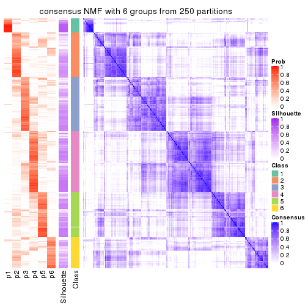</p>

</div>
</div>

Heatmaps for the membership of samples in all partitions to see how consistent they are:


<script>
$( function() {
	$( '#tabs-ATC-NMF-membership-heatmap' ).tabs();
} );
</script>
<div id='tabs-ATC-NMF-membership-heatmap'>
<ul>
<li><a href='#tab-ATC-NMF-membership-heatmap-1'>k = 2</a></li>
<li><a href='#tab-ATC-NMF-membership-heatmap-2'>k = 3</a></li>
<li><a href='#tab-ATC-NMF-membership-heatmap-3'>k = 4</a></li>
<li><a href='#tab-ATC-NMF-membership-heatmap-4'>k = 5</a></li>
<li><a href='#tab-ATC-NMF-membership-heatmap-5'>k = 6</a></li>
</ul>
<div id='tab-ATC-NMF-membership-heatmap-1'>
<pre><code class="r">membership_heatmap(res, k = 2)
</code></pre>

<p></p>

</div>
<div id='tab-ATC-NMF-membership-heatmap-2'>
<pre><code class="r">membership_heatmap(res, k = 3)
</code></pre>

<p></p>

</div>
<div id='tab-ATC-NMF-membership-heatmap-3'>
<pre><code class="r">membership_heatmap(res, k = 4)
</code></pre>

<p></p>

</div>
<div id='tab-ATC-NMF-membership-heatmap-4'>
<pre><code class="r">membership_heatmap(res, k = 5)
</code></pre>

<p>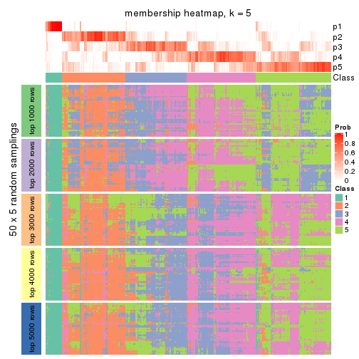</p>

</div>
<div id='tab-ATC-NMF-membership-heatmap-5'>
<pre><code class="r">membership_heatmap(res, k = 6)
</code></pre>

<p></p>

</div>
</div>

As soon as we have had the classes for columns, we can look for signatures
which are significantly different between classes which can be candidate marks
for certain classes. Following are the heatmaps for signatures.


Signature heatmaps where rows are scaled:


<script>
$( function() {
	$( '#tabs-ATC-NMF-get-signatures' ).tabs();
} );
</script>
<div id='tabs-ATC-NMF-get-signatures'>
<ul>
<li><a href='#tab-ATC-NMF-get-signatures-1'>k = 2</a></li>
<li><a href='#tab-ATC-NMF-get-signatures-2'>k = 3</a></li>
<li><a href='#tab-ATC-NMF-get-signatures-3'>k = 4</a></li>
<li><a href='#tab-ATC-NMF-get-signatures-4'>k = 5</a></li>
<li><a href='#tab-ATC-NMF-get-signatures-5'>k = 6</a></li>
</ul>
<div id='tab-ATC-NMF-get-signatures-1'>
<pre><code class="r">get_signatures(res, k = 2)
</code></pre>

<p></p>

</div>
<div id='tab-ATC-NMF-get-signatures-2'>
<pre><code class="r">get_signatures(res, k = 3)
</code></pre>

<p></p>

</div>
<div id='tab-ATC-NMF-get-signatures-3'>
<pre><code class="r">get_signatures(res, k = 4)
</code></pre>

<p></p>

</div>
<div id='tab-ATC-NMF-get-signatures-4'>
<pre><code class="r">get_signatures(res, k = 5)
</code></pre>

<p></p>

</div>
<div id='tab-ATC-NMF-get-signatures-5'>
<pre><code class="r">get_signatures(res, k = 6)
</code></pre>

<p></p>

</div>
</div>


Signature heatmaps where rows are not scaled:


<script>
$( function() {
	$( '#tabs-ATC-NMF-get-signatures-no-scale' ).tabs();
} );
</script>
<div id='tabs-ATC-NMF-get-signatures-no-scale'>
<ul>
<li><a href='#tab-ATC-NMF-get-signatures-no-scale-1'>k = 2</a></li>
<li><a href='#tab-ATC-NMF-get-signatures-no-scale-2'>k = 3</a></li>
<li><a href='#tab-ATC-NMF-get-signatures-no-scale-3'>k = 4</a></li>
<li><a href='#tab-ATC-NMF-get-signatures-no-scale-4'>k = 5</a></li>
<li><a href='#tab-ATC-NMF-get-signatures-no-scale-5'>k = 6</a></li>
</ul>
<div id='tab-ATC-NMF-get-signatures-no-scale-1'>
<pre><code class="r">get_signatures(res, k = 2, scale_rows = FALSE)
</code></pre>

<p></p>

</div>
<div id='tab-ATC-NMF-get-signatures-no-scale-2'>
<pre><code class="r">get_signatures(res, k = 3, scale_rows = FALSE)
</code></pre>

<p></p>

</div>
<div id='tab-ATC-NMF-get-signatures-no-scale-3'>
<pre><code class="r">get_signatures(res, k = 4, scale_rows = FALSE)
</code></pre>

<p></p>

</div>
<div id='tab-ATC-NMF-get-signatures-no-scale-4'>
<pre><code class="r">get_signatures(res, k = 5, scale_rows = FALSE)
</code></pre>

<p></p>

</div>
<div id='tab-ATC-NMF-get-signatures-no-scale-5'>
<pre><code class="r">get_signatures(res, k = 6, scale_rows = FALSE)
</code></pre>

<p></p>

</div>
</div>


Compare the overlap of signatures from different k:

```r
compare_signatures(res)
```


`get_signature()` returns a data frame invisibly. TO get the list of signatures, the function
call should be assigned to a variable explicitly. In following code, if `plot` argument is set
to `FALSE`, no heatmap is plotted while only the differential analysis is performed.

```r
# code only for demonstration
tb = get_signature(res, k = ..., plot = FALSE)
```

An example of the output of `tb` is:

```
#>   which_row         fdr    mean_1    mean_2 scaled_mean_1 scaled_mean_2 km
#> 1        38 0.042760348  8.373488  9.131774    -0.5533452     0.5164555  1
#> 2        40 0.018707592  7.106213  8.469186    -0.6173731     0.5762149  1
#> 3        55 0.019134737 10.221463 11.207825    -0.6159697     0.5749050  1
#> 4        59 0.006059896  5.921854  7.869574    -0.6899429     0.6439467  1
#> 5        60 0.018055526  8.928898 10.211722    -0.6204761     0.5791110  1
#> 6        98 0.009384629 15.714769 14.887706     0.6635654    -0.6193277  2
...
```

The columns in `tb` are:

1. `which_row`: row indices corresponding to the input matrix.
2. `fdr`: FDR for the differential test. 
3. `mean_x`: The mean value in group x.
4. `scaled_mean_x`: The mean value in group x after rows are scaled.
5. `km`: Row groups if k-means clustering is applied to rows.


UMAP plot which shows how samples are separated.


<script>
$( function() {
	$( '#tabs-ATC-NMF-dimension-reduction' ).tabs();
} );
</script>
<div id='tabs-ATC-NMF-dimension-reduction'>
<ul>
<li><a href='#tab-ATC-NMF-dimension-reduction-1'>k = 2</a></li>
<li><a href='#tab-ATC-NMF-dimension-reduction-2'>k = 3</a></li>
<li><a href='#tab-ATC-NMF-dimension-reduction-3'>k = 4</a></li>
<li><a href='#tab-ATC-NMF-dimension-reduction-4'>k = 5</a></li>
<li><a href='#tab-ATC-NMF-dimension-reduction-5'>k = 6</a></li>
</ul>
<div id='tab-ATC-NMF-dimension-reduction-1'>
<pre><code class="r">dimension_reduction(res, k = 2, method = &quot;UMAP&quot;)
</code></pre>

<p></p>

</div>
<div id='tab-ATC-NMF-dimension-reduction-2'>
<pre><code class="r">dimension_reduction(res, k = 3, method = &quot;UMAP&quot;)
</code></pre>

<p></p>

</div>
<div id='tab-ATC-NMF-dimension-reduction-3'>
<pre><code class="r">dimension_reduction(res, k = 4, method = &quot;UMAP&quot;)
</code></pre>

<p></p>

</div>
<div id='tab-ATC-NMF-dimension-reduction-4'>
<pre><code class="r">dimension_reduction(res, k = 5, method = &quot;UMAP&quot;)
</code></pre>

<p></p>

</div>
<div id='tab-ATC-NMF-dimension-reduction-5'>
<pre><code class="r">dimension_reduction(res, k = 6, method = &quot;UMAP&quot;)
</code></pre>

<p></p>

</div>
</div>


Following heatmap shows how subgroups are split when increasing `k`:

```r
collect_classes(res)
```


If matrix rows can be associated to genes, consider to use `functional_enrichment(res,
...)` to perform function enrichment for the signature genes. See [this vignette](http://bioconductor.org/packages/devel/bioc/vignettes/cola/inst/doc/functional_enrichment.html) for more detailed explanations.


 

## Session info


```r
sessionInfo()
```

```
#> R version 3.6.0 (2019-04-26)
#> Platform: x86_64-pc-linux-gnu (64-bit)
#> Running under: CentOS Linux 7 (Core)
#> 
#> Matrix products: default
#> BLAS:   /usr/lib64/libblas.so.3.4.2
#> LAPACK: /usr/lib64/liblapack.so.3.4.2
#> 
#> locale:
#>  [1] LC_CTYPE=en_GB.UTF-8       LC_NUMERIC=C               LC_TIME=en_GB.UTF-8       
#>  [4] LC_COLLATE=en_GB.UTF-8     LC_MONETARY=en_GB.UTF-8    LC_MESSAGES=en_GB.UTF-8   
#>  [7] LC_PAPER=en_GB.UTF-8       LC_NAME=C                  LC_ADDRESS=C              
#> [10] LC_TELEPHONE=C             LC_MEASUREMENT=en_GB.UTF-8 LC_IDENTIFICATION=C       
#> 
#> attached base packages:
#> [1] grid      stats     graphics  grDevices utils     datasets  methods   base     
#> 
#> other attached packages:
#> [1] genefilter_1.66.0    ComplexHeatmap_2.3.1 markdown_1.1         knitr_1.26          
#> [5] GetoptLong_0.1.7     cola_1.3.2          
#> 
#> loaded via a namespace (and not attached):
#>  [1] circlize_0.4.8       shape_1.4.4          xfun_0.11            slam_0.1-46         
#>  [5] lattice_0.20-38      splines_3.6.0        colorspace_1.4-1     vctrs_0.2.0         
#>  [9] stats4_3.6.0         blob_1.2.0           XML_3.98-1.20        survival_2.44-1.1   
#> [13] rlang_0.4.2          pillar_1.4.2         DBI_1.0.0            BiocGenerics_0.30.0 
#> [17] bit64_0.9-7          RColorBrewer_1.1-2   matrixStats_0.55.0   stringr_1.4.0       
#> [21] GlobalOptions_0.1.1  evaluate_0.14        memoise_1.1.0        Biobase_2.44.0      
#> [25] IRanges_2.18.3       parallel_3.6.0       AnnotationDbi_1.46.1 highr_0.8           
#> [29] Rcpp_1.0.3           xtable_1.8-4         backports_1.1.5      S4Vectors_0.22.1    
#> [33] annotate_1.62.0      skmeans_0.2-11       bit_1.1-14           microbenchmark_1.4-7
#> [37] brew_1.0-6           impute_1.58.0        rjson_0.2.20         png_0.1-7           
#> [41] digest_0.6.23        stringi_1.4.3        polyclip_1.10-0      clue_0.3-57         
#> [45] tools_3.6.0          bitops_1.0-6         magrittr_1.5         eulerr_6.0.0        
#> [49] RCurl_1.95-4.12      RSQLite_2.1.4        tibble_2.1.3         cluster_2.1.0       
#> [53] crayon_1.3.4         pkgconfig_2.0.3      zeallot_0.1.0        Matrix_1.2-17       
#> [57] xml2_1.2.2           httr_1.4.1           R6_2.4.1             mclust_5.4.5        
#> [61] compiler_3.6.0
```


